# Docker — Complete Interview Prep (All Topics, One File)

> Domain: Docker | Level: Beginner → Expert | Prerequisite: [[../23-Kubernetes/01-Kubernetes-Interview-Prep]] (containerd/CRI, pods)
> **Quick-prep edition** (consolidated 2026-10-03). This one file replaces Modules 81–84. Originals: `git show ebb2d5c:24-Docker/<file>.md`
> Each topic has: **Key concepts → Dockerfile/CLI/Compose example → Most common interview questions with answers.**

| # | Topic | # | Topic |
|---|---|---|---|
| 1 | Containers vs VMs; Docker architecture | 7 | Container security & hardening |
| 2 | Images, layers & OverlayFS | 8 | Networking |
| 3 | Build cache & BuildKit | 9 | Volumes & data |
| 4 | Multi-stage builds & base images | 10 | Docker Compose |
| 5 | .NET Dockerfiles done right | 11 | Registries, tagging & supply chain |
| 6 | Runtime internals: namespaces, cgroups, capabilities, seccomp | 12 | Production patterns & troubleshooting |
| | | 13 | Top 30 rapid-fire + Principal · 14 Mistakes checklist |

---

## 1. Containers vs VMs; Docker Architecture

**Key concepts**
- A **container is a process** (or process tree) isolated by kernel **namespaces** and limited by **cgroups**, running from an **image** filesystem. It **shares the host kernel** — unlike a VM, which runs its own kernel on a hypervisor.
- **Containers:** fast start (ms–s), small, dense, but a weaker isolation boundary (a kernel exploit = escape). **VMs:** stronger isolation, heavier. Sandboxed runtimes (gVisor, Kata Containers, Firecracker microVMs) bridge the gap.
- **Docker architecture:** CLI → **dockerd** (API) → **containerd** (container lifecycle, images) → **runc** (OCI runtime that creates namespaces/cgroups). Kubernetes talks to containerd via CRI (dockershim was removed in K8s 1.24 — images built with Docker still run everywhere because they're **OCI images**).
- **OCI** standards: image spec, runtime spec, distribution spec.

**Common interview questions**

**Q1. Container vs VM?**
A VM virtualizes hardware and runs a full guest OS kernel; a container virtualizes the OS — processes share the host kernel but get isolated views (namespaces) and resource limits (cgroups). Containers are lighter and faster; VMs give stronger isolation. For untrusted multi-tenant code, use VMs or sandboxed runtimes.

**Q2. Kubernetes removed Docker — do Docker images still work?**
Yes. Kubernetes removed the dockershim (Docker Engine as the runtime), not support for images. Docker builds standard OCI images that containerd/CRI-O run.

---

## 2. Images, Layers & OverlayFS

**Key concepts**
- An image = an ordered stack of **read-only layers** (each Dockerfile instruction that changes the filesystem creates one) + config (env, entrypoint, user) + a **manifest**; layers are **content-addressed** (SHA-256 digest) → deduplicated across images, cached, shared.
- A running container adds a thin **writable layer** on top (**copy-on-write**): modifying a file copies the whole file up from the lower layer.
- **OverlayFS:** `lowerdir` (image layers), `upperdir` (container writes), `merged` (the view).
- **Deleting a file in a later layer doesn't shrink the image** — the bytes remain in the earlier layer (and secrets copied in an earlier layer are still extractable!).
- **Tags are mutable pointers; digests are immutable** (`image@sha256:...`).
- Inspect: `docker history`, `docker image inspect`, `dive` for layer analysis.

```bash
docker history --no-trunc myapp:1.0          # layer-by-layer sizes and commands
docker image inspect myapp:1.0 --format '{{.RootFS.Layers}}'
docker pull myacr.azurecr.io/payments-api@sha256:3f1c...   # immutable reference
```

**Common interview questions**

**Q1. We `RUN rm` a 500 MB file and the image is still big. Why?**
Each instruction creates a layer; the file still exists in the earlier layer, and the `rm` layer only adds a whiteout marker. Remove it in the same `RUN` that created it, or better, use a multi-stage build so the file never reaches the final image.

**Q2. Tag vs digest?**
A tag (`1.42.0`, `latest`) can be moved to a different image; a digest is a content hash that always refers to the same bytes. Deploy by digest (or immutable tags enforced by the registry) for reproducibility and supply-chain safety.

---

## 3. Build Cache & BuildKit

**Key concepts**
- Docker caches each layer; a cache miss invalidates **all subsequent layers** → order instructions from least to most frequently changing.
- **Copy dependency manifests first, restore, then copy source** — a code change doesn't re-download packages.
- **BuildKit** (default builder): parallel DAG execution of stages, **cache mounts** (`--mount=type=cache` for NuGet/npm caches), **secret mounts** (`--mount=type=secret` — never written to a layer), SSH mounts, remote cache (`--cache-from/--cache-to` registry/GHA cache), multi-platform builds (`buildx --platform linux/amd64,linux/arm64`).
- `.dockerignore` reduces the build context (exclude `bin/`, `obj/`, `.git`, secrets) and prevents accidental leaks.

```dockerfile
# syntax=docker/dockerfile:1
FROM mcr.microsoft.com/dotnet/sdk:9.0 AS build
WORKDIR /src
COPY ["Payments.Api/Payments.Api.csproj", "Payments.Api/"]
COPY ["Directory.Packages.props", "nuget.config", "./"]
RUN --mount=type=cache,target=/root/.nuget/packages \
    --mount=type=secret,id=nugettoken,env=NUGET_TOKEN \
    dotnet restore "Payments.Api/Payments.Api.csproj"        # private feed token never stored in a layer
COPY . .
RUN --mount=type=cache,target=/root/.nuget/packages \
    dotnet publish "Payments.Api/Payments.Api.csproj" -c Release -o /app/publish --no-restore
```

```bash
DOCKER_BUILDKIT=1 docker buildx build --secret id=nugettoken,env=NUGET_TOKEN \
  --cache-from type=registry,ref=myacr.azurecr.io/payments-api:buildcache \
  --cache-to type=registry,ref=myacr.azurecr.io/payments-api:buildcache,mode=max \
  --platform linux/amd64,linux/arm64 -t myacr.azurecr.io/payments-api:1.42.0 --push .
```

**Common interview questions**

**Q1. CI builds take 12 minutes; every commit re-downloads all packages. Fix?**
Reorder the Dockerfile so dependency files are copied and restored before the source; use BuildKit cache mounts and a remote layer cache (`--cache-from/--cache-to`) because CI runners are ephemeral; trim the build context with `.dockerignore`.

**Q2. How do you use a private NuGet token during the build safely?**
A BuildKit secret mount (`--mount=type=secret`) exposes it only during that `RUN` instruction; it's never written to a layer or image history. `ARG`/`ENV` secrets leak into image metadata and layers.

---

## 4. Multi-Stage Builds & Base Images

**Key concepts**
- **Multi-stage builds:** compile in a full SDK stage, copy only the published output into a minimal runtime stage → small images, no compilers/tools/source/secrets in production.
- Named stages and `--target` (build a `test` stage in CI, a `final` stage for prod).
- **Base image choices for .NET:** `aspnet` (Debian), `-alpine` (musl libc — smaller; watch globalization/ICU and native dependencies), **chiseled Ubuntu** (`-noble-chiseled`: distroless-style, no shell or package manager, non-root by default), `runtime-deps` for self-contained/NativeAOT apps, `scratch` only for fully static binaries.
- Smaller images = faster pulls, faster scale-out, smaller attack surface; but minimal images have no shell (debug with ephemeral containers).

```dockerfile
# syntax=docker/dockerfile:1
FROM mcr.microsoft.com/dotnet/sdk:9.0 AS build
WORKDIR /src
COPY Payments.Api/*.csproj Payments.Api/
RUN dotnet restore Payments.Api/Payments.Api.csproj
COPY . .
RUN dotnet publish Payments.Api/Payments.Api.csproj -c Release -o /app --no-restore /p:UseAppHost=false

FROM build AS test
RUN dotnet test Payments.Tests/Payments.Tests.csproj -c Release --no-restore

FROM mcr.microsoft.com/dotnet/aspnet:9.0-noble-chiseled AS final
WORKDIR /app
COPY --from=build /app .
USER $APP_UID                      # non-root (chiseled images also default to non-root)
EXPOSE 8080
ENTRYPOINT ["dotnet", "Payments.Api.dll"]
```

**Common interview questions**

**Q1. Why multi-stage builds?**
They separate build-time needs (SDK, tools, source, caches, secrets) from runtime needs, so the final image contains only the app and its runtime — typically 3–10× smaller, with a smaller attack surface and no leaked build artefacts.

**Q2. Alpine, chiseled or Debian for .NET?**
Chiseled Ubuntu for production (tiny, no shell or package manager, non-root, glibc compatibility). Alpine is small but uses musl (native library and globalization quirks). Debian-based `aspnet` when you need tools inside the image or have native dependencies.

---

## 5. .NET Dockerfiles Done Right

**Checklist**
- Multi-stage; restore before copying source; `.dockerignore` (`bin/`, `obj/`, `.git`, `*.user`, secrets).
- Non-root user (`USER $APP_UID`), port 8080 (default in .NET 8+ images), `ASPNETCORE_HTTP_PORTS`.
- Health endpoints for orchestrator probes (don't rely on `HEALTHCHECK` in Kubernetes — use probes).
- Container-aware runtime: .NET respects cgroup limits; consider `DOTNET_GCHeapHardLimitPercent`, Server GC vs Workstation, `DOTNET_TieredPGO`, ReadyToRun or NativeAOT for startup.
- Globalization: install ICU or set `DOTNET_SYSTEM_GLOBALIZATION_INVARIANT=true` deliberately.
- **.NET SDK container publishing without a Dockerfile:** `dotnet publish /t:PublishContainer` (Microsoft.NET.Build.Containers).
- Pin base images by digest in regulated environments and rebuild regularly for patches.

```bash
# Build an OCI image straight from the SDK (no Dockerfile)
dotnet publish Payments.Api -c Release /t:PublishContainer \
  -p:ContainerRepository=payments-api -p:ContainerImageTag=1.42.0 \
  -p:ContainerBaseImage=mcr.microsoft.com/dotnet/aspnet:9.0-noble-chiseled
```

```text
# .dockerignore
**/bin
**/obj
.git
.vs
**/*.user
**/appsettings.*.local.json
**/.env
```

**Common interview question**

**Q. Your .NET container is OOMKilled though the app seems to use little memory. Why?**
The GC sizes heaps based on the container limit (Server GC can create one heap per core with large budgets); native memory (TLS, compression, DB drivers), thread stacks and memory-mapped files count too; a limit set too close to steady-state leaves no headroom. Use `GCHeapHardLimitPercent`, DATAS (.NET 8+), right-sized limits, and measure RSS vs managed heap.

---

## 6. Runtime Internals: Namespaces, cgroups, Capabilities, seccomp

**Key concepts**
- **Namespaces (isolation of views):** **PID** (own process tree; PID 1 in the container), **NET** (own interfaces, IPs, ports), **MNT** (own filesystem mounts), **UTS** (hostname), **IPC**, **USER** (UID mapping — root inside ≠ root outside with user namespaces), **cgroup** namespace.
- **cgroups (resource limits):** CPU (shares/quota → throttling), memory (limit → OOM kill), PIDs, block I/O. cgroups v2 unified hierarchy.
- **Shared kernel** = the main risk: a kernel vulnerability or excessive privileges allows escape → defence in depth.
- **Linux capabilities:** root split into ~40 privileges (`NET_BIND_SERVICE`, `SYS_ADMIN`, `NET_ADMIN`…). Docker drops many by default; drop all and add only what's needed. **`--privileged`** gives everything — effectively host root.
- **seccomp:** restricts which syscalls a process can make (Docker default profile blocks ~40+ dangerous ones). **AppArmor/SELinux:** mandatory access control.
- **Rootless containers** and user namespaces reduce the blast radius of an escape.
- **PID 1 problem:** PID 1 must handle signals and reap zombies — use `exec`-form `ENTRYPOINT ["dotnet", "app.dll"]` (not shell form) or `--init`/tini, so SIGTERM reaches the app for graceful shutdown.

```bash
docker run --rm --read-only --tmpfs /tmp \
  --cap-drop ALL --security-opt no-new-privileges \
  --memory 512m --cpus 1 --pids-limit 200 \
  --user 10001:10001 -p 8080:8080 payments-api:1.42.0
```

**Common interview questions**

**Q1. Namespaces vs cgroups?**
Namespaces control what a process can *see* (processes, network, mounts, users); cgroups control how much it can *use* (CPU, memory, PIDs, I/O). A container needs both.

**Q2. Why is `--privileged` dangerous?**
It grants all capabilities, access to host devices, and disables seccomp/AppArmor confinement — a process can then trivially escape to the host (mount the host disk, load kernel modules). Never use it for applications; grant specific capabilities if truly needed.

**Q3. Why doesn't my container stop gracefully?**
Shell-form `ENTRYPOINT`/`CMD` runs the app under `/bin/sh -c`, which doesn't forward SIGTERM; Docker waits the timeout and SIGKILLs. Use exec form so the app is PID 1 and receives SIGTERM (ASP.NET Core then drains), or use an init process.

---

## 7. Container Security & Hardening

**Checklist**
- Minimal base images (chiseled/distroless), regularly rebuilt for CVE patches; pin by digest.
- **Non-root user**, read-only root filesystem, drop all capabilities, `no-new-privileges`, seccomp default.
- **No secrets in images** (no `ENV`/`ARG` secrets, no copied `.env`); inject at runtime from a secret store; BuildKit secret mounts at build time.
- **Image scanning** (Trivy, Grype, Defender, ECR/ACR scanning) in CI with severity gates; **SBOMs** (Syft); **signing** (Cosign/Notation) and verification at deploy (admission policies).
- Trusted registries only; restrict `docker.sock` mounting (gives root on the host).
- Limit resources (memory, CPU, PIDs) to contain DoS.

**Common interview questions**

**Q1. A secret was found in an old image layer. What do you do?**
Rotate the secret immediately (assume compromise), delete/untag affected images from registries and caches, rebuild without the secret (BuildKit secret mounts / runtime injection), add secret scanning for images and repos in CI, and review registry access logs.

**Q2. How do you secure the container supply chain?**
Trusted base images, reproducible builds in CI (not developer laptops), SBOM generation, vulnerability scanning with policy gates, image signing and provenance (SLSA), verification at admission, immutable tags/digests, and regular rebuilds for patches.

**Q3. Why is mounting `/var/run/docker.sock` into a container risky?**
Access to the Docker socket means full control of the Docker daemon — the container can start privileged containers and mount the host filesystem, i.e., root on the host. Avoid it; use rootless builders (BuildKit rootless, Kaniko) for CI.

---

## 8. Networking

**Key concepts**
- **Drivers:** **bridge** (default; NAT; user-defined bridges give **DNS by container name**), **host** (shares the host network — no isolation, no port mapping), **none**, **overlay** (multi-host, Swarm), macvlan/ipvlan.
- Port publishing `-p 8080:8080` maps host → container; containers on the same user-defined network talk via names and container ports.
- The default bridge has no automatic DNS → always create user-defined networks.
- Inside a container, `localhost` is the container itself, not the host (`host.docker.internal` on Docker Desktop).

```bash
docker network create payments-net
docker run -d --name sql --network payments-net mcr.microsoft.com/mssql/server:2022-latest
docker run -d --name api --network payments-net -e ConnectionStrings__Db="Server=sql;..." -p 8080:8080 payments-api:1.42.0
```

**Common interview question**

**Q. My API can't connect to the DB container at `localhost`. Why?**
Each container has its own network namespace; `localhost` is the API container itself. Put both on a user-defined network and use the DB container's name as the host (Compose does this automatically with service names).

---

## 9. Volumes & Data

**Key concepts**
- The container's writable layer is **ephemeral** (lost when the container is removed) and slow (copy-on-write).
- **Named volumes** (managed by Docker, best for data), **bind mounts** (host path — great for dev source mounting, risky in prod), **tmpfs** (in-memory, secrets/scratch).
- Volumes outlive containers; back them up; in Kubernetes the equivalent is PersistentVolumes.
- Stateless containers are the norm in production; state lives in managed databases/object storage.

```bash
docker volume create pgdata
docker run -d --name pg -v pgdata:/var/lib/postgresql/data -e POSTGRES_PASSWORD_FILE=/run/secrets/pg postgres:17
```

---

## 10. Docker Compose

**Key concepts**
- Declarative multi-container apps for **local development, integration testing and simple single-host deployments**: services, networks, volumes, env files, profiles, override files (`compose.override.yaml`, `-f compose.prod.yaml`).
- **`depends_on` only waits for the container to *start*, not to be *ready*** → use `condition: service_healthy` with a healthcheck (and still make the app retry connections).
- Resource limits (`deploy.resources`), restart policies, secrets.
- **Compose vs Kubernetes:** Compose for one host (no self-healing across nodes, no rolling updates, no autoscaling); Kubernetes for multi-node production. For .NET dev, **.NET Aspire** is an alternative orchestration for local dev.

```yaml
# compose.yaml
services:
  api:
    build: { context: ., dockerfile: Payments.Api/Dockerfile }
    ports: ["8080:8080"]
    environment:
      ConnectionStrings__Db: "Server=sql;Database=Payments;User Id=sa;Password=${SA_PASSWORD};TrustServerCertificate=True"
      Redis__Connection: "redis:6379"
    depends_on:
      sql:   { condition: service_healthy }
      redis: { condition: service_started }
    deploy: { resources: { limits: { cpus: "1.0", memory: 512M } } }
    restart: unless-stopped
  sql:
    image: mcr.microsoft.com/mssql/server:2022-latest
    environment: { ACCEPT_EULA: "Y", MSSQL_SA_PASSWORD: "${SA_PASSWORD}" }
    healthcheck:
      test: ["CMD-SHELL", "/opt/mssql-tools18/bin/sqlcmd -S localhost -U sa -P \"$$MSSQL_SA_PASSWORD\" -C -Q 'SELECT 1' || exit 1"]
      interval: 10s
      retries: 10
    volumes: ["sqldata:/var/opt/mssql"]
  redis:
    image: redis:7-alpine
volumes: { sqldata: {} }
```

**Common interview questions**

**Q1. The API starts before SQL Server is ready and crashes. Fix?**
`depends_on` with `condition: service_healthy` plus a real healthcheck on SQL Server — and resilient startup in the app (connection retries via EF Core `EnableRetryOnFailure`/Polly), because readiness ordering isn't guaranteed in production either.

**Q2. When is Compose enough and when do you need Kubernetes?**
Compose for local dev, CI integration tests and small single-host deployments. Kubernetes (or ECS/Container Apps) when you need multiple hosts, self-healing, rolling deployments, autoscaling, service discovery across nodes and policy enforcement.

---

## 11. Registries, Tagging & Supply Chain

- Registries: ECR, ACR, GHCR, Docker Hub (rate limits on anonymous pulls → mirror/pull-through cache), Harbor.
- **Tagging strategy:** immutable version tags (`1.42.0`) + git SHA (`sha-3f1c2a`); never deploy `latest`; enable tag immutability; deploy by digest.
- Retention/lifecycle policies to delete old images; replication across regions for DR and faster pulls.
- Promotion: build once, promote the **same digest** through environments (don't rebuild per environment).

**Common interview question**

**Q. Why "build once, promote the same image"?**
Rebuilding per environment can produce different bits (dependency changes, base image updates), so what you tested isn't what you deploy. Promoting the same digest guarantees identical artefacts; environment differences come from configuration only.

---

## 12. Production Patterns & Troubleshooting

**Patterns**
- One process per container; logs to stdout/stderr (collected by the platform); config via environment/files; secrets from stores; health endpoints; graceful shutdown; stateless; small images.

**Troubleshooting**

```bash
docker ps -a                                 # exited containers + exit codes
docker logs --tail 200 -f api
docker inspect api --format '{{.State.ExitCode}} {{.State.OOMKilled}}'
docker stats                                 # live CPU/memory per container
docker exec -it api sh                       # (not possible on chiseled images → use a debug sidecar)
docker events --since 10m
docker system df && docker system prune      # disk usage cleanup
```

| Exit code | Meaning |
|---|---|
| 0 | normal exit |
| 1 | application error |
| 137 | SIGKILL — often **OOMKilled** or stop timeout |
| 139 | segfault |
| 143 | SIGTERM (graceful stop) |

**Common interview question**

**Q. A container keeps restarting with exit code 137. Diagnose.**
137 = killed by SIGKILL: check `OOMKilled` in `docker inspect` (memory limit too low, leak, or GC not sized for the limit); otherwise the stop timeout was exceeded because SIGTERM wasn't handled (shell-form entrypoint). Fix the memory sizing or the signal handling.

---

## 13. Top 30 Rapid-Fire Questions + Principal Questions

1. **Container?** An isolated process sharing the host kernel.
2. **Isolation primitives?** Namespaces (view) + cgroups (limits).
3. **Image?** Read-only layers + config + manifest.
4. **Writable layer?** Copy-on-write, ephemeral.
5. **OverlayFS parts?** lowerdir, upperdir, merged.
6. **Delete in a later layer?** Doesn't shrink the image.
7. **Tag vs digest?** Mutable vs immutable.
8. **Cache rule?** A changed layer invalidates everything after it.
9. **Restore before copy?** Cache dependencies.
10. **Build secrets?** BuildKit secret mounts.
11. **ARG for secrets?** Leaks into history.
12. **Multi-stage?** Build in SDK, ship runtime only.
13. **.NET prod base?** Chiseled Ubuntu aspnet image.
14. **Non-root?** `USER $APP_UID`.
15. **PID 1 signals?** Exec-form ENTRYPOINT / init.
16. **`--privileged`?** Host root — never for apps.
17. **Capabilities?** Drop ALL, add the minimum.
18. **seccomp?** Syscall filtering.
19. **Rootless?** Limits escape blast radius.
20. **Default bridge DNS?** None → user-defined networks.
21. **`localhost` in a container?** The container itself.
22. **Persist data?** Named volumes.
23. **`depends_on`?** Started, not ready → healthcheck condition.
24. **Compose vs K8s?** Single host vs cluster.
25. **Exit 137?** SIGKILL/OOM.
26. **docker.sock mount?** Root on host.
27. **Scanning tools?** Trivy, Grype.
28. **Signing?** Cosign/Notation.
29. **Promote images?** Same digest across environments.
30. **No-Dockerfile .NET images?** `dotnet publish /t:PublishContainer`.

**Principal-level questions**

**P1. Define the container standard for 50 .NET teams.**
Approved base images (chiseled .NET, patched and rebuilt weekly by a platform pipeline), a template Dockerfile or SDK container publishing, non-root/read-only defaults, mandatory scanning + SBOM + signing in the shared CI template, tag immutability and digest deployment, resource and health conventions, and a vulnerability SLA (critical CVEs patched within N days) with dashboards per team.

**P2. Containers vs VMs for a multi-tenant code-execution feature?**
Plain containers share the kernel — not a sufficient boundary for untrusted code. Use microVMs (Firecracker, Kata) or gVisor sandboxes, plus network isolation, resource limits and short-lived environments.

---

## 14. Mistakes Checklist (say why each is wrong)
- [ ] `COPY . .` before restore (cache busting) · no `.dockerignore`
- [ ] Secrets in `ENV`/`ARG`/layers · deleting files in a later layer expecting a smaller image
- [ ] Single-stage images with the SDK in production · `latest` tags · rebuilding per environment
- [ ] Running as root · `--privileged` · mounting docker.sock · no capability drops
- [ ] Shell-form entrypoints (no graceful shutdown) · no health endpoints
- [ ] Relying on `depends_on` for readiness · using `localhost` between containers
- [ ] Writing important data to the container layer · bind mounts in production
- [ ] No image scanning/signing · never rebuilding base images for patches

---

## Architecture Diagrams (preserved from the original modules)

> All 16 Mermaid/ASCII diagrams from the original `24-Docker/` files, kept verbatim and grouped by source module. Originals: `git show ebb2d5c:24-Docker/<file>.md`.

### Module 81 — Docker: Images, Layers & the Union Filesystem
*Source: `01-Images-Layers-UnionFilesystem.md`*

**OverlayFS Composition**

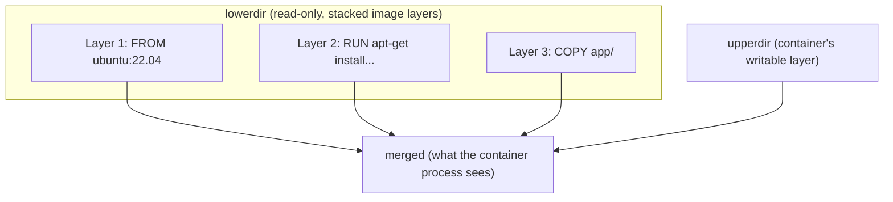

**The Whiteout-Marker Gotcha — a File "Deleted" in a Later Layer Still Occupies Space**

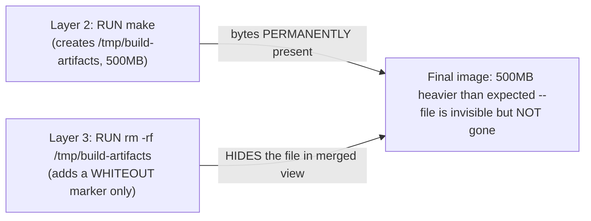

**13. Low-Level Design**

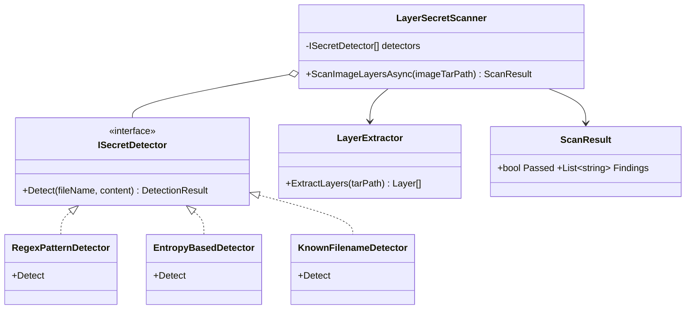

**13. Low-Level Design**

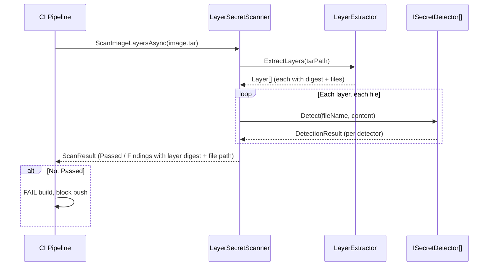

### Module 82 — Docker: Dockerfile Optimization & Multi-stage Builds
*Source: `02-Dockerfile-Optimization-MultiStageBuilds.md`*

**Multi-stage Build: Builder Stage Layers Never Reach the Shipped Image**

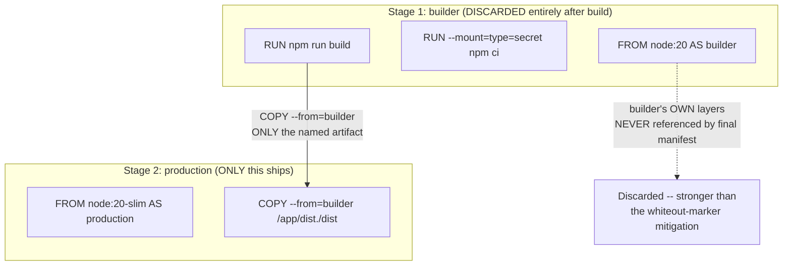

**ARG's Two Independent Exposure Surfaces**

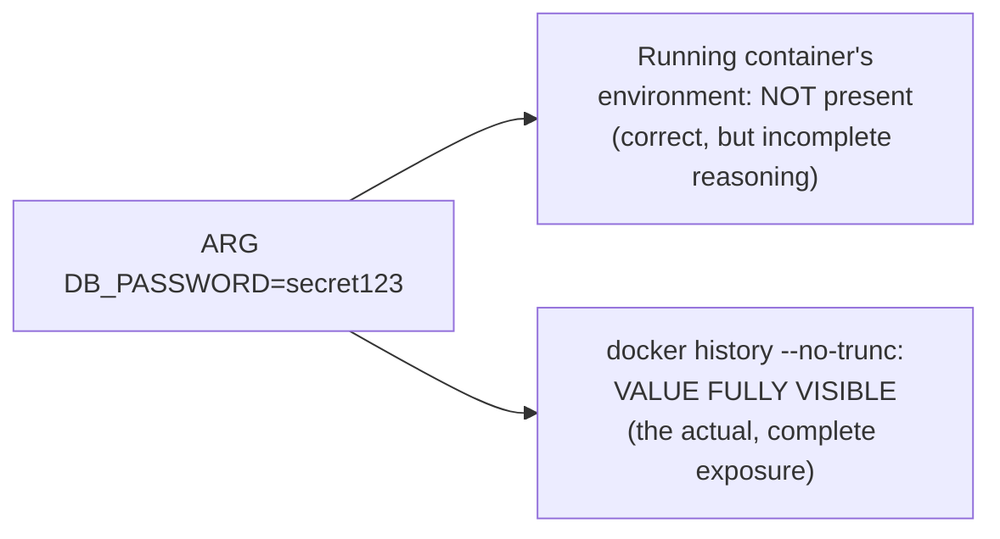

**13. Low-Level Design**

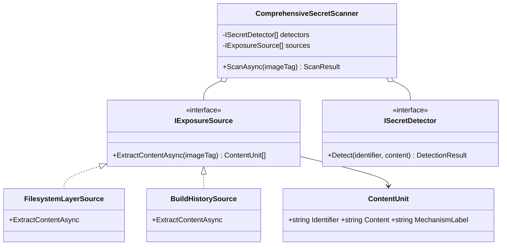

**13. Low-Level Design**

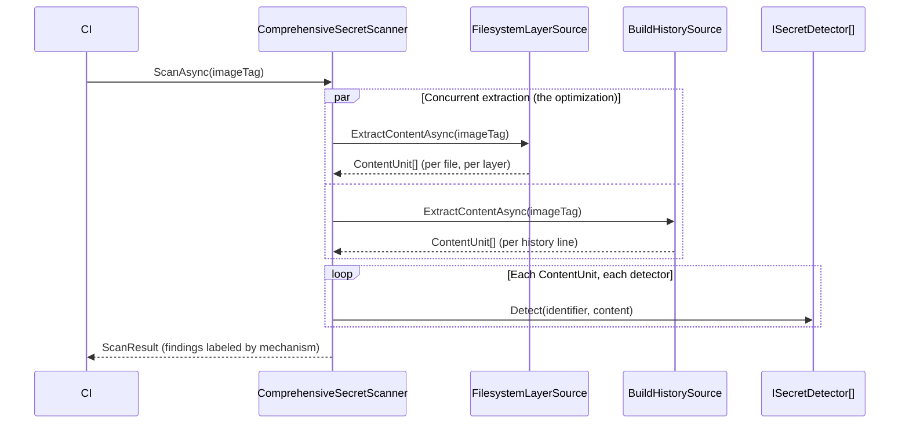

### Module 83 — Docker: Container Runtime Internals & Isolation — Namespaces, cgroups & seccomp
*Source: `03-Runtime-Internals-Namespaces-Cgroups-Seccomp.md`*

**Namespaces (Isolation) vs. cgroups (Resource Limiting) — Orthogonal Mechanisms**

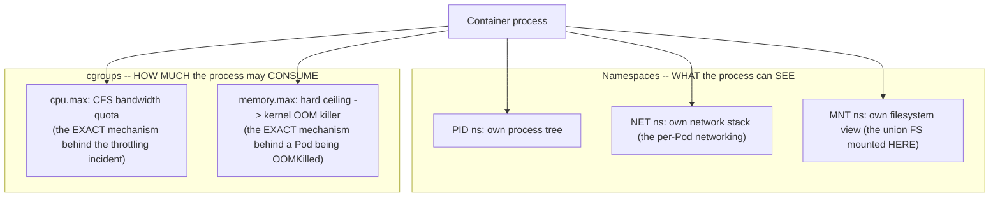

**Defense-in-Depth Layers, Collapsed by `--privileged`**

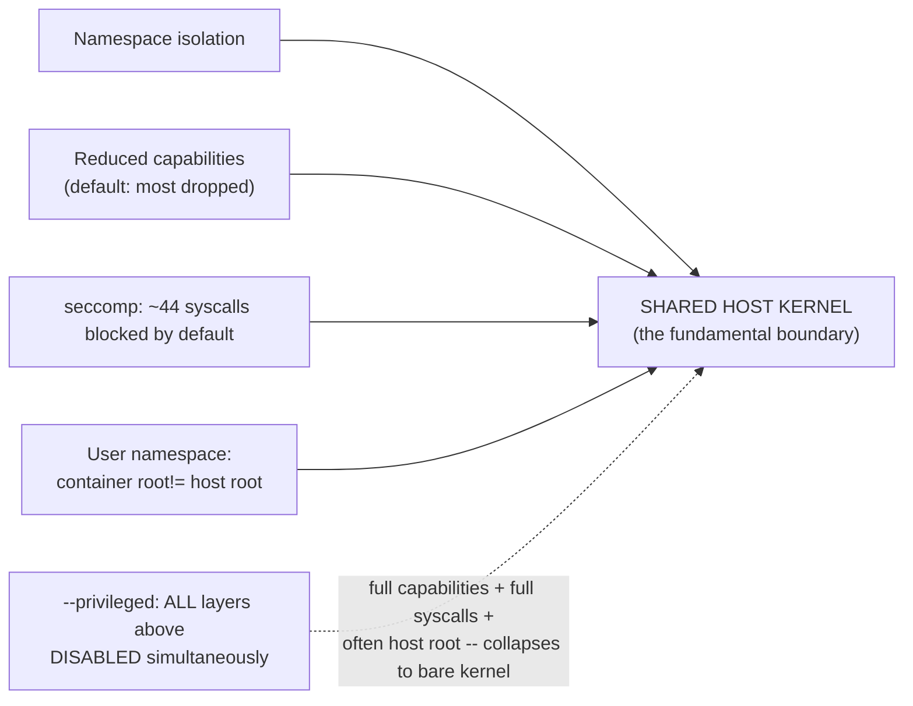

**13. Low-Level Design**

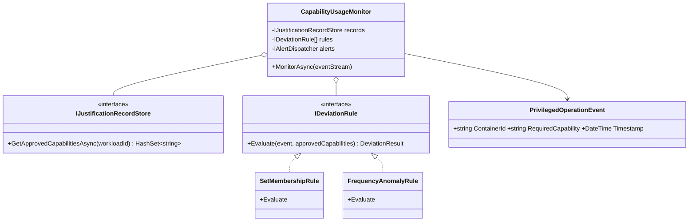

**13. Low-Level Design**

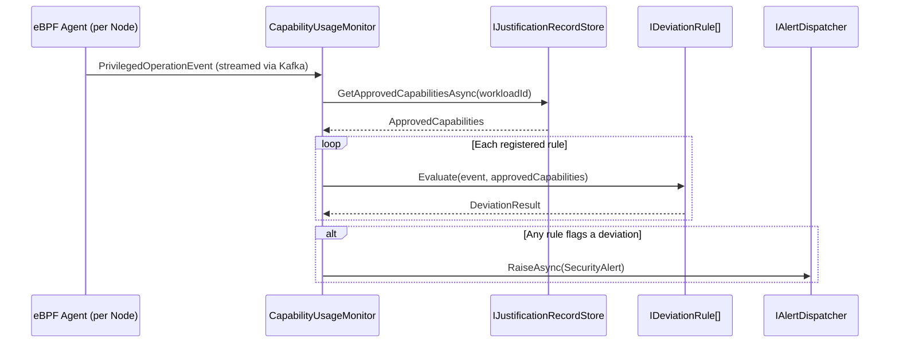

### Module 84 — Docker: Compose, Networking, Volumes & Production Patterns (Capstone)
*Source: `04-Compose-Networking-Volumes-ProductionPatterns.md`*

**`depends_on`'s Started-vs-Ready Gap**

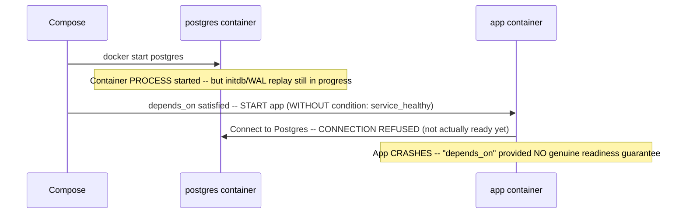

**Compose's Single-Host Model as the Direct Ancestor of Kubernetes Abstractions**

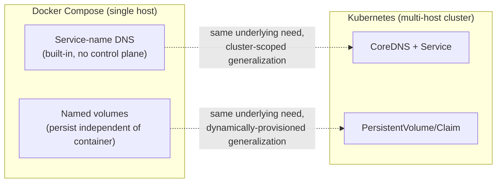

**13. Low-Level Design**

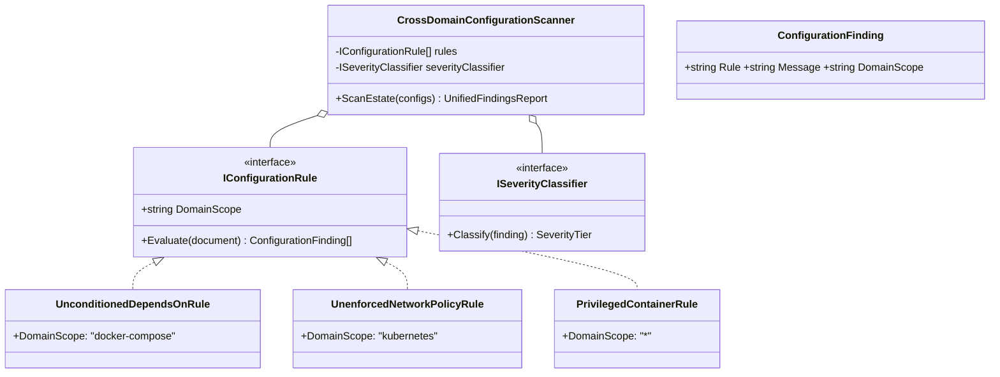

**13. Low-Level Design**

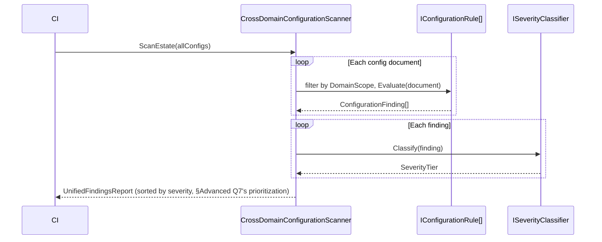
