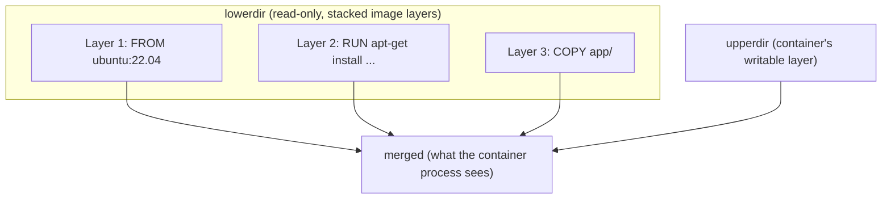
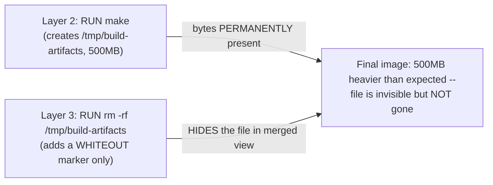
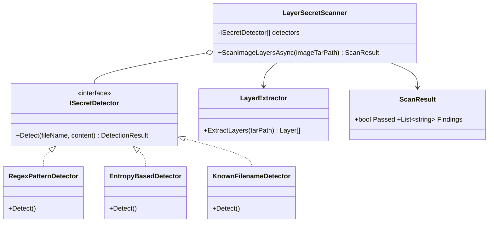
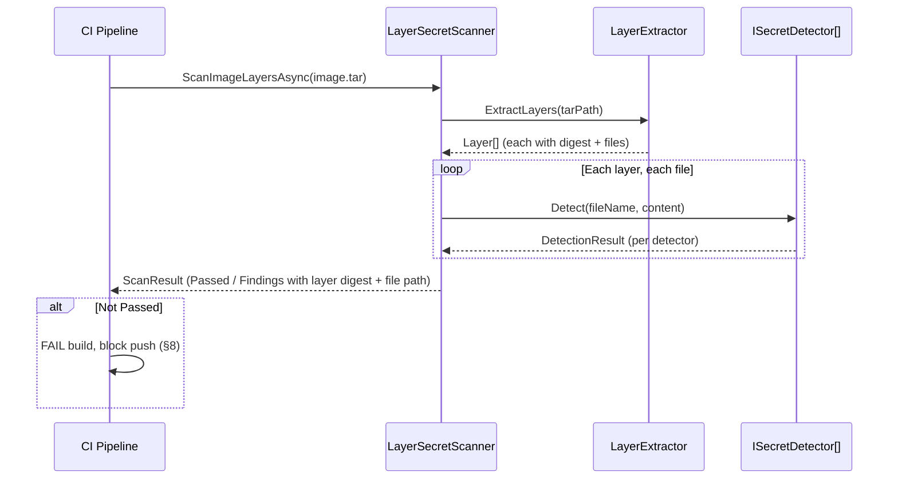

# Module 81 — Docker: Images, Layers & the Union Filesystem

> Domain: Docker | Level: Beginner → Expert | Prerequisite: [[../23-Kubernetes/01-Architecture-ControlPlane-Pods-Deployments]] §2.5 (containerd/CRI — this module covers the image format and build-time mechanics those runtimes actually execute against)
>
> **Docker domain scope (confirmed with user):** standard depth, 3–4 modules — Module 81 (this one): Images, Layers & Union Filesystem. Module 82: Dockerfile Optimization & Multi-stage Builds. Module 83: Container Runtime Internals & Isolation (namespaces/cgroups/seccomp). Module 84: Compose, Networking, Volumes & Production Patterns (capstone).

---

## 1. Fundamentals

**What:** A Docker image is an immutable, layered filesystem snapshot plus metadata (entrypoint, environment, exposed ports); a running container adds one thin, writable layer on top of an image's read-only layers. The layers are composed at runtime by a **union filesystem** — OverlayFS, the current standard driver — into a single merged view the container process actually sees.

**Why:** Nearly every practical Docker skill (writing an efficient Dockerfile, debugging a bloated image, correctly handling a build-time secret) is a direct consequence of this layered, content-addressable model — a Principal Engineer who understands *why* layer ordering affects build-cache hits, or *why* deleting a file in a later layer doesn't shrink the image, reasons from first principles rather than following memorized rules of thumb.

**When:** Any time building, optimizing, or debugging a custom Docker image — which is to say, for nearly any containerized workload, including every Kubernetes workload this course has discussed since Module 73.

**How (30,000-ft view):**
```
Dockerfile instructions -> each filesystem-modifying instruction produces ONE new,
     immutable layer, identified by a content hash
Layers are CONTENT-ADDRESSABLE: identical layers across different images are
     stored ONCE and shared/deduplicated, both locally and in a registry
OverlayFS composes: lowerdir (stacked, read-only image layers) + upperdir
     (the container's own writable layer) + merged (what the process sees)
Copy-on-write: modifying a file that exists in a lower layer copies the WHOLE
     file up to upperdir first, before the modification is applied
```

---

## 2. Deep Dive

### 2.1 Layers and Content-Addressable Storage
Every Dockerfile instruction that modifies the filesystem (`RUN`, `COPY`, `ADD`) produces a new layer, identified by a SHA256 digest of its content — non-filesystem instructions (`ENV`, `LABEL`, `EXPOSE`) modify only image metadata, not a filesystem layer. Because layers are content-addressable, two different images sharing an identical base layer (the same `FROM ubuntu:22.04`, for instance) store that layer's actual bytes exactly once on disk and in a registry — this deduplication is why a fleet of application images built `FROM` the same base doesn't multiply storage/transfer cost per the number of derived images.

### 2.2 OverlayFS — Lowerdir, Upperdir, Merged, and Whole-File Copy-on-Write
OverlayFS stacks the image's read-only layers as `lowerdir` entries, adds the container's own writable layer as `upperdir`, and presents the composed result as `merged` — the single filesystem view the container process actually operates against. A critical, sometimes-surprising performance characteristic: OverlayFS's copy-on-write is **whole-file**, not byte-level — modifying even a single byte of a large file that exists in a lower, read-only layer requires copying the **entire file** up into `upperdir` first, before the modification is applied — a container workload that frequently, incrementally modifies a large file already present in the image (a large log or database file baked into the image rather than mounted as a volume) pays this whole-file copy-up cost repeatedly, a genuine, non-obvious performance trap.

### 2.3 The Build Cache — Layer Ordering Directly Determines CI Build Time
Docker (via BuildKit, §2.6) caches each layer keyed by its instruction plus the cache state of every preceding layer — a cache **miss** at any layer invalidates every subsequent layer's cache too, regardless of whether those later instructions themselves changed. This makes **Dockerfile instruction ordering** a first-order performance decision, not a stylistic preference: placing rarely-changing instructions (installing OS packages, restoring dependency lockfiles) **before** frequently-changing ones (`COPY . .` of application source code) maximizes cache reuse across builds — a Dockerfile that copies the entire application source before installing dependencies invalidates the (expensive) dependency-installation layer on every single source-code change, even a one-line edit, turning every CI build into a full, uncached rebuild.

### 2.4 Deleting a File in a Later Layer Does Not Shrink the Image
Because layers are immutable and additive, deleting a file in a later layer doesn't remove that file's bytes from the image at all — it adds a **whiteout marker** in the later layer, which OverlayFS uses to *hide* the file in the merged view, while the file's actual bytes remain permanently present in the earlier layer, still transferred on every `pull` and still recoverable from the image (`docker save`, or inspecting individual layer tarballs directly). Concretely: `RUN apt-get install build-essential && make && rm -rf /tmp/build-artifacts` in a **single** `RUN` instruction produces one layer with the artifacts never persisted at all — but `RUN apt-get install build-essential && make` followed by a **separate**, later `RUN rm -rf /tmp/build-artifacts` produces two layers, and the artifacts remain permanently embedded in the first layer's bytes, contributing their full size to the image and remaining extractable by anyone with pull access, **regardless of the later deletion**.

### 2.5 Registries — Manifests, Digests, and Deduplicated Distribution
An image in a registry is described by a **manifest** (listing each layer's digest and the image's configuration) — `docker push`/`pull` transfers only the layers not already present at the destination (local cache or registry), the same content-addressable deduplication as §2.1, now applied across the network. A **manifest list** (multi-arch manifest) lets one image tag (`myapp:latest`) resolve to different underlying manifests/layers per platform (`linux/amd64`, `linux/arm64`) — the client's own architecture determines which manifest, and thus which actual layers, get pulled.

### 2.6 BuildKit — Parallel DAG Execution, and Secret Mounts as the Correct Fix for §2.4's Gotcha
**BuildKit** (Docker's default build engine since Docker 23+) models a build as a DAG rather than a strictly sequential instruction list, enabling independent build stages/instructions to execute in parallel, and supports remote build-cache import/export (`--cache-from`/`--cache-to` against a registry, letting CI runners share a build cache without a persistent local Docker daemon). Most importantly for §2.4's finding: BuildKit's `RUN --mount=type=secret` mounts a secret into the build environment for the duration of a single `RUN` instruction **without ever writing it into any layer at all** — directly the correct fix for the naive pattern of baking a secret in via `ARG`/`ENV`/`COPY` and attempting to "remove" it with a later instruction, which (per §2.4) never actually removes it from the image's stored bytes.

---

## 3. Visual Architecture

### OverlayFS Composition (§2.2)


### The Whiteout-Marker Gotcha — a File "Deleted" in a Later Layer Still Occupies Space (§2.4)


## 4. Production Example

**Problem:** A platform team's CI pipeline built a Docker image that needed a private npm registry auth token during `npm install`, and a later `RUN rm .npmrc` instruction was added specifically to "clean up" the token file before the image shipped, based on the reasonable-sounding assumption that removing the file removed the secret.

**Architecture:** The Dockerfile used separate `RUN` instructions for writing the `.npmrc` token file, running `npm install`, and removing the token file — three distinct layers, following what the team believed was good Dockerfile hygiene (small, single-purpose instructions).

**Implementation:** The image built and ran correctly, `docker run` showed no `.npmrc` file present in the container's filesystem, and the team's own manual verification (`docker exec ... ls -la`) confirmed the file was absent — reinforcing the team's confidence the token had been genuinely removed.

**Trade-offs:** The team's instruction-per-concern Dockerfile style, generally a reasonable readability practice, directly caused this incident by placing the secret-write and secret-removal in separate layers (§2.4) rather than a single, combined `RUN` instruction — a case where a stylistic best practice for one concern (readability) directly undermined a different, more important concern (secret hygiene) without the team realizing the two were in tension.

**Lessons learned:** Months later, a security researcher with legitimate registry-pull access to the (internally-shared, but broader-than-strictly-necessary) image repository ran `docker history --no-trunc` against the image, identified the layer that wrote `.npmrc`, extracted that specific layer's tarball directly (`docker save`, then inspecting the individual layer archives), and recovered the still-valid npm token — the token had been permanently, silently present and extractable the entire time, exactly as §2.4 predicts, despite the container's own runtime filesystem view correctly showing no `.npmrc` file present. The fix was twofold: (1) rotate the exposed token immediately, and (2) rebuild the image using BuildKit's `RUN --mount=type=secret` (§2.6), which never writes the secret into any layer at all, closing the gap structurally rather than relying on a "write then delete" pattern that this incident demonstrated doesn't actually work. **This is this module's defining lesson**: a container's own runtime filesystem view (what `docker exec`/`ls` shows) and an image's actual, permanently-stored layer contents are two different things — verifying the former provides zero evidence about the latter, directly analogous in spirit (though a genuinely distinct, image-layer-specific mechanism) to the Kubernetes domain's own repeated "declared/visible state ≠ actual underlying reality" finding — a Principal Engineer must verify secret non-persistence by inspecting the actual image layers (`docker history`, or a dedicated image-scanning tool), never by checking only a running container's visible filesystem.

## 5. Best Practices
- Combine secret-writing and secret-removal into a single `RUN` instruction if a "write then delete" pattern is unavoidable — but prefer BuildKit's `RUN --mount=type=secret` entirely, which never writes the secret to any layer (§2.4, §2.6, §4).
- Order Dockerfile instructions from least-frequently-changing to most-frequently-changing to maximize build-cache reuse (§2.3).
- Avoid baking large, frequently-modified files into an image; use a mounted volume instead, avoiding OverlayFS's whole-file copy-on-write cost (§2.2).
- Scan an image's actual layer history (`docker history --no-trunc`, or a dedicated scanner) as part of any security review — never trust a running container's visible filesystem as evidence of what the image actually contains (§4).
- Use multi-arch manifest lists for any image that must run across heterogeneous platforms (e.g., `linux/amd64` CI runners and `linux/arm64` production Nodes), rather than maintaining separate, differently-tagged images per architecture (§2.5).

## 6. Anti-patterns
- Believing a later `RUN rm` instruction removes a file's bytes from the image, rather than merely hiding it behind a whiteout marker (§2.4).
- Placing frequently-changing instructions (`COPY . .`) before rarely-changing ones (dependency installation) in a Dockerfile, needlessly invalidating the build cache on every source change (§2.3).
- Verifying secret non-persistence only by inspecting a running container's filesystem, rather than the image's actual layer history (§4).
- Baking a large, frequently-mutated file into an image instead of mounting it as a volume, incurring repeated whole-file copy-on-write cost (§2.2).
- Assuming image size reduction from "cleanup" instructions without verifying via `docker history` that the relevant bytes were actually removed, not merely hidden (§2.4).

---

## 10. Interview Questions

### Basic (10)

1. **Q: What is the difference between a Docker image and a Docker container?**
   **A:** An image is an immutable, layered filesystem snapshot; a container is a running instance of an image with one additional, writable layer on top.
   **Why correct:** States the precise, defining relationship, not merely "a container is a running image."
   **Common mistakes:** Describing a container as a lightweight VM rather than a process with an isolated filesystem/namespace view.
   **Follow-ups:** "What happens to the writable layer when a container is removed?" (It's deleted along with the container — data not in a volume or committed to a new image is lost.)

2. **Q: What filesystem technology composes an image's layers into what a container actually sees?**
   **A:** A union filesystem — OverlayFS is the current standard driver.
   **Why correct:** Names the specific, current technology rather than a generic "some filesystem magic."
   **Common mistakes:** Naming an outdated driver (AUFS, devicemapper) as if it were still the default.
   **Follow-ups:** "What are OverlayFS's three composed directories called?" (lowerdir, upperdir, merged.)

3. **Q: What creates a new image layer?**
   **A:** Any Dockerfile instruction that modifies the filesystem (`RUN`, `COPY`, `ADD`).
   **Why correct:** Correctly distinguishes filesystem-modifying instructions from metadata-only ones.
   **Common mistakes:** Assuming every Dockerfile instruction (including `ENV`, `LABEL`) creates a filesystem layer.
   **Follow-ups:** "Which instructions modify only metadata, not a filesystem layer?" (`ENV`, `LABEL`, `EXPOSE`, `WORKDIR` as a directive, etc.)

4. **Q: Does deleting a file in a later Dockerfile instruction remove it from the image's stored size?**
   **A:** No — it adds a whiteout marker hiding the file in the merged view; the file's bytes remain in the earlier layer.
   **Why correct:** Directly states this module's central, non-obvious finding correctly.
   **Common mistakes:** Assuming a later `rm` instruction reduces the final image size.
   **Follow-ups:** "What's the correct way to avoid this?" (Combine the creation and deletion into a single `RUN` instruction, §2.4.)

5. **Q: What does the Docker build cache key on?**
   **A:** Each layer's instruction plus the cache state of every preceding layer — a miss at any layer invalidates every subsequent layer.
   **Why correct:** Correctly identifies the cumulative, order-dependent nature of the cache.
   **Common mistakes:** Assuming each instruction's cache validity is independent of preceding instructions.
   **Follow-ups:** "How should Dockerfile instructions be ordered to maximize cache hits?" (Least-frequently-changing first, §2.3.)

6. **Q: What is BuildKit?**
   **A:** Docker's modern, DAG-based build engine (default since Docker 23+), enabling parallel build execution and remote cache import/export.
   **Why correct:** Names both defining properties (DAG/parallelism, remote cache).
   **Common mistakes:** Assuming BuildKit is an optional, rarely-used feature rather than the current default.
   **Follow-ups:** "What BuildKit feature specifically avoids §2.4's secret-persistence gotcha?" (`RUN --mount=type=secret`.)

7. **Q: What is a manifest list?**
   **A:** A multi-architecture manifest — one image tag resolving to different underlying layer manifests depending on the pulling client's platform.
   **Why correct:** Correctly describes the multi-arch resolution mechanism.
   **Common mistakes:** Assuming a single image tag can only ever resolve to one specific set of layers regardless of platform.
   **Follow-ups:** "Why is this useful for a CI/CD pipeline building on amd64 but deploying to arm64 production Nodes?" (One tag works correctly regardless of which architecture pulls it.)

8. **Q: Are identical layers across two different images stored twice?**
   **A:** No — layers are content-addressable and deduplicated; an identical layer (e.g., a shared base image) is stored once.
   **Why correct:** States the deduplication property directly.
   **Common mistakes:** Assuming each image's full layer stack is stored independently regardless of overlap with other images.
   **Follow-ups:** "What's the practical benefit of standardizing on shared base images across a fleet?" (Storage/transfer deduplication, §9.)

9. **Q: What happens when you modify a file that exists in a lower, read-only OverlayFS layer?**
   **A:** The entire file is copied up into the writable upperdir first (copy-on-write), then the modification is applied.
   **Why correct:** Correctly states the whole-file (not byte-level) nature of the copy-up.
   **Common mistakes:** Assuming only the modified bytes, not the whole file, are copied.
   **Follow-ups:** "What performance implication does this have for a large, frequently-modified file baked into an image?" (Repeated, expensive whole-file copy-up, §2.2/§7.)

10. **Q: What information does an image manifest contain?**
    **A:** Each layer's content digest and the image's configuration (entrypoint, environment, etc.).
    **Why correct:** Names the manifest's actual contents accurately.
    **Common mistakes:** Confusing the manifest with the image's actual layer data itself.
    **Follow-ups:** "What does `docker pull` use the manifest for?" (Determining which layers are needed and which are already present locally, avoiding redundant transfer.)

### Intermediate (10)

1. **Q: Why does placing `COPY . .` before a dependency-installation instruction in a Dockerfile cause every CI build to become a full rebuild?**
   **A:** Because a cache miss at any layer invalidates every subsequent layer — if `COPY . .` runs first and the source changes on every commit, that layer (and everything after it, including dependency installation) misses cache on every single build, even though the dependencies themselves haven't changed.
   **Why correct:** Correctly connects the cache's cumulative invalidation property to the specific, common anti-pattern.
   **Common mistakes:** Assuming only the changed instruction itself misses cache, not everything after it.
   **Follow-ups:** "What's the corrected instruction order?" (Copy dependency manifests and install dependencies first, then `COPY . .` last, §2.3.)

2. **Q: Why is §4's team's "instruction-per-concern" Dockerfile style described as directly causing the secret-leak incident, despite being a generally reasonable practice?**
   **A:** Writing the secret and removing it in *separate* `RUN` instructions created two separate layers — the removal layer only hides the file via a whiteout marker, while the write layer's bytes (containing the secret) remain permanently in the image, exactly §2.4's finding; combining both into one `RUN` would have produced a single layer with the secret never persisted at all.
   **Why correct:** Correctly identifies the specific mechanism (layer separation) connecting a stylistic choice to a security consequence.
   **Common mistakes:** Treating the incident as a Dockerfile authoring mistake unrelated to the specific choice of instruction granularity.
   **Follow-ups:** "Why is `RUN --mount=type=secret` still preferred over combining instructions into one RUN?" (It never writes the secret to disk at all during the build, a strictly stronger guarantee than merely avoiding a separate layer, §2.6.)

3. **Q: Why does verifying a running container's filesystem (`docker exec ... ls`) provide zero evidence about whether a secret is present in the image's stored layers?**
   **A:** A running container's filesystem view is the *merged*, OverlayFS-composed view, which correctly hides whiteout-marked files — but the underlying image's actual, stored layer bytes are unaffected by what the merged runtime view happens to show, meaning the two are genuinely independent properties, exactly §4's incident demonstrates.
   **Why correct:** Correctly explains why the verification method itself was inadequate, not merely unlucky.
   **Common mistakes:** Treating "the file isn't visible at runtime" and "the file isn't in the image" as equivalent claims.
   **Follow-ups:** "What tool/command would have caught this correctly?" (`docker history --no-trunc`, or a dedicated image-layer scanner, inspecting actual stored layer contents.)

4. **Q: Why does OverlayFS's whole-file copy-on-write specifically penalize a large file that's frequently, incrementally modified, more than a large file that's written once and never modified?**
   **A:** The copy-up cost is paid on the *first* write after the file originates in a lower layer — a file written once (even if large) pays this cost once; a file modified repeatedly after already being copied up to upperdir doesn't re-trigger copy-up on subsequent writes (it's already in upperdir), but the *initial* transition from a lower-layer-sourced file to actively-modified-in-upperdir is where the real, avoidable cost concentrates specifically for large files baked into the image rather than started fresh via a volume.
   **Why correct:** Correctly nuances the copy-up cost to the specific transition moment, not an ongoing per-write cost.
   **Common mistakes:** Assuming every single write to a large file re-triggers a full-file copy, rather than only the first write after it originates in a read-only layer.
   **Follow-ups:** "Why does mounting the file as a volume avoid this entirely?" (A volume's data lives outside the union filesystem's layered model entirely — writes go directly to the volume's own storage, never triggering OverlayFS copy-up at all.)

5. **Q: Why does content-addressable layer deduplication (§2.1) benefit an organization's registry infrastructure cost, not just an individual developer's local disk usage?**
   **A:** A registry storing many images that share common base layers (a standardized organizational base image) stores those shared layers' bytes once, not once per derived image — at fleet scale, this is a direct, quantifiable storage and pull-bandwidth cost reduction, not merely a local-development convenience.
   **Why correct:** Correctly extends the deduplication benefit from the individual/local scope to the organizational/registry scope explicitly.
   **Common mistakes:** Treating layer deduplication as purely a local Docker-daemon disk-usage optimization.
   **Follow-ups:** "What organizational practice maximizes this benefit?" (Standardizing on a small number of shared, well-maintained base images across teams, rather than each team choosing an independent base.)

6. **Q: Why does a manifest list allow a single image tag to correctly serve both amd64 CI runners and arm64 production Nodes?**
   **A:** The manifest list itself doesn't contain layer data — it's a lookup table mapping each supported platform to its own, separately-built manifest (and thus its own layer set); the pulling client's own platform determines which underlying manifest actually gets resolved and pulled, transparently to whoever references the single, platform-agnostic tag.
   **Why correct:** Correctly explains the indirection mechanism (a lookup table, not a single universal layer set).
   **Common mistakes:** Assuming a single "universal" set of layers somehow works across architectures.
   **Follow-ups:** "What has to happen at build time to produce a manifest list?" (Building the image separately per target platform — e.g., via `docker buildx build --platform linux/amd64,linux/arm64` — then Docker assembles the resulting manifests into one manifest list under the shared tag.)

7. **Q: Why is Dockerfile instruction ordering described as "a first-order performance decision, not a stylistic preference," per §2.3?**
   **A:** Because a single poorly-placed, frequently-invalidated instruction can nullify the cache value of every subsequent layer on every build — the resulting CI-time cost compounds across every single build going forward, a materially larger, ongoing impact than any individual instruction's own execution time.
   **Why correct:** Correctly frames the compounding, ongoing nature of the cost versus a one-time stylistic concern.
   **Common mistakes:** Treating instruction ordering as a matter of Dockerfile readability alone, with no meaningful runtime/CI-cost consequence.
   **Follow-ups:** "How would you measure whether a Dockerfile's cache hit rate is actually a problem in a real CI pipeline?" (Compare average build duration for a "no dependency changes, source-only change" commit against a full, cold-cache build — a large gap indicates good cache utilization; a small gap indicates poor ordering.)

8. **Q: Why does BuildKit's DAG-based execution model, rather than the legacy sequential builder, matter for build performance at a Dockerfile with independent, unrelated stages (e.g., a multi-stage build with two independent dependency-installation stages)?**
   **A:** A DAG model can execute independent stages concurrently (since neither depends on the other's output), whereas a strictly sequential model executes every instruction in file order regardless of actual dependency relationships — for a Dockerfile with genuinely parallelizable stages, this can materially reduce total build wall-clock time.
   **Why correct:** Correctly identifies the concurrency benefit specifically for genuinely independent stages, not a universal speedup for any Dockerfile.
   **Common mistakes:** Assuming BuildKit's speedup applies uniformly regardless of whether a Dockerfile's instructions have genuine dependency-graph parallelism to exploit.
   **Follow-ups:** "Would a simple, single-stage Dockerfile with strictly sequential instruction dependencies benefit from BuildKit's DAG execution?" (Not for parallelism — its main benefit there would be the remote cache import/export and secret-mount capabilities instead, §2.6.)

9. **Q: Why should an image-scanning security tool inspect actual layer contents rather than only the final, merged container filesystem?**
   **A:** Directly §4's and §8's finding — a secret hidden by a whiteout marker is invisible in the merged filesystem view but fully present and extractable in an earlier layer's actual stored bytes; a scanner checking only the merged view would miss it entirely, exactly the same blind spot that caused §4's incident to go undetected for months.
   **Why correct:** Correctly connects the scanning-tool design requirement to the specific, already-established mechanism causing the blind spot.
   **Common mistakes:** Assuming any security scan of "the image" is equivalent regardless of whether it inspects the merged view or the actual per-layer contents.
   **Follow-ups:** "Name a specific tool designed to catch this class of issue." (Trivy or Grype, both of which inspect per-layer contents, not merely the final merged filesystem.)

10. **Q: Why does the multi-arch manifest list pattern (§2.5) avoid the operational burden of maintaining separately-tagged images per architecture?**
    **A:** Without a manifest list, a team would need separate tags (`myapp:amd64`, `myapp:arm64`) and every consumer (CI pipeline, Kubernetes manifest, deployment script) would need to know which specific tag to reference for its own platform — a manifest list collapses this into one tag that transparently resolves correctly regardless of the consuming platform, eliminating an entire category of platform-specific reference management.
    **Why correct:** Correctly identifies the specific operational burden (platform-aware tag management) the pattern eliminates.
    **Common mistakes:** Treating manifest lists as purely a build-time convenience with no consumer-facing operational benefit.
    **Follow-ups:** "How does this interact with a Kubernetes Deployment's image field?" (The Deployment references one platform-agnostic tag; each Node's own kubelet/container runtime resolves the correct architecture-specific manifest automatically when pulling.)

### Advanced (10)

1. **Q: Diagnose §4's incident from first principles, and design the specific structural fix (not merely a one-time remediation) preventing this exact class of "secret permanently embedded in an earlier layer" incident from recurring across the organization's other Dockerfiles.**
   **A:** Root cause: writing and removing a secret in separate `RUN` instructions created a permanent, extractable record of the secret in the earlier layer, and the team's verification method (checking the running container's filesystem) provided no evidence about the actual, underlying layer contents. Structural fix: (1) mandate BuildKit's `RUN --mount=type=secret` for any build-time secret across every Dockerfile in the organization, enforced via a CI linting step (e.g., rejecting any Dockerfile containing an `ARG`/`ENV` pattern matching common secret-naming conventions, or any `COPY` of a file matching a secrets-manifest pattern) rather than relying on individual engineers' Dockerfile-authoring discipline; (2) integrate a layer-content-aware image scanner (Trivy/Grype) into the CI pipeline itself, specifically configured to fail the build on any detected secret pattern in any layer, not just the final merged filesystem — providing continuous, automated verification rather than relying on an eventual, manual security review to catch the gap.
   **Why correct:** Identifies both the precise root cause and a two-part structural fix (prevention via mandated tooling, detection via automated scanning) rather than a single point fix.
   **Common mistakes:** Proposing only "train engineers to combine RUN instructions," a documentation-only fix this course has repeatedly identified as insufficient without structural, automated enforcement.
   **Follow-ups:** "How would you retroactively audit every existing image in the organization's registry for this same risk?" (Run the layer-content-aware scanner against every existing image tag, not just new builds going forward, treating this as a one-time remediation sweep separate from the ongoing CI-gate fix.)

2. **Q: A team argues that since their Dockerfile places `COPY . .` after dependency installation (following §2.3's guidance), their build cache is now fully optimized and requires no further attention. Evaluate this claim.**
   **A:** Push back — instruction ordering is necessary but not sufficient for full cache optimization: the dependency-installation layer itself is only cache-stable if its *own* preceding context (the dependency manifest file, e.g. `package.json`/`requirements.txt`) is copied in a *separate*, earlier `COPY` instruction specifically scoped to that manifest file, not bundled into the same broad `COPY . .` that also includes frequently-changing source code — a Dockerfile that orders "install dependencies" before "copy source" but still derives its dependency-installation context from a single, broad `COPY . .` gains none of the intended cache benefit, since that broad copy still invalidates on every source change regardless of its position relative to the install step.
   **Why correct:** Identifies the specific, commonly-missed refinement (separately-scoped manifest-file copy) required for the ordering guidance to actually deliver its intended benefit.
   **Common mistakes:** Accepting "we reordered our instructions" as sufficient without verifying the *scope* of what's copied at each step is also correctly narrowed.
   **Follow-ups:** "Show the corrected instruction sequence." (`COPY package.json package-lock.json ./` then `RUN npm install` then `COPY . .` — the dependency-install layer's cache key now depends only on the manifest files, not the full source tree.)

3. **Q: Design the specific automated CI check that would have caught §4's incident before the image was ever pushed to a shared registry, extending this domain's now-established "automated verification, not manual trust" pattern.**
   **A:** A CI pipeline step running immediately after `docker build`, before any `docker push`, that executes `docker history --no-trunc` (or an equivalent layer-inspection API call) against the freshly-built image and greps every layer's command string and, ideally, extracts and scans each layer's actual file contents for known secret patterns (API key formats, private key headers, common credential file names like `.npmrc`/`.netrc`) — failing the build and blocking the push if any match is found in **any** layer, not merely the final merged filesystem — directly closing the exact verification gap (checking only the running container) that allowed §4's incident to go undetected for months.
   **Why correct:** Designs a concrete, automated, pre-push gate specifically targeting the mechanism (per-layer content, not merged view) that caused the original detection gap.
   **Common mistakes:** Proposing a check that scans only the final image's runtime filesystem, reproducing the exact same blind spot §4's incident demonstrated.
   **Follow-ups:** "What's the risk of relying solely on secret-pattern matching, rather than a more comprehensive scanning tool?" (Pattern matching only catches recognizably-formatted secrets — a comprehensive scanner (Trivy) combined with a policy of *never* writing secrets to any layer at all (§2.6) is the more robust, defense-in-depth approach, not pattern-matching alone.)

4. **Q: A workload's Dockerfile bakes a large (2GB), rarely-changing reference dataset directly into the image via `COPY`, reasoning that this avoids the operational complexity of managing a separate volume-mount process. Evaluate this design decision against §2.1, §2.2, and §9's findings.**
   **A:** For a genuinely rarely-changing, read-only dataset, baking it into the image is actually a defensible choice — since it's never modified after being copied in, it never triggers OverlayFS's whole-file copy-on-write cost (§2.2, which only applies to *modified* files) and benefits from §2.1/§9's content-addressable deduplication (every container instantiated from this image shares the same underlying layer bytes, imposing no *additional* per-container storage cost beyond the one shared layer) — the concern would be materially different, and volume-mounting clearly preferable, only if the dataset were large *and* frequently modified at runtime, or if different containers/deployments genuinely needed different dataset versions independent of the image's own versioning, neither of which is stated here.
   **Why correct:** Correctly distinguishes this scenario (large but static, read-only, shared) from the genuinely problematic case (large and frequently modified) this module's findings actually warn against, avoiding an overgeneralized "never bake large files into images" conclusion.
   **Common mistakes:** Applying §2.2's copy-on-write warning indiscriminately to any large file baked into an image, regardless of whether it's ever actually modified after being copied in.
   **Follow-ups:** "What would change your recommendation?" (If different environments/deployments needed different dataset versions independent of application-code versioning, decoupling the dataset from the image via a volume or external store would avoid unnecessarily coupling dataset updates to a full image rebuild/redeploy cycle.)

5. **Q: Critique the following claim: "Since our registry deduplicates identical layers, we don't need to worry about the total size of our organization's combined image footprint — storage cost scales with unique layers, not image count."**
   **A:** Partially true but incomplete — deduplication genuinely reduces cost for *shared* layers (a common base image, common dependency layers), but each image's *unique*, application-specific layers (its own source code, its own specific dependencies) are not deduplicated against anything and still contribute their full size independently per image — a large number of images with genuinely divergent, non-shared upper layers still accumulates real, undeduplicated storage cost proportional to image count, meaning "layers are deduplicated" doesn't eliminate the need for per-image size discipline (§2.4's layer-bloat awareness, minimizing unnecessary large files in application-specific layers) — deduplication reduces the *shared* portion of the cost, not the *total* cost to zero regardless of scale.
   **Why correct:** Correctly identifies the boundary of what deduplication actually addresses (shared layers only) versus what it doesn't (unique, per-image layers).
   **Common mistakes:** Treating deduplication as eliminating the need for any image-size discipline at all, rather than specifically reducing the shared-layer portion of total storage cost.
   **Follow-ups:** "How would you measure an organization's actual, deduplication-aware total registry storage cost?" (Sum the unique layer digests across the entire registry, not the naive sum of each individual image's reported size, which would double-count shared layers.)

6. **Q: A Principal Engineer discovers that a legacy Dockerfile uses `ADD` to fetch a remote tarball and extract it, rather than `COPY` plus a separate extraction step. Evaluate whether this is a meaningful concern, and design the correct remediation if so.**
   **A:** `ADD`'s remote-URL-fetching and automatic-tar-extraction behavior is a genuine, if narrow, concern: fetching from a remote URL at build time introduces a build-time network dependency and non-reproducibility risk (the remote resource could change or become unavailable between builds, breaking cache-consistency assumptions §2.3 depends on for reproducible builds) — the corrected pattern is a separate, explicit `RUN curl`/`wget` (making the network fetch and any checksum verification visible and auditable as its own instruction) followed by an explicit extraction step, or better, vendoring the artifact into the build context ahead of time and using plain `COPY`, avoiding the build-time network dependency entirely; `ADD`'s tar-auto-extraction for a *local* file already in the build context is comparatively benign, and the concern here specifically targets its remote-fetch capability, not its extraction behavior in isolation.
   **Why correct:** Correctly narrows the actual concern (build-time non-reproducibility from remote fetching) rather than a blanket "ADD is always bad" claim, and proposes a specific, technically sound remediation.
   **Common mistakes:** Reflexively recommending "always use COPY, never ADD" without articulating the specific, narrow reason (remote-fetch reproducibility) the general guidance exists for.
   **Follow-ups:** "Under what circumstance would ADD's tar-extraction behavior actually be the more appropriate choice?" (Extracting a local tarball already vendored into the build context, where ADD's built-in extraction genuinely simplifies the Dockerfile versus a separate explicit extraction instruction, with no remote-fetch reproducibility concern at all.)

7. **Q: Design a build-time verification test that would have caught §4's incident even before an image-content scanner existed — using only tools/techniques available to any team, without requiring a dedicated third-party scanning product.**
   **A:** A CI step running `docker save <image> -o image.tar`, extracting the resulting tarball, and grepping the *raw extracted layer contents* (not merely the running container) for the specific secret's known value (or a pattern matching its format) — since the team already knew the specific secret they'd written (the npm token), a targeted grep against every extracted layer's contents, run as a mandatory pre-push CI gate, would have caught this specific instance without requiring any specialized tooling — this doesn't replace a comprehensive scanner (which catches unknown/unanticipated secret patterns generically) but demonstrates that even a minimal, manually-designed check applying this module's core lesson (inspect actual layer contents, not the runtime view) would have been sufficient for this specific, known-secret case.
   **Why correct:** Designs a concrete, low-tooling-dependency verification approach directly applying this module's core mechanism, appropriately scoped to what it can and can't catch (a known secret vs. an unknown pattern).
   **Common mistakes:** Assuming a dedicated scanning product is strictly required to catch this class of issue at all, missing that the core insight (inspect layers, not runtime view) can be applied with minimal, ad hoc tooling for a known, specific secret.
   **Follow-ups:** "Why is this targeted-grep approach insufficient as a permanent, organization-wide solution?" (It only catches secrets whose specific value or format is already known in advance — a comprehensive scanner with broader pattern libraries, or (preferably) eliminating the risk class entirely via `--mount=type=secret`, is needed for genuinely comprehensive, forward-looking protection.)

8. **Q: A team's Dockerfile uses a multi-stage build (Module 82's territory) where a `builder` stage compiles an application and a final, minimal stage copies only the compiled binary out of the builder stage. Does this pattern, by itself, resolve §2.4's secret-persistence concern for a build-time secret used only in the builder stage?**
   **A:** Yes, for this *specific* case, with an important nuance: since the **final shipped image** only contains layers from the final stage (the builder stage's own layers, including any layer where the secret was written, are never part of the final image's own layer stack at all), a secret used only within the builder stage and never explicitly `COPY --from=builder` into the final stage is genuinely not present in the shipped image's layers — multi-stage builds are, in this sense, already a partial mitigation for §2.4's concern, specifically because the final image's layer history is structurally disjoint from the discarded intermediate stage's layers; the important nuance is this protection is contingent on the secret never being written to a file that's subsequently copied into the final stage, and BuildKit's `--mount=type=secret` remains preferable even here since it also avoids the secret persisting in the *builder* stage's own cached layers (which, depending on registry cache-export configuration, could themselves be pushed/retained and inspected, even if never shipped as part of the final runtime image).
   **Why correct:** Correctly identifies multi-stage builds as a genuine, if partial and conditional, mitigation, while identifying the specific residual risk (builder-stage cache layers) that still favors the stronger `--mount=type=secret` guarantee.
   **Common mistakes:** Either dismissing multi-stage builds as providing no protection at all, or treating them as a complete, unconditional substitute for `--mount=type=secret`.
   **Follow-ups:** "Under what CI configuration would the builder stage's own layers become a genuine, exposed risk despite never appearing in the final shipped image?" (If the CI pipeline's remote build-cache export, §2.6, pushes the builder stage's intermediate layers to a registry other engineers can pull/inspect, even though the final application image itself never references them.)

9. **Q: Explain why §4's incident's core lesson — "the runtime-visible state and the actual, underlying stored artifact are two independent claims" — is conceptually related to, but mechanically distinct from, the Kubernetes domain's "declared state ≠ enforced/verified reality" pattern (Modules 74–80), and why a Principal Engineer should recognize both as instances of a broader, transferable skill.**
   **A:** Mechanically distinct: the Kubernetes pattern concerns a *declared configuration object* (a NetworkPolicy, a PeerAuthentication mode) whose actual runtime *enforcement* depends on a separate, pluggable component; this module's pattern concerns an image's *actual stored byte content* being independent of what a *specific, narrower view* (a running container's merged filesystem) happens to display. They are genuinely different mechanisms with different specific fixes (synthetic runtime-behavior tests for Kubernetes; layer-content-aware scanning for Docker images). The transferable skill they share is the general discipline of never inferring an underlying, load-bearing property from a conveniently-available but narrower or indirect observation — a Principal Engineer who has internalized this general skepticism (verify the actual, complete artifact/behavior, not a partial or indirect proxy for it) is equipped to recognize novel instances of this pattern in tools and contexts neither this module nor the Kubernetes domain specifically covered, which is the actual, durable value of having encountered it in two structurally different domains rather than just once.
   **Why correct:** Correctly identifies both the specific mechanical distinction (avoiding an overclaimed, false equivalence between the two domains' specific mechanisms) and the genuine, higher-level transferable principle connecting them.
   **Common mistakes:** Either claiming the two patterns are literally the same mechanism, or dismissing any connection between them as coincidental rather than recognizing the shared, higher-level discipline.
   **Follow-ups:** "Predict another domain (not yet covered in this course) where this same higher-level discipline would likely apply." (Any system with a caching or materialized-view layer sitting between a client's observation and an underlying source of truth — e.g., a CDN's cached response versus the origin server's actual current content — is a strong, generalizable candidate.)

10. **Q: As a Principal Engineer establishing organization-wide Docker image-security standards, design the complete governance program (synthesizing this module) required before any custom-built image is permitted in a shared, multi-team registry.**
    **A:** (1) Mandatory `RUN --mount=type=secret` (or an equivalent secrets-store-integrated build pattern) for any build-time secret, enforced via CI linting rejecting Dockerfiles matching common secret-baking patterns (Advanced Q1). (2) A mandatory, automated pre-push layer-content-aware scan (Trivy/Grype or equivalent) failing the build on any detected secret pattern in **any** layer, not the merged filesystem alone (Advanced Q3). (3) A one-time, retroactive audit of every existing image already in the shared registry against this same scan, since the CI gate alone only protects future builds (Advanced Q1). (4) Explicit Dockerfile-authoring guidance distinguishing genuinely benign large-static-file cases (Advanced Q4) from cases warranting a volume-mount instead, avoiding an overcorrected, blanket "never bake large files into images" policy that would incorrectly penalize the former case. (5) A documented policy on `ADD`'s remote-fetch usage (Advanced Q6), requiring explicit, auditable `RUN curl`/checksum-verification patterns instead, for build reproducibility. (6) Registry storage-cost monitoring that correctly accounts for content-addressable deduplication (Advanced Q5), avoiding both over- and under-estimating the organization's actual incremental storage cost per new image.
    **Why correct:** Synthesizes every specific finding in this module into a coherent, prioritized, and appropriately-scoped (avoiding overcorrection) governance program, directly mirroring this course's established capstone-synthesis pattern from the AWS/Azure/Kubernetes domains.
    **Common mistakes:** Presenting an incomplete program addressing only the secret-persistence finding without also addressing the build-cache, deduplication, and reproducibility findings this module separately established.
    **Follow-ups:** "Which single element of this program would you implement first, and why?" (The pre-push layer-content scan — it's the highest-leverage, most directly preventive control, catching both known and unknown secret patterns before any image ever reaches a shared registry, rather than relying on retroactive discovery the way §4's actual incident unfolded.)

---

## 11. Coding Exercises

### Easy — Correctly ordering a Dockerfile for maximum build-cache reuse (§2.3, §Advanced Q2)
**Problem:** Rewrite a Node.js Dockerfile that currently `COPY`s the entire source tree before running `npm install`, so that source-only changes don't invalidate the dependency-install layer.
**Solution:**
```dockerfile
FROM node:20-slim
WORKDIR /app

# Scoped, narrow COPY -- cache key depends ONLY on these two files (§Advanced Q2)
COPY package.json package-lock.json ./
RUN npm ci --omit=dev

# Broad COPY comes LAST -- a source-only change no longer invalidates the npm ci layer
COPY . .

CMD ["node", "server.js"]
```
**Time complexity:** N/A (build-configuration exercise) — operationally, this reduces amortized CI build time from O(full dependency reinstall) to O(1) (cache hit) for any commit that doesn't touch `package.json`/`package-lock.json`.
**Space complexity:** N/A — no change in final image size; this exercise addresses build-cache efficiency only, not image size.
**Optimized solution:** For a monorepo with multiple services sharing a common dependency subset, extract a shared base image containing the common dependencies, letting each service's own Dockerfile `FROM` that shared base — combining this ordering discipline with §2.1's cross-image layer deduplication for a compounded build-time and storage benefit.

### Medium — Fixing §4's exact secret-persistence bug with BuildKit's secret mount (§2.6, §4)
**Problem:** Rewrite the vulnerable Dockerfile pattern (write `.npmrc` with a token, `npm install`, then `rm .npmrc` in a later instruction) to never persist the secret in any layer.
**Solution:**
```dockerfile
# syntax=docker/dockerfile:1
FROM node:20-slim
WORKDIR /app
COPY package.json package-lock.json ./

# The secret is mounted ONLY for the duration of this instruction -- it is
# NEVER written to any layer at all, closing §2.4's gap structurally (§2.6).
RUN --mount=type=secret,id=npmrc,target=/app/.npmrc \
    npm ci --omit=dev

COPY . .
CMD ["node", "server.js"]
```
```bash
# Build command supplying the secret out-of-band, never as a build ARG (§2.6)
docker build --secret id=npmrc,src=$HOME/.npmrc-ci -t myapp:latest .
```
**Time complexity:** O(1) additional overhead versus the vulnerable pattern — the secret mount adds no meaningful build-time cost.
**Space complexity:** Strictly better than the vulnerable version — zero additional layer bytes for the secret, versus the vulnerable pattern's permanent, unrecoverable-without-rebuild bloat from the embedded token.
**Optimized solution:** For CI environments, integrate directly with the CI platform's own native secrets store (e.g., GitHub Actions secrets, injected via `--secret` at build invocation time) rather than a local file, avoiding the secret ever touching disk on the CI runner's own filesystem outside the ephemeral build-time mount.

### Hard — A layer-content secret scanner, implementing §Advanced Q3's CI gate design (§Advanced Q3, §8)
**Problem:** Implement a pre-push CI check that extracts an image's layers and scans each for a known secret pattern, failing the build if found in any layer.
**Solution:**
```csharp
public class LayerSecretScanner
{
    private readonly Regex _secretPattern;   // e.g., matches common API-key/token formats

    public LayerSecretScanner(string secretRegexPattern) => _secretPattern = new Regex(secretRegexPattern);

    // Directly §Advanced Q3's design -- inspects EVERY layer's actual extracted
    // contents, not merely the final merged filesystem a running container would show.
    public async Task<ScanResult> ScanImageLayersAsync(string imageTarPath)
    {
        var findings = new List<string>();
        await using var tarStream = File.OpenRead(imageTarPath);
        using var reader = new TarReader(tarStream);

        await foreach (var layerEntry in EnumerateLayerTarballsAsync(reader))
        {
            await foreach (var (fileName, content) in EnumerateFilesInLayerAsync(layerEntry))
            {
                if (_secretPattern.IsMatch(content))
                {
                    findings.Add($"Layer '{layerEntry.Digest}', file '{fileName}': " +
                                 $"matched secret pattern -- image FAILS pre-push scan (§4/§Advanced Q3).");
                }
            }
        }

        return new ScanResult { Passed = findings.Count == 0, Findings = findings };
    }
}
```
**Time complexity:** O(L × F) where L is the number of layers and F is the average number of files per layer — each file's content is scanned independently once.
**Space complexity:** O(1) amortized if streaming layer contents rather than loading the entire extracted image into memory at once — a genuinely large image should be scanned via streaming extraction, not a full in-memory load.
**Optimized solution:** Cache scan results keyed by layer digest (§2.1's content-addressability) across builds — since an unchanged layer's digest is identical across builds, re-scanning an already-scanned, unchanged layer is redundant work avoidable via the same content-addressable-caching principle this module establishes for the build cache itself (§2.3).

### Expert — A build-cache-aware CI pipeline optimizer, quantifying §Advanced Q2's ordering benefit (§2.3, §Advanced Q2)
**Problem:** Given a Dockerfile's instruction list and a history of which files changed across recent commits, compute the expected cache-hit depth (how many leading layers remain cache-valid) per commit, to validate whether instruction ordering is actually optimized.
**Solution:**
```csharp
public class BuildCacheAnalyzer
{
    public int ComputeCacheHitDepth(List<DockerInstruction> instructions, HashSet<string> changedFiles)
    {
        int hitDepth = 0;
        foreach (var instruction in instructions)
        {
            // A layer is cache-valid only if NONE of its relevant context files changed,
            // AND every preceding layer was also cache-valid (§2.3's cumulative invalidation).
            bool layerAffected = instruction.ContextFiles.Any(changedFiles.Contains);
            if (layerAffected) break;   // cumulative invalidation -- stop counting here
            hitDepth++;
        }
        return hitDepth;
    }

    // Validates §Advanced Q2's specific finding: a "correctly ordered" Dockerfile whose
    // dependency-install layer still derives its context from a BROAD copy gains nothing.
    public bool ValidatesNarrowManifestScoping(List<DockerInstruction> instructions)
    {
        var installInstruction = instructions.FirstOrDefault(i => i.Command.Contains("install"));
        return installInstruction?.ContextFiles.All(f => f.EndsWith(".json") || f.EndsWith(".lock")) ?? false;
    }
}
```
**Time complexity:** O(n) where n is the number of Dockerfile instructions — a single pass computing cumulative cache validity.
**Space complexity:** O(c) where c is the number of changed files in the commit under analysis, for the `changedFiles` lookup set.
**Optimized solution:** Run this analysis automatically against every historical commit in a repository's recent history (not just the current one), producing an aggregate cache-hit-depth distribution — a consistently low average hit depth across many commits is strong, quantitative evidence justifying a Dockerfile-ordering refactor, converting §2.3's qualitative guidance into a measured, data-driven CI-optimization decision.

---

## 12. System Design

**Prompt:** Design an internal container-image build and distribution platform for an organization with 100+ microservices across 20 teams, requiring fast CI build times, minimized registry storage cost, and structural prevention of secret-persistence incidents like §4's.

**Requirements:**
- *Functional:* every team's Dockerfile must build through a shared, governed CI pipeline; build-time secrets must never persist in any shipped image layer; common dependencies/base images should be shared and deduplicated across teams.
- *Non-functional:* median CI build time for a source-only change (no dependency change) should be under 60 seconds; registry storage cost should scale sub-linearly with image count as more teams adopt shared base images.

**Architecture:** A centrally-maintained set of standardized base images (per language/runtime), each team's Dockerfile required to `FROM` an approved base rather than an arbitrary public image — directly maximizing §2.1/§9's cross-image layer deduplication benefit across the full 100+-service estate. A shared BuildKit-based CI build service with remote cache export/import (§2.6) to a centralized cache registry, so every team's builds benefit from previously-built layers (including shared base-image layers) regardless of which specific CI runner executes the build.

**Components:** A CI linting step (Advanced Q1) rejecting any Dockerfile with a detected secret-baking pattern; a mandatory pre-push layer-content scanner (§11 Hard); a centralized remote build-cache registry (§2.6); a base-image governance process (a small, platform-team-owned set of approved, regularly-patched base images).

**Database selection:** Not directly applicable — the registry itself (a standard OCI-compliant registry, e.g., a self-hosted Harbor instance or a managed cloud registry) is the relevant "data store" here, its own storage backend already handling content-addressable deduplication natively (§2.1, §2.5).

**Caching:** The remote BuildKit cache (§2.6) is the primary caching mechanism, explicitly designed around §2.3's cumulative-invalidation model — cache import/export keys should be scoped per base-image-plus-dependency-manifest combination, so a team's build benefits from any other team's prior build of the identical base+dependency combination, not merely their own build history.

**Messaging:** Not directly relevant to this system design's core scope; CI pipeline orchestration (build triggered on commit, scan-then-push sequencing) is a standard CI/CD pipeline concern (Module 26's future territory) rather than a messaging-architecture one.

**Scaling:** Registry storage cost scaling sub-linearly with image count (the stated non-functional requirement) is a direct, expected consequence of standardizing on shared base images (§9) — this requirement should be explicitly monitored (tracking unique-layer count growth versus total-image count growth over time) to confirm the base-image-standardization policy is actually achieving its intended deduplication benefit in practice, not merely assumed.

**Failure handling:** A CI build failing the secret-scan gate (§11 Hard) should fail loudly and specifically (naming the exact layer/file matched), directly actionable for the authoring team, rather than a generic "security scan failed" message requiring separate investigation to even locate the issue.

**Monitoring:** Per-team, per-Dockerfile cache-hit-depth metrics (§11 Expert), surfaced back to each team as a concrete, actionable signal for their own Dockerfile-ordering quality, rather than a platform-team-only, centrally-hoarded metric.

**Trade-offs:** Mandating standardized base images trades some per-team flexibility (a team can't arbitrarily choose any public base image) for the organization-wide deduplication and governance benefit — the correct choice at this stated scale (100+ services, 20 teams), directly the same "centralized governance beats accumulated, inconsistent local decisions" theme this course established for service mesh adoption (Module 79 §16's case study) and Well-Architected reviews (Module 64/72), now applied to image-build governance specifically.

## 13. Low-Level Design

**Prompt:** Design the internal architecture of the pre-push layer-content secret scanner introduced in §11 Hard, in full detail.

**Requirements:** Extract an image's layers from a `docker save` tarball; scan each layer's file contents against a configurable set of secret-detection patterns; report findings with enough specificity (layer digest, file path) for a developer to immediately locate and fix the issue; support pluggable, extensible detection patterns without modifying core scanning logic.

**Class diagram:**


**Sequence diagram:**


**Design patterns used:** **Strategy** (each `ISecretDetector` implementation — regex, entropy-based, known-filename — is an interchangeable detection strategy, directly the same pattern Module 79 §13 applied to mesh filters); **Composite** (multiple detectors are run together against the same content, their findings aggregated, without the core scanner needing to know each detector's specific logic).

**SOLID mapping:** Single Responsibility (each detector implements exactly one detection strategy); Open/Closed (a new detection strategy — e.g., a machine-learning-based detector — is added via a new `ISecretDetector` implementation without modifying `LayerSecretScanner`); Dependency Inversion (`LayerSecretScanner` depends on the `ISecretDetector` abstraction, allowing detectors to be added/removed/reconfigured without touching the scanning orchestration logic).

**Extensibility:** A new secret-pattern category (e.g., cloud-provider-specific credential formats) is added purely via a new `ISecretDetector` implementation registered into the scanner's detector list — directly satisfying the Open/Closed requirement and allowing the organization's detection coverage to grow incrementally as new secret formats become relevant, without any risk of regressing existing detection logic.

**Concurrency/thread safety:** Layer extraction and per-layer scanning are naturally parallelizable (each layer's content is independent of every other layer's), and should be implemented as concurrent tasks per layer (bounded by a reasonable degree of parallelism to avoid excessive memory pressure from simultaneously-extracted layer contents) — each detector instance should itself be stateless (no shared mutable state across concurrent invocations), directly mirroring the stateless-filter concurrency discipline Module 79 §13 established for mesh sidecar filters.

## 14. Production Debugging

**Incident:** A team's CI build times, after adopting the shared base-image and BuildKit remote-cache platform (§12), are inconsistent — some builds complete in under a minute as expected, while others, seemingly for the same kind of source-only change, take several minutes, matching the pre-migration, uncached build time.

**Root cause (eventual finding):** The organization's remote build-cache registry had a retention policy automatically expiring cache entries after 14 days of inactivity — teams with infrequent commits (a slower-moving internal tool, updated perhaps monthly) were experiencing full cache misses whenever their own prior cache entry had expired between commits, while high-commit-frequency teams never hit this expiration window at all and consistently observed fast, cached builds.

**Investigation:** (1) Confirmed the affected builds were specifically from lower-commit-frequency repositories by cross-referencing build-time outliers against each repository's commit cadence. (2) Checked the remote cache registry's own access logs for the affected image/layer digests and found no prior cache-entry access within the preceding 14+ days for the slow builds, versus recent, frequent access for the fast ones. (3) Confirmed the registry's cache-eviction policy documentation, which the platform team had configured for cost-management reasons but had not previously connected to this specific, team-visible symptom.

**Tools:** CI pipeline build-duration dashboards, segmented by repository; the build-cache registry's own access/eviction logs; direct correlation analysis between commit-frequency and observed build-time variance.

**Fix:** Adjusted the cache-eviction policy to scale retention window by each image's own historical build frequency (a longer retention window for infrequently-built images, rather than one uniform 14-day window penalizing exactly the teams least likely to naturally "warm" the cache through frequent activity) — directly the same "match the policy's parameters to the actual, specific usage pattern rather than a uniform default" discipline this course has applied throughout (Module 64 §2.1's alarm-threshold-per-workload lesson, now recurring for cache-retention policy).

**Prevention:** Added a standing dashboard surfacing each team's own recent cache-hit rate and time-since-last-cache-hit, giving teams direct visibility into this specific risk before it silently degrades their build times, and documented the cache-eviction policy explicitly in the platform's own onboarding materials, closing the specific "the platform team's cost-optimization decision had an unanticipated, uncommunicated consequence for a specific usage pattern" gap this incident's investigation surfaced.

## 15. Architecture Decision

**Decision:** Should this organization mandate a small set of centrally-governed base images, or allow each team to independently choose its own base images?

| Option | Advantages | Disadvantages | Cost | Complexity | Maintainability | Performance | Scalability | Operational overhead |
|---|---|---|---|---|---|---|---|---|
| **Centrally-governed base images** | Maximum layer deduplication (§2.1/§9); consistent, centrally-patched security posture; predictable build-cache behavior | Less per-team flexibility; a platform team must own base-image maintenance/patching cadence | Lower long-run registry storage cost | Lower per-team Dockerfile complexity (fewer independent decisions) | Higher — one place to patch/update for a CVE affecting the base OS/runtime | Consistently fast builds via shared cache (§12) | Scales well — new teams inherit an already-optimized, already-cached base | Concentrated in the platform team, but lower aggregate |
| **Independently-chosen base images** | Maximum per-team flexibility/autonomy | No deduplication benefit across teams choosing different bases; inconsistent, team-by-team security-patching discipline | Higher aggregate registry storage cost | Higher — every team independently reasons about base-image selection/patching | Lower — a security patch must be independently applied by every team using an affected base | Inconsistent — no guaranteed shared-cache benefit across teams | Each new team starts from zero cache-warmth | Distributed across every team, higher aggregate |

**Recommendation:** Centrally-governed base images, for an organization at the 100+-service, 20-team scale this system design (§12) targets — directly the same "centralized, structural governance beats accumulated, inconsistent local decisions" recommendation this course has reached repeatedly (Module 64/72's Well-Architected capstones, Module 79's service-mesh case study) — with an explicit, documented **exception process** for a team with a genuinely justified, articulated need for a different base image (a specific runtime version or OS dependency the standard bases don't support), avoiding a rigid, no-exceptions policy that would recreate the "unforced complexity mismatch" risk this course has flagged when a one-size-fits-all mandate is applied without any escape valve for genuine, differentiated requirements.

## 16. Enterprise Case Study

*(Illustrative, inspired by publicly-discussed container-platform patterns at large-scale technology organizations — not a literal account of any specific company's internal architecture.)*

A large streaming-media platform, operating hundreds of independently-deployed microservices across many teams, illustrates the organizational value of centralized image-build governance concretely. **Architecture:** the platform standardized on a small, centrally-maintained set of base images per language runtime, with a mandatory, automated pre-push scanning gate applied uniformly regardless of team — directly this module's §12/§15 recommended pattern. **Challenges:** the initial rollout encountered resistance from teams accustomed to full base-image autonomy, echoing this module's own §15 trade-off table — the platform team's response was providing a genuine, low-friction exception process (rather than a rigid mandate), which materially improved adoption without sacrificing the governance benefit for the substantial majority of services that had no genuine need for a non-standard base. **Scaling:** as the service count grew, the platform's remote build-cache infrastructure itself became a first-class piece of platform infrastructure requiring its own capacity planning and, per this module's §14 incident, its own careful cache-eviction-policy tuning to avoid inadvertently penalizing lower-frequency-commit teams. **Lessons:** the organization's experience directly validates this module's central technical finding (§2.4's layer-persistence gotcha) at real production scale — a historical incident involving a credential embedded in an early layer of a widely-shared base image had a **disproportionately large** blast radius specifically because of the base image's own wide adoption (every derived image inheriting the vulnerable layer), a sharp, concrete illustration of why the pre-push, layer-content-aware scanning gate (§8, §11 Hard) is particularly critical for centrally-shared base images specifically — the same deduplication property that makes centralized base images efficient (§2.1/§9) also means any embedded flaw in a base image propagates to every single derived image simultaneously, making rigorous, mandatory scanning of shared base images a non-negotiable governance requirement, not merely a nice-to-have for this pattern to be adopted safely at scale.

## 17. Principal Engineer Perspective

**Business impact:** §4's incident-style risk (a permanently embedded, extractable credential) has direct, quantifiable business impact — a leaked credential can enable unauthorized access to paid third-party services (as in the npm-registry-token example) or, in a more severe case, internal production systems, making the layer-content-scanning gate this module establishes a genuine risk-reduction investment, not merely a "best practice" a Principal Engineer should be able to justify in business-risk terms to non-technical stakeholders.

**Engineering trade-offs:** Centralized base-image governance (§15) trades team autonomy for organization-wide consistency and deduplication benefit — a Principal Engineer leading this decision must make this trade-off explicit and provide a genuine exception process, avoiding both extremes (rigid mandate with no flexibility, or unmanaged autonomy with no deduplication/consistency benefit at all).

**Technical leadership:** This module's Advanced Q9 finding — recognizing the "runtime-visible state ≠ actual underlying artifact" pattern as conceptually related to, but mechanically distinct from, the Kubernetes domain's own recurring pattern — models the specific, transferable analytical skill a Principal Engineer should actively cultivate: recognizing a novel domain's specific incident as an instance of a more general, previously-encountered class of risk, without overclaiming a false, mechanically-incorrect equivalence between genuinely different technical mechanisms.

**Cross-team communication:** §14's incident (an inconsistent, cache-eviction-policy-driven build-time regression affecting specifically low-commit-frequency teams) demonstrates why a platform team's cost-optimization decision (a cache-retention policy) requires explicit communication of its team-specific consequences — a Principal Engineer designing shared platform infrastructure must proactively surface which specific usage patterns a given policy decision will disadvantage, rather than allowing affected teams to discover the consequence independently and attribute it to an unexplained, seemingly-random performance regression.

**Architecture governance:** The pre-push, layer-content-aware scanning gate (§11 Hard, §12) is this module's concrete governance-program deliverable — directly the kind of automated, structurally-enforced control (not a documentation-only best practice) this course has established as the Principal-Engineer-level standard throughout the AWS, Azure, and Kubernetes domains, now applied to the image-build layer specifically.

**Cost optimization:** Content-addressable layer deduplication (§2.1, §9) is a genuine, quantifiable cost-optimization lever specifically unlocked by centralized base-image governance (§15) — a Principal Engineer proposing base-image standardization should present this deduplication benefit as a concrete, measurable infrastructure-cost reduction, not merely a qualitative consistency argument.

**Risk analysis:** §16's case study's "disproportionately large blast radius for a shared base image" finding is the specific risk-analysis insight a Principal Engineer must weigh explicitly when deciding how rigorously to scan and govern centrally-shared base images specifically, versus a lower-blast-radius, team-specific application image — the same base-image efficiency that makes deduplication valuable also concentrates risk, requiring correspondingly concentrated scrutiny.

**Long-term maintainability:** An organization that mandates centralized base images without also building the corresponding scanning/governance infrastructure (§11 Hard, §12) accumulates exactly the kind of latent, compounding risk this course's incidents have repeatedly demonstrated across every domain — the efficiency benefit of centralization is only safely realizable alongside the governance investment that makes any embedded flaw's wide blast radius a caught, structurally-prevented risk rather than a silently-propagated one.

---

## 18. Revision

**Key Takeaways:**
- An image is a stack of immutable, content-addressable layers; a container adds one writable layer on top, composed via OverlayFS's lowerdir/upperdir/merged model.
- Deleting a file in a later layer only hides it via a whiteout marker — the bytes remain permanently in the earlier layer, recoverable regardless of the later deletion. This is this module's single most consequential finding.
- Build-cache validity is cumulative and order-dependent — a cache miss at any layer invalidates every subsequent layer, making Dockerfile instruction ordering a first-order CI-performance decision.
- A running container's visible filesystem and an image's actual stored layer bytes are two independent claims — verifying the former provides zero evidence about the latter, exactly §4's incident demonstrates.
- BuildKit's `RUN --mount=type=secret` is the structurally correct fix for build-time secrets, never writing them to any layer at all — preferable to any "write then delete" pattern.
- Content-addressable deduplication (both locally and in a registry) makes centralized, standardized base images a genuine, quantifiable storage/transfer cost optimization — but also concentrates blast radius for any embedded flaw across every derived image simultaneously.

**Interview Cheatsheet:**
- Image vs. container → immutable layers vs. layers + one writable layer.
- Union filesystem → OverlayFS: lowerdir (read-only) + upperdir (writable) + merged (what's seen).
- Whiteout marker → hides a file in the merged view; bytes remain in the earlier layer permanently.
- Cache invalidation → cumulative; order rarely-changing-first, frequently-changing-last.
- Secret persistence fix → `RUN --mount=type=secret`, never `ARG`/`ENV`/`COPY`-then-`rm`.

**Things Interviewers Love:**
- Correctly explaining *why* deleting a file in a later layer doesn't shrink the image, using the whiteout-marker mechanism specifically, not just stating the fact.
- Distinguishing the general "runtime-visible ≠ actual underlying artifact" principle from its mechanically-different manifestations in Docker (layers) versus Kubernetes (enforcement gaps) — showing synthesis without overclaiming false equivalence.
- Proposing `--mount=type=secret` unprompted as the structurally correct fix, rather than a "just be careful" answer.

**Things Interviewers Hate:**
- Claiming a later `RUN rm` instruction reduces final image size.
- Recommending "always use COPY, never ADD" without articulating the specific, narrow reason (remote-fetch reproducibility).
- Treating deduplication as eliminating the need for any per-image size discipline at all.

**Common Traps:**
- Verifying secret non-persistence only via a running container's filesystem rather than the image's actual layer history (§4).
- Assuming `COPY . .` placement alone (without also narrowing its scope for dependency-manifest-only copies) fully optimizes the build cache (§Advanced Q2).
- Applying the "avoid baking large files into images" guidance indiscriminately, without distinguishing genuinely static/shared data from frequently-modified data (§Advanced Q4).

**Revision Notes:** Before an interview, be able to draw the OverlayFS lowerdir/upperdir/merged diagram from memory, explain the whiteout-marker mechanism and its `docker history`-based detection unprompted, and state the correct Dockerfile instruction-ordering principle with a concrete before/after example — these three reflexes cover the large majority of this module's interview surface.

---

**Next**: Module 82 — Docker: Dockerfile Optimization & Multi-stage Builds, continuing the `24-Docker` domain.
