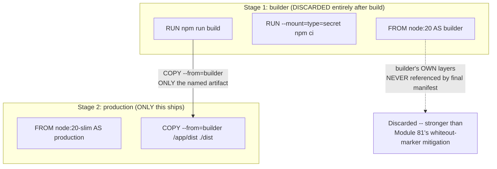
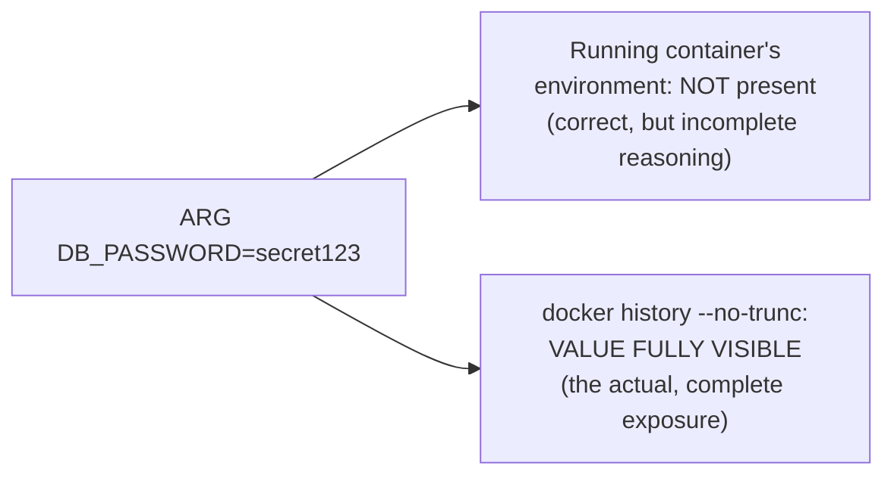
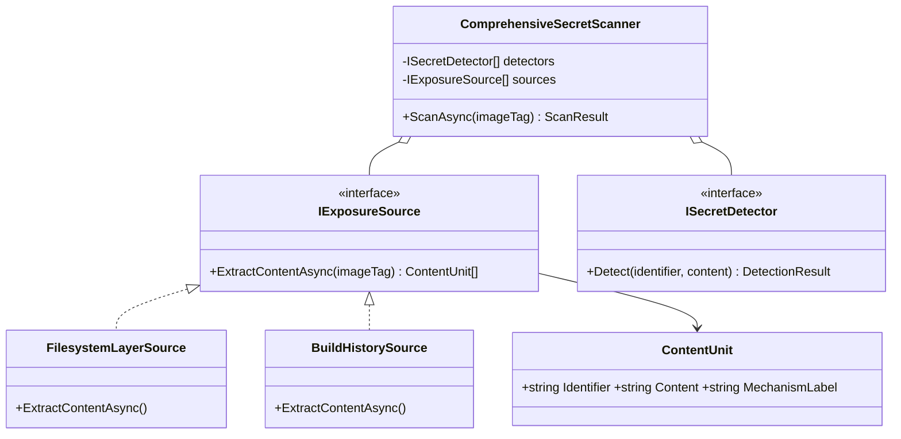
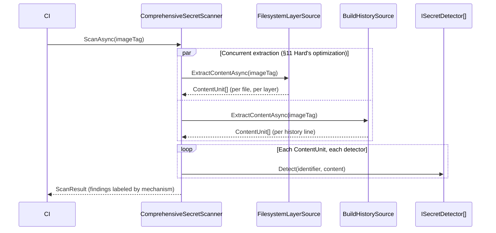

# Module 82 — Docker: Dockerfile Optimization & Multi-stage Builds

> Domain: Docker | Level: Beginner → Expert | Prerequisite: [[01-Images-Layers-UnionFilesystem]] (§2.4's whiteout-marker finding and §Advanced Q8's multi-stage preview are generalized into this module's full treatment; this module's headline finding — ARG values persist in image metadata — is a sharper, distinct mechanism from §2.4's filesystem-layer persistence, not a restatement of it)

---

## 1. Fundamentals

**What:** This module covers the deliberate techniques for structuring a Dockerfile to minimize final image size, eliminate build-time-only dependencies from the shipped artifact, and avoid the specific configuration-handling mistakes (build ARGs, base-image selection, build-context scope) that Module 81's layer/cache fundamentals make possible to reason about correctly, but don't by themselves prevent.

**Why:** Module 81 established *how* layers, caching, and the union filesystem work; this module is about applying that understanding *deliberately* — multi-stage builds structurally solve Module 81 §Advanced Q8's secret-persistence problem more robustly than any single-stage instruction-ordering trick, and this module's own headline finding (build `ARG` values persist in image metadata, independent of Module 81's filesystem-layer mechanism entirely) demonstrates that Module 81's fix (avoiding a file written to a layer) doesn't automatically generalize to every configuration-passing mechanism a team might reach for next.

**When:** Any time building a production-shipped image where size, attack surface, or build-time-secret handling genuinely matters — which is nearly always, but especially for images built from source (requiring compilers/build tools never needed at runtime) or images handling any credential during the build process itself.

**How (30,000-ft view):**
```
Multi-stage builds: MULTIPLE FROM statements in one Dockerfile -- each starts an
     independent build stage; COPY --from=<stage> pulls SPECIFIC artifacts forward;
     ONLY the final stage's layers ship -- earlier stages' layers are never even
     referenced by the final image's manifest at all (stronger than Module 81's
     whiteout-marker mitigation, which still leaves the bytes in the shipped image)
Minimal base images: distroless / scratch / alpine -- smaller attack surface,
     real compatibility (musl vs glibc) and debuggability (no shell) trade-offs
Build context (.dockerignore): what's SENT to the builder, a separate concern
     from layer/cache optimization -- a bloated or secret-containing context is
     its own distinct risk, independent of Module 81's layer-persistence finding
ARG vs ENV: ARG values are NOT present in a running container's environment by
     default -- but ARE permanently baked into the image's own metadata/history,
     recoverable via `docker history`/`docker inspect` regardless (this module's
     headline finding)
```

---

## 2. Deep Dive

### 2.1 Multi-stage Builds — a Structurally Stronger Guarantee Than Module 81's Single-Stage Mitigations
A Dockerfile with multiple `FROM` instructions defines multiple, independent build **stages** — each stage builds in isolation, and `COPY --from=<stage-name>` pulls specific, named artifacts (a compiled binary, a built frontend bundle) from an earlier stage into a later one. Critically, **only the final stage's own layers become part of the shipped image** — an earlier ("builder") stage's layers are never referenced by the final image's manifest at all, not merely hidden behind a whiteout marker (Module 81 §2.4). This is a materially **stronger** guarantee than Module 81's "combine write-and-delete into one RUN instruction" mitigation: even a secret written to its own, separate layer within the builder stage never reaches the shipped image's layer lineage, because that entire stage is discarded, not merely overwritten-and-hidden within a shared lineage.

### 2.2 Named Stages, Selective Targets, and One Dockerfile Serving Multiple Purposes
Naming a stage (`FROM node:20 AS builder`) enables `docker build --target=builder` to build **only** that intermediate stage — useful for local development (a `dev` stage with debugging tools, hot-reload, and a shell, built and run directly without ever needing the minimal production stage) without requiring a second, separately-maintained Dockerfile that inevitably drifts out of sync with the production one over time. A well-designed multi-stage Dockerfile commonly defines `base` (shared setup), `dev` (adds dev-only tooling), `builder` (compiles/bundles), and `production` (copies only the builder's output onto a minimal runtime base) stages, letting one file serve every environment's actual, differentiated needs.

### 2.3 Minimal Base Images — Distroless, Scratch, and Alpine's Real Compatibility Trade-off
**`scratch`** is the empty base image — appropriate only for a fully static binary with no runtime dependencies at all (a Go binary built with `CGO_ENABLED=0`, for instance). **Distroless** images (Google's `gcr.io/distroless/*`) contain only an application's language runtime and its direct dependencies — no shell, no package manager, no general-purpose OS utilities — minimizing attack surface at the direct cost of debuggability (there's no `docker exec ... sh` to fall back on for interactive troubleshooting; a genuine operational trade-off, not merely a security-vs-nothing decision). **Alpine**, a genuinely common but frequently-misunderstood choice, uses **musl libc** rather than glibc — a real, well-documented compatibility gotcha: pre-compiled binaries or native Node.js/Python modules built expecting glibc's specific behavior can fail outright, or — more dangerously — **silently behave differently** (subtle floating-point or DNS-resolution differences between musl and glibc have caused real, hard-to-diagnose production bugs) on Alpine, meaning "switch to `alpine` for a smaller image" is not a risk-free, drop-in substitution the way its popularity sometimes suggests.

### 2.4 Optimizing for Total Image Size AND Cache Granularity — Not Merely Minimizing Layer Count
A common, oversimplified folk-wisdom rule — "fewer `RUN` instructions is always better" — is only partially correct and can actively conflict with Module 81 §2.3's cache-granularity discipline: combining several genuinely unrelated concerns into one giant `RUN` instruction does reduce layer *count*, but means **any** change to *any* part of that combined instruction invalidates the *entire* layer's cache, even for the unrelated parts that didn't actually change — several smaller, deliberately-ordered `RUN` instructions (per Module 81 §2.3's least-frequently-changing-first discipline) can produce **better** overall build performance despite a higher layer count, because each smaller layer's cache validity is independently, more narrowly scoped. The correct optimization target is the **combination** of final image size (favoring consolidation *within* a single logical concern, e.g., `apt-get update && apt-get install && rm -rf /var/lib/apt/lists/*` in one `RUN`, avoiding Module 81 §2.4's exact bloat trap across a *related* set of operations) and cache granularity (favoring separation *across* logically-independent concerns) — not a single, universal "minimize layer count" metric applied indiscriminately.

### 2.5 The Build Context and `.dockerignore` — a Separate Concern From Layer/Cache Optimization
The **build context** (everything in the directory passed to `docker build`) is transferred to the BuildKit daemon **before** any instruction executes — a large, unfiltered context (an unexcluded `node_modules/`, `.git/` history, or large local data files) slows every single build's initial context-transfer step, entirely independent of Module 81's layer-caching mechanics. A **`.dockerignore`** file excludes specified paths from this transferred context — critically, this is not merely a performance optimization: a build context that includes a local `.env` file or credentials directory, absent a `.dockerignore` exclusion, creates a genuine risk that a broad `COPY . .` instruction (Module 81 §2.3's exact anti-pattern) inadvertently bakes that sensitive file into a layer — meaning `.dockerignore` is a **security control**, not merely a build-speed optimization, and its absence is a distinct, separate risk category from Module 81's explicit-secret-in-`RUN`-instruction findings, since here the sensitive file was never deliberately referenced by name at all — it was simply present in the context and swept up by an overly broad `COPY`.

### 2.6 ARG vs. ENV — the Headline Finding: ARG Is Not a Safe Way to Pass a Secret, Despite Not Appearing in the Running Container
A build-time `ARG` value is **not** present in a running container's environment by default (unlike `ENV`, which persists into the runtime environment) — this is correct and often cited as a reason to prefer `ARG` for "sensitive" build-time values over `ENV`. This reasoning is **incorrect and dangerous**: an `ARG`'s value is still **permanently recorded in the image's build history and metadata** — visible via `docker history --no-trunc` (which shows the exact command, including the resolved `ARG` value, for the layer where it was used) and, depending on how the `ARG` is consumed, potentially in `docker inspect`'s image configuration as well — meaning "I used `ARG`, not `ENV`, so my secret isn't exposed" is **false**, and represents a *different, but equally complete* exposure mechanism than Module 81 §2.4's filesystem-layer persistence: here, the secret is recoverable from the image's **build metadata/history**, not its filesystem content, meaning even a scanner checking only filesystem layer *contents* (Module 81 §11 Hard's scanner design) could miss an ARG-based leak entirely unless it also inspects `docker history` output specifically — the correct fix remains identical to Module 81's: BuildKit's `RUN --mount=type=secret`, which never appears in build history at all, for either mechanism.

---

## 3. Visual Architecture

### Multi-stage Build: Builder Stage Layers Never Reach the Shipped Image (§2.1)


### ARG's Two Independent Exposure Surfaces (§2.6)


## 4. Production Example

**Problem:** Following Module 81's incident (a secret embedded via a "write-then-delete" filesystem pattern), the same platform team, now aware of the layer-persistence risk, migrated their database-migration-tool Dockerfile to pass a database password via a build `ARG` instead of writing it to a file — reasoning that since `ARG` values don't appear in a running container's environment, this fully resolved the class of risk Module 81 had identified.

**Architecture:** The Dockerfile declared `ARG DB_PASSWORD` and used it directly within a `RUN` instruction invoking the migration tool during the image build (baking pre-validated migration state into the image as a build-time step, a legitimate if somewhat unusual pattern the team had adopted for deployment-speed reasons).

**Implementation:** The team's verification process explicitly checked `docker inspect <container> | grep -i password` against a **running container** instantiated from the built image, confirmed no password was present in the container's environment variables, and considered the migration to `ARG` a complete, verified fix for Module 81's incident category.

**Trade-offs:** The team's verification method was procedurally identical to Module 81 §4's original mistake (verifying only the running container's visible state) even though they believed they'd learned that exact lesson — the specific *mechanism* they checked (runtime environment variables) was different from Module 81's (filesystem content), but the *category* of error (verifying a narrow, convenient view rather than the complete, underlying artifact) was identical.

**Lessons learned:** A subsequent, more rigorous security review ran `docker history --no-trunc` against the image (Module 81 §11 Hard's exact recommended tool) and found the database password in cleartext, directly visible in the recorded command for the `RUN` instruction that had used the `ARG` — fully exposed to anyone with pull access to the image, via a completely different recovery mechanism (image build history/metadata) than Module 81's original incident (filesystem layer content), meaning a scanner configured only to inspect filesystem layer *contents* (exactly as Module 81 §11 Hard's exercise was scoped) would have **missed this specific leak entirely**, despite correctly catching Module 81's original vulnerability class. The fix was, once again, migrating to BuildKit's `RUN --mount=type=secret` — the same tool that correctly resolves *both* mechanisms, since it never appears in the image's build history *or* its filesystem content at all. **This is this module's defining lesson**: fixing one specific instance of a general risk category (Module 81's filesystem-layer secret persistence) does not automatically fix every mechanism capable of producing the *same underlying risk* (permanent, recoverable secret exposure in a shipped image) — a Principal Engineer must generalize the *underlying principle* ("does this value get permanently, recoverably embedded anywhere in the image artifact, through any mechanism") rather than pattern-matching only the *specific technique* (a file written to a layer) the original incident happened to use, and must correspondingly widen any verification tooling (Module 81's scanner) to cover every known exposure mechanism, not just the first one discovered.

## 5. Best Practices
- Use multi-stage builds for any application requiring build-time tooling (compilers, test runners, dependency managers) not needed at runtime — the builder stage's layers never reach the shipped image at all (§2.1).
- Use `docker build --target=<stage>` to serve development and production needs from one Dockerfile, avoiding a separately-maintained dev Dockerfile that drifts from production (§2.2).
- Evaluate Alpine's musl-libc compatibility explicitly for any workload with native/compiled dependencies before adopting it purely for its smaller size (§2.3).
- Optimize for the *combination* of final image size and cache granularity — consolidate within a logical concern, separate across independent ones — not a single "minimize layer count" metric (§2.4).
- Maintain a `.dockerignore` excluding any credential files, `.git`, and build-irrelevant large directories from the build context, treating it as a security control, not merely a performance one (§2.5).
- Never use `ARG` to pass a genuine secret, even though it doesn't appear in the running container's environment — its value remains permanently visible via `docker history` regardless; use `RUN --mount=type=secret` instead (§2.6, §4).

## 6. Anti-patterns
- Believing `ARG` (versus `ENV`) is a safe mechanism for passing secrets, based on its absence from the running container's environment alone (§2.6, §4).
- Verifying secret non-exposure only against a running container's visible state (environment variables or filesystem), rather than the image's complete build history and metadata (§4).
- Applying "minimize the number of RUN instructions" indiscriminately, without considering the resulting loss of cache granularity across logically-unrelated concerns (§2.4).
- Adopting Alpine purely for its smaller size without validating native-dependency compatibility against musl libc (§2.3).
- Omitting a `.dockerignore`, allowing a broad `COPY . .` to inadvertently include local credential files present in the build context (§2.5).

---

## 10. Interview Questions

### Basic (10)

1. **Q: What is a multi-stage Docker build?**
   **A:** A Dockerfile with multiple `FROM` instructions, each defining an independent build stage, where `COPY --from=<stage>` pulls specific artifacts from an earlier stage into a later one, and only the final stage's layers ship in the resulting image.
   **Why correct:** Names both defining properties — multiple independent stages, and selective artifact promotion.
   **Common mistakes:** Assuming every stage's layers are included in the final image.
   **Follow-ups:** "Why is this a stronger secret-mitigation than Module 81's write-then-delete pattern?" (The builder stage's layers are never referenced by the final image's manifest at all, §2.1.)

2. **Q: What does `docker build --target=<stage>` do?**
   **A:** Builds only up through the specified named stage, rather than the full Dockerfile's final stage.
   **Why correct:** Correctly describes the selective, partial-build capability.
   **Common mistakes:** Assuming every stage always builds regardless of the `--target` flag.
   **Follow-ups:** "What's a practical use case for this?" (Building a dev-tooling stage locally without needing the full production build, §2.2.)

3. **Q: What is `scratch` in Docker?**
   **A:** The empty base image, appropriate only for a fully static binary with no runtime dependencies.
   **Why correct:** Correctly identifies both what it is and its narrow, specific applicability.
   **Common mistakes:** Using `scratch` for an application that still needs shared libraries or a shell.
   **Follow-ups:** "What kind of application is a good candidate for a scratch-based image?" (A statically-compiled Go binary with `CGO_ENABLED=0`.)

4. **Q: What C library does Alpine Linux use, and why does this matter?**
   **A:** musl libc, not glibc — pre-compiled binaries or native modules expecting glibc's specific behavior can fail or behave subtly differently on Alpine.
   **Why correct:** Names the specific library and the concrete compatibility risk.
   **Common mistakes:** Treating Alpine as a risk-free, universally safe smaller substitute for any other base image.
   **Follow-ups:** "What kind of application is most at risk from this?" (One with native/compiled dependencies, e.g., certain Node.js native modules or Python C-extension packages.)

5. **Q: What is a distroless image?**
   **A:** A minimal base image containing only an application's language runtime and direct dependencies — no shell, no package manager, no general OS utilities.
   **Why correct:** Correctly identifies the defining "no shell/package manager" property.
   **Common mistakes:** Assuming distroless images still support `docker exec ... sh` for debugging.
   **Follow-ups:** "What's the main operational trade-off of adopting distroless?" (Reduced attack surface at the cost of interactive debuggability, §2.3/§8.)

6. **Q: Is `ARG` a safe way to pass a secret during a Docker build?**
   **A:** No — despite not appearing in the running container's environment, an ARG's value is permanently recorded in the image's build history/metadata, recoverable via `docker history`.
   **Why correct:** Directly states this module's headline finding accurately.
   **Common mistakes:** Believing ARG is safe specifically because it's absent from the running container's environment variables.
   **Follow-ups:** "What's the correct alternative?" (`RUN --mount=type=secret`, §2.6.)

7. **Q: What does `.dockerignore` do?**
   **A:** Excludes specified paths from the build context sent to the Docker daemon/BuildKit before any instruction executes.
   **Why correct:** Correctly describes the context-exclusion mechanism, distinct from layer-level operations.
   **Common mistakes:** Confusing `.dockerignore` (context exclusion) with a mechanism for excluding files from an already-built layer.
   **Follow-ups:** "Why is `.dockerignore` a security control, not just a performance optimization?" (Prevents an accidental credential file present in the context from being swept into a layer by a broad `COPY`, §2.5.)

8. **Q: Does minimizing the number of RUN instructions always produce the best-optimized Dockerfile?**
   **A:** No — combining unrelated concerns into one RUN instruction reduces layer count but can hurt cache granularity, since any change anywhere in that instruction invalidates the whole layer.
   **Why correct:** Correctly corrects the oversimplified folk wisdom with the actual, nuanced trade-off.
   **Common mistakes:** Applying "fewer RUN instructions is always better" as an absolute rule.
   **Follow-ups:** "When should related operations still be combined into one RUN instruction?" (When they're genuinely part of the same logical concern, e.g., install-and-cleanup in one instruction to avoid Module 81 §2.4's bloat trap.)

9. **Q: What is the difference between ARG and ENV in a Dockerfile?**
   **A:** ARG is build-time only and not present in the running container's environment by default; ENV persists into the container's runtime environment.
   **Why correct:** States the standard, correct distinction.
   **Common mistakes:** Assuming this runtime-environment distinction implies ARG is generally "safer" for sensitive values (§2.6 shows this is false).
   **Follow-ups:** "Where does an ARG's value still persist, despite this runtime distinction?" (The image's build history/metadata, §2.6.)

10. **Q: What tool would reveal an ARG-based secret leak that a filesystem-content-only scanner would miss?**
    **A:** `docker history --no-trunc`, which shows the actual resolved command (including ARG values) for each layer.
    **Why correct:** Names the specific tool and correctly connects it to the specific gap.
    **Common mistakes:** Assuming any general-purpose image scanner automatically covers build-history/metadata inspection without specific configuration for it.
    **Follow-ups:** "What broader lesson does this teach about designing security-scanning tooling?" (A scanner must cover every known exposure mechanism explicitly, not just the first one discovered, §4/§8.)

### Intermediate (10)

1. **Q: Why is a multi-stage build's secret-protection guarantee described as "stronger" than Module 81's single-stage write-then-delete mitigation?**
   **A:** In a single-stage build, even a secret confined to its own separate layer remains part of the same image's layer lineage (hidden by a whiteout marker if later deleted, but still present in earlier layers); in a multi-stage build, an entire discarded stage's layers are never referenced by the final image's manifest at all — a categorically different, stronger form of exclusion than hiding-within-a-shared-lineage.
   **Why correct:** Correctly articulates the structural (not merely incremental) difference between the two mitigations.
   **Common mistakes:** Treating multi-stage builds and Module 81's single-stage mitigation as equally strong alternatives.
   **Follow-ups:** "Under what condition could a multi-stage build still leak a secret?" (If the secret is explicitly `COPY --from=builder`'d into the final stage, or if the builder stage's own layers are separately pushed via remote build-cache export, Module 81 §Advanced Q8.)

2. **Q: Why did the team's `ARG`-based fix in §4 fail despite genuinely having learned Module 81's lesson about filesystem-layer persistence?**
   **A:** They correctly avoided Module 81's specific mechanism (a file written to a layer) but verified their fix using the same narrow-view verification method (checking only a convenient, visible state) as Module 81's original mistake — just applied to a different visible state (runtime environment variables instead of filesystem contents) — the underlying error (trusting a narrow view over the complete artifact) recurred even though its specific technical manifestation changed.
   **Why correct:** Correctly identifies the meta-level pattern (same category of verification error, different specific mechanism) rather than treating the two incidents as unrelated.
   **Common mistakes:** Concluding the team "didn't learn anything" from Module 81, when in fact they did partially generalize — just not far enough.
   **Follow-ups:** "What would 'fully' generalizing Module 81's lesson have looked like?" (Recognizing the underlying question is "does this value persist anywhere recoverable in the shipped artifact," and checking every known mechanism — filesystem AND metadata/history — rather than assuming one specific technique's fix transfers automatically to a different technique.)

3. **Q: Why does Alpine's musl-libc difference sometimes cause "silent" behavioral changes rather than outright failures?**
   **A:** musl and glibc can both successfully execute the same binary in many cases while producing subtly different results for specific operations (certain floating-point calculations, DNS resolution behavior) — the binary doesn't crash or refuse to run, it simply behaves slightly differently in edge cases, making the issue far harder to detect than an outright compatibility failure would be.
   **Why correct:** Correctly explains why this specific compatibility risk is more insidious than a simple pass/fail incompatibility.
   **Common mistakes:** Assuming a musl/glibc incompatibility would always manifest as an obvious crash or startup failure.
   **Follow-ups:** "What testing practice would catch this before production?" (Running the application's actual test suite against the Alpine-based image specifically, not merely confirming it starts successfully — behavioral, not just smoke, testing.)

4. **Q: Why is combining "unrelated concerns" into one RUN instruction specifically flagged as harmful, while combining "related concerns" is still recommended?**
   **A:** The cache-invalidation cost of combining instructions is proportional to how often *any* part of the combined instruction's relevant context changes — genuinely related concerns (installing a package and cleaning up its install artifacts) tend to change together anyway, so little cache granularity is lost by combining them, while unrelated concerns (installing OS packages and copying frequently-changing application code) have very different, independent change frequencies, so combining them needlessly ties the rarely-changing part's cache validity to the frequently-changing part's churn.
   **Why correct:** Correctly identifies the actual distinguishing factor (correlated vs. independent change frequency) rather than an arbitrary "related vs. unrelated" label.
   **Common mistakes:** Applying a blanket rule about instruction combination without reasoning about each concern's actual, independent change frequency.
   **Follow-ups:** "How would you determine whether two concerns are 'related enough' to combine?" (Ask whether they would ever plausibly change independently of each other in practice — if yes, keep them in separate instructions.)

5. **Q: Why is `.dockerignore`'s security role described as distinct from, not a duplicate of, Module 81's secret-persistence findings?**
   **A:** Module 81's findings concern a secret *deliberately* referenced (written to a file, used in a RUN instruction) and then persisting despite an attempted removal; `.dockerignore`'s risk concerns a secret that was **never deliberately referenced at all** — simply present in the local directory and swept into the build context (and potentially a layer) by an overly broad `COPY .`, an entirely different failure mode (an omission/oversight, not a mistaken belief about a removal mechanism).
   **Why correct:** Correctly distinguishes "a secret mistakenly and unknowingly included" from "a secret deliberately included, then incorrectly believed removed" as genuinely different risk categories.
   **Common mistakes:** Treating every secret-in-image incident as fundamentally the same root cause.
   **Follow-ups:** "What .dockerignore entries would you consider mandatory for any Node.js project's Dockerfile?" (`.env`, `.git`, `node_modules` (rebuilt fresh in-container), and any local credentials directory.)

6. **Q: Why does a security-scanning tool need to explicitly inspect `docker history` output, not just filesystem layer contents, per §8?**
   **A:** §2.6/§4 establish that an ARG-based secret leak is recoverable specifically from build history/metadata, not filesystem content — a scanner scoped only to filesystem content (Module 81 §11 Hard's original design) would correctly catch Module 81's incident category while completely missing this module's, since the two incidents leak via genuinely different, independent mechanisms.
   **Why correct:** Correctly connects the two modules' findings into a concrete, compounding scanner-design requirement.
   **Common mistakes:** Assuming a single, comprehensive-sounding "image scanner" automatically covers every possible secret-exposure mechanism without specific, deliberate configuration for each one.
   **Follow-ups:** "Design the minimal update to Module 81's scanner to also catch this module's leak category." (Add a `docker history --no-trunc` text-content scan, run alongside the existing filesystem-content scan, checking for the same secret patterns in the command-history output.)

7. **Q: Why might a Dockerfile author reasonably believe distroless's lack of a shell is purely a downside, and what corrects this view?**
   **A:** The lack of an interactive shell removes a convenient, familiar debugging tool — but it also removes an attacker's most common initial post-compromise tool (a shell to explore/pivot from), meaning the same property is simultaneously a genuine debuggability cost and a genuine security benefit, not a pure downside; the corrected view is recognizing both sides of the trade-off explicitly rather than treating shell removal as strictly negative.
   **Why correct:** Correctly reframes the "downside" as a genuine two-sided trade-off rather than an unambiguous cost.
   **Common mistakes:** Evaluating distroless purely on its debugging inconvenience without weighing its corresponding security benefit.
   **Follow-ups:** "What alternative debugging strategy would you establish before adopting distroless in production?" (Kubernetes's `kubectl debug` ephemeral-container feature, or a separately-built, non-production debug variant of the same image, planned proactively.)

8. **Q: Why does BuildKit's parallel stage execution (§7) provide a genuine speedup specifically for multi-stage builds with independent stages, but not for a single-stage Dockerfile?**
   **A:** Parallelism requires genuinely independent work to execute concurrently — a single-stage Dockerfile's instructions form one strictly sequential dependency chain (each instruction builds on the prior layer), while a multi-stage Dockerfile with, e.g., a frontend-build stage and a backend-compile stage that don't depend on each other's output until a later, shared final stage, gives BuildKit's DAG scheduler genuinely parallelizable work to exploit.
   **Why correct:** Correctly identifies the structural precondition (independent, non-sequential work) required for the speedup to actually apply.
   **Common mistakes:** Assuming BuildKit automatically parallelizes any Dockerfile's instructions regardless of their actual dependency structure.
   **Follow-ups:** "How would you verify whether your own multi-stage Dockerfile is actually benefiting from this parallelism?" (Compare total build wall-clock time against the sum of each stage's individual build time — a meaningfully shorter total indicates genuine concurrent execution.)

9. **Q: Why does a smaller final image (via multi-stage builds) provide a "multiplicative, not merely additive" storage benefit at fleet scale, per §9?**
   **A:** A smaller final image both has less unique content to store/transfer on its own (the additive part) *and* deduplicates more efficiently against other images sharing the same minimal base (Module 81 §2.1's content-addressable deduplication, the multiplicative part) — the size reduction compounds with the deduplication mechanism rather than acting as an independent, separate saving.
   **Why correct:** Correctly identifies the compounding interaction between two distinct mechanisms (raw size reduction and cross-image deduplication) rather than treating them as simply additive, independent benefits.
   **Common mistakes:** Treating image-size reduction and deduplication as two unrelated, separately-summed savings.
   **Follow-ups:** "Does this compounding benefit apply equally to a scratch-based image and an Alpine-based image?" (Less so for scratch, since there's minimal shared base content to deduplicate against in the first place — the deduplication benefit specifically depends on multiple images sharing common layers, which requires a common, non-trivial base.)

10. **Q: Why should CI-platform capacity planning explicitly account for multi-stage builds' parallel execution, per §9?**
    **A:** Each concurrently-building multi-stage Dockerfile can spawn multiple simultaneous stage executions on a single CI runner, meaningfully increasing peak resource demand (CPU/memory) per build compared to a strictly sequential single-stage model — at high build concurrency across many teams' CI pipelines, this aggregate peak-demand increase is a genuine, distinct capacity-planning input a platform team must account for, not merely a per-build performance improvement with no aggregate-capacity implication.
    **Why correct:** Correctly connects an individual build's performance benefit to its aggregate, fleet-wide capacity-planning cost.
    **Common mistakes:** Treating BuildKit's parallelism purely as a "free" per-build speedup with no corresponding resource-demand implication at scale.
    **Follow-ups:** "How would you validate whether your CI platform's runners are appropriately sized for this?" (Monitor peak CPU/memory utilization specifically during periods of high concurrent multi-stage build activity, comparing against runner resource limits.)

### Advanced (10)

1. **Q: Diagnose §4's incident from first principles, and design the specific verification-methodology fix ensuring a future team's "we fixed the Module 81 issue" claim is actually validated against every known secret-exposure mechanism, not just the one Module 81 originally demonstrated.**
   **A:** Root cause: the team correctly avoided Module 81's *specific* mechanism but verified their fix using the same *category* of narrow, convenient verification (checking one visible state) rather than generalizing to "does this value persist anywhere recoverable in the complete image artifact." Structural fix: maintain a living, explicitly-enumerated checklist of every known secret-exposure mechanism (filesystem layer content, per Module 81; build history/ARG metadata, per this module; potentially future mechanisms not yet discovered) that any "secret handling" fix must be verified against **all of**, not merely the one mechanism the original incident happened to use — implemented as a comprehensive scanner (§Advanced Q6's design) checking every enumerated mechanism simultaneously, rather than trusting a team's own, potentially incomplete generalization of a prior specific incident's lesson.
   **Why correct:** Identifies the meta-level root cause (incomplete generalization) and proposes a structural fix (an explicitly enumerated, exhaustive checklist backing an automated scanner) rather than relying on individual teams' own inference quality.
   **Common mistakes:** Proposing only "teach the team about ARG's history-persistence specifically," which fixes this one instance without addressing the general pattern of incomplete generalization that could recur with a third, still-undiscovered mechanism.
   **Follow-ups:** "What third, currently-undiscovered secret-exposure mechanism might exist, by extrapolating this pattern?" (Any Docker/BuildKit feature that records build-time information anywhere persistent — e.g., build attestations/provenance metadata (SLSA-style), or labels/annotations set via build-time values — is a plausible candidate worth proactively auditing rather than waiting for a third incident to discover it reactively.)

2. **Q: A team argues that since they've adopted multi-stage builds exclusively, and no secret is ever explicitly `COPY --from=builder`'d into their final stage, they no longer need any secret-scanning tooling at all. Evaluate this claim.**
   **A:** Push back on two grounds: first, multi-stage builds protect the **final shipped image** specifically, but per Module 81 §Advanced Q8's residual-risk finding, the **builder stage's own layers** could still be exposed if the organization's CI platform exports/retains remote build-cache layers (Module 81 §2.6) that include the builder stage — a risk entirely orthogonal to whether the final image itself is clean; second, this module's own §2.6 finding demonstrates that even within a correctly-structured multi-stage build, a secret passed via `ARG` in the *final* stage (not just the builder stage) would still leak via build history regardless of the multi-stage structure — multi-stage builds address one specific exposure vector (builder-stage filesystem content reaching the shipped image) but don't structurally prevent either of these two additional, independent risks.
   **Why correct:** Correctly identifies two distinct, still-live risks (build-cache export exposure, ARG-in-final-stage exposure) that multi-stage adoption alone does not address, directly connecting back to both Module 81's and this module's specific findings.
   **Common mistakes:** Accepting multi-stage adoption as a complete substitute for ongoing scanning, rather than one layer of a defense-in-depth posture.
   **Follow-ups:** "Design the minimal additional check needed to close the build-cache-export risk specifically." (Extend the CI pipeline's cache-export configuration to explicitly exclude the builder stage from remote cache export/retention when it's known to have handled secrets, or apply the same history/content scanning to exported cache layers as to the final shipped image.)

3. **Q: Design a test suite that would have caught the Alpine musl-libc compatibility risk (§2.3) before it reached production, generalizing this domain's now-established "test the actual constrained/different condition, don't assume equivalence" discipline (echoing the Kubernetes domain's full-chain-testing lessons).**
   **A:** Run the application's full, existing test suite (not merely a smoke test confirming the container starts) against the Alpine-based image specifically, in CI, as a required gate before that base image is approved for any team's use — directly the same "steady-state/happy-path testing doesn't exercise the actual differing condition" pattern this course established across the Kubernetes domain (Module 60 §Advanced Q3, Module 71 §Advanced Q3, Module 77 §4), now applied to base-image compatibility specifically: a container that starts successfully provides no evidence about whether its actual runtime behavior matches the glibc-based image's behavior for every code path the test suite would exercise.
   **Why correct:** Correctly generalizes an already-established cross-domain testing discipline to this module's specific compatibility-risk context.
   **Common mistakes:** Considering "the Alpine-based container starts and responds to a health check" sufficient validation of behavioral equivalence.
   **Follow-ups:** "What additional test category would you add specifically for native-dependency-heavy applications?" (Targeted tests for any code path known to depend on libc-specific behavior — DNS resolution, locale-sensitive string operations, floating-point edge cases — beyond what a general-purpose test suite might incidentally cover.)

4. **Q: A Principal Engineer must decide whether to standardize the organization's Node.js base images on Alpine (smaller, but with musl-compatibility risk) or Debian-slim (larger, glibc-based, no compatibility risk). Design the decision framework, incorporating §9's deduplication-compounding finding.**
   **A:** The decision should weigh: (1) the organization's actual native-dependency footprint across its Node.js services — if few or no services use native modules with known musl sensitivity, Alpine's compatibility risk is largely theoretical for this specific fleet, favoring Alpine's smaller size and its compounding deduplication benefit (§9) at scale; (2) if native-dependency usage is common and varied across teams, the *aggregate* organizational cost of each team independently needing to validate musl compatibility (Advanced Q3's test-suite requirement, repeated per team) may exceed the storage/transfer savings Alpine provides, favoring the simpler, uniformly-compatible Debian-slim choice despite its larger size; the deciding factor is the organization's actual, current native-dependency profile, not a context-free "smaller is always better" or "safer is always better" default.
   **Why correct:** Correctly frames the decision around the organization's actual, specific dependency profile rather than a universal recommendation, and explicitly incorporates the compounding deduplication benefit as a real factor in the trade-off.
   **Common mistakes:** Recommending one base image universally without first assessing the organization's actual native-dependency exposure to the specific risk in question.
   **Follow-ups:** "How would you measure the organization's actual native-dependency exposure before making this decision?" (An automated scan of every Node.js service's `package.json`/lockfile for known-native-dependency packages, providing a concrete, data-driven input to the decision rather than an assumption.)

5. **Q: Critique the following claim: "Since our Dockerfile now uses `RUN --mount=type=secret` exclusively for every credential, and we no longer use ARG or ENV for anything sensitive, our image-build secret-handling is now completely secure with no further verification needed."**
   **A:** Overstated in the same way this course has repeatedly flagged — correct configuration provides no evidence, on its own, that the configuration is genuinely, continuously correct going forward: a future engineer, unaware of this specific policy (or under time pressure during an incident, directly echoing Module 81 §4's original scenario), could reintroduce an `ARG`- or `ENV`-based secret in a new Dockerfile or a modification to an existing one, and nothing in "we currently use the correct pattern" prevents or detects that regression — genuine, ongoing security requires the automated scanning discipline (§Advanced Q1/Q6, and Module 81 §11 Hard) running continuously against every build, not a one-time policy adoption treated as a permanently-solved problem.
   **Why correct:** Correctly applies this course's now-repeated "correct-today does not imply correct-tomorrow without ongoing, automated verification" discipline to this module's specific context.
   **Common mistakes:** Treating a correctly-configured current state as sufficient, permanent assurance without an ongoing enforcement/detection mechanism.
   **Follow-ups:** "Design the specific CI gate preventing this regression." (A linting step scanning every Dockerfile for `ARG`/`ENV` declarations matching common secret-naming patterns, or containing values sourced from a secrets-adjacent file, failing the build before it even reaches the image-scanning stage — a preventive, pre-build check complementing the post-build scanner.)

6. **Q: Design the specific automated CI check extending Module 81 §11 Hard's scanner to also catch this module's ARG-based leak category, given that the two mechanisms require inspecting genuinely different artifacts (filesystem content vs. build history text).**
   **A:** Extend the existing `LayerSecretScanner` (Module 81 §11 Hard) with a second, independent detection pass: after extracting the image, additionally run `docker history --no-trunc --format '{{.CreatedBy}}'` (or an equivalent `docker inspect`-based extraction of build metadata) and apply the *same* `ISecretDetector` implementations (§13's Strategy pattern, directly reusable here) against this text output, not merely against extracted filesystem file contents — both detection passes report into the same unified `ScanResult`, giving the CI gate one, combined pass/fail signal covering both this module's and Module 81's exposure mechanisms simultaneously, reusing the existing detector abstractions rather than building an entirely separate, parallel scanning system.
   **Why correct:** Correctly proposes extending, not replacing, the existing scanner architecture, reusing its Strategy-pattern detector abstraction (directly connecting back to Module 81 §13's LLD) for genuine architectural consistency.
   **Common mistakes:** Proposing an entirely separate, disconnected scanning tool for build-history inspection rather than extending the existing, already-designed scanner architecture.
   **Follow-ups:** "What's the risk of only running this check against the final shipped image, not intermediate builder-stage images, per Advanced Q2's finding?" (It would miss a secret leaked via ARG within a discarded builder stage's own build history, if that builder stage's cache/history is separately retained or exported — the check should ideally run against every stage's build history, not only the final stage's.)

7. **Q: Explain why this module's headline finding (§2.6) is not merely "another instance" of Module 81's whiteout-marker finding, but a genuinely distinct mechanism requiring its own, separate detection and mitigation — and why this distinction matters for how a Principal Engineer should think about "have we fixed this class of problem."**
   **A:** Module 81's finding concerns *filesystem layer content* persisting despite an apparent later deletion; this module's finding concerns *build metadata/history* persisting despite the value's absence from a *different* artifact (the running container's environment) — these are genuinely different storage locations within the image artifact, requiring genuinely different extraction/inspection techniques to detect (filesystem-tarball inspection vs. `docker history` text inspection) and, notably, the *same* correct mitigation (`--mount=type=secret`) happens to resolve both, which could mislead a team into believing the two findings are "the same problem" merely because they share a fix — the distinction matters because a Principal Engineer evaluating "have we closed this class of risk" must verify against each genuinely distinct mechanism independently, since a shared *fix* does not imply a shared *detection requirement*, and assuming otherwise (as §4's team did) is precisely how a partial, incomplete fix gets mistaken for a complete one.
   **Why correct:** Correctly distinguishes "same eventual fix" from "same detection mechanism required," a subtle but consequential distinction directly explaining why §4's team's partial success was still an incomplete fix.
   **Common mistakes:** Conflating "the fix is the same" with "the problem is the same," missing that detection/verification must still separately cover each distinct exposure mechanism.
   **Follow-ups:** "Generalize this into a principle for evaluating any proposed 'fix' for a security finding." ("A shared remediation across multiple distinct incidents does not imply those incidents share a detection requirement — verify each specific mechanism independently, even when one fix happens to resolve several of them simultaneously.")

8. **Q: A team's CI pipeline builds a multi-stage Dockerfile where the `dev` stage (§2.2) includes a debugging tool that reads environment variables matching a broad pattern (`DEBUG_*`) and logs them verbatim to stdout for troubleshooting convenience. A `DEBUG_API_KEY` ARG is later added for a legitimate debugging purpose. Diagnose the resulting risk, synthesizing §2.2's multi-purpose-Dockerfile pattern with §2.6's ARG finding.**
   **A:** This compounds two of this module's findings in a new way: the `dev` stage's debugging tool, if it also runs (even inadvertently) against a production `--target=production` build sharing common base instructions, or if the `dev` stage's own image is ever accidentally deployed instead of `production` (a genuine risk of the multi-purpose-Dockerfile pattern §2.2 recommends, if `--target` selection isn't rigorously enforced in the deployment pipeline), would log the ARG-derived value verbatim to stdout — a **third**, distinct exposure mechanism (application-level logging) beyond both Module 81's filesystem-layer and this module's build-history findings, triggered specifically by the interaction between a debugging convenience feature and an ARG containing a genuine secret.
   **Why correct:** Correctly identifies a novel, compounding risk arising from the *interaction* of two previously-independent findings (multi-purpose Dockerfiles, ARG-based secrets), rather than treating them as isolated concerns, and correctly identifies this as a third, distinct exposure mechanism.
   **Common mistakes:** Evaluating the `dev` stage's debug-logging feature and the ARG's own risk independently, missing the compounding risk their interaction creates.
   **Follow-ups:** "What deployment-pipeline control would prevent the 'dev stage accidentally deployed to production' scenario specifically?" (An explicit, automated check in the deployment pipeline verifying the image being deployed was built with `--target=production` specifically — e.g., via an image label set during the production-targeted build and verified before any deployment — rather than trusting manual `--target` flag discipline alone.)

9. **Q: Design the specific governance policy for when a team is permitted to build a debug/dev variant of a production image containing a shell or additional tooling, balancing this module's §2.2 multi-purpose-Dockerfile convenience against §8's distroless security rationale.**
   **A:** Permit a debug/dev variant specifically as a **separately-tagged, never-default** image variant (e.g., `myapp:v1.2.3` for production, `myapp:v1.2.3-debug` as an explicitly, separately-built and separately-scanned variant) — built from the same Dockerfile via `--target=debug` (§2.2's pattern) but never deployed by default, requiring an explicit, logged, and time-bounded action to deploy the debug variant during an actual incident specifically (directly mirroring Kubernetes's `kubectl debug` ephemeral-container pattern's own explicit, deliberate, time-bounded nature) — this preserves both the production image's minimal, distroless-or-equivalent security posture as the default, unquestioned state, and genuine debuggability when actually needed, without the two ever being conflated or the debug variant being deployed accidentally by default.
   **Why correct:** Correctly designs a governance policy explicitly preserving the security benefit of a minimal default posture while providing a genuine, controlled escape hatch for debugging need, directly connecting §2.2's technical pattern to §8's security rationale.
   **Common mistakes:** Either recommending debug tooling always be included by default (defeating the minimal-image security benefit) or prohibiting debug variants entirely (creating a genuine, unaddressed operational-debugging gap).
   **Follow-ups:** "How would you audit that this policy is actually being followed, not merely documented?" (Monitor production deployments for any image tag matching the `-debug` naming convention, alerting immediately if one is ever deployed outside an explicitly-logged, time-bounded incident-response action — directly this course's recurring "automated verification, not policy-document trust" discipline.)

10. **As a Principal Engineer establishing organization-wide Dockerfile-authoring standards, design the complete governance program (synthesizing this module and Module 81) required before any team's Dockerfile is approved for production use.**
    **A:** (1) Mandatory multi-stage structure for any application requiring build-time-only tooling, with the final production stage explicitly minimal (distroless/Alpine-with-validated-compatibility/scratch as appropriate to the workload, §2.1/§2.3/Advanced Q4's decision framework). (2) Mandatory `RUN --mount=type=secret` for any build-time credential, enforced via a pre-build CI lint rejecting `ARG`/`ENV` patterns matching secret-naming conventions (Advanced Q5). (3) A comprehensive post-build scanner covering **both** filesystem-layer content (Module 81 §11 Hard) **and** build-history/metadata text (this module's Advanced Q6 extension) as one unified, mandatory CI gate. (4) A mandatory `.dockerignore` review as part of any new Dockerfile's initial approval, explicitly checking for credential-file and unnecessary-large-directory exclusion (§2.5). (5) A behavioral (not merely smoke) test-suite requirement for any base-image change with native-dependency exposure (Advanced Q3). (6) An explicit, governed policy for debug/dev image variants — separately tagged, never default, explicitly and time-boundedly deployed only during genuine incident response (Advanced Q9) — with automated monitoring alerting on any unauthorized production deployment of a debug variant.
    **Why correct:** Synthesizes every specific finding across both Docker modules into one coherent, comprehensive, and appropriately-scoped governance program, directly mirroring this course's established cross-domain capstone-synthesis pattern.
    **Common mistakes:** Presenting a program addressing only this module's ARG-specific finding without integrating Module 81's filesystem-layer findings into one unified scanning/governance approach.
    **Follow-ups:** "Which element of this program most directly addresses the specific pattern of incomplete generalization §4's incident demonstrated?" (Element 3 — the unified, comprehensive scanner covering both known mechanisms simultaneously — since it structurally prevents a team's own incomplete mental generalization from being the sole line of defense, replacing "trust the team correctly generalized the lesson" with "verify against every known mechanism automatically, regardless of what any individual team currently believes.")

---

## 11. Coding Exercises

### Easy — A minimal multi-stage build eliminating build-time tooling from the shipped image (§2.1)
**Problem:** Build a Go application in a full Go toolchain image, but ship only the compiled binary in a minimal final image.
**Solution:**
```dockerfile
# Stage 1: builder -- full Go toolchain, NEVER shipped (§2.1)
FROM golang:1.22 AS builder
WORKDIR /src
COPY go.mod go.sum ./
RUN go mod download
COPY . .
RUN CGO_ENABLED=0 go build -o /app/server .

# Stage 2: production -- scratch is appropriate here (static binary, §2.3)
FROM scratch AS production
COPY --from=builder /app/server /server
ENTRYPOINT ["/server"]
```
**Time complexity:** N/A (build-configuration exercise) — the builder stage's own build time is unaffected; the shipped image's *pull/start* time improves due to its minimal size.
**Space complexity:** The shipped image contains only the compiled binary (megabytes) versus the full builder stage (the Go toolchain itself, hundreds of megabytes) — a strict reduction, not merely a hidden one (§2.1's stronger-than-whiteout guarantee).
**Optimized solution:** Add `--mount=type=cache,target=/go/pkg/mod` to the `go mod download` instruction, letting BuildKit persist the Go module cache across builds independent of the layer cache itself, further reducing repeated-build time for dependency resolution specifically.

### Medium — Correctly using `.dockerignore` to prevent accidental credential inclusion (§2.5)
**Problem:** Prevent a local `.env` file (containing development credentials) from ever being included in the build context.
**Solution:**
```
# .dockerignore
.env
.env.*
.git
node_modules
*.local.json
```
```dockerfile
FROM node:20-slim
WORKDIR /app
COPY package.json package-lock.json ./
RUN npm ci --omit=dev
COPY . .          # .env is NEVER even present in the context this COPY draws from (§2.5)
CMD ["node", "server.js"]
```
**Time complexity:** N/A — this is a security/context-scoping exercise, not a runtime-performance one.
**Space complexity:** Reduces build-context transfer size in proportion to the excluded directories' size (`node_modules`/`.git` commonly being the largest offenders) — a direct, measurable build-context-transfer-time improvement (§7) alongside the security benefit.
**Optimized solution:** Add a CI pre-build check verifying `.dockerignore` exists and explicitly includes known-sensitive filename patterns for the project's language/framework, failing the build if a required exclusion pattern is missing — converting this from a one-time manual authoring practice into an enforced, continuously-verified standard.

### Hard — A comprehensive secret scanner covering both Module 81's and this module's exposure mechanisms (§Advanced Q6)
**Problem:** Extend Module 81 §11 Hard's `LayerSecretScanner` to also scan `docker history` output for ARG-based leaks, using the same detector abstraction.
**Solution:**
```csharp
public class ComprehensiveSecretScanner
{
    private readonly ISecretDetector[] _detectors;   // reused directly from Module 81 §13's design

    public async Task<ScanResult> ScanAsync(string imageTag)
    {
        var findings = new List<string>();

        // Mechanism 1 (Module 81 §2.4): filesystem layer content
        findings.AddRange(await ScanFilesystemLayersAsync(imageTag));

        // Mechanism 2 (this module §2.6): build history / metadata --
        // a GENUINELY SEPARATE artifact, requiring its own extraction and scan pass.
        var historyOutput = await RunProcessAsync("docker", $"history --no-trunc --format {{{{.CreatedBy}}}} {imageTag}");
        foreach (var line in historyOutput.Split('\n'))
        {
            foreach (var detector in _detectors)
            {
                var result = detector.Detect(fileName: "<build-history>", content: line);
                if (result.IsMatch)
                    findings.Add($"Build history line matched secret pattern: '{Truncate(line)}' " +
                                 $"(this module §2.6/§4 -- NOT caught by filesystem-content scanning alone).");
            }
        }

        return new ScanResult { Passed = findings.Count == 0, Findings = findings };
    }
}
```
**Time complexity:** O(L × F + H) where L×F is Module 81's filesystem-scan cost and H is the number of build-history lines — the history scan adds a small, roughly-linear-in-layer-count additional cost.
**Space complexity:** O(1) additional beyond Module 81's existing scanner — build history output is small (text, not binary layer content) relative to the filesystem-content scan's own footprint.
**Optimized solution:** Run both scan passes concurrently (they operate on independent data sources — extracted filesystem tarballs versus `docker history` text output) rather than sequentially, directly applying BuildKit's own DAG-parallelism philosophy (§2.1/§7) to the verification tooling itself.

### Expert — A CI pre-build linter preventing ARG/ENV secret patterns before any image is even built (§Advanced Q5)
**Problem:** Implement a static Dockerfile linter that rejects any `ARG`/`ENV` declaration matching common secret-naming conventions, running before the (more expensive) build-and-scan pipeline even begins.
**Solution:**
```csharp
public class DockerfileSecretLinter
{
    private static readonly Regex SecretNamePattern = new(
        @"^(ARG|ENV)\s+.*(PASSWORD|SECRET|TOKEN|API_KEY|PRIVATE_KEY|CREDENTIAL)",
        RegexOptions.IgnoreCase);

    // Fails FAST, before any docker build is even invoked -- directly this course's
    // "prevent, don't merely detect after the fact" discipline (§Advanced Q5), and
    // materially cheaper than waiting for the full build-and-scan pipeline to run.
    public LintResult Lint(string dockerfileContent)
    {
        var violations = new List<string>();
        var lines = dockerfileContent.Split('\n');

        for (int i = 0; i < lines.Length; i++)
        {
            if (SecretNamePattern.IsMatch(lines[i].Trim()))
            {
                violations.Add($"Line {i + 1}: '{lines[i].Trim()}' -- ARG/ENV declarations matching " +
                                $"secret-naming patterns are PROHIBITED (this module §2.6). " +
                                $"Use 'RUN --mount=type=secret' instead.");
            }
        }

        return new LintResult { Passed = violations.Count == 0, Violations = violations };
    }
}
```
**Time complexity:** O(n) where n is the number of lines in the Dockerfile — a single linear pass, negligible compared to any actual build/scan step.
**Space complexity:** O(v) where v is the number of violations found — trivial relative to the scanner's own memory footprint.
**Optimized solution:** Integrate this linter as a pre-commit git hook, not only a CI-pipeline step, giving developers immediate, local feedback before a commit is even pushed — shifting detection as early as possible in the development lifecycle, the same "shift left" principle this course has implicitly applied throughout its governance-gate designs, now made explicit at the earliest possible point.

---

## 12. System Design

**Prompt:** Design a Dockerfile-authoring and image-build governance platform for an organization standardizing on multi-stage builds and minimal base images across 100+ services, incorporating the comprehensive secret-detection requirement established in this module.

**Requirements:**
- *Functional:* every Dockerfile must pass a pre-build lint (Advanced Q5/§11 Expert) and a post-build comprehensive scan (§11 Hard) covering both filesystem and build-history exposure mechanisms before any image reaches a shared registry; debug/dev image variants must be separately tagged and governed (Advanced Q9).
- *Non-functional:* the pre-build lint should complete in under 5 seconds (fast, local-feedback-friendly); the comprehensive post-build scan should complete within the same CI budget as Module 81 §12's system design established (part of the same overall CI pipeline, not a separate, slower gate).

**Architecture:** A layered gate sequence: (1) pre-build Dockerfile lint (§11 Expert, milliseconds, can run as a pre-commit hook for immediate local feedback); (2) `docker build` via the shared BuildKit platform (Module 81 §12); (3) post-build comprehensive scan (§11 Hard) covering both mechanisms; (4) push to registry only if all three gates pass. Directly extends Module 81 §12's system design with this module's specific, additional lint and scan-extension requirements layered into the same pipeline, not a parallel, disconnected one.

**Components:** The `DockerfileSecretLinter` (§11 Expert) as a pre-commit hook and CI step; the `ComprehensiveSecretScanner` (§11 Hard) as the post-build gate; a debug-variant deployment monitor (Advanced Q9) as a separate, runtime-facing (not build-time) governance component.

**Database selection:** Not directly applicable to this build-governance layer, beyond the registry itself (already covered in Module 81 §12).

**Caching:** BuildKit's remote cache (Module 81 §2.6/§12), now explicitly required to exclude any builder-stage layers from export/retention when that stage is known to have handled a build-time secret (Advanced Q2's finding) — a specific, additional cache-export policy this module's findings motivate beyond Module 81's original design.

**Messaging:** Not directly relevant; gate-sequence orchestration is a standard CI/CD pipeline concern (Module 26's future territory).

**Scaling:** The additional build-history scan pass (§11 Hard) adds modest, roughly-linear-in-layer-count cost to the existing scanning infrastructure Module 81 §12 established — capacity-planned as an incremental addition to that existing system, not a separately-scaled new service.

**Failure handling:** A pre-build lint failure should block the build entirely before any compute-expensive `docker build` invocation occurs, directly minimizing wasted CI resource consumption for a violation that's cheaply, statically detectable — a specific, concrete instance of "fail fast, fail cheap" this course has implicitly valued throughout its governance-gate designs.

**Monitoring:** A runtime monitor (Advanced Q9) specifically alerting on any `-debug`-tagged image deployed to a production environment outside an explicitly-logged incident-response window — a genuinely different monitoring concern (runtime deployment behavior) than the build-time gates above, requiring its own, separate monitoring integration.

**Trade-offs:** Adding the pre-build lint as a mandatory git pre-commit hook (not merely a CI step) trades a small amount of local developer friction (every commit touching a Dockerfile is linted before it can even be committed) for materially faster feedback and reduced wasted CI compute on violations that were always going to fail the later, more expensive scan anyway — a reasonable trade-off at this organization's stated scale, though a smaller organization with less CI-cost sensitivity might reasonably choose to skip the pre-commit-hook layer and rely on the CI-level lint alone.

## 13. Low-Level Design

**Prompt:** Design the internal architecture of the `ComprehensiveSecretScanner` introduced in §11 Hard, covering both exposure mechanisms via a shared, extensible detector abstraction.

**Requirements:** Scan both extracted filesystem layer content (Module 81's mechanism) and `docker history` text output (this module's mechanism) using the same, reusable `ISecretDetector` strategy implementations; report findings with enough specificity (which mechanism, which layer/history-line) for immediate remediation; remain extensible to a hypothetical future third exposure mechanism without requiring changes to existing detector logic.

**Class diagram:**


**Sequence diagram:**


**Design patterns used:** **Strategy**, applied twice independently: `IExposureSource` implementations are interchangeable *extraction* strategies (directly extensible to a hypothetical third mechanism per Advanced Q1's speculative discovery), while `ISecretDetector` implementations remain the *detection*-strategy abstraction reused unchanged from Module 81 §13; **Composite**, aggregating findings from multiple sources and detectors into one unified `ScanResult`, directly the same pattern Module 81 §13 established, now composed across an additional dimension (source, not just detector).

**SOLID mapping:** Single Responsibility (each `IExposureSource` extracts from exactly one artifact type; each `ISecretDetector` implements exactly one detection strategy); Open/Closed (a hypothetical third exposure mechanism, per Advanced Q1's speculation about build attestations/provenance metadata, is added via a new `IExposureSource` implementation without modifying `ComprehensiveSecretScanner` or any existing detector); Dependency Inversion (the scanner depends on both abstractions, not concrete extraction/detection implementations).

**Extensibility:** This design directly operationalizes Advanced Q1's forward-looking concern — a newly-discovered third secret-exposure mechanism (e.g., build provenance/attestation metadata) requires only a new `IExposureSource` implementation, reusing every existing `ISecretDetector` unchanged, since the detection *logic* (does this text match a secret pattern) is genuinely independent of *where* the text came from.

**Concurrency/thread safety:** The two extraction sources operate on entirely independent artifacts (extracted filesystem tarballs vs. `docker history` process output) and are explicitly run concurrently (§11 Hard's optimization, shown in the sequence diagram's `par` block) — each `IExposureSource` and `ISecretDetector` implementation should be stateless, directly the same concurrency discipline Module 79 §13 and Module 80 §13 established for their own respective pipeline components.

## 14. Production Debugging

**Incident:** After adopting the `ComprehensiveSecretScanner` (§11 Hard, §13) organization-wide, a specific team's CI builds begin intermittently failing the scanner with a false-positive finding on a build-history line that contains no actual secret — a legitimate, non-sensitive environment variable name happens to contain the substring "TOKEN" (e.g., `RATE_LIMIT_TOKEN_BUCKET_SIZE`), triggering the detector's pattern match despite carrying no genuinely sensitive value.

**Root cause (eventual finding):** The `ISecretDetector` implementation's regex pattern matched on variable *names* containing common secret-related substrings, without any corresponding check on whether the *value* itself resembled an actual secret (a high-entropy string, a recognizable credential format) — a reasonable initial implementation choice for simplicity, but one that hadn't anticipated legitimate, non-sensitive variables whose *names* happened to overlap with secret-related terminology.

**Investigation:** (1) Confirmed the flagged build-history line via direct inspection, verifying the actual value (`4096`, a buffer size) was clearly non-sensitive. (2) Reviewed the detector's regex implementation and identified it matched purely on variable-name patterns, not value characteristics. (3) Surveyed other recent false positives across the organization's builds and found a consistent pattern — every false positive involved a name-substring match with a clearly non-secret value, while every true positive (from both this module's and Module 81's original incidents) involved both a suspicious name *and* a genuinely high-entropy or credential-formatted value.

**Tools:** The scanner's own findings output (reviewed manually for the specific flagged line); a quick manual audit of recent CI failures across multiple teams to identify the pattern; the existing `RegexPatternDetector` implementation's source code (§13's Strategy-pattern design making this specific detector's logic easy to isolate and inspect independently of the rest of the scanning pipeline).

**Fix:** Extended the detection logic to require **both** a name-pattern match **and** a value-characteristic check (entropy above a threshold, or matching a known credential-format regex) before flagging a finding — directly leveraging §13's `EntropyBasedDetector` (already designed as a separate `ISecretDetector` implementation) by combining it with the existing `RegexPatternDetector` via an AND-composition rule, rather than treating either detector's match alone as sufficient for a finding.

**Prevention:** Established a standing practice of tracking the scanner's false-positive rate as an explicit, monitored metric (not merely its true-positive catch rate) — recognizing that a security-scanning tool with an excessive false-positive rate risks a genuinely dangerous secondary failure mode: teams beginning to reflexively dismiss or work around scanner failures (an "alert fatigue" risk directly analogous to any high-false-positive-rate monitoring system this course has discussed) — a scanner that "cries wolf" too often risks its genuine findings eventually being ignored too, undermining the entire governance program's actual, intended protective value.

## 15. Architecture Decision

**Decision:** Should the organization's comprehensive secret scanner (§11 Hard, §13) use name-pattern matching alone, value-entropy analysis alone, or a combined approach (per §14's fix)?

| Option | Advantages | Disadvantages | Cost | Complexity | Maintainability | Performance | Scalability | Operational overhead |
|---|---|---|---|---|---|---|---|---|
| **Name-pattern matching alone** | Simple, fast, easy to understand and extend with new patterns | High false-positive rate (§14's incident) for legitimate names containing secret-adjacent substrings | Low | Low | Easy to maintain the pattern list | Fastest (simple regex match) | Scales trivially | Low build cost, but HIGH team-trust/alert-fatigue cost over time |
| **Value-entropy analysis alone** | Catches genuinely random-looking secrets regardless of variable naming | Can miss low-entropy but genuinely sensitive values (a simple, memorable but real password); can false-positive on legitimately high-entropy non-secret values (a hash, a UUID) | Low-Medium | Medium (entropy threshold tuning required) | Requires periodic threshold recalibration | Fast | Scales well | Requires ongoing threshold tuning |
| **Combined (name AND value, §14's fix)** | Materially lower false-positive rate; still catches the genuine incidents this module and Module 81 demonstrated | Slightly more complex detection logic; a well-named-but-genuinely-sensitive value with low entropy could still be missed if it doesn't match either heuristic strongly | Low-Medium | Medium | More logic to maintain, but each piece independently simple (Strategy pattern keeps this manageable) | Comparable to entropy-alone | Scales well | Lowest ongoing alert-fatigue cost |

**Recommendation:** The combined approach (§14's fix), specifically because this module's own §14 incident demonstrated the name-pattern-alone approach's false-positive cost in practice, and because the Strategy-pattern architecture (§13) already makes combining multiple, independently-simple detectors straightforward rather than requiring one, more complex, monolithic detection algorithm — directly validating the value of the extensible, multi-detector design established in this module's LLD rather than a simpler but less accurate single-technique approach.

## 16. Enterprise Case Study

*(Illustrative, inspired by publicly-discussed container-build security practices at large-scale technology organizations — not a literal account of any specific company's internal architecture.)*

A large e-commerce platform, having adopted comprehensive image-build scanning (directly this module's and Module 81's combined governance program) across several hundred services, illustrates the value — and the maintenance cost — of a mature, multi-mechanism secret-detection program. **Architecture:** the organization's platform team maintained a centralized scanning service (structurally similar to this module's `ComprehensiveSecretScanner`) as shared infrastructure invoked by every team's CI pipeline, rather than each team independently implementing or maintaining its own scanning logic. **Challenges:** as the organization's detector rule set grew organically over time (each new incident motivating a new pattern or detector), the false-positive-rate management problem this module's §14 incident illustrates became a genuine, recurring operational concern requiring dedicated, ongoing platform-team attention — not a one-time implementation effort. **Scaling:** the centralized scanning service itself became a shared, capacity-planned piece of infrastructure (directly Module 73 §7's recurring "the governance tooling itself is a capacity-planned resource" theme, now at the image-scanning layer) as build volume grew across the organization's expanding service count. **Lessons:** the organization's own retrospective on this program's maturity explicitly identified false-positive-rate monitoring (§14's specific fix) as a genuinely necessary, ongoing investment — not a one-time engineering task — directly validating this module's own finding that a security-scanning program's long-term effectiveness depends as much on managing its false-positive rate (preserving team trust in its findings) as on its raw true-positive detection capability, since a distrusted, frequently-overridden scanner provides materially less actual protection than its theoretical detection coverage alone would suggest.

## 17. Principal Engineer Perspective

**Business impact:** This module's §4 incident (an ARG-based secret leak surviving a team's genuine, good-faith attempt to fix Module 81's original finding) demonstrates a specific, important business-risk framing a Principal Engineer should communicate: security remediation that addresses only the *specific instance* of a discovered vulnerability, without generalizing to the *underlying risk category*, provides an illusory, incomplete sense of resolved risk — a genuinely dangerous business-communication failure mode if reported to stakeholders as "fixed" without the appropriate caveat.

**Engineering trade-offs:** §2.4's nuanced correction to "minimize RUN instructions" folk wisdom is a specific, concrete example of the kind of engineering-trade-off literacy a Principal Engineer must model for less-senior engineers — resisting oversimplified rules of thumb in favor of reasoning about the actual, underlying mechanism (cumulative cache invalidation, correlated vs. independent change frequency) each time, rather than propagating a rule that's only correct in some cases.

**Technical leadership:** Leading the adoption of this module's comprehensive scanning program (§11 Hard, §13) while proactively managing its false-positive rate (§14, §16) models the specific technical-leadership skill of recognizing that a security control's *sustained* effectiveness depends on maintaining the organization's trust in its findings, not merely on its theoretical detection completeness — a security tool that's technically comprehensive but practically ignored due to alert fatigue provides materially less real protection than its design specification would suggest.

**Cross-team communication:** §4's incident's specific lesson — a team's own genuine, good-faith belief that they'd fixed a security finding was incomplete — requires a Principal Engineer to communicate a nuanced, non-accusatory message to the team involved: their reasoning wasn't lazy or careless, it was an incomplete generalization of a specific instance to its general category, a genuinely common and understandable failure mode this course has now demonstrated recurring across multiple domains, and the appropriate organizational response is structural (comprehensive, automated verification) rather than a purely individual-accountability-focused one.

**Architecture governance:** §12's layered gate sequence (pre-build lint, build, post-build comprehensive scan) is this module's concrete architecture-governance deliverable, directly extending Module 81's own governance program with this module's specific, additional findings — demonstrating the kind of incremental, additive governance-program evolution a Principal Engineer should model, rather than either ignoring new findings or discarding and rebuilding prior governance investments from scratch each time a new, related finding emerges.

**Cost optimization:** §12's "fail fast, fail cheap" pre-build lint design (blocking an expensive `docker build` before it even starts, for a cheaply, statically-detectable violation) is a direct, concrete cost-optimization decision a Principal Engineer should recognize and prioritize — minimizing wasted CI compute for violations that were always going to fail eventually anyway.

**Risk analysis:** §Advanced Q1's "what third, currently-undiscovered exposure mechanism might exist" question models the specific, forward-looking risk-analysis discipline a Principal Engineer should apply after any security finding — not merely fixing the discovered instance, but proactively reasoning about what structurally similar, not-yet-discovered mechanisms might exist, and building detection architecture (§13's extensible `IExposureSource` abstraction) anticipating that a third mechanism is a "when," not an "if."

**Long-term maintainability:** §14/§16's false-positive-rate management finding is this module's clearest long-term-maintainability lesson: a security-scanning program is not a one-time engineering deliverable but an ongoing operational commitment requiring continuous tuning, exactly the same "structural governance requires ongoing investment, not a one-time policy adoption" theme this course has established as its central, recurring lesson across every domain's capstone module.

---

## 18. Revision

**Key Takeaways:**
- Multi-stage builds provide a structurally stronger secret-mitigation guarantee than Module 81's single-stage "combine write-and-delete" pattern — a discarded builder stage's layers are never referenced by the final image's manifest at all.
- Minimal base images (distroless/scratch/Alpine) trade attack surface and size against debuggability and, for Alpine specifically, real musl-libc compatibility risk that can manifest as silent behavioral differences, not just outright failures.
- "Minimize RUN instructions" is an oversimplified rule — the actual goal is balancing final image size against cache granularity, favoring consolidation within correlated concerns and separation across independently-changing ones.
- `.dockerignore` is a security control, not merely a performance optimization — it prevents an unreferenced, merely-present credential file from being swept into a layer by a broad `COPY`.
- **This module's headline finding:** `ARG` values are absent from a running container's environment, but permanently recorded in the image's build history/metadata — a genuinely distinct exposure mechanism from Module 81's filesystem-layer persistence, requiring its own, separate detection (`docker history`, not filesystem-content scanning alone).
- A team correctly avoiding one specific instance of a security finding (Module 81's filesystem-layer mechanism) can still reintroduce the same underlying risk category via a different, unanticipated mechanism (this module's build-history mechanism) — comprehensive verification must cover every known mechanism explicitly, not trust a team's own generalization of a prior specific lesson.

**Interview Cheatsheet:**
- Multi-stage builds → only the final stage ships; earlier stages' layers never enter the final manifest at all.
- Alpine → musl libc, not glibc; real, sometimes-silent compatibility risk for native dependencies.
- ARG vs. ENV → ARG absent from runtime env, but still fully recoverable via `docker history`.
- `.dockerignore` → security control (prevents accidental credential inclusion), not just a speed optimization.
- Correct secret pattern → `RUN --mount=type=secret`, resolving both Module 81's and this module's exposure mechanisms simultaneously.

**Things Interviewers Love:**
- Correctly explaining why ARG "isn't in the running container" is true but irrelevant to its actual, complete exposure via build history.
- Distinguishing "the same fix resolves two findings" from "the two findings share a detection requirement" — showing genuine, precise understanding rather than pattern-matching on a shared solution.
- Proposing the combined name-pattern-plus-entropy detection approach (§14/§15) unprompted, showing awareness of false-positive management as a first-class design concern, not an afterthought.

**Things Interviewers Hate:**
- Claiming ARG is a safe way to pass secrets because it doesn't appear in the running container.
- Applying "fewer RUN instructions is always better" as an absolute, context-free rule.
- Treating a security scanner's true-positive detection rate as the only relevant quality metric, ignoring false-positive-rate/alert-fatigue risk entirely.

**Common Traps:**
- Believing a team that fixed one specific incident (Module 81's) has automatically closed the entire underlying risk category, without verifying against every known mechanism independently (§4).
- Assuming Alpine's compatibility risk always manifests as an obvious crash, missing the more insidious silent-behavioral-difference case.
- Recommending distroless universally without weighing its genuine debuggability trade-off and planning an alternative debugging strategy in advance.

**Revision Notes:** Before an interview, be able to state precisely why ARG is unsafe for secrets despite its runtime-environment absence, draw the multi-stage build diagram showing the discarded builder stage explicitly, and explain the corrected (not oversimplified) instruction-ordering/consolidation principle with a concrete example — these three reflexes, combined with Module 81's whiteout-marker explanation, cover the large majority of this domain's interview surface on secret-handling specifically.

---

**Next**: Module 83 — Docker: Container Runtime Internals & Isolation — Namespaces, cgroups & seccomp, continuing the `24-Docker` domain.
