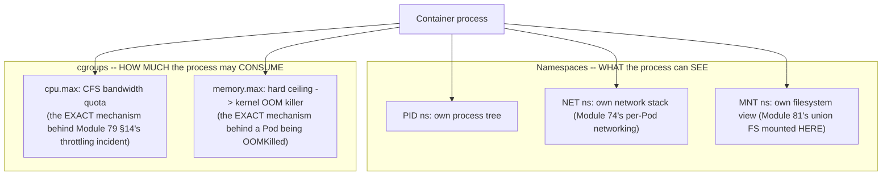
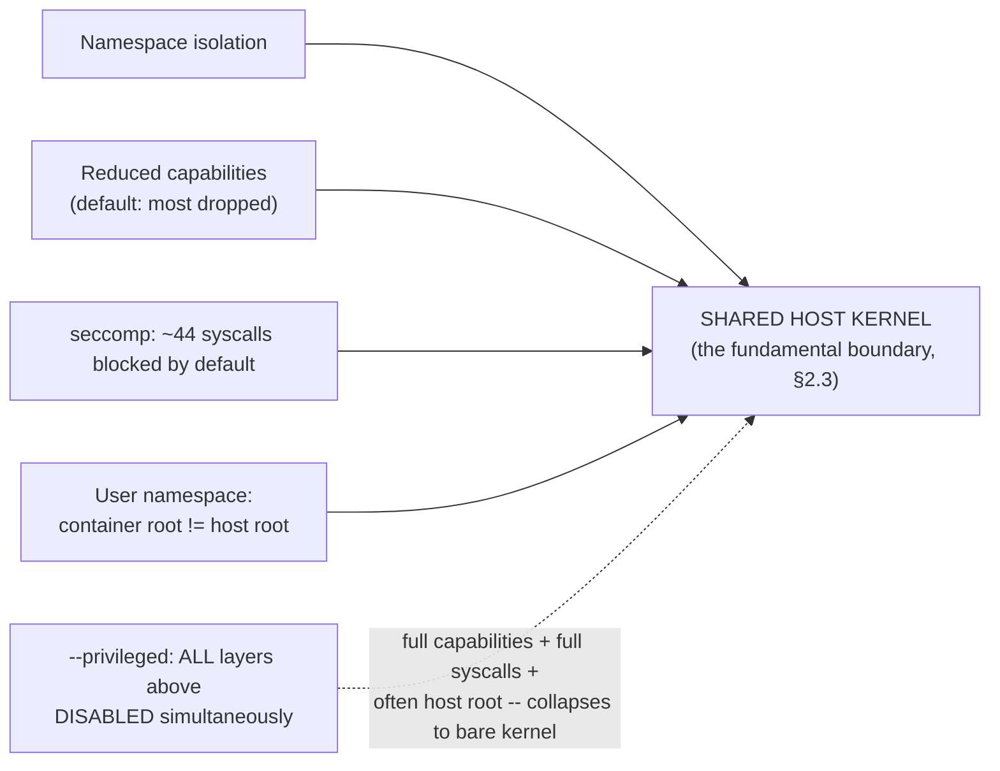
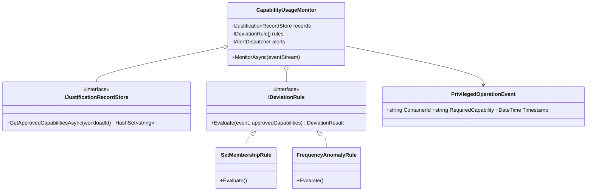
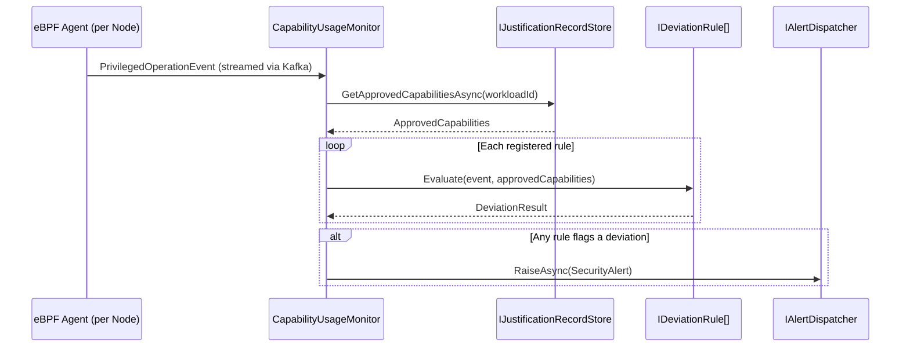

# Module 83 — Docker: Container Runtime Internals & Isolation — Namespaces, cgroups & seccomp

> Domain: Docker | Level: Beginner → Expert | Prerequisite: [[01-Images-Layers-UnionFilesystem]] (the union filesystem this module now locates precisely within the container's mount namespace, §2.1), [[../23-Kubernetes/01-Architecture-ControlPlane-Pods-Deployments]] §2.5 (kubelet/CRI/containerd — this module is the kernel-level mechanism those runtimes actually configure), [[../23-Kubernetes/04-Configuration-Security-ConfigMaps-Secrets-RBAC-PodSecurity]] §2.5 (Pod Security Admission's privileged/baseline/restricted levels are literally the capabilities/seccomp/namespace restrictions this module explains mechanically), [[../23-Kubernetes/05-Scheduling-Autoscaling-Affinity-Taints-HPA-VPA-ClusterAutoscaler]] §7 (the sidecar CPU-throttling incident there was cgroup CFS bandwidth enforcement, explained in full here)

---

## 1. Fundamentals

**What:** A container is not a lightweight virtual machine — it is an ordinary Linux process (or process group) given a restricted, isolated *view* of the kernel's resources via **namespaces**, a bounded *allocation* of resources via **cgroups**, and a reduced *privilege surface* via **capabilities** and **seccomp**. This module explains the actual kernel primitives underlying nearly every container-related concept this course has already covered across the Kubernetes domain, one abstraction level below where those modules stopped.

**Why:** Every Kubernetes finding this course has built up — Module 77's sidecar CPU throttling, Module 76's Pod Security Admission levels, Module 74's per-Pod network isolation, Module 81's union filesystem — is a Kubernetes-level *configuration* of these exact kernel mechanisms. A Principal Engineer who understands the mechanism, not just the Kubernetes-level abstraction, can reason correctly about genuinely novel failure modes (a container escape, an unexpected resource-throttling behavior) that the higher-level abstraction alone doesn't explain.

**When:** Any time debugging a resource-limit-related symptom at its true root cause (not merely its Kubernetes-level symptom), evaluating a container's actual security posture, or making a `--privileged`/capability-granting decision whose consequences this module makes concrete rather than abstract.

**How (30,000-ft view):**
```
Namespaces: ISOLATION -- each namespace type restricts a process's VIEW of one
     kernel resource (PID: process tree; NET: network stack; MNT: filesystem
     mounts; UTS: hostname; IPC; USER: UID mapping)
cgroups: RESOURCE LIMITING -- bounds how MUCH of a resource a process/group of
     processes may consume (CPU quota, memory ceiling, PID count) -- a genuinely
     DIFFERENT function from namespaces' isolation role
Capabilities: splits root's traditionally all-or-nothing power into ~40 discrete
     units -- Docker drops most by default; --privileged re-grants all of them
seccomp: restricts WHICH SYSCALLS a process may invoke at all, via a kernel-
     evaluated BPF filter -- Docker's default profile blocks ~44 dangerous/
     rarely-needed syscalls out of 300+
CRITICAL: the KERNEL ITSELF IS SHARED across every container on a Node -- unlike
     a VM's hardware-virtualization boundary, a kernel-level vulnerability can
     break OUT of namespace isolation entirely, which is exactly why capabilities/
     seccomp/rootless exist as ADDITIONAL, NOT REDUNDANT, defense-in-depth layers
```

---

## 2. Deep Dive

### 2.1 Namespaces — Six Kernel Resource Views, Each Isolated Independently
A Linux **namespace** restricts a process's *view* of one specific kernel resource, without necessarily limiting how much of it can be consumed (that's cgroups' job, §2.2). **PID namespace**: a containerized process sees its own, independent process tree, with itself as PID 1 — it cannot see or signal any process outside its namespace, even though those processes are running on the same, shared host kernel. **NET namespace**: a container gets its own network interfaces, routing table, and iptables rules — this is the exact kernel primitive Kubernetes Pod networking (Module 74 §2.3's CNI plugins) actually configures: a Pod's single, shared IP address exists because every container within that Pod shares **one** network namespace, while different Pods get **separate** network namespaces, precisely the mechanism underlying Module 73 §2.3's "Pod is the atomic networking unit" finding. **MNT namespace**: a container's own, isolated filesystem mount table — this is specifically *where* Module 81's OverlayFS-composed union filesystem is actually mounted; the container process sees only its own mount namespace's view, never the host's full filesystem, unless a volume is explicitly bind-mounted across the boundary. **UTS**, **IPC**, and **USER** namespaces isolate hostname, inter-process-communication resources, and UID/GID mappings respectively — USER namespaces specifically enable §2.6's rootless-container pattern.

### 2.2 cgroups — Resource Limiting, a Genuinely Different Function From Namespace Isolation
**Control groups (cgroups)**, currently in their unified **v2** hierarchy, bound *how much* of a resource a process or process group may consume — a genuinely distinct function from namespaces' *visibility*-restricting role: a process can have full namespace isolation (its own PID tree, its own network stack) while still being permitted unlimited CPU/memory, or conversely, share namespaces with other processes while being tightly resource-bounded — the two mechanisms are orthogonal and independently configured. `cpu.max` sets a CPU quota enforced via the kernel's **CFS (Completely Fair Scheduler) bandwidth control** — this is the *exact* mechanism behind Kubernetes Module 79 §14's sidecar-CPU-throttling incident: a Pod's `resources.limits.cpu` translates directly into a `cpu.max` cgroup setting, and the kernel's CFS bandwidth controller enforces it by literally suspending the process's execution once its quota for the current scheduling period is exhausted, producing the queuing delay that incident's investigation eventually traced to CPU throttling. `memory.max` sets a hard memory ceiling — exceeding it triggers the kernel's **OOM killer**, scoped specifically to that cgroup (killing a process within the container, not host-wide), the exact mechanism behind a Kubernetes Pod being `OOMKilled`. `pids.max` bounds the number of processes a cgroup may spawn, a direct defense against a fork bomb (accidental or malicious) exhausting the host's entire process table.

### 2.3 A Container Is a Process, Not a VM — the Shared-Kernel Boundary and Why Defense-in-Depth Exists
Namespaces and cgroups provide strong, genuinely effective isolation for well-behaved workloads — but the **kernel itself remains shared** across every container on a given Node, a fundamentally different security boundary than a virtual machine's hardware-virtualization-enforced isolation (a VM's guest kernel is entirely separate from the host's). This means a **kernel-level vulnerability** (a container-escape CVE exploiting a bug in the kernel's own namespace/cgroup implementation, or a syscall handler) can, in principle, allow a process to break out of its namespace confinement entirely, regardless of how correctly namespaces/cgroups were configured — this is precisely *why* capabilities (§2.4) and seccomp (§2.5) exist as **additional, non-redundant** defense-in-depth layers, not merely belt-and-suspenders redundancy: they reduce the *attack surface* available to a compromised process (fewer privileged operations it can even attempt, fewer syscalls it can even invoke), directly shrinking the practical likelihood that a given kernel vulnerability is actually reachable and exploitable from within a specific, hardened container, even though namespace isolation alone cannot categorically guarantee containment against every possible kernel-level flaw.

### 2.4 Linux Capabilities — Splitting All-or-Nothing Root Into ~40 Discrete Units
Traditionally, a Linux process is either **root** (UID 0, bypassing essentially all permission checks) or a regular, non-privileged user subject to full permission enforcement — **capabilities** split root's traditionally monolithic power into approximately 40 discrete, independently-grantable units: `CAP_NET_BIND_SERVICE` (bind to a privileged port below 1024 without being full root), `CAP_SYS_ADMIN` (an unusually broad, "almost root" capability covering many administrative operations — a frequent source of accidental over-permissioning when granted without understanding its actual breadth), `CAP_NET_RAW` (craft raw network packets), and many others. Docker **drops most capabilities by default** even for a container running as root internally — a deliberate, already-reduced default posture, not full root-equivalent power — while `--privileged` (or a broad `--cap-add`) re-grants the full capability set, effectively undoing this default hardening. This is the exact kernel-level mechanism Kubernetes's Pod Security Admission (Module 76 §2.5) "baseline" and "restricted" levels are literally, mechanically defined in terms of — "baseline" blocks the small set of capabilities/settings known to enable common privilege-escalation vectors; "restricted" further narrows the allowed capability set to the genuine minimum most applications actually need.

### 2.5 seccomp — Restricting Which Syscalls a Process May Invoke At All
**seccomp** (secure computing mode) restricts *which syscalls* a process is permitted to invoke, via a kernel-evaluated BPF filter checked on every syscall attempt — a materially different, and complementary, restriction dimension from capabilities (which govern *privileged operations* a process may perform) and namespaces (which govern what a process can *see*). Docker's **default seccomp profile** blocks approximately 44 syscalls out of 300+ available ones — syscalls known to be dangerous, rarely legitimately needed by typical containerized workloads, or historically associated with container-escape techniques (certain `clone` flag combinations, `keyctl`, various obscure kernel-module-loading or debugging syscalls). A **custom, application-specific seccomp profile** can further restrict a container to *exactly* the syscalls its specific workload actually invokes (generated via a profiling tool observing the application's genuine syscall usage), reducing the attack surface even further than Docker's already-reduced default — again, this is precisely what Kubernetes's `SecurityContext.seccompProfile` (Module 76's territory) configures at the Pod level, this module now explaining the actual kernel-enforcement mechanism beneath that Kubernetes-level field.

### 2.6 Rootless Containers and User Namespaces — Changing the Blast Radius of a Successful Escape
A **user namespace** maps UIDs *inside* the container to a *different*, typically unprivileged, set of UIDs *outside* it — enabling **rootless containers**: a container's internal "root" (UID 0, as the container sees it) is mapped to an ordinary, non-privileged user on the actual host. This provides genuine, additional defense-in-depth specifically against §2.3's shared-kernel risk: even a *successful* container escape (a process breaking out of its namespace/cgroup confinement via some kernel vulnerability) lands the attacker as an **unprivileged host user**, not host root — a materially smaller, contained blast radius compared to the same escape occurring from a container whose internal root maps directly to genuine host root. The trade-off is real and non-trivial: rootless mode has genuine compatibility limitations — some legitimate operations (binding to a privileged port without `CAP_NET_BIND_SERVICE`, certain storage-driver configurations requiring genuine host-level privilege) don't work transparently under rootless mode, meaning it is not a universal, zero-cost drop-in replacement for every workload, and adopting it requires explicitly validating a given application's actual compatibility rather than assuming universal support.

---

## 3. Visual Architecture

### Namespaces (Isolation) vs. cgroups (Resource Limiting) — Orthogonal Mechanisms (§2.1, §2.2)


### Defense-in-Depth Layers, Collapsed by `--privileged` (§2.3–§2.6, §4)


## 4. Production Example

**Problem:** A platform team needed a logging/monitoring sidecar to read host-level device and filesystem metrics for a specialized observability requirement, and — under deadline pressure, following an online example that "just worked" — configured the sidecar container with `--privileged: true` rather than the specific, narrower set of capabilities the actual metric-collection task required.

**Architecture:** The privileged sidecar ran alongside every application container on every Node in the cluster, sharing the deployment pattern's convenience (one working configuration copied everywhere) without a differentiated, workload-specific capability review per deployment.

**Implementation:** The sidecar functioned correctly for its intended purpose for many months, and the `--privileged` flag's specific risk went unquestioned since the container's own application logic had no known vulnerabilities and no obvious reason to be exploited.

**Trade-offs:** `--privileged` disables essentially every defense-in-depth layer this module establishes simultaneously (§2.3–§2.6) — full capabilities (§2.4), typically the default seccomp profile is also disabled or significantly loosened (§2.5), and the container commonly runs with a direct root-to-root UID mapping rather than any rootless isolation (§2.6) — the team's actual, intended requirement (reading specific host metrics) needed only a narrow subset of this sweeping grant, but the convenience of a known-working, unreviewed configuration was prioritized over the security cost of the excess privilege it carried.

**Lessons learned:** An unrelated vulnerability was later discovered in a third-party logging library the sidecar depended on, permitting remote code execution within the sidecar's own container context — and *because* the container was privileged, the resulting compromise escalated from "RCE confined to one sidecar container" to **full host root compromise** almost trivially: a privileged container can directly mount the host's root filesystem, access every device node, and effectively step outside its namespace confinement using capabilities and kernel access a non-privileged container would never have had available at all. Had the sidecar instead run with Docker's default, already-reduced capability set, the default seccomp profile active, and (ideally) under rootless configuration, the *identical* RCE vulnerability would very likely have remained **contained to the compromised container alone** — unable to escalate to host-level compromise, unable to access other containers' data, and unable to pivot further into the cluster — the same vulnerability, but a dramatically different, contained blast radius, purely as a function of the capability/seccomp/rootless configuration this incident's original `--privileged` shortcut had discarded. The fix was rebuilding the sidecar with the *specific*, narrow capability set its actual task required (a small, explicit `--cap-add` list, verified against the task's genuine needs, rather than `--privileged`'s unconditional grant of everything), and establishing a standing policy requiring explicit, reviewed justification for any capability grant beyond Docker's default set. **This is this module's defining lesson**: `--privileged` (and, at the Kubernetes layer, a Pod's `securityContext.privileged: true`) is not "a slightly more permissive configuration" — it is the simultaneous removal of every defense-in-depth layer this module establishes, converting *any* future, currently-unknown vulnerability in that container's application code into a *host-level* compromise risk by default, rather than a contained, single-container risk — a Principal Engineer must treat any `--privileged` request with the same severity this course has applied to a `cluster-admin` RBAC grant (Module 76 §8) or a wildcard IAM policy (Module 58), since it represents the equivalent maximal-blast-radius grant at the container-runtime layer specifically.

## 5. Best Practices
- Grant the specific, minimal set of capabilities a container's actual task requires via `--cap-add`, never `--privileged`, which grants the complete set unconditionally (§2.4, §4).
- Treat any `--privileged`/`securityContext.privileged: true` request with `cluster-admin`-equivalent severity in security review — it disables every defense-in-depth layer this module establishes simultaneously, not merely one (§4, §8).
- Evaluate rootless container operation explicitly for any workload where the compatibility trade-off (§2.6) is acceptable, specifically for the reduced-blast-radius benefit against a successful escape.
- Use a custom, workload-specific seccomp profile (generated via syscall profiling) for any container with genuinely elevated risk exposure, narrowing beyond Docker's already-reduced default (§2.5).
- Diagnose resource-related symptoms (CPU throttling, OOM kills) by directly inspecting the relevant cgroup's actual configuration and metrics, not merely the Kubernetes-level resource request/limit fields, when root-causing an unexpected behavior (§2.2).

## 6. Anti-patterns
- Reaching for `--privileged` as a convenience shortcut for a task that only requires a small, specific capability subset, without evaluating the narrower alternative (§4).
- Treating namespace isolation alone as a complete, sufficient security boundary, without recognizing the shared-kernel risk that motivates capabilities/seccomp/rootless as necessary, non-redundant additional layers (§2.3).
- Assuming a container's default configuration already provides maximal isolation, without verifying whether the default seccomp profile and capability set are actually active (versus disabled by an inherited `--privileged` or broad `--cap-add` further up a deployment pipeline).
- Debugging a resource-throttling or OOM-kill symptom purely at the Kubernetes-manifest level (adjusting `resources.limits`) without understanding the underlying cgroup mechanism actually enforcing the observed behavior (§2.2).
- Copying a working `--privileged` configuration example from an unreviewed external source without verifying whether the actual task genuinely requires that sweeping a grant (§4).

---

## 10. Interview Questions

### Basic (10)

1. **Q: Is a Docker container a lightweight virtual machine?**
   **A:** No — it's an ordinary Linux process given a restricted, isolated view of the kernel via namespaces, cgroups, capabilities, and seccomp, sharing the host kernel directly.
   **Why correct:** Correctly states the fundamental architectural distinction from a VM.
   **Common mistakes:** Describing containers as having their own kernel, the way a VM has its own guest OS.
   **Follow-ups:** "What's the practical security implication of this shared-kernel model?" (A kernel vulnerability can potentially break container isolation entirely, §2.3.)

2. **Q: What is the function of a Linux namespace?**
   **A:** Restricts a process's *view* of a specific kernel resource (its own process tree, network stack, filesystem mounts, etc.).
   **Why correct:** Correctly identifies the visibility/isolation function specifically.
   **Common mistakes:** Confusing namespaces' isolation function with cgroups' resource-limiting function.
   **Follow-ups:** "Name three namespace types." (PID, NET, MNT — also UTS, IPC, USER.)

3. **Q: What is the function of a cgroup?**
   **A:** Bounds how much of a resource (CPU, memory, process count) a process or group of processes may consume.
   **Why correct:** Correctly identifies the resource-limiting function, distinct from namespaces.
   **Common mistakes:** Assuming cgroups also handle process/network isolation, conflating them with namespaces.
   **Follow-ups:** "What happens when a container exceeds its memory.max cgroup setting?" (The kernel OOM killer is invoked, scoped to that cgroup.)

4. **Q: What does `--privileged` do to a Docker container?**
   **A:** Grants the full set of Linux capabilities and typically disables/loosens the default seccomp profile, effectively removing most of the container's isolation-reducing defense layers.
   **Why correct:** Correctly names both major effects (capabilities and seccomp).
   **Common mistakes:** Assuming `--privileged` only affects one specific permission, rather than broadly disabling multiple defense layers at once.
   **Follow-ups:** "What's the severity-equivalent Kubernetes RBAC concept, per this module?" (A `cluster-admin` grant, Module 76 §8.)

5. **Q: What are Linux capabilities?**
   **A:** A mechanism splitting root's traditionally all-or-nothing privileges into roughly 40 discrete, independently-grantable units.
   **Why correct:** Correctly describes the granular-permission concept.
   **Common mistakes:** Assuming capabilities are a Docker-specific concept rather than a general Linux kernel feature.
   **Follow-ups:** "Does Docker run containers with full root capabilities by default?" (No — most capabilities are dropped by default even for a container running internally as root, §2.4.)

6. **Q: What does seccomp restrict?**
   **A:** Which syscalls a process is permitted to invoke at all, enforced via a kernel-evaluated BPF filter.
   **Why correct:** Correctly identifies the syscall-level restriction, distinct from capabilities' privileged-operation restriction.
   **Common mistakes:** Confusing seccomp (syscall restriction) with capabilities (privileged-operation restriction) as the same mechanism.
   **Follow-ups:** "How many syscalls does Docker's default seccomp profile block?" (Approximately 44 out of 300+.)

7. **Q: What is a rootless container?**
   **A:** A container whose internal "root" (UID 0) is mapped, via a user namespace, to a non-privileged UID on the actual host.
   **Why correct:** Correctly describes the user-namespace-based UID-mapping mechanism.
   **Common mistakes:** Assuming rootless means the container has no root user at all, rather than a mapped, non-privileged one.
   **Follow-ups:** "What's the security benefit of rootless mode specifically?" (A successful container escape lands the attacker as an unprivileged host user, not host root, §2.6.)

8. **Q: What Kubernetes concept is mechanically implemented by capabilities and seccomp restrictions, per this module?**
   **A:** Pod Security Admission's baseline/restricted levels (Module 76 §2.5).
   **Why correct:** Correctly connects the kernel-level mechanism to the specific Kubernetes-level abstraction already covered.
   **Common mistakes:** Treating Pod Security Admission as an independent, unrelated Kubernetes-only concept rather than a configuration surface for these exact kernel primitives.
   **Follow-ups:** "What Kubernetes field directly configures a custom seccomp profile?" (`SecurityContext.seccompProfile`.)

9. **Q: What cgroup mechanism was the actual root cause of Module 79 §14's sidecar CPU-throttling incident?**
   **A:** The `cpu.max` cgroup setting, enforced via the kernel's CFS bandwidth control.
   **Why correct:** Directly connects this module's mechanism to the specific, already-covered incident.
   **Common mistakes:** Attributing that incident's cause to a purely application-level or Kubernetes-scheduler-level factor, missing the underlying kernel mechanism.
   **Follow-ups:** "Why did that incident manifest as tail latency specifically, not average latency?" (Throttling occurs during burst periods when demand exceeds the quota, disproportionately affecting the slowest percentile.)

10. **Q: Are namespaces and cgroups the same mechanism?**
    **A:** No — namespaces control what a process can *see* (isolation); cgroups control how much it can *consume* (resource limiting) — they're orthogonal, independently-configured mechanisms.
    **Why correct:** Directly states the key distinguishing distinction this module establishes.
    **Common mistakes:** Treating "containerization" as one single, undifferentiated mechanism rather than these two (plus capabilities/seccomp) distinct primitives.
    **Follow-ups:** "Could a process have full namespace isolation but unlimited resource consumption?" (Yes — the two are independently configured; this is a real, if unusual, possible combination.)

### Intermediate (10)

1. **Q: Why does a Pod's containers sharing "one network namespace" (Module 73 §2.3) directly explain why they can address each other via `localhost`?**
   **A:** Containers within the same network namespace share the identical network stack/interfaces — `localhost` within that shared namespace refers to the same loopback interface for every container inside it, exactly the mechanism enabling sidecar-pattern communication.
   **Why correct:** Correctly connects the namespace mechanism to the specific, previously-established Kubernetes-level behavior.
   **Common mistakes:** Assuming Pod-level `localhost` communication requires some Kubernetes-specific networking feature, rather than being a direct consequence of shared NET namespace membership.
   **Follow-ups:** "Do containers within the same Pod also share a PID namespace by default?" (No — PID namespace is typically per-container by default unless explicitly configured otherwise via `shareProcessNamespace`, a genuinely separate, independently-configurable setting from NET namespace sharing.)

2. **Q: Why is it inaccurate to say cgroups "isolate" a container's resource usage from other containers?**
   **A:** cgroups *bound* how much of a resource a process may consume, but this is a limiting/accounting function, not the visibility-restricting function "isolation" typically implies — a process could theoretically observe host-wide resource metrics (depending on what's exposed within its mount namespace) while still being resource-*limited* by its own cgroup constraints; the two properties (visibility and consumption-bounding) are genuinely separate.
   **Why correct:** Correctly distinguishes the precise technical meaning of "limiting" from "isolating," avoiding the common conflation.
   **Common mistakes:** Using "isolation" loosely to describe both namespaces' and cgroups' functions interchangeably.
   **Follow-ups:** "What would a process need in order to see ONLY its own cgroup's resource metrics, not host-wide ones?" (A properly-configured, isolated `/proc` and `/sys` filesystem view within its mount namespace, specifically restricting visibility into host-wide resource-accounting files.)

3. **Q: Why does §2.3 describe namespace isolation as providing "strong isolation for well-behaved workloads" rather than absolute isolation?**
   **A:** Namespace isolation is enforced entirely by the shared host kernel's own correct implementation — a kernel-level vulnerability (a bug in the namespace/cgroup implementation itself, or in a syscall handler) can, in principle, allow a process to escape that isolation regardless of how correctly the namespaces were configured, since the isolation guarantee is only as strong as the kernel code enforcing it.
   **Why correct:** Correctly identifies the specific caveat (kernel-implementation-dependent guarantee) rather than treating namespace isolation as an absolute, unconditional boundary.
   **Common mistakes:** Treating namespace isolation as equivalently strong to a VM's hardware-virtualization boundary.
   **Follow-ups:** "Why does this specifically motivate capabilities and seccomp as ADDITIONAL layers, not redundant ones?" (They reduce the attack surface available to a compromised process, lowering the likelihood a given kernel vulnerability is actually reachable/exploitable, even though they can't categorically guarantee containment either, §2.3.)

4. **Q: Why does §4's incident describe the identical RCE vulnerability as producing a dramatically different outcome depending on the container's capability/seccomp/rootless configuration?**
   **A:** The vulnerability itself (RCE within the sidecar's application code) was constant — what varied was the *blast radius* available to that RCE once achieved: a privileged container's RCE has full capabilities and (often) an unrestricted syscall surface available to escalate further, while a properly-hardened container's RCE is confined by the reduced capability set and seccomp filter, unable to perform the specific operations (mounting the host filesystem, accessing arbitrary devices) needed to escalate beyond the container.
   **Why correct:** Correctly distinguishes "the vulnerability existing" from "the vulnerability's actual, realized impact," attributing the difference entirely to the container's defense-in-depth configuration.
   **Common mistakes:** Assuming the vulnerability's severity is an intrinsic property of the vulnerability itself, independent of the container's runtime configuration.
   **Follow-ups:** "Does this mean hardening (capabilities/seccomp/rootless) prevents the RCE from occurring at all?" (No — it doesn't prevent the initial vulnerability from being exploited; it contains the resulting compromise's blast radius, a distinct and complementary protection.)

5. **Q: Why is Docker's default (non-privileged, capability-reduced, default-seccomp) configuration described as "already hardened," not merely "unconfigured"?**
   **A:** Docker deliberately drops most Linux capabilities and applies a restrictive default seccomp profile even for a container that would otherwise run as root internally — this is an active, deliberate security decision built into the default runtime behavior, not an absence of configuration; `--privileged` specifically *undoes* this active hardening rather than merely "adding" permissiveness to an unconfigured baseline.
   **Why correct:** Correctly frames the default as an active security posture being removed, not a neutral baseline being escalated from.
   **Common mistakes:** Assuming a non-privileged container has "no particular security configuration" rather than recognizing Docker's defaults as themselves a deliberate hardening choice.
   **Follow-ups:** "Why does this framing matter for how a security review should treat a `--privileged` request?" (It should be reviewed as an explicit, deliberate *removal* of existing protection, warranting the same scrutiny this course applies to removing any other established safeguard.)

6. **Q: Why does `CAP_SYS_ADMIN` specifically get called out as "almost root" in §2.4, rather than being treated as just one capability among many equally-scoped ones?**
   **A:** Unlike most capabilities, which grant a narrow, specific privileged operation (e.g., `CAP_NET_BIND_SERVICE` only affects privileged-port binding), `CAP_SYS_ADMIN` covers an unusually broad and loosely-defined set of administrative operations that, collectively, approach the practical power of full root — granting it without understanding its actual breadth is a common, easy way to accidentally reintroduce most of `--privileged`'s risk while believing a "specific, narrow" capability was granted.
   **Why correct:** Correctly identifies why this specific capability warrants heightened scrutiny relative to most others, rather than treating all ~40 capabilities as equally narrow and low-risk.
   **Common mistakes:** Assuming any individual, named capability grant is inherently narrow and low-risk simply because it's not `--privileged` itself.
   **Follow-ups:** "What would a security review specifically ask before approving a `CAP_SYS_ADMIN` grant?" (An explicit justification of exactly which sub-operations within its broad scope the workload actually needs, and whether a narrower, more specific capability could satisfy the same requirement instead.)

7. **Q: Why is rootless mode's compatibility limitation (§2.6) described as a genuine trade-off rather than a solvable configuration detail?**
   **A:** Certain operations (binding to privileged ports without `CAP_NET_BIND_SERVICE`, specific storage-driver configurations) have a genuine, structural dependency on host-level privilege that a user-namespace UID remapping alone cannot satisfy — this isn't a matter of finding the right flag or configuration; it's an inherent limitation of what an unprivileged host user is fundamentally permitted to do, requiring either a workaround (an explicitly-granted, narrow capability even under rootless mode) or accepting the operation isn't available.
   **Why correct:** Correctly frames this as a structural, not merely configurational, limitation.
   **Common mistakes:** Assuming rootless mode is a universal, zero-compatibility-cost hardening measure applicable to every workload without exception.
   **Follow-ups:** "How would you validate whether a specific workload is compatible with rootless mode before adopting it broadly?" (Explicit testing against the workload's actual required operations, not an assumption of universal compatibility.)

8. **Q: Why does understanding cgroup v2's unified hierarchy matter for diagnosing a resource-limit-related performance issue, per §7?**
   **A:** cgroup v1's legacy split-hierarchy model (separate hierarchies per resource controller) has genuinely different edge-case behaviors than v2's single, unified hierarchy — a diagnostic approach or tooling assumption valid for one version may not directly transfer to the other, meaning confirming which version is actually in use is a necessary first step before applying version-specific diagnostic reasoning.
   **Why correct:** Correctly identifies why version awareness is a genuine diagnostic prerequisite, not a trivial detail.
   **Common mistakes:** Assuming cgroup behavior is uniform and version-independent when diagnosing a resource-related incident.
   **Follow-ups:** "How would you determine which cgroup version a given Node is using?" (Checking the Node's mounted filesystem for `/sys/fs/cgroup`'s structure — a unified single hierarchy indicates v2; separate per-controller subdirectories indicate v1.)

9. **Q: Why does a fork bomb specifically get contained by `pids.max`, a cgroup setting, rather than by any namespace mechanism?**
   **A:** A fork bomb's danger is *resource exhaustion* (consuming the entire process table) — a namespace could isolate a fork bomb's *visibility* (it can only see/signal processes within its own PID namespace) without limiting *how many* processes it's permitted to create at all; `pids.max` specifically bounds that consumption, directly cgroups' resource-limiting function (§2.2), not namespaces' isolation function.
   **Why correct:** Correctly applies the namespaces-vs-cgroups distinction to a concrete, specific threat scenario.
   **Common mistakes:** Assuming PID namespace isolation alone would contain a fork bomb's resource-exhaustion risk.
   **Follow-ups:** "Would a fork bomb without pids.max configured still be contained by its PID namespace?" (It would be isolated in scope (unable to affect processes outside its namespace directly), but could still exhaust the host's overall process-table capacity or the Node's memory, since namespace isolation alone doesn't cap resource consumption.)

10. **Q: Why does this module frame itself as "one abstraction level below" the Kubernetes domain rather than an entirely separate, unrelated topic?**
    **A:** Every Kubernetes-level concept this course has covered involving container isolation or resource management (Pod Security Admission, resource requests/limits, per-Pod networking, the union filesystem) is, in this module's terms, a specific Kubernetes-API-level *configuration surface* for these exact kernel primitives (namespaces, cgroups, capabilities, seccomp) — understanding the kernel mechanism explains *why* the Kubernetes-level abstraction behaves the way it does, rather than requiring those behaviors to be separately memorized as Kubernetes-specific facts.
    **Why correct:** Correctly articulates the module's actual relationship to prior course content — mechanism versus abstraction, not two unrelated topics.
    **Common mistakes:** Treating Docker runtime internals and Kubernetes container management as two separate, non-overlapping bodies of knowledge.
    **Follow-ups:** "Give one more example of a Kubernetes-level behavior this module's mechanism explains." (A Pod's `emptyDir` volume, Module 75 §2.1, is implemented as a directory within the container's mount namespace — its Pod-lifetime-scoped, not container-lifetime-scoped, persistence is a consequence of Kubernetes managing that mount's lifecycle at the Pod level, layered on top of the underlying namespace mechanism.)

### Advanced (10)

1. **Q: Diagnose §4's incident from first principles, and design the specific organizational review process preventing a future `--privileged` request from being approved without genuine, task-specific justification.**
   **A:** Root cause: `--privileged` was adopted as a convenience shortcut under deadline pressure, based on an unreviewed external example, without evaluating whether the actual task (reading specific host metrics) required anything close to the full capability/seccomp/rootless-defeating grant `--privileged` provides. Structural fix: mandate that any `--privileged` or broad-capability request undergo the same severity-tier review this course established for `cluster-admin`/wildcard-IAM-policy requests (Module 76 §8, Module 58) — requiring an explicit, task-specific justification identifying the *precise* operations needed, a narrower `--cap-add` alternative genuinely evaluated first, and (if `--privileged` is still deemed unavoidable) an explicit, time-bounded or continuously-monitored exception rather than a permanent, unreviewed default — directly this course's now-repeated "structural, enforced review for maximal-blast-radius grants, not ad hoc convenience adoption" pattern.
   **Why correct:** Correctly identifies the root cause (convenience over justified need) and proposes a structural review process explicitly modeled on this course's already-established severity-tier precedent for equivalent-blast-radius grants in other domains.
   **Common mistakes:** Proposing only "train engineers not to use --privileged," a documentation-only fix this course has repeatedly identified as insufficient without structural enforcement.
   **Follow-ups:** "What automated check could catch an existing, already-deployed `--privileged` container that predates this review process?" (A cluster-wide scan (directly Module 76's admission-webhook/Kyverno pattern) flagging every currently-running Pod with `securityContext.privileged: true`, prioritized for remediation by the severity of what that specific container's actual task requires versus what it's been granted.)

2. **Q: A team argues that since their `--privileged` sidecar has "never actually been exploited" in over a year of production operation, the risk this module describes is largely theoretical for their specific case. Evaluate this claim.**
   **A:** Push back — "never exploited yet" is evidence about the *absence of a triggering vulnerability having been found and exploited so far*, not evidence that the *blast radius* of a future vulnerability (in this sidecar's own code, or any dependency it uses) would be small — §4's incident's actual point is that the privileged configuration determines the **severity of consequence** *if* a compromise occurs, not the *probability* of one occurring; a currently-unexploited container can still harbor an undiscovered vulnerability (exactly what §4's incident eventually revealed, after months of apparently uneventful operation) — "no incident yet" is not evidence of "no risk," precisely the same "untested control carries the same risk as an untested DR strategy" reasoning this course has applied throughout the Kubernetes domain (Module 64 §Advanced Q6).
   **Why correct:** Correctly distinguishes probability-of-compromise from severity-of-consequence-if-compromised, and connects to this course's established "absence of an incident is not evidence of absence of risk" discipline.
   **Common mistakes:** Accepting "no incident so far" as meaningful evidence that a security posture is adequate.
   **Follow-ups:** "What would constitute genuine evidence the risk is acceptable, short of waiting for an actual incident?" (An explicit, documented risk acceptance from an appropriately senior stakeholder, made with full awareness of the actual blast-radius trade-off — not silence/inaction being mistaken for implicit acceptance.)

3. **Q: Design the specific automated check that would have caught §4's incident's root configuration issue before the sidecar was ever deployed to production, extending this course's "prevent, don't merely detect" discipline.**
   **A:** A pre-deployment admission-control check (directly Module 76 §2.6's mutating/validating webhook mechanism) rejecting any Pod spec declaring `securityContext.privileged: true` (or an equivalently broad capability grant) without an accompanying, explicit annotation documenting the specific justification and referencing an approved exception record — forcing the justification-and-review process (Advanced Q1's structural fix) to occur *before* deployment is technically possible, not merely as an after-the-fact, best-effort security-review recommendation a busy team under deadline pressure might reasonably skip.
   **Why correct:** Correctly proposes a technically-enforced, pre-deployment gate rather than a policy-document-only recommendation, directly reusing an already-established Kubernetes mechanism (admission control) rather than inventing a new one.
   **Common mistakes:** Proposing only a post-deployment scanning/detection check, missing the opportunity to prevent the risky configuration from ever reaching production in the first place.
   **Follow-ups:** "What would the exception-record approval workflow need to include to avoid becoming a rubber-stamp process?" (An explicit, task-specific capability analysis — directly Advanced Q1's requirement — reviewed by someone independent of the requesting team, avoiding the same team's own convenience-driven reasoning being the sole approval gate.)

4. **Q: A workload genuinely requires `CAP_SYS_ADMIN` for a specific, legitimate operation (mounting a specialized filesystem type at runtime). Design the narrowest possible security posture for this workload, incorporating every defense-in-depth layer this module establishes.**
   **A:** Grant `CAP_SYS_ADMIN` specifically (via `--cap-add`, not `--privileged`, avoiding the full, unconditional capability grant §4's incident demonstrates the risk of) while explicitly retaining every *other* default protection: Docker's default (or an even more restrictive, custom) seccomp profile remains active (§2.5) — `CAP_SYS_ADMIN` alone doesn't disable seccomp enforcement, meaning the syscall-level restriction still meaningfully narrows what the granted capability can actually be exploited to do; rootless operation is evaluated for compatibility with the specific mount operation required (§2.6, acknowledging this may not be achievable given `CAP_SYS_ADMIN`'s own typical incompatibility with fully unprivileged rootless mode, a genuine, explicit trade-off to document rather than silently accept); and the workload is isolated to a dedicated, minimal-blast-radius Node pool (directly Module 77 §2.3's taint/toleration dedication pattern) specifically because this capability grant represents a meaningfully elevated risk tier relative to the cluster's other, unprivileged workloads.
   **Why correct:** Correctly composes multiple, independent defense-in-depth layers (narrow capability grant, retained seccomp, considered rootless trade-off, Node-level isolation) rather than treating a single mitigation as sufficient on its own, and explicitly documents the residual trade-off rather than glossing over it.
   **Common mistakes:** Treating a narrow `--cap-add` grant alone as fully resolving the risk, without also considering whether seccomp/rootless/Node-isolation should still apply on top of it.
   **Follow-ups:** "How would you monitor this specific workload for signs of the granted capability being misused post-deployment?" (Runtime security monitoring — e.g., Falco or an equivalent syscall/capability-usage auditing tool — specifically alerting on any use of `CAP_SYS_ADMIN`-gated operations outside the workload's known, expected pattern.)

5. **Q: Critique the following claim: "Since our container runs as a non-root user inside the container (via a Dockerfile `USER` instruction), it is fully protected against the privilege-escalation risk this module describes, regardless of its capability/seccomp/privileged configuration."**
   **A:** Overstated — a Dockerfile `USER` instruction changes which *internal* UID the containerized process runs as, but this is an entirely separate mechanism from capabilities, seccomp, or `--privileged` (§2.1's namespaces vs. §2.4's capabilities distinction, generalized): a non-root internal user running in a `--privileged` container can, depending on the specific privileged operations available, still potentially escalate to root within the container's own namespace (many container-escape and local-privilege-escalation techniques specifically target exactly this "non-root internal user, but privileged container" combination) — a Dockerfile `USER` instruction is a genuinely valuable, additive protection layer, but does not substitute for or override the container-runtime-level capability/seccomp/privileged configuration this module establishes as the actual, primary defense-in-depth mechanism against escalation and escape.
   **Why correct:** Correctly identifies that Dockerfile-level `USER` and container-runtime-level capability/privilege configuration are independent, non-substitutable mechanisms, directly applying this module's namespaces/cgroups/capabilities orthogonality theme to a new pairing (application-level UID vs. runtime-level privilege).
   **Common mistakes:** Treating a non-root Dockerfile `USER` instruction as sufficient protection on its own, regardless of the container's actual runtime capability/privilege configuration.
   **Follow-ups:** "Design the combination of both mechanisms together for maximal protection." (A non-root `USER` instruction in the Dockerfile, combined with Docker's default (or custom, minimal) capability set and seccomp profile at the runtime layer, plus rootless host-level operation where compatible — layering the application-level and runtime-level protections together, neither alone being sufficient.)

6. **Q: Explain why this module's central lesson — that `--privileged` "simultaneously removes multiple independent defense-in-depth layers" — is a specific, concrete instance of a broader pattern this course has established, and identify the parallel instance from the AWS/Azure/Kubernetes material.**
   **A:** This directly parallels Module 64/72's Well-Architected capstone finding that cost, reliability, and performance form a genuine three-way trade-off requiring explicit, deliberate reasoning about each dimension for a given decision, rather than a single, undifferentiated "more secure/less secure" axis — `--privileged` isn't "somewhat less secure" than a default configuration, it's a specific, simultaneous removal of several genuinely independent protections (capabilities, seccomp, often rootless isolation), each of which addresses a different specific risk; understanding this as a **multi-dimensional** removal, not a single-axis one, is what allows the narrower alternative (Advanced Q4's targeted `--cap-add` while retaining every other layer) to exist at all — a Principal Engineer who treats security posture as a single scalar ("more hardened" vs. "less hardened") rather than a set of independently-reasoned-about dimensions cannot construct this kind of surgical, minimal-blast-radius alternative.
   **Why correct:** Correctly identifies the general pattern (multi-dimensional, not single-axis, trade-off reasoning) and connects it to a specific, previously-established instance from a different domain, demonstrating genuine cross-domain synthesis.
   **Common mistakes:** Treating this module's finding as an isolated, Docker-specific fact rather than recognizing its structural similarity to an already-established, more general principle.
   **Follow-ups:** "What's the risk of treating container security as a single scalar dimension in a security review?" (A reviewer might approve `--privileged` as "an acceptable trade-off for functionality" without ever separately evaluating whether each of the specific protections being removed — capabilities, seccomp, rootless — was individually necessary to remove, missing the narrower, equally-functional alternative entirely.)

7. **Q: A Principal Engineer discovers that a Kubernetes cluster's default Pod Security Admission level is set to "baseline" (Module 76 §2.5) cluster-wide, and is asked whether this is sufficient to prevent the class of incident §4 describes. Evaluate this, connecting PSA's Kubernetes-level abstraction to this module's kernel-level mechanism explicitly.**
   **A:** "Baseline" specifically blocks the small set of capabilities/settings known to enable the most common privilege-escalation vectors (including, critically, `privileged: true` itself, per Module 76's own scope) — meaning a cluster-wide "baseline" PSA level would have structurally *prevented* §4's incident's Pod spec from ever being admitted at all, since `securityContext.privileged: true` is exactly the kind of setting "baseline" is designed to reject; however, "baseline" is deliberately less restrictive than "restricted" (Module 76 §2.5) — it may still permit certain broader capability grants (like `CAP_SYS_ADMIN`, Advanced Q6's example) that, while not full `--privileged`, still carry meaningful risk — a genuinely comprehensive answer should confirm "baseline" specifically closes the *exact* gap §4's incident exploited, while noting it does not eliminate every possible capability-related risk this module's Advanced Q4 discussion covers, which would require "restricted" instead.
   **Why correct:** Correctly connects the Kubernetes-level abstraction to its actual, mechanical kernel-level effect, and appropriately scopes the claim (closes this specific gap, doesn't eliminate every related risk) rather than either overclaiming or dismissing PSA's relevance.
   **Common mistakes:** Either assuming PSA is irrelevant to this module's kernel-level findings, or overclaiming that "baseline" alone eliminates every capability-related risk this module discusses.
   **Follow-ups:** "Why might an organization choose 'baseline' over 'restricted' as its cluster-wide default, despite 'restricted' being stricter?" (Broader workload compatibility — 'restricted' may reject legitimate Pod configurations some existing workloads depend on, requiring the same kind of staged, verified migration Module 76 §4's own incident established as necessary practice, rather than an immediate, untested cutover to the stricter level.)

8. **Q: Design a runtime-detection strategy (not merely a pre-deployment prevention gate) for identifying a container that is exploiting an unexpectedly broad capability grant — for example, using `CAP_SYS_ADMIN` for a genuinely unauthorized operation outside its documented, approved purpose.**
   **A:** Deploy a runtime security-monitoring tool (Falco, or an equivalent eBPF-based syscall/capability-usage observability tool) configured with rules specifically matching the *documented, expected* operations of any capability-elevated workload (per Advanced Q4's justification record) — alerting on any observed syscall or privileged operation *outside* that documented, expected pattern for a given workload's specific capability grant, treating any such deviation as a high-priority investigation trigger, directly the same "verify actual runtime behavior, don't merely trust the declared/approved configuration" discipline this entire course has established repeatedly (Module 74/76/79's synthetic-verification pattern, now applied to runtime capability *usage* specifically, complementing rather than replacing Advanced Q3's pre-deployment prevention gate).
   **Why correct:** Correctly proposes a runtime, behavior-verification layer complementing the pre-deployment prevention gate, directly extending this course's now-standard "prevention plus ongoing verification, neither alone sufficient" governance pattern to capability-usage monitoring specifically.
   **Common mistakes:** Relying solely on the pre-deployment approval gate (Advanced Q3) without any corresponding runtime monitoring for actual, ongoing misuse of an approved grant.
   **Follow-ups:** "What's the risk of a purely allow-list-based runtime detection approach, versus a more general anomaly-detection approach?" (A rigid allow-list might generate excessive false positives for any legitimate but previously-unobserved operation pattern, echoing this course's Module 82 §14/§15 false-positive-rate-management lesson — a well-tuned combination of both approaches, similar to that module's combined name-pattern-plus-entropy detector design, is likely more robust than either alone.)

9. **Q: A team's rootless container deployment (§2.6) fails to bind to port 443 (a privileged port) despite the containerized application being explicitly designed to serve HTTPS traffic directly. Diagnose the cause and design the correct fix, avoiding simply reverting to a non-rootless, privileged configuration.**
   **A:** This is exactly §2.6's documented compatibility limitation — binding to a privileged port (below 1024) without `CAP_NET_BIND_SERVICE` requires genuine host-level privilege that rootless mode's unprivileged UID mapping doesn't confer; the correct fix, preserving rootless mode's genuine security benefit rather than abandoning it, is either (a) explicitly granting only `CAP_NET_BIND_SERVICE` specifically (a narrow, well-understood, low-risk capability, not `--privileged` or `CAP_SYS_ADMIN`) while retaining rootless operation and every other default protection, or (b) more commonly, having the application bind to a non-privileged port (e.g., 8443) internally and letting an external load balancer or reverse proxy (already running with appropriate, narrowly-scoped privilege) handle the actual privileged-port binding and forward traffic to the application's non-privileged port — avoiding the need for the application container itself to hold any elevated capability at all.
   **Why correct:** Correctly diagnoses the specific, structural cause (§2.6's compatibility limitation) and proposes two genuinely narrow fixes preserving rootless mode's security benefit, rather than the regressive "just make it privileged again" non-solution.
   **Common mistakes:** Reverting to a fully privileged or non-rootless configuration as the path of least resistance, discarding the security benefit rootless mode was specifically adopted to provide.
   **Follow-ups:** "Which of the two proposed fixes would you recommend by default, and why?" (Option (b), the external-load-balancer pattern — it's a broadly standard, well-understood architecture (directly Module 74 §2.4's Ingress/load-balancer pattern) that avoids granting the application container itself any elevated capability at all, a strictly narrower risk profile than option (a)'s explicit capability grant.)

10. **Q: As a Principal Engineer establishing container-runtime security standards for an organization running workloads with genuinely varied risk profiles (some processing untrusted external input, some purely internal/trusted), design the complete, tiered security-posture framework (synthesizing this entire module) that appropriately differentiates governance rigor by actual risk level.**
    **A:** (1) A default, baseline posture for all workloads: Docker's default capability set and seccomp profile, `securityContext.privileged: false` enforced cluster-wide via Pod Security Admission "baseline" at minimum (Advanced Q7), with any deviation requiring the explicit, structured justification-and-review process (Advanced Q1/Q3). (2) An elevated tier for workloads processing genuinely untrusted input (public-facing APIs, user-uploaded-content processors): mandatory "restricted" PSA level, rootless operation wherever compatible (§2.6, with documented exceptions per Advanced Q9's pattern where genuinely incompatible), and a custom, workload-specific seccomp profile narrowed beyond Docker's default (§2.5). (3) A dedicated, isolated Node-pool tier (Module 77 §2.3's taint/toleration pattern) for any workload requiring a genuinely broad capability grant (like `CAP_SYS_ADMIN`, Advanced Q4), explicitly separating its elevated blast radius from the cluster's general workload population. (4) Mandatory runtime capability/syscall-usage monitoring (Advanced Q8) for any workload in tiers 2 or 3, verifying actual behavior continuously matches its documented, approved justification — never trusting the approval record alone as ongoing assurance. (5) A recurring, scheduled audit (directly this course's Module 64/72/76/80 capstone-review pattern) re-verifying every currently-approved elevated-privilege exception remains genuinely justified, since a workload's actual need can change over time even if its original approval never expires.
    **Why correct:** Synthesizes every finding in this module into a coherent, risk-tiered governance framework, explicitly differentiating rigor by actual workload risk profile rather than applying uniform, one-size-fits-all rules — directly mirroring this course's established capstone-synthesis pattern while correctly avoiding both under-governance (treating every workload identically permissively) and over-governance (applying the strictest tier's overhead to every workload regardless of actual risk).
    **Common mistakes:** Proposing a single, uniform security posture for every workload regardless of its actual risk profile, missing the genuine value of risk-tiered differentiation this framework provides.
    **Follow-ups:** "How would you determine which tier a new, previously-unclassified workload belongs in?" (An explicit, mandatory risk-classification step at initial deployment-request time — does this workload process untrusted external input, does it require any capability beyond the default set — directly analogous to Module 76's data-criticality classification requirement for reclaim-policy governance, now applied to capability-tier classification specifically.)

---

## 11. Coding Exercises

### Easy — Explicitly limiting a container's capabilities and CPU/memory via cgroups, avoiding `--privileged` (§2.2, §2.4, §4)
**Problem:** Configure a container that needs only `CAP_NET_BIND_SERVICE` (to bind port 443 directly) with explicit, minimal resource limits.
**Solution:**
```bash
docker run \
  --cap-drop=ALL \
  --cap-add=NET_BIND_SERVICE \
  --cpus="0.5" \
  --memory="256m" \
  --pids-limit=100 \
  myapp:latest
```
**Time complexity:** N/A (runtime-configuration exercise) — the `--cpus`/`--memory` flags translate directly to `cpu.max`/`memory.max` cgroup settings (§2.2), enforced by the kernel with O(1) per-scheduling-decision overhead.
**Space complexity:** N/A — this exercise addresses privilege/resource scoping, not application memory usage; `--memory` sets the actual cgroup ceiling the application's own memory usage will be bounded against.
**Optimized solution:** Add `--security-opt=no-new-privileges` to prevent the process (or any child it spawns) from gaining additional privileges beyond what was explicitly granted at container start, closing a specific privilege-escalation vector even within the already-narrow capability set retained.

### Medium — A custom seccomp profile narrowing beyond Docker's default (§2.5)
**Problem:** Generate and apply a seccomp profile restricting a simple HTTP server container to only the syscalls it actually invokes, rather than Docker's broader default profile.
**Solution:**
```json
{
  "defaultAction": "SCMP_ACT_ERRNO",
  "syscalls": [
    {
      "names": ["read", "write", "close", "accept4", "bind", "listen",
                "socket", "epoll_wait", "epoll_ctl", "mmap", "munmap",
                "exit_group", "futex", "clone", "openat", "fstat"],
      "action": "SCMP_ACT_ALLOW"
    }
  ]
}
```
```bash
docker run --security-opt seccomp=./minimal-http-profile.json myapp:latest
```
**Time complexity:** N/A — this is a security-configuration exercise; the kernel's per-syscall BPF filter evaluation adds negligible, effectively O(1) overhead per syscall (§7).
**Space complexity:** N/A.
**Optimized solution:** Generate this syscall allow-list empirically (via a profiling tool like `strace` or a dedicated seccomp-profile generator observing the application's actual behavior under representative load) rather than manually guessing, ensuring the profile is both minimal AND complete — an incomplete, manually-authored profile risks breaking legitimate application functionality that happens to use an unanticipated syscall.

### Hard — A cgroup-aware resource-throttling diagnostic tool, directly explaining Module 79 §14's incident mechanism (§2.2, §Advanced Q9)
**Problem:** Implement a diagnostic tool that reads a container's actual cgroup CPU-throttling statistics, directly explaining a suspected CPU-throttling-driven latency issue at its root kernel mechanism.
**Solution:**
```csharp
public class CgroupThrottlingDiagnostic
{
    // Reads the EXACT kernel-level statistics underlying Module 79 §14's incident --
    // moving beyond the Kubernetes-level "resources.limits.cpu" abstraction to the
    // actual cgroup v2 cpu.stat file the kernel maintains (§2.2).
    public async Task<ThrottlingReport> DiagnoseAsync(string containerCgroupPath)
    {
        var cpuStatContent = await File.ReadAllTextAsync(Path.Combine(containerCgroupPath, "cpu.stat"));
        var stats = ParseCgroupStat(cpuStatContent);

        var throttledPercentage = stats.NrThrottled > 0
            ? (double)stats.ThrottledUsec / stats.UsageUsec * 100
            : 0;

        return new ThrottlingReport
        {
            NrPeriods = stats.NrPeriods,
            NrThrottled = stats.NrThrottled,
            ThrottledPercentage = throttledPercentage,
            // Directly explains Module 79 §14's finding: throttling occurs during
            // BURST periods, not uniformly -- a high NrThrottled relative to NrPeriods
            // indicates the CFS bandwidth quota (cpu.max) is being hit repeatedly.
            Diagnosis = throttledPercentage > 5
                ? "Significant CPU throttling detected -- cpu.max quota is being exceeded " +
                  "during burst periods (Module 79 §14's exact mechanism). Consider raising " +
                  "the CPU limit or investigating burst-traffic patterns causing repeated quota exhaustion."
                : "CPU throttling within normal bounds."
        };
    }
}
```
**Time complexity:** O(1) — a single file read and constant-time statistical computation per diagnostic invocation.
**Space complexity:** O(1) — the cgroup stat file's content is small and fixed in structure.
**Optimized solution:** Integrate this diagnostic as a continuously-scraped Prometheus metric (directly Module 80 §2.1's Prometheus/cgroup integration) rather than an on-demand diagnostic tool alone, enabling the same tail-latency-vs-throttling correlation analysis Module 79 §14's investigation performed manually to instead be a standing, automatically-available dashboard, closing the investigation-time gap that incident's original, ad hoc discovery required.

### Expert — A capability-usage runtime monitor, implementing §Advanced Q8's detection design (§Advanced Q8, §8)
**Problem:** Implement a simplified runtime monitor detecting when a container's process invokes an operation requiring a capability outside its documented, expected set.
**Solution:**
```csharp
public class CapabilityUsageMonitor
{
    private readonly HashSet<string> _approvedCapabilities;
    private readonly IAlertDispatcher _alerts;

    public CapabilityUsageMonitor(IEnumerable<string> approvedCapabilities, IAlertDispatcher alerts)
    {
        _approvedCapabilities = new HashSet<string>(approvedCapabilities);
        _alerts = alerts;
    }

    // Consumes a stream of observed privileged-operation events (e.g., from an
    // eBPF-based observability tool like Falco) and flags any operation requiring
    // a capability OUTSIDE this workload's documented, APPROVED set (§Advanced Q1's
    // justification record) -- directly this course's "verify actual runtime
    // behavior against the declared/approved state" discipline, now applied to
    // capability usage specifically.
    public async Task MonitorAsync(IAsyncEnumerable<PrivilegedOperationEvent> eventStream, CancellationToken ct)
    {
        await foreach (var evt in eventStream.WithCancellation(ct))
        {
            if (!_approvedCapabilities.Contains(evt.RequiredCapability))
            {
                await _alerts.RaiseAsync(new SecurityAlert
                {
                    Severity = "High",
                    Message = $"Container '{evt.ContainerId}' invoked an operation requiring " +
                              $"capability '{evt.RequiredCapability}', which is NOT in its " +
                              $"approved capability set {{{string.Join(", ", _approvedCapabilities)}}} " +
                              $"(§Advanced Q1/Q8). Possible misuse of an approved grant, or " +
                              $"unexpected escalation attempt -- investigate immediately."
                });
            }
        }
    }
}
```
**Time complexity:** O(1) per observed event — a constant-time set-membership check per privileged-operation invocation.
**Space complexity:** O(c) where c is the number of approved capabilities for this specific workload — trivially small.
**Optimized solution:** Feed detected deviations into the same alert-categorization design Module 80 §Advanced Q9 established (a distinct "capability-usage anomaly" alert category, separate from drift alerts or verification-failure alerts) — ensuring an on-call engineer's triage instinct correctly routes this specific finding to a security-investigation runbook, rather than a generic infrastructure-alert workflow.

---

## 12. System Design

**Prompt:** Design a container-runtime security governance platform for an organization running workloads across the risk-tiered framework established in §10 Advanced Q10, requiring both pre-deployment prevention and ongoing runtime verification.

**Requirements:**
- *Functional:* every Pod deployment must pass an admission-control check enforcing its risk tier's required posture (default/elevated/dedicated-Node, per Advanced Q10); every elevated-tier workload's actual capability usage must be continuously monitored against its approved justification.
- *Non-functional:* the admission-control check must add negligible latency to Pod scheduling (sub-100ms); the runtime capability-monitoring system must not itself introduce meaningful performance overhead to monitored workloads.

**Architecture:** A Kubernetes validating admission webhook (Module 76 §2.6) enforcing the tiered posture requirements at deployment time (§11 Easy's `--cap-drop=ALL`/`--cap-add`-equivalent Kubernetes `securityContext` fields, PSA level per tier); an eBPF-based runtime observability agent (Falco-equivalent) per Node, feeding into the `CapabilityUsageMonitor` (§11 Expert) for continuous, ongoing verification of elevated-tier workloads specifically.

**Components:** The admission webhook (prevention layer); the per-Node eBPF agent and centralized `CapabilityUsageMonitor` (detection layer); a justification-record store (directly Advanced Q1's structured exception-approval data) that both the admission webhook and the runtime monitor reference as their shared source of truth for "what is this specific workload actually approved to do."

**Database selection:** The justification-record store requires only simple, low-volume, strongly-consistent storage (a small number of approved-exception records relative to total workload count) — a standard relational store (Module 4/5's territory) is entirely sufficient, with no need for the specialized characteristics a high-volume telemetry store would require.

**Caching:** The admission webhook should cache each workload's tier-classification and approved-capability-set lookup (keyed by workload identity) to meet the sub-100ms latency requirement, avoiding a full justification-record-store query on every single Pod admission event — directly the same caching-for-latency discipline Module 74 §2.1's Service/EndpointSlice model and Module 12's Ingress Controller reconciliation both apply at their own respective layers.

**Messaging:** The eBPF agent's observed-event stream to the centralized monitor is a natural fit for a durable, high-throughput message bus (Kafka, Module 19) given the potentially high volume of privileged-operation events across a large fleet — directly Module 19's original justification for Kafka's log-based durability model, now applied to security-telemetry ingestion specifically.

**Scaling:** The per-Node eBPF agent's own resource footprint (§9's cgroup-accounting-overhead theme, now generalized to any per-Node security-monitoring agent) must be capacity-planned against Node density, and the centralized monitor's Kafka-consumer throughput must scale with aggregate fleet-wide privileged-operation event volume, not merely per-workload volume.

**Failure handling:** An admission-webhook outage (directly Module 76 §7's admission-webhook-availability trade-off) should fail closed for elevated/dedicated tiers (rejecting new deployments rather than silently admitting an unreviewed, potentially non-compliant Pod spec) but may reasonably fail open for the default tier, if the organization's risk tolerance and the webhook's own demonstrated reliability support that differentiated failure-mode choice — an explicit, documented decision, not a default left unconsidered.

**Monitoring:** The `CapabilityUsageMonitor`'s own alert-generation rate should itself be monitored (directly Module 82 §14/§15's false-positive-rate-management lesson, now applied to capability-usage anomaly detection) to avoid the same alert-fatigue risk that module's incident demonstrated for a differently-scoped scanning tool.

**Trade-offs:** Fail-closed admission control for elevated/dedicated tiers trades some deployment-pipeline resilience (an admission-webhook outage blocks new deployments for the highest-risk workload tiers specifically) against the stronger guarantee that no elevated-privilege Pod spec is ever admitted without genuine, verified review — the correct choice specifically for these highest-risk tiers, where the cost of an unreviewed admission (§4's incident's actual scenario) meaningfully exceeds the cost of a temporarily blocked deployment.

## 13. Low-Level Design

**Prompt:** Design the internal architecture of the `CapabilityUsageMonitor` introduced in §11 Expert, in full detail, including how it correlates observed kernel-level events back to a specific workload's approved justification record.

**Requirements:** Consume a high-volume stream of privileged-operation events from a per-Node eBPF agent; correlate each event to the specific container/Pod that generated it; look up that workload's approved capability set; flag and alert on any deviation; remain extensible to additional detection rules (beyond simple set-membership) without requiring core architecture changes.

**Class diagram:**


**Sequence diagram:**


**Design patterns used:** **Strategy**, applied to `IDeviationRule` — directly reusing the same extensible-detector-strategy pattern this course's Docker modules have now applied three times (Module 81 §13's `ISecretDetector`, Module 82 §13's `IExposureSource`, and here `IDeviationRule`), demonstrating a consistent, recognizable architectural idiom for "pluggable, independently-testable detection logic" across this entire domain's governance tooling; **Repository** (`IJustificationRecordStore` abstracts the underlying data store, directly Module 4/5's repository-pattern discipline).

**SOLID mapping:** Single Responsibility (each `IDeviationRule` implements exactly one detection heuristic — simple set-membership, or a more sophisticated frequency-anomaly check); Open/Closed (a new detection heuristic is added via a new `IDeviationRule` implementation, without modifying `CapabilityUsageMonitor` itself — directly extending Advanced Q8's "combine multiple detection approaches" recommendation into a concretely extensible architecture); Dependency Inversion (the monitor depends on the `IJustificationRecordStore` and `IDeviationRule` abstractions, not concrete implementations, allowing the justification-record backing store or detection logic to evolve independently).

**Extensibility:** Advanced Q8's suggested combination of a rigid set-membership check with a more general anomaly-detection approach (avoiding Module 82 §14/§15's false-positive-rate risk) is directly realized here — `SetMembershipRule` and `FrequencyAnomalyRule` coexist as independent, composable `IDeviationRule` implementations, each contributing findings to the same unified alerting pipeline without needing to know about each other.

**Concurrency/thread safety:** The monitor processes a high-volume, continuous event stream — each event's correlation-and-evaluation pipeline should be independently processable (no shared mutable state between concurrent event evaluations), with the `IJustificationRecordStore`'s own lookups cached (per §12's latency discipline) using a thread-safe, read-heavy-optimized cache structure, since the approved-capability-set for a given workload changes rarely relative to the volume of events being evaluated against it.

## 14. Production Debugging

**Incident:** Following deployment of the `CapabilityUsageMonitor` (§11 Expert, §13) across the organization's elevated-tier workloads, a specific, legitimate, previously-approved workload begins generating a continuous stream of deviation alerts, despite no code or configuration change having been made to that workload recently.

**Root cause (eventual finding):** The organization's underlying container runtime had been transparently upgraded (a routine, automated Node-image update) to a newer version that changed which specific capability a particular, frequently-invoked library function internally required to perform an operation the workload had always performed — the workload's own behavior was unchanged, but the *underlying kernel/runtime interaction* producing that behavior now required a different capability than the one originally documented in its justification record, which had never been updated to reflect this runtime-level change.

**Investigation:** (1) Confirmed no application-level code or configuration change coincided with the alert onset, ruling out a workload-side regression. (2) Cross-referenced the alert timing against the Node fleet's own upgrade/patch history and found a precise correlation with a recent container-runtime version rollout. (3) Compared the specific capability now being flagged against the capability historically required for the same underlying operation on the *previous* runtime version, confirming the runtime upgrade itself had changed the specific capability dependency.

**Tools:** The `CapabilityUsageMonitor`'s own alert output (correctly, if noisily, surfacing the deviation); Node fleet upgrade/patch logs; a direct comparison of the container runtime's release notes across the relevant version range, which (once specifically searched for) documented the underlying capability-requirement change as a known, if easily-overlooked, behavioral difference.

**Fix:** Updated the workload's justification record to reflect the new, correct capability requirement (a genuine, verified update, not merely suppressing the alert), and — as the more durable, structural fix — established a standing practice requiring any container-runtime version upgrade to be explicitly reviewed against every currently-approved elevated-tier justification record for potential capability-requirement changes, treating a runtime upgrade with the same "verify nothing downstream silently broke" scrutiny this course has applied to every other upgrade-triggered risk (directly Module 79 §Expert Q8's mesh-version-upgrade runbook, now generalized to container-runtime upgrades specifically).

**Prevention:** Added a pre-upgrade validation step to the Node-image-upgrade pipeline, deploying the candidate new runtime version against a representative sample of elevated-tier workloads in a staging environment first, specifically observing whether their capability-usage patterns (per the `CapabilityUsageMonitor`'s own detection logic) remain consistent with their existing, approved justification records **before** the upgrade is rolled out fleet-wide — directly extending this course's recurring "test the actual, specific triggering condition before it reaches production" discipline to container-runtime-upgrade validation specifically.

## 15. Architecture Decision

**Decision:** Should the organization implement capability-usage monitoring via a rigid, exact set-membership rule alone, or combine it with a more flexible anomaly-detection approach (per §11 Expert/§13's `FrequencyAnomalyRule`)?

| Option | Advantages | Disadvantages | Cost | Complexity | Maintainability | Performance | Scalability | Operational overhead |
|---|---|---|---|---|---|---|---|---|
| **Rigid set-membership alone** | Simple, deterministic, easy to reason about and audit | High false-positive rate for any legitimate runtime/dependency change not yet reflected in the justification record (§14's exact incident) | Low | Low | Requires manual justification-record updates for every legitimate change | Fast, O(1) lookup | Scales trivially | Low build cost, but HIGH ongoing false-positive triage cost |
| **Combined set-membership + anomaly detection** | Catches genuine, novel deviations while being more resilient to legitimate, gradual runtime/dependency drift; directly mirrors Module 82 §15's already-validated combined-detector recommendation | More complex; requires establishing and periodically recalibrating a "normal" baseline for the anomaly-detection component | Low-Medium | Medium | Requires periodic baseline recalibration, but less manual justification-record churn | Comparable | Scales well | Lower ongoing false-positive cost, moderate baseline-maintenance cost |

**Recommendation:** The combined approach, directly for the same reason Module 82 §15 recommended combining name-pattern and entropy-based secret detection — a purely rigid, exact-match rule (here, set-membership) is demonstrably vulnerable to exactly the kind of legitimate-but-unanticipated change §14's incident illustrates, and this domain has now validated the combined-detection-approach pattern twice (Module 82's secret scanner, this module's capability monitor) as the correct response to that specific, recurring false-positive risk category — a Principal Engineer should recognize this as a validated, reusable architectural pattern for any detection system in this domain, not a one-off decision specific to either individual tool.

## 16. Enterprise Case Study

*(Illustrative, inspired by publicly-discussed container-security hardening practices at large-scale technology and cloud-infrastructure organizations — not a literal account of any specific company's internal architecture.)*

A large cloud infrastructure provider, operating a genuinely massive, multi-tenant container fleet where workload isolation is a core, business-critical guarantee (not merely an internal best practice), illustrates this module's findings at their highest-stakes possible application. **Architecture:** the organization's container-isolation strategy layers every mechanism this module establishes simultaneously and by default for the most sensitive tenant boundaries — rootless operation, minimal custom seccomp profiles per workload class, and a near-zero tolerance for any `--privileged`-equivalent grant without extraordinary, senior-level justification — directly this module's §10 Advanced Q10 risk-tiered framework, but with an unusually large fraction of the fleet classified at the highest risk tier given the organization's fundamentally multi-tenant business model. **Challenges:** at this organization's scale, even a small, per-container cgroup/seccomp overhead (§7, §9) becomes a genuinely material aggregate cost, requiring the same kind of careful, continuous performance-versus-security trade-off analysis this module's §7 discussion establishes, now at a scale where even marginal per-container overhead compounds into meaningful, organization-wide cost. **Scaling:** the organization's own experience directly validates §16's — this module's own — implicit thesis: namespace/cgroup/capability/seccomp isolation, correctly and comprehensively applied, is a genuinely load-bearing security boundary at real, adversarial, multi-tenant scale, not merely a defense-in-depth nicety for a single-tenant, internally-trusted environment — the shared-kernel risk this module's §2.3 establishes is precisely why such organizations invest heavily in the additional layers (seccomp, rootless, and increasingly, further sandboxing technologies like gVisor or Kata Containers providing an even stronger isolation boundary approaching a lightweight VM's guarantees for the highest-risk tenant boundaries specifically) rather than trusting namespace isolation alone. **Lessons:** the organization's approach demonstrates that this module's risk-tiered framework (§10 Advanced Q10) is not merely a theoretical, textbook-style governance exercise — it directly reflects how organizations with genuinely adversarial, multi-tenant isolation requirements actually structure their container-security posture in practice, differentiating investment by actual risk rather than applying a single, uniform standard regardless of tenant trust level.

## 17. Principal Engineer Perspective

**Business impact:** §4's incident-style risk (a privileged container converting a contained vulnerability into full host compromise) has severe, quantifiable business impact — a Principal Engineer should be able to translate "this container is running with `--privileged`" into a concrete, business-legible risk statement ("any future vulnerability in this specific container's code, however minor, could result in complete host compromise, not merely a contained incident"), directly the kind of technical-to-business risk translation this course has emphasized throughout.

**Engineering trade-offs:** The rootless-mode compatibility trade-off (§2.6, §Advanced Q9) is a specific, concrete example of the kind of nuanced, non-absolute engineering judgment a Principal Engineer must exercise — recognizing that a security-hardening measure's genuine value doesn't obligate its universal, unconditional adoption regardless of compatibility cost, while also resisting the opposite failure mode of abandoning the hardening measure entirely at the first compatibility obstacle rather than finding the narrower, still-hardened alternative (Advanced Q9's external-load-balancer pattern).

**Technical leadership:** Recognizing this domain's now-three-times-validated "combine a rigid, deterministic detector with a more flexible, anomaly-tolerant one" architectural pattern (Module 82's secret scanner, this module's capability monitor, §15's explicit cross-reference) — and generalizing it as a *reusable, named pattern* for this organization's future detection-system designs, rather than re-deriving it independently each time — is exactly the kind of pattern-recognition and institutional-knowledge-building technical leadership a Principal Engineer should actively practice and communicate to their team.

**Cross-team communication:** §14's incident (a runtime upgrade silently changing a workload's actual capability requirements) requires a Principal Engineer to communicate a specific, non-obvious operational dependency to both the platform team (responsible for runtime upgrades) and application teams (whose justification records must stay current) — neither team alone has full visibility into this interaction without an explicit, cross-team process connecting runtime-upgrade planning to justification-record maintenance.

**Architecture governance:** §12's risk-tiered admission-control-plus-runtime-monitoring architecture is this module's concrete governance-program deliverable, directly extending this course's now-standard "prevention plus ongoing, independent verification" pattern (established across the Kubernetes and Docker domains alike) to the container-runtime-security layer specifically, with an explicit, differentiated fail-open/fail-closed policy per risk tier rather than a single, undifferentiated availability-versus-security trade-off applied uniformly.

**Cost optimization:** §7/§9's per-container cgroup/seccomp overhead, and §16's observation that this overhead compounds meaningfully at genuinely large scale, is a concrete cost-optimization consideration a Principal Engineer must weigh explicitly against the security benefit for the specific risk tier in question — full, maximal hardening for every workload regardless of actual risk profile is not a cost-free default choice at sufficient scale, directly motivating the risk-tiered framework's differentiated investment approach.

**Risk analysis:** §Advanced Q2's "no incident yet is not evidence of no risk" framing is this module's clearest risk-analysis lesson, directly generalizing this course's now-repeated "untested control carries unverified risk" discipline (Module 64 §Advanced Q6's DR-drill reasoning) to container-privilege configuration specifically — a Principal Engineer must resist the natural, intuitive but incorrect inference that a long-running, apparently-uneventful configuration is thereby validated as safe.

**Long-term maintainability:** §14's incident's structural fix (mandatory pre-upgrade validation of runtime changes against existing justification records) demonstrates that a container-security governance program is not a one-time implementation but an ongoing operational commitment requiring active maintenance as the underlying runtime/kernel environment itself evolves — directly this course's now-standard "governance requires continuous investment, not a one-time policy adoption" capstone theme, recurring once more at the container-runtime layer specifically.

---

## 18. Revision

**Key Takeaways:**
- A container is a Linux process with a restricted kernel-resource *view* (namespaces) and a bounded resource *consumption* (cgroups) — genuinely orthogonal mechanisms, not one undifferentiated "containerization" feature.
- The host kernel is shared across every container on a Node — a fundamentally different, weaker isolation boundary than a VM's hardware virtualization, which is precisely why capabilities and seccomp exist as additional, non-redundant defense-in-depth layers, not mere redundancy.
- `--privileged` simultaneously removes multiple independent defense-in-depth layers (capabilities, seccomp, typically rootless isolation too) — it should be reviewed with the same severity as a `cluster-admin` RBAC grant, not treated as a minor configuration convenience.
- Nearly every Kubernetes-level container-management concept this course has covered (Pod Security Admission, resource requests/limits, per-Pod networking, Module 79 §14's CPU-throttling incident) is a Kubernetes-API-level configuration surface for these exact kernel primitives — understanding the mechanism explains the abstraction, not the reverse.
- This domain's Docker modules have now validated, three times independently, the "combine a rigid, deterministic detector with a flexible, anomaly-tolerant one" pattern for security-detection tooling — a genuinely reusable, named architectural idiom, not a one-off coincidence.
- Rootless mode, custom seccomp profiles, and narrowly-scoped capability grants are each independently valuable, composable defense-in-depth layers — no single one substitutes for the others, and a genuinely hardened posture applies several together, matched to a workload's actual, classified risk tier.

**Interview Cheatsheet:**
- Namespaces → isolation (what a process can SEE).
- cgroups → resource limiting (how MUCH a process can CONSUME).
- Capabilities → granular privileged-operation grants, splitting all-or-nothing root.
- seccomp → syscall-level restriction via a kernel-evaluated BPF filter.
- `--privileged` → removes capabilities restriction + seccomp + (typically) rootless isolation, simultaneously.
- Module 79 §14's throttling incident → `cpu.max` cgroup setting, enforced via CFS bandwidth control.

**Things Interviewers Love:**
- Correctly explaining why capabilities/seccomp are "additional, not redundant" layers given namespace isolation's shared-kernel limitation, not merely listing the mechanisms.
- Directly connecting this module's kernel-level mechanisms back to specific, previously-covered Kubernetes incidents (Module 79 §14's throttling, Module 76's PSA levels) unprompted.
- Proposing the narrow, targeted `--cap-add` alternative to `--privileged`, with an explicit justification process, rather than a vague "avoid privileged containers" answer.

**Things Interviewers Hate:**
- Describing a container as "basically a lightweight VM."
- Treating `--privileged` as "a bit more permissive" rather than a simultaneous removal of multiple independent protections.
- Assuming a long-running, apparently-uneventful `--privileged` container's history is evidence its configuration is safe.

**Common Traps:**
- Conflating namespaces' isolation function with cgroups' resource-limiting function as a single, undifferentiated mechanism.
- Assuming a Dockerfile `USER` (non-root) instruction alone protects against the privilege-escalation risk `--privileged`/broad capabilities introduce, missing that these are independent, non-substitutable mechanisms.
- Treating rootless mode as a universal, zero-compatibility-cost hardening measure rather than one with genuine, workload-dependent limitations.

**Revision Notes:** Before an interview, be able to draw the namespaces-vs-cgroups distinction diagram from memory, explain precisely why `--privileged` is a multi-dimensional (not single-axis) risk, and connect at least one Kubernetes-level concept already covered in this course (PSA, resource limits, or CPU throttling) to its actual kernel-level mechanism unprompted — these three reflexes demonstrate the genuine, mechanism-level depth this module is specifically designed to build.

---

**Next**: Module 84 — Docker: Compose, Networking, Volumes & Production Patterns (capstone), completing the `24-Docker` domain.
