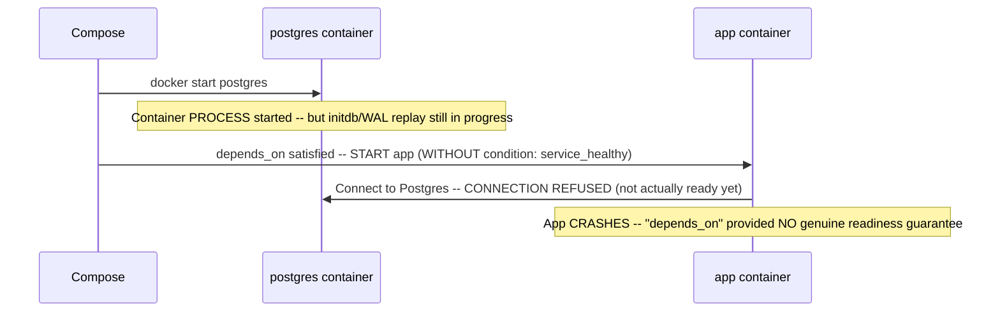
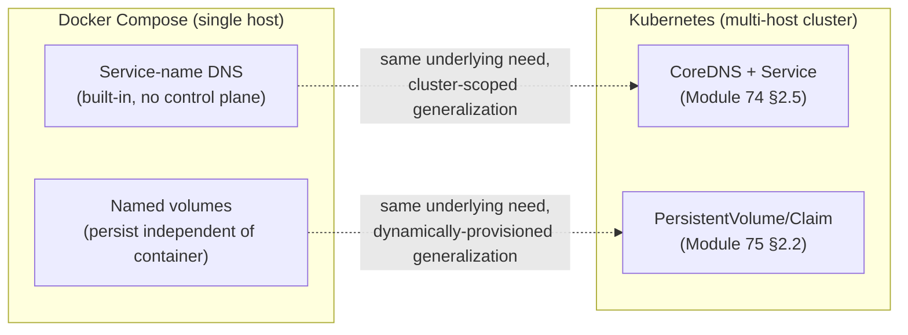
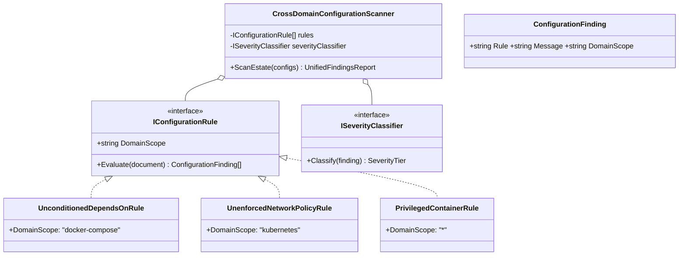
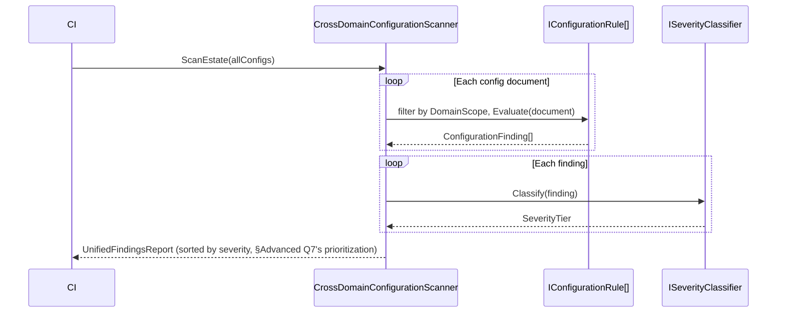

# Module 84 — Docker: Compose, Networking, Volumes & Production Patterns (Capstone)

> Domain: Docker | Level: Beginner → Expert | Prerequisite: All prior Docker modules (81–83) — this is the synthesizing capstone, directly paralleling [[../23-Kubernetes/08-Observability-Multicluster-GitOps]]'s role in its own domain; [[../23-Kubernetes/02-Networking-Services-Ingress-CNI-DNS-NetworkPolicies]] §2.2's Running-vs-Ready distinction is the direct conceptual ancestor of this module's headline finding, now in a genuinely simpler, single-host, mechanically distinct form

---

## 1. Fundamentals

**What:** Docker Compose is a declarative, single-host, multi-container orchestration tool — a `docker-compose.yml` file defines a set of services, their networking, their storage, and their startup dependencies, all managed together as one unit. This capstone covers Compose's practical model plus the broader production-patterns question this domain has been building toward: how the union-filesystem/layer discipline (Module 81), Dockerfile/multi-stage discipline (Module 82), and runtime-isolation discipline (Module 83) come together in a genuinely deployed, multi-service system, and when Compose alone is sufficient versus when genuine multi-host orchestration (Kubernetes) becomes necessary.

**Why:** Compose is frequently a team's *first* multi-container orchestration tool — used for local development, CI environments, and even small-scale production deployments — before (or instead of) Kubernetes. Understanding Compose's model deeply also illuminates Kubernetes's own abstractions by contrast: Compose's service-name DNS resolution is the single-host ancestor of Module 74 §2.5's CoreDNS; Compose's named volumes are the single-host ancestor of Module 75's PersistentVolumes; and — this module's headline finding — Compose's `depends_on` startup-ordering gotcha is a simpler, mechanically distinct restatement of Module 74 §2.2's Running-vs-Ready distinction, arrived at independently rather than inherited from Kubernetes.

**When:** Compose is the right tool for local development environments, CI test environments, and genuinely single-host production deployments without a multi-host scaling or self-healing requirement; Kubernetes becomes necessary once genuine multi-host orchestration, automated self-healing across Node failures, or horizontal scaling beyond a single machine's capacity is an actual, articulated requirement — directly Module 63 §2.1's complexity-matching discipline, now applied one level below the cloud-container-service comparisons that module made.

**How (30,000-ft view):**
```
docker-compose.yml: declares services, each built from a Dockerfile (Modules 81-82)
     or a pre-built image, with networking, volumes, and startup dependencies
Networking: EVERY service on the same Compose project's default network can
     address every other service by SERVICE NAME via built-in DNS -- the
     single-host ancestor of Kubernetes Service DNS (Module 74 §2.5)
Volumes: NAMED volumes persist independently of any container's lifecycle
     (the single-host ancestor of Kubernetes PersistentVolumes, Module 75) --
     anonymous volumes and the container's own writable layer do NOT
depends_on: by default, waits only for a dependency's CONTAINER PROCESS TO
     START -- NOT for the dependency to actually be READY to serve requests --
     this module's headline finding, requiring explicit healthcheck +
     condition: service_healthy to get genuine readiness-gated startup
```

---

## 2. Deep Dive

### 2.1 `depends_on`'s Startup-Ordering Gotcha — Started, Not Ready, by Default
By default, a Compose service's `depends_on: - postgres` declaration only guarantees that the `postgres` container's **process has started** before the dependent service's container is launched — it provides **zero guarantee** that Postgres has actually finished its own internal initialization and is genuinely ready to accept connections (which, for a database specifically, can take several additional seconds — WAL replay, `initdb` completion, or replication catch-up). This is a mechanically distinct, but conceptually directly analogous, restatement of Module 74 §2.2's Kubernetes finding: a Pod being `Running` doesn't mean it's `Ready` to receive traffic (only a passing readiness probe adds it to a Service's EndpointSlice) — Compose's `depends_on` without an explicit `condition: service_healthy` clause is the identical class of gap, arrived at independently in a genuinely different, simpler, single-host tool. The fix requires an explicit `healthcheck:` block on the dependency service (a command Compose runs periodically to determine actual readiness, not mere process liveness) **and** `depends_on: postgres: condition: service_healthy` on the dependent service — only this combination makes Compose actually wait for genuine readiness, not merely process start.

### 2.2 Compose Networking — the Single-Host Ancestor of Kubernetes Service DNS
Every service defined in a `docker-compose.yml` is, by default, attached to one shared, Compose-project-scoped bridge network, and Compose's built-in DNS resolves each service's **name** directly to its container's IP on that network — meaning `http://postgres:5432` from within the `app` service's container correctly resolves and routes to the `postgres` service's container, with zero additional configuration. This is architecturally the direct, single-host predecessor of Module 74 §2.5's Kubernetes Service DNS (`<service>.<namespace>.svc.cluster.local`) — the same underlying need (stable, name-based addressing rather than tracking container IPs directly, echoing Module 73 §2.3's ephemeral-IP problem at a smaller scale) solved via a simpler, single-host-scoped mechanism requiring no cluster-wide control plane at all.

### 2.3 Volumes — Named Volumes as the Single-Host Ancestor of PersistentVolumes
A Compose **named volume** (`volumes: - pgdata:/var/lib/postgresql/data`) persists independently of the container's own lifecycle — recreating or removing the container and recreating it from the same Compose file re-attaches the same named volume, with its data intact — directly the single-host analog of Module 75 §2.2's PersistentVolume/PersistentVolumeClaim decoupling, minus the dynamic-provisioning/StorageClass machinery a genuine multi-host, multi-Node cluster requires. An **anonymous volume** (declared without a name) or data written only to the container's own writable layer (Module 81 §2.2) does **not** survive `docker compose down` (which removes containers, and by default anonymous volumes with them) — the same "know which specific storage mechanism you're actually using before assuming persistence" discipline Module 75 established for Kubernetes, now recurring at the Compose layer.

### 2.4 Environment-Specific Configuration — Compose Override Files, the Orchestration-Level Analog to Module 82's Multi-Stage Dockerfiles
Compose supports layering multiple YAML files (`docker-compose.yml` plus `docker-compose.override.yml`, automatically merged, or explicit `-f` file lists for named environments like `docker-compose.prod.yml`) — letting a team maintain one base service definition with environment-specific overrides (different resource limits, different volume mounts, additional debug tooling in a dev-specific override) — directly the orchestration-definition-level analog of Module 82 §2.2's multi-stage, multi-target Dockerfile pattern (one file, multiple purposes, avoiding drift between separately-maintained definitions), now applied to service *composition* rather than image *building*.

### 2.5 Resource Limits and Restart Policies — Module 83's cgroup Settings, Now Expressed in Compose YAML
Compose's `deploy.resources.limits.cpus`/`memory` fields (or the older, still-common `cpus`/`mem_limit` top-level fields) translate directly into the same `cpu.max`/`memory.max` cgroup settings Module 83 §2.2 established as the actual kernel enforcement mechanism — Compose is simply a more convenient, declarative surface for configuring the identical underlying primitive. **Restart policies** (`restart: unless-stopped`, `restart: on-failure`) provide Compose's own, single-host analog to Module 73 §2.2's reconciliation-loop self-healing — a container that crashes is automatically restarted by the Docker daemon itself, without any cluster-level scheduler or controller involved, since there's only ever one host and one instance of each service to manage in a typical Compose deployment.

### 2.6 When Compose Is Sufficient, and When Kubernetes Becomes Necessary
Directly extending Module 63 §2.1's complexity-matching discipline one level further: Compose is architecturally sufficient for any workload that genuinely fits on a single host, doesn't require automated failover across machine failures, and doesn't need horizontal scaling beyond that single host's own capacity — local development, CI test environments, and small, genuinely single-host production deployments (a small internal tool, a low-traffic service where a brief single-host outage is an acceptable risk) are all legitimate, complexity-matched uses of Compose alone. Kubernetes becomes genuinely necessary once any of the multi-host properties this course's entire Kubernetes domain was built around — Module 73's Node-failure self-healing, Module 77's multi-Node autoscaling, Module 75's dynamically-provisioned, cluster-spanning storage — are actual, articulated requirements Compose's single-host model cannot satisfy at all, not merely "harder to satisfy" — a team should explicitly identify which specific multi-host property they need before adopting Kubernetes's genuinely greater operational complexity, rather than defaulting to it "to be safe," the same unforced-complexity anti-pattern this course has flagged repeatedly (Module 63 §2.1, Module 71 §2.2).

---

## 3. Visual Architecture

### `depends_on`'s Started-vs-Ready Gap (§2.1)


### Compose's Single-Host Model as the Direct Ancestor of Kubernetes Abstractions (§2.2, §2.3)


## 4. Production Example

**Problem:** A team's CI pipeline used Docker Compose to spin up an integration-test environment (the application, PostgreSQL, and Redis) for every pull request, with `depends_on: - postgres - redis` declared on the application service — the setup had worked reliably for months during initial adoption, when the CI runners were fast and Postgres's own startup was consistently quick.

**Architecture:** As the team's database schema grew and Postgres's own initialization (including a growing set of migrations run automatically on container start) took progressively longer, the CI environment's `depends_on`-based startup ordering — which had never actually guaranteed Postgres *readiness*, only its container process starting — began exposing a previously-latent race condition.

**Implementation:** The application service, on start, immediately attempted its own database connection and migration-verification logic — for months, Postgres had happened to finish its own startup fast enough that this race was never actually lost in practice, masking the underlying gap in the `depends_on` declaration's actual guarantee.

**Trade-offs:** The team's CI pipeline had, in effect, been relying on a timing coincidence (Postgres consistently starting fast enough) rather than a genuine, guaranteed ordering — a fragile, undocumented dependency the team had no visibility into, since `depends_on`'s presence in the YAML *looked* like a correct, complete solution to the startup-ordering problem.

**Lessons learned:** As Postgres's startup time grew, CI began failing **intermittently** — the exact signature of a race condition (sometimes Postgres finished in time, sometimes it didn't) rather than a consistent, deterministic failure, making the root cause substantially harder to diagnose than an outright, always-reproducible bug would have been; the team's initial investigation focused on the application's own database-connection retry logic before recognizing the actual root cause was `depends_on`'s well-documented, but easy-to-overlook, started-versus-ready gap. The fix added an explicit `healthcheck:` to the `postgres` service (`pg_isready` as the check command) and changed the application service's dependency declaration to `depends_on: postgres: condition: service_healthy` — Compose now genuinely waits for Postgres's own health check to pass, not merely its container process to start, eliminating the race condition deterministically rather than papering over it with an application-level retry loop that would have merely reduced, not eliminated, the underlying timing risk. **This is this module's — and this domain's — capstone lesson**: a declared dependency ordering (`depends_on`) that *looks* complete and correct in a Compose YAML file provides no guarantee, on its own, about the *actual, load-bearing property* (genuine downstream readiness) a team typically assumes it provides — directly generalizing Module 74 §2.2's Running-vs-Ready Kubernetes finding into a structurally distinct but conceptually resonant instance in an entirely different, simpler orchestration tool, and reinforcing this course's broader, now cross-domain theme that a configuration's *presence* and its *actual, complete guarantee* must always be verified as two independent claims, regardless of which specific tool or domain is involved.

## 5. Best Practices
- Always pair `depends_on` with an explicit `healthcheck:` and `condition: service_healthy` for any dependency whose actual readiness (not merely process start) matters to the dependent service's correct startup (§2.1, §4).
- Use named volumes, not anonymous volumes or the container's own writable layer, for any data that must survive `docker compose down`/container recreation (§2.3).
- Layer environment-specific Compose override files rather than maintaining fully separate, independently-drifting Compose files per environment (§2.4).
- Explicitly configure resource limits and restart policies in production Compose deployments — don't rely on Docker's unconfigured defaults, directly applying Module 83's cgroup discipline through Compose's own YAML surface (§2.5).
- Choose Compose or Kubernetes based on an explicit, articulated multi-host requirement (or its absence), not a default assumption that "production always needs Kubernetes" or "Compose is only for local development" (§2.6).

## 6. Anti-patterns
- Assuming `depends_on` alone guarantees a dependency is genuinely ready to serve requests, without an explicit health check and `condition: service_healthy` (§2.1, §4).
- Relying on data written to an anonymous volume or a container's writable layer, discovering only after a `docker compose down` that it wasn't actually persisted (§2.3).
- Maintaining fully separate, independently-authored Compose files per environment rather than layering override files from one shared base (§2.4).
- Adopting Kubernetes for a genuinely single-host workload with no articulated multi-host requirement, incurring its operational complexity for no corresponding benefit (§2.6).
- Treating an intermittent, timing-dependent CI failure as an application-code bug to patch around (a retry loop) rather than recognizing and fixing the actual, underlying orchestration-level race condition (§4).

---

## 10. Interview Questions

### Basic (10)

1. **Q: What does Docker Compose's `depends_on` guarantee by default?**
   **A:** Only that the dependency's container process has started — not that the dependency is actually ready to serve requests.
   **Why correct:** States this module's headline finding directly and accurately.
   **Common mistakes:** Assuming `depends_on` waits for genuine readiness by default.
   **Follow-ups:** "What's required to make Compose wait for genuine readiness?" (An explicit `healthcheck:` plus `condition: service_healthy`, §2.1.)

2. **Q: How do Compose services address each other by default?**
   **A:** By service name, via Compose's built-in DNS on the shared project network.
   **Why correct:** Correctly describes the name-based, zero-configuration addressing mechanism.
   **Common mistakes:** Assuming services must be addressed by container IP or a manually-configured hostname.
   **Follow-ups:** "What Kubernetes concept is this the single-host ancestor of?" (Kubernetes Service DNS via CoreDNS, Module 74 §2.5.)

3. **Q: What is the difference between a named volume and an anonymous volume in Compose?**
   **A:** A named volume persists independently of container lifecycle and can be re-attached; an anonymous volume is typically removed along with its container on `docker compose down`.
   **Why correct:** Correctly states the defining persistence-behavior difference.
   **Common mistakes:** Assuming all volumes, named or anonymous, persist equivalently.
   **Follow-ups:** "What Kubernetes concept is a named volume the ancestor of?" (PersistentVolumes/Claims, Module 75.)

4. **Q: What does `restart: unless-stopped` do?**
   **A:** Automatically restarts a container if it crashes, unless it was explicitly stopped by the user.
   **Why correct:** Correctly states the restart policy's specific behavior.
   **Common mistakes:** Confusing this with a health-check-triggered restart rather than a crash-triggered one.
   **Follow-ups:** "What Kubernetes mechanism is this the single-host analog of?" (The reconciliation loop's self-healing behavior, Module 73 §2.2, without any cluster-level scheduler involved.)

5. **Q: How do Compose resource limits (e.g., `mem_limit`) relate to what Module 83 covered?**
   **A:** They translate directly into the same cgroup settings (`memory.max`) Module 83 established as the actual kernel enforcement mechanism.
   **Why correct:** Correctly connects the Compose-level configuration surface to its underlying kernel mechanism.
   **Common mistakes:** Assuming Compose resource limits are a Compose-specific feature unrelated to the underlying container runtime's kernel primitives.
   **Follow-ups:** "What happens when a container exceeds its `mem_limit`?" (The kernel OOM killer is invoked, scoped to that container's cgroup, Module 83 §2.2.)

6. **Q: What is a Compose override file?**
   **A:** An additional YAML file (e.g., `docker-compose.override.yml`) automatically merged with the base `docker-compose.yml`, allowing environment-specific configuration without duplicating the full service definition.
   **Why correct:** Correctly describes the layering/merging mechanism.
   **Common mistakes:** Assuming environment-specific configuration requires fully separate, independent Compose files.
   **Follow-ups:** "What Dockerfile-level pattern is this analogous to?" (Multi-stage, multi-target Dockerfiles, Module 82 §2.2.)

7. **Q: Is Docker Compose suitable for a multi-host production deployment?**
   **A:** No — Compose's architecture is fundamentally single-host; multi-host orchestration requires Kubernetes (or, historically, Docker Swarm).
   **Why correct:** Correctly identifies Compose's fundamental architectural ceiling.
   **Common mistakes:** Assuming Compose can be scaled across multiple hosts with additional configuration alone.
   **Follow-ups:** "What specific requirement would signal a team has outgrown Compose?" (A genuine need for automated failover across machine failures, or horizontal scaling beyond one host's capacity, §2.6.)

8. **Q: What does a Compose `healthcheck:` block do?**
   **A:** Defines a command Compose runs periodically against a service to determine its actual readiness/health, distinct from merely checking whether its process is running.
   **Why correct:** Correctly distinguishes health checking from simple process-liveness checking.
   **Common mistakes:** Assuming Compose automatically knows a service's readiness without an explicitly-defined health check.
   **Follow-ups:** "What Kubernetes concept does this directly parallel?" (Readiness probes, Module 74 §2.2.)

9. **Q: Does Compose provide network segmentation between services by default?**
   **A:** No — every service on the same project's default network can reach every other service by default, unless explicit `networks:` scoping is configured.
   **Why correct:** Correctly states the default, unsegmented posture.
   **Common mistakes:** Assuming Compose provides NetworkPolicy-equivalent segmentation automatically.
   **Follow-ups:** "What Kubernetes mechanism provides this segmentation?" (NetworkPolicy, Module 74 §2.6 — though Compose has no direct, built-in equivalent, requiring explicit `networks:` scoping instead.)

10. **Q: What did §4's CI incident reveal about the team's `depends_on` declaration?**
    **A:** It had never actually guaranteed Postgres's readiness — only its container process starting — and the team had been unknowingly relying on Postgres consistently starting fast enough to avoid the race, until growing migration time exposed the latent gap as intermittent CI failures.
    **Why correct:** Directly restates this module's central incident finding accurately.
    **Common mistakes:** Assuming the incident was caused by a Compose bug rather than a well-documented, but easy-to-overlook, default behavior.
    **Follow-ups:** "What made this failure mode harder to diagnose than a consistent, deterministic bug?" (Its intermittent, timing-dependent nature — sometimes Postgres finished in time, sometimes it didn't.)

### Intermediate (10)

1. **Q: Why is Compose's `depends_on` gap described as "mechanically distinct" from Module 74 §2.2's Kubernetes Running-vs-Ready finding, despite being conceptually analogous?**
   **A:** Kubernetes's gap concerns a Pod's own status (Running) versus its EndpointSlice-registration eligibility (Ready, gated by a readiness probe); Compose's gap concerns container process-start ordering versus actual application-level readiness — different specific mechanisms (EndpointSlice membership vs. startup sequencing) addressing a structurally similar but not identical underlying problem, independently arrived at by two different tools.
   **Why correct:** Correctly distinguishes the specific mechanisms while acknowledging the genuine conceptual resonance, avoiding a false, overclaimed equivalence.
   **Common mistakes:** Treating the two findings as literally the same mechanism merely because Kubernetes was built after Compose and might seem to have "inherited" the pattern.
   **Follow-ups:** "Why might two independently-designed tools converge on structurally similar gaps?" (Both face the same fundamental problem — a dependent component's actual readiness is not synonymous with its process having started — a genuinely common, recurring distributed-systems challenge independent of any specific tool's lineage.)

2. **Q: Why did §4's race condition manifest as an intermittent, rather than consistent, CI failure?**
   **A:** The race's outcome depended on the relative timing between Postgres's actual startup completion and the application's connection attempt — as Postgres's startup time grew closer to (and eventually sometimes exceeded) the application's own startup delay, the outcome became genuinely non-deterministic run-to-run, rather than a fixed, always-losing or always-winning race.
   **Why correct:** Correctly explains the timing-dependent, probabilistic nature of the failure.
   **Common mistakes:** Assuming a race condition should always manifest as a consistent failure once the underlying timing shifts unfavorably.
   **Follow-ups:** "Why is an intermittent failure typically harder to diagnose than a consistent one?" (It doesn't reliably reproduce on demand, making root-cause isolation via repeated manual testing far less effective, and can be initially mistaken for environmental flakiness unrelated to the actual, deterministic underlying cause.)

3. **Q: Why is named-volume persistence described as "the single-host ancestor" of Kubernetes PersistentVolumes, rather than functionally identical to them?**
   **A:** Named volumes provide the same core decoupling (data outlives the container) but lack Module 75's dynamic-provisioning, StorageClass, and cross-Node-portability machinery entirely — a named volume is tied to the specific host Docker daemon it was created on, with no cluster-spanning abstraction at all, a materially simpler mechanism serving the same underlying need at a smaller scale.
   **Why correct:** Correctly identifies what's shared (the core persistence-decoupling need) versus what's genuinely absent (dynamic provisioning, cluster portability).
   **Common mistakes:** Assuming named volumes provide the same cluster-spanning capabilities as Kubernetes PersistentVolumes.
   **Follow-ups:** "What would happen if you tried to 'migrate' a named volume to a different host?" (It wouldn't automatically follow — Compose named volumes have no built-in cross-host replication or migration mechanism, unlike a cloud-backed Kubernetes PersistentVolume that can, depending on its StorageClass, support cross-AZ/Node reattachment.)

4. **Q: Why does this module recommend explicitly identifying a multi-host requirement before adopting Kubernetes, rather than treating Kubernetes as a strictly superior default?**
   **A:** Directly Module 63 §2.1's complexity-matching discipline — Kubernetes's genuine operational complexity (a control plane, Node management, the full breadth of Modules 73-80's material) is only justified by an actual, articulated multi-host requirement it uniquely satisfies; adopting it without such a requirement is an unforced complexity cost with no corresponding benefit, the same reasoning this course applied to EKS-vs-ECS and AKS-vs-Container-Apps decisions.
   **Why correct:** Correctly applies an already-established, named principle rather than a generic "simpler is better" platitude.
   **Common mistakes:** Treating Kubernetes as an unconditionally superior choice for any production deployment regardless of actual scale/requirements.
   **Follow-ups:** "What's a concrete example of a production workload where Compose alone remains the correct, complexity-matched choice?" (A low-traffic internal tool or a small, single-team service where a brief single-host outage is an acceptable, explicitly-accepted risk, and no horizontal-scaling requirement exists.)

5. **Q: Why does a Compose service's `privileged: true` carry the identical severity this course established for Kubernetes's `securityContext.privileged: true` (Module 83), rather than a lesser risk specific to Compose's simpler model?**
   **A:** Both configuration surfaces ultimately control the exact same underlying kernel mechanisms (capabilities, seccomp, namespace isolation) Module 83 established — Compose is merely a different YAML syntax for configuring the identical Docker runtime primitives; the security consequence (removing multiple independent defense-in-depth layers simultaneously) is mechanism-level, not orchestration-tool-level, and applies identically regardless of which tool's syntax was used to set the flag.
   **Why correct:** Correctly identifies that the risk is intrinsic to the underlying kernel mechanism being configured, not the specific orchestration tool's syntax layer.
   **Common mistakes:** Assuming Compose's simpler, single-host model somehow reduces the severity of a `--privileged`-equivalent configuration relative to the identical setting in Kubernetes.
   **Follow-ups:** "Does Compose have an equivalent to Kubernetes's admission-webhook-based prevention gate (Module 76 §2.6) for catching this before deployment?" (Not natively — Compose has no built-in admission-control mechanism, meaning this class of prevention typically requires an external CI-level lint/scan step instead, a genuine, real capability gap relative to Kubernetes's native tooling.)

6. **Q: Why is Compose's default network posture (every service reachable by every other service) described as a "genuinely simpler but real" security consideration, rather than a non-issue for a "just single-host" deployment?**
   **A:** "Single-host" affects the *blast-radius scope* of a compromise (contained to one host rather than a full cluster) but doesn't eliminate the underlying risk that a compromised service can freely reach every other co-located service on the same Compose project's default network — the same lateral-movement concern Module 74 §2.6 established for Kubernetes's default-allow NetworkPolicy posture, now recurring at the single-host, Compose-network scope.
   **Why correct:** Correctly distinguishes "smaller blast radius" from "no risk at all," avoiding the common but incorrect inference that single-host deployments have no meaningful network-segmentation concern.
   **Common mistakes:** Assuming a single-host deployment's smaller overall attack surface means internal network segmentation between its own services is unnecessary.
   **Follow-ups:** "How would you segment a Compose deployment's services that shouldn't be able to reach each other?" (Define multiple, explicit `networks:` in the Compose file, attaching each service only to the specific networks it genuinely needs, rather than relying on the single, shared default network for every service.)

7. **Q: Why does Compose's health-check-interval tuning trade-off (§7) mirror Module 78 §7's Operator reconciliation-interval trade-off, despite being genuinely different mechanisms?**
   **A:** Both involve the identical general trade-off structure: a shorter polling/check interval provides faster detection/confirmation at the cost of continuous, repeated overhead, while a longer interval reduces overhead at the cost of slower detection — the specific mechanism differs (Compose health checks vs. a custom Operator's reconciliation loop) but the underlying trade-off shape (frequency vs. overhead) is the same general pattern recurring in a new context.
   **Why correct:** Correctly identifies the shared, general trade-off structure while acknowledging the mechanisms themselves are genuinely different.
   **Common mistakes:** Assuming this is a coincidental similarity rather than an instance of a genuinely general, recurring trade-off pattern in any polling-based system.
   **Follow-ups:** "What factor should determine the correct health-check interval for a specific Compose service?" (The service's own actual startup/recovery-time characteristics and how quickly a dependent service genuinely needs to know about a readiness-state change, balanced against the check's own resource cost.)

8. **Q: Why is a Compose-based CI environment's `depends_on` gap (§4) arguably MORE consequential for CI specifically than for a long-running production deployment?**
   **A:** A CI environment is torn down and recreated fresh for every single run, meaning the race condition's timing window is re-exercised on every single pipeline execution — a production deployment, once successfully started, typically stays running for a long time without re-exercising its own startup-ordering race repeatedly, meaning a CI environment's exposure to this specific class of race condition is structurally far more frequent than a comparable production deployment's would be.
   **Why correct:** Correctly identifies the structural reason (repeated fresh starts) CI environments are disproportionately exposed to this specific failure category.
   **Common mistakes:** Assuming the risk is equally distributed between CI and production environments regardless of each one's actual restart frequency.
   **Follow-ups:** "Does this mean production deployments can safely ignore this gap?" (No — a production deployment still experiences this same race on every genuine restart, e.g., after a host reboot or an intentional service update, meaning the fix remains necessary there too, just triggered less frequently than in CI.)

9. **Q: Why does this module frame Compose override files (§2.4) as directly analogous to Module 82's multi-stage Dockerfiles, rather than an unrelated Compose-specific feature?**
   **A:** Both solve the identical underlying problem — one shared base definition serving multiple, differentiated purposes/environments (dev tooling vs. production minimalism for Dockerfiles; dev-specific vs. production-specific configuration for Compose files) — without requiring separately-maintained, independently-drifting definitions for each purpose, the same "one source of truth, layered differentiation" principle applied at two different levels (image-building vs. service-orchestration) of the same overall system.
   **Why correct:** Correctly identifies the shared underlying principle (avoiding definition drift via layered differentiation) rather than treating the two as coincidentally similar-sounding features.
   **Common mistakes:** Treating Compose override files as an isolated, Compose-specific convenience unrelated to any broader pattern this course has already established.
   **Follow-ups:** "What's the risk of NOT using override files, maintaining fully separate Compose files per environment instead?" (Directly Module 78 §2.2's dev-Dockerfile-drift risk, now recurring at the orchestration-definition level — the separate files inevitably drift out of sync over time as changes are applied to one but forgotten in the other.)

10. **Q: Why does §9 describe Compose's single-host architecture as a "ceiling," specifically using that word rather than describing it as merely "a current limitation"?**
    **A:** "Ceiling" specifically conveys that no amount of additional Compose-level configuration can overcome this constraint — it's an inherent, architectural property of the tool itself (vertical scaling of the single host is the only lever available), not a temporary or configurable limitation that more sophisticated Compose usage could work around; recognizing it as a hard ceiling, not a soft limitation, is precisely what makes it the clear, load-bearing signal for when a migration to genuine multi-host orchestration is architecturally required, not merely optional.
    **Why correct:** Correctly distinguishes an architectural ceiling (requiring a different tool entirely) from a configurable limitation (addressable within the same tool via different settings).
    **Common mistakes:** Assuming sufficiently advanced Compose configuration or tooling could eventually provide genuine multi-host capability without adopting a fundamentally different orchestrator.
    **Follow-ups:** "Is Docker Swarm a counter-example, since it does provide multi-host orchestration using Compose-like syntax?" (Swarm does extend beyond a single host, but it's a genuinely separate orchestrator with its own control-plane model — not "Compose extended," but a related-but-distinct tool, and one this course notes is largely legacy relative to Kubernetes's current ecosystem dominance.)

### Advanced (10)

1. **Q: Diagnose §4's incident from first principles, and design the specific CI-pipeline-level structural fix (beyond the immediate `healthcheck`/`condition` fix) preventing this exact class of "worked for months due to timing coincidence" risk from recurring for a different dependency in the future.**
   **A:** Root cause: `depends_on` without `condition: service_healthy` provided no genuine readiness guarantee at all, and the team's CI environment had been relying on an unverified, undocumented timing coincidence (Postgres consistently starting fast) rather than a guaranteed ordering — a latent gap invisible until the timing margin eroded. Structural fix: (1) apply the immediate, correct fix (`healthcheck` + `condition: service_healthy`) to every dependency relationship in the Compose file, not just the one that happened to fail first — since the identical unverified-timing risk likely exists for the Redis dependency too, even if it hasn't yet manifested; (2) add a CI-level lint step scanning every Compose file for any `depends_on` declaration lacking a corresponding `condition: service_healthy`, treating an unconditioned dependency declaration as a build-time warning requiring explicit justification, directly this course's now-standard "prevent, don't merely detect after the fact" governance pattern applied to this specific, Compose-level gap.
   **Why correct:** Identifies both the immediate fix and the broader, proactive structural fix (auditing every dependency, not just the one that failed, plus an automated prevention check), directly mirroring this course's established incident-response depth.
   **Common mistakes:** Fixing only the specific Postgres dependency that actually failed, without auditing every other `depends_on` declaration in the same file for the identical latent risk.
   **Follow-ups:** "Why might the Redis dependency not yet have exhibited the same race, even without the fix?" (Redis typically starts and becomes ready far faster than a PostgreSQL instance running migrations, meaning its own timing margin may currently be wide enough to have avoided exposing the identical latent gap — a coincidence of relative startup speed, not evidence the underlying risk doesn't exist for it too.)

2. **Q: A team argues that since their Compose-based staging environment has run reliably for over a year without an incident, their `depends_on` declarations (without explicit health-check conditions) are empirically proven safe and don't need auditing. Evaluate this claim.**
   **A:** Push back — directly Module 83 §Advanced Q2's "no incident yet is not evidence of no risk" reasoning, now recurring in this module's own domain: §4's incident demonstrates precisely this failure mode — a dependency relationship that had "worked reliably" for months due to an unverified, undocumented timing coincidence, until a gradual, unrelated change (growing migration time) eroded the margin that coincidence depended on; a year of apparent reliability provides no more genuine assurance than §4's team's own pre-incident confidence did, since the underlying gap (no genuine readiness guarantee) was present and unverified the entire time, merely not yet triggered by an unfavorable enough timing shift.
   **Why correct:** Correctly applies an already-established, cross-domain risk-analysis principle (absence of an incident is not evidence of absence of risk) to this specific, new context.
   **Common mistakes:** Accepting a long track record of apparent reliability as genuine evidence of correctness, rather than recognizing it may reflect an unverified, currently-favorable timing coincidence.
   **Follow-ups:** "What would constitute genuine evidence this specific dependency relationship is safe, short of waiting for an eventual failure?" (Explicit load/stress testing deliberately slowing the dependency's startup time — directly Module 77 §Advanced Q3's "test the actual constrained condition" discipline — to confirm the dependent service's behavior under a genuinely delayed-readiness scenario, not merely observing normal-case timing.)

3. **Q: Design a migration plan for a team whose Compose-based single-host production deployment has genuinely outgrown Compose (a real, articulated need for automated failover across Node failures has emerged), synthesizing this module's findings with the full Kubernetes domain this course already covered.**
   **A:** (1) Explicitly document the specific, articulated multi-host requirement driving the migration (§2.6's discipline — not "Kubernetes is more standard," but the genuine, specific capability gap Compose cannot close). (2) Translate the Compose service definitions' resource limits directly to Kubernetes `resources.requests`/`limits` (§2.5's cgroup-level equivalence makes this a largely mechanical translation, not a redesign). (3) Translate named volumes to PersistentVolumeClaims with an appropriate StorageClass (§2.3's direct ancestor relationship). (4) Critically, translate `depends_on`/`healthcheck` relationships to Kubernetes readiness probes and, where genuine startup-ordering (not merely readiness-gating) is required, init containers — recognizing that Kubernetes's Running-vs-Ready distinction (Module 74 §2.2) is the more general, cluster-scale solution to the identical problem this module's §2.1 finding demonstrated in Compose's simpler model, meaning this specific migration step directly closes the exact gap §4's incident exposed, now via Kubernetes's own, more mature mechanism.
   **Why correct:** Provides a concrete, mechanically-grounded migration plan explicitly connecting each Compose concept to its established Kubernetes analog from earlier in this course, rather than treating the migration as an unguided, from-scratch redesign.
   **Common mistakes:** Treating a Compose-to-Kubernetes migration as requiring an entirely fresh architectural design, rather than recognizing the substantial conceptual continuity this module has established between the two tools' core abstractions.
   **Follow-ups:** "What genuinely new capability does this migration provide that no amount of Compose configuration could have delivered?" (Automated Pod rescheduling onto a healthy Node following a Node failure — Module 73's core reconciliation-loop self-healing, operating at a scope (across multiple hosts) Compose's single-host model structurally cannot address regardless of configuration.)

4. **Q: A team's Compose-based CI environment needs services from two genuinely untrusted-relative-to-each-other origins (a third-party test-double service alongside their own application) and wants to prevent the third-party service from reaching their application's internal-only dependencies (a test database containing synthetic but structurally realistic data). Design the network segmentation.**
   **A:** Define two explicit `networks:` in the Compose file — a `frontend` network including the application and the third-party test-double service (their only legitimate interaction point), and a `backend` network including the application and its test database, explicitly **excluding** the third-party service from the `backend` network entirely — the application service attaches to both networks (needing to reach both), while the third-party service attaches only to `frontend`, meaning it has no network-level path to the test database at all, regardless of any application-level trust assumption, directly the same defense-in-depth network-segmentation principle Module 74 §2.6 established for Kubernetes NetworkPolicy, now expressed via Compose's simpler, structural (not policy-based) network-attachment mechanism.
   **Why correct:** Correctly designs a concrete, structural segmentation using Compose's actual available mechanism (multiple explicit networks with selective service attachment), directly connecting to the already-established Kubernetes NetworkPolicy segmentation principle this course covered.
   **Common mistakes:** Relying on application-level configuration (e.g., simply not configuring the third-party service with the test database's credentials) as the sole protection, missing that Compose's default single-network posture would still provide network-level reachability regardless of credential configuration.
   **Follow-ups:** "Why is this network-level segmentation described as stronger than credential-based protection alone?" (Directly Module 74 §8's "defense-in-depth, independent layers" reasoning — network-level segmentation protects even if a credential is somehow leaked or misconfigured, since the third-party service has no network path to attempt a connection at all, a structural rather than merely configurational protection.)

5. **Q: Critique the following claim: "Since we've added explicit health checks and `condition: service_healthy` to every dependency in our Compose file, our multi-service startup ordering is now fully deterministic and free of any remaining race conditions."**
   **A:** Overstated — `condition: service_healthy` guarantees Compose *waits* for a dependency's health check to pass before starting the dependent service, but this only eliminates the race *at the orchestration-tool level*; it does not guarantee the health check's own definition is *itself* a complete, accurate proxy for genuine application-level readiness (a `pg_isready`-based health check confirms Postgres accepts connections, but not necessarily that a specific, required schema migration or seed-data population — application-level readiness concerns Compose has no visibility into — has also completed) — a Principal Engineer should verify the health check's own definition genuinely captures every readiness precondition the dependent service actually requires, not merely that a health check of *some* kind is present, echoing this module's own headline lesson (declared configuration ≠ guaranteed complete correctness) recurring one level deeper, now applied to the health check's own definition quality rather than its mere presence.
   **Why correct:** Correctly identifies a residual, deeper-level instance of this module's own central lesson — the health check's presence doesn't guarantee its own completeness/correctness as a readiness proxy.
   **Common mistakes:** Treating the presence of any health check, once added, as sufficient without verifying its specific check command actually captures every genuine readiness precondition.
   **Follow-ups:** "Design a more complete health check for the Postgres scenario, if a required migration must also complete before the application should connect." (A custom health-check script verifying not just `pg_isready`'s connection-acceptance check, but also querying a specific migrations-tracking table to confirm the expected, latest migration has been applied — a genuinely more complete readiness proxy than connection-acceptance alone.)

6. **Q: Explain why this capstone module's headline finding (§2.1/§4) and the Kubernetes domain's capstone finding (Module 80 §2.6, GitOps solving drift but not wrong declarations) are structurally distinct instances of a broader pattern this course has now established across multiple domains, and articulate that broader pattern explicitly.**
   **A:** Both are instances of "a system's declared, surface-level configuration provides incomplete evidence about a deeper, load-bearing property the configuration is commonly assumed to guarantee" — Module 80's instance concerns *declared desired state* versus *actually-verified enforcement correctness*; this module's instance concerns *declared dependency ordering* versus *actually-verified downstream readiness* — genuinely different specific claims in genuinely different tools, but both instances of the same, now-repeatedly-validated general principle this course has built up across the Kubernetes and Docker domains alike: any declarative configuration's mere presence and syntactic correctness is a categorically different, weaker claim than its actual, complete, verified behavioral guarantee, and a Principal Engineer must independently verify the latter rather than inferring it from the former, regardless of which specific tool, domain, or configuration surface is involved.
   **Why correct:** Correctly generalizes both modules' capstone findings into one shared, explicitly-articulated higher-level principle, demonstrating genuine cross-domain synthesis at the highest level this course has built toward.
   **Common mistakes:** Treating the two capstones' findings as coincidentally similar-sounding rather than explicitly recognizing and naming the shared, general principle connecting them.
   **Follow-ups:** "Where else in this course has this same general principle appeared, beyond these two explicit capstone findings?" (Module 74's NetworkPolicy/CNI enforcement gap, Module 75's reclaim-policy gap, Module 76's PSA enforcement-mode gap, Module 78's Helm drift gap, Module 79's mTLS PERMISSIVE-mode gap, and Module 81/82's Docker image-layer/build-history secret-persistence gaps — this principle has now appeared, in genuinely distinct mechanical forms, across nearly every module in both the Kubernetes and Docker domains, making it arguably the single most load-bearing, recurring lesson of this entire course's cloud-and-container material.)

7. **Q: A Principal Engineer is asked to design a single, reusable checklist question that could plausibly have caught every instance of the recurring pattern identified in Advanced Q6, across every module it appeared in. Design this question and evaluate its generality.**
   **A:** "For this specific configuration/declaration, what is the *exact, independently-verifiable* evidence that its intended, complete effect is actually occurring right now — not merely that the configuration exists, was applied without error, or was true at some point in the past?" — applied to each instance: for NetworkPolicy, this prompts a synthetic connectivity test rather than trusting the object's existence; for Helm/GitOps, this prompts checking actual runtime behavior rather than sync status; for `depends_on`, this prompts verifying the health check's own completeness rather than merely its presence — the question is genuinely general because it doesn't presuppose any specific mechanism, only demanding an explicit, independent verification step for whatever the specific configuration's intended effect actually is, making it applicable to a future, currently-unknown instance of this same pattern in a tool or domain this course hasn't yet covered.
   **Why correct:** Designs a genuinely general, mechanism-agnostic checklist question and explicitly validates its applicability across every previously-identified instance of the pattern, demonstrating the kind of durable, transferable heuristic this course has been building toward as its ultimate pedagogical goal.
   **Common mistakes:** Designing a checklist question specific to one particular mechanism (e.g., "does this NetworkPolicy have a synthetic test") rather than a genuinely general formulation applicable across every instance.
   **Follow-ups:** "What is the risk of over-applying this question reflexively to every single configuration in a system, regardless of its actual stakes?" (Diminishing returns and reviewer fatigue if applied with equal rigor to genuinely low-stakes configuration — the question should be prioritized toward configurations with a meaningfully large blast radius or security/correctness consequence if the assumed guarantee turns out to be false, directly this course's risk-tiered governance framework, Module 83 §10 Advanced Q10, applied to review-effort allocation itself.)

8. **Q: Design the specific automated tooling that would systematically scan an organization's entire estate of Compose files AND Kubernetes manifests for every known instance of Advanced Q6's general pattern, unifying detection across both domains this course has covered.**
   **A:** A cross-domain configuration linter with a pluggable rule set (directly reusing the Strategy-pattern architecture this course's Docker modules established three times over, Module 81/82/83 §13's `ISecretDetector`/`IExposureSource`/`IDeviationRule`) — each specific instance of the pattern (unconditioned Compose `depends_on`, a NetworkPolicy with no corresponding synthetic test, a `securityContext.privileged: true` without documented justification, a `Delete` reclaim policy on critical-classified storage) implemented as one independent, composable detection rule against the relevant configuration format (Compose YAML, Kubernetes manifests) — with a unified, cross-domain findings report presented to a platform team, rather than maintaining entirely separate, disconnected tooling per domain despite the shared underlying principle motivating every individual rule.
   **Why correct:** Correctly proposes reusing this course's already-validated, repeatedly-applied architectural pattern (pluggable Strategy-based detectors) as the unifying implementation approach across both domains, rather than treating Kubernetes and Docker/Compose governance tooling as unrelated, separately-built systems.
   **Common mistakes:** Proposing entirely separate, domain-specific tooling for Kubernetes and Compose without recognizing the shared underlying architecture (and shared underlying principle) that would make a unified tool both more maintainable and conceptually coherent.
   **Follow-ups:** "What organizational value does presenting a UNIFIED findings report provide, beyond the tooling-reuse benefit?" (It reinforces, at the organizational-visibility level, that this is one general risk category recurring across the entire container/orchestration estate — not a disconnected list of unrelated, tool-specific quirks — directly supporting the kind of pattern-recognition-based technical leadership this course has modeled throughout.)

9. **Q: Reflecting on the entire arc from Module 73 (Kubernetes architecture) through this module (Module 84, the Docker capstone), articulate the single most important, durable lesson a Principal Engineer should carry forward from this combined 12-module Kubernetes-and-Docker arc into any future, currently-unknown container or orchestration technology.**
   **A:** Advanced Q6/Q7's generalized principle — that a declarative configuration's presence, syntactic validity, or one-time successful application is categorically distinct from, and must never be substituted for, independent verification of its actual, complete, ongoing behavioral guarantee — is the single most load-bearing, repeatedly-validated lesson across this entire 12-module arc, having appeared in genuinely distinct mechanical forms in at least eight separate instances across two different technology domains; a Principal Engineer encountering any future container, orchestration, or infrastructure-as-code technology this course never covered should apply this exact question (Advanced Q7's checklist formulation) as their default, first-principles starting point for evaluating that new technology's own governance requirements, rather than needing to rediscover the pattern independently through their own future incident.
   **Why correct:** Correctly identifies and articulates the single, most general, most-repeatedly-validated lesson from the entire combined arc, explicitly stating its forward-looking, transferable value — the precise pedagogical goal this course has been building toward across both domains.
   **Common mistakes:** Naming a narrower, single-domain lesson (e.g., "understand cgroups" or "use readiness probes") rather than recognizing the broader, cross-domain principle these specific lessons are all instances of.
   **Follow-ups:** "Why is it pedagogically significant that this principle was demonstrated independently across TWO different domains (Kubernetes and Docker) rather than only within one?" (A pattern observed only once could plausibly be dismissed as a quirk specific to that one tool; observing the identical general principle recur independently across two genuinely different technologies — with different specific mechanisms each time — provides much stronger evidence that the principle is a fundamental property of declarative, configuration-driven systems generally, not an idiosyncrasy of any single tool, making it a genuinely reliable heuristic to carry forward.)

10. **Q: As a Principal Engineer completing this entire Kubernetes-and-Docker curriculum arc (Modules 73–84) and presenting a final synthesis to organizational leadership, design the single, complete governance framework (the ultimate synthesis of both domains) that operationalizes Advanced Q9's central lesson into standing, organizational practice.**
    **A:** (1) A mandatory, explicit **verification requirement** attached to any configuration whose intended effect carries meaningful blast radius (security enforcement, data durability, startup-ordering correctness, resource-limit enforcement) — requiring an independent, automated check confirming actual behavior, never inferred from configuration presence alone (the unifying principle behind Modules 74, 75, 76, 78, 79, 81, 82, and this module's §4, applied as one standing organizational rule rather than eight separate, domain-specific ones). (2) A **risk-tiered governance framework** (Module 83 §10 Advanced Q10) differentiating verification rigor by actual blast radius, avoiding uniform over-governance of low-stakes configuration while ensuring high-stakes configuration receives proportionate scrutiny. (3) A **unified, cross-domain detection-tooling architecture** (this module's Advanced Q8) reusing the validated Strategy-pattern approach across both Kubernetes and Docker/Compose configuration surfaces, avoiding duplicated, domain-siloed tooling. (4) An explicit, complexity-matching decision framework (§2.6, Module 63 §2.1) for every infrastructure-tool adoption decision — Compose vs. Kubernetes, and by direct extension, any future tool choice — requiring an articulated, specific capability gap driving any adoption of greater operational complexity, never complexity adopted "to be safe" or "because it's more standard." (5) A standing, recurring review cadence (directly Module 64/72/76/80's now-repeated capstone pattern) re-verifying that every governance mechanism established above remains genuinely, continuously effective — since, per this course's own repeated finding, a governance program's initial correctness is never permanent, ongoing assurance without continued, active maintenance.
    **Why correct:** Synthesizes the single most general lesson from the entire 12-module Kubernetes-and-Docker arc into one complete, actionable, standing organizational governance framework, explicitly citing and unifying the specific mechanisms and patterns established throughout both domains — the appropriate, comprehensive capstone-of-capstones this course's full container/orchestration arc has been building toward.
    **Common mistakes:** Presenting a Kubernetes-specific or Docker-specific governance framework alone, missing the opportunity to synthesize both domains into the single, unified, higher-level framework their shared underlying principle actually supports.
    **Follow-ups:** "If you could only implement ONE element of this five-part framework immediately, which would you choose, and why?" (Element 1 — the mandatory, blast-radius-scoped verification requirement — since it is the direct, actionable operationalization of the single most-repeatedly-validated finding across this entire course's Kubernetes-and-Docker material, and every other element of the framework exists in service of making that one requirement genuinely, sustainably enforceable at organizational scale.)

---

## 11. Coding Exercises

### Easy — Correctly gating startup on genuine readiness, fixing §4's exact incident (§2.1, §4)
**Problem:** Fix a Compose file where the application service starts before Postgres is genuinely ready, causing intermittent connection failures.
**Solution:**
```yaml
services:
  postgres:
    image: postgres:16
    environment:
      POSTGRES_PASSWORD: example
    healthcheck:
      test: ["CMD-SHELL", "pg_isready -U postgres"]   # genuine READINESS check, not process liveness (§2.1)
      interval: 2s
      timeout: 3s
      retries: 10

  app:
    build: .
    depends_on:
      postgres:
        condition: service_healthy   # waits for the HEALTH CHECK to pass, not merely container start (§4's fix)
```
**Time complexity:** N/A (orchestration-configuration exercise) — eliminates the race condition deterministically rather than reducing its probability.
**Space complexity:** N/A.
**Optimized solution:** For a health check requiring application-level readiness beyond connection-acceptance alone (per Advanced Q5's finding), replace `pg_isready` with a custom script verifying the expected latest database migration has been applied, providing a more complete readiness guarantee than connection-acceptance alone.

### Medium — Named volumes and explicit network segmentation, implementing §2.3 and §Advanced Q4's design (§2.3, §Advanced Q4)
**Problem:** Persist Postgres data across container recreation, and segment a third-party test-double service away from the database network entirely.
**Solution:**
```yaml
services:
  postgres:
    image: postgres:16
    volumes:
      - pgdata:/var/lib/postgresql/data   # NAMED volume -- persists independent of container lifecycle (§2.3)
    networks:
      - backend

  app:
    build: .
    networks:
      - backend    # needs the database
      - frontend   # needs the third-party test-double

  third-party-test-double:
    image: vendor/test-double:latest
    networks:
      - frontend   # NO access to `backend` -- structurally cannot reach postgres (§Advanced Q4)

volumes:
  pgdata:   # declared as a top-level named volume

networks:
  backend:
  frontend:
```
**Time complexity:** N/A.
**Space complexity:** The named volume's actual storage footprint scales with Postgres's own data size, entirely independent of the containers' own image/layer sizes (Module 81's concern).
**Optimized solution:** Add an explicit `driver_opts` size limit to the named volume definition for a CI/ephemeral-environment context specifically, preventing an unexpectedly large test dataset from silently consuming excessive host disk space across many parallel CI runs.

### Hard — A CI-pipeline linter for unconditioned `depends_on` declarations, implementing §Advanced Q1's structural fix (§Advanced Q1)
**Problem:** Implement a static analyzer flagging any `depends_on` declaration lacking a corresponding `condition: service_healthy`, preventing §4's exact incident class from being introduced in any future Compose file.
**Solution:**
```csharp
public class ComposeDependsOnLinter
{
    // Directly §Advanced Q1's structural, PREVENTIVE fix -- catches the gap BEFORE
    // it becomes a latent, timing-dependent race condition discovered only in production/CI.
    public LintResult Lint(ComposeFile composeFile)
    {
        var violations = new List<string>();

        foreach (var (serviceName, service) in composeFile.Services)
        {
            foreach (var dependency in service.DependsOn)
            {
                bool hasHealthyCondition = dependency.Condition == "service_healthy";
                bool dependencyHasHealthCheck = composeFile.Services
                    .TryGetValue(dependency.ServiceName, out var depService)
                    && depService.HealthCheck is not null;

                if (!hasHealthyCondition)
                {
                    violations.Add($"Service '{serviceName}' depends_on '{dependency.ServiceName}' " +
                                   $"without 'condition: service_healthy' -- only guarantees process START, " +
                                   $"not READINESS (this module §2.1/§4). Latent race condition risk.");
                }
                else if (!dependencyHasHealthCheck)
                {
                    violations.Add($"Service '{serviceName}' requires 'condition: service_healthy' on " +
                                   $"'{dependency.ServiceName}', but '{dependency.ServiceName}' has NO " +
                                   $"healthcheck defined -- the condition can never actually be satisfied.");
                }
            }
        }

        return new LintResult { Passed = violations.Count == 0, Violations = violations };
    }
}
```
**Time complexity:** O(s × d) where s is the number of services and d is the average number of dependencies per service — a single linear pass.
**Space complexity:** O(v) where v is the number of violations found.
**Optimized solution:** Integrate this linter directly into the same pre-commit-hook-plus-CI-gate pattern Module 82 §11 Expert established for Dockerfile secret-linting, reusing the identical "shift left, catch before commit" architecture across this domain's full set of governance tools rather than building a disconnected, one-off check.

### Expert — A cross-domain configuration-verification framework, unifying Advanced Q8's design across Compose and Kubernetes (§Advanced Q6, §Advanced Q8, §Advanced Q10)
**Problem:** Implement the pluggable, cross-domain detection architecture proposed in §Advanced Q8, demonstrating the shared Strategy-pattern reuse across this course's Docker and Kubernetes governance tooling.
**Solution:**
```csharp
public interface IConfigurationRule
{
    // Generalizes Module 81's ISecretDetector, Module 82's IExposureSource, and Module 83's
    // IDeviationRule into ONE shared abstraction spanning BOTH domains -- directly
    // operationalizing Advanced Q6's "this is one general pattern, not eight unrelated ones."
    string DomainScope { get; }   // e.g., "docker-compose" or "kubernetes"
    IEnumerable<ConfigurationFinding> Evaluate(ConfigurationDocument document);
}

public class UnconditionedDependsOnRule : IConfigurationRule
{
    public string DomainScope => "docker-compose";
    public IEnumerable<ConfigurationFinding> Evaluate(ConfigurationDocument document) =>
        // Wraps §11 Hard's ComposeDependsOnLinter logic as one pluggable rule instance.
        new ComposeDependsOnLinter().Lint((ComposeFile)document).Violations
            .Select(v => new ConfigurationFinding { Rule = nameof(UnconditionedDependsOnRule), Message = v });
}

public class UnenforcedNetworkPolicyRule : IConfigurationRule
{
    public string DomainScope => "kubernetes";
    public IEnumerable<ConfigurationFinding> Evaluate(ConfigurationDocument document) =>
        // Directly Module 74 §Advanced Q3's synthetic-test pattern, now expressed as
        // one pluggable rule alongside every other domain's rules in the SAME framework.
        RunSyntheticNetworkPolicyVerification((KubernetesManifest)document);
}

public class CrossDomainConfigurationScanner
{
    private readonly IConfigurationRule[] _rules;   // spans BOTH domains simultaneously

    public UnifiedFindingsReport ScanEstate(IEnumerable<ConfigurationDocument> allConfigs)
    {
        var findings = allConfigs
            .SelectMany(doc => _rules
                .Where(r => r.DomainScope == doc.DomainScope)
                .SelectMany(r => r.Evaluate(doc)));

        // ONE unified report, spanning Compose AND Kubernetes findings together --
        // directly Advanced Q8's organizational-visibility argument made concrete.
        return new UnifiedFindingsReport { Findings = findings.ToList() };
    }
}
```
**Time complexity:** O(c × r) where c is the number of configuration documents across the entire estate and r is the number of applicable rules per document's domain scope.
**Space complexity:** O(f) where f is the total number of findings across the entire scanned estate.
**Optimized solution:** Prioritize and sort the unified findings report by blast-radius severity (directly Advanced Q7's risk-tiered review-effort allocation) rather than presenting an undifferentiated flat list, ensuring the highest-stakes findings (a `--privileged` grant, an unenforced production NetworkPolicy) surface above lower-stakes ones (a missing health check on a genuinely low-traffic internal dev-only service) in whatever dashboard or report consumes this scanner's output.

---

## 12. System Design

**Prompt:** Design a complete local-development-through-production pipeline for a team building a new multi-service application, explicitly deciding where Compose is used versus where Kubernetes becomes necessary, synthesizing this entire 12-module Kubernetes-and-Docker arc.

**Requirements:**
- *Functional:* local development and CI must use a fast, simple, single-host-appropriate tool; production must support the team's actual, articulated scale and availability requirements.
- *Non-functional:* local development environment startup should complete in under 30 seconds; production must survive a single Node failure without service interruption (an explicit, stated multi-host requirement).

**Architecture:** Docker Compose (with the full §11 Easy/Medium governance — health-check-gated `depends_on`, named volumes, explicit network segmentation) for local development and CI, directly satisfying the fast-startup, single-host-appropriate requirement — and Kubernetes (this course's full Modules 73–80 arc) for production, specifically because the stated Node-failure-survival requirement is exactly the multi-host, self-healing property (Module 73 §2.2's reconciliation loop) Compose's architecture cannot provide at all (§2.6/§9's ceiling).

**Components:** A shared Dockerfile (Module 81/82's discipline — multi-stage, minimal final image, no baked secrets) used identically by both the Compose-based local/CI environment and the Kubernetes-based production deployment, avoiding any drift between what's tested locally and what's actually deployed; the cross-domain configuration scanner (§11 Expert) applied to both the team's Compose files and Kubernetes manifests as one unified governance surface.

**Database selection:** Not directly in scope for this pipeline design — the same database technology (Module 4–8's territory) is used in both environments, with Compose's named volume (local/CI) and Kubernetes's PersistentVolumeClaim (production) providing the environment-appropriate persistence mechanism for each, per §2.3's direct ancestor relationship.

**Caching:** BuildKit's remote cache (Module 81 §2.6) shared between local developer machines and CI runners, directly Module 81 §12's established pattern, now explicitly noted as equally applicable regardless of whether the resulting image is ultimately run via Compose or deployed to Kubernetes — the build-and-cache layer is genuinely orchestration-tool-agnostic.

**Messaging:** Not directly relevant to this specific pipeline-design scope.

**Scaling:** Local/CI (Compose) has no scaling requirement by design — it's explicitly single-host and single-instance-per-service; production (Kubernetes) applies the full Module 77 autoscaling discipline as needed, a genuinely different scaling posture appropriate to each environment's actual purpose.

**Failure handling:** Local/CI failures (§4's incident) are addressed via the health-check-gated startup discipline (§11 Easy); production failures are addressed via Kubernetes's full self-healing/rescheduling machinery (Module 73), a categorically stronger guarantee appropriate to production's actual availability requirement.

**Monitoring:** The cross-domain configuration scanner's unified findings report (§11 Expert) is monitored continuously across both environments, ensuring neither the "simpler" local/CI environment nor the "more mature" production environment is neglected in governance rigor, despite their different technical sophistication levels.

**Trade-offs:** Maintaining two genuinely different orchestration tools (Compose for local/CI, Kubernetes for production) trades some environment-parity risk (a bug that only manifests under Kubernetes's specific scheduling/networking behavior might not be caught by Compose-based local testing) against faster, simpler local development iteration — a reasonable, complexity-matched trade-off specifically because the *application code itself* remains identical across both (the same Docker image, per the Components section above), limiting the environment-parity risk specifically to orchestration-layer behavioral differences (startup ordering, networking, scaling) rather than the application's own logic.

## 13. Low-Level Design

**Prompt:** Design the internal architecture of the `CrossDomainConfigurationScanner` introduced in §11 Expert in full detail, as this capstone's final, unifying LLD exercise across the entire 12-module arc's governance-tooling theme.

**Requirements:** Support pluggable rules spanning multiple, genuinely different configuration domains (Compose YAML, Kubernetes manifests, and extensibly, any future configuration format); produce one unified, severity-prioritized findings report; remain extensible to a new domain (e.g., Terraform, or a future orchestration tool this course hasn't covered) without modifying existing domain-specific rule implementations.

**Class diagram:**


**Sequence diagram:**


**Design patterns used:** **Strategy**, the same pattern this course's governance tooling has now applied five times across two domains (Module 81's `ISecretDetector`, Module 82's `IExposureSource`, Module 83's `IDeviationRule`, and now `IConfigurationRule` unifying all of them plus Kubernetes-domain rules) — deliberately the *same*, recognized architectural idiom reapplied, not a coincidentally similar new design, directly demonstrating this course's own "recognize and reuse an established pattern rather than reinventing it" principle at the LLD level itself; **Composite** (findings from every rule across every domain aggregate into one unified report).

**SOLID mapping:** Single Responsibility (each `IConfigurationRule` implementation checks exactly one specific pattern instance, regardless of domain); Open/Closed (a new domain — Terraform, a future orchestration tool — is supported by adding new `IConfigurationRule` implementations with that domain's `DomainScope`, without modifying `CrossDomainConfigurationScanner` itself); Dependency Inversion (the scanner depends on the `IConfigurationRule` and `ISeverityClassifier` abstractions, never on any specific domain's concrete configuration format).

**Extensibility:** This design directly operationalizes this capstone's own final lesson (§Advanced Q9/Q10) — a future, currently-unknown container or infrastructure technology this course never covered is supported by implementing new `IConfigurationRule`s against that technology's own configuration format, reusing every existing piece of scanning, classification, and reporting infrastructure unchanged, since the underlying principle (verify actual behavior, don't trust declared configuration alone) and its architectural expression (pluggable, domain-scoped rules) both generalize cleanly beyond any single technology this course specifically addressed.

**Concurrency/thread safety:** Scanning many configuration documents across a large estate is naturally parallelizable — each document's rule evaluation is independent of every other document's, directly the same stateless, independently-evaluable concurrency model this course's governance tooling has established consistently across Modules 81–83's LLD sections, now reapplied at the cross-domain, estate-wide scale this capstone's system design (§12) operates at.

## 14. Production Debugging

**Incident:** Following the adoption of the `CrossDomainConfigurationScanner` (§11 Expert, §13) across the organization's full Compose-and-Kubernetes estate, the unified findings report becomes so large (thousands of findings across hundreds of repositories) that no team actually reviews it in practice — the governance program, while technically comprehensive, provides negligible actual risk reduction because its output volume exceeds any team's practical review capacity.

**Root cause (eventual finding):** The scanner's rules were deployed with uniform severity weighting — a low-stakes finding (a missing health check on an internal, low-traffic dev-only Compose service) was surfaced with the same visual prominence as a genuinely high-stakes finding (a `--privileged` production Kubernetes Pod) — directly the risk-tiering omission Advanced Q7 explicitly warned against, now manifesting as a genuine, organization-scale operational failure of the governance program itself.

**Investigation:** (1) Confirmed via direct interview with several teams that the findings report was, in practice, never opened or acted upon, despite being technically delivered on schedule. (2) Analyzed the findings report's actual composition and found the overwhelming majority (over 95%) were low-stakes findings from non-production, internal-only Compose environments, effectively burying the small number of genuinely critical Kubernetes-production findings within an undifferentiated volume no team had the practical capacity to sift through manually.

**Tools:** Direct team interviews (the most effective diagnostic here, since the report's own output gave no signal about its own lack of actual consumption); a manual audit of the findings report's severity distribution, cross-referenced against each finding's actual production-vs-non-production and blast-radius context.

**Fix:** Implemented Advanced Q7's severity-tiered prioritization explicitly (not merely as a theoretical recommendation, but as the scanner's actual, default output ordering and filtering behavior) — production, high-blast-radius findings surfaced prominently and routed to mandatory, tracked remediation; low-stakes, non-production findings aggregated into a separate, lower-priority, periodically (not continuously) reviewed summary — directly closing the gap between the governance program's *technical* comprehensiveness and its *actual, practical* effectiveness.

**Prevention:** Established a standing practice of periodically measuring the governance program's own **actual utilization** (are findings genuinely being reviewed and remediated, not merely generated) as an explicit, tracked metric — directly generalizing Module 82 §14/§15's false-positive-rate-management lesson into a broader "measure whether the governance tool is actually being used effectively, not merely whether it technically runs and produces output" discipline, the final, capstone-level instance of this course's now-repeated theme that a governance mechanism's design-time comprehensiveness is a categorically different claim from its sustained, practical, organization-scale effectiveness.

## 15. Architecture Decision

**Decision:** Should the organization's unified findings report (§11 Expert, §14) present every finding with uniform prominence, or apply explicit, severity-tiered prioritization and filtering?

| Option | Advantages | Disadvantages | Cost | Complexity | Maintainability | Performance | Scalability | Operational overhead |
|---|---|---|---|---|---|---|---|---|
| **Uniform presentation** | Simple to implement; no severity-classification logic required | Buries critical findings among low-stakes noise, as §14's incident demonstrated at organizational scale | Low | Low | Simple, but ineffective in practice | Fast | Scales poorly in PRACTICAL terms — more findings only increases noise, not signal | Low build cost, but effectively ZERO governance value delivered |
| **Severity-tiered prioritization (§14's fix)** | Ensures genuinely critical findings receive attention; low-stakes findings don't drown out high-stakes ones | Requires an explicit, maintained severity-classification scheme per rule | Low-Medium | Medium | Requires periodic severity-tier recalibration as the estate's own risk profile evolves | Comparable | Scales genuinely well — signal-to-noise ratio remains manageable even as finding volume grows | Higher build cost, but ACTUAL governance value delivered |

**Recommendation:** Severity-tiered prioritization, unambiguously, directly validated by §14's own incident demonstrating the uniform-presentation approach's practical failure at real organizational scale — this capstone's final architecture-decision exercise makes explicit what this course has implicitly demonstrated throughout: a governance mechanism's value is measured by its actual, sustained, practical effectiveness at the scale it's deployed, not merely its technical comprehensiveness or design-time completeness — the same lesson Module 82 §15 established for secret-detector false-positive management, now recurring at the full, organization-wide governance-program scale as this entire 12-module arc's final, capstone-level validation.

## 16. Enterprise Case Study

*(Illustrative, inspired by publicly-discussed platform-engineering and developer-experience practices at large-scale technology organizations — not a literal account of any specific company's internal architecture.)*

A large technology organization's platform-engineering team, having built comprehensive governance tooling across both its Kubernetes and Docker/Compose estates (directly this capstone's unified architecture), illustrates both the genuine value and the genuine operational cost of the complete framework this course has built toward. **Architecture:** the organization's tooling directly mirrors this module's `CrossDomainConfigurationScanner` design — a single, unified governance surface spanning every container-adjacent configuration format the organization used, from local-development Compose files through production Kubernetes manifests. **Challenges:** the organization's own early experience directly recapitulated §14's incident — an initial, uniformly-presented findings report proved practically ineffective at organizational scale, requiring the same severity-tiering correction this module's §14/§15 establish, a genuine, hard-won lesson the organization had to learn empirically before arriving at the tiered-governance model this course has now presented as an established, validated pattern from the start. **Scaling:** as with every governance mechanism this course has covered, the organization found that sustained effectiveness required ongoing, active investment (periodic severity-tier recalibration, continued rule-set expansion as new risk patterns were discovered) rather than a one-time implementation — directly this course's now-standard capstone theme, recurring at the full organizational scale this final case study represents. **Lessons:** the organization's complete journey — from initial, incomplete governance, through a genuinely difficult "we built comprehensive tooling but it wasn't actually working" realization, to the mature, risk-tiered, continuously-maintained framework this capstone module has presented as the target end-state — is itself a concrete illustration of this entire course's central, cross-domain thesis: building genuinely effective governance for declarative, configuration-driven infrastructure is not a single technical achievement but an ongoing, actively-maintained organizational practice, and the specific technical mechanisms this course has covered across both the Kubernetes and Docker domains (synthetic verification, severity-tiered prioritization, unified cross-domain tooling) are the concrete, validated building blocks of that practice, not a one-time checklist to complete and then set aside.

## 17. Principal Engineer Perspective

**Business impact:** §4's incident and this module's broader findings translate directly into business-legible risk statements a Principal Engineer must be able to articulate — an unverified `depends_on` relationship risks intermittent, hard-to-diagnose CI failures that erode developer productivity and deployment confidence over time, a genuine, quantifiable business cost even though no single incident from it is individually catastrophic.

**Engineering trade-offs:** §2.6's complexity-matching decision framework (Compose vs. Kubernetes) is this entire 12-module arc's most practically consequential engineering-trade-off lesson — a Principal Engineer's default posture should be matching architectural complexity to genuine, articulated requirements, resisting both under-engineering (Compose stretched beyond its genuine single-host ceiling) and over-engineering (Kubernetes adopted without a genuine multi-host requirement), a discipline this course has now validated repeatedly across cloud, container-orchestration, and orchestration-tool-selection decisions alike.

**Technical leadership:** Recognizing and explicitly articulating Advanced Q6/Q7's fully-generalized, cross-domain principle — rather than treating each module's specific incident as an isolated lesson — is the single clearest demonstration of the pattern-recognition-based technical leadership this entire course has modeled: a Principal Engineer who can trace a novel incident back to this same, now-familiar general principle, and communicate that connection clearly to their team, provides genuinely durable, transferable value far beyond any single incident's own specific remediation.

**Cross-team communication:** §14's incident (a technically comprehensive governance tool that no team actually used in practice) is a sharp, cautionary lesson in cross-team communication specifically: a Principal Engineer must proactively verify that a governance mechanism's *intended* consumers can and do actually act on its output, not merely confirm the mechanism itself technically functions — a governance program's success is ultimately measured by its consumers' actual behavior change, not its own internal technical correctness.

**Architecture governance:** §12's complete local-through-production pipeline design, and §13's unified cross-domain scanner architecture, are this capstone's concrete, synthesized architecture-governance deliverables — directly demonstrating how this course's entire body of Kubernetes-and-Docker governance findings compose into one coherent, organization-scale framework rather than remaining a disconnected list of module-specific best practices.

**Cost optimization:** §9's Compose-vs-Kubernetes ceiling, correctly applied, is itself a direct cost-optimization decision — avoiding Kubernetes's genuine operational and infrastructure cost for workloads that don't actually require its multi-host capabilities is a concrete, quantifiable saving a Principal Engineer should be able to identify and justify explicitly, rather than defaulting to the more expensive, more complex option "to be safe."

**Risk analysis:** Advanced Q2's "a year of reliability is not evidence of safety" finding, recurring from Module 83's identical risk-analysis lesson, is this module's own sharpest instance of the "absence of an incident is not evidence of absence of risk" principle this course has now validated repeatedly across both domains — a Principal Engineer must resist the natural, intuitive inference that a long-running, apparently-stable configuration has thereby been proven correct.

**Long-term maintainability:** This capstone's final lesson — that even a technically comprehensive, well-designed governance program (§14's incident) can fail in practice without deliberate attention to its own actual, sustained utilization — is the appropriate, sobering final note for this entire 12-module Kubernetes-and-Docker arc: building the right technical mechanisms (which this course has covered in substantial depth) is necessary but insufficient without the ongoing, organizationally-embedded discipline of verifying those mechanisms remain genuinely, practically effective over time — the single, final, most durable lesson a Principal Engineer should carry forward from this entire arc into any future technology this course could not have anticipated.

---

## 18. Revision

**Key Takeaways:**
- Docker Compose is single-host, declarative multi-container orchestration — its core abstractions (service-name DNS, named volumes, restart policies) are the direct, simpler, single-host ancestors of Kubernetes's own Service DNS, PersistentVolumes, and reconciliation-loop self-healing respectively.
- **This module's headline finding:** `depends_on` without an explicit `healthcheck` and `condition: service_healthy` only guarantees a dependency's container process has started, not that it's genuinely ready — a mechanically distinct but conceptually resonant restatement of Module 74 §2.2's Kubernetes Running-vs-Ready finding, independently arrived at in a different, simpler tool.
- Compose is architecturally sufficient for any genuinely single-host workload; its fundamental ceiling (no multi-host scaling or Node-failure self-healing) is the clear, load-bearing signal for when Kubernetes's greater operational complexity becomes genuinely justified — never adopted by default "to be safe."
- **This capstone's fully-generalized, cross-domain lesson:** across this entire 12-module Kubernetes-and-Docker arc, a declarative configuration's presence, syntactic validity, or one-time successful application is categorically distinct from its actual, complete, ongoing behavioral guarantee — this exact pattern recurred independently at least eight times across two genuinely different technology domains (Modules 74, 75, 76, 78, 79, 81, 82, and this module), making it the single most load-bearing, transferable lesson of the entire arc.
- A governance mechanism's technical comprehensiveness is not the same claim as its sustained, practical, organization-scale effectiveness (§14) — severity-tiered prioritization and ongoing utilization monitoring are necessary to convert comprehensive detection into genuine, actionable risk reduction.

**Interview Cheatsheet:**
- `depends_on` → process-start ordering only; requires `healthcheck` + `condition: service_healthy` for genuine readiness gating.
- Compose service-name DNS → single-host ancestor of Kubernetes CoreDNS/Service.
- Named volumes → single-host ancestor of PersistentVolumes, minus dynamic provisioning.
- Compose ceiling → single-host only; Kubernetes required for genuine multi-host self-healing/scaling.
- The 12-module arc's central lesson → "declared configuration ≠ verified actual behavior," recurring across ≥8 distinct mechanisms in 2 domains.

**Things Interviewers Love:**
- Correctly explaining `depends_on`'s started-vs-ready gap with the exact fix (`healthcheck` + `condition: service_healthy`), unprompted.
- Explicitly naming the cross-domain, fully-generalized pattern connecting this module's finding to Module 80's GitOps capstone finding, demonstrating genuine course-spanning synthesis.
- Applying the Compose-vs-Kubernetes complexity-matching framework to a concrete scenario with an articulated, specific requirement, rather than a generic "it depends" non-answer.

**Things Interviewers Hate:**
- Assuming `depends_on` alone guarantees genuine downstream readiness.
- Recommending Kubernetes reflexively for any production deployment regardless of an actual multi-host requirement.
- Treating a governance/scanning tool's technical output volume as evidence of its practical effectiveness, missing §14's utilization-monitoring lesson.

**Common Traps:**
- Relying on an unverified timing coincidence (a dependency happening to start fast enough) rather than an explicit, guaranteed readiness gate (§4).
- Assuming a long track record of apparent reliability is evidence of correctness rather than an unverified, currently-favorable timing/configuration coincidence (Advanced Q2).
- Building comprehensive detection tooling without severity-tiered prioritization, burying critical findings in low-stakes noise (§14/§15).

**Revision Notes:** Before an interview, be able to state precisely why `depends_on` alone is insufficient and its exact fix, articulate the Compose-vs-Kubernetes decision framework with a concrete example, and — as the single most valuable, course-spanning reflex — state this entire arc's fully-generalized "declared ≠ verified" principle and name at least three of its distinct instances across both the Kubernetes and Docker domains unprompted, demonstrating genuine, synthesized, cross-domain mastery rather than isolated, module-by-module recall.

---

**`24-Docker` domain complete (Modules 81–84):** Images/Layers/Union Filesystem, Dockerfile Optimization/Multi-stage Builds, Container Runtime Internals/Isolation, and this capstone Compose/Networking/Volumes/Production-Patterns module — 4 modules at Principal-Engineer depth, standard-depth scope per explicit user request. This module's capstone synthesis, combined with Module 80's Kubernetes capstone, completes a genuinely unified thesis across the full container-and-orchestration arc (Modules 73–84): declared configuration and verified actual behavior are independent claims, a pattern validated across eight distinct mechanisms in two different technology domains.

**Next**: Type "Next" to proceed to the next domain in the roadmap (`25-DevOps`), or specify a different focus.
