# DevOps — Complete Interview Prep (All Topics, One File)

> Domain: DevOps | Level: Beginner → Expert | Prerequisite: [[../23-Kubernetes/01-Kubernetes-Interview-Prep]] (GitOps reconciliation), [[../21-AWS/01-AWS-Interview-Prep]] / [[../22-Azure/01-Azure-Interview-Prep]] (the resources IaC provisions). Pipelines: [[../26-CICD/01-CICD-Interview-Prep]]
> **Quick-prep edition** (consolidated 2026-10-03). This one file replaces Modules 85–88. Originals: `git show ebb2d5c:25-DevOps/<file>.md`
> Each topic has: **Key concepts → code/config example → Most common interview questions with answers.**

| # | Topic | # | Topic |
|---|---|---|---|
| 1 | DevOps principles, DORA & CALMS | 7 | Release strategies: rolling, blue-green, canary, feature flags |
| 2 | Infrastructure as Code with Terraform | 8 | Database migrations during deployment (expand–contract) |
| 3 | Terraform state, locking & collaboration | 9 | DevSecOps: shift-left scanning |
| 4 | Modules, workspaces, environments & drift | 10 | Policy-as-code & supply-chain security (SBOM, SLSA) |
| 5 | Configuration management taxonomy | 11 | Platform engineering & internal developer platforms |
| 6 | Secrets management, rotation & environment promotion | 12 | Top 30 rapid-fire + Principal · 13 Mistakes checklist |

---

## 1. DevOps Principles, DORA & CALMS

**Key concepts**
- **DevOps** = culture + practices + tooling that shorten the path from commit to production **safely**: shared ownership ("you build it, you run it"), automation, fast feedback, small batches, continuous improvement.
- **CALMS:** Culture, Automation, Lean (small batches, flow), Measurement, Sharing.
- **DORA metrics:** deployment frequency, lead time for changes, change failure rate, time to restore (plus reliability). Elite = on-demand deploys, < 1 day lead time, low failure rate, < 1 h restore.
- **The three ways** (The Phoenix Project): flow, feedback, continual learning.
- Anti-patterns: a separate "DevOps team" that just runs tools (a new silo), manual change approval boards for everything, long-lived branches, big-bang releases.

**Common interview questions**

**Q1. How do you take a team from fortnightly releases to continuous delivery?**
Measure the current DORA baseline; shrink batch size (trunk-based development, short-lived branches, feature flags); automate the pipeline end to end (build once, tests, scans, IaC, deploy); make deployments boring (blue-green/canary, automated rollback); decouple deploy from release with flags; replace manual approvals with automated gates and peer review; fix the slowest step first (often tests or environments); review DORA trends monthly.

**Q2. What does "you build it, you run it" require to work?**
Ownership of on-call, SLOs and production access for the owning team; good observability and runbooks; a platform that makes operations self-service; and sustainable on-call (alert quality, error budgets) — otherwise it becomes burnout.

---

## 2. Infrastructure as Code with Terraform

**Key concepts**
- **Declarative IaC:** describe desired infrastructure; the tool computes and applies changes. Benefits: versioned, reviewed, repeatable, testable, auditable environments; no click-ops.
- **Terraform:** HCL; **providers** (AWS, Azure, Kubernetes, GitHub…); **resources** and **data sources**; **dependency graph** built from references (`depends_on` only for hidden dependencies); **variables, outputs, locals**; `for_each`/`count`; lifecycle rules (`prevent_destroy`, `create_before_destroy`, `ignore_changes`).
- **Workflow:** `init` → `fmt`/`validate` → `plan` (review in PR) → `apply` (from CI with an approved plan file) → state updated.
- **Plan-time reconciliation only:** Terraform compares state at `plan`/`apply` time; it doesn't continuously enforce (unlike Kubernetes/GitOps controllers) → drift between runs goes unnoticed unless you detect it.
- Alternatives: OpenTofu (open-source fork), Pulumi (real languages incl. C#), Bicep/ARM, CloudFormation/CDK, Crossplane (Kubernetes-native).

```hcl
terraform {
  required_version = ">= 1.8"
  required_providers { azurerm = { source = "hashicorp/azurerm", version = "~> 4.0" } }
  backend "azurerm" {
    resource_group_name  = "rg-tfstate"
    storage_account_name = "sttfstateprod"
    container_name       = "tfstate"
    key                  = "payments/prod.tfstate"
    use_azuread_auth     = true
  }
}

variable "environment" { type = string }

resource "azurerm_resource_group" "payments" {
  name     = "rg-payments-${var.environment}"
  location = "westeurope"
  tags     = { owner = "payments-team", environment = var.environment, cost_center = "1234" }
}

module "sql" {
  source         = "git::https://github.com/acme/tf-modules.git//azure-sql?ref=v3.2.0"   # pinned module version
  resource_group = azurerm_resource_group.payments.name
  environment    = var.environment
  zone_redundant = var.environment == "prod"
}

resource "azurerm_key_vault" "kv" {
  name                     = "kv-payments-${var.environment}"
  resource_group_name      = azurerm_resource_group.payments.name
  location                 = "westeurope"
  tenant_id                = data.azurerm_client_config.current.tenant_id
  sku_name                 = "standard"
  purge_protection_enabled = true
  lifecycle { prevent_destroy = true }
}
```

**Common interview questions**

**Q1. Declarative vs imperative IaC?**
Declarative (Terraform, Bicep, CloudFormation) describes the end state and lets the tool compute changes — idempotent and reviewable as a plan. Imperative (scripts, CLI calls) describes steps — order-dependent, harder to make idempotent. Use declarative for infrastructure; scripts only for glue.

**Q2. Terraform vs Bicep vs CDK vs Pulumi?**
Terraform/OpenTofu for multi-cloud and a huge provider ecosystem; Bicep for Azure-native teams (no state file, day-zero resource support); CDK/Pulumi when teams want real programming languages (C#) and abstractions. The practices — reviewed plans, modules, policy checks, remote state — matter more than the tool.

---

## 3. Terraform State, Locking & Collaboration

**Key concepts**
- **State** maps resources in code to real resource IDs and stores attributes → required to compute diffs. It **can contain secrets in plain text** (passwords, keys from resource outputs) → treat state as sensitive: encrypted remote backend, strict access, no local state for shared infra.
- **Remote backends** with **locking**: S3 (+ native S3 lockfile or DynamoDB lock table), Azure Storage (blob lease), GCS, Terraform Cloud/HCP. Locking prevents concurrent applies corrupting state.
- **Split state** by blast radius and ownership (network, data, app per environment) — one giant state = slow plans and risky applies.
- State operations: `terraform import` / `import` blocks, `moved` blocks (refactoring without destroy/recreate), `state rm`, `state mv` — carefully, with backups.
- **CI runs `apply`** with a saved, reviewed plan, using a workload identity (OIDC federation) — not developer laptops.

```hcl
# Refactor safely: renamed resource address without destroy/recreate
moved {
  from = azurerm_storage_account.docs
  to   = module.storage.azurerm_storage_account.docs
}

# Bring an existing resource under management
import {
  to = azurerm_resource_group.legacy
  id = "/subscriptions/xxxx/resourceGroups/rg-legacy"
}
```

```yaml
# GitHub Actions: plan on PR, apply on merge with OIDC (no stored cloud secrets)
- uses: azure/login@v2
  with: { client-id: ${{ secrets.AZURE_CLIENT_ID }}, tenant-id: ${{ secrets.AZURE_TENANT_ID }}, subscription-id: ${{ secrets.AZURE_SUBSCRIPTION_ID }} }
- run: terraform init && terraform plan -out=tfplan -var environment=prod
- run: terraform apply -auto-approve tfplan        # only on main, after PR approval of the plan output
```

**Common interview questions**

**Q1. Why is the Terraform state file sensitive?**
It contains every managed resource's attributes, often including secrets (DB passwords, generated keys) in plain text, and it's the authority for what Terraform will change or destroy. Store it in an encrypted, access-controlled remote backend with locking and versioning; never commit it to git.

**Q2. Two engineers ran `apply` at the same time and state got corrupted. Prevention?**
Remote backend with state locking, applies only from CI (one pipeline per state), and smaller state files per component to reduce contention. Recover from the backend's versioned state.

**Q3. How do you refactor Terraform code without recreating resources?**
Use `moved` blocks (or `terraform state mv`) to map old addresses to new ones; review the plan to confirm zero destroys; protect critical resources with `prevent_destroy`.

---

## 4. Modules, Workspaces, Environments & Drift

**Key concepts**
- **Modules:** reusable, versioned building blocks (a "secure storage account", "standard service" module) = paved road for infrastructure; pin versions; publish in a registry.
- **Environments:** separate state per environment via directory/stack layout (`envs/dev`, `envs/prod`) or Terragrunt; **workspaces** are fine for identical ephemeral copies but risky for prod separation (same backend config, easy to apply to the wrong one).
- **Drift:** manual console changes, other tools, provider defaults. Terraform only notices at plan time → **scheduled drift detection** (nightly `terraform plan -detailed-exitcode`, Terraform Cloud drift detection, AWS Config/Azure Policy) + alerting + restricting console write access in prod.
- **Testing IaC:** `terraform validate`, tflint, `terraform test` (native), Terratest, policy checks (Checkov, tfsec/Trivy, OPA/Conftest), cost estimation (Infracost).

```bash
# Nightly drift detection: exit code 2 = changes present (drift)
terraform plan -detailed-exitcode -lock=false -var environment=prod
if [ $? -eq 2 ]; then echo "Drift detected in prod"; exit 1; fi
```

**Common interview questions**

**Q1. How do you detect and handle infrastructure drift?**
Prevent it (no console writes in prod — read-only roles, break-glass only), detect it (scheduled plans with alerts, cloud config compliance tools), and resolve it deliberately: either codify the manual change in IaC via PR or let IaC revert it — never ignore it.

**Q2. Workspaces vs separate directories per environment?**
Separate directories/stacks with separate backends and credentials give strong isolation and allow environment-specific differences explicitly; workspaces share code and backend configuration and make it easy to target the wrong environment. Prefer directories (or Terragrunt) for prod.

---

## 5. Configuration Management Taxonomy

**Key concepts**
- **Build-time config** (baked into the artifact — compile flags; should be minimal), **deploy-time config** (environment-specific values injected at deployment — URLs, feature defaults), **runtime config** (changes without redeploy — feature flags, dynamic settings).
- **12-factor:** config in the environment, strict separation of config from code; **build once, deploy many** with different config.
- Sources: environment variables, mounted config files (ConfigMaps), configuration services (Azure App Configuration, AWS AppConfig/Parameter Store, Consul), feature flag services.
- **Config is code:** stored in git, reviewed, validated (schema/`ValidateOnStart`), promoted by PR.
- **Environment drift:** config differences between staging and prod are the classic "worked in staging" cause → diff environments automatically; keep differences minimal and explicit.

**Common interview question**

**Q. A deployment worked in staging and failed in prod. How do you prevent that class of failure?**
Same artifact in every environment; config differences minimized, versioned and diffed automatically between environments; config validated at startup (fail fast); infrastructure parity via the same IaC modules; production-like staging data volumes and traffic shape; and progressive rollout in prod to catch what's left.

---

## 6. Secrets Management, Rotation & Environment Promotion

**Key concepts**
- **Secrets are not configuration:** store **references**, not values, in config and git (`keyvault://payments-db`); the runtime resolves them via workload identity.
- **Delivery patterns:** SDK fetch at startup/with caching (Key Vault/Secrets Manager), CSI driver mounting files, External Secrets Operator syncing to K8s Secrets, platform injection (App Service Key Vault references, ECS `secrets`). Trade-offs: rotation pickup, exposure (env vars leak into dumps), dependency on the vault at startup.
- **Prefer secretless:** managed identities/workload identity, IAM database auth, OIDC federation for CI.
- **Rotation:** automated; **two-secret overlap** (dual credentials valid during the switch) so rotation causes no downtime; apps reload secrets without restart (or rolling restart).
- **Promotion:** environment config moves by **PR** between environment folders/branches with approvals; no manual edits in prod.
- **Secret scanning:** pre-commit hooks (gitleaks), CI scanning, push protection (GitHub).

```csharp
// Reference-not-value: config holds the vault URI; secrets resolved with managed identity and reloaded periodically
builder.Configuration.AddAzureKeyVault(
    new Uri(builder.Configuration["KeyVault:Uri"]!), new DefaultAzureCredential(),
    new AzureKeyVaultConfigurationOptions { ReloadInterval = TimeSpan.FromMinutes(5) });
// Consumers use IOptionsMonitor<T> to pick up rotated values without a restart
```

**Common interview questions**

**Q1. How do you rotate a database password with zero downtime?**
Two-credential overlap: create a second user/password (or a new version of the secret), update the secret store, let apps pick it up (reload or rolling restart), verify no connections use the old credential, then revoke it. Better: eliminate passwords with managed identity/IAM auth.

**Q2. Secrets were found in git history. What now?**
Rotate them immediately (assume compromise), check access logs, purge from history if required (but rotation is what matters), add push protection and pre-commit scanning, and move the app to vault references or managed identity.

---

## 7. Release Strategies: Rolling, Blue-Green, Canary, Feature Flags

| Strategy | How | Pros | Cons |
|---|---|---|---|
| **Recreate** | stop old, start new | simple | downtime |
| **Rolling** | replace instances gradually | no extra capacity, default in K8s | mixed versions; slow rollback; no traffic isolation |
| **Blue-green** | full new environment, switch traffic atomically | instant rollback, test before switch | double capacity during cutover; DB compatibility needed |
| **Canary** | small % of traffic to the new version, increase with automated analysis | bounded blast radius, real-traffic validation | needs good metrics and traffic routing |
| **Feature flags / dark launch** | deploy code dark, release per user/segment | decouples deploy from release, instant kill switch | flag debt, testing combinations |
| **Shadow/mirroring** | copy traffic to the new version, discard responses | risk-free validation | side effects must be suppressed |

- **Deployment ≠ release:** deploy continuously; release (expose to users) via flags.
- **Progressive delivery:** canary + automated analysis on SLO metrics (Argo Rollouts, Flagger, CodeDeploy, Azure Deployment Environments) with **automatic rollback**.
- Feature flag hygiene: owner, type (release/ops/experiment/permission), expiry, removal tickets; flags audited in regulated environments.

```csharp
// Feature flag with Microsoft.FeatureManagement (percentage rollout + targeting)
builder.Services.AddFeatureManagement();   // config: "FeatureManagement": { "NewFraudModel": { "EnabledFor": [ { "Name": "Percentage", "Parameters": { "Value": 10 } } ] } }

app.MapPost("/payments", async (PaymentRequest r, IFeatureManager features, IFraudScorer v1, IFraudScorerV2 v2) =>
{
    var score = await features.IsEnabledAsync("NewFraudModel") ? await v2.ScoreAsync(r) : await v1.ScoreAsync(r);
    return Results.Ok(score);
});
```

**Common interview questions**

**Q1. Blue-green vs canary?**
Blue-green switches all traffic at once with an instant rollback path — good when you can test the green environment fully and afford double capacity. Canary exposes a small slice of real traffic first and expands based on metrics — better blast-radius control, needs strong observability and traffic routing. Both require backward-compatible DB changes.

**Q2. How do feature flags change release management?**
Code ships to production disabled; release becomes a runtime decision (per tenant, %, region) with a kill switch; rollbacks become flag flips. Costs: flag debt and combinatorial testing — manage with ownership, expiry and cleanup.

**Q3. What should automatically roll back a canary?**
SLO-based signals compared with the baseline: error rate, p99 latency, saturation, and key business metrics (payment success rate), evaluated over a minimum sample size; plus crash loops and health check failures.

---

## 8. Database Migrations During Deployment (Expand–Contract)

**Key concepts**
- Code and schema change at different times; during a rolling/canary/blue-green deploy, **old and new code run simultaneously against one schema** → every schema change must be compatible with both versions.
- **Expand–contract (parallel change):**
  1. **Expand:** add new columns/tables (nullable/defaulted), keep old ones.
  2. **Migrate:** deploy code that writes both (or old+new), backfill in batches.
  3. **Switch:** read from the new structure.
  4. **Contract:** stop writing the old, then drop it in a later release.
- Never rename/drop a column in the same release that stops using it; avoid long locks on big tables (online index ops, batch updates).
- Run migrations as a separate pipeline step/Job (idempotent scripts, EF Core migration bundles), not at app startup across many instances.

```sql
-- Release N (expand): add nullable column
ALTER TABLE Payments ADD SettlementCurrency CHAR(3) NULL;
-- Release N (app): write both Currency and SettlementCurrency; backfill in batches
UPDATE TOP (5000) Payments SET SettlementCurrency = Currency WHERE SettlementCurrency IS NULL;
-- Release N+1 (switch): read SettlementCurrency; Release N+2 (contract): stop writing Currency, then drop it
```

**Common interview question**

**Q. How do you rename a column in a live system with zero downtime?**
Expand–contract: add the new column, dual-write, backfill in batches, switch reads, stop writing the old one, and drop it in a later release — each step independently deployable and reversible, with the old code still working at every point.

---

## 9. DevSecOps: Shift-Left Scanning

**Key concepts**
- Security checks at every stage, fast and automated:
  - **IDE/pre-commit:** secret scanning (gitleaks), linters/analyzers.
  - **PR/CI:** **SAST** (CodeQL, Semgrep, SonarQube, Roslyn security analyzers), **SCA** (dependency vulnerabilities and licences — Dependabot, `dotnet list package --vulnerable`, Snyk), IaC scanning (Checkov, tfsec/Trivy), container scanning (Trivy, Grype).
  - **Pre-prod:** **DAST** (OWASP ZAP), API security tests.
  - **Runtime:** WAF, RASP, runtime threat detection (Falco, Defender, GuardDuty), CSPM.
- **Severity gates** with SLAs (block critical/high with fix-available; track the rest), exceptions with expiry.
- Developer experience matters: fast, low-noise findings in the PR, auto-fix PRs (Dependabot/Renovate), otherwise teams bypass gates.

```yaml
# GitHub Actions excerpt: SCA, SAST, IaC and container scanning with gates
- run: dotnet list package --vulnerable --include-transitive 2>&1 | tee vuln.txt; ! grep -q "Critical\|High" vuln.txt
- uses: github/codeql-action/analyze@v3
- run: checkov -d infra/ --soft-fail-on LOW,MEDIUM
- run: trivy image --exit-code 1 --severity CRITICAL,HIGH --ignore-unfixed $IMAGE
```

**Common interview questions**

**Q1. A critical CVE lands on a Friday. What do you do?**
Triage exposure quickly with SBOMs/inventory (which services include the vulnerable component and version, are they internet-facing, is the vulnerable path reachable); apply mitigations (WAF rule, config change, feature disable) for exposed systems; patch via automated dependency PRs and the normal pipeline (fast but tested); prioritize by exposure; communicate status; and afterwards improve inventory and patch-time metrics.

**Q2. How do you stop security gates from slowing delivery?**
Run fast scans in parallel in PRs with incremental analysis, tune rules to reduce false positives, gate only on high-confidence critical issues with fixes available, provide auto-remediation PRs, and give teams dashboards and SLAs rather than blocking on everything.

---

## 10. Policy-as-Code & Supply-Chain Security

**Key concepts**
- **Policy-as-code:** rules as versioned, testable code evaluated automatically: **OPA/Rego** (Conftest for files, Gatekeeper for K8s), **Kyverno** (K8s YAML policies), Sentinel (Terraform Cloud), Checkov custom policies, Azure Policy/AWS Config/SCPs (cloud).
- **Multiple enforcement points:** PR (fast feedback), CI (block), admission (K8s), cloud control plane (deny), runtime (detect drift) — one gate is never enough (bypasses, drift, emergency changes).
- **Supply chain:** **SBOM** (CycloneDX/SPDX via Syft), **signing** (Sigstore Cosign, keyless OIDC), **provenance attestations** (SLSA levels — builds on hosted, isolated runners with signed provenance), dependency pinning and lock files, verified base images, admission verification of signatures.
- Threats: compromised dependencies (typosquatting, malicious updates), compromised CI (stolen tokens), unsigned artifacts swapped in registries.

```rego
# Conftest/OPA: deny Terraform plans that create public storage
package terraform.deny
deny[msg] {
  rc := input.resource_changes[_]
  rc.type == "azurerm_storage_account"
  rc.change.after.public_network_access_enabled == true
  msg := sprintf("%s must not enable public network access", [rc.address])
}
```

```bash
cosign sign --yes myacr.azurecr.io/payments-api@sha256:3f1c...          # keyless signing via OIDC in CI
cosign verify --certificate-identity-regexp "https://github.com/acme/.*" \
  --certificate-oidc-issuer https://token.actions.githubusercontent.com myacr.azurecr.io/payments-api@sha256:3f1c...
syft myacr.azurecr.io/payments-api@sha256:3f1c... -o cyclonedx-json > sbom.json
```

**Common interview questions**

**Q1. The pipeline is the attack surface — how do you secure CI/CD?**
Least-privilege, short-lived credentials via OIDC federation (no long-lived cloud keys), separate deploy identities per environment, protected branches and required reviews, pinned third-party actions by SHA, isolated/ephemeral runners, no secrets exposed to PRs from forks, signed artifacts with provenance, and audit logs on pipeline changes.

**Q2. What is SLSA and why does it matter?**
Supply-chain Levels for Software Artifacts — a framework of increasing guarantees about how artifacts were built (scripted builds, hosted builder, signed provenance, isolated and hermetic builds). It lets consumers verify an artifact came from the expected source and pipeline, defending against tampered builds.

---

## 11. Platform Engineering & Internal Developer Platforms

**Key concepts**
- **Platform engineering:** a platform team builds an **internal developer platform (IDP)** as a product: self-service golden paths for creating services, environments, pipelines, databases, observability and security — reducing cognitive load for stream-aligned teams.
- Components: **service templates/scaffolding** (Backstage software templates, `dotnet new` templates), **service catalog** (Backstage — ownership, docs, dependencies, scorecards), CI/CD templates, IaC modules, Kubernetes/GitOps, secrets, observability defaults, policy guardrails.
- **Golden paths, not golden cages:** the paved road is the easiest way; deviations allowed with justification.
- Measure platform success like a product: adoption, time to first deploy, lead time, developer satisfaction, incident rates — beware vanity metrics (94% adoption of a template that teams heavily modify).

**Common interview questions**

**Q1. How do you build a platform teams actually adopt?**
Treat it as a product: interview teams for pain points, start with the highest-friction journey (new service to production), deliver thin self-service slices, make the golden path the easiest path (templates, docs, defaults), measure adoption and developer experience, and keep an escape hatch with support for edge cases.

**Q2. How do you govern 100 teams without becoming a bottleneck?**
Encode standards in the platform (templates, pipeline steps, policies) so compliance is the default; use automated policy checks rather than review boards; publish scorecards (Backstage) for visibility; and reserve human review for high-risk exceptions.

---

## 12. Top 30 Rapid-Fire Questions + Principal Questions

1. **DORA metrics?** Deploy frequency, lead time, change failure rate, time to restore.
2. **CALMS?** Culture, Automation, Lean, Measurement, Sharing.
3. **Declarative IaC?** Desired state; tool computes changes.
4. **Terraform plan?** A diff to review before apply.
5. **State file risk?** Secrets in plain text; authority over changes.
6. **Locking?** Prevents concurrent applies.
7. **Refactor without recreate?** `moved` blocks.
8. **Adopt existing resources?** `import` blocks.
9. **Drift detection?** Scheduled plans + cloud compliance tools.
10. **Workspaces for prod?** Prefer separate stacks/backends.
11. **Build once?** Same artifact in every environment.
12. **Config vs secrets?** Secrets referenced, never stored in config.
13. **Secretless?** Managed identity / OIDC federation.
14. **Zero-downtime rotation?** Two-secret overlap.
15. **Deploy vs release?** Shipping code vs exposing features.
16. **Rolling update downside?** No traffic isolation, slow rollback.
17. **Blue-green?** Atomic switch, instant rollback, double capacity.
18. **Canary?** % traffic + automated analysis.
19. **Feature flag risk?** Flag debt.
20. **Schema changes?** Expand–contract.
21. **SAST/SCA/DAST?** Code / dependencies / running app.
22. **IaC scanning?** Checkov, tfsec/Trivy.
23. **Policy-as-code engines?** OPA, Kyverno, Sentinel.
24. **SBOM?** Inventory of components (CycloneDX/SPDX).
25. **Signing?** Cosign/Sigstore.
26. **SLSA?** Build provenance levels.
27. **CI credentials?** OIDC, short-lived, per environment.
28. **IDP?** Self-service platform as a product.
29. **Backstage?** Catalog, templates, scorecards.
30. **Golden path?** The easiest way is the right way.

**Principal-level questions**

**P1. How do you introduce IaC to an organization doing click-ops in production?**
Start with new infrastructure in IaC, import existing critical resources gradually, build shared modules for common patterns, run applies only from CI, restrict console write access in prod (read-only + break-glass), add drift detection, and train teams — show early wins (environment creation in minutes, auditability).

**P2. How do you make continuous delivery acceptable to auditors (SOX)?**
Automated, enforced controls: every change via PR with an independent approver, immutable artifacts with provenance, automated test and security gates, environment-scoped deploy identities, deployment logs linked to tickets, automated rollback, no standing production access (JIT), and evidence exported automatically.

**P3. What's the biggest DevOps anti-pattern you've fixed?**
(Have a real story.) Example: a separate "DevOps team" doing all deployments manually became a bottleneck; we built a self-service pipeline template, moved ownership to product teams with on-call, and lead time dropped from 2 weeks to 1 day with lower change failure rate.

---

## 13. Mistakes Checklist (say why each is wrong)
- [ ] Local or committed Terraform state · no locking · one giant state for everything
- [ ] Applies from laptops · unpinned module/provider versions · no plan review
- [ ] Console changes in prod · no drift detection
- [ ] Rebuilding artifacts per environment · environment config drift
- [ ] Secrets in git, pipelines' plain variables or Terraform outputs · no rotation
- [ ] Rolling updates with breaking schema changes · dropping columns in the same release
- [ ] Feature flags never removed · canaries without automated analysis
- [ ] One security gate at the end · noisy scanners teams learn to ignore
- [ ] Long-lived cloud keys in CI · unpinned third-party actions
- [ ] A "DevOps team" silo · platforms built without talking to users

---

## Architecture Diagrams (preserved from the original modules)

> All 15 Mermaid/ASCII diagrams from the original `25-DevOps/` files, kept verbatim and grouped by source module. Originals: `git show ebb2d5c:25-DevOps/<file>.md`.

### Module 85 — DevOps: Infrastructure as Code — Terraform, State Management & Drift
*Source: `01-InfrastructureAsCode-Terraform-State-Drift.md`*

**The Plan/Apply Cycle vs. a Continuously-Reconciling Controller**

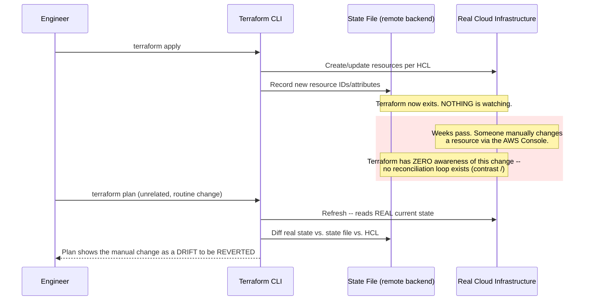

**Terraform's Resource Graph — Parallel Where Independent, Sequential Where Dependent**

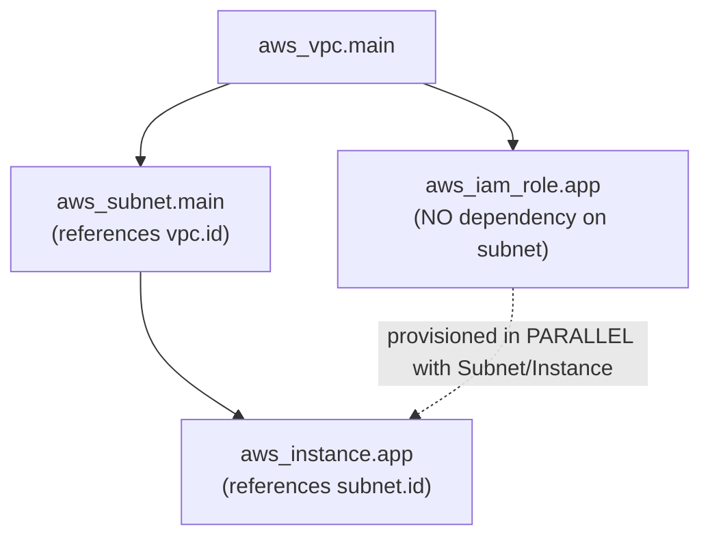

**12. System Design**

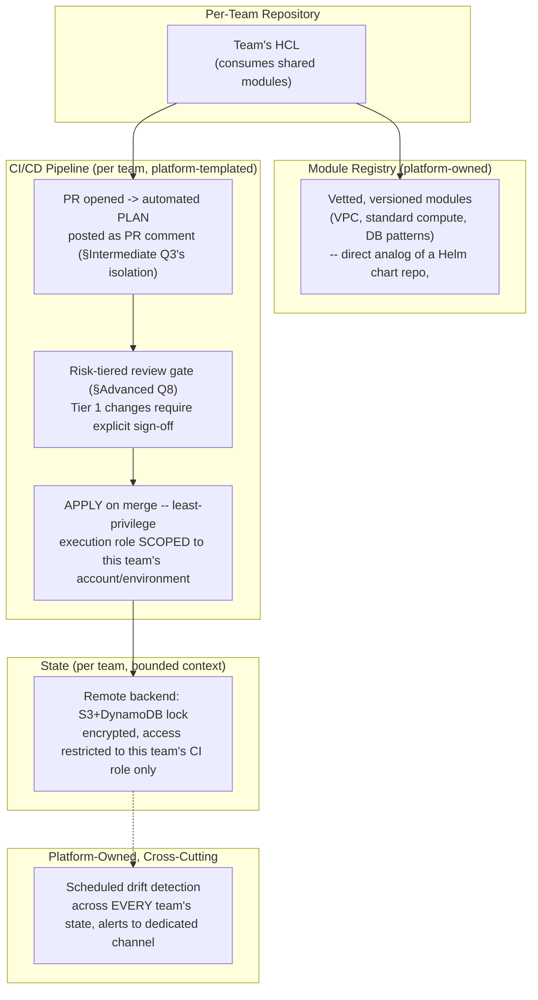

**13. Low-Level Design**

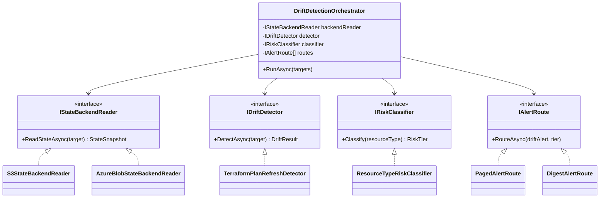

### Module 86 — DevOps: Configuration Management, Secrets & Environment Promotion
*Source: `02-ConfigurationManagement-Secrets-EnvironmentPromotion.md`*

**The Promotion Pipeline — One Artifact, Layered Config, Reviewed Deltas**

```text
 BUILD (once) PROMOTE (by PR, per environment)
┌──────────────────────┐ ┌───────────────────────────────────────────────────┐
│ git tag v1.4.2 │ │ config repo: │
│ → image sha256:abc… │ │ base/values.yaml (shared declaration) │
│ (env-agnostic: │ │ envs/staging/values.yaml (small delta) │
│ no URLs, no │ │ envs/prod/values.yaml (small delta) │
│ secrets baked in) │ │ │
└──────────┬───────────┘ │ PR: "promote v1.4.2 to prod" = digest bump + │
 │ │ any config delta — a human-readable diff │
 ▼ └────────────────────┬──────────────────────────────┘
 registry (digest-addressed) │ merge
 │ ▼
 │ GitOps controller / pipeline applies
 │ │
 ▼ ▼
 ┌─ staging ──────────┐ ┌─ production ────────┐
 │ sha256:abc… │ same │ sha256:abc… │ secrets NEVER in
 │ + staging values │ digest ► │ + prod values │ this flow — only
 │ + secret REFERENCES│ │ + secret REFERENCES │ references
 └────────────────────┘ └─────────┬───────────┘
 │ dereferenced at runtime by
 ▼ workload identity only
 ┌─ secret store ──────┐
 │ Vault / ASM / KV │ ← rotation happens
 │ (audit, versions, │ HERE, once, with
 │ leases, RBAC) │ dual-secret overlap
 └──────────────────────┘
```

**Secret Delivery Patterns — Where the Copies Live**

```text
(1) CI-injected: store → pipeline → env vars (pipeline = high-privilege broker)
(2) Operator-synced: store → ESO/CSI → K8s Secret/file (reconciled copy in cluster)
(3) Direct SDK: store → app (cached, refreshed) (no intermediate copy; hard dep)
(4) Dynamic: store MINTS per-workload, short-TTL credential (lease + renewal)
 fewer copies / stronger guarantees ───────────────────────────────► more machinery
```

**12. System Design**

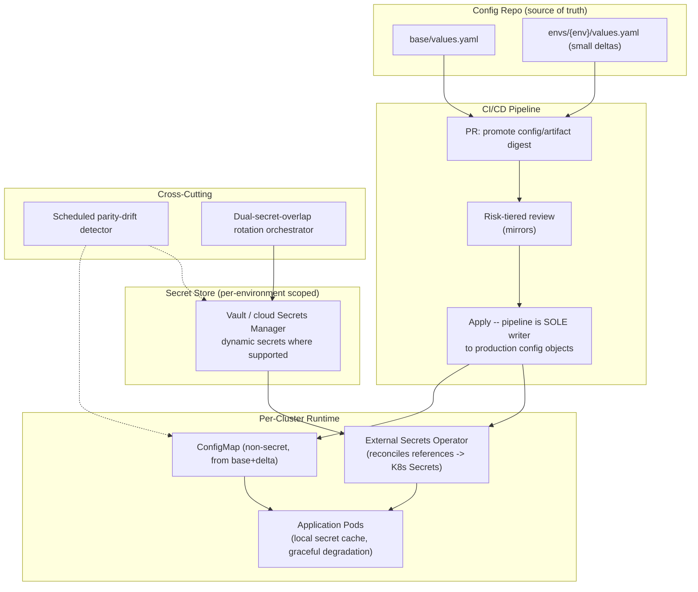

**13. Low-Level Design**

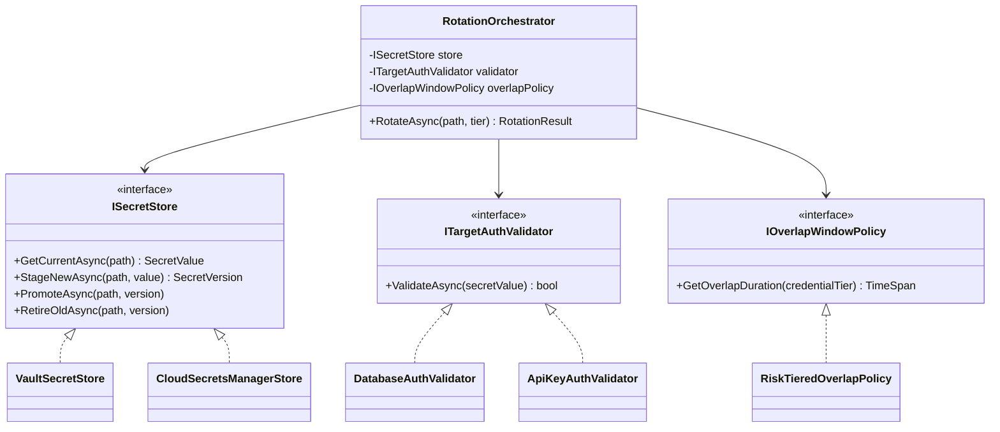

### Module 87 — DevOps: Release & Deployment Strategies — Blue-Green, Canary & Progressive Delivery
*Source: `03-ReleaseDeploymentStrategies-BlueGreen-Canary-ProgressiveDelivery.md`*

**Canary Rollout with Automated Analysis (Argo Rollouts / Flagger pattern)**

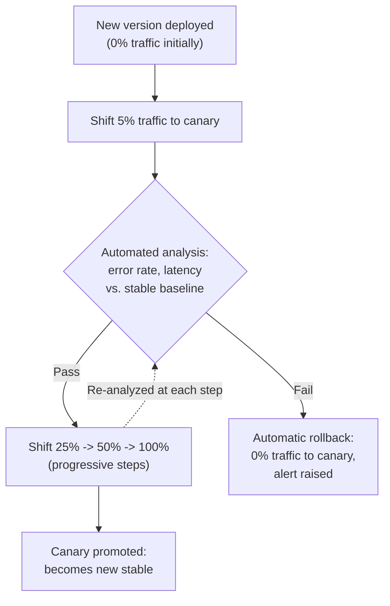

**12. System Design**

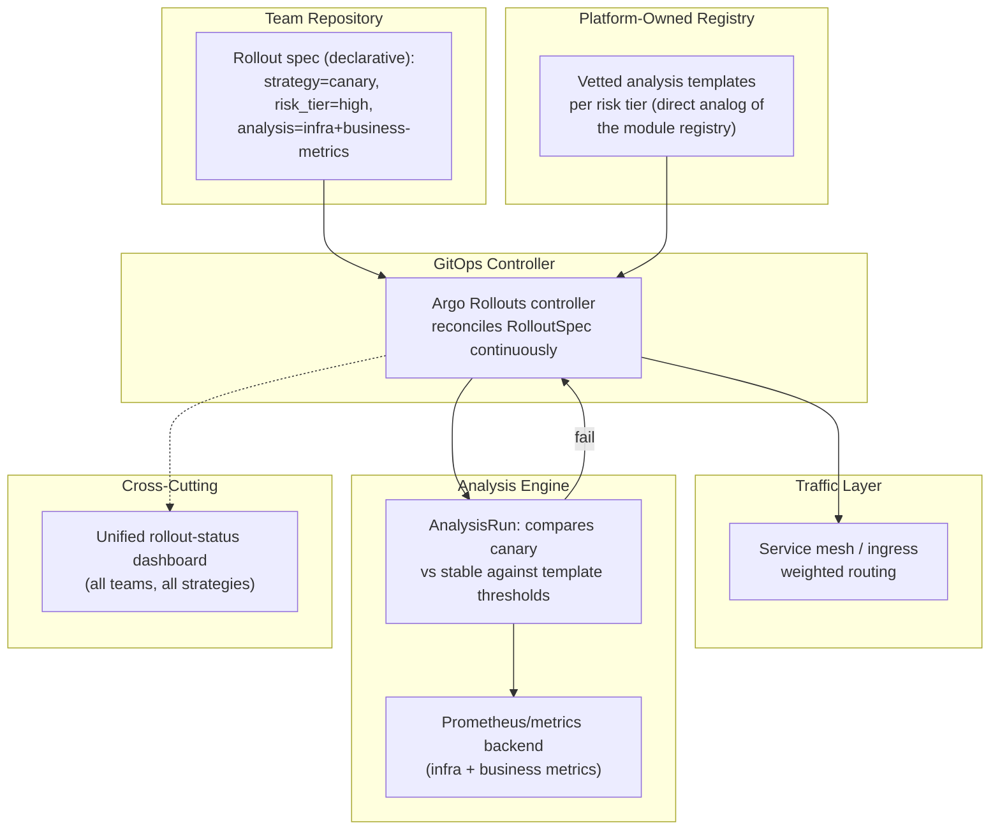

**13. Low-Level Design**

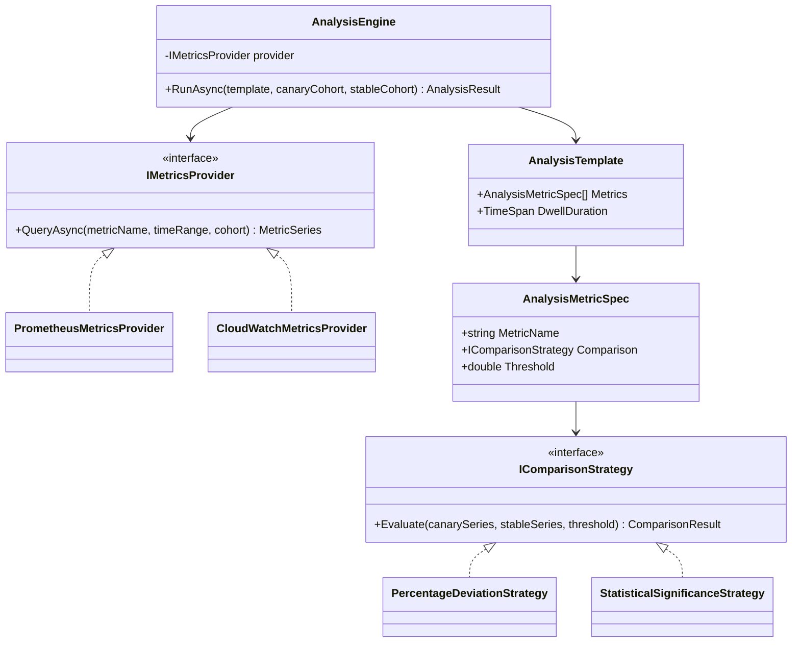

### Module 88 — DevOps: DevSecOps, Policy-as-Code & Platform Engineering (Capstone)
*Source: `04-DevSecOps-PolicyAsCode-PlatformEngineering.md`*

**The Unified Delivery Pipeline — Policy Gates at Every Stage**

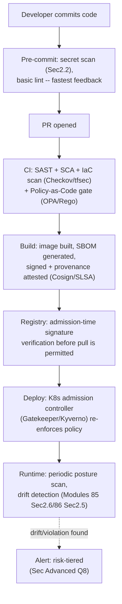

**The Internal Developer Platform — Unifying Modules 85/86/87 Under One Golden Path**

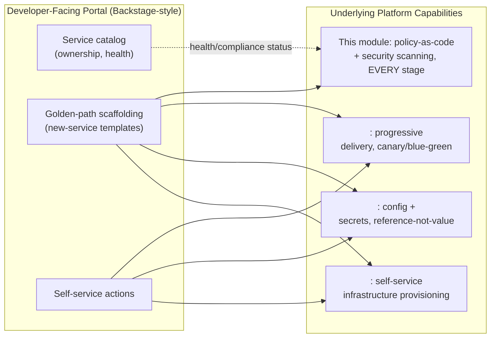

**12. System Design**

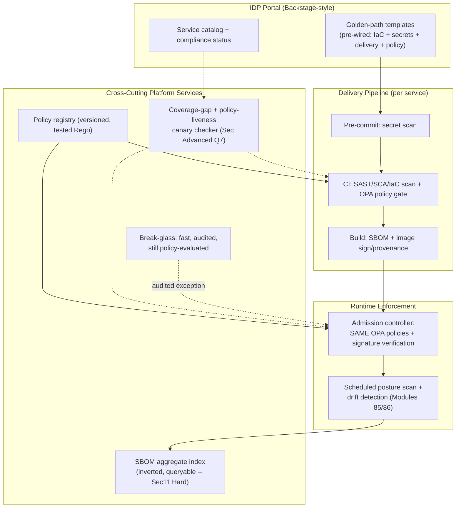

**13. Low-Level Design**

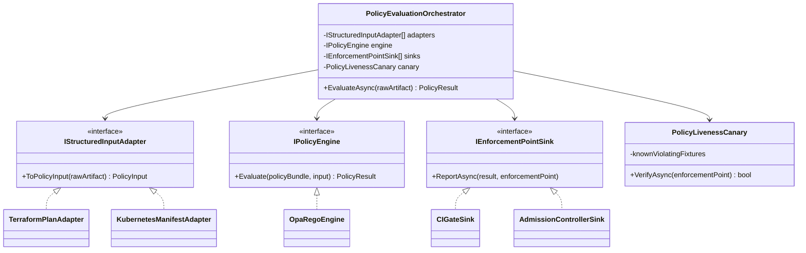
