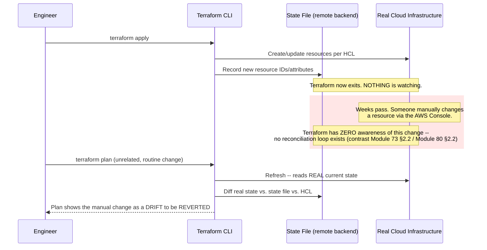
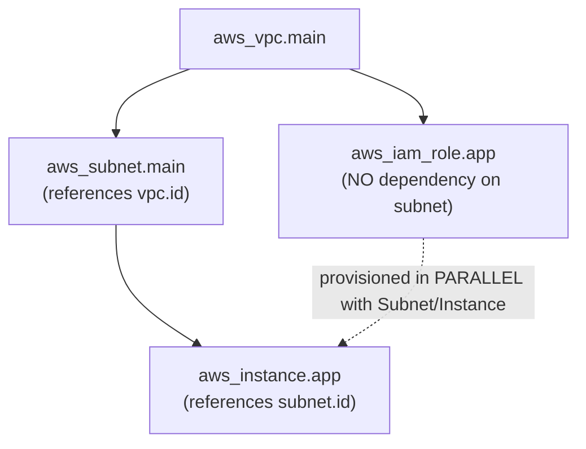
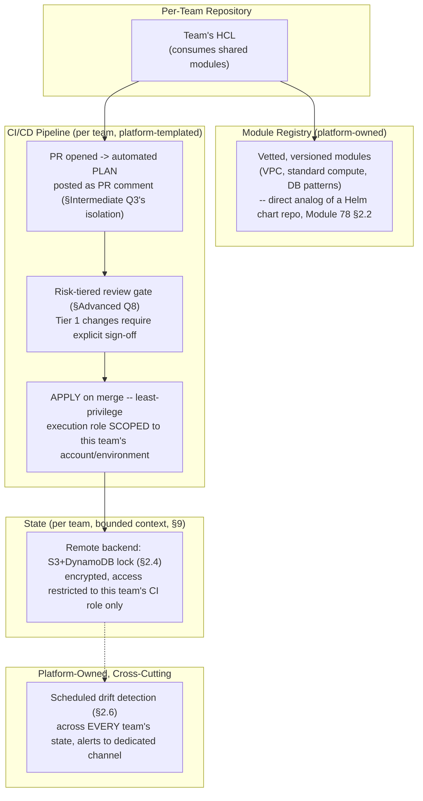
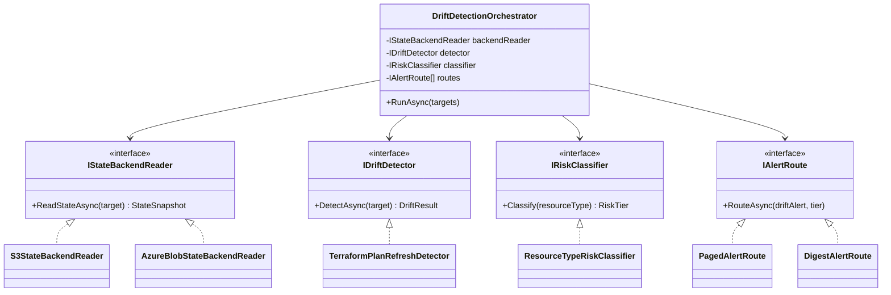

# Module 85 — DevOps: Infrastructure as Code — Terraform, State Management & Drift

> Domain: DevOps | Level: Beginner → Expert | Prerequisite: [[../23-Kubernetes/08-Observability-Multicluster-GitOps]] §2.6 (GitOps/Argo CD's continuous reconciliation loop — this module's headline finding is defined by direct, mechanism-level contrast against it) and [[../21-AWS/01-Compute-Networking-VPC-LoadBalancing-AutoScaling]] / [[../22-Azure/01-Compute-Networking-VNet-LoadBalancer-VMSS]] (the concrete cloud resources this module's tooling provisions)
>
> **DevOps domain scope (standard depth, following this course's default for domains without an explicit extra-depth flag — mirroring how [[../24-Docker/01-Images-Layers-UnionFilesystem]] scoped Docker):** Module 85 (this one): Infrastructure as Code — Terraform, State Management & Drift. Module 86: Configuration Management, Secrets & Environment Promotion. Module 87: Release & Deployment Strategies — Blue-Green, Canary, Rolling & Feature Flags. Module 88: DevSecOps, Policy-as-Code & Platform Engineering (capstone).

---

## 1. Fundamentals

**What:** Infrastructure as Code (IaC) is the practice of defining cloud/on-prem infrastructure — networks, compute, databases, IAM roles — as version-controlled, declarative configuration rather than manual console clicks or ad-hoc scripts. **Terraform** (HashiCorp) is the dominant provider-agnostic IaC tool: engineers write HCL (HashiCorp Configuration Language) describing *desired* resources, and Terraform computes and executes the specific cloud-API calls needed to make real infrastructure match that description, tracking what it created in a **state file**.

**Why:** Manual infrastructure changes are unrepeatable, undocumented, and untested — the exact same "it worked because of an unverified assumption" risk this course established repeatedly for Kubernetes/Docker configuration (Modules 74–84), now at the layer *beneath* those tools: someone has to actually provision the VPC, the EKS/AKS cluster, the RDS instance those modules assumed already existed. IaC makes infrastructure changes reviewable (a pull request diff), repeatable (the same HCL applies identically to a new environment), and auditable (git history is the change log) — directly the same "declarative, version-controlled desired state" principle Module 73 established for Kubernetes objects and Module 80 established for GitOps, now applied one layer down, to the cloud resources those platforms themselves run on.

**When:** Any infrastructure provisioning beyond a genuinely disposable, single-use experiment — which is to say, essentially all production cloud infrastructure, including every AWS/Azure resource type covered in Modules 57–72.

**How (30,000-ft view):**
```
Write HCL (.tf files): declare desired resources (aws_vpc, azurerm_linux_virtual_machine, etc.)
terraform init:  downloads the provider plugins (AWS/Azure/GCP API clients) referenced in HCL
terraform plan:  REFRESHES real infra state, diffs it against the state file AND the HCL,
                 and prints the specific create/update/destroy actions it WOULD take
terraform apply: executes those specific cloud-API calls, then updates the state file
                 to record the new real-world resource IDs against each HCL resource
```

---

## 2. Deep Dive

### 2.1 HCL and the Resource Dependency Graph
Terraform parses all `.tf` files in a module into a single **dependency graph** — resource A referencing an attribute of resource B (`subnet_id = aws_subnet.main.id`) creates an explicit edge, and Terraform provisions independent resources **in parallel** while strictly ordering dependent ones, the identical DAG-based-parallel-execution principle Module 82 §2.6 established for BuildKit's build-stage graph, now applied to cloud-resource provisioning instead of image-layer building. This is also why a single malformed reference can silently serialize an entire plan that should have parallelized — a Principal Engineer reviewing a slow `apply` should first check whether unnecessary implicit dependencies (rather than genuine ones) are collapsing the graph into an effectively sequential chain.

### 2.2 The State File — Terraform's Single Source of Truth, and Its Secret-Persistence Risk
The **state file** (`terraform.tfstate`, JSON) is the authoritative mapping between each HCL resource block and its real-world cloud resource ID and *every attribute Terraform knows about it* — critically, this frequently includes values a team assumes are secret: an `aws_db_instance`'s `password` argument, even if sourced from a secrets manager at apply time, is written into the state file **in plaintext** by default, because Terraform must record the full resource state to compute future diffs. This is a direct, state-file-specific instance of this course's recurring "the mechanism you assumed was safe has a specific, non-obvious persistence gap" pattern — structurally analogous to Module 82 §2.2's Dockerfile `ARG` build-history finding, though the underlying mechanism (a state-tracking JSON file vs. an image's build metadata) is genuinely different.

### 2.3 Plan-Time-Only Reconciliation — the Headline Divergence from Kubernetes/GitOps
This is this module's central, mechanism-level finding, and it is a **stronger** claim than any of this course's prior "declared ≠ enforced" instances (Modules 74/75/76/78/79/80): Terraform is **not** a continuously-running reconciler at all. A Kubernetes controller (Module 73 §2.2) and Argo CD's GitOps sync loop (Module 80 §2.2) both continuously watch real-world state and actively correct drift within seconds, with no human action required. Terraform does **nothing** between an `apply` and the next explicit `plan`/`apply` invocation — if a resource is manually changed in the cloud console, via a different team's script, or by any process outside Terraform, Terraform has **zero awareness of it** until a human or a CI pipeline explicitly re-runs `plan` (which performs a **refresh** — re-reading real infrastructure state — as part of computing the diff). Between those two points in time, drift can persist completely silently, for an arbitrarily long window, with no alert, no log entry, and no automatic correction of any kind — a fundamentally different risk profile from the "continuously enforced, but the *desired state itself* might be wrong" gap Module 80 §2.6 established as this course's Kubernetes capstone finding.

### 2.4 Remote State, Locking & Team Collaboration
A local state file is a single point of failure and a collision hazard the moment more than one engineer or one CI pipeline can run `apply` — two concurrent applies against the same local state file can corrupt it or silently overwrite each other's changes. A **remote backend** (an S3 bucket with a DynamoDB lock table, Azure Storage with a blob lease, or Terraform Cloud/Enterprise) solves both problems: the state file lives in shared, durable storage, and a **lock** (acquired for the duration of a `plan`/`apply`) prevents a second concurrent operation from running against the same state until the first completes — the direct infrastructure-provisioning analog of a database transaction's exclusive lock, applied to an entire environment's worth of resources rather than a single row.

### 2.5 Modules and Workspaces — Reuse and Environment Multiplicity
A Terraform **module** is a reusable, parameterized bundle of resource definitions (e.g., a "standard VPC" module taking a CIDR block and AZ count as inputs) — architecturally the direct IaC analog of a Helm chart (Module 78 §2.2): one versioned, reviewed definition consumed by many call sites instead of copy-pasted, independently-drifting HCL per environment. A **workspace** lets one module's code target multiple, state-isolated instances (dev/staging/prod) from the same configuration — but workspaces share the *same backend configuration and the same HCL*, differing only in which state file is active; a genuinely easy, low-visibility mistake is running `apply` against the wrong workspace (having forgotten to `terraform workspace select prod` after working in `dev`), applying dev-sized/dev-configured resources against production's state, or vice versa — a mistake with no compile-time or type-level guard against it at all, purely a human-process risk.

### 2.6 Detecting Drift — Why It Requires a Proactive, Scheduled Action
Because of §2.3's finding, the *only* way to detect drift before it's surfaced accidentally by an unrelated, routine `apply` is to proactively and repeatedly ask: `terraform plan -refresh-only` (which refreshes and reports differences without proposing to change anything) run on a **schedule** (a nightly CI job, or a managed feature like Terraform Cloud's drift detection) is the direct, structural fix — converting an otherwise-silent, arbitrarily-long drift window into a bounded, alertable one. This is architecturally the closest IaC has to Module 80's GitOps sync-status dashboard, but critically **weaker**: a GitOps controller's dashboard reflects genuinely continuous, sub-minute reconciliation; a scheduled drift-detection job's freshness is only as good as its schedule interval, and — unlike GitOps — detecting the drift still does not automatically correct it; a human must still review and explicitly decide whether to `apply` (reverting the drift to match declared config) or update the HCL (accepting the drift as the new desired state).

---

## 3. Visual Architecture

### The Plan/Apply Cycle vs. a Continuously-Reconciling Controller (§2.3)


### Terraform's Resource Graph — Parallel Where Independent, Sequential Where Dependent (§2.1)


---

## 4. Production Example

**Problem:** During a live production outage, an on-call engineer needed to grant a partner's monitoring service emergency, temporary access to an internal API — under incident pressure, they opened the required inbound rule directly in the AWS Console on the relevant security group, restored service within minutes, and moved on to the incident retrospective, fully intending to "add it to Terraform properly later."

**Architecture:** The security group in question was fully Terraform-managed — defined in HCL, tracked in the remote state file — but the emergency console change was made entirely outside Terraform, meaning the HCL and the state file both still described the security group **without** the new rule, while the *real* AWS resource now had it.

**Implementation:** For several weeks, the drift was entirely invisible — no alert fired, nothing in any dashboard reflected it, because (per §2.3) Terraform performs no continuous reconciliation and nothing had triggered a `plan` against that specific security group in the interim.

**Trade-offs:** Making the emergency change directly via the console, rather than a fast-tracked HCL pull request plus expedited `apply`, was a reasonable, defensible choice under genuine outage time-pressure — but it created exactly the kind of undocumented, driftable state this module's entire framework exists to prevent, and the team had no explicit, bounded process requiring the change to be backported into HCL afterward.

**Lessons learned:** A subsequent, entirely unrelated infrastructure change (a routine `terraform apply` adding a new subnet, run via the team's standard CI pipeline) triggered a full `plan` against the whole module — including the drifted security group. The plan's output correctly showed the manual rule as a difference **to be removed**, since Terraform's model treats the declared HCL as authoritative and any real-world attribute not present in it is, by definition, something to revert on the next apply. The diff was one of several dozen lines in an otherwise routine, low-risk-looking plan output for an unrelated subnet addition — nobody flagged the security-group removal line during review, the pipeline's automatic-apply-on-approval policy proceeded, and the emergency access rule was silently reverted, reintroducing the exact condition that had caused the original outage, discovered only when the partner's monitoring service failed again and a second incident was opened. **This is this module's defining lesson**: Terraform's plan-time-only reconciliation model (§2.3) means an out-of-band change doesn't just risk *eventual* correction like a continuously-reconciling Kubernetes controller would provide (predictably, within seconds, and visibly) — it risks **silent, indefinite persistence followed by an unpredictable, badly-timed, and easily-overlooked reversal**, buried inside whatever unrelated change happens to trigger the next plan. The structural fix requires two independent layers: (1) a bounded-time process mandating any emergency out-of-band change be backported into HCL and reconciled via a proper, reviewed `apply` within a defined window (e.g., same business day), and (2) a scheduled, proactive drift-detection job (§2.6) that would have surfaced this specific drift within hours rather than weeks, and in complete isolation from an unrelated subnet change — making the review far more likely to actually catch it.

## 5. Best Practices
- Review the **full** `plan` diff before every `apply` — including every "will be destroyed"/"in-place update" line for resources the change wasn't intended to touch, especially in an automated, approval-gated pipeline where a human reviewer's attention is the last line of defense (§2.3, §4).
- Use a remote backend with locking (S3+DynamoDB, Terraform Cloud, Azure Storage+lease) for any team environment — never a local state file shared via a network drive or committed to git (§2.4).
- Mandate a bounded-time backport process for any emergency, out-of-band infrastructure change — the change must be reflected in HCL and reconciled the same day, not "eventually" (§4).
- Run scheduled, proactive drift-detection (`plan -refresh-only`) rather than relying on the next routine `apply` to surface out-of-band changes (§2.6).
- Treat any resource attribute that could contain a secret (database passwords, API keys) as requiring an encrypted, access-restricted remote backend at minimum, and prefer a secrets-manager reference over a literal value wherever the provider supports it (§2.2).

## 6. Anti-patterns
- Assuming Terraform behaves like a Kubernetes controller or Argo CD — continuously watching and correcting drift — when it only ever reconciles at an explicit `plan`/`apply` (§2.3).
- Making manual, out-of-band infrastructure changes without a bounded, mandatory backport-to-HCL process (§4).
- Storing a local state file without a remote, locked backend in any environment with more than one contributor (§2.4).
- Approving an automated pipeline's `plan` output without actually reading every destroy/update line, on the assumption that "the pipeline wouldn't propose anything dangerous" (§4).
- Applying against the wrong Terraform workspace due to an unverified `workspace select`, with no automated guard against it (§2.5).

---

## 10. Interview Questions

### Basic (10)

1. **Q: What is the core problem Infrastructure as Code solves relative to manual console-based provisioning?**
   **A:** Manual changes are unrepeatable, undocumented, and untested; IaC makes infrastructure changes reviewable, repeatable, and auditable via version control.
   **Why correct:** States the core motivation precisely, not merely "it's more modern."
   **Common mistakes:** Describing IaC as solely about automation speed rather than reviewability/repeatability/auditability.
   **Follow-ups:** "What artifact serves as the change log for infrastructure under IaC?" (Git history of the `.tf` files.)

2. **Q: What is a Terraform state file?**
   **A:** The authoritative record mapping each HCL resource block to its real-world cloud resource ID and known attributes.
   **Why correct:** Correctly identifies the state file's specific role, not merely "a config file."
   **Common mistakes:** Confusing the state file with the HCL configuration itself.
   **Follow-ups:** "What can the state file contain that teams often don't expect?" (Plaintext secrets, §2.2.)

3. **Q: What does `terraform plan` do?**
   **A:** Refreshes real infrastructure state, diffs it against the state file and HCL, and reports the specific create/update/destroy actions an `apply` would take.
   **Why correct:** Correctly describes both the refresh and the diff/report behavior.
   **Common mistakes:** Assuming `plan` makes no real-world API calls at all (the refresh step does read real infrastructure, even though it makes no changes).
   **Follow-ups:** "Does `plan` alone ever modify real infrastructure?" (No — only `apply` executes changes.)

4. **Q: Does Terraform continuously watch for and correct infrastructure drift?**
   **A:** No — it only reconciles at an explicit `plan`/`apply` invocation; drift can persist silently between them.
   **Why correct:** States this module's headline finding directly and accurately.
   **Common mistakes:** Assuming Terraform behaves like a Kubernetes controller with a continuous reconciliation loop.
   **Follow-ups:** "What Kubernetes-domain concept is this being directly contrasted against?" (Controller reconciliation, Module 73 §2.2, and Argo CD's GitOps sync loop, Module 80 §2.2.)

5. **Q: Why is a local, unshared state file risky for a team environment?**
   **A:** Concurrent `apply` operations against the same local state file can corrupt it or silently overwrite each other's changes.
   **Why correct:** Correctly identifies the concurrency/collision risk.
   **Common mistakes:** Assuming state file risk is only about accidental deletion, not concurrent-write corruption.
   **Follow-ups:** "What mechanism prevents this in a remote backend?" (State locking, e.g., a DynamoDB lock table, §2.4.)

6. **Q: What is a Terraform module?**
   **A:** A reusable, parameterized bundle of resource definitions consumed by many call sites, rather than copy-pasted HCL per environment.
   **Why correct:** Correctly describes the reuse/parameterization purpose.
   **Common mistakes:** Confusing a module with a workspace (which isolates state, not code reuse).
   **Follow-ups:** "What Kubernetes-domain concept is a Terraform module directly analogous to?" (A Helm chart, Module 78 §2.2.)

7. **Q: What is a Terraform workspace?**
   **A:** A mechanism letting one module's HCL target multiple, state-isolated instances (e.g., dev/staging/prod) from the same configuration.
   **Why correct:** Correctly distinguishes workspaces (state isolation) from modules (code reuse).
   **Common mistakes:** Assuming workspaces also isolate the HCL code itself, not just the state.
   **Follow-ups:** "What mistake is easy to make with workspaces?" (Applying against the wrong workspace due to an unverified `workspace select`, §2.5.)

8. **Q: How does Terraform decide which resources can be provisioned in parallel?**
   **A:** It builds a dependency graph from HCL references between resources — independent resources provision in parallel, dependent ones are ordered.
   **Why correct:** Correctly describes the DAG-based execution model.
   **Common mistakes:** Assuming Terraform applies resources strictly in file-declaration order.
   **Follow-ups:** "What Docker-domain concept is this directly analogous to?" (BuildKit's DAG-based, parallel build-stage execution, Module 82 §2.6.)

9. **Q: What does `terraform plan -refresh-only` do?**
   **A:** Refreshes and reports real-infrastructure differences from the state file without proposing any changes.
   **Why correct:** Correctly distinguishes this from a normal `plan`, which also proposes actions.
   **Common mistakes:** Assuming this command also applies or proposes corrective changes.
   **Follow-ups:** "Why is this useful as a scheduled job?" (Proactive drift detection, §2.6, rather than waiting for an unrelated routine apply to surface drift.)

10. **Q: What is the practical risk of granting a CI pipeline's Terraform execution role account-wide administrator permissions?**
    **A:** A blast radius far larger than the specific infrastructure changes that pipeline is actually responsible for, violating least privilege.
    **Why correct:** Correctly identifies the least-privilege violation and its consequence.
    **Common mistakes:** Assuming broad permissions are a convenience-only trade-off with no meaningful security cost.
    **Follow-ups:** "What's the correct alternative?" (Scope the execution role's permissions to exactly the resource types/actions that specific pipeline needs, §8.)

### Intermediate (10)

1. **Q: Why is Terraform's "declared config is authoritative" model the specific mechanism that caused §4's incident to revert the emergency security-group rule, rather than merely fail to notice it?**
   **A:** Terraform doesn't just fail to *notice* an out-of-band change — on the next `plan`/`apply`, it actively treats any real-world attribute not present in the declared HCL as a difference *to be corrected back to the declared state*, meaning the manual rule wasn't merely undetected, it was scheduled for active removal the moment any unrelated apply touched that resource's module.
   **Why correct:** Correctly distinguishes "unaware of drift" from "will actively revert drift on the next apply" — a stronger, more consequential claim.
   **Common mistakes:** Assuming Terraform would merely leave the manual change alone since it wasn't explicitly told to remove it.
   **Follow-ups:** "Would `terraform plan -refresh-only` have proposed removing the rule?" (No — refresh-only reports drift without proposing any corrective action; only a normal `plan`/`apply` proposes reverting it, §2.6.)

2. **Q: Why does this module describe Terraform's drift-detection gap as a "stronger claim" than Module 80's GitOps capstone finding, rather than simply another instance of the same pattern?**
   **A:** Module 80's finding was that GitOps *continuously* enforces declared state, but a wrong declaration is enforced just as faithfully as a correct one — the enforcement mechanism itself was never in question. This module's finding is that no continuous enforcement mechanism exists **at all** — the gap isn't about the declaration's correctness, it's about whether anything is watching in between two human-triggered actions.
   **Why correct:** Correctly distinguishes "continuous enforcement of a possibly-wrong declaration" from "no continuous enforcement mechanism at all" as genuinely different, not merely differently-worded, findings.
   **Common mistakes:** Treating both findings as interchangeable instances of "declared state might be wrong."
   **Follow-ups:** "What tool, mentioned in this module's §15, would close this specific gap by adding continuous reconciliation to Terraform-style declared infrastructure?" (Crossplane — a Kubernetes-native IaC controller providing genuine, continuous reconciliation of cloud resources, §15.)

3. **Q: Why did placing the security-group drift review among "several dozen lines" of an unrelated subnet-addition plan make §4's incident more likely, rather than merely inconvenient?**
   **A:** Directly Module 84 §Advanced Q8's reviewer-fatigue reasoning, now recurring in the IaC domain — a reviewer's attention is a genuinely finite resource, and a destructive-looking line buried inside an otherwise routine, low-risk-looking diff is measurably more likely to be missed than the same line presented as the sole, isolated content of a dedicated drift-detection report.
   **Why correct:** Correctly connects this incident to an already-established, general reviewer-attention principle rather than treating it as a coincidental oversight.
   **Common mistakes:** Attributing the missed review purely to individual carelessness rather than the structural review-burden problem.
   **Follow-ups:** "What structural fix directly addresses this, beyond simply asking reviewers to be more careful?" (A dedicated, isolated drift-detection report/alert, §2.6, presenting out-of-band changes on their own rather than commingled with unrelated routine changes.)

4. **Q: Why does storing an `aws_db_instance` password in the state file remain a real risk even when the HCL itself references a secrets-manager value rather than a literal string?**
   **A:** Terraform must record the resource's actual, resolved attribute values to compute future diffs correctly — regardless of how the value was *sourced* in HCL, its resolved value at apply time is written into the state file itself, meaning the secrets-manager reference in the HCL doesn't prevent the plaintext value from persisting in state.
   **Why correct:** Correctly identifies that the state file's persistence is orthogonal to how the value was originally sourced in configuration.
   **Common mistakes:** Assuming referencing a secrets manager in HCL is sufficient on its own to keep the value out of the state file.
   **Follow-ups:** "What's the actual mitigation, given the value will be in state regardless?" (Encrypt the remote backend at rest and restrict its access tightly — treat the backend itself as the security boundary, §8.)

5. **Q: A team argues that since they use a remote backend with locking, their multi-engineer Terraform workflow is now fully safe from concurrent-modification risk. Evaluate this claim.**
   **A:** Locking prevents concurrent *applies* from corrupting the state file or racing against each other — but it does not prevent two engineers from planning conflicting, uncoordinated HCL changes to the same resources that each individually apply cleanly in sequence, producing a correct-looking but unintended final state neither engineer fully reviewed together.
   **Why correct:** Correctly distinguishes the specific risk locking addresses (concurrent-write corruption) from a different, still-unaddressed risk (uncoordinated, sequential conflicting intent).
   **Common mistakes:** Treating locking as a complete solution to all multi-engineer collaboration risk rather than one specific, narrower protection.
   **Follow-ups:** "What process, beyond locking, addresses the remaining risk?" (Code review of every HCL change via pull request before merge/apply, the same review discipline this module's §4/§5 emphasize for the plan output itself.)

6. **Q: Why is splitting a monolithic Terraform state into smaller, bounded-context state files described as directly analogous to microservice decomposition, rather than merely a performance optimization?**
   **A:** Both share the identical underlying motivation beyond raw performance: bounding blast radius — a change to one bounded-context's state cannot directly corrupt or need to re-plan an unrelated context's resources, the same isolation-of-failure-and-change-scope reasoning Module 49 established for service boundaries, now applied to infrastructure-definition boundaries.
   **Why correct:** Correctly identifies blast-radius isolation, not just plan/apply speed, as the shared underlying motivation.
   **Common mistakes:** Treating state-splitting as purely a §7 performance concern, missing the governance/blast-radius dimension.
   **Follow-ups:** "What's the cost of over-splitting state into too many small files?" (Increased cross-state coordination complexity for genuinely interdependent resources — e.g., needing `terraform_remote_state` data sources to reference another state's outputs — the same granularity trade-off Module 49 established for over-decomposed microservices.)

7. **Q: Why does §2.1's resource dependency graph mean a single unnecessary implicit dependency can silently collapse an otherwise-parallelizable plan into a sequential one?**
   **A:** Any HCL reference between two resources (even one that doesn't reflect a genuine provisioning-order requirement — e.g., referencing a resource's ID purely for a tag value rather than an actual infrastructure dependency) creates a graph edge Terraform must respect, forcing sequential execution regardless of whether the underlying cloud resources actually require that ordering.
   **Why correct:** Correctly identifies that the graph is built from HCL *references*, not genuine semantic dependencies, meaning an incidental reference has the same ordering effect as a load-bearing one.
   **Common mistakes:** Assuming Terraform can distinguish a "real" dependency from an incidental reference used only for convenience.
   **Follow-ups:** "How would you fix an unnecessary reference collapsing parallelism?" (Replace the incidental reference with a hardcoded or separately-computed value, or use `depends_on` explicitly only where a genuine, non-attribute-based ordering requirement exists, removing the unnecessary graph edge.)

8. **Q: Why does this module recommend a bounded-time backport process for emergency out-of-band changes, rather than simply prohibiting manual changes outright?**
   **A:** An outright prohibition is unenforceable and unrealistic under genuine incident time-pressure (§4) — the emergency console change was itself a reasonable, defensible action given the situation; the actual, addressable gap was the *absence of any bounded follow-up process* ensuring the change was reconciled back into HCL promptly, not the manual change's initial occurrence.
   **Why correct:** Correctly distinguishes the reasonable emergency action from the actual governance gap (no bounded reconciliation process), avoiding an unrealistic "never make manual changes" prescription.
   **Common mistakes:** Concluding the incident's lesson is "manual changes are always wrong," missing that the real gap was process, not the initial action.
   **Follow-ups:** "What would make this backport process genuinely enforceable, rather than an easily-forgotten good intention?" (Pairing it with §2.6's scheduled drift detection as a forcing function — even if an engineer forgets the manual backport, a scheduled drift-detection job surfaces the gap proactively within a bounded window regardless.)

9. **Q: Why is a Terraform workspace's shared HCL/backend configuration (differing only in active state) a genuine risk factor for the wrong-workspace mistake in §2.5, compared to fully separate configuration directories per environment?**
   **A:** Because the exact same command (`terraform apply`) run from the exact same directory with the exact same HCL produces entirely different real-world consequences depending purely on which workspace is currently selected — an easily-overlooked, terminal-session-scoped piece of state with no visual distinction in the HCL itself, unlike fully separate directories where the working directory itself is an unambiguous, visible signal of which environment is being targeted.
   **Why correct:** Correctly identifies the specific mechanism (workspace selection as invisible, session-scoped state) that makes this mistake easy, rather than a vague "workspaces are risky" claim.
   **Common mistakes:** Assuming the risk is inherent to workspaces as a feature rather than the specific lack of visible, in-context confirmation of the active workspace.
   **Follow-ups:** "What mitigation directly addresses this specific risk?" (A CI pipeline step or shell prompt integration that explicitly displays and requires confirmation of the active workspace before any `apply`, making the otherwise-invisible state visible at the point of action.)

10. **Q: Why does this module frame drift-detection scheduling as "the closest IaC has" to a GitOps dashboard, while also explicitly calling it weaker?**
    **A:** Both surface a difference between declared and actual state for human review — but a GitOps dashboard reflects genuinely continuous, sub-minute reconciliation status, while a scheduled drift job's freshness is bounded only by its schedule interval (hours, typically), and critically, detecting Terraform drift still requires a separate, explicit human decision and action to correct it, whereas GitOps's continuous loop corrects automatically the moment a sync is triggered.
    **Why correct:** Correctly identifies both the shared purpose (surfacing declared-vs-actual differences) and the two genuine, specific weaknesses (coarser freshness, no automatic correction) rather than treating the two mechanisms as equivalent.
    **Common mistakes:** Treating scheduled drift detection as functionally equivalent to GitOps's continuous reconciliation once the schedule is "frequent enough."
    **Follow-ups:** "Could a sufficiently frequent drift-detection schedule ever fully close this gap?" (No — even a one-minute schedule still lacks automatic correction; closing the gap fully requires a genuinely different architecture, such as Crossplane's continuous-reconciliation model, §15, not merely a shorter polling interval.)

### Advanced (10)

1. **Q: Diagnose §4's incident from first principles and design the complete structural fix — not merely the immediate backport of the specific security-group rule.**
   **A:** Root cause: an out-of-band manual change with no bounded reconciliation process, combined with Terraform's plan-time-only reconciliation model (§2.3) meaning the drift persisted silently until an unrelated apply surfaced and reverted it, buried among unrelated changes a reviewer didn't scrutinize closely (§Intermediate Q3). Structural fix: (1) immediately restore the emergency access rule and formally add it to HCL; (2) establish a mandatory, bounded-time (same business day) backport requirement for any emergency out-of-band change, tracked as an explicit incident-response checklist item, not an informal intention; (3) implement scheduled `plan -refresh-only` drift detection (§2.6) as a forcing function independent of any individual's memory; (4) require any plan containing a destroy/removal action on a security-relevant resource type (security groups, IAM policies) to receive an explicit, separate, higher-scrutiny review flag in the CI pipeline, rather than being reviewed identically to a routine addition.
   **Why correct:** Addresses both the immediate incident and the structural, repeatable causes (no bounded process, no proactive detection, no risk-tiered review), directly mirroring this course's established incident-response depth from the Kubernetes/Docker domains.
   **Common mistakes:** Fixing only the specific security-group rule without addressing the absence of a bounded backport process or proactive drift detection that would prevent recurrence for a different resource.
   **Follow-ups:** "Why specifically flag security-relevant resource types for higher-scrutiny review, rather than treating every destroy/update line identically?" (Directly this course's risk-tiered governance principle, Module 83 §10 Advanced Q10 — uniform maximum scrutiny on every line causes reviewer fatigue and diminishing returns; concentrating scrutiny on genuinely higher-blast-radius resource types is a more sustainable, effective allocation of finite reviewer attention.)

2. **Q: A team claims that since their production Terraform state has shown zero drift-detection alerts for the past six months, their infrastructure is provably free of any out-of-band changes. Evaluate this claim.**
   **A:** Push back — directly Module 83 §Advanced Q2's "no incident yet is not evidence of no risk" reasoning, recurring again in this domain: six months of clean drift-detection results only proves no *detected* drift occurred *during the intervals actually covered by the detection schedule* — it says nothing about a change made and then reverted between two scheduled checks, nor about any resource type or account scope the drift-detection job's own configuration doesn't actually cover (a common, easy-to-overlook gap if the job wasn't configured against every state file/workspace in the estate).
   **Why correct:** Correctly applies the established cross-domain principle while also identifying a domain-specific mechanism (scheduling-interval gaps and detection-scope gaps) by which the claim could be false despite genuinely clean historical results.
   **Common mistakes:** Accepting a clean historical record as proof of the absence of any risk, rather than evidence bounded by the detection mechanism's own actual coverage and frequency.
   **Follow-ups:** "What would strengthen confidence beyond the historical clean record alone?" (An explicit audit confirming the drift-detection job's configured scope genuinely covers every state file/workspace/account in the organization's estate — the record is only as trustworthy as its actual coverage, not merely its historical result.)

3. **Q: Design the CI/CD pipeline architecture for a self-service, multi-team Terraform platform, addressing §4's incident class, §2.4's locking requirement, and §2.5's workspace-mistake risk simultaneously.**
   **A:** (1) Every HCL change flows through a pull request; the pipeline runs `plan` automatically on every PR and posts the full diff as a PR comment, requiring explicit human review before merge (directly addressing §Intermediate Q3's reviewer-visibility gap by keeping the diff scoped to one team's intended change, not commingled with unrelated changes). (2) `apply` runs only on merge to the environment's designated branch, using a remote backend with locking (§2.4) and an execution role scoped to least privilege for that specific environment/account (§8). (3) The pipeline enforces, structurally, that the correct workspace/state is selected based on the branch/directory the change originated from — never an engineer's manually-typed `workspace select` — removing §2.5's human-memory-dependent risk entirely by making the correct target a pipeline-computed fact, not a manual step. (4) A separate, scheduled pipeline runs `plan -refresh-only` (§2.6) against every managed state file nightly, posting any detected drift to a dedicated alerting channel, isolated from routine PR-driven changes (directly addressing §4's root cause).
   **Why correct:** Provides a concrete, complete pipeline design addressing every specific risk this module has identified, rather than a partial fix to only one.
   **Common mistakes:** Designing a pipeline that addresses `plan`/`apply` review but omits the proactive drift-detection job, leaving §4's actual root cause (silent, undetected drift) unaddressed.
   **Follow-ups:** "Why should workspace/state selection be pipeline-computed rather than trusting engineer discipline?" (Directly this course's now-standard "prevent, don't merely instruct" governance principle — a structural guarantee removes the human-memory-dependent failure mode entirely, rather than relying on an engineer correctly remembering to check before every apply.)

4. **Q: A team stores their Terraform state in an S3 bucket with default encryption but bucket-wide read access granted to every engineer in the organization "for convenience," despite §2.2's plaintext-secret-in-state finding. Assess the risk and design the fix.**
   **A:** The risk is real and directly matches §2.2/§8's finding: any resource with a sensitive attribute (database passwords, API keys resolved into that resource's actual configuration) is recorded in the state file in plaintext, meaning bucket-wide read access effectively grants every engineer read access to every secret Terraform has ever provisioned into a resource in that state — a materially broader exposure than most engineers reviewing the bucket's access policy would likely assume, since "it's just infrastructure state, not a secrets store" is an intuitive but incorrect mental model. Fix: restrict bucket read access to only the specific CI execution roles and a small, explicitly justified set of platform-team engineers who genuinely need direct state access, applying the same least-privilege discipline §8 establishes for the execution role itself — most engineers' legitimate need is satisfied by the `plan`/`apply` pipeline's own PR-comment diff output, not direct state-file read access.
   **Why correct:** Correctly identifies the specific, non-obvious exposure (state file as an unintended secrets store) and proposes a least-privilege fix scoped to actual need rather than blanket convenience.
   **Common mistakes:** Assuming default encryption-at-rest alone is sufficient protection, missing that broad IAM read access to the bucket bypasses encryption's protection entirely for any principal with legitimate decrypt/read permission.
   **Follow-ups:** "Would encrypting the state file with a customer-managed KMS key, rather than the bucket default, meaningfully change this risk?" (Only if the KMS key's own access policy is also scoped restrictively — a CMK with a key policy granting decrypt to the same overly broad principal set provides no additional protection beyond the bucket policy already being too broad; the KMS key policy must independently enforce the same least-privilege scoping.)

5. **Q: Critique the claim: "Since our drift-detection job runs nightly and would have caught §4's security-group drift within 24 hours, our process is now fully adequate and no further changes are needed."**
   **A:** Overstated — nightly drift detection would have substantially bounded the *detection* window (from weeks to at most 24 hours), a genuine and valuable improvement, but detection alone doesn't address §Advanced Q1's other structural gaps: it still requires a human to review the nightly alert and decide to act (unlike GitOps's automatic correction), it says nothing about ensuring the *correct* action is taken (reverting the drift versus formally adopting it into HCL, a decision requiring judgment the alert itself doesn't provide), and it doesn't reduce the risk of an *emergency* change recurring for a different resource type the detection job's own configured scope doesn't cover.
   **Why correct:** Correctly identifies that improved detection latency, while valuable, is only one of several independent structural gaps §Advanced Q1 identified, avoiding the common mistake of treating one genuine improvement as a complete, sufficient fix.
   **Common mistakes:** Conflating "faster detection" with "problem fully solved," missing the still-unaddressed decision-making and scope-coverage gaps.
   **Follow-ups:** "What's the concrete difference between 'reverting the drift' and 'formally adopting it into HCL' as the two possible responses to a detected drift alert, and who should decide?" (Reverting assumes the declared HCL was and remains correct, and the manual change was an unauthorized deviation to be undone; adopting assumes the manual change reflects a genuine, intended new requirement that HCL simply hasn't caught up to yet — this is a judgment call requiring the same context an incident retrospective would apply, not a decision the drift-detection tooling itself can or should make automatically.)

6. **Q: Explain why §2.3's Terraform finding and Module 80 §2.6's GitOps capstone finding, while both instances of this course's broader "declared configuration ≠ verified actual reality" theme, must be taught as genuinely distinct mechanisms rather than a single unified lesson.**
   **A:** Conflating them risks a dangerous false equivalence: an engineer who has internalized only "GitOps enforces declared state continuously, but a wrong declaration is still enforced" (Module 80's lesson) might reasonably but incorrectly assume Terraform provides the same continuous enforcement, merely with a risk of enforcing the wrong thing — missing that Terraform provides **no enforcement between explicit invocations at all**, a materially different and, in the specific failure mode of §4's incident, a materially riskier gap (silent persistence followed by an unpredictable, badly-timed reversal, rather than immediate, continuous, and therefore highly visible correction).
   **Why correct:** Correctly identifies the specific, practical danger of over-generalizing a genuinely related but mechanistically distinct principle across tools, and articulates the concrete consequence of that over-generalization.
   **Common mistakes:** Treating the broader "declared ≠ enforced/verified" theme as sufficiently general that the specific mechanism of each tool no longer needs independent, explicit understanding.
   **Follow-ups:** "What's the correct, general discipline for a Principal Engineer encountering a new declarative-configuration tool, given this specific risk of over-generalization?" (Explicitly verify, for that specific tool, exactly *when* reconciliation occurs — continuously, on a schedule, or only on an explicit human-triggered action — rather than assuming any given declarative tool matches the reconciliation model of the last declarative tool they learned.)

7. **Q: A platform team wants to eliminate §2.3's entire class of risk architecturally, rather than mitigating it via process (bounded backport, scheduled drift detection). Evaluate Crossplane as a candidate and explain precisely what problem it does and doesn't solve.**
   **A:** Crossplane runs as a Kubernetes controller (directly Module 73 §2.2's reconciliation-loop model) managing cloud resources as Kubernetes Custom Resources (Module 78's CRD pattern) — meaning it **does** provide genuine, continuous reconciliation of cloud infrastructure, closing §2.3's specific gap architecturally rather than procedurally: an out-of-band manual change to a Crossplane-managed cloud resource would be detected and reverted automatically, within the controller's normal reconciliation interval, with no scheduled drift-detection job or bounded-backport process required. It does **not**, however, solve Module 80 §2.6's separate finding — a Crossplane-managed resource whose *declared* Custom Resource spec is itself wrong is enforced just as continuously and faithfully as a correct one would be; Crossplane closes the "nothing is watching" gap this module identified, while remaining fully subject to the "watching enforces whatever was declared, correct or not" gap Module 80 already established.
   **Why correct:** Correctly and precisely scopes what Crossplane's architectural difference actually changes (continuous reconciliation, closing this module's specific gap) versus what it leaves unchanged (declaration correctness remains a separate, unsolved concern, per Module 80).
   **Common mistakes:** Presenting Crossplane as a complete solution to "the drift problem" broadly, without distinguishing which of the two genuinely separate gaps (no reconciliation at all, vs. reconciliation of a possibly-wrong declaration) it actually addresses.
   **Follow-ups:** "What operational cost does adopting Crossplane introduce that Terraform's plan-time-only model doesn't have?" (Running and maintaining an always-on Kubernetes controller and its associated cluster dependency for infrastructure provisioning, a genuine, ongoing operational surface Terraform's CLI-invoked, no-persistent-process model doesn't require at all — directly this module's own §15 complexity-matching discipline, now applied to this specific architectural choice.)

8. **Q: Design a risk-tiered review policy for Terraform plan output, applying this course's established risk-tiered governance principle (Module 83 §10 Advanced Q10) to the specific problem identified in §Intermediate Q3 and §Advanced Q1.**
   **A:** Classify resource types by blast radius: Tier 1 (security groups/network ACLs, IAM policies/roles, KMS key policies, anything gating access or encryption) requires an explicit, separate reviewer sign-off on any destroy/update action, called out distinctly in the PR/CI output rather than commingled with Tier 2/3 lines; Tier 2 (compute, storage capacity, non-security-relevant configuration) receives standard review as part of the overall diff; Tier 3 (tags, naming, cosmetic metadata) can reasonably be auto-approved by the pipeline without requiring dedicated human attention at all. This directly prevents §4's exact failure mode — the security-group removal line would have been flagged as Tier 1 and required explicit, isolated sign-off, rather than being one of several dozen undifferentiated lines a reviewer skimmed past.
   **Why correct:** Correctly applies an already-established general principle (risk-tiered governance) to design a concrete, resource-type-specific policy directly targeting this module's actual incident mechanism.
   **Common mistakes:** Proposing uniform maximum scrutiny on every plan line (reintroducing reviewer fatigue) or uniform minimum scrutiny (reintroducing §4's exact risk) rather than a genuinely tiered policy.
   **Follow-ups:** "How would this tiering be enforced structurally, rather than relying on a reviewer to notice and self-apply the right scrutiny level?" (A CI pipeline step parsing the plan's JSON output, classifying each proposed action by resource type against a maintained tier list, and requiring an explicit, additional approval gate specifically for any Tier 1 action before allowing `apply` to proceed — a structural, not merely instructional, enforcement of the tiering.)

9. **Q: Reflecting on this module's central finding and the Kubernetes/Docker domains' recurring "object presence ≠ enforced reality" pattern (Modules 74/75/76/78/79/80/81/82/84), articulate precisely how this module both extends and genuinely diverges from that established pattern.**
   **A:** It extends the pattern in spirit — a Principal Engineer must independently verify a declarative system's actual, ongoing behavior rather than trusting its configuration's mere presence — but genuinely diverges in mechanism and severity: every prior instance involved a system that *was* continuously enforcing *something* (correctly or not); this module's instance involves a system that provides **no continuous enforcement at all**, making its drift window unbounded by anything except the next explicit human action, rather than bounded by a reconciliation interval measured in seconds. This is why this module explicitly frames it as a "stronger claim" (§2.3) rather than merely another instance of the same finding — the risk category itself (a fully unbounded silent-drift window) doesn't have a direct precedent anywhere in the Kubernetes or Docker domains.
   **Why correct:** Correctly identifies both the genuine continuity (independent verification remains necessary) and the genuine divergence (unbounded vs. bounded drift windows) rather than either dismissing the connection or overclaiming full equivalence.
   **Common mistakes:** Either treating this module's finding as identical to the prior pattern (missing the "no reconciliation at all" distinction) or treating it as entirely unrelated (missing the shared underlying "verify actual behavior, not configuration presence" discipline).
   **Follow-ups:** "Does this mean Terraform is a strictly worse tool than Kubernetes/GitOps for managing infrastructure?" (No — it means Terraform solves a different problem with a different, and for its use case appropriate, execution model; provisioning infrastructure is typically a lower-frequency, higher-deliberation activity than the continuous application-state reconciliation Kubernetes/GitOps are built for, and Terraform's plan-time-only model is a reasonable, complexity-matched fit for that lower-frequency cadence, provided the specific risk this module identifies is explicitly, structurally mitigated rather than assumed away.)

10. **Q: As a Principal Engineer establishing IaC governance for an organization managing infrastructure across dozens of teams, design the complete governance framework synthesizing this module's findings.**
    **A:** (1) A mandatory remote backend with locking and least-privilege, encrypted access for every team's state (§2.4, §8) — no exceptions for "just a small project." (2) A risk-tiered plan-review policy (§Advanced Q8) requiring explicit, isolated sign-off on any Tier 1 (security/IAM/encryption-relevant) resource action. (3) Scheduled, organization-wide drift detection (§2.6) covering every managed state file, with alerts routed to a dedicated channel separate from routine change notifications. (4) A bounded-time, checklist-enforced backport process for any emergency out-of-band change, tracked as a mandatory incident-response step, not an informal intention (§4, §Advanced Q1). (5) Bounded-context state splitting (§9) per team/service, avoiding both the performance and blast-radius costs of a monolithic organization-wide state. (6) An explicit, periodic (not one-time) recognition that Terraform's execution model is fundamentally plan-time-only (§2.3) — new engineers and new teams onboarded to the platform must be explicitly taught this distinction from any Kubernetes/GitOps experience they bring, rather than assuming it's self-evident, directly preventing the false-equivalence risk identified in §Advanced Q6.
    **Why correct:** Synthesizes every major finding from this module into one complete, actionable governance framework, addressing the specific incident (§4), the specific detection gap (§2.3/§2.6), the specific security exposure (§2.2/§8), and the specific organizational scaling concern (§9) as one coherent whole rather than isolated point fixes.
    **Common mistakes:** Presenting a governance framework addressing only the security or only the process dimension, missing the need to address detection latency, review tiering, and organizational scaling together as a unified program.
    **Follow-ups:** "Which single element of this framework would you prioritize first if resourcing only allowed one immediate investment?" (Scheduled, organization-wide drift detection, §2.6/§4 — it's the most directly actionable, lowest-effort-to-implement mitigation of this module's single highest-severity, highest-likelihood finding: silent, unbounded drift persisting until an unrelated, badly-timed apply surfaces it.)

---

## 11. Coding Exercises

### Easy — Correctly gating an emergency-access rule so it survives the next apply, fixing §4's exact incident (§2.3, §4)
**Problem:** Ensure a temporary emergency security-group rule is captured in HCL immediately, rather than only in the console, so a future `apply` doesn't silently revert it.
**Solution:**
```hcl
resource "aws_security_group_rule" "emergency_partner_access" {
  type              = "ingress"
  from_port         = 443
  to_port           = 443
  protocol          = "tcp"
  cidr_blocks       = ["203.0.113.42/32"]   # partner's specific IP -- captured in HCL, not console-only (§4's fix)
  security_group_id = aws_security_group.api.id
  description       = "TEMP: emergency partner monitoring access -- incident #4521, review by 2026-08-01"
}
```
**Time complexity:** N/A (infrastructure-configuration exercise) — eliminates the silent-reversion risk deterministically, since the rule is now part of the declared, authoritative configuration.
**Space complexity:** N/A.
**Optimized solution:** Add a CI check flagging any resource whose `description` contains "TEMP" past its stated review date, surfacing forgotten temporary rules proactively rather than relying on manual follow-up memory.

### Medium — Remote backend with locking, implementing §2.4's collaboration-safety design (§2.4)
**Problem:** Configure a remote backend preventing the concurrent-apply corruption risk of a local state file.
**Solution:**
```hcl
terraform {
  backend "s3" {
    bucket         = "acme-terraform-state"
    key            = "prod/api-platform/terraform.tfstate"
    region         = "us-east-1"
    dynamodb_table = "terraform-locks"   # provides STATE LOCKING (§2.4) --
                                          # a concurrent apply against this same key blocks until released
    encrypt        = true                # addresses §2.2/§8's plaintext-secret-in-state exposure at rest
  }
}
```
**Time complexity:** N/A.
**Space complexity:** State size scales with the number of resources tracked under this specific `key` — bounded by keeping state split per bounded context (§9), not organization-wide.
**Optimized solution:** Restrict the S3 bucket and DynamoDB table's IAM policy to only the specific CI execution role and a minimal, explicitly justified set of platform engineers (§Advanced Q4), rather than organization-wide read access.

### Hard — A scheduled drift-detection job, implementing §2.6's proactive-detection design (§2.6, §4)
**Problem:** Implement a CI job that runs nightly, checks every managed state file for drift, and alerts on any detected difference without applying anything.
**Solution:**
```csharp
public class DriftDetectionJob
{
    private readonly ITerraformRunner _terraform;
    private readonly IAlertNotifier _notifier;

    // Directly §2.6's proactive-detection design -- converts an otherwise UNBOUNDED,
    // silent drift window (§2.3/§4) into a bounded, alertable one (at most one
    // schedule interval old), without ever proposing or applying a correction itself.
    public async Task RunAsync(IEnumerable<TerraformStateTarget> targets)
    {
        foreach (var target in targets)
        {
            var result = await _terraform.PlanRefreshOnlyAsync(target);   // NEVER a normal plan/apply

            if (result.HasDetectedDrift)
            {
                await _notifier.SendAsync(new DriftAlert(
                    target.Name,
                    result.DriftedResources,
                    detectedAt: DateTimeOffset.UtcNow,
                    // Deliberately ISOLATED from routine PR-driven change notifications (§Intermediate Q3) --
                    // a reviewer's attention is a finite resource; commingling this with routine
                    // changes is the exact structural gap that let §4's incident go unnoticed.
                    channel: AlertChannel.DedicatedDriftChannel));
            }
        }
    }
}
```
**Time complexity:** O(n) in the number of managed state targets, each independently refreshed — parallelizable across targets (bounded by cloud-provider API rate limits, §7) since they're unrelated state files with no cross-target dependency.
**Space complexity:** O(d) where d is the number of drifted resources reported per target, negligible relative to full state size.
**Optimized solution:** Tag each drifted resource with its risk tier (§Advanced Q8) at alert time, routing Tier 1 (security/IAM) drift to an immediate, paged alert versus Tier 2/3 drift to a lower-urgency daily digest, directly operationalizing this module's risk-tiered review principle at the detection layer, not only the plan-review layer.

---

## 12. System Design

**Prompt:** Design a self-service internal Infrastructure-as-Code platform for an organization with dozens of independent product teams, each needing to provision and manage their own cloud infrastructure safely, without a central platform team becoming a manual approval bottleneck for every change.

**Functional requirements:** Teams author HCL in their own repositories; changes go through automated `plan`/review/`apply`; the platform provides reusable, vetted modules (VPC, standard compute, standard database patterns) teams consume rather than reinvent; drift is detected proactively across every team's managed state; emergency out-of-band changes have a defined, bounded reconciliation path.

**Non-functional requirements:** Least-privilege execution per team/environment; blast radius bounded per team (one team's mistake cannot corrupt another's infrastructure); plan/apply latency acceptable for a team's normal iteration speed; auditable change history; drift-detection coverage across the entire estate, not just teams that remember to configure it themselves.

**Architecture:**


**Database/state selection:** One remote backend (S3+DynamoDB or equivalent) per team per environment, never a shared, organization-wide state — directly §9's bounded-context reasoning, avoiding both the plan-latency cost (§7) and the cross-team blast-radius risk of a monolithic state.

**Caching:** Terraform's own provider-plugin cache (`.terraform.lock.hcl` plus a shared plugin-cache directory) avoids redundant provider-binary downloads across every team's CI run — a meaningful CI-latency optimization at organization scale, distinct from any state-related caching concern.

**Messaging:** Drift alerts and Tier 1 review-gate notifications route through the organization's existing alerting infrastructure (the same platform Module 27's Observability domain will formalize), not a bespoke, platform-specific notification system.

**Scaling:** The platform scales horizontally by design — since state is bounded per team (§9), onboarding a new team requires no change to any existing team's state, pipeline, or blast radius; the module registry (a single, shared, versioned resource) is the one genuinely shared component, requiring its own review/versioning discipline as usage grows.

**Failure handling:** A stuck/crashed CI job holding a state lock (§2.4) is this platform's most common operational failure mode — the platform must provide a documented, safe `force-unlock` runbook (directly Module 85's own §14 debugging scenario) rather than leaving each team to discover the mechanism independently under pressure.

**Monitoring:** Per-team apply success/failure rates, plan-to-apply latency, and — critically — drift-detection alert volume and time-to-resolution per team, giving the platform team an organization-wide view of which teams are accumulating unresolved drift, directly operationalizing this module's central finding at a fleet-wide observability level.

**Trade-offs:** A fully self-service model (teams `apply` their own changes within their own scoped account) trades centralized platform-team control for team autonomy and reduced platform-team bottleneck load — the platform's actual governance value comes from the *shared, vetted module registry* and *mandatory drift detection/risk-tiered review gates*, not from a central team manually approving every individual team's changes, directly the same governance-through-structural-guardrails-not-manual-gatekeeping philosophy this course established for Kubernetes admission control (Module 76 §2.6) and CI-level linting (Module 84 §Advanced Q1).

---

## 13. Low-Level Design

**Requirements:** Design the drift-detection service (§2.6, §11 Hard exercise) as a proper, extensible component — supporting multiple cloud providers, multiple state backends, and risk-tiered alert routing, without requiring a rewrite each time a new provider or backend is added.

**Class diagram (conceptual):**


**Sequence diagram:** Orchestrator iterates targets → reads state via the target's specific backend reader → runs the provider-appropriate drift detector (`plan -refresh-only`) → classifies each drifted resource's risk tier (§Advanced Q8) → routes each alert to the tier-appropriate route (paged for Tier 1, digest for Tier 2/3, §11 Hard exercise's optimized solution).

**Design patterns used:** **Strategy** for both `IStateBackendReader` (per-backend variation) and `IDriftDetector` (per-provider variation) — directly reusing this course's now-repeatedly-validated pluggable-detector architecture (Module 81/82/83's `ISecretDetector`/`IExposureSource`/`IDeviationRule`, Module 84 §Advanced Q8's unified cross-domain linter). **Chain of Responsibility** (or simple ordered list) for `IAlertRoute`, allowing a drift alert to be routed to multiple destinations (a paged alert *and* a logged audit entry) without the orchestrator needing to know about every possible destination type.

**SOLID mapping:** Open/Closed — adding Azure or GCP backend support means adding a new `IStateBackendReader` implementation, never modifying the orchestrator. Single Responsibility — risk classification, state reading, drift detection, and alert routing are each one class's sole concern, directly mirroring this course's established separation for prior linter/detector designs. Dependency Inversion — the orchestrator depends only on the interfaces, with concrete backend/provider/routing implementations injected, enabling unit testing against fakes without any real cloud API calls.

**Extensibility:** Adding a new cloud provider requires only a new `IDriftDetector` and `IStateBackendReader` pair; adding a new risk-tier alert destination (e.g., an incident-management-tool integration for Tier 1) requires only a new `IAlertRoute` implementation, with zero changes to the orchestration logic itself.

**Concurrency/thread safety:** The orchestrator processes independent targets in parallel (bounded by a configurable degree-of-parallelism respecting cloud-provider API rate limits, §7's `-parallelism` consideration applied at the fleet-orchestration level) — each target's state read/drift detection is fully independent of every other target's, requiring no shared mutable state or locking between them, though the underlying `terraform plan -refresh-only` invocation for a *given* target must still respect that target's own backend lock (§2.4) to avoid colliding with a legitimate, concurrently-running human `apply`.

---

## 14. Production Debugging

**Incident:** A team's CI pipeline `apply` job hangs indefinitely and eventually times out, blocking every subsequent pipeline run against the same environment — including unrelated, urgent changes from other engineers on the same team.

**Root cause:** A prior CI job acquired the state lock (§2.4) via the DynamoDB lock table, then the CI runner itself crashed (an out-of-memory kill, or the CI platform's own infrastructure failure) mid-`apply`, **before** Terraform's own cleanup released the lock — leaving a stale lock entry in the DynamoDB table indefinitely, since nothing else in the system is watching for or expiring an orphaned lock on its own.

**Investigation:** `terraform plan` (or `apply`) from any subsequent run immediately errors with a lock-acquisition failure, reporting the lock's holder ID and the timestamp it was acquired — the timestamp being far older than any plausible legitimate `apply` duration is the concrete, actionable signal distinguishing "a lock genuinely held by an in-progress, legitimate operation" from "an orphaned lock from a crashed process."

**Tools:** `terraform force-unlock <lock-id>` (using the exact lock ID reported in the error) is the documented, correct mechanism for manually clearing a confirmed-orphaned lock; the DynamoDB lock table itself can also be inspected directly via the AWS Console/CLI to independently confirm the lock entry's age and originating process before taking any unlocking action.

**Fix:** After confirming (via the CI platform's own job history) that the lock-holding job had genuinely crashed and was not a legitimately still-running operation, an engineer ran `terraform force-unlock` with the specific reported lock ID, clearing the stale lock and unblocking the pipeline — critically, verifying the crash *first*, since force-unlocking a lock actually held by a legitimately still-running `apply` risks the exact concurrent-modification corruption (§2.4) locking exists to prevent.

**Prevention:** (1) Configure the CI pipeline's `apply` step with an explicit, generous-but-bounded timeout matched to the environment's typical apply duration, ensuring a crashed/hung job is force-terminated by the CI platform itself (releasing Terraform's own lock cleanly via its normal exit path) rather than left indefinitely orphaned. (2) Add monitoring on the DynamoDB lock table's entry age, alerting if any lock has been held longer than the environment's expected maximum apply duration — directly the same "detect the anomaly proactively, don't wait for the next person to be blocked by it" discipline this module's §2.6 drift detection already establishes, now applied to lock staleness specifically. (3) Document the `force-unlock` runbook explicitly, including the mandatory verification step (confirm the crash via CI job history before unlocking) — a runbook available to any on-call engineer under time pressure, rather than requiring the correct, safe procedure to be rediscovered independently during an active incident.

---

## 15. Architecture Decision

**Context:** An organization must choose its primary IaC tool for managing infrastructure across AWS, Azure, and a Kubernetes-native workload layer.

**Option A — Terraform (HashiCorp):**
- *Advantages:* Genuinely provider-agnostic (single tool, single HCL dialect across AWS/Azure/GCP/hundreds of providers); the largest, most mature community module ecosystem; this module's §2.3 plan-time-only model, while a real risk requiring mitigation, is also a simpler, lower-operational-overhead execution model than running a persistent controller.
- *Disadvantages:* §2.3's drift-detection gap requires explicit, ongoing process/tooling investment to mitigate (§2.6, §4); HCL is a domain-specific language, an additional syntax engineers must learn beyond their primary programming languages.
- *Cost/complexity:* Low operational overhead (no persistent service to run) but genuine ongoing governance investment required (§Advanced Q10's framework).

**Option B — Native provider tools (CloudFormation/Bicep):**
- *Advantages:* Deepest, most immediate support for new provider-specific features (often available in the native tool before a corresponding Terraform provider update ships); no separate state file to manage — the cloud provider itself tracks stack/deployment state.
- *Disadvantages:* Locks the organization into a single cloud provider's tooling, directly recreating the multi-cloud-comparison friction this course established across the AWS/Azure domains (Modules 57–72) — a genuinely poor fit for this organization's stated multi-cloud requirement.
- *Cost/complexity:* Lower complexity *per provider*, but multiplies total tooling/expertise investment across providers rather than unifying it.

**Option C — Pulumi:**
- *Advantages:* Uses general-purpose programming languages (C#, TypeScript, Python) instead of a DSL, letting engineers use familiar language tooling (real unit tests, IDE refactoring) directly against infrastructure code.
- *Disadvantages:* Smaller community/module ecosystem than Terraform's; shares the identical plan-time-only reconciliation model and state-file-secret-persistence risk this module identified for Terraform (§2.3, §2.2) — choosing Pulumi over Terraform does **not** address this module's central finding at all, since the underlying execution model is the same class of tool.
- *Cost/complexity:* Comparable to Terraform operationally, with a genuine ergonomic advantage for teams already deeply invested in one of Pulumi's supported languages.

**Option D — Crossplane (Kubernetes-native, §Advanced Q7):**
- *Advantages:* Genuinely closes §2.3's specific gap via continuous, controller-based reconciliation of cloud resources as Kubernetes Custom Resources — directly reusing this course's Kubernetes domain investment (Modules 73–80) rather than introducing an entirely separate tool's operational model.
- *Disadvantages:* Requires running and maintaining an always-on Kubernetes controller as a dependency for infrastructure provisioning itself — a genuine, additional operational surface, and a much smaller community/ecosystem than Terraform's for less-common resource types.
- *Cost/complexity:* Higher baseline operational complexity (a persistent controller/cluster dependency) in exchange for architecturally, not merely procedurally, closing this module's central risk.

**Recommendation:** **Terraform**, for this organization's stated multi-cloud requirement, with §Advanced Q10's full governance framework (risk-tiered review, scheduled drift detection, bounded backport process) as a mandatory, explicitly-resourced companion investment — not an optional nice-to-have. Terraform's provider-agnostic maturity and ecosystem size outweigh Crossplane's architectural advantage for an organization not already running a Kubernetes-centric operating model for its *provisioning* layer specifically (as opposed to its application-workload layer, which Modules 73–80 already cover); Crossplane remains the correct recommendation specifically for a team that has already concluded, via §Advanced Q7's precise reasoning, that the operational cost of an always-on reconciling controller is justified by an articulated, high-frequency drift risk for a particular resource category — directly this module's own complexity-matching discipline (§9, echoing Module 63 §2.1) applied to the IaC-tool choice itself, rather than a default, one-size-fits-all recommendation.

---

## 16. Enterprise Case Study

**Organization archetype:** A Stripe/Airbnb-style platform engineering organization operating infrastructure across hundreds of internal services and dozens of product teams.

**Architecture:** A centrally-maintained module registry (§12) provides vetted, versioned Terraform modules for every standard infrastructure pattern (a service's standard VPC/subnet layout, a standard RDS-backed database with encryption and backup policies pre-configured, a standard EKS-hosted microservice's supporting IAM roles) — directly extending Module 78's Helm-chart-registry pattern one layer beneath the Kubernetes workloads those charts deploy. Each product team consumes these modules in their own repository, with their own CI pipeline and their own bounded-context state (§9), never touching another team's state directly.

**Challenges:** As the organization scaled from dozens to hundreds of teams, the central platform team initially attempted to manually review every team's `apply` — an approach that scaled linearly with team count and quickly became the exact organizational bottleneck §12's design explicitly avoids; the shift to a risk-tiered, structurally-enforced review gate (§Advanced Q8) rather than blanket manual gatekeeping was the specific organizational change that let the platform scale sub-linearly with team count.

**Scaling:** Drift-detection coverage (§2.6) became a genuine organization-wide governance metric only once it was made a **mandatory**, platform-provisioned capability every team's pipeline template included by default — teams that had been left to configure their own drift detection voluntarily showed measurably lower, inconsistent coverage, directly mirroring this course's recurring finding (Module 76 §2.6, Module 80 §2.6) that voluntary, opt-in adoption of a governance capability consistently under-performs a structurally mandatory, platform-provided default.

**Lessons:** The organization's single most consequential platform-engineering decision was making the module registry, the CI pipeline template (including its risk-tiered review gate and drift-detection job), and the remote-backend configuration all **platform-provisioned defaults** a new team inherited automatically on onboarding — rather than a set of best-practice recommendations each team was expected to independently implement — directly this course's now-repeated finding that a governance capability's *actual, organization-wide effectiveness* depends far more on whether it's structurally mandatory-by-default than on the technical sophistication of the capability itself.

---

## 17. Principal Engineer Perspective

**Business impact:** Infrastructure provisioning speed is a direct lever on product-team velocity — a self-service, well-governed IaC platform (§12) lets product teams provision their own infrastructure within minutes rather than filing a ticket against a central operations team and waiting days; a Principal Engineer should frame IaC platform investment explicitly in these velocity terms to secure organizational buy-in, not merely as an abstract "modernization" initiative.

**Engineering trade-offs:** This module's central tension — Terraform's genuinely lower operational overhead (§2.3, no persistent controller) versus its genuine, ongoing drift-detection governance burden — is a trade-off a Principal Engineer must make *explicitly and by design*, not by default inertia; an organization that adopts Terraform without also resourcing §Advanced Q10's governance framework has implicitly, if unknowingly, accepted §4's exact incident class as a standing, unaddressed risk.

**Technical leadership:** Establishing the risk-tiered review policy (§Advanced Q8) and the mandatory-by-default drift-detection job (§16's central lesson) as platform-wide, structurally-enforced defaults — rather than best-practice documentation individual teams are expected to independently adopt — is precisely the kind of governance-through-structural-guardrails leadership this course has established repeatedly (Modules 76, 78, 80, 84) as the pattern that actually scales across an organization, versus one that merely scales in a single team's disciplined hands.

**Cross-team communication:** A drift-detection alert or a Tier 1 review-gate rejection should be communicated to the affected team with the *specific, concrete incident class it prevents* (§4's exact narrative), not merely "policy requires this" — a team that understands *why* a security-group change requires extra sign-off internalizes the practice far more durably than one told only that a rule exists.

**Architecture governance:** The module registry (§12, §16) is this domain's primary architecture-governance lever — a Principal Engineer should treat changes to shared, organization-wide modules with the same rigor as a public API's backward-compatibility discipline (directly Module 51's versioning/schema-evolution material, now applied to infrastructure modules rather than service contracts), since a breaking change to a widely-consumed module can simultaneously affect every team depending on it.

**Cost optimization:** Bounded-context state splitting (§9) has a direct cost dimension beyond blast radius and performance: it enables accurate, per-team infrastructure cost attribution (each team's state maps cleanly to their own resources), materially easier than disentangling cost from a monolithic, organization-wide state where resource ownership boundaries are unclear.

**Risk analysis:** §2.3's plan-time-only reconciliation gap is this domain's single highest-leverage risk for a Principal Engineer to communicate upward to engineering leadership in terms non-specialists can act on: "our infrastructure-provisioning tool does not continuously enforce our intended configuration the way our application-deployment tooling does — an unauthorized or accidental change can persist silently for an unbounded period unless we explicitly invest in detection" is a concrete, decision-relevant framing a VP of Engineering can weigh against competing investment priorities, rather than an abstract technical detail.

**Long-term maintainability:** An organization's Terraform estate accumulates technical debt in the same specific ways this course has established for other domains — unpinned module/provider versions (Module 81 §2.1's supply-chain-trust discipline, recurring here), monolithic state files that were never split as the organization grew (§9), and drift-detection coverage that degrades silently as new teams onboard without inheriting the platform's mandatory defaults (§16) — a periodic, recurring platform-health audit (directly Module 64/72/76/80's now-repeated capstone review-cadence pattern) is necessary to keep the estate's actual governance posture matching its intended one over time, not merely at the moment each control was first established.

---

## 18. Revision

### Key Takeaways
- Terraform is **not** a continuously-reconciling controller — it reconciles only at an explicit `plan`/`apply`, a stronger and genuinely distinct claim from Kubernetes/GitOps's continuous reconciliation (§2.3).
- The state file is Terraform's single source of truth **and** a frequently-overlooked plaintext-secret store — the remote backend's own access control is a load-bearing security boundary (§2.2, §8).
- Remote state with locking is mandatory for any team environment, preventing concurrent-apply corruption (§2.4).
- Drift detection requires a **proactive, scheduled** action (`plan -refresh-only`) — nothing surfaces drift automatically between applies (§2.6).
- Bounded-context state splitting mirrors microservice decomposition's blast-radius and performance reasoning, applied to infrastructure-definition boundaries (§9).

### Interview Cheatsheet
- Reconciliation model: **plan-time-only**, not continuous — contrast explicitly with Module 73/80.
- State file risk: **plaintext secrets**, regardless of secrets-manager sourcing in HCL.
- Collaboration safety: **remote backend + locking**, never a shared local state file.
- Drift detection: **scheduled `plan -refresh-only`**, not a passive dashboard.
- Tool choice: match to actual multi-cloud/operational-complexity needs (§15) — Crossplane closes the reconciliation gap architecturally, at a real operational cost.

### Things Interviewers Love
- Precisely distinguishing Terraform's plan-time-only model from Kubernetes/GitOps's continuous reconciliation, rather than treating all "declarative IaC" tools as equivalent.
- Recognizing the state file's plaintext-secret risk as independent of how carefully the HCL itself references a secrets manager.
- Proposing risk-tiered review (not uniform maximum scrutiny) for plan output, directly connecting to this course's established governance-fatigue principle.

### Things Interviewers Hate
- Claiming Terraform "automatically prevents drift" or behaves like a Kubernetes controller.
- Assuming a secrets-manager reference in HCL is sufficient to keep a value out of the state file.
- Treating a clean historical drift-detection record as proof of zero risk, rather than evidence bounded by the detection job's actual schedule and scope.

### Common Traps
- Reviewing a large, routine `plan` output without scrutinizing every destroy/update line for an unintended, out-of-band-drift-driven change (§4).
- Applying against the wrong Terraform workspace with no structural guard, relying purely on human memory (§2.5).
- Treating Pulumi's more familiar programming-language syntax as also solving Terraform's plan-time-only reconciliation gap — it does not (§15).

### Revision Notes
Before an interview, be able to narrate §4's incident end-to-end from memory — the emergency console change, the silent multi-week drift, and the unrelated routine apply that reverted it — since it's this module's single most interview-relevant, memorable illustration of the plan-time-only reconciliation gap's real-world consequence, and be ready to connect it explicitly, by module number, to Kubernetes's contrasting continuous-reconciliation model (Module 73 §2.2, Module 80 §2.2/§2.6).
