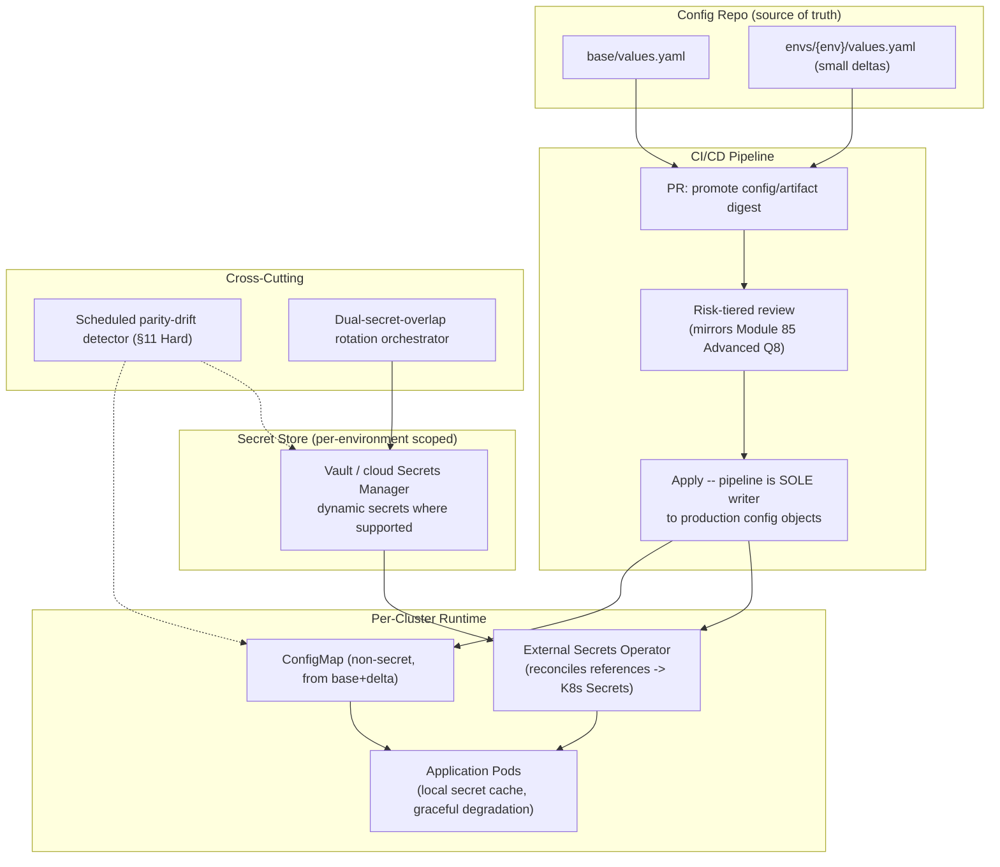
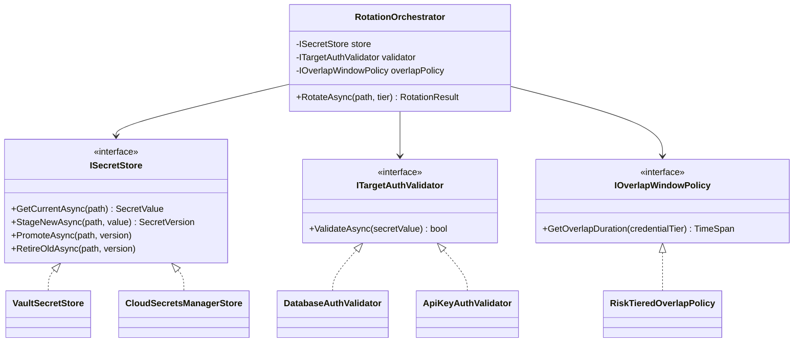

# Module 86 — DevOps: Configuration Management, Secrets & Environment Promotion

> Domain: DevOps | Level: Beginner → Expert | Prerequisite: [[01-InfrastructureAsCode-Terraform-State-Drift]] (IaC/state/drift), [[../23-Kubernetes/04-Configuration-Security-ConfigMaps-Secrets-RBAC-PodSecurity]] (ConfigMaps/Secrets/RBAC), [[../02-DotNet-AspNetCore/05-Configuration-Options-Pattern]] (application-side config consumption), [[../23-Kubernetes/08-Observability-Multicluster-GitOps]] (GitOps promotion), [[../21-AWS/02-IAM-Security-KMS-SecretsManager]] / [[../22-Azure/02-IAM-Security-EntraID-RBAC-KeyVault]] (cloud secret stores)

---

## 1. Fundamentals

**What**: Configuration management is the discipline of defining, storing, delivering, and changing every value a system needs that is *not* code: connection strings, endpoints, resource sizing knobs, feature toggles, and — as a specially-governed subset — **secrets** (credentials, keys, tokens). **Environment promotion** is the controlled movement of a release *and its configuration* through a sequence of environments (dev → test → staging → production), such that what was validated in one environment is provably what runs in the next.

**Why it exists**: The same build artifact must behave correctly in multiple environments (12-factor principle: *build once, configure per environment*). The moment configuration lives anywhere unmanaged — a hand-edited environment variable, a value someone set in a portal, a secret pasted into a pipeline variable — three failure classes appear: (1) **environment parity drift** ("works in staging" because staging was hand-tuned in ways production never received), (2) **secret sprawl** (credentials scattered across repos, CI variables, and laptops, unrotatable because nobody knows every copy), and (3) **unauditable change** (a production behavior change with no PR, no reviewer, no rollback point — exactly Module 85's out-of-band-change problem, one layer up the stack).

**When it matters**: From the second environment onward. A single-environment hobby app can hardcode; the moment staging exists, every configuration value needs a defined *source of truth*, a *promotion path*, and — for secrets — a *rotation story*.

**How (30,000-ft view)**: A layered model — an environment-agnostic artifact (container image, package) + per-environment declared configuration (values files, config stores) + secrets *referenced, never embedded* (the config says "read `db-password` from the secret store"; only the runtime identity can dereference it) + promotion executed as reviewed, versioned change (a PR that changes the production values file / config-store version), not as hand-editing.

---

## 2. Deep Dive

### 2.1 The Configuration Taxonomy — Build-Time vs Deploy-Time vs Runtime
Every configuration value belongs to exactly one binding time, and misclassifying it causes a characteristic failure. **Build-time** config (compiled-in defaults, framework wiring) requires a rebuild to change — anything environment-specific here breaks "build once" (an image with a baked-in staging URL *cannot* be promoted; the Docker domain's Module 82 `ARG` finding is this mistake plus a secrecy leak). **Deploy-time** config (environment variables, mounted files, Helm values — Module 78) binds when the process starts — the standard home for endpoints, sizing, and environment identity; changing it means a redeploy/restart, which is fine because deploys are the audited change mechanism. **Runtime** config (config services, feature flags, `IOptionsMonitor`-consumed reloadable values — Module 13) changes *without* restart — powerful and dangerous in proportion: it bypasses the deployment pipeline's gates, so it needs its own audit, rollout, and rollback discipline or it becomes the fastest unreviewed path to a production incident.

### 2.2 Secrets Are Not Configuration — the Reference-Not-Value Principle
The single load-bearing rule: **configuration may name a secret; it must never contain one.** A values file, ConfigMap, pipeline variable, or `appsettings.json` holds a *reference* (`keyvault://prod-vault/db-password`, an ExternalSecret pointing at AWS Secrets Manager) and only the runtime's identity (IRSA/Managed Identity/K8s ServiceAccount — Modules 58/66/76) can dereference it at start or on demand. This yields: rotation without code/config change (rotate in the store; consumers re-resolve), audit at the store (who read what, when), revocation by identity (cut one workload's access without touching others), and — critically — a git history that is *safe by construction*, because the repository never held the secret. The **secret-zero problem** remains: something must authenticate the workload to the secret store in the first place — solved by platform-issued identity (cloud workload identity, K8s projected ServiceAccount tokens), never by a bootstrap credential in config, which would just relocate the original problem.

### 2.3 Secret Delivery Mechanics — Injection Patterns and Their Trade-offs
Four delivery patterns, in rising sophistication: (1) **CI-injected variables** — the pipeline reads the store and passes values as env vars at deploy; simple, but the pipeline becomes a high-privilege secret broker and rotation requires redeploy. (2) **Platform-native sync** — External Secrets Operator / Secrets Store CSI driver materializes store-held secrets as K8s Secrets/mounted files, reconciling on an interval (an Operator in exactly Module 78's sense — continuously converging declared references to actual values); rotation propagates automatically, but the cluster now holds a synced copy governed by K8s RBAC (Module 76's base64-not-encryption caveat applies — etcd encryption and tight RBAC are prerequisites, not options). (3) **Direct SDK access** — the app calls the secret store itself (with caching and refresh); fewest copies, but every service takes a hard startup dependency on the store's availability (Module 13 §Advanced Q1's graceful-startup-failure design becomes mandatory). (4) **Dynamic secrets** (Vault's signature capability) — the store *mints* short-lived, per-workload credentials on demand (a database user valid for 1 hour, tied to a lease); a leaked credential expires in minutes and every credential is individually attributable — the strongest posture, at the cost of running and operating the most sophisticated machinery, plus consumers that must handle mid-life credential renewal.

### 2.4 Environment Promotion — Configuration Moves by PR, Not by Hand
The GitOps promotion model (Module 80) applied to configuration: each environment's config is a declared, versioned artifact (per-env values files or overlay directories in a config repo; or versioned/labeled entries in a config service), and promotion is a *diff you can read* — a PR copying/updating the target environment's declaration, reviewed and merged, then applied by the same pipeline/controller machinery every time. Two structural rules make this honest. First, **parity by construction**: environments share a common base with explicit, minimal per-env deltas (Helm base values + small `values-prod.yaml`; Kustomize base + overlays) so the *difference between staging and production is a short, reviewable file* — the anti-parity failure mode is per-env forks that silently diverge until "staging validates nothing." Second, **the artifact is immutable across promotion**: the image digest validated in staging is byte-identical in production (promote by digest, not by rebuilding from the same tag — a rebuild is a different artifact, whatever the tag says).

### 2.5 Configuration Drift Between Environments — Module 85's Lesson, One Layer Up
Terraform's drift problem (out-of-band infrastructure changes persisting invisibly, §85-2.3) recurs identically for configuration: a value set by hand in a portal, a `kubectl edit` on a ConfigMap (reverted by the next Helm upgrade — Module 78's exact incident mechanism), an environment variable added to one environment's deployment "temporarily." Detection requires the same two-part answer as Module 85: (1) a *single declared source of truth* per environment (the config repo / labeled config-service version), and (2) *continuous or scheduled reconciliation* against it — GitOps controllers give configuration the continuous version (drift auto-reverts — with Module 80's caveat that enforcement of a *wrong* declaration is just as faithful); anything outside GitOps needs scheduled drift audits (diff running config against declared). The strongest posture makes out-of-band change *impossible* rather than detectable: RBAC that denies humans direct write access to production config objects, leaving the pipeline/controller as the only writer.

### 2.6 Rotation, Expiry & the Two-Secret Overlap Pattern
Rotation fails in production not at the store but at the *consumers*: the store has the new value while some consumer caches the old one (a connection pool re-authenticating with a dead password mid-life). The universally-applicable fix is **dual-secret overlap**: the target system honors two credentials simultaneously (two valid API keys, two DB passwords via paired users, current+next signing keys in a JWKS); rotation updates the *secondary*, consumers migrate on their natural refresh cadence, then the old primary is retired — no propagation race can hit a dead credential because both are valid throughout the window. Corollaries: consumers must *re-resolve secrets on auth failure* (one retry through "re-fetch from store" converts most rotation races into a blip), TTLs on cached secrets must be shorter than rotation overlap windows, and rotation must be *drilled* (a rotation that has never been executed is a plan, not a capability — the same "declared ≠ verified" discipline Modules 74–85 established, applied to credentials).

---

## 3. Visual Architecture

### The Promotion Pipeline — One Artifact, Layered Config, Reviewed Deltas
```
        BUILD (once)                    PROMOTE (by PR, per environment)
┌──────────────────────┐   ┌───────────────────────────────────────────────────┐
│ git tag v1.4.2       │   │ config repo:                                      │
│  → image sha256:abc… │   │   base/values.yaml         (shared declaration)   │
│  (env-agnostic:      │   │   envs/staging/values.yaml (small delta)          │
│   no URLs, no        │   │   envs/prod/values.yaml    (small delta)          │
│   secrets baked in)  │   │                                                   │
└──────────┬───────────┘   │ PR: "promote v1.4.2 to prod" = digest bump +      │
           │               │      any config delta — a human-readable diff     │
           ▼               └────────────────────┬──────────────────────────────┘
   registry (digest-addressed)                  │ merge
           │                                    ▼
           │                     GitOps controller / pipeline applies
           │                                    │
           ▼                                    ▼
   ┌─ staging ──────────┐            ┌─ production ────────┐
   │ sha256:abc…        │  same      │ sha256:abc…         │   secrets NEVER in
   │ + staging values   │  digest ►  │ + prod values       │   this flow — only
   │ + secret REFERENCES│            │ + secret REFERENCES │   references
   └────────────────────┘            └─────────┬───────────┘
                                               │ dereferenced at runtime by
                                               ▼ workload identity only
                                     ┌─ secret store ──────┐
                                     │ Vault / ASM / KV     │ ← rotation happens
                                     │ (audit, versions,    │   HERE, once, with
                                     │  leases, RBAC)       │   dual-secret overlap
                                     └──────────────────────┘
```

### Secret Delivery Patterns — Where the Copies Live (§2.3)
```
(1) CI-injected:      store → pipeline → env vars        (pipeline = high-privilege broker)
(2) Operator-synced:  store → ESO/CSI → K8s Secret/file  (reconciled copy in cluster)
(3) Direct SDK:       store → app (cached, refreshed)    (no intermediate copy; hard dep)
(4) Dynamic:          store MINTS per-workload, short-TTL credential (lease + renewal)
     fewer copies / stronger guarantees ───────────────────────────────► more machinery
```

---

## 4. Production Example

**Scenario**: A payments platform promoted release v2.9 from staging (two weeks of successful soak testing) to production. Within minutes, production began rejecting a specific card-network's transactions. Staging had processed the identical build flawlessly. **Investigation**: The card-network integration required a TLS client certificate and a gateway endpoint override. Three months earlier, during an urgent staging test, an engineer had set the endpoint override *directly as an environment variable in staging's deployment* via `kubectl set env` — an out-of-band change (§2.5) that existed in no values file. Staging "worked" because it carried invisible hand-applied configuration; the promotion PR faithfully promoted everything *declared* — and the override wasn't declared. **Root cause**: environment parity existed in the declared configuration but not in the *actual* configuration; staging validated a configuration state production would never receive. The out-of-band change also survived every intervening deploy because that deployment's Helm chart didn't manage that env var at all (Module 78's one-shot, non-reconciling gap — nothing ever reverted it, so nothing ever *surfaced* it either). **Fix**: (1) the override was added to the base values file (it was needed in *all* environments — the delta wasn't even legitimately environmental); (2) production-namespace RBAC was tightened to remove human `patch/update` on Deployments/ConfigMaps, making the pipeline the only writer; (3) a scheduled parity audit was added diffing each environment's *running* pod spec/env against its declared rendering, alerting on any unmanaged variable. **Lesson**: this course's cross-domain "declared ≠ actual" pattern (Modules 74/75/76/78/79/81/82/84/85) has a promotion-specific corollary — **staging only validates production if staging's *actual* state is its *declared* state**; every out-of-band convenience change silently converts your staging environment from a validator into a liar.

---

## 5. Best Practices
- Keep the artifact environment-agnostic and promote by **digest**; every environment-specific value enters via declared, per-env configuration (§2.1, §2.4).
- Enforce **reference-not-value** for secrets everywhere a human or git can see: repos, values files, pipeline variables, ConfigMaps (§2.2) — backed by pre-commit/CI secret scanning as the safety net for the rule's violations.
- Structure per-env config as **base + minimal explicit deltas**, and treat any growth in the delta files as an architecture smell to review (§2.4).
- Remove human write access to production config objects; the pipeline/GitOps controller is the sole writer, making out-of-band drift structurally impossible rather than merely detectable (§2.5).
- Design every secret for rotation from day one: dual-secret overlap support, consumer re-resolve-on-auth-failure, and a *scheduled rotation drill* per credential class (§2.6).
- Give runtime-changeable configuration (feature flags, reloadable options) its own audit trail, staged rollout, and rollback path — it bypasses the deploy pipeline's gates, so it must replicate their guarantees (§2.1).

## 6. Anti-patterns
- Hand-applied environment changes (`kubectl set env`, portal edits, SSH-and-edit) that exist in no declaration — the §4 incident's root cause, and Module 85's drift problem re-created one layer up (§2.5).
- Rebuilding "the same" artifact per environment instead of promoting one digest — the staging-validated artifact and the production artifact are then merely *probably* identical (§2.4).
- Secrets in git history, pipeline variable *values*, Helm values files, or baked into images (Modules 81/82's leak mechanisms) instead of references to a store (§2.2).
- Per-environment config forks (full copied files per env) instead of base+delta — divergence accumulates silently until staging validates nothing (§2.4).
- A "rotation procedure" that has never been executed against production — a declared capability with unverified actual behavior, this course's recurring failure shape applied to credentials (§2.6).
- One shared credential used by every service and environment ("the DB password") — unrotatable in practice because its blast radius is everything, and unattributable in audit because everyone is the same principal (§2.3).

---

## 10. Interview Questions

### Basic (10)

1. **Q: What is the difference between configuration and a secret?**
   **A:** Configuration is any environment-specific value a system needs (endpoints, sizing, feature toggles); a secret is a credential whose disclosure grants access (passwords, keys, tokens) — secrets are a specially-governed subset of configuration requiring reference-not-value handling, rotation, and audit that ordinary configuration doesn't.
   **Why correct:** Precisely scopes "secret" as a subset with additional obligations, not a synonym for configuration.
   **Common mistakes:** Treating all configuration uniformly, applying no extra rigor to values that happen to be credentials.
   **Follow-ups:** "Give an example of a value that's borderline — is a feature-flag percentage a secret?" (No — disclosure carries no access risk, though it may be commercially sensitive.)

2. **Q: What does "build once, configure per environment" mean?**
   **A:** A single build artifact (container image, package) is produced once and promoted unchanged through every environment; only its externally-supplied configuration varies per environment, never the artifact's compiled contents.
   **Why correct:** States the 12-factor principle precisely, including the "unchanged artifact" requirement.
   **Common mistakes:** Believing rebuilding per environment with different settings baked in satisfies this principle — it doesn't, since it's then a different artifact per environment.
   **Follow-ups:** "Why does promoting by digest rather than by tag matter here?" (A tag can be reassigned to point at a different build; a digest is the artifact's own content hash — immutable identity.)

3. **Q: What is the "reference-not-value" principle for secrets?**
   **A:** Configuration should name where a secret lives (a Key Vault URI, a Secrets Manager ARN) rather than containing the secret's actual value — only the runtime's identity can dereference the reference at start or on demand.
   **Why correct:** Captures the load-bearing rule directly, distinguishing "pointer" from "payload."
   **Common mistakes:** Believing encrypting a secret before committing it to config satisfies this principle — encrypted-in-git secrets still require key management and still leak on decryption-key compromise; a genuine reference requires no decryption key to ever touch the repository.
   **Follow-ups:** "What is the secret-zero problem this doesn't solve?" (Something must authenticate the workload to the secret store itself — solved by platform-issued identity, not by relocating a bootstrap credential into config.)

4. **Q: Name three secret delivery patterns.**
   **A:** CI-injected environment variables, platform-native sync (External Secrets Operator/CSI driver materializing store-held secrets into Kubernetes), and direct SDK access from the application to the secret store.
   **Why correct:** Names three genuinely distinct delivery mechanisms with different trust boundaries.
   **Common mistakes:** Conflating "the secret is in Key Vault" with "the secret is delivered securely" — the delivery mechanism, not just the store, determines the actual copy count and exposure surface.
   **Follow-ups:** "Which pattern has the fewest secret copies at rest?" (Direct SDK access — no intermediate materialized copy, at the cost of a hard runtime dependency on the store's availability.)

5. **Q: What is environment parity, and why does it matter?**
   **A:** The property that non-production environments closely mirror production's actual configuration and behavior, so that a validation performed in staging is a meaningful predictor of production behavior.
   **Why correct:** States both the definition and its purpose (predictive validation) precisely.
   **Common mistakes:** Assuming parity is achieved once, at environment creation, rather than continuously maintained against configuration drift.
   **Follow-ups:** "What breaks parity most commonly in practice?" (Out-of-band, hand-applied changes to one environment that are never declared or promoted, §4.)

6. **Q: What is a dynamic secret?**
   **A:** A credential minted on demand by the secret store itself, valid for a short, bounded lease (e.g., a database user created and granted for one hour), rather than a long-lived, pre-existing value merely stored and retrieved.
   **Why correct:** Distinguishes dynamic secrets' on-demand-minting model from static secrets' store-and-retrieve model.
   **Common mistakes:** Believing "dynamic" just means "the store rotates it periodically" — dynamic secrets are generated fresh per request/lease, not periodically regenerated in place.
   **Follow-ups:** "What must a consumer handle that a static-secret consumer doesn't?" (Mid-life lease renewal or graceful re-authentication when a short-lived credential expires.)

7. **Q: What is drift, in the configuration-management sense?**
   **A:** A divergence between an environment's declared configuration (in the config repo or config service) and its actual, running configuration — typically caused by an out-of-band, undeclared change.
   **Why correct:** States the precise mismatch (declared vs. actual) rather than a vaguer "things changed" definition.
   **Common mistakes:** Assuming drift only applies to infrastructure (Module 85's Terraform context) rather than recognizing the identical pattern recurs for application/environment configuration.
   **Follow-ups:** "How is configuration drift detected?" (Either continuous reconciliation via a GitOps-style controller, or scheduled audits diffing running state against declared state.)

8. **Q: What is dual-secret overlap, and what problem does it solve?**
   **A:** A rotation pattern where a target system accepts two valid credentials simultaneously during a transition window, letting consumers migrate from the old to the new value on their own refresh cadence without any window where a consumer holds a credential the target has already invalidated.
   **Why correct:** Names the specific mechanism (simultaneous validity) and the exact race it eliminates.
   **Common mistakes:** Rotating a credential by simply replacing the old value with the new one everywhere at once — this creates a window where any consumer with a stale cached copy fails authentication.
   **Follow-ups:** "What must consumers additionally implement to benefit from overlap?" (Re-resolving/re-fetching the secret on an authentication failure, converting most rotation races into a single retry rather than a sustained outage.)

9. **Q: What is the difference between deploy-time and runtime configuration?**
   **A:** Deploy-time configuration binds when a process starts (environment variables, mounted files) and requires a redeploy to change; runtime configuration can change while the process is already running (feature flags, reloadable options) without a restart.
   **Why correct:** Precisely distinguishes the binding moment and the mechanism required to change each.
   **Common mistakes:** Treating all "configuration" as equally safe to change live — runtime-changeable configuration bypasses the deployment pipeline's review/audit gates entirely, which deploy-time configuration does not.
   **Follow-ups:** "What compensating control does runtime configuration need that deploy-time configuration gets for free from the pipeline?" (Its own audit trail, staged rollout, and rollback mechanism.)

10. **Q: Why should production configuration objects deny direct human write access?**
    **A:** Because any human-writable path is a channel for undeclared, out-of-band drift (§4's incident) that bypasses the pipeline's review and audit; making the pipeline/controller the sole writer makes such drift structurally impossible rather than merely detectable after the fact.
    **Why correct:** States both the mechanism (deny-by-default RBAC) and why it's structurally stronger than detection alone.
    **Common mistakes:** Relying solely on policy/documentation ("please don't hand-edit production") instead of an enforced technical control.
    **Follow-ups:** "What's the operational cost of this restriction?" (Emergency changes need a defined break-glass path with its own audit and mandatory backport, exactly Module 85 §Best Practices' bounded-time process.)

### Intermediate (10)

1. **Q: Why is a container image with an environment-specific URL baked in via a build `ARG` a configuration-management anti-pattern, even if the value isn't a secret?**
   **A:** It breaks "build once, configure per environment" — the same nominal artifact now genuinely differs in content per environment, meaning staging never validates the actual bytes production will run, defeating the entire purpose of promotion by digest.
   **Why correct:** Connects the specific practice to the broader principle it violates, not just "it's messy."
   **Common mistakes:** Believing the concern is only secrecy (Module 82's `ARG` finding) — non-secret environment-specific baked-in values are an equally serious parity violation, just not a security incident.
   **Follow-ups:** "What's the fix?" (Externalize the value to deploy-time configuration; the image stays identical across environments.)

2. **Q: A team stores secrets encrypted with a shared organizational key directly in their Git repository (via a tool like git-crypt or SOPS). Does this satisfy the reference-not-value principle?**
   **A:** No — the secret's ciphertext is still committed to git permanently (impossible to truly delete from history) and the encryption key becomes the new single point of compromise; anyone with the key can decrypt every historical commit. It's a meaningful improvement over plaintext but is not equivalent to a genuine external reference, which requires no decryption capability to exist in the repository at all.
   **Why correct:** Precisely distinguishes "encrypted at rest in git" from "not in git," and identifies the new failure mode (key compromise = full historical disclosure).
   **Common mistakes:** Treating "encrypted" as synonymous with "safe," without considering key-compromise blast radius or the impossibility of true git history deletion.
   **Follow-ups:** "When is SOPS-in-git still a reasonable choice?" (For genuinely low-sensitivity, per-environment non-secrets, or as a transitional step toward a real secret store — not for high-value production credentials.)

3. **Q: Why does the "base + minimal delta" pattern for per-environment configuration matter more as an organization scales, rather than less?**
   **A:** Because divergence compounds silently: each additional fully-forked per-environment config file is another place a fix, a new required field, or a security hardening must be manually replicated — at small scale a missed replication is caught quickly, but at scale (dozens of environments/teams) forked configs drift apart until staging validates a materially different configuration than production, exactly reproducing §4's incident pattern via configuration-file structure rather than an out-of-band edit.
   **Why correct:** Explains the scaling mechanism (replication burden grows with fork count) rather than asserting the practice is simply "cleaner."
   **Common mistakes:** Believing full per-environment forks are safer because "nothing shared can break another environment" — shared bugs get fixed once in the base; forked bugs must be independently rediscovered and fixed per fork.
   **Follow-ups:** "What's a legitimate reason for a large per-environment delta?" (A structurally different environment — e.g., a single-node dev cluster versus a multi-AZ production cluster — where the difference is genuinely architectural, not merely configuration drift.)

4. **Q: Why does a config service (runtime-changeable, no-redeploy configuration) need its own audit trail separate from the deployment pipeline's git history?**
   **A:** Because a runtime config change, by design, bypasses the pipeline entirely — no PR, no CI run, no deploy event exists to record who changed what and when; without a dedicated audit trail on the config service itself, changes to production behavior become invisible to every mechanism the organization otherwise relies on for accountability.
   **Why correct:** Identifies precisely which audit path is missing and why the pipeline's own history doesn't cover it.
   **Common mistakes:** Assuming "it's just a config value, not a deployment" means it needs less governance — runtime configuration frequently controls production-critical behavior (feature gates, rate limits) with equal or greater blast radius to a code deploy.
   **Follow-ups:** "What rollback mechanism should runtime configuration have?" (A one-click or automatic revert to the immediately-prior known-good value, ideally triggered by the same health signals that would gate a deployment rollback.)

5. **Q: Why is "our drift-detection job has shown zero alerts for six months" not proof that an environment is free of out-of-band changes?**
   **A:** A drift-detection job only surfaces divergence within its own configured scope, schedule, and detection method — an out-of-band change made *within* the job's blind spot (a resource type it doesn't check, a namespace it doesn't scan, a change made and then also updated in the declared source so no divergence remains detectable) produces zero alerts despite genuine undeclared changes having occurred. A clean historical record is evidence bounded by the detector's actual coverage, not a general absence-of-drift proof.
   **Why correct:** Names the specific mechanism by which drift can occur invisibly to a real, functioning detector (coverage gaps, not detector malfunction).
   **Common mistakes:** Treating a monitoring signal's silence as proof of the underlying condition's absence, rather than as evidence bounded by what the monitor actually observes.
   **Follow-ups:** "How would you validate a drift-detector's actual coverage?" (Deliberately introduce a known out-of-band change across each resource type/environment combination during a controlled drill and confirm every one is detected — testing the detector, not just trusting its historical silence.)

6. **Q: Why must the entity delivering CI-injected secrets (pattern 1 in §2.3) itself be treated as a high-privilege component?**
   **A:** Because the CI pipeline reads real secret values from the store and holds them (even briefly, in memory/logs/variables) during the deploy step — any pipeline compromise, misconfigured log verbosity, or overly-broad pipeline permissions becomes a direct path to secret disclosure; the pipeline is now functionally a secret broker, not a neutral automation tool.
   **Why correct:** Identifies the specific mechanism (the pipeline temporarily holds plaintext secret values) that elevates its risk profile.
   **Common mistakes:** Treating CI pipeline security as a generic "keep credentials safe" concern without recognizing the pipeline itself becomes a named, auditable component in the secret's chain of custody.
   **Follow-ups:** "How does the Operator-synced pattern reduce this specific risk?" (The pipeline never sees the secret value at all — only the reference is deployed; the operator, running with its own scoped, audited identity, performs the store read.)

7. **Q: What operational assumption does the dual-secret overlap rotation pattern make about consumers, and what happens if that assumption is violated?**
   **A:** It assumes consumers will re-resolve/re-authenticate on their own refresh cadence within the overlap window — if a consumer instead caches a credential indefinitely with no refresh trigger, it will still be using the old value when the overlap window closes and the old credential is retired, failing exactly as it would have without overlap, just later.
   **Why correct:** Names the specific consumer-side behavior the pattern depends on and the exact failure mode when that behavior is absent.
   **Common mistakes:** Believing dual-secret overlap alone guarantees zero-downtime rotation regardless of consumer implementation — it only converts a hard cutover into a window; consumers must still act within that window.
   **Follow-ups:** "What's a robust consumer-side mitigation independent of overlap windows?" (Re-fetching the secret and retrying once on any authentication failure, which recovers gracefully from almost any rotation timing.)

8. **Q: Why is "the secret store went down, so every service failed to start" a design failure rather than an unavoidable consequence of using a secret store?**
   **A:** Because it reveals every service took a hard, synchronous startup-time dependency on the store with no graceful degradation path — a well-designed consumer either caches the last successfully-resolved secret with a bounded staleness tolerance, fails startup with a clear, actionable error rather than hanging, or (for genuinely critical paths) has a documented emergency fallback; treating the secret store as infallible infrastructure is the actual design gap, not the store's outage itself.
   **Why correct:** Reframes the incident as a consumer-design gap rather than an inherent property of secret stores.
   **Common mistakes:** Concluding the fix is "make the secret store more available" rather than "make consumers resilient to its unavailability" — both matter, but only the latter is fully within the consuming team's control.
   **Follow-ups:** "How does this connect to Module 13's options-pattern discussion?" (`IOptionsMonitor`'s fail-fast-at-startup-with-clear-error discipline is the same principle — validate and fail loudly and immediately rather than deferring an obscure failure to first use.)

9. **Q: Why does promoting "the same" artifact rebuilt independently per environment fail to guarantee actual behavioral equivalence, even with identical source code and Dockerfile?**
   **A:** A rebuild can pick up different base-image patch versions, different resolved dependency versions (unpinned transitive dependencies resolving differently at different build times), or different build-time environment state — none of which are captured by "the same Dockerfile ran," but all of which can produce a functionally different artifact; only promoting the identical, already-built digest guarantees byte-for-byte equivalence.
   **Why correct:** Identifies the concrete sources of build non-determinism that "same source, same Dockerfile" doesn't eliminate.
   **Common mistakes:** Assuming reproducible builds are automatic rather than requiring deliberate pinning (lockfiles, digest-pinned base images) even when rebuilding is unavoidable.
   **Follow-ups:** "When would an organization legitimately need to rebuild per environment despite this risk?" (Compiling different feature flags into the binary itself for licensing/compliance reasons — a genuinely build-time-bound concern, which should then be treated as producing genuinely distinct artifacts requiring their own independent validation, not a single artifact "promoted" across environments.)

10. **Q: Why does this module's "declared ≠ actual" theme apply just as much to configuration as it did to Kubernetes objects (Module 74–79) and Terraform infrastructure (Module 85)?**
    **A:** In every case, a system of record (a Kubernetes manifest, a Terraform state, a config repo) declares an intended state, while the real, running system can diverge from it via an unmanaged side channel (a NetworkPolicy silently unenforced by the CNI, a console change never reconciled, a `kubectl set env` never declared anywhere) — the common failure isn't any single tool's specific bug, but the general gap between "something claims this is true" and "this is actually, currently true," which recurs wherever a declarative system coexists with any path for out-of-band mutation.
    **Why correct:** Articulates the shared structural cause (declaration/reality gap plus an available side channel) rather than listing superficially similar incidents.
    **Common mistakes:** Treating each domain's instance of this pattern as an unrelated, domain-specific quirk rather than recognizing the general principle and applying it proactively to new, not-yet-encountered systems.
    **Follow-ups:** "What's the general structural fix, independent of domain?" (Either eliminate the side channel — deny direct write access, making the declarative source the only writer — or continuously reconcile against it; detection-only without either is the weakest, most incident-prone posture.)

### Advanced (10)

1. **Q: Diagnose §4's incident from first principles and design the complete structural fix — not merely adding the missing endpoint override to the values file.**
   **A:** Root cause: an out-of-band, undeclared configuration change (`kubectl set env`) made under time pressure, in an environment with no restriction preventing direct human writes to deployment configuration, combined with no scheduled audit comparing running configuration against declared configuration — so the divergence persisted invisibly for three months. Structural fix: (1) add the override to the base values file, since it was needed everywhere, not environment-specifically; (2) remove human `patch`/`update` RBAC on Deployments/ConfigMaps in every environment, making the pipeline the sole writer; (3) implement a scheduled parity-audit job diffing each environment's actual running pod spec/environment against its declared rendering, alerting on any unmanaged variable; (4) require any urgent, pipeline-bypassing change to go through a documented break-glass process with mandatory same-day backport into the declared source.
   **Why correct:** Addresses the specific incident and the general structural gaps (no write restriction, no drift audit, no bounded emergency-change process) that would otherwise allow recurrence via a different value or environment.
   **Common mistakes:** Fixing only the specific missing override without addressing the RBAC gap or the absence of any parity-audit mechanism that would have surfaced the original drift months earlier.
   **Follow-ups:** "Why is 'add it to the base file' insufficient on its own?" (It fixes this one instance; without the RBAC restriction and audit job, the next urgent hotfix reintroduces an equivalent out-of-band change via a different value.)

2. **Q: A team argues that dynamic secrets (§2.3, pattern 4) are strictly superior and should replace all static secrets across the organization immediately. Evaluate this position.**
   **A:** Dynamic secrets genuinely provide the strongest security posture (short-lived, individually attributable, minimal leak blast radius) but are not a drop-in replacement everywhere: they require the target system to support on-demand credential issuance (many legacy databases/third-party SaaS integrations don't), impose lease-renewal complexity on every consumer (a genuine engineering cost multiplied across every service), and add an availability dependency on the secret store's minting capability being reachable at connection time, not merely at a periodic sync interval. A blanket mandate ignores this cost/benefit variance across use cases; the correct approach is prioritizing dynamic secrets for the highest-value targets (production databases, cloud provider credentials) where the security gain justifies the integration cost, while accepting well-rotated static secrets with dual-secret overlap for lower-risk or dynamic-incompatible targets.
   **Why correct:** Weighs genuine security benefits against genuine integration and operational costs rather than treating "more secure" as automatically "correct for every case."
   **Common mistakes:** Either dismissing dynamic secrets as unnecessary complexity everywhere, or mandating them universally without acknowledging integration constraints for systems that can't support on-demand issuance.
   **Follow-ups:** "How would you sequence a rollout prioritizing highest-value targets first?" (Risk-tier every credential by blast radius and current rotation friction — Module 85 §Advanced Q8's risk-tiered review framework applied to credentials rather than infrastructure plan diffs — and migrate the highest tiers first.)

3. **Q: Design a promotion process for a database schema migration that must accompany an application release, given that migrations are inherently harder to make byte-identical across environments than a container image is.**
   **A:** Treat the migration script itself as part of the promoted, digest-identified artifact (bundled with or versioned alongside the release, never hand-run differently per environment); apply it via the same pipeline that promotes the application, in a dedicated pre-deployment step, against each environment in the promotion sequence (dev → staging → production) using the identical script — never a "close enough" hand-adjusted version per environment. Because migrations are commonly irreversible or expensive-to-reverse (unlike redeploying an old image), require them to be additive/backward-compatible (new columns nullable or defaulted, old columns dropped only in a later release after the old code path is fully retired) so that a rollback of the *application* doesn't require an undone migration — directly the "expand/contract" pattern. Validate the migration in staging against a data volume/shape representative of production, since migration failure modes (lock duration, index-build time) are often data-volume-dependent in ways a small staging dataset won't surface.
   **Why correct:** Addresses both promotion-parity (same script, not hand-adjusted) and migrations' distinct risk profile (irreversibility, data-volume sensitivity) that plain artifact promotion doesn't fully cover.
   **Common mistakes:** Treating a schema migration as equivalent to promoting a config value, ignoring its irreversibility and the need for backward-compatible sequencing with application rollback.
   **Follow-ups:** "Why validate against representative data volume specifically?" (A migration that adds an index completes in milliseconds against a 100-row staging table and can lock a multi-million-row production table for minutes — a purely functional staging validation misses this entirely.)

4. **Q: A security audit finds that a Kubernetes Secret (base64-encoded) is readable by any service account with `get` permission on Secrets in its namespace, including several service accounts that don't need it. Diagnose the full risk and design the remediation, distinguishing what Kubernetes RBAC does and doesn't provide here.**
   **A:** Base64 is encoding, not encryption — any principal with read access sees the plaintext secret trivially; the actual security boundary is Kubernetes RBAC's `get`/`list`/`watch` verbs on the Secret resource, which in this case was too broadly granted. Remediation: (1) audit every RoleBinding granting Secret access in the namespace and narrow each to only the specific Secrets (by name, not blanket `Secrets` resource access) a given ServiceAccount genuinely needs; (2) enable encryption-at-rest for etcd if not already active, since RBAC alone doesn't protect against etcd-level or backup-level disclosure; (3) consider migrating the highest-sensitivity secrets to the Operator-synced pattern from an external store with its own independent, more granular access audit trail, rather than relying solely on in-cluster RBAC as the only boundary. The distinction to make explicit: RBAC controls *who can ask Kubernetes for this Secret*; it does nothing about the Secret's value being plaintext-readable to whoever is authorized to ask, nor about etcd-level access outside the Kubernetes API entirely.
   **Why correct:** Separates the encoding-vs-encryption misconception from the actual, correctly-identified security boundary (RBAC), and addresses both the RBAC gap and the etcd-level exposure RBAC alone doesn't cover.
   **Common mistakes:** Concluding "Kubernetes Secrets are insecure, stop using them" without recognizing that correctly-scoped RBAC plus etcd encryption is a legitimate, commonly-used posture — the audit finding is a scoping failure, not proof the mechanism is inherently unusable.
   **Follow-ups:** "Why might an organization choose external-store-backed secrets even with correct RBAC?" (Independent audit trail at the store, dynamic-secret capability, and centralized rotation across multiple clusters/clouds that in-cluster Secrets alone can't provide.)

5. **Q: Design the configuration architecture for a feature-flag system that must support instant, org-wide kill-switch capability for a critical bug, while also supporting gradual, percentage-based rollout for new features — explain why these two use cases have different consistency/latency requirements.**
   **A:** Kill-switch reads require low-latency, highly-available, eventually-acceptable-to-be-cached evaluation (a flag check on every request path cannot add meaningful latency or become a single point of failure) combined with a push-based invalidation mechanism so the "off" state propagates to every instance within seconds, not on the next poll interval — typically a long-lived streaming connection or pub/sub invalidation signal layered over a local, fast in-memory cache. Percentage-based rollout requires deterministic, sticky assignment (the same user consistently lands in the same bucket across requests, not re-randomized per request) computed from a stable hash of a user/session identifier against the current percentage threshold, tolerating slightly higher propagation latency for threshold changes since gradual rollout is inherently not time-critical. The architectural implication: the same flag-evaluation client can serve both needs via one local cache plus one fast invalidation channel, but the *evaluation logic* differs (binary kill-switch check vs. hashed-bucket-percentage check), and kill-switch flags deserve monitoring/alerting on propagation latency specifically, since a delayed kill-switch defeats its entire purpose.
   **Why correct:** Correctly identifies the differing requirements (latency-critical push-invalidation vs. deterministic sticky bucketing) and why one underlying mechanism (local cache + invalidation) can serve both with different evaluation logic layered on top.
   **Common mistakes:** Treating all feature flags as needing identical evaluation logic and propagation guarantees, missing that a kill-switch's value is entirely a function of propagation speed.
   **Follow-ups:** "What happens if the flag service itself is unreachable when a kill-switch must fire?" (The local cache should fail toward the last-known state with a documented staleness bound, and the kill-switch's own infrastructure should have independent, higher-availability guarantees than ordinary flag infrastructure, since its failure mode is uniquely high-stakes.)

6. **Q: An organization's secret rotation "procedure" for its primary database credential has existed as a documented runbook for two years but has never actually been executed, since the credential has never needed to change. A new compliance requirement now mandates quarterly rotation. What do you expect to go wrong on the first real rotation, and how would you de-risk it?**
   **A:** Expect the runbook to be stale or incomplete relative to the current architecture (services added since it was written aren't covered; assumed manual steps may have been superseded by since-added automation that conflicts with them) and expect at least one consumer to have hardcoded or long-cached the credential in a way the runbook's authors didn't anticipate, causing an unexpected authentication failure during or after the rotation window — directly this course's recurring "a declared capability that's never been exercised is a plan, not a verified capability" pattern, applied to a rotation runbook rather than a Terraform drift-detector or a Kubernetes admission policy. De-risk by: (1) executing the rotation first against a non-production environment structurally identical to production, treating any failure there as the expected, safe discovery of a gap the runbook missed; (2) implementing dual-secret overlap (§2.6) so even an unanticipated slow-to-refresh consumer has a grace window rather than an immediate outage; (3) instrumenting authentication failure rates specifically during the rotation window so an unexpected consumer failure is caught within minutes, not discovered downstream as a mysterious incident; (4) updating the runbook immediately after this first real execution to reflect what was actually true, closing the gap between documentation and reality before the next quarterly cycle.
   **Why correct:** Predicts the specific, common failure mode (untested runbook plus an unanticipated hardcoded/cached consumer) and designs de-risking that both catches the failure early and reduces its blast radius via overlap.
   **Common mistakes:** Assuming a documented runbook is equivalent to a tested, working procedure — the entire point of this question is that it demonstrably is not, until proven otherwise.
   **Follow-ups:** "How does this connect to Module 85's Terraform drift-detection testing discussion?" (Identical principle — a monitoring/procedural capability's real coverage must be validated by deliberately exercising it, not merely trusted because it exists on paper or has shown no failures in an untested state.)

7. **Q: Design the access-control model for a secret store shared across multiple teams and environments, such that a compromised staging credential cannot be used to read production secrets, and a compromised low-privilege service cannot enumerate secrets it has no business accessing.**
   **A:** Structure the store's namespace/path hierarchy by environment and team boundary first (`prod/team-payments/...`, `staging/team-payments/...`), then grant each workload identity (IRSA/Managed Identity/K8s ServiceAccount-derived) access scoped to exactly its own environment-and-team path prefix — never a role spanning environments, and never a broad "read all secrets under this team" grant when a specific service only needs one or two named secrets. Deny-by-default as the baseline policy, with every grant an explicit, reviewed addition rather than a broad allow with exceptions. Separately, ensure the credentials/tokens used to *authenticate to* the store are themselves environment-scoped (a staging workload's identity token should be structurally incapable of presenting as a production identity to the store, which workload-identity federation — verifying the token's issuing cluster/environment claims — provides). Audit every read at the store, alerting on access patterns inconsistent with a service's normal, established access footprint (a service suddenly reading secrets outside its historical pattern is a strong compromise indicator).
   **Why correct:** Addresses both axes of the stated risk (environment-crossing and over-broad-within-environment) with concrete, deny-by-default access-control and audit mechanisms, not just "use RBAC."
   **Common mistakes:** Scoping access by team alone without also scoping by environment, allowing a compromised staging identity to reach production secrets if both happen to be under the same team's broad grant.
   **Follow-ups:** "Why is audit-based anomaly detection a necessary complement to access control, not a redundant extra?" (Access control prevents unauthorized reads by definition; a compromised, *authorized* identity operating maliciously within its legitimate scope is invisible to access control alone and only surfaces via behavioral audit.)

8. **Q: Your organization's platform team wants to make drift-detection and configuration-parity auditing mandatory-by-default for every team's pipeline (§16's lesson from Module 85, applied here), but several established teams object that this adds latency and complexity to pipelines that have "worked fine" for years. How do you navigate this as a Principal Engineer?**
   **A:** Reframe the discussion away from "add mandatory overhead" and toward "this course's own repeated finding: voluntary, opt-in governance capabilities consistently show lower and more inconsistent adoption than mandatory-by-default ones" (Module 76 §2.6, Module 80 §2.6, Module 85 §16) — the objecting teams' pipelines having "worked fine" is exactly the absence-of-evidence problem from Advanced Q6's runbook scenario: it demonstrates no incident has occurred yet, not that no drift exists undetected. Practically: (1) pilot the mandatory capability on a small number of willing teams first, using their concrete before/after findings (drift instances actually caught) as evidence rather than an abstract argument; (2) design the added pipeline step to run asynchronously/in parallel where possible, minimizing genuine latency impact; (3) grandfather existing teams with a defined, bounded migration timeline rather than an immediate hard cutover, giving them time to address any genuine friction the capability surfaces in their specific setup; (4) frame the mandate as closing a governance gap the platform team is accountable for, not as second-guessing individual teams' competence.
   **Why correct:** Uses concrete, evidence-based piloting rather than authority alone to build buy-in, while still holding the line on mandatory-by-default as the actual goal, consistent with this course's established governance lesson.
   **Common mistakes:** Either capitulating entirely to "it's worked fine" objections (repeating the voluntary-adoption failure mode) or mandating with no pilot/evidence and no transition period, generating unnecessary organizational friction.
   **Follow-ups:** "What would you do if the pilot found zero drift instances across all pilot teams?" (Treat this cautiously per Intermediate Q5 — zero findings in a short pilot window is weak evidence of true absence; extend the pilot's duration/scope before concluding the capability's value is unproven.)

9. **Q: A production incident is traced to a feature flag that was flipped via the runtime config service by an on-call engineer during an active incident, without a corresponding code change — and this action itself introduced a *second*, unrelated regression that took hours to attribute, because nobody thought to check the flag-service's change history. Design the fix.**
   **A:** The core gap is that runtime configuration changes (§2.1) were invisible to the incident-response and postmortem process that would normally examine "what changed recently" via deploy history — the responder's own mental model, and the tooling used during the follow-up investigation, didn't treat flag-service changes as a first-class "what changed" signal equivalent to a deploy. Fix: (1) surface flag-service change events into the same timeline/dashboard used for deploy events and alerts, so "what changed in the last hour" queries during an incident include both categories by default; (2) require flag changes made during an active incident to be logged with the incident ticket reference, both for audit and so the follow-up investigation has an explicit breadcrumb; (3) update incident-response runbooks to explicitly include "check recent flag-service changes" as a standard early investigation step, not an afterthought; (4) consider requiring runtime flag changes above a certain blast-radius tier to go through the same lightweight review Module 85's risk-tiered plan review uses for infrastructure changes, rather than being entirely unilateral even during incidents.
   **Why correct:** Identifies the specific process gap (runtime config changes invisible to standard "what changed" incident tooling) and closes it structurally (unified timeline, mandatory incident-reference logging, runbook update) rather than merely blaming the on-call engineer's judgment.
   **Common mistakes:** Concluding the fix is "don't allow flag changes during incidents" — this removes a legitimately valuable incident-mitigation tool rather than fixing the actual visibility gap that caused the follow-up confusion.
   **Follow-ups:** "Why shouldn't every runtime flag change require the same review rigor as a full deployment?" (It would defeat the flag system's core value — fast, low-friction mitigation during incidents; the right answer is risk-tiering, exactly Module 85 §Advanced Q8's principle, not uniform maximum friction.)

10. **Q: As a Principal Engineer establishing configuration-management and secrets standards for an organization migrating from ad-hoc, per-team practices to a unified platform, design the specific set of standing architectural reviews and automated checks you would require, synthesizing this entire module.**
    **A:** (1) Mandatory automated scanning (pre-commit and CI) blocking any plaintext secret pattern from entering a repository, with a defined, audited exception process only for genuinely non-sensitive values that happen to match scan patterns (§2.2). (2) Mandatory RBAC/policy denying direct human write access to production configuration objects across every environment, making the pipeline the sole writer (§2.5, §4). (3) Mandatory scheduled parity-audit jobs comparing running configuration against declared configuration in every environment, with alerting routed by risk tier rather than uniform severity (§2.5, Advanced Q1). (4) Mandatory dual-secret-overlap support and a documented, *drilled* (not merely written) rotation procedure for every credential class above a defined sensitivity threshold (§2.6, Advanced Q6). (5) Mandatory base+delta configuration structure with an explicit review trigger when any environment's delta file exceeds a defined size/complexity threshold, prompting investigation into whether genuine architectural difference or unmanaged drift is the cause (Intermediate Q3). Each standard directly extends this course's now-repeated finding — mandatory-by-default, structurally-enforced governance outperforms voluntary best-practice documentation — into the configuration-and-secrets dimension, completing the DevOps domain's governance arc alongside Module 85's infrastructure-focused standards.
    **Why correct:** Synthesizes the module's specific findings (reference-not-value, parity auditing, rotation drilling, base+delta discipline) into concrete, automatable organizational controls rather than restating best practices as aspirations.
    **Common mistakes:** Proposing only documentation/training as the standard, rather than automated, structurally-enforced checks that don't depend on every engineer remembering and choosing to comply.
    **Follow-ups:** "Which of these five would you prioritize first if you could only implement one this quarter?" (Typically the secret-scanning gate — cheapest to implement, immediately reduces the highest-severity single-incident risk class, and requires no other standard as a prerequisite.)

---

## 11. Coding Exercises

### Easy — Detecting a plaintext secret pattern in a configuration file before commit (§2.2)
**Problem:** Write a pre-commit check that scans staged configuration files (JSON/YAML) for values matching common secret patterns (AWS access keys, generic high-entropy strings assigned to keys named `password`/`secret`/`token`/`key`) and blocks the commit if found.

```csharp
public static class SecretPatternScanner
{
    private static readonly (string Name, Regex Pattern)[] Patterns =
    {
        ("AWS Access Key", new Regex(@"AKIA[0-9A-Z]{16}")),
        ("Generic secret-like assignment", new Regex(
            @"(?i)(password|secret|token|apikey)\s*[:=]\s*[""']?[A-Za-z0-9+/=_\-]{12,}[""']?"))
    };

    public static IReadOnlyList<string> Scan(string fileContent)
    {
        var findings = new List<string>();
        foreach (var (name, pattern) in Patterns)
        {
            foreach (Match match in pattern.Matches(fileContent))
                findings.Add($"{name} matched at position {match.Index}");
        }
        return findings;
    }
}
```
**Time complexity:** O(n) per file, where n is file length (each regex scans linearly).
**Space complexity:** O(f) where f is the number of findings.
**Optimized solution:** Compile patterns once as `static readonly Regex` with `RegexOptions.Compiled` (already shown), and short-circuit scanning binary/generated files (lockfiles, minified assets) via an extension allowlist before running any pattern — avoiding wasted scans on files that can't meaningfully contain hand-written secrets while keeping the check fast enough to run on every commit.

### Medium — Dual-secret overlap validator against a target authentication endpoint (§2.6)
**Problem:** Given a rotation event where a target system now accepts both an old and a new credential, write a validator that confirms both credentials authenticate successfully during the overlap window, alerting if either fails (catching a broken rotation before consumers do).

```csharp
public sealed class DualSecretOverlapValidator
{
    private readonly Func<string, Task<bool>> _authenticate;

    public DualSecretOverlapValidator(Func<string, Task<bool>> authenticate) =>
        _authenticate = authenticate;

    public async Task<OverlapValidationResult> ValidateAsync(string oldSecret, string newSecret)
    {
        var oldTask = SafeAuthenticateAsync(oldSecret);
        var newTask = SafeAuthenticateAsync(newSecret);
        await Task.WhenAll(oldTask, newTask);

        return new OverlapValidationResult(
            OldSecretValid: oldTask.Result,
            NewSecretValid: newTask.Result);
    }

    private async Task<bool> SafeAuthenticateAsync(string secret)
    {
        try { return await _authenticate(secret); }
        catch { return false; }
    }
}

public sealed record OverlapValidationResult(bool OldSecretValid, bool NewSecretValid)
{
    public bool IsSafeToProceed => OldSecretValid && NewSecretValid;
}
```
**Time complexity:** O(1) — two concurrent authentication calls, bounded by the target endpoint's own latency.
**Space complexity:** O(1).
**Optimized solution:** Add a configurable timeout per authentication attempt (via `WaitAsync(TimeSpan)`) so a hung target endpoint doesn't block the rotation pipeline indefinitely, and emit a structured event (not just a boolean) distinguishing "old secret failed" (expected once retirement begins) from "new secret failed" (a genuine rotation failure requiring immediate halt).

### Hard — Configuration parity-drift detector comparing declared vs. running state (§2.5, §4)
**Problem:** Given a declared configuration (key-value map, the promoted source of truth) and an actual running configuration snapshot (key-value map read from the live environment), detect and classify every divergence: keys present only in running (undeclared additions — the §4 incident's exact shape), keys present only in declared (not yet applied — a deploy-lag signal), and keys present in both with different values (a modified-in-place drift).

```csharp
public enum DriftKind { UndeclaredAddition, NotYetApplied, ValueMismatch }

public sealed record DriftFinding(string Key, DriftKind Kind, string? DeclaredValue, string? RunningValue);

public static class ParityDriftDetector
{
    public static IReadOnlyList<DriftFinding> Detect(
        IReadOnlyDictionary<string, string> declared,
        IReadOnlyDictionary<string, string> running)
    {
        var findings = new List<DriftFinding>();
        var allKeys = new HashSet<string>(declared.Keys);
        allKeys.UnionWith(running.Keys);

        foreach (var key in allKeys)
        {
            bool inDeclared = declared.TryGetValue(key, out var declaredValue);
            bool inRunning = running.TryGetValue(key, out var runningValue);

            if (inRunning && !inDeclared)
                findings.Add(new DriftFinding(key, DriftKind.UndeclaredAddition, null, runningValue));
            else if (inDeclared && !inRunning)
                findings.Add(new DriftFinding(key, DriftKind.NotYetApplied, declaredValue, null));
            else if (declaredValue != runningValue)
                findings.Add(new DriftFinding(key, DriftKind.ValueMismatch, declaredValue, runningValue));
        }

        return findings;
    }
}
```
**Time complexity:** O(d + r) where d and r are the sizes of the declared and running maps (single pass over the unioned key set).
**Space complexity:** O(d + r) for the unioned key set and findings list.
**Optimized solution:** For very large configuration sets compared on a recurring schedule, avoid re-diffing unchanged keys every run by hashing each side's full map once and short-circuiting to "no drift" when both hashes match; when they differ, fall back to the full per-key diff above only to identify *which* keys changed — trading a cheap common-case check against the expensive full comparison's O(d+r) cost on every scheduled run.

---

## 12. System Design

**Prompt:** Design a unified configuration-and-secrets platform for an organization with dozens of services across multiple Kubernetes clusters and cloud accounts, replacing today's inconsistent mix of hardcoded values, ad-hoc environment variables, and per-team secret-handling practices.

**Functional requirements:** A single, versioned source of truth per environment for non-secret configuration; secrets referenced (never embedded) and delivered via the Operator-synced pattern into each cluster; automated promotion of configuration changes through environments via reviewed PRs; scheduled parity-drift detection across every environment; dual-secret-overlap-capable rotation for every registered credential.

**Non-functional requirements:** No single point of failure for secret delivery (a secret-store outage must not simultaneously break every running service — only new starts/rotations); sub-second local secret resolution for already-synced services; full audit trail for every secret read and every configuration change; blast radius bounded per team/environment (a compromised staging credential cannot reach production).

**Architecture:**


**Database/state selection:** The config repo (git) is the source of truth for non-secret configuration; the secret store is the source of truth for secret *values*, referenced but never mirrored into git — two distinct systems of record, each authoritative for its own concern, directly mirroring §2.2's reference-not-value separation.

**Caching:** Each application instance maintains a local, short-TTL cache of resolved secrets (populated at startup and refreshed periodically or on auth failure), so a transient secret-store outage degrades gracefully — already-running services continue operating on their cached values rather than failing immediately.

**Messaging:** Drift-detection alerts and rotation-failure notifications route through the organization's existing alerting infrastructure, risk-tiered exactly as Module 85's plan-review gate — a Tier 1 credential rotation failure pages immediately; a Tier 3 non-critical config drift finding digests daily.

**Scaling:** Per-team, per-environment secret-store path scoping (§Advanced Q7) means onboarding a new team requires no change to any existing team's access boundary; the Operator-synced pattern scales horizontally per cluster with no shared bottleneck, since each cluster's operator independently reconciles only its own namespace's references.

**Failure handling:** Secret-store unavailability must not cascade to running services (local cache, §Advanced Q8's design-failure lesson); a stuck Operator reconciliation loop is monitored via reconciliation-lag metrics, alerting if any cluster's synced Secrets fall behind their source references beyond a defined threshold.

**Monitoring:** Reconciliation lag per cluster, drift-finding volume and time-to-resolution per team (mirroring Module 85's per-team drift metrics), rotation success/failure rate per credential, and — critically — a coverage metric showing what fraction of registered credentials have had their rotation procedure actually drilled within the compliance window (directly Advanced Q6's "documented is not the same as verified" lesson, made observable).

**Trade-offs:** Centralizing on one platform (config repo + secret store + Operator pattern) trades some team-level flexibility in choosing their own tools for consistent, organization-wide auditability, parity guarantees, and reduced onboarding cost for new teams — the same governance-through-shared-platform-defaults philosophy this course established for Kubernetes admission control and Terraform module registries, now applied to configuration and secrets specifically.

---

## 13. Low-Level Design

**Requirements:** Design the rotation orchestrator (§2.6, §11 Medium exercise) as an extensible component supporting multiple secret-store backends and multiple target-system authentication mechanisms, enforcing dual-secret overlap safely by default.

**Class diagram (conceptual):**


**Sequence diagram:** Orchestrator stages a new secret value in the store (old remains valid) → validates both old and new authenticate successfully against the target (§11 Medium) → if both valid, waits out the tier-appropriate overlap window (giving consumers time to migrate) → retires the old value → re-validates that the old value now correctly fails (confirming retirement actually took effect, not merely assumed) → emits a completion event with full before/after audit detail.

**Design patterns used:** **Strategy** for `ISecretStore` and `ITargetAuthValidator` (per-backend and per-target-type variation, directly reusing this course's now-repeated pluggable-backend architecture from Module 85 §13's drift-detection design). **Template Method**-shaped orchestration sequence (stage → validate → wait → retire → confirm) is fixed across all credential types, with only the backend/validator/policy varying — ensuring no rotation can skip the overlap or validation steps regardless of which store or target is involved.

**SOLID mapping:** Open/Closed — supporting a new secret-store backend or target-system type requires only a new `ISecretStore`/`ITargetAuthValidator` implementation, never a change to `RotationOrchestrator`. Single Responsibility — staging/promotion, target validation, and overlap-duration policy are each one class's concern. Dependency Inversion — the orchestrator depends only on interfaces, enabling full unit testing against fakes without any real secret store or target system.

**Extensibility:** A new credential class (e.g., a message-broker credential) requires only a new `ITargetAuthValidator` implementation; changing overlap-duration policy for a risk tier requires only a change to `RiskTieredOverlapPolicy`, with zero changes to the orchestration sequence itself.

**Concurrency/thread safety:** Rotations for different credential paths proceed fully independently and may run concurrently; a rotation for a *given* path must be serialized against any other in-flight rotation for that same path (via a per-path lock or the secret store's own version-conflict detection), preventing two concurrent rotations from racing to stage, validate, and retire against the same credential simultaneously — directly analogous to Module 85 §2.4's per-target state locking, applied to secret rotation rather than infrastructure `apply`.

---

## 14. Production Debugging

**Incident:** Following a routine, previously-uneventful secret rotation for a third-party payment gateway API key, a subset of requests (roughly 15%) begin failing with authentication errors, while the remaining 85% continue succeeding normally. The failure rate remains flat rather than resolving on its own.

**Root cause:** The service ran across 20 replica pods; the rotation orchestrator correctly implemented dual-secret overlap at the *secret store* level, but three of the twenty pods had independently cached the API key in local process memory with no refresh trigger tied to the store's rotation event — those three pods continued using the *old* key past the overlap window's end (when the old key was retired), while the other seventeen pods' shorter local cache TTL had already picked up the new key naturally.

**Investigation:** Correlating failure logs by pod identity showed the errors originated from exactly three specific pod instances, not randomly distributed across the fleet — immediately narrowing the hypothesis from "the new key is invalid" (which would fail 100% of requests) to "some subset of instances hold a stale credential." Checking each of the three pods' uptime showed they had been running since before the *previous* rotation cycle, having never restarted long enough to pick up the shorter-TTL cache refresh the other seventeen pods' more recent restarts had incidentally benefited from.

**Tools:** Structured log correlation by pod/instance identity (not just aggregate error rate) was the key diagnostic step; `kubectl exec` into one of the three affected pods to inspect its in-memory configuration/cache state (via a debug endpoint) confirmed it was still holding the old key value directly.

**Fix:** Immediate: restart the three affected pods, forcing them to re-resolve the current secret value at startup. Root-cause fix: implement an explicit cache-invalidation signal (rather than relying solely on TTL expiry) triggered by the rotation orchestrator itself when it retires an old secret version — every consumer subscribes to this signal and force-refreshes immediately, rather than depending on each instance's independent TTL timer to happen to align with the rotation window.

**Prevention:** (1) The explicit invalidation-signal fix above, closing the gap between "TTL will eventually refresh" (probabilistic, instance-uptime-dependent) and "refresh happens deterministically at retirement" (guaranteed). (2) Add a fleet-wide health check verifying every instance's currently-cached secret version matches the store's current version, alerting on any instance holding a version older than the last completed rotation — directly this course's parity-audit pattern (§2.5) applied to in-memory cache state rather than declared-vs-running configuration. (3) Extend the rotation orchestrator's post-retirement validation (§13's sequence diagram) to include a fleet-wide check that authentication failure rates remain at baseline for a monitoring window *after* retirement, not just immediately after staging — since this exact failure mode only manifests after the old credential is actually retired, not during the overlap window itself.

---

## 15. Architecture Decision

**Context:** An organization must choose its primary secret-management architecture for a multi-cloud (AWS + Azure), multi-cluster Kubernetes estate.

**Option A — Cloud-native per-provider stores (AWS Secrets Manager + Azure Key Vault, used independently):**
- *Advantages:* Deepest native integration with each cloud's IAM (IRSA, Managed Identity), no additional infrastructure to run, lowest operational overhead per cloud.
- *Disadvantages:* Two entirely separate access-control models, audit systems, and rotation mechanisms to operate and reason about; a service needing credentials from both clouds (increasingly common in genuinely multi-cloud architectures) must integrate with both independently, and organization-wide policy (e.g., "every credential must support dual-secret overlap") must be separately implemented and verified in each.
- *Cost/complexity:* Lowest per-cloud complexity, but duplicated policy/tooling investment across clouds, and no unified view of the organization's total secret estate.

**Option B — HashiCorp Vault (self-hosted or managed, single unified store):**
- *Advantages:* One access-control model, one audit system, and native dynamic-secret support (§2.3) across both clouds and Kubernetes uniformly; a single place to implement and verify organization-wide rotation/overlap policy.
- *Disadvantages:* Vault itself becomes a new, critical, always-available piece of infrastructure the organization must operate (or pay to have managed) — its own availability, backup, and disaster-recovery story is now a first-class organizational concern, distinct from and additional to either cloud's native durability guarantees.
- *Cost/complexity:* Higher operational investment (running/managing Vault, or its managed-service cost) in exchange for genuine unification and the strongest dynamic-secret capability.

**Option C — Kubernetes-native only (Sealed Secrets or SOPS-in-git, no external store):**
- *Advantages:* No external secret-store dependency at all; secrets live encrypted directly in the same GitOps repository as everything else, arguably the simplest operational model for a Kubernetes-only estate.
- *Disadvantages:* Does not satisfy reference-not-value in the strongest sense (§Intermediate Q2's finding — encrypted-in-git is still a permanent historical commitment with a single decryption-key compromise risk); no dynamic-secret capability at all; poor fit for an organization with meaningful non-Kubernetes (cloud-native serverless, VM-based) workloads needing the same secrets.
- *Cost/complexity:* Lowest complexity for a pure-Kubernetes estate, but doesn't scale to this organization's actual multi-cloud, presumably-mixed-workload reality, and carries the encrypted-in-git risk profile permanently.

**Recommendation:** **HashiCorp Vault** (Option B) for this organization's genuinely multi-cloud, multi-cluster scope, specifically because the unification of access control, audit, and rotation policy across both clouds outweighs the operational cost of running Vault itself — directly the same "operational cost is justified when it architecturally closes a real, articulated gap" reasoning Module 85 §15 applied to Crossplane's continuous-reconciliation trade-off. An organization confined to a single cloud provider with no near-term multi-cloud plans should instead choose Option A, since Vault's unification benefit is largely moot with only one provider to unify across — again mirroring Module 85's complexity-matching discipline: match the tool's operational cost to the genuine scope of the problem it solves, not to a default "more sophisticated is always better" assumption.

---

## 16. Enterprise Case Study

**Organization archetype:** A Booking.com/LinkedIn-style organization with hundreds of internal services, operating across multiple clouds following a series of acquisitions, each bringing its own prior configuration and secrets practices.

**Architecture:** The organization standardized on a Vault-based unified secret store (§15's Option B) with the Operator-synced delivery pattern (§2.3) into every Kubernetes cluster, and a single, organization-wide config-repo structure (base+delta, §2.4) with per-team, per-environment directories under central platform-team ownership of the pipeline template itself.

**Challenges:** Post-acquisition, each newly-integrated team arrived with fully-forked, inconsistent configuration practices (some teams' "configuration" included hardcoded production URLs in source, others had homegrown, undocumented secret-injection scripts) — migrating each acquired team onto the unified platform required a dedicated, individually-tailored migration project per team, since no single automated migration path could handle the full diversity of prior practices encountered.

**Scaling:** The organization found that mandatory-by-default drift-detection and parity auditing (§2.5), rolled out identically to every team including newly-acquired ones, surfaced a materially higher rate of configuration drift findings in recently-acquired teams during their first quarter on the platform than in longer-tenured teams — not because acquired teams were less disciplined, but because the platform's mandatory audit was, for the first time, making visible a level of undeclared, out-of-band configuration practice that had existed invisibly under each team's prior, less-instrumented tooling; the finding rate for acquired teams converged toward the organization's baseline within roughly two quarters of onboarding.

**Lessons:** The single most consequential insight was that **rolling out mandatory governance to a newly-integrated team surfaces that team's pre-existing configuration debt rather than creating new debt** — a Principal Engineer should set this expectation explicitly with newly-onboarded teams and leadership before rollout (an initial spike in drift findings is the platform working correctly, not a signal that onboarding broke something), directly extending Intermediate Q5's "a clean detection record isn't proof of absence" finding into its mirror image: a sudden *increase* in findings upon first enabling detection is expected, informative signal, not a new problem the detector itself introduced.

---

## 17. Principal Engineer Perspective

**Business impact:** Configuration and secrets governance is invisible when working and catastrophic when not — a Principal Engineer should frame investment in this domain in terms of incident-avoidance and time-to-market (a well-governed platform lets a new team ship its first production change within days of onboarding, rather than weeks of rediscovering secret-handling and promotion practices independently), not as abstract "hygiene."

**Engineering trade-offs:** This module's central tension — dynamic secrets' superior security posture versus their integration and operational cost (§Advanced Q2) — is a trade-off requiring explicit, per-credential-tier reasoning rather than either extreme (universal static secrets or universal dynamic secrets); a Principal Engineer's role is establishing the risk-tiering framework that makes this decision consistent and defensible across hundreds of individual credentials, rather than resolving it once, in the abstract.

**Technical leadership:** Establishing mandatory-by-default drift detection, reference-not-value secret handling, and dual-secret-overlap rotation as platform-provisioned defaults — not best-practice documentation — is this course's now-repeated pattern (Modules 76, 78, 80, 85) applied to its final domain; a Principal Engineer champions this pattern specifically because it has now been independently validated across Kubernetes, Terraform, and configuration/secrets management alike.

**Cross-team communication:** A parity-drift finding or a rotation-drill failure should be communicated with the specific incident class it prevents (§4's three-month-silent-drift narrative, or §14's stale-cache authentication failure), not merely "the audit flagged this" — teams internalize governance requirements far more durably when shown the concrete failure mode being prevented, a principle this course has established repeatedly and which applies with equal force here.

**Architecture governance:** The config-repo's base+delta structure (§2.4) is this domain's primary governance lever for preventing silent environment-parity decay — a Principal Engineer should treat any environment's delta file growing beyond a defined size/complexity threshold as an automatic trigger for architectural review (Intermediate Q3), exactly as Module 85 treats module-registry changes with API-contract-level rigor.

**Cost optimization:** Centralizing on one secret-management platform (§15) has a direct cost dimension beyond operational unification: it eliminates the duplicated tooling investment (separate rotation automation, separate audit pipelines, separate incident runbooks) that persists indefinitely when teams or acquired organizations maintain independent practices — a cost that compounds with organizational scale exactly as Module 85 §17 identified for infrastructure module registries.

**Risk analysis:** This domain's single highest-leverage risk for upward communication is the "a documented rotation procedure has never been executed" finding (§Advanced Q6) — framed for non-specialist leadership as "we have a written plan for handling a compromised credential, but we don't actually know it works, because we've never had to run it for real" is a concrete, decision-relevant statement that justifies dedicated investment in rotation drilling, distinct from and easier to act on than an abstract "improve our security posture" ask.

**Long-term maintainability:** An organization's configuration-and-secrets estate accumulates the same specific technical debt this course has established for infrastructure and Kubernetes — forked, diverging per-environment configuration files (§2.4), undrilled rotation procedures for credentials nobody has needed to rotate under pressure (§Advanced Q6), and drift-detection coverage that silently degrades as new teams onboard without inheriting mandatory defaults (§16) — a periodic, recurring platform-health review, structurally identical to Module 85's own capstone review cadence, is required to keep the estate's actual governance posture matching its intended one over time.

---

## 18. Revision

### Key Takeaways
- Configuration and secrets are related but distinct concerns: secrets require reference-not-value handling, rotation, and audit that ordinary configuration does not (§2.2).
- "Build once, configure per environment" means promoting an identical artifact by digest, with only externally-supplied configuration varying per environment (§2.1, §2.4).
- Secret delivery patterns trade fewer copies/stronger guarantees (direct SDK access, dynamic secrets) against more machinery and operational cost (§2.3).
- Configuration drift — an out-of-band, undeclared change diverging from the declared source — recurs identically to Module 85's infrastructure drift, one layer up the stack (§2.5, §4).
- Dual-secret overlap eliminates rotation races only if consumers actually re-resolve within the overlap window; a documented rotation procedure is unverified until it has actually been drilled (§2.6, §Advanced Q6).

### Interview Cheatsheet
- Secrets rule: **reference, never value** — configuration names the secret's location; only runtime identity dereferences it.
- Promotion rule: **same digest, different declared config** — never rebuild per environment.
- Drift rule: **declared ≠ actual** requires either eliminated write channels (deny human writes) or continuous/scheduled reconciliation — detection alone isn't prevention.
- Rotation rule: **dual-secret overlap** plus consumer re-resolve-on-failure; a rotation procedure is unverified until drilled.
- Governance rule: **mandatory-by-default** outperforms voluntary best practice, this course's now-repeated finding across Kubernetes, Terraform, and configuration/secrets alike.

### Things Interviewers Love
- Precisely distinguishing configuration's binding times (build/deploy/runtime) and matching governance rigor to each.
- Recognizing that a clean drift-detection history is bounded evidence, not proof of absence, and that an untested rotation runbook is a plan, not a capability.
- Explicitly connecting this module's "declared ≠ actual" theme to its identical recurrence across Kubernetes and Terraform, rather than treating each as an unrelated domain quirk.

### Things Interviewers Hate
- Treating "the secret is encrypted" as equivalent to "the secret is not a liability" without considering key-compromise blast radius or the impossibility of true git history deletion.
- Assuming dual-secret overlap alone guarantees zero-downtime rotation, ignoring that it depends on consumer-side re-resolution behavior.
- Proposing dynamic secrets or full platform unification (Vault) as universally correct without weighing integration cost against actual organizational scope.

### Common Traps
- Believing a container image environment-specific `ARG` value that isn't a secret is therefore not a genuine anti-pattern — it still breaks build-once parity (Intermediate Q1).
- Treating six months of zero drift-detection alerts as proof an environment has had no out-of-band changes, rather than evidence bounded by the detector's actual coverage (Intermediate Q5).
- Assuming a rotation runbook that has existed unchanged for years is therefore reliable, rather than recognizing an unexecuted procedure as unverified (Advanced Q6).

### Revision Notes
Before an interview, be able to narrate §4's incident end-to-end from memory — the hand-applied staging environment variable, the three-month invisible parity gap, and the promotion PR that faithfully carried an undeclared divergence into a production failure — and be ready to explicitly connect it, by module number, to Module 85's structurally identical Terraform drift incident, since this module's central contribution is demonstrating the same "declared ≠ actual" failure pattern recurring one layer up the stack, in configuration rather than infrastructure.
