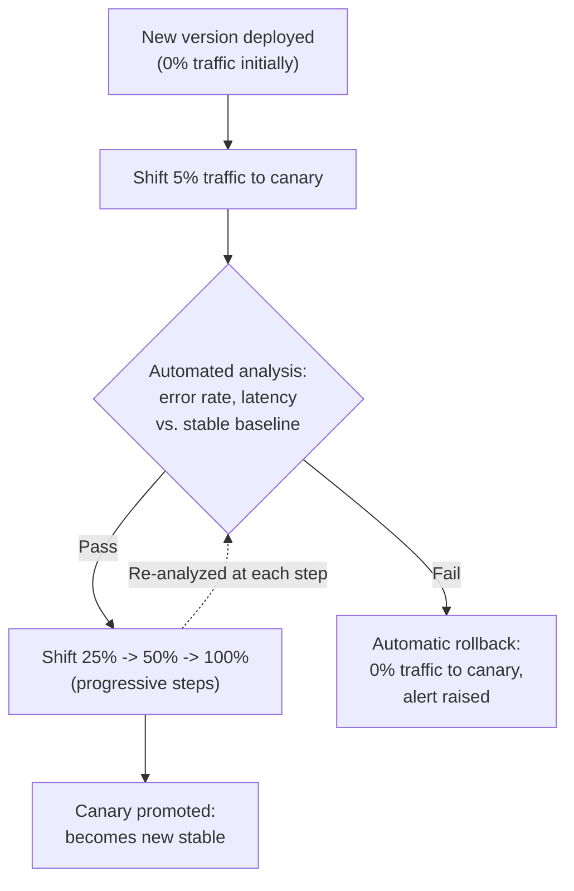
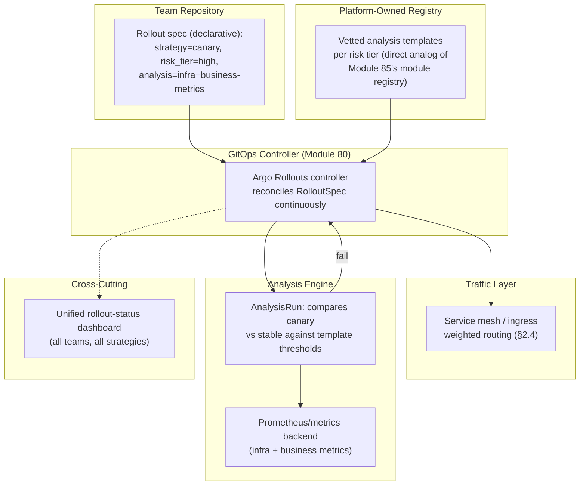
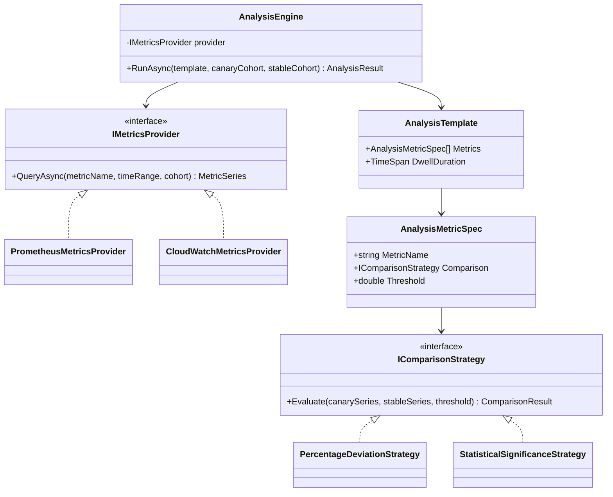

# Module 87 — DevOps: Release & Deployment Strategies — Blue-Green, Canary & Progressive Delivery

> Domain: DevOps | Level: Beginner → Expert | Prerequisite: [[01-InfrastructureAsCode-Terraform-State-Drift]], [[02-ConfigurationManagement-Secrets-EnvironmentPromotion]] (build-once/promote-by-digest), [[../23-Kubernetes/01-Architecture-ControlPlane-Pods-Deployments]] (Deployment rolling-update mechanics, `maxSurge`/`maxUnavailable`), [[../23-Kubernetes/02-Networking-Services-Ingress-CNI-DNS-NetworkPolicies]] (Service/Ingress traffic routing), [[../23-Kubernetes/08-Observability-Multicluster-GitOps]] (GitOps continuous reconciliation)

---

## 1. Fundamentals

**What**: A deployment strategy is the mechanism by which a new version of software replaces a running one in production; a release strategy is the (often distinct) mechanism by which a new *feature or behavior* is exposed to users. The core strategies — rolling, blue-green, canary, and feature-flag-gated progressive delivery — each answer the same underlying question differently: *how much of production is exposed to a new version, for how long, before you're confident enough to expose the rest?*

**Why it exists**: Every deployment is a bet that the new version is at least as correct as the old one — a bet that is sometimes wrong, and wrong in ways no amount of pre-production testing catches (a config-dependent bug, a scale-dependent race condition, a genuinely unanticipated production data shape). Deployment strategies exist to bound the *blast radius* and *time-to-detection* of that bet being wrong: a strategy that exposes 100% of users instantly, with no fast rollback, converts every release into a full-fleet gamble; a strategy that exposes 1% of traffic first, with automated rollback on regression, converts the same release into a bounded, reversible experiment.

**When it matters**: The moment a system has real users and a release cadence faster than "we can manually verify everything by hand before flipping the switch" — which, in practice, is nearly every production system past its earliest days.

**How (30,000-ft view)**:
```
Rolling:      old and new versions coexist during the rollout, replacing pods
              incrementally (Module 73's maxSurge/maxUnavailable) -- Kubernetes-native
              default; bounded by SAME-VERSION-COMPATIBLE traffic (no traffic isolation)
Blue-Green:   two FULL, independent environments (old = blue, new = green); traffic
              cuts over atomically once green is validated -- instant rollback (repoint
              traffic back to blue), at 2x infrastructure cost during the cutover window
Canary:       new version receives a SMALL, deliberately-chosen traffic percentage;
              automated analysis (error rate, latency) gates progressive traffic increase
              -- bounded blast radius AND real production traffic validation
Feature Flags: decouples DEPLOYMENT (code is running in production) from RELEASE
              (a user-visible behavior is active) -- Module 86 §2.1's runtime config,
              applied to progressive, targeted feature exposure
```

---

## 2. Deep Dive

### 2.1 Deployment vs. Release — the Foundational Decoupling
The single most important conceptual move in this domain: **deploying** code (getting a new binary running in production) and **releasing** a feature (making new behavior visible/active to users) are separable operations, and conflating them is the root cause of an entire class of avoidable incidents. A deployment that ships new code with a feature flag defaulted "off" carries essentially zero user-facing risk regardless of how large or risky the underlying change is — the risk is deferred entirely to the *release* step (flipping the flag), which can then be independently sequenced, targeted, and instantly reversed (flip back) without any redeploy at all. This decoupling is why mature organizations deploy far more frequently than they release user-visible changes, and why "deploy" and "release" should never be used interchangeably in an incident postmortem — the distinction determines whether the fix is a flag flip (seconds) or a rollback deployment (minutes to longer).

### 2.2 Rolling Deployment — Kubernetes-Native, No Traffic Isolation
Covered mechanically in Module 73 §2.2: a Deployment incrementally replaces old-version Pods with new-version ones, governed by `maxSurge` (extra capacity permitted during rollout) and `maxUnavailable` (capacity dip permitted). Its defining limitation for *release* strategy purposes: **all traffic hitting either version is ordinary production traffic** — there is no mechanism to route a deliberately small, chosen slice of traffic to the new version while the rest continues on the old one; the "percentage exposed" is simply whatever fraction of replicas have been updated at a given moment in the rollout, not a designed, monitored gate. A bad new version during a rolling update is caught only by the Deployment's own readiness-probe failures (Module 74's Running-vs-Ready distinction) triggering a stalled/halted rollout — a coarser, slower signal than a dedicated canary analysis, and one that only protects against pods that fail to become ready at all, not pods that become ready but behave subtly wrong under real traffic.

### 2.3 Blue-Green Deployment — Atomic Cutover, Instant Rollback, Double Cost
Two complete, independent environments run simultaneously: "blue" (current production) and "green" (the new version, fully deployed and validated but receiving no live traffic yet). Cutover is a single, atomic traffic-routing change (a load balancer target-group swap, a Service selector update, a DNS change) — the defining advantage is that rollback is equally atomic and equally fast: repoint traffic back to blue, with no redeploy, no waiting for pods to terminate, no partial-state cleanup. The defining cost is running **two full production-capacity environments simultaneously** during the validation-and-cutover window — a genuine, non-trivial infrastructure cost multiplier, and one that becomes an actual data-consistency problem the moment the new version requires a schema change the old version can't tolerate (§2.6's expand/contract pattern becomes mandatory, not optional, under blue-green). Blue-green protects against "the new version doesn't start correctly" and "the new version misbehaves under synthetic/smoke-test validation" — it does **not**, by itself, protect against "the new version behaves subtly wrong only under real production traffic patterns," since cutover exposes 100% of traffic at once with no intermediate, bounded exposure step.

### 2.4 Canary Deployment — Bounded Exposure, Automated Analysis, Progressive Confidence
A canary deployment routes a small, deliberately chosen percentage of *real* production traffic to the new version while the majority continues on the stable version — and, critically, gates progression to a larger percentage on **automated analysis** of the canary's behavior (error rate, latency percentiles, business-metric deltas) compared against the stable baseline, not merely "did it stay up." Tools like Argo Rollouts and Flagger (both directly building on Module 80's GitOps continuous-reconciliation model) implement this as a controller that manages the traffic-percentage ramp and automatically **rolls back** — reverting traffic to 0% on the canary — the moment analysis crosses a failure threshold, without waiting for a human to notice a dashboard. The defining advantage over blue-green: canary validates against genuine, unpredictable production traffic shape, not a synthetic or smoke-test proxy for it, and bounds the blast radius of a bad version to the canary percentage for the (short) duration until automated analysis catches it — the defining cost: canary requires a traffic-splitting mechanism (a service mesh, an ingress controller supporting weighted routing, or a dedicated traffic-management layer) and a well-instrumented set of success metrics *before* the first canary run, not improvised during one.

### 2.5 Feature-Flag-Gated Progressive Delivery — Release Decoupled from Deployment
Building on §2.1's decoupling: once code is deployed (dormant behind a flag), *release* itself can be progressive and targeted independently of any deployment mechanics — a "ring deployment" model exposes a new feature first to internal employees (ring 0), then a small opt-in beta cohort (ring 1), then a random percentage of general users (ring 2), then everyone — each ring gated by explicit success criteria and, crucially, **reversible by a flag flip alone**, with no deployment, no pod restart, and no rollback deployment pipeline involved at all. This is the fastest possible rollback mechanism in this entire domain (a config/flag-service change, typically propagating in seconds, directly Module 86 §Advanced Q5's kill-switch architecture) — but it only protects against the specific *feature's* behavior; a genuinely broken underlying deployment (a crash-looping pod, a memory leak in shared code paths outside the flagged feature) is entirely unaffected by any flag state and still requires the deployment-level strategies (§2.2–2.4) as the underlying safety net.

### 2.6 Database Migrations During Deployment — the Expand/Contract Pattern
Every strategy above assumes old and new *application* versions can coexist briefly (rolling, canary) or need atomic cutover (blue-green) — but the *database* is almost always a single, shared resource neither version gets its own copy of, making schema changes the domain's sharpest compatibility constraint. The **expand/contract pattern** (also called parallel change) resolves this: (1) *expand* — add the new schema element (a new column, nullable or defaulted) in a migration that both old and new application code can tolerate; (2) deploy the new application version, which writes to both old and new schema elements or reads from whichever is present; (3) backfill existing data into the new element; (4) once every instance is confirmed running the new version (rolling/canary complete, or blue fully retired post-cutover), *contract* — a later, separate migration removes the old schema element. Skipping directly to a single "expand-and-remove-old-in-one-migration" step is incompatible with every strategy in this module except an instantaneous, zero-coexistence-window cutover — which rolling and canary deployments, by design, never provide, and even blue-green's atomic traffic cutover doesn't guarantee if any old-version request is still in flight against the database at the cutover instant.

---

## 3. Visual Architecture

### Blue-Green vs. Canary — Traffic Exposure Shape Over Time
```
Blue-Green:                              Canary:
100%|--------blue--------|               100%|--stable------------\
    |                    |cutover              |                    \___
    |                    |  (atomic)            |                        \___
  0%|                    |------green----     0%|--canary--/----/----/-------100%
    +--------------------+---------->            +--------------------------->
         time (instant switch,                    time (progressive ramp,
         100% exposure at cutover)                 gated by automated analysis
                                                    at each step)
```

### Canary Rollout with Automated Analysis (Argo Rollouts / Flagger pattern)


### Expand/Contract Migration Sequencing Against a Rolling Deployment (§2.6)
```
Migration 1 (EXPAND):   ALTER TABLE orders ADD COLUMN shipping_zone_v2 NULLABLE
                        -- old AND new app code both tolerate this; safe pre-deploy

Deploy (ROLLING):       old code: ignores shipping_zone_v2
                        new code: writes shipping_zone_v2, reads legacy shipping_zone
                        -- both versions coexist safely during the rollout window

Backfill:               populate shipping_zone_v2 for pre-existing rows

Deploy (ROLLING):       new code: reads/writes shipping_zone_v2 only

Migration 2 (CONTRACT): ALTER TABLE orders DROP COLUMN shipping_zone
                        -- only after EVERY instance confirmed on the version
                        -- that no longer references the old column
```

---

## 4. Production Example

**Scenario**: An e-commerce platform ran a rolling deployment (Module 73's native mechanism) for a checkout-service update. The new version passed every readiness probe instantly — pods became "Ready" within seconds — and the rollout completed across all 40 replicas within three minutes with zero disruption to the deployment mechanism itself. Forty minutes later, the payments team discovered a subtle bug: under a specific, moderately-common discount-code combination, the new version calculated tax incorrectly, silently undercharging a small percentage of orders. By the time it was caught (via a routine finance reconciliation, not an alert), the bug had been live at 100% traffic for over half an hour, affecting thousands of orders.

**Investigation**: The readiness probe checked only that the service could accept connections and reach its database — a shallow, structural health check with no awareness of business-logic correctness. The rolling deployment's `maxSurge`/`maxUnavailable` configuration governed *pod replacement pace*, not traffic-percentage-based exposure — by design, a rolling update has no concept of "expose this version to only 5% of traffic and watch," so there was no automated gate that could have caught a bug expressible only under real traffic and real discount-code combinations, however fast the rollout mechanics themselves were.

**Root cause**: A category mismatch between the deployment strategy in use (rolling, which validates only "does the new version start and pass structural health checks") and the actual risk profile of the change (a business-logic change requiring behavioral validation against a meaningful, real-traffic sample before full exposure) — the team had implicitly assumed "our rollout completed successfully" was evidence of correctness, when it was only evidence of successful process replacement.

**Fix**: Migrated checkout-service deployments to a canary strategy (§2.4) via Argo Rollouts, with automated analysis explicitly including a business-metric check (average order value and tax-collected-per-order compared against the stable baseline, not just infrastructure error rate/latency) — a check specifically designed to catch the exact bug class that slipped through, since a tax-calculation bug doesn't necessarily raise HTTP error rates or latency at all.

**Lesson**: A deployment strategy's *mechanical* success (pods started, rollout completed, no crashes) is a categorically different claim from a deployment's *behavioral* correctness — directly this course's recurring "declared/mechanical success ≠ actual correctness" theme (Module 74's Running-vs-Ready, Module 85/86's declared-vs-actual drift), now applied to the release-validation dimension: the right deployment strategy must be chosen to match the specific risk profile of the change, and a rolling deployment's speed and mechanical reliability say nothing about whether the *business logic* it shipped is correct.

---

## 5. Best Practices
- Decouple deployment from release via feature flags for any change with meaningful user-facing risk — it converts the fastest possible rollback (a flag flip) into the default recovery path, reserving deployment-level rollback for genuinely code-level failures (§2.1, §2.5).
- Match the deployment strategy to the change's actual risk profile: rolling for low-risk, structurally-validated changes; canary with business-metric-aware automated analysis for changes where behavioral correctness (not just uptime) is the real risk (§4).
- Design database migrations as expand/contract from the outset for any schema change accompanying a deployment where old and new code might coexist, even briefly (§2.6).
- Instrument the specific success metrics a canary analysis will gate on *before* the first canary run — discovering mid-incident that no metric exists to detect the failure mode is a design gap, not bad luck.
- Treat blue-green's double-infrastructure-cost window as a deliberate, bounded trade-off for services needing atomic, instant rollback — not a default applied indiscriminately regardless of a service's actual rollback-speed requirements.

## 6. Anti-patterns
- Treating "the rollout completed with no pod failures" as evidence of correctness for changes carrying genuine business-logic risk (§4's exact incident).
- A single "expand-and-drop" migration shipped alongside a rolling or canary deployment, assuming instantaneous cutover when neither strategy provides one (§2.6).
- Canary analysis gating only on infrastructure metrics (error rate, latency) for changes whose failure mode is a silent business-logic error that raises neither (§4).
- Using feature flags as a substitute for deployment-level safety nets, rather than a complementary layer — a flag protects only the flagged feature's behavior, not a crash-looping or resource-leaking deployment underneath it (§2.5).
- Running blue-green without addressing in-flight-request handling during cutover, risking requests straddling the old and new environment against a database mid-migration.

---

## 10. Interview Questions

### Basic (10)

1. **Q: What is the difference between a deployment and a release?**
   **A:** A deployment is getting new code running in production; a release is making a user-visible behavior active — the two are separable, and a deployment can ship dormant code (behind a flag) with zero release-level risk.
   **Why correct:** States the foundational decoupling this module's entire progressive-delivery discussion depends on.
   **Common mistakes:** Using the terms interchangeably, which obscures whether an incident's fix should be a flag flip or a full rollback deployment.
   **Follow-ups:** "Why does this distinction matter for rollback speed?" (A flag flip is near-instant with no redeploy; a deployment-level rollback requires the full rollback mechanism of whatever strategy is in use.)

2. **Q: What does a rolling deployment do?**
   **A:** Incrementally replaces old-version pods with new-version ones, governed by how much extra capacity (`maxSurge`) and how much capacity dip (`maxUnavailable`) is tolerated during the transition.
   **Why correct:** Names the precise Kubernetes-native mechanism and its two governing parameters.
   **Common mistakes:** Believing a rolling deployment provides traffic-percentage-based exposure control — it doesn't; exposure is simply whatever fraction of replicas are currently updated.
   **Follow-ups:** "What's the failure signal that halts a bad rolling update?" (Readiness-probe failures on the new pods — a coarse, structural signal, not a behavioral one.)

3. **Q: What is a blue-green deployment?**
   **A:** Two complete, independent environments (blue = current, green = new) run simultaneously; traffic cuts over atomically once green is validated, and rollback is equally atomic — repoint traffic back to blue.
   **Why correct:** States both the mechanism and its defining rollback advantage.
   **Common mistakes:** Underestimating the cost — running two full production-capacity environments simultaneously during validation.
   **Follow-ups:** "What does blue-green NOT protect against?" (Behavior that's only wrong under real production traffic patterns, since cutover exposes 100% of traffic at once with no intermediate step.)

4. **Q: What is a canary deployment?**
   **A:** Routing a small, deliberately chosen percentage of real production traffic to a new version, with automated analysis gating progression to a larger percentage.
   **Why correct:** Captures both the bounded-exposure mechanism and the automated-analysis gate that distinguishes it from a rolling deployment.
   **Common mistakes:** Describing canary as "like rolling but slower" — the defining feature is the automated, metric-gated progression, not merely gradual rollout.
   **Follow-ups:** "What must exist before the first canary run?" (A traffic-splitting mechanism and well-instrumented success metrics to analyze against.)

5. **Q: What is a feature flag, in the release-strategy sense?**
   **A:** A runtime-evaluated toggle that decouples a feature's user-visible activation from the code's deployment — code can be deployed dormant and released later, independently, via a flag flip.
   **Why correct:** Ties directly to §2.1's deployment/release decoupling rather than describing flags only as an A/B-testing tool.
   **Common mistakes:** Treating feature flags as a replacement for deployment-level safety nets rather than a complementary layer.
   **Follow-ups:** "What does a flag NOT protect against?" (A crash-looping or resource-leaking deployment in code paths outside the flagged feature.)

6. **Q: What is the expand/contract pattern?**
   **A:** A database migration sequencing approach: first expand (add the new schema element, tolerated by both old and new code), deploy, backfill, then later contract (remove the old element) only once every instance runs the new version.
   **Why correct:** States all four steps and the critical ordering constraint (contract only after full cutover confirmation).
   **Common mistakes:** Combining expand and contract into a single migration, assuming instantaneous cutover.
   **Follow-ups:** "Why is a single expand-and-drop migration dangerous under a rolling deployment specifically?" (Old and new code coexist during the rollout; dropping the old column breaks the still-running old-version pods.)

7. **Q: What does `maxUnavailable` control in a Kubernetes rolling update?**
   **A:** How many existing pods can be taken down (unavailable) before their replacements are ready, trading a temporary capacity reduction for a faster, lower-resource-overhead rollout.
   **Why correct:** Precisely states the trade-off `maxUnavailable` governs.
   **Common mistakes:** Confusing it with `maxSurge`, which controls extra capacity above the desired count rather than capacity reduction below it.
   **Follow-ups:** "When would you set `maxUnavailable` to zero?" (For a critical service where any capacity dip during rollout is unacceptable — accepting the corresponding requirement for `maxSurge` capacity headroom instead.)

8. **Q: What is a "ring deployment"?**
   **A:** A progressive release model exposing a feature first to an internal ring (employees), then a small opt-in cohort, then a random percentage of general users, then everyone — each ring gated by explicit success criteria.
   **Why correct:** Describes the specific staged-exposure structure and its gating discipline.
   **Common mistakes:** Conflating ring deployment (a release-targeting strategy, typically flag-driven) with canary deployment (a deployment-level traffic-splitting strategy) — they operate at different layers and can be combined.
   **Follow-ups:** "What's the fastest possible rollback in a ring deployment?" (A flag flip reverting the targeted ring back to the old behavior, with no redeploy.)

9. **Q: Why is a database typically the sharpest compatibility constraint across all deployment strategies?**
   **A:** Unlike the application layer, old and new application versions almost always share a single database — there's no "blue" and "green" copy of the database itself, so schema changes must remain compatible with whichever application version might still be running against it.
   **Why correct:** Identifies the shared-resource nature of the database as the reason it needs special migration handling that stateless application layers don't.
   **Common mistakes:** Assuming blue-green's "two environments" extends to the database, when in practice both environments typically share one database instance.
   **Follow-ups:** "What happens if blue-green DOES use two separate databases?" (Data written to green during validation must be reconciled or replayed against blue if a rollback occurs — a genuinely harder synchronization problem than shared-database expand/contract.)

10. **Q: What signal does Argo Rollouts or Flagger use to automatically roll back a canary?**
    **A:** Automated analysis comparing the canary's metrics (error rate, latency, and ideally business metrics) against the stable version's baseline — crossing a defined failure threshold triggers automatic traffic reversion to 0% on the canary.
    **Why correct:** States the automated, metric-gated nature of the rollback trigger, distinguishing it from a human noticing a dashboard.
    **Common mistakes:** Believing canary rollback requires manual intervention — the entire value of tools like Argo Rollouts/Flagger is automating this detection-and-reversion loop.
    **Follow-ups:** "What's a failure mode this automated analysis can miss?" (A metric that isn't instrumented at all, per §4's tax-calculation bug that raised neither error rate nor latency.)

### Intermediate (10)

1. **Q: Why does a rolling deployment's readiness-probe-based failure detection catch a different class of bugs than a canary's automated analysis?**
   **A:** A readiness probe checks a structural condition (can the pod accept connections, reach its dependencies) at pod-startup time — it catches "the new version fails to start correctly" but has no visibility into behavioral correctness under real traffic over time. Canary analysis continuously compares live metrics (error rate, latency, business metrics) between the canary and stable baseline over a sustained window, catching bugs that only manifest under genuine traffic shape and volume — exactly the tax-calculation bug in §4, which passed every readiness probe instantly but was behaviorally wrong.
   **Why correct:** Precisely distinguishes the two failure-detection mechanisms by what each actually observes (startup-time structural health vs. sustained behavioral metrics).
   **Common mistakes:** Treating "the rollout succeeded" as a general correctness signal rather than recognizing it only validates the specific, narrow condition the readiness probe checks.
   **Follow-ups:** "Could a rolling deployment be augmented with canary-like analysis?" (Not natively — this requires layering a traffic-splitting/analysis tool like Argo Rollouts on top, which is precisely why teams needing behavioral validation migrate to a canary-capable controller rather than tuning rolling-update parameters further.)

2. **Q: Why does blue-green deployment's "atomic, instant rollback" advantage not fully apply once a schema migration has run against the shared database?**
   **A:** The rollback itself (repointing traffic back to blue) is still instant, but if green's migration already ran and green has written data in the new schema shape, blue — now receiving traffic again — may not tolerate reading that data, or may have missed writes that occurred only against green during the cutover window; rollback of *traffic* is atomic, but rollback of *data state* is not, unless the migration was designed (expand/contract, §2.6) so blue can safely coexist with the new schema element regardless of which environment is currently receiving traffic.
   **Why correct:** Separates the two distinct things "rollback" means here — traffic routing (genuinely atomic) versus data/schema state (not automatically reversible) — and ties the fix back to expand/contract.
   **Common mistakes:** Assuming blue-green's traffic-level atomicity extends to full application-state reversibility, without considering the shared database.
   **Follow-ups:** "What would make blue-green's rollback genuinely complete, including data?" (Designing every accompanying migration as expand/contract so both blue and green code tolerate the current schema shape regardless of which is live — removing the schema itself as a rollback obstacle.)

3. **Q: A team argues that since their canary deployment automatically rolls back on elevated error rate, they no longer need a separate pre-production staging validation step. Evaluate this.**
   **A:** Canary analysis is a real-production-traffic validation layer, but it operates *after* code is already serving a slice of real users — it bounds blast radius and shortens time-to-detection, but doesn't prevent the canary percentage of real users from experiencing the bug during the (however short) detection window. Pre-production validation catches classes of bugs cheaply and with zero user impact (obvious crashes, integration failures, basic functional regressions) before any real traffic is at risk at all; removing it means every one of those bug classes must now be caught live, at the cost of some real users' experience, even if bounded. The two layers address different points on the same risk curve — canary is a safety net for what pre-production validation misses, not a replacement for it.
   **Why correct:** Frames canary and staging validation as complementary layers addressing different risk stages (before any user impact vs. bounded user impact) rather than either being redundant with the other.
   **Common mistakes:** Treating automated rollback capability as equivalent to zero user impact — a canary rollback still means some real users experienced the bug during the window before detection.
   **Follow-ups:** "What's a bug class staging validation catches that canary might miss entirely?" (A bug affecting a rare user segment or edge-case data shape that the canary's traffic percentage happens not to sample during its analysis window — a coverage gap staging's deliberate test-case design can close.)

4. **Q: Why is "our feature flag defaults to off, so this deployment carries zero risk" an incomplete claim?**
   **A:** The flag only gates the *specific feature's* user-visible behavior — it says nothing about the deployment's underlying code health: a memory leak, a crash-looping container, a resource-contention issue, or a bug in shared code paths the flagged feature happens to sit alongside are all entirely unaffected by the flag's state and can still cause a production incident. "Zero risk" conflates release-level risk (correctly mitigated by the flag) with deployment-level risk (still present and requiring the deployment strategy's own safety net — rolling, canary, or blue-green).
   **Why correct:** Precisely separates what a flag does and doesn't cover, directly reinforcing §2.5's stated limitation.
   **Common mistakes:** Treating feature flags as a complete substitute for deployment-level rollout safety, leading to under-investment in the deployment strategy itself on the theory that "the flag protects us."
   **Follow-ups:** "What deployment-level signal would catch a shared-code-path bug a flag can't gate?" (A canary's error-rate/latency analysis, or a rolling deployment's readiness-probe failures — both operate below the flag layer, on the deployment itself.)

5. **Q: Why does a canary deployment require weighted traffic-splitting infrastructure that a rolling deployment doesn't?**
   **A:** A rolling deployment's "exposure" is simply whichever pods happen to be running the new version at a given moment — ordinary Service load balancing routes to whatever's currently in the endpoint pool, with no deliberate percentage control. A canary deployment requires *precisely controlling* what fraction of traffic reaches the new version independent of pod count (5% of traffic to 5% of pods is a coincidence, not a requirement) — this needs a service mesh, an ingress controller supporting weighted routing rules, or a dedicated traffic-management layer capable of splitting traffic by percentage regardless of the underlying replica counts on each side.
   **Why correct:** Explains the specific mechanical reason canary needs additional infrastructure — deliberate percentage control decoupled from replica count — that rolling doesn't require.
   **Common mistakes:** Assuming scaling the new version's replica count to some fraction of total replicas achieves the same effect as true weighted traffic splitting — it approximates it only if load balancing were perfectly even, which it usually isn't under real connection-pooling and session-affinity behavior.
   **Follow-ups:** "What tool provides this weighted routing in a Kubernetes environment?" (A service mesh like Istio/Linkerd, Module 79, or an ingress controller/traffic-splitting CRD that Argo Rollouts/Flagger drive directly.)

6. **Q: How does GitOps (Module 80) change the operational model for canary and blue-green deployments compared to a traditional CI-driven push pipeline?**
   **A:** A GitOps controller (ArgoCD/Flux) continuously reconciles live cluster state against a git-declared desired state; canary controllers like Argo Rollouts and Flagger build directly on this model — the *desired state itself* becomes "canary at 25%, pending analysis," and the controller continuously drives the live traffic split and pod counts toward that declared intermediate state, automatically progressing or rolling back based on analysis results, rather than a CI pipeline imperatively executing a fixed sequence of steps once and exiting. This means a canary rollout's current state is always visible and reconcilable (Module 80's core GitOps property) rather than being a transient, in-progress pipeline execution with no persistent declared state of its own.
   **Why correct:** Connects the canary controller's continuous-reconciliation behavior directly to Module 80's GitOps model, rather than describing canary progression as a one-shot pipeline script.
   **Common mistakes:** Describing canary deployment purely as a CI/CD pipeline feature without recognizing that tools like Argo Rollouts implement it as a genuine, continuously-reconciled Kubernetes custom resource.
   **Follow-ups:** "What does Module 80's 'a wrong declaration is faithfully enforced' finding mean for a canary rollout specifically?" (If the analysis template itself is misconfigured — wrong metric, wrong threshold — the controller will just as faithfully promote a genuinely broken canary as it would correctly roll back a real regression; the declaration's correctness is a separate concern from its enforcement.)

7. **Q: Why might a team choose blue-green over canary despite canary's superior real-traffic validation, for a specific class of service?**
   **A:** Services where even a small percentage of requests hitting a broken version is unacceptable (a service with no tolerance for partial failure — e.g., one where a single bad response corrupts downstream state irreversibly, or a service under strict regulatory "no untested code path may process live regulated data" constraints) can't accept canary's inherent trade-off of exposing *some* real traffic to an unvalidated version, however small and however quickly caught. Blue-green's atomic cutover, preceded by full validation against a complete, isolated environment before any live traffic touches the new version at all, better suits this risk profile — accepting the double-infrastructure cost and the "doesn't catch traffic-pattern-dependent bugs" limitation as the trade-off for zero live-traffic exposure during validation.
   **Why correct:** Identifies the specific risk-tolerance profile (zero-tolerance for any live exposure to unvalidated code) that favors blue-green's exposure model over canary's bounded-but-nonzero exposure.
   **Common mistakes:** Assuming canary is strictly superior in all cases because it validates against real traffic — this ignores that "real traffic exposure" is itself the risk some services cannot accept at any percentage.
   **Follow-ups:** "How would you validate a blue-green 'green' environment before cutover without any live traffic?" (Synthetic traffic replay against captured production request patterns, or a shadow-traffic/mirroring setup that duplicates live requests to green without green's responses affecting real users — validating behavior against real request shapes without genuine user-facing risk.)

8. **Q: What is "shadow traffic" (traffic mirroring), and how does it complement canary/blue-green without their respective risk profiles?**
   **A:** Shadow traffic duplicates real production requests to the new version in parallel, discarding the new version's responses (never returned to the actual user) while comparing its behavior (errors, latency, output divergence) against the live version handling the authoritative response — this validates behavior against genuine production traffic shape with **zero user-facing risk**, since no real user ever receives a response generated by the unvalidated version. It complements canary (which does expose real users, however small a fraction) and blue-green (which validates against synthetic/smoke traffic, not necessarily production-shaped) by adding a strictly-lower-risk validation layer beforehand — though it requires the new version to be safely side-effect-free or side-effects to be sandboxed (a shadow request that writes to a shared database would corrupt production data despite being "shadow").
   **Why correct:** Precisely defines shadow traffic's mechanism (duplicate requests, discard responses) and its unique zero-user-risk property, while flagging its real constraint (side-effect safety).
   **Common mistakes:** Assuming shadow traffic is risk-free unconditionally — it is risk-free only for the *response* path; any side effect the shadowed request triggers (writes, external API calls, emails sent) still genuinely occurs unless specifically sandboxed.
   **Follow-ups:** "Why is shadow traffic particularly valuable before a canary's first traffic-percentage step?" (It validates behavior against real traffic shape with zero user risk *before* accepting canary's nonzero, if small and bounded, live exposure — a strictly safer preliminary gate.)

9. **Q: Why does the expand/contract pattern's "contract" step require confirming every instance has migrated to the new version, and what happens if this confirmation is skipped?**
   **A:** The contract step removes the old schema element entirely — if even one instance somewhere (a lagging rolling-update pod not yet replaced, a rollback that reintroduced the old version, a background job or secondary service still referencing the old column) is still running old-version code that reads/writes the old element, dropping it causes that instance to fail immediately and potentially unrecoverably, since the column it depends on no longer exists — a failure mode with no rollback path once the migration has run, unlike an application-level rollback. Skipping this confirmation converts a normally-safe, staged migration into a race between "did the last old-version instance actually finish" and "did the contract migration already run" — a race the contract step's entire design exists to eliminate by making the confirmation explicit and required, not assumed.
   **Why correct:** Explains precisely why the confirmation is load-bearing (old-version instances would fail hard, irreversibly, on the dropped element) and the exact mechanism of the failure if skipped.
   **Common mistakes:** Treating "the deployment shows 100% new-version pods" as sufficient confirmation without considering other consumers of the same database (background jobs, secondary services, still-in-flight rollback possibilities) that might also reference the old schema element.
   **Follow-ups:** "What's a safe way to confirm no consumer still references the old element before contracting?" (Query-level instrumentation/logging on reads/writes to the old column, confirming zero recent activity across a window long enough to cover the slowest plausible consumer, before running the contract migration.)

10. **Q: How does the choice of deployment strategy interact with the "declared ≠ actual" theme this course established for Kubernetes and Terraform (Modules 74/75/76/78/79/85/86)?**
    **A:** Each deployment strategy makes an implicit claim about what "successfully deployed" means — a rolling deployment's success criterion is structural (pods became ready), a blue-green cutover's is "green passed its validation stage," and a canary's is "automated analysis passed at each traffic step" — and in every case, a strategy whose success criterion doesn't actually test the property that matters (§4's tax-calculation bug, invisible to both readiness probes and infrastructure-only canary metrics) produces a declared "successful deployment" that is, in the dimension that actually mattered, not actually correct. This is the release-strategy-domain instance of the same recurring gap: a system reporting success is only as trustworthy as what its success criterion actually verifies, and choosing/instrumenting a deployment strategy is fundamentally a decision about what gets verified before "success" is declared.
    **Why correct:** Explicitly generalizes the course's recurring structural theme into this domain, identifying deployment-strategy success criteria as another instance of "declared state" that can diverge from true correctness.
    **Common mistakes:** Treating each deployment strategy's success signal as an unquestionable ground truth rather than recognizing it only verifies whatever it was specifically instrumented to check.
    **Follow-ups:** "What's the general fix this theme suggests, applied here?" (Explicitly enumerate what property actually matters for a given change's risk profile, and verify the deployment strategy's success criteria genuinely test that property — not merely whatever metrics happened to be readily available, exactly §4's fix of adding business-metric-aware canary analysis.)

### Advanced (10)

1. **Q: Diagnose §4's incident from first principles and design the complete structural fix — not merely adding a tax-calculation check to canary analysis.**
   **A:** Root cause: a category mismatch between the deployment strategy's validation scope (rolling deployment's structural readiness checks) and the change's actual risk profile (a business-logic change requiring behavioral validation), compounded by no process step that required matching strategy to risk profile before choosing one. Structural fix: (1) migrate checkout-service (and any service handling financial calculations) to canary deployment with automated analysis explicitly including business metrics (tax collected per order, average order value) alongside infrastructure metrics; (2) establish an organization-wide risk classification for services/change types (financial-calculation-bearing services require canary-with-business-metrics by default; low-risk internal tooling may remain on rolling) — directly Module 85 §Advanced Q8's risk-tiered governance framework applied to deployment-strategy selection rather than infrastructure plan review; (3) require every canary analysis template to be reviewed for "does this actually test what could go wrong for this specific service" rather than defaulting to a generic infrastructure-metrics-only template; (4) add a reconciliation-style check (a periodic finance job comparing expected-vs-actual tax collection) as a defense-in-depth backstop independent of the deployment pipeline entirely, catching this bug class even if the canary analysis gap recurs elsewhere.
   **Why correct:** Addresses both the immediate gap (wrong strategy for the risk profile) and the structural cause (no process ensuring strategy selection and analysis-metric design match actual risk), plus an independent backstop.
   **Common mistakes:** Fixing only this service's canary analysis template without establishing the organization-wide risk-classification process that would prevent the same category mismatch recurring for the next financial-logic change on a different service.
   **Follow-ups:** "Why is the independent finance reconciliation job valuable even after canary is fixed?" (Defense-in-depth — a canary analysis gap for a *different*, not-yet-anticipated failure mode would otherwise go undetected until a similar reconciliation discovery, exactly as happened in the original incident.)

2. **Q: A team runs canary deployments but observes their canary "passes" analysis and gets promoted to 100% in under two minutes for every release, regardless of change size or risk. Evaluate whether this is a sign of a well-tuned pipeline or a red flag.**
   **A:** This is very likely a red flag, not evidence of pipeline maturity: two minutes is rarely enough time to accumulate a statistically meaningful sample of real traffic at low canary percentages (5%) to detect anything but the most blatant, immediate failures — subtler regressions (elevated error rate in a specific, less-common request path, a slow memory leak, a business-metric drift like §4's tax bug that requires aggregating over a meaningful order volume) need a longer observation window scaled to the service's actual traffic volume and the failure mode's expected time-to-manifest. A canary progressing on a fixed, short timer rather than on genuinely accumulated statistical confidence is closer to "a rolling deployment with extra steps" than a real behavioral-validation gate — it provides the appearance of canary's safety properties without the substance.
   **Why correct:** Identifies the specific mechanism (insufficient traffic/time to detect subtler failure modes) that makes a fast, fixed-duration "pass" unreliable evidence of correctness, regardless of how confident the pipeline's dashboard appears.
   **Common mistakes:** Treating "the canary always passes quickly" as proof the deployment strategy is working well, rather than investigating whether the analysis window is long enough to have caught anything but the most obvious failures.
   **Follow-ups:** "How would you determine the right analysis duration for a given service?" (Base it on the traffic volume needed to reach statistical significance for the specific metrics being monitored, and on historical failure modes' typical time-to-manifest — a low-traffic service or a slow-to-manifest failure class both require longer windows than a fixed two-minute default.)

3. **Q: Design a deployment strategy for a service where blue-green's atomic cutover is desired for rollback speed, but the accompanying database migration cannot tolerate the old and new schema coexisting even briefly (a genuinely non-additive change, e.g., a primary key type change).**
   **A:** This combination is fundamentally in tension — blue-green presumes some validation window where both environments could theoretically need to tolerate the current schema shape, and a genuinely non-additive migration (not expressible as expand/contract, e.g., changing a primary key's underlying type) cannot be made safely backward-compatible by construction. The resolution: decompose the non-additive change into a migration that *is* expressible as expand/contract at a finer grain — e.g., introduce the new primary key type as a new column first (expand), dual-write both old and new key values during a transition period with both blue and green tolerating either, backfill, switch all foreign-key references to the new column, then drop the old one (contract) — converting an apparently atomic, non-additive change into a staged, additive sequence. If truly no such decomposition exists (rare, but possible for some structural changes), the honest answer is: perform the migration during a scheduled maintenance window with the service taken fully offline for the schema change itself, since no live-traffic deployment strategy can safely bridge a truly non-additive, non-decomposable schema change — accepting brief unavailability as the deliberate, informed trade-off rather than attempting an unsafe workaround.
   **Why correct:** Recognizes the genuine tension, attempts the standard resolution (further decomposition into expand/contract-expressible steps), and honestly identifies the boundary case where no live-deployment strategy can safely apply, recommending an explicit maintenance window rather than a false sense of zero-downtime safety.
   **Common mistakes:** Assuming every schema change can be made expand/contract-compatible with enough cleverness, when some structural changes genuinely cannot be decomposed without a brief coordinated cutover.
   **Follow-ups:** "Why is admitting 'this needs a maintenance window' sometimes the more mature answer than forcing a zero-downtime workaround?" (An unsafe workaround masquerading as zero-downtime risks silent data corruption or an in-flight-request failure mode far worse than a scheduled, communicated, brief unavailability window.)

4. **Q: Explain why a canary analysis comparing "canary error rate" against "stable error rate" can produce a false pass when the canary receives disproportionately low-risk traffic due to how the traffic-splitting mechanism selects requests.**
   **A:** If the traffic-splitting mechanism (a service mesh routing rule, a load balancer's weighted target group) happens to route canary traffic based on a dimension correlated with request risk — e.g., routing by client IP hash, and a disproportionate share of high-risk enterprise-customer traffic happens to hash to the stable version rather than being evenly distributed — the canary's observed error rate genuinely reflects only the traffic it received, which may not be representative of the full traffic population the new version will eventually serve at 100%. This produces a legitimate "pass" on the traffic sampled, while the new version could still fail badly against the traffic segment the canary never saw. The fix requires either genuinely random (not correlated-with-risk) traffic selection for canary routing, or deliberately including known high-risk traffic segments in the canary sample specifically to validate against them before wider rollout.
   **Why correct:** Identifies the specific selection-bias mechanism (non-random traffic routing correlated with risk) that undermines canary's core assumption of representative sampling.
   **Common mistakes:** Assuming any traffic-splitting mechanism automatically provides a statistically representative sample, without considering whether the specific routing key (IP hash, session ID, geographic region) might correlate with the risk dimension that matters.
   **Follow-ups:** "How would you detect this selection-bias risk before it causes an incident?" (Compare the canary's traffic composition — request types, customer segments, geographic distribution — against the full population's composition during the analysis window, alerting if they diverge meaningfully rather than assuming representativeness.)

5. **Q: A platform team wants to mandate canary deployment with automated rollback for every service in the organization, replacing rolling deployments entirely. Evaluate this as a Principal Engineer.**
   **A:** A blanket mandate ignores that canary's value (bounded real-traffic exposure with automated behavioral analysis) has a genuine cost (traffic-splitting infrastructure, instrumented success metrics, longer time-to-full-deployment) that isn't justified for every service equally — a low-risk internal tool with minimal user impact and simple, structurally-verifiable correctness gains little from canary's overhead versus a much simpler rolling deployment, while a payment-critical or high-traffic customer-facing service gains substantially. The correct approach is risk-tiered strategy selection (directly Advanced Q1's fix and Module 85 §Advanced Q8's risk-tiering framework, applied here): establish criteria (blast radius, correctness-verification difficulty, traffic volume needed for meaningful canary analysis) determining which services warrant canary's investment, rather than a uniform mandate that either over-invests in low-risk services or, more dangerously, gets quietly bypassed/under-resourced for high-risk ones because the mandate wasn't accompanied by a genuine cost-benefit case each team could evaluate for their own service.
   **Why correct:** Applies risk-tiering rather than either extreme (mandate everywhere or leave entirely to individual team discretion), consistent with this course's established governance philosophy.
   **Common mistakes:** Either accepting the blanket mandate uncritically or rejecting canary's value entirely due to its overhead, rather than matching strategy investment to actual per-service risk.
   **Follow-ups:** "What would make canary's overhead worth mandating even for a lower-risk service?" (If the organization's shared platform provides canary infrastructure and instrumentation as a low-friction, mostly-free default — Module 85 §16's platform-provisioned-default pattern — the marginal cost per team drops enough that broader adoption becomes justified even for moderate-risk services.)

6. **Q: Design a rollback strategy for a feature-flag-gated release where the flag flip itself, though instant, has caused a secondary incident because a large fraction of users had already cached client-side state assuming the new feature was permanently active.**
   **A:** This reveals a gap in "flag flip = instant, safe rollback" — the flag's *server-side* state reverted instantly, but client-side state (cached UI assumptions, in-flight client-side logic built around the new feature's presence) didn't necessarily reconcile immediately, especially for long-lived client sessions (mobile apps, SPAs with long-lived tabs) that don't re-fetch flag state on every interaction. The fix requires designing the flag-consumption contract to include a *staleness bound* — clients must re-check flag state at a bounded interval (or on specific trigger events) rather than caching indefinitely, and any client-side logic built around a flagged feature must degrade gracefully if the flag flips mid-session (treating a flag reversion as an expected, handled event, not an assumed-permanent state). For releases where this client-side staleness risk is significant, consider a more conservative rollback: rather than an instant global flip, a staged reversion (new sessions get the old behavior immediately; existing sessions complete their current flow under the new behavior, avoiding a jarring mid-session change) — trading some rollback speed for reduced secondary-incident risk.
   **Why correct:** Identifies the specific gap (client-side staleness not accounted for in "instant server-side flag flip") and offers both a structural client-contract fix and a staged-rollback alternative for genuinely risky client-state scenarios.
   **Common mistakes:** Treating a feature flag's server-side instant reversion as equivalent to an instant, complete rollback across the entire system, without considering client-side caching or long-lived session state.
   **Follow-ups:** "Why might staged reversion sometimes be worse than an immediate flip despite reducing jarring mid-session changes?" (If the new behavior is actively harmful — e.g., a security or correctness bug — allowing existing sessions to continue under it for any additional time may be unacceptable; the staged approach is only appropriate when the rollback reason is a UX/business preference change, not an active incident.)

7. **Q: How would you design the automated analysis for a canary deployment of a service whose primary risk is not availability or latency, but data correctness in an asynchronous, eventually-consistent downstream system (e.g., a service that writes events consumed by a separate analytics pipeline hours later)?**
   **A:** Standard canary analysis (error rate, latency measured during the rollout window) is structurally blind to this risk, since the failure mode manifests hours later, in a different system, with no immediate signal in the canary service's own request/response metrics. The design must instead: (1) tag every event written during the canary window with a version/cohort identifier, allowing the downstream analytics pipeline's eventual output to be attributed back to canary-vs-stable origin; (2) delay the canary's "fully promoted" decision until the downstream system has had time to process and the attributed output can be compared for correctness (a genuinely longer feedback loop than typical canary timelines, which may require the canary to remain at a partial, held traffic percentage for an extended validation period rather than progressing quickly); (3) accept that this scenario may be better served by a combination of a much longer-held canary percentage plus a separate, explicit downstream-correctness validation step gating final promotion, rather than forcing the entire validation into the canary controller's native, faster-timeline analysis model.
   **Why correct:** Recognizes that standard canary analysis timelines are built around fast-feedback metrics and designs an extended validation approach matched to the genuinely slow feedback loop this specific risk profile requires.
   **Common mistakes:** Applying a standard, fast canary analysis window to a risk profile whose failure signal genuinely takes much longer to manifest, producing a false sense of validated safety before the real signal could possibly have appeared.
   **Follow-ups:** "What's the cost of holding a canary at a partial percentage for an extended period?" (Operational complexity of running two versions in production for longer, and correspondingly delayed full rollout of any genuinely beneficial changes — a real trade-off against the correctness-validation benefit, requiring the extended window to be justified by the specific risk, not applied universally.)

8. **Q: A postmortem finds that a blue-green cutover caused a brief spike in errors because some in-flight requests, initiated against blue just before cutover, completed against green's newly-established database connections with different connection-pool warm-up characteristics. Diagnose and design the fix.**
   **A:** The specific mechanism: cutover is atomic at the *traffic-routing* layer (new requests immediately go to green), but requests already in flight against blue at the cutover instant either complete against blue (fine) or, if the cutover also involved terminating blue's serving capacity concurrently, may have been abruptly cut off and potentially retried against a cold, just-started green whose connection pools (database, cache, downstream service clients) hadn't yet warmed up — producing elevated latency/errors during green's first moments of real traffic, precisely when the cutover made it the sole traffic recipient. Fix: (1) sequence cutover as traffic-routing-first, blue-decommission-second, with a deliberate drain period allowing blue to finish in-flight requests naturally rather than being abruptly terminated at the cutover instant; (2) pre-warm green's connection pools and caches *before* cutover (synthetic traffic or a documented warm-up routine) so it's not receiving its first real traffic cold; (3) size cutover to occur during a lower-traffic window if the service has predictable traffic patterns, reducing the absolute number of in-flight requests affected by the transition regardless of the above fixes.
   **Why correct:** Identifies the precise mechanism (abrupt termination plus cold green connection pools) rather than a vague "cutover caused errors," and proposes fixes addressing both the sequencing and the warm-up gap.
   **Common mistakes:** Treating "atomic cutover" as meaning literally nothing can go wrong during the transition instant, without considering in-flight-request handling and cold-start effects on the receiving environment.
   **Follow-ups:** "Why might pre-warming with synthetic traffic still be insufficient?" (Synthetic traffic may not exercise the same connection-pool sizing, cache key distribution, or downstream service call patterns as genuine production traffic — reducing but not eliminating the cold-start gap versus real traffic's first moments.)

9. **Q: How should deployment strategy selection change for a service undergoing its first-ever production deployment (a new service with no production traffic history) versus a mature service with years of stable traffic patterns?**
   **A:** A new service has no baseline to compare canary analysis against (no "stable version's normal error rate/latency" to detect deviation from) and no historical traffic-pattern data informing how long an analysis window needs to be for statistical significance — canary's core mechanism (compare new against an established stable baseline) is weakest exactly when there's no established baseline yet. For a genuinely new service, a more conservative approach — blue-green with thorough synthetic/shadow-traffic validation before any live cutover, followed by a *manually*-monitored initial period at full traffic with tightened alerting thresholds (since "normal" behavior is still being established) — is often more appropriate than canary's baseline-comparison model. Once the service has accumulated sufficient production history to establish a genuine "stable baseline," transitioning to canary with automated analysis becomes both meaningful and valuable.
   **Why correct:** Identifies the specific reason canary's core comparison mechanism is undermined for a service with no established baseline, and proposes an appropriately different strategy for that specific lifecycle stage.
   **Common mistakes:** Applying canary deployment uniformly regardless of whether a meaningful stable baseline exists to compare against, producing an analysis that technically runs but has no genuine comparison point to validate against.
   **Follow-ups:** "How would you determine when a new service has accumulated 'enough' history to transition to canary?" (A defined minimum traffic volume and time window during which metrics have stabilized into a genuinely representative, low-variance baseline — not an arbitrary fixed calendar duration.)

10. **Q: As a Principal Engineer establishing release and deployment standards for an organization, design the specific set of standing architectural reviews and automated checks you would require, synthesizing this entire module.**
    **A:** (1) Mandatory risk classification per service/change-type (financial/data-correctness-critical, customer-facing-high-traffic, internal/low-risk) driving a required minimum deployment strategy tier — canary-with-business-metrics for the highest tier, rolling acceptable for the lowest — rather than leaving strategy choice to individual team discretion or a uniform mandate (§Advanced Q1, §Advanced Q5). (2) Mandatory automated-analysis-template review for canary deployments, explicitly requiring justification that the configured metrics would actually detect the service's plausible failure modes, not merely default infrastructure metrics (§4, §Advanced Q1). (3) Mandatory expand/contract discipline for any schema migration accompanying a deployment where old and new code might coexist, with an explicit, verified confirmation gate before any contract-phase migration runs (§2.6, §Advanced Q9). (4) Mandatory feature-flag staleness-bound design review for any client with long-lived sessions, preventing the client-side-caching rollback gap (§Advanced Q6). (5) A platform-provisioned, low-friction canary/traffic-splitting infrastructure default (Module 85 §16's pattern) so that adopting canary for a newly-risk-tiered service doesn't require each team to build traffic-splitting infrastructure independently. Each standard directly extends this course's now-repeated finding — mandatory-by-default, structurally-enforced governance, risk-tiered rather than uniform, and platform-provisioned rather than independently rebuilt per team — into the release-and-deployment-strategy dimension, completing the DevOps domain's governance arc alongside Modules 85 and 86.
    **Why correct:** Synthesizes the module's specific findings (risk-tiered strategy selection, analysis-template justification, expand/contract discipline, flag-staleness design, platform-provisioned infrastructure) into concrete, reviewable organizational controls.
    **Common mistakes:** Proposing a single uniform deployment-strategy mandate for the entire organization, rather than risk-tiered selection matched to each service's actual risk profile.
    **Follow-ups:** "Which of these five would you prioritize first?" (Typically the risk-classification framework — it's the prerequisite decision every other control depends on, and without it, canary-template review or expand/contract mandates have no basis for deciding which services they apply to.)

---

## 11. Coding Exercises

### Easy — Computing rolling-update pod counts from `maxSurge`/`maxUnavailable` (§2.2)
**Problem:** Given a desired replica count, a `maxSurge` percentage, and a `maxUnavailable` percentage, compute the maximum and minimum pod counts permitted at any point during a rolling update.

```csharp
public static class RollingUpdateCalculator
{
    public static (int MaxPods, int MinPods) ComputeBounds(
        int desiredReplicas, double maxSurgePercent, double maxUnavailablePercent)
    {
        int surge = (int)Math.Ceiling(desiredReplicas * maxSurgePercent);
        int unavailable = (int)Math.Floor(desiredReplicas * maxUnavailablePercent);

        int maxPods = desiredReplicas + surge;
        int minPods = desiredReplicas - unavailable;

        return (maxPods, minPods);
    }
}
```
**Time complexity:** O(1).
**Space complexity:** O(1).
**Optimized solution:** Already O(1); the real-world refinement is validating inputs (percentages between 0 and 1, `minPods >= 0`) and matching Kubernetes's actual rounding rules exactly (`maxSurge` rounds up, `maxUnavailable` rounds down, per the Deployment controller's documented behavior) so the calculator's output matches observed cluster behavior precisely rather than an approximation.

### Medium — Canary traffic-percentage ramp with automated pass/fail gating (§2.4)
**Problem:** Given a sequence of traffic-percentage steps and a function that returns whether the canary's current metrics pass analysis, simulate a canary rollout that progresses through steps on pass and immediately reverts to 0% on the first failure.

```csharp
public sealed record CanaryStepResult(int TrafficPercent, bool Passed);

public sealed class CanaryRolloutSimulator
{
    private readonly Func<int, Task<bool>> _runAnalysis;

    public CanaryRolloutSimulator(Func<int, Task<bool>> runAnalysis) =>
        _runAnalysis = runAnalysis;

    public async Task<(bool Promoted, IReadOnlyList<CanaryStepResult> History)> RunAsync(
        IReadOnlyList<int> trafficSteps)
    {
        var history = new List<CanaryStepResult>();

        foreach (var step in trafficSteps)
        {
            bool passed = await _runAnalysis(step);
            history.Add(new CanaryStepResult(step, passed));

            if (!passed)
            {
                // Automatic rollback: revert to 0% immediately, no partial promotion.
                return (Promoted: false, History: history);
            }
        }

        return (Promoted: true, History: history);
    }
}
```
**Time complexity:** O(s) where s is the number of traffic steps (each analyzed once, sequentially).
**Space complexity:** O(s) for the history list.
**Optimized solution:** For long-running analysis at each step (real canary analysis runs over a time window, not instantaneously), run each step's analysis as a bounded-duration continuous monitor rather than a single check — sampling metrics repeatedly across the step's dwell time and failing fast the moment a threshold is crossed mid-step, rather than waiting for the full dwell time to elapse before evaluating a single aggregate result; this reduces time-to-detection for a fast, obvious regression while still allowing the full window for subtler, slower-to-manifest ones.

### Hard — Expand/contract migration state machine validator (§2.6)
**Problem:** Given a sequence of proposed migration steps (Expand, Deploy, Backfill, ConfirmFullCutover, Contract) for a schema change, validate that they occur in a legal order — specifically, that no Contract step occurs before its corresponding ConfirmFullCutover step, and no step references a column that hasn't been Expanded yet.

```csharp
public enum MigrationStepKind { Expand, Deploy, Backfill, ConfirmFullCutover, Contract }

public sealed record MigrationStep(MigrationStepKind Kind, string ColumnName);

public sealed class ExpandContractValidator
{
    public IReadOnlyList<string> Validate(IReadOnlyList<MigrationStep> steps)
    {
        var errors = new List<string>();
        var expandedColumns = new HashSet<string>();
        var confirmedColumns = new HashSet<string>();

        foreach (var step in steps)
        {
            switch (step.Kind)
            {
                case MigrationStepKind.Expand:
                    expandedColumns.Add(step.ColumnName);
                    break;

                case MigrationStepKind.ConfirmFullCutover:
                    if (!expandedColumns.Contains(step.ColumnName))
                        errors.Add($"ConfirmFullCutover for '{step.ColumnName}' before it was ever Expanded.");
                    confirmedColumns.Add(step.ColumnName);
                    break;

                case MigrationStepKind.Contract:
                    if (!confirmedColumns.Contains(step.ColumnName))
                        errors.Add(
                            $"Contract for '{step.ColumnName}' occurred without a prior " +
                            "ConfirmFullCutover -- old-version instances may still reference this column.");
                    break;

                // Deploy and Backfill steps don't gate ordering in this simplified model,
                // but a fuller validator would also confirm Backfill occurs only after Expand.
            }
        }

        return errors;
    }
}
```
**Time complexity:** O(n) where n is the number of migration steps.
**Space complexity:** O(c) where c is the number of distinct columns tracked across `expandedColumns`/`confirmedColumns`.
**Optimized solution:** Extend the state machine to also validate that `Backfill` for a column occurs after its `Expand` (a Backfill referencing a not-yet-expanded column is equally invalid) and that no `Deploy` step assumed to introduce new-version reads/writes of a column occurs before that column's `Expand` — turning this from a two-invariant checker into a complete per-column state machine (`NotStarted -> Expanded -> Backfilled -> Confirmed -> Contracted`) rejecting any out-of-order transition, which generalizes cleanly to validating real migration-tooling output (e.g., a sequence of Flyway/EF Core migration files annotated with their expand/contract phase) in CI before it ever reaches production.

---

## 12. System Design

**Prompt:** Design a self-service progressive-delivery platform for an organization with hundreds of microservices, letting teams adopt canary or blue-green deployments with automated rollback, without each team independently building traffic-splitting infrastructure or analysis tooling.

**Functional requirements:** Teams declare their desired deployment strategy (rolling/canary/blue-green) and risk tier per service; the platform provisions the corresponding traffic-splitting and analysis infrastructure automatically; canary analysis templates are provided as vetted, reusable defaults (infrastructure metrics) with a clear path for teams to add service-specific business-metric checks; every rollout's current state (traffic percentage, analysis status) is visible via a unified dashboard regardless of which strategy or team.

**Non-functional requirements:** Analysis-template changes must be reviewable (a change to what "pass" means for a canary is as consequential as an infrastructure change); rollback must complete within a bounded time regardless of which strategy is in use; the platform must not become a bottleneck — teams should be able to onboard a new service's progressive-delivery configuration without a central team's manual involvement per service.

**Architecture:**


**Database/state selection:** The rollout's current state (traffic percentage, analysis pass/fail history) is itself a Kubernetes custom resource (Argo Rollouts' native model) reconciled continuously — no separate database needed for rollout state; the analysis templates and risk-tier mappings live in the platform-owned registry (git-backed, versioned, directly Module 85 §12's module-registry pattern).

**Caching:** Metrics queries backing analysis runs should be cached/rate-limited appropriately to avoid the analysis engine itself becoming a load source against the metrics backend during high-frequency canary steps across hundreds of simultaneous rollouts.

**Messaging:** Rollback events and analysis failures route through the organization's existing alerting infrastructure, risk-tiered by the service's declared tier — a high-risk service's canary rollback pages immediately; a low-risk service's digests.

**Scaling:** Onboarding a new team/service requires only declaring a `RolloutSpec` referencing an existing risk-tier template — no platform-team involvement per service, directly the self-service model Module 85 §12 established for infrastructure provisioning, now applied to deployment strategy.

**Failure handling:** If the analysis engine itself becomes unavailable during a canary's dwell window, the controller must fail safe — halting progression (not defaulting to "pass" in the absence of a result) until analysis capability is restored, since defaulting to pass on analysis-engine failure would silently convert every canary into an unguarded rolling deployment at the worst possible moment.

**Monitoring:** Per-team, per-risk-tier rollout success/rollback rates; analysis-template staleness (templates that haven't been reviewed/updated as a service's traffic patterns evolved); and time-to-detection metrics comparing how quickly each strategy actually catches injected/historical regressions, feeding back into whether a service's risk tier and strategy assignment remain appropriate.

**Trade-offs:** Centralizing on platform-provisioned analysis templates and traffic-splitting infrastructure trades some team-level customization flexibility for consistent, reviewable governance and dramatically lower per-team onboarding cost — directly this course's now-repeated governance-through-shared-platform-defaults philosophy (Module 85's module registry, Module 86's unified secret platform), applied to deployment-strategy tooling as this domain's final instance.

---

## 13. Low-Level Design

**Requirements:** Design the canary analysis engine (§11 Medium, §12) as an extensible component supporting multiple metric backends and pluggable pass/fail comparison strategies, without requiring a rewrite per new metric type or comparison method.

**Class diagram (conceptual):**


**Sequence diagram:** Rollout controller invokes `AnalysisEngine.RunAsync` with the current step's template → engine queries both canary and stable cohort metrics via the configured `IMetricsProvider` for each `AnalysisMetricSpec` → each metric's configured `IComparisonStrategy` evaluates canary-vs-stable against its threshold → engine aggregates per-metric results into an overall pass/fail → controller acts on the result (progress traffic percentage, or roll back to 0%, per §11 Medium's simulator logic).

**Design patterns used:** **Strategy** for both `IMetricsProvider` (per-backend variation) and `IComparisonStrategy` (per-analysis-method variation) — directly this course's now-repeated pluggable-backend architecture (Module 85 §13's drift-detector design, Module 86 §13's rotation orchestrator). **Composite**-shaped `AnalysisTemplate` aggregating multiple independently-evaluated `AnalysisMetricSpec` entries into one overall result, mirroring how a real canary analysis considers multiple metrics jointly.

**SOLID mapping:** Open/Closed — adding a new metrics backend or comparison method requires only a new `IMetricsProvider`/`IComparisonStrategy` implementation, never a change to `AnalysisEngine`. Single Responsibility — metric querying, comparison logic, and template composition are each one class's concern. Dependency Inversion — the engine depends only on interfaces, enabling full unit testing against fake metric providers returning controlled series data.

**Extensibility:** Adding business-metric support (§4's tax-calculation check) requires only a new `AnalysisMetricSpec` referencing the appropriate `IMetricsProvider` query and an appropriate `IComparisonStrategy` — zero changes to the engine's orchestration logic.

**Concurrency/thread safety:** Independent metric queries within a single analysis run (multiple `AnalysisMetricSpec` entries) can execute concurrently (`Task.WhenAll`) since each is a read-only query against the metrics backend with no shared mutable state between them; the engine aggregates results only after all queries complete, requiring no locking, though the metrics backend itself must tolerate the resulting concurrent query load across potentially many simultaneous rollouts (§12's monitoring concern).

---

## 14. Production Debugging

**Incident:** A canary deployment for a high-traffic API gateway service appears stuck at 25% traffic for over an hour, far longer than its configured dwell duration of five minutes per step, with no rollback triggered and no progression occurring.

**Root cause:** The analysis template's metric query referenced a Prometheus metric name that had been renamed during an unrelated observability-platform migration two weeks earlier — the query returned no data (an empty series) rather than an error, and the comparison strategy's implementation treated "no data" as "insufficient information to fail," silently retrying indefinitely rather than either passing, failing, or raising an explicit error requiring human attention.

**Investigation:** The rollout controller's own status showed "AnalysisRun: Running" indefinitely with no error state — the first diagnostic step was querying the analysis engine's logs directly (bypassing the rollout controller's summary status) which revealed the underlying metrics query was returning zero data points per evaluation cycle; cross-referencing the queried metric name against the current Prometheus metric catalog confirmed the name no longer existed post-migration.

**Tools:** Direct inspection of the `AnalysisRun` custom resource's detailed status (not just the higher-level `Rollout` object's summary) surfaced the specific failing metric query; Prometheus's own query API, tested directly with the same query string the analysis template used, confirmed the empty-result behavior independently of the rollout controller.

**Fix:** Immediate: manually promote the canary after independently verifying its actual health via alternate dashboards (confirming the underlying deployment was genuinely healthy, and the analysis stall was a tooling gap, not a genuine, undetected problem) and update the analysis template's metric name to match the post-migration catalog. Root-cause fix: change the comparison strategy's handling of empty/missing metric data from "silently retry indefinitely" to "fail the analysis explicitly with a clear error" — a missing metric should never be silently treated as inconclusive-but-passing, since that produces exactly this stuck, ambiguous, and dangerous state (a canary that will never explicitly pass or fail is arguably worse than one that fails fast, since a fast, explicit failure is at least immediately actionable).

**Prevention:** (1) The explicit-failure-on-missing-data fix above, closing the specific ambiguous-state gap. (2) Add a pre-deployment validation step that executes every analysis template's configured metric queries against the current metrics backend *before* starting a real canary rollout, confirming each query returns non-empty data — catching a renamed/removed metric at template-validation time rather than mid-rollout. (3) Treat any observability-platform migration (metric renames, backend changes) as requiring an explicit, tracked review of every consuming analysis template across every team — directly this course's recurring "a change in one system silently breaks an assumption another system depended on" pattern (Module 78's Helm-upgrade-reverts-manual-edit, applied here to metric-catalog changes breaking analysis templates), requiring the migrating team to proactively audit downstream consumers rather than assuming no one depends on the old names.

---

## 15. Architecture Decision

**Context:** An organization must choose its primary progressive-delivery tooling for a Kubernetes-based estate, needing canary deployment with automated analysis across several hundred services.

**Option A — Argo Rollouts:**
- *Advantages:* Deep, native integration with the GitOps/ArgoCD ecosystem this organization already adopted (Module 80); implements canary and blue-green as genuine Kubernetes custom resources continuously reconciled, directly consistent with the GitOps model already in place; strong support for weighted traffic splitting via multiple service-mesh/ingress integrations.
- *Disadvantages:* Tied conceptually to the Argo ecosystem's operational model — a team not otherwise using ArgoCD gains less synergy; requires the team to author and maintain `AnalysisTemplate` resources directly as Kubernetes YAML, a steeper authoring experience than some alternatives' UI-driven configuration.
- *Cost/complexity:* Low incremental cost given the organization's existing ArgoCD investment; genuine synergy with already-adopted GitOps tooling reduces the net new operational surface.

**Option B — Flagger:**
- *Advantages:* Similarly mature, CNCF-ecosystem canary/blue-green controller with strong service-mesh integration (particularly well-suited to Istio/Linkerd-heavy estates, Module 79); slightly simpler operational model for teams not otherwise invested in the Argo ecosystem specifically.
- *Disadvantages:* Weaker native synergy with ArgoCD-based GitOps specifically (works alongside it, but with less integrated tooling than Argo Rollouts' shared-ecosystem design); smaller community/adoption footprint than Argo Rollouts for canary specifically.
- *Cost/complexity:* Comparable to Argo Rollouts operationally, with the deciding factor typically being which service mesh and GitOps tooling the organization has already standardized on.

**Option C — Cloud-provider-native progressive delivery (e.g., AWS CodeDeploy's blue-green/canary support, Azure's deployment slots):**
- *Advantages:* Deepest native integration with the specific cloud provider's compute/networking primitives; no additional Kubernetes-ecosystem tooling to operate for organizations not running Kubernetes at all.
- *Disadvantages:* Locks the organization into a single cloud provider's deployment model, directly recreating this course's established multi-cloud-tooling-friction concern (Module 85 §15's cloud-agnostic-tool preference reasoning); for this organization's stated Kubernetes-based estate, this option provides materially less capability (typically simpler blue-green only, without Argo Rollouts/Flagger's sophisticated, metric-driven automated canary analysis).
- *Cost/complexity:* Lower complexity only for a single-cloud, non-Kubernetes estate; a poor fit for this organization's actual Kubernetes-centric, several-hundred-service scope.

**Recommendation:** **Argo Rollouts** (Option A), specifically because of its direct synergy with the organization's existing GitOps/ArgoCD investment (Module 80) — the continuous-reconciliation model canary deployment fundamentally requires is one this organization has already operationalized, making Argo Rollouts a natural extension rather than a new operational paradigm. An organization with an Istio/Linkerd-first service-mesh investment but no ArgoCD adoption should weight Flagger more heavily; an organization not running Kubernetes at all should default to Option C despite its capability gap, since the Kubernetes-ecosystem tools (A and B) simply don't apply — directly this module's own complexity-and-context-matching discipline (§Advanced Q5, echoing Module 85 §15's tool-choice reasoning) applied to progressive-delivery tooling specifically.

---

## 16. Enterprise Case Study

**Organization archetype:** A Netflix/Uber-style organization operating hundreds of microservices with a mature, high-frequency deployment cadence (many production deployments per day across the fleet).

**Architecture:** The organization standardized on canary deployment as the default for any customer-facing service above a defined traffic-volume threshold, with a platform-provisioned analysis-template registry (§12, directly extending Module 85's module-registry pattern) providing vetted default metrics per service category (API services, batch/async services, data-pipeline services each have distinct default templates reflecting their distinct risk profiles) — teams add service-specific business metrics on top of the category default rather than authoring analysis templates from scratch.

**Challenges:** As deployment frequency scaled into dozens of daily deployments per popular service, the organization found that canary's dwell-duration requirements (needing enough real traffic to reach statistical significance) began to bottleneck deployment velocity for the highest-frequency services — a naive fixed dwell duration per step, sized conservatively for the organization's lowest-traffic services, was needlessly slow for its highest-traffic ones, which could reach statistical significance in a fraction of the time.

**Scaling:** The organization moved to a **traffic-volume-adaptive dwell duration** — computing the required dwell time per step dynamically based on the specific service's actual current traffic rate and the configured statistical-significance requirement, rather than a fixed duration applied uniformly — allowing high-traffic services to progress through canary steps in minutes while lower-traffic services (correctly) still required longer windows to reach the same statistical confidence, directly this course's recurring "match the control's cost/duration to the actual, specific need rather than a uniform default" principle (Module 85 §Advanced Q8's risk-tiered review, now applied to canary dwell-time sizing).

**Lessons:** The single most consequential insight was that **a progressive-delivery platform's default configuration, sized conservatively for the organization's median or lowest-traffic service, silently imposes an unnecessary velocity tax on the organization's highest-traffic, most-frequently-deployed services** — exactly the services where deployment velocity typically matters most competitively; a Principal Engineer designing shared progressive-delivery infrastructure should explicitly account for the traffic-volume distribution across the fleet, rather than assuming one dwell-duration default serves every service acceptably.

---

## 17. Principal Engineer Perspective

**Business impact:** Deployment strategy directly gates release velocity — a Principal Engineer should frame investment in canary/progressive-delivery infrastructure in terms of the specific business trade-off it enables: faster, safer releases with bounded blast radius, translating into both competitive shipping speed and reduced incident cost, not as an abstract "best practice" adoption.

**Engineering trade-offs:** This module's central tension — canary's superior real-traffic behavioral validation versus its infrastructure and instrumentation cost, and blue-green's atomic rollback speed versus its double-infrastructure cost and traffic-pattern-blindness (§2.3, §2.4) — requires explicit, risk-tiered reasoning per service, not a uniform organizational default; a Principal Engineer's role is establishing and maintaining the risk-classification framework that makes this decision consistent and defensible at scale (§Advanced Q1, §Advanced Q5).

**Technical leadership:** Establishing platform-provisioned canary/blue-green infrastructure and vetted analysis-template defaults as shared, low-friction defaults — rather than expecting each team to independently build traffic-splitting and analysis tooling — is this course's now-repeated governance pattern (Modules 76, 78, 80, 85, 86) applied to its final domain component; a Principal Engineer champions this specifically because it has been independently validated across every preceding domain in this curriculum.

**Cross-team communication:** A canary rollback or an expand/contract migration's contract-phase delay should be communicated to affected teams with the specific mechanism it prevents (§4's tax-calculation incident, §Advanced Q9's old-version-instance-failure risk), not merely "policy requires this dwell time/confirmation step" — teams internalize deployment-safety practices far more durably when shown the concrete failure mode being prevented, this course's consistently-validated communication principle.

**Architecture governance:** Analysis-template changes deserve the same review rigor as an infrastructure module change (Module 85 §17) or a shared secret-rotation policy change (Module 86 §17) — a template defining what "safe to promote" means for potentially dozens of consuming services is a shared governance artifact, and a silent, unreviewed change to its thresholds or metric definitions (§14's metric-rename incident) can simultaneously degrade safety across every service depending on it.

**Cost optimization:** Risk-tiered strategy selection (§Advanced Q1, §Advanced Q5) has a direct cost dimension: mandating canary's traffic-splitting and extended-analysis infrastructure for every service regardless of actual risk profile wastes both infrastructure cost (double-capacity windows, sustained multi-version operation) and engineering attention on services where a simpler rolling deployment provides adequate safety at a fraction of the operational overhead.

**Risk analysis:** This domain's single highest-leverage risk for upward communication is the "a deployment strategy's mechanical success is not the same as behavioral correctness" finding (§4, §Intermediate Q1) — framed for non-specialist leadership as "our deployment pipeline confirming a rollout completed successfully only tells us the new code started running correctly, not that its behavior is correct; catching behavioral bugs requires a different, additional kind of validation" is a concrete, decision-relevant framing justifying investment in canary's business-metric-aware analysis specifically for the organization's highest-risk services.

**Long-term maintainability:** An organization's deployment-strategy estate accumulates debt in the same specific ways this course has established for infrastructure and configuration — analysis templates that were never updated as services' traffic patterns or risk profiles evolved (§14), fixed dwell durations sized for yesterday's traffic volume becoming an unnecessary velocity tax as services scale (§16), and risk-tier classifications that were assigned once at a service's creation and never revisited as its actual business criticality changed — a periodic, recurring platform-health review, structurally identical to this course's now-established capstone review cadence (Modules 64/72/76/80/85/86), is required to keep the deployment-strategy estate's actual safety posture matching its intended one, and its velocity cost matched to genuine, current need rather than historical assumptions.

---

## 18. Revision

### Key Takeaways
- Deployment (code running in production) and release (a feature visible to users) are separable — decoupling them via feature flags provides the fastest possible rollback for user-facing risk, independent of any deployment mechanism (§2.1, §2.5).
- Rolling, blue-green, and canary each make a different implicit claim about what "successfully deployed" means — matching the strategy's validation scope to the change's actual risk profile is the domain's central design decision (§2.2–2.4, §4).
- Canary deployment requires deliberate, weighted traffic-splitting infrastructure and well-instrumented, risk-appropriate success metrics — a "canary" that only checks generic infrastructure metrics can systematically miss business-logic failures (§4, §Intermediate Q1).
- Database migrations accompanying any deployment strategy require expand/contract sequencing, since the database is almost always a single shared resource neither version gets its own copy of (§2.6).
- This course's recurring "declared ≠ actual" theme applies here as "mechanical deployment success ≠ behavioral correctness" — a deployment strategy's success signal is only as trustworthy as what it was actually instrumented to verify (§Intermediate Q10).

### Interview Cheatsheet
- Deployment vs. release: **separable concerns** — flags decouple them; conflating them obscures whether a fix is a flag flip or a rollback deployment.
- Rolling: fast, native, **no traffic-percentage control** — validated only by structural readiness, not behavior.
- Blue-green: **atomic traffic cutover**, instant rollback, double infrastructure cost, doesn't validate against real traffic patterns before cutover.
- Canary: **bounded real-traffic exposure** with automated, metric-gated progression — requires traffic-splitting infrastructure and risk-appropriate analysis metrics.
- Migrations: **expand/contract**, always — never a single non-additive migration alongside any strategy with a coexistence window.

### Things Interviewers Love
- Precisely distinguishing what each deployment strategy's success signal actually verifies, rather than treating "the rollout succeeded" as a general correctness claim.
- Recognizing that canary analysis is only as good as its instrumented metrics, and designing business-metric-aware analysis for business-logic-risk changes specifically.
- Explicitly connecting this module's findings to the course's recurring "declared/mechanical ≠ actual/behavioral" theme from Kubernetes, Terraform, and configuration management.

### Things Interviewers Hate
- Treating a feature flag as a complete substitute for deployment-level safety, ignoring that it only gates the flagged feature's behavior, not the underlying deployment's health.
- Assuming blue-green's atomic traffic cutover extends to atomic data/schema rollback, without considering the shared database.
- Proposing a single deployment strategy mandate for an entire organization without risk-tiering by service.

### Common Traps
- Believing a rolling deployment's successful completion (no pod failures) is evidence of behavioral correctness for a business-logic change (§4).
- Combining expand and contract into a single migration, assuming instantaneous cutover that no live-traffic deployment strategy actually provides (§2.6, §Advanced Q3).
- Treating a canary that passes analysis in an unusually short, fixed duration as evidence of a well-tuned pipeline rather than a red flag for insufficient statistical sample (§Advanced Q2).

### Revision Notes
Before an interview, be able to narrate §4's incident end-to-end from memory — the mechanically flawless rolling deployment, the readiness probes that caught nothing because there was nothing structurally wrong, and the tax-calculation bug invisible to both infrastructure metrics and canary's default analysis — and be ready to connect it explicitly to this course's recurring "declared/mechanical success ≠ actual correctness" theme (Module 74's Running-vs-Ready, Module 85/86's declared-vs-actual drift), since this module's core contribution is demonstrating that same pattern recurring in the release-validation dimension specifically.