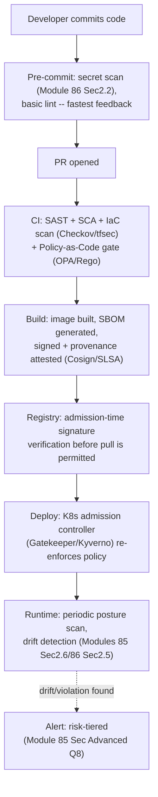
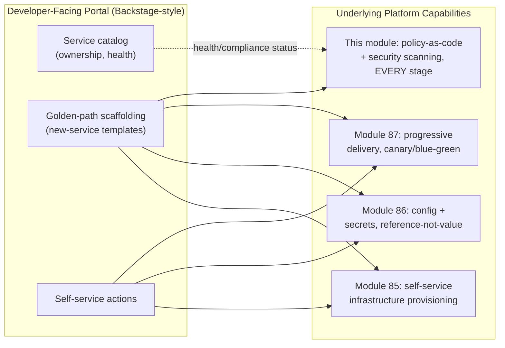
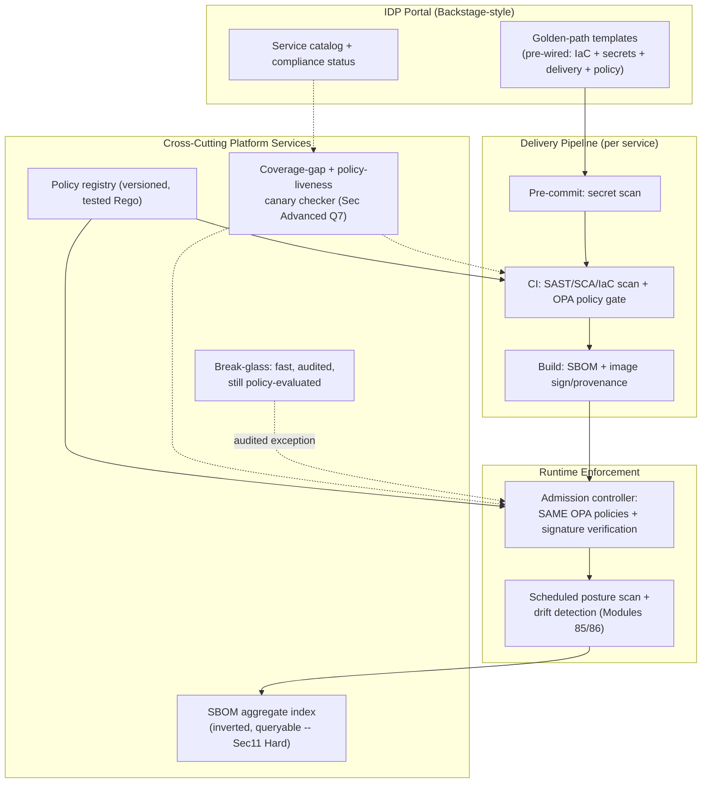
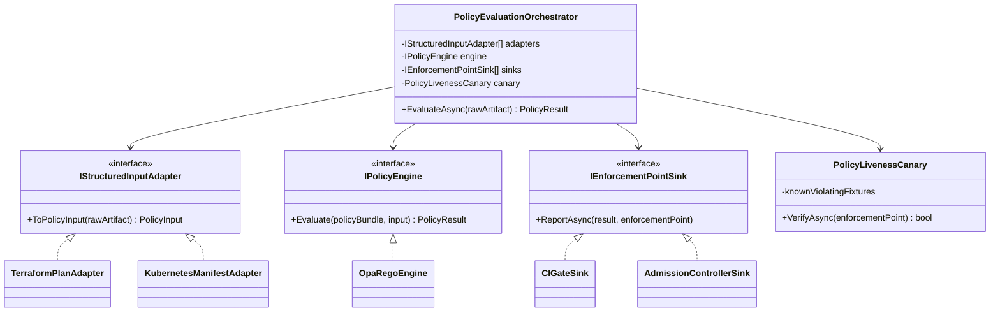

# Module 88 — DevOps: DevSecOps, Policy-as-Code & Platform Engineering (Capstone)

> Domain: DevOps | Level: Beginner → Expert | Prerequisite: All prior DevOps modules (85–87) — this is the synthesizing capstone, directly paralleling [[../21-AWS/08-Observability-Cost-WellArchitectedFramework]], [[../22-Azure/08-Observability-Cost-WellArchitectedFramework]], and [[../23-Kubernetes/08-Observability-Multicluster-GitOps]]'s role in their own domains; [[01-InfrastructureAsCode-Terraform-State-Drift]] §Advanced Q10, [[02-ConfigurationManagement-Secrets-EnvironmentPromotion]] §Advanced Q10, and [[03-ReleaseDeploymentStrategies-BlueGreen-Canary-ProgressiveDelivery]] §Advanced Q10's governance frameworks are the three pillars this capstone unifies into one platform

---

## 1. Fundamentals

**What**: **DevSecOps** integrates security scanning and enforcement throughout the software delivery pipeline (source, build, deploy, runtime) rather than as a single, late-stage gate before production. **Policy-as-Code** codifies security, compliance, and organizational rules as versioned, automatically-evaluated code (via engines like Open Policy Agent/Rego, Conftest, HashiCorp Sentinel) that inspects structured pipeline artifacts (a Terraform plan, a Kubernetes manifest, a container image's metadata) and mechanically accepts or rejects them, rather than relying on a human reviewer's memory of a written standard. **Platform Engineering** is the discipline of building an internal, self-service platform (an Internal Developer Platform, or IDP) that packages infrastructure provisioning, deployment pipelines, observability, and — critically — the security and policy enforcement from the first two concepts, into a paved-road default that product teams consume without needing to independently rebuild or even fully understand the underlying machinery.

**Why it exists**: A security review performed only once, immediately before a production release, finds problems too late to fix cheaply (a fundamentally insecure architectural choice discovered days before a deadline forces a rushed, high-risk late fix) and doesn't scale past a handful of releases per week — exactly the throughput ceiling Module 87 identified for manual review gates. Policy-as-code exists because a written security standard that depends on every engineer remembering and correctly applying it is precisely this course's now-repeated "voluntary compliance underperforms mandatory-by-default enforcement" finding (Module 76 §2.6, Module 80 §2.6, Module 85 §16, Module 86 §16), applied to security and compliance rules specifically. Platform engineering exists because even mechanically-enforced policy, if bolted on as friction atop a difficult, inconsistent path, gets worked around or resented — the durable fix is making the secure, compliant, well-governed path also the *easiest* path, so teams follow it because it's the path of least resistance, not merely because it's mandatory.

**When it matters**: Once an organization has more services and teams than a central security or platform team can review individually — which, per this course's own repeated finding, is a threshold most organizations cross well before they build the governance mechanisms this module describes.

**How (30,000-ft view)**:
```
DevSecOps: security scanning (SAST, dependency/SCA, secret scanning, container image
    scanning, IaC scanning) integrated at EVERY pipeline stage, not one late gate --
    directly generalizing Module 86 Sec 2.2's secret-scanning discussion to the full
    security surface
Policy-as-Code: OPA/Rego (or Conftest/Sentinel) evaluates STRUCTURED input (Terraform
    plan JSON, K8s manifest YAML, CI config) against DECLARATIVE policy -- mechanically
    reproducing what Module 76's Pod Security Admission does for pod specs, generalized
    to ANY structured artifact in the delivery pipeline
Platform Engineering: an Internal Developer Platform (Backstage-style) packages
    self-service provisioning (Module 85 Sec 12), config/secrets (Module 86 Sec 12),
    and progressive delivery (Module 87 Sec 12) into ONE paved-road golden path --
    security/policy enforcement travels WITH the paved road, not as a separate,
    optional add-on teams must remember to bolt on
```

---

## 2. Deep Dive

### 2.1 Shift-Left Security — Scanning at Every Stage, Not One Late Gate
"Shift-left" means moving security detection as early as possible in the delivery lifecycle: **SAST** (static application security testing) scans source code for known vulnerable patterns at commit/PR time; **SCA** (software composition analysis) scans declared dependencies for known-vulnerable versions, ideally blocking a PR that introduces one rather than discovering it in a later audit; **secret scanning** (Module 86 §2.2's pre-commit check, generalized) runs at commit time; **container image scanning** inspects a built image's OS packages and application dependencies for known CVEs before it's ever pushed to a registry teams can pull from; **IaC scanning** (Checkov, tfsec) inspects Terraform/Kubernetes manifests for insecure configurations (an S3 bucket without encryption, a Pod running as root) before `apply`/`kubectl apply` ever executes. The economic argument for shifting left is direct: a vulnerability caught at PR time costs a code review comment; the same vulnerability caught in a production penetration test costs an incident response, and if caught by an actual attacker, costs a breach — the same "detect earlier is exponentially cheaper" principle that makes unit tests worth writing.

### 2.2 Policy-as-Code Engines — Declarative Rules Over Structured Input
Open Policy Agent (OPA) and its Rego policy language provide a general-purpose mechanism: any tool can produce structured JSON output describing what it's about to do (a Terraform `plan -json` describing every resource change, a Kubernetes admission request describing a Pod spec, a CI pipeline's proposed configuration), and OPA evaluates that JSON against a Rego policy returning allow/deny plus a human-readable reason. This is the exact mechanism underlying Kubernetes's own Gatekeeper/Kyverno-based Pod Security enforcement (Module 76 §2.5's admission controllers, now understood as one specific application of the general policy-as-code pattern) — and the same engine, given different structured input, enforces policy against Terraform plans (Module 85's plan-review gate, made mechanical rather than relying on a human reader catching every violation), CI pipeline definitions (blocking a workflow that disables required security scans), and even Open Policy Agent's own Rego test suite (policies are code, and code needs tests — a policy with an untested edge case is exactly Module 85/86's "declared capability, unverified" pattern applied to governance rules themselves).

### 2.3 Software Supply Chain Security — SBOM, SLSA & Provenance
An **SBOM** (Software Bill of Materials) is a machine-readable manifest of every component (direct and transitive dependency, OS package, base image layer) that composes a given artifact — the precondition for answering "are we affected by this newly-disclosed CVE" in minutes rather than days of manual dependency archaeology across every service. The **SLSA framework** (Supply-chain Levels for Software Artifacts) defines graduated levels of build-process integrity guarantees, from "the build is scripted and repeatable" (Level 1) to "the build runs on a hardened, isolated build service with cryptographically verifiable provenance that can't be forged even by someone with source-repo write access" (Level 3+) — directly extending Module 81 §2.1's base-image trust discipline and Module 85 §Advanced Q2's supply-chain pinning into a complete, graduated maturity model. **Image signing** (via Sigstore/Cosign) and **provenance attestation** let a deployment pipeline cryptographically verify "this exact image was built by our CI from this exact commit, with no tampering in between" — closing the gap where an attacker with registry-push access (but not source-repo access) could otherwise substitute a malicious image bearing a legitimate-looking tag.

### 2.4 Policy Enforcement Points — Why One Gate Is Never Enough
A policy enforced at only one point in the pipeline is trivially bypassed at any other point with equivalent capability: a Terraform-plan policy check in CI (Module 85 §12's automated PLAN review) does nothing to stop someone with direct cloud-console access from making the identical change manually; a Kubernetes admission-controller policy (Module 76 §2.5) enforces only what passes through the API server, doing nothing about a change made by directly modifying etcd or by a controller with elevated, unaudited permissions. The structurally sound answer, directly generalizing this course's now-repeated theme, is **defense-in-depth across every enforcement point with actual write capability**: pre-commit (fastest feedback, easiest to bypass — a local git hook), CI/CD pipeline gate (the primary, hardest-to-bypass-in-practice gate for teams following the paved road), admission control at the runtime layer (catching anything that reaches the cluster/cloud API regardless of path), and periodic runtime/posture scanning (catching anything that somehow evaded every prior gate, or drifted after initially passing — directly Module 85 §2.6 and Module 86 §2.5's drift-detection discipline, applied to policy compliance rather than infrastructure/configuration declaration).

### 2.5 Platform Engineering — the Internal Developer Platform (IDP)
An IDP (Backstage being the dominant open-source example) is a self-service catalog and portal unifying what would otherwise be separate, independently-discovered tools: a service catalog (what services exist, who owns them, their current health/deployment status), scaffolding templates (golden-path starters that produce a new service pre-wired with the organization's standard CI/CD pipeline, security scanning, observability instrumentation, and policy compliance already in place — directly the "platform-provisioned defaults" pattern Modules 85/86/87 each independently arrived at, now given one unifying home), and self-service actions (provisioning infrastructure, requesting access, triggering a deployment) exposed through one consistent interface rather than each team independently discovering and integrating with Terraform, the secret store, the CI system, and the progressive-delivery controller separately.

### 2.6 Developer Experience as the Actual Governance Lever
This capstone's central, cross-cutting finding, synthesizing every prior DevOps module's independent arrival at the same conclusion: **a governance capability's real-world effectiveness is determined far more by whether it's the path of least resistance than by how technically sound or how "mandatory" it is on paper.** Module 76's Pod Security Admission stalled nine months not because the policy was wrong, but because enforcement was disruptive friction with no forcing function; Module 85's drift detection only achieved organization-wide coverage once made a mandatory pipeline-template default, not a recommended add-on; Module 86's secret-handling discipline succeeded only once the reference-not-value pattern was *easier* to use than hardcoding (via a low-friction Operator-synced default) — not merely more secure in the abstract. Platform engineering's actual contribution to security and governance isn't a new enforcement mechanism; it's making every other module's enforcement mechanisms so frictionless to adopt that opting out requires *more* effort than complying, inverting the incentive structure that causes voluntary-adoption governance to consistently under-perform.

---

## 3. Visual Architecture

### The Unified Delivery Pipeline — Policy Gates at Every Stage (§2.1, §2.4)


### The Internal Developer Platform — Unifying Modules 85/86/87 Under One Golden Path


---

## 4. Production Example

**Scenario**: A financial-services organization implemented a comprehensive Policy-as-Code gate in CI, blocking any Terraform plan or Kubernetes manifest violating security policy (unencrypted storage, overly permissive IAM, containers running as root) — the gate had a strong adoption record, with zero policy-violating changes reaching production via the standard pipeline for over a year. During a security audit, however, auditors discovered a production Kubernetes cluster running several containers as root, in direct violation of the codified policy. Investigation revealed a platform-team engineer, responding to a genuine production incident under time pressure, had used `kubectl apply` directly against the cluster to deploy an emergency fix — the CI pipeline's policy gate, which only evaluated changes flowing through the standard pipeline, was never consulted, since the emergency change bypassed the pipeline entirely.

**Investigation**: The organization's policy-as-code investment was concentrated entirely at the CI-gate enforcement point (§2.4) with no corresponding admission-controller-level enforcement at the cluster itself — meaning any path to the cluster other than the standard pipeline (direct `kubectl` access, a break-glass emergency procedure, a misconfigured secondary CI system) was structurally invisible to the policy check, regardless of how well-designed or well-tested the Rego policy itself was.

**Root cause**: A single-enforcement-point design, identical in structure to Module 85's out-of-band Terraform change and Module 86's out-of-band `kubectl set env` — the specific artifact differs (a policy-violating manifest rather than a drifted infrastructure value or configuration value), but the underlying architectural gap is the same: **a governance mechanism checked at only one point in a system with multiple write paths only ever covers the traffic that happens to flow through that one point.**

**Fix**: (1) Deploy an admission-controller-level policy enforcement (Gatekeeper/Kyverno) evaluating the *identical* Rego policies already used in CI, ensuring any change reaching the cluster — regardless of path — is checked at the point of actual application, not merely at the point of the standard pipeline's review; (2) establish a documented, audited break-glass procedure for genuine emergencies that still passes through *some* policy evaluation (even a deliberately fast-tracked one) rather than bypassing enforcement entirely; (3) add scheduled runtime posture scanning (§2.4's final layer) as a backstop catching any violation that somehow evaded both CI and admission-control enforcement.

**Lesson**: This course's now-thoroughly-established "declared/enforced-at-one-point ≠ enforced-everywhere-that-matters" theme (Modules 74/75/76/78/79/85/86, now recurring identically in policy-as-code enforcement) has a precise, actionable corollary for security governance specifically: **a policy engine's technical sophistication is irrelevant if it's wired to only one of several available write paths** — the fix is never a better policy, but a more complete map of every path that needs the same policy applied.

---

## 5. Best Practices
- Shift security scanning to the earliest pipeline stage where it can meaningfully act (pre-commit for secrets, PR-time for SAST/SCA/IaC scanning) — earlier detection is exponentially cheaper to remediate (§2.1).
- Enforce policy-as-code at every genuine write path to a resource, not just the standard CI pipeline — admission control as a backstop for anything bypassing CI, exactly closing §4's gap (§2.4).
- Treat Rego/policy-as-code rules as real code requiring tests, versioning, and code review — an untested policy is this course's recurring "declared capability, unverified" pattern applied to governance itself (§2.2).
- Generate and retain SBOMs for every build, enabling rapid CVE-impact assessment across the entire estate rather than manual dependency archaeology during an active disclosure (§2.3).
- Design the platform's golden path so the secure, compliant, well-governed option is also the fastest and least-friction option — adoption follows ease, not mandate alone (§2.6).

## 6. Anti-patterns
- Policy-as-code enforcement wired to only one pipeline stage or write path, leaving any alternate path (direct console/CLI access, an emergency procedure) structurally unchecked (§4).
- Treating shift-left security scanning as a late-CI gate rather than genuinely early (pre-commit/PR-time) feedback, losing most of the cost advantage the practice exists to provide (§2.1).
- A break-glass/emergency-change procedure with no audit trail and no eventual policy re-evaluation, becoming a permanent, undetected bypass rather than a rare, tracked exception (§4).
- Building platform engineering tooling that adds friction atop existing workflows rather than replacing them with something genuinely easier — mandatory tools nobody wants to use get worked around, not adopted (§2.6).
- Treating SBOM generation as a compliance checkbox rather than an operationally-consulted artifact during actual CVE-response incidents (§2.3).

---

## 10. Interview Questions

### Basic (10)

1. **Q: What is DevSecOps?**
   **A:** Integrating security scanning and enforcement throughout the software delivery pipeline (source, build, deploy, runtime) rather than as a single, late-stage gate before production release.
   **Why correct:** Emphasizes the "throughout the pipeline" distribution, not merely "security is now part of DevOps."
   **Common mistakes:** Describing DevSecOps as simply "a security team embedded in DevOps" rather than the specific practice of distributed, early, automated security checks.
   **Follow-ups:** "Why is a single late-stage security gate insufficient?" (A vulnerability found just before release is exponentially more expensive to fix than one found at commit time, and a late gate doesn't scale to high deployment frequency.)

2. **Q: What is policy-as-code?**
   **A:** Codifying security, compliance, and organizational rules as versioned, automatically-evaluated code that inspects structured pipeline artifacts and mechanically accepts or rejects them, rather than relying on a human reviewer applying a written standard from memory.
   **Why correct:** States both the mechanism (code evaluating structured input) and what it replaces (human-memory-dependent manual review).
   **Common mistakes:** Believing policy-as-code is just "writing security rules in a document" — the defining property is automatic, mechanical evaluation, not merely written-down rules.
   **Follow-ups:** "Name a policy-as-code engine." (Open Policy Agent/Rego, Conftest, HashiCorp Sentinel.)

3. **Q: What is an SBOM?**
   **A:** A Software Bill of Materials — a machine-readable manifest of every component (direct and transitive dependency, OS package, base image layer) composing a given artifact.
   **Why correct:** States the precise scope (every component, machine-readable) that makes it useful for rapid CVE-impact assessment.
   **Common mistakes:** Believing an SBOM only lists direct, top-level dependencies rather than the full transitive tree.
   **Follow-ups:** "Why does an SBOM matter during a new CVE disclosure?" (It lets an organization answer "are we affected" in minutes by querying existing SBOMs, rather than manually auditing every service's dependencies.)

4. **Q: What is an Internal Developer Platform (IDP)?**
   **A:** A self-service catalog and portal (Backstage being the dominant example) unifying service discovery, golden-path scaffolding, and self-service infrastructure/deployment actions into one consistent interface.
   **Why correct:** Names the three core capabilities (catalog, scaffolding, self-service actions) rather than describing it vaguely as "a developer tool."
   **Common mistakes:** Treating an IDP as merely a service catalog/wiki, missing the self-service provisioning and golden-path scaffolding that give it its governance value.
   **Follow-ups:** "What does 'golden path' mean?" (A pre-wired, opinionated default template for a new service that already includes standard CI/CD, security scanning, and observability — the path of least resistance is also the compliant one.)

5. **Q: What does SLSA stand for, and what does it define?**
   **A:** Supply-chain Levels for Software Artifacts — a graduated framework defining levels of build-process integrity guarantees, from a scripted, repeatable build (Level 1) to a hardened, isolated build service with cryptographically verifiable, unforgeable provenance (Level 3+).
   **Why correct:** States both the acronym and the graduated-maturity-level structure.
   **Common mistakes:** Treating SLSA as a single pass/fail certification rather than a graduated scale of increasing guarantee strength.
   **Follow-ups:** "What does provenance attestation prove?" (That a specific artifact was built by a specific, trusted build process from a specific source commit, with no tampering in between.)

6. **Q: Why is shift-left security scanning cheaper than a late-stage gate?**
   **A:** A vulnerability caught at commit/PR time costs a code review comment and a quick fix; the identical vulnerability caught during a pre-release audit or, worse, discovered by an attacker in production, costs a rushed emergency fix or a full incident response — the same "detect earlier is exponentially cheaper" economics that justify writing unit tests.
   **Why correct:** States the specific cost-escalation mechanism (fix cost grows with how late detection occurs) rather than a vague "earlier is better."
   **Common mistakes:** Assuming shift-left only benefits developer convenience, missing the direct economic argument for the organization.
   **Follow-ups:** "Name three types of shift-left scanning." (SAST for source code, SCA for dependencies, secret scanning at commit time.)

7. **Q: What does Open Policy Agent (OPA) evaluate, in general terms?**
   **A:** Structured JSON input (describing a proposed change — a Terraform plan, a Kubernetes admission request, a CI pipeline configuration) against a declarative Rego policy, returning an allow/deny decision plus a human-readable reason.
   **Why correct:** States the general input/policy/output model that makes OPA applicable across many different tools and artifact types.
   **Common mistakes:** Believing OPA is Kubernetes-specific — it's a general-purpose engine; Kubernetes admission control (via Gatekeeper) is one specific application of it.
   **Follow-ups:** "What other structured artifacts can OPA evaluate besides Kubernetes admission requests?" (Terraform plan JSON, CI pipeline definitions, any tool producing structured JSON describing a proposed action.)

8. **Q: Why is a policy enforced at only one point in a delivery pipeline insufficient?**
   **A:** Any alternate path with equivalent write capability (direct console access, an emergency change procedure, a secondary CI system) bypasses a single enforcement point entirely, since the policy is never consulted for changes that don't flow through that specific point.
   **Why correct:** States the precise mechanism of the gap (alternate paths simply don't pass through the one checked point).
   **Common mistakes:** Assuming a well-designed CI-level policy gate alone is sufficient, without considering direct-access or emergency-bypass paths.
   **Follow-ups:** "What's the standard defense-in-depth answer?" (Enforce the same policy at every genuine write path — CI gate plus admission control plus periodic runtime posture scanning.)

9. **Q: What is a "golden path" in platform engineering?**
   **A:** A pre-wired, opinionated default for building/deploying a new service — already including standard CI/CD, security scanning, and observability instrumentation — designed so that following it is easier than building an equivalent setup independently.
   **Why correct:** Emphasizes the "easier than the alternative" property, not merely "a recommended way of doing things."
   **Common mistakes:** Treating a golden path as just documentation/guidelines, rather than an actual, runnable scaffold that produces working infrastructure.
   **Follow-ups:** "Why does ease of adoption matter more than documentation quality?" (This course's repeated finding: voluntary, effort-requiring compliance consistently underperforms a frictionless, mandatory-by-default path.)

10. **Q: What is image signing, and what problem does it solve?**
    **A:** Cryptographically signing a built container image (via tools like Cosign) so a deployment pipeline can verify the image genuinely came from the trusted build process and hasn't been tampered with or substituted, closing the gap where someone with registry-push access (but not source-repo access) could otherwise deploy a malicious image under a legitimate-looking tag.
    **Why correct:** States the specific attack the mechanism defends against (registry-level substitution) rather than a vague "image security."
    **Common mistakes:** Confusing image signing with vulnerability scanning — signing verifies provenance/integrity; scanning checks for known CVEs; both matter but address different risks.
    **Follow-ups:** "Where should signature verification be enforced?" (At admission time — the cluster rejecting any image without a valid signature from the trusted build process, not merely as an optional CI-time check.)

### Intermediate (10)

1. **Q: Why does this module argue that "developer experience" is a governance lever, not merely a convenience concern?**
   **A:** Every prior DevOps module in this course independently arrived at the same finding — Module 76's Pod Security Admission stalled for months because enforcement was disruptive friction with no forcing function; Module 85's drift detection only achieved real coverage once mandatory-by-default; Module 86's secret handling succeeded once the secure path was also the low-friction path. A governance mechanism's actual, organization-wide effectiveness tracks far more closely with "is this the path of least resistance" than with "is this technically well-designed" or even "is this officially mandatory" — friction, not intent, is what determines real-world compliance at scale.
   **Why correct:** Synthesizes the specific, independently-arrived-at evidence from three prior modules into the generalized principle, rather than asserting it as an unsupported claim.
   **Common mistakes:** Treating developer experience as a "nice to have" layered on top of "real" governance mechanisms, rather than recognizing it as the actual determinant of whether those mechanisms achieve real coverage.
   **Follow-ups:** "What would disprove this principle?" (A case where a difficult, high-friction control achieved uniformly high compliance purely through strict mandate and enforcement with no workaround possible — rare, but structurally possible if bypass is made technically impossible rather than merely discouraged; §4's admission-controller backstop is exactly this kind of impossible-to-bypass control.)

2. **Q: Why is an untested Rego policy an instance of this course's "declared capability, unverified" theme?**
   **A:** A Rego policy that has never been tested against both compliant and violating example inputs is, functionally, an assumption about what it enforces rather than a verified guarantee — exactly like Module 85/86's untested drift-detector and unexecuted rotation runbook, a policy engine reporting "allow" or "deny" gives false confidence if the policy logic itself contains a bug (an overly narrow match condition that never triggers, an inverted boolean) that was never exercised by a test case designed to catch it.
   **Why correct:** Draws the precise structural parallel (declared-but-unverified) to two specific, already-established findings from prior modules, rather than treating "test your policies" as an unrelated best practice.
   **Common mistakes:** Assuming a policy engine returning consistent "allow"/"deny" results over time is itself proof the policy logic is correct, rather than recognizing this only proves it's been consistently evaluated — not necessarily correctly.
   **Follow-ups:** "How would you structure policy tests?" (Positive tests — known-compliant input should pass; negative tests — known-violating input should fail — mirroring ordinary unit-test discipline, run in CI on every policy change before it's deployed to any enforcement point.)

3. **Q: Why does §4's incident recur the same underlying pattern as Module 85's Terraform drift and Module 86's configuration drift, despite involving policy enforcement rather than infrastructure or configuration state?**
   **A:** In all three cases, a declarative system (a Terraform state, a config repo, a policy-as-code gate) is the authoritative source of truth *for the paths that flow through it* — but each had at least one alternate write path (a manual console change, a `kubectl set env`, a direct `kubectl apply` bypassing CI) that the declarative system had no visibility into or enforcement over. The specific artifact differs (infrastructure state, configuration value, policy compliance), but the structural gap is identical: a system that governs only what passes through it provides no protection against what doesn't.
   **Why correct:** Identifies the shared abstract structure (governance-at-one-point, bypass-via-alternate-path) rather than treating the three incidents as coincidentally similar but fundamentally unrelated.
   **Common mistakes:** Treating each domain's version of this pattern as a unique, domain-specific lesson rather than recognizing and proactively searching for the same structural gap in any new declarative-governance system encountered.
   **Follow-ups:** "What's the general diagnostic question this suggests for any new governance mechanism?" ("What are every possible path to change this resource, and does this mechanism see all of them, or only the standard one?")

4. **Q: How does SLSA's graduated-level structure reflect a risk-tiering philosophy rather than a single pass/fail bar?**
   **A:** SLSA explicitly acknowledges that not every artifact needs the highest level of build-process integrity guarantee — a Level 1 (scripted, repeatable build) may be entirely adequate for a low-risk internal tool, while a Level 3+ (hardened, isolated, cryptographically-provenance-verified build) is justified for artifacts where supply-chain compromise carries severe consequences (a widely-depended-upon shared library, a production financial system's core service) — directly mirroring this course's repeated risk-tiered governance principle (Module 85 §Advanced Q8's plan-review tiering, Module 87 §Advanced Q1's deployment-strategy tiering) rather than a uniform "everything must meet the maximum standard" mandate that would either over-invest in low-risk artifacts or prove practically unadoptable at the highest tier for the entire estate.
   **Why correct:** Connects SLSA's specific graduated-level design to the course's established, repeatedly-validated risk-tiering principle rather than describing it as an arbitrary certification scale.
   **Common mistakes:** Treating SLSA levels as a simple maturity ladder every artifact should eventually climb to the top of, rather than a risk-matched target that legitimately differs by artifact criticality.
   **Follow-ups:** "How would you decide which artifacts warrant SLSA Level 3+ investment?" (The same risk-classification framework Module 87 §Advanced Q1 established for deployment strategy — blast radius and criticality of what depends on the artifact, not a uniform organization-wide default.)

5. **Q: Why might a platform team's golden-path scaffolding accidentally become a new single point of failure for security posture, and how would you mitigate this?**
   **A:** If every new service is scaffolded from one shared template, a security flaw baked into that template (an outdated base image, a misconfigured default IAM policy, a missing security scan step) is instantly replicated across every service using it — the platform-provisioned-default pattern that makes governance scale well also means a template defect scales identically, all at once, rather than being contained to one team's independent mistake. Mitigation: treat golden-path templates with the same change-management rigor as a shared, widely-depended-upon library (Module 85 §17's module-registry governance) — versioned, reviewed, with a defined update/re-scaffold process for existing services when the template's security baseline improves, and periodic auditing of already-scaffolded services against the current template's standards to catch drift from services scaffolded under an older, less secure template version.
   **Why correct:** Identifies the specific mechanism (shared template = shared defect blast radius) and a concrete mitigation (library-grade change management plus periodic re-audit) rather than treating golden paths as risk-free simply because they promote good defaults.
   **Common mistakes:** Assuming a golden path is unconditionally safer than ad-hoc per-team setups, without considering that its defects, when they occur, are now organization-wide rather than isolated.
   **Follow-ups:** "How would you handle updating already-scaffolded services when a golden-path template's security baseline improves?" (A defined, tracked migration process — directly analogous to Module 86 §Advanced Q10's rotation-drilling and Module 85's module-version-pinning discipline — rather than assuming existing services automatically benefit from a template improvement they were scaffolded before.)

6. **Q: A team argues that since their CI pipeline blocks any PR containing a high-severity SCA (dependency) finding, they don't need container image scanning as a separate step. Evaluate this.**
   **A:** SCA scans the application's *declared* dependencies (package manifests) at the source level; container image scanning inspects the *actual, built* image, including the base OS image's packages and any dependencies introduced during the build process itself (a base image with an outdated, vulnerable OS package that was never a declared application dependency at all) — these are different artifact scopes, and a vulnerability in the base image or a build-time-introduced package is invisible to SCA entirely. The two checks are complementary, not redundant, exactly this module's "policy/scanning at only one point misses what that point doesn't cover" theme, applied to scan-scope rather than pipeline-stage.
   **Why correct:** Precisely distinguishes what each scan type actually covers (declared source dependencies vs. the full built-image contents) rather than treating "we scan for vulnerabilities" as one undifferentiated practice.
   **Common mistakes:** Assuming any dependency-vulnerability scanning covers the full risk surface, without considering that base-image and build-time-introduced components sit entirely outside SCA's scope.
   **Follow-ups:** "What's a vulnerability class only container image scanning would catch?" (An outdated, vulnerable version of a system library — e.g., OpenSSL — baked into the base OS image, never declared as an application dependency anywhere the SCA tool inspects.)

7. **Q: Why does a break-glass emergency-change procedure need its own, lighter-weight policy evaluation rather than either full enforcement or no enforcement at all?**
   **A:** Full, unmodified enforcement during a genuine, time-critical incident recreates exactly the friction this course's developer-experience finding (§2.6, Intermediate Q1) predicts will be worked around — an engineer under pressure to restore service will bypass a slow, blocking check regardless of its correctness, exactly as §4's incident occurred. No enforcement at all recreates §4's original gap entirely. The resolution is a distinct, fast-tracked evaluation path — still policy-aware (flagging genuinely dangerous changes, like exposing a database publicly, even under emergency conditions) but tuned for speed and requiring mandatory post-hoc review and, if a policy was overridden, mandatory rapid remediation — treating emergency access as an audited, bounded exception rather than either a full block or an invisible bypass.
   **Why correct:** Explains why neither extreme (full enforcement or none) is workable under genuine time pressure, and proposes the specific middle path (fast, still policy-aware, mandatorily audited and remediated).
   **Common mistakes:** Assuming the fix for §4's incident is simply "enforce policy even during emergencies, no exceptions" — this ignores the realistic behavioral response to blocking friction during an active incident, which is bypass, not compliance.
   **Follow-ups:** "What would you audit specifically after a break-glass change?" (Whether the change was genuinely policy-violating and, if so, whether it's been remediated or formally accepted as a documented, time-bound exception — not merely that the break-glass procedure was used.)

8. **Q: How does an SBOM's value change between the moment it's generated and months later, during a new CVE disclosure?**
   **A:** At generation time, an SBOM is simply an accurate manifest of what a specific build contains — its real value is realized later and repeatedly, whenever a new vulnerability is disclosed in some widely-used component: an organization with SBOMs for every deployed artifact can immediately, mechanically query "which of our services include this vulnerable component, at this vulnerable version" across its entire estate, rather than manually auditing each service's dependency tree under time pressure during an active disclosure. This means SBOM generation without a corresponding query/inventory capability captures only half the value — the artifact must be retained and made searchably queryable across the estate, not merely generated and archived per-build with no aggregate view.
   **Why correct:** Distinguishes SBOM generation (necessary but insufficient) from SBOM aggregation/queryability (where the actual operational value during a CVE response is realized).
   **Common mistakes:** Treating SBOM generation alone as satisfying the practice's purpose, without building the aggregate query capability that makes it operationally useful during an actual incident.
   **Follow-ups:** "What's the failure mode of generating SBOMs without an aggregate query system?" (During a real CVE disclosure, the organization still has to manually inspect individual SBOM files one service at a time — no faster than the manual dependency archaeology SBOMs exist to eliminate.)

9. **Q: Why does provenance attestation (§2.3) matter even for an organization that already scans every image for known CVEs before deployment?**
   **A:** CVE scanning verifies the image's *contents* are free of known vulnerabilities at scan time; provenance attestation verifies the image's *origin* — that it was genuinely built by the trusted CI process from the expected source commit, not substituted or tampered with after the fact. A malicious actor with registry-push access (but not source-repo or CI access) could push a vulnerability-free but nonetheless malicious or unauthorized image bearing a legitimate tag — CVE scanning alone would find it "clean" since it isn't checking for known vulnerabilities the attacker's image doesn't happen to contain, only signed provenance verification catches the substitution itself, regardless of the substituted image's vulnerability content.
   **Why correct:** Distinguishes the specific threat model each control addresses (content-vulnerability vs. origin-authenticity) and shows they're non-overlapping, complementary protections.
   **Common mistakes:** Assuming "the image passed vulnerability scanning" is equivalent to "the image is trustworthy," without considering that a scan says nothing about whether the image is the one the organization's own build process actually produced.
   **Follow-ups:** "Where should provenance verification be enforced, and why does enforcement location matter here too?" (At admission time in the cluster, rejecting unsigned or invalidly-signed images regardless of path — exactly §2.4's defense-in-depth principle, since CI-time-only verification would miss an image substituted after CI but before deployment.)

10. **Q: How does this capstone's synthesis of Modules 85–87 demonstrate that the DevOps domain's individual findings compose into one coherent governance philosophy rather than three unrelated sets of best practices?**
    **A:** Module 85 established that infrastructure drift requires either eliminating alternate write paths or continuously reconciling against them, and that mandatory-by-default governance beats voluntary adoption; Module 86 found the identical pattern recurring in application configuration, adding that a documented-but-unexercised capability (a rotation runbook) is unverified until actually drilled; Module 87 found the same "declared/mechanical success ≠ actual correctness" pattern in deployment validation itself. This capstone's contribution is showing these aren't three separate lessons about three separate artifact types, but one underlying principle — **governance mechanisms must (a) cover every genuine path with write/change capability, (b) be verified through actual exercise rather than assumed correct because documented, and (c) be adopted through frictionless defaults rather than mandate alone** — applied consistently across infrastructure, configuration, deployment, and now security/policy enforcement, because the same organizational and technical forces (multiple write paths, unverified assumptions, friction-driven non-adoption) recur regardless of which specific artifact a given control governs.
    **Why correct:** Explicitly names the three unifying sub-principles and shows how each prior module instantiated all three in its own domain, rather than merely restating that the modules are "related."
    **Common mistakes:** Treating each DevOps module's findings as domain-specific tips (Terraform tips, secrets tips, deployment tips) rather than recognizing the shared underlying governance philosophy that would predict the same failure modes in a not-yet-encountered fifth domain.
    **Follow-ups:** "If you encountered a new, fifth governance domain this course hasn't covered, what would you predict and check for first?" (Every genuine write/change path to the governed resource, whether any control's success criterion has actually been exercised under real conditions rather than merely documented, and whether the compliant path is also the easiest one — the same three-part diagnostic this synthesis distilled.)

### Advanced (10)

1. **Q: Diagnose §4's incident from first principles and design the complete structural fix — not merely adding an admission controller.**
   **A:** Root cause: policy-as-code investment concentrated at a single enforcement point (CI) with no admission-time backstop, combined with an emergency-change culture that had no audited, policy-aware fast path, meaning the *only* way to make an urgent change was a full bypass of governance entirely rather than a faster, still-checked path. Structural fix: (1) deploy admission-controller-level enforcement (Gatekeeper/Kyverno) evaluating the identical Rego policies used in CI, closing the specific gap; (2) establish a documented, audited break-glass procedure (Intermediate Q7) providing a genuinely fast but still policy-aware emergency path, removing the behavioral incentive to bypass governance entirely under pressure; (3) add scheduled runtime posture scanning as a final backstop catching anything that evades both CI and admission control; (4) conduct a full audit of every other resource type/environment for the same single-enforcement-point gap, since the specific incident (containers running as root) is one instance of a pattern that could recur via any other policy category with the same architectural gap.
   **Why correct:** Addresses the immediate gap, the behavioral/cultural cause (no fast-but-safe emergency path), and the systemic risk that the same architectural gap exists for other policy categories not yet discovered via incident.
   **Common mistakes:** Fixing only the specific root-container-privilege violation without addressing the single-enforcement-point architecture or the emergency-change culture that made bypass the only available fast option.
   **Follow-ups:** "Why is the break-glass procedure's design as important as the admission-controller fix itself?" (Without it, admission control alone might simply push the next emergency into a *different* bypass mechanism — a false "fixed" status if the underlying pressure to bypass governance under time constraint isn't also addressed.)

2. **Q: A platform team proposes measuring "developer happiness" (survey-based) as the primary success metric for their Internal Developer Platform, arguing that a happy developer experience is the whole point of platform engineering. Evaluate this as a Principal Engineer.**
   **A:** Developer experience is a genuinely important lever (§2.6) but as a *sole* metric it's dangerously incomplete: a platform could achieve high survey satisfaction by being permissive and low-friction while quietly failing to enforce the security/compliance/reliability guarantees it exists to provide — the same failure mode as a canary deployment that always "passes" quickly (Module 87 §Advanced Q2) being a red flag rather than evidence of success. The correct measurement combines developer-experience signals (adoption rate of golden paths, time-to-first-deployment for a new service, survey satisfaction) *with* governance-outcome signals (percentage of services meeting security/compliance baselines, drift-detection coverage, policy-violation rates caught at each enforcement layer) — developer experience is the *mechanism* by which adoption (and therefore governance coverage) is achieved, not a replacement success criterion for the governance outcomes themselves.
   **Why correct:** Affirms developer experience's genuine importance while identifying the specific risk of treating it as a sufficient, standalone metric, and proposes a combined measurement framework.
   **Common mistakes:** Either dismissing developer-experience metrics as irrelevant "soft" measures, or accepting them as sufficient on their own without pairing them against actual governance-coverage outcomes.
   **Follow-ups:** "What would be a warning sign that a platform is optimizing for happiness at governance's expense?" (High golden-path adoption and satisfaction scores paired with declining or stagnant compliance-baseline coverage — adoption of a path that isn't actually enforcing what it's meant to.)

3. **Q: Design a policy-as-code testing strategy that would have caught a Rego policy bug where a condition intended to block public S3 buckets only matched buckets with a specific, uncommon naming convention due to a regex error, allowing most non-compliant buckets through undetected for months.**
   **A:** The gap reveals the policy's test suite (if any existed) likely tested only the "happy path" (a clearly-compliant bucket configuration correctly passing) without a comprehensive set of negative test cases spanning realistic variation in how a violating configuration might actually appear in practice — a single narrow negative test case (one specific violating example matching the buggy regex) would have passed, masking the broader gap. Strategy: require every policy to have both positive tests (representative compliant configurations, across realistic variation, correctly passing) and a *diverse* set of negative tests (multiple, meaningfully different ways a configuration could violate the policy — different bucket-naming patterns, different ways public access could be granted) specifically designed to exercise the policy's matching logic across its plausible input space, not just one canonical violating example; additionally, periodically audit the policy against a sample of real, already-deployed resources (not just synthetic test fixtures) to catch cases where production reality diverges from what the test suite's authors anticipated.
   **Why correct:** Identifies the specific gap (narrow negative-test coverage, missing the actual regex bug's blind spot) and proposes both broader synthetic test diversity and real-production-sample auditing as complementary safeguards.
   **Common mistakes:** Assuming any negative test case is sufficient proof a policy correctly blocks the violation category it's meant to catch, without considering whether the test's specific example happens to avoid exercising the actual bug.
   **Follow-ups:** "Why is auditing against real production resources valuable even with a thorough synthetic test suite?" (Real-world configurations often contain variation and edge cases synthetic test authors didn't anticipate — exactly the gap that let this bug persist undetected for months despite presumably passing whatever tests existed.)

4. **Q: How should an organization decide the appropriate SLSA level to target for a shared, internally-published library consumed by dozens of other services, versus a standalone internal tool used by one team?**
   **A:** The shared library's blast radius if compromised is every consuming service — a supply-chain compromise there propagates identically to how a golden-path template defect propagates (Intermediate Q5), justifying SLSA Level 3+ investment (hardened, isolated build, verifiable provenance) proportional to that multiplicative risk. The standalone single-team tool's blast radius is bounded to that one team's usage — SLSA Level 1–2 (a scripted, repeatable, but not maximally hardened build) is likely proportionate, since the cost of Level 3+'s additional build infrastructure and process rigor isn't justified by a bounded, single-consumer risk profile. This is the identical risk-tiering logic Module 87 §Advanced Q1 applied to deployment-strategy selection and Module 85 §Advanced Q8 applied to plan-review rigor, now applied to build-integrity investment specifically — match the control's cost to the artifact's actual blast radius, not a uniform target across artifacts with very different consumption footprints.
   **Why correct:** Applies the established risk-tiering framework precisely, using "blast radius if compromised" (a function of consumer count) as the specific dimension driving the SLSA-level decision.
   **Common mistakes:** Mandating a single SLSA level organization-wide regardless of an artifact's actual consumption footprint, either over-investing in low-blast-radius tools or under-investing in widely-shared libraries.
   **Follow-ups:** "How would you identify which artifacts have the widest consumption footprint, to prioritize SLSA investment?" (A dependency graph derived from SBOMs across the estate — directly connecting §2.3's SBOM practice to this risk-tiering decision, since SBOMs make "which artifacts does everything else depend on" a queryable fact rather than tribal knowledge.)

5. **Q: A security team wants every policy-as-code violation, regardless of severity, to hard-block the pipeline with no override mechanism, arguing that any exception undermines the policy's integrity. Evaluate this position as a Principal Engineer.**
   **A:** Absolute, override-free blocking for every severity level recreates the exact friction-driven bypass risk this module's developer-experience finding predicts (§2.6, §Advanced Q1) — a low-severity, context-dependent finding that genuinely doesn't apply to a specific legitimate scenario, with no override path, incentivizes teams to route around the policy engine entirely (disabling the check, using an unmonitored alternate path) rather than accept a blocked pipeline for a finding they've correctly assessed as a false positive or acceptable risk in context. The more durable design is risk-tiered response: high-severity, near-universally-applicable violations (public database exposure, root-privileged containers) hard-block with no override; lower-severity or context-dependent findings support a documented, audited, time-bound override (requiring an explicit justification and an accountable approver) rather than either a silent bypass or an inflexible block that drives teams toward disabling the check altogether. Absolute rigidity, paradoxically, tends to produce *less* actual governance coverage than a system offering a legitimate, audited exception path, because it makes bypassing the entire mechanism the only available option when a genuine edge case arises.
   **Why correct:** Recognizes the behavioral risk of zero-flexibility policy enforcement and proposes a risk-tiered, audited-override design that preserves both flexibility for genuine edge cases and full audit visibility, rather than accepting the security team's absolutist framing at face value.
   **Common mistakes:** Either accepting "no exceptions ever" as unconditionally the most secure design, or conceding to unrestricted, undocumented override capability that undermines the policy entirely.
   **Follow-ups:** "What would you audit about override usage to detect whether the mechanism is being misused?" (Override frequency and pattern per team/policy — a team overriding the same finding repeatedly signals either a policy that's miscalibrated for their legitimate use case, warranting a policy refinement, or a team that's not addressing a genuine, recurring risk, warranting closer review.)

6. **Q: Design the platform-engineering onboarding experience for a newly-acquired team (per Module 86 §16's acquisition scenario) whose existing services predate the organization's golden-path standards entirely, given that a full immediate re-scaffold is impractical.**
   **A:** Immediate, full re-scaffolding of an acquired team's existing production services carries its own real risk (introducing instability into working systems purely for standards-compliance reasons) — the more measured approach: (1) onboard the *team* onto the IDP for all *new* work immediately (new services scaffolded from the golden path from day one, no legacy constraint); (2) for existing services, run non-invasive assessment (policy-as-code evaluation, SBOM generation, drift/posture scanning) against them as-is, without requiring any change, purely to establish an honest baseline of their current compliance gap — directly Module 86 §16's expectation that onboarding surfaces pre-existing debt rather than creating new debt; (3) prioritize remediation of the highest-severity findings from that baseline first (a hard-blocking security issue) while treating full golden-path migration for lower-severity gaps as a scheduled, tracked, but not emergency-paced initiative; (4) communicate the expected initial spike in findings explicitly to leadership as the platform correctly surfacing previously-invisible risk, not as a sign the acquisition or the platform onboarding is going poorly.
   **Why correct:** Balances immediate governance coverage for new work against realistic, risk-prioritized remediation for existing services, explicitly drawing on Module 86 §16's finding about onboarding surfacing pre-existing debt.
   **Common mistakes:** Either mandating an immediate, disruptive full re-scaffold of every legacy service, or indefinitely exempting acquired legacy services from governance with no remediation plan or timeline at all.
   **Follow-ups:** "How would you sequence remediation across many findings without overwhelming the newly-onboarded team?" (Risk-tiered prioritization — the same framework Advanced Q4 and Module 85 §Advanced Q8 established — addressing the highest-blast-radius findings first rather than either an undifferentiated full list or an arbitrary order.)

7. **Q: How would you detect whether your organization's policy-as-code coverage has silently degraded over time, given that a policy that has never fired a violation could mean either "everything is compliant" or "the policy has stopped evaluating correctly"?**
   **A:** This is the identical ambiguity Module 85 §Intermediate Q5 identified for drift-detection history and Module 86's rotation-runbook question — a clean record is evidence bounded by whether the detection mechanism is actually functioning, not proof of the underlying condition. Detection requires deliberately, periodically injecting a known-violating test case into the actual enforcement pipeline (not just a separate test suite) and confirming it's still correctly caught — a "canary policy violation," analogous in spirit to chaos-engineering practices, that would be caught if the policy engine is functioning and would silently pass through undetected if enforcement has degraded (a misconfigured webhook, an expired certificate breaking admission-controller communication, a policy accidentally disabled during an unrelated change). Absent this deliberate, periodic verification, "zero violations found" and "the policy stopped working three months ago" are indistinguishable from the available evidence alone.
   **Why correct:** Applies the established "declared capability, unverified" diagnostic precisely to policy-as-code enforcement, and proposes the specific mechanism (periodic injected test violations against the live pipeline) that resolves the ambiguity.
   **Common mistakes:** Treating a zero-violation history as straightforwardly reassuring, without considering that policy-engine malfunction produces the identical observable signal as genuine full compliance.
   **Follow-ups:** "Why must the test violation be injected against the actual live enforcement pipeline, rather than just re-running the policy's own test suite?" (The policy's test suite verifies the Rego logic itself is correct; it says nothing about whether the *deployed, live* enforcement point — the actual admission-controller webhook, the actual CI gate — is still correctly wired, reachable, and invoked, which is a separate, equally critical failure mode.)

8. **Q: A team's golden-path-scaffolded service passes every automated policy check in CI and at admission control, yet a manual penetration test finds a significant security flaw in the application's own business logic (an authorization bypass unrelated to any infrastructure/configuration misconfiguration). Does this indicate a failure of the platform engineering and policy-as-code investment described in this module?**
   **A:** No — and recognizing why is important: policy-as-code and the golden path, as described in this module, are designed to catch infrastructure, configuration, and supply-chain-level risks (misconfigured resources, vulnerable dependencies, unsigned images, insecure default settings) — they are not, and are not intended to be, a substitute for application-level security practices (secure code review, threat modeling, penetration testing) addressing business-logic vulnerabilities specific to what a given service actually does. Concluding "governance failed" from this finding would incorrectly extend this module's scope to a risk category it was never designed to cover, and — more dangerously — might lead to under-investing in the actually-needed complementary practice (application security testing) on the mistaken belief that policy-as-code coverage already handles it.
   **Why correct:** Precisely scopes what policy-as-code/platform engineering does and doesn't cover, preventing a scope-confusion conclusion that would misdirect remediation investment.
   **Common mistakes:** Either concluding the entire governance investment described in this module is worthless because it didn't catch this specific finding, or conversely assuming policy-as-code coverage is comprehensive enough that dedicated application security testing becomes unnecessary.
   **Follow-ups:** "What would a genuinely complete security program add alongside this module's infrastructure/supply-chain-focused controls?" (Threat modeling and secure-code-review practices specifically targeting business-logic and authorization correctness — a distinct discipline this module's policy-as-code/platform-engineering scope doesn't claim to replace.)

9. **Q: Design the platform's approach to policy exceptions for a genuinely legacy, business-critical service that cannot feasibly meet the current security baseline (e.g., it depends on an unsupported runtime that cannot be upgraded without a multi-quarter rewrite), without simply exempting it from all governance indefinitely.**
   **A:** Rather than a binary "exempt" or "block" (blocking a business-critical service outright is often organizationally untenable, while indefinite silent exemption recreates §4's uncovered-write-path risk in spirit), establish a **documented, time-bound, compensating-controls exception**: the specific gaps are enumerated explicitly (not vaguely "grandfathered"), compensating controls are put in place to reduce the actual risk the missing baseline control would have addressed (additional network isolation, enhanced monitoring specifically around the known-gap's failure modes, restricted access), and the exception carries an explicit expiration/review date tied to a genuine remediation plan (the runtime upgrade's tracked timeline) — converting an open-ended, silent gap into a tracked, actively-managed risk with a visible end date and interim mitigations, directly the same "audited, bounded exception rather than either extreme" pattern Advanced Q5 established for policy overrides, applied at the whole-service level rather than per-finding.
   **Why correct:** Rejects both unworkable extremes (outright block of a business-critical service, or indefinite silent exemption) in favor of a structured, time-bound, compensating-control exception with genuine remediation tracking.
   **Common mistakes:** Either accepting an indefinite, undocumented exemption ("it's legacy, we'll deal with it eventually") or insisting on an immediate hard block that ignores the service's genuine business criticality and the impracticality of instant remediation.
   **Follow-ups:** "Why does the exception need an expiration date even if the remediation timeline is genuinely uncertain?" (An expiration forces periodic, deliberate re-evaluation rather than the exception silently becoming permanent by default — the same forcing-function principle that makes mandatory-by-default enforcement effective elsewhere in this course.)

10. **Q: As a Principal Engineer completing this entire DevOps domain (Modules 85–88), synthesize the complete governance framework you would establish for an organization building its platform engineering and DevSecOps capability from scratch, prioritizing what to build first.**
    **A:** Sequence, prioritized by risk-reduction-per-unit-effort: (1) **shift-left secret scanning and basic SAST/SCA at commit/PR time** (Module 86 §Advanced Q10, §2.1 here) — cheapest to implement, highest-severity single-incident risk class addressed first, no dependency on other capabilities. (2) **Bounded-context infrastructure provisioning with mandatory drift detection** (Module 85's full framework) — establishes the infrastructure foundation everything else runs on, with governance built in from the start rather than retrofitted. (3) **Reference-not-value secrets with dual-overlap rotation, drilled** (Module 86's full framework) — closes the credential-handling risk class before scaling team count makes ad-hoc practices harder to unwind. (4) **Risk-tiered deployment strategy with business-metric-aware canary analysis** (Module 87's full framework) — once infrastructure and secrets are governed, deployment-behavioral-correctness becomes the next-highest-leverage gap. (5) **Policy-as-code enforced at every write path (CI + admission control + runtime scanning), with a golden-path IDP making the compliant path the easiest path** (this module) — layered last specifically because it depends on the prior four capabilities existing as the actual *substance* being policy-checked; a policy engine with nothing well-architected underneath to enforce policy over has little to work with. Each layer's governing philosophy — cover every write path, verify (don't just document) every capability, and make compliant the path of least resistance — is the same three-part principle this capstone (§Intermediate Q10) distilled from the whole domain, applied consistently as the organization builds each successive layer.
    **Why correct:** Provides an explicit, risk-ordered build sequence across the entire domain rather than treating all four modules' practices as simultaneously equal-priority, and ties the sequencing logic back to the capstone's own unifying three-part principle.
    **Common mistakes:** Proposing all capabilities as equally urgent day-one requirements, or sequencing policy-as-code/platform engineering first despite it having little substantive infrastructure/configuration/deployment practice yet to actually enforce policy over.
    **Follow-ups:** "Why does policy-as-code enforcement genuinely depend on the prior three capabilities existing first, rather than being buildable independently and in parallel?" (Policy-as-code checks *what infrastructure, configuration, and deployment practices actually exist* — without governed, consistent underlying practices to check, a policy engine has an inconsistent, ad-hoc landscape to evaluate, producing either an unmanageable volume of findings or policies too loose to be meaningful; the prior three modules establish the substance this module's enforcement layer needs in order to be effective rather than merely decorative.)

---

## 11. Coding Exercises

### Easy — Rego-style policy evaluator for a simple "no public storage" rule (§2.2)
**Problem:** Given a structured representation of a cloud storage resource (a simplified stand-in for Terraform plan JSON), evaluate whether it violates a "storage must not be publicly accessible" policy, returning a clear allow/deny with reason.

```csharp
public sealed record StorageResource(string Name, bool PublicAccessEnabled, bool EncryptionEnabled);

public sealed record PolicyResult(bool Allowed, string Reason);

public static class StoragePolicyEvaluator
{
    public static PolicyResult Evaluate(StorageResource resource)
    {
        if (resource.PublicAccessEnabled)
            return new PolicyResult(Allowed: false,
                $"Resource '{resource.Name}' violates policy: public access must not be enabled.");

        if (!resource.EncryptionEnabled)
            return new PolicyResult(Allowed: false,
                $"Resource '{resource.Name}' violates policy: encryption at rest must be enabled.");

        return new PolicyResult(Allowed: true, "Compliant.");
    }
}
```
**Time complexity:** O(1) per resource.
**Space complexity:** O(1).
**Optimized solution:** For evaluating an entire Terraform plan (many resources), evaluate each independently and aggregate all violations into one report rather than failing fast on the first violation — a plan with five violations should surface all five in one pass, not require five separate plan/fix/re-run cycles, directly the same "report all findings, don't stop at the first" principle real policy-as-code engines (OPA) implement natively via their rule-evaluation-over-a-collection semantics.

### Medium — Multi-enforcement-point policy coverage checker (§2.4, §4)
**Problem:** Given a list of resource types and the set of enforcement points (CI gate, admission control, runtime scan) that currently evaluate policy for each, identify any resource type with a coverage gap — specifically, any resource type covered by CI but not by admission control, which is exactly §4's incident shape.

```csharp
public enum EnforcementPoint { CIGate, AdmissionControl, RuntimeScan }

public sealed record CoverageGap(string ResourceType, string Description);

public static class PolicyCoverageAnalyzer
{
    public static IReadOnlyList<CoverageGap> FindGaps(
        IReadOnlyDictionary<string, HashSet<EnforcementPoint>> coverageByResourceType)
    {
        var gaps = new List<CoverageGap>();

        foreach (var (resourceType, points) in coverageByResourceType)
        {
            bool hasCiGate = points.Contains(EnforcementPoint.CIGate);
            bool hasAdmissionControl = points.Contains(EnforcementPoint.AdmissionControl);
            bool hasRuntimeScan = points.Contains(EnforcementPoint.RuntimeScan);

            if (hasCiGate && !hasAdmissionControl)
                gaps.Add(new CoverageGap(resourceType,
                    "Covered by CI gate but not admission control -- " +
                    "a direct-apply bypass of CI is entirely unchecked (Sec4's exact gap)."));

            if (!hasCiGate && !hasAdmissionControl && !hasRuntimeScan)
                gaps.Add(new CoverageGap(resourceType,
                    "No enforcement point at all covers this resource type."));

            if ((hasCiGate || hasAdmissionControl) && !hasRuntimeScan)
                gaps.Add(new CoverageGap(resourceType,
                    "No runtime posture scan backstop -- drift after initial " +
                    "compliant deployment would go undetected."));
        }

        return gaps;
    }
}
```
**Time complexity:** O(r) where r is the number of resource types.
**Space complexity:** O(g) where g is the number of gaps found.
**Optimized solution:** Extend the checker to weight gaps by the resource type's actual risk tier (directly Advanced Q4's blast-radius reasoning) so the output is a prioritized remediation list, not merely an unordered gap inventory — a CI-only-covered, high-blast-radius resource type (production databases) should surface above a CI-only-covered, low-risk resource type in the report's ordering.

### Hard — SBOM-based CVE impact query across a service estate (§2.3, §Intermediate Q8)
**Problem:** Given a collection of per-service SBOMs (each a list of component name/version pairs) and a newly-disclosed CVE affecting a specific component within a version range, identify every affected service — the exact operational query an SBOM aggregation capability must answer quickly during a real disclosure.

```csharp
public sealed record Component(string Name, string Version);
public sealed record ServiceSbom(string ServiceName, IReadOnlyList<Component> Components);
public sealed record VulnerableRange(string ComponentName, Version MinInclusive, Version MaxExclusive);

public static class SbomCveImpactAnalyzer
{
    public static IReadOnlyList<string> FindAffectedServices(
        IReadOnlyList<ServiceSbom> allSboms, VulnerableRange vulnerability)
    {
        var affected = new List<string>();

        foreach (var sbom in allSboms)
        {
            foreach (var component in sbom.Components)
            {
                if (!string.Equals(component.Name, vulnerability.ComponentName,
                        StringComparison.OrdinalIgnoreCase))
                    continue;

                if (!Version.TryParse(component.Version, out var parsedVersion))
                    continue; // Non-semver version strings need a fallback matcher in production.

                if (parsedVersion >= vulnerability.MinInclusive &&
                    parsedVersion < vulnerability.MaxExclusive)
                {
                    affected.Add(sbom.ServiceName);
                    break; // Found the vulnerable component in this service; no need to scan further.
                }
            }
        }

        return affected;
    }
}
```
**Time complexity:** O(s × c) where s is the number of services and c is the average component count per SBOM — a full linear scan; acceptable for periodic/on-demand queries but not for a large estate needing sub-second interactive response.
**Space complexity:** O(a) for the affected-services result list.
**Optimized solution:** Pre-build an inverted index (component name → list of services depending on it, built once whenever SBOMs are ingested, not per query) so a CVE-impact query becomes an O(k) lookup (k = services depending on that specific component) followed by version-range filtering only within that already-narrowed set, rather than scanning every service's full SBOM on every query — the difference between an "immediately queryable during an active disclosure" capability and one too slow to be operationally useful at exactly the moment it matters most.

---

## 12. System Design

**Prompt:** Design a unified DevSecOps and platform engineering system for an organization with hundreds of services, integrating policy-as-code enforcement, supply-chain security, and a self-service Internal Developer Platform — synthesizing Modules 85, 86, and 87's individual platform components into one coherent whole.

**Functional requirements:** A service catalog with ownership and compliance-status visibility; golden-path scaffolding producing new services pre-wired with Module 85's infrastructure provisioning, Module 86's secrets handling, Module 87's progressive-delivery configuration, and this module's policy/scanning defaults; policy-as-code enforcement at CI, admission-control, and runtime-scan layers uniformly; SBOM generation and aggregate query capability; a documented, audited break-glass exception path.

**Non-functional requirements:** Policy evaluation latency must not materially slow the standard developer workflow (§2.6's friction concern); the platform must scale to onboard new teams without linear central-team involvement per team (Module 85 §12's self-service principle); coverage gaps (Advanced Q7's silent-degradation risk) must be actively, continuously verified, not merely assumed from a clean historical record.

**Architecture:**


**Database/state selection:** The policy registry (versioned Rego policies) lives in git, tested in CI before deployment to any enforcement point — identical governance to Module 85's module registry. The SBOM index is a dedicated, queryable store (inverted index per §11 Hard) distinct from the SBOMs' generation-time artifact storage, optimized specifically for the "which services are affected by this CVE" query pattern.

**Caching:** Admission-controller policy evaluation should cache compiled Rego policy bundles (recompiling on every admission request would add unacceptable latency) with cache invalidation tied to policy-registry version changes, not a blind TTL.

**Messaging:** Policy violations, coverage-gap findings, and break-glass usage all route through the organization's alerting infrastructure, risk-tiered exactly as every prior DevOps module established.

**Scaling:** New team onboarding requires only using an existing golden-path template (or, if a new template is needed, one platform-team-reviewed addition to the shared template catalog) — no per-team custom policy/scanning integration work, directly Module 85 §12's self-service scaling principle extended across this entire unified system.

**Failure handling:** Per Advanced Q7, the coverage-audit component periodically injects known-violating synthetic test cases against the *live* CI gate and admission controller specifically (not merely the policy's own unit-test suite) to detect silent enforcement degradation — treated as a first-class, alertable platform health signal, not an afterthought.

**Monitoring:** Golden-path adoption rate per team (developer-experience signal) paired explicitly with compliance-baseline coverage percentage (governance-outcome signal) per Advanced Q2's combined-metric framework; SBOM-query response time during simulated CVE-disclosure drills; break-glass usage frequency and post-hoc remediation closure rate.

**Trade-offs:** Unifying all four DevOps modules' platform components into one IDP trades some initial build complexity and a genuinely large scope for the strongest possible governance-through-ease-of-adoption outcome — directly this capstone's central, repeatedly-validated finding that a fragmented set of independently-adopted tools underperforms one coherent, low-friction paved road, at the acknowledged cost that the unified platform itself becomes a significant, security-critical piece of infrastructure requiring its own dedicated ownership and hardening.

---

## 13. Low-Level Design

**Requirements:** Design the policy-registry-and-evaluation component as an extensible system supporting multiple structured-input types (Terraform plans, Kubernetes manifests, CI configs) and multiple enforcement points, with built-in policy-liveness verification (§Advanced Q7).

**Class diagram (conceptual):**


**Sequence diagram:** Orchestrator receives a raw artifact (a Terraform plan, a Kubernetes admission request) → the appropriate `IStructuredInputAdapter` normalizes it into a common `PolicyInput` shape → `IPolicyEngine` evaluates it against the current versioned policy bundle → result reports to the relevant `IEnforcementPointSink` (blocking the CI pipeline, or the admission request) → separately and periodically, `PolicyLivenessCanary` injects a known-violating fixture through the same live path, confirming the enforcement point still correctly rejects it — surfacing silent degradation (Advanced Q7) as a first-class monitored signal rather than an assumption.

**Design patterns used:** **Adapter** for `IStructuredInputAdapter` (normalizing heterogeneous artifact types into one common evaluation input, directly reusing this course's now-repeated pluggable-input architecture). **Strategy** for `IPolicyEngine` (swappable evaluation engine — OPA/Rego today, potentially a different engine later, with zero change to the orchestrator). **Observer**-shaped `IEnforcementPointSink` list, allowing one evaluation result to simultaneously report to multiple enforcement contexts.

**SOLID mapping:** Open/Closed — supporting a new artifact type (e.g., CI pipeline configs) requires only a new `IStructuredInputAdapter`, never orchestrator changes. Single Responsibility — input normalization, policy evaluation, and enforcement-point reporting are each one class's concern, with liveness verification as an entirely separate, composed concern. Dependency Inversion — the orchestrator depends only on interfaces, enabling full unit testing with fake adapters/engines/sinks and no real Terraform/Kubernetes/OPA dependency.

**Extensibility:** Adding a new enforcement point (e.g., a new IaC tool's native plugin hook) requires only a new `IEnforcementPointSink`; adding a new policy engine entirely (a hypothetical Sentinel-based alternative) requires only a new `IPolicyEngine` implementation.

**Concurrency/thread safety:** Independent artifact evaluations (different CI pipelines, different admission requests arriving concurrently across the cluster) are fully independent and may run concurrently with no shared mutable state; the `PolicyLivenessCanary`'s periodic injected checks run on their own schedule, independent of and non-blocking to genuine, concurrent real-traffic evaluations — ensuring liveness verification never itself becomes a bottleneck or a source of contention against the actual enforcement path it's verifying.

---

## 14. Production Debugging

**Incident:** Following a routine upgrade of the organization's admission-controller policy engine (Gatekeeper) to a new version, policy enforcement appears to be silently passing every request — including deliberately-violating test manifests submitted during a scheduled internal audit — for several days before anyone notices, since no alerts fired and no dashboards flagged an anomaly (the absence of violations looked identical to genuine full compliance).

**Root cause**: The Gatekeeper upgrade changed the expected structure of the admission-webhook's input payload in a way the organization's custom Rego policies — written against the prior version's payload shape — no longer matched against; rather than erroring loudly, the mismatched policies simply never matched their intended conditions (a structural reference to a field that had moved or been renamed in the new payload shape), causing every policy to silently evaluate as "not applicable" rather than "violated" or explicitly "error."

**Investigation:** The audit team's deliberately-violating test manifests (exactly Advanced Q7's canary-policy-violation mechanism, though the organization had not yet formalized it as a standing, automated practice) were the first signal — they were expected to be rejected and weren't. Comparing the admission-webhook's actual received payload structure (captured via webhook request logging) against what the Rego policies' field references assumed revealed the exact structural mismatch introduced by the version upgrade.

**Tools:** Admission-webhook request/response logging (temporarily enabled at verbose level) to capture the actual payload shape; a side-by-side diff of the Gatekeeper version's release notes/changelog against the specific payload fields the organization's policies referenced, confirming the upgrade's documented (but unnoticed) breaking change.

**Fix:** Immediate: roll back the Gatekeeper version upgrade while policies were updated to match the new payload shape correctly, then re-apply the upgrade with corrected policies. Root-cause fix: (1) formalize the previously-ad-hoc audit practice into an automated, continuously-scheduled policy-liveness canary (Advanced Q7, §13's `PolicyLivenessCanary`) injecting known-violating fixtures against the live enforcement path on a regular schedule, not merely during occasional manual audits; (2) require any policy-engine version upgrade to run through a staging environment where the full liveness-canary fixture suite is verified to still correctly trigger rejections *before* the upgrade reaches production admission control.

**Prevention:** (1) The automated liveness-canary fix above, converting "someone happens to run a manual audit" into a continuous, alertable safeguard. (2) Treat policy-engine upgrades with the same staged-rollout discipline Module 87 established for application deployments — a canary or blue-green-style validation of the *policy engine itself*, not just the policies it evaluates, before full production adoption. (3) Prefer Rego policies written defensively against missing/renamed fields (explicit existence checks before field access, rather than assuming a specific payload shape) where the policy language supports it, reducing (though not eliminating) the blast radius of a future payload-shape change.

---

## 15. Architecture Decision

**Context:** An organization must choose its primary Internal Developer Platform approach for unifying the governance capabilities established across Modules 85–88.

**Option A — Backstage (open-source, self-hosted):**
- *Advantages:* The dominant, CNCF-graduated open-source IDP framework with a large plugin ecosystem covering service catalogs, scaffolding, and integrations with most infrastructure/CI/CD tooling already in use; full customization control over the platform's specific golden-path templates and policy integrations.
- *Disadvantages:* Requires the organization to build and maintain the platform itself (a genuine, ongoing engineering investment — Backstage is a framework, not a turnkey product); plugin quality and maintenance burden varies, and organization-specific customization requires sustained platform-team capacity.
- *Cost/complexity:* Highest upfront and ongoing engineering investment, in exchange for the deepest customization and no vendor lock-in.

**Option B — A commercial, managed IDP product:**
- *Advantages:* Lower initial build investment — the vendor maintains the core platform, and the organization configures rather than builds; typically faster time-to-first-golden-path for an organization without existing platform-engineering capacity.
- *Disadvantages:* Less customization flexibility for organization-specific policy/governance integrations than a self-hosted, fully-controlled framework; genuine vendor lock-in risk for a system that becomes deeply embedded in every team's daily workflow; ongoing licensing cost that scales with organization size.
- *Cost/complexity:* Lower engineering investment, higher and less flexible ongoing cost, with a real dependency on the vendor's roadmap matching the organization's evolving governance needs.

**Option C — No unified IDP; each governance capability (Modules 85–88) remains a separate, independently-adopted tool/practice:**
- *Advantages:* No large, upfront platform-building investment; teams retain maximum flexibility to adopt only the specific practices relevant to their service.
- *Disadvantages:* Directly recreates this capstone's central finding — governance capabilities adopted independently, without a unifying low-friction paved road, consistently under-perform mandatory-by-default, easy-to-adopt defaults; each team effectively rebuilds integration between infrastructure provisioning, secrets, deployment strategy, and policy enforcement independently, multiplying both effort and inconsistency.
- *Cost/complexity:* Lowest apparent upfront cost, but the highest total organizational cost once duplicated integration effort and inconsistent governance coverage across teams is accounted for — the option this entire module's evidence argues against.

**Recommendation:** **Backstage** (Option A) for an organization with genuine platform-engineering capacity to invest, specifically because full customization control lets the golden-path templates directly embed Modules 85–87's specific governance practices (bounded-context IaC, reference-not-value secrets, risk-tiered progressive delivery) exactly as this organization has defined them, rather than adapting to a vendor's more generic model. An organization without dedicated platform-engineering capacity to build and sustain a self-hosted framework should choose Option B as a pragmatic, faster path to *some* unified paved road, explicitly accepting reduced customization as the trade-off — but Option C should be rejected regardless of organizational size or capacity, since this module's entire evidentiary basis (§4, §Advanced Q1, and every prior DevOps module's independent finding) demonstrates that fragmented, independently-adopted governance tooling systematically underperforms any unified paved road, however imperfect.

---

## 16. Enterprise Case Study

**Organization archetype**: A Spotify/Airbnb-style organization (Spotify being Backstage's original creator) operating thousands of services across hundreds of engineering teams.

**Architecture:** The organization built a Backstage-based IDP unifying service catalog, golden-path scaffolding (embedding Module 85's bounded-context Terraform modules, Module 86's reference-not-value secret handling, and Module 87's risk-tiered progressive-delivery defaults), and this module's policy-as-code enforcement across CI, admission control, and runtime scanning — with every new service, by default, scaffolded fully compliant with every prior module's governance framework from its very first commit.

**Challenges:** As the platform matured, the organization found that its single greatest ongoing challenge was not building new governance capabilities, but **preventing the golden-path templates from silently drifting out of sync with the actual, evolving best practices** each underlying module represented — a security team would update the organization's canonical policy-as-code rules, but the golden-path scaffolding template used to generate new services had its own, separately-maintained copy of similar (but not automatically synchronized) configuration, meaning newly-scaffolded services could drift from the latest governance standard exactly the way Intermediate Q5 predicted, purely due to template/policy-registry desynchronization rather than any deliberate policy violation.

**Scaling:** The fix was architectural: the golden-path scaffolding templates were redesigned to *reference* the canonical, versioned policy registry and infrastructure-module registry directly (rather than embedding a static, independently-maintained copy of similar configuration) — so that updating the canonical registry automatically propagated to every subsequently-scaffolded service without requiring separate, manual template maintenance, closing the exact synchronization gap that had been silently degrading golden-path currency.

**Lessons:** The single most consequential insight was that **a platform's own internal components (golden-path templates, policy bundles, module registries) are themselves subject to this course's entire "declared ≠ actual" theme** — a golden-path template is a declaration of "this is the current best practice," and without an explicit mechanism keeping it synchronized with the canonical source of truth it's meant to reflect, it silently drifts into its own, separate, undetected form of staleness, precisely mirroring every artifact-level drift this course examined (infrastructure, configuration, deployment) but now occurring one level up, in the platform's own governance-generating machinery.

---

## 17. Principal Engineer Perspective

**Business impact:** A mature DevSecOps and platform-engineering capability is a direct lever on both organizational velocity and risk posture simultaneously — a Principal Engineer should frame this investment explicitly in terms of the specific trade-off it resolves (governance and velocity are usually framed as competing, but a well-designed golden path makes the compliant path also the fastest path, resolving the apparent trade-off rather than merely balancing it) — the single most persuasive business case available in this domain.

**Engineering trade-offs:** This module's central tension — comprehensive, defense-in-depth policy enforcement across every write path versus the friction and engineering investment each additional enforcement layer requires (§2.4, §Advanced Q5) — demands explicit, risk-tiered reasoning, not a uniform "enforce everything everywhere maximally" default that this module's own evidence (Advanced Q5's override-flexibility finding) shows tends to backfire into bypass rather than compliance.

**Technical leadership:** Establishing platform-provisioned, low-friction defaults across infrastructure, secrets, deployment, and policy enforcement as one *unified* golden path — rather than four separately-adopted best practices — is this course's now-repeated governance pattern (Modules 76, 78, 80, 85, 86, 87) reaching its natural, capstone conclusion: a Principal Engineer's highest-leverage contribution in this domain is recognizing that the pattern generalizes and building the unifying platform that makes it structural rather than aspirational.

**Cross-team communication:** A policy violation, a coverage-gap finding, or a golden-path template update should be communicated with the specific mechanism/incident it addresses (§4's admission-bypass narrative, §14's silent-degradation-after-upgrade narrative), not merely "policy requires this" — the single most consistently-validated communication principle across this entire course.

**Architecture governance:** Per §16's case study, the platform's own internal governance artifacts (policy bundles, golden-path templates, module registries) require the same drift-prevention discipline this course established for infrastructure and application configuration — a Principal Engineer should specifically audit whether the platform's governance-generating machinery references canonical sources of truth directly, or maintains its own separately-drifting copies, since the latter silently undermines every other governance investment built on top of it.

**Cost optimization:** Unifying governance into one platform (§15) reduces the duplicated integration cost every team would otherwise independently pay to adopt infrastructure provisioning, secrets handling, deployment strategy, and policy enforcement separately — a cost multiplier that compounds with organizational scale exactly as every prior DevOps module identified, now addressed once, structurally, at the platform level rather than repeatedly, per team.

**Risk analysis:** This domain's single highest-leverage risk for upward communication, synthesizing the entire course, is: **a governance mechanism's presence is not proof of its effectiveness — every declared state, every documented procedure, and every "passing" check must be understood as bounded by what it was actually verified to cover, and requires deliberate, ongoing exercise (not mere existence) to remain trustworthy.** This single sentence, stated explicitly to leadership, is the most decision-relevant, non-specialist-accessible distillation of every incident this entire DevOps domain (and, in fact, the Kubernetes and Docker domains before it) has examined.

**Long-term maintainability:** The organization's entire platform-engineering and DevSecOps estate requires the same periodic, recurring health-review discipline this course established as its own repeated capstone pattern (Modules 64/72/76/80/85/86/87) — applied here at its broadest scope: auditing not just individual services' compliance, but whether the platform's own golden paths, policy registries, and enforcement points remain synchronized, complete across every write path, and genuinely exercised rather than merely declared — the final, unifying instance of this course's most consistently-recurring lesson.

---

## 18. Revision

### Key Takeaways
- Deployment (code running) and release (a user-visible feature active) are separable — but this module's own scope is deliberately about infrastructure/configuration/supply-chain/deployment governance, not a substitute for application-level security practices (§Advanced Q8).
- A policy enforced at only one point in a system with multiple write paths provides no protection against any path it doesn't see — defense-in-depth across every genuine write path is mandatory, not optional (§2.4, §4).
- A governance capability's real-world effectiveness tracks with whether it's the path of least resistance far more than with its technical sophistication or nominal mandatory status (§2.6).
- "Zero violations found" is evidence bounded by whether the detection/enforcement mechanism is actually still functioning — periodic, deliberate liveness verification (injected known-violations against the live path) is required to distinguish genuine compliance from silent degradation (§Advanced Q7, §14).
- This entire DevOps domain (Modules 85–88) distills to one three-part principle: cover every write path, verify (don't just document) every capability, and make the compliant path the easiest path.

### Interview Cheatsheet
- DevSecOps: security **distributed across every stage**, not one late gate — cost of detection grows exponentially with lateness.
- Policy-as-code: **structured input + declarative rules + automatic enforcement**, generalizing Kubernetes admission control to any pipeline artifact.
- Defense-in-depth: **every write path needs the same policy** — CI gate alone is never sufficient.
- Platform engineering: the golden path succeeds by being **easier**, not merely mandatory — friction predicts bypass regardless of policy correctness.
- Verification: a policy/control that's never been deliberately, adversarially exercised is **unverified**, regardless of a clean historical record.

### Things Interviewers Love
- Precisely identifying which specific write path a given policy-as-code gap fails to cover, rather than vaguely diagnosing "insufficient security."
- Recognizing that developer-experience/friction is a governance variable, not merely a UX nicety, with concrete evidence from prior course findings.
- Explicitly distinguishing what policy-as-code/platform engineering does and doesn't cover (infrastructure/supply-chain vs. application-business-logic security), avoiding scope-confusion conclusions.

### Things Interviewers Hate
- Proposing "enforce everything, everywhere, with zero exceptions" as the ideal design without considering the friction-driven bypass risk this creates.
- Treating a zero-policy-violation history as proof of compliance rather than evidence bounded by whether the enforcement mechanism is still functioning.
- Concluding that a business-logic security finding (unrelated to infrastructure/configuration) indicates a failure of policy-as-code/platform-engineering investment, rather than recognizing it as outside that investment's intended scope.

### Common Traps
- Assuming a well-designed CI-level policy gate alone is sufficient without an admission-control-level backstop for any alternate write path (§4).
- Believing SBOM generation alone (without an aggregate, queryable index) delivers the practice's actual operational value during a real CVE disclosure (§Intermediate Q8).
- Treating a golden-path template as a one-time build rather than an ongoing artifact requiring the same drift-prevention discipline as any other declared state (§16).

### Revision Notes
Before an interview, be able to narrate §4's incident end-to-end from memory — the mechanically sound, well-adopted CI-level policy gate, and the emergency `kubectl apply` that bypassed it entirely because no admission-control backstop existed — and be ready to state, explicitly and from memory, this capstone's unifying three-part principle (cover every write path; verify, don't just document; make compliant the easiest path), since it is the single most load-bearing synthesis this entire DevOps domain (Modules 85–88), and arguably this entire course's Kubernetes/Docker/DevOps arc (Modules 73–88), converges on.