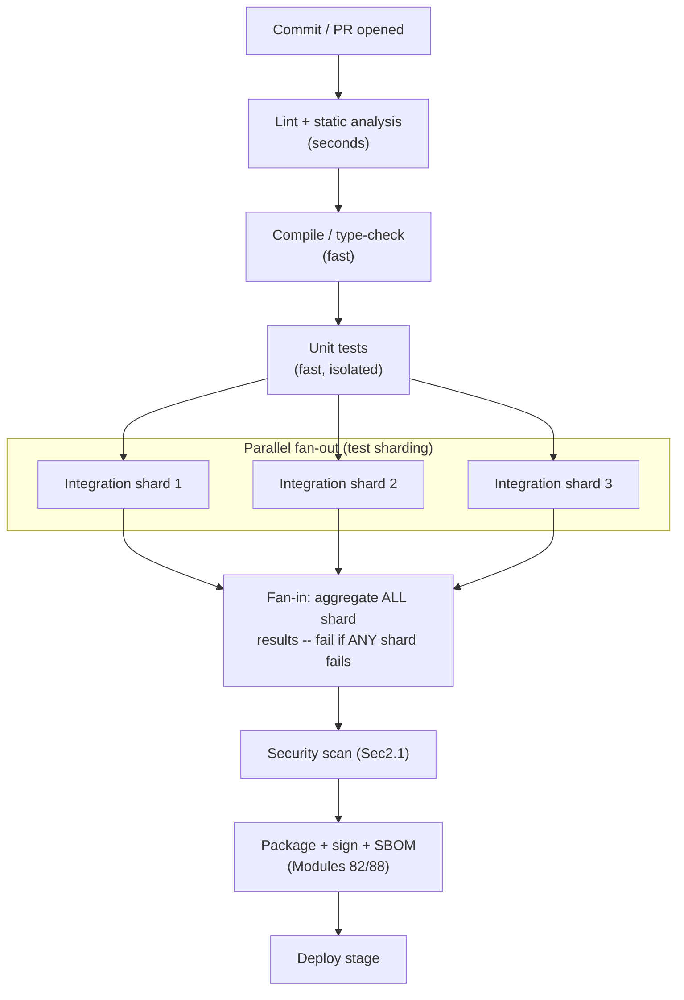
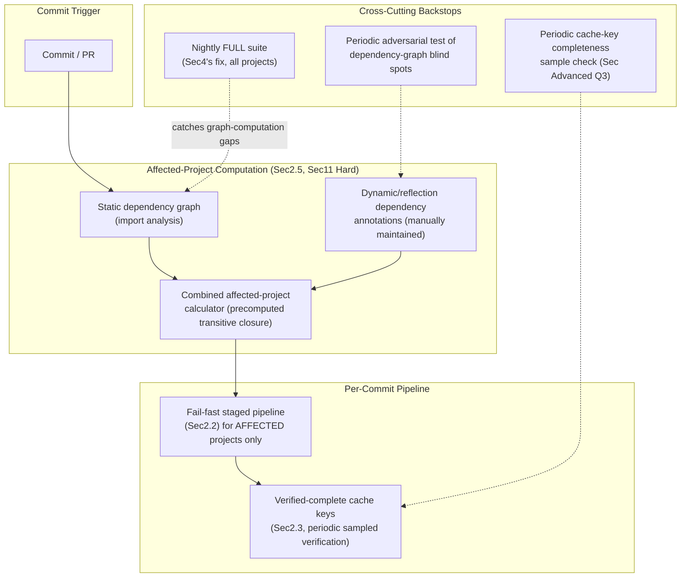
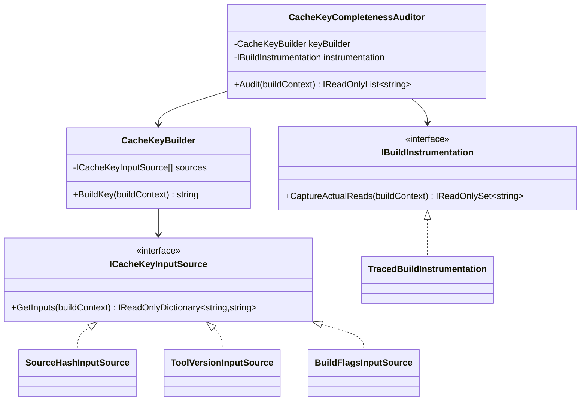
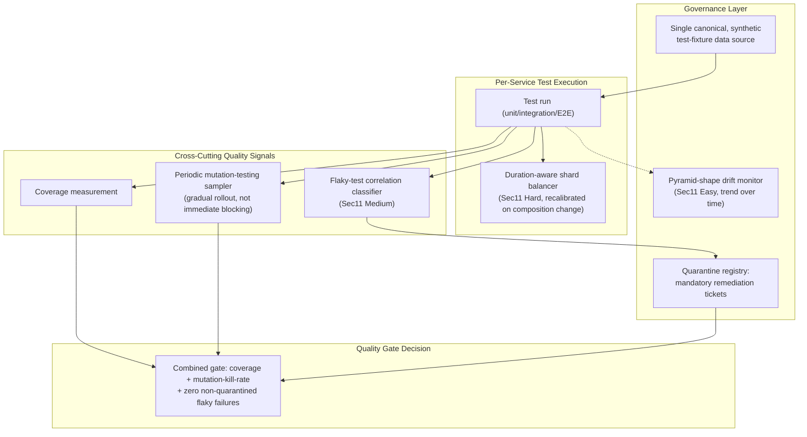
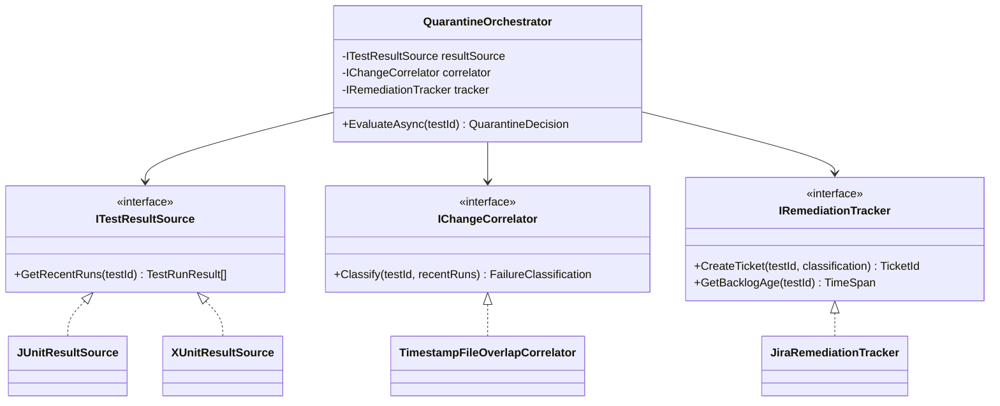
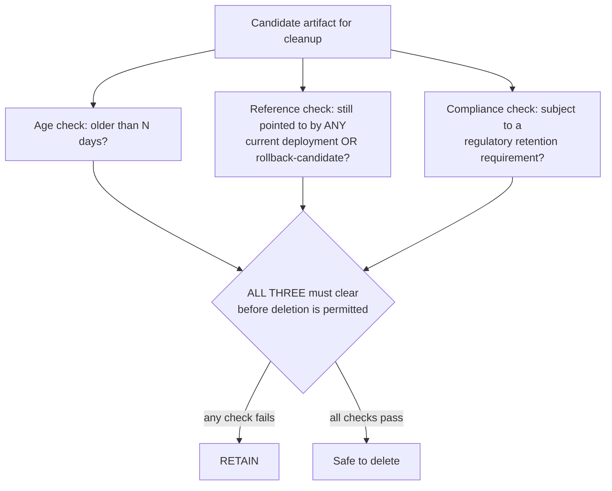
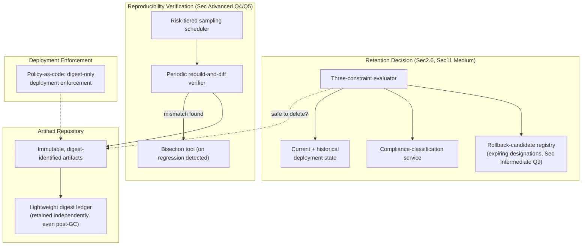
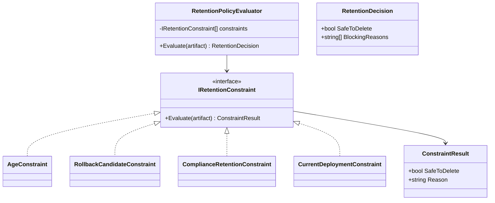
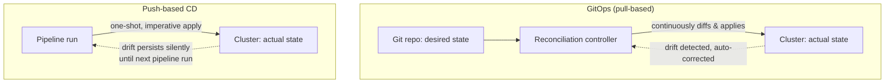
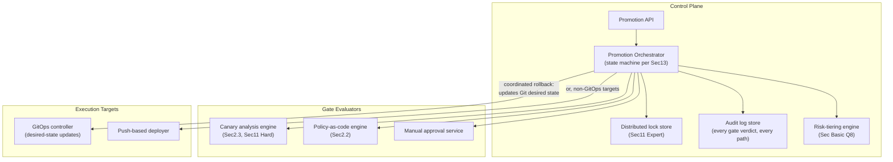

# CI/CD — Complete Interview Prep (All Topics, One File)

> Domain: CI/CD | Level: Beginner → Expert | Prerequisite: [[../25-DevOps/01-DevOps-Interview-Prep]] (IaC, release strategies, DevSecOps), [[../24-Docker/01-Docker-Interview-Prep]] (build caching, images)
> **Quick-prep edition** (consolidated 2026-10-03). This one file replaces Modules 89–92. Originals: `git show ebb2d5c:26-CICD/<file>.md`
> Each topic has: **Key concepts → pipeline/code example → Most common interview questions with answers.**

| # | Topic | # | Topic |
|---|---|---|---|
| 1 | CI vs CD vs continuous deployment; branching | 7 | Artifact management & reproducible builds |
| 2 | Pipeline-as-code & stage design (fail fast) | 8 | Environment promotion & gates |
| 3 | Caching & parallelization | 9 | Progressive delivery & rollback orchestration |
| 4 | Monorepo vs polyrepo | 10 | GitOps vs push-based CD; hotfix paths |
| 5 | Test strategy: pyramid, flakiness, coverage, quality gates | 11 | Pipeline security |
| 6 | Test data, doubles vs real dependencies (Testcontainers) | 12 | A complete .NET pipeline (GitHub Actions & Azure DevOps) |
| | | 13 | Top 30 rapid-fire + Principal · 14 Mistakes checklist |

---

## 1. CI vs CD vs Continuous Deployment; Branching

**Key concepts**
- **Continuous Integration:** every change is merged to the mainline frequently (at least daily), built and tested automatically → integration problems surface within minutes.
- **Continuous Delivery:** every mainline change is **releasable** — deployed automatically to pre-production, with production deployment a button/approval.
- **Continuous Deployment:** every change that passes the pipeline goes to production automatically.
- **Trunk-based development** (short-lived branches, < 1–2 days, feature flags) correlates with high DORA performance; **GitFlow** (long-lived develop/release branches) suits versioned, infrequently released products but slows integration.
- Branch protection: required reviews, status checks, signed commits, linear history, CODEOWNERS.

**Common interview questions**

**Q1. Continuous delivery vs continuous deployment?**
Delivery: always releasable, production release is a decision (manual approval or schedule). Deployment: every passing change goes to production automatically. Both require the same automation; deployment also needs strong automated verification and progressive delivery.

**Q2. Trunk-based development or GitFlow?**
Trunk-based for services deployed continuously — small batches, fewer merge conflicts, fast feedback, incomplete features hidden behind flags. GitFlow for products with versioned releases and long support of multiple versions (libraries, on-prem software).

---

## 2. Pipeline-as-Code & Stage Design (Fail Fast)

**Key concepts**
- The pipeline is a **versioned, reviewed artifact** in the repo (YAML: GitHub Actions, Azure Pipelines, GitLab CI, Jenkinsfile) — changes go through PRs; **shared templates/reusable workflows** give consistency across teams.
- **Stage ordering by cost and signal:** cheapest, fastest, most likely to fail first: restore → **build + analyzers** → **unit tests** → static analysis (SAST/SCA/secret scan) → package/container build → **integration/contract tests** → image scan/sign → deploy to dev/test → E2E/smoke → promote.
- **Build once**, produce an immutable artifact (container digest/NuGet/zip), pass it to later stages.
- Keep PR pipelines under ~10 minutes; heavier suites run post-merge or nightly.
- **Required checks** gate merges.

```yaml
# .github/workflows/ci.yml — fail-fast PR pipeline for a .NET service
name: ci
on: { pull_request: { branches: [main] }, push: { branches: [main] } }
permissions: { contents: read, id-token: write, packages: write }
concurrency: { group: ci-${{ github.ref }}, cancel-in-progress: true }

jobs:
  build-test:
    runs-on: ubuntu-latest
    steps:
      - uses: actions/checkout@v4
      - uses: actions/setup-dotnet@v4
        with: { dotnet-version: "9.0.x", cache: true, cache-dependency-path: "**/packages.lock.json" }
      - run: dotnet restore --locked-mode
      - run: dotnet build -c Release --no-restore -warnaserror
      - run: dotnet test -c Release --no-build --logger trx --collect:"XPlat Code Coverage" --filter "Category!=Integration"
      - run: dotnet list package --vulnerable --include-transitive
  integration:
    needs: build-test
    runs-on: ubuntu-latest
    steps:
      - uses: actions/checkout@v4
      - uses: actions/setup-dotnet@v4
        with: { dotnet-version: "9.0.x" }
      - run: dotnet test tests/Payments.IntegrationTests -c Release --filter "Category=Integration"   # Testcontainers
```

**Common interview questions**

**Q1. How do you design a CI pipeline for fast feedback?**
Order stages by speed and failure likelihood (build/analyzers/unit tests first), run independent jobs in parallel, cache dependencies and build outputs correctly, cancel superseded runs, keep slow suites off the PR path (post-merge/nightly with fast reporting), and track pipeline duration as a metric.

**Q2. Why "build once, deploy many"?**
So the exact artifact tested is the one deployed; rebuilding per environment can change dependencies or base images. Promote the same digest/version; inject environment config at deploy time.

---

## 3. Caching & Parallelization

**Key concepts**
- **Caching correctness is a cache-key problem:** key on the exact inputs (lock files, SDK version, OS) — too broad = stale or poisoned caches, too narrow = no hits. Use `packages.lock.json` + `--locked-mode` for NuGet.
- Cache layers: dependency caches (NuGet/npm), build outputs (incremental builds, remote build caches), Docker layer cache (BuildKit `--cache-to/--cache-from`), test result caching (in Nx/Bazel).
- **Parallelization:** fan-out independent jobs (build per project, test shards, scans), fan-in for gates; **test sharding** balanced by historical duration, not file count.
- Ephemeral runners need remote caches; self-hosted runners have warm caches but security/isolation concerns.

**Common interview question**

**Q. Our cache made builds pass with an outdated dependency. Why?**
The cache key didn't include the true inputs (e.g., keyed on the branch instead of the lock file hash), so a stale restore was reused. Key caches on content hashes of lock files and toolchain versions, use locked restores, and periodically bust caches.

---

## 4. Monorepo vs Polyrepo

| | Monorepo | Polyrepo |
|---|---|---|
| Pros | atomic cross-project changes, shared tooling, easy refactoring, single version policy | clear ownership, independent pipelines and permissions, simpler tooling per repo |
| Cons | needs affected-project detection, build tooling at scale, CODEOWNERS, large clones | cross-repo changes are slow, dependency/version drift, duplicated pipeline config |
| Tooling | Nx, Bazel, Turborepo, path filters, `dotnet` solution filters | reusable workflows/templates, package feeds |

- **Affected-project detection:** build/test only what changed and what depends on it (dependency graph) — path filters alone miss transitive dependencies.

**Common interview question**

**Q. Monorepo or polyrepo for 30 .NET microservices?**
Either works with discipline. Monorepo if teams frequently change shared libraries and contracts together and you can invest in affected-build tooling and CODEOWNERS. Polyrepo if teams are autonomous with independent release cycles, sharing via versioned packages and contract tests. The decision is about coupling and tooling investment, not fashion.

---

## 5. Test Strategy: Pyramid, Flakiness, Coverage, Quality Gates

**Key concepts**
- **Test pyramid:** many fast **unit** tests → fewer **integration/component** tests (real DB via Testcontainers, `WebApplicationFactory`) → **contract** tests (Pact) → very few **E2E/UI** tests. The "testing trophy" emphasizes integration tests for web apps — the principle is cost vs confidence.
- **Flaky tests:** nondeterministic (timing, shared state, order dependence, external services, async waits). Detect (rerun analysis, flake rate per test), **quarantine** (non-blocking with an owner and deadline), fix root causes; never "retry until green" silently.
- **Coverage** is a **proxy**: high coverage with weak assertions proves little; use it to find untested risky code, gate on **coverage of changed lines** rather than a global %, and consider **mutation testing** (Stryker.NET) to measure test strength.
- **Quality gates:** tests pass, no new critical issues (SAST/SCA), coverage on new code, performance budgets, contract verification (can-i-deploy).

```csharp
// Integration test with WebApplicationFactory + Testcontainers SQL Server
public sealed class PaymentsApiTests : IAsyncLifetime
{
    private readonly MsSqlContainer _sql = new MsSqlBuilder().WithImage("mcr.microsoft.com/mssql/server:2022-latest").Build();
    private WebApplicationFactory<Program> _factory = default!;

    public async Task InitializeAsync()
    {
        await _sql.StartAsync();
        _factory = new WebApplicationFactory<Program>().WithWebHostBuilder(b =>
            b.UseSetting("ConnectionStrings:Payments", _sql.GetConnectionString()));
    }

    [Fact]
    public async Task Duplicate_idempotency_key_returns_same_payment()
    {
        var client = _factory.CreateClient();
        client.DefaultRequestHeaders.Add("Idempotency-Key", "k-123");
        var r1 = await client.PostAsJsonAsync("/api/v1/payments", new { amount = "10.00", currency = "EUR" });
        var r2 = await client.PostAsJsonAsync("/api/v1/payments", new { amount = "10.00", currency = "EUR" });
        Assert.Equal(await r1.Content.ReadAsStringAsync(), await r2.Content.ReadAsStringAsync());
    }

    public async Task DisposeAsync() { await _factory.DisposeAsync(); await _sql.DisposeAsync(); }
}
```

**Common interview questions**

**Q1. How do you deal with flaky tests?**
Measure flakiness per test, quarantine flaky tests from the blocking path with an owner and deadline, fix root causes (deterministic time via `TimeProvider`, isolated data, proper async waits instead of sleeps, no shared external services), and track the flake rate as a team metric. Blind auto-retries hide real race conditions.

**Q2. Is 80% code coverage a good quality gate?**
Not by itself — coverage measures execution, not verification. Gate on coverage of changed code for critical modules, combine with mutation testing for high-risk logic, and focus tests on behaviours and failure paths (idempotency, concurrency, rounding).

**Q3. How do you test microservices without a giant E2E environment?**
Unit + component tests per service with real dependencies in containers, consumer-driven contract tests between services with can-i-deploy, a thin set of E2E smoke tests for critical journeys, and production verification (synthetic transactions, canaries).

---

## 6. Test Data, Doubles vs Real Dependencies

**Key concepts**
- **Isolation:** each test creates its own data (unique IDs/tenants), transactions rolled back, or a fresh database per test class/run (Testcontainers, Respawn for resetting) → parallel-safe.
- **Test doubles** (mocks, stubs, fakes) are fast but can diverge from real behaviour (SQL translation, transactions, serialization). Use **real dependencies in containers** for persistence and messaging; use fakes for slow or non-deterministic external systems (payment providers — via WireMock.Net / sandboxes).
- Production data in tests: never raw PII; use synthetic or masked data.

**Common interview question**

**Q. EF Core InMemory provider or a real database for tests?**
A real database (SQL Server/PostgreSQL in Testcontainers) for anything involving queries, transactions, constraints or concurrency — the InMemory provider doesn't translate SQL or enforce relational behaviour and gives false confidence. Unit-test pure domain logic without any database.

---

## 7. Artifact Management & Reproducible Builds

**Key concepts**
- **Immutable, content-addressed artifacts:** container digests, versioned packages (SemVer + build metadata), checksums; never overwrite a published version.
- **Artifact repositories:** container registries (ACR/ECR/GHCR), package feeds (Azure Artifacts, GitHub Packages, Artifactory, Nexus) with **upstream proxying** (cache public packages, protect against deletion/compromise).
- **Retention policies:** balance storage cost, the ability to roll back (keep everything deployed in the last N months), and **compliance** (regulated environments may require keeping released artifacts for years) — don't let a cleanup job delete what's running in production.
- **Reproducible builds:** pinned SDK (`global.json`), **lock files** (`packages.lock.json`, `RestoreLockedMode`), `Deterministic` + `ContinuousIntegrationBuild=true` (SourceLink), pinned base images by digest, no network fetches of floating versions during build.
- **Versioning:** SemVer, automated from git (GitVersion, MinVer, Nerdbank.GitVersioning).

```xml
<!-- Directory.Build.props: deterministic, reproducible .NET builds -->
<Project>
  <PropertyGroup>
    <Deterministic>true</Deterministic>
    <ContinuousIntegrationBuild Condition="'$(CI)' == 'true'">true</ContinuousIntegrationBuild>
    <RestorePackagesWithLockFile>true</RestorePackagesWithLockFile>
    <RestoreLockedMode Condition="'$(CI)' == 'true'">true</RestoreLockedMode>
    <TreatWarningsAsErrors>true</TreatWarningsAsErrors>
  </PropertyGroup>
</Project>
```

```json
// global.json — pin the SDK
{ "sdk": { "version": "9.0.100", "rollForward": "latestPatch" } }
```

**Common interview questions**

**Q1. Why reproducible builds?**
To prove that a given artifact came from a given commit (supply-chain integrity), to rebuild exactly for audits or hotfixes, and to get reliable caching. Pin toolchains, dependencies (lock files) and base images, and avoid time- or environment-dependent outputs.

**Q2. A retention policy deleted the image running in production — how do you prevent that?**
Retention rules that exempt anything currently deployed or deployed within the rollback window (query the deployment system), tag-based protection for released versions, separate retention for release vs CI-snapshot artifacts, and compliance-driven minimum retention for released artifacts.

---

## 8. Environment Promotion & Gates

**Key concepts**
- **Promotion pipeline:** dev → test/QA → staging (production-like) → production (often canary → full), with the **same artifact** and increasing blast radius.
- **Automated gates:** test results, security scan results, contract verification, performance budgets, SLO health of the previous stage, change-window checks.
- **Human approvals:** where required (regulated releases) — keep them meaningful (show the diff, risk, evidence) and avoid approval theatre; the gate-as-bottleneck problem → replace with automated evidence where possible.
- **Environment parity:** same IaC modules, same deployment mechanism; differences only in size and config.

```yaml
# Azure Pipelines multi-stage promotion with environments (approvals/checks configured on the environment)
stages:
- stage: Build
  jobs: [{ job: build, steps: [{ script: dotnet publish -c Release -o $(Build.ArtifactStagingDirectory) }, { publish: $(Build.ArtifactStagingDirectory), artifact: app }] }]
- stage: DeployTest
  dependsOn: Build
  jobs: [{ deployment: test, environment: payments-test, strategy: { runOnce: { deploy: { steps: [{ download: current, artifact: app }, { script: ./deploy.sh test }] } } } }]
- stage: DeployProd
  dependsOn: DeployTest
  condition: and(succeeded(), eq(variables['Build.SourceBranch'], 'refs/heads/main'))
  jobs: [{ deployment: prod, environment: payments-prod, strategy: { canary: { increments: [10, 50], deploy: { steps: [{ script: ./deploy.sh prod }] } } } }]
```

**Common interview questions**

**Q1. Manual approval gates are slowing releases. What do you do?**
Find what the approver actually checks and automate it (tests, scans, change risk scoring, SLO checks, evidence collection); keep manual approval only for genuinely high-risk changes; make approvals informed (risk summary, links) and time-bounded; measure approval wait time.

**Q2. What makes staging trustworthy?**
Same artifact and deployment mechanism, IaC parity with prod, realistic data volume and shape (masked), production-like integrations or high-fidelity fakes, and observability equal to prod — otherwise it's a false gate.

---

## 9. Progressive Delivery & Rollback Orchestration

**Key concepts**
- Integrate canary/blue-green into the pipeline: deploy new version → shift a small % of traffic → **automated analysis** (error rate, latency, business KPIs vs baseline) → promote or **auto-rollback**.
- **Rollback must be first-class and symmetric:** one command/automation, tested regularly; artifacts and config versions retained; DB changes backward compatible (expand–contract) so rollback is safe. Prefer **roll forward** only when rollback isn't possible.
- **Rollback triggers** defined before the release (SLO burn, error thresholds).
- Tools: Argo Rollouts, Flagger, Spinnaker, AWS CodeDeploy, Azure Deployment slots/Container Apps revisions, LaunchDarkly/feature flags.

**Common interview question**

**Q. How do you make rollback safe?**
Immutable artifacts and versioned config to redeploy the previous state, backward-compatible schema changes, idempotent deployment scripts, automated rollback on predefined signals, feature flags as an instant kill switch, and regular rollback drills so the path is known to work.

---

## 10. GitOps vs Push-Based CD; Hotfix Paths

| | Push-based CD | GitOps (pull) |
|---|---|---|
| How | the pipeline runs `kubectl`/`helm`/`az` against the target | an agent in the cluster pulls desired state from git and reconciles |
| Credentials | CI holds deploy credentials to prod | cluster pulls; CI needs no cluster credentials |
| Drift | not detected | detected and corrected continuously |
| Audit | pipeline logs | git history = deployment history |
| Fits | VMs, PaaS, serverless, mixed targets | Kubernetes |

- **Emergency/hotfix path:** the governance blind spot — define it in advance: same pipeline with expedited (not skipped) checks, a minimal approver set, automatic post-incident review, and no manual production changes outside the pipeline (break-glass logged and reconciled into git afterwards).

**Common interview question**

**Q. Production is down and the fix needs to go out now. What's your hotfix process?**
Mitigate first (rollback/flag/traffic shift); if code is needed, a hotfix branch or commit to main through the same pipeline with an expedited path (critical tests and scans still run, fast approval), progressive rollout if possible, then a post-incident review and backport. Never patch production by hand — and if break-glass was used, reconcile it into git immediately.

---

## 11. Pipeline Security

**Key concepts**
- CI/CD is a **privileged, attackable surface** (it can deploy to production and holds secrets).
- Controls: **OIDC federation** to cloud (no static keys), least-privilege per-environment deploy identities, secrets in the platform's secret store (masked), **no secrets to PRs from forks**, `permissions:` minimized per job, pin third-party actions **by commit SHA**, isolated **ephemeral runners** (self-hosted runners on public repos are dangerous), protected branches/environments with required reviewers, CODEOWNERS for pipeline files, signed artifacts and provenance (SLSA), audit logging.
- Threats: poisoned PRs (`pull_request_target` misuse), compromised actions/plugins, dependency confusion (private package names on public feeds → use package source mapping), stolen runner tokens.

```xml
<!-- nuget.config: package source mapping prevents dependency confusion -->
<packageSourceMapping>
  <packageSource key="internal"><package pattern="Acme.*" /></packageSource>
  <packageSource key="nuget.org"><package pattern="*" /></packageSource>
</packageSourceMapping>
```

**Common interview question**

**Q. How could an attacker abuse your pipeline, and how do you prevent it?**
By submitting a PR that exfiltrates secrets, compromising a third-party action, publishing a malicious package with your internal name, or stealing long-lived cloud keys. Prevent with OIDC and short-lived credentials, no secrets in fork PR builds, SHA-pinned actions, package source mapping, least-privilege job permissions, protected environments with reviewers, ephemeral isolated runners, and signed provenance verified at deploy.

---

## 12. A Complete .NET Pipeline (GitHub Actions)

```yaml
name: payments-api
on: { push: { branches: [main] }, pull_request: {} }
permissions: { contents: read, id-token: write, packages: write, security-events: write }

jobs:
  ci:
    runs-on: ubuntu-latest
    outputs: { digest: ${{ steps.push.outputs.digest }} }
    steps:
      - uses: actions/checkout@v4                                   # (pin by SHA in real pipelines)
      - uses: actions/setup-dotnet@v4
        with: { dotnet-version: "9.0.x" }
      - run: dotnet restore --locked-mode && dotnet build -c Release --no-restore -warnaserror
      - run: dotnet test -c Release --no-build --collect:"XPlat Code Coverage"
      - uses: github/codeql-action/init@v3
        with: { languages: csharp }
      - uses: github/codeql-action/analyze@v3
      - uses: docker/setup-buildx-action@v3
      - uses: docker/login-action@v3
        with: { registry: ghcr.io, username: ${{ github.actor }}, password: ${{ secrets.GITHUB_TOKEN }} }
      - id: push
        uses: docker/build-push-action@v6
        with:
          push: ${{ github.ref == 'refs/heads/main' }}
          tags: ghcr.io/acme/payments-api:${{ github.sha }}
          cache-from: type=gha
          cache-to: type=gha,mode=max
          sbom: true
          provenance: mode=max
      - uses: aquasecurity/trivy-action@0.28.0
        with: { image-ref: "ghcr.io/acme/payments-api:${{ github.sha }}", severity: "CRITICAL,HIGH", exit-code: "1", ignore-unfixed: true }

  deploy-staging:
    if: github.ref == 'refs/heads/main'
    needs: ci
    environment: staging
    runs-on: ubuntu-latest
    steps:
      - run: echo "update GitOps repo / deploy digest ${{ needs.ci.outputs.digest }} to staging, then run smoke tests"

  deploy-prod:
    needs: deploy-staging
    environment: production          # required reviewers + wait timer configured on the environment
    runs-on: ubuntu-latest
    steps:
      - run: echo "progressive rollout of ${{ needs.ci.outputs.digest }} with automated analysis and auto-rollback"
```

---

## 13. Top 30 Rapid-Fire Questions + Principal Questions

1. **CI?** Frequent integration with automated build/test.
2. **Continuous delivery?** Always releasable.
3. **Continuous deployment?** Auto to prod.
4. **Trunk-based?** Short-lived branches + flags.
5. **Pipeline-as-code?** Versioned, reviewed YAML.
6. **Stage order?** Cheap/fast first.
7. **Build once?** Promote the same artifact.
8. **Cache key?** Hash of lock files + toolchain.
9. **Locked restore?** `packages.lock.json` + `--locked-mode`.
10. **Affected builds?** Dependency-graph detection.
11. **Test pyramid?** Many unit, fewer integration, few E2E.
12. **Flaky tests?** Measure, quarantine, fix.
13. **Coverage?** A proxy — gate on new code, mutation testing.
14. **Real DB tests?** Testcontainers.
15. **Contract tests?** Pact + can-i-deploy.
16. **Immutable artifacts?** Never overwrite versions.
17. **Reproducible?** Pinned SDK, locks, deterministic builds.
18. **Retention risk?** Deleting what prod runs.
19. **Promotion?** dev → test → staging → prod, same artifact.
20. **Gates?** Automated evidence over manual approval.
21. **Progressive delivery?** Canary + analysis + auto-rollback.
22. **Rollback prerequisite?** Backward-compatible DB changes.
23. **GitOps advantage?** Pull model, drift correction, git audit.
24. **Push CD fit?** Non-K8s targets.
25. **Hotfix?** Same pipeline, expedited checks.
26. **CI credentials?** OIDC, short-lived.
27. **Fork PR secrets?** Never exposed.
28. **Third-party actions?** Pin by SHA.
29. **Dependency confusion?** Package source mapping.
30. **SBOM/provenance?** Generated and attested at build.

**Principal-level questions**

**P1. Standardize CI/CD for 80 repositories without becoming a bottleneck.**
Reusable workflow/pipeline templates owned by a platform team (versioned, opt-in upgrades with deprecation windows), built-in security and quality gates, golden-path service templates, self-service environments, metrics on pipeline duration and DORA per team, and an extension mechanism for team-specific steps.

**P2. How do you prove to an auditor that only reviewed code reaches production?**
Branch protection with required independent reviews, CODEOWNERS on sensitive paths, signed commits, builds only on protected branches, immutable signed artifacts with provenance linking commit → build → digest, deployments only via the pipeline with environment protection, admission verification of signatures, and exported audit logs.

**P3. Pipeline takes 45 minutes and developers batch changes. Your plan?**
Measure stage durations; parallelize; fix caching; move slow suites off the PR path with fast post-merge feedback; shard tests by duration; fix or quarantine flaky tests; adopt affected-project builds; use larger/faster runners where cheap. Target < 10 minutes for the PR path and track it.

---

## 14. Mistakes Checklist (say why each is wrong)
- [ ] Long-lived feature branches · merging without required checks
- [ ] Rebuilding per environment · mutable artifact versions · `latest` deployments
- [ ] Caches keyed too broadly (stale/poisoned) · floating dependency versions
- [ ] Slow PR pipelines with E2E suites · auto-retrying flaky tests silently
- [ ] Coverage % as the only quality gate · InMemory DB for integration tests
- [ ] Manual approvals with no evidence · staging that doesn't resemble prod
- [ ] No tested rollback · breaking schema changes before code
- [ ] Manual hotfixes in prod · break-glass changes never reconciled into git
- [ ] Static cloud keys in CI · secrets exposed to fork PRs · unpinned third-party actions

---

## Architecture Diagrams (preserved from the original modules)

> All 11 Mermaid/ASCII diagrams from the original `26-CICD/` files, kept verbatim and grouped by source module. Originals: `git show ebb2d5c:26-CICD/<file>.md`.

### Module 89 — CI/CD: CI Pipeline Architecture — Pipeline-as-Code, Build Stages, Caching & Monorepo/Polyrepo Strategies
*Source: `01-CIPipelineArchitecture-PipelineAsCode-Caching-Monorepo.md`*

**Fail-Fast Staged Pipeline with Parallel Fan-Out/Fan-In**



**12. System Design**



**13. Low-Level Design**



### Module 90 — CI/CD: Test Automation Strategy — Test Pyramid, Flakiness, Coverage & Quality Gates
*Source: `02-TestAutomationStrategy-Pyramid-Flakiness-Coverage-Quality-Gates.md`*

**12. System Design**



**13. Low-Level Design**



### Module 91 — CI/CD: Artifact Management & Reproducible Builds
*Source: `03-ArtifactManagement-ReproducibleBuilds-RetentionPolicies.md`*

**Retention Policy — Three Independent Constraints, Not One Age Rule**



**12. System Design**



**13. Low-Level Design**



### Module 92 — CI/CD: CD Pipeline Orchestration — Environment Promotion, Progressive Delivery Integration & Release Governance (Capstone)
*Source: `04-CDPipelineOrchestration-EnvironmentPromotion-ProgressiveDelivery-ReleaseGovernance.md`*

**Normal Promotion Chain — Strategy + Gates per Stage**

```mermaid
graph LR
 Artifact["Immutable artifact<br/>(digest)"] --> Dev["Dev"]
 Dev -->|auto gate: smoke tests| Staging["Staging"]
 Staging -->|auto gate: integration tests +<br/>policy-as-code (Sec2.2)| Canary["Canary (5% traffic,<br/> Sec2.3 strategy)"]
 Canary -->|automated canary analysis| Decision{"Analysis verdict"}
 Decision -->|pass + manual approval| Prod["Production (100%)"]
 Decision -->|fail| Rollback["Automated rollback<br/>to last-known-good digest"]
 Prod -.->|post-promotion health<br/>regression detected| Rollback
```

**GitOps Reconciliation vs. Push-Based Trigger**



**12. System Design**


