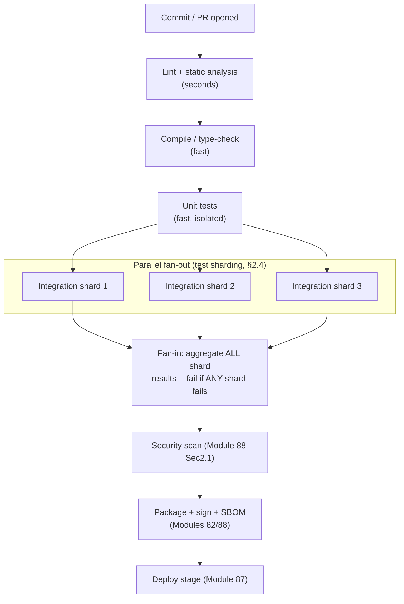
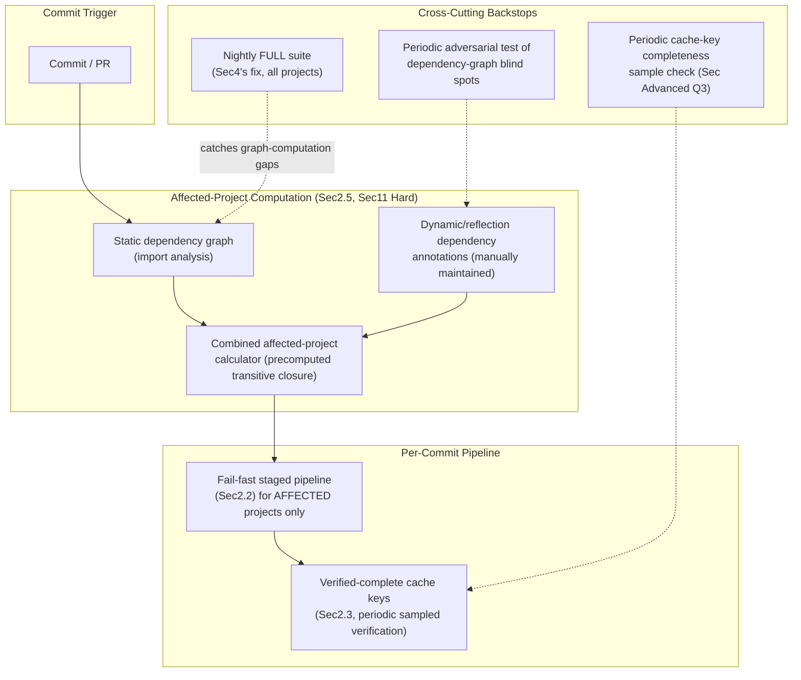
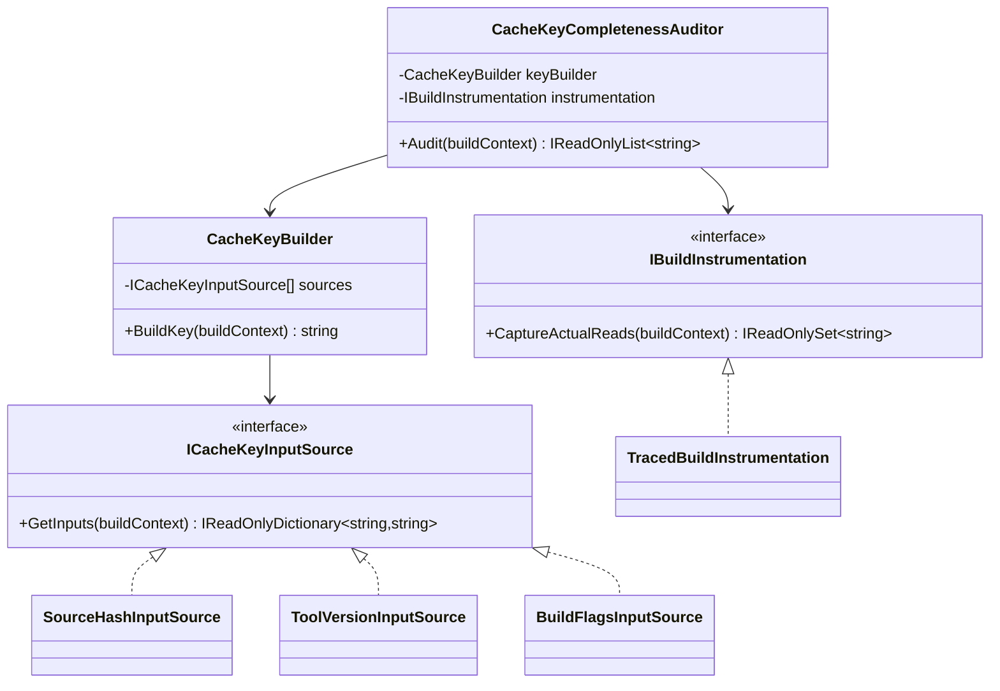

# Module 89 — CI/CD: CI Pipeline Architecture — Pipeline-as-Code, Build Stages, Caching & Monorepo/Polyrepo Strategies

> Domain: CI/CD | Level: Beginner → Expert | Prerequisite: [[../25-DevOps/01-InfrastructureAsCode-Terraform-State-Drift]] (pipeline-as-code parallels IaC's declarative-artifact discipline), [[../25-DevOps/04-DevSecOps-PolicyAsCode-PlatformEngineering]] §2.1 (shift-left scanning integrated into the pipeline stages this module designs), [[../24-Docker/02-Dockerfile-Optimization-MultiStageBuilds]] (build-layer caching, directly generalized here to whole-pipeline caching)

---

## 1. Fundamentals

**What**: Continuous Integration (CI) is the practice of automatically building, testing, and validating every code change — ideally on every commit or PR — so integration problems surface within minutes rather than accumulating silently until a painful, infrequent "integration day." A CI pipeline is the automated sequence of stages (compile, lint, test, package, scan) that implements this; **pipeline-as-code** means that sequence is itself defined in a version-controlled, reviewable file (a Jenkinsfile, a GitHub Actions workflow YAML, a GitLab `.gitlab-ci.yml`) rather than configured through a UI that leaves no diffable history.

**Why it exists**: Before CI, integration problems (two developers' changes conflicting in ways neither discovered until a merge) were often discovered only when someone attempted to combine weeks of independent work — a discovery cost that scales brutally with how much diverged work has accumulated. Automating the build-and-test cycle on every change converts this into a continuous, small-cost activity: a broken change is caught and attributable to a specific, small commit within minutes, not buried in a multi-week merge. Pipeline-as-code exists for the identical reason Module 85 mandated Infrastructure-as-Code over manual console changes: a pipeline configured through a UI is unreviewable, undiffable, and unrepeatable across environments — exactly the governance gap this course has now examined in infrastructure, configuration, deployment strategy, and security policy, recurring here in the pipeline definition itself.

**When it matters**: From the moment more than one person contributes to a codebase, and increasingly critically as commit frequency, codebase size, and team count grow — a CI pipeline design that was adequate for ten engineers committing a few times a day routinely becomes the organization's binding velocity constraint once hundreds of engineers commit continuously against a shared monorepo.

**How (30,000-ft view)**:
```
Pipeline-as-code: the pipeline definition itself is a versioned file in the repo,
    reviewed via PR exactly like application code -- Module 85's IaC discipline,
    applied to the delivery pipeline's own definition
Build stages: compile -> lint -> unit test -> package -> integration test -> scan
    (Module 88's shift-left security) -- ordered fail-fast, cheapest/fastest checks first
Caching: dependency caches (package manager downloads), build caches (compiled
    artifacts, Docker layers -- Module 82's layer caching, generalized) -- correctness
    depends entirely on cache KEYS capturing every input that could change the output
Monorepo/Polyrepo: a monorepo's CI must compute an "affected projects" graph (only
    test/build what a change could possibly impact) to scale -- get this graph WRONG
    and CI either wastes enormous compute (over-inclusion) or silently misses real
    breakage (under-inclusion, THIS module's central production incident)
```

---

## 2. Deep Dive

### 2.1 Pipeline-as-Code — the Delivery Pipeline as a Reviewed, Versioned Artifact
A pipeline defined as code (Jenkinsfile, GitHub Actions YAML, GitLab CI YAML, Azure Pipelines YAML) gets everything a versioned artifact provides: PR review before a pipeline change takes effect, a diffable history explaining *why* a stage was added or a gate loosened, and — critically — the ability to reuse the identical pipeline definition across every branch and environment rather than each environment silently diverging via UI-configured, undocumented settings (directly Module 86 §2.4's base+delta parity discipline, applied to pipeline definitions specifically). Modern pipeline-as-code systems further support **reusable, shared pipeline templates** (GitHub Actions' reusable workflows, GitLab's `include`, Jenkins shared libraries) — the pipeline-definition analog of Module 85 §12's vetted module registry: a security-scanning stage or a standard deployment step, defined once, centrally maintained, and consumed by every team's pipeline, rather than each team copy-pasting (and inevitably diverging from) a similar but independently-maintained stage definition.

### 2.2 Build Stage Design — Ordering for Fail-Fast Economics
Stages should be ordered by a simple economic principle: **cheapest and fastest checks first**, so a change that's going to fail does so in seconds, not after minutes of expensive work that turns out to be wasted. A typical ordering: static analysis/linting (seconds, catches syntax/style issues) → compilation (catches type errors) → unit tests (fast, isolated, no external dependencies) → packaging/build artifact creation → integration tests (slower, may need real or containerized dependencies) → security scanning (Module 88 §2.1's SAST/SCA/IaC scans) → deployment to a validation environment. Violating this ordering — running slow integration tests before cheap linting, say — doesn't change *what* gets caught, only *how expensively and slowly* it gets caught, directly costing developer feedback-loop time on every single failed change, compounding across an organization's total commit volume into a very real productivity cost.

### 2.3 Caching — Correctness Is Entirely a Cache-Key Problem
Caching (dependency downloads, compiled build artifacts, Docker image layers per Module 82) is CI's single highest-leverage speed optimization — and its single most common correctness hazard. A cache is safe to reuse only if its **key** captures every input that could affect the cached output: a dependency cache keyed only on a lockfile's hash is safe (identical lockfile ⟹ identical resolved dependencies); a build-artifact cache keyed only on source-file hashes but *not* on compiler flags, target platform, or build-tool version is unsafe — a cache hit could silently serve an artifact built under different, no-longer-current conditions, and unlike a cache *miss* (merely slower), a cache **hit on stale data** produces an artifact that looks successfully built but reflects the wrong inputs — a silent correctness failure, not a visible, safely-detected slowdown. The general principle: a cache key must be a *complete* fingerprint of everything the cached output depends on, and any change to any of those inputs must change the key — an incomplete key is a governance gap of the exact shape this course has repeatedly examined (a system's declared behavior — "this cache correctly reflects current inputs" — silently diverging from what's actually true).

### 2.4 Parallelization — Fan-Out for Speed, Fan-In for Correctness
Independent stages (or independent shards of a large test suite) run in parallel to reduce wall-clock pipeline duration — matrix builds (testing across multiple OS/language-version combinations simultaneously) and test sharding (splitting a large suite across N parallel workers, each running a subset) are the two most common patterns. The correctness requirement often overlooked: parallelized work must **fan back in** to a single, unambiguous overall result before any downstream decision (merge approval, deployment trigger) is made — a pipeline that reports "success" the moment the *first* shard passes, without waiting for and aggregating every shard's result, provides false confidence identical in shape to Module 87 §4's rolling-deployment-completed-mechanically-but-not-correctly incident, now occurring at the test-execution level instead of the deployment level.

### 2.5 Monorepo vs. Polyrepo — the Affected-Project Detection Problem
A **polyrepo** (one repository per service) naturally scopes CI to exactly what changed — a commit to service A's repository triggers only service A's pipeline, with no ambiguity about scope. A **monorepo** (many services/libraries in one repository) requires CI to compute which projects a given change could possibly affect — running the full test suite for every project on every commit doesn't scale past a modest codebase size, but computing *which subset* is affected requires an accurate, complete dependency graph: a change to a shared library must trigger tests for every project that (transitively) depends on it, and getting this graph **incomplete** — missing a genuine dependency edge — means CI silently skips testing a project a change could actually break, producing exactly this module's central production incident (§4): a declared "these are the affected projects" computation that is, in fact, wrong, with no visible failure signal distinguishing "correctly computed, nothing affected" from "incorrectly computed, missed something." Tools like Bazel, Nx, and Turborepo exist specifically to compute and maintain this dependency graph reliably, but the graph's correctness is only as good as its ability to detect every genuine dependency edge — including non-obvious ones (a runtime dependency loaded via reflection/dynamic import, a build-time code-generation step consuming a shared schema file) that static analysis of import statements alone can miss.

### 2.6 Pipeline Security and Isolation — CI as a Privileged, Attackable Surface
A CI runner routinely holds real secrets (Module 86's reference-not-value principle, delivered into the pipeline for deployment steps), executes arbitrary code from a repository (including, dangerously, from external contributors' pull requests in an open or loosely-controlled repository), and often has meaningful network/cloud access to perform its deployment duties — making it a genuinely attractive and privileged attack target, not a neutral piece of internal tooling. The standard defenses: **never run untrusted PR-triggered workflows with the same secret access as trusted, merged-branch pipelines** (a malicious PR's CI run should not be able to read production deployment credentials); **ephemeral, single-use runners** (each pipeline run gets a freshly-provisioned, disposable execution environment, torn down immediately after, preventing one run's compromise from persisting into or contaminating the next); and **least-privilege scoping** of whatever credentials a given pipeline stage genuinely needs (a test stage needs no cloud-deployment credentials at all; only the deployment stage does) — directly Module 86 §Advanced Q7's secret-store access-scoping discipline, applied to CI runner permissions specifically.

---

## 3. Visual Architecture

### Fail-Fast Staged Pipeline (§2.2) with Parallel Fan-Out/Fan-In (§2.4)


### Monorepo Affected-Project Detection — the Dependency Graph's Blind Spot (§2.5, §4)
```
Declared dependency graph (from static import analysis):
    ServiceA  -->  SharedLibX
    ServiceB  -->  SharedLibX
    ServiceC  -->  (no declared dependency on SharedLibX)

ACTUAL runtime dependency (via reflection-based plugin loading,
invisible to static import analysis):
    ServiceC  ...actually...loads SharedLibX's plugin interface at runtime

Change to SharedLibX:
    CI computes "affected" = {ServiceA, ServiceB}   <-- INCOMPLETE
    ServiceC is NOT tested                          <-- silent gap
    ServiceC breaks in PRODUCTION, weeks later       <-- Sec4's incident
```

---

## 4. Production Example

**Scenario**: A large e-commerce organization's monorepo used a popular build-graph tool to compute "affected projects" per commit, running full test suites only for projects the tool identified as potentially impacted — a well-adopted, seemingly reliable optimization that had run correctly for over a year, giving the organization strong confidence in the affected-project computation's completeness. A shared authentication library was updated to change a token-validation function's default behavior in a subtle, backward-incompatible way. The build-graph tool correctly identified and tested the twelve services with a *statically declared* (import-statement-visible) dependency on the library — all twelve passed. Three weeks later, a thirteenth service — one that loaded the authentication library's validation logic via a runtime plugin-discovery mechanism (a dynamic assembly load based on a configuration-driven type name, invisible to the build-graph tool's static-import-based dependency analysis) — began silently accepting invalid tokens in production, a genuine authentication bypass, discovered only through an unrelated security audit.

**Investigation**: The build-graph tool's dependency graph was built entirely from static source analysis (parsing import/using statements across the codebase) — a sound, fast, and *usually* complete approach, but one with a structural blind spot for any dependency established at runtime rather than compile time: reflection-based loading, configuration-driven dynamic type resolution, and plugin-discovery patterns are all, by design, invisible to static analysis, since the actual dependency edge exists only in behavior observed when the code runs, not in any statically parseable reference.

**Root cause**: The organization had implicitly trusted the build-graph tool's dependency computation as complete, with no independent verification and no fallback safety net for the specific class of dependency (runtime/reflection-based) the tool was structurally unable to detect — precisely this course's recurring "a declared computation (here, 'these are the affected projects') is not automatically the same as the actual, complete truth" pattern (Modules 74/75/76/78/79/85/86/87/88), now recurring in build-graph dependency analysis specifically.

**Fix**: (1) Immediately audited every service in the monorepo for reflection/dynamic-loading-based dependencies on shared libraries, manually annotating each with an explicit, non-static "declared dependency" marker the build-graph tool could additionally honor (a supplementary, manually-maintained edge list covering exactly the blind spot static analysis couldn't see); (2) as a structural backstop, added a much lower-frequency (nightly, not per-commit) **full-suite run across every project regardless of the affected-project computation**, specifically designed to catch exactly this class of dependency-graph-blind-spot gap within at most 24 hours rather than three weeks; (3) established a policy requiring any new reflection/dynamic-loading pattern introduced against a shared library to be accompanied by an explicit dependency-graph annotation in the same PR, treated as a required review item.

**Lesson**: A build-graph tool's affected-project computation is, in the exact sense this course has established repeatedly, a *declared* claim about what's affected — and like every other declared state examined across this entire curriculum, it requires either comprehensive coverage of every genuine dependency mechanism (impossible to guarantee for dynamically-established dependencies via static analysis alone) or an independent, periodic verification backstop (the nightly full-suite run) catching what the primary mechanism structurally cannot see — the identical "cover every path, and verify rather than merely trust a declared computation" principle Module 88's capstone distilled, now applied to CI's own core optimization technique.

---

## 5. Best Practices
- Order pipeline stages by cost/speed, cheapest and fastest first, so a failing change fails in seconds rather than after expensive, ultimately-wasted work (§2.2).
- Build cache keys as a *complete* fingerprint of every input that affects the cached output — an incomplete key produces silent, hard-to-diagnose correctness failures on cache hits, not merely safe slowdowns on cache misses (§2.3).
- Treat pipeline definitions as reviewed, versioned code with shared, centrally-maintained templates for common stages (security scanning, deployment) — never per-team copy-pasted, independently-diverging definitions (§2.1).
- For monorepo affected-project detection, add a periodic, lower-frequency full-suite run as a structural backstop against any dependency class the primary detection mechanism can't see (reflection, dynamic loading, code generation) — never trust a single computation as complete (§2.5, §4).
- Isolate untrusted PR-triggered pipeline runs from the secret access and permissions trusted, merged-branch pipelines hold — a malicious or compromised PR should never be able to read production credentials (§2.6).

## 6. Anti-patterns
- Running expensive integration tests or security scans before cheap linting/compilation checks, wasting compute and developer feedback-loop time on changes that would have failed instantly at an earlier stage (§2.2).
- A build/dependency cache keyed on an incomplete set of inputs (e.g., source hash alone, ignoring compiler flags or tool version), producing silent stale-artifact reuse rather than a safe, visible cache miss (§2.3).
- Trusting a monorepo build-graph tool's affected-project computation as structurally complete with no independent verification backstop for dependency classes it can't statically detect (§4).
- A pipeline that reports overall success the moment the first parallel test shard passes, without waiting for and aggregating every shard's result (§2.4).
- Granting untrusted, externally-triggered PR pipeline runs the same secret access and permissions as trusted, merged-branch deployment pipelines (§2.6).

---

## 10. Interview Questions

### Basic (10)

1. **Q: What is Continuous Integration?**
   **A:** The practice of automatically building, testing, and validating every code change (ideally on every commit or PR) so integration problems surface within minutes rather than accumulating until an infrequent, painful integration effort.
   **Why correct:** States both the mechanism (automated build/test on every change) and the specific problem it solves (early, cheap detection versus late, expensive detection).
   **Common mistakes:** Describing CI as merely "running tests," without the "on every change, automatically" emphasis that makes it continuous.
   **Follow-ups:** "Why does detection timing matter so much?" (A broken change is attributable to one small, recent commit when caught immediately; caught weeks later, it's buried among many changes, making root-causing far more expensive.)

2. **Q: What is pipeline-as-code?**
   **A:** Defining a CI/CD pipeline's stages and configuration in a version-controlled file (a Jenkinsfile, a GitHub Actions YAML) rather than through a UI, giving the pipeline definition the same review/diff/history benefits as application code.
   **Why correct:** States the mechanism (versioned file) and the specific benefit (reviewability/history) that distinguishes it from UI-configured pipelines.
   **Common mistakes:** Believing pipeline-as-code is only about avoiding manual clicking, missing the more important reviewability and cross-environment consistency benefits.
   **Follow-ups:** "What does this parallel from the Infrastructure-as-Code domain?" (Module 85's core argument for IaC over manual console changes — reviewable, repeatable, auditable change management.)

3. **Q: Why should cheap checks (linting, compilation) run before expensive ones (integration tests) in a pipeline?**
   **A:** So a change that's going to fail does so in seconds rather than after minutes of expensive, ultimately-wasted work — the ordering doesn't change what's caught, only how quickly and cheaply.
   **Why correct:** States the fail-fast economic principle precisely.
   **Common mistakes:** Assuming stage order is arbitrary or purely a matter of convention rather than a deliberate cost-optimization decision.
   **Follow-ups:** "What's the downstream cost of getting this ordering wrong at organizational scale?" (Wasted compute and developer feedback-loop time multiplied across every failed commit across the entire organization's commit volume.)

4. **Q: What must a build cache key capture to be correct?**
   **A:** Every input that could affect the cached output — not just source file hashes, but also compiler flags, tool versions, target platform, and any other variable the build depends on.
   **Why correct:** States the completeness requirement precisely, distinguishing a correct cache key from a merely-common but incomplete one.
   **Common mistakes:** Assuming a source-hash-only cache key is sufficient, missing that other build inputs (flags, tool versions) can change the output without changing the source.
   **Follow-ups:** "Why is an incomplete cache key worse than no cache at all?" (A cache miss is merely slower — safe; an incomplete key causing a stale cache *hit* silently serves outdated output that looks successfully built, a correctness failure rather than a visible slowdown.)

5. **Q: What is test sharding?**
   **A:** Splitting a large test suite across multiple parallel workers, each running a subset of tests, to reduce total wall-clock pipeline duration.
   **Why correct:** States the mechanism (splitting a suite across parallel workers) and its purpose (reducing wall-clock time).
   **Common mistakes:** Believing sharding reduces total compute cost — it doesn't; it reduces wall-clock duration by running the same total work in parallel rather than sequentially.
   **Follow-ups:** "What must happen after all shards complete?" (Fan-in: aggregating every shard's result before declaring overall success — reporting success after only the first shard passes is a correctness gap.)

6. **Q: What is the difference between a monorepo and a polyrepo, from a CI perspective?**
   **A:** A polyrepo naturally scopes CI to exactly what changed (one repository per service); a monorepo (many services/libraries in one repository) requires CI to explicitly compute which projects a given change could affect, since testing everything on every commit doesn't scale.
   **Why correct:** Identifies the specific CI-scoping challenge (affected-project computation) that monorepos introduce and polyrepos avoid by structure.
   **Common mistakes:** Believing monorepo vs. polyrepo is purely a code-organization preference with no CI-architecture consequence.
   **Follow-ups:** "Name a tool that computes this affected-project graph." (Bazel, Nx, or Turborepo.)

7. **Q: Why shouldn't an untrusted, externally-triggered PR pipeline run have the same secret access as a trusted, merged-branch pipeline?**
   **A:** A CI runner executing arbitrary code from a pull request (potentially from an untrusted external contributor) could exfiltrate any secret it has access to — granting PR-triggered runs the same production-deployment credentials as trusted pipelines turns any malicious PR into a direct path to credential theft.
   **Why correct:** States the specific attack vector (arbitrary code execution plus secret access) that this isolation defends against.
   **Common mistakes:** Treating CI runners as neutral internal tooling rather than a privileged, genuinely attackable surface.
   **Follow-ups:** "What's a complementary defense beyond access scoping?" (Ephemeral, single-use runners, ensuring one run's potential compromise doesn't persist into or contaminate subsequent runs.)

8. **Q: What is a reusable pipeline template (e.g., a GitHub Actions reusable workflow)?**
   **A:** A pipeline stage or sequence defined once, centrally maintained, and consumed by multiple teams' pipelines — the pipeline-definition analog of a shared, vetted infrastructure module.
   **Why correct:** States the mechanism (define once, consume many) and draws the direct parallel to shared infrastructure modules.
   **Common mistakes:** Each team copy-pasting a similar pipeline stage independently, which inevitably diverges over time rather than staying consistent.
   **Follow-ups:** "What governance benefit does this provide?" (A security-scanning stage update propagates to every consuming pipeline automatically, rather than requiring each team to independently update their own copy.)

9. **Q: What is an ephemeral CI runner?**
   **A:** A freshly-provisioned, disposable execution environment created for a single pipeline run and torn down immediately after, rather than a long-lived, reused runner.
   **Why correct:** States both the provisioning model (fresh per run) and the disposal behavior (torn down after).
   **Common mistakes:** Assuming a long-lived, reused runner is more efficient without considering the security risk of state or compromise persisting across runs.
   **Follow-ups:** "What risk does this specifically mitigate?" (A compromised or misbehaving run contaminating or persisting state into subsequent, unrelated runs on the same runner.)

10. **Q: What does "fan-in" mean in a parallelized pipeline?**
    **A:** Aggregating the results of every parallel branch (shards, matrix combinations) into one unambiguous overall result before any downstream decision (merge approval, deployment) is made.
    **Why correct:** States the aggregation requirement precisely, distinguishing correct fan-in from a premature "first shard passed" success signal.
    **Common mistakes:** Believing parallelization alone guarantees correctness without also correctly aggregating every parallel result.
    **Follow-ups:** "What's the failure mode of skipping proper fan-in?" (Reporting overall success while some shards are still running or have actually failed — a false-positive success signal.)

### Intermediate (10)

1. **Q: Why does an incomplete build cache key produce a fundamentally different kind of failure than a cache miss?**
   **A:** A cache miss simply means the build proceeds without reuse — slower, but the output is freshly and correctly computed from current inputs, a safe (if suboptimal) outcome. An incomplete cache key that produces a stale cache *hit* serves an artifact built under different, no-longer-current conditions (different compiler flags, an older dependency version) while the pipeline reports success — the output looks correctly built but silently reflects the wrong inputs, a correctness failure indistinguishable from a genuine success without deeper investigation.
   **Why correct:** Precisely distinguishes the two failure classes (safe-but-slow vs. silent-and-wrong) and why only the latter is genuinely dangerous.
   **Common mistakes:** Treating "adding more caching" as a strictly positive optimization without considering that an incorrectly-scoped cache key introduces a new correctness risk class that didn't exist without caching at all.
   **Follow-ups:** "How would you detect a cache-key completeness gap before it causes a production incident?" (Periodically running a build with caching fully disabled and diffing its output against the cached build's output — any difference reveals a cache-key gap.)

2. **Q: Why does §4's build-graph incident recur the same structural pattern as Module 85's Terraform drift and Module 86's configuration drift, despite involving neither infrastructure nor configuration?**
   **A:** In all three cases, an automated system computes and reports a *declared* state (Terraform's plan reflecting infrastructure reality, a config repo's declared values, a build-graph tool's affected-project set) that is trusted as authoritative — but each had a blind spot (an out-of-band infrastructure change, an undeclared configuration edit, a dependency mechanism invisible to static analysis) the declaring system couldn't see, producing a confidently-reported but incomplete or wrong declaration. The specific artifact differs, but the structural gap — a declared computation trusted as complete without independent verification of its actual completeness — is identical.
   **Why correct:** Names the shared abstract structure across all three incidents rather than treating each as a domain-specific coincidence.
   **Common mistakes:** Treating the monorepo dependency-graph incident as a novel, CI-specific problem unrelated to this course's prior findings, rather than recognizing and predicting it as the same recurring pattern in a new domain.
   **Follow-ups:** "What diagnostic question would this pattern-recognition prompt for a new, not-yet-encountered automated computation?" ("What does this computation's declared output not have visibility into, and what backstop verifies it independently?")

3. **Q: A team argues that since their monorepo's build-graph tool has correctly identified affected projects for over a year with zero missed regressions, the tool's dependency graph is provably complete. Evaluate this claim.**
   **A:** This is the identical fallacy Module 85 §Intermediate Q5 identified for drift-detection history — a clean track record is evidence bounded by the specific dependency patterns that have actually occurred and been exercised during that period, not proof that every possible dependency mechanism (including ones not yet present in the codebase, like a newly-introduced reflection-based plugin pattern) is correctly detected. §4's incident occurred after a full year of apparently flawless operation, specifically because the blind spot (runtime/reflection-based dependencies) simply hadn't been exercised by any change during that year — the tool's structural limitation existed the entire time, invisible until a change happened to fall into its specific blind spot.
   **Why correct:** Applies the established "clean history is bounded evidence, not proof of general correctness" principle precisely to this new context.
   **Common mistakes:** Treating a long track record of correct results as increasingly strong proof of general completeness, rather than recognizing it as evidence bounded by what's actually been tested against.
   **Follow-ups:** "How would you actively test whether the tool's blind spot is real, rather than waiting for an incident to reveal it?" (Deliberately introduce a known reflection/dynamic-loading dependency in a test project and confirm the tool's affected-project computation does or doesn't correctly flag it — an active, adversarial verification rather than passive trust in absence of incidents.)

4. **Q: Why might running the full test suite on every commit, "just to be safe," actually be a worse choice than a well-designed affected-project computation with a periodic full-suite backstop, even accounting for §4's incident?**
   **A:** Running the full suite on every commit doesn't scale as a codebase and commit frequency grow — feedback-loop time (minutes to hours per commit) directly degrades every developer's velocity, on every single commit, permanently, in exchange for protection against a dependency-graph-blind-spot class of bug that a periodic (not per-commit) full-suite backstop already catches within a bounded, short window (§4's fix: nightly). The "always run everything" approach trades a large, certain, permanent cost (slow feedback on every commit) for protection against a risk a much cheaper, bounded-latency backstop already substantially mitigates — the risk-tiering principle this entire course has repeatedly applied (Module 85 §Advanced Q8, Module 87 §Advanced Q1) favors matching the safeguard's cost to the actual risk it addresses, not defaulting to maximum-cost coverage for every risk regardless of a cheaper, nearly-as-effective alternative.
   **Why correct:** Weighs the certain, permanent cost of "always run everything" against the bounded, occasional cost of a periodic backstop, applying this course's established risk-tiering discipline.
   **Common mistakes:** Assuming maximum safety (run everything, always) is unconditionally the correct response to a discovered gap, without weighing its certain, ongoing cost against a cheaper backstop's actual risk-mitigation effectiveness.
   **Follow-ups:** "What would change this calculus toward favoring full-suite-on-every-commit?" (A codebase small enough, or a full suite fast enough, that the feedback-loop cost is genuinely negligible — at which point the affected-project computation's complexity may not be worth its own maintenance burden at all.)

5. **Q: Why does a pipeline reusable-template system (§2.1) introduce the same "shared artifact needs library-grade governance" consideration this course established for infrastructure modules and golden-path scaffolding templates?**
   **A:** A reusable pipeline template (a shared security-scanning stage, say) consumed by dozens of teams' pipelines means a defect or an unreviewed change to that template propagates to every consumer simultaneously — identical in structure to Module 85 §17's infrastructure-module-registry governance and Module 88 §16's golden-path-template drift finding. A shared template requires the same versioning, review rigor, and change-management discipline as any other widely-depended-upon shared artifact; treating it as "just a CI config snippet" that can be casually modified underestimates its actual, organization-wide blast radius.
   **Why correct:** Draws the precise parallel to two specific, already-established findings about shared-artifact governance rather than treating pipeline templates as a uniquely CI-specific concern.
   **Common mistakes:** Modifying a widely-shared pipeline template with the same casualness as a single team's private pipeline configuration, underestimating its actual consumer footprint.
   **Follow-ups:** "How would you determine a pipeline template's actual consumer footprint before changing it?" (A dependency/usage index — directly analogous to Module 88 §11 Hard's SBOM-based CVE-impact query — showing every pipeline that references the template, so a change's blast radius is known before it's made, not discovered afterward.)

6. **Q: What's the difference between a build being non-deterministic and a build cache being incorrectly keyed, and why might they be confused with each other during debugging?**
   **A:** A non-deterministic build produces different output from *identical* inputs, run to run (e.g., due to unordered file-system iteration, timestamp embedding, or non-deterministic dependency resolution) — a build-process defect independent of caching entirely. An incorrectly-keyed cache instead serves *stale* output because the key failed to capture a genuinely *changed* input — a cache-configuration defect. Both can present identically during debugging: "the build output doesn't match what I expect given the current source," making it easy to misdiagnose a non-deterministic build as a cache bug (leading to fruitlessly auditing cache keys) or a cache-key bug as build non-determinism (leading to fruitlessly chasing phantom non-determinism in a build process that's actually fine). Distinguishing them requires disabling caching entirely and re-running the build twice from identical inputs — if outputs still differ, it's non-determinism; if they now match, it was a cache-key gap.
   **Why correct:** Precisely distinguishes the two failure classes' underlying cause and names the specific diagnostic (disable caching, re-run twice) that separates them.
   **Common mistakes:** Assuming any build-output inconsistency is automatically a cache problem (or automatically a determinism problem) without the diagnostic step that actually distinguishes the two.
   **Follow-ups:** "Why does build non-determinism matter even independent of caching?" (It breaks reproducible builds and provenance verification, Module 88 §2.3 — an artifact's build can't be independently re-verified to match its claimed source if the build process itself isn't deterministic.)

7. **Q: Why does matrix-build testing (multiple OS/language-version combinations) have a fan-in requirement identical in principle to test sharding, and what's a realistic way this requirement gets violated?**
   **A:** Both are parallel fan-out patterns requiring every branch's result to be aggregated before an overall pass/fail decision — a matrix build testing five OS/version combinations that reports "pipeline passed" based on a required-checks configuration listing only *some* of the five combinations as required (with the rest configured as non-blocking, informational-only) silently permits merges despite genuine failures in the non-required combinations, an identical fan-in gap to reporting success after only the first test shard completes. This commonly happens innocently: a matrix combination is initially added as "experimental, non-blocking" during early adoption, and never gets promoted to required status even after it stabilizes, leaving a permanent, unnoticed fan-in gap.
   **Why correct:** Draws the precise structural parallel between matrix-build required-check configuration and shard-level fan-in, and identifies a realistic, innocent path to the gap's introduction.
   **Common mistakes:** Assuming a matrix build's "all green checkmarks" UI presentation reflects genuine, complete aggregation without checking whether every matrix combination is actually configured as a required, blocking check.
   **Follow-ups:** "How would you audit for this gap across an organization's pipelines?" (Programmatically checking every pipeline's required-status-check configuration against its actual matrix/shard definition, flagging any combination present in the matrix but absent from required checks.)

8. **Q: How should ephemeral runner provisioning latency be weighed against long-lived runner reuse's performance advantage?**
   **A:** Long-lived, reused runners avoid per-run provisioning latency and can retain warm caches (dependency downloads, compiled artifacts) across runs, meaningfully speeding up pipeline execution — but at the security cost §2.6 identifies (state/compromise persistence across runs). The resolution isn't necessarily choosing one extreme: ephemeral runners can still benefit from external, shared caching (§2.3's dependency/build caches, stored independently of the runner's own local disk and fetched fresh each run) — decoupling "avoid re-fetching/re-computing identical work" (served by external caching) from "reuse the same execution environment across runs" (the actual security risk) lets an organization gain most of long-lived runners' performance benefit via caching, while still gaining ephemeral runners' security isolation, rather than treating the two properties as an inseparable package deal.
   **Why correct:** Decomposes the apparent trade-off into its two separable components (caching vs. environment reuse) and shows both benefits can largely be achieved independently.
   **Common mistakes:** Treating "ephemeral runners" and "no caching, therefore slow" as an inseparable package, without recognizing external caching can be layered onto ephemeral runners just as effectively as onto long-lived ones.
   **Follow-ups:** "What residual security risk remains even with well-designed external caching on ephemeral runners?" (The external cache store itself becomes an attack surface — a malicious PR run could potentially poison a shared cache with tampered artifacts a later, trusted run then consumes; cache write access needs its own scoping discipline, e.g., only trusted, merged-branch runs may write to the shared cache, while PR runs may only read.)

9. **Q: Why does pipeline-as-code's reviewability benefit (§2.1) matter specifically for security-relevant pipeline changes, beyond general software-engineering best practice?**
   **A:** A pipeline definition change that weakens a security gate (removing a required scan step, loosening a required-check configuration, adding a new secret-access scope to a stage) is functionally equivalent in severity to a security-relevant application code change or infrastructure change — but if pipeline configuration lives in a UI with no PR review requirement, such a change could be made silently, with no reviewer ever seeing it, directly recreating Module 85's out-of-band infrastructure change and Module 86's out-of-band configuration change, now in the pipeline definition itself — arguably a higher-leverage target for a malicious insider or a compromised credential than either, since a weakened pipeline can then wave through arbitrarily many subsequent malicious changes.
   **Why correct:** Identifies the specific, high-leverage risk (a pipeline's own definition is itself a security control, and weakening it undetected undermines everything downstream) that makes pipeline-as-code's reviewability a security requirement, not merely a convenience.
   **Common mistakes:** Treating pipeline-as-code purely as a developer-convenience or software-engineering-hygiene practice, missing its role as a security control in its own right.
   **Follow-ups:** "What additional control would you add specifically for pipeline-definition changes, beyond ordinary PR review?" (Requiring a distinct, security-team-inclusive review specifically for changes touching required-check configuration, secret-access scopes, or scan-step removal — treating these as a distinguishable, higher-scrutiny change category, directly Module 85 §Advanced Q8's risk-tiered review principle applied to pipeline-definition changes.)

10. **Q: How does this module's central finding — an automated, declared computation (the affected-project graph) trusted without independent verification — connect to and extend Module 88's capstone synthesis?**
    **A:** Module 88 distilled the entire DevOps domain into "cover every write path, verify rather than merely document every capability, and make the compliant path the easiest path." This module's incident is a precise instance of the middle principle — the build-graph tool's affected-project computation was never independently, adversarially verified (no deliberate test of its blind spots, no periodic backstop) despite being relied upon as if it were verified — extending the capstone's principle from infrastructure/configuration/policy artifacts specifically into CI's own core automated-computation mechanisms, confirming the principle generalizes beyond the specific artifact types Module 88 examined into any automated system whose output is trusted as ground truth without deliberate verification of its actual completeness.
    **Why correct:** Explicitly connects this module's specific finding to Module 88's named unifying principle, demonstrating the principle's generality beyond its original context.
    **Common mistakes:** Treating this module's build-graph incident as an unrelated, CI-specific lesson rather than recognizing it as further confirming evidence for the course's central, cross-domain governance principle.
    **Follow-ups:** "What would you predict about test-sharding fan-in (§2.4) using this same lens, before ever encountering a specific incident?" (That a fan-in mechanism, like any declared "aggregation complete and all-passing" computation, requires the identical verification discipline — deliberately testing that a genuinely-failing shard is correctly reflected in the overall result, not merely trusting the aggregation logic because it's usually observed to work.)

### Advanced (10)

1. **Q: Diagnose §4's incident from first principles and design the complete structural fix — not merely adding the nightly full-suite backstop.**
   **A:** Root cause: an automated dependency-graph computation with a structural blind spot (runtime/reflection-based dependencies, invisible to static analysis) trusted as complete with no independent verification and no fallback mechanism for the specific class of dependency it couldn't detect. Structural fix: (1) the nightly full-suite backstop, bounding detection latency for any blind-spot-class gap to at most 24 hours; (2) a manually-maintained supplementary dependency-edge annotation mechanism for any known reflection/dynamic-loading pattern, closing the specific blind spot proactively rather than only reactively via the backstop; (3) a required-review policy for any new dynamic-loading pattern against a shared library, requiring an explicit dependency annotation in the same PR; (4) periodic, deliberate adversarial testing of the build-graph tool's blind spots (Intermediate Q3) — introducing a known reflection-based dependency in a test scenario and confirming the annotation mechanism (not the tool alone) correctly flags it — converting "we assume the tool has this blind spot" into a continuously-verified fact rather than a one-time incident-driven realization.
   **Why correct:** Addresses the immediate gap, the systemic blind-spot class, the process preventing recurrence via new dynamic-loading patterns, and ongoing verification rather than a one-time fix.
   **Common mistakes:** Fixing only via the nightly backstop without also addressing the proactive annotation mechanism or the ongoing verification discipline that would catch a similar blind spot in a different form later.
   **Follow-ups:** "Why is the manually-maintained annotation mechanism valuable even with the nightly backstop already in place?" (It closes the specific gap proactively, within minutes at PR time, rather than accepting up to 24 hours of exposure for every occurrence — defense-in-depth, not redundancy.)

2. **Q: A platform team proposes replacing the affected-project build-graph computation entirely with "always run the full suite on every commit," specifically citing §4's incident as justification. Evaluate this as a Principal Engineer, referencing Intermediate Q4's reasoning.**
   **A:** This overreacts to a single incident by adopting the maximum-cost, maximum-safety extreme rather than a risk-proportionate fix — Intermediate Q4 already established that a periodic backstop bounds the specific risk class (blind-spot dependencies) to a short, defined latency window at a small fraction of the ongoing cost "always run everything" would impose permanently, on every commit, across the organization's entire commit volume indefinitely. The correct response to §4 is Advanced Q1's structural fix (backstop plus proactive annotation plus ongoing verification), not abandoning the affected-project optimization's substantial, continuous velocity benefit in response to one incident whose actual risk is now bounded by cheaper means.
   **Why correct:** Applies the established risk-proportionate-response principle, explicitly referencing the specific cost/benefit reasoning that makes the proposed overreaction unjustified.
   **Common mistakes:** Treating any single significant incident as justification for abandoning an optimization entirely, rather than asking whether a cheaper, risk-proportionate fix (already designed in Advanced Q1) adequately addresses the actual residual risk.
   **Follow-ups:** "Under what circumstances would 'always run the full suite' actually become the right call?" (If the codebase/suite size shrinks, or compute becomes cheap enough, that the affected-project computation's own maintenance and blind-spot-management burden exceeds the cost of simply running everything — a genuine cost-crossover point, not a response to a single incident.)

3. **Q: Design a cache-key completeness verification mechanism that would have caught a cache-key gap (§2.3, §Intermediate Q1) before it caused a production incident, without requiring a full "disable caching, run twice" comparison on every single build.**
   **A:** Run the full "disable caching, compare against cached output" verification not on every build (prohibitively expensive) but on a scheduled, periodic sample (directly mirroring §4's nightly full-suite backstop pattern) — e.g., nightly, or on every Nth build, disable caching entirely for that one run and diff its output against what the cache would have served for the identical inputs, alerting on any divergence. This converts an expensive, universally-applied verification into a bounded-cost, periodic sampling check that still catches a cache-key completeness gap within a defined, short latency window, applying the identical "periodic backstop bounds detection latency at a fraction of full-coverage cost" principle Advanced Q1/Intermediate Q4 established for the build-graph incident, now applied to cache-key verification specifically.
   **Why correct:** Directly reapplies this module's own established risk-proportionate periodic-backstop pattern to a different specific verification need, demonstrating the pattern's reusability.
   **Common mistakes:** Proposing either no verification at all (trusting cache correctness indefinitely) or full, expensive verification on every build (recreating the exact cost problem periodic backstops exist to avoid).
   **Follow-ups:** "What would you do differently if the periodic sampled check found a divergence?" (Immediately disable the specific cache (or the specific key dimension implicated) pending investigation, rather than allowing the discovered-incomplete cache to continue silently serving potentially-stale artifacts while the root cause is investigated — treating a confirmed gap differently from the absence-of-evidence state the periodic check otherwise provides.)

4. **Q: How would you design pipeline-as-code governance (§2.1, §Intermediate Q9) to prevent a security-weakening pipeline change from being silently merged, without creating so much review friction that legitimate, frequent pipeline iteration becomes impractical?**
   **A:** Apply risk-tiered review (this course's now-thoroughly-established principle) to pipeline-definition changes specifically: changes touching a narrowly-defined, high-risk category (required-check removal, secret-scope additions, security-scan-stage modification or removal) require mandatory security-team-inclusive review as a specifically-tagged, higher-scrutiny change class — enforceable mechanically via a CODEOWNERS-style rule requiring specific reviewer groups for changes touching specific pipeline-definition file sections — while the vast majority of ordinary pipeline iteration (adding a new build step, adjusting a timeout, adding a new test category) proceeds through normal, lightweight review, exactly as it would for any other code change. This mirrors Module 85 §Advanced Q8's plan-review tiering precisely, applied to pipeline-as-code changes: uniform maximum scrutiny on every pipeline change would recreate the reviewer-fatigue problem that framework specifically warned against, while zero specialized scrutiny for security-relevant pipeline changes recreates §Intermediate Q9's silent-weakening risk.
   **Why correct:** Applies risk-tiered review specifically and mechanically (via a concrete enforcement mechanism, not just a stated policy) to the narrow, genuinely high-risk subset of pipeline changes, avoiding both under- and over-scrutiny extremes.
   **Common mistakes:** Either requiring uniform, maximum-scrutiny review for every pipeline change (causing reviewer fatigue and slower iteration on routine changes) or leaving pipeline-definition changes entirely to ordinary, non-specialized review (missing the specific, high-leverage security risk).
   **Follow-ups:** "How would you technically enforce that a change touching a defined 'high-risk pipeline section' actually requires the specialized reviewer, rather than relying on reviewers noticing on their own?" (A CODEOWNERS file (or equivalent) mapping specific pipeline-definition file paths/sections to required reviewer groups, mechanically blocking merge without their approval — removing reliance on a general reviewer noticing the change's security relevance unprompted.)

5. **Q: A team's CI pipeline for a monorepo project takes 45 minutes end-to-end, and engineers have begun the habit of merging without waiting for CI to complete, planning to "fix forward" if something breaks. Diagnose the underlying incentive problem and design a fix that doesn't simply mandate "wait for CI" as an unenforceable policy.**
   **A:** A 45-minute pipeline creates a genuine, rational incentive to bypass waiting — the cost (45 minutes of blocked progress) is concrete and immediate, while the benefit (catching a regression before merge rather than after) is probabilistic and often, for any single change, doesn't materialize; this is the identical friction-driven-bypass dynamic Module 88 §2.6 established generally, now manifesting as merge-without-waiting rather than a governance-tool bypass. The fix isn't a policy mandate (unenforceable against a rational, understandable incentive) but addressing the actual friction: (1) apply §2.2/§2.4's fail-fast ordering and parallelization aggressively to shrink the *typical* feedback time for the common case (most changes don't touch the slowest paths — ensure the pipeline reflects that via affected-project scoping, §2.5); (2) technically enforce required-status-checks at the merge-gate level (a branch-protection rule preventing merge until CI genuinely completes and passes), removing the *ability* to bypass rather than relying on discipline; (3) if genuine pipeline duration remains a real velocity cost even after optimization, treat that as a legitimate, separate investment case (further parallelization, better caching) rather than accepting bypass as the status quo resolution.
   **Why correct:** Identifies the specific, rational (not merely careless) incentive driving the bypass behavior and proposes both a technical-enforcement fix (removing the ability to bypass) and a root-cause optimization (reducing the friction that motivates the bypass in the first place), rather than a policy mandate alone.
   **Common mistakes:** Responding with a purely policy-based "engineers must wait for CI" mandate without addressing either the technical enforceability gap or the underlying, rational time-cost incentive driving the behavior.
   **Follow-ups:** "Why is technical enforcement (branch protection) more durable than a stated policy alone?" (It removes the *capability* to bypass rather than relying on every individual engineer's discipline under time pressure — the same "make bypass structurally impossible, not merely discouraged" principle Module 88 §4 established for policy-as-code enforcement.)

6. **Q: How would you design test-flakiness handling in CI such that a genuinely flaky (non-deterministically failing) test doesn't either permanently block merges or silently mask a real, intermittent regression?**
   **A:** Neither extreme is acceptable: treating every flaky-test failure as blocking eventually trains engineers to distrust and route around CI entirely (the same bypass-incentive dynamic as Advanced Q5), while automatically retrying and ignoring any intermittent failure risks masking a genuine, intermittent *regression* (a real race condition or resource-exhaustion bug that manifests non-deterministically) as if it were merely test infrastructure flakiness. The resolution: track each test's failure pattern over time (a dedicated flaky-test detection system correlating failures against code changes) — a test failing intermittently with no correlation to recent changes to the code it exercises is a strong flaky-test signal (quarantine it, non-blocking, with a mandatory, tracked remediation ticket, not indefinite silent tolerance); a test whose failure rate spikes coincident with a specific recent change is a strong regression signal (block merge, investigate as a real bug) regardless of whether the test has historically also shown some baseline flakiness. The key design principle: flaky-test handling must be data-driven (correlated against change history) rather than a blanket policy applied identically to every intermittent failure.
   **Why correct:** Rejects both extremes (always-block, always-ignore) and proposes a data-driven differentiation between genuine flakiness and a masked regression based on correlation with recent changes.
   **Common mistakes:** Applying a uniform policy (always retry-and-ignore, or always hard-block) to every intermittently-failing test, without differentiating based on whether the intermittency correlates with recent, relevant code changes.
   **Follow-ups:** "Why must quarantined flaky tests carry a mandatory, tracked remediation ticket rather than indefinite silent tolerance?" (An indefinitely-quarantined flaky test provides zero ongoing test coverage for whatever it was meant to verify — exactly Module 87 §Advanced Q9's 'a documented-but-unexercised capability is unverified' principle, applied to test coverage itself, which silently degrades if quarantine becomes permanent rather than a tracked, time-bound exception.)

7. **Q: Design the CI architecture for a monorepo where certain projects require genuinely different toolchains/languages (e.g., a Python data-pipeline project alongside several .NET services) sharing the same build-graph and affected-project computation.**
   **A:** The affected-project *graph computation* itself should remain language/toolchain-agnostic — it reasons about dependency edges between projects regardless of what language each project is written in — while each project's actual build/test *execution* dispatches to a language-appropriate stage (a .NET project's pipeline stage invokes `dotnet build`/`dotnet test`; a Python project's stage invokes the appropriate `pip`/`pytest` toolchain), parameterized by project type rather than hardcoded per-project. This requires the build-graph tool to support (or be extended with) per-project-type dependency-detection rules, since a Python project's dependency mechanism (import statements, `requirements.txt`) differs syntactically from a .NET project's (project references, NuGet package references) even though the underlying "does project A depend on project B" question is conceptually identical — directly extending §2.5's static-analysis-blind-spot discussion, since a multi-language monorepo multiplies the surface area across which a dependency-detection gap (§4's incident) could occur, now across multiple, structurally different dependency-declaration mechanisms simultaneously.
   **Why correct:** Separates the language-agnostic graph-computation concern from the language-specific execution concern, and identifies how multi-language monorepos multiply (rather than merely duplicate) the dependency-detection blind-spot risk this module already established.
   **Common mistakes:** Assuming a single, uniform affected-project detection mechanism transfers unchanged across fundamentally different languages/toolchains without considering each language's distinct dependency-declaration syntax and potential blind spots.
   **Follow-ups:** "Why does this increase the importance of the nightly full-suite backstop (§4's fix) specifically in a multi-language monorepo?" (More distinct dependency-detection mechanisms, each with its own potential blind spots, means a higher aggregate probability that *some* dependency class in *some* language is mis-detected — the periodic backstop's value as a language-agnostic safety net grows correspondingly.)

8. **Q: A security audit finds that a pipeline's deployment stage has broader cloud IAM permissions than it actually uses (it can create and delete arbitrary resources, but only ever creates a specific, narrow set as part of normal operation). Diagnose why this over-provisioning likely occurred and design the remediation process.**
   **A:** Over-provisioned pipeline permissions typically accumulate the same way over-provisioned application IAM roles do — an initial, broad grant made during early setup (when the exact permission set needed wasn't yet known, and broad access was the path of least resistance to get the pipeline working) that was never subsequently narrowed once actual usage patterns stabilized, since narrowing permissions retroactively requires deliberate effort with no forcing function prompting it. Remediation: (1) analyze the pipeline's actual historical API call/action log (cloud provider access logs, Module 21/22's CloudTrail/Activity Log equivalents) over a representative period to determine the genuinely-used permission subset; (2) narrow the pipeline's IAM role to exactly that subset, following a staged rollout (first alerting on any denied action under the new narrower policy in a monitoring-only mode before actually enforcing denial, catching any legitimate-but-infrequent action the historical sample window might have missed); (3) establish a recurring (not one-time) permission-usage audit as a standing practice, since permission needs and actual usage drift over time as the pipeline's responsibilities evolve, and a one-time narrowing exercise will itself become stale without periodic re-verification — directly this course's now-thoroughly-established "one-time fix without ongoing verification eventually decays" pattern.
   **Why correct:** Identifies the realistic, common cause of over-provisioning (initial broad grant, never subsequently narrowed) and designs both a safe narrowing process (staged, monitoring-mode-first) and an ongoing audit practice preventing the same drift from recurring.
   **Common mistakes:** Immediately and abruptly narrowing permissions to the historically-observed subset without a staged, monitoring-mode-first rollout, risking breaking a legitimate but infrequent action the sample window happened not to capture.
   **Follow-ups:** "Why is the staged, monitoring-mode-first rollout specifically important here, more than in some other permission-narrowing contexts?" (A pipeline's deployment stage failing due to an unexpectedly-denied action can itself cause a production incident — the exact scenario this course's deployment-strategy modules exist to prevent — making a safe, staged rollout of the narrowing itself a genuine deployment-risk decision, not merely a security-hygiene exercise.)

9. **Q: How should CI pipeline observability (tying to Module 88's monitoring discussion) be designed specifically to detect the class of silent gap §4 represents, before it causes a production incident rather than only after?**
   **A:** Standard CI observability (pipeline duration, pass/fail rate, stage-level timing) says nothing about whether the affected-project computation's *scope* was actually complete for a given change — the specific signal needed is different: instrument and track, over time, the *ratio* of "projects tested" to "projects that exist in the monorepo" per commit, alerting on anomalous drops (a change to a widely-depended-upon shared library that somehow triggers testing for an unusually small number of downstream projects, relative to that library's typical historical footprint, is a plausible signal that the dependency graph missed something for this specific change) — a statistical, historically-calibrated anomaly signal rather than a binary pass/fail, since there's no ground-truth "correct" affected-project count to compare against directly, only a plausibility check against the library's own historical footprint pattern.
   **Why correct:** Identifies that standard CI observability metrics don't address this specific gap, and proposes a concrete, historically-calibrated anomaly-detection signal (rather than a binary correctness check that isn't actually computable) as the practical mitigation.
   **Common mistakes:** Assuming standard pipeline observability (duration, pass rate) provides any visibility into affected-project-computation completeness, when it's an entirely orthogonal dimension the standard metrics don't address at all.
   **Follow-ups:** "Why can't this be a hard, binary correctness check rather than a statistical anomaly signal?" (There's no independently-computable ground truth for "the exact correct set of affected projects" to compare against without itself requiring the same complete dependency knowledge the tool is trying to compute — the anomaly-detection approach is a practical proxy, not a definitive verification, which is itself worth stating explicitly rather than overclaiming its guarantees.)

10. **Q: As a Principal Engineer establishing CI pipeline architecture standards for an organization, design the specific set of standing architectural reviews and automated checks you would require, synthesizing this entire module.**
    **A:** (1) Mandatory fail-fast stage ordering review for any new pipeline template, verifying cheap/fast checks precede expensive ones (§2.2). (2) Mandatory cache-key completeness review for any new caching layer, paired with a periodic (not one-time) sampled disable-and-compare verification (§2.3, §Advanced Q3) as a standing practice, not a one-off audit. (3) Mandatory periodic full-suite backstop for any monorepo affected-project-detection system, sized to the organization's actual risk tolerance for detection latency (§4, §Advanced Q1), plus a required, PR-time dependency-annotation process for any new dynamic-loading pattern against shared libraries. (4) Risk-tiered pipeline-definition-change review (§Advanced Q4), mechanically enforced via reviewer-group requirements on security-relevant pipeline-definition sections specifically. (5) Recurring (not one-time) CI-runner permission audits (§Advanced Q8) following a staged, monitoring-mode-first narrowing process whenever over-provisioning is discovered. Each standard directly extends this course's now-thoroughly-established governance philosophy — mandatory-by-default rather than voluntary, risk-tiered rather than uniform, and periodically re-verified rather than trusted from a one-time or historical absence-of-incident record — into CI pipeline architecture specifically, completing this domain's first module as a direct continuation of the entire Kubernetes/Docker/DevOps governance arc (Modules 73–88).
    **Why correct:** Synthesizes the module's specific findings (fail-fast ordering, cache-key completeness with periodic verification, affected-project backstop with proactive annotation, risk-tiered pipeline-change review, recurring permission audits) into concrete, reviewable, and — critically — *periodically re-verified* organizational controls, rather than one-time policies.
    **Common mistakes:** Proposing one-time audits or fixes for each finding without the periodic, standing re-verification discipline that prevents each control from silently decaying exactly as this course's prior findings (rotation runbooks, golden-path templates, drift-detection coverage) demonstrated happens without it.
    **Follow-ups:** "Which of these five would you prioritize first for an organization just beginning to formalize CI governance?" (Typically fail-fast stage ordering and cache-key completeness — both are foundational, low-cost-to-implement, and don't depend on the organization already having a monorepo or sophisticated pipeline-template-sharing infrastructure in place, unlike items 3 and 4.)

---

## 11. Coding Exercises

### Easy — Fail-fast stage-ordering validator (§2.2)
**Problem:** Given a list of pipeline stages, each annotated with an estimated duration and a cost-tier, validate that stages are ordered from cheapest/fastest to most expensive/slowest, flagging any out-of-order pair.

```csharp
public sealed record PipelineStage(string Name, TimeSpan EstimatedDuration, int CostTier);

public static class StageOrderingValidator
{
    public static IReadOnlyList<string> FindOrderingViolations(IReadOnlyList<PipelineStage> stages)
    {
        var violations = new List<string>();

        for (int i = 1; i < stages.Count; i++)
        {
            var previous = stages[i - 1];
            var current = stages[i];

            if (current.CostTier < previous.CostTier ||
                (current.CostTier == previous.CostTier && current.EstimatedDuration < previous.EstimatedDuration))
            {
                violations.Add(
                    $"Stage '{current.Name}' (tier {current.CostTier}, {current.EstimatedDuration}) " +
                    $"is cheaper/faster than preceding stage '{previous.Name}' " +
                    $"(tier {previous.CostTier}, {previous.EstimatedDuration}) -- consider reordering.");
            }
        }

        return violations;
    }
}
```
**Time complexity:** O(n) where n is the number of stages.
**Space complexity:** O(v) where v is the number of violations found.
**Optimized solution:** In practice, some stages are legitimately unordered relative to cost (e.g., two independent, parallel lint checks with similar tiers) — extend the model to mark stages as belonging to an explicit sequential "phase" (only phases, not individual same-phase stages, need strict cost ordering relative to each other) to avoid false-positive violations on stages that are intentionally parallel rather than sequential.

### Medium — Build cache key completeness checker (§2.3, §Advanced Q3)
**Problem:** Given a declared list of "cache-relevant inputs" for a build (e.g., source file hash, compiler version, flags) and the actual set of environment/configuration values a build script reads, identify any input the build reads that is *not* included in the declared cache key — a direct proxy for detecting an incomplete cache key before it causes a stale-cache-hit incident.

```csharp
public sealed class CacheKeyCompletenessChecker
{
    public IReadOnlyList<string> FindMissingInputs(
        IReadOnlySet<string> declaredCacheKeyInputs,
        IReadOnlySet<string> actualBuildScriptReads)
    {
        // Any input the build script genuinely reads but the cache key doesn't
        // account for is a completeness gap -- a change to that input could
        // silently change build output without changing the cache key.
        var missing = new List<string>();

        foreach (var actualInput in actualBuildScriptReads)
        {
            if (!declaredCacheKeyInputs.Contains(actualInput))
                missing.Add(actualInput);
        }

        return missing;
    }
}
```
**Time complexity:** O(a) where a is the number of actual build-script reads (each checked once against the declared set, itself an O(1) hash-set lookup).
**Space complexity:** O(m) where m is the number of missing inputs found.
**Optimized solution:** In a real system, "actual build-script reads" isn't manually enumerable — instrument the build process itself (via a sandboxed or traced execution, recording every environment variable, file, and configuration value actually accessed during a real build run) to derive `actualBuildScriptReads` empirically rather than relying on a manually-maintained, easily-incomplete list — directly closing the same "declared vs. actual" gap this checker exists to catch, but now applied recursively to the checker's own input data.

### Hard — Monorepo affected-project graph with reflection-dependency annotation overlay (§2.5, §4)
**Problem:** Given a statically-derived dependency graph (from import analysis) and a supplementary, manually-maintained list of reflection/dynamic-loading dependency edges, compute the complete affected-project set for a given changed project — directly implementing §4's fix.

```csharp
public sealed class MonorepoAffectedProjectCalculator
{
    private readonly Dictionary<string, HashSet<string>> _staticDependents; // project -> projects that statically depend on it
    private readonly Dictionary<string, HashSet<string>> _dynamicDependents; // project -> projects with a manually-annotated reflection/dynamic dependency

    public MonorepoAffectedProjectCalculator(
        Dictionary<string, HashSet<string>> staticDependents,
        Dictionary<string, HashSet<string>> dynamicDependents)
    {
        _staticDependents = staticDependents;
        _dynamicDependents = dynamicDependents;
    }

    public IReadOnlySet<string> ComputeAffectedProjects(string changedProject)
    {
        var affected = new HashSet<string> { changedProject };
        var queue = new Queue<string>();
        queue.Enqueue(changedProject);

        while (queue.Count > 0)
        {
            var current = queue.Dequeue();

            // Combine BOTH static (import-analysis-derived) and dynamic
            // (manually-annotated, closing Sec4's reflection blind spot) edges --
            // missing either source reproduces the incident's exact gap.
            var allDependents = new HashSet<string>();
            if (_staticDependents.TryGetValue(current, out var staticDeps))
                allDependents.UnionWith(staticDeps);
            if (_dynamicDependents.TryGetValue(current, out var dynamicDeps))
                allDependents.UnionWith(dynamicDeps);

            foreach (var dependent in allDependents)
            {
                if (affected.Add(dependent)) // only enqueue newly-discovered projects
                    queue.Enqueue(dependent);
            }
        }

        return affected;
    }
}
```
**Time complexity:** O(p + e) where p is the number of transitively-affected projects and e is the number of dependency edges traversed (a standard BFS over the combined dependency graph).
**Space complexity:** O(p) for the affected-set and traversal queue.
**Optimized solution:** For very large monorepos where this computation runs on every commit, precompute and cache the full transitive-closure graph (rather than re-traversing per commit) whenever the dependency graph itself changes (a new static or dynamic edge added/removed) — trading graph-update cost (infrequent, only when dependencies genuinely change) for per-commit query cost (frequent, and now O(1) lookup into a precomputed transitive-closure map) — the same "cache what's expensive and infrequently-changing, computed fresh what's cheap" principle underlying §2.3's caching discussion, applied to the affected-project computation itself.

---

## 12. System Design

**Prompt:** Design a CI platform for an organization operating a large monorepo (thousands of projects) with hundreds of committers per day, requiring fast, correct affected-project detection, reliable caching, and defense against §4's dependency-graph-blind-spot incident class.

**Functional requirements:** Compute an accurate affected-project set per commit, combining static dependency analysis with a manually-maintained dynamic-dependency annotation overlay; cache dependency downloads and build artifacts with verifiably-complete cache keys; run a periodic (nightly) full-suite backstop independent of the per-commit affected-project computation; provide pipeline-as-code with centrally-maintained, versioned shared templates for common stages.

**Non-functional requirements:** Per-commit CI feedback time must remain fast enough to not incentivize the bypass behavior described in Advanced Q5; the affected-project computation must scale to thousands of projects without becoming itself a pipeline bottleneck; cache-key completeness must be continuously, not just initially, verified.

**Architecture:**


**Database/state selection:** The dependency graph (static edges plus dynamic annotations) is itself a versioned artifact requiring the same review rigor as a shared infrastructure module (Module 85 §17) — stored alongside the codebase, updated via PR, with the precomputed transitive closure cached and invalidated only when the underlying graph changes (§11 Hard's optimization).

**Caching:** Dependency and build-artifact caches use keys verified for completeness via the periodic sampled disable-and-compare check (§Advanced Q3), not merely assumed correct at initial design time.

**Messaging:** Nightly full-suite failures and cache-key-completeness-check divergences route through the organization's alerting infrastructure, risk-tiered by the specific shared library/project's actual consumer footprint (directly Module 88 §11 Hard's SBOM-style impact-query pattern, applied to monorepo project dependents).

**Scaling:** The precomputed transitive-closure cache keeps per-commit affected-project queries O(1) regardless of monorepo size, avoiding the affected-project computation itself becoming the pipeline's bottleneck as the codebase grows into thousands of projects.

**Failure handling:** If the affected-project computation service itself is unavailable, the pipeline must fail safe toward running a broader (or full) test scope for the affected commit rather than silently skipping testing entirely — the identical fail-safe-not-fail-open principle Module 87 §12 established for canary analysis-engine unavailability.

**Monitoring:** Per-commit affected-project-set size relative to the changed project's historical footprint (§Advanced Q9's anomaly-detection signal), nightly full-suite discrepancy rate (how often it catches something the per-commit computation missed — a direct measure of the affected-project computation's real-world completeness), and cache-key-completeness sample-check divergence rate over time.

**Trade-offs:** Investing in the dynamic-dependency-annotation overlay and precomputed transitive-closure caching trades upfront engineering complexity for both correctness (closing §4's specific blind spot) and continued scalability as the monorepo grows — directly this module's central finding that an affected-project computation's real value depends entirely on actively managing and verifying its known blind spots, not merely deploying the underlying build-graph tool and trusting its output.

---

## 13. Low-Level Design

**Requirements:** Design the cache-key generation component (§2.3, §11 Medium) as an extensible system supporting multiple cache-relevant-input sources (source hashes, tool versions, environment variables, build flags) with built-in completeness verification.

**Class diagram (conceptual):**


**Sequence diagram:** `CacheKeyBuilder` composes a cache key from every registered `ICacheKeyInputSource` → the build executes normally, using the composed key to check/populate the cache → periodically (per §Advanced Q3's sampling), `CacheKeyCompletenessAuditor` runs a traced build via `IBuildInstrumentation`, capturing every input the build *actually* read → compares the actual reads against the declared key's inputs → surfaces any gap as a completeness violation requiring a new `ICacheKeyInputSource` to be added.

**Design patterns used:** **Strategy/Composite** for `ICacheKeyInputSource` (multiple independent input sources composed into one complete key, directly this course's now-repeated pluggable-source architecture). **Decorator**-shaped `CacheKeyCompletenessAuditor` wrapping the ordinary `CacheKeyBuilder` with an additional, periodic verification behavior without altering the builder's core responsibility.

**SOLID mapping:** Open/Closed — adding a new cache-relevant input dimension (e.g., a newly-relevant environment variable) requires only a new `ICacheKeyInputSource`, never a change to `CacheKeyBuilder`'s composition logic. Single Responsibility — key composition, build-instrumentation/tracing, and completeness auditing are each one class's concern. Dependency Inversion — `CacheKeyCompletenessAuditor` depends only on the `ICacheKeyInputSource` and `IBuildInstrumentation` interfaces, enabling testing against fakes without a real build system.

**Extensibility:** A newly-discovered cache-relevant input (found via a completeness-audit gap) is closed by adding one new `ICacheKeyInputSource` implementation — zero changes to the existing key-composition or auditing logic.

**Concurrency/thread safety:** Cache-key composition for independent, concurrent builds is fully independent and stateless per invocation; the periodic completeness-auditor's traced build runs are deliberately isolated (their own dedicated, non-cached build execution) to avoid interfering with or being interfered by concurrent, real cached builds happening simultaneously across the pipeline fleet.

---

## 14. Production Debugging

**Incident:** A pipeline's test-sharding configuration, previously running reliably across four parallel shards for months, begins silently reporting overall pipeline success even though shard 3 has actually been failing consistently for the past several days — the failure was only discovered when a change that shard 3 alone would have caught reached production and broke.

**Root cause:** A recent, unrelated pipeline-configuration change (adding a fifth, new experimental shard for a newly-introduced test category) accidentally altered the fan-in aggregation logic's shard-count assumption — the aggregation step had been hardcoded to check "did shards 1 through 4 all report success," and the new fifth shard's addition shifted the numbering such that what the aggregation logic checked as "shard 3" was, after the renumbering, actually evaluating a different, newly-passing shard, while the genuinely-failing original shard 3's content (now shard 4 under the new numbering) was silently excluded from the hardcoded check entirely.

**Investigation:** The pipeline's summary UI showed "4/4 required checks passed" — technically true under the (incorrectly) hardcoded check list, masking that the actual, current shard structure had five shards and the check list hadn't been updated to match. Reviewing the fan-in aggregation logic's source directly (not merely its reported summary output) revealed the hardcoded shard-count/naming assumption that had silently desynchronized from the actual, current shard configuration.

**Tools:** Direct inspection of the fan-in aggregation script/configuration (not the pipeline UI's summary presentation) was the necessary diagnostic step, since the UI's "N/N passed" summary was internally consistent with the (wrong) hardcoded expectation and gave no visible indication anything was amiss.

**Fix:** Immediate: correct the fan-in logic to dynamically enumerate and require every currently-defined shard (rather than a hardcoded count/list), eliminating the entire class of desynchronization between "shards that exist" and "shards the aggregation logic checks." Root-cause fix: treat the fan-in aggregation's shard-enumeration as derived directly and dynamically from the same pipeline-definition source that defines the shards themselves (a single source of truth), rather than two independently-maintained lists (the shard definitions, and a separate, hardcoded aggregation check) that can silently drift apart exactly as occurred here.

**Prevention:** (1) The dynamic-enumeration fix above, structurally eliminating the specific desynchronization class. (2) Add a pipeline-definition validation step (run in CI, on any change to the pipeline definition itself) asserting that the fan-in/aggregation logic's shard references are dynamically derived, never hardcoded — a policy-as-code check (Module 88 §2.2) applied to the pipeline definition's own internal consistency. (3) Recognize and generalize this incident's pattern: any fan-in/aggregation mechanism with an independently-maintained enumeration of "what must all pass," separate from the actual, current set of parallel branches, is a latent desynchronization risk — audit every existing matrix-build/sharded-pipeline configuration in the organization for the identical hardcoded-count pattern, since this specific incident's root cause is generic enough to plausibly recur wherever the same anti-pattern exists elsewhere.

---

## 15. Architecture Decision

**Context:** An organization must choose its primary CI platform for a large, growing monorepo, needing sophisticated affected-project detection, caching, and pipeline-as-code support.

**Option A — A general-purpose CI platform (GitHub Actions/GitLab CI/Azure Pipelines) with a separately-adopted build-graph tool (Bazel/Nx/Turborepo) layered on top:**
- *Advantages:* Leverages the organization's likely-already-adopted source-control-integrated CI platform with minimal migration; the build-graph tool specifically specializes in the affected-project/caching problem this module centers on, typically more mature and purpose-built for it than a general CI platform's native capabilities alone.
- *Disadvantages:* Two separately-maintained systems (the general CI platform's pipeline-as-code definitions, and the build-graph tool's own configuration/dependency-declaration format) that must be kept consistent — a genuine integration surface where the two could drift or interact unexpectedly.
- *Cost/complexity:* Moderate — leverages existing CI investment, adds one additional, specialized tool's operational and learning-curve cost.

**Option B — A fully-integrated, build-graph-native CI system (e.g., Bazel's own remote-execution and caching infrastructure, used as the primary CI orchestrator, not merely a build tool layered on a separate CI platform):**
- *Advantages:* Tightest possible integration between dependency-graph computation, caching, and execution — potentially the strongest correctness and performance characteristics for exactly this module's central concerns, since there's no integration seam between a separate CI platform and build tool to manage.
- *Disadvantages:* A much larger operational and migration investment, adopting an entire ecosystem (build-file conventions, remote-execution infrastructure) rather than layering a tool onto existing, familiar CI infrastructure; steeper organization-wide learning curve, particularly for teams/languages the build-graph-native ecosystem supports less maturely.
- *Cost/complexity:* Highest upfront investment and migration cost, in exchange for the strongest architectural coherence for large-scale monorepo needs specifically.

**Option C — A custom-built, in-house affected-project computation layered directly into existing CI pipeline-as-code definitions:**
- *Advantages:* Maximum flexibility to tailor the dependency-detection logic (including the dynamic/reflection-annotation overlay this module's incident specifically required) to the organization's exact codebase patterns.
- *Disadvantages:* The organization now owns the entire, genuinely hard correctness problem (§4's blind-spot class) with no community-maintained tool's accumulated hardening to draw on — reinventing a problem space mature, purpose-built tools already address, with a real risk of rediscovering already-known failure modes (like reflection-based blind spots) independently and expensively.
- *Cost/complexity:* Highest ongoing maintenance burden, since the organization bears full responsibility for a problem space (correct, complete dependency-graph computation at scale) that specialized tools have already invested years of hardening into.

**Recommendation:** **Option A** for most organizations — leveraging an already-adopted general CI platform's broad ecosystem/integration support while adopting a mature, purpose-built build-graph tool specifically for the affected-project/caching problem, accepting the two-system integration surface as a manageable, well-understood cost relative to either Option B's much larger migration investment or Option C's reinvention risk. Option B becomes the right choice specifically for an organization whose monorepo has grown large and complex enough that the integration seam's friction (Option A's stated disadvantage) has itself become a genuine, measured operational burden — directly this course's established complexity-matching discipline (Module 85 §15, Module 87 §15) applied to CI-platform architecture. Option C should essentially never be the default choice given mature alternatives already exist and have already encountered and addressed failure modes like §4's incident — reinventing this specific wheel is rarely justified.

---

## 16. Enterprise Case Study

**Organization archetype:** A Google/Meta-style organization operating one of the industry's largest monorepos, with tens of thousands of projects and an extremely high commit frequency across a correspondingly large engineering organization.

**Architecture:** The organization's CI platform is built around a build-graph-native system (Option B's approach) with remote build execution and a distributed, content-addressed cache shared across the entire engineering organization — every build's cache key is derived from a comprehensive, tool-enforced input declaration (source files, all transitive build-tool dependencies, compiler/toolchain versions) that the build system itself mechanically enforces rather than leaving to individual project authors' discipline, directly closing §2.3's cache-key-completeness concern at the platform level rather than per-project.

**Challenges:** At this organization's scale, even a small percentage of builds affected by a dependency-detection blind spot (§4's incident class) translates to a very large absolute number of affected projects — the organization found that reflection/dynamic-loading-based dependencies specifically (the exact blind-spot class §4 identified) were disproportionately common in certain plugin-heavy subsystems, making a purely reactive, incident-driven annotation process (discover a gap, add an annotation, repeat) inadequate at their scale — too many potential gaps to wait for each to surface via an actual production incident first.

**Scaling:** The organization moved to **mandatory static-analyzability requirements** for any new dependency-injection or plugin-loading pattern introduced against widely-depended-upon shared code — rather than only reactively annotating discovered dynamic dependencies after the fact, new code introducing a dynamic-loading pattern against a shared library is required, at review time, to either use a build-system-recognized dependency-injection mechanism (one the static analysis *can* see, by construction) or to include an explicit, mandatory dependency annotation in the same change — converting the blind-spot problem from "discover gaps reactively via incidents" into "prevent new gaps proactively via a review-time requirement," directly extending this module's own §Advanced Q1 fix from a reactive to a fully proactive posture.

**Lessons:** The single most consequential insight, at this organization's scale, was that **a reactive "discover a dependency-detection blind spot via an incident, then annotate it" process doesn't scale once the space of possible blind spots (every reflection/plugin/dynamic-loading pattern across tens of thousands of projects) becomes large enough that waiting for each to surface via an actual production incident is itself an unacceptable, compounding risk** — the durable fix at extreme scale shifts from reactive detection-and-patching toward proactive, review-time prevention of new blind spots from being introduced at all, a natural escalation of this module's own reactive backstop (the nightly full-suite run) once an organization's scale makes even a bounded, 24-hour-latency reactive backstop's aggregate risk exposure too large to accept.

---

## 17. Principal Engineer Perspective

**Business impact:** CI pipeline architecture directly gates engineering organization-wide velocity — a Principal Engineer should frame investment in fail-fast ordering, correct caching, and accurate affected-project detection in terms of the specific, multiplicative cost these decisions impose across every commit, every engineer, every day, not as an abstract "tooling" concern; a poorly-ordered or incorrectly-cached pipeline's cost compounds continuously across the organization's entire commit volume in a way few other individual engineering decisions do.

**Engineering trade-offs:** This module's central tension — an affected-project computation's velocity benefit versus its inherent, structural blind-spot risk for dependency mechanisms static analysis can't see (§2.5, §4) — requires the explicit, risk-proportionate response this course has established repeatedly (a periodic backstop bounding detection latency, not abandoning the optimization entirely per Advanced Q2's rejected overreaction), a trade-off a Principal Engineer must make deliberately rather than defaulting to either extreme.

**Technical leadership:** Establishing centrally-maintained, versioned pipeline-as-code templates (§2.1) and a mandatory, periodic (not one-time) cache-key and dependency-graph verification discipline (§Advanced Q3, §Advanced Q1) as platform-wide defaults — rather than best-practice documentation each team independently adopts or forgets — is this course's now-thoroughly-established governance pattern, reaching into CI pipeline architecture as its natural extension.

**Cross-team communication:** A build-graph-blind-spot incident (§4) or a fan-in desynchronization bug (§14) should be communicated to affected teams with the specific mechanism it revealed (a reflection-based dependency invisible to static analysis; a hardcoded shard count silently drifting from the actual shard configuration), not merely "CI had a bug" — this course's consistently-validated principle that concrete failure-mechanism communication drives durable behavioral change more effectively than abstract policy statements.

**Architecture governance:** Pipeline-definition changes touching security-relevant configuration (required checks, secret scopes, scan-stage presence) deserve the same risk-tiered review rigor this course established for infrastructure modules, golden-path templates, and canary-analysis templates (§Advanced Q4) — a Principal Engineer should ensure this review tier is mechanically enforced (via reviewer-group requirements), not merely documented as an expectation.

**Cost optimization:** Correct fail-fast stage ordering and complete, correctly-scoped affected-project detection have a direct, continuous compute-cost dimension beyond developer feedback-loop time — an organization running unnecessarily broad test scopes (either from a conservative "test everything" default, or paradoxically from an incorrectly-narrow affected-project computation causing repeated incident-driven expansions) pays a real, ongoing infrastructure cost that compounds with commit volume and codebase growth.

**Risk analysis:** This module's single highest-leverage risk for upward communication is the same one this entire course's DevOps arc converges on, restated in CI-specific terms: **an automated computation (the affected-project graph, a cache key, a fan-in aggregation check) that has run correctly for a long period is not proof it's structurally complete — it may simply not yet have encountered the specific input pattern that reveals its blind spot** — a concrete, decision-relevant framing justifying continued, periodic (not one-time) investment in the verification backstops this module establishes, even for mechanisms with an currently-unblemished track record.

**Long-term maintainability:** An organization's CI pipeline architecture accumulates the identical categories of debt this course established for infrastructure, configuration, deployment, and policy governance — cache keys that were correct when written but never re-verified as build inputs evolved, affected-project dependency graphs with accumulating undetected blind spots as new dynamic-loading patterns are introduced, and pipeline templates that drift from their canonical source exactly as Module 88 §16 found for golden-path scaffolding — the identical periodic, recurring platform-health review discipline this course has established as its consistent capstone pattern remains the necessary, ongoing countermeasure here as well.

---

## 18. Revision

### Key Takeaways
- Pipeline-as-code brings CI's own delivery-pipeline definition under the same review/diff/history discipline this course established for infrastructure and configuration — and pipeline-definition changes touching security-relevant configuration deserve the identical risk-tiered review rigor (§2.1, §Advanced Q4).
- Fail-fast stage ordering (cheapest/fastest checks first) is a deliberate economic optimization, not an arbitrary convention — getting it wrong doesn't change what's caught, only how expensively and slowly (§2.2).
- Cache correctness is entirely a function of key completeness — an incomplete key produces a silent, dangerous stale-hit failure, categorically different from and worse than a safe, merely-slower cache miss (§2.3).
- Monorepo affected-project detection is a declared computation subject to this course's entire "declared ≠ actual" theme — static-analysis-based dependency graphs have a structural blind spot for reflection/dynamic-loading dependencies, requiring both proactive annotation and a periodic, independent full-suite backstop (§2.5, §4).
- This module's incidents (build-graph blind spot, fan-in desynchronization) both confirm and extend Module 88's capstone synthesis: cover every dependency-detection path, verify rather than merely trust a declared computation, and prefer dynamically-derived over independently-hardcoded enumeration wherever two related lists must stay in sync.

### Interview Cheatsheet
- Fail-fast: **cheapest/fastest checks first** — a deliberate cost-ordering decision, not convention.
- Caching: correctness is **entirely a cache-key-completeness problem** — an incomplete key is a silent correctness bug, not a safe slowdown.
- Monorepo affected-project detection: **static analysis has a structural blind spot** for reflection/dynamic dependencies — always pair with a periodic full-suite backstop.
- Fan-in: **aggregate every parallel branch's result** before declaring success — a hardcoded, independently-maintained shard/check count is a desynchronization risk.
- Pipeline security: **untrusted PR runs ≠ trusted merged-branch runs** in secret access — ephemeral runners plus least-privilege scoping.

### Things Interviewers Love
- Precisely distinguishing a cache miss (safe, slow) from an incomplete-cache-key stale hit (silent, dangerous) rather than treating all cache-related issues as one undifferentiated category.
- Recognizing a monorepo build-graph tool's affected-project computation as a "declared state" requiring independent verification, directly connecting to this course's recurring theme rather than treating it as a CI-specific quirk.
- Proposing risk-proportionate responses (a periodic backstop) to a discovered gap rather than overreacting to the maximum-safety extreme (Advanced Q2).

### Things Interviewers Hate
- Treating stage ordering, cache-key design, or fan-in aggregation as implementation details unworthy of deliberate design attention.
- Assuming a build-graph tool's dependency computation is complete simply because it's produced correct results historically, without considering its structural blind spots.
- Proposing "always run everything" as the correct response to any discovered CI-correctness gap, without weighing a risk-proportionate, cheaper alternative first.

### Common Traps
- Assuming a "clean cache" (few reported cache misses) is evidence of a well-functioning cache, rather than checking whether cache *hits* are actually correct via a completeness audit (§Advanced Q3).
- Treating a matrix build's "all green" summary as proof every combination genuinely passed, without checking whether every combination is actually configured as a required, blocking check (§Intermediate Q7).
- Believing pipeline-as-code's benefit is purely developer convenience, missing its role as a security control whose own silent weakening deserves the same scrutiny as any other security-relevant change (§Intermediate Q9).

### Revision Notes
Before an interview, be able to narrate §4's incident end-to-end from memory — the build-graph tool's year-long, seemingly flawless track record, the reflection-based dependency invisible to its static analysis, and the three-week-silent authentication-bypass gap discovered only by an unrelated audit — and be ready to connect it explicitly, by name, to Module 88's capstone principle (cover every path, verify rather than merely trust a declaration, make compliant the easiest path), since this module's entire contribution is demonstrating that principle recurring in CI's own core optimization mechanisms, confirming the principle's generality across this course's full Kubernetes/Docker/DevOps/CI-CD arc.