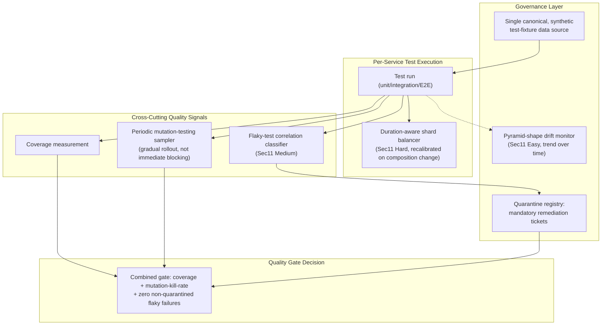
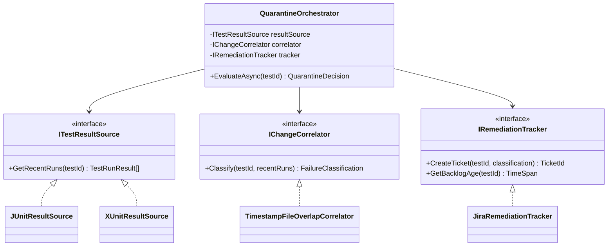

# Module 90 — CI/CD: Test Automation Strategy — Test Pyramid, Flakiness, Coverage & Quality Gates

> Domain: CI/CD | Level: Beginner → Expert | Prerequisite: [[01-CIPipelineArchitecture-PipelineAsCode-Caching-Monorepo]] §2.2 (fail-fast stage ordering), §2.4 (parallelization/fan-in), §Intermediate Q6 (flaky-test introduction); [[../25-DevOps/03-ReleaseDeploymentStrategies-BlueGreen-Canary-ProgressiveDelivery]] §Intermediate Q3 (canary vs. staging validation trade-off, mirrored here as test-double fidelity vs. real-dependency testing)

---

## 1. Fundamentals

**What**: A test automation strategy is the deliberate design of what gets tested, at what layer (unit/integration/end-to-end), how test execution is organized for speed and reliability within CI, and what "the tests passed" is actually meant to guarantee. It is not simply "write tests and run them in CI" — a poorly-designed strategy (too many slow, brittle end-to-end tests; a coverage metric optimized without regard to what it actually measures; flaky tests tolerated indefinitely) can consume enormous CI compute and developer attention while providing a materially weaker actual correctness guarantee than a smaller, better-designed suite.

**Why it exists**: Tests exist to catch regressions before they reach production, but not all tests are equally cost-effective at doing so — a test's value is a function of what it catches, how fast it runs, how reliably it distinguishes real failures from environmental noise, and how cheaply it can be maintained as the codebase evolves. A deliberate strategy (the test pyramid's shape, explicit flaky-test handling, coverage understood for what it does and doesn't measure) exists because, left undesigned, test suites drift toward whatever's easiest to write in the moment (often slow, brittle end-to-end tests exercising the whole system through the UI) rather than what's actually most cost-effective at catching regressions cheaply and reliably.

**When it matters**: From a test suite's very first tests — the shape and discipline established early strongly predicts whether a suite remains a fast, reliable asset as it grows into thousands of tests, or degrades into a slow, flaky, trusted-by-nobody liability that developers route around exactly as Module 89 §Advanced Q5 described for pipeline-bypass incentives.

**How (30,000-ft view)**:
```
Test Pyramid: MANY fast, isolated unit tests (base) -> FEWER integration tests
    against real dependencies (middle) -> FEWEST slow, full-system end-to-end
    tests (top) -- an "ice cream cone" (inverted shape) is the classic anti-pattern
Flakiness: a test that fails non-deterministically MUST be distinguished from a
    genuine intermittent regression via correlation with recent code changes,
    Module 89 Sec Advanced Q6's finding -- neither "always block" nor "always
    ignore" is correct
Coverage: a PROXY metric (did this line/branch execute) not a DIRECT measure of
    test quality (did a meaningful assertion verify correct behavior) -- gaming
    the proxy (Sec4's incident) is this module's central production example
Quality gates: what "CI passed" is actually verified to guarantee must be made
    EXPLICIT -- an unstated, assumed guarantee is this course's recurring
    "declared success != actual correctness" theme, applied to test strategy itself
```

---

## 2. Deep Dive

### 2.1 The Test Pyramid — Shape as a Deliberate Cost/Reliability Trade-off
Unit tests (the pyramid's wide base) exercise a small unit of code in isolation, with all external dependencies replaced by test doubles — they run in milliseconds, are highly reliable (no network, no shared state, no timing dependency), and pinpoint failures precisely to the specific unit under test, but by design don't validate that units correctly integrate with real dependencies or with each other. Integration tests (the narrower middle) exercise real interaction with an actual dependency (a real database, a real message broker, often containerized for CI reproducibility) — slower and more failure-prone than unit tests (network/timing variance, shared external state) but catching a class of bug unit tests structurally cannot (a correct unit, incorrectly wired to its real dependency). End-to-end tests (the narrow top) exercise the full system through its actual external interface (a browser driving the UI, a full API call chain) — the closest approximation to genuine user behavior, but the slowest, most brittle (any component's transient issue can fail an E2E test for reasons unrelated to the actual behavior being verified), and hardest to debug (a failure could originate anywhere in a long call chain). The pyramid's shape — many cheap/reliable unit tests, progressively fewer, slower, more expensive tests at each higher layer — reflects a deliberate cost-effectiveness allocation: catch as much as possible as cheaply and reliably as possible at the base, reserving the expensive, brittle top layer for the specific, smaller set of properties only observable at full-system granularity. An inverted "ice cream cone" shape (mostly E2E tests, few unit tests) inverts this cost-effectiveness allocation entirely — slow, brittle, hard-to-debug tests doing the bulk of the verification work that cheaper, more reliable unit tests could have done instead.

### 2.2 Flaky Test Detection and Quarantine — Distinguishing Noise from Signal
A flaky test fails non-deterministically under unchanged code and inputs — commonly from timing assumptions (a race condition in the test itself, not the system under test), shared mutable state leaking between tests (§2.5), or genuine external-dependency instability in an integration/E2E test. Directly extending Module 89 §Advanced Q6's finding: flaky-test handling must be data-driven, tracking each test's failure pattern over time and correlating failures against recent code changes — a test failing intermittently with no correlation to changes touching the code it exercises is a strong flakiness signal (warranting quarantine — removed from the blocking gate, but with a mandatory, tracked remediation ticket, never indefinite silent tolerance); a test whose failure rate spikes coincident with a specific, relevant code change is a strong regression signal regardless of any historical baseline flakiness, and must block. Treating every intermittent failure identically (either always-block, training engineers to distrust and route around CI, or always-ignore, silently masking real intermittent regressions) is the specific anti-pattern this data-driven correlation approach exists to avoid.

### 2.3 Test Parallelization — Balanced Sharding, Not Naive Splitting
Splitting a test suite across N parallel workers (Module 89 §2.4's sharding) only achieves its speed goal if the work is genuinely balanced across shards — naive splitting (alphabetically by test name, or by a fixed count per shard with no regard to individual test duration) routinely produces one shard containing a disproportionate share of the suite's slowest tests, so the pipeline's total wall-clock time is bottlenecked by that one imbalanced shard regardless of how many parallel workers are provisioned. Balanced sharding instead uses **historical test-duration data** (tracked per test across prior runs) to assign tests to shards such that each shard's *total estimated duration* is roughly equal — directly analogous to a load-balancing problem, and one that requires the same ongoing, not one-time, recalibration as test suite composition and individual test durations evolve over time (new tests added, existing tests becoming slower as the code they exercise grows) — a sharding assignment computed once and never recalculated silently drifts out of balance exactly as any other declared-but-unverified state this course has repeatedly examined.

### 2.4 Code Coverage — A Proxy Metric, Not a Direct Quality Measure
Code coverage (line coverage: did this line execute during any test; branch coverage: did each conditional branch execute) measures **execution**, not **verification** — a test that calls a function and asserts nothing about its result increases coverage identically to a test that calls the same function and rigorously asserts its correct behavior across meaningful input variations. This gap is precisely why a high coverage percentage is necessary but nowhere near sufficient evidence of test quality, and why treating a coverage threshold as the primary quality gate (rather than one weak signal among several) creates a direct incentive to game the proxy — writing tests that execute code paths without meaningfully verifying behavior, satisfying the metric's letter while abandoning its intended purpose entirely (§4's production incident). **Mutation testing** (deliberately introducing small, synthetic bugs — "mutants" — into the code and checking whether the existing test suite's tests actually fail as a result) is coverage's necessary complement: it measures whether the tests that *do* run actually verify meaningful behavior, since a mutant surviving (no test fails despite an introduced bug) reveals a test that executes the mutated code but doesn't actually assert anything capable of catching the mutation — the specific technique that would have caught §4's coverage-gaming incident directly, by revealing exactly which "covered" lines had no test actually capable of detecting a real defect there.

### 2.5 Test Data Management and Isolation — Preventing State Leakage Across Parallel Runs
Tests running in parallel (§2.3's sharding, or simply many tests within one process) must not share mutable state that one test's execution could alter in a way that affects another test's outcome — a shared, hand-maintained global fixture, a database row two tests both read and modify, or test-execution-order-dependent setup are all forms of hidden coupling that produce test results dependent on execution order or parallelism degree, a specific and insidious form of flakiness (§2.2) whose root cause is data isolation, not timing. The standard discipline: each test either owns its own isolated data (a fresh, uniquely-named/scoped database schema or in-memory instance per test, or per parallel worker), or test data is explicitly reset to a known state before each test runs rather than relying on tests to clean up perfectly after themselves (a single test that fails mid-execution, before its own cleanup runs, otherwise leaves polluted state for whatever test runs next) — the "reset before, not clean up after" ordering is specifically robust to a prior test's own failure, which cleanup-after approaches are not.

### 2.6 Test Doubles vs. Real Dependencies — the Fidelity/Speed Trade-off
Mocking an external dependency (a database, a third-party API) in a unit test trades fidelity (the mock may not perfectly replicate the real dependency's actual behavior, including its failure modes and edge cases) for speed and reliability (no network, no external service availability dependency). Testing against a real, typically containerized dependency (a real Postgres instance spun up for the test run, rather than a mocked repository) trades speed and some reliability for higher fidelity — genuinely exercising the real dependency's actual query semantics, constraint enforcement, and error behavior, catching a class of bug (a query that's syntactically valid but semantically wrong against the real database engine's specific behavior) that a mock, by construction, cannot. This is precisely Module 87 §Intermediate Q3's canary-vs-staging-validation trade-off recurring at the test-double-fidelity layer: neither extreme (pure mocking everywhere, or real dependencies everywhere) is uniformly correct — the right choice depends on what specific risk a given test is meant to catch, with contract tests (verifying that a mock's assumed behavior actually matches the real dependency's current, actual contract — directly extending Module 85 §12's consumer-driven contract-testing concept) serving as the periodic verification bridging the two, confirming a fast mock-based test suite's assumptions remain valid against the real dependency's actual behavior over time.

---

## 3. Visual Architecture

### The Test Pyramid — Cost/Reliability Allocation by Layer (§2.1)
```
                    /\
                   /  \      E2E Tests (fewest)
                  / E2E\     -- slowest, most brittle, full-system fidelity
                 /------\
                /        \   Integration Tests (fewer)
               /Integration\ -- real dependencies, moderate speed/reliability
              /------------\
             /              \ Unit Tests (many, the base)
            /   Unit Tests   \-- fastest, most reliable, isolated
           /------------------\

    "Ice cream cone" anti-pattern (INVERTED -- avoid):
           /------------------\
            \   E2E Tests     /  <- most of the suite here: slow, brittle,
             \--------------/      hard to debug, expensive to maintain
              \Integration /
               \----------/
                \  Unit  /   <- too few: cheap, reliable coverage underused
                 \------/
```

### Balanced Test Sharding — Duration-Aware vs. Naive Splitting (§2.3)
```
Naive (count-based, 3 shards, 9 tests):
  Shard 1: [1s, 1s, 1s]  = 3s total
  Shard 2: [1s, 1s, 45s] = 47s total   <-- BOTTLENECK: pipeline waits for this shard
  Shard 3: [1s, 1s, 1s]  = 3s total

Balanced (duration-aware, same 9 tests, historical timing data):
  Shard 1: [45s]              = 45s total
  Shard 2: [1s, 1s, 1s, 1s]    = 4s total  (idle after finishing early)
  Shard 3: [1s, 1s, 1s, 1s]    = 4s total  (idle after finishing early)

  -- Still bottlenecked by the one 45s test, but every OTHER test's shard
     assignment no longer randomly stacks multiple slow tests together;
     real balancing requires either splitting the 45s test itself or
     accepting it as the pipeline's floor duration.
```

---

## 4. Production Example

**Scenario**: An organization mandated an 85% code-coverage threshold as a required, blocking quality gate for every pull request — a well-intentioned policy adopted after a previous incident involving genuinely untested code. Teams rapidly reached and maintained the 85% threshold organization-wide, and the metric was celebrated in engineering leadership reviews as evidence of improving code quality. Eighteen months later, a critical regression in a payment-reconciliation function — a function with 100% line coverage according to the dashboard — shipped to production undetected, causing a multi-day financial discrepancy before being caught by an external audit.

**Investigation**: The specific function's tests, on inspection, called the function with representative inputs and asserted only that the function *returned without throwing an exception* — no assertion verified the actual returned value's correctness against any expected result. Every line of the function executed during the test run (satisfying line coverage completely), but no test contained an assertion capable of detecting the actual regression (a subtly incorrect calculation that still returned a plausible-looking, non-exception-throwing value).

**Root cause**: The coverage metric was optimized directly, as a target in itself, rather than as a proxy for the actual goal (meaningfully verified behavior) — under the pressure of a mandatory, blocking coverage threshold, tests were written to satisfy the *metric's letter* (execute every line) with minimal remaining effort, rather than to satisfy the *metric's intended purpose* (verify correct behavior) — directly this course's now-thoroughly-established "a declared/measured state can diverge from actual reality when the measurement itself becomes the optimized target" pattern (Modules 74/75/76/78/79/85/86/87/88/89), recurring here as a coverage percentage that accurately reflected code *execution* while being entirely disconnected from actual test *quality*.

**Fix**: (1) Introduced mutation testing (§2.4) as a complementary, non-gameable-by-the-same-mechanism quality signal — a mutant introduced into the payment-reconciliation function's calculation logic was confirmed, in retrospect, to survive against the existing (assertion-free) test suite, precisely revealing the exact gap coverage alone couldn't; (2) revised the quality-gate policy to require a minimum mutation-testing "kill rate" (the percentage of introduced mutants actually caught by the test suite) alongside, not instead of, the coverage threshold, since the two metrics measure genuinely different, complementary properties; (3) added assertion-quality review as an explicit PR-review checklist item for any new test, specifically flagging tests whose only assertion is "did not throw" as requiring justification or a stronger assertion.

**Lesson**: A coverage percentage is a *declared* signal about test execution, not a *verified* signal about test quality — treating it as the latter, especially under the pressure of a mandatory blocking threshold that incentivizes the metric's satisfaction over its underlying purpose, reproduces exactly the failure mode this course has examined across infrastructure drift, configuration parity, deployment validation, and CI's own affected-project computation: **a metric or check, once it becomes the thing directly optimized against rather than a proxy for what actually matters, tends to diverge from what it was originally meant to measure** — a specific instance of Goodhart's Law this course's cross-domain findings independently, repeatedly rediscover.

---

## 5. Best Practices
- Design the test suite's shape deliberately toward the pyramid (many fast unit tests, fewer integration tests, fewest E2E tests) rather than letting it drift toward whatever's easiest to write in the moment (§2.1).
- Handle flaky tests via data-driven correlation with recent code changes, quarantining genuine flakiness with a mandatory remediation ticket rather than either permanent blocking or permanent silent tolerance (§2.2, Module 89 §Advanced Q6).
- Balance test shards using historical, per-test duration data, recalibrated periodically as suite composition evolves, rather than a naive one-time count-based or alphabetical split (§2.3).
- Treat code coverage as one input among several, never the sole quality gate — pair it with mutation testing or explicit assertion-quality review to verify tests meaningfully check behavior, not merely execute code (§2.4, §4).
- Reset test data to a known state before each test runs (not merely relying on cleanup after), ensuring a prior test's failure can't pollute a subsequent test's isolated starting state (§2.5).

## 6. Anti-patterns
- An inverted "ice cream cone" test suite shape, with most verification effort in slow, brittle E2E tests that cheaper, more reliable unit tests could have provided instead (§2.1).
- Treating every intermittent test failure identically — either always blocking (training engineers to distrust CI) or always silently retrying/ignoring (masking genuine intermittent regressions) — rather than correlating against recent code changes (§2.2).
- A mandatory, blocking coverage threshold with no complementary assertion-quality signal, creating a direct incentive to game the metric's letter rather than its intended purpose (§4).
- Naive, non-duration-aware test sharding that leaves pipeline wall-clock time bottlenecked by one imbalanced shard despite high parallelism (§2.3).
- Tests relying on "clean up after yourself" data hygiene rather than "reset to known state before," leaving shared state vulnerable to pollution from any test that fails before its own cleanup runs (§2.5).

---

## 10. Interview Questions

### Basic (10)

1. **Q: What is the test pyramid?**
   **A:** A model describing the ideal shape of a test suite — many fast, isolated unit tests at the base, fewer integration tests against real dependencies in the middle, and the fewest, slowest end-to-end tests at the top.
   **Why correct:** States both the three layers and the deliberate, narrowing shape from base to top.
   **Common mistakes:** Believing the pyramid means "only write unit tests" rather than a deliberate proportional allocation across all three layers.
   **Follow-ups:** "What's the anti-pattern shape called, and why is it worse?" (The "ice cream cone" — mostly E2E tests, few unit tests — inverting the cost-effectiveness allocation the pyramid's shape exists to optimize.)

2. **Q: What is a flaky test?**
   **A:** A test that fails non-deterministically under unchanged code and inputs — commonly from timing assumptions, shared mutable state, or genuine external-dependency instability.
   **Why correct:** States the defining property (non-deterministic failure under unchanged conditions) and common causes.
   **Common mistakes:** Assuming any intermittently-failing test is automatically "just flaky" without checking whether the intermittency correlates with a recent, relevant code change.
   **Follow-ups:** "Why is 'always ignore flaky failures' dangerous?" (It can mask a genuine, intermittent regression as if it were merely test infrastructure noise.)

3. **Q: What does code coverage measure?**
   **A:** Whether a given line or branch of code executed during test runs — execution, not whether any test meaningfully verified the code's correct behavior.
   **Why correct:** Precisely states coverage is an execution proxy, not a direct quality measure.
   **Common mistakes:** Treating a high coverage percentage as equivalent to "this code is well-tested" without considering whether the executing tests contain meaningful assertions.
   **Follow-ups:** "What technique complements coverage by measuring assertion quality?" (Mutation testing — introducing synthetic bugs and checking whether the test suite actually catches them.)

4. **Q: What is mutation testing?**
   **A:** Deliberately introducing small, synthetic bugs ("mutants") into code and checking whether the existing test suite's tests fail as a result — a surviving mutant reveals a test gap coverage alone wouldn't show.
   **Why correct:** States the mechanism (introduce mutants, check for test failures) and what a surviving mutant reveals.
   **Common mistakes:** Confusing mutation testing with coverage measurement — they answer different questions (does a test exist that would catch this specific defect vs. did this line execute at all).
   **Follow-ups:** "Why is a surviving mutant worse news than low coverage on that line?" (Low coverage honestly signals "untested"; a surviving mutant on a "covered" line signals a test that executes the code but doesn't actually verify it — a more dangerous, false sense of security.)

5. **Q: What is test sharding?**
   **A:** Splitting a test suite across multiple parallel workers, each running a subset, to reduce total wall-clock pipeline duration.
   **Why correct:** States the mechanism and its purpose (wall-clock reduction via parallelism).
   **Common mistakes:** Assuming any splitting scheme achieves balanced parallelism — naive, non-duration-aware splitting can leave one shard as a bottleneck.
   **Follow-ups:** "What data does balanced sharding require?" (Historical, per-test duration data, used to assign tests such that each shard's total estimated duration is roughly equal.)

6. **Q: Why do unit tests run faster and more reliably than integration or end-to-end tests?**
   **A:** Unit tests isolate a small unit of code with all external dependencies replaced by test doubles — no network calls, no real database, no timing dependency on external systems — while integration and E2E tests exercise real dependencies or the full system, introducing genuine network/timing/external-state variance.
   **Why correct:** States the specific mechanism (isolation via test doubles vs. real dependency interaction) causing the speed/reliability difference.
   **Common mistakes:** Assuming the difference is merely about test complexity or line count rather than the presence or absence of real external dependencies.
   **Follow-ups:** "What can integration tests catch that unit tests structurally cannot?" (A correctly-implemented unit incorrectly wired to its real dependency — a class of bug invisible when the dependency is mocked.)

7. **Q: Why must test data be isolated across parallel test runs?**
   **A:** Tests sharing mutable state (a database row, a global fixture) can have one test's execution alter data in a way that affects another test's outcome, producing results dependent on execution order or parallelism degree — a specific, insidious form of flakiness.
   **Why correct:** States the specific mechanism (shared mutable state) and its consequence (order/parallelism-dependent flakiness).
   **Common mistakes:** Assuming all flakiness stems from timing issues, missing that shared, unisolated test data is an equally common and distinct root cause.
   **Follow-ups:** "Why is 'reset state before each test' more robust than 'clean up after each test'?" (A test that fails mid-execution, before its own cleanup runs, still leaves a clean starting state for the next test if reset happens beforehand — cleanup-after approaches don't survive a prior test's own failure.)

8. **Q: What is a test double?**
   **A:** A stand-in object (a mock, stub, or fake) replacing a real external dependency in a test, trading fidelity to the real dependency's actual behavior for speed and reliability.
   **Why correct:** States both what a test double is and the specific trade-off it makes.
   **Common mistakes:** Assuming a test double perfectly replicates the real dependency's behavior, including edge cases and failure modes, when it only replicates whatever the mock's author anticipated.
   **Follow-ups:** "What technique verifies a mock's assumptions still match the real dependency's actual, current behavior?" (Contract testing.)

9. **Q: Why should a mandatory, blocking coverage threshold not be the sole quality gate for a pull request?**
   **A:** A blocking threshold optimized as the sole gate creates a direct incentive to satisfy the metric's letter (execute every line) rather than its intended purpose (verify correct behavior) — a test can achieve full coverage while asserting nothing meaningful about behavior.
   **Why correct:** States the specific incentive mechanism (metric-as-sole-gate drives gaming) that makes coverage alone insufficient.
   **Common mistakes:** Believing a high coverage number is inherently reassuring regardless of what quality-verification mechanism, if any, accompanies it.
   **Follow-ups:** "What should coverage be paired with instead?" (Mutation testing or explicit assertion-quality review, verifying tests meaningfully check behavior rather than merely execute code.)

10. **Q: What's the difference between branch coverage and line coverage?**
    **A:** Line coverage tracks whether each line of code executed at least once; branch coverage additionally tracks whether each conditional branch (both the true and false paths of an if-statement, for example) was exercised — branch coverage is a stricter, more informative metric than line coverage alone.
    **Why correct:** Precisely distinguishes what each metric tracks.
    **Common mistakes:** Assuming high line coverage implies high branch coverage — a line containing a conditional can execute (satisfying line coverage) while only one of its branches is ever actually taken by any test.
    **Follow-ups:** "Why might a codebase report high line coverage but much lower branch coverage?" (Conditional logic where tests exercise only the common/happy-path branch, never triggering the less-common error/edge-case branch, despite the line containing that logic technically executing.)

### Intermediate (10)

1. **Q: Why does §4's coverage-gaming incident recur the same structural pattern as Module 89's build-graph blind-spot incident, despite involving test-quality metrics rather than dependency-graph computation?**
   **A:** In both cases, an automated, numerically-reported metric (a coverage percentage; an affected-project computation) was trusted as a faithful proxy for the actual property that mattered (test quality; complete dependency detection) — and in both cases, the metric's specific measurement mechanism had a blind spot (coverage can't distinguish an assertion-free test from a rigorous one; static analysis can't see reflection-based dependencies) that a sufficiently-motivated or merely-unaware practice could fall into, producing a confidently-reported, passing metric that was, in the dimension that actually mattered, disconnected from reality.
   **Why correct:** Identifies the shared abstract structure (a trusted proxy metric with an inherent measurement blind spot) across both incidents rather than treating them as coincidentally similar.
   **Common mistakes:** Treating the coverage-gaming incident as a uniquely test-strategy-specific problem rather than recognizing it as this course's now-repeated pattern recurring in a new metric.
   **Follow-ups:** "What complementary verification did each incident's fix add?" (Build-graph: a periodic full-suite backstop independent of the primary computation. Coverage: mutation testing, a different measurement mechanism not subject to the same specific blind spot.)

2. **Q: A team argues that since flaky-test quarantine removes a test from the blocking gate, quarantined tests provide no ongoing value and might as well be deleted. Evaluate this.**
   **A:** Deleting a quarantined test discards whatever genuine test coverage it was originally written to provide — the flakiness is (per §2.2's data-driven distinction) a property of the test's *implementation* (timing assumptions, shared state) uncorrelated with the *behavior it verifies*, which may remain entirely valid and valuable to test. Quarantine with a mandatory remediation ticket preserves the intent to eventually fix the test's implementation and restore its blocking status, while deletion permanently and silently abandons the underlying test coverage — exactly Module 87 §Advanced Q9's "a documented-but-unexercised capability is unverified" principle, now applied to test coverage: an indefinitely-quarantined-then-deleted test's coverage gap is a silent, permanent regression in the suite's actual protective power, easy to overlook precisely because deletion removes even the quarantine ticket's visible reminder that a gap exists.
   **Why correct:** Distinguishes the test's implementation flakiness from the underlying behavioral coverage it provides, and identifies deletion as a worse outcome (silent, permanent coverage loss) than tracked quarantine.
   **Common mistakes:** Conflating "this test's current implementation is flaky" with "this test's underlying purpose has no value," concluding deletion is a reasonable simplification.
   **Follow-ups:** "What should happen if a quarantine remediation ticket goes unaddressed for months?" (Escalate its priority or treat the indefinitely-quarantined status itself as a tracked, dashboard-visible risk — directly Module 88 §Advanced Q9's compensating-controls-with-expiration pattern applied to test-quarantine debt.)

3. **Q: Why might a test suite with 100% branch coverage still fail to catch a real regression that mutation testing would have caught?**
   **A:** Branch coverage confirms every conditional path was *executed* by some test, but says nothing about whether any test's *assertions* would actually detect a defect introduced along that path — a test could execute both branches of an if-statement while asserting only a property unrelated to the specific logic that branch implements (e.g., asserting "the function returned successfully" for both branches, without checking that each branch's specific expected output was produced) — 100% branch coverage with assertion-free or assertion-weak tests provides zero actual defect-detection power despite the metric's maximum possible reading, exactly reproducing §4's incident's mechanism at the branch-coverage level rather than the simpler line-coverage level.
   **Why correct:** Extends §4's finding to branch coverage specifically, showing the same gap (execution without meaningful verification) persists even at coverage's strictest, most granular level.
   **Common mistakes:** Assuming branch coverage, being stricter than line coverage, is therefore immune to the assertion-quality gap that afflicts line coverage — the gap is orthogonal to coverage granularity entirely.
   **Follow-ups:** "Would increasing coverage granularity further (e.g., path coverage, tracking every possible combination of branches) close this gap?" (No — any execution-based coverage metric, however granular, remains blind to assertion quality; only a technique like mutation testing, which checks whether tests actually *detect* introduced defects, addresses the gap directly.)

4. **Q: How should a team decide the appropriate ratio of mocked-dependency unit tests versus real-dependency integration tests for a given piece of functionality, rather than defaulting to one extreme?**
   **A:** The decision should track what specific risk a given piece of functionality carries: pure business logic with no meaningful interaction with an external system (a pricing calculation, a validation rule) is almost entirely unit-testable with mocks, since there's no real-dependency behavior to validate against — an integration test here adds cost with minimal additional risk coverage. Logic whose correctness genuinely depends on a real dependency's specific behavior (a complex SQL query's actual execution semantics, a message broker's actual delivery/ordering guarantees under real conditions) needs integration-test coverage specifically because a mock, built from the test author's *assumptions* about the dependency's behavior, cannot validate those assumptions are actually correct — directly the same risk-matching principle Module 87 §Intermediate Q7 established for canary vs. blue-green deployment-strategy selection, applied here to test-double-fidelity selection instead of deployment-strategy selection.
   **Why correct:** Ties the mock/real-dependency ratio decision to the specific risk profile of what's being tested, rather than proposing a fixed organizational ratio, and explicitly connects to the established cross-domain risk-matching principle.
   **Common mistakes:** Defaulting to "mock everything for speed" or "use real dependencies everywhere for fidelity" as a uniform organizational policy, rather than matching the choice to each specific test's actual risk profile.
   **Follow-ups:** "What role does contract testing play in this decision?" (It lets a team confidently rely on fast, mocked unit tests for the bulk of coverage while periodically verifying — via the contract test — that the mock's assumed behavior still matches the real dependency's actual, current contract, reducing the need for extensive real-dependency integration testing to catch mock/reality drift specifically.)

5. **Q: Why does a test suite's shape tend to drift toward the "ice cream cone" anti-pattern (§2.1) over time without deliberate intervention, even when a team starts with a well-shaped pyramid?**
   **A:** End-to-end tests are often the *easiest* tests to write for a new feature under time pressure — they require no careful thought about isolating a unit's dependencies or designing a testable interface, simply driving the feature through its existing external surface exactly as a manual tester would — while writing a well-isolated unit test frequently requires deliberately designing the code itself to be testable (dependency injection, avoiding tightly-coupled side effects), a design discipline that's easy to skip under deadline pressure. Absent deliberate architectural discipline and code-review enforcement, the path of least resistance for any individual feature addition favors adding another E2E test over refactoring for unit-testability, and this individually-reasonable local choice, repeated across many features over time, aggregates into an organization-wide shape drift toward the inverted cone.
   **Why correct:** Identifies the specific behavioral incentive (E2E tests require less upfront design discipline) driving the drift, rather than attributing it to a vague lack of "discipline" in the abstract.
   **Common mistakes:** Assuming test-suite shape is a one-time architectural decision rather than an emergent property requiring ongoing, deliberate counter-pressure against a natural drift incentive.
   **Follow-ups:** "What structural, not merely policy-based, countermeasure would help?" (Code review specifically flagging new E2E tests that could have been unit tests instead, and — more durably — designing the codebase's architecture itself (dependency injection, clear seams between business logic and I/O) to make writing a unit test genuinely the path of least resistance, not merely the theoretically-preferred one.)

6. **Q: A team's nightly mutation-testing run reports a 40% mutant-kill rate, while their line-coverage dashboard shows 90%. How should this specific combination be interpreted, and what should the team investigate first?**
   **A:** This combination is a strong, specific signal of exactly §4's failure mode at scale: a large fraction of "covered" code (90% of lines execute during tests) has tests that, when a synthetic defect is introduced, fail to detect it 60% of the time — meaning most of that coverage is providing substantially less actual defect-detection value than the coverage percentage alone would suggest. The team should investigate which specific modules have the largest coverage/kill-rate gap (rather than treating it as a uniform, organization-wide problem) and audit a sample of tests in those modules specifically for assertion quality (are they checking meaningful properties, or merely confirming no exception was thrown) — prioritizing remediation where the gap is largest and the underlying code's risk/criticality is highest, rather than attempting to improve mutation-kill-rate uniformly across the entire codebase at once.
   **Why correct:** Correctly interprets the specific numeric combination as evidence of widespread assertion-quality gaps (not a data error or unrelated issue) and proposes a risk-prioritized, targeted investigation rather than an undifferentiated response.
   **Common mistakes:** Treating the two metrics as contradictory or one of them as erroneous, rather than recognizing they measure genuinely different properties (execution vs. actual defect-detection) that can and often do diverge significantly.
   **Follow-ups:** "Why not simply mandate a minimum mutation-kill-rate threshold organization-wide immediately, mirroring the original coverage-threshold policy?" (Risk of recreating the identical gaming dynamic §4 already demonstrated for coverage — an immediately-mandatory, blocking mutation-kill-rate threshold could itself be gamed by writing tests specifically tuned to kill known mutant patterns rather than genuinely improving assertion quality broadly; a more measured, risk-prioritized rollout with genuine review of remediated tests is more durable than an immediate blanket mandate.)

7. **Q: How does duration-aware test sharding (§2.3) interact with flaky-test quarantine (§2.2) — specifically, what happens to a shard's balance if a quarantined test is later un-quarantined and restored to the blocking suite?**
   **A:** The historical duration data driving shard-balancing decisions was computed without that test's contribution (since it was excluded from the blocking suite during quarantine) — restoring it without recalibrating shard assignments effectively adds an unaccounted-for duration to whatever shard it's assigned to by default, potentially reintroducing exactly the imbalance duration-aware sharding was designed to prevent, especially if the restored test happens to be a long-running one. This means shard-balancing recalibration must be triggered not only periodically (§2.3's general recalibration need) but specifically whenever the blocking test set's membership changes — a quarantine restoration, a newly-added test, or a deleted test — rather than treating recalibration as a purely time-scheduled activity independent of suite-composition changes.
   **Why correct:** Identifies the specific interaction (quarantine-restoration changes the blocking suite's composition, invalidating stale historical-duration-based shard assignments) that a purely time-based recalibration schedule might miss.
   **Common mistakes:** Treating shard-balance recalibration and flaky-test-quarantine management as entirely independent processes with no interaction, missing that a membership change in one directly affects the other's correctness.
   **Follow-ups:** "What would be a robust trigger mechanism for recalibration, beyond a fixed schedule?" (Recalibrating shard assignments as part of the same CI process that manages quarantine-status changes and new-test additions, treating suite-composition changes as the actual triggering event rather than relying solely on a fixed calendar interval that might miss a change occurring between scheduled recalibrations.)

8. **Q: Why is "reset test data to a known state before each test" specifically more robust to test-execution failures than "clean up test data after each test," beyond the general robustness argument in §2.5?**
   **A:** Consider the specific failure sequence: Test A runs, mutates shared data, and then crashes or times out *before* reaching its own cleanup code (a common occurrence — a test that fails is, definitionally, not completing its intended execution path, including whatever cleanup logic was written to run at its end). Under a "clean up after" discipline, Test B (running next) now inherits Test A's polluted, uncleaned state — a failure in Test A cascades into an incorrect, confusing failure in Test B that has nothing to do with Test B's actual logic, compounding the diagnostic difficulty of the original failure. Under a "reset before" discipline, Test B's setup phase resets to a known-clean state regardless of what Test A left behind, fully containing Test A's failure to Test A alone and preventing the cascading, misleading secondary failure entirely.
   **Why correct:** Walks through the specific failure sequence explaining exactly why reset-before survives a prior test's failure while clean-up-after does not, rather than asserting the conclusion without mechanism.
   **Common mistakes:** Treating "clean up after" as equally robust in the common case (both approaches work fine when no test ever fails), missing that the entire point of the comparison is behavior specifically under a prior test's failure — the case that most needs a resilient data-isolation discipline.
   **Follow-ups:** "Does 'reset before' fully eliminate the need for any cleanup logic at all?" (Not necessarily — cleanup can still matter for external resource management, such as releasing a database connection or deleting a temporary file, to avoid unbounded resource accumulation across many test runs; the distinction is specifically about *test-outcome-affecting shared data*, not all forms of resource cleanup.)

9. **Q: Design a policy for when a genuinely slow but valuable end-to-end test should be retained versus refactored into faster integration/unit tests, given that §2.1 warns against an inverted pyramid but doesn't argue for eliminating E2E tests entirely.**
   **A:** An E2E test earns its place specifically when it verifies a property genuinely unobservable at any lower layer — the actual, full-system behavior a real user experiences, spanning multiple services/components whose *correct integration* (not merely each component's individual correctness, already covered by lower-layer tests) is the specific thing being verified; a smoke test confirming the entire critical user journey (login, checkout, payment) genuinely works end-to-end after a deployment is a legitimate, valuable use of E2E testing's unique fidelity. An E2E test that could be decomposed into a unit test (verifying one component's business logic) plus an integration test (verifying that component's correct wiring to its direct dependency) without losing any genuinely full-system-only property is a candidate for refactoring — the "full system" framing was providing brittleness and slowness without a correspondingly unique verification benefit. The policy: for every existing or proposed E2E test, explicitly ask "what specific property does this verify that no combination of faster, lower-layer tests could verify equally well" — if no compelling answer exists, decompose it; if a compelling answer exists (genuine cross-component integration behavior, or actual user-journey validation), retain it deliberately, as a small, well-justified minority of the suite.
   **Why correct:** Provides a concrete decision criterion (does this test verify something genuinely unobservable at a lower layer) rather than either extreme (eliminate all E2E tests, or treat every existing E2E test as untouchably justified).
   **Common mistakes:** Treating §2.1's pyramid-shape guidance as an argument for eliminating E2E tests entirely, rather than recognizing a small, deliberately-curated set of genuinely full-system-verifying E2E tests as the pyramid's legitimate (if narrow) top layer.
   **Follow-ups:** "How would you handle a legacy suite with hundreds of E2E tests, most of which likely don't meet this bar?" (A prioritized, incremental decomposition effort — starting with the slowest and most frequently-flaky E2E tests first, since they impose the highest ongoing cost, applying the same risk/cost-prioritization discipline this course has established repeatedly rather than attempting a disruptive, all-at-once suite rewrite.)

10. **Q: How does this module's coverage-gaming incident (§4) extend Module 88's capstone principle beyond infrastructure/policy/CI-mechanism artifacts into test-strategy metrics specifically, and what does this suggest about applying the principle to a not-yet-examined sixth governance domain?**
    **A:** Module 88's principle — cover every write path, verify rather than merely document/measure, make the compliant path the easiest path — predicted that any declared/measured proxy for an underlying property (compliance, correctness, completeness) would, absent deliberate, independent verification, tend to diverge from that underlying property, especially once the proxy itself becomes the thing directly optimized against (a mandatory, blocking metric). Coverage's gaming under a mandatory threshold is a precise, independent confirmation of this prediction in a domain (test-quality measurement) the capstone never explicitly examined — suggesting that for any sixth, not-yet-encountered domain involving a measured or declared proxy metric treated as a blocking gate, the same diagnostic applies: ask what the metric actually measures versus what it's assumed to guarantee, whether that gap has an independent verification mechanism (analogous to mutation testing here, or the periodic full-suite backstop in Module 89), and whether making the metric a hard, blocking gate creates a specific incentive to satisfy its letter rather than its purpose.
    **Why correct:** Explicitly applies Module 88's named principle as a predictive tool to this module's specific incident, and generalizes the diagnostic into a reusable checklist for future, unencountered domains, demonstrating the principle's actual predictive (not merely retrospective) power.
    **Common mistakes:** Treating each module's incident as independently discovered rather than recognizing that the capstone's principle, once established, should have let a careful reader *predict* the coverage-gaming failure mode before ever encountering §4's specific incident narrative.
    **Follow-ups:** "What would you predict, using this same diagnostic, about a mandatory 'test count' or 'lines of test code' metric as a quality gate, without yet having seen a specific incident?" (That it would be gamed identically — trivial, low-value tests added purely to satisfy a count threshold, with the same disconnect between the measured proxy (test quantity) and the actual goal (defect-detection quality) this module's coverage incident demonstrates for a different specific metric.)

### Advanced (10)

1. **Q: Diagnose §4's incident from first principles and design the complete structural fix — not merely adding mutation testing.**
   **A:** Root cause: a proxy metric (line coverage) elevated to a mandatory, blocking gate with no complementary verification of what the proxy actually failed to measure (assertion quality), combined with organizational incentive pressure (a hard threshold under time constraints) that specifically rewards satisfying the metric's letter over its purpose. Structural fix: (1) introduce mutation testing as a complementary, structurally-different-blind-spot signal, per §4's actual remediation; (2) require any new mutation-testing threshold to be introduced gradually and risk-prioritized (per Intermediate Q6's caution) rather than immediately mandatory-and-blocking organization-wide, avoiding recreating the identical gaming dynamic against the new metric; (3) add explicit assertion-quality review as a PR checklist item, treating "does this test's assertion actually verify meaningful behavior" as a first-class, human-judgment review criterion that no automated metric alone can fully substitute for; (4) audit the organization's other mandatory, blocking metrics (test count thresholds, any other single-number quality gate) for the identical vulnerability, since the specific mechanism (metric-as-blocking-gate incentivizes proxy-gaming) is generic and plausibly recurs wherever any other single metric occupies the same structural role.
   **Why correct:** Addresses the immediate gap, the risk of recreating the same gaming dynamic against the fix's own new metric, the human-judgment complement no metric alone replaces, and the systemic audit for the same vulnerability pattern elsewhere.
   **Common mistakes:** Fixing only by adding mutation testing as an immediately-mandatory blocking threshold, without recognizing this risks recreating the identical gaming incentive against the new metric that the original coverage-threshold policy already demonstrated.
   **Follow-ups:** "Why is human-judgment assertion-quality review necessary even with mutation testing in place?" (Mutation testing catches assertion-free or weak-assertion tests specifically against the *mutants the tool happens to generate* — a test could still pass mutation testing while asserting something technically meaningful but narrower than the property that actually matters; human review remains a complementary, not fully substitutable, check.)

2. **Q: A QA leadership team proposes a metric of "number of test cases written per sprint" as a productivity KPI for the testing organization. Evaluate this using this module's established diagnostic framework.**
   **A:** Applying Intermediate Q10's generalized diagnostic: this metric measures test *quantity produced*, not defect-detection *quality* or *value* — and as a KPI directly optimized against (especially if tied to performance evaluation), it creates a strong, predictable incentive to write many trivial, low-value tests (exactly the coverage-gaming dynamic, now applied to a raw count rather than a percentage) rather than fewer, well-designed, high-value tests targeting genuine risk. The correct response is not to reject test-organization measurement entirely, but to measure outcomes the metric is meant to serve as a proxy for more directly — regression escape rate (bugs that reached production despite the test suite), mutation-kill-rate trends, and time-to-detect a real regression — none of which are as easily gamed by simply producing more low-value artifacts, and none of which reward quantity independent of actual defect-catching value.
   **Why correct:** Applies the established diagnostic to a new, plausible-sounding but structurally identical proposed metric, correctly predicting its gaming risk and proposing outcome-based alternatives less susceptible to the same gaming dynamic.
   **Common mistakes:** Either accepting the proposed KPI uncritically because it seems like a reasonable productivity signal, or rejecting all testing-organization measurement as inherently unmeasurable, rather than identifying better, outcome-oriented alternative metrics.
   **Follow-ups:** "Why is 'regression escape rate' harder to game than 'test count' or even 'coverage percentage'?" (It measures the actual, ultimate outcome the entire testing effort exists to achieve — bugs that reached production — rather than any intermediate proxy for that outcome; gaming it directly would require actually reducing production regressions, which is precisely the goal, not a side effect to be avoided.)

3. **Q: Design a test-strategy governance framework for an organization with hundreds of teams, ensuring the test-pyramid shape and quality-gate discipline established in this module don't decay over time the way Module 88's golden-path templates and Module 89's cache-key completeness were shown to silently decay without ongoing verification.**
   **A:** Apply the identical pattern this course has established repeatedly for preventing silent decay: (1) periodic, not one-time, measurement of test-suite shape per team/service (the actual unit/integration/E2E test-count ratio, tracked over time, alerting on drift toward the ice-cream-cone anti-pattern rather than assuming an initially-good shape persists); (2) periodic, sampled mutation-testing runs (not merely a one-time adoption) to detect assertion-quality decay as a codebase and its tests evolve, since new tests added later may reintroduce the exact assertion-free pattern §4's original incident demonstrated even after the initial remediation; (3) a standing, dashboard-visible metric for flaky-test-quarantine backlog age and count, treating an ever-growing, never-shrinking quarantine list as a governance-decay signal exactly as an ever-growing policy-exception list would be treated in Module 88's framework; (4) periodic, adversarial audits deliberately introducing a known-bad test (an assertion-free test, a test with a hardcoded, ignored dependency) into a sample project's PR flow, confirming the organization's review/gate process actually catches it — the same "periodically inject a known-violating fixture against the live enforcement path" principle Module 88 §Advanced Q7 established for policy-as-code liveness verification, now applied to test-quality-review liveness.
   **Why correct:** Applies this course's now-thoroughly-established "prevent silent decay via periodic, not one-time, verification" principle specifically and concretely to each of this module's own findings (pyramid shape, mutation-testing coverage, quarantine backlog, review-process effectiveness).
   **Common mistakes:** Establishing each of this module's practices (pyramid-shape awareness, mutation testing, quarantine discipline) as one-time initiatives without the periodic, standing re-verification that prevents them from silently decaying exactly as every other governance practice this course examined was shown to decay without it.
   **Follow-ups:** "Why is the adversarial 'inject a known-bad test and confirm the review process catches it' check specifically valuable, beyond the other three periodic measurements?" (It verifies the *human review process itself* remains effective, not merely that automated metrics are being tracked — a distinct failure mode where the metrics dashboard looks healthy while the actual review discipline that's supposed to act on it has quietly eroded.)

4. **Q: How would you design test-execution-order independence verification — proving that a test suite's results don't depend on the order tests happen to run in — at scale, for a suite with thousands of tests, without simply running every possible ordering (computationally infeasible)?**
   **A:** Full exhaustive ordering verification is combinatorially infeasible, but the specific risk (§2.5's shared-state coupling) can be effectively sampled: (1) run the full suite in a randomized order on a recurring (not necessarily every-commit) schedule, comparing results against the standard, fixed-order run — any test that passes in one order but fails in another is flagged as exhibiting order-dependence, a strong, actionable signal even without exhaustive coverage of every possible ordering; (2) run the suite with maximum parallelism/sharding variation periodically (different shard counts and assignments than the standard CI configuration) specifically to surface state-sharing bugs that a fixed, familiar sharding configuration might never happen to expose; (3) for any test flagged as order-dependent by either check, treat it identically to a discovered flaky test (§2.2) — quarantine with mandatory remediation, since order-dependence is, in effect, a specific, root-cause-identified subclass of flakiness rather than a wholly separate concern.
   **Why correct:** Proposes a practical, sampling-based (not exhaustive) verification approach directly analogous to this module's other periodic-backstop patterns, and correctly frames order-dependence as a specific, diagnosable subclass of the general flakiness problem rather than a wholly distinct concern requiring separate handling.
   **Common mistakes:** Either declaring exhaustive ordering verification the only "real" solution (infeasible at scale, leading to no verification at all being implemented) or assuming standard, unvaried CI execution order/sharding is sufficient to surface any order-dependence bug that exists.
   **Follow-ups:** "Why is varying sharding/parallelism configuration specifically valuable, beyond randomizing execution order alone?" (Some state-sharing bugs manifest specifically under concurrent execution — two tests running truly simultaneously in different parallel workers, rather than merely in a different sequential order — which pure order-randomization within a single worker wouldn't surface; varying the parallelism configuration itself is a distinct, complementary check.)

5. **Q: A team's integration tests, which spin up a real, containerized database per test run, have become the pipeline's single largest time cost as the team's test count has grown — each test run pays the database container's full startup cost independently. Design a fix that preserves the tests' real-dependency fidelity while addressing the cost.**
   **A:** The core inefficiency is redundant, per-test container startup cost for what's fundamentally the same dependency setup repeated many times — the fix should decouple "dependency provisioning cost" from "per-test isolation," analogous to Module 89 §Advanced Q8's decoupling of runner-reuse performance from runner-reuse security risk: provision the database container *once* per test-suite run (not once per individual test), and achieve the necessary per-test data isolation (§2.5) not via a fresh container per test, but via a fresh, uniquely-scoped schema or transaction-rollback-per-test within that single, shared container instance — preserving genuine fidelity to the real database engine's actual behavior (the fidelity benefit integration tests exist to provide) while eliminating the redundant, per-test provisioning cost that was the actual bottleneck, not the database engine's real-dependency nature itself.
   **Why correct:** Correctly identifies the actual cost driver (redundant per-test provisioning, not real-dependency fidelity itself) and proposes a fix preserving the fidelity benefit while addressing the specific, separable cost.
   **Common mistakes:** Concluding the fix must be abandoning real-dependency integration testing in favor of mocks (sacrificing the fidelity benefit) rather than recognizing the actual inefficiency is separable from the fidelity property and can be fixed independently.
   **Follow-ups:** "What isolation mechanism (schema-per-test vs. transaction-rollback-per-test) would you choose, and why?" (Transaction-rollback-per-test is typically faster (no schema-creation overhead per test) but requires the database engine and test framework to support wrapping each test in a transaction that's rolled back rather than committed — schema-per-test is more universally applicable but carries a small per-test schema-creation cost, a trade-off decision matching this course's established pattern of weighing cost against the specific isolation guarantee needed.)

6. **Q: Explain how snapshot testing (comparing a component's rendered output against a previously-approved "golden" snapshot) fits into the test pyramid, and identify its specific failure mode that resembles §4's coverage-gaming incident.**
   **A:** Snapshot testing sits awkwardly across the pyramid's layers — it can verify a unit's output deterministically (unit-test-like speed and isolation) but, unlike a hand-written assertion, doesn't require the test author to articulate *what specifically* about the output should be correct; instead, it captures whatever the component currently produces as the accepted baseline. Its specific §4-analogous failure mode: when a snapshot test fails after a genuine, intentional change, the path of least resistance is often to simply "update the snapshot" (accepting the new output as the new baseline) without actually reviewing whether the change is *correct* — converting a test that should have provided regression-detection value into a rubber-stamp that silently approves whatever the code currently does, satisfying "the test passed" while providing essentially the same near-zero actual verification value as §4's assertion-free coverage-gaming tests, via a structurally different but functionally analogous mechanism (blind snapshot acceptance instead of assertion-free execution).
   **Why correct:** Precisely identifies the specific mechanism (blind snapshot-update acceptance) by which snapshot testing can degrade into providing the same illusory coverage §4's incident demonstrated for line-coverage gaming, despite the superficially different testing technique.
   **Common mistakes:** Treating snapshot testing as inherently equivalent in rigor to hand-written behavioral assertions, without considering the specific "blindly accept the new snapshot" failure mode that undermines its actual verification value.
   **Follow-ups:** "What discipline would preserve snapshot testing's genuine value while avoiding this failure mode?" (Requiring snapshot updates to go through the same PR-review scrutiny as any other code change, with the reviewer explicitly confirming the new snapshot reflects correct, intended behavior — not merely "the test now passes" — restoring the human-judgment verification step that blind acceptance skips.)

7. **Q: How would you evaluate whether an organization's investment in end-to-end browser-automation testing (Selenium/Playwright-style) is proportionate to its actual value, given that such tests are simultaneously among the most expensive to maintain and the most reassuring to non-technical stakeholders?**
   **A:** The specific risk here is a decision-making distortion: E2E browser tests are highly *visible* and intuitively reassuring to stakeholders (a demo showing a robot literally clicking through the product is viscerally convincing), which can drive investment disproportionate to their actual, marginal defect-detection value relative to their maintenance cost — exactly the kind of governance decision this course has repeatedly warned against making based on an intuitively-appealing but not-actually-most-informative signal (echoing Module 87 §Advanced Q2's "canary that always passes quickly looks reassuring but may not indicate real validation" caution). The proportionate evaluation: track the specific defects each E2E test has actually caught over its lifetime (a defect genuinely only catchable at full-system granularity) against its maintenance cost (how often it breaks due to unrelated flakiness/environment issues versus genuine regressions) — an E2E test with a poor catch-to-maintenance-cost ratio, however reassuring its demo value, is a candidate for the Intermediate Q9 decomposition-or-retain decision, made on the actual data rather than the stakeholder-visibility appeal.
   **Why correct:** Identifies the specific decision-distortion risk (visible reassurance disproportionate to actual value) and proposes a data-driven evaluation (catch rate vs. maintenance cost) rather than accepting stakeholder-comfort as a valid substitute for genuine cost-effectiveness measurement.
   **Common mistakes:** Either uncritically expanding E2E test investment because stakeholders find it reassuring, or dismissing E2E testing's genuine value entirely due to its cost, rather than measuring its actual catch-rate-per-maintenance-cost specifically.
   **Follow-ups:** "How would you communicate a decision to reduce E2E test investment to stakeholders who find it reassuring, without appearing to reduce quality rigor?" (Present the actual data — defects caught, maintenance cost, and the faster/more-reliable lower-layer tests now covering the same ground — reframing the conversation around demonstrated outcomes rather than asking stakeholders to simply trust a reduction in the most visible testing form.)

8. **Q: A security review finds that the organization's CI-executed integration tests use production-scale, realistic (though synthetic) customer data as test fixtures, and this fixture data has been copied, unreviewed, into dozens of test repositories over several years. Diagnose the risk and design the remediation, connecting to Module 88's supply-chain/data-governance concerns.**
   **A:** Even synthetic test data, if realistic enough to closely mirror actual customer data patterns (names, addresses, transaction amounts resembling genuine distributions), can itself become a governance liability if its provenance and handling drift from deliberate, tracked management into ad-hoc copying — the specific risk isn't that the data is real (it may genuinely be synthetic), but that unreviewed proliferation across dozens of repositories means no one can confidently state where this fixture data lives, who has access to it, or whether it was ever inadvertently seeded with a genuine production record at some point in its copying history (a real, if rare, contamination risk when synthetic-data-generation processes are imperfect or when a well-meaning engineer "helpfully" swaps in an actual anonymized production sample at some point). Remediation: (1) establish one canonical, reviewed, provably-synthetic (generated via a documented, auditable process, never derived from real production data) test-fixture source, analogous to Module 85's single-source-of-truth discipline for infrastructure state; (2) require every test repository to reference this canonical source rather than maintaining an independent copy, closing the proliferation entirely; (3) audit existing copies for any evidence of production-data contamination before decommissioning them, treating this as a genuine, if bounded, data-governance incident investigation rather than a routine cleanup.
   **Why correct:** Identifies the specific, non-obvious risk (uncontrolled data-fixture proliferation, independent of whether any individual copy is currently "safe") and proposes a single-source-of-truth remediation directly analogous to this course's established infrastructure/configuration governance patterns.
   **Common mistakes:** Assuming "the data is synthetic" fully resolves the concern without considering the governance risk of uncontrolled proliferation and the possibility of accidental production-data contamination somewhere in an unreviewed copying history.
   **Follow-ups:** "Why does this matter even if every current copy is confirmed genuinely synthetic?" (Uncontrolled proliferation means the *next* accidental contamination — a future engineer copying an actual production sample "just this once" for convenience — has no structural barrier preventing it from happening and then itself proliferating silently across dozens of further copies, exactly the "no single source of truth, no enforced write-path discipline" gap this course has repeatedly examined.)

9. **Q: How should a team measure whether their test-strategy investments (pyramid rebalancing, mutation testing, flaky-test remediation) are actually producing better outcomes, versus simply consuming effort with no measurable improvement?**
   **A:** Track the outcome metrics this module's diagnostic (Intermediate Q10, Advanced Q2) identifies as harder to game than any single proxy: regression-escape rate (production incidents attributable to a gap the test suite should have caught) trending downward over time, mean-time-to-detect a regression (how quickly a real bug is caught, ideally in CI rather than production) trending downward, and CI feedback-loop duration (the developer-facing cost of the test strategy) trending toward acceptable rather than growing unboundedly — measuring all three together, since improving one at the expense of the others (e.g., a much lower regression-escape rate achieved only by dramatically increasing feedback-loop duration back toward the ice-cream-cone anti-pattern) isn't a genuine net improvement, but merely a different point on the same cost/quality trade-off curve this entire module has examined.
   **Why correct:** Proposes a combined, multi-metric measurement (regression-escape rate, time-to-detect, feedback-loop cost) explicitly designed to avoid optimizing one dimension at another's expense, rather than a single, individually-gameable success metric.
   **Common mistakes:** Measuring only one dimension (e.g., regression-escape rate alone) without also tracking the feedback-loop-cost trade-off, risking an "improvement" that's actually just a shift back toward a slower, more expensive but marginally more thorough suite — a genuine trade-off, not an unambiguous win, if reported as a single metric in isolation.
   **Follow-ups:** "Why is 'mean-time-to-detect' a meaningfully different signal from 'regression-escape rate' alone?" (Escape rate measures whether a bug reached production at all; time-to-detect measures how quickly a bug is caught even when it doesn't escape to production — a suite could have a low escape rate but a concerningly slow time-to-detect within CI itself, indicating a different kind of inefficiency the escape-rate metric alone wouldn't reveal.)

10. **Q: As a Principal Engineer establishing test automation strategy standards for an organization, design the specific set of standing architectural reviews and automated checks you would require, synthesizing this entire module.**
    **A:** (1) Mandatory, periodic (not one-time) test-suite-shape measurement per team/service, tracked over time with alerting on drift toward the ice-cream-cone anti-pattern (§2.1, §Advanced Q3). (2) Mandatory flaky-test data-driven correlation and quarantine discipline, with a dashboard-visible, actively-managed remediation backlog rather than an ever-growing, silently-tolerated list (§2.2, §Advanced Q3). (3) Coverage paired mandatorily with a complementary, structurally-different-blind-spot signal (mutation testing or rigorous assertion-quality review), introduced gradually rather than as an immediately mandatory blocking threshold to avoid recreating the exact gaming dynamic §4 demonstrated (§2.4, §4, §Advanced Q1). (4) Duration-aware, periodically-recalibrated test sharding, explicitly re-triggered on suite-composition changes (quarantine restoration, new/deleted tests), not merely on a fixed calendar schedule (§2.3, §Intermediate Q7). (5) A single, canonical, provably-synthetic test-fixture data source per organization, with mandatory reference (not independent copying) by every consuming test repository (§Advanced Q8). Each standard directly extends this course's now-thoroughly-established governance philosophy — periodic, not one-time, verification; risk-proportionate, not uniform, response; and outcome-based, not easily-gamed proxy, measurement — into test automation strategy specifically, confirming the philosophy's consistent applicability across this course's entire Kubernetes/Docker/DevOps/CI-CD arc.
    **Why correct:** Synthesizes the module's specific findings into concrete, reviewable, periodically-re-verified organizational controls, explicitly citing the risk of recreating the same gaming dynamic when introducing new metrics as replacements for gamed old ones.
    **Common mistakes:** Proposing one-time fixes for each finding (a one-time pyramid-shape rebalancing, a one-time mutation-testing adoption) without the periodic, standing re-verification discipline this course has shown is necessary to prevent each control from silently decaying exactly as prior modules' governance mechanisms were shown to decay without it.
    **Follow-ups:** "Which of these five would you prioritize first for an organization just beginning to formalize test-automation governance?" (Typically flaky-test data-driven correlation and quarantine — it's foundational (an unreliable, flaky suite undermines trust in and adoption of every other test-quality investment), relatively cheap to implement, and doesn't require the organization to have already adopted mutation testing or sophisticated sharding infrastructure.)

---

## 11. Coding Exercises

### Easy — Test-pyramid shape ratio calculator with drift alerting (§2.1, §Advanced Q3)
**Problem:** Given a test suite's current counts of unit, integration, and end-to-end tests, and a target ratio range for each layer, determine whether the suite's current shape has drifted outside the acceptable range.

```csharp
public sealed record PyramidShape(int UnitCount, int IntegrationCount, int E2ECount);

public sealed record ShapeDriftResult(bool IsDrifted, string Description);

public static class TestPyramidShapeAnalyzer
{
    // Target: unit tests should be the clear majority; E2E tests the smallest minority.
    private const double MinUnitRatio = 0.60;
    private const double MaxE2ERatio = 0.15;

    public static ShapeDriftResult AnalyzeDrift(PyramidShape shape)
    {
        int total = shape.UnitCount + shape.IntegrationCount + shape.E2ECount;
        if (total == 0)
            return new ShapeDriftResult(false, "No tests to analyze.");

        double unitRatio = (double)shape.UnitCount / total;
        double e2eRatio = (double)shape.E2ECount / total;

        if (unitRatio < MinUnitRatio)
            return new ShapeDriftResult(true,
                $"Unit test ratio ({unitRatio:P0}) below minimum ({MinUnitRatio:P0}) -- " +
                "suite is drifting away from the pyramid's fast, reliable base.");

        if (e2eRatio > MaxE2ERatio)
            return new ShapeDriftResult(true,
                $"E2E test ratio ({e2eRatio:P0}) above maximum ({MaxE2ERatio:P0}) -- " +
                "suite is drifting toward the 'ice cream cone' anti-pattern.");

        return new ShapeDriftResult(false, "Pyramid shape within acceptable range.");
    }
}
```
**Time complexity:** O(1).
**Space complexity:** O(1).
**Optimized solution:** For real organizational use, track this ratio's *trend over time* (a time series per team/service) rather than a single point-in-time snapshot — a shape currently within range but trending steadily toward the E2E-heavy boundary warrants proactive attention before it actually crosses the threshold, directly the same "detect drift trending, not just threshold breach" principle this course applied to other governance metrics.

### Medium — Flaky-test correlation classifier (§2.2, Module 89 §Advanced Q6)
**Problem:** Given a test's recent failure history (pass/fail per run, with a timestamp) and a list of code changes (each with a timestamp and the set of files it touched), determine whether the test's failures correlate with recent changes to files it's known to exercise, versus appearing to be uncorrelated (genuine flakiness).

```csharp
public sealed record TestRunResult(DateTime Timestamp, bool Passed);
public sealed record CodeChange(DateTime Timestamp, IReadOnlySet<string> FilesTouched);

public enum FailureClassification { LikelyRegression, LikelyFlaky, InsufficientData }

public static class FlakyTestClassifier
{
    public static FailureClassification Classify(
        IReadOnlyList<TestRunResult> recentRuns,
        IReadOnlyList<CodeChange> recentChanges,
        IReadOnlySet<string> testExercisedFiles,
        TimeSpan correlationWindow)
    {
        var failures = recentRuns.Where(r => !r.Passed).ToList();
        if (failures.Count < 2)
            return FailureClassification.InsufficientData;

        foreach (var failure in failures)
        {
            bool correlatedChangeFound = recentChanges.Any(change =>
                change.Timestamp <= failure.Timestamp &&
                failure.Timestamp - change.Timestamp <= correlationWindow &&
                change.FilesTouched.Overlaps(testExercisedFiles));

            if (correlatedChangeFound)
                return FailureClassification.LikelyRegression;
        }

        // Multiple failures, none correlated with a recent, relevant code change --
        // strong signal of genuine flakiness rather than a masked regression.
        return FailureClassification.LikelyFlaky;
    }
}
```
**Time complexity:** O(f × c) where f is the number of recent failures and c is the number of recent code changes (each failure checked against each change).
**Space complexity:** O(1) beyond input storage.
**Optimized solution:** Pre-index code changes by file path (a dictionary mapping each touched file to the list of changes touching it) so correlation lookup for a given failure becomes proportional to the test's exercised-file-set size rather than the full change-history size — meaningful at scale where recent-change history across a large monorepo could be very large relative to any single test's specific exercised-file footprint.

### Hard — Duration-aware test-shard balancer with recalibration triggers (§2.3, §Intermediate Q7)
**Problem:** Given a set of tests with historical durations and a target shard count, assign tests to shards to minimize the maximum shard duration (balanced sharding), and detect when a shard assignment has become stale relative to updated duration data or suite-composition changes, requiring recalibration.

```csharp
public sealed record TestDuration(string TestName, TimeSpan HistoricalDuration);
public sealed record ShardAssignment(int ShardIndex, IReadOnlyList<string> TestNames, TimeSpan TotalDuration);

public static class TestShardBalancer
{
    public static IReadOnlyList<ShardAssignment> BalanceShards(
        IReadOnlyList<TestDuration> tests, int shardCount)
    {
        // Greedy longest-processing-time-first heuristic: sort tests longest-first,
        // always assign the next test to the currently-least-loaded shard.
        var sortedDescending = tests.OrderByDescending(t => t.HistoricalDuration).ToList();
        var shards = Enumerable.Range(0, shardCount)
            .Select(i => new List<string>())
            .ToArray();
        var shardTotals = new TimeSpan[shardCount];

        foreach (var test in sortedDescending)
        {
            int leastLoadedShard = Array.IndexOf(shardTotals, shardTotals.Min());
            shards[leastLoadedShard].Add(test.TestName);
            shardTotals[leastLoadedShard] += test.HistoricalDuration;
        }

        return Enumerable.Range(0, shardCount)
            .Select(i => new ShardAssignment(i, shards[i], shardTotals[i]))
            .ToList();
    }

    public static bool RequiresRecalibration(
        IReadOnlyList<TestDuration> currentTests,
        IReadOnlySet<string> previouslyAssignedTestNames)
    {
        // Recalibration trigger: suite composition changed (Sec Intermediate Q7) --
        // a new test was added, a test was removed/quarantined, or restored.
        var currentTestNames = currentTests.Select(t => t.TestName).ToHashSet();
        return !currentTestNames.SetEquals(previouslyAssignedTestNames);
    }
}
```
**Time complexity:** `BalanceShards` is O(n log n) for the sort plus O(n × s) for shard assignment (n tests, s shards) — since s is typically small and fixed, this is effectively O(n log n). `RequiresRecalibration` is O(n) for the set comparison.
**Space complexity:** O(n) for the sorted list and shard assignments.
**Optimized solution:** The greedy longest-processing-time-first heuristic is a well-known approximation (guaranteed within a bounded factor of the theoretically optimal balanced partition, not necessarily exactly optimal) — for most CI sharding purposes this approximation is entirely sufficient given that historical duration data itself is only an estimate of future duration anyway; pursuing an exactly-optimal partition (an NP-hard problem in general) would be over-engineering relative to the actual precision the underlying duration estimates can support.

---

## 12. System Design

**Prompt:** Design a unified test-execution and quality-gate platform for an organization with hundreds of services, providing balanced sharding, flaky-test management, and multi-signal quality gates (coverage plus mutation testing) as shared, platform-provisioned capabilities.

**Functional requirements:** Automatic, duration-aware test sharding recalibrated on suite-composition changes; data-driven flaky-test detection and quarantine workflow with mandatory, tracked remediation; a combined quality gate incorporating coverage and periodic mutation-testing sample runs, introduced gradually per service rather than immediately mandatory everywhere; a shared, canonical, provably-synthetic test-fixture data source.

**Non-functional requirements:** Test-execution feedback time must remain fast enough to avoid the CI-bypass incentive Module 89 §Advanced Q5 identified; quality-gate decisions must be risk-proportionate (per-service, not uniform); the platform must scale to onboard new teams/services without linear central-team involvement per team, consistent with this course's established self-service platform principle.

**Architecture:**


**Database/state selection:** Test-duration history, flaky-test classification history, and quarantine-registry state are each versioned, queryable stores — the quarantine registry specifically requires an audit trail (who quarantined what, when, and the remediation ticket's current status) analogous to Module 88's policy-exception audit trail.

**Caching:** Duration-history data feeding the shard balancer is itself a form of cache (a summary of past execution behavior) requiring the same recalibration-on-change discipline (§Intermediate Q7) as any other cache this course has examined.

**Messaging:** Quarantine-registry backlog age/count and pyramid-shape drift alerts route through the organization's alerting infrastructure, risk-tiered by service criticality — consistent with every prior module's risk-tiering discipline.

**Scaling:** Onboarding a new service requires only registering it against the shared platform's existing sharding, flaky-classification, and quality-gate infrastructure — no per-service custom tooling, directly this course's established self-service platform principle (Module 85 §12, Module 88 §12) applied to test infrastructure.

**Failure handling:** If the mutation-testing sampler service is unavailable, the quality gate must fail toward relying on coverage alone (with an explicit, visible "mutation signal unavailable" flag) rather than silently treating the gate as fully passed — the identical fail-safe-not-fail-open principle Module 87 §12 established for canary analysis-engine unavailability.

**Monitoring:** Per-service pyramid-shape trend, quarantine-backlog age/size trend, coverage-vs-mutation-kill-rate gap (§Intermediate Q6's diagnostic signal) per service, and CI feedback-loop duration trend — combined per Advanced Q9's multi-metric framework, never any single metric in isolation.

**Trade-offs:** Centralizing test-quality infrastructure (sharding, flaky-classification, mutation-testing sampling) as a shared platform trades some per-team customization flexibility for consistent, governed quality signals and dramatically lower per-team tooling-adoption cost — this course's now-thoroughly-established governance-through-shared-platform-defaults philosophy, applied to test automation strategy as this domain's second module's culminating architectural expression.

---

## 13. Low-Level Design

**Requirements:** Design the flaky-test quarantine-and-remediation-tracking system (§2.2, §11 Medium, §12) as an extensible component supporting multiple test frameworks and providing the mandatory-remediation-ticket discipline this module establishes.

**Class diagram (conceptual):**


**Sequence diagram:** Orchestrator retrieves a test's recent run history via `ITestResultSource` → `IChangeCorrelator` classifies recent failures as likely-regression or likely-flaky (§11 Medium's logic) → on a likely-flaky classification, the orchestrator quarantines the test (removing it from the blocking gate) and calls `IRemediationTracker.CreateTicket` — mandatory, never silent tolerance → periodically, the orchestrator re-evaluates every quarantined test's backlog age via `GetBacklogAge`, escalating any ticket exceeding a defined age threshold.

**Design patterns used:** **Strategy** for `ITestResultSource` and `IChangeCorrelator` (per-framework and per-correlation-method variation, this course's now-repeated pluggable architecture). **Adapter** for `IRemediationTracker` (abstracting the specific ticketing system — Jira, GitHub Issues — behind one interface).

**SOLID mapping:** Open/Closed — supporting a new test framework or a new, more sophisticated correlation algorithm requires only a new `ITestResultSource`/`IChangeCorrelator` implementation. Single Responsibility — result retrieval, classification, and remediation tracking are each one class's concern. Dependency Inversion — the orchestrator depends only on interfaces, enabling full unit testing with fakes and no real test framework or ticketing-system dependency.

**Extensibility:** Adding a new test framework requires only a new `ITestResultSource`; adopting a more sophisticated correlation algorithm (e.g., incorporating change *content*, not just touched files, via a code-similarity heuristic) requires only a new `IChangeCorrelator`, with zero changes to the orchestration logic.

**Concurrency/thread safety:** Quarantine evaluation for different tests is fully independent and can run concurrently; the remediation-tracker's ticket-creation and backlog-age-check operations must be idempotent (re-evaluating an already-quarantined test with an existing open ticket should not create a duplicate ticket) — enforced via a check-before-create against the tracker's existing ticket state for that specific test.

---

## 14. Production Debugging

**Incident:** A service's CI pipeline begins intermittently reporting all tests passing despite a genuine, confirmed regression present in the merged code — investigation reveals the regression's specific test, which should have failed, was silently never executed at all during the affected pipeline runs, despite appearing in the test-suite source code and the pipeline's overall test count matching the expected total.

**Root cause:** The recently-introduced duration-aware shard balancer (§2.3, §11 Hard) had a subtle bug in its greedy assignment logic: under a specific, rare tie-breaking condition (multiple shards simultaneously reporting identical current totals), the balancer's shard-selection logic occasionally assigned a test to shard *index* calculations that, due to an off-by-one error in the balancer's own implementation, resulted in one specific test being written into the shard-assignment output twice for one shard and zero times for another — the affected test was assigned to a shard, but a *different* test's name was written to that assignment slot due to the indexing bug, meaning the affected test was never actually included in any shard's execution list at all, while the pipeline's aggregate "total test count executed" coincidentally still matched expectations because a different, unrelated duplicate test filled the numeric gap.

**Investigation:** The specific regression's test, when manually run in isolation, correctly failed — ruling out a test-implementation problem. Cross-referencing the shard-assignment output (the actual file/list defining which tests each shard executes) against the full test-suite source revealed the specific test's name was absent from every shard's assignment list, while another, unrelated test's name appeared twice — confirming the gap was in shard-assignment generation, not test execution or the test's own correctness.

**Tools:** Direct inspection of the shard balancer's generated assignment output (not merely the pipeline's aggregate pass/fail summary, which reported a seemingly-correct total count) was the necessary diagnostic step — exactly Module 89 §14's "inspect the actual mechanism's output directly, not merely its summary presentation" diagnostic pattern, recurring here for shard-assignment output instead of fan-in aggregation logic.

**Fix:** Immediate: fixed the specific off-by-one indexing bug in the shard balancer's tie-breaking logic, and re-ran the affected pipeline to confirm the previously-missing test was now correctly included and correctly failed against the regression. Root-cause fix: added an explicit, automated post-assignment validation step — after generating shard assignments, verify that every test in the full suite appears in *exactly one* shard's list (no test omitted, no test duplicated) — a direct, mechanical completeness check on the balancer's own output, run every time shard assignments are (re)generated, rather than trusting the balancer's aggregate output count as sufficient evidence of correctness.

**Prevention:** (1) The exactly-one-shard-per-test validation check above, structurally catching this specific bug class (and any future regression in the balancer's assignment logic) immediately upon generation rather than requiring a missed regression to surface it. (2) Recognize this incident as a further instance of this module's own established pattern — a "declared" total (the pipeline's reported aggregate test count) that appeared consistent while masking an actual completeness gap (a specific test silently omitted) — reinforcing that even this module's own tooling (a shard balancer built specifically to improve test-suite reliability and speed) is itself subject to the identical governance discipline (verify, don't just trust the summary output) this course has applied to every other automated computation examined.

---

## 15. Architecture Decision

**Context:** An organization must choose its primary approach to introducing mutation testing across its estate, given §4's incident specifically motivated the need but Advanced Q1/Q2 warned against an immediately-mandatory, organization-wide blocking threshold.

**Option A — Immediate, mandatory, organization-wide mutation-kill-rate blocking threshold:**
- *Advantages:* Fastest path to closing the assertion-quality gap §4's incident revealed, applied uniformly and immediately across every service.
- *Disadvantages:* Directly risks recreating the identical gaming dynamic the original coverage-threshold policy demonstrated (Advanced Q1's specific warning) — teams under immediate, mandatory pressure may write tests narrowly tuned to kill the mutation tool's specific generated mutants rather than genuinely improving assertion quality broadly; also imposes a potentially very large, immediate compute-cost increase (mutation testing is computationally expensive, running the suite many times against many mutants) across the entire estate at once.
- *Cost/complexity:* Highest immediate disruption and gaming risk, in exchange for the fastest nominal compliance timeline.

**Option B — Gradual, risk-tiered rollout: mutation testing as a non-blocking, informational signal first, with mandatory thresholds introduced only for the highest-risk service tier after a defined observation period:**
- *Advantages:* Avoids the immediate gaming-incentive risk (informational, non-blocking signals don't create the same pressure to game them); lets the organization calibrate realistic, service-appropriate thresholds based on actual observed kill-rate data before committing to a mandatory gate; compute cost scales in with adoption rather than spiking immediately organization-wide.
- *Disadvantages:* Slower path to full coverage of the assertion-quality gap — services outside the initial highest-risk tier remain exposed to §4's specific failure mode for longer during the gradual rollout.
- *Cost/complexity:* Moderate, front-loaded observation-period cost, but lower long-term gaming risk and better-calibrated, more durable thresholds.

**Option C — Mutation testing offered as an entirely optional, self-service tool teams may adopt at their own discretion, with no organizational mandate at any point:**
- *Advantages:* Zero organizational friction or rollout coordination cost; teams genuinely motivated by assertion-quality concerns can adopt immediately without waiting for a phased organizational rollout.
- *Disadvantages:* Directly recreates this course's now-thoroughly-established "voluntary adoption underperforms mandatory-by-default" finding (Modules 76/78/80/85/86/87/88/89) — the teams and services most likely to have the assertion-quality gap §4's incident revealed are plausibly the same teams least likely to voluntarily adopt an additional, optional quality practice under their own initiative and time pressure.
- *Cost/complexity:* Lowest organizational cost, but the option this entire course's evidence argues most strongly against as a sole strategy.

**Recommendation:** **Option B**, directly following Advanced Q1's explicit caution against Option A's immediate-mandatory-threshold gaming risk, while explicitly rejecting Option C per this course's consistently-validated finding that voluntary-only adoption underperforms structured, eventually-mandatory rollout. The gradual, risk-tiered approach lets the organization observe real kill-rate data, calibrate genuinely appropriate thresholds per service-risk-tier (directly Module 87 §Advanced Q1's risk-tiering framework, applied to mutation-testing threshold-setting specifically), and avoid the immediate gaming incentive — while still committing to an eventual mandatory endpoint for the highest-risk tier, rather than leaving adoption indefinitely optional and thus, per this course's evidence, likely under-adopted precisely where it matters most.

---

## 16. Enterprise Case Study

**Organization archetype:** A large financial-technology organization operating hundreds of services with stringent regulatory correctness requirements, where §4-style incidents carry direct financial and compliance consequences.

**Architecture:** The organization implemented Option B's gradual mutation-testing rollout, paired with a fully-shared, platform-provisioned test-execution infrastructure (§12) providing duration-aware sharding, flaky-test quarantine with mandatory remediation tracking, and a canonical synthetic test-fixture data source across every team — with financial-calculation-bearing services (directly connecting to Module 87 §4's own tax-calculation incident) prioritized as the first mandatory-mutation-testing tier.

**Challenges:** As mutation testing's mandatory tier expanded beyond the initial highest-risk services, the organization found that certain legitimately complex, highly-configurable services (those with extensive conditional logic driven by feature flags and tenant-specific configuration, Module 86's runtime-configuration domain) generated an extremely large number of plausible mutants relative to their test suite's realistic ability to exercise every configuration combination — producing kill-rate percentages that looked concerningly low not because the tests were genuinely weak, but because the mutation tool's naive mutant-generation strategy didn't account for configuration-dependent code paths that were, in practice, exercised only under specific, deliberately-scoped test configurations rather than universally.

**Scaling:** The organization refined its mutation-testing tooling to support **configuration-aware mutant scoping** — generating and evaluating mutants specifically within the context of each test's actual configuration setup, rather than a single, configuration-agnostic mutant-generation pass across the whole codebase — converting a source of misleading, artificially-low kill-rate readings (which risked triggering Advanced Q6's exact gaming-avoidance caution, since teams facing an unfairly-harsh metric have the same incentive to game a metric they perceive as unfair as one they perceive as arbitrary) into an accurate, actionable signal genuinely reflecting each configuration-specific code path's actual test coverage.

**Lessons:** The single most consequential insight was that **a quality metric perceived by the teams it measures as unfair or poorly-calibrated for their specific context creates the identical gaming incentive as a metric that's simply wrong in the abstract** — even a metric with sound underlying theory (mutation testing genuinely measures assertion quality) can produce the exact same gaming dynamic §4's incident demonstrated for coverage if its specific calibration doesn't account for legitimate contextual variation (configuration-dependent code) across the services it's applied to; a Principal Engineer introducing any new quality metric must validate its calibration against real, representative service diversity before mandating it, not merely trust the metric's sound theoretical basis in the abstract.

---

## 17. Principal Engineer Perspective

**Business impact:** Test automation strategy directly gates both regression risk and developer velocity simultaneously — a Principal Engineer should frame investment in pyramid-shape discipline, flaky-test remediation, and multi-signal quality gates in terms of the specific, measurable outcome trade-off this domain optimizes: catching more real regressions cheaply and reliably, without the ever-slower feedback loop an undisciplined, inverted-pyramid or over-mandated-metric approach tends to produce over time.

**Engineering trade-offs:** This module's central tension — mutation testing's genuine assertion-quality-verification value versus its gaming risk if introduced as an immediate, mandatory blocking threshold (§Advanced Q1, §15's Option A rejection) — requires the identical gradual, risk-tiered, calibration-validated rollout discipline this course has established repeatedly, a trade-off a Principal Engineer must navigate deliberately rather than either ignoring the gaming risk or refusing to ever mandate quality signals at all.

**Technical leadership:** Establishing shared, platform-provisioned test-execution infrastructure (duration-aware sharding, flaky-test quarantine tracking, a canonical synthetic-fixture source) as low-friction, mandatory-by-default capabilities — rather than each team independently building and maintaining equivalent tooling — is this course's now-thoroughly-established governance pattern, reaching naturally into test automation strategy as this domain's second module's core architectural contribution.

**Cross-team communication:** A pyramid-shape drift alert or a mutation-kill-rate finding should be communicated with the specific mechanism it reveals (§4's assertion-free-test narrative, §16's configuration-dependent-code miscalibration narrative), not merely "your test quality metric is low" — this course's consistently-validated principle that concrete failure-mechanism communication, not abstract metric citation, drives durable behavioral change and avoids triggering the gaming incentive a perceived-as-arbitrary metric produces.

**Architecture governance:** A codebase's testability — whether writing a genuine unit test is the path of least resistance, or whether the architecture forces engineers toward slower, E2E-only verification (§Intermediate Q5) — is itself an architectural property a Principal Engineer should actively govern (dependency injection discipline, clear separation between business logic and I/O), not an incidental byproduct of feature-delivery pressure left to drift unmanaged.

**Cost optimization:** Balanced, duration-aware test sharding and a well-shaped pyramid have a direct, continuous compute-cost dimension beyond developer feedback-loop time — an organization running an inverted, E2E-heavy suite pays substantially more in both compute and maintenance cost for a given level of actual regression-detection power than a well-shaped pyramid would require, a cost that compounds with codebase growth exactly as this course's other CI-cost findings (Module 89 §17) established.

**Risk analysis:** This module's single highest-leverage risk for upward communication, extending this course's central, cross-domain finding into test-strategy-specific terms: **a passing quality gate (coverage, test count, even mutation-kill-rate) is not proof of test quality — it is proof that a specific, measurable proxy was satisfied, and any proxy elevated to a mandatory, blocking gate creates a predictable incentive to satisfy its letter rather than its underlying purpose, requiring a complementary, structurally-different verification signal and periodic recalibration to remain trustworthy over time.**

**Long-term maintainability:** An organization's test-automation estate accumulates the identical categories of debt this course has established for infrastructure, configuration, deployment, and CI pipeline architecture — pyramid shape silently drifting toward the ice-cream-cone anti-pattern under sustained feature-delivery pressure (§Intermediate Q5), an ever-growing, never-remediated flaky-test quarantine backlog, and quality-gate metrics whose calibration, sound at initial introduction, drifts out of proportion as the codebase's actual composition (configuration-dependent complexity, per §16) evolves — the identical periodic, recurring platform-health review discipline this course has established as its consistent capstone pattern remains the necessary countermeasure here as well.

---

## 18. Revision

### Key Takeaways
- The test pyramid's narrowing shape (many fast unit tests, fewer integration tests, fewest E2E tests) reflects a deliberate cost-effectiveness allocation — an inverted "ice cream cone" shape recreates the exact opposite, expensive and unreliable allocation (§2.1).
- Flaky-test handling must be data-driven, correlating failures against recent code changes to distinguish genuine flakiness (quarantine, mandatory remediation) from a masked intermittent regression (must block) — neither always-block nor always-ignore is correct (§2.2, Module 89 §Advanced Q6).
- Code coverage measures execution, not verification — a mandatory, blocking coverage threshold with no complementary assertion-quality signal (mutation testing, human review) creates a direct incentive to game the metric's letter over its purpose (§2.4, §4).
- Balanced test sharding requires historical, duration-aware assignment, recalibrated whenever suite composition changes — not merely on a fixed schedule (§2.3, §Intermediate Q7).
- This module's coverage-gaming incident directly confirms and extends Module 88's capstone principle into test-quality metrics specifically — any proxy metric elevated to a mandatory, blocking gate predictably diverges from what it's meant to measure absent independent, structurally-different verification (§4, §Intermediate Q10).

### Interview Cheatsheet
- Pyramid shape: **many unit, fewer integration, fewest E2E** — a deliberate cost-effectiveness allocation, not convention.
- Flakiness: **correlate against recent code changes** — data-driven classification, never a blanket always-block or always-ignore policy.
- Coverage: **measures execution, not verification** — pair with mutation testing or explicit assertion-quality review, never as the sole gate.
- Sharding: **duration-aware, recalibrated on composition change** — naive count-based splitting leaves a bottleneck shard regardless of parallelism.
- Test data: **reset before, not clean up after** — survives a prior test's own failure; cleanup-after does not.

### Things Interviewers Love
- Precisely distinguishing what code coverage measures (execution) from what it's often assumed to guarantee (verified correctness), and naming mutation testing as coverage's necessary complement.
- Recognizing that a mandatory, blocking quality metric creates a predictable gaming incentive, and proposing a gradual, risk-tiered introduction rather than an immediate organization-wide mandate.
- Explicitly connecting this module's coverage-gaming incident to this course's recurring cross-domain "declared/measured ≠ actual" theme, rather than treating it as an isolated test-strategy quirk.

### Things Interviewers Hate
- Treating code coverage percentage as a direct, sufficient measure of test quality without considering assertion-quality gaps.
- Proposing "always run the full suite, always block on any intermittent failure" as the safe default without weighing the genuine cost this imposes against a more calibrated, risk-proportionate alternative.
- Assuming a test suite's pyramid shape, once well-designed, persists automatically without ongoing, deliberate counter-pressure against the natural drift incentive toward E2E-heavy testing.

### Common Traps
- Believing high branch coverage is immune to the assertion-quality gap that afflicts line coverage — the gap is orthogonal to coverage granularity entirely (§Intermediate Q3).
- Assuming any intermittently-failing test is "just flaky" without checking whether its failures correlate with a recent, relevant code change (§2.2).
- Treating mutation testing's introduction as itself immune to the same gaming dynamic coverage demonstrated, by mandating it immediately and universally rather than gradually and risk-tiered (§Advanced Q1, §15).

### Revision Notes
Before an interview, be able to narrate §4's incident end-to-end from memory — the mandatory 85% coverage threshold, the assertion-free payment-reconciliation tests that satisfied it completely, and the eighteen-month-invisible financial regression an external audit ultimately caught — and be ready to connect it explicitly to Module 88's capstone principle and Module 89's build-graph-blind-spot incident, since this module's core contribution is demonstrating that the same "a trusted, declared proxy metric diverges from actual reality once it becomes the thing directly optimized against" pattern recurs, with striking consistency, in test-quality measurement specifically.