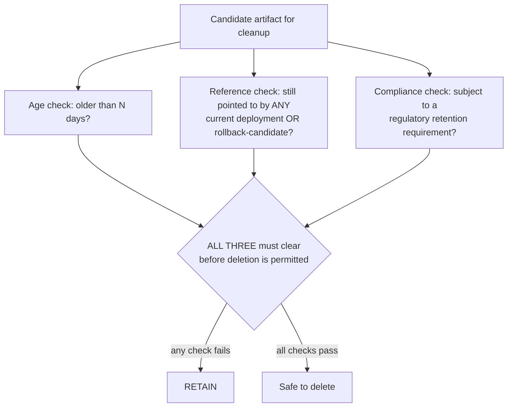
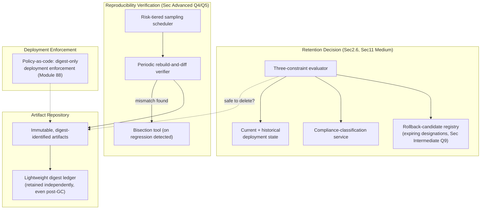
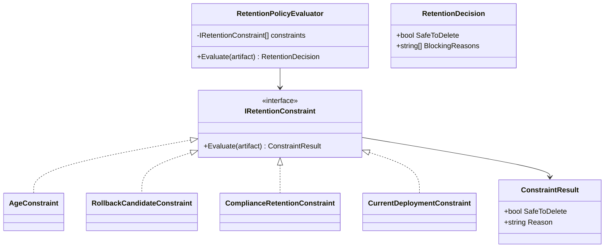

# Module 91 — CI/CD: Artifact Management & Reproducible Builds

> Domain: CI/CD | Level: Beginner → Expert | Prerequisite: [[02-TestAutomationStrategy-Pyramid-Flakiness-Coverage-Quality-Gates]] §2.4 (mutation testing as a coverage complement, mirrored here as reproducibility verification complementing SLSA claims); [[../25-DevOps/02-ConfigurationManagement-Secrets-EnvironmentPromotion]] §2.1, §2.4 (build-once/promote-by-digest, base+delta parity); [[../25-DevOps/04-DevSecOps-PolicyAsCode-PlatformEngineering]] §2.3 (SBOM, SLSA, image signing/provenance — this module goes one level deeper into the build-determinism mechanics those controls depend on)

---

## 1. Fundamentals

**What**: Artifact management is the discipline of building a deployable artifact (a container image, a compiled package, a library) exactly once, storing it immutably in a versioned repository, and promoting that identical artifact across every environment by reference (a digest, a version tag pointing at a fixed digest) rather than rebuilding it per environment. **Reproducible builds** are the complementary guarantee that, given the identical source commit and build environment, a build process produces a byte-identical artifact every time it runs — not merely "functionally equivalent," but bit-for-bit the same output.

**Why it exists**: Module 86 §2.1 already established that "build once, configure per environment" requires promoting an artifact by its immutable digest, not rebuilding per environment — but that principle's entire safety depends on an unstated assumption: that the artifact, once built and stored, remains available, unchanged, and (if ever lost) regenerable identically from its source. Artifact management exists to make the first two guarantees explicit and enforced (immutability, availability); reproducible builds exist to make the third guarantee (regenerability) actually true rather than assumed — a distinction this module's central incident (§4) demonstrates is easy to overlook until the exact moment it matters most.

**When it matters**: From the first time an artifact is promoted across more than one environment (making immutable, by-reference promotion necessary) and becomes acute the first time an old artifact must be retrieved or regenerated — a rollback to a version from months ago, a security audit needing to verify what a specific production artifact actually contains, or a supply-chain provenance claim (Module 88 §2.3's SLSA) requiring an artifact's build to be independently re-verifiable.

**How (30,000-ft view)**:
```
Immutable artifacts: identified by content digest (SHA-256 of the artifact itself),
    NEVER mutated once published -- a version TAG ("v1.4.2", "latest") is a
    movable POINTER to a digest, and only the digest is the true identity
Artifact repository: stores every published artifact with retention/garbage-collection
    policy -- policy must know NOT just "how old is this" but "is this still
    referenced by any environment's current OR rollback-candidate deployment"
Reproducible builds: identical source + identical build environment => BYTE-IDENTICAL
    output -- requires eliminating every source of non-determinism (embedded
    timestamps, unordered file iteration, unpinned toolchain/dependency versions)
Dependency locking: a lockfile pins the FULL transitive dependency graph's exact
    resolved versions, not just declared ranges -- reproducibility requires the
    COMPLETE graph pinned, since even one unpinned transitive dependency can
    silently vary between builds
```

---

## 2. Deep Dive

### 2.1 Immutable, Content-Addressable Artifacts — Digest as True Identity
An artifact's true, unforgeable identity is its content digest (a cryptographic hash of its actual bytes) — two artifacts with identical digests are, by construction, byte-identical, and any change to an artifact's content, however small, produces an entirely different digest. A version *tag* (`v1.4.2`, or worse, `latest`) is merely a human-friendly, **mutable** pointer that a registry maps to some digest at a point in time — and therein lies the risk: unless a registry and organizational policy explicitly forbid it, a tag can be *reassigned* to point at a different digest later (someone re-pushes under the same tag), silently breaking the assumption that "the same tag always means the same artifact." Module 86 §2.4's "promote by digest, not by tag" discipline exists precisely because a digest is cryptographically immutable while a tag is, by default, just a mutable label — treating a tag as if it carried a digest's immutability guarantee is a foundational category error this entire module's practices exist to prevent.

### 2.2 Artifact Repository Architecture and the Retention-Policy Trap
Artifact repositories (container registries, package repositories like Nexus/Artifactory, or cloud-native equivalents) must balance two competing pressures: storage cost (every artifact, retained forever, accumulates unboundedly) against availability (an artifact needed for a rollback, an audit, or a reproducibility check must still exist when needed). The trap: a retention/garbage-collection policy designed around a single, simple dimension — "delete anything older than N days" — is blind to whether an old artifact is still *referenced* by anything that matters: a production deployment manifest still pointing at it (even if not currently the active version, as a documented rollback target), a compliance requirement to retain audit artifacts for a regulatory period, or simply being the last-known-good version an on-call engineer might need during an incident. A retention policy that only asks "how old is this" and never asks "is this still referenced by anything with a legitimate claim to its continued existence" is a policy design gap of the exact shape this course has repeatedly examined — a declared cleanup rule that's locally reasonable (age-based hygiene) but blind to a dimension (reference/dependency) it never checked.

### 2.3 Reproducible (Deterministic) Builds — Eliminating Every Source of Non-Determinism
A build is deterministic if, given identical source and build-environment inputs, it produces byte-identical output on every execution — a property that sounds like it should be automatic but requires deliberately eliminating several common non-determinism sources: **embedded timestamps** (many compilers/packagers embed the build's wall-clock time into the artifact by default, e.g., inside a compiled binary's metadata or a Zip/tar archive's per-file timestamps — trivially varying between any two builds seconds apart); **unordered file-system iteration** (a build script that enumerates a directory's files without explicit sorting can produce a different file order — and therefore a different resulting archive's byte layout — depending on the underlying file system's non-guaranteed iteration order); **unpinned toolchain and dependency versions** (a build using "whatever compiler/package version happens to be installed" rather than an explicitly pinned one can silently produce different output as the underlying toolchain patches or updates); and **non-deterministic parallel compilation** (some compilers' parallel optimization passes can produce different, though behaviorally equivalent, machine code ordering depending on thread-scheduling timing). Achieving reproducibility requires addressing each source explicitly (fixed/normalized timestamps, sorted iteration, pinned toolchain versions via container-based hermetic builds, deterministic-mode compiler flags where available) — and, critically, **verifying** the result by actually rebuilding from the identical source twice and diffing the output, rather than assuming a build is reproducible simply because no known non-determinism source was consciously left unaddressed.

### 2.4 Dependency Locking — Pinning the Complete Transitive Graph
A package manifest commonly declares dependencies as version *ranges* (`^2.0.0`, accepting any compatible 2.x release) rather than exact versions — appropriate for expressing compatibility intent, but directly incompatible with reproducibility, since two builds performed at different times could resolve that range to genuinely different concrete versions as new compatible releases are published. A **lockfile** (`package-lock.json`, `Cargo.lock`, a NuGet `packages.lock.json`) records the exact, resolved version of every dependency — critically including every **transitive** dependency (a dependency of a dependency), not merely the manifest's direct, declared entries — because even one unpinned transitive dependency deep in the graph can silently vary between builds performed at different times, producing a functionally (and potentially security-relevantly) different artifact from what appears, at the manifest level, to be "the same dependencies." Reproducibility requires committing the lockfile alongside the source and having the build process consume it strictly (failing, not silently re-resolving, if the lockfile and manifest have drifted out of sync) — directly the same "the complete input set must be captured, or the declared guarantee silently doesn't hold" principle Module 89 §2.3 established for build cache-key completeness, now applied to dependency-version pinning specifically.

### 2.5 Artifact Promotion vs. Rebuild-per-Environment — Reproducibility as the Rebuild Safety Net
Module 86 §2.4 established build-once-promote-by-digest as the default, correct pattern — but reproducibility remains essential precisely for the cases where promotion's simple "reuse the identical stored artifact" path breaks down: the stored artifact was lost or garbage-collected (§2.2's exact trap), a security patch must be selectively backported and rebuilt against an older release branch, or an independent auditor wants to verify a claimed build's provenance by regenerating it from source and confirming the digest matches (Module 88 §2.3's provenance attestation's actual verifiability). In every one of these cases, the organization falls back from "promote the existing, already-verified artifact" to "rebuild from source and hope it's identical" — and that fallback's entire safety depends on the build process actually being reproducible, a property that, absent deliberate verification (§2.3's rebuild-and-diff check), is easy to *assume* is true and only discover is false at precisely the worst possible moment: during an actual emergency rebuild, when a subtly different artifact might introduce new, unreviewed behavior into what was meant to be an identical, already-tested restoration.

### 2.6 Retention Policy Design — Storage Cost, Availability, and Compliance as Three Simultaneous Constraints
A well-designed retention policy must satisfy three distinct constraints simultaneously, not just the storage-cost dimension alone: **availability** (any artifact referenced by a current or documented-rollback-candidate deployment must never be garbage-collected, regardless of age); **compliance** (regulated industries often require retaining specific artifact categories — release builds, audit-relevant builds — for a defined regulatory period independent of whether anything currently references them); and **cost** (unreferenced, non-compliance-relevant artifacts — intermediate CI build outputs, superseded pre-release candidates — should be pruned to bound storage growth). The correct architecture treats these as three independently-evaluated policies applied to every artifact (never a single "age > N days, delete" rule), with the **reference-check** specifically requiring the retention system to actively query current deployment state and rollback-candidate history — not merely the artifact repository's own internal metadata — since the repository, in isolation, has no inherent knowledge of what's deployed where, a cross-system dependency this module's central incident (§4) demonstrates is easy to omit.

---

## 3. Visual Architecture

### Digest vs. Tag — True Identity vs. Mutable Pointer (§2.1)
```
Registry state at time T1:
    tag "v1.4.2"  -->  digest sha256:abc123...  (the artifact everyone tested)

Someone re-pushes under the SAME tag (a tag-reuse anti-pattern):

Registry state at time T2:
    tag "v1.4.2"  -->  digest sha256:xyz789...  (a DIFFERENT artifact!)

Any environment/manifest referencing "v1.4.2" by TAG now silently receives a
different artifact after T2 -- referencing sha256:abc123... directly (the DIGEST)
would have remained stable regardless of what the tag "v1.4.2" is later reassigned to.
```

### Retention Policy — Three Independent Constraints, Not One Age Rule (§2.6)


### Reproducibility Verification Loop (§2.3, §Advanced Q1)
```
Source commit X  --build-->  Artifact A  (digest: sha256:aaa...)
Source commit X  --build-->  Artifact B  (digest: sha256:???)

IF digest(A) == digest(B):  build is genuinely reproducible -- VERIFIED, not assumed
IF digest(A) != digest(B):  a non-determinism source exists (Sec2.3) -- must be
                            found and eliminated BEFORE trusting any provenance
                            or emergency-rebuild-equivalence claim
```

---

## 4. Production Example

**Scenario**: A financial-services organization's container-registry retention policy automatically deleted images older than 180 days to control storage costs — a policy that had operated uneventfully for over two years. During a security incident, the organization needed to roll back a critical service to a specific release from fourteen months prior, identified in their deployment history as the last version confirmed unaffected by a newly-discovered vulnerability. The rollback failed: the target image had been garbage-collected by the retention policy months earlier, since nothing in the policy's age-based rule considered whether that specific image remained a documented rollback candidate.

**Investigation**: The retention policy's only input was image push-timestamp — it had no visibility into deployment history, rollback runbooks, or which specific past versions were still considered viable rollback targets by the operations team's own incident-response documentation. The team's emergency response was to attempt rebuilding the exact release from its recorded source commit, expecting the rebuild to reproduce the identical, already-tested artifact.

**Root cause**: Two independent, compounding gaps: (1) the retention policy (§2.2's exact trap) checked only artifact age, never cross-referencing deployment/rollback-candidate status — a single-dimension cleanup rule blind to the reference dimension that actually determined whether deletion was safe; (2) upon attempting the emergency rebuild, the team discovered their build process was **not actually reproducible** — it embedded the build timestamp into the resulting container image's layer metadata, and a transitive dependency's version range had resolved differently over the intervening fourteen months as newer, compatible package releases were published — meaning the rebuilt image, while functionally similar, was **not digest-identical** to the original, lost artifact, and could not be trusted as a verified-equivalent rollback target without a full, time-pressured re-validation cycle the incident's urgency made painfully costly.

**Fix**: (1) Redesigned the retention policy per §2.6's three-constraint model — before any age-based deletion, the policy now queries the organization's deployment-history and documented-rollback-candidate registry, retaining any image referenced by either regardless of age; (2) fixed the build process's specific non-determinism sources — removed embedded timestamps (normalizing them to a fixed, deterministic value), and pinned the full transitive dependency graph via a committed lockfile (§2.4), strictly consumed (not silently re-resolved) by the build; (3) established a periodic (not one-time) reproducibility verification — rebuilding a sample of recent releases from source and confirming digest-identical output — converting "we assume our builds are reproducible" into a continuously, actively verified property.

**Lesson**: This incident is a precise, compounding instance of this course's recurring theme occurring at *two* independent layers simultaneously: a retention policy's declared cleanup rule (age-based) silently diverged from the actual safety requirement (reference-aware) it needed to satisfy, and a build process's assumed reproducibility (an unverified, declared property) turned out, under the one specific circumstance that actually tested it — an emergency, time-pressured rebuild — to be false. Neither gap alone was disastrous in isolation until they compounded at exactly the worst possible moment: precisely when the organization most needed both the artifact's continued availability and, failing that, its verified regenerability.

---

## 5. Best Practices
- Promote and deploy by immutable content digest, never by a mutable tag alone — treat any tag as a convenience label pointing at a digest, never as the artifact's true identity (§2.1).
- Design retention/garbage-collection policy around three independent constraints (age, reference/rollback-candidate status, compliance requirement) evaluated simultaneously — never a single age-based rule alone (§2.2, §2.6, §4).
- Eliminate every known non-determinism source (embedded timestamps, unordered file iteration, unpinned toolchain versions) from build processes, and periodically, actively verify reproducibility by rebuilding and diffing output — never assume it holds because no known issue was left unaddressed (§2.3, §4).
- Commit lockfiles pinning the complete transitive dependency graph, and configure builds to fail rather than silently re-resolve if the lockfile and manifest have drifted out of sync (§2.4).
- Treat reproducible builds as the safety net for every scenario where promoting an already-built artifact isn't possible (lost artifact, security backport, independent audit) — and verify that safety net actually works before an emergency is the first time it's exercised (§2.5).

## 6. Anti-patterns
- Deploying or promoting by a mutable tag (`latest`, or a reused version tag) rather than an immutable digest, allowing the same reference to silently point at different artifacts over time (§2.1).
- An artifact retention policy based solely on age, with no awareness of current deployment or documented-rollback-candidate status (§2.2, §4).
- Assuming a build is reproducible because it was designed with reproducibility in mind, without periodically, actively verifying it via an actual rebuild-and-diff check (§2.3, §4).
- Declaring dependencies via version ranges with no committed lockfile, or a build process that silently re-resolves dependencies rather than failing when the lockfile has drifted from the manifest (§2.4).
- Treating "we can always just rebuild from source" as an unverified assumption rather than a periodically-tested, genuinely relied-upon capability (§2.5).

---

## 10. Interview Questions

### Basic (10)

1. **Q: What is the difference between a container image's digest and its tag?**
   **A:** A digest is a cryptographic hash of the image's actual content — immutable and unforgeable, since any content change produces a different digest. A tag is a human-friendly, mutable label a registry maps to some digest at a point in time, and can be reassigned to point at a different digest later.
   **Why correct:** Precisely distinguishes true, immutable identity (digest) from a mutable, reassignable pointer (tag).
   **Common mistakes:** Treating a version tag as if it carried the same immutability guarantee as a digest, assuming "the same tag always means the same image."
   **Follow-ups:** "Why is deploying by digest safer than deploying by tag alone?" (A digest reference can never silently point at a different artifact later; a tag reference can, if the tag is ever reassigned.)

2. **Q: What is a reproducible (deterministic) build?**
   **A:** A build process that, given identical source and build-environment inputs, produces byte-identical output on every execution — not merely functionally equivalent, but bit-for-bit the same.
   **Why correct:** States the precise, strict standard (byte-identical) rather than a looser "produces the same behavior" definition.
   **Common mistakes:** Confusing "the tests pass identically" (functional equivalence) with genuine byte-for-byte reproducibility, which is a stricter, distinct property.
   **Follow-ups:** "Name a common source of non-determinism in builds." (Embedded build timestamps, unordered file-system iteration, or unpinned toolchain/dependency versions.)

3. **Q: What is a lockfile, and why does it matter for reproducibility?**
   **A:** A file recording the exact, resolved version of every dependency (including transitive ones) a build actually used — reproducibility requires this exact pinning, since a manifest's version *ranges* alone could resolve to different concrete versions at different times.
   **Why correct:** States both what a lockfile records and why version ranges alone are insufficient for reproducibility.
   **Common mistakes:** Believing pinning only direct, manifest-declared dependencies is sufficient, missing that transitive dependencies also need pinning.
   **Follow-ups:** "What should a build do if the lockfile and manifest have drifted out of sync?" (Fail explicitly, rather than silently re-resolving dependencies and potentially producing a different artifact than intended.)

4. **Q: Why shouldn't an artifact retention/garbage-collection policy rely solely on artifact age?**
   **A:** An age-only policy has no awareness of whether an old artifact is still referenced by a current deployment or a documented rollback candidate, risking deletion of an artifact that's still genuinely needed.
   **Why correct:** States the specific blind spot (no reference awareness) that an age-only policy has.
   **Common mistakes:** Assuming age is a reasonable sole proxy for "no longer needed," without checking actual reference/dependency status.
   **Follow-ups:** "What additional dimensions should a retention policy check?" (Whether it's a documented rollback candidate, and whether it's subject to a compliance/regulatory retention requirement.)

5. **Q: What does "build once, promote by digest" mean, and where was this principle first established in this course?**
   **A:** Building an artifact exactly once and promoting that identical, digest-identified artifact across every environment, rather than rebuilding per environment — first established in Module 86 §2.4's configuration-and-secrets-promotion discussion.
   **Why correct:** States the principle and correctly attributes its origin to the specific prior module.
   **Common mistakes:** Believing "rebuild per environment with the same source" satisfies this principle — it doesn't, since a rebuild can differ from the original even with identical source, unless the build is genuinely reproducible.
   **Follow-ups:** "When does an organization need to fall back on rebuilding from source rather than promoting an existing artifact?" (When the original artifact has been lost/garbage-collected, or for a security backport against an older release branch.)

6. **Q: Why does embedding a build timestamp into an artifact break reproducibility?**
   **A:** Two builds performed at different wall-clock times, even from identical source, would embed different timestamp values, producing different byte content and therefore different digests, despite being otherwise identical builds.
   **Why correct:** States the precise mechanism (timestamp varies per build, changing the resulting bytes).
   **Common mistakes:** Assuming timestamps are a harmless metadata detail unrelated to "real" reproducibility, without considering that any byte difference, however minor, breaks the byte-for-byte guarantee.
   **Follow-ups:** "How would you fix this specific non-determinism source?" (Normalize/fix the embedded timestamp to a constant value — often derived from the source commit's own timestamp rather than the build's wall-clock time — so it's identical across any build of the same source.)

7. **Q: What is the relationship between reproducible builds and SLSA provenance attestation (Module 88 §2.3)?**
   **A:** Provenance attestation claims a specific artifact was built by a specific, trusted process from specific source — but that claim is only independently *verifiable* if the build is reproducible, since verification means an independent party rebuilds from the claimed source and confirms the resulting digest matches.
   **Why correct:** Connects provenance's verifiability specifically to reproducibility as the underlying mechanism that makes independent verification possible at all.
   **Common mistakes:** Treating provenance attestation and build reproducibility as unrelated concerns, missing that the former's actual verifiability depends on the latter.
   **Follow-ups:** "What would an unverifiable provenance claim look like in practice?" (A signed attestation asserting a specific source and build process, but where the build isn't actually reproducible — an independent party rebuilding from the same source would get a different digest, unable to confirm the claim despite the attestation being technically present.)

8. **Q: What is the risk of a package manifest declaring a dependency as `^2.0.0` (a version range) with no committed lockfile?**
   **A:** Two builds performed at different times could resolve that range to different concrete versions as new compatible releases are published, meaning the same source and manifest can produce genuinely different builds over time — breaking reproducibility even though the manifest itself never changed.
   **Why correct:** States the specific mechanism (range resolution varying over time) that breaks reproducibility absent a lockfile.
   **Common mistakes:** Assuming "the manifest hasn't changed" is sufficient evidence that two builds are equivalent, without considering that a range can resolve differently at different times.
   **Follow-ups:** "Why must transitive dependencies also be pinned, not just direct ones?" (Even one unpinned dependency-of-a-dependency, deep in the graph, can silently vary between builds, producing a different artifact despite every direct dependency being pinned correctly.)

9. **Q: How would you verify that a build is actually reproducible, rather than merely assuming it is?**
   **A:** Rebuild from the identical source commit and build environment twice, independently, and compare the resulting artifacts' digests — matching digests confirm genuine reproducibility; any difference reveals a remaining non-determinism source requiring investigation.
   **Why correct:** States the concrete, actionable verification mechanism (rebuild twice, diff digests) rather than a vague "check for non-determinism."
   **Common mistakes:** Assuming reproducibility because the team consciously addressed known non-determinism sources, without actually performing the rebuild-and-compare verification.
   **Follow-ups:** "Why should this verification be periodic, not just performed once?" (A build process's determinism can regress over time as new tooling, dependencies, or build-script changes introduce a new, previously-absent non-determinism source.)

10. **Q: Why is "we can always just rebuild from source if we lose an artifact" a risky assumption without periodic reproducibility verification?**
    **A:** If the build process isn't actually reproducible (an unverified assumption), an emergency rebuild — performed under the time pressure of an actual incident, exactly when a verified-identical restoration matters most — could silently produce a different artifact than the one that was lost, introducing unreviewed, untested differences into what was meant to be an identical, already-validated restoration.
    **Why correct:** States the specific, high-stakes scenario (an emergency rebuild under time pressure) where an unverified reproducibility assumption is most dangerous to discover false.
    **Common mistakes:** Treating "we have the source code, so we can rebuild it" as equivalent to "we can rebuild an identical, verified artifact" — the two claims are meaningfully different without demonstrated reproducibility.
    **Follow-ups:** "What's a lower-stakes way to discover a build isn't reproducible, rather than during an actual emergency?" (A periodic, scheduled reproducibility-verification job, exactly as this module's central incident's fix established.)

### Intermediate (10)

1. **Q: Why does §4's incident represent two independent failures compounding, rather than a single root cause, and why does recognizing this distinction matter for designing the complete fix?**
   **A:** The retention policy's reference-blindness (deleting a still-needed artifact) and the build process's actual non-reproducibility (an emergency rebuild producing a different digest) are each, independently, a complete and sufficient failure on their own — either one alone, without the other, would still have caused significant incident impact (a reference-aware retention policy would have prevented the deletion regardless of reproducibility status; a genuinely reproducible build would have let the emergency rebuild succeed despite the retention policy's gap). Recognizing them as two independent failures, not one combined root cause, matters because fixing only one (say, only the retention policy) leaves the organization still exposed to the other failure mode recurring via a different triggering scenario (a different artifact lost via a different mechanism entirely, still hitting the same non-reproducibility gap).
   **Why correct:** Explicitly identifies both failures as independently sufficient and explains why treating them as one combined root cause would produce an incomplete fix.
   **Common mistakes:** Treating the incident as having one root cause (whichever is identified first) and fixing only that, leaving the other, equally serious gap unaddressed.
   **Follow-ups:** "Which of the two fixes would you prioritize if you could only implement one immediately?" (The reference-aware retention policy — it directly prevents the triggering event (artifact loss) that made the reproducibility gap's consequences visible at all; but both fixes remain necessary, since other artifact-loss mechanisms — accidental deletion, registry outage/corruption — could still trigger the reproducibility gap even with retention policy fixed.)

2. **Q: A team argues that since their CI pipeline successfully rebuilds their service from source on every single commit, their build process is self-evidently proven reproducible by this constant, ongoing exercise. Evaluate this claim.**
   **A:** Building successfully on every commit proves the build process *works* (produces a functioning artifact from current source) — it says nothing about whether building the *same, specific* source commit *twice* produces byte-identical output, since ordinary CI only ever builds each commit once. Reproducibility specifically requires the rebuild-and-diff verification (§Basic Q9) — building the identical source twice and confirming matching digests — a fundamentally different exercise than CI's normal "build each new commit once and move on" pattern, however frequently that pattern executes.
   **Why correct:** Precisely distinguishes "builds successfully, frequently" from "produces byte-identical output when the same source is built twice," identifying that ordinary CI operation never actually exercises the latter property.
   **Common mistakes:** Conflating build frequency/success rate with reproducibility, assuming that because builds "work" constantly, they must also be deterministic.
   **Follow-ups:** "How would you add reproducibility verification without disrupting normal, single-build-per-commit CI flow?" (A separate, periodic (not per-commit) job that deliberately rebuilds a sampled historical commit a second time and diffs against the original recorded digest — directly Module 89 §4's nightly-backstop pattern, applied to reproducibility verification instead of affected-project detection.)

3. **Q: Why might a retention policy correctly implementing the three-constraint model (§2.6) still fail to prevent an incident like §4's, if the "reference check" component only queries the currently-active production deployment and not historical rollback-candidate documentation?**
   **A:** The specific artifact lost in §4 was not the *currently deployed* version — it was a fourteen-month-old release documented as a rollback candidate for a specific vulnerability-related scenario, a reference relationship that exists only in incident-response/runbook documentation, not in any live deployment manifest a naive "check current production state" query would discover. A reference check that only inspects live, currently-active deployments misses exactly this class of historical-but-still-legitimate reference, meaning the three-constraint model's "reference check" must specifically include historical rollback-candidate registries and incident-response documentation as an additional queried source, not merely current production state.
   **Why correct:** Identifies the specific scope gap (current-deployment-only reference checking misses historical rollback-candidate references) that could cause even a well-intentioned three-constraint policy to still fail against this exact incident's scenario.
   **Common mistakes:** Assuming "check current production deployments" is a sufficiently complete reference check, without considering that legitimate references can exist in historical/incident-response documentation independent of current live deployment state.
   **Follow-ups:** "How would you ensure the rollback-candidate documentation itself stays accurate and complete over time?" (The same periodic verification/audit discipline this course has established repeatedly — a documented rollback-candidate list is itself a declared state requiring periodic confirmation that it accurately reflects what the organization would actually want to retain, rather than being written once and silently going stale.)

4. **Q: How does the non-determinism introduced by parallel/multi-threaded compilation (§2.3) differ from the other named non-determinism sources (timestamps, file-iteration order, unpinned versions) in terms of how it's detected and fixed?**
   **A:** Timestamp, file-iteration-order, and unpinned-version non-determinism are each addressable via a specific, targeted, one-time fix (normalize the timestamp, sort iteration explicitly, pin the version) that, once applied, deterministically eliminates that specific source going forward. Parallel-compilation non-determinism is different in character: it stems from genuine, unpredictable thread-scheduling timing during the build itself, meaning the "fix" isn't a single configuration change but often requires either disabling the specific parallel-optimization behavior (trading build speed for determinism) or using a compiler/toolchain version that specifically guarantees deterministic output even under parallel execution (a property not all toolchains support, and one that must be explicitly verified per toolchain/version rather than assumed available).
   **Why correct:** Distinguishes the fixable-via-one-time-configuration-change non-determinism sources from the fundamentally different, timing-dependent parallel-compilation source requiring a different class of remediation (disable the behavior, or rely on toolchain-specific determinism guarantees).
   **Common mistakes:** Assuming all non-determinism sources are equally easy to fix via a simple, one-time configuration change, without recognizing that some (like parallel-compilation timing) require a fundamentally different remediation approach or toolchain-specific verification.
   **Follow-ups:** "Why might an organization choose to accept parallel-compilation non-determinism rather than disabling parallelism entirely?" (If reproducibility verification is performed via the rebuild-and-diff check specifically using the same, fixed, single-threaded deterministic mode for verification purposes only, while normal day-to-day builds retain parallel compilation for speed — decoupling "what's normally built for speed" from "what's periodically verified for reproducibility," accepting that the two configurations differ but ensuring the deterministic configuration specifically is what's relied upon whenever true reproducibility matters.)

5. **Q: Why does committing a lockfile alone not fully guarantee reproducibility, even though it correctly pins every dependency's exact resolved version?**
   **A:** A lockfile pins *which* versions are used, but reproducibility also requires that fetching those pinned versions produces the identical *bytes* every time — if a package registry allows a published package version to be silently re-published with different content under the same version number (a registry-level mutability gap directly analogous to §2.1's tag-reuse risk, now at the package-registry level rather than the container-registry level), a lockfile's version pin alone doesn't protect against this. Genuine reproducibility additionally requires either a registry that guarantees immutability of published package versions, or the lockfile itself recording each dependency's own content hash/digest (not merely its version number) so any content substitution under an unchanged version number is independently detectable.
   **Why correct:** Identifies that version-pinning alone assumes package-registry immutability, an assumption that isn't automatically guaranteed and requires its own verification or an additional content-hash safeguard.
   **Common mistakes:** Assuming a lockfile's version pin is fully equivalent to a content-digest pin, without considering that a package registry could (whether through error or malice) serve different content under an unchanged version number.
   **Follow-ups:** "Which package ecosystems address this via content-hash lockfile entries, and why does this matter for supply-chain security specifically?" (Many modern lockfile formats — npm's `package-lock.json`, Cargo's `Cargo.lock` — do include per-dependency content hashes precisely to close this gap, directly connecting to Module 88 §2.3's supply-chain integrity concerns, since a content-hash mismatch on install would reveal a potential registry-level tampering or substitution attack, not merely a reproducibility inconvenience.)

6. **Q: A security audit finds that an organization's artifact repository retains every build output indefinitely, with no deletion ever performed, specifically to avoid ever repeating §4's incident. Evaluate this as a Principal Engineer.**
   **A:** This overcorrects from one extreme (age-only deletion with no reference awareness) to the opposite extreme (unbounded, indefinite retention regardless of any actual ongoing need) — directly the same overreaction pattern Module 90 §Advanced Q2 warned against for "always run the full test suite" as a response to a discovered gap. Unbounded retention imposes a real, continuously-growing storage cost with no corresponding safety benefit once an artifact genuinely has no remaining reference (no current deployment, no documented rollback candidacy, no active compliance retention requirement) — the correct fix (§2.6's three-constraint model) already provides the necessary safety without requiring unbounded retention; an organization that instead simply stops deleting anything has traded one governance gap (reference-blindness) for a different, purely cost-driven inefficiency, rather than fixing the actual, narrow gap the incident revealed.
   **Why correct:** Identifies the specific overcorrection (unbounded retention) and explains why the actual, targeted fix (three-constraint policy) already resolves the safety concern without requiring the much higher ongoing cost of never deleting anything.
   **Common mistakes:** Treating "never delete anything" as an unconditionally safer response to a discovered retention-policy gap, without recognizing a more targeted, risk-proportionate fix already exists and achieves the same safety outcome at much lower ongoing cost.
   **Follow-ups:** "What would you communicate to the security auditors who raised this finding, given the more targeted fix already addresses their underlying concern?" (Explain the specific mechanism of the three-constraint model — particularly the reference-check component — demonstrating it genuinely closes the gap the audit's concern was based on, rather than simply asserting "we now retain more" without explaining why the targeted approach is both sufficient and more cost-effective than indefinite retention.)

7. **Q: How does the concept of a "hermetic build" (a build performed inside a fully self-contained, network-isolated environment with every input explicitly declared and provided, no ambient access to the host system or internet) relate to and strengthen this module's reproducibility discussion?**
   **A:** Hermeticity directly addresses a non-determinism source this module's §2.3 discussion implies but doesn't name explicitly: a build that's allowed ambient network access during execution (to fetch a dependency not otherwise pinned, or to query some external service for build-time configuration) introduces a non-determinism source entirely outside the build script's own logic — the network resource's state at build time, which can vary between builds even with an otherwise-perfect, deterministic build script. Hermetic builds close this by running inside an environment with no network access at all beyond what's needed to fetch the explicitly pinned, lockfile-specified dependencies (ideally from a local, already-verified cache rather than a live network fetch during the build itself) — every input the build could possibly depend on is enumerated and provided explicitly, leaving no path for ambient, unpinned external state to influence the output.
   **Why correct:** Identifies hermeticity as addressing a distinct, network-access-based non-determinism source beyond the four explicitly named in §2.3, and explains the specific mechanism (no ambient access beyond explicitly-provided, pinned inputs) that makes it effective.
   **Common mistakes:** Treating hermetic builds as merely "running the build in a container" without recognizing the specific, defining property is the *absence of ambient network/host access* during execution, which containerization alone doesn't automatically guarantee unless deliberately configured to disable network egress during the build step.
   **Follow-ups:** "Why might a genuinely hermetic build be harder to achieve for some ecosystems than others?" (Some language/package ecosystems' default tooling assumes live network access to a package registry during every build by default, requiring deliberate reconfiguration — a local, pre-populated dependency cache, or a proxy specifically scoped to serve only the pinned, lockfile-specified versions — to achieve genuine hermeticity rather than the ecosystem's typical, network-dependent default behavior.)

8. **Q: Why might two organizations both claim "SLSA Level 3" compliance (Module 88 §2.3), yet one's claim is meaningfully more trustworthy than the other's, specifically regarding reproducibility?**
   **A:** SLSA Level 3 requires verifiable provenance and a hardened, isolated build process, but doesn't, by itself, mandate that the build be *reproducible* in this module's strict, byte-identical sense — an organization could satisfy Level 3's isolated-build-service and signed-provenance requirements while still having a build process that embeds timestamps or resolves unpinned dependency ranges, meaning provenance attestations are *issued* correctly but can never actually be *independently verified* by rebuilding, since no rebuild would produce a matching digest even for entirely legitimate, unmodified source. An organization whose build is additionally, genuinely reproducible (verified via the rebuild-and-diff check) provides a strictly stronger, independently-checkable guarantee than one relying solely on the trust placed in its signed attestation's issuing process — the difference between "trust our signature" and "verify it yourself by rebuilding."
   **Why correct:** Precisely distinguishes SLSA compliance's formal requirements from the additional, complementary guarantee genuine reproducibility provides, showing the two are related but not identical, and that reproducibility strictly strengthens a provenance claim's actual verifiability.
   **Common mistakes:** Assuming SLSA Level 3 compliance automatically implies genuine build reproducibility, when the two are related but formally distinct properties that must each be independently established and verified.
   **Follow-ups:** "Would you recommend an organization pursue reproducibility even beyond what their target SLSA level formally requires?" (Yes, for any artifact where independent, trust-minimized verification matters — a widely-depended-upon shared library or a safety/compliance-critical artifact — since reproducibility converts "trust our attestation" into "verify it yourself," a strictly stronger guarantee regardless of the specific SLSA level formally targeted.)

9. **Q: Design a policy for how long an artifact should be retained as a "documented rollback candidate" (§2.6, §Intermediate Q3) before being reclassified as eligible for the standard age/reference-based cleanup process, given that retaining every historical version indefinitely as a permanent rollback candidate would recreate Intermediate Q6's overcorrection.**
   **A:** Rollback-candidate status should itself have an explicit, periodically-reviewed expiration tied to genuine risk decay — a version's value as a rollback candidate specifically for "the last known-good version before a specific vulnerability was introduced" naturally diminishes once sufficient time has passed with no recurrence of that vulnerability class and once newer releases have independently, thoroughly validated the fix, at which point the historical version's specific rollback rationale becomes stale. The policy: rollback-candidate designations carry an explicit review date (not indefinite), at which the responsible team explicitly reaffirms continued rollback-candidate status (extending the designation with updated justification) or allows it to lapse into standard retention rules — directly the same expiring, actively-reviewed exception pattern Module 88 §Advanced Q9 established for compensating-controls exceptions, applied here to rollback-candidate artifact retention specifically, avoiding both Intermediate Q6's indefinite-retention overcorrection and §4's original reference-blind-deletion gap.
   **Why correct:** Proposes a periodically-reviewed, explicitly-expiring designation (rather than either permanent retention or the original age-only rule) directly modeled on an already-established pattern from a prior module, avoiding both identified extremes.
   **Common mistakes:** Either making rollback-candidate status permanent (recreating the unbounded-retention cost problem) or leaving it entirely undated with no forcing function for review, risking the designation silently becoming stale and either over-retained or, worse, allowed to lapse without anyone having deliberately re-evaluated whether it still should.
   **Follow-ups:** "Who should be responsible for the periodic reaffirmation review — the platform team managing the artifact repository, or the service-owning team?" (The service-owning team, since they hold the actual risk knowledge (has the vulnerability class recurred, has the fix been sufficiently validated) the reaffirmation decision requires — the platform team's role is providing the tooling/reminder mechanism prompting the review, not making the risk judgment itself.)

10. **Q: How does this module's compounding two-part incident (§4) connect to and extend Module 90's coverage-gaming finding, specifically regarding the danger of assuming an unverified property is true simply because no evidence has yet contradicted it?**
    **A:** Module 90's coverage-gaming incident demonstrated a declared, measured proxy (coverage percentage) diverging from the actual property it was assumed to guarantee (test quality) specifically because the divergence was never independently, adversarially verified until an incident forced the question. This module's reproducibility gap is structurally identical but at one further remove: the build process's reproducibility was never even *measured* at all (unlike coverage, which was at least being tracked, just misinterpreted) — it was simply assumed, with literally zero ongoing signal (proxy or otherwise) that would have revealed the gap absent the specific, rare triggering event (an artifact loss forcing an actual rebuild) that happened to test it. This extends the course's established principle one step further: an assumed-but-never-measured property is, if anything, a *more* dangerous gap than a measured-but-misinterpreted one, since even the periodic, adversarial-verification discipline this course has repeatedly recommended (mutation testing, policy-liveness canaries, nightly full-suite backstops) requires first recognizing that a given property needs *any* ongoing verification signal at all — a recognition step this incident shows can be entirely skipped when a property (build reproducibility) seems, on its surface, like an inherent characteristic of "we have the source code" rather than a distinct, independently-fragile guarantee requiring its own dedicated verification practice.
    **Why correct:** Precisely distinguishes "measured but misinterpreted" (Module 90's coverage) from "never even measured, purely assumed" (this module's reproducibility), and identifies the latter as potentially the more dangerous failure mode specifically because it can be overlooked without ever appearing on any dashboard or metric at all.
    **Common mistakes:** Treating this incident as merely another instance of the same, already-established pattern without recognizing the specific, further-refined insight — that some properties are dangerous precisely because they never occur to anyone as something requiring dedicated measurement in the first place.
    **Follow-ups:** "What other properties in a typical CI/CD estate might fall into this 'assumed, never even measured' category, by this same reasoning?" (Plausible candidates: that a disaster-recovery runbook actually restores a working system (rather than merely being a written document), that a backup is actually restorable (rather than merely being successfully created), or that an emergency access/break-glass procedure (Module 88 §Advanced Q5) actually functions when genuinely needed — each sharing this incident's specific character of a capability assumed reliable precisely because it's rarely, if ever, actually exercised under real conditions.)

### Advanced (10)

1. **Q: Diagnose §4's incident from first principles and design the complete structural fix — not merely the two specific remediations already described.**
   **A:** Root causes (two, independent, per Intermediate Q1): a retention policy blind to historical rollback-candidate references (not merely current deployment state, per Intermediate Q3's scope refinement), and a build process whose reproducibility was assumed rather than ever verified. Complete structural fix: (1) redesign retention policy per §2.6's three-constraint model, with the reference check explicitly including historical rollback-candidate documentation (not just live deployment state), and rollback-candidate designations carrying an explicit, periodically-reviewed expiration (Intermediate Q9) to avoid recreating Intermediate Q6's unbounded-retention overcorrection; (2) fix the specific identified non-determinism sources (embedded timestamps, unpinned transitive dependencies) and establish a periodic (not one-time), scheduled reproducibility-verification job rebuilding sampled historical releases and confirming digest match, directly mirroring Module 89 §4's nightly-backstop pattern; (3) recognize and proactively search for other "assumed, never measured" capabilities across the organization's estate (Intermediate Q10's generalization) — disaster-recovery restore capability, backup restorability, break-glass procedure functionality — since this incident's specific character (a capability that seemed inherently reliable simply because its prerequisite, "we have the source," was trivially true) plausibly recurs wherever a similar "the obvious-seeming precondition is met, therefore the actual capability must work" assumption exists unverified.
   **Why correct:** Addresses both independent root causes with their specific, already-refined fixes (historical reference scope, expiring rollback-candidate designations, periodic reproducibility verification) and extends the investigation proactively to the broader class of similarly-unverified assumed capabilities this incident reveals as a genuine, recurring risk category.
   **Common mistakes:** Fixing only the two specific remediations narrated in §4 without also addressing the reference-check's scope gap (Intermediate Q3) or the rollback-candidate-expiration design (Intermediate Q9) that a complete fix requires, and without proactively searching for the same "assumed, unverified" pattern elsewhere in the organization.
   **Follow-ups:** "Why is the proactive search for other 'assumed, unverified' capabilities specifically valuable here, beyond fixing this incident's two immediate causes?" (Because this incident's own root-cause pattern — a capability nobody thought to verify because its precondition seemed trivially satisfied — is, by its very nature, invisible until an incident forces the question; proactively searching for the pattern is the only way to close such gaps before, rather than during, an actual emergency.)

2. **Q: A platform team proposes making every historical artifact ever built permanently, immutably retained by policy (not merely rollback candidates, but literally everything, forever), specifically citing that storage costs have become cheap enough that the distinction no longer matters economically. Evaluate this as a Principal Engineer, given Intermediate Q6's related but distinct caution.**
   **A:** This differs from Intermediate Q6's overcorrection (retaining everything specifically as a reaction to fear of recreating §4) by instead being motivated by a genuine, separate claim — that storage cost has fallen enough to make the age/reference distinction economically moot — which deserves evaluation on its own economic merits rather than dismissal via the same "overcorrection" framing alone. Even granting cheap storage, however, unbounded retention still carries non-storage-cost risks this proposal doesn't address: a vastly larger artifact inventory increases the compliance/audit surface (a data-retention regulation requiring the ability to *justify* what's retained and why, not merely afford to store it), and can degrade the practical usability of artifact-discovery tooling (finding the relevant version among an ever-growing, undifferentiated inventory becomes harder even if storage itself is cheap) — the correct response is still §2.6's three-constraint model, now explicitly noting that even a genuinely negligible storage cost doesn't eliminate the compliance-clarity and discoverability arguments for deliberate, policy-driven retention decisions rather than "keep everything because we can afford to."
   **Why correct:** Takes the proposal's actual economic premise seriously rather than dismissing it via the same reasoning as a different, motivationally-distinct proposal, while identifying the separate, non-cost-based reasons (compliance clarity, discoverability) that still favor deliberate retention policy over unconditional retention.
   **Common mistakes:** Either accepting the proposal because storage genuinely is cheap, without considering the separate compliance and discoverability arguments, or rejecting it purely by analogy to Intermediate Q6's different, fear-driven overcorrection without engaging with this proposal's distinct, genuinely economic justification.
   **Follow-ups:** "What compliance-specific risk might unconditional 'retain everything' retention create that a deliberate policy avoids?" (A regulation requiring an organization to be able to state affirmatively *why* a given piece of data/artifact is retained — "we retain everything because storage is cheap" is a materially weaker compliance posture than "we retain this specific category for this specific, documented reason, for this specific duration.")

3. **Q: Design a verification mechanism for confirming that a committed lockfile and its corresponding manifest have not silently drifted out of sync — specifically, that every dependency the manifest declares is genuinely represented, at a compatible version, within the lockfile — as a CI-enforced check preventing the "silently re-resolve" anti-pattern §2.4 warns against.**
   **A:** A CI check, run on every build (not merely periodically, since manifest/lockfile drift can be introduced by any single commit), that: (1) parses the manifest's declared dependencies and version-range constraints; (2) parses the lockfile's actually-pinned, resolved versions; (3) confirms every manifest-declared dependency has a corresponding lockfile entry whose pinned version genuinely satisfies the manifest's declared range constraint (not merely that a lockfile entry exists with *some* version, which could itself have drifted to violate the manifest's actual, current constraint if the manifest was edited without regenerating the lockfile); (4) fails the build explicitly and clearly if any mismatch is found, rather than allowing the build tool's default behavior (commonly, silently re-resolving to satisfy the manifest, defeating the lockfile's entire pinning purpose) to proceed unnoticed.
   **Why correct:** Specifies exactly what the check must verify (not just "lockfile exists" but "lockfile entries genuinely satisfy the manifest's current constraints") and explicitly addresses why this must run on every build rather than periodically, since manifest edits (which could introduce drift) happen on arbitrary individual commits.
   **Common mistakes:** Proposing a check that merely confirms a lockfile file exists and is non-empty, without verifying its actual entries remain consistent with the manifest's current, possibly-recently-edited constraints.
   **Follow-ups:** "Why must this specific check run on every commit rather than as a periodic backstop, unlike some of this course's other periodic-verification patterns?" (Unlike reproducibility verification or affected-project-graph blind-spot detection — both properties of the build *process itself* that change slowly, if at all — manifest/lockfile drift can be introduced by any single, ordinary commit editing the manifest, making per-commit, not periodic, verification the appropriate cadence for this specific check.)

4. **Q: How would you design reproducibility verification (§2.3, §Basic Q9) to scale across an organization with thousands of services, given that fully rebuilding and diffing every service on every commit would impose an unacceptable compute cost — directly the same tension Module 89 §Intermediate Q4 examined for "always run the full test suite"?**
   **A:** Apply the identical risk-proportionate, periodic-sampling principle: rather than verifying every build's reproducibility on every commit, run a scheduled (nightly or weekly), sampled reproducibility check across a representative subset of services — prioritized by risk tier (Module 87 §Advanced Q1's framework, applied here) so that services whose provenance/rollback-reliability matters most (widely-depended-upon shared libraries, compliance-critical services, per Module 88 §Advanced Q4's SLSA-level risk-tiering) are verified most frequently, while lower-risk services are sampled less often — converting an infeasible "verify everything, always" cost into a bounded, prioritized, and still-meaningful ongoing verification practice, directly mirroring this course's now-thoroughly-established pattern of periodic, risk-tiered backstops rather than either "verify nothing" or "verify everything, constantly."
   **Why correct:** Directly reapplies the established risk-proportionate periodic-sampling pattern (already validated in Module 89's build-graph backstop and this course's other periodic-verification designs) to reproducibility verification specifically, with explicit risk-tiering driving sampling frequency.
   **Common mistakes:** Proposing either "verify every build's reproducibility on every commit" (recreating the exact unacceptable-cost problem this question specifically flags) or "never verify reproducibility at all" (recreating §4's original, purely-assumed gap) rather than the risk-tiered, periodic-sampling middle path.
   **Follow-ups:** "Why is risk-tiering the sampling frequency more defensible than a uniform sampling rate across every service?" (A uniform rate either over-invests verification effort in low-risk services (wasted cost) or under-invests in high-risk ones (residual, unacceptable risk) — matching sampling frequency to actual risk, exactly this course's repeatedly-validated risk-tiering principle, optimizes the same total verification budget toward where it provides the most genuine risk reduction.)

5. **Q: A team discovers, via periodic reproducibility verification (§Advanced Q4), that their build has silently stopped being reproducible sometime in the past several months, but can't immediately determine which specific commit or dependency update introduced the regression. Design a systematic approach to pinpoint the cause.**
   **A:** This is a bisection problem structurally identical to a regression-hunting bisect (finding which commit introduced a functional bug) but applied to a reproducibility property instead: (1) identify the last known-good verification result (a prior periodic check that confirmed reproducibility) and the current, failing result, bracketing the range of commits/dependency-updates that could have introduced the regression; (2) perform a binary search within that bracketed range — rebuild-and-diff at the midpoint commit, narrowing the range based on whether that midpoint's build is still reproducible or already broken, repeating until the specific, single introducing commit or dependency update is isolated; (3) once isolated, apply this module's specific diagnostic categories (§2.3's four named non-determinism sources, plus hermeticity's network-access gap from Intermediate Q7) to the isolated change specifically, rather than searching the entire codebase broadly, since the bisection has already narrowed the search space to one specific, small change.
   **Why correct:** Applies the well-established bisection technique (familiar from functional regression-hunting) to reproducibility-regression-hunting specifically, and explains why narrowing to one isolated commit before applying the specific non-determinism-source checklist is more efficient than searching broadly first.
   **Common mistakes:** Attempting to audit the entire codebase for every possible non-determinism source simultaneously, rather than first bisecting to isolate the specific, narrow change that introduced the regression, then applying targeted diagnosis only to that isolated change.
   **Follow-ups:** "Why does this bisection approach depend on having periodic (not merely one-time) verification checkpoints in the first place?" (Without periodic checkpoints, there's no known-good "last verified reproducible" point to bracket the search from — Advanced Q4's periodic verification isn't just about detecting that a regression exists, but about providing the historical checkpoints this bisection technique specifically requires as its starting bracket.)

6. **Q: How should an organization handle reproducibility for artifacts whose build genuinely, unavoidably depends on a live, external, non-deterministic data source (e.g., a machine-learning model whose training incorporates a live feed of continuously-updating market data) — is strict, byte-identical reproducibility even the right goal here?**
   **A:** For this specific class of artifact, byte-identical reproducibility of the exact production artifact is neither achievable nor, arguably, the right goal — the artifact's very purpose depends on incorporating genuinely time-varying external data, meaning "rebuild from the same source and get the identical artifact" is fundamentally in tension with the artifact's own functional requirement. The more appropriate goal shifts from "byte-identical reproducibility" to "reproducible *process* with fully-recorded, versioned *inputs*": rigorously version and immutably snapshot the exact external data feed's state at the time of the original build (so the specific input, though externally-sourced, is itself now a fixed, retrievable artifact), such that rebuilding against that *recorded, frozen snapshot* of the external data (rather than a fresh, live re-fetch) does achieve genuine byte-identical reproducibility — converting an seemingly-unreproducible-by-nature build into a genuinely reproducible one by extending the "pin every input" discipline (§2.4's dependency-locking principle) to external data inputs specifically, not merely package dependencies.
   **Why correct:** Recognizes the specific tension (the artifact's purpose requires time-varying data) and resolves it by extending this module's core "pin every input, including inputs that seem inherently non-pinnable" principle to external data sources, rather than concluding reproducibility is simply inapplicable to this artifact class.
   **Common mistakes:** Concluding that ML/data-pipeline artifacts are simply exempt from reproducibility requirements due to their live-data dependency, rather than recognizing that pinning/snapshotting the external data itself resolves the apparent tension.
   **Follow-ups:** "What does this data-snapshotting requirement add to the organization's artifact-retention (§2.6) responsibilities?" (The external data snapshots themselves become artifacts requiring their own retention policy — likely a genuinely long retention period for compliance/reproducibility-verification purposes, since losing the specific historical data snapshot would recreate exactly the same "we can no longer verify or regenerate this artifact" gap §4's incident demonstrated, now for a training-data input rather than a code dependency.)

7. **Q: Why might mandating "100% reproducible builds, organization-wide, immediately" be exactly the kind of overreach this course has repeatedly warned against, and what would a more measured rollout look like?**
   **A:** This directly parallels Module 90 §15's caution against an immediately-mandatory mutation-testing threshold: reproducibility requires genuine engineering investment per service (eliminating specific non-determinism sources, which can require build-tool version upgrades or build-script rewrites some legacy services may resist), and an immediate, universal mandate with no grace period creates pressure to either fake compliance (a "reproducible" claim that's never actually been verified via rebuild-and-diff, recreating exactly the unverified-assumption gap §4 demonstrates) or consume disproportionate engineering effort retrofitting low-risk, rarely-rebuilt services before genuinely high-risk ones. A measured rollout: risk-tier services (per Advanced Q4's framework) and require genuine, verified reproducibility first for the highest-risk tier (widely-depended-upon shared libraries, compliance-critical artifacts) — exactly the tier where §4's specific incident scenario (an emergency rebuild needed for a critical, historical rollback) is most likely and most consequential — with lower-risk tiers following on a longer, still-tracked but less urgent timeline.
   **Why correct:** Applies the same "avoid an immediate, universal mandate that risks superficial compliance over genuine verification" caution this course established for mutation testing, with the identical risk-tiered rollout resolution, now applied to reproducibility specifically.
   **Common mistakes:** Assuming reproducibility, being an unambiguously good engineering property, is therefore safe to mandate immediately and universally without considering the same gaming/superficial-compliance risk this course has shown recurs whenever any quality property becomes an immediate, blocking organizational mandate.
   **Follow-ups:** "What would 'superficial compliance' with a reproducibility mandate look like in practice, concretely?" (A team declaring their build 'reproducible' in documentation or a compliance checklist without ever having actually performed the rebuild-and-diff verification — precisely reproducing this module's own central incident's root cause, now as a direct, foreseeable consequence of the mandate's rollout design rather than an organic, undiscovered gap.)

8. **Q: A security team proposes that, since reproducible builds enable independent verification of provenance claims, the organization should require every third-party dependency it consumes to also be independently reproducible-build-verified before being approved for use. Evaluate the feasibility and value of this proposal.**
   **A:** This is a valuable aspiration but faces a genuine feasibility gap the security team's proposal doesn't address: reproducibility verification of a *dependency* (rather than the organization's own artifacts) requires either the dependency's own maintainers having already established and published reproducibility verification (increasingly common for major, security-conscious open-source projects, but far from universal), or the consuming organization itself attempting to independently rebuild every third-party dependency from its published source — a potentially enormous, ongoing effort multiplied across every dependency in a typical modern application's often-deep transitive dependency tree. A more pragmatic, incrementally-valuable policy: prioritize reproducibility verification specifically for the highest-risk-tier dependencies (per Advanced Q4's risk-tiering, applied to third-party supply-chain risk rather than internal artifacts) — a small number of widely-used, security-critical dependencies (cryptography libraries, authentication libraries) — rather than an all-encompassing mandate across an entire, potentially thousands-deep transitive dependency graph that would be infeasible to actually execute.
   **Why correct:** Acknowledges the proposal's genuine value while identifying its specific feasibility gap (verifying every dependency's reproducibility is a vastly larger undertaking than verifying the organization's own artifacts), and proposes the same risk-tiered prioritization this course has established repeatedly as the pragmatic resolution.
   **Common mistakes:** Either rejecting the proposal outright as infeasible without acknowledging its genuine value for the highest-risk subset of dependencies, or accepting it as stated without recognizing the practical impossibility of applying it universally across an entire, deep transitive dependency graph.
   **Follow-ups:** "How does this connect to Module 88 §Advanced Q4's SLSA-level risk-tiering for internally-built artifacts?" (The identical logic — match verification investment to actual blast-radius/criticality — applied here to the selection of *which third-party dependencies* warrant the organization's own reproducibility-verification effort, rather than to the organization's own internally-built artifacts' SLSA level.)

9. **Q: How should an organization's incident-response runbooks be updated to explicitly account for the possibility that an emergency rebuild might not produce a digest-identical artifact, even after implementing this module's reproducibility-verification practices?**
   **A:** Even with periodic reproducibility verification in place, a specific emergency rebuild could still, in principle, encounter an as-yet-undiscovered non-determinism source (verification is sampled/periodic, not exhaustive over every possible commit, per Advanced Q4's necessarily-bounded scope) — runbooks should therefore explicitly instruct responders to compare the emergency rebuild's resulting digest against the original, lost artifact's recorded digest (retained in deployment/audit history even after the artifact itself was garbage-collected, since the digest record itself is small and cheap to retain indefinitely, unlike the full artifact) as an explicit, mandatory verification step before treating the rebuilt artifact as a trusted, equivalent restoration — rather than assuming equivalence simply because the rebuild completed successfully and appeared functionally correct, precisely the assumption that caused §4's original incident's full impact.
   **Why correct:** Proposes retaining the cheap, small digest record independently of the (potentially garbage-collected) full artifact, and mandates an explicit digest-comparison step in the runbook itself, converting what could otherwise remain an implicit, easily-skipped-under-pressure assumption into an explicit, procedurally-enforced check.
   **Common mistakes:** Assuming that implementing periodic reproducibility verification (Advanced Q4) fully eliminates the need for defensive runbook procedures, without recognizing that periodic sampling, by its nature, cannot guarantee coverage of every possible commit an actual future emergency rebuild might need.
   **Follow-ups:** "Why is retaining the small digest record independently valuable, even for artifacts whose full content has been legitimately, correctly garbage-collected under a well-designed retention policy?" (It provides the specific, cheap ground-truth needed for exactly this runbook check — confirming whether an emergency rebuild is genuinely equivalent — at negligible ongoing storage cost, compared to retaining the full artifact indefinitely merely to support this one, hopefully-rare verification need.)

10. **Q: As a Principal Engineer establishing artifact management and reproducible-build standards for an organization, design the specific set of standing architectural reviews and automated checks you would require, synthesizing this entire module.**
    **A:** (1) Mandatory digest-based deployment/promotion enforcement (never tag-only references) across every environment, with policy-as-code (Module 88 §2.2) verification that no deployment manifest references a mutable tag without a corresponding digest pin (§2.1). (2) A three-constraint retention policy (age, historical reference including rollback-candidate documentation, compliance requirement) for every artifact repository, with rollback-candidate designations carrying explicit, periodically-reviewed expiration dates rather than either permanent or undated status (§2.6, §Intermediate Q3, §Intermediate Q9). (3) Per-commit CI enforcement that lockfiles remain genuinely consistent with their manifests (§Advanced Q3), failing builds explicitly on drift rather than silently re-resolving. (4) Risk-tiered, periodic (not universal-immediate) reproducibility verification via scheduled rebuild-and-diff sampling, prioritized toward the highest-risk-tier services and dependencies first (§Advanced Q4, §Advanced Q7, §Advanced Q8), with an explicit rollout timeline rather than an immediate, universal mandate risking superficial compliance. (5) Mandatory retention of small, cheap digest records independent of full-artifact lifecycle, and explicit runbook procedures requiring emergency-rebuild digest verification before trusting a rebuilt artifact as equivalent to a lost original (§Advanced Q9). Each standard directly extends this course's now-thoroughly-established governance philosophy — periodic, not one-time, verification; risk-proportionate, not uniform, rollout; and explicit, procedurally-enforced checks rather than implicit, easily-skipped-under-pressure assumptions — into artifact management and build reproducibility specifically, continuing the consistent architecture this entire Kubernetes/Docker/DevOps/CI-CD curriculum arc has established.
    **Why correct:** Synthesizes the module's specific findings (digest-based deployment, three-constraint retention with expiring rollback-candidate designations, per-commit lockfile-consistency enforcement, risk-tiered periodic reproducibility verification, and explicit runbook-level verification steps) into concrete, reviewable, periodically-re-verified organizational controls consistent with this course's established governance pattern.
    **Common mistakes:** Proposing a universal, immediate reproducibility mandate (Advanced Q7's specific caution) or an unbounded, indefinite retention policy (Intermediate Q6's overcorrection) rather than the measured, risk-tiered versions of each control this synthesis specifically establishes.
    **Follow-ups:** "Which of these five would you prioritize first for an organization just beginning to formalize artifact-management governance?" (Typically digest-based deployment enforcement — it's foundational, immediately implementable via policy-as-code with no dependency on the organization having already achieved reproducibility or built sophisticated retention tooling, and it closes a real, immediate risk — tag mutability — independent of the other four, more involved controls.)

---

## 11. Coding Exercises

### Easy — Digest-vs-tag deployment reference validator (§2.1, §Advanced Q10)
**Problem:** Given a list of deployment manifest entries, each specifying an image reference (which may be a tag-only reference or a digest-pinned reference), flag any entry that isn't digest-pinned as a policy violation.

```csharp
public sealed record ImageReference(string ServiceName, string Reference);

public static class DigestPinningValidator
{
    public static IReadOnlyList<string> FindTagOnlyReferences(IReadOnlyList<ImageReference> deployments)
    {
        var violations = new List<string>();

        foreach (var deployment in deployments)
        {
            // A digest-pinned reference contains "@sha256:" -- anything without it
            // is a mutable tag reference, vulnerable to Sec2.1's tag-reuse risk.
            if (!deployment.Reference.Contains("@sha256:"))
            {
                violations.Add(
                    $"Service '{deployment.ServiceName}' references '{deployment.Reference}' " +
                    "by tag only -- not pinned to an immutable digest.");
            }
        }

        return violations;
    }
}
```
**Time complexity:** O(n) where n is the number of deployment entries.
**Space complexity:** O(v) where v is the number of violations found.
**Optimized solution:** Extend the validator to also confirm the referenced digest actually exists and is retrievable in the target registry at validation time (not merely that the reference string is *syntactically* digest-pinned) — a syntactically-correct digest reference to an already-garbage-collected artifact (§4's exact incident) is itself a policy violation this simple string check alone wouldn't catch, requiring an actual registry lookup as a complementary check.

### Medium — Three-constraint retention-policy evaluator (§2.6, §4)
**Problem:** Given an artifact's age, its current deployment/rollback-candidate reference status, and any compliance-retention requirement, determine whether it's safe to delete — implementing §2.6's three-constraint model directly.

```csharp
public sealed record ArtifactRetentionContext(
    TimeSpan Age,
    TimeSpan MaxAgeBeforeCleanupEligible,
    bool IsCurrentlyDeployed,
    bool IsDocumentedRollbackCandidate,
    DateTime? RollbackCandidateExpiresOn,
    bool IsSubjectToComplianceRetention,
    DateTime? ComplianceRetentionExpiresOn);

public static class RetentionPolicyEvaluator
{
    public static (bool SafeToDelete, string Reason) Evaluate(ArtifactRetentionContext context, DateTime now)
    {
        if (context.Age < context.MaxAgeBeforeCleanupEligible)
            return (false, "Not yet eligible by age.");

        if (context.IsCurrentlyDeployed)
            return (false, "Currently deployed -- must never be deleted while active.");

        if (context.IsDocumentedRollbackCandidate)
        {
            // A rollback-candidate designation must carry an explicit expiration
            // (Sec Intermediate Q9) -- an undated designation is treated as still active.
            if (context.RollbackCandidateExpiresOn is null || context.RollbackCandidateExpiresOn > now)
                return (false, "Documented rollback candidate, designation not yet expired.");
        }

        if (context.IsSubjectToComplianceRetention)
        {
            if (context.ComplianceRetentionExpiresOn is null || context.ComplianceRetentionExpiresOn > now)
                return (false, "Subject to compliance retention requirement, not yet expired.");
        }

        return (true, "All three constraints cleared -- safe to delete.");
    }
}
```
**Time complexity:** O(1) per artifact evaluated.
**Space complexity:** O(1).
**Optimized solution:** In practice, "is this a documented rollback candidate" and "is this subject to compliance retention" require querying external systems (an incident-response runbook registry, a compliance-classification service) rather than being pre-populated fields — extend the evaluator to accept these as injected dependencies (`IRollbackCandidateRegistry`, `IComplianceClassifier`) queried at evaluation time, directly mirroring this course's now-repeated pluggable-source architecture, so the retention policy stays current with each system's latest state rather than relying on potentially-stale, pre-fetched snapshot data passed into the evaluator.

### Hard — Reproducibility-regression bisection tool (§Advanced Q5)
**Problem:** Given an ordered list of historical commits, a function that rebuilds a given commit and returns its resulting digest, and a known-good commit (confirmed reproducible at some point) plus a known-bad commit (confirmed non-reproducible), binary-search to find the specific commit that introduced the reproducibility regression.

```csharp
public sealed class ReproducibilityBisector
{
    private readonly Func<string, string> _buildAndGetDigest;   // commit SHA -> digest
    private readonly Func<string, string> _buildAndGetDigestAgain; // rebuild same commit again -> digest

    public ReproducibilityBisector(
        Func<string, string> buildAndGetDigest,
        Func<string, string> buildAndGetDigestAgain)
    {
        _buildAndGetDigest = buildAndGetDigest;
        _buildAndGetDigestAgain = buildAndGetDigestAgain;
    }

    // Returns true if rebuilding this commit twice produces matching digests.
    private bool IsReproducible(string commitSha)
    {
        string firstDigest = _buildAndGetDigest(commitSha);
        string secondDigest = _buildAndGetDigestAgain(commitSha);
        return firstDigest == secondDigest;
    }

    public string FindFirstNonReproducibleCommit(IReadOnlyList<string> orderedCommits)
    {
        // Precondition: orderedCommits[0] is known-good (reproducible),
        // orderedCommits[^1] is known-bad (non-reproducible).
        int low = 0, high = orderedCommits.Count - 1;

        while (low < high)
        {
            int mid = low + (high - low) / 2;
            if (IsReproducible(orderedCommits[mid]))
                low = mid + 1;   // Regression is somewhere after mid.
            else
                high = mid;      // mid itself is bad or the regression is at/before mid.
        }

        return orderedCommits[low]; // The first commit found to be non-reproducible.
    }
}
```
**Time complexity:** O(log n × build_cost) where n is the number of commits in the bracketed range and build_cost is the (potentially very expensive) cost of a single rebuild-and-diff verification — the logarithmic factor is precisely why bisection is far cheaper than a linear scan across every commit in the range.
**Space complexity:** O(1) beyond the input commit list.
**Optimized solution:** Cache each commit's reproducibility result as it's computed during the bisection (a commit might otherwise be redundantly re-verified if the bisection logic or a retry touches it twice), and consider parallelizing the *initial* verification of a few candidate midpoints speculatively (rather than strictly sequential binary search) if rebuild cost is high and some verification compute capacity is available concurrently — trading some wasted, speculative compute for reduced total wall-clock time to isolate the regression, directly the same speed/cost trade-off this course's parallelization discussions have applied elsewhere.

---

## 12. System Design

**Prompt:** Design a unified artifact-management platform for an organization with hundreds of services, providing digest-based deployment enforcement, three-constraint retention policy, and risk-tiered reproducibility verification as shared, platform-provisioned capabilities.

**Functional requirements:** Every deployment references artifacts by digest, enforced via policy-as-code; retention decisions query current deployment state, a rollback-candidate registry (with expiring designations), and a compliance-classification service before any deletion; periodic, risk-tiered reproducibility verification samples and rebuilds historical artifacts, alerting on any digest mismatch; a bisection tool (§11 Hard) is available to diagnose any detected reproducibility regression.

**Non-functional requirements:** Retention-policy evaluation must not become a bottleneck for routine artifact-repository operation despite querying multiple external systems per decision; reproducibility-verification compute cost must scale with genuine risk tier, not uniformly across every service; the platform must retain lightweight digest records independently of full-artifact lifecycle, surviving even legitimate garbage collection.

**Architecture:**


**Database/state selection:** The digest ledger (small, cheap records of every artifact ever built, retained indefinitely even after the full artifact is legitimately garbage-collected) is architecturally distinct from the full-artifact storage itself — deliberately decoupled so its retention cost remains negligible regardless of full-artifact retention policy decisions, directly enabling §Advanced Q9's emergency-rebuild-verification runbook step.

**Caching:** Retention-decision queries against the rollback-candidate registry and compliance service should be cached with a short TTL (these change infrequently relative to retention-evaluation frequency) to avoid every single artifact-cleanup evaluation incurring a full round-trip to both external systems.

**Messaging:** Reproducibility-verification mismatches (a detected regression) trigger both an alert and an automatic bisection job launch, risk-tiered by the affected service/artifact's criticality — consistent with every prior module's risk-tiering discipline.

**Scaling:** Risk-tiered sampling frequency (Advanced Q4) keeps reproducibility-verification compute cost bounded and proportional to genuine risk as the organization's artifact estate grows, rather than scaling linearly and unsustainably with total artifact count.

**Failure handling:** If the rollback-candidate registry or compliance-classification service is unavailable during a retention-evaluation cycle, the evaluator must fail toward retention (never delete when a required constraint check couldn't be confirmed) — the identical fail-safe-not-fail-open principle this course has established repeatedly, now applied to artifact-deletion safety specifically.

**Monitoring:** Digest-pinning policy-violation rate (§11 Easy) across deployments, retention-policy near-miss rate (artifacts that were *nearly* deleted but caught by the reference check — a leading indicator of how close the organization is running to §4's exact incident shape), reproducibility-verification pass rate and mismatch trend per risk tier, and rollback-candidate-designation expiration/reaffirmation compliance rate.

**Trade-offs:** Decoupling the lightweight digest ledger from full-artifact storage, and risk-tiering reproducibility-verification frequency rather than verifying uniformly, trades some upfront architectural complexity for both cost-boundedness and the specific, targeted safety guarantees (cheap emergency-rebuild verification, proportionate reproducibility assurance) this module's central incident demonstrated are otherwise easy to silently lose.

---

## 13. Low-Level Design

**Requirements:** Design the retention-policy evaluator (§2.6, §11 Medium, §12) as an extensible component supporting multiple external constraint sources, with the fail-safe-toward-retention behavior §12 established as a first-class design property.

**Class diagram (conceptual):**


**Sequence diagram:** `RetentionPolicyEvaluator.Evaluate` invokes every registered `IRetentionConstraint` (age, current-deployment, rollback-candidate, compliance) for the candidate artifact → each constraint independently returns whether it blocks deletion → the evaluator aggregates: deletion is safe **only if every single constraint** returns `SafeToDelete: true` — any constraint's `false` result (or, per the fail-safe design, any constraint's query failing/timing out against its external source) blocks deletion — directly implementing §12's fail-safe-toward-retention principle at the design level, not merely as an operational policy statement.

**Design patterns used:** **Strategy/Composite** for `IRetentionConstraint` (multiple independent constraints composed into one overall decision, this course's now-repeated pluggable-constraint architecture). **Specification pattern**-shaped composition, where the overall retention decision is the logical AND of every individual constraint's specification being satisfied.

**SOLID mapping:** Open/Closed — adding a new retention constraint (e.g., a future "referenced by an active audit investigation" constraint) requires only a new `IRetentionConstraint` implementation, never a change to `RetentionPolicyEvaluator`'s aggregation logic. Single Responsibility — each constraint's specific check (age, deployment status, compliance classification) is isolated in its own class. Dependency Inversion — the evaluator depends only on the `IRetentionConstraint` interface, enabling full unit testing with fake constraints returning controlled results, including simulated external-system failures to verify the fail-safe behavior.

**Extensibility:** A new constraint category (e.g., a legal-hold requirement) is added by implementing one new `IRetentionConstraint` — zero changes to the evaluator's core aggregation logic, which already treats "any constraint blocks" as the universal, extensible rule.

**Concurrency/thread safety:** Independent constraints can be evaluated concurrently (each is a read-only query against its own external source with no shared mutable state), with the evaluator awaiting all results before aggregating — directly mirroring Module 87 §13's concurrent-metric-query pattern for canary analysis, applied here to concurrent constraint evaluation instead.

---

## 14. Production Debugging

**Incident:** A team's periodic reproducibility-verification job (§Advanced Q4) begins reporting digest mismatches for a specific service's builds, but only intermittently — roughly one in every five verification runs fails, while the other four consistently confirm reproducibility for the identical source commit being re-verified.

**Root cause:** The build process's dependency-resolution step, despite using a committed lockfile (§2.4), included one specific transitive dependency resolved via a build-tool plugin that performed its own, independent, non-lockfile-respecting version resolution against a live package index for one narrow category of build-time-only tooling dependency (distinct from the application's runtime dependencies, which were correctly, fully locked) — this specific tooling dependency's own upstream registry occasionally served a newly-published patch version during the narrow window between verification runs, and the plugin's resolution logic wasn't covered by the project's lockfile enforcement at all, since the lockfile format in use only tracked application-level dependencies, not this specific build-tool plugin's own, separately-resolved toolchain dependencies.

**Investigation:** Comparing the two mismatched builds' full dependency trees (not merely the top-level, lockfile-covered application dependencies) revealed one specific tooling-plugin dependency with a different resolved version between the two runs — despite the lockfile itself showing zero differences, confirming the gap was specifically in a dependency category the lockfile's scope didn't cover at all, rather than a lockfile-enforcement failure for a dependency it was actually designed to track.

**Tools:** A full dependency-tree diff tool (comparing every resolved package across both builds, not merely the subset the project's lockfile format tracks) was the necessary diagnostic step — directly Module 89 §14's "inspect the actual, complete mechanism output directly, don't trust the summary/partial view" pattern, recurring here as "the lockfile's scope, while itself internally consistent, didn't cover the full set of things that could actually vary between builds."

**Fix:** Immediate: pinned the specific build-tool plugin's version explicitly (a separate, additional pinning mechanism specific to that tooling category, since the primary application lockfile format didn't natively extend to cover it) and re-verified reproducibility, confirming the intermittent mismatch was resolved. Root-cause fix: audited the build process end-to-end for every category of dependency resolution occurring outside the primary lockfile's tracked scope (build-tool plugins, code-generation tool versions, any other build-time-only tooling with its own independent resolution mechanism) — treating "the lockfile is in place and consistent" as necessary but, per this specific incident, insufficient evidence that *every* actual dependency-resolution mechanism in the full build pipeline is genuinely pinned.

**Prevention:** (1) The explicit, additional pinning fix above for the specific gap found. (2) Recognize and generalize this incident's specific lesson: a lockfile's stated scope (what dependency categories it actually tracks) can be narrower than the full set of things a real, complex build pipeline resolves — the same "declared completeness ≠ actual completeness" pattern this course examined for cache keys (Module 89 §2.3) and monorepo dependency graphs (Module 89 §2.5), now recurring specifically as "the lockfile format's own scope boundary" rather than a bug in the lockfile-enforcement mechanism itself. (3) Extend the per-commit lockfile-consistency check (§Advanced Q3) to also enumerate and flag any dependency-resolution mechanism in the build pipeline that operates *outside* the primary lockfile's tracked scope, requiring an explicit, reviewed justification (and, ideally, its own supplementary pinning mechanism) for each — converting an implicit, easy-to-overlook scope gap into an explicitly reviewed and either closed or consciously accepted one.

---

## 15. Architecture Decision

**Context:** An organization must choose its primary approach to achieving and maintaining build reproducibility across its estate, given the risk (§Advanced Q7) of an immediate, universal mandate producing superficial rather than genuine compliance.

**Option A — Adopt a build-system-native reproducibility guarantee (e.g., Bazel's hermetic, content-addressable build model, Module 89 §15's Option B) as the primary build orchestrator, with reproducibility as an inherent, structurally-enforced property rather than a bolted-on practice:**
- *Advantages:* Reproducibility (and hermeticity, per §Intermediate Q7) becomes an architectural property of the build system itself, not a per-project discipline each team must independently, correctly implement and maintain — directly closing the "declared lockfile scope narrower than actual resolution mechanisms" gap (§14) at the platform level, since the build system's own dependency model is comprehensive by design.
- *Disadvantages:* The same large migration/adoption cost Module 89 §15 already identified for this build-system category — a genuinely large investment to adopt organization-wide, with a steep learning curve for teams and languages the ecosystem supports less maturely.
- *Cost/complexity:* Highest upfront investment, in exchange for reproducibility becoming a structurally-guaranteed rather than per-project-discipline-dependent property.

**Option B — Retrofit reproducibility onto existing, general-purpose build tooling per service, via the specific practices this module establishes (fixed timestamps, complete lockfiles including build-tool-plugin pinning, hermetic build-environment configuration):**
- *Advantages:* No large-scale build-system migration required; teams can adopt incrementally, risk-tiered (§Advanced Q4, §Advanced Q7) rather than requiring an all-at-once platform change; preserves each team's existing, familiar toolchain.
- *Disadvantages:* Reproducibility remains a per-project discipline requiring genuine, correct implementation and ongoing vigilance against scope gaps like §14's incident — the specific risk this module's entire incident narrative (§4, §14) demonstrates is real and recurring, since no single build-system-native guarantee closes every possible gap automatically.
- *Cost/complexity:* Lower upfront migration cost, but a genuine, ongoing per-project maintenance and vigilance burden that Option A's structural guarantee would largely eliminate.

**Option C — Accept non-reproducible builds as an acknowledged, documented limitation, relying solely on artifact-repository availability (never garbage-collecting anything, Intermediate Q6's overcorrection) as the sole safety net instead of reproducibility:**
- *Advantages:* Avoids any reproducibility-specific engineering investment entirely.
- *Disadvantages:* Directly recreates Intermediate Q6's already-rejected overcorrection (unbounded retention's storage and compliance-clarity costs) while providing strictly weaker guarantees than either Option A or B (no independent provenance verification capability, Module 88 §2.3's SLSA-verifiability benefit forfeited entirely, and continued vulnerability to any artifact-loss mechanism this course's retention-policy discussion hasn't anticipated).
- *Cost/complexity:* Avoids reproducibility investment but at the cost of accepting a strictly weaker overall safety and verifiability posture, already shown to be inadequate by this module's own central incident.

**Recommendation:** **Option B** for most organizations not already committed to a build-system-native ecosystem migration for other reasons (Module 89 §15's own recommendation logic) — achieving genuine reproducibility via disciplined, risk-tiered retrofit of existing tooling, accepting the ongoing vigilance burden (§14's scope-gap risk) as a manageable, periodically-verified cost rather than Option A's much larger migration investment. Option A becomes the right choice specifically for an organization whose scale and risk profile already justify Module 89 §15's build-system-native migration for other reasons (affected-project detection, caching) — reproducibility then arrives as a valuable, structural byproduct of that already-justified investment rather than requiring its own separate justification. Option C should be rejected outright, since it recreates an already-identified overcorrection while providing strictly weaker guarantees than the alternatives — this course's evidence throughout this module demonstrates it as the option least defensible on its own merits.

---

## 16. Enterprise Case Study

**Organization archetype:** A large open-source-foundation-adjacent organization (mirroring projects like Debian's or Reproducible Builds' own initiatives) whose software is widely depended upon by downstream consumers who each independently need to trust the organization's build provenance without relying solely on the organization's own signed attestations.

**Architecture:** The organization made build reproducibility a first-class, publicly-verifiable property of its release process — every release's build instructions, exact toolchain versions, and complete dependency lockfiles (§2.4) are published alongside the release itself, explicitly inviting any third party to independently rebuild from the published source and confirm the resulting digest matches the officially-published release digest, converting Module 88 §2.3's provenance-attestation trust model from "trust our signature" into "verify it yourself" at the entire downstream-consumer-community scale, not merely within the organization's own internal audit process.

**Challenges:** Achieving genuine, publicly-verifiable reproducibility at this scale required addressing non-determinism sources far more exhaustively than an internally-consumed-only artifact typically demands — because *any* downstream party, using potentially subtly different host environments (different operating system patch levels, different locale/timezone settings, different filesystem implementations), needed to reproduce an identical digest, the organization discovered numerous additional, environment-specific non-determinism sources beyond this module's four originally-named categories (§2.3) — locale-dependent string sorting affecting file-listing order, filesystem-specific metadata differences, and timezone-dependent date formatting embedded in build metadata — each requiring its own specific normalization fix.

**Scaling:** The organization established a standing, community-facing "reproducibility status" dashboard tracking, per release, what fraction of independent downstream rebuilders successfully confirmed a matching digest — converting reproducibility from an internally-claimed property into an externally, continuously, crowd-sourced-verified one, directly extending this module's periodic-verification principle (Advanced Q4) from an internal, organization-run sampling process into a much larger-scale, externally-distributed verification network the organization doesn't need to fully fund or operate itself.

**Lessons:** The single most consequential insight was that **publicly-verifiable reproducibility, invited and exercised by an entire downstream community rather than verified only internally, surfaces non-determinism sources far more exhaustively and far faster than any internal-only verification process realistically could** — the diversity of independent rebuilders' environments (operating systems, locales, filesystems) acts as an inadvertent, massively-parallel fuzzing process against the build's determinism, finding edge-case non-determinism sources an internal team, testing only its own, relatively homogeneous CI environment, would very plausibly never encounter or think to check for at all.

---

## 17. Principal Engineer Perspective

**Business impact:** Artifact management and build reproducibility directly gate an organization's actual incident-response and audit capability — a Principal Engineer should frame investment in digest-based deployment, reference-aware retention, and verified reproducibility in terms of the specific, concrete scenario this module's incident demonstrates: an organization's ability to actually execute a rollback or independently verify a provenance claim when it matters most, not as an abstract "software supply chain hygiene" concern.

**Engineering trade-offs:** This module's central tension — genuine reproducibility's engineering investment and ongoing vigilance burden (§14's scope-gap risk) versus an immediate, universal mandate's superficial-compliance risk (§Advanced Q7) — requires the same risk-tiered, gradual-rollout discipline this course has established repeatedly, a trade-off a Principal Engineer must navigate deliberately rather than either skipping reproducibility investment entirely or mandating it uniformly and immediately.

**Technical leadership:** Establishing platform-provisioned, shared retention-policy infrastructure (the three-constraint evaluator, §13) and risk-tiered, periodic reproducibility-verification tooling as low-friction, organization-wide defaults — rather than each team independently building and maintaining equivalent capability — is this course's now-thoroughly-established governance pattern, applied to artifact management as this domain's third module's core architectural contribution.

**Cross-team communication:** A retention-policy near-miss (an artifact nearly deleted but caught by the reference check) or a reproducibility-verification mismatch should be communicated with the specific mechanism it reveals (§4's compounding retention-and-reproducibility narrative, §14's lockfile-scope-gap narrative), not merely "artifact management had an issue" — this course's consistently-validated principle that concrete failure-mechanism communication drives durable behavioral and architectural change more effectively than abstract policy citation.

**Architecture governance:** Rollback-candidate designations and compliance-retention classifications (§2.6) deserve the same periodic, expiring-and-reviewed governance discipline this course established for policy-as-code exceptions (Module 88 §Advanced Q9) and golden-path template currency (Module 88 §16) — a Principal Engineer should ensure these designations carry explicit expiration and reaffirmation requirements, not permanent or undated status, per §Intermediate Q9's specific design.

**Cost optimization:** The three-constraint retention model (§2.6) has a direct, favorable cost dimension precisely because it avoids both the storage cost of Intermediate Q6's unbounded-retention overcorrection and the incident-recovery cost of §4's original reference-blind deletion — a well-designed retention policy is simultaneously cheaper and safer than either extreme, a genuinely rare, non-trade-off improvement worth highlighting specifically when justifying the investment to cost-focused stakeholders.

**Risk analysis:** This module's single highest-leverage risk for upward communication, extending this course's central finding into its most concrete, viscerally understandable form yet: **an assumed capability that has never actually been exercised under real conditions — whether "we can always rebuild this from source" or "we can always roll back to a prior version" — is not a verified capability, and the specific moment an organization most needs either one (an active incident, an emergency rollback) is precisely the worst possible moment to discover, for the first time, that the assumption was false.**

**Long-term maintainability:** An organization's artifact-management and reproducibility posture accumulates the identical categories of debt this course has established for infrastructure, configuration, deployment, CI pipeline architecture, and test strategy — retention policies whose reference-check scope silently narrows in coverage as new historical-reference categories emerge (§Intermediate Q3's specific scope gap), reproducibility verification whose sampling coverage doesn't keep pace with a growing artifact estate, and lockfile-enforcement mechanisms whose actual scope quietly narrows relative to an evolving, increasingly-complex build pipeline's full set of actual dependency-resolution points (§14) — the identical periodic, recurring platform-health review discipline this course has established as its consistent capstone pattern remains the necessary, ongoing countermeasure here as well.

---

## 18. Revision

### Key Takeaways
- An artifact's true, immutable identity is its content digest — a version tag is a mutable, reassignable pointer, and deploying by tag alone recreates the exact risk digest-pinning exists to eliminate (§2.1).
- Retention/garbage-collection policy must evaluate three independent constraints (age, historical reference including rollback-candidate status, compliance requirement) simultaneously — a single age-based rule is blind to exactly the dimension that determines whether deletion is actually safe (§2.6, §4).
- Reproducible builds are a distinct, independently-fragile property requiring deliberate elimination of non-determinism sources (timestamps, file-iteration order, unpinned dependencies including build-tool-plugin dependencies outside a lockfile's stated scope) and periodic, active rebuild-and-diff verification — never merely assumed (§2.3, §4, §14).
- Complete transitive dependency locking, not merely direct-dependency pinning, is required for genuine reproducibility — and a lockfile's own stated scope can itself be narrower than the full set of things a real build pipeline actually resolves (§2.4, §14).
- This module's compounding, two-part incident (a reference-blind retention policy plus a never-verified reproducibility assumption) demonstrates this course's central theme in its sharpest form yet: an assumed-but-never-measured capability, exercised for the first time during an actual emergency, is the single most dangerous instance of the "declared/assumed ≠ actual" pattern this entire curriculum has examined.

### Interview Cheatsheet
- Identity: **digest, not tag** — a tag is a mutable pointer; only a digest is truly immutable.
- Retention: **three constraints, always** (age, reference/rollback-candidate, compliance) — never age alone.
- Reproducibility: **byte-identical, verified via rebuild-and-diff** — never assumed because "we have the source."
- Locking: **complete transitive graph, including build-tool-plugin dependencies** — a lockfile's own scope can be narrower than the full build pipeline's actual resolution surface.
- Rollout: **risk-tiered, gradual**, never an immediate universal mandate — avoiding the same gaming/superficial-compliance risk this course established for every other quality metric examined.

### Things Interviewers Love
- Precisely distinguishing a digest's cryptographic immutability from a tag's mutability, and correctly identifying tag-reuse as the specific risk digest-pinning eliminates.
- Recognizing that reproducibility requires active, periodic verification (rebuild-and-diff) rather than being assumable from "the build succeeds" or "we have the source code."
- Proposing a risk-tiered, gradual reproducibility rollout rather than an immediate, universal mandate, explicitly citing the gaming-risk parallel to this course's other quality-metric discussions.

### Things Interviewers Hate
- Treating a version tag as equivalent to a digest for deployment/promotion purposes.
- Designing a retention policy around age alone, with no reference or compliance-awareness dimension.
- Assuming a committed lockfile guarantees complete reproducibility without considering package-registry immutability or build-tool-plugin dependencies outside the lockfile's own tracked scope.

### Common Traps
- Believing "we successfully rebuild from source on every commit in CI" is equivalent to proof of reproducibility, rather than recognizing ordinary CI never actually exercises the specific rebuild-the-same-commit-twice-and-diff test (§Intermediate Q2).
- Making rollback-candidate or compliance-retention designations permanent and undated rather than expiring and periodically reaffirmed, risking either unbounded-cost over-retention or silent, unreviewed lapse (§Intermediate Q9).
- Assuming a lockfile's presence and internal consistency is sufficient evidence that every dependency-resolution mechanism in the full build pipeline is genuinely pinned (§14).

### Revision Notes
Before an interview, be able to narrate §4's incident end-to-end from memory — the age-only retention policy silently deleting a fourteen-month-old, still-relevant rollback candidate, and the emergency rebuild that revealed the build was never actually reproducible in the first place — and be ready to connect it explicitly to this course's central, cross-domain theme, since this module's specific contribution is showing that theme in its most consequential form: two independent, compounding "assumed but never verified" gaps, each individually a complete failure, discovered simultaneously at precisely the moment — an active incident — when their combined absence mattered most.