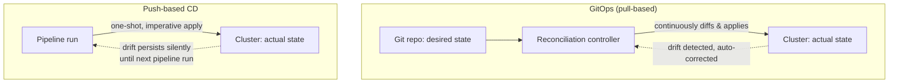
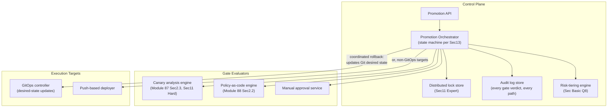

# Module 92 — CI/CD: CD Pipeline Orchestration — Environment Promotion, Progressive Delivery Integration & Release Governance (Capstone)

> Domain: CI/CD | Level: Beginner → Expert | Prerequisite: [[01-CIPipelineArchitecture-PipelineAsCode-Caching-Monorepo]], [[02-TestAutomationStrategy-Pyramid-Flakiness-Coverage-Quality-Gates]], [[03-ArtifactManagement-ReproducibleBuilds-RetentionPolicies]] (all prior CI/CD modules — this is the synthesizing capstone closing the `26-CICD` domain, Modules 89–92); [[../25-DevOps/03-ReleaseDeploymentStrategies-BlueGreen-Canary-ProgressiveDelivery]] (the blue-green/canary/progressive-delivery mechanics this module orchestrates end-to-end across environments); [[../25-DevOps/04-DevSecOps-PolicyAsCode-PlatformEngineering]] §2.4, §Advanced Q5, §Advanced Q7 (policy-as-code gates, break-glass exception governance, and liveness verification — each applied here to CD orchestration's own gate/bypass architecture)

---

## 1. Fundamentals

**What**: CD (Continuous Delivery/Deployment) pipeline orchestration is the automated sequencing of a validated, immutable artifact ([[03-ArtifactManagement-ReproducibleBuilds-RetentionPolicies]] §2.1's digest-identified artifact) through an ordered chain of environments (dev → staging → canary → production), applying a specific deployment strategy (Module 87's blue-green, canary, or progressive-delivery mechanics) at each promotion step, gated by a combination of automated verification and, where risk warrants, human approval — with rollback orchestration treated as a symmetric, first-class capability designed in from the start, not an ad hoc afterthought bolted on after an incident.

**Why it exists**: CI (Module 89) answers "is this specific change correct" at the code level, once, per commit. CD orchestration answers a distinct, recurring question: "should this already-validated artifact advance to the next, larger-blast-radius environment, right now, following which strategy, gated by which checks" — a decision that must be made *consistently* across every release and every environment, not reinvented ad hoc by whichever engineer happens to be deploying that day. Without explicit, codified orchestration, promotion decisions and rollback procedures are executed inconsistently per release — precisely the governance gap this course has already examined for infrastructure (Module 85), configuration (Module 86), and policy enforcement (Module 88's capstone), now recurring at the pipeline-orchestration layer specifically.

**When it matters**: From the moment more than one environment exists in a promotion chain, and becomes acute once release frequency grows to where manual, case-by-case promotion decisions become either the organization's binding velocity bottleneck or — this module's central finding (§4) — a governance control that engineers learn to route *around* rather than through, once its friction exceeds what the release cadence can tolerate.

**How (30,000-ft view)**:
```
Environment chain: dev -> staging -> canary (small traffic %) -> production (full)
    -- SAME immutable artifact (Module 91 digest) promoted forward, never rebuilt
       per environment (Module 86 Sec2.4's build-once-promote-by-digest, now the
       object CD orchestration actually moves through the chain)
Promotion gates: automated (canary analysis, policy-as-code checks, Module 88 Sec2.2)
    and/or manual (human approval) -- EVERY gate must be evaluated on EVERY path
    an artifact can take through the chain, including emergency/hotfix paths
Deployment strategy per stage: blue-green (instant cutover, instant rollback) or
    canary/progressive delivery (gradual traffic shift with automated analysis) --
    Module 87's mechanics, now WIRED INTO the orchestrator's stage definitions
Rollback orchestration: symmetric to promotion -- automated, gate-triggered, and
    itself auditable; GitOps (declarative, pull-based reconciliation) vs push-based
    (imperative, pipeline-triggered) are the two dominant execution models
```

---

## 2. Deep Dive

### 2.1 Environment Promotion Pipelines — Same Artifact, Increasing Blast Radius
A CD orchestration pipeline promotes a *single, identical* artifact (never a per-environment rebuild — Module 86 §2.4 and Module 91 §2.5's promote-by-digest discipline apply here as the literal object being moved) through environments ordered by increasing blast radius: dev (no real users, fastest feedback), staging (production-like configuration, still no real users), canary (a small percentage of real production traffic, real risk but bounded), and finally full production. Each promotion step is a *decision point*, not a mechanical formality: the orchestrator must decide, based on the prior stage's gate results, whether advancing to a larger blast radius is currently justified — a decision this module treats as requiring the same rigor whichever specific path (normal or, per §2.6, emergency) the artifact takes to reach it.

### 2.2 Promotion Gates — Automated Verification vs. Human Approval, and the Gate-as-Bottleneck Problem
A promotion gate is any check that must pass before an artifact advances to the next stage: **automated gates** (canary analysis against error-rate/latency/business-metric thresholds, policy-as-code checks per Module 88 §2.2, smoke/integration test suites) evaluate quickly and consistently with no human latency; **manual approval gates** insert a human decision point, appropriate when a release carries risk automated checks cannot fully characterize (a genuinely novel change, a regulatory-sensitive release, an unusually large blast-radius change). The trap this module's central incident (§4) turns on: a manual approval gate is also, unavoidably, a **latency source** — and latency in a gate that lies on every release's critical path creates a direct, structural incentive to route around it, especially under time pressure. A gate's *design* must account for this incentive explicitly (risk-tiering which releases genuinely need human judgment vs. which can be safely automated, per §2.6's fix) rather than treating "require more manual approval" as a costless way to add safety.

### 2.3 Progressive Delivery Integration — Wiring Module 87's Mechanics into Orchestration
Module 87 established *how* canary analysis and blue-green cutover work as deployment mechanics in isolation; CD orchestration is where those mechanics get *wired into* an actual promotion pipeline as one stage's specific strategy. Concretely: the canary stage's automated gate is Module 87 §2.3's canary-analysis engine, invoked by the orchestrator with a specific bake-time window and specific metric thresholds, and the orchestrator's job is to (a) trigger the strategy's execution (shift 5% of traffic), (b) wait the prescribed bake time, (c) query the analysis engine's verdict, and (d) act on that verdict — advance, hold, or trigger rollback — without a human needing to manually watch a dashboard and decide. This is the specific point where a deployment *strategy* (Module 87) becomes a *pipeline stage* (this module) — and where §2.6's incident shows the wiring can be silently incomplete on an alternate path even when it's correctly implemented on the primary one.

### 2.4 Rollback Orchestration — Symmetric, First-Class, and Automatable
Rollback must be designed with the same rigor as promotion, not treated as an exceptional, manually-improvised path exercised only during a live incident (precisely the "assumed-but-never-verified capability" pattern [[03-ArtifactManagement-ReproducibleBuilds-RetentionPolicies]] §Intermediate Q10 warned generalizes broadly). A well-designed orchestrator triggers rollback **automatically** on gate failure at any stage — reverting to the last known-good artifact digest, not merely halting forward progress — and treats rollback itself as auditable and periodically, deliberately tested (a "rollback drill," analogous to Module 91 §2.3's rebuild-and-diff reproducibility verification, but exercising the rollback path specifically rather than assuming it works because it's rarely needed). §14's production-debugging incident demonstrates what happens when automated rollback and a second, independent reconciliation system (GitOps) both believe they own "desired state" authority without coordination.

### 2.5 GitOps vs. Push-Based CD — Declarative Reconciliation vs. Imperative Pipeline Triggers
**Push-based CD**: a pipeline run explicitly, imperatively applies a change to the target environment (a deploy job runs `kubectl apply` or an equivalent as one pipeline step) — simple to reason about linearly, but the cluster's actual state has no independent mechanism continuously confirming it matches what was intended; drift (a manual `kubectl edit`, an out-of-band change) persists silently until the next pipeline run happens to overwrite it. **GitOps (pull-based)**: a reconciliation controller (Argo CD, Flux — [[../23-Kubernetes/08-Observability-Multicluster-GitOps]]'s continuous-reconciliation model) continuously diffs the cluster's actual state against a Git repository's declared desired state and *automatically* corrects any detected drift, converting "did the last deploy succeed" into "does actual state match desired state, continuously, right now" — a strictly stronger guarantee. The trade-off this module's central debugging incident (§14) exposes: GitOps's continuous reconciliation and an orchestrator's automated rollback are two independent systems that can each believe they have final authority over "what should currently be running," and without explicit coordination between them, they can fight each other in a live-flapping loop.

### 2.6 Emergency/Hotfix Paths — the Governance Blind Spot
Every mature CD orchestration system needs a legitimate emergency path — a true production-down incident genuinely cannot wait for a multi-minute canary bake time before a fix reaches users. But an emergency path that bypasses the normal chain's gates (canary analysis, manual approval) is, by construction, a bypass of every safety mechanism those gates exist to provide — and unless that bypass is itself **audited, rate-tracked, and periodically reviewed** (directly Module 88 §Advanced Q5's break-glass-procedure discipline, applied here to deployment orchestration specifically rather than infrastructure access), there is no mechanism distinguishing its legitimate, rare, true-emergency use from its illegitimate, routine use as a way to dodge §2.2's approval-gate latency — precisely this module's central incident (§4).

---

## 3. Visual Architecture

### Normal Promotion Chain — Strategy + Gates per Stage (§2.1–§2.3)
```mermaid
graph LR
    Artifact["Immutable artifact<br/>(Module 91 digest)"] --> Dev["Dev"]
    Dev -->|auto gate: smoke tests| Staging["Staging"]
    Staging -->|auto gate: integration tests +<br/>policy-as-code (Module 88 Sec2.2)| Canary["Canary (5% traffic,<br/>Module 87 Sec2.3 strategy)"]
    Canary -->|automated canary analysis| Decision{"Analysis verdict"}
    Decision -->|pass + manual approval| Prod["Production (100%)"]
    Decision -->|fail| Rollback["Automated rollback<br/>to last-known-good digest"]
    Prod -.->|post-promotion health<br/>regression detected| Rollback
```

### The Governance Blind Spot — Declared Invariant vs. Actual Reality (§2.6, §4)
```
Declared invariant: "no artifact reaches production without canary analysis passing
                      AND manual approval"

Normal path:    Dev -> Staging -> Canary(analysis) -> [gate: analysis + approval] -> Prod
Emergency path: Dev/Staging ------------------------> [BYPASS both gates] --------> Prod
                                                        (100% traffic, immediately)

Emergency-path usage was NOT tracked separately from normal-path usage in the
orchestrator's deployment log -- both recorded identically as "Deployment succeeded."
Result: the declared invariant was silently FALSE for an unmeasured, unaudited
fraction of releases, discoverable only by the exact failure mode it existed to prevent.
```

### GitOps Reconciliation vs. Push-Based Trigger (§2.5)


### Rollback-vs-Reconciliation Flapping Loop (§14)
```
T0: Deploy v2 -> post-deploy health check fails -> automated rollback reverts to v1
T1: GitOps controller reconciles against Git's desired state (still declares v2)
      -> detects "drift" (actual=v1, desired=v2) -> redeploys v2
T2: v2 fails health check again -> automated rollback reverts to v1 -- repeat T1
...flapping indefinitely: two systems, each believing it owns "desired state,"
   never informed of the other's action, until a human intervenes.
```

---

## 4. Production Example

**Scenario**: An e-commerce platform's CD pipeline promoted every release through dev → staging → canary (5% traffic, automated analysis with a 30-minute bake time) → production, gated by canary analysis passing *and* a manual approval from an on-call release engineer. A separate "emergency hotfix" path existed for genuine production-down incidents, deploying straight to 100% of production traffic with no canary bake and no approval wait — justified on the reasoning that a severe outage cannot tolerate a 30-minute canary delay before a fix ships.

**Investigation**: Following a release that introduced a subtle pricing-calculation regression, the incident review found the release had gone out via the emergency hotfix path — despite there being no actual production incident underway at the time it was used. Interviewing the releasing team revealed this was not an isolated misuse: the normal path's manual-approval step had, over the preceding several months, become a routine multi-hour bottleneck (approvers were frequently slow to respond, especially outside core hours), and engineers under ordinary release-deadline pressure had begun using the "emergency" path for ordinary, non-emergency releases simply to avoid the wait. This had never been flagged because the orchestrator's deployment log recorded every deployment identically as "Deployment succeeded," with no field distinguishing which path — normal or emergency — a given release had taken, and therefore no dashboard, alert, or periodic review that could have revealed the emergency path's usage rate climbing to become a routine convenience rather than a rare escape hatch.

**Root cause**: Two independent, compounding gaps. (1) An orchestration-design gap: the emergency path existed as a legitimate, necessary capability (true incidents genuinely cannot wait for a full bake time) but was never instrumented with the audit logging and usage-rate review Module 88 §Advanced Q5 established as break-glass procedures' mandatory complement — the bypass path's existence was declared acceptable *conditional on* rare, audited, reviewed use, but that condition was never actually enforced or even measured. (2) A friction gap at the source: the normal path's manual-approval latency created a direct, standing incentive to route around the safety mechanism entirely, and that incentive was never addressed at its root — the organization treated the resulting bypasses as individual lapses in judgment rather than a predictable, structural consequence of a gate whose cost the release cadence could no longer absorb.

**Fix**: (1) Instrumented the emergency path with mandatory, structured audit logging — every emergency-path deployment now records a required justification, is automatically flagged for post-hoc review within 24 hours, and its usage rate is tracked on a standing dashboard, converting an unmeasured escape hatch into a break-glass procedure that actually matches Module 88's discipline rather than merely being named similarly to one. (2) Addressed the root friction directly: routine, low-risk releases (determined by an automated risk-scoring heuristic — small diff size, no schema/infrastructure change, prior canary history clean) now satisfy their approval requirement via an automated policy-as-code gate (Module 88 §2.2) evaluating the same criteria a human approver typically checked, reserving human approval specifically for releases the risk heuristic flags as genuinely warranting judgment — removing the incentive to bypass rather than merely monitoring the bypass more closely. (3) Even the emergency path was changed to pass through an *abbreviated* automated canary check (a 2-minute bake at 1% traffic) rather than skipping progressive delivery altogether — accepting some added latency even during a genuine incident in exchange for retaining at least some automated safety net on every path an artifact can take to production.

**Lesson**: This incident is the CI/CD domain's capstone instance of its now-repeated theme: a control declared as blocking (canary analysis and approval, required "before any production change") is only as real as its *actual, universal, audited* enforcement across every path a deployment can take through the orchestration system — an unmonitored escape hatch is a silent policy bypass waiting to be discovered by the exact worst-case event it existed to prevent. And critically, the bypass here was not driven by malice or carelessness but by an entirely rational, individually-reasonable response to a gate whose friction the organization never addressed at its source — meaning the durable fix had to address the friction itself, not merely add more monitoring around the symptom of engineers routing around it.

---

## 5. Best Practices
- Promote a single, immutable, digest-identified artifact through every environment — never rebuild per environment (§2.1, Module 86 §2.4, Module 91 §2.5).
- Design promotion gates with explicit awareness that latency in a gate on the critical path creates a structural incentive to bypass it — risk-tier which releases genuinely need human approval vs. which can be safely automated, rather than treating "add more manual approval" as costless (§2.2, §4).
- Wire Module 87's canary-analysis/blue-green mechanics directly into the orchestrator's stage definitions so promotion decisions are automated, consistent verdicts, not a human manually watching a dashboard (§2.3).
- Treat rollback as a symmetric, automated, and *periodically drilled* capability — never an ad hoc procedure improvised only during a live incident (§2.4).
- Instrument every emergency/hotfix bypass path with mandatory audit logging, usage-rate tracking, and periodic review — a break-glass procedure without this instrumentation is indistinguishable, in practice, from no control at all (§2.6, §4).
- Where GitOps reconciliation and automated rollback both operate against the same target, explicitly coordinate their authority (e.g., rollback updates the Git-declared desired state itself, rather than only the live cluster) to prevent the two systems fighting each other (§2.5, §14).

## 6. Anti-patterns
- Rebuilding an artifact per environment rather than promoting the identical, already-validated digest forward (§2.1).
- A manual-approval gate with no risk-tiering, applied uniformly regardless of a release's actual risk profile — the single largest driver of gate-bypass incentive (§2.2, §4).
- Manually watching a canary dashboard and eyeballing a promote/rollback decision rather than wiring an automated, consistent analysis verdict into the orchestrator (§2.3).
- Treating rollback as an improvised, rarely-exercised emergency procedure rather than a first-class, automated, periodically-drilled capability (§2.4).
- An emergency/hotfix bypass path with no audit logging or usage-rate review, indistinguishable in the deployment log from a normal-path release (§2.6, §4).
- Running GitOps reconciliation and an independent automated-rollback system against the same target with no coordination between their respective notions of "desired state" (§2.5, §14).

---

## 10. Interview Questions

### Basic (10)

1. **Q: What is the difference between Continuous Integration and CD pipeline orchestration, as this module distinguishes them?**
   **A:** CI (Module 89) determines whether a specific code change is correct, once, at commit time. CD pipeline orchestration determines whether an already-validated, immutable artifact should advance to the next, larger-blast-radius environment, applying a deployment strategy and gates consistently across every release.
   **Why correct:** Precisely separates the two distinct questions ("is this change good" vs. "should this artifact be promoted further, how") rather than treating CI/CD as one undifferentiated pipeline.
   **Common mistakes:** Treating "CI/CD" as a single, undifferentiated concept without recognizing CD orchestration's distinct decision-making role over promotion and rollback.
   **Follow-ups:** "Why must the artifact stay identical across this entire process?" (Rebuilding per environment risks a Module 91-style reproducibility gap producing a different artifact than what was actually tested.)

2. **Q: What is a promotion gate, and name the two broad categories this module distinguishes.**
   **A:** A check that must pass before an artifact advances to the next environment. Automated gates (canary analysis, policy-as-code checks, test suites) evaluate consistently with no human latency; manual approval gates insert a human decision point for risk automated checks can't fully characterize.
   **Why correct:** States both the gate concept and the two categories with their defining trade-off (consistency/speed vs. human judgment/latency).
   **Common mistakes:** Assuming manual approval is strictly "safer" than automation without considering the latency-driven bypass incentive it introduces.
   **Follow-ups:** "What's the risk of relying too heavily on manual approval gates?" (They introduce latency on the critical path, which can create a structural incentive to route around them entirely — this module's central incident.)

3. **Q: What is the difference between GitOps (pull-based) and push-based CD?**
   **A:** Push-based CD has a pipeline explicitly, imperatively apply a change once. GitOps has a reconciliation controller continuously diff the cluster's actual state against a Git-declared desired state and automatically correct any detected drift.
   **Why correct:** States the defining mechanism difference (one-shot imperative apply vs. continuous, automatic reconciliation) rather than a vague "GitOps uses Git" characterization.
   **Common mistakes:** Believing GitOps is merely "storing config in Git," missing that its defining property is the continuous, automatic reconciliation loop, not merely the storage location.
   **Follow-ups:** "What problem does continuous reconciliation solve that a one-shot push-based apply doesn't?" (Silent configuration drift from an out-of-band manual change persists undetected under push-based CD until the next pipeline run; GitOps detects and corrects it continuously.)

4. **Q: Why should rollback be designed as a "first-class," automated capability rather than an improvised emergency procedure?**
   **A:** A capability that's rarely exercised and never deliberately tested is easy to assume works without actually verifying it — exactly the "assumed but never measured" risk Module 91 identified for build reproducibility, now applied to rollback specifically.
   **Why correct:** Connects rollback's design requirement to the course's established "assumed ≠ verified" pattern rather than treating it as an isolated best practice.
   **Common mistakes:** Assuming "we have a rollback procedure documented" is equivalent to "we know rollback actually works," without periodic drilling.
   **Follow-ups:** "How would you verify a rollback procedure actually works?" (A periodic rollback drill — deliberately triggering rollback in a controlled environment and confirming it restores the prior known-good state correctly.)

5. **Q: What is a canary deployment's "bake time," and why does an emergency/hotfix path skipping it introduce risk?**
   **A:** Bake time is the window a canary stage waits at partial traffic, allowing automated analysis to detect a regression before full rollout. Skipping it (as an emergency path does) removes the automated safety net that would otherwise catch a regression before it reaches 100% of production traffic.
   **Why correct:** States both what bake time provides and precisely what's lost by skipping it.
   **Common mistakes:** Assuming an emergency path is inherently safe because it's reserved for urgent situations, without recognizing it also removes the automated verification a normal release relies on.
   **Follow-ups:** "How did this module's central incident's fix address this trade-off?" (By having even the emergency path pass through an abbreviated automated canary check — a short bake at low traffic — rather than skipping progressive delivery entirely.)

6. **Q: Why must an emergency/hotfix bypass path be audit-logged and usage-tracked, per this module's central incident?**
   **A:** Without tracking, an emergency path's usage is indistinguishable in the deployment log from a normal-path release, meaning routine, illegitimate use (bypassing approval-gate latency) can silently become common with no mechanism ever flagging it for review.
   **Why correct:** States the specific mechanism (indistinguishable logging) by which unaudited bypass usage goes undetected.
   **Common mistakes:** Assuming the mere existence of an emergency path, reserved "for emergencies only" by policy, is sufficient without an enforcement or review mechanism confirming that policy is actually followed.
   **Follow-ups:** "What specifically should be tracked?" (Every emergency-path deployment's justification, a post-hoc review requirement within a defined SLA, and an aggregate usage-rate dashboard revealing if the rate climbs beyond what genuine emergencies would produce.)

7. **Q: In a promotion chain of dev → staging → canary → production, why must the *same* artifact digest be used at every stage rather than a fresh build per stage?**
   **A:** A fresh build per stage risks producing a different artifact than what was actually validated at the prior stage (a Module 91-style reproducibility gap), meaning what reaches production may not be exactly what passed canary analysis — undermining the entire point of staged validation.
   **Why correct:** Connects artifact identity directly to the validity of every upstream gate's verdict.
   **Common mistakes:** Assuming "same source code" is equivalent to "same artifact," missing that even identical source can produce different build output absent verified reproducibility.
   **Follow-ups:** "How is this enforced in a Module 91-compliant pipeline?" (Promoting the artifact by its immutable content digest, never re-triggering a build at each stage.)

8. **Q: What is the risk-tiering approach to promotion gates, and why does this module recommend it over uniform manual approval for every release?**
   **A:** Risk-tiering uses an automated heuristic (diff size, whether infrastructure/schema changed, prior canary history) to classify a release's risk, routing low-risk releases through fully automated gates and reserving human approval specifically for releases the heuristic flags as genuinely risky.
   **Why correct:** States the mechanism and its rationale — reducing gate friction for the common, low-risk case removes the incentive driving this module's central bypass incident.
   **Common mistakes:** Assuming uniform manual approval for every release is inherently the "safest" default, without recognizing the friction it creates predictably drives bypass behavior.
   **Follow-ups:** "What's the risk of risk-tiering itself being miscalibrated?" (A heuristic that under-classifies a genuinely risky release as low-risk would route it through automation that lacks the human judgment it actually needed — the heuristic itself requires periodic review and tuning.)

9. **Q: What does "defense-in-depth across every write path" (Module 88's principle) mean applied specifically to CD orchestration gates?**
   **A:** Every path an artifact can take to production — the normal chain and any emergency/hotfix path — must be covered by the same class of safety mechanism (even if abbreviated), since a gate that exists on only one path provides no protection against releases taking any other path.
   **Why correct:** Directly extends Module 88's write-path-coverage principle to the specific context of deployment orchestration's multiple paths.
   **Common mistakes:** Assuming a well-designed normal-path gate is sufficient organizational protection without considering that an alternate, ungated path (an emergency bypass) undermines it entirely.
   **Follow-ups:** "Where else has this course seen the identical 'gate covers only one path' failure shape?" (Module 88 §4's admission-control bypass via an alternate cluster write path — same structural gap, different domain.)

10. **Q: Why is "the pipeline logged the deployment as successful" not sufficient evidence that a release went through the intended, fully-gated promotion process?**
    **A:** A deployment log recording success typically doesn't distinguish which path (normal, fully-gated, or emergency, bypassed) produced that success — meaning "successful" conflates two meaningfully different levels of actual verification unless the log explicitly captures which gates were evaluated and passed.
    **Why correct:** Identifies the specific ambiguity (success alone doesn't reveal which gates ran) that this module's central incident's audit-logging fix directly addresses.
    **Common mistakes:** Treating a clean deployment-success log as equivalent to "every intended safety check passed," without confirming the log actually distinguishes gate-evaluation outcomes per path.
    **Follow-ups:** "What should a properly-instrumented deployment log record?" (Which specific gates were evaluated, their individual verdicts, and which path — normal or emergency — the deployment took, not merely an aggregate success/failure flag.)

### Intermediate (10)

1. **Q: Why does this module argue the root cause of §4's incident was gate *friction*, not merely insufficient monitoring of the emergency path — and why does that distinction change which fix should be prioritized?**
   **A:** Monitoring the emergency path more closely would only reveal that bypasses were happening — it wouldn't remove the underlying incentive driving engineers to use it for non-emergencies in the first place. As long as the normal path's approval gate remains a multi-hour bottleneck, better monitoring converts an invisible problem into a visible one but doesn't resolve it; the durable fix requires addressing the friction itself (automating approval for low-risk releases), removing the incentive rather than merely observing its symptom more accurately.
   **Why correct:** Distinguishes symptom-monitoring from root-cause remediation and explains why only the latter durably resolves the incentive structure.
   **Common mistakes:** Treating improved audit logging alone as a complete fix, without also addressing why engineers felt compelled to bypass the normal path in the first place.
   **Follow-ups:** "Should the audit-logging fix have been skipped if the friction fix was implemented?" (No — both are necessary: friction reduction addresses routine, incentive-driven bypass, but genuine emergencies will still occasionally need the bypass path, and *that* legitimate use still requires audit logging and review to remain trustworthy over time.)

2. **Q: A team argues that requiring canary analysis and manual approval for literally every release, with zero exceptions and no emergency path at all, is the safest possible CD orchestration design. Evaluate this claim.**
   **A:** This overcorrects in the opposite direction from §4's incident: a genuine production-down emergency that cannot tolerate a full canary bake time or an approval-gate wait would, under a zero-exception design, either be blocked from shipping a fix at all or force engineers to circumvent the pipeline entirely outside any sanctioned, auditable path — arguably worse than a sanctioned, audited emergency path, since an entirely unsanctioned circumvention wouldn't even have the audit-logging and review discipline §4's fix established. The correct design keeps a legitimate emergency path but makes it audited, reviewed, and still passes it through an abbreviated automated safety check, rather than eliminating it entirely.
   **Why correct:** Identifies the specific failure mode a zero-exception design produces (unsanctioned circumvention outside any auditable path) as arguably worse than a properly-governed emergency path.
   **Common mistakes:** Assuming "eliminate the exception path entirely" is a strictly safer response to discovering it was misused, without considering that a genuine emergency's needs don't disappear — they just get pushed outside any governed process if no legitimate path exists.
   **Follow-ups:** "What's the minimum abbreviated safety check an emergency path should retain, per §4's fix?" (A short automated canary bake at low traffic — accepting some added latency even during a real incident, in exchange for at least some automated regression detection before full rollout.)

3. **Q: How does §14's rollback-vs-GitOps-reconciliation flapping loop illustrate a distinct failure mode from §4's gate-bypass incident, despite both occurring within the same CD orchestration domain?**
   **A:** §4 is a governance failure — a declared control (gate enforcement) silently not applied on an alternate path, discovered as a one-time incident. §14 is a coordination failure between two functioning, correctly-operating systems (automated rollback and GitOps reconciliation) that each correctly perform their own job in isolation but were never designed with awareness of the other's existence, producing an ongoing, repeating flapping loop rather than a single silent gap. The fixes are structurally different: §4 needed audit logging and friction reduction; §14 needs explicit cross-system coordination (rollback updating the Git-declared desired state itself, not just the live cluster).
   **Why correct:** Distinguishes a governance/audit gap (one control silently not enforced) from a coordination gap (two correctly-functioning systems lacking mutual awareness), each requiring a structurally different category of fix.
   **Common mistakes:** Treating both incidents as instances of the identical "gate not enforced" pattern, missing that §14 involves no missing gate at all — both systems are working exactly as individually designed.
   **Follow-ups:** "How would you detect a flapping loop like §14's before it consumes hours of incident time?" (An alert on deployment-state oscillation — the same artifact version toggling between two states repeatedly within a short window — rather than relying on a human noticing the pattern manually during an active incident.)

4. **Q: Why does risk-tiering promotion gates (§4's fix, §Basic Q8) require its own periodic review, rather than being a one-time classification exercise?**
   **A:** A risk heuristic's calibration reflects the release patterns and risk profile at the time it was designed; as the codebase, team, or release patterns evolve, a heuristic that correctly classified risk when introduced can drift into either under-classifying genuinely risky releases as automatable (dangerous) or over-classifying safe releases as requiring human approval (recreating the original friction problem) — precisely the same "declared classification silently drifts from actual accuracy" pattern this course has repeatedly examined for other governance mechanisms.
   **Why correct:** Applies the course's now-familiar "a classification/policy requires ongoing verification, not a one-time setup" principle specifically to risk-tiering's own calibration.
   **Common mistakes:** Treating risk-tiering as a "set once, trust indefinitely" mechanism rather than a governance artifact requiring the same periodic health-review discipline as any other declared control.
   **Follow-ups:** "What signal would indicate the risk heuristic needs recalibration?" (A production incident traced to a release the heuristic classified as low-risk and routed through automation alone, or — the opposite signal — a persistently high rate of releases the heuristic routes to manual approval despite historically clean canary results, suggesting the threshold is now needlessly conservative.)

5. **Q: Why is "the same artifact was promoted through canary and then production" not, by itself, sufficient evidence that production received a canary-validated release, in a system with an unaudited emergency path?**
   **A:** Without path-level audit logging distinguishing normal-path (canary-validated) promotions from emergency-path (bypassed) ones, "artifact X is now running in production" alone doesn't reveal *which path* got it there — a fact §4's incident demonstrates matters enormously, since an emergency-path release reaching production carries none of the canary-analysis assurance a normal-path release does, despite both looking identical in a deployment log that only records final outcome.
   **Why correct:** Identifies the precise informational gap (final state alone doesn't reveal the path/process that produced it) driving §4's root cause.
   **Common mistakes:** Assuming a deployment's final "running in production" state carries the same assurance regardless of which promotion path produced it.
   **Follow-ups:** "What would a properly path-aware deployment log record for every release?" (Which path was taken, which specific gates were evaluated on that path, and each gate's individual verdict — not merely an aggregate success flag.)

6. **Q: How does GitOps's continuous reconciliation (§2.5) both help and potentially hinder incident response, depending on context?**
   **A:** It helps by automatically correcting genuine, unintended drift (a manual out-of-band change silently reverted without human intervention) — a strict improvement over push-based CD's silent-drift-until-next-run gap. It can hinder incident response specifically when a *deliberate*, temporary deviation from Git's declared state is needed during an active incident (e.g., a manual rollback or a temporary scale-down) — GitOps's reconciliation loop will "correct" that deliberate deviation back to the (possibly still-broken) declared state unless the Git-declared desired state is updated first, exactly §14's flapping-loop mechanism.
   **Why correct:** Identifies the specific double-edged nature of continuous reconciliation — a strength against unintended drift, a hazard against intentional, uncoordinated deviation during incident response.
   **Common mistakes:** Treating GitOps's automatic correction as unconditionally beneficial without recognizing it also auto-corrects intentional emergency interventions that haven't been reflected back into Git first.
   **Follow-ups:** "What's the correct incident-response procedure under GitOps, given this risk?" (Update the Git-declared desired state itself as the very first incident-response action — e.g., committing the rollback target — so the reconciliation controller's next pass enforces the *intended* state rather than fighting against it.)

7. **Q: Why does this module recommend rollback update the Git-declared desired state itself, rather than only reverting the live cluster's actual state, in a GitOps-managed environment?**
   **A:** If rollback only reverts the live cluster while Git still declares the failed version as desired, the reconciliation controller will detect this as "drift" on its next pass and redeploy the failed version again — exactly §14's flapping loop. Updating Git's declared state as part of the rollback action itself ensures the reconciliation controller's own continuous-correction behavior works *with* the rollback rather than against it.
   **Why correct:** States the precise mechanism (reconciliation treats an un-updated Git state as drift to correct) and the fix that aligns both systems' notion of desired state.
   **Common mistakes:** Treating rollback as purely a live-cluster operation, forgetting that GitOps's reconciliation loop will independently and automatically undo a live-only rollback if the declared source of truth isn't also updated.
   **Follow-ups:** "Does this same principle apply to push-based CD, or is it GitOps-specific?" (It's specific to systems with an independent, continuously-reconciling second authority over desired state — push-based CD has no such second authority automatically re-applying a stale desired state, so a live-cluster-only rollback doesn't face the identical flapping risk there.)

8. **Q: How does canary analysis's automated bake-time verdict (§2.3) relate to, and differ from, the manual-approval gate (§2.2) in terms of what each is actually capable of catching?**
   **A:** Canary analysis catches regressions automated metrics can characterize — elevated error rates, latency degradation, business-metric anomalies — within its bake window and traffic percentage, but it cannot evaluate whether a change is strategically or contractually appropriate, whether it's compliant with a regulatory requirement, or whether its blast radius is acceptable given business context outside what metrics capture. Manual approval exists specifically to cover this complementary gap — meaning the two aren't redundant alternatives but address genuinely different categories of risk, and risk-tiering (§Basic Q8) should route each release to whichever gate (or both) actually covers its specific risk category.
   **Why correct:** Precisely distinguishes what each gate type can and cannot detect, explaining why risk-tiering isn't simply "automate the easy cases, keep humans for the hard cases" but a genuine difference in risk-category coverage.
   **Common mistakes:** Treating manual approval as merely a slower, less-scalable substitute for automated analysis, rather than recognizing it covers a genuinely different category of risk automated metrics structurally cannot characterize.
   **Follow-ups:** "Could canary analysis ever be extended to cover some of manual approval's traditional scope?" (Partially — a policy-as-code gate (Module 88 §2.2) can automate compliance-rule checks that were previously manual, but strategic/business-context judgment specific to a novel situation remains genuinely outside what any codified automated check can evaluate.)

9. **Q: Design a metric or signal that would have surfaced §4's incident *before* the pricing-regression release, rather than only after, via post-incident review.**
   **A:** An emergency-path usage-rate dashboard tracking the fraction of total releases taking the emergency path over a rolling window, alerting when that rate exceeds a small, expected baseline (true emergencies should be rare) — combined with a lightweight, mandatory justification field on every emergency-path deployment, reviewed on a fixed cadence (not merely accumulated). Either signal alone — a climbing usage rate, or a pattern of unconvincing/absent justifications on review — would have surfaced the routine-convenience-use pattern well before it caused a customer-facing regression.
   **Why correct:** Proposes concrete, proactively-monitorable signals (usage-rate threshold, mandatory-justification review) rather than relying on discovering the pattern only retrospectively during a post-incident investigation.
   **Common mistakes:** Proposing only a reactive audit (reviewing emergency-path deployments after an incident already occurred) rather than a proactive, continuously-monitored signal that would surface the pattern before it caused customer impact.
   **Follow-ups:** "What baseline emergency-path usage rate would you consider 'expected,' and how would you calibrate it?" (Start from the organization's actual historical rate of genuine production-down incidents — if emergency-path usage significantly exceeds that independently-known incident rate, it's a strong signal of non-emergency use, since a well-functioning emergency path's usage should track roughly with genuine emergencies, not exceed them.)

10. **Q: How does this module's central incident (§4) extend the "declared/measured proxy ≠ actual reality" pattern this course established as the CI/CD domain's recurring theme (Modules 89–91), and what is genuinely new about its specific instance of that pattern?**
    **A:** Module 89 found a monorepo's affected-project computation silently incomplete; Module 90 found coverage-as-a-metric silently gamed once optimized against directly; Module 91 found build reproducibility silently assumed rather than ever measured. This module's instance shares the identical shape (a declared guarantee — "no release reaches production without canary analysis and approval" — silently false in practice) but is genuinely distinct in *mechanism*: the prior three modules' gaps were each a technical/structural blind spot (a static-analysis limitation, a metric's gameable proxy nature, an unverified technical assumption) discovered without any human deliberately routing around the control. This module's gap was driven by rational, individually-reasonable human behavior responding predictably to a control's own friction — meaning the fix required addressing an incentive structure, not merely a technical measurement or verification gap, marking this capstone's specific contribution to the domain's recurring theme: the same "declared ≠ actual" shape can arise from a purely technical blind spot *or* from a control whose own cost predictably induces bypass, and distinguishing which is driving a given instance determines whether the fix should be technical (better detection) or incentive-structural (reduce the cost of compliance).
    **Why correct:** Explicitly connects this module's incident to the domain's established recurring theme while precisely identifying what's mechanistically new (human-incentive-driven bypass vs. purely technical blind spot) and why that distinction changes the required fix category.
    **Common mistakes:** Treating this incident as merely "another instance of the same pattern" without identifying the specific mechanistic difference (incentive-driven vs. technical) that determines whether the appropriate fix is better detection or reduced friction.
    **Follow-ups:** "Which other prior-module incidents, on reflection, were actually incentive-driven rather than purely technical?" (Module 90's coverage-gaming incident is arguably a hybrid — the metric's gameability is technical, but teams' choice to write assertion-free tests satisfying it was itself an incentive-driven response to a mandatory threshold's own pressure, closely paralleling this module's finding.)

### Advanced (10)

1. **Q: Diagnose §4's incident from first principles and design the complete structural fix — not merely the three specific remediations already described.**
   **A:** Root causes (two, independent, per Intermediate Q1): an orchestration-design gap (the emergency path's legitimate-use condition — rare, audited, reviewed — was declared but never actually enforced or measured) and a friction gap at the source (the normal path's uniform manual approval created a standing incentive to bypass it). Complete structural fix: (1) risk-tier promotion gates so only genuinely risk-flagged releases require human approval, removing the incentive for routine bypass (§Basic Q8, with periodic recalibration per Intermediate Q4); (2) instrument every bypass path with mandatory audit logging, justification capture, and a proactive usage-rate dashboard alerting when usage exceeds the organization's independently-known genuine-incident rate (Intermediate Q9) — converting a reactive, post-incident discovery mechanism into a proactive one; (3) retain an abbreviated automated safety check (a short canary bake) even on the emergency path, so genuine incidents still receive some automated regression detection rather than none (§4's third fix); (4) proactively audit whether any *other* declared-mandatory gate elsewhere in the organization's CD orchestration has a similarly unaudited alternate path — since this incident's specific mechanism (a legitimate escape hatch existing without the audit discipline its legitimacy depends on) plausibly recurs anywhere a similar exception path exists.
   **Why correct:** Addresses both independent root causes with mechanistically appropriate fixes (incentive-structural for the friction gap, audit/monitoring-structural for the governance gap) and extends the investigation proactively per the domain's established pattern of searching for the same failure shape elsewhere.
   **Common mistakes:** Applying only the audit-logging fix without also addressing the underlying approval-gate friction that created the incentive to bypass in the first place, leaving the organization still exposed to routine bypass merely made more visible rather than actually reduced.
   **Follow-ups:** "How would you sequence these fixes given limited immediate engineering capacity?" (Audit logging and usage-rate tracking first — cheapest to implement and immediately converts an invisible risk into a visible, monitorable one; risk-tiered automation second, since it requires more design and validation work but delivers the durable, incentive-removing fix; the cross-organization audit for similar gaps last, as a lower-urgency but still valuable structural investment.)

2. **Q: A Principal Engineer is asked whether the organization should adopt a "four-eyes" requirement (two independent human approvers, not one) for every production promotion, as a response to §4's incident. Evaluate this proposal.**
   **A:** This doubles the exact friction §4's incident identified as the root incentive driving bypass, without addressing the underlying problem (a uniform, non-risk-tiered approval requirement) at all — it would very plausibly *increase* the rate of emergency-path bypass for routine releases rather than reduce it, since the normal path becomes even slower relative to the bypass. A four-eyes requirement may be genuinely appropriate for the specific, risk-tiered subset of releases the heuristic already flags as high-risk (where the marginal cost of a second approver is justified by the release's actual risk), but applying it uniformly to every release repeats precisely the mistake §4's incident already diagnosed at a smaller scale, now amplified.
   **Why correct:** Identifies that the proposal, applied uniformly, would exacerbate rather than resolve the specific incentive structure §4's incident already traced as root cause, while correctly scoping where the proposal might still be reasonably applied (risk-tiered high-risk releases only).
   **Common mistakes:** Assuming "more human review" is unconditionally safer without considering the friction-driven bypass incentive it predictably amplifies when applied uniformly rather than risk-proportionately.
   **Follow-ups:** "How would you communicate this evaluation to a security-focused stakeholder proposing the four-eyes requirement?" (Acknowledge the underlying safety concern is legitimate, then present §4's actual incident mechanism as evidence that uniform additional friction predictably backfires, proposing the risk-tiered alternative as achieving the same safety intent for genuinely high-risk releases without recreating the identical bypass incentive for the routine majority.)

3. **Q: How would you design an automated canary-analysis decision procedure that avoids both false-positive rollbacks (halting a genuinely safe release due to noisy metrics) and false-negative promotions (advancing a genuinely regressive release because noise masked the signal)?**
   **A:** Use a statistical comparison between the canary cohort's metrics and a simultaneously-running control cohort (not merely comparing canary metrics against a historical baseline, which conflates genuine regression with normal time-based variance) over a bake window long enough to average out short-term noise but short enough to bound blast-radius exposure; require a sustained, statistically-significant divergence (not a single noisy data point) before triggering rollback, and require the *absence* of any such divergence — not merely "no rollback triggered yet" — before treating the bake window as successfully completed. This directly mirrors Module 90 §2.2's flaky-test-vs-genuine-regression distinction, now applied to canary metric noise instead of test-run noise.
   **Why correct:** Proposes a concrete statistical design (simultaneous control cohort, sustained-divergence threshold, explicit bake-window completion criterion) addressing both failure directions, and correctly connects the underlying signal-vs-noise problem to an already-established course pattern.
   **Common mistakes:** Comparing canary metrics only against a historical baseline (ignoring time-of-day/day-of-week variance that a simultaneous control cohort would naturally account for), or triggering rollback on any single noisy data point rather than requiring sustained divergence.
   **Follow-ups:** "How would this design behave for a genuinely low-traffic canary cohort where statistical significance is hard to achieve within a reasonable bake time?" (Extend the bake window or the canary traffic percentage specifically for low-traffic services, accepting a trade-off between blast-radius exposure and statistical confidence — a risk-tiering decision analogous to §Basic Q8's approval-gate risk-tiering, now applied to canary-analysis parameters themselves.)

4. **Q: A team's CD orchestrator promotes an artifact through canary successfully, but a regression only manifests once the release reaches 100% production traffic — a genuine scale-dependent effect (e.g., a resource-contention issue only visible under full load) invisible at 5% canary traffic. How does this differ from §4's incident, and what does it imply about canary analysis's fundamental limits?**
   **A:** This differs from §4 entirely — every gate functioned exactly as designed and no bypass occurred; the failure is a fundamental limit of canary analysis itself, not a governance gap. Canary analysis at partial traffic cannot, by construction, detect effects that only emerge at full production scale (a resource-contention bottleneck, a cache-eviction pattern change, a downstream service's capacity limit) — meaning canary analysis is necessary but not alone sufficient, and must be complemented by post-full-promotion monitoring with its own automated rollback trigger (extending the same automated-verdict discipline §2.3 established for the canary stage specifically to the post-promotion production stage as well).
   **Why correct:** Correctly identifies this as a fundamentally different failure category (a technical limit of partial-traffic testing, not a governance/audit gap) and proposes the specific structural complement (post-full-promotion automated monitoring) that addresses it.
   **Common mistakes:** Conflating this with §4's incident as "another gate failure," missing that no gate was bypassed or unenforced here — the gate simply couldn't detect a class of effect invisible at its testing scale.
   **Follow-ups:** "Should this change how canary traffic percentages are chosen?" (Not entirely — a higher canary percentage improves scale-effect detection somewhat but can never fully substitute for full-scale monitoring while also bounding blast radius by definition; the correct response is adding post-promotion monitoring as a genuinely separate safety layer, not merely raising the canary percentage indefinitely.)

5. **Q: How should a CD orchestrator's promotion-lock mechanism (preventing two concurrent promotions of the same service from racing) be designed, and what specifically breaks if it's omitted?**
   **A:** Without a lock, two concurrent promotion attempts for the same service (e.g., two separate releases triggered in close succession) could interleave their stage transitions — one promotion's rollback trigger firing while the other's forward-promotion logic is mid-execution, leaving the service in an inconsistent, undefined intermediate state that matches neither release's intended final state. The fix: a distributed lock (a database row lock, a distributed-lock service like a Redis-based mutex, or a per-service serialization queue) acquired before any promotion begins and held for that promotion's entire duration, ensuring only one promotion (in either direction, forward or rollback) can be actively executing against a given service at any moment.
   **Why correct:** Identifies the specific race condition (interleaved stage transitions from concurrent promotions) and the concrete mechanism (a held distributed lock spanning the full promotion duration) that prevents it.
   **Common mistakes:** Assuming sequential pipeline triggers alone (e.g., a CI system queueing pipeline runs) is sufficient serialization, without considering that a rollback triggered mid-promotion by an entirely separate mechanism (an automated health-check-driven rollback) could still race against a forward promotion holding no such lock.
   **Follow-ups:** "What happens if the process holding the lock crashes mid-promotion, never releasing it?" (The lock must carry a lease/expiration (a time-bounded hold, renewed periodically while the promotion is genuinely still in progress) so a crashed holder's lock is automatically released after the lease expires, rather than permanently blocking all future promotions for that service.)

6. **Q: Design a rollback-drill practice (§2.4) that verifies rollback actually works, without requiring an actual production incident to exercise it — and explain what specifically it should verify beyond "the rollback command executed without error."**
   **A:** Periodically (e.g., monthly, per service), deliberately trigger a rollback in a controlled window against a genuinely representative environment (staging, or a low-traffic production canary slice) and verify not merely that the rollback command exits successfully, but that the *actual resulting state* matches the intended prior-version state end-to-end — the correct artifact digest is running, dependent configuration/secrets are correctly reverted alongside the artifact (Module 86's promotion-and-rollback-must-move-together principle), and — in a GitOps-managed environment specifically — that the Git-declared desired state was also correctly updated, not merely the live cluster (§Intermediate Q7), preventing §14's flapping-loop mechanism from recurring during a genuine future rollback.
   **Why correct:** Proposes a concrete, low-risk verification practice and specifies exactly what "verified" must mean beyond command-exit-success — matching end state, coordinated configuration rollback, and (where applicable) correctly-updated declared state.
   **Common mistakes:** Treating "the rollback command ran and exited 0" as sufficient verification, without confirming the actual resulting state genuinely matches the intended prior version across every dimension (artifact, configuration, and declared desired state) that a real rollback must correctly revert.
   **Follow-ups:** "How does this rollback-drill practice relate to Module 91's reproducibility rebuild-and-diff verification?" (Structurally identical in spirit — both convert an assumed-but-unverified capability into a periodically, deliberately exercised and confirmed one, rather than discovering whether it actually works only during a genuine, time-pressured emergency.)

7. **Q: How would you extend this module's audit-logging fix (§4) to detect not just emergency-path overuse, but a *normal*-path gate that has silently stopped actually blocking anything — mirroring Module 88 §Advanced Q7's policy-liveness-canary concept?**
   **A:** Periodically inject a deliberately-failing synthetic release (a known-bad artifact engineered to trigger a canary-analysis rejection, or a release deliberately violating a policy-as-code check) through the normal promotion path in a controlled, non-production-impacting way, and confirm the expected gate actually rejects it — exactly Module 88's policy-liveness-canary pattern, now applied to CD orchestration's promotion gates specifically. Absent this, a gate that's silently stopped functioning (a misconfigured canary-analysis integration, a policy engine upgrade that broke rule matching per Module 88 §14) would produce zero visible rejections — indistinguishable from "everything genuinely passing," precisely the same silent-full-compliance illusion Module 88 §14 diagnosed.
   **Why correct:** Correctly identifies the applicable prior-established pattern (policy-liveness canary) and explains precisely why a silently-broken gate is otherwise indistinguishable from a genuinely healthy one.
   **Common mistakes:** Assuming "we haven't seen any promotion rejections recently" is evidence gates are functioning correctly, without considering it's equally consistent with gates having silently stopped evaluating at all.
   **Follow-ups:** "How often should this synthetic-rejection canary run, and against what environment?" (Frequently enough to catch a regression before it matters operationally — likely on every pipeline-configuration change plus a standing periodic schedule — run against a fully isolated test lane so the deliberately-failing synthetic release never risks actually reaching a real environment.)

8. **Q: Compare the failure mode this module's central incident (§4) represents to a supply-chain attack targeting the CD orchestrator's own emergency-path code, and explain why the same fix (audit logging, usage-rate monitoring) addresses both, despite their different threat models.**
   **A:** §4's incident is an internal, non-malicious, incentive-driven bypass; a supply-chain attack compromising the emergency path specifically (recognizing it as an under-monitored path, per Module 88's "CI as a privileged, attackable surface" framing) would be a deliberate, malicious exploitation of the identical structural gap — an unaudited path to production with reduced verification. Both share the exact same underlying vulnerability (an insufficiently monitored bypass mechanism), meaning the identical fix (mandatory audit logging, usage-rate anomaly detection, abbreviated-but-present automated checks even on the bypass path) closes both the benign-incentive-driven and the malicious-exploitation version of this gap simultaneously, since the fix addresses the structural weakness itself rather than any specific actor's motive.
   **Why correct:** Identifies that the underlying vulnerability (an under-monitored bypass path) is identical regardless of whether the actor's intent is benign-pragmatic or malicious, and that a structural fix targeting the vulnerability itself is therefore effective against both threat models without needing to distinguish intent.
   **Common mistakes:** Treating internal-incentive-driven bypass and malicious supply-chain exploitation as requiring entirely different remediation approaches, missing that both exploit the identical structural gap and are closed by the identical structural fix.
   **Follow-ups:** "Would you prioritize this fix differently if you specifically suspected malicious exploitation vs. benign incentive-driven use?" (The remediation itself is identical either way; only the incident-response urgency and whether to also pursue a security-specific investigation (checking for signs of credential compromise, unauthorized access) would differ — the structural fix should be implemented regardless of which explanation ultimately proves correct.)

9. **Q: How should promotion-gate audit logs (§4's fix) be retained, given Module 91's retention-policy discipline (age, reference, compliance as three independent constraints) — should emergency-path deployment records ever be deleted?**
   **A:** Emergency-path deployment records carry inherent compliance/audit value (they're the evidentiary basis for confirming whether break-glass usage remained rare and justified over time) independent of whether any specific record is currently "referenced" by an active deployment — meaning Module 91 §2.6's compliance constraint, not the age or reference constraint, is the dimension primarily governing their retention: such records should be retained for whatever regulatory or internal-audit period the organization's governance policy specifies for break-glass/exception-usage evidence, regardless of the artifact's own deployment/rollback-candidate status, since the record's value is as an audit trail of *process adherence*, not as a pointer to a still-deployable artifact.
   **Why correct:** Correctly identifies that audit-log retention is governed primarily by the compliance constraint rather than the age or reference constraints Module 91 established for artifact retention specifically, since the two retained objects (artifacts vs. audit records) serve different purposes.
   **Common mistakes:** Applying an artifact-retention-style age-based cleanup rule to audit/compliance records, without recognizing their retention rationale (evidentiary/compliance value) is categorically different from an artifact's retention rationale (deployability/rollback-candidacy).
   **Follow-ups:** "Should the retention period differ between genuinely-justified emergency-path uses and ones flagged during review as illegitimate/routine convenience use?" (No — both categories carry equal audit/compliance value precisely because the illegitimate-use records are the evidentiary basis demonstrating the governance gap existed and was later corrected; shortening retention for the "bad" records specifically would remove exactly the evidence a future audit or incident review would most need.)

10. **Q: Synthesize this module's central finding with Modules 89, 90, and 91's respective findings into one unifying statement characterizing the `26-CICD` domain's complete arc (Modules 89–92), suitable for a Principal Engineer's closing assessment of the domain.**
    **A:** Across all four modules, a CI/CD system's declared guarantees — "affected projects are correctly computed" (89), "coverage/quality gates reflect genuine test quality" (90), "the build is reproducible and retained artifacts remain available" (91), and "no release reaches production ungated" (92) — are each, independently, easy to assert and hard to continuously verify, and every module's central incident occurred precisely because verification was assumed rather than actively, periodically performed. The domain's unifying lesson: a CI/CD pipeline's own correctness and governance claims are subject to the identical "declared ≠ actual until independently verified" discipline the pipeline exists to enforce on application code — meaning the pipeline itself requires the same periodic, adversarial verification (liveness canaries, rebuild-and-diff checks, usage-rate monitoring, risk-tiered gate audits) it applies to the software it delivers, a recursive application of the course's central theme to the delivery mechanism itself rather than merely the artifacts passing through it.
    **Why correct:** Synthesizes all four modules' distinct technical findings into one structurally unifying statement (the pipeline's own guarantees require the same verification discipline it enforces on what passes through it) rather than merely listing the four findings side by side.
    **Common mistakes:** Summarizing the four modules as four unrelated technical lessons (about monorepos, coverage, reproducibility, and gates respectively) without articulating the single, recursive structural insight — that the delivery pipeline itself is subject to its own central discipline — unifying them into one domain-level conclusion.
    **Follow-ups:** "How does this recursive insight connect to Module 88's DevOps capstone finding?" (Module 88 established that a governance mechanism's presence is not proof of its effectiveness across the DevOps domain broadly; this CI/CD capstone applies the identical insight one layer more specifically — to the CI/CD pipeline's own internal correctness and gate-enforcement claims — demonstrating the principle generalizes recursively to the very systems built to enforce it elsewhere.)

---

## 11. Coding Exercises

### Easy — Promotion-gate evaluator (§2.2)
**Problem:** Given a list of gate results for a single promotion stage (each with a name and whether it passed, plus whether the gate requires human approval), determine whether the stage can be promoted: every gate must have passed, and every gate requiring human approval must additionally have that approval recorded.

```csharp
public sealed record GateResult(string Name, bool Passed, bool RequiresApproval, bool ApprovalGranted);

public static class PromotionEvaluator
{
    public static bool CanPromote(IReadOnlyList<GateResult> gates)
    {
        foreach (var gate in gates)
        {
            if (!gate.Passed)
                return false;
            if (gate.RequiresApproval && !gate.ApprovalGranted)
                return false;
        }
        return true;
    }
}
```
**Time complexity:** O(n) in the number of gates.
**Space complexity:** O(1).
**Optimized solution:** For a large number of gates, short-circuit as soon as any blocking condition is found (already done above via early `return false`) — no further optimization is meaningful at this scale, since every gate's result genuinely must be inspected at least once to confirm a full pass.

### Medium — Emergency-path usage-rate anomaly detector (§4, §Intermediate Q9)
**Problem:** Given a rolling window of recent deployment records (each tagged normal-path or emergency-path) and the organization's independently-known genuine-incident rate, flag whether emergency-path usage over the window significantly exceeds what genuine incidents alone would explain.

```csharp
public sealed record DeploymentRecord(DateTime Timestamp, bool IsEmergencyPath);

public static class EmergencyPathAnomalyDetector
{
    public static bool IsAnomalous(
        IReadOnlyList<DeploymentRecord> recentDeployments,
        double expectedIncidentRate,   // e.g., 0.02 => ~2% of deployments are genuine incidents
        double toleranceMultiplier)    // e.g., 3.0 => flag if actual rate exceeds 3x expected
    {
        if (recentDeployments.Count == 0)
            return false;

        int emergencyCount = recentDeployments.Count(d => d.IsEmergencyPath);
        double actualRate = (double)emergencyCount / recentDeployments.Count;

        // Flag only if usage meaningfully exceeds the expected genuine-incident baseline --
        // avoids false positives from small-sample noise on a low-volume window.
        return actualRate > expectedIncidentRate * toleranceMultiplier;
    }
}
```
**Time complexity:** O(n) in the number of deployments in the window.
**Space complexity:** O(1) beyond input storage.
**Optimized solution:** Maintain a running count incrementally as new deployments arrive (a sliding-window counter) rather than recomputing from the full window on every check — turns each check into O(1) amortized at the cost of O(w) space for the window itself (w = window size), meaningful for a continuously-running monitoring service evaluating this on every new deployment rather than on demand.

### Hard — Canary-analysis verdict with statistical significance (§Advanced Q3)
**Problem:** Given simultaneous canary-cohort and control-cohort error-rate samples collected over a bake window, determine whether the canary shows a statistically meaningful regression (not merely noise), using a simple two-proportion z-test.

```csharp
public sealed record CohortSample(int TotalRequests, int ErrorCount);

public enum CanaryVerdict { Promote, Rollback, InsufficientData }

public static class CanaryAnalyzer
{
    public static CanaryVerdict Analyze(
        CohortSample canary, CohortSample control, double zThreshold = 2.58) // ~99% confidence
    {
        if (canary.TotalRequests < 100 || control.TotalRequests < 100)
            return CanaryVerdict.InsufficientData; // too small a sample to trust either way

        double pCanary = (double)canary.ErrorCount / canary.TotalRequests;
        double pControl = (double)control.ErrorCount / control.TotalRequests;
        double pPooled = (double)(canary.ErrorCount + control.ErrorCount)
            / (canary.TotalRequests + control.TotalRequests);

        double standardError = Math.Sqrt(pPooled * (1 - pPooled) *
            (1.0 / canary.TotalRequests + 1.0 / control.TotalRequests));

        if (standardError == 0)
            return CanaryVerdict.Promote; // no variance and no observed difference

        double zScore = (pCanary - pControl) / standardError;

        // Only a canary error rate SIGNIFICANTLY WORSE than control triggers rollback --
        // a canary that's significantly BETTER is not itself a rollback trigger.
        return zScore > zThreshold ? CanaryVerdict.Rollback : CanaryVerdict.Promote;
    }
}
```
**Time complexity:** O(1) — a fixed-size statistical computation regardless of sample size (the samples are pre-aggregated counts, not raw per-request data).
**Space complexity:** O(1).
**Optimized solution:** In production, run this check continuously throughout the bake window (not once at the end) with a sequential-testing correction (e.g., an alpha-spending function) to avoid the "multiple looks" statistical trap — repeatedly checking significance as data accumulates inflates the false-positive rate unless the significance threshold is adjusted to account for the number of interim checks performed, a refinement beyond this exercise's single-endpoint z-test but essential for a real, continuously-monitoring canary-analysis engine.

### Expert — Distributed promotion lock with lease renewal (§Advanced Q5)
**Problem:** Design a distributed lock ensuring only one promotion (forward or rollback) can execute against a given service at a time, with a time-bounded lease that's automatically released if the holder crashes without explicitly releasing it.

```csharp
public interface IDistributedLockStore
{
    // Returns true if the lock was acquired (key didn't exist or had expired).
    Task<bool> TryAcquireAsync(string key, string holderId, TimeSpan leaseDuration);
    Task<bool> RenewAsync(string key, string holderId, TimeSpan leaseDuration);
    Task ReleaseAsync(string key, string holderId);
}

public sealed class PromotionLock : IAsyncDisposable
{
    private readonly IDistributedLockStore _store;
    private readonly string _key;
    private readonly string _holderId = Guid.NewGuid().ToString();
    private readonly TimeSpan _leaseDuration;
    private readonly Timer _renewalTimer;
    private volatile bool _held;

    private PromotionLock(IDistributedLockStore store, string key, TimeSpan leaseDuration)
    {
        _store = store;
        _key = key;
        _leaseDuration = leaseDuration;
        // Renew at half the lease duration -- leaves margin so a slow renewal attempt
        // still completes before the lease actually expires under normal conditions.
        _renewalTimer = new Timer(_ => RenewLoop(), null,
            TimeSpan.FromMilliseconds(leaseDuration.TotalMilliseconds / 2),
            TimeSpan.FromMilliseconds(leaseDuration.TotalMilliseconds / 2));
    }

    public static async Task<PromotionLock?> TryAcquireAsync(
        IDistributedLockStore store, string serviceName, TimeSpan leaseDuration)
    {
        string key = $"promotion-lock:{serviceName}";
        var acquired = await store.TryAcquireAsync(key, Guid.NewGuid().ToString(), leaseDuration);
        if (!acquired)
            return null; // another promotion is currently in progress for this service

        return new PromotionLock(store, key, leaseDuration);
    }

    private async void RenewLoop()
    {
        if (!_held) return;
        bool renewed = await _store.RenewAsync(_key, _holderId, _leaseDuration);
        if (!renewed)
        {
            // Lost the lease (e.g., a network partition prevented timely renewal) --
            // stop treating this instance as still holding the lock so it doesn't
            // proceed under a false assumption of exclusivity.
            _held = false;
        }
    }

    public bool IsStillHeld => _held;

    public async ValueTask DisposeAsync()
    {
        _held = false;
        await _renewalTimer.DisposeAsync();
        await _store.ReleaseAsync(_key, _holderId);
    }
}
```
**Time complexity:** O(1) per acquire/renew/release call (a single key operation against the lock store).
**Space complexity:** O(1) per held lock, O(k) across the store for k concurrently-locked services.
**Optimized solution:** Before executing any state-changing promotion step (not just at acquisition time), check `IsStillHeld` and abort immediately if the lease was lost mid-promotion — without this check, a promotion whose lease silently expired mid-flight (e.g., during a prolonged network partition) could continue executing state-changing steps despite no longer holding exclusive access, exactly reintroducing the race condition the lock exists to prevent; the lease-loss check must gate every step, not merely the initial acquisition.

---

## 12. System Design

**Prompt:** Design a unified CD pipeline orchestration platform for an organization with hundreds of services, providing environment promotion, progressive-delivery integration, rollback orchestration, and emergency-path governance as shared, platform-provisioned capabilities.

**Functional requirements:** Promote a single immutable artifact through a configurable environment chain; execute Module 87's blue-green/canary strategies as pluggable stage strategies; evaluate automated and manual promotion gates per stage, with risk-tiered routing between them; support an audited, rate-limited emergency path; provide automated, first-class rollback triggered by gate failure or post-promotion health regression.

**Non-functional requirements:** Every promotion decision (normal or emergency path) must be uniformly audit-logged with per-gate verdicts (§4's central fix); the platform must prevent concurrent promotions racing against the same service (§Advanced Q5); gate evaluation latency must not become a organization-wide bottleneck as release volume scales; the platform must coordinate correctly with GitOps reconciliation where one is in use (§2.5, §14), never fighting an independent reconciliation controller's own notion of desired state.

**Architecture:**


**Database selection:** A relational store (PostgreSQL) for the audit log and promotion-state records — this data is inherently relational (a promotion has ordered stages, each with ordered gate evaluations) and requires strong consistency and ACID transactions for the promotion-lock and audit-write path, where losing a single audit record defeats §4's entire governance fix. A separate time-series store (for canary-analysis metric ingestion) is appropriate given that workload's high-write-volume, append-only, time-windowed-query access pattern — distinct enough from the relational audit/state data to warrant a purpose-built store rather than forcing both workloads into one system.

**Caching:** Risk-tiering heuristic results and policy-as-code rule sets are cached in-memory per orchestrator instance with a short TTL (seconds to low minutes) — these change infrequently relative to promotion volume, and re-evaluating from a cold cache on every single promotion would add unnecessary latency to the critical path §2.2 already identified as friction-sensitive.

**Messaging:** Gate-evaluation requests to the canary-analysis and policy engines are dispatched asynchronously (a message queue) rather than synchronous blocking calls, allowing the orchestrator to wait on a bake-time window without holding a thread/connection for the window's full duration — directly reusing this course's established async-notification pattern over long-poll/blocking-wait for any process with an inherently long completion window.

**Scaling:** The orchestrator itself is stateless per promotion (all state persisted to the relational store), allowing horizontal scaling of orchestrator instances; the distributed lock (Section 11 Expert) is what prevents two orchestrator instances from racing on the same service's promotion, not any in-process state — meaning scaling out orchestrator instances requires no additional coordination logic beyond what the lock already provides.

**Failure handling:** If an orchestrator instance crashes mid-promotion, the held lock's lease naturally expires (§Advanced Q5), and a recovery process (another orchestrator instance, or a dedicated reconciliation sweep) resumes or safely rolls back the interrupted promotion using the durably-persisted promotion state — never leaving a service in an ambiguous, half-promoted state indefinitely.

**Monitoring:** The emergency-path usage-rate dashboard (§Intermediate Q9) and the policy-liveness-canary check (§Advanced Q7) are first-class, always-on platform capabilities, not optional add-ons per team — directly reflecting this module's central lesson that a gate's declared existence is not evidence of its continued, actual effectiveness.

**Trade-offs:** Centralizing orchestration into one shared platform (vs. each team building/maintaining its own promotion logic) concentrates the audit-logging, risk-tiering, and lock-coordination investment once rather than duplicating it per team (Module 88 §15's identical platform-unification trade-off, now applied to CD orchestration specifically) — at the cost of the platform itself becoming a genuinely critical-path, must-be-highly-available shared dependency for every team's release velocity.

---

## 13. Low-Level Design

**Requirements:** Model a promotion pipeline as a sequence of stages, each with a deployment strategy and an ordered list of gates (automated and/or manual); support risk-tiered gate substitution, an audited emergency path reusing the same orchestrator and audit mechanism (never a separate, parallel code path), and coordinated rollback.

```csharp
public interface IDeploymentStrategy
{
    Task<DeploymentResult> ExecuteAsync(Artifact artifact, Environment target, CancellationToken ct);
}

public sealed class CanaryStrategy : IDeploymentStrategy { /* Module 87 Sec2.3 mechanics */ }
public sealed class BlueGreenStrategy : IDeploymentStrategy { /* Module 87 Sec2.1 mechanics */ }

public interface IPromotionGate
{
    string Name { get; }
    bool RequiresHumanApproval { get; }
    Task<GateVerdict> EvaluateAsync(PromotionContext context, CancellationToken ct);
}

public sealed class AutomatedCanaryAnalysisGate : IPromotionGate { /* Sec11 Hard's statistical verdict */ }
public sealed class PolicyAsCodeGate : IPromotionGate { /* Module 88 Sec2.2 */ }
public sealed class ManualApprovalGate : IPromotionGate { public bool RequiresHumanApproval => true; }

public sealed class PipelineStage
{
    public required Environment Target { get; init; }
    public required IDeploymentStrategy Strategy { get; init; }
    public required IReadOnlyList<IPromotionGate> Gates { get; init; }
}

public enum PromotionPath { Normal, Emergency }

public sealed class PromotionOrchestrator
{
    private readonly IAuditLog _auditLog;
    private readonly IArtifactRepository _artifacts;

    public async Task<PromotionOutcome> PromoteAsync(
        Artifact artifact,
        IReadOnlyList<PipelineStage> stages,
        PromotionPath path,
        string? emergencyJustification,
        CancellationToken ct)
    {
        // The emergency path reuses THIS SAME method and audit call -- never a
        // separate, parallel code path bypassing logging, which was Sec4's exact gap.
        await _auditLog.RecordPromotionStartAsync(artifact, path, emergencyJustification);

        foreach (var stage in stages)
        {
            var deployResult = await stage.Strategy.ExecuteAsync(artifact, stage.Target, ct);
            if (!deployResult.Succeeded)
            {
                await RollbackAsync(artifact, stage.Target, ct);
                return PromotionOutcome.Failed(stage.Target, "deployment execution failed");
            }

            foreach (var gate in stage.Gates)
            {
                var verdict = await gate.EvaluateAsync(new PromotionContext(artifact, stage.Target), ct);
                // Every gate's verdict is logged on EVERY path, including emergency --
                // even if the emergency path's gate LIST is abbreviated (Sec4's fix #3),
                // whatever gates DO run are never silently unlogged.
                await _auditLog.RecordGateVerdictAsync(artifact, stage.Target, gate.Name, verdict, path);

                if (!verdict.Passed)
                {
                    await RollbackAsync(artifact, stage.Target, ct);
                    return PromotionOutcome.Blocked(stage.Target, gate.Name);
                }
            }
        }

        return PromotionOutcome.Success();
    }

    private async Task RollbackAsync(Artifact failedArtifact, Environment target, CancellationToken ct)
    {
        var lastKnownGood = await _artifacts.GetLastKnownGoodDigestAsync(target);
        // Sec2.5/Sec14: coordinated rollback updates the DECLARED desired state
        // (e.g., committing to the GitOps source repo), not merely the live target --
        // otherwise a reconciliation controller will "correct" this rollback right back.
        await _artifacts.UpdateDeclaredDesiredStateAsync(target, lastKnownGood, ct);
        await _auditLog.RecordRollbackAsync(failedArtifact, lastKnownGood, target);
    }
}
```

**Design patterns used:** **Strategy** for `IDeploymentStrategy` (canary vs. blue-green, swappable per stage with zero orchestrator change) and `IPromotionGate` (automated-analysis vs. policy vs. manual approval, uniformly evaluated). **Template Method**-shaped `PromoteAsync` (the same fixed sequence — deploy, evaluate gates, log, rollback-on-failure — applies identically regardless of path, which is precisely what closes §4's gap: there is no separate, differently-structured emergency code path to silently diverge from the audited one).

**SOLID mapping:** Open/Closed — adding a new gate type (a future compliance-specific check) requires only a new `IPromotionGate` implementation, never orchestrator changes. Single Responsibility — deployment execution (`IDeploymentStrategy`), gate evaluation (`IPromotionGate`), and audit recording (`IAuditLog`) are each one class's concern. Dependency Inversion — the orchestrator depends only on interfaces, enabling full unit testing with fake strategies/gates/audit sinks and no real infrastructure dependency.

**Extensibility:** A new deployment strategy (e.g., a future traffic-mirroring/shadow-deployment strategy) requires only a new `IDeploymentStrategy`; a new gate type requires only a new `IPromotionGate` — neither requires touching `PromoteAsync`'s core sequencing logic, directly preventing the emergency path from ever being implemented as a separate, divergent code path in the first place.

**Concurrency/thread safety:** The distributed promotion lock (§11 Expert) must be acquired by the caller before invoking `PromoteAsync` for a given service, held for the method's entire duration, and its lease-loss state checked before each state-changing step — `PromoteAsync` itself assumes exclusive access to its target service and performs no internal locking, keeping the orchestration logic itself simple while pushing concurrency safety to a single, well-tested, reusable lock component.

---

## 14. Production Debugging

**Incident:** A service's CD pipeline enters a repeating cycle — a release deploys, an automated post-deploy health check fails, an automated rollback reverts to the prior version, and within minutes the same failed version redeploys again, repeating this cycle for several hours before an on-call engineer notices the pattern and manually intervenes.

**Root cause:** The organization used GitOps (Argo CD) for deployment execution alongside a separate, independently-built automated-rollback service that, on health-check failure, reverted the *live cluster* directly to the prior version's manifests — but never updated the Git repository Argo CD's reconciliation controller treated as the declared source of truth. From the reconciliation controller's perspective, the live cluster now "drifted" from Git's still-declared, failed version, and it dutifully, correctly (from its own narrow perspective) redeployed the failed version to correct that perceived drift — precisely §2.5 and §14's described flapping mechanism, with two independently-correct systems each executing their own logic faithfully while working directly against each other.

**Investigation:** The pattern was identified by correlating the timing of Argo CD's reconciliation-sync events against the rollback service's own action log — the two logs, examined independently, each looked like a system doing its job correctly (rollback service: "detected failure, rolled back, succeeded"; Argo CD: "detected drift, corrected it, succeeded") — the incident was only visible once both logs were placed side by side on a shared timeline, revealing the two "successes" were directly undoing each other repeatedly.

**Tools:** A unified timeline view correlating deployment-state-change events across both systems (the rollback service and the GitOps controller) by timestamp and target service — neither system's own dashboard, viewed in isolation, revealed the flapping pattern, since each system's own view showed only its own actions succeeding as designed.

**Fix:** The rollback service was modified to update the Git-declared desired state as its very first action (committing the rollback target to the same repository Argo CD reconciles against) *before* touching the live cluster at all — converting the rollback into an action the GitOps controller's own reconciliation loop would then execute and subsequently maintain, rather than a competing, uncoordinated live-cluster mutation the controller would immediately "correct" back.

**Prevention:** (1) Any automated system that mutates a live target managed by GitOps must be explicitly designed to work *through* the GitOps reconciliation loop (updating declared state) rather than *around* it (mutating live state directly) — a design constraint that should be an explicit, checked requirement for any new automation introduced into a GitOps-managed environment, not discovered ad hoc per incident. (2) A standing alert on deployment-state oscillation (the same service's running version toggling between two values within a short window) would have surfaced this specific failure pattern within minutes rather than hours, regardless of which two systems were the specific cause.

---

## 15. Architecture Decision

**Context:** An organization selecting its primary CD orchestration execution model for managing deployments across environments.

**Option A — GitOps (Argo CD / Flux) as the sole execution mechanism:**
- *Advantages:* Continuous, automatic drift correction (§2.5) provides a strictly stronger "actual state matches desired state" guarantee than any one-shot pipeline trigger; the declared desired state in Git is inherently auditable, reviewable, and serves as a natural single source of truth for rollback (revert the commit).
- *Disadvantages:* Requires every automation touching the managed target (rollback services, emergency-path tooling) to be explicitly designed to work through the reconciliation loop rather than around it (§14's exact incident risk if this discipline isn't followed); less naturally suited to non-Kubernetes deployment targets that lack an equivalent reconciliation-controller ecosystem.
- *Cost/complexity:* Moderate — requires investment in reconciliation-aware tooling discipline across every team building automation against the managed environment, but the core mechanism (Argo CD/Flux) is mature, open-source, and well-supported.

**Option B — Push-based CD (pipeline-triggered imperative deploys) as the sole execution mechanism:**
- *Advantages:* Simpler mental model (a deploy is a discrete, one-shot pipeline action, easier to reason about linearly); works uniformly across any deployment target regardless of whether a reconciliation-controller ecosystem exists for it.
- *Disadvantages:* No continuous drift correction — an out-of-band manual change or a partial, incomplete apply silently persists until the next pipeline run happens to overwrite it, a real, ongoing operational risk this course's config-drift discussions (Module 85 §2.4, Module 86) have already established as a recurring, serious gap.
- *Cost/complexity:* Lower initial tooling investment, but higher ongoing operational risk from undetected drift, and rollback requires the pipeline itself to correctly implement a revert action rather than inheriting it naturally from a Git-revert-equivalent mechanism.

**Option C — A hybrid: GitOps for steady-state reconciliation, push-based pipeline explicitly used only for the initial trigger that updates Git's desired state (never bypassing it):**
- *Advantages:* Combines GitOps's continuous drift correction with a familiar, pipeline-driven promotion workflow developers already understand — the CI/CD pipeline's job becomes "update the declared desired state correctly" rather than "directly mutate the live target," and every subsequent action (including rollback) is required to go through the identical Git-update path, structurally preventing §14's exact flapping failure by design rather than by after-the-fact discipline alone.
- *Disadvantages:* Requires clear organizational discipline that *no* automation is permitted to mutate the live target directly, ever — a rule that must be enforced (e.g., via infrastructure access controls restricting direct cluster-mutation credentials) rather than merely documented, since a single exception reintroduces §14's risk.
- *Cost/complexity:* Moderate — similar tooling investment to Option A, plus the additional access-control enforcement ensuring the "no direct mutation" rule is structurally guaranteed rather than merely conventionally followed.

**Recommendation:** **Option C** for any organization already using Kubernetes/GitOps-compatible infrastructure — it captures GitOps's strictly stronger consistency guarantee while structurally preventing §14's specific coordination failure by making "update Git first" the *only* permitted mutation path, enforced via access control rather than convention alone. An organization on infrastructure without a mature reconciliation-controller ecosystem should choose Option B pragmatically, while explicitly building the drift-detection discipline (periodic actual-vs-declared-state audits) GitOps would otherwise provide automatically — recognizing this as an accepted, deliberate trade-off rather than an overlooked gap.

---

## 16. Enterprise Case Study

**Organization archetype:** A Netflix/Uber-style organization operating progressive delivery across thousands of microservices and multiple geographic regions simultaneously.

**Architecture:** The organization's CD orchestration platform promotes every service through a standardized dev → staging → regional-canary → multi-region-production chain, with canary analysis (Module 87 §2.3) run independently per region (a regression visible only under one region's specific traffic pattern or infrastructure configuration must not be masked by aggregating across regions) and a centralized, platform-provisioned audit log covering every promotion across every service and region uniformly — directly this module's §4 fix applied at organization-wide scale from inception rather than retrofitted after an incident.

**Challenges:** At this scale, the organization found its single greatest ongoing challenge was **regional canary-analysis independence being subtly undermined by shared, cross-region infrastructure dependencies** — a canary release in one region could pass its own region's analysis cleanly while placing additional load on a shared, cross-region backend service (a global rate-limiter, a shared database read-replica), whose degradation then manifested as a *different* region's production incident, entirely disconnected in time and location from the canary release that actually caused it, making root-cause attribution extremely difficult without deliberate architectural awareness of this cross-region coupling.

**Scaling:** The fix was to extend canary analysis's automated verdict to include a small set of *cross-region shared-dependency health metrics*, not solely the canary region's own service-level metrics — meaning a canary is now held back not just for a regression in its own region's error rate, but also for any detectable degradation in the shared infrastructure it touches, treating cross-region blast radius as a first-class canary-analysis dimension rather than an unmonitored side effect.

**Lessons:** The organization's key insight was that progressive delivery's blast-radius containment assumption (a canary at low regional traffic percentage bounds risk) **implicitly assumes the canary's dependencies are also regionally isolated** — an assumption that silently breaks down for any shared, cross-region infrastructure, at which point a "safely contained" regional canary can still produce a full, multi-region production impact through a dependency path canary analysis was never designed to observe. This is a genuinely distinct instance of this course's "declared containment ≠ actual containment" theme: the blast-radius containment wasn't merely unverified (as in prior modules' findings) — it was actively, correctly functioning exactly as designed for the dimension it was built to monitor, while a different, unmonitored dimension (shared cross-region infrastructure) silently carried the actual risk instead.

---

## 17. Principal Engineer Perspective

**Business impact:** CD pipeline orchestration is the mechanism that converts engineering output into customer-facing value safely and predictably — a Principal Engineer should frame investment in this domain not as "deployment tooling" but as the organization's actual, measured release-velocity ceiling: every unit of unnecessary gate friction (§2.2, §4) directly taxes delivery speed, while every unaudited bypass (§2.6, §4) directly taxes reliability — making this domain a genuine, quantifiable trade-off surface between two metrics leadership already tracks, rather than an abstract engineering-hygiene concern.

**Engineering trade-offs:** This module's central tension — gate rigor (protecting production from regressions) versus gate friction (the standing incentive to bypass, §4) — is not resolved by uniformly maximizing either dimension; it requires the risk-tiered approach (§Basic Q8) that routes friction where risk genuinely warrants it and automation where it doesn't, a judgment call a Principal Engineer must make explicitly and revisit periodically (§Intermediate Q4) rather than treating as a one-time design decision.

**Technical leadership:** Establishing "the compliant, gated path is also the fastest available path" (directly Module 88 §17's identical golden-path principle, now applied specifically to CD promotion gates) is the single highest-leverage structural intervention available in this domain — it converts gate compliance from something requiring ongoing enforcement effort into something requiring no enforcement at all, since it's simply the path of least resistance.

**Cross-team communication:** A proposed change to promotion-gate policy should be communicated with the specific incident mechanism it addresses (§4's friction-driven-bypass narrative, §14's reconciliation-coordination narrative) rather than an abstract "we're tightening governance," since this course's now-repeated finding is that concrete incident mechanisms are what actually change engineering behavior, not policy announcements alone.

**Architecture governance:** Per §16's case study, blast-radius containment claims (canary analysis, progressive delivery) require explicit verification that *every* dependency dimension a release could affect is actually within the containment mechanism's observed scope — a Principal Engineer should specifically ask, for any canary-based safety claim, "what shared, cross-cutting dependency could this release affect that the canary's own regional/service-scoped metrics wouldn't detect," rather than assuming regional or service-level canary scope is automatically sufficient.

**Cost optimization:** Centralizing promotion orchestration, audit logging, and risk-tiering into one shared platform (§12, §15) avoids each team independently re-implementing (and inconsistently getting right) the identical gate-evaluation, audit, and rollback-coordination logic — directly Module 88 §17's cost-optimization argument for platform unification, now specifically quantified in this domain by the gate-friction-vs-bypass trade-off every individually-implemented team pipeline would otherwise have to independently, and likely inconsistently, resolve.

**Risk analysis:** This module's single highest-leverage insight for upward communication: **a deployment safety control's declared existence is not evidence of its actual, universal enforcement — every alternate path a release can take to production (including legitimate emergency paths) must be accounted for, audited, and periodically reviewed, or the control's real coverage is unknown and likely incomplete.** This distills every finding across this module and connects directly to Module 88's identical conclusion at the broader DevOps-governance level.

**Long-term maintainability:** The CD orchestration platform's own gates, risk-tiering heuristics, and emergency-path audit discipline require the same periodic health-review this course established as its recurring capstone pattern (Modules 64/72/76/80/85–88) — closing the `26-CICD` domain's own arc (Modules 89–92) with the identical, now fully generalized lesson: every declared guarantee this pipeline enforces on the software passing through it must also, recursively, be verified as still true of the pipeline's own governance mechanisms.

---

## 18. Revision

### Key Takeaways
- CD orchestration is a distinct decision layer above CI: promoting an already-validated, immutable artifact through increasing blast radius, gated consistently across every path (§2.1, §2.6).
- Gate friction on the critical path is a structural incentive to bypass, not a neutral safety cost — risk-tiering, not uniform rigor, is the durable fix (§2.2, §4).
- Rollback and GitOps reconciliation must be explicitly coordinated (rollback updates declared desired state, not just live state) or they will fight each other (§2.5, §14).
- An emergency/bypass path without audit logging and usage-rate review is indistinguishable from no control at all — legitimacy requires active verification, not mere policy (§2.6, §4).
- Blast-radius containment (canary analysis) can be correctly functioning for its intended scope while a shared, cross-cutting dependency silently carries the actual risk outside that scope (§16).
- The `26-CICD` domain's unifying arc (Modules 89–92): a CI/CD pipeline's own declared guarantees require the identical "verify, don't assume" discipline it enforces on the software it delivers.

### Interview Cheatsheet
- CD orchestration: **same artifact, increasing blast radius, gates on every path** — never rebuild per environment, never leave a path ungated.
- Gate design: **risk-tier, don't uniformly maximize** — friction predicts bypass regardless of a gate's nominal mandatory status.
- GitOps vs. push: **continuous reconciliation vs. one-shot apply** — any external mutator must work *through* reconciliation, not around it.
- Emergency paths: **audited, rate-tracked, still minimally gated** — an unmonitored escape hatch is a silent policy bypass waiting to be discovered.
- Rollback: **first-class, automated, periodically drilled** — never an improvised, untested emergency-only procedure.

### Things Interviewers Love
- Precisely distinguishing a governance/audit gap (§4, a control silently unenforced on one path) from a coordination gap (§14, two correctly-functioning systems lacking mutual awareness) rather than treating every CD incident as the same failure shape.
- Recognizing gate friction as a measurable, structural bypass incentive rather than dismissing bypass behavior as an individual lapse in judgment.
- Explicitly connecting a specific incident's fix back to its root mechanism (incentive-structural vs. technical/detection-structural) when proposing remediation.

### Things Interviewers Hate
- Proposing uniform, maximal manual approval for every release as an unconditional safety improvement, without considering the bypass incentive this predictably creates.
- Treating "no rollback command errors" as sufficient verification that rollback actually restores the intended end-to-end state.
- Concluding a canary-analysis regression means the canary mechanism failed, without checking whether a shared, cross-cutting dependency outside the canary's observed scope was the actual carrier of risk.

### Common Traps
- Assuming a deployment log's "success" status reflects which specific gates were evaluated and passed, rather than confirming the log distinguishes path and per-gate verdicts explicitly (§4, §Basic Q10).
- Designing an automated rollback service against a GitOps-managed target without updating the Git-declared desired state first, recreating §14's flapping loop (§2.5, §Intermediate Q7).
- Treating risk-tiering or an emergency-path policy as a one-time design decision rather than a governance artifact requiring periodic recalibration and review (§Intermediate Q4, §Advanced Q9).

### Revision Notes
This module closes the `26-CICD` domain (Modules 89–92) by applying the domain's now-fully-established "declared ≠ actual until verified" theme specifically to the pipeline's *own* orchestration and governance layer — the same discipline CI/CD exists to enforce on application code (Module 89's affected-project computation, Module 90's coverage/quality gates, Module 91's reproducibility and retention guarantees) applies recursively to the promotion gates, emergency paths, and rollback coordination this module examined, and — per §16 — even a correctly-functioning containment mechanism can coexist with an entirely different, unmonitored dimension silently carrying the actual risk. Before moving to the next domain, ensure this recursive framing — the CI/CD system must hold itself to the same verification standard it applies to what passes through it — is fluent enough to state in one sentence in an interview setting, since it is this capstone's single most load-bearing synthesis.
