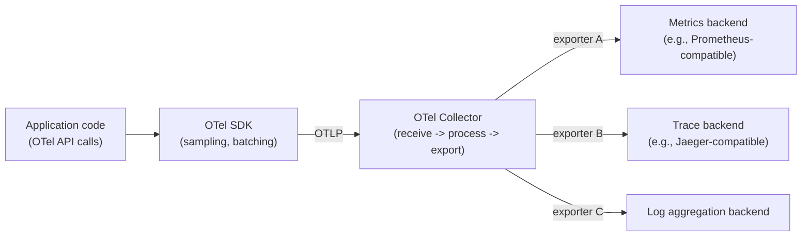
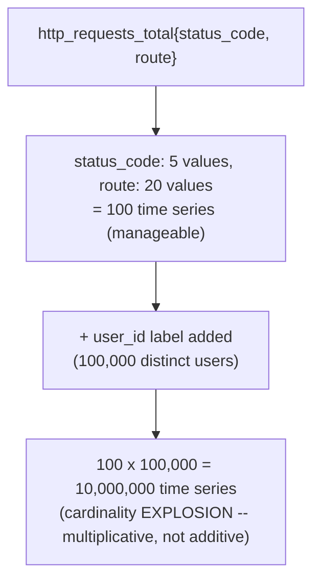
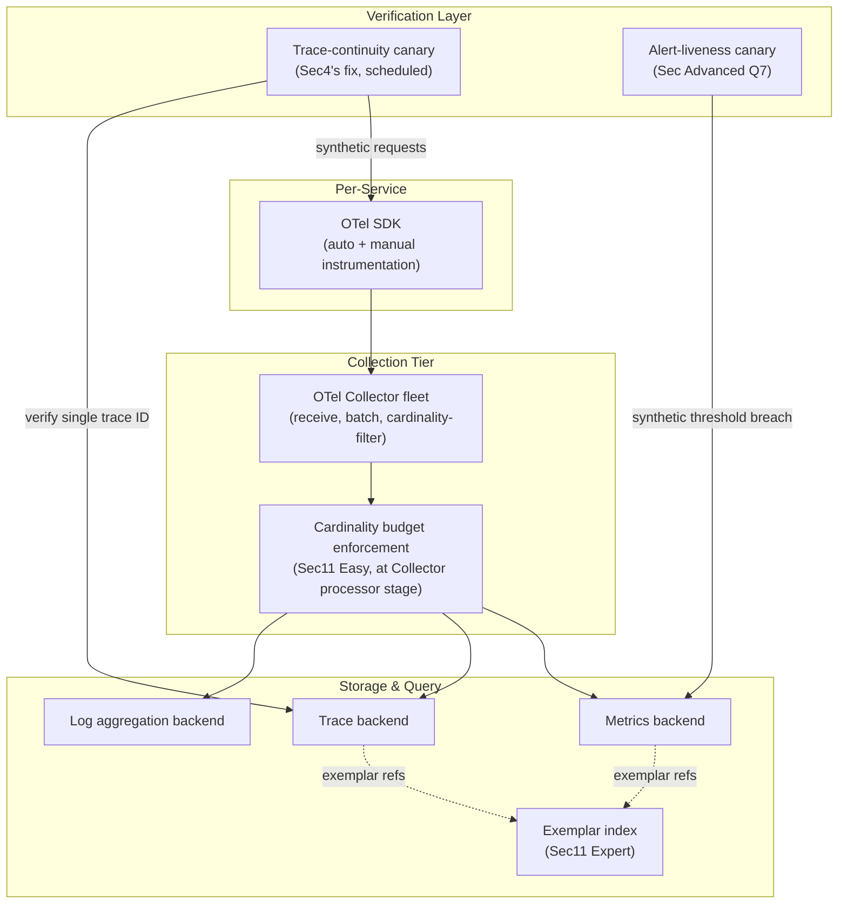
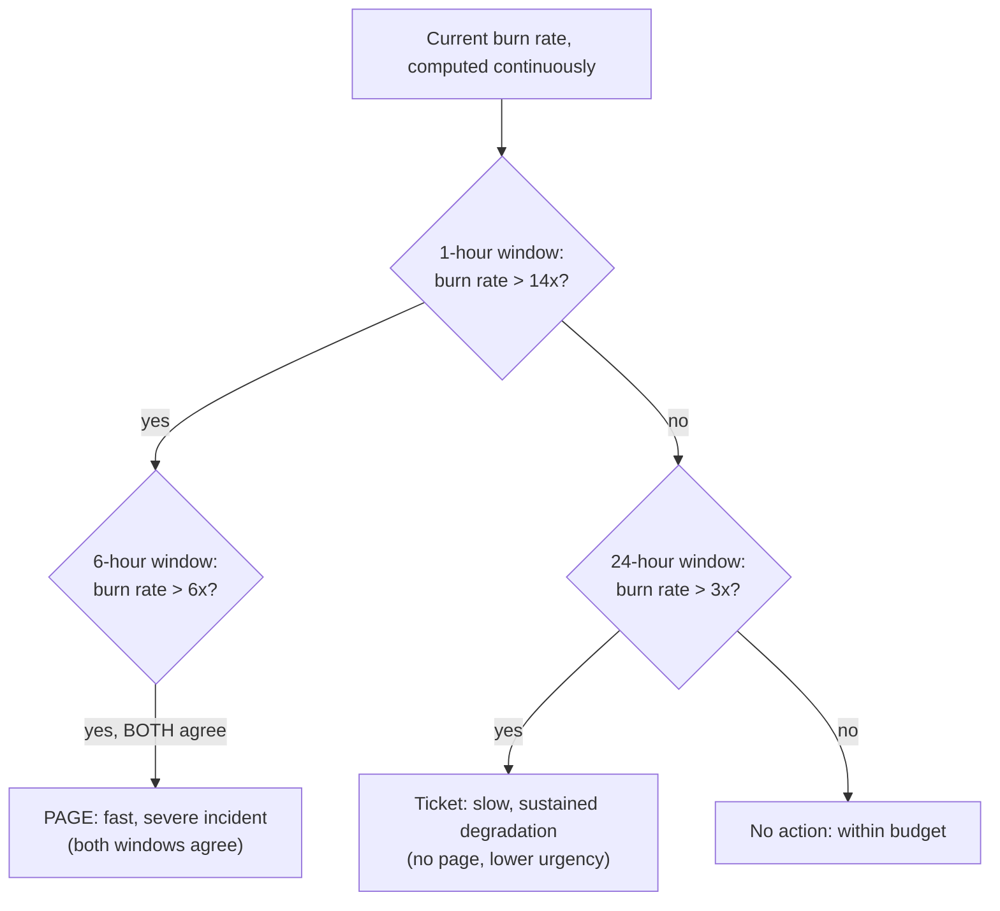
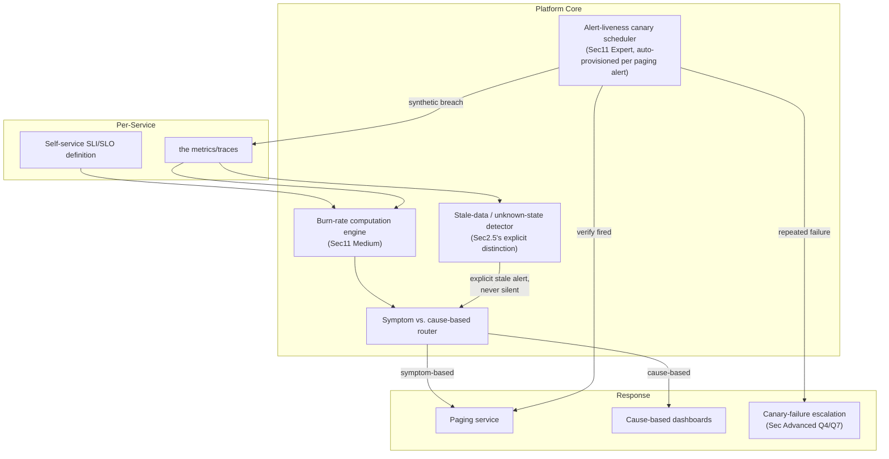
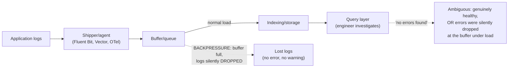
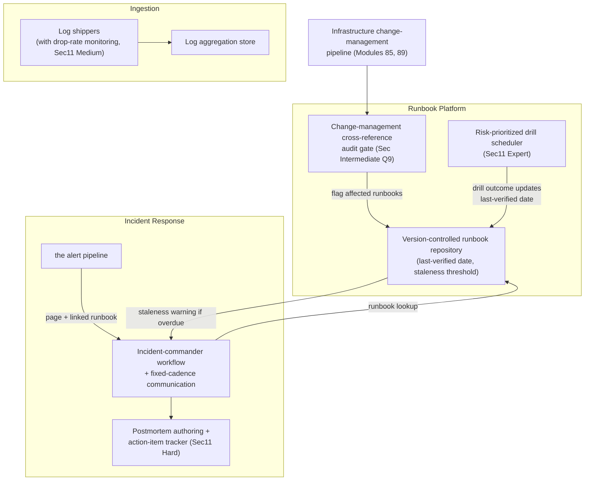
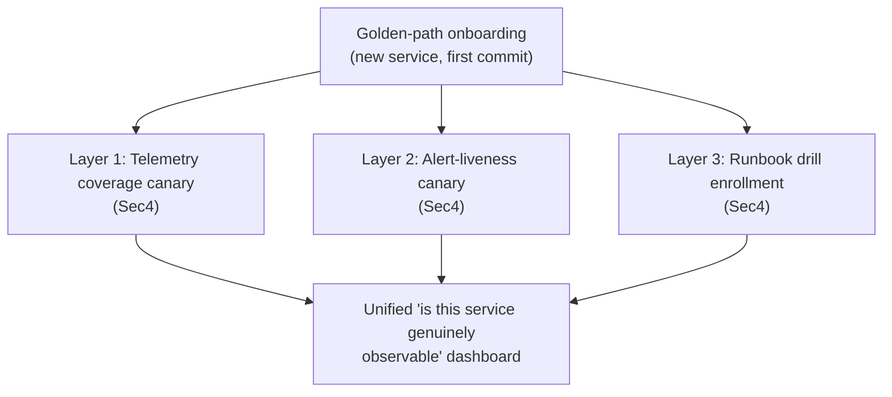
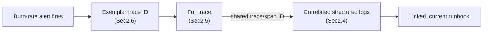
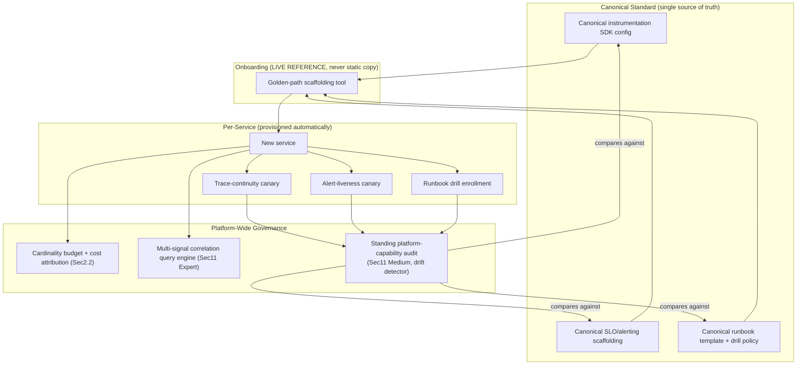

# Observability — Complete Interview Prep (All Topics, One File)

> Domain: Observability | Level: Beginner → Expert | Prerequisite: [[../02-DotNet-AspNetCore/01-DotNet-AspNetCore-Interview-Prep]] (health checks, OTel basics), [[../17-Microservices/00-Microservices-Interview-Master-Guide-DotNet-TechLead-Architect]], [[../21-AWS/01-AWS-Interview-Prep]], [[../22-Azure/01-Azure-Interview-Prep]], [[../23-Kubernetes/01-Kubernetes-Interview-Prep]]
> **Quick-prep edition** (consolidated 2026-10-03). This one file replaces Modules 93–96. Originals: `git show ebb2d5c:27-Observability/<file>.md`
> Each topic has: **Key concepts → .NET/PromQL/config example → Most common interview questions with answers.**
> **Recurring theme — "verify the verifier":** a silent dashboard, a missing alert or a stale runbook proves nothing; observability itself must be tested.

| # | Topic | # | Topic |
|---|---|---|---|
| 1 | Monitoring vs observability; the signals | 8 | Alerting design: symptoms, burn rates, liveness of alerts |
| 2 | OpenTelemetry architecture | 9 | Log aggregation pipelines & cost control |
| 3 | Metrics: types, RED/USE, cardinality | 10 | Incident response, runbooks & postmortems |
| 4 | Structured logging & PII redaction | 11 | Observability platform architecture at scale |
| 5 | Distributed tracing & context propagation | 12 | Debugging .NET in production (counters, dumps, traces) |
| 6 | Sampling & exemplars | 13 | Top 30 rapid-fire + Principal · 14 Mistakes checklist |
| 7 | SLIs, SLOs & error budgets | | |

---

## 1. Monitoring vs Observability; the Signals

**Key concepts**
- **Monitoring:** predefined checks and dashboards for known failure modes ("is CPU high?"). **Observability:** the ability to ask *new* questions about system behaviour from its outputs, including unknown-unknowns ("why are EU card payments from one merchant slow since 10:02?").
- **Signals:** **metrics** (cheap numeric aggregates over time — detect), **traces** (a request's path across services — locate), **logs** (detailed events — explain), plus **profiles** (continuous profiling — CPU/memory hotspots) and **events** (deploys, config changes — correlate).
- Golden signals (Google SRE): **latency, traffic, errors, saturation**. **RED** for services (Rate, Errors, Duration); **USE** for resources (Utilization, Saturation, Errors).
- Correlation is the point: trace ID in logs, exemplars linking metrics to traces, deploy markers on dashboards.

**Common interview questions**

**Q1. Monitoring vs observability?**
Monitoring tells you *whether* something known is wrong; observability lets you find *what* and *why* for problems you didn't predict, using high-cardinality, correlated telemetry (traces with rich attributes, structured logs, metrics with exemplars).

**Q2. Logs, metrics or traces — when?**
Metrics to detect and alert (cheap, aggregatable), traces to find which component/hop is slow or failing, logs to understand the specific details. Use all three linked by trace IDs.

---

## 2. OpenTelemetry Architecture

**Key concepts**
- **OpenTelemetry (OTel)** = the vendor-neutral standard: **API** (instrumentation surface), **SDK** (sampling, processing, exporting), **instrumentation libraries** (ASP.NET Core, HttpClient, SqlClient, EF Core, gRPC, Redis, Kafka…), **OTLP** protocol, **Collector** (receive → process → export).
- **Collector deployment:** agent (sidecar/DaemonSet) + gateway (central) — batching, retries, tail sampling, attribute redaction, routing to multiple backends (Prometheus, Tempo/Jaeger, Loki/Elastic, Datadog, App Insights, X-Ray).
- **.NET:** `System.Diagnostics.ActivitySource` (traces), `System.Diagnostics.Metrics.Meter` (metrics), `ILogger` (logs) are the .NET-native APIs that OTel exports.
- **Resource attributes:** `service.name`, `service.version`, `deployment.environment` — essential for slicing.
- Instrumentation decoupled from backend → switching vendors doesn't require code changes.

```csharp
builder.Services.AddOpenTelemetry()
    .ConfigureResource(r => r.AddService("payments-api", serviceVersion: "1.42.0")
                             .AddAttributes([new("deployment.environment", builder.Environment.EnvironmentName)]))
    .WithTracing(t => t
        .AddAspNetCoreInstrumentation(o => o.Filter = ctx => !ctx.Request.Path.StartsWithSegments("/health"))
        .AddHttpClientInstrumentation()
        .AddSqlClientInstrumentation()
        .AddSource("Payments")
        .AddOtlpExporter())
    .WithMetrics(m => m
        .AddAspNetCoreInstrumentation().AddHttpClientInstrumentation().AddRuntimeInstrumentation()
        .AddMeter("Payments")
        .AddOtlpExporter())
    .WithLogging(l => l.AddOtlpExporter());
```

```yaml
# OTel Collector (gateway): tail sampling + PII redaction + export
receivers: { otlp: { protocols: { grpc: {}, http: {} } } }
processors:
  batch: {}
  attributes/redact: { actions: [{ key: user.email, action: delete }, { key: card.number, action: delete }] }
  tail_sampling:
    decision_wait: 10s
    policies:
      - { name: errors, type: status_code, status_code: { status_codes: [ERROR] } }
      - { name: slow, type: latency, latency: { threshold_ms: 1000 } }
      - { name: sample-rest, type: probabilistic, probabilistic: { sampling_percentage: 10 } }
exporters: { otlp/tempo: { endpoint: tempo:4317 }, prometheusremotewrite: { endpoint: http://mimir/api/v1/push } }
service:
  pipelines:
    traces:  { receivers: [otlp], processors: [attributes/redact, tail_sampling, batch], exporters: [otlp/tempo] }
    metrics: { receivers: [otlp], processors: [batch], exporters: [prometheusremotewrite] }
```

**Common interview questions**

**Q1. Why OpenTelemetry instead of a vendor SDK?**
One standard for instrumentation across languages and libraries, a single wire protocol, and the freedom to change or combine backends without re-instrumenting code — avoiding vendor lock-in and duplicate agents.

**Q2. What does the Collector add?**
Decoupling apps from backends: batching and retries, tail-based sampling, redaction and enrichment, routing to several destinations, and protecting backends (and apps) from each other's outages.

---

## 3. Metrics: Types, RED/USE, Cardinality

**Key concepts**
- **Types:** **Counter** (monotonic: requests, errors), **UpDownCounter** (queue length), **Gauge** (current value: memory, temperature), **Histogram** (distribution: latency, payload size → percentiles).
- **Percentiles must come from histograms** (or sketches); you can't average percentiles across instances. Choose bucket boundaries around your SLO thresholds; exponential histograms help.
- **Cardinality** = number of unique time series = product of label values. **The central cost and stability driver.** Never use unbounded labels (user ID, request ID, raw URL, email); use route templates, status classes, bounded enums.
- **Pull** (Prometheus scrape) vs **push** (OTLP, StatsD).
- Business metrics (payments authorized, revenue per minute) are often the best SLIs.

```csharp
public sealed class PaymentMetrics
{
    private readonly Counter<long> _processed;
    private readonly Histogram<double> _duration;
    public PaymentMetrics(IMeterFactory factory)
    {
        var meter = factory.Create("Payments");
        _processed = meter.CreateCounter<long>("payments.processed", description: "Payments processed");
        _duration = meter.CreateHistogram<double>("payments.duration", unit: "s");
    }
    public void Record(string status, string method, double seconds)
    {
        var tags = new TagList { { "status", status }, { "method", method } };   // bounded labels only
        _processed.Add(1, tags);
        _duration.Record(seconds, tags);
    }
}
```

```promql
# p99 latency per route from a histogram
histogram_quantile(0.99, sum by (le, http_route) (rate(http_server_request_duration_seconds_bucket{service_name="payments-api"}[5m])))
# Error rate
sum(rate(http_server_request_duration_seconds_count{http_response_status_code=~"5.."}[5m]))
 / sum(rate(http_server_request_duration_seconds_count[5m]))
```

**Common interview questions**

**Q1. Why is high cardinality dangerous?**
Each unique label combination is a separate time series stored and indexed; a label like `userId` creates millions of series, exploding memory, cost and query time — and can take the metrics backend down. Keep labels bounded; put high-cardinality detail in traces and logs.

**Q2. Why can't you average p99s across instances?**
Percentiles aren't additive; the average of per-instance p99s isn't the global p99. Aggregate histogram buckets across instances first, then compute the quantile.

---

## 4. Structured Logging & PII Redaction

**Key concepts**
- **Structured logs** (JSON with fields) via message templates → queryable by field; include `trace_id`/`span_id` for correlation (automatic with OTel/`ILogger` scopes).
- **Levels by consequence:** Error (needs action), Warning (degraded, handled), Information (business events, sparing), Debug/Trace (off in prod, switchable dynamically).
- **Log once** at the boundary where an error is handled; don't log-and-rethrow at every layer.
- **PII and secrets:** redact **at the point of emission** (not later in the pipeline): don't log payloads, card numbers, tokens; use `Microsoft.Extensions.Compliance.Redaction` with data classification; mask in middleware.
- High-performance logging: `[LoggerMessage]` source generation, avoid string interpolation.

```csharp
public static partial class Log
{
    [LoggerMessage(EventId = 2001, Level = LogLevel.Information, Message = "Payment {PaymentId} captured for {Amount} {Currency}")]
    public static partial void PaymentCaptured(ILogger logger, Guid paymentId, decimal amount, string currency);

    [LoggerMessage(EventId = 2002, Level = LogLevel.Warning, Message = "PSP timeout for {PaymentId}, attempt {Attempt}")]
    public static partial void PspTimeout(ILogger logger, Guid paymentId, int attempt);
}

// Redaction with data classification (Microsoft.Extensions.Compliance.Redaction)
builder.Logging.EnableRedaction();
builder.Services.AddRedaction(r => r.SetRedactor<ErasingRedactor>(new DataClassificationSet(DataTaxonomy.PrivateData)));
```

**Common interview questions**

**Q1. How do you keep PII out of logs?**
Log identifiers, not personal data; classify sensitive fields and use redaction in the logging pipeline at emission; review log statements in code review/analyzers; scrub in the collector as a second line; restrict access and set retention; test with synthetic PII to verify redaction works.

**Q2. The same exception appears five times per failure. Why is that bad and how do you fix it?**
Each layer logs and rethrows, inflating volume and cost and confusing error counts. Log once where the error is handled (the boundary), enrich with context there, and let inner layers throw with wrapped context.

---

## 5. Distributed Tracing & Context Propagation

**Key concepts**
- **Trace** = a tree of **spans** (operation, start/end, attributes, events, status) sharing a **trace ID**; parent/child relationships; **span links** for batch/async fan-in.
- **Context propagation:** W3C **`traceparent`**/`tracestate` headers over HTTP/gRPC (automatic with instrumentation); **messages need explicit propagation** in headers (Kafka, Service Bus, SQS) — instrumentation libraries or manual inject/extract.
- **Breakage points (silent fragmentation):** uninstrumented clients, custom thread/queue hand-offs (`Task.Run` without the ambient Activity is fine — `Activity.Current` flows with ExecutionContext; but custom thread pools or manual queues lose it), message brokers, legacy gateways stripping headers, batch jobs starting new roots.
- **Baggage** propagates key-value context (tenant, request class) — keep it small, never secrets.
- Semantic conventions for attribute names (`http.route`, `db.system`, `messaging.system`).

```csharp
private static readonly ActivitySource Source = new("Payments");

// Producer: inject context into message headers
using var activity = Source.StartActivity("publish payment.captured", ActivityKind.Producer);
var headers = new Dictionary<string, string>();
Propagators.DefaultTextMapPropagator.Inject(new PropagationContext(activity!.Context, Baggage.Current), headers,
    (h, k, v) => h[k] = v);
await bus.PublishAsync(evt, headers);

// Consumer: extract and continue the trace
var parent = Propagators.DefaultTextMapPropagator.Extract(default, message.Headers,
    (h, k) => h.TryGetValue(k, out var v) ? [v] : []);
using var consume = Source.StartActivity("process payment.captured", ActivityKind.Consumer, parent.ActivityContext);
consume?.SetTag("messaging.message.id", message.Id);
```

**Common interview questions**

**Q1. The trace stops halfway. Why?**
Context wasn't propagated across a hop: a message broker without header propagation, a client library without instrumentation, a gateway dropping `traceparent`, or work handed to a custom thread/queue that started a new root. Find the last span, instrument or propagate at that boundary, and add a test that asserts end-to-end trace continuity.

**Q2. How do you trace async, event-driven flows?**
Propagate trace context in message headers; consumers start spans as children (or link them for batches); use correlation IDs for business flows spanning many traces; and build service maps from producer/consumer spans.

---

## 6. Sampling & Exemplars

**Key concepts**
- **Head-based sampling:** decide at the start (e.g., 10%) — cheap, consistent across services (via the `sampled` flag), but may drop the interesting traces.
- **Tail-based sampling:** decide after the trace completes (in the Collector) — keep all errors and slow traces, sample the rest; costs Collector memory and needs all spans of a trace to reach the same Collector (load-balancing exporter by trace ID).
- **Parent-based sampling** respects the upstream decision.
- **Exemplars:** attach trace IDs to histogram buckets → jump from a latency spike on a dashboard straight to an example trace.
- Metrics are never sampled (they're aggregates) — compute RED metrics before trace sampling (span metrics connector) so dashboards stay accurate.

**Common interview question**

**Q. Which sampling strategy would you choose?**
Head-based parent-based sampling at a modest rate for baseline volume, plus tail sampling in the Collector to keep 100% of errors and slow requests (and all traces for specific critical flows like payments), with RED metrics computed before sampling so rates and latencies remain exact.

---

## 7. SLIs, SLOs & Error Budgets

**Key concepts**
- **SLI** (indicator): a ratio of good events to valid events measuring user experience — availability (non-5xx responses), latency (requests < 300 ms), freshness (data < 5 min old), correctness (payments reconciled), durability.
- **SLO** (objective): target for an SLI over a window — e.g., 99.9% of checkout requests succeed over 28 days. **SLA:** a contractual promise with penalties (looser than the SLO).
- **Don't target 100%** — impossible and blocks all change; pick targets from user needs and dependency limits.
- **Error budget** = 1 − SLO: 99.9% over 30 days ≈ **43 minutes** of failure. Spend it on change velocity; when exhausted, prioritize reliability (error budget policy agreed with product).
- **Measure at the right place:** load balancer/edge or client (RUM) rather than inside the service, so outages that never reach the service count.
- **Composite SLOs:** a chain of dependencies multiplies (three 99.9% services in series ≈ 99.7%) → redundancy, fallbacks, async decoupling.

| SLO | Error budget / 30 days |
|---|---|
| 99% | 7.2 hours |
| 99.5% | 3.6 hours |
| 99.9% | 43.2 minutes |
| 99.95% | 21.6 minutes |
| 99.99% | 4.3 minutes |

**Common interview questions**

**Q1. How do you choose an SLI for a payments API?**
What users care about: "authorization requests that complete successfully within 800 ms", measured at the edge, excluding client errors (4xx due to bad input) but including timeouts. Add a correctness SLI (payments reconciled with the PSP within T) — availability alone misses silent failures.

**Q2. What's an error budget policy?**
An agreement on what happens as the budget is consumed: e.g., > 50% burned → extra review for risky changes; exhausted → freeze non-critical releases and dedicate capacity to reliability until it recovers. It turns reliability vs velocity into an objective, pre-agreed decision.

---

## 8. Alerting Design: Symptoms, Burn Rates, Liveness of Alerts

**Key concepts**
- **Alert on symptoms** that affect users (SLO burn, error rate, latency, queue age) — **not causes** (CPU 80%, a pod restart) which go to dashboards/tickets.
- Every page must be **actionable, urgent and owned**, with a runbook link.
- **Multi-window, multi-burn-rate alerts:** page when the budget burns fast in both a long and a short window (e.g., 14.4× over 1 h **and** 5 min → 2% of a 30-day budget in an hour), ticket for slow burns (e.g., 1× over 3 days). Reduces noise while catching real incidents quickly.
- **Alert fatigue** kills response quality → measure page volume per on-call shift, delete or downgrade noisy alerts, review alerts after incidents.
- **"No alert fired" is ambiguous:** the metric could be missing (exporter down, renamed metric, broken pipeline) → **absence alerts** (`absent()`), **dead-man's switch / watchdog** heartbeats, synthetic probes, and periodic alert testing.

```promql
# Fast burn: 99.9% SLO, 1h and 5m windows both > 14.4x
(
  sum(rate(http_requests_total{job="payments",code=~"5.."}[1h])) / sum(rate(http_requests_total{job="payments"}[1h]))
) > (14.4 * 0.001)
and
(
  sum(rate(http_requests_total{job="payments",code=~"5.."}[5m])) / sum(rate(http_requests_total{job="payments"}[5m]))
) > (14.4 * 0.001)

# The metric itself disappeared (pipeline broken) → alert
absent(up{job="payments"} == 1)
```

**Common interview questions**

**Q1. On-call gets 200 alerts a week and ignores them. How do you fix it?**
Inventory alerts by volume and actionability; delete or convert cause-based and non-actionable alerts to dashboards/tickets; replace with SLO burn-rate alerts per user journey; route to owners; add runbooks; dedupe and group; review every page in a weekly ops review. Target a handful of actionable pages per week.

**Q2. How do you know your alerting works?**
Synthetic checks and canary transactions, watchdog/dead-man's-switch alerts that must keep firing, `absent()` alerts on critical metrics, chaos experiments and game days that inject failures and verify the page arrives, and regular review of incidents detected by customers before alerts (a detection gap).

---

## 9. Log Aggregation Pipelines & Cost Control

**Key concepts**
- **Pipeline:** app (stdout/OTLP) → **shipper/agent** (Fluent Bit, Vector, OTel Collector) with **buffering** → optional **queue** (Kafka) → indexing/storage (Elasticsearch/OpenSearch, Loki, Splunk, CloudWatch, Log Analytics) → query/UI.
- **Backpressure:** if the backend slows, agents buffer then drop (or block the app) → disk buffers, queues, and drop-policy decisions; alert on dropped logs.
- **Cost control:** log less (levels, sampling of high-volume success logs, dynamic log levels), route by value (debug to cheap storage, audit to retained storage), **tiered retention** (hot 7–30 days, warm/cold/archive in object storage), avoid indexing everything (Loki labels vs full-text index), drop health-check noise.
- **Audit logs** are a separate, immutable, long-retention stream (regulatory) — not mixed with debug logs.

**Common interview question**

**Q. Observability costs more than the platform it observes. What do you do?**
Attribute cost by team/service and signal; cut cardinality (metric label audits), drop or sample noisy logs (health checks, success paths), tail-sample traces, shorten hot retention and tier to object storage, convert log-based counts into metrics, and set per-team budgets — while protecting the signals needed for SLOs and incident response.

---

## 10. Incident Response, Runbooks & Postmortems

**Key concepts**
- **Severity levels** (SEV1–SEV4) defined by user/business impact; declare early.
- **Roles:** incident commander (coordinates, decides), comms lead (stakeholders, status page, regulators), operations/subject leads, scribe.
- **Mitigate first** (rollback, failover, flag off, shed load), diagnose later; preserve evidence (dumps, logs).
- **Runbooks:** linked from alerts; steps, dashboards, commands, escalation; **tested regularly** (a runbook never executed is a hypothesis); automate repeatable steps.
- **Blameless postmortems:** timeline, impact, contributing factors (multiple), detection and response analysis, what went well, action items with owners and due dates; track completion; share learnings.
- Metrics: MTTD (detect), MTTA (acknowledge), MTTR (restore), incidents by cause, % detected by alerts vs customers.

**Common interview questions**

**Q1. Walk me through how you'd run a SEV1.**
Declare and assign an incident commander; open the incident channel/bridge; assess impact and set a comms cadence; check recent changes (deploys, config, flags) and roll back if correlated; use dashboards/traces to find the failing component; mitigate; confirm recovery with SLIs; communicate resolution; schedule a blameless postmortem within days and track the actions.

**Q2. What makes a good postmortem action item?**
Specific, owned, dated and systemic — e.g., "add burn-rate alert for checkout SLO", "make the timeout default in the shared HTTP client", "add a chaos test for PSP latency" — rather than "be more careful". Prioritize actions that prevent the class of incident and improve detection.

---

## 11. Observability Platform Architecture at Scale

**Key concepts**
- **Self-service golden path:** services get OTel instrumentation, dashboards, SLO templates and alerts by default (templates/ServiceDefaults), with ownership metadata from the service catalog.
- **Governance:** cardinality budgets and linting, attribute naming conventions (semantic conventions), retention tiers, cost showback per team, PII controls.
- **Multi-signal correlation:** shared resource attributes, trace IDs in logs, exemplars, deploy/change events, a single UI or linked UIs (Grafana LGTM stack: Loki, Grafana, Tempo, Mimir; or a commercial APM).
- **Tiered storage:** recent high-resolution data hot; downsampled metrics and archived logs/traces in object storage.
- **Verify the verifier:** monitor the observability pipeline itself (collector drops, ingestion lag, scrape failures) — platform drift (a renamed metric silently breaking alerts) is the capstone risk; alert-as-code with tests.

**Common interview questions**

**Q1. Design observability for 200 microservices.**
OTel SDK defaults in a shared package; Collectors as agents + gateways; metrics in a scalable Prometheus-compatible store (Mimir/Thanos/managed), traces in Tempo/Jaeger or APM, logs in Loki/Elastic; Grafana dashboards and SLOs as code per service from templates; tail sampling; cardinality and cost governance per team; alert routing from the service catalog; and monitoring of the pipeline itself.

**Q2. Vendor APM or OpenTelemetry + open-source backend?**
Vendor APM: fast time to value, rich UX, less ops, high cost at scale and lock-in (reduced if instrumentation is OTel). OSS backends: lower licence cost, full control, but you operate stateful systems at scale. Many organizations instrument with OTel and choose the backend per signal and cost profile.

---

## 12. Debugging .NET in Production

| Tool | Use |
|---|---|
| `dotnet-counters` | live runtime metrics: CPU, GC, thread pool queue, exceptions/sec, allocation rate |
| `dotnet-trace` | EventPipe traces (CPU sampling, GC events) → PerfView/speedscope |
| `dotnet-dump` | process dumps → `clrstack`, `dumpheap -stat`, `gcroot`, `threadpool` |
| `dotnet-gcdump` | heap snapshots for leak analysis |
| `dotnet-monitor` | sidecar exposing dumps/traces/metrics via HTTP with triggers (e.g., dump when CPU > 80%) |
| Continuous profiling | Pyroscope, Datadog/Elastic profilers, Azure App Insights Profiler |

```bash
dotnet-counters monitor -p 1 --counters System.Runtime,Microsoft.AspNetCore.Hosting
dotnet-trace collect -p 1 --profile cpu-sampling --duration 00:00:30
dotnet-dump collect -p 1 && dotnet-dump analyze core_*.dmp   # > clrthreads; > dumpheap -stat; > gcroot <addr>
```

**Common interview question**

**Q. Latency is high, CPU is low, in a .NET service. How do you investigate?**
Check thread pool queue length and thread count with `dotnet-counters` (starvation from sync-over-async), dependency spans in traces (slow DB/HTTP, connection pool waits), GC pause time, lock contention (dump `clrstack` for blocked threads), and downstream rate limiting. Fix the blocking calls or the slow dependency; add the signal to dashboards.

---

## 13. Top 30 Rapid-Fire Questions + Principal Questions

1. **Golden signals?** Latency, traffic, errors, saturation.
2. **RED?** Rate, errors, duration (services).
3. **USE?** Utilization, saturation, errors (resources).
4. **OTel parts?** API, SDK, instrumentation, OTLP, Collector.
5. **.NET tracing API?** `ActivitySource`.
6. **.NET metrics API?** `Meter` / `IMeterFactory`.
7. **Metric types?** Counter, UpDownCounter, gauge, histogram.
8. **Percentiles from?** Histograms (aggregate buckets first).
9. **Cardinality?** Unique time series — bound the labels.
10. **Structured logs?** Templates + fields + trace IDs.
11. **PII?** Redact at emission.
12. **Trace context header?** W3C `traceparent`.
13. **Broken traces?** Missing propagation (messages, uninstrumented clients).
14. **Baggage?** Small propagated context, no secrets.
15. **Head vs tail sampling?** Early cheap vs keep errors/slow.
16. **Exemplars?** Metric → trace links.
17. **SLI?** Good events / valid events.
18. **SLO vs SLA?** Internal target vs contract.
19. **99.9% monthly budget?** ~43 minutes.
20. **100% SLO?** Wrong — blocks change.
21. **Alert on?** Symptoms (SLO burn), not causes.
22. **Burn-rate alerts?** Multi-window, multi-rate.
23. **Silent metric?** `absent()` / watchdog.
24. **Alert fatigue fix?** Delete noise, SLO alerts, runbooks.
25. **Log pipeline risk?** Backpressure and drops.
26. **Log cost levers?** Sampling, levels, tiered retention.
27. **Incident first step?** Declare, IC, mitigate.
28. **Postmortem?** Blameless, systemic actions.
29. **Runbooks?** Linked, tested, automated.
30. **.NET live metrics?** `dotnet-counters`.

**Principal-level questions**

**P1. How do you define "health" for a service, and who owns it?**
Health = the user-facing SLIs of the journeys the service supports (with agreed SLOs), owned jointly by the service team and product; infrastructure metrics support diagnosis. The definition lives as code (SLO definitions) in the service repo and is reviewed when the product changes.

**P2. How do you use observability to justify an architectural change?**
Quantify the problem with data: e.g., traces show 40% of checkout latency in a synchronous fan-out; error budget burn correlates with one dependency; cost per request is driven by log volume. Propose the change with a measurable target, run it behind a flag/canary, and show before/after SLIs and cost.

**P3. Observability for a regulated workload where the telemetry itself is sensitive?**
Classify telemetry data, redact at emission, keep telemetry in-region (residency), encrypt and restrict access (RBAC, audit access), separate audit logs with immutable retention, apply retention limits to personal data, and include the observability pipeline in compliance scope and reviews.

---

## 14. Mistakes Checklist (say why each is wrong)
- [ ] Averages instead of percentiles · averaging p99s across instances
- [ ] User IDs/URLs/trace IDs as metric labels (cardinality explosion)
- [ ] String-interpolated logs · logging payloads/PII · logging the same error at every layer
- [ ] No trace propagation through queues · new root spans in background workers
- [ ] Head sampling only (losing error traces) · computing RED from sampled traces
- [ ] 100% SLOs · SLIs measured inside the service only · availability-only SLIs for payments
- [ ] Paging on CPU/memory causes · alerts without runbooks or owners
- [ ] No absence/watchdog alerts · untested runbooks · postmortems without tracked actions
- [ ] Unlimited log retention · no cost attribution per team

---

## Architecture Diagrams (preserved from the original modules)

> All 10 Mermaid/ASCII diagrams from the original `27-Observability/` files, kept verbatim and grouped by source module. Originals: `git show ebb2d5c:27-Observability/<file>.md`.

### Module 93 — Observability: Fundamentals — Metrics, Logs, Traces & OpenTelemetry
*Source: `01-ObservabilityFundamentals-MetricsLogsTraces-OpenTelemetry.md`*

**OpenTelemetry Pipeline — API/SDK/Collector/Exporter Decoupling**



**Cardinality Explosion — Multiplicative, Not Additive**



**12. System Design**



### Module 94 — Observability: SLOs, SLIs, Error Budgets & Alerting Design
*Source: `02-SLOs-SLIs-ErrorBudgets-AlertingDesign.md`*

**Multi-Window, Multi-Burn-Rate Alerting**



**12. System Design**



### Module 95 — Observability: Log Aggregation, Structured Logging & Incident-Response Practice — Runbooks & Postmortems
*Source: `03-LogAggregation-IncidentResponse-Runbooks-Postmortems.md`*

**Log Aggregation Pipeline — Where Backpressure Silently Drops Data**



**12. System Design**



### Module 96 — Observability: Platform Architecture — Cardinality, Cost & Multi-Signal Correlation at Scale (Capstone)
*Source: `04-ObservabilityPlatformArchitecture-Cardinality-Cost-MultiSignalCorrelation.md`*

**Unified Three-Layer Verification Model, Platform-Provisioned**



**Multi-Signal Correlation — One Query, Three Signals**



**12. System Design**


