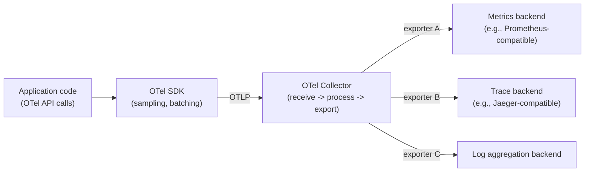
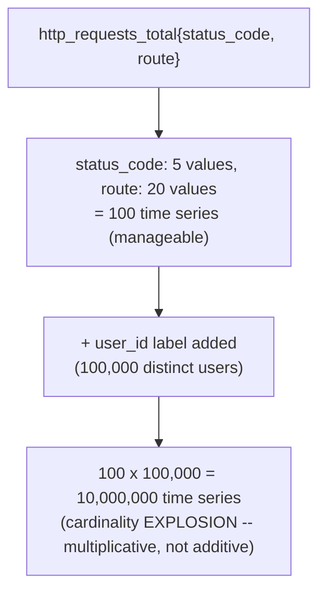
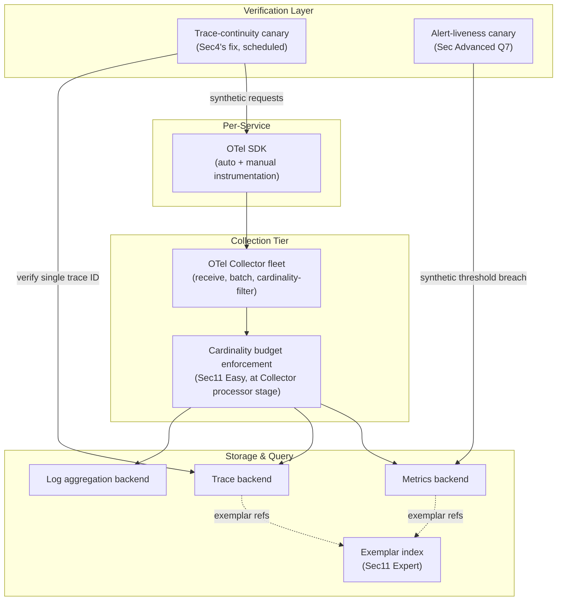

# Module 93 — Observability: Fundamentals — Metrics, Logs, Traces & OpenTelemetry

> Domain: Observability | Level: Beginner → Expert | Prerequisite: [[../02-DotNet-AspNetCore/06-HealthChecks-Observability]] (application-level health checks and instrumentation basics), [[../17-Microservices/02-Resilience-Observability-Sidecar-Patterns]] (distributed observability's role in microservices resilience), [[../21-AWS/08-Observability-Cost-WellArchitectedFramework]], [[../22-Azure/08-Observability-Cost-WellArchitectedFramework]], [[../23-Kubernetes/08-Observability-Multicluster-GitOps]] (this module goes *underneath* each of these vendor-specific capstones — CloudWatch/X-Ray, Azure Monitor/App Insights, and the Kubernetes observability stack are each one possible backend for the vendor-neutral instrumentation model this module establishes)

---

## 1. Fundamentals

**What**: Observability is the property of a system that lets you ask arbitrary, previously-unanticipated questions about its internal state from the outside, using the telemetry it emits — as distinct from **monitoring**, which answers a fixed, pre-defined set of known questions ("is CPU above 80%," "is the health check green"). The three pillars — **metrics** (numeric time-series aggregates), **logs** (discrete, timestamped structured events), and **traces** (causally-linked records of a single request's path through a distributed system) — are the three distinct data shapes that, together, let an engineer investigate a genuinely novel failure mode rather than only the failure modes someone thought to build a dashboard for in advance. **OpenTelemetry (OTel)** is the CNCF vendor-neutral standard (API + SDK + Collector + wire protocol) for producing, processing, and exporting all three signal types, decoupling *instrumentation* (what a service emits) from *backend* (where that telemetry is stored and queried) for the first time industry-wide.

**Why it exists**: Monitoring alone answers "known unknowns" — failure modes anticipated well enough in advance to build a specific check for. Distributed systems (Module 50's microservices resilience discussion) fail in combinatorially many ways no dashboard was built to anticipate — a slow downstream dependency cascading through three services, a cache-eviction pattern change under unusual traffic shape, a partial network partition affecting only some pod-to-pod paths. Observability exists to make these "unknown unknowns" *investigable after the fact* from the telemetry already being emitted, rather than requiring a new dashboard be built (too late) *after* the specific failure mode has already occurred once. OpenTelemetry exists because, before it, every vendor (CloudWatch, Azure Monitor, Datadog, New Relic) required its own proprietary instrumentation SDK — meaning a service's telemetry was locked to whichever backend it was originally instrumented for, and switching backends meant re-instrumenting the entire codebase from scratch, precisely the vendor lock-in risk Module 88 §15 already examined for Backstage/IDP tooling, now recurring in the instrumentation layer itself.

**When it matters**: From the moment a system has more than one component whose interaction could produce an emergent, non-obvious failure — and becomes acute in any microservices/distributed architecture (Module 17), where the specific request path a real user experiences is often reconstructible only from telemetry, never from reading any single service's code in isolation.

**How (30,000-ft view)**:
```
Metrics: numeric aggregates over time (counters, gauges, histograms) -- cheap to
    store/query at scale, but ONLY as informative as the label/dimension set
    chosen at instrumentation time; cannot answer a question about a dimension
    never recorded
Logs: discrete, timestamped, structured (ideally) events -- richest per-event
    detail, but the most expensive to store/query at high volume, and require a
    CORRELATION ID to reconstruct a single request's story across services
Traces: causally-linked SPANS forming a request's actual path through a
    distributed system -- requires CONTEXT PROPAGATION (a trace ID + span ID
    carried across every network/queue hop) or the trace silently FRAGMENTS
    into disconnected pieces (this module's central incident, Sec4)
OpenTelemetry: ONE vendor-neutral API/SDK instruments all three signals once;
    the OTel Collector receives, processes (batches, filters, samples), and
    exports to ANY backend -- decoupling instrumentation from backend choice
```

---

## 2. Deep Dive

### 2.1 The Three Pillars — Distinct Data Shapes, Distinct Query Models
Metrics are pre-aggregated numeric time series (a counter's rate, a histogram's percentile) — cheap to store and query at massive scale precisely *because* they discard per-event detail at write time, retaining only the aggregate. Logs are the opposite extreme: full per-event detail retained, at correspondingly higher storage/query cost, and valuable specifically when the *reason* behind an anomaly (not merely its magnitude) must be investigated. Traces occupy a third, structurally distinct shape: not a single signal but a *causal graph* of spans, each span representing one unit of work (one service's handling of one request) with a parent-child relationship to the span that caused it — traces answer "what actually happened, in what order, across which services, for this one specific request" in a way neither aggregated metrics nor unlinked individual logs can. A Principal Engineer's first instinct for any observability gap should be identifying *which pillar's data shape* the missing question actually requires — reaching for more logging when the real gap is causal linkage (a tracing problem) wastes engineering effort solving the wrong shape of problem.

### 2.2 OpenTelemetry Architecture — API, SDK, Collector, and the Instrumentation/Backend Decoupling
OpenTelemetry separates four concerns explicitly: the **API** (the vendor-neutral interface application code calls — `Activity`/`Span.Start()`, a counter's `.Add()`) that a library author can depend on with zero backend coupling; the **SDK** (the concrete implementation wired into an application at startup, configuring sampling, batching, and export); the **Collector** (a separately-deployed process receiving telemetry from many services, applying processing — batching, filtering, tail-based sampling per §2.5 — before exporting to one or more backends); and **exporters** (the pluggable adapters translating OTel's internal wire format into a specific backend's ingestion format — Prometheus remote-write, an OTLP-native backend, or a vendor-proprietary format). This architecture is what makes switching backends (or running multiple backends simultaneously, e.g., logs to one system and traces to another) a *Collector configuration change*, not a re-instrumentation project — directly closing the vendor-lock-in gap §1's "Why" section identified, and structurally the same decoupling-via-interface principle this course has applied repeatedly (Module 88's `IPolicyEngine`, Module 92's `IDeploymentStrategy`) now applied to telemetry backend choice specifically.

### 2.3 Metrics Deep Dive — Counter/Gauge/Histogram, and Cardinality as the Central Cost Driver
The three core metric types: a **counter** (monotonically increasing, e.g., total requests handled — queried via its *rate* of change, never its raw value), a **gauge** (an instantaneous, can-go-up-or-down value, e.g., current queue depth), and a **histogram** (a distribution of observed values bucketed for later percentile computation, e.g., request-latency distribution). The single highest-leverage cost/correctness concept in metrics is **cardinality**: every unique combination of a metric's label/tag values creates a distinct time series that the backend must separately store and index — a metric with a `status_code` label (a handful of values) is cheap; the same metric additionally labeled with `user_id` or a raw, unbounded URL path (potentially millions of distinct values) creates a combinatorial explosion of time series, since cardinality multiplies *across* labels, not merely adds. This isn't merely a cost concern: past a backend's practical cardinality limit, ingestion can silently degrade or drop data entirely (this module's §14 debugging incident) — a metrics backend under cardinality pressure doesn't usually fail loudly; it degrades in ways that look, superficially, like "the dashboard is just a little slow today."

### 2.4 Structured Logging and Trace-Log Correlation
A **structured log** (JSON or an equivalent key-value format, as opposed to an unstructured free-text message) is queryable by field, not merely full-text-searched — a prerequisite for any log aggregation system to answer field-scoped questions ("show me every log with `user_id=X` and `status=error`") efficiently at scale. The critical correlation mechanism: every log entry emitted while a trace span is active should have that span's **trace ID and span ID injected automatically** (most OTel SDK logging integrations do this by default) — without this injection, a log and a trace covering the identical request are two entirely disconnected records an engineer must manually, painstakingly correlate by timestamp and inference alone during an incident, precisely the kind of manual reconstruction structured, correlated telemetry exists to eliminate.

### 2.5 Distributed Tracing Internals — Context Propagation and the Silent-Fragmentation Risk
A trace is a tree of spans, each identified by a trace ID (shared across every span in the trace) and its own span ID, with a parent-span-ID link forming the causal tree. **Context propagation** is the mechanism carrying the active trace/span ID across every network or queue hop a request crosses — over HTTP, the **W3C Trace Context** standard's `traceparent` header; over an async message queue (Kafka, RabbitMQ — Modules 19–20), the equivalent identifiers must be explicitly carried in message headers/metadata, since no HTTP request/response exists to carry them implicitly. The critical, easy-to-miss failure mode: if context propagation is missing at *any* single hop, the trace doesn't error or visibly fail — it silently **fragments** into two (or more) separate, individually complete-looking traces, each ending/beginning at the propagation gap, with no indication in the tracing UI that they were ever supposed to be one continuous trace. This is this module's central production incident (§4): a fragmented trace looks, to anyone inspecting it in isolation, like a fully healthy, complete trace — the fragmentation itself produces no error, no warning, and no visible signal distinguishing "this trace is genuinely complete" from "this trace is one half of a silently-broken propagation chain."

### 2.6 Sampling Strategies — Head-Based vs. Tail-Based, and Correlating Signals via Exemplars
Capturing every single trace at scale is often cost-prohibitive, so sampling decides which traces to retain. **Head-based sampling** decides at the very start of a trace (often randomly, e.g., "sample 1% of requests") — cheap and simple, but structurally blind to which traces will turn out to be interesting, meaning a rare, high-latency outlier is sampled away with the same probability as an unremarkable one. **Tail-based sampling** buffers a trace's full span data until it completes, *then* decides whether to retain it based on its actual characteristics (an error occurred, latency exceeded a threshold) — capturing the traces that actually matter at the cost of the buffering infrastructure and delayed-export latency this requires. **Exemplars** are a complementary correlation mechanism: a metric data point (e.g., one bucket of a latency histogram) can carry an attached trace ID for one specific request that fell into that bucket, letting an engineer jump directly from "this histogram bucket shows a latency spike" to "here is one actual, concrete trace that produced it" — bridging the metrics and traces pillars without requiring full tail-based sampling of every single trace.

---

## 3. Visual Architecture

### OpenTelemetry Pipeline — API/SDK/Collector/Exporter Decoupling (§2.2)


### Context Propagation — Healthy vs. Silently Fragmented Trace (§2.5, §4)
```
Healthy (HTTP hop, W3C traceparent header propagated):
  [Service A: span1, trace=T1] --HTTP + traceparent header--> [Service B: span2, trace=T1]
  Result: ONE continuous trace T1, causally linking both spans.

Broken (async hop, Kafka message, NO trace context in message headers):
  [Service A: span1, trace=T1, publishes to Kafka] --(no header)--> [Service B: NEW span3, trace=T2]
  Result: TWO disconnected traces (T1 ends at publish; T2 begins fresh at consume) --
          EACH looks like a complete, healthy trace in isolation. No error, no warning.
```

### Cardinality Explosion — Multiplicative, Not Additive (§2.3)


---

## 4. Production Example

**Scenario**: An e-commerce platform's order-processing flow spans an HTTP-facing order-submission service (Service A), which publishes an `OrderPlaced` event to Kafka, consumed asynchronously by a fulfillment service (Service B). Both services were instrumented with OpenTelemetry, and the engineering team relied on distributed tracing as their primary tool for diagnosing end-to-end order-processing latency, with high confidence in their tracing coverage — dashboards showed traces for both the HTTP-facing submission path and the async fulfillment path looking complete and healthy.

**Investigation**: During a period of unusually severe order-fulfillment delays, the on-call team pulled up traces for slow orders expecting to see one continuous trace spanning both the submission and fulfillment steps, with the slow segment clearly visible. Instead, they found two entirely separate traces per order: one ending cleanly at Service A's Kafka-publish step, and a second, freshly-started trace beginning at Service B's Kafka-consume step — with no causal link between them visible anywhere in the tracing UI. Each trace, examined in isolation, looked completely healthy and unremarkable; neither showed elevated latency on its own. The team spent several hours manually correlating the two traces by timestamp and order ID (reconstructed painstakingly from log fields, since the traces themselves carried no shared identifier) before discovering the actual delay was occurring in the *gap between* the two fragments — time the message spent sitting in Kafka before Service B's consumer picked it up, invisible to either trace individually.

**Root cause**: Service A's Kafka producer code never propagated the active trace context (the trace ID and span ID) into the outgoing message's headers — the OTel auto-instrumentation correctly captured the HTTP-handling span in Service A and a separate span in Service B's consumer, but the async hop between them (§2.5's exact propagation gap) had no code carrying context across it, since the auto-instrumentation libraries in use covered HTTP calls automatically but required an explicit, manual integration step for the Kafka client library that had never been added. This silently fragmented every single trace crossing that specific hop, for the entire lifetime of the integration — invisible until an incident specifically required reconstructing the causal link the fragmentation had been quietly destroying all along.

**Fix**: (1) Added explicit context-propagation code to the Kafka producer (injecting the W3C-Trace-Context-equivalent trace/span IDs into message headers) and the consumer (extracting them to continue the same trace rather than starting a new one) — closing the specific gap. (2) Instrumented a synthetic, periodic "trace continuity check" — a canary order deliberately pushed through the full pipeline on a schedule, with automated verification that its resulting trace is a single, continuous trace spanning both services rather than two fragments — converting "we assume tracing coverage is complete" into an actively, continuously verified property, directly mirroring [[../26-CICD/03-ArtifactManagement-ReproducibleBuilds-RetentionPolicies]] §2.3's rebuild-and-diff reproducibility verification and [[../25-DevOps/04-DevSecOps-PolicyAsCode-PlatformEngineering]] §Advanced Q7's policy-liveness-canary pattern, now applied to trace-context propagation specifically. (3) Audited every other async messaging boundary in the system for the identical gap, finding two more instances.

**Lesson**: A fragmented trace produces no error, no warning, and no visible signal in the tracing UI distinguishing "this is a genuinely complete trace" from "this is one half of a silently-broken propagation chain" — meaning tracing *coverage completeness* is, exactly like Module 91's build reproducibility and Module 92's promotion-gate enforcement, an assumed-but-never-measured property until the one specific incident that actually requires the missing causal link exposes the gap. The specific, generalizable insight for observability broadly: instrumentation *presence* (spans are being created, telemetry is flowing, dashboards render data) is not evidence of instrumentation *completeness* — the same "declared/present ≠ actual/complete" pattern this course has traced across Kubernetes, Docker, DevOps, and CI/CD recurs here in the very telemetry infrastructure meant to make every other domain's failures observable in the first place.

---

## 5. Best Practices
- Identify which pillar's data shape (aggregate metric, per-event log, causal trace) a given investigative question actually requires before reaching for more of whichever signal is already familiar (§2.1).
- Adopt OpenTelemetry's API/SDK/Collector separation so instrumentation is never coupled to a specific backend — a Collector configuration change, not a re-instrumentation project, should be sufficient to switch or add a backend (§2.2).
- Treat every new metric label as a deliberate cardinality decision — estimate the multiplicative combination of label values before adding a high-cardinality dimension (a user ID, a raw unbounded path) to a metric (§2.3, §14).
- Ensure trace/span IDs are automatically injected into structured logs so a request's logs and trace are correlatable without manual, timestamp-based reconstruction (§2.4).
- Explicitly propagate trace context across every non-HTTP hop (message queues, background jobs) — auto-instrumentation commonly covers HTTP calls but requires deliberate, manual integration for async messaging clients (§2.5, §4).
- Periodically, actively verify trace-context propagation coverage via a synthetic continuity check spanning every genuine hop in the architecture, rather than assuming coverage is complete because dashboards render data (§4).

## 6. Anti-patterns
- Treating "logs exist and I can grep them" as a substitute for causal tracing when the actual investigative question requires understanding a request's cross-service path, not merely its per-service detail (§2.1).
- Adding a high-cardinality label to a metric without estimating the multiplicative time-series growth it produces, risking silent metrics-backend degradation (§2.3, §14).
- Unstructured, free-text logging with no trace/span ID correlation, requiring manual timestamp-based reconstruction to connect a log entry to its causing request (§2.4).
- Assuming auto-instrumentation covers every hop in a distributed system, without explicitly verifying async/messaging boundaries specifically carry propagated trace context (§2.5, §4).
- Treating "traces are rendering in the UI" as proof that tracing coverage is complete, rather than periodically, deliberately verifying continuity across every genuine architectural hop (§4).

---

## 10. Interview Questions

### Basic (10)

1. **Q: What is the difference between observability and monitoring?**
   **A:** Monitoring answers a fixed, pre-defined set of known questions via dashboards/alerts built in advance. Observability is the property of being able to answer arbitrary, previously-unanticipated questions about internal state using the telemetry already being emitted.
   **Why correct:** Precisely distinguishes "known unknowns" (monitoring) from "unknown unknowns" (observability) rather than treating the terms as synonyms.
   **Common mistakes:** Using "observability" and "monitoring" interchangeably, missing that observability specifically implies investigability of failure modes no one anticipated in advance.
   **Follow-ups:** "Can a system be well-monitored but not observable?" (Yes — comprehensive dashboards for known failure modes provide no help investigating a genuinely novel one if the underlying telemetry lacks the detail/correlation needed to explore it.)

2. **Q: Name the three pillars of observability and one sentence distinguishing each one's data shape.**
   **A:** Metrics: pre-aggregated numeric time series, cheap at scale, no per-event detail. Logs: discrete, timestamped structured events, richest per-event detail, most expensive at volume. Traces: a causal graph of spans showing one request's actual path across services.
   **Why correct:** States each pillar's defining structural property, not merely a generic description.
   **Common mistakes:** Describing all three as "just different kinds of logging," missing that metrics are pre-aggregated (not per-event) and traces are specifically causal/graph-structured (not merely time-ordered).
   **Follow-ups:** "Which pillar would you reach for to investigate a specific customer's slow checkout request?" (Traces — the causal, per-request path is exactly what's needed; metrics would only show an aggregate trend, and logs alone wouldn't reveal cross-service causal ordering without trace correlation.)

3. **Q: What problem does OpenTelemetry solve that vendor-specific instrumentation SDKs didn't?**
   **A:** Before OTel, instrumenting a service for a specific backend (CloudWatch, Datadog, etc.) coupled the codebase to that backend's proprietary SDK — switching backends required re-instrumenting from scratch. OTel's API/SDK/Collector separation decouples instrumentation from backend choice.
   **Why correct:** States the specific lock-in problem and the specific architectural mechanism (decoupling) that resolves it.
   **Common mistakes:** Describing OTel as merely "a logging library," missing its core value proposition is vendor-neutral decoupling, not any specific feature.
   **Follow-ups:** "What's the difference between the OTel API and the OTel SDK?" (The API is the vendor-neutral interface application code calls with zero backend coupling; the SDK is the concrete, configured implementation wired in at startup.)

4. **Q: What is cardinality, in the context of metrics, and why does it matter?**
   **A:** Cardinality is the number of unique label/tag-value combinations a metric produces, each becoming a distinct, separately-stored time series. It matters because cardinality multiplies across labels, and a high-cardinality label (a user ID, a raw URL) can explode a metric's storage/query cost or degrade the backend.
   **Why correct:** States both the definition and the multiplicative growth mechanism that makes it a cost/correctness concern, not merely a cost curiosity.
   **Common mistakes:** Assuming cardinality grows additively with each new label rather than multiplicatively across the full combination of all labels' value sets.
   **Follow-ups:** "Give an example of a label that's usually safe vs. one that's usually dangerous to add." (Safe: `status_code` — a small, bounded set of values. Dangerous: `user_id` or a raw, un-templated URL path — effectively unbounded.)

5. **Q: What is context propagation in distributed tracing, and what happens if it's missing at one hop?**
   **A:** Context propagation is carrying the active trace/span identifiers across every network or queue hop a request crosses. If missing at one hop, the trace doesn't error — it silently fragments into two disconnected traces, each looking complete in isolation.
   **Why correct:** States the mechanism and precisely the silent, non-erroring failure mode this module's central incident hinges on.
   **Common mistakes:** Assuming a missing propagation step would produce a visible error or gap in the tracing UI, rather than two individually-complete-looking fragments with no distinguishing signal.
   **Follow-ups:** "Why is HTTP propagation usually automatic while async messaging propagation usually isn't?" (Auto-instrumentation libraries commonly hook standard HTTP client/server calls by default; message-queue clients require explicit, manual integration to inject/extract context into message headers, since no universal standard equivalent to the HTTP request/response cycle exists across every queue technology.)

6. **Q: What is the W3C Trace Context standard, and what problem does it solve?**
   **A:** A standardized HTTP header format (`traceparent`) for propagating trace/span identifiers across service boundaries, solving the interoperability problem of different tracing tools/vendors previously using incompatible, proprietary header formats.
   **Why correct:** States the specific standard and the interoperability problem it addresses.
   **Common mistakes:** Assuming trace-context propagation is automatically standardized across every protocol, rather than recognizing W3C Trace Context specifically addresses HTTP, requiring separate handling for non-HTTP hops.
   **Follow-ups:** "What would you use to propagate context over a Kafka message?" (Inject the equivalent trace/span identifiers into the message's headers/metadata manually, since Kafka has no universal, automatically-applied equivalent to the HTTP `traceparent` header.)

7. **Q: What is the difference between a counter, a gauge, and a histogram metric type?**
   **A:** A counter only increases (queried via its rate of change). A gauge can go up or down, representing an instantaneous value. A histogram records a distribution of observed values, bucketed for later percentile computation.
   **Why correct:** States each type's defining behavior and typical query pattern.
   **Common mistakes:** Querying a counter's raw value directly rather than its rate, or treating a gauge as if it only ever increased.
   **Follow-ups:** "Which metric type would you use for current queue depth?" (A gauge — it naturally goes up and down as items are enqueued/dequeued.)

8. **Q: Why should structured logs include the active trace ID and span ID?**
   **A:** So a log entry can be correlated directly to the specific trace/request that produced it, without requiring manual, timestamp-based reconstruction during an investigation.
   **Why correct:** States the specific correlation benefit and the manual-reconstruction cost avoided.
   **Common mistakes:** Relying on timestamp proximity alone to correlate logs to a trace, which becomes unreliable and slow under any meaningful concurrent request volume.
   **Follow-ups:** "Does most OTel SDK logging integration do this automatically?" (Yes, typically — when a log is emitted while a span is active, the SDK's logging integration commonly injects the active trace/span ID automatically, though this must still be verified as actually wired in for a given language/framework's specific integration.)

9. **Q: What is the difference between head-based and tail-based trace sampling?**
   **A:** Head-based sampling decides whether to retain a trace at its very start (e.g., randomly, 1% of requests), before knowing how it turns out. Tail-based sampling buffers the full trace until it completes, then decides based on its actual characteristics (error occurred, latency exceeded a threshold).
   **Why correct:** States both mechanisms and precisely when each makes its retain/discard decision.
   **Common mistakes:** Assuming head-based sampling can somehow prioritize "interesting" traces, missing that it decides before any outcome is known and is therefore blind to which traces will turn out to matter.
   **Follow-ups:** "What's the cost of tail-based sampling that head-based sampling avoids?" (Buffering every trace's full span data until completion requires more memory/infrastructure and adds export latency, compared to head-based sampling's immediate, stateless decision.)

10. **Q: What is an exemplar, and how does it connect the metrics and traces pillars?**
    **A:** An exemplar is a trace ID attached to a specific metric data point (e.g., one histogram bucket), letting an engineer jump directly from an aggregate metric anomaly to one concrete, actual trace that produced it.
    **Why correct:** States the specific mechanism (a trace ID attached to a metric sample) and the cross-pillar navigation it enables.
    **Common mistakes:** Confusing exemplars with tail-based sampling — exemplars attach a reference to whatever trace happened to be sampled at that point, rather than being a sampling-decision mechanism themselves.
    **Follow-ups:** "Why is this cheaper than sampling every trace fully?" (An exemplar only needs to reference one representative trace ID per metric bucket, not retain full span data for every request, achieving a lightweight metrics-to-traces bridge without tail-based sampling's buffering cost.)

### Intermediate (10)

1. **Q: Why did §4's incident go undetected for the entire lifetime of the Kafka integration, rather than being caught quickly during initial testing?**
   **A:** Because a fragmented trace produces no error and looks, in isolation, exactly like a genuinely complete, healthy trace — there was no negative signal (an error, a warning, a visibly incomplete trace) for any test or routine observation to catch. It was discoverable only by the specific, rare investigative need (reconstructing a causal link spanning the exact broken hop) that the incident's severity happened to require.
   **Why correct:** Identifies the specific reason detection was structurally difficult (no distinguishing negative signal) rather than attributing it to inadequate testing effort.
   **Common mistakes:** Assuming more thorough initial testing would have caught this, without recognizing that testing typically checks "does the trace look complete," and a fragment passes that check trivially since it *is* complete — just for only half the actual request.
   **Follow-ups:** "What kind of test would have caught this during initial integration, rather than only during a severe incident?" (A test explicitly asserting trace *continuity* — verifying a single trace ID spans both the producer and consumer sides of the Kafka hop — rather than merely verifying each side individually produces *a* trace.)

2. **Q: A team argues that since OpenTelemetry auto-instrumentation is enabled for their HTTP framework, their tracing coverage across the entire system is complete. Evaluate this claim.**
   **A:** Auto-instrumentation typically covers only the specific integrations it was built for (commonly HTTP client/server calls) — any hop using a different mechanism (a message queue, a background job scheduler, a direct database call in some drivers) requires separate, often manual integration, and the *absence* of an error or gap doesn't confirm coverage, since (per §4) a missing propagation hop produces silent fragmentation, not a visible failure.
   **Why correct:** Identifies the specific scope limitation of auto-instrumentation and connects the absence-of-error argument to §4's core insight that fragmentation is silent.
   **Common mistakes:** Assuming "auto-instrumentation is enabled" implies "every hop in the system is covered," without checking whether non-HTTP hops (queues, schedulers) have separate, explicit integration.
   **Follow-ups:** "How would you verify coverage completeness rather than assuming it?" (A periodic, synthetic trace-continuity check — §4's fix — deliberately exercising every genuine architectural hop and confirming a single continuous trace results, rather than inferring completeness from the absence of visible errors.)

3. **Q: Why does adding a `user_id` label to a request-count metric risk a fundamentally different problem than adding a `region` label, even though both are "just adding a label"?**
   **A:** `region`'s value set is small and bounded (a handful of deployment regions), so it multiplies existing cardinality by a small, known factor. `user_id`'s value set is effectively unbounded (potentially millions of distinct users), so it multiplies cardinality by a factor that grows without bound as the user base grows — turning a metric with, say, 100 time series into potentially hundreds of millions, a qualitatively different order of cost and backend strain, not merely "a bit more."
   **Why correct:** Distinguishes bounded-cardinality labels from unbounded ones and explains why the resulting cost difference is qualitative (order-of-magnitude), not merely incremental.
   **Common mistakes:** Treating "add one more label" as a uniform, small incremental cost regardless of that label's value-set size, missing the multiplicative mechanism that makes unbounded labels categorically different.
   **Follow-ups:** "What would you do if you genuinely needed per-user granularity for some analysis?" (Use per-user granularity in logs or traces — pillars designed for higher per-event detail at correspondingly bounded query patterns — rather than baking unbounded cardinality directly into a metric's label set.)

4. **Q: How does this module's central incident (§4) differ from a metrics-cardinality incident (§14), despite both being observability-infrastructure failures?**
   **A:** §4 is a coverage-completeness gap — the tracing mechanism works correctly wherever it's actually wired in, but a specific hop was never wired in at all, producing silent fragmentation. §14 (a metrics-cardinality incident) is a capacity/degradation gap — the metrics pipeline is fully, correctly wired in everywhere, but the sheer volume of unique time series a specific instrumentation choice produced overwhelms the backend's capacity, causing ingestion degradation or drops. The fixes are structurally different: §4 needs propagation-coverage verification; §14 needs cardinality governance (limits, review) at instrumentation time.
   **Why correct:** Distinguishes a coverage gap (missing wiring) from a capacity gap (correct wiring, excessive volume), each requiring a structurally different category of fix.
   **Common mistakes:** Treating both incidents as generically "observability broke," without identifying that one is a completeness/wiring problem and the other is a volume/capacity problem, which point toward entirely different remediations.
   **Follow-ups:** "Could a single incident exhibit both failure modes simultaneously?" (Plausibly — a high-cardinality metric degrading the backend enough that new time series silently stop being accepted would look, from a dashboard, like "some paths just don't have metrics" — a capacity-driven coverage gap, blending both categories.)

5. **Q: Why is "logs and metrics both showed the request completed successfully" not necessarily sufficient evidence that no cross-service issue occurred, if tracing coverage has an undetected gap like §4's?**
   **A:** Logs and metrics, examined per-service, can each correctly report a healthy, successful outcome for that service's own portion of the work — but neither pillar is designed to reveal a *cross-service causal* issue (an unusually long queue-sitting delay, an unexpected retry cascade spanning services) the way a continuous trace would; if the trace covering exactly that cross-service relationship is silently fragmented, the specific causal information needed to diagnose a cross-service delay is simply unavailable from any of the three pillars in that gap's specific blind spot.
   **Why correct:** Identifies that per-service metrics/logs health doesn't substitute for cross-service causal visibility, which specifically depends on trace continuity being genuinely intact.
   **Common mistakes:** Assuming that if every individual service's logs/metrics look healthy, the overall request must be healthy too, without considering that the specific problem (a cross-service delay) lives precisely in the connective tissue only a continuous trace observes.
   **Follow-ups:** "What complementary signal could partially substitute for a broken trace link in this specific scenario?" (A metric on Kafka consumer lag/message age at consumption time would at least reveal *that* messages were sitting in the queue for an unusual duration, even without the full causal trace linking it back to the specific originating request — a coarser, aggregate substitute for the missing per-request causal link.)

6. **Q: How would you design the synthetic trace-continuity check (§4's fix) so it catches a regression in propagation coverage before it silently persists for months, as the original gap did?**
   **A:** Run a canary request through the full pipeline on a fixed, frequent schedule (not merely once at initial integration), programmatically querying the tracing backend afterward to confirm the resulting trace has exactly one trace ID spanning every expected hop (not two or more fragments) — alerting immediately if the fragment count for the canary's trace exceeds one. Running this continuously (not as a one-time verification) is what catches a *future* regression — e.g., a library upgrade that silently breaks previously-working context propagation — rather than only confirming correctness once at initial rollout.
   **Why correct:** Specifies both the mechanism (programmatic trace-ID-count verification against a scheduled canary) and, critically, that it must run continuously to catch regressions, not merely once.
   **Common mistakes:** Proposing a one-time manual verification at initial integration only, missing that a subsequent library upgrade or refactor could silently reintroduce the identical gap without any continuous check to catch it.
   **Follow-ups:** "What's the closest prior-module analog to this continuous-verification design?" ([[../25-DevOps/04-DevSecOps-PolicyAsCode-PlatformEngineering]] §Advanced Q7's policy-liveness canary and [[../26-CICD/03-ArtifactManagement-ReproducibleBuilds-RetentionPolicies]] §2.3's rebuild-and-diff check — both convert an assumed capability into a continuously, actively re-verified one.)

7. **Q: Why might tail-based sampling be preferred over head-based sampling specifically for a system investigating rare, high-latency outliers, and what does this preference cost?**
   **A:** Head-based sampling decides retention before any outcome is known, so a rare high-latency outlier is discarded with the same probability as an unremarkable request — meaning most head-based-sampled trace sets simply won't contain the rare outliers an investigation most needs. Tail-based sampling, by waiting until a trace completes before deciding, can specifically retain traces exceeding a latency threshold or containing an error — directly targeting the outliers of interest. The cost: buffering every trace's full span data until completion requires meaningfully more memory/infrastructure at the collection layer, and adds latency to when a trace becomes available for export/query.
   **Why correct:** Explains precisely why head-based sampling structurally under-represents rare outliers and what tail-based sampling costs in exchange for solving that specific problem.
   **Common mistakes:** Assuming sampling rate alone (raising the head-based sampling percentage) solves the rare-outlier problem, without recognizing that even a high sampling rate still discards outliers randomly rather than deliberately retaining them.
   **Follow-ups:** "Could you combine both approaches?" (Yes — a common pattern is head-based sampling at a low baseline rate for general visibility, combined with tail-based sampling rules specifically retaining any trace with an error or exceeding a latency threshold regardless of the head-based decision, capturing both general trends and rare, high-value outliers.)

8. **Q: How does OpenTelemetry's Collector-based architecture (§2.2) help mitigate a cardinality-explosion risk like §14's, beyond simply switching backends?**
   **A:** The Collector can apply a **processor** stage that filters, aggregates, or drops specific high-cardinality labels *before* export — e.g., stripping a `user_id` label at the Collector level even if an individual service's instrumentation still emits it — providing a centralized, org-wide enforcement point for cardinality governance rather than requiring every individual service to independently discipline its own instrumentation choices correctly.
   **Why correct:** Identifies the Collector's processor stage as a centralized enforcement mechanism, directly connecting the architecture from §2.2 to the cardinality-governance problem from §2.3/§14.
   **Common mistakes:** Assuming cardinality governance can only be enforced at the point of instrumentation (each service's own code), missing that the Collector provides a centralized point capable of correcting or filtering problematic labels org-wide, independent of every individual team's instrumentation discipline.
   **Follow-ups:** "What's the risk of relying on Collector-level filtering as the *sole* cardinality safeguard, with no instrumentation-time discipline at all?" (A service could still overwhelm the Collector itself, or a local, pre-Collector aggregation step, before filtering ever applies — Collector-level filtering is a valuable backstop, not a substitute for cardinality-aware instrumentation decisions at the source.)

9. **Q: Design a governance process (not merely a technical control) that would have caught §4's Kafka-propagation gap and §14's cardinality-explosion incident before either reached production, given both were introduced by individual engineers' otherwise-reasonable instrumentation choices.**
   **A:** An instrumentation-review checklist required as part of any new messaging integration or new metric introduction — specifically requiring an explicit answer to "does context propagate across every non-HTTP hop this change introduces" and "what is this metric's label cardinality, and is any label's value set unbounded" — reviewed by someone other than the implementing engineer before merge, directly mirroring this course's now-repeated finding that individually-reasonable engineering decisions, made without a structural check against the organization's accumulated failure patterns, predictably recreate previously-discovered gaps in new contexts.
   **Why correct:** Proposes a concrete, actionable review checklist targeting the exact two failure mechanisms (propagation coverage, cardinality) this module identified, tied to a specific process point (pre-merge review) rather than a vague "be more careful" recommendation.
   **Common mistakes:** Proposing only a technical/automated fix (a linter, a synthetic check) without also addressing the human-process gap — that the individual engineers making these choices had no structural prompt to consider either failure mode at the time they made an otherwise-reasonable, locally-sound decision.
   **Follow-ups:** "How would you keep this checklist from becoming stale or ignored over time, given this course's repeated finding that declared processes silently decay?" (Periodically audit a sample of recent merges against the checklist's actual criteria — not merely trusting that "the checklist exists" implies it's genuinely being applied — directly this course's now-standard liveness-verification discipline applied to a process checklist specifically.)

10. **Q: How does this module's finding (§4) extend the course's "declared/present ≠ actual/complete" theme in a way that's specifically relevant to observability as a domain, given that observability tooling exists to make *other* systems' failures visible?**
    **A:** Every prior instance of this course's recurring theme (Kubernetes object presence, Terraform drift, CI coverage gaming, CD gate bypass) concerned a *target* system's own correctness or governance. This module's instance is one level more foundational: the observability *infrastructure itself* — the very tooling an organization relies on to detect and investigate every other system's failures — can carry the identical silent gap, meaning a failure in the target system might be genuinely undetectable or unin­vestigable not because the target system hid it well, but because the telemetry pipeline meant to surface it was itself silently incomplete. This makes observability infrastructure's own completeness a uniquely high-leverage thing to verify, since a gap here doesn't just hide one specific failure — it can undermine the organization's ability to detect an entire category of future failures crossing the same broken hop.
    **Why correct:** Identifies the specific, elevated significance of this pattern recurring in observability infrastructure specifically — a gap here compounds by undermining detection of everything else, not merely one target system's own correctness.
    **Common mistakes:** Treating this as merely "another instance of the same pattern" without recognizing observability infrastructure's specifically elevated stakes — it's the mechanism relied upon to catch every other domain's version of this exact failure shape.
    **Follow-ups:** "What follow-on domains in this curriculum will likely need to apply this same 'verify the verifier' discipline?" (Alerting/SLO systems — a monitoring/alerting pipeline that's silently stopped firing looks, from the outside, identical to a genuinely healthy system with nothing to alert on, precisely the same silent-absence-of-signal risk this module identified for tracing coverage.)

### Advanced (10)

1. **Q: Diagnose §4's incident from first principles and design the complete structural fix — not merely the three specific remediations already described.**
   **A:** Root cause: auto-instrumentation's HTTP-focused scope created an unstated, false assumption that "instrumentation is enabled" implied "every hop is covered," when in fact the Kafka messaging hop specifically required separate, manual context-propagation code that was never added — and because fragmentation produces no error, this gap was invisible to any check relying on the absence of visible failures. Complete structural fix: (1) explicit context-propagation code at the specific broken hop (the immediate fix); (2) a continuously-running synthetic trace-continuity canary (§Intermediate Q6) verifying single-trace-ID continuity across every genuine architectural hop, not merely a one-time check; (3) a pre-merge instrumentation-review checklist (§Intermediate Q9) specifically prompting engineers to consider propagation coverage for any new non-HTTP integration; (4) an organization-wide audit of every other async/non-HTTP boundary for the identical gap, since one instance strongly suggests the pattern (a false assumption about auto-instrumentation's scope) plausibly recurred wherever a similar non-HTTP integration exists.
   **Why correct:** Addresses the root cause (a false completeness assumption about auto-instrumentation scope) with a layered fix spanning immediate remediation, continuous verification, process-level prevention, and a proactive search for the same gap elsewhere.
   **Common mistakes:** Fixing only the specific Kafka hop identified during the incident without also establishing the continuous verification and process checklist that would catch the identical gap recurring at a different, not-yet-discovered hop.
   **Follow-ups:** "How would you prioritize these fixes given limited immediate capacity?" (Immediate hop fix first, since it directly addresses the incident's proximate cause; the continuity canary second, since it's the cheapest ongoing safeguard against regression; the org-wide audit and process checklist third and fourth, as higher-effort structural investments still necessary but less time-critical than the two immediate technical fixes.)

2. **Q: A Principal Engineer is asked whether the organization should mandate tail-based sampling for 100% of traces, eliminating head-based sampling entirely, as a response to concerns about missing rare, high-value traces. Evaluate this proposal.**
   **A:** This substantially increases infrastructure cost and export latency (§2.6's tail-based-sampling trade-off) across the *entire* trace volume, when the actual concern (missing rare, high-value outliers) is addressable more surgically via targeted tail-based sampling *rules* (retain any trace with an error or exceeding a latency threshold) layered on top of a lower-cost head-based baseline for general visibility — mirroring this course's now-repeated finding (Module 91 §Intermediate Q6's unbounded-retention overcorrection, Module 92 §Advanced Q2's zero-exception-path overcorrection) that responding to a discovered gap by eliminating a cost-saving mechanism entirely, rather than applying a more targeted, risk-proportionate fix, is a predictable overcorrection pattern.
   **Why correct:** Identifies the specific overcorrection (100% tail-based sampling) and proposes the more targeted, already-established alternative (combined head-based baseline plus tail-based rules for specific outlier criteria), explicitly connecting to this course's now-recurring overcorrection-recognition pattern.
   **Common mistakes:** Treating "capture everything, always" as an unconditionally safer response to a sampling-related concern, without recognizing a more targeted, proportionate design already addresses the actual underlying concern at much lower cost.
   **Follow-ups:** "How would you communicate this evaluation to a stakeholder specifically worried about missing a rare, critical trace?" (Explain the combined-approach's specific mechanism — tail-based rules deliberately targeting error/latency-threshold traces regardless of the head-based sampling decision — demonstrating it directly addresses their concern without requiring the full cost of universal tail-based sampling.)

3. **Q: How would you design an automated cardinality-budget enforcement system that prevents §14-style incidents before a problematic metric ever reaches production, without requiring every engineer to manually estimate multiplicative label combinations correctly by hand?**
   **A:** A pre-deployment or CI-integrated check (directly mirroring [[../26-CICD/01-CIPipelineArchitecture-PipelineAsCode-Caching-Monorepo]]'s pipeline-gate pattern, now applied to metric-cardinality governance specifically) that statically inspects newly-introduced or modified metric definitions, flags any label whose declared or inferred value-set size exceeds a configured threshold (or is entirely unbounded, e.g., sourced directly from a request-path variable or user-supplied field), and blocks the change from merging without an explicit, reviewed justification — converting cardinality discipline from "every engineer must correctly estimate multiplicative growth by hand" into "the pipeline computes and enforces the estimate automatically, consistently, every time."
   **Why correct:** Proposes a concrete, automatable enforcement mechanism (a CI-integrated cardinality-budget gate) that removes reliance on individual engineers' manual estimation accuracy, directly reusing an already-established pipeline-gate pattern from this course's CI/CD domain.
   **Common mistakes:** Relying solely on documentation/training ("engineers should know not to add high-cardinality labels") as the primary safeguard, without an automated, enforced check — precisely the "declared policy without enforcement" gap this course has repeatedly identified as insufficient on its own.
   **Follow-ups:** "What would you do if a genuinely legitimate use case required a label with a large, hard-to-bound value set?" (Route it through an explicit, reviewed exception process — analogous to Module 88's compensating-controls exception pattern — requiring a documented justification and, ideally, an expiration/periodic-review requirement rather than a permanent, unreviewed carve-out.)

4. **Q: A service's traces show consistently low, healthy latency for every individual span, yet the end-to-end trace duration (root span start to final leaf span end) is unexpectedly high. Diagnose the likely cause and how you'd investigate it, distinct from §4's fragmentation scenario.**
   **A:** Unlike §4 (where the issue was invisible because the trace was fragmented into two individually-healthy-looking pieces), this scenario describes one single, continuous, unfragmented trace where every *span itself* shows low latency but the *gaps between spans* (time elapsed between one span ending and the next beginning, with no active span covering that interval) account for the discrepancy — commonly caused by queueing delay (a request waiting in a thread-pool queue, a message sitting in a broker) that occurs *between* instrumented operations rather than *within* any one of them. Diagnosis requires examining the trace's span timeline for gaps, not merely each span's individual duration, and may require adding an explicit span (or a queue-specific metric, per §Intermediate Q5's substitute-signal reasoning) covering the previously-uninstrumented waiting period specifically.
   **Why correct:** Correctly distinguishes this from §4's fragmentation failure (here, the trace is genuinely continuous and complete) and identifies the actual mechanism (uninstrumented inter-span gaps, commonly queueing delay) along with the specific diagnostic technique (examining gaps in the span timeline, not just span durations).
   **Common mistakes:** Assuming every span in isolation looking healthy implies the overall trace has no findable problem, without checking for uninstrumented gaps between spans where time is elapsing without any span covering it.
   **Follow-ups:** "How would you instrument to close this specific blind spot going forward?" (Add an explicit span specifically covering any known queueing/waiting period — e.g., a span wrapping "time spent in the thread-pool queue before execution begins" — converting a previously-invisible gap into an observed, named duration.)

5. **Q: How should an organization decide which of the three pillars to invest in first, given constrained observability engineering capacity, for a system that currently has none of the three implemented?**
   **A:** Structured logging with trace-context injection wired in from the start (even before full distributed tracing is built out) provides the highest immediate investigative value per unit of implementation effort — it requires the least new infrastructure (most logging frameworks support structured output natively) while immediately enabling field-scoped queries and, once even minimal tracing is added later, correlatable logs from day one rather than requiring a separate retrofit effort to add trace-ID injection after the fact. Metrics typically follow next (informing aggregate health/capacity questions cheaply), with full distributed tracing — the highest-effort of the three, requiring context-propagation discipline across every hop (§2.5) — last, once the system's actual failure modes have revealed which specific cross-service causal questions genuinely need it.
   **Why correct:** Provides a concrete prioritization with justification (cost/effort vs. immediate value, and the specific forward-compatibility benefit of wiring trace-ID injection into logging early) rather than a generic "all three matter equally" non-answer.
   **Common mistakes:** Recommending all three pillars be built simultaneously with no prioritization, ignoring the real constrained-capacity premise the question poses, or recommending tracing first without acknowledging its comparatively higher implementation cost (context propagation across every hop) relative to structured logging's lower initial investment.
   **Follow-ups:** "What's the risk of deferring tracing too long?" (Every additional service/hop added before tracing exists is a hop that will eventually need retroactive propagation-coverage verification — deferring tracing doesn't eliminate this work, it just accumulates a larger surface area needing that verification once tracing is finally introduced.)

6. **Q: Compare this module's silent-trace-fragmentation finding (§4) to Module 90's coverage-gaming finding, specifically regarding whether either failure was driven by adversarial/incentive-driven behavior or a purely technical blind spot.**
   **A:** Module 90's coverage-gaming incident was driven by human incentive — teams deliberately wrote assertion-free tests to satisfy a mandatory threshold's letter while abandoning its purpose, a rational (if undesirable) response to pressure. This module's incident is a purely technical blind spot — no one deliberately chose to skip context propagation; the gap existed because auto-instrumentation's scope simply didn't extend to the Kafka client, and no one's individual, reasonable engineering decision was adversarially motivated. This distinction matters for remediation: Module 90's fix required addressing an incentive structure (mutation testing as coverage's complement, avoiding recreating the identical gaming dynamic against the new metric); this module's fix is purely additive/technical (add the missing propagation code, add continuous verification) with no incentive-structure component required at all.
   **Why correct:** Correctly identifies the differing driving mechanism (incentive-driven vs. purely technical) behind each module's superficially similar "declared ≠ actual" finding, and explains why this distinction changes what category of fix each required.
   **Common mistakes:** Treating both incidents as requiring an identical remediation *type*, missing that an incentive-driven gap requires addressing the underlying incentive (as Module 90 and Module 92 both did) while a purely technical blind spot requires only closing the specific gap and adding verification, with no incentive-structure work needed.
   **Follow-ups:** "Which category does §14's cardinality-explosion incident fall into?" (Purely technical/individually-reasonable, similar to this module's central incident — an engineer added a label that seemed useful without an available, automatic signal estimating its multiplicative cardinality cost, not an adversarial or incentive-driven choice.)

7. **Q: Design a "policy-liveness canary"-equivalent check (per Module 88 §Advanced Q7's pattern) specifically for confirming that alerting on a critical metric would actually fire if that metric genuinely breached its threshold — and explain why this matters even if the metric's own dashboard renders correctly.**
   **A:** Periodically inject a deliberately-out-of-threshold synthetic data point (or, in a lower-risk variant, temporarily and safely simulate the alerting condition in a non-production-impacting test path) into the specific metric an alert rule watches, and confirm the expected alert actually fires within its expected latency — because a dashboard rendering the metric's *current, in-range* values correctly provides zero evidence about whether the alert *rule* itself is still correctly configured, hasn't silently broken due to an upstream metric-name/label change, or hasn't had its notification channel silently misconfigured — precisely the same "absence of a fired alert is indistinguishable from genuine health vs. a silently broken alerting path" risk this course has now examined repeatedly (Module 88 §14's Gatekeeper-upgrade-broke-policy-matching incident being the closest structural analog).
   **Why correct:** Proposes the concrete liveness-canary mechanism (deliberately breach the threshold, confirm the alert fires) and explains precisely why dashboard correctness alone provides no evidence about alert-rule health specifically.
   **Common mistakes:** Assuming a metric rendering correctly on a dashboard implies any alert rule watching that same metric must also be correctly configured and firing as expected, without considering the alert rule itself could have silently drifted or broken independently of the underlying metric's health.
   **Follow-ups:** "How does this specific finding foreshadow what the next Observability-domain module (alerting/SLOs) will likely need to formalize as a first-class practice?" (Exactly this — a dedicated alerting-liveness-verification discipline, generalizing this module's trace-continuity-canary concept and Module 88's policy-liveness-canary concept into alerting specifically, since "the alert never fired" is consistent with both "nothing bad happened" and "the alerting path is silently broken," identical in shape to this module's central ambiguity.)

8. **Q: How would a service mesh's automatic mTLS/sidecar-injected telemetry (Module 79) interact with application-level OpenTelemetry instrumentation, and what coverage gap could arise from relying on the mesh's automatic telemetry alone?**
   **A:** A service mesh sidecar can automatically capture request-level telemetry (latency, status codes, basic span data) for traffic it proxies — providing valuable, zero-code-change baseline observability — but it operates at the network layer and has no visibility into what happens *inside* a service's own business logic (an internal function call, a database query, an in-process cache lookup) or into causal relationships an application must explicitly instrument itself to reveal (which internal operation caused a specific downstream call). Relying on mesh-level telemetry alone would miss exactly the kind of in-process causal detail application-level OTel instrumentation provides, meaning the two are complementary layers, not substitutes — mirroring this course's now-familiar "one layer's automatic coverage doesn't imply completeness at a different layer" finding (directly the same shape as auto-instrumentation's HTTP-only scope in §4, now recurring at the mesh-vs-application-instrumentation boundary).
   **Why correct:** Correctly identifies the mesh's network-layer scope limitation and connects it to the same "automatic coverage ≠ complete coverage" pattern this module's central incident already established, now recurring at a different architectural layer.
   **Common mistakes:** Assuming a service mesh's automatic telemetry eliminates the need for application-level instrumentation entirely, without recognizing the mesh has no visibility into in-process, business-logic-level causal detail.
   **Follow-ups:** "How would you correlate a mesh-generated span with an application-generated span for the same request?" (Both must use a compatible trace-context format — typically W3C Trace Context — so the mesh's sidecar-generated span and the application's own instrumented spans share the same trace ID and form a single, correctly-nested causal tree rather than two independently-generated, uncorrelated telemetry streams.)

9. **Q: A team proposes retaining 100% of raw log volume indefinitely "to be safe," directly citing this module's finding that missing telemetry can silently hide critical information. Evaluate this proposal using the retention-policy reasoning this course already established.**
   **A:** This is the identical unbounded-retention overcorrection Module 91 §Intermediate Q6 already diagnosed for artifacts, now recurring for logs specifically — unbounded log retention imposes real, continuously-growing storage cost with no corresponding safety benefit once a log genuinely has no remaining investigative, compliance, or reference value; the correct response to a coverage-completeness concern (this module's actual finding) is verifying and ensuring *completeness* of what's captured while it's live and queryable within a reasonable, risk-proportionate retention window (age, reference/investigative-value, and compliance as the three independently-evaluated constraints, directly reusing Module 91 §2.6's model), not indefinitely retaining every log ever produced regardless of its ongoing value.
   **Why correct:** Correctly identifies the proposal as an overcorrection matching an already-established course pattern, and explains why the *actual* underlying concern (coverage completeness) is a different, already-addressed problem than retention duration.
   **Common mistakes:** Conflating "we should ensure our telemetry coverage is complete" (this module's genuine finding) with "we should retain every log forever" (an unrelated, and independently over-costly, retention decision), treating the latter as if it were a natural consequence of the former.
   **Follow-ups:** "What retention model would you actually recommend for logs, applying Module 91's three-constraint reasoning?" (Retain based on genuine investigative-reference need — a bounded, rolling window for routine operational logs — plus a separate, longer, explicitly compliance-driven retention category for logs subject to a regulatory requirement, exactly mirroring Module 91 §2.6's artifact-retention model applied to logs instead of build artifacts.)

10. **Q: Synthesize this module's central finding with this course's broader recurring theme, framed specifically for how it should shape the remaining Observability-domain modules (alerting/SLOs, and the domain's eventual platform-architecture capstone) not yet written.**
    **A:** This module establishes that observability infrastructure itself — not merely the systems it observes — is subject to the course's "declared/present ≠ actual/complete" theme, and that its silent failure mode (fragmented traces looking individually complete, degraded metrics looking like ordinary slowness) is specifically dangerous *because* observability is the mechanism relied upon to detect every other domain's version of this exact failure shape. The remaining modules in this domain should treat "is our alerting path actually still firing when it should" (foreshadowed in §Advanced Q7) and "is our overall telemetry pipeline's coverage and health itself continuously, actively verified" as first-class, load-bearing questions requiring the same liveness-canary discipline this module established for trace continuity specifically — meaning the domain's eventual capstone should synthesize propagation-coverage verification (this module), alerting-liveness verification (the SLO/alerting module), and platform-level cardinality/cost governance into one unified "verify the verifier" principle, the observability domain's specific, necessary instance of this course's now-thoroughly-established central lesson.
    **Why correct:** Correctly projects this module's specific finding forward into a coherent expectation for the domain's remaining modules, framed around the same unifying principle rather than treating this module's lesson as isolated to tracing alone.
    **Common mistakes:** Treating this module's finding as complete and self-contained, without recognizing it establishes a pattern (verify observability infrastructure's own completeness/liveness) that the domain's subsequent modules should explicitly extend to alerting and platform-wide governance rather than rediscovering independently.
    **Follow-ups:** "Why is this recursive 'verify the verifier' framing specifically important for a Principal Engineer to articulate to leadership, rather than merely a technical detail for the observability team?" (Because leadership's confidence in the organization's ability to detect and respond to any future incident, across every domain this course has covered, is only as trustworthy as the observability infrastructure underlying that detection — making this module's finding a foundational risk-communication point, not merely a niche tracing-configuration detail.)

---

## 11. Coding Exercises

### Easy — Cardinality estimator (§2.3)
**Problem:** Given a metric's declared labels, each with either a known, bounded set of possible values or a flag indicating an unbounded/high-cardinality source, estimate the resulting time-series count and flag whether it exceeds a configured budget.

```csharp
public sealed record MetricLabel(string Name, int? BoundedValueCount); // null => unbounded

public static class CardinalityEstimator
{
    public static (long EstimatedSeries, bool ExceedsBudget, string? UnboundedLabel) Estimate(
        IReadOnlyList<MetricLabel> labels, long budget)
    {
        long total = 1;
        foreach (var label in labels)
        {
            if (label.BoundedValueCount is null)
                return (long.MaxValue, true, label.Name); // unbounded label is an automatic budget violation

            total *= label.BoundedValueCount.Value;
            if (total > budget)
                return (total, true, null);
        }
        return (total, false, null);
    }
}
```
**Time complexity:** O(n) in the number of labels.
**Space complexity:** O(1).
**Optimized solution:** Short-circuit as soon as the running product exceeds budget (already done above) — no further optimization is meaningful, since every label must be inspected at least once and multiplication is O(1) per step.

### Medium — W3C traceparent header parser/generator (§2.5)
**Problem:** Parse and generate a simplified W3C `traceparent` header (`version-traceid-spanid-flags`), validating field lengths, to support manual context propagation across a non-HTTP hop (e.g., a Kafka message header) that lacks automatic instrumentation.

```csharp
public sealed record TraceContext(string TraceId, string SpanId, byte Flags);

public static class TraceParentHeader
{
    public static string Generate(TraceContext context) =>
        $"00-{context.TraceId}-{context.SpanId}-{context.Flags:x2}";

    public static bool TryParse(string header, out TraceContext? context)
    {
        context = null;
        var parts = header.Split('-');
        if (parts.Length != 4) return false;
        if (parts[0] != "00") return false;                 // only version 00 supported
        if (parts[1].Length != 32 || !IsHex(parts[1])) return false; // 128-bit trace ID
        if (parts[2].Length != 16 || !IsHex(parts[2])) return false; // 64-bit span ID
        if (!byte.TryParse(parts[3], System.Globalization.NumberStyles.HexNumber, null, out var flags))
            return false;

        context = new TraceContext(parts[1], parts[2], flags);
        return true;
    }

    private static bool IsHex(string s) =>
        s.Length > 0 && s.All(c => Uri.IsHexDigit(c));
}
```
**Time complexity:** O(n) in header string length for parsing/validation; O(1) for generation.
**Space complexity:** O(1) beyond the input/output strings.
**Optimized solution:** In a real Kafka integration, wrap this in an explicit producer interceptor/consumer deserializer pair that automatically injects/extracts this header on every message, rather than requiring each call site to remember to call `Generate`/`TryParse` manually — precisely closing §4's central incident's actual root cause (a manual step that was simply never added) by making propagation automatic at the client-library integration point instead of relying on every call site's discipline.

### Hard — Tail-based sampling decision buffer (§2.6)
**Problem:** Given a stream of spans arriving out of order (a trace's spans may complete and arrive at a collector at different times), buffer spans per trace ID and, once a trace is judged complete (a configurable inactivity timeout with no new spans), apply a tail-based sampling decision (retain if any span had an error or the total trace duration exceeded a threshold).

```csharp
public sealed record IncomingSpan(string TraceId, string SpanId, DateTime ReceivedAt,
    DateTime StartTime, DateTime EndTime, bool IsError);

public sealed class TailSamplingBuffer
{
    private readonly Dictionary<string, List<IncomingSpan>> _buffers = new();
    private readonly Dictionary<string, DateTime> _lastSeen = new();
    private readonly TimeSpan _inactivityTimeout;
    private readonly TimeSpan _latencyThreshold;

    public TailSamplingBuffer(TimeSpan inactivityTimeout, TimeSpan latencyThreshold)
    {
        _inactivityTimeout = inactivityTimeout;
        _latencyThreshold = latencyThreshold;
    }

    public void Ingest(IncomingSpan span)
    {
        if (!_buffers.TryGetValue(span.TraceId, out var list))
            _buffers[span.TraceId] = list = new List<IncomingSpan>();
        list.Add(span);
        _lastSeen[span.TraceId] = span.ReceivedAt;
    }

    // Called periodically; 'now' drives the inactivity check so this is testable
    // without wall-clock sleeps.
    public IReadOnlyList<(string TraceId, bool Retain)> FlushCompletedTraces(DateTime now)
    {
        var results = new List<(string, bool)>();
        var completedTraceIds = _lastSeen
            .Where(kv => now - kv.Value >= _inactivityTimeout)
            .Select(kv => kv.Key)
            .ToList();

        foreach (var traceId in completedTraceIds)
        {
            var spans = _buffers[traceId];
            bool hasError = spans.Any(s => s.IsError);
            var traceStart = spans.Min(s => s.StartTime);
            var traceEnd = spans.Max(s => s.EndTime);
            bool exceedsLatency = (traceEnd - traceStart) >= _latencyThreshold;

            results.Add((traceId, hasError || exceedsLatency));

            _buffers.Remove(traceId);
            _lastSeen.Remove(traceId);
        }
        return results;
    }
}
```
**Time complexity:** `Ingest` is O(1) amortized. `FlushCompletedTraces` is O(t + s) where t is the number of traces checked for inactivity and s is the total span count across completed traces being finalized.
**Space complexity:** O(S) where S is the total number of buffered, not-yet-completed spans across all in-flight traces.
**Optimized solution:** Use a min-heap keyed by last-seen time (rather than scanning all buffered trace IDs on every flush) to identify inactivity-timed-out traces in O(log t) per completed trace rather than O(t) per flush call — meaningful at scale where the number of concurrently in-flight, buffered traces is large relative to how many complete on any given flush cycle.

### Expert — Cross-signal correlation index (exemplar-style metrics-to-traces lookup) (§2.6)
**Problem:** Design a lightweight in-memory index mapping metric-bucket identity to a small, bounded set of exemplar trace IDs, supporting O(1)-amortized insertion and retrieval, with a bounded per-bucket exemplar count (avoiding unbounded memory growth as more samples arrive for a popular bucket).

```csharp
public sealed class ExemplarIndex
{
    private readonly int _maxExemplarsPerBucket;
    private readonly Dictionary<string, LinkedList<(string TraceId, DateTime ObservedAt)>> _index = new();
    private readonly object _lock = new();

    public ExemplarIndex(int maxExemplarsPerBucket) => _maxExemplarsPerBucket = maxExemplarsPerBucket;

    public void Record(string bucketKey, string traceId, DateTime observedAt)
    {
        lock (_lock)
        {
            if (!_index.TryGetValue(bucketKey, out var list))
                _index[bucketKey] = list = new LinkedList<(string, DateTime)>();

            list.AddFirst((traceId, observedAt)); // most recent exemplar first

            // Bound memory per bucket -- evict the oldest exemplar once over budget,
            // rather than retaining every sample ever observed for a hot bucket.
            while (list.Count > _maxExemplarsPerBucket)
                list.RemoveLast();
        }
    }

    public IReadOnlyList<string> GetExemplars(string bucketKey)
    {
        lock (_lock)
        {
            return _index.TryGetValue(bucketKey, out var list)
                ? list.Select(e => e.TraceId).ToList()
                : Array.Empty<string>();
        }
    }
}
```
**Time complexity:** O(1) amortized for both `Record` and `GetExemplars` (the eviction loop runs at most once per call, bounded by `_maxExemplarsPerBucket`, a fixed constant).
**Space complexity:** O(b × k) where b is the number of distinct bucket keys and k is `_maxExemplarsPerBucket` — explicitly bounded, unlike an unbounded per-bucket sample list.
**Optimized solution:** For a high-throughput production collector, shard the lock (per-bucket or striped locking rather than one global lock) to avoid contention across concurrently-recording threads for different, independent buckets — the single global lock above is correctness-sufficient but would become a throughput bottleneck at real collector-scale ingestion rates.

---

## 12. System Design

**Prompt:** Design an organization-wide observability platform ingesting metrics, logs, and traces from hundreds of services via OpenTelemetry, providing correlated cross-signal investigation, cardinality governance, and continuous coverage-completeness verification.

**Functional requirements:** Ingest all three signal types via OTel Collectors; correlate logs and metrics to traces via injected trace/span IDs and exemplars respectively; enforce a cardinality budget at ingestion, rejecting or flagging metrics exceeding it; run a continuous, scheduled trace-continuity canary across every registered service-to-service hop (§4's fix, at platform scale).

**Non-functional requirements:** Ingestion must scale horizontally with organizational growth without linear central-team involvement per onboarded team (this course's now-standard self-service platform principle); query latency for a specific trace lookup must remain fast even as total stored trace volume grows; the platform itself must not become a single point of investigative failure — if the platform's own coverage silently degrades, that degradation must be independently, continuously detectable, not merely assumed absent by default.

**Architecture:**


**Database selection:** A time-series-optimized store for metrics (purpose-built for high-cardinality-bounded, append-heavy, time-windowed aggregate queries); a trace-optimized store (commonly built on a wide-column or specialized store optimized for span-tree retrieval by trace ID) for traces; and a log-search-optimized store (inverted-index-based, for field-scoped and full-text queries) for logs — three distinct workloads with distinct access patterns, directly reflecting §2.1's finding that the three pillars are structurally different data shapes, not interchangeable variations of "just telemetry."

**Caching:** Recently-queried trace IDs and their exemplar lookups are cached at the query-serving tier with a short TTL — an active incident investigation commonly re-queries the same handful of traces repeatedly within a short window, and caching avoids redundant backend load during exactly the highest-value, highest-urgency query pattern.

**Messaging:** Collector-to-storage export uses an internal queue/buffer (rather than a fully synchronous write) so a transient storage-backend slowdown doesn't directly block or drop in-flight ingestion from application services — directly reusing this course's established async-buffering pattern to decouple producer (the Collector) throughput from consumer (the storage backend) latency.

**Scaling:** Collector instances scale horizontally, each handling a partition of the total service fleet's telemetry; cardinality enforcement (§Advanced Q3) happens at this tier specifically so a single problematic metric's cost is capped before it reaches the storage tier at all, bounding the blast radius any one team's instrumentation mistake can have on shared, organization-wide storage capacity.

**Failure handling:** If a Collector instance crashes, in-flight telemetry buffered in it is lost for that specific window (an accepted, bounded trade-off for most operational telemetry, distinct from a system requiring exactly-once delivery guarantees) — application SDKs should be configured to buffer briefly and retry against a redundant Collector endpoint, rather than blocking application request-handling on telemetry-export success.

**Monitoring:** The continuity canary and alert-liveness canary (§Advanced Q7) are themselves first-class, always-on platform capabilities — directly this module's central lesson applied recursively to the platform's own operation, not an optional add-on left to individual teams' discretion.

**Trade-offs:** Centralizing cardinality enforcement and continuity verification into the shared platform (vs. each team independently managing its own instrumentation discipline) concentrates this investment once, at the cost of the platform itself becoming a genuinely critical, must-be-highly-available shared dependency every team's incident-investigation capability now relies on — directly the same platform-unification trade-off this course established for Module 88's DevSecOps capstone and Module 92's CD orchestration platform, now recurring for observability infrastructure specifically.

---

## 13. Low-Level Design

**Requirements:** Model a lightweight instrumentation library wrapping OTel's API, providing pluggable exporters (Strategy pattern, mirroring this course's now-repeated architecture), automatic trace/log correlation, and a built-in cardinality-budget check at metric-registration time.

```csharp
public interface ITelemetryExporter
{
    Task ExportSpanAsync(SpanData span, CancellationToken ct);
    Task ExportMetricAsync(MetricData metric, CancellationToken ct);
}

public sealed class OtlpExporter : ITelemetryExporter { /* exports via OTLP to a Collector */ }
public sealed class ConsoleExporter : ITelemetryExporter { /* local dev/debugging only */ }

public sealed record MetricLabelSchema(string Name, int? BoundedValueCount);

public sealed class MetricRegistry
{
    private readonly long _cardinalityBudget;
    private readonly List<(string MetricName, IReadOnlyList<MetricLabelSchema> Labels)> _registered = new();

    public MetricRegistry(long cardinalityBudget) => _cardinalityBudget = cardinalityBudget;

    public void Register(string metricName, IReadOnlyList<MetricLabelSchema> labels)
    {
        // Sec11 Easy's estimator, enforced at REGISTRATION time -- before a single
        // data point is ever emitted, not discovered later via backend degradation.
        var (estimated, exceeds, unboundedLabel) = CardinalityEstimator.Estimate(
            labels.Select(l => new MetricLabel(l.Name, l.BoundedValueCount)).ToList(),
            _cardinalityBudget);

        if (exceeds)
            throw new InvalidOperationException(
                $"Metric '{metricName}' exceeds cardinality budget " +
                $"(estimated {estimated}, unbounded label: {unboundedLabel ?? "none"}).");

        _registered.Add((metricName, labels));
    }
}

public sealed class CorrelatedLogger
{
    private readonly ITelemetryExporter _exporter;
    private readonly IActiveSpanAccessor _activeSpan; // abstraction over OTel's ambient context

    public void Log(string message, LogLevel level)
    {
        var span = _activeSpan.Current;
        // Automatic correlation injection -- Sec2.4's fix baked into the logging
        // call itself, so no call site can forget to correlate.
        var entry = new StructuredLogEntry(message, level, DateTime.UtcNow,
            TraceId: span?.TraceId, SpanId: span?.SpanId);
        WriteToSink(entry);
    }

    private void WriteToSink(StructuredLogEntry entry) { /* ... */ }
}
```

**Design patterns used:** **Strategy** for `ITelemetryExporter` (swappable export backend with zero application-code change, directly the same decoupling this course has now applied to deployment strategies, policy engines, and exporters alike). **Decorator**-shaped `CorrelatedLogger` (wraps ordinary logging with automatic trace/span correlation injection, so correlation is structural, not a per-call-site convention that can be forgotten).

**SOLID mapping:** Open/Closed — adding a new export backend requires only a new `ITelemetryExporter` implementation, never changes to instrumented application code. Single Responsibility — exporting (`ITelemetryExporter`), cardinality governance (`MetricRegistry`), and correlated logging (`CorrelatedLogger`) are each one class's concern. Dependency Inversion — application code depends only on the `ITelemetryExporter`/`IActiveSpanAccessor` abstractions, enabling full unit testing with fakes and no real Collector/backend dependency.

**Extensibility:** A new signal-processing rule (e.g., a future PII-redaction processor scrubbing sensitive fields before export) requires only a new pipeline stage, not changes to `ITelemetryExporter` implementations or instrumented application code — directly mirroring this course's now-standard Open/Closed extensibility pattern applied to telemetry processing specifically.

**Concurrency/thread safety:** `MetricRegistry.Register` is called once per metric definition at application startup (low-frequency, safe to guard with a simple lock if needed); `CorrelatedLogger.Log` and the underlying exporter's per-call-site invocation must be safe under high-concurrency, per-request calls — achieved by having the exporter's actual network I/O batched and buffered asynchronously (§12's Collector-level async buffering) rather than performing a blocking network call inline on every single log/span emission.

---

## 14. Production Debugging

**Incident:** During a major, unrelated production incident (a database failover event), the team's metrics dashboards — normally the first tool reached for during any incident — render almost entirely blank for the specific service most affected, exactly when they're needed most, significantly slowing the incident response.

**Root cause:** Three weeks prior, an engineer added a new metric instrumenting per-endpoint request latency, labeled with the full, un-templated request path (rather than a normalized route template) — for an API with many dynamically-generated path segments (resource IDs embedded directly in the URL), this produced an effectively unbounded cardinality explosion, silently growing the metrics backend's total active time-series count far past its practical operating capacity over the following three weeks. The backend didn't crash outright; it began silently, gradually dropping newly-ingested time series past an internal limit, prioritizing (essentially arbitrarily, based on ingestion order) which existing series continued to be retained — meaning the *specific* service experiencing the database failover incident happened to have had its dashboard's underlying time series silently evicted days earlier, with no alert or visible warning at the time of eviction.

**Investigation:** The immediate incident response was hampered by having no metrics to look at; only after switching to raw log aggregation and manually reconstructing request volume/error trends from log entries did the team make progress on the *original* database-failover incident. The *metrics-blindness* itself was investigated separately, afterward — examining the metrics backend's own internal ingestion/cardinality-limit metrics (a meta-observability check: monitoring the observability backend's own health) revealed the specific metric and label combination responsible, and confirmed silent, ongoing series eviction had been occurring for roughly three weeks.

**Tools:** The metrics backend's own internal cardinality/ingestion-rate metrics (many time-series databases expose this as a built-in, queryable signal) — without this meta-observability layer, the silent eviction itself would have remained invisible even after the fact.

**Fix:** (1) Immediately fixed the offending metric's label to use a normalized route template (e.g., `/orders/{id}`) instead of the raw, un-templated path, collapsing its cardinality back to a small, bounded set of values. (2) Added a hard cardinality-budget enforcement check at metric-registration time (§13's `MetricRegistry`), rejecting any new metric definition whose estimated cardinality exceeds a configured threshold *before* it ever reaches production, rather than discovering the problem only after the backend has already silently degraded. (3) Added standing, always-on monitoring of the metrics backend's *own* internal cardinality/ingestion-health metrics, with an alert on approaching the practical capacity limit — converting a previously invisible, gradually-worsening condition into an early, visible warning well before any series eviction actually begins.

**Prevention:** (1) The cardinality-budget enforcement gate (§13) prevents this specific failure mode from reaching production again for any *new* metric definition. (2) Meta-observability (monitoring the observability backend's own health) closes the "who watches the watcher" gap this incident exposed — the same recursive "verify the verifier" principle this module's §4 incident and Module 88's policy-liveness canary both already established, now applied specifically to the metrics backend's own operational capacity rather than to application-level telemetry coverage.

---

## 15. Architecture Decision

**Context:** An organization selecting its primary observability backend strategy, having already adopted OpenTelemetry for vendor-neutral instrumentation.

**Option A — Self-hosted, open-source backend stack (Prometheus + Jaeger/Tempo + a log-aggregation system like Loki):**
- *Advantages:* No per-signal vendor licensing cost at scale; full control over retention policy, cardinality-limit tuning, and data locality/compliance requirements; strong OTel-native ecosystem support.
- *Disadvantages:* Requires the organization to build and operate the observability platform itself — genuine, ongoing engineering investment in scaling, high availability, and the meta-observability discipline §14's incident demonstrated is necessary; cardinality/capacity limits become the organization's own operational responsibility to tune and monitor.
- *Cost/complexity:* Highest engineering investment, lowest ongoing per-volume licensing cost, most control.

**Option B — A commercial, managed observability platform (Datadog, New Relic, or an equivalent SaaS APM):**
- *Advantages:* The vendor operates and scales the storage/query backend; typically richer out-of-the-box correlation UI and managed cardinality-handling features; faster time-to-value for an organization without existing observability-platform engineering capacity.
- *Disadvantages:* Ongoing licensing cost that scales directly (often steeply) with telemetry volume — meaning §14's exact cardinality-explosion incident translates directly into an unexpected cost spike rather than only a capacity/degradation risk, giving cardinality governance an even sharper, immediately-financial urgency under this option; genuine vendor lock-in risk if proprietary features beyond OTel's vendor-neutral surface are adopted.
- *Cost/complexity:* Lower initial engineering investment, higher and less predictable ongoing cost, particularly sensitive to exactly the cardinality-discipline failures this module examined.

**Option C — A hybrid: OTel Collector as the mandatory ingestion layer (regardless of eventual backend), with cardinality enforcement and routing logic centralized at the Collector, backends chosen per-signal-type based on cost/capability fit:**
- *Advantages:* Combines OTel's vendor-neutral decoupling (§2.2) with the flexibility to select the best-fit backend per signal type (e.g., a cost-effective open-source metrics store paired with a managed commercial trace backend) — and critically, the Collector-level cardinality enforcement (§Advanced Q3) applies uniformly regardless of which specific backend is used, closing §14's exact gap architecturally rather than relying on a single vendor's built-in protections.
- *Disadvantages:* Requires maintaining Collector infrastructure and its enforcement configuration as an ongoing organizational responsibility, even when otherwise using managed backends.
- *Cost/complexity:* Moderate — the Collector layer itself is a modest, well-understood operational investment relative to either extreme, while preserving both backend flexibility and centralized governance.

**Recommendation:** **Option C** for any organization already invested in OpenTelemetry — it structurally guarantees cardinality governance and coverage-verification capabilities apply uniformly regardless of eventual backend choice, and preserves the freedom to mix cost-effective and premium backends per signal type as the organization's needs evolve, avoiding a single, all-or-nothing bet on either a fully self-hosted stack (Option A's full operational burden) or a fully managed platform (Option B's cost exposure to exactly this module's cardinality-governance failures). An organization with minimal existing observability-engineering capacity and urgent time-to-value pressure may reasonably start with Option B and migrate toward Option C's Collector-centralized governance as usage and cost scale — explicitly as a deliberate, staged trade-off, not an overlooked gap.

---

## 16. Enterprise Case Study

**Organization archetype:** A Uber/Netflix-style organization operating distributed tracing across thousands of microservices, tens of thousands of requests per second, with a mature, multi-year-evolved sampling and correlation strategy.

**Architecture:** The organization's tracing infrastructure evolved through several distinct generations: an initial simple, uniform head-based sampling rate (§2.6) across every service; then a move to service-tier-aware sampling rates (critical, customer-facing services sampled at a higher rate than internal batch services); and eventually a tail-based sampling layer specifically retaining every trace containing an error or exceeding a per-service-tier latency threshold, layered on top of a much lower head-based baseline rate for general trend visibility — directly the combined approach §Advanced Q2 recommended over a uniform, all-or-nothing sampling policy.

**Challenges:** At this organization's scale, the single greatest ongoing challenge was **cross-team cardinality governance** — with thousands of independently-developed services each capable of introducing a high-cardinality metric label, no single central team could feasibly review every metric definition individually; the organization's solution (mirroring §Advanced Q3's automated cardinality-budget gate) was a mandatory, automated cardinality-estimation check integrated directly into each service's CI pipeline (directly this course's [[../26-CICD/01-CIPipelineArchitecture-PipelineAsCode-Caching-Monorepo]] gate-as-code pattern, now applied to observability governance specifically), blocking any metric definition exceeding a configured budget from ever merging, rather than relying on any central team's manual review capacity to scale linearly with the organization's service count.

**Scaling:** As trace volume grew past what even tail-based sampling's buffering infrastructure could handle within acceptable latency, the organization introduced **hierarchical, regional tail-sampling** — each region's Collector fleet makes an initial regional retain/discard decision independently, with only the retained subset forwarded to a smaller, central aggregation tier for cross-region correlation — trading a small amount of potential cross-region correlation completeness for a dramatic reduction in the central tier's required buffering capacity, an explicit, deliberate trade-off rather than an unexamined scaling shortcut.

**Lessons:** The organization's most consequential, hard-won insight was that **sampling strategy is not a one-time architectural decision but a continuously-evolving trade-off surface** that must be revisited as traffic volume, cost sensitivity, and the organization's specific investigative needs shift over time — an organization that treats its initial sampling configuration as permanent will, over years of organic growth, find it increasingly mismatched to actual needs (either over-costly at the volume it now handles, or under-sampling the specific rare-outlier traces that matter most), directly this course's now-familiar "a declared configuration requires periodic re-evaluation, not a one-time setup" principle, recurring here specifically for sampling-strategy design.

---

## 17. Principal Engineer Perspective

**Business impact:** Observability infrastructure is the organization's actual capacity to detect, diagnose, and resolve every other system's failures quickly — a Principal Engineer should frame investment here not as "tooling overhead" but as a direct multiplier on mean-time-to-resolution across the entire engineering organization, with this module's central finding (silent coverage gaps) representing a specifically dangerous, hidden tax on that capacity that no dashboard will reveal on its own.

**Engineering trade-offs:** The central tension this module examined — richer, more complete telemetry (more labels, more traces, more log detail) versus the cost and capacity strain that richness imposes (§2.3's cardinality economics, §2.6's sampling cost) — requires the same risk-proportionate, tiered reasoning this course has applied repeatedly (Module 92's risk-tiered promotion gates, this module's tiered sampling), not a uniform "maximize everything" default.

**Technical leadership:** Establishing automated, CI-integrated cardinality governance and continuous trace-continuity/alert-liveness verification as *platform-provided*, mandatory-by-default capabilities (rather than relying on each team's individual instrumentation discipline) is this domain's highest-leverage structural intervention — directly this course's now-repeated golden-path principle (Module 88 §17, Module 92 §17), applied here to observability infrastructure specifically.

**Cross-team communication:** A proposed change to instrumentation standards or sampling policy should be communicated with the specific incident mechanism it addresses (§4's silent-fragmentation narrative, §14's silent-cardinality-degradation narrative), directly reusing this course's now-validated finding that concrete incident mechanisms, not abstract policy announcements, are what actually change engineering behavior.

**Architecture governance:** Per §16's case study, sampling strategy and cardinality budgets are not one-time architectural decisions — a Principal Engineer should establish a periodic review cadence for both, treating them as living configuration requiring re-evaluation as traffic, cost sensitivity, and investigative needs evolve, rather than artifacts set once at initial rollout and left unexamined.

**Cost optimization:** Centralizing cardinality enforcement and backend routing at the Collector layer (§15's recommended Option C) converts observability cost governance from a per-team, inconsistently-applied concern into a single, uniformly-enforced platform capability — directly bounding the specific cost-explosion risk (§14, and Option B's sharpened financial exposure to it) this module identified as the domain's most concrete, quantifiable governance failure mode.

**Risk analysis:** This module's single highest-leverage insight for upward communication: **observability infrastructure's own coverage and liveness are not guaranteed by its mere existence — a telemetry pipeline can be fully deployed, rendering dashboards, and processing data, while silently missing exactly the coverage or capacity a genuine incident will need most, with no error or warning distinguishing this state from genuine health.** This is the observability domain's specific, foundational instance of this course's central, now-thoroughly-established "declared/present ≠ actual/complete" theme.

**Long-term maintainability:** The observability platform's own instrumentation-coverage completeness, cardinality budgets, and sampling strategy require the same periodic, recurring health-review discipline this course established as its recurring capstone pattern across every prior domain (Modules 64/72/76/80/85–88/92) — this module begins that same discipline for the `27-Observability` domain specifically, to be extended by its subsequent modules into alerting/SLO liveness and eventual platform-wide capstone synthesis.

---

## 18. Revision

### Key Takeaways
- Observability answers previously-unanticipated questions from existing telemetry; monitoring answers only pre-anticipated ones — the three pillars (metrics, logs, traces) are structurally distinct data shapes, not interchangeable variations (§1, §2.1).
- OpenTelemetry's API/SDK/Collector separation decouples instrumentation from backend choice, closing the vendor-lock-in gap proprietary SDKs previously created (§2.2).
- Cardinality grows multiplicatively across labels, not additively — an unbounded label (a user ID, a raw path) can silently explode cost or degrade a metrics backend (§2.3, §14).
- Missing context propagation at any single hop silently fragments a trace into individually-complete-looking pieces, with no error or visible signal distinguishing this from genuine, complete coverage (§2.5, §4).
- Observability infrastructure itself is subject to this course's "declared/present ≠ actual/complete" theme — and its own silent failures are specifically dangerous, since observability is the mechanism relied upon to detect every other domain's version of this exact failure shape (§4, §14, §17).

### Interview Cheatsheet
- Three pillars: **metrics (aggregate), logs (per-event detail), traces (causal graph)** — pick the pillar matching the question's actual shape, not the signal you're most familiar with.
- OTel: **API/SDK/Collector separation** = instrumentation decoupled from backend, never re-instrument to switch vendors.
- Cardinality: **multiplicative across labels** — one unbounded label can turn 100 time series into 10 million.
- Context propagation: **automatic over HTTP, manual over async/queues** — a missing hop fragments silently, producing no error.
- Sampling: **head-based (cheap, blind to outcome) vs. tail-based (buffers, targets actual outliers)** — combine both rather than choosing one exclusively.

### Things Interviewers Love
- Precisely identifying which pillar's data shape (aggregate, per-event, or causal) a given investigative question genuinely requires, rather than defaulting to whichever signal is most familiar.
- Recognizing that a fragmented trace or a degrading metrics backend produces no error — proactively naming the "silent absence of a negative signal ≠ genuine health" risk unprompted.
- Explicitly connecting a cardinality or propagation-coverage concern to the specific, concrete cost/mechanism (multiplicative growth, silent fragmentation) rather than a vague "that could be expensive/risky" statement.

### Things Interviewers Hate
- Treating "observability" and "monitoring" as synonyms, or all three pillars as interchangeable flavors of "logging."
- Assuming auto-instrumentation or a service mesh's automatic telemetry guarantees complete coverage without verifying non-HTTP/non-network-layer hops specifically.
- Proposing "sample everything" or "retain everything forever" as a safety-maximizing response to a coverage or cardinality concern, without considering the cost/overcorrection this predictably produces.

### Common Traps
- Adding a high-cardinality label to a metric without estimating its multiplicative cost, discovering the resulting backend degradation only well after the fact (§2.3, §14).
- Assuming HTTP-focused auto-instrumentation covers every hop in a distributed system, missing async/messaging boundaries requiring explicit, manual context propagation (§2.5, §4).
- Treating "traces are rendering in the UI" or "the dashboard shows data" as proof of coverage completeness or backend health, rather than periodically, actively verifying both (§4, §14).

### Revision Notes
This module opens the `27-Observability` domain by establishing the three pillars, OpenTelemetry's architecture, and — as its central, load-bearing finding — that observability infrastructure's own coverage completeness is subject to exactly the "declared/present ≠ actual/complete" theme this course has traced across every prior domain, with the specifically elevated stakes that a gap here can hide an entire category of future failures elsewhere, not merely one target system's own correctness. Subsequent modules in this domain (alerting/SLOs, and the domain's eventual capstone) should be expected to extend this same "verify the verifier" discipline — foreshadowed explicitly in §Advanced Q7 — to alerting-path liveness and platform-wide governance; carrying this module's central framing forward is the connective thread the domain's later capstone will need to synthesize.
