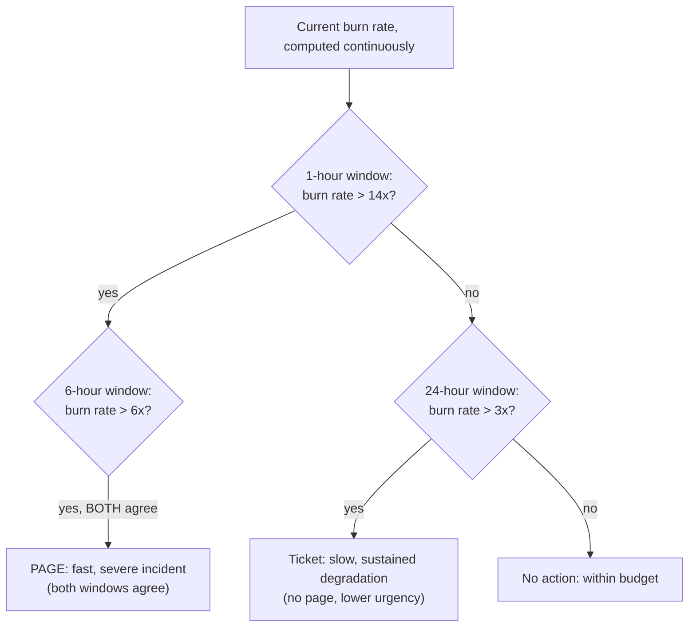
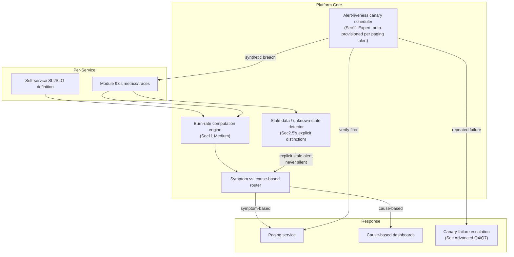

# Module 94 — Observability: SLOs, SLIs, Error Budgets & Alerting Design

> Domain: Observability | Level: Beginner → Expert | Prerequisite: [[01-ObservabilityFundamentals-MetricsLogsTraces-OpenTelemetry]] (SLIs are computed directly from Module 93's metrics/traces; this module formalizes the alert-liveness-canary need Module 93 §Advanced Q7 explicitly foreshadowed), [[../17-Microservices/02-Resilience-Observability-Sidecar-Patterns]] (the resilience patterns error budgets govern release velocity against)

---

## 1. Fundamentals

**What**: A **Service Level Indicator (SLI)** is a specific, quantitative measure of user-facing service behavior computed from telemetry (Module 93's metrics/traces) — request success rate, request latency at a given percentile, or data-freshness lag. A **Service Level Objective (SLO)** is a target threshold for an SLI over a defined time window (e.g., "99.9% of requests succeed over a rolling 30 days") — an internal engineering goal, distinct from a **Service Level Agreement (SLA)**, which is an external, often contractual commitment to customers, typically with financial penalties for breach and set looser than the internal SLO to leave margin. An **error budget** is simply `100% − SLO`: the amount of acceptable unreliability the window allows, treated as a spendable resource that incidents, risky deploys, and planned maintenance all draw down against.

**Why it exists**: Without a quantified SLO, "is this service reliable enough" is an unresolvable, political argument — one team pushing for more caution, another for more velocity, with no shared, objective standard either side can point to. The error-budget framework converts this into a negotiated, numeric trade-off: as long as the budget isn't exhausted, teams can ship features and take reasonable risks; once it's exhausted, the explicit, pre-agreed policy shifts priority toward stability work until the budget recovers. This is exactly the same underlying tension Module 92 §2.2 examined for CD promotion gates (rigor vs. velocity) and Module 88 §17 examined for governance vs. friction — SLOs and error budgets are this course's most quantitatively precise instance yet of that same recurring trade-off, made numeric and pre-negotiated rather than argued fresh during every incident.

**When it matters**: From the moment a service has real users depending on it and any competing pressure exists between shipping velocity and reliability — which, in practice, is essentially every production service past its earliest prototype stage.

**How (30,000-ft view)**:
```
SLI: a specific, MEASURABLE user-facing signal (e.g., "fraction of requests
    completing successfully in under 300ms"), computed from Module 93's metrics/traces
SLO: a TARGET for that SLI over a time window (e.g., "99.9% over 30 days") --
    NOT 100% (Sec2.2's trap) and NOT merely aspirational (Sec2.2's realism requirement)
Error budget = 100% - SLO: the allowed unreliability, a SPENDABLE resource --
    burn rate = how fast the budget is being consumed RIGHT NOW relative to
    the rate that would exhaust it exactly at window's end
Alerting: fire on BUDGET BURN RATE (a leading indicator of trajectory), not
    merely on point-in-time SLI breach -- and the alert rule itself requires
    the SAME "is this still actually working" verification (Sec2.5) this
    course now applies to every other declared-but-unverified control
```

---

## 2. Deep Dive

### 2.1 SLI Selection — What to Measure, and the Danger of Measuring the Wrong Proxy
The single highest-leverage decision in this entire discipline is choosing what to measure, since every subsequent SLO/error-budget/alerting decision is built on top of it. A **server-side success rate** SLI (the fraction of requests the server itself completed without error) is easy to compute directly from existing metrics — but it structurally cannot see client-side or network-layer failures (a request that never reached the server at all, a client-side timeout before the server responded) that a real user experiences identically to a server-side failure. This is directly Module 90 §2.2's coverage-gaming risk recurring in SLI form: an SLI chosen for measurement convenience rather than genuine fidelity to actual user experience can look excellent while real users experience meaningfully worse reliability than the dashboard shows — a declared, measured proxy silently diverging from the reality it's meant to represent. The corrective principle: prefer SLIs measured as close to the actual user experience as the architecture allows (client-side or edge/load-balancer-level measurement over purely server-internal measurement) wherever feasible.

### 2.2 SLO Target-Setting — Realistic vs. Aspirational, and the 100% Trap
An SLO target must be **achievable under normal operating conditions** (an aspirational target the service has never actually sustained provides no genuine governance value — it's either constantly breached, numbing the organization to breach as a routine, meaningless event, or it silently gets ignored) and **deliberately imperfect** — a 100% SLO target implies a zero error budget, meaning literally *any* imperfection (a single failed request, a single risky deploy that causes a brief blip) breaches it. This isn't merely unrealistic; it's actively harmful, since a zero-budget target provides no room for the routine operational risk-taking (deploying new code, running planned maintenance) every healthy engineering organization requires — it converts every single deploy into an existential risk to the SLO, creating exactly the kind of paralyzing, change-averse incentive structure Module 92 §Advanced Q2 already identified as a predictable overcorrection risk in a different governance context.

### 2.3 Error Budget Policy — Burn Rate and Budget-Based Alerting
**Burn rate** measures how quickly the error budget is currently being consumed relative to the rate that would exactly exhaust it by the window's end — a burn rate of 1.0 means "consuming the budget at exactly the sustainable rate for this window"; a burn rate of 10 means "consuming it ten times faster than sustainable," implying the entire remaining budget would be exhausted in a small fraction of the window if this rate continued. Alerting on burn rate (a *leading* indicator of trajectory) rather than solely on the SLI's current point-in-time value (a *lagging* indicator) is what lets an organization detect a severe, ongoing degradation early — a very high burn rate over a short window (say, 5 minutes) reliably signals a genuine, severe incident worth waking someone up for, while a moderate burn rate sustained over a much longer window (say, 6 hours) signals a real but less acute problem appropriate for a ticket rather than a page. This is the foundation of **multi-window, multi-burn-rate alerting** (§2.4).

### 2.4 Alerting Design — Symptom-Based vs. Cause-Based, and Multi-Window Burn-Rate Alerts
A **symptom-based alert** fires on the user-visible effect itself (elevated error rate, elevated latency — directly an SLI/burn-rate signal); a **cause-based alert** fires on an internal, causal precursor (CPU usage, queue depth, a specific dependency's health) that *might* lead to a symptom but doesn't necessarily. Symptom-based alerts should page a human (they represent an actual, currently-occurring user impact); cause-based alerts are better suited to lower-urgency notification or dashboards, since not every elevated internal metric actually produces user-visible harm — over-alerting on cause-based signals is the single most common driver of **alert fatigue** (a high volume of low-value pages training on-call engineers to reflexively dismiss alerts, precisely the same "boy who cried wolf" dynamic that makes a genuinely critical page easy to miss amid noise). The standard, robust pattern combining both leading and lagging signals correctly is **multi-window, multi-burn-rate alerting**: pair a short-window, high-burn-rate threshold (catches severe, fast-developing incidents quickly, e.g., 1 hour at 14x burn rate) with a longer-window, lower-burn-rate threshold (catches slower, sustained degradations a short window alone would miss or dismiss as noise, e.g., 6 hours at 6x burn rate) — requiring *both* the short and a corresponding longer window to agree before paging, specifically to avoid a single short, noisy spike triggering a false page.

### 2.5 The Alert-Liveness Verification Gap — "No Alert Fired" Is Ambiguous
This is this module's central, load-bearing insight, directly formalizing what Module 93 §Advanced Q7 explicitly foreshadowed: the absence of a fired alert is consistent with **two entirely different underlying states** — genuine health (the SLI/burn-rate genuinely never breached the alert's threshold) or a silently broken alerting path (the alert rule references a metric that no longer exists, a notification channel that's silently misconfigured, or a query that now silently evaluates against no data) — and a dashboard or on-call rotation has no way to distinguish these two states from the outside, since both produce the identical observable outcome: silence. This is structurally identical to Module 88 §14's Gatekeeper-upgrade incident (a policy silently stopped matching after a payload-shape change, producing "zero violations found" indistinguishable from genuine full compliance) and Module 93 §4's trace-fragmentation incident (a gap producing no error, indistinguishable from genuine complete coverage) — now recurring specifically in the alerting layer, arguably the single most consequential place for this pattern to recur, since alerting is the mechanism an organization relies on to be *told* when every other signal has gone wrong.

### 2.6 SLA/SLO/SLI Hierarchy and Composite SLOs Across Dependent Services
The three terms form a strict hierarchy: SLIs are the raw, measured signal; SLOs are internal targets set against SLIs, deliberately tighter than any external SLA to leave margin (Module 86 §2.6's "declared vs. actual" governance-buffer principle, recurring here as a reliability-margin buffer specifically); SLAs are external, contractual commitments with real financial or reputational consequences for breach. For a service composed of multiple dependencies, a **composite SLO** must account for how failures compound across the dependency chain — a request touching three downstream services, each individually meeting a 99.9% SLO, does *not* itself achieve 99.9% (the naive multiplication `0.999³ ≈ 99.7%` already shows measurable compounding, and real dependency chains are commonly far deeper and less independent than this simplified multiplication assumes) — meaning a service's own SLO target must be set with explicit awareness of its full dependency chain's compounding effect, not set in isolation as if the service's own reliability were the only variable in play.

---

## 3. Visual Architecture

### SLI → SLO → Error Budget Relationship (§2.1–§2.3)
```
SLI (measured):        99.95% of requests succeeded, last 30 days
SLO (target):           99.9% of requests succeed, per 30-day window
Error budget:          100% - 99.9% = 0.1% allowed failure rate over the window
Budget consumed:        (99.95% measured leaves 0.05% actual failure, against
                         a 0.1% allowance) => 50% of the error budget consumed
                         so far this window -- informs release-risk decisions
                         for the REMAINDER of the window.
```

### Multi-Window, Multi-Burn-Rate Alerting (§2.4)


### The Alert-Liveness Ambiguity — Silence Is Not Self-Explanatory (§2.5, §4)
```
Observable state: "No alert has fired in the last 30 days."

Explanation A (genuine health): burn rate never exceeded any configured
    threshold -- the service has actually been reliable.
Explanation B (silently broken alerting): the alert rule's underlying metric
    query returns NO DATA (renamed metric, dropped label, migrated backend),
    which many alerting systems evaluate as "condition not met" rather than
    a distinct "UNKNOWN / cannot evaluate" state -- indistinguishable from A
    without an independent, active liveness check (Sec4's fix).
```

---

## 4. Production Example

**Scenario**: A payments-processing organization ran a mature, multi-window burn-rate alerting setup on their checkout service's success-rate SLO, and had gone over four months with zero pages fired — interpreted internally as evidence of a genuinely stable, well-run service. During a routine platform migration, the team consolidating metrics backends renamed a label on the underlying success/failure counter metric (part of a broader metrics-taxonomy cleanup unrelated to the SLO system specifically) without auditing which existing alert rules referenced the old label name. The SLO burn-rate alert's query, written against the old label, began silently returning no data after the migration — and the alerting system's default behavior evaluated "no data" as "condition not met," the identical non-firing outcome as genuine health, with no distinct "unknown/stale" state surfaced anywhere.

**Investigation**: Six weeks after the migration, checkout success rates genuinely degraded severely due to an unrelated payment-processor integration issue — a real, severe incident that should have triggered the fast-burn-rate page within the first hour. No page fired. The incident was instead discovered when customer support began receiving a spike in complaints roughly three hours into the outage, at which point an engineer manually checked the underlying dashboards and discovered both the actual outage and, separately, that the alert rule itself had been silently non-functional since the migration six weeks earlier.

**Root cause**: Two independent, compounding gaps, structurally identical in shape to Module 93 §4's incident but recurring specifically in the alerting layer: (1) the alerting system's "no data" handling silently collapsed into the same non-firing outcome as genuine health, with no distinct signal for "this alert rule cannot currently evaluate at all"; (2) no alert-liveness verification existed — nothing periodically confirmed the alert rule would actually fire if the underlying condition it monitored genuinely occurred, so the six-week silent breakage was discoverable only by the exact real incident it existed to catch, precisely mirroring Module 91 §Intermediate Q10's "assumed, never even measured" capability category.

**Fix**: (1) Reconfigured the alerting system to treat "no data for longer than an expected reporting interval" as an explicit, distinct **stale-data alert** — firing a (lower-urgency, but real) notification whenever an SLO's underlying metric query goes unexpectedly quiet, rather than silently defaulting to the same non-firing state as genuine health. (2) Implemented a scheduled **alert-liveness canary**: a synthetic process periodically injects a deliberate, controlled threshold breach (in a way isolated from real production impact) and verifies the expected alert actually fires within its expected latency — directly the mechanism Module 93 §Advanced Q7 explicitly foreshadowed, now formalized as this module's central fix. (3) Added a mandatory change-management step requiring any metric name/label rename to include an explicit, automated audit of every alert rule and dashboard referencing the old name, converting a manual, easy-to-forget cross-reference into an enforced, pre-change gate.

**Lesson**: "No alert has fired" is not, by itself, evidence of genuine health — it is equally consistent with the alerting path itself having silently broken, and a dashboard or on-call rotation has no way to distinguish the two states from the outside. This is the observability domain's single sharpest instance yet of this course's central "declared/present ≠ actual/complete" theme, precisely because alerting is the mechanism an organization relies on to be actively *told* when something else has already gone wrong — a silent failure here doesn't just hide one incident, it removes the organization's ability to be notified of an entire category of future incidents until each one is independently, manually rediscovered.

---

## 5. Best Practices
- Choose SLIs measured as close to genuine user experience as the architecture allows, not merely whichever server-internal signal is easiest to compute (§2.1).
- Set SLO targets that are both achievable under normal conditions and deliberately short of 100%, preserving a genuine, usable error budget for routine operational risk-taking (§2.2).
- Alert on burn rate (a leading indicator of trajectory) using multi-window, multi-burn-rate rules — a single short window alone produces false pages from noise; a single long window alone reacts too slowly to severe, fast-developing incidents (§2.3, §2.4).
- Route symptom-based signals to paging and cause-based signals to lower-urgency notification/dashboards, to avoid the alert-fatigue dynamic that makes a genuinely critical page easy to miss (§2.4).
- Explicitly distinguish "no data" from "condition not met" in every alert rule's configuration, and periodically, actively verify each critical alert would genuinely fire via a scheduled liveness canary — never trust an alert's silence as self-evidently meaning "everything is fine" (§2.5, §4).
- Set a service's own SLO with explicit awareness of its full dependency chain's compounding failure effect, not in isolation as if it were the only variable (§2.6).

## 6. Anti-patterns
- An SLI chosen purely for measurement convenience (a server-internal metric) that structurally cannot see client-side/network failures real users actually experience (§2.1).
- A 100% (or effectively zero-budget) SLO target, removing all room for routine, healthy operational risk-taking and creating a change-averse, paralyzing incentive structure (§2.2).
- Alerting on a single-window threshold with no burn-rate/multi-window design, producing either constant false pages from short-term noise or dangerously slow detection of a genuine, severe incident (§2.3, §2.4).
- Routing every cause-based, internal signal directly to a paging channel, producing alert fatigue that makes a genuinely critical page easy to dismiss or miss (§2.4).
- Treating "no alert has fired" as proof of genuine health without a distinct stale-data/unknown state and a periodic, active liveness-verification check (§2.5, §4).
- Setting a service's SLO in isolation, ignoring how failures compound across its actual dependency chain (§2.6).

---

## 10. Interview Questions

### Basic (10)

1. **Q: What is the difference between an SLI, an SLO, and an SLA?**
   **A:** An SLI is a specific, measured signal of service behavior (e.g., success rate). An SLO is an internal target for that SLI over a time window. An SLA is an external, often contractual commitment to customers, typically set looser than the internal SLO to leave margin.
   **Why correct:** States the strict hierarchy (measured signal → internal target → external commitment) and why the SLA is deliberately looser than the SLO.
   **Common mistakes:** Using SLO and SLA interchangeably, missing that an SLA carries external, often financial consequences and is deliberately set with more margin than the internal SLO.
   **Follow-ups:** "Why would you deliberately set your SLA looser than your SLO?" (To leave a safety margin — if the SLO itself is occasionally, briefly breached internally, the organization still wants room before that translates into an external, contractually-consequential SLA breach.)

2. **Q: What is an error budget, and how is it calculated?**
   **A:** An error budget is the allowed amount of unreliability implied by an SLO — calculated as `100% - SLO`. It's treated as a spendable resource that incidents, risky deploys, and maintenance draw down against over the SLO's time window.
   **Why correct:** States both the formula and the "spendable resource" framing that gives it operational meaning.
   **Common mistakes:** Treating the error budget as a purely retrospective reporting number rather than an actively-managed resource informing real-time release/risk decisions.
   **Follow-ups:** "What happens when the error budget is exhausted mid-window?" (The pre-agreed error-budget policy typically shifts priority toward stability work — freezing risky deploys — until the budget recovers, rather than continuing business-as-usual release velocity.)

3. **Q: Why is a 100% SLO target considered an anti-pattern rather than an ideal goal?**
   **A:** A 100% target implies a zero error budget — meaning any imperfection at all, including a brief blip from a routine deploy, breaches it, creating a paralyzing, change-averse incentive with no room for the operational risk-taking any healthy engineering organization requires.
   **Why correct:** Explains the specific mechanism (zero budget) and its consequence (paralyzing risk-aversion) rather than merely asserting "100% is unrealistic."
   **Common mistakes:** Assuming a higher SLO target is always strictly better, without recognizing the trade-off it imposes on release velocity via a shrinking error budget.
   **Follow-ups:** "How would you determine an appropriate, non-100% SLO target for a new service?" (Base it on the service's actual historical performance under normal conditions and genuine user/business requirements, not an arbitrarily aspirational number disconnected from what's actually been sustained.)

4. **Q: What is burn rate, and why is alerting on it preferable to alerting solely on the SLI's current value?**
   **A:** Burn rate measures how quickly the error budget is being consumed relative to the rate that would exactly exhaust it by the window's end. Alerting on it is a leading indicator of trajectory, catching a severe, fast-developing incident early, rather than a lagging indicator that only reacts once the SLI itself has already visibly degraded.
   **Why correct:** States the definition and the leading-vs-lagging distinction that motivates using it as the primary alerting signal.
   **Common mistakes:** Confusing burn rate with the SLI's raw current value, missing that burn rate specifically expresses consumption *speed* relative to what the window's remaining time can sustainably absorb.
   **Follow-ups:** "What does a burn rate of 1.0 mean?" (Consuming the error budget at exactly the sustainable rate for the current window — if sustained for the whole window, the budget would be exactly, but not over-, exhausted by the window's end.)

5. **Q: What is the difference between a symptom-based alert and a cause-based alert?**
   **A:** A symptom-based alert fires on the user-visible effect itself (elevated error rate, elevated latency). A cause-based alert fires on an internal, causal precursor (CPU usage, queue depth) that might lead to a symptom but doesn't necessarily.
   **Why correct:** States both types' defining trigger and implicitly why they warrant different response urgency.
   **Common mistakes:** Treating every elevated internal metric as equally page-worthy as an actual, currently-occurring user-facing symptom.
   **Follow-ups:** "Which type should typically page a human directly, and why?" (Symptom-based — it represents actual, currently-occurring user impact; cause-based signals are better suited to lower-urgency notification, since not every elevated internal metric produces genuine user-visible harm.)

6. **Q: What is alert fatigue, and what commonly causes it?**
   **A:** A state where a high volume of low-value alerts trains on-call engineers to reflexively dismiss or ignore pages, making a genuinely critical alert easy to miss amid the noise. Commonly caused by over-alerting on cause-based, internal signals that don't reliably correlate with actual user-facing impact.
   **Why correct:** States both the phenomenon and its most common driver.
   **Common mistakes:** Assuming more alerts are unconditionally safer, without recognizing that excessive low-value alerting actively degrades response to genuinely critical ones.
   **Follow-ups:** "How does multi-window burn-rate alerting help reduce alert fatigue specifically?" (By requiring both a short and a longer window to agree before paging, it filters out short-term noise that would otherwise trigger a page for a transient, self-resolving blip.)

7. **Q: Why might "no alert has fired in the last N days" not be reliable evidence that a service has genuinely been healthy that whole time?**
   **A:** The absence of a fired alert is also consistent with the alert rule itself having silently broken (e.g., its underlying metric query returning no data due to a rename or migration), which many alerting systems evaluate identically to "condition not met" — producing the same observable silence as genuine health.
   **Why correct:** States the specific ambiguity (two different underlying states producing the identical observable outcome) driving this module's central insight.
   **Common mistakes:** Treating alert silence as self-evidently confirming health, without considering the alert rule's own liveness might itself have silently failed.
   **Follow-ups:** "How would you actively verify an alert rule is still genuinely functional?" (A scheduled liveness canary — deliberately, safely triggering the condition the alert monitors and confirming the expected alert actually fires.)

8. **Q: What is a composite SLO, and why can't a service's SLO be set in complete isolation from its dependencies?**
   **A:** A composite SLO accounts for how failures compound across a service's dependency chain — even if every individual downstream dependency independently meets its own SLO, the compounding effect across the chain (each dependency's own small failure rate multiplying together) means the calling service's *achievable* reliability is lower than any single dependency's SLO alone would suggest.
   **Why correct:** States the compounding mechanism and why isolated SLO-setting ignores a real, structural constraint imposed by the dependency chain.
   **Common mistakes:** Assuming a service can freely set any SLO target independent of its dependencies' own reliability, without accounting for how those dependencies' failure rates compound through the request path.
   **Follow-ups:** "If three dependencies each have a 99.9% SLO, what's the naive upper bound on the calling service's own achievable reliability?" (Roughly `0.999³ ≈ 99.7%` under a simplified independence assumption — real chains are often deeper and less independent, making the actual achievable bound potentially lower still.)

9. **Q: Why should an SLO's time window (e.g., 30 days) matter to how a burn-rate alert is designed?**
   **A:** The window defines what "sustainable" consumption looks like — a burn rate is meaningful only relative to how much budget remains and how much window time is left; the same absolute failure count represents a very different burn rate in a 7-day window versus a 30-day window, so alert thresholds must be calibrated against the specific window the SLO itself uses.
   **Why correct:** Connects the window's role to burn-rate's actual meaning as a relative-consumption-speed measure, not an absolute count.
   **Common mistakes:** Treating burn-rate thresholds as universal constants independent of the specific SLO window they're calibrated against.
   **Follow-ups:** "Would you expect the same burn-rate threshold to apply to a 7-day and a 90-day SLO window for the same service?" (No — the thresholds must be recalibrated per window, since the same instantaneous failure rate produces a very different fraction-of-total-budget-consumed depending on how much window time remains.)

10. **Q: What is the practical difference between an SRE team's error-budget policy and a simple "try to minimize errors" goal?**
    **A:** An error-budget policy is a specific, pre-agreed, numeric governance mechanism (a defined threshold, and a defined consequence — e.g., freezing risky deploys — once exhausted) that both engineering and stakeholders commit to in advance, converting reliability-vs-velocity tension into an objective, negotiated trade-off rather than an ad hoc argument during every incident.
    **Why correct:** Identifies the specific governance value (pre-agreed, objective, numeric) that distinguishes it from a vague, unquantified aspiration.
    **Common mistakes:** Treating "minimize errors" and "maintain an error budget" as equivalent goals, missing that the budget framework's actual value is converting a subjective argument into an objective, pre-negotiated policy.
    **Follow-ups:** "Who should be involved in setting the initial error-budget policy and its consequences?" (Both engineering and the business/product stakeholders who bear the cost of reduced velocity — since the policy is fundamentally a negotiated trade-off between two parties with genuinely different priorities, not a purely engineering decision.)

### Intermediate (10)

1. **Q: Why did §4's incident go undetected for six weeks rather than being caught immediately when the metric label was renamed?**
   **A:** The alerting system's "no data" evaluation collapsed into the identical non-firing outcome as genuine health, and no independent liveness verification existed to distinguish the two — meaning there was no negative signal of any kind (no error, no distinct "stale" state, no failed canary) for anyone to notice at the moment the rename actually broke the alert rule. Detection was only possible via the one specific event (a genuine, severe incident actually needing the broken alert to fire) that happened to test it.
   **Why correct:** Identifies the specific structural reason detection was delayed (no distinguishing signal existed) rather than attributing the delay to inadequate vigilance.
   **Common mistakes:** Assuming a more careful migration process alone would have caught this, without recognizing that even careful migration wouldn't reveal the gap without an explicit cross-reference audit or liveness check specifically designed to catch it.
   **Follow-ups:** "What migration-process change would have caught this at the moment of the rename, rather than six weeks later?" (A mandatory, automated audit of every alert rule/dashboard referencing a metric or label before permitting its rename — §4's third fix — converting an easy-to-forget manual cross-reference into an enforced, pre-change gate.)

2. **Q: A team argues that since their SLO dashboard has shown "99.95% success, comfortably within budget" for months, their alerting setup must be functioning correctly. Evaluate this claim.**
   **A:** A dashboard showing a healthy SLI value only confirms the underlying metric query is *currently* returning data and that data currently looks good — it says nothing about whether the *separate* alert rule (potentially referencing a different query, threshold, or notification configuration) would actually fire if the SLI genuinely degraded. A healthy-looking dashboard and a functional alert rule are two independently-verifiable things, and confirming one provides no evidence about the other, precisely §4's central ambiguity.
   **Why correct:** Distinguishes the dashboard's display health from the alert rule's independent functional health, explaining why one doesn't imply the other.
   **Common mistakes:** Conflating "the dashboard shows good numbers" with "the alert would fire correctly if those numbers turned bad," treating dashboard health as a proxy for the alert configuration's own correctness.
   **Follow-ups:** "How would you verify the alert rule specifically, independent of the dashboard's current display?" (A liveness canary that deliberately, safely triggers the underlying condition and confirms the specific alert — not just the dashboard — actually fires as configured.)

3. **Q: Why does symptom-based alerting alone (with no cause-based signals at all) risk leaving an on-call engineer without enough context to diagnose an incident quickly, even though it correctly avoids alert fatigue?**
   **A:** A symptom-based alert correctly tells the on-call engineer *that* users are experiencing impact and roughly how severe it is, but provides no information about *why* — a purely symptom-based setup with zero supporting cause-based signals (dashboards, not necessarily pages) forces the engineer to begin root-cause investigation from scratch on every single incident, even though a well-chosen set of cause-based dashboards (CPU, queue depth, dependency health) could have immediately narrowed the search space. The correct design pairs symptom-based *paging* with cause-based *dashboards/context* available on-demand, not a choice between the two categories entirely.
   **Why correct:** Explains the specific investigative cost of having zero cause-based visibility at all, while correctly distinguishing this from the earlier finding that cause-based signals shouldn't *page* directly.
   **Common mistakes:** Concluding from §2.4's alert-fatigue guidance that cause-based signals should be eliminated entirely, rather than recognizing they remain valuable as on-demand diagnostic context, just not as direct paging triggers.
   **Follow-ups:** "How would you structure an incident-response runbook to take advantage of both signal types correctly?" (The page itself carries the symptom-based signal (what's broken, how severe); the runbook then directs the responder to the relevant cause-based dashboards for that specific service, providing fast root-cause context without those cause-based signals ever needing to have paged on their own.)

4. **Q: How does §4's incident differ from Module 88 §14's Gatekeeper-upgrade incident, despite both sharing the "declared enforcement/detection silently stopped working" shape?**
   **A:** Module 88 §14's incident concerned a *policy-enforcement* mechanism silently failing to match after a payload-shape change, producing false "compliant" verdicts. This module's incident concerns an *alerting* mechanism silently failing to evaluate after a metric-rename, producing false "healthy/no incident" silence. Structurally identical (a schema/reference change silently broke a downstream consumer with no distinguishing error), but occurring at a different layer — policy enforcement vs. incident notification — meaning the specific verification mechanism required (a policy-liveness canary vs. an alert-liveness canary) targets a different component, even though the underlying "verify the verifier" principle generalizes identically across both.
   **Why correct:** Correctly identifies the shared underlying pattern while precisely locating the specific layer each incident occurred in and the correspondingly different (though structurally analogous) verification mechanism each requires.
   **Common mistakes:** Treating the two incidents as literally the same finding rather than recognizing the pattern's generalization across genuinely distinct system layers, each needing its own specific liveness-verification implementation.
   **Follow-ups:** "What's the risk of building only ONE of these two liveness canaries (say, only the alert-liveness canary) and assuming it covers both concerns?" (It wouldn't — a policy-enforcement gap and an alerting gap are independent failure surfaces; verifying one provides no evidence about the other, since they monitor entirely different downstream mechanisms.)

5. **Q: Why might setting an SLO target based purely on "what our SLA promises customers" (rather than what the service has actually, historically sustained) be a design mistake?**
   **A:** An SLA is typically set looser than the internal SLO specifically to leave safety margin (§2.6) — if the SLO is set equal to (rather than tighter than) the SLA, there's no margin left, meaning any SLO breach immediately risks becoming an externally-visible, contractually-consequential SLA breach with no internal buffer to absorb and respond to a developing problem before it crosses that external threshold.
   **Why correct:** Explains the specific structural risk (no margin) created by collapsing the SLO-to-SLA gap this hierarchy is designed to maintain.
   **Common mistakes:** Assuming the SLO and SLA should simply match "since that's what we promised customers," missing the deliberate-margin design principle the SLO/SLA distinction exists to provide.
   **Follow-ups:** "How would you determine an appropriate margin between SLO and SLA?" (Based on the service's actual historical variance in the SLI, and the organization's realistic response time to detect and remediate a developing degradation before it would cross the looser, external SLA threshold.)

6. **Q: A team's burn-rate alert fires reliably during genuine incidents but also produces frequent false pages during routine, planned high-traffic events (e.g., a scheduled sale) that briefly, expectedly increase error rates. How would you address this without simply raising the alert threshold (which would risk missing genuine incidents during normal periods)?**
   **A:** Rather than a single, static threshold applied uniformly at all times, incorporate a **planned-maintenance/expected-load-variance window** into the alerting configuration — either temporarily adjusting the effective threshold during a pre-declared, scheduled high-traffic event, or using a burn-rate baseline that accounts for the SLI's normal, expected variance under known traffic patterns rather than a single fixed number applied identically to both routine and anomalous conditions. This preserves full sensitivity during normal operation while avoiding the specific, predictable false-positive source a scheduled event introduces.
   **Why correct:** Proposes a targeted, context-aware fix (temporary threshold adjustment for a known, scheduled condition) rather than a blunt, universally-applied threshold change that would degrade detection sensitivity during genuinely anomalous periods.
   **Common mistakes:** Simply raising the alert threshold globally to reduce false pages, which directly trades away genuine-incident detection sensitivity during normal operating periods — the same overcorrection shape this course has repeatedly flagged (e.g., Module 92 §Advanced Q2's uniform-friction overcorrection).
   **Follow-ups:** "What governance is needed to ensure this planned-event exception doesn't quietly become a permanent, unreviewed threshold relaxation?" (An explicit, time-bounded exception tied to the specific scheduled event, automatically reverting to the standard threshold afterward — directly mirroring Module 88 §Advanced Q9's expiring-exception pattern, applied here to alerting-threshold adjustments specifically.)

7. **Q: How would you design the alert-liveness canary (§4's fix) so it doesn't itself become a source of alert fatigue or false confidence over time?**
   **A:** The canary should run on a fixed, frequent schedule (not merely once at setup), inject a genuinely realistic, controlled breach of the specific condition the real alert monitors (not a trivially different, easier-to-trigger substitute condition), and its own failure (the expected alert not firing within expected latency) must itself page a human with high urgency — since a canary that silently fails without escalating recreates the exact same "silent, undetected breakage" risk it exists to close, one layer up. Its *success* (confirming the alert fired as expected) should be logged/dashboarded but not itself generate a page, to avoid becoming routine noise.
   **Why correct:** Specifies the concrete design requirements (frequency, realism, escalation-on-canary-failure specifically) that prevent the canary itself from becoming either noise or another silently-unverified control.
   **Common mistakes:** Building a canary that only logs its own result passively without escalating a failure, recreating the identical "silent breakage, no one notices" risk the canary was built to close, now one layer removed.
   **Follow-ups:** "Who should own responding to a canary-failure page, and how urgently?" (Whoever owns the alerting infrastructure/platform, treated with high urgency — a failed liveness canary means the *actual* alert for a real incident is currently non-functional, an urgent, standalone risk regardless of whether a real incident happens to be occurring at that exact moment.)

8. **Q: Why does a composite/dependent-service SLO (§2.6) become significantly harder to reason about correctly as an organization's microservice dependency graph deepens, beyond the simple multiplicative math?**
   **A:** The simple multiplicative model (`0.999³`) assumes independent failure probabilities across dependencies — but real dependency chains commonly share underlying infrastructure (a shared database, a shared network segment, a shared upstream dependency several levels removed), meaning failures are often *correlated*, not independent, and a shared-infrastructure failure can simultaneously breach multiple "independent" dependencies' SLOs at once — an effect the naive multiplicative model doesn't capture at all, since it assumes each dependency's failure is statistically unrelated to the others'.
   **Why correct:** Identifies the specific modeling gap (assumed independence vs. actual correlation from shared infrastructure) that makes the simple multiplicative approximation an underestimate of real compounding risk in deep dependency graphs.
   **Common mistakes:** Treating the simple multiplicative formula as a precise, sufficient model for composite SLO risk, without considering that real failures often correlate across supposedly-independent dependencies via shared underlying infrastructure.
   **Follow-ups:** "How would you identify which of your dependencies share correlated failure risk?" (Map the actual underlying infrastructure each dependency relies on — shared database instances, shared network paths, shared cloud regions/availability zones — treating dependencies sharing any of these as correlated rather than independent for SLO-compounding purposes.)

9. **Q: Design a review process ensuring an SLO's target and its corresponding burn-rate alert thresholds stay correctly calibrated as a service's traffic pattern and dependency graph evolve over time.**
   **A:** A periodic (e.g., quarterly) SLO review, examining whether the SLI still reflects genuine user experience (§2.1's fidelity concern, which can drift as the architecture evolves), whether the SLO target remains both achievable and appropriately ambitious given recent actual performance, and whether the composite/dependency-chain compounding effect (§2.6, §Advanced Q8) has changed as new dependencies were added or existing ones' reliability shifted — directly this course's now-standard periodic-health-review discipline (Modules 64/72/76/80/85–88/92/93), applied here specifically to SLO/alerting calibration.
   **Why correct:** Proposes a concrete, periodic review scoped to the three specific dimensions (SLI fidelity, SLO achievability, dependency-compounding effect) that can each independently drift over time, rather than a vague "review it sometimes" recommendation.
   **Common mistakes:** Treating SLO/alerting configuration as a one-time setup task, missing that all three calibration dimensions can silently drift as the service and its dependencies evolve, recreating a "declared configuration silently diverges from actual current reality" gap this course has repeatedly flagged elsewhere.
   **Follow-ups:** "What signal would indicate an SLO review is overdue, beyond a fixed calendar schedule?" (A significant, sustained shift in traffic pattern, a major dependency-graph change (a new critical downstream dependency added), or — closely tied to §Intermediate Q2 — any incident where the alerting behaved unexpectedly, each independently warranting an ad hoc review regardless of the regular calendar cadence.)

10. **Q: How does this module's central finding (§4) extend the "declared/present ≠ actual/complete" theme this course established, and what is specifically new about its instance compared to Module 93's trace-fragmentation finding?**
    **A:** Module 93's finding concerned instrumentation *coverage* (does a trace correctly span every hop it should). This module's finding concerns the *response mechanism* built on top of that instrumentation (does the alert correctly fire when the underlying, correctly-collected telemetry shows a genuine problem) — meaning even if Module 93's coverage gap were fully closed, this module's alerting-liveness gap could still independently exist and produce an identical "silent failure, indistinguishable from health" outcome, one layer further downstream. This establishes that the "verify the verifier" discipline must be applied recursively, at *every* layer of the observability stack (collection, storage, alerting, and — per Module 93 §Advanced Q10's forecast — the eventual platform-architecture capstone's cross-cutting governance), not merely once at whichever single layer a given team happens to focus their verification effort on.
    **Why correct:** Precisely distinguishes the two modules' findings as occurring at genuinely different layers (coverage vs. response) and explains why closing one gap provides zero evidence the other is also closed, requiring the "verify the verifier" principle to be applied independently and recursively at each layer.
    **Common mistakes:** Treating this module's finding as merely "the same lesson as Module 93 again," without recognizing it's independently necessary at a structurally different layer of the stack — closing Module 93's coverage gap alone would not have prevented this module's alerting-liveness gap from occurring.
    **Follow-ups:** "What's the next layer in the observability stack, beyond alerting, where this same 'verify the verifier' principle will likely need to be applied?" (The eventual platform-architecture capstone's cross-signal correlation and org-wide governance layer — confirming that cardinality budgets, retention policies, and cross-team instrumentation standards are themselves being actively enforced, not merely declared, exactly the recursive pattern this domain's remaining modules should be expected to continue applying.)

### Advanced (10)

1. **Q: Diagnose §4's incident from first principles and design the complete structural fix — not merely the three specific remediations already described.**
   **A:** Root causes (two, independent): (1) the alerting system's "no data" evaluation silently collapsing into the identical non-firing outcome as genuine health, with no distinct "unknown/stale" state ever surfaced; (2) the complete absence of any active liveness verification confirming the alert would genuinely fire under a real breach, meaning the six-week silent breakage was discoverable only by the one real incident that happened to test it. Complete structural fix: (1) reconfigure every SLO-critical alert rule to fire a distinct, explicit stale-data alert whenever its underlying query goes unexpectedly quiet, never silently defaulting to the same non-firing state as health; (2) implement a scheduled, escalating-on-failure alert-liveness canary (§Advanced Q7's design) for every symptom-based, paging-critical alert, not merely this one incident's specific alert; (3) require an automated, enforced audit of every alert rule/dashboard referencing a metric or label before permitting its rename or migration, closing the specific triggering mechanism at its source; (4) proactively audit every *other* existing alert rule in the organization for the identical "no data silently equals healthy" configuration gap, since this incident's specific mechanism plausibly recurs wherever the same alerting-system default behavior was never explicitly overridden.
   **Why correct:** Addresses both independent root causes with the specific, mechanistically-appropriate fixes, and extends the investigation proactively to search for the same gap recurring elsewhere in the organization's existing alert configuration, per this course's now-established pattern.
   **Common mistakes:** Fixing only the specific alert rule involved in the incident without also auditing every other existing alert for the identical "no data defaults to healthy" configuration gap, leaving the organization exposed to the same failure mode recurring via a different metric/label rename elsewhere.
   **Follow-ups:** "How would you prioritize these fixes given limited immediate engineering capacity?" (The stale-data-alert reconfiguration first, since it's a relatively low-effort, immediately protective fix applicable org-wide; the liveness canary for the highest-severity, most business-critical alerts second; the change-management audit gate and the org-wide existing-alert audit as important but slightly lower-urgency structural investments following immediately after.)

2. **Q: A Principal Engineer is asked whether the organization should eliminate error budgets entirely and instead mandate "zero tolerance for any production incident," given a recent, high-visibility outage. Evaluate this proposal.**
   **A:** This recreates §2.2's exact 100%-target trap at an organizational-policy level — a genuine zero-tolerance mandate implies a zero error budget, removing all room for the routine operational risk-taking (deploys, planned maintenance, reasonable experimentation) every healthy engineering organization requires, and would very plausibly drive the organization toward the same friction-induced-bypass dynamic Module 92 §4 already demonstrated for CD gates (engineers routing around an impossibly strict policy under real delivery pressure) rather than genuinely eliminating incidents. The appropriate response to a high-visibility outage is a targeted root-cause fix and, if warranted, a deliberate, temporary *tightening* of the specific error-budget policy or burn-rate thresholds most relevant to the incident's actual cause — not eliminating the entire framework's core mechanism.
   **Why correct:** Identifies the proposal as the identical overcorrection pattern (removing all budget/margin) this course has repeatedly flagged, and explains the predictable bypass-incentive consequence using an already-established course finding (Module 92 §4) as direct precedent.
   **Common mistakes:** Assuming "zero tolerance" is an unconditionally stronger safety stance than a calibrated error-budget policy, without considering the friction-driven-bypass risk a genuinely zero-budget mandate predictably creates.
   **Follow-ups:** "How would you communicate this evaluation to leadership specifically concerned about repeat outages?" (Acknowledge the legitimate underlying concern, then propose a targeted, temporary tightening of the specific burn-rate thresholds and error-budget policy most relevant to the incident's actual failure mode — demonstrating direct responsiveness to the concern without recreating the zero-budget overcorrection's predictable bypass risk.)

3. **Q: Design a burn-rate alerting configuration for a service with a 99.9% SLO over a 30-day window, specifying the actual short-window and long-window thresholds you'd use and justifying the specific numbers.**
   **A:** A common, well-justified pattern (following Google SRE's published multi-window approach): a **fast-burn** alert on a 1-hour window at roughly **14x** burn rate (a burn rate this high would consume the entire 30-day budget in about 2% of the window's duration — clearly indicating a severe, fast-developing incident worth an immediate page) paired with a corroborating, slightly longer 5-minute or 1-hour secondary window to filter transient noise; and a **slow-burn** alert on a 6-hour window at roughly **6x** burn rate (consuming the budget meaningfully faster than sustainable, but not severely enough to justify an immediate page — appropriate for a ticket or lower-urgency notification, catching a real but slower-developing degradation a purely fast-burn-focused design would miss entirely).
   **A (continued):** The specific multiplier choices (14x, 6x) are calibrated so that each alert fires only once a genuinely significant fraction of the *entire* window's budget would be consumed if the current rate continued — not an arbitrary round number, but derived from working backward from "how much of the total 30-day budget would this burn rate consume within its detection window."
   **Why correct:** Provides concrete, justified numbers (not merely "use multi-window alerting" in the abstract) and explains the derivation logic (working backward from total-budget-consumption-within-window) that makes the specific thresholds principled rather than arbitrary.
   **Common mistakes:** Proposing multi-window alerting conceptually without specifying or justifying any actual threshold numbers, or picking round numbers with no connection to the underlying SLO window and budget size.
   **Follow-ups:** "How would these specific numbers need to change for a service with a much tighter, 99.99% SLO over the same 30-day window?" (The absolute error budget shrinks substantially — 0.01% vs 0.1% — meaning the same *relative* burn-rate multipliers (14x, 6x) still apply proportionally, but the *absolute* failure count that constitutes "14x" is much smaller, requiring correspondingly more sensitive detection given the much narrower absolute margin for error.)

4. **Q: How would you extend this module's alert-liveness canary concept (§4, §Advanced Q7) to also verify that the *escalation/notification path* itself (paging service, on-call rotation configuration) is functioning, not merely that the alert rule's evaluation logic fires correctly?**
   **A:** The liveness canary's synthetic breach must propagate all the way through the *entire* notification chain — not merely confirming the alerting system's internal state transitions to "firing," but confirming an actual notification reaches the currently-scheduled on-call engineer via the real paging service and channel configuration, since a break could just as easily occur in the on-call rotation's own configuration (a stale or misconfigured schedule, an integration between the alerting system and the paging provider silently failing) as in the alert-evaluation logic itself — two independently-failing components that must each be verified, not merely the first one in the chain.
   **Why correct:** Identifies that alert-evaluation correctness and notification-delivery correctness are two independent components, both requiring verification, rather than assuming confirming one implies the other is also functioning.
   **Common mistakes:** Designing a liveness canary that only checks whether the alerting system's internal state reaches "firing," without confirming an actual, real notification was delivered through the complete, genuine paging/on-call path — leaving an equally dangerous, independent gap unverified.
   **Follow-ups:** "What's a safe way to verify actual notification delivery without genuinely paging a real, currently-on-call human on every canary run?" (Route the canary's specific, clearly-labeled synthetic alert to a dedicated, non-disruptive test channel/rotation that mirrors the real path's configuration exactly, verifying delivery there — while periodically, on a lower-frequency schedule, deliberately allowing a real, clearly-labeled test page through to the actual on-call engineer to confirm the full, genuine path, accepting the minor disruption this rarer, real test causes as the cost of true end-to-end verification.)

5. **Q: A service's SLO is measured and reported correctly, its error budget is accurately tracked, and its burn-rate alerts are verified via a working liveness canary — yet a severe incident still goes undetected for hours because the incident's actual failure mode doesn't manifest as a burn-rate breach at all (e.g., a correctness bug silently returning wrong-but-technically-"successful" responses). Diagnose this gap.**
   **A:** This is a §2.1 SLI-selection gap, not an alerting-liveness gap — the SLI (e.g., HTTP success rate) is being measured and alerted on entirely correctly, but it was never designed to detect this specific failure mode (a response that returns a 200-success status while containing incorrect business-logic content) in the first place. No amount of alerting-pipeline verification closes a gap in *what's being measured*; this requires expanding the SLI itself (e.g., adding a business-outcome-correctness signal, not merely a transport-level success/failure signal) to actually cover the failure mode that occurred, directly recurring Module 92 §Advanced Q4's identical structural finding (a canary/gate functioning exactly as designed while a different, unmonitored dimension silently carries the real risk).
   **Why correct:** Correctly distinguishes an SLI-coverage gap (nothing was ever measuring this dimension) from an alerting-pipeline-liveness gap (this module's central finding), and connects it explicitly to an already-established prior-module analog with the identical structural shape.
   **Common mistakes:** Assuming a fully-verified alerting pipeline (correct SLI measurement, correct burn-rate evaluation, verified liveness) guarantees detection of any severe incident, without recognizing that the *choice of what to measure* (§2.1) is itself a separate, independent point of potential failure the alerting pipeline's own correctness cannot compensate for.
   **Follow-ups:** "How would you decide which additional business-outcome SLIs are worth the investment to add, given that adding every conceivable signal isn't practical?" (Prioritize based on past incidents' actual failure modes and the business criticality of the specific outcome — a payments service's correctness-of-amount-charged signal is far higher priority than an equivalent signal for a low-stakes internal tool, directly this course's now-standard risk-proportionate investment principle.)

6. **Q: How does the "shared error budget across a whole team/organization" model differ from a "per-service error budget" model, and what coordination problem does the shared model introduce?**
   **A:** A per-service model cleanly attributes budget consumption and consequences to the team owning that specific service. A shared, cross-team/organization-wide budget model pools consumption across multiple services or teams — introducing a coordination problem where one team's incident can exhaust budget that constrains a *different* team's release velocity, requiring an explicit, pre-agreed allocation or escalation policy (which team's incidents "count against" which portion of the shared budget, and how disputes about attribution are resolved) that a per-service model never needs to address at all.
   **Why correct:** Identifies the specific cross-team attribution/coordination problem the shared model introduces that a per-service model structurally avoids.
   **Common mistakes:** Assuming a shared, organization-wide error budget is straightforwardly "more holistic" without recognizing the real coordination and fairness problem it introduces when one team's incident constrains a different, uninvolved team's release velocity.
   **Follow-ups:** "In what scenario would a shared, cross-service error budget genuinely be more appropriate than per-service budgets?" (When multiple services are tightly coupled and jointly responsible for one genuinely unified user-facing experience — e.g., several microservices composing a single checkout flow — where the actual user-relevant SLI is the composite, end-to-end experience rather than any individual service's isolated reliability, making a shared budget a more accurate reflection of what actually matters to the user.)

7. **Q: How would you design a change-management gate (§Advanced Q1's fix #3) that prevents a metric/label rename from silently breaking an alert rule, without requiring a fully manual, error-prone review of every existing alert on every single metric change?**
   **A:** An automated, CI-integrated check (directly reusing [[../26-CICD/01-CIPipelineArchitecture-PipelineAsCode-Caching-Monorepo]]'s pipeline-gate pattern) that statically parses every existing alert rule's query definition, extracts the specific metric names/labels each one references, and — whenever a proposed change would rename or remove a metric/label — automatically flags every alert rule whose query references the old name, blocking the change from merging without either updating those alert rules in the same change or an explicit, reviewed override.
   **Why correct:** Proposes a concrete, automatable mechanism (static query-reference extraction plus a blocking CI gate) that scales without requiring per-change manual review effort proportional to the total number of existing alert rules.
   **Common mistakes:** Relying on documentation or a manual runbook step ("remember to check alert rules before renaming a metric") as the primary safeguard, recreating the "declared process without automated enforcement" gap this course has repeatedly identified as insufficient on its own.
   **Follow-ups:** "What would you do if the automated check couldn't reliably parse a particular alerting system's query language statically?" (Fall back to a runtime-based verification instead — after the proposed rename, run the affected alert rules' actual queries against a staging/shadow copy of the new metric schema and confirm they still return data, rather than static parsing, achieving the same protective goal through a different, execution-based mechanism.)

8. **Q: Compare this module's alert-liveness gap (§4) to a "watchdog that itself has no watchdog" infinite-regress concern — how do you decide where the recursive verification chain should reasonably stop?**
   **A:** The recursive "verify the verifier" principle genuinely could be applied indefinitely (verify the canary, then verify the thing that verifies the canary, and so on) — the practical stopping point is where the verification mechanism becomes simple, infrequently-changing, and low-risk enough that its own failure probability is meaningfully lower than the risk it protects against, *and* where an independent, orthogonal signal (a different team, a different system, or a human periodically, manually spot-checking) provides an out-of-band check rather than requiring another automated layer in the same chain. In practice, most organizations stop the automated chain at one or two layers deep (the primary alert, plus one liveness canary) and rely on a periodic human review (§Intermediate Q9's calibration review) as the final, out-of-band backstop rather than building a third or fourth automated verification layer.
   **Why correct:** Acknowledges the genuine infinite-regress structure of the principle while providing a concrete, reasoned stopping criterion (diminishing risk-reduction vs. added complexity, plus an out-of-band human check as the practical final backstop) rather than either dismissing the regress concern or claiming it can be fully automated away.
   **Common mistakes:** Either dismissing the infinite-regress concern as purely theoretical with no practical relevance, or concluding the recursive verification should be automated indefinitely deep with no principled stopping point at all.
   **Follow-ups:** "Why is a periodic human review a suitable final backstop where another automated layer wouldn't add proportionate value?" (A human reviewer applies genuinely independent judgment and can catch categories of failure (a fundamentally wrong design assumption, not merely a configuration drift) that another automated check — built on the same underlying assumptions as the layers it's checking — would be structurally unable to catch, providing a qualitatively different kind of verification than another automated layer would.)

9. **Q: How should an organization decide the relative investment priority between building out more comprehensive SLO coverage across additional services versus deepening the alert-liveness verification rigor for services that already have SLOs defined?**
   **A:** Prioritize based on which gap currently carries greater expected risk: a service with **no SLO/alerting at all** has zero automated detection of any failure mode, a strictly worse starting position than a service with an SLO whose alerting *might* have an undetected liveness gap (which at least has automated detection working correctly some, likely most, of the time). This suggests breadth (extending basic SLO/alerting coverage to currently-uncovered critical services) is usually the higher-leverage investment before depth (adding liveness-canary rigor to already-covered services) — with the important caveat that for the organization's most business-critical services specifically, the depth investment (closing a potentially-undetected liveness gap on a service that already appears well-covered) may be justified even ahead of extending basic coverage to a lower-criticality, currently-uncovered service.
   **Why correct:** Provides a reasoned, risk-based prioritization framework (breadth generally first, with an explicit criticality-based exception) rather than a one-size-fits-all rule.
   **Common mistakes:** Assuming depth (more rigorous verification on already-covered services) is unconditionally the higher priority, without weighing it against the substantially larger, unaddressed risk of services with zero SLO/alerting coverage at all.
   **Follow-ups:** "How would you identify which currently-uncovered services are the highest-priority breadth investments?" (Rank by business criticality and blast radius of a genuine, undetected failure — a service directly in the customer-facing payment or checkout path warrants basic SLO/alerting coverage well before an internal, low-traffic administrative tool, even if the latter was simply built first.)

10. **Q: Synthesize this module's central finding with Module 93's, framed as guidance for the domain's remaining modules (log aggregation/incident-response practice, and the eventual platform-architecture capstone) not yet written.**
    **A:** Module 93 established that observability infrastructure's *coverage* (does telemetry actually span every genuine hop) is subject to this course's "declared/present ≠ actual/complete" theme; this module establishes that the *response mechanism* built on top of that telemetry (does an alert actually fire, and actually reach a human, when a genuine problem occurs) is independently subject to the identical theme, one layer further downstream — and closing either gap provides zero evidence the other is also closed. The domain's remaining modules should be expected to continue applying this same recursive "verify the verifier" discipline at each subsequent layer: log-aggregation/incident-response practice should verify that runbooks and escalation procedures actually work when genuinely exercised (not merely that they're documented), and the eventual platform-architecture capstone should synthesize propagation-coverage verification (Module 93), alert-liveness verification (this module), and every other layer's analogous verification into one unified, organization-wide "verify the verifier" governance principle — the domain's single most load-bearing, recurring insight, now established independently at two distinct layers and expected to recur at each subsequent one.
    **Why correct:** Correctly synthesizes both modules' findings as independently-necessary instances of the same recursive principle at different layers, and projects forward a specific, concrete expectation for how the domain's remaining modules should extend rather than merely repeat this framing.
    **Common mistakes:** Treating this module's finding as a simple restatement of Module 93's lesson rather than an independently-necessary verification at a genuinely distinct layer, and failing to project the pattern forward concretely into what the domain's remaining modules should specifically verify.
    **Follow-ups:** "Why does this recursive framing matter specifically for how a Principal Engineer should communicate observability investment priorities to leadership?" (Because it reframes "we have monitoring/alerting" from a single, binary claim into a multi-layered claim requiring independent verification at each layer — a Principal Engineer who can name which specific layers have been verified versus merely assumed provides leadership with a genuinely more accurate, actionable picture of the organization's real incident-detection capability than a simple "yes, we have observability" would.)

---

## 11. Coding Exercises

### Easy — Error budget calculator (§2.2, §2.3)
**Problem:** Given an SLO target and the SLI's measured value over a window, compute the remaining error budget as both a percentage and a fraction of the total budget consumed.

```csharp
public sealed record ErrorBudgetStatus(
    double TotalBudgetPercent, double ConsumedPercent, double RemainingPercent, double FractionConsumed);

public static class ErrorBudgetCalculator
{
    public static ErrorBudgetStatus Calculate(double sloTargetPercent, double measuredSliPercent)
    {
        double totalBudget = 100.0 - sloTargetPercent;
        double consumed = Math.Max(0, sloTargetPercent - measuredSliPercent) is var shortfall && measuredSliPercent < sloTargetPercent
            ? 100.0 - measuredSliPercent - totalBudget + totalBudget // simplifies below
            : 0;

        // Consumed = actual failure rate observed, capped at the total budget for reporting.
        double actualFailureRate = 100.0 - measuredSliPercent;
        double consumedPercent = Math.Min(actualFailureRate, totalBudget);
        double remainingPercent = Math.Max(0, totalBudget - consumedPercent);
        double fractionConsumed = totalBudget > 0 ? consumedPercent / totalBudget : 1.0;

        return new ErrorBudgetStatus(totalBudget, consumedPercent, remainingPercent, fractionConsumed);
    }
}
```
**Time complexity:** O(1).
**Space complexity:** O(1).
**Optimized solution:** For real operational use, compute this continuously over a *rolling* window (recalculating as new data arrives) rather than as a single point-in-time snapshot, and surface the *trend* of `FractionConsumed` over time — a budget currently at 40% consumed but climbing rapidly warrants very different action than one at 40% consumed and flat, information a single-snapshot calculation alone doesn't convey.

### Medium — Multi-window burn-rate alert evaluator (§2.4, §Advanced Q3)
**Problem:** Given the current burn rate over two windows (a short window and a long, corroborating window) and their respective thresholds, determine whether a page-worthy fast-burn condition or a ticket-worthy slow-burn condition applies.

```csharp
public enum AlertSeverity { None, Ticket, Page }

public sealed record BurnRateWindow(TimeSpan Window, double CurrentBurnRate, double Threshold);

public static class BurnRateAlertEvaluator
{
    public static AlertSeverity Evaluate(
        BurnRateWindow fastWindow, BurnRateWindow corroboratingWindow, BurnRateWindow slowWindow)
    {
        bool fastBreached = fastWindow.CurrentBurnRate > fastWindow.Threshold;
        bool corroboratingBreached = corroboratingWindow.CurrentBurnRate > corroboratingWindow.Threshold;

        // Sec2.4: BOTH windows must agree before paging -- avoids a single short,
        // noisy spike triggering a false page.
        if (fastBreached && corroboratingBreached)
            return AlertSeverity.Page;

        bool slowBreached = slowWindow.CurrentBurnRate > slowWindow.Threshold;
        if (slowBreached)
            return AlertSeverity.Ticket;

        return AlertSeverity.None;
    }
}
```
**Time complexity:** O(1).
**Space complexity:** O(1).
**Optimized solution:** In a real streaming-metrics pipeline, maintain each window's burn rate incrementally (a sliding-window aggregate updated per new data point) rather than recomputing the full window's aggregate on every evaluation — turning each evaluation into O(1) amortized against a continuously-updated running aggregate, essential for a monitoring system evaluating this check on every new metric sample rather than on demand.

### Hard — Composite/dependent-service SLO aggregator with correlation grouping (§2.6, §Advanced Q8)
**Problem:** Given a list of dependencies (each with its own SLO and a "correlation group" identifier for dependencies sharing underlying infrastructure), compute a more realistic composite reliability estimate than naive independent multiplication, by treating dependencies within the same correlation group as fully correlated (worst-case: the whole group fails together) rather than independent.

```csharp
public sealed record Dependency(string Name, double SloPercent, string CorrelationGroup);

public static class CompositeSloAggregator
{
    public static double EstimateCompositeReliability(IReadOnlyList<Dependency> dependencies)
    {
        // Group dependencies sharing infrastructure -- Sec Advanced Q8's correlation concern.
        var groups = dependencies.GroupBy(d => d.CorrelationGroup);

        double compositeReliability = 1.0;
        foreach (var group in groups)
        {
            // Within a correlated group, assume WORST-CASE correlation: the group's
            // effective reliability is bounded by its LEAST reliable member, not the
            // product of its members (which would understate correlated risk).
            double groupReliability = group.Min(d => d.SloPercent) / 100.0;
            compositeReliability *= groupReliability;
        }

        return compositeReliability * 100.0;
    }
}
```
**Time complexity:** O(n log n) for grouping (or O(n) with a hash-based grouping), where n is the number of dependencies.
**Space complexity:** O(n) for the grouped structure.
**Optimized solution:** This worst-case-correlation model is deliberately conservative (a genuine lower bound, not a precise estimate) — a more refined model would incorporate an actual, empirically-measured correlation coefficient per group (from historical incident data showing how often dependencies in the same group actually failed together vs. independently) rather than assuming full worst-case correlation uniformly, trading some analytical simplicity for a tighter, more realistic estimate once sufficient historical incident data exists to calibrate it.

### Expert — Alert-liveness canary state machine with escalating failure handling (§4, §Advanced Q4, §Advanced Q7)
**Problem:** Design a state machine that periodically injects a synthetic breach, tracks whether the expected alert fired within a timeout, and escalates appropriately on repeated canary failures (distinguishing a single, possibly-transient miss from a persistent, confirmed break).

```csharp
public enum CanaryState { Idle, BreachInjected, AwaitingAlert, Confirmed, Escalated }

public sealed class AlertLivenessCanary
{
    private readonly TimeSpan _alertTimeout;
    private readonly int _consecutiveFailuresBeforeEscalation;
    private int _consecutiveFailures;
    private CanaryState _state = CanaryState.Idle;
    private DateTime _breachInjectedAt;

    public AlertLivenessCanary(TimeSpan alertTimeout, int consecutiveFailuresBeforeEscalation)
    {
        _alertTimeout = alertTimeout;
        _consecutiveFailuresBeforeEscalation = consecutiveFailuresBeforeEscalation;
    }

    public void InjectSyntheticBreach(DateTime now)
    {
        _state = CanaryState.BreachInjected;
        _breachInjectedAt = now;
        _state = CanaryState.AwaitingAlert;
        // Actual injection call to the monitored system happens here (omitted --
        // e.g., writing a synthetic metric sample that should cross the real
        // alert's threshold).
    }

    // Called by the real alerting system's webhook/notification handler when
    // the monitored alert fires, correlated to this canary's specific synthetic breach.
    public void OnAlertObserved(DateTime observedAt)
    {
        if (_state != CanaryState.AwaitingAlert) return;

        if (observedAt - _breachInjectedAt <= _alertTimeout)
        {
            _consecutiveFailures = 0; // genuine success resets the failure streak
            _state = CanaryState.Confirmed;
        }
        // else: arrived too late -- treated as a failure by the timeout check below.
    }

    // Called on a scheduled tick; 'now' drives the timeout check so this is
    // testable without wall-clock sleeps.
    public CanaryState CheckTimeout(DateTime now)
    {
        if (_state != CanaryState.AwaitingAlert)
            return _state;

        if (now - _breachInjectedAt > _alertTimeout)
        {
            _consecutiveFailures++;
            _state = _consecutiveFailures >= _consecutiveFailuresBeforeEscalation
                ? CanaryState.Escalated   // Sec Advanced Q7: a confirmed, persistent break -- page a human
                : CanaryState.Idle;       // a single miss -- retry next cycle before escalating
        }
        return _state;
    }
}
```
**Time complexity:** O(1) per method call.
**Space complexity:** O(1) — fixed per-canary state, independent of how many cycles have run.
**Optimized solution:** Requiring `_consecutiveFailuresBeforeEscalation` failures (rather than escalating on the very first miss) absorbs a single transient timing glitch (a momentarily slow alert-evaluation cycle) without over-escalating on noise — but this threshold must itself stay small (e.g., 2, not 10) given §Advanced Q7's finding that a genuinely broken alert path is exactly the highest-urgency thing to surface quickly; the trade-off between noise-tolerance and detection speed here directly mirrors §2.4's multi-window burn-rate design tension, now applied to the canary's own escalation logic.

---

## 12. System Design

**Prompt:** Design an organization-wide SLO and alerting platform providing self-service SLO definition, multi-window burn-rate alerting, and continuous alert-liveness verification for hundreds of services.

**Functional requirements:** Teams self-service-define SLIs/SLOs against their own service's telemetry (Module 93's metrics/traces); the platform computes error-budget status and burn rate continuously; multi-window burn-rate alert rules route symptom-based breaches to paging and cause-based signals to dashboards; every paging-critical alert has an automatically-provisioned, scheduled liveness canary (§4, §11 Expert) with escalating failure handling.

**Non-functional requirements:** SLO/alert-rule changes must be self-service (no central-team bottleneck per team onboarded, this course's now-standard platform principle); burn-rate computation latency must be low enough that a fast-burn alert genuinely pages within its intended detection window, not delayed by the platform's own processing lag; the platform must distinguish "no data" from "healthy" explicitly at the architecture level, not merely as a per-team configuration convention easy to get wrong.

**Architecture:**


**Database selection:** A time-series store for continuous burn-rate computation (matching Module 93 §12's metrics-workload access pattern) and a separate, small relational store for SLO definitions, error-budget policy configuration, and canary-state tracking (§11 Expert's state machine) — the latter benefiting from ACID transactional guarantees for state transitions (a canary's escalation decision must not be lost or double-applied under concurrent evaluation).

**Caching:** Current burn-rate values for actively-viewed dashboards are cached with a short TTL matched to the platform's computation cadence — avoiding redundant recomputation for the same, frequently-viewed service during an active incident investigation.

**Messaging:** Canary-injected synthetic breaches and their corresponding alert-fired confirmations are correlated via an async message/event bus (the canary injects an event, the alerting pipeline's fired-alert event is matched against it) rather than a synchronous, blocking call — decoupling the canary's injection cadence from the alerting pipeline's own processing latency, directly reusing this course's established async-decoupling pattern.

**Scaling:** Burn-rate computation scales horizontally by sharding per-service (each service's SLI computation is fully independent of every other service's), and the platform-wide canary scheduler distributes canary-injection load evenly across a rolling schedule rather than firing every service's canary simultaneously, avoiding a synchronized load spike against the underlying telemetry and alerting infrastructure.

**Failure handling:** If the platform's own burn-rate computation engine itself fails or falls behind, this must be detected by an even higher-level meta-canary (directly Module 93 §14's meta-observability principle — monitoring the observability platform's own health) rather than silently producing stale or incorrect burn-rate values indistinguishable from genuine, healthy computation.

**Monitoring:** The stale-data detector and canary scheduler are themselves first-class, always-on, platform-provisioned capabilities — never an optional, per-team opt-in — directly this module's central lesson applied structurally rather than left to individual team discipline.

**Trade-offs:** Centralizing burn-rate computation, stale-data detection, and canary scheduling into one shared platform (vs. each team building its own SLO tooling independently) concentrates this now well-understood, easy-to-get-wrong verification logic once, at the cost of the platform becoming a critical, must-be-highly-available dependency every team's incident-detection capability now relies on — directly the same platform-unification trade-off this course has established repeatedly (Module 88 §15, Module 92 §12, Module 93 §12), now recurring for SLO/alerting infrastructure specifically.

---

## 13. Low-Level Design

**Requirements:** Model an SLO evaluation engine computing burn rate across multiple windows, routing alerts by type, and integrating the alert-liveness canary as a first-class, automatically-provisioned component per paging-critical alert rule.

```csharp
public sealed record SloDefinition(string ServiceName, string SliQuery, double TargetPercent, TimeSpan Window);

public interface IBurnRateCalculator
{
    double Calculate(SloDefinition slo, TimeSpan evaluationWindow, DateTime asOf);
}

public interface IAlertRule
{
    string Name { get; }
    bool IsSymptomBased { get; } // symptom-based => pages; cause-based => dashboard only
    AlertSeverity Evaluate(SloDefinition slo, IBurnRateCalculator burnRateCalculator, DateTime now);
}

public sealed class MultiWindowBurnRateRule : IAlertRule
{
    public required string Name { get; init; }
    public bool IsSymptomBased => true;
    public required BurnRateWindow FastWindowConfig { get; init; }
    public required BurnRateWindow CorroboratingWindowConfig { get; init; }
    public required BurnRateWindow SlowWindowConfig { get; init; }

    public AlertSeverity Evaluate(SloDefinition slo, IBurnRateCalculator calc, DateTime now)
    {
        var fast = FastWindowConfig with { CurrentBurnRate = calc.Calculate(slo, FastWindowConfig.Window, now) };
        var corroborating = CorroboratingWindowConfig with
            { CurrentBurnRate = calc.Calculate(slo, CorroboratingWindowConfig.Window, now) };
        var slow = SlowWindowConfig with { CurrentBurnRate = calc.Calculate(slo, SlowWindowConfig.Window, now) };

        return BurnRateAlertEvaluator.Evaluate(fast, corroborating, slow); // Sec11 Medium
    }
}

public interface IAlertRouter
{
    Task RouteAsync(IAlertRule rule, AlertSeverity severity, CancellationToken ct);
}

public sealed class AlertOrchestrator
{
    private readonly IAlertRouter _router;
    private readonly IReadOnlyDictionary<string, AlertLivenessCanary> _canaries; // one per paging-critical rule

    public async Task EvaluateAllAsync(
        SloDefinition slo, IReadOnlyList<IAlertRule> rules, IBurnRateCalculator calc,
        DateTime now, CancellationToken ct)
    {
        foreach (var rule in rules)
        {
            var severity = rule.Evaluate(slo, calc, now);
            if (severity != AlertSeverity.None)
                await _router.RouteAsync(rule, severity, ct);

            // Every symptom-based (paging) rule has an auto-provisioned canary --
            // Sec4/Sec Advanced Q1's structural fix, never an optional, per-team add-on.
            if (rule.IsSymptomBased && _canaries.TryGetValue(rule.Name, out var canary))
                canary.CheckTimeout(now);
        }
    }
}
```

**Design patterns used:** **Strategy** for `IAlertRule` (swappable rule types — multi-window burn-rate, a future simple threshold rule — evaluated uniformly by the orchestrator) and `IBurnRateCalculator` (swappable computation backend). **Observer**-shaped `IAlertRouter` (one evaluation result routed to potentially multiple downstream sinks — paging, dashboards — without the orchestrator needing to know each sink's specific implementation).

**SOLID mapping:** Open/Closed — adding a new alert-rule type requires only a new `IAlertRule` implementation, never orchestrator changes. Single Responsibility — burn-rate calculation, rule evaluation, routing, and canary liveness-checking are each one component's concern. Dependency Inversion — the orchestrator depends only on interfaces, enabling full unit testing with fake calculators/routers and no real telemetry-backend dependency.

**Extensibility:** A new SLI type (e.g., a business-outcome-correctness signal per §Advanced Q5) requires only a new `SloDefinition`/`IBurnRateCalculator` pairing, not changes to the orchestrator's core evaluation loop — directly enabling the §Advanced Q5 fix (expanding SLI coverage) without structural rework.

**Concurrency/thread safety:** `AlertOrchestrator.EvaluateAllAsync` processes rules for one service at a time and is safe to run concurrently across *different* services (no shared mutable state between services' evaluations); the `AlertLivenessCanary` state machine (§11 Expert) is not itself thread-safe internally and must be accessed under a lock (or via a single-writer actor-style dispatch) if its `OnAlertObserved` webhook callback and its scheduled `CheckTimeout` tick could genuinely execute concurrently for the same canary instance.

---

## 14. Production Debugging

**Incident:** A service's on-call rotation is paged over 40 times in a single week for the same burn-rate alert, each individually resolving itself within minutes with no lasting user impact — but during that week, a second, genuinely severe and sustained incident's page is missed entirely by the on-call engineer, who had begun reflexively acknowledging and dismissing pages from this specific alert without fully investigating each one.

**Root cause:** The burn-rate alert's fast-window threshold was calibrated using only a single, short window (no corroborating longer window, contrary to §2.4's multi-window design) against a service whose traffic pattern included frequent, brief, entirely normal load spikes (a batch job running every few hours) that transiently pushed the short-window burn rate above threshold for a few minutes at a time — each individually a false page, none representing genuine, sustained user impact, but collectively producing exactly the alert-fatigue dynamic (§2.4) that caused the on-call engineer to dismiss the genuinely severe page reflexively, without adequately distinguishing it from the by-then-familiar noise.

**Investigation:** Reviewing the alert's firing history alongside the service's traffic/batch-job schedule revealed a near-perfect correlation between each false page and the recurring batch job's execution window — the alert's short window alone was too brief to distinguish "a genuine, sustained degradation" from "a brief, normal, self-resolving spike," and no corroborating longer window existed to require both signals to agree before paging.

**Tools:** A histogram of alert-firing timestamps overlaid against the service's known batch-job execution schedule (a straightforward correlation analysis) revealed the pattern quickly once specifically investigated — the difficulty was in recognizing that the *volume* of pages itself, not any single page's content, was the actual signal worth investigating.

**Fix:** (1) Reconfigured the alert rule to require a corroborating, longer secondary window agreeing with the short window before paging (§2.4's multi-window design, which had never actually been implemented for this specific alert despite being the organization's documented standard practice) — eliminating the recurring batch-job-driven false pages while preserving genuine fast-burn detection sensitivity. (2) Instituted a standing, periodic review of each alert rule's actual page-to-genuine-incident ratio, flagging any alert whose false-page rate exceeds a defined threshold for recalibration, converting "we have a documented multi-window standard" into an actively, continuously verified property across every existing alert rule, not merely new ones.

**Prevention:** (1) The multi-window reconfiguration directly prevents this specific alert's recurrence. (2) The page-to-genuine-incident-ratio review (a form of continuous liveness/quality verification distinct from, but complementary to, §4's fire-when-genuinely-needed liveness canary) closes the broader gap that allowed a *known*, documented best practice (multi-window alerting) to silently not be applied to a specific, existing alert rule without anyone noticing until its cumulative cost (alert fatigue causing a missed genuine incident) actually materialized.

---

## 15. Architecture Decision

**Context:** An organization selecting its primary approach for implementing SLO tracking and burn-rate alerting atop its existing OpenTelemetry-based metrics pipeline (Module 93).

**Option A — Build a custom, in-house SLO/burn-rate evaluation engine:**
- *Advantages:* Full control over exact evaluation logic, alert-liveness canary integration, and stale-data handling (§2.5), tailored precisely to the organization's specific telemetry backend and governance requirements.
- *Disadvantages:* Significant, ongoing engineering investment to build and correctly maintain burn-rate math, multi-window logic, and canary infrastructure — a genuinely nontrivial amount of subtle, easy-to-get-wrong logic (as §4 and §14's incidents both demonstrate) that a mature, purpose-built tool has often already solved and battle-tested.
- *Cost/complexity:* Highest engineering investment, most customization control, highest risk of subtly re-deriving (and re-discovering the same mistakes behind) already-solved problems.

**Option B — Adopt an open-source SLO framework (e.g., Sloth, or an equivalent Prometheus-native SLO tool) layered atop the existing metrics backend:**
- *Advantages:* Battle-tested multi-window burn-rate math and configuration generation (avoiding re-deriving the specific threshold-calibration logic §Advanced Q3 detailed from scratch); integrates natively with an already-adopted OpenTelemetry/Prometheus-compatible metrics pipeline with minimal additional infrastructure.
- *Disadvantages:* Alert-liveness canary functionality and stale-data-vs-healthy distinction (§2.5) are not always built into these tools by default and may still require custom integration work on top; less flexibility for organization-specific composite/dependency-correlation modeling (§2.6, §Advanced Q8) than a fully custom solution.
- *Cost/complexity:* Moderate — meaningfully lower engineering investment than a fully custom build, while still requiring targeted custom work for this module's specific canary/stale-data findings.

**Option C — A commercial, managed SLO/incident-management platform (e.g., a dedicated SLO product or an APM platform's built-in SLO feature):**
- *Advantages:* Lowest initial engineering investment; typically includes built-in alert-liveness/health-check features and mature on-call/escalation integration out of the box, potentially already closing this module's central finding by default.
- *Disadvantages:* Ongoing licensing cost; potential vendor lock-in for SLO definitions and alerting configuration specifically, a narrower but real instance of Module 93 §15's general vendor-lock-in concern; less ability to customize composite-SLO correlation modeling to the organization's specific dependency-graph reality.
- *Cost/complexity:* Lowest engineering investment, highest and least flexible ongoing cost, with the specific benefit of potentially already having solved this module's central alert-liveness problem as a built-in, vendor-maintained feature.

**Recommendation:** **Option B** for an organization already invested in an OpenTelemetry/Prometheus-compatible stack (per Module 93 §15's own recommended Option C) — it avoids re-deriving well-established, easy-to-get-subtly-wrong burn-rate math from scratch while preserving the flexibility to add this module's specific alert-liveness-canary and stale-data-detection requirements as a targeted, custom layer on top, rather than either the full engineering burden of Option A or Option C's narrower customization ceiling for composite/dependency-correlation modeling. An organization with minimal existing observability engineering capacity and urgent time-to-value needs may reasonably start with Option C, explicitly evaluating whether its built-in features already satisfy this module's alert-liveness and stale-data-handling requirements before assuming they do.

---

## 16. Enterprise Case Study

**Organization archetype:** A Google-style organization (the originator of the SRE error-budget framework) operating SLOs across thousands of internal and external-facing services, with a multi-decade-evolved error-budget and burn-rate alerting practice.

**Architecture:** The organization's SRE practice formalizes error-budget policy as an explicit, pre-negotiated contract between each service's engineering team and its SRE/reliability-review board — specifying not just the SLO target itself, but the exact, pre-agreed consequence of budget exhaustion (a feature-launch freeze, mandatory postmortem review, or a required stability-focused sprint) — directly closing §Advanced Q2's finding that an error-budget policy's actual governance value comes from being a pre-agreed, objective, numeric trade-off rather than an ad hoc argument negotiated fresh during every incident.

**Challenges:** At this scale, the organization's most persistent challenge was that a naive, per-service error-budget policy created a perverse incentive for a service's owning team to argue, during any incident review, that a given failure "shouldn't count" against their budget (attributing it to a dependency, an infrastructure-layer issue, or an edge case) — precisely the kind of contested-attribution problem §Advanced Q6 identified for shared/composite budgets, now recurring even within nominally per-service budget models whenever a failure's root cause spans a boundary between two teams' areas of ownership.

**Scaling:** The organization's resolution was establishing a standing, cross-team **postmortem and budget-attribution review process** with genuinely independent (non-team-aligned) SRE facilitation — explicitly separating "what actually happened and why" (a factual, engineering investigation) from "whose budget does this count against" (a governance/policy decision) as two distinct steps, preventing the attribution argument from contaminating or delaying the actual technical root-cause investigation, and providing a consistent, precedent-building record of how ambiguous, cross-boundary failures get attributed over time.

**Lessons:** The organization's most consequential, broadly-generalizable insight was that **an error-budget policy's long-term credibility depends entirely on consistent, trusted attribution when failures span team boundaries** — a policy that's numerically rigorous but whose attribution process is perceived as arbitrary or politically contestable loses its actual governance value (teams stop trusting the budget as a fair, objective signal) just as thoroughly as a policy with no enforcement mechanism at all, directly extending this course's "declared governance mechanism's real effectiveness depends on more than its technical design" theme (Module 88 §2.6's identical finding for policy-as-code adoption friction) into the specifically human, cross-team-trust dimension of error-budget attribution.

---

## 17. Principal Engineer Perspective

**Business impact:** SLOs and error budgets convert the perpetual, often politically-charged reliability-vs-velocity tension into an objective, quantified, pre-negotiated trade-off — a Principal Engineer should frame this framework's business value explicitly as replacing recurring, ad hoc arguments with a single, durable, numeric agreement both engineering and product/business stakeholders commit to once, rather than re-litigating during every incident or launch decision.

**Engineering trade-offs:** This module's central tension — comprehensive, symptom-and-cause-based alerting coverage versus the real alert-fatigue cost each additional signal risks imposing (§2.4, §14) — requires the same risk-proportionate, multi-window design discipline this course has applied repeatedly (Module 92's risk-tiered gates, Module 93's tiered sampling), calibrated specifically per service rather than a uniform, one-size-fits-all alerting configuration applied identically everywhere.

**Technical leadership:** Establishing alert-liveness canaries and explicit stale-data detection as *platform-provisioned, automatically-provisioned-by-default* capabilities (§12, §13) — rather than relying on each team's individual discipline to remember to build them — is this module's highest-leverage structural intervention, directly extending this course's now-repeated golden-path/platform-unification principle (Module 88 §17, Module 92 §17, Module 93 §17) into SLO/alerting infrastructure specifically.

**Cross-team communication:** A proposed change to an SLO target, burn-rate threshold, or error-budget policy should be communicated with the specific incident mechanism motivating it (§4's silent-alerting-failure narrative, §14's alert-fatigue-driven-missed-page narrative) rather than an abstract "we're improving reliability practices" — directly this course's now-validated finding that concrete incident mechanisms, not abstract policy announcements, are what actually change engineering behavior and secure genuine stakeholder buy-in.

**Architecture governance:** Per §16's case study, an error-budget policy's durable credibility depends on trusted, consistent attribution when failures span team boundaries — a Principal Engineer should specifically establish (or audit the existence of) an independent, non-team-aligned attribution/postmortem review process before assuming a numerically well-designed error-budget policy alone is sufficient for genuine, lasting organizational buy-in.

**Cost optimization:** Centralizing burn-rate computation, stale-data detection, and canary scheduling into one shared platform (§12, §15) avoids each team independently re-implementing (and, per §4/§14, subtly re-discovering the same mistakes behind) this now well-understood but genuinely easy-to-get-wrong evaluation and verification logic — directly the same cost-optimization argument this course has established repeatedly for platform-unification investments (Module 88 §17, Module 92 §17), now recurring for SLO/alerting infrastructure specifically.

**Risk analysis:** This module's single highest-leverage insight for upward communication: **the absence of a fired alert is not, by itself, evidence of genuine system health — it is equally consistent with the alerting mechanism itself having silently failed, and only continuous, active liveness verification (not merely trusting silence) can distinguish the two.** This is the observability domain's second, independently-necessary instance of this course's central "declared/present ≠ actual/complete" theme, now established specifically at the response/notification layer rather than the instrumentation-coverage layer Module 93 established it at.

**Long-term maintainability:** SLO targets, burn-rate thresholds, and alert-liveness canary configurations all require the same periodic, recurring health-review discipline this course established as its recurring capstone pattern across every prior domain (Modules 64/72/76/80/85–88/92/93) — this module extends that same discipline into the `27-Observability` domain's second module, to be further synthesized by the domain's remaining modules (log aggregation/incident-response practice, and the eventual platform-architecture capstone) into one unified, organization-wide "verify the verifier" governance principle.

---

## 18. Revision

### Key Takeaways
- SLI (measured signal) → SLO (internal target) → SLA (external, looser commitment) form a strict hierarchy, each deliberately leaving margin against the next (§2.6).
- A 100%, zero-error-budget SLO target is an anti-pattern, not an ideal — it removes all room for the routine operational risk-taking any healthy engineering organization requires (§2.2).
- Multi-window, multi-burn-rate alerting (a short window requiring corroboration from a longer window) is the standard, robust design balancing fast detection of severe incidents against false-positive noise from short-term spikes (§2.3, §2.4).
- "No alert has fired" is ambiguous between genuine health and a silently broken alerting path — only continuous, active liveness verification (a canary deliberately triggering the monitored condition) can distinguish the two (§2.5, §4).
- This module's finding is independently necessary alongside Module 93's — closing a telemetry-coverage gap provides zero evidence that the alerting/response mechanism built on top of that telemetry is also functioning correctly; each layer of the observability stack requires its own, independent "verify the verifier" discipline.

### Interview Cheatsheet
- SLI/SLO/SLA: **measured signal → internal target → external commitment**, each looser than the last, deliberately, for margin.
- Error budget: **100% - SLO**, a spendable resource governing release-risk decisions, not merely a retrospective report.
- Burn rate: **leading indicator of trajectory** — alert on speed of consumption, not merely current SLI value.
- Multi-window alerting: **short window + corroborating long window** — both must agree before paging, avoiding noise-driven false pages.
- Alert liveness: **silence ≠ health** — a canary deliberately triggering the monitored condition is the only way to actually verify an alert still fires.

### Things Interviewers Love
- Precisely explaining burn rate as a leading, trajectory-based signal distinct from the SLI's lagging, point-in-time value.
- Proactively naming the "no alert fired is ambiguous between health and silent breakage" risk unprompted, and proposing a concrete liveness-canary mechanism to resolve it.
- Recognizing error-budget policy's actual value as an objective, pre-negotiated governance mechanism rather than merely "tracking reliability numbers."

### Things Interviewers Hate
- Proposing a 100% or "zero tolerance" reliability target as an unconditionally safer or more ambitious goal, without recognizing the change-averse, paralyzing incentive it creates.
- Alerting on a single window with no burn-rate/multi-window design, or routing every cause-based internal signal directly to paging.
- Treating "no alert has fired in months" as self-evident proof of health without considering the alerting path's own liveness might itself be silently broken.

### Common Traps
- Choosing an SLI purely for measurement convenience without checking whether it genuinely reflects real user experience (§2.1, §Advanced Q5).
- Setting a service's SLO in isolation from its dependency chain's compounding, and often correlated (not independent), failure risk (§2.6, §Advanced Q8).
- Assuming a documented multi-window alerting standard is actually applied to every existing alert rule, rather than periodically, actively auditing each rule's real configuration and false-page rate (§14).

### Revision Notes
This module extends Module 93's central "declared/present ≠ actual/complete" theme one layer downstream, from telemetry *coverage* to the alerting *response mechanism* built on top of it — establishing that "no alert fired" is exactly as ambiguous, and exactly as dangerous to trust uncritically, as Module 93's "the trace looks complete" finding, now at the layer an organization relies on to be actively notified when something else has already gone wrong. The domain's remaining modules (log aggregation/incident-response practice, and the eventual platform-architecture capstone) should be expected to continue this same recursive verification discipline at each subsequent layer — carrying this module's specific framing (alert-liveness canaries, explicit stale-data handling, escalating-failure design) forward as the connective thread the domain's capstone will need to synthesize alongside Module 93's propagation-coverage verification.
