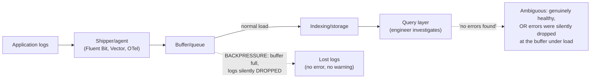
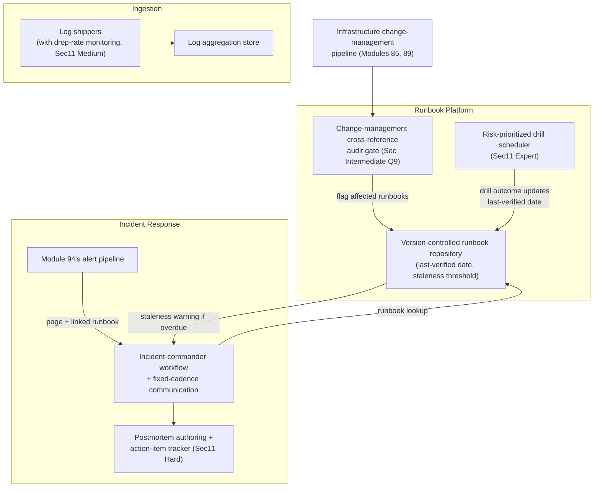

# Module 95 — Observability: Log Aggregation, Structured Logging & Incident-Response Practice — Runbooks & Postmortems

> Domain: Observability | Level: Beginner → Expert | Prerequisite: [[01-ObservabilityFundamentals-MetricsLogsTraces-OpenTelemetry]] §2.4 (structured logging and trace/log correlation basics established there, extended here to organization-wide aggregation at scale), [[02-SLOs-SLIs-ErrorBudgets-AlertingDesign]] (an alert firing correctly, per Module 94, is precisely the event that triggers the human incident-response process this module examines — a correct alert with no functioning response process behind it delivers no real value)

---

## 1. Fundamentals

**What**: **Log aggregation** is the practice of centralizing structured logs from every service and host into one searchable, indexed store, so an engineer investigating an incident can query across the entire system rather than manually inspecting individual hosts/containers one at a time. **Incident-response practice** is the human and procedural discipline — severity classification, a designated incident commander, communication protocols, and **runbooks** (documented, step-by-step remediation procedures) — that converts a correctly-fired alert (Module 94) into an actual, timely resolution. **Blameless postmortems** are the structured retrospective process that converts a resolved incident into a durable, systemic fix, rather than merely restoring service and moving on.

**Why it exists**: At any meaningful scale, logs scattered per-host are operationally useless during a real incident — an engineer cannot practically SSH into hundreds of ephemeral, auto-scaled, or already-terminated containers to piece together what happened, and container/host churn (Module 73's ephemeral pod lifecycle) means the specific host that logged the relevant error may no longer even exist by the time anyone looks. Centralized log aggregation exists to make an incident's full, cross-service story queryable from one place, regardless of which specific, possibly-already-gone host or container originally produced it. Runbooks and a structured incident-response process exist because Module 94 established that a correctly-firing alert is necessary but not sufficient — the alert only starts the clock; what happens in the following minutes (how fast a human understands the problem, follows a correct procedure, and communicates status) determines the incident's actual customer-facing duration and severity, and an undisciplined, ad hoc response to a genuinely severe incident predictably takes far longer and goes far worse than a practiced, structured one.

**When it matters**: From the moment more than a handful of hosts or services exist (making per-host manual log inspection impractical) and from the moment an on-call rotation exists at all — an incident-response process has no value until there is, in fact, an incident to respond to, but by then it is far too late to design it from scratch.

**How (30,000-ft view)**:
```
Log aggregation pipeline: shipper/agent (per host/container) -> buffer/queue
    (absorbs backpressure, Sec2.1) -> indexing/storage -> query layer --
    a shipper silently dropping logs under backpressure produces a
    FALSE NEGATIVE (a query returns "no errors" when errors genuinely
    occurred but never reached the index) with no visible warning
Structured logging: consistent schema + PII/sensitive-data redaction applied
    AT THE POINT OF EMISSION, not after ingestion -- redacting post-ingestion
    means the sensitive data already transited and was stored, however briefly
Incident response: severity classification -> incident commander assigned ->
    runbook followed -> status communicated on a fixed cadence -> resolved
Postmortem: blameless, timeline-based retrospective converting "we fixed it"
    into "here is the SYSTEMIC fix preventing recurrence" -- the actual
    mechanism by which an incident makes the organization more resilient
Runbook staleness (THIS module's central risk): a runbook is a declared
    procedure -- like a rollback plan (Module 92) or a reproducibility claim
    (Module 91), it is UNVERIFIED until actually, periodically REHEARSED,
    not merely read for plausibility
```

---

## 2. Deep Dive

### 2.1 Log Aggregation Architecture — Shippers, Buffering, Indexing, and the Backpressure Risk
A log-aggregation pipeline has four stages: a **shipper/agent** (Fluentd, Fluent Bit, Vector, or an OTel Collector's log-receiver capability per Module 93 §2.2) running alongside each service, tailing its log output and forwarding it onward; a **buffer/queue** absorbing transient spikes and backend slowness so a momentary downstream outage doesn't directly block application request-handling; an **indexing/storage** layer (Elasticsearch, Loki, or an equivalent log-search-optimized store per Module 93 §12) making logs queryable by field and time range; and a **query layer** engineers actually interact with during an investigation. The critical, easy-to-overlook risk lives in the buffer stage: when a shipper's buffer fills faster than the downstream indexing layer can absorb (a genuine backend slowdown, or simply a sudden volume spike during the exact incident an engineer most needs logs for), the shipper must apply **backpressure** — and depending on its specific configuration, this can mean *silently dropping* logs past the buffer's capacity rather than blocking or erroring visibly. A query that returns "no errors found" during an active investigation is consistent with two entirely different realities: genuinely no errors occurred, or errors occurred but were silently dropped at the shipper under exactly the load spike the incident itself was producing — a false negative with no distinguishing signal, structurally identical to Module 93 §4's trace-fragmentation and Module 94 §4's alert-silence findings, now recurring specifically at the log-ingestion layer.

### 2.2 Structured Logging Discipline and PII Redaction at the Point of Emission
Module 93 §2.4 established structured (field-queryable) logging with automatic trace/span-ID correlation as foundational; at organization scale, this requires a **consistent schema** enforced across every service (common field names for severity, service name, and correlation IDs), since a log-aggregation query spanning multiple services is only as useful as the fields being genuinely comparable across them — a service using `svc_name` while another uses `service` breaks any cross-service query relying on that field. Equally critical: **sensitive-data redaction must happen at the point of emission**, inside the application code producing the log, not as a downstream filtering step applied after ingestion — redacting after ingestion means the sensitive data has already transited the network and been written, however briefly, to intermediate storage, a real exposure window regardless of how quickly a downstream filter subsequently scrubs it. This is the identical "the fix must happen at the point of origin, not downstream" principle Module 81 §2.1 established for build-time secret leakage into container layers, recurring here for logs specifically.

### 2.3 Log Volume and Cost Control at Scale — Sampling, Dynamic Levels, and Retention
Just as Module 93 §2.3 established metrics cardinality as a multiplicative cost driver, log volume at scale is a direct, often dominant cost driver for the aggregation pipeline itself — "log everything, always, at maximum verbosity" is not a free default at any meaningful request volume. The standard mitigations: **dynamic log-level control** (the ability to temporarily raise a specific service's log verbosity from `Info` to `Debug` at runtime, without a redeploy, precisely when investigating a specific incident, then lower it again afterward); **debug-log sampling** (retaining only a statistically representative fraction of high-volume, low-value debug-level logs rather than every single one, while never sampling error-level logs, which are comparatively rare and disproportionately valuable); and a **tiered retention policy** distinguishing routine operational logs (a short, rolling retention window) from logs specifically flagged as incident-relevant or compliance-relevant (a longer, deliberately extended retention window) — directly reapplying Module 91 §2.6's three-constraint retention model (age, reference/investigative value, compliance) to logs instead of build artifacts.

### 2.4 Incident Response Process — Severity, Incident Commander, and Communication Discipline
A mature incident-response process defines, in advance (never improvised mid-incident): **severity levels** (e.g., SEV-1 for a full, customer-facing outage down to SEV-4 for a minor, contained issue), each with a corresponding expected response urgency and communication cadence; an **incident commander (IC)** role, a single designated person coordinating the response (assigning investigation tasks, managing communication, deciding when to escalate) — explicitly *not* necessarily the engineer with the deepest technical knowledge of the failing system, since the IC's job is coordination and decision-making under uncertainty, a distinct skill from deep technical debugging, and conflating the two roles under time pressure is a common, costly mistake; and a **fixed-cadence communication protocol** (a status update posted to a defined channel every N minutes regardless of whether there's genuinely new information, since silence during an ongoing incident is itself corrosive to stakeholder trust, independent of the incident's actual technical progress).

### 2.5 Blameless Postmortems — Converting an Incident into a Systemic Fix
A postmortem's actual value lies in producing **durable, systemic action items** (a specific code change, a new automated check, a new runbook step) that prevent the *same class* of failure from recurring — not merely documenting a timeline of what happened for historical record. **Blamelessness** is a structural, not merely cultural, requirement: a postmortem culture that attributes failure to individual error (rather than to the systemic conditions — a stale runbook, a missing automated safeguard, insufficient alerting per Module 94 — that allowed a human's ordinary, reasonable mistake to produce a severe outcome) predictably suppresses the honest, detailed incident reporting the entire practice depends on, since anyone whose honest account might implicate themselves has a direct incentive to omit or soften exactly the details a genuinely useful postmortem most needs. This is the human-process analog of Module 92 §4's finding that friction (here, blame) predictably drives people away from full compliance (here, honest reporting) with a declared process.

### 2.6 Runbook Staleness — the "Declared Procedure ≠ Verified Procedure" Risk
A runbook is a declared, written claim: "following these exact steps resolves this specific class of incident." Like Module 91's reproducibility claim, Module 92's rollback capability, Module 93's trace-coverage completeness, and Module 94's alert liveness, this claim is **unverified until actually, periodically exercised** — a runbook that reads as plausible and has never been wrong (because it has also never actually been executed since it was written) provides zero evidence it still works, especially in an environment where the specific tools, infrastructure, or commands it references can silently drift out of date via an entirely unrelated change (a platform migration, a CLI tool upgrade) made by a different team with no reason to think to check whether any runbook references the thing they just changed. This is this module's central production incident (§4): a runbook followed *exactly as written*, by a competent engineer, during a genuine incident — producing a worse outcome than the incident alone would have, specifically because the written procedure had silently gone stale and no one had rehearsed it since.

---

## 3. Visual Architecture

### Log Aggregation Pipeline — Where Backpressure Silently Drops Data (§2.1)


### Incident Response Roles and Severity-Driven Cadence (§2.4)
```
SEV-1 (full outage):    IC assigned within minutes; status update every 15 min;
                        all-hands investigation authorized
SEV-2 (major, partial): IC assigned; status update every 30-60 min
SEV-3/4 (minor/contained): owning team handles; async updates, no dedicated IC
```

### Runbook Drill Verification Loop (§2.6, §4)
```
Runbook written/updated  -->  DECLARED procedure ("this resolves incident type X")
        |
        v
   Scheduled, periodic DRILL: execute the runbook's EXACT steps in a safe,
   non-production-impacting environment (staging, game day)
        |
        v
   Drill succeeds?  --YES-->  Runbook CONFIRMED current; "last verified" date updated
        |
        NO
        v
   Runbook flagged STALE immediately -- fixed and re-drilled BEFORE next
   reliance, rather than discovered stale for the first time during a
   genuine, time-pressured incident (Sec4's exact failure mode without this loop)
```

---

## 4. Production Example

**Scenario**: A SaaS platform's primary database experienced a failure requiring failover to its standby replica — a documented, previously-reliable procedure the organization's runbook library specified in exact, step-by-step detail, including the specific CLI tool and command-line flags to invoke the failover. The on-call engineer, encountering this exact incident type for the first time in their tenure, opened the runbook and followed it precisely, step by step, exactly as written.

**Investigation**: The failover did not complete as expected — the specific CLI tool the runbook referenced had been replaced eight months earlier as part of an unrelated infrastructure-platform migration (a newer orchestration tool with a different command structure and, critically, a flag that had changed meaning between the old and new tool rather than merely being renamed or removed). The runbook's exact literal command, run against the new tool, was *syntactically accepted* — the new tool didn't reject it as invalid — but the changed flag's new meaning caused the command to target the wrong replica entirely, promoting an out-of-date, lagging standby rather than the intended, current one. The engineer, trusting the documented procedure precisely because it was documented, had no reason to suspect its exact steps might no longer apply, and continued significantly further into the incident before the mismatch was discovered — by which point the outage had extended well beyond what a correct failover would have taken, and the promoted replica's data lag introduced a secondary data-consistency cleanup effort on top of the original outage.

**Root cause**: The runbook had not been executed — not even in a drill, staging rehearsal, or game-day exercise — since before the platform migration that changed the underlying CLI tool eight months prior. The migration's own change-management process (a mirror of Module 94 §Advanced Q1's metric-rename-audit gap) never included a step auditing which runbooks referenced the tool being replaced, since runbooks lived in a separate documentation system the migrating team had no visibility into or reason to check. The runbook, from the outside, looked exactly as trustworthy as it always had — nothing about its presence or its prose readability changed when it silently went stale; the gap was invisible until the one specific event (a genuine failover, executed literally, for the first time since the underlying tooling changed) that actually tested it.

**Fix**: (1) Established a mandatory, scheduled **runbook-drill program** — every critical, SEV-1/SEV-2-relevant runbook is actually executed, step by step, in a safe, non-production-impacting environment (a staging replica, a dedicated game-day exercise) on a recurring cadence, with any deviation from the expected outcome immediately flagging the runbook stale and blocking its "verified current" status until corrected and re-drilled. (2) Extended the organization's infrastructure change-management process to require an explicit, automated cross-reference audit — any tool, command, or system a migration replaces or modifies must be checked against every runbook referencing it, directly mirroring Module 94 §Advanced Q1's alert-rule audit gate applied to runbooks specifically. (3) Added an explicit **"last verified" date and owning-team field** to every runbook, with a runbook exceeding its staleness threshold displaying a prominent warning during an actual incident rather than presenting identically to a recently-verified one — converting an invisible staleness risk into a visible, actionable signal at exactly the moment it matters most.

**Lesson**: A runbook — like a rollback procedure (Module 92 §2.4), a build's reproducibility (Module 91 §2.3), a trace's propagation coverage (Module 93 §4), and an alert's liveness (Module 94 §4) — is a declared capability that silently decays absent active, periodic verification, and every one of this course's prior instances of that pattern generalizes here with a specifically elevated stakes profile: a runbook is executed by a human, under genuine time pressure, during an actual crisis, trusting the document precisely *because* it is documented — meaning a stale runbook doesn't merely fail to help, it can actively make an incident meaningfully worse, and the engineer following it has structurally no way to detect the staleness themselves in the moment, since nothing about the runbook's own presentation changes when the world underneath it has quietly shifted.

---

## 5. Best Practices
- Design log shippers' backpressure behavior explicitly, and monitor the shipper/buffer's own health and drop rate as a first-class signal — never assume "no errors in the aggregated logs" is equivalent to "no errors occurred" without ruling out silent ingestion-layer drops (§2.1, Module 93 §14's identical meta-observability principle).
- Redact sensitive data at the point of log emission, inside application code, never as a downstream, post-ingestion filtering step (§2.2).
- Apply dynamic log-level control and tiered retention (Module 91 §2.6's three-constraint model, reapplied to logs) rather than treating "log everything, forever, at maximum verbosity" as a free default (§2.3).
- Define severity levels, the incident-commander role, and a fixed communication cadence in advance of any actual incident — never improvise incident-response structure mid-crisis (§2.4).
- Run postmortems as blameless, systemic-fix-producing exercises — a culture that attributes failure to individual error predictably suppresses the honest reporting the practice depends on (§2.5).
- Periodically, actually drill every critical runbook in a safe environment, and tie infrastructure change-management to an explicit cross-reference audit against every runbook referencing the changed system — never assume a runbook remains accurate because it reads plausibly and has never yet been proven wrong (§2.6, §4).

## 6. Anti-patterns
- Treating a log-aggregation query returning "no errors" as proof no errors occurred, without ruling out silent, backpressure-driven drops at the shipper layer (§2.1, §4).
- Filtering or redacting sensitive data only after ingestion, leaving a real (if brief) exposure window during transit and initial storage (§2.2).
- Uniform, maximum-verbosity logging with no dynamic level control or tiered retention, driving unnecessary aggregation-pipeline cost with no corresponding investigative benefit (§2.3).
- Assigning the incident-commander role to whoever has the deepest technical knowledge of the failing system by default, conflating coordination/communication with deep technical debugging as if they were the same skill (§2.4).
- A postmortem culture that names or implicitly blames an individual, suppressing the honest, detailed reporting the entire practice depends on (§2.5).
- A runbook that has never been drilled since it was written, trusted as current during a genuine incident with no verification that the tools/commands it references still behave as documented (§2.6, §4).

---

## 10. Interview Questions

### Basic (10)

1. **Q: What is log aggregation, and why does it matter at scale?**
   **A:** Centralizing structured logs from every service/host into one searchable, indexed store, mattering because per-host manual log inspection becomes impractical past a modest scale — especially with ephemeral, auto-scaled hosts/containers that may no longer exist by the time an investigation happens.
   **Why correct:** States both the mechanism and the specific scaling/ephemerality reason manual per-host inspection fails.
   **Common mistakes:** Assuming log aggregation is purely a convenience feature rather than a genuine operational necessity once host count and churn exceed what manual inspection can handle.
   **Follow-ups:** "What happens to a host's local logs if that specific container terminates before an engineer investigates?" (Without aggregation, those logs may be entirely lost once the ephemeral container is torn down — aggregation's shipper forwards them onward before that happens.)

2. **Q: What is a log shipper's "backpressure," and what's the risk if it's misconfigured?**
   **A:** Backpressure is how a shipper handles logs arriving faster than its downstream buffer/backend can absorb. If misconfigured to silently drop logs past capacity (rather than block or visibly error), a query during an incident can return "no errors found" when errors genuinely occurred but were dropped before reaching the index.
   **Why correct:** States the mechanism and the specific false-negative risk this creates during exactly the high-load conditions an incident investigation most needs logs for.
   **Common mistakes:** Assuming a log query's "no results" always means "genuinely nothing happened," without considering the ingestion pipeline itself might have silently dropped data under load.
   **Follow-ups:** "How would you detect this specific failure mode?" (Monitor the shipper/buffer's own drop-rate metric as a first-class signal — Module 93 §14's meta-observability principle, applied to log ingestion specifically.)

3. **Q: Why should PII/sensitive-data redaction happen at the point of log emission rather than as a downstream filter?**
   **A:** Redacting downstream means the sensitive data has already transited the network and been written, however briefly, to intermediate storage — a real exposure window regardless of how quickly a downstream filter later scrubs it.
   **Why correct:** States the specific exposure-window risk redacting-at-source eliminates that downstream filtering cannot.
   **Common mistakes:** Assuming a downstream redaction filter provides equivalent protection to redacting at the source, without considering the data was still transmitted and stored, even briefly, before the filter applied.
   **Follow-ups:** "What's a concrete technique for redacting at the point of emission?" (A structured-logging library's field-level redaction/masking configuration applied before the log entry is ever serialized or transmitted, so the sensitive value never leaves the process in the first place.)

4. **Q: What is the role of an incident commander, and why shouldn't it default to whoever has the deepest technical knowledge of the failing system?**
   **A:** The incident commander coordinates the response — assigning tasks, managing communication, deciding on escalation — a distinct skill from deep technical debugging. Conflating the two roles risks the most technically knowledgeable person being pulled away from hands-on debugging to handle coordination, or coordination being neglected while that person focuses on technical investigation.
   **Why correct:** States the IC's actual job (coordination, not deep technical debugging) and the specific risk of conflating it with technical expertise.
   **Common mistakes:** Assuming the most senior or most technically knowledgeable engineer is automatically the best-suited incident commander, without considering that coordination and deep debugging are competing demands on that person's attention during a live incident.
   **Follow-ups:** "What happens if no one is explicitly assigned the IC role during a SEV-1 incident?" (Coordination and communication responsibility diffuses across whoever happens to be present, commonly resulting in duplicated effort, unclear ownership of specific investigation threads, and inconsistent or absent status communication to stakeholders.)

5. **Q: What does "blameless" mean in the context of a postmortem, and why does it matter structurally, not just culturally?**
   **A:** Blameless means attributing failure to systemic conditions (a stale runbook, insufficient automated safeguards) rather than individual error. It matters structurally because a blame-oriented culture gives anyone whose honest account might implicate themselves a direct incentive to omit or soften exactly the details a useful postmortem most needs.
   **Why correct:** States both the definition and the specific incentive-structure mechanism (self-protective omission) that makes blamelessness a structural requirement, not merely a nice cultural preference.
   **Common mistakes:** Treating blamelessness as simply "being nice" rather than recognizing it as a structural precondition for the honest, detailed reporting the entire postmortem practice depends on.
   **Follow-ups:** "What's the risk of a postmortem that identifies 'human error' as the root cause without further investigation?" (It typically stops the investigation too early — human error is rarely the full story; the more useful question is what systemic condition (missing safeguard, unclear documentation, alert fatigue) allowed an ordinary, reasonable human mistake to produce a severe outcome.)

6. **Q: What is a runbook, and why is "it reads as plausible and has never been wrong" not sufficient evidence that it's still accurate?**
   **A:** A runbook is a documented, step-by-step remediation procedure. "Never been wrong" only means it hasn't been *executed* since being proven correct — if it's never been re-executed (drilled) since some underlying tool or system it references changed, its apparent plausibility provides no evidence about whether it would still actually work.
   **Why correct:** Distinguishes "has never failed" (which requires having actually been tested) from "has never been tested since a relevant change occurred" (which provides zero evidence either way).
   **Common mistakes:** Treating a runbook's continued existence and plausible-sounding content as equivalent to active verification that it still produces the correct outcome.
   **Follow-ups:** "How would you verify a runbook is still accurate, rather than merely plausible?" (A scheduled drill — actually executing its exact steps in a safe, non-production environment and confirming it produces the intended outcome.)

7. **Q: What is the difference between a routine operational log retention policy and a compliance-driven retention requirement?**
   **A:** Routine operational logs are typically retained for a short, rolling window based on ongoing investigative value; compliance-driven retention applies to logs specifically subject to a regulatory requirement, retained for a defined, often much longer period regardless of whether anything currently references them operationally.
   **Why correct:** Distinguishes the two retention rationales (investigative value vs. regulatory obligation) directly, reapplying Module 91 §2.6's three-constraint model to logs.
   **Common mistakes:** Applying a single, uniform retention period to all logs regardless of whether a specific log category carries compliance obligations independent of its ordinary operational value.
   **Follow-ups:** "Should a compliance-relevant log's retention period be shortened if it turns out to be embarrassing or reveal a past mistake?" (No — shortening retention specifically for records that might reveal a past issue undermines exactly the evidentiary/audit value compliance retention exists to preserve, directly Module 92 §Advanced Q9's identical finding for emergency-path audit logs.)

8. **Q: What is dynamic log-level control, and why is it valuable during an active incident specifically?**
   **A:** The ability to temporarily raise a service's log verbosity (e.g., from Info to Debug) at runtime, without a redeploy, then lower it again afterward. It's valuable during an incident because the extra diagnostic detail is often exactly what's needed to investigate a specific, currently-occurring problem, without permanently paying Debug-level logging's ongoing volume/cost tax.
   **Why correct:** States the mechanism and the specific incident-time value it provides without imposing a permanent cost.
   **Common mistakes:** Assuming a service must be redeployed with a code change to adjust its log verbosity, missing that dynamic, runtime-configurable log levels avoid this delay entirely during a time-sensitive investigation.
   **Follow-ups:** "What's the risk of leaving Debug-level logging enabled indefinitely after an incident is resolved?" (Unnecessary, ongoing log volume and aggregation-pipeline cost with no corresponding investigative benefit once the specific incident is over — directly §2.3's volume/cost-control concern.)

9. **Q: Why does a well-designed incident-response process define a fixed communication cadence (e.g., a status update every 15 minutes) regardless of whether there's new technical information?**
   **A:** Silence during an ongoing incident is itself corrosive to stakeholder trust and confidence, independent of the incident's actual technical progress — a fixed cadence ensures stakeholders always know the incident is being actively worked, even when the specific update is simply "still investigating, no new findings yet."
   **Why correct:** Identifies that communication cadence serves a trust/confidence function distinct from, and valuable independent of, the substance of any specific update.
   **Common mistakes:** Assuming communication should only happen when there's genuinely new technical information to report, missing the standalone value of a predictable, reassuring cadence even absent new findings.
   **Follow-ups:** "What would you say in a status update with genuinely no new findings?" (Explicitly state that investigation is ongoing, what's currently being checked, and when the next update will come — providing reassurance and predictability rather than remaining silent until something concrete is found.)

10. **Q: What is the difference between a postmortem's timeline (what happened, in order) and its action items (what will change), and why does a postmortem need both?**
    **A:** The timeline establishes a shared, factual understanding of the incident's actual sequence of events — necessary groundwork for accurate diagnosis. The action items are the durable, systemic changes (a code fix, a new automated check, a runbook update) that actually prevent recurrence. A postmortem with only a timeline documents history without improving anything; one with only action items risks being based on an incomplete or inaccurate understanding of what actually happened.
    **Why correct:** Explains why both components are necessary and what each specifically contributes toward the postmortem's actual purpose.
    **Common mistakes:** Treating a detailed, well-written timeline as the postmortem's primary deliverable, without ensuring it translates into concrete, tracked, systemic action items.
    **Follow-ups:** "How would you ensure action items actually get implemented, rather than being listed and forgotten?" (Track them with the same rigor as any other engineering work item — assigned an owner, a deadline, and follow-up visibility — rather than treating the postmortem document itself as the final deliverable.)

### Intermediate (10)

1. **Q: Why did §4's incident go undetected for eight months rather than being caught during the platform migration itself?**
   **A:** The migration's own change-management process had no step auditing which runbooks referenced the tool being replaced, since runbooks lived in a separate documentation system the migrating team had no visibility into or reason to check — and because the runbook wasn't executed again until the actual incident, there was no intervening signal (a failed drill, a failed dry run) that would have surfaced the staleness earlier.
   **Why correct:** Identifies both the specific process gap (no cross-reference audit during migration) and the absence of any intervening verification event that would have caught it sooner.
   **Common mistakes:** Assuming a more careful migration alone would have caught this, without recognizing that even a careful migration team has no natural visibility into a separate documentation system's runbook contents unless an explicit, cross-system audit step is built in.
   **Follow-ups:** "What would need to be true of the organization's documentation system for an automated cross-reference audit (§4's fix) to actually be feasible?" (Runbooks would need to reference tools/commands in a structured, parseable way — or at minimum be tagged with the specific systems/tools they depend on — rather than existing purely as unstructured prose, enabling an automated search for "which runbooks mention this tool" during any future migration.)

2. **Q: A team argues that since their runbook has been followed successfully several times in the past (before the migration), it must still be reliable. Evaluate this claim.**
   **A:** Past successful executions only provide evidence about the runbook's accuracy *as of those executions* — they say nothing about whether an intervening change (the platform migration) has since silently invalidated a specific step, since the runbook's own text and presentation give no indication of when it was last actually verified versus when it was merely last read. Past success is evidence bounded by time; it doesn't extend forward past any relevant, unverified change.
   **Why correct:** Explains why historical success doesn't imply current accuracy once an intervening change could have invalidated a specific dependency, directly connecting to this module's central staleness risk.
   **Common mistakes:** Treating a runbook's track record as durable, ongoing evidence of continued accuracy, without considering that any specific execution's success is only informative about the state of the world at that specific point in time.
   **Follow-ups:** "What information would you want visible on the runbook to help an engineer judge its current trustworthiness during a live incident?" (An explicit "last verified/drilled" date and the specific systems/tool versions it was last confirmed against — §4's third fix — letting an engineer immediately recognize if a relevant migration has occurred since that date, rather than trusting the document's mere presence.)

3. **Q: How does §4's runbook-staleness incident differ structurally from Module 94's alert-liveness incident, despite both being "a declared capability silently decayed" findings?**
   **A:** Module 94's incident concerned a fully automated system (an alert rule's query silently breaking) with no human judgment involved in the moment of failure — the alert simply didn't fire, full stop. This module's incident involves a human actively, competently *executing* a procedure exactly as instructed, with the failure occurring specifically because the human trusted the (silently stale) instructions rather than because any automated check failed to fire. This means the fix categories differ: Module 94's fix is purely technical (stale-data detection, an automated canary); this module's fix must additionally include a genuinely *human* verification practice (an actual rehearsal/drill, since no automated check can substitute for confirming a human-followed procedure produces the correct real-world outcome when actually executed).
   **Why correct:** Distinguishes a purely automated failure (no human judgment in the loop) from a human-executed-procedure failure (where the human's trust in stale documentation is itself part of the failure mechanism), explaining why the fix categories differ.
   **Common mistakes:** Treating both incidents as requiring an identical remediation approach, missing that a human-executed procedure's verification requires an actual rehearsal exercise, not merely an automated technical check analogous to Module 94's canary.
   **Follow-ups:** "Could an automated check partially substitute for a full human drill here?" (Partially — an automated check could verify that a runbook's referenced CLI commands are still syntactically valid against current tooling, catching some staleness; but it couldn't verify the *semantic* correctness of the full procedure's real-world outcome, which requires an actual human-executed rehearsal to confirm.)

4. **Q: Why might "the postmortem identified a clear root cause and listed action items" still not be sufficient to prevent a similar incident from recurring?**
   **A:** A postmortem's value depends entirely on its action items actually being implemented, not merely identified and documented — a postmortem that correctly diagnoses a root cause but whose action items are never tracked to completion (no assigned owner, no deadline, no follow-up) provides the *appearance* of a systemic fix without the actual, durable change, precisely mirroring this course's now-familiar "declared fix ≠ actually-implemented fix" gap recurring in the postmortem process itself.
   **Why correct:** Identifies the specific gap (identified action items ≠ implemented action items) that can undermine an otherwise well-run postmortem process.
   **Common mistakes:** Assuming a well-written postmortem document, by itself, constitutes the systemic fix, without verifying its action items were actually tracked to completion.
   **Follow-ups:** "How would you audit whether an organization's postmortem action items are actually being completed, at scale, across many postmortems?" (Track action items in the same system used for regular engineering work (a ticket tracker), with a periodic review specifically auditing completion rate across recent postmortems — treating "postmortem action-item completion rate" as its own first-class organizational health metric.)

5. **Q: Why is "no errors found in the aggregated logs" during an active incident investigation not, by itself, sufficient evidence that the failing component didn't log an error?**
   **A:** Per §2.1, the log-aggregation pipeline's own shipper/buffer could have silently dropped logs under the backpressure exactly an active incident's load spike would produce — meaning "no errors found" is consistent with both "genuinely no error was logged" and "an error was logged but never reached the searchable index," and distinguishing these requires checking the shipper's own drop-rate/health metrics specifically, not merely trusting the query's absence-of-results.
   **Why correct:** Directly applies §2.1's backpressure-drop risk to the specific investigative scenario, explaining the exact ambiguity a "no results" log query carries during an incident.
   **Common mistakes:** Treating an aggregated-log query's empty result as conclusive evidence of "no error occurred," without considering the possibility that the aggregation pipeline itself silently failed to ingest the relevant log under load.
   **Follow-ups:** "What would you check first if you suspected the log pipeline itself might be the gap, rather than a genuine absence of errors?" (The shipper/buffer's own ingestion-rate and drop-rate metrics — Module 93 §14's meta-observability principle, applied here to confirm the log pipeline itself was functioning normally during the specific time window in question.)

6. **Q: How should an organization decide which runbooks warrant the investment of a mandatory, periodic drill program (§4's fix), given that drilling every single documented procedure for every possible incident type isn't practical?**
   **A:** Prioritize by the intersection of (a) severity — runbooks specifically relevant to SEV-1/SEV-2-class incidents, where a stale procedure's consequences are most severe, and (b) execution frequency — a runbook exercised often in genuine practice (e.g., a routine restart procedure) naturally, continuously re-verifies itself through ordinary use, while a runbook for a genuinely rare event (a full database failover, exercised perhaps once every year or two in reality) is precisely the category most likely to silently go stale between real executions, since nothing about ordinary operations would ever exercise it — making rare-but-severe runbooks the highest-priority drill candidates, exactly matching §4's incident profile.
   **Why correct:** Proposes a concrete, risk-based prioritization (severity × rarity of natural exercise) rather than either drilling everything (impractical) or drilling nothing (recreates §4's exact risk).
   **Common mistakes:** Assuming frequently-executed runbooks need the same drilling priority as rare ones, missing that frequent real-world execution already provides an ongoing, natural verification signal that a rarely-executed runbook structurally lacks.
   **Follow-ups:** "How would you handle a runbook that's both high-severity and only very rarely, but does occasionally, get executed for real?" (Still schedule periodic drills, but at a lower frequency than for a truly-never-executed procedure, using the rare real executions themselves as a partial, opportunistic verification signal that supplements — but doesn't fully substitute for — the scheduled drill cadence.)

7. **Q: Why might redacting PII downstream (after ingestion) seem like an adequate solution during a proof-of-concept but fail as an organization scales, beyond the exposure-window concern in §2.2?**
   **A:** At small scale, a downstream redaction filter might genuinely catch every known-sensitive field pattern correctly, giving a false sense that the approach is sufficient. As the organization scales — more services, more engineers adding new log fields independently — the downstream filter's pattern-matching rules must be continuously, manually updated to cover every new field any team might introduce; a new, unanticipated sensitive field an engineer adds without knowing to update the central redaction filter's rules will pass through completely unredacted, since the filter only catches patterns it was explicitly configured to recognize. Redaction at the point of emission, using a structured logging library's field-level annotation, scales because each team explicitly marks its own sensitive fields at the source, rather than relying on a central team's downstream filter staying perfectly current with every other team's evolving log schema.
   **Why correct:** Identifies the specific scaling failure mode (a central downstream filter's rules falling behind independently-evolving per-team log schemas) that source-level redaction avoids by design.
   **Common mistakes:** Assuming a downstream redaction filter, once configured correctly, remains sufficient indefinitely, without considering that new sensitive fields introduced by any team anywhere in a growing organization require the filter to be continuously, manually kept current.
   **Follow-ups:** "How would you enforce that every team actually marks their sensitive fields at the source, rather than relying on individual diligence?" (A structured-logging library default that requires explicit opt-in for any field to be logged unredacted (a "redact by default, allow-list to expose" posture) rather than the reverse, shifting the burden of a missed classification toward the safer failure mode.)

8. **Q: How does the incident-commander role's separation from deep technical debugging (§2.4) relate to this course's broader theme of distinguishing coordination/governance concerns from technical-correctness concerns?**
   **A:** This directly parallels Module 92's distinction between a promotion orchestrator's coordination logic (sequencing, gating, auditing) and a deployment strategy's technical execution (the actual canary/blue-green mechanics) — in both cases, conflating a coordination role with a technical-execution role under time pressure degrades both: the IC role requires sustained attention to communication and decision-making that competes directly with deep technical focus, exactly as an orchestrator's audit-logging and gating logic (Module 92 §13) is deliberately kept separate from any specific deployment strategy's execution details, allowing each concern to be handled well by whichever role/component is actually suited to it.
   **Why correct:** Correctly identifies the underlying, generalizable principle (separating coordination from execution) and connects it explicitly to an already-established course pattern from a different domain.
   **Common mistakes:** Treating the IC/technical-debugging distinction as a domain-specific incident-response quirk, rather than recognizing it as a specific instance of a more general coordination/execution separation principle this course has applied elsewhere.
   **Follow-ups:** "What's the risk of NOT separating these roles during a genuinely severe, multi-hour incident specifically?" (The person handling both roles experiences a sustained, compounding cognitive/attention split between deep technical investigation and ongoing stakeholder communication/coordination, degrading both — a risk that grows specifically with incident duration, since a very short incident might tolerably absorb this conflation while a multi-hour one cannot.)

9. **Q: Design a lightweight, ongoing signal (short of a full periodic drill program) that would give an organization partial, continuous confidence that its runbooks remain reasonably current, between full scheduled drills.**
   **A:** Tie runbook currency checks into the *same* change-management audit gate proposed for alert rules (Module 94 §Advanced Q1/§7) — any infrastructure or tooling change goes through an automated, structured search across the runbook documentation system for references to the specific tool/command/system being changed, flagging any match for manual review before the change is considered complete. This doesn't fully substitute for an actual, periodic drill (it can't verify semantic correctness, only reference presence), but it closes the *specific* triggering mechanism §4's incident actually exhibited (an unrelated migration silently invalidating a runbook step) far more cheaply and continuously than a full drill program alone, complementing rather than replacing the periodic drill cadence.
   **Why correct:** Proposes a concrete, cheaper, continuously-running complement to full drills, correctly scoped to what it can and cannot verify (reference presence vs. semantic correctness).
   **Common mistakes:** Proposing this lightweight check as a full substitute for periodic drilling, without recognizing it can only catch "a runbook mentions something that changed," not "a runbook's full procedure still produces the correct real-world outcome" — a semantic gap only an actual rehearsal can close.
   **Follow-ups:** "Why is a reference-audit-only approach, without any periodic drill at all, still insufficient?" (A runbook's staleness can arise from causes an automated reference-audit wouldn't catch at all — e.g., an underlying system's behavior changing in a way that doesn't involve any renamed tool or command reference, but genuinely produces a different outcome than the runbook's authors originally observed and documented.)

10. **Q: How does this module's central finding (§4) extend the "declared/present ≠ actual/complete" theme this course has now established across Modules 91-94, and what is specifically new about its instance compared to those four prior findings?**
    **A:** Modules 91 (reproducibility), 92 (promotion gates), 93 (trace coverage), and 94 (alert liveness) each concerned a declared *technical* capability silently decaying without a human directly, actively involved in the moment the gap actually mattered. This module's instance is genuinely distinct: the failure occurs precisely *through* a human's correct, diligent action (following the documented procedure exactly as written) rather than despite the absence of one — meaning the fix cannot be purely technical/automated (as in all four prior instances) but must additionally include a genuine, periodic human-rehearsal practice, since no automated check can fully verify that a human-executed, real-world procedure still produces its intended outcome. This establishes that the "verify the verifier" principle generalizes not only across technical layers (coverage, gating, alerting) but into the human-procedural layer as well — and that the verification mechanism itself must correspondingly shift from purely automated (a canary, a liveness check) to explicitly requiring genuine human rehearsal once the capability in question is itself human-executed.
    **Why correct:** Precisely distinguishes this module's instance from the four purely-technical prior instances by identifying that the failure mechanism runs *through* correct human diligence rather than around an automated gap, and explains why this specifically requires the verification mechanism itself to become a human rehearsal practice rather than a purely automated check.
    **Common mistakes:** Treating this module's finding as merely "another instance of the same pattern" without identifying the specific, load-bearing distinction (human-executed procedure vs. purely automated capability) that determines why the appropriate verification mechanism must itself change in kind, not merely in target.
    **Follow-ups:** "What other human-executed, rarely-exercised organizational procedures, beyond runbooks, might carry this identical risk, by the same reasoning?" (A disaster-recovery failover plan, a security incident-response/break-glass procedure, an on-call handoff checklist — each shares this module's specific character of a human-followed procedure whose correctness depends on an unverified, potentially-stale assumption about the current state of the systems it references.)

### Advanced (10)

1. **Q: Diagnose §4's incident from first principles and design the complete structural fix — not merely the three specific remediations already described.**
   **A:** Root causes (two, independent): (1) the platform migration's change-management process had no visibility into, or cross-reference audit against, the separate documentation system holding runbooks — an organizational/process blind spot, not a technical one; (2) no periodic drill program existed to independently, continuously re-verify runbook currency regardless of whether any specific triggering migration was ever cross-referenced correctly. Complete structural fix: (1) an automated cross-reference audit gate tied to infrastructure change-management, searching runbook documentation for references to any tool/system being modified (§Intermediate Q9's lightweight, continuous signal); (2) a mandatory, risk-prioritized (severity × rarity of natural exercise, §Intermediate Q6) periodic drill program providing the deeper, semantic verification the reference-audit alone cannot; (3) an explicit "last verified" date and staleness-warning display on every runbook, surfacing the specific risk visibly at the exact moment (a live incident) it matters most, rather than presenting a stale runbook identically to a recently-verified one; (4) proactively auditing every *other* rarely-executed, high-severity runbook in the organization for the identical staleness risk, since one confirmed instance strongly suggests the same gap (no drill since a relevant, unrelated change) plausibly exists elsewhere.
   **Why correct:** Addresses both independent root causes (process blind spot, absent drill program) with the specific, already-refined fixes from earlier in this module, and extends the investigation proactively per this course's now-established pattern of searching for the same gap recurring elsewhere.
   **Common mistakes:** Fixing only the specific runbook and specific migration involved in the incident, without also establishing the general drill program and change-management audit gate that would catch the identical failure mode recurring via a different tool change or a different runbook.
   **Follow-ups:** "How would you sequence these fixes given limited immediate capacity?" (The staleness-warning display first, as a cheap, immediately protective signal even before the deeper process fixes are built; the change-management audit gate second, since it directly closes this specific incident's triggering mechanism; the full periodic drill program third, as the higher-effort but most thorough, semantically-complete verification; the org-wide proactive audit last, as an important but slightly lower-urgency structural investment.)

2. **Q: A Principal Engineer is asked whether the organization should mandate a full, live, unannounced "chaos-engineering-style" production failover drill (executing the actual runbook against actual production, with no advance warning to the on-call team) as the most rigorous possible way to verify runbook currency. Evaluate this proposal.**
   **A:** An unannounced, live-production drill provides the most rigorous possible verification (genuinely testing the real system under real conditions, with no advance preparation masking a real gap) — but it directly risks *causing* a genuine, real-user-impacting incident if the runbook (or the underlying system) turns out to actually be broken, precisely the failure mode the drill exists to detect, now occurring against production rather than a safe rehearsal environment. The more measured, standard practice — a scheduled, announced drill against a staging/replica environment closely mirroring production, or a carefully-scoped, genuinely low-blast-radius production exercise (e.g., a failover of a single, non-critical shard rather than the full production system) — provides most of the same verification value without this specific, unacceptable downside risk; a fully unannounced, full-blast-radius live-production drill is usually only justified for organizations with an unusually mature chaos-engineering practice and correspondingly robust safety mechanisms (automatic abort conditions, tightly bounded blast radius) already in place.
   **Why correct:** Correctly weighs the rigor benefit of live-production testing against its genuine risk of causing the exact failure it's meant to detect, and proposes the standard, more measured alternative that captures most of the verification value at substantially lower risk.
   **Common mistakes:** Assuming "more rigorous" (fully live, unannounced, full production) is unconditionally the better verification approach without weighing its real, potentially severe downside risk against a more measured alternative achieving similar confidence at much lower risk.
   **Follow-ups:** "Under what conditions would you consider recommending progression toward more aggressive, chaos-engineering-style production drills?" (Once the organization has demonstrated, via staging-based drills, sustained runbook accuracy over time, has automatic abort/rollback safety mechanisms proven reliable, and has deliberately, incrementally scoped blast radius (starting with the least-critical, most-isolated systems) rather than jumping directly to full-production, high-blast-radius exercises.)

3. **Q: How would you design an automated system that estimates a runbook's "staleness risk score" based on signals other than a simple elapsed-time-since-last-drill counter, to help prioritize a limited drilling budget across a large runbook library?**
   **A:** Combine multiple signals: (a) time since last successful drill or real execution (the baseline signal); (b) the number of infrastructure/tooling changes that have occurred to any system the runbook references since its last verification (a proxy for how much the underlying world has plausibly shifted, directly informed by §Intermediate Q9's change-management cross-reference data); (c) the runbook's associated incident severity tier (a higher-severity runbook's staleness carries proportionally higher risk); and (d) how many distinct engineers have actually executed or reviewed it recently (a runbook reviewed/touched by only one person, who may have left the team, carries additional institutional-knowledge risk beyond pure technical staleness). A weighted composite of these signals produces a more informative prioritization than elapsed time alone, directing limited drilling capacity toward the runbooks genuinely most likely to have silently drifted and where that drift would matter most.
   **Why correct:** Proposes a genuinely multi-signal model (not merely elapsed time) incorporating the specific mechanism (accumulated relevant infrastructure change) that actually drove §4's incident, plus severity-weighting and institutional-knowledge risk as additional, non-obvious but relevant factors.
   **Common mistakes:** Relying solely on elapsed time since last drill as the staleness proxy, missing that a runbook referencing a system that's changed heavily in that time carries meaningfully higher risk than one referencing an entirely stable system over the identical elapsed period.
   **Follow-ups:** "How would you validate that this composite scoring model is actually predictive, rather than merely plausible?" (Track, over time, whether runbooks flagged high-risk by the model are disproportionately the ones that actually fail when eventually drilled or genuinely executed — a form of the same "verify the verifier" discipline applied recursively to the staleness-scoring model itself.)

4. **Q: A postmortem for a severe incident produces a long list of 15 action items, of widely varying effort and impact. How would you, as a Principal Engineer, help the team prioritize which to actually commit to completing, given that attempting all 15 with equal urgency risks none of them getting done well?**
   **A:** Rank action items by the same risk-proportionate framework this course has applied repeatedly: prioritize items that directly close the *specific* mechanism that caused this incident (the highest-confidence, most directly-validated fixes) over more speculative, broadly-preventive items whose connection to this specific incident is looser; among items closing the direct mechanism, prioritize automatable/structural fixes (a change-management audit gate, a staleness-warning display) over purely process/training-based fixes (Module 88's now-repeated finding that a declared-but-unenforced process reliably underperforms a structural, automated one); and explicitly, visibly deprioritize (not silently drop) lower-priority items, documenting the reasoning so the decision is itself reviewable rather than simply appearing as scope quietly shrinking with no record of why.
   **Why correct:** Proposes a concrete prioritization framework (direct-mechanism relevance, then automatable-over-process fixes) and explicitly addresses the transparency requirement (documented, visible deprioritization) rather than silent scope-dropping.
   **Common mistakes:** Attempting to commit to all 15 items with nominally equal priority, predictably resulting in most receiving insufficient follow-through — or, conversely, silently letting lower-priority items quietly disappear from tracking with no documented decision or rationale.
   **Follow-ups:** "How would you handle a stakeholder who insists every action item must be completed, given the incident's severity?" (Present the prioritization reasoning explicitly — showing which items most directly address the confirmed root cause versus which are more speculative — and propose a committed timeline for the highest-priority subset with an explicit, scheduled follow-up review for the remainder, rather than either capitulating to an unrealistic all-15-at-once commitment or unilaterally dropping items without stakeholder visibility.)

5. **Q: How does the log-aggregation backpressure risk (§2.1) interact with an active incident specifically, in a way that could make the risk worse precisely when it matters most?**
   **A:** An active, severe incident is frequently accompanied by a genuine spike in log volume (elevated error rates producing correspondingly elevated error-log volume, retry storms generating additional log noise) — meaning the exact conditions most likely to trigger shipper backpressure and silent log-dropping (a sudden volume spike) are also the exact conditions under which an engineer most urgently needs complete, reliable log data to diagnose the problem. This is a structurally self-defeating risk: the observability signal is statistically more likely to degrade precisely when its reliability matters most, a genuinely adversarial correlation rather than an independent, unrelated coincidence.
   **Why correct:** Identifies the specific, non-coincidental correlation between incident conditions (elevated log volume) and the exact failure mode (backpressure-driven dropping) that most threatens investigative capability during that same incident.
   **Common mistakes:** Treating backpressure-driven log loss as an independent, rare risk unrelated to incident timing, without recognizing the two are structurally correlated — incidents themselves are a primary driver of the volume spikes that trigger backpressure.
   **Follow-ups:** "How would you design the log pipeline's capacity/buffering specifically to be resilient to this correlated risk?" (Provision buffer/backend capacity with meaningful headroom above typical peak volume specifically to absorb incident-driven spikes, and prioritize error/warning-level logs for guaranteed delivery over lower-priority debug/info-level logs when backpressure genuinely must apply — ensuring that if anything is dropped under load, it's the least investigatively valuable category first, not an undifferentiated drop across all log levels equally.)

6. **Q: Compare this module's runbook-staleness finding to a hypothetical scenario where a runbook is deliberately, knowingly left un-updated because "the underlying system hasn't changed since it was written" — is the latter scenario actually safe from this module's central risk?**
   **A:** Not necessarily — "the underlying system hasn't changed" is itself an unverified, assumed claim unless actively confirmed, and §4's incident specifically demonstrates that the *team maintaining the runbook* may have no visibility into changes made by an entirely different team (the platform-migration team) to a dependency the runbook relies on. A runbook's owning team believing "nothing relevant has changed" is exactly as unverified an assumption as any other declared-but-unconfirmed state this course has repeatedly examined, unless that belief is actively, continuously confirmed via the change-management cross-reference audit (§Intermediate Q9) rather than simply assumed by the runbook owner's own, necessarily incomplete visibility into the full organization's ongoing changes.
   **Why correct:** Identifies that "nothing has changed" is itself an unverified assumption subject to the identical risk this module examines, specifically because the runbook owner's visibility into organization-wide changes is inherently incomplete.
   **Common mistakes:** Assuming a runbook owner's own belief that "nothing relevant has changed" is a reliable signal, without considering that the owner's visibility into other teams' changes is inherently limited — exactly the blind spot that caused §4's incident.
   **Follow-ups:** "What organizational structure would give a runbook owner genuine visibility into changes made by other teams to systems their runbook depends on?" (A centralized, searchable change-management log that any team can query against their own runbook's referenced dependencies — directly the automated cross-reference audit gate (§Intermediate Q9) providing exactly this visibility structurally, rather than relying on any individual team's own, necessarily incomplete awareness.)

7. **Q: How would you extend the alert-liveness canary concept (Module 94 §Advanced Q7) to also verify that, when an alert successfully fires and pages the correct on-call engineer, that engineer actually has access to a *current* (non-stale) version of the relevant runbook at the moment of paging?**
   **A:** Extend the canary's verification scope beyond confirming the page was delivered (Module 94's scope) to also confirming the specific runbook the page's associated documentation links to is (a) reachable/not-broken-link and (b) within its staleness threshold (per its "last verified" date) at the moment of the synthetic test — closing the gap between "the alert correctly fired and reached a human" and "that human, upon opening the linked runbook, would actually find a current, trustworthy procedure" rather than assuming the second follows automatically from the first.
   **Why correct:** Identifies the specific, additional verification scope (runbook link validity and currency, not merely page delivery) needed to close the full gap between "alert fired" and "human has what they actually need to respond effectively."
   **Common mistakes:** Assuming that once an alert successfully pages the correct on-call engineer, the incident-response process is fully verified, without confirming the specific runbook that engineer would actually be directed to is itself current and reachable.
   **Follow-ups:** "Why is this extended verification specifically valuable, given the runbook-staleness drill program (§4's fix) already separately verifies runbook currency?" (The drill program verifies a runbook's *semantic* correctness in isolation; this extended canary verifies the *specific, end-to-end path* from a real alert firing to a real engineer reaching that specific, current runbook — closing a distinct, "is the correct link even wired up correctly" integration gap that a standalone runbook drill, performed independently of any live alert, wouldn't necessarily catch.)

8. **Q: How should an organization structure ownership and accountability for a runbook that spans multiple teams' systems (e.g., a database failover runbook that also touches a load-balancer reconfiguration step owned by a different team), given that unclear cross-team ownership is a plausible contributor to §4-style staleness?**
   **A:** Assign a single, explicit owning team for the runbook's overall currency and drill scheduling (typically whichever team is most likely to be the actual incident commander/first responder for the incident type it addresses), while requiring that team to maintain an explicit, tracked dependency list of every *other* team's system/tool the runbook references — with each referenced team's change-management process (§Intermediate Q9's audit gate) required to notify the runbook's owning team specifically when a relevant change occurs, rather than leaving the owning team to passively discover staleness only during a drill or, worse, a real incident.
   **Why correct:** Proposes a concrete ownership model (single owning team plus an explicit, tracked, cross-team dependency notification requirement) addressing the specific coordination gap a multi-team runbook introduces.
   **Common mistakes:** Leaving a multi-team runbook's ownership implicit or diffuse ("everyone whose system it touches is responsible"), which in practice often means no one actively, proactively maintains its currency — precisely the diffusion-of-responsibility risk this course has flagged in other contexts (e.g., Module 92 §Advanced Q1's similar coordination-gap concern).
   **Follow-ups:** "What would you do if the load-balancer-owning team's change-management process itself has no mechanism for outbound notification to dependent runbook owners?" (Extend that team's own change-management gate (§Intermediate Q9's pattern) to require the same cross-reference audit against runbooks maintained by other teams, not merely within their own team's documentation — treating this as an organization-wide platform capability rather than something each team must independently, inconsistently build.)

9. **Q: A security audit specifically asks whether the organization's incident-response runbooks themselves could be a supply-chain/insider-threat attack vector (e.g., a malicious or compromised actor subtly modifying a runbook's documented steps to cause harm during a future incident). How would you address this concern, given this module's finding that runbooks are trusted and followed with minimal real-time scrutiny?**
   **A:** Apply the same change-management rigor this course has established for infrastructure-as-code and pipeline-as-code (Modules 85, 89) to runbook documentation specifically: require every runbook change to go through a reviewed, version-controlled pull-request process (never a directly-editable wiki page with no review trail), with the periodic drill program (§4's fix) serving double duty as an independent, functional check that would also surface a maliciously-introduced incorrect step, since a drill executing the runbook's actual current content would reveal a harmful modification exactly as readily as it reveals an innocently-introduced staleness gap.
   **Why correct:** Connects runbook integrity to this course's already-established version-control/review discipline for other declarative artifacts, and correctly identifies that the periodic drill program provides an independent functional check catching malicious modification with the same mechanism that catches innocent staleness.
   **Common mistakes:** Treating runbook security as an entirely separate concern requiring net-new tooling, without recognizing that the change-management and drill practices this module already establishes for staleness prevention substantially double as a defense against malicious modification as well.
   **Follow-ups:** "Would the drill program alone be sufficient to catch a malicious modification designed specifically to activate only during a genuine, rare incident (rather than during a routine drill)?" (Not necessarily — a sufficiently sophisticated, deliberately incident-specific malicious modification could theoretically evade detection during a staged drill if it were designed to behave differently under real vs. simulated conditions; this residual risk is addressed by the same reviewed, version-controlled change process (catching the malicious edit at review time, before it's ever drilled or executed) rather than relying on the drill program as the sole detection mechanism.)

10. **Q: Synthesize this module's central finding with Modules 93 and 94's, framed as guidance for the domain's eventual capstone module (Observability Platform Architecture) not yet written.**
    **A:** Module 93 established that telemetry *coverage* requires active, technical verification (a trace-continuity canary); Module 94 established that the *alerting/response mechanism* built atop that telemetry requires its own, independent active verification (an alert-liveness canary); this module establishes that the *human procedural layer* the alert ultimately hands off to (the runbook, the incident-response process) requires yet a third, independent form of verification — and critically, one that cannot be fully automated, since it depends on a human correctly executing a real-world procedure, requiring genuine periodic rehearsal rather than a purely technical check. The domain's eventual capstone should synthesize all three as one unified, three-layer "verify the verifier" governance model — telemetry coverage, alerting liveness, and human-procedural currency — explicitly naming that the first two layers admit fully automated verification while the third fundamentally requires genuine, scheduled human rehearsal, and that an organization confident in only the first two has not, in fact, verified its full, genuine incident-response capability at all.
    **Why correct:** Correctly synthesizes all three modules' findings into one three-layer model, explicitly identifying the qualitative distinction (automatable vs. requires-human-rehearsal) between the first two layers and the third, and projects a specific, concrete expectation for how the capstone should unify them.
    **Common mistakes:** Treating this module's finding as simply a third example of the same abstract pattern without identifying the specific, qualitative distinction (this layer cannot be fully automated away) that makes it a genuinely different category requiring a different verification method, not merely a different target for the same automated-canary approach.
    **Follow-ups:** "Why is this three-layer distinction specifically important for a Principal Engineer to communicate to leadership evaluating the organization's overall incident-readiness maturity?" (Because an organization might reasonably claim strong observability maturity based on the first two, fully-automatable layers being well-verified, while remaining completely exposed at the third, human-procedural layer — a Principal Engineer who can name all three layers and which specifically have genuine, current verification evidence behind them provides a meaningfully more accurate readiness assessment than a simple, undifferentiated "yes, we have runbooks and alerting" claim.)

---

## 11. Coding Exercises

### Easy — Runbook staleness-threshold checker (§2.6, §4)
**Problem:** Given a runbook's last-verified date and a staleness threshold (in days), determine whether it should display a staleness warning, and compute how many days overdue it is if so.

```csharp
public sealed record RunbookStatus(bool IsStale, int? DaysOverdue);

public static class RunbookStalenessChecker
{
    public static RunbookStatus Check(DateTime lastVerifiedAt, DateTime now, int staleThresholdDays)
    {
        int daysSinceVerified = (now - lastVerifiedAt).Days;
        bool isStale = daysSinceVerified > staleThresholdDays;
        int? daysOverdue = isStale ? daysSinceVerified - staleThresholdDays : null;
        return new RunbookStatus(isStale, daysOverdue);
    }
}
```
**Time complexity:** O(1).
**Space complexity:** O(1).
**Optimized solution:** For a large runbook library, batch this check across all runbooks on a scheduled sweep (rather than only at display/query time) so a proactive staleness dashboard can surface upcoming/already-overdue runbooks before anyone specifically queries an individual one during a live incident — converting a purely reactive, per-lookup check into a proactive, continuously-monitored organizational signal.

### Medium — Log-shipper drop-rate anomaly detector (§2.1, §Intermediate Q5)
**Problem:** Given a rolling window of a log shipper's ingestion-attempt and successful-delivery counts, detect whether the current drop rate is anomalously elevated relative to a baseline, flagging a potential silent-data-loss risk during exactly the high-volume conditions an active incident would produce.

```csharp
public sealed record ShipperWindowStats(int AttemptedCount, int DeliveredCount);

public static class ShipperDropRateDetector
{
    public static bool IsAnomalous(
        ShipperWindowStats current, double baselineDropRate, double toleranceMultiplier)
    {
        if (current.AttemptedCount == 0)
            return false; // no traffic to evaluate

        double currentDropRate = 1.0 - (double)current.DeliveredCount / current.AttemptedCount;

        // Flag only if CURRENT drop rate meaningfully exceeds the established
        // baseline -- avoids false positives from ordinary, small fluctuations.
        return currentDropRate > baselineDropRate * toleranceMultiplier;
    }
}
```
**Time complexity:** O(1).
**Space complexity:** O(1).
**Optimized solution:** Maintain the baseline drop rate as a continuously-updated exponential moving average (rather than a fixed, manually-set constant) so the detector adapts to genuine, gradual shifts in normal operating conditions over time, while still flagging a sudden, sharp deviation from that adapting baseline — avoiding both a stale, manually-set threshold and over-sensitivity to slow, benign drift in ordinary baseline behavior.

### Hard — Postmortem action-item completion tracker with staleness escalation (§Advanced Q4)
**Problem:** Given a set of postmortem action items (each with a priority, an assigned owner, a due date, and a completion status), compute which items are overdue and escalate items that have been overdue past a priority-specific grace period, without escalating every overdue item identically regardless of its priority.

```csharp
public enum ActionItemPriority { High, Medium, Low }
public sealed record ActionItem(string Id, ActionItemPriority Priority, string Owner,
    DateTime DueDate, bool IsComplete);

public static class ActionItemTracker
{
    private static readonly Dictionary<ActionItemPriority, int> GracePeriodDays = new()
    {
        [ActionItemPriority.High] = 3,
        [ActionItemPriority.Medium] = 14,
        [ActionItemPriority.Low] = 30,
    };

    public static IReadOnlyList<(ActionItem Item, bool ShouldEscalate)> Evaluate(
        IReadOnlyList<ActionItem> items, DateTime now)
    {
        var results = new List<(ActionItem, bool)>();
        foreach (var item in items)
        {
            if (item.IsComplete)
            {
                results.Add((item, false));
                continue;
            }

            int daysOverdue = (now - item.DueDate).Days;
            bool overdue = daysOverdue > 0;
            bool pastGracePeriod = overdue && daysOverdue > GracePeriodDays[item.Priority];

            results.Add((item, pastGracePeriod));
        }
        return results;
    }
}
```
**Time complexity:** O(n) in the number of action items.
**Space complexity:** O(n) for the result list.
**Optimized solution:** Persist each item's escalation state (rather than recomputing purely from `now` on every evaluation) so a already-escalated item's *continued* overdue status doesn't repeatedly re-trigger duplicate escalation notifications on every subsequent evaluation cycle — track "already escalated" as sticky state, only re-notifying on a much longer, secondary re-escalation interval for items that remain overdue well past their initial escalation.

### Expert — Runbook drill scheduler with risk-based prioritization (§Advanced Q3)
**Problem:** Given a runbook library where each runbook has a severity tier, days since last drill, and a count of infrastructure changes affecting its referenced systems since that last drill, compute a composite staleness-risk score and produce a prioritized drilling schedule within a fixed weekly drilling-capacity budget.

```csharp
public sealed record RunbookRiskProfile(
    string RunbookId, int SeverityWeight, int DaysSinceLastDrill, int RelevantChangesSinceLastDrill);

public static class RunbookDrillScheduler
{
    public static IReadOnlyList<string> ScheduleNextDrills(
        IReadOnlyList<RunbookRiskProfile> runbooks, int weeklyDrillCapacity)
    {
        // Composite risk score: severity dominates, but accumulated relevant
        // changes and elapsed time both independently raise risk -- Sec Advanced
        // Q3's multi-signal model, not elapsed time alone.
        var scored = runbooks
            .Select(r => new
            {
                Runbook = r,
                Score = r.SeverityWeight * (1 + r.RelevantChangesSinceLastDrill) * (1 + r.DaysSinceLastDrill / 30.0)
            })
            .OrderByDescending(x => x.Score)
            .ToList();

        return scored
            .Take(weeklyDrillCapacity)
            .Select(x => x.Runbook.RunbookId)
            .ToList();
    }
}
```
**Time complexity:** O(n log n) for the sort, where n is the number of runbooks in the library.
**Space complexity:** O(n) for the scored list.
**Optimized solution:** Maintain the scored list incrementally (a priority queue re-heapified only when a runbook's underlying signals change — a new relevant infrastructure change recorded, or a drill completed resetting its counters) rather than fully re-sorting the entire library on every scheduling cycle — meaningful at an organization scale where the runbook library is large and most runbooks' risk signals don't change between consecutive scheduling runs.

---

## 12. System Design

**Prompt:** Design an organization-wide incident-response platform integrating log aggregation, runbook management with drill scheduling, and postmortem/action-item tracking.

**Functional requirements:** Centralized, structured log ingestion with shipper health/drop-rate monitoring (§2.1); a runbook repository with version control, "last verified" tracking, and automated change-management cross-reference auditing (§Intermediate Q9); a scheduled, risk-prioritized drill program (§11 Expert); postmortem authoring with tracked, owned, deadline-bound action items (§11 Hard) and organization-wide completion-rate reporting.

**Non-functional requirements:** Log ingestion must degrade gracefully (prioritizing error/warning-level logs) rather than dropping undifferentiated data under backpressure (§Advanced Q5); the runbook repository must integrate with the organization's infrastructure change-management pipeline to enable automated cross-reference auditing without requiring runbook-owning teams to manually track every other team's changes; the platform must make staleness/incompleteness *visible* by default (a warning banner on a stale runbook, a dashboard of overdue action items) rather than requiring active querying to discover it.

**Architecture:**


**Database selection:** A log-search-optimized store for aggregated logs (matching Module 93 §12's workload-specific selection); a version-controlled document store (or a Git-backed repository, directly reusing this course's pipeline-as-code discipline) for runbooks specifically, since runbook history/diff/review is a first-class requirement (§Advanced Q9's integrity concern); a relational store for action-item tracking, given its inherently relational structure (an item has an owner, a due date, a status, and belongs to a specific postmortem).

**Caching:** A runbook's current staleness status is computed and cached with a short TTL, refreshed on every relevant change-management event (rather than recomputed on every single lookup) — since staleness status changes relatively infrequently (only on a drill completion or a flagged relevant change) relative to how often it might be looked up during a live incident.

**Messaging:** The change-management pipeline's audit events are published asynchronously to the runbook platform (an event bus), decoupling the infrastructure-change pipeline's own throughput from the runbook cross-reference audit's processing — directly reusing this course's now-standard async-decoupling pattern.

**Scaling:** Log ingestion scales horizontally by sharding shippers per host/service (each independent); the drill scheduler and change-audit gate operate on the comparatively much smaller runbook-library dataset and don't require the same horizontal-scaling treatment as log ingestion itself.

**Failure handling:** If the change-management cross-reference audit gate itself fails to process an event (rather than merely finding no matching runbooks), this failure must itself be visibly flagged — recreating Module 94's central finding (an audit gate that silently fails to run is indistinguishable from one that ran and correctly found no matches) if left unmonitored.

**Monitoring:** Shipper drop-rate monitoring, runbook staleness-warning display, and postmortem action-item completion-rate reporting are all first-class, always-on platform capabilities — directly this module's central lesson (and this course's now-repeated platform-unification principle) applied structurally rather than left to individual team discipline.

**Trade-offs:** Centralizing runbook management, drill scheduling, and action-item tracking into one shared platform (vs. each team maintaining its own wiki pages and informal tracking) concentrates this now well-understood, easy-to-let-silently-decay governance investment once, at the cost of the platform itself becoming a critical dependency the organization's actual incident-response quality now relies on — directly the same platform-unification trade-off this course has established repeatedly (Module 88 §15, Module 92 §12, Module 93 §12, Module 94 §12), now recurring for incident-response infrastructure specifically.

---

## 13. Low-Level Design

**Requirements:** Model a runbook-management system tracking version history, verification status, and change-management cross-references, integrated with a postmortem/action-item tracker.

```csharp
public sealed record Runbook(
    string Id, string Title, IReadOnlyList<string> ReferencedSystems,
    DateTime LastVerifiedAt, string OwningTeam, IncidentSeverityTier RelevantSeverity);

public interface IStalenessPolicy
{
    RunbookStatus Evaluate(Runbook runbook, DateTime now);
}

public sealed class ThresholdStalenessPolicy : IStalenessPolicy
{
    private readonly Dictionary<IncidentSeverityTier, int> _thresholdDaysBySeverity;

    public ThresholdStalenessPolicy(Dictionary<IncidentSeverityTier, int> thresholdDaysBySeverity)
        => _thresholdDaysBySeverity = thresholdDaysBySeverity;

    public RunbookStatus Evaluate(Runbook runbook, DateTime now) =>
        RunbookStalenessChecker.Check(runbook.LastVerifiedAt, now,
            _thresholdDaysBySeverity[runbook.RelevantSeverity]); // Sec11 Easy
}

public interface IChangeAuditGate
{
    // Called by the infrastructure change-management pipeline whenever a
    // tool/system is modified -- returns every runbook referencing it, so the
    // migration process CANNOT complete without seeing this list (Sec4's fix).
    IReadOnlyList<Runbook> FindAffectedRunbooks(string changedSystemName);
}

public sealed class RunbookRepository : IChangeAuditGate
{
    private readonly List<Runbook> _runbooks = new();
    private readonly IStalenessPolicy _stalenessPolicy;

    public RunbookRepository(IStalenessPolicy stalenessPolicy) => _stalenessPolicy = stalenessPolicy;

    public IReadOnlyList<Runbook> FindAffectedRunbooks(string changedSystemName) =>
        _runbooks.Where(r => r.ReferencedSystems.Contains(changedSystemName)).ToList();

    public RunbookStatus GetStatus(string runbookId, DateTime now)
    {
        var runbook = _runbooks.Single(r => r.Id == runbookId);
        return _stalenessPolicy.Evaluate(runbook, now);
    }

    // Called when a drill (or a genuine, real incident execution confirmed
    // correct) succeeds -- resets the currency clock, never merely on manual review.
    public void RecordVerification(string runbookId, DateTime verifiedAt)
    {
        int index = _runbooks.FindIndex(r => r.Id == runbookId);
        _runbooks[index] = _runbooks[index] with { LastVerifiedAt = verifiedAt };
    }
}
```

**Design patterns used:** **Strategy** for `IStalenessPolicy` (severity-tiered thresholds, swappable without changing the repository's core logic — directly reusing this course's now-standard decoupling pattern). **Observer**-shaped `IChangeAuditGate` (the infrastructure change-management pipeline calls this interface whenever a relevant change occurs, without needing to know the runbook repository's internal storage details).

**SOLID mapping:** Open/Closed — a new staleness-scoring model (§11 Expert's multi-signal risk score) requires only a new `IStalenessPolicy` implementation, never repository changes. Single Responsibility — staleness evaluation, change-audit lookup, and verification recording are each one component's concern. Dependency Inversion — the change-management pipeline depends only on `IChangeAuditGate`, allowing it to be tested with a fake runbook set with no real repository dependency.

**Extensibility:** Adding a new verification signal (e.g., §11 Expert's relevant-change-count factor) requires only a new `IStalenessPolicy` implementation, not changes to how the change-management pipeline calls `FindAffectedRunbooks` or how the repository stores runbooks.

**Concurrency/thread safety:** `RecordVerification` mutates shared repository state and must be safe under concurrent drill completions across different runbooks — achieved by keying any lock (if the underlying storage isn't already transactionally safe) per runbook ID rather than a single global lock, since concurrent verifications of *different* runbooks are entirely independent and shouldn't contend with each other.

---

## 14. Production Debugging

**Incident:** During a genuine, severe production incident, the on-call engineer opens the log-aggregation query tool to investigate and finds the specific error logs they expect are simply absent — leading them to (incorrectly) rule out the service they initially suspected and redirect their investigation elsewhere for over an hour, significantly extending the time to actual root-cause identification.

**Root cause:** The suspected service's log shipper had, three days earlier, silently begun dropping a growing fraction of its logs due to a buffer-configuration change made during an unrelated routine deployment — the new buffer size, while adequate for the service's typical steady-state log volume, was undersized relative to the volume spike this specific incident's elevated error rate produced, triggering exactly §2.1's and §Advanced Q5's predicted correlated risk (incident conditions themselves driving the volume spike that causes backpressure-driven dropping) at precisely the moment reliable logs mattered most.

**Investigation:** The absence of expected logs was initially interpreted at face value ("this service isn't the source of the problem, since it's not logging any errors") rather than investigated as a potential ingestion-pipeline gap. Only after exhausting other investigative leads did an engineer think to check the shipper's own internal metrics directly, discovering an elevated, ongoing drop rate that had begun three days prior and had been silently climbing throughout the current incident's elevated load.

**Tools:** The log shipper's own internal ingestion/drop-rate metrics (a meta-observability signal, directly Module 93 §14's "monitor the observability backend's own health" principle, applied to the log-ingestion layer specifically) — without checking this signal directly, the absence of expected logs in the aggregated store was indistinguishable from genuine service health.

**Fix:** (1) Immediately corrected the shipper's buffer configuration to provide meaningfully more headroom above typical peak volume, specifically to absorb incident-driven spikes without triggering backpressure-driven drops (§Advanced Q5's fix). (2) Added standing, always-on monitoring and alerting (per Module 94's own multi-window burn-rate discipline, applied to shipper drop-rate specifically) on every service's log-shipper drop rate, converting a previously invisible, gradually-worsening condition into an early, visible warning well before it silently degrades an active investigation. (3) Updated incident-response training/runbooks to explicitly instruct engineers to check shipper health metrics directly whenever an unexpectedly clean/quiet log query occurs during an active investigation, rather than accepting an absence-of-logs result at face value.

**Prevention:** (1) The buffer-sizing and standing drop-rate alerting close this specific failure mode going forward. (2) The explicit investigative-training update converts "absence of logs means the service is healthy" from an implicit, unexamined assumption into an explicitly-flagged, always-questioned interpretation during any future investigation — directly this module's central "no data is ambiguous" lesson (§2.1, §2.5's Module-94-shared framing) now embedded into the organization's actual investigative practice, not merely its technical monitoring.

---

## 15. Architecture Decision

**Context:** An organization selecting its primary approach for runbook management and drill-program tooling.

**Option A — Runbooks as unstructured documents in a general-purpose wiki (e.g., Confluence, Notion), with drills tracked manually via a spreadsheet or calendar reminders:**
- *Advantages:* Lowest initial setup cost; familiar, low-friction authoring experience for engineers already using the wiki for other documentation.
- *Disadvantages:* No structured way to programmatically extract which systems/tools a given runbook references, making the automated change-management cross-reference audit (§Intermediate Q9) infeasible without a separate, manually-maintained mapping; no built-in version-control/review discipline, recreating §Advanced Q9's integrity concern; drill tracking via a spreadsheet is itself another declared-but-easily-stale artifact, subject to the identical risk category this module examines.
- *Cost/complexity:* Lowest upfront cost, highest ongoing risk of exactly this module's central failure mode recurring, since none of the structural safeguards are built in by default.

**Option B — Runbooks as version-controlled, structured documents in the same Git repository/review workflow as infrastructure-as-code (directly extending Modules 85/89's pipeline-as-code discipline to runbooks):**
- *Advantages:* Full version history and mandatory PR review (closing §Advanced Q9's integrity concern structurally); referenced systems/tools can be captured as structured metadata (front-matter, tags) enabling automated cross-reference auditing; naturally integrates with the same change-management tooling already governing infrastructure changes.
- *Disadvantages:* A less approachable authoring experience for non-engineering incident responders (if any exist) who aren't comfortable with Git-based workflows; requires deliberate investment in structured metadata conventions and tooling to extract them programmatically.
- *Cost/complexity:* Moderate — meaningfully more upfront structural investment than Option A, in exchange for making the automated safeguards this module identifies as necessary actually feasible to build.

**Option C — A dedicated, purpose-built incident-management platform (e.g., a commercial on-call/incident-response product) with built-in runbook linking, drill scheduling, and postmortem tracking:**
- *Advantages:* Built-in features for many of this module's specific requirements (runbook staleness warnings, drill scheduling, action-item tracking) potentially available out of the box, without custom build investment; typically integrates natively with paging/on-call tooling (Module 94's notification path).
- *Disadvantages:* Ongoing licensing cost; potential mismatch between the vendor's specific runbook/staleness model and the organization's actual change-management integration needs, possibly still requiring custom integration work to achieve the specific cross-reference audit (§Intermediate Q9) this module identifies as the key structural fix.
- *Cost/complexity:* Lower initial engineering investment, ongoing licensing cost, with the specific benefit of potentially already having solved some of this module's findings as built-in, vendor-maintained features — requiring careful evaluation of exactly which specific capabilities are genuinely included versus still requiring custom work.

**Recommendation:** **Option B** for an organization already practicing infrastructure-as-code/pipeline-as-code discipline (Modules 85, 89) — it directly extends already-adopted tooling and review discipline to runbooks, making the automated cross-reference audit gate (this module's most structurally important fix) a natural, low-incremental-cost extension rather than a separate, bespoke system. An organization without existing IaC/pipeline-as-code maturity, or specifically needing built-in on-call/paging integration without custom build effort, may reasonably choose Option C — but should explicitly verify, rather than assume, that its built-in staleness-tracking and cross-reference-audit capabilities actually match this module's specific requirements before relying on them as a complete solution.

---

## 16. Enterprise Case Study

**Organization archetype:** A large-scale financial-services or cloud-infrastructure organization (an AWS/Azure/Google-style hyperscaler, or a major bank's technology division) operating a mature, decades-refined incident-response and postmortem practice across thousands of services with strict regulatory/audit obligations around incident documentation.

**Architecture:** The organization treats its incident-response runbooks and postmortem action-item tracking as first-class, audited artifacts subject to the same rigor as its production infrastructure changes — runbooks live in version control with mandatory review, drills are scheduled and tracked via the same risk-prioritized model this module established (§11 Expert), and postmortem action items are tracked in the organization's standard engineering work-tracking system with mandatory completion-rate reporting reviewed at a leadership level on a regular cadence.

**Challenges:** At this scale, the organization's most persistent challenge was that **regulatory audit requirements for incident documentation created a subtle tension with the blamelessness principle (§2.5)** — an auditor reviewing a postmortem for regulatory compliance purposes sometimes explicitly wanted to know "who made this specific decision" or "why did this specific individual take this specific action," a framing uncomfortably close to the blame-attribution the practice's psychological safety depends on avoiding internally.

**Scaling:** The organization's resolution was explicitly separating two distinct documents serving two distinct audiences: an internal, blameless, systemic-focused postmortem (per §2.5's discipline, used to drive engineering action items) and a separate, factual, audit-oriented incident record (documenting the objective timeline and decisions made, without editorializing about individual judgment) satisfying regulatory documentation requirements — ensuring the audit need for factual completeness never compromised the internal postmortem's psychological safety, and vice versa, by keeping the two documents' purposes and audiences structurally distinct rather than trying to force one document to satisfy both, often-conflicting needs simultaneously.

**Lessons:** The organization's most consequential, broadly-generalizable insight was that **blamelessness and factual completeness are not actually in tension — the perceived tension arises specifically when a single document is expected to simultaneously serve both an internal, psychologically-safe learning purpose and an external, audit/compliance purpose**, and that explicitly separating these into distinct artifacts (rather than compromising either purpose to accommodate the other) resolves the apparent conflict entirely — directly this course's now-familiar finding (Module 88 §16's golden-path-template drift lesson, applied here in a new guise) that a single artifact quietly trying to serve two genuinely distinct purposes is a common, underappreciated source of governance friction, resolved by explicit separation rather than by compromise.

---

## 17. Principal Engineer Perspective

**Business impact:** A mature incident-response practice — reliable log aggregation, current runbooks, and a functioning postmortem/action-item pipeline — directly determines an organization's actual mean-time-to-resolution and its ability to genuinely learn from failure rather than merely survive it repeatedly; a Principal Engineer should frame investment here as a direct, measurable lever on both incident duration and long-term reliability trajectory, not merely "documentation hygiene."

**Engineering trade-offs:** This module's central tension — comprehensive, always-current runbook coverage across every possible incident type versus the real cost of periodic drilling and change-audit maintenance (§Advanced Q6's prioritization framework) — requires the same risk-proportionate, severity-and-rarity-weighted investment this course has applied repeatedly (Module 92's risk-tiered gates, Module 94's tiered alerting), not a uniform "drill everything constantly" or "drill nothing" extreme.

**Technical leadership:** Extending this organization's already-adopted infrastructure-as-code/pipeline-as-code review discipline (Modules 85, 89) to runbook documentation specifically (§15's recommended Option B) is this module's highest-leverage structural intervention — making the automated change-management cross-reference audit a natural, low-incremental-cost extension of existing practice rather than a separate, bespoke investment, directly this course's now-repeated finding that unifying governance onto already-adopted tooling substantially outperforms building parallel, separate systems.

**Cross-team communication:** A proposed runbook-drill program or postmortem-process change should be communicated with the specific incident mechanism motivating it (§4's stale-CLI-flag narrative, §14's silent-log-drop narrative) rather than an abstract "we're improving incident-response maturity" — directly this course's now-validated finding that concrete incident mechanisms, not abstract process announcements, are what actually secure genuine engineering buy-in and behavior change.

**Architecture governance:** Per §16's case study, an organization should explicitly recognize when a single artifact (a postmortem) is being asked to serve two genuinely distinct purposes (internal blameless learning vs. external audit/compliance) and structurally separate them rather than compromising either purpose — a Principal Engineer should specifically audit whether any of the organization's incident-response artifacts carry this same, often-unrecognized dual-purpose tension.

**Cost optimization:** Centralizing runbook management, drill scheduling, and action-item tracking into one platform (§12, §15) avoids each team independently re-implementing (and, per §4/§14, subtly re-discovering the same failure modes behind) this now well-understood but genuinely easy-to-get-wrong verification and governance logic — directly the same platform-unification cost argument this course has established repeatedly across Modules 88, 92, 93, and 94, now recurring for incident-response infrastructure specifically.

**Risk analysis:** This module's single highest-leverage insight for upward communication: **a runbook's mere existence and plausible-sounding content provide no evidence it still works — and because a runbook is executed by a human, under genuine time pressure, trusting the document precisely because it is documented, a stale runbook doesn't merely fail to help during a crisis, it can actively make the crisis worse, with no way for the responding engineer to detect the staleness themselves in the moment.** This is the observability domain's third, independently-necessary instance of this course's central "declared/present ≠ actual/complete" theme — and the first to require genuine human rehearsal, not merely automated verification, as its actual fix.

**Long-term maintainability:** Runbook currency, drill-program execution, and postmortem action-item completion all require the same periodic, recurring organizational health-review discipline this course established as its recurring capstone pattern across every prior domain (Modules 64/72/76/80/85–88/92/93/94) — this module extends that discipline into the human-procedural layer specifically, to be further synthesized by the domain's eventual capstone (Observability Platform Architecture) into one unified, three-layer "verify the verifier" governance model spanning telemetry coverage, alerting liveness, and human-procedural currency.

---

## 18. Revision

### Key Takeaways
- Log aggregation centralizes structured logs for cross-service, cross-host querying — but a shipper's silent backpressure-driven drops can produce false-negative "no errors found" results precisely during the high-volume conditions an incident itself produces (§2.1, §14).
- Redact sensitive data at the point of log emission, never as a downstream filter — downstream redaction leaves a real, if brief, exposure window and doesn't scale as new fields are introduced independently across a growing organization (§2.2).
- A mature incident-response process defines severity levels, a distinct incident-commander coordination role, and a fixed communication cadence in advance — never improvised mid-crisis (§2.4).
- Blamelessness is a structural, not merely cultural, requirement — a blame-oriented postmortem culture predictably suppresses the honest reporting the entire practice depends on (§2.5).
- A runbook is a declared procedure requiring genuine, periodic human rehearsal (not merely automated verification) to confirm it still works — the observability domain's first instance of this course's "declared ≠ actual" theme that cannot be closed by automation alone (§2.6, §4).

### Interview Cheatsheet
- Log aggregation: **shipper → buffer → index → query**, and a silent backpressure drop makes "no results" ambiguous between health and data loss.
- Structured logging: **redact at the point of emission**, never downstream — the exposure window and scaling gap are the reasons why.
- Incident response: **severity levels + a distinct incident-commander role + fixed communication cadence**, all defined in advance, never improvised.
- Postmortems: **blameless is structural, not cultural** — it's the precondition for honest reporting, and action items must be tracked to actual completion, not merely documented.
- Runbooks: **declared procedure ≠ verified procedure** — requires genuine, periodic human rehearsal (a drill), since no automated check can substitute for confirming a human-followed, real-world procedure still produces the correct outcome.

### Things Interviewers Love
- Precisely explaining why "no errors in the aggregated logs" is ambiguous during an active incident, and proactively naming the shipper-backpressure mechanism unprompted.
- Recognizing blamelessness as a structural precondition for honest reporting, not merely a cultural nicety, with the specific incentive-mechanism explanation.
- Identifying that a runbook's verification fundamentally requires human rehearsal, distinguishing it from the purely-automatable verification this course established for telemetry coverage and alerting liveness.

### Things Interviewers Hate
- Treating an aggregated log query's empty result as conclusive proof that no error occurred, without considering ingestion-layer drops.
- Assigning the incident-commander role by default to the most technically senior person, without recognizing coordination and deep debugging are competing, distinct demands.
- Proposing "identify a root cause and blame the responsible individual" as an acceptable postmortem outcome, rather than identifying the systemic condition that allowed an ordinary human mistake to produce a severe outcome.

### Common Traps
- Assuming a runbook remains accurate because it reads plausibly and has never yet been proven wrong, without recognizing it may simply never have been re-executed since a relevant, unrelated change (§2.6, §4).
- Filtering sensitive data only after log ingestion rather than at the point of emission, leaving a real exposure window and a scaling gap as new fields are introduced (§2.2).
- Treating a postmortem's written action-item list as the deliverable itself, rather than tracking those items to genuine, verified completion (§2.5, §Advanced Q4).

### Revision Notes
This module extends the domain's "declared/present ≠ actual/complete" theme into a genuinely new category: the human-procedural layer, where Module 93's telemetry-coverage gap and Module 94's alerting-liveness gap were both purely technical and fully automatable to verify, this module's runbook-staleness gap occurs specifically *through* a human's correct, diligent execution of a silently-stale procedure — meaning its fix fundamentally requires periodic, genuine human rehearsal, not merely another automated canary. Before moving to this domain's eventual capstone (Observability Platform Architecture), ensure the three-layer synthesis — telemetry coverage (Module 93), alerting/response liveness (Module 94), and human-procedural currency (this module) — is fluent enough to state as one unified governance model in an interview setting, since it is the connective thread the capstone will need to draw together.
