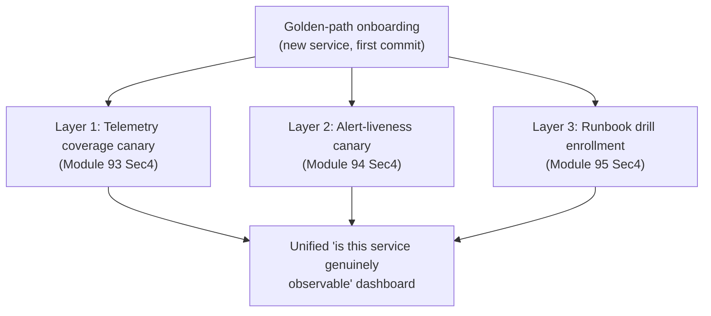
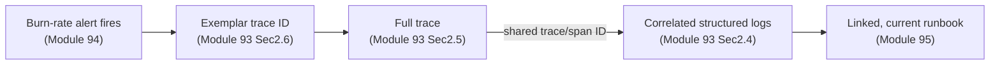
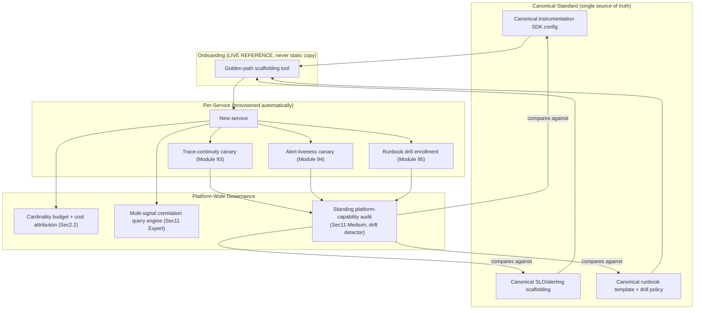

# Module 96 — Observability: Platform Architecture — Cardinality, Cost & Multi-Signal Correlation at Scale (Capstone)

> Domain: Observability | Level: Beginner → Expert | Prerequisite: All prior Observability modules (93–95) — this is the synthesizing capstone closing the `27-Observability` domain, Modules 93–96; [[../25-DevOps/04-DevSecOps-PolicyAsCode-PlatformEngineering]] §16 (the golden-path-template-drift finding this capstone's central incident directly recurs); [[../21-AWS/08-Observability-Cost-WellArchitectedFramework]], [[../22-Azure/08-Observability-Cost-WellArchitectedFramework]], [[../23-Kubernetes/08-Observability-Multicluster-GitOps]] (this entire domain has gone underneath these three vendor-specific capstones with vendor-neutral instrumentation; this module is the domain-level capstone counterpart to all three)

---

## 1. Fundamentals

**What**: An observability **platform** is the organization-wide, unified system integrating metrics/logs/traces (Module 93), SLO/alerting (Module 94), and incident-response tooling (Module 95) into one coherent, self-service, governed capability — as distinct from each team independently adopting and operating its own separate instrumentation, alerting, and runbook practices. Its architecture must additionally solve three capstone-level concerns none of the three prior modules addressed in isolation: **cardinality/cost governance at organization scale**, **multi-signal correlation** (letting an engineer move seamlessly between a metric anomaly, its log context, and its causing trace as one unified investigative experience), and — this module's central, capstone-specific finding — **verifying that the platform's own onboarding mechanism actually delivers every one of Modules 93–95's verification layers to every service, including services created after the platform matured**.

**Why it exists**: Without a unified platform, every team independently re-derives (and, per Modules 93–95's incidents, independently re-discovers the same mistakes behind) cardinality discipline, trace-continuity verification, alert-liveness canaries, and runbook-drill practice — the identical duplicated-effort, inconsistent-quality cost this course has established repeatedly for platform-unification decisions (Module 88 §15, Module 92 §12). A platform exists to make Modules 93–95's hard-won lessons **structural defaults**, automatically provisioned for every service from its first commit, rather than practices each team must independently discover, build, and remember to maintain.

**When it matters**: From the moment an organization has enough services and teams that per-team reinvention of observability governance becomes the dominant cost and risk — and becomes acute (this module's central finding) once the platform itself has existed long enough that its own onboarding mechanism can silently fall out of sync with its own evolving best practices, delivering an outdated, incomplete version of "the platform standard" to every newly-onboarded service without anyone noticing.

**How (30,000-ft view)**:
```
Unified platform = Module 93's telemetry (metrics/logs/traces) + Module 94's
    SLO/alerting + Module 95's incident-response tooling, PROVISIONED
    AUTOMATICALLY for every service via a golden-path onboarding template --
    not independently adopted, piecemeal, per team
Cardinality/cost governance: a PLATFORM-WIDE budget and enforcement gate
    (Module 93 Sec2.3, now applied org-wide with per-team cost attribution)
Multi-signal correlation: one unified query experience moving seamlessly
    between metric anomaly -> exemplar trace -> correlated logs (Module 93
    Sec2.4/Sec2.6), not three separate, disconnected tools
THE CAPSTONE RISK: the golden-path onboarding template that's SUPPOSED to
    deliver Modules 93/94/95's three verification layers (coverage canary,
    alert-liveness canary, runbook drill enrollment) to every new service
    can ITSELF silently drift out of sync with the current canonical
    standard -- meaning "we have this governance model" requires its own,
    FOURTH-order verification: is the DELIVERY MECHANISM still current?
```

---

## 2. Deep Dive

### 2.1 The Three-Layer "Verify the Verifier" Model, Unified
Modules 93, 94, and 95 each independently established that a specific observability capability — trace-context propagation coverage, alert-liveness, and runbook currency, respectively — is a declared guarantee that silently decays absent active, periodic verification, and each requires its own distinct verification mechanism (a trace-continuity canary, an alert-liveness canary, and a human-executed runbook drill). A mature observability platform's architecture must treat all three as **one unified governance framework**, not three unrelated, independently-remembered practices: every service provisioned by the platform should automatically receive all three verification layers wired in from day one, with a single, unified dashboard reporting each layer's current status per service — converting "does this service have working observability" from three separate, easy-to-forget questions into one, platform-guaranteed answer.

### 2.2 Cardinality and Cost Governance at Organization Scale
Module 93 §2.3 established cardinality's multiplicative cost growth at the level of a single metric; at platform scale, this requires an organization-wide **cardinality budget** enforced centrally (directly Module 93 §Advanced Q3's CI-integrated cardinality-budget gate, now a mandatory, platform-provisioned check for every team, not an optional, per-team-adopted practice) plus **cost attribution/chargeback**: since telemetry storage/query cost scales with volume and cardinality, a platform must be able to attribute cost back to the specific team/service generating it — without this attribution, cost governance has no accountability mechanism, and the organization-wide budget becomes a tragedy-of-the-commons problem where no individual team bears the consequence of its own high-cardinality instrumentation choices.

### 2.3 Multi-Signal Correlation Architecture
A unified platform's highest-value investigative feature is seamless navigation *between* signals: from a burn-rate alert (Module 94) to the specific exemplar trace responsible for a metric anomaly (Module 93 §2.6), to the structured logs correlated to that same trace via its trace/span ID (Module 93 §2.4) — all within one query experience, rather than three separately-authenticated, separately-queried tools an engineer must manually cross-reference by hand during a live incident. This requires a consistent identifier scheme (the trace ID as the universal join key across all three signal types) enforced platform-wide, not left to each team's own, potentially inconsistent instrumentation choices.

### 2.4 Tiered Storage Economics at Platform Scale
Directly reapplying Module 91 §2.6's three-constraint retention model (age, reference/investigative value, compliance) at platform scale requires **tiered storage**: a short-lived, fast-query "hot" tier for recent, actively-investigated telemetry; a lower-cost "warm" tier for less-recent but still-queryable data; and a cold-archive tier for compliance-driven retention specifically, queried rarely and at correspondingly higher latency. Getting this tiering wrong in either direction repeats a familiar course pattern: an all-hot-tier policy is prohibitively expensive at scale, while an overly-aggressive downgrade-to-cold policy risks the exact "we assumed this was retrievable when we needed it, and it wasn't, readily" gap Module 91 §4's central incident examined for build artifacts, now recurring for telemetry data specifically.

### 2.5 Self-Service Golden-Path Provisioning
The platform's actual leverage comes from **automatic, self-service provisioning**: a new service, from its very first commit, should receive Module 93's instrumentation SDK pre-wired with cardinality-safe defaults, Module 94's SLO/alerting scaffolding with an auto-provisioned alert-liveness canary, and Module 95's runbook template with an auto-scheduled drill enrollment — all without requiring the owning team to manually research and independently assemble each of Modules 93–95's lessons themselves. This is the direct, observability-domain-specific instance of Module 88 §17's now-thoroughly-established golden-path principle: the governed, compliant path succeeds specifically by being the *easiest* path, not merely the mandated one.

### 2.6 The Platform's Own Governance Drift — This Module's Central, Capstone-Specific Risk
This is the insight that makes this module a genuine capstone rather than a fourth, merely-parallel instance of Modules 93–95's pattern: the golden-path onboarding template *itself* — the mechanism responsible for delivering all three verification layers to every new service — is itself a **declared artifact** subject to the identical "declared ≠ actual" risk this entire course has traced, and it can drift out of sync with the platform's own, evolving canonical standard in exactly the way Module 88 §16's case study already demonstrated for infrastructure golden-path templates: if the onboarding template is a static, separately-maintained copy of "current best practice" (rather than a live reference to the canonical, continuously-updated standard), then every service onboarded *after* the canonical standard evolves — say, after the platform team adds a new, improved cardinality-safe default, or fixes a gap in the alert-liveness canary's design — silently receives the **stale, pre-improvement** version, with no indication anywhere that anything is missing, since the service *does* have "the platform's observability tooling" — just an outdated instance of it.

---

## 3. Visual Architecture

### Unified Three-Layer Verification Model, Platform-Provisioned (§2.1, §2.5)


### The Capstone Risk — Golden-Path Template Drifting from Canonical Standard (§2.6, §4)
```
Canonical platform standard (continuously evolving):
    v1: basic instrumentation + Layer 1 canary
    v2: + Layer 2 alert-liveness canary added
    v3: + Layer 3 runbook-drill auto-enrollment added

Onboarding template (STATIC COPY, not a live reference):
    Copied from v1, embedded into the scaffolding tool at that time.
    v2 and v3 improvements made to the CANONICAL standard...
    ...but NEVER propagated to the onboarding template.

Result: every service onboarded AFTER v1 -- i.e., MOST of the
    organization's newer services -- silently received ONLY Layer 1,
    missing Layers 2 and 3 entirely, with no indication anywhere that
    anything was missing. The dashboard (Sec3 above) would show these
    services as "not yet integrated" ONLY IF someone thought to check --
    otherwise indistinguishable from full compliance.
```

### Multi-Signal Correlation — One Query, Three Signals (§2.3)


---

## 4. Production Example

**Scenario**: A mid-sized technology organization had, over roughly two years, built a genuinely mature observability platform implementing every practice this domain established — Module 93's telemetry coverage with trace-continuity canaries, Module 94's SLO/alerting with alert-liveness canaries, and Module 95's runbook-drill program — all delivered automatically to new services via a golden-path onboarding scaffolding tool. Leadership, reviewing the platform's design documentation, had high confidence the organization's incident-detection and response capability was comprehensive and well-governed.

**Investigation**: A relatively new, business-critical service — onboarded roughly fourteen months after the platform's initial launch — experienced a severe, extended outage. During the incident, the on-call team discovered, in rapid, dispiriting succession: no alert had fired for the specific failure mode that occurred (there was no burn-rate alert configured for this service's actual SLI at all); there was no runbook for this incident type; and even the underlying trace-continuity canary that should have caught a related, earlier propagation gap had never been provisioned for this specific service. The service had "the platform's observability tooling" in name — a dashboard existed, some basic metrics were flowing — but none of Modules 93–95's three verification layers had actually been wired in.

**Root cause**: The organization's onboarding scaffolding tool had been built as a **static, one-time snapshot** of the platform's practices as they existed at the platform's initial launch — a hard-coded template, not a live reference to the platform team's continuously-evolving canonical standard. Over the following fourteen months, the platform team had incrementally added the alert-liveness canary (Module 94's practice, developed and adopted organization-wide roughly six months after initial launch) and the runbook-drill auto-enrollment (Module 95's practice, adopted roughly ten months after launch) to their own *canonical* documentation and internal reference implementation — but the separately-maintained onboarding scaffolding tool was never updated to reflect either addition, since updating it required a distinct, easily-overlooked engineering task that no one on the platform team had been assigned or reminded to perform, precisely because the scaffolding tool's own currency was never itself subject to any verification practice — a governance gap at one further remove above Modules 93–95's own findings.

**Fix**: (1) Redesigned the onboarding scaffolding tool to **reference the canonical, continuously-updated standard directly** — rather than embedding a static, point-in-time copy — so that any future improvement to the canonical standard automatically, immediately propagates to every subsequently-onboarded service without requiring a separate, manual scaffolding-tool update step; directly Module 88 §16's exact fix, now applied to observability-platform onboarding specifically. (2) Conducted an organization-wide **retroactive audit**, comparing every already-onboarded service's actual, current observability configuration against the canonical standard, identifying and remediating every service (a substantial fraction of those onboarded in the platform's first year) missing one or more of the three verification layers. (3) Established a standing, periodic **platform capability audit** — sampling live services on a recurring schedule and confirming each of the three verification layers is not merely nominally present but actually, functionally current, converting "we have a golden-path onboarding template" from an assumed, one-time-verified claim into a continuously re-verified one.

**Lesson**: This is the domain's capstone-level generalization of every prior module's finding: even a fully-designed, three-layer "verify the verifier" governance model (Modules 93–95) is itself subject to a **fourth-order instance of the identical risk** — the mechanism responsible for *delivering* these three verified layers to every service can itself silently drift and stop doing so, and "we have this governance model" is, at the platform-architecture level, exactly as unverified an assumption as any single layer within it, until the delivery mechanism's own currency is independently, continuously confirmed. The recursive "verify the verifier" principle this domain has now applied at three successive layers (telemetry coverage, alerting response, human procedure) has, at the platform-capstone level, one further necessary turn: verify that the thing delivering all three verified layers to every new instance of the system is itself still delivering the current, complete version — not the version that happened to be correct when it was first built.

---

## 5. Best Practices
- Treat Modules 93–95's three verification layers as one unified governance framework, automatically provisioned together for every service, with a single dashboard reporting each layer's actual status per service (§2.1, §2.5).
- Enforce cardinality budgets and cost attribution/chargeback organization-wide as a platform-provisioned default, not an optional, per-team-adopted practice (§2.2).
- Design for seamless multi-signal correlation (metric → exemplar trace → correlated logs → linked runbook) via a consistent, platform-wide identifier scheme, rather than three separately-queried, disconnected tools (§2.3).
- Apply Module 91's three-constraint retention model (age, reference, compliance) to tiered telemetry storage specifically, avoiding both prohibitive all-hot-tier cost and premature, irretrievable-when-needed cold-archival (§2.4).
- Build golden-path onboarding scaffolding that *references* the canonical, continuously-evolving platform standard directly, never a static, point-in-time snapshot requiring a separate, easily-forgotten manual update step (§2.6, §4).
- Periodically, actively audit already-onboarded services against the *current* canonical standard, not merely against whatever standard existed when they were originally onboarded (§4).

## 6. Anti-patterns
- Allowing each team to independently adopt (or skip) Modules 93–95's practices piecemeal, rather than delivering all three as one unified, automatically-provisioned platform default (§2.1, §2.5).
- Organization-wide telemetry cost governance with no per-team attribution/chargeback, creating a tragedy-of-the-commons dynamic with no individual accountability (§2.2).
- Three separate, disconnected observability tools (metrics, logs, traces) requiring manual, by-hand cross-referencing during a live incident, rather than a unified, correlated query experience (§2.3).
- A static, hard-coded onboarding scaffolding template that silently falls out of sync with the platform's own evolving canonical standard, delivering an outdated, incomplete version of "the platform standard" to every service onboarded after a given point (§2.6, §4).
- Assuming an organization-wide observability governance model is complete and functioning because it was correctly designed once, without periodically, actively auditing whether its delivery mechanism is still current (§4).

---

## 10. Interview Questions

### Basic (10)

1. **Q: What distinguishes an observability "platform" from each team independently adopting its own metrics/logs/traces tooling?**
   **A:** A platform unifies instrumentation, alerting, and incident-response tooling into one, organization-wide, self-service, automatically-provisioned capability — versus each team independently re-deriving (and potentially re-discovering the same mistakes behind) the same practices piecemeal.
   **Why correct:** States the specific unification and automatic-provisioning distinction, not merely "a platform is bigger."
   **Common mistakes:** Treating "platform" as simply meaning "a bigger or more expensive tool," rather than the specific organizational unification and consistency it provides.
   **Follow-ups:** "What's the cost of NOT having a unified platform, at scale?" (Each team independently, inconsistently re-implements cardinality discipline, alert-liveness verification, and runbook-drill practice, with widely varying quality and a high risk of the exact gaps Modules 93-95 each identified recurring independently, team by team.)

2. **Q: What is cost attribution/chargeback, and why does an organization-wide cardinality budget need it?**
   **A:** Cost attribution assigns telemetry storage/query cost back to the specific team/service generating it. Without it, an org-wide cardinality budget has no individual accountability mechanism, creating a tragedy-of-the-commons dynamic where no team bears the consequence of its own high-cardinality instrumentation choices.
   **Why correct:** States both the mechanism and the specific governance failure (no accountability) that omitting it produces.
   **Common mistakes:** Assuming a shared, organization-wide cardinality budget alone is sufficient governance without any per-team attribution, missing the accountability gap this creates.
   **Follow-ups:** "How would you actually implement cost attribution technically?" (Tag every metric/log/trace with its originating service/team at the point of emission, and aggregate cost/volume metrics by that tag at the platform's cost-reporting layer.)

3. **Q: What is multi-signal correlation, and what's the minimum requirement for it to work across metrics, logs, and traces?**
   **A:** Multi-signal correlation is the ability to navigate seamlessly between a metric anomaly, its associated trace, and correlated logs within one investigative experience. The minimum requirement is a consistent identifier (the trace ID) shared across all three signal types, enforced platform-wide.
   **Why correct:** States both the capability and its specific technical precondition (a shared, universal join key).
   **Common mistakes:** Assuming correlation is achievable purely through UI/dashboard design without the underlying, consistent trace-ID propagation across every signal type actually being in place.
   **Follow-ups:** "What breaks multi-signal correlation if a service's logs don't include the trace ID?" (An engineer investigating a trace has no automatic way to pull the correlated logs — they'd need to manually search by timestamp/other fields, recreating Module 93 §2.4's original manual-correlation cost this feature exists to eliminate.)

4. **Q: What is tiered storage in an observability platform, and why is it necessary at scale?**
   **A:** Tiered storage separates telemetry into a fast, expensive "hot" tier for recent data, a cheaper "warm" tier for less-recent data, and a cold-archive tier for compliance-driven long-term retention — necessary because retaining all telemetry indefinitely in the fastest, most expensive tier is prohibitively costly at organization scale.
   **Why correct:** States the three tiers and the specific cost rationale driving the need for tiering.
   **Common mistakes:** Assuming a single, uniform storage tier can serve both fast, active investigation and long-term compliance retention equally well/cheaply.
   **Follow-ups:** "What risk does an overly-aggressive downgrade-to-cold policy introduce?" (Data that turns out to be genuinely needed (an investigation, an audit) may be retrievable only at much higher latency or, if mismanaged, not retrievable at all — directly Module 91 §4's "assumed retrievable, wasn't" risk recurring for telemetry.)

5. **Q: What is a "golden-path" onboarding template in the context of an observability platform?**
   **A:** A scaffolding mechanism that automatically provisions a new service with the platform's standard instrumentation, alerting, and incident-response tooling from its first commit, without requiring the owning team to manually assemble each piece independently.
   **Why correct:** States the automatic-provisioning mechanism and its purpose (removing manual, per-team assembly burden).
   **Common mistakes:** Assuming a golden-path template is merely documentation/guidance rather than an actively-executed scaffolding mechanism that provisions real, functioning tooling.
   **Follow-ups:** "Why does this course call the golden path the 'easiest' path, not merely the 'mandated' one?" (Because a compliant path that's also the easiest path removes the friction-driven incentive to bypass or skip it — directly Module 88 §17's and Module 92 §17's established golden-path principle.)

6. **Q: What is this module's central finding about golden-path onboarding templates, and how does it differ from Modules 93-95's individual findings?**
   **A:** A golden-path template can itself silently drift out of sync with the platform's own evolving canonical standard if it's a static, point-in-time copy rather than a live reference — meaning services onboarded after an improvement is made to the canonical standard silently receive an outdated version. This differs from Modules 93-95's findings because it's a risk about the *delivery mechanism* for all three prior layers, not a fourth, separate verification layer of its own.
   **Why correct:** States the specific mechanism (static copy vs. live reference) and correctly distinguishes it as a meta-level, delivery-mechanism risk rather than a fourth parallel instance of the same layer-specific pattern.
   **Common mistakes:** Treating this as simply "a fourth example of things going stale" without recognizing its specifically elevated, capstone-level significance — a gap here undermines all three prior layers simultaneously for every affected service.
   **Follow-ups:** "What's the fix, in one sentence?" (Make the onboarding template reference the canonical, continuously-updated standard directly, rather than embedding a static, separately-maintained snapshot.)

7. **Q: Why is retroactively auditing already-onboarded services against the *current* canonical standard necessary, even after fixing the onboarding template itself for future services?**
   **A:** Fixing the template only ensures *future* onboarding delivers the current standard — it does nothing for services already onboarded under the old, static template, which remain silently missing whatever improvements were made after their onboarding date until specifically, retroactively audited and remediated.
   **Why correct:** Distinguishes the forward-looking fix (template redesign) from the backward-looking need (retroactive audit), explaining why both are necessary.
   **Common mistakes:** Assuming fixing the onboarding template alone resolves the organization's exposure, without considering that every already-onboarded service remains in its original, potentially-outdated state until separately audited.
   **Follow-ups:** "How would you prioritize which already-onboarded services to audit first?" (By business criticality and by how long ago they were onboarded relative to the canonical standard's most significant subsequent improvements — services onboarded furthest in the past, relative to the biggest capability additions, carry the largest expected gap.)

8. **Q: What is the risk of an organization-wide cardinality budget with no tiered enforcement (i.e., the same budget and rules applied uniformly regardless of a service's criticality)?**
   **A:** A uniform budget either over-restricts a genuinely business-critical service that might warrant somewhat richer instrumentation, or under-restricts a low-criticality service whose high-cardinality instrumentation choices impose cost disproportionate to its actual investigative value — a risk-proportionate, tiered budget (mirroring this course's now-standard tiered-governance pattern) better matches enforcement to actual need.
   **Why correct:** Identifies the specific mismatch a uniform, non-tiered budget creates and connects it to this course's established risk-proportionate governance principle.
   **Common mistakes:** Assuming a single, uniform cardinality budget is inherently fairer or simpler, without considering that different services genuinely warrant different levels of instrumentation richness relative to their criticality.
   **Follow-ups:** "How would you determine a service's appropriate cardinality tier?" (Based on business criticality and incident-history investigative need, similar to how Module 92 §Basic Q8 risk-tiered promotion gates by release risk rather than applying a uniform policy to every release.)

9. **Q: How does this module's platform architecture relate to Modules 64, 72, and 80's cloud/Kubernetes observability capstones?**
   **A:** Those modules covered vendor-specific observability capabilities (CloudWatch/X-Ray, Azure Monitor/App Insights, the Kubernetes observability stack) within their respective cloud/orchestration domains. This module's platform sits underneath and across all of them, providing vendor-neutral instrumentation (OpenTelemetry, per Module 93 §2.2) that can export to any of those backends, or multiple simultaneously, without re-instrumenting application code per backend.
   **Why correct:** Correctly positions this domain's platform as a lower, more foundational layer than the vendor-specific capstones, connecting via OpenTelemetry's backend-decoupling architecture.
   **Common mistakes:** Assuming this module's platform is redundant with or competing against Modules 64/72/80's cloud-specific coverage, rather than recognizing it as a complementary, underlying instrumentation layer those capstones can plug into.
   **Follow-ups:** "Could an organization use CloudWatch as one of multiple backends this platform exports to?" (Yes — Module 93 §2.2's OTel Collector architecture allows exporting the same vendor-neutral telemetry to CloudWatch, a self-hosted backend, or both simultaneously, without any application-level re-instrumentation.)

10. **Q: What is the single unifying principle this capstone module establishes across the entire `27-Observability` domain?**
    **A:** That observability infrastructure's own governance mechanisms — telemetry coverage, alerting liveness, runbook currency, and (this module's addition) the onboarding mechanism delivering all three — are each, independently, subject to the course's "declared/present ≠ actual/complete" theme, requiring their own active, periodic verification rather than being assumed correct because they were once correctly designed.
    **Why correct:** States the domain's unifying, recursive principle rather than merely listing the four modules' individual findings side by side.
    **Common mistakes:** Summarizing the domain as four separate, unrelated technical lessons rather than identifying the single, recursive structural insight connecting all four.
    **Follow-ups:** "Why does this recursive insight matter specifically for how a Principal Engineer communicates observability maturity to leadership?" (Because "we have observability" is not a single, binary claim — a Principal Engineer who can name which specific layers, including the onboarding-delivery layer, have genuine, current verification evidence behind them provides a meaningfully more accurate picture than an undifferentiated "yes" would.)

### Intermediate (10)

1. **Q: Why did §4's incident go undetected for fourteen months rather than being caught when the platform team added the alert-liveness canary and runbook-drill practices to their canonical standard?**
   **A:** The platform team updated their own *canonical documentation and reference implementation* — but the separately-maintained onboarding scaffolding tool was never itself subject to any verification confirming it stayed in sync with that canonical standard. Updating the scaffolding tool required a distinct, easily-overlooked engineering task with no one specifically assigned or reminded to perform it, and — critically — nothing about "the canonical standard changed" automatically triggered any check of whether the delivery mechanism reflected that change.
   **Why correct:** Identifies the specific structural gap (no verification linking the canonical standard's evolution to the scaffolding tool's own currency) rather than attributing the delay to inadequate diligence.
   **Common mistakes:** Assuming the platform team was simply careless, without recognizing the deeper structural gap — no mechanism existed that would have made this drift visible even to a highly diligent team, absent a deliberate, periodic audit specifically designed to catch it.
   **Follow-ups:** "What signal, if it had existed, would have caught this drift immediately when the canonical standard changed?" (An automated diff/comparison between the onboarding scaffolding tool's actual output and the current canonical standard, run automatically whenever either changes — directly Module 88 §16's fix, applied here.)

2. **Q: A platform team argues that since their onboarding scaffolding tool was thoroughly tested and reviewed at the time it was built, it remains a trustworthy delivery mechanism indefinitely. Evaluate this claim.**
   **A:** Thorough testing/review at build time only confirms the tool was correct *as of that point* — it provides zero evidence about whether the tool has kept pace with subsequent improvements to the canonical standard it's meant to reflect, precisely §4's central finding. A tool's correctness at build time and its continued currency over time are two entirely different claims, and conflating them is exactly the "past verification doesn't imply present accuracy" gap Module 95 §Intermediate Q2 already established for runbooks specifically, now recurring at the platform-onboarding-mechanism level.
   **Why correct:** Connects this claim's flaw to an already-established, structurally identical prior-module finding, showing the pattern's direct recurrence one level up.
   **Common mistakes:** Treating "we tested it thoroughly when we built it" as durable, ongoing evidence of continued correctness, rather than recognizing it's bounded to the specific point in time that testing occurred.
   **Follow-ups:** "What would you recommend instead of relying on one-time build-time verification?" (A live-reference architecture (§2.6's fix) that structurally cannot drift, combined with a periodic platform-capability audit (§4's third fix) providing ongoing, continued verification rather than a one-time confirmation.)

3. **Q: Why is a "live reference to the canonical standard" architecturally preferable to "a periodic sync job that copies canonical-standard updates into the onboarding template," even though both nominally solve the drift problem?**
   **A:** A periodic sync job introduces its own new failure surface — the sync job itself could silently fail, fall behind schedule, or be skipped, recreating the identical "declared to be current, actually stale" risk one level further removed (now needing its own liveness verification); a live reference (the onboarding template directly reading from, or invoking, the canonical standard's current implementation at the moment of each onboarding, rather than a separately-stored, periodically-refreshed copy) structurally eliminates the staleness window entirely, since there is no intermediate copy that can ever fall behind in the first place.
   **Why correct:** Identifies that a periodic-sync approach merely relocates the "verify the verifier" problem to a new layer (the sync job itself) rather than eliminating it, while a live-reference architecture removes the staleness risk structurally.
   **Common mistakes:** Treating a periodic sync job as an equally robust fix to a live-reference architecture, without recognizing it introduces a new, analogous liveness-verification requirement of its own rather than eliminating the underlying risk category.
   **Follow-ups:** "Is a live-reference architecture always feasible, or are there cases where a synced-copy approach is unavoidable?" (Some scaffolding tools may need an offline-capable or air-gapped onboarding path where a live reference to a central service isn't architecturally possible — in that specific case, a synced copy is the pragmatic fallback, but it must then carry its own explicit, monitored liveness/freshness check rather than being assumed reliable by default.)

4. **Q: How does this module's cost-attribution/chargeback mechanism (§2.2) interact with the cardinality-budget enforcement gate Module 93 §Advanced Q3 established, and why does the platform capstone need both rather than either alone?**
   **A:** Module 93's cardinality-budget gate *prevents* an individual, over-cardinality metric definition from ever reaching production — a point-in-time, per-change enforcement mechanism. Cost attribution/chargeback is a *continuous, aggregate* accountability mechanism — it doesn't stop any single change, but ensures the cumulative cost consequence of many individually-small, budget-compliant choices is still visible and attributable to whoever is generating it, catching a different failure mode (many small, individually-compliant contributions accumulating into a large aggregate cost with no one specifically accountable) that a per-change gate alone wouldn't catch.
   **Why correct:** Distinguishes the two mechanisms' distinct failure modes (a single non-compliant change vs. many small, compliant changes accumulating) and explains why both are independently necessary.
   **Common mistakes:** Assuming the cardinality-budget gate alone is sufficient cost governance, without recognizing that many individually-budget-compliant metrics can still aggregate into a large, unattributed cost across an entire large organization.
   **Follow-ups:** "Which of the two would you prioritize building first, given limited platform-engineering capacity?" (The cardinality-budget gate first, since it prevents the most severe, single-incident-causing failure mode (Module 93 §14's cardinality-explosion incident); cost attribution second, as a longer-term, more gradual cost-governance investment.)

5. **Q: Why might a unified, multi-signal correlation query experience (§2.3) actually make an investigation slower in some cases, compared to a team using a specialized, single-signal tool they know intimately?**
   **A:** A unified tool's generality can come at the cost of depth in any single signal type — a team highly practiced with a specialized, single-purpose tracing tool's specific query language and UI shortcuts might genuinely investigate faster within that one signal type than a more general, correlation-focused unified tool allows, at least until they've built equivalent familiarity with the unified tool's own interface. This doesn't undermine the case for unification overall (the cross-signal correlation value the unified tool provides is usually decisive for genuinely cross-service investigations), but it's a real, legitimate trade-off a Principal Engineer should acknowledge rather than assuming unification is strictly, unconditionally faster in every single-signal investigative scenario.
   **Why correct:** Acknowledges a genuine, legitimate trade-off rather than presenting unification as an unconditional improvement in every scenario.
   **Common mistakes:** Assuming a unified platform is strictly superior along every dimension, without recognizing that specialization and deep tool familiarity carry real, situational value a general-purpose tool doesn't automatically replicate.
   **Follow-ups:** "How would you address this trade-off without abandoning the unification investment?" (Invest in the unified tool's power-user features/query language depth over time, and ensure it can still surface signal-specific advanced capabilities (not merely a lowest-common-denominator experience) — the goal is a unified tool that's *also* deep, not merely broad.)

6. **Q: How would you design the periodic platform-capability audit (§4's third fix) to scale across hundreds of services without requiring a platform team member to manually inspect each one?**
   **A:** Automate the audit as a scheduled, programmatic check per service: query whether Module 93's trace-continuity canary is actually configured and recently passing, whether Module 94's alert-liveness canary exists and is recently passing, and whether Module 95's runbook-drill enrollment exists with a recent, successful drill record — aggregating the results into a single, organization-wide dashboard flagging any service missing one or more layers, directly reusing the same programmatic-verification pattern each of the three underlying canaries already established, now composed into one meta-level audit rather than requiring manual, per-service human inspection.
   **Why correct:** Proposes a concrete, automatable audit design reusing the existing canary infrastructure's own pass/fail signals as its input, rather than requiring new manual inspection effort.
   **Common mistakes:** Proposing a manual, human-reviewed audit process that wouldn't scale to hundreds of services, missing that each of the three underlying layers already produces a programmatically-queryable signal this audit can simply aggregate.
   **Follow-ups:** "What would you do about a service where all three canaries report 'passing' but a human investigator still finds a gap during a real incident?" (Treat this as a signal that the canaries' own coverage/design has a blind spot — feeding back into refining what each canary actually checks, exactly the kind of recursive refinement Module 93 §Advanced Q4 already anticipated for canary/gate design generally.)

7. **Q: Why does this module's finding suggest that "the platform team should just be more careful when updating the canonical standard" is an insufficient response to §4's incident?**
   **A:** This places the entire burden of remembering to propagate every future canonical-standard change onto ongoing human diligence — precisely the kind of "declared process without structural enforcement" gap this course has repeatedly identified as insufficient (Module 88's now-repeated finding that a documented-but-unenforced practice reliably underperforms a structural, automated one). The durable fix is architectural (a live reference, eliminating the propagation step entirely) plus a periodic, automated audit as an independent backstop — not a renewed commitment to individual carefulness, which is exactly the kind of fix that predictably degrades again over time as personnel changes and organizational memory of "why we're supposed to remember this" fades.
   **Why correct:** Identifies "be more careful" as a non-structural, diligence-dependent fix and explains why this course's established finding (structural fixes outperform diligence-dependent ones) applies directly here.
   **Common mistakes:** Accepting "the team will be more careful going forward" as an adequate remediation, without recognizing this relies on sustained, indefinite human diligence rather than a structural guarantee.
   **Follow-ups:** "What's a concrete sign that a 'be more careful' fix has failed to hold, months after being proposed?" (The identical category of drift recurring — a different capability added to the canonical standard again failing to propagate to the onboarding template — since no structural change was actually made to prevent the same, easily-forgotten propagation step from being skipped again.)

8. **Q: How should an organization decide the relative investment priority between building the live-reference onboarding architecture (§2.6's structural fix) versus running the retroactive audit and remediation (§4's second fix) first, given limited platform-engineering capacity?**
   **A:** The retroactive audit and remediation should generally proceed first or in parallel, since it directly closes the *existing*, already-present risk across every already-onboarded service (some of which may be business-critical and currently exposed); the live-reference architectural fix, while more durable and higher-leverage for *future* onboarding, doesn't retroactively help any service already onboarded under the old, static template — deferring the audit while building the architectural fix leaves existing exposure unaddressed for however long the architectural rebuild takes.
   **Why correct:** Correctly prioritizes addressing existing, already-present exposure (the audit) alongside or ahead of the more durable but forward-looking-only architectural fix, rather than treating the two as strictly sequential with the audit deferred.
   **Common mistakes:** Assuming the architectural fix should be built first "to prevent future recurrence" without recognizing that existing, already-onboarded services remain exposed regardless of how quickly the future-facing fix is completed.
   **Follow-ups:** "Could the audit itself be used to validate the architectural fix's design?" (Yes — the specific gaps the retroactive audit uncovers across existing services directly inform what the live-reference architecture must actually capture and propagate correctly, ensuring the architectural fix addresses the real, discovered gap pattern rather than a theoretical one.)

9. **Q: A newly-onboarded service passes all three of Modules 93-95's canary checks (coverage, alert-liveness, runbook-drill enrollment) immediately after onboarding, using the now-fixed, live-reference onboarding template. Does this fully resolve the organization's exposure to this module's central risk going forward?**
   **A:** It resolves the *specific* mechanism §4's incident exhibited (a static, drifting template), but the periodic platform-capability audit (§4's third fix) remains necessary as an independent, ongoing backstop — the live-reference architecture eliminates one specific way the onboarding mechanism could go stale, but doesn't eliminate every conceivable way a service's observability configuration could subsequently drift after onboarding (a team later, deliberately or accidentally, disabling a canary; a dependency change breaking a previously-working integration, per Module 93 §4's own finding). The architectural fix and the periodic audit are complementary, not substitutes for one another.
   **Why correct:** Correctly identifies that the architectural fix addresses one specific drift mechanism while the periodic audit remains necessary as a broader, ongoing safety net against other possible drift mechanisms occurring after onboarding.
   **Common mistakes:** Assuming the live-reference architectural fix alone fully resolves the risk category, without recognizing it only closes the specific onboarding-template-staleness mechanism, not every possible way a service's observability configuration could subsequently drift after a correct initial onboarding.
   **Follow-ups:** "What's a concrete example of post-onboarding drift the architectural fix wouldn't catch?" (A team disabling their alert-liveness canary because it was noisy, without understanding its purpose — an operational/behavioral drift entirely independent of whether the onboarding template itself stayed current, only catchable by the ongoing, periodic audit.)

10. **Q: Synthesize this module's central finding with Modules 93, 94, and 95's, into one unifying statement characterizing the entire `27-Observability` domain's arc, suitable for a Principal Engineer's closing assessment.**
    **A:** Across all four modules, an observability capability's declared existence — telemetry coverage (93), alerting liveness (94), runbook currency (95), and now the very mechanism delivering all three to new services (96) — is each, independently, easy to assert and hard to continuously verify, and every module's central incident occurred because verification was assumed rather than actively, periodically performed at that specific layer. The domain's unifying, recursive lesson: observability infrastructure exists to let an organization detect and investigate every other system's failures, but the observability infrastructure itself is not exempt from this same discipline — at every layer, from raw telemetry coverage up through the very onboarding mechanism responsible for delivering the whole stack to new services, "we have this capability" is a claim requiring its own, independent, ongoing verification, not a one-time design achievement to be trusted indefinitely thereafter.
    **Why correct:** Synthesizes all four modules' distinct findings into one recursive, structurally unifying statement rather than merely listing them side by side, and correctly identifies the domain's central, load-bearing insight.
    **Common mistakes:** Summarizing the domain as four separate technical lessons about different observability sub-topics, without articulating the single, recursive structural insight — verification is required at every layer, including the layer that delivers all the other layers — that unifies them into one domain-level conclusion.
    **Follow-ups:** "How does this domain's recursive theme connect back to Module 88's DevSecOps capstone finding?" (Module 88 established that a governance mechanism's presence is not proof of its effectiveness across the DevOps domain broadly, and specifically that a golden-path template can itself silently drift (§16); this Observability capstone applies the identical insight recursively, one domain later and one layer more specifically, confirming the pattern generalizes not just across domains but recursively within a single domain's own internal architecture.)

### Advanced (10)

1. **Q: Diagnose §4's incident from first principles and design the complete structural fix — not merely the three specific remediations already described.**
   **A:** Root cause: the onboarding scaffolding tool was architected as a static, point-in-time snapshot of the canonical standard rather than a live reference to it, and no verification mechanism existed to detect this drift as the canonical standard subsequently evolved — a governance gap one layer above Modules 93-95's own findings, since it concerns the mechanism *delivering* those three verified layers, not any one layer itself. Complete structural fix: (1) redesign the onboarding scaffolding tool to reference the canonical, continuously-updated standard directly, eliminating the staleness window structurally (§2.6); (2) conduct a full retroactive audit and remediation across every already-onboarded service, prioritized by business criticality and time-since-onboarding relative to the canonical standard's most significant subsequent improvements (§Intermediate Q8); (3) establish a standing, periodic, automated platform-capability audit composing the three underlying canaries' own pass/fail signals into one continuous meta-verification (§Intermediate Q6), providing an ongoing backstop independent of the architectural fix; (4) proactively search the organization for any *other* golden-path template or scaffolding mechanism (beyond observability specifically — infrastructure provisioning, security-policy scaffolding, CI/CD pipeline templates) exhibiting the identical static-copy-vs-live-reference architecture, since this incident's specific mechanism plausibly recurs wherever a similar onboarding/scaffolding pattern exists.
   **Why correct:** Addresses the root cause with the layered, already-established fixes (architectural, retroactive, ongoing-audit) and extends the investigation proactively per this course's now-standard pattern of searching for the same failure shape recurring elsewhere in the organization.
   **Common mistakes:** Fixing only the observability-specific onboarding template without searching for the identical static-vs-live-reference architectural gap in other golden-path/scaffolding mechanisms across the organization, leaving the same failure mode free to recur in a different domain.
   **Follow-ups:** "How would you communicate the urgency and scope of fix #4 (the proactive, cross-domain search) to leadership, given it extends well beyond the observability platform team's own remit?" (Frame it explicitly as a generalizable governance-architecture risk — not an observability-specific bug — citing this incident and Module 88 §16's structurally identical prior finding as concrete, validated evidence that any golden-path/scaffolding mechanism organization-wide warrants the identical live-reference-vs-static-copy architectural review.)

2. **Q: A Principal Engineer is asked whether the organization should freeze all further improvements to the canonical observability standard until every already-onboarded service is retroactively verified fully compliant with the current standard, to avoid ever recreating §4's drift gap. Evaluate this proposal.**
   **A:** This overcorrects by trading away the platform's own ability to improve and evolve (blocking legitimate, valuable canonical-standard improvements indefinitely) in exchange for a governance guarantee (no drift) that the live-reference architectural fix (§2.6) already achieves *without* requiring a freeze — the actual problem was the *static-copy* architecture, not the fact that the canonical standard evolved at all; fixing the architecture (so evolution automatically propagates) resolves the risk while preserving the platform's ability to keep improving, whereas freezing improvement entirely sacrifices ongoing platform value to solve a problem the architectural fix already solves more directly and without that sacrifice.
   **Why correct:** Identifies the proposal as an overcorrection that conflates "the standard changed" (a good thing, and not itself the problem) with "the delivery mechanism didn't keep up" (the actual, narrower problem), and shows the targeted architectural fix already resolves the concern without the freeze's cost.
   **Common mistakes:** Assuming any change to a governance standard inherently risks recreating drift, rather than recognizing the drift risk specifically stems from a static-copy delivery architecture, not from the standard itself evolving.
   **Follow-ups:** "How would you communicate this evaluation to a stakeholder specifically worried about repeat incidents from platform evolution?" (Explain that the live-reference architecture specifically decouples "the standard can keep improving" from "the delivery mechanism might fall behind," directly addressing the stakeholder's underlying concern without requiring the platform's improvement velocity to be sacrificed.)

3. **Q: Design a concrete technical mechanism for "live reference" onboarding (§2.6) for a specific, common observability-platform scenario: a service's SLO/alerting configuration scaffolding.**
   **A:** Rather than the onboarding tool generating and embedding a static YAML/configuration file representing "the current SLO/alerting best-practice template" at the moment of scaffolding, the scaffolding tool instead generates a configuration that *references* a shared, centrally-versioned template/module (analogous to a shared Terraform module, Module 85 §12's vetted-module registry pattern, or a shared CI/CD pipeline-as-code template, Module 89 §2.1's reusable-workflow pattern) — so that any subsequent update to the shared, canonical template automatically applies to every service referencing it, without requiring the onboarding tool itself, or any individual service's already-generated configuration, to be manually regenerated or re-synced.
   **Why correct:** Proposes a concrete technical mechanism (a referenced, shared, centrally-versioned template/module, directly reusing an already-established course pattern) rather than an abstract description of "make it a live reference."
   **Common mistakes:** Proposing a vague "just don't hard-code it" fix without specifying an actual, concrete architectural mechanism (a shared module reference) that achieves genuine live-reference behavior.
   **Follow-ups:** "What's the risk of every service automatically inheriting every future change to a shared, centrally-referenced template, with no review or opt-out at the individual service level?" (A canonical-standard change intended as an improvement could have an unintended, service-specific negative interaction — the shared-module approach should support a staged/canary rollout of canonical-standard changes across services (mirroring Module 92's own progressive-delivery principles, now applied to platform-standard rollout itself) rather than an instantaneous, organization-wide simultaneous change with no ability to detect or contain an unexpected regression.)

4. **Q: How does this module's capstone finding (§4) relate to the general software-engineering principle of "don't repeat yourself" (DRY), and where does the analogy break down?**
   **A:** The static-copy onboarding template is, at its core, a DRY violation — the "current best practice" now exists in two places (the canonical standard's own documentation/implementation, and the separately-maintained scaffolding tool) that must be kept manually synchronized, exactly the duplication DRY principles warn against. The analogy holds well as far as motivating the live-reference fix. Where it breaks down: DRY is usually discussed as a code-maintainability concern (reducing the effort of making a change consistently); this module's finding is specifically about a **governance and safety** consequence of the identical duplication pattern — the cost of the duplication isn't merely "we had to update two places instead of one," it's "a live-production service went without critical incident-response infrastructure for over a year, undetected," a materially higher-stakes consequence than typical DRY-violation discussions usually emphasize.
   **Why correct:** Correctly identifies the underlying DRY-violation shape while precisely articulating where the stakes and framing genuinely differ from typical DRY discussions (safety/governance consequence vs. mere maintainability inconvenience).
   **Common mistakes:** Either dismissing the DRY connection as too generic/unhelpful, or treating it as a complete explanation without articulating the specific, elevated stakes this particular instance carries beyond ordinary code-maintainability concerns.
   **Follow-ups:** "Why might framing this specifically as 'a DRY violation with production-safety consequences' be a more persuasive way to get engineering buy-in for the architectural fix than framing it as 'an observability governance gap' alone?" (Because "DRY violation" is an already-familiar, broadly-understood engineering concept every engineer recognizes as worth fixing on its own maintainability merits — framing the fix as addressing a familiar code-quality problem, with an additionally severe safety consequence, can secure broader engineering buy-in than a framing that sounds specific to observability-platform governance alone.)

5. **Q: How would you extend the periodic platform-capability audit (§4's third fix, §Intermediate Q6) to also detect a *new* category of drift this module hasn't yet specifically named — a canonical standard that has itself become outdated relative to genuinely new needs (e.g., a new class of failure mode the current three-layer model doesn't address at all)?**
   **A:** The periodic audit, as designed, verifies conformance to the *current* canonical standard — it cannot, by itself, detect that the canonical standard's own scope might now be insufficient (missing an entirely new verification layer the organization has never yet needed, analogous to how Module 94 §Advanced Q5 identified that a fully-verified alerting pipeline provides no protection against a failure mode the underlying SLI was never designed to measure in the first place). Detecting *this* category of gap requires a separate, higher-level review — a periodic retrospective specifically asking "has a recent incident revealed a failure mode none of our three existing verification layers would have caught, even if all three had been perfectly current and functioning" — feeding back into evolving the canonical standard itself, a distinct activity from auditing conformance to whatever the current standard happens to already specify.
   **Why correct:** Correctly identifies that a conformance audit and a scope-sufficiency review are two distinct activities, and connects the scope-sufficiency concern to an already-established, structurally analogous prior-module finding (Module 94 §Advanced Q5).
   **Common mistakes:** Assuming the periodic platform-capability audit alone is sufficient to catch every possible way the organization's observability practice could fall short, without recognizing it can only verify conformance to an existing standard, not whether that standard itself remains sufficiently complete.
   **Follow-ups:** "Who should own this higher-level, canonical-standard-sufficiency review, versus the conformance audit?" (The platform team's senior/principal engineers, ideally informed directly by recent incident postmortems (Module 95's practice) specifically reviewed for "what would our three layers have missed even if fully functioning" — a distinct, less frequent, more strategic review than the operational, more frequently-run conformance audit.)

6. **Q: Compare §4's incident to a hypothetical scenario where the onboarding template was correctly kept current, but the *canonical standard itself* was deliberately, knowingly designed with only two of the three verification layers (say, omitting runbook-drill enrollment entirely as an explicit, considered scoping decision). Is the second scenario equally concerning?**
   **A:** No — the second scenario, while potentially still a substantively risky decision, is qualitatively different and less concerning from a governance-process standpoint: it represents a deliberate, visible, reviewable scoping choice (which can be explicitly evaluated, debated, and revised through normal decision-making channels) rather than §4's actual failure mode, which is an *invisible*, undetected drift no one deliberately chose or was even aware of. The risk in the second scenario is a potentially-wrong technical/scoping decision, correctable through ordinary review; the risk in §4's actual scenario is a complete absence of anyone's awareness that a gap even existed, which is a strictly more dangerous failure category since it evades the normal decision-review processes entirely.
   **Why correct:** Correctly distinguishes a visible, deliberate scoping decision (however debatable) from an invisible, undetected drift, explaining why the latter is a qualitatively more dangerous governance failure category.
   **Common mistakes:** Treating both scenarios as equally concerning simply because both result in "missing runbook-drill enrollment," without recognizing that visibility and deliberateness of the gap fundamentally changes its risk profile and correctability.
   **Follow-ups:** "How would you distinguish these two scenarios in practice, given both might present identically from a single service's external observation?" (Check whether the gap is documented as a deliberate, reviewed scoping decision (with an explicit rationale and owner) versus being entirely absent from any documentation or decision record — the presence or absence of a deliberate decision trail is the key distinguishing signal.)

7. **Q: How should an organization's SRE/platform leadership decide the appropriate frequency for the periodic platform-capability audit (§4's third fix), balancing detection speed against the audit's own operational overhead?**
   **A:** Calibrate frequency against the canonical standard's actual rate of change and the organization's rate of new-service onboarding — an organization whose canonical standard evolves rapidly (frequent, significant new capability additions) or which onboards new services very frequently warrants a higher audit frequency, since more opportunities for drift accumulate faster; an organization with a comparatively stable canonical standard and low onboarding velocity can reasonably audit less frequently. This is directly the same trade-off calibration this course established for burn-rate alert thresholds (Module 94 §Advanced Q3) and runbook-drill scheduling (Module 95 §Advanced Q3) — the audit frequency is not a universal constant, but a parameter that must be calibrated against the organization's own specific rate of relevant change.
   **Why correct:** Proposes a concrete calibration approach (rate of canonical-standard change and onboarding velocity) and explicitly connects it to the identical calibration-parameter reasoning this course has established for other periodic-verification mechanisms.
   **Common mistakes:** Proposing a fixed, universal audit frequency (e.g., "always quarterly") without considering that the appropriate frequency should scale with the organization's own actual rate of relevant change, exactly as burn-rate thresholds and drill schedules must be calibrated per-context rather than treated as universal constants.
   **Follow-ups:** "What signal would indicate the current audit frequency has become insufficient?" (A drift gap discovered during an actual incident — rather than by the scheduled audit — despite the audit's own most recent run reporting full compliance, indicating the interval between the drift's onset and its impact was shorter than the audit's current cadence could catch.)

8. **Q: A commercial, managed observability vendor claims their platform's built-in service-onboarding feature is immune to §4's specific drift risk, since their entire platform is centrally hosted and updated by the vendor rather than self-built. Evaluate this claim as a Principal Engineer.**
   **A:** The vendor's claim addresses one specific instantiation of the risk (their own, vendor-controlled onboarding scaffolding presumably does reference their own live, centrally-maintained standard) but doesn't address the *organization's own* customization layer on top of the vendor's platform — most organizations customize a vendor platform's default onboarding (organization-specific dashboards, custom alert-routing rules, internal runbook links) and that customization layer is exactly as susceptible to the identical static-copy-vs-live-reference drift risk as a fully self-built platform, regardless of how well-architected the underlying vendor platform's own core onboarding mechanism is. The claim should be evaluated specifically as "is the vendor's core mechanism immune" (plausibly yes) versus "is our organization's full onboarding experience, including our customizations on top of the vendor platform, immune" (not necessarily, and requires its own, independent verification).
   **Why correct:** Correctly distinguishes the vendor's own core platform mechanism from the organization's customization layer built on top of it, identifying that the latter remains independently susceptible to this module's risk regardless of the vendor's own architecture.
   **Common mistakes:** Accepting the vendor's claim about their own platform's architecture as sufficient assurance for the organization's entire, customized onboarding experience, without considering that most of the actual risk may live in the organization's own customization layer rather than the vendor's core mechanism.
   **Follow-ups:** "How would you specifically verify whether your organization's customization layer carries this risk?" (Apply the same periodic platform-capability audit (§4's third fix) to the full, customized onboarding experience as actually delivered to a new service — not merely to the vendor's underlying, unmodified default — since the audit's value comes from testing the actual, end-to-end delivered experience, regardless of which layer, vendor or customization, might be the source of any discovered gap.)

9. **Q: How would you design an incentive structure (beyond pure technical/architectural fixes) ensuring the platform team prioritizes keeping the canonical standard's *delivery mechanism* current, given that building new canonical-standard capabilities is often more visible and rewarding work than the comparatively unglamorous task of ensuring those capabilities actually propagate to onboarding?**
   **A:** Make "onboarding-template currency relative to the canonical standard" an explicit, tracked, and reviewed metric — analogous to how Module 90 established that an unmeasured property gets silently neglected relative to a measured one — reported alongside (not subordinate to) the platform team's other, more visibly celebrated capability-development metrics, so that a canonical-standard improvement isn't considered "shipped" or complete until its corresponding onboarding-template propagation is also verified and reported, explicitly closing the loop rather than treating the canonical-standard update alone as the finished deliverable.
   **Why correct:** Proposes a concrete incentive/measurement fix (making propagation currency an explicitly tracked, celebrated metric alongside capability development) directly connecting to this course's established "unmeasured properties get silently neglected" finding.
   **Common mistakes:** Relying solely on architectural/technical fixes (the live-reference mechanism) without also addressing the underlying human/organizational incentive structure that made propagation feel like unglamorous, easily-deprioritized follow-through work relative to building new capabilities.
   **Follow-ups:** "Why might this incentive fix matter even after the live-reference architectural fix (§2.6) is fully implemented?" (Because the live-reference architecture addresses this specific propagation mechanism, but the same underlying incentive imbalance — new-capability-building being more celebrated than unglamorous maintenance/currency work — could manifest in a different, not-yet-identified way elsewhere in the platform's operation, making the incentive fix a broader, complementary safeguard beyond this one specific architectural risk.)

10. **Q: Having now completed the entire `27-Observability` domain (Modules 93–96), articulate the single most important, interview-ready synthesis a candidate should be able to state about this domain's overall arc in under 60 seconds.**
    **A:** "Observability has three pillars — metrics, logs, and traces — unified via vendor-neutral instrumentation like OpenTelemetry, and built into SLOs, error budgets, and alerting to convert reliability into a measurable, governed trade-off. But the domain's central, recurring lesson is that observability infrastructure itself is not exempt from the discipline it enforces on everything else: telemetry coverage can silently fragment, alerting can silently stop firing, runbooks can silently go stale, and even the platform's own onboarding mechanism — meant to deliver all of that verified, working tooling to every new service by default — can itself silently drift out of sync with its own evolving standard. At every layer, 'we have this capability' is a claim requiring its own, ongoing, active verification, not a one-time design achievement you can trust indefinitely afterward — and a Principal Engineer's job is knowing, specifically, which of these layers currently have genuine, current verification evidence behind them, versus which are merely assumed."
    **Why correct:** Delivers a complete, concise, structurally accurate synthesis covering both the domain's foundational content (three pillars, OTel, SLOs/error budgets) and its central, unifying recursive theme, in an interview-appropriate, time-bounded format.
    **Common mistakes:** Either omitting the foundational content (jumping straight to the recursive theme without grounding it) or omitting the recursive theme entirely (describing only the foundational content as if the domain were merely a features/concepts list, missing its actual, most interview-differentiating insight).
    **Follow-ups:** "If an interviewer pushes back with 'isn't this just saying nothing can ever be fully trusted, which is an unfalsifiable, unhelpful position?' — how would you respond?" (Clarify that the point isn't unfalsifiable distrust of everything, but a specific, actionable principle: every declared capability should have a *named, concrete verification mechanism* — a canary, a drill, an audit — behind it; the discipline is falsifiable and actionable precisely because it asks "what specifically verifies this, and when did it last actually run and pass," not merely "do we generically worry about it going stale.")

---

## 11. Coding Exercises

### Easy — Per-team cardinality cost attribution calculator (§2.2)
**Problem:** Given a list of metrics each tagged with an owning team and an estimated time-series count, compute each team's total attributed cardinality and flag any team exceeding its allocated budget.

```csharp
public sealed record TeamMetric(string TeamName, long EstimatedSeriesCount);
public sealed record TeamCardinalityReport(string TeamName, long TotalSeries, bool ExceedsBudget);

public static class CardinalityAttributionCalculator
{
    public static IReadOnlyList<TeamCardinalityReport> Attribute(
        IReadOnlyList<TeamMetric> metrics, IReadOnlyDictionary<string, long> teamBudgets)
    {
        return metrics
            .GroupBy(m => m.TeamName)
            .Select(g =>
            {
                long total = g.Sum(m => m.EstimatedSeriesCount);
                long budget = teamBudgets.TryGetValue(g.Key, out var b) ? b : long.MaxValue;
                return new TeamCardinalityReport(g.Key, total, total > budget);
            })
            .ToList();
    }
}
```
**Time complexity:** O(n) in the number of metrics, for the grouping and aggregation.
**Space complexity:** O(t) where t is the number of distinct teams.
**Optimized solution:** For continuous, real-time attribution (rather than a batch report), maintain each team's running total incrementally as metrics are registered/deregistered, rather than recomputing the full aggregation from scratch on every report — turning each update into O(1) amortized against a maintained running total per team.

### Medium — Golden-path template drift detector (§2.6, §4)
**Problem:** Given the canonical standard's current set of required capabilities and a specific service's onboarding-template-delivered capability set (captured at onboarding time), detect which capabilities are missing, distinguishing "never delivered" from "delivered but since removed from canonical standard" (the latter isn't a gap).

```csharp
public sealed record CapabilitySet(IReadOnlySet<string> Capabilities);

public sealed record DriftReport(IReadOnlyList<string> MissingCapabilities, bool HasDrift);

public static class GoldenPathDriftDetector
{
    public static DriftReport DetectDrift(CapabilitySet canonicalStandard, CapabilitySet deliveredToService)
    {
        // Missing = required by CURRENT canonical standard but not delivered --
        // a capability delivered that's no longer in the canonical standard is
        // NOT drift (the standard evolved away from requiring it), so this is
        // deliberately one-directional, not a symmetric set difference.
        var missing = canonicalStandard.Capabilities
            .Except(deliveredToService.Capabilities)
            .ToList();

        return new DriftReport(missing, missing.Count > 0);
    }
}
```
**Time complexity:** O(n) where n is the size of the canonical standard's capability set (hash-set-based `Except`).
**Space complexity:** O(n) for the resulting missing-capabilities list.
**Optimized solution:** Run this check for every service on a scheduled cadence (the periodic platform-capability audit, §4's third fix) rather than only on demand, aggregating results into an organization-wide dashboard — converting a single-service, on-demand check into the continuous, proactive audit this module's central fix requires.

### Hard — Multi-tier retention cost optimizer (§2.4)
**Problem:** Given a telemetry dataset's access-frequency history and each storage tier's cost-per-GB and query-latency characteristics, assign each data segment to the cost-minimizing tier subject to a maximum-acceptable-latency constraint for data still within its "reference/investigative value" window (per Module 91 §2.6's three-constraint model, reapplied here).

```csharp
public sealed record StorageTier(string Name, double CostPerGbPerMonth, TimeSpan QueryLatency);
public sealed record DataSegment(string Id, double SizeGb, int DaysOld, bool IsComplianceRetained);

public static class TieredRetentionOptimizer
{
    public static IReadOnlyDictionary<string, string> AssignTiers(
        IReadOnlyList<DataSegment> segments,
        IReadOnlyList<StorageTier> tiersOrderedByCostAscending, // cheapest first
        int hotTierMaxAgeDays,
        TimeSpan maxAcceptableLatencyForActiveInvestigation)
    {
        var assignments = new Dictionary<string, string>();

        foreach (var segment in segments)
        {
            // Compliance-retained data goes to the cheapest tier meeting ANY
            // latency (compliance queries are rare, latency-tolerant) --
            // Module 91 Sec2.6's compliance constraint, independent of age.
            if (segment.IsComplianceRetained && segment.DaysOld > hotTierMaxAgeDays)
            {
                assignments[segment.Id] = tiersOrderedByCostAscending[0].Name;
                continue;
            }

            // Recent, actively-investigatable data must meet the latency bound --
            // pick the CHEAPEST tier that still satisfies it.
            var eligibleTier = tiersOrderedByCostAscending
                .FirstOrDefault(t => t.QueryLatency <= maxAcceptableLatencyForActiveInvestigation);

            assignments[segment.Id] = eligibleTier?.Name
                ?? tiersOrderedByCostAscending.Last().Name; // fallback: no tier meets it, use cheapest anyway
        }

        return assignments;
    }
}
```
**Time complexity:** O(n × t) where n is the number of segments and t is the number of tiers (a linear scan per segment to find the first eligible tier).
**Space complexity:** O(n) for the resulting assignment map.
**Optimized solution:** Pre-sort tiers by latency once (rather than per-segment) and, since tiers are ordered by cost ascending, use the fact that the eligible-tier search can often be a simple threshold lookup rather than a full linear scan per segment — reducing the effective per-segment cost to O(log t) via binary search over a pre-sorted latency array, meaningful when the number of tiers grows beyond the typical small handful (hot/warm/cold) into a more finely-graded tiering scheme.

### Expert — Unified multi-signal correlation query engine (§2.3)
**Problem:** Given a trace ID, retrieve the full correlated view — the trace's spans, every log entry sharing that trace ID, and any metric exemplar referencing it — as one unified result, querying across three independent backend stores efficiently (in parallel, not sequentially).

```csharp
public sealed record CorrelatedView(
    IReadOnlyList<SpanData> Spans, IReadOnlyList<StructuredLogEntry> Logs, IReadOnlyList<string> ExemplarMetricNames);

public interface ITraceStore { Task<IReadOnlyList<SpanData>> GetSpansAsync(string traceId, CancellationToken ct); }
public interface ILogStore { Task<IReadOnlyList<StructuredLogEntry>> GetLogsByTraceIdAsync(string traceId, CancellationToken ct); }
public interface IExemplarIndex { IReadOnlyList<string> GetMetricsReferencingTrace(string traceId); }

public sealed class CorrelationQueryEngine
{
    private readonly ITraceStore _traceStore;
    private readonly ILogStore _logStore;
    private readonly IExemplarIndex _exemplarIndex;

    public CorrelationQueryEngine(ITraceStore traceStore, ILogStore logStore, IExemplarIndex exemplarIndex)
    {
        _traceStore = traceStore;
        _logStore = logStore;
        _exemplarIndex = exemplarIndex;
    }

    public async Task<CorrelatedView> GetCorrelatedViewAsync(string traceId, CancellationToken ct)
    {
        // Query the two I/O-bound backends CONCURRENTLY -- they're independent
        // stores with no data dependency between them, so sequential querying
        // would needlessly double the investigator's wait time during a live incident.
        var spansTask = _traceStore.GetSpansAsync(traceId, ct);
        var logsTask = _logStore.GetLogsByTraceIdAsync(traceId, ct);

        await Task.WhenAll(spansTask, logsTask);

        // Exemplar lookup is a fast, in-memory index (Module 93 Sec11 Expert) --
        // no need to parallelize it alongside the two I/O-bound backend calls.
        var exemplarMetrics = _exemplarIndex.GetMetricsReferencingTrace(traceId);

        return new CorrelatedView(await spansTask, await logsTask, exemplarMetrics);
    }
}
```
**Time complexity:** O(max(S, L)) where S and L are the respective backend query latencies for spans and logs (parallelized, not summed) — a meaningful improvement over O(S + L) sequential querying.
**Space complexity:** O(s + l) where s and l are the number of returned spans and log entries respectively.
**Optimized solution:** For a trace with an unusually large span or log count (a pathological, very deep or very chatty trace), apply a result-size cap with pagination rather than returning an unbounded result set — protecting the query engine and the investigating engineer's own tooling from being overwhelmed by a single, outlier-large trace, while still surfacing the most relevant (e.g., error-flagged, or longest-duration) spans/logs first within the capped result.

---

## 12. System Design

**Prompt:** Design the complete, organization-wide observability platform synthesizing Modules 93–96 — unified telemetry, SLO/alerting, incident-response tooling, and self-service golden-path onboarding with drift-resistant delivery.

**Functional requirements:** Every new service is automatically provisioned, via a live-reference (never static-copy) onboarding mechanism, with Module 93's instrumentation SDK and trace-continuity canary, Module 94's SLO/alerting scaffolding and alert-liveness canary, and Module 95's runbook template and drill enrollment; a unified query experience correlates metrics, logs, and traces via a shared trace-ID scheme; organization-wide cardinality budgets and cost attribution are enforced centrally; a standing, automated platform-capability audit continuously verifies every service's actual (not merely nominal) compliance with the *current* canonical standard.

**Non-functional requirements:** The onboarding mechanism must structurally eliminate the staleness window §4's incident exhibited (a live reference, not a periodic sync); the platform-capability audit must scale to hundreds/thousands of services without linear, per-service manual review; the platform must itself be observable (Module 93 §14's meta-observability principle) — its own health, including the onboarding mechanism's currency, must be independently monitored, not merely assumed.

**Architecture:**


**Database selection:** Per Module 93 §12's workload-specific selection (time-series store for metrics, trace-optimized store for traces, log-search-optimized store for logs), plus a relational store for the canonical standard's own versioned definition and the platform-capability audit's per-service compliance records — the latter benefiting from ACID guarantees, since an audit result silently lost or corrupted would itself recreate this module's central "declared verification, not actually reliable" risk one level further.

**Caching:** The correlation query engine (§11 Expert) caches recently-viewed trace correlations with a short TTL, matching Module 93 §12's identical caching rationale for active-incident query patterns.

**Messaging:** Canonical-standard updates publish an event that the platform-capability audit subscribes to, triggering an immediate, targeted re-audit of every service (rather than waiting for the next scheduled sweep) whenever the canonical standard itself changes — directly closing the specific timing gap §4's incident exhibited (a fourteen-month gap between canonical-standard changes and any detection of the resulting drift).

**Scaling:** The platform-capability audit scales by sharding its per-service checks across a worker pool, since each service's compliance check is fully independent of every other's — directly mirroring Module 93 §12's Collector-fleet horizontal-scaling pattern.

**Failure handling:** If the platform-capability audit itself fails to run on schedule, this must be independently, visibly monitored (a meta-meta-observability check) — recreating, if left unmonitored, the identical "silent failure of the thing meant to catch silent failures" risk this entire module's central finding examines, now one recursive layer further.

**Monitoring:** The onboarding mechanism's own currency (verified against the canonical standard on every single onboarding event, not merely periodically) and the platform-capability audit's own execution health are both first-class, always-on, unmissable dashboard signals — directly this module's central lesson applied structurally at the platform's own most foundational layer.

**Trade-offs:** Building this fully unified, self-verifying platform (vs. Modules 93-95's three layers adopted independently, piecemeal, per team) requires substantial upfront and ongoing platform-engineering investment, concentrated once at organization scale rather than duplicated, inconsistently, per team — directly the culminating instance of this course's now-thoroughly-established platform-unification trade-off (Module 88 §15, Module 92 §12, Modules 93/94/95 §12 each), reaching its final, fullest form at this domain's capstone.

---

## 13. Low-Level Design

**Requirements:** Model the golden-path onboarding mechanism as a live-reference system (never a static copy), integrated with the standing platform-capability audit composing Modules 93–95's three canary signals into one unified compliance view.

```csharp
public interface ICanonicalStandardProvider
{
    // ALWAYS returns the CURRENT canonical standard -- never a cached,
    // point-in-time snapshot embedded at onboarding-tool build time.
    Task<CapabilitySet> GetCurrentStandardAsync(CancellationToken ct);
}

public sealed class LiveReferenceOnboardingService
{
    private readonly ICanonicalStandardProvider _standardProvider;
    private readonly IServiceProvisioner _provisioner;

    public LiveReferenceOnboardingService(
        ICanonicalStandardProvider standardProvider, IServiceProvisioner provisioner)
    {
        _standardProvider = standardProvider;
        _provisioner = provisioner;
    }

    public async Task OnboardAsync(string serviceName, CancellationToken ct)
    {
        // Fetches the CURRENT standard at the moment of onboarding -- structurally
        // cannot drift, since there is no separately-stored, potentially-stale
        // copy anywhere in this code path (Sec2.6's fix).
        var currentStandard = await _standardProvider.GetCurrentStandardAsync(ct);
        await _provisioner.ProvisionAsync(serviceName, currentStandard, ct);
    }
}

public interface ICanaryStatusSource
{
    Task<bool> IsPassingAsync(string serviceName, CancellationToken ct);
}

public sealed class PlatformCapabilityAuditor
{
    private readonly ICanonicalStandardProvider _standardProvider;
    private readonly IReadOnlyDictionary<string, ICanaryStatusSource> _canarySourcesByLayer; // 3 layers
    private readonly IServiceCapabilityRepository _serviceCapabilities;

    public PlatformCapabilityAuditor(
        ICanonicalStandardProvider standardProvider,
        IReadOnlyDictionary<string, ICanaryStatusSource> canarySourcesByLayer,
        IServiceCapabilityRepository serviceCapabilities)
    {
        _standardProvider = standardProvider;
        _canarySourcesByLayer = canarySourcesByLayer;
        _serviceCapabilities = serviceCapabilities;
    }

    public async Task<DriftReport> AuditServiceAsync(string serviceName, CancellationToken ct)
    {
        var currentStandard = await _standardProvider.GetCurrentStandardAsync(ct);
        var delivered = await _serviceCapabilities.GetDeliveredCapabilitiesAsync(serviceName, ct);

        // Sec11 Medium's one-directional drift check: only "required now but
        // missing" counts as drift.
        var driftReport = GoldenPathDriftDetector.DetectDrift(currentStandard, delivered);

        // Additionally verify each layer's canary is CURRENTLY PASSING, not
        // merely nominally present -- "delivered" alone isn't "functioning."
        foreach (var (layerName, source) in _canarySourcesByLayer)
        {
            bool passing = await source.IsPassingAsync(serviceName, ct);
            if (!passing)
                driftReport = driftReport with
                {
                    MissingCapabilities = driftReport.MissingCapabilities.Append($"{layerName} (present but failing)").ToList(),
                    HasDrift = true
                };
        }

        return driftReport;
    }
}
```

**Design patterns used:** **Strategy** for `ICanaryStatusSource` (each of Modules 93/94/95's canaries plugs in uniformly, without the auditor needing layer-specific logic per canary type). **Facade**-shaped `PlatformCapabilityAuditor` (presents one unified compliance check to callers, internally composing three independent canary sources and a capability-drift comparison).

**SOLID mapping:** Open/Closed — adding a fourth verification layer in the future requires only a new `ICanaryStatusSource` implementation registered in the dictionary, never changes to the auditor's core logic. Single Responsibility — standard provisioning (`ICanonicalStandardProvider`), service onboarding (`LiveReferenceOnboardingService`), and compliance auditing (`PlatformCapabilityAuditor`) are each one component's concern. Dependency Inversion — both the onboarding service and the auditor depend only on interfaces, enabling full unit testing with fakes and no real infrastructure dependency.

**Extensibility:** A future, fifth observability-governance layer (per §Advanced Q5's scope-sufficiency review identifying a genuinely new need) requires only a new canary-source implementation and its registration — never changes to `LiveReferenceOnboardingService` or the auditor's structural logic, directly enabling the domain's continued evolution without recreating this module's central architectural risk.

**Concurrency/thread safety:** `PlatformCapabilityAuditor.AuditServiceAsync` is safe to run concurrently across different services (no shared mutable state between independent services' audits); auditing many services concurrently (§12's worker-pool sharding) requires only that `ICanaryStatusSource` implementations themselves be safe under concurrent, per-service invocation — a property each individual canary source must guarantee independently.

---

## 14. Production Debugging

**Incident:** Following a major cost-optimization initiative, the organization's telemetry storage bill unexpectedly *increases* by nearly 40% over the following quarter, despite the initiative's explicit goal of reducing cost — the opposite of its intended effect.

**Root cause:** The cost-optimization initiative introduced more aggressive tiered-retention downgrading (§2.4) — moving data to the cold-archive tier more quickly than before — but failed to account for the platform's own multi-signal correlation query engine (§11 Expert): when an investigating engineer's correlated query needed to reach across the hot/warm boundary into now-more-aggressively-archived data, the correlation engine's cold-tier query path incurred a **per-query retrieval cost** (many cold-storage backends charge specifically for data egress/retrieval, not merely storage) that hadn't existed under the previous, less-aggressive tiering policy — and because incident investigations frequently correlate across a time window spanning the new, lower hot/warm boundary, this retrieval cost was being incurred far more often, and at a per-query cost exceeding the storage savings the more aggressive tiering was intended to capture.

**Investigation:** The cost increase was initially, incorrectly attributed to organic telemetry volume growth, until a detailed cost-breakdown analysis (segmenting cost by storage vs. retrieval/query operations specifically) revealed that *retrieval* cost, not storage cost, was the actual driver of the increase — and correlating retrieval-cost spikes against the tiering-policy change's rollout date confirmed the causal link.

**Tools:** A cost-attribution breakdown (§2.2's mechanism, extended here to distinguish storage cost from retrieval/query cost specifically, not merely aggregate cost per team) was the key diagnostic tool — without this granularity, the aggregate cost increase alone gave no indication of *which* specific cost category had actually grown.

**Fix:** (1) Recalibrated the tiering policy's hot/warm boundary specifically against actual, observed investigative-query access patterns (how far back incident investigations typically need to correlate) rather than optimizing storage cost in isolation without considering the correlation engine's own downstream retrieval-cost implications. (2) Added retrieval/query cost as an explicit, tracked dimension in the platform's cost model, alongside pure storage cost, ensuring future tiering-policy changes are evaluated against *total* cost (storage plus retrieval) rather than storage cost alone.

**Prevention:** Any future change to tiering/retention policy must be evaluated against the full, actual query-access-pattern data the correlation engine generates (not merely modeled, theoretical storage savings) before rollout — directly this course's now-standard principle that a declared optimization's actual effect must be empirically verified against real usage patterns, not merely projected from an isolated, single-dimension cost model that fails to account for how the optimized component actually gets used by the rest of the platform.

---

## 15. Architecture Decision

**Context:** An organization synthesizing Modules 93–95's individual architecture decisions (Module 93 §15's OTel Collector-centralized approach, Module 94 §15's Sloth-style SLO framework, Module 95 §15's Git-based runbook management) into one final, capstone-level platform build-vs-buy decision.

**Option A — Fully self-hosted, custom-integrated platform (OTel Collector + Prometheus/Loki/Tempo-equivalent stack + custom SLO/runbook tooling, all built and integrated in-house):**
- *Advantages:* Maximum control over every architectural decision this domain has examined — cardinality governance, correlation-engine design, live-reference onboarding — tailored precisely to the organization's specific needs; no per-signal or per-seat vendor licensing cost at scale.
- *Disadvantages:* The largest possible engineering investment, spanning every one of Modules 93-95's individual build decisions simultaneously, plus this capstone's additional live-reference onboarding and platform-capability-audit investment on top; the organization bears full responsibility for every layer's ongoing correctness, including catching its own version of this module's central drift risk.
- *Cost/complexity:* Highest investment and complexity, highest control, and — notably — the organization itself bears full responsibility for avoiding this exact module's central incident, with no vendor absorbing any part of that risk.

**Option B — A hybrid: OTel-based vendor-neutral instrumentation (per Module 93 §15) feeding into a mix of self-hosted and managed backends per signal type, with custom-built onboarding/audit tooling specifically for the live-reference and platform-capability-audit layers this capstone identifies as most architecturally critical:**
- *Advantages:* Captures the majority of backend flexibility and cost-optimization benefit without requiring the organization to build and maintain every layer from scratch; concentrates the organization's own custom-engineering investment specifically on the layer this capstone identifies as most uniquely critical and most likely to be under-addressed by any generic, off-the-shelf vendor product (the live-reference onboarding architecture and platform-capability audit) — since even a fully-managed platform vendor's onboarding customization layer remains independently susceptible to this module's core risk (§Advanced Q8), meaning this specific piece warrants custom attention regardless of how much of the rest of the stack is otherwise managed or self-hosted.
- *Disadvantages:* Requires integration effort across a mixed self-hosted/managed backend landscape; the custom onboarding/audit layer, while the most architecturally important piece to get right, is also genuinely novel, harder-to-benchmark-against-industry-precedent engineering work relative to adopting an established vendor or open-source tool wholesale.
- *Cost/complexity:* Moderate overall investment, deliberately concentrated on the specific architectural layer (live-reference onboarding, platform-capability audit) this capstone identifies as the domain's highest-leverage, least-likely-to-be-solved-by-a-generic-vendor-product concern.

**Option C — A fully managed, commercial observability platform (a single vendor covering metrics/logs/traces/alerting/on-call, e.g., Datadog or an equivalent full-suite product) used largely as-is, with minimal custom onboarding-layer engineering:**
- *Advantages:* Lowest engineering investment; the vendor's own onboarding/service-catalog features may already provide reasonable, vendor-maintained defaults reducing at least some of this module's risk within the vendor's own core product.
- *Disadvantages:* The organization's own customizations on top of the vendor platform (§Advanced Q8's finding) remain independently susceptible to this module's central risk regardless of vendor quality; genuine, and here maximal, vendor lock-in risk across the organization's entire observability estate simultaneously, a materially larger lock-in exposure than any single-signal vendor choice examined in Modules 93-95 individually.
- *Cost/complexity:* Lowest engineering investment, highest ongoing licensing cost at organization scale, and the least visibility/control into whether this module's specific onboarding-drift risk is genuinely addressed within the organization's own customization layer.

**Recommendation:** **Option B** for any organization with genuine platform-engineering capacity — it correctly concentrates custom-engineering effort specifically on this capstone's highest-leverage, hardest-to-outsource concern (live-reference onboarding architecture and the platform-capability audit) while avoiding the full engineering burden of Option A's fully self-hosted, build-everything approach, and avoiding Option C's risk of under-investing in exactly the layer (organization-specific onboarding customization) that remains independently vulnerable to this module's central finding regardless of the underlying vendor's own quality. An organization without dedicated platform-engineering capacity may reasonably choose Option C for pragmatic reasons, but should specifically, deliberately verify — via its own periodic platform-capability audit, built if necessary as a comparatively small, targeted custom investment even atop an otherwise fully-managed vendor platform — that its own onboarding customization layer is not silently exposed to this module's exact risk.

---

## 16. Enterprise Case Study

**Organization archetype:** A hyperscale organization (a Google/Netflix/Uber-style technology company) operating its observability platform across tens of thousands of services, having evolved through every stage this domain's four modules examined over the better part of a decade.

**Architecture:** The organization's platform embodies every practice this domain established: OpenTelemetry-based vendor-neutral instrumentation with organization-wide cardinality governance and cost attribution; SLO/error-budget tooling with multi-window burn-rate alerting and mandatory alert-liveness verification; a Git-based, reviewed runbook system with risk-prioritized drilling; and — the capability this organization specifically had to build only after experiencing its own version of §4's incident at a scale that made the problem impossible to ignore — a live-reference golden-path onboarding architecture with a continuously-running, organization-wide platform-capability audit.

**Challenges:** At this scale, the organization's most persistent, ongoing challenge was that the platform-capability audit itself (§4's third fix) became, over time, a genuinely large, complex system in its own right — auditing tens of thousands of services against an evolving canonical standard produced a nontrivial volume of audit findings requiring triage, and the organization discovered that **the audit's own findings needed the same risk-prioritization discipline** this course established for runbook-drill scheduling (Module 95 §Advanced Q3) and alert-rule severity (Module 94 §2.4) — treating every drift finding with uniform urgency produced exactly the alert-fatigue dynamic Module 94 §2.4 warned against, now recurring at the meta-level of the audit system itself.

**Scaling:** The organization's resolution was to apply the identical severity/business-criticality-weighted prioritization model established throughout this domain to the audit's own output — a drift finding on a business-critical service missing its alert-liveness canary entirely is triaged and remediated with high urgency, while a drift finding on a low-criticality internal tool missing a minor, recently-added canonical-standard refinement is queued for routine, lower-urgency remediation — recognizing that the audit system itself, like every other observability governance mechanism this domain examined, requires the same risk-proportionate treatment to remain a genuinely useful signal rather than degrading into ignored noise.

**Lessons:** The organization's most consequential, fully domain-synthesizing insight was that **every governance mechanism this domain establishes — including the meta-level mechanisms (the platform-capability audit) built specifically to verify the other mechanisms — eventually requires the identical risk-proportionate, alert-fatigue-aware design discipline this domain established at its very first layer (Module 94's alerting design)**, confirming that the recursive "verify the verifier" principle this domain has now applied at four successive layers doesn't terminate in some qualitatively different, exempt "meta" tier — every layer, all the way up, remains subject to the same fundamental design disciplines (risk-proportionate prioritization, avoiding alert fatigue, structural rather than diligence-dependent enforcement) this domain established from its very beginning.

---

## 17. Principal Engineer Perspective

**Business impact:** A fully synthesized observability platform — unifying Modules 93-95's three verification layers under a drift-resistant, live-reference onboarding architecture — is the organization's actual, structural guarantee that every service, from its very first commit, inherits the organization's hard-won incident-detection and response maturity by default, rather than depending on each individual team's independent diligence; a Principal Engineer should frame this capstone investment as converting the entire domain's lessons from "things we know we should do" into "things that structurally, automatically happen," the highest-leverage transformation available across this whole domain.

**Engineering trade-offs:** This capstone's central tension — investing in the (comparatively unglamorous, less immediately visible) onboarding-delivery and platform-capability-audit layers versus continuing to invest in new, more visibly celebrated canonical-standard capabilities — requires the same explicit, deliberate prioritization discipline this course has applied repeatedly (Module 92's risk-tiered gates, this module's own audit-triage finding in §16), recognizing that a new capability which never reliably reaches most services provides less actual organizational value than a smaller, less exciting capability the platform reliably, structurally delivers to every single service without exception.

**Technical leadership:** Establishing the live-reference onboarding architecture and the standing platform-capability audit as first-class, permanently-prioritized platform investments — not one-time projects considered "done" once initially built — is this capstone's highest-leverage structural intervention, directly extending this course's now-fully-established golden-path/platform-unification principle (Modules 88, 92, 93, 94, 95) to its final, most self-referential form: the mechanism delivering the golden path must itself be held to the golden path's own standard of structural, verified reliability.

**Cross-team communication:** A proposed investment in platform-capability-audit tooling or live-reference onboarding architecture should be communicated with this module's own specific incident mechanism (§4's fourteen-month, silently-undelivered-capability narrative) — directly this course's now-thoroughly-validated finding that concrete incident mechanisms, not abstract architectural principles, are what secure genuine organizational investment and buy-in.

**Architecture governance:** Per §16's case study, a Principal Engineer should recognize that every governance mechanism this domain establishes — including meta-level mechanisms built specifically to verify other mechanisms — remains subject to the identical fundamental design disciplines (risk-proportionate prioritization, structural rather than diligence-dependent enforcement, avoiding alert fatigue) this domain established at its foundation; there is no exempt, qualitatively different "meta" tier where these disciplines stop applying.

**Cost optimization:** This capstone's own production-debugging incident (§14) demonstrates that cost-optimization initiatives within an observability platform must themselves be evaluated against the platform's *actual, full* usage patterns (including downstream, cross-cutting effects like correlation-engine retrieval cost) rather than a single, isolated cost dimension — directly this course's now-standard finding that a declared optimization requires empirical verification against real usage, not merely a theoretical, single-dimension cost model.

**Risk analysis:** This capstone's single highest-leverage insight for upward communication, synthesizing the entire `27-Observability` domain: **"we have observability" is not one claim but at least four independently-verifiable ones — telemetry coverage, alerting liveness, runbook currency, and the onboarding mechanism's own currency relative to the evolving standard — and an organization's actual incident-readiness maturity is only as strong as the weakest of these four, regardless of how well-designed the other three are.** This is the domain's final, fully-synthesized instance of this course's central, now-comprehensively-established "declared/present ≠ actual/complete" theme.

**Long-term maintainability:** The entire observability platform — every layer from raw telemetry through the onboarding mechanism itself — requires the same periodic, recurring, risk-proportionate health-review discipline this course established as its consistently recurring capstone pattern across every prior domain (Modules 64/72/76/80/85–88/92/93/94/95), closing the `27-Observability` domain's own full arc (Modules 93–96) with this course's now most fully recursive instance of that lesson: the review discipline itself must be applied not just to the systems the platform observes, but to the platform's own governance machinery, at every layer, indefinitely, as an ongoing practice rather than a one-time achievement.

---

## 18. Revision

### Key Takeaways
- An observability platform unifies Modules 93-95's telemetry, alerting, and incident-response practices into one, automatically-provisioned, organization-wide capability — rather than each team independently, inconsistently reinventing them (§2.1, §2.5).
- Cardinality/cost governance at platform scale requires both a per-change budget gate (Module 93) and organization-wide cost attribution/chargeback — the two catch different failure modes (a single bad change vs. many small, aggregating ones) and are both independently necessary (§2.2).
- Multi-signal correlation (metric → exemplar trace → correlated logs → linked runbook) requires a consistent, platform-wide trace-ID scheme as its structural precondition (§2.3).
- This capstone's central, genuinely new finding: the golden-path onboarding mechanism delivering Modules 93-95's three verification layers to every service is itself a declared artifact subject to the identical "declared ≠ actual" risk — a static-copy template can silently drift from the canonical standard, delivering an outdated version to every service onboarded after an improvement, undetected until an incident specifically exposes the gap (§2.6, §4).
- The domain's fully-synthesized, recursive principle: "we have observability" is at least four independently-verifiable claims (coverage, alerting liveness, runbook currency, onboarding-delivery currency), and genuine incident-readiness maturity is only as strong as the weakest of these four.

### Interview Cheatsheet
- Platform unification: **automatic, self-service provisioning of all three prior layers** — never independent, per-team reinvention.
- Cardinality governance: **per-change budget gate + org-wide cost attribution** — two distinct mechanisms catching two distinct failure modes.
- Multi-signal correlation: **trace ID as the universal join key** across metrics, logs, and traces.
- Golden-path drift: **live reference, never a static copy** — the specific architectural distinction that structurally eliminates this capstone's central risk.
- Domain synthesis: **"we have observability" = four independently-verifiable claims** (coverage, alerting, runbooks, onboarding-delivery currency) — not one binary fact.

### Things Interviewers Love
- Precisely identifying that a golden-path onboarding template's drift risk is a *meta-level* risk about the delivery mechanism, distinct from (not merely a fourth parallel instance of) Modules 93-95's individual layer-specific findings.
- Proposing a live-reference architecture (rather than a periodic-sync job) as the structurally superior fix, and explaining why a sync job merely relocates the verification problem rather than eliminating it.
- Synthesizing all four modules' findings into one recursive, unifying statement rather than listing them as four separate, unrelated technical lessons.

### Things Interviewers Hate
- Treating "we have an observability platform" as a single, binary claim rather than at least four independently-verifiable sub-claims.
- Proposing a periodic manual re-sync of the onboarding template as an adequate fix, missing that this merely relocates the staleness risk to a new, equally-unverified layer.
- Assuming a fully-designed three-layer verification model (Modules 93-95) is itself immune to further drift risk, without recognizing the delivery mechanism for those three layers is its own, independent point of failure.

### Common Traps
- Assuming the retroactive audit alone (fixing already-onboarded services) resolves the organization's exposure, without also fixing the onboarding architecture itself for future services, or vice versa (§4, §Intermediate Q8).
- Applying a uniform-urgency response to every platform-capability-audit finding, recreating Module 94's alert-fatigue risk at the meta-level of the audit system itself (§16).
- Evaluating a cost-optimization change (e.g., more aggressive tiering) against a single cost dimension alone, missing a downstream, cross-cutting cost effect elsewhere in the platform (§14).

### Revision Notes
This capstone closes the `27-Observability` domain (Modules 93–96) by identifying the domain's single, fully-recursive unifying principle: every layer of observability infrastructure — telemetry coverage (93), alerting/response liveness (94), human-procedural runbook currency (95), and now the onboarding mechanism delivering all three to every new service (96) — is independently subject to this course's "declared/present ≠ actual/complete" theme, and none of these layers, including the meta-level mechanisms built to verify the others, occupy some qualitatively exempt tier immune to the same discipline. Before moving to the next domain, ensure this four-layer synthesis, and specifically the live-reference-vs-static-copy architectural distinction this capstone contributes, is fluent enough to state in under a minute in an interview setting — it is the single most differentiating, Principal-Engineer-level insight this entire domain has built toward.
