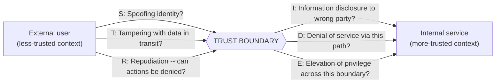
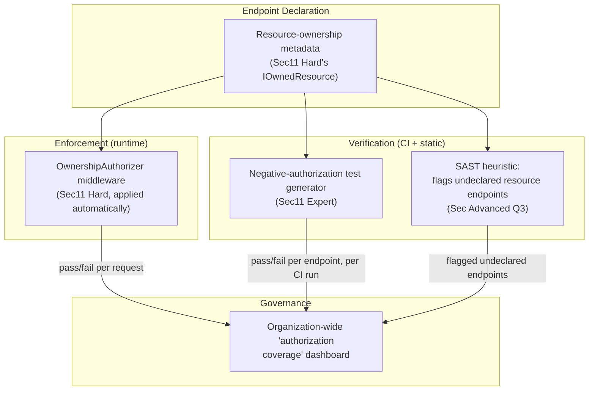

# Module 97 — Security: AppSec Fundamentals — OWASP Top 10, Secure Coding & Threat Modeling

> Domain: Security | Level: Beginner → Expert | Prerequisite: [[../02-DotNet-AspNetCore/04-Authentication-Authorization-Deep-Dive]] (authentication/authorization mechanics this module generalizes into the full OWASP threat landscape), [[../03-REST-APIs/02-API-Security-Rate-Limiting]] (API-specific security patterns this module broadens), [[../25-DevOps/04-DevSecOps-PolicyAsCode-PlatformEngineering]] §2.1 (shift-left SAST/SCA scanning this module's secure-SDLC and threat-modeling practices feed into upstream of); connects forward to the dedicated [[../40-IAM]] and [[../41-OAuth2-OIDC-JWT-PKCE]] modules for deep identity-protocol coverage, which this module deliberately does not duplicate

---

## 1. Fundamentals

**What**: Application security (AppSec) is the discipline of designing, building, and verifying software resistant to malicious misuse. The **OWASP Top 10** is a living, community-curated, evidence-based ranking of the most critical web-application security risk *categories* (not a fixed list of specific bugs), refreshed periodically from real-world breach and vulnerability data. **Secure coding practices** (input validation, output encoding, parameterized queries) are the concrete, code-level techniques that prevent those categories from manifesting. **Threat modeling** is a structured, upfront process — conducted at design time, before code is written — for systematically identifying what could go wrong in a system's specific architecture, rather than discovering it only via a late-stage penetration test or, worse, a live incident.

**Why it exists**: The overwhelming majority of real-world breaches trace back to a small, remarkably stable set of vulnerability *categories* — injection, broken access control, cryptographic failures — that remain common not because they're hard to understand, but because they're easy to omit under ordinary development pressure and easy to leave invisible to conventional testing, which by default verifies that intended behavior works and rarely verifies that unintended, adversarial behavior is actually blocked. This is directly Module 89 §2.2's fail-fast economics recurring in a security-specific form: a vulnerability caught at design time (via threat modeling) costs a design conversation; the identical vulnerability caught at code review costs a PR comment; caught in a late-stage security test, a remediation sprint; caught in production, a full incident response, customer notification, and potential regulatory consequence — the same cost curve this course has traced for testing, deployment, and CI/CD, now specifically for security defects.

**When it matters**: From the very first line of code handling any input that originates outside full application control (a user, another service, a file upload) — and threat modeling specifically matters *before* an architecture is locked in, since retrofitting a missing trust boundary or a missing authorization check into an already-built system is materially more disruptive than designing it in from the start.

**How (30,000-ft view)**:
```
OWASP Top 10: a RANKED, EVIDENCE-BASED list of vulnerability CATEGORIES (not
    specific bugs) -- injection, broken access control, cryptographic failures,
    security misconfiguration, vulnerable/outdated components, and more --
    refreshed periodically as real-world breach data shifts
Secure coding: parameterize (never concatenate/interpolate untrusted input into
    a query/command), encode output for its specific destination context (HTML
    vs JS vs URL), validate at every trust boundary, never trust client-side
    checks alone
Threat modeling (STRIDE): Spoofing, Tampering, Repudiation, Information
    disclosure, Denial of service, Elevation of privilege -- a structured
    walkthrough of a system's TRUST BOUNDARIES (where data crosses from a
    less-trusted to a more-trusted context) asking "what could go wrong here"
    BEFORE the system is built, not only tested after
Functional testing proves the HAPPY path works; it says NOTHING about whether
    the ADVERSARIAL path is blocked -- this module's central, recurring gap
```

---

## 2. Deep Dive

### 2.1 Injection — Parameterization, Not Sanitization, Is the Real Fix
Injection (SQL injection, command injection, LDAP injection, and their many variants) occurs when untrusted input is concatenated or interpolated directly into a command interpreter's syntax, allowing an attacker to alter the command's actual structure rather than merely supplying a data value. The durable fix is **parameterization** — using parameterized queries/prepared statements (or an ORM's parameterized query-building layer) so untrusted input is always transmitted as *data*, structurally incapable of altering the command's syntax, regardless of its content. **Sanitization/blocklisting** (stripping or rejecting "dangerous" characters like `'` or `;`) is a fundamentally weaker, incomplete defense — it requires anticipating every possible dangerous pattern in advance, an inherently open-ended and regularly-defeated arms race (a novel encoding, an unanticipated interpreter-specific syntax quirk), whereas parameterization closes the *entire category* structurally, regardless of what specific malicious pattern an attacker attempts.

### 2.2 Broken Access Control — Authentication Answers "Who," Authorization Answers "Allowed to Touch This Specific Thing"
**Authentication (AuthN)** establishes identity — confirming who the requester claims to be. **Authorization (AuthZ)** determines what that established identity is permitted to do, and critically, whether it's permitted to act on the *specific resource instance* being requested — a distinction conventional testing very commonly overlooks. **Insecure Direct Object Reference (IDOR)** — a specific, extremely common broken-access-control instance — occurs when an endpoint correctly confirms *a* user is authenticated, but never confirms *this specific* authenticated user is authorized to access *this specific* requested resource (e.g., an `/api/invoices/{id}` endpoint checking only that a valid session exists, never checking that the invoice with that ID actually belongs to the requesting user). OWASP has ranked broken access control as the single most prevalent real-world web-application risk category in its most recent rankings, precisely because it's this easy to build correctly-authenticated, incorrectly-authorized endpoints that pass every ordinary functional test.

### 2.3 Cryptographic Failures — a Brief Orientation (Deep Dive Reserved for Module 98)
Cryptographic failures (formerly "sensitive data exposure") occur when data requiring confidentiality or integrity protection — credentials, personal data, payment details — is transmitted or stored without adequate cryptographic protection, or protected with a broken/deprecated algorithm, a hardcoded key, or an insufficient key length. This module establishes only the *category's* place in the broader threat landscape and its relationship to threat modeling's trust-boundary analysis (§2.6); the specific mechanics of encryption, hashing, signing, and key management are this domain's next module's dedicated focus.

### 2.4 Cross-Site Scripting (XSS) and Cross-Site Request Forgery (CSRF)
**XSS** occurs when untrusted input is rendered into a page without appropriate output encoding for its specific rendering context, allowing an attacker's injected script to execute in another user's browser session — **stored XSS** (malicious input persisted and served to other users, e.g., a comment field), **reflected XSS** (malicious input echoed back immediately in a response, e.g., a search-results page), and **DOM-based XSS** (the vulnerability lives entirely in client-side JavaScript's own DOM manipulation, never touching the server at all) each requiring the identical fix — **context-appropriate output encoding** (HTML-encoding for HTML body content, JavaScript-encoding for content embedded in a script context, URL-encoding for content embedded in a URL) — plus a **Content-Security-Policy (CSP)** header as a defense-in-depth backstop restricting which script sources a page may execute at all. **CSRF** exploits a browser's automatic inclusion of ambient credentials (cookies) on cross-site requests, tricking a victim's browser into making an unwanted, authenticated request to a target site; the standard defenses are a **CSRF token** (a per-session or per-request secret value the legitimate page includes and the server verifies, which a cross-site attacker cannot obtain) and the **`SameSite` cookie attribute** (instructing the browser to withhold the cookie on cross-site requests entirely, a newer, structurally stronger complementary defense).

### 2.5 Security Misconfiguration, Vulnerable/Outdated Components, and SSRF
**Security misconfiguration** encompasses an enormous, easy-to-overlook category: default credentials never changed, verbose error messages leaking stack traces or internal architecture details to an attacker, unnecessary services or ports left exposed, and permissive default settings never hardened for production. **Vulnerable/outdated components** — using a dependency with a publicly-known CVE, unpatched — is directly Module 88 §2.1's SCA (software composition analysis) scanning's exact concern, now framed from the application-security side rather than the pipeline side: a codebase's own logic can be flawless while a dependency it pulls in carries a well-documented, exploitable vulnerability. **Server-Side Request Forgery (SSRF)** occurs when an application accepts a user-supplied URL and fetches it server-side without adequately restricting the destination, allowing an attacker to make the *server* (which often has privileged network access — internal services, cloud metadata endpoints) issue requests to internal-only targets the attacker could never reach directly themselves.

### 2.6 Threat Modeling — STRIDE, Trust Boundaries, and Shifting Left of the Pentest
**STRIDE** (Spoofing, Tampering, Repudiation, Information disclosure, Denial of service, Elevation of privilege) is a structured mnemonic for systematically walking a system's architecture and asking, at every **trust boundary** (a point where data or control crosses from a less-trusted context — an external user, a third-party service — into a more-trusted one — an internal service, a database), which of these six threat categories could apply. The critical discipline is doing this **at design time**, before an architecture is built and its trust boundaries are already baked in — a threat model conducted only after the fact (as a checklist applied to an already-built system) can still find value, but a threat model conducted *during* design can prevent an entire class of vulnerability from ever being architecturally possible, rather than requiring a later, more disruptive retrofit. This is the security domain's own instance of Module 89 §2.2's fail-fast, cheapest-check-first economic principle, applied at the very earliest possible point in the entire development lifecycle.

---

## 3. Visual Architecture

### AuthN vs. AuthZ — The Gap Broken Access Control Exploits (§2.2)
```
Request: GET /api/invoices/12345
Authorization: Bearer <valid token for User A>

Step 1 (AuthN): "Is this a VALID, authenticated session?"  --> YES (User A is real)
Step 2 (AuthZ -- OFTEN MISSING): "Does invoice 12345 actually BELONG to User A?"
    --> NEVER CHECKED in a vulnerable endpoint
Result: User A can view invoice 12345 even if it belongs to User B, simply by
    changing the ID in the URL -- an Insecure Direct Object Reference (IDOR).
```

### STRIDE Applied at a Trust Boundary (§2.6)


### Injection — Data vs. Syntax (§2.1)
```
VULNERABLE (string concatenation -- untrusted input becomes part of SYNTAX):
    query = "SELECT * FROM users WHERE name = '" + userInput + "'"
    userInput = "' OR '1'='1"  =>  query becomes a TAUTOLOGY, returns ALL rows

SAFE (parameterization -- untrusted input is ALWAYS data, never syntax):
    query = "SELECT * FROM users WHERE name = @name"
    parameters.Add("@name", userInput)
    => userInput's CONTENT is irrelevant to the query's STRUCTURE, always
```

---

## 4. Production Example

**Scenario**: A B2B SaaS platform's invoicing feature exposed a REST API endpoint, `GET /api/invoices/{invoiceId}`, allowing an authenticated customer to retrieve their own invoice details. The endpoint had been in production for over a year, passed every functional test the QA team had written, and had never triggered a single security alert.

**Investigation**: A customer, idly changing the numeric invoice ID in the URL out of curiosity, discovered they could retrieve another company's invoice — including that company's billing contact details, negotiated pricing, and line-item descriptions of purchased services. The customer reported this responsibly; a subsequent internal investigation confirmed the vulnerability was exploitable simply by incrementing or guessing any valid invoice ID, with no additional authentication or authorization bypass required beyond having any valid, authenticated session at all.

**Root cause**: The endpoint's implementation checked that the request carried a valid, authenticated session token (§2.2's AuthN check) but never checked that the requested invoice's owning customer matched the authenticated session's customer (§2.2's AuthZ check) — a textbook Insecure Direct Object Reference. The gap had never been caught because every existing functional test exercised only the "happy path" — a customer retrieving their *own* invoice, which the endpoint correctly served — and no test in the entire suite had ever attempted the adversarial scenario of one customer requesting a *different* customer's invoice ID and asserting that attempt should be rejected. Functional testing, by its nature, verifies that intended behavior works; it structurally never verifies that unintended, adversarial behavior is blocked unless a test is specifically, deliberately written to attempt exactly that adversarial action.

**Fix**: (1) Added an explicit, mandatory **object-level authorization check** to every resource-fetching endpoint in the codebase — verifying the requested resource's owning entity matches the authenticated principal's entity, not merely that some valid principal is authenticated, implemented as a reusable authorization-handler component (§13) applied consistently rather than re-implemented ad hoc per endpoint. (2) Established a new, mandatory **negative security-test class**: for every resource-scoped endpoint, an automated test specifically attempts cross-tenant/cross-user access to a resource the test's own authenticated principal does *not* own, asserting the attempt is rejected — closing the exact blind spot conventional, happy-path-only functional testing had left invisible. (3) Added this specific check — "does every resource-fetching endpoint verify object-level ownership, not merely authentication" — as a standing, named item in the organization's threat-modeling template (§2.6) for every future endpoint design, rather than relying on each engineer independently remembering to implement it.

**Lesson**: Functional testing proves the happy path works; it says nothing about whether the adversarial path is blocked — and broken object-level access control is specifically dangerous because it is invisible to exactly the kind of testing an organization is most naturally inclined to write by default. This is the security domain's own, well-grounded instance of this course's central, recurring "declared control ≠ actually enforced" theme: an endpoint that "has authorization" (a valid-session check exists) is not the same claim as an endpoint that "enforces authorization" (a per-resource ownership check exists) — and the gap between the two is invisible until a test, an auditor, or an attacker specifically, deliberately probes for it.

---

## 5. Best Practices
- Parameterize every query/command construction touching untrusted input — never rely on sanitization or blocklisting alone as the primary defense against injection (§2.1).
- Treat authentication and authorization as two distinct, both-required checks for every resource-scoped operation — verify not just that a principal is authenticated, but that the specific principal is authorized for the specific requested resource instance (§2.2, §4).
- Apply context-appropriate output encoding (HTML/JS/URL-specific) at every point untrusted data is rendered, backed by a Content-Security-Policy as defense-in-depth (§2.4).
- Keep dependencies patched against known CVEs (SCA scanning, Module 88 §2.1) and harden default configurations before production — verbose errors, default credentials, and unused exposed services are all avoidable, common gaps (§2.5).
- Conduct threat modeling (STRIDE, trust-boundary analysis) at design time, before architecture is locked in — not solely as a late-stage penetration test applied to an already-built system (§2.6).
- Write explicit, negative security tests (deliberately attempting adversarial, unauthorized access and asserting rejection) for every resource-scoped endpoint — never rely on happy-path functional tests alone to reveal an authorization gap (§4).

## 6. Anti-patterns
- Relying on sanitization/blocklisting as the primary or sole defense against injection, rather than structural parameterization (§2.1).
- An endpoint that checks only "is this request authenticated" without also checking "is this specific authenticated principal authorized for this specific requested resource" — the exact IDOR gap (§2.2, §4).
- Encoding output generically or inconsistently, rather than applying the specific encoding appropriate to each distinct rendering context (HTML vs. JS vs. URL) (§2.4).
- Leaving default credentials unchanged, verbose error/stack-trace details exposed to end users, or known-vulnerable dependencies unpatched in production (§2.5).
- Treating a late-stage penetration test as the organization's only threat-modeling activity, rather than conducting structured trust-boundary analysis at design time (§2.6).
- Writing only happy-path functional tests for resource-scoped endpoints, with no adversarial, cross-principal negative test ever exercising the unauthorized-access path (§4).

---

## 10. Interview Questions

### Basic (10)

1. **Q: What is the OWASP Top 10, and is it a list of specific bugs or something broader?**
   **A:** A living, evidence-based, ranked list of the most critical web-application security risk *categories* (not specific bugs), refreshed periodically from real-world vulnerability and breach data.
   **Why correct:** Correctly identifies it as a category-level ranking, not a fixed list of specific CVEs or exploits.
   **Common mistakes:** Treating the OWASP Top 10 as a static, unchanging checklist of ten specific vulnerabilities rather than an evolving, evidence-based categorization refreshed as real-world data shifts.
   **Follow-ups:** "Why does OWASP periodically re-rank these categories rather than keeping a fixed list?" (Because the relative prevalence and impact of each category shifts over time as development practices, tooling, and attacker techniques evolve — the ranking reflects current, real-world evidence, not a permanently fixed taxonomy.)

2. **Q: Why is parameterization considered a structurally stronger defense against injection than sanitization/blocklisting?**
   **A:** Parameterization ensures untrusted input is always transmitted as data, structurally incapable of altering a command's syntax regardless of content. Sanitization/blocklisting requires anticipating every dangerous pattern in advance — an open-ended, regularly-defeated arms race against novel encodings or interpreter-specific quirks.
   **Why correct:** States the specific structural reason (data vs. syntax) parameterization closes the entire category, versus blocklisting's inherently incomplete, pattern-anticipation approach.
   **Common mistakes:** Assuming a sufficiently thorough blocklist/sanitization routine can achieve equivalent protection to parameterization, without recognizing the fundamentally open-ended nature of anticipating every dangerous input pattern.
   **Follow-ups:** "Is sanitization ever still useful alongside parameterization?" (Yes, as defense-in-depth or for contexts where parameterization genuinely isn't available — e.g., dynamic identifier names a parameterized query can't parameterize — but never as the primary or sole defense where parameterization is available.)

3. **Q: What is the difference between authentication and authorization?**
   **A:** Authentication establishes identity — confirming who the requester claims to be. Authorization determines what that established identity is permitted to do, including whether it's permitted to act on the specific resource instance being requested.
   **Why correct:** States both concepts' distinct purposes precisely, including the resource-instance-specific scope authorization must cover.
   **Common mistakes:** Treating "the user is logged in" as equivalent to "the user is allowed to do this specific thing," conflating authentication with authorization.
   **Follow-ups:** "Which of the two does a session token/JWT typically establish?" (Authentication — proving the request comes from a specific, previously-authenticated identity; authorization is a separate check the application must still perform for each specific action/resource.)

4. **Q: What is an Insecure Direct Object Reference (IDOR)?**
   **A:** A vulnerability where an endpoint correctly confirms a user is authenticated but never confirms that specific user is authorized to access the specific requested resource instance — allowing access to another user's data simply by changing an identifier (e.g., a URL parameter).
   **Why correct:** States the precise mechanism (missing object-level ownership check) distinguishing IDOR from other access-control failures.
   **Common mistakes:** Assuming IDOR requires some sophisticated exploit technique, rather than recognizing it's often exploitable by simply changing a visible identifier with no special tooling required.
   **Follow-ups:** "Why does IDOR commonly evade conventional functional testing?" (Because functional tests typically verify a user can access their own resources correctly — the happy path — and rarely include a deliberate, adversarial test attempting cross-user access to assert it's blocked.)

5. **Q: What is the difference between stored, reflected, and DOM-based XSS?**
   **A:** Stored XSS persists malicious input and serves it to other users later (e.g., a comment field). Reflected XSS echoes malicious input back immediately in the same response (e.g., a search page). DOM-based XSS occurs entirely within client-side JavaScript's own DOM manipulation, never touching the server.
   **Why correct:** States each variant's distinct mechanism (persistence timing and location) precisely.
   **Common mistakes:** Assuming all three variants require the same detection/fix approach, missing that DOM-based XSS specifically requires reviewing client-side JavaScript logic, not merely server-side output encoding.
   **Follow-ups:** "What single underlying defense addresses all three variants?" (Context-appropriate output encoding wherever untrusted data is rendered, applied consistently on both server-rendered and client-side-rendered output paths.)

6. **Q: What does the `SameSite` cookie attribute do, and how does it help defend against CSRF?**
   **A:** It instructs the browser to withhold a cookie on cross-site requests (to varying degrees depending on its setting), preventing an attacker's cross-site page from having the victim's authenticated session cookie automatically included in a forged request to the target site.
   **Why correct:** States the specific browser-level mechanism and how it interrupts CSRF's core exploitation of ambient, automatically-included credentials.
   **Common mistakes:** Assuming `SameSite` alone is a complete CSRF defense in every scenario, without recognizing CSRF tokens remain a valuable, complementary defense particularly for legacy browsers or specific `SameSite` configuration edge cases.
   **Follow-ups:** "What's the difference between `SameSite=Strict` and `SameSite=Lax`?" (`Strict` withholds the cookie on virtually all cross-site requests including top-level navigation; `Lax` permits the cookie on top-level, "safe" cross-site navigations like clicking a link, while still withholding it on cross-site subresource/form-POST requests — a trade-off between security strictness and preserving ordinary cross-site link-following usability.)

7. **Q: What is Server-Side Request Forgery (SSRF)?**
   **A:** A vulnerability where an application accepts a user-supplied URL and fetches it server-side without adequately restricting the destination, allowing an attacker to make the server issue requests to internal-only targets (internal services, cloud metadata endpoints) the attacker couldn't reach directly.
   **Why correct:** States the mechanism and specifically why it's dangerous (the server's own, often-privileged network access, not the attacker's).
   **Common mistakes:** Assuming SSRF is only a concern if the attacker could otherwise reach the target directly, missing that the entire point is exploiting the server's own privileged network position.
   **Follow-ups:** "Why are cloud metadata endpoints a particularly high-value SSRF target?" (Many cloud platforms expose an internal-only metadata endpoint (e.g., at a well-known internal IP) that can return sensitive instance credentials/tokens — an SSRF vulnerability letting an attacker reach this endpoint can yield direct, high-privilege credential theft.)

8. **Q: What does STRIDE stand for, and what is it used for?**
   **A:** Spoofing, Tampering, Repudiation, Information disclosure, Denial of service, Elevation of privilege — a structured mnemonic for threat modeling, used to systematically ask which of these six threat categories could apply at each trust boundary in a system's architecture.
   **Why correct:** States the full mnemonic and its specific application (trust-boundary-by-trust-boundary threat analysis).
   **Common mistakes:** Treating STRIDE as a checklist applied only after a system is built, rather than a design-time analysis method meant to be applied before architecture is locked in.
   **Follow-ups:** "What is a trust boundary?" (A point where data or control crosses from a less-trusted context — an external user, a third-party service — into a more-trusted one, such as an internal service or database — exactly where STRIDE's questions should be applied.)

9. **Q: Why does threat modeling ideally happen at design time rather than only via a late-stage penetration test?**
   **A:** A vulnerability caught at design time costs a design conversation to prevent; the identical vulnerability caught via a late-stage pentest (or worse, a live incident) requires a materially more disruptive retrofit, mirroring the same fail-fast, cheapest-check-first economics this course established for CI pipeline stage ordering.
   **Why correct:** States the specific cost-curve rationale, connecting it to an already-established course principle.
   **Common mistakes:** Assuming a thorough pentest late in development provides equivalent value to design-time threat modeling, without considering the cost difference between preventing an architectural flaw and retrofitting a fix into an already-built system.
   **Follow-ups:** "Does threat modeling replace the need for a later penetration test?" (No — they're complementary: threat modeling prevents entire classes of vulnerability from being architecturally possible in the first place; a pentest verifies the as-built system against both anticipated and unanticipated attack techniques, catching implementation-level gaps threat modeling's design-level analysis wouldn't necessarily reveal.)

10. **Q: Why does a security-vulnerability-free result on a full functional test suite not imply an application has no broken-access-control vulnerabilities?**
    **A:** Functional tests, by their nature, verify that intended behavior works correctly (a user can access their own resources) — they don't inherently verify that unintended, adversarial behavior is blocked (a different user is prevented from accessing those same resources), unless a test is specifically, deliberately written to attempt exactly that adversarial scenario.
    **Why correct:** States the precise reason (happy-path-only test design) a clean functional-test result provides no evidence about adversarial-path enforcement.
    **Common mistakes:** Assuming a comprehensive functional test suite with high coverage implicitly also validates security/authorization correctness, without recognizing these are structurally different testing goals requiring different, deliberately-adversarial test design.
    **Follow-ups:** "What kind of test would specifically catch an IDOR vulnerability?" (A negative security test: authenticate as one principal, attempt to access a resource owned by a different principal, and assert the attempt is rejected — a test category most functional test suites don't include by default unless explicitly, deliberately added.)

### Intermediate (10)

1. **Q: Why did §4's IDOR vulnerability go undetected for over a year despite passing every existing functional test?**
   **A:** Every existing test exercised only the happy path (a customer retrieving their own invoice, which the endpoint correctly served) — no test in the suite had ever been written to attempt the adversarial scenario (a different customer's invoice ID) and assert that attempt should be rejected, since functional test suites are conventionally designed around verifying intended behavior, not adversarial behavior.
   **Why correct:** Identifies the specific structural reason (no negative security test existed) rather than attributing the gap to inadequate general test coverage.
   **Common mistakes:** Assuming a higher overall test coverage percentage (Module 90's coverage metric) would have caught this, without recognizing that coverage measures whether code paths execute during tests, not whether adversarial *scenarios* specifically were ever attempted.
   **Follow-ups:** "How does this relate to Module 90's coverage-gaming finding?" (A structurally similar gap in a different guise — high code coverage on the vulnerable endpoint could coexist entirely with zero adversarial-scenario testing, since coverage measures execution, not the specific intent or adversarial nature of what was executed.)

2. **Q: A team argues that since their API requires a valid authentication token on every request, their access-control posture is sound. Evaluate this claim.**
   **A:** Requiring authentication on every request only closes the "is this an authenticated principal at all" gap — it says nothing about whether each authenticated principal is specifically authorized for the specific resource instance it requests, precisely §4's exact gap. A uniformly-enforced authentication requirement and object-level authorization are two independent, both-necessary checks; confirming one provides zero evidence about the other.
   **Why correct:** Distinguishes the authentication requirement's actual scope from the separate, additional authorization requirement, explaining why satisfying one doesn't imply the other.
   **Common mistakes:** Conflating "every request requires valid authentication" with "access control is comprehensively enforced," missing the distinct, additional object-level authorization check this doesn't cover.
   **Follow-ups:** "How would you verify object-level authorization is actually enforced, rather than merely assumed?" (§4's fix — a deliberate, negative security test attempting cross-principal access to a specific resource and asserting rejection, for every resource-scoped endpoint.)

3. **Q: Why might a code reviewer, reading the vulnerable endpoint's source code directly, still miss the IDOR gap during review, even though the missing check is objectively absent from the code?**
   **A:** A code reviewer's attention is naturally drawn toward confirming the code correctly implements its *intended* behavior (does it fetch and return the invoice correctly) rather than actively, adversarially asking "what check is absent that should be present" — the absence of a specific security check is far harder to notice during review than the presence of an incorrect one, since there's no visible, incorrect code to flag; the gap is a *missing* line, not a *wrong* one.
   **Why correct:** Identifies the specific cognitive reason (reviewing for correctness of what's present, not for the absence of what should be present) that makes a missing authorization check particularly easy to overlook during ordinary code review.
   **Common mistakes:** Assuming code review alone is a reliable safeguard against this class of vulnerability, without recognizing that spotting an *absence* requires a specifically different, checklist-driven review discipline than spotting an incorrect *presence*.
   **Follow-ups:** "What review practice would specifically help catch this kind of gap?" (A standing, checklist-driven review requirement — "does this endpoint verify object-level ownership, not merely authentication" — explicitly prompting the reviewer to check for the specific absence, rather than relying on the reviewer's own, unprompted vigilance to notice a missing check.)

4. **Q: Why is a Content-Security-Policy (CSP) header described as "defense-in-depth" for XSS rather than a primary fix?**
   **A:** CSP restricts which script sources a page may execute at all, providing a valuable backstop if an XSS payload somehow makes it into the page despite output-encoding efforts — but it doesn't prevent the underlying encoding gap from existing in the first place, and a sufficiently permissive CSP configuration (or one an attacker can find a bypass within) provides no protection at all. The primary fix remains context-appropriate output encoding at the point of rendering; CSP is a secondary, backstop layer, not a substitute.
   **Why correct:** Explains why CSP is complementary rather than a primary fix, and the specific risk (permissive configuration, potential bypass) of relying on it alone.
   **Common mistakes:** Treating a strict CSP as a sufficient, complete XSS defense on its own, without maintaining rigorous output encoding as the primary, first-line defense.
   **Follow-ups:** "What's a common CSP misconfiguration that undermines its protective value?" (Allowing `unsafe-inline` script execution, which defeats much of CSP's core protection against injected inline scripts — a common, expedient configuration choice made to avoid refactoring inline scripts, that significantly weakens the policy's actual protective value.)

5. **Q: How does a known-vulnerable dependency (§2.5) differ from an application's own code-level vulnerability, in terms of how an organization should detect and remediate it?**
   **A:** An application's own code-level vulnerability (e.g., a missing authorization check) requires code review, testing, or SAST tooling specific to the application's own logic to detect. A known-vulnerable dependency's vulnerability already has a public CVE and disclosed details — detection requires SCA (software composition analysis) tooling matching the dependency's declared version against a vulnerability database (Module 88 §2.1's exact mechanism), and remediation is typically a version upgrade rather than a custom code fix — a fundamentally different detection and remediation workflow than an application's own logic errors.
   **Why correct:** Distinguishes the detection mechanism (SCA vs. SAST/code review) and remediation approach (upgrade vs. custom fix) between the two vulnerability sources.
   **Common mistakes:** Assuming the same code-review/testing practices that catch application-logic vulnerabilities would also reliably catch a known-vulnerable dependency, missing that dependency vulnerabilities require a distinct, database-matching detection mechanism (SCA) rather than code inspection.
   **Follow-ups:** "Why might an organization still be exploited via a known CVE even with SCA scanning in place?" (If the SCA scan runs but its findings aren't actually gated/enforced — mirroring this course's now-repeated finding that a declared scanning practice without enforced blocking gates provides no real protection, exactly Module 88 §4's identical write-path-coverage gap now recurring for dependency vulnerabilities specifically.)

6. **Q: Why does the specific example of a numeric, sequentially-incrementing resource ID (as in §4's incident) make an IDOR vulnerability particularly easy for an attacker to exploit at scale, compared to, say, a UUID?**
   **A:** A sequential numeric ID is trivially enumerable — an attacker (or even an ordinary curious user, as in §4) can simply increment or decrement the ID to systematically discover and access every other resource in the system. A UUID (a large, effectively unguessable random identifier) doesn't prevent the underlying authorization gap from existing, but it does prevent trivial, systematic enumeration, meaning an attacker would need to already know or otherwise obtain a specific valid ID to exploit the same underlying gap — reducing the practical blast radius even though the vulnerability itself remains present.
   **Why correct:** Distinguishes "the vulnerability exists" from "the vulnerability is trivially, systematically exploitable at scale," explaining the specific mitigating (but not fully corrective) effect of unguessable identifiers.
   **Common mistakes:** Assuming switching to UUIDs fully fixes an IDOR vulnerability, rather than recognizing it only raises the practical difficulty of enumeration — the underlying missing authorization check remains a real vulnerability regardless of identifier scheme, exploitable by anyone who obtains even one specific valid ID through any means.
   **Follow-ups:** "Should an organization treat 'switch to UUIDs' as an acceptable substitute for fixing the underlying authorization gap?" (No — UUIDs are valuable defense-in-depth reducing enumerability, but the object-level authorization check itself remains the mandatory, primary fix; treating identifier obscurity as a substitute for genuine authorization enforcement is itself a form of "security through obscurity" this course would flag as an anti-pattern.)

7. **Q: How would you extend §4's fix (a mandatory negative security-test class for every resource-scoped endpoint) to scale across an organization with hundreds of endpoints and many independent teams, without relying purely on each team's individual diligence to remember to write these tests?**
   **A:** Build the negative-authorization test as a **generic, reusable test-framework capability** (a shared test helper or a code-generation template that, given an endpoint's resource-scoping metadata, automatically generates the cross-principal negative test) rather than requiring each team to hand-write it per endpoint from scratch — directly mirroring this course's now-repeated finding that a structural, automated/platform-provided capability reliably outperforms a documented practice relying on individual team diligence (Module 88 §17's golden-path principle, applied here to security test generation specifically).
   **Why correct:** Proposes a concrete, scalable, structural mechanism (reusable test-generation capability) rather than relying on documentation or training alone.
   **Common mistakes:** Relying solely on a security guideline/checklist document instructing teams to "remember to write negative authorization tests," recreating the "declared practice without structural enforcement" gap this course has repeatedly flagged as insufficient.
   **Follow-ups:** "How would this generic test helper determine which resource-scoping metadata to use for a given endpoint?" (Via an explicit, declared ownership-check metadata attribute/convention on each endpoint (e.g., "this endpoint's resource is scoped by `CustomerId`") that the test-generation tooling reads to automatically construct the appropriate cross-principal test scenario, without requiring endpoint-specific manual test authoring.)

8. **Q: Why might an organization's threat-modeling practice, even when conducted diligently at design time, still fail to prevent an IDOR vulnerability like §4's from being introduced later?**
   **A:** Threat modeling is typically conducted once, at a system's initial design — but a new endpoint added months or years later, by an engineer unfamiliar with (or simply not consulting) the original threat model, could easily omit the object-level authorization check the original design's threat model correctly anticipated for its initial endpoints, since the original threat-modeling exercise doesn't automatically extend its analysis to every subsequently-added endpoint without a deliberate, ongoing practice ensuring new endpoints are reviewed against the same standard.
   **Why correct:** Identifies that threat modeling's value is bounded by when and how consistently it's applied — a one-time exercise at initial design doesn't automatically cover subsequent additions unless explicitly, continuously re-applied.
   **Common mistakes:** Assuming a thorough, one-time threat-modeling exercise at a system's inception provides durable, ongoing protection against vulnerabilities introduced in any later addition to that system.
   **Follow-ups:** "How would you ensure threat modeling's protection extends to future endpoint additions, not just the system's initial design?" (Make a lightweight, mandatory threat-model review (or the automated negative-test-generation requirement from §Intermediate Q7) a required step in every new endpoint's design/review process going forward, not a one-time exercise performed only at the system's original inception.)

9. **Q: A security audit finds an application's SAST (static analysis) tooling correctly flags SQL-injection-vulnerable string concatenation patterns, but the audit still discovers a live SQL injection vulnerability in production. How would you investigate this apparent contradiction?**
   **A:** Check whether the SAST tool's findings are actually gated/enforced (blocking a merge) or merely advisory/informational (visible in a report but not blocking) — directly Module 88 §4's identical "declared scanning practice without enforced blocking" gap; also check whether the specific vulnerable code pattern uses a variant (a dynamic query built via string formatting rather than direct concatenation, or a less-common ORM API bypassing its usual parameterized path) that the SAST tool's specific pattern-matching rules don't recognize, since SAST tools' detection coverage is itself bounded by the specific patterns their rules were built to recognize, not a complete, guaranteed detection of every possible injection-vulnerable code shape.
   **Why correct:** Proposes two concrete, plausible investigative directions (enforcement gap, or a detection-pattern blind spot) rather than assuming the SAST tool's mere presence guarantees complete protection.
   **Common mistakes:** Assuming a SAST tool's presence and correct flagging of *some* injection patterns implies comprehensive detection of *every* injection-vulnerable pattern in the codebase, without considering its detection rules have their own, bounded scope.
   **Follow-ups:** "How does this connect to this course's broader 'declared/present ≠ actual/complete' theme?" (Directly — a SAST tool's presence and correct operation on the patterns it was built to detect provides no evidence about its coverage of patterns outside that scope, exactly the same "presence ≠ completeness" gap this course has traced across observability, CI/CD, and now application security.)

10. **Q: How does this module's central IDOR finding extend this course's broader "declared/present ≠ actual/complete" theme into the security domain specifically, and what is genuinely new about this instance compared to the course's prior instances in other domains?**
    **A:** Every prior instance (Kubernetes object presence, Terraform drift, CI coverage gaming, CD gate bypass, observability's telemetry/alerting/runbook/onboarding gaps) concerned a declared *technical or procedural* control silently not covering its full intended scope. This module's instance is specifically about **testing methodology's own default bias**: functional testing, by its conventional design, verifies intended behavior and structurally never verifies that unintended, adversarial behavior is blocked, unless a test is deliberately, specifically written to attempt exactly that adversarial scenario. This is a meta-level instance of the theme — not merely "a specific control is incomplete," but "the entire conventional testing discipline this course has built up around (coverage, quality gates, CI pipelines) has a structural blind spot toward adversarial scenarios specifically, regardless of how comprehensive its happy-path coverage is."
    **Why correct:** Correctly identifies this instance's genuinely new contribution — not merely another example of an incomplete control, but a structural bias in the testing discipline itself that no amount of happy-path coverage improvement would address.
    **Common mistakes:** Treating this as simply "another example of a declared control being incomplete" without recognizing the specifically new insight — that conventional testing methodology itself, regardless of how rigorously applied, has a structural blind spot toward adversarial scenarios that requires a deliberately different, adversarially-minded test design discipline to close.
    **Follow-ups:** "How should this insight change how a Principal Engineer evaluates a team's 'we have 95% test coverage' claim, going forward?" (Recognize that coverage percentage says nothing about whether any of that coverage includes deliberately adversarial, security-relevant negative tests — a Principal Engineer should specifically ask "does our test suite include negative security tests for resource-scoped access control," a qualitatively different question than "what is our coverage percentage.")

### Advanced (10)

1. **Q: Diagnose §4's incident from first principles and design the complete structural fix — not merely the three specific remediations already described.**
   **A:** Root cause: the endpoint's implementation conflated "is this request authenticated" with "is this request authorized for this specific resource," and the organization's testing methodology structurally only verified the former's absence-of-error happy path, never the latter's adversarial rejection path — a testing-discipline blind spot, not merely a single missing line of code. Complete structural fix: (1) the immediate object-level authorization check on the affected endpoint; (2) a reusable, platform-provided negative-authorization test-generation capability (§Intermediate Q7) applied across every resource-scoped endpoint organization-wide, not merely the one discovered; (3) an explicit, standing threat-modeling checklist item requiring object-level authorization review for every new endpoint (§Intermediate Q8), ensuring future additions don't recreate the gap; (4) a SAST/code-review checklist update specifically prompting reviewers to check for the *absence* of an object-level authorization check (§Intermediate Q3), since this class of gap is specifically hard to notice via ordinary review; (5) a proactive, organization-wide audit of every existing resource-scoped endpoint for the identical missing-object-level-authorization pattern, since one confirmed instance strongly suggests the same conflation (AuthN-only, no AuthZ) plausibly recurs elsewhere in the codebase.
   **Why correct:** Addresses the root cause (a testing-methodology blind spot, not merely one missing check) with a complete, layered fix spanning immediate remediation, structural test-generation, design-time prevention, review-process improvement, and proactive organization-wide audit.
   **Common mistakes:** Fixing only the one specific endpoint discovered without also building the structural test-generation capability and conducting the organization-wide audit, leaving the identical gap free to exist undiscovered in every other resource-scoped endpoint.
   **Follow-ups:** "How would you prioritize these fixes given limited immediate security-engineering capacity?" (The immediate endpoint fix first, given its confirmed, active exploitability; the organization-wide audit second, since it directly surfaces the actual current exposure scope; the reusable test-generation capability and threat-modeling checklist update third and fourth, as durable, forward-looking structural investments.)

2. **Q: A Principal Engineer is asked whether the organization should respond to §4's incident by mandating a full penetration test before every single production release, given the severity of the discovered vulnerability. Evaluate this proposal.**
   **A:** A full penetration test before every release would introduce substantial, likely release-blocking latency into the delivery pipeline — directly recreating Module 92 §4's friction-driven-bypass dynamic (a gate whose cost the release cadence can't sustainably absorb predictably gets routed around under real delivery pressure) in a security-specific context. The more targeted, proportionate response is the layered fix from Advanced Q1 — structural, automated negative-authorization testing integrated into ordinary CI (catching this specific vulnerability class continuously, at effectively zero incremental release-time cost) plus periodic, risk-tiered penetration testing (not gating every single release) for deeper, less-automatable vulnerability classes — achieving comprehensive protection without recreating the exact friction-driven-bypass risk this course has repeatedly identified as the predictable consequence of an unproportionate, blanket gate.
   **Why correct:** Identifies the proposal as recreating an already-established, predictable overcorrection pattern (excessive, uniform friction driving bypass) and proposes the already-validated, risk-proportionate alternative.
   **Common mistakes:** Assuming "more security testing, applied maximally and uniformly to every release" is unconditionally safer, without considering the friction-driven-bypass risk this course has repeatedly demonstrated such uniform, maximal gates predictably create.
   **Follow-ups:** "How would you communicate this evaluation to a security-focused stakeholder proposing the mandatory-full-pentest-every-release policy?" (Acknowledge the legitimate underlying concern, then present the layered, risk-tiered alternative — automated negative-authorization testing continuously, periodic deeper pentesting risk-tiered by release scope/risk — as achieving the same protective intent without recreating Module 92's already-demonstrated friction-driven-bypass risk.)

3. **Q: Design an automated, CI-integrated check that would have caught §4's vulnerability class (missing object-level authorization) at the code level, before it ever reached production, without requiring a human to manually write a negative test for every single endpoint.**
   **A:** A static-analysis rule (extending the organization's existing SAST tooling, Module 88 §2.1) that flags any endpoint handler retrieving a resource by an ID parameter sourced from the request, where the resulting resource object is returned to the caller, but where no code path in that handler references the authenticated principal's identity in constructing the resource-retrieval query or in a subsequent ownership-comparison check — a structural, pattern-based detection of "resource fetched by request-supplied ID, but the authenticated principal's identity is never referenced anywhere in the retrieval or a subsequent check," flagging this pattern for mandatory human review even if it can't with full certainty distinguish every legitimate use of an unrestricted/public resource endpoint from a genuine, missing-check vulnerability.
   **Why correct:** Proposes a concrete, automatable static-analysis heuristic targeting the exact missing-reference pattern (principal identity never touching the retrieval/authorization path) that characterizes this vulnerability class, while acknowledging it would require human review to filter genuine positives from legitimately-public endpoints.
   **Common mistakes:** Assuming this vulnerability class is fundamentally impossible to detect via static analysis and requires purely manual review or dynamic negative testing, without considering that a heuristic-based static rule (even an imperfect one requiring human triage) can meaningfully raise detection coverage at low, continuous cost.
   **Follow-ups:** "What's the risk of this static-analysis rule producing too many false positives on legitimately-public endpoints (e.g., a public product catalog with no ownership concept)?" (An excessive false-positive rate risks the exact alert-fatigue dynamic this course examined in Module 94 §2.4 — engineers learning to reflexively dismiss the rule's findings; the rule should support an explicit, reviewed "this endpoint is intentionally unrestricted" annotation/suppression mechanism, converting an ambiguous finding into either a fixed gap or a documented, deliberate exception, rather than a repeatedly-ignored false alarm.)

4. **Q: How would you extend §4's negative-authorization testing practice to also cover a more subtle variant of broken access control: an endpoint that correctly checks resource ownership for a single, direct resource ID, but fails to enforce the same check for a *nested* or *related* resource reachable indirectly through it (e.g., `/api/invoices/{invoiceId}/line-items/{lineItemId}` correctly validating the invoice's ownership but never validating that the specific line item actually belongs to that specific invoice)?**
   **A:** The negative-authorization test-generation capability (§Intermediate Q7) must be extended to recognize and test **every** identifier appearing in a resource-scoped route path, not merely the first/primary one — generating a negative test for each nested identifier independently (does line item X actually belong to invoice Y, not merely does invoice Y belong to the authenticated principal) — since a vulnerability at any nesting level produces the identical class of unauthorized-access risk, just one level deeper in the resource hierarchy, and a test-generation approach only covering the top-level identifier would systematically miss this entire, deeper variant.
   **Why correct:** Identifies the specific, deeper variant (nested-resource ownership validation) and explains why the test-generation approach must be extended to cover every identifier in a resource path, not merely the outermost one.
   **Common mistakes:** Assuming a fix validating only the top-level/primary resource identifier's ownership is a complete solution, without recognizing that nested or related resources reachable through it require their own, independent ownership validation at each level.
   **Follow-ups:** "Why might this nested variant be even easier to overlook during code review than the simpler, single-level IDOR from §4?" (Because the primary resource's ownership check *is* present and visible in the code, making a reviewer more likely to conclude "authorization is handled here" without separately verifying that every nested identifier is also independently validated — the presence of a partial, correct-looking check can create false confidence that occludes the additional, missing check one level deeper.)

5. **Q: How does this module's central finding interact with a microservices architecture (Module 17) specifically, where a single user-facing request might traverse multiple internal services before reaching the resource-fetching endpoint?**
   **A:** In a microservices architecture, object-level authorization enforcement can become ambiguous about *which specific service* is responsible for enforcing it — an API gateway might correctly authenticate the request and forward it internally, but if the *downstream* service handling the actual resource fetch assumes the gateway or an upstream service already enforced object-level ownership (when it didn't), the check can be silently, entirely skipped across the whole request path, with each individual service correctly believing "that's someone else's responsibility." This directly recurs Module 88 §2.4's "defense-in-depth across every write path" principle in an authorization-specific form: object-level authorization should be enforced at the specific service that has authoritative knowledge of the resource's true ownership (typically the service owning that resource's data), not assumed to have been handled upstream by a different service that may have no actual visibility into resource-level ownership at all.
   **Why correct:** Identifies the specific ambiguity a multi-service request path introduces (each service assuming another handles it) and connects it to an already-established course principle (defense-in-depth, explicit ownership) applied to authorization specifically.
   **Common mistakes:** Assuming an API gateway's authentication check is sufficient for the entire downstream request path, without considering that object-level authorization specifically requires enforcement at whichever service actually has authoritative knowledge of true resource ownership.
   **Follow-ups:** "Should every service in the call chain re-verify object-level authorization independently, or only the resource-owning service?" (At minimum, the resource-owning service must enforce it authoritatively, since only it has genuine, authoritative knowledge of true ownership; additional, redundant checks at other services in the chain can serve as valuable defense-in-depth but shouldn't be relied upon as the sole enforcement point, since an intermediate service's own view of "ownership" may itself be stale, cached, or otherwise not authoritative.)

6. **Q: A team's threat-modeling exercise, applied to a new feature's design, correctly identifies and mitigates an IDOR risk at the API layer — but the same underlying data later becomes exposed via an entirely separate reporting/analytics export feature that queries the same underlying database directly, bypassing the API layer's authorization checks entirely. Diagnose this as a distinct finding from §4's original incident.**
   **A:** This is a distinct instance of Module 88 §2.4's "defense-in-depth across every write path" principle — but now applied to a **read path** specifically: the threat model correctly covered one specific access path (the API layer) but didn't extend its analysis to every *other* path through which the same underlying data could be reached (a reporting export, a direct database query, an administrative tool) — precisely mirroring Module 88 §4's admission-control-bypass finding (a policy enforced at only one of several write paths provides no protection against any path it doesn't cover), now recurring for data-access authorization specifically, and demonstrating that "we threat-modeled this system" must explicitly enumerate and cover *every* path data can be reached through, not merely the most obvious, primary one.
   **Why correct:** Correctly identifies this as a distinct, defense-in-depth-across-every-path finding (a different access path entirely) rather than a mere repeat of §4's original API-layer IDOR, and connects it explicitly to an already-established, structurally identical course principle.
   **Common mistakes:** Treating this as "the same IDOR bug happening twice," without recognizing it's a categorically distinct failure — a threat model correctly covering one access path but never enumerating or covering a second, entirely separate one.
   **Follow-ups:** "How would you extend threat modeling to systematically catch this class of gap — every path to the same data, not just the primary one?" (Explicitly enumerate every distinct access path to a given sensitive dataset as its own, separate line item in the threat-modeling exercise — the API, any reporting/export feature, any administrative tooling, any direct data-store access — rather than threat-modeling only the primary, most obvious access path and implicitly assuming it's the only one that exists.)

7. **Q: How would a mature, risk-tiered bug-bounty program complement (not substitute for) the structural fixes (Advanced Q1) an organization builds internally in response to §4's incident?**
   **A:** Internal structural fixes (automated negative-authorization testing, static-analysis heuristics, threat-modeling checklist updates) are proactive and systematic but bounded by what the organization's own engineers anticipate and build detection for; a bug-bounty program provides a genuinely independent, adversarial, and continuously-refreshed detection signal from external researchers actively probing for vulnerability classes and specific exploitation techniques the internal team may not have anticipated — directly analogous to this course's now-established principle that an internal, self-verifying control benefits from an independent, external check confirming it (Module 88 §Advanced Q7's policy-liveness canary providing an internal analog; a bug bounty providing the external, adversarial equivalent for application security specifically).
   **Why correct:** Correctly frames the bug-bounty program as a complementary, independent verification layer rather than a substitute for internal structural fixes, and connects it to this course's established internal-vs-external-verification distinction.
   **Common mistakes:** Treating a bug-bounty program as a substitute for building internal, structural detection/prevention mechanisms, rather than recognizing it as a valuable, independent, complementary layer specifically valuable because it isn't bounded by the internal team's own anticipation.
   **Follow-ups:** "What specific risk does relying solely on a bug-bounty program (with no internal structural fixes) carry?" (A bug-bounty program only surfaces vulnerabilities that a researcher happens to actively probe for and choose to report — it provides no guarantee of comprehensive coverage across every endpoint, and offers no structural prevention of new, similar vulnerabilities being introduced in future code changes, unlike an internal, automated negative-test-generation capability applied continuously in CI.)

8. **Q: How does this module's finding about testing methodology's structural bias toward happy-path verification (§Intermediate Q10) connect to and extend Module 90's coverage-gaming finding specifically?**
   **A:** Module 90's finding was that a measured proxy (coverage percentage) can be *gamed* — deliberately or inadvertently satisfied in letter while abandoning its purpose (assertion-free tests). This module's finding is structurally prior to and independent of gaming: even a coverage metric measured with full integrity, on tests genuinely containing meaningful assertions, provides zero information about whether *any* of those tests are adversarial/security-focused versus purely happy-path/functional — meaning a security-relevant gap can exist with a perfectly legitimate, non-gamed, high coverage number, a distinct and arguably more fundamental limitation than Module 90's gaming concern, since it doesn't even require any bad-faith or careless test-writing to produce the blind spot; it's a structural property of what coverage measures (code execution) versus what it doesn't measure (adversarial intent).
   **Why correct:** Precisely distinguishes this module's finding (a structural blind spot in what coverage measures at all) from Module 90's finding (a measured proxy being gamed), explaining why this module's concern is prior to and independent of the gaming question.
   **Common mistakes:** Treating this module's finding as simply "another instance of coverage being gamed," without recognizing that even ungamed, entirely legitimate high coverage says nothing about adversarial-test presence — a structurally different and, in some sense, more fundamental limitation of the coverage metric itself.
   **Follow-ups:** "Should organizations track a separate, distinct 'adversarial/security test coverage' metric alongside ordinary code coverage, given this distinction?" (Plausibly yes — a metric specifically measuring what fraction of resource-scoped endpoints have a corresponding negative authorization test, tracked and gated independently from ordinary code coverage, directly closing the specific blind spot this module identifies rather than relying on ordinary coverage to somehow also reflect adversarial-test presence, which it structurally cannot.)

9. **Q: A security team proposes that, given the severity of broken-access-control vulnerabilities, every single API endpoint in the organization should require object-level authorization checks, even ones serving genuinely public, unrestricted data with no ownership concept at all (e.g., a public product catalog). Evaluate this proposal.**
   **A:** This overcorrects by applying a uniform requirement regardless of whether a given endpoint's data genuinely has an ownership/access-restriction concept at all — for a truly public, unrestricted resource, there is no "correct" object-level authorization check to perform, since there's no legitimate access restriction the endpoint is meant to enforce in the first place; mandating one anyway would either be a meaningless, vacuous check (an always-true condition) providing no real protection, or would incorrectly restrict access to data that's supposed to be genuinely public. The correct approach is a risk/data-classification-tiered requirement — object-level authorization is mandatory specifically for endpoints serving data with a genuine ownership/restriction concept, and explicitly, deliberately exempted (with a documented rationale, not merely an unexamined omission) for genuinely, intentionally public endpoints.
   **Why correct:** Identifies the specific category error (uniform requirement applied even where no ownership concept exists) and proposes the appropriate, risk-tiered alternative distinguishing genuinely public endpoints from ownership-scoped ones.
   **Common mistakes:** Assuming "more authorization checks, applied everywhere uniformly" is unconditionally safer, without considering that a genuinely public endpoint has no meaningful ownership check to perform, and forcing one either provides no real protection or incorrectly restricts intentionally-public data.
   **Follow-ups:** "How would you ensure a 'genuinely public, no authorization needed' classification isn't misused to paper over an endpoint that actually should have had an ownership check?" (Require this classification to be an explicit, documented, reviewed decision — visible in the threat-modeling record or a code-level annotation requiring sign-off — rather than simply the absence of any check being silently, ambiguously interpreted as an intentional design decision after the fact, directly mirroring this course's now-repeated finding that a deliberate exception must be visible and reviewable, not indistinguishable from an accidental omission.)

10. **Q: Synthesize this module's central finding with this course's broader, cross-domain "declared/present ≠ actual/complete" theme, framed as guidance for how this security domain's remaining modules (cryptography, security testing/tooling, and the eventual zero-trust/governance capstone) should build on it.**
    **A:** This module establishes that conventional testing methodology has a structural bias toward verifying intended (happy-path) behavior and a corresponding blind spot toward verifying that unintended (adversarial) behavior is blocked — and that this blind spot is invisible to every metric (coverage, test count, pass rate) this course has otherwise relied upon as a proxy for quality, since none of those metrics distinguish happy-path from adversarial test intent. The domain's remaining modules should be expected to extend this same "adversarial verification, not merely functional verification" discipline into their own specific areas: cryptography's module should verify that cryptographic implementations resist deliberate attack (not merely that they correctly encrypt/decrypt valid input), security testing/tooling's module should formalize this module's ad hoc negative-testing practice into systematic, tool-supported adversarial test generation and fuzzing, and the zero-trust/governance capstone should synthesize all of these into one unified principle: security controls, like every other declared capability this course has examined, require deliberate, adversarial, ongoing verification — never mere presence, and never mere happy-path functional correctness — as evidence of genuine effectiveness.
    **Why correct:** Correctly projects this module's specific finding (testing's happy-path bias) forward into a coherent, specific expectation for the domain's remaining modules, rather than treating the finding as complete and self-contained.
    **Common mistakes:** Treating this module's finding as isolated to access control specifically, without recognizing it as a generalizable principle (adversarial verification, not mere happy-path correctness) that the domain's subsequent modules on cryptography and security testing should explicitly extend into their own respective areas.
    **Follow-ups:** "Why is this projection specifically valuable for a candidate to articulate proactively in an interview, rather than waiting to be asked module-by-module?" (It demonstrates the ability to recognize and generalize a recurring structural principle across a domain's arc — precisely the kind of cross-cutting, Principal-Engineer-level synthesis this course has repeatedly emphasized as distinguishing a senior candidate from one who can only discuss each topic in isolation.)

---

## 11. Coding Exercises

### Easy — Context-aware output encoder dispatcher (§2.4)
**Problem:** Given untrusted input and its target rendering context (HTML body, HTML attribute, JavaScript string, URL component), apply the correct, context-specific encoding — demonstrating why a single, generic "encode everything the same way" approach is insufficient.

```csharp
public enum RenderContext { HtmlBody, HtmlAttribute, JavaScriptString, UrlComponent }

public static class ContextAwareEncoder
{
    public static string Encode(string untrustedInput, RenderContext context) => context switch
    {
        RenderContext.HtmlBody => System.Net.WebUtility.HtmlEncode(untrustedInput),
        RenderContext.HtmlAttribute => System.Net.WebUtility.HtmlEncode(untrustedInput), // + attribute-specific quoting rules in a full implementation
        RenderContext.JavaScriptString => System.Text.Json.JsonEncodedText.Encode(untrustedInput).ToString(),
        RenderContext.UrlComponent => Uri.EscapeDataString(untrustedInput),
        _ => throw new ArgumentOutOfRangeException(nameof(context))
    };
}
```
**Time complexity:** O(n) in input length for any of the encoding functions.
**Space complexity:** O(n) for the encoded output.
**Optimized solution:** In a real templating engine, this dispatch should happen automatically based on the template's own static knowledge of each interpolation point's rendering context (as most modern, auto-escaping template engines do by default) rather than requiring a developer to manually call the correct encoder per call site — manual, per-call-site encoding is itself an error-prone pattern, since a developer can easily pick the wrong context's encoder or forget to encode at all.

### Medium — Parameterized query builder demonstrating injection-safe construction (§2.1)
**Problem:** Given a set of filter criteria supplied by a user (field name restricted to an allow-list, value untrusted), build a parameterized SQL query safely, rejecting any field name not on the allow-list rather than attempting to sanitize an arbitrary one.

```csharp
public sealed record FilterCriterion(string FieldName, string Value);

public static class SafeQueryBuilder
{
    private static readonly HashSet<string> AllowedFields = new() { "Status", "CustomerId", "CreatedDate" };

    public static (string Sql, Dictionary<string, object> Parameters) BuildQuery(
        IReadOnlyList<FilterCriterion> criteria)
    {
        var conditions = new List<string>();
        var parameters = new Dictionary<string, object>();

        foreach (var (criterion, index) in criteria.Select((c, i) => (c, i)))
        {
            // Field NAMES cannot be parameterized in standard SQL -- so they
            // MUST be validated against an allow-list, never sanitized or
            // passed through unchecked (Sec2.1's "parameterize, don't sanitize"
            // applies to VALUES; field names require allow-listing instead).
            if (!AllowedFields.Contains(criterion.FieldName))
                throw new ArgumentException($"Field '{criterion.FieldName}' is not permitted for filtering.");

            string paramName = $"@p{index}";
            conditions.Add($"{criterion.FieldName} = {paramName}");
            parameters[paramName] = criterion.Value; // VALUE is always parameterized, never concatenated
        }

        string sql = "SELECT * FROM Invoices" +
            (conditions.Count > 0 ? " WHERE " + string.Join(" AND ", conditions) : "");

        return (sql, parameters);
    }
}
```
**Time complexity:** O(n) in the number of filter criteria.
**Space complexity:** O(n) for the resulting conditions/parameters.
**Optimized solution:** For a more general-purpose query-building library supporting many entity types, generate the field allow-list automatically from the entity's own declared, mapped properties (via reflection or an ORM's metadata) rather than a manually-maintained set literal — ensuring the allow-list can never silently drift out of sync with the entity's actual schema as new properties are added or removed over time.

### Hard — Object-level (resource-scoped) authorization handler (§2.2, §4, §13)
**Problem:** Implement a reusable authorization check verifying that a requested resource's owning principal matches the currently-authenticated principal, designed to be applied consistently across every resource-scoped endpoint rather than re-implemented ad hoc per endpoint.

```csharp
public interface IOwnedResource { string OwnerId { get; } }

public sealed record AuthorizationResult(bool IsAuthorized, string? DenialReason);

public interface IObjectLevelAuthorizer<TResource> where TResource : IOwnedResource
{
    AuthorizationResult Authorize(TResource resource, string authenticatedPrincipalId);
}

public sealed class OwnershipAuthorizer<TResource> : IObjectLevelAuthorizer<TResource>
    where TResource : IOwnedResource
{
    public AuthorizationResult Authorize(TResource resource, string authenticatedPrincipalId)
    {
        // THE central check this module's incident's fix depends on -- verifying
        // the SPECIFIC resource's owner matches the SPECIFIC authenticated
        // principal, not merely that SOME principal is authenticated.
        if (resource.OwnerId != authenticatedPrincipalId)
            return new AuthorizationResult(false,
                $"Principal '{authenticatedPrincipalId}' does not own this resource.");

        return new AuthorizationResult(true, null);
    }
}

// Applied uniformly at the endpoint layer, e.g. as ASP.NET Core middleware/filter:
public sealed class ResourceOwnershipFilter<TResource> where TResource : IOwnedResource
{
    private readonly IObjectLevelAuthorizer<TResource> _authorizer;
    public ResourceOwnershipFilter(IObjectLevelAuthorizer<TResource> authorizer) => _authorizer = authorizer;

    public AuthorizationResult CheckAccess(TResource resource, string authenticatedPrincipalId) =>
        _authorizer.Authorize(resource, authenticatedPrincipalId);
}
```
**Time complexity:** O(1) per authorization check.
**Space complexity:** O(1).
**Optimized solution:** Enforce this filter as mandatory, structural middleware applied automatically to every endpoint declared as resource-scoped (via a marker attribute/convention), rather than requiring each endpoint's handler to remember to call it manually — converting a per-endpoint, diligence-dependent practice into a structurally-enforced, impossible-to-accidentally-omit default, directly closing §4's actual root cause (a check that was simply never added) rather than merely making the check easier to add correctly when remembered.

### Expert — Negative-authorization test generator (§Intermediate Q7, §Advanced Q1)
**Problem:** Given a resource-scoped endpoint's declared metadata (its route pattern and which route parameter represents the resource-owning identifier), automatically generate a negative authorization test case attempting cross-principal access and asserting rejection — the structural fix converting §4's ad hoc, easily-forgotten test practice into an automated, impossible-to-omit one.

```csharp
public sealed record ResourceEndpointMetadata(
    string RoutePattern, string ResourceIdParamName, string OwnerLookupFunctionName);

public sealed record GeneratedNegativeTest(string TestName, string Description, Func<Task<bool>> Execute);

public sealed class NegativeAuthorizationTestGenerator
{
    private readonly Func<string, string, Task<object?>> _fetchResourceAsync; // (resourceId, ownerLookupFn) -> resource or null
    private readonly Func<object, string> _getOwnerId;

    public NegativeAuthorizationTestGenerator(
        Func<string, string, Task<object?>> fetchResourceAsync, Func<object, string> getOwnerId)
    {
        _fetchResourceAsync = fetchResourceAsync;
        _getOwnerId = getOwnerId;
    }

    public GeneratedNegativeTest GenerateFor(
        ResourceEndpointMetadata endpoint, string existingResourceId, string attackerPrincipalId)
    {
        return new GeneratedNegativeTest(
            TestName: $"IDOR_CrossPrincipal_{endpoint.RoutePattern}",
            Description: $"Principal '{attackerPrincipalId}' must be REJECTED when requesting " +
                         $"resource '{existingResourceId}' via {endpoint.RoutePattern}, unless they own it.",
            Execute: async () =>
            {
                var resource = await _fetchResourceAsync(existingResourceId, endpoint.OwnerLookupFunctionName);
                if (resource is null)
                    return true; // resource doesn't exist -- not this test's concern

                string actualOwnerId = _getOwnerId(resource);
                if (actualOwnerId == attackerPrincipalId)
                    return true; // attacker happens to genuinely own it -- not a valid negative-test scenario

                // The actual assertion: an endpoint call as 'attackerPrincipalId' for a
                // resource it does NOT own must be rejected -- returning FALSE here
                // (test execution would call the real endpoint and check for a 403/404)
                // represents a DISCOVERED VULNERABILITY if the real call succeeds.
                bool endpointRejectedAccess = await SimulateEndpointCallAndCheckRejection(
                    endpoint.RoutePattern, existingResourceId, attackerPrincipalId);
                return endpointRejectedAccess;
            });
    }

    private Task<bool> SimulateEndpointCallAndCheckRejection(string route, string resourceId, string principalId)
        => Task.FromResult(true); // actual HTTP call + assertion omitted for brevity
}
```
**Time complexity:** O(1) per generated test's setup (excluding the actual HTTP call/assertion it performs at execution time).
**Space complexity:** O(1) per generated test case.
**Optimized solution:** Run the generator automatically as part of CI for every endpoint carrying the resource-scoped metadata annotation (§11 Hard's `ResourceOwnershipFilter` marker), rather than requiring a human to manually invoke `GenerateFor` per endpoint — converting endpoint-metadata declaration itself into the sole trigger for automatic negative-test coverage, so a newly-added resource-scoped endpoint is automatically covered the moment it's correctly annotated, with no separate, additional manual step required to gain the negative-test protection.

---

## 12. System Design

**Prompt:** Design a security-by-default API platform ensuring every resource-scoped endpoint across an organization automatically receives object-level authorization enforcement and negative-test coverage, closing §4's central vulnerability class structurally rather than per-team, per-endpoint.

**Functional requirements:** Every resource-scoped endpoint must declare its ownership metadata (which parameter identifies the resource, how to determine its owner); a shared middleware/filter layer enforces object-level authorization automatically based on that declaration; a CI-integrated test generator (§11 Expert) automatically produces and runs a negative-authorization test for every declared, resource-scoped endpoint; a SAST heuristic (§Advanced Q3) flags any endpoint retrieving a request-supplied resource ID with no ownership-metadata declaration at all, requiring an explicit, reviewed "intentionally public" annotation before it's excluded from enforcement.

**Non-functional requirements:** The enforcement layer must add negligible latency to the request path (a simple, in-memory ownership comparison, not a costly additional round-trip where avoidable); the negative-test generation must scale to hundreds of endpoints without per-endpoint manual test authoring; the platform must make "does this endpoint have object-level authorization enforcement" a queryable, auditable, organization-wide signal, not something requiring per-endpoint manual inspection to determine.

**Architecture:**


**Database selection:** No new dedicated data store is strictly required beyond the application's existing resource data (the ownership check reads the same data the endpoint already fetches); the audit dashboard's compliance records (which endpoints have declared ownership metadata, current negative-test pass/fail status) fit a small, relational metadata store, directly reusing this course's now-standard pattern for platform-governance compliance tracking (Module 92 §13, Module 96 §13's `IServiceCapabilityRepository`).

**Caching:** Ownership metadata declarations (which rarely change) are cached in-memory per application instance, avoiding a repeated metadata lookup on every single request; the actual per-request ownership *comparison* (§11 Hard) is a cheap, in-memory operation requiring no caching of its own.

**Messaging:** Not a primary architectural concern here — this is a synchronous, per-request enforcement layer, not an async, event-driven system; the audit dashboard's compliance data can be updated via a lightweight, async event on each CI test run's completion, directly reusing this course's standard async-decoupling pattern for governance-reporting updates that needn't block the CI run's own critical path.

**Scaling:** The enforcement middleware scales identically to the application itself (a per-request, in-memory check with no additional external dependency); the negative-test generator runs within CI (Module 89's pipeline architecture), scaling via the same parallelization/sharding discipline Module 89 §2.4 established for any CI test suite generally.

**Failure handling:** If the ownership-metadata declaration is missing or malformed for a given endpoint, the enforcement middleware should **fail closed** (deny access by default) rather than fail open (silently permit access) — directly this course's now-standard "the safe default under ambiguity is restriction, not permission" principle, critical specifically here since failing open on a missing declaration would silently recreate exactly §4's original vulnerability.

**Monitoring:** The authorization-coverage audit dashboard (§Advanced Q1's fix) is a first-class, always-on, platform-provided signal — not an optional, per-team-adopted practice — directly this module's central lesson applied structurally.

**Trade-offs:** Requiring every resource-scoped endpoint to explicitly declare its ownership metadata (rather than inferring it automatically via convention alone) imposes a small, deliberate friction cost on endpoint authors — but this small, explicit-declaration cost is precisely what makes the "intentionally public, no ownership concept" case (§Advanced Q9) reviewable and auditable, rather than indistinguishable from an accidental omission; a fully automatic, convention-based inference approach would remove this small friction but also remove the explicit, reviewable signal distinguishing a deliberate exception from an overlooked gap.

---

## 13. Low-Level Design

**Requirements:** Model a resource-scoped authorization system integrating with ASP.NET Core's own authorization-handler pattern, supporting the object-level ownership check as a reusable, declaratively-applied policy rather than ad hoc, per-endpoint logic.

```csharp
public sealed class ResourceOwnershipRequirement : IAuthorizationRequirement { }

public sealed class ResourceOwnershipHandler : AuthorizationHandler<ResourceOwnershipRequirement, IOwnedResource>
{
    protected override Task HandleRequirementAsync(
        AuthorizationHandlerContext context, ResourceOwnershipRequirement requirement, IOwnedResource resource)
    {
        string? authenticatedPrincipalId = context.User.FindFirst("sub")?.Value;

        // Fail CLOSED on ambiguity -- an unauthenticated or unidentifiable
        // principal is NEVER treated as authorized, regardless of resource state.
        if (authenticatedPrincipalId is null)
        {
            context.Fail();
            return Task.CompletedTask;
        }

        // THE central check -- object-level ownership, not merely "is authenticated."
        if (resource.OwnerId == authenticatedPrincipalId)
            context.Succeed(requirement);
        else
            context.Fail();

        return Task.CompletedTask;
    }
}

// Endpoint usage -- applied DECLARATIVELY, not hand-rolled per handler:
public sealed class InvoiceEndpoint
{
    private readonly IAuthorizationService _authorizationService;
    private readonly IInvoiceRepository _invoiceRepository;

    public InvoiceEndpoint(IAuthorizationService authorizationService, IInvoiceRepository invoiceRepository)
    {
        _authorizationService = authorizationService;
        _invoiceRepository = invoiceRepository;
    }

    public async Task<IActionResult> GetInvoice(string invoiceId, ClaimsPrincipal user)
    {
        var invoice = await _invoiceRepository.GetByIdAsync(invoiceId);
        if (invoice is null)
            return new NotFoundResult();

        // THIS is the line Sec4's vulnerable endpoint never had -- the object-level
        // authorization check, applied via the SAME reusable policy every
        // resource-scoped endpoint in the codebase uses.
        var authResult = await _authorizationService.AuthorizeAsync(
            user, invoice, new ResourceOwnershipRequirement());

        if (!authResult.Succeeded)
            return new ForbidResult();

        return new OkObjectResult(invoice);
    }
}
```

**Design patterns used:** **Strategy**-shaped `AuthorizationHandler<TRequirement, TResource>` (ASP.NET Core's own built-in resource-based authorization abstraction, reused rather than reinvented — directly this course's now-standard preference for extending an existing, well-tested framework capability over building a bespoke, parallel mechanism). **Fail-closed default** — the handler's structure makes "deny" the fallback for any ambiguous or unrecognized state, never "allow."

**SOLID mapping:** Open/Closed — a new resource type (beyond `IOwnedResource`) requiring a different, more complex ownership rule (e.g., shared/team ownership rather than single-owner) requires only a new `IAuthorizationRequirement`/`AuthorizationHandler` pair, never changes to the endpoint code calling `AuthorizeAsync`. Single Responsibility — the endpoint handler fetches data and calls authorization; the `ResourceOwnershipHandler` owns the ownership-comparison logic exclusively. Dependency Inversion — the endpoint depends only on `IAuthorizationService`, enabling full unit testing with a fake authorization service and no real claims-principal/policy-engine dependency.

**Extensibility:** Supporting a more complex ownership model (e.g., a resource shared across a team, or delegated access via an explicit grant) requires only a new, additional `AuthorizationHandler` registered for the same `ResourceOwnershipRequirement` (ASP.NET Core supports multiple handlers per requirement, succeeding if any one succeeds) — never changes to every individual endpoint's own authorization-check call site.

**Concurrency/thread safety:** `ResourceOwnershipHandler.HandleRequirementAsync` is stateless per invocation and safe under arbitrary concurrent request handling, since it reads only from its per-request `context` and `resource` parameters with no shared, mutable instance state — directly the standard, expected thread-safety profile for an ASP.NET Core authorization handler, which the framework itself may instantiate as a singleton shared across concurrent requests.

---

## 14. Production Debugging

**Incident:** A customer-support tool, built as an internal administrative dashboard for support staff to look up any customer's account details while assisting them on a call, is discovered — via an internal security review, not an external report — to have no meaningful access restriction at all: any authenticated employee, regardless of role or team, can look up and view any customer's full account details, including any customer entirely unrelated to that employee's actual job function.

**Root cause:** The tool was originally built quickly, under time pressure, for a small, trusted internal support team, with an implicit assumption that "anyone who can log into this internal tool at all must be a support employee who legitimately needs broad customer-account visibility" — a reasonable assumption at the tool's original, small scale, but one that silently became a much larger access-control gap as the organization grew and the authentication system providing "logged into this internal tool" access was broadened over time (new departments granted general internal-tool access for unrelated reasons) without anyone revisiting this specific tool's original, now-outdated trust assumption.

**Investigation:** Unlike §4's incident (a single, missing per-request check), this gap was architectural and assumption-based from the start — there was no "correct" authorization check accidentally omitted from a specific code path; rather, the tool's entire design never distinguished "authenticated" from "authorized for this broad, sensitive data access" at all, since its original, narrow user base made the distinction seem unnecessary at the time it was built.

**Tools:** A periodic, organization-wide internal-tool access review (examining which internal tools grant broad data access based purely on general authentication, without any role/permission-scoped restriction) was the mechanism that surfaced this gap — directly the kind of proactive, periodic audit this course has repeatedly established as necessary to catch a class of gap invisible to any single, isolated code review or functional test.

**Fix**: (1) Retrofitted the tool with genuine, role-based access control — restricting broad customer-account visibility specifically to employees with an active, currently-assigned support-team role, not merely any authenticated employee. (2) Established a standing, periodic internal-tool access review (mirroring §4's fix category, applied to internal/administrative tooling specifically, which this course's prior modules haven't yet examined as its own distinct risk surface) — since internal tools are commonly built under different, more relaxed assumptions than customer-facing endpoints, yet often grant meaningfully broader, more sensitive data access.

**Prevention:** Recognize internal/administrative tooling as carrying the *identical* object-level (or, here, role-level) authorization requirement this module established for customer-facing APIs — an internal tool's smaller, initially-trusted user base is not a durable substitute for genuine, explicit access-control design, since that user base's actual scope and trustworthiness can silently expand over time in ways the tool's original design never anticipated or was revisited to accommodate.

---

## 15. Architecture Decision

**Context:** An organization selecting its primary approach for enforcing object-level authorization consistently across its API surface.

**Option A — Ad hoc, per-endpoint authorization logic, hand-written by each endpoint's author:**
- *Advantages:* No shared-framework investment required; maximum flexibility for an endpoint with genuinely unusual authorization requirements.
- *Disadvantages:* Directly recreates §4's exact incident risk — relies entirely on each individual engineer's diligence to remember and correctly implement the object-level check, with no structural safeguard against omission, and no organization-wide, auditable signal of coverage.
- *Cost/complexity:* Lowest upfront investment, highest ongoing risk — the option this entire module's evidence argues against.

**Option B — A shared, framework-integrated authorization-handler pattern (§13's ASP.NET Core resource-based authorization), declaratively applied per endpoint via ownership metadata:**
- *Advantages:* Reuses an already-mature, well-tested framework capability rather than building a bespoke mechanism; supports the CI-integrated negative-test generation (§11 Expert) and organization-wide coverage auditing (§12) this module's evidence shows is necessary; fails closed by default on missing/malformed declarations.
- *Disadvantages:* Requires deliberate, upfront platform-engineering investment to establish the shared pattern, the metadata-declaration convention, and the CI-integration; imposes a small, explicit-declaration friction cost on every endpoint author (though this friction is itself valuable, per §Advanced Q9, for making intentional exceptions reviewable).
- *Cost/complexity:* Moderate investment, substantially lower ongoing risk, and the specific option this module's incident and fix directly validate.

**Option C — A dedicated, external policy-engine service (e.g., an OPA-based authorization microservice) that every endpoint calls out to for every authorization decision, rather than an in-process framework handler:**
- *Advantages:* Centralizes authorization logic and its evolution in one, independently-deployable, independently-auditable service, potentially supporting more complex, cross-cutting authorization rules (e.g., organization-wide attribute-based access control) than a per-endpoint, in-process handler pattern easily supports.
- *Disadvantages:* Introduces an additional network round-trip on every authorization check (a latency and availability cost the in-process Option B avoids); a genuinely larger architectural investment, likely disproportionate for an organization whose authorization needs are adequately served by the simpler object-level ownership check this module's incident specifically required.
- *Cost/complexity:* Highest investment and operational complexity, justified specifically for organizations with authorization requirements meaningfully more complex than object-level ownership alone (e.g., genuinely dynamic, attribute-based, cross-resource policies), not for the specific, narrower gap this module's incident exhibited.

**Recommendation:** **Option B** for the specific vulnerability class this module examined — it directly, proportionately closes the actual gap (missing object-level ownership checks) using an already-mature, in-process framework capability, avoiding both Option A's demonstrated risk and Option C's disproportionate operational cost for a need that doesn't require it. An organization with genuinely more complex, cross-cutting authorization requirements beyond simple object-level ownership — evolving toward organization-wide attribute-based access control, or requirements shared across many genuinely independent services with differing technology stacks — should evaluate Option C specifically for those more complex needs, while still applying Option B's object-level-ownership pattern as the baseline, mandatory floor for the straightforward resource-ownership case this module's incident represents.

---

## 16. Enterprise Case Study

**Organization archetype:** A large-scale social media or marketplace platform (a Facebook/LinkedIn/eBay-style organization) operating an API surface serving hundreds of millions of users, where broken object-level access control has historically been among the most consequential, real-world-documented vulnerability classes across the industry.

**Architecture:** The organization's platform enforces object-level authorization via a shared, mandatory middleware layer applied to every resource-scoped endpoint (directly this module's §13 pattern, at far larger scale), backed by an automated, CI-integrated negative-test-generation requirement and a continuously-updated, organization-wide "authorization coverage" dashboard tracking every endpoint's compliance status.

**Challenges:** At this scale, the organization's most persistent challenge was that **new API endpoints were being introduced far faster than any centralized security team could manually review each one for object-level authorization correctness** — with thousands of engineers across hundreds of independent teams shipping new endpoints continuously, a purely manual, security-team-gated review process would have become the organization's binding release-velocity bottleneck, recreating exactly Module 92 §2.2's gate-as-bottleneck, friction-driven-bypass risk in a security-review-specific form.

**Scaling:** The organization's resolution was to make object-level authorization enforcement **structurally mandatory and automatically verified** rather than manually reviewed per endpoint — any new endpoint declared as resource-scoped (via the metadata convention) automatically received enforcement and negative-test coverage with zero additional security-team involvement required, reserving actual human security-team review specifically for endpoints requesting an explicit exemption (the "intentionally public" annotation, §Advanced Q9) — converting security review from a linear, per-endpoint bottleneck into a risk-tiered process focused only on the genuinely ambiguous or exceptional cases.

**Lessons:** The organization's most consequential, broadly-generalizable insight was that **security enforcement which requires linear, per-instance human review does not scale past a certain organizational size, regardless of how competent or well-staffed the security team is** — and that the durable, scalable answer is making the secure-by-default path structurally automatic (directly this course's now-thoroughly-established golden-path principle, Modules 88/92/93/94/95/96 §17, now validated at this domain's own foundational layer), reserving human security expertise specifically for the genuinely novel, ambiguous, or exceptional cases automation cannot correctly resolve on its own.

---

## 17. Principal Engineer Perspective

**Business impact:** Broken access control (this module's central vulnerability category) carries some of the most severe, directly quantifiable business consequences of any software defect category this course has examined — regulatory penalties, customer-trust erosion, and direct legal liability from a data breach — a Principal Engineer should frame this module's investment explicitly in terms of these concrete, board-level-visible consequences, not merely abstract "security best practice."

**Engineering trade-offs:** This module's central tension — comprehensive, structural authorization enforcement across every resource-scoped endpoint versus the friction that enforcement's declaration/review process imposes on ordinary feature velocity — requires the same risk-proportionate, structurally-automated-by-default reasoning this course has applied repeatedly (Module 92's risk-tiered gates, Module 96 §16's audit-triage prioritization), making the secure path the automatic, zero-additional-effort default rather than an opt-in practice competing against ordinary delivery pressure.

**Technical leadership:** Establishing object-level authorization enforcement, negative-test generation, and coverage auditing as structural, platform-provided defaults (§12, §13) — rather than documented guidance relying on individual engineer diligence — is this module's highest-leverage intervention, directly extending this course's now-thoroughly-validated golden-path principle into application security specifically, at the exact layer (resource-level access control) this course's evidence shows is both the most common and the most consequential real-world gap.

**Cross-team communication:** A proposed security-review or authorization-enforcement change should be communicated with the specific incident mechanism motivating it (§4's IDOR narrative, §14's internal-tool-scope-creep narrative) rather than an abstract "we're improving our security posture" — directly this course's now-thoroughly-validated finding that concrete incident mechanisms, not abstract policy language, are what secure genuine engineering buy-in and behavior change.

**Architecture governance:** Per §Advanced Q6's finding, a threat model or authorization-enforcement mechanism correctly covering one access path (an API layer) provides no protection against a different, unaudited path to the identical underlying data (a reporting export, an internal administrative tool, per §14) — a Principal Engineer should specifically, proactively enumerate every distinct path through which sensitive data can be reached, not merely audit the most obvious, primary one.

**Cost optimization:** Centralizing object-level authorization enforcement, negative-test generation, and coverage auditing into one shared, platform-provided capability (§12, §16's case study) avoids each team independently, inconsistently re-implementing (and, per §4, likely re-discovering the identical gap behind) this now well-understood but easy-to-omit protection — directly the same platform-unification cost argument this course has established repeatedly across Modules 88, 92, 93, 94, 95, and 96, now recurring for application-security enforcement specifically.

**Risk analysis:** This module's single highest-leverage insight for upward communication: **an endpoint that requires authentication is not the same claim as an endpoint that enforces authorization — and conventional functional testing, regardless of how comprehensive its coverage percentage, structurally cannot distinguish the two unless a test is deliberately, adversarially written to attempt unauthorized, cross-principal access and assert it's rejected.** This is the security domain's own, well-grounded, industry-validated instance of this course's central, now-comprehensively-established "declared/present ≠ actual/complete" theme.

**Long-term maintainability:** Object-level authorization coverage, like every other governance mechanism this course has examined, requires the same periodic, recurring health-review discipline (Modules 64/72/76/80/85–88/92/93/94/95/96) — a threat model or authorization pattern correct at a system's original design requires continued, ongoing verification as new endpoints, new access paths, and new organizational scope (per §14's internal-tool-scope-creep finding) are added over the system's entire operational lifetime, not merely at its initial construction.

---

## 18. Revision

### Key Takeaways
- The OWASP Top 10 is an evidence-based ranking of vulnerability *categories*, refreshed periodically from real-world breach data — not a fixed, unchanging checklist (§1).
- Parameterization structurally eliminates injection by ensuring untrusted input is always data, never syntax — sanitization/blocklisting is a fundamentally weaker, incomplete, arms-race defense (§2.1).
- Authentication ("who are you") and authorization ("are you allowed to touch this specific thing") are two distinct, both-required checks — broken object-level access control (IDOR) is the single most common real-world gap between the two (§2.2, §4).
- Threat modeling (STRIDE, trust-boundary analysis) belongs at design time, before architecture is locked in — the same fail-fast, cheapest-check-first economics this course established for CI pipelines, applied to security specifically (§2.6).
- Conventional functional testing structurally verifies only the happy path — it provides zero evidence that adversarial, unauthorized access is actually blocked, unless a test is deliberately, specifically written to attempt exactly that (§4, §Intermediate Q10).

### Interview Cheatsheet
- OWASP Top 10: **evidence-based categories, periodically refreshed** — not a fixed bug list.
- Injection: **parameterize (data, never syntax), don't merely sanitize/blocklist**.
- AuthN vs. AuthZ: **"who are you" vs. "allowed to touch THIS specific thing"** — IDOR is the gap between the two.
- Threat modeling: **STRIDE at every trust boundary, at design time** — cheapest fix is the earliest one.
- Testing's blind spot: **happy-path coverage ≠ adversarial-path verification** — a negative security test must be deliberately written to catch broken access control.

### Things Interviewers Love
- Precisely distinguishing authentication from authorization, and immediately naming IDOR as the specific, common failure mode occurring in the gap between them.
- Explaining why parameterization is structurally superior to sanitization (data vs. syntax), not merely "it's the recommended best practice."
- Proactively identifying that high functional-test coverage provides zero evidence of adversarial/negative-test coverage, and proposing a concrete negative-test design to close the gap.

### Things Interviewers Hate
- Treating the OWASP Top 10 as a fixed, memorized list of ten specific bugs rather than an evidence-based, periodically-refreshed category ranking.
- Proposing sanitization/blocklisting as an adequate, primary defense against injection.
- Assuming "every endpoint requires authentication" is equivalent to "access control is comprehensively enforced," missing the separate, additional object-level authorization requirement.

### Common Traps
- Assuming a code reviewer will naturally notice a *missing* authorization check, without recognizing that spotting an absence is structurally harder than spotting an incorrect presence (§Intermediate Q3).
- Treating a one-time, initial-design threat-modeling exercise as durable protection against vulnerabilities introduced by any subsequently-added endpoint (§Intermediate Q8).
- Auditing only the most obvious access path (an API layer) to sensitive data, missing an entirely separate, unaudited path (a reporting export, an internal tool) to the identical underlying data (§Advanced Q6, §14).

### Revision Notes
This module opens the `28-Security` domain by establishing the OWASP Top 10, secure coding fundamentals, and threat modeling, with its central, load-bearing finding being that conventional testing methodology has a structural bias toward happy-path verification and a corresponding blind spot toward adversarial verification — invisible to every metric (coverage, pass rate) this course has otherwise used as a quality proxy. Subsequent modules in this domain (cryptography, security testing/tooling, and the eventual zero-trust/governance capstone) should be expected to extend this same "adversarial verification, not merely functional correctness" discipline into their own specific areas — carrying this module's central framing forward as the connective thread the domain's capstone will need to synthesize.
