# Security — Complete Interview Prep (All Topics, One File)

> Domain: Security | Level: Beginner → Expert | Prerequisite: [[../02-DotNet-AspNetCore/01-DotNet-AspNetCore-Interview-Prep]] (authN/authZ), [[../03-REST-APIs/01-REST-APIs-Interview-Prep]] (OWASP API Top 10), [[../25-DevOps/01-DevOps-Interview-Prep]] (DevSecOps). Identity protocols: [[../40-IAM]], [[../41-OAuth2-OIDC-JWT-PKCE]]
> **Quick-prep edition** (consolidated 2026-10-03). This one file replaces Modules 97–100. Originals: `git show ebb2d5c:28-Security/<file>.md`
> Each topic has: **Key concepts → .NET code/config → Most common interview questions with answers.**

| # | Topic | # | Topic |
|---|---|---|---|
| 1 | Security principles & secure SDLC | 8 | Hashing, passwords & signatures |
| 2 | OWASP Top 10 overview | 9 | Key management & TLS |
| 3 | Injection (SQL, command, LDAP) | 10 | Security testing: SAST, DAST, IAST, SCA, fuzzing, pentest |
| 4 | Broken access control & IDOR/BOLA | 11 | Vulnerability management |
| 5 | XSS, CSRF, clickjacking & security headers | 12 | Zero trust architecture |
| 6 | Misconfiguration, vulnerable components, SSRF, deserialization | 13 | Compliance: PCI-DSS, SOX, GDPR, ISO 27001, SOC 2, DORA |
| 7 | Threat modeling (STRIDE) & cryptography basics | 14 | Security governance & incident response |
| | | 15 | Top 35 rapid-fire + Principal · 16 Mistakes checklist |

---

## 1. Security Principles & Secure SDLC

**Key concepts**
- **CIA triad:** Confidentiality, Integrity, Availability (+ authenticity, non-repudiation, accountability).
- **Principles:** least privilege, **defence in depth**, secure by default, fail securely (closed), minimize attack surface, separation of duties, don't trust input, economy of mechanism, complete mediation (check every access), assume breach.
- **Secure SDLC:** security requirements → **threat modeling** in design → secure coding standards and analyzers → SAST/SCA/secret scanning in CI → DAST/pentest before release → runtime protection and monitoring → incident response → feedback into requirements.
- Security as a shared responsibility of product teams, enabled by a security team (champions, paved roads), not a gate at the end.

**Common interview questions**

**Q1. What does "defence in depth" mean concretely for a web API?**
Multiple independent layers so one failure isn't a breach: WAF and rate limiting at the edge, TLS everywhere, authentication + object-level authorization in the app, parameterized queries, least-privilege DB accounts, encryption at rest with managed keys, network segmentation, secrets in a vault, logging/monitoring with alerts, and backups — each assuming the others may fail.

**Q2. How do you make security part of delivery, not a final gate?**
Threat model during design, security requirements in stories, secure defaults in templates, analyzers and scans in every PR with fast feedback, security champions in teams, automated policy checks, and pentests focused on the riskiest changes — measured by time to remediate, not number of findings.

---

## 2. OWASP Top 10 (2021) Overview

| # | Category | Typical .NET mitigation |
|---|---|---|
| A01 | **Broken Access Control** (incl. IDOR, CSRF, path traversal) | policy/resource-based authorization, deny by default, scope queries by owner |
| A02 | **Cryptographic Failures** | TLS 1.2+, encryption at rest, Argon2id/PBKDF2 for passwords, no custom crypto |
| A03 | **Injection** (SQL, OS, LDAP, XSS) | parameterized queries/EF Core, encoding, input validation |
| A04 | **Insecure Design** | threat modeling, secure design patterns, abuse cases |
| A05 | **Security Misconfiguration** | hardened defaults, no debug in prod, security headers, IaC policies |
| A06 | **Vulnerable & Outdated Components** | SCA, Dependabot, SBOM, patch SLAs |
| A07 | **Identification & Authentication Failures** | MFA, OIDC, account lockout, secure sessions |
| A08 | **Software & Data Integrity Failures** (incl. insecure deserialization, CI/CD) | signed artifacts, safe deserializers, pipeline security |
| A09 | **Security Logging & Monitoring Failures** | audit logs, alerting, incident response |
| A10 | **SSRF** | allow-list outbound targets, block metadata endpoints, network egress controls |

*(An OWASP Top 10 2025 revision is in progress — check the current list; the categories above remain the core interview vocabulary. For APIs, also know the OWASP API Security Top 10 — BOLA is #1.)*

---

## 3. Injection

**Key concepts**
- Untrusted input interpreted as code/commands: **SQL injection**, OS command injection, LDAP, XPath, NoSQL injection, template injection.
- **Fix = parameterization (separating code from data), not sanitization.** Escaping/blacklists are fragile.
- EF Core LINQ and `FromSql`/`FromSqlInterpolated` parameterize; `FromSqlRaw` with string concatenation does **not**.
- Dynamic identifiers (column/table names for sorting) can't be parameterized → **allow-list** them.
- Least-privilege DB accounts limit damage (no `db_owner` for the app).

```csharp
// VULNERABLE: string concatenation
var sql = $"SELECT * FROM Accounts WHERE Owner = '{owner}'";
db.Accounts.FromSqlRaw(sql);

// SAFE: parameterized (interpolated string handler converts to parameters)
var accounts = await db.Accounts.FromSql($"SELECT * FROM Accounts WHERE Owner = {owner}").ToListAsync();

// SAFE: Dapper / ADO.NET parameters
var rows = await conn.QueryAsync<Account>("SELECT * FROM Accounts WHERE Owner = @owner", new { owner });

// Dynamic ORDER BY: allow-list, never interpolate user input into identifiers
var sortColumns = new Dictionary<string, string> { ["date"] = "CreatedAt", ["amount"] = "Amount" };
if (!sortColumns.TryGetValue(sortBy, out var column)) return Results.BadRequest();

// OS commands: avoid shells; pass arguments as a list
Process.Start(new ProcessStartInfo("convert") { ArgumentList = { inputPath, outputPath }, UseShellExecute = false });
```

**Common interview questions**

**Q1. Why is parameterization the fix and not sanitization?**
Parameters send data separately from the query text, so the database never interprets the input as SQL, whatever characters it contains. Sanitization tries to predict dangerous input and breaks on encodings, edge cases and new syntax.

**Q2. Is EF Core immune to SQL injection?**
LINQ queries and `FromSql`/`ExecuteSql` with interpolated strings are parameterized. `FromSqlRaw`/`ExecuteSqlRaw` with concatenated user input are vulnerable. Dynamic identifiers must be allow-listed.

---

## 4. Broken Access Control & IDOR/BOLA

**Key concepts**
- **Authentication** answers *who you are*; **authorization** answers *whether you may touch this specific thing*.
- **IDOR/BOLA:** changing an ID in a URL accesses another user's record because only "is logged in" was checked.
- **Function-level** access control: regular users calling admin endpoints.
- **Fixes:** deny by default (fallback policy), resource-based authorization, scope every query by owner/tenant from the token, non-guessable IDs (defence in depth, not a fix), consistent checks on every path (API, background jobs, exports, GraphQL resolvers), automated cross-tenant tests.
- **Path traversal:** never build file paths from user input without canonicalizing and checking they stay within the allowed root.

```csharp
// Owner-scoped query (BOLA-safe) + 404 for others' resources
var statement = await db.Statements.SingleOrDefaultAsync(s => s.Id == id && s.CustomerId == user.CustomerId());
if (statement is null) return Results.NotFound();

// Path traversal guard
var root = Path.GetFullPath("/data/exports");
var full = Path.GetFullPath(Path.Combine(root, requestedFile));
if (!full.StartsWith(root + Path.DirectorySeparatorChar, StringComparison.Ordinal)) return Results.BadRequest();
```

**Common interview questions**

**Q1. Why is broken access control #1?**
Frameworks make authentication easy, but authorization depends on business rules for each object and operation, so it's implemented ad hoc and missed on some paths (new endpoints, exports, admin features). It's also hard for scanners to detect because it needs business context.

**Q2. How do you systematically prevent IDOR across a large codebase?**
Deny-by-default policies, data-access patterns that require an owner/tenant scope (global query filters + RLS), resource-based authorization handlers, code review checklists, automated tests that try cross-user access for each endpoint, and periodic pentests focused on authorization.

---

## 5. XSS, CSRF, Clickjacking & Security Headers

**Key concepts**
- **XSS:** injected script runs in victims' browsers (reflected, stored, DOM-based) → session theft, actions as the user. Fix: **context-aware output encoding** (Razor encodes by default; Angular/React escape by default), avoid `Html.Raw`/`innerHTML`/`dangerouslySetInnerHTML`/`bypassSecurityTrust*`, sanitize rich HTML with an allow-list sanitizer, **Content-Security-Policy** (nonces/strict-dynamic), HttpOnly cookies.
- **CSRF:** a malicious site makes the browser send an authenticated request using cookies. Fix: antiforgery tokens for cookie-authenticated state changes, `SameSite=Lax/Strict` cookies, checking Origin; bearer tokens in headers aren't vulnerable.
- **Clickjacking:** framing your page → `frame-ancestors 'none'` (CSP) / `X-Frame-Options: DENY`.
- **Security headers:** `Strict-Transport-Security` (HSTS), `Content-Security-Policy`, `X-Content-Type-Options: nosniff`, `Referrer-Policy`, `Permissions-Policy`; remove `Server`/`X-Powered-By`.
- **CORS** is not a security control for your API (it relaxes browser restrictions; it doesn't stop non-browser clients).

```csharp
app.UseHsts();
app.Use(async (ctx, next) =>
{
    var h = ctx.Response.Headers;
    h["Content-Security-Policy"] = "default-src 'self'; frame-ancestors 'none'; object-src 'none'; base-uri 'self'";
    h["X-Content-Type-Options"] = "nosniff";
    h["Referrer-Policy"] = "strict-origin-when-cross-origin";
    h["Permissions-Policy"] = "camera=(), microphone=(), geolocation=()";
    await next();
});

builder.Services.AddAntiforgery(o => o.Cookie.SameSite = SameSiteMode.Strict);
builder.Services.ConfigureApplicationCookie(o => { o.Cookie.HttpOnly = true; o.Cookie.SecurePolicy = CookieSecurePolicy.Always; o.Cookie.SameSite = SameSiteMode.Lax; });
```

**Common interview questions**

**Q1. How do you prevent XSS in a modern SPA + API?**
Rely on framework auto-escaping, never inject raw HTML (or sanitize with an allow-list library), strict CSP with nonces, avoid storing tokens in localStorage (prefer BFF with HttpOnly cookies), validate and encode on output in the correct context, and keep dependencies patched.

**Q2. XSS vs CSRF?**
XSS runs attacker script inside your origin (it can read data and act as the user — more severe). CSRF tricks the browser into sending a request to your site without reading the response. XSS defeats CSRF protections, so prevent both.

---

## 6. Misconfiguration, Vulnerable Components, SSRF, Deserialization

**Key concepts**
- **Misconfiguration:** default credentials, verbose errors/stack traces, open admin endpoints, public buckets, permissive CORS, debug mode, missing headers, overly broad IAM → hardened templates + IaC policy checks + config scanning.
- **Vulnerable components:** SCA, SBOM, automated updates, patch SLAs (e.g., critical within 7 days), remove unused dependencies.
- **SSRF:** the server fetches a URL the attacker controls → internal services, **cloud metadata endpoints** (`169.254.169.254` → IAM credentials). Fix: allow-list destinations, resolve and block private/link-local IP ranges (and re-check after redirects/DNS rebinding), no redirects, IMDSv2 (AWS), egress firewall.
- **Insecure deserialization:** type-name handling (`TypeNameHandling.All` in Newtonsoft, `BinaryFormatter` — removed in .NET 9) allows gadget-chain RCE → use `System.Text.Json` with explicit types, allow-listed polymorphism (`[JsonDerivedType]`).

```csharp
// SSRF guard for user-supplied webhook/image URLs
static async Task<bool> IsAllowedAsync(Uri uri)
{
    if (uri.Scheme != Uri.UriSchemeHttps || !AllowedHosts.Contains(uri.Host)) return false;
    var addresses = await Dns.GetHostAddressesAsync(uri.Host);
    return addresses.All(a => !IPAddress.IsLoopback(a) && !IsPrivateOrLinkLocal(a));   // block 10/8, 172.16/12, 192.168/16, 169.254/16, fc00::/7
}
var http = new HttpClient(new SocketsHttpHandler { AllowAutoRedirect = false });   // redirects could bypass checks

// Safe polymorphic JSON: explicit allow-list
[JsonPolymorphic(TypeDiscriminatorPropertyName = "type")]
[JsonDerivedType(typeof(CardPayment), "card")]
[JsonDerivedType(typeof(BankTransfer), "bank")]
public abstract record PaymentMethod;
```

**Common interview questions**

**Q1. Explain SSRF and how you'd prevent it in a cloud app.**
The attacker makes your server request a URL of their choosing, reaching internal services or the cloud metadata endpoint to steal credentials. Prevent with destination allow-lists, blocking private/link-local ranges after DNS resolution, disabling redirects, IMDSv2/metadata protection, egress firewalls, and least-privilege instance roles.

**Q2. Why is `BinaryFormatter`/`TypeNameHandling.All` dangerous?**
They let the payload choose which types to instantiate, enabling gadget chains that execute code during deserialization. Use data-only serializers with explicit, allow-listed types.

---

## 7. Threat Modeling (STRIDE) & Cryptography Basics

**Key concepts — threat modeling**
- Ask: what are we building, what can go wrong, what are we doing about it, did we do a good job? Use **data flow diagrams** with **trust boundaries**.
- **STRIDE:** **S**poofing (authentication), **T**ampering (integrity), **R**epudiation (audit logs), **I**nformation disclosure (confidentiality), **D**enial of service (availability), **E**levation of privilege (authorization).
- Prioritize with risk (likelihood × impact, DREAD or simple high/med/low); track mitigations as backlog items; revisit on significant changes. Tools: Microsoft Threat Modeling Tool, OWASP Threat Dragon, whiteboard.

**Key concepts — cryptography basics**
- **Symmetric** (AES-GCM — fast, one shared key) vs **asymmetric** (RSA/ECC — public/private keys, slow; key exchange and signatures). **TLS uses a hybrid:** asymmetric key exchange (ECDHE) → symmetric session keys.
- Use **authenticated encryption** (AES-GCM) — confidentiality + integrity. Never ECB; never reuse a nonce with GCM.
- **Never roll your own crypto**; use platform libraries and managed key services.

```text
Threat model snippet — "Refund API"
Asset: customer funds · Trust boundary: internet → API gateway → refunds service → ledger DB
S: stolen tokens → short-lived tokens + MFA for agents
T: amount altered in transit → TLS + server-side recomputation from the original payment
R: agent denies issuing a refund → immutable audit log with actor + correlation ID
I: refund list leaks other customers → owner-scoped queries (BOLA tests)
D: refund endpoint flooded → rate limits per agent/tenant
E: support agent issues refunds above limit → policy with amount thresholds + four-eyes approval
```

**Common interview questions**

**Q1. How do you run a threat model for a new payment feature?**
Draw the data flow with trust boundaries, walk STRIDE per element and flow with the team (dev, product, security), identify high-risk threats, define mitigations as stories with owners, validate them in tests/pentest, and update the model when the design changes.

**Q2. Symmetric vs asymmetric encryption — where is each used?**
Symmetric (AES-GCM) for bulk data at rest and in transit after the handshake. Asymmetric for key exchange, digital signatures, certificates and encrypting small data for a recipient. TLS combines both.

---

## 8. Hashing, Passwords & Signatures

**Key concepts**
- **Hashing** is one-way (integrity, fingerprints) — **not encryption**. SHA-256/SHA-3 for integrity; **never MD5/SHA-1** for security.
- **Passwords:** a slow, salted, memory-hard **password hashing** function — **Argon2id** (preferred), scrypt, bcrypt, or **PBKDF2** with high iterations (ASP.NET Core Identity uses PBKDF2-HMAC-SHA512 with 100k+ iterations); unique salt per password; optional pepper in a vault. Never fast hashes, never encryption for passwords.
- **HMAC:** keyed hash for message authentication (webhook signatures, API request signing) — compare in constant time.
- **Digital signatures:** sign with a private key, verify with the public key → integrity + authenticity + non-repudiation (JWT RS256/ES256, code signing, document signing).
- **Certificates & chain of trust:** a CA signs the server's public key; clients validate the chain to a trusted root, hostname, validity and revocation (OCSP/CRL).

```csharp
// Password hashing with ASP.NET Core Identity's hasher (PBKDF2) — or Konscious/libsodium for Argon2id
var hasher = new PasswordHasher<User>();
string hash = hasher.HashPassword(user, password);
var result = hasher.VerifyHashedPassword(user, hash, attempt);    // Success / SuccessRehashNeeded / Failed

// HMAC verification (webhooks) with constant-time comparison
using var hmac = new HMACSHA256(secretBytes);
byte[] expected = hmac.ComputeHash(Encoding.UTF8.GetBytes(payload));
bool valid = CryptographicOperations.FixedTimeEquals(expected, Convert.FromHexString(signatureHeader));

// Digital signature with ECDSA
using var ecdsa = ECDsa.Create(ECCurve.NamedCurves.nistP256);
byte[] sig = ecdsa.SignData(document, HashAlgorithmName.SHA256);
bool ok = ecdsa.VerifyData(document, sig, HashAlgorithmName.SHA256);
```

**Common interview questions**

**Q1. Hashing vs encryption?**
Encryption is reversible with a key (confidentiality); hashing is one-way (integrity, verification). Passwords must be hashed with a slow, salted algorithm so a database leak doesn't reveal them; data you need to read back must be encrypted.

**Q2. Why are SHA-256 hashes bad for passwords?**
They're designed to be fast — attackers can test billions of guesses per second on GPUs. Password hashing functions (Argon2id, bcrypt, scrypt, PBKDF2 with high cost) are deliberately slow and (for Argon2/scrypt) memory-hard, and use per-password salts to defeat rainbow tables.

**Q3. Why constant-time comparison for signatures?**
Ordinary comparisons return early at the first differing byte; timing differences let attackers recover a valid MAC byte by byte. `CryptographicOperations.FixedTimeEquals` takes the same time regardless.

---

## 9. Key Management & TLS

**Key concepts**
- **Lifecycle:** generation (in an HSM/KMS) → distribution (never in code) → storage (Key Vault/KMS/HSM) → **rotation** (scheduled + on compromise) → revocation → destruction. Separate keys per purpose/environment/tenant; least-privilege key access; audit every use.
- **Envelope encryption** (data keys wrapped by a master key in KMS/Key Vault) → rotate the master without re-encrypting everything; **crypto-shredding** (delete a tenant's key to make data unreadable — GDPR erasure).
- **BYOK/HYOK** and HSM-backed keys for regulated workloads (FIPS 140-2/3 Level 3).
- **TLS:** TLS 1.2 minimum, prefer **1.3**; forward secrecy (ECDHE) so a stolen server key can't decrypt past traffic; strong cipher suites; automated certificate renewal (ACME/Let's Encrypt, ACM, Key Vault); HSTS; mTLS for service-to-service.
- **Certificate pinning:** mostly for mobile apps; operational risk on rotation.

**Common interview questions**

**Q1. What is forward secrecy and why does it matter?**
With ephemeral key exchange (ECDHE), each session's keys are derived independently and discarded, so compromising the server's long-term private key later doesn't allow decrypting previously captured traffic. TLS 1.3 mandates it.

**Q2. How do you rotate encryption keys for a large encrypted dataset?**
Envelope encryption: rotate the key-encryption key in KMS/Key Vault (new version for new data keys), re-wrap data keys (cheap) rather than re-encrypting all data, and re-encrypt data lazily or in background batches only when required by policy.

---

## 10. Security Testing: SAST, DAST, IAST, SCA, Fuzzing, Pentest

| Technique | What it finds | Limits |
|---|---|---|
| **SAST** (CodeQL, Semgrep, SonarQube, Roslyn analyzers) | injection patterns, insecure APIs in source | false positives; can't see runtime config or business logic flaws |
| **DAST** (OWASP ZAP, Burp) | exploitable issues in the running app (headers, XSS, injection) | needs a deployed app; limited coverage of authenticated flows |
| **IAST** (agents) | runtime data flow during tests | language/agent support, overhead |
| **SCA** (Dependabot, Snyk, `dotnet list package --vulnerable`) | known CVEs in dependencies (incl. transitive), licences | only known vulnerabilities; reachability analysis helps prioritize |
| **Secret scanning** (gitleaks, GitHub push protection) | leaked credentials | needs rotation after detection |
| **Fuzzing** (SharpFuzz, libFuzzer, RESTler for APIs) | crashes, parser bugs, unexpected inputs | needs harnesses; coverage-guided is best |
| **Penetration testing** | chained, business-logic and authorization flaws | point-in-time, costly — focus on high-risk scope |
| **Bug bounty** | continuous external testing | needs mature triage |

**Common interview questions**

**Q1. SAST vs DAST — which do you need?**
Both: SAST finds code-level issues early in PRs but misses runtime/config and business-logic flaws; DAST confirms real exploitability in a running environment but finds issues late and only on reachable paths. Add SCA for dependencies, and pentests for authorization and business logic.

**Q2. Your SCA tool reports 400 vulnerabilities. How do you prioritize?**
By exploitability and exposure: severity (CVSS + EPSS/known-exploited KEV), reachability (is the vulnerable function used?), internet exposure, data sensitivity, and fix availability. Automate upgrades for the easy ones, fix critical reachable issues within SLA, and track exceptions with expiry.

---

## 11. Vulnerability Management

**Key concepts**
- Lifecycle: **discover** (scanners, SBOM inventory, bug bounty, threat intel) → **triage** (severity × exposure × asset criticality) → **remediate** (patch, upgrade, config) or **mitigate** (WAF, feature disable) → **verify** → **report**.
- **SLAs** by severity (e.g., critical 7 days, high 30) and exception process with risk acceptance by an owner and expiry.
- **SBOM inventory** answers "where are we using log4j/xz/OpenSSL version X?" in minutes.
- Metrics: mean time to remediate, SLA compliance, open critical count by team.

**Common interview question**

**Q. A critical zero-day in a widely used library is announced. Walk me through your response.**
Activate the vulnerability response process: query SBOMs to find affected services and versions; assess exposure (internet-facing, reachable code path); apply immediate mitigations (WAF rules, config flags, disabling features, network restrictions); patch via automated dependency PRs and expedited pipelines, prioritized by exposure; monitor for exploitation (IOC searches in logs); communicate status to stakeholders/regulators as required; run a retrospective on detection and patch time.

---

## 12. Zero Trust Architecture

**Key concepts**
- "Never trust, always verify": no implicit trust from network location; every request is authenticated, authorized and encrypted; least privilege; assume breach; continuous verification.
- **PDP/PEP split:** a **Policy Decision Point** (identity provider, policy engine — OPA, Entra Conditional Access) decides; **Policy Enforcement Points** (gateways, sidecars, apps) enforce.
- **Pillars:** identity (strong auth, MFA, phishing-resistant FIDO2), devices (posture/compliance), network (micro-segmentation, mTLS), applications (per-request authorization), data (classification, encryption, DLP), visibility/analytics.
- **Continuous verification:** short-lived tokens, re-evaluation on risk signals (impossible travel, device non-compliance), session revocation (continuous access evaluation).
- **Workload identity** for service-to-service; **micro-segmentation** (NetworkPolicies, security groups, mesh authorization).
- Replace VPNs with identity-aware proxies (ZTNA).

**Common interview questions**

**Q1. How would you move a bank's internal apps from VPN-based access to zero trust?**
Inventory apps and users; put apps behind an identity-aware proxy/ZTNA with SSO + MFA (phishing-resistant for admins) and device posture checks; apply Conditional Access policies per app sensitivity; segment networks and require mTLS/workload identity between services; log every access to a SIEM; migrate app by app; decommission broad VPN access at the end.

**Q2. What's the hidden cost of zero trust?**
Policy sprawl and exception drift: thousands of fine-grained policies and "temporary" exceptions that never expire, making the effective policy unknowable. Manage policies as code with owners, reviews, expiry on exceptions and periodic access reviews.

---

## 13. Compliance: PCI-DSS, SOX, GDPR, ISO 27001, SOC 2, DORA

| Framework | What it actually verifies | Engineering implications |
|---|---|---|
| **PCI-DSS v4.0** | protection of cardholder data | **scope reduction** (tokenization, hosted fields), segmentation, encryption, access control, logging, quarterly scans, pentests |
| **SOX** (ITGC) | integrity of financial reporting systems | change management (reviewed, approved, traceable changes), access controls, segregation of duties, audit trails |
| **GDPR** | personal data rights (EU) | lawful basis, minimization, consent, right to access/erasure (crypto-shredding, data maps), breach notification within 72 h, DPIAs, data residency |
| **ISO 27001** | an information security management system | risk assessments, policies, controls (Annex A), continuous improvement |
| **SOC 2** (Type I/II) | controls over security/availability/confidentiality over time | evidence of controls operating (logs, reviews, tickets) |
| **EU DORA** (Digital Operational Resilience Act) | ICT risk management for financial entities | incident reporting, resilience testing, third-party (cloud) risk management |
| **HIPAA, FedRAMP, NIST CSF/800-53** | sector-specific | as applicable |

- Compliance ≠ security: frameworks set minimums; aim for real risk reduction and **automated evidence** (policy-as-code reports, pipeline logs).

**Common interview questions**

**Q1. How do you minimize PCI-DSS scope?**
Never let raw card numbers touch your systems: hosted payment fields/pages or PSP tokenization, a small isolated tokenization vault if you must store PANs, network segmentation of the cardholder data environment, no PAN in logs/events/analytics (DLP checks), and strong access controls and monitoring for the remaining scope.

**Q2. How do you implement GDPR "right to erasure" in an event-driven system with immutable logs?**
Avoid personal data in immutable streams (use references), or encrypt personal fields with per-subject keys and delete the key (crypto-shredding); maintain a data map of where personal data lives; propagate erasure requests to all services via events; keep erasure audit records without the personal data itself.

---

## 14. Security Governance & Incident Response

**Key concepts**
- **Governance:** security policies and standards, risk register, security architecture review for high-risk changes, security champions network, metrics (patch SLAs, findings trends, phishing results), third-party risk management, access reviews.
- **Security incident response (NIST):** preparation → detection & analysis → containment → eradication → recovery → post-incident activity. Playbooks for common scenarios (credential leak, ransomware, data exfiltration), forensic evidence preservation, legal/regulatory notification (GDPR 72 h, PCI, regulators), communication plan.
- **Balancing security and delivery:** risk-based decisions with business owners, paved roads that make secure the default, time-bound exceptions.

**Common interview questions**

**Q1. A security control blocks the business. How do you handle it?**
Understand the business need and the risk the control mitigates; look for an alternative control that meets both (compensating controls, scoped exceptions, a different design); if risk must be accepted, document it with a business owner's sign-off and an expiry; then fix the root cause (e.g., paved road that makes the secure way easy).

**Q2. Credentials for a production database were exposed. Steps?**
Contain: rotate/revoke the credentials immediately and block the source; analyze logs for use since exposure; assess data accessed; eradicate (remove the leak source, check for persistence); recover; notify per legal/regulatory requirements; postmortem with systemic fixes (secretless auth, secret scanning, least privilege).

---

## 15. Top 35 Rapid-Fire Questions + Principal Questions

1. **CIA?** Confidentiality, integrity, availability.
2. **Defence in depth?** Independent layered controls.
3. **Least privilege?** Minimum access needed.
4. **OWASP #1 (2021)?** Broken access control.
5. **SQLi fix?** Parameterized queries.
6. **Dynamic identifiers?** Allow-list.
7. **IDOR/BOLA?** Missing object-level authorization.
8. **XSS fix?** Output encoding + CSP.
9. **CSRF fix?** Antiforgery tokens + SameSite cookies.
10. **Clickjacking?** `frame-ancestors 'none'`.
11. **HSTS?** Force HTTPS.
12. **CORS?** Browser relaxation, not protection.
13. **SSRF target?** Cloud metadata endpoint.
14. **SSRF fix?** Allow-list + block private ranges + no redirects.
15. **Insecure deserialization?** Type-name handling / BinaryFormatter.
16. **STRIDE?** Spoofing, Tampering, Repudiation, Info disclosure, DoS, EoP.
17. **Symmetric cipher?** AES-GCM.
18. **TLS?** Asymmetric handshake + symmetric data.
19. **Forward secrecy?** Ephemeral ECDHE keys.
20. **Password storage?** Argon2id/bcrypt/PBKDF2 with salt.
21. **MD5/SHA-1?** Broken for security.
22. **HMAC?** Keyed integrity; constant-time compare.
23. **Signature?** Private sign, public verify.
24. **Envelope encryption?** Data keys wrapped by a master key.
25. **Crypto-shredding?** Delete the key to erase data.
26. **SAST?** Source analysis.
27. **DAST?** Running-app testing.
28. **SCA?** Dependency CVEs.
29. **Fuzzing?** Random/mutated inputs for crashes.
30. **Vuln SLA?** Critical within days.
31. **Zero trust?** Verify every request.
32. **PDP vs PEP?** Decide vs enforce.
33. **PCI scope reduction?** Tokenization + segmentation.
34. **SOX for engineers?** Change management + SoD + audit trails.
35. **GDPR breach notification?** 72 hours.

**Principal-level questions**

**P1. Design the security architecture for a new payments platform.**
Threat model first; zero-trust networking (private endpoints, mTLS, workload identity); OIDC with MFA/phishing-resistant auth for staff; object-level authorization everywhere; PCI scope minimized via PSP tokenization; encryption in transit and at rest with CMKs and envelope encryption; secrets in a vault with rotation; WAF + rate limiting + bot protection at the edge; secure SDLC with SAST/SCA/DAST, signed artifacts and SBOMs; centralized immutable audit logging to a SIEM with detections; incident response playbooks; compliance evidence automated.

**P2. How do you measure whether security is improving?**
Outcome metrics: time to remediate critical vulnerabilities, % services on paved road (secure defaults), pentest findings by severity over time, security incidents and detection time, phishing resilience, access review completion, secrets incidents — reported as trends to leadership with risk context.

**P3. A team needs to ship this week but has a high-severity finding. Your call?**
Assess the real risk (exploitability, exposure, data), look for a fast mitigation (WAF rule, feature flag off, scope reduction), and if residual risk is acceptable get a documented risk acceptance from the accountable business owner with a short expiry and a committed fix date — don't silently bypass, don't block without offering options.

---

## 16. Mistakes Checklist (say why each is wrong)
- [ ] String-concatenated SQL · `FromSqlRaw` with user input · un-allow-listed sort columns
- [ ] `[Authorize]` without object-level checks · 403 revealing existence · trusting IDs from the body
- [ ] `Html.Raw`/`innerHTML` with user data · no CSP · tokens in localStorage
- [ ] CORS treated as security · cookie auth without CSRF protection
- [ ] Verbose errors in production · default credentials · public storage
- [ ] Fetching arbitrary user URLs (SSRF) · `TypeNameHandling.All` / BinaryFormatter
- [ ] Custom crypto · ECB mode · nonce reuse · MD5/SHA-1 · fast hashes for passwords
- [ ] Keys in code/config · no rotation · secrets in logs
- [ ] Security testing only at the end · ignoring transitive dependencies · no patch SLAs
- [ ] Perimeter-only security · permanent "temporary" exceptions · compliance mistaken for security

---

## Architecture Diagrams (preserved from the original modules)

> All 12 Mermaid/ASCII diagrams from the original `28-Security/` files, kept verbatim and grouped by source module. Originals: `git show ebb2d5c:28-Security/<file>.md`.

### Module 97 — Security: AppSec Fundamentals — OWASP Top 10, Secure Coding & Threat Modeling
*Source: `01-AppSecFundamentals-OWASPTop10-SecureCoding-ThreatModeling.md`*

**STRIDE Applied at a Trust Boundary**

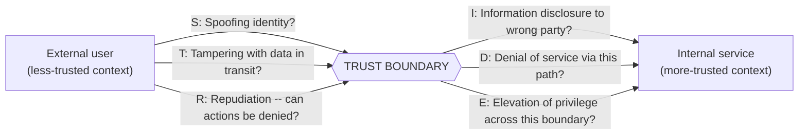

**12. System Design**

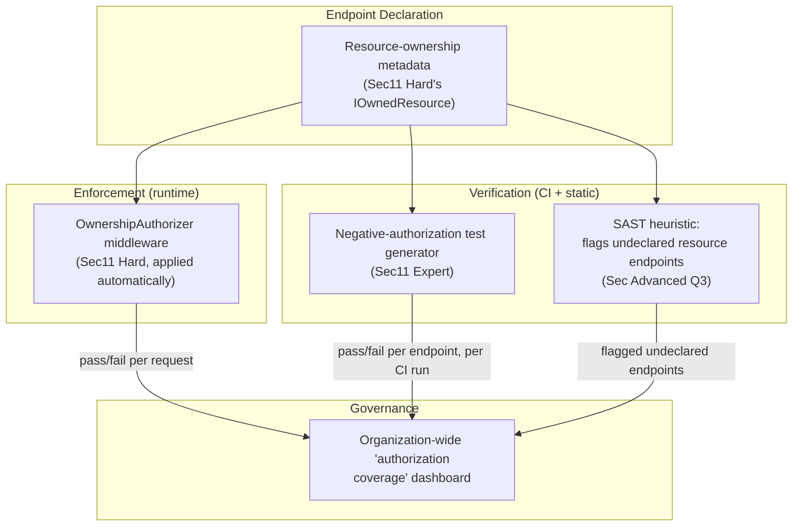

### Module 98 — Security: Cryptography Fundamentals — Encryption, Hashing, Signing & Key Management
*Source: `02-Cryptography-Encryption-Hashing-Signing-KeyManagement.md`*

**Hybrid TLS Scheme — Asymmetric Handshake, Symmetric Bulk Transfer**

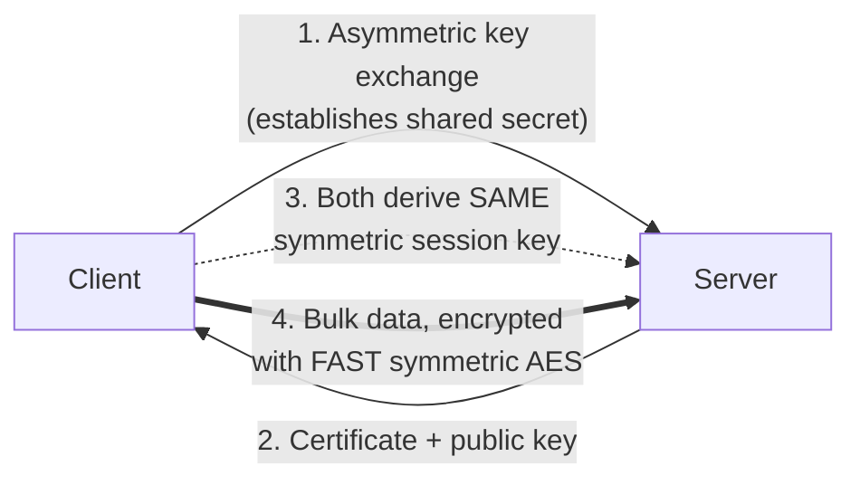

**Certificate Chain of Trust**

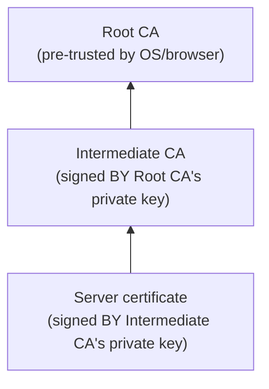

**12. System Design**

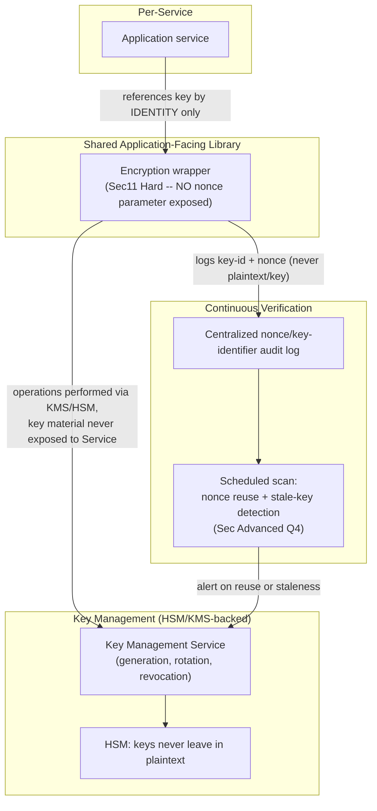

### Module 99 — Security: Security Testing & Tooling — SAST/DAST/SCA, Fuzzing, Penetration Testing & Vulnerability Management
*Source: `03-SecurityTesting-SAST-DAST-SCA-Fuzzing-PenetrationTesting-VulnerabilityManagement.md`*

**Security Testing Across the SDLC — Fail-Fast, Cheapest-First**

```mermaid
graph LR
 Commit["Every commit/PR"] -->|"SAST (cheapest, earliest)"| Build["Build"]
 Build -->|"SCA (dependency scan)"| Staging["Deployed to staging"]
 Staging -->|"DAST / IAST"| PreRelease["Pre-release"]
 PreRelease -->|"Fuzzing (continuous or scheduled)"| Production["Production"]
 Production -.->|"Periodic, risk-tiered"| Pentest["Human penetration test"]
```

**12. System Design**

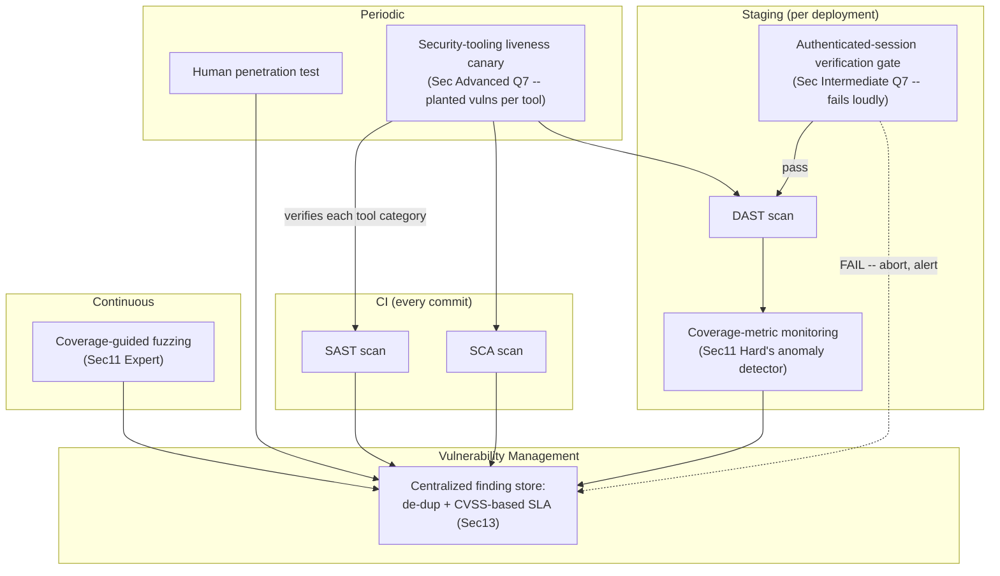

### Module 100 — Security: Zero Trust Architecture, Compliance & Security Governance at Scale (Capstone)
*Source: `04-ZeroTrust-Compliance-SecurityGovernance.md`*

**Zero Trust Reference Architecture (NIST 800-207)**

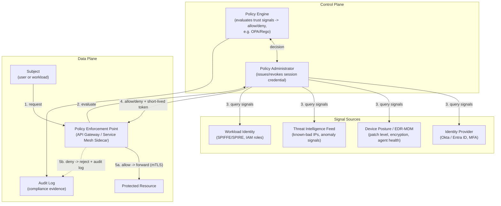

**Compliance Control Lifecycle**

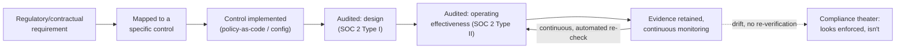

**12. System Design**

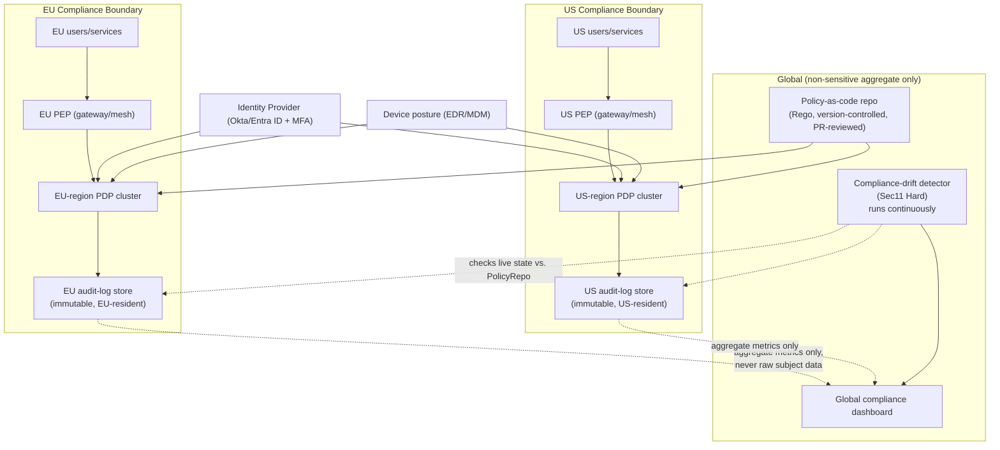

**13. Low-Level Design**

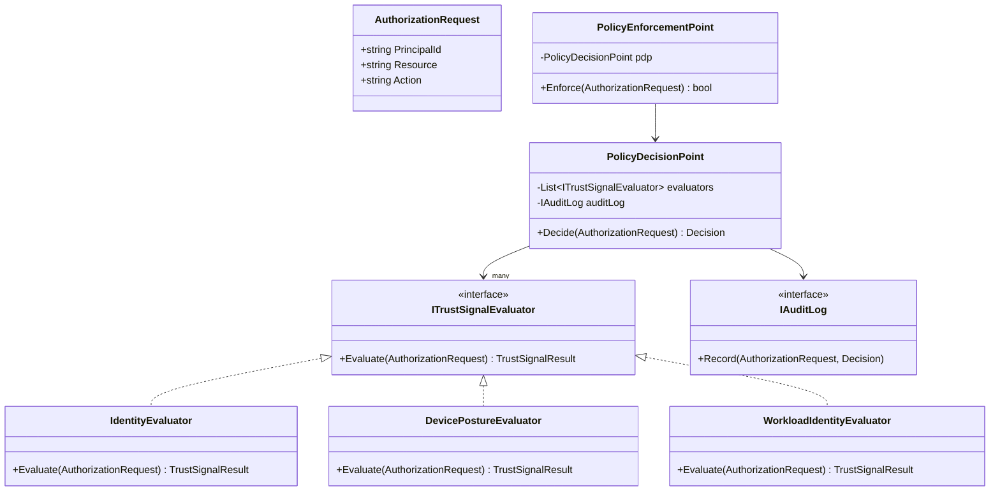

**13. Low-Level Design**

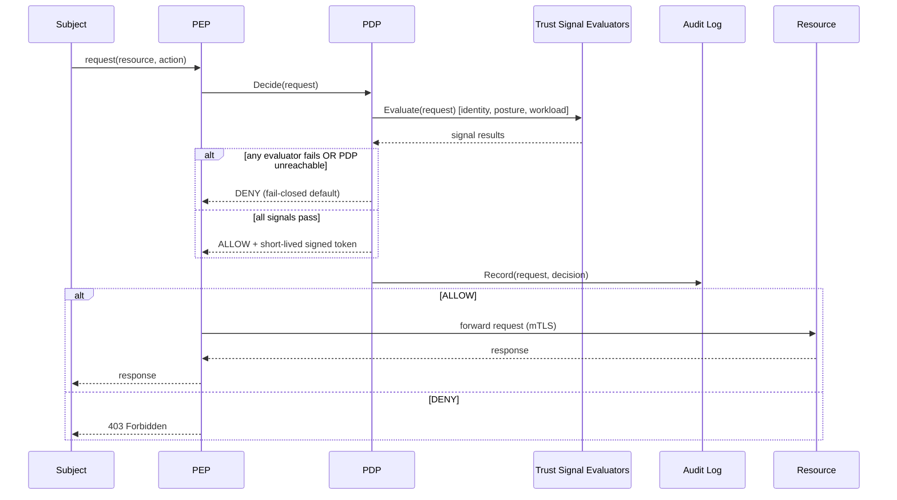
