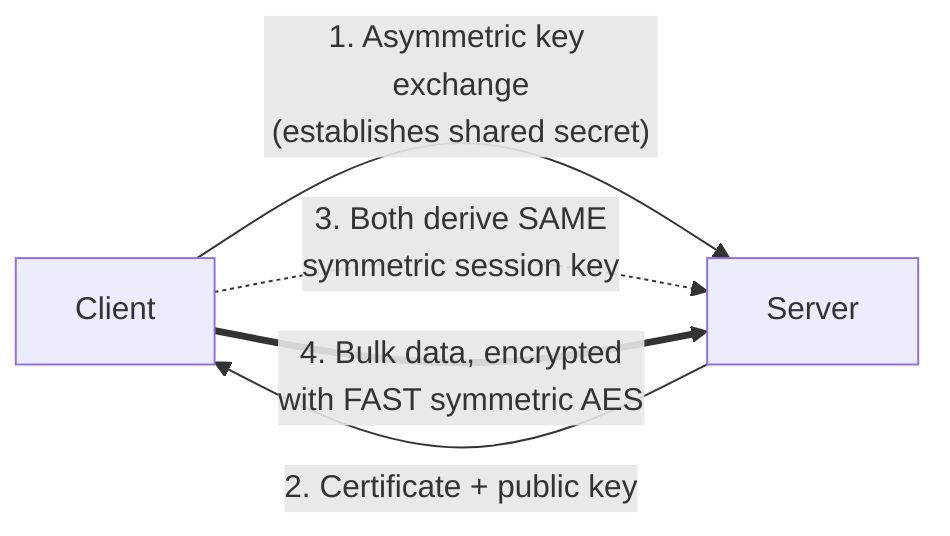
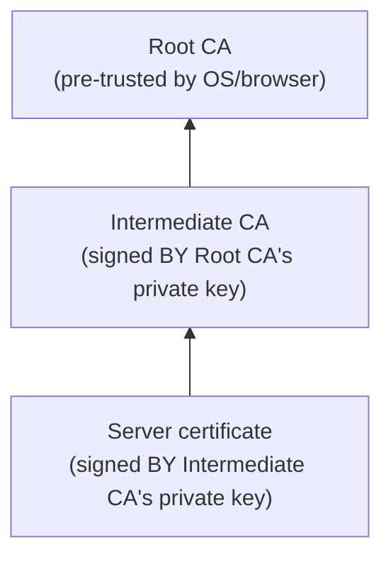
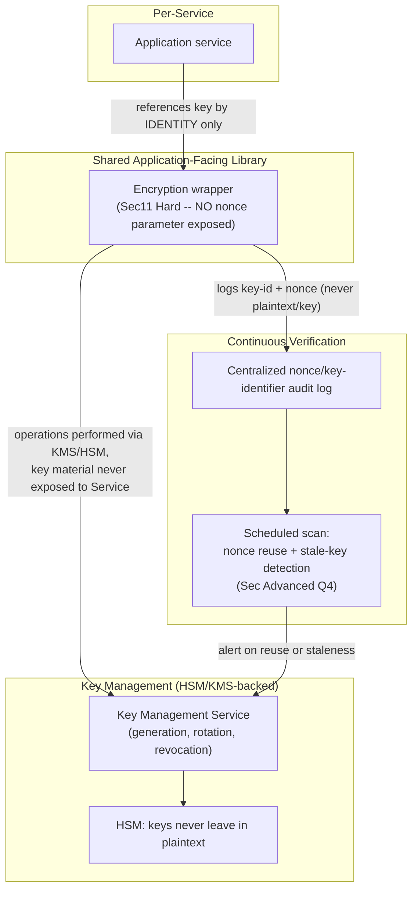

# Module 98 — Security: Cryptography Fundamentals — Encryption, Hashing, Signing & Key Management

> Domain: Security | Level: Beginner → Expert | Prerequisite: [[01-AppSecFundamentals-OWASPTop10-SecureCoding-ThreatModeling]] §2.3 (cryptographic failures introduced at a category level there, deep-dived here), [[../25-DevOps/02-ConfigurationManagement-Secrets-EnvironmentPromotion]] §2.4 (reference-not-value secrets handling and dual-secret-overlap rotation, generalized here into full cryptographic key-lifecycle management); connects forward to the dedicated [[../41-OAuth2-OIDC-JWT-PKCE]] module, where JWT signing is this module's signing mechanics applied to a specific token format

---

## 1. Fundamentals

**What**: Cryptography provides three distinct, precise guarantees applications rely on: **confidentiality** (encryption — only a party holding the correct key can recover the original data), **integrity/authenticity** (hashing and digital signatures — data has not been tampered with, and, for signatures specifically, originates from a claimed, provable source), and **key management** (the operational practices — generation, distribution, rotation, revocation, destruction — making the first two guarantees trustworthy in practice, since any cryptographic algorithm's real-world security is bounded entirely by how well its keys are protected and managed, never by the algorithm's mathematical strength alone).

**Why it exists**: Without cryptography, data in transit is trivially interceptable by anyone with network visibility, and data at rest is trivially readable by anyone with storage access — confidentiality and integrity would depend entirely on physical and network access control, a guarantee that collapses the moment either is breached. Cryptography exists to make these guarantees hold even when an attacker *does* gain that access, provided they don't also hold the key. Critically, this module's central theme is that cryptography is also one of the domains where a **correct algorithm choice, incorrectly implemented in one small, easy-to-overlook detail, produces a catastrophic — not merely degraded — failure**, unlike most of this course's prior "declared ≠ actual" findings, where a partial gap (a partially-stale runbook, a partially-incomplete trace) still retains partial value. A cryptographic security proof's guarantees are frequently all-or-nothing: violate one specific precondition (nonce uniqueness, for example) and the entire guarantee for the affected data can collapse completely, with zero functional symptom indicating anything went wrong.

**When it matters**: From the moment any data carries a confidentiality or integrity requirement — credentials, personal data, payment details, inter-service authentication tokens — whether at rest, in transit, or (a harder, less mature area) in use.

**How (30,000-ft view)**:
```
Symmetric encryption (AES): ONE shared key encrypts AND decrypts -- fast,
    used for bulk data; key distribution is the hard problem
Asymmetric encryption (RSA/ECC): a PUBLIC key encrypts (or verifies), a
    PRIVATE key decrypts (or signs) -- slow, but solves key distribution;
    TLS uses asymmetric crypto for the handshake/key exchange, then hands
    off to fast, symmetric crypto for the actual bulk data (a HYBRID scheme)
Hashing: ONE-WAY, deterministic -- for integrity checks and (with a slow,
    adaptive, SALTED algorithm specifically) password storage; NEVER
    encryption's reversible substitute
Digital signatures: signing uses the PRIVATE key (opposite direction from
    encryption!), verification uses the PUBLIC key -- proves authenticity
    and non-repudiation, backed by a certificate CHAIN OF TRUST
Key management: generation -> distribution -> ROTATION -> revocation ->
    destruction -- a key's entire lifecycle, not merely its initial creation
Catastrophic-not-degraded failure mode (THIS module's central risk): violate
    ONE precondition an algorithm's security proof depends on (nonce
    uniqueness, a random IV, a sufficiently long key) and the guarantee can
    collapse ENTIRELY for the affected data, with ZERO functional symptom
```

---

## 2. Deep Dive

### 2.1 Symmetric vs. Asymmetric Encryption — the Hybrid Scheme TLS Actually Uses
**Symmetric encryption** (AES being the modern, standard choice) uses one shared key for both encryption and decryption — computationally fast, suitable for bulk data, but requiring the key to somehow be securely distributed to every party needing it, a genuinely hard problem on its own. **Asymmetric encryption** (RSA, or modern elliptic-curve schemes like ECDH/ECDSA) uses a mathematically-related key pair: data encrypted with a **public** key (freely distributable) can only be decrypted with the corresponding **private** key (kept secret) — solving the key-distribution problem, but at a steep computational cost unsuitable for bulk data encryption. TLS resolves this by combining both: the handshake uses asymmetric cryptography specifically to securely establish a shared, ephemeral *symmetric* key (via a key-exchange algorithm), after which all actual application data is encrypted with fast, symmetric AES using that negotiated key — a **hybrid scheme** capturing asymmetric crypto's key-distribution strength and symmetric crypto's bulk-data performance simultaneously.

### 2.2 Hashing vs. Encryption — a Critical, Frequently-Confused Distinction
Encryption is **reversible**: given the correct key, the original plaintext can always be recovered from the ciphertext — appropriate whenever the original data must later be retrieved. Hashing is **one-way**: a hash function deterministically maps input to a fixed-size output with no feasible way to recover the original input from the hash alone — appropriate for integrity verification (confirming data hasn't changed) and, critically, **password storage**, where the original password should never need to be recovered at all, only verified against a freshly-supplied candidate. Using encryption to store passwords is a category error (the original password becomes recoverable by anyone who later obtains the key, an unnecessary and dangerous exposure); using a **fast, general-purpose hash** (MD5, SHA-256 alone) for passwords is a *different*, equally serious error — these algorithms are deliberately optimized for speed, meaning an attacker with a stolen password-hash database can attempt billions of guesses per second on ordinary hardware. Correct password storage requires a **slow, adaptive, salted hash** specifically designed to resist brute-force — bcrypt, scrypt, or Argon2 — whose deliberate computational cost (tunable upward as hardware improves) is the entire point, the opposite design goal from a general-purpose integrity hash.

### 2.3 Digital Signatures and the Certificate Chain of Trust
A digital signature reverses asymmetric encryption's typical key direction: the **signer uses their private key** to produce a signature over a message (or, more precisely, over a hash of the message, for efficiency), and **anyone can verify it using the signer's public key** — proving the message genuinely originated from the private key's holder (**authenticity**) and that the signer cannot later plausibly deny having produced it (**non-repudiation**), since only they possess the private key capable of producing a valid signature. This mechanism underlies **X.509 certificates**: a certificate binds a public key to an identity (a domain name, an organization), itself signed by a **Certificate Authority (CA)** whose own certificate is signed by a higher-tier CA, forming a **chain of trust** terminating at a small set of pre-trusted **root CAs** a client's operating system or browser ships with by default — a client verifies a certificate not by inherently trusting the specific server, but by verifying an unbroken signature chain leading back to an already-trusted root.

### 2.4 Key Management Lifecycle — Generation, Rotation, Revocation, and Destruction
A key's security depends on its entire lifecycle, not merely the strength of the algorithm it's used with: **generation** must use a cryptographically-secure random source (never a predictable seed or a weak PRNG); **distribution** must avoid the key ever transiting an insecure channel (directly Module 86 §2.1's reference-not-value principle, applied to cryptographic keys specifically — a key management service (KMS) or hardware security module (HSM) should perform operations *using* the key without the key itself ever leaving the secure boundary); **rotation** limits the blast radius of an eventual key compromise by ensuring no single key remains valid indefinitely (directly reusing Module 86 §2.4's dual-secret-overlap rotation pattern, now applied to encryption/signing keys); **revocation** provides a mechanism to invalidate a specific key immediately upon suspected compromise, before its normal rotation would otherwise occur; and **destruction** ensures a retired key is genuinely, unrecoverably deleted, not merely removed from active configuration while remaining recoverable from a backup or an unmanaged copy.

### 2.5 TLS/Transport Security — Forward Secrecy and Cipher Suite Selection
Beyond the basic handshake (§2.1), modern TLS configurations should specifically prefer **cipher suites providing perfect forward secrecy (PFS)** — using an ephemeral (freshly-generated, per-session, discarded-after-use) key-exchange key rather than a long-lived one, ensuring that even if a server's long-term private key is later compromised, previously-recorded encrypted traffic *cannot* be retroactively decrypted, since the actual session keys used for that traffic were never derivable from the long-term key alone. This is a meaningfully stronger guarantee than a non-PFS cipher suite provides, and its absence is a genuine, common, and easily-overlooked TLS misconfiguration.

### 2.6 Common Cryptographic Implementation Failures — Precise, Unforgiving, and Invisible Until Tested
Cryptography's security proofs depend on specific, sometimes non-obvious preconditions holding exactly — and violating them typically doesn't produce a *degraded* guarantee, it produces a *catastrophically absent* one, invisible to any functional test: **ECB mode** (a naive block-cipher mode encrypting each block independently) leaks structural patterns in the plaintext (identical plaintext blocks produce identical ciphertext blocks, visibly preserving image outlines or repeated data structure) despite "successfully" encrypting and decrypting correctly; **IV/nonce reuse** under the same key, in a stream cipher or an AEAD (authenticated encryption with associated data) mode like AES-GCM, can catastrophically break both confidentiality and authenticity for every message sharing that nonce — this module's central production incident (§4); and **hardcoded or embedded keys** in source code (rather than a managed secret store, per Module 86) provide no real protection at all once the source is available to anyone, whether via a public repository, a decompiled binary, or an insider.

---

## 3. Visual Architecture

### Hybrid TLS Scheme — Asymmetric Handshake, Symmetric Bulk Transfer (§2.1)


### Hashing vs. Encryption — Reversibility Is the Entire Distinction (§2.2)
```
Encryption:  plaintext --[key]--> ciphertext --[SAME key]--> plaintext (RECOVERABLE)
Hashing:     input --[hash fn]--> digest --[NO feasible reverse]--> input is NOT recoverable

Password storage RULE: use a SLOW, ADAPTIVE, SALTED hash (bcrypt/scrypt/Argon2) --
    NEVER encryption (recoverable = unnecessary exposure), NEVER a fast general
    hash alone (MD5/SHA-256 -- trivially brute-forceable at billions/sec)
```

### Certificate Chain of Trust (§2.3)


### Nonce Reuse Under AES-GCM — Catastrophic, Not Degraded (§2.6, §4)
```
Message 1: Encrypt(key=K, nonce=N, plaintext=P1) --> Ciphertext C1
Message 2 (BUG: nonce N reused): Encrypt(key=K, nonce=N, plaintext=P2) --> Ciphertext C2

C1 XOR C2 = P1 XOR P2  -- an attacker recovers the XOR of both plaintexts
    WITHOUT ever knowing the key -- and GCM's authentication-tag construction
    under nonce reuse can further allow FORGING valid ciphertexts entirely
    (the "forbidden attack") -- functional encryption/decryption still
    "worked" throughout; the confidentiality/authenticity GUARANTEE silently
    collapsed for every affected message pair.
```

---

## 4. Production Example

**Scenario**: A healthcare-adjacent SaaS platform encrypted sensitive patient-record fields at rest using AES-256-GCM, a well-regarded, industry-standard authenticated-encryption scheme, correctly selected during the system's original design and reviewed favorably in an early security assessment. The encryption wrapper generated each message's required nonce from an in-memory, incrementing counter, seeded at each service startup.

**Investigation**: During a routine, unrelated infrastructure maintenance window, an unplanned service restart occurred on one of the encryption service's instances. The in-memory nonce counter reset to its initial value on restart — but the encryption key itself was a long-lived key with no rotation tied to service restarts, meaning the exact same key was still in use before and after the restart. For a window of messages following the restart, the counter produced nonce values that had already been used, under the identical key, before the restart. Encryption and decryption continued to function completely correctly throughout — every record was encrypted successfully and decrypted back to its original, correct plaintext on read, with zero functional symptom of anything wrong. The issue was discovered months later, during an independent, scheduled cryptographic security audit that specifically checked historical ciphertext metadata for nonce-reuse patterns under shared keys — a check the organization's ordinary functional test suite, monitoring, and alerting had never included.

**Root cause**: Two independent, compounding gaps, mirroring this course's now-familiar compounding-failure pattern: (1) the nonce-generation scheme relied on volatile, in-memory state (an incrementing counter) with no mechanism ensuring uniqueness *across* a service restart — a design that implicitly, silently assumed the service would never restart mid-operation without also rotating the key, an assumption never explicitly stated, verified, or enforced anywhere in the system; (2) the encryption key had no rotation policy tied to events that could disturb nonce-uniqueness guarantees (or, more robustly, on any regular schedule at all), meaning the same key remained valid across the exact restart that broke the counter's uniqueness assumption, making the nonce reuse actually exploitable — nonce reuse under a *different* key would have been entirely harmless, since AES-GCM's specific vulnerability requires both the nonce *and* the key to repeat together.

**Fix**: (1) Replaced the fragile, restart-vulnerable counter-based nonce scheme with a **fully random, sufficiently large nonce** (a 96-bit random value, whose birthday-bound collision probability is acceptably low for the system's actual, realistic message volume) requiring no persisted state at all and structurally immune to a restart resetting any counter. (2) Established **mandatory key rotation on a regular schedule**, independent of and in addition to any specific triggering event, directly reapplying Module 86 §2.4's dual-secret-overlap rotation discipline to encryption keys specifically. (3) Implemented a **scheduled, automated cryptographic-liveness check** — periodically scanning ciphertext metadata for any nonce value repeated under the same key across the system's actual operational history — converting a property that had been silently assumed rather than ever verified into a continuously, actively re-checked one, directly extending this domain's now-established "verify the verifier" audit pattern into cryptographic implementation correctness specifically. (4) Where the underlying library supported it, migrated toward a **nonce-misuse-resistant AEAD construction** (such as AES-GCM-SIV), which degrades far more gracefully — though still not perfectly — under accidental nonce reuse, as an additional defense-in-depth layer rather than a substitute for correct nonce generation.

**Lesson**: This incident is this course's sharpest, most technically precise instance yet of the "declared/assumed ≠ actual" theme: a cryptographic algorithm correctly *chosen* (AES-GCM is an excellent, standard, appropriately-selected scheme) can still catastrophically fail — not degrade, *fail* — because one small, easily-overlooked implementation precondition (nonce uniqueness under a given key) that the algorithm's actual security proof depends on was silently violated, with **zero functional symptom** distinguishing the compromised state from perfectly correct operation throughout. Unlike most of this course's prior findings, where a partial gap retains partial value (a partially-stale runbook, a partially-fragmented trace), a cryptographic guarantee is frequently binary: the precondition holds and the guarantee is genuinely, mathematically present, or it doesn't and the guarantee — for the specific affected data — is not degraded, it is simply gone.

---

## 5. Best Practices
- Use established, vetted cryptographic libraries and standard, well-reviewed algorithms (AES, RSA/ECC, bcrypt/scrypt/Argon2) — never invent a custom cipher or hashing scheme; "don't roll your own crypto" is a load-bearing, not merely conventional, principle (§1, §2.6).
- Use a slow, adaptive, salted hash (bcrypt/scrypt/Argon2) specifically for password storage — never encryption (recoverability is an unnecessary exposure) and never a fast general-purpose hash alone (§2.2).
- Prefer cipher suites providing perfect forward secrecy for TLS, so a future long-term-key compromise cannot retroactively decrypt previously-recorded traffic (§2.5).
- Treat key management as a full lifecycle — generation, distribution, rotation, revocation, destruction — not merely an initial creation event, applying Module 86 §2.4's dual-secret-overlap rotation discipline to cryptographic keys specifically (§2.4).
- Generate nonces/IVs using a scheme structurally immune to reuse (sufficiently large random values, or a properly-persisted, restart-surviving counter) rather than fragile, volatile in-memory state (§2.6, §4).
- Periodically, actively verify cryptographic implementation correctness (nonce-uniqueness scans, key-rotation compliance checks) rather than assuming a correctly-designed scheme remains correctly operating indefinitely, unverified (§4).

## 6. Anti-patterns
- Encrypting passwords (making them recoverable) or hashing them with a fast, general-purpose algorithm (MD5/SHA-256 alone) rather than a slow, adaptive, salted hash (§2.2).
- Using ECB mode for block-cipher encryption, leaking structural patterns in the plaintext despite "successfully" encrypting and decrypting (§2.6).
- Hardcoding or embedding cryptographic keys directly in source code rather than a managed secret store/KMS (§2.4, §2.6).
- A nonce/IV-generation scheme relying on volatile, unpersisted in-memory state with no protection against reuse across a restart or redeploy (§2.6, §4).
- Never rotating an encryption or signing key, allowing a single key's blast radius to remain unbounded indefinitely and making any implementation flaw depending on key freshness (like nonce-reuse exploitability) permanently, rather than transiently, dangerous (§2.4, §4).
- Assuming a correctly-chosen cryptographic algorithm remains correctly implemented indefinitely without any periodic, active verification of its actual operational preconditions (§4).

---

## 10. Interview Questions

### Basic (10)

1. **Q: What is the difference between symmetric and asymmetric encryption?**
   **A:** Symmetric encryption uses one shared key for both encryption and decryption — fast, but requiring secure key distribution. Asymmetric encryption uses a mathematically-related public/private key pair — data encrypted with the public key can only be decrypted with the private key, solving key distribution at the cost of much slower performance.
   **Why correct:** States both schemes' defining mechanism and their respective trade-off (speed vs. key-distribution ease).
   **Common mistakes:** Assuming asymmetric encryption is simply "more secure" than symmetric, rather than recognizing the two solve different problems and are typically combined, not substituted for one another.
   **Follow-ups:** "Why does TLS use both rather than just one?" (Asymmetric crypto solves the handshake's key-distribution problem; symmetric crypto then handles the actual bulk data efficiently — a hybrid scheme capturing both schemes' respective strengths.)

2. **Q: Why is hashing not a substitute for encryption, and vice versa?**
   **A:** Encryption is reversible (the original data can be recovered with the correct key); hashing is one-way (there's no feasible way to recover the original input from the hash). They serve different purposes — encryption for data needing later recovery, hashing for integrity verification and password storage where the original value should never need to be recovered.
   **Why correct:** States the core reversibility distinction and connects it to each mechanism's appropriate use case.
   **Common mistakes:** Assuming encryption is simply "a stronger form of hashing" or that hashing is "a weaker form of encryption," rather than recognizing they solve fundamentally different problems.
   **Follow-ups:** "Why is encrypting passwords (rather than hashing them) considered a mistake?" (Because encryption is reversible — anyone who later obtains the decryption key can recover every user's actual plaintext password, an unnecessary and dangerous exposure the original password never needed to allow, since verification only requires comparing a hash of a freshly-supplied candidate.)

3. **Q: Why is a fast, general-purpose hash function like SHA-256 alone considered insufficient for password storage?**
   **A:** SHA-256 is deliberately optimized for speed, meaning an attacker with a stolen password-hash database can attempt billions of password guesses per second on ordinary hardware. Password storage requires a deliberately slow, adaptive hash (bcrypt, scrypt, Argon2) whose computational cost is the entire point, resisting brute-force at scale.
   **Why correct:** States the specific mechanism (speed enabling brute-force) and the correct alternative's defining property (deliberate slowness).
   **Common mistakes:** Assuming "hashing the password" alone, with any hash function, is sufficient security, without distinguishing a general-purpose fast hash from a purpose-built, slow, adaptive password hash.
   **Follow-ups:** "What does 'adaptive' mean in this context?" (The algorithm's computational cost can be tuned upward over time as hardware improves, ensuring brute-force resistance doesn't erode as attackers' available computing power grows.)

4. **Q: What is the difference between a digital signature and encryption, in terms of which key does what?**
   **A:** Encryption typically uses a public key to encrypt and the corresponding private key to decrypt. A digital signature reverses this: the signer uses their private key to produce the signature, and anyone can verify it using the signer's public key.
   **Why correct:** States the specific, reversed key-direction distinction between the two operations.
   **Common mistakes:** Assuming signing and encryption use keys in the same direction, missing that signing specifically requires the *private* key to produce (proving only the key-holder could have signed it) while verification uses the *public* key.
   **Follow-ups:** "What two guarantees does a valid signature provide?" (Authenticity — the message genuinely originated from the private key's holder — and non-repudiation — the signer cannot plausibly deny having signed it, since only they possess the private key.)

5. **Q: What is a certificate chain of trust?**
   **A:** A sequence of signatures — a server's certificate signed by an intermediate CA, whose own certificate is signed by a higher-tier or root CA — terminating at a small set of pre-trusted root CAs a client's operating system or browser already trusts by default.
   **Why correct:** States the chain structure and its termination point (a pre-trusted root), explaining how trust in one specific server certificate is established.
   **Common mistakes:** Assuming a client inherently trusts a specific server directly, rather than recognizing trust is established by verifying an unbroken signature chain back to an already-trusted root.
   **Follow-ups:** "What happens if any single link in this chain is invalid or missing?" (The entire chain of trust is broken, and the client cannot verify the certificate's authenticity — typically resulting in a certificate-validation error/warning, since trust cannot be established without every link in the chain being valid.)

6. **Q: What is perfect forward secrecy, and why does it matter for TLS?**
   **A:** A property where each session uses an ephemeral, freshly-generated key-exchange key rather than a long-lived one, ensuring that even if a server's long-term private key is later compromised, previously-recorded encrypted traffic cannot be retroactively decrypted.
   **Why correct:** States the mechanism (ephemeral, per-session keys) and the specific guarantee it provides (protection of past traffic against a future key compromise).
   **Common mistakes:** Assuming any TLS connection automatically provides forward secrecy, without recognizing it specifically depends on the negotiated cipher suite using an ephemeral key-exchange method.
   **Follow-ups:** "What would happen to previously-recorded traffic without forward secrecy, if the server's long-term key were later compromised?" (An attacker who recorded the encrypted traffic could retroactively decrypt it using the now-compromised long-term key, since the session keys were derivable from it — the exact risk forward secrecy specifically eliminates.)

7. **Q: What is IV/nonce reuse, and why is it dangerous under an authenticated encryption scheme like AES-GCM specifically?**
   **A:** Reusing the same nonce value with the same key across multiple encryption operations. Under AES-GCM specifically, this can catastrophically break both confidentiality (allowing an attacker to recover the XOR of the affected plaintexts) and authenticity (potentially allowing ciphertext forgery), not merely weaken the encryption's strength.
   **Why correct:** States the mechanism and specifically emphasizes the catastrophic, not merely weakened, nature of the failure under GCM.
   **Common mistakes:** Assuming nonce reuse is a minor, gradual weakening of security rather than recognizing it can produce a complete, catastrophic loss of both confidentiality and integrity for the affected messages.
   **Follow-ups:** "What's a nonce-generation scheme structurally resistant to this risk?" (A fully random, sufficiently large nonce, or a properly-persisted, monotonically-increasing counter that survives service restarts — never a volatile, in-memory-only counter with no protection against reset.)

8. **Q: What is key rotation, and why does it matter even if a key has never been suspected of compromise?**
   **A:** Key rotation is periodically replacing an active cryptographic key with a new one on a regular schedule. It matters even absent suspected compromise because it bounds the blast radius of an eventual, unknown compromise — limiting how much data any single key's eventual exposure could affect — and, in some cases (as in this module's central incident), limits how long an implementation flaw depending on key longevity remains exploitable.
   **Why correct:** States both the routine blast-radius-limiting rationale and the additional, specific benefit demonstrated in this module's incident.
   **Common mistakes:** Assuming key rotation is only necessary in response to a specific, suspected compromise, rather than recognizing it as a standing, proactive practice limiting risk regardless of whether compromise is ever suspected.
   **Follow-ups:** "How does this connect to Module 86's secrets-management discipline?" (Directly reuses Module 86 §2.4's dual-secret-overlap rotation pattern — both old and new keys remain simultaneously valid during a transition window, avoiding a hard cutover that could disrupt in-flight operations still referencing the prior key.)

9. **Q: Why is hardcoding a cryptographic key directly in source code a serious anti-pattern, even if the source code repository itself is private?**
   **A:** A private repository doesn't guarantee the key remains secret indefinitely — access can be granted more broadly over time, the repository could be accidentally made public, or the compiled/deployed artifact itself could be decompiled or extracted, exposing the embedded key regardless of source-repository access controls. A hardcoded key also can't be rotated without a code change and redeploy, coupling key lifecycle to release cadence unnecessarily.
   **Why correct:** States multiple independent exposure risks (repository access changes, artifact extraction) and the additional rotation-coupling cost.
   **Common mistakes:** Assuming a private repository provides adequate protection for an embedded key, without considering the artifact-extraction risk or the practical difficulty of rotating a hardcoded value.
   **Follow-ups:** "What's the correct alternative?" (A managed secret store or KMS — Module 86's reference-not-value principle — where the application references the key by identity and the actual key material never appears in source code or configuration files at all.)

10. **Q: What does "don't roll your own crypto" mean, and why is it considered such a strong, near-universal principle in this field specifically?**
    **A:** It means using established, peer-reviewed, standard cryptographic algorithms and libraries rather than designing a custom encryption/hashing scheme. It's considered especially strong in this field because cryptographic security proofs are subtle and easy to get wrong in ways that aren't apparent through ordinary code review or testing — a custom scheme that "looks secure" and passes every functional test can still be catastrophically broken in a way only a formal, adversarial cryptographic analysis would reveal.
    **Why correct:** States the principle and the specific reason it's especially strong in this domain — the gap between "looks secure and passes tests" and "is actually secure" is unusually wide and unusually hard to close without specialized expertise.
    **Common mistakes:** Assuming a competent general software engineer can safely design a novel cryptographic scheme given enough care, without recognizing that cryptographic security requires a specifically different, formal analytical discipline that ordinary software engineering rigor doesn't automatically provide.
    **Follow-ups:** "Does this principle also apply to *implementing* a well-known, standard algorithm from its published specification, rather than only to designing an entirely new one?" (Largely yes — even a correct, standard algorithm's implementation has subtle correctness requirements (constant-time comparison to avoid timing side-channels, correct nonce handling per this module's central incident) that a well-vetted, widely-used library has already addressed and that a from-scratch implementation risks getting wrong in ways ordinary testing wouldn't reveal.)

### Intermediate (10)

1. **Q: Why did §4's incident produce zero functional symptom despite completely breaking the cryptographic security guarantee for the affected messages?**
   **A:** AES-GCM's encryption and decryption operations still executed correctly and returned the correct plaintext throughout — the nonce-reuse flaw doesn't cause encryption/decryption to fail or produce incorrect output; it silently undermines the *mathematical guarantee* that the ciphertext reveals nothing about the plaintext without the key, a guarantee entirely separate from whether the encrypt/decrypt round-trip functions correctly. Functional correctness and cryptographic security are two independent properties, and this incident is a precise demonstration of the first holding perfectly while the second silently collapsed.
   **Why correct:** Precisely distinguishes functional round-trip correctness from cryptographic security guarantees as two independent properties, explaining why one holding provides zero evidence about the other.
   **Common mistakes:** Assuming that if encryption/decryption "works" (produces correct output), the underlying security guarantee must also be intact, conflating functional correctness with cryptographic security.
   **Follow-ups:** "How does this connect to Module 97's finding about functional testing's blind spot toward adversarial behavior?" (Directly — Module 97 established that functional testing verifies intended behavior but not adversarial-resistance; this incident is the cryptographic-specific instance of the identical blind spot, since a functional test verifying "encrypt then decrypt returns the original value" says nothing about whether the ciphertext resists an adversary's cryptanalysis.)

2. **Q: A team argues that since they use AES-256 (a strong, modern, industry-standard algorithm), their encryption is secure by definition. Evaluate this claim using §4's incident as evidence.**
   **A:** The algorithm's mathematical strength is necessary but not sufficient — §4's incident used AES-256-GCM, an excellent, correctly-chosen algorithm, yet still suffered a catastrophic security failure because an implementation-level precondition (nonce uniqueness) the algorithm's security proof depends on was violated. Algorithm choice alone says nothing about whether the surrounding implementation correctly satisfies every precondition that choice's security guarantee actually depends on.
   **Why correct:** Uses §4's incident as concrete evidence that algorithm strength and correct implementation are independent requirements, both necessary.
   **Common mistakes:** Treating "we use a strong, standard algorithm" as sufficient evidence of overall cryptographic security, without separately verifying the implementation satisfies every precondition (nonce handling, key management, random number generation quality) that algorithm's guarantees actually depend on.
   **Follow-ups:** "What would you specifically want to audit, beyond algorithm choice, to gain confidence in a cryptographic implementation's actual security?" (Nonce/IV generation scheme and its uniqueness guarantees, key management lifecycle and rotation practices, random-number-generator quality, and — per §Advanced Q3 — whether the specific library/API used correctly implements the algorithm's documented preconditions rather than merely claiming to use it.)

3. **Q: Why might a code reviewer, examining the encryption wrapper's source code directly, still miss the nonce-reuse risk that caused §4's incident?**
   **A:** The code, read in isolation, correctly implements AES-GCM encryption using a nonce value that increments correctly under normal, continuous operation — the flaw only manifests under a specific, cross-cutting condition (a service restart resetting the in-memory counter while the key remains unchanged) that isn't visible from reading the encryption code alone; it requires reasoning about the *interaction* between the nonce-generation code's statefulness and the service's own restart/deployment lifecycle, a cross-cutting concern that's easy to overlook when reviewing the encryption logic as an isolated unit.
   **Why correct:** Identifies the specific reason (a cross-cutting interaction between component statefulness and operational lifecycle events) that makes this class of flaw hard to catch via ordinary, isolated code review.
   **Common mistakes:** Assuming a careful code review of the encryption logic alone would necessarily catch this flaw, without recognizing it specifically requires reasoning about how that logic interacts with the broader system's operational behavior (restarts, redeploys) that isn't visible from the encryption code in isolation.
   **Follow-ups:** "What review practice would specifically help catch this kind of gap?" (A dedicated cryptographic-implementation review checklist explicitly asking "does this nonce-generation scheme survive every operational event (restart, redeploy, failover) without risking reuse under the same key" — prompting the specific, cross-cutting question ordinary code review doesn't naturally surface.)

4. **Q: Why does this module recommend both fixing the nonce-generation scheme AND establishing regular key rotation, rather than considering the nonce fix alone sufficient?**
   **A:** The nonce fix (§4's first remediation) prevents the specific triggering mechanism from recurring, but key rotation (§4's second remediation) independently bounds the blast radius of *any* future, currently-unanticipated flaw that might similarly depend on key longevity — a defense-in-depth principle this course has established repeatedly (never relying on a single fix alone, Module 88 §2.4). Additionally, nonce reuse under a *different* key would have been harmless in §4's specific incident — meaning key rotation, even absent this specific nonce bug, independently reduces how dangerous a similar, not-yet-discovered flaw could be.
   **Why correct:** Explains why both fixes are independently valuable — one closes the specific known mechanism, the other provides a general, defense-in-depth safeguard against future, currently-unknown variants of the same underlying risk category.
   **Common mistakes:** Assuming fixing the specific, identified nonce-generation bug alone is a complete remediation, without recognizing that key rotation provides an independent, complementary safeguard against similar risks not yet discovered.
   **Follow-ups:** "How would you determine an appropriate key rotation frequency for this specific system?" (Balance the operational cost of rotation (re-encrypting or re-keying existing data, coordination overhead) against the blast-radius-reduction benefit — a system handling highly sensitive data may warrant more frequent rotation than the operational cost would suggest for a lower-sensitivity system, directly this course's now-standard risk-proportionate calibration principle.)

5. **Q: How would you design the automated cryptographic-liveness check (§4's third fix) to scale across an organization's many independent services using encryption, without requiring a manual, per-service cryptographic audit?**
   **A:** Require every service using AEAD encryption to log, to a centralized, append-only audit store, a non-sensitive record of each encryption operation's key identifier and nonce value (never the plaintext or the key itself) — then run a scheduled, automated job scanning this centralized log for any nonce value repeated under the same key identifier across the organization's entire operational history, flagging any match for immediate investigation, directly reusing this domain's now-established pattern (Module 96's platform-capability audit) of composing many services' individual signals into one centralized, automated verification, rather than requiring per-service manual review.
   **Why correct:** Proposes a concrete, automatable mechanism (centralized nonce/key-identifier logging plus a scheduled scan) scaling to many services without per-service manual audit effort, directly reusing an already-established course pattern.
   **Common mistakes:** Proposing a manual, per-service cryptographic review process that wouldn't scale to an organization with many independent services, missing that the underlying signal (nonce and key-identifier pairs) can be centrally logged and automatically scanned instead.
   **Follow-ups:** "What's the risk of logging the nonce value itself, and how would you mitigate it?" (A nonce alone, without the corresponding key or plaintext, doesn't itself expose sensitive data — but the logging mechanism itself should still be access-controlled and its own integrity protected, since even non-sensitive metadata becoming tamperable could let an attacker hide evidence of their own exploitation of a nonce-reuse vulnerability.)

6. **Q: Why might using a nonce-misuse-resistant construction like AES-GCM-SIV (§4's fourth fix) as defense-in-depth still not be a complete substitute for fixing the underlying nonce-generation scheme correctly?**
   **A:** AES-GCM-SIV degrades more gracefully under accidental nonce reuse (limiting, though not eliminating, the resulting security impact) — but "degrades more gracefully" is not the same claim as "provides the identical guarantee as correct, unique-nonce usage would have," and relying on a misuse-resistant construction as the *primary* safeguard, rather than fixing the root nonce-generation flaw, risks normalizing an implementation practice (fragile, reuse-prone nonce generation) that could still cause a meaningfully worse outcome than intended, even if less catastrophic than under standard AES-GCM specifically.
   **Why correct:** Distinguishes "more graceful degradation" from "an equivalent guarantee," explaining why a misuse-resistant construction is a valuable defense-in-depth layer but not a substitute for correctly fixing the underlying generation scheme.
   **Common mistakes:** Treating adoption of a misuse-resistant construction as fully resolving the underlying risk, rather than recognizing it specifically limits (without eliminating) the consequences of a flaw that should still be independently, primarily fixed.
   **Follow-ups:** "Under what circumstance might an organization reasonably prioritize migrating to a misuse-resistant construction over immediately fixing every individual nonce-generation flaw across many services?" (As a stopgap, risk-reducing measure while the more thorough, per-service nonce-generation audit and fix is still in progress — reducing the organization's aggregate exposure during the remediation window, not as a permanent substitute for the underlying fix.)

7. **Q: How does the key-management lifecycle (§2.4) relate to and extend Module 86's secrets-management discipline specifically?**
   **A:** Module 86 established reference-not-value secret handling and dual-secret-overlap rotation for application secrets and credentials generally. This module applies the identical underlying principles specifically to cryptographic keys — a KMS/HSM performing operations *using* a key without the key ever leaving the secure boundary is precisely Module 86's reference-not-value principle applied to key material; key rotation with an overlap window is precisely Module 86 §2.4's dual-secret-overlap pattern applied to encryption/signing keys specifically, rather than to, say, a database credential.
   **Why correct:** Directly and precisely connects this module's key-management practices to Module 86's already-established, structurally identical secrets-management principles, rather than treating them as unrelated concerns.
   **Common mistakes:** Treating cryptographic key management as an entirely separate discipline from application secrets management, missing that the same underlying principles (reference-not-value, overlap-based rotation) apply identically to both.
   **Follow-ups:** "What's specifically different about a cryptographic key's lifecycle compared to, say, a database credential's lifecycle?" (A cryptographic key's rotation may require re-encrypting or re-keying already-encrypted data (since old ciphertext remains tied to the old key unless re-encrypted), a data-migration concern a simple credential rotation typically doesn't carry — key rotation is often a meaningfully larger operational undertaking than credential rotation for this reason.)

8. **Q: A security audit finds that an organization's TLS configuration correctly uses cipher suites with perfect forward secrecy, but the organization has no practice of periodically re-verifying this configuration remains correctly applied as infrastructure changes over time (new load balancers provisioned, TLS-terminating proxies updated). Evaluate this as a Principal Engineer, connecting it to this domain's established themes.**
   **A:** This is a fresh instance of this course's now-thoroughly-established "declared/present ≠ actual/complete" theme, applied to TLS configuration specifically — a correctly-configured cipher suite today provides no guarantee it remains correctly configured after a future infrastructure change (a new load balancer provisioned with a different, less-secure default configuration, a proxy upgrade silently resetting a custom cipher-suite preference back to a vendor default). The organization should establish a periodic, automated TLS-configuration scan (directly analogous to Module 96's platform-capability audit) confirming forward-secrecy-providing cipher suites remain actually configured across every current endpoint, not merely assumed correct because they were correctly configured once, at initial setup.
   **Why correct:** Correctly identifies this as a fresh, TLS-specific instance of the domain's central recurring theme and proposes the same category of periodic, automated verification this course has established as the standard remedy.
   **Common mistakes:** Assuming a TLS configuration verified correct once, at initial setup, remains durably correct indefinitely, without considering that subsequent infrastructure changes could silently regress it.
   **Follow-ups:** "What specific tool/technique would you use to implement this periodic scan?" (An automated TLS-configuration scanner (many open-source and commercial tools exist specifically for this) run on a scheduled cadence against every production endpoint, flagging any endpoint whose negotiated cipher suite no longer provides forward secrecy or otherwise regresses from the organization's declared minimum standard.)

9. **Q: Why might an organization's decision to use a well-vetted, standard cryptographic library (rather than implementing AES-GCM from its published specification directly) still not fully eliminate the risk category §4's incident exhibited?**
   **A:** A well-vetted library correctly implements the *algorithm itself* (the actual AES-GCM cryptographic operations), but the *nonce-generation scheme* surrounding how the library is called is typically the calling application's own responsibility, not something the library itself can enforce or verify — §4's incident's flaw lived specifically in the application's own nonce-generation code, not in the underlying cryptographic library's correctness. Using a vetted library eliminates one entire category of risk (a flawed algorithm implementation) but doesn't automatically eliminate risks in the calling code's own use of that library's API.
   **Why correct:** Precisely distinguishes library-implementation correctness (which a vetted library addresses) from calling-code correctness (which remains the application's own responsibility and was the actual source of §4's flaw).
   **Common mistakes:** Assuming "we use a well-vetted cryptographic library" is sufficient assurance against every possible cryptographic implementation flaw, without recognizing that how the calling application uses that library's API (specifically, nonce generation) remains an independent, equally critical correctness requirement.
   **Follow-ups:** "Do any modern cryptographic libraries attempt to reduce this specific calling-code risk?" (Some libraries provide higher-level, misuse-resistant APIs that handle nonce generation internally and safely by default, reducing (though not eliminating, depending on the specific API's design) the calling application's own responsibility for this specific, easy-to-get-wrong detail — an API-design mitigation worth specifically evaluating when selecting a cryptographic library.)

10. **Q: How does this module's central finding extend this course's broader "declared/present ≠ actual/complete" theme, and what is genuinely, structurally new about its instance compared to the course's prior instances in other domains?**
    **A:** Every prior instance (Kubernetes/Terraform/CI/CD/observability/AppSec) concerned a gap that, while serious, typically retained *partial* value or degraded *gradually* — a partially-stale runbook is still partially useful; a coverage gap misses some but not all regressions. This module's instance is structurally different: a cryptographic security guarantee is frequently **binary and all-or-nothing** — the specific precondition (nonce uniqueness) either holds, and the guarantee is genuinely, mathematically present, or it doesn't, and the guarantee for the affected data is not degraded, it is **entirely absent**, with literally zero functional symptom distinguishing the two states throughout normal operation. This makes cryptography this course's sharpest, most unforgiving instance of the theme yet — the gap between "looks correct" and "is actually correct" is not merely hard to detect, it is mathematically indistinguishable from the outside without a specifically cryptographic verification method.
    **Why correct:** Precisely identifies the specific, structural distinction (binary/catastrophic vs. gradual/partial failure) that makes this module's instance genuinely different in kind, not merely another example, from the course's prior findings.
    **Common mistakes:** Treating this module's finding as simply "another instance of the same pattern" without identifying the specific, load-bearing distinction (all-or-nothing cryptographic guarantees vs. gradually-degrading ones) that makes cryptographic implementation correctness a categorically sharper instance of this course's theme.
    **Follow-ups:** "Why does this binary, all-or-nothing property specifically argue for periodic, automated cryptographic verification rather than relying on code review or algorithm selection alone?" (Because neither code review nor correct algorithm selection can reveal a violated precondition that produces zero functional symptom — only an active, deliberate check specifically designed to detect that precondition's violation (a nonce-reuse scan, per §Intermediate Q5) can surface it, exactly mirroring this domain's now-established "verify the verifier" discipline, applied here to its most technically unforgiving instance.)

### Advanced (10)

1. **Q: Diagnose §4's incident from first principles and design the complete structural fix — not merely the four specific remediations already described.**
   **A:** Root causes (two, independent): (1) a nonce-generation scheme relying on volatile, in-memory state with no protection against reuse across a service restart — an implicit, never-verified assumption that the service would never restart without also rotating the key; (2) no key-rotation policy at all, meaning a single key remained valid indefinitely, making the nonce-reuse flaw's consequences unbounded in time once triggered. Complete structural fix: (1) replace the nonce scheme with a fully random, sufficiently large value requiring no persisted state (§4's first fix); (2) establish mandatory, regular key rotation independent of any specific triggering event (§4's second fix); (3) implement a scheduled, automated cryptographic-liveness scan detecting nonce reuse under shared keys across the organization's actual operational history (§4's third fix, §Intermediate Q5's scaling design); (4) adopt a nonce-misuse-resistant construction as a defense-in-depth backstop where feasible (§4's fourth fix, with §Intermediate Q6's caveat that this doesn't substitute for the primary fixes); (5) proactively audit every *other* service in the organization using AEAD encryption for the identical volatile-nonce-generation pattern, since this incident's specific mechanism (a fragile, restart-vulnerable in-memory counter) plausibly recurs anywhere a similar encryption wrapper was independently implemented.
   **Why correct:** Addresses both independent root causes with the specific, already-established fixes, and extends the investigation proactively per this course's now-standard pattern of searching for the same failure shape recurring elsewhere.
   **Common mistakes:** Fixing only the one specific service's nonce-generation code without also establishing organization-wide key-rotation policy, the scheduled liveness scan, and the proactive cross-service audit, leaving the identical risk category free to recur via a different service's independently-implemented, similarly-flawed encryption wrapper.
   **Follow-ups:** "How would you prioritize these fixes given limited immediate capacity?" (The nonce-generation fix for the affected service first, given its confirmed exploitability; the organization-wide proactive audit second, to surface the actual current exposure scope; key-rotation policy and the automated liveness scan third and fourth, as durable, forward-looking structural investments; the misuse-resistant-construction migration last, as a valuable but lower-urgency defense-in-depth enhancement.)

2. **Q: A Principal Engineer is asked whether the organization should respond to §4's incident by mandating that every service re-implement its own encryption logic entirely from scratch using a from-first-principles review, to ensure no similar flaw exists anywhere. Evaluate this proposal.**
   **A:** This directly contradicts §1's "don't roll your own crypto" principle at organizational scale — re-implementing encryption logic from scratch, service by service, multiplies the surface area for introducing *new*, currently-nonexistent cryptographic flaws far more than it reliably eliminates the one already-discovered flaw category. The proportionate response is auditing every service's *existing* implementation specifically for the known, now-understood risk pattern (§Advanced Q1's proactive audit) and, where a service's implementation is confirmed flawed, fixing that specific implementation using the same vetted library and corrected nonce-generation approach — not discarding and rebuilding every service's cryptographic code independently from first principles, which would recreate, at far larger scale, the exact "custom, unreviewed cryptographic implementation" risk this entire domain's fundamental principle warns against.
   **Why correct:** Identifies the proposal as directly contradicting this module's own foundational principle, and explains why a targeted audit-and-fix approach is proportionate while a from-scratch-rebuild mandate would introduce substantially more new risk than it resolves.
   **Common mistakes:** Assuming "have every team rebuild their own cryptographic logic more carefully" is a reasonable response to discovering one flawed implementation, without recognizing this multiplies rather than reduces the organization's aggregate cryptographic-implementation risk surface.
   **Follow-ups:** "What would you recommend instead, to reduce the organization's aggregate risk of similar, independently-introduced flaws across many services?" (A single, shared, centrally-maintained encryption wrapper/library — correctly implementing nonce generation, key management, and the vetted underlying algorithm once — that every service consumes, rather than each team independently implementing its own wrapper around the underlying cryptographic library, directly this course's now-standard platform-unification principle applied to cryptographic tooling specifically.)

3. **Q: Design a concrete technical approach for the shared, centrally-maintained encryption wrapper (§Advanced Q2's recommendation) that structurally prevents the specific nonce-generation flaw §4's incident exhibited, rather than merely documenting the correct approach for each team to independently follow.**
   **A:** The shared wrapper's public API should **not expose a way to supply or influence the nonce at all** — internally, it always generates a cryptographically-random, sufficiently large nonce itself for every encryption call, with no parameter or configuration option through which a calling team could substitute a fragile, counter-based, or otherwise flawed scheme, even inadvertently. This directly mirrors this course's now-standard principle (Module 92 §13's orchestrator design, Module 96 §13's onboarding architecture) that the *safest* structural fix removes the possibility of the flawed pattern entirely, rather than merely documenting the correct pattern and hoping every team follows it consistently.
   **Why correct:** Proposes a concrete API-design constraint (no way to influence nonce generation at all) that structurally eliminates the specific flaw category, directly reusing this course's established "remove the possibility, don't just document the correct practice" principle.
   **Common mistakes:** Designing a shared wrapper that still exposes a nonce parameter "for flexibility," recreating the exact same risk (a team could still, even accidentally, supply a flawed nonce value) the wrapper was meant to structurally eliminate.
   **Follow-ups:** "What's the trade-off of removing this flexibility entirely?" (A team with a genuinely legitimate, unusual need to control nonce generation directly (rare, but conceivable for interoperability with an external system's specific protocol requirements) would need a separate, explicitly-reviewed exception path rather than the standard wrapper — an acceptable trade-off given how much more common the flawed, unintentional case is than the legitimate, intentional one.)

4. **Q: How would you extend the cryptographic-liveness scan (§4's third fix, §Intermediate Q5) to also detect a different, related risk this module hasn't yet specifically named: a key that has silently exceeded its intended rotation schedule without being rotated (a "stale key" risk, structurally analogous to Module 95's runbook-staleness finding)?**
   **A:** Extend the centralized audit log (§Intermediate Q5's design) to also record each key identifier's creation/last-rotation timestamp, and have the scheduled scan additionally flag any key whose age exceeds its declared rotation-policy threshold — directly reapplying Module 95 §2.6's runbook-staleness-detection pattern (a "last verified/rotated" timestamp plus an automated staleness check) to cryptographic keys specifically, closing a second, independent risk category (stale keys) using the same underlying detection mechanism (a timestamp-threshold check) already built for the nonce-reuse scan.
   **Why correct:** Correctly identifies the structural parallel to Module 95's runbook-staleness pattern and proposes extending the same already-built audit infrastructure to cover this additional, related risk category efficiently.
   **Common mistakes:** Treating stale-key detection as requiring an entirely separate, new monitoring system, rather than recognizing it can be added as an additional check within the same centralized audit infrastructure already built for nonce-reuse detection.
   **Follow-ups:** "Why might a key-rotation policy itself, not merely its enforcement, require periodic review — directly mirroring Module 94 §Intermediate Q9's SLO-review finding?" (A rotation frequency appropriate when a key was first established (based on the data volume/sensitivity at that time) may become insufficient as the system's actual usage, data sensitivity, or threat landscape evolves — requiring the same periodic recalibration discipline this course established for SLO thresholds and drill schedules, now applied to key-rotation-frequency policy itself.)

5. **Q: A regulatory compliance audit requires the organization to demonstrate that a specific customer's data was encrypted using only algorithms that were considered cryptographically sound at the time of encryption, given that cryptographic standards evolve (e.g., MD5 and SHA-1 are now considered broken for security purposes, though they were once standard). How does this requirement interact with this module's key-management lifecycle discipline?**
   **A:** This requires the key-management system to track not just each key's own identifier and rotation history, but also **which specific algorithm and parameters were used for each specific encryption operation**, since data encrypted years ago under an algorithm considered sound *at that time* may now be considered weak by current standards — meaning the compliance answer isn't simply "we currently use strong algorithms" but requires historical, per-operation algorithm-and-parameter metadata, directly extending §2.4's key-lifecycle tracking to also cover algorithm-lifecycle tracking, and potentially triggering a **re-encryption/migration project** for any historically-encrypted data using an algorithm since deprecated, distinct from ordinary key rotation (which replaces the key but not necessarily the algorithm).
   **Why correct:** Identifies the specific, additional metadata requirement (per-operation algorithm/parameter tracking, not merely key identifier) this compliance scenario demands, and correctly distinguishes algorithm migration from ordinary key rotation as a related but distinct remediation category.
   **Common mistakes:** Assuming key rotation alone addresses this compliance concern, without recognizing that rotating to a new key using the *same*, now-deprecated algorithm doesn't resolve the underlying algorithm-currency concern — a genuinely different remediation (re-encryption under a currently-sound algorithm) is required.
   **Follow-ups:** "How would an organization decide the priority/urgency of migrating already-encrypted historical data away from a now-deprecated algorithm?" (Risk-tiered by data sensitivity and by how severely the specific deprecated algorithm has actually been broken — data encrypted under a merely deprecated-but-not-yet-practically-broken algorithm warrants less urgency than data encrypted under an algorithm with a now-practical, demonstrated attack.)

6. **Q: Compare this module's nonce-reuse finding to a hypothetical scenario where an organization instead used a genuinely weak, deprecated algorithm (e.g., DES with a 56-bit key) correctly implemented with perfect nonce hygiene throughout. Which scenario represents the more dangerous organizational risk, and why?**
   **A:** Counterintuitively, the weak-algorithm-but-correctly-implemented scenario is arguably the *more* visible, more manageable risk — a deprecated algorithm's weakness is a well-documented, widely-known, and (with modern SAST/dependency-scanning tooling, Module 88 §2.1) often automatically detectable fact, straightforward to audit for and remediate via a planned migration. §4's actual scenario — a correctly-chosen, currently-strong algorithm with one small, implementation-specific flaw — is structurally *harder* to detect, since no automated tool checking "which algorithm is configured" would ever flag it (the algorithm configuration itself is entirely correct), and the flaw is invisible to functional testing. This suggests implementation-correctness risk, not merely algorithm-currency risk, deserves comparable or greater ongoing organizational attention, even though algorithm-currency risk is the more commonly-discussed concern in general security awareness training.
   **Why correct:** Provides a reasoned, somewhat counterintuitive comparison identifying that the harder-to-detect implementation-level risk may warrant comparable or greater attention than the more commonly-discussed, more easily-detectable algorithm-currency risk.
   **Common mistakes:** Assuming algorithm choice is always the dominant cryptographic risk factor, without recognizing that implementation-level correctness (this module's central finding) can be a comparably or more dangerous risk precisely because it's harder to detect via conventional tooling.
   **Follow-ups:** "Does this mean algorithm-currency monitoring is unimportant, given implementation correctness may be the harder problem?" (No — both remain necessary; the point is that an organization's cryptographic risk-management program should not treat "we use a currently-approved algorithm list" as sufficient assurance, but should invest comparable effort into implementation-level verification (nonce-uniqueness scans, key-management audits) that algorithm-currency checks alone don't cover.)

7. **Q: How would you design a "chaos engineering"-style deliberate test specifically for cryptographic implementation robustness, analogous to how Module 95 §Advanced Q2 examined deliberate production-failover drills, without risking actually compromising real, sensitive production data?**
   **A:** In a dedicated, isolated staging environment mirroring production's actual encryption configuration, deliberately trigger the exact operational conditions that caused §4's incident (force a service restart under load, using synthetic, non-sensitive test data) and verify the cryptographic-liveness scan (§Intermediate Q5) correctly detects the resulting nonce reuse — directly analogous to Module 94's alert-liveness canary and Module 95's runbook drill, but specifically exercising the cryptographic-implementation-robustness verification layer this module establishes, using synthetic data specifically to avoid Module 95 §Advanced Q2's exact risk (a live-production drill risking the very compromise it's meant to detect).
   **Why correct:** Proposes a concrete drill design using a safe, isolated environment and synthetic data, directly reusing this domain's established drill/canary pattern while correctly avoiding the live-production risk a prior module's advanced question specifically flagged.
   **Common mistakes:** Proposing to test this in production with real data (recreating Module 95 §Advanced Q2's exact, already-flagged risk) or assuming a purely theoretical/code-review-based verification is sufficient without an actual, deliberately-triggered operational test.
   **Follow-ups:** "Why is testing the actual detection mechanism (the liveness scan) as important as testing the actual vulnerability's reproducibility?" (Because a drill that successfully reproduces the vulnerability but doesn't confirm the detection mechanism actually catches it provides only half the needed verification — mirroring Module 94 §Advanced Q4's finding that verifying an alert's evaluation logic fires is distinct from verifying the full, end-to-end detection-and-notification path actually functions.)

8. **Q: How does the "binary, all-or-nothing" nature of cryptographic guarantees (§Intermediate Q10) change how a Principal Engineer should communicate a discovered cryptographic implementation flaw to non-technical leadership, compared to communicating, say, a discovered runbook-staleness gap (Module 95)?**
   **A:** A runbook-staleness gap (Module 95) can be honestly communicated with meaningful nuance — "this specific procedure might not work correctly for this specific failure type, but the rest of our incident response remains sound." A cryptographic implementation flaw like §4's cannot be honestly communicated with the same kind of partial-severity nuance — the accurate communication is closer to "for the specific window of affected messages, the confidentiality/integrity guarantee was not degraded, it was absent," a starker, less hedge-able statement that a Principal Engineer must be prepared to deliver precisely and without minimization, given cryptography's binary nature makes any softened, "partially affected" framing potentially misleading to stakeholders making risk and disclosure decisions based on that communication.
   **Why correct:** Correctly identifies that cryptography's binary nature demands a starker, less-hedged communication style than the more nuanced framing appropriate for gradually-degrading gaps in other domains, and explains why softening this specific type of finding risks misleading stakeholders' actual risk/disclosure decisions.
   **Common mistakes:** Applying the same nuanced, "partially affected, mostly fine" communication framing this course has used for other domains' gradually-degrading gaps to a cryptographic finding specifically, risking understating a guarantee's actual, complete absence for the affected data.
   **Follow-ups:** "What downstream decisions (beyond internal remediation) does this precise, unhedged communication typically inform?" (Regulatory breach-notification obligations, customer disclosure decisions, and legal/compliance risk assessments — each of which depends on an accurate, not softened, characterization of exactly what guarantee was and wasn't actually present for the affected data during the affected window.)

9. **Q: A cryptography vendor claims their commercial key-management product is "quantum-resistant," and the organization is evaluating whether to prioritize migrating to it immediately. How would a Principal Engineer evaluate this claim and its urgency, connecting it to this module's broader themes?**
   **A:** Apply the same skepticism this entire course has established toward any declared-but-unverified capability: "quantum-resistant" is a claim requiring independent verification of *which specific* post-quantum algorithm is used, whether that algorithm has undergone the same rigorous, peer-reviewed cryptographic standardization process this module's "don't roll your own crypto" principle demands (e.g., NIST's post-quantum cryptography standardization effort), and — critically — whether the organization's actual, current threat model genuinely requires quantum-resistance urgency now, versus being a reasonable, but not most-urgent, future migration given practical quantum computers capable of breaking current cryptography don't yet exist at production-relevant scale. This should be evaluated as a longer-term roadmap item, prioritized against this module's demonstrated, currently-active risk categories (implementation correctness, key management hygiene) which represent presently-exploitable risk, rather than treated as more urgent than addressing currently-active vulnerability classes.
   **Why correct:** Applies this course's established skepticism toward declared-but-unverified vendor claims, proposes concrete verification criteria (specific algorithm, standardization status), and correctly relative-prioritizes a genuine but not-yet-urgent future risk against currently-active, demonstrated risk categories.
   **Common mistakes:** Either dismissing quantum-resistance as irrelevant/unnecessary, or treating a vendor's "quantum-resistant" marketing claim at face value without independently verifying the specific algorithm and its standardization/review status.
   **Follow-ups:** "Why is 'harvest now, decrypt later' a relevant consideration even before practical quantum computers exist?" (An adversary could record currently-encrypted traffic today, intending to decrypt it once quantum computing capability matures — meaning data with a very long required confidentiality lifespan (decades) may warrant earlier post-quantum migration prioritization than data whose sensitivity window is comparatively short, a genuine, risk-proportionate reason to consider earlier action despite quantum computers not yet being practically available.)

10. **Q: Synthesize this module's central finding with Module 97's, framed as guidance for how this security domain's remaining modules (security testing/tooling, and the eventual zero-trust/governance capstone) should build on both.**
    **A:** Module 97 established that conventional functional testing has a structural blind spot toward adversarial-path verification (a happy-path-passing endpoint says nothing about whether unauthorized access is blocked). This module establishes an even sharper, related blind spot specifically for cryptography: functional round-trip correctness (encrypt-then-decrypt returns the original value) says nothing about whether the underlying mathematical security guarantee actually holds, and unlike most other domains this course has examined, a cryptographic guarantee's violation is frequently binary and catastrophic rather than gradual. The domain's remaining modules should extend this compounding insight: security testing/tooling's module should formalize both blind spots into systematic, automated detection (adversarial/negative test generation per Module 97, plus cryptographic-implementation-specific verification like nonce-uniqueness scanning per this module), and the zero-trust/governance capstone should synthesize the full picture into one unified principle: a security control's — or a cryptographic guarantee's — presence and even its correct-looking functional operation are never sufficient evidence of genuine effectiveness; only a deliberately adversarial or mathematically-precise verification, specifically designed for that control's actual failure mode, provides real assurance.
    **Why correct:** Correctly synthesizes both modules' distinct findings (adversarial-path blind spot, cryptographic-guarantee binary nature) into one coherent, forward-projecting expectation for the domain's remaining modules, rather than treating them as unrelated topics.
    **Common mistakes:** Treating this module's finding as isolated to cryptography specifically, without recognizing it as a sharper, more unforgiving variant of Module 97's identical underlying "functional correctness ≠ security guarantee" theme that the domain's subsequent modules should explicitly build upon and generalize.
    **Follow-ups:** "Why is recognizing this compounding relationship between Modules 97 and 98 specifically valuable for a candidate to articulate in an interview, rather than discussing each module's finding in isolation?" (It demonstrates the ability to recognize a generalizable principle strengthening and sharpening across a domain's arc — precisely the kind of cross-cutting, Principal-Engineer-level synthesis this course has repeatedly emphasized as distinguishing a senior candidate who sees the connective structure from one who can only discuss each topic as an isolated fact.)

---

## 11. Coding Exercises

### Easy — Secure password hashing and verification (§2.2)
**Problem:** Implement password hashing and verification using a proper adaptive hash (demonstrated here with .NET's built-in PBKDF2-based `Rfc2898DeriveBytes`, standing in for bcrypt/scrypt/Argon2 where a dedicated library isn't available), with a unique, random salt per password.

```csharp
using System.Security.Cryptography;

public static class PasswordHasher
{
    private const int SaltSize = 16;
    private const int HashSize = 32;
    private const int Iterations = 210_000; // deliberately slow -- tunable upward over time

    public static string Hash(string password)
    {
        byte[] salt = RandomNumberGenerator.GetBytes(SaltSize);
        byte[] hash = Rfc2898DeriveBytes.Pbkdf2(password, salt, Iterations, HashAlgorithmName.SHA256, HashSize);
        return $"{Iterations}.{Convert.ToBase64String(salt)}.{Convert.ToBase64String(hash)}";
    }

    public static bool Verify(string password, string storedHash)
    {
        var parts = storedHash.Split('.');
        int iterations = int.Parse(parts[0]);
        byte[] salt = Convert.FromBase64String(parts[1]);
        byte[] expectedHash = Convert.FromBase64String(parts[2]);

        byte[] actualHash = Rfc2898DeriveBytes.Pbkdf2(password, salt, iterations, HashAlgorithmName.SHA256, HashSize);

        // CONSTANT-TIME comparison -- a naive == or SequenceEqual can leak timing
        // information about how many leading bytes matched, a real side-channel.
        return CryptographicOperations.FixedTimeEquals(actualHash, expectedHash);
    }
}
```
**Time complexity:** O(iterations) per hash/verify operation — deliberately, intentionally slow (this is the entire point, §2.2).
**Space complexity:** O(1) beyond the fixed-size salt and hash.
**Optimized solution:** Store the iteration count alongside each hash (as shown) so the system can transparently increase the iteration count for newly-hashed passwords over time (as hardware improves) without invalidating already-stored hashes — verification simply reads whatever iteration count was used at hashing time, allowing a gradual, non-disruptive migration to stronger parameters rather than requiring every user to reset their password simultaneously.

### Medium — HMAC-based message authentication verifier (§2.3)
**Problem:** Given a message and a shared secret key, compute an HMAC to verify message integrity and authenticity, using constant-time comparison to avoid a timing side-channel during verification.

```csharp
using System.Security.Cryptography;
using System.Text;

public static class HmacVerifier
{
    public static string ComputeSignature(string message, byte[] key)
    {
        using var hmac = new HMACSHA256(key);
        byte[] hash = hmac.ComputeHash(Encoding.UTF8.GetBytes(message));
        return Convert.ToBase64String(hash);
    }

    public static bool Verify(string message, string providedSignature, byte[] key)
    {
        string expectedSignature = ComputeSignature(message, key);

        byte[] expectedBytes = Convert.FromBase64String(expectedSignature);
        byte[] providedBytes;
        try
        {
            providedBytes = Convert.FromBase64String(providedSignature);
        }
        catch (FormatException)
        {
            return false; // malformed input -- never let a parse error skip the constant-time check's INTENT
        }

        // Constant-time comparison is CRITICAL here -- a naive string/byte
        // comparison that short-circuits on the first mismatched byte leaks
        // timing information an attacker can exploit to forge a valid
        // signature byte-by-byte (a real, historically-exploited attack class).
        return expectedBytes.Length == providedBytes.Length &&
            CryptographicOperations.FixedTimeEquals(expectedBytes, providedBytes);
    }
}
```
**Time complexity:** O(n) in message length for HMAC computation; O(k) for the constant-time comparison where k is the fixed hash length.
**Space complexity:** O(1) beyond the fixed-size hash output.
**Optimized solution:** In a real system, additionally incorporate a nonce or timestamp into the signed message itself (and verify it falls within an acceptable freshness window) to prevent a **replay attack** — an HMAC alone proves the message wasn't tampered with and came from a key-holder, but says nothing about whether this exact, valid, previously-observed message/signature pair is being maliciously resent later.

### Hard — Nonce-uniqueness enforcement for AEAD encryption (§2.6, §4, §11 directly demonstrating this module's central incident's fix)
**Problem:** Implement an encryption wrapper around AES-GCM that structurally prevents §4's exact failure mode — never allowing the calling code to supply or influence the nonce, and internally tracking recently-used nonces per key to detect (not merely prevent via randomness alone) any accidental reuse within a bounded, recent window.

```csharp
using System.Security.Cryptography;
using System.Collections.Concurrent;

public sealed class NonceReuseException : Exception
{
    public NonceReuseException(string message) : base(message) { }
}

public sealed class SafeAesGcmEncryptor
{
    private readonly byte[] _key;
    // Bounded recent-nonce tracking per key -- a real system would persist this
    // externally (Sec Intermediate Q5's centralized audit log) rather than
    // relying solely on in-memory state, which is EXACTLY Sec4's original flaw
    // if this were the ONLY safeguard; random nonce generation below is the
    // PRIMARY defense, this tracking is an additional, defense-in-depth check.
    private readonly ConcurrentDictionary<string, byte> _recentNonces = new();

    public SafeAesGcmEncryptor(byte[] key) => _key = key;

    // NOTE: no 'nonce' parameter exists in this public API AT ALL -- Sec Advanced
    // Q3's structural fix: the calling code CANNOT supply or influence it.
    public (byte[] Ciphertext, byte[] Nonce, byte[] Tag) Encrypt(byte[] plaintext)
    {
        byte[] nonce = RandomNumberGenerator.GetBytes(12); // 96-bit random nonce, GCM's standard size
        string nonceKey = Convert.ToBase64String(nonce);

        if (!_recentNonces.TryAdd(nonceKey, 0))
            throw new NonceReuseException(
                "Nonce collision detected -- this should be astronomically rare with a " +
                "96-bit random nonce; treat as a critical, immediate-investigation alert.");

        byte[] ciphertext = new byte[plaintext.Length];
        byte[] tag = new byte[16];

        using var aesGcm = new AesGcm(_key, tag.Length);
        aesGcm.Encrypt(nonce, plaintext, ciphertext, tag);

        return (ciphertext, nonce, tag);
    }
}
```
**Time complexity:** O(n) in plaintext length for the encryption operation itself; O(1) amortized for the nonce-collision check.
**Space complexity:** O(m) where m is the number of recently-tracked nonces — this bounded, in-memory tracking is a defense-in-depth supplement, NOT a substitute for the random nonce generation being the primary, structural defense.
**Optimized solution:** For a long-running, high-throughput service, bound `_recentNonces`' memory growth with an eviction policy (e.g., only track the most recent N nonces, or a time-windowed retention) rather than retaining every nonce ever generated indefinitely in memory — and, critically, persist nonce/key-identifier pairs to the centralized audit log (§Intermediate Q5) as the actual, durable cross-restart detection mechanism, since this in-memory tracking alone would itself be reset on a restart, recreating a smaller-scale version of §4's original flaw if relied upon as the sole safeguard.

### Expert — Simplified certificate-chain-of-trust validator (§2.3)
**Problem:** Given a certificate chain (leaf, intermediates, and a set of trusted root public keys), verify the chain is unbroken — each certificate's signature is valid under its issuer's public key, terminating at a trusted root — without using a full X.509 library, to illustrate the underlying verification logic.

```csharp
public sealed record SimpleCertificate(
    string Subject, string Issuer, byte[] PublicKey, byte[] Signature, byte[] SignedData);

public static class ChainOfTrustValidator
{
    public static bool ValidateChain(
        IReadOnlyList<SimpleCertificate> chainFromLeafToRoot,
        IReadOnlyDictionary<string, byte[]> trustedRootPublicKeysBySubject,
        Func<byte[], byte[], byte[], bool> verifySignature) // (signedData, signature, issuerPublicKey) -> valid?
    {
        if (chainFromLeafToRoot.Count == 0)
            return false;

        for (int i = 0; i < chainFromLeafToRoot.Count; i++)
        {
            var current = chainFromLeafToRoot[i];

            // Determine the issuer's public key: either the NEXT certificate in
            // the chain, or a TRUSTED ROOT if this is the chain's final link.
            byte[]? issuerPublicKey = null;

            if (i + 1 < chainFromLeafToRoot.Count)
            {
                var issuerCert = chainFromLeafToRoot[i + 1];
                if (issuerCert.Subject != current.Issuer)
                    return false; // chain is structurally broken -- names don't line up

                issuerPublicKey = issuerCert.PublicKey;
            }
            else if (trustedRootPublicKeysBySubject.TryGetValue(current.Issuer, out var rootKey))
            {
                issuerPublicKey = rootKey; // chain terminates at an ALREADY-TRUSTED root
            }
            else
            {
                return false; // chain ends without reaching any trusted root -- REJECT
            }

            if (!verifySignature(current.SignedData, current.Signature, issuerPublicKey))
                return false; // a broken link ANYWHERE invalidates the ENTIRE chain
        }

        return true;
    }
}
```
**Time complexity:** O(n) in chain length, with each link requiring one signature-verification operation (typically O(1) for a fixed-size key, dominated by the underlying cryptographic operation's own cost).
**Space complexity:** O(1) beyond the input chain itself.
**Optimized solution:** A production implementation must additionally check each certificate's validity *period* (not-before/not-after dates) and consult a **revocation** mechanism (a Certificate Revocation List or OCSP responder) for every certificate in the chain — a chain with mathematically-valid signatures but an expired or revoked certificate must still be rejected, since signature validity alone doesn't confirm the certificate remains currently trusted, directly mirroring this course's now-familiar "presence of a valid-looking signal isn't the same as current, actual validity" theme.

---

## 12. System Design

**Prompt:** Design an organization-wide cryptographic key-management platform providing centralized key lifecycle management, a shared, misuse-resistant encryption wrapper, and continuous cryptographic-implementation-liveness verification.

**Functional requirements:** Centralized key generation, rotation (with overlap windows per Module 86 §2.4), revocation, and destruction; a shared encryption/signing library exposing no nonce-influencing parameters at all (§Advanced Q3); a centralized, append-only audit log of every encryption operation's key identifier and nonce (never plaintext or key material); a scheduled, automated scan detecting nonce reuse under shared keys and stale, past-due-for-rotation keys (§Advanced Q4).

**Non-functional requirements:** Key material must never leave a secure boundary (an HSM or KMS) in plaintext form, even transiently in application memory where avoidable; the shared encryption wrapper must add negligible latency to the application's own request path; the audit/liveness-scanning infrastructure must scale to an organization's full encryption operation volume without becoming itself a bottleneck or a new, single point of failure for every service's encryption operations.

**Architecture:**


**Database selection:** A dedicated, hardware-backed HSM or a cloud-managed KMS (never a general-purpose relational database) for actual key material storage and cryptographic operations, given the specific, elevated protection requirement key material carries; a standard, append-only log store (matching this course's established audit-log pattern, Module 92 §12, Module 96 §12) for the nonce/key-identifier operational metadata specifically, since this data carries no sensitivity itself but requires durability and queryability for the liveness scan.

**Caching:** The shared encryption wrapper caches a data-encryption key (DEK) briefly, in-memory, after unwrapping it via the KMS (envelope encryption — a KMS-protected key encrypts a per-operation or per-session DEK, avoiding a full KMS round-trip on every single encryption call), balancing the security benefit of minimizing KMS calls against the risk of holding decrypted key material in application memory for any longer than operationally necessary.

**Messaging:** Nonce/key-identifier audit events are published asynchronously to the centralized audit log (rather than a synchronous, blocking write on the application's critical encryption path), directly reusing this course's now-standard async-decoupling pattern to avoid the audit infrastructure's own latency or availability becoming a bottleneck for ordinary application encryption operations.

**Scaling:** The shared encryption wrapper scales identically to the application itself (a local library call, with KMS interaction minimized via envelope encryption's DEK-caching); the liveness scan operates on the comparatively much smaller nonce/key-identifier metadata stream, scaling independently via the same sharded, parallelized scanning approach this course established for other platform-wide audits (Module 96 §12).

**Failure handling:** If the KMS/HSM becomes temporarily unavailable, the application should **fail closed** (refuse to perform new encryption operations requiring a fresh key-unwrap) rather than fail open (fall back to an unprotected or locally-cached, potentially-stale key indefinitely) — directly this course's now-standard "the safe default under ambiguity is restriction, not permission" principle, applied to cryptographic key availability specifically.

**Monitoring:** The nonce-reuse and stale-key liveness scan is a first-class, always-on, platform-provided capability — never an optional, per-team-adopted practice — directly this course's now-thoroughly-established golden-path principle applied to cryptographic-implementation verification specifically.

**Trade-offs:** Centralizing key management and providing one shared, structurally-constrained encryption wrapper (vs. each team independently calling a cryptographic library directly) concentrates the organization's cryptographic-correctness investment once, at the cost of the shared wrapper and KMS becoming a critical, must-be-highly-available dependency every service's encryption operations now rely on — directly the same platform-unification trade-off this course has established repeatedly (Modules 88, 92, 93, 94, 95, 96), now recurring for cryptographic infrastructure specifically, where the stakes of getting it wrong are — per this module's central finding — uniquely binary and unforgiving.

---

## 13. Low-Level Design

**Requirements:** Model an envelope-encryption service using a KMS-protected key-encryption-key (KEK) to protect per-operation data-encryption-keys (DEKs), with the shared wrapper's structural nonce-parameter exclusion (§Advanced Q3) and centralized audit logging built in.

```csharp
public interface IKeyManagementService
{
    Task<byte[]> GenerateDataEncryptionKeyAsync(string keyEncryptionKeyId, CancellationToken ct);
    Task<byte[]> UnwrapDataEncryptionKeyAsync(string keyEncryptionKeyId, byte[] wrappedDek, CancellationToken ct);
}

public interface ICryptoAuditLog
{
    Task RecordOperationAsync(string keyId, byte[] nonce, DateTime timestamp, CancellationToken ct);
}

public sealed class EnvelopeEncryptionService
{
    private readonly IKeyManagementService _kms;
    private readonly ICryptoAuditLog _auditLog;

    public EnvelopeEncryptionService(IKeyManagementService kms, ICryptoAuditLog auditLog)
    {
        _kms = kms;
        _auditLog = auditLog;
    }

    // NOTE: still no nonce parameter -- Sec Advanced Q3's structural exclusion
    // is preserved even at this envelope-encryption layer.
    public async Task<EncryptedEnvelope> EncryptAsync(
        string keyEncryptionKeyId, byte[] plaintext, CancellationToken ct)
    {
        // Generate a FRESH DEK for this specific operation -- the KEK (in the
        // KMS/HSM) never directly encrypts application data itself, limiting
        // its own exposure to wrapping/unwrapping DEKs only.
        byte[] dek = await _kms.GenerateDataEncryptionKeyAsync(keyEncryptionKeyId, ct);

        try
        {
            var encryptor = new SafeAesGcmEncryptor(dek); // Sec11 Hard
            var (ciphertext, nonce, tag) = encryptor.Encrypt(plaintext);

            await _auditLog.RecordOperationAsync(keyEncryptionKeyId, nonce, DateTime.UtcNow, ct);

            byte[] wrappedDek = await WrapDekViaKmsAsync(keyEncryptionKeyId, dek, ct);

            return new EncryptedEnvelope(ciphertext, nonce, tag, wrappedDek, keyEncryptionKeyId);
        }
        finally
        {
            Array.Clear(dek, 0, dek.Length); // zero the DEK from memory as soon as no longer needed
        }
    }

    private Task<byte[]> WrapDekViaKmsAsync(string kekId, byte[] dek, CancellationToken ct)
        => Task.FromResult(dek); // actual KMS-side wrapping call omitted for brevity
}

public sealed record EncryptedEnvelope(
    byte[] Ciphertext, byte[] Nonce, byte[] Tag, byte[] WrappedDek, string KeyEncryptionKeyId);
```

**Design patterns used:** **Facade**-shaped `EnvelopeEncryptionService` (presents one simple `EncryptAsync` call to application code, internally composing KMS interaction, safe nonce generation, audit logging, and DEK lifecycle management). **Strategy** for `IKeyManagementService` (swappable KMS backend — AWS KMS, Azure Key Vault, HashiCorp Vault — with zero change to calling application code, directly this course's now-standard backend-decoupling pattern).

**SOLID mapping:** Open/Closed — supporting a new KMS backend requires only a new `IKeyManagementService` implementation, never changes to `EnvelopeEncryptionService`'s core logic. Single Responsibility — KMS interaction, nonce-safe encryption (`SafeAesGcmEncryptor`), and audit logging are each one component's concern. Dependency Inversion — `EnvelopeEncryptionService` depends only on interfaces, enabling full unit testing with fake KMS/audit implementations and no real HSM dependency.

**Extensibility:** Adding a new cryptographic algorithm option (e.g., a future post-quantum KEM for the DEK-wrapping step, per §Advanced Q9) requires only a new `IKeyManagementService` implementation or an additional wrapping-strategy abstraction, never changes to the application-facing `EncryptAsync` call site.

**Concurrency/thread safety:** `EncryptAsync` generates a fresh DEK per call and is fully safe under concurrent invocation across independent operations (no shared mutable state between calls beyond the injected, presumed-thread-safe `IKeyManagementService`/`ICryptoAuditLog` implementations); the `SafeAesGcmEncryptor`'s internal `_recentNonces` tracking (§11 Hard) uses a `ConcurrentDictionary` specifically to remain safe under concurrent encryption calls sharing the same encryptor instance.

---

## 14. Production Debugging

**Incident:** A production service's HTTPS endpoint suddenly begins rejecting all client connections with a TLS handshake failure, causing a full, customer-facing outage, despite no application code or configuration change having been deployed in the preceding weeks.

**Root cause:** The server's TLS certificate had reached its expiration date — a purely time-based event requiring no deployment or configuration change to trigger, and therefore invisible to every change-management or deployment-monitoring signal the organization otherwise relied on. The certificate's renewal had been a manual, calendar-reminder-based process, and the specific engineer who had historically owned that reminder had left the organization months earlier, with the responsibility never formally reassigned or automated.

**Investigation:** The outage was immediately, unambiguously diagnosed once an engineer checked the certificate's expiration date directly — a fast, straightforward diagnosis once someone thought to check it, but the incident's actual cost was concentrated in the time between the outage beginning and an engineer specifically checking certificate expiration, since the symptom (TLS handshake failures) alone doesn't immediately, self-evidently point to "expired certificate" over several other plausible causes (a firewall change, a load-balancer misconfiguration, a DNS issue).

**Tools:** Directly inspecting the certificate's expiration date via a standard TLS-client tool against the production endpoint — a simple, fast check that, notably, could have been run continuously and proactively rather than only reactively during the live incident.

**Fix:** (1) Immediately renewed and deployed the new certificate, resolving the outage. (2) Implemented **automated certificate renewal** (via a protocol like ACME, widely supported by modern certificate authorities) removing the manual, calendar-reminder-dependent process entirely — directly this course's now-standard preference for a structural, automated fix over a diligence-dependent process. (3) Added standing, continuous monitoring specifically alerting well in advance (e.g., 30 and 7 days before expiration) of any production certificate's approaching expiration date, providing an independent, redundant safeguard even if automated renewal itself were to fail for some reason.

**Prevention:** This incident is a precise, additional instance of this domain's central theme, in a form distinct from §4's implementation-correctness gap: a certificate's validity is a **time-based, calendar-driven fact**, not a functional-behavior fact — nothing about the application's own code, tests, or deployment pipeline would ever reveal an approaching expiration, since the certificate was perfectly valid and functioning correctly for its entire lifetime right up until the exact moment it wasn't. Directly mirroring Module 95's runbook-staleness finding (a "last verified" date requiring active, ongoing tracking rather than being assumed durably correct), a certificate's validity window requires the same explicit, monitored expiration-tracking discipline — a purely time-based failure mode that no amount of functional testing or code review would ever surface in advance.

---

## 15. Architecture Decision

**Context:** An organization selecting its primary approach for cryptographic key management across its production estate.

**Option A — Self-managed keys, stored and used directly within application code/configuration (no dedicated KMS/HSM):**
- *Advantages:* No additional infrastructure dependency or vendor integration required; simplest possible initial setup.
- *Disadvantages:* Directly recreates §2.6's hardcoded-key anti-pattern risk at the architectural level; no structural mechanism for key rotation, revocation, or audit logging without extensive custom-built tooling; key material routinely present in application memory/configuration with no dedicated, hardened protection boundary.
- *Cost/complexity:* Lowest initial investment, highest ongoing risk — the option this entire module's evidence argues against for anything beyond the earliest, lowest-stakes prototyping.

**Option B — A cloud-managed KMS (AWS KMS, Azure Key Vault, or an equivalent) integrated via envelope encryption:**
- *Advantages:* Key material never leaves the managed service's hardened boundary in plaintext form; built-in support for rotation, access-control policy, and audit logging; lower operational burden than self-hosting a dedicated HSM, while still providing meaningfully strong protection guarantees for the vast majority of organizations' actual threat models.
- *Disadvantages:* Ties the organization's key-management to a specific cloud provider's KMS API and availability; may not meet certain highly-regulated industries' specific requirement for dedicated, customer-controlled hardware (a genuine HSM) rather than a shared, multi-tenant managed service.
- *Cost/complexity:* Moderate — a well-understood, widely-adopted pattern (§13's `EnvelopeEncryptionService` design directly targets this option) providing strong protection at meaningfully lower operational cost than self-hosting.

**Option C — A dedicated, self-hosted or single-tenant Hardware Security Module (HSM):**
- *Advantages:* The strongest available protection guarantee — key material is generated, stored, and used exclusively within specialized, tamper-resistant hardware, meeting the most stringent regulatory or contractual requirements (certain financial-services or government contexts specifically mandate dedicated HSM use).
- *Disadvantages:* Significantly higher cost and operational complexity than a cloud-managed KMS; typically only justified where a specific, genuine regulatory or contractual requirement mandates it, or where an organization's threat model specifically includes concerns a shared, multi-tenant managed service's isolation guarantees don't fully address.
- *Cost/complexity:* Highest investment and operational overhead, justified specifically for the narrower set of organizations with a genuine, explicit requirement for dedicated hardware rather than a general-purpose default choice.

**Recommendation:** **Option B** for the large majority of organizations — a cloud-managed KMS via envelope encryption provides strong, meaningfully protective guarantees (key material never exposed in plaintext to application code, built-in rotation/audit support) at an operational cost proportionate to most organizations' actual threat models, directly avoiding Option A's demonstrated risk without Option C's typically-unjustified cost and complexity. Organizations with a specific, genuine regulatory or contractual mandate for dedicated hardware (certain financial, government, or defense contexts) should select Option C specifically for that mandated scope, while still applying Option B's envelope-encryption pattern for the remainder of their estate not subject to that specific requirement.

---

## 16. Enterprise Case Study

**Organization archetype:** A large-scale financial-services or payments-processing organization (a Stripe/PayPal-style company) operating under strict regulatory requirements (PCI-DSS) mandating specific, auditable cryptographic key-management practices across an enormous transaction volume.

**Architecture:** The organization's key-management program implements envelope encryption at scale (§13's pattern) with a fully automated key-rotation schedule, a centralized cryptographic-operations audit log (§Intermediate Q5's design) feeding a continuous, automated nonce-reuse and stale-key liveness scan, and mandatory, structural exclusion of any nonce-influencing parameter from every internal team's shared encryption library (§Advanced Q3), enforced organization-wide from the platform layer rather than left to individual team discipline.

**Challenges:** At this organization's transaction scale (billions of encryption operations across a vast number of independent services), the single greatest ongoing challenge was that the **centralized audit log itself became a massive-scale data-engineering problem** — logging every single encryption operation's key identifier and nonce, across the organization's full transaction volume, produced an audit-log ingestion rate rivaling the organization's actual primary transaction-processing volume, requiring the audit infrastructure itself to be engineered with the same rigor, scalability, and cost-discipline as the organization's core, revenue-generating transaction-processing systems, rather than being treated as a lightweight, secondary concern.

**Scaling:** The organization's resolution was to apply **statistical sampling with guaranteed full coverage for high-risk operations** — every encryption operation involving a data-encryption key nearing its rotation deadline, or any operation flagged by a lightweight, real-time in-line check as a potential nonce collision, is logged with full fidelity and immediacy, while routine, low-risk operations under keys well within their rotation window are logged via a statistically-representative sample sufficient to provide strong, though not absolute, confidence in the liveness scan's coverage — a risk-tiered logging approach directly mirroring this course's now-standard risk-proportionate governance principle, applied here to audit-log volume/cost management specifically.

**Lessons:** The organization's most consequential, broadly-generalizable insight was that **a security-verification mechanism (this module's audit-and-liveness-scan infrastructure) must itself be engineered with the same rigor, scalability discipline, and cost-consciousness as the primary system it verifies** — a naively-designed, full-fidelity audit log that seemed reasonable at a smaller scale can become an organization's most expensive, hardest-to-scale piece of infrastructure once transaction volume grows sufficiently, directly extending this course's now-repeated finding (Module 96 §14's cost-optimization incident, applied here) that a verification/governance mechanism's own operational and cost characteristics require the same deliberate architectural attention as the primary system it exists to protect.

---

## 17. Principal Engineer Perspective

**Business impact:** Cryptographic implementation correctness carries some of the most severe, board-visible, and regulator-scrutinized consequences of any technical risk category this course has examined — a Principal Engineer should frame investment in this module's practices (key-management lifecycle, nonce-uniqueness verification, algorithm-currency tracking) explicitly in terms of these direct, quantifiable consequences (breach notification obligations, regulatory penalties, customer-trust erosion), mirroring but exceeding the stakes Module 97 established for broken access control specifically.

**Engineering trade-offs:** This module's central tension — comprehensive, centralized cryptographic governance (a shared wrapper, mandatory rotation, continuous liveness scanning) versus the engineering investment and operational overhead that governance requires (§16's audit-log-scaling challenge) — requires the same risk-proportionate, structurally-automated-by-default reasoning this course has applied repeatedly, recognizing that cryptography's uniquely binary, catastrophic failure mode (§Intermediate Q10) argues for erring toward more, not less, structural investment relative to other, more gradually-degrading risk categories.

**Technical leadership:** Establishing a single, shared, structurally-constrained encryption wrapper (§Advanced Q3's no-nonce-parameter design) as the organization's mandatory default — rather than documented guidance relying on each team's independent, correct implementation — is this module's highest-leverage intervention, directly extending this course's now-thoroughly-validated golden-path principle to cryptographic tooling specifically, at the exact layer (nonce generation) this module's evidence shows is both easy to get wrong and catastrophic when it is.

**Cross-team communication:** A proposed cryptographic-governance change (mandatory key rotation, a new shared encryption library) should be communicated with this module's own specific incident mechanism (§4's zero-functional-symptom nonce-reuse narrative) rather than abstract "cryptographic best practice" language — directly this course's now-thoroughly-validated finding that concrete incident mechanisms, not abstract policy language, secure genuine engineering buy-in, doubly important here given cryptography's inherent unintuitiveness to non-specialists.

**Architecture governance:** Per §Advanced Q6's finding, implementation-correctness risk (this module's central concern) can be a comparably or more dangerous risk than the more commonly-discussed algorithm-currency risk, precisely because it's harder to detect via conventional tooling — a Principal Engineer should ensure the organization's cryptographic-risk governance explicitly covers both categories, not merely the more visible, more easily-audited algorithm-choice dimension.

**Cost optimization:** Per §16's case study, a cryptographic-verification mechanism's own audit-log/liveness-scanning infrastructure must be engineered with cost-conscious, risk-tiered discipline as the organization scales — treating it as a lightweight, unlimited-fidelity afterthought risks the verification infrastructure itself becoming disproportionately, unsustainably expensive at true production scale.

**Risk analysis:** This module's single highest-leverage insight for upward communication: **a cryptographic guarantee's violation is frequently binary and catastrophic, not gradual — functional correctness (encryption and decryption working) provides zero evidence that the underlying mathematical security guarantee actually holds, and only a deliberately cryptographic, precondition-specific verification (nonce-uniqueness scanning, key-rotation compliance) can confirm it.** This is this domain's sharpest, most technically unforgiving instance of this course's central, now-comprehensively-established "declared/present ≠ actual/complete" theme.

**Long-term maintainability:** Key-management lifecycle compliance, nonce-uniqueness verification, algorithm-currency tracking, and certificate-expiration monitoring all require the same periodic, recurring health-review discipline this course established as its recurring capstone pattern across every prior domain (Modules 64/72/76/80/85–88/92/93/94/95/96/97) — this module extends that discipline into cryptographic implementation specifically, to be further built upon by this domain's remaining modules (security testing/tooling, and the eventual zero-trust/governance capstone).

---

## 18. Revision

### Key Takeaways
- Symmetric encryption (fast, shared key) and asymmetric encryption (slow, public/private key pair, solves key distribution) are combined in a hybrid scheme — TLS's actual, real-world architecture (§2.1).
- Hashing is one-way and irreversible; encryption is reversible — password storage requires a slow, adaptive, salted hash (bcrypt/scrypt/Argon2), never encryption and never a fast general-purpose hash alone (§2.2).
- A digital signature's key direction is the reverse of typical encryption: sign with the private key, verify with the public key — establishing authenticity and non-repudiation, backed by a certificate chain of trust (§2.3).
- Key management is a full lifecycle (generation, distribution, rotation, revocation, destruction), not merely initial creation — directly reapplying Module 86's reference-not-value and dual-secret-overlap principles to cryptographic keys specifically (§2.4).
- This module's central, sharpest instance of the course's recurring theme: a cryptographic guarantee's violation (nonce reuse under AES-GCM) is frequently binary and catastrophic, not gradual — a correctly-chosen algorithm with one small, overlooked implementation precondition can produce zero functional symptom while the underlying security guarantee is entirely, mathematically absent (§2.6, §4).

### Interview Cheatsheet
- Symmetric vs. asymmetric: **fast/shared-key vs. slow/key-pair** — TLS combines both in a hybrid handshake-then-bulk-transfer scheme.
- Hashing vs. encryption: **one-way vs. reversible** — passwords need a slow, adaptive, salted hash, never encryption.
- Signing: **private key signs, public key verifies** — the reverse direction from typical encryption.
- Key management: **full lifecycle, not just creation** — generation, rotation, revocation, destruction, mirroring Module 86's secrets discipline.
- Cryptographic guarantees: **binary and unforgiving** — one violated precondition (nonce reuse) can produce catastrophic, zero-functional-symptom failure, not gradual degradation.

### Things Interviewers Love
- Precisely distinguishing hashing's irreversibility from encryption's reversibility, and immediately connecting it to why password storage requires a slow, adaptive hash specifically.
- Explaining why a correctly-chosen algorithm (AES-GCM) can still catastrophically fail due to one small implementation precondition (nonce uniqueness), and why this produces zero functional symptom.
- Proactively recommending constant-time comparison for any cryptographic verification, recognizing the timing side-channel risk a naive comparison introduces.

### Things Interviewers Hate
- Treating hashing and encryption as interchangeable or "encryption but simpler," missing the fundamental reversibility distinction.
- Assuming a strong, standard algorithm choice (AES-256) alone guarantees security, without considering implementation-level correctness requirements (nonce handling, key management).
- Proposing a custom-designed cryptographic scheme or a from-scratch reimplementation of a standard algorithm as a reasonable engineering solution, rather than using an established, vetted library.

### Common Traps
- Assuming a code reviewer will naturally notice a cross-cutting nonce-generation flaw that only manifests under a specific operational event (a service restart), without a specifically-designed review checklist prompting for it (§Intermediate Q3).
- Treating adoption of a nonce-misuse-resistant construction (AES-GCM-SIV) as a full substitute for correctly fixing the underlying nonce-generation scheme, rather than a defense-in-depth supplement (§Intermediate Q6).
- Assuming "we use a currently-approved, strong algorithm" is sufficient assurance, without separately verifying implementation-level correctness (nonce uniqueness, key rotation) that no algorithm-currency check alone would reveal (§Advanced Q6).

### Revision Notes
This module extends Module 97's finding (functional testing's blind spot toward adversarial verification) into its sharpest, most technically unforgiving form yet: cryptographic guarantees are frequently binary, and functional round-trip correctness provides zero evidence that the underlying mathematical security guarantee actually holds. Subsequent modules in this domain (security testing/tooling, and the eventual zero-trust/governance capstone) should be expected to formalize both this module's and Module 97's findings into systematic, automated adversarial and cryptographic-implementation verification — carrying forward the connective thread that a security control's mere presence, and even its correct-looking functional operation, is never sufficient evidence of genuine effectiveness.
