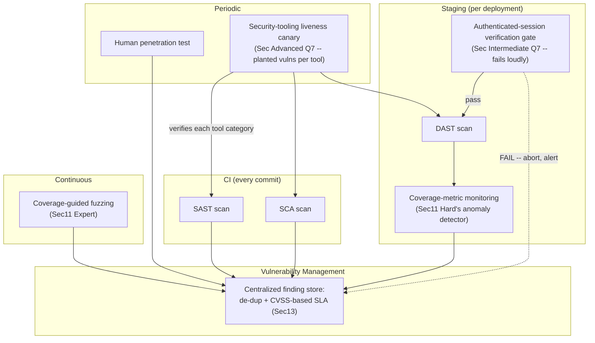

# Module 99 — Security: Security Testing & Tooling — SAST/DAST/SCA, Fuzzing, Penetration Testing & Vulnerability Management

> Domain: Security | Level: Beginner → Expert | Prerequisite: [[01-AppSecFundamentals-OWASPTop10-SecureCoding-ThreatModeling]] (this module formalizes Module 97's ad hoc negative/adversarial test-generation practice into systematic, tool-supported detection), [[02-Cryptography-Encryption-Hashing-Signing-KeyManagement]] (this module's fuzzing/dynamic-testing practices extend to verifying cryptographic implementation correctness specifically), [[../25-DevOps/04-DevSecOps-PolicyAsCode-PlatformEngineering]] §2.1 (SAST/SCA pipeline integration this module goes one level deeper into the actual tooling mechanics behind), [[../26-CICD/01-CIPipelineArchitecture-PipelineAsCode-Caching-Monorepo]] §2.2 (fail-fast, cheapest-check-first staging this module's tool-ordering discipline directly reapplies)

---

## 1. Fundamentals

**What**: Security testing and tooling is the systematic, largely-automated (and partly human-led) practice of discovering vulnerabilities before an attacker does, spanning five distinct techniques with genuinely different vantage points and bounded detection scopes: **SAST** (Static Application Security Testing — analyzes source code without executing it), **DAST** (Dynamic Application Security Testing — probes a running application from the outside, black-box), **IAST** (Interactive/instrumented testing — hybrid, combining source-level visibility with runtime execution context), **SCA** (Software Composition Analysis — scans dependencies against known-vulnerability databases), **fuzzing** (automated, mutation-driven input generation discovering crashes and unexpected behavior), and **penetration testing** (human-led, creative, adversarial testing simulating a real attacker's full approach, not merely individual vulnerability classes).

**Why it exists**: Module 97 established that conventional functional testing has a structural blind spot toward adversarial behavior — it verifies intended behavior works, never that unintended, malicious behavior is blocked, unless a test is deliberately written to attempt exactly that. This module's tools and techniques exist to systematically, automatically fill that blind spot from multiple, complementary vantage points, since no single technique's detection scope is complete: SAST sees source code but not runtime behavior; DAST sees runtime behavior but not unreachable code paths; SCA sees dependency vulnerabilities but nothing about the application's own logic; fuzzing discovers crash-inducing inputs a human wouldn't think to try but doesn't understand business-logic intent; and a human penetration tester brings creative, contextual judgment no automated tool replicates, but doesn't scale to every commit. Conflating "we run tool X" with "we are secure" recreates precisely this course's now-thoroughly-established "declared coverage ≠ actual completeness" gap — each tool's *actual*, bounded detection scope must be understood specifically, not assumed comprehensive by its mere presence.

**When it matters**: SAST as early as every commit/PR (Module 89 §2.2's fail-fast economics — the cheapest, fastest check first); SCA continuously, against every dependency change; DAST/IAST during test/staging environments once a running instance exists; fuzzing continuously or on a scheduled cadence against components handling untrusted input; penetration testing periodically, risk-tiered by release/architecture significance, and specifically before major architectural changes.

**How (30,000-ft view)**:
```
SAST: reads SOURCE CODE, no execution -- catches known-pattern flaws (injection-
    prone concatenation, hardcoded secrets) EARLY and cheaply, but false-positive-
    prone and BLIND to runtime/environment-specific behavior
DAST: probes a RUNNING application from OUTSIDE (black-box) -- confirms actual,
    exploitable vulnerabilities with fewer false positives, but blind to
    unreached code paths and runs LATER (higher cost per Module 89 Sec2.2)
IAST: instrumented HYBRID -- runs inside the app during dynamic testing,
    combining source-level visibility with runtime execution context
SCA: scans the DEPENDENCY GRAPH against known-CVE databases -- Module 88
    Sec2.1's mechanism, extended here with transitive-dependency and SBOM detail
Fuzzing: automated MUTATION of inputs, guided by code-coverage feedback,
    discovering crashes/unexpected behavior no human tester would think to try
Penetration testing: HUMAN-LED, creative, full-kill-chain adversarial testing --
    the one technique bringing contextual judgment no automated tool replicates
NO SINGLE TOOL'S REPORT ("zero findings") is sufficient evidence of security --
    each tool's ACTUAL, bounded detection scope must be verified, not assumed
```

---

## 2. Deep Dive

### 2.1 SAST — Static Analysis's Reach and Its Bounded Blind Spots
SAST tools parse source code (or compiled bytecode) into an internal representation and apply pattern-matching or data-flow analysis rules to flag known-risky constructs — untrusted input flowing into a query-execution call without passing through a recognized sanitization/parameterization step, a hardcoded string matching a credential-shaped pattern. SAST's core strength is running at the earliest, cheapest point in the SDLC (every commit, Module 89 §2.2's fail-fast principle), requiring no running application at all. Its bounded blind spots, directly extending Module 97 §Intermediate Q9's finding: SAST has zero visibility into **actual runtime reachability** (a flagged pattern in genuinely dead or unreachable code is a false positive), **environment-specific configuration** (a vulnerability only exploitable under a specific production configuration SAST cannot see), and **any pattern outside its rule set's specific, finite coverage** — a novel or unusual vulnerable construct its rules were never written to recognize produces a false negative with no indication anything was missed.

### 2.2 DAST — Confirming Actual Exploitability from Outside
DAST tools interact with a genuinely running application exactly as an external attacker would — sending crafted, malicious-shaped requests (an injection payload, an XSS probe) and observing the actual response, confirming a vulnerability is *genuinely, currently exploitable* rather than merely a suspicious-looking pattern. This produces meaningfully fewer false positives than SAST for the vulnerabilities it does find, since a DAST finding represents an actually-triggered, observed effect. Its blind spots are the mirror image of SAST's: DAST has **zero visibility into unreached code paths** (a vulnerability behind a UI flow or an API surface the scanner's crawler never discovers or navigates to is simply never tested at all) and runs comparatively late in the SDLC (requiring a deployed, running instance), incurring Module 89 §2.2's higher, later-stage cost. Critically — and this module's central production incident (§4) hinges on exactly this — **DAST's coverage is entirely bounded by what the scanner can actually reach**, and a scanner that silently fails to authenticate, or silently fails to crawl past a specific page, produces a technically-valid, "clean" report reflecting only the tiny fraction of the application it actually managed to test.

### 2.3 IAST and Hybrid Approaches
Interactive Application Security Testing instruments the application itself (via an in-process agent) during dynamic testing, combining SAST's source-level visibility (knowing exactly which code executed and how data flowed through it) with DAST's runtime-execution context (confirming the flow was actually triggered by real, exercised traffic) — reducing SAST's false-positive rate (an IAST finding is backed by confirmed, actual execution, not merely a suspicious static pattern) while achieving broader code-path coverage than DAST's external, black-box crawling alone typically reaches, since IAST observes every code path any test (including ordinary functional tests) happens to exercise, not merely paths a DAST scanner's own crawler independently discovers.

### 2.4 SCA — Dependency Vulnerability Scanning and the Transitive-Dependency Problem
Software Composition Analysis matches a codebase's declared and *resolved* (including transitive) dependency versions against public vulnerability databases (Module 88 §2.1's mechanism), flagging any dependency with a known, disclosed CVE. The critical extension beyond Module 88's pipeline-integration framing: SCA's actual completeness depends entirely on accurately resolving the **full transitive dependency graph** (directly Module 91 §2.4's lockfile-completeness principle) — a scan checking only directly-declared dependencies while ignoring transitive ones misses an entire class of risk, since a vulnerable dependency several levels deep in the graph is exactly as exploitable as a directly-declared one. A **Software Bill of Materials (SBOM)** — a complete, structured inventory of every component and version an application actually contains (Module 88 §2.3) — is the foundational artifact making comprehensive SCA scanning (and rapid, accurate response to a newly-disclosed CVE) possible at all; without an accurate SBOM, answering "are we affected by this newly-disclosed CVE" requires an ad hoc, error-prone manual investigation rather than an instant, queryable lookup.

### 2.5 Fuzzing — Coverage-Guided Automated Input Mutation
Fuzzing generates malformed, randomized, or systematically-mutated inputs and feeds them to a target (a parser, an API endpoint, a file-format handler), monitoring for crashes, memory-safety violations, or other unexpected behavior — discovering edge cases and vulnerability classes (buffer overflows, unhandled exceptions on malformed input, denial-of-service-inducing inputs) no human tester would think to construct manually, since the value of fuzzing comes precisely from its exhaustive, non-intuitive exploration of the input space. Modern **coverage-guided fuzzing** (the AFL-style approach) feeds real-time code-coverage feedback back into the mutation strategy — an input that discovers a previously-unexecuted code path is prioritized for further mutation over one that merely re-exercises already-covered code, dramatically improving the fuzzer's practical efficiency at discovering genuinely novel behavior compared to purely random, coverage-blind mutation.

### 2.6 Penetration Testing and the Vulnerability Management Lifecycle
Penetration testing is fundamentally different in *kind*, not merely degree, from every automated technique above: a skilled human tester brings creative, contextual, adversarial judgment — chaining together multiple, individually-minor findings into a severe, full attack path (Module 97 §2.2's IDOR combined with a business-logic flaw, say) in a way no automated tool's pattern-matching replicates, simulating a genuine attacker's actual kill chain rather than testing individual vulnerability classes in isolation. Every technique's findings — SAST, DAST, SCA, fuzzing, and pentest results alike — feed into a unified **vulnerability management lifecycle**: discovered → triaged (severity-scored, typically via CVSS) → remediated → verified fixed, with a **remediation SLA tied to severity** (directly Module 94 §2.4's severity-tiered response-urgency principle, now applied to vulnerability remediation timelines specifically, rather than incident response).

---

## 3. Visual Architecture

### Security Testing Across the SDLC — Fail-Fast, Cheapest-First (§2.1–§2.6, Module 89 §2.2)


### No Single Tool's Coverage Is Complete (§1, §2.1–§2.2)
```
SAST sees:     source code           -- BLIND to: runtime behavior, environment config
DAST sees:     runtime, from outside -- BLIND to: unreached code paths (crawler never found them)
SCA sees:      dependency graph      -- BLIND to: the application's OWN logic entirely
Fuzzing sees:  input-space edge cases -- BLIND to: business-logic/authorization intent
Pentest sees:  creative, chained attack paths -- doesn't scale to every commit

"Zero findings" from ANY ONE of these = evidence bounded STRICTLY by that
    tool's own detection scope, never evidence of comprehensive security.
```

### DAST Silent-Degradation Risk — This Module's Central Incident (§4)
```
Declared: "DAST scans every release against the FULL authenticated application"

Actual (after silent auth-credential expiry):
    Scanner attempts login -> FAILS silently -> proceeds scanning as UNAUTHENTICATED
    Result: only the tiny, public-facing surface (login page, static assets) is
            ever tested -- report shows "0 findings" for MONTHS, indistinguishable
            from a genuinely clean, fully-scanned report.
```

---

## 4. Production Example

**Scenario**: A B2B SaaS platform ran an automated DAST scan against every production release as a mandatory security gate, configured with a dedicated test account's credentials to authenticate and scan the application's full, business-logic-heavy authenticated surface. For eight consecutive months, every scan report came back clean — zero findings — and this consistent, clean result was cited internally as evidence of the application's strong security posture.

**Investigation**: During a scheduled, periodic penetration test (§2.6), the human tester trivially discovered a severe, authenticated-surface broken-access-control vulnerability within the first day of testing — a vulnerability that, given its severity and straightforward exploitability, should have been well within any competent DAST scanner's detection capability. Investigating why eight months of "clean" DAST reports had never caught it revealed that the DAST scanner's configured test-account credentials had, in fact, expired roughly eight months earlier — coinciding almost exactly with a routine, unrelated credential-rotation event performed under the organization's standard secrets-rotation policy (Module 86 §2.4's dual-secret-overlap discipline). The scanner, upon failing to log in with the now-invalid credentials, had not failed loudly or aborted — it had silently proceeded to scan the application as an unauthenticated guest, successfully producing a technically-valid report reflecting only the tiny, publicly-accessible surface (the login page, static assets) it could actually reach without authentication.

**Root cause**: Two independent, compounding gaps, directly extending this domain's now-established pattern. (1) The DAST scanner's own credential configuration was never included in the scope of the organization's secrets-rotation change-management audit (directly Module 94 §Advanced Q1's alert-rule cross-reference audit and Module 96 §4's golden-path onboarding-template drift, now recurring for security-tooling credentials specifically) — the rotation process updated every *application's own* credential references but had no visibility into a separately-configured, third-party security tool's independent credential store. (2) The DAST tool's own default behavior, upon authentication failure, was to silently degrade to unauthenticated scanning and still report a "successful" scan completion, rather than failing loudly and aborting — meaning there was no error, no alert, and no visible signal distinguishing "the tool tested everything and found nothing" from "the tool could barely test anything at all."

**Fix**: (1) Reconfigured the DAST tooling to explicitly **verify successful authentication before proceeding** with any scan, failing loudly and aborting the entire scan run (rather than silently degrading) if login cannot be confirmed — converting an invisible degradation into an immediately visible, actionable failure. (2) Extended the secrets-rotation change-management process to explicitly include every security-tooling credential (DAST, SAST integration tokens, SCA API keys) in its audited scope, directly closing the specific cross-reference gap that let the DAST credential silently drift out of sync with the rotation event. (3) Established standing, monitored **DAST coverage metrics** — tracking the actual number of distinct authenticated endpoints/routes exercised per scan, not merely the finding count — since a report showing "0 findings, 3 endpoints scanned" and one showing "0 findings, 300 endpoints scanned" are utterly different signals that a findings-count-only report conflates into an identical, misleadingly reassuring "clean" result.

**Lesson**: A security tool's clean, passing report is exactly as ambiguous as Module 94's "no alert has fired" and Module 95's "no errors in the aggregated logs" — consistent with genuine security *and* with the tool having silently failed to meaningfully test anything at all. This incident demonstrates the identical silent-degradation risk recurring specifically within the very tooling meant to catch "declared security ≠ actual security" in the first place: the security-testing infrastructure itself is not exempt from this course's central, recursive "verify the verifier" theme — a DAST scan's own actual, operational coverage requires the same continuous, active verification this domain has established for every other declared-but-unverified capability, and "we run a DAST scan on every release" is, by itself, exactly as unverified a claim as any of this course's prior instances until the scan's actual, current coverage is independently, continuously confirmed.

---

## 5. Best Practices
- Order security-testing techniques by cost and speed (SAST/SCA earliest and cheapest, DAST/fuzzing later, pentest periodic) — directly Module 89 §2.2's fail-fast, cheapest-check-first principle applied to the security-testing pipeline specifically (§2.1–§2.6).
- Understand and explicitly document each tool's actual, bounded detection scope — never conflate "we run tool X" with "we are secure against every vulnerability class," since each technique has a genuinely different, incomplete vantage point (§1, §2.1–§2.2).
- Ensure a complete, accurate SBOM and transitive-dependency resolution underpin SCA scanning — a scan checking only direct dependencies misses an entire class of exploitable, transitively-included risk (§2.4).
- Configure security-testing tools to **fail loudly and abort** on any setup/authentication failure, never silently degrading to a reduced-scope scan while still reporting a nominally "successful," clean completion (§2.2, §4).
- Track and monitor each tool's actual **coverage metrics** (endpoints scanned, code paths exercised), not merely finding counts — a clean report with negligible coverage is a fundamentally different, far less reassuring signal than a clean report with comprehensive coverage (§4).
- Include every security-tooling credential explicitly in the organization's secrets-rotation change-management audit scope, never leaving a third-party tool's own credential configuration outside that process's visibility (§4).

## 6. Anti-patterns
- Treating any single security-testing technique's clean report as comprehensive evidence of security, without understanding that technique's specific, bounded detection scope (§1, §2.1–§2.2).
- Running SCA scanning against only directly-declared dependencies, ignoring the transitive dependency graph where an equally-exploitable, equally-severe vulnerability can hide (§2.4).
- A security-testing tool that silently degrades to a reduced-scope scan on setup/authentication failure while still reporting nominal, "successful" completion, rather than failing loudly and aborting (§2.2, §4).
- Monitoring only a security scan's finding count, with no visibility into its actual coverage (how much of the application it genuinely tested), conflating "found nothing because there's nothing to find" with "found nothing because it barely tested anything" (§4).
- Leaving a security tool's own credential/configuration outside the scope of the organization's standard secrets-rotation and change-management processes (§4).
- Treating penetration testing as a substitute for, rather than a complement to, systematic automated tooling — or vice versa, treating automated tooling alone as a substitute for periodic, creative, human-led adversarial testing (§2.6).

---

## 10. Interview Questions

### Basic (10)

1. **Q: What is the fundamental difference between SAST and DAST?**
   **A:** SAST analyzes source code statically, without executing it, catching known-risky patterns early and cheaply but blind to runtime behavior. DAST probes a genuinely running application from the outside, confirming actual, exploitable vulnerabilities with fewer false positives, but blind to code paths it never reaches.
   **Why correct:** States both techniques' vantage point (static source vs. dynamic runtime) and their respective, complementary strengths and blind spots.
   **Common mistakes:** Assuming one technique is strictly superior to the other, rather than recognizing they have genuinely different, complementary detection scopes.
   **Follow-ups:** "Why does SAST typically run earlier in the SDLC than DAST?" (SAST requires only source code, running at every commit; DAST requires a deployed, running instance, which exists only later — directly Module 89 §2.2's fail-fast, cheapest-check-first economics.)

2. **Q: What is IAST, and how does it combine SAST and DAST's respective strengths?**
   **A:** Interactive Application Security Testing instruments the application itself during dynamic testing, combining SAST's source-level visibility (knowing exactly how data flows through code) with DAST's runtime-execution context (confirming that flow was actually triggered), reducing SAST's false-positive rate while covering more code paths than DAST's external crawling alone typically reaches.
   **Why correct:** States the specific hybrid mechanism (in-process instrumentation) and the specific benefit (fewer false positives, broader coverage) it provides over either technique alone.
   **Common mistakes:** Assuming IAST is simply "SAST and DAST run together," rather than recognizing it's a genuinely distinct, instrumented technique combining both vantage points within one testing pass.
   **Follow-ups:** "What's a limitation IAST still shares with DAST?" (It still only observes code paths actually exercised during testing — code never triggered by any test, functional or otherwise, remains unobserved by IAST just as it would by DAST.)

3. **Q: What is SCA, and why is scanning only directly-declared dependencies insufficient?**
   **A:** Software Composition Analysis matches a codebase's dependencies against known-vulnerability databases. Scanning only directly-declared dependencies misses transitive (dependency-of-a-dependency) vulnerabilities, which are exactly as exploitable as a directly-declared vulnerable dependency.
   **Why correct:** States the mechanism and the specific completeness gap (transitive dependencies) that scanning only direct declarations leaves unaddressed.
   **Common mistakes:** Assuming a project's own, directly-declared dependency list represents its full, actual dependency footprint, without considering the often much larger transitive graph beneath it.
   **Follow-ups:** "What artifact makes comprehensive SCA scanning genuinely feasible?" (An accurate SBOM — a complete, structured inventory of every component and version an application actually contains — Module 88 §2.3.)

4. **Q: What is coverage-guided fuzzing, and how does it differ from purely random fuzzing?**
   **A:** Coverage-guided fuzzing feeds real-time code-coverage feedback back into the input-mutation strategy, prioritizing inputs that discover previously-unexecuted code paths over ones that merely re-exercise already-covered code — dramatically more efficient at discovering novel behavior than purely random, coverage-blind mutation.
   **Why correct:** States the specific feedback mechanism (coverage-guided prioritization) distinguishing it from naive random fuzzing.
   **Common mistakes:** Assuming all fuzzing is equally effective regardless of whether it incorporates coverage feedback, missing that coverage-guidance is what makes modern fuzzing practically efficient at scale.
   **Follow-ups:** "What kind of vulnerability class is fuzzing especially well-suited to discovering, that a human tester might not think to construct?" (Memory-safety issues, crash-inducing malformed inputs, and edge-case parsing failures — vulnerability classes arising from exhaustive, non-intuitive exploration of an input space a human's naturally-biased test design wouldn't naturally cover.)

5. **Q: How does penetration testing differ fundamentally, not merely in degree, from every automated technique (SAST/DAST/SCA/fuzzing)?**
   **A:** A human penetration tester brings creative, contextual, adversarial judgment — chaining multiple, individually-minor findings into a severe, full attack path — simulating a genuine attacker's actual approach, rather than testing individual vulnerability classes in isolation the way every automated technique does.
   **Why correct:** States the specific, qualitative distinction (creative chaining vs. isolated-pattern detection) rather than merely "it's done by a human."
   **Common mistakes:** Treating penetration testing as simply "a more thorough version of automated scanning," missing that its core value is creative, cross-finding synthesis no automated tool's pattern-matching replicates.
   **Follow-ups:** "Why can't penetration testing simply replace automated tooling entirely, given its superior creative capability?" (It doesn't scale to every commit/release — it's periodic and comparatively expensive, making it a complement to, not a substitute for, continuous automated tooling covering the routine, day-to-day change volume.)

6. **Q: What is CVSS, and what role does it play in vulnerability management?**
   **A:** The Common Vulnerability Scoring System — a standardized scoring methodology producing a severity score for a given vulnerability, used to triage findings and determine an appropriate remediation SLA/urgency.
   **Why correct:** States both what CVSS is and its practical, operational purpose (triage and SLA determination).
   **Common mistakes:** Treating CVSS scores as a purely academic classification with no operational consequence, rather than recognizing they directly drive remediation prioritization and timelines.
   **Follow-ups:** "Why might an organization deviate from a purely CVSS-score-driven remediation priority for a specific finding?" (A lower-CVSS-score finding on a business-critical, internet-facing system handling highly sensitive data may warrant faster remediation than a higher-scored finding on an isolated, low-value internal tool — CVSS is a valuable, standardized input, but organizational context/risk should still inform final prioritization.)

7. **Q: Why does this module recommend a security-testing tool "fail loudly and abort" on a setup/authentication failure, rather than proceeding with a reduced-scope scan?**
   **A:** Proceeding silently with a reduced-scope scan while still reporting nominal, "successful" completion produces a report indistinguishable from a genuinely comprehensive, clean scan — exactly this module's central incident. Failing loudly makes the degradation immediately visible and actionable, rather than silently invisible for however long it takes someone to separately discover it.
   **Why correct:** States the specific risk (an indistinguishable, misleadingly reassuring report) that silent degradation creates, and why loud failure avoids it.
   **Common mistakes:** Assuming a partial, reduced-scope scan is still better than no scan at all and should therefore proceed silently, without considering that the report's *presentation* as a full, successful scan is itself actively misleading.
   **Follow-ups:** "Is there ever a legitimate case for a tool to proceed with reduced scope rather than aborting entirely?" (Possibly, but only if the report explicitly, visibly flags the reduced scope and its specific cause — the problem isn't reduced-scope scanning itself, it's a reduced-scope scan silently presenting as a full, successful one.)

8. **Q: What is the difference between a DAST scan's finding count and its coverage metric, and why does this module argue both must be monitored?**
   **A:** Finding count is how many vulnerabilities were reported; coverage is how much of the application (how many distinct endpoints/routes) was actually exercised during the scan. A "zero findings" report with negligible coverage is a fundamentally different, far less reassuring signal than "zero findings" with comprehensive coverage — monitoring finding count alone conflates the two into an identical, misleading result.
   **Why correct:** Precisely distinguishes the two metrics and explains why finding count alone is insufficient without corresponding coverage context.
   **Common mistakes:** Treating "zero findings" as inherently good news regardless of coverage, without asking how much of the application that zero-findings result actually reflects.
   **Follow-ups:** "How would you detect a coverage regression, like this module's central incident, before it silently persists for months?" (Track coverage metrics over time on a monitored dashboard, alerting on any significant, unexpected drop — directly this domain's now-established periodic/continuous liveness-verification pattern, applied to scan coverage specifically.)

9. **Q: Why might a security-tooling credential (e.g., a DAST scanner's test-account login) be overlooked during a routine secrets-rotation process, even at an organization with a mature rotation policy?**
   **A:** A secrets-rotation process typically scopes itself to the *application's own* credential references — a third-party security tool's separately-configured, separately-stored credential often lives outside that process's normal visibility and audit scope entirely, unless explicitly, deliberately included as part of the rotation's defined coverage.
   **Why correct:** States the specific reason (a scoping gap between the rotation process's normal visibility and a separately-configured tool's credential store) this class of oversight occurs.
   **Common mistakes:** Assuming a mature, well-run secrets-rotation process automatically covers every credential an organization uses, without considering that third-party tooling credentials specifically require deliberate, explicit inclusion in that process's audited scope.
   **Follow-ups:** "How would you ensure this gap doesn't recur for other security tools beyond DAST specifically?" (Explicitly enumerate every security tool's credential/configuration as a named, tracked item in the secrets-rotation process's defined scope, rather than assuming the process's normal application-focused visibility implicitly covers them.)

10. **Q: Why is "we run SAST, DAST, and SCA scanning" not, by itself, sufficient evidence that an organization's security-testing program is comprehensive?**
    **A:** Each technique has a genuinely different, bounded detection scope (source-code patterns, confirmed-reachable runtime behavior, dependency-graph vulnerabilities respectively) — running all three still leaves gaps neither individually nor collectively covers (business-logic flaws requiring creative human judgment, a vulnerability in code no test path reaches at all), and — this module's central finding — each tool's *actual*, currently-functioning coverage requires independent, ongoing verification rather than being assumed correct because the tool is nominally configured and running.
    **Why correct:** States both the structural, scope-based reason (no combination of techniques is fully comprehensive) and the operational reason (each tool's actual functioning requires ongoing verification) this claim is insufficient.
    **Common mistakes:** Assuming that running every major category of automated security tool is equivalent to comprehensive security coverage, without considering either the techniques' inherent scope limitations or the risk that any one of them has silently degraded in actual operation.
    **Follow-ups:** "What complements automated tooling to help close the remaining gap?" (Periodic, risk-tiered penetration testing (§2.6) for creative, cross-finding, business-logic-aware adversarial testing no automated tool replicates — plus continuous, active verification that each automated tool's actual coverage remains current, per this module's central incident.)

### Intermediate (10)

1. **Q: Why did §4's DAST coverage gap go undetected for eight months, despite the organization running the scan on every single release?**
   **A:** The scanner's silent degradation to unauthenticated scanning produced a technically-valid, "clean" report every time — with no error, no alert, and no visible signal distinguishing "the tool tested everything and found nothing" from "the tool could barely test anything at all," and the organization was monitoring finding count alone, with no coverage-metric visibility that would have revealed the tool's actual, drastically-reduced scan scope.
   **Why correct:** Identifies both the tool's own silent-degradation behavior and the organization's finding-count-only monitoring as the two compounding reasons detection was delayed.
   **Common mistakes:** Assuming the organization was simply negligent in reviewing scan reports, without recognizing that a finding-count-only report genuinely provides no visible signal distinguishing the two very different underlying realities.
   **Follow-ups:** "What single, additional metric would have most directly surfaced this gap, months earlier?" (Coverage metrics — the number of distinct authenticated endpoints/routes actually exercised per scan — tracked and alerted on, per §4's third fix.)

2. **Q: A team argues that since their SAST tool reports zero findings on every commit, their codebase must have no injection or hardcoded-secret vulnerabilities. Evaluate this claim.**
   **A:** SAST's detection scope is bounded strictly to the specific patterns its rules were built to recognize — a zero-findings result confirms no *known-pattern* match was found, not that no vulnerability of any kind exists; a novel, unusual, or obfuscated vulnerable construct outside the tool's rule coverage would produce an identical zero-findings result. This is directly Module 97 §Intermediate Q9's identical finding (a SAST tool's presence and correct flagging of known patterns provides no evidence about its coverage of patterns outside that scope), now reapplied specifically to this module's SAST discussion.
   **Why correct:** Correctly bounds the claim to SAST's specific, rule-based detection scope and connects it explicitly to an already-established, structurally identical prior-module finding.
   **Common mistakes:** Treating a SAST tool's zero-findings result as comprehensive proof of the absence of the vulnerability classes it's generally associated with, rather than recognizing its detection is bounded strictly to its specific, finite rule set.
   **Follow-ups:** "What complementary technique would help close this specific gap?" (DAST or IAST — confirming actual, runtime-observed behavior rather than relying solely on static pattern-matching, plus periodic penetration testing for genuinely novel vulnerability classes outside any automated tool's pattern coverage.)

3. **Q: Why might a DAST scanner's crawler fail to discover and test a legitimate, exploitable business-logic flaw even while functioning with fully valid, current authentication credentials?**
   **A:** A DAST scanner's crawler navigates the application by following links, forms, and API calls it can automatically discover — a flow requiring a specific, non-obvious sequence of actions (a multi-step checkout process, a feature only reachable after a particular prior state change) may never be automatically discovered or correctly navigated by the crawler's general-purpose logic, meaning the vulnerable endpoint, while technically reachable by a real user, is never actually tested, producing the identical "clean but incomplete" result this module's central incident exhibited via a different underlying mechanism (crawler-navigation limits rather than authentication failure).
   **Why correct:** Identifies a second, distinct mechanism (crawler-navigation limitations) producing the same category of "clean but incomplete" DAST result, independent of the specific authentication-failure mechanism in §4's central incident.
   **Common mistakes:** Assuming valid, current authentication credentials alone guarantee comprehensive DAST coverage, without considering that the crawler's own navigation/discovery logic is an independent, additional potential source of incomplete coverage.
   **Follow-ups:** "How would you address this crawler-navigation limitation, beyond simply having valid credentials?" (Supplement automated crawling with an explicitly-configured, scripted set of critical user flows/API sequences the scanner is directed to exercise regardless of whether its own crawler would naturally discover them — directly reducing reliance on the crawler's own, potentially-incomplete automatic discovery.)

4. **Q: How does this module's coverage-metric recommendation (§4's third fix) relate to and extend Module 90's coverage-gaming finding specifically?**
   **A:** Module 90 established that a code-coverage percentage can be gamed — satisfied in letter (high percentage) while abandoning its purpose (assertion-free tests). This module's DAST coverage metric faces a structurally similar, though distinct, risk: a coverage metric counting "endpoints scanned" could itself be satisfied by a scanner that reaches many endpoints but sends only trivial, non-adversarial requests to each — meaning DAST coverage, like code coverage, requires care that the metric reflects genuine, meaningful adversarial testing per endpoint, not merely reach without depth, extending Module 90's "a measured proxy can diverge from what it's meant to represent" finding into DAST-coverage measurement specifically.
   **Why correct:** Correctly identifies the structural parallel to Module 90's coverage-gaming risk while noting the specific way it could recur for DAST coverage (breadth without adversarial depth) rather than treating the two findings as unrelated.
   **Common mistakes:** Assuming a DAST coverage metric is immune to the same gaming/misinterpretation risk Module 90 identified for code coverage, simply because it measures a different underlying dimension (endpoints reached vs. lines executed).
   **Follow-ups:** "How would you design the coverage metric to resist this specific gaming risk?" (Track not just endpoints reached but the specific vulnerability-class payload types actually attempted per endpoint, and periodically validate the scanner's actual payload behavior against a small set of deliberately-planted, known-vulnerable test endpoints — directly Module 88 §Advanced Q7's policy-liveness-canary pattern, applied to DAST payload-execution verification specifically.)

5. **Q: Why is fuzzing (§2.5) generally poorly suited to discovering a broken-access-control vulnerability like Module 97 §4's IDOR finding, despite fuzzing's exhaustive, non-intuitive input-space exploration?**
   **A:** Fuzzing excels at discovering inputs causing a crash, memory-safety violation, or other low-level, structurally-detectable anomaly — it has no inherent understanding of business-logic intent (whose invoice a given ID is "supposed to" belong to) and therefore no mechanism for recognizing that a *successfully-processed*, non-crashing response to a cross-user resource request represents a security failure rather than ordinary, correct behavior. Broken access control requires a test with actual knowledge of resource ownership semantics (Module 97's negative-authorization test design) — a fundamentally different testing approach than fuzzing's crash/anomaly-detection paradigm.
   **Why correct:** Explains the specific reason (fuzzing's lack of business-logic/semantic understanding) that makes it structurally unsuited to this particular vulnerability class, despite being highly effective for a different class (crashes, memory safety).
   **Common mistakes:** Assuming fuzzing, given its exhaustive input-space coverage, would eventually discover any vulnerability class including broken access control, without recognizing fuzzing's detection mechanism (crash/anomaly signals) has no way to recognize a successfully-processed but unauthorized response as anomalous at all.
   **Follow-ups:** "What testing technique specifically targets broken-access-control vulnerabilities, given fuzzing's unsuitability?" (Module 97 §4's negative-authorization test design — a deliberately-constructed test with explicit knowledge of resource ownership, asserting cross-principal access is rejected — a semantically-aware technique fuzzing's generic, ownership-agnostic input mutation cannot replicate.)

6. **Q: A security team proposes that, given SCA's proven ability to detect known-CVE dependencies, the organization should deprioritize SAST investment entirely and rely primarily on SCA and DAST going forward. Evaluate this proposal.**
   **A:** This overlooks that SCA's detection scope is bounded strictly to the *dependency graph* — it has zero visibility into the application's *own* code, meaning a vulnerability the organization's own engineers introduce (Module 97 §4's IDOR, a novel injection flaw) would be entirely invisible to SCA regardless of how comprehensively it scans dependencies. Deprioritizing SAST specifically removes the organization's earliest, cheapest (Module 89 §2.2) detection layer for vulnerabilities in its own, first-party code — a fundamentally different and equally necessary risk category SCA cannot address at all, since SCA and SAST have entirely non-overlapping detection scopes (dependency-graph vulnerabilities vs. first-party code vulnerabilities) rather than being redundant alternatives to one another.
   **Why correct:** Identifies the specific category error (treating SCA and SAST as substitutable alternatives when their detection scopes are entirely non-overlapping) underlying the flawed proposal.
   **Common mistakes:** Assuming different security-testing techniques are interchangeable or substitutable to some degree, rather than recognizing that SAST and SCA specifically address entirely disjoint risk categories (first-party code vs. third-party dependencies) with zero overlap.
   **Follow-ups:** "How would you communicate this evaluation to the proposing team?" (Explain concretely that SCA's clean report says nothing about the organization's own code — citing Module 97 §4's IDOR incident specifically as a vulnerability class SCA could never have detected regardless of how comprehensively it scanned dependencies, making the case for maintaining both techniques as addressing genuinely disjoint, both-necessary risk categories.)

7. **Q: How would you design an automated check verifying that a DAST scanner's authenticated scan genuinely reached the application's authenticated surface, closing §4's exact gap structurally rather than merely adding a monitored coverage metric after the fact?**
   **A:** Configure the scan pipeline to explicitly verify, as an automated, blocking pre-condition before the DAST scan is considered to have started meaningfully, that the authentication step returned an expected, valid authenticated-session indicator (a specific cookie, a specific redirect target, or a specific authenticated-only page's content) — failing the entire pipeline stage immediately if this verification doesn't pass, directly closing the gap at its structural source rather than relying on a downstream coverage-metric dashboard someone must separately notice and investigate.
   **Why correct:** Proposes a concrete, structural, pipeline-level verification gate (confirming authenticated-session establishment before scanning proceeds) rather than relying solely on after-the-fact monitoring to eventually surface the same gap.
   **Common mistakes:** Relying solely on a coverage-metric dashboard as the detection mechanism, without also building a structural, blocking pre-condition check that prevents the degraded scan from silently completing and reporting success in the first place.
   **Follow-ups:** "Why is a structural, blocking gate preferable to a monitored dashboard metric alone, given both would eventually surface this gap?" (A blocking gate prevents the degraded scan from ever completing and reporting a misleading "success" in the first place — directly stopping the release pipeline at the exact point of failure — whereas a dashboard metric alone still requires someone to notice and act on it, reintroducing a diligence-dependent step this course has repeatedly shown is less reliable than a structural, automated gate.)

8. **Q: Why might a periodic penetration test (§2.6) discover §4's DAST-authentication-failure gap even without the human tester specifically investigating the DAST tool's own configuration?**
   **A:** A human penetration tester approaches the application as a genuine attacker would — directly probing the actual, currently-running authenticated application surface with creative, adversarial technique — entirely independent of, and with no reliance on, whatever the organization's own automated DAST tooling separately reported. The pentest's discovery of a severe, easily-findable vulnerability that eight months of "clean" DAST reports had missed is itself the evidence revealing the DAST tool's gap, even though the pentester's actual goal was finding vulnerabilities, not auditing the DAST tool's own configuration — an emergent, independent-verification benefit of running a genuinely separate, complementary testing technique.
   **Why correct:** Explains why an independent testing technique (pentest) can reveal a gap in a different technique (DAST) purely as an emergent consequence of its own, unrelated adversarial testing, without needing to specifically, deliberately audit the other tool.
   **Common mistakes:** Assuming the pentest's value here was specifically auditing the DAST tool's configuration, rather than recognizing it was an emergent, valuable side effect of running a genuinely independent, complementary technique with no shared blind spot.
   **Follow-ups:** "Does this mean periodic penetration testing alone is sufficient to catch every DAST-scope gap, without needing the coverage-metric monitoring §4 also established?" (No — relying solely on periodic pentesting to eventually, incidentally reveal a DAST gap means the gap persists, undetected, for the entire interval between pentests (eight months in this incident) — the coverage-metric monitoring provides continuous, much faster detection, while pentesting provides a valuable, independent, but comparatively infrequent additional check.)

9. **Q: How should an organization prioritize remediation when a DAST scan and a SAST scan both flag findings for the same underlying code path, with differing severity scores? Design a de-duplication and prioritization approach.**
   **A:** Findings from different tools referencing the same underlying vulnerability (the same code location, the same vulnerability class) should be de-duplicated into a single tracked finding in the vulnerability management system (§13), retaining the *higher* confidence signal (a DAST finding, representing confirmed, actual exploitability, generally warrants higher confidence than a SAST finding representing only a suspicious static pattern) while using the DAST finding's severity for triage purposes, since it reflects genuinely demonstrated impact rather than a theoretical pattern match — avoiding both the redundant-effort risk of independently triaging and remediating what are actually two reports of the identical underlying issue, and the confusion risk of two conflicting severity scores for what is, in reality, one vulnerability.
   **Why correct:** Proposes a concrete de-duplication approach (same code location/vulnerability class) and a principled severity-reconciliation rule (prefer the higher-confidence, confirmed-exploitability signal) rather than treating multi-tool findings as independent, separately-triaged items.
   **Common mistakes:** Triaging and remediating each tool's finding independently without de-duplication, creating redundant tracked work items and potentially conflicting severity/priority signals for what is actually a single underlying vulnerability.
   **Follow-ups:** "What risk does over-aggressive de-duplication introduce?" (Incorrectly merging two genuinely distinct vulnerabilities that merely share a similar code location or vulnerability class, causing one to be silently dropped/overlooked as "already tracked" when it's actually a separate, unaddressed issue — de-duplication logic must verify genuine identity, not merely superficial similarity, before merging findings.)

10. **Q: How does this module's central finding extend this course's broader "declared/present ≠ actual/complete" theme, and what is genuinely new about its instance compared to Modules 97 and 98's respective instances within this same security domain?**
    **A:** Module 97 established that conventional functional testing has a structural blind spot toward adversarial verification; Module 98 established that cryptographic guarantees can catastrophically, invisibly fail despite correct algorithm choice. This module's instance is specifically about the **verification tooling itself** — the very mechanisms built to systematically close Modules 97 and 98's blind spots (DAST scanning for adversarial behavior, cryptographic-liveness scanning for implementation correctness) can *themselves* silently degrade and produce a misleadingly clean result, exactly recreating, one level further removed, the identical "declared ≠ actual" gap the tooling exists to detect in the first place. This is the security domain's own instance of Module 96's capstone-level, recursive finding (the mechanism delivering verified capabilities can itself silently drift) — now specifically applied to security-testing tooling rather than observability's onboarding scaffolding.
    **Why correct:** Correctly identifies this module's specific contribution (the verification tooling's own silent-degradation risk) as distinct from, but building directly on, Modules 97 and 98's respective findings, and connects it explicitly to Module 96's structurally identical, recursive "verify the verifier" insight from a different domain.
    **Common mistakes:** Treating this module's finding as simply "another example of incomplete security coverage" without recognizing its specifically recursive character — the tooling meant to verify security is itself subject to the identical unverified-assumption risk, mirroring Module 96's capstone insight precisely.
    **Follow-ups:** "How should this recursive insight shape the design of the eventual zero-trust/governance capstone module for this domain?" (The capstone should explicitly synthesize Module 97's testing-methodology blind spot, Module 98's cryptographic-implementation binary-failure risk, and this module's security-tooling-silent-degradation risk into one unified governance principle: every security control and every mechanism verifying that control both require independent, continuous, active verification — never assumed correct by mere configuration or presence.)

### Advanced (10)

1. **Q: Diagnose §4's incident from first principles and design the complete structural fix — not merely the three specific remediations already described.**
   **A:** Root causes (two, independent): (1) the DAST tool's own credential configuration existed outside the organization's secrets-rotation change-management process's normal, application-focused visibility, allowing it to silently drift out of sync with a routine rotation event; (2) the tool's own default behavior on authentication failure was silent degradation with a nominally "successful" report, rather than loud failure. Complete structural fix: (1) reconfigure the DAST tool to fail loudly and abort on any authentication-verification failure (§4's first fix); (2) explicitly extend the secrets-rotation change-management scope to include every security-tooling credential organization-wide, not merely the specific DAST tool discovered (§4's second fix, extended proactively); (3) establish standing, monitored coverage metrics (endpoints scanned, payload types attempted per endpoint per §Intermediate Q4) with alerting on any significant, unexpected drop; (4) add a structural, blocking pipeline pre-condition verifying authenticated-session establishment before any scan is considered to have meaningfully started (§Intermediate Q7), rather than relying on the coverage-metric dashboard alone to eventually surface a future, similar gap; (5) proactively audit every *other* automated security tool in the organization's pipeline (SAST integration credentials, SCA API tokens, any other tool requiring its own authentication) for the identical class of credential-scope gap, since this incident's specific mechanism (a security tool's credential living outside the standard rotation process's visibility) plausibly recurs wherever a similarly-configured tool exists.
   **Why correct:** Addresses both independent root causes with layered, already-established fixes and extends the investigation proactively per this course's now-standard pattern of searching for the identical failure shape recurring elsewhere in the organization's tooling.
   **Common mistakes:** Fixing only the specific DAST tool's credential and authentication-failure behavior without also extending the secrets-rotation scope organization-wide and auditing every other security tool for the identical class of gap, leaving the same risk free to recur via a different tool's separately-configured credential.
   **Follow-ups:** "How would you prioritize these fixes given limited immediate security-engineering capacity?" (The fail-loudly reconfiguration first, since it's cheap and immediately prevents the specific failure mode from silently recurring for this tool; the secrets-rotation scope extension and cross-tool audit second, since they address the actual, broader current exposure; coverage-metric monitoring and the structural pipeline gate third and fourth, as durable, longer-term investments providing both a dashboard signal and a hard, blocking safeguard.)

2. **Q: A Principal Engineer is asked whether the organization should respond to §4's incident by running a full, unannounced penetration test before every single production release, given the severity of what a scheduled pentest ultimately caught. Evaluate this proposal.**
   **A:** This recreates the identical, already-established overcorrection pattern this course has repeatedly examined (Module 92 §4's gate-friction-driven bypass, Module 97 §Advanced Q2's mandatory-full-pentest-per-release proposal) — a full pentest before every release would introduce substantial, likely release-blocking latency the delivery cadence cannot sustainably absorb, predictably driving exactly the kind of bypass behavior this course's evidence shows such uniform, maximal gates produce. The more proportionate response is the layered, structural fix from Advanced Q1 (fixing the DAST tool's actual reliability and adding continuous coverage monitoring) plus continuing periodic, risk-tiered penetration testing at its existing, sustainable cadence — since the *actual* root cause was a broken automated tool, not an insufficient pentest frequency, and the fix should target the tool that was actually broken rather than dramatically increasing the frequency of the technique that happened to catch the resulting gap.
   **Why correct:** Correctly identifies the specific overcorrection (targeting pentest frequency rather than the actually-broken DAST tool) and explains why the proportionate fix addresses the tool that actually failed, using an already-established course pattern as direct precedent.
   **Common mistakes:** Assuming the technique that happened to catch a gap (pentesting) should be dramatically increased in frequency, rather than recognizing the actual root cause was a different, broken tool (DAST) that the fix should directly target.
   **Follow-ups:** "How would you communicate this evaluation to a stakeholder specifically alarmed by how long the DAST gap persisted, proposing more frequent pentesting as the fix?" (Acknowledge the legitimate concern about detection latency, then explain that fixing the actually-broken DAST tool and adding continuous coverage monitoring closes future gaps in days or hours rather than months — a faster, more targeted, and more sustainable improvement than dramatically increasing pentest frequency, which addresses a symptom rather than this incident's actual root cause.)

3. **Q: Design an automated, CI-integrated check that would have caught §4's specific vulnerability class (a resource-scoped endpoint's authorization gap) even in a world where the DAST tool's authentication had never broken — essentially, what would have been the ideal, defense-in-depth technique catching this specific finding regardless of the DAST incident?**
   **A:** Module 97 §11 Expert's negative-authorization test generator, run as a mandatory, automated CI check for every resource-scoped endpoint — a technique with explicit, semantic knowledge of resource-ownership requirements (unlike DAST's or fuzzing's ownership-agnostic testing), catching this specific vulnerability class at the earliest, cheapest SDLC stage (every commit/PR, Module 89 §2.2) rather than depending on a correctly-functioning DAST scan or a periodic pentest to eventually discover it. This demonstrates that §4's incident, while specifically about DAST tooling reliability, also reveals a *layering* gap: the organization was relying on DAST and pentesting to catch a vulnerability class (broken object-level authorization) that Module 97's negative-authorization testing is specifically, structurally designed to catch far earlier and more reliably.
   **Why correct:** Identifies that the ideal, defense-in-depth answer isn't merely "fix DAST," but recognizing an entirely different, earlier-stage, semantically-aware technique (Module 97's negative-authorization tests) should have been the *primary* detection mechanism for this specific vulnerability class, with DAST and pentesting serving as valuable but secondary, later-stage backstops.
   **Common mistakes:** Treating DAST and pentesting as the appropriate primary detection layers for broken-access-control vulnerabilities, without recognizing Module 97's negative-authorization testing is both earlier-stage and more semantically precise for this specific vulnerability class, making its absence (not merely the DAST tool's malfunction) an independent, compounding gap in this incident.
   **Follow-ups:** "Why might an organization still want DAST and pentesting as backstops even with comprehensive negative-authorization testing in place?" (Negative-authorization testing covers known, explicitly-modeled resource-ownership relationships — DAST and pentesting provide broader, less assumption-dependent coverage catching novel or unanticipated authorization-gap variants the negative-test generator's own metadata-driven model might not have anticipated, directly this course's now-standard defense-in-depth, no-single-layer-sufficient principle.)

4. **Q: How would you extend this module's DAST coverage-monitoring practice (§4's third fix) to also detect a subtler variant: a DAST scan that authenticates successfully and reaches many endpoints, but whose crawler systematically fails to discover and test one specific, business-critical feature area added months after the scanner's original configuration?**
   **A:** Coverage monitoring must track not merely an aggregate endpoint count over time, but coverage against a maintained, explicit **inventory of the application's actual, current route/endpoint surface** (ideally derived automatically from the application's own routing configuration or API specification, rather than the scanner's own, potentially-incomplete crawl-derived discovery) — comparing the scanner's actual coverage against this independently-sourced, ground-truth inventory reveals a systematic gap (an entire feature area never reached) that a purely scanner-self-reported aggregate count, growing steadily over time as the *scanner's own* crawl happens to expand, would never surface, since the scanner's self-reported metric has no way to reveal what it's *never* discovered at all.
   **Why correct:** Identifies the specific, deeper design requirement (an independent, ground-truth endpoint inventory to compare against, not merely the scanner's own self-reported aggregate) needed to catch a systematic, crawler-navigation-driven coverage gap the simpler metric from §4 wouldn't reveal.
   **Common mistakes:** Assuming a coverage metric based purely on the scanner's own self-reported endpoint count is sufficient, without recognizing it has no way to reveal a systematic gap in what the scanner never discovers or attempts to reach in the first place.
   **Follow-ups:** "Where would this ground-truth endpoint inventory most reliably be sourced from?" (Ideally, the application's own API specification (an OpenAPI/Swagger document) or routing configuration, generated and kept current as part of the application's own build process — directly avoiding the risk of a separately, manually-maintained inventory itself silently drifting out of sync with the actual application surface, Module 96 §2.6's exact golden-path-drift risk recurring here if the inventory itself isn't kept live and current.)

5. **Q: A security team proposes that, given fuzzing's demonstrated effectiveness at discovering memory-safety and crash-inducing vulnerabilities, all future development for a performance-critical, memory-unsafe-language (C/C++) component should prioritize extensive fuzzing investment over migrating the component to a memory-safe language. Evaluate this proposal.**
   **A:** Fuzzing is a valuable, effective *detection* mechanism for the specific vulnerability classes memory-unsafe languages are prone to, but it provides *probabilistic*, not *structural*, protection — a fuzzer, however extensively run, can never provide a guarantee that no exploitable memory-safety bug remains undiscovered, since fuzzing's coverage, however extensive, is still bounded by the input space and time actually explored. Migrating to a memory-safe language provides a *structural* guarantee (an entire vulnerability class becomes impossible by construction, not merely less likely to remain undetected) — directly this course's now-repeated, established preference for structural fixes over detection-and-remediation cycles applied to language/platform choice specifically (Module 92 §13's "remove the possibility, don't just document/detect the correct practice" principle). Fuzzing remains valuable as an additional, defense-in-depth layer, but shouldn't be treated as a substitute for the structurally stronger guarantee a memory-safe language migration would provide, where migration is a genuinely available option.
   **Why correct:** Correctly distinguishes probabilistic detection (fuzzing) from structural elimination (memory-safe language), and applies this course's established preference for structural fixes over detection-based mitigation to this specific architectural decision.
   **Common mistakes:** Treating extensive fuzzing investment as providing an equivalent security guarantee to eliminating the underlying vulnerability class structurally, without recognizing fuzzing's detection is inherently probabilistic and bounded by the actual input space and time explored, never a completeness guarantee.
   **Follow-ups:** "Under what circumstance might continued investment in fuzzing a memory-unsafe component be the more reasonable choice over migration?" (Where migration is genuinely infeasible in the relevant timeframe — a large, mission-critical legacy codebase where a full language migration carries its own, substantial risk and cost — fuzzing investment becomes the pragmatic, risk-reducing choice while a longer-term migration is separately, deliberately planned, rather than fuzzing being framed as a permanent substitute for the structurally stronger fix.)

6. **Q: How does this module's finding about security-tooling silent degradation (§4) interact with a supply-chain-attack threat model specifically — could an attacker deliberately, maliciously induce the same kind of silent DAST degradation this incident exhibited accidentally?**
   **A:** Yes — an attacker with any access to the DAST tool's configuration, credential store, or the secrets-rotation process itself could deliberately induce the identical silent-degradation state (invalidating the scanner's authentication) specifically to blind the organization's automated detection ahead of introducing a separate, malicious change they don't want caught — directly Module 88 §2.6's "CI as a privileged, attackable surface" framing, now applied specifically to security-testing infrastructure itself rather than deployment infrastructure. This elevates the priority of this module's structural fixes (fail-loudly reconfiguration, coverage monitoring) from merely addressing an accidental, benign failure mode to also closing a genuine, deliberate attack vector against the organization's own security-verification capability.
   **Why correct:** Identifies that the identical structural gap this module's incident exhibited accidentally could also be deliberately, maliciously exploited, connecting to an already-established course principle about CI/testing infrastructure's own attractiveness as an attack target.
   **Common mistakes:** Treating this module's incident purely as an accidental, benign failure mode, without considering that the identical mechanism represents a genuine, deliberate attack vector an adversary could exploit to blind detection ahead of a separate, malicious action.
   **Follow-ups:** "What additional safeguard would specifically address the deliberate-attack variant, beyond the accidental-failure fixes already established?" (Restrict and audit access to the DAST tool's own configuration/credential store with the same rigor as production deployment credentials (Module 88 §2.6's least-privilege, ephemeral-runner principles), and alert specifically on any configuration change to the security-tooling's own setup, not merely on the resulting coverage-metric degradation — providing an earlier, access-control-layer signal in addition to the later, coverage-based one.)

7. **Q: Design a periodic "security-tooling liveness canary" — directly extending Module 93/94's canary pattern — specifically verifying that every major automated security-testing tool (SAST, DAST, SCA) in the organization's pipeline remains genuinely, currently functional, rather than merely configured.**
   **A:** Deliberately introduce a small set of known, planted vulnerabilities (a synthetic, clearly-labeled test repository or test endpoint containing a deliberately-injected SQL-injection-vulnerable pattern for SAST, a deliberately-reachable, deliberately-vulnerable authenticated endpoint for DAST, and a deliberately-included, known-CVE test dependency for SCA) and run each tool against its respective planted target on a scheduled cadence, asserting each tool correctly flags its specific, known-vulnerable planted target — directly Module 88 §Advanced Q7's policy-liveness-canary pattern and Module 94's alert-liveness canary, now composed into one unified security-tooling-liveness canary spanning all three major automated technique categories.
   **Why correct:** Proposes a concrete, per-tool-category planted-vulnerability design directly reusing this course's now-thoroughly-established liveness-canary pattern, correctly composed to cover SAST, DAST, and SCA's genuinely distinct detection mechanisms with tool-specific planted targets.
   **Common mistakes:** Proposing a single, generic "test vulnerability" intended to verify all three tool categories simultaneously, without recognizing each tool's fundamentally different detection mechanism (static pattern, runtime probe, dependency-graph match) requires its own, specifically-tailored planted target to genuinely verify that specific tool's actual, current functioning.
   **Follow-ups:** "How would you ensure the planted vulnerabilities themselves don't accidentally introduce a real, exploitable risk into production systems?" (Isolate every planted target within a dedicated, clearly-labeled, network-isolated test environment entirely separate from production, ensuring the synthetic vulnerabilities exist solely for canary-verification purposes and are never reachable from genuine production traffic or data.)

8. **Q: A vulnerability management system flags a critical-severity SCA finding for a widely-used, foundational dependency across dozens of the organization's services simultaneously. How would you triage and sequence remediation across this many affected services, given this module's severity-tiered SLA principle?**
   **A:** Rather than applying the identical remediation urgency uniformly across all affected services, further risk-tier *within* the CVSS-driven SLA using service-specific context: prioritize internet-facing, high-traffic, sensitive-data-handling services first (the services where the vulnerability's actual exploitability and impact are highest), while services using the vulnerable dependency only in a non-exposed, internal-only, low-sensitivity context may reasonably follow at a slightly later point within the same overall SLA window — directly this course's now-standard, risk-proportionate refinement of a severity score (Module 94 §Basic Q6's identical principle: CVSS alone is a valuable standardized input, but organizational, service-specific context should still inform final sequencing) applied to fleet-wide remediation prioritization specifically.
   **Why correct:** Proposes a concrete, risk-tiered sequencing approach (exposure and sensitivity-based prioritization within the overall SLA) rather than either a uniform "fix everything simultaneously" approach or ignoring the CVSS-driven SLA's urgency entirely.
   **Common mistakes:** Either treating every affected service with identical, undifferentiated urgency regardless of actual exposure/risk context, or abandoning the CVSS-driven SLA structure entirely in favor of purely ad hoc, case-by-case prioritization with no standardized baseline.
   **Follow-ups:** "How would you communicate this risk-tiered sequencing to a compliance/audit function specifically concerned with the organization's stated remediation SLA?" (Document the risk-tiering methodology explicitly and demonstrate that every affected service still falls within the overall SLA's outer bound, with the internal sequencing reflecting a deliberate, documented, risk-based prioritization rather than an undisciplined, inconsistent remediation pace.)

9. **Q: How would you design an organization's vulnerability-management system to avoid the specific "finding fatigue" risk this course established for alerting (Module 94 §2.4) — a high volume of low-severity findings training engineers to reflexively dismiss the vulnerability-management system's output, potentially causing a genuinely critical finding to be overlooked?**
   **A:** Apply the identical severity-tiered, risk-proportionate routing this course established for alerting: route only genuinely high/critical-severity findings to urgent, individually-actioned tickets requiring prompt, tracked remediation; aggregate and batch lower-severity findings into a periodic, lower-urgency review cadence (a weekly or sprint-based triage session) rather than generating an individually-actioned, urgent ticket for every single low-severity finding — directly Module 94 §2.4's symptom-vs-cause-based alert-routing principle, reapplied to vulnerability-finding routing specifically, avoiding the identical alert-fatigue dynamic in a vulnerability-management-specific form.
   **Why correct:** Directly and explicitly reapplies an already-established course principle (Module 94's severity-tiered alert routing) to vulnerability-finding routing, correctly identifying the structural parallel between alert fatigue and vulnerability-finding fatigue.
   **Common mistakes:** Treating every finding, regardless of severity, as warranting an individually-actioned, urgent ticket, recreating the identical fatigue dynamic Module 94 already established as a predictable, serious risk in a different but structurally identical context.
   **Follow-ups:** "What's the risk of batching low-severity findings into a periodic review, rather than addressing each one immediately?" (A slower remediation timeline for low-severity findings — an acceptable trade-off given their lower individual risk, provided the batching cadence itself has a defined, monitored SLA ensuring low-severity findings don't accumulate indefinitely without ever actually being addressed, mirroring this course's now-standard risk-proportionate, not risk-ignoring, tiering principle.)

10. **Q: Synthesize this module's central finding with Module 97's and Module 98's, into one unifying statement characterizing the `28-Security` domain's arc so far (Modules 97-99), suitable as direct input for the domain's eventual zero-trust/governance capstone.**
    **A:** Module 97 established that conventional functional testing has a structural blind spot toward adversarial verification, requiring deliberately-designed negative/adversarial tests to close. Module 98 established that cryptographic guarantees can catastrophically, invisibly fail despite correct algorithm choice, requiring precondition-specific, ongoing verification (nonce-uniqueness scanning) rather than trust in correct-looking functional operation. This module establishes that the very tooling built to systematically close both of those gaps — DAST, SAST, SCA, fuzzing — is itself subject to the identical, recursive risk: a security tool's configuration, credentials, or coverage can silently degrade, producing a misleadingly clean report indistinguishable from genuine, comprehensive security. The unifying, capstone-ready synthesis: security is not a property a system either has or lacks based on which controls and tools are nominally present — it is a continuously, actively re-verified state, at every layer from application logic (97) through cryptographic implementation (98) to the verification tooling itself (99), and an organization's actual security posture is only as strong as its weakest layer's most recent, genuine (not assumed) verification.
    **Why correct:** Synthesizes all three modules' distinct findings into one coherent, recursive, capstone-ready statement rather than merely listing them, correctly identifying the domain's unifying theme across application logic, cryptography, and tooling.
    **Common mistakes:** Summarizing the three modules as three separate, unrelated technical lessons about different security sub-topics, without identifying the single, recursive structural insight — verification is required at every layer, including the layer verifying the other layers — that unifies them into one domain-level conclusion directly usable by the capstone.
    **Follow-ups:** "What specific governance mechanism would the domain's eventual capstone need to establish to operationalize this three-module synthesis at an organizational level?" (A unified, organization-wide security-verification audit — directly analogous to Module 96's platform-capability audit — continuously confirming, across every layer this domain has examined, that declared security controls are not merely configured/present but demonstrably, currently functioning as intended, with an explicit, named verification mechanism (a negative test, a liveness scan, a coverage-monitored scan) behind every declared control rather than mere configuration or documented policy.)

---

## 11. Coding Exercises

### Easy — CVSS-based severity/SLA calculator (§2.6)
**Problem:** Given a finding's CVSS score and the organization's declared severity-to-SLA mapping, compute the finding's severity tier and remediation deadline.

```csharp
public enum SeverityTier { Critical, High, Medium, Low }

public sealed record RemediationPolicy(SeverityTier Tier, TimeSpan SlaWindow);

public static class VulnerabilitySlaCalculator
{
    private static readonly IReadOnlyList<(double MinScore, SeverityTier Tier, TimeSpan Sla)> Tiers = new[]
    {
        (9.0, SeverityTier.Critical, TimeSpan.FromDays(1)),
        (7.0, SeverityTier.High, TimeSpan.FromDays(7)),
        (4.0, SeverityTier.Medium, TimeSpan.FromDays(30)),
        (0.0, SeverityTier.Low, TimeSpan.FromDays(90)),
    };

    public static RemediationPolicy Calculate(double cvssScore)
    {
        var match = Tiers.First(t => cvssScore >= t.MinScore);
        return new RemediationPolicy(match.Tier, match.Sla);
    }

    public static DateTime CalculateDeadline(double cvssScore, DateTime discoveredAt) =>
        discoveredAt + Calculate(cvssScore).SlaWindow;
}
```
**Time complexity:** O(1) (a fixed, small number of tiers).
**Space complexity:** O(1).
**Optimized solution:** Extend the calculator to accept an optional, service-specific risk multiplier (§Advanced Q8's exposure/sensitivity-based sequencing) that can tighten (never loosen) the base SLA for a specific, high-exposure service, rather than applying a uniform SLA regardless of the affected service's actual risk context.

### Medium — SCA vulnerability matcher with version-range logic (§2.4)
**Problem:** Given a dependency's resolved version and a CVE database entry specifying an affected version range, determine whether the resolved version is actually affected.

```csharp
public sealed record VersionRange(Version? MinInclusive, Version? MaxExclusive);
public sealed record CveEntry(string CveId, string PackageName, VersionRange AffectedRange);
public sealed record ResolvedDependency(string PackageName, Version ResolvedVersion);

public static class ScaMatcher
{
    public static IReadOnlyList<CveEntry> FindMatches(
        IReadOnlyList<ResolvedDependency> resolvedDependencies, IReadOnlyList<CveEntry> cveDatabase)
    {
        var matches = new List<CveEntry>();

        foreach (var dependency in resolvedDependencies)
        {
            foreach (var cve in cveDatabase.Where(c => c.PackageName == dependency.PackageName))
            {
                bool aboveMin = cve.AffectedRange.MinInclusive is null ||
                    dependency.ResolvedVersion >= cve.AffectedRange.MinInclusive;
                bool belowMax = cve.AffectedRange.MaxExclusive is null ||
                    dependency.ResolvedVersion < cve.AffectedRange.MaxExclusive;

                if (aboveMin && belowMax)
                    matches.Add(cve);
            }
        }

        return matches;
    }
}
```
**Time complexity:** O(d × c) where d is the number of resolved dependencies and c is the number of CVE entries per matching package name.
**Space complexity:** O(m) for the resulting matches list.
**Optimized solution:** Index the CVE database by package name (a dictionary keyed on `PackageName`) rather than scanning every entry per dependency — reducing the effective per-dependency lookup to O(k) where k is the (typically small) number of CVEs specifically affecting that one package, meaningful when the CVE database itself is very large relative to any single dependency's own, much smaller set of relevant entries. Critically, this matcher must run against the FULL, resolved TRANSITIVE dependency graph (§2.4), not merely direct dependencies, to actually close the gap this module identifies.

### Hard — DAST scan-coverage anomaly detector (§4, §Intermediate Q4)
**Problem:** Given a scan's historical coverage-metric time series (endpoints scanned per run) and its current run's coverage, detect an anomalous, unexpected coverage drop — directly the detection mechanism that would have caught §4's incident months earlier.

```csharp
public sealed record ScanCoverageRecord(DateTime ScanDate, int EndpointsScanned, int FindingsCount);

public static class CoverageAnomalyDetector
{
    public static bool IsAnomalousCoverageDrop(
        IReadOnlyList<ScanCoverageRecord> recentHistory, ScanCoverageRecord currentRun,
        double dropThresholdFraction = 0.5)
    {
        if (recentHistory.Count == 0)
            return false; // no baseline to compare against yet

        double baselineAverage = recentHistory.Average(r => r.EndpointsScanned);
        if (baselineAverage == 0)
            return false;

        double dropFraction = 1.0 - (currentRun.EndpointsScanned / baselineAverage);

        // A large, sudden drop in coverage is FAR more alarming than a small,
        // gradual fluctuation -- and critically, ZERO findings alongside a
        // coverage drop should be treated with SUSPICION, not reassurance
        // (Sec4's exact incident: "0 findings" was misread as good news).
        return dropFraction >= dropThresholdFraction;
    }
}
```
**Time complexity:** O(n) in the size of the recent-history window, for computing the baseline average.
**Space complexity:** O(1) beyond the input history.
**Optimized solution:** Maintain the baseline average as a continuously-updated running statistic (rather than recomputing from the full history on every check) and additionally alert specifically on the *combination* of a coverage drop with a findings-count drop to zero — since a coverage drop alone might reflect a legitimate application change (a feature genuinely removed), while a coverage drop *specifically alongside* an unusually clean, zero-findings result is the precise, suspicious pattern this module's incident exhibited and should be flagged with elevated urgency.

### Expert — Minimal coverage-guided fuzzer harness (§2.5)
**Problem:** Implement a simplified, coverage-guided fuzzing loop — mutate a seed input, track whether the mutation discovers new code coverage (represented here as a set of visited "path IDs" a target function reports), and prioritize inputs that discovered new coverage for further mutation, discarding ones that didn't.

```csharp
public interface IFuzzTarget
{
    // Executes the target with the given input, returning the SET of distinct
    // code-path identifiers visited during this execution (a simplified stand-in
    // for real coverage instrumentation, e.g. basic-block IDs hit).
    IReadOnlySet<int> Execute(byte[] input);
}

public sealed class CoverageGuidedFuzzer
{
    private readonly IFuzzTarget _target;
    private readonly Random _random = new();
    private readonly HashSet<int> _globalCoverage = new();
    private readonly List<byte[]> _interestingCorpus = new();

    public CoverageGuidedFuzzer(IFuzzTarget target, byte[] initialSeed)
    {
        _target = target;
        _interestingCorpus.Add(initialSeed);
    }

    public void RunGeneration(int mutationsPerSeed)
    {
        var seedsThisGeneration = _interestingCorpus.ToList(); // snapshot -- corpus may grow during iteration

        foreach (var seed in seedsThisGeneration)
        {
            for (int i = 0; i < mutationsPerSeed; i++)
            {
                byte[] mutated = Mutate(seed);
                var pathsVisited = _target.Execute(mutated);

                // COVERAGE-GUIDED: only inputs discovering NEW coverage are kept
                // for further mutation -- inputs re-exercising already-known paths
                // are discarded, focusing effort on genuinely novel behavior.
                bool discoveredNewCoverage = pathsVisited.Any(p => !_globalCoverage.Contains(p));
                if (discoveredNewCoverage)
                {
                    _globalCoverage.UnionWith(pathsVisited);
                    _interestingCorpus.Add(mutated);
                }
            }
        }
    }

    private byte[] Mutate(byte[] input)
    {
        byte[] mutated = (byte[])input.Clone();
        if (mutated.Length == 0) return mutated;

        int index = _random.Next(mutated.Length);
        mutated[index] = (byte)_random.Next(256); // simple bit-flip-style mutation
        return mutated;
    }
}
```
**Time complexity:** O(g × s × m) where g is generations run, s is the corpus size per generation, and m is mutations per seed — dominated by however expensive `_target.Execute` itself is.
**Space complexity:** O(c + p) where c is the growing "interesting" corpus size and p is the total distinct coverage paths discovered.
**Optimized solution:** Bound corpus growth (this simplified version grows unboundedly as new-coverage-discovering inputs accumulate) with a minimization/pruning step — periodically removing corpus entries whose coverage contribution is now fully subsumed by other, retained entries — and apply more sophisticated, structure-aware mutation strategies (rather than a single random byte flip) for structured input formats, since a purely random byte-flip mutation strategy performs poorly against inputs requiring specific, valid structural markers (a file-format magic number, a checksum) to pass an early validation step before the interesting, deeper code paths are ever reached at all.

---

## 12. System Design

**Prompt:** Design a unified security-testing pipeline integrating SAST, SCA, DAST, and fuzzing into CI/CD, feeding one centralized vulnerability-management system, with continuous liveness verification of every tool's actual, current functioning.

**Functional requirements:** SAST and SCA run on every commit/PR (Module 89 §2.2's fail-fast ordering); DAST runs against every staging deployment with mandatory, verified authentication (§4's fix) and monitored coverage metrics; fuzzing runs continuously or on a scheduled cadence against components handling untrusted input; every finding, regardless of originating tool, feeds a centralized vulnerability-management system with de-duplication (§Intermediate Q9) and severity-tiered SLA tracking (§11 Easy); a security-tooling liveness canary (§Advanced Q7) periodically verifies every tool category remains genuinely functional.

**Non-functional requirements:** Tool ordering must respect fail-fast economics (cheapest, fastest checks first); the vulnerability-management system must scale to de-duplicate and track findings across an organization's full service fleet without linear, per-service manual triage; every security tool's own credentials/configuration must be included in the organization's standard secrets-rotation change-management scope (§4's second fix), never living outside it.

**Architecture:**


**Database selection:** A relational store for the centralized vulnerability-management system (findings, severity, SLA deadlines, de-duplication relationships are inherently relational, benefiting from ACID transactional guarantees for status updates); a time-series store for coverage-metric history (matching Module 93 §12's workload-specific selection, feeding the anomaly detector's baseline computation).

**Caching:** The SCA matcher's package-name-indexed CVE lookup (§11 Medium's optimization) is cached in-memory and refreshed on a scheduled interval as the CVE database itself updates, avoiding a full-database scan per dependency-resolution check.

**Messaging:** DAST authentication-gate failures and liveness-canary failures publish an immediate, high-priority alert event (directly reusing Module 94's severity-tiered alerting discipline) rather than only surfacing via a periodic dashboard review — ensuring a security-tooling failure itself is treated with the same urgency this course has established for any other critical, silent-failure-prone control.

**Scaling:** SAST/SCA scale by running per-commit, parallelized across the CI pipeline's existing sharding infrastructure (Module 89 §2.4); DAST and fuzzing scale by running against isolated, dedicated staging/testing environments independent of production capacity; the vulnerability-management system's de-duplication logic scales via indexing findings by code location/vulnerability-class signature, avoiding a full linear scan against the organization's entire historical finding set on every new finding's ingestion.

**Failure handling:** Per §4's central fix, every tool in this pipeline must fail loudly and abort (never silently degrade while reporting nominal success) on any setup/authentication/configuration failure — directly this module's central, structural principle applied uniformly across every stage of this design.

**Monitoring:** Coverage metrics, SLA-compliance rates, and the security-tooling liveness canary's own pass/fail history are all first-class, always-on, platform-provided dashboard signals — never left to per-team, ad hoc discovery, directly this course's now-thoroughly-established golden-path principle applied to security-testing infrastructure specifically.

**Trade-offs:** Centralizing vulnerability management, coverage monitoring, and tooling-liveness verification into one shared platform (vs. each team independently running and monitoring its own security tools) concentrates this now well-understood, easy-to-silently-degrade governance investment once, at organization scale — directly the same platform-unification trade-off this course has established repeatedly (Modules 88, 92, 93, 94, 95, 96), now recurring for the security-testing tooling layer itself.

---

## 13. Low-Level Design

**Requirements:** Model a vulnerability-management system ingesting findings from multiple tool types, de-duplicating across tools, and enforcing severity-tiered SLA tracking with escalation on overdue findings.

```csharp
public enum FindingSource { Sast, Dast, Sca, Fuzzing, PenTest }

public sealed record Finding(
    string Id, FindingSource Source, string VulnerabilityClass, string CodeLocationOrEndpoint,
    double CvssScore, DateTime DiscoveredAt, bool IsConfirmedExploitable);

public interface IFindingDeduplicator
{
    // Returns an existing finding's ID if this new finding matches one already
    // tracked (same vulnerability class + same code location/endpoint), or null
    // if it's genuinely new.
    string? FindExistingMatch(Finding newFinding, IReadOnlyList<Finding> existingFindings);
}

public sealed class CodeLocationDeduplicator : IFindingDeduplicator
{
    public string? FindExistingMatch(Finding newFinding, IReadOnlyList<Finding> existingFindings)
    {
        var match = existingFindings.FirstOrDefault(f =>
            f.VulnerabilityClass == newFinding.VulnerabilityClass &&
            f.CodeLocationOrEndpoint == newFinding.CodeLocationOrEndpoint);
        return match?.Id;
    }
}

public sealed class VulnerabilityManagementSystem
{
    private readonly List<Finding> _findings = new();
    private readonly IFindingDeduplicator _deduplicator;

    public VulnerabilityManagementSystem(IFindingDeduplicator deduplicator) => _deduplicator = deduplicator;

    public void IngestFinding(Finding newFinding)
    {
        var existingMatchId = _deduplicator.FindExistingMatch(newFinding, _findings);

        if (existingMatchId is not null)
        {
            // Sec Intermediate Q9: prefer the HIGHER-CONFIDENCE, CONFIRMED-
            // EXPLOITABLE signal (typically DAST/pentest over SAST alone) for
            // severity purposes, rather than tracking two separate items.
            int index = _findings.FindIndex(f => f.Id == existingMatchId);
            if (newFinding.IsConfirmedExploitable && !_findings[index].IsConfirmedExploitable)
                _findings[index] = _findings[index] with
                {
                    IsConfirmedExploitable = true,
                    CvssScore = Math.Max(_findings[index].CvssScore, newFinding.CvssScore)
                };
            return;
        }

        _findings.Add(newFinding);
    }

    public IReadOnlyList<(Finding Finding, bool IsOverdueForSla)> GetOverdueFindings(DateTime now)
    {
        return _findings
            .Select(f => (f, VulnerabilitySlaCalculator.CalculateDeadline(f.CvssScore, f.DiscoveredAt) < now))
            .Where(x => x.Item2)
            .ToList();
    }
}
```

**Design patterns used:** **Strategy** for `IFindingDeduplicator` (swappable de-duplication logic, allowing future refinement — e.g., a more sophisticated similarity-based matcher — without changing `VulnerabilityManagementSystem`'s core ingestion logic). **Immutable value objects** (`Finding` as a `record`) supporting safe, functional-style updates during de-duplication merging.

**SOLID mapping:** Open/Closed — a new tool integration (a future technique this module doesn't yet name) requires only mapping its output to the existing `Finding` shape and calling `IngestFinding`, never changes to the core management system. Single Responsibility — de-duplication logic (`IFindingDeduplicator`) and SLA calculation (`VulnerabilitySlaCalculator`, §11 Easy) are each independently testable, separate concerns. Dependency Inversion — `VulnerabilityManagementSystem` depends only on the `IFindingDeduplicator` interface, enabling full unit testing with a fake deduplicator and no real tool-integration dependency.

**Extensibility:** Supporting risk-tiered SLA adjustment per service (§Advanced Q8) requires only extending `VulnerabilitySlaCalculator`'s interface to accept an optional service-context parameter, never restructuring `VulnerabilityManagementSystem` itself.

**Concurrency/thread safety:** `IngestFinding` mutates shared, in-memory list state and requires external synchronization (a lock, or a concurrent-safe backing store) if findings from multiple tools/pipelines can be ingested concurrently — a production implementation would back this with a transactionally-safe relational store (§12) rather than an in-memory `List<T>`, which this simplified illustration uses purely for clarity.

---

## 14. Production Debugging

**Incident:** Over a period of several months, a SAST tool's findings dashboard shows a steadily climbing count of "open" findings, now numbering in the thousands, with engineers routinely marking new findings as "won't fix" or "false positive" within minutes of them appearing, often without detailed investigation — until a genuine, exploitable injection vulnerability, correctly flagged by the SAST tool months earlier, is discovered still unremediated only after being independently rediscovered during a customer-reported security incident.

**Root cause:** The SAST tool's default rule configuration had an unusually high false-positive rate for the specific frameworks and coding patterns this organization's codebase used extensively — a large fraction of flagged findings were, in fact, benign given the specific, safe context surrounding them, but the tool's findings dashboard presented every finding with identical visual urgency, with no severity- or confidence-based differentiation guiding engineers toward which findings actually warranted careful investigation. Engineers, faced with an overwhelming, largely-false-positive-laden queue, developed a routine, largely-unexamined habit of rapidly dismissing new findings — precisely Module 94 §2.4's alert-fatigue dynamic, now recurring in SAST-finding triage specifically — and the one genuine, exploitable finding buried among the noise received the identical, rapid, insufficiently-scrutinized dismissal as the surrounding false positives.

**Investigation:** A retrospective review of the dismissal history revealed no individual engineer's dismissal of the genuine finding was unreasonable *given the volume and false-positive rate they were routinely facing* — the actual, systemic root cause was the tool's configuration and triage-workflow design, not any specific engineer's individual judgment lapse, directly this course's now-established blameless-postmortem principle (Module 95 §2.5) correctly applied here.

**Tools:** A historical analysis of the SAST tool's actual, confirmed false-positive rate (comparing dismissed findings against a sample manually, carefully re-reviewed by a security specialist) quantified the scale of the problem — revealing an unacceptably high false-positive rate that had never been previously, deliberately measured or tracked as its own metric.

**Fix:** (1) Retuned the SAST tool's rule configuration specifically for the organization's actual codebase patterns, substantially reducing the false-positive rate for the most commonly-triggered rule categories. (2) Introduced a confidence/severity-based triage workflow (directly Module 94 §2.4's and this module's §Advanced Q9's severity-tiered routing principle) — only high-confidence, high-severity findings generate an individually-actioned, urgent ticket; lower-confidence findings are batched into a periodic, dedicated review session rather than appearing with identical urgency alongside every other finding. (3) Established an ongoing, tracked **false-positive-rate metric** for the SAST tool itself, treating an excessively high rate as its own, first-class quality signal requiring active management, rather than an unmeasured, silently-tolerated background condition.

**Prevention:** This incident demonstrates that a security tool's **false-positive rate**, left unmeasured and unmanaged, is itself a distinct, first-class risk factor — not merely an inconvenience — since an excessively high rate predictably drives the identical alert-fatigue dynamic this course has established repeatedly, and the resulting habituated, rapid-dismissal behavior can cause a tool that is technically, correctly flagging a genuine vulnerability to provide zero actual protective value in practice, precisely because its surrounding noise trained engineers to stop meaningfully engaging with its output at all.

---

## 15. Architecture Decision

**Context:** An organization selecting its primary approach for building out its unified security-testing tooling stack (SAST, DAST, SCA, fuzzing) synthesizing this module's coverage across all four automated techniques.

**Option A — A fully self-hosted, best-of-breed open-source stack per technique (e.g., a specific open-source SAST tool, OWASP ZAP for DAST, an open-source SCA tool, and a dedicated fuzzing framework), independently integrated:**
- *Advantages:* No per-tool licensing cost at scale; maximum flexibility to select the specific, best-fit tool for each technique independently; full control over rule tuning and configuration.
- *Disadvantages:* Requires the organization to independently integrate, maintain, and monitor four (or more) separate tools' own configuration, credentials, and coverage — directly multiplying the surface area for exactly this module's central risk (a tool's credential or configuration silently drifting out of sync, per §4) across each independently-integrated tool.
- *Cost/complexity:* Lowest licensing cost, highest integration/maintenance burden, and the highest number of independent points where this module's silent-degradation risk could recur.

**Option B — A unified, commercial AppSec platform (e.g., Snyk, Veracode, or an equivalent single-vendor suite) covering SAST, DAST, and SCA within one integrated product, with fuzzing addressed via a separate, specialized tool:**
- *Advantages:* Unified credential/configuration management across SAST/DAST/SCA within one vendor's platform substantially reduces the number of independent integration points where this module's central risk (a silently-drifting credential or configuration) could occur; typically includes built-in de-duplication and unified finding management across the covered techniques, directly addressing §Intermediate Q9's de-duplication requirement natively.
- *Disadvantages:* Ongoing licensing cost; some degree of vendor lock-in for the covered techniques; fuzzing, often not as deeply integrated into these unified platforms, still requires a separate, independently-managed tool and integration.
- *Cost/complexity:* Moderate — meaningfully reduces the multi-tool integration/credential-management burden Option A carries, at the cost of licensing and some vendor dependency.

**Option C — A hybrid: a unified commercial platform for SAST/DAST/SCA (as in Option B), combined with a dedicated, self-hosted, coverage-guided fuzzing framework specifically for components handling untrusted input, all feeding one centrally-built vulnerability-management system (§13) that itself owns de-duplication and SLA tracking across every source:**
- *Advantages:* Captures Option B's reduced integration-point risk for the three most commonly-needed techniques while preserving deep, specialized fuzzing capability a general-purpose commercial platform often doesn't provide as thoroughly; the centrally-built vulnerability-management system (rather than relying entirely on the commercial platform's own, potentially less flexible triage/SLA workflow) provides full control over severity-tiering, SLA policy, and organization-specific risk-tiered sequencing (§Advanced Q8).
- *Disadvantages:* Requires building and maintaining the central vulnerability-management system itself as a genuine, ongoing engineering investment, rather than relying entirely on a vendor's built-in workflow.
- *Cost/complexity:* Moderate-to-higher than Option B alone, but captures the specific benefits of both commercial-platform integration simplicity and organization-specific triage/SLA control this module's findings (§Advanced Q8, §Advanced Q9) show is valuable.

**Recommendation:** **Option C** for an organization with genuine security-engineering capacity — it minimizes the number of independent integration points carrying this module's central silent-degradation risk (via the unified commercial platform for the three most common techniques) while preserving fuzzing's specialized depth and the organization's own control over risk-tiered triage and SLA policy via a centrally-built vulnerability-management layer. An organization without dedicated security-engineering capacity to build and maintain that central management layer may reasonably rely entirely on Option B's vendor-provided triage/SLA workflow as a pragmatic starting point, explicitly planning to build toward Option C's additional control as security-engineering capacity matures.

---

## 16. Enterprise Case Study

**Organization archetype:** A large-scale technology organization (a Microsoft/Google-style company) operating a mature, decades-refined security-testing and vulnerability-management program spanning thousands of internal services and a large, long-running public bug-bounty program.

**Architecture:** The organization's security-testing pipeline embodies every technique this module examined — SAST/SCA at every commit, DAST with mandatory, verified authentication and monitored coverage at every deployment, continuous coverage-guided fuzzing against every component handling untrusted input (particularly file-format parsers and network-facing protocol handlers), and a large-scale, tiered bug-bounty program complementing periodic, internally-run penetration testing.

**Challenges:** At this organization's scale, the single most persistent challenge was that the **bug-bounty program's findings and the internal automated-tooling findings frequently, redundantly rediscovered the identical vulnerabilities**, since external researchers naturally gravitate toward the same, most commonly-exploitable vulnerability classes the organization's own SAST/DAST/fuzzing already covered — meaning a substantial fraction of bounty payouts were, in retrospect, for vulnerabilities the internal tooling *should* have caught first, at much lower cost, had its coverage genuinely been comprehensive and currently functioning.

**Scaling:** The organization's resolution was to treat the bug-bounty program's findings as a continuous, **independent, adversarially-motivated audit of the internal tooling's own actual coverage** — every bounty-submitted finding is cross-referenced against what the internal SAST/DAST/SCA/fuzzing pipeline *should* have caught, and any finding the internal tooling should have caught but didn't triggers a mandatory, tracked investigation into *why* the internal tooling missed it (directly this module's §4 investigative pattern, applied continuously and systematically rather than only after a single, dramatic incident) — converting the bug-bounty program from a purely defensive payout mechanism into an ongoing, external, adversarially-motivated verification signal for the internal tooling's own actual, current coverage.

**Lessons:** The organization's most consequential, broadly-generalizable insight was that **an external, adversarially-incentivized program (a bug bounty) provides a uniquely valuable, continuously-refreshed verification signal for internal tooling's actual coverage specifically because it isn't bounded by the internal team's own anticipation** — directly this course's now-established internal-vs-external verification distinction (Module 97 §Advanced Q7's identical finding), now demonstrated at genuine, sustained organizational scale as an ongoing operational practice rather than a one-time verification exercise.

---

## 17. Principal Engineer Perspective

**Business impact:** A unified, genuinely functioning security-testing pipeline is the organization's actual, structural defense against the severe, board-visible consequences this domain's prior modules established (breach notification, regulatory penalty, customer-trust erosion) — a Principal Engineer should frame this module's investment not as "running more scanning tools" but as ensuring the organization's *actual*, continuously-verified detection capability matches its *declared* one, given this module's central finding that the two can silently diverge for months with zero visible symptom.

**Engineering trade-offs:** This module's central tension — comprehensive, multi-technique security-testing coverage (SAST, DAST, SCA, fuzzing, pentest) versus the engineering investment, tooling cost, and finding-triage overhead each additional technique and each additional finding volume imposes — requires the same risk-proportionate, severity-tiered reasoning this course has applied repeatedly (Module 94's alert-severity tiering, this module's §Advanced Q9 finding-fatigue mitigation), making the security-testing pipeline's own finding-routing as deliberately risk-proportionate as the vulnerabilities it discovers.

**Technical leadership:** Establishing fail-loudly tool behavior, monitored coverage metrics, and a unified vulnerability-management system with automatic de-duplication as platform-provided, mandatory-by-default capabilities (§12, §13) — rather than relying on each team's individual diligence to notice a silently-degraded scan — is this module's highest-leverage intervention, directly extending this course's now-thoroughly-established golden-path principle to security-testing infrastructure specifically.

**Cross-team communication:** A proposed change to security-testing tooling or triage workflow should be communicated with this module's own specific incident mechanisms (§4's silent-DAST-degradation narrative, §14's SAST-finding-fatigue narrative) rather than abstract "improving our security tooling" language — directly this course's now-thoroughly-validated finding that concrete incident mechanisms, not abstract policy language, secure genuine engineering buy-in and behavior change.

**Architecture governance:** Per §16's case study, an organization's bug-bounty program (or any external, adversarially-motivated testing) should be explicitly leveraged as an ongoing, independent verification signal for internal tooling's actual coverage — a Principal Engineer should specifically ask, for any externally-discovered finding, "should our own internal tooling have caught this, and if so, why didn't it," treating every external finding as a potential internal-tooling coverage-gap signal, not merely an isolated vulnerability to remediate.

**Cost optimization:** Centralizing SAST/DAST/SCA credential management, coverage monitoring, and vulnerability-finding de-duplication into one shared platform (§12, §15) avoids each team independently, inconsistently integrating and monitoring separate tools — directly the same platform-unification cost argument this course has established repeatedly across Modules 88 through 96, now recurring for security-testing tooling specifically, where the cost of a missed integration point is, per this module's central incident, measured in months of silently-absent detection capability.

**Risk analysis:** This module's single highest-leverage insight for upward communication: **a security-testing tool's clean, passing report is exactly as ambiguous as an alert that never fired or a log query returning no errors — consistent with genuine security and with the tool having silently failed to meaningfully test anything at all — and the security-testing infrastructure itself is not exempt from this course's central "verify the verifier" discipline; it requires the identical, continuous, active verification it exists to provide for everything else.** This is the security domain's own, third consecutive instance of this course's central, now-comprehensively-established "declared/present ≠ actual/complete" theme.

**Long-term maintainability:** Security-tool credential/configuration currency, coverage-metric health, and finding-triage false-positive rates all require the same periodic, recurring health-review discipline this course established as its recurring capstone pattern across every prior domain (Modules 64/72/76/80/85–88/92/93/94/95/96/97/98) — this module extends that discipline into security-testing tooling specifically, providing the final, necessary building block the domain's eventual zero-trust/governance capstone will need to synthesize into one unified, organization-wide security-verification principle.

---

## 18. Revision

### Key Takeaways
- SAST (source-code, earliest/cheapest), DAST (runtime, from outside), IAST (hybrid), SCA (dependency graph), fuzzing (automated input mutation), and penetration testing (creative, human-led) each have genuinely different, complementary, and individually-incomplete detection scopes — no single technique's clean report is sufficient evidence of comprehensive security (§1, §2.1–§2.6).
- SCA's completeness depends on scanning the full, resolved *transitive* dependency graph, not merely direct declarations — an SBOM is the foundational artifact enabling this comprehensively (§2.4).
- This module's central, capstone-adjacent finding: the very tooling built to systematically close Modules 97/98's blind spots is itself subject to the identical "declared ≠ actual" risk — a DAST scanner's silently-expired authentication produced eight months of misleadingly "clean" reports, discovered only by an independent penetration test (§4).
- A security tool should fail loudly and abort on any setup/authentication failure, never silently degrade to a reduced-scope scan while reporting nominal success — and coverage metrics, not merely finding counts, must be actively, continuously monitored (§2.2, §4).
- Finding fatigue (an excessive false-positive rate driving reflexive dismissal) is itself a first-class risk factor for any security tool, structurally identical to Module 94's alert-fatigue finding, capable of causing a genuinely correct finding to receive the same insufficient scrutiny as the surrounding noise (§14).

### Interview Cheatsheet
- SAST/DAST/SCA/fuzzing/pentest: **each has a genuinely different, bounded, complementary detection scope** — no single clean report is comprehensive proof of security.
- SCA: **must cover the full transitive graph**, backed by an accurate SBOM — direct dependencies alone are insufficient.
- This module's core lesson: **the security-testing tooling itself requires "verify the verifier"** — a clean report is ambiguous between genuine security and silently-broken tooling.
- Structural fix: **fail loudly, never silently degrade** — and monitor coverage metrics, not merely finding counts.
- Finding triage: **severity-tiered routing, mirroring Module 94's alert design** — avoid finding fatigue causing a genuine vulnerability to be dismissed alongside false-positive noise.

### Things Interviewers Love
- Precisely naming each security-testing technique's specific, bounded detection scope and blind spot, rather than treating them as interchangeable or redundant.
- Proactively identifying that a security tool's own configuration/credentials require the same ongoing verification this course established for every other declared-but-unverified capability.
- Recognizing finding fatigue as a structurally identical risk to alert fatigue (Module 94), rather than treating it as an unrelated, security-specific concern.

### Things Interviewers Hate
- Treating "we run SAST/DAST/SCA" as sufficient, comprehensive evidence of security without understanding each technique's specific, bounded scope.
- Assuming SCA scanning only direct dependencies is sufficient, missing the transitive dependency graph's equally-exploitable risk.
- Proposing a dramatic increase in penetration-testing frequency as the fix for a security-tooling reliability gap, rather than fixing the tool that actually failed.

### Common Traps
- Assuming a "zero findings" report is inherently reassuring without checking the tool's actual coverage — the exact ambiguity this module's central incident hinges on (§4, §Intermediate Q1).
- Treating fuzzing as a general-purpose vulnerability-discovery technique capable of finding any vulnerability class, without recognizing its specific unsuitability for business-logic/authorization flaws requiring semantic, ownership-aware testing (§Intermediate Q5).
- Allowing an excessively high false-positive rate to persist unmeasured, driving a finding-fatigue dynamic that can cause a genuine, correctly-flagged vulnerability to receive the same rapid, insufficient dismissal as the surrounding noise (§14).

### Revision Notes
This module closes the technical-verification arc of the `28-Security` domain by demonstrating that the very tooling built to systematically detect Modules 97 and 98's respective blind spots — SAST, DAST, SCA, fuzzing — is itself subject to the identical, recursive "declared ≠ actual" risk this course has now traced across every domain it has examined. The domain's eventual capstone (Module 100, Zero Trust Architecture, Compliance & Security Governance) should synthesize all three modules' findings — testing's adversarial blind spot (97), cryptography's binary failure mode (98), and security tooling's own silent-degradation risk (99) — into one unified, organization-wide governance principle: every security control, and every mechanism verifying that control, requires independent, continuous, active verification, never assumed correct by mere configuration, presence, or a clean-looking report.
