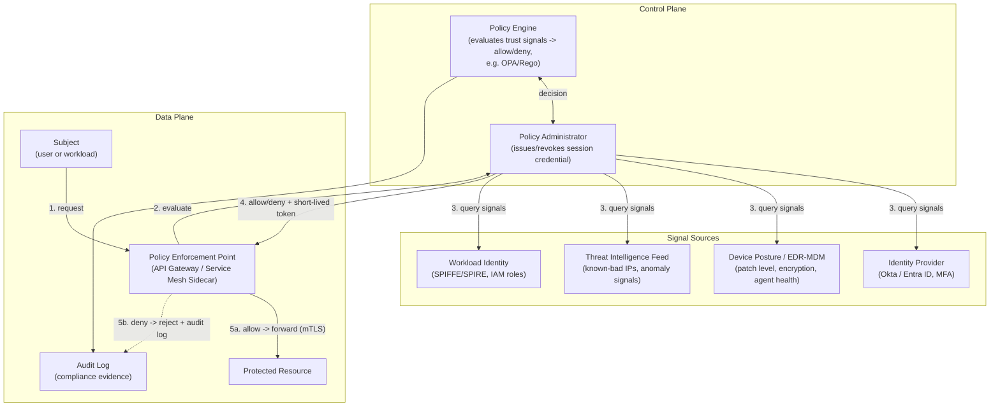
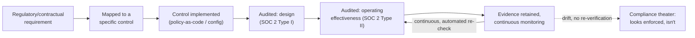
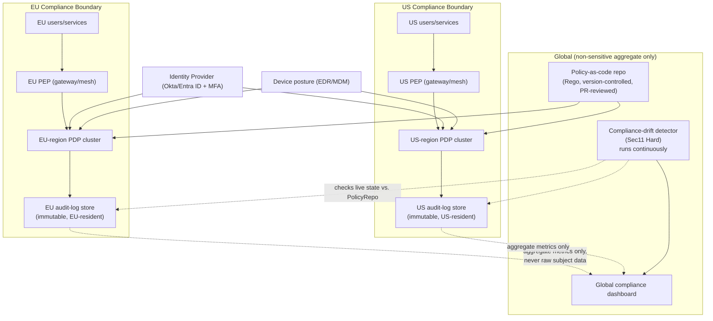
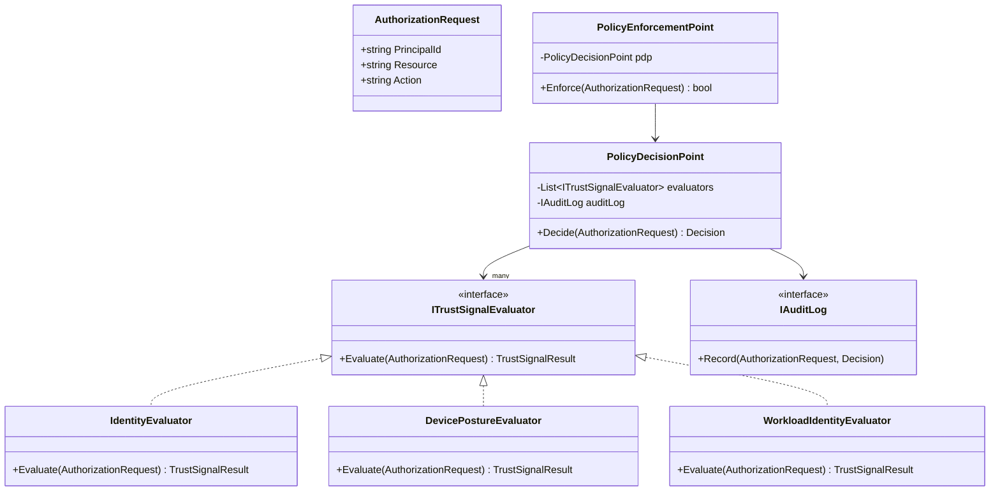
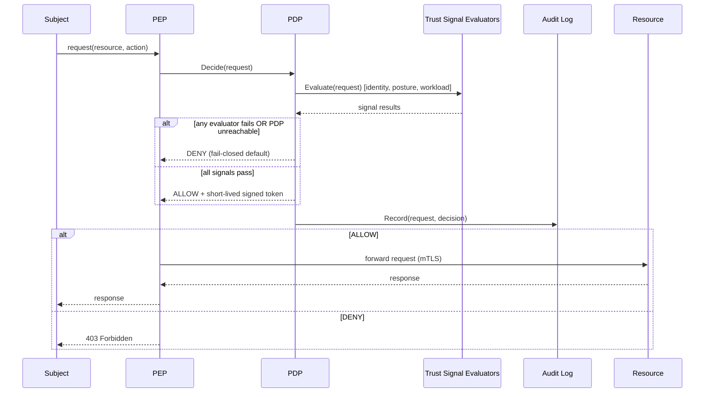

# Module 100 — Security: Zero Trust Architecture, Compliance & Security Governance at Scale (Capstone)

> Domain: Security | Level: Beginner → Expert | Prerequisite: [[01-AppSecFundamentals-OWASPTop10-SecureCoding-ThreatModeling]] (Zero Trust's per-request authorization checks are this module's architectural generalization of that module's negative-authorization test discipline), [[02-Cryptography-Encryption-Hashing-Signing-KeyManagement]] (mTLS, workload identity, and encryption-in-transit/at-rest all depend on that module's key-management and certificate-lifecycle mechanics), [[03-SecurityTesting-SAST-DAST-SCA-Fuzzing-PenetrationTesting-VulnerabilityManagement]] (the "declared coverage ≠ actual coverage" finding that module established for security tooling is this module's central recurring risk, now applied to compliance controls and Zero Trust enforcement themselves) — capstone closing the `28-Security` domain, Modules 97–100.

---

## 1. Fundamentals

**What**: **Zero Trust** is a security architecture model built on one governing principle — "never trust, always verify" — in which no user, device, workload, or network location is granted implicit trust by virtue of position (being "inside" the corporate network, on a previously-authenticated VPN, or behind a firewall). Every request is authenticated, authorized, and encrypted on its own merits, continuously, regardless of origin. **Compliance** is the practice of demonstrating, to an independent auditor or regulator, that a defined set of controls (NIST 800-207 for Zero Trust itself, PCI-DSS for cardholder data, SOC 2 for service-organization controls, GDPR for personal-data handling, SOX for financial-reporting integrity) are both designed correctly and operating effectively. **Security governance** is the organizational layer that makes either of the above durable at scale — policy ownership, exception management, audit evidence, and the standing verification that a declared control is an *actually enforced* one, not merely a configured or documented one.

**Why it exists**: The perimeter model ("trust everything inside the firewall") assumed a bounded, defensible network edge — an assumption cloud computing, remote work, SaaS, and third-party API integration each independently dissolved. A single compromised laptop, leaked credential, or over-permissioned service account inside a perimeter-trusted network historically gave an attacker free lateral movement to everything else on that network — this is precisely the failure mode behind the 2013 Target breach (an HVAC vendor's stolen credentials reached point-of-sale systems because the internal network was flatly trusted) and the 2020 SolarWinds compromise (a trusted software-update channel became a lateral-movement vector across thousands of "inside the perimeter" enterprise and government networks). Compliance frameworks exist because financial regulators, card networks, and enterprise customers need externally-verifiable evidence — not a vendor's self-attestation — that a firm's controls are real. Governance exists because neither Zero Trust nor compliance is self-sustaining: a policy engine misconfigured once, or a control that passed its audit a year ago and has silently drifted since, produces exactly the same blast radius as never having built the control at all.

**When it matters**: Zero Trust matters most for organizations with a large, heterogeneous access surface — hybrid cloud, remote workforces, contractor/third-party access, microservices with many internal service-to-service calls — where a perimeter boundary no longer maps to a meaningful trust boundary. Compliance frameworks apply based on data handled and jurisdiction: PCI-DSS for any organization storing, processing, or transmitting cardholder data; SOX Section 404 for any US-listed public company's financial-reporting systems; GDPR for any organization processing EU residents' personal data, regardless of where the organization itself is based; SOC 2 for any B2B SaaS vendor whose enterprise customers require independent assurance before onboarding. Security governance matters continuously, from day one — it is not a phase that begins "once we're big enough."

**How (30,000-ft view)**:
```
ZERO TRUST:  every request -> AUTHENTICATE identity -> AUTHORIZE against policy
             (device posture + user identity + workload identity, evaluated
             per-request, continuously) -> ENCRYPT in transit -> LOG for audit
             NO network position ever substitutes for this chain.

COMPLIANCE:  regulatory/contractual requirement -> mapped to a CONTROL
             -> control is IMPLEMENTED -> control is AUDITED (design, then
             operating effectiveness) -> evidence retained for the auditor
             A control that exists on paper but isn't enforced = compliance
             theater, indistinguishable from a real control until tested.

GOVERNANCE:  ties both together -- who owns which policy, how exceptions are
             requested/time-bounded/reviewed, and a STANDING, CONTINUOUS
             verification that every declared control is still, today,
             actually enforced -- not merely configured once and assumed.
```

---

## 2. Deep Dive

### 2.1 The Policy Decision Point / Policy Enforcement Point Split
NIST 800-207 formalizes Zero Trust architecture around two logically distinct roles. The **Policy Decision Point (PDP)** — composed of a Policy Engine (evaluates trust signals against policy and produces an allow/deny decision, e.g., Open Policy Agent evaluating a Rego policy) and a Policy Administrator (executes that decision by issuing or revoking the session credential) — never touches the request path directly. The **Policy Enforcement Point (PEP)** is the component that actually intercepts every request and enacts the PDP's decision — an API gateway, a service-mesh sidecar (Envoy in Istio), or a middleware layer. This separation matters architecturally for the same reason separating authentication from authorization matters at the code level: it lets policy logic evolve independently of enforcement infrastructure, and it lets one PDP serve many PEPs consistently. Its critical failure mode, and this module's central recurring risk: **a PDP correctly denying a request is worthless if even one access path lacks its own PEP** — a direct database connection bypassing the API gateway, an internal admin tool wired directly to a backend, or an emergency SSH path are all real-world instances of exactly this gap.

### 2.2 Continuous Verification vs. One-Time Authentication
Traditional session-based authentication establishes trust once (at login) and treats it as valid for the session's full lifetime — often 8+ hours, sometimes days, for a "remember me" cookie. Zero Trust's continuous verification instead re-evaluates trust signals throughout the session: device posture (is the endpoint still compliant — disk encrypted, EDR agent running, OS patched?), behavioral signals (impossible travel, anomalous access-time patterns), and resource sensitivity (a step-up MFA challenge triggered specifically for a high-value action, like a wire-transfer approval, even mid-session). This is not free — every re-verification is a PDP round trip, discussed under Performance (§7) — so real implementations bound it: short-lived, cryptographically-signed tokens (a JWT with a 5–15 minute expiry) rather than a full PDP call on every single request, re-issued only after the signal set is re-checked.

### 2.3 Micro-Segmentation and Workload Identity
Micro-segmentation replaces coarse network zones (a flat VPC, a broad VLAN) with per-workload isolation, enforced by identity rather than IP address — since IP addresses in a dynamic, autoscaled, containerized environment are ephemeral and meaningless as a durable trust anchor. Workload identity (SPIFFE/SPIRE is the open standard; AWS IAM roles for service accounts and Azure Managed Identity are the corresponding cloud-native mechanisms) issues each workload a short-lived, cryptographically-verifiable identity independent of network location, letting mTLS-based service-to-service authorization ("service A may call service B's `/transfer` endpoint") replace "anything inside this subnet can reach anything else in it."

### 2.4 Device Posture and Identity as the New Perimeter
With network location no longer conferring trust, the PDP's decision rests on three converging signals: verified user identity (via the organization's IdP — Okta, Azure AD/Entra ID — ideally with phishing-resistant MFA such as a FIDO2 hardware key), device posture (an EDR/MDM attestation confirming the endpoint is managed, patched, and encrypted), and workload identity (§2.3) for machine-to-machine calls. A gap in any one of the three reintroduces exactly the blind trust Zero Trust exists to remove — a correctly-authenticated user on a compromised, unmanaged personal laptop is not a scenario Zero Trust's identity check alone protects against; device posture is what closes that gap.

### 2.5 Compliance Frameworks — What Each Actually Verifies
**SOC 2** (Type I: control design at a point in time; Type II: control operating effectiveness over 6–12 months) audits against the AICPA's five Trust Services Criteria (security, availability, processing integrity, confidentiality, privacy) — it is process-and-control-existence assurance, not a vulnerability-free guarantee. **PCI-DSS** mandates specific technical controls for any environment touching cardholder data (network segmentation of the cardholder data environment, encryption of PAN at rest and in transit, quarterly ASV scans, annual penetration testing) — critically, PCI-DSS's own segmentation requirement is a direct, formalized instance of Zero Trust's micro-segmentation principle, predating the "Zero Trust" term's popularization. **GDPR** is a legal regime, not a technical control checklist — it mandates data-protection-by-design, breach notification within 72 hours, and a lawful basis for every processing activity, with fines up to 4% of global annual revenue. **SOX Section 404** requires documented, tested internal controls over financial reporting — for engineering, this means change-management, access-control, and audit-trail rigor over any system that feeds the general ledger or financial statements. None of these frameworks are interchangeable, and none is a superset of the others — a firm can be SOC 2 Type II certified and still fail a PCI-DSS assessment, because they audit genuinely different control sets.

### 2.6 The Hidden Cost: Policy Sprawl and Exception Drift
The single largest hidden cost in mature Zero Trust/compliance programs is not initial implementation — it's **policy sprawl and exception drift**. Every legitimate, time-bounded exception (a legacy system that can't yet support mTLS, a break-glass administrative path) that isn't tracked with an expiry and a periodic re-review becomes a permanent, silently-accumulating gap; a security posture measured only at rollout time, never re-audited, degrades continuously and invisibly — this is the identical "declared ≠ actual" pattern this domain's prior modules established for testing coverage and cryptographic key lifecycle, now recurring at the governance layer itself.

---

## 3. Visual Architecture

### Zero Trust Reference Architecture (NIST 800-207)


### Compliance Control Lifecycle


---

## 4. Production Example

**Problem**: A mid-size regional bank, following a regulator-mandated remediation timeline after an examination cited "insufficient network segmentation and excessive standing access" as a finding, had 18 months to demonstrate a Zero Trust architecture across a hybrid estate: an on-prem mainframe-adjacent core banking system, a growing AWS footprint for digital banking and mobile, and roughly 40 third-party vendor integrations (payment processors, credit bureaus, fraud-scoring services). The prior architecture trusted anything inside the corporate VPN uniformly — a contractor's laptop and a core-banking database server were, from a network-trust standpoint, indistinguishable.

**Architecture**: The bank adopted a phased design: an identity-aware proxy (Zscaler Private Access) fronting every internal application, replacing broad VPN access with per-application, per-request brokered access; a service mesh (Istio) providing mTLS and workload identity for the growing set of AWS-hosted microservices; and — for the mainframe-adjacent core system, which could not be retrofitted with modern protocol support in the available timeline — a dedicated, hardened proxy tier mediating every access request to it, so the core system itself needed no modification while every request reaching it still passed through PDP/PEP enforcement.

**Implementation**: Rollout was sequenced by risk, not by convenience: the core-banking access path (highest sensitivity) migrated first, under close regulator visibility, followed by the AWS microservices tier, with the lowest-sensitivity internal tools (an internal wiki, a ticketing system) migrated last. Every migrated application ran in parallel — old VPN-based access and new brokered access both live — for a two-week validation window before the legacy path was formally decommissioned for that application, specifically to avoid a "big bang" cutover that risked either an outage or, worse, a silent coverage gap during transition. Policy-as-code (Rego policies under version control, reviewed via pull request like application code) encoded every access rule, giving the bank a literal, auditable artifact to hand the examiner.

**Trade-offs**: The identity-aware proxy tier added a measured 15–30ms of median latency per request (§7) — acceptable for the bank's transaction volumes, but a deliberate, documented trade-off the architecture review explicitly signed off on rather than discovering post-launch. The core-system proxy-mediation approach was explicitly scoped as an interim measure, not a permanent architecture, since it still left a single, hardened chokepoint whose own compromise would be severe — the bank's roadmap explicitly plans the core system's eventual replacement rather than treating the proxy as a permanent solution to a problem it only partially mitigates.

**Lessons learned**: The regulator's examination, 18 months later, found the segmentation and access-control finding fully remediated — but the examiner's follow-up focus had shifted specifically to **evidence of continuous enforcement**, not merely architecture existence: sample audit-log extracts proving specific access denials had actually occurred, and proof the policy-as-code repository's review history showed genuine, non-rubber-stamp approval on every access-policy change. This is the central lesson the bank's own security leadership took away: a regulator increasingly does not accept "we built it" as sufficient — the deliverable is standing, continuously-verifiable evidence that the control is *presently, actively* enforced, which is a fundamentally different and more demanding bar than a one-time architecture rollout.
## 10. Interview Questions

### Basic (10)

1. **Q: What is Zero Trust, and how does it differ from perimeter-based ("castle-and-moat") security?**
 **A:** Zero Trust assumes no user, device, or network location is inherently trusted — every request is authenticated, authorized, and encrypted regardless of whether it originates "inside" or "outside" the network. Perimeter security instead trusts anything already inside the network boundary by default.
 **Why correct:** States the core inversion — trust is never granted by network location alone.
 **Common mistakes:** Treating Zero Trust as just "stronger firewalls," rather than a fundamentally different trust model.
 **Follow-ups:** "Why did perimeter security become inadequate?" (Cloud, remote work, and mobile devices dissolved any meaningful network perimeter to defend.)

2. **Q: What does "never trust, always verify" mean in practice?**
 **A:** Every single request must be authenticated and authorized on its own merits, continuously — not once at login, and not implicitly because it came from an already-trusted network segment.
 **Why correct:** Captures the continuous, per-request nature of verification, not a one-time gate.
 **Common mistakes:** Assuming a single sign-on event satisfies "always verify" indefinitely.
 **Follow-ups:** "What triggers re-verification?" (Device posture change, unusual location/behavior, session expiry, or a step-up requirement for a sensitive action.)

3. **Q: What is micro-segmentation?**
 **A:** Dividing a network into small, isolated zones (often per-workload) with enforced policy between every segment, so lateral movement after a breach is contained rather than unrestricted.
 **Why correct:** States the containment goal directly.
 **Common mistakes:** Confusing it with traditional VLAN/subnet segmentation, which is coarser and not identity-aware.
 **Follow-ups:** "How is this implemented in Kubernetes?" (NetworkPolicies plus a service mesh's mTLS-enforced per-service policy/79.)

4. **Q: What is the principle of least privilege?**
 **A:** Granting an identity only the minimum access required to perform its task, nothing more.
 **Why correct:** States the minimization principle precisely.
 **Common mistakes:** Granting broad roles "to be safe" or "for convenience," which expands blast radius on compromise.
 **Follow-ups:** "How do you audit for privilege creep?" (Periodic access reviews comparing granted permissions against actual usage logs.)

5. **Q: What is mutual TLS (mTLS), and why does Zero Trust rely on it?**
 **A:** Both client and server present and verify certificates, authenticating each other — not just the server authenticating to the client as in ordinary TLS. Zero Trust uses it so every service-to-service call is cryptographically authenticated, not merely network-trusted.
 **Why correct:** States the bidirectional authentication distinguishing mTLS from standard TLS.
 **Common mistakes:** Assuming standard TLS alone provides service identity verification.
 **Follow-ups:** "Where is mTLS typically enforced in a microservices architecture?" (A service mesh sidecar.)

6. **Q: What is a compliance framework (e.g., SOC 2, PCI-DSS, GDPR), and why do organizations pursue certification?**
 **A:** A structured set of required controls and practices an independent auditor verifies — pursued to satisfy regulatory obligations, contractual customer requirements, and to demonstrate a baseline of security diligence.
 **Why correct:** States both the mechanism (audited controls) and the business motivation.
 **Common mistakes:** Treating certification as proof of actual security, rather than proof of a specific, bounded set of audited controls.
 **Follow-ups:** "Does SOC 2 certification guarantee an application has no vulnerabilities?" (No — it audits process and control existence, not comprehensive vulnerability absence.)

7. **Q: What is defense in depth?**
 **A:** Layering multiple, independent security controls so that a single control's failure doesn't result in total compromise.
 **Why correct:** States the layering-against-single-point-of-failure principle.
 **Common mistakes:** Treating one strong control as sufficient rather than building redundant layers.
 **Follow-ups:** "Give an example spanning network, application, and data layers." (Network segmentation + input validation/parameterized queries + encryption at rest, each independently mitigating a breach at a different layer.)

8. **Q: What is the difference between authentication, authorization, and accounting (AAA)?**
 **A:** Authentication confirms identity; authorization determines permitted actions; accounting (auditing) records what was actually done, by whom, and when.
 **Why correct:** States each of the three distinct concerns precisely.
 **Common mistakes:** Conflating authentication with authorization (the exact distinction).
 **Follow-ups:** "Why does accounting matter even if AuthN/AuthZ are correctly enforced?" (It provides the audit trail needed for incident investigation and compliance evidence.)

9. **Q: What is the difference between a security policy and a security control?**
 **A:** A policy is the declared rule ("all data at rest must be encrypted"); a control is the actual, enforced mechanism implementing it (an encryption-at-rest configuration, actively verified).
 **Why correct:** Distinguishes declaration from enforcement — this course's central recurring theme.
 **Common mistakes:** Assuming a written policy document is itself protection, without a verified, enforcing control behind it.
 **Follow-ups:** "How would you verify a control genuinely enforces its policy?" (A liveness/canary check specifically exercising the control, per Modules 93–96's established pattern.)

10. **Q: What is the shared responsibility model in cloud security?**
 **A:** The cloud provider secures the underlying infrastructure (physical hardware, hypervisor, in some cases the managed service itself); the customer remains responsible for securing what they configure on top (data, access policies, application code).
 **Why correct:** States the split precisely, avoiding the common misconception that "the cloud" handles all security.
 **Common mistakes:** Assuming a managed cloud service is automatically, fully secure regardless of the customer's own configuration.
 **Follow-ups:** "Who is responsible for an S3 bucket accidentally made public?" (The customer — bucket access configuration is customer responsibility, not the provider's.)

### Intermediate (10)

1. **Q: How does Zero Trust handle a compromised internal device differently than perimeter security would?**
 **A:** Since no device is trusted by network location alone, a compromised device gains no implicit lateral access — every subsequent request it makes is still independently authenticated, authorized, and subject to micro-segmentation, containing the blast radius rather than allowing free lateral movement inside a trusted perimeter.
 **Why correct:** Connects Zero Trust's core principle directly to breach containment.
 **Common mistakes:** Assuming Zero Trust prevents the initial compromise, when its actual value is limiting what a compromise can subsequently do.
 **Follow-ups:** "Does Zero Trust eliminate the need for endpoint detection/response?" (No — EDR remains necessary for detecting the compromise itself; Zero Trust limits its consequences.)

2. **Q: What is BeyondCorp, and what problem did it solve?**
 **A:** Google's pioneering Zero Trust implementation, which removed the VPN-based trusted-network model entirely — every access request, regardless of network location, is authenticated and authorized per-request based on device and user identity/posture.
 **Why correct:** States the specific, real-world origin and its core removal of network-location trust.
 **Common mistakes:** Assuming Zero Trust requires no network-level controls at all, rather than recognizing it shifts trust decisions to identity/device posture instead of location.
 **Follow-ups:** "Why is this considered a landmark case study?" (It demonstrated Zero Trust's viability at hyperscale, well before it became an industry-standard term.)

3. **Q: How do you implement least privilege in a microservices architecture with many service-to-service calls?**
 **A:** Each service is issued its own distinct identity (via mTLS certificates or workload identity tokens) with explicit, narrowly-scoped authorization policies defining exactly which other services it may call and what actions it may perform — never a shared, broad "internal services trust each other" default.
 **Why correct:** States the per-service identity and explicit policy-scoping mechanism.
 **Common mistakes:** Granting a blanket "any internal service can call any other" policy for convenience, recreating perimeter-style implicit trust internally.
 **Follow-ups:** "How is this typically enforced at the infrastructure layer?" (A service mesh's authorization policies, or an API gateway's per-route policy.)

4. **Q: What is the difference between SOC 2 Type I and Type II?**
 **A:** Type I audits whether controls are suitably designed at a single point in time; Type II audits whether those controls actually operated effectively over a sustained period (typically 6–12 months).
 **Why correct:** Distinguishes point-in-time design assessment from sustained operational verification.
 **Common mistakes:** Treating Type I as equivalent assurance to Type II, when Type I says nothing about ongoing, actual operation.
 **Follow-ups:** "Which is more valuable evidence of genuine security practice?" (Type II — it verifies the controls were actually followed over time, not merely designed correctly on paper.)

5. **Q: How does Zero Trust change how VPNs are used, or not used?**
 **A:** Zero Trust typically replaces broad, network-level VPN access (which grants a trusted position inside the network) with per-application, per-request access brokered by an identity-aware proxy — access is granted to a specific resource, not to the network segment containing it.
 **Why correct:** States the shift from network-level to resource-level access granting.
 **Common mistakes:** Assuming VPNs are entirely incompatible with Zero Trust, rather than recognizing the shift is toward finer-grained, identity-aware access brokering.
 **Follow-ups:** "What's the risk of a traditional, broad-access VPN in a Zero Trust context?" (Once connected, a user/device often gains broad network-level reach, reintroducing the lateral-movement risk Zero Trust exists to eliminate.)

6. **Q: What is a policy decision point (PDP) vs. a policy enforcement point (PEP)?**
 **A:** The PDP evaluates a request against policy and decides allow/deny (e.g., an OPA policy engine); the PEP is the component that actually intercepts the request and enforces that decision (a gateway, a sidecar, a middleware).
 **Why correct:** States the clean separation between deciding and enforcing.
 **Common mistakes:** Conflating the two, assuming a policy engine's decision is automatically enforced without a distinct enforcement mechanism actually acting on it.
 **Follow-ups:** "What happens if a PEP exists at only one of several access paths?" (Directly the finding — the policy provides no protection against any path lacking its own PEP.)

7. **Q: How does continuous verification differ from one-time authentication?**
 **A:** One-time authentication establishes trust once, typically at login, valid for the session's duration. Continuous verification re-evaluates trust signals (device posture, behavior, location) throughout the session, capable of revoking access mid-session if risk indicators change.
 **Why correct:** States the temporal distinction — a single checkpoint vs. an ongoing evaluation.
 **Common mistakes:** Assuming a valid session token alone should remain trusted for its full, potentially long lifetime regardless of changing risk signals.
 **Follow-ups:** "What's a practical example of a mid-session trust revocation?" (A session terminated after impossible-travel detection — the same account authenticating from two geographically distant locations within an implausible timeframe.)

8. **Q: What is the risk of "lift and shift" perimeter security into a cloud/Zero Trust model without redesign?**
 **A:** Simply moving a perimeter-based network design into the cloud (a single large VPC treated as one trusted zone) recreates the identical implicit-trust, unrestricted-lateral-movement risk Zero Trust exists to eliminate — cloud migration alone provides no security benefit without an accompanying architectural redesign toward per-resource, identity-based access control.
 **Why correct:** States why infrastructure relocation alone doesn't confer Zero Trust's actual benefits.
 **Common mistakes:** Assuming cloud migration inherently improves security posture, independent of how access control is actually architected.
 **Follow-ups:** "What specific redesign step most directly addresses this?" (Micro-segmentation and per-service identity, replacing any single, broad trusted network zone.)

9. **Q: How do you handle Zero Trust for legacy systems that can't support modern authentication protocols?**
 **A:** Place a Zero-Trust-aware proxy/gateway in front of the legacy system, brokering and authenticating all access to it externally, so the legacy system itself needn't be modified while every request reaching it is still subject to Zero Trust's identity and policy checks at the proxy layer.
 **Why correct:** States a concrete, practical mitigation (a mediating proxy) rather than requiring an infeasible legacy rewrite.
 **Common mistakes:** Assuming legacy systems must be fully rewritten before Zero Trust can apply, or conversely, simply exempting them from Zero Trust entirely.
 **Follow-ups:** "What residual risk remains even with this proxy approach?" (Any direct network path to the legacy system bypassing the proxy remains an unprotected access path — the every-write-path principle still applies.)

10. **Q: What's the relationship between Zero Trust and "identity as the new perimeter"?**
 **A:** Since network location no longer confers trust, verified identity (user, device, and workload identity together) becomes the actual boundary security decisions are based on — replacing the network perimeter's role entirely.
 **Why correct:** States precisely what replaces the old perimeter's function.
 **Common mistakes:** Assuming this means network controls become irrelevant, rather than recognizing identity becomes the primary, not exclusive, basis for trust decisions.
 **Follow-ups:** "Why does this make identity infrastructure (/41) especially critical under Zero Trust?" (Every trust decision now depends on identity verification being itself robust — a weakness there undermines the entire model.)

### Advanced (10)

1. **Q: Design a Zero Trust migration strategy for a large enterprise currently running a legacy, perimeter-based network.**
 **A:** Phase it: (1) inventory every resource and access path; (2) deploy an identity-aware proxy/gateway in front of applications, migrating access from VPN to per-app brokered access incrementally, app by app; (3) introduce micro-segmentation and mTLS between internal services progressively, starting with the highest-risk/most sensitive systems; (4) retire the legacy perimeter/VPN only once verified coverage is complete — never a "big bang" cutover.
 **Why correct:** Proposes an incremental, risk-tiered migration rather than a disruptive, all-at-once replacement.
 **Common mistakes:** Attempting a full, simultaneous cutover, risking a large-scale outage or an incomplete-coverage gap during transition.
 **Follow-ups:** "How would you verify migration completeness rather than assuming it?" (An audit confirming no access path still bypasses the new, Zero-Trust-brokered route — directly the platform-capability-audit pattern.)

2. **Q: How would you architect policy enforcement across a multi-cloud, multi-cluster Kubernetes environment?**
 **A:** Use a service mesh providing mTLS and consistent authorization policy across every cluster, federated under one centrally-managed policy source (not independently-configured, per-cluster policy sets that can drift out of sync) — directly avoiding the golden-path-drift risk recurring for cross-cluster security policy specifically.
 **Why correct:** Centralizes policy source-of-truth while using an already-established mesh mechanism for enforcement.
 **Common mistakes:** Configuring policy independently per cluster, risking silent divergence between clusters over time.
 **Follow-ups:** "How would you verify policy consistency across clusters continuously?" (A scheduled audit comparing each cluster's actual, effective policy against the central source of truth.)

3. **Q: How do you balance Zero Trust's continuous-verification overhead against latency requirements for high-throughput systems?**
 **A:** Cache short-lived, cryptographically-verifiable authorization decisions (e.g., a signed token valid for a brief window) rather than round-tripping to a policy decision point on every single request; re-verify at a bounded interval rather than per-request, trading a small, deliberate risk window for materially lower latency.
 **Why correct:** Proposes a concrete, risk-proportionate trade-off (bounded caching) rather than an all-or-nothing choice.
 **Common mistakes:** Either ignoring latency entirely (mandating a full PDP round-trip per request) or caching indefinitely (silently reintroducing stale-trust risk).
 **Follow-ups:** "What determines an appropriate cache/re-verification window?" (The sensitivity of the resource and the organization's acceptable risk tolerance for a stale-trust window — a risk-tiered decision, not a universal constant.)

4. **Q: Design a compliance-as-code approach integrating regulatory requirements into policy-as-code.**
 **A:** Encode specific regulatory controls (e.g., "encrypt all PII at rest") as machine-readable policy rules (the OPA/Rego pattern), evaluated automatically against infrastructure and application configuration in CI/CD, blocking non-compliant changes before they merge — converting a periodic, manual audit exercise into a continuous, automatically-enforced one.
 **Why correct:** Directly extends an already-established course mechanism (policy-as-code) to regulatory compliance specifically.
 **Common mistakes:** Treating compliance as a once-a-year manual audit exercise rather than a continuously-enforced, automated one.
 **Follow-ups:** "What's the risk of relying on compliance-as-code alone, with no periodic human audit?" (Some regulatory requirements are process/judgment-based, not purely technical, and still require human-led verification the automated rules can't fully capture.)

5. **Q: How would you handle Zero Trust in a Kafka-based event-driven architecture, where messages traverse many asynchronous hops?**
 **A:** Authenticate and authorize both producers and consumers against the broker (mTLS plus ACLs scoping which principals may produce/consume on which topics), and where message content itself carries sensitivity, encrypt payloads end-to-end so even a compromised broker cannot read message content — extending Zero Trust's per-request verification principle to the asynchronous, decoupled messaging context specifically.
 **Why correct:** Adapts Zero Trust's core principles to the specific structural difference (decoupled, asynchronous, broker-mediated) of event-driven architectures.
 **Common mistakes:** Assuming Zero Trust applies only to synchronous, request/response traffic, overlooking async messaging as an equally-real access path requiring the same rigor.
 **Follow-ups:** "How does this connect to the trace-context-propagation finding?" (The identical async-hop propagation gap risk recurs here — security context, like trace context, must be deliberately carried across the Kafka hop, not assumed to propagate automatically.)

6. **Q: What's the risk of Zero Trust becoming "Zero Trust in name only" — a policy declared but not enforced across every path?**
 **A:** Exactly the admission-control-bypass finding recurring under a Zero Trust label — an organization can correctly implement identity-aware proxies and micro-segmentation for its primary, well-known access paths while an alternate, less-visible path (a direct database connection, an emergency administrative backdoor) remains entirely unprotected, providing zero real protection against exactly the path an attacker would find and use.
 **Why correct:** Names the specific, already-established course pattern (defense-in-depth across every write path) recurring under Zero Trust branding specifically.
 **Common mistakes:** Assuming adopting Zero Trust terminology/tooling for the primary access path constitutes comprehensive protection, without auditing every alternate path.
 **Follow-ups:** "How would you verify Zero Trust is genuinely, comprehensively enforced?" (Enumerate every distinct access path to every sensitive resource and confirm each one is independently covered — not merely the most obvious one.)

7. **Q: How do you design continuous compliance monitoring versus point-in-time audits?**
 **A:** Point-in-time audits (an annual SOC 2 assessment) verify controls at a specific moment; continuous compliance monitoring runs the same underlying checks automatically and constantly (mirroring compliance-as-code, Advanced Q4), surfacing a control's drift or failure within hours rather than being discovered only at the next scheduled audit, potentially a year later.
 **Why correct:** States the core trade-off (point-in-time snapshot vs. continuous, always-current verification).
 **Common mistakes:** Treating an annual audit's "pass" result as durable evidence of ongoing compliance for the full subsequent year.
 **Follow-ups:** "Does continuous monitoring eliminate the need for periodic external audits?" (No — external audits provide independent, third-party verification and satisfy specific regulatory/contractual requirements continuous internal monitoring alone doesn't substitute for.)

8. **Q: Design a governance model reconciling security-team autonomy with centralized platform security standards across many independent teams.**
 **A:** Provide a mandatory, secure-by-default platform baseline (identity, encryption, logging, per the golden-path principle) every team inherits automatically, while allowing teams autonomy for anything beyond that baseline, with a lightweight, explicit exception process (reviewed, time-bounded) for any team needing to deviate — avoiding both an unenforceable, purely advisory security policy and an overly rigid, one-size-fits-all mandate that ignores legitimate team-specific needs.
 **Why correct:** Balances structural, non-negotiable defaults against explicit, reviewable flexibility.
 **Common mistakes:** Either mandating uniform security requirements with no exception path (driving covert workarounds) or leaving security entirely to individual team discretion (recreating inconsistent, unverified coverage).
 **Follow-ups:** "How would you prevent the exception process itself from becoming a silent, unreviewed loophole?" (Require every exception to be time-bounded and periodically re-reviewed — directly §Advanced Q9's expiring-exception pattern.)

9. **Q: How would you critically evaluate a vendor's Zero Trust product claims?**
 **A:** Verify specifically which of Zero Trust's actual components (identity verification, device posture checking, micro-segmentation, continuous re-verification) the product genuinely implements versus merely markets, and confirm it integrates with — rather than requiring wholesale replacement of — the organization's existing identity and policy infrastructure; treat "Zero Trust" as a marketing label requiring the same skepticism this course applies to any declared-but-unverified capability.
 **Why correct:** Applies this course's established skepticism toward vendor claims to Zero Trust marketing specifically.
 **Common mistakes:** Accepting "Zero Trust-certified" or similar vendor labeling at face value without verifying which specific architectural components are actually delivered.
 **Follow-ups:** "What's a red flag in a vendor's Zero Trust claim?" (A product claiming to deliver Zero Trust purely through network-level controls alone, with no identity-based, per-request authorization component — missing the model's actual core mechanism.)

10. **Q: Synthesize Modules 97–99's findings into a single Zero Trust governance principle.**
 **A:** Earlier analysis showed functional testing has a blind spot toward adversarial verification; earlier analysis showed cryptographic guarantees are binary and invisible when violated; earlier analysis showed even the tooling meant to catch both is itself subject to silent degradation. Zero Trust's actual governance requirement, synthesizing all three: never assume a control (an authorization check, an encryption guarantee, a scanning tool) is working because it's configured or declared — every layer requires independent, continuous, active verification specifically designed for that layer's own failure mode.
 **Why correct:** Correctly synthesizes all three prior modules into one coherent Zero Trust governance statement.
 **Common mistakes:** Treating Zero Trust purely as a network/identity architecture pattern, disconnected from this course's broader verification-discipline theme.
 **Follow-ups:** "How would a Principal Engineer operationalize this synthesis?" (An organization-wide security-verification audit spanning application logic, cryptography, and tooling — confirming each layer's controls are demonstrably, currently functioning, not merely present.)

### Expert (10)

1. **Q: Critique this course's own recurring "declared ≠ actual" theme as it applies to Zero Trust specifically — what is the final, generalized principle?**
 **A:** Zero Trust's foundational premise — "never trust, always verify" — is itself an instance of this exact theme applied at the architectural-philosophy level: it explicitly refuses to treat any declared state (network location, a prior authentication event) as sufficient evidence of current trustworthiness, demanding continuous, active re-verification instead. The generalized principle this course has built toward: trust — of a network position, a control's enforcement, a tool's coverage, a cryptographic guarantee — is never a durable, assumed property; it is a continuously re-earned, actively verified state.
 **Why correct:** Identifies Zero Trust as the philosophical culmination, not merely another instance, of this course's central theme.
 **Common mistakes:** Treating Zero Trust as one specific technique among many, rather than recognizing its founding principle *is* this course's central theme, stated as an explicit security architecture philosophy.
 **Follow-ups:** "Why is this recognition valuable in an interview setting?" (It demonstrates the ability to connect a named industry framework to a deeper, generalizable engineering principle, rather than reciting Zero Trust as an isolated buzzword.)

2. **Q: How would you design an organization-wide security-verification audit combining Modules 97–99's respective concerns?**
 **A:** One unified, continuously-running audit checking: (a) every resource-scoped endpoint has a passing negative-authorization test; (b) every cryptographic key/nonce scheme passes its liveness scan; (c) every SAST/DAST/SCA tool's credentials and coverage metrics are current and healthy — reported on one dashboard, with any layer's failure treated as a critical, immediately-actioned finding, not a lower-priority backlog item.
 **Why correct:** Concretely composes all three modules' distinct verification mechanisms into one unified operational audit.
 **Common mistakes:** Running each module's verification independently with no unified reporting, risking one layer's failure going unnoticed while attention focuses on another.
 **Follow-ups:** "Who should own this unified audit?" (A dedicated platform-security team, with findings routed to the specific owning team per the severity-tiered alerting discipline.)

3. **Q: Design the incident response for a full Zero Trust policy engine outage — should access fail open or fail closed?**
 **A:** Fail closed by default (deny access when the policy engine cannot be reached) for any sensitive or write-capable operation, since failing open would silently grant unrestricted access during exactly the window an attacker might exploit; a narrow, pre-declared, audited break-glass exception path (§Advanced Q5) should exist for genuinely critical, business-continuity-threatening scenarios only, never as the default behavior.
 **Why correct:** Applies this course's established "fail closed under ambiguity" principle, with an explicit, audited exception rather than a silent fallback.
 **Common mistakes:** Failing open for convenience/availability, silently recreating a full, unprotected access window during any policy-engine outage.
 **Follow-ups:** "How would you minimize the business impact of fail-closed behavior?" (Invest in the policy engine's own high availability/redundancy specifically, so fail-closed's availability cost is rarely actually incurred.)

4. **Q: How does Zero Trust interact with SLA/error-budget-driven release velocity (Modules 92/94)?**
 **A:** Zero Trust's continuous verification and policy checks are themselves subject to the gate-friction-vs-bypass tension — an overly slow or brittle policy-enforcement layer creates the same incentive to route around it that any high-friction gate does; the fix is identical: risk-tiered, automated enforcement fast enough to sit on the critical path without becoming the friction source driving bypass.
 **Why correct:** Connects Zero Trust enforcement's own operational cost directly to an already-established course finding about gate friction and bypass risk.
 **Common mistakes:** Assuming Zero Trust enforcement is exempt from the friction-driven-bypass dynamic that affects every other gate this course has examined.
 **Follow-ups:** "What's a concrete sign Zero Trust enforcement has become a bypass-inducing bottleneck?" (Teams requesting broad, blanket exceptions "just to ship faster" — the identical symptom the incident exhibited.)

5. **Q: What's the argument for and against treating compliance certification as a security outcome versus a business/sales requirement?**
 **A:** For: pursuing certification forces a baseline of documented, audited controls an organization might not otherwise prioritize. Against: certification audits a specific, bounded control set at a point in time (or over a period, for Type II) — it is not, and shouldn't be marketed as, comprehensive proof of security, and treating it as the end goal risks optimizing for the audit's specific checklist rather than genuine, comprehensive risk reduction, directly mirroring the coverage-gaming finding applied to compliance certification specifically.
 **Why correct:** Presents both sides honestly and connects the "gaming the metric" risk to an already-established course finding.
 **Common mistakes:** Treating certification as either purely a marketing exercise with no security value, or as complete proof of comprehensive security — both are overstatements of what certification actually verifies.
 **Follow-ups:** "How would you avoid compliance-driven security theater?" (Treat certification as a floor, not a ceiling — continue independent, risk-driven security investment (Modules 97–99's practices) beyond whatever the certification's specific checklist requires.)

6. **Q: How would you approach a Zero Trust architecture decision differently for a startup versus a large, regulated enterprise?**
 **A:** A startup should adopt Zero Trust's core, cheap-to-implement principles early (identity-based access, least privilege, no implicit network trust) using managed/cloud-native tooling, since retrofitting later is far costlier — deep, custom infrastructure investment (a full service-mesh rollout, a dedicated PDP) can wait. A large, regulated enterprise must additionally address legacy-system integration, multi-team governance, and regulatory-specific compliance requirements, justifying materially larger, dedicated platform investment from the start.
 **Why correct:** Correctly scales the recommendation to organizational context and constraint, rather than a one-size-fits-all answer.
 **Common mistakes:** Recommending identical, maximal Zero Trust investment regardless of organizational size, stage, or actual risk/regulatory context.
 **Follow-ups:** "What's the risk of a startup deferring Zero Trust principles entirely until it scales?" (Retrofitting identity-based access control into a large, already-perimeter-trusting codebase and infrastructure is a substantially larger, riskier undertaking than building it in from the start.)

7. **Q: Design a metric/dashboard a CISO would use to communicate genuine security posture to a board, avoiding vanity metrics.**
 **A:** Report layered verification status (per Expert Q2's unified audit) rather than raw counts alone: percentage of resource-scoped endpoints with passing negative-authorization tests, cryptographic-liveness-scan pass rate, security-tool coverage-metric health, and mean-time-to-remediate by severity tier — avoiding a raw "number of vulnerabilities found" metric alone, which can misleadingly appear to improve simply because a scanning tool's coverage silently degraded (directly this domain's central, recurring finding).
 **Why correct:** Proposes metrics reflecting genuine, verified coverage rather than raw counts vulnerable to exactly this domain's central finding.
 **Common mistakes:** Reporting raw vulnerability counts or "zero critical findings" as the headline metric, without the coverage context that would reveal whether that's genuinely reassuring or an artifact of degraded tooling.
 **Follow-ups:** "Why is 'mean-time-to-remediate by severity tier' a more meaningful metric than 'total vulnerabilities found'?" (It reflects the organization's actual responsiveness and risk exposure over time, rather than a raw count easily inflated or deflated by unrelated factors like scanning-tool coverage changes.)

8. **Q: How would Zero Trust evolve to incorporate this course's recursive "verify the verifier" theme?**
 **A:** Beyond verifying that access requests are authenticated/authorized, a mature Zero Trust program must also continuously verify that its own enforcement mechanisms (the PDP, the PEP, the identity provider, the mesh's mTLS configuration) are themselves genuinely functioning — directly the recursive capstone insight, applied to Zero Trust's own infrastructure specifically, since a silently-broken policy engine or a silently-expired mTLS certificate authority produces the identical "looks enforced, isn't" risk this entire course has traced.
 **Why correct:** Extends the recursive theme explicitly into Zero Trust's own enforcement infrastructure.
 **Common mistakes:** Assuming Zero Trust's own enforcement components are exempt from the same silent-degradation risk affecting every other control this course has examined.
 **Follow-ups:** "What would a Zero Trust liveness canary look like?" (A synthetic, deliberately-unauthorized request sent on a schedule, confirming the PEP/PDP chain actually rejects it — directly/94's liveness-canary pattern, applied to Zero Trust enforcement itself.)

9. **Q: Critique "assume breach" as a mental model — what does it change operationally?**
 **A:** "Assume breach" shifts investment from purely preventive controls toward equally-weighted detection and containment — since it presumes an attacker may already be inside, it prioritizes micro-segmentation (limiting lateral movement), comprehensive logging/observability (95's practices, enabling fast detection), and rapid, practiced incident response (the runbook-drill discipline) as co-equal investments with prevention, rather than treating prevention as sufficient on its own.
 **Why correct:** States the specific operational shift (detection/containment parity with prevention) and connects it to this course's observability domain.
 **Common mistakes:** Treating "assume breach" as fatalism or an excuse to deprioritize preventive controls, rather than recognizing it as a deliberate rebalancing toward equally-serious detection/containment investment.
 **Follow-ups:** "How does this connect to the runbook-drill finding?" (Directly — "assume breach" implies an incident will eventually occur, making a genuinely rehearsed, currently-accurate incident-response capability (not merely a documented one) a first-order requirement, not an afterthought.)

10. **Q: Deliver the final, capstone synthesis for the entire `28-Security` domain (Modules 97–100) in one unifying statement.**
 **A:** Across application logic (97), cryptography (98), security tooling (99), and architectural philosophy (100), this domain's single unifying lesson is that security is never a property a system possesses by virtue of which controls, algorithms, or tools are nominally present or configured — it is a continuously, actively re-verified state, at every layer, requiring a specifically-designed verification mechanism for each layer's own particular failure mode, with no layer — including the mechanisms verifying the other layers — exempt from this same discipline.
 **Why correct:** Delivers one coherent, complete synthesis spanning all four modules, matching the depth expected of a Principal-Engineer-level closing statement.
 **Common mistakes:** Summarizing the domain as four separate topics (AppSec, crypto, tooling, Zero Trust) rather than one continuous, escalating argument for the same underlying principle.
 **Follow-ups:** "Why does this framing matter beyond the security domain specifically?" (It is the same recursive "verify the verifier" principle this entire course has traced across Kubernetes, DevOps, CI/CD, and Observability — security is simply this course's sharpest, most consequential instance of a lesson that generalizes across every domain of production engineering.)

---

## 11. Coding Exercises

### Easy — Least-privilege scope checker
**Problem:** Given a principal's granted permission scopes and the specific scope a request requires, determine whether the request is authorized, treating an unlisted scope as denied (fail-closed, never fail-open).

```csharp
public sealed record Principal(string Id, IReadOnlySet<string> GrantedScopes);

public static class ScopeAuthorizer
{
    public static bool IsAuthorized(Principal principal, string requiredScope) =>
        principal.GrantedScopes.Contains(requiredScope);

    // Least privilege audit helper: flags scopes granted but never actually
    // used in the observed request-log window -- direct input to a periodic
    // access review (Sec5's "audit for privilege creep" practice).
    public static IReadOnlySet<string> UnusedGrantedScopes(
        Principal principal, IReadOnlySet<string> observedUsedScopes) =>
        principal.GrantedScopes.Except(observedUsedScopes).ToHashSet();
}
```
**Time complexity:** O(1) for `IsAuthorized` (hash-set lookup); O(g) for `UnusedGrantedScopes` where g is granted-scope count.
**Space complexity:** O(g).
**Optimized solution:** In production, back `GrantedScopes` with a policy engine call (OPA) rather than a static set, so scope grants can be revoked centrally and take effect on the next evaluation without redeploying every service holding a local copy of the principal's permissions.

### Medium — Fail-closed policy decision with PDP-unavailability handling
**Problem:** Implement a PEP-side authorization check that calls a (possibly unavailable) PDP, explicitly failing closed — denying the request — if the PDP cannot be reached, rather than defaulting to allow.

```csharp
public interface IPolicyDecisionPoint
{
    Task<bool> EvaluateAsync(string principalId, string resource, string action, CancellationToken ct);
}

public sealed class FailClosedAuthorizationGate
{
    private readonly IPolicyDecisionPoint _pdp;
    private readonly ILogger<FailClosedAuthorizationGate> _logger;

    public FailClosedAuthorizationGate(IPolicyDecisionPoint pdp, ILogger<FailClosedAuthorizationGate> logger)
    {
        _pdp = pdp;
        _logger = logger;
    }

    public async Task<bool> IsAllowedAsync(string principalId, string resource, string action, CancellationToken ct)
    {
        try
        {
            return await _pdp.EvaluateAsync(principalId, resource, action, ct);
        }
        catch (Exception ex)
        {
            // FAIL CLOSED: any PDP error (timeout, network failure, exception)
            // denies the request. Never default to "allow" for availability's
            // sake -- Sec8's central security decision, applied here directly.
            _logger.LogError(ex,
                "PDP unreachable evaluating {Principal}/{Resource}/{Action} -- DENYING (fail-closed)",
                principalId, resource, action);
            return false;
        }
    }
}
```
**Time complexity:** O(1) plus the PDP call's own cost.
**Space complexity:** O(1).
**Optimized solution:** Add a short-lived, signed local cache of recent allow decisions (§7's caching pattern) so a transient PDP blip doesn't deny already-legitimately-authorized in-flight sessions, while still failing closed for any *new* authorization decision the cache has no entry for — bounding the availability cost of fail-closed without reopening a fail-open gap.

### Hard — Compliance-control drift detector (policy-as-code vs. live state)
**Problem:** Given a declared policy-as-code ruleset (e.g., "every S3-equivalent bucket must have public access blocked") and a snapshot of live infrastructure state, detect controls that are declared but not actually enforced in the live environment — directly closing the compliance-theater gap.

```csharp
public sealed record ControlRule(string RuleId, string Description, Func<ResourceState, bool> IsCompliant);
public sealed record ResourceState(string ResourceId, string ResourceType, IReadOnlyDictionary<string, object> Properties);
public sealed record DriftFinding(string RuleId, string ResourceId, string Description);

public static class ComplianceDriftDetector
{
    public static IReadOnlyList<DriftFinding> DetectDrift(
        IReadOnlyList<ControlRule> declaredRules, IReadOnlyList<ResourceState> liveResources)
    {
        var findings = new List<DriftFinding>();

        foreach (var rule in declaredRules)
        {
            foreach (var resource in liveResources)
            {
                // Every resource is checked against every applicable rule --
                // a resource "not yet checked" is exactly the invisible gap
                // this module warns about; there is no silent skip path here.
                if (!rule.IsCompliant(resource))
                {
                    findings.Add(new DriftFinding(rule.RuleId, resource.ResourceId,
                        $"{resource.ResourceId} violates '{rule.Description}'"));
                }
            }
        }

        return findings;
    }
}
```
**Time complexity:** O(r × n) where r is the rule count and n is the live-resource count.
**Space complexity:** O(f) for the findings list.
**Optimized solution:** Index rules by applicable `ResourceType` so each resource is only evaluated against rules that actually apply to its type, reducing the effective cost to O(n × k) where k is the (typically small) number of rules per resource type; run this check continuously in CI/CD against infrastructure-as-code plans *and* on a scheduled interval against live cloud state, since the two can diverge independently (a manual, out-of-band console change bypassing IaC entirely).

### Expert — Short-lived token issuance with continuous re-verification
**Problem:** Implement a workload-identity token issuer that grants a short-lived, signed authorization token bound to a specific trust-signal snapshot, and a validator that rejects a token if the signal snapshot it was issued against has since become stale — modeling continuous verification (§2.2) without a full PDP round trip on every request.

```csharp
public sealed record TrustSignalSnapshot(bool DevicePostureOk, bool UserMfaVerified, DateTime EvaluatedAt);
public sealed record AuthorizationToken(string PrincipalId, string Resource, DateTime IssuedAt, DateTime ExpiresAt, string Signature);

public sealed class ContinuousVerificationIssuer
{
    private readonly TimeSpan _tokenLifetime;
    private readonly ISigner _signer; // HMAC or asymmetric signer -- Module 98's key-management mechanics

    public ContinuousVerificationIssuer(ISigner signer, TimeSpan tokenLifetime)
    {
        _signer = signer;
        _tokenLifetime = tokenLifetime;
    }

    public AuthorizationToken? TryIssue(string principalId, string resource, TrustSignalSnapshot signals, DateTime now)
    {
        // Refuse to issue if the underlying signals were already failing --
        // never issue a token "optimistically" hoping signals improve later.
        if (!signals.DevicePostureOk || !signals.UserMfaVerified)
            return null;

        var issuedAt = now;
        var expiresAt = now + _tokenLifetime;
        var payload = $"{principalId}|{resource}|{issuedAt:O}|{expiresAt:O}";
        var signature = _signer.Sign(payload);

        return new AuthorizationToken(principalId, resource, issuedAt, expiresAt, signature);
    }

    public bool IsStillValid(AuthorizationToken token, DateTime now)
    {
        if (now >= token.ExpiresAt)
            return false; // bounded re-verification window elapsed -- must re-issue

        var payload = $"{token.PrincipalId}|{token.Resource}|{token.IssuedAt:O}|{token.ExpiresAt:O}";
        return _signer.Verify(payload, token.Signature);
    }
}

public interface ISigner
{
    string Sign(string payload);
    bool Verify(string payload, string signature);
}
```
**Time complexity:** O(1) for issuance and validation (a single sign/verify operation).
**Space complexity:** O(1) per token.
**Optimized solution:** Bind the token's re-verification window to the resource's sensitivity tier (a 15-minute window for a low-sensitivity read, a 60-second window for a wire-transfer approval) rather than one fixed lifetime for every resource — directly the risk-proportionate calibration §7 and §2.2 both call for — and add a revocation-check path (a short, centrally-consulted denylist of principals whose posture has just failed) so a token already issued can still be invalidated mid-lifetime on a critical signal change, rather than remaining valid until its fixed expiry regardless of what happens in between.

---

## 12. System Design

**Prompt:** Design a Zero Trust access and continuous-compliance-monitoring platform for a regulated financial services firm with a hybrid estate (on-prem core banking, AWS-hosted digital banking, ~40 third-party integrations), supporting SOC 2 Type II, PCI-DSS, and GDPR obligations simultaneously.

**Functional requirements:** Every human and workload request to any protected resource passes through a PEP enforcing a PDP decision (no path may bypass this); device posture, user identity (MFA), and workload identity are all evaluated per access decision; every access decision (allow and deny) is logged as immutable, queryable compliance evidence; compliance-as-code rules run continuously against live infrastructure state, not only at audit time; access exceptions are time-bounded, owned, and subject to mandatory periodic re-review; EU-resident personal-data access decisions and their audit logs never leave the EU compliance boundary.

**Non-functional requirements:** PDP decisions fail closed under any PDP unavailability; the platform adds no more than ~30ms median latency to a request's critical path (per §7's measured bank example); the PDP tier scales horizontally to at least 10,000 authorization decisions/second per region; audit-log storage is append-only/immutable and retained per the longest applicable regulatory requirement (typically 7 years under SOX-adjacent record-keeping rules); the platform itself has no single region-wide single point of failure.

**Back-of-the-envelope estimation:** Assume 5,000 employees plus ~200 backend services, each service issuing on average 50 internal calls/second at peak → roughly 10,000 authorization decisions/second sustained, bursting to ~25,000/second at peak load. At a signed-token cache hit rate of 95% (§7's caching pattern — most requests reuse a still-valid, previously-issued token rather than round-tripping to the PDP), the PDP itself only needs to sustain roughly 500–1,250 fresh evaluations/second — meaning **the actual PDP-provisioning problem is an order of magnitude smaller than the raw request volume suggests**, which is the number that should drive the PDP-tier sizing decision, not the raw 10,000–25,000 figure.

**Architecture:**


**Database selection:** An append-only, immutable log store (e.g., a write-once object store or an audit-specific database feature) for access-decision evidence — compliance evidence must be tamper-evident, favoring an architecture where even a compromised application credential cannot rewrite history over a general-purpose mutable relational table. A relational store for the policy-exception registry (owner, expiry, review-cadence fields benefit from relational constraints and transactional updates on renewal/expiry).

**Messaging:** Every PDP deny decision, and every compliance-drift-detector finding, publishes an event to a high-priority alerting topic — a security-relevant deny is functionally identical in urgency to any other critical production alert this course has established, never a lower-priority, dashboard-only signal.

**Scaling:** PDP instances are stateless and horizontally autoscaled behind a regional load balancer (§9); the signed-token cache (§7) absorbs the vast majority of request volume without a PDP round trip; audit-log ingestion scales via partitioning by region and time, matching the compliance-boundary partitioning already required for data residency.

**Failure handling:** PDP unreachable → fail closed for every new authorization decision (§8), with a narrow, fully-audited, time-boxed break-glass path as the only sanctioned exception; audit-log write failure is itself treated as a critical, page-worthy incident (silently proceeding without evidence being written is its own compliance failure, not a degraded-but-acceptable state).

**Monitoring:** PDP decision latency (p50/p95/p99), fail-closed-triggered deny counts (a spike indicates either an attack or a PDP health problem, either way worth immediate attention), compliance-drift-detector finding counts by rule, and exception-registry entries approaching expiry — all first-class, always-on dashboard signals rather than something a team must remember to check.

**Trade-offs:** Partitioning the PDP and audit-log tier per compliance region (vs. one global platform) trades operational simplicity for data-residency correctness — a single global platform is materially simpler to build and monitor, but is a compliance violation the moment EU-subject access decisions transit through a non-EU PDP, making the partitioned design non-optional here rather than a scalability nicety.

---

## 13. Low-Level Design

**Requirements:** Model a PEP/PDP authorization flow with pluggable trust-signal evaluators, a fail-closed default, and an audit trail — extensible to new signal types without modifying the core decision engine.



**Sequence diagram — a request traversing PEP/PDP:**


**Design patterns used:** **Strategy** for `ITrustSignalEvaluator` — new signal types (a future geolocation evaluator, a threat-intel evaluator) plug in without changing `PolicyDecisionPoint`'s core evaluation loop. **Chain of Responsibility** semantics in how evaluators are run — any single evaluator's failure short-circuits to deny, matching fail-closed's non-negotiable default. **Facade** — `PolicyEnforcementPoint` presents a single `Enforce` call to application code, hiding the full evaluator/audit orchestration behind it.

**SOLID mapping:** Open/Closed — adding a new trust-signal type requires only a new `ITrustSignalEvaluator` implementation, never a change to `PolicyDecisionPoint` itself. Single Responsibility — each evaluator owns exactly one signal category; `IAuditLog` owns evidence recording, entirely separate from decision logic. Dependency Inversion — `PolicyDecisionPoint` depends on the `ITrustSignalEvaluator` and `IAuditLog` abstractions, not concrete evaluator implementations, enabling full unit testing with fakes and no live IdP/EDR dependency.

**Extensibility:** Supporting risk-tiered re-verification windows (§7, §11 Expert) requires only parameterizing `PolicyDecisionPoint.Decide` with a resource-sensitivity input consulted when setting the issued token's expiry — no restructuring of the evaluator chain itself.

**Concurrency/thread safety:** `PolicyDecisionPoint` should be implemented as a stateless service (no shared, mutable per-request state across calls) so it is trivially safe under concurrent request handling and horizontally scalable (§9) without coordination; `IAuditLog.Record` must be append-only and safe under concurrent writers — backed in production by a store providing this guarantee natively (an append-only log or write-once object store) rather than requiring explicit application-level locking.

---

## 14. Production Debugging

**Incident:** A firm's quarterly internal compliance dashboard showed 100% coverage — "all production S3-equivalent storage buckets have public access blocked" — for over a year, cited repeatedly in both internal risk reviews and, eventually, in materials prepared for an external SOC 2 Type II audit. During the actual audit, the external auditor's own independent scan of the live cloud environment found three buckets, all created within the prior six months, with public read access enabled — directly contradicting the dashboard's declared 100% figure.

**Root cause:** The compliance dashboard's "100% coverage" check was implemented as a policy-as-code rule evaluated only against **infrastructure-as-code templates in the deployment repository** — it never actually queried live cloud account state. Three buckets had been created via a manual, out-of-band console action (during an incident-response scramble, an engineer had manually provisioned a bucket to unblock a production issue, later forgotten and never back-ported into the IaC templates) entirely outside the IaC pipeline the dashboard's check was scoped to. The dashboard's declared control ("public access blocked") was real and correctly enforced for every resource the check actually looked at — the gap was that the check's own scope silently excluded any resource not provisioned through the IaC path it was written against, and nothing in the dashboard's presentation distinguished "100% of everything" from "100% of what this specific check happens to see."

**Investigation:** Comparing the compliance-as-code rule's evaluation logs against the cloud provider's own resource inventory API revealed the discrepancy directly — the rule had evaluated exactly the IaC-declared resource set, while the cloud account's actual resource count was measurably higher. No individual engineer had disabled or bypassed the control; the check itself had simply never been built to see the resources it was silently missing.

**Tools:** A live cloud-resource inventory scan (the cloud provider's own resource-listing API, independent of the IaC repository) cross-referenced against the compliance-as-code rule's own evaluated-resource list — directly the ground-truth-inventory pattern this domain has established repeatedly for closing exactly this class of scope gap.

**Fix:** (1) Re-scoped the compliance-drift detector (§11 Hard) to evaluate rules against **live cloud account state**, queried directly from the provider's API, rather than solely against IaC templates — closing the specific blind spot at its structural source. (2) Ran the same rule set against both IaC-declared and live state, treating any divergence between the two as its own, separately-flagged finding (a manual, out-of-band resource is itself a governance violation independent of whether that specific resource happens to be compliant on the property being checked). (3) Removed standing console-level provisioning permissions for individual engineers in production accounts, replacing emergency out-of-band access with a time-boxed, fully-audited break-glass process that automatically opens a tracked follow-up ticket requiring the resource's back-port into IaC within a fixed window.

**Prevention:** A compliance dashboard's declared coverage figure is only as trustworthy as the scope of what it actually evaluates — "100%" measured against a self-selected, incomplete resource set is indistinguishable, in its presentation, from genuine, comprehensive 100% coverage, exactly mirroring this domain's now-established finding that a security tool's clean report is ambiguous between "nothing was found" and "almost nothing was actually checked." Every compliance-as-code check going forward is required to state, alongside its pass/fail result, the actual resource-discovery method it used (IaC-declared vs. live-queried) so a reviewer can independently judge whether the check's scope is genuinely comprehensive rather than accepting a bare percentage at face value.

---

## 15. Architecture Decision

**Context:** A financial-services platform selecting its primary mechanism for Zero Trust policy enforcement across a large, growing microservices estate.

**Option A — Centralized policy engine, called synchronously by every service:**
- *Advantages:* Single source of truth for policy; trivially easy to audit (one place to review every access rule); consistent behavior guaranteed across every service by construction.
- *Disadvantages:* Every request pays a network round trip to the central PDP unless a caching layer is separately built (§7); the central PDP is a single point of failure and a scaling bottleneck under fail-closed semantics (§8/§9) unless deliberately over-provisioned and made highly available.
- *Cost/complexity:* Lowest policy-management complexity, highest latency/availability engineering burden to make performant and resilient at scale.

**Option B — Policy embedded per-service (each service ships its own authorization logic/library):**
- *Advantages:* No network round trip at all — authorization is an in-process function call; no shared infrastructure to keep highly available.
- *Disadvantages:* Policy logic and its updates must be independently deployed to every service consuming it, creating exactly the drift risk this module has repeatedly identified — a policy fix rolled out to 180 of 200 services, with the remaining 20 silently running a stale, unpatched rule, is a realistic, likely outcome at scale; auditing "what is our actual current access policy" requires inspecting every service's deployed version individually rather than one authoritative source.
- *Cost/complexity:* Lowest latency, highest governance/drift risk — the option most prone to producing exactly the compliance-theater failure mode (§6, §14) this module centers on.

**Option C — Sidecar/service-mesh enforcement (Istio/Envoy) with a centrally-managed, version-controlled policy source distributed to every sidecar:**
- *Advantages:* Enforcement happens in-process-adjacent (no true network hop to a remote PDP for the common case — the sidecar evaluates a locally-cached policy bundle), combining Option B's latency profile with Option A's single-source-of-truth governance, since every sidecar pulls from one centrally-managed policy repository rather than embedding independently-versioned logic; mTLS and workload identity (§2.3) are natively part of the same mesh layer, avoiding a second, separately-built mechanism for transport security.
- *Disadvantages:* Requires adopting and operating a service mesh, a genuine infrastructure investment with its own operational learning curve; policy-bundle propagation to every sidecar is not instantaneous, introducing a small, bounded propagation-delay window between a policy change and its full-fleet effect.
- *Cost/complexity:* Highest upfront infrastructure investment, but the strongest combination of low per-request latency and centralized governance once the mesh is operating — the mesh's mTLS/identity capability is typically needed for other reasons (§2.3) regardless of the policy-enforcement decision, making its cost partially shared rather than purely incremental to this decision alone.

**Recommendation:** **Option C** for any organization already running, or planning to run, a service mesh at meaningful microservices scale — it resolves Option A's latency/availability bottleneck and Option B's drift risk simultaneously by keeping enforcement local (sidecar) while keeping policy authorship and distribution centralized (one Git-backed policy source, per §5's policy-as-code practice). An organization with a small, low-growth service count, for which a service mesh's operational overhead isn't yet justified, may reasonably start with **Option A** plus an explicit, deliberately-built caching layer (§7, §11 Medium) — with an explicit plan to migrate to Option C once service count and per-request-latency sensitivity justify the mesh investment. **Option B is not recommended** as a durable architecture at any meaningful scale, given its structural tendency to reproduce this module's central compliance-theater failure mode.

---

## 17. Principal Engineer Perspective

**Business impact:** A regulator's finding of "insufficient access control" or a failed SOC 2/PCI-DSS assessment carries direct, board-visible consequences — remediation-timeline mandates, restricted product launches pending re-certification, and, in the banking examples this module draws on, formal consent orders with public disclosure. A Principal Engineer frames Zero Trust and compliance governance investment not as "security overhead" but as the mechanism that keeps the firm's *declared* control posture and its *actual, currently-enforced* one from silently diverging — since, as this module's central incident (§14) demonstrates, that divergence is invisible until an external auditor or a real breach surfaces it, at which point the cost is materially higher than the cost of continuous verification would have been.

**Engineering trade-offs:** The core tension this module returns to repeatedly — continuous verification's latency/availability cost (§7, §9) versus the security and audit value it provides — is not resolved by picking a single global answer; it is resolved by risk-tiering: a low-sensitivity internal read tolerates a longer cache window and looser posture-check cadence than a wire-transfer approval does. A Principal Engineer's job is making that tiering decision explicit and documented, rather than leaving individual teams to informally, inconsistently decide it themselves.

**Technical leadership:** Providing PDP/PEP infrastructure, policy-as-code tooling, and compliance-drift detection as mandatory, platform-provided defaults — rather than expecting each service team to independently implement its own authorization logic — is the single highest-leverage intervention available here, directly preventing Option B's (§15) drift risk from ever taking root organization-wide.

**Cross-team communication:** Compliance and security requirements land far better with engineering teams when communicated as concrete mechanisms and incidents (§14's specific bucket-exposure story, with its specific root cause and fix) than as abstract policy language ("ensure adequate access controls") — the concrete version gives an engineer something actionable to check for in their own service; the abstract version does not.

**Architecture governance:** Every access exception must have a named owner, a stated business justification, and a mandatory expiry with scheduled re-review (§5, §6) — an exception-approval process with no expiry field is, in practice, indistinguishable from simply not having an approval process at all, since nothing ever forces the exception to be reconsidered.

**Cost optimization:** The PDP/policy-engine tier is genuine, ongoing infrastructure spend (compute for horizontally-scaled PDP instances, mesh sidecar resource overhead per pod) — a Principal Engineer weighs this explicitly against the cost of the incidents and regulatory findings it's designed to prevent, using this module's concrete numbers (the bank's 15–30ms latency cost, an examiner's remediation-timeline mandate) as the basis for that conversation rather than an abstract "security is important" framing this course explicitly avoids.

**Risk analysis:** The single highest-risk assumption to actively challenge in any Zero Trust/compliance program is "our dashboard shows green, therefore we are compliant" — §14's incident is the concrete cautionary case; a Principal Engineer's standing responsibility is ensuring every declared-green control has an independent, live-state verification behind it, not merely a check against the artifact (an IaC template, a policy document) most convenient to evaluate.

**Long-term maintainability:** Policy-as-code under version control, reviewed via the same pull-request discipline as application code, is what keeps a compliance program's actual current state legible to a new engineer or a new auditor years later — a policy encoded only in a wiki page or an individual's institutional memory degrades into exactly the kind of undocumented, unverifiable state this entire module exists to prevent.

---

## 18. Revision

**Key Takeaways:**
- Zero Trust's governing principle is "never trust, always verify" — no network position, prior authentication event, or long-lived credential substitutes for per-request, continuous verification.
- NIST 800-207's PDP/PEP split is the architectural backbone: a Policy Engine decides, a Policy Enforcement Point enforces — and every access path, not just the primary one, needs its own PEP.
- Compliance frameworks (SOC 2, PCI-DSS, GDPR, SOX) are not interchangeable and audit genuinely different control sets — passing one says nothing about the others.
- **Compliance theater** — a declared control that isn't actually, currently enforced — is this module's central, recurring failure mode, and it looks identical to a real control until adversarially tested.
- Fail-closed is the non-negotiable default when a PDP is unreachable; fail-open silently reopens exactly the access the architecture exists to gate.
- Continuous verification has a real, measurable performance cost (§7) — the fix is short-lived, cached, signed authorization decisions calibrated to resource sensitivity, not abandoning verification for latency's sake.
- Multi-region compliance boundaries (data residency under GDPR and similar regimes) are a correctness constraint on architecture, not merely a scaling nicety.

**Interview Cheatsheet:**
- Zero Trust ≠ "more firewalls" — it's an identity/device/workload-based trust model replacing network-location trust entirely.
- PDP decides, PEP enforces — always name both explicitly when describing an architecture.
- mTLS = bidirectional certificate verification, distinct from ordinary one-way TLS.
- SOC 2 Type I = design at a point in time; Type II = operating effectiveness over 6–12 months.
- "Assume breach" reframes investment toward detection/containment (micro-segmentation, logging) as co-equal with prevention, not a replacement for it.

**Things Interviewers Love:**
- Naming NIST 800-207 specifically, and correctly distinguishing PDP from PEP rather than treating "Zero Trust" as a single undifferentiated buzzword.
- A concrete number attached to a trade-off (this module's 15–30ms latency figure) instead of "there's some overhead."
- Recognizing that a clean compliance dashboard is not, by itself, evidence of anything — and describing specifically how you'd verify it (live-state cross-reference, per §14).
- Distinguishing which compliance framework applies to which data/context rather than treating them as generically interchangeable "security certifications."

**Things Interviewers Hate:**
- Treating Zero Trust as purely a marketing term or a single product a vendor sells.
- Claiming a system is "fully compliant" or "fully Zero Trust" without qualifying what was actually verified and how.
- Defaulting to fail-open "for availability" without acknowledging the security cost that decision carries.
- Reciting compliance framework names without being able to say what each one actually audits.

**Common Traps:**
- Assuming a passed audit is durable, permanent evidence rather than a point-in-time or bounded-period snapshot.
- Assuming Zero Trust eliminates the need for network controls entirely, rather than shifting the primary trust basis to identity while network controls remain a defense-in-depth layer.
- Assuming compliance certification is proof of comprehensive security rather than proof of a specific, bounded, audited control set.
- Confusing "we have a policy document" with "we have an enforced control" — the gap between the two is this entire module's central theme.

**Revision Notes:** Before an interview, be able to draw the PDP/PEP diagram from memory (§3), state the fail-closed rule and why (§8), give one concrete latency number and one concrete compliance-theater incident (§7, §14) without hesitation, and explain the difference between SOC 2, PCI-DSS, and GDPR in one sentence each — these four are the load-bearing facts a Principal/Staff-level FinTech interview will most reliably probe on this topic.
