# Performance Engineering — Complete Interview Prep (All Topics, One File)

> Domain: Performance Engineering | Level: Beginner → Expert | Prerequisite: [[../01-CSharp/01-CSharp-Interview-Prep]] (GC, async, thread pool), [[../04-SQL-Server/01-SQL-Server-Interview-Prep]] (query tuning), [[../27-Observability/01-Observability-Interview-Prep]] (metrics/traces), [[../07-Redis/01-Redis-Interview-Prep]] (caching)
> **Quick-prep edition** (consolidated 2026-10-03). This one file replaces Modules 101–104. Originals: `git show ebb2d5c:29-Performance-Engineering/<file>.md`
> Each topic has: **Key concepts → .NET code/tooling → Most common interview questions with answers.**

| # | Topic | # | Topic |
|---|---|---|---|
| 1 | Performance fundamentals: latency, throughput, percentiles | 8 | Little's Law, queueing theory & capacity planning |
| 2 | Methodology: measure → hypothesize → fix → verify | 9 | The non-linear cliff & overload behaviour |
| 3 | Profiling: sampling vs instrumentation; .NET tools | 10 | Caching strategies & data access performance |
| 4 | CPU, GC & allocation bottlenecks | 11 | Connection pooling, pagination, N+1, replicas |
| 5 | Thread-pool starvation & lock contention | 12 | Latency budgets & critical paths |
| 6 | Benchmarking with BenchmarkDotNet | 13 | Regression prevention & performance debt |
| 7 | Load testing: open vs closed loop, coordinated omission | 14 | Top 30 rapid-fire + Principal · 15 Mistakes checklist |

---

## 1. Performance Fundamentals: Latency, Throughput, Percentiles

**Key concepts**
- **Latency** (time per request) vs **throughput** (requests per second) vs **utilization** vs **saturation** (queued work).
- **Percentiles, not averages:** p50 (typical), p95/p99 (tail), p99.9 (worst users/biggest customers). Averages hide tails; in fan-out systems tails dominate (see the tail-at-scale problem in [[../16-Distributed-Systems/01-Distributed-Systems-Interview-Prep]] §15).
- **Latency numbers to know (order of magnitude):** L1 cache ~1 ns, main memory ~100 ns, SSD random read ~100 µs, same-DC round trip ~0.5 ms, cross-AZ ~1–2 ms, cross-region (EU↔US) ~70–150 ms, disk seek (HDD) ~10 ms.
- **Amdahl's Law:** speedup is limited by the serial fraction — optimizing a step that's 5% of the time gives at most 5% gain.
- Performance is a **feature with requirements** (SLOs, budgets), not an afterthought.

**Common interview questions**

**Q1. Why use percentiles instead of averages?**
Distributions are skewed: a few very slow requests barely move the average but ruin experience for real users (often the biggest customers with the most data). p95/p99 reveal the tail; SLOs and alerts should be percentile-based, computed from histograms.

**Q2. Latency vs throughput — can improving one hurt the other?**
Yes: batching increases throughput but adds latency; more parallelism can raise throughput until contention increases latency; queues smooth throughput but add waiting time. Optimize for the stated requirement (e.g., p99 < 200 ms at 5k RPS).

---

## 2. Methodology: Measure → Hypothesize → Fix → Verify

1. **Define the goal** (SLO/budget, workload, data size).
2. **Measure in a realistic environment** (production telemetry, representative load and data).
3. **Find the bottleneck** — the one resource saturating (CPU, memory/GC, I/O, network, locks, thread pool, a downstream dependency). Use the **USE method** for resources and **RED** for services; traces to locate the slow span.
4. **Hypothesize** one cause; **change one thing**.
5. **Verify** with the same measurement; watch for the bottleneck **moving** elsewhere.
6. **Prevent regression** (benchmarks/perf tests in CI, dashboards, budgets).

**Common interview question**

**Q. An endpoint is slow. Walk me through your approach.**
Get the facts: which percentile, since when, for which inputs/tenants; look at traces to see where time goes (DB, downstream, CPU in-process, waiting); check recent changes; check resource saturation (CPU, GC, thread pool, connection pool); reproduce with representative data; profile if CPU-bound; fix the dominant cost (index, N+1, caching, async, algorithm); verify with before/after metrics; add a regression test or alert.

---

## 3. Profiling: Sampling vs Instrumentation; .NET Tools

**Key concepts**
- **Sampling profilers** take stack snapshots periodically → low overhead, statistically accurate for hot paths, safe in production (dotnet-trace cpu-sampling, PerfView, continuous profilers).
- **Instrumenting profilers** record every call → exact counts but high overhead that **distorts** results (observer effect) → use on small scopes/dev.
- **What to profile:** CPU (hot methods), allocations (who allocates, how much), GC pauses, contention (lock waits), waits/blocking (wall-clock vs CPU time — a slow request with low CPU is waiting).
- **.NET toolbox:** `dotnet-counters` (live overview), `dotnet-trace` (CPU sampling, GC/allocation events; view in PerfView/speedscope/VS), `dotnet-dump` (threads, heap), `dotnet-gcdump`, Visual Studio profiler, JetBrains dotTrace/dotMemory, `dotnet-monitor` (triggered collection in containers), continuous profilers (Pyroscope, Datadog, App Insights Profiler).
- **Flame graphs:** width = time; look for wide plateaus.

```bash
dotnet-counters monitor -p <pid> --counters System.Runtime,Microsoft.AspNetCore.Hosting,System.Net.Http
dotnet-trace collect -p <pid> --profile cpu-sampling --duration 00:00:30 --format speedscope
dotnet-trace collect -p <pid> --profile gc-verbose --duration 00:00:30          # allocations + GC
```

**Common interview questions**

**Q1. Sampling vs instrumenting profiler?**
Sampling has low overhead and shows where CPU time goes statistically — good for production. Instrumentation counts every call precisely but slows the program and skews timings. Start with sampling; instrument narrowly when you need exact call counts.

**Q2. CPU time vs wall-clock time?**
CPU time is time actually executing; wall-clock includes waiting (I/O, locks, thread-pool queues). A request with high wall-clock and low CPU is blocked — look at dependencies, locks and thread-pool starvation rather than optimizing code.

---

## 4. CPU, GC & Allocation Bottlenecks

**Key concepts**
- **CPU-bound:** hot loops, inefficient algorithms (O(n²)), excessive serialization, regex backtracking, logging overhead, reflection, exceptions as control flow.
- **Allocation rate is the first GC number to check** (MB/s), not heap size: high allocation → frequent Gen0 GCs; survivors → Gen2 GCs and pauses; large objects (≥ 85 KB) → LOH churn.
- `% time in GC` above ~10% sustained is a red flag.
- Fixes: reduce allocations on hot paths (pooling large buffers, `Span<T>`, avoiding LINQ/closures in tight loops, `StringBuilder`, source-generated JSON/logging/regex), cache computed results, stream instead of buffering, choose GC mode for the workload (Server GC + DATAS in containers).
- **Exceptions are expensive** — don't use them for control flow.
- Regex: `RegexOptions.NonBacktracking` or `[GeneratedRegex]`, timeouts to avoid ReDoS.

```csharp
// Before: allocation-heavy parsing on a hot path
var parts = line.Split(',');                         // allocates an array + strings per call
var amount = decimal.Parse(parts[2]);

// After: span-based, no intermediate strings
ReadOnlySpan<char> span = line;
for (int i = 0; i < 2; i++) span = span[(span.IndexOf(',') + 1)..];
int end = span.IndexOf(',');
var amount2 = decimal.Parse(end < 0 ? span : span[..end], CultureInfo.InvariantCulture);
```

**Common interview questions**

**Q1. GC pauses are hurting p99. Where do you start?**
Measure allocation rate, GC counts per generation, pause times and % time in GC; find top allocators with a trace; reduce allocations on hot paths (especially LOH and survivors), bound caches, pool large buffers, check GC configuration for the container (Server GC/DATAS, heap limits) — then verify the p99 improvement.

**Q2. When are exceptions a performance problem?**
When thrown frequently on normal paths (validation, parsing with `Parse` instead of `TryParse`, lookups by catching not-found exceptions): each throw captures stack traces and unwinds — orders of magnitude slower than a return value.

---

## 5. Thread-Pool Starvation & Lock Contention

**Key concepts**
- **Starvation signature:** throughput collapses and latency rises across **all** endpoints while **CPU is low**; thread count climbs slowly (~1–2/s injection); `ThreadPool Queue Length` grows. Cause: blocking calls (`.Result`, `.Wait()`, sync I/O, `Thread.Sleep`) on pool threads.
- **Lock contention / convoys:** many threads queue on one lock; throughput stops scaling with cores; CPU may be low (waiting) or spin-heavy. Fixes: shrink critical sections, finer-grained or lock-free structures (`ConcurrentDictionary`, `Interlocked`), immutable snapshots, partitioning by key, `SemaphoreSlim` for async.
- **Contention counters:** `monitor-lock-contention-count`; dumps show threads waiting in `Monitor.Enter`.

```bash
dotnet-counters monitor -p <pid> --counters System.Runtime[threadpool-queue-length,threadpool-thread-count,monitor-lock-contention-count]
dotnet-dump analyze core.dmp
> clrthreads
> clrstack -all          # many threads in Task.Wait / Monitor.Enter → starvation / contention
```

**Common interview questions**

**Q1. All endpoints slow, CPU at 30%. Diagnosis?**
Thread-pool starvation or a shared bottleneck (connection pool exhaustion, a lock, a slow dependency). Check thread-pool queue length and thread count, connection pool waits in traces, and dump stacks. Fix blocking calls (async all the way), raise pool sizes only as a temporary mitigation.

**Q2. Throughput doesn't scale beyond 4 cores. Why?**
A serial bottleneck (Amdahl): a global lock, a single-threaded component, a shared resource (one DB connection, one partition), or false sharing. Profile contention and remove the serialization point.

---

## 6. Benchmarking with BenchmarkDotNet

**Key concepts**
- Microbenchmarks need: release builds, **JIT warm-up** (tiered compilation and PGO change code over time), many iterations, statistical analysis, isolated machines, and realistic inputs. **BenchmarkDotNet** handles warm-up, outliers, and statistics; `[MemoryDiagnoser]` shows allocations per operation.
- Pitfalls: dead-code elimination (return results), measuring the setup instead of the operation, unrealistic data (tiny or cached), comparing on noisy CI machines.
- **Micro vs macro:** microbenchmarks for hot functions; macro/load tests for system behaviour — a 3× micro win on 1% of request time is noise.

```csharp
[MemoryDiagnoser]
[SimpleJob(RuntimeMoniker.Net90)]
public class ParsingBenchmarks
{
    private readonly string _line = "2026-10-03,ACC-42,1250.75,EUR";

    [Benchmark(Baseline = true)]
    public decimal Split() => decimal.Parse(_line.Split(',')[2], CultureInfo.InvariantCulture);

    [Benchmark]
    public decimal Span()
    {
        ReadOnlySpan<char> s = _line;
        s = s[(s.IndexOf(',') + 1)..]; s = s[(s.IndexOf(',') + 1)..];
        return decimal.Parse(s[..s.IndexOf(',')], CultureInfo.InvariantCulture);
    }
}
// dotnet run -c Release  → reports Mean, Error, StdDev, Allocated per op, Ratio vs baseline
```

**Common interview question**

**Q. Why can't you benchmark with a Stopwatch loop?**
JIT tiering and PGO change the code during the run, the first iterations include compilation, the GC runs at arbitrary times, the compiler may eliminate unused results, and a single run has no statistics. BenchmarkDotNet handles warm-up, multiple runs, outlier detection and memory measurement.

---

## 7. Load Testing: Open vs Closed Loop, Coordinated Omission

**Key concepts**
- **Test types:** load (expected peak), stress (beyond peak to find the breaking point), spike (sudden surges), soak/endurance (hours — leaks, degradation), capacity (max sustainable), breakpoint.
- **Closed-loop** generators (N virtual users, each waits for a response before the next request): when the system slows, request rate **drops** → hides overload. **Open-loop** (constant arrival rate regardless of responses) matches real internet traffic → reveals queueing and the cliff. Use arrival-rate executors (k6 `constant-arrival-rate`, Gatling open model, NBomber `Inject`).
- **Coordinated omission:** a closed-loop tool that waits for slow responses doesn't send the requests that *would* have been sent during the stall, so latency measurements omit the worst cases → percentiles look far better than reality. Use open-loop tools or tools that correct for it (HdrHistogram, wrk2).
- **Realism:** production-like data volumes, request mix, think times, cache warmth, dependencies (or realistic stubs), environment parity; ramp-up, steady state, ramp-down; monitor the system under test (not just the tool).
- Tools: **k6**, Gatling, JMeter, Locust, **NBomber** (.NET), Azure Load Testing, Distributed Load Testing on AWS.

```javascript
// k6 open-model test: 500 requests/s for 10 minutes, thresholds as pass/fail gates
import http from 'k6/http';
export const options = {
  scenarios: { steady: { executor: 'constant-arrival-rate', rate: 500, timeUnit: '1s', duration: '10m',
                         preAllocatedVUs: 200, maxVUs: 1000 } },
  thresholds: { http_req_duration: ['p(99)<300'], http_req_failed: ['rate<0.001'] },
};
export default function () {
  http.post('https://staging.example.com/api/v1/payments', JSON.stringify({ amount: '10.00', currency: 'EUR' }),
    { headers: { 'Content-Type': 'application/json', 'Idempotency-Key': `${__VU}-${__ITER}` } });
}
```

**Common interview questions**

**Q1. The load test passed but production fell over at the same traffic. Why?**
Typical reasons: closed-loop tool with coordinated omission hid the tail; unrealistic data (small DB, warm caches, few tenants); wrong request mix; test bypassed real dependencies (mocks) or rate limits; environment not production-like (instance sizes, network); no soak (leaks appeared after hours); or the production traffic was bursty. Fix the realism and use open-loop arrival-rate tests.

**Q2. What is coordinated omission?**
A measurement bug where the load generator slows down along with the system (waiting for responses), so it never measures the requests that real users would have sent during stalls — hiding exactly the bad latencies you care about.

---

## 8. Little's Law, Queueing Theory & Capacity Planning

**Key concepts**
- **Little's Law: L = λ × W** — average items in the system = arrival rate × average time in system. E.g., 2,000 req/s × 0.05 s = **100 concurrent requests**; that sets thread, connection-pool and worker sizing.
- **Utilization and queueing:** as utilization ρ → 100%, waiting time grows non-linearly (M/M/1: W ∝ 1/(1−ρ)). Running at 90% utilization means much longer queues than at 70% → keep headroom (often 60–70% target).
- **Capacity planning:** model from business drivers (peak TPS, growth, seasonality), measure per-instance capacity from load tests at the SLO, compute instances with N+1 (AZ/cell) headroom, identify the first saturating resource (often DB connections or a downstream rate limit), and revisit quarterly.
- **Universal Scalability Law:** contention and coherency costs make scaling sub-linear and eventually retrograde.

```text
Peak: 3,000 req/s, p99 target 200 ms, measured: one pod sustains 400 req/s at p99 180 ms (≈ 65% CPU)
Pods needed = 3,000 / 400 = 7.5 → 8; N+1 across 3 AZs (survive one AZ loss): 8 / (2/3) = 12 pods
DB connections: Little's Law 3,000 × 0.02 s DB time = 60 concurrent queries → pool ≥ 60 across pods (+ headroom), check DB max connections
```

**Common interview questions**

**Q1. Use Little's Law to size a connection pool.**
If 1,000 req/s each need the DB for 30 ms on average, concurrency = 1,000 × 0.03 = 30 connections in use on average; size the pool above that with headroom for bursts and p99 durations (e.g., 50–60 total across instances), and make sure the DB can handle that many.

**Q2. Why not run servers at 95% CPU to save money?**
Queueing delay explodes near full utilization; small bursts create long queues and timeouts, and there's no headroom for failover (losing an AZ) or GC/background work. Target a utilization that keeps latency within SLO under peak and failure scenarios.

---

## 9. The Non-Linear Cliff & Overload Behaviour

**Key concepts**
- Systems often degrade gracefully until a **cliff** — a resource saturates (thread pool, connection pool, CPU, GC, a lock) → queues grow → timeouts → **retries amplify load** → collapse (**metastable failure**: it stays down even after the trigger disappears).
- **Defences:** load shedding (reject early with 429/503 when queues exceed a bound), admission control/concurrency limits, bounded queues, timeouts with deadlines, retry budgets + jittered backoff, circuit breakers, prioritization (critical traffic first), autoscaling with headroom, graceful degradation (serve cached/partial).
- **Find the cliff before production:** stress tests with open-loop load to failure; know the max sustainable throughput per instance.

```csharp
// ASP.NET Core concurrency limiter: shed load instead of queueing forever
builder.Services.AddRateLimiter(o =>
{
    o.RejectionStatusCode = StatusCodes.Status503ServiceUnavailable;
    o.AddConcurrencyLimiter("api", c => { c.PermitLimit = 200; c.QueueLimit = 50; c.QueueProcessingOrder = QueueProcessingOrder.OldestFirst; });
});
app.UseRateLimiter();
app.MapControllers().RequireRateLimiting("api");
```

**Common interview question**

**Q. Rejecting requests feels like giving up. Make the case for load shedding.**
Past saturation, accepting more work makes every request slower and eventually all of them time out (and get retried), so useful throughput falls to zero. Rejecting the excess quickly keeps the accepted requests within SLO, gives clients a clear retry signal, and lets the system recover — maximizing goodput.

---

## 10. Caching Strategies & Data Access Performance

**Key concepts**
- **Where latency goes:** usually network round trips and data access (DB queries, remote calls), not CPU — measure with traces.
- **Cache layers:** client/CDN (HTTP caching), in-process memory (`IMemoryCache` — fastest, per instance), distributed (Redis), **HybridCache** (.NET 9: L1 + L2 + stampede protection), output caching, DB buffer pool, materialized views/read models.
- **Population:** cache-aside (lazy), read-through, write-through, write-behind, refresh-ahead.
- **Stampede:** many concurrent misses for the same key → single-flight (one loader per key), stale-while-revalidate, jittered TTLs, early refresh.
- **Invalidation:** TTL + explicit eviction on writes (delete, don't set), events for cross-service invalidation, versioned keys.
- **Measure** hit ratio, latency per tier, memory, eviction rate; caching adds staleness and complexity.

```csharp
// HybridCache with stampede protection and tag-based invalidation
builder.Services.AddHybridCache(o => o.DefaultEntryOptions = new HybridCacheEntryOptions
    { Expiration = TimeSpan.FromMinutes(10), LocalCacheExpiration = TimeSpan.FromMinutes(1) });

public Task<FxRate> GetRateAsync(string pair, CancellationToken ct) =>
    _cache.GetOrCreateAsync($"fx:{pair}", async token => await _rates.LoadAsync(pair, token),
                            tags: ["fx"], cancellationToken: ct).AsTask();
// On rate publication: await _cache.RemoveByTagAsync("fx", ct);
```

**Common interview questions**

**Q1. Cache or denormalize?**
Cache when reads are hot, data changes rarely and some staleness is fine — it's a performance layer you can lose. Denormalize (read model, precomputed column) when the expensive shape is needed consistently, must be queryable, or must survive cache loss — at the cost of keeping it in sync. Often both.

**Q2. How do you prevent a cache stampede?**
Coalesce concurrent loads per key (HybridCache or a per-key lock), serve stale data while refreshing in the background, add jitter to TTLs, and refresh hot keys before they expire.

---

## 11. Connection Pooling, Pagination, N+1, Replicas

**Key concepts**
- **Connection pooling:** opening TCP+TLS+auth per request is expensive; pools reuse physical connections (ADO.NET pools per connection string). Pool exhaustion → requests wait (`Timeout expired... max pool size reached`) → often caused by leaked connections (not disposed), long transactions, or slow queries. Size with Little's Law; dispose connections (`await using`); use **RDS Proxy/PgBouncer** for many clients.
- **HttpClient** pooling: `IHttpClientFactory`/`SocketsHttpHandler` with `PooledConnectionLifetime`.
- **N+1 queries:** per-row lazy loads → batch with `Include`, projections, `WHERE id IN (...)`, DataLoader (GraphQL).
- **Pagination:** OFFSET scans and discards rows (slow deep pages); **keyset** pagination uses an index seek (`WHERE (created, id) < (@c, @i)`).
- **Read replicas:** scale reads but add **replication lag** — a consistency boundary (read-your-own-writes needs the primary or LSN waiting).
- **Batching:** batch inserts/updates (EF Core batching, `ExecuteUpdate`, SqlBulkCopy), fewer round trips.
- **Compression and payload size:** smaller responses (projection, compression, pagination).

```csharp
// N+1 → single projected query
var dto = await db.Orders.AsNoTracking()
    .Where(o => o.CustomerId == id)
    .OrderByDescending(o => o.CreatedAt).ThenByDescending(o => o.Id)
    .Where(o => o.CreatedAt < cursorDate || (o.CreatedAt == cursorDate && o.Id < cursorId))   // keyset pagination
    .Select(o => new OrderDto(o.Id, o.CreatedAt, o.Total, o.Lines.Count))
    .Take(50)
    .ToListAsync(ct);

// Bulk update in one statement
await db.Orders.Where(o => o.Status == "PENDING" && o.CreatedAt < cutoff)
    .ExecuteUpdateAsync(s => s.SetProperty(o => o.Status, "EXPIRED"), ct);
```

**Common interview questions**

**Q1. "Max pool size reached" errors under load. Diagnose.**
Connections held too long (slow queries, long transactions, sync-over-async holding connections while threads wait), leaks (not disposed), or pool too small for concurrency (Little's Law). Check pool metrics and long-running queries; fix the slow queries and leaks first; size the pool deliberately; consider a proxy for many instances.

**Q2. Why is deep OFFSET pagination slow?**
The database must read and discard all skipped rows for each page (OFFSET 1,000,000 reads a million rows). Keyset pagination seeks directly to the position via an index, so every page costs the same.

---

## 12. Latency Budgets & Critical Paths

**Key concepts**
- A **latency budget** splits the end-to-end target (e.g., checkout p99 800 ms) across hops on the **critical path** (gateway 20 ms, auth 30 ms, pricing 100 ms, payment 400 ms, DB 100 ms, slack 150 ms) — the latency analogue of an error budget.
- **Caller owns callee budgets:** each service sets timeouts for its dependencies within its own budget, propagating **deadlines** downstream.
- Only the **critical path** matters for latency: parallel branches cost the slowest branch; optimizing off-path calls doesn't help.
- Budgets drive design: async for non-critical work, caching, colocation, fewer hops, precomputation.

```text
Checkout p99 budget: 800 ms
 ├─ edge + gateway         20 ms
 ├─ auth/token validation  10 ms (local JWT validation, cached keys)
 ├─ cart + pricing        120 ms (parallel: max(pricing 120, inventory 80))
 ├─ payment authorization 450 ms (PSP p99, timeout 500 ms, no retry inside budget)
 ├─ ledger write + outbox  80 ms
 └─ slack                 120 ms
Non-critical (async via events): email, loyalty points, analytics
```

**Common interview question**

**Q. How do you set timeouts in a chain of services?**
Derive them from the end-to-end latency budget: each caller gives its callee a timeout smaller than its own remaining budget (deadline propagation), leaving room for one retry only if the budget allows; never use default 100 s timeouts. Monitor timeout rates per hop.

---

## 13. Regression Prevention & Performance Debt

**Key concepts**
- **Gradual drift:** each change adds 1–2%, no single PR looks bad, and a quarter later p99 is 40% worse → compare against **long-term baselines**, not just the previous build.
- **Guards:** BenchmarkDotNet suites in CI with thresholds on time and allocations (stable runners); performance tests on critical journeys (nightly, open-loop); production SLO dashboards with deploy markers; canary analysis including latency; budget alerts per endpoint.
- **Performance debt** as a tracked, prioritized backlog item with measured impact (latency, cost), not folklore.
- Culture: performance requirements in design reviews, budgets owned by teams, profiling skills.

**Common interview questions**

**Q1. Performance regressed 30% over a quarter and nobody noticed. How do you prevent that?**
Track key latency/throughput/cost metrics as long-term trends with baselines; run automated performance tests and benchmarks against fixed baselines (not just the previous run) with alert thresholds; include latency in canary analysis; review performance dashboards in regular ops reviews; and treat regressions as bugs with owners.

**Q2. How do you justify performance work to the business?**
Translate into money and risk: conversion vs latency, infrastructure cost per transaction, SLA penalties, capacity for peak events. Show the measured gain targeted and the cost to achieve it.

---

## 14. Top 30 Rapid-Fire Questions + Principal Questions

1. **Percentiles over averages?** Tails hide in averages.
2. **Amdahl's Law?** Serial fraction limits speedup.
3. **USE?** Utilization, saturation, errors.
4. **RED?** Rate, errors, duration.
5. **Sampling profiler?** Low overhead, statistical.
6. **Instrumenting profiler?** Exact, high overhead.
7. **Wall vs CPU time?** Waiting vs executing.
8. **First GC metric?** Allocation rate.
9. **LOH threshold?** 85,000 bytes.
10. **% time in GC red flag?** > ~10% sustained.
11. **Starvation signature?** Low CPU, rising queue, all endpoints slow.
12. **Lock convoy fix?** Smaller/finer locks, lock-free, partitioning.
13. **Microbenchmark tool?** BenchmarkDotNet + MemoryDiagnoser.
14. **Why warm-up?** Tiered JIT/PGO.
15. **Closed-loop flaw?** Load drops when the system slows.
16. **Coordinated omission?** Missing the worst latencies.
17. **Open-loop tools?** k6 arrival-rate, Gatling open model, wrk2.
18. **Soak test?** Finds leaks/degradation over hours.
19. **Little's Law?** L = λ × W.
20. **High utilization?** Queueing delay explodes.
21. **Cliff cause?** A saturated resource + retries.
22. **Load shedding?** Reject early to protect goodput.
23. **Stampede fix?** Single-flight, stale-while-revalidate, jitter.
24. **Pool exhaustion?** Slow queries/leaks/undersized pool.
25. **N+1 fix?** Projection/Include/batching.
26. **Deep pagination?** Keyset.
27. **Replica lag?** A consistency boundary.
28. **Latency budget?** End-to-end target split across the critical path.
29. **Timeouts in chains?** Derived from budgets, deadlines.
30. **Regression prevention?** Baselines + CI benchmarks + canary latency checks.

**Principal-level questions**

**P1. Set up performance engineering as a practice for a 30-team organization.**
Define SLOs and latency budgets per critical journey; standard telemetry (histograms, traces) and dashboards; shared load-testing platform with open-loop tests and production-like data; CI benchmarks for hot libraries; canary latency analysis; profiling enablement (dotnet-monitor/continuous profiling); performance reviews for high-risk designs; and a performance-debt backlog with business-impact estimates.

**P2. The load test that lied — what's the general lesson?**
Measurement methodology determines the answer: closed-loop generators, warm caches, toy data and mocked dependencies produce reassuring numbers that production disproves. Validate the test itself — compare its traffic shape and latency distribution to production, use open-loop arrival rates, and test to failure to know where the cliff is.

**P3. Should we rewrite this service in Rust/Go for performance?**
First prove where the time goes: most .NET services are bound by I/O, data access and architecture, not language runtime. Modern .NET (Span, pooling, NativeAOT, PGO) is very fast. A rewrite is justified only if profiling shows runtime-bound costs that can't be fixed and the gain outweighs the rewrite and long-term ownership cost.

---

## 15. Mistakes Checklist (say why each is wrong)
- [ ] Optimizing without measuring · averages instead of percentiles · micro wins on cold paths
- [ ] Instrumenting profilers in production · trusting a single Stopwatch run
- [ ] Ignoring allocation rate · `GC.Collect()` as a fix · exceptions for control flow
- [ ] Sync-over-async · global locks on hot paths · raising thread minimums instead of fixing blocking
- [ ] Closed-loop load tests only · toy data and warm caches · no soak tests
- [ ] Running at 90%+ utilization · unbounded queues · retries without budgets
- [ ] No stampede protection · caching without invalidation strategy
- [ ] Leaked connections · default 100 s timeouts · deep OFFSET pagination · N+1 queries
- [ ] No latency budgets · comparing only against the previous build (gradual drift)

---

## Architecture Diagrams (preserved from the original modules)

> All 27 Mermaid/ASCII diagrams from the original `29-Performance-Engineering/` files, kept verbatim and grouped by source module. Originals: `git show ebb2d5c:29-Performance-Engineering/<file>.md`.

### Module 101 — Performance Engineering: Performance Profiling & Bottleneck Diagnosis
*Source: `01-PerformanceProfiling-BottleneckDiagnosis.md`*

**1. Fundamentals**

```text
Symptom (high latency / high CPU / OOM / timeout)
 │
 ▼
Collect signal: metrics → traces → profiler (increasing invasiveness/detail)
 │
 ▼
Localize: which service → which function/query/lock → which resource (CPU/IO/lock/GC)
 │
 ▼
Confirm hypothesis with a targeted, repeatable measurement
 │
 ▼
Fix → re-measure against the SAME methodology → confirm the fix actually moved the metric
```

**3. Visual Architecture**

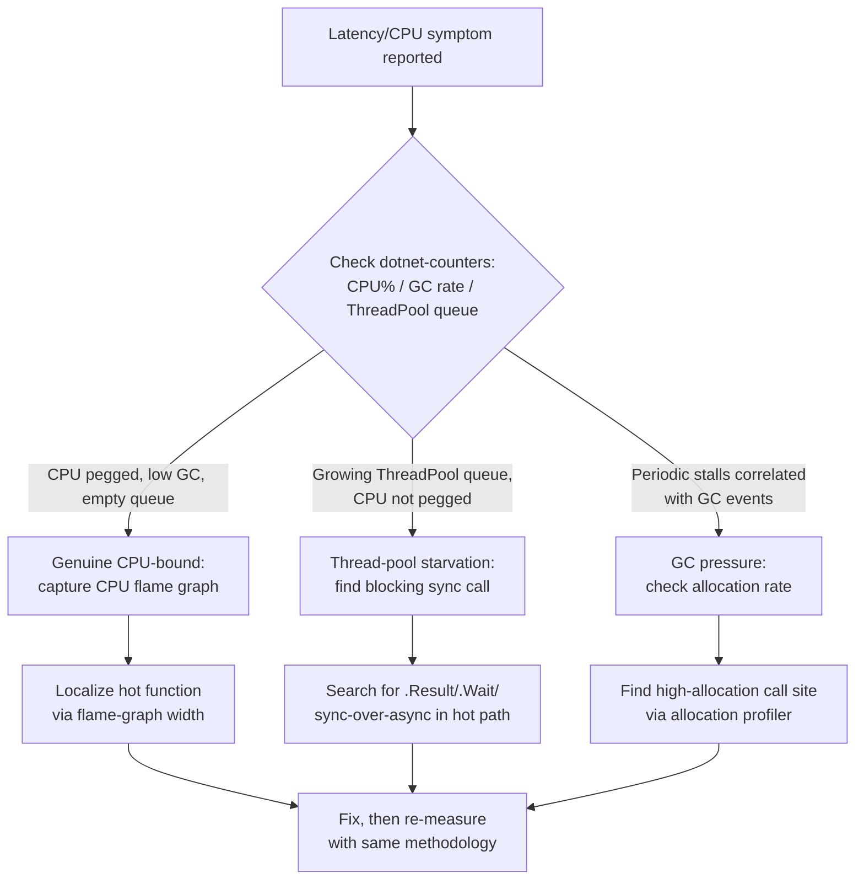
```mermaid
flowchart TD
 A[Latency/CPU symptom reported] --> B{Check dotnet-counters:<br/>CPU% / GC rate / ThreadPool queue}
 B -->|CPU pegged, low GC, empty queue| C[Genuine CPU-bound:<br/>capture CPU flame graph]
 B -->|Growing ThreadPool queue,<br/>CPU not pegged| D[Thread-pool starvation:<br/>find blocking sync call]
 B -->|Periodic stalls correlated<br/>with GC events| E[GC pressure:<br/>check allocation rate]
 C --> F[Localize hot function<br/>via flame-graph width]
 D --> G[Search for .Result/.Wait/<br/>sync-over-async in hot path]
 E --> H[Find high-allocation call site<br/>via allocation profiler]
 F --> I[Fix, then re-measure<br/>with same methodology]
 G --> I
 H --> I
```

**3. Visual Architecture**

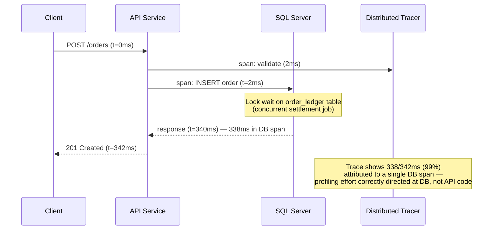
```mermaid
sequenceDiagram
 participant Client
 participant API as API Service
 participant DB as SQL Server
 participant Trace as Distributed Tracer

 Client->>API: POST /orders (t=0ms)
 API->>Trace: span: validate (2ms)
 API->>DB: span: INSERT order (t=2ms)
 Note over DB: Lock wait on order_ledger table<br/>(concurrent settlement job)
 DB-->>API: response (t=340ms) — 338ms in DB span
 API-->>Client: 201 Created (t=342ms)
 Note over Trace: Trace shows 338/342ms (99%)<br/>attributed to a single DB span —<br/>profiling effort correctly directed at DB, not API code
```

**13. Low-Level Design**

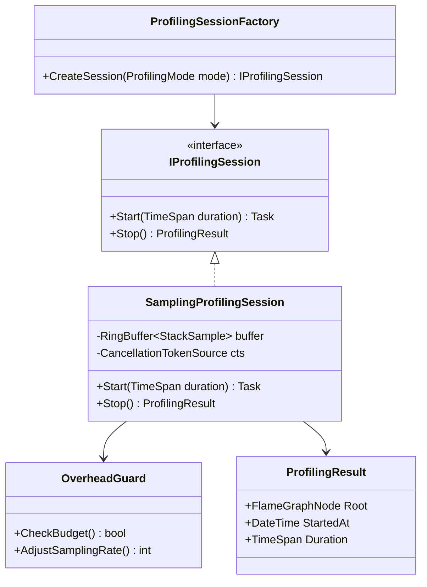
```mermaid
classDiagram
 class IProfilingSession {
 <<interface>>
 +Start(TimeSpan duration) Task
 +Stop() ProfilingResult
 }
 class SamplingProfilingSession {
 -RingBuffer~StackSample~ buffer
 -CancellationTokenSource cts
 +Start(TimeSpan duration) Task
 +Stop() ProfilingResult
 }
 class ProfilingSessionFactory {
 +CreateSession(ProfilingMode mode) IProfilingSession
 }
 class ProfilingResult {
 +FlameGraphNode Root
 +DateTime StartedAt
 +TimeSpan Duration
 }
 class OverheadGuard {
 +CheckBudget() bool
 +AdjustSamplingRate() int
 }
 IProfilingSession <|.. SamplingProfilingSession
 ProfilingSessionFactory --> IProfilingSession
 SamplingProfilingSession --> OverheadGuard
 SamplingProfilingSession --> ProfilingResult
```

**13. Low-Level Design**

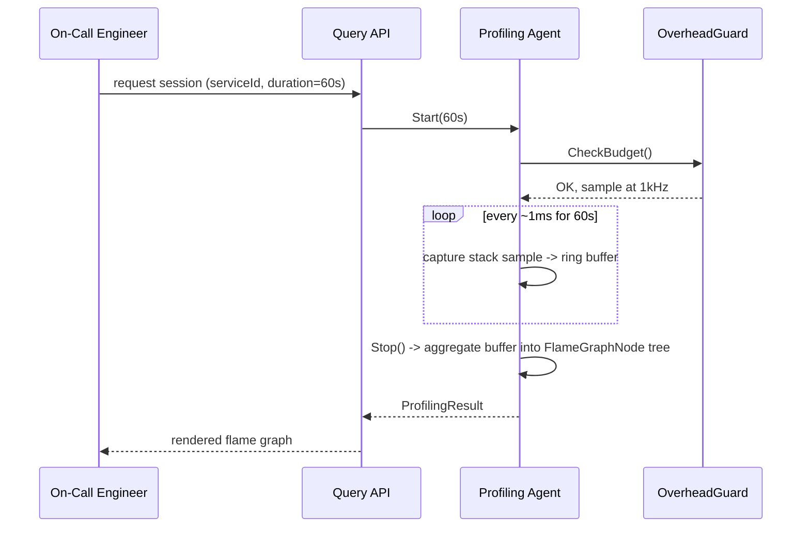
```mermaid
sequenceDiagram
 participant OnCall as On-Call Engineer
 participant API as Query API
 participant Agent as Profiling Agent
 participant Guard as OverheadGuard

 OnCall->>API: request session (serviceId, duration=60s)
 API->>Agent: Start(60s)
 Agent->>Guard: CheckBudget()
 Guard-->>Agent: OK, sample at 1kHz
 loop every ~1ms for 60s
 Agent->>Agent: capture stack sample -> ring buffer
 end
 Agent->>Agent: Stop() -> aggregate buffer into FlameGraphNode tree
 Agent-->>API: ProfilingResult
 API-->>OnCall: rendered flame graph
```

### Module 102 — Performance Engineering: Load Testing, Capacity Planning & Benchmarking
*Source: `02-LoadTesting-CapacityPlanning-Benchmarking.md`*

**1. Fundamentals**

```text
Historical traffic data + growth forecast
 │
 ▼
Design realistic load-test profile (rate, mix, burstiness, open-loop)
 │
 ▼
Run load test → measure latency/throughput/error-rate against SLO thresholds
 │
 ▼
Identify ceiling / cliff point (Little's Law, queueing-theory-informed)
 │
 ▼
Capacity plan: provision headroom below the ceiling; define shedding policy beyond it
 │
 ▼
Re-test periodically as code, data volume, and traffic patterns evolve
```

**3. Visual Architecture**

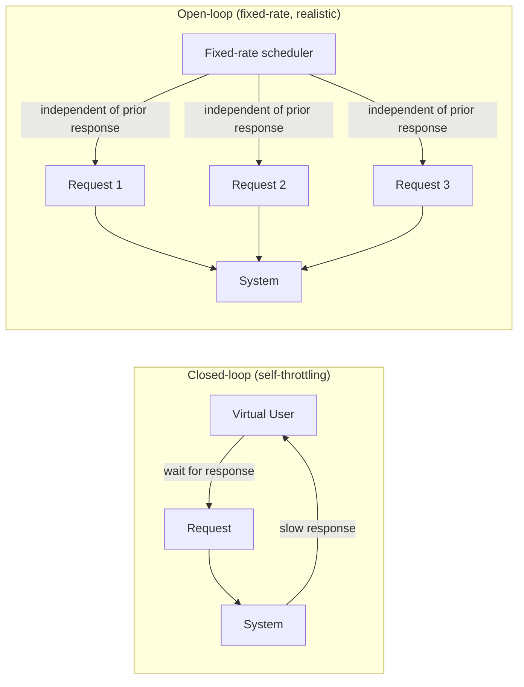
```mermaid
flowchart LR
 subgraph "Closed-loop (self-throttling)"
 U1[Virtual User] -->|wait for response| R1[Request] --> S1[System]
 S1 -->|slow response| U1
 end
 subgraph "Open-loop (fixed-rate, realistic)"
 T[Fixed-rate scheduler] -->|independent of prior response| R2[Request 1]
 T -->|independent of prior response| R3[Request 2]
 T -->|independent of prior response| R4[Request 3]
 R2 --> S2[System]
 R3 --> S2
 R4 --> S2
 end
```

**3. Visual Architecture**

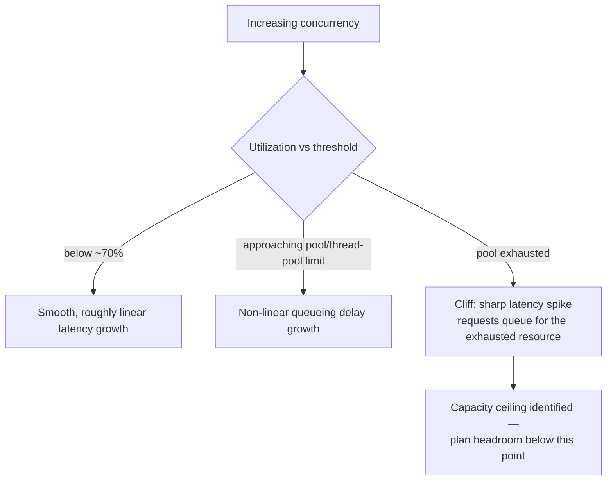
```mermaid
graph TD
 A[Increasing concurrency] --> B{Utilization vs threshold}
 B -->|below ~70%| C[Smooth, roughly linear latency growth]
 B -->|approaching pool/thread-pool limit| D[Non-linear queueing delay growth]
 B -->|pool exhausted| E["Cliff: sharp latency spike<br/>requests queue for the exhausted resource"]
 E --> F[Capacity ceiling identified —<br/>plan headroom below this point]
```

**3. Visual Architecture**

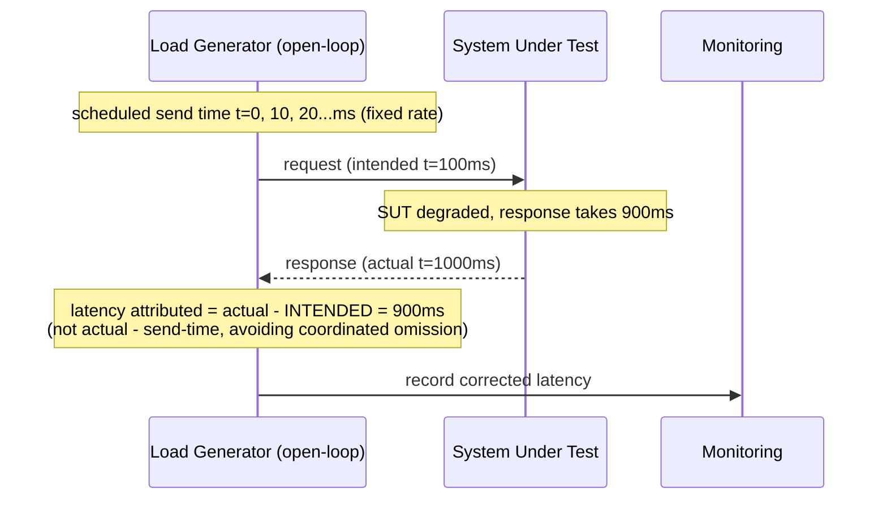
```mermaid
sequenceDiagram
 participant Gen as Load Generator (open-loop)
 participant SUT as System Under Test
 participant Mon as Monitoring

 Note over Gen: scheduled send time t=0, 10, 20...ms (fixed rate)
 Gen->>SUT: request (intended t=100ms)
 Note over SUT: SUT degraded, response takes 900ms
 SUT-->>Gen: response (actual t=1000ms)
 Note over Gen: latency attributed = actual - INTENDED = 900ms<br/>(not actual - send-time, avoiding coordinated omission)
 Gen->>Mon: record corrected latency
```

**13. Low-Level Design**

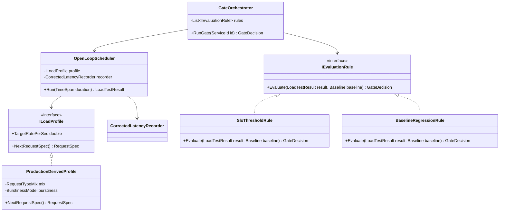
```mermaid
classDiagram
 class ILoadProfile {
 <<interface>>
 +NextRequestSpec() RequestSpec
 +TargetRatePerSec double
 }
 class ProductionDerivedProfile {
 -RequestTypeMix mix
 -BurstinessModel burstiness
 +NextRequestSpec() RequestSpec
 }
 class OpenLoopScheduler {
 -ILoadProfile profile
 -CorrectedLatencyRecorder recorder
 +Run(TimeSpan duration) LoadTestResult
 }
 class IEvaluationRule {
 <<interface>>
 +Evaluate(LoadTestResult result, Baseline baseline) GateDecision
 }
 class SloThresholdRule {
 +Evaluate(LoadTestResult result, Baseline baseline) GateDecision
 }
 class BaselineRegressionRule {
 +Evaluate(LoadTestResult result, Baseline baseline) GateDecision
 }
 class GateOrchestrator {
 -List~IEvaluationRule~ rules
 +RunGate(ServiceId id) GateDecision
 }
 ILoadProfile <|.. ProductionDerivedProfile
 IEvaluationRule <|.. SloThresholdRule
 IEvaluationRule <|.. BaselineRegressionRule
 OpenLoopScheduler --> ILoadProfile
 OpenLoopScheduler --> CorrectedLatencyRecorder
 GateOrchestrator --> OpenLoopScheduler
 GateOrchestrator --> IEvaluationRule
```

**13. Low-Level Design**

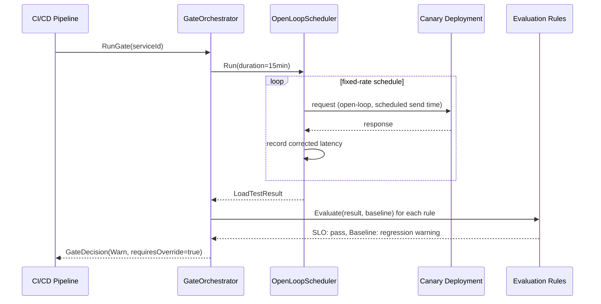
```mermaid
sequenceDiagram
 participant CI as CI/CD Pipeline
 participant Orch as GateOrchestrator
 participant Sched as OpenLoopScheduler
 participant SUT as Canary Deployment
 participant Rules as Evaluation Rules

 CI->>Orch: RunGate(serviceId)
 Orch->>Sched: Run(duration=15min)
 loop fixed-rate schedule
 Sched->>SUT: request (open-loop, scheduled send time)
 SUT-->>Sched: response
 Sched->>Sched: record corrected latency
 end
 Sched-->>Orch: LoadTestResult
 Orch->>Rules: Evaluate(result, baseline) for each rule
 Rules-->>Orch: SLO: pass, Baseline: regression warning
 Orch-->>CI: GateDecision(Warn, requiresOverride=true)
```

### Module 103 — Performance Engineering: Caching Strategies & Data Access Performance
*Source: `03-CachingStrategies-DataAccessPerformance.md`*

**1. Fundamentals**

```text
Request ─▶ Cache? ─hit──────────────────────▶ Response (fast)
 │
 miss
 │
 ▼
 Data store ─▶ (pool a connection, run an
 efficient, indexed, paginated query,
 possibly against a read replica)
 │
 ▼
 Populate cache ─▶ Response (slow path, paid once per TTL/invalidation)
```

**3. Visual Architecture**

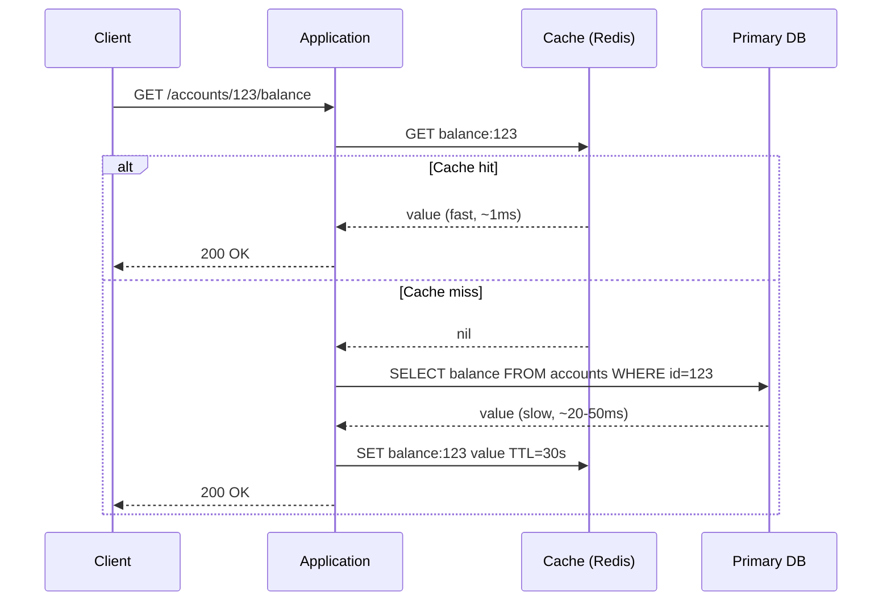
```mermaid
sequenceDiagram
    participant C as Client
    participant App as Application
    participant Cache as Cache (Redis)
    participant DB as Primary DB

    C->>App: GET /accounts/123/balance
    App->>Cache: GET balance:123
    alt Cache hit
        Cache-->>App: value (fast, ~1ms)
        App-->>C: 200 OK
    else Cache miss
        Cache-->>App: nil
        App->>DB: SELECT balance FROM accounts WHERE id=123
        DB-->>App: value (slow, ~20-50ms)
        App->>Cache: SET balance:123 value TTL=30s
        App-->>C: 200 OK
    end
```

**3. Visual Architecture**

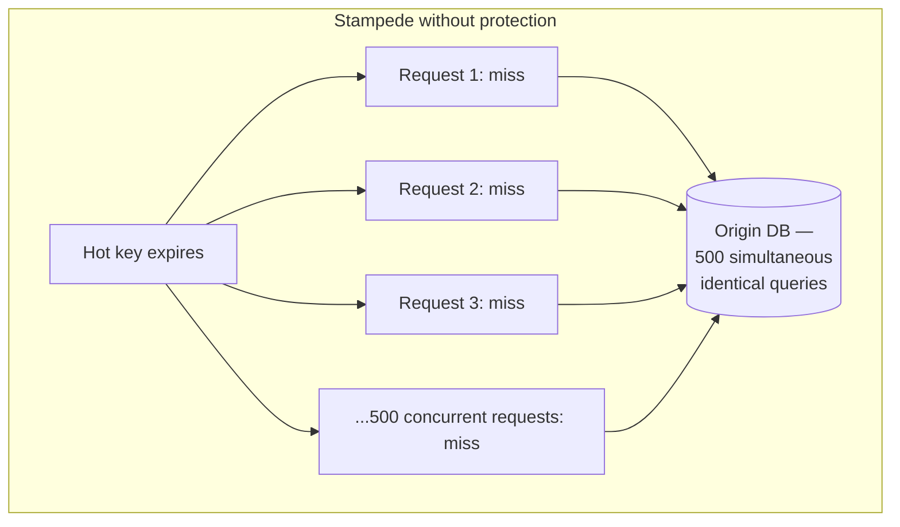
```mermaid
graph TB
    subgraph "Stampede without protection"
        K[Hot key expires] --> R1[Request 1: miss]
        K --> R2[Request 2: miss]
        K --> R3[Request 3: miss]
        K --> RN["...500 concurrent requests: miss"]
        R1 & R2 & R3 & RN --> DB[(Origin DB —<br/>500 simultaneous<br/>identical queries)]
    end
```

**3. Visual Architecture**

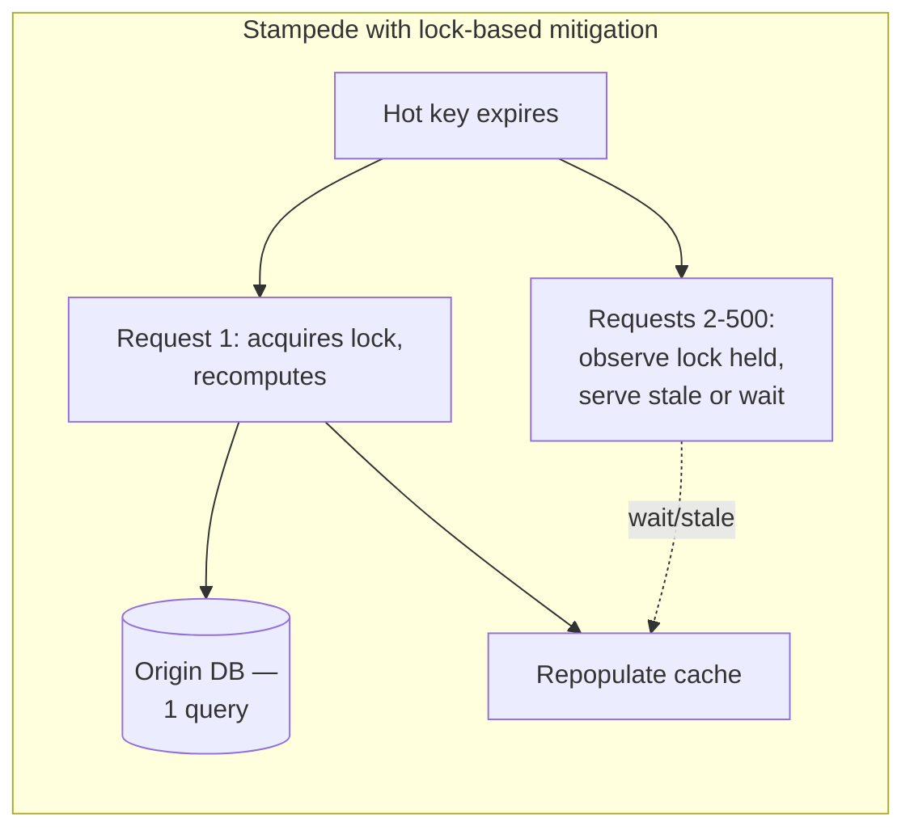
```mermaid
graph LR
    subgraph "Stampede with lock-based mitigation"
        K2[Hot key expires] --> R1b[Request 1: acquires lock,<br/>recomputes]
        K2 --> R2b["Requests 2-500:<br/>observe lock held,<br/>serve stale or wait"]
        R1b --> DB2[(Origin DB —<br/>1 query)]
        R1b --> Cache2[Repopulate cache]
        R2b -.wait/stale.-> Cache2
    end
```

**Step 2 — Propose High-Level Design and Get Buy-In**

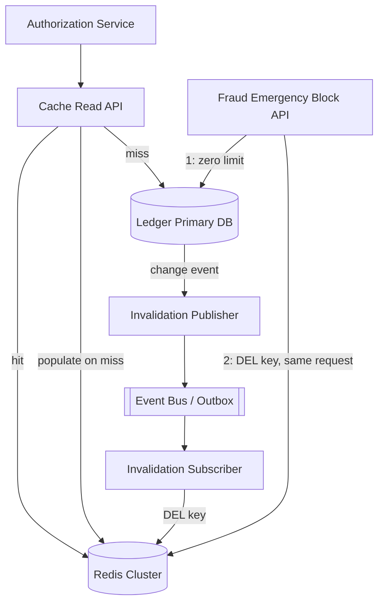
```mermaid
graph TB
    Auth[Authorization Service] --> API[Cache Read API]
    API -->|hit| Redis[(Redis Cluster)]
    API -->|miss| Ledger[(Ledger Primary DB)]
    API -->|populate on miss| Redis

    Ledger -->|change event| Pub[Invalidation Publisher]
    Pub --> Bus[[Event Bus / Outbox]]
    Bus --> Sub[Invalidation Subscriber]
    Sub -->|DEL key| Redis

    Fraud[Fraud Emergency Block API] -->|1: zero limit| Ledger
    Fraud -->|2: DEL key, same request| Redis
```

**Step 4 — Wrap-Up**

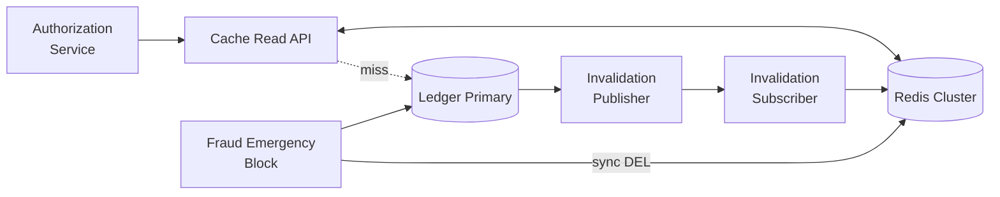
```mermaid
graph LR
    Auth[Authorization<br/>Service] --> Read[Cache Read API]
    Read <--> Redis[(Redis Cluster)]
    Read -.miss.-> DB[(Ledger Primary)]
    DB --> Pub[Invalidation<br/>Publisher] --> Sub[Invalidation<br/>Subscriber] --> Redis
    Fraud[Fraud Emergency<br/>Block] -->|sync DEL| Redis
    Fraud --> DB
```

**13. Low-Level Design**

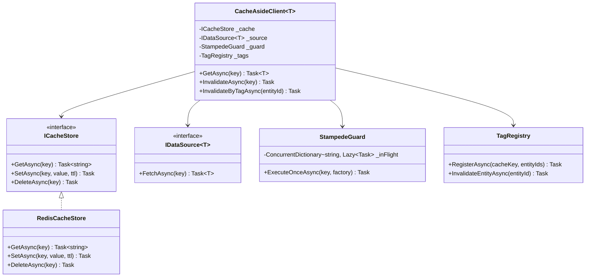
```mermaid
classDiagram
    class ICacheStore {
        <<interface>>
        +GetAsync(key) Task~string~
        +SetAsync(key, value, ttl) Task
        +DeleteAsync(key) Task
    }
    class RedisCacheStore {
        +GetAsync(key) Task~string~
        +SetAsync(key, value, ttl) Task
        +DeleteAsync(key) Task
    }
    class IDataSource~T~ {
        <<interface>>
        +FetchAsync(key) Task~T~
    }
    class CacheAsideClient~T~ {
        -ICacheStore _cache
        -IDataSource~T~ _source
        -StampedeGuard _guard
        -TagRegistry _tags
        +GetAsync(key) Task~T~
        +InvalidateAsync(key) Task
        +InvalidateByTagAsync(entityId) Task
    }
    class StampedeGuard {
        -ConcurrentDictionary~string, Lazy~Task~ _inFlight
        +ExecuteOnceAsync(key, factory) Task
    }
    class TagRegistry {
        +RegisterAsync(cacheKey, entityIds) Task
        +InvalidateEntityAsync(entityId) Task
    }
    ICacheStore <|.. RedisCacheStore
    CacheAsideClient --> ICacheStore
    CacheAsideClient --> IDataSource~T~
    CacheAsideClient --> StampedeGuard
    CacheAsideClient --> TagRegistry
```

**13. Low-Level Design**

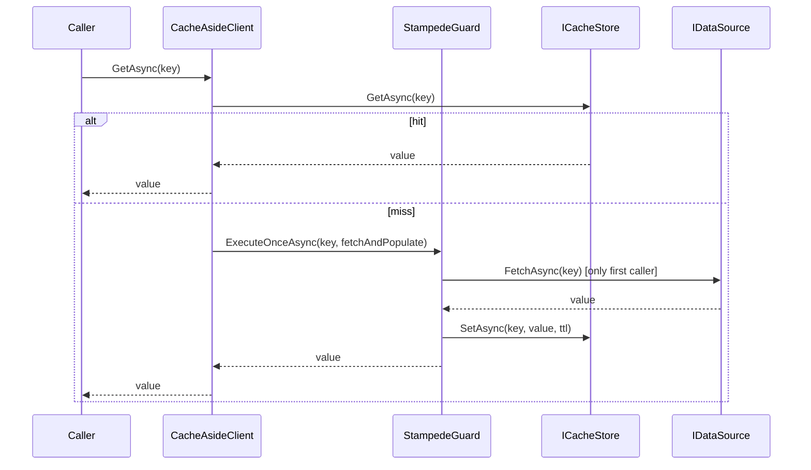
```mermaid
sequenceDiagram
    participant Caller
    participant Client as CacheAsideClient
    participant Guard as StampedeGuard
    participant Cache as ICacheStore
    participant Source as IDataSource

    Caller->>Client: GetAsync(key)
    Client->>Cache: GetAsync(key)
    alt hit
        Cache-->>Client: value
        Client-->>Caller: value
    else miss
        Client->>Guard: ExecuteOnceAsync(key, fetchAndPopulate)
        Guard->>Source: FetchAsync(key)  [only first caller]
        Source-->>Guard: value
        Guard->>Cache: SetAsync(key, value, ttl)
        Guard-->>Client: value
        Client-->>Caller: value
    end
```

### Module 104 — Performance Engineering: Holistic Performance Engineering — Latency Budgets, SLOs & Continuous Performance Regression Prevention (Capstone)
*Source: `04-HolisticPerformanceEngineering-LatencyBudgets-RegressionPrevention.md`*

**1. Fundamentals**

```text
Overall target (e.g., p99 < 500ms)
 │
 ├─ allocate ──▶ Service A budget: 150ms  (gateway/auth)
 ├─ allocate ──▶ Service B budget: 200ms  (core business logic)
 ├─ allocate ──▶ Service C budget: 100ms  (downstream dependency)
 └─ allocate ──▶ Network/serialization overhead: 50ms

 Each service: CI gate compares actual measured latency
 against its own allocated budget on every change.
 Production: continuous monitoring + trend-aware alerting
 catches both sudden regression and slow cumulative drift.
```

**3. Visual Architecture**

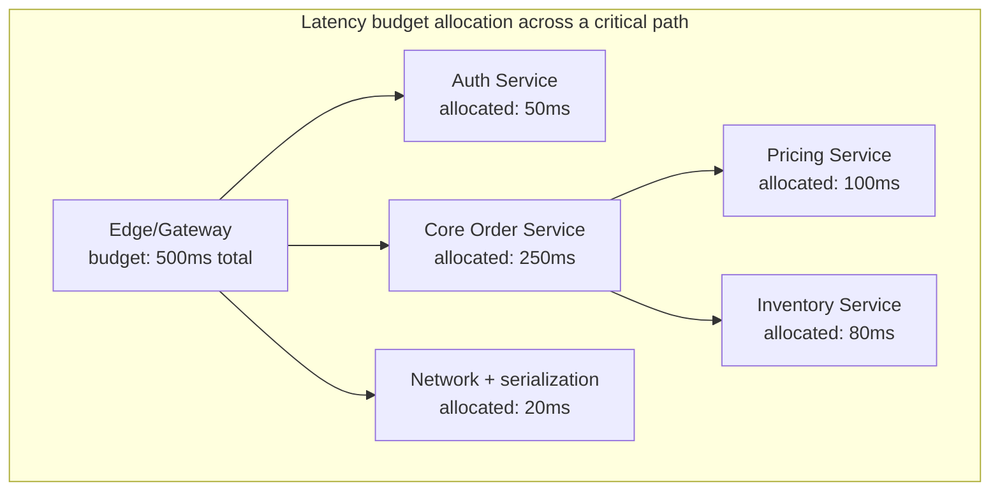
```mermaid
graph TB
    subgraph "Latency budget allocation across a critical path"
        Edge["Edge/Gateway<br/>budget: 500ms total"] --> Auth["Auth Service<br/>allocated: 50ms"]
        Edge --> Core["Core Order Service<br/>allocated: 250ms"]
        Core --> Pricing["Pricing Service<br/>allocated: 100ms"]
        Core --> Inventory["Inventory Service<br/>allocated: 80ms"]
        Edge --> Net["Network + serialization<br/>allocated: 20ms"]
    end
```

**3. Visual Architecture**

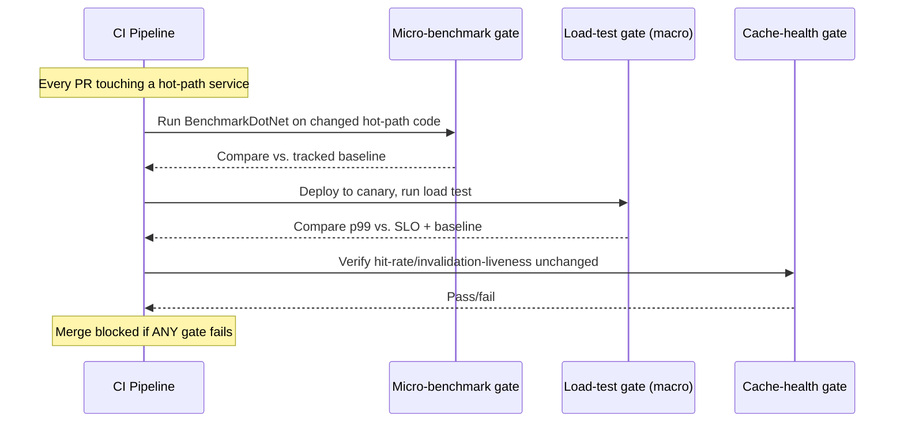
```mermaid
sequenceDiagram
    participant CI as CI Pipeline
    participant Bench as Micro-benchmark gate
    participant Load as Load-test gate (macro)
    participant Cache as Cache-health gate

    Note over CI: Every PR touching a hot-path service
    CI->>Bench: Run BenchmarkDotNet on changed hot-path code
    Bench-->>CI: Compare vs. tracked baseline
    CI->>Load: Deploy to canary, run load test
    Load-->>CI: Compare p99 vs. SLO + baseline
    CI->>Cache: Verify hit-rate/invalidation-liveness unchanged
    Cache-->>CI: Pass/fail
    Note over CI: Merge blocked if ANY gate fails
```

**3. Visual Architecture**

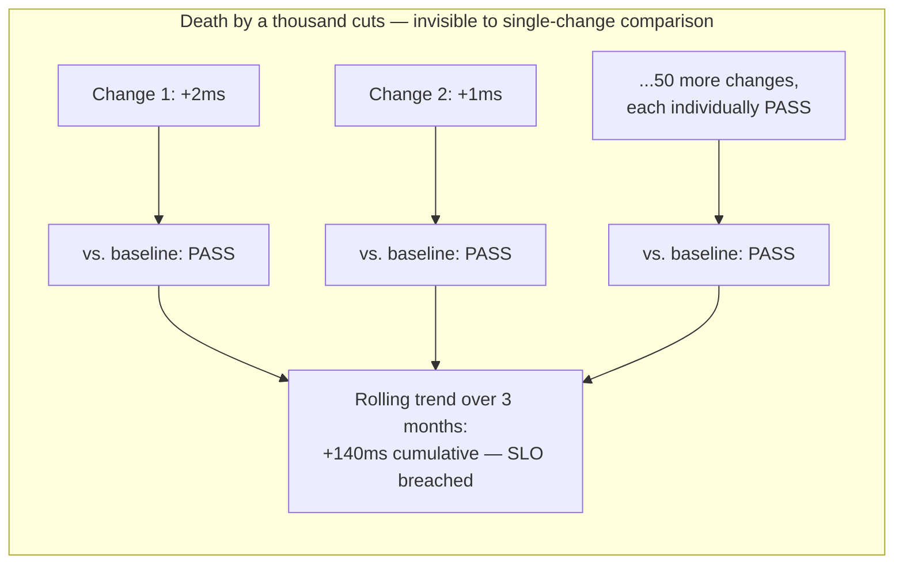
```mermaid
graph LR
    subgraph "Death by a thousand cuts — invisible to single-change comparison"
        C1[Change 1: +2ms] --> P1[vs. baseline: PASS]
        C2[Change 2: +1ms] --> P2[vs. baseline: PASS]
        C3["...50 more changes,<br/>each individually PASS"] --> P3[vs. baseline: PASS]
        P1 & P2 & P3 --> Trend["Rolling trend over 3 months:<br/>+140ms cumulative — SLO breached"]
    end
```

**Step 2 — Propose High-Level Design and Get Buy-In**

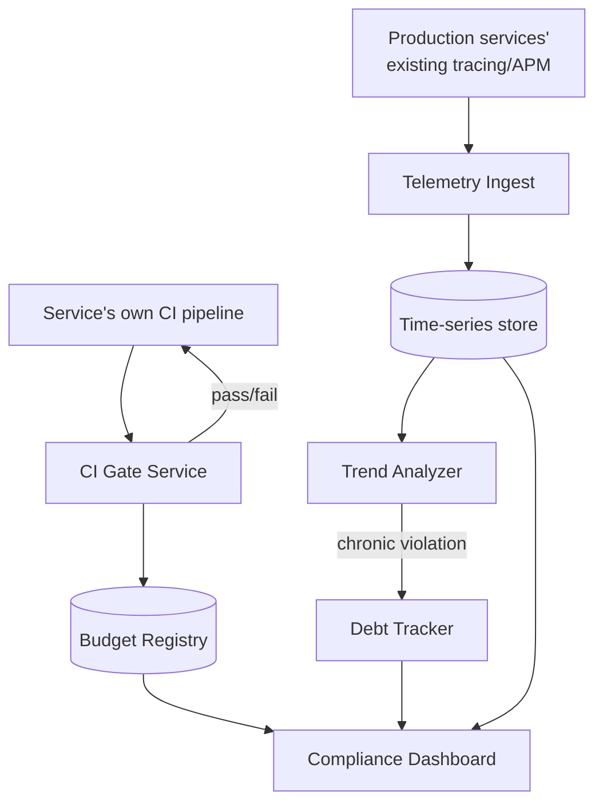
```mermaid
graph TB
    Svc[Service's own CI pipeline] --> Gate[CI Gate Service]
    Gate --> Registry[(Budget Registry)]
    Gate -->|pass/fail| Svc

    Prod[Production services'<br/>existing tracing/APM] --> Ingest[Telemetry Ingest]
    Ingest --> TSDB[(Time-series store)]
    TSDB --> Trend[Trend Analyzer]
    Trend -->|chronic violation| Debt[Debt Tracker]
    TSDB --> Dash[Compliance Dashboard]
    Registry --> Dash
    Debt --> Dash
```

**Step 4 — Wrap-Up**

```mermaid
graph LR
    Dev[Developer PR] --> CIGate[CI Gate Service] --> Registry[(Budget Registry)]
    CIGate -->|pass| Deploy[Canary/Prod Deploy]
    Deploy --> Telemetry[Production Telemetry]
    Telemetry --> Trend[Trend Analyzer]
    Trend -->|chronic breach| Debt[Performance Debt Backlog]
    Telemetry --> Dash[Compliance Dashboard]
    Registry --> Dash
```

**13. Low-Level Design**

```mermaid
classDiagram
    class IBenchmarkResultSource {
        <<interface>>
        +GetLatestSamplesAsync(benchmarkName) Task~double[]~
    }
    class IBaselineStore {
        <<interface>>
        +GetBaselineAsync(benchmarkName) Task~Baseline~
        +UpdateBaselineAsync(benchmarkName, newSamples) Task
    }
    class Baseline {
        +double Mean
        +double Variance
        +int SampleCount
    }
    class RegressionGate {
        -IBenchmarkResultSource _source
        -IBaselineStore _baselineStore
        -double _minEffectMs
        -double _zThreshold
        +EvaluateAsync(benchmarkName) Task~GateResult~
    }
    class GateResult {
        +bool Passed
        +double EffectMs
        +double ZScore
        +string Explanation
    }
    IBenchmarkResultSource <.. RegressionGate
    IBaselineStore <.. RegressionGate
    RegressionGate --> GateResult
    IBaselineStore --> Baseline
```

**13. Low-Level Design**

```mermaid
sequenceDiagram
    participant CI as CI Pipeline
    participant Gate as RegressionGate
    participant Src as IBenchmarkResultSource
    participant Store as IBaselineStore

    CI->>Gate: EvaluateAsync("OrderService.PlaceOrder")
    Gate->>Src: GetLatestSamplesAsync(name)
    Src-->>Gate: double[] newSamples
    Gate->>Store: GetBaselineAsync(name)
    Store-->>Gate: Baseline (mean, variance, count)
    Gate->>Gate: compute effect + z-score
    alt significant regression
        Gate-->>CI: GateResult(Passed=false, explanation)
    else within tolerance
        Gate->>Store: UpdateBaselineAsync(name, newSamples)
        Gate-->>CI: GateResult(Passed=true)
    end
```
