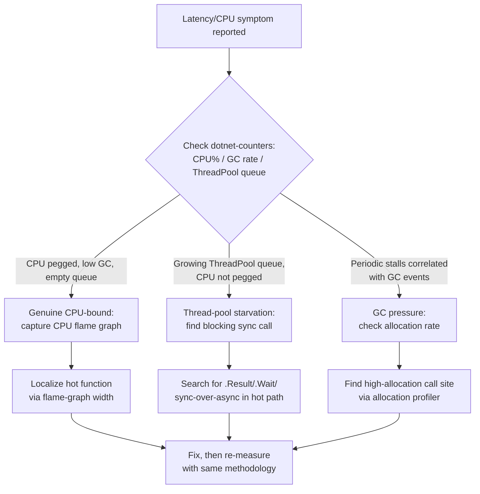
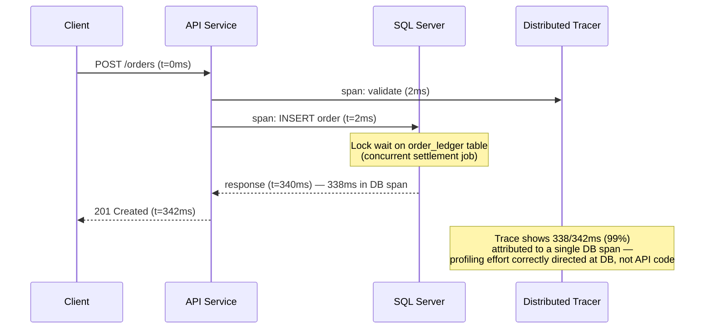
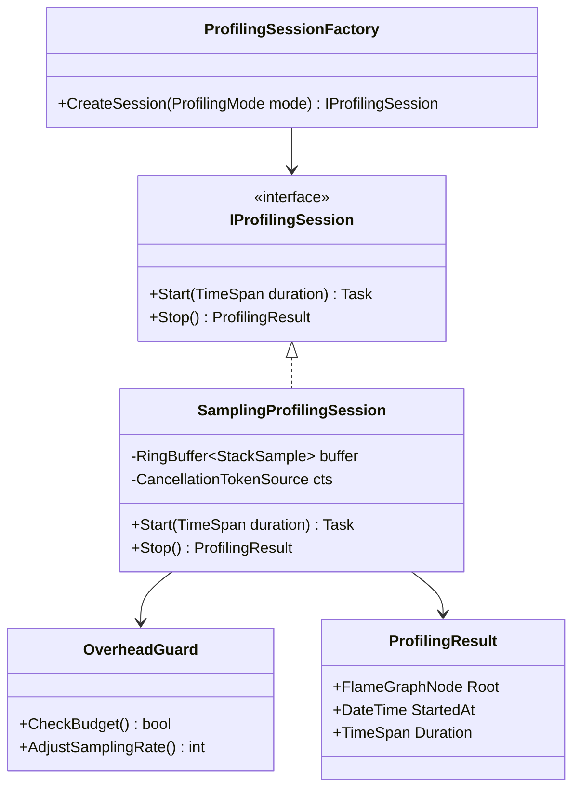
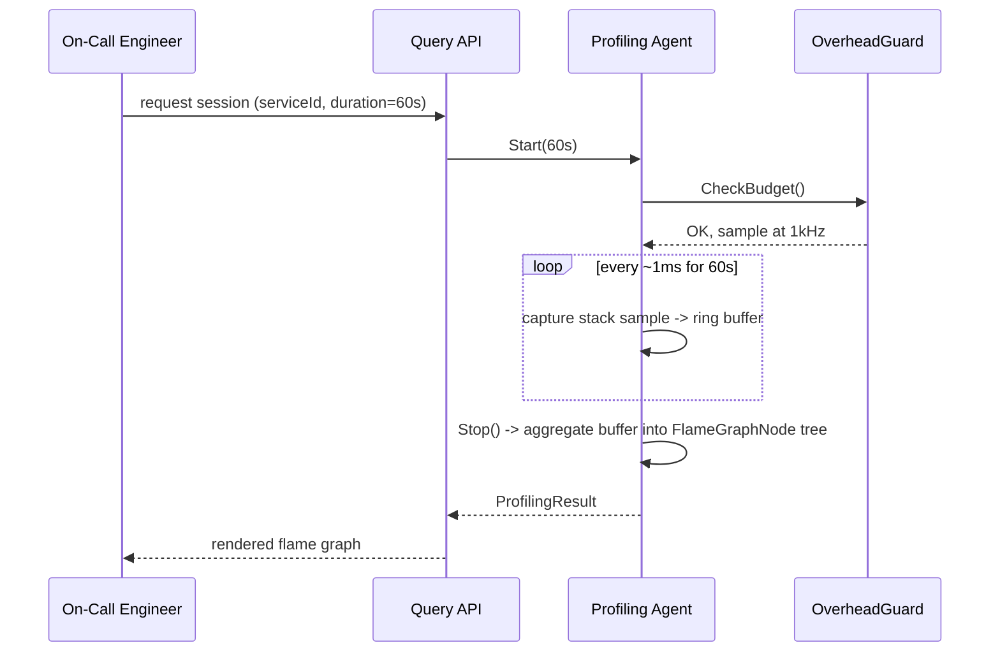

# Module 101 — Performance Engineering: Performance Profiling & Bottleneck Diagnosis

> Domain: Performance Engineering | Level: Beginner → Expert | Prerequisite: [[../01-CSharp/02-Async-Await-Internals]] (thread-pool/async internals this module's CPU/thread profiling examines), [[../04-SQL-Server]] indexing modules (query-plan-level bottleneck diagnosis), [[../27-Observability/01-ObservabilityFundamentals-MetricsLogsTraces-OpenTelemetry]] (traces/metrics as the raw signal profiling tools build on)
>
> **Format note (superseded):** This module originally shipped under the leaner, 40-Q&A-only format referenced below. Per the 2026-07-18 template-reversion decision (see `CLAUDE.md`), it has since been upgraded to the current full-template format — Fundamentals through Revision — while preserving the original 40 Q&A verbatim in §10.

---

## 1. Fundamentals

**What:** Performance profiling is the deliberate, targeted measurement of *where* a running program spends its time, CPU cycles, memory, and I/O wait — down to the function, line, query, or lock. Bottleneck diagnosis is the follow-on discipline of interpreting that measurement to identify the single (or few) constraining resource(s) that, if relieved, would most improve the system's observed latency or throughput. Unlike monitoring, which watches aggregate production health continuously and passively, profiling is invasive and specific — it answers "why is *this* slow," not "is the system healthy."

**Why:** Every performance-improvement effort that skips measurement risks optimizing a component that was never the actual constraint — the single most common and most expensive mistake in performance work. A trading-desk order-entry service, for example, might have an engineer spend two sprints hand-tuning a serialization routine that a flame graph would have shown consumes 2% of total request time, while a synchronous database call blocking a thread-pool thread accounts for 70% and goes untouched. Profiling exists to make that trade-off visible and evidence-based rather than intuition-based.

**When:** Use profiling whenever a system's actual latency/throughput diverges from its expected or required behavior — a pre-release capacity check, a live production incident, a suspected regression after a deploy, or a periodic capacity/cost review. Use continuous, low-overhead sampling profilers in production for always-on visibility; reserve heavier, fully-instrumenting profilers for staging/reproducible investigation, since their overhead can itself distort the very measurement being taken (the "observer effect").

**How (30,000-ft view):**
```
Symptom (high latency / high CPU / OOM / timeout)
 │
 ▼
Collect signal: metrics → traces → profiler (increasing invasiveness/detail)
 │
 ▼
Localize: which service → which function/query/lock → which resource (CPU/IO/lock/GC)
 │
 ▼
Confirm hypothesis with a targeted, repeatable measurement
 │
 ▼
Fix → re-measure against the SAME methodology → confirm the fix actually moved the metric
```

---

## 2. Deep Dive

### 2.1 Sampling vs. Instrumenting Profilers
A **sampling profiler** (e.g., `dotnet-trace`, PerfView's sampling mode, Linux `perf`) periodically interrupts the running process (typically ~1kHz) and records the current call stack across all threads. Over thousands of samples, the proportion of samples containing a given function approximates the proportion of wall-clock/CPU time spent in it. Overhead is low (often <5%) because most of the program's execution is never touched — only sampled. An **instrumenting profiler** (e.g., a tracing profiler that injects entry/exit probes into every method) records exact timing for every call, giving precise counts and call-graph edges, but the injected probes can add 2–10x overhead and materially change thread-scheduling behavior — the profiler itself becomes a confound in exactly the concurrency-sensitive scenarios (lock contention, thread-pool starvation) it's often used to diagnose. Production profiling defaults to sampling for this reason; instrumenting profilers are reserved for reproducible, staging-only deep dives.

### 2.2 The CLR's Own Cost Centers Profiling Must Distinguish
A .NET flame graph mixes three genuinely different cost centers that require different fixes: (1) **application logic** — the business-logic code itself; (2) **JIT compilation** — first-call tiered compilation cost, visible as time attributed to `System.Runtime.CompilerServices` frames on cold paths, distorting short-lived process profiles (e.g., serverless cold starts) far more than long-running services; (3) **GC** — visible as time in `System.GC`/background GC threads, driven by allocation rate rather than any single hot function. Conflating these — e.g., concluding "the JSON serializer is slow" when the actual cost is GC pressure from the allocations that serializer happens to produce — leads to the wrong fix (rewriting the serializer's logic instead of pooling its buffers).

### 2.3 Thread-Pool Starvation's Specific Signature
The CLR thread pool grows slowly and conservatively (roughly one new thread every 500ms past the configured minimum, by design, to avoid oversubscribing the OS scheduler under transient bursts). A workload that blocks threads synchronously (`.Result`, `.Wait()`, a synchronous DB driver call) faster than the pool can grow produces a *distinctive* signature: CPU utilization stays low or moderate while request latency climbs sharply and the `ThreadPool` queue-length counter (visible via `dotnet-counters` or `ThreadPool.PendingWorkItemCount`) grows unboundedly. This is diagnostically different from genuine CPU saturation (where CPU utilization itself is pegged near 100%) and from GC-driven pauses (visible as periodic, correlated stalls in GC counters) — three distinct root causes that superficially all present as "the app got slow."

### 2.4 Generational GC and Why Allocation Rate, Not Heap Size, Is the First Number to Check
.NET's generational GC assumes most objects die young (the "generational hypothesis"). Gen-0 collections are cheap (microseconds, scanning only recently-allocated, small regions) and frequent; Gen-2/full collections are expensive (can pause for tens to hundreds of milliseconds on large heaps) and rare. A high *allocation rate* (bytes/sec, visible via `dotnet-counters`' `Allocation Rate`) drives Gen-0 frequency up even if the steady-state heap size stays small — meaning a service can have a small, stable heap and still suffer materially from GC overhead purely due to churn. Profiling should check allocation rate before heap size, since heap size alone can look healthy while GC still consumes 15–20% of total CPU time servicing a high churn rate.

### 2.5 Lock Contention's Hidden Cost: Convoying
A profiler showing time "in" `Monitor.Enter`/a `lock` statement understates the true cost of contention, because it doesn't show **convoying** — once several threads queue behind one lock, the OS's fairness/wake-up scheduling can serialize *unrelated* subsequent work behind the queue, propagating a narrow, momentary contention event into a much wider, cascading latency spike across seemingly-unrelated request paths. This is why a lock-contention finding should be evaluated by the actual critical-section duration and callers, not just the raw time-in-lock metric.

### 2.6 The Observer Effect and Statistical Validity
Any profiler changes the system it measures — a fully-instrumenting profiler can slow a hot loop by 5-10x, meaning its *absolute* timing numbers are unreliable even though its *relative* proportions (which function dominates) usually remain informative. A single profiling run is also a single sample from a noisy distribution (JIT state, OS scheduling, cache warmth all vary run-to-run) — a claimed "20% improvement" from one before/after run pair, without multiple runs and a variance estimate, is not statistically distinguishable from noise in many real workloads. Treat a single profiling session's absolute numbers as directional, not authoritative, and require repeated runs before declaring a fix confirmed.

---

## 3. Visual Architecture





---

## 4. Production Example

**Problem:** A payments settlement service at a mid-size FinTech processed end-of-day batch reconciliation between an internal ledger and a card-network settlement file. After a routine deploy, p99 latency for the *unrelated*, concurrently-running real-time authorization API jumped from 80ms to 1.4 seconds, triggering a customer-facing incident, even though the deploy had touched only the batch reconciliation job.

**Architecture:** Both the real-time authorization API and the batch reconciliation job ran against the same SQL Server instance and shared a connection pool sized for the authorization API's steady low-latency load; the batch job was a separate, independently-deployed service, believed to be fully isolated because it ran in a different container.

**Investigation:** `dotnet-counters` on the authorization API showed CPU utilization at a normal 30%, ruling out a CPU-bound cause immediately. `ThreadPool` queue length was also flat. Distributed tracing (correlated via a shared trace ID across the two services' calls to the same database) showed the authorization API's slow requests spent >95% of their time in a single DB span — not in application code at all. A SQL Server blocking-chain query (`sys.dm_exec_requests` joined to `sys.dm_os_waiting_tasks`) revealed the authorization API's `INSERT` statements were blocked behind row-level locks held by the newly-deployed reconciliation job's `UPDATE` statements against the same `order_ledger` table, which the recent deploy had changed from batched, smaller transactions to one large, long-running transaction for "simplicity."

**Root cause:** The reconciliation job's new, larger transaction held exclusive row locks for several seconds per batch, and SQL Server's default lock escalation converted many row locks into a table-level lock under the increased volume, blocking the authorization API's unrelated inserts entirely — a classic blocking chain invisible to either service's own application-level profiling, only visible via database-level lock diagnostics correlated against the trace.

**Fix:** The reconciliation job was reverted to smaller, batched transactions (capped at 500 rows) with explicit `READ COMMITTED` isolation and no `TABLOCK` hints, restoring row-level-only locking; additionally, the two workloads were split onto separate connection pools with distinct `Resource Governor` classifications so a future regression in one workload's transaction size couldn't again starve the other's connection availability.

**Trade-offs:** Smaller batched transactions in the reconciliation job increased its own total runtime by roughly 12% (more transaction-commit overhead) in exchange for eliminating cross-service lock contention — an explicitly accepted trade-off given the reconciliation job's overnight time budget was not latency-sensitive, while the authorization API's was.

**Lessons learned:** Profiling the *symptomatic* service alone (the authorization API) would never have found the root cause, since none of its own code was slow — the bottleneck lived in a shared resource contended by an entirely different, seemingly-unrelated service. Distributed tracing that correlates spans against the same downstream dependency (the database), not just within one service's own call graph, was the tool that actually localized this. This is a direct instance of this course's recurring theme: a service's own health metrics can look entirely normal while it is, in fact, the victim of a resource-contention bottleneck imposed by a neighbor sharing the same infrastructure.

---

## 5. Best Practices
- Always measure before proposing a fix; state the specific metric a fix is expected to move and by how much, then re-measure the same way afterward.
- Prefer low-overhead sampling profilers for production and for any concurrency-sensitive investigation; reserve instrumenting profilers for reproducible, isolated staging sessions.
- Check `dotnet-counters`' CPU%, GC allocation rate, and ThreadPool queue length together as a first-pass triage before reaching for a full flame graph — each has a distinct signature.
- Correlate application-level tracing with database-level lock/wait diagnostics for any bottleneck that traces show concentrated in a single downstream-dependency span.
- Run multiple profiling/benchmark iterations and compare distributions, not single samples, before declaring a fix confirmed.
- Instrument proactively (tracing spans around every meaningfully expensive operation) before an incident, not retroactively during one.

## 6. Anti-patterns
- Optimizing the first plausible-looking hot function in a flame graph without checking whether it's actually application logic, JIT warm-up, or GC noise.
- Diagnosing any latency spike as "probably GC" without checking GC counters first.
- Assuming a service's own clean CPU/memory metrics rule it out as the cause when a shared downstream resource (DB, cache, message broker) may be the actual, externally-imposed bottleneck.
- Profiling only in staging with synthetic, evenly-distributed data that hides production-specific skew.
- Trusting a single before/after benchmark run as proof a fix worked, without accounting for run-to-run variance.
- Adding threads to a workload that profiling has already shown to be I/O-bound rather than CPU-bound.

---

## 7. Performance Engineering

**CPU:** Flame-graph width is the primary CPU-time signal; always distinguish self-time (time in the function's own code) from total-time (including callees) — a wide bar in total-time view can be entirely attributable to one callee, misleading the fix target if self-time isn't checked separately.

**Memory/GC:** Track allocation rate (bytes/sec) as the leading indicator, not steady-state heap size. Object pooling (`ArrayPool<T>`, `ObjectPool<T>`) and `Span<T>`/`ReadOnlySpan<T>` for stack-allocated slicing reduce Gen-0 churn directly. Server GC (concurrent, background collection) reduces pause *frequency* for throughput-oriented services at the cost of larger per-pause duration variance; Workstation GC with concurrent mode favors lower, more predictable pause times for latency-sensitive, low-throughput services (e.g., a trading order-entry path).

**Latency vs. throughput benchmarking:** BenchmarkDotNet handles JIT warm-up, multiple iterations, and statistical outlier rejection automatically for micro-benchmarks — hand-rolled `Stopwatch` loops without warm-up phases systematically overstate cold-path cost.

**Allocations as a first-class cost:** A hot path allocating 50 bytes per call at 10,000 calls/sec generates 500KB/sec of garbage — seemingly trivial per-call but enough to double Gen-0 collection frequency under sustained load; profiling allocation *call sites* (not just aggregate rate) via an allocation profiler (e.g., `dotnet-trace` with the `gc-collect` provider) localizes exactly which code path to fix.

---

## 8. Security

**Secrets in traces/profiles:** A full-instrumentation profiler or a verbose distributed trace can capture method arguments, SQL query text with embedded parameter values, or HTTP request/response bodies — in a payments or KYC context, this can mean card numbers, SSNs, or auth tokens land in a profiler's captured data or a trace-storage backend that wasn't designed or access-controlled for PII/PCI-scoped data. Profiling and tracing configuration must explicitly scrub or exclude sensitive fields (parameterized query capture without literal values, PII redaction at the span-attribute layer) before data leaves the process, not as an afterthought at the storage layer.

**Access to production profiling tools:** Continuous production profilers and their captured flame-graph/trace data are themselves a sensitive asset — they can reveal internal architecture, third-party integration endpoints, and (if not scrubbed) customer data, so access must be scoped via the same least-privilege/audit-trail discipline as any other production diagnostic tool, with captured profiling data retained under the same data-retention policy as logs.

**DoS-shaped risk from profiling overhead itself:** Enabling a heavy, fully-instrumenting profiler against a live, latency-sensitive production path (rather than a low-overhead sampler) can itself degrade the service enough to constitute a self-inflicted denial-of-service — a real operational risk during an active incident when the temptation to "just turn on full tracing" is highest.

---

## 9. Scalability

**Horizontal implications of profiling findings:** A CPU-bound bottleneck found via profiling is a candidate for horizontal scaling (more instances sharing the parallelizable load) only if the workload is genuinely stateless/partitionable; a lock-contention or shared-database bottleneck (as in §4's production example) is *not* resolved by adding more instances of the contending service — it requires addressing the shared resource itself (finer-grained locking, connection-pool/isolation separation, or partitioning the shared data).

**Profiling at scale — sampling a representative fleet subset:** Running a full instrumenting profiler against every production instance is prohibitively expensive; continuous, low-overhead sampling profilers run against a representative subset of the fleet (e.g., 5–10% of instances) provide statistically sufficient flame-graph coverage without materially impacting aggregate fleet capacity.

**HA/DR relevance:** A bottleneck diagnosis performed only against a single-region deployment may miss cross-region replication lag or multi-region lock-contention patterns that only manifest under active-active topology — profiling methodology should explicitly account for whether the finding generalizes across the full deployment topology or is specific to the region/instance profiled.

---

## 10. Interview Questions

### Basic (10)

1. **Q: What is the difference between profiling and monitoring?**
 **A:** Monitoring continuously observes a system's aggregate metrics in production (the pillars); profiling is a deliberate, often invasive, deep-dive measurement of exactly where time/memory/CPU is spent within a specific process, typically during targeted investigation or pre-release testing.
 **Why correct:** States the distinction in scope, invasiveness, and typical trigger.
 **Common mistakes:** Assuming ordinary production metrics are equivalent to a profiler's fine-grained, per-function/per-line detail.
 **Follow-ups:** "Can profiling run safely in production?" (Sampling profilers with low overhead can; instrumenting/tracing profilers with high overhead typically can't without real user impact.)

2. **Q: What is a CPU flame graph, and what does its width and height represent?**
 **A:** A visualization of stack traces sampled over time — width represents relative time spent in a function (across all samples), height represents call-stack depth. Wide plateaus indicate functions consuming the most CPU time.
 **Why correct:** States both axes' meaning precisely.
 **Common mistakes:** Assuming height (stack depth) indicates time spent, when width is the actual time signal.
 **Follow-ups:** "What tool commonly generates these for.NET?" (dotnet-trace / PerfView, sampling the CLR's call stacks.)

3. **Q: What is the difference between CPU-bound and I/O-bound performance problems?**
 **A:** CPU-bound: the bottleneck is actual computation — threads are busy executing instructions. I/O-bound: threads are waiting on external operations (disk, network, database) with the CPU largely idle during the wait.
 **Why correct:** States the defining resource each is bottlenecked on.
 **Common mistakes:** Adding more CPU/threads to fix an I/O-bound problem, when the actual fix is reducing wait time or increasing concurrency of the I/O itself (e.g., via async).
 **Follow-ups:** "How would you distinguish the two from a CPU utilization graph alone?" (High CPU utilization suggests CPU-bound; low CPU utilization with high latency suggests I/O-bound or lock contention.)

4. **Q: What is a memory leak in a garbage-collected runtime like.NET, given the GC should reclaim unused memory automatically?**
 **A:** Memory that is technically still reachable (via a reference the application never releases — a static collection that only grows, an event handler never unsubscribed) and therefore never eligible for collection, even though the application no longer actually needs it.
 **Why correct:** Clarifies that "leak" in a GC language means unintentional reachability, not a failure of the collector itself.
 **Common mistakes:** Assuming a GC language is immune to memory leaks entirely.
 **Follow-ups:** "What's a classic.NET leak pattern?" (A long-lived object subscribing to a short-lived object's event without unsubscribing, keeping the short-lived object rooted indefinitely.)

5. **Q: What is thread-pool starvation?**
 **A:** A state where all available thread-pool threads are busy (often blocked on synchronous I/O or long-running work), leaving no threads available to process new queued work, causing latency to spike even though the CPU itself may be idle.
 **Why correct:** States the specific starvation mechanism distinctly from CPU saturation.
 **Common mistakes:** Diagnosing high latency as a CPU problem when thread-pool exhaustion, visible via queue length, is the actual cause.
 **Follow-ups:** "What's a common cause in ASP.NET Core code?" (Blocking on async code via `.Result` or `.Wait`, synchronously occupying a thread-pool thread that should have been freed to do other work while awaiting.)

6. **Q: What is the difference between latency and throughput?**
 **A:** Latency is the time a single request takes to complete; throughput is the number of requests a system can process per unit time. The two aren't simply inverses — a system can increase throughput via parallelism without reducing individual request latency.
 **Why correct:** States both definitions and clarifies they're independent dimensions, not one derived from the other.
 **Common mistakes:** Assuming optimizing for throughput automatically improves latency, or vice versa.
 **Follow-ups:** "Give an example where increasing throughput increases latency." (Batching multiple requests together to process more efficiently in aggregate, at the cost of each individual request waiting for the batch to fill.)

7. **Q: What is a database N+1 query problem?**
 **A:** Fetching a parent collection with one query, then issuing a separate query per child record in a loop (N additional queries) rather than a single, joined or batched query — a very common, easy-to-introduce performance anti-pattern, especially with ORMs.
 **Why correct:** States the specific pattern (1 + N queries) and its typical cause.
 **Common mistakes:** Not recognizing it in ORM-generated code, where lazy-loading can silently introduce it.
 **Follow-ups:** "How do you fix it?" (Eager-loading/joining the related data in the original query, or batching the child fetches into one query using an `IN` clause.)

8. **Q: What is percentile latency (p50, p95, p99), and why is average latency often a misleading metric?**
 **A:** Percentile latency states the value below which a given percentage of requests fall (p99 = 99% of requests are faster than this value). Average latency can look acceptable while a meaningful fraction of users experience much worse tail latency, since a few extreme outliers can be masked by many fast requests in an average.
 **Why correct:** States the definition and the specific way averages hide tail behavior.
 **Common mistakes:** Reporting only average latency in a performance review, hiding a real, user-impacting tail-latency problem.
 **Follow-ups:** "Why does p99 latency matter more at scale?" (At high request volume, even a small percentage of slow requests represents a large absolute number of poor user experiences.)

9. **Q: What is the difference between vertical and horizontal scaling as a performance-improvement lever?**
 **A:** Vertical scaling adds more resources (CPU/RAM) to an existing instance; horizontal scaling adds more instances processing work in parallel. Vertical scaling has a hard ceiling (the largest available machine) and doesn't improve fault tolerance; horizontal scaling requires the workload to be parallelizable/statelessly distributable.
 **Why correct:** States both approaches' mechanism and respective limitations.
 **Common mistakes:** Assuming vertical scaling is always simpler and therefore always preferable, ignoring its ceiling and single-point-of-failure risk.
 **Follow-ups:** "What application property is required for horizontal scaling to work cleanly?" (Statelessness, or externalized state — session/data not held in a single instance's memory.)

10. **Q: What is the general first step in any performance investigation, before reaching for a specific fix?**
 **A:** Measure and identify the actual bottleneck (via profiling or metrics) before optimizing — optimizing a component that isn't actually the bottleneck wastes effort and can add complexity with no measurable benefit.
 **Why correct:** States the "measure first" discipline foundational to effective performance work.
 **Common mistakes:** Applying a plausible-sounding optimization (adding a cache, adding an index) without first confirming that specific component is actually where time is being spent.
 **Follow-ups:** "What's the risk of skipping measurement?" (Effort spent optimizing a non-bottleneck while the actual bottleneck remains unaddressed, with no measurable improvement to show for the work.)

### Intermediate (10)

1. **Q: How would you diagnose whether a.NET application's high latency is caused by GC pauses versus thread-pool starvation versus actual CPU-bound work?**
 **A:** Check GC pause frequency/duration via `dotnet-counters`/GC event tracing (long, frequent pauses point to GC); check thread-pool queue length and worker-thread count (a growing queue with available CPU headroom points to starvation); check actual CPU utilization during the latency spike (near-100% utilization with low GC/queue activity points to genuine CPU-bound work).
 **Why correct:** Provides a distinguishing signal for each of the three candidate causes rather than guessing.
 **Common mistakes:** Assuming any latency spike is automatically a GC problem without checking the other two candidate causes.
 **Follow-ups:** "What tool would you reach for first?" (`dotnet-counters` for a quick, low-overhead live view of GC, thread-pool, and CPU metrics simultaneously.)

2. **Q: Why can adding more threads make a CPU-bound problem worse rather than better?**
 **A:** Beyond the number of available CPU cores, additional threads only increase context-switching overhead without adding genuine parallel computation capacity — the OS spends more time switching between threads than doing useful work, degrading overall throughput.
 **Why correct:** States the specific mechanism (context-switch overhead exceeding added parallelism) causing the counterintuitive degradation.
 **Common mistakes:** Assuming "more threads" is a universal performance lever regardless of whether the workload is CPU-bound or I/O-bound.
 **Follow-ups:** "What's the correct fix for a genuinely CPU-bound bottleneck instead?" (Reduce the actual computational work (algorithmic improvement) or scale horizontally across more cores/machines, not add more threads on the same core count.)

3. **Q: How would you diagnose an intermittent, hard-to-reproduce latency spike that only occurs in production, never in staging load tests?**
 **A:** Use a low-overhead, always-on production profiler/sampling mechanism (rather than an invasive full instrumentation profiler) capturing stack traces specifically during the latency spike window, correlated against production-specific conditions staging doesn't replicate (real traffic patterns, real data volume/skew, noisy-neighbor resource contention on shared infrastructure).
 **Why correct:** Identifies both the correct tooling approach (low-overhead, always-on) and the likely reason staging doesn't reproduce it (production-specific conditions).
 **Common mistakes:** Attempting to reproduce the issue only in staging with synthetic load, without considering production-specific data/traffic characteristics that staging doesn't replicate.
 **Follow-ups:** "What's a common production-only cause staging often misses?" (Data skew — a specific, large customer's dataset triggering a slow query path that synthetic, evenly-distributed staging data never exercises.)

4. **Q: A database query performs well in isolation but degrades significantly under concurrent load. What are the likely causes?**
 **A:** Lock contention (multiple transactions blocking on the same rows/pages), connection-pool exhaustion, or a query plan that degrades non-linearly with data volume/concurrent access (e.g., a table scan that was fast on a small, cached working set becoming I/O-bound under contention for buffer-pool pages).
 **Why correct:** Names three distinct, plausible mechanisms rather than a single generic answer.
 **Common mistakes:** Assuming a query's isolated performance test result generalizes directly to concurrent, production-realistic load.
 **Follow-ups:** "How would you test for this before production?" (Load testing with realistic, concurrent traffic patterns — the focus — rather than single-query benchmarking alone.)

5. **Q: Why might increasing a service's memory allocation counterintuitively increase GC pause times, rather than reduce them?**
 **A:** A larger heap means the garbage collector must scan and compact a larger region during a full/gen-2 collection, potentially increasing individual pause duration even as pause frequency decreases — a real trade-off between pause frequency and pause duration, not a straightforward "more memory is always better" relationship.
 **Why correct:** States the specific mechanism (larger heap scan cost) behind the counterintuitive trade-off.
 **Common mistakes:** Assuming more available memory is unconditionally better for GC behavior.
 **Follow-ups:** "How would you tune around this trade-off in.NET?" (Consider server GC vs. workstation GC settings, and whether the workload's actual allocation pattern benefits from a larger or more frequently-collected generation 0/1.)

6. **Q: How would you differentiate a genuine algorithmic complexity problem (e.g., an accidental O(n²) loop) from an infrastructure-level bottleneck using a profiler?**
 **A:** A flame graph showing time concentrated in the application's own business-logic code (a specific loop/function) with CPU-bound characteristics points to an algorithmic issue; time concentrated in framework/infrastructure calls (network I/O, serialization, database driver code) points to an infrastructure-level bottleneck instead.
 **Why correct:** States the specific diagnostic signal (where in the stack the time is concentrated) distinguishing the two categories.
 **Common mistakes:** Assuming all performance problems are algorithmic without checking whether the flame graph actually attributes time to the application's own logic versus framework/I/O code.
 **Follow-ups:** "What would confirm an O(n²) suspicion specifically?" (Profiling at increasing input sizes and observing execution time growing quadratically rather than linearly, confirming the complexity class empirically.)

7. **Q: What is the risk of profiling only in a staging environment with synthetic, evenly-distributed test data?**
 **A:** Synthetic data often lacks the skew, volume, and access-pattern characteristics of real production data — a query performing well against uniform synthetic data can degrade sharply against a real, skewed distribution (e.g., one customer with a disproportionately large dataset), meaning staging profiling alone can miss production-specific bottlenecks entirely.
 **Why correct:** States the specific data-realism gap and its consequence for profiling validity.
 **Common mistakes:** Treating a clean staging profiling result as sufficient evidence of production readiness.
 **Follow-ups:** "How would you address this gap without risking real production data exposure?" (Use production-representative, anonymized/synthetic-but-realistically-skewed datasets in staging, or use low-overhead production profiling directly.)

8. **Q: How would you use distributed tracing to diagnose a slow, multi-service request in a microservices architecture?**
 **A:** Examine the trace's span breakdown to identify which specific service/span accounts for the majority of the end-to-end latency, then apply service-specific profiling (CPU/memory/DB) to that specific service rather than guessing across the entire call chain — directly using tracing's causal, per-hop breakdown as the first, cheap diagnostic step before deeper, service-specific profiling.
 **Why correct:** Connects tracing's specific capability (per-hop latency breakdown) to its diagnostic role as a first-pass bottleneck localizer.
 **Common mistakes:** Profiling every service in the call chain exhaustively rather than first using tracing to narrow down which specific service is actually responsible for the bulk of the latency.
 **Follow-ups:** "What if the trace shows time spent in a gap between spans rather than within any single span?" (Directly §Advanced Q4's finding — this indicates queueing/waiting time not covered by any instrumented span, requiring an additional span or a queue-specific metric to close the blind spot.)

9. **Q: Why might reducing memory allocations (fewer, smaller objects) improve performance even on a system with plenty of available RAM?**
 **A:** Fewer allocations mean less garbage-collection work overall (both in frequency and total bytes scanned/reclaimed), directly reducing CPU time spent on GC rather than application logic — available RAM headroom doesn't eliminate the CPU cost of collecting garbage, it only delays when a collection is triggered.
 **Why correct:** States that GC's cost is CPU time, not merely memory pressure, correcting the common assumption that ample RAM alone resolves allocation-heavy code's performance cost.
 **Common mistakes:** Assuming allocation rate doesn't matter as long as available memory is sufficient, missing the CPU cost GC still imposes regardless of memory headroom.
 **Follow-ups:** "What.NET technique reduces allocation pressure for hot-path code?" (Object pooling, `Span<T>`/`ReadOnlySpan<T>` for stack-allocated, allocation-free slicing, and avoiding boxing of value types in hot paths.)

10. **Q: How would you prioritize which of several identified bottlenecks to fix first, given limited engineering time?**
 **A:** Prioritize by expected impact on the actual, user-facing metric that matters (often p95/p99 latency or overall throughput under realistic load) relative to fix effort — a bottleneck contributing a small fraction of total latency isn't worth fixing before one contributing the majority, regardless of how technically interesting either fix is.
 **Why correct:** States a concrete, impact-vs-effort prioritization principle rather than fixing whichever bottleneck is easiest or most familiar.
 **Common mistakes:** Fixing the most technically interesting or personally familiar bottleneck first, rather than the one contributing the largest actual, measured share of the problem.
 **Follow-ups:** "How would you validate that a fix actually delivered the expected impact?" (Re-measure the same metric under the same realistic load conditions after the fix, comparing directly against the pre-fix baseline rather than assuming the fix worked because it addressed a real, profiled bottleneck.)

### Advanced (10)

1. **Q: Design a systematic methodology for diagnosing a production performance regression that appeared after a recent deployment, with no obvious, single suspicious change.**
 **A:** (1) Confirm the regression's actual scope and magnitude via metrics/percentile latency, not anecdote; (2) correlate the regression's onset timestamp precisely against the deployment timeline and any other concurrent infrastructure/config changes; (3) if a specific deploy correlates, bisect via a canary/rollback comparison (the progressive-delivery mechanics) rather than manually reviewing every changed line; (4) if no single deploy correlates, profile the current production state directly to localize the bottleneck, then work backward to identify which specific code path or data condition changed.
 **Why correct:** Provides a systematic, falsifiable methodology (correlate first, then bisect or profile) rather than ad hoc guessing.
 **Common mistakes:** Manually reviewing the entire diff of a large deployment for a "suspicious-looking" change, an unreliable, unsystematic approach compared to correlation and bisection.
 **Follow-ups:** "What if the regression correlates with a deploy, but a rollback doesn't fully resolve it?" (Consider a concurrent, non-code cause — a data-volume/skew change, an external dependency's own degradation, or an infrastructure change — that happened to coincide with the deploy's timing rather than being caused by it.)

2. **Q: How would you design a performance-regression-prevention gate in CI/CD, directly extending the fail-fast pipeline-architecture principles?**
 **A:** Run an automated, repeatable micro-benchmark or load test against every PR/release candidate, comparing key latency/throughput metrics against a tracked historical baseline, blocking the merge/release if a statistically-significant regression is detected — directly the CI-gate pattern applied to performance specifically, catching a regression before it reaches production rather than discovering it only via a post-deployment incident.
 **Why correct:** Applies an already-established CI-gate pattern to performance regression detection specifically, with a concrete mechanism (tracked historical baseline, statistical significance).
 **Common mistakes:** Relying solely on post-deployment production monitoring to catch performance regressions, discovering them only after real users are already affected.
 **Follow-ups:** "What's the risk of a benchmark gate with high measurement noise?" (False-positive blocking on noise rather than genuine regression — directly the alert-fatigue risk recurring for performance-gate noise, requiring a statistically robust comparison, not a single noisy sample.)

3. **Q: A profiler shows a hot path spending significant time in a lock/mutex acquisition. How would you diagnose whether this is genuine, necessary contention versus an avoidable design flaw?**
 **A:** Examine what the lock actually protects and how long the critical section holds it — a lock protecting a large critical section (expensive work performed while holding the lock) or a lock scoped more broadly than necessary (locking an entire collection when only one entry needs protection) is often avoidable via finer-grained locking, lock-free data structures, or reducing the critical section's scope; a lock protecting a genuinely small, necessary, shared mutable state update with high concurrent demand may represent unavoidable, fundamental contention requiring an architectural change (partitioning/sharding the shared state) rather than a simple locking fix.
 **Why correct:** Provides a concrete diagnostic distinction (critical-section scope and necessity) between avoidable and fundamental contention.
 **Common mistakes:** Assuming any lock-contention finding is immediately fixable by simply "using a different lock type," without examining whether the critical section's scope itself is the actual, avoidable problem.
 **Follow-ups:** "What's a structural fix for genuinely fundamental, high-concurrency contention on shared state?" (Partition/shard the shared state so concurrent operations contend on independent, smaller partitions rather than one single, globally-shared lock.)

4. **Q: How would you approach performance profiling differently for a latency-sensitive, low-throughput system (e.g., a trading system) versus a high-throughput, latency-tolerant batch system?**
 **A:** For a latency-sensitive system, focus on tail-latency (p99.9+) sources — GC pauses, JIT warmup, unpredictable OS scheduling jitter — often requiring specialized techniques (server GC tuning, pre-warming, pinned threads) to minimize variance, not just average time. For a high-throughput batch system, focus on maximizing aggregate resource utilization and parallelism, where occasional individual-item latency variance matters far less than total completion time and resource efficiency.
 **Why correct:** Correctly identifies that the two system types warrant genuinely different profiling focus (tail-latency variance vs. aggregate throughput) rather than one universal approach.
 **Common mistakes:** Applying identical profiling priorities (e.g., average latency) to both system types, missing that tail-latency variance is the dominant concern for one and largely irrelevant for the other.
 **Follow-ups:** "What.NET-specific technique addresses GC-pause-driven tail latency in a low-latency system?" (Server GC with concurrent/background collection modes, or in extreme cases, minimizing allocations enough to rely primarily on gen-0 collections with very short pause times.)

5. **Q: Design an approach for continuously profiling a production fleet of services without imposing meaningful overhead on real user traffic.**
 **A:** Use a low-overhead, statistical sampling profiler (rather than full instrumentation) running continuously at a low sampling rate across a representative subset of production instances, aggregating flame-graph data centrally — directly the "continuous profiling" pattern (e.g., via eBPF-based or CLR-native low-overhead samplers), providing always-on visibility without the prohibitive cost full instrumentation profiling would impose on every request.
 **Why correct:** Proposes a concrete, low-overhead, continuous technique (statistical sampling across a representative subset) rather than either no production profiling at all or an overhead-prohibitive full-instrumentation approach.
 **Common mistakes:** Assuming production profiling always requires expensive, invasive instrumentation, when low-overhead sampling profilers exist specifically to make continuous production profiling practical.
 **Follow-ups:** "Why profile a representative subset rather than every instance?" (Sampling a subset provides statistically sufficient visibility at meaningfully lower aggregate overhead than profiling 100% of production instances continuously.)

6. **Q: How does/98's "declared ≠ actual" theme apply to performance engineering specifically — what's a performance-domain instance of a control that looks correct but silently isn't?**
 **A:** A caching layer "declared" to reduce database load can silently degrade to near-zero actual hit rate (a misconfigured cache key causing near-100% misses, or a TTL set so short every request effectively bypasses the cache) while the application continues functioning correctly and returning correct data — functionally invisible, but providing none of its intended performance benefit, discoverable only by actively monitoring the cache's actual hit-rate metric, not merely confirming the cache "exists" and returns correct values.
 **Why correct:** Directly connects the course's central recurring theme to a genuine, realistic performance-engineering instance (a cache silently providing zero actual benefit while functioning correctly).
 **Common mistakes:** Assuming a cache's mere presence and functional correctness (returning correct data) is evidence it's providing its intended performance benefit.
 **Follow-ups:** "What metric would you monitor to catch this specific gap?" (Cache hit-rate, tracked continuously and alerted on if it drops below an expected baseline — directly this course's now-standard liveness/coverage-monitoring pattern, applied to caching effectiveness specifically.)

7. **Q: How would you diagnose a performance problem specific to containerized (Kubernetes) workloads that wouldn't manifest the same way on a traditional VM?**
 **A:** Check for CPU throttling caused by an overly restrictive CPU limit (/83's `cpu.max`/CFS bandwidth-control mechanism) — a container can appear to have "available" CPU headroom by host-level metrics while actually being throttled by its own cgroup limit, a distinctly container-specific bottleneck a traditional VM's simpler resource model wouldn't exhibit in the same way.
 **Why correct:** Names a specific, container-native bottleneck mechanism (cgroup CPU throttling) directly connecting to this course's prior Kubernetes/Docker domain findings.
 **Common mistakes:** Diagnosing container performance using only host-level CPU metrics, missing cgroup-level throttling that only becomes visible via container-specific metrics.
 **Follow-ups:** "What metric specifically reveals this throttling?" (The container runtime/cgroup's own throttling counter — e.g., `nr_throttled`/`throttled_time` in cgroup CPU stats — distinct from host-level CPU utilization.)

8. **Q: A load test shows a service performing well up to a certain concurrency level, then degrading sharply (not gradually) beyond it. What does this specific "cliff" pattern suggest?**
 **A:** A resource-pool exhaustion point being crossed — a connection pool, thread pool, or semaphore-limited resource reaching its maximum capacity, causing requests beyond that point to queue and wait rather than being processed with gradually-increasing latency; a sharp cliff (rather than gradual degradation) is the specific, characteristic signature of hitting a hard capacity ceiling rather than a resource that degrades continuously under increasing load.
 **Why correct:** Identifies the specific diagnostic signature (sharp cliff vs. gradual degradation) and its typical cause (a hard-limited resource pool).
 **Common mistakes:** Assuming any performance degradation under load is gradual and proportional, missing that a sharp cliff specifically indicates a hard capacity limit being crossed.
 **Follow-ups:** "How would you confirm which specific resource pool is the limiting factor?" (Check each pool's (connection pool, thread pool) utilization/queue-depth metric at the exact concurrency level where the cliff occurs — the pool at 100% utilization right at that threshold is the culprit.)

9. **Q: How would you approach profiling and optimizing a system where the bottleneck isn't in your own code or infrastructure, but in a third-party API dependency's response time?**
 **A:** Confirm via tracing that the third-party call genuinely accounts for the bulk of end-to-end latency, then address it architecturally rather than attempting to "optimize" code you don't control: introduce caching for cacheable responses, parallelize independent third-party calls rather than serializing them, add a circuit breaker/timeout to bound worst-case impact on your own system, or negotiate/escalate with the third party if the dependency is business-critical and consistently underperforming its SLA.
 **Why correct:** Proposes concrete, actionable architectural mitigations (caching, parallelization, circuit breaking) appropriate when the bottleneck is genuinely outside your own code's control.
 **Common mistakes:** Attempting to micro-optimize your own calling code when tracing has already confirmed the actual time is spent waiting on the external dependency's own response.
 **Follow-ups:** "How would a circuit breaker specifically help here, given it doesn't speed up the third party?" (It bounds the blast radius of the third party's slowness on your own system — failing fast rather than letting your own threads/connections pile up waiting indefinitely on a degraded dependency.)

10. **Q: Synthesize this module's diagnostic methodology into one unifying principle for approaching any unfamiliar performance problem.**
 **A:** Always measure before optimizing, and always localize the bottleneck to its most specific, actual component (a function, a query, a lock, a dependency) using the diagnostic signal specifically suited to that layer (a flame graph for CPU, a query plan for a database, a trace for cross-service latency, a load test's concurrency-cliff pattern for resource-pool exhaustion) — never apply a plausible-sounding fix based on assumption or precedent alone, since this course's broader "declared ≠ actual" theme applies here too: a component that's supposed to be fast, cached, or non-blocking is not actually so until measured and confirmed.
 **Why correct:** Synthesizes the module's specific diagnostic techniques into one general, transferable methodology.
 **Common mistakes:** Treating each diagnostic technique (flame graphs, tracing, load testing) as an isolated skill rather than instances of one unifying "measure, localize, then fix" discipline.
 **Follow-ups:** "Why does this discipline matter especially for a Principal Engineer specifically?" (It's the difference between confidently, efficiently diagnosing a novel production issue under pressure versus guessing — a core, demonstrable Principal-Engineer-level skill interviewers specifically probe for.)

### Expert (10)

1. **Q: How would you diagnose a performance problem that only manifests after a service has been running continuously for several days, never appearing shortly after a fresh restart?**
 **A:** Suspect a slow, cumulative resource leak or fragmentation issue — a memory leak reaching a critical threshold only after sustained growth, heap/memory fragmentation degrading allocation efficiency over time, a connection or handle leak slowly exhausting a pool, or a growing in-memory cache/collection with no eviction policy. Diagnose via long-running memory/resource profiling (not a short profiling session, which wouldn't capture the cumulative trend) tracking resource usage trends over the service's actual uptime.
 **Why correct:** Names the specific class of cumulative, time-dependent causes and the corresponding long-duration profiling approach needed to catch them.
 **Common mistakes:** Running only short profiling sessions that never capture a slow, multi-day cumulative trend, concluding incorrectly that "nothing is wrong" from a snapshot that's too short to reveal the actual pattern.
 **Follow-ups:** "How would you narrow down which specific resource is slowly growing?" (Track heap size, handle count, and connection-pool usage over the multi-day window, correlating the growth trend's onset/rate against deployment or traffic-pattern events.)

2. **Q: Design an approach for capacity-planning a system's future growth using current profiling/load-test data, accounting for non-linear scaling effects.**
 **A:** Extrapolate from load-test results at multiple, increasing concurrency/data-volume points (not merely current production levels), specifically watching for the "cliff" pattern (Advanced Q8) indicating a resource-pool or algorithmic-complexity ceiling that would be reached before naive linear extrapolation from current metrics alone would predict — capacity planning based purely on linear extrapolation from today's numbers risks badly underestimating when and how a non-linear bottleneck will actually be hit.
 **Why correct:** Explicitly addresses the non-linear-scaling risk naive linear extrapolation would miss, connecting to the module's own cliff-pattern diagnostic.
 **Common mistakes:** Extrapolating future capacity needs purely linearly from current metrics, missing a resource-pool ceiling or algorithmic complexity effect that would cause performance to degrade sharply well before the linear projection would suggest.
 **Follow-ups:** "What specific test would reveal a hidden ceiling before it's reached in production?" (A load test deliberately run well beyond current production traffic levels, specifically searching for the cliff pattern at some multiple of current load, not merely validating current-load performance.)

3. **Q: How would you approach optimizing a system where profiling reveals the bottleneck is genuinely, correctly-implemented business logic with no algorithmic inefficiency — the computation is simply inherently expensive?**
 **A:** Consider whether the computation can be avoided entirely for some requests (caching identical/similar prior results), performed asynchronously/eagerly ahead of when it's needed (pre-computation, background processing) rather than synchronously in the request path, or whether the result's precision/completeness requirement can be relaxed (an approximate, faster computation acceptable for the actual use case) — since if the algorithm itself is genuinely optimal for the exact problem as specified, the remaining performance levers are architectural (when/how often the computation happens) or requirements-based (whether the exact computation is truly necessary), not further algorithmic tuning.
 **Why correct:** Identifies concrete, non-algorithmic levers (caching, precomputation, relaxed precision) appropriate when the algorithm itself is genuinely already optimal.
 **Common mistakes:** Continuing to search for a further algorithmic optimization when profiling has already confirmed the computation is inherently, correctly expensive, missing that the actual available levers are architectural or requirements-based instead.
 **Follow-ups:** "How would you validate that relaxing precision is acceptable for the actual business use case?" (Consult with product/business stakeholders on the actual precision requirement — a technical decision alone shouldn't determine whether approximate results are acceptable without confirming the business use case genuinely tolerates it.)

4. **Q: Critique the common advice "premature optimization is the root of all evil" — when does this advice itself become a harmful excuse?**
 **A:** The advice correctly warns against optimizing before measuring or before a component is confirmed to matter — but it becomes harmful when used to justify ignoring well-known, foundational performance principles at design time (an O(n²) algorithm chosen for a collection known to grow large, a synchronous call chosen where async was equally easy and clearly necessary at scale) under the excuse that "we'll optimize later if it becomes a problem," when addressing it correctly from the start would have cost no more effort than the naive approach. The advice targets *premature*, speculative micro-optimization of unconfirmed bottlenecks — it was never meant to excuse ignoring foreseeable, cheap-to-avoid architectural performance mistakes.
 **Why correct:** Correctly distinguishes the advice's legitimate target (speculative micro-optimization) from its common misapplication (excusing foreseeable architectural mistakes).
 **Common mistakes:** Citing this advice to justify any deferred performance consideration whatsoever, rather than recognizing it specifically targets unconfirmed, speculative optimization, not foreseeable, cheap-to-avoid design flaws.
 **Follow-ups:** "How would you decide, at design time, which performance considerations are 'foreseeable and cheap to avoid' versus genuinely premature to address?" (Consider known scale requirements and well-established complexity/architecture principles — choosing O(n log n) over O(n²) where both are equally easy to implement isn't premature optimization, it's baseline engineering competence; genuinely premature optimization is micro-tuning a specific, unconfirmed hot path before measurement.)

5. **Q: How would you design a system's architecture to make future performance profiling and bottleneck diagnosis easier, before any specific bottleneck is even known?**
 **A:** Build in observability (the instrumentation) from the start — distributed tracing with accurate span boundaries around every meaningfully expensive operation, structured logging correlated to traces, and exposed metrics for every resource pool (connection pools, thread pools, cache hit rates) — so that when a future bottleneck does emerge, the diagnostic signal already exists rather than requiring instrumentation to be retrofitted under the time pressure of an active incident.
 **Why correct:** Connects performance-diagnosis readiness directly to the observability-instrumentation discipline, applied proactively rather than reactively.
 **Common mistakes:** Treating performance instrumentation as something to add only once a specific problem is already suspected, rather than building it in as a foundational, proactive architectural practice.
 **Follow-ups:** "Why does this connect to the central finding about instrumentation coverage?" (An instrumentation gap discovered only during an active performance incident is exactly the silent-coverage-gap risk recurring — the diagnostic tooling needed is only as good as its coverage, which must be verified proactively, not assumed complete when first needed.)

6. **Q: How would you approach a performance problem where two plausible fixes each address a genuine, confirmed bottleneck, but implementing one makes the other's fix meaningfully harder or more expensive?**
 **A:** Model the actual, quantified impact of each fix independently (how much of the total latency/throughput problem each specifically resolves) and sequence based on total expected benefit and interaction cost — implementing the fix with larger, more certain impact first, then re-measuring to see whether the second fix's benefit (and cost) has changed given the new baseline, rather than assuming both fixes' benefits and costs are static and independent of implementation order.
 **Why correct:** Recognizes that fix interactions require re-measurement after each change rather than assuming a fixed, additive-benefit model computed once upfront.
 **Common mistakes:** Planning both fixes' expected benefit upfront without re-measuring after the first is implemented, potentially over- or under-investing in the second fix based on now-stale assumptions.
 **Follow-ups:** "Why might implementing the first fix change the second fix's actual value?" (Fixing the dominant bottleneck can shift the bottleneck elsewhere entirely, making the previously-planned second fix either far more or far less valuable than originally estimated against the old bottleneck profile.)

7. **Q: How would you communicate a performance-optimization trade-off (e.g., added caching complexity for a latency improvement) to a non-technical stakeholder, given this course's emphasis on communicating with concrete mechanisms rather than abstractions?**
 **A:** Frame it in terms of the specific, measured user-facing impact (e.g., "p99 checkout latency dropped from 2.1s to 400ms, directly reducing cart abandonment by X%, at the cost of Y engineering-hours to build and maintain the new caching layer") rather than abstract technical language ("we added a caching layer") — directly this course's now-thoroughly-validated finding that concrete, measured mechanisms and outcomes, not abstract technical descriptions, are what secure genuine stakeholder understanding and buy-in.
 **Why correct:** Applies this course's established communication principle (concrete mechanisms over abstractions) specifically to performance-optimization trade-off communication.
 **Common mistakes:** Describing the technical change abstractly ("we improved caching") without quantifying the actual, measured user-facing and business impact in terms a non-technical stakeholder can evaluate.
 **Follow-ups:** "Why does citing the specific before/after measurement matter more than describing the technical approach?" (A stakeholder evaluating whether an investment was worthwhile needs the actual, quantified outcome, not the technical mechanism — the mechanism explains "how," but the measurement is what actually justifies the investment.)

8. **Q: How does the concept of "Amdahl's Law" apply to deciding whether parallelizing a specific piece of code is worth the engineering effort?**
 **A:** Amdahl's Law states that a program's overall speedup from parallelizing a portion of it is fundamentally limited by the fraction of the program that remains serial — if only 20% of total execution time is spent in the parallelizable section, even infinite parallelization of that section can improve overall performance by at most that 20%'s worth, meaning the serial 80% dominates the achievable ceiling regardless of how well the parallel portion is optimized.
 **Why correct:** States the law's precise implication (the serial fraction bounds total achievable speedup) rather than a vague "parallelism helps" statement.
 **Common mistakes:** Investing heavily in parallelizing a small fraction of total execution time, expecting a large overall speedup that the serial remainder's dominance makes structurally impossible.
 **Follow-ups:** "How would you use this to prioritize parallelization effort?" (Profile first to confirm what fraction of total time is actually spent in the candidate-for-parallelization section — only invest in parallelizing a section that represents a large enough share of total time for the achievable speedup to justify the engineering cost.)

9. **Q: A team proposes rewriting a performance-critical service's core logic in a lower-level language (e.g., from C# to Rust/C++) purely for raw execution speed, based on a profiler showing the language runtime itself (GC pauses, JIT overhead) contributing meaningfully to latency. Evaluate this proposal as a Principal Engineer.**
 **A:** This is a legitimate consideration only if profiling has genuinely, quantifiably attributed a meaningful fraction of the bottleneck specifically to runtime overhead (GC/JIT) rather than the application's own logic or I/O — and even then, a full language rewrite is a substantial, high-risk undertaking (§Advanced Q2's overcorrection-recognition pattern) that should be weighed against narrower, lower-risk alternatives first: tuning GC settings, reducing allocation pressure, using `Span<T>`/stack-allocation techniques, or isolating only the specific, confirmed-hot, runtime-overhead-bound component for a targeted rewrite rather than the entire service.
 **Why correct:** Applies risk-proportionate reasoning (confirm attribution first, then prefer narrower fixes before a full rewrite) rather than treating a language rewrite as an automatically appropriate response to any GC/JIT-related finding.
 **Common mistakes:** Approving a full-service language rewrite based on a general sense that "the runtime is slow" without first confirming, via profiling, the actual, quantified fraction of the bottleneck genuinely attributable to runtime overhead versus application logic.
 **Follow-ups:** "What would change your recommendation toward supporting the rewrite?" (Profiling data showing a large, confirmed fraction of total latency attributable specifically to GC/JIT overhead in a narrow, well-isolated, sufficiently valuable hot path, where narrower in-runtime optimizations have already been exhausted and proven insufficient.)

10. **Q: Deliver a capstone-style synthesis connecting this module's performance-diagnosis discipline to this entire course's recurring "declared ≠ actual" theme.**
 **A:** Every performance claim this module examined — "this is cached," "this runs asynchronously," "this query is indexed," "this system scales linearly" — is a declared property requiring the same active, measured verification this course has established for every other domain's controls; a component that is supposed to be fast is not actually fast until profiled and confirmed, exactly as a security control is not actually enforced until adversarially tested, an alert is not actually functional until its liveness is verified, and a runbook is not actually current until drilled. Performance engineering's specific contribution to this theme is that its verification tool is the profiler and the load test, but the underlying discipline — never trust a declared property without measuring it — is identical across every domain this course has traced.
 **Why correct:** Explicitly connects performance-diagnosis discipline to the course's broader, central recurring theme, demonstrating cross-domain synthesis at a Principal-Engineer level.
 **Common mistakes:** Treating performance engineering as a technically isolated discipline unrelated to the course's broader governance/verification themes established in Kubernetes, DevOps, CI/CD, Observability, and Security.
 **Follow-ups:** "Why is this cross-domain recognition specifically valuable in a Principal Engineer interview?" (It demonstrates the ability to recognize one generalizable engineering principle recurring across every technical domain, rather than treating each domain's lessons as isolated, unconnected facts — precisely the kind of synthesis this course has repeatedly emphasized as distinguishing senior-level thinking.)

---

## 11. Coding Exercises

### Easy
**Problem:** Given a method that builds a large report string via repeated `+=` concatenation inside a loop of N iterations, identify and fix the performance defect.
**Solution:**
```csharp
// Before: O(n^2) — each += allocates a new string, copying all prior content
string BuildReport(List<string> lines) {
 string result = "";
 foreach (var line in lines) result += line + "\n";
 return result;
}

// After: O(n) — StringBuilder amortizes growth via an internal, resizable buffer
string BuildReport(List<string> lines) {
 var sb = new StringBuilder(lines.Count * 32); // pre-size to reduce reallocations
 foreach (var line in lines) sb.Append(line).Append('\n');
 return sb.ToString();
}
```
**Time complexity:** O(n²) → O(n). **Space complexity:** O(n) both, but with far fewer intermediate allocations in the fixed version. **Optimized solution:** Pre-sizing the `StringBuilder`'s capacity (as shown) avoids even the buffer's own internal reallocation-and-copy steps for a known/estimable output size.

### Medium
**Problem:** A hot-path method repeatedly queries `list.Count(x => x.Status == "Active")` inside a loop over a large collection, causing an accidental O(n²). Diagnose via profiling signature and fix.
**Solution:**
```csharp
// Before: O(n*m) — re-scans the full list once per outer iteration
foreach (var order in orders) {
 int activeCount = allItems.Count(x => x.Status == "Active"); // re-evaluated every iteration, unrelated to `order`
 Process(order, activeCount);
}

// After: compute once, O(n+m)
int activeCount = allItems.Count(x => x.Status == "Active");
foreach (var order in orders) {
 Process(order, activeCount);
}
```
**Time complexity:** O(n·m) → O(n+m). **Space complexity:** O(1) extra in both. **Optimized solution:** A flame graph would show `Count`/the LINQ predicate delegate as the dominant self-time frame with a call count matching `orders.Count * allItems.Count` — the diagnostic signature of an accidental nested-loop invariant hoisting opportunity.

### Hard
**Problem:** Diagnose and fix thread-pool starvation in an ASP.NET Core controller action that calls a synchronous, blocking legacy SDK method from within an otherwise-async pipeline.
**Solution:**
```csharp
// Before: blocks a thread-pool thread synchronously waiting on an async operation
public IActionResult GetBalance(string accountId) {
 var balance = _legacyClient.GetBalanceAsync(accountId).Result; // sync-over-async: starves the pool under load
 return Ok(balance);
}

// After: genuinely async all the way through; if the SDK is truly sync-only,
// offload to a dedicated, bounded thread pool rather than starving the shared ASP.NET Core pool
public async Task<IActionResult> GetBalance(string accountId) {
 var balance = await _legacyClient.GetBalanceAsync(accountId); // if a real async overload exists, use it directly
 return Ok(balance);
}

// If the SDK genuinely has no async overload:
private static readonly SemaphoreSlim _legacyGate = new(Environment.ProcessorCount * 2);
public async Task<IActionResult> GetBalanceLegacySync(string accountId) {
 await _legacyGate.WaitAsync();
 try {
 var balance = await Task.Run(() => _legacyClient.GetBalanceSync(accountId)); // isolates blocking work to a bounded pool
 return Ok(balance);
 } finally { _legacyGate.Release(); }
}
```
**Time complexity:** No algorithmic change; the fix addresses concurrency throughput, not per-call complexity. **Space complexity:** O(1) additional per request (a semaphore slot). **Optimized solution:** Diagnosed via `dotnet-counters`' `ThreadPool Queue Length` climbing under load while CPU stays moderate — the starvation signature from §2.3 — confirming the fix by re-running the same load test and observing the queue length stay flat.

### Expert
**Problem:** Given production trace data showing a service's p99 latency dominated by GC pauses, design and implement an allocation-reduction fix for a hot-path method that deserializes and re-serializes a high-volume market-data message, without changing its external contract.
**Solution:**
```csharp
// Before: allocates a new byte[] and a new deserialized object graph per message
public byte[] Transform(byte[] input) {
 var msg = JsonSerializer.Deserialize<MarketDataMessage>(input); // heap allocation
 msg.ProcessedAt = DateTime.UtcNow;
 return JsonSerializer.SerializeToUtf8Bytes(msg); // second heap allocation
}

// After: uses Utf8JsonReader/Writer directly over pooled buffers, avoiding the
// intermediate object-graph allocation entirely for a hot, high-volume path
public int Transform(ReadOnlySpan<byte> input, Span<byte> output) {
 var writer = new ArrayBufferWriter<byte>(output.Length);
 using var jsonWriter = new Utf8JsonWriter(writer);
 var reader = new Utf8JsonReader(input);
 // Stream-copy tokens field-by-field, injecting ProcessedAt without materializing
 // a managed MarketDataMessage object at all — eliminates two large allocations per message.
 CopyAndAugment(ref reader, jsonWriter);
 jsonWriter.Flush();
 writer.WrittenSpan.CopyTo(output);
 return writer.WrittenCount;
}
```
**Time complexity:** O(n) in message size, same as before. **Space complexity:** O(1) additional heap allocation per message (pooled/stack buffers only) versus O(n) (full object graph + two byte arrays) before. **Optimized solution:** At 50,000 messages/sec, eliminating ~2 allocations/message removes ~100,000 allocations/sec from Gen-0 pressure — confirmed via `dotnet-counters`' Allocation Rate dropping proportionally and Gen-0 collection frequency (and therefore p99 pause-correlated latency) falling in the re-measured load test.

---

## 12. System Design

**Scenario:** Design a **continuous production profiling platform** for a FinTech firm's trading and payments estate (roughly 400 microservices, mixed .NET/JVM, multi-region), so that any service's flame-graph history is available on demand during an incident without needing to attach a profiler live under pressure.

**Step 1 — Understand the Problem and Establish Design Scope.**

*Q: Should this profile every request, or a sample?* A: Continuous sampling only — full instrumentation of 400 services' production traffic is both cost- and latency-prohibitive.
*Q: Does this replace existing APM/tracing?* A: No — it complements distributed tracing (which already exists) by adding CPU/allocation flame-graph depth tracing doesn't provide; the two must be correlatable by trace ID and timestamp.
*Q: Multi-region?* A: Yes — profiling data must stay region-local for data-residency reasons (some services process EU customer data) and be queried per-region, not centrally aggregated across borders.
*Q: What's explicitly out of scope?* A: Client-side/frontend profiling, and profiling of third-party/vendor-hosted services we don't control.

**Functional requirements:**
- Continuously sample CPU and allocation flame graphs from every registered service instance at low, fixed overhead.
- Retain and index profiling data for a rolling 30-day window, queryable by service, instance, and time range.
- Allow an on-call engineer to pull a flame graph for "this service, this time window" within seconds during an active incident.
- Correlate profiling samples with a given distributed-trace ID when available.

**Non-functional requirements:**
- Per-instance CPU overhead of the profiling agent must stay under 2%.
- No PII/PCI-scoped data (query parameter values, request bodies) captured in profiling data.
- 99.9% availability for the query/read path during incidents (the platform must not itself be down when needed most).
- Data-residency compliance: EU-region profiling data never leaves EU storage.

**Back-of-the-envelope estimation:** 400 services × ~15 instances average = 6,000 instances. At 1kHz sampling with a compact ~200-byte stack-trace record per sample, aggregated and downsampled to 1 record/instance/sec for storage (post-aggregation, not raw): 6,000 records/sec × 200 bytes ≈ 1.2MB/sec ≈ 100GB/day ≈ 3TB for a 30-day retention window — comfortably within a standard time-series/columnar store's capacity, meaning the hard problem here is **query latency during an incident and per-instance overhead**, not raw storage volume.

**Step 2 — Propose High-Level Design and Get Buy-In.**

**Component glossary:**
- **Profiling Agent** — a lightweight, per-instance sidecar/in-process sampler (e.g., .NET's `dotnet-trace` in continuous mode, or an eBPF-based sampler for language-agnostic coverage) collecting stack samples at 1kHz and locally aggregating them into periodic flame-graph deltas.
- **Ingestion Gateway** — regional endpoint receiving aggregated samples from agents, performing PII scrubbing (dropping any captured string literals matching known-sensitive patterns) before persistence.
- **Regional Time-Series Store** — stores aggregated flame-graph data, partitioned by region, service, and time.
- **Query API** — serves flame-graph queries by service/instance/time-range, used by the incident-response UI and correlated against trace IDs.
- **Retention/Compaction Job** — rolls off data past 30 days and progressively downsamples older data to reduce storage cost.

**Two core flows:**
1. **Ingest flow** — Agent samples → local aggregation (reduces per-instance data volume before it ever leaves the host) → regional Ingestion Gateway → scrub → Regional Store.
2. **Query flow** — On-call engineer queries Query API for {service, time range} → Query API reads Regional Store → renders flame graph, optionally overlaid with the correlated trace span.

**Step 3 — Design Deep Dive.**

- **Overhead control:** Sampling rate is adaptive — 1kHz baseline drops to 100Hz automatically if the agent detects its own CPU consumption exceeding the 2% budget, trading fidelity for safety under the non-negotiable overhead constraint.
- **Data-residency enforcement:** Each region's Ingestion Gateway only ever writes to that region's own store; the Query API federates queries per-region rather than aggregating cross-region, and a query spanning regions requires explicit, separately-authorized cross-region access.
- **PII scrubbing:** The Ingestion Gateway applies a scrub pass before persistence (not at query time) — captured stack traces include method signatures and line numbers but never captured local-variable/argument values, structurally preventing PII/PCI leakage at the source rather than relying on redaction after the fact.
- **Failure handling:** If the Ingestion Gateway is unavailable, agents buffer locally (bounded ring buffer, oldest-dropped) and retry — profiling data loss during an outage is acceptable (best-effort observability), but agent-side blocking on a down gateway is not, since that would turn an observability outage into a production outage.
- **Query-path availability during an incident:** The Query API and Regional Store are deployed with standard HA (multi-AZ, read replicas) independent of the ingestion path's health, so an ingestion-side incident doesn't also take down the ability to query *already-ingested* historical data during the very incident that triggered the need to look at it.

**Step 4 — Wrap-Up.** Not covered here: alerting directly off profiling data (vs. metrics), cross-language flame-graph normalization for the mixed .NET/JVM estate, and cost-based automatic downsampling tuning — each a legitimate follow-up. The closing architecture: Agent → regional Gateway (scrub) → regional Store, queried independently of ingestion health, with adaptive sampling protecting the non-negotiable 2% overhead budget.

---

## 13. Low-Level Design

**Requirements:** A reusable, in-process profiling-session abstraction for the .NET side of the platform in §12 — start/stop a bounded-duration CPU sampling session, aggregate results, and expose them without leaking resources under concurrent, overlapping requests for the same instance.





**Design patterns used:** **Factory** (`ProfilingSessionFactory` decouples callers from the concrete sampling implementation, allowing an eBPF-based or JVM-based session type to be swapped in per-language without changing callers); **Strategy** (`OverheadGuard`'s adaptive rate logic is swappable independent of the sampling mechanism); **Bounded buffer/ring buffer** (fixed-capacity `RingBuffer<StackSample>` guarantees O(1) memory regardless of session duration, oldest-sample-dropped under pressure).

**SOLID mapping:** SRP — `SamplingProfilingSession` only samples/aggregates; `OverheadGuard` only enforces the budget; separated so budget policy can change without touching sampling logic. OCP — new profiling modes (allocation profiling, lock-contention profiling) extend via new `IProfilingSession` implementations without modifying the factory's callers. DIP — `Query API` depends on `IProfilingSession`'s abstraction, not the concrete sampler, allowing the .NET agent and a future JVM agent to share the same calling contract.

**Concurrency/thread safety:** The ring buffer uses a lock-free, single-producer (the sampling timer callback) design where possible — a `lock`-protected buffer would itself introduce contention into the exact hot paths being profiled, an unacceptable observer-effect risk for a profiling tool. Multiple overlapping `Start` calls for the same instance are serialized via a single active-session guard (a `CompareExchange`-based flag) rather than a blocking lock, rejecting a second concurrent session request outright rather than queuing it.

**Extensibility:** New sampling strategies (allocation-rate sampling, lock-contention sampling) plug in as new `IProfilingSession` implementations; the `OverheadGuard` policy is independently configurable per deployment tier (a latency-critical trading service might set a stricter 1% overhead budget than a batch-oriented back-office service).

---

## 14. Production Debugging

**Incident:** A risk-calculation service's p99 latency grew steadily from 300ms to 4 seconds over a two-week period, with no corresponding deploy, traffic increase, or infrastructure change — surfacing first as a breach of the service's SLO burn-rate alert rather than a hard outage.

**Root cause:** An in-memory `ConcurrentDictionary<string, RiskFactorSnapshot>` cache, intended to hold the current trading day's risk factors keyed by instrument ID, was never evicting stale entries — a bug introduced when a refactor replaced a fixed daily cache-clear job with an intended-but-never-implemented sliding-TTL eviction. Over two weeks, the cache grew from its intended ~5,000 entries to over 400,000 (accumulating every instrument ID ever queried, including delisted and test instruments), inflating the Gen-2 heap and causing full GC pauses to grow proportionally longer as the "long-lived, supposedly-small" cache generation grew.

**Investigation:** `dotnet-counters` showed Gen-2 GC pause duration climbing steadily and correlating precisely with the SLO burn-rate alert's timeline. A heap snapshot (via `dotnet-dump` / `dotnet-gcdump`) showed the `ConcurrentDictionary` instance retaining 400k+ entries — 80x its expected size — immediately identifying the specific object graph responsible for the abnormal Gen-2 growth. Cross-referencing entry timestamps in the dictionary's values against the known refactor's deploy date confirmed the eviction logic had silently stopped functioning at that point, two weeks prior — the classic slow-leak signature from §Expert Q1 requiring long-duration (multi-day) trend analysis rather than a short profiling snapshot to catch.

**Tools:** `dotnet-counters` (GC pause/Gen-2 size trend), `dotnet-gcdump` (heap snapshot and object-graph inspection), git blame/deploy-history correlation.

**Fix:** Restored explicit sliding-TTL eviction (a `Timer`-driven sweep removing entries older than the trading day boundary) and added an automated test asserting the cache's steady-state size stays within an expected bound under simulated sustained load — converting the previously-silent invariant ("this cache stays small") into an actively-tested one.

**Prevention:** Added a dashboard metric and alert directly on the cache's entry count (not just heap size or GC pause duration), since a growing entry count is the earliest, most specific leading indicator of this exact failure mode — alerting on it catches the next instance of this bug class within hours rather than the two weeks it took the GC-pause-driven SLO alert to accumulate enough signal to fire.

---

## 15. Architecture Decision

**Decision:** Which production profiling approach should the risk-calculation platform in §14 standardize on going forward: (A) always-on continuous low-overhead sampling profiling for every service, (B) profiling only reactively during active incidents, or (C) a hybrid — always-on lightweight metrics plus on-demand, triggerable deep profiling?

| Option | Advantages | Disadvantages | Cost | Complexity | Scalability |
|---|---|---|---|---|---|
| **A. Always-on continuous profiling** | Historical flame-graph data available for any past incident, even ones not anticipated in advance (as in §14, where the trend had to be reconstructed after the fact) | Sustained per-instance overhead (even if small) across the entire fleet, 24/7, for value realized only during the fraction of time an incident is being investigated | Highest ongoing infra/storage cost | Highest — requires the full platform in §12 | Scales to entire fleet size linearly in storage; proven ingest-path design required |
| **B. Reactive-only, attach on incident** | Zero steady-state overhead; simplest to build | No historical data before the incident was recognized — precisely the trend §14 needed and wouldn't have had; requires an engineer to correctly attach a profiler live, under incident pressure | Lowest infra cost | Lowest | Doesn't scale as an *investigative* tool for slow-onset issues; scales fine as a point tool |
| **C. Hybrid — lightweight always-on metrics + on-demand deep profiling** | Cheap, always-on counters (GC rate, allocation rate, cache size) catch the *existence* of a slow-onset trend early (directly closing the gap §14's postmortem identified); full flame-graph profiling triggered only when a metric threshold is crossed, containing cost | Requires defining the right lightweight leading-indicator metrics in advance per service — an incomplete metric set still misses novel failure modes | Moderate — pays for cheap counters everywhere, deep profiling only situationally | Moderate | Scales well: metrics overhead is near-zero at any fleet size; deep-profiling cost scales only with actual incident frequency |

**Recommendation:** **Option C**, with the specific lightweight metrics chosen per-service based on that service's own known risk patterns (e.g., cache entry counts for cache-heavy services, connection-pool utilization for DB-heavy services) — directly the fix applied in §14. Pure Option A's blanket, full continuous-flame-graph overhead across an entire 400-service fleet is difficult to justify given most services' profiling data is never actually queried; pure Option B's complete absence of historical trend data was the exact gap that let the §14 incident's root cause hide for two weeks before symptom-driven investigation began. Option C's cheap, ubiquitous leading-indicator metrics plus situational deep profiling captures most of Option A's early-detection value at a small fraction of its steady-state cost.

---

## 17. Principal Engineer Perspective

**Business impact:** Undiagnosed performance regressions in a payments/trading estate translate directly into missed SLAs, regulatory scrutiny (a settlement batch that runs past its cutoff window can trigger a real, reportable operational incident), and customer-facing latency that erodes trust in latency-sensitive products (trading, real-time payments). The cost of *not* investing in profiling infrastructure is not merely "engineers debug slower" — it's measured in incident duration, SLA penalty exposure, and the opportunity cost of engineers firefighting instead of building.

**Engineering trade-offs:** Every profiling investment trades steady-state overhead/cost against incident-response speed and historical-diagnosis capability — a Principal Engineer's job is to right-size this trade-off per service tier rather than applying one blanket policy, exactly as argued in §15's Option C recommendation: a latency-critical trading path warrants a tighter overhead budget and more aggressive leading-indicator alerting than a low-criticality internal reporting batch job.

**Technical leadership:** A Principal Engineer establishes the *methodology* (measure before fixing, distinguish CPU/GC/lock/IO signatures, require repeated runs before declaring a fix confirmed) as a team-wide discipline via code review and postmortem culture, not merely applying it personally — the value compounds when every engineer on the team reaches for the same rigor rather than one person being the designated "performance expert" bottleneck.

**Cross-team communication:** Performance findings must be translated into terms each audience actually needs: an SRE needs the specific metric and threshold that will catch a recurrence; a product/business stakeholder needs the customer-facing impact and the cost/benefit of the fix; a fellow engineer needs the specific flame-graph/trace evidence and reproducible methodology — the same underlying finding, presented three different ways.

**Architecture governance:** A Principal Engineer establishes standards (e.g., "every new cache must have an entry-count metric and an alert threshold, per the §14 postmortem's lesson") that get enforced via design review and, ideally, automated lint/test gates, converting a single incident's lesson into a durable, fleet-wide guardrail rather than a one-off fix.

**Cost optimization:** Continuous profiling infrastructure (§12) has a real, ongoing cost — a Principal Engineer weighs that cost explicitly against the demonstrated cost of undiagnosed incidents (using §14-style postmortems as the evidence base), rather than either under-investing (leaving the organization blind to slow-onset regressions) or over-investing (paying full continuous-profiling overhead on every low-criticality service regardless of actual incident history).

**Risk analysis:** The risk of *not* profiling is asymmetric and back-loaded — most of the time, nothing is wrong, and the investment looks unnecessary, until the one incident (as in §14) where two weeks of undetected degradation becomes an SLO-breaching, customer-facing event; a Principal Engineer explicitly names this asymmetry when justifying investment to stakeholders who see only the steady-state "nothing's broken" state.

**Long-term maintainability:** Performance-diagnosis discipline and instrumentation coverage decay silently if not actively maintained — a metric that was meaningful when added can become stale as the system evolves (a cache-size alert threshold set for 5,000 entries needs revisiting if the business genuinely grows to require 50,000). Treating instrumentation and its thresholds as living artifacts requiring periodic review, not "set once" infrastructure, is what keeps the discipline effective years after it was first built.

---

## 18. Revision

**Key Takeaways:**
- Measure before optimizing; localize to the specific resource (CPU, GC, lock, I/O, shared downstream dependency) using the diagnostic signal suited to that layer.
- Sampling profilers for production (low overhead); instrumenting profilers for reproducible staging deep dives.
- A service's own clean metrics don't rule it out as the cause — shared-resource contention (as in §4) can make an innocent service the victim of a neighbor's regression.
- Allocation rate, not heap size, is the leading GC-pressure indicator.
- Thread-pool starvation has a distinct signature: growing queue length with moderate/low CPU.
- Single before/after benchmark runs are not statistically reliable; require repeated measurement.

**Interview Cheatsheet:**
| Symptom | First metric to check | Likely cause |
|---|---|---|
| High latency, CPU pegged | CPU flame graph | Genuine CPU-bound / algorithmic |
| High latency, CPU moderate, ThreadPool queue growing | `dotnet-counters` ThreadPool | Thread-pool starvation (sync-over-async) |
| Periodic latency stalls | GC pause/Gen-2 counters | GC pressure — check allocation rate |
| Latency concentrated in one DB span | Distributed trace + SQL lock DMVs | Blocking/lock contention, possibly cross-service |
| Sharp cliff at a concurrency threshold | Load test at increasing concurrency | Resource-pool exhaustion |

**Things Interviewers Love:** naming the specific tool and metric for each diagnostic step; distinguishing symptom from root cause explicitly; citing a real, numbers-backed production scenario; acknowledging the observer effect and measurement noise rather than treating profiler output as ground truth.

**Things Interviewers Hate:** "I'd just add more servers/threads" without diagnosing the actual bottleneck first; treating GC as an unconditional villain without checking allocation rate; claiming a fix worked based on a single run; ignoring the possibility a shared resource, not the symptomatic service, is the actual cause.

**Common Traps:** conflating flame-graph height (call depth) with time spent (width is the real signal); assuming ample RAM eliminates GC's CPU cost; assuming a staging profiling result generalizes to production's skewed real data; assuming vertical scaling or more threads fixes an I/O-bound or lock-contention problem.

**Revision Notes:** Before an interview, be ready to walk through the full triage flow in §3's flowchart from memory, and have one concrete production incident (real or the §4/§14 style) ready to narrate end-to-end: symptom → tool → signal → root cause → fix → verification → prevention.
