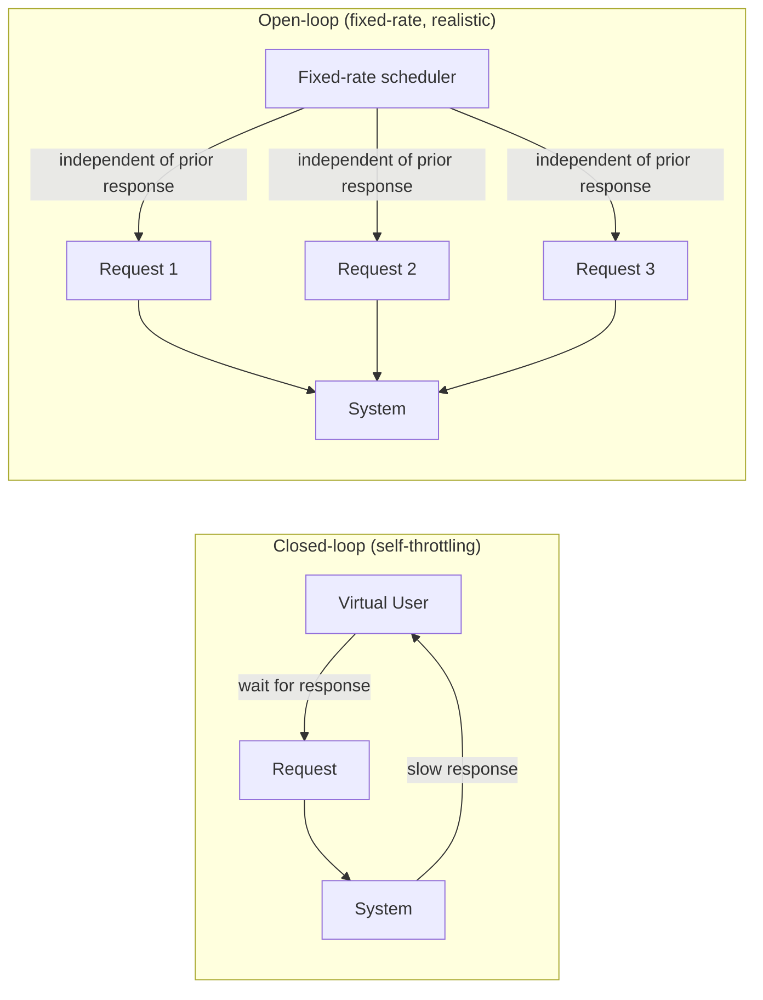
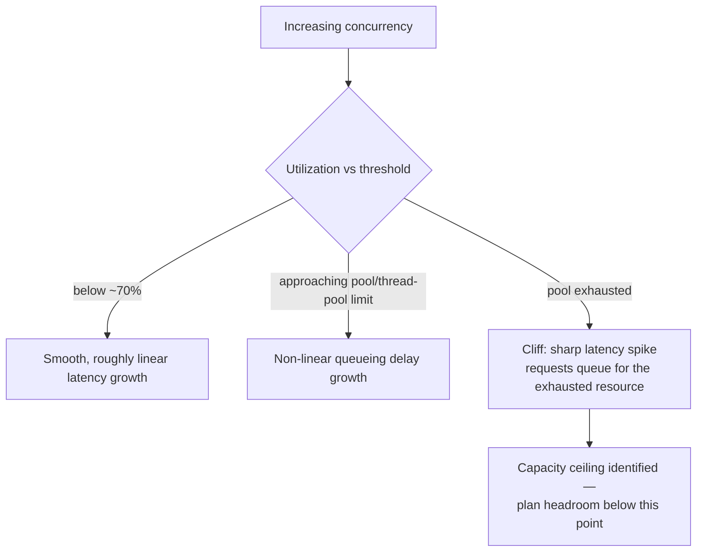
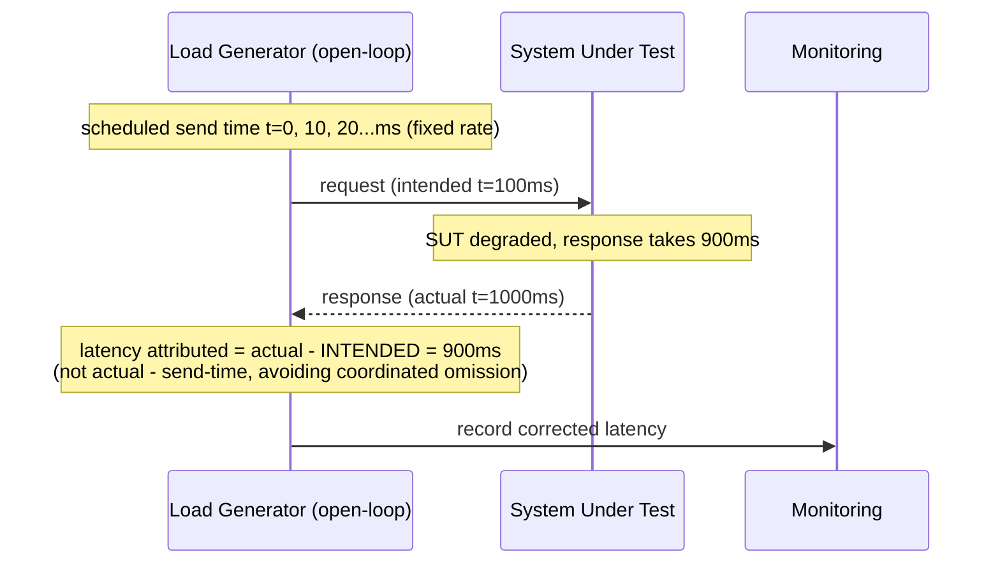
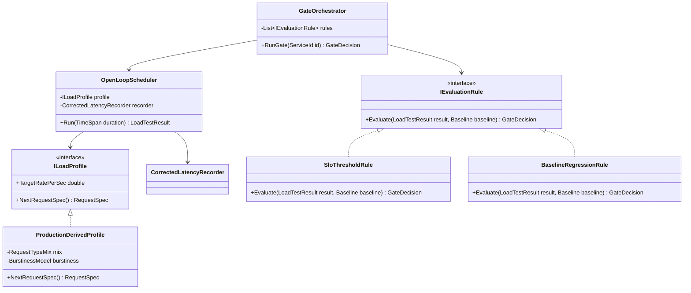
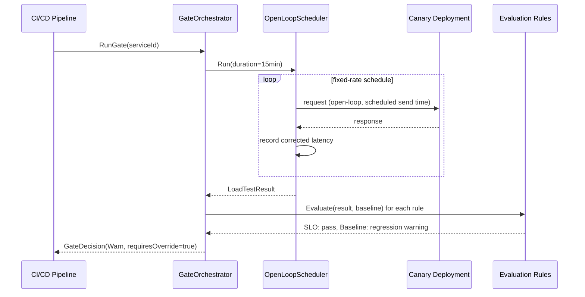

# Module 102 — Performance Engineering: Load Testing, Capacity Planning & Benchmarking

> Domain: Performance Engineering | Level: Beginner → Expert | Prerequisite: [[01-PerformanceProfiling-BottleneckDiagnosis]] (this module's tests validate what that module's profiling diagnoses), [[../26-CICD/01-CIPipelineArchitecture-PipelineAsCode-Caching-Monorepo]] (fail-fast gating this module's CI-integrated load-test gate reapplies), [[../27-Observability/02-SLOs-SLIs-ErrorBudgets-AlertingDesign]] (SLOs/error budgets this module's pass/fail criteria and capacity risk-tolerance decisions tie into)
>
> **Format note (superseded):** This module originally shipped under the leaner, 40-Q&A-only format referenced below. Per the 2026-07-18 template-reversion decision (see `CLAUDE.md`), it has since been upgraded to the current full-template format — Fundamentals through Revision — while preserving the original 40 Q&A verbatim in §10.

---

## 1. Fundamentals

**What:** Load testing subjects a system to controlled, simulated concurrent traffic to observe how latency, throughput, and error rate behave under that load. Capacity planning is the forward-looking discipline of forecasting how much infrastructure a system needs to serve expected future demand, informed by load-test data and historical growth trends. Benchmarking is the narrower, repeatable measurement of a specific operation's performance in isolation, used to detect regressions or validate optimizations.

**Why:** These three disciplines exist because "will this scale" and "how much will this cost" are questions no amount of code review or unit testing can answer — only empirical measurement under realistic, concurrent conditions can. A payments authorization service that has never been load-tested at its actual Black-Friday-equivalent peak (e.g., month-end batch settlement combined with real-time card traffic) is making an untested bet that the first real peak event will go well — precisely the kind of untested, declared-but-unverified capacity claim this course has repeatedly shown to fail under real conditions.

**When:** Load test before any release that changes a request path's resource profile, on a recurring cadence as an automated CI/CD gate, and ahead of any known seasonal/event-driven peak. Capacity-plan on a periodic (e.g., quarterly) review cadence plus ahead of specific known business events. Benchmark continuously in CI for hot-path code to catch micro-regressions before they compound into a system-level capacity problem.

**How (30,000-ft view):**
```
Historical traffic data + growth forecast
 │
 ▼
Design realistic load-test profile (rate, mix, burstiness, open-loop)
 │
 ▼
Run load test → measure latency/throughput/error-rate against SLO thresholds
 │
 ▼
Identify ceiling / cliff point (Little's Law, queueing-theory-informed)
 │
 ▼
Capacity plan: provision headroom below the ceiling; define shedding policy beyond it
 │
 ▼
Re-test periodically as code, data volume, and traffic patterns evolve
```

---

## 2. Deep Dive

### 2.1 Open-Loop vs. Closed-Loop Load Generation, and Why the Choice Changes the Result
A closed-loop generator (a fixed pool of virtual users, each waiting for a response before issuing its next request) self-throttles exactly when the system degrades — as latency rises, the effective request rate *drops*, because each virtual user is doing less work per unit time. An open-loop generator issues requests at a fixed, pre-determined rate regardless of how quickly prior requests complete, which is what real, independent users actually do (a real user population doesn't collectively wait for the slowest request among them before sending the next one). Under real degradation, closed-loop testing systematically *understates* the severity of a capacity problem, because it never lets load compound the way open-loop, independent arrivals would. This single modeling choice can produce a materially different — and materially too optimistic — picture of a system's actual breaking point.

### 2.2 Coordinated Omission: The Silent Measurement Bug
When a closed-loop tool only records the latency of requests it actually sent, and a slow response delays the *next* request from being sent at all, every request that *should* have arrived during the slow period is never sent and therefore never measured — the tool silently omits exactly the worst-affected requests from its own percentile calculations. This can make a reported p99 of "220ms" mask a real-world tail latency of several seconds, because the requests that would have shown that multi-second latency simply never existed in the sample. Modern tools (e.g., `wrk2`, Gatling with corrected-latency mode) fix this by recording each request's *intended* scheduled send time against a fixed-rate schedule, correctly attributing the full wait — including the delay before the request was even sent — to that request.

### 2.3 Little's Law and Queueing Theory as the Quantitative Backbone
Little's Law (`L = λ × W`) is not a heuristic — it is a provable, model-independent relationship between the average number of requests in a system (L), the arrival rate (λ), and average time-in-system (W). It answers "how much concurrency do I need to sustain rate λ at target latency W" directly: sustaining 2,000 req/sec at a 150ms average target requires roughly 300 concurrent in-flight requests worth of capacity. Queueing theory goes further, showing that wait time grows *non-linearly*, not linearly, as utilization approaches 100% — a system at 90% utilization can have dramatically higher queueing delay than one at 70%, because queue length grows asymptotically near saturation. This is the mathematical reason capacity plans target meaningful headroom (commonly 60–70% peak utilization) rather than treating "not yet at 100%" as safe.

### 2.4 JIT Warm-Up and Benchmark Validity in .NET
The CLR's tiered JIT compiles a method first with a fast, unoptimized "Tier 0" compilation on first call, then recompiles hot methods with a slower, more optimized "Tier 1" pass after enough invocations. A naive benchmark measuring only the first few calls captures Tier-0, uncompiled/under-optimized performance — potentially 2–10x slower than steady-state — and reports a misleadingly pessimistic number. BenchmarkDotNet handles this correctly by running dedicated warm-up iterations (until the runtime reports steady-state timing has stabilized) before any iteration counts toward the reported result, plus running multiple full iterations and reporting statistical distributions (mean, standard deviation, confidence intervals) rather than a single number.

### 2.5 The Non-Linear "Cliff" and What Causes It
A load test that shows smooth, gradual latency degradation up to a concurrency point, then a sharp, disproportionate jump beyond it, is exhibiting the signature of a hard resource-pool ceiling being crossed — a connection pool, thread pool, or semaphore reaching its configured maximum, at which point additional requests don't degrade gracefully but instead begin queueing for the exhausted resource, producing latency growth far steeper than the smooth region before the ceiling. Distinguishing a cliff (hard ceiling, requires resizing/rearchitecting the pool) from gradual degradation (a resource genuinely getting proportionally busier) determines whether the fix is "increase this specific limit" or "reduce the underlying per-request cost."

### 2.6 Coordination Between Load Testing and Progressive Delivery
Canary/progressive-rollout analysis validates a release's *correctness* under real, live traffic at a small, deliberately bounded percentage — it does not validate capacity at full scale, because a capacity ceiling that only manifests near 100% of production traffic may simply never be exercised during a 5% canary window. Load testing and canary analysis are complementary, not substitutable: load testing validates capacity headroom before any real user is exposed; canary analysis validates real-world behavioral correctness at safely bounded scale. Treating a clean canary as proof of capacity readiness is a common, costly conflation.

---

## 3. Visual Architecture







---

## 4. Production Example

**Problem:** A card-payments processor's authorization gateway needed to certify readiness for an upcoming national retail promotion expected to drive 4x normal peak transaction volume for a six-hour window. The engineering team's existing load-testing practice used a popular but closed-loop tool with a fixed pool of 200 virtual users, and had always reported "green" results at the promotion's forecast rate.

**Architecture:** The authorization gateway sat in front of a rules engine, a fraud-scoring service, and a core-banking settlement call, each contributing to end-to-end authorization latency; the gateway's own thread pool and downstream connection pools were sized based on the closed-loop test's historically "passing" results.

**Investigation:** A newly-hired performance engineer, skeptical of the historically green results given the promotion's unprecedented scale, re-ran the same target throughput using an open-loop tool (fixed-rate request generation, corrected-latency measurement per §2.2) instead of the existing closed-loop harness. The open-loop test, at the *same nominal request rate* the closed-loop tool had always passed, showed p99 latency climbing from a reported 240ms (closed-loop) to a genuine 3.1 seconds (open-loop) — and, more importantly, a growing count of outright connection-pool-exhaustion errors the closed-loop test had never surfaced at all.

**Root cause:** The closed-loop tool's 200 virtual users self-throttled as the gateway's downstream fraud-scoring service slowed under load — each virtual user simply waited longer between requests, meaning the *effective* arrival rate at the gateway never actually reached the target rate during the closed-loop test's degraded periods. The real promotion traffic, generated by genuinely independent card-terminal transactions with no such self-throttling behavior, would have kept arriving at the full target rate regardless of the gateway's degradation, compounding load exactly when the system was already struggling — precisely the dynamic §2.1/§2.2 describe, and precisely the dynamic the team's years of "passing" closed-loop results had never been capable of revealing.

**Fix:** The team re-tested with an open-loop generator at the actual forecast rate, which surfaced the fraud-scoring service's connection pool (sized for 3x normal peak, not 4x) as the genuine cliff point (§2.5). The pool was resized, the fraud-scoring service's own horizontal scaling policy was validated with a dedicated spike test, and the promotion-day capacity plan added an explicit request-shedding policy (deprioritizing non-card-present transactions under sustained overload) as a documented fallback if real traffic exceeded even the resized capacity.

**Trade-offs:** Resizing the connection pool and adding horizontal fraud-scoring capacity increased steady-state infrastructure cost by roughly 15% for a six-hour promotional window's benefit — an explicitly accepted cost given the alternative (authorization failures during a high-visibility national promotion) carried far greater reputational and revenue risk.

**Lessons learned:** Years of "passing" load-test results had been systematically misleading due to a single methodological choice — closed-loop generation — that nobody on the team had questioned, because the results always looked plausible and never contradicted production experience at *normal* (non-extreme) load, where the self-throttling effect's understatement was small enough not to matter. The gap only became consequential at 4x scale, precisely the scenario the historically-passing methodology was never actually validated for. This is a direct instance of this course's recurring theme: a declared "we load test this system" claim is only as trustworthy as the specific methodology behind it, and a methodology can produce consistently green, plausible-looking results while systematically failing to measure the one dynamic (compounding degradation under genuinely independent load) that matters most.
## 10. Interview Questions

### Basic (10)

1. **Q: What is load testing, and why is it done before a production release?**
 **A:** Load testing subjects a system to an expected (or heavier) level of concurrent traffic in a controlled environment, measuring how latency, throughput, and error rate behave — done before release to catch capacity or scaling problems while they're cheap to fix, rather than discovering them via a real production outage.
 **Why correct:** States both the mechanism and the fail-fast economic rationale for doing it pre-release.
 **Common mistakes:** Treating load testing as optional "nice to have" polish rather than a standard, necessary pre-release gate for any system with real capacity constraints.
 **Follow-ups:** "What's the risk of skipping it?" (Discovering a capacity ceiling for the first time during real, uncontrolled production traffic — the most expensive, highest-stakes place to learn it.)

2. **Q: What is the difference between load testing, stress testing, and soak (endurance) testing?**
 **A:** Load testing measures behavior at an expected traffic level; stress testing pushes beyond expected levels to find the actual breaking point; soak testing runs a sustained, moderate load over a long duration to reveal slow, cumulative problems (memory leaks, resource exhaustion) that only manifest over time.
 **Why correct:** States each test type's distinct goal and time horizon.
 **Common mistakes:** Treating all three as interchangeable "load testing," missing that each reveals a genuinely different class of problem.
 **Follow-ups:** "Which test type would catch a slow memory leak?" (Soak testing specifically — a short load or stress test wouldn't run long enough to reveal a slow, cumulative leak.)

3. **Q: What is a spike test?**
 **A:** A test simulating a sudden, sharp surge in traffic (far above steady-state levels) over a short period, verifying the system handles rapid traffic increases gracefully (e.g., via autoscaling) rather than failing outright.
 **Why correct:** States the specific traffic pattern (sudden surge) it validates.
 **Common mistakes:** Assuming a gradual load test validates spike behavior — autoscaling and connection-pool warmup may react very differently to a sudden spike than a gradual ramp.
 **Follow-ups:** "Why might autoscaling fail to protect against a spike even though it works for gradual load?" (Autoscaling has inherent reaction latency — provisioning new capacity takes time, and a sharp enough spike can overwhelm the system before new capacity comes online.)

4. **Q: What is Little's Law, and how does it relate to capacity planning?**
 **A:** Little's Law states `L = λ × W` — the average number of requests in a system (L) equals the arrival rate (λ) times the average time each request spends in the system (W). It lets you compute how much concurrency/capacity is needed to sustain a given arrival rate at a given latency target.
 **Why correct:** States the formula and its direct capacity-planning application.
 **Common mistakes:** Not recognizing this as a foundational, provable relationship (not a heuristic) usable to derive required concurrency directly from target throughput and latency.
 **Follow-ups:** "If you want to sustain 1000 requests/sec at 200ms average latency, how much in-flight concurrency do you need?" (200 concurrent requests — `1000 × 0.2 = 200`.)

5. **Q: What is the difference between open-loop and closed-loop load-testing models?**
 **A:** A closed-loop model has a fixed number of virtual users, each waiting for a response before sending the next request — request rate self-throttles as latency increases. An open-loop model generates requests at a fixed rate regardless of how quickly prior requests complete, more realistically simulating independent real users who don't wait for each other.
 **Why correct:** States the core mechanism difference and which one better reflects real-world, independent-user traffic.
 **Common mistakes:** Using a closed-loop tool by default without recognizing it can mask a real degradation, since it "backs off" exactly when the system slows down.
 **Follow-ups:** "Why does this matter for measuring latency under real degradation?" (A closed-loop test's request rate drops as latency rises, understating how bad response times would actually get under a genuinely independent, open-loop real-world load.)

6. **Q: What is a benchmark, and why must benchmarks be repeatable?**
 **A:** A benchmark is a controlled, standardized measurement of a specific operation's performance. It must be repeatable (consistent results across runs, controlling for external noise) so a before/after comparison genuinely reflects a code or configuration change, not measurement noise.
 **Why correct:** States the repeatability requirement's purpose — enabling valid comparison.
 **Common mistakes:** Drawing conclusions from a single benchmark run, without accounting for natural run-to-run variance.
 **Follow-ups:** "How would you account for benchmark variance?" (Run multiple iterations and compare statistical distributions (mean, percentiles, confidence intervals), not a single sample.)

7. **Q: What is JIT warm-up in.NET benchmarking, and why does it matter?**
 **A:** The CLR's Just-In-Time compiler compiles methods on first execution, meaning the very first calls to a method run slower (interpreted/uncompiled or less-optimized) than subsequent, JIT-optimized calls. A benchmark that doesn't account for warm-up will report misleadingly slow results dominated by one-time compilation cost.
 **Why correct:** States the specific.NET runtime mechanism and its measurement consequence.
 **Common mistakes:** Measuring a single, cold invocation and treating it as representative of steady-state performance.
 **Follow-ups:** "What tool handles this automatically for.NET?" (BenchmarkDotNet — it runs dedicated warm-up iterations before measuring, specifically to exclude JIT-compilation cost from the reported results.)

8. **Q: What is capacity planning?**
 **A:** The practice of forecasting future resource needs (compute, storage, network) based on expected growth and traffic patterns, ensuring sufficient capacity is provisioned ahead of demand without excessive, wasteful over-provisioning.
 **Why correct:** States both goals it balances (sufficient capacity, avoiding waste).
 **Common mistakes:** Treating capacity planning as a one-time exercise rather than an ongoing, periodically-revisited practice as actual usage evolves.
 **Follow-ups:** "What data feeds a capacity-planning forecast?" (Historical growth trends, load-test results at multiple scale points, and known upcoming business events/seasonality.)

9. **Q: What is the difference between synthetic load testing and production-traffic replay/shadowing?**
 **A:** Synthetic load testing generates artificial requests based on a modeled traffic profile; production-traffic replay captures and re-sends actual, real historical production requests (or mirrors live traffic to a shadow environment), reflecting genuine request patterns, data skew, and edge cases synthetic modeling might miss.
 **Why correct:** States the distinction and why replay captures realism synthetic modeling can't fully replicate.
 **Common mistakes:** Assuming synthetic load testing alone is always sufficiently representative of real traffic characteristics.
 **Follow-ups:** "What's a risk specific to production-traffic replay?" (Replaying real requests against a system with side effects (writes, payments, emails) can cause unintended, duplicate real-world actions unless carefully isolated/sandboxed.)

10. **Q: What is a baseline in performance testing?**
 **A:** A recorded, trusted set of performance measurements (latency, throughput) from a known-good prior state, used as the comparison point for detecting regressions or validating improvements in subsequent tests.
 **Why correct:** States the comparison-reference role a baseline serves.
 **Common mistakes:** Comparing new results only against an intuitive sense of "seems fine" rather than an actual, recorded, prior baseline.
 **Follow-ups:** "How often should a baseline be refreshed?" (Whenever a deliberate, accepted change shifts expected performance — otherwise an outdated baseline produces false-positive regression alerts against a since-superseded expectation.)

### Intermediate (10)

1. **Q: How would you design a realistic load test that avoids artificially synchronizing virtual users (a "thundering herd" testing artifact)?**
 **A:** Introduce randomized "think time" and staggered start times between virtual users, rather than having every simulated user issue requests in lockstep — real users don't act in perfect synchrony, and a naive load-test script that does so can produce artificial burst patterns (or artificially smooth ones) that don't reflect genuine, independently-arriving traffic.
 **Why correct:** States the specific technique (randomized timing/staggering) addressing the artificial-synchronization risk.
 **Common mistakes:** Writing a load-test script where every virtual user executes an identical, synchronized loop, producing an unrealistic, artificially-periodic load pattern.
 **Follow-ups:** "What real-world traffic characteristic does this best emulate?" (Genuinely independent, Poisson-like arrival patterns typical of real, uncoordinated user populations.)

2. **Q: Why can a closed-loop load-testing model hide a real production problem that would surface under open-loop conditions?**
 **A:** In a closed-loop model, virtual users wait for each response before issuing the next request — if the system slows down, the effective request rate automatically drops, self-limiting the load exactly when the system is struggling. A real, open-loop population of independent users keeps arriving at their own rate regardless of the system's current latency, compounding load precisely when the system is already degraded — a dynamic closed-loop testing structurally cannot reproduce.
 **Why correct:** Explains the specific self-throttling mechanism and why it masks compounding degradation.
 **Common mistakes:** Trusting a closed-loop test's "the system recovered and stabilized" result as evidence the system would behave the same way under real, independent-arrival traffic.
 **Follow-ups:** "What testing-tool feature specifically avoids this?" (An open-loop-capable load generator (e.g., configurable fixed arrival rate independent of response time) rather than a purely closed-loop virtual-user model.)

3. **Q: How do you determine an appropriate load-test traffic profile (steady vs. bursty) for a given system?**
 **A:** Analyze actual historical production traffic patterns (via existing observability data) to characterize realistic peak-to-average ratios, burst frequency, and request-type mix, then model the load test's traffic generation to match that empirically-observed profile rather than an assumed, idealized steady-state pattern.
 **Why correct:** States the empirical, data-driven approach (real historical traffic) over an assumed or idealized profile.
 **Common mistakes:** Designing a load test around a smooth, steady request rate when real production traffic is actually bursty, understating the system's true peak-load behavior.
 **Follow-ups:** "What metric specifically characterizes 'burstiness'?" (The ratio of peak-to-average request rate over varying time windows — a high ratio indicates genuinely bursty traffic a steady-rate test would fail to capture.)

4. **Q: What is the "coordinated omission" problem in latency measurement during load testing?**
 **A:** When a load-testing tool only measures the latency of requests it actually sends, and a slow response delays the next request from being sent at all (in a closed-loop model), the measurement silently omits exactly the requests that would have arrived during the slow period — systematically undercounting and understating tail latency, since the worst-affected "missing" requests are never measured at all.
 **Why correct:** States the specific mechanism (omitted requests during exactly the worst latency periods) and its effect (understated tail latency).
 **Common mistakes:** Trusting a reported p99 latency figure without checking whether the tool accounts for coordinated omission, risking a badly understated tail-latency picture.
 **Follow-ups:** "How do modern load-testing tools correct for this?" (By recording the *intended* request-send time (per a fixed schedule) rather than only measuring from actual send time, correctly attributing the full wait — including time the request should have been sent but wasn't — to that request's latency.)

5. **Q: How would you validate that a load-testing tool itself isn't the bottleneck, rather than the system under test?**
 **A:** Monitor the load-generator's own resource utilization (CPU, network, open connections) during the test — if the generator itself is saturated, the reported load/latency reflects the generator's own limits, not the target system's actual capacity. Confirm by scaling out the load generator (more generator instances) and checking whether reported throughput increases correspondingly.
 **Why correct:** States the specific diagnostic check (generator's own resource utilization) and the confirming test (scale-out the generator).
 **Common mistakes:** Assuming a load-testing tool has effectively unlimited capacity to generate load, without verifying it isn't itself constrained.
 **Follow-ups:** "What's a common client-side bottleneck for a load-testing tool?" (Client-side connection-pool limits, socket exhaustion, or the generator's own single-machine CPU/network capacity being insufficient for the intended load level.)

6. **Q: How do you plan capacity for a system with highly seasonal or peaked traffic (e.g., a retail site's Black Friday)?**
 **A:** Load-test specifically at the expected peak multiple (not merely average daily traffic), incorporating both the higher absolute volume and any peak-specific request-mix shift (e.g., more checkout/payment traffic proportionally); provision either sufficient standing capacity for the peak or a verified, tested autoscaling/burst-capacity mechanism proven (via the spike test, Basic Q3) to react fast enough for the specific peak's actual ramp rate.
 **Why correct:** Addresses both the volume dimension and the request-mix shift a seasonal peak often also carries.
 **Common mistakes:** Load-testing only at an average-day traffic level, or assuming a request-mix identical to average days will hold during a fundamentally different peak-shopping event.
 **Follow-ups:** "What's the risk of relying solely on autoscaling for an extreme, sudden peak like Black Friday?" (Autoscaling reaction latency (Basic Q3) may be too slow for an extremely sharp ramp — many organizations pre-provision standing capacity ahead of a known, extreme event rather than relying purely on reactive autoscaling.)

7. **Q: What's the risk of load testing only the "average" request type, ignoring request-type mix?**
 **A:** Different request types (a simple read vs. a complex, multi-table write/transaction) can have vastly different resource costs — a load test using only the cheapest, most common request type will understate real capacity needs if the actual production mix includes a meaningful fraction of expensive request types, since the bottleneck resource may be entirely different under the true mix.
 **Why correct:** States the specific risk (understated capacity needs due to unrepresentative request-type mix).
 **Common mistakes:** Simplifying a load test to a single, representative "typical" request when production's actual mix of request types stresses meaningfully different resources.
 **Follow-ups:** "How would you construct a realistic request-type mix for the test?" (Sample actual production request-type distribution from observability data, weighting the load test's generated traffic to match that real distribution.)

8. **Q: How would you decide when to stop a load test and define pass/fail criteria, tying to the SLOs?**
 **A:** Define pass/fail explicitly against the system's actual SLO thresholds (e.g., "p99 latency must remain under 500ms and error rate under 0.1% at the target load level") rather than a vague "seems to perform okay" — the load test either confirms the system meets its declared SLO under the tested load, or it doesn't, and this becomes an automated, objective release gate rather than a subjective judgment call.
 **Why correct:** Directly ties pass/fail criteria to already-established, objective SLO thresholds rather than a subjective assessment.
 **Common mistakes:** Running a load test with no predefined, objective pass/fail threshold, leading to inconsistent, subjective interpretation of "acceptable" results.
 **Follow-ups:** "Why is this preferable to a purely subjective performance review?" (It converts load testing into a consistent, automatable, and defensible release gate — directly the fail-fast CI-gate pattern applied to performance specifically.)

9. **Q: How does autoscaling change how you interpret load-test results?**
 **A:** A load test run against a fixed, non-autoscaling capacity reveals the system's genuine per-instance/fixed-capacity ceiling; a test run with autoscaling enabled instead validates the autoscaling *policy's* reaction time and correctness, not the underlying instance's raw capacity — the two tests answer genuinely different questions and both may be necessary depending on what's actually being validated.
 **Why correct:** Distinguishes what each test configuration actually validates (raw capacity vs. autoscaling policy correctness).
 **Common mistakes:** Running only an autoscaling-enabled test and concluding the system's underlying, per-instance capacity ceiling from results that are actually reflecting the autoscaler's own behavior.
 **Follow-ups:** "Why might you want both test configurations?" (Fixed-capacity testing establishes the true instance-level ceiling (useful for capacity-planning math); autoscaling-enabled testing validates whether the actual, configured autoscaling policy reacts correctly and fast enough in practice.)

10. **Q: Why is testing in a staging environment that doesn't match production's topology/scale risky?**
 **A:** Performance characteristics (network latency between components, connection-pool behavior, cache warm state, database buffer-pool sizing) often don't scale linearly or identically at a smaller topology — a staging environment with fewer nodes, a smaller database, or a collapsed network topology can produce results meaningfully different from what production's actual, larger topology would exhibit under equivalent relative load.
 **Why correct:** States the specific reason (non-linear, topology-dependent performance characteristics) staging-scale results don't reliably generalize.
 **Common mistakes:** Assuming a staging environment's load-test results scale proportionally and directly predict production behavior at production's actual scale and topology.
 **Follow-ups:** "What's a practical mitigation short of a full production-scale staging environment?" (Production-traffic shadowing/canary-based load validation directly against a subset of real production capacity, per the progressive-delivery mechanics, rather than relying solely on a smaller, non-representative staging environment.)

### Advanced (10)

1. **Q: Design a load-testing strategy integrated into CI/CD as an automated release gate.**
 **A:** Run an automated load test against every release candidate deployed to a staging/canary environment, comparing key metrics (p95/p99 latency, throughput, error rate) against both the established baseline (Basic Q10) and the SLO thresholds (Intermediate Q8) — blocking promotion to production if either the baseline comparison shows a statistically-significant regression or the SLO threshold itself is violated, directly extending the fail-fast CI-gate architecture and the promotion-gate model to performance specifically.
 **Why correct:** Concretely composes an already-established CI/CD gating pattern with this module's specific baseline-comparison and SLO-threshold criteria.
 **Common mistakes:** Running load tests only manually, periodically, or post-deployment, rather than as an automated, blocking pre-production gate.
 **Follow-ups:** "How would you avoid this gate becoming a friction-driven bypass risk?" (Keep the automated load test fast and reliable enough to fit within the normal release cadence, and risk-tier it — not every trivial change needs a full load test, mirroring the risk-tiered gate design.)

2. **Q: How would you capacity-plan for a multi-tenant system, given noisy-neighbor risk?**
 **A:** Load-test specifically simulating one or more tenants generating disproportionately heavy load concurrently with normal-load tenants, verifying resource isolation (quotas, rate limits, or dedicated resource pools per tenant) actually contains a noisy tenant's impact rather than degrading shared capacity for every other tenant — capacity planning for a multi-tenant system must explicitly account for tenant-level load variance, not just aggregate system-wide load.
 **Why correct:** Identifies the specific multi-tenant risk (one tenant's load degrading others) and the corresponding test design validating isolation.
 **Common mistakes:** Capacity-planning based only on aggregate, blended load across all tenants, missing the isolation-failure risk a single disproportionately-heavy tenant introduces.
 **Follow-ups:** "What mechanism typically enforces this isolation?" (Per-tenant rate limiting/quotas (the API security patterns) or dedicated resource pools/partitioning, verified specifically under this module's noisy-neighbor load test.)

3. **Q: Design a chaos/game-day exercise combining load testing with a simulated dependency failure.**
 **A:** Apply sustained load at a realistic or elevated level while deliberately injecting a failure in a specific downstream dependency (killing an instance, injecting artificial latency, or blocking network access to it), verifying the system's resilience patterns (circuit breakers, retries with backoff, graceful degradation) actually function correctly under real, concurrent load — rather than testing resilience patterns and load capacity as two entirely separate, non-overlapping exercises that never validate their interaction.
 **Why correct:** Specifically combines two testing dimensions (load, dependency failure) whose interaction is often untested if each is only validated in isolation.
 **Common mistakes:** Testing resilience patterns only under light/no load and load capacity only under normal (all-dependencies-healthy) conditions, missing how the two interact under simultaneous stress.
 **Follow-ups:** "Why might a circuit breaker behave differently under combined load-plus-failure conditions than in an isolated resilience test?" (Under real load, the circuit breaker's failure-detection threshold and open-state duration must be tuned against genuine concurrent request volume — a threshold that works correctly at low, isolated test volume might trip too late or too early under real, concurrent production-level load.)

4. **Q: How would you model capacity requirements for a system relying on a third-party API with its own rate limits?**
 **A:** Treat the third-party API's rate limit as a hard capacity ceiling in the capacity model — determine the maximum sustainable throughput your system can achieve given that external constraint, and design queuing/backpressure/caching specifically to operate within it, since no amount of your own infrastructure scaling can exceed a rate limit enforced by a dependency you don't control.
 **Why correct:** Identifies the external rate limit as a genuine, non-negotiable capacity ceiling requiring architectural accommodation, not infrastructure scaling.
 **Common mistakes:** Capacity-planning your own infrastructure without accounting for an external dependency's rate limit as a real, binding constraint on overall achievable throughput.
 **Follow-ups:** "What architectural pattern helps operate within a hard external rate limit?" (A request queue with controlled dequeue rate matching the external limit, plus caching to reduce the actual call volume needed against the constrained dependency.)

5. **Q: How does queueing theory (e.g., M/M/1 models) inform capacity planning beyond simple Little's Law?**
 **A:** Queueing theory models how average wait time grows non-linearly as utilization approaches 100% — a system at 90% utilization can have dramatically higher queueing delay than one at 70%, even though both seem "not fully saturated," because queue length grows asymptotically as utilization nears capacity. This informs capacity planning to target headroom (e.g., provisioning for 60-70% peak utilization, not 95%+) rather than assuming linear degradation up to the theoretical maximum.
 **Why correct:** States the specific non-linear utilization-vs-delay relationship queueing theory reveals, beyond Little's Law's simpler average relationship.
 **Common mistakes:** Assuming latency degrades roughly linearly as utilization increases, missing the sharp, non-linear delay growth queueing theory predicts near saturation.
 **Follow-ups:** "What's a practical capacity-planning guideline this implies?" (Provision meaningful headroom above expected peak utilization — operating close to 100% capacity as a steady-state target is a well-known, theoretically-grounded latency risk, not merely a safety margin nicety.)

6. **Q: Critique "test until it breaks" as a load-testing strategy — what's missing?**
 **A:** Finding the absolute breaking point (stress testing) is valuable but insufficient alone — it doesn't validate behavior at the actually-expected production load level with realistic traffic mix and duration (soak testing), doesn't validate graceful degradation behavior as the system approaches its limit (does it fail catastrophically or degrade predictably with clear error signals), and doesn't establish whether the breaking point itself is a hard resource-pool ceiling (the cliff pattern) requiring a structural fix versus a gradual, more tolerable degradation.
 **Why correct:** Identifies three specific gaps (expected-load validation, degradation-quality assessment, cliff-vs-gradual diagnosis) a pure breaking-point test alone misses.
 **Common mistakes:** Treating "we know where it breaks" as sufficient capacity-planning information without also validating expected-load behavior and the quality of degradation as the limit approaches.
 **Follow-ups:** "Why does 'how it fails' matter as much as 'when it fails'?" (A system that degrades gracefully (clear errors, partial functionality) near its limit is operationally far safer than one that fails catastrophically (crashes, silent data corruption) — both might have an identical numeric breaking point but very different real-world risk profiles.)

7. **Q: How would you design a load test specifically validating a database's connection-pool sizing?**
 **A:** Run load at increasing concurrency levels while monitoring connection-pool utilization and request queueing/wait time specifically for a connection — identify the concurrency level at which requests begin queueing for an available connection (the pool's effective ceiling) and compare that against expected peak production concurrency, ensuring the configured pool size provides adequate headroom without being so large it exhausts the database server's own max-connection limit or memory budget.
 **Why correct:** States the specific metric (connection-wait queueing) and the two-sided sizing consideration (adequate headroom vs. not exceeding database-side limits).
 **Common mistakes:** Sizing a connection pool arbitrarily large "to be safe," without considering the database server's own finite connection capacity and per-connection memory overhead.
 **Follow-ups:** "What's the risk of a connection pool sized too large?" (Excessive concurrent connections can overwhelm the database server's own resource limits, or contend for the database's internal locks/buffer-pool resources in ways that degrade overall throughput rather than improving it.)

8. **Q: Design capacity planning for a system with a hard cost ceiling (a fixed cloud budget) rather than unlimited scaling.**
 **A:** Load-test to determine the actual throughput/latency achievable within the cost-ceiling-constrained infrastructure footprint, then make an explicit, documented trade-off decision (with business stakeholders) about acceptable service degradation or request-shedding/prioritization policy for load beyond that ceiling — rather than assuming infrastructure can simply scale to meet any demand, a budget-constrained capacity plan must define what happens, deliberately, when demand exceeds the affordable ceiling (graceful shedding of lower-priority requests, a queue with bounded wait, or an explicit rejection with clear signaling).
 **Why correct:** Addresses the constrained-scaling reality directly, proposing an explicit, business-informed degradation/shedding policy rather than assuming unlimited scaling is always available.
 **Common mistakes:** Capacity-planning as if infrastructure scaling were unconstrained, ignoring a genuine, fixed cost ceiling the business has actually imposed.
 **Follow-ups:** "What's a concrete request-shedding strategy?" (Prioritize and serve higher-value request types (e.g., paying customers, checkout flows) preferentially, explicitly rejecting or queuing lower-priority requests once the cost-constrained capacity ceiling is reached, rather than letting all requests degrade uniformly and unpredictably.)

9. **Q: How would you detect coordinated omission (Intermediate Q4) in your own load-testing tool's reported percentile latencies?**
 **A:** Compare the tool's reported request count against the expected count derived from the configured, intended request rate over the test duration — a significantly lower actual count than expected reveals requests were being silently skipped/delayed during periods of degradation, a direct symptom of coordinated omission; alternatively, use a load-testing tool explicitly documented to correct for it (recording intended send time, not actual send time, per Basic/Intermediate Q4's fix) and verify its percentile calculations account for this.
 **Why correct:** Provides a concrete detection technique (expected vs. actual request count) plus the tool-selection fix.
 **Common mistakes:** Trusting a load-testing tool's reported percentiles without verifying whether it specifically corrects for coordinated omission, risking systematically understated tail-latency results.
 **Follow-ups:** "Why does this matter more for p99/p99.9 than for average latency?" (Coordinated omission specifically drops exactly the worst-performing requests from measurement — an effect that disproportionately distorts the tail percentiles while leaving the average latency comparatively less affected.)

10. **Q: How does progressive delivery/canary analysis (Modules 87, 92) interact with load testing — does canary analysis substitute for pre-release load testing?**
 **A:** No — canary analysis validates a release's behavior under genuine, real production traffic at a small, safely-bounded percentage, catching regressions load testing's synthetic/staging environment might miss due to real-data/traffic realism gaps — but it doesn't substitute for pre-release load testing, since canary traffic is deliberately small and bounded, meaning a capacity ceiling or scaling problem that only manifests at full production load may never actually be exercised during a small-percentage canary rollout. The two are complementary: load testing validates capacity at scale before any real users are exposed; canary analysis validates real-world correctness at a safely bounded scale.
 **Why correct:** Precisely distinguishes what each technique validates (synthetic/staging-scale capacity vs. real-traffic correctness at bounded scale) and why neither substitutes for the other.
 **Common mistakes:** Assuming a successful canary rollout at 5% traffic provides confidence about behavior at 100% traffic, when a capacity ceiling specifically requiring full-scale load might never be exercised at the canary's deliberately bounded percentage.
 **Follow-ups:** "How would you close this specific gap — validating capacity ceiling behavior at genuine full production scale, safely?" (A progressive canary rollout that gradually increases percentage over time specifically monitoring for capacity-related degradation signals as traffic share increases, combined with pre-release load testing at full-scale-equivalent synthetic load before the rollout even begins.)

### Expert (10)

1. **Q: Design a capacity-planning model that explicitly accounts for the non-linear "cliff" scaling effects discovered via load testing, rather than naive linear extrapolation.**
 **A:** Run load tests at multiple, increasing concurrency/volume points specifically to empirically map the actual response curve (not merely two points assumed to imply a straight line), identifying the concurrency level at which any resource-pool or algorithmic ceiling produces a sharp inflection; the capacity model should then plan provisioned capacity with headroom specifically below that identified inflection point, rather than extrapolating linearly from current-load metrics and risking crossing an undiscovered cliff well before the linear projection would suggest.
 **Why correct:** Proposes an empirical, multi-point curve-mapping approach specifically designed to reveal non-linear cliffs, directly addressing the risk naive two-point linear extrapolation carries.
 **Common mistakes:** Extrapolating future capacity needs from only current and one historical data point, assuming a straight-line relationship that a genuine resource-pool ceiling would violate sharply.
 **Follow-ups:** "How would you decide how much headroom to plan below the identified cliff?" (A risk-proportionate margin informed by the organization's growth-rate uncertainty and the cost of an emergency capacity response versus the cost of provisioning extra headroom in advance.)

2. **Q: How would you approach load testing a system with strong data-consistency requirements, where naive production-traffic replay risks unacceptable side effects?**
 **A:** Replay production traffic against an isolated, sandboxed environment with side-effect-producing operations (payments, emails, external API calls) either mocked/stubbed at the boundary or redirected to a safe, non-production-impacting target, preserving the realistic read/query traffic pattern's load characteristics while eliminating the actual side effects — or use synthetic load generation carefully modeled to match production's real request-type mix and data-access patterns (/Q7) without directly replaying real, side-effect-triggering requests at all.
 **Why correct:** Proposes concrete isolation techniques (side-effect stubbing, safe redirection) preserving load realism without the side-effect risk.
 **Common mistakes:** Either avoiding production-realistic load testing entirely due to the side-effect risk, or replaying real traffic naively without addressing the side-effect concern at all.
 **Follow-ups:** "What's the risk of over-mocking side effects during this kind of test?" (If the mocked side-effect boundary doesn't accurately reflect the real dependency's actual latency/failure characteristics, the test may understate real-world load behavior at that boundary — the mock itself needs to be realistically representative, not simply a no-op stub.)

3. **Q: Critique relying solely on synthetic load tests without ever validating against real production traffic shadowing/replay.**
 **A:** Synthetic tests are only as realistic as the traffic model informing them — any gap between the assumed model and actual production reality (an unanticipated request-type mix, a real data-skew pattern, an unmodeled correlated-burst behavior) remains entirely invisible to synthetic testing alone, precisely mirroring this course's recurring "declared/modeled ≠ actual" theme; production-traffic shadowing (mirroring real, live traffic to a shadow environment without affecting real users) provides an empirical, ground-truth check against exactly the assumptions synthetic modeling can't verify on its own.
 **Why correct:** Connects the critique directly to this course's central recurring theme (a model's assumed realism requires empirical verification, not merely internal consistency).
 **Common mistakes:** Treating a comprehensive, carefully-designed synthetic load test as sufficient on its own, without any real-traffic-based validation ever confirming the model's underlying assumptions were actually correct.
 **Follow-ups:** "What's a practical, low-risk way to implement traffic shadowing?" (Mirror a copy of real, live production requests to a separate shadow instance/environment, comparing its behavior against the primary system without ever returning the shadow's response to real users — isolating any side effects entirely.)

4. **Q: How would you build organizational capacity-planning discipline that avoids both under-provisioning (outage risk) and over-provisioning (cost waste)?**
 **A:** Establish a periodic (e.g., quarterly), data-driven capacity review comparing actual measured utilization/growth trends against the current provisioned capacity and the load-tested cliff/ceiling point, adjusting provisioning incrementally based on empirical evidence rather than either a one-time initial estimate left unrevisited (risking under-provisioning as real growth outpaces the stale estimate) or reflexive, uncapped over-provisioning "to be safe" with no corresponding cost accountability — directly this course's now-standard periodic health-review discipline, applied to capacity planning specifically, with cost as an explicit, tracked counter-pressure against unlimited safety margin.
 **Why correct:** Proposes a concrete, periodic, evidence-based review cadence balancing both risks explicitly, rather than defaulting to either extreme.
 **Common mistakes:** Treating capacity planning as a one-time, initial-launch exercise never revisited, or conversely, over-provisioning indefinitely with no cost-accountability mechanism forcing a periodic, evidence-based right-sizing review.
 **Follow-ups:** "Who should own the trade-off decision between cost savings and safety margin?" (A joint decision between engineering (informed by load-test/utilization data) and business/finance stakeholders (informed by the cost and risk-tolerance trade-off), directly mirroring the error-budget-policy joint-ownership principle.)

5. **Q: Design an approach to right-size a Kubernetes HPA/Cluster Autoscaler configuration using load-test data.**
 **A:** Use load-test results to determine the actual per-pod resource consumption at varying request rates, informing HPA's target CPU/memory utilization threshold and scaling increment; use a spike test specifically (Basic Q3) to measure the actual end-to-end latency of the full scaling chain (HPA reaction, pod scheduling, Cluster Autoscaler node provisioning if needed) — directly the sequential HPA-then-Pending-then-Cluster-Autoscaler latency-chain finding — ensuring the configured thresholds trigger scaling early enough, given that chain's real, measured reaction latency, rather than assuming instantaneous scaling response.
 **Why correct:** Connects load-test data directly to specific HPA/Cluster-Autoscaler configuration parameters and explicitly reuses the already-established multi-stage scaling-latency finding.
 **Common mistakes:** Configuring HPA thresholds based on theoretical assumptions about instantaneous scaling response, without empirically measuring the actual, multi-stage scaling chain's real reaction latency via a spike test.
 **Follow-ups:** "Why might a threshold that works well in a load test still fail during a real, sharper production spike?" (If the real spike's ramp rate exceeds what the load test's own ramp profile modeled, the same threshold/configuration validated against a gentler test ramp could still be too slow to react in time for the sharper, real-world spike.)

6. **Q: How does Amdahl's Law combine with load-testing results to decide where parallelization investment pays off at scale?**
 **A:** Load testing reveals the actual bottleneck's location and the fraction of total request time it represents at realistic concurrency; Amdahl's Law then bounds the maximum achievable throughput improvement from parallelizing specifically that bottleneck — combining both lets you calculate, before investing engineering effort, whether the theoretical ceiling from parallelizing the confirmed bottleneck justifies the cost, rather than assuming any parallelization investment yields proportional, unbounded returns.
 **Why correct:** Explicitly combines the two techniques (empirical bottleneck localization via load testing, theoretical ceiling via Amdahl's Law) into one decision framework.
 **Common mistakes:** Estimating parallelization's potential benefit from intuition alone, without combining actual load-test-derived bottleneck data with Amdahl's Law's specific ceiling calculation.
 **Follow-ups:** "If load testing shows the bottleneck represents 30% of total request time, what's the maximum theoretical throughput improvement from perfectly parallelizing it?" (At most roughly 1/(1-0.3) ≈ 1.43x — a 43% improvement ceiling, regardless of how many parallel resources are thrown at that specific 30% portion.)

7. **Q: How would you design load testing for a system whose bottleneck is a downstream dependency you don't control and can't load-test directly in isolation?**
 **A:** Load-test your own system's behavior *under simulated dependency degradation* (injected latency/errors at the dependency boundary, per Advanced Q3's chaos/game-day pattern) rather than attempting to load-test the dependency itself — the actual question capacity planning needs answered isn't "how much load can the dependency handle" (not your decision to make), but "how does my own system behave, and what's my own effective capacity ceiling, given the dependency's documented or observed rate limits and typical latency/failure characteristics."
 **Why correct:** Reframes the testing goal correctly (your own system's behavior under dependency constraints, not testing the dependency itself).
 **Common mistakes:** Attempting to load-test the third-party dependency directly (potentially violating its terms of service or rate limits) rather than testing your own system's resilience and effective capacity given the dependency's known constraints.
 **Follow-ups:** "How would you obtain realistic dependency latency/failure characteristics without directly stress-testing it?" (From the dependency's own documented SLA, historical observed behavior via your own tracing/monitoring data, or direct communication with the dependency's own team/vendor.)

8. **Q: What's the risk of capacity planning based purely on historical growth-trend extrapolation?**
 **A:** Historical trends assume future growth continues along the same pattern as the past — they cannot anticipate a discontinuous, step-change event (a major marketing campaign, a viral feature, a competitor's outage driving sudden migration) that historical data has no precedent for, and pure trend extrapolation, however statistically sophisticated, has no mechanism for incorporating known-but-not-yet-historical business events into the forecast.
 **Why correct:** States the specific limitation (no mechanism for discontinuous, non-historical events) of pure trend-based forecasting.
 **Common mistakes:** Relying solely on statistical trend extrapolation for capacity planning without incorporating known, planned business events or considering discontinuous growth scenarios explicitly.
 **Follow-ups:** "How would you incorporate a known, planned future event (e.g., a major marketing launch) into a capacity plan a pure trend model wouldn't capture?" (Directly consult with business/product stakeholders about planned events and model a specific, event-driven capacity scenario in addition to (not instead of) the ongoing trend-based baseline forecast.)

9. **Q: How would you incorporate error budgets into capacity-planning decisions — e.g., deciding acceptable risk of a capacity-related SLO breach?**
 **A:** Treat the probability and expected severity of a capacity-related SLO breach as a deliberate draw against the service's error budget, exactly as any other reliability risk is — a capacity plan provisioning tighter headroom (accepting some risk of an SLO-breaching capacity event under an unlikely but possible traffic spike) is a legitimate, deliberate trade-off if the expected error-budget consumption from that residual risk remains within the service's overall budget policy, rather than treating capacity-related outages as categorically different from any other reliability risk this course's error-budget framework already governs.
 **Why correct:** Directly unifies capacity-related risk with the existing error-budget framework rather than treating it as a separate, ungoverned risk category.
 **Common mistakes:** Treating capacity planning as an entirely separate risk-management exercise disconnected from the service's already-established error-budget policy and risk-tolerance framework.
 **Follow-ups:** "How would you quantify the expected error-budget consumption from a specific capacity-headroom decision?" (Estimate the probability of exceeding the provisioned capacity ceiling (from historical traffic-variance data) and the expected duration/severity of the resulting SLO breach if it occurs, converting this into an expected error-budget cost comparable to other reliability risks the budget already accounts for.)

10. **Q: Deliver a capstone-style synthesis connecting load testing and capacity planning to this course's recurring "declared ≠ actual" theme.**
 **A:** A system's declared capacity ("this handles 10,000 requests/second") is exactly as unverified a claim as any other declared property this course has examined — it is genuinely true only to the extent it has been empirically measured via load testing at realistic traffic profiles, accounting for coordinated omission, request-type mix, and non-linear cliff effects; absent this verification, "declared capacity" is indistinguishable from an untested assumption until the one event (a real traffic surge) that actually tests it, precisely the same structural risk this course has traced through every other domain's declared-but-unverified controls.
 **Why correct:** Explicitly connects capacity/load-testing claims to the course's central, recurring theme, framing an untested capacity number as equivalently risky to any other unverified declared control.
 **Common mistakes:** Treating a capacity estimate or a load test run once, long ago, as a durable, ongoing guarantee rather than a claim requiring periodic re-verification as the system and its traffic evolve.
 **Follow-ups:** "How does this argue for load testing being a continuous, not one-time, practice?" (Exactly as this course established for every other verification mechanism (canaries, drills, audits) — a system's actual capacity ceiling can shift as code, dependencies, and data volume evolve, meaning a load test's result is only valid as of when it was run, requiring periodic re-testing, not a one-time certification treated as permanently valid.)

---

## 11. Coding Exercises

### Easy
**Problem:** Write a function computing the required in-flight concurrency to sustain a target arrival rate at a target average latency, using Little's Law.
**Solution:**
```csharp
// L = λ (arrivals/sec) × W (avg time-in-system, seconds)
double RequiredConcurrency(double arrivalRatePerSec, double avgLatencySeconds)
 => arrivalRatePerSec * avgLatencySeconds;

// Example: 2000 req/sec at 150ms average latency
double concurrency = RequiredConcurrency(2000, 0.150); // => 300
```
**Time complexity:** O(1). **Space complexity:** O(1). **Optimized solution:** Already optimal — the value of this exercise is applying the formula correctly to size a connection/thread pool, not algorithmic efficiency.

### Medium
**Problem:** Given an array of (concurrency, p99LatencyMs) samples from a load test, detect the concurrency level at which a non-linear "cliff" begins (§2.5) — defined as the first point where the marginal latency increase per unit concurrency exceeds 3x the average marginal increase observed up to that point.
**Solution:**
```csharp
int? FindCliffConcurrency((int concurrency, double p99Ms)[] samples) {
 var ordered = samples.OrderBy(s => s.concurrency).ToArray();
 var marginals = new List<double>();
 for (int i = 1; i < ordered.Length; i++) {
 double dLatency = ordered[i].p99Ms - ordered[i - 1].p99Ms;
 double dConcurrency = ordered[i].concurrency - ordered[i - 1].concurrency;
 marginals.Add(dLatency / dConcurrency);
 if (marginals.Count > 1) {
 double avgSoFar = marginals.Take(marginals.Count - 1).Average();
 if (marginals[^1] > avgSoFar * 3) return ordered[i].concurrency; // cliff detected
 }
 }
 return null; // no cliff found within tested range
}
```
**Time complexity:** O(n log n) (sort) + O(n) scan = O(n log n). **Space complexity:** O(n) for the marginals list. **Optimized solution:** For a pre-sorted input (as load-test output typically is, generated in increasing-concurrency order), the sort is unnecessary, reducing to O(n) time and O(1) extra space via a running-average accumulator instead of a materialized list.

### Hard
**Problem:** Implement a request-latency recorder that corrects for coordinated omission (§2.2) in an open-loop load generator — given a fixed intended send-rate, compute each request's corrected latency as (actual completion time − intended scheduled send time), not (actual completion time − actual send time).
**Solution:**
```csharp
class CorrectedLatencyRecorder {
 private readonly double _intervalMs;
 private readonly DateTime _startTime;
 private readonly List<double> _correctedLatenciesMs = new();

 public CorrectedLatencyRecorder(double targetRatePerSec, DateTime startTime) {
 _intervalMs = 1000.0 / targetRatePerSec;
 _startTime = startTime;
 }

 public void RecordCompletion(int requestSequenceNumber, DateTime actualCompletionTime) {
 // Intended send time is derived from the fixed schedule, NOT the actual send time —
 // this is what corrects for coordinated omission: a request delayed because the
 // PRIOR one was slow still gets charged for that delay.
 var intendedSendTime = _startTime.AddMilliseconds(requestSequenceNumber * _intervalMs);
 double correctedLatencyMs = (actualCompletionTime - intendedSendTime).TotalMilliseconds;
 _correctedLatenciesMs.Add(correctedLatencyMs);
 }

 public double Percentile(double p) {
 var sorted = _correctedLatenciesMs.OrderBy(x => x).ToList();
 int index = (int)Math.Ceiling(p / 100.0 * sorted.Count) - 1;
 return sorted[Math.Clamp(index, 0, sorted.Count - 1)];
 }
}
```
**Time complexity:** O(1) per recorded completion; O(n log n) per percentile query (sort). **Space complexity:** O(n) for n recorded requests. **Optimized solution:** For repeated percentile queries against the same dataset, sort once after the test completes and reuse the sorted array (O(n log n) total instead of per-query), or maintain a running histogram with fixed-width latency buckets for O(1) amortized percentile approximation at large n, trading small, bounded precision loss for eliminating the repeated sort.

### Expert
**Problem:** Design and implement a capacity-headroom calculator that, given queueing-theory (M/M/1-style) assumptions, computes the maximum sustainable utilization for a target maximum acceptable queueing-delay multiplier over the base service time.
**Solution:**
```csharp
// M/M/1 average wait time in queue: Wq = ρ / (μ × (1 - ρ)), where ρ = utilization (λ/μ)
// As ρ → 1, Wq → ∞ — this function inverts that relationship to find the utilization
// at which queueing delay reaches an acceptable multiple of the base service time.
double MaxSustainableUtilization(double maxAcceptableQueueingMultiplier) {
 // Solve ρ/(1-ρ) = maxAcceptableQueueingMultiplier for ρ
 // ρ = m / (1 + m), where m = maxAcceptableQueueingMultiplier
 double m = maxAcceptableQueueingMultiplier;
 return m / (1 + m);
}

// Example: if we accept queueing delay up to 0.5x the base service time,
// max sustainable utilization is 0.5/1.5 ≈ 33% — a strict SLA for a latency-critical path.
// If we accept queueing delay up to 4x base service time (more tolerant, e.g. a batch job),
// max sustainable utilization is 4/5 = 80%.
double strict = MaxSustainableUtilization(0.5); // ≈ 0.333
double tolerant = MaxSustainableUtilization(4.0); // = 0.8
```
**Time complexity:** O(1). **Space complexity:** O(1). **Optimized solution:** The closed-form algebraic inversion (as shown) avoids any iterative/numerical solving; the genuine engineering work is choosing the right `maxAcceptableQueueingMultiplier` per service tier — a latency-critical trading path warrants a strict multiplier (low target utilization, large headroom) while a latency-tolerant batch job can safely target a much higher utilization, directly informing the specific headroom percentages cited in §2.3.

---

## 12. System Design

**Scenario:** Design a **CI/CD-integrated load-testing and capacity-gating platform** for a payments company's ~150 backend services, so that every release candidate is automatically validated against SLO thresholds and a tracked historical baseline before reaching production — directly the platform that would have caught §4's closed-loop methodology gap systematically, rather than relying on one skeptical engineer's manual re-test.

**Step 1 — Understand the Problem and Establish Design Scope.**

*Q: Does every service get a full load test on every commit?* A: No — full load tests run on every release candidate promoted to a staging/canary environment, gated by risk tier; trivial, low-risk changes (a copy/config change) can skip the full gate via a risk-classification rule, but any change touching a hot request path always runs it.
*Q: Open-loop or closed-loop generation?* A: Open-loop only, with coordinated-omission correction (§2.2) — this is a non-negotiable methodology requirement given §4's incident.
*Q: What triggers a block vs. a warning?* A: An SLO-threshold violation blocks promotion outright; a statistically-significant regression against the historical baseline (but still within SLO) warns and requires an explicit human override to proceed.
*Q: Out of scope?* A: Full production-scale replay of live customer PII traffic (handled by a separate shadowing system with its own sanitization pipeline), and load-testing of third-party/vendor-hosted dependencies directly.

**Functional requirements:**
- Automatically trigger a load test against a release candidate's canary/staging deployment as part of the CI/CD pipeline.
- Generate open-loop, corrected-latency traffic matching each service's empirically-derived, real production request-type mix and burstiness profile.
- Compare results against both the service's own SLO thresholds and its tracked historical baseline.
- Block promotion on SLO violation; warn (with override path) on baseline regression alone.
- Store historical results per service for baseline tracking and quarterly capacity-review reporting.

**Non-functional requirements:**
- The gate must complete within the team's normal release cadence (target: under 15 minutes for a standard-risk-tier service).
- Load-test traffic must never touch production infrastructure or real customer data.
- Results must be reproducible enough that a flagged regression can be re-run and confirmed, not dismissed as noise.
- 99.5% platform availability — a platform outage must not silently bypass the gate (fail closed, not open).

**Back-of-the-envelope estimation:** 150 services × ~8 release candidates/week average (varies widely by service) ≈ 1,200 gated runs/week ≈ 170/day ≈ 7/hour average, but release activity clusters heavily during business hours, so peak concurrent-test demand might be 15–20 simultaneous gate runs. At a target 15-minute test duration per run and needing to support 20 concurrent runs, the platform needs at least 20 concurrently-available load-generator worker slots — a small, boundable fleet, meaning the hard problem here is **methodology correctness and result trustworthiness** (avoiding another §4-style silent measurement gap), not raw generator capacity.

**Step 2 — Propose High-Level Design and Get Buy-In.**

**Component glossary:**
- **Traffic Profile Store** — per-service, periodically-refreshed request-type mix, arrival-rate distribution, and burstiness parameters derived from real production observability data.
- **Load Generator Fleet** — a pool of open-loop, corrected-latency-capable worker instances (e.g., Gatling/`wrk2`-based), provisioned on demand per gate run.
- **Gate Orchestrator** — CI/CD-triggered controller that provisions a canary deployment, drives the Load Generator Fleet against it using the relevant Traffic Profile, and collects results.
- **Baseline & SLO Store** — historical results per service plus each service's declared SLO thresholds, used for the pass/fail decision.
- **Decision Engine** — applies the block/warn logic (SLO violation vs. baseline regression) and reports back to the CI/CD pipeline.

**Two core flows:**
1. **Gate flow (per release candidate):** CI/CD triggers Gate Orchestrator → provisions canary → Load Generator Fleet drives open-loop traffic per the service's Traffic Profile → results compared in Decision Engine against SLO + Baseline → pass/block/warn returned to CI/CD.
2. **Baseline-refresh flow (periodic, decoupled):** A scheduled job re-derives each service's Traffic Profile from recent production data and updates the accepted baseline once a deliberate, reviewed change (not every run) is confirmed as the new normal.

**Step 3 — Design Deep Dive.**

- **Methodology enforcement:** The Load Generator Fleet is built exclusively on open-loop, schedule-based send timing with corrected-latency recording (§2.2's `CorrectedLatencyRecorder` pattern) — this is enforced at the platform level, not left as a per-team tool choice, precisely closing the gap that let §4's closed-loop methodology silently produce false-green results for years.
- **Traffic-profile realism:** Rather than a single canonical "load test" per service, the Traffic Profile Store models the request-type mix and burstiness empirically from real traffic (§2.6's realism principle) and is refreshed periodically — a stale profile that no longer reflects a service's evolved real traffic mix is treated as a data-quality problem requiring the same periodic-review discipline as a stale capacity estimate.
- **Fail-closed on platform unavailability:** If the Gate Orchestrator or Load Generator Fleet is unavailable, the pipeline blocks promotion by default rather than allowing an ungated release through — an availability failure in the gate itself must never silently downgrade to "no gate," mirroring the fail-closed principle already established for other CI/CD security/quality gates.
- **Baseline regression vs. SLO violation, two different severities:** An SLO violation is an absolute, non-negotiable threshold (block); a baseline regression is a *relative*, statistically-evaluated comparison (warn, human override) — this distinction avoids the two failure modes of either blocking on any noise-level fluctuation (alert fatigue, encouraging bypass) or never catching a slow, gradual regression that never individually crosses the absolute SLO threshold.
- **Noisy-neighbor isolation for the test infrastructure itself:** The Load Generator Fleet's own worker instances must not share resource pools with the canary environments under test, avoiding the platform becoming its own confound (the generator's own resource contention distorting results) — directly mirroring §2's observer-effect concern from profiling, applied here to load-generation infrastructure.

**Step 4 — Wrap-Up.** Not covered here: automated capacity-forecast reporting fed by the accumulated historical baseline data, multi-region gate replication for services deployed active-active, and cost-attribution/chargeback for the Load Generator Fleet's compute usage per team. Closing summary: CI/CD trigger → Gate Orchestrator provisions canary → open-loop, corrected-latency Load Generator Fleet drives realistic traffic → Decision Engine gates on SLO (block) and baseline (warn) → fail-closed on platform unavailability.

---

## 13. Low-Level Design

**Requirements:** A reusable load-test execution engine for the platform in §12 — configurable open-loop traffic generation, corrected-latency recording, and pluggable pass/fail evaluation against SLO and baseline, safe for concurrent gate runs across multiple services.





**Design patterns used:** **Strategy** (`ILoadProfile` and `IEvaluationRule` both let the algorithm — traffic modeling, pass/fail logic — vary independently of the orchestration flow); **Chain of Responsibility**-flavored evaluation (`GateOrchestrator` runs each `IEvaluationRule` and aggregates the most severe decision, allowing new rule types — e.g., a future cost-ceiling rule — to be added without changing existing rules); **Template Method** (`OpenLoopScheduler.Run` fixes the open-loop, corrected-latency algorithm's shape while `ILoadProfile` varies only the request content/rate within it, preventing a future implementation from accidentally reintroducing closed-loop behavior).

**SOLID mapping:** SRP — profile generation, scheduling/recording, and pass/fail evaluation are three separate responsibilities in three separate types. OCP — new evaluation rules (e.g., a future cost-based gate) extend via new `IEvaluationRule` implementations without modifying `GateOrchestrator`. LSP — any `ILoadProfile` implementation is substitutable without `OpenLoopScheduler` needing to know which concrete profile it's driving. DIP — `GateOrchestrator` depends on the `IEvaluationRule` abstraction, not concrete rule types, and on `ILoadProfile` rather than a concrete traffic model.

**Concurrency/thread safety:** `OpenLoopScheduler` must issue requests strictly on the fixed schedule regardless of individual response completion times — implemented via a dedicated scheduling timer (not a request-then-wait loop) dispatching each request onto an independent async task, so a slow response never delays the next scheduled send (the structural fix for closed-loop behavior). The `CorrectedLatencyRecorder`'s internal list is written concurrently from many in-flight request-completion callbacks and must use a thread-safe collection (e.g., `ConcurrentBag<double>` or a lock-protected append) to avoid corrupting results under concurrent completions — a genuine race condition risk given the deliberately high concurrency the test itself generates.

**Extensibility:** New traffic-profile sources (e.g., a profile derived from replayed, sanitized production shadow traffic rather than a statistical model) plug in as new `ILoadProfile` implementations; new gate criteria (cost ceilings, security-scan-integrated gates) plug in as new `IEvaluationRule` implementations, both without touching the core scheduling engine.

---

## 14. Production Debugging

**Incident:** A newly-deployed connection-pool configuration change to a trade-settlement service passed its standard load-testing gate cleanly, but caused a production incident three weeks later during month-end settlement processing — a genuinely higher-volume, different-request-mix period than the gate's standard daily-traffic-profile test had exercised.

**Root cause:** The service's Traffic Profile (§12) had been derived from typical daily production traffic, which was dominated by small, simple settlement-status queries; month-end processing shifted the mix heavily toward large, multi-leg settlement-batch submissions — a request type present in the profile's data but at a far lower relative frequency than month-end's actual mix. The connection-pool change, sized adequately for the tested (typical-day) mix, was undersized for month-end's actual, much higher per-request connection-hold-time from the batch-submission request type, causing connection-wait queueing (§2.5's cliff pattern) specifically at month-end volume.

**Investigation:** The incident postmortem re-ran the exact same load-testing gate configuration that had passed, this time explicitly weighting the Traffic Profile toward the real month-end request-type distribution (pulled from the prior month-end's actual production traces) — the previously "passing" configuration immediately reproduced the connection-pool cliff at a load level well within what month-end genuinely presented, confirming the request-mix gap (Intermediate Q7's exact risk) as root cause rather than any code defect in the connection-pool change itself.

**Tools:** The CI/CD gate platform's historical result store (to re-run the identical prior gate configuration), production trace data from the prior month-end (to derive the real, event-specific traffic mix), and connection-pool utilization/wait-time metrics from the live incident.

**Fix:** The Traffic Profile Store (§12) was extended to support multiple, explicitly-labeled profiles per service — a "typical day" profile and a "month-end" profile — with the gate configuration for settlement-touching services required to pass *both* before promotion, not just the default daily profile; the connection pool itself was resized against the month-end profile's cliff point with appropriate headroom.

**Prevention:** A policy was added requiring any service whose traffic is known to have a distinct, periodic peak pattern (month-end, quarter-end, a known seasonal event) to maintain and gate against an explicit, separately-labeled traffic profile for that pattern, rather than relying on a single "typical" profile to stand in for all traffic conditions — directly generalizing this incident's specific gap into a reusable policy, mirroring the review-checklist-style fix pattern used elsewhere in this course for a first-instance failure.

---

## 15. Architecture Decision

**Decision:** How should the settlement service (and similar periodically-peaked services) validate capacity ahead of a known, recurring peak event like month-end: (A) rely solely on the standard, always-on CI/CD load-testing gate with a single "typical day" traffic profile, (B) run a dedicated, manually-triggered full-scale load test ahead of each recurring peak event, or (C) maintain a permanent, event-specific traffic profile as part of the standard automated gate (the fix adopted in §14)?

| Option | Advantages | Disadvantages | Cost | Complexity | Scalability |
|---|---|---|---|---|---|
| **A. Single "typical day" profile only** | Simplest; one profile to maintain per service | Blind to any periodically-peaked request-mix shift, as demonstrated by §14's incident — the exact gap that caused it | Lowest | Lowest | Doesn't scale to services with genuinely distinct peak-traffic characteristics |
| **B. Manual, event-triggered dedicated load test** | Explicitly tailored to the specific event; can be as thorough as the team chooses to invest in for that one event | Depends on someone remembering to trigger it ahead of every recurring event — a manual process is exactly the kind of control this course has repeatedly shown decays without active enforcement; doesn't benefit from the standard gate's automated regression/baseline tracking | Moderate, but recurring manual effort each cycle | Moderate | Doesn't scale across many services each with their own peak calendar without dedicated ownership per service |
| **C. Permanent, event-specific profile in the standard automated gate** | Automated, gated on every release like any other profile — no reliance on someone remembering to trigger it manually; benefits from the same baseline-tracking and CI/CD integration as the default profile | Requires maintaining and periodically refreshing multiple profiles per applicable service, and correctly identifying which services actually have a distinct peak pattern worth a dedicated profile | Moderate ongoing cost (multiple profiles to keep current) | Moderate | Scales well — the same automated infrastructure handles any number of labeled profiles per service without added manual process |

**Recommendation:** **Option C**, exactly the fix adopted in §14. Option A's single-profile approach was the direct cause of the incident and offers no path to catching a similar gap for any other periodically-peaked service. Option B trades the single-profile blind spot for a manual-trigger reliability risk — the same "declared but not consistently exercised" failure mode this course has repeatedly shown to decay silently over time (a team that skips the manual pre-month-end test once, under time pressure, reintroduces exactly this incident's risk). Option C keeps the peak-specific validation fully automated and gated identically to the standard daily profile, at a moderate, bounded cost of maintaining a small number of additional labeled profiles for the specific services that genuinely need them — not a blanket requirement for every service in the estate.

---

## 17. Principal Engineer Perspective

**Business impact:** A capacity gap that surfaces only during a genuine peak event (month-end settlement, a promotional traffic surge) tends to land at precisely the moment the business cares most — a settlement delay during month-end can trigger real regulatory reporting deadlines, and an authorization outage during a promotion is maximally visible and reputationally costly. Investment in realistic, event-aware load testing is directly justified by the asymmetry between its steady-state cost and the concentrated cost of the specific failure it prevents.

**Engineering trade-offs:** Every additional traffic profile, every stricter SLO threshold, and every added gate adds friction to the release process — a Principal Engineer weighs this friction explicitly against the specific, demonstrated risk it mitigates (as in §15's Option C recommendation), rather than either gating everything maximally (slowing every team's releases for services with no genuine peak-pattern risk) or gating minimally and accepting the recurring risk §14 demonstrated.

**Technical leadership:** Establishing open-loop, corrected-latency measurement as a mandatory platform-level default (§12), rather than a per-team methodology choice, is a technical-leadership decision that prevents §4's incident class from recurring team-by-team — a Principal Engineer recognizes that a subtle methodology flaw, once identified, should be fixed structurally in shared infrastructure, not merely documented as a lesson for individual engineers to remember.

**Cross-team communication:** A capacity or load-testing gap discovered in one service (as in §14) should be communicated as a *reusable pattern* to other teams with structurally similar traffic (periodic peaks, seasonal events), not filed away as a single-service incident report — a Principal Engineer actively drives this generalization across team boundaries rather than assuming other teams will independently rediscover the same lesson.

**Architecture governance:** The decision to require a labeled, event-specific traffic profile for any service with a known periodic peak (§14's prevention measure) is a governance policy a Principal Engineer would codify into onboarding/design-review checklists, converting an incident's lesson into a durable, enforced standard rather than a one-off remediation.

**Cost optimization:** Load-testing infrastructure and multiple per-service traffic profiles carry real, ongoing cost — a Principal Engineer scopes the investment to services with genuine risk (those with demonstrated or plausible peak-traffic patterns) rather than applying maximal load-testing rigor uniformly across an entire 150-service estate regardless of actual risk profile, directly informing §12's risk-tiered gating design.

**Risk analysis:** Capacity risk from an untested traffic-mix shift is a slow-building, back-loaded risk — nothing goes wrong until the specific peak event arrives, exactly the asymmetric risk profile this course has repeatedly highlighted as easy to under-invest in during calm periods and expensive to discover during the actual event; naming this asymmetry explicitly is part of building the business case for investment before an incident forces the conversation.

**Long-term maintainability:** Traffic profiles, SLO thresholds, and baselines all decay in relevance as a service's real traffic evolves — a Principal Engineer establishes a periodic review cadence (directly mirroring the quarterly capacity-review discipline in §9) treating these artifacts as living, not "set once at launch," ensuring the gate's ongoing validity rather than letting it quietly become stale and untrustworthy years after initial setup.

---

## 18. Revision

**Key Takeaways:**
- Open-loop, corrected-latency load generation is required for a trustworthy picture of real-world degradation; closed-loop testing systematically understates severity (§4).
- Little's Law and queueing theory quantitatively justify targeting headroom below 100% utilization, not treating "not yet saturated" as safe.
- A load test's traffic-type mix and burstiness must match real production data, including any periodically-distinct peak pattern (§14).
- A sharp, non-linear "cliff" in latency vs. concurrency indicates a hard resource-pool ceiling, not gradual degradation.
- Load testing and canary/progressive-rollout analysis are complementary, not substitutes — canaries validate correctness at bounded scale; load tests validate capacity at full scale.
- Load testing gates should be automated, baseline-and-SLO-driven, and fail-closed on platform unavailability.

**Interview Cheatsheet:**
| Concept | One-line answer |
|---|---|
| Little's Law | `L = λ × W` — concurrency needed = arrival rate × target latency |
| Coordinated omission | Closed-loop tools silently drop the worst-affected requests from measurement |
| Cliff pattern | Sharp, non-linear latency jump = hard resource-pool ceiling reached |
| Open- vs. closed-loop | Open-loop = fixed-rate, realistic; closed-loop = self-throttling, can mask degradation |
| Soak test | Long-duration, moderate load — reveals slow, cumulative leaks a short test wouldn't |
| Spike test | Sudden surge — validates autoscaling reaction latency, not just steady-state capacity |

**Things Interviewers Love:** naming open-loop vs. closed-loop and coordinated omission unprompted; tying Little's Law/queueing theory to a concrete headroom percentage; citing a specific production traffic-mix gap (like §14's month-end example) rather than a generic "we load test before release" answer; distinguishing what a canary validates from what a load test validates.

**Things Interviewers Hate:** claiming "load testing passed" as if it were a binary, methodology-agnostic fact; assuming a canary rollout proves full-scale capacity readiness; treating capacity planning as a one-time exercise; recommending "just add more servers" without identifying whether the cliff is a shared, non-partitionable resource that horizontal scaling of the calling service wouldn't fix.

**Common Traps:** trusting a closed-loop tool's reported p99 as ground truth; extrapolating capacity needs linearly without checking for a non-linear cliff; using a single "typical day" traffic profile for a service with a distinct periodic peak; conflating "we ran a load test once at launch" with an ongoing, current capacity guarantee.

**Revision Notes:** Before an interview, be ready to derive Little's Law's practical implication from the formula live, explain coordinated omission's mechanism precisely (not just name it), and narrate one full incident (§4 or §14 style) end-to-end: methodology gap → symptom → investigation → root cause → fix → the generalized policy change that prevents recurrence.
