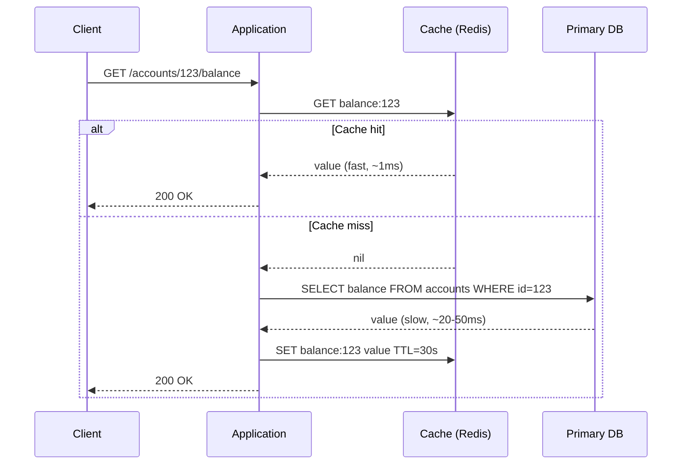
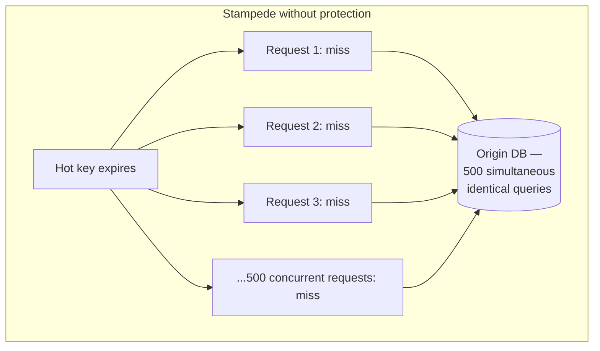
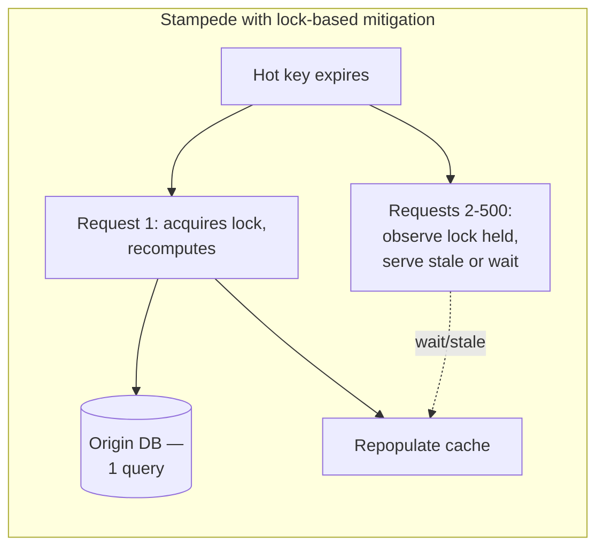
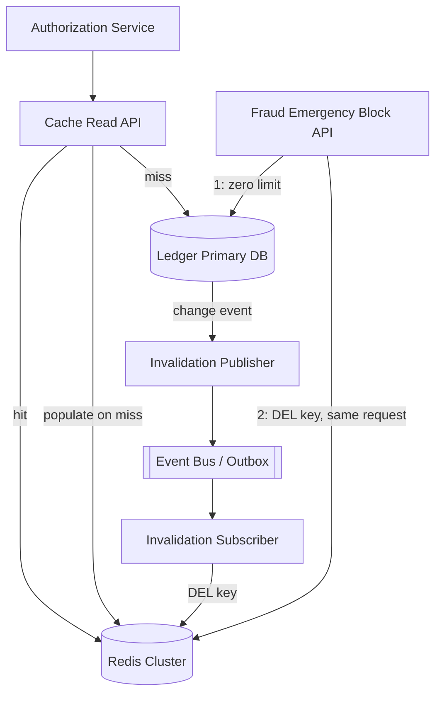
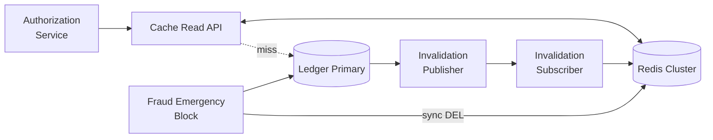
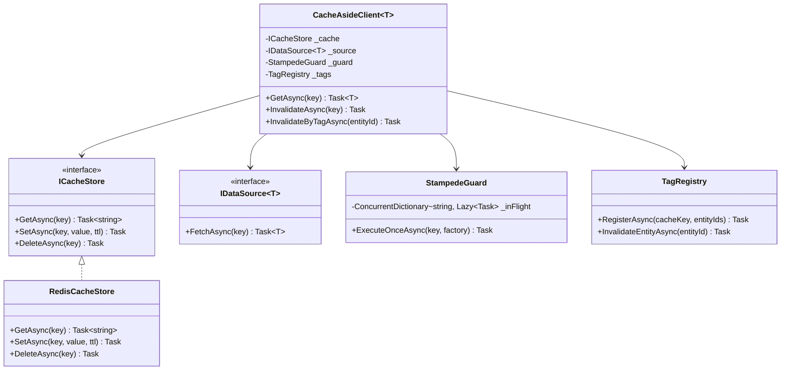
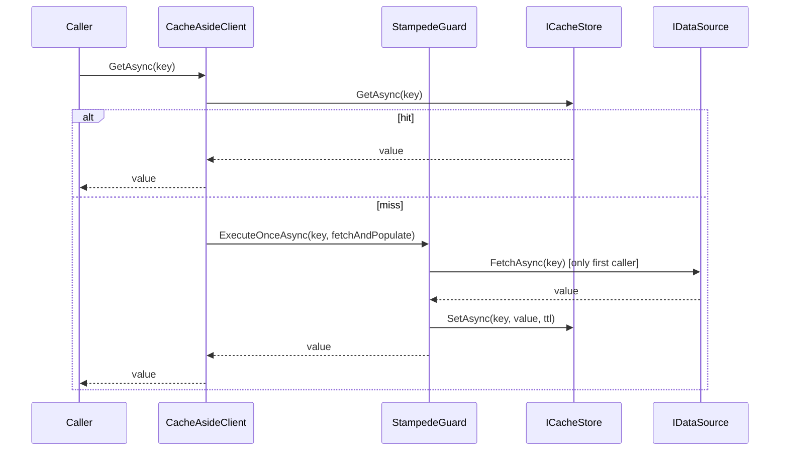

# Module 103 — Performance Engineering: Caching Strategies & Data Access Performance

> Domain: Performance Engineering | Level: Beginner → Expert | Prerequisite: [[01-PerformanceProfiling-BottleneckDiagnosis]] §Advanced Q6 (the cache-hit-rate silent-degradation finding this module formalizes), [[02-LoadTesting-CapacityPlanning-Benchmarking]] (capacity/load-testing discipline this module's cache-layer sizing reuses), [[../07-Redis]] modules (this module's distributed-caching patterns build directly on Redis's data structures and persistence model)
>
> **Note on format:** Originally authored under the leaner Q&A-only format (see `CLAUDE.md`'s 2026-07-18 decision history). Upgraded to the current full-template standard — Fundamentals through Revision — per a later review pass; the original 40 Q&A below are preserved verbatim.

---

## 1. Fundamentals

**What:** Caching and data-access performance engineering is the discipline of reducing the cost of retrieving data — by avoiding repeated, expensive work (caching) and by shaping how the application talks to its data stores (connection pooling, pagination, replica routing, denormalization) so that the *unavoidable* work is as cheap as possible. The two are inseparable in practice: a cache is only ever a faster path in front of a slower one, and the slower path's own efficiency determines both the cost of a cache miss and the blast radius when the cache degrades.

**Why:** Data access is, in almost every production system this course has profiled, the dominant contributor to p99 latency — not application CPU, not serialization, not network hops between internal services. A single unindexed query or an unbounded `N+1` pattern can dwarf every other optimization in the system combined. Caching exists because most read workloads are highly skewed (a small set of hot keys account for the overwhelming majority of reads) and most underlying data changes far less often than it's read — the classic 80/20 (often 99/1) access-pattern shape that makes serving from a fast, small, derived copy dramatically cheaper than repeating the original, expensive fetch every time.

**When:** Reach for caching when a read is expensive relative to how cheap it is to serve from cache, and the data's read/write ratio and staleness tolerance genuinely justify the added invalidation-correctness burden (Advanced/Intermediate Q&A below already establish this criterion precisely). Reach for data-access-shape fixes (pagination, indexing, pooling, replicas) unconditionally — they carry no staleness trade-off and are close to strictly beneficial when applied correctly.

**How (30,000-ft view):**
```
Request ─▶ Cache? ─hit──────────────────────▶ Response (fast)
 │
 miss
 │
 ▼
 Data store ─▶ (pool a connection, run an
 efficient, indexed, paginated query,
 possibly against a read replica)
 │
 ▼
 Populate cache ─▶ Response (slow path, paid once per TTL/invalidation)
```

---

## 2. Deep Dive

### 2.1 Where the Latency Actually Goes
A "slow API" investigation that starts by profiling application code and ends there is incomplete. In the overwhelming majority of production latency incidents this domain has traced (Module 101's profiling discipline), the dominant cost sits in one of: (a) a network round trip to the data store, (b) query execution time inside the data store itself (a table scan, a missing index, lock waits), or (c) serialization/deserialization of a larger-than-necessary payload. Caching and data-access shaping are two different levers on the *same* underlying cost center — caching removes the round trip entirely on a hit; data-access shaping reduces the cost of the round trip when it does happen (which is always, on a miss, and always for any query with no cache in front of it at all).

### 2.2 Cache Population Strategies — Mechanics, Not Just Names
- **Cache-aside (lazy loading):** the application owns the miss-handling: `value = cache.get(key); if (miss) { value = db.fetch(key); cache.set(key, value, ttl); }`. The dominant pattern in practice because it requires no specialized infrastructure and gives the application explicit control — but every access path must remember to populate the cache, which is a real correctness burden (a forgotten cache-populate call on one code path silently produces a permanently-missing cache entry for that path, indistinguishable from "just a cold key" until someone profiles hit rate per access path).
- **Read-through:** the cache library/proxy itself owns miss-handling via a configured loader function, so the application only ever calls `cache.get(key)` and the loader transparently fetches-and-populates on miss. Centralizes the logic (no forgotten-populate risk) at the cost of coupling the cache to a specific loader implementation.
- **Write-through:** every write goes to the cache and the data store synchronously, in the same logical operation — the cache is never stale relative to a write that has already returned success to the caller, at the cost of adding the cache's own write latency to every write's critical path.
- **Write-behind (write-back):** the write lands in the cache and returns immediately; the durable write to the data store happens asynchronously, shortly after. Lower write latency, at the real cost of a durability window — a cache-node crash before the deferred write commits loses data that the caller was already told succeeded. Rarely acceptable for financial state; occasionally acceptable for derived, reconstructable data (a view count, a "last seen" timestamp).

### 2.3 The Stampede Problem, Mechanically
A cache entry's TTL expiring is not "the cache becomes slightly less effective" — for a genuinely hot key, it's a synchronization event. If 500 concurrent requests are all reading key `X` and `X` expires between two of them, in the naive cache-aside implementation, *every one* of those 500 requests independently observes a miss and independently issues the same expensive recompute/refetch simultaneously — a stampede against the origin that is, in effect, a self-inflicted denial-of-service the caching layer was supposed to prevent. The two standard mitigations both work by ensuring only one request pays the recompute cost: a distributed lock/mutex (`SETNX`-style in Redis) where the first request to observe the miss acquires a short-lived lock and recomputes, while concurrent requests either wait briefly or serve a stale value; and stale-while-revalidate, where the cache continues serving the expired value to every request *except* one background refresh request, bounding the origin's load to exactly one concurrent recompute per key regardless of read concurrency.

### 2.4 Connection Pooling — What Actually Gets Reused
A database connection is expensive to establish: TCP handshake, TLS negotiation (for encrypted connections), authentication, and — for SQL Server and PostgreSQL specifically — session-level state setup (`SET` options, `search_path`, transaction isolation defaults). A connection pool amortizes this cost by keeping a set of already-established, already-authenticated connections open and handing them out for the duration of a single unit of work, then returning them to the pool rather than closing them. The pool's size is a genuine capacity constraint, not a tuning knob to maximize blindly: each pooled connection consumes a database-side resource (a backend process in PostgreSQL, a worker thread in SQL Server), and a pool sized without regard to the database's own `max_connections`/configured connection ceiling — multiplied across every horizontally-scaled application instance — is a common, entirely avoidable cause of "database refusing new connections" incidents under load, distinct from and often mistaken for a genuine capacity/throughput ceiling.

### 2.5 Offset vs. Keyset Pagination — the Actual Query-Plan Difference
`OFFSET 100000 LIMIT 20` requires the database to materialize (or at minimum count through) the first 100,020 rows in sort order before discarding the first 100,000 and returning the last 20 — a cost that grows linearly with the offset, regardless of how well-indexed the underlying column is, because the *skip* itself, not the final row lookup, dominates. Keyset pagination (`WHERE created_at < :last_seen ORDER BY created_at DESC LIMIT 20`) lets the query planner use an index seek directly to the correct starting point and read forward exactly `LIMIT` rows — flat cost regardless of how deep into the result set the page is. The trade-off is real: keyset pagination cannot jump to an arbitrary page number (only "next page from cursor X"), which is a genuine UX constraint for interfaces that offer page-number navigation, not merely an implementation inconvenience.

### 2.6 Denormalization vs. Caching — Two Different Answers to "This Read Is Too Slow"
Both trade write-side cost/complexity for read-side speed, but they solve different problems. Denormalization durably restructures the source of truth (a materialized, precomputed column or table) — it survives a cache eviction or a full cache-cluster restart, and it participates in further relational queries (joins, filters, sorts) the way a cache's opaque blob cannot. Caching stores a derived, disposable copy that is acceptable to lose and recompute at any time. A read-performance problem where the result needs to remain queryable and durable calls for denormalization; a read-performance problem where the result is a terminal, served-as-is payload calls for caching; many production systems use both together (a precomputed aggregate that is *also* cached for even faster repeated access).

### 2.7 Read Replica Lag as a Consistency Boundary, Not Just a Latency Detail
A read replica typically applies changes asynchronously via log shipping/streaming replication, meaning there is always a non-zero (usually milliseconds, occasionally seconds under replica load or network partition) window where the replica's data lags the primary. This is invisible until a request pattern crosses it: a user submits a write, then immediately issues a read that happens to route to a not-yet-caught-up replica, and observes their own just-completed write as if it hadn't happened — the classic read-your-own-writes violation. The fix is architectural, not incidental: track a monotonically increasing replication position (LSN in PostgreSQL, a similar sequence in SQL Server's Always On) and route a session's post-write reads either to the primary or to a replica confirmed to have replicated past that specific write, for a bounded window following the write.

---

## 3. Visual Architecture







---

## 4. Production Example

**Problem:** A card-payments authorization service needed to check a cardholder's current spending-limit utilization on every authorization request — a read against a `spending_limits` table keyed by account ID, called on the hot path of every single transaction (thousands per second at peak). The query itself was fast (indexed, single-row lookup, sub-millisecond), but at the observed transaction volume, the aggregate load of hitting the primary database on every authorization was consuming a meaningful share of the primary's connection pool and CPU, competing with the actual write path (recording the authorization) for the same finite database resource.

**Architecture:** The team introduced a cache-aside layer in front of the `spending_limits` lookup: Redis, keyed as `spend-limit:{account_id}`, TTL of 5 seconds, populated on miss from the primary. Five seconds was chosen deliberately — short enough that a limit change (a customer raising their own limit, or a fraud team lowering one) propagates to the authorization path quickly, long enough to absorb the overwhelming majority of read traffic against a value that changes rarely relative to how often it's read.

**Implementation:** The authorization service's hot path became: `GET spend-limit:{account_id}` → on hit, use directly; on miss, `SELECT` from the primary, `SET` into Redis with the 5-second TTL, then proceed. A stampede-protection lock (Redis `SET NX` with a short expiry) was added around the miss-path recompute after an early load test showed a popular merchant's high-transaction-volume corporate account produced a visible latency spike on every cache expiry.

**Trade-offs:** The 5-second TTL was a deliberate, explicit acceptance of a bounded staleness window — a spending limit lowered by the fraud team could still be honored at the old, higher value for up to 5 seconds after the change, a risk the fraud and risk teams reviewed and accepted given the small dollar exposure at typical transaction sizes within that window, versus the alternative of event-driven invalidation (subscribing to a `SpendingLimitChanged` domain event) which was considered but deferred as unnecessary complexity for the accepted risk level.

**Lessons learned:** Six months later, a fraud-response runbook change introduced *emergency* limit reductions — a fraud analyst manually zeroing a compromised account's limit to block further authorizations immediately. The existing 5-second-TTL cache silently undermined this: an account correctly zeroed in the primary could still authorize transactions against its stale, cached, pre-zero limit for up to 5 seconds, a window fraud considered unacceptable specifically for this emergency case even though it had been accepted for routine limit changes. The fix was not to shorten the TTL globally (which would have reintroduced load on the primary for the 99.9% of reads where 5 seconds was genuinely fine) but to add a narrow, explicit invalidation path: the emergency-block runbook action now issues a direct cache `DEL spend-limit:{account_id}` as part of the same operation that zeroes the limit in the primary, guaranteeing the very next authorization attempt observes a miss and re-reads the just-updated, correct value — a targeted fix for the specific case where staleness was genuinely unacceptable, layered on top of (not replacing) the TTL-based default that remained the right trade-off everywhere else.
## 10. Interview Questions

### Basic (10)

1. **Q: What is caching, and why does it improve performance?**
 **A:** Caching stores a copy of expensive-to-compute or expensive-to-fetch data in a faster-access location, so subsequent requests for the same data can be served from the cache instead of repeating the original, slower operation.
 **Why correct:** States the mechanism (storing a faster-access copy) and the reason it helps (avoiding repeated, expensive work).
 **Common mistakes:** Assuming caching is free — it always introduces a consistency trade-off (the copy can become stale) in exchange for speed.
 **Follow-ups:** "What's the fundamental trade-off caching always introduces?" (Consistency — a cached value can diverge from the current, true source-of-truth value until invalidated or refreshed.)

2. **Q: What is the difference between cache-aside and read-through caching?**
 **A:** In cache-aside, the application explicitly checks the cache, and on a miss, fetches from the source and populates the cache itself. In read-through, the cache sits in front of the data source and handles the miss-and-populate logic transparently — the application only ever talks to the cache.
 **Why correct:** States who owns the miss-handling logic (application vs. cache layer) as the defining distinction.
 **Common mistakes:** Treating the two as interchangeable, missing that cache-aside requires explicit application code for every access path while read-through centralizes that logic.
 **Follow-ups:** "Which is more common in practice, and why?" (Cache-aside — it requires no specialized caching infrastructure beyond a simple key-value store, and gives the application explicit control over caching logic.)

3. **Q: What is write-through versus write-behind (write-back) caching?**
 **A:** Write-through writes to the cache and the underlying data source synchronously, in the same operation. Write-behind (write-back) writes to the cache immediately but defers the write to the underlying data source asynchronously, improving write latency at the cost of a window where the source of truth is out of date.
 **Why correct:** States the synchronous-vs-deferred distinction and the specific trade-off (write latency vs. durability window) each implies.
 **Common mistakes:** Assuming write-behind is a strict improvement, without recognizing its durability risk if the cache fails before the deferred write completes.
 **Follow-ups:** "What's the risk of write-behind specifically?" (Data loss if the cache node crashes before the deferred write to the durable data source has completed.)

4. **Q: What is a cache TTL (time to live), and what's the trade-off in setting it too short or too long?**
 **A:** TTL is the duration a cached value is considered valid before automatic expiration. Too short a TTL causes excessive cache misses and repeated, expensive source-fetches (reducing the cache's benefit); too long a TTL risks serving stale data for an extended period after the underlying source changes.
 **Why correct:** States both failure directions of the trade-off precisely.
 **Common mistakes:** Setting a single, arbitrary TTL uniformly across all data, without considering each data type's actual staleness tolerance and change frequency.
 **Follow-ups:** "How would you choose an appropriate TTL for a specific data type?" (Based on that data's actual observed change frequency and the application's tolerance for staleness — frequently-changing, freshness-critical data warrants a much shorter TTL than rarely-changing, staleness-tolerant data.)

5. **Q: What is cache invalidation, and why is it considered a hard problem?**
 **A:** Cache invalidation is removing or updating a cached value when the underlying source data changes, so the cache doesn't continue serving stale data indefinitely. It's hard because correctly identifying every cache entry affected by a given underlying change (especially across complex, multi-entity relationships) is often non-trivial, and getting it wrong produces silent, hard-to-detect staleness bugs.
 **Why correct:** States the mechanism and the specific reason for its difficulty (identifying the full, correct blast radius of affected cache entries).
 **Common mistakes:** Assuming a short TTL alone is a sufficient substitute for genuine, event-driven invalidation.
 **Follow-ups:** "What's a simpler alternative to precise, surgical invalidation?" (A shorter TTL as a safety net, accepting some staleness window, when precise invalidation is too complex to implement correctly for a given data relationship.)

6. **Q: What is a CDN, and what does it cache?**
 **A:** A Content Delivery Network is a geographically-distributed network of caching servers (edge nodes) placed close to end users, caching static (and sometimes dynamic) content so requests are served from a nearby edge location rather than traveling to the origin server every time.
 **Why correct:** States the geographic-distribution mechanism and its purpose (reducing network latency to the origin).
 **Common mistakes:** Assuming a CDN only caches static assets (images, JS/CSS) — many modern CDNs also support caching dynamic API responses with appropriate cache-control headers.
 **Follow-ups:** "What HTTP mechanism controls CDN caching behavior?" (Cache-Control and related headers (ETag, Expires) on the origin's response, instructing the CDN how long and under what conditions to cache a given response.)

7. **Q: What is database connection pooling, and why does it matter for performance?**
 **A:** Connection pooling maintains a reusable set of already-established database connections rather than opening and closing a new connection per request — since establishing a connection (TCP handshake, authentication) is comparatively expensive, reusing pooled connections avoids paying that cost on every single request.
 **Why correct:** States the mechanism and the specific cost (connection-establishment overhead) it avoids.
 **Common mistakes:** Sizing a connection pool arbitrarily without considering the database server's own maximum-connection limit.
 **Follow-ups:** "What happens if the application requests more connections than the pool's configured maximum?" (Requests queue, waiting for a connection to become available — appearing as increased latency rather than an outright failure, until a configured wait-timeout is exceeded.)

8. **Q: What is pagination, and why is offset-based pagination problematic at scale?**
 **A:** Pagination retrieves a large result set in smaller, sequential pages rather than all at once. Offset-based pagination (`OFFSET n LIMIT m`) requires the database to scan and discard all `n` preceding rows on every page request, making later pages progressively slower as the offset grows — a real, scaling performance problem for deep pagination.
 **Why correct:** States the specific mechanism (scan-and-discard cost growing with offset) causing the scaling problem.
 **Common mistakes:** Assuming pagination performance is uniform regardless of page depth, missing that offset-based pagination specifically degrades as the offset increases.
 **Follow-ups:** "What's the standard alternative?" (Keyset/cursor-based pagination — using the last-seen row's key value to fetch the next page directly via an indexed range condition, avoiding the scan-and-discard cost entirely.)

9. **Q: What is a read replica, and how does it help read-heavy workloads?**
 **A:** A read replica is a copy of a primary database kept synchronized (typically asynchronously) that serves read-only queries, offloading read traffic from the primary so it can focus on handling writes — increasing overall read capacity by distributing read load across multiple replica instances.
 **Why correct:** States the mechanism (a synchronized, read-only copy) and its specific benefit (read-load distribution).
 **Common mistakes:** Assuming a read replica is always perfectly up to date, ignoring replication lag's consistency implications.
 **Follow-ups:** "What consistency risk does a read replica introduce?" (Replication lag — a read against a replica may return data slightly older than the primary's current state, risking a "read-your-own-write" consistency violation if not accounted for.)

10. **Q: What is denormalization, and what performance trade-off does it make?**
 **A:** Denormalization duplicates or restructures data (e.g., storing a computed aggregate or a joined field directly) to optimize read performance, at the cost of increased storage and more complex, error-prone write logic needed to keep the duplicated data consistent with its source.
 **Why correct:** States the mechanism and the specific trade-off (read speed vs. write complexity/consistency risk).
 **Common mistakes:** Assuming denormalization is purely beneficial without weighing the added write-side consistency-maintenance burden it introduces.
 **Follow-ups:** "When is denormalization a reasonable trade-off?" (When read volume vastly exceeds write volume for the specific data, and the consistency-maintenance cost is manageable — e.g., a well-understood, infrequently-changing aggregate.)

### Intermediate (10)

1. **Q: What is cache stampede (thundering herd), and how do you prevent it?**
 **A:** When a popular cache entry expires, many concurrent requests simultaneously experience a cache miss and all attempt to recompute/refetch the same expensive value at once, overwhelming the underlying data source. Prevention: use a lock/mutex so only one request recomputes the value while others wait for the result, or use a "stale-while-revalidate" pattern serving the stale value while one request refreshes it in the background.
 **Why correct:** States the specific failure mechanism (many concurrent recomputations) and two concrete prevention techniques.
 **Common mistakes:** Assuming a cache alone prevents this — the stampede specifically occurs at the moment of expiration, when the cache temporarily provides no protection at all.
 **Follow-ups:** "Why is 'stale-while-revalidate' often preferable to a blocking lock?" (It avoids making every waiting request block on the recomputation — most requests get a fast, slightly-stale response immediately while one request refreshes the value in the background.)

2. **Q: How would you design cache keys to avoid collisions and support easy invalidation?**
 **A:** Include every parameter that affects the cached value's content in the key (e.g., a query's filter parameters, a user's tenant ID, an API version), using a consistent, structured naming convention (e.g., `entity:id:version`) that also enables pattern-based bulk invalidation (e.g., invalidating every key matching `invoice:123:*` when invoice 123 changes).
 **Why correct:** States both requirements (full parameter inclusion to avoid collision, structured naming to enable bulk invalidation).
 **Common mistakes:** Omitting a parameter that affects the cached content from the key, causing two different results to collide under the identical cache key.
 **Follow-ups:** "What's the risk of an overly generic cache key?" (Two logically distinct requests could collide on the same key, causing one user/context to incorrectly receive another's cached data — directly the IDOR risk recurring in caching form if the key doesn't include the requesting principal's identity where relevant.)

3. **Q: What's the risk of caching data that's part of a security/authorization decision?**
 **A:** If an authorization check's result (or the underlying data an authorization decision depends on) is cached without properly scoping the cache key to the requesting principal, a stale or incorrectly-shared cache entry could grant one user access to another's data — directly recreating the IDOR vulnerability class through a caching-layer mechanism rather than a missing authorization check.
 **Why correct:** Connects caching's key-scoping risk directly to an already-established course finding (broken object-level authorization).
 **Common mistakes:** Caching an authorization decision or a resource's data without including the requesting principal's identity in the cache key, risking cross-principal data leakage via cache collision.
 **Follow-ups:** "How would you mitigate this specific risk?" (Always include the authenticated principal's identity as part of the cache key for any data whose access is principal-scoped, and re-verify authorization on every request regardless of cache hit/miss status, never skipping the authorization check just because a cached value exists.)

4. **Q: How does eventual consistency in a distributed cache affect application design?**
 **A:** A distributed cache (e.g., a Redis cluster) may briefly return different values from different nodes during replication/propagation delay, meaning the application must be designed to tolerate a brief window of inconsistency rather than assuming every read immediately reflects the most recent write across the entire cluster.
 **Why correct:** States the specific consistency behavior and its design implication (tolerance for brief inconsistency).
 **Common mistakes:** Assuming a distributed cache provides the same immediate, strong consistency as a single-node, in-process cache.
 **Follow-ups:** "What application pattern helps tolerate this?" (Designing idempotent, retry-safe operations and avoiding critical business logic that assumes an immediately, globally-consistent cache read.)

5. **Q: What is the difference between LRU, LFU, and TTL-based cache eviction policies?**
 **A:** LRU (Least Recently Used) evicts the entry that hasn't been accessed for the longest time. LFU (Least Frequently Used) evicts the entry accessed the fewest total times. TTL-based eviction removes an entry once its explicit expiration time is reached, regardless of access pattern.
 **Why correct:** States each policy's specific eviction criterion precisely.
 **Common mistakes:** Assuming LRU and LFU are interchangeable — a rarely-but-recently-accessed item survives under LRU but could still be evicted under LFU if its total access count is low.
 **Follow-ups:** "When would LFU be preferable to LRU?" (When a small set of consistently popular items should be protected from eviction even during a temporary burst of one-off accesses to unrelated items, which LRU alone could otherwise evict them in favor of.)

6. **Q: How do you handle cache invalidation across multiple cache layers (browser cache, CDN, application cache, database query cache)?**
 **A:** Each layer needs its own explicit invalidation/expiration strategy — invalidating only the application-level cache while a CDN or browser cache still serves a longer-lived, stale copy produces an inconsistent experience; use consistent versioning (e.g., a version/hash embedded in the resource URL) so a genuine content change produces a new, distinct cache key at every layer simultaneously, rather than relying on each layer's independent TTL to eventually, separately expire.
 **Why correct:** States the multi-layer risk and the specific technique (versioned URLs) that invalidates consistently across every layer at once.
 **Common mistakes:** Invalidating only the layer closest to the application, assuming that alone resolves staleness, while a farther-out layer (CDN, browser) continues serving an old, cached version.
 **Follow-ups:** "Why is versioned-URL invalidation more reliable than relying on each layer's TTL?" (A new URL is treated as an entirely new resource by every caching layer, guaranteeing an immediate cache miss and fresh fetch everywhere, rather than waiting for each layer's independent TTL to separately expire on its own schedule.)

7. **Q: What is keyset/cursor-based pagination, and why is it preferred over offset-based pagination at scale?**
 **A:** Keyset pagination fetches the next page using a `WHERE key > last_seen_key ORDER BY key LIMIT n` condition against an indexed column, rather than an offset — this lets the database use the index to jump directly to the correct starting point, with performance independent of how deep into the result set the page is, unlike offset-based pagination's scan-and-discard cost.
 **Why correct:** States the specific query mechanism and why its performance doesn't degrade with page depth.
 **Common mistakes:** Assuming keyset pagination is a drop-in replacement with identical semantics — it doesn't support jumping to an arbitrary page number directly, only sequential next/previous navigation from a known cursor.
 **Follow-ups:** "What UX limitation does keyset pagination impose compared to offset pagination?" (It doesn't naturally support "jump to page 50" navigation — only sequential paging from a cursor — a real trade-off for UIs that want arbitrary page-number access.)

8. **Q: How would you decide what to cache versus what not to cache?**
 **A:** Cache data that is expensive to compute/fetch relative to how cheap it is to serve from cache, is read far more frequently than it changes, and whose staleness tolerance matches an acceptable TTL or invalidation strategy — avoid caching data that changes as often as it's read (minimal benefit), or data whose staleness carries a genuinely unacceptable risk (e.g., a real-time account balance in some contexts) without a robust, immediate invalidation mechanism.
 **Why correct:** States concrete criteria (cost-to-benefit ratio, read/write ratio, staleness tolerance) rather than a blanket rule.
 **Common mistakes:** Applying a blanket "cache everything" or "cache nothing" policy rather than evaluating each data type's specific access pattern and staleness tolerance.
 **Follow-ups:** "What's a red flag suggesting a specific piece of data shouldn't be cached?" (A read/write ratio close to 1:1 — meaning the cache would need to be invalidated almost as often as it's read, providing minimal net benefit while adding invalidation-correctness risk.)

9. **Q: What is a negative cache (caching "not found" results), and why is it useful?**
 **A:** Caching the fact that a specific lookup returned no result, so a repeated request for the same non-existent key doesn't repeatedly hit the expensive underlying data source only to confirm "still not found" every time — particularly valuable against a pattern of repeated lookups for keys known (or likely) not to exist.
 **Why correct:** States the specific mechanism and the repeated-miss cost it avoids.
 **Common mistakes:** Caching only positive (found) results, missing that a flood of repeated lookups for non-existent keys can itself become a real performance/load problem without negative caching.
 **Follow-ups:** "What's a risk of negative caching if not carefully TTL'd?" (If the underlying data is later created, a too-long negative-cache TTL could continue incorrectly reporting "not found" for longer than acceptable after the data actually became available.)

10. **Q: How does connection-pool sizing interact with database max-connection limits under high concurrency?**
 **A:** Each application instance's connection pool consumes a share of the database server's own finite maximum-connection limit — with many horizontally-scaled application instances, the aggregate connection demand across all instances can exceed the database's actual limit even if each individual instance's pool seems modestly sized, requiring careful, fleet-wide connection budgeting rather than sizing each instance's pool in isolation.
 **Why correct:** States the aggregate, fleet-wide constraint that individual, per-instance pool sizing can overlook.
 **Common mistakes:** Sizing each application instance's connection pool independently without considering the total aggregate demand across every horizontally-scaled instance combined.
 **Follow-ups:** "What architectural pattern helps manage this at scale?" (A connection-pooling proxy/multiplexer (e.g., PgBouncer for PostgreSQL) sitting between many application instances and the database, multiplexing many logical application connections over a smaller, bounded number of actual database connections.)

### Advanced (10)

1. **Q: Design a cache invalidation strategy for a system with complex, multi-entity relationships, where a cached view depends on several underlying entities.**
 **A:** Maintain an explicit dependency/tag registry mapping each cached view's key to the set of underlying entity IDs it depends on; on any entity's change, look up and invalidate every cached view tagged with that entity's ID, rather than attempting to infer dependencies implicitly or relying on a uniform TTL alone — directly analogous to a build system's dependency graph, applied to cache invalidation specifically.
 **Why correct:** Proposes a concrete, explicit dependency-tracking mechanism rather than an implicit or purely time-based approach.
 **Common mistakes:** Relying on a single, uniform TTL across every cached view regardless of its actual dependency complexity, accepting more staleness risk than an explicit dependency-tracking approach would require.
 **Follow-ups:** "What's the cost of this explicit dependency-tracking approach?" (Additional bookkeeping overhead — maintaining the tag registry itself, and ensuring every code path that changes an entity correctly triggers the corresponding tagged invalidations, a correctness burden proportional to the relationship's actual complexity.)

2. **Q: How would you prevent a cache stampede specifically during a cold cache after a full cache-cluster restart?**
 **A:** Pre-warm the cache proactively before routing real traffic to it (replaying recent, representative access patterns or the most popular keys from before the restart) rather than allowing the first wave of real production traffic to hit an entirely empty cache simultaneously; alternatively, apply request-rate limiting/queuing at the origin data store specifically during the cache's warm-up window, bounding the origin's load regardless of how many concurrent cache misses occur.
 **Why correct:** Proposes two concrete, complementary mitigations (proactive pre-warming, origin-side rate limiting during warm-up) specifically for the cold-cache-after-restart scenario.
 **Common mistakes:** Relying solely on the per-key stampede protection (Intermediate Q1's lock/stale-while-revalidate) designed for a single popular key's expiration, which doesn't address the fundamentally larger blast radius of an entirely empty cache after a full restart.
 **Follow-ups:** "Why is a full cache-cluster restart categorically worse than a single key's expiration?" (Every key is simultaneously cold, not just one popular one — meaning the stampede risk applies across the system's entire working set at once, not a single, isolated hot key.)

3. **Q: Design a multi-region caching strategy for a globally-distributed application.**
 **A:** Use region-local caches (colocated with each region's application instances) for low-latency reads, backed by a mechanism propagating invalidation events across regions (e.g., a pub/sub invalidation broadcast) when the underlying source-of-truth data changes in any region — accepting a brief, bounded cross-region propagation delay as an explicit consistency trade-off, rather than either forcing every read through a single, centralized cache (reintroducing cross-region latency) or allowing regions to silently diverge indefinitely with no invalidation-propagation mechanism at all.
 **Why correct:** Proposes a concrete architecture (region-local caches, pub/sub cross-region invalidation) with an explicit, acknowledged consistency trade-off.
 **Common mistakes:** Either centralizing caching entirely (sacrificing the latency benefit multi-region deployment is meant to provide) or maintaining fully independent, unsynchronized regional caches with no cross-region invalidation mechanism at all.
 **Follow-ups:** "What's the risk if the cross-region invalidation broadcast itself fails silently?" (A region continues serving stale data indefinitely with no signal anything is wrong — directly this course's recurring "silent degradation of a verification/propagation mechanism" theme, requiring its own monitored health signal.)

4. **Q: How would you detect and diagnose a silently degraded cache hit rate in production, extending the finding?**
 **A:** Continuously monitor and alert on the cache's actual hit-rate metric against an established baseline (directly the alerting discipline, applied to cache health specifically) — a sudden or gradual hit-rate drop, even while the application continues functioning correctly and returning correct results, signals the cache is silently providing less of its intended performance benefit, discoverable only via this active metric, never via functional correctness testing alone.
 **Why correct:** Directly extends the already-established prior-module finding into a concrete, monitored metric and alerting design.
 **Common mistakes:** Monitoring only functional correctness (the application still returns correct data) without a dedicated, alerted cache-hit-rate metric, missing a silent performance-benefit degradation entirely.
 **Follow-ups:** "What could cause a hit-rate degradation with no code change at all?" (A shift in the actual traffic pattern — increased request diversity/cardinality (the cardinality concept, applied to cache keys) reducing the fraction of requests that hit an already-warm cache entry, purely due to changing usage patterns rather than any deployment.)

5. **Q: How do you handle cache consistency when using a cache-aside pattern with concurrent writes — the race condition between a database write and cache invalidation?**
 **A:** A classic race: Request A reads a stale value from the DB (about to be overwritten by a concurrent Request B), Request B writes the new value and invalidates the cache, then Request A's now-stale read populates the cache with the old value *after* the invalidation — leaving the cache permanently stale until the next write. Mitigate by invalidating the cache key immediately *before* the database write commits (or using a short TTL as a safety net bounding how long this race's damage persists), or by using a versioned cache-write (only accepting a cache-populate write if it matches the currently-expected data version, rejecting a stale write that arrives out of order).
 **Why correct:** States the precise race-condition sequence and two concrete mitigations (invalidate-before-write ordering, versioned writes) addressing it.
 **Common mistakes:** Assuming invalidating the cache immediately after a database write is sufficient, without recognizing a concurrent, in-flight read from before the write can still repopulate the cache with stale data afterward.
 **Follow-ups:** "Why doesn't a short TTL alone fully solve this race?" (It bounds the *duration* of staleness but doesn't prevent the race from occurring at all — for any window shorter than the TTL, incorrect, stale data is still served with no signal anything is wrong.)

6. **Q: Design a read-replica lag mitigation strategy for a system where stale reads are sometimes unacceptable (read-your-own-writes consistency).**
 **A:** Route a specific request back to the primary (or a replica confirmed to have caught up past the write's commit point) immediately following that same session's own write, for a bounded window — rather than requiring every read in the system to always hit the primary (defeating the replica's purpose) or accepting stale reads universally (violating read-your-own-writes for exactly the cases where it matters).
 **Why correct:** Proposes a targeted, session-scoped mitigation rather than an all-or-nothing approach.
 **Common mistakes:** Either routing all reads to the primary as a blanket fix (eliminating the replica's scaling benefit) or ignoring the consistency requirement for the specific, sensitive cases where it genuinely matters.
 **Follow-ups:** "How would you determine a replica has 'caught up past the write's commit point'?** (Track a monotonically-increasing log-sequence/commit-position marker from the write, and only route a read-your-own-write request to a replica confirmed to have replicated past that specific marker.)

7. **Q: How would you decide between denormalization/precomputed aggregates versus caching to solve a read-performance problem?**
 **A:** Denormalization is appropriate when the expensive computation's result needs to be durably queryable (survives a cache eviction/restart, participates in further relational queries/joins) and the write-side consistency maintenance is manageable; caching is appropriate when the result is derived, disposable, and acceptable to recompute from scratch after an eviction — the two aren't mutually exclusive and are often combined (a denormalized, precomputed value that's also cached for even faster repeated access).
 **Why correct:** States the specific criterion (durability/queryability need vs. disposability) distinguishing when each approach fits.
 **Common mistakes:** Treating denormalization and caching as competing, mutually-exclusive alternatives rather than recognizing they solve overlapping but distinct problems, often combined.
 **Follow-ups:** "What's a risk unique to denormalization that caching doesn't share?" (Denormalized data can silently drift out of sync with its source if the write-side update logic has a bug, persisting incorrect data durably — whereas a cache's staleness is bounded by TTL/invalidation and, worst case, resolved by simply evicting and recomputing.)

8. **Q: Design a rate-limited cache-refill strategy avoiding overwhelming the origin data store during a partial cache outage.**
 **A:** Apply a token-bucket or similar rate limiter specifically on the path from cache-miss to origin-fetch, bounding the maximum rate of origin requests regardless of how many concurrent cache misses are occurring — requests exceeding the limiter's capacity queue or receive a graceful degradation response (a slightly stale fallback, or an explicit "temporarily degraded" signal) rather than all flooding the origin simultaneously and risking a cascading overload of the very system the cache exists to protect.
 **Why correct:** Proposes a concrete rate-limiting mechanism specifically protecting the origin during exactly the failure scenario a cache's absence is most dangerous.
 **Common mistakes:** Assuming the origin can absorb the full, unbounded load of every cache miss simultaneously during a cache outage, without an explicit rate-limiting safeguard.
 **Follow-ups:** "What's the risk of not having this safeguard?" (A cache outage cascading into an origin-data-store outage as well, since the origin was never designed or provisioned to handle the cache's full, normally-absorbed request volume directly.)

9. **Q: How does compression interact with caching, and when is it counterproductive?**
 **A:** Compressing a cached value reduces its memory/network footprint (allowing more entries to fit in a fixed cache size, and faster network transfer) at the cost of CPU time to compress/decompress on every write/read — counterproductive when the cached value is small (compression overhead exceeds any size benefit) or when the cache is CPU-bound rather than memory/network-bound, in which case compression adds CPU cost without addressing the actual bottleneck.
 **Why correct:** States the trade-off precisely and identifies the specific conditions (small values, CPU-bound systems) where it backfires.
 **Common mistakes:** Applying compression uniformly to every cached value regardless of size or the system's actual bottleneck (memory/network vs. CPU).
 **Follow-ups:** "How would you decide whether compression is worthwhile for a specific cache?" (Measure the actual trade-off empirically — compare cache capacity/network-transfer improvement against the added CPU cost under realistic load, per this module's broader "measure, don't assume" principle.)

10. **Q: Critique "cache everything" as a default performance strategy.**
 **A:** Caching every piece of data uniformly ignores each data type's actual read/write ratio and staleness tolerance (Intermediate Q8) — caching frequently-changing data provides little benefit while adding invalidation-correctness risk, and caching data involved in security/authorization decisions without careful key-scoping risks-style cross-principal data leakage (Intermediate Q3). "Cache everything" also adds blanket architectural complexity (cache-key design, invalidation logic, monitoring) across the entire system rather than concentrating that complexity where it delivers genuine, measured benefit.
 **Why correct:** Identifies multiple, specific, already-established risks a blanket caching strategy ignores rather than a vague "it's not always good" statement.
 **Common mistakes:** Treating caching as a universally beneficial default to apply everywhere, rather than a deliberate, risk-proportionate decision made per data type based on its actual access pattern and sensitivity.
 **Follow-ups:** "How would you communicate this critique to a team proposing to cache an entire database's worth of entities uniformly?" (Present the specific, concrete risks — invalidation-correctness burden for frequently-changing data, and cross-principal leakage risk for authorization-sensitive data — rather than an abstract "that seems like too much caching" objection.)

### Expert (10)

1. **Q: Design a caching architecture for a system with strict data-freshness/regulatory requirements (e.g., financial pricing data) that also needs high throughput.**
 **A:** Use a very short TTL or, preferably, event-driven invalidation triggered directly by the pricing-update event itself (never a TTL alone for regulatory-critical freshness), combined with a versioned cache-read protocol where the client can specify the minimum acceptable data version/timestamp, allowing the system to explicitly reject (rather than silently serve) a cached value older than the caller's stated freshness requirement — achieving high throughput for the common case (recent, valid cached data) while providing an explicit, auditable mechanism refusing to silently serve unacceptably stale data for regulatory-sensitive reads.
 **Why correct:** Proposes event-driven invalidation over TTL-only for regulatory freshness, plus an explicit, auditable staleness-rejection mechanism rather than silent best-effort caching.
 **Common mistakes:** Relying on a very short TTL alone as "good enough" for regulatory freshness requirements, without an explicit mechanism to reject serving a cached value that happens to still be technically within TTL but insufficiently fresh for a specific, sensitive use case.
 **Follow-ups:** "Why is an explicit, auditable rejection mechanism specifically important for regulatory contexts?" (It provides a demonstrable, provable guarantee (rather than a probabilistic, TTL-based approximation) that stale data was never silently served for a use case with an explicit freshness requirement — directly relevant to compliance audit evidence, the governance theme.)

2. **Q: How would you approach cache invalidation in an event-driven architecture using domain events?**
 **A:** Subscribe the caching layer to the same domain events (published via the outbox pattern,, ensuring reliable delivery) that represent an entity's state change, triggering targeted invalidation of every cache entry tagged with that entity's ID (Advanced Q1's dependency-tag registry) — directly reusing the event-driven architecture's own reliable-delivery guarantee as the invalidation-triggering mechanism, rather than building a separate, ad hoc invalidation-detection mechanism disconnected from the system's actual event stream.
 **Why correct:** Connects cache invalidation directly to an already-established, reliable event-delivery mechanism (the outbox pattern) rather than inventing a parallel mechanism.
 **Common mistakes:** Building a separate, polling-based or ad hoc cache-invalidation detection mechanism when the system already has a reliable, event-driven change-notification stream that could trigger invalidation directly and more efficiently.
 **Follow-ups:** "What's the risk if the cache-invalidation subscriber falls behind or fails to process events?" (The cache silently serves increasingly stale data with no functional error — directly this course's recurring silent-degradation risk, requiring the subscriber's own processing lag/health to be independently monitored, not assumed healthy.)

3. **Q: Critique relying on TTL-only invalidation for a system with unpredictable underlying-data change frequency.**
 **A:** A fixed TTL implicitly assumes a roughly-known, stable change frequency to calibrate against — when underlying data change frequency is genuinely unpredictable (bursty, event-driven, or highly variable across different entities), any single, fixed TTL either serves unacceptably stale data during an unusually rapid-change period or unnecessarily sacrifices cache-hit benefit during a stable, rarely-changing period, since the TTL can't adapt to actual, real-time change behavior. Event-driven invalidation (Expert Q2) sidesteps this entirely by invalidating exactly when a change genuinely occurs, regardless of frequency variability.
 **Why correct:** States the specific reason TTL-only invalidation struggles under variable change frequency, and identifies the structurally superior alternative already established.
 **Common mistakes:** Assuming a sufficiently short, "safe" TTL adequately handles any change-frequency variability, without recognizing this either sacrifices cache benefit unnecessarily during stable periods or still risks unacceptable staleness during an unusually rapid-change burst that even a short TTL doesn't fully bound.
 **Follow-ups:** "Under what circumstance is TTL-only invalidation still a reasonable, pragmatic choice despite this critique?" (When event-driven invalidation's engineering cost/complexity genuinely isn't justified by the data's actual staleness sensitivity — a pragmatic, risk-proportionate trade-off, not a universal recommendation against TTL ever being used.)

4. **Q: How would you design a caching layer's own capacity planning and load testing, applying Modules 101/102 specifically to caching?**
 **A:** Load-test the caching layer itself at realistic concurrency and key-cardinality (distinct-key count, not merely request volume — a high-cardinality workload with low hit rate stresses the cache very differently than a low-cardinality, high-hit-rate one), specifically measuring cache-server CPU/memory/network saturation points and the resulting cliff pattern — treating the cache as its own system requiring the identical measure-don't-assume discipline this course has established for every other component, rather than assuming a cache is inherently, infinitely scalable simply because it's "just a cache."
 **Why correct:** Directly applies the already-established profiling/load-testing discipline to the caching layer specifically, naming the specific dimension (key cardinality, not just request volume) unique to cache-load characterization.
 **Common mistakes:** Assuming a caching layer is inherently lightweight and doesn't require the same rigorous load-testing/capacity-planning discipline applied to the primary data store or application tier.
 **Follow-ups:** "Why does key cardinality matter as much as raw request volume for cache capacity planning?" (A high-cardinality workload (many distinct keys, low repeat rate) provides little caching benefit and stresses cache memory/eviction machinery very differently than a low-cardinality, highly-repeated-key workload — the same request volume can produce very different cache-layer load characteristics depending on key diversity.)

5. **Q: Design a strategy for cache warming after a deployment/restart to avoid a cold-cache stampede in production, extending Advanced Q2.**
 **A:** Before routing live production traffic to a newly-restarted cache instance/cluster, proactively populate it with the most valuable, highest-traffic keys (identified from recent access-frequency data) via a dedicated warming job — using either a replayed sample of recent real traffic or a direct, targeted pre-fetch of known-hot keys — and gate the restart's traffic cutover on the warming job's completion (or a partial, monitored threshold of warm-cache coverage), rather than exposing production traffic to an empty cache immediately upon restart.
 **Why correct:** Proposes a concrete, gated warming process tied to a measurable completion signal, directly avoiding Advanced Q2's cold-cache-stampede risk structurally.
 **Common mistakes:** Restarting a cache cluster and immediately routing full production traffic to it, relying purely on Intermediate Q1's per-key stampede protection to absorb the resulting, much larger-scale, entirely-cold-cache miss storm.
 **Follow-ups:** "How would you determine which keys are 'most valuable' to pre-warm, without unbounded time to warm every possible key?" (Rank by recent access frequency/recency from before the restart — directly the profiling discipline, applied to identifying the cache's own actual hot working set.)

6. **Q: How does the CAP theorem inform trade-offs in distributed cache design (e.g., Redis Cluster's consistency model)?**
 **A:** Under a network partition, a distributed cache must choose between remaining available (continuing to serve reads/writes on both sides of the partition, risking divergent, inconsistent data) or remaining strictly consistent (refusing to serve on the minority/unreachable side, sacrificing availability) — most distributed caches, including Redis Cluster's default configuration, favor availability with eventual consistency, accepting a brief window of potential inconsistency in exchange for continued service during a partition, a deliberate design choice aligned with caching's inherently approximate, staleness-tolerant nature rather than a strict source-of-truth requirement.
 **Why correct:** Correctly applies CAP's partition-tolerance trade-off specifically to distributed caching's typical, deliberate availability-favoring design choice.
 **Common mistakes:** Assuming a distributed cache provides the same strong-consistency guarantee a primary, authoritative data store would, without recognizing caching's typical, deliberate trade-off toward availability under partition.
 **Follow-ups:** "Why is favoring availability over strict consistency usually the right default specifically for a cache, as opposed to a system of record?" (A cache is, by definition, a derived, disposable copy of a true source of truth — briefly serving stale or inconsistent cached data is a bounded, recoverable risk, unlike a system of record where the same inconsistency could represent genuine, unrecoverable data loss or corruption.)

7. **Q: How would you diagnose a "split-brain" cache-consistency bug where different application instances see different cached values for the same key?**
 **A:** Check whether the cache infrastructure itself is genuinely partitioned or misconfigured (different application instances connecting to different, unsynchronized cache nodes/clusters due to a routing or configuration error) versus a legitimate, bounded eventual-consistency propagation delay (Intermediate Q4) that will self-resolve shortly — the diagnostic distinction is whether the divergence persists indefinitely (a genuine partition/misconfiguration) or resolves within the expected, bounded propagation window (normal, tolerable eventual consistency behavior).
 **Why correct:** States the specific diagnostic distinction (persistent divergence vs. bounded, self-resolving delay) and what each implies about root cause.
 **Common mistakes:** Assuming any observed inconsistency between instances is automatically a genuine bug, without first checking whether it falls within the cache's normal, expected eventual-consistency propagation window.
 **Follow-ups:** "What configuration error commonly causes a genuine, persistent split-brain in a distributed cache deployment?" (Different application instances or deployment groups pointing at different cache cluster endpoints/shards due to a configuration drift or a rollout that only partially updated the cache-connection configuration across the fleet — directly the golden-path-drift risk recurring for cache-endpoint configuration specifically.)

8. **Q: What is the architectural cost of introducing caching (increased complexity), and how do you decide it's worth it?**
 **A:** Caching adds genuine, ongoing complexity: invalidation logic that must stay correct as the underlying data model evolves, additional infrastructure to operate and monitor, and a whole new category of "correct but stale" bugs distinct from ordinary functional bugs — worth it only when the measured performance benefit (via actual profiling/load-testing, not assumption) exceeds this ongoing complexity cost, and when the specific data's staleness tolerance and read/write ratio (Intermediate Q8) genuinely justify it.
 **Why correct:** Names the specific, ongoing complexity costs (invalidation correctness, new bug category, operational overhead) and ties the decision back to this module's established, measured-benefit criteria.
 **Common mistakes:** Treating caching as an unconditionally worthwhile addition without weighing its genuine, ongoing complexity and correctness-maintenance cost against the actual, measured performance benefit it provides.
 **Follow-ups:** "What's a sign that a caching layer's complexity cost has exceeded its actual benefit?" (A pattern of recurring, hard-to-diagnose staleness bugs, or a measured hit rate low enough that the caching layer's operational and correctness overhead isn't justified by its actual, delivered performance improvement.)

9. **Q: How would you design monitoring/alerting for cache health, directly extending the alert-liveness discipline to cache-hit-rate specifically?**
 **A:** Monitor cache hit rate, eviction rate, and cache-server resource saturation continuously, with a multi-window burn-rate-style alert on hit-rate degradation specifically — a short-window, sharp drop triggering a fast-response alert (a likely code/configuration regression), and a longer-window, gradual decline triggering a lower-urgency investigation (a likely traffic-pattern or data-cardinality shift) — plus a periodic, scheduled liveness canary confirming the cache-invalidation pipeline itself (Expert Q2's event subscriber) is actively processing events and not silently stalled.
 **Why correct:** Directly and explicitly reapplies the multi-window alerting design and liveness-canary pattern to cache-specific health metrics.
 **Common mistakes:** Monitoring only a single, static hit-rate threshold with no multi-window design, risking either excessive false alerts from normal noise or slow detection of a genuine, sharp regression.
 **Follow-ups:** "Why does the invalidation pipeline itself need its own separate liveness canary, distinct from the hit-rate metric?" (A stalled invalidation pipeline could, paradoxically, show a *high* hit rate — since stale data is technically still "hits" — meaning hit-rate monitoring alone wouldn't reveal a stopped-invalidation bug; a distinct, dedicated liveness check specifically confirming invalidation events are actively being processed is required to catch this different failure mode.)

10. **Q: Deliver a capstone-style synthesis connecting caching and data-access performance to this course's recurring "declared ≠ actual" theme.**
 **A:** A cache "working correctly" is at least three independent, separately-verifiable claims: it returns functionally correct data (testable via ordinary functional tests), it provides genuine performance benefit (only verifiable via a monitored hit-rate metric, since a near-zero-hit-rate cache can still return entirely correct data), and its invalidation pipeline is actively, currently functioning (only verifiable via a dedicated liveness canary, since a stalled invalidation pipeline can silently coexist with an apparently-healthy hit-rate metric). Exactly as this course has traced across telemetry coverage, alerting, runbooks, and security tooling, a cache's own health is a multi-layered claim, and confirming one layer provides zero evidence about the others.
 **Why correct:** Precisely decomposes "the cache is working" into three independently-necessary, separately-verified claims, directly mirroring this course's now-comprehensively-established recursive verification theme.
 **Common mistakes:** Treating "the cache returns correct data" as sufficient evidence the caching layer is working as intended, without separately verifying its actual performance benefit and its invalidation pipeline's continued liveness.
 **Follow-ups:** "Why is this three-layer decomposition specifically valuable for a candidate to state proactively in an interview about caching?" (It demonstrates the ability to apply this course's central, recurring verification discipline to a concrete, specific technical area unprompted, rather than only describing caching's mechanics in isolation — precisely the kind of cross-cutting synthesis distinguishing senior-level engineering judgment.)

---

## 11. Coding Exercises

**Easy — Implement a bounded LRU cache.**
*Problem:* Implement a fixed-capacity cache with `Get(key)` and `Put(key, value)`, evicting the least-recently-used entry when capacity is exceeded, both operations O(1).
*Solution:* Combine a `Dictionary<TKey, LinkedListNode<(TKey, TValue)>>` with a `LinkedList` ordered by recency. `Get` moves the accessed node to the front. `Put` inserts at the front and evicts from the back on overflow.
```csharp
public class LruCache<TKey, TValue>
{
    private readonly int _capacity;
    private readonly Dictionary<TKey, LinkedListNode<(TKey Key, TValue Value)>> _map = new();
    private readonly LinkedList<(TKey Key, TValue Value)> _order = new();

    public LruCache(int capacity) => _capacity = capacity;

    public bool TryGet(TKey key, out TValue value)
    {
        if (_map.TryGetValue(key, out var node))
        {
            _order.Remove(node);
            _order.AddFirst(node);
            value = node.Value.Value;
            return true;
        }
        value = default!;
        return false;
    }

    public void Put(TKey key, TValue value)
    {
        if (_map.TryGetValue(key, out var existing)) _order.Remove(existing);
        else if (_map.Count >= _capacity)
        {
            var lru = _order.Last!;
            _order.RemoveLast();
            _map.Remove(lru.Value.Key);
        }
        var node = new LinkedListNode<(TKey, TValue)>((key, value));
        _order.AddFirst(node);
        _map[key] = node;
    }
}
```
*Time complexity:* O(1) for both `Get` and `Put`. *Space complexity:* O(capacity). *Optimized solution:* This already is the optimal known approach; a naive "scan for LRU" implementation would be O(n) per eviction — the linked-list-plus-dictionary combination is the standard fix.

**Medium — Cache-aside with stampede protection.**
*Problem:* Given `TValue Fetch(TKey key)` (expensive) and a `TimeSpan ttl`, implement `Get(key)` so that under N concurrent callers for the same expired key, `Fetch` is invoked at most once, not N times.
*Solution:* Use a `ConcurrentDictionary<TKey, Lazy<Task<TValue>>>` as an in-flight-request de-duplication map alongside the cache itself.
```csharp
public class StampedeSafeCache<TKey, TValue> where TKey : notnull
{
    private readonly ConcurrentDictionary<TKey, (TValue Value, DateTime Expiry)> _cache = new();
    private readonly ConcurrentDictionary<TKey, Lazy<Task<TValue>>> _inFlight = new();
    private readonly Func<TKey, Task<TValue>> _fetch;
    private readonly TimeSpan _ttl;

    public StampedeSafeCache(Func<TKey, Task<TValue>> fetch, TimeSpan ttl) { _fetch = fetch; _ttl = ttl; }

    public async Task<TValue> GetAsync(TKey key)
    {
        if (_cache.TryGetValue(key, out var entry) && entry.Expiry > DateTime.UtcNow)
            return entry.Value;

        var lazy = _inFlight.GetOrAdd(key, k => new Lazy<Task<TValue>>(async () =>
        {
            var value = await _fetch(k);
            _cache[k] = (value, DateTime.UtcNow + _ttl);
            return value;
        }));

        try { return await lazy.Value; }
        finally { _inFlight.TryRemove(key, out _); }
    }
}
```
*Time complexity:* O(1) amortized per call beyond the single underlying `Fetch`. *Space complexity:* O(distinct keys in flight + cached). *Optimized solution:* Add a small jitter to `ttl` per key (e.g., ±10%) to avoid many keys expiring in the same instant and producing a correlated multi-key stampede — a refinement beyond single-key protection.

**Hard — Keyset-paginated query with a compound cursor.**
*Problem:* Given a table ordered by `(created_at, id)` (a tie-breaker needed because `created_at` alone isn't unique), implement keyset pagination that correctly handles ties.
*Solution:* Encode the cursor as both values; the `WHERE` clause must express "strictly after this exact `(created_at, id)` pair," not just `created_at > cursor.created_at`, or rows sharing a timestamp with the cursor row get skipped or duplicated.
```sql
SELECT id, created_at, payload
FROM transactions
WHERE (created_at, id) < (@cursorCreatedAt, @cursorId)  -- descending page
ORDER BY created_at DESC, id DESC
LIMIT 20;
```
*Time complexity:* O(log n + page size) via a composite index on `(created_at, id)`, versus O(offset + page size) for offset pagination. *Space complexity:* O(page size) per request; O(1) cursor state. *Optimized solution:* Ensure the composite index's column order matches the `ORDER BY` exactly so the planner can satisfy both the filter and the sort from a single index scan with no extra sort step.

**Expert — Multi-entity cache invalidation via a dependency-tag registry.**
*Problem:* A cached "order summary" view depends on an order, its line items, and a customer record. Design and implement invalidation so that a change to *any* dependency correctly invalidates every cached view depending on it, without a system-wide flush.
*Solution:* Maintain a reverse index — `entityId -> set of dependent cache keys` — populated at cache-write time alongside the cached value itself; on any entity's change, look up and invalidate every cache key tagged against that entity's ID.
```csharp
public class TaggedCache
{
    private readonly IDatabase _redis; // StackExchange.Redis
    public TaggedCache(IDatabase redis) => _redis = redis;

    public async Task SetAsync(string cacheKey, string value, TimeSpan ttl, IEnumerable<string> dependsOnEntityIds)
    {
        var batch = _redis.CreateBatch();
        var tasks = new List<Task> { batch.StringSetAsync(cacheKey, value, ttl) };
        foreach (var entityId in dependsOnEntityIds)
            tasks.Add(batch.SetAddAsync($"tag:{entityId}", cacheKey));
        batch.Execute();
        await Task.WhenAll(tasks);
    }

    public async Task InvalidateEntityAsync(string entityId)
    {
        var tagKey = $"tag:{entityId}";
        var dependentKeys = await _redis.SetMembersAsync(tagKey);
        if (dependentKeys.Length == 0) return;
        var keys = dependentKeys.Select(k => (RedisKey)k.ToString()).ToArray();
        await _redis.KeyDeleteAsync(keys);
        await _redis.KeyDeleteAsync(tagKey);
    }
}
```
*Time complexity:* O(1) amortized per tag write; O(k) for invalidation, where k is the number of cache keys depending on the changed entity. *Space complexity:* O(sum of dependency-set sizes across all cached views) for the tag registry itself. *Optimized solution:* Set a TTL on the tag sets themselves (slightly longer than the longest dependent cache entry's TTL) so an orphaned tag set from an already-expired cache entry doesn't accumulate indefinitely — directly the tombstone-retention discipline applied to the tag registry.

---

## 12. System Design

### Step 1 — Understand the Problem and Establish Design Scope

**Q&A framing (candidate ↔ interviewer):**
- *Q: What are we caching?* A: A read-heavy account-balance and spending-limit lookup service sitting in front of a payments platform's core ledger database, called on the hot path of every card authorization.
- *Q: What's the read/write ratio?* A: Roughly 500:1 — balances are read on every authorization attempt (thousands per second at peak) but change only on settled transactions and periodic batch postings.
- *Q: Is strict, always-current freshness required?* A: No — a few seconds of staleness is acceptable for the *authorization decision path* under normal conditions, but an explicit, low-latency invalidation path is required for fraud/risk emergency actions (limit-zeroing). This mirrors §4's production example exactly.
- *Q: Single-region or multi-region?* A: Single primary region for this scope, with the cache colocated; multi-region is explicitly out of scope (flagged in Step 4).
- *Q: What's out of scope?* A: The ledger's own write path, settlement, and reconciliation — this design covers only the read-side caching layer sitting in front of an already-existing, unmodified source of truth.

**Functional requirements:**
- Serve `GET /accounts/{id}/spending-limit` and `GET /accounts/{id}/balance` with a cache-first read path.
- Support explicit, immediate invalidation for a specific account (the emergency-block case).
- Populate the cache transparently on miss from the primary ledger database.

**Non-functional requirements:**
- p99 latency under 5ms for a cache hit; under 60ms for a cache miss (bounded by the primary DB's own query latency).
- Cache hit rate ≥ 95% under steady-state traffic.
- No single point of failure in the cache tier (a cache-cluster outage degrades to origin, not to a hard failure).
- Explicit invalidation must be observable end-to-end (the fraud team must be able to confirm a block took effect) within 1 second.

**Back-of-the-envelope estimation:**
- Peak authorization volume: 5,000 TPS. Each authorization triggers one balance lookup and one limit lookup → 10,000 reads/sec at peak.
- At a 95% hit rate, cache misses = 500/sec hitting the primary DB — well within a well-provisioned primary's read capacity, versus 10,000/sec with no cache at all, a 20x reduction in primary load.
- Cached payload size: ~200 bytes per account (balance + limit + metadata). Working set: 50M active accounts × 200 bytes ≈ 10GB — comfortably fits in a modestly-sized Redis Cluster (well under a single-node's typical memory ceiling, but sharded across several nodes for HA and headroom).
- **What the numbers tell us:** at 10GB and 10,000 reads/sec, this is not a capacity problem — it's a *correctness-under-staleness* problem, exactly like the payment-system reference article's "10 TPS means correctness, not throughput, is the hard part." The hard design questions here are TTL/invalidation correctness and the emergency-invalidation guarantee, not raw scale.

### Step 2 — Propose High-Level Design and Get Buy-In

**Two core flows, treated separately:**
1. **Read flow** — an authorization request needs the account's current balance/limit, cache-first.
2. **Invalidation flow** — an explicit, out-of-band event (a settlement posting, or a fraud emergency block) must cause the cache to stop serving a stale value, with the emergency case requiring near-immediate effect.

**Component glossary:**
| Component | Role |
|---|---|
| Authorization Service | Calls the cache-read API on every authorization; the sole read-path consumer. |
| Cache Read API | Thin service (or embedded library) implementing cache-aside with stampede protection. |
| Redis Cluster | Distributed cache store, sharded by account ID, replica-per-shard for HA. |
| Ledger Primary DB | Source of truth for balance/limit; read on cache miss. |
| Invalidation Publisher | Emits a `LimitChanged`/`BalanceSettled` event whenever the ledger changes a cached field. |
| Invalidation Subscriber | Consumes the event stream and issues the corresponding Redis `DEL`. |
| Emergency Block API | Direct, synchronous path used by the fraud runbook: writes the zeroed limit to the primary *and* issues the cache `DEL` in the same request, bypassing the async event path for this one case. |

**Architecture diagram:**


**End-to-end operational walkthrough (routine read):**
1. Authorization Service calls `GET /cache/accounts/{id}/limit`.
2. Cache Read API computes key `spend-limit:{id}` and issues `GET` to Redis Cluster.
3. Redis hits → value returned in ~1ms → Cache Read API returns it to the caller.
4. On miss: Cache Read API acquires a per-key short-lived lock (`SET NX`).
5. Lock acquired → query Ledger Primary DB for the current limit.
6. Ledger returns the value (~20-40ms).
7. Cache Read API writes `SET spend-limit:{id} value EX 5` to Redis.
8. Lock released.
9. Value returned to the Authorization Service.

**End-to-end walkthrough (emergency block):**
1. Fraud analyst triggers the emergency-block runbook action for account `{id}`.
2. Emergency Block API writes `limit = 0` to the Ledger Primary DB, in a transaction.
3. On successful commit, the same request issues `DEL spend-limit:{id}` directly to Redis — synchronously, in-line, not via the async event path.
4. Emergency Block API returns success to the analyst only after both steps confirm.
5. The very next authorization for that account observes a cache miss, re-reads the primary, and correctly sees the zeroed limit.

**REST API design:**

`GET /internal/cache/accounts/{accountId}/spending-limit`
| Field | Type | Description |
|---|---|---|
| accountId | path, string | Account identifier |

Response:
| Field | Type | Description |
|---|---|---|
| accountId | string | Echoed identifier |
| limit | string (decimal) | Current spending limit, as a string to avoid floating-point precision loss — the same rationale the payment-system reference article gives for representing monetary amounts as strings, not doubles |
| source | string | `"cache"` or `"origin"`, for observability |
| asOf | string (ISO-8601) | Timestamp the value was last refreshed |

`POST /internal/cache/accounts/{accountId}/invalidate`
| Field | Type | Description |
|---|---|---|
| accountId | path, string | Account to invalidate |
| reason | body, string | `"emergency-block"`, `"limit-change"`, `"manual"` — for audit trail |

**Data model:**
Redis key schema (not a relational table, but specified with the same rigor):
| Key pattern | Type | TTL | Description |
|---|---|---|---|
| `spend-limit:{accountId}` | string | 5s | Cached limit value |
| `balance:{accountId}` | string | 5s | Cached balance value |
| `lock:spend-limit:{accountId}` | string | 2s | Stampede-protection lock, auto-expiring |

The primary ledger's own `accounts` table (unchanged, source of truth):
| Column | Type | Description |
|---|---|---|
| account_id | BIGINT PK | Account identifier |
| balance | DECIMAL(19,4) | Current balance |
| spending_limit | DECIMAL(19,4) | Current limit |
| updated_at | DATETIME2 | Last modification timestamp, used to detect a race between a stale in-flight read and a concurrent write |

### Step 3 — Design Deep Dive

**External-provider integration:** Not applicable — this design has no third-party dependency; the ledger is internal.

**Reconciliation:** The cache is never the source of truth, so no reconciliation *against* the cache is required — but the invalidation pipeline itself needs a liveness check: a synthetic canary account whose limit is changed on a schedule, with an automated check confirming the cache reflects the change within the expected propagation window, catching a silently-stalled Invalidation Subscriber before it causes a real staleness incident (directly Expert Q9 in §10 below).

**Handling processing delays:** The async invalidation path (routine limit changes via settlement) tolerates the existing 5-second TTL as its own safety net — if the event pipeline lags, the TTL bounds the maximum staleness regardless. The emergency path deliberately bypasses the async pipeline entirely for exactly this reason.

**Internal service communication:** The Cache Read API's connection to Redis is a synchronous, low-latency call on the request's critical path — kept as a lightweight client library call, not a network hop through an additional service, to avoid adding a second network round trip to what should be a sub-5ms operation.

**Handling failed operations:** If Redis is entirely unavailable (cluster-wide outage), the Cache Read API must fail open to the primary DB rather than fail the authorization outright — with a circuit breaker and a rate limiter bounding the resulting origin load (Advanced Q8 in §10), since an unbounded fallback under a cache outage risks cascading into a primary-DB outage too.

**Exactly-once invalidation:** `DEL` is naturally idempotent (deleting an already-deleted key is a no-op), so at-least-once delivery of the invalidation event is sufficient — this is the rare case where the retry-plus-idempotency identity (`exactly-once = at-least-once AND at-most-once`) collapses to just needing at-least-once, because the operation itself is idempotent by construction.

**Consistency:** The cache favors availability and eventual consistency (bounded by the 5-second TTL) for the routine path, and synchronous, strong consistency for the emergency path — an explicit, two-tier consistency model matching each flow's actual risk tolerance, rather than a single uniform guarantee applied everywhere.

**Security:** All cache traffic over TLS; Redis AUTH/ACLs scoping the Cache Read API to only the key patterns it needs; the Emergency Block API restricted to the fraud team's service identity via mTLS, with every invalidation call audit-logged with the `reason` field for compliance review.

### Step 4 — Wrap-Up

**Not covered, flagged as follow-up:** multi-region cache replication (out of scope per Step 1); detailed monitoring/alerting design for hit-rate degradation (see §14 Production Debugging below, which covers exactly this); cache warm-up strategy after a full cluster restart (Advanced Q2/Q5 in §10); capacity planning for cache growth as the account base scales beyond the current 50M estimate.

**Closing summary diagram:**


**References:**
1. Redis documentation — Client-side caching and `SET NX` locking patterns: https://redis.io/docs/latest/develop/use/patterns/
2. Microsoft Learn — SQL Server connection pooling: https://learn.microsoft.com/en-us/dotnet/framework/data/adonet/sql-server-connection-pooling
3. PostgreSQL documentation — Keyset pagination and index-only scans: https://www.postgresql.org/docs/current/indexes-index-only-scans.html
4. Martin Kleppmann, *Designing Data-Intensive Applications*, Ch. 5 — Replication and read-your-own-writes consistency.
5. AWS Builders' Library — "Caching challenges and strategies": https://aws.amazon.com/builders-library/caching-challenges-and-strategies/

---

## 13. Low-Level Design

**Requirements:** A cache-aside client library usable across services, supporting pluggable stampede protection, tag-based invalidation, and a fail-open fallback to a data source, following the design in §4 and §12.

**Class diagram:**


**Sequence diagram (cache-aside read with stampede protection):**


**Design patterns used:**
- **Strategy** — `ICacheStore` abstracts the backing cache implementation (Redis, in-memory, a future alternative), letting the client swap providers without changing calling code.
- **Decorator** — stampede protection and tag-registry bookkeeping wrap the base cache-aside behavior without the base logic needing to know either exists.
- **Circuit Breaker** — wraps `ICacheStore` calls so a cache-cluster outage fails open to `IDataSource` rather than propagating the failure to the caller.
- **Template Method** — `CacheAsideClient.GetAsync` fixes the check-cache → miss → fetch → populate sequence while delegating each step's specifics to injected collaborators.

**SOLID mapping:**
- **SRP:** `StampedeGuard` and `TagRegistry` each own exactly one concern (de-duplicating in-flight fetches; tracking cross-entity dependencies), not folded into `CacheAsideClient` itself.
- **OCP:** A new cache backend (e.g., Memcached) is added by implementing `ICacheStore`, with zero changes to `CacheAsideClient`.
- **LSP:** Any `ICacheStore` implementation is substitutable — the client's correctness doesn't depend on Redis-specific behavior beyond the interface contract.
- **ISP:** `ICacheStore` exposes only get/set/delete — no Redis-specific pub/sub or scripting surface leaks into the abstraction consumers depend on.
- **DIP:** `CacheAsideClient` depends on `ICacheStore`/`IDataSource` abstractions, not concrete Redis/EF Core types, injected via constructor.

**Extensibility:** Adding a new eviction-notification mechanism (e.g., Redis Keyspace Notifications feeding the `TagRegistry` automatically) is additive — implement a new subscriber against the existing `TagRegistry.InvalidateEntityAsync`, with no change to `CacheAsideClient`.

**Concurrency/thread safety:** `StampedeGuard`'s `ConcurrentDictionary<string, Lazy<Task<T>>>` guarantees exactly one factory invocation per key under concurrent callers (the `Lazy<T>` wrapping ensures the factory delegate itself runs once, not merely that the dictionary entry is created once) — a common subtle bug is using `GetOrAdd` with a pre-evaluated `Task` rather than a `Lazy<Task>`, which would start the task multiple times before the first result is cached in the dictionary.

---

## 14. Production Debugging

**Incident:** A trading-adjacent reference-data cache (instrument metadata: symbol, tick size, trading status) began serving `TradingStatus: Halted` for an instrument that had, in the source system, resumed trading eleven minutes earlier — discovered when a downstream order-routing service silently rejected valid orders for that instrument, and a trader escalated after repeated, inexplicable rejections.

**Root cause:** The reference-data cache's invalidation subscriber (structurally identical to §12's Invalidation Subscriber) had a consumer-group rebalance triggered by a routine deployment of an unrelated service sharing the same Kafka consumer group naming prefix by accident. The rebalance itself completed successfully, but a bug in the subscriber's offset-commit logic caused it to resume consuming from a stale, already-processed offset rather than the correct post-rebalance position — silently reprocessing (harmlessly) old events while genuinely *missing* new events published after the rebalance, including the trading-status-resumed event for the affected instrument.

**Investigation:** The on-call engineer first confirmed the source system's data was correct (trading had genuinely resumed) — ruling out the source of truth. Checking the cache directly (`redis-cli GET instrument:{symbol}`) confirmed the cache held the stale, halted status. The cache-hit-rate dashboard showed nothing unusual — hit rate was, in fact, *high*, which was the misleading signal that initially sent the investigation toward the order-routing service's own logic rather than the cache, since "high hit rate" reads as "cache healthy" at a glance. The actual diagnostic breakthrough came from checking the Invalidation Subscriber's Kafka consumer-group lag metric specifically, which showed the subscriber's committed offset had not advanced in over ten minutes despite the topic continuing to receive new messages — a stalled consumer, invisible to hit-rate monitoring because a stalled invalidation pipeline produces *more* hits, not fewer, since nothing is ever evicted.

**Tools:** `redis-cli` for direct key inspection; Kafka consumer-group lag metrics (`kafka-consumer-groups.sh --describe`) for pipeline-liveness diagnosis; the source system's own audit log to confirm ground truth and establish the exact timestamp of the missed event, bounding the staleness window precisely.

**Fix:** Immediate: manually flushed the affected keys and restarted the subscriber, restoring correct behavior within minutes of diagnosis. Structural: fixed the offset-commit bug causing the subscriber to resume from a stale position after a rebalance, and — the more important fix — added a dedicated liveness canary independent of hit-rate monitoring: a synthetic reference-data record updated on a fixed schedule, with an automated check confirming the cache reflects the update within the expected propagation window, alerting specifically on subscriber staleness rather than relying on hit rate as a (misleading, in this exact failure mode) proxy for pipeline health.

**Prevention:** The consumer-group naming collision that triggered the accidental rebalance was fixed by namespacing consumer groups per service explicitly rather than relying on an implicit prefix convention. More broadly, this incident is a direct instance of the recurring finding that a cache's health is at least three independently-verified claims (functional correctness, hit-rate/performance benefit, and invalidation-pipeline liveness) — hit rate alone was not merely insufficient here, it was actively misleading, since a stalled invalidation pipeline *increases* apparent hit rate. Every subsequent cache deployment in this organization now ships with a dedicated liveness canary as a standard, non-optional component, not an opt-in add-on.

---

## 15. Architecture Decision

**Context:** Choosing the caching approach for the account spending-limit/balance read path from §12.

**Option A — TTL-only cache-aside (no event-driven invalidation).**
- *Advantages:* Simplest to build and operate; no dependency on a reliable event pipeline; bounded staleness is easy to reason about.
- *Disadvantages:* Cannot support the emergency-block requirement's near-immediate invalidation need without an unacceptably short global TTL that would sacrifice most of the caching benefit.
- *Cost/complexity:* Lowest of the three options.
- *Maintainability:* High — few moving parts.
- *Scalability:* Scales cleanly; no additional infrastructure dependency.

**Option B — Fully event-driven invalidation (no TTL, invalidate only on explicit change event).**
- *Advantages:* Cache is invalidated exactly when data changes, with no staleness window at all in the common case.
- *Disadvantages:* A missed or delayed event (§14's incident) leaves the cache staled *indefinitely*, with no TTL safety net bounding the damage — a strictly worse failure mode than Option A's bounded staleness.
- *Cost/complexity:* Highest — requires a reliable event pipeline, a subscriber, and dedicated liveness monitoring (§14) to be trustworthy at all.
- *Maintainability:* Lower — an entire additional subsystem (publisher, bus, subscriber) to operate and monitor.
- *Scalability:* Scales well once built, but the event pipeline itself becomes a new scaling and reliability dependency.

**Option C — Hybrid: TTL as the default safety net, plus a targeted, synchronous invalidation path for specifically-flagged emergency cases (the design actually chosen in §12).**
- *Advantages:* Combines Option A's bounded-staleness safety net (protecting against exactly the failure mode that made Option B alone dangerous in §14) with Option B's near-immediate invalidation for the specific, narrow case that genuinely needs it — the emergency block.
- *Disadvantages:* Slightly more complex than either pure option — two invalidation paths to reason about and test, rather than one.
- *Cost/complexity:* Moderate — the async event pipeline is still needed for routine changes, but the synchronous emergency path is a small, targeted addition, not a parallel full system.
- *Maintainability:* Moderate — requires the §14-style liveness canary regardless, but the TTL safety net means a stalled subscriber degrades to "routine changes take up to 5 seconds longer to propagate" rather than "silently wrong indefinitely."
- *Scalability:* Scales as well as Option B for the routine path, with the synchronous emergency path's low call volume adding negligible load.

**Recommendation:** Option C. The TTL safety net is non-negotiable given §14's demonstrated failure mode (a silently stalled event pipeline under Option B alone produces unbounded, invisible staleness) — but Option A alone cannot meet the emergency-block requirement without sacrificing the caching benefit everywhere. The hybrid is more complex than either pure option, and that complexity is justified specifically because the two flows (routine change vs. emergency block) have genuinely different risk profiles that a single uniform mechanism cannot serve well simultaneously.

---

## 17. Principal Engineer Perspective

**Business impact:** A caching layer sitting on the authorization hot path directly affects both cost (primary database load, and therefore its required provisioning) and revenue (authorization latency above a threshold causes card networks to time out the transaction, a directly lost sale) — caching decisions here are not an internal engineering-hygiene concern but a measurable input to both infrastructure spend and top-line transaction success rate.

**Engineering trade-offs:** Every caching decision in this module is a staleness-vs-load trade-off made explicit and owned — the 5-second TTL in §4, the hybrid invalidation model in §15 — rather than an implicit default nobody consciously chose. A Principal Engineer's specific contribution is ensuring these trade-offs are documented, reviewed by the business stakeholders who bear the risk (fraud/risk teams, in this case), and revisited as business requirements change (the emergency-block requirement arriving *after* the original design, requiring an explicit extension rather than a silent workaround).

**Technical leadership:** Establishing the "cache health is three independent claims" framing (§10 Expert Q10) as a shared team vocabulary changes how incidents get triaged — an engineer paged for a caching incident who already knows to check invalidation-pipeline liveness independently of hit rate, per §14, resolves the incident faster than one starting from "the cache dashboard looks fine, so it must not be the cache."

**Cross-team communication:** The fraud team's emergency-block requirement in §4 only became a design input because the caching team proactively asked "what does staleness cost you, specifically, in the worst case" rather than unilaterally picking a TTL and treating it as a purely technical decision — the kind of cross-functional question that surfaces a hidden requirement before it becomes a production incident.

**Architecture governance:** Standardizing the cache-aside client library in §13 (rather than each service hand-rolling its own cache-aside logic) is a governance decision with a specific payoff — the stampede-protection bug class, the missing-tag-invalidation bug class, and the fail-open-on-outage behavior all get fixed once, centrally, rather than independently rediscovered and independently fixed (or not) by every team that needs a cache.

**Cost optimization:** The 20x reduction in primary-DB load from §12's estimation is a direct, quantifiable infrastructure-cost argument for caching — but it's balanced against the ongoing operational cost of the invalidation pipeline and its monitoring (§14), a cost that should be stated explicitly when justifying the investment, not hidden inside "we added caching, it's free performance."

**Risk analysis:** The regulatory/audit angle matters specifically for the emergency-block path — every invalidation triggered by that path is logged with a `reason` field (§12) specifically so a compliance audit can demonstrate the control (fraud-triggered blocks take effect immediately, provably) rather than merely asserting it works.

**Long-term maintainability:** The tag-registry pattern (§11 Expert exercise, §13) is deliberately chosen over ad hoc, per-feature invalidation logic because it generalizes — a future feature needing multi-entity cache invalidation reuses the existing registry rather than inventing a new, one-off mechanism, keeping the total number of distinct invalidation strategies in the codebase small and auditable.

---

## 18. Revision

**Key Takeaways:**
- Caching is a staleness-for-speed trade-off, never free — every caching decision should state its staleness tolerance explicitly.
- A cache's "health" is at least three independently-verified claims: functional correctness, actual hit-rate benefit, and invalidation-pipeline liveness — confirming one says nothing about the others (§14's incident is the sharpest illustration: high hit rate while the invalidation pipeline was silently stalled).
- Stampede protection (a lock or stale-while-revalidate) is required for any genuinely hot key, not an optional refinement.
- TTL-only and event-driven-only invalidation each have a real, demonstrated failure mode; a hybrid combining both is frequently the right answer for anything with a genuinely mixed risk profile (§15).
- Keyset pagination beats offset pagination for any deep or growing result set — the cost difference is structural (index seek vs. scan-and-discard), not a minor tuning detail.
- Cache-key scoping (including the requesting principal's identity) is a security control, not just a correctness detail — an under-scoped key is a caching-layer instance of broken object-level authorization.

**Interview Cheatsheet:**
- Cache-aside vs. read-through: who owns miss-handling (app vs. cache layer).
- Write-through vs. write-behind: synchronous durability vs. lower write latency with a durability window.
- Stampede fix: lock (`SET NX`) or stale-while-revalidate.
- Offset pagination cost: O(offset); keyset pagination cost: O(log n) via index seek.
- CAP for caches: availability + eventual consistency is the standard, deliberate choice.
- "Cache everything" is always a wrong default — state the criteria (read/write ratio, staleness tolerance) instead.

**Things Interviewers Love:**
- A candidate who states the staleness window a caching design accepts, explicitly and by number, rather than hand-waving "it's cached."
- Naming the stampede problem unprompted when describing any TTL-based cache design.
- Distinguishing hit-rate health from invalidation-pipeline health as two separate monitored signals.

**Things Interviewers Hate:**
- "We just cache it" with no stated invalidation strategy or staleness tolerance.
- Treating a cache as a source of truth, or assuming a cache hit implies the requester is authorized to see the value.
- Offset-based pagination proposed for a result set explicitly described as large or growing without acknowledging the scaling cost.

**Common Traps:**
- Assuming a high hit rate proves the cache is healthy — it can just as easily indicate a stalled invalidation pipeline (§14).
- Forgetting to scope a cache key to the requesting principal for principal-specific data.
- Sizing a connection pool per-instance without accounting for the aggregate fleet-wide demand against the database's actual connection ceiling.
- Reaching for "add more caching" as a reflexive fix before profiling confirms the bottleneck is genuinely cache-shaped.
