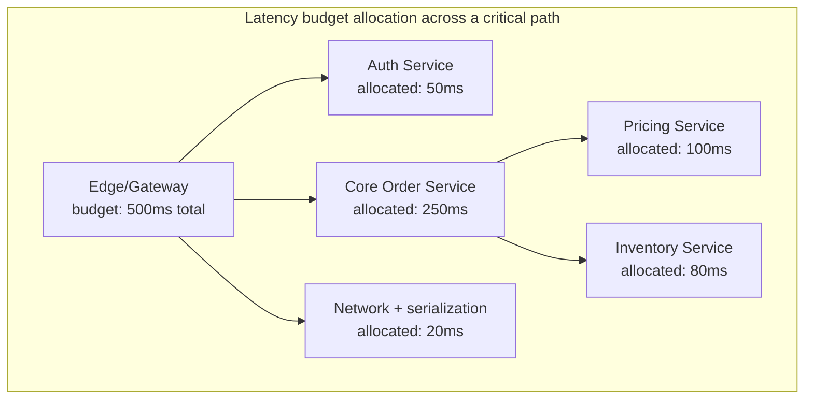
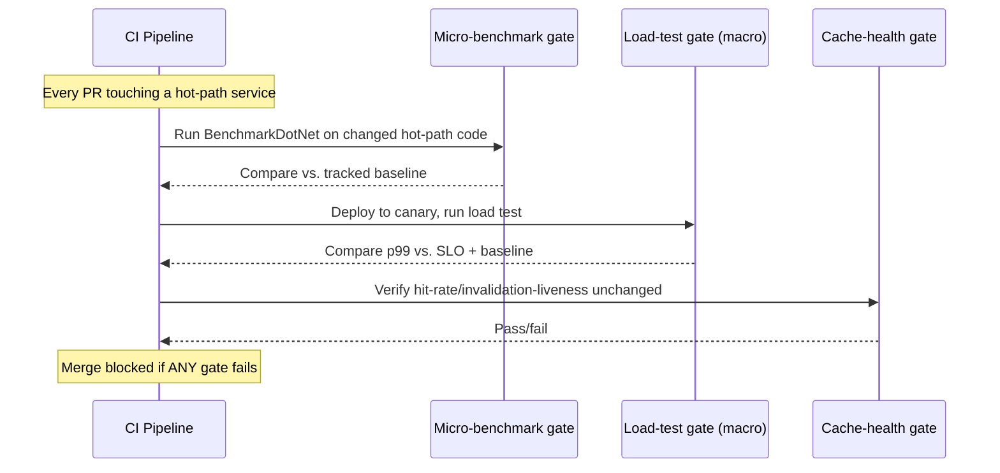
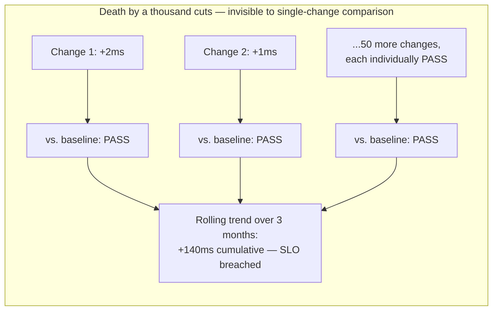

# Module 104 — Performance Engineering: Holistic Performance Engineering — Latency Budgets, SLOs & Continuous Performance Regression Prevention (Capstone)

> Domain: Performance Engineering | Level: Beginner → Expert | Prerequisite: All prior Performance Engineering modules (101–103) — this is the synthesizing capstone closing the `29-Performance-Engineering` domain, Modules 101–104; [[../27-Observability/02-SLOs-SLIs-ErrorBudgets-AlertingDesign]] (error budgets this module's latency budgets directly parallel)
>
> **Note on format:** Originally authored under the leaner Q&A-only format (see `CLAUDE.md`'s 2026-07-18 decision history). Upgraded to the current full-template standard — Fundamentals through Revision — per a later review pass; the original 40 Q&A below are preserved verbatim.

---

## 1. Fundamentals

**What:** Holistic performance engineering is the organizational discipline of treating "this system is fast enough" as a continuously-verified, governed claim rather than a one-time achievement — allocating an explicit **latency budget** across every component on a request's critical path, gating every change against that budget in CI/CD, and monitoring production continuously to catch both sudden regressions and slow, cumulative drift before either breaches a service's latency SLO.

**Why:** Modules 101-103 established the individual tools (profiling, load testing, caching discipline) a team uses to make one thing fast. None of those tools, applied in isolation and once, prevent a *different* team's unrelated change from silently consuming the latency margin the first team's optimization created. Without an explicit, allocated, and enforced budget, "fast enough" degrades one small, individually-reasonable change at a time — the "death by a thousand cuts" pattern — until a system that was comfortably within its SLO six months ago is now chronically breaching it, with no single change anyone can point to as "the regression."

**When:** Any system with a customer-facing or contractually-significant latency requirement (an authorization API, a trading order-entry path, a checkout flow) needs an explicit latency budget from the point multiple independently-deployed services sit on the same critical path — a single-service system can often get by with a simpler, local SLO; the budget-allocation problem specifically emerges once ownership of the end-to-end latency is distributed across teams who can't see each other's contribution without a shared framework.

**How (30,000-ft view):**
```
Overall target (e.g., p99 < 500ms)
 │
 ├─ allocate ──▶ Service A budget: 150ms  (gateway/auth)
 ├─ allocate ──▶ Service B budget: 200ms  (core business logic)
 ├─ allocate ──▶ Service C budget: 100ms  (downstream dependency)
 └─ allocate ──▶ Network/serialization overhead: 50ms

 Each service: CI gate compares actual measured latency
 against its own allocated budget on every change.
 Production: continuous monitoring + trend-aware alerting
 catches both sudden regression and slow cumulative drift.
```

---

## 2. Deep Dive

### 2.1 Latency Budget as the Latency Analogue of an Error Budget
An SLO's error budget (Module 27 §2) states "we may fail at most X% of requests before we must stop shipping and focus on reliability." A latency budget is structurally identical but for a different dimension: "each component on this critical path may consume at most Y milliseconds before the end-to-end SLO is at risk." The two are genuinely independent — a request can succeed (no error) while still consuming its full latency budget and breaching the latency SLO, and a service can be comfortably within its error budget while simultaneously blowing its latency budget. Treating "reliable" and "fast" as one combined health signal misses real, independently-occurring failure modes each framework is specifically built to catch.

### 2.2 Budget Ownership — a Recursive, Caller-Owns-Callee Model
The service initiating a request chain (typically the edge/gateway) owns the overall, end-to-end budget and is responsible for allocating a sub-budget to each service it calls directly. Each downstream service then owns its own allocated sub-budget, and if it itself calls further services, recursively sub-allocates a portion of what it was given. This mirrors how a deadline propagates through a call chain (gRPC deadlines, `HttpClient` cancellation tokens carrying a remaining-time budget) — the mechanism isn't just organizational bookkeeping, it can be implemented literally as a propagated, shrinking deadline value in the request context, so a deeply-nested service can make an informed decision (fail fast, skip an optional enrichment call) when it observes its remaining budget is already exhausted before it even starts work.

### 2.3 The Critical Path Determines Where Budgeting Matters
Only work on the request's critical path — the sequence of operations that must complete sequentially before a response can be returned — affects end-to-end latency. Distributed tracing (spans, parent-child relationships) is the tool that reveals which operations are actually sequential/blocking versus parallel or post-response (fire-and-forget logging, an async event publish that doesn't block the response). Budgeting effort spent on a component not on the critical path — however genuinely, locally slow that component is — produces zero end-to-end latency benefit; this is the single most common wasted-effort pattern in ad hoc, non-budget-governed performance work.

### 2.4 Micro- vs. Macro-Benchmarking, and Where Each Fits the Budget Model
A micro-benchmark (BenchmarkDotNet-style, isolating one function) measures a component's own contribution in isolation — useful for verifying a specific optimization's effect, but insufficient on its own to confirm end-to-end budget compliance, because a component's interaction with everything else on the critical path (contention, serialization, an added network hop) can dominate over its own isolated execution time. A macro/end-to-end benchmark, run against the full request path via a realistic load test (Module 102), is what actually validates budget compliance — the two are complementary, not substitutes: micro-benchmarks localize a regression once macro-benchmarking or production tracing has flagged that a service is exceeding its allocated share.

### 2.5 The Gradual-Drift Detection Problem — Why Single-Change Comparison Isn't Enough
A CI gate comparing each individual change's benchmark result against the immediately-preceding baseline catches a sharp, single-change regression reliably, but is structurally blind to many small, individually-negligible regressions accumulating over dozens of unrelated changes — each comparison passes because each *individual* delta is within noise tolerance, while the cumulative trend over weeks quietly consumes the entire budget. Detecting this requires a second, distinct mechanism: a longer-window trend analysis (comparing this week's p99 against a rolling multi-week baseline, not just the immediately-prior commit), because the two detection mechanisms catch genuinely different failure shapes and neither substitutes for the other.

### 2.6 Performance Debt as a First-Class, Tracked Liability
Not every measured, sub-budget-threatening inefficiency gets fixed the moment it's found — an unindexed query accepted for expediency during a deadline crunch, a synchronous call flagged as "should be async, later" — and treating each such item as an informal, undocumented "someday" note reliably means it never gets prioritized against feature work until it causes a visible incident. Mirroring vulnerability-management practice (a tracked backlog, severity-based prioritization, an explicit remediation SLA), a performance-debt backlog with the same rigor converts an invisible, silently-compounding liability into a visible, governed one — critical since performance debt's cost, like most debt, tends to grow disproportionately with scale rather than remain flat.

---

## 3. Visual Architecture







---

## 4. Production Example

**Problem:** A trade-settlement instruction API — the service that receives a confirmed trade and initiates the downstream settlement workflow — had a contractually-referenced p99 latency SLO of 800ms (feeding into a broader, time-boxed same-day settlement cutoff window shared with several downstream counterparties). Twelve months after the SLO was established and comfortably met at launch, p99 latency had crept to 1,100ms, with no single incident, alert, or postmortem ever having flagged the service as degraded along the way.

**Architecture:** The settlement API sat behind an API gateway, called a compliance-check service, a counterparty-reference-data service, and finally wrote to the settlement ledger — four hops on the critical path, each independently owned by a different team, each individually passing its own team's local, single-change CI regression gate on every deploy.

**Implementation:** Investigation (triggered only after a downstream counterparty formally flagged missed cutoff windows, not by any internal alert) traced the 300ms cumulative growth via distributed tracing spans across the four hops: compliance-check had grown from 80ms to 140ms (a series of individually-small validation rules added incrementally over the year, each shipped with its own passing benchmark against its own immediately-prior baseline); counterparty-reference-data had grown from 120ms to 200ms (a growing reference-data table with no corresponding index maintenance as row count scaled); and the remaining ~80ms was attributable to an accumulation of smaller contributions across the gateway and ledger-write hops, none individually alarming.

**Trade-offs:** No single team had done anything an in-isolation code review would have flagged — each change's own local benchmark comparison was genuinely, correctly passing. The organization had never established a shared, end-to-end latency budget allocated across the four teams, nor a longer-window trend-based alert on the aggregate — only per-service, per-change comparisons existed, which is precisely the detection gap this module's §2.5 identifies structurally.

**Lessons learned:** The remediation had two parts, matching the two-layer detection gap. First, tactical: the compliance-check service's incrementally-added validation rules were profiled and two of the costliest were parallelized (previously run sequentially with no dependency between them); the reference-data table got the missing index. This alone brought p99 back under 800ms. Second, and more consequential long-term: the organization established an explicit, owned, allocated latency budget across the four services (gateway 50ms, compliance-check 150ms, reference-data 150ms, ledger-write 250ms, network/serialization 200ms — deliberately generous relative to current measured baselines, to allow real headroom rather than a knife-edge allocation) with a shared dashboard surfacing each service's current consumption against its allocation, plus a rolling 90-day trend alert on the aggregate end-to-end p99 specifically designed to catch the next "death by a thousand cuts" pattern before a counterparty had to flag it externally again.

---

## 5. Best Practices
- Allocate the latency budget from measured, current per-component contribution and realistic optimization headroom — never split it evenly by component count.
- Give the request-initiating service explicit ownership of the overall budget, and each downstream service explicit ownership of its own allocated sub-budget — ambiguous, shared ownership means nobody is accountable when the aggregate is violated.
- Run both a single-change CI gate (catches sharp regressions) and a longer-window trend alert (catches gradual drift) — neither substitutes for the other.
- Confirm a component is genuinely on the request's critical path (via tracing) before spending optimization effort on it.
- Track performance debt in a prioritized, owned backlog with an explicit remediation SLA, mirroring vulnerability management.
- Require a lightweight, explicit performance-impact assessment during design/code review for any change touching a budget-constrained critical path — catch a budget-consuming design decision before implementation, not only via a post-implementation load test.
- Communicate performance trade-offs to non-technical stakeholders in terms of measured business impact (conversion, cutoff-window compliance), not abstract technical mechanism.

## 6. Anti-patterns
- Treating "we ran a load test once" as equivalent to having an ongoing performance-engineering practice.
- Comparing every change only against its immediately-preceding baseline, with no longer-window trend detection — the exact gap the production example exposed.
- Optimizing a component's own local latency without confirming via tracing that it's actually on the critical path.
- Leaving latency-budget ownership ambiguous across a multi-service critical path.
- Deferring all performance consideration to a post-implementation load test, missing the cheaper opportunity to catch a budget-consuming design decision at review time.
- Treating a low error rate as evidence of acceptable latency — "successful but slow" is a distinct, independently-trackable failure mode.
- Letting performance debt accumulate informally, addressed only reactively after a visible incident.

---

## 7. Performance Engineering

**CPU/GC:** A latency-budget violation attributable to GC pauses (Gen2 collections on a hot path) requires the same allocation-reduction discipline as any other hot-path optimization (Module 101) — but the budget framework's specific contribution is deciding *how much* GC-pause latency a given service can tolerate before it consumes an unacceptable share of its allocation, turning "GC pauses are bad" into a concrete, measurable threshold.

**Memory:** A service's allocated latency budget should account for tail behavior under memory pressure, not just steady-state average — a service that's fast at p50 but spikes at p99 specifically during periodic large-object-heap collections needs its budget validated against p99, exactly the percentile the SLO itself is defined against, never a comforting but misleading average.

**Latency:** The percentile chosen for a budget (p50 vs. p95 vs. p99) materially changes what "within budget" means — a service can be comfortably within budget at p50 while a meaningful fraction of its slowest requests already breach it; budgets should be defined and enforced against the same percentile the end-to-end SLO itself uses, to avoid a false sense of compliance.

**Throughput:** A latency budget calibrated at a given traffic level can silently become invalid at a higher one if any component's latency is throughput-sensitive (queueing effects, contention) — the budget itself needs periodic re-validation under current, not historical, traffic volume (directly Module 102's load-testing discipline, applied on a recurring cadence rather than once).

**Benchmarking:** Micro-benchmark hot-path code changes on every PR; macro/end-to-end benchmark (a load test against a canary) on every release candidate — the two-tier cadence balances catching a regression early and cheaply against the cost of running a full load test on every single commit.

**Caching:** A service's effective, realistic latency budget compliance is directly a function of its current cache hit rate (Module 103) — a silent hit-rate degradation can cause a latency-budget violation with zero code change, which is why cache-health monitoring belongs inside the same regression-prevention pipeline as latency-budget monitoring, not a separate, disconnected concern.

---

## 8. Security

**Threats:** Latency-variance side-channels — an attacker able to measure response-time differences across requests can sometimes infer information the response body itself doesn't reveal (e.g., whether a specific username exists, based on a cache hit's faster response versus a cache miss's slower database round trip; or whether a specific validation branch executed based on subtly different processing time). A latency-budget/regression-monitoring system that publishes granular, per-component timing data externally (verbose `Server-Timing` headers, detailed error responses including internal latency breakdowns) can itself become reconnaissance data for an attacker profiling the system's internal architecture.

**Mitigations:** Avoid exposing granular, per-component timing information to external, unauthenticated callers — aggregate or omit detailed timing headers on internet-facing endpoints, reserving them for internal, authenticated observability tooling only. For genuinely sensitive existence/validation checks (login, account lookup), apply constant-time or uniform-latency handling regardless of the internal code path taken, specifically to close the timing side-channel. Rate-limit and authenticate access to any internal performance-monitoring/tracing dashboard, since it can reveal architectural detail (service topology, relative call volumes, dependency structure) useful to an attacker planning a more targeted attack.

**OWASP mapping:** API8:2023 Security Misconfiguration (verbose timing/debug information exposed externally); a latency side-channel doesn't map cleanly to a single OWASP category but is a recognized instance of information disclosure through side channels, relevant wherever an authentication or authorization decision's timing could vary observably by outcome.

**AuthN/AuthZ:** Internal performance-monitoring and tracing tooling (Jaeger/Zipkin UIs, an APM dashboard) should be access-controlled and never exposed on a public network segment — the same architectural-disclosure risk applies to anyone able to view trace data, not just an external attacker.

**Secrets:** Trace spans and log correlation IDs should never carry sensitive payload data (account numbers, PII) directly in span attributes/tags, since tracing infrastructure is often retained longer and accessed more broadly than the primary application's own data stores.

**Encryption:** Trace and metrics data in transit to the observability backend should be encrypted (TLS) exactly as any other telemetry data, consistent with the observability-domain's own established practice.

---

## 9. Scalability

**Horizontal:** A latency-budget governance system itself (the shared dashboard, the CI gates) must scale with the number of services and teams adopting it — a platform-provisioned, self-service registration model (a service declares its own budget allocation via a config file consumed by the shared tooling) scales far better than a centrally-maintained spreadsheet requiring manual updates as new services are added.

**Vertical:** Not directly applicable to the governance framework itself; individual services' own vertical-scaling decisions are evaluated against their allocated budget the same way any other architectural choice is.

**HA/DR:** The regression-prevention CI pipeline and the production trend-monitoring system are themselves dependencies the organization now relies on for correctness assurance — an outage or silent failure in either (a benchmark-comparison service down, a trend-alerting pipeline's data source stale) removes the safety net without removing the false confidence that it's still working, requiring the identical liveness-canary discipline established for other verification infrastructure in this course.

**CAP/replication:** Not directly applicable to latency-budget governance itself, though the underlying services it governs are subject to the same CAP trade-offs (Module 103 §9) already established — a budget allocation should account for the latency cost a chosen consistency model (e.g., synchronous multi-region replication) structurally imposes, rather than being set independently of that architectural choice.

**Load balancing:** Latency-budget compliance should be measured per-instance and aggregated, not only as a fleet-wide average — an unevenly-loaded fleet (a hot-spotted partition, an unbalanced load-balancing algorithm) can show acceptable aggregate latency while a subset of requests routed to an overloaded instance silently breach budget, invisible in an averaged view.

---

## 10. Interview Questions

### Basic (10)

1. **Q: What is a latency budget?**
 **A:** The maximum acceptable time a request (or a specific portion of it) is allowed to take, allocated across the components/services involved so their combined latency stays within an overall target — directly analogous to the error budget, but for latency rather than reliability.
 **Why correct:** States the definition and its direct parallel to error budgets.
 **Common mistakes:** Treating latency budget as a single, system-wide number with no allocation across the specific components contributing to it.
 **Follow-ups:** "Why does a latency budget need to be allocated per-component, not just set as one overall target?" (Without per-component allocation, there's no way to know which specific service is responsible when the overall budget is violated, or to catch a regression before it consumes the entire budget.)

2. **Q: What is the difference between performance engineering and performance testing?**
 **A:** Performance testing is a specific activity (load testing, benchmarking) measuring a system's current performance. Performance engineering is the broader, ongoing discipline spanning design-time decisions, continuous measurement, regression prevention, and organizational practice — of which testing is one component, not the whole.
 **Why correct:** States testing as a subset activity within the broader engineering discipline.
 **Common mistakes:** Treating "we ran a load test" as equivalent to having a genuine performance engineering practice.
 **Follow-ups:** "What else does performance engineering include beyond testing?" (Design-time architectural decisions, continuous production monitoring, latency-budget governance, and a culture of measuring before optimizing.)

3. **Q: What is the "critical path" of a request, and why does it matter for latency budgeting?**
 **A:** The critical path is the sequence of operations that must complete sequentially and directly determines the request's total latency — work happening in parallel or after the response is already sent doesn't affect it. Latency budgeting must focus specifically on the critical path, since optimizing a component *not* on it provides zero end-to-end latency benefit.
 **Why correct:** States the definition and its direct relevance to where budgeting/optimization effort should focus.
 **Common mistakes:** Optimizing a component's own latency without first confirming it's actually on the request's critical path.
 **Follow-ups:** "How would you identify the critical path for a complex, multi-service request?" (Distributed tracing, — the trace's span structure reveals which operations are sequential/blocking versus parallel/non-blocking.)

4. **Q: What is a performance regression?**
 **A:** A measurable degradation in a system's latency, throughput, or resource efficiency compared to a prior, established baseline — typically introduced by a code change, configuration change, or a shift in data volume/traffic pattern.
 **Why correct:** States the definition and typical causes.
 **Common mistakes:** Only recognizing a regression once it causes a user-visible incident, rather than detecting it via continuous, baseline-compared measurement (the CI-gate pattern).
 **Follow-ups:** "What's the earliest point a regression can be caught?" (An automated, CI-integrated performance gate comparing every change against a tracked baseline.)

5. **Q: What is the relationship between performance engineering and SLOs?**
 **A:** A latency-related SLI/SLO (e.g., "p99 latency under 500ms") is the formal, measured target performance engineering work is ultimately accountable to — performance engineering provides the diagnostic and preventive practices ensuring that SLO is actually, continuously met, not merely met once at launch.
 **Why correct:** States performance engineering as the practice serving an already-established governance framework (SLOs), not a separate, disconnected concern.
 **Common mistakes:** Treating performance work and SLO compliance as two unrelated activities rather than recognizing performance engineering exists specifically to keep the SLO's promise durably true.
 **Follow-ups:** "What happens to performance-improvement priority once a latency SLO is comfortably met?" (Similar to the error-budget policy — once comfortably within budget, effort can shift toward feature velocity, revisiting performance investment only as the budget's margin narrows.)

6. **Q: What is "death by a thousand cuts" in performance, and why is it hard to detect?**
 **A:** Many small, individually-negligible performance regressions accumulating gradually over time (each too small to trigger any single alert) until their combined effect produces a significant, user-visible degradation — hard to detect because no single change looks alarming in isolation, and a system comparing only against the immediately-preceding baseline (not a longer historical trend) misses the slow, cumulative drift.
 **Why correct:** States the accumulation mechanism and the specific reason single-change comparison misses it.
 **Common mistakes:** Comparing only each change against its immediate predecessor, missing a slow trend visible only over a longer historical window.
 **Follow-ups:** "How would you detect this cumulative pattern?" (Track the metric's trend over a longer historical window, not just change-over-change, alerting on a sustained, gradual decline even if no single change appears individually significant.)

7. **Q: What is the difference between micro-benchmarking and macro/end-to-end benchmarking?**
 **A:** Micro-benchmarking measures a single, isolated function/operation's performance (the BenchmarkDotNet-style measurement); macro/end-to-end benchmarking measures a full request's or workflow's total performance across every component involved.
 **Why correct:** States the scope distinction (isolated operation vs. full workflow).
 **Common mistakes:** Assuming a favorable micro-benchmark result on one function guarantees good end-to-end performance, ignoring how that function interacts with everything else on the critical path.
 **Follow-ups:** "Why might a component with excellent micro-benchmark results still contribute to a poor end-to-end result?" (It may not be on the critical path at all, or its interaction with other components — contention, serialization overhead — may dominate over its own isolated execution time.)

8. **Q: What is the role of a Principal Engineer in performance engineering across a whole organization, versus within a single team?**
 **A:** Within a single team, performance work is typically tactical — profiling and fixing a specific service's bottleneck. A Principal Engineer's organization-wide role is establishing shared latency-budget governance, cross-team performance-regression-prevention tooling, and a consistent measurement culture, ensuring performance discipline doesn't depend on any single team's individual diligence.
 **Why correct:** Distinguishes tactical, single-team work from the organization-wide, structural/governance role a Principal Engineer plays.
 **Common mistakes:** Assuming Principal Engineer involvement in performance means personally profiling and fixing every team's bottlenecks, rather than establishing shared practices and tooling.
 **Follow-ups:** "Why does organization-wide latency-budget governance matter for a multi-service request?" (Without shared, allocated budgets, individual teams can each locally over-consume their own share of the overall request's acceptable latency with no visibility into the cumulative, cross-team effect.)

9. **Q: What is "performance debt," as it relates to technical debt more broadly?**
 **A:** Accumulated, deferred performance work — known inefficiencies or shortcuts (an unindexed query, a synchronous call that should be async) accepted at the time for expediency, left unaddressed, and compounding in cost/risk as the system scales and the debt's impact grows disproportionately.
 **Why correct:** States the parallel to technical debt generally, applied specifically to deferred performance work.
 **Common mistakes:** Treating every performance shortcut as equally low-risk to defer indefinitely, without recognizing debt's cost typically grows with scale.
 **Follow-ups:** "How would you track and prioritize performance debt, similar to how tracks security vulnerabilities?" (A tracked backlog with severity/impact-based prioritization and an explicit remediation SLA, rather than an informal, unprioritized list easily deprioritized indefinitely.)

10. **Q: What is the general lifecycle of a performance engineering practice?**
 **A:** Measure (profile/load-test to establish actual current behavior) → diagnose (localize the specific bottleneck) → fix (apply the targeted remediation) → verify (re-measure to confirm the fix's actual impact) → monitor (continuously track the metric going forward to catch future regressions) — a closed loop, not a one-time, linear sequence.
 **Why correct:** States the full cycle including the often-omitted final steps (verify, monitor) that close the loop back to continuous practice.
 **Common mistakes:** Stopping after "fix," without re-measuring to confirm the expected impact or establishing ongoing monitoring to catch a future regression.
 **Follow-ups:** "Why is the 'monitor' step as important as the initial 'measure' step?" (A fix validated once provides no ongoing guarantee — the same "declared ≠ actual until continuously reverified" principle this course has established throughout applies to performance fixes specifically.)

### Intermediate (10)

1. **Q: How would you allocate a latency budget across multiple services in a request's critical path?**
 **A:** Start from the overall target (e.g., 500ms end-to-end p99), then allocate a specific share to each service on the critical path based on that service's actual, currently-measured contribution and realistic optimization headroom — a service closer to its own practical floor (already highly optimized) should receive a larger allocation than one with more realistic room for improvement, rather than dividing the budget evenly regardless of each service's actual characteristics.
 **Why correct:** States a concrete, measurement-informed allocation approach rather than an arbitrary, even split.
 **Common mistakes:** Splitting the overall budget evenly across every service on the path, ignoring that some services have far more realistic optimization headroom than others.
 **Follow-ups:** "What happens if the sum of every service's actual, current latency already exceeds the overall target?" (This reveals the overall target itself may be unrealistic given the current architecture, requiring either a renegotiated target, a fundamental architectural change (removing a hop, parallelizing sequential calls), or an explicit, accepted SLO miss.)

2. **Q: How do you decide which service "owns" the latency budget when a request spans many microservices?**
 **A:** The service initiating the request chain (often the API gateway or front-end-facing service) owns the *overall* end-to-end budget and is responsible for allocating and tracking sub-budgets to each downstream service it calls; each downstream service then owns its own allocated sub-budget and is responsible for staying within it, including further sub-allocating if it itself calls additional services.
 **Why correct:** States a clear, recursive ownership model (the caller allocates and tracks the budget for what it calls) avoiding ambiguous, shared responsibility.
 **Common mistakes:** Leaving budget ownership ambiguous/shared across the whole chain, making it unclear who's accountable when the overall budget is violated.
 **Follow-ups:** "How would you enforce this ownership model technically?" (Propagate a deadline/budget value through the request context (similar to how trace context propagates) so each service can measure its own remaining budget and make an informed decision about further downstream calls.)

3. **Q: How would you prevent a performance regression from reaching production, tying Modules 101–103 together?**
 **A:** Combine an automated, CI-integrated load-test gate comparing key metrics against a tracked baseline, continuous profiling in staging/canary to catch a regression's specific root cause before full rollout, and monitored cache-hit-rate/invalidation-liveness checks — since a regression could originate from any of these three layers, and each requires its own specific detection mechanism rather than assuming one catches all.
 **Why correct:** Explicitly composes all three prior modules' specific detection mechanisms into one coherent prevention strategy.
 **Common mistakes:** Relying on only one of the three detection mechanisms (e.g., load testing alone) and assuming it would catch every possible regression source, missing gaps only the other two mechanisms specifically address.
 **Follow-ups:** "What's the risk of relying solely on production monitoring to catch regressions, with no pre-production gate at all?" (Every regression reaches real users before detection — directly the fail-fast economics argument for catching issues at the earliest, cheapest possible stage.)

4. **Q: What's the risk of optimizing one service's latency in isolation without considering the end-to-end critical path?**
 **A:** The optimized service may not actually be on the critical path (providing zero end-to-end benefit despite genuine local improvement), or optimizing it might shift the bottleneck elsewhere in the chain without improving overall latency at all — local optimization without end-to-end context risks wasted effort or a false sense of progress.
 **Why correct:** States both specific risks (non-critical-path optimization, bottleneck-shifting) local-only optimization carries.
 **Common mistakes:** Reporting a local latency improvement as a success without confirming it actually improved the end-to-end, user-facing metric that matters.
 **Follow-ups:** "How would you confirm a local optimization actually improved end-to-end latency?" (Re-measure the full request's end-to-end latency (via tracing) after the fix, not merely the optimized component's own isolated latency.)

5. **Q: How would you handle a latency-budget violation caused by a third-party dependency you don't control?**
 **A:** Apply the same architectural mitigations established for an uncontrollable bottleneck — caching cacheable responses, parallelizing independent calls, adding a timeout/circuit breaker bounding worst-case impact — and, if the dependency is business-critical and its performance is contractually significant, escalate via its SLA rather than attempting to "optimize" code you don't own.
 **Why correct:** Directly reuses an already-established, structurally identical prior-module finding for this specific scenario.
 **Common mistakes:** Attempting to micro-optimize your own calling code when the actual bottleneck is confirmed to be the third party's own response time, which your own code changes cannot affect.
 **Follow-ups:** "How would this affect your own latency-budget allocation for the portion of the request touching that dependency?" (Allocate a larger, more conservative budget share to that specific hop reflecting its actual, measured (and less controllable) variance, rather than an optimistic allocation assuming full control you don't actually have.)

6. **Q: How does caching interact with latency-budget allocation?**
 **A:** A cache hit typically consumes a much smaller fraction of a service's allocated latency budget than a cache miss requiring a full origin fetch — meaning the *effective* latency budget a service can reliably meet depends heavily on its actual, current cache hit rate, and a silent hit-rate degradation can cause a latency-budget violation with no code change at all, purely from the caching layer's own health shifting.
 **Why correct:** Connects cache health directly to latency-budget compliance, explaining a non-code-change mechanism for a budget violation.
 **Common mistakes:** Assuming a service's latency-budget compliance, once established, remains stable regardless of its caching layer's ongoing, unmonitored health.
 **Follow-ups:** "How would you account for this in budget monitoring?" (Monitor cache hit rate alongside latency directly, so a budget violation can be immediately attributed to a cache-health cause rather than requiring a separate, disconnected investigation.)

7. **Q: What organizational practice helps prevent performance debt from silently accumulating over time?**
 **A:** A tracked, prioritized performance-debt backlog (Basic Q9) reviewed on a regular cadence (mirroring the vulnerability-management SLA model) — explicitly allocating a portion of each team's ongoing engineering capacity to performance-debt remediation, rather than treating it as something addressed only reactively once it causes a visible incident.
 **Why correct:** Proposes a concrete, recurring practice (tracked backlog, allocated capacity) rather than a vague "keep it in mind" approach.
 **Common mistakes:** Addressing performance debt only reactively, after it has already caused a user-visible incident, rather than proactively tracking and periodically remediating it.
 **Follow-ups:** "How would you prioritize which performance-debt items to address first?" (By expected impact at projected future scale and remediation cost, directly mirroring the CVSS-based severity/SLA prioritization applied to performance-debt items instead of vulnerabilities.)

8. **Q: How would you design a performance review process for new features before they ship?**
 **A:** Require an explicit, lightweight performance-impact assessment as part of design/code review for any feature touching a latency-budget-constrained critical path — estimating expected additional latency/resource cost and validating it against the remaining budget headroom, directly mirroring the threat-modeling-at-design-time principle applied to performance specifically, catching a budget-consuming design choice before implementation rather than only via a post-implementation load test.
 **Why correct:** Applies an already-established "shift left, review at design time" principle specifically to performance-impact assessment.
 **Common mistakes:** Deferring all performance consideration to a post-implementation load test, missing the opportunity to catch a design-level, budget-consuming decision earlier and more cheaply.
 **Follow-ups:** "What's a red flag during this design-time review that should trigger deeper scrutiny?" (A new feature adding a synchronous call to an already latency-budget-tight critical path, or introducing a new database query pattern with unclear indexing/scaling characteristics.)

9. **Q: What is the relationship between a service's error budget and its latency budget?**
 **A:** They're related but distinct dimensions of reliability — a request can complete "successfully" (no error) while still violating its latency budget (unacceptably slow), meaning a service can be fully within its error budget while its latency SLO is simultaneously breached, or vice versa; both require independent tracking and governance, not a single combined metric assuming one implies the other.
 **Why correct:** States precisely why the two are independent, not substitutable, dimensions.
 **Common mistakes:** Assuming a low error rate implies acceptable latency, missing that "successful but slow" is a real, independently-trackable failure mode the error-budget framework alone doesn't capture.
 **Follow-ups:** "How would you define a latency-specific SLI distinct from an error-rate SLI?" (Percentile latency (p95/p99) against a defined threshold, tracked and alerted on independently from success/error rate, exactly the SLI framework applied to a second, latency-specific dimension.)

10. **Q: How would you communicate a performance trade-off decision to non-technical stakeholders?**
 **A:** Frame it in terms of measured, concrete user-facing and business impact (the principle) — "this change reduces checkout latency from 2s to 400ms, directly correlating with a measured X% reduction in cart abandonment, at a cost of Y engineering-weeks" — rather than describing the technical mechanism abstractly.
 **Why correct:** Directly reapplies an already-established course communication principle (concrete, measured mechanisms over abstractions) to performance-trade-off communication specifically.
 **Common mistakes:** Describing a performance investment in purely technical terms ("we optimized the database queries") without quantifying the actual, measured business/user impact that justifies the investment.
 **Follow-ups:** "Why does citing the specific before/after measurement matter more than describing the technical approach?" (A stakeholder evaluating whether an investment was worthwhile needs the actual, quantified outcome, not the technical mechanism — the mechanism explains "how," the measurement is what justifies the investment.)

### Advanced (10)

1. **Q: Design a continuous performance-regression-prevention pipeline integrating Modules 101–103 into CI/CD.**
 **A:** Every PR/release candidate runs: (1) micro-benchmarks for any changed hot-path code, compared against a tracked historical baseline; (2) an automated load test against a staging/canary deployment, gated on SLO-threshold and baseline-regression criteria; (3) a cache-hit-rate/invalidation-health check confirming no caching-layer regression was introduced — all three gates blocking merge/promotion on failure, directly composing this domain's three prior modules into one unified, automated CI/CD performance-regression-prevention pipeline.
 **Why correct:** Concretely composes all three modules' specific verification mechanisms into one integrated pipeline design.
 **Common mistakes:** Implementing only one of the three gates and assuming it provides comprehensive regression coverage across every possible performance-regression source.
 **Follow-ups:** "How would you avoid this three-gate pipeline itself becoming a friction-driven bottleneck?" (Risk-tier which gates run on every PR versus only on release candidates, and keep each gate fast/reliable enough to fit the normal release cadence — mirroring the risk-tiered gate design.)

2. **Q: How would you design an organization-wide latency-budget governance model across many independently-owned services?**
 **A:** Establish a platform-provided, shared latency-budget-tracking system where each service registers its allocated sub-budget and current, measured actual latency contribution to every critical path it participates in, with a centralized dashboard surfacing any service consuming more than its allocated share — directly mirroring the platform-unification principle, avoiding each team independently, inconsistently tracking its own share with no cross-team visibility into the cumulative, end-to-end effect.
 **Why correct:** Proposes a concrete, centralized governance mechanism directly reusing an already-established course platform-unification pattern.
 **Common mistakes:** Leaving latency-budget tracking entirely to each team's own, independent discretion with no shared, cross-team visibility into cumulative critical-path consumption.
 **Follow-ups:** "What's the risk of a purely advisory, undeclared budget system with no enforcement?" (Directly the now-repeated finding — a declared-but-unenforced governance mechanism reliably underperforms a structural one; a budget system with no actual gating/alerting mechanism behind it provides no real protection against silent, cumulative overconsumption.)

3. **Q: How would you diagnose which of several concurrent contributing factors (GC pauses, cache miss, downstream dependency, N+1 query) is dominant in a latency-budget violation?**
 **A:** Use distributed tracing to attribute the request's total latency across each contributing factor's actual span/time contribution, then rank by magnitude — rather than guessing or addressing whichever factor is most familiar/visible, directly applying the "measure and localize before fixing" discipline to a multi-factor scenario specifically.
 **Why correct:** Reapplies the module's foundational measurement discipline specifically to a multi-cause diagnostic scenario.
 **Common mistakes:** Addressing the most familiar or most recently-discussed contributing factor first, without measuring each factor's actual, relative contribution to confirm it's genuinely the dominant one.
 **Follow-ups:** "What if tracing reveals two factors contributing roughly equally?" (Address both, but sequence based on fix cost/risk and re-measure after each — the finding that fixing one factor can shift or change the other's relative significance.)

4. **Q: Design a performance-debt tracking and remediation-prioritization system, mirroring the vulnerability-management SLA model.**
 **A:** Track each identified performance-debt item with a severity classification (based on current and projected-at-scale impact) and a corresponding remediation SLA, de-duplicating overlapping findings from different sources (profiling, load testing, production incidents) into one centrally-tracked item — directly reusing the vulnerability-management-system design, substituting performance-debt severity/impact for CVSS score.
 **Why correct:** Explicitly, concretely reuses an already-established course system design pattern for a structurally analogous tracking need.
 **Common mistakes:** Tracking performance-debt items informally (a scattered list of "someday" tickets) with no severity-based prioritization or enforced remediation timeline, risking indefinite deferral.
 **Follow-ups:** "How would you project 'impact at scale' for a performance-debt item that isn't currently causing a visible problem?" (Extrapolate from the item's current, small-scale cost using the same non-linear-scaling awareness/102 established — some debt items scale linearly and can wait; others sit near a cliff/ceiling that will manifest suddenly and severely at a specific future scale.)

5. **Q: How would you decide the appropriate latency-budget allocation trade-off between a critical, user-facing path and an internal, batch/background path?**
 **A:** Allocate tighter, more rigorously-enforced budgets to genuinely user-facing, real-time-sensitive paths, and looser, more tolerant budgets to internal/batch paths whose completion time affects no directly-waiting user — a risk-proportionate allocation matching each path's actual sensitivity, rather than applying a uniform latency standard across fundamentally different path types.
 **Why correct:** States a concrete, risk-proportionate allocation principle rather than a uniform standard.
 **Common mistakes:** Applying identical, strict latency requirements to both user-facing and internal/batch paths, wasting engineering effort tightening a budget where no user is actually waiting.
 **Follow-ups:** "What's the risk of an overly loose budget for an internal/batch path?" (An internal path's own degradation can eventually cascade into a user-facing effect — e.g., a batch job falling behind schedule delaying data a user-facing feature depends on — so "loose" still needs an explicit, monitored ceiling, not an unbounded absence of any budget at all.)

6. **Q: Critique "just add more caching" as a default response to every latency-budget violation.**
 **A:** This ignores the own findings — caching isn't free (invalidation-correctness risk, potential cross-principal leakage if key-scoping is wrong, added architectural complexity) and provides no benefit if the actual bottleneck isn't a repeated, cacheable read at all (a write-heavy path, a genuinely unique-per-request computation, a third-party dependency's own latency) — reaching for caching reflexively, without first confirming via profiling that the bottleneck is genuinely cache-shaped, risks adding real complexity and risk with no corresponding benefit.
 **Why correct:** Connects the critique directly to the own established risks and the "measure before fixing" discipline.
 **Common mistakes:** Reflexively proposing caching as the universal fix for any latency problem, without first confirming via profiling that the bottleneck's actual nature is one caching would genuinely address.
 **Follow-ups:** "What would confirm caching is genuinely the right fix, versus another cause?" (Profiling showing the bottleneck is specifically a repeated, expensive fetch/computation with a high read-to-write ratio and acceptable staleness tolerance — the criteria — not merely "the request feels slow.")

7. **Q: How would you design capacity/performance testing specifically for a system undergoing a major architectural migration (e.g., monolith to microservices)?**
 **A:** Load-test the new architecture at equivalent (and higher) traffic levels *before* full cutover, specifically validating that the new architecture's additional network hops and serialization overhead (an inherent cost of decomposition) don't push overall latency beyond the pre-migration baseline's acceptable budget — since a microservices migration can easily trade one class of bottleneck (a monolith's in-process call) for another (network latency between services) if not deliberately measured and budgeted for during the transition.
 **Why correct:** Identifies the specific, common risk (network/serialization overhead replacing in-process call cost) a migration-specific test must validate.
 **Common mistakes:** Assuming a microservices migration is inherently a performance improvement, without measuring whether the new architecture's added network overhead has been budgeted for and validated against the pre-migration baseline.
 **Follow-ups:** "What's a common latency-budget mistake during a phased, incremental migration?" (Not accounting for the transitional period where some calls have moved to the new, network-hop-adding architecture while others remain in-process, producing an inconsistent, harder-to-budget-for mixed topology during the migration window itself.)

8. **Q: How does the recursive "verify the verifier" theme apply to a performance-monitoring/APM system itself?**
 **A:** An APM (Application Performance Monitoring) tool's own instrumentation, sampling configuration, or data pipeline can itself silently degrade (an agent silently failing to report, a sampling rate silently dropped to near-zero) producing a misleadingly "healthy-looking" (or simply empty) dashboard indistinguishable from genuine good performance — directly recurring the DAST-silent-degradation finding, now for performance-monitoring tooling specifically, requiring the identical fail-loudly and continuous-liveness-verification discipline applied to the APM system's own health, not merely the application it monitors.
 **Why correct:** Directly, explicitly extends the course's now-thoroughly-established recursive verification theme to APM tooling specifically.
 **Common mistakes:** Assuming an APM dashboard showing no alerts/no data automatically means the system is performing well, without verifying the APM's own instrumentation/reporting pipeline is actually functioning.
 **Follow-ups:** "What would an APM-liveness canary look like?" (A synthetic, known transaction run on a schedule specifically to confirm the APM tool correctly captures and reports its expected latency/trace data — directly/99's liveness-canary pattern, applied to performance-monitoring infrastructure.)

9. **Q: Design an incentive structure ensuring teams don't game a performance SLO the same way showed coverage metrics get gamed.**
 **A:** Measure the SLO using an end-to-end, user-facing metric genuinely representative of real experience (not a proxy easily satisfied without reflecting genuine improvement, e.g., a synthetic, unrepresentative benchmark a team could over-fit to) and pair it with periodic, independent audits (real-user-monitoring data cross-checked against any team-reported synthetic results) — directly reapplying the coverage-gaming lesson (a measured proxy can diverge from what it's meant to represent once specifically optimized against) to performance-SLO measurement specifically.
 **Why correct:** Explicitly connects to and reapplies an already-established course finding about metric-gaming risk.
 **Common mistakes:** Defining a performance SLO around an easily-gamed synthetic benchmark disconnected from genuine, real-user-facing experience, creating the same gaming incentive identified for test coverage.
 **Follow-ups:** "What's a concrete sign a team is gaming a latency SLO rather than genuinely improving it?" (A synthetic benchmark showing consistent improvement while real-user-monitoring data shows no corresponding change — directly mirroring the "100% coverage, still shipped a critical bug" divergence pattern.)

10. **Q: How would you reconcile a latency-budget requirement with a team's competing feature-velocity pressure?**
 **A:** Apply the same risk-tiered, structural-default approach established for CD promotion gates — make performance-budget compliance checking automated and fast (a CI gate, not a manual review bottleneck) so it doesn't itself become the friction source driving teams to bypass or ignore it, and reserve human, deeper performance review specifically for features flagged as genuinely high-risk to the budget (per Advanced Q8's design-time review), rather than applying uniform, manual scrutiny to every change regardless of actual risk.
 **Why correct:** Directly reapplies the already-established friction-vs-bypass finding and risk-tiering solution to this specific reconciliation problem.
 **Common mistakes:** Treating performance-budget enforcement as inherently, unavoidably in tension with velocity, rather than recognizing the friction itself — not the requirement — is what drives bypass, and that automating the check removes the friction without removing the requirement.
 **Follow-ups:** "What's the risk of making the performance gate too strict and too slow, even if automated?" (Directly the exact incident — teams routing around an overly strict or slow automated gate via an unaudited exception path, recreating the identical friction-driven-bypass dynamic even with automation in place if the gate itself remains too costly to pass routinely.)

### Expert (10)

1. **Q: Design a full, capstone-level performance-engineering governance framework synthesizing profiling, load testing, caching, and latency budgets into one unified organizational practice.**
 **A:** One unified framework: (1) every service has a platform-provisioned, automatically-instrumented profiling/tracing baseline established at onboarding, mirroring the golden-path onboarding pattern; (2) every critical path has an explicit, tracked, allocated latency budget (this module) with automated CI/CD regression gates validating every change against it; (3) every caching layer has monitored hit-rate and invalidation-liveness checks; (4) a centralized, organization-wide dashboard surfaces every service's current budget-compliance status, performance-debt backlog, and any degraded verification layer — directly composing all three prior modules plus this module's latency-budget governance into one platform-provisioned, continuously-verified system, exactly mirroring the own capstone-synthesis structure for the observability domain.
 **Why correct:** Concretely, comprehensively composes every prior module's specific mechanism into one unified governance framework, explicitly modeled on an already-established, structurally analogous capstone.
 **Common mistakes:** Treating each of the four components (profiling, load testing, caching, budgets) as separately-adopted, disconnected practices rather than one unified, platform-provisioned system with shared visibility.
 **Follow-ups:** "What's the specific risk this unified framework must guard against, per the own central finding?" (The onboarding/scaffolding mechanism delivering this framework to every new service could itself silently drift out of sync with the framework's own evolving standard — requiring the identical live-reference architecture and periodic capability audit established, now applied to performance-governance onboarding specifically.)

2. **Q: How would you approach performance engineering differently for a system operating under extreme cost constraints (a startup) versus one with a large budget (a hyperscaler)?**
 **A:** A cost-constrained startup should prioritize the cheapest, highest-leverage practices first — basic profiling discipline and avoiding foreseeable architectural mistakes (the "not premature optimization" principle) — deferring expensive investments (dedicated APM tooling, extensive load-testing infrastructure) until genuinely justified by actual scale or risk. A well-resourced hyperscaler can justify the full, unified governance framework (Expert Q1) from the start, since the cost of an undetected regression at that scale vastly exceeds the governance framework's own operating cost.
 **Why correct:** Correctly scales the recommendation to organizational context and constraint, mirroring this course's established pattern for other domains' build-vs-buy decisions.
 **Common mistakes:** Recommending identical, maximal performance-engineering investment regardless of organizational scale, cost constraint, or actual current risk profile.
 **Follow-ups:** "What's the risk of a startup deferring all performance discipline until it 'becomes a problem'?" (Retrofitting performance discipline into an already-built, already-scaled system is a substantially larger undertaking than building foundational, cheap practices in from the start — directly mirroring the identical build-vs-defer trade-off reasoning.)

3. **Q: Critique treating "performance" as purely an engineering concern disconnected from business/product decisions.**
 **A:** Performance directly drives measurable business outcomes (conversion rate, user retention, infrastructure cost) — treating it as a purely internal engineering concern risks either under-investing in performance work that would demonstrably justify itself with real business impact data, or over-investing in performance polish with no corresponding business value, since neither direction is being evaluated against the actual business metric it should be justified by. Performance decisions should be made jointly with product/business stakeholders, using the same concrete, measured-impact communication (Intermediate Q10) this course has established throughout.
 **Why correct:** Identifies the specific bidirectional risk (under- or over-investment) of disconnecting performance decisions from business impact measurement.
 **Common mistakes:** Assuming performance work is self-evidently valuable engineering hygiene that doesn't need business-impact justification, or conversely, that business stakeholders have no useful input into technical performance-investment decisions.
 **Follow-ups:** "How would you quantify performance's business impact concretely?" (A/B testing a specific latency change against real conversion/retention metrics, directly measuring the business outcome rather than assuming a correlation.)

4. **Q: How would you design a performance postmortem process, mirroring the blameless postmortems, for a production performance incident?**
 **A:** Apply the identical blameless, systemic-fix-focused structure established — a factual timeline of the incident, followed by tracked, owned action items addressing the systemic gap (a missing regression gate, an unmonitored cache-health metric, an unallocated latency budget) rather than attributing the incident to an individual's specific code change, since the systemic question ("why didn't our regression-prevention pipeline catch this") is more valuable than "who wrote the slow code."
 **Why correct:** Directly, explicitly reapplies the already-established blameless-postmortem structure to performance incidents specifically.
 **Common mistakes:** Focusing a performance-incident postmortem on identifying which specific commit/engineer introduced the regression, rather than on why the organization's regression-prevention systems failed to catch it before production.
 **Follow-ups:** "What's a likely systemic action item from a performance postmortem, given this module's established practices?" (Adding a new, specific regression-detection gate (per Advanced Q1) that would have caught this specific incident's root cause, converting a one-time incident into a durable, structural improvement.)

5. **Q: How does this course's recurring "declared ≠ actual" theme culminate specifically in performance engineering, compared to its instances in Security, Observability, and DevOps?**
 **A:** Performance engineering's instance is distinctive in that a "declared" performance property (a cache providing benefit, a query being indexed, a service meeting its latency budget) degrades not merely silently but often *gradually and imperceptibly* — unlike a security control's typically sharper, more binary failure or an observability gap's often sudden onset (the fragmentation), a performance regression frequently accumulates slowly (Basic Q6's "death by a thousand cuts"), meaning the theme's performance-domain instance specifically requires continuous, trend-aware monitoring (not just point-in-time or binary pass/fail checks) to catch — a genuinely distinct detection challenge among this course's four recent domains' otherwise-structurally-similar findings.
 **Why correct:** Correctly identifies performance engineering's specific, distinguishing contribution (gradual, cumulative degradation requiring trend-based, not merely binary, detection) to the course's broader theme.
 **Common mistakes:** Treating performance engineering's instance of the theme as identical in character to Security's or Observability's, missing the specific gradual-accumulation dynamic that makes performance regressions a genuinely different detection challenge.
 **Follow-ups:** "What detection technique is specifically suited to this gradual-accumulation character?" (Long-window trend monitoring (Basic Q6) rather than point-in-time threshold checks alone — a metric's trajectory over weeks/months, not merely its current single-point value against a static threshold.)

6. **Q: Design a metric/dashboard a CTO would use to understand organization-wide performance health without drowning in per-service detail.**
 **A:** Aggregate to: (1) the percentage of services currently within their allocated latency budget (a single, organization-wide compliance rate); (2) the size and age-distribution of the organization-wide performance-debt backlog (Advanced Q4); (3) the count and trend of performance-related production incidents over time — avoiding per-service, per-metric granularity at the executive level, while ensuring each aggregate figure is genuinely, verifiably rolled up from real, currently-functioning per-service measurement (not merely a self-reported, unaudited summary), directly reapplying the identical CISO-dashboard-design principle to performance specifically.
 **Why correct:** Proposes concrete, appropriately-aggregated metrics while explicitly requiring the underlying verification integrity established for exactly this kind of executive rollup.
 **Common mistakes:** Presenting either raw, per-service granular data (overwhelming, not actionable at the executive level) or an aggregate summary with no verification that the underlying, rolled-up data is itself genuinely current and functioning.
 **Follow-ups:** "Why is 'percentage of services within budget' a more meaningful executive metric than 'average latency across all services'?" (An average can mask a small number of severely out-of-budget services amid many healthy ones — a compliance-rate metric surfaces the actual scope of the problem more directly, mirroring the percentile-vs-average finding.)

7. **Q: How would you decide when a performance problem warrants an architectural rewrite versus incremental optimization?**
 **A:** Reserve a rewrite for cases where profiling confirms the bottleneck is structural — an architecture fundamentally incapable of meeting the required budget regardless of incremental tuning (e.g., a synchronous, single-threaded design facing a genuinely required concurrency level, or a data model requiring O(n²) access patterns at a scale where that's no longer tolerable) — and prefer incremental optimization whenever profiling shows the current architecture has meaningful, achievable headroom via targeted fixes, directly mirroring the identical structural-fix-vs-incremental-mitigation reasoning for a different but analogous decision.
 **Why correct:** States a concrete, profiling-informed criterion (structural incapability vs. remaining headroom) and connects it to an already-established, analogous prior-module reasoning pattern.
 **Common mistakes:** Defaulting to either "always optimize incrementally, never rewrite" or "rewrite whenever performance is a concern," rather than basing the decision on profiling-confirmed evidence of the current architecture's actual, remaining headroom.
 **Follow-ups:** "What's the risk of choosing a rewrite when incremental optimization would have sufficed?" (A rewrite is a substantially larger, higher-risk undertaking (§Advanced Q2's overcorrection-recognition pattern) — committing to one without first confirming incremental options are genuinely exhausted risks unnecessary cost, delay, and new-implementation risk for a problem a smaller, targeted fix could have resolved.)

8. **Q: What is the long-term risk of an organization with strong initial performance-engineering discipline but no ongoing, periodic re-verification practice?**
 **A:** Exactly this course's now-comprehensively-established recursive risk: a performance-governance framework correct and well-verified at initial launch can silently drift — a latency budget no longer reflecting current, evolved traffic patterns, a regression-prevention CI gate silently disabled or bypassed over time, a cache-health monitor whose alert channel quietly broke — with the organization's continued confidence in "we have strong performance engineering" becoming an increasingly stale, unverified claim exactly like every other domain's onboarding/golden-path drift risk this course has traced (the central finding, most directly).
 **Why correct:** Directly, explicitly connects this scenario to the course's most structurally similar, already-established prior finding (the onboarding-drift risk).
 **Common mistakes:** Assuming a strong initial performance-engineering setup provides durable, ongoing assurance without periodic, active re-verification of the governance framework's own continued currency and function.
 **Follow-ups:** "What practice specifically prevents this drift?" (the periodic platform-capability audit pattern, applied here — a standing, scheduled review confirming every governance component (budgets, gates, monitors) is still current and actually functioning, not merely assumed so because it was correctly established once.)

9. **Q: How would you build a performance-engineering culture that survives team turnover and organizational change?**
 **A:** Encode the practice structurally (automated CI gates, platform-provisioned instrumentation, tracked and owned performance-debt backlogs) rather than relying on specific individuals' institutional knowledge or personal diligence — directly this course's now-thoroughly-established finding (onward) that a structural, automated default reliably outlasts and outperforms a practice dependent on any specific person's continued presence or memory, since turnover is inevitable and institutional-knowledge-dependent practices predictably decay as the people who built them leave.
 **Why correct:** Directly reapplies the course's most consistently-validated finding (structural over diligence-dependent practices) specifically to organizational resilience against turnover.
 **Common mistakes:** Relying on a specific, knowledgeable individual's ongoing personal vigilance to maintain performance discipline, rather than encoding the practice into structural, automated, self-sustaining systems.
 **Follow-ups:** "What's a concrete sign a performance culture has become dangerously person-dependent rather than structural?" (Performance-regression prevention existing only as an informally-known practice ("ask Sarah before you change that query") rather than an automated, documented, enforced CI gate anyone new to the team can rely on without needing that specific person's involvement.)

10. **Q: Deliver the final capstone synthesis for the entire `29-Performance-Engineering` domain (Modules 101–104), and connect it to this course's whole arc so far.**
 **A:** Across profiling (101), load testing/capacity planning (102), caching (103), and latency-budget governance (104), this domain's unifying lesson is that every performance claim — "this is fast," "this scales," "this is cached effectively," "this meets its budget" — is a declared property requiring the same continuous, empirical, never-assumed verification this course has traced across Kubernetes, DevOps, CI/CD, Observability, and Security. Performance engineering's specific, distinguishing contribution to this now-comprehensively-established theme is that its failures are frequently gradual and cumulative rather than sudden or binary, demanding trend-aware, continuously-monitored verification rather than a one-time confirmation — the sharpest evidence yet that this course's central principle isn't domain-specific to any one technical area, but a fully general discipline: nothing about a system's behavior is actually true until it is measured, and remains true only for as long as that measurement continues.
 **Why correct:** Synthesizes all four modules into one coherent statement, correctly identifies the domain's specific, distinguishing contribution (gradual/cumulative failure mode) to the broader course theme, and explicitly connects it to the full course arc.
 **Common mistakes:** Summarizing the domain as four separate technical topics without identifying the single, generalizable principle connecting them to the rest of the course, or treating the "gradual failure" distinction as incidental rather than the domain's specific, valuable addition to the broader theme.
 **Follow-ups:** "Why is this synthesis specifically valuable for a Principal Engineer candidate to be able to state fluently, across every domain this course has covered?" (It demonstrates the ability to recognize one deep, generalizable engineering principle recurring across every technical domain examined — Kubernetes, DevOps, CI/CD, Observability, Security, and now Performance Engineering — rather than treating each domain's lessons as isolated facts, precisely the kind of cross-cutting synthesis this course has repeatedly emphasized as the mark of senior, Principal-Engineer-level thinking.)
