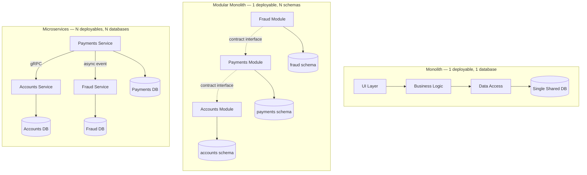
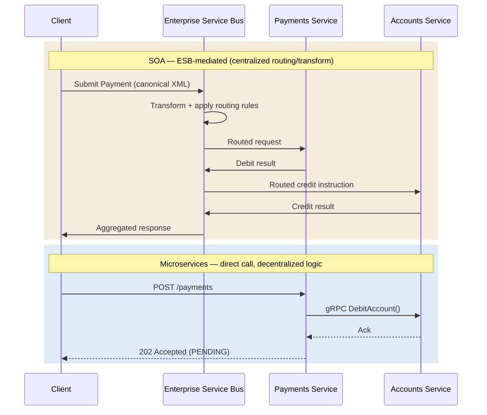
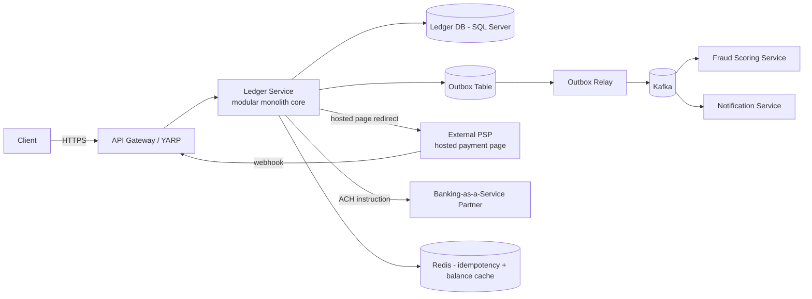
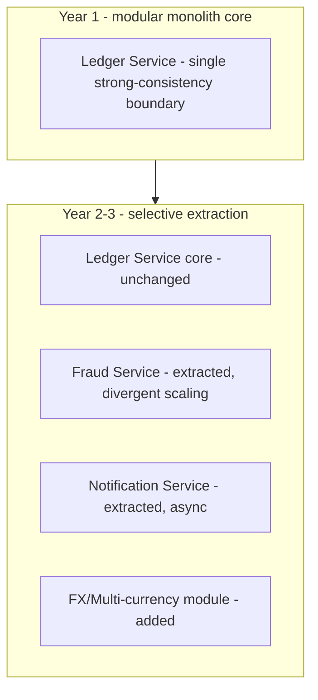
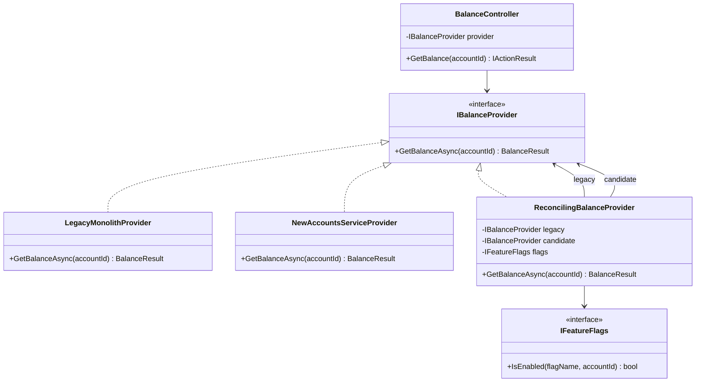
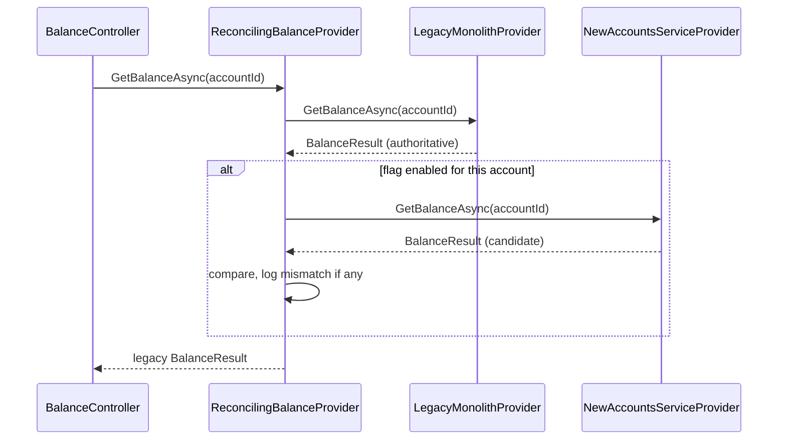

# Module 105 — Architecture Patterns: Architectural Styles — Monolith, Modular Monolith, SOA, Microservices & Serverless — Trade-off Synthesis

> Domain: Architecture Patterns | Level: Beginner → Expert | Prerequisite: [[../17-Microservices/01-Decomposition-Communication-Strangler-Fig]] (decomposition/communication mechanics this module compares at the style-selection level), [[../17-Microservices/02-Resilience-Observability-Sidecar-Patterns]] (this module doesn't re-derive resilience mechanics, only when they become necessary); connects forward to the dedicated [[../31-Domain-Driven-Design]], [[../32-Clean-Architecture]], [[../33-Hexagonal-Architecture]] domains for internal-structure patterns this module deliberately doesn't duplicate

---

## 1. Fundamentals

### 1.1 What is an "architectural style"?

An architectural style is the system-wide, structural answer to three questions: **where does code live** (one deployable unit or many), **where does data live** (one database or many, one owner per entity or shared access), and **how do components talk to each other** (in-process method calls, synchronous network calls, or asynchronous messages). Everything else — which design patterns you use inside a component, which framework you pick, how you name your folders — is downstream of these three answers, not upstream of them.

The five styles this module compares all answer those three questions differently:

| Style | Deployment unit | Data ownership | Inter-component calls |
|---|---|---|---|
| Monolith | One | One shared DB, no enforced internal boundaries | In-process method calls |
| Modular Monolith | One | One shared DB, but each module owns its own schema/tables exclusively | In-process calls through explicit interfaces |
| SOA | Many services | Often a shared/common data model, mediated by an ESB | Centralized bus (often synchronous, orchestrated) |
| Microservices | Many services | Each service owns its own database exclusively | Direct service-to-service (sync HTTP/gRPC or async messaging) |
| Serverless | Many functions | Typically per-function/per-bounded-context managed stores (DynamoDB, Cosmos DB) | Event triggers, queues, direct invocation |

### 1.2 Why does the choice matter this much?

Because the deployment unit and data-ownership decisions are the two most expensive things to change later in a running production system. Changing a design pattern is a code review. Changing whether two entities live in the same database, or whether two components deploy together or independently, usually means a live data migration and a period of dual-writing/backfilling with real financial or customer risk. Interviewers probe this topic specifically because it's one of the few technical decisions with genuinely multi-year, expensive-to-reverse consequences — which is exactly why a Staff/Principal-level answer talks about *reversibility* and *evidence*, not aesthetic preference for "clean" architecture.

### 1.3 When do you actually choose an architectural style?

Three moments, in practice:
1. **Greenfield.** A new product, no legacy constraint. The temptation is to over-engineer for an imagined future scale that may never arrive.
2. **Growth inflection.** An existing monolith is hitting a genuine, measured wall — deployment lock-step across 40 engineers, or one subsystem (e.g., fraud scoring) needing GPU-backed autoscaling the rest of the system doesn't.
3. **Legacy modernization.** A 15-year-old mainframe/monolith core banking system needs to change without a "big bang" cutover that risks losing or double-applying a transaction (see §4 and §14 for concrete incident narratives on exactly this).

### 1.4 How do you reason about the choice at a first-principles level?

Start from **coupling and cohesion**, not from a style name. A well-run monolith with enforced internal boundaries (a modular monolith) can have *lower* effective coupling than a poorly-decomposed microservices estate with a shared database (the "distributed monolith" anti-pattern, covered in the existing §10 Basic Q6). The style label is a proxy for a set of coupling/cohesion/deployment properties — always verify the properties directly rather than trusting the label. This is the module's central, recurring theme, and it is why §10 Expert Q4/Q5 (declared coupling vs. actual coupling) is the single most important idea in this file.

---

## 2. Deep Dive

### 2.1 Deployment topology internals

A monolith's deployment artifact is a single process image (one `.dll`/container image for a .NET app). The OS scheduler places it on one or more identical replicas behind a load balancer; scaling means replicating the *entire* application, including code paths that aren't the actual bottleneck. A microservices estate instead has N independently-versioned artifacts, each with its own container image, its own Kubernetes Deployment object, its own HPA (Horizontal Pod Autoscaler) target — the orchestrator (Kubernetes, ECS) schedules each service's replicas independently based on that service's own resource metrics. The hidden cost: N services means N sets of liveness/readiness probes, N sets of resource requests/limits to tune, N independent points where a bad rollout can happen — multiplying the *surface area* of deployment risk even though each individual deployment is smaller and safer in isolation.

### 2.2 In-process vs. inter-process call cost

An in-process method call inside a monolith costs single-digit nanoseconds — it's a stack frame push, no serialization, no OS involvement. A synchronous network call between two microservices over gRPC on the same Kubernetes cluster typically costs **0.5–2 ms** for the round trip (TCP/TLS handshake amortized via connection pooling, protobuf serialization, kernel network stack, service-mesh sidecar proxy hop if using Istio/Linkerd). A REST/JSON call over HTTP/1.1 without connection reuse can run **5–15 ms**. This sounds small until you count *fan-out*: a single user-facing request in a monolith might make 12 in-process calls (effectively free); the equivalent request decomposed into microservices might require 4–6 sequential network hops, turning a <1 ms operation into a 10–40 ms one purely from the decomposition — before any actual business logic executes. This is the concrete mechanical reason "smaller services" isn't free, and it's why service boundaries should track genuine business-capability seams (§10 Intermediate Q9), not arbitrary technical slicing.

### 2.3 Data-ownership mechanics

In a shared-database monolith, a `Payments` module and an `Accounts` module can both run a SQL `JOIN` across tables owned by "different" logical modules, and a single `SqlTransaction` can span both — this is precisely why cross-entity ACID consistency is nearly free in a monolith. In a modular monolith, this is deliberately blocked *at the schema level*: each module gets its own schema (SQL Server `CREATE SCHEMA payments AUTHORIZATION ...`) and cross-schema foreign keys/joins are disallowed by convention (and ideally enforced — see §2.6). In microservices, the databases are physically separate (different SQL Server instances, or a mix of SQL Server + DynamoDB + Redis per service) — there is no cross-service transaction available at all; you must use a Saga (covered in the dedicated Saga domain) or accept eventual consistency with reconciliation (§10 Advanced Q8, and the FinTech panel FT1).

### 2.4 Service-mesh/sidecar internals for microservices

A service mesh (Istio, Linkerd) injects a sidecar proxy (Envoy for Istio) into every pod, intercepting all inbound/outbound traffic via `iptables` rules so the application container never talks to the network directly. This gives you mTLS between every service pair, retries/circuit-breaking/timeouts as declarative policy rather than in-code, and distributed tracing headers propagated automatically — but it adds a proxy hop to every single call (typically 0.3–1 ms added latency per hop) and a genuinely non-trivial operational surface (control plane upgrades, certificate rotation, mesh-config debugging when a `VirtualService` misroutes traffic). At small service counts (<10 services), a simpler library-level approach (Polly for retries/circuit-breaking in .NET, directly in-process) is often lower total cost than standing up a full mesh.

### 2.5 Cold-start internals for serverless

A serverless cold start (AWS Lambda, Azure Functions) happens when no warm execution environment exists for a function: the platform must provision a new sandbox (microVM via Firecracker for Lambda), download/mount the deployment package, initialize the language runtime, and run any static initializers before your handler code executes. For a .NET 8 Lambda with a moderate dependency graph, cold start is typically **300–900 ms** (.NET's JIT and DI-container-building at startup dominates this — AOT-compiled Lambdas via `dotnet publish -r linux-x64 -p:PublishAot=true` cut this to **~50–150 ms** by skipping JIT entirely). A warm invocation, by contrast, is **1–10 ms** of pure platform overhead. The practical implication: a rarely-invoked, latency-tolerant background function is a great serverless fit; a synchronous, user-facing, latency-critical endpoint on the hot path needs either provisioned concurrency (paying to keep N instances warm, defeating some of serverless's cost benefit) or should not be serverless at all.

### 2.6 ESB internals for SOA

A classic ESB (IBM WebSphere ESB/Message Broker, MuleSoft, BizTalk) sits as a single logical hop between every pair of communicating services: it receives a message, applies transformation (XSLT for XML payloads), consults routing rules (often centrally configured, requiring the ESB team to make a change for a new integration), and forwards to the destination — frequently synchronously, meaning the ESB is in the latency path of every call and, more importantly, a single scaling and failure-domain chokepoint. Contrast this with microservices' point-to-point or message-broker (Kafka/RabbitMQ) approach, where routing logic lives in the producer/consumer, not in shared middleware — decentralizing both the *code* and the *team ownership* of routing decisions.

### 2.7 .NET specifics: enforcing modular-monolith boundaries in C#

.NET gives you three real enforcement mechanisms, not just convention:

1. **`internal` + assembly-per-module.** Each module (`Payments.csproj`, `Accounts.csproj`) exposes only a small `public` contract interface (`IPaymentsApi`) and marks everything else `internal`. Because `internal` is assembly-scoped, another module's assembly genuinely cannot reference those types — this is a compiler-enforced boundary, not a lint rule.
2. **Project reference direction + `InternalsVisibleTo` avoidance.** Structure the `.csproj` reference graph so `Payments.csproj` never references `Accounts.csproj` directly — both depend only on a shared `Contracts` assembly containing the public interfaces/DTOs. A build-breaking circular reference is impossible by construction; a one-way dependency violation is caught immediately by MSBuild.
3. **Roslyn analyzers / source generators for boundary enforcement.** A custom Roslyn analyzer (or a tool like `ArchUnitNET` or NetArchTest) can run in CI and fail the build if any type in `Payments.*` namespace is referenced from `Accounts.*` outside the declared contract assembly — this is the concrete implementation behind §11's Expert coding exercise and directly operationalizes §10 Expert Q4/Q5's "verify coupling, don't just declare it."

---

## 3. Visual Architecture

### 3.1 Topology comparison — monolith vs. modular monolith vs. microservices



### 3.2 Request flow — ESB-mediated (SOA) vs. direct service call (microservices)



The ESB path puts transformation/routing intelligence in one shared, centrally-owned hop that every message crosses; the microservices path puts that intelligence in the calling service itself and talks directly, at the cost of each service needing to independently implement resilience (retries, timeouts) that the ESB previously centralized.

---

## 4. Production Example

**Problem.** A mid-sized digital-payments processor ("MeridianPay," illustrative) ran its entire platform — onboarding, KYC, ledger, payment orchestration, notifications, reporting — as a single ASP.NET Core monolith against one SQL Server database. At 40 req/s peak, the monolith was never CPU- or I/O-bound; the actual pain was organizational: three feature teams (Payments, Risk, Reporting) shared one deployment pipeline, one release train (twice weekly), and routinely blocked each other — a Risk-team schema migration once delayed a Payments hotfix by six hours because both changes were bundled in the same release candidate and CI ran a full regression suite neither team could bypass.

**Architecture decision.** Rather than a full microservices rewrite (rejected — no component had a genuine independent-scaling need; §10 Advanced Q1's framework pointed at extraction only for concretely justified components), the team restructured internally into a **modular monolith** first: `Payments`, `Risk`, `Onboarding`, `Reporting` each became a separate .csproj with `internal`-sealed implementation types and a single public contract interface per module, all still deployed as one container image. Six months later, Risk's fraud-scoring model moved to a GPU-backed batch-inference approach requiring autoscaling profoundly different from the rest of the system (bursty, 0→30 GPU-backed instances during a detected attack pattern, otherwise near-zero) — the *only* module extracted into an actual microservice, communicating back to the monolith via an async Kafka event (`fraud.decision.v1`) rather than a synchronous call, specifically to avoid making the monolith's request path depend on Risk's now-independent availability.

**Implementation detail worth flagging.** The extraction took 3 weeks, not 3 months, because the module already had (a) no direct SQL access to any other module's tables — it only called `IFraudApi.ScoreTransaction()` — and (b) its own schema (`risk.*`) that was trivially liftable to its own database with a one-time export/import and a short dual-write window (write to both old schema and new DB for 48 hours, verify row-count and checksum parity, then cut over reads).

**Trade-offs.** The remaining three modules stayed in the modular monolith — Payments and Accounts genuinely need transactional consistency for debit/credit pairs (§2.3), and neither had a scaling profile different enough from the rest of the system to justify extraction. Reporting, which does have a different load shape (heavy nightly batch queries), was deliberately *not* extracted despite the temptation — its batch queries were moved to a read replica instead, solving the actual resource-contention problem without paying a service-boundary cost.

**Lessons learned.** (1) The modular-monolith discipline installed *before* any extraction pressure existed is what made the later extraction a 3-week project instead of a 3-month one — this is the direct, concrete payoff of §10 Advanced Q5/Expert Q2's design discipline. (2) Extraction should be driven by a genuinely divergent *scaling or availability* profile, not by team politics or "microservices are more modern" — Reporting's problem was solved with a read replica, not a service boundary, because the actual bottleneck was resource contention, not deployment coupling.

---

## 5. Best Practices

- **Default to a modular monolith for new products** unless team autonomy and scaling needs are already concretely known at day one — reversing a wrong microservices bet costs far more than reversing a wrong monolith bet (§10 Intermediate Q1).
- **Enforce module boundaries with the compiler, not a wiki page** — `internal` types, one-way project references, and a contract assembly (§2.7) make the boundary real instead of aspirational.
- **Give every module/service exclusive ownership of its own data**, even inside a shared database — this is the single change that makes a future extraction cheap (§10 Advanced Q5).
- **Extract a service only when you can name the specific, currently-true reason** (divergent scaling profile, divergent availability requirement, divergent team-ownership need) — never "because microservices are the modern default."
- **Put the ledger/consistency-critical core in one transactional boundary** in FinTech systems specifically — sagas and eventual consistency are a cost you pay only where you must, not a default (FT1).
- **Track actual, not declared, coupling continuously** — run a dependency-analysis/fitness-function check in CI (§10 Expert Q4/Q5, §11 Expert exercise) rather than trusting an architecture diagram.
- **Prefer async messaging over synchronous chains across service boundaries** where the caller doesn't need an immediate answer — it avoids compounding §2.2's network-hop latency tax and decouples availability.
- **Migrate legacy money systems via strangler-fig with parallel-run reconciliation**, never a big-bang cutover (FT2, §14).

---

## 6. Anti-patterns

- **Distributed monolith** — multiple deployables sharing one database or requiring lockstep deployment; gets microservices' network/ops cost with none of the independent-deployability benefit (§10 Basic Q6). *Fix:* split the shared database along service lines, or consolidate back into one deployable if the split was never load-bearing.
- **Nanoservices / over-decomposition** — services so fine-grained that one feature change touches five of them (§10 Intermediate Q8). *Fix:* merge services whose changes are never actually independent in your deployment history.
- **ESB as a God object** — every integration routed through one team-owned bus, becoming both a technical and organizational bottleneck (§10 Basic Q3/Q10). *Fix:* decentralize routing intelligence into the services themselves; reserve central mediation for genuinely heterogeneous legacy integration only.
- **Shared database across "separate" services** — the most common source of accidental distributed-monolith coupling; any schema change now requires coordinating every service touching that database. *Fix:* one schema/database per service, full stop, with a Saga or event for anything that used to be a cross-entity transaction.
- **Premature microservices** — adopting the style before any concrete scaling/autonomy need exists, paying full distributed-systems tax for a benefit not yet realized (§10 Expert Q1). *Fix:* consolidate the components that never needed independent scaling back into the monolith.
- **Chatty synchronous fan-out across services** — decomposing a single logical operation into 6+ sequential synchronous calls, turning a sub-millisecond monolith operation into a 30–50 ms distributed one (§2.2). *Fix:* redraw the boundary so the operation is local to one service, or make the downstream calls asynchronous/parallel.
- **Treating serverless as free horizontal scaling for a latency-critical hot path** without accounting for cold starts (§2.5). *Fix:* provisioned concurrency, or don't use serverless for that specific path.

---

## 7. Performance Engineering

### 7.1 CPU

A monolith concentrates all CPU load on one process; a CPU-bound endpoint can starve unrelated request handling on the same threadpool (ASP.NET Core's shared threadpool). Microservices isolate CPU-bound workloads into their own process/pod, so a runaway fraud-scoring computation can't starve the payments-authorization request path — this is a genuine, measurable isolation benefit distinct from horizontal scaling.

### 7.2 Memory

Each microservice pod carries its own baseline memory floor (.NET runtime + framework assemblies typically 60–120 MB per pod before any application state) — 20 services × 3 replicas × 100 MB baseline is 6 GB of pure "being a separate .NET process" overhead that a monolith running as 3 replicas of one process wouldn't pay. This is a real, often underestimated cost line in a microservices TCO comparison.

### 7.3 Latency

As established in §2.2: in-process call ≈ nanoseconds; intra-cluster gRPC call ≈ 0.5–2 ms; REST/JSON without pooling ≈ 5–15 ms; a service-mesh sidecar hop adds ≈ 0.3–1 ms on top of any of these. A user-facing p99 latency budget of, say, 200 ms can absorb 4–6 microservice hops comfortably but starts to hurt at 10+ sequential hops — measure your actual critical-path hop count, don't assume it's fine.

### 7.4 Throughput

A monolith's throughput ceiling is the whole application's combined resource ceiling — you scale everything to scale anything. Microservices let you put 30 replicas behind the one genuinely hot service (e.g., a quote-pricing service during market open) and 2 replicas behind everything else, which is strictly more throughput-efficient per dollar *if* that divergence is real and sustained — and strictly worse if it isn't (you're now paying N deployment pipelines for a divergence that never materializes).

### 7.5 Scalability benchmarking

Before extracting a service for "scalability," load-test the *current* monolith against realistic peak traffic first. It is common to discover a monolith comfortably handles 5–10x current peak with straightforward horizontal replication and a read replica for reporting — precisely MeridianPay's Reporting-module outcome in §4 — meaning the benchmark itself, not intuition, should decide whether extraction is warranted.

### 7.6 Caching

A monolith can use a single in-process `IMemoryCache` for hot data with zero network cost. Microservices generally need a shared, external cache (Redis) so multiple service instances/services see consistent cached data — trading in-process cache-hit speed (nanoseconds) for network cache-hit speed (Redis round trip, typically 0.3–1 ms on the same cluster), which is still far cheaper than re-computing or re-querying the source of truth, but is not free the way in-process caching is.

---

## 8. Security

### 8.1 Threats

- **Lateral movement blast radius.** In a monolith, one compromised process has access to the entire application's data (one shared DB connection string, effectively). In microservices, a compromised service is scoped to its own database and its own credentials — smaller blast radius per compromise, but N credential sets to manage and rotate instead of one.
- **ESB as a single high-value target.** An ESB that mediates every integration, often with broad credentials to every downstream system, is an outsized attack target in SOA (OWASP A05 — Security Misconfiguration risk concentrated in one component; a single ESB compromise can expose every integrated system).
- **Service-to-service spoofing** in microservices without mutual authentication — any pod on the cluster network could otherwise call any service's internal API.

### 8.2 Mitigations

- **mTLS between every service pair** (via a service mesh — Istio's automatic mTLS, or manual certificate-based auth) so service identity, not just network location, gates access — directly mitigates the lateral-movement and spoofing threats above.
- **Per-service least-privilege database credentials** — each microservice's connection string grants access only to its own schema/database, never a shared admin credential (maps to OWASP A01 — Broken Access Control, applied at the infrastructure level).
- **Secrets management via a vault** (Azure Key Vault, AWS Secrets Manager, HashiCorp Vault) with per-service scoped access policies rather than a shared `appsettings.json` secret block — critical once you have N services each needing distinct credentials.

### 8.3 OWASP mapping

- **A01 Broken Access Control** → enforce via per-service least-privilege data access, not a shared superuser DB account.
- **A02 Cryptographic Failures** → mTLS in transit between services; encryption at rest per database, not assumed inherited from "the" (singular) monolith database's configuration.
- **A05 Security Misconfiguration** → the ESB/API-gateway is a single point where a misconfiguration exposes everything behind it — treat its config as the highest-scrutiny artifact in the system.
- **A09 Security Logging and Monitoring Failures** → distributed tracing (OpenTelemetry) across service boundaries is *required*, not optional, in microservices — without it, a security investigation spanning 6 services with independent logs is nearly undebuggable.

### 8.4 AuthN/AuthZ

Monolith: a single in-process authorization check (ASP.NET Core `[Authorize]` policy) against one identity provider. Microservices: each service must independently validate a propagated identity token (JWT via OAuth2/OIDC, covered in the dedicated domain) — either re-validating the token at every hop or trusting a gateway-level validation plus a signed internal token, a real design decision with a real trust-boundary trade-off (re-validate everywhere = safer but more CPU/latency; trust the gateway = faster but the gateway becomes as security-critical as the ESB was in §8.1).

### 8.5 Secrets & encryption

Each additional service is an additional place secrets can leak (logs, error messages, container image layers). A vault-per-environment with automatic short-lived credential issuance (e.g., Vault's dynamic database credentials, rotated hourly) scales this correctly; a static `.env` file copied across N services' pipelines does not.

---

## 9. Scalability

### 9.1 Horizontal scaling

Monolith: replicate the whole application (Kubernetes Deployment `replicas: N`, or an ASP.NET Core app behind an Azure App Service scale-out rule). Microservices: HPA per service, scaling the CPU/memory-bound service independently of the rest — the genuine benefit *when the load profiles actually diverge* (§7.4).

### 9.2 Vertical scaling

A monolith often hits a practical vertical-scaling ceiling faster because one process must hold the combined working set of every subsystem in memory/CPU cache — a memory-hungry reporting module can push a payments module's hot data out of cache. Splitting the memory-hungry component into its own service (even without changing total hardware) can improve cache locality for the remaining monolith.

### 9.3 Caching (scale angle)

At scale, a shared Redis cluster in front of microservices needs its own partitioning/replication strategy (Redis Cluster hash-slot partitioning) — caching itself becomes a distributed-systems problem once you're past a single-node monolith-side `IMemoryCache`.

### 9.4 Replication / partitioning

Each microservice's database can be partitioned/sharded independently based on *its own* access pattern (e.g., shard the Payments DB by account-ID range) without touching any other service's schema — a genuine flexibility a monolith's single shared database doesn't offer, since sharding a monolith's database means sharding every module's data by the same key whether or not that key fits their access pattern.

### 9.5 Load balancing

Monolith: one L7 load balancer (ALB, Azure Front Door) in front of N identical replicas. Microservices: an API Gateway/YARP reverse proxy routes to the right backend service by path/host, plus internal load balancing between a service's own replicas (Kubernetes `Service` object, or client-side load balancing in a service mesh).

### 9.6 HA & DR

A monolith's DR story is simpler — one database to fail over (SQL Server Always On Availability Group), one application tier to redeploy in a DR region. Microservices' DR story requires coordinating consistent recovery-point objectives across N independent databases — if Payments' DB recovers to a slightly different point-in-time than Accounts' DB during a regional failover, you can end up with orphaned or duplicated transactions, which is exactly why FT2's reconciliation discipline matters as much in DR as in migration.

### 9.7 CAP theorem

A monolith's single database gives you CA behavior trivially (no partition to tolerate within one DB instance, modulo its own internal replica lag). Microservices, being a genuinely distributed system, force an explicit CAP choice per data flow: the ledger read path might choose CP (reject a read rather than serve stale balance data) while a notification/activity-feed path chooses AP (serve slightly stale data rather than fail) — the point being that in microservices, this choice must be made *deliberately, per use case*, whereas a monolith defers the question entirely by not being distributed in the first place.

---

## 10. Interview Questions

### Basic (10)

1. **Q: What is a monolithic architecture?**
 **A:** A single, unified application deployed as one unit, where all functionality (UI, business logic, data access) lives in one codebase and one deployable artifact.
 **Why correct:** States the defining characteristic — single deployable unit — rather than describing it purely as "old" or "bad."
 **Common mistakes:** Assuming monolithic automatically means poorly structured internally — a monolith can be well-modularized internally while still deploying as one unit.
 **Follow-ups:** "What's the main operational advantage of a monolith?" (Simplicity — one deployment, one process to monitor, no network calls between internal components, no distributed-systems complexity.)

2. **Q: What is a modular monolith, and how does it differ from a "traditional" monolith?**
 **A:** A modular monolith is deployed as a single unit (like a traditional monolith) but internally enforces strict, well-defined module boundaries with explicit interfaces between modules — preventing the tangled, uncontrolled cross-module coupling ("big ball of mud") a poorly-structured traditional monolith can develop over time.
 **Why correct:** States both the shared deployment characteristic and the distinguishing internal-discipline difference.
 **Common mistakes:** Assuming "modular" and "monolith" are contradictory terms, rather than recognizing modularity is an internal-structure property independent of deployment topology.
 **Follow-ups:** "Why might a modular monolith be a good starting point before microservices?" (It provides most of microservices' internal-boundary discipline without the operational complexity of distributed deployment, and its well-defined module boundaries make a future extraction to actual microservices lower-risk if genuinely needed later.)

3. **Q: What is Service-Oriented Architecture (SOA), and how does it differ from microservices?**
 **A:** SOA decomposes a system into services communicating via a centralized integration layer (commonly an Enterprise Service Bus), often sharing a common data model/schema across services. Microservices favor decentralized, direct service-to-service communication ("smart endpoints, dumb pipes") with each service owning its own data independently.
 **Why correct:** States the key architectural distinction (centralized integration/shared data vs. decentralized communication/data ownership).
 **Common mistakes:** Treating SOA and microservices as identical or as simply different names for the same idea.
 **Follow-ups:** "Why did the industry largely move away from ESB-centric SOA toward microservices?" (The ESB often became a bottleneck — both a single point of failure/scaling constraint and, organizationally, a shared resource requiring cross-team coordination for every integration change.)

4. **Q: What is serverless architecture?**
 **A:** An architecture where individual functions/units of code execute on-demand, fully managed by a cloud provider, with no server provisioning or management by the application team, and billing based on actual execution rather than always-on capacity.
 **Why correct:** States the defining characteristics — on-demand execution, provider-managed infrastructure, usage-based billing.
 **Common mistakes:** Assuming "serverless" means no servers exist at all, rather than recognizing servers exist but are fully abstracted away from the application team's responsibility.
 **Follow-ups:** "What's a key trade-off serverless introduces?" (Cold-start latency — a function not recently invoked may incur startup latency the first time it's called after being idle.)

5. **Q: What is the difference between an architectural style and a design pattern?**
 **A:** An architectural style is a high-level, system-wide organizational approach (monolith, microservices, event-driven) governing how major components relate; a design pattern is a smaller-scale, reusable solution to a specific, recurring problem within a component (e.g., Strategy, Observer) — architectural style is the "shape" of the whole system, design patterns are tools used within it.
 **Why correct:** States the scope distinction (system-wide organizational approach vs. localized, reusable solution).
 **Common mistakes:** Using the two terms interchangeably, treating a design pattern as if it dictated overall system topology.
 **Follow-ups:** "Can multiple architectural styles coexist within one organization?" (Yes — different services or systems within the same organization may reasonably use different styles based on each one's specific needs, rather than mandating a single, uniform style everywhere.)

6. **Q: What is the "distributed monolith" anti-pattern?**
 **A:** A system deployed as multiple, separate services (superficially resembling microservices) but so tightly coupled (shared database, synchronous call chains requiring simultaneous deployment, no independent release cadence) that it retains all of a monolith's deployment coupling while adding all of microservices' network/operational complexity, with none of either style's actual benefits.
 **Why correct:** States the specific failure combination (monolith's coupling plus microservices' complexity, benefits of neither).
 **Common mistakes:** Assuming any system split into multiple deployable services has automatically achieved microservices' actual benefits, without checking for this specific coupling anti-pattern.
 **Follow-ups:** "What's a concrete symptom revealing a distributed monolith?" (Services that must be deployed together in lockstep because their APIs/data are so tightly coupled that deploying one without the others breaks the system.)

7. **Q: What is a bounded context, at a high level?**
 **A:** A bounded context (a Domain-Driven Design concept, covered in depth) is an explicit boundary within which a specific domain model and its terminology are consistently defined and valid — different bounded contexts can use the same term to mean different things, and architectural decomposition (into services or modules) should ideally align with bounded-context boundaries.
 **Why correct:** States the definition at an appropriately high level for this module's scope, correctly deferring full depth to its dedicated module.
 **Common mistakes:** Assuming a bounded context is simply a synonym for "a microservice," rather than a conceptual/domain-modeling boundary that may or may not map 1:1 to a physical service boundary.
 **Follow-ups:** "Why does misaligning service boundaries with bounded contexts risk future architectural pain?" (A service boundary cutting across a bounded context's natural boundary tends to produce exactly the tight coupling the distributed-monolith anti-pattern exhibits, since the domain concepts on either side aren't genuinely independent.)

8. **Q: What is an N-tier (layered) architecture?**
 **A:** An architecture organized into horizontal layers (e.g., presentation, business logic, data access), each layer depending only on the layer(s) below it, with a clear separation of concerns along that horizontal axis.
 **Why correct:** States the layer structure and the dependency direction defining it.
 **Common mistakes:** Assuming N-tier and monolith are synonyms — N-tier describes internal organizational structure, while monolith describes deployment topology; a monolith is commonly (but not necessarily) organized in an N-tier structure internally.
 **Follow-ups:** "What's a common criticism of strict N-tier layering?" (Business logic can become anemic or scattered if the layering is too rigid, and every feature often requires touching every layer, a concern Clean/Hexagonal Architecture — Modules 32/33 — address differently.)

9. **Q: What is the main trade-off microservices make relative to a monolith?**
 **A:** Microservices trade increased operational and architectural complexity (network calls, distributed data consistency, service discovery, more sophisticated observability needs) for independent deployability and independent team ownership/scaling of each service.
 **Why correct:** States both sides of the trade-off precisely, rather than presenting microservices as a strict improvement.
 **Common mistakes:** Presenting microservices as unconditionally "more scalable" or "better," without acknowledging the genuine, substantial complexity cost being traded for those specific benefits.
 **Follow-ups:** "Under what condition is this trade-off usually NOT worth making?" (When a single team can adequately own and deploy the whole system, and no specific component has a scaling or team-autonomy need distinct enough to justify the added distributed-systems complexity.)

10. **Q: What is an Enterprise Service Bus (ESB), and why did SOA architectures typically rely on it?**
 **A:** An ESB is a centralized middleware component routing, transforming, and mediating communication between services — SOA relied on it to centralize integration logic (protocol translation, message routing, orchestration) rather than requiring every service to handle these concerns independently.
 **Why correct:** States the ESB's role and SOA's rationale for centralizing integration through it.
 **Common mistakes:** Assuming an API Gateway and an ESB serve an identical purpose — an ESB typically handles much more (orchestration, transformation, business-rule routing) than a typical API gateway's more focused request-routing/cross-cutting-concern role.
 **Follow-ups:** "What organizational risk did heavy ESB reliance commonly introduce?" (The ESB itself often became a shared, centrally-owned bottleneck requiring cross-team coordination and specialized expertise for any integration change, undermining the independent-team-ownership benefit services were meant to provide.)

### Intermediate (10)

1. **Q: When would you recommend a modular monolith over microservices for a new project?**
 **A:** When the team is small enough for one group to reasonably own the whole system, the domain boundaries aren't yet well-understood (a modular monolith is easier to refactor internally than to re-draw microservice boundaries after the fact), and there's no current, concrete scaling or team-autonomy need microservices would specifically address — deferring the added distributed-systems complexity until it's genuinely justified.
 **Why correct:** States concrete criteria (team size, domain-boundary maturity, absence of a current scaling/autonomy need) rather than a blanket recommendation.
 **Common mistakes:** Defaulting to microservices for a new, unproven project "to be scalable from day one," before any concrete need for that specific trade-off has actually emerged.
 **Follow-ups:** "Why is it easier to refactor a modular monolith's internal boundaries than to re-draw microservice boundaries later?" (Changing a module boundary within one codebase is a local, in-process refactor; re-drawing a live microservice boundary requires renegotiating a network API contract, data ownership, and often a live data migration across already-deployed, independently-operated services.)

2. **Q: How does team topology (Conway's Law) influence architecture-style choice?**
 **A:** Conway's Law observes that a system's architecture tends to mirror the communication structure of the organization that builds it — if an organization has genuinely independent, autonomous teams each owning a distinct business capability, microservices aligned to those team boundaries can work well; if the organization has one, tightly-coordinated team, a matching monolithic or modular-monolith structure is often more natural and requires less artificial, premature service-boundary imposition.
 **Why correct:** States Conway's Law's core observation and its direct implication for architecture-style fit.
 **Common mistakes:** Choosing an architecture style disconnected from the organization's actual team structure, fighting against Conway's Law rather than aligning with it.
 **Follow-ups:** "What's the risk of adopting microservices with a single, small team that hasn't organized into autonomous sub-teams?** (The team ends up operating multiple services with the coordination overhead of a single team but the deployment/operational complexity of many services — a specific instance of the distributed-monolith risk driven by an architecture/team-structure mismatch.)

3. **Q: What's the operational cost difference between a monolith and microservices at small scale?**
 **A:** At small scale, microservices' operational cost (service discovery, distributed tracing, inter-service network reliability, multiple independent deployment pipelines, cross-service debugging complexity) is disproportionately high relative to the actual traffic/team-scaling benefit it provides — a monolith's simpler, single-deployment operational model is typically far cheaper to run and maintain at genuinely small scale.
 **Why correct:** States that operational cost doesn't scale down proportionally with system size — the distributed-systems tax is largely fixed overhead, disproportionately burdensome for a small system.
 **Common mistakes:** Assuming microservices' operational cost scales linearly with system size, missing that much of the overhead (service mesh, distributed tracing infrastructure, multiple CI/CD pipelines) is comparatively fixed regardless of actual traffic volume.
 **Follow-ups:** "At what point does this cost calculus typically flip in favor of microservices?" (When genuine, specific scaling or team-autonomy needs emerge — a particular component needing independent scaling far beyond the rest of the system, or genuinely autonomous teams needing independent release cadences.)

4. **Q: How does SOA's ESB-centric integration differ architecturally from microservices' "smart endpoints, dumb pipes" philosophy?**
 **A:** SOA's ESB puts intelligence (routing, transformation, orchestration logic) in the centralized integration layer itself ("smart pipes"), while services can remain comparatively simple. Microservices push that intelligence into the services themselves, communicating over simple, "dumb" transport (plain HTTP/messaging with minimal centralized logic) — decentralizing complexity rather than concentrating it in shared middleware.
 **Why correct:** States the precise inversion (where intelligence lives) distinguishing the two integration philosophies.
 **Common mistakes:** Assuming both approaches distribute complexity identically, missing that the specific *location* of integration intelligence (centralized middleware vs. the services themselves) is the core architectural distinction.
 **Follow-ups:** "What's the risk of the 'smart endpoints, dumb pipes' philosophy if taken to an extreme?" (Each service reimplementing similar cross-cutting integration logic (retries, circuit breaking, auth) independently — commonly addressed via a service mesh,, providing this as shared infrastructure without recreating ESB-style centralized business-logic coupling.)

5. **Q: What is the risk of adopting microservices before genuinely needing the scaling/team-autonomy benefits they provide?**
 **A:** Paying microservices' full operational and architectural complexity cost (Intermediate Q3) without yet having the organizational scale or specific technical need that complexity is meant to address — the team absorbs distributed-systems tax for benefits it isn't yet positioned to actually realize, often resulting in slower delivery than a simpler architecture would have provided at that stage.
 **Why correct:** States the specific risk (paying the cost without realizing the corresponding benefit) precisely.
 **Common mistakes:** Assuming any added architectural sophistication is inherently forward-looking and therefore beneficial, without weighing whether the current stage of the system/organization can actually make good use of it.
 **Follow-ups:** "How does this connect to this course's 'premature optimization' discussion?" (Directly analogous — adopting microservices before a genuine, foreseeable need is a structural-architecture instance of the identical premature-optimization risk, paying a real, upfront cost for a benefit that may never actually be realized at the assumed timeline.)

6. **Q: How does serverless change the unit of deployment and scaling compared to containerized microservices?**
 **A:** Serverless's unit of deployment/scaling is an individual function (scaling to zero when idle, and scaling per-invocation automatically), whereas containerized microservices typically scale at the level of a whole service instance/pod (the HPA-driven scaling), requiring at least one instance running continuously even during idle periods.
 **Why correct:** States the specific granularity difference (function-level vs. service-instance-level) and its scale-to-zero implication.
 **Common mistakes:** Assuming serverless and containerized microservices differ only in "who manages the servers," missing the more fundamental difference in deployment/scaling granularity.
 **Follow-ups:** "What cost implication does scale-to-zero have for a genuinely idle/low-traffic workload?" (Serverless can be dramatically cheaper for spiky or low-traffic workloads, since cost is incurred only during actual execution — a continuously-running container incurs cost even while idle, waiting for the next request.)

7. **Q: What is a "modulith" migration path — how do you evolve a modular monolith toward microservices if/when needed?**
 **A:** Extract one well-bounded module at a time into its own independently-deployed service, starting with the module that has the clearest, most self-contained boundary and the strongest, most concrete need for independent scaling/deployment — leveraging the modular monolith's already-explicit internal interfaces to make each extraction a comparatively low-risk, incremental step rather than a risky, all-at-once rewrite.
 **Why correct:** States the incremental, one-module-at-a-time extraction approach and why the modular monolith's existing discipline specifically enables it.
 **Common mistakes:** Assuming migration must be all-or-nothing (fully microservices or fully monolith), rather than a gradual, selectively-extracted hybrid state that can persist indefinitely if that's genuinely sufficient.
 **Follow-ups:** "Why is this lower-risk than a 'big bang' full rewrite?" (Each extraction is independently verifiable and reversible in isolation, rather than betting the entire system's correctness on one large, simultaneous architectural change — directly the incremental-over-big-bang principle applied to architecture migration.)

8. **Q: What's the risk of over-decomposing a system into too many microservices?**
 **A:** Excessive decomposition multiplies the distributed-systems tax (network calls, data-consistency coordination, deployment/monitoring overhead) far beyond what the actual team-autonomy or scaling benefit justifies — a change spanning many overly-fine-grained services can require coordinating deployments across all of them, recreating monolith-like coupling at a much higher operational cost, sometimes called "nanoservices" as a pejorative for this specific over-decomposition anti-pattern.
 **Why correct:** States the specific mechanism (multiplied distributed-systems tax without corresponding benefit) and names the recognized anti-pattern.
 **Common mistakes:** Assuming smaller services are unconditionally better/more "microservices-native," without weighing the genuine, cumulative operational cost each additional service boundary adds.
 **Follow-ups:** "What's a practical signal indicating over-decomposition has occurred?" (A single logical feature/change routinely requiring coordinated changes and deployments across many separate services simultaneously — the change isn't actually independent despite the services being physically separate.)

9. **Q: How would you decide the right granularity for a microservice boundary?**
 **A:** Align boundaries with bounded contexts (Basic Q7) and genuine, independent business capabilities — a service should encapsulate a cohesive piece of business functionality with its own data ownership, sized such that a typical feature change touches one service, not several, and a team can reasonably own and understand it end-to-end.
 **Why correct:** States concrete alignment criteria (bounded context, business capability, single-team ownership, single-service-per-typical-change) rather than a vague "not too big, not too small" heuristic.
 **Common mistakes:** Sizing services by arbitrary technical criteria (lines of code, number of endpoints) rather than by genuine business-capability and data-ownership boundaries.
 **Follow-ups:** "What's a red flag suggesting a service boundary is drawn incorrectly?" (Two services needing to coordinate a shared, cross-service transaction for what's conceptually one business operation — suggesting the boundary cut across a naturally cohesive business capability rather than aligning with it.)

10. **Q: What's the difference between horizontal and vertical decomposition of a system?**
 **A:** Horizontal decomposition splits by technical layer (presentation, business logic, data — as in N-tier architecture); vertical decomposition splits by business capability/feature (e.g., an "orders" service, a "payments" service, each owning its own full stack from API through data storage) — microservices typically favor vertical decomposition specifically to achieve independent deployability per business capability.
 **Why correct:** States both decomposition axes and which one microservices architecture specifically favors and why.
 **Common mistakes:** Assuming decomposition always means splitting by technical layer, missing that microservices' actual value depends on vertical, business-capability-aligned splitting instead.
 **Follow-ups:** "Why doesn't horizontal decomposition alone achieve microservices' independent-deployability benefit?" (A horizontally-layered split still requires coordinating changes across the presentation/logic/data layers for a single business feature, since the feature's full implementation spans all three layers — vertical decomposition is what actually enables one business capability to be deployed independently of others.)

### Advanced (10)

1. **Q: Design an architecture decision framework for choosing between monolith, modular monolith, and microservices for a specific new product.**
 **A:** Assess: (1) current team size/structure and whether genuinely autonomous sub-teams already exist or are planned (Conway's Law, Intermediate Q2); (2) domain-boundary maturity — is the business domain well-understood enough to draw confident service boundaries, or still evolving (favoring a modular monolith's cheaper internal refactoring); (3) concrete, currently-known scaling or independent-deployment needs for specific components, not merely hypothetical future ones; default to a modular monolith absent a clear, current "yes" to (1) and (3), extracting specific services later only as genuine needs concretely emerge (Advanced Q1's incremental path).
 **Why correct:** Provides a concrete, multi-factor decision framework rather than a single, oversimplified heuristic.
 **Common mistakes:** Reducing the decision to a single factor (e.g., "how big will this get") without considering team structure and domain-boundary maturity as equally important, independent inputs.
 **Follow-ups:** "How would you revisit this decision as the product and organization evolve?" (Periodically, as a deliberate architectural review — not a one-time, permanent decision — re-evaluating the same three factors as the team grows, the domain matures, and concrete scaling needs emerge or don't.)

2. **Q: How would you diagnose whether an existing microservices architecture has become a "distributed monolith"?**
 **A:** Check whether services can genuinely be deployed and released independently in practice (not merely in theory) — examine actual deployment history for how often multiple services must be deployed together in lockstep, whether a shared database or tightly-coupled synchronous call chains force simultaneous releases, and whether any single team can actually deploy their own service without coordinating with several others for a typical change.
 **Why correct:** States concrete, empirically-checkable diagnostic signals (actual deployment coupling history) rather than a purely structural/topological assessment.
 **Common mistakes:** Assuming a system is "properly microservices" simply because it's split into multiple deployable units, without checking whether those units are actually, empirically deployed independently in practice.
 **Follow-ups:** "What's a concrete fix if this diagnosis reveals a distributed monolith?" (Address the specific coupling source — split a shared database along the same lines as the service boundaries, or replace tightly-coupled synchronous chains with asynchronous, more loosely-coupled communication (the EDA patterns) — rather than simply re-declaring the same coupled services as "microservices" without structural change.)

3. **Q: Critique "microservices are more scalable" as a blanket justification.**
 **A:** Microservices enable *independent* scaling of specific components under specific load — but a well-designed monolith can also scale substantially via horizontal scaling of the whole application and often handles considerably more scale than the blanket claim implies before that limitation genuinely bites; the actual benefit microservices provide is scaling *granularity* (scaling only the specific bottlenecked component, not the whole system) and independent *team* scaling, not an unconditional scalability advantage that a monolith categorically lacks.
 **Why correct:** Precisely distinguishes microservices' actual, specific benefit (granular, independent component scaling) from an overstated, blanket "more scalable" claim.
 **Common mistakes:** Citing "scalability" as an unqualified, universal justification for microservices without acknowledging that a monolith can also scale substantially via straightforward horizontal replication.
 **Follow-ups:** "Under what specific condition does microservices' granular scaling genuinely outperform a monolith's uniform horizontal scaling?" (When different components have genuinely, substantially different resource profiles/scaling needs (e.g., one CPU-bound component needing 50 instances while another needs only 2) — uniform monolith scaling wastes resources replicating the whole application to scale just the bottlenecked part.)

4. **Q: How would serverless architecture change your approach to cost modeling compared to always-on containers?**
 **A:** Serverless cost scales directly and precisely with actual invocation volume/duration (pay-per-execution), making cost highly predictable and proportional for genuinely variable or spiky workloads, but potentially more expensive than an always-on container at sustained, high, continuous request volume, where a fixed-cost, continuously-utilized container becomes cheaper per-request at scale — the cost-model crossover point must be evaluated empirically per workload's actual, expected traffic pattern, not assumed favorable in either direction universally.
 **Why correct:** States the specific cost-model trade-off and identifies that the favorable choice depends on the workload's actual traffic pattern, requiring empirical evaluation.
 **Common mistakes:** Assuming serverless is unconditionally cheaper (true for spiky/low-traffic workloads) or unconditionally more expensive (true for sustained, high-volume workloads) without evaluating the specific workload's actual traffic characteristics.
 **Follow-ups:** "How would you empirically determine this crossover point for a specific workload?" (Model both cost structures against the workload's actual or projected request-volume/duration profile, directly reusing the capacity-planning discipline applied to a build-vs-serverless cost decision specifically.)

5. **Q: Design a modular monolith's internal module boundaries to make a future microservices extraction low-risk.**
 **A:** Enforce module boundaries via explicit, narrow interfaces (never direct cross-module database access or shared mutable state), ensure each module owns its own data schema/tables exclusively (even within the shared monolithic database), and avoid synchronous, deeply-nested cross-module call chains — designing each module as if it *were* already a separate service communicating over a well-defined contract, simply currently deployed together, so a future extraction primarily requires replacing an in-process call with a network call rather than a fundamental redesign.
 **Why correct:** States concrete design disciplines (explicit interfaces, exclusive data ownership, contract-oriented internal calls) specifically enabling a low-risk future extraction.
 **Common mistakes:** Allowing modules to share direct database access or tightly-coupled internal calls "since it's all one deployment anyway," which then requires substantial rework, not a simple network-call substitution, when extraction is eventually needed.
 **Follow-ups:** "Why is exclusive per-module data ownership specifically important, even within a single shared database?" (Shared cross-module database access is the single most common source of tight coupling that makes eventual extraction difficult — each module needing its own, exclusively-owned schema mirrors the data-ownership independence microservices require, making the eventual transition primarily a deployment-topology change rather than a data-model redesign.)

6. **Q: How do you evaluate whether SOA-style ESB centralization vs. microservices' decentralized integration is appropriate for a specific organization?**
 **A:** ESB-style centralization can be appropriate when integration logic genuinely needs centralized governance (e.g., integrating many heterogeneous legacy systems with inconsistent protocols, where a centralized transformation/mediation layer provides real value) and when a dedicated, capable team can own that central component without it becoming an organizational bottleneck; decentralized microservices integration is generally preferable when teams need genuine autonomy and the ESB's centralized ownership would otherwise become a cross-team coordination chokepoint for routine, everyday integration changes.
 **Why correct:** States the specific condition (heterogeneous legacy integration needing centralized governance) where ESB-style centralization remains genuinely appropriate, rather than treating it as universally obsolete.
 **Common mistakes:** Assuming ESB-style architecture is unconditionally obsolete/wrong in every context, rather than recognizing specific legacy-integration scenarios where centralized mediation still provides genuine value.
 **Follow-ups:** "What's the risk of choosing ESB centralization purely out of familiarity, without this specific justification?" (Recreating the exact bottleneck/coordination-overhead risk this course's DevOps/CI-CD domains have repeatedly examined for any centralized, shared-ownership gate lacking a genuine reason for that centralization.)

7. **Q: What organizational signal indicates a team should reconsider its current architectural style?**
 **A:** A sustained pattern of deployment coordination overhead disproportionate to the team's actual size and change frequency (every release requires extensive cross-team synchronization for a monolith with genuinely independent teams, or a distributed-monolith-style lockstep-deployment requirement for supposed microservices) — the specific, measured friction pattern, not a vague sense that "our architecture feels outdated," is the concrete signal warranting a deliberate re-evaluation.
 **Why correct:** States a concrete, measurable signal (deployment coordination overhead pattern) rather than a subjective, non-actionable feeling.
 **Common mistakes:** Reconsidering architecture based on industry trends or a vague dissatisfaction, rather than a specific, measured friction pattern directly attributable to an architecture/team-structure mismatch.
 **Follow-ups:** "How would you distinguish genuine architectural-style mismatch from an unrelated process problem (e.g., inadequate CI/CD tooling)?" (Check whether the coordination overhead is structurally inherent to the current architecture/team-boundary alignment (Conway's Law mismatch) versus a tooling/process gap that better CI/CD practices alone would resolve without any architectural change at all.)

8. **Q: How does data ownership/consistency change across monolith vs. SOA vs. microservices architectural styles?**
 **A:** A monolith typically has one, shared database with strong, transactional (ACID) consistency available by default across the whole system. SOA often shares a common data model/schema across services via the ESB, blending some data-ownership independence with continued centralized data governance. Microservices push toward each service exclusively owning its own data store, trading the monolith's easy, transactional cross-entity consistency for eventual consistency and explicit coordination patterns (Sagas,; the Outbox pattern) across service boundaries.
 **Why correct:** States each style's characteristic data-ownership model and the specific consistency trade-off shift from monolith through SOA to microservices.
 **Common mistakes:** Assuming microservices simply "solve" the data-consistency problem monoliths have, rather than recognizing they trade one consistency model (strong, transactional) for a different, more complex one (eventual, coordination-pattern-dependent) as a deliberate, not free, trade-off.
 **Follow-ups:** "Why does this data-ownership trade-off matter directly for the earlier boundary-granularity discussion (Intermediate Q9)?" (A service boundary that splits data requiring frequent, strong cross-entity consistency is exactly the kind of boundary likely to force complex, error-prone distributed-transaction coordination — a strong signal the boundary itself may be drawn incorrectly, cutting across a naturally cohesive business capability.)

9. **Q: Design an approach to introduce architecture governance without becoming an ivory-tower bottleneck.**
 **A:** Provide lightweight, structural defaults (shared libraries/templates embodying the organization's chosen architectural conventions, directly the golden-path principle) that make the architecturally-sound choice the easiest one for teams to adopt by default, reserving actual human architecture-review time for genuinely novel or high-risk decisions rather than mandating review of every routine change — governance succeeds by making the right choice frictionless, not by gatekeeping every decision through a centralized review process.
 **Why correct:** Directly reapplies this course's now-thoroughly-established golden-path/structural-default principle specifically to architecture governance.
 **Common mistakes:** Establishing an architecture-review board requiring sign-off on every significant change, recreating the exact bottleneck/friction-driven-bypass risk this course has repeatedly examined for over-centralized gates.
 **Follow-ups:** "What's a concrete example of a 'structural default' for architecture governance?" (A service-scaffolding template (mirroring the onboarding pattern) that automatically wires in the organization's chosen data-ownership, API-versioning, and communication conventions for any new service, so following the architectural convention requires no extra effort beyond using the standard scaffolding.)

10. **Q: How would you communicate an architecture-style trade-off decision to engineering leadership with competing priorities?**
 **A:** Frame the decision in terms of concrete, measured trade-offs relevant to leadership's actual priorities — expected delivery velocity impact, operational cost, and team-scaling implications specifically, quantified where possible (e.g., "a modular monolith gets us to market 3 months faster with this team size; microservices would cost an estimated 2 additional platform-engineers' worth of ongoing operational investment") — rather than an abstract, purely technical argument about architectural purity.
 **Why correct:** Directly reapplies this course's established communication principle (concrete, measured trade-offs over abstract technical argument) to architecture-style decisions specifically.
 **Common mistakes:** Justifying an architecture-style choice using purely technical/idealistic language ("this is the more correct/modern approach") without translating the decision into terms (velocity, cost, team scaling) leadership can directly evaluate against its own priorities.
 **Follow-ups:** "Why might leadership push back on a technically-sound recommendation framed only in technical terms?" (Leadership's actual decision criteria are typically business outcomes (time-to-market, cost, risk) — a purely technical justification, however correct, doesn't answer the questions leadership is actually trying to resolve, risking the recommendation being dismissed or overridden despite being technically well-reasoned.)

### Expert (10)

1. **Q: Critique the industry's "microservices by default" trend from a Principal Engineer perspective.**
 **A:** The trend often conflates a specific set of genuine benefits (independent team scaling, granular component scaling) with an assumed, universal best practice applicable regardless of actual organizational scale or need — many organizations adopted microservices based on descriptions of hyperscale companies' specific, genuinely-justified needs, without possessing the comparable team scale, domain-boundary maturity, or concrete scaling requirements that made the trade-off worthwhile for those specific organizations, paying the full complexity cost (Intermediate Q3, Advanced Q3) for benefits their own context couldn't yet realize.
 **Why correct:** Identifies the specific reasoning error (context-mismatched pattern-copying) driving the trend's overreach, rather than a vague "microservices are overhyped" critique.
 **Common mistakes:** Either uncritically endorsing microservices as a universal best practice, or dismissing them entirely as always unnecessary — both miss the actual, context-dependent nature of the trade-off this module has established throughout.
 **Follow-ups:** "How would you counsel a team currently mid-adoption of microservices who now suspects this mismatch applies to them?" (Apply Advanced Q1's decision framework honestly to their current, actual context — if the mismatch is confirmed, consider consolidating back toward a modular monolith for components that never needed independent scaling, rather than continuing to pay the ongoing complexity cost purely due to sunk-cost momentum.)

2. **Q: How would you architect a system to remain "style-agnostic" for as long as possible, deferring the monolith-vs-microservices decision?**
 **A:** Build as a modular monolith with the internal-boundary discipline Advanced Q5 described (explicit interfaces, exclusive per-module data ownership, contract-oriented internal communication) — this specific internal discipline is what makes the eventual style decision (stay monolithic, or extract specific modules to services) a genuinely low-cost, deferred choice rather than one locked in irreversibly by the initial architecture, converting "which style" from an upfront, hard-to-reverse bet into an incrementally-revisitable one.
 **Why correct:** Connects directly back to Advanced Q5's specific design discipline as the concrete mechanism enabling genuine style-agnosticism.
 **Common mistakes:** Assuming style-agnosticism requires some entirely separate, additional abstraction layer, rather than recognizing the modular monolith's own internal-boundary discipline is itself the mechanism that defers the decision cheaply.
 **Follow-ups:** "Is there a cost to maintaining this style-agnostic discipline, even if the system never actually needs to extract a service?" (Yes — enforcing strict internal module boundaries and exclusive data ownership carries a modest, ongoing discipline cost even if extraction never happens, a deliberate, worthwhile insurance premium against the more expensive alternative of retrofitting boundaries later if a need does emerge.)

3. **Q: Design a hybrid architecture combining a modular monolith core with select, purpose-built microservices for specific scaling hotspots.**
 **A:** Keep the bulk of the system as a modular monolith (Expert Q2's discipline), extracting only the specific, empirically-confirmed (via profiling/load testing,/102) high-scaling-need components into independent services — e.g., a compute-intensive recommendation engine or a high-throughput ingestion pipeline — while leaving comparatively low-traffic, tightly-related business logic within the monolith core, avoiding the "extract everything" all-or-nothing framing entirely.
 **Why correct:** Proposes a concrete, empirically-justified selective-extraction architecture rather than an all-or-nothing style choice.
 **Common mistakes:** Assuming a hybrid approach is architecturally messy or "not a real style," rather than recognizing it as often the most pragmatic, risk-proportionate application of this module's own trade-off analysis.
 **Follow-ups:** "What's the coordination risk this hybrid architecture introduces that a pure monolith or pure microservices architecture wouldn't have?" (Two genuinely different operational models (in-process monolith deployment plus independently-deployed services) must both be maintained and understood by the team, a real, ongoing cognitive/operational overhead distinct from, though generally smaller than, full microservices' overhead.)

4. **Q: How does this course's recurring "declared ≠ actual" theme apply to architectural style claims — e.g., "we have loosely coupled services"?**
 **A:** A claimed architectural property ("our services are loosely coupled," "our modules have clean boundaries") is exactly as unverified as any other declared control this course has examined — it's genuinely true only to the extent it's empirically confirmed (via Advanced Q2's actual deployment-independence history, or a dependency-analysis tool measuring genuine cross-module/service coupling) rather than assumed true because the system was originally designed with that intention. An architecture that was loosely coupled at initial design can silently accrue tight coupling over time (a "just this once" direct cross-service database query, a convenient but boundary-violating shared library) with no functional symptom, exactly mirroring this course's now-comprehensively-established recursive verification theme.
 **Why correct:** Directly, explicitly connects architectural-coupling claims to the course's central recurring theme, with a concrete mechanism (silent coupling accrual) for how the claim can become false without anyone noticing.
 **Common mistakes:** Assuming an architecture's coupling properties remain fixed as originally designed, without recognizing coupling can silently accrue over time through small, individually-reasonable-seeming shortcuts.
 **Follow-ups:** "What tooling/practice would empirically verify a claimed 'loosely coupled' architecture?" (Automated dependency-analysis tooling (architectural fitness functions, covered in depth) run continuously in CI, flagging any new cross-module/service dependency violating the declared, intended coupling rules — converting an assumed property into a continuously, actively verified one.)

5. **Q: How would you evaluate an architecture's actual coupling versus its declared/intended coupling?**
 **A:** Analyze real dependency graphs (via static-analysis tooling examining actual import/call relationships between modules/services) and real deployment-coordination history (Advanced Q2), comparing both against the architecture's originally-declared, intended boundary rules — any discrepancy reveals where actual coupling has silently diverged from the intended, declared architecture, directly the empirical verification Expert Q4 identifies as necessary.
 **Why correct:** Provides two concrete, complementary empirical checks (static dependency analysis, deployment-history analysis) for verifying actual versus declared coupling.
 **Common mistakes:** Relying solely on architecture diagrams/documentation (which reflect intended, not necessarily actual, current coupling) as evidence of the system's real, current structural properties.
 **Follow-ups:** "Why might architecture diagrams alone be insufficient evidence, even if recently created?" (A diagram reflects a point-in-time intention or a manually-maintained summary, subject to the identical staleness/drift risk this course has traced for any manually-maintained artifact — only continuously, automatically-verified actual dependency data provides durable, current evidence.)

6. **Q: What's the long-term organizational risk of never revisiting an initial architectural-style decision as the system and team scale?**
 **A:** An architecture chosen correctly for the organization's original scale and needs can become a genuine, increasingly costly mismatch as both grow — a monolith that made sense for one small team can become an unbearable coordination bottleneck for fifty engineers, while conversely, microservices adopted prematurely can remain an unjustified, ongoing complexity tax if team autonomy and scaling needs never actually materialized as originally assumed; treating the initial decision as permanent, rather than periodically re-evaluated (Advanced Q1's framework, revisited), risks the organization operating under an increasingly poor architecture-to-context fit for years without a deliberate, evidence-based re-assessment ever occurring.
 **Why correct:** States the bidirectional risk (either direction of mismatch) of treating an inherently context-dependent, revisitable decision as permanent.
 **Common mistakes:** Assuming an architectural-style decision, once made, shouldn't be revisited without a dramatic, forcing crisis — rather than building periodic, deliberate re-evaluation into ongoing organizational practice.
 **Follow-ups:** "How does this connect to this course's now-standard periodic health-review discipline established across every prior domain?" (Directly — architecture-style fit is exactly the kind of declared, foundational decision requiring the same periodic, evidence-based re-verification this course established for SLOs, retention policies, key rotation, and every other governance mechanism examined — not a one-time decision assumed permanently correct.)

7. **Q: How would you decide when serverless's cold-start/vendor-lock-in trade-offs outweigh its operational-simplicity benefits?**
 **A:** Evaluate cold-start impact against the specific workload's actual latency sensitivity (a latency-critical, synchronous user-facing path may be unacceptably affected by cold starts; an asynchronous, background-processing workload typically tolerates them well) and vendor lock-in against the organization's actual multi-cloud/portability requirements (a genuine, business-driven portability need argues against deep, provider-specific serverless integration; its absence makes lock-in a largely theoretical, lower-priority concern) — both trade-offs require evaluation against the specific workload and organizational context, not a universal rule favoring or disfavoring serverless.
 **Why correct:** States concrete, workload-specific and organization-specific evaluation criteria for both named trade-offs, rather than a blanket judgment.
 **Common mistakes:** Treating cold-start latency or vendor lock-in as universal deal-breakers (or universally acceptable) regardless of the specific workload's actual sensitivity or the organization's actual portability requirements.
 **Follow-ups:** "What mitigation exists for cold-start latency if serverless is otherwise the right choice for a latency-sensitive path?" (Provisioned concurrency/pre-warmed instances (a cloud-provider feature keeping a minimum number of function instances warm), trading some of serverless's pure pay-per-execution cost efficiency for reduced cold-start risk on a specific, latency-sensitive function.)

8. **Q: Critique treating architectural style choice as a permanent, one-time decision.**
 **A:** This directly contradicts Expert Q6's established risk — an architecture appropriate at one stage of organizational and system scale can become a genuine, costly mismatch as both evolve, and treating the initial choice as permanent forecloses the deliberate, evidence-based re-evaluation that would otherwise catch and correct that mismatch before it compounds into a significant organizational cost; the correct posture treats architectural style as one of many periodically-revisited governance decisions, exactly as this course has established for SLOs, retention policies, and every other similarly foundational, context-dependent choice.
 **Why correct:** Directly connects the critique to an already-established finding within this same module (Expert Q6) rather than treating it as an isolated observation.
 **Common mistakes:** Treating the initial architecture decision as a foundational, unchangeable constraint rather than a context-dependent choice requiring the same periodic re-evaluation this course has established for every other governance decision.
 **Follow-ups:** "What makes revisiting an architectural-style decision harder than revisiting, say, an SLO threshold?" (The switching cost is typically far higher — an architectural-style change often requires substantial re-engineering effort, unlike adjusting a configuration threshold — meaning the re-evaluation cadence can reasonably be less frequent, but the principle of periodic reconsideration, not permanent commitment, still applies.)

9. **Q: How would you build architectural flexibility into a system without over-engineering for hypothetical future needs?**
 **A:** Invest specifically in Expert Q2's modular-monolith internal-boundary discipline (explicit interfaces, exclusive data ownership) — a genuinely low-cost, broadly-applicable form of flexibility — while deliberately avoiding speculative, more expensive flexibility investments (e.g., building a full plugin architecture or premature multi-tenancy abstraction) for needs that aren't yet concretely anticipated, directly applying the "premature optimization" distinction (foreseeable, cheap-to-build-in discipline vs. speculative, expensive-to-build-in flexibility) to architectural flexibility specifically.
 **Why correct:** Distinguishes cheap, broadly-valuable flexibility investments from expensive, speculative ones, directly reusing an already-established course principle.
 **Common mistakes:** Either building no architectural discipline at all ("we'll figure it out later") or over-investing in elaborate, speculative flexibility mechanisms for needs that may never materialize — missing the specific, moderate middle ground this module's modular-monolith discipline represents.
 **Follow-ups:** "How would you recognize when a specific flexibility investment has crossed from 'cheap, broadly valuable' into 'speculative and premature'?" (When the investment's cost/complexity is justified only by a specific, hypothetical future scenario rather than the system's current, concrete needs — a genuinely low-cost discipline like clear module boundaries benefits the system regardless of which future actually materializes, while a speculative abstraction built for one specific, unconfirmed future scenario doesn't.)

10. **Q: Deliver a capstone-style synthesis for this module: connect architectural-style trade-offs to the whole course's engineering-judgment themes.**
 **A:** Every architectural style examined in this module — monolith, modular monolith, SOA, microservices, serverless — is neither universally correct nor universally wrong; each is a deliberate trade-off appropriate to a specific context (team structure, domain maturity, concrete scaling needs), and the actual Principal-Engineer-level skill is not knowing which style is "best" in the abstract, but correctly diagnosing which trade-off fits the organization's genuine, current context — and, per this module's recurring theme, periodically re-verifying that fit as the context evolves, rather than treating the initial choice as a permanent, unexamined assumption. This mirrors this entire course's foundational discipline: never trust a declared property (an architecture's coupling, a claimed scalability benefit) without empirical verification, and never treat a context-dependent decision as permanently settled without periodic re-evaluation.
 **Why correct:** Synthesizes the module's specific findings into the broader, course-wide engineering-judgment principle (context-dependent trade-off evaluation, periodic re-verification) rather than restating individual style comparisons.
 **Common mistakes:** Summarizing the module as "here are five architectural styles and their pros/cons" without articulating the single, generalizable judgment principle (diagnose genuine context, verify empirically, revisit periodically) connecting it to the rest of the course.
 **Follow-ups:** "Why is this specific framing — trade-off diagnosis over style advocacy — what interviewers are actually listening for in a senior architecture discussion?" (Because it demonstrates judgment and context-sensitivity rather than dogmatic attachment to a specific style — precisely the quality distinguishing a Principal Engineer's architectural reasoning from a junior engineer's pattern-matching against whatever architecture is currently fashionable.)

### FinTech Principal Panel — High-Frequency Questions

**FT1. Q: You're designing a new core banking / payments platform. The org is enthusiastic about microservices. As the Principal, how do you decide the style, and where does "money needs strong consistency" push back on naive microservices decomposition?**
**A:** Lead with the invariants money imposes, then choose the style to fit — not the reverse. Core ledger/account-balance operations require **strong consistency and atomic invariants** (a debit and its credit, "balance never goes negative"), which is trivial *within* a single service/database and expensive *across* services (you'd need sagas + eventual consistency + compensation, trading a one-line transaction for a distributed protocol). So the decomposition rule is: **keep a single consistency boundary — the ledger/account aggregate — inside one service with one database**, and don't split what must be transactionally consistent across service lines. A **modular monolith** for the core ledger, with strict internal module boundaries (Expert Q2), is very often the right call for a new platform: you get the strong consistency and low latency money needs, plus the option to extract genuinely-independent, differently-scaling concerns (fraud scoring, notifications, statement generation, reporting) into services later. What legitimately becomes a service: things with independent scaling/availability profiles and no shared transactional invariant with the ledger. Regulatory/operational weight also argues for a smaller, well-understood core (fewer moving parts to audit and to reason about under incident). The Principal framing: decompose along **consistency boundaries and genuine independent-scaling need**, not org enthusiasm — the money-critical core stays one strong-consistency boundary, and microservices are earned by components that actually have divergent scaling/availability requirements, not adopted by default.
**Why correct:** Puts money's strong-consistency invariants first, keeps the ledger as one consistency boundary, and earns microservices via genuine independent-scaling need rather than adopting them by default.
**Common mistakes:** Splitting the ledger across services and reintroducing distributed transactions for a debit/credit; "microservices by default" for a domain that needs atomic money invariants; ignoring the operational/audit cost of a large service estate for a regulated core.
**Follow-ups:** "What specifically must never be split across services in a ledger, and why?" / "Which components are legitimately independent services, and how do you know?"

**FT2. Q: You must modernize a legacy monolithic core banking / settlement system that can't have downtime and can't lose or double-apply a transaction. Which architectural-migration approach do you take, and how do you de-risk it?**
**A:** A big-bang rewrite of a money system is uniquely dangerous (correctness + downtime), so use an **incremental strangler-fig** migration behind an anti-corruption layer (the migration patterns): stand up new capability alongside the legacy core, route slices of traffic through a façade, and shrink the legacy footprint over time rather than replacing it in one cutover. De-risk specifically for money: (1) **parallel-run** the new and old paths against the same inputs and **reconcile outputs** (does the new ledger agree with the old, to the cent?) before the new path is authoritative — this is the highest-confidence correctness gate; (2) migrate **read paths before write paths**, and money-write paths last and most cautiously; (3) ensure **idempotency and exactly-once** across the boundary so a request in flight during cutover isn't lost or double-applied; (4) keep the ability to **fall back** to the legacy path instantly (feature-flag/route toggle) if reconciliation diverges; (5) treat data migration as its own correctness exercise (checksums, row-count/sum reconciliation, immutable audit of what moved). The Principal framing: modernize a money core by strangling it incrementally behind an anti-corruption layer, with **parallel-run reconciliation** as the correctness proof and instant fallback as the safety net — never a big-bang cutover, because the failure mode isn't "bug in a feature," it's "lost or double-applied money and a regulatory incident."
**Why correct:** Chooses incremental strangler-fig + anti-corruption layer, and de-risks with parallel-run reconciliation, read-before-write ordering, idempotency/exactly-once, instant fallback, and reconciled data migration.
**Common mistakes:** Big-bang rewrite of a money system; cutting over write paths first; no parallel-run reconciliation; no idempotency across the boundary; unreconciled data migration.
**Follow-ups:** "What does parallel-run reconciliation actually compare, and what's your tolerance?" (exact for money) / "How do you handle a transaction in flight at the exact moment of cutover?"

---

## 11. Coding Exercises

### Easy — Enforce a module boundary with `internal` in C#

**Problem.** Implement two "modules" — `Accounts` and `Payments` — inside one solution, so that `Payments` can call into `Accounts` only through an explicit public contract, and every other `Accounts` type is inaccessible from `Payments`.

**Solution.**
```csharp
// Accounts.csproj — public contract
namespace Accounts;

public interface IAccountsApi
{
    Task<bool> DebitAsync(Guid accountId, decimal amount);
}

// Accounts.csproj — internal implementation, invisible outside this assembly
internal sealed class AccountsApi : IAccountsApi
{
    private readonly AccountsDbContext _db; // internal type too

    internal AccountsApi(AccountsDbContext db) => _db = db;

    public async Task<bool> DebitAsync(Guid accountId, decimal amount)
    {
        var account = await _db.Accounts.FindAsync(accountId);
        if (account is null || account.Balance < amount) return false;
        account.Balance -= amount;
        await _db.SaveChangesAsync();
        return true;
    }
}

// Payments.csproj references Accounts.csproj, but only IAccountsApi is visible
namespace Payments;

public sealed class PaymentProcessor(IAccountsApi accounts)
{
    public Task<bool> ChargeAsync(Guid accountId, decimal amount)
        => accounts.DebitAsync(accountId, amount);
}
```
**Time complexity:** O(1) boundary-check cost — enforced at compile time, zero runtime cost.
**Space complexity:** O(1) — no additional runtime structures.
**Optimized solution:** Register `AccountsApi` via DI with `services.AddScoped<IAccountsApi, AccountsApi>()` inside `Accounts`'s own `IServiceCollection` extension method (`AddAccountsModule()`), so `Payments` never even references the concrete type name — only the DI container needs to resolve it, keeping the compile-time boundary intact at the wiring layer too.

### Medium — In-process event bus for a modular monolith

**Problem.** Implement a lightweight, in-process publish/subscribe event bus so `Accounts` can publish `AccountDebited` and `Payments`/`Notifications` modules can each independently subscribe, without any module referencing another module's concrete types.

**Solution.**
```csharp
public interface IModuleEvent { }

public sealed record AccountDebited(Guid AccountId, decimal Amount, DateTimeOffset At) : IModuleEvent;

public interface IEventBus
{
    void Subscribe<TEvent>(Func<TEvent, Task> handler) where TEvent : IModuleEvent;
    Task PublishAsync<TEvent>(TEvent evt) where TEvent : IModuleEvent;
}

public sealed class InProcessEventBus : IEventBus
{
    private readonly ConcurrentDictionary<Type, List<Func<IModuleEvent, Task>>> _handlers = new();

    public void Subscribe<TEvent>(Func<TEvent, Task> handler) where TEvent : IModuleEvent
    {
        var list = _handlers.GetOrAdd(typeof(TEvent), _ => new());
        lock (list) { list.Add(e => handler((TEvent)e)); }
    }

    public async Task PublishAsync<TEvent>(TEvent evt) where TEvent : IModuleEvent
    {
        if (!_handlers.TryGetValue(typeof(TEvent), out var handlers)) return;
        List<Func<IModuleEvent, Task>> snapshot;
        lock (handlers) { snapshot = new(handlers); }
        // Fan out concurrently; one subscriber's failure shouldn't block another's.
        await Task.WhenAll(snapshot.Select(h => h(evt)));
    }
}
```
**Time complexity:** O(k) per publish, where k = number of subscribers for that event type.
**Space complexity:** O(e + s) — e distinct event types, s total subscriptions.
**Optimized solution:** Add per-handler try/catch with structured logging so one faulty subscriber (e.g., `Notifications` throwing on a malformed template) can't fault the `Task.WhenAll` and silently drop the `Accounts` module's own success path — swallow-and-log per handler, never let a downstream module's bug propagate back into the publisher's control flow.

### Hard — Strangler-fig façade routing by feature flag

**Problem.** Implement a routing façade that sends `GET /accounts/{id}/balance` to either the legacy monolith endpoint or a newly-extracted microservice, selected per-request via a feature flag (simulating an incremental strangler-fig migration, §4/§14).

**Solution.**
```csharp
public interface IFeatureFlags
{
    bool IsEnabled(string flagName, string accountId);
}

public sealed class BalanceStranglerHandler(
    IFeatureFlags flags,
    LegacyMonolithClient legacyClient,
    NewAccountsServiceClient newServiceClient,
    ILogger<BalanceStranglerHandler> logger)
{
    public async Task<BalanceResult> GetBalanceAsync(string accountId, CancellationToken ct)
    {
        bool useNew = flags.IsEnabled("accounts-service-migration", accountId);

        var result = useNew
            ? await newServiceClient.GetBalanceAsync(accountId, ct)
            : await legacyClient.GetBalanceAsync(accountId, ct);

        logger.LogInformation(
            "Routed balance lookup for {AccountId} to {Target}",
            accountId, useNew ? "NewService" : "Legacy");

        return result;
    }
}
```
**Time complexity:** O(1) routing decision, plus the cost of whichever downstream call is chosen.
**Space complexity:** O(1).
**Optimized solution:** During the migration window, call *both* backends, return the legacy result as authoritative, but diff-log any mismatch (parallel-run reconciliation, FT2) — this converts the façade from a pure router into an active correctness gate, catching a new-service bug before it's ever user-facing:
```csharp
var legacy = await legacyClient.GetBalanceAsync(accountId, ct);
if (useNew)
{
    var candidate = await newServiceClient.GetBalanceAsync(accountId, ct);
    if (candidate.Amount != legacy.Amount)
        logger.LogWarning("Reconciliation mismatch for {AccountId}: legacy={L} new={N}",
            accountId, legacy.Amount, candidate.Amount);
}
return legacy;
```

### Expert — Reflection-based fitness function enforcing module boundaries

**Problem.** Write a test that fails the build if any type in the `Payments` namespace directly references an `internal`-intent type in `Accounts` outside its declared `Accounts.Contracts` namespace — a lightweight architectural fitness function, runnable in CI (the same category of tool as ArchUnitNET/NetArchTest).

**Solution.**
```csharp
[Fact]
public void Payments_Must_Only_Reference_Accounts_Contracts()
{
    var paymentsAssembly = typeof(Payments.PaymentProcessor).Assembly;
    var accountsAssembly = typeof(Accounts.IAccountsApi).Assembly;

    var violations = new List<string>();

    foreach (var paymentsType in paymentsAssembly.GetTypes())
    {
        // Inspect every member's parameter/return/field types for a forbidden reference.
        var referencedTypes = paymentsType
            .GetMembers(BindingFlags.Public | BindingFlags.NonPublic |
                        BindingFlags.Instance | BindingFlags.Static | BindingFlags.DeclaredOnly)
            .SelectMany(GetReferencedTypeCandidates)
            .Where(t => t.Assembly == accountsAssembly);

        foreach (var referenced in referencedTypes)
        {
            bool isAllowedContract = referenced.Namespace is not null &&
                                      referenced.Namespace.StartsWith("Accounts.Contracts");

            if (!isAllowedContract)
            {
                violations.Add(
                    $"{paymentsType.FullName} references {referenced.FullName}, " +
                    "which is outside Accounts.Contracts.");
            }
        }
    }

    Assert.True(violations.Count == 0,
        "Module boundary violation(s) detected:\n" + string.Join("\n", violations));
}

private static IEnumerable<Type> GetReferencedTypeCandidates(MemberInfo member) => member switch
{
    MethodInfo m => m.GetParameters().Select(p => p.ParameterType)
                     .Append(m.ReturnType),
    PropertyInfo p => new[] { p.PropertyType },
    FieldInfo f => new[] { f.FieldType },
    _ => Enumerable.Empty<Type>()
};
```
**Time complexity:** O(t · m) — t types in the assembly, m members per type; runs in a few hundred milliseconds for a typical module and is cheap enough to run on every CI build.
**Space complexity:** O(v) — v violations collected for the failure message.
**Optimized solution:** Replace raw reflection with a Roslyn `SyntaxTree`/`Compilation` analysis (a real analyzer, not a runtime reflection test) so the violation is reported as a compiler **error** at the exact offending line during `dotnet build` itself, rather than surfacing later as a failing unit test — shifting the feedback loop from "CI test stage" to "the developer's own `F5`/build," which is strictly earlier and cheaper per this course's now-standard shift-left principle.

---

## 12. System Design

### Step 1 — Understand the Problem and Establish Design Scope

**Q (interviewer):** "Design the initial architecture for a new digital-payments platform — think Stripe/Adyen-adjacent — and describe how it should evolve over its first three years."
**A (candidate):** "A few scoping questions first. Is this a payment *processor* (moving money between accounts we hold) or a payment *facilitator* sitting in front of card networks and other PSPs?"
**Q:** "We hold ledger accounts for merchants and consumers directly — think a digital wallet plus merchant payouts — and we also integrate with a card-network acquirer for card-funded top-ups."
**A:** "Understood — so there's an internal ledger (source of truth for balances) and an external integration boundary (the acquirer). Single region and single currency to start, or multi from day one?"
**Q:** "Single region (US), single currency (USD) for year one; multi-currency is an explicit year-two/three roadmap item, not in scope now."
**A:** "Good — that materially simplifies the ledger model (no FX conversion logic yet) but I'll flag where the schema should leave room for it. What's the expected launch scale?"
**Q:** "500,000 registered users by end of year one, roughly 2 million transactions/month at steady state, occasional 5x spikes around promotional events."
**A:** "One more: what's explicitly out of scope for this design?" 
**Q:** "Card-network PCI scope — we'll use a hosted payment page from a PSP, so raw card data never touches our systems. Fraud modeling internals are also out of scope; assume a pluggable fraud-scoring interface."

**Functional requirements**
- Register users/merchants, hold and query a real-time account balance.
- Accept a card-funded top-up (via a hosted payment page — no raw PAN storage).
- Move money between two internal accounts (wallet-to-wallet transfer).
- Merchant payout to an external bank account (ACH).
- Full, immutable transaction history per account.

**Non-functional requirements**
- **Correctness over throughput**: a debit must never occur without its matching credit; balances must never go negative outside an authorized overdraft rule.
- Ledger writes: strongly consistent, ACID.
- Availability: 99.95% for balance reads/writes (roughly 4.4 hours/year downtime budget).
- Auditability: every balance change traceable to an immutable, appended ledger entry (regulatory requirement, not optional).
- Idempotency: safe retries for every money-moving API call.

**Back-of-the-envelope estimation**
- 2,000,000 transactions/month ÷ (30 days × 86,400 s) ≈ **0.77 TPS** average; a 5x promotional spike ≈ **~4 TPS** peak.
- Even generously doubling for headroom, this is under 10 TPS sustained.

**What the numbers tell you:** at under 10 TPS, this is *not* a throughput problem — a single well-tuned SQL Server instance handles thousands of TPS for simple transactional writes. The hard problem is **correctness under concurrency and failure** — exactly-once money movement, no lost or double-applied debits/credits, auditable history, and safe recovery from partial failures (a top-up that succeeds at the acquirer but whose ledger write times out). This conclusion is what should drive every downstream architecture decision in Step 2/3: favor a boring, strongly-consistent relational core over a topology optimized for throughput the system doesn't need.

### Step 2 — Propose High-Level Design and Get Buy-In

**Core flows, treated separately:**
1. **Top-up (pay-in)** — consumer funds their wallet from a card via a hosted payment page.
2. **Payout (pay-out)** — merchant withdraws their balance to an external bank account via ACH.
3. **Internal transfer** — wallet-to-wallet, entirely within our ledger, no external party involved.

**Component glossary**
| Component | Responsibility |
|---|---|
| **API Gateway (YARP)** | Single entry point; TLS termination, auth-token validation, rate limiting, routes to Ledger Service. |
| **Ledger Service** | Owns the authoritative account-balance/transaction-entry data; the modular-monolith core (§1's recommendation) enforcing debit/credit atomicity. |
| **PSP Integration Module** | Talks to the hosted-payment-page PSP (e.g., Stripe-style) for card top-ups; receives webhook confirmation. |
| **Payout Module** | Initiates ACH transfers via a banking-as-a-service partner; polls/receives status updates. |
| **Fraud Scoring Service** (separate, extracted) | Independently-scaling, async-consulted risk check — the one component with a genuinely divergent (bursty, GPU-backed) scaling profile, per §4's pattern. |
| **Notification Service** (separate, extracted) | Async, best-effort — email/push on transaction completion; never on the money-movement critical path. |
| **Ledger DB (SQL Server)** | ACID, append-only ledger entries plus a materialized current-balance table. Chosen over NoSQL specifically because transactional guarantees, mature tooling, and DBA availability outweigh benchmark throughput numbers this system doesn't need (Step 1's conclusion). |
| **Outbox table + relay** | Guarantees ledger-committed events (`transaction.completed`) are reliably published to Kafka even if the process crashes right after the DB commit. |
| **Redis** | Idempotency-key cache and hot-path balance-read cache. |

**Architecture diagram**


**End-to-end walkthrough — top-up flow**
1. Client calls `POST /topups` with `Idempotency-Key` header and amount.
2. Gateway validates auth token, forwards to Ledger Service.
3. Ledger Service checks Redis for the idempotency key — if seen, returns the cached prior result (no duplicate processing).
4. Ledger Service creates a `PENDING` transaction row, calls PSP Integration Module to create a hosted-page session.
5. PSP returns a redirect URL; Ledger Service returns it to the client.
6. Client completes payment on the PSP's hosted page (PAN never touches our systems).
7. PSP sends an async webhook to our gateway confirming success/failure.
8. Ledger Service verifies the webhook signature, then atomically: updates the transaction row to `SUCCESS`, credits the account balance, writes an outbox event — all in one SQL transaction.
9. Outbox relay publishes `transaction.completed` to Kafka; Notification Service sends a push confirmation; Fraud Service scores the transaction asynchronously for pattern detection (post-hoc, not blocking).

**REST API design**
`POST /v1/topups`
| Field | Type | Description |
|---|---|---|
| `accountId` | string (GUID) | Target wallet account. |
| `amountCents` | string | Amount in cents, as a **string** — never a float/double, to avoid binary floating-point rounding on money values. |
| `currency` | string | ISO 4217 code; `"USD"` only in year one. |

Header: `Idempotency-Key: <client-generated UUID>` — required.

Response `202 Accepted`
| Field | Type | Description |
|---|---|---|
| `transactionId` | string (GUID) | Our internal transaction identifier. |
| `status` | string | `PENDING`, `SUCCESS`, or `FAILED`. |
| `redirectUrl` | string | Hosted payment page URL for the client to complete funding. |

**Data model**
`Transactions` table
| Column | Type | Description |
|---|---|---|
| `TransactionId` | UNIQUEIDENTIFIER, PK | |
| `AccountId` | UNIQUEIDENTIFIER, FK | |
| `AmountCents` | DECIMAL(19,0) | Stored as an exact integer of cents, never `FLOAT`. |
| `Currency` | CHAR(3) | |
| `Type` | VARCHAR(20) | `TOPUP`, `PAYOUT`, `TRANSFER`. |
| `Status` | VARCHAR(20) | `NOT_STARTED → EXECUTING → SUCCESS \| FAILED`. |
| `IdempotencyKey` | UNIQUEIDENTIFIER, UNIQUE | Enforces exactly-once at the DB constraint level. |
| `CreatedAt` / `UpdatedAt` | DATETIME2 | |

`Accounts` table
| Column | Type | Description |
|---|---|---|
| `AccountId` | UNIQUEIDENTIFIER, PK | |
| `BalanceCents` | DECIMAL(19,0) | Materialized current balance — always derivable from summing `Transactions`, kept as a fast-read cache of that sum, updated only inside the same transaction as the ledger entry. |
| `Version` | ROWVERSION | Optimistic-concurrency token guarding concurrent debits. |

### Step 3 — Design Deep Dive

**External-provider integration.** The hosted-payment-page flow (Step 2's walkthrough) means we are never in PCI SAQ-D scope — the PSP holds card data. The alternative (direct API integration, collecting card details ourselves) would need full PCI-DSS Level 1 compliance; explicitly rejected for a year-one platform given the audit/compliance cost, matching the "delegate to a third party" convention from this course's payment-system reference structure.

**Reconciliation.** Nightly, ingest the PSP's settlement file and the banking partner's ACH settlement report; match each against our `Transactions` table by `TransactionId`/external reference. Classify breaks into: **automatable** (amount matches within rounding tolerance, just a timing difference — auto-resolve), **manual review** (amount mismatch), **investigate** (present on their side, absent on ours, or vice versa). Reconciliation runs even though the PSP claims idempotent webhook delivery — webhook loss, duplicate delivery, or a bug in our handler are all real failure modes an external idempotency guarantee doesn't protect against.

**Handling processing delays.** A top-up sits in `PENDING` between steps 5 and 8 of the walkthrough — potentially minutes if the consumer is slow to complete the hosted page. We rely on the webhook as the primary completion signal, with a fallback poll (every 15 minutes, for any `PENDING` transaction older than 30 minutes) against the PSP's status API in case a webhook was dropped.

**Internal service communication.** Ledger→Fraud and Ledger→Notification are async via Kafka (a multi-receiver log — both services independently consume the same `transaction.completed` topic at their own pace) rather than synchronous calls, specifically because neither is on the money-movement critical path and neither should be able to slow down or fail the ledger write.

**Handling failed operations.** A PSP webhook-signature failure or a malformed payload is **non-retryable** — dead-letter it for manual investigation. A transient SQL timeout during the ledger write is **retryable** — the outbox pattern combined with the `IdempotencyKey` UNIQUE constraint makes a safe retry idempotent by construction (a duplicate retry either succeeds identically or is rejected by the unique constraint, never double-applies the credit).

**Exactly-once delivery.** `exactly-once = at-least-once + at-most-once`. At-least-once comes from retrying the top-up request on any ambiguous failure (timeout, 5xx). At-most-once comes from the `Idempotency-Key` unique constraint plus the Redis idempotency cache (step 3 of the walkthrough) rejecting a duplicate before it re-executes business logic. Two worked scenarios: (a) **double submit** — client retries after a UI double-click; second request hits the Redis cache, returns the identical cached `202` response, no second PSP session created. (b) **response lost after success** — PSP webhook processed and ledger updated, but the HTTP response to the client's original request was lost to a network blip; client retries with the same `Idempotency-Key`; Ledger Service recognizes the key, returns the already-`SUCCESS` transaction rather than re-triggering the PSP flow.

**Consistency.** The Ledger Service is the only stateful, strongly-consistent component (SQL Server, single primary, synchronous replica for HA — not a multi-primary consensus store, since a single well-understood primary is simpler to reason about at this system's actual write volume). Fraud and Notification are eventually consistent by design — a few seconds of replication/consumer lag on those paths is an accepted trade-off since neither gates the money-movement decision.

**Security.** Hosted-payment-page flow keeps PCI scope minimal (above). All internal service-to-service calls use mTLS. `Idempotency-Key` and account IDs are logged; amounts and any PII are redacted from application logs, present only in the audited ledger table with restricted DB-level access.

### Step 4 — Wrap-Up

Not covered here, and the natural next questions: monitoring/alerting specifics (ledger-write latency p99, webhook-processing lag, reconciliation-break count as the key metrics), debugging tooling (distributed tracing across the PSP webhook → ledger write → outbox → Kafka chain), multi-currency expansion (FX-conversion ledger entries, a genuinely non-trivial schema change flagged back in Step 1), multi-region (active-active ledger consistency is a much harder problem than this single-region design addresses), and additional payment-method integrations (bank-transfer-based top-ups, additional PSPs for redundancy).



**References**
1. Pragmatic Engineer — *Designing a Payment System* (System Design Interview Vol. 2 reference chapter).
2. Stripe — *Idempotent Requests* API documentation.
3. Martin Fowler — *StranglerFigApplication*.
4. Sam Newman — *Building Microservices*, 2nd ed., O'Reilly.
5. Microsoft Learn — *Modular Monoliths in .NET*.
6. AWS — *Saga Pattern* (Prescriptive Guidance).
7. OWASP — *Application Security Verification Standard (ASVS)*.

---

## 13. Low-Level Design

**Requirements.** Model the strangler-fig façade from §11-Hard as a real, extensible LLD: route balance/debit requests to legacy or new backend per feature flag, reconcile results, and remain open to adding a third backend later without modifying existing routing code.

**Class diagram**


**Sequence diagram**


**Design patterns used.**
- **Strategy** — `IBalanceProvider` implementations are interchangeable strategies for sourcing a balance.
- **Facade** — `ReconcilingBalanceProvider` presents one simple interface hiding the dual-backend/reconciliation complexity from `BalanceController`.
- **Adapter / Anti-Corruption Layer** — `NewAccountsServiceProvider` translates the new service's response shape into the same `BalanceResult` DTO the legacy provider returns, so neither the controller nor the reconciliation logic needs to know the two backends' native formats differ.
- **Decorator** (implicit) — `ReconcilingBalanceProvider` wraps `LegacyMonolithProvider`, adding reconciliation behavior without modifying it.

**SOLID mapping.**
- **S** — each provider does exactly one thing: fetch a balance from one backend.
- **O** — adding a third backend means adding a new `IBalanceProvider` implementation, not modifying `ReconcilingBalanceProvider`'s core routing logic.
- **L** — any `IBalanceProvider` implementation is substitutable wherever the interface is expected.
- **I** — `IBalanceProvider` exposes only the one method callers need; no fat interface forcing unrelated methods on every backend.
- **D** — `BalanceController` and `ReconcilingBalanceProvider` depend on the `IBalanceProvider`/`IFeatureFlags` abstractions, never on concrete backend types.

**Extensibility.** A third migration target (e.g., a regional read-replica-backed provider) is added by implementing `IBalanceProvider` and wiring it into `ReconcilingBalanceProvider`'s selection logic — no existing class requires modification, satisfying Open/Closed directly.

**Concurrency/thread safety.** `ReconcilingBalanceProvider` is stateless per call (no shared mutable field beyond its injected, thread-safe dependencies), so it's safely reusable as a singleton DI registration. The mismatch-logging path must not block the response — log asynchronously (fire-and-forget with error handling, or via a bounded channel) so a slow logging sink never adds latency to the balance read the client is waiting on.

---

## 14. Production Debugging

**Incident: "Payments team can't ship a hotfix — the distributed monolith lockstep-deployment freeze."**

**Scenario.** MeridianPay (§4) had, prior to its modular-monolith refactor, split into three "microservices" — `PaymentsSvc`, `AccountsSvc`, `RiskSvc` — each with its own repo and pipeline, declared as a microservices migration success. Nine months in, a critical bug fix to `PaymentsSvc` (a rounding error in fee calculation) sat blocked for 11 hours before it could ship.

**Investigation.** The on-call Principal Engineer pulled the last 90 days of deployment logs and found: `PaymentsSvc` could not be deployed alone in **34 of the last 40 releases** — every one of those releases also required a coordinated `AccountsSvc` deployment in the same maintenance window. Digging into the actual dependency, `PaymentsSvc` and `AccountsSvc` were calling into **the same physical SQL Server database** with cross-schema foreign keys between `Payments.Transactions` and `Accounts.Balances` that had been added "temporarily" 14 months earlier for a reporting query and never removed. Any schema change to either table required both services' EF Core migrations to run together, and both services' code to be compatible with both schema versions simultaneously during rollout — exactly the distributed-monolith definition from §10 Basic Q6, empirically confirmed via deployment history exactly as §10 Advanced Q2 prescribes.

**Tools.** Git history + CI/CD deployment logs (Azure DevOps release history) to establish the actual, empirical lockstep-deployment pattern; SQL Server `sys.foreign_keys` catalog view to enumerate every live cross-schema foreign key; a dependency-analysis pass over both services' EF Core `DbContext` classes to find any shared table access.

**Fix.** Short-term: the hotfix shipped by manually verifying schema compatibility and coordinating a joint release window (the 11-hour delay). Root-cause fix, executed over the following quarter: removed the cross-schema foreign key, replacing the reporting query's need for it with an async `AccountBalanceUpdated` event consumed into a `Payments`-owned read-model table — restoring genuine data-ownership independence per §2.3/§10 Advanced Q5's discipline, retroactively.

**Prevention.** Added a CI gate (the same fitness-function approach as §11 Expert) that fails any pull request introducing a foreign key, view, or stored procedure spanning two services' schemas. Also added a monthly automated report of "services that deployed together in the same release window" — turning §10 Advanced Q2's diagnostic question into a standing, continuously-monitored metric rather than something discovered only during an incident postmortem.

---

## 15. Architecture Decision

**Scenario.** A mid-size trading-operations platform (order management + trade settlement + regulatory reporting) currently runs as a single ASP.NET Core monolith. Trade volume has grown 4x in 18 months; the reporting subsystem's nightly batch job now regularly overruns its window and contends for the same database connection pool the live order-entry path needs during market hours. Leadership wants a recommendation.

**Option A — Full microservices rewrite.**
- *Advantages:* clean separation of concerns; reporting's batch load fully isolated; independent scaling per component.
- *Disadvantages:* 12–18 month rewrite with high correctness risk on a regulated, money-adjacent system; requires distributed-transaction handling for order-to-settlement flows that are currently a single ACID transaction.
- *Cost:* highest — new infrastructure (service mesh, N pipelines, N on-call rotations).
- *Complexity/maintainability:* highest ongoing complexity; requires the team to build distributed-systems competency it may not currently have.
- *Scalability:* best, but the current bottleneck (reporting batch contention) doesn't actually need full microservices to fix.
- *Operational overhead:* highest — N services to monitor, secure, and deploy.

**Option B — Modular monolith + extract only Reporting.**
- *Advantages:* directly targets the actual, measured bottleneck (reporting's I/O contention); order-entry and settlement stay in one ACID transaction boundary, preserving the correctness properties a regulated trading system needs; low-risk, incremental (weeks, not months).
- *Disadvantages:* doesn't pre-solve hypothetical future scaling needs elsewhere in the system; requires disciplined module-boundary enforcement (§2.7) to keep the remaining core clean.
- *Cost:* low-moderate — one new service, one new pipeline.
- *Complexity/maintainability:* modest increase; the core system's mental model barely changes.
- *Scalability:* solves the actual, measured problem; leaves room to extract further components later if genuinely needed.
- *Operational overhead:* low — one additional service to run.

**Option C — Do nothing architecturally; move Reporting to a read replica.**
- *Advantages:* cheapest, fastest (days); directly resolves the connection-pool contention without any service-boundary change at all.
- *Disadvantages:* doesn't address the batch job's own runtime-overrun problem if that's independently caused by query inefficiency rather than contention; doesn't provide independent deployability for Reporting if that becomes a future need.
- *Cost:* lowest.
- *Complexity/maintainability:* essentially unchanged.
- *Scalability:* solves the specific, current contention symptom only.
- *Operational overhead:* negligible — one additional read replica to manage.

**Recommendation.** Start with **Option C** (read replica) as an immediate, low-risk mitigation — measure whether it resolves the batch-overrun and contention symptoms within one reporting cycle. If reporting's actual bottleneck turns out to be CPU/compute-bound (not I/O contention) or if Reporting later needs its own independent release cadence for regulatory-format changes, escalate to **Option B** (extract Reporting as its own service, keeping order-entry/settlement in one ACID boundary). **Option A is not recommended** — the presenting problem doesn't require full decomposition, and forcing a distributed-transaction protocol onto order-to-settlement flows that are currently correctly and cheaply atomic would be trading a solved problem for a much harder one, directly the premature-microservices anti-pattern (§6) applied to this specific scenario.

---

## 17. Principal Engineer Perspective

**Business impact.** An architectural-style decision is a multi-year cost/velocity bet, not a technical preference — a wrong microservices bet shows up 12 months later as a platform team spending 60% of its time on infrastructure toil instead of features; a wrong stay-monolith bet shows up as a team of 50 engineers unable to ship independently. A Principal Engineer frames the choice to leadership in exactly those terms (§10 Advanced Q10), not in terms of architectural purity.

**Engineering trade-offs.** Every style in this module trades a form of complexity for a form of independence — deployment independence, data-consistency simplicity, team-ownership clarity. The Principal-level skill is naming *which specific trade-off* the organization is making and verifying, empirically and periodically (§10 Expert Q4–Q6), that the trade-off is still the right one as the system and org evolve.

**Technical leadership.** Advocating for a modular monolith when the org is enthusiastic about microservices (or vice versa) is often an unpopular, politically uncomfortable position — a Principal Engineer needs to make that case with concrete evidence (deployment-coupling data, latency measurements, cost modeling) rather than authority alone, precisely the FT1/FT2 framing of leading with money's actual invariants rather than organizational enthusiasm.

**Cross-team communication.** Architecture-style decisions cut across every team touching the system — a Principal Engineer runs this as a cross-team design-review process (RFC-style written proposal, explicit call for dissent, documented decision record) rather than a unilateral top-down mandate, since the decision's success depends on every team's buy-in to the resulting boundaries.

**Architecture governance.** Golden-path scaffolding (§10 Advanced Q9) — a service/module template that bakes in the org's chosen data-ownership and communication conventions by default — is far more durable governance than a review board, because it makes the correct choice the path of least resistance rather than a gate teams route around under deadline pressure.

**Cost optimization.** Microservices' N-times infrastructure baseline (§7.2's per-pod memory floor, N CI/CD pipelines, N on-call burdens) is a real, recurring cost line that should be modeled explicitly against the specific, named benefit it buys — not assumed free because "that's just how microservices work."

**Risk analysis.** In a regulated FinTech context specifically, the risk calculus is asymmetric: the downside of a wrong architectural decision that causes a lost/double-applied transaction (regulatory incident, customer harm, potential license risk) dominates the upside of marginally faster feature delivery from an aggressive decomposition — which is exactly why FT1/FT2 both lead with "protect the ledger's consistency boundary first."

**Long-term maintainability.** The modular-monolith discipline (explicit interfaces, exclusive data ownership) pays a small, continuous tax whether or not extraction ever happens — a Principal Engineer frames this correctly as insurance, not overhead, because the alternative (retrofitting boundaries under pressure, mid-incident, as in §14) is far more expensive than paying the discipline tax continuously from day one.

---

## 18. Revision

**Key Takeaways**
- Architectural style is a proxy for coupling, cohesion, and deployment/data-ownership properties — always verify those properties directly, never trust the label.
- Default to a modular monolith for new systems; earn microservices extraction with a concrete, currently-true reason (divergent scaling, divergent availability, divergent team-ownership need).
- Keep money/consistency-critical cores (ledgers) inside one strong-consistency boundary; extract only components with genuinely divergent operational profiles.
- The distributed-monolith anti-pattern (many deployables, one coupling domain) is worse than either pure style — diagnose it empirically via deployment-coupling history, not by counting services.
- Legacy money-system modernization uses strangler-fig + anti-corruption layer + parallel-run reconciliation, never a big-bang cutover.

**Interview Cheatsheet**
- "Why not microservices by default?" → distributed-systems tax is largely fixed overhead, disproportionate at small/unproven scale (§10 Intermediate Q3).
- "What's the ledger rule?" → never split a transactional invariant (debit+credit) across a service boundary; sagas/eventual consistency are earned, not default (FT1).
- "How do you migrate a legacy core safely?" → strangler-fig, read-before-write, parallel-run reconciliation, instant fallback (FT2).
- "How do you verify an architecture's claimed properties?" → dependency-analysis tooling + actual deployment-coupling history, not diagrams (§10 Expert Q4/Q5).

**Things Interviewers Love**
- Naming the *specific* mechanism (network-hop latency numbers, cross-schema foreign keys, deployment-coupling data) instead of general statements like "microservices add complexity."
- Leading a FinTech design with the consistency/correctness driver before touching topology.
- Proposing the cheapest fix that solves the *measured* problem (§15's read-replica-first recommendation) over the most architecturally impressive one.

**Things Interviewers Hate**
- "Microservices are more scalable" stated as an unqualified, blanket claim.
- Treating architecture-style choice as a one-time, permanent decision never revisited.
- Proposing a full rewrite for a money system without mentioning parallel-run reconciliation or rollback safety.

**Common Traps**
- Assuming a system split into multiple deployables has automatically achieved microservices' benefits without checking for shared-database/lockstep-deployment coupling.
- Forgetting that in-process cache/call costs (nanoseconds) and network call costs (0.5–15 ms) differ by 5–6 orders of magnitude — the arithmetic behind every "don't over-decompose" answer.
- Storing money amounts as floating-point types instead of an exact integer-cents/decimal representation.

**Revision Notes**
Revisit §2.2's latency numbers and §7's performance figures before an interview — being able to cite concrete numbers (0.5–2 ms gRPC hop, 300–900 ms .NET cold start, 10 TPS ≠ throughput problem) is what separates a Staff-level answer from a general one at this bar. Revisit FT1/FT2 specifically before any FinTech-flavored system-design round — "protect the ledger's consistency boundary, earn microservices elsewhere" is the single most re-usable line in this entire module.

---
