# Architecture Patterns — Complete Interview Prep (All Topics, One File)

> Domain: Architecture Patterns | Level: Beginner → Expert | Prerequisite: [[../17-Microservices/00-Microservices-Interview-Master-Guide-DotNet-TechLead-Architect]] (decomposition, communication, Part V Principal depth). Internal structure: [[../31-Domain-Driven-Design/01-DDD-Interview-Prep]], [[../32-Clean-Architecture]], [[../33-Hexagonal-Architecture]]
> **Quick-prep edition** (consolidated 2026-10-03). This one file replaces Modules 105–108. Originals: `git show ebb2d5c:30-Architecture-Patterns/<file>.md`
> Each topic has: **Key concepts → code/artifact example → Most common interview questions with answers.**

| # | Topic | # | Topic |
|---|---|---|---|
| 1 | Quality attributes & what architecture is | 8 | ADRs & architecture governance |
| 2 | Architectural styles compared | 9 | Migration patterns: Strangler Fig, branch by abstraction |
| 3 | Monolith & modular monolith | 10 | Parallel run, anti-corruption layer, data migration |
| 4 | SOA/ESB vs microservices | 11 | Trade-off analysis (ATAM, decision matrices) |
| 5 | Serverless & event-driven styles | 12 | Reversibility, cost & opportunity cost |
| 6 | Other styles: layered, pipes & filters, space-based, cell-based | 13 | Principal decision-making & communicating architecture |
| 7 | Evolutionary architecture & fitness functions | 14 | Top 30 rapid-fire + Principal · 15 Mistakes checklist |

---

## 1. Quality Attributes & What Architecture Is

**Key concepts**
- **Architecture** = the significant decisions that are **hard to change**: structure (components, boundaries), communication, data ownership, deployment, cross-cutting concerns — driven by **quality attributes** ("-ilities"), constraints and business goals.
- **Quality attributes:** performance, scalability, availability, reliability, security, modifiability/maintainability, testability, deployability, observability, cost, compliance, usability, interoperability. They **trade off** against each other.
- Make them measurable with **quality attribute scenarios**: *source → stimulus → environment → artifact → response → measure* (e.g., "a region fails during peak; payments fail over within 15 min with ≤ 1 min data loss").
- **Architecturally significant requirements (ASRs)** drive style choice; most functional requirements don't.
- Constraints: team size and skills, budget, timeline, regulation, existing systems, vendor contracts.

**Common interview questions**

**Q1. What is software architecture, and what does an architect actually do?**
The set of decisions that are expensive to change and that determine quality attributes. An architect identifies the driving requirements and constraints, makes and documents trade-off decisions, ensures they're implemented and verified (fitness functions), aligns teams, and evolves the architecture as the business changes.

**Q2. How do you turn "the system must be scalable" into something actionable?**
Write a quality attribute scenario with numbers: e.g., "at 5× current peak (10k TPS) for 2 hours, p99 < 300 ms with < 0.1% errors; scale-out completes within 5 minutes". Then design and test against it.

---

## 2. Architectural Styles Compared

| Style | Deployability | Scalability | Complexity | Data | Best for |
|---|---|---|---|---|---|
| **Layered monolith** | one unit | scale whole app | low | one DB | small teams, simple domains |
| **Modular monolith** | one unit | whole app | low–medium | one DB, schema per module | most new products; clear domains, few teams |
| **SOA (ESB)** | per service | per service | high (central bus) | often shared | enterprise integration (legacy) |
| **Microservices** | independent | independent | high (distributed) | DB per service | many teams, different scaling/release needs |
| **Serverless/FaaS** | per function | automatic | medium (many pieces) | managed stores | spiky/event-driven, low ops |
| **Event-driven** | per producer/consumer | high | medium–high | events + local stores | integration, real-time, audit |
| **Space-based** (in-memory grids) | per unit | very high | high | in-memory + async persistence | extreme concurrent load (ticketing, bidding) |
| **Cell-based** | per cell | horizontal by cell | high | per cell | blast-radius isolation at scale |

**Key concepts**
- **In-process vs inter-process call cost:** ~nanoseconds vs ~milliseconds (+ failures, serialization, retries) → every service boundary adds latency and failure modes.
- **Data ownership** is the hardest part of splitting systems.
- The right style depends on **team topology**, domain complexity, scaling needs and operational maturity — not fashion.

**Common interview questions**

**Q1. Monolith, modular monolith or microservices for a new product?**
Usually a modular monolith: clear domain modules with enforced boundaries, one deployment and database, fast development; extract services later along proven seams when a concrete driver appears (independent scaling, team autonomy, compliance isolation). Start with microservices only with multiple teams, clear domains and strong platform maturity.

**Q2. What does each service boundary cost?**
Network latency, partial failure handling (timeouts, retries, circuit breakers), serialization, eventual consistency instead of transactions, contract versioning, distributed tracing, more deployments and infrastructure — the "microservices tax".

---

## 3. Monolith & Modular Monolith

**Key concepts**
- A **monolith** isn't bad; a **big ball of mud** is. Problems come from missing boundaries, not single deployment.
- **Modular monolith:** modules per bounded context with public APIs (interfaces/contracts), internal implementation (`internal`), separate schemas or DbContexts, communication via in-process calls or an internal event bus, **enforced by architecture tests**.
- Benefits: simple deployment and debugging, ACID transactions within the process, refactoring across modules is cheap, low infrastructure cost. Risks: boundary erosion, scaling the whole app, one deployment for all teams.
- **.NET enforcement:** separate projects per module, `internal` + `InternalsVisibleTo` for tests, NetArchTest/ArchUnitNET rules, per-module `DbContext` with `HasDefaultSchema`, MediatR/in-process events between modules.

```csharp
// Module contract (public) vs implementation (internal)
namespace Shop.Billing.Contracts { public interface IBillingModule { Task<InvoiceId> IssueInvoiceAsync(OrderId order, CancellationToken ct); } }
namespace Shop.Billing { internal sealed class BillingModule(BillingDb db) : Contracts.IBillingModule { /* ... */ } }

// Architecture test
[Fact]
public void Orders_module_uses_only_billing_contracts()
{
    var result = Types.InAssembly(typeof(Shop.Orders.OrdersModule).Assembly)
        .That().ResideInNamespace("Shop.Orders")
        .ShouldNot().HaveDependencyOnAny("Shop.Billing.Domain", "Shop.Billing.Infrastructure")
        .GetResult();
    Assert.True(result.IsSuccessful);
}
```

**Common interview question**

**Q. How do you keep a modular monolith from turning into a big ball of mud?**
Explicit module APIs, `internal` implementations, separate schemas with no cross-module table access, architecture tests in CI, an internal event mechanism for cross-module reactions, ownership per module, and regular dependency reviews — the same discipline as microservices without the network.

---

## 4. SOA/ESB vs Microservices

**Key concepts**
- **SOA:** enterprise services integrated through an **ESB** (central routing, transformation, orchestration, protocol mediation), often canonical data models and shared databases. Problems: the ESB becomes a bottleneck and a home for business logic ("smart pipes"), central team dependency, tight coupling via canonical models.
- **Microservices:** **smart endpoints, dumb pipes** — business logic in services, lightweight transport (HTTP/gRPC, brokers), decentralized data and governance, independent deployability, team ownership.
- Modern integration platforms (API gateways, iPaaS, event brokers) keep the useful parts of SOA (reuse, contracts) without central logic.

**Common interview question**

**Q. Microservices vs SOA?**
Both are service-oriented; SOA typically centralizes integration and logic in an ESB with shared schemas, optimizing for enterprise reuse, while microservices decentralize data and logic into independently deployable services owned by teams, with dumb pipes — optimizing for autonomy and change speed.

---

## 5. Serverless & Event-Driven Styles

**Key concepts**
- **Serverless:** functions and managed services, pay-per-use, automatic scaling, no server management. Trade-offs: cold starts, execution limits, vendor lock-in, harder local testing, distributed debugging, cost at sustained high load.
- **Event-driven architecture:** producers emit events; consumers react; brokers decouple time and space. Trade-offs: eventual consistency, debugging, schema governance (see [[../18-Event-Driven-Architecture/01-EDA-Interview-Prep]]).
- **Hybrid** is common: containers for steady APIs, functions for glue/event handlers/scheduled jobs.

**Common interview question**

**Q. When is serverless the wrong choice?**
Steady high-throughput workloads (cost), latency-critical paths sensitive to cold starts, long-running processes beyond limits, heavy local state or connections (DB connection storms), and when portability or deep runtime control is required.

---

## 6. Other Styles: Layered, Pipes & Filters, Space-Based, Cell-Based, Micro-Kernel

- **Layered (n-tier):** presentation → business → data; simple but tends to create anemic models and change ripple across layers; prefer dependency inversion (Clean/Hexagonal).
- **Pipes and filters:** sequential processing stages (ETL, stream processing, middleware pipelines).
- **Microkernel (plug-in):** core + plug-ins (IDEs, rule engines, product configurators).
- **Space-based:** in-memory data grids with processing units and async persistence — extreme concurrency (auctions, ticket sales).
- **Cell-based architecture:** multiple independent, identical stacks (**cells**), each serving a subset of customers/tenants, with a thin routing layer → **blast radius** limited to one cell, predictable scaling by adding cells, easier compliance isolation. Costs: routing layer, cross-cell operations, data placement and migration of tenants between cells.
- **CQRS/Event Sourcing** as patterns within styles (see their folders).

**Common interview question**

**Q. Would you propose a cell-based architecture?**
When a single shared stack's failure or bad deploy would hit all customers and the business can't tolerate that (large payments platforms), when you need tenant isolation (data residency, noisy neighbours), or predictable scaling. It requires a reliable cell router, automated cell provisioning, deployment waves across cells, and tooling to move tenants — so it's for mature, large-scale platforms.

---

## 7. Evolutionary Architecture & Fitness Functions

**Key concepts**
- Architecture must evolve with the business; design for **incremental, guided change** with feedback.
- **Fitness functions:** automated (or manual) checks that an architectural characteristic holds — **atomic** (one characteristic) vs **holistic**, **triggered** (CI) vs **continuous** (production monitoring), **static** vs **dynamic**.
  - Examples: dependency rules (no cycles, layer direction), no cross-service DB access, API compatibility checks, latency budgets in performance tests, bundle-size limits, security policies (no public buckets), cost per transaction thresholds, SLO burn rates in production.
- **Dependency-graph extraction** (from assemblies/projects/imports) + **cycle detection** (Tarjan's SCC) to enforce modularity.
- **Policy-as-code** (OPA, Kyverno, Azure Policy) = fitness functions for infrastructure.
- Hidden costs: maintaining the functions, false positives eroding trust, functions that test the wrong thing ("verify the verifier").

```csharp
// Fitness function: no project references cycles; domain doesn't depend on infrastructure
[Fact]
public void Domain_has_no_infrastructure_dependencies() =>
    Assert.True(Types.InAssembly(typeof(Payments.Domain.Payment).Assembly)
        .ShouldNot().HaveDependencyOnAny("Microsoft.EntityFrameworkCore", "Payments.Infrastructure", "System.Net.Http")
        .GetResult().IsSuccessful);
```

```yaml
# Production fitness function: alert if checkout p99 exceeds its budget (continuous)
- alert: CheckoutLatencyBudgetBreached
  expr: histogram_quantile(0.99, sum by (le) (rate(http_server_request_duration_seconds_bucket{route="/checkout"}[10m]))) > 0.8
  for: 15m
```

**Common interview questions**

**Q1. What is a fitness function? Give examples.**
An objective check that the system still has a desired architectural property, run automatically: architecture tests enforcing dependency rules, contract/breaking-change checks for APIs, performance tests against latency budgets, policy checks for security configuration, and production SLO monitors.

**Q2. How do you stop architecture from decaying over years?**
Encode key decisions as fitness functions in CI and production monitoring, keep ADRs current, review hotspots (churn × complexity) regularly, budget continuous refactoring, maintain clear ownership, and make the paved road the easiest path.

---

## 8. ADRs & Architecture Governance

**Key concepts**
- **Architecture Decision Record (ADR):** a short document per significant decision — **context, decision, status, consequences, alternatives considered** — stored in the repo (docs/adr), immutable once accepted (superseded by newer ADRs). Formats: Michael Nygard's, MADR. Tools: adr-tools, Log4brains.
- ADRs preserve the *why* so future engineers don't relitigate or blindly reverse decisions.
- **Governance that scales:** principles + paved roads + fitness functions + lightweight review for high-impact/irreversible decisions (architecture forum/guild), tech radar, reference architectures; avoid architecture review boards as approval bottlenecks.
- **C4 model** for communicating architecture (Context, Containers, Components, Code); diagrams as code (Structurizr, Mermaid).

```markdown
# ADR-017: Use the transactional outbox for publishing domain events
- Status: Accepted (2026-08-12)
- Context: Order and Billing services publish events to Kafka after DB writes; two incidents of lost events from dual writes in Q2.
- Decision: Write events to an Outbox table in the same transaction; a relay (Debezium CDC) publishes them. Consumers dedupe by event ID.
- Consequences: + no lost/phantom events; + replayable; − extra table and relay to operate; − at-least-once delivery requires idempotent consumers.
- Alternatives: Kafka transactions (doesn't cover the DB write), event sourcing (too large a change), listen-to-yourself (complex ordering).
- Fitness function: integration test fails if any handler publishes directly to Kafka.
```

**Common interview questions**

**Q1. What goes in an ADR and why bother?**
The decision, the context and forces that drove it, the options considered and why they lost, and the consequences (good and bad). It makes decisions reviewable, onboarding faster, and prevents re-litigating or accidentally undoing decisions when people change.

**Q2. How do you govern architecture across many teams without slowing them down?**
Make good decisions the default (templates, platform), automate guardrails (fitness functions, policy-as-code), require ADRs and review only for high-impact or irreversible decisions, publish a tech radar and reference architectures, and measure outcomes (DORA, incidents, cost) rather than compliance with process.

---

## 9. Migration Patterns: Strangler Fig, Branch by Abstraction

**Key concepts**
- **Strangler Fig:** put a façade/proxy (API gateway, YARP) in front of the legacy system; route one capability at a time to new services; the legacy shrinks until it can be retired. Incremental, reversible, delivers value early.
- **Branch by abstraction:** inside a codebase, introduce an abstraction over the component to replace, move callers to it, build the new implementation behind it, switch (feature flag), remove the old — "branching without a branch", keeping trunk-based development.
- Combine with feature flags and per-tenant/percentage routing for safe cutovers.

```csharp
// YARP as a strangler façade: new routes to the new service, everything else to the legacy app
builder.Services.AddReverseProxy().LoadFromConfig(builder.Configuration.GetSection("ReverseProxy"));
// appsettings.json (excerpt)
// "Routes": { "payments": { "ClusterId": "new-payments", "Match": { "Path": "/api/payments/{**rest}" } },
//             "legacy":   { "ClusterId": "legacy-app",   "Match": { "Path": "{**catch-all}" }, "Order": 1000 } }

// Branch by abstraction + flag
public interface IFxRateProvider { Task<decimal> GetRateAsync(string pair, CancellationToken ct); }
builder.Services.AddScoped<IFxRateProvider>(sp =>
    sp.GetRequiredService<IFeatureManager>().IsEnabledAsync("NewFxEngine").GetAwaiter().GetResult()
        ? sp.GetRequiredService<NewFxRateProvider>() : sp.GetRequiredService<LegacyFxRateProvider>());
```
*(In production, resolve the flag per request inside a façade rather than blocking at registration.)*

**Common interview questions**

**Q1. How do you migrate a legacy monolith to services?**
Strangler Fig: a routing façade, then extract capabilities in order of business value and low coupling; for each: build the new service with its own data, an anti-corruption layer to translate legacy concepts, data migration via CDC/dual write, parallel run or shadow traffic to compare results, gradual cutover by percentage/tenant with rollback, then retire the legacy part. Measure progress in business terms.

**Q2. Branch by abstraction vs a long-lived feature branch?**
Branch by abstraction keeps everyone on trunk: the old and new implementations coexist behind an interface and a flag, so integration is continuous and cutover is a runtime switch. Long-lived branches drift and produce painful merges.

---

## 10. Parallel Run, Anti-Corruption Layer, Data Migration

**Key concepts**
- **Parallel run / shadowing:** send the same inputs to old and new implementations, use the old result, compare outputs and log differences → confidence before cutover. **Suppress side effects** in the shadow path (emails, payments, ledger postings) or route them to sandboxes.
- **Anti-corruption layer (ACL):** a translation layer protecting your model from a legacy or external model — translating concepts and semantics (not just field names), isolating weird rules, and converting failures.
- **Data migration:** dual write (simple but inconsistent on partial failure) vs **CDC** (Debezium/DMS from the legacy DB — reliable ordering, no app changes) → backfill → verify (counts, checksums, reconciliation) → switch reads → switch writes → decommission. **Expand–contract** generalized to whole stores.
- **Cutover:** gradual (per tenant/percentage) is cheaper to roll back than big-bang; keep reverse sync until confident.

```csharp
// Parallel run: compare legacy vs new pricing without affecting customers
public async Task<decimal> PriceAsync(Order o, CancellationToken ct)
{
    var legacy = await _legacy.PriceAsync(o, ct);
    _ = Task.Run(async () =>
    {
        try
        {
            var candidate = await _new.PriceAsync(o, CancellationToken.None);      // side-effect free
            if (candidate != legacy) _log.LogWarning("Pricing mismatch {OrderId}: {Legacy} vs {New}", o.Id, legacy, candidate);
            _metrics.RecordComparison(candidate == legacy);
        }
        catch (Exception ex) { _log.LogError(ex, "Shadow pricing failed"); }
    });
    return legacy;                                                                 // legacy remains the source of truth
}
```

**Common interview questions**

**Q1. How do you safely migrate a core ledger to a new system?**
Parallel run with full reconciliation: CDC from the old ledger into the new one (or dual posting with the old as source of truth), daily automated reconciliation of balances and entries, investigate every difference, shadow reads, then cut over per product/account cohort with reverse sync and rollback, keeping the old system read-only for a defined period.

**Q2. What does an anti-corruption layer actually do?**
It translates between your bounded context's model and another system's model (concepts, identifiers, status semantics, units), handles protocol and error differences, and prevents the foreign model's quirks from leaking into your domain — making replacement of the other system cheaper later.

---

## 11. Trade-off Analysis (ATAM, Decision Matrices)

**Key concepts**
- **ATAM** (Architecture Trade-off Analysis Method): elicit business drivers and quality attribute scenarios (utility tree, prioritized), analyze architectural approaches against them, identify **sensitivity points** (a decision strongly affecting one attribute), **trade-off points** (a decision affecting several attributes in opposite directions), **risks** and non-risks.
- **Decision matrix:** options × weighted criteria (cost, complexity, time to value, scalability, operability, risk, reversibility, team fit) → a structured debate tool, not an objective verdict; make weights explicit and test sensitivity ("if cost weighted higher, does the winner change?").
- Always include "do nothing / minimal change" as an option.
- Consider second-order effects: hiring, operations, vendor dependency, compliance.

```text
Decision: messaging backbone for payments events
Criteria (weight)      Kafka(MSK)  Service Bus  EventBridge+SQS
Throughput (3)            5            3            3
Replay/retention (3)      5            2            3
Ops effort (2)            2            4            5
Cost at our scale (2)     3            4            4
Team skills (1)           3            4            4
Weighted total           39           33           36      → Kafka, but sensitive to ops weight: at weight 4, EventBridge+SQS wins → mitigate with managed MSK + platform team
```

**Common interview questions**

**Q1. Walk me through how you'd evaluate two architecture options.**
Clarify business goals and quality attribute scenarios with stakeholders, list options (including minimal change), evaluate against weighted criteria with evidence (spikes, benchmarks, cost models), identify risks, sensitivity and trade-off points, consider reversibility and cost of delay, recommend with explicit trade-offs, and record it in an ADR with review triggers.

**Q2. What's a trade-off point vs a sensitivity point?**
A sensitivity point is a decision that strongly influences one quality attribute (e.g., cache TTL → freshness). A trade-off point influences several attributes in conflicting ways (e.g., synchronous replication → better durability, worse latency and availability).

---

## 12. Reversibility, Cost & Opportunity Cost

**Key concepts**
- **Reversibility is the master variable for analysis effort:** "one-way doors" (database engine for core ledger, cloud provider, public API contracts, event schemas, data models) deserve deep analysis; "two-way doors" (library choice behind an interface, internal tooling) should be decided quickly and revisited.
- Make decisions **more reversible** where possible: abstractions at boundaries, feature flags, incremental rollouts, data portability, avoiding proprietary features in the core.
- **Cost as a first-class quality attribute:** total cost of ownership (licences, cloud, operations headcount, training, migration, exit costs), cost per transaction over growth; FinOps feedback loops.
- **Opportunity cost:** the value of what you're *not* building while doing this — a perfect platform rebuild vs shipping customer features; **cost of delay** for decisions.
- **Last responsible moment:** defer irreversible decisions until you have enough information, but not past the point where delaying costs more.

**Common interview questions**

**Q1. How much analysis does a decision deserve?**
Proportional to its irreversibility and blast radius: two-way-door decisions should be made quickly by the team with lightweight notes; one-way doors (data stores for core domains, cloud strategy, public contracts) deserve spikes, cost models, ADRs and broader review. Also weigh cost of delay.

**Q2. How do you account for cost in architecture decisions?**
Model TCO over 3–5 years at projected scale (infrastructure, licences, people to operate, migration and exit costs), compare unit economics, include opportunity cost of engineering time, and set cost fitness functions (cost per transaction alerts) to verify the estimate after implementation.

---

## 13. Principal Decision-Making & Communicating Architecture

**Key concepts**
- Frame decisions in **business terms** (revenue, risk, cost, time to market, compliance), present options with trade-offs and a clear recommendation.
- **Verify predictions:** every decision has assumptions; define how you'll know if it worked (metrics, review date) — the recursive risk of trade-off analysis is never checking it.
- Communicate with the right level of detail per audience (C4: context for executives, containers for teams); write — RFCs/design docs invite asynchronous review and scale influence.
- **Influence without authority:** involve stakeholders early, build consensus with data and prototypes, disagree and commit.
- Review others' designs with questions (failure modes, operability, cost, reversibility) rather than verdicts.

**Common interview questions**

**Q1. How do you review someone else's flawed architecture proposal?**
Start from the goals and constraints, ask questions that surface risks (how does it fail? how do we detect it? what does it cost to run? how do we roll back? what's the migration path?), offer alternatives with trade-offs, separate must-fix risks from preferences, and let the team own the decision with an ADR — teaching the reasoning, not dictating the answer.

**Q2. How do you get executives to fund an architectural change?**
Tie it to business outcomes with numbers (incident cost, lost revenue, regulatory risk, delivery speed, cost per transaction), show a phased plan that delivers value at each step with measurable checkpoints, state what happens if we don't act, and offer options at different investment levels.

---

## 14. Top 30 Rapid-Fire Questions + Principal Questions

1. **Architecture?** Hard-to-change decisions driven by quality attributes.
2. **Quality attribute scenario?** Source, stimulus, environment, artifact, response, measure.
3. **Default style for a new product?** Modular monolith.
4. **Boundary cost?** Latency, failures, consistency, ops.
5. **Big ball of mud?** Missing boundaries, not single deployment.
6. **Modular monolith enforcement?** Projects, internal, schemas, architecture tests.
7. **SOA vs microservices?** Smart pipes (ESB) vs smart endpoints, dumb pipes.
8. **Serverless downside?** Cold starts, limits, lock-in, cost at steady load.
9. **Cell-based?** Independent stacks per customer subset; blast-radius isolation.
10. **Space-based?** In-memory grids for extreme concurrency.
11. **Fitness function?** Automated architectural check.
12. **Triggered vs continuous?** CI vs production monitoring.
13. **Dependency cycles?** Detect with SCC algorithms in CI.
14. **ADR contents?** Context, decision, alternatives, consequences, status.
15. **C4?** Context, containers, components, code.
16. **Strangler Fig?** Façade + incremental replacement.
17. **Branch by abstraction?** Interface + flag on trunk.
18. **Parallel run risk?** Side effects in the shadow path.
19. **ACL?** Model translation at boundaries.
20. **Dual write vs CDC?** Simple but inconsistent vs log-based reliable.
21. **Cutover?** Gradual by tenant/percentage with rollback.
22. **ATAM?** Scenarios → approaches → sensitivity/trade-off points, risks.
23. **Decision matrix?** Weighted criteria; test sensitivity.
24. **One-way door?** Irreversible — analyze deeply.
25. **Two-way door?** Reversible — decide fast.
26. **Opportunity cost?** Value of the alternative not pursued.
27. **Last responsible moment?** Defer until delay costs more.
28. **TCO?** Licences + infra + people + migration + exit.
29. **Governance at scale?** Paved roads + fitness functions + lightweight review.
30. **Verify decisions?** Define success metrics and review dates.

**Principal-level questions**

**P1. You inherit a 15-year-old monolith that "everyone wants to rewrite". What do you do?**
Resist the big-bang rewrite. Measure pain (lead time, incident hotspots, scaling limits, cost), map domains and coupling, stabilize (tests, observability, CI/CD), modularize internally, then strangle the highest-value/highest-pain areas incrementally with clear success metrics — delivering business value throughout and keeping the option to stop.

**P2. Two strong teams disagree on synchronous vs event-driven integration. How do you decide?**
Bring it back to requirements: consistency needs, latency, coupling, failure behaviour, team ownership. Prototype the critical flow both ways if needed, evaluate against weighted scenarios, decide (often hybrid: sync for the user-facing decision, events for downstream propagation), record the ADR, and get commitment from both teams.

**P3. How do you know an architecture decision was right a year later?**
By the success metrics defined when making it (e.g., lead time, incident rate, cost per transaction, scalability test results) and by whether the assumptions held. Schedule ADR reviews; if assumptions failed, supersede the ADR — learning is part of the process.

---

## 15. Mistakes Checklist (say why each is wrong)
- [ ] Choosing microservices for a small team/new domain by default
- [ ] Shared databases across "services" (distributed monolith)
- [ ] ESBs full of business logic · canonical enterprise data models everywhere
- [ ] Big-bang rewrites · migrations without parallel run or reconciliation
- [ ] Shadow paths that send real emails or payments
- [ ] Decisions without ADRs or measurable success criteria · never revisiting them
- [ ] Architecture review boards as bottlenecks · governance by document instead of automation
- [ ] Ignoring cost/TCO and opportunity cost · treating every decision as one-way
- [ ] Vague "-ilities" without scenarios and numbers

---

## Architecture Diagrams (preserved from the original modules)

> All 20 Mermaid/ASCII diagrams from the original `30-Architecture-Patterns/` files, kept verbatim and grouped by source module. Originals: `git show ebb2d5c:30-Architecture-Patterns/<file>.md`.

### Module 105 — Architecture Patterns: Architectural Styles — Monolith, Modular Monolith, SOA, Microservices & Serverless — Trade-off Synthesis
*Source: `01-ArchitecturalStyles-Monolith-ModularMonolith-SOA-Microservices-Serverless.md`*

**3.1 Topology comparison — monolith vs. modular monolith vs. microservices**

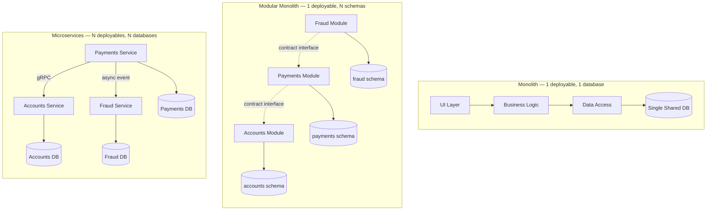

**3.2 Request flow — ESB-mediated (SOA) vs. direct service call (microservices)**

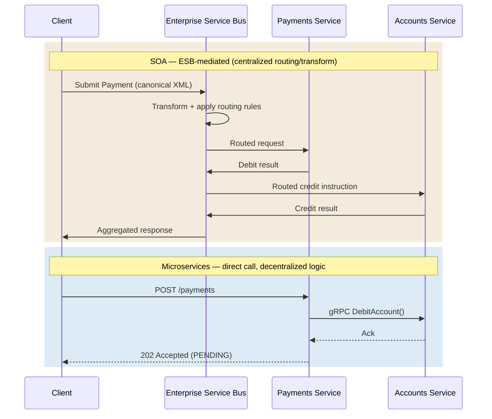

**Step 2 — Propose High-Level Design and Get Buy-In**

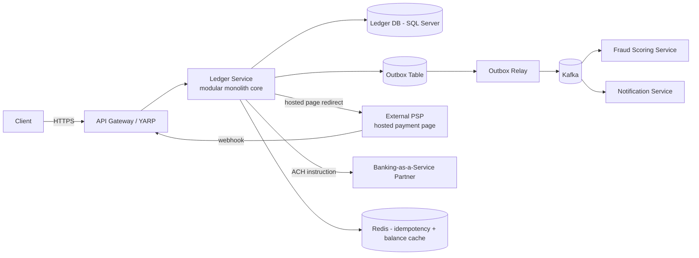

**Step 4 — Wrap-Up**

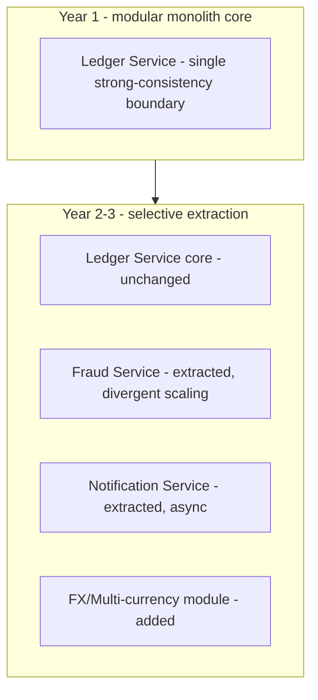

**13. Low-Level Design**

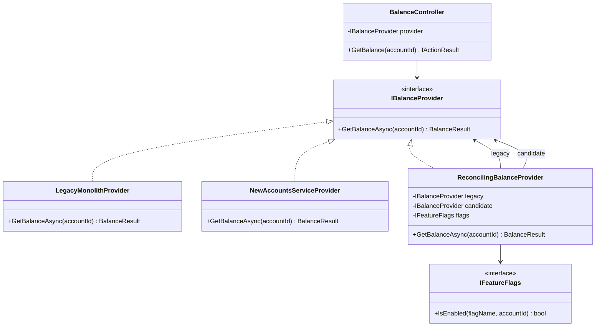

**13. Low-Level Design**

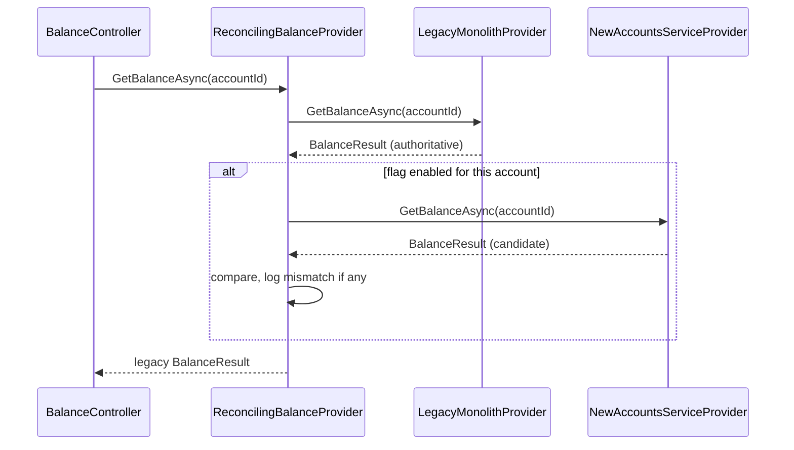

### Module 106 — Architecture Patterns: Evolutionary Architecture — Fitness Functions, Architecture Decision Records & Governance
*Source: `02-EvolutionaryArchitecture-FitnessFunctions-ADRs-Governance.md`*

**3.1 Fitness-function CI gate pipeline**

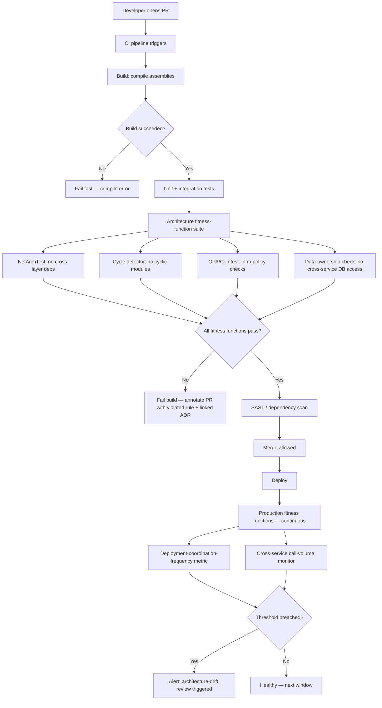

**3.2 ADR lifecycle and superseding chain**

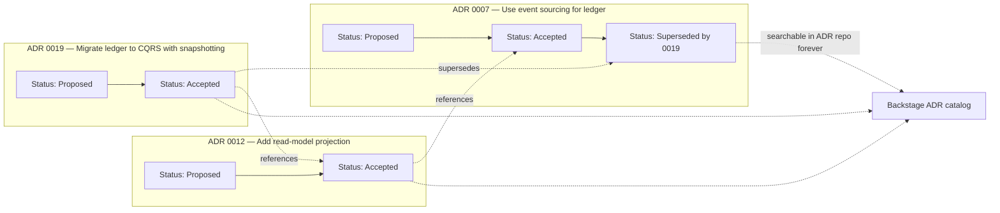

**Class diagram — pluggable fitness-function rule pipeline**

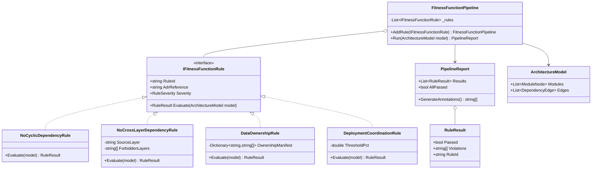

**Sequence diagram — CI gate execution**

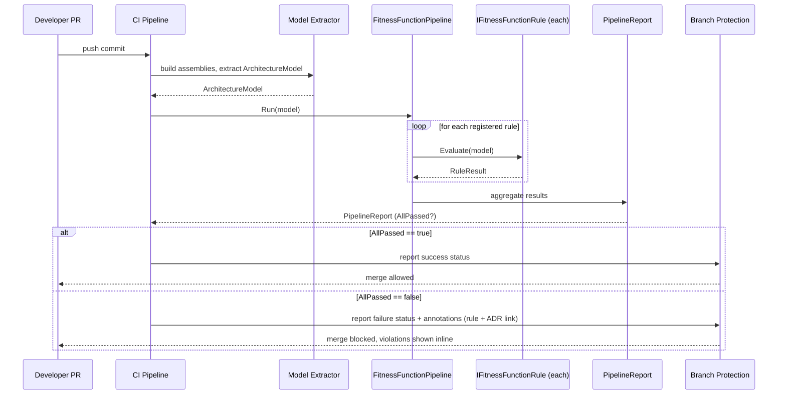

### Module 107 — Architecture Patterns: Migration Patterns — Branch by Abstraction, Parallel Run, Anti-Corruption Layer & Data Migration
*Source: `03-MigrationPatterns-BranchByAbstraction-ParallelRun-AntiCorruptionLayer-DataMigration.md`*

**1. Fundamentals**

```text
Old implementation (sole authority)
        │  1. introduce abstraction / ACL
        ▼
Old implementation behind interface, new implementation built alongside
        │  2. Parallel Run — new implementation observes real traffic, output NOT yet trusted
        ▼
Divergence low enough → gradual, flag-controlled cutover (1% → 10% → 50% → 100%)
        │  3. data migrated via dual-write or CDC, continuously reconciled
        ▼
New implementation is sole authority; old implementation decommissioned (not just idled)
```

**3. Visual Architecture**

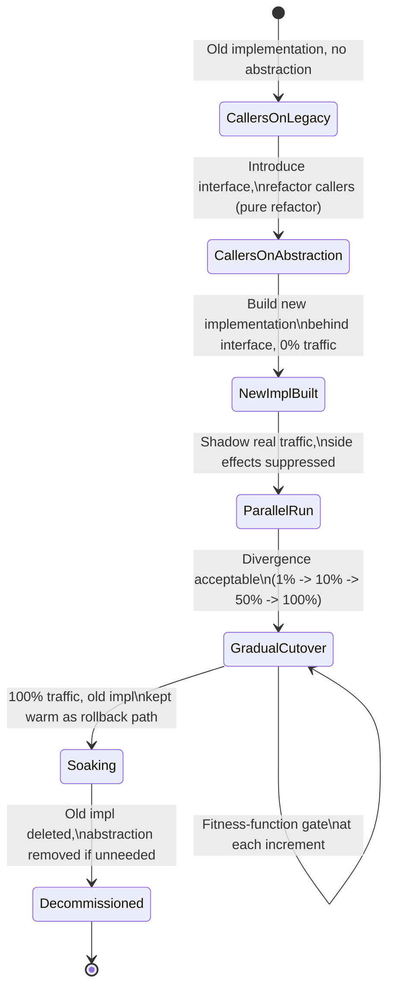

**3. Visual Architecture**

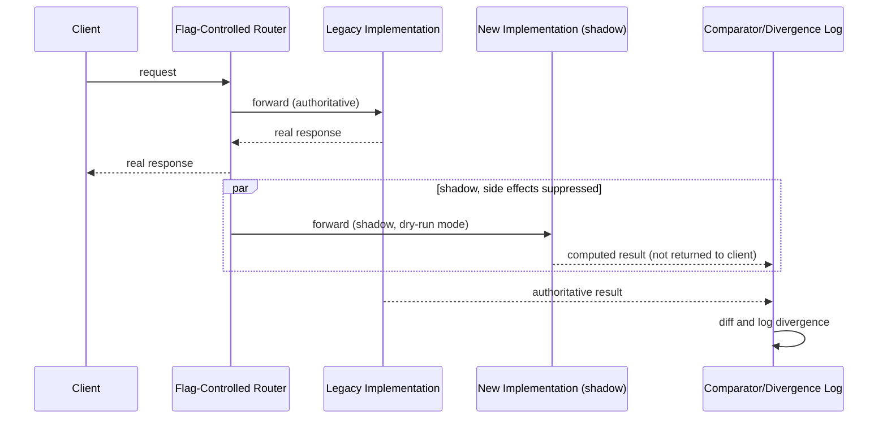

**3. Visual Architecture**

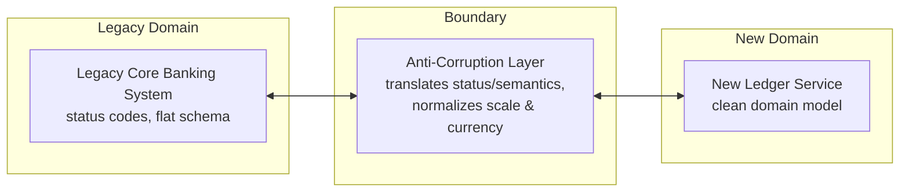

**3. Visual Architecture**

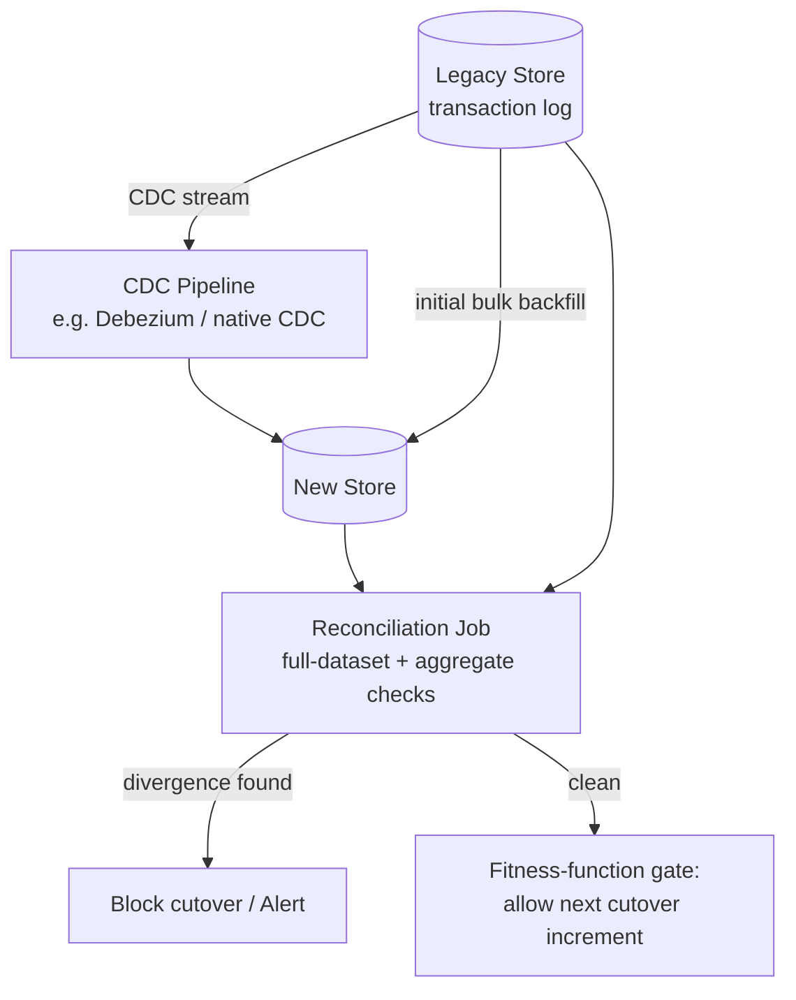

**13. Low-Level Design**

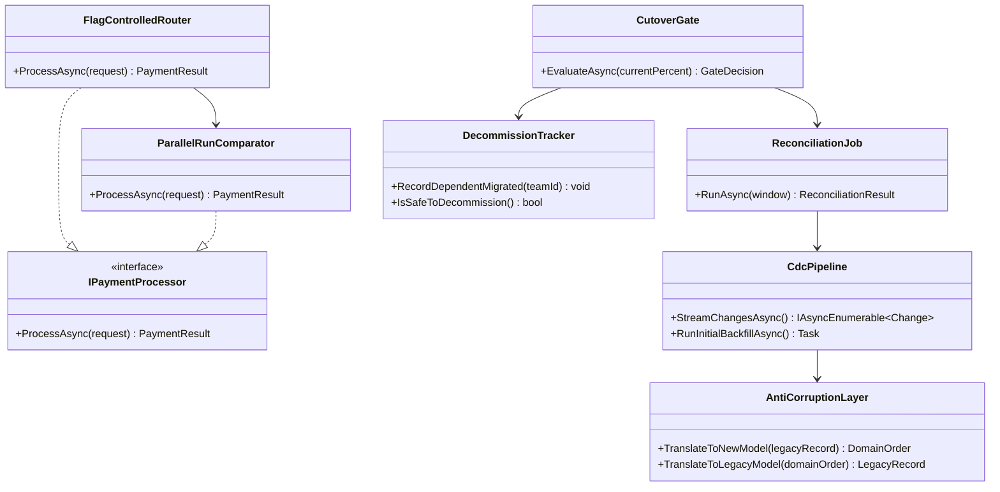

### Module 108 — Architecture Patterns: Architecture Trade-off Analysis & Principal-Level Architecture Decision-Making (capstone)
*Source: `04-ArchitectureTradeoffAnalysis-PrincipalDecisionMaking.md`*

**3. Visual Architecture**

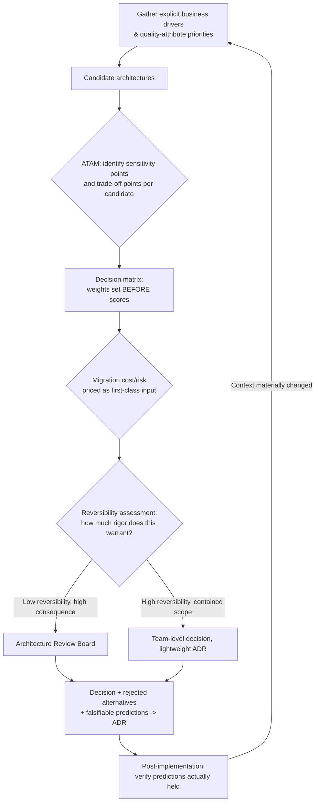

**3. Visual Architecture**

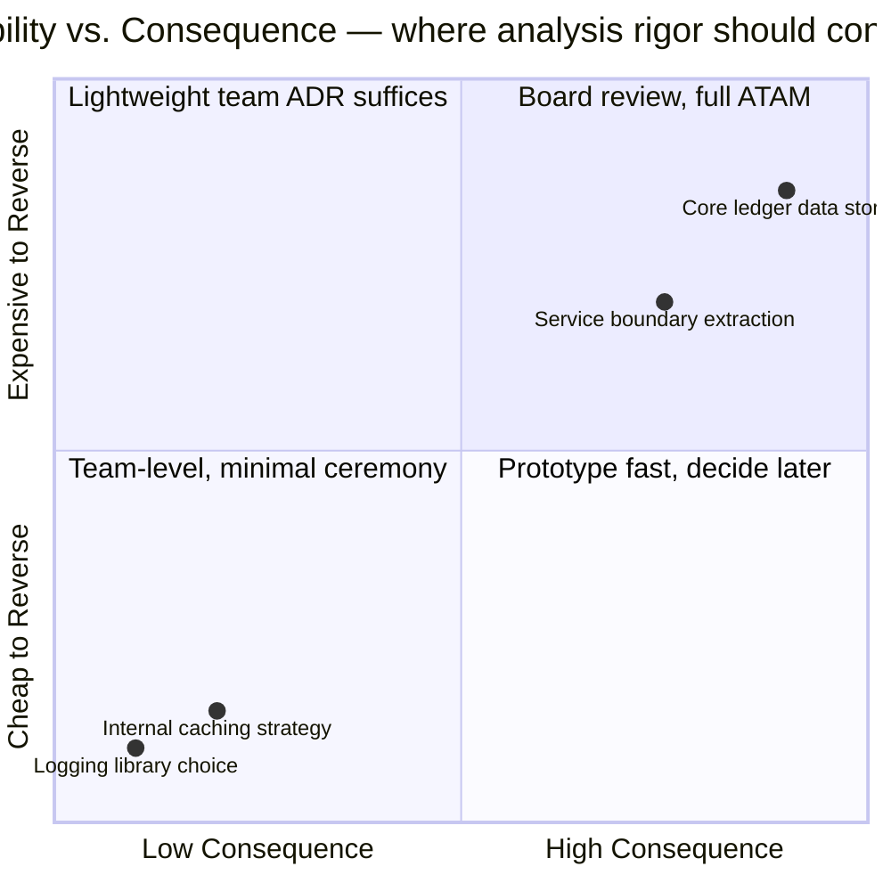

**3. Visual Architecture**

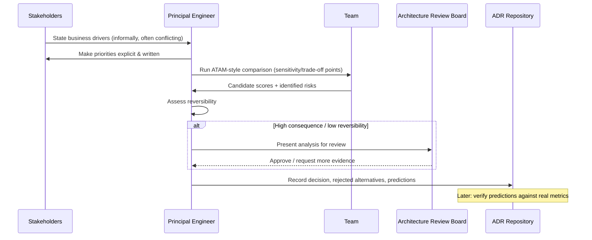

**13. Low-Level Design**

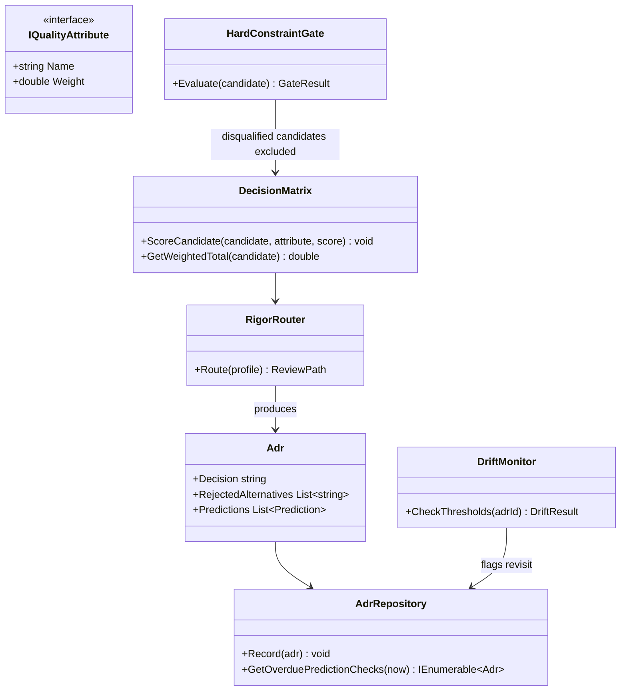
