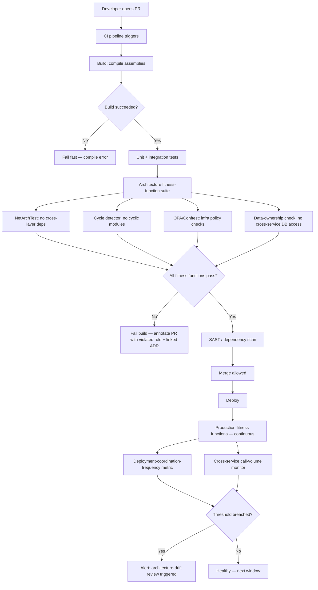
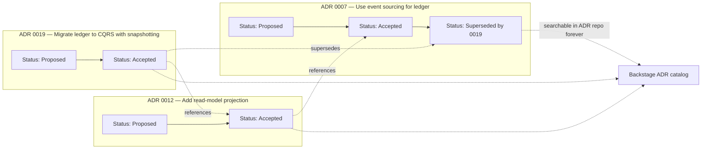
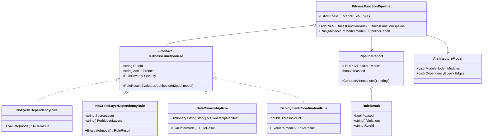
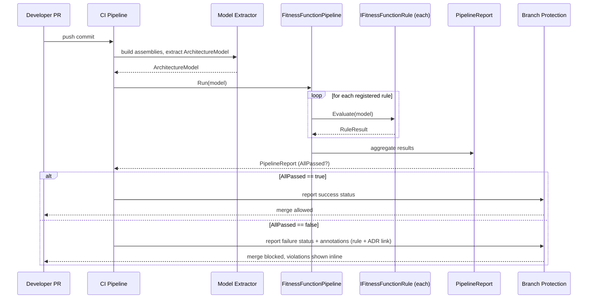

# Module 106 — Architecture Patterns: Evolutionary Architecture — Fitness Functions, Architecture Decision Records & Governance

> Domain: Architecture Patterns | Level: Beginner → Expert | Prerequisite: [[01-ArchitecturalStyles-Monolith-ModularMonolith-SOA-Microservices-Serverless]] (this module's fitness functions provide the empirical verification that module's "declared ≠ actual coupling" finding called for), [[../25-DevOps/04-DevSecOps-PolicyAsCode-PlatformEngineering]] (policy-as-code mechanics this module's fitness functions directly reuse for architectural rules specifically)

---

## 1. Fundamentals

### 1.1 What is evolutionary architecture?

Evolutionary architecture is the discipline of treating a system's architecture as a living structure that changes incrementally, continuously, and *verifiably* — instead of a fixed blueprint decided once, up front, and never objectively re-checked. The word doing the real work is "verifiably": incremental change without verification is just drift. Evolutionary architecture pairs the incremental-change philosophy with **fitness functions** — objective, automatable tests of specific architectural characteristics — so that as the system changes, the organization has continuous, empirical evidence that the properties it cares about (low coupling, a specific latency budget, no cross-service database access, PCI segmentation) still hold, rather than trusting that they still hold because nobody's complained recently.

Three forces make this necessary in a real organization:

- **Requirements are never fully known up front.** A team building a settlement platform in 2023 could not have fully anticipated 2026's regulatory reporting requirements. An architecture that assumed perfect foresight would already be wrong.
- **Many people touch the same system.** A payments platform with 40 engineers across 6 teams will accumulate boundary violations gradually, one seemingly-reasonable shortcut at a time, unless something *other than everyone's continued good judgment* is watching.
- **Architecture erodes silently, not loudly.** Nobody wakes up one morning and decides to build a distributed monolith. It happens one direct database call, one "just this once" synchronous chain, one bypassed boundary at a time — each individually defensible, collectively catastrophic.

### 1.2 Why fitness functions exist

A **fitness function** (the term borrowed deliberately from evolutionary biology, popularized for software architecture by Ford, Parsons, and Kua in *Building Evolutionary Architectures*) is any objective, automatable, repeatable mechanism that measures whether an architectural characteristic currently holds. The definition has three load-bearing words:

- **Objective** — the answer isn't a matter of opinion. "This module imports from that module's internal namespace" is either true or false; "this code feels well-organized" is not a fitness function.
- **Automatable** — a human doesn't have to remember to check it. It runs on every commit, every deploy, or every scheduled interval without anyone needing to remember.
- **Repeatable** — the same input produces the same result every time, so a pass today means the same thing as a pass tomorrow.

Without fitness functions, "architecture" is a set of intentions living in design docs, Slack threads, and senior engineers' heads. With them, architecture becomes a set of continuously-tested, currently-true claims about the system — the same shift unit tests made for correctness two decades ago, now applied to structure.

### 1.3 What is an Architecture Decision Record (ADR)?

An ADR is a short, immutable, dated document capturing one specific architectural decision: the context that forced the decision, the options seriously considered, the decision made, and its consequences (including the ones the team didn't love). ADRs answer a question code and diagrams structurally cannot answer on their own: *why* is it this way, and what did we deliberately choose not to do?

### 1.4 What is architecture governance?

Governance is the set of organizational mechanisms — an Architecture Review Board, fitness-function suites, ADR repositories, golden-path templates — that keep an organization's many independently-moving teams from drifting into incoherent, unmanaged architectural risk. Good governance is mostly structural (defaults, automated gates) rather than procedural (approval meetings); it scales because it doesn't require a human to personally review every change.

### 1.5 When to apply this, and when not to

Evolutionary architecture, fitness functions, and formal ADRs earn their cost when: multiple teams share a codebase or a set of interacting services; the system has money-critical, regulated, or otherwise high-consequence invariants; the team has been burned before by undocumented, re-litigated, or silently-reversed decisions; or the organization is large enough that "ask Priya" is not a scalable way to recover architectural intent. They are overkill — pure process tax — for a two-person team building a prototype with no regulatory exposure and a short expected lifetime; Advanced Q9 in §10 covers this calibration in more depth.

### 1.6 How it fits together

ADRs record *intent*. Fitness functions verify *reality against that intent, continuously*. Governance is the organizational scaffolding making both practices actually happen, at the right level of ceremony, without becoming a bottleneck. None of the three works well without the other two: an ADR with no fitness function is a wish; a fitness function with no ADR is an unexplained, unaccountable rule; governance with neither is a meeting.

---

## 2. Deep Dive

### 2.1 How a fitness function is actually implemented and wired into CI

Mechanically, a fitness function is ordinary test code that asserts something about the *structure* of the system rather than its runtime behavior. In .NET, the two dominant libraries are **NetArchTest.Rules** and **ArchUnitNET** (a .NET port of Java's ArchUnit). Both work the same way: load the compiled assemblies via reflection (`System.Reflection` / Mono.Cecil under the hood), build an in-memory model of types, namespaces, and their dependencies, then let you write fluent assertions against that model.

```csharp
// NetArchTest.Rules — enforced as an ordinary xUnit test, runs in the same
// CI step as every other test, so a violation fails the build exactly
// like a broken unit test would.
[Fact]
public void SettlementDomain_Should_Not_DependOn_Infrastructure()
{
    var result = Types.InAssembly(typeof(SettlementAggregate).Assembly)
        .That()
        .ResideInNamespace("Settlement.Domain")
        .ShouldNot()
        .HaveDependencyOnAny("Settlement.Infrastructure", "Npgsql", "Dapper")
        .GetResult();

    Assert.True(result.IsSuccessful,
        "Domain layer must not depend on infrastructure: " +
        string.Join(", ", result.FailingTypeNames ?? Array.Empty<string>()));
}
```

Because it's just a test, it's wired into CI the same way any test is: `dotnet test` runs it as part of the pipeline's test stage, and a failure returns a non-zero exit code, which the pipeline (GitHub Actions, Azure DevOps) treats as a failed build, blocking the merge/deploy. No bespoke tooling is required — the fitness function rides on infrastructure the team already has.

### 2.2 Dependency-graph extraction mechanics

Under the hood, both NetArchTest and ArchUnitNET reflect over the compiled IL, not the source text. For each type, they enumerate: base types/interfaces, field and property types, method parameter/return types, and types referenced in method bodies (via IL instruction scanning for `call`/`newobj`/`ldtoken` operands). This produces a directed graph where nodes are types (or namespaces, when rolled up) and edges are "references." This matters practically: reflection-based analysis catches dependencies source-text-based `grep` approaches miss (e.g., a dependency introduced only through generic type parameters or attribute usage), but it requires the assembly to actually build — a fitness function of this kind cannot run against code that doesn't compile, unlike a linter.

For larger-scale, cross-repository analysis (e.g., "does any of our 40 microservice repos import a shared internal NuGet package's `Internal` namespace"), organizations typically extract the graph once per build into a serialized form (a simple adjacency-list JSON, or a `.dot` file for Graphviz) and run graph algorithms against that serialized representation rather than re-reflecting on every query — this is the same incremental/cached-analysis strategy covered under §7 Performance Engineering.

### 2.3 Cycle detection algorithm mechanics

"No cyclic dependencies between modules" is implemented with a straightforward depth-first-search-based cycle detection over the dependency graph — the same algorithm used for topological sort validity checking:

```csharp
public static class CycleDetector
{
    public static IReadOnlyList<string>? FindCycle(
        IReadOnlyDictionary<string, IReadOnlySet<string>> graph)
    {
        var visiting = new HashSet<string>(); // on current DFS stack (gray)
        var visited  = new HashSet<string>(); // fully processed (black)
        var path     = new List<string>();

        foreach (var node in graph.Keys)
        {
            if (!visited.Contains(node) && Dfs(node)) return path;
        }
        return null;

        bool Dfs(string node)
        {
            visiting.Add(node);
            path.Add(node);

            foreach (var dep in graph.TryGetValue(node, out var deps) ? deps : [])
            {
                if (visiting.Contains(dep)) { path.Add(dep); return true; } // back-edge = cycle
                if (!visited.Contains(dep) && Dfs(dep)) return true;
            }

            visiting.Remove(node);
            visited.Add(node);
            path.RemoveAt(path.Count - 1);
            return false;
        }
    }
}
```

This runs in O(V + E) — linear in the size of the module graph — which is why even a graph of several thousand modules analyzes in milliseconds once extracted; the extraction step (§2.2), not the cycle detection itself, dominates cost.

### 2.4 CI-time vs. production-time fitness functions, mechanically

A CI-time fitness function operates on **static artifacts**: source code, compiled assemblies, infrastructure-as-code templates (Terraform/CloudFormation), or a build's dependency manifest. It runs once per pull request, has a bounded, predictable runtime, and blocks a merge.

A production-time fitness function operates on **live telemetry**: it queries a metrics/tracing backend (Prometheus, CloudWatch, Application Insights) or synthesizes traffic against the running system, and it runs continuously or on a schedule (every 5 minutes, nightly), typically implemented as an alerting rule rather than a pass/fail test gate. Example: a production fitness function measuring actual cross-service call volume between the `payments` and `risk` services over a rolling 24-hour window, alerting via PagerDuty/OpsGenie if it crosses a threshold implying tighter coupling than the ADR-approved boundary allows — something no CI-time static check could ever observe, because the violation is a *runtime interaction pattern*, not a structural code fact.

### 2.5 ADR tooling and format mechanics

The dominant lightweight convention is Michael Nygard's original template, operationalized via **adr-tools** (a small shell-script CLI: `adr new "Use event sourcing for the ledger"` scaffolds a numbered Markdown file `0007-use-event-sourcing-for-the-ledger.md` from a template, and `adr-init`/`adr-link` manage the sequence and supersession links). The file itself is plain Markdown, checked into the repo (usually `docs/adr/`), so it's versioned, diffable, and reviewed via the same pull-request process as code:

```markdown
# 7. Use event sourcing for the ledger

Date: 2026-03-14
Status: Accepted

## Context
The settlement ledger requires a complete, immutable audit trail...

## Decision
We will model the ledger as an event-sourced aggregate...

## Consequences
Positive: full audit trail, natural point-in-time reconstruction.
Negative: read-model projection adds operational complexity...
```

Superseding is a link, not an edit: `0007-use-event-sourcing-for-the-ledger.md`'s status line changes to `Superseded by 0019`, and `0019-...md` states `Status: Accepted, supersedes 0007` — both files remain in the repo forever, preserving the chain (§3.2 diagrams this).

At larger scale, organizations expose the ADR repository through a **developer portal** — Backstage (Spotify's open-source platform) is the common choice — indexing ADRs across every repo into one searchable catalog with full-text search and a golden-path template for `adr new` wired into the portal's scaffolding.

### 2.6 Policy-as-code engines and their relationship to fitness functions

**OPA (Open Policy Agent)** and its CLI companion **Conftest** generalize the fitness-function idea to any structured artifact, not just compiled code: Kubernetes manifests, Terraform plans, Dockerfiles, JSON API responses. Policies are written in **Rego**, a declarative query language, and evaluated against the artifact:

```rego
package main

deny[msg] {
    input.kind == "Deployment"
    not input.spec.template.spec.containers[_].resources.limits
    msg := "Deployment must set resource limits"
}
```

Mechanically, OPA/Conftest is the identical pattern as NetArchTest — parse an artifact into a structured model, evaluate declarative rules against it, fail the pipeline on violation — just operating one layer down the stack (infrastructure/config rather than compiled code). This is why an organization that has already invested in policy-as-code for infrastructure has most of the CI-integration, reporting, and violation-tracking plumbing needed to add architectural fitness functions as simply another rule category (§10 Expert Q8 covers this synthesis with SAST/DAST directly).

### 2.7 Hidden costs

Fitness functions are not free. Reflection-based analysis over a large monorepo (thousands of types) can add real minutes to a CI run if run naively on every commit without caching (§7.6 covers the mitigation). ADR discipline has an easy-to-underestimate ongoing cost: a repository nobody curates becomes exactly as useless as no repository at all, just with more Markdown files. And every fitness function is itself an artifact that can silently stop enforcing — the recursive "verify the verifier" risk this module's Expert-tier questions (§10) return to repeatedly, and which §14's incident is built around.

---

## 3. Visual Architecture

### 3.1 Fitness-function CI gate pipeline



### 3.2 ADR lifecycle and superseding chain



Both diagrams reinforce the same point: the CI gate (3.1) is where an ADR's *decision* (3.2) becomes an actually-enforced *constraint* — a fitness function with no ADR justifying it is an orphaned rule (§10 Expert Q6); an ADR with no corresponding fitness function is an unverified wish (§10 Advanced Q5).

---

## 4. Production Example

**Problem.** A mid-size FinTech ("Meridian Settlement" — a composite, representative scenario) ran a 14-service settlement platform: trade capture, netting, ledger, reconciliation, regulatory reporting, and notification services, each independently deployable in principle. Eighteen months in, the platform lead noticed something odd during a routine capacity-planning review: despite having 14 "independently deployable" services, the deployment pipeline dashboard showed that `ledger-service` and `netting-service` had been deployed together — same commit window, same release ticket — in 34 of the last 40 releases (85%). Nobody had *decided* this; it had simply become normal.

**Investigation.** A senior engineer pulled the actual dependency graph using ArchUnitNET against both services' compiled assemblies and cross-referenced it with the API gateway's request logs. Two findings: (1) `netting-service` was calling `ledger-service`'s internal `/internal/balance-snapshot` endpoint synchronously, on the hot path, for every netting run — an endpoint never intended for cross-service use, added eight months earlier as a "temporary" fix for a reconciliation timing bug and never removed; (2) `netting-service`'s database migrations included three tables that were, on inspection, actually owned and exclusively written by `ledger-service` — a shared schema that had crept in when the two services split out of a single original monolith and nobody had ever finished separating the data.

**Root cause.** No fitness function existed to catch either problem, and no ADR had ever recorded a boundary decision between these two services at all — the split had happened organically during an earlier "modularize the monolith" initiative, verbally agreed in a design meeting, never written down, never enforced. The "temporary" internal endpoint call had no expiry, no tracking ticket, and no automated check that would ever flag it. The two services were, empirically, a distributed monolith wearing separate deployment pipelines as a costume.

**Fix.** Three changes, sequenced deliberately per the incremental-introduction pattern (§10 Intermediate Q9): (1) An ADR (`0031-ledger-netting-service-boundary.md`) was authored, explicitly stating the intended boundary — `netting-service` may only read balance data via `ledger-service`'s published, versioned `/api/v1/balances` contract, never internal endpoints, and owns none of `ledger-service`'s tables. (2) Two fitness functions were added, initially in **warn-only** mode against the existing violations: a NetArchTest check flagging any HTTP client call to a path containing `/internal/`, and a data-ownership check (a script diffing each service's EF Core migration history against a canonical `service → owned-tables` manifest maintained alongside the ADR). (3) Over six weeks, the temporary endpoint call was replaced with the public contract, and the three misplaced tables were migrated to `ledger-service` behind a dual-write/backfill/cutover sequence. Only then were both fitness functions flipped from warn to build-failing.

**Trade-offs.** Warn-first cost six weeks of continued, known violation rather than an immediate hard block — deliberately accepted, because a hard block on day one would have frozen both teams' ability to ship anything until the (nontrivial) data migration finished, which is precisely the "block legitimate work indefinitely" failure mode the incremental-introduction pattern exists to avoid. The cost of the six-week delay was a known, bounded, and communicated risk; the cost of an immediate freeze would have been unbounded and adversarial.

**Lessons learned.** The 85% co-deployment metric was the empirical signal that caught this — not a code review, not a manual architecture audit, but a number on a dashboard nobody was even specifically watching for coupling. This became the seed for the org's production-time deployment-coordination-frequency fitness function (§2.4, §3.1) rolled out platform-wide afterward, with an alerting threshold set at 40% co-deployment rate over a rolling 90-day window — chosen deliberately below the 85% observed here, to catch the next instance of this pattern while it's still cheap to unwind.

---

## 5. Best Practices

- **Link every fitness function to the ADR that justifies it.** An unexplained, unlinked rule is indistinguishable from an accidental one and gets silently deleted the first time it's inconvenient.
- **Start every new fitness function in warn-only mode against the existing codebase, then gate only new violations, then remediate the backlog, then go fully enforced.** This is the concrete four-step sequence §4's fix followed, and it's the difference between adoption and rejection.
- **Prefer the smallest number of automated, high-consequence checks over an exhaustive suite of low-value ones.** A fitness-function suite that takes 25 minutes and flags 40 trivial style violations trains engineers to ignore it; a 3-minute suite that only fails for genuinely significant boundary violations gets respected.
- **Treat fitness-function retirement as symmetrically deliberate as creation** — require it to go through the same ADR-linked review, never a silent deletion when a check becomes inconvenient.
- **Scope Architecture Review Board involvement to genuinely cross-team, high-consequence, hard-to-reverse decisions only** — everything else should be decidable by the owning team within already-established fitness-function constraints, with no escalation required.
- **Keep ADRs immutable; supersede, never edit.** The historical record of *why the organization changed its mind* is often more valuable than the current decision itself.
- **Version and store ADRs next to the code they govern** (a `docs/adr/` folder in the relevant repo, or a monorepo-wide `docs/adr/`), not in a wiki that drifts out of sync with what actually shipped.
- **Run CI-time and production-time fitness functions as complementary layers, not substitutes** — CI catches code-introduced violations before merge; production catches configuration/infrastructure-introduced drift CI never sees (§2.4).
- **Plant a liveness canary for your most critical fitness functions** — a scheduled, deliberately-violating test proving the check still actually fires (§10 Expert Q4, §11 Expert exercise, §14).

---

## 6. Anti-patterns

- **Governance theater** — a large ADR repository and comprehensive fitness-function suite that don't correlate with any measured reduction in architectural-debt incidents. Activity without outcome; §10 Expert Q7 names this explicitly and §17 covers how a Principal Engineer detects it.
- **The orphaned fitness function** — a check with no linked ADR, whose original justification nobody currently at the company remembers, that blocks legitimate work for reasons nobody can articulate. Fix: require the ADR link (§5); if none can be found or reconstructed, retire the check through a reviewed process rather than leaving it as an unexamined obstacle.
- **ADR-as-documentation-only, no enforcement** — a beautifully written ADR describing a boundary that the codebase silently violates by month three, because nothing ever checks conformance. §10 Advanced Q5 names this the "declared ≠ actual" gap recurring in ADR form.
- **Big-bang fitness-function rollout** — introducing a comprehensive, fully-enforced suite against a legacy codebase on day one, freezing all work until an infeasible mass remediation completes. Fix: the incremental warn → gate-new → remediate → enforce sequence (§5, §4).
- **Centralized Architecture Review Board bottleneck** — requiring board sign-off for every architectural decision regardless of significance, recreating the exact gatekeeping-drives-bypass dynamic seen with over-broad approval gates elsewhere in this course. Fix: scope the board narrowly (§5).
- **Editing an ADR in place instead of superseding it** — silently rewrites history, destroying the record of what was originally decided, when, and why it changed. Always supersede (§2.5, §5).
- **Treating fitness functions as a complete substitute for human architectural judgment** — a comprehensive suite still cannot catch a genuinely novel risk nobody thought to encode as a rule. §10 Expert Q3 covers this limitation directly.
- **Silently disabling a failing fitness function to unblock a merge** — the single most damaging anti-pattern in this list, because it doesn't just skip one check, it establishes that the check's enforcement is optional whenever inconvenient, which is exactly how the §14 incident happened.
- **CI-only fitness functions with no production counterpart** — misses architectural drift introduced by infrastructure or configuration changes that never went through a code review at all (§2.4).

---

## 7. Performance Engineering

### 7.1 CPU

Reflection-based dependency analysis (NetArchTest/ArchUnitNET) is CPU-bound on assembly loading and IL scanning. For a mid-size assembly (a few hundred types), a single fitness-function assertion typically completes in low tens of milliseconds; the dominant cost is loading and reflecting over the assembly once, which most libraries cache per test-run, not per-assertion — write fitness-function test classes so they share a single `Types.InAssembly(...)` load across all assertions in the class (a static/shared fixture) rather than re-loading per test method, which is a common, easily-fixed 5-10x slowdown in naive suites.

### 7.2 Memory

The in-memory dependency graph for a large monorepo (tens of thousands of types) can reach the low hundreds of MB when fully materialized with reflection metadata. This is rarely the bottleneck in practice — CI runners typically have several GB available — but it matters when running fitness-function analysis inside the same process as other memory-hungry build steps (e.g., a Roslyn source generator pass); isolate the fitness-function test run into its own CI job/container if memory contention causes flaky OOM failures.

### 7.3 Latency (of the CI gate itself)

The number that actually matters to engineers is wall-clock PR-to-feedback latency. A fitness-function suite adding 3-5 minutes to a CI pipeline that otherwise completes in 8 minutes is a real, resented cost; the goal is to keep the architecture-check stage under roughly 10-15% of total pipeline time. Meridian Settlement (§4) measured their full ArchUnitNET + cycle-detection + OPA suite at 90 seconds against a 14-service, ~600-type-per-service codebase after the caching optimization in §7.6 — versus 6+ minutes before it, because the naive version re-reflected over every service's assembly on every single assertion.

### 7.4 Throughput

For organization-wide fitness functions run against every PR across dozens of repositories, the aggregate load on shared infrastructure (a policy-as-code service like OPA running as a sidecar, or a centralized architecture-linting service) needs its own capacity planning — treat it as a production service with its own SLOs, not a free CI utility, once you're past roughly 50-100 concurrent PR checks per hour organization-wide.

### 7.5 Scalability

Dependency-graph extraction is the part that scales worst — O(V+E) analysis is cheap, but *extraction* (§2.2) scales with codebase size and, for cross-repository checks, with the number of repositories analyzed. The mitigation that scales is incremental: extract each repository's graph once per build and cache/publish it (as a build artifact or to a shared graph store), so an organization-wide check ("does anything import this deprecated internal package") queries N cached graphs rather than re-reflecting over N codebases from scratch.

### 7.6 Benchmarking

Before optimizing, measure: instrument the fitness-function CI stage with its own timing breakdown (assembly load time vs. assertion-evaluation time vs. report-generation time) — most naive implementations lose the majority of their time to redundant assembly loading (§7.1), not to the actual graph algorithms, which is why benchmarking before optimizing prevents wasted effort tuning the cycle-detection algorithm (already O(V+E), already fast) when the real cost is elsewhere.

### 7.7 Caching / incremental analysis

The highest-leverage optimization is **incremental analysis**: only re-run fitness functions against assemblies/modules that actually changed in a given PR, using the build system's own change-detection (MSBuild incremental build output, or a content-hash-keyed cache) to skip unchanged modules entirely. Combined with sharing a single loaded `Types.InAssembly` fixture per test class (§7.1), this is what took Meridian's suite from 6 minutes to 90 seconds — the two together, not either alone.

---

## 8. Security

### 8.1 Threats

- **Silent bypass/disablement of the fitness-function CI gate** — the single largest security-relevant threat this module addresses: if the gate can be skipped (a `[Skip]` attribute quietly added, a required-check unchecked in branch-protection settings, a pipeline migration that drops the stage entirely — exactly §14's incident), every security/compliance boundary the gate was enforcing becomes unenforced without anyone deciding that on purpose.
- **A fitness function correctly encoding the wrong boundary** — e.g., an information-barrier check that only scans direct references and misses a violation introduced via reflection, dependency injection, or a dynamically-loaded plugin.
- **ADR repository tampering** — if ADRs are the audit trail for *why* a security-relevant boundary decision was made, write access to that repository is itself a control; an attacker (or a careless insider) editing history undermines the entire audit value described in §10's FinTech panel questions.
- **Policy-as-code engine compromise** — if OPA/Conftest policies are fetched from a mutable, un-pinned source at CI time, an attacker who compromises that source can silently weaken every policy-as-code-enforced boundary org-wide in one move.

### 8.2 Mitigations

- Require the fitness-function CI stage as a **branch-protection required status check** at the platform level (GitHub/Azure DevOps repository settings), not merely "present in the pipeline YAML" — a required check cannot be silently removed by an individual PR's own pipeline edit, closing the exact gap §14's incident exploited.
- Pin policy-as-code rule bundles to a specific, signed version/commit hash rather than "latest," and require a reviewed PR to bump that pin — the same supply-chain discipline applied to any other dependency.
- Restrict ADR repository write access via the same code-owners/branch-protection mechanism as production code, with signed commits where the organization's compliance posture requires attributable authorship (common in SOX-regulated environments).
- Run periodic **liveness canaries** (§10 Expert Q4) — a scheduled job that deliberately commits a known-violating test fixture on a branch and asserts the fitness-function suite correctly rejects it, closing the "declared enforced ≠ actually still enforced" gap structurally rather than trusting it.

### 8.3 OWASP mapping

While OWASP Top 10 targets application vulnerabilities rather than architecture governance directly, two categories map cleanly: **A05:2021 Security Misconfiguration** covers a disabled or misconfigured fitness-function/policy gate (a security control silently turned off); **A08:2021 Software and Data Integrity Failures** covers an un-pinned, tamperable policy-as-code source or an ADR repository without integrity controls — both are CI/CD and build-pipeline integrity failures, the same category as an unsigned dependency.

### 8.4 AuthN/AuthZ specific to this domain

Fitness functions are a *mechanism* for enforcing authZ-relevant architectural boundaries (e.g., "no service outside the payments boundary may call the internal token-issuance endpoint") but are not themselves an authN/authZ system — they verify that code *structurally* respects a boundary, not that a specific runtime request was properly authenticated/authorized. Both layers are needed: structural enforcement (fitness function) plus runtime enforcement (actual authZ checks in the service) — a fitness function passing does not mean the boundary can't still be crossed by a runtime authorization bug.

### 8.5 Secrets

Fitness-function CI jobs occasionally need credentials (to query a metrics backend for a production-time check, or to pull a private policy bundle) — these should use the organization's standard secrets-management path (a CI secrets store with short-lived, scoped tokens — GitHub Actions OIDC-to-cloud-role federation, or Azure DevOps service connections), never a static, long-lived credential embedded in pipeline YAML, which is exactly the kind of static secret architecture-governance tooling itself should be flagging elsewhere in the codebase.

### 8.6 Encryption

ADR repositories and fitness-function violation reports occasionally reference sensitive architectural detail (an unpatched boundary weakness, a known coupling risk in a money-critical path) — treat repository-at-rest encryption and access logging for these repositories with the same seriousness as source code generally, and be deliberate about whether a *specific* ADR describing an active, unremediated architectural weakness should be broadly readable org-wide versus restricted until the remediation lands.

---

## 9. Scalability

### 9.1 Horizontal scaling

Fitness-function *execution* scales horizontally trivially — each PR's check runs in its own CI job/container, so adding more concurrent PRs just means more parallel CI runners, the same as any other test stage. The harder scaling problem is organizational, not computational: horizontally scaling the *practice* across many teams means decentralizing authorship (§10 Advanced Q2) so no central team becomes a bottleneck reviewing every fitness function or ADR.

### 9.2 Vertical scaling

Rarely relevant — a single fitness-function CI job is not typically CPU/memory-bound enough to need a larger runner, except for very large monorepos (§7.2), where a memory-optimized runner for the architecture-check stage specifically can resolve OOM flakiness cheaply.

### 9.3 Caching

Covered in depth in §7.7 — incremental, change-scoped analysis plus shared assembly-load fixtures is the caching strategy that matters most for this domain.

### 9.4 Replication / partitioning

At organization scale, a **federated fitness-function model** is the practical answer: a small set of organization-wide, mandatory fitness functions (money-type safety, PCI segmentation, information barriers — the FinTech-panel invariants in §10) are centrally defined and distributed as a shared NuGet package or shared OPA policy bundle that every service repository pulls in; each team then adds its own additional, team-specific fitness functions on top, owned and maintained locally. This partitions ownership the same way a well-designed microservices boundary partitions data ownership — a shared, minimal core, plus team-owned extensions — rather than either a single monolithic rule set nobody can safely change, or complete anarchy with zero shared baseline.

The ADR repository scales the same way: a **federated-but-indexed** model, where each repository/team owns and writes its own ADRs, but a org-wide portal (Backstage, §2.5) indexes all of them into one searchable catalog, avoiding both a single team becoming an ADR-approval bottleneck and the fragmentation of nobody being able to find a related decision made in another team's repo.

### 9.5 Load balancing

If an organization runs a centralized policy-evaluation service (OPA-as-a-service, evaluated by many CI pipelines concurrently) rather than embedding the policy engine directly in each pipeline, that service needs conventional load balancing and its own capacity plan (§7.4) — the more common and simpler alternative is embedding OPA/NetArchTest directly in each pipeline (no shared service, no load-balancing concern at all), which is preferable unless a genuine need for centrally-updated, always-current policy justifies the added operational surface.

### 9.6 High availability / disaster recovery

The ADR repository and fitness-function definitions should have the same HA/DR posture as source code generally — they typically *are* source code, living in the same Git repositories, inheriting Git's own replication and the organization's existing backup/DR posture for its source-control platform. No bespoke DR plan is usually needed; the risk to actively manage is a bespoke, centralized policy-evaluation *service* (§9.5) becoming a single point of failure that blocks every CI pipeline org-wide if it goes down — mitigate by failing open with an alert (allow the merge, page the platform team) rather than failing closed and halting all engineering org-wide on one service's outage, unless the specific policy is money/compliance-critical enough that failing closed is the deliberately correct choice (a Principal-level trade-off call, covered in §15).

### 9.7 CAP theorem

CAP theorem doesn't apply directly here — there's no distributed data store making a consistency/availability trade-off under partition. The genuinely analogous tension is **governance consistency vs. team autonomy**: a fully centralized, always-consistent governance model (one Architecture Review Board approves everything, one team owns every fitness function) guarantees organization-wide consistency but sacrifices team velocity/autonomy at scale; a fully decentralized model (every team defines its own rules independently) maximizes autonomy but sacrifices organization-wide consistency, risking exactly the drift governance exists to prevent. The federated model (§9.4) is this domain's answer to that trade-off — a small, centrally-consistent core plus team-autonomous extensions — the structural equivalent of choosing a tunable consistency level rather than a hard CP/AP choice.

---

## 10. Interview Questions

### Basic (10)

1. **Q: What is evolutionary architecture?**
 **A:** An approach treating architecture as something that changes incrementally and continuously over time in response to genuine, evolving requirements, guided by fitness functions that objectively verify important architectural characteristics remain intact as the system evolves — rather than a fixed, "finished" design decided once upfront.
 **Why correct:** States the core premise (continuous, guided evolution) and its verification mechanism (fitness functions).
 **Common mistakes:** Assuming evolutionary architecture means "no upfront design at all" rather than a deliberate, continuously-verified evolution guided by explicit fitness criteria.
 **Follow-ups:** "Why does this align with the modular-monolith-first recommendation?" (Both share the same underlying philosophy — defer irreversible decisions, evolve incrementally, and verify fit continuously rather than committing to a single, upfront, permanent architecture.)

2. **Q: What is an architectural fitness function?**
 **A:** An objective, automatable, and repeatable test that measures whether a specific architectural characteristic (e.g., no cyclic dependencies, a specific latency budget, a coupling rule) is currently true, run continuously (in CI or production) rather than assessed only via occasional, subjective human review.
 **Why correct:** States the defining properties (objective, automatable, continuously run) distinguishing it from a subjective architecture review.
 **Common mistakes:** Assuming a fitness function must always be fully automated code — some fitness functions are manual/periodic (an architecture review checklist) though automated ones are strongly preferred where feasible.
 **Follow-ups:** "Give an example of a simple, automatable fitness function." (A static-analysis check failing the build if any module imports directly from another module's internal namespace, enforcing an intended module-boundary rule.)

3. **Q: What is an Architecture Decision Record (ADR)?**
 **A:** A short, structured document capturing a specific architectural decision — the context/problem, the options considered, the decision made, and its consequences — creating a durable, reviewable record of *why* a decision was made, not merely what the current architecture looks like.
 **Why correct:** States the ADR's specific content (context, options, decision, consequences) and its purpose (capturing rationale, not just current state).
 **Common mistakes:** Confusing an ADR with general design documentation describing how a system currently works, rather than specifically why a particular decision was made at a particular point in time.
 **Follow-ups:** "Why does capturing 'why' matter more than capturing 'what' for architecture specifically?" (The current state is usually discoverable from the code itself; the reasoning behind a specific trade-off — including options that were rejected and why — is otherwise lost, risking a costly, uninformed re-litigation of an already-considered decision.)

4. **Q: What is the difference between an ADR and general design documentation?**
 **A:** General design documentation describes the current system's structure and behavior; an ADR is a point-in-time record of a specific decision and its rationale, remaining valid as a historical record even after the system's actual implementation has since evolved beyond what the ADR originally described.
 **Why correct:** States the distinction (current-state description vs. point-in-time decision rationale) precisely.
 **Common mistakes:** Treating an ADR as something to continuously update to reflect current state, rather than recognizing its value specifically as an immutable historical record (Intermediate Q4).
 **Follow-ups:** "What happens to an ADR once its decision is later reversed or changed?" (A new ADR is created explicitly superseding the old one, rather than editing the original — preserving the full historical record of how the decision evolved.)

5. **Q: What is "last responsible moment" decision-making in architecture?**
 **A:** Deferring an architectural decision until the point where delaying it further would genuinely start to cost more than making it now — avoiding both premature commitment (locking in a decision before enough information exists) and excessive, indecisive delay (missing the point where the decision actually needed to be made).
 **Why correct:** States the balance point precisely (deferring exactly until further delay becomes costly, not indefinitely).
 **Common mistakes:** Interpreting "defer decisions" as "avoid making decisions entirely" or "delay everything as long as possible," rather than the specific, cost-balanced timing this principle describes.
 **Follow-ups:** "How does this connect to the monolith-vs-microservices deferral recommendation?" (It's the identical principle applied specifically to that decision — deferring the microservices-extraction choice until a concrete, current need makes further deferral genuinely more costly than deciding.)

6. **Q: What is architecture governance, at a high level?**
 **A:** The organizational practices, decision-making structures, and enforcement mechanisms ensuring an organization's architecture remains coherent, aligned with its principles, and doesn't silently drift into inconsistency or unmanaged risk as many teams and changes accumulate over time.
 **Why correct:** States the governance goal (coherence, alignment, drift-prevention) at an appropriately high level.
 **Common mistakes:** Assuming governance necessarily means a centralized approval process, rather than recognizing it can be (and, ideally is) implemented via lightweight, structural defaults rather than gatekeeping.
 **Follow-ups:** "What's the risk of governance implemented purely as a documentation exercise with no actual enforcement?" (Directly this course's now-repeated finding — a declared-but-unenforced governance practice reliably underperforms a structural, verified one.)

7. **Q: What is a "big design up front" (BDUF) approach, and why is it often risky?**
 **A:** Attempting to fully specify a system's architecture in detail before any implementation begins, based on requirements gathered at that early point — risky because early requirements are often incomplete or wrong, and a fully-committed upfront design leaves little room to incorporate what's actually learned once real implementation and usage begins.
 **Why correct:** States the approach and the specific reason (early requirements are unreliable, upfront commitment forecloses learning) it's risky.
 **Common mistakes:** Assuming BDUF is simply "doing too much planning," rather than the more specific risk of irreversible commitment based on necessarily incomplete early information.
 **Follow-ups:** "What's evolutionary architecture's alternative to BDUF?" (Making only the decisions genuinely necessary now, deferring others to the last responsible moment, and verifying the evolving architecture continuously via fitness functions rather than trusting an unchanging, upfront specification.)

8. **Q: What is coupling and cohesion, and why do they matter for evolvability?**
 **A:** Coupling is the degree of interdependency between components; cohesion is how strongly related the responsibilities within a single component are. Low coupling and high cohesion make a system easier to evolve — a change to one, cohesive component is less likely to ripple into unrelated, tightly-coupled parts of the system.
 **Why correct:** States both definitions and their direct relevance to how easily a system can change over time.
 **Common mistakes:** Treating coupling and cohesion as purely academic code-quality terms disconnected from the practical, evolutionary cost they directly determine.
 **Follow-ups:** "How does this connect to the bounded-context/service-boundary discussion?" (A service boundary aligned with a genuinely cohesive business capability naturally produces low coupling to other services — misaligned boundaries produce the opposite, directly causing the "distributed monolith" coupling risk.)

9. **Q: What is technical debt in the context of architecture, as distinct from code-level debt?**
 **A:** Architectural debt is a structural, system-wide shortcut or compromise (a boundary drawn incorrectly, a coupling accepted for expediency) whose cost compounds across many components and is typically much more expensive to remediate than localized, code-level debt (a poorly-named variable, a missing unit test) confined to a single function or file.
 **Why correct:** States the scope distinction (system-wide, structural vs. localized) and the corresponding remediation-cost difference.
 **Common mistakes:** Treating architectural debt as simply "a bigger version of code debt," missing that its remediation often requires coordinated, cross-team effort rather than a localized, single-team fix.
 **Follow-ups:** "Why is architectural debt often harder to even identify than code-level debt?" (It frequently isn't visible within any single component's own code — it manifests only in the interaction/coupling pattern *between* components, requiring a system-wide, not local, view to detect.)

10. **Q: What is the difference between an architecture principle and an architecture constraint?**
 **A:** A principle is a guiding value informing decisions (e.g., "prefer asynchronous communication where consistency requirements allow"), generally advisory and context-dependent; a constraint is a hard, non-negotiable rule (e.g., "no service may directly access another service's database") typically enforced via a fitness function, with violations blocking a change rather than merely being discouraged.
 **Why correct:** States the enforceability distinction (advisory guidance vs. hard, blocking rule) precisely.
 **Common mistakes:** Treating every architectural guideline with identical, uniform enforcement rigor, rather than distinguishing which specific rules genuinely warrant a hard, automated constraint versus which are better left as flexible, context-dependent principles.
 **Follow-ups:** "Why shouldn't every principle be converted into a hard constraint?" (Over-constraining reduces necessary flexibility for legitimate exceptions and risks the same friction-driven-bypass dynamic established for overly strict gates generally.)

### Intermediate (10)

1. **Q: How would you implement an automated fitness function checking for no cyclic dependencies between modules?**
 **A:** Use a static-analysis/dependency-graph tool (many languages have one, or a custom script parsing import/reference statements) to build the actual module dependency graph, then run a cycle-detection algorithm against it as a CI-gated check — failing the build if any cycle is detected, directly reusing the fail-fast CI-gate pattern applied to this specific architectural rule.
 **Why correct:** States a concrete implementation approach (dependency-graph extraction, cycle detection, CI gating) rather than an abstract description.
 **Common mistakes:** Relying on manual code review alone to catch cyclic dependencies, which are often introduced gradually and subtly across many files, making them easy for a human reviewer to miss without automated graph analysis.
 **Follow-ups:** "Why are cyclic dependencies specifically harmful to evolvability?" (A cycle means two modules can't be understood, tested, or evolved independently of each other — directly undermining the low-coupling property Basic Q8 identified as essential for evolvability.)

2. **Q: What's the difference between an atomic and a holistic fitness function?**
 **A:** An atomic fitness function tests one specific architectural characteristic in isolation (e.g., "no cyclic dependencies"); a holistic fitness function tests how multiple characteristics interact together (e.g., verifying a security constraint holds even after a performance-driven refactor) — some architectural properties can only be validated by considering several dimensions simultaneously, not by testing each atomic rule independently.
 **Why correct:** States the scope distinction (single characteristic vs. multi-characteristic interaction) precisely.
 **Common mistakes:** Assuming a comprehensive suite of atomic fitness functions automatically catches every possible architectural regression, missing that some regressions only manifest in the interaction between multiple, individually-passing atomic checks.
 **Follow-ups:** "Give an example where an atomic-only fitness function suite would miss a real regression a holistic one would catch." (A change passes both an atomic "no new external dependencies" check and an atomic "meets latency budget" check independently, but the specific combination — a new dependency added specifically to meet the latency budget — introduces an unacceptable licensing or security risk only a holistic check spanning both dimensions would catch.)

3. **Q: How do you decide what belongs in an ADR versus ordinary code comments/documentation?**
 **A:** An ADR is reserved for decisions with significant, system-wide architectural consequence and non-obvious trade-offs worth preserving for future reference (choosing a data-consistency model, a major technology adoption); routine, localized implementation choices belong in code comments or standard documentation, since creating an ADR for every minor decision would dilute the ADR log's value and make genuinely significant decisions harder to find.
 **Why correct:** States a concrete significance-based criterion distinguishing ADR-worthy decisions from routine ones.
 **Common mistakes:** Either never writing ADRs (losing the valuable historical record for significant decisions) or writing one for every minor choice (diluting the log's usefulness and creating unnecessary process overhead).
 **Follow-ups:** "What's a practical heuristic for 'significant enough to warrant an ADR'?" (Would a new engineer joining the team, or the same engineer six months later, plausibly need to understand *why* this specific choice was made, not just what it currently is, to avoid costly re-litigation or an uninformed reversal?)

4. **Q: What is ADR immutability, and why are ADRs typically not edited after acceptance?**
 **A:** Once an ADR is accepted, it's treated as an immutable historical record — a later change in the decision is captured by creating a *new* ADR explicitly marked as superseding the original, rather than editing the original document, preserving the complete, honest history of how and why the architecture evolved rather than silently rewriting history.
 **Why correct:** States the immutability convention and its purpose (preserving honest, complete decision history).
 **Common mistakes:** Editing an old ADR to reflect a newer decision, destroying the historical record of what was originally decided and why, and why it later changed.
 **Follow-ups:** "Why does this immutability matter specifically for avoiding re-litigation of settled decisions?" (A superseding ADR explicitly references and explains why the prior decision changed, giving future readers the full context of the decision's evolution — an edited-in-place ADR would hide that a change (and its reasoning) ever occurred at all.)

5. **Q: How would you use fitness functions to prevent "distributed monolith" coupling?**
 **A:** Implement automated checks specifically detecting the coupling symptoms named — a fitness function flagging any direct cross-service database access, one measuring and alerting on actual deployment-coordination frequency (how often services are deployed together versus independently), and one tracking synchronous call-chain depth across service boundaries — converting the diagnostic criteria into continuously-enforced, automated checks rather than an occasional, manual audit.
 **Why correct:** Directly, concretely operationalizes the specific distributed-monolith diagnostic criteria into automated fitness functions.
 **Common mistakes:** Relying solely on an occasional, manual architecture review to catch distributed-monolith coupling, missing that continuous, automated enforcement catches the drift far earlier and more reliably.
 **Follow-ups:** "Why is measuring actual deployment-coordination frequency a stronger fitness function than merely checking the codebase's static structure?" (Static structure alone (e.g., no direct cross-service imports) doesn't reveal whether services are, in practice, still forced into lockstep deployment by some other mechanism — actual deployment history is the empirical ground truth established as the real diagnostic signal.)

6. **Q: What is the risk of architecture governance becoming disconnected from day-to-day engineering reality?**
 **A:** Governance defined and maintained by a group removed from actual, current implementation work risks producing principles/constraints that are either already obsolete, technically impractical, or simply unknown/ignored by the engineers actually building the system — directly recreating the "declared ≠ actual" gap this course has traced throughout, where governance exists on paper but has no genuine, current bearing on the system it's meant to govern.
 **Why correct:** States the specific mechanism (disconnection from current implementation reality) producing governance's practical irrelevance.
 **Common mistakes:** Assuming governance's value is proportional to how formally/thoroughly it's documented, rather than how genuinely connected and enforced it is against the system's actual, current state.
 **Follow-ups:** "How would automated fitness functions specifically mitigate this disconnection risk?" (A fitness function is run directly against the actual, current codebase on every change — it cannot become disconnected from reality the way a static, periodically-reviewed document can, since it's continuously re-evaluated against whatever the system currently, actually is.)

7. **Q: How do you balance architectural principles with pragmatic exceptions?**
 **A:** Allow an explicit, reviewed, time-bounded exception process for a principle when a genuine, well-justified reason exists to deviate — directly §Advanced Q9's expiring-exception pattern, applied to architectural principles specifically — rather than either rigidly enforcing every principle with zero exceptions (risking the friction-driven-bypass dynamic) or treating principles as purely optional suggestions with no real weight at all.
 **Why correct:** Directly reapplies an already-established course pattern (reviewed, expiring exceptions) to architectural-principle governance specifically.
 **Common mistakes:** Either allowing silent, unreviewed exceptions (undermining the principle's actual force) or refusing any exception ever (risking teams working around the principle covertly rather than through a sanctioned, visible path).
 **Follow-ups:** "Why must an exception be time-bounded rather than permanent?" (An unreviewed, permanent exception risks silently becoming the new, unexamined normal — a periodic re-review forces an explicit, ongoing justification rather than an indefinite, unexamined carve-out.)

8. **Q: What's the difference between a fitness function run in CI versus one run continuously in production?**
 **A:** A CI-run fitness function validates a proposed change before it merges/deploys (catching a violation at the cheapest, earliest possible point); a production-run fitness function continuously validates the live, running system's actual, current behavior (catching drift introduced by something other than a code change — a configuration change, an infrastructure change, or gradual, cumulative degradation examined) that a pre-deployment CI check alone wouldn't reveal.
 **Why correct:** States the distinct failure modes each catches (pre-merge code-level violations vs. post-deployment, non-code-driven drift).
 **Common mistakes:** Assuming a comprehensive CI-gated fitness-function suite alone is sufficient, missing that some architectural properties can drift in production for reasons entirely disconnected from any specific code change.
 **Follow-ups:** "Give an example of an architectural property that could drift in production despite passing every CI fitness function." (An infrastructure/configuration change accidentally reintroducing direct cross-service network access that no CI-time code check would catch, since the violation exists purely at the infrastructure/network-policy layer.)

9. **Q: How would you introduce fitness functions to a legacy codebase with no existing architectural enforcement?**
 **A:** Start by measuring the current, actual state (running the intended fitness function against the codebase as-is, without yet gating anything on it) to establish a baseline and reveal the true scope of existing violations, then introduce enforcement incrementally — first as a non-blocking, visible warning, then gating only *new* violations (preventing further degradation) before eventually, gradually, remediating the existing backlog and tightening to a fully-enforced, zero-violation gate.
 **Why correct:** Proposes a concrete, incremental introduction sequence (measure baseline, warn, gate-new-only, remediate backlog, full enforcement) rather than an abrupt, potentially-infeasible full-enforcement cutover.
 **Common mistakes:** Attempting to immediately, fully enforce a new fitness function against an already-violating legacy codebase, likely blocking all further work until an infeasible, large-scale remediation is completed first.
 **Follow-ups:** "Why is 'gate only new violations, not existing ones' a valuable intermediate step?" (It immediately stops the problem from getting worse without requiring the (often large, risky) existing violations to be fixed all at once — directly mirroring this course's now-standard incremental-over-big-bang principle.)

10. **Q: What is the role of an Architecture Review Board, and what's the risk of it becoming a bottleneck?**
 **A:** An Architecture Review Board provides centralized, experienced judgment on genuinely significant, high-risk, or cross-cutting architectural decisions — the risk (directly the finding) is requiring its review/approval for every architectural decision regardless of significance, recreating the exact centralized-gatekeeping bottleneck this course has repeatedly shown drives friction and bypass; the mitigation is scoping the board's mandatory involvement specifically to genuinely significant decisions, with lightweight, structural defaults (fitness functions, golden-path templates) handling the routine majority without requiring board review at all.
 **Why correct:** States the board's appropriate, narrow scope and directly connects the overreach risk to an already-established prior-module finding.
 **Common mistakes:** Requiring Architecture Review Board sign-off for every architectural decision, regardless of its actual significance or risk, recreating an unnecessary, friction-driven bottleneck for routine changes.
 **Follow-ups:** "How would you determine which decisions genuinely warrant Architecture Review Board involvement?" (Decisions with significant, hard-to-reverse, cross-team consequence — a new fundamental technology adoption, a major data-model or service-boundary change — versus routine decisions a single team can make within already-established architectural principles and fitness-function constraints without escalation.)

### Advanced (10)

1. **Q: Design a fitness-function suite for a microservices architecture enforcing service boundary rules.**
 **A:** Combine: (1) a static dependency-analysis check blocking any direct cross-service database access or internal-namespace import; (2) a deployment-coordination-frequency metric (Intermediate Q5) alerting if two services are deployed together more often than an established threshold suggests genuine independence; (3) a data-ownership check confirming each service's schema/tables have no other service's direct read/write access; (4) a call-chain-depth check flagging excessively deep, synchronous cross-service dependency chains that risk cascading-failure and tight-coupling anti-patterns — together providing continuous, automated coverage of the full distributed-monolith diagnostic criteria, not merely one dimension of it.
 **Why correct:** Composes multiple, complementary fitness functions covering the full breadth of the coupling-risk criteria, not a single, partial check.
 **Common mistakes:** Implementing only a static, code-level dependency check while missing the equally important deployment-coordination and data-ownership dimensions identified as part of the same underlying risk.
 **Follow-ups:** "Which of these four checks would you prioritize first if implementing incrementally?" (The data-ownership check — direct cross-service database access is typically both the most common and the most structurally damaging coupling source, providing the highest-leverage first fitness function to implement.)

2. **Q: How would you design an ADR process that scales across many independent teams without becoming a centralized bottleneck?**
 **A:** Decentralize ADR authorship and approval to the team(s) actually making the decision, requiring only a lightweight, structured template and a shared, searchable, organization-wide ADR repository (not centralized approval) — reserving actual cross-team review/escalation specifically for decisions with genuine, cross-team consequence (directly Intermediate Q10's Architecture Review Board scoping principle), so most ADRs are authored and accepted by the owning team alone, with the shared repository providing organization-wide visibility and searchability without requiring centralized gatekeeping for every single decision.
 **Why correct:** Applies the same decentralization-with-shared-visibility principle already established for Architecture Review Board scoping, now applied to ADR process design specifically.
 **Common mistakes:** Requiring every ADR across the organization to be centrally reviewed/approved, recreating an unnecessary bottleneck for decisions with no genuine cross-team impact.
 **Follow-ups:** "Why does a shared, searchable repository matter even without centralized approval?" (It prevents different teams from independently, redundantly re-deciding the same already-settled question, and lets a team facing a new decision first check whether a related decision (and its rationale) already exists elsewhere in the organization.)

3. **Q: Design a fitness function catching architectural drift specifically, extending the golden-path-drift theme to architecture.**
 **A:** Maintain a machine-readable, canonical statement of each ADR's actual, currently-enforced constraint (not merely its original prose), and run a scheduled, automated check comparing the codebase's actual, current structure against that canonical constraint — directly analogous to the periodic platform-capability audit, but comparing the codebase's real structure against the *current* architectural intent rather than a stale, point-in-time snapshot of what the ADR originally described.
 **Why correct:** Explicitly, concretely extends the already-established capstone pattern (comparing current reality against the current canonical standard, not a stale snapshot) to architecture-specific drift detection.
 **Common mistakes:** Comparing the codebase only against the ADR's original, point-in-time prose description, missing that the *canonical, intended* constraint itself might have since evolved (via a superseding ADR) without the drift-detection check being updated to reflect that evolution.
 **Follow-ups:** "Why is this specifically a recurrence of the central finding rather than a new, unrelated risk?" (Because the drift-detection mechanism itself — like the onboarding scaffolding tool — is a declared verification mechanism that can itself silently fall out of sync with the evolving canonical standard it's meant to check against, requiring its own periodic re-verification.)

4. **Q: How would you decide which architectural rules deserve an automated fitness function versus a documented principle relying on review?**
 **A:** Prioritize automation for rules that are (a) objectively, unambiguously checkable (a cyclic dependency either exists or doesn't), (b) high-consequence if violated (a data-ownership boundary, a security-relevant coupling rule), and (c) easy for a human reviewer to miss in practice (§Intermediate Q3's finding that a missing/violated rule is harder to notice than an incorrect, visible one) — reserving documented-principle-plus-review for rules requiring genuine, context-dependent human judgment that can't be reduced to an objective, automatable check.
 **Why correct:** States concrete, three-part prioritization criteria (checkability, consequence, human-review-miss-risk) for the automation decision.
 **Common mistakes:** Attempting to automate every conceivable architectural rule regardless of whether it's genuinely, objectively checkable, or conversely, leaving high-consequence, easily-missed rules to review alone when automation was genuinely feasible.
 **Follow-ups:** "Give an example of a rule better suited to a documented principle than automation." (A guideline like "prefer the simplest solution that could possibly work" — a valuable, judgment-dependent principle with no objective, automatable test, appropriately left to review and team discussion rather than forced into a rigid, automated check.)

5. **Q: Critique using ADRs purely as historical documentation with no ongoing enforcement mechanism.**
 **A:** An ADR alone only records that a decision was made and why — it provides zero ongoing guarantee the decision's intended constraint is actually still being followed, exactly this course's recurring "declared ≠ actual" gap; without a corresponding fitness function (or at minimum a periodic, deliberate review) verifying the ADR's decision remains actually implemented, an ADR can accurately describe a decision made years ago while the current codebase has silently drifted away from it entirely, with the ADR itself providing no signal this has occurred.
 **Why correct:** Directly connects the critique to this course's central, recurring theme, explaining precisely why documentation alone provides no ongoing assurance.
 **Common mistakes:** Treating a well-written, thorough ADR as sufficient governance on its own, without pairing it with an actual, ongoing enforcement or verification mechanism.
 **Follow-ups:** "How would you retrofit enforcement onto an important, existing ADR that currently has none?" (Convert its core, checkable constraint into a fitness function per Advanced Q4's criteria, closing the gap between the ADR's declared intent and the codebase's actual, ongoing conformance.)

6. **Q: How would you handle a fitness function that starts failing due to a legitimate, deliberate architectural evolution, not a genuine violation?**
 **A:** Treat the failure as a signal to explicitly, deliberately update the fitness function itself (and, correspondingly, author a new ADR superseding the old constraint, per Basic/Intermediate Q4's immutability convention) rather than either silently disabling the check (losing its ongoing protective value entirely) or blocking the legitimate evolution indefinitely — the fitness function should evolve in lockstep with genuine, deliberate architectural decisions, not be treated as an immutable law independent of the architecture's own legitimate evolution.
 **Why correct:** States the correct response (deliberately update the fitness function and its corresponding ADR together) distinguishing it from both silent disabling and rigid blocking.
 **Common mistakes:** Silently disabling or bypassing a failing fitness function to unblock a legitimate change, without updating the check itself to reflect the new, intentional architectural reality — leaving the check either permanently disabled or reflecting a now-outdated constraint.
 **Follow-ups:** "Why is silently disabling the check specifically dangerous, beyond just this one instance?" (It can become a habitual, unreviewed practice — directly recreating the "declared enforcement, silently bypassed" gap — unless the disabling itself requires the same explicit, reviewed process as any other architectural exception.)

7. **Q: Design an approach reconciling conflicting ADRs from different eras of an organization's history.**
 **A:** When two ADRs' decisions genuinely conflict (not merely appear inconsistent due to incomplete context), author a new, explicit ADR resolving the conflict — documenting which prior decision takes precedence (or how both are reconciled/scoped to different contexts) and explicitly marking the superseded ADR(s) accordingly, rather than leaving the conflict ambiguous and letting different teams independently, inconsistently interpret which historical decision currently governs.
 **Why correct:** Proposes a concrete resolution mechanism (a new, explicit reconciling ADR) directly using the already-established superseding convention.
 **Common mistakes:** Leaving genuinely conflicting historical ADRs unresolved and ambiguous, allowing different teams to inconsistently interpret which decision currently applies.
 **Follow-ups:** "Why might two ADRs conflict without either being 'wrong' at the time they were written?" (Each was likely correct and well-justified for its own era's specific context (team size, scale, technology landscape) — the conflict arises because the organization's context has since evolved, not because either original decision was a mistake, exactly the context-dependent-decision-requiring-periodic-re-evaluation principle.)

8. **Q: How does evolutionary architecture's incremental-change philosophy interact with a large, planned architectural migration?**
 **A:** A large migration should itself be decomposed into a sequence of small, independently-verifiable, fitness-function-guarded increments (directly the incremental modular-monolith-extraction path and the incremental-over-big-bang principle) rather than treated as one large, all-or-nothing architectural event exempt from evolutionary architecture's normal, continuous-verification discipline — even a genuinely large, planned change should proceed as a series of fitness-function-verified steps, not a single, unverified leap.
 **Why correct:** Explicitly connects evolutionary architecture's incremental philosophy to migration planning specifically, reusing multiple already-established course principles.
 **Common mistakes:** Treating a large, planned migration as a special, one-time exception to evolutionary architecture's normal incremental-and-verified discipline, rather than applying the identical discipline at a larger scale.
 **Follow-ups:** "What's the risk of exempting a large migration from this discipline?" (The migration itself becomes a high-risk, unverified "big bang" event — directly recreating the exact big-design-up-front risk (Basic Q7) evolutionary architecture exists to avoid, now at a larger, more consequential scale.)

9. **Q: What's the risk of over-formalizing architecture governance (too many ADRs, too many fitness functions) for a small team?**
 **A:** Excessive process overhead disproportionate to the team's actual size and decision complexity — writing a formal ADR for every minor decision and gating every change behind numerous fitness functions can slow a small team down without a correspondingly large benefit, since much of governance's value comes from preventing costly miscommunication and drift *across* many people/teams, a risk a small, tightly-coordinated team faces to a much lesser degree.
 **Why correct:** States the specific disproportionality risk (process cost exceeding the actual coordination-risk benefit at small scale).
 **Common mistakes:** Assuming more formal governance process is unconditionally beneficial regardless of team size, missing that its value is specifically proportional to the coordination risk it mitigates, which scales with organizational size and complexity.
 **Follow-ups:** "How would you calibrate the right level of governance formality for a specific team's size?" (Directly Advanced Q3's decision criteria (checkability, consequence, review-miss-risk) scaled by the team's actual current coordination complexity — a small, single team facing low miscommunication risk warrants a much lighter governance footprint than a large, multi-team organization.)

10. **Q: How would you measure whether an architecture governance practice is actually effective, not just present?**
 **A:** Track concrete, outcome-based signals — the fitness-function violation rate over time (declining indicates genuine, effective enforcement; flat or rising indicates the practice isn't actually changing behavior), the frequency of architectural-debt-driven incidents (Basic Q9), and whether ADRs are genuinely referenced/consulted during real decisions (versus written once and never revisited) — rather than measuring governance's presence alone (number of ADRs written, number of fitness functions defined), which reveals nothing about whether the practice is genuinely changing outcomes.
 **Why correct:** States concrete, outcome-based metrics distinguishing genuine effectiveness from mere process existence, directly this course's central recurring distinction.
 **Common mistakes:** Measuring governance success by process-existence metrics (number of ADRs, number of fitness functions) rather than outcome-based signals revealing whether the practice is actually changing real engineering behavior and reducing real architectural risk.
 **Follow-ups:** "Why is 'number of ADRs written' specifically a poor effectiveness metric on its own?" (It reflects activity, not outcome — a large number of ADRs that are never revisited or that fail to prevent recurring, related architectural mistakes indicates process volume without genuine effectiveness, exactly the "declared ≠ actual" gap this entire course has traced.)

### Expert (10)

1. **Q: Design a complete evolutionary architecture governance framework combining ADRs, fitness functions, and periodic architecture review for a large-scale organization.**
 **A:** One integrated framework: (1) a decentralized, searchable ADR repository (Advanced Q2) with lightweight, team-owned authorship for routine decisions and Architecture Review Board escalation reserved for genuinely cross-team, high-consequence ones (Intermediate Q10); (2) a comprehensive, tiered fitness-function suite (Advanced Q1's model, generalized) run in both CI (pre-merge) and continuously in production (Intermediate Q8), covering every significant architectural constraint the organization has committed to via its ADRs; (3) a periodic (not one-time) organization-wide architecture health review examining fitness-function violation trends, architectural-debt backlog size, and whether the framework's own components (the ADR repository's currency, the fitness-function suite's coverage) remain themselves current and functioning — directly the capstone-level recursive audit pattern, applied to this entire framework as a whole.
 **Why correct:** Comprehensively synthesizes every mechanism this module established into one integrated, appropriately-scoped, and self-verifying framework.
 **Common mistakes:** Implementing ADRs, fitness functions, and review separately and independently, without the unifying, periodic health-review layer confirming the whole framework — including its own components — remains current and genuinely effective.
 **Follow-ups:** "Why must the framework's own periodic review include checking whether the ADR repository and fitness-function suite are themselves still current?" (Directly the central finding — the mechanism verifying everything else can itself silently drift, requiring the identical recursive verification this course has established must apply at every governance layer, with no layer exempt.)

2. **Q: How would you build fitness functions specifically to detect a "distributed monolith" forming in real time, before it becomes a costly, entrenched problem?**
 **A:** Track the deployment-coordination-frequency metric (Advanced Q1) continuously with an alerting threshold (directly the multi-window burn-rate alerting design, applied to coupling-drift detection specifically) — a short-window spike in cross-service coordinated deployments triggering fast investigation, and a longer-window, gradual upward trend triggering a lower-urgency architectural review — catching the coupling pattern's emergence early, while it's still a small, cheap-to-reverse pattern, rather than only discovering it once fully entrenched and costly to unwind.
 **Why correct:** Directly reapplies the already-established multi-window alerting design to a genuinely new, architecture-specific metric (coupling/coordination drift).
 **Common mistakes:** Only checking for distributed-monolith coupling during an occasional, manual architecture review, missing the opportunity for continuous, automated early detection while the pattern is still small and cheap to correct.
 **Follow-ups:** "Why does catching this pattern 'early, while cheap to reverse' matter so much specifically for this architectural anti-pattern?" (Coupling that's allowed to compound across many features and releases becomes progressively more expensive and risky to unwind — directly/102's non-linear "cliff" scaling-risk reasoning, applied to architectural coupling accumulation instead of performance degradation.)

3. **Q: Critique treating architectural fitness functions as a complete substitute for human architectural judgment.**
 **A:** Fitness functions can only verify what's been explicitly, objectively encoded as a checkable rule — they cannot exercise the creative, contextual judgment needed to recognize an entirely novel architectural risk no existing fitness function was written to detect, or to weigh a genuinely difficult, judgment-dependent trade-off between competing principles (directly the structurally identical critique of automated security tooling as a complete substitute for human penetration testing) — fitness functions are a necessary, continuous verification layer, not a replacement for periodic, human-led architectural review exercising judgment automation cannot replicate.
 **Why correct:** Correctly identifies the specific limitation (only checking pre-encoded rules, no creative/novel-risk judgment) and connects it to an already-established, structurally analogous prior-module finding.
 **Common mistakes:** Assuming a comprehensive fitness-function suite eliminates the need for any human architectural review, missing the specific class of judgment (novel risks, competing-principle trade-offs) automation structurally cannot replicate.
 **Follow-ups:** "What's a concrete architectural risk category fitness functions are structurally poor at catching, mirroring the fuzzing-vs-broken-access-control finding?" (A genuinely novel, previously-unanticipated coupling pattern or failure mode no existing fitness function was written to check for — exactly as fuzzing's generic, semantics-agnostic testing structurally cannot catch a business-logic-aware authorization flaw, a fitness function can only ever check what someone already thought to encode as a rule.)

4. **Q: How does this course's recursive "verify the verifier" theme apply to fitness functions themselves — can a fitness function silently stop enforcing?**
 **A:** Yes, in exactly the same way this course has traced across every other domain's verification mechanism — a fitness function's own CI integration could be silently disabled or bypassed (the identical write-path-coverage gap), its underlying static-analysis tool could silently stop correctly parsing the codebase after a language/framework upgrade (the Gatekeeper-upgrade-broke-policy-matching incident, recurring here), or its production-monitoring counterpart's alert channel could silently break (the alert-liveness finding) — requiring the identical liveness-canary discipline (a deliberately-planted, known-violating test case confirming the fitness function still actually fires) this course has established for every other verification mechanism examined.
 **Why correct:** Directly, explicitly extends the course's most consistently-validated recursive theme to fitness functions specifically, citing multiple concrete, structurally analogous prior-module mechanisms.
 **Common mistakes:** Assuming a fitness function, once correctly implemented and passing, remains reliably functioning indefinitely without any need for its own, separate liveness verification.
 **Follow-ups:** "What would a fitness-function liveness canary look like concretely?" (A deliberately-planted, known-violating test fixture (a synthetic cyclic dependency, a synthetic cross-service database access) committed to a test branch on a schedule, confirming the fitness function correctly rejects it — directly §Advanced Q7's policy-liveness-canary pattern, applied to architectural fitness functions specifically.)

5. **Q: How would you design an ADR/governance system resilient to organizational turnover, extending the culture-survival discussion?**
 **A:** Encode governance structurally (the ADR repository, the fitness-function suite, the golden-path scaffolding templates) rather than relying on specific individuals' institutional memory of "why we do things this way" — directly the already-established finding (structural, automated practices reliably outlast diligence-dependent, person-dependent ones) applied specifically to architecture governance, ensuring a new engineer or a new architecture lead inherits the organization's actual, current architectural reasoning and constraints from the durable, searchable record itself, not from conversations with specific, possibly-departed individuals.
 **Why correct:** Directly, explicitly reapplies an already-established prior-module finding to architecture-governance resilience specifically.
 **Common mistakes:** Relying on a few senior, long-tenured architects' personal knowledge as the organization's actual repository of architectural rationale, rather than encoding that knowledge durably and searchably in the ADR system itself.
 **Follow-ups:** "What's a concrete sign an organization's architecture governance has become dangerously person-dependent?" (Architectural questions routinely resolved by "ask [specific senior person]" rather than by consulting a searchable, current ADR repository or fitness-function documentation — the identical symptom identified for performance-engineering culture, now recurring for architecture governance.)

6. **Q: Design an approach to sunset/retire an obsolete architectural constraint without silently leaving stale fitness functions blocking legitimate evolution.**
 **A:** Require every fitness function to carry an explicit link back to the specific ADR justifying its constraint (never an orphaned, unexplained check); when that ADR is superseded or its context becomes genuinely obsolete (per the periodic architecture health review, Expert Q1), explicitly retire the corresponding fitness function as part of the same reviewed process — treating fitness-function retirement as symmetrically deliberate and reviewed as fitness-function creation, rather than allowing obsolete checks to silently persist and block genuinely legitimate future evolution indefinitely.
 **Why correct:** Proposes a concrete mechanism (mandatory ADR linkage) ensuring fitness-function retirement is as deliberate and traceable as its creation.
 **Common mistakes:** Creating fitness functions with no traceable link back to their justifying ADR, making it unclear later whether a given check's constraint is still genuinely intended or simply an unexamined legacy artifact no one has revisited.
 **Follow-ups:** "What's the risk of a fitness function persisting long after its justifying ADR has been superseded?" (It can block or discourage a now-legitimate architectural evolution based on outdated reasoning, effectively becoming an unexamined, silently-obsolete constraint — precisely the kind of stale, unverified governance artifact this course's recurring theme warns against.)

7. **Q: How would you evaluate whether an organization's architecture governance has become "governance theater," extending the compliance-vs-security-outcome critique?**
 **A:** Apply the identical evaluation established for compliance certification — check whether governance activity (ADRs written, fitness functions defined, review meetings held) correlates with genuine, measured outcomes (declining architectural-debt incidents, improved deployment independence, faster onboarding of new engineers understanding the "why" behind key decisions) or exists as pure activity disconnected from actual impact, exactly Advanced Q10's outcome-based-versus-presence-based measurement distinction, now explicitly framed as the "governance theater" risk named for compliance specifically.
 **Why correct:** Directly, explicitly connects this module's own established outcome-measurement principle to the structurally identical "compliance ≠ genuine security outcome" critique.
 **Common mistakes:** Assuming any visible, formalized governance activity is inherently valuable, without checking whether it correlates with genuine, measured architectural-health outcomes the way required for compliance certification specifically.
 **Follow-ups:** "What's a concrete sign of architecture 'governance theater' specifically?" (A large, well-maintained ADR repository and comprehensive fitness-function suite, alongside a persistently high or rising rate of architectural-debt-driven incidents — activity and genuine outcome have decoupled, exactly the certification-without-genuine-security-improvement pattern recurring here.)

8. **Q: What's the relationship between fitness functions and this course's SAST/DAST/policy-as-code discussions (Modules 88, 99)?**
 **A:** Architectural fitness functions are structurally identical to policy-as-code and SAST — all three are automated, codified rules run against the codebase to catch a declared standard's violation before it causes harm — differing only in *domain* (architectural coupling/structure vs. infrastructure/security policy vs. security vulnerability patterns), not in underlying mechanism; an organization already operating policy-as-code and SAST tooling has the exact technical foundation and CI-integration pattern needed to add architectural fitness functions as simply another category of automated, codified check within the same infrastructure.
 **Why correct:** Correctly identifies the shared underlying mechanism across three, previously separately-discussed course concepts, showing genuine cross-module synthesis.
 **Common mistakes:** Treating fitness functions, policy-as-code, and SAST as three unrelated tooling categories requiring entirely separate infrastructure and mental models, rather than recognizing their shared, reusable underlying mechanism.
 **Follow-ups:** "Why is recognizing this shared mechanism valuable for an organization's actual tooling investment?" (It means the CI-integration, reporting, and liveness-verification infrastructure (Expert Q4's canary pattern) built for one category — say, SAST — can often be directly reused or extended for architectural fitness functions, rather than building three entirely separate, redundant systems.)

9. **Q: How would you introduce evolutionary architecture practices to an organization with an entrenched, waterfall-style big-design-up-front culture?**
 **A:** Rather than proposing a wholesale, immediate cultural replacement (likely to meet significant resistance), introduce fitness functions and lightweight ADRs incrementally on a single, contained project or team as a demonstrable pilot, measuring and communicating concrete outcomes (Advanced Q10's evidence-based approach) — faster, safer changes, fewer architectural-debt incidents — using that measured, concrete evidence to build the case for broader adoption, directly this course's now-thoroughly-validated communication principle (concrete, measured outcomes, not abstract philosophical argument, secure genuine organizational buy-in).
 **Why correct:** Proposes a concrete, low-risk introduction strategy (contained pilot, measured outcomes) directly reusing this course's established evidence-based-communication principle.
 **Common mistakes:** Attempting a wholesale, organization-wide cultural mandate immediately, without first demonstrating concrete, measured value at a smaller, contained scale to build genuine, evidence-based buy-in.
 **Follow-ups:** "What's a specific, measurable early outcome that would build the strongest case for broader adoption?" (A demonstrably faster, lower-risk architectural change enabled by the pilot's fitness-function-verified incremental approach, compared directly against a similar, prior change made under the old, BDUF-style process — a concrete, comparative before/after data point.)

10. **Q: Deliver a capstone-style synthesis: connect evolutionary architecture/governance to the course's overall "declared ≠ actual" theme, and this module's place within the `30-Architecture-Patterns` domain arc.**
 **A:** Earlier analysis established that an architecture's coupling and structural properties are declared claims requiring empirical verification, not assumed truths. This module provides the concrete mechanism — fitness functions and disciplined ADR governance — that actually performs that verification continuously, converting the diagnostic concern into an operational practice. And, per this module's own recursive findings (Expert Q4), even that verification mechanism is itself subject to the identical "declared ≠ actual" risk, requiring its own liveness verification, exactly mirroring this course's now-comprehensively-established pattern across every domain examined. This module's place in the domain arc: it supplies the *governance and verification infrastructure* the style-selection framework depends on to remain empirically grounded, setting up the migration-pattern discussion (which requires exactly this infrastructure to execute large changes safely and incrementally) and the capstone synthesis of the full trade-off-analysis discipline.
 **Why correct:** Explicitly connects this module's content to the prior finding, to the course's central recurring theme, and to the domain's own forward arc (107, 108) — full multi-directional synthesis.
 **Common mistakes:** Describing fitness functions and ADRs as isolated tooling/documentation practices without connecting them to the diagnostic need, the course's broader recurring theme, or this domain's own remaining, upcoming modules.
 **Follow-ups:** "Why does the migration-pattern content specifically depend on this module's governance infrastructure?" (A safe, incremental migration requires exactly the fitness-function-guarded, verifiable-step-by-step discipline this module established — without it, a migration reverts to an unverified, all-or-nothing "big bang" risk this course has repeatedly identified as dangerous.)

### FinTech Principal Panel — High-Frequency Questions

**FT1. Q: In a regulated bank, architecture governance isn't just "keep the design clean" — it intersects SOX change control, audit, and information barriers. As Principal, what architectural *fitness functions* would you encode in CI to protect money-critical and regulatory invariants, and why enforce them as automated tests rather than review guidelines?**
**A:** A declared architectural rule that lives only in a wiki or a reviewer's head silently rots (the course's "declared ≠ actual" theme) — and in finance a rotted boundary can be a control failure, not just tech debt. So encode the money/regulatory invariants as **automated fitness functions** that fail the build: (1) **no direct cross-service access to the ledger/account data** — only the ledger service's API (protects the single consistency boundary); (2) **no service outside the payments boundary imports card/PAN types** or reaches the cardholder-data store (PCI segmentation, enforced structurally); (3) **information-barrier boundaries** — e.g., research code cannot depend on trading/order-flow modules; (4) **money types only** — a lint/architecture test that monetary fields use `decimal`/money-value-objects, never `double`; (5) **outbound-dependency allowlist** — services can't call arbitrary external hosts (data-egress/residency control); (6) **required audit/logging** on money-mutating operations. Why automated over guidelines: reviews are inconsistent and drift; a fitness function makes the control **continuously verified and evidenced** (a passing CI gate is auditable evidence the boundary held on every commit), which is exactly what a SOX/audit posture needs — a control you can *demonstrate* enforced, not one you *hope* was followed. Pair with **ADRs** so every deliberate boundary decision (and any approved exception) is documented, dated, and reviewable — the auditable "why" behind the architecture. The Principal framing: in regulated finance, architectural boundaries are *controls*, so encode the money/PCI/information-barrier invariants as build-failing fitness functions (continuously-verified, auditable evidence) plus ADRs for the reasoned decisions and exceptions — turning "clean architecture" into a demonstrable control, not a hope.
**Why correct:** Encodes money/PCI/information-barrier invariants as build-failing fitness functions (continuously verified + auditable) plus ADRs, and justifies automation over review on drift/evidence grounds appropriate to SOX/audit.
**Common mistakes:** Governance as wiki guidelines only; boundaries enforced by reviewer memory (drift); no automated evidence for auditors; treating PCI/information-barrier boundaries as documentation rather than enforced controls.
**Follow-ups:** "How does a passing fitness-function gate serve as audit evidence a boundary held?" / "What information-barrier violation would this catch that a code review might miss?"

**FT2. Q: A team wants to make a significant architecture change to the settlement platform. How do you use ADRs and governance so the decision is auditable and reversible, and what's different about change governance for a money system versus a typical product?**
**A:** For a money system the governance bar is higher because a bad architecture change can cause loss, an outage of a regulated service, or a control failure — all of which invite regulatory and audit scrutiny. Use ADRs as the **auditable decision record**: each significant change gets an ADR capturing the context, the options considered, the decision, the *quality attributes weighed* (correctness, consistency, resilience/availability, auditability, security, cost — not just performance), the risks, and the rollback plan — dated and reviewed, so months later an auditor or incident review can reconstruct *why*. Governance differences for money: (1) **change control** — the change goes through the same reviewed, approved, evidenced change-management process as any production change (SOX), with the ADR as the artifact; (2) **reversibility** — favor incremental, feature-flagged, fitness-function-guarded changes with an instant rollback, because "we can't undo it" is unacceptable for money; (3) **blast-radius and resilience** are first-class attributes (an architecture change that widens failure blast radius on a payments path is weighed differently than one on a marketing feature); (4) **evidence** — the ADR plus fitness-function gates provide the "we controlled this change" trail. The Principal framing: architecture change on a money platform is a governed, evidenced, reversible decision — ADRs record the reasoned trade-off (with correctness/resilience/auditability as first-class attributes) and tie into change control, and incremental fitness-function-guarded rollout keeps it reversible, because in finance the cost of an un-auditable or un-reversible architecture change is a regulatory and financial incident, not just rework.
**Why correct:** Uses ADRs as auditable, quality-attribute-weighted decision records tied to change control, and adds money-specific governance (reversibility, blast radius/resilience as first-class, evidence trail).
**Common mistakes:** Undocumented architecture changes; ADRs that only weigh performance; irreversible big-bang changes; no change-control/audit trail for a regulated platform.
**Follow-ups:** "Which quality attributes rank differently for a settlement platform vs. a typical product?" / "What does the ADR + fitness-function trail give you during a post-incident regulatory review?"

---

## 11. Coding Exercises

### Easy — naming/namespace convention fitness function

**Problem.** Write a C# fitness function (using NetArchTest.Rules) enforcing that every class in the `Settlement.Domain.Events` namespace has a name ending in `Event`, so domain events remain consistently identifiable across the codebase.

**Solution.**

```csharp
[Fact]
public void DomainEvents_Should_Follow_Naming_Convention()
{
    var result = Types.InAssembly(typeof(TradeSettledEvent).Assembly)
        .That()
        .ResideInNamespace("Settlement.Domain.Events")
        .Should()
        .HaveNameEndingWith("Event")
        .GetResult();

    Assert.True(result.IsSuccessful,
        "Types violating naming convention: " +
        string.Join(", ", result.FailingTypeNames ?? Array.Empty<string>()));
}
```

**Time complexity:** O(n) where n = number of types in the assembly (single reflection pass, one string-suffix check per type).
**Space complexity:** O(n) to hold the reflected type list and the failing-type report.
**Optimized solution:** No meaningful optimization needed at this scale — n is bounded by the assembly's type count (typically hundreds, not millions). The one real optimization is sharing the `Types.InAssembly(...)` load across every naming-convention assertion in the test class (a static fixture), avoiding redundant reflection passes when multiple naming rules check the same assembly (§7.1).

### Medium — cyclic-dependency detector over a module graph

**Problem.** Given a module dependency graph (module name → set of modules it depends on), detect whether any cycle exists and, if so, return one concrete cycle path for the error message.

**Solution.** (See §2.3 for the full annotated version; reproduced here as the exercise's target solution.)

```csharp
public static class CycleDetector
{
    public static IReadOnlyList<string>? FindCycle(
        IReadOnlyDictionary<string, IReadOnlySet<string>> graph)
    {
        var visiting = new HashSet<string>();
        var visited = new HashSet<string>();
        var path = new List<string>();

        foreach (var node in graph.Keys)
            if (!visited.Contains(node) && Dfs(node)) return path;
        return null;

        bool Dfs(string node)
        {
            visiting.Add(node);
            path.Add(node);
            foreach (var dep in graph.TryGetValue(node, out var deps) ? deps : [])
            {
                if (visiting.Contains(dep)) { path.Add(dep); return true; }
                if (!visited.Contains(dep) && Dfs(dep)) return true;
            }
            visiting.Remove(node);
            visited.Add(node);
            path.RemoveAt(path.Count - 1);
            return false;
        }
    }
}
```

**Time complexity:** O(V + E) — standard DFS cycle detection, each node and edge visited once.
**Space complexity:** O(V) for the visiting/visited sets and the recursion stack (worst case O(V) deep for a fully linear chain).
**Optimized solution:** For a graph re-checked on every CI run where only a small subset of modules changed since the last run, an incremental variant only re-runs DFS from the changed nodes' component (using a cached "already known acyclic" mark from the prior run for unchanged subgraphs), turning repeated full-graph re-analysis into work proportional to the *change*, not the whole graph — the graph-analysis analogue of §7.7's incremental-analysis strategy.

### Hard — deployment-coordination-frequency fitness function

**Problem.** Using git/CI deploy history (a list of `(serviceName, releaseId, timestampUtc)` deploy events), compute, for every pair of services, the percentage of one service's deploys that occurred within the same release window (e.g., ±2 hours) as the other service's deploy, and alert if any pair exceeds a configurable threshold — this is the metric that caught the §4 incident.

**Solution.**

```csharp
public record DeployEvent(string ServiceName, string ReleaseId, DateTimeOffset Timestamp);

public static class CoordinationAnalyzer
{
    public static IEnumerable<(string A, string B, double CoDeployRate)> ComputeCoordination(
        IReadOnlyList<DeployEvent> deploys, TimeSpan window)
    {
        var byService = deploys.GroupBy(d => d.ServiceName)
                                .ToDictionary(g => g.Key, g => g.OrderBy(d => d.Timestamp).ToList());

        var services = byService.Keys.ToList();
        for (int i = 0; i < services.Count; i++)
        for (int j = i + 1; j < services.Count; j++)
        {
            var a = byService[services[i]];
            var b = byService[services[j]];
            if (a.Count == 0) continue;

            int coDeployed = a.Count(da =>
                b.Any(db => Math.Abs((da.Timestamp - db.Timestamp).Ticks) <= window.Ticks));

            yield return (services[i], services[j], (double)coDeployed / a.Count);
        }
    }
}

[Fact]
public void No_ServicePair_Should_Exceed_CoDeployThreshold()
{
    var deploys = DeployHistoryLoader.LoadLast90Days();
    var violations = CoordinationAnalyzer.ComputeCoordination(deploys, TimeSpan.FromHours(2))
        .Where(r => r.CoDeployRate > 0.40)
        .ToList();

    Assert.True(violations.Count == 0,
        "Deployment coordination exceeds 40% for: " +
        string.Join(", ", violations.Select(v => $"{v.A}+{v.B}={v.CoDeployRate:P0}")));
}
```

**Time complexity:** O(S² · D log D) where S = number of services and D = average deploys per service (sorting each service's deploys, then a nested comparison per pair) — the naive `Any` inner scan is O(D²) per pair; acceptable at typical scale (tens of services, hundreds of deploys per 90-day window) but worth tightening for larger organizations.

**Space complexity:** O(N) where N = total deploy events, held in the grouped dictionary.

**Optimized solution:** Replace the O(D²) nested `Any` scan with a merge-style two-pointer sweep over each pair's sorted deploy timestamps (both lists are already sorted), reducing the per-pair cost to O(D) and the overall complexity to O(S² · D) — and, at true organization scale (hundreds of services), avoid the full O(S²) pairwise comparison entirely by only computing coordination for service pairs with a *direct* dependency-graph edge (from §2.2/§2.3's graph), since unrelated services co-deploying by coincidence isn't the architecturally meaningful signal.

### Expert — fitness-function liveness canary

**Problem.** Design and implement a scheduled "canary" job proving the fitness-function CI gate is still actually wired and firing — directly closing the gap that caused the §14 incident, where the gate had silently stopped running for months with nobody noticing.

**Solution.** The canary works by deliberately committing a known-violating change to a dedicated, isolated branch/module on a schedule, then asserting the CI pipeline correctly rejected it — if the pipeline instead reports success (or never runs at all), the canary itself alerts, because a passing build on deliberately-bad code is the signature of a broken or bypassed gate.

```csharp
// CanaryFixture.cs — lives in a dedicated, isolated test project
// (`ArchitectureCanary`) that intentionally violates a real rule.
namespace ArchitectureCanary;

// Deliberately violates "Domain must not depend on Infrastructure" —
// this type's mere existence should fail CI every single canary run.
public class KnownViolatingCanaryType
{
    private readonly Npgsql.NpgsqlConnection _conn; // Domain -> Infrastructure violation, on purpose
}
```

```yaml
# .github/workflows/architecture-canary.yml
name: Architecture Fitness-Function Canary
on:
  schedule:
    - cron: '0 6 * * 1'   # weekly, Monday 06:00 UTC
  workflow_dispatch: {}

jobs:
  verify-gate-still-fires:
    runs-on: ubuntu-latest
    steps:
      - uses: actions/checkout@v4
      - name: Run fitness-function suite against known-violating canary project
        id: run_suite
        continue-on-error: true
        run: dotnet test ArchitectureCanary.Tests --filter FullyQualifiedName~ArchitectureFitnessFunctions

      - name: Assert the suite FAILED (canary type must be rejected)
        run: |
          if [ "${{ steps.run_suite.outcome }}" = "success" ]; then
            echo "::error::CANARY FAILURE — fitness-function suite passed against a known-violating fixture. The gate is silently broken or bypassed."
            exit 1
          fi
          echo "Canary healthy — gate correctly rejected the known violation."

      - name: Page on-call if canary itself is broken
        if: failure()
        run: ./scripts/page-oncall.sh "Architecture fitness-function gate liveness canary failed"
```

**Time complexity:** O(1) additional relative to the normal fitness-function suite's own complexity (§7) — the canary just runs the existing suite against one more, small, fixed project.

**Space complexity:** O(1) — a single small fixture project, independent of main codebase size.

**Optimized solution:** Rather than a separate weekly scheduled job, fold a canary assertion into *every* PR's own fitness-function stage (a meta-test: "run the suite against the canary fixture as part of this same PR's CI, and assert it fails") — this catches a broken gate within minutes of the breaking change (e.g., the pipeline-migration incident in §14) rather than up to a week later, at the cost of a few extra seconds on every single PR; the right choice depends on how costly an undetected week of silent gate failure is for the specific system (for a money-critical platform, the per-PR canary is worth the marginal cost every time).

---

## 12. System Design

### Requirements

**Functional requirements**
- Host an organization-wide, searchable **ADR repository** aggregating ADRs authored across many independent team repositories, with full-text search, filtering by status (Proposed/Accepted/Superseded/Deprecated), and supersession-chain navigation.
- Provide a **fitness-function registry** distinguishing organization-mandatory rules (money-type safety, PCI segmentation, information barriers) from team-owned rules, distributed as a shared, versioned policy bundle every service repository's CI pulls in.
- Support an **Architecture Review Board (ARB) workflow**: a lightweight intake form for decisions meeting an explicit significance threshold, routing to reviewers, recording the outcome as a linked ADR.
- Emit a **violation feed**: every fitness-function failure (CI-time and production-time) across every repository, aggregated into one dashboard, queryable by team, service, and rule.
- Support a **liveness-canary status board** showing, per repository, when its fitness-function gate last successfully ran and last successfully caught a canary violation (§11 Expert exercise, §14).

**Non-functional requirements**
- Availability: the ADR portal and violation dashboard should target 99.9% (roughly 8.7 hours/year downtime budget) — high but not five-nines, since it's a developer-productivity tool, not a customer-facing money-moving path; a brief portal outage degrades visibility, it does not stop CI gates from still enforcing locally (§9.6's fail-open reasoning).
- The **policy-bundle distribution** path (organization-mandatory fitness functions pulled by every CI pipeline) has a *higher* availability bar in practice — target 99.95% — because a bundle-fetch failure could block every PR org-wide if pipelines fail closed on fetch error (mitigated per §9.6 — fail open with an alert for non-critical rule categories, fail closed only for the money/PCI/information-barrier tier).
- Scale target: 400 services across 60 teams, ~2,000 PRs/day organization-wide, ~15,000 ADRs accumulated over 5 years at current authorship rate (~8/team/year).
- Search latency: sub-500ms for ADR full-text search at the 95th percentile, for a genuinely useful developer experience.
- Auditability: every ADR and every fitness-function-rule change must be attributable (author, timestamp, approving reviewer) and immutable once accepted — a direct SOX/audit requirement per §10's FinTech panel questions.

### Back-of-the-envelope estimation

- 2,000 PRs/day × 1 fitness-function-suite run each ≈ 2,000 suite executions/day ≈ 23/second at peak assuming an 8-hour concentrated workday window (2,000 / 28,800s) — trivial for CI infrastructure; the real load concentration is the **policy-bundle-fetch** step, which every one of those 2,000 runs performs: 2,000 fetches/day against a shared bundle store, ≈ 0.023 req/s average, but bursty around standard commit hours — even at a 50x peak-to-average burst factor, ~1.2 req/s peak is a trivially small load for a CDN-fronted static bundle.
- ADR repository: 15,000 ADRs × ~3KB average Markdown size ≈ 45MB of raw content after 5 years — small enough that full-text indexing (e.g., via a search engine like Elasticsearch/OpenSearch, or even Postgres full-text search) is comfortably within a single small cluster's capacity; this is a **read-heavy, small-corpus search problem**, not a big-data problem.
- Violation feed: assume 5% of the 2,000 daily suite runs produce at least one violation (mix of warn-only and enforced rules across 400 services in varying maturity) ≈ 100 violation events/day ≈ negligible ingest volume for a metrics/logging pipeline already sized for the organization's general observability needs.
- **What the numbers tell you:** this is fundamentally a **small-scale, read-heavy metadata and search problem**, not a throughput problem — 23 suite-executions/second and 45MB of ADR content are trivial for any competent CDN/search/database choice. The actual hard problem is **not performance at this scale; it's correctness of attribution/immutability (audit requirement) and organizational adoption** (getting 60 teams to actually author ADRs and wire in the mandatory policy bundle) — the design should optimize for auditability, searchability, and low-friction adoption, not for exotic scaling techniques this load doesn't remotely require.

### Components

- **ADR Portal (Backstage plugin)** — the developer-facing UI: search, browse by team/status, supersession-chain visualization (§3.2), and a scaffolded `adr new` golden-path action wired into the same portal used for service creation generally.
- **ADR Storage** — ADRs remain Markdown files in each owning repository (`docs/adr/`), never centrally owned — the portal *indexes*, it does not *own*, preserving each team's autonomy and Git's own versioning/audit trail (§9.6) rather than inventing a bespoke store.
- **Indexing Service** — a scheduled job (or, better, a webhook-triggered one on push to `docs/adr/**`) that parses each repository's ADR Markdown, extracts front-matter (status, date, supersedes-link), and writes to the search index.
- **Search Index** — Postgres full-text search (`tsvector`/`tsquery`) is the pragmatic choice at this corpus size (45MB, 15,000 documents) — a dedicated Elasticsearch cluster would be defensible but is over-engineering for a corpus this small; reuse the org's existing Postgres operational expertise rather than adding a new stateful system to run, mirroring this course's "boring, well-understood database beats a shinier option when the load doesn't demand it" principle.
- **Fitness-Function Registry & Policy Bundle Store** — the organization-mandatory rule set (Rego policies + a versioned NetArchTest rule package), published to a package feed (NuGet/npm-equivalent internal feed) and an OPA bundle CDN endpoint; every repository's CI pulls a pinned version (§8.2's supply-chain pinning requirement).
- **Violation Feed Ingest** — CI pipelines emit a structured event (repo, rule ID, ADR link, pass/fail, timestamp) to the org's existing metrics/logging pipeline (already sized for this negligible volume per the estimation above) — no bespoke ingest system needed.
- **Violation Dashboard** — a thin query layer over the existing metrics store, plus the canary-liveness board (§11 Expert exercise) surfaced prominently, since an unmonitored liveness gap is this domain's single most damaging failure mode (§14).
- **ARB Intake & Workflow** — a lightweight form (again, a Backstage plugin or even a structured GitHub issue template) routing significant-decision proposals to reviewers, whose accepted outcome is required to produce a linked ADR — the workflow's *output* is always an ADR, never a decision that only lives in a meeting note.

### Database selection

Postgres for both the ADR search index and the ARB workflow state — chosen deliberately over a NoSQL option for the same reasons this course has repeatedly favored a boring, ACID, well-tooled relational database when the workload doesn't specifically demand something else: the data is inherently relational (ADRs reference/supersede other ADRs; ARB decisions reference ADRs; violations reference rules and repos), transactional consistency matters for the audit trail (an ADR's status transition must be atomic and never lost), and every engineer at the org already knows how to operate, back up, and query Postgres — versus introducing a new, less-familiar stateful system whose main selling point (extreme write scale) this workload's back-of-the-envelope numbers show is never actually needed.

### Caching

The policy-bundle CDN (§components) is itself a cache — bundles change infrequently (weekly at most) and are fetched thousands of times/day, a textbook CDN-cacheable artifact with a short TTL plus cache-busting on version bump. ADR search results are not heavily cached given the low query volume and the value of always-fresh results for an audit-sensitive system — freshness is worth more than the marginal latency saved by caching a search corpus this small.

### Messaging

CI-emitted violation events flow through the organization's existing event bus/logging pipeline (Kafka, if already the org's standard, per this course's general EDA guidance) rather than a bespoke system — reusing existing messaging infrastructure is the right call precisely because this workload's volume (§estimation) gives no justification for anything purpose-built.

### Scaling

Given the estimation above, none of these components need non-trivial horizontal scaling to handle current load — the design should instead prioritize **read availability and low query latency** for the ADR search (§9.1's horizontal-scaling-is-easy point) and, most importantly per this section's own conclusion, **organizational scaling** — the federated ownership model (§9.4) that lets 60 teams contribute without funneling through one central bottleneck team.

### Failure handling

- **Policy-bundle fetch fails at CI time:** fail open with a loud warning annotation on the PR for team-owned/non-critical rule tiers; fail closed (block the merge) for the money/PCI/information-barrier mandatory tier (§9.6) — the asymmetry is a deliberate Principal-level trade-off, not an oversight.
- **ADR indexing service is down:** ADRs remain fully valid and enforceable in their owning repositories (they're just Markdown files under version control) — only *searchability* degrades, never the underlying governance mechanism itself, an important resilience property of choosing to index rather than centrally own the data.
- **ARB workflow tool is unavailable:** the fallback is the same lightweight process minus the tool — a reviewed PR against a shared "pending ADRs" repository — because the workflow's *output* (a linked, accepted ADR) is what matters, not the specific tool producing it.

### Monitoring

Track, org-wide: fitness-function violation rate trend per repository (declining = effective, per §10 Advanced Q10's outcome-based measurement), canary-liveness freshness (any repository whose canary hasn't successfully fired in >7 days pages the platform team), ADR authorship rate per team (a proxy for adoption, not a target to game), and policy-bundle-fetch success rate/latency (an SLO-backed metric per the availability targets above).

### Trade-offs

Federated ADR storage (each team's own repo) over centralized storage trades a small amount of query/indexing complexity (§Indexing Service must crawl many repos) for dramatically better team autonomy and no single-repository bottleneck — judged worth it given this design's own conclusion that organizational adoption, not technical scale, is the hard problem. Postgres over a dedicated search engine trades some search-feature sophistication (no built-in relevance tuning UI, fewer advanced full-text features) for operational simplicity at a corpus size where that sophistication has no real payoff.

---

## 13. Low-Level Design

### Class diagram — pluggable fitness-function rule pipeline



### Sequence diagram — CI gate execution



### Design patterns used

- **Strategy** — `IFitnessFunctionRule` is the strategy interface; each concrete rule (`NoCyclicDependencyRule`, `DataOwnershipRule`, etc.) is an interchangeable strategy the pipeline runs without knowing its internals, letting teams add new rules without modifying the pipeline itself (directly satisfies Open/Closed below).
- **Chain of Responsibility (as a pipeline, not short-circuiting)** — `FitnessFunctionPipeline` runs every registered rule regardless of earlier failures (deliberately *not* short-circuiting on first failure) so a single CI run reports *every* violation at once rather than forcing a developer through a frustrating fix-one-rerun-find-the-next cycle — a deliberate deviation from classic Chain of Responsibility's short-circuit behavior, chosen for developer-experience reasons.
- **Builder** (`AddRule(...)` returning `FitnessFunctionPipeline` for fluent chaining) — lets a pipeline's rule set be assembled declaratively and readably in pipeline-configuration code.
- **Observer** (implicit, for production-time fitness functions) — a production-time rule subscribes to a metrics/telemetry stream and evaluates continuously rather than once per CI run, structurally an Observer over the telemetry backend.
- **Memento** (for ADRs) — an ADR's supersession chain is structurally a Memento pattern applied to decisions: each ADR is an immutable snapshot of a decision-state, and the "current" decision is found by walking the chain to its most recent, non-superseded snapshot — never mutating a prior snapshot in place.

### SOLID mapping

- **S — Single Responsibility:** each `IFitnessFunctionRule` implementation checks exactly one architectural characteristic; `FitnessFunctionPipeline` only orchestrates execution and aggregation, never rule logic itself.
- **O — Open/Closed:** new rules are added by implementing `IFitnessFunctionRule` and registering an instance — the pipeline's own code never needs modification to support a new rule (directly the Strategy pattern's payoff).
- **L — Liskov Substitution:** any `IFitnessFunctionRule` implementation must be safely substitutable in the pipeline — evaluating on the same `ArchitectureModel` input and returning a well-formed `RuleResult`, with no rule allowed to throw for a merely-failing (as opposed to malformed) input, preserving the pipeline's ability to run all rules unconditionally.
- **I — Interface Segregation:** `IFitnessFunctionRule` stays minimal (one `Evaluate` method plus identifying metadata) rather than forcing every rule to implement unrelated concerns (e.g., report-formatting), which live instead in `PipelineReport`.
- **D — Dependency Inversion:** `FitnessFunctionPipeline` depends on the `IFitnessFunctionRule` abstraction, never on concrete rule types — new rule packages (e.g., a FinTech-specific PCI-segmentation rule package) can be plugged in from an entirely separate assembly with zero pipeline changes.

### Extensibility

New rule categories (production-time telemetry-based rules, OPA/Rego-backed infrastructure rules) plug in by implementing `IFitnessFunctionRule` against an appropriately extended `ArchitectureModel` (or a parallel `TelemetryModel` for production-time rules) — the pipeline shape doesn't need to change; only `ArchitectureModel`'s extraction step needs a new data source. A federated organization (§9.4) ships its mandatory rule set as a NuGet package implementing several `IFitnessFunctionRule`s that every team's pipeline registers alongside its own team-specific rules.

### Concurrency / thread safety

Rule evaluation is embarrassingly parallel — each `IFitnessFunctionRule.Evaluate` call is a pure function over an immutable `ArchitectureModel` snapshot with no shared mutable state between rules, so `FitnessFunctionPipeline.Run` can safely evaluate all registered rules concurrently via `Task.WhenAll`/`Parallel.ForEach` rather than sequentially, meaningfully reducing wall-clock time for a large rule set (§7.3's latency concern) as long as each individual rule implementation itself avoids shared mutable state (e.g., no rule should cache results in a static, non-thread-safe field) — a constraint worth stating explicitly in the `IFitnessFunctionRule` contract's documentation, since a naive implementer might otherwise introduce a subtle race by memoizing into a static dictionary.

---

## 14. Production Debugging

**Incident:** A coupling violation between two payment-adjacent services went undetected for four months, discovered only when a security review — unrelated to architecture governance — happened to notice `notification-service` directly querying `payments-service`'s database.

**Root cause.** Three months earlier, the platform team migrated CI from Jenkins to GitHub Actions. The Jenkins pipeline had run the architecture fitness-function suite as a required, blocking stage; the GitHub Actions migration was executed by a different team under time pressure, and the migration script that converted `Jenkinsfile` stages into GitHub Actions workflow YAML successfully converted the build, test, and deploy stages — but the architecture fitness-function stage referenced a Jenkins shared-library step (`archFitnessCheck()`) with no direct GitHub Actions equivalent, and the migration silently dropped it rather than failing the conversion. No fitness-function stage appeared in the new pipeline at all; no error was raised anywhere, because "stage doesn't exist" is not a failure state — it's simply absence.

**Investigation.** Once the direct database query was found, the on-call architecture-governance owner checked whether the existing `NoCrossServiceDataAccessRule` fitness function should have caught it — it should have, and testing it locally against the current `notification-service` codebase confirmed it correctly failed. So the check itself worked; the question became *why hadn't CI been running it*. Reviewing GitHub Actions workflow history for `notification-service` showed the architecture-check job simply wasn't present in any run going back to the Jenkins migration three months prior — confirmed by diffing the old `Jenkinsfile` against the new `.github/workflows/ci.yml` and finding the missing stage.

**Tools used:** GitHub Actions workflow run history (to establish the job's absence and its start date), `git log` on the workflow YAML and the old Jenkinsfile (to find the migration commit), and local execution of the existing NetArchTest rule against the current codebase (to confirm the rule itself was still correct and would have caught the violation).

**Fix.** Three parts: (1) immediate — restore the missing stage in `notification-service`'s (and an audit found four other services') GitHub Actions workflow, verified failing against the live violation; (2) remediate the actual violation — `notification-service`'s direct database access was replaced with a call to `payments-service`'s published event stream (it only needed *notification* of a payment event, not direct data access — the coupling was avoidable in the first place); (3) structural — the liveness-canary pattern (§11 Expert exercise, §10 Expert Q4) was rolled out organization-wide specifically *because of* this incident, so that a missing/bypassed gate would page someone within a week instead of remaining silently absent for months.

**Prevention.** Required-status-check branch protection (§8.2) was retroactively enabled for the architecture-fitness-function job specifically, so that even if a future pipeline migration dropped the stage again, GitHub itself would block merges on the missing required check rather than silently allowing them through an absent stage — moving the safety property from "the pipeline YAML happens to include this stage" (fragile, silently droppable) to "GitHub will not allow a merge without a status report from this named check" (structural, survives a YAML rewrite).

---

## 15. Architecture Decision

**Scenario:** A 60-team, 400-service FinTech organization must choose its architecture-governance model as it scales past the point where informal, tribal-knowledge coordination is working.

**Option A — Centralized Architecture Review Board approves all significant changes.**
- Advantages: strong, consistent judgment applied uniformly; simplest mental model ("when in doubt, ask the board"); easiest to reason about for audit/compliance purposes (one clear approval authority).
- Disadvantages: becomes a bottleneck almost immediately past a modest team count — the exact dynamic named in §10 Intermediate Q10; board members become a single point of institutional-knowledge failure; slow decision turnaround discourages teams from even proposing improvements.
- Cost: moderate (a handful of senior engineers' time, but an increasing fraction of it as the org grows).
- Complexity: low to build, high to operate at scale.
- Maintainability: degrades as organization size grows — this option's cost scales worse than linearly with team count.
- Scalability: poor — this is the option's defining weakness.
- Operational overhead: grows unboundedly with organization size.

**Option B — Fully decentralized fitness-function-as-code, no central board at all.**
- Advantages: maximum team autonomy and velocity; no bottleneck; each team owns its own architectural quality bar.
- Disadvantages: no mechanism preventing organization-wide inconsistency on genuinely cross-cutting, high-consequence concerns (PCI segmentation, information barriers) — exactly the invariants §10's FinTech panel questions identify as needing central, non-negotiable enforcement; a genuinely cross-team architectural risk (like §4's incident) has no forum for review before it happens, only after.
- Cost: lowest ongoing cost, but carries hidden tail-risk cost from unreviewed, cross-cutting mistakes.
- Complexity: low to build; each team's fitness-function suite is simple and independently owned.
- Maintainability: good within a team; poor for organization-wide consistency, which nobody is responsible for.
- Scalability: excellent from a bottleneck-avoidance perspective; poor from a "who catches the next PCI-segmentation violation before it ships" perspective.
- Operational overhead: lowest, but with genuine, non-trivial residual risk.

**Option C — Hybrid: federated fitness functions (§9.4) with a narrow-mandate ARB reserved for genuinely cross-team, high-consequence decisions.**
- Advantages: combines Option A's strength (central, consistent enforcement of the invariants that genuinely need it — money-type safety, PCI segmentation, information barriers) with Option B's strength (team autonomy for everything else); the ARB's narrow scope means it never becomes the bottleneck Option A degrades into; matches this module's own repeatedly-derived governance principle (§10 Intermediate Q10, Advanced Q2).
- Disadvantages: more upfront design work to correctly draw the line between "mandatory, centrally-owned" and "team-owned" rules; requires ongoing discipline to keep the mandatory tier genuinely minimal (scope creep back toward Option A is a real, observed failure mode if not actively resisted).
- Cost: moderate upfront (defining the split, building the federated bundle-distribution mechanism, §12), low ongoing.
- Complexity: moderate — more moving parts than either pure option, but each part is individually simple.
- Maintainability: good, provided the mandatory-tier scope is actively kept minimal (an explicit, periodic re-review is worth scheduling, mirroring §9.4's own reasoning).
- Scalability: good — this is the option that actually scales to 60 teams without either a bottleneck or an unmanaged cross-cutting risk.
- Operational overhead: moderate and, importantly, roughly constant as the organization grows, unlike Option A's unbounded growth.

**Recommendation: Option C.** For a 400-service, 60-team, money-critical FinTech organization, Option A's bottleneck risk is not hypothetical — it is the single most consistently observed failure mode of centralized architecture governance at this scale, and Option B's gap on genuinely cross-cutting, regulatorily-consequential invariants is not an acceptable risk to simply accept given what's at stake (PCI, information barriers, money-type correctness). The hybrid is more design work upfront, but that cost is paid once, while both alternatives' failure modes compound continuously as the organization keeps growing — the federated model (§9.4) is, in effect, this section's justification for why §12's system design was built the way it was.

---

## 17. Principal Engineer Perspective

**Business impact.** Architecture governance failures rarely show up as a line item — they show up as a slow, compounding tax: features that take longer to ship because coupling makes every change riskier, incidents whose root cause is a boundary nobody remembers agreeing to, and, in a regulated business specifically, control failures that turn into examination findings or fines. A Principal Engineer frames fitness functions and ADRs not as "architecture hygiene" but as a direct lever on delivery velocity and regulatory risk — the same lever performance engineering or reliability engineering pulls, just applied to structure instead of runtime behavior.

**Engineering trade-offs.** Every fitness function and every ADR-mandatory boundary is a deliberate trade of some team velocity for some organizational guarantee. A Principal Engineer's job is calibrating that trade honestly per §1.5's criteria — not defaulting to "more governance is always safer" (it isn't; §6's governance-theater anti-pattern and Option A's bottleneck are real costs) nor to "move fast, worry about architecture later" (§4's incident is what "later" actually costs). The skill is in the federated model's line-drawing (§9.4, §15): knowing which few invariants genuinely warrant centralized, non-negotiable enforcement, and defaulting everything else to team autonomy.

**Technical leadership.** Introducing this practice into an organization that doesn't have it requires the evidence-based, incremental approach §10's Expert-tier questions describe repeatedly — a contained pilot with measured, communicated outcomes, not a mandate. A Principal Engineer earns the organizational trust to make mandatory-tier rules stick by demonstrating, with real numbers (the §4 incident's 85%-then-40%-threshold story is exactly this kind of evidence), that the practice catches real problems before they become expensive.

**Cross-team communication.** The ADR is this domain's primary cross-team communication artifact — a Principal Engineer treats a well-written ADR as equivalent in importance to a well-written design doc or a well-run architecture review meeting, because it's the artifact that lets a decision made by one team be understood, trusted, and built upon by every other team without a synchronous meeting. Poorly-written or absent ADRs are a communication failure with compounding cost, not a paperwork gap.

**Architecture governance.** A Principal Engineer is often the person setting the mandatory-vs-team-owned line (§9.4, §15) and is personally accountable for keeping that line narrow — the single most common way centralized governance degrades into Option A's bottleneck is scope creep in exactly this decision, one "just this one more mandatory rule" at a time, each individually reasonable.

**Cost optimization.** The real cost center in this domain isn't compute (§7's numbers show this is cheap) — it's engineering time spent on process that doesn't produce measured outcomes (§6's governance theater) and engineering time lost to incidents that better governance would have prevented (§4, §14). A Principal Engineer optimizes for the second cost by accepting a bounded amount of the first, and continuously measures (§10 Advanced Q10's outcome metrics) to confirm that trade is actually paying off, not just assumed to be.

**Risk analysis.** In a money-critical, regulated context, the risk calculus is explicitly asymmetric: the cost of over-governing a low-consequence decision is wasted time; the cost of under-governing a genuinely high-consequence one (a PCI boundary, an information barrier, a settlement-ledger consistency invariant) is a regulatory incident, a financial loss, or both. A Principal Engineer's judgment is precisely in correctly classifying which bucket a given decision falls into — not applying uniform rigor to everything, and not applying uniform laxity either.

**Long-term maintainability.** Fitness functions and ADRs are themselves systems that require maintenance, ownership, and periodic health review (§Expert Q1 in §10) — a Principal Engineer plans for that ongoing cost explicitly (an owner, a review cadence, a liveness-canary requirement for anything genuinely critical) rather than treating the initial rollout as a one-time project with no further attention needed, which is precisely how the §14 incident's silent, months-long gap became possible in the first place.

---

## 18. Revision

### Key Takeaways

- Evolutionary architecture = incremental change **plus continuous, objective verification** (fitness functions) — incremental change alone is just drift.
- ADRs record *why*; fitness functions verify *whether that "why" still structurally holds*; governance is the organizational scaffolding making both actually happen at the right level of ceremony.
- ADRs are immutable — supersede, never edit.
- Fitness functions come in two flavors with different mechanics: CI-time (static artifacts, blocking, pre-merge) and production-time (live telemetry, continuous, typically alerting rather than blocking).
- Introduce fitness functions to an existing codebase incrementally: warn-only → gate-new-only → remediate backlog → full enforcement.
- The single most damaging recurring failure mode in this domain is a fitness-function gate that silently stops running or gets silently bypassed — mitigate structurally with required-status-check branch protection plus a liveness canary, never trust "it's in the pipeline YAML" alone.
- Scale governance across a large organization with a **federated model**: a small, centrally-mandatory rule tier (money/PCI/information-barrier invariants) plus team-owned extensions — not full centralization (bottleneck) and not full decentralization (no cross-cutting enforcement).
- In FinTech specifically, architectural boundaries are *controls* — encode them as build-failing fitness functions plus linked ADRs so the enforcement is continuously verified and auditable, not merely hoped-for.

### Interview Cheatsheet

| Concept | One-line answer |
|---|---|
| Fitness function | Objective, automatable, repeatable test of an architectural characteristic |
| ADR | Immutable record of a decision's context, options, choice, and consequences |
| Atomic vs holistic fitness function | Tests one characteristic vs. tests interaction between several |
| CI-time vs production-time | Static artifact, pre-merge, blocking vs. live telemetry, continuous, alerting |
| ADR supersession | New ADR links to and replaces the old one; original is never edited |
| Federated governance model | Small mandatory core (central) + team-owned extensions (decentralized) |
| Liveness canary | Deliberately-violating fixture proving the gate still actually fires |
| Governance theater | Governance activity with no measured correlation to outcomes |

### Things Interviewers Love

- Naming a concrete tool (NetArchTest, ArchUnitNET, OPA/Conftest, adr-tools, Backstage) instead of speaking only in abstractions.
- Recognizing that a fitness function is itself a verification mechanism that can silently fail — and proposing a liveness canary unprompted.
- Distinguishing CI-time from production-time fitness functions with a concrete example of a violation only the latter would catch.
- Proposing an incremental (not big-bang) rollout strategy for a legacy codebase.
- Connecting ADR immutability to the specific value of preserving *rejected* options and reasoning, not just the final decision.

### Things Interviewers Hate

- "It depends" with no concrete criteria attached.
- Treating an ADR as a form of general documentation rather than a point-in-time decision record.
- Assuming a comprehensive fitness-function suite eliminates the need for any human architectural judgment.
- Proposing centralized Architecture Review Board approval for every decision without acknowledging the bottleneck risk.
- Silently disabling a failing check as an acceptable way to unblock a merge, without flagging why that's dangerous.

### Common Traps

- Confusing an ADR with a design doc.
- Assuming fitness functions must be 100% automated (some legitimately remain manual/periodic, though automation is preferred wherever feasible).
- Editing an ADR in place instead of superseding it.
- Believing a passing fitness-function suite today guarantees it's still passing (i.e., still running) next quarter, without a liveness mechanism.
- Treating governance formality as unconditionally good regardless of team size/context (§1.5, §10 Advanced Q9).

### Revision Notes

Re-derive, don't memorize: the incremental-introduction sequence (warn → gate-new → remediate → enforce), the federated-governance line (mandatory core vs. team-owned), and the "verify the verifier" recursive theme (liveness canaries) — these three ideas cover roughly 80% of this module's Advanced/Expert question surface (§10) and recur across §4, §12, §14, and §17. If short on review time, prioritize §4 (Production Example) and §14 (Production Debugging) — both are concrete, narrated incidents that make the abstract governance principles memorable and interview-ready.

---
