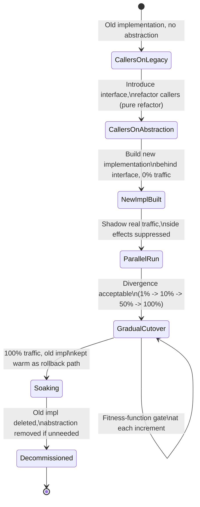
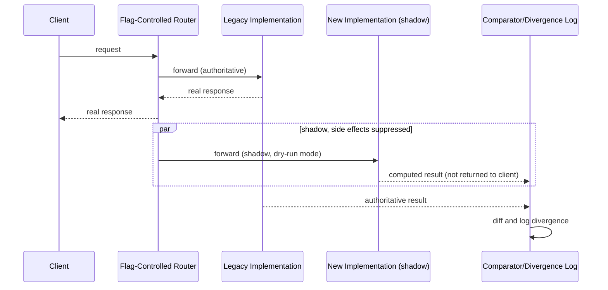
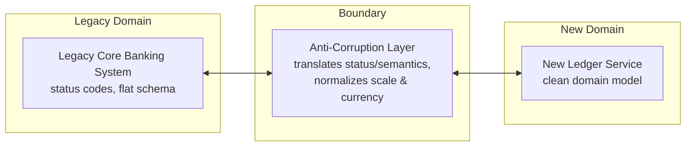
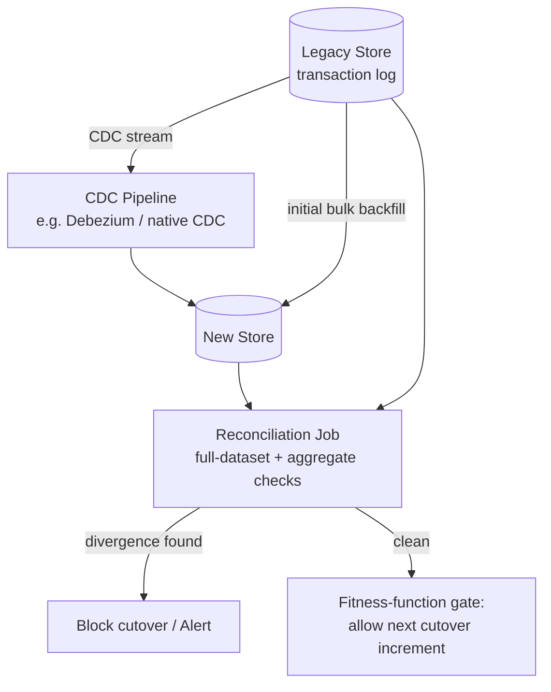
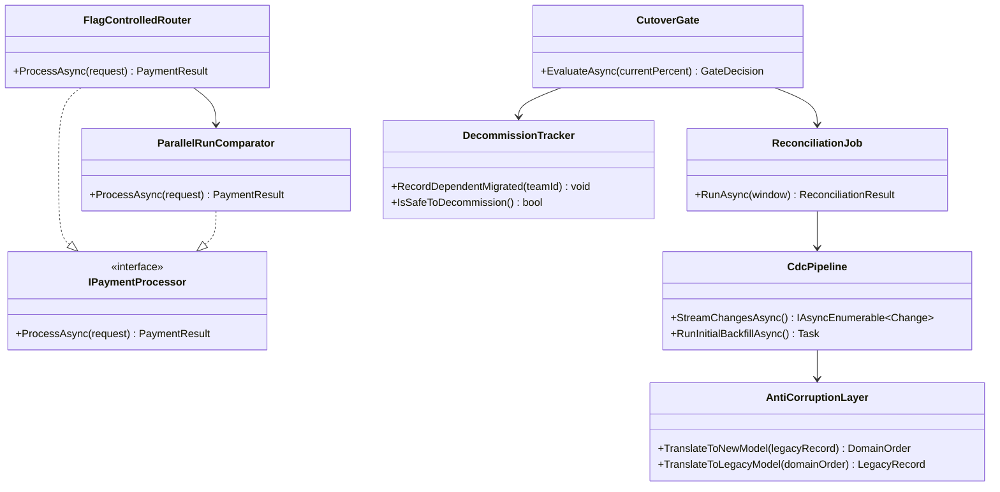

# Module 107 — Architecture Patterns: Migration Patterns — Branch by Abstraction, Parallel Run, Anti-Corruption Layer & Data Migration

> Domain: Architecture Patterns | Level: Beginner → Expert | Prerequisite: [[../17-Microservices/01-Decomposition-Communication-Strangler-Fig]] (Strangler Fig — this module treats it as already-established and does not re-derive it), [[02-EvolutionaryArchitecture-FitnessFunctions-ADRs-Governance]] (the fitness-function-guarded incremental discipline this module's migrations depend on to execute safely), [[../26-CICD/04-CDPipelineOrchestration-EnvironmentPromotion-ProgressiveDelivery-ReleaseGovernance]] §Expand/Contract (schema-change mechanics this module extends to full data-migration scope)
>
> **Note on format:** Upgraded from the leaner 40-Q&A-only format to the current standing full template (§1–§15/§17, §16/§18 handling per the 2026-07-18 template-reversion decision in `CLAUDE.md`). The original 40 Q&A (§10) are preserved verbatim below; §1–9, §11–15, §17, §18 are new.

---

## 1. Fundamentals

**What:** This module covers four related but distinct techniques used to safely change a live system's structure, implementation, or underlying data store while it keeps serving correct production traffic: **Branch by Abstraction** (swap an implementation behind a stable interface), **Parallel Run** (run a new implementation in shadow against real traffic to build confidence before it's trusted), **Anti-Corruption Layer** (translate at a boundary so a legacy or third-party model doesn't distort a new one), and **Data Migration** mechanics (dual write, Change Data Capture, expand-contract) for moving the persisted state itself.

**Why:** A migration is unlike ordinary feature development in one specific way: there is no "off" switch. The system must remain a fully correct, live production system at every intermediate step, not just at the final state — a half-migrated system serving live traffic is still a production system that must be correct. These four patterns exist because "just rewrite it and cut over" (a big-bang migration) concentrates every risk into one large, hard-to-partially-roll-back event, and every technique in this module trades some additional short-term complexity (running two implementations, or two data stores, side by side) for the ability to verify correctness incrementally and roll back cheaply at any point.

**When:** Branch by Abstraction fits *internal component* replacement (a payment-routing algorithm, a pricing engine) where the calling code stays the same. Parallel Run fits any situation where a new implementation's correctness against real traffic patterns is genuinely uncertain and the cost of validating it in shadow is acceptable. An Anti-Corruption Layer fits any long-lived or ongoing boundary between two different conceptual models — most commonly a legacy system a new one is being extracted from, or a third-party vendor/processor integration. Data-migration mechanics (dual write, CDC, expand-contract) apply whenever the underlying persisted state itself, not just the code operating on it, needs to move.

**How (30,000-ft view):**
```
Old implementation (sole authority)
        │  1. introduce abstraction / ACL
        ▼
Old implementation behind interface, new implementation built alongside
        │  2. Parallel Run — new implementation observes real traffic, output NOT yet trusted
        ▼
Divergence low enough → gradual, flag-controlled cutover (1% → 10% → 50% → 100%)
        │  3. data migrated via dual-write or CDC, continuously reconciled
        ▼
New implementation is sole authority; old implementation decommissioned (not just idled)
```

---

## 2. Deep Dive

### 2.1 Branch by Abstraction — the mechanics of "branching without a branch"
The technique exists to avoid a long-lived version-control branch, whose defining problem is *merge divergence* — the longer a branch lives disconnected from trunk, the more expensive and risky its eventual merge becomes. Branch by Abstraction keeps the in-progress work in trunk, continuously integrated, but *behaviorally* inert until switched on. Concretely: (1) define an interface capturing the existing implementation's contract; (2) refactor every caller to depend on the interface, with the legacy implementation as its sole current implementer — a pure, test-verifiable refactor with zero behavior change; (3) build the new implementation behind the same interface, initially never invoked; (4) introduce a routing decision (typically a feature flag) selecting which implementation handles a given call, starting at 0%; (5) increase the new implementation's share gradually, observing production behavior at each step; (6) once fully cut over and soaked, delete the old implementation and, if no longer needed, the abstraction itself. The interface is the "branch point" — it lets two implementations coexist in trunk without either being a divergent, hard-to-merge fork.

### 2.2 Parallel Run — shadow traffic, and the side-effect suppression problem
A Parallel Run's defining property is that the new implementation's *output is computed but never trusted or acted on* — it's run purely for comparison. The subtle engineering problem this creates: the new implementation must be executed with **all side effects suppressed or redirected**. If the old implementation charges a customer's card and posts a ledger entry, running the new implementation "for real" in shadow would double-charge the customer and double-post the ledger — so the new implementation's write paths must be stubbed, sandboxed against a shadow account, or executed against a dry-run mode that computes the *decision* without committing the *effect*. This is the single most common Parallel Run implementation bug: engineers build the shadow path correctly for computation but forget to suppress a side effect three calls deep in the new implementation's dependency graph, producing a class of bug (duplicate real-world effects from a system that's explicitly not supposed to be live yet) that's invisible in code review and only surfaces as a production incident.

### 2.3 Anti-Corruption Layer — translation depth, not just field renaming
An ACL is frequently under-built as a thin DTO-mapping layer. Its actual job is deeper: it must reconcile genuinely different *domain semantics*, not just different field names or types. A legacy system's "order status = 3" might conflate two states a new domain model treats as meaningfully distinct (e.g., "payment authorized" and "payment captured"); a naive field-mapping ACL would map both to a single new-model status and silently lose information the new domain needs. A properly-built ACL contains real translation logic — sometimes stateful, sometimes requiring additional lookups against the legacy system — specifically to preserve semantic fidelity across the boundary, and it is usually where a migration's genuine domain-modeling effort concentrates, not an afterthought bolted on at the wire-format level.

### 2.4 Dual write vs. CDC — internal mechanics and the failure modes each introduces
**Dual write**: the application code, synchronously or near-synchronously, issues two writes — one to the old store, one to the new store — inside (ideally) the same logical request. Its failure mode is *partial write failure*: the first write succeeds, the second fails (network blip, timeout, schema mismatch), and the caller's request still reports success because the primary write succeeded, leaving the two stores silently, invisibly inconsistent. There is no free lunch here — a true atomic dual write across two independent stores requires distributed-transaction coordination (two-phase commit), which is rarely practical against a legacy store and a new one built on different technology.

**CDC (Change Data Capture)**: reads the source store's transaction/replication log (SQL Server's native CDC, or a log-tailing tool such as Debezium) as a continuous stream of committed changes, and replays them into the target. Its failure mode is *replication lag*, not partial failure — since it reads only what was actually, durably committed to the source, there's no "half applied" state at the source, but the target is always some bounded time behind. CDC also requires careful handling of the *initial snapshot* (bootstrapping the target with existing data before the log stream catches it up) — get the snapshot/stream stitching wrong and you either duplicate or silently drop rows that changed during the snapshot window.

### 2.5 Expand-Contract, generalized to whole-store migration
Expand-contract's three phases — expand (add the new form alongside the old, both live), migrate (move consumers to the new form, old form still present as a fallback), contract (remove the old form) — apply identically whether "form" means a single new nullable column or an entire new data store. The subtlety at whole-store scale: the "expand" phase's write path is exactly the dual-write/CDC mechanism above, and the "contract" phase requires the same completion-criteria rigor a schema-level column drop does — an un-contracted expand-phase state (two live stores, ongoing replication) has a real, ongoing infrastructure and cognitive cost that a lingering unused nullable column does not carry to nearly the same degree.

### 2.6 Cutover mechanics — why gradual, percentage-based cutover is cheaper to roll back than any other step
A flag-controlled percentage cutover is uniquely valuable because its rollback cost is symmetric with its progress cost: moving from 10% to 50% costs the same kind of action as moving back from 50% to 10% — a config change, not a code deployment or a data restoration. This is the phase of a migration where rollback is cheapest across the entire migration lifecycle; every other phase (deleting the old implementation, contracting a schema) has an asymmetric, more expensive rollback. This is why migrations should linger deliberately in the gradual-cutover phase — soaking at each percentage long enough to observe infrequent code paths, periodic batch jobs, and low-traffic time windows — rather than rushing through it to reach the (harder to reverse) contract phase.

---

## 3. Visual Architecture









---

## 4. Production Example

**Problem:** A tier-1 bank's trade-settlement ledger ran on a 20-year-old mainframe/Oracle system. Settlement volume had grown to the point where nightly batch settlement runs routinely overran their window, and the mainframe's COBOL logic was understood by only a handful of remaining engineers. The bank needed to move to a modern, horizontally-scalable SQL Server-based settlement platform without a single settlement being lost, duplicated, or miscalculated during the transition — the ledger had to be correct at every intermediate moment, not just at the end.

**Architecture:** The migration combined all four patterns from this module. An **Anti-Corruption Layer** sat at the boundary, translating the mainframe's flat, code-based trade records (a single "status" field conflating "matched," "affirmed," and "settled" states the new domain model needed to track separately) into the new ledger's clean domain model. **Branch by Abstraction** wrapped the settlement-calculation logic itself behind an `ISettlementEngine` interface, letting the new engine be built and tested behind the same contract the legacy engine satisfied. A **Parallel Run** shadowed every real settlement instruction through the new engine, with all downstream effects (posting to the new ledger, notifying counterparties) suppressed in shadow mode — only the *computed* settlement amount and status were captured for comparison. **CDC**, layered on the mainframe's replication feed, streamed committed trade and position changes into the new store continuously, with a full historical backfill run once before the CDC stream was trusted.

**Implementation:** The Parallel Run ran for six full settlement cycles (each cycle spanning a full T+2 window) before any real settlement instruction was allowed to route through the new engine, specifically because early cycles surfaced two genuine divergences: a rounding-mode difference on odd-lot trades (the mainframe truncated, the new engine banker's-rounded) and a missed corporate-action adjustment the new engine's ACL hadn't yet been taught to translate. Both were found and fixed *before* any real money moved through the new path, because the Parallel Run's output was never trusted until it matched. Cutover then proceeded by settlement-desk (not by percentage of overall volume), starting with the lowest-volume, lowest-complexity desk, each desk requiring two full clean settlement cycles under the new engine before the next desk was added.

**Trade-offs:** The migration took fourteen months end to end — dramatically longer than a big-bang cutover would have taken on paper — and required running (and reconciling) two full ledger systems simultaneously for the entire period, a real, sustained infrastructure and operational cost. The bank accepted this explicitly: the cost of a single incorrect settlement in a regulated, audited ledger context (potential regulatory reporting breach, counterparty dispute, forced unwind) was judged to vastly exceed fourteen months of dual-running cost.

**Lessons learned:** The two divergences the Parallel Run caught before go-live (the rounding-mode difference and the missed corporate-action adjustment) would very likely not have been caught by unit tests written against the *new* engine's own specification, since both were behaviors of the *old* system's actual, sometimes-undocumented real-world behavior that the new engine's spec simply hadn't captured — this is the concrete, decisive argument for a Parallel Run over unit/integration testing alone whenever the "correct" behavior is defined by an existing system's real, historical output rather than a clean specification. The second lesson: the ACL's translation logic, not the settlement-calculation logic itself, was where the majority of genuine domain-modeling effort and defect risk concentrated — the "boring" translation layer at the boundary carried more real risk than the more visibly complex new settlement engine it fed.
## 10. Interview Questions

### Basic (10)

1. **Q: Why does architecture migration deserve its own dedicated set of patterns, distinct from ordinary feature development?**
 **A:** A migration changes the system's underlying structure or technology while it must keep serving live, correct production traffic throughout — unlike ordinary feature work, there is no "not yet in use" state to develop safely in; every intermediate step must itself be a fully working, correct system, which is why dedicated patterns (not ad hoc rewrites) exist specifically to keep every step safe and reversible.
 **Why correct:** States the defining constraint (must remain correct and live throughout, not just at the end) that distinguishes migration from ordinary development.
 **Common mistakes:** Treating a migration as "just a big feature," missing that its intermediate states — not just its final state — must themselves be production-correct.
 **Follow-ups:** "How does this connect to the fitness-function-guarded increment principle?" (A migration's intermediate steps are exactly what fitness functions must continuously verify — without them, an intermediate "in-progress" state has no objective check confirming it's actually still correct.)

2. **Q: What is Branch by Abstraction?**
 **A:** A technique for replacing a component while the system keeps running: introduce an abstraction (interface) in front of the existing implementation, migrate callers to use the abstraction, build the new implementation behind the same abstraction, switch the abstraction to route to the new implementation (often gradually), and finally remove the old implementation and the abstraction itself once no longer needed.
 **Why correct:** States the full five-step mechanism (introduce abstraction, migrate callers, build new implementation, switch, remove) precisely.
 **Common mistakes:** Confusing Branch by Abstraction with a long-lived source-control feature branch — it specifically avoids long-lived branches by keeping the change in trunk behind a runtime-switchable abstraction the whole time.
 **Follow-ups:** "Why is this described as 'branching without a branch'?" (The abstraction plays the role a source-control branch would — isolating in-progress, not-yet-complete work — but lives in trunk as ordinary, continuously-integrated code instead of a long-lived, divergent branch.)

3. **Q: What is a Parallel Run (also called shadow traffic or dark launch) in a migration context?**
 **A:** Running the new implementation alongside the old one against the same live production input, without the new implementation's output actually being used yet, specifically to compare the two outputs and build confidence the new implementation behaves equivalently before ever cutting traffic over to it.
 **Why correct:** States the defining property (runs live, but its output isn't yet authoritative) and its purpose (comparison-based confidence before cutover).
 **Common mistakes:** Confusing a Parallel Run with a canary release — a canary serves a small slice of *real* traffic with the new system's output actually used; a Parallel Run serves *all* traffic to the old system while the new system merely observes and computes in shadow, never affecting a real response.
 **Follow-ups:** "Why would you use a Parallel Run instead of, or before, a canary?" (A Parallel Run has zero user-facing risk even if the new implementation is completely wrong, since its output never reaches a real user — making it appropriate for validating a fundamentally new implementation before even a canary's small, real-traffic exposure.)

4. **Q: What is an Anti-Corruption Layer (ACL)?**
 **A:** A translation layer placed at the boundary between two models (an old and a new system, or a legacy system and a new one built around cleaner domain concepts) that translates between them, preventing the new system's design from being distorted ("corrupted") by the old system's legacy concepts, data shapes, or constraints.
 **Why correct:** States the ACL's purpose (isolate a new model from legacy distortion) and its mechanism (a dedicated translation layer at the boundary).
 **Common mistakes:** Confusing an ACL with a simple data-mapping/DTO layer — an ACL specifically exists to protect a *conceptual model*, not merely convert data shapes; it can involve real translation logic reconciling genuinely different domain semantics, not just field renaming.
 **Follow-ups:** "How does an ACL specifically help during a Strangler Fig migration?" (It sits between newly-extracted services and the still-present legacy monolith, letting the new services be designed around clean, correct domain concepts without being shaped by the monolith's legacy data model — removed once the monolith it's protecting against is fully retired.)

5. **Q: What is the difference between a "big bang" migration and an incremental migration, at a high level?**
 **A:** A big bang migration cuts the entire system over from old to new in a single event, with the old system stopped and the new one becoming fully authoritative all at once; an incremental migration moves in a sequence of small, independently-verifiable steps, with old and new coexisting for an extended period during the transition.
 **Why correct:** States the defining structural difference (single event vs. sequence of verifiable steps with coexistence).
 **Common mistakes:** Assuming big bang is simply "faster" — it can be, but this course's now-repeated finding is that its speed comes specifically at the cost of deferring all risk to one large, hard-to-partially-roll-back event, rather than genuinely eliminating that risk.
 **Follow-ups:** "Under what circumstance might a big bang genuinely be the right choice?" (A small, low-consequence, easily-and-fully-reversible system where the coexistence machinery an incremental approach requires would itself cost more effort than the migration's actual risk warrants — Intermediate Q1 develops this trade-off fully.)

6. **Q: What is a dual-write pattern in the context of data migration?**
 **A:** During a migration, writing every incoming change to both the old data store and the new data store simultaneously, so the new store's data stays continuously current with production traffic while it's being validated, before reads are ever switched over to it.
 **Why correct:** States the mechanism (write to both stores) and its purpose (keep the new store current for later validation and cutover).
 **Common mistakes:** Assuming dual writes alone guarantee the two stores stay consistent — Intermediate Q5 establishes this is a known, serious risk (a write succeeding in one store and failing in the other) requiring an explicit reconciliation strategy, not an assumption of automatic consistency.
 **Follow-ups:** "What's the simplest way to detect a dual-write inconsistency has occurred?" (A scheduled reconciliation job comparing the two stores' actual current state and flagging any divergence — the data-migration-specific instance of this course's now-standard "don't just assume the mechanism worked, verify it" discipline.)

7. **Q: What is Change Data Capture (CDC), and how does it apply to data migration?**
 **A:** CDC is a technique that captures a data store's changes (inserts/updates/deletes) as a continuous stream, typically by reading the database's transaction/replication log rather than modifying application code — in a migration, CDC can continuously replicate the old store's changes into the new store, avoiding the need to modify every write path with explicit dual-write logic.
 **Why correct:** States the CDC mechanism (log-based change stream) and its specific migration use (replication without touching application write paths).
 **Common mistakes:** Assuming CDC and dual writes are interchangeable with identical trade-offs — CDC avoids touching application code (lower application risk) but introduces replication lag (the new store is always slightly behind), while dual writes are synchronous (no lag) but require modifying every application write path (higher application-code risk).
 **Follow-ups:** "When would you prefer CDC-based replication over application-level dual writes for a migration?" (When minimizing changes to already-fragile legacy application code is the higher priority than eliminating replication lag — common specifically in legacy-monolith migrations where the old codebase is poorly understood and risky to modify directly.)

8. **Q: What is the expand-contract pattern, recapped, and how does it generalize beyond schema changes to full data migrations?**
 **A:** Expand-contract (§Advanced) first *expands* the system to support both the old and new forms simultaneously (e.g., both an old and new database schema, or an old and new data store entirely), migrates all consumers over to the new form while the old form remains available as a safety net, and only then *contracts* by removing the old form — the identical three-phase structure applies whether "old form" means an old database column or an entire old data store being replaced.
 **Why correct:** Correctly identifies expand-contract's three-phase structure as scale-independent, applying identically at the schema-change granularity and the full-migration granularity (this module).
 **Common mistakes:** Treating expand-contract as a schema-migration-specific technique rather than recognizing it as the same general safe-transition pattern this module's Branch by Abstraction and dual-write/CDC mechanisms are themselves specific implementations of.
 **Follow-ups:** "Why is skipping the contract phase a common, costly mistake?" (An un-contracted "expanded" state — both old and new forms still present — becomes the new, permanent normal by default, permanently carrying the coexistence complexity and the confusion of two live representations of the same thing; Advanced Q6 develops this "migration never finishes" risk fully.)

9. **Q: What is the difference between migrating code/behavior (Strangler Fig, Branch by Abstraction) and migrating data specifically?**
 **A:** Code/behavior migration replaces *how* a capability is implemented while the underlying data can often stay put or move relatively simply; data migration specifically concerns moving the actual persisted state itself (potentially to a different storage technology, schema, or ownership boundary), which introduces additional risk — data, unlike code, cannot simply be redeployed or rolled back without a separate, explicit reconciliation or restoration mechanism.
 **Why correct:** States the specific, additional risk data migration carries (no simple "redeploy to roll back" option) that pure code/behavior migration doesn't share to the same degree.
 **Common mistakes:** Treating a migration exclusively as a code/deployment concern, underestimating that the data-migration component specifically requires its own, separate safety mechanisms (dual writes, CDC, reconciliation) beyond whatever safety net exists for the code itself.
 **Follow-ups:** "Why does this asymmetry matter for migration sequencing?" (It's often safer to migrate code/behavior first behind an abstraction while data remains in its original store, deferring the higher-risk data migration to a separate, later, independently-verified step — rather than coupling both migrations into one combined, higher-risk change.)

10. **Q: What role do feature flags play in a migration, recapped from the release-strategy discussion, now applied to migration specifically?**
 **A:** A feature flag controlling which implementation (old or new) actually handles a given request decouples the *code deployment* of a new implementation from the *decision* to route traffic to it — the same decoupling principle established for ordinary releases, now serving as the concrete runtime mechanism a Branch by Abstraction's "switch" step or a Strangler Fig's routing layer is typically built on.
 **Why correct:** Directly connects feature flags' already-established general purpose to their specific, concrete role as the switching mechanism inside this module's migration patterns.
 **Common mistakes:** Treating feature flags as unrelated to architecture migration specifically, rather than recognizing them as the same underlying mechanism, reused, that established for release decoupling generally.
 **Follow-ups:** "Why is a flag specifically well-suited to a *gradual* percentage-based cutover rather than a single instant switch?" (It allows the cutover itself to proceed incrementally — 1%, 10%, 50%, 100% of traffic routed to the new implementation — directly reusing the canary/progressive-delivery mechanics for the migration cutover step specifically.)

### Intermediate (10)

1. **Q: Develop the trade-off between big bang and incremental migration in full — when does each genuinely make sense?**
 **A:** Incremental migration (Strangler Fig/Branch by Abstraction/expand-contract) is preferred by default because it verifies each step and preserves a rollback path throughout, at the cost of sustained coexistence complexity (two implementations, or two data stores, live simultaneously for an extended period) and a longer overall timeline; big bang eliminates that coexistence cost and shortens the timeline, at the cost of deferring all risk to one large, hard-to-partially-roll-back cutover event — making it defensible specifically when the system is small/low-consequence enough that a full, clean rollback (not merely a partial one) is genuinely fast and reliable if the cutover fails.
 **Why correct:** States both directions of the trade-off (coexistence cost vs. deferred, concentrated risk) and the specific condition (small, cleanly-and-fully-reversible system) under which big bang is genuinely, not just conveniently, justified.
 **Common mistakes:** Treating incremental migration as unconditionally correct regardless of scale, missing that its coexistence-complexity cost can, for a sufficiently small and low-risk system, genuinely exceed the risk it's meant to mitigate.
 **Follow-ups:** "What's the litmus test for whether a system is 'small enough' for big bang to be defensible?" (Whether a full rollback to the prior state — not a partial one — can be executed quickly, reliably, and with a clean, complete restoration of the prior working state if the cutover fails; if rollback itself is uncertain or partial, incremental migration is the safer default regardless of the system's apparent size.)

2. **Q: Walk through the specific mechanics of implementing Branch by Abstraction for replacing a legacy payment-processing module.**
 **A:** (1) Define an interface (`IPaymentProcessor`) capturing the existing module's behavior; (2) refactor all current callers to depend on the interface rather than the concrete legacy implementation directly, with the legacy implementation as the interface's sole, current implementer — a safe, behavior-preserving refactor verifiable by existing tests alone; (3) build the new payment-processing implementation behind the same interface, initially unused; (4) introduce a flag-controlled routing decision selecting which implementation handles a given request, starting at 0% new-implementation traffic; (5) gradually increase the new implementation's traffic share while monitoring for divergence; (6) once fully cut over and confidence is established, delete the legacy implementation and, if no longer needed, the abstraction itself.
 **Why correct:** Provides a concrete, six-step, verifiable sequence rather than an abstract description, applied to a specific, realistic example.
 **Common mistakes:** Skipping step (2)'s "callers migrated to the abstraction first" as a separate, independently-verifiable step — attempting to introduce the abstraction and the new implementation simultaneously conflates two independently-risky changes into one, harder-to-diagnose-if-something-breaks step.
 **Follow-ups:** "Why does step (2) alone, with zero behavior change, still carry genuine value before step (3) even begins?" (It's a pure refactor verifiable against 100% of existing tests with zero new behavior introduced — establishing the abstraction is itself correct and low-risk *before* adding the higher-risk, genuinely new implementation behind it, directly this course's incremental-verification discipline.)

3. **Q: How would you implement the comparison/diffing logic for a Parallel Run, and what should you do when a divergence is found?**
 **A:** Compute the old and new implementations' outputs for the same input, log any difference (not merely a pass/fail boolean — the actual divergent values, to enable root-cause diagnosis) to a queryable store, and set up a dashboard/alert tracking the divergence rate over time; when a divergence is found, treat it as a signal requiring investigation before increasing (or even beginning) real traffic cutover — not something to silently tolerate or average away, since even a rare divergence may indicate the new implementation is subtly wrong in a way that would eventually surface as a real production defect.
 **Why correct:** States both the concrete comparison mechanism (logged, queryable divergence detail, not a bare boolean) and the correct response (investigate before cutover, don't silently tolerate).
 **Common mistakes:** Treating a low divergence *rate* alone as sufficient confidence to proceed, without investigating what specifically diverged — a rare but systematic divergence (e.g., only on a specific edge case) can indicate a real, eventually-consequential bug even at a low aggregate rate.
 **Follow-ups:** "Why is a Parallel Run particularly valuable for validating a rewrite with genuinely different internal logic, rather than a simple technology swap?" (It directly tests real, production input against the new implementation's actual behavior — catching subtle logic differences a rewrite risks introducing, that unit/integration tests written against the *old* implementation's assumptions might never have been designed to catch.)

4. **Q: How does an Anti-Corruption Layer relate to, and differ from, the Branch-by-Abstraction interface introduced in Intermediate Q2?**
 **A:** Both are boundary abstractions, but they solve different problems — a Branch-by-Abstraction interface exists temporarily, specifically to enable swapping one implementation for another behind an identical contract, and is typically removed once the swap completes; an ACL exists at a genuine, ongoing model boundary (e.g., between a still-present legacy system and a newly-designed one) specifically to translate between two *permanently different* conceptual models, and may remain permanently as long as both models coexist, not merely during a transition.
 **Why correct:** States the key distinguishing factor (temporary swap-enabling vs. potentially-permanent model-boundary translation) precisely.
 **Common mistakes:** Treating every boundary abstraction as interchangeable "just an interface," missing that an ACL's translation logic is often substantially richer (reconciling genuinely different domain semantics) than a Branch-by-Abstraction interface's identical-contract swap.
 **Follow-ups:** "In a Strangler Fig migration, where would you expect to find an ACL versus a Branch-by-Abstraction interface?" (An ACL sits at the ongoing boundary between newly-extracted services and the still-present legacy monolith for as long as both coexist; a Branch-by-Abstraction interface would more typically appear *within* a single service being incrementally rewritten internally, removed once that specific internal swap completes.)

5. **Q: What specifically can go wrong with a dual-write pattern, and how do you mitigate it?**
 **A:** The core risk is partial failure — a write succeeds against the old store but fails against the new store (or vice versa), silently leaving the two stores inconsistent with no application-level signal this occurred, since the application's primary write (typically to the old store) still reports success to the caller; mitigation requires an explicit reconciliation job comparing both stores' actual state on a schedule, flagging and (ideally) auto-correcting any detected divergence, plus treating the secondary write's failure as an event to retry or alert on, not silently swallow.
 **Why correct:** States the specific failure mode (partial write failure, silent inconsistency) and the concrete mitigation (scheduled reconciliation, not silent swallowing of secondary-write failures).
 **Common mistakes:** Assuming dual writes are "basically atomic" in practice, missing that writing to two independent stores has no inherent transactional guarantee spanning both without additional, explicit coordination (e.g., a two-phase commit, rarely practical here, or the reconciliation-based eventual-consistency approach this answer describes).
 **Follow-ups:** "Why is CDC-based replication (Basic Q7) sometimes preferred specifically to avoid this exact risk?" (CDC replicates from a single, authoritative source of truth's committed transaction log — there's only one true write path, eliminating the dual-write's two-independent-writes partial-failure risk entirely, at the cost of introducing replication lag instead.)

6. **Q: Walk through the mechanics of a CDC-based data migration from a legacy SQL Server database to a new data store.**
 **A:** (1) Attach a CDC mechanism reading the legacy database's transaction log (SQL Server's native Change Data Capture feature, or a log-tailing tool) capturing every committed change; (2) stream captured changes into the new data store, transforming/mapping as needed; (3) run an initial bulk backfill of existing data alongside the ongoing CDC stream to bring the new store fully current; (4) validate the new store's actual state matches the source (Advanced Q4's reconciliation) before cutting any reads over; (5) once validated and confidently current, cut reads over (potentially gradually, per Basic Q10's flag-based approach), while the CDC stream continues running as a safety net until the legacy store is fully decommissioned.
 **Why correct:** Provides a concrete, five-step migration sequence (attach CDC, stream, backfill, validate, cut over) rather than an abstract description.
 **Common mistakes:** Cutting reads over before independently validating the new store's actual state matches the source, relying on "the CDC pipeline is running, so it must be current and correct" as an unverified assumption rather than an explicitly checked fact.
 **Follow-ups:** "Why must the legacy store keep receiving writes throughout this entire process, even after cutover, for some period?" (It remains the fallback/rollback path — should a validated problem surface post-cutover in the new store, having the legacy store's data still current allows falling back to it, rather than requiring an unplanned reconstruction of lost, more-recent data.)

7. **Q: Design a rollback strategy for a migration in progress, at each of Branch by Abstraction's phases.**
 **A:** During the "callers migrated to abstraction" phase, rollback is trivial (revert the pure, behavior-preserving refactor); during the "new implementation exists, flag at 0%" phase, rollback is simply leaving the flag at 0% — zero actual risk yet; during the gradual-cutover phase, rollback means reducing the flag's percentage back toward 0%, which is why a *gradual*, not instant, cutover specifically matters — it keeps a cheap, partial rollback path available throughout, rather than only an all-or-nothing one; only after the old implementation is actually deleted does rollback become expensive again, which is exactly why that deletion should be deferred until confidence is thoroughly established (Basic Q8's "don't skip the contract phase" risk, inverted — here, contracting *too early* is the risk).
 **Why correct:** Analyzes rollback cost at each distinct phase, correctly identifying the gradual-cutover phase as where rollback is cheapest and most granular, and old-implementation deletion as the point where rollback cost jumps.
 **Common mistakes:** Treating "rollback" as a single, uniform concept applicable identically regardless of which migration phase a failure is discovered in, missing that the specific phase determines both rollback cost and mechanism.
 **Follow-ups:** "What's a reasonable minimum bake time before deleting the old implementation, and why not delete immediately after reaching 100% new-implementation traffic?" (A deliberate, reviewed soak period at 100% — long enough to observe infrequent edge cases, periodic/batch jobs, or low-traffic time windows the migration might not yet have exercised — directly the canary-analysis-duration reasoning, applied to migration cutover confidence specifically.)

8. **Q: What validation techniques would you use to confirm a data migration's correctness beyond a Parallel Run's live-traffic comparison?**
 **A:** A full-dataset reconciliation comparing every record (not just live, in-flight traffic) between old and new stores, checking both data equivalence and referential/aggregate consistency (e.g., a migrated financial ledger's total balance must match exactly, not merely "most rows look right"); a replay of a representative historical query/transaction workload against both stores to confirm behavioral, not just data, equivalence; and explicit edge-case test data (nulls, boundary values, known historically-problematic records) deliberately included in the comparison, since live traffic alone may never happen to exercise every historically-significant edge case during the validation window.
 **Why correct:** States three complementary, concrete techniques (full reconciliation, historical workload replay, deliberate edge-case inclusion) beyond a Parallel Run's live-traffic-only scope.
 **Common mistakes:** Relying on a Parallel Run's live-traffic comparison alone as sufficient validation, missing that live traffic during any single validation window may never exercise the full space of historically-significant edge cases or infrequent batch/periodic operations.
 **Follow-ups:** "Why is an exact-match financial-total check specifically valuable, beyond row-by-row comparison?" (An aggregate invariant (e.g., ledger totals) catches a class of subtle row-level errors — a systematic rounding or unit-conversion bug affecting every row identically in a way row-by-row spot-checking might not surface, but that a global sum immediately would.)

9. **Q: How does this module's migration discipline concretely depend on the fitness-function infrastructure?**
 **A:** Each migration step (a Branch-by-Abstraction phase transition, a percentage-based cutover increment, a data-reconciliation pass) should itself be gated by an automated, objective check — a fitness function confirming the new implementation's error rate, the reconciliation job's divergence count, or the cutover's business-metric health (the business-aware canary analysis) — before the next step proceeds, converting the general "verify continuously, don't assume" discipline into the specific, concrete gating mechanism this module's migrations require to be genuinely, not just nominally, incremental.
 **Why correct:** Directly, concretely connects the general fitness-function discipline to this module's specific migration-step-gating need.
 **Common mistakes:** Treating a migration's steps as safe by virtue of merely being small and sequential, without an actual, objective, automated check confirming each step is genuinely healthy before the next one proceeds — small steps without verification gates still risk compounding an undetected problem across several unverified steps before it's noticed.
 **Follow-ups:** "What would a concrete migration-specific fitness function look like?" (An automated check comparing the dual-write/CDC reconciliation job's divergence count against a threshold, blocking any further cutover-percentage increase until divergence is at or near zero — directly reusing the CI-gating pattern for migration-progression decisions specifically.)

10. **Q: How do organizational/team considerations (Conway's Law) affect migration pattern choice?**
 **A:** A migration spanning a single, cohesive team's ownership boundary can typically proceed with lighter coordination overhead (that team alone decides pacing, rollback thresholds, and cutover timing); a migration spanning multiple teams' ownership boundaries (e.g., a shared legacy database several teams currently depend on) requires the coordination and governance discipline established for cross-team architectural decisions — a migration plan is itself often significant enough to warrant its own ADR, with cutover-percentage decisions potentially requiring the equivalent of Architecture Review Board-level cross-team sign-off specifically because multiple teams' production reliability depends on the outcome.
 **Why correct:** Correctly distinguishes single-team versus multi-team migration coordination needs, directly connecting to the Conway's Law framing and the governance-scoping principles.
 **Common mistakes:** Applying identical, lightweight coordination assumptions to a multi-team migration that a single-team migration could safely use, underestimating the cross-team communication and shared-risk-tolerance discipline a shared-dependency migration genuinely requires.
 **Follow-ups:** "Why might a shared legacy database specifically be the hardest kind of multi-team migration to execute safely?" (Because the database-per-service principle was violated by definition — multiple teams' services all currently depend on the same store, meaning the migration must coordinate every dependent team's cutover timing, not just one team's, since a partial cutover could leave some teams' services pointed at a now-stale, no-longer-authoritative store.)

### Advanced (10)

1. **Q: Design a complete migration plan for a legacy monolithic order-management system to an extracted, independently-deployable Order microservice, combining this module's patterns with the Strangler Fig.**
 **A:** (1) Introduce an Anti-Corruption Layer at the boundary between the still-present monolith and a to-be-built Order service, defining the Order service's clean domain model independent of the monolith's legacy schema; (2) build the new Order service behind this ACL, initially receiving zero real traffic; (3) run a Parallel Run — mirror live order-creation requests to the new service in shadow, comparing its computed results against the monolith's actual, authoritative results — to validate core logic before any real cutover; (4) once divergence is acceptably low, use a Strangler Fig routing layer to gradually route a percentage of real order-creation traffic to the new service, monitoring business-metric health at each increment; (5) migrate the underlying order data itself via CDC-based replication (Intermediate Q6) running in parallel with the behavior cutover, validated via full reconciliation (Intermediate Q8) before the new service becomes the sole system of record; (6) once fully cut over and soaked (Intermediate Q7), decommission the monolith's order-handling code and, if the ACL is no longer needed post-monolith-retirement, remove it.
 **Why correct:** Integrates every pattern this module and established (ACL, Parallel Run, Strangler Fig routing, CDC data migration, reconciliation, soak-then-decommission) into one coherent, correctly-sequenced plan.
 **Common mistakes:** Treating behavior migration (routing traffic to the new service) and data migration (moving the order data itself) as a single, combined step, rather than two separately-sequenced, separately-verified migrations that happen to run concurrently but are validated independently.
 **Follow-ups:** "Why does behavior cutover (step 4) not need to wait for data migration (step 5) to fully complete before beginning?" (As long as the new service can correctly read/write through to the data wherever it currently, authoritatively lives during the transition — which is precisely the coexistence period CDC replication and dual-source-of-truth discipline are designed to support — behavior and data migration can proceed on independently-paced, concurrently-verified tracks.)

2. **Q: How would you migrate a legacy relational schema to a fundamentally different NoSQL data model (e.g., SQL Server to DynamoDB,/28), and what unique challenges does this specific kind of migration introduce beyond a same-paradigm migration?**
 **A:** Unlike a same-paradigm (SQL-to-SQL) migration, a relational-to-NoSQL migration typically requires redesigning the actual data model — DynamoDB's single-table, access-pattern-driven design bears little structural resemblance to a normalized relational schema — meaning the "expand" phase isn't merely adding a parallel table but constructing an entirely new, access-pattern-optimized model requiring its own dedicated design effort (directly the single-table design discipline) before any migration mechanics (CDC, dual writes) can even begin; validation is correspondingly harder, since a straightforward row-by-row comparison doesn't apply across genuinely different schemas — reconciliation must instead validate at the query/access-pattern level (does querying the new model for a given access pattern return the same logical result the old relational query did), not a structural, field-by-field comparison.
 **Why correct:** Correctly identifies the specific, additional challenge (data-model redesign, not just data transport, and access-pattern-level rather than field-level validation) unique to cross-paradigm migrations.
 **Common mistakes:** Treating a relational-to-NoSQL migration as a mechanically identical process to a same-paradigm migration, merely swapping the target technology, missing that the target's fundamentally different modeling discipline (the DynamoDB access-pattern-first design) requires an entirely separate design phase before migration mechanics even begin.
 **Follow-ups:** "Why might this specific migration type be a good candidate for Branch by Abstraction at the application layer, in addition to CDC at the data layer?" (An application-layer abstraction lets the access-pattern-specific query logic itself be swapped cleanly behind an interface, isolating the (likely substantial) query-rewrite effort from the underlying data-transport mechanics, which can proceed on their own, independently-verified track.)

3. **Q: How do you determine when a migration is actually "done," beyond simply reaching 100% traffic cutover?**
 **A:** Reaching 100% traffic cutover confirms only that the new implementation is currently handling all *observed* traffic correctly — genuine completion additionally requires confirming the old implementation and its underlying data store have no remaining, even infrequent, dependents (a periodic batch job, an external system with a direct legacy-database connection, a reporting query run only quarterly) that 100% of *recent* traffic might not have exercised, and that the old implementation has actually been decommissioned, not merely left running unused as a "just in case" fallback indefinitely.
 **Why correct:** States the specific gap (100% of *recent* observed traffic ≠ confirmed absence of all, even infrequent, dependents) between apparent and actual completion.
 **Common mistakes:** Declaring a migration complete the moment cutover reaches 100%, without an explicit audit for infrequent/periodic/external dependents that a short observation window wouldn't have exercised, and without actually decommissioning (not merely idling) the old system.
 **Follow-ups:** "Why does an un-decommissioned but idle old system pose an ongoing risk even if nothing currently uses it?" (It's a live attack surface, a source of ongoing infrastructure cost, and a latent trap — someone could reconnect to it, or a not-yet-discovered dependent could resurface — directly this course's recurring finding that an unverified "probably unused" state is not the same as a confirmed, safe-to-remove one.)

4. **Q: Critique a migration that dual-writes to both old and new stores but never runs an explicit reconciliation check, relying solely on "the dual-write code looks correct."**
 **A:** This recreates this course's most consistently recurring failure pattern — a mechanism's presence (dual-write code that looks correct in review) is treated as equivalent to its actual, ongoing, verified correctness in production, when in fact only an explicit reconciliation check confirms the two stores are genuinely, currently consistent; a dual-write's partial-failure risk (Intermediate Q5) is specifically the kind of failure mode that's silent and asymptomatic at the write path itself — it only becomes visible via an independent check comparing the two stores' actual resulting state, which "the code looks correct" review can never substitute for.
 **Why correct:** Directly identifies the specific, well-established course pattern (presence/apparent-correctness ≠ verified, ongoing correctness) this migration mistake instantiates.
 **Common mistakes:** Treating a careful code review of the dual-write logic as sufficient assurance, missing that even flawless-looking dual-write code can still experience runtime partial failures (a transient network error hitting only the secondary write) that no static code review could ever surface.
 **Follow-ups:** "What's the minimum viable reconciliation check that would close this specific gap?" (A scheduled job sampling a statistically meaningful subset of records from both stores, comparing them field-by-field, and alerting if divergence exceeds a defined threshold — cheap enough to run continuously throughout the entire dual-write period, not merely once before cutover.)

5. **Q: Design an approach for migrating a stateful, long-running process (e.g., a multi-day workflow or saga) mid-flight, where some instances are already in progress when the migration begins.**
 **A:** In-flight instances started under the old implementation must either be allowed to fully complete under that same old implementation (the simplest, lowest-risk approach — the old implementation stays running specifically to drain existing in-flight instances even after new instances are routed to the new implementation) or be explicitly, carefully migrated mid-flight by translating their current state into the new implementation's state representation — a substantially higher-risk operation requiring the ACL-style translation logic (Basic Q4) to correctly map every possible in-flight state, not just a request/response's input/output shape; the drain-based approach is strongly preferred by default, with mid-flight state translation reserved only for workflows whose duration makes a full drain impractically slow.
 **Why correct:** Correctly identifies the two options (drain old instances to completion vs. translate mid-flight state) and states the clear, risk-based default preference between them.
 **Common mistakes:** Assuming every in-flight instance can simply be immediately redirected to the new implementation at the moment of cutover, missing that a stateful, multi-step workflow's in-progress state may have no valid, safe translation into the new implementation's differently-structured state model.
 **Follow-ups:** "Why does the 'drain' approach specifically require both implementations to keep running simultaneously for longer than a typical stateless-service migration would?" (New instances start immediately under the new implementation while the old implementation must keep running — not for new instances, but purely to allow every existing in-flight instance under it to finish — extending the required old/new coexistence period to at least the workflow's maximum possible duration, not merely a short cutover-validation window.)

6. **Q: Critique the risk of a migration's "temporary" coexistence period becoming permanent, and how would you prevent it, extending Basic Q8's contract-phase-skipping risk?**
 **A:** A migration's Branch-by-Abstraction interface, dual-write logic, or ACL is frequently intended as temporary scaffolding removed once the migration completes — but without an explicit, tracked completion criterion and a scheduled decommissioning step (not merely an informal intention), the coexistence machinery routinely outlives its purpose indefinitely, since removing it requires deliberate, scheduled effort that competing feature priorities easily crowd out otherwise; the fix is treating the "contract"/decommission phase as a tracked, scheduled deliverable with its own explicit completion criteria (Advanced Q3) from the migration's outset, not an informal, unscheduled "we'll clean it up eventually" intention.
 **Why correct:** States the specific mechanism (no tracked completion criterion + competing priorities) by which temporary scaffolding becomes permanent, and the concrete fix (a tracked, scheduled decommissioning deliverable).
 **Common mistakes:** Assuming migration scaffolding will naturally get removed "once things settle down," without an explicit, scheduled, tracked commitment to that removal from the very start of the migration's planning.
 **Follow-ups:** "Why is this specifically another instance of this course's now-repeated 'declared intention ≠ actual, verified outcome' theme?" (An intention to eventually decommission is a *declared* future state with no automatic mechanism ensuring it actually happens — exactly like an undrilled runbook or an unreviewed governance exception that quietly persists past its intended, temporary lifespan without an explicit, scheduled forcing function.)

7. **Q: How would you coordinate a migration that requires several independent teams to migrate their own callers away from a shared legacy dependency, extending Intermediate Q10?**
 **A:** Publish a clear, discoverable deprecation timeline and migration guide for the shared dependency (the legacy system's replacement, its ACL/abstraction, and the expected cutover deadline), track each dependent team's actual migration status against that timeline via a shared, visible dashboard (not merely relying on informal status updates), and escalate specifically to teams that fall behind schedule — directly the cross-write-path-coverage discipline, applied to migration-dependent-tracking specifically, since an untracked, "assumed migrated" dependent team is exactly the kind of unverified assumption this course has repeatedly shown to fail silently until decommissioning actually breaks something.
 **Why correct:** Proposes concrete coordination mechanisms (published timeline, visible tracked-status dashboard, targeted escalation) rather than relying on informal, unverified assumption of each team's progress.
 **Common mistakes:** Assuming all dependent teams are migrating on a similar, roughly-synchronized timeline without an explicit, visible tracking mechanism confirming this, then discovering — only at the old system's actual decommissioning — that some team never migrated at all.
 **Follow-ups:** "What should happen if a dependent team is significantly behind schedule as the planned decommissioning date approaches?" (Either explicitly extend the shared timeline with a new, mutually-agreed deadline (directly §Intermediate Q7's reviewed-exception pattern) or escalate through appropriate cross-team governance — but never silently decommission on the original schedule regardless, since that would break a dependent team's still-live production traffic with no warning.)

8. **Q: Design a comprehensive testing strategy specifically for validating a migration, synthesizing this module's Parallel Run, reconciliation, and fitness-function elements.**
 **A:** Layer four complementary techniques: (1) unit/integration tests confirming the new implementation's isolated correctness against known specifications; (2) a Parallel Run (Basic Q3) comparing live-traffic behavior against the old implementation before any real cutover; (3) full-dataset and historical-workload reconciliation (Intermediate Q8) validating data-level correctness beyond what live traffic alone exercises; (4) fitness-function-gated, gradual cutover (Intermediate Q9) providing a continuous, automated safety check throughout the actual traffic-percentage ramp — no single technique alone provides complete confidence, since each catches a distinct class of problem the others structurally can't (isolated-logic bugs, live-traffic-pattern surprises, data edge cases outside the observed traffic window, and slow, cumulative degradation during the ramp itself, respectively).
 **Why correct:** Synthesizes four distinct, complementary validation layers, explicitly justifying why no single one is sufficient alone.
 **Common mistakes:** Relying on any single validation technique (commonly, unit tests alone, or a Parallel Run alone) as sufficient migration confidence, missing the specific class of problem each technique structurally cannot catch on its own.
 **Follow-ups:** "Which of these four layers would you prioritize first if resource-constrained, and why?" (Unit/integration tests — the cheapest, fastest-feedback layer, and a prerequisite baseline the other three, more expensive, live/data-level techniques build additional confidence on top of, not a substitute for.)

9. **Q: How would you quantify migration risk to inform a go/no-go decision at each cutover-percentage increment, extending the canary-analysis discipline?**
 **A:** Track the same business-metric-aware analysis established for ordinary canary releases (not merely infrastructure health) — conversion rate, error-budget consumption, and this module's specific reconciliation-divergence rate — at each cutover-percentage increment, with an explicit, pre-agreed threshold for each metric that must hold before the next increment proceeds; a "no-go" at any increment triggers holding at the current percentage (or rolling back, per Intermediate Q7) rather than proceeding on a fixed, pre-planned schedule regardless of what the metrics currently show.
 **Why correct:** Directly reapplies the business-metric-aware canary-analysis discipline to migration-cutover decisions specifically, with an explicit go/no-go gating structure.
 **Common mistakes:** Proceeding through a migration's cutover percentages on a fixed, pre-planned calendar schedule regardless of what the metrics show at each step, rather than gating each increment's actual progression on live, current evidence.
 **Follow-ups:** "Why is reconciliation-divergence rate a migration-specific metric the original canary framework didn't need?" (the canary releases don't typically involve two parallel, independently-maintained data stores needing continuous consistency verification — this module's coexistence-period data-migration risk introduces a genuinely new metric class beyond the infrastructure/business metrics an ordinary feature-release canary already tracks.)

10. **Q: What's the relationship between this module's migration patterns and this course's broader "verify, don't assume" theme — synthesize across Branch by Abstraction, Parallel Run, and dual-write reconciliation.**
 **A:** All three patterns share one underlying structure: never assume a new implementation or data store is correct merely because it exists and appears to run — Branch by Abstraction gates the actual behavior-changing swap behind an explicit, gradual, monitored cutover rather than an instant, unverified switch; a Parallel Run explicitly compares real behavior before ever trusting the new implementation's output; and dual-write/CDC reconciliation explicitly compares real data state rather than assuming synchronized writes stayed consistent — each pattern is, at its core, a specific, concrete instantiation of the same "verify actual current behavior/state, don't trust the mechanism's mere presence" principle this course has traced through every domain examined.
 **Why correct:** Correctly identifies the shared underlying structure (explicit verification of actual behavior/state, not assumed correctness from presence) across all three named patterns.
 **Common mistakes:** Treating Branch by Abstraction, Parallel Run, and dual-write reconciliation as three unrelated, independently-invented techniques, rather than recognizing them as the same underlying verification discipline applied at three different points in a migration (the swap decision, the behavior comparison, and the data comparison, respectively).
 **Follow-ups:** "Which of the three patterns would be least effective if its verification step were silently skipped, and why?" (Dual-write reconciliation — skipping it leaves data-level inconsistency completely undetected, since neither Branch-by-Abstraction's cutover monitoring nor a Parallel Run's behavior comparison would necessarily surface an underlying data divergence that hasn't yet manifested as an observable behavioral difference.)

### Expert (10)

1. **Q: Design a complete migration architecture and governance model for a large-scale organization migrating a core, heavily-depended-upon legacy system, synthesizing every pattern in this module.**
 **A:** One integrated architecture: an ACL isolating the new system's clean domain model from the legacy system throughout the transition; Branch-by-Abstraction-style interfaces at each internal component being incrementally replaced; a Parallel Run validating core behavior before any real cutover begins; CDC-based data replication with continuous, scheduled reconciliation (not a one-time check) running for the full coexistence duration; a fitness-function-gated, business-metric-aware gradual cutover (Advanced Q9) at each traffic-percentage increment; explicit, cross-team dependent-tracking (Advanced Q7) for every team still depending on the legacy system; and a tracked, scheduled decommissioning deliverable (Advanced Q6) with its own explicit completion criteria (Advanced Q3) preventing the coexistence period from silently becoming permanent — governed throughout by an ADR documenting the migration's plan, risk thresholds, and go/no-go criteria, reviewed at the Architecture-Review-Board level given its genuine, organization-wide, cross-team consequence.
 **Why correct:** Comprehensively synthesizes every mechanism this module established (ACL, Branch by Abstraction, Parallel Run, CDC/reconciliation, fitness-function-gated cutover, cross-team tracking, tracked decommissioning) into one integrated, appropriately-governed architecture.
 **Common mistakes:** Implementing these mechanisms in isolation from each other and without the unifying ADR/governance layer, risking the same disconnected, individually-sound-but-collectively-uncoordinated failure this course has repeatedly identified in other domains' governance discussions.
 **Follow-ups:** "Why must the reconciliation job specifically run continuously throughout the coexistence period rather than as a one-time pre-cutover check?" (Data drift can be introduced at any point during an extended coexistence period, not only before initial cutover — a one-time check only confirms correctness at a single, past moment, exactly this course's now-standard "verify continuously, not once" finding, applied to migration reconciliation specifically.)

2. **Q: Critique the assumption that a migration, once its cutover reaches 100% and appears stable, is now permanently, durably complete with no further attention required.**
 **A:** This recreates the capstone "verify the verifier" recursion — the migration's *own* verification mechanisms (the reconciliation job, the fitness-function gates, the Parallel Run's comparison logic) are themselves subject to the identical risk of silently drifting or being decommissioned prematurely; a migration should be considered durably complete only once (a) the old system and its data are actually, fully decommissioned (not merely idle, Advanced Q3), (b) every dependent team's migration is independently confirmed (Advanced Q7), and (c) the migration's own governing ADR is explicitly closed out/marked complete — reaching 100% cutover alone confirms none of these three, and treating it as sufficient risks the exact "declared complete, actually still fragile" gap this course has traced through every other domain's verification mechanism.
 **Why correct:** Directly, explicitly extends the recursive "verify the verifier" theme to migration completion specifically, naming three concrete, independently-necessary completion criteria beyond mere cutover percentage.
 **Common mistakes:** Treating "100% cutover, no incidents observed for a few weeks" as equivalent to genuine, durable migration completion, without independently confirming full decommissioning, dependent-team migration, and formal governance closure.
 **Follow-ups:** "Which of these three completion criteria is most commonly skipped in practice, and why?" (Full decommissioning of the old system — teams frequently leave it idling "just in case" indefinitely, since actually deleting it feels riskier in the moment than simply leaving it running unused, even though an un-decommissioned system remains a genuine, ongoing cost and risk per Advanced Q3.)

3. **Q: How would you handle a migration where the business requirements themselves continue changing mid-migration — the "moving target" problem?**
 **A:** Treat new requirements arriving mid-migration the same way the progressive-delivery discipline treats any in-flight release — decide explicitly whether the new requirement must be built into the new implementation before cutover completes (extending the migration's scope and timeline) or deferred until after the migration fully completes (keeping the migration's scope frozen and treating the new requirement as ordinary post-migration feature work); the specific risk to avoid is silently, informally expanding the migration's scope mid-flight without an explicit decision and corresponding update to its governing ADR and risk thresholds — an unmanaged, silently-expanding migration scope is a specific instance of the big-design-up-front risk recurring mid-migration rather than only at its outset.
 **Why correct:** States a concrete decision framework (explicit include-or-defer decision, not silent scope expansion) and connects the risk of not doing so to an already-established course principle.
 **Common mistakes:** Informally, incrementally absorbing every new requirement into an already-in-flight migration without an explicit scope decision, risking an ever-expanding, never-actually-completing migration exactly mirroring Advanced Q6's "coexistence period never ends" risk.
 **Follow-ups:** "Why is deferring a new requirement until after migration completion often the safer default?" (It keeps the migration's own risk surface — already substantial, per this module's entire pattern set — from compounding with a simultaneously-changing target; the new requirement can be built against the new implementation's already-stabilized, fully-migrated foundation instead, at genuinely lower combined risk.)

4. **Q: Design a multi-region migration where different regions must cut over at different times, and analyze the specific risk this introduces beyond a single-region migration.**
 **A:** Each region can be treated as an independent Strangler-Fig/Branch-by-Abstraction cutover track with its own percentage ramp and go/no-go gates (Advanced Q9), but the specific added risk is cross-region data dependency — if any data or workflow spans regions (a global user account, a cross-region transaction), a region cut over to the new implementation while a dependent region remains on the old one can produce exactly the kind of inconsistency Intermediate Q5's dual-write risk describes, now at cross-region rather than single-store scope; the mitigation is explicitly mapping all cross-region dependencies before migration begins and sequencing regions so that no region depending on another region's not-yet-migrated data is ever cut over first.
 **Why correct:** Correctly identifies the specific, additional risk (cross-region data dependency, not merely "more regions to coordinate") and states a concrete mitigation (explicit dependency mapping and dependency-respecting sequencing).
 **Common mistakes:** Treating a multi-region migration as simply "the same single-region migration, repeated per region," missing the specific cross-region-dependency risk that has no single-region equivalent.
 **Follow-ups:** "Why might a fully region-independent (no cross-region dependency) system actually be the easier migration case here?" (With genuinely no cross-region data dependency, each region's cutover is fully independent and can proceed on its own pace and risk tolerance with zero coordination risk between regions — the added complexity in this question specifically arises from cross-region dependency, not multi-region-ness itself.)

5. **Q: Critique organizational resistance to actually completing a migration ("old systems never die") as a structural, not merely cultural, problem — and design a structural fix.**
 **A:** An old system's decommissioning is frequently deprioritized against ordinary, more visibly-rewarded feature work, since decommissioning produces no new user-facing value and its cost (the old system's ongoing maintenance burden, security exposure, and cognitive overhead) is diffuse and easy to defer indefinitely — exactly Advanced Q6's "no tracked completion criterion" risk at organizational scale; the structural fix is making the old system's ongoing cost visible and attributed (a tracked, budgeted maintenance cost explicitly charged against the responsible team, not absorbed invisibly into general infrastructure spend) and making decommissioning itself a tracked, prioritized deliverable with the same planning-and-review rigor as the original migration, rather than relying on individual engineers' discretionary motivation to eventually get around to it.
 **Why correct:** Correctly identifies the structural (misaligned incentive/visibility), not merely cultural (attitude/discipline), root cause, and proposes a structural fix (visible, attributed cost + tracked deliverable) rather than a purely cultural exhortation.
 **Common mistakes:** Treating "old systems never die" as simply a discipline or culture problem solvable by reminding engineers to clean up after themselves, rather than recognizing the underlying incentive structure (diffuse cost, no visible reward) that makes this outcome structurally likely regardless of individual discipline.
 **Follow-ups:** "How does this connect to the finding about structural versus diligence-dependent practices?" (Directly the same principle — a practice depending on individual diligence/goodwill (remembering to eventually decommission) reliably underperforms a structural mechanism (a tracked, budgeted, reviewed deliverable) making the desired outcome the path of least resistance rather than an act of discretionary virtue.)

6. **Q: Design a decision framework for selecting among this module's migration patterns (Strangler Fig, Branch by Abstraction, dual write, CDC, big bang) for a given, specific migration scenario.**
 **A:** Decide along four axes: (1) *scope* — a whole-system/service-level migration favors Strangler Fig's routing-layer approach, while an internal-component-level migration favors Branch by Abstraction; (2) *data involvement* — a migration touching persisted state requires choosing between dual writes (lower replication lag, higher application-code risk) and CDC (lower application risk, replication lag introduced); (3) *reversibility* — the harder and more consequential a full, clean rollback would be, the more strongly incremental (versus big bang) is favored; (4) *organizational span* — a single-team, contained migration can use lighter-weight coordination than a multi-team, shared-dependency one (Intermediate Q10), which specifically requires the cross-team tracking and governance this module's Advanced Q7 established — no single pattern is universally correct; the specific combination of these four axes' answers determines the right pattern mix for a given migration.
 **Why correct:** Provides a genuine, multi-axis decision framework (scope, data involvement, reversibility, organizational span) rather than a single, one-size-fits-all recommendation.
 **Common mistakes:** Defaulting to a single "preferred" pattern (e.g., always Strangler Fig, or always CDC) regardless of the specific migration's actual characteristics along these four axes, missing that different combinations of scope/data/reversibility/organizational-span genuinely call for different pattern choices.
 **Follow-ups:** "Which axis most strongly predicts overall migration risk, independent of which specific patterns are chosen?" (Reversibility — regardless of which specific patterns are used, a migration where a full rollback is genuinely difficult or slow carries materially higher risk than one where it's fast and reliable, since reversibility directly determines how costly an undetected problem becomes before it can be corrected.)

7. **Q: How would you design telemetry specifically for migration progress and health, distinct from ordinary application observability (96)?**
 **A:** Beyond the standard metrics/logs/traces, a migration specifically needs: a cutover-percentage-over-time metric (what fraction of traffic/data is currently on the new implementation, trackable historically, not just as a current snapshot); a reconciliation-divergence-rate metric (Advanced Q4) tracked continuously, not merely checked ad hoc; a dependent-team-migration-status dashboard (Advanced Q7); and — directly the alert-liveness-canary principle, applied here — a scheduled, deliberately-planted known-divergent test case confirming the reconciliation check itself is still actually running and actually capable of detecting a real divergence, not silently broken.
 **Why correct:** Identifies migration-specific telemetry needs (cutover-percentage history, divergence rate, dependent-status, and the reconciliation-check's own liveness canary) beyond what ordinary application observability already provides.
 **Common mistakes:** Assuming ordinary application observability (Modules 93–96) alone is sufficient for tracking migration health, missing the migration-specific signals (cutover percentage, divergence rate, dependent status) that no generic application dashboard would surface on its own.
 **Follow-ups:** "Why does the reconciliation check specifically need its own liveness canary, beyond simply monitoring whether it's still running as a scheduled job?" (A scheduled job can execute successfully — reporting 'zero divergence found' — while its underlying comparison logic is subtly broken (comparing the wrong fields, or silently catching and swallowing an error), producing a false-positive 'all clear' signal identical to the stale-alert-query finding; only a deliberately-planted, known-divergent test case confirms the check is still genuinely, correctly detecting real divergence, not merely running without crashing.)

8. **Q: Deliver a capstone-style synthesis connecting this module (107) to the full `30-Architecture-Patterns` domain arc (105–108) and this course's overall "declared ≠ actual" theme.**
 **A:** Earlier analysis established that an architecture's structural properties are declared claims requiring empirical verification; supplied the continuous verification infrastructure (fitness functions, ADRs) that performs that verification on an ongoing basis; this module (107) applies both directly to the highest-risk kind of architectural change — an active transition between two structures — showing that every one of its patterns (Branch by Abstraction, Parallel Run, dual-write/CDC reconciliation) is itself a specific, concrete instantiation of "verify actual behavior/state, don't assume correctness from a mechanism's mere presence," and that even a migration's own completion is subject to this course's recursive "verify the verifier" theme (Expert Q2) — cutover reaching 100% is a declared, not yet verified, claim of completion. This sets up the capstone: having established what architectural properties to verify (105), how to verify them continuously (106), and how to safely transition between architectures while never losing that verification discipline (107), synthesizes the full trade-off-analysis discipline needed to make the *initial* architectural choice these later modules exist to protect and evolve.
 **Why correct:** Explicitly connects this module's content to Modules 105 and 106's specific prior findings, to the course's central recurring theme, and to the forward role — full multi-directional synthesis matching this domain's established capstone-synthesis convention.
 **Common mistakes:** Describing this module's migration patterns as a standalone technique set without connecting them to the verification need, the continuous-verification infrastructure, or the forward role as the domain's trade-off-analysis capstone.
 **Follow-ups:** "Why specifically does need this module's migration-safety discipline established first?" (A trade-off analysis that recommends a new architecture without a safe, verified way to actually get there from the current one is incomplete — the comparative framework depends on this module's migration patterns to make its recommendations actionable, not merely theoretical.)

9. **Q: A team argues that, having successfully executed several migrations using this module's patterns, they should now build a fully generic, reusable "migration framework" abstracting Branch by Abstraction, Parallel Run, and reconciliation into one configurable platform. Evaluate this proposal.**
 **A:** Apply the context-dependent, last-responsible-moment reasoning: a genuinely reusable migration framework has real value (avoiding re-deriving cutover/reconciliation mechanics from scratch each time) but risks over-generalizing before enough distinct migrations have actually been executed to reveal which parts of the pattern set are genuinely common versus specific to each migration's particular data model and risk profile — premature abstraction here recreates the own "distributed monolith"-adjacent risk in a new guise, an over-engineered, one-size-fits-none framework built on insufficient real evidence of what's actually reusable; the more defensible path is extracting genuinely shared, proven-reusable components (a standard reconciliation-job template, a standard cutover-percentage dashboard) incrementally, after their reusability is empirically demonstrated across at least a few real migrations, rather than designing the full generic framework speculatively upfront.
 **Why correct:** Correctly applies this course's established premature-abstraction skepticism (echoing CLAUDE.md's own "don't design for hypothetical future requirements" principle) to migration-tooling specifically, with a concrete, evidence-based incremental alternative.
 **Common mistakes:** Treating "we've done this a few times, so let's build a generic framework" as an unconditionally good idea, without weighing the premature-generalization risk against the demonstrated, actual reuse the team has evidence for so far.
 **Follow-ups:** "What evidence would justify extracting a specific piece (say, the reconciliation-job template) into a shared, reusable component right now?" (Concrete evidence that at least two or three real migrations needed genuinely the same reconciliation logic, differing only in configuration (which fields to compare, which threshold to alert on) — not merely a hypothetical, anticipated future need.)

10. **Q: How would you communicate the cost, risk, and timeline trade-offs of this module's migration patterns to non-technical stakeholders deciding whether to fund a large migration?**
 **A:** Frame the trade-off in business terms/92 already established work for communicating release-process rigor generally — an incremental, pattern-guided migration costs more calendar time and requires sustained coexistence-period investment (dual infrastructure, reconciliation tooling, gradual cutover monitoring), but converts what would otherwise be one large, high-consequence, hard-to-reverse risk event (a big bang cutover) into a series of small, cheaply-reversible, continuously-verified steps — directly quantifiable, where possible, by citing this course's own established incident patterns (a big-bang migration's failure mode is an all-at-once, full-scale outage; an incremental migration's failure mode, caught early via reconciliation/fitness-function gating, is a small, quickly-corrected, partial-traffic issue) to make the risk-reduction concrete and comparable, not merely an abstract engineering preference.
 **Why correct:** Translates the technical trade-off into concrete, comparable business terms (failure-mode severity comparison) rather than an abstract, engineering-only justification, directly reusing this course's established evidence-based-communication principle.
 **Common mistakes:** Justifying the incremental approach's extra time/cost purely on abstract engineering-best-practice grounds ("it's safer") without translating that safety claim into a concrete, stakeholder-legible comparison of failure-mode severity and likelihood.
 **Follow-ups:** "What's a concrete, prior example from this course's own material that would strengthen this argument in front of stakeholders?" (the canary-bypass incident — a release process regression reaching 100% of production traffic specifically because a friction-driven bypass skipped exactly the kind of gradual, gated rollout this module recommends — a concrete, already-established cautionary illustration of what skipping incremental migration discipline actually costs in practice.)

### FinTech Principal Panel — High-Frequency Questions

**FT1. Q: You're migrating a bank's ledger from a legacy store to a new one — millions of accounts, zero tolerance for a lost or altered balance. Apply this module's parallel-run and data-migration patterns to prove correctness before cutover.**
**A:** For money, "the migration completed" is worthless without "and every balance is provably identical" — so make **reconciliation the acceptance gate**. (1) **Parallel-run**: route real (or shadowed) traffic to *both* the legacy and new ledgers and continuously **reconcile outputs to the cent** — per-account balances, running totals, and a **double-entry invariant** (sum of debits == sum of credits) on the new store — with **exact** tolerance (money doesn't get "close enough"); any divergence blocks cutover and is investigated. (2) **Data migration correctness**: migrate historical data with **checksums and sum/row-count reconciliation** per account and in aggregate, and treat a mismatch as a stop-the-line defect; keep the migration itself **idempotent and re-runnable**. (3) **Cutover discipline**: read paths first, write paths last; handle **in-flight transactions** at the switch so none is lost or double-applied (idempotency keys across the boundary); keep an **instant rollback** to the legacy ledger if post-cutover reconciliation diverges. (4) **Immutable audit** of exactly what moved and when. The Principal framing: a ledger migration is a *correctness proof*, not a data copy — parallel-run reconciliation (exact, double-entry-checked) is the gate that lets you cut over confidently, backed by checksummed data reconciliation, in-flight idempotency, and instant fallback, because the failure you're guarding against is silent, per-account balance corruption that no functional test would reveal.
**Why correct:** Makes exact parallel-run reconciliation (with double-entry invariant) the cutover gate, adds checksummed/idempotent data migration, in-flight-safe cutover, and instant fallback + audit.
**Common mistakes:** Treating migration as a copy with row-count checks only; "close enough" tolerance on money; write-path cutover without in-flight idempotency; no rollback; no per-account reconciliation.
**Follow-ups:** "What exactly does parallel-run reconciliation compare for a ledger, and what tolerance?" / "How do you handle a payment posted during the cutover window?"

**FT2. Q: Integrating a new domain model with a legacy core banking system (or a third-party payment processor) whose data model is messy and can change under you. How does the Anti-Corruption Layer pattern protect you, and why is it especially important at a money boundary?**
**A:** An **Anti-Corruption Layer (ACL)** is a translation boundary that keeps the legacy/vendor system's model, quirks, and instability from leaking into your clean domain model — you talk to your own well-formed abstraction, and the ACL maps to/from the foreign model in one owned, tested place. Why it matters most at a money boundary: (1) **the vendor's model isn't yours** — its status codes, field semantics, rounding, currency handling, and error taxonomy are its concerns, and letting them bleed into your ledger/domain couples your correctness to their quirks (e.g., a vendor that returns amounts in a different scale, or overloads a status code — the ACL normalizes this once, correctly, so a scale/rounding mismatch can't silently corrupt a posting); (2) **the vendor can change** (rug-pull risk) — an ACL localizes the blast radius of a breaking change to the translation layer, not your whole domain; (3) **testability & substitution** — the ACL is a natural seam to fake the vendor for testing and to swap/fail-over processors without touching the domain (ports-and-adapters, later modules); (4) **you enforce money-correctness at the boundary** — the ACL is where you assert currency/scale/`decimal` invariants on incoming vendor data before it reaches your ledger. The Principal framing: at a money boundary an ACL is a correctness and resilience control, not just tidiness — it stops a legacy/vendor model's quirks, instability, and scale/rounding assumptions from contaminating your ledger, localizes vendor change to one owned layer, and is where you enforce money invariants on foreign data before it's ever trusted.
**Why correct:** Positions the ACL as a money-boundary correctness/resilience control — normalizing vendor quirks (scale/rounding/status), localizing vendor-change blast radius, enabling substitution, and enforcing money invariants at the boundary.
**Common mistakes:** Letting a vendor/legacy model leak into the domain; trusting foreign amounts without normalizing scale/currency; no seam to swap/fail-over processors; coupling ledger correctness to a third party's quirks.
**Follow-ups:** "What money-specific normalization belongs in the ACL for a payment processor?" (scale, currency, rounding, status taxonomy) / "How does the ACL help when the vendor ships a breaking change?"

---

## 11. Coding Exercises

### Easy — Branch by Abstraction: flag-controlled router
**Problem:** Route a call to either the legacy or new implementation of `IPaymentProcessor` behind a stable interface, controlled by a percentage-based flag.
**Solution:**
```csharp
public interface IPaymentProcessor
{
    Task<PaymentResult> ProcessAsync(PaymentRequest request);
}

public class FlagControlledPaymentRouter : IPaymentProcessor
{
    private readonly IPaymentProcessor _legacy;
    private readonly IPaymentProcessor _new;
    private readonly IFeatureFlagClient _flags;

    public FlagControlledPaymentRouter(IPaymentProcessor legacy, IPaymentProcessor @new, IFeatureFlagClient flags)
        => (_legacy, _new, _flags) = (legacy, @new, flags);

    public Task<PaymentResult> ProcessAsync(PaymentRequest request)
    {
        var cutoverPercent = _flags.GetInt("payment-processor-cutover-percent", defaultValue: 0);
        // stable hash of a request-scoped id, NOT Random — ensures the same entity
        // consistently lands on the same implementation across retries
        var bucket = Math.Abs(request.IdempotencyKey.GetHashCode()) % 100;
        return bucket < cutoverPercent ? _new.ProcessAsync(request) : _legacy.ProcessAsync(request);
    }
}
```
**Time complexity:** O(1) per routing decision.
**Space complexity:** O(1).
**Optimized solution:** Persist the bucket assignment per entity (not recomputed per call) so a mid-request percentage change never causes the same logical entity to see the old implementation on retry and the new one on the original attempt.

### Medium — Parallel Run comparator with side-effect suppression
**Problem:** Shadow a new implementation against real traffic without its side effects reaching production, and log divergence.
**Solution:**
```csharp
public class ParallelRunComparator : IPaymentProcessor
{
    private readonly IPaymentProcessor _authoritative;
    private readonly IPaymentProcessor _shadowDryRun; // MUST be a dry-run variant: no real charge, no real ledger post
    private readonly IDivergenceLog _log;

    public async Task<PaymentResult> ProcessAsync(PaymentRequest request)
    {
        var authoritativeResult = await _authoritative.ProcessAsync(request);

        _ = Task.Run(async () =>
        {
            try
            {
                var shadowResult = await _shadowDryRun.ProcessAsync(request);
                if (!shadowResult.ComputedAmount.Equals(authoritativeResult.ComputedAmount) ||
                    shadowResult.Status != authoritativeResult.Status)
                {
                    await _log.RecordDivergenceAsync(request.IdempotencyKey, authoritativeResult, shadowResult);
                }
            }
            catch (Exception ex)
            {
                // a shadow-path exception is itself a divergence signal — never let it fault the real request
                await _log.RecordShadowFailureAsync(request.IdempotencyKey, ex);
            }
        });

        return authoritativeResult; // shadow result never returned or acted on
    }
}
```
**Time complexity:** O(1) added to the critical path (shadow runs off-path).
**Space complexity:** O(d) for d logged divergences.
**Optimized solution:** Batch and rate-limit shadow-path execution under load (e.g., sample 10% of traffic for shadowing rather than 100%) once statistical confidence no longer requires full coverage, reducing the doubled-compute cost established in §7.

### Hard — CDC-based reconciliation job
**Problem:** Continuously verify a CDC-replicated target store matches its source, at both row and aggregate level.
**Solution:**
```csharp
public class LedgerReconciliationJob
{
    public async Task<ReconciliationResult> RunAsync(DateRange window)
    {
        var sourceChecksum = await _source.ComputeChecksumAsync(window); // per-account, chunked
        var targetChecksum = await _target.ComputeChecksumAsync(window);

        if (sourceChecksum != targetChecksum)
        {
            var mismatchedAccounts = await FindMismatchedAccountsAsync(window);
            return ReconciliationResult.Diverged(mismatchedAccounts);
        }

        var sourceTotal = await _source.SumBalancesAsync(window);
        var targetTotal = await _target.SumBalancesAsync(window);
        if (sourceTotal != targetTotal) // exact match required for money — no tolerance band
            return ReconciliationResult.AggregateInvariantViolated(sourceTotal, targetTotal);

        return ReconciliationResult.Clean;
    }
}
```
**Time complexity:** O(n) for n records in the window, chunked to bound memory.
**Space complexity:** O(c) for c chunk size, not O(n).
**Optimized solution:** Run incrementally against only the CDC stream's most-recent watermark forward (not the full dataset every run), with a periodic full-dataset sweep as a lower-frequency backstop — trading per-run cost for detection latency on the vast majority of runs.

### Expert — Cutover fitness-function gate with automatic rollback
**Problem:** Gate cutover-percentage advancement on live reconciliation and business-metric health, automatically rolling back on regression.
**Solution:**
```csharp
public class CutoverGate
{
    public async Task<GateDecision> EvaluateAsync(int currentPercent)
    {
        var reconciliation = await _reconJob.GetLatestResultAsync();
        var errorRate = await _metrics.GetErrorRateAsync(TimeSpan.FromMinutes(15));
        var conversionRate = await _metrics.GetBusinessMetricAsync("payment-success-rate");

        if (reconciliation.HasDivergence || errorRate > _thresholds.MaxErrorRate)
            return GateDecision.RollBack(currentPercent > 0 ? currentPercent / 2 : 0,
                reason: reconciliation.HasDivergence ? "reconciliation divergence" : "error rate breach");

        if (conversionRate < _thresholds.MinAcceptableConversion)
            return GateDecision.Hold(currentPercent, reason: "business metric below threshold — hold, do not advance");

        return GateDecision.Advance(Math.Min(currentPercent + _stepSize, 100));
    }
}
```
**Time complexity:** O(1) per evaluation (reads precomputed metrics).
**Space complexity:** O(1).
**Optimized solution:** Deliberately inject a known-divergent synthetic reconciliation case on a schedule to confirm the gate's own divergence detection is genuinely wired and firing — an alert-liveness canary for the gate itself, not just the migration it protects.

---

## 12. System Design

**Requirements**

*Functional:*
- Support behavior migration (Branch by Abstraction, gradual flag-controlled cutover) and data migration (dual-write or CDC) as independently-verified, concurrently-progressing tracks.
- Continuously reconcile old and new data stores throughout the entire coexistence period, at both row and aggregate (e.g., ledger-total) granularity.
- Provide an Anti-Corruption Layer translating between the legacy domain model and the new one for the full duration both are live.
- Gate every cutover-percentage increment on an automated fitness function (reconciliation cleanliness, error rate, business-metric health).

*Non-functional:*
- Zero user-facing side effects from the Parallel Run's shadow path.
- Rollback to any prior cutover percentage completes in under a minute (a config change, not a redeploy).
- Reconciliation completeness: 100% of records checked at least once per 24 hours; a chunked, checkpointed design so a full sweep never blocks normal operation.
- Full audit trail of every cutover-percentage change, every reconciliation run's result, and every rollback.

**Architecture:** Flag-controlled router in front of both implementations → Parallel Run comparator (shadow path, side effects suppressed) → CDC pipeline (source transaction log → target store, plus one-time backfill) → reconciliation job (chunked, checksum + aggregate-invariant checks) → cutover gate (consumes reconciliation + business metrics, advances/holds/rolls back) → ACL sitting at the legacy/new domain boundary for both the synchronous call path and the CDC-replicated data path.

**Components:** `FlagControlledRouter`, `ParallelRunComparator`, `AntiCorruptionLayer`, `CdcPipeline` (backfill + streaming), `ReconciliationJob`, `CutoverGate`, `DivergenceLog`, `DecommissionTracker` (a first-class component, not an afterthought — tracks the explicit completion criteria from §Advanced Q3/Q6 of §10).

**Database selection:** The new store is chosen on its own steady-state merits (§04 of this domain's trade-off framework governs that choice); the legacy store is kept read-available throughout coexistence purely as the CDC source and rollback fallback, never re-architected mid-migration.

**Caching:** Any cache fronting the legacy store must be explicitly invalidated/re-warmed at cutover, keyed off the same flag the router uses, to avoid serving stale-shaped data post-cutover.

**Messaging:** CDC stream (ordered, per-partition) from source to target; divergence/rollback events published to an operational alerting channel, not just logged, since a silent divergence is exactly the failure mode this design exists to prevent.

**Scaling:** CDC pipeline partitioned by a natural sharding key (e.g., account ID range) to scale replication throughput independently of either store's own capacity; reconciliation job chunked and parallelized across the same partitioning.

**Failure handling:** Any dual-write secondary-write failure is retried with backoff and, on exhaustion, explicitly flagged (never silently swallowed); the cutover gate automatically halves the cutover percentage on any reconciliation divergence or error-rate breach, never proceeding on a fixed schedule regardless of live signal.

**Monitoring:** Cutover-percentage-over-time; reconciliation-divergence rate; shadow-path (Parallel Run) divergence rate and shadow-failure rate; CDC replication lag; decommission-tracker completion status per dependent team.

**Trade-offs:** This design accepts a longer timeline and a sustained dual-infrastructure cost in exchange for converting one large, hard-to-partially-roll-back cutover event into a sequence of small, continuously-verified, cheaply-reversible steps — the explicit trade this entire module's pattern set is built around.

---

## 13. Low-Level Design

**Requirements:** Behavior and data migration proceed on independently-verifiable tracks; every cutover-percentage change is gated and auditable; rollback is cheap at every phase except post-decommission.

**Class diagram:**


**Sequence diagram:** the §3 sequence diagram (flag-controlled router forwarding to the authoritative legacy implementation while shadowing the new implementation off-path) and the §3 CDC data-flow diagram together cover this design's two concurrent tracks.

**Design patterns used:** Strategy (`IPaymentProcessor` implementations selected by the router); Adapter (the ACL translating between legacy and new domain shapes); Decorator (`ParallelRunComparator` wraps the authoritative implementation, adding shadow-comparison behavior transparently); Chain of Responsibility (`CutoverGate` evaluating multiple independent conditions — reconciliation, error rate, business metric — before advancing).

**SOLID mapping:** Single Responsibility (the router routes, the comparator compares, the ACL translates, the gate decides — each is independently testable); Open/Closed (a new implementation of `IPaymentProcessor` plugs in without modifying the router); Liskov (every `IPaymentProcessor` implementation, including the new one, must genuinely satisfy the same contract the legacy one did — a subtly non-substitutable "new" implementation is exactly what a Parallel Run exists to catch); Interface Segregation (routing, comparison, translation, and gating are distinct interfaces, not one god-interface); Dependency Inversion (the gate depends on abstractions over reconciliation results and metrics, not concrete implementations, so its evaluation logic is independently unit-testable).

**Extensibility:** A new migration (a different service, a different data store) reuses the same `FlagControlledRouter`/`ParallelRunComparator`/`CutoverGate` shapes by implementing the relevant domain-specific `IPaymentProcessor`-equivalent interface and reconciliation logic — the migration *pattern* is reusable even though its *specifics* (what "divergence" means for this domain) are not, per the Expert-tier premature-generalization caution in §10.

**Concurrency/thread safety:** The Parallel Run's shadow execution must not share mutable state with the authoritative path (fire-and-forget on an independent `Task`, no shared connection/transaction scope); the `CutoverGate`'s percentage state must be updated atomically (a compare-and-swap or a single-writer configuration store) to avoid two concurrent evaluations racing to apply conflicting rollback/advance decisions.

---

## 14. Production Debugging

**Incident:** Three months into a dual-write-based migration of a payments-ledger read model (old: SQL Server; new: a cloud-native distributed store), the nightly reconciliation job began silently passing clean every night — until an unrelated customer complaint about an incorrect statement balance led to a manual investigation that found the *new* store had been drifting from the *old* store for eleven days, undetected.

**Root cause:** The reconciliation job compared row counts and a rolling checksum per account, but the checksum function had been computed over a serialized JSON representation of each row — and eight days prior, an unrelated deployment to the *new* store's write path had changed a decimal field's serialization from `"12.50"` to `"12.5"` (trailing-zero normalization introduced by a JSON library upgrade). The old store's checksum, computed independently over its own native decimal representation, was unaffected. Every account whose most recent write happened to include a trailing-zero decimal field now produced a *different* checksum on the new side than a numerically-identical value would have on the old side — but because the checksum comparison logic used a tolerance-based "if checksums differ by less than N mismatches, treat as noise" heuristic added months earlier to reduce false-positive paging, the growing but still-below-threshold mismatch count was silently absorbed rather than escalated.

**Investigation:** Query logs showed the reconciliation job's mismatch count creeping from single digits to several hundred over the eleven days, always staying just under the alert threshold; the checksum function's actual implementation, not exercised in code review of the JSON-library upgrade (a change to a different service entirely), was the specific, non-obvious point of failure. Comparing a small sample of "matched" versus "mismatched" checksums side by side revealed the trailing-zero serialization difference within minutes once someone actually looked at raw values instead of trusting the aggregate pass/fail signal.

**Tools:** The reconciliation job's own historical mismatch-count trend (once actually graphed, not just alerted on with a threshold); a manual side-by-side row diff on a handful of flagged accounts; the JSON-library changelog for the unrelated service that had introduced the serialization change.

**Fix:** The checksum function was rewritten to compare against a canonical, numeric decimal representation (never a serialized string) so representation-format drift could never again masquerade as a real data mismatch. The "tolerance-based, sub-threshold mismatches treated as noise" heuristic was removed entirely and replaced with the money-specific rule established elsewhere in this course: an exact-match requirement for financial reconciliation, with any nonzero divergence triggering investigation rather than being averaged away.

**Prevention:** (1) Reconciliation logic for financial data must compare canonical, type-aware values, never a serialization-dependent representation that a downstream, seemingly-unrelated library upgrade could silently change. (2) No tolerance/noise-suppression threshold on a money reconciliation check — the FT1 exact-match discipline in this module's own interview Q&A, now shown failing precisely because it had been quietly weakened. (3) A reconciliation job's own mismatch-count trend must be actively graphed and reviewed, not merely alerted on a static threshold — a slow, sub-threshold creep is itself a leading indicator worth surfacing before it crosses any fixed line.

---

## 15. Architecture Decision

**Context:** Choosing the data-migration mechanism for moving a payments ledger's read model from a legacy relational store to a new store during an active, live migration.

**Option A — Dual write (synchronous, application-level):**
*Advantages:* No replication lag — the new store is always as current as the old one, since both are written in the same logical request; no dependency on a separate replication pipeline or its operational surface.
*Disadvantages:* Partial-write-failure risk (§2.4) requires an explicit, ongoing reconciliation process to catch; touches every existing write path in application code, raising the risk surface of the legacy code being modified.
*Cost:* Moderate — no new pipeline infrastructure, but ongoing reconciliation-job cost and engineering time to instrument every write path correctly.
*Risk:* Silent, per-write partial failure if reconciliation isn't rigorous and continuous (§14's incident).

**Option B — CDC (log-based, asynchronous):**
*Advantages:* Zero changes to legacy application write paths — lower risk to already-fragile legacy code; a single, well-understood source of truth (the transaction log) rather than two independent write attempts.
*Disadvantages:* Replication lag means the new store is always some bounded time behind; requires new, dedicated pipeline infrastructure (Debezium/native CDC) with its own operational burden (lag monitoring, backfill/stream stitching correctness).
*Cost:* Higher upfront (pipeline infrastructure, initial backfill design) but lower ongoing per-write-path engineering cost.
*Risk:* Replication lag surfacing as stale reads if cutover routes reads to the new store before lag is bounded and monitored.

**Recommendation: CDC, specifically because the legacy write paths in this scenario are poorly understood, high-risk-to-modify mainframe/Oracle code** — avoiding touching them at all is worth accepting bounded replication lag and the upfront pipeline-build cost. Dual write is the better choice only when the legacy write paths are well-understood, low-risk to modify, and zero replication lag is a genuine hard requirement (e.g., a read-your-own-write UX requirement immediately after write) that CDC's inherent lag cannot satisfy. Either option requires the same continuous, exact-match, canonical-value reconciliation discipline established in §14 — the choice between them is about where the risk lives (application write-path risk vs. replication-lag risk), not whether reconciliation is needed at all.

---

## 17. Principal Engineer Perspective

**Business impact:** A migration's business case is almost never "the new system is technically better" in isolation — it's the combination of a concrete, current pain (an overrunning nightly settlement batch, an unmaintainable mainframe skillset) against the fourteen-month cost and coexistence-period risk demonstrated in §4. A Principal Engineer's job is making that trade explicit and quantified for stakeholders, not assuming the technical merits alone justify the investment.

**Engineering trade-offs:** Every pattern in this module trades short-term complexity (running two implementations or two stores side by side, building translation logic, gating cutover) for long-term safety (verified correctness at every intermediate state, cheap rollback). The Principal-level judgment call is calibrating *how much* of this machinery a given migration's actual risk profile warrants — a low-consequence internal tool doesn't need a six-cycle Parallel Run; a regulated ledger does.

**Technical leadership:** The §4 production example and the §14 incident share a lesson worth teaching explicitly to any team about to run a migration: a migration's hardest, highest-value work is very often not the new implementation itself but the boundary/reconciliation logic (the ACL's domain translation, the reconciliation job's exact-match discipline) — teams that under-invest here because it looks like "plumbing" are the ones who ship the incident in §14.

**Cross-team communication:** A migration spanning a shared legacy dependency requires an explicit, visible, tracked dependent-migration status — informally assuming other teams are "probably migrating on a similar timeline" is precisely the assumption that leaves a dependent team's production traffic broken when the legacy system is eventually decommissioned.

**Architecture governance:** Every migration of genuine, cross-team, hard-to-reverse consequence deserves its own ADR recording the chosen migration path, the risk thresholds gating each cutover increment, and the explicit decommissioning completion criteria — not as bureaucratic overhead, but because a migration's reasoning (why CDC over dual write, why this cutover sequencing) is exactly the kind of decision a future engineer facing renewed pressure to "just redo it differently" needs to be able to consult rather than re-litigate.

**Cost optimization:** The sustained dual-infrastructure cost during coexistence is real and often underestimated at planning time — a Principal Engineer should insist this cost is explicitly budgeted and time-boxed (not open-ended), since an un-contracted, permanently-lingering coexistence period (§6's anti-pattern) quietly compounds this cost indefinitely.

**Risk analysis:** The single highest-leverage risk-reduction investment across every pattern in this module is continuous, exact-match, canonical-value reconciliation — not more code review of the new implementation, not more unit tests, but an independent, ongoing check that the two systems' actual, current state genuinely agrees, since (per §14) that is precisely the class of failure that produces zero functional symptom until it's already caused customer-visible harm.

**Long-term maintainability:** A migration that skips the decommissioning/contract phase leaves behind a permanent, undocumented dual-system reality that every future engineer touching either system must now understand — the single most durable value of this module's discipline is making "the migration is actually, fully done" a checkable, explicit state rather than an assumed one.

---

## 18. Revision

**Key Takeaways:**
- A migration's defining constraint is that every intermediate state, not just the final one, must be a fully correct production system.
- Branch by Abstraction, Parallel Run, ACL, and dual-write/CDC data migration are four distinct techniques solving four distinct sub-problems (implementation swap, behavior validation, model-boundary translation, and data movement respectively) — a real migration typically needs several of them together, on independently-verified tracks.
- Reconciliation — continuous, exact-match, canonical-value — is the single mechanism that actually closes the gap between "the migration mechanism looks correct" and "the migration is actually, currently correct."
- Rollback cost is not uniform across a migration's phases — it's cheapest during gradual, flag-controlled cutover and most expensive after the old system is actually deleted, which is exactly why deletion should be deferred until confidence is thoroughly established.
- A migration is not "done" at 100% cutover — genuine completion requires confirmed absence of remaining dependents and actual, not idle, decommissioning of the old system.

**Interview Cheatsheet:**
| Pattern | Solves | Key risk | Key mitigation |
|---|---|---|---|
| Branch by Abstraction | Swap an internal implementation live | Coupling callers to concrete impl directly | Interface + gradual flag cutover |
| Parallel Run | Validate new behavior before trusting it | Side effects leaking from shadow path | Dry-run/suppressed side effects, async comparison |
| Anti-Corruption Layer | Isolate a new model from a legacy/vendor one | Thin field-mapping instead of real semantic translation | Explicit domain-translation logic, treated as first-class design work |
| Dual write | Zero-lag data sync | Silent partial-write failure | Continuous, exact-match reconciliation |
| CDC | Data sync without touching legacy write paths | Replication lag; snapshot/stream stitching | Bounded-lag monitoring, careful backfill design |

**Things Interviewers Love:** naming the specific failure mode each pattern introduces (not just its benefit); explicitly sequencing behavior and data migration as separate tracks; treating reconciliation as the load-bearing safety mechanism rather than an afterthought; giving concrete completion criteria for "the migration is done," not just "100% cutover reached."

**Things Interviewers Hate:** describing a migration as "just add a flag and switch it," with no mention of data migration or reconciliation; treating dual writes as automatically consistent; an ACL described as "just a mapper"; no answer for what happens if a divergence is found mid-cutover.

**Common Traps:** assuming CDC and dual writes are interchangeable with identical trade-offs (they trade lag for application-code risk, not equivalent); assuming a clean Parallel Run comparison for a few hours is sufficient validation (misses periodic/batch code paths); assuming "100% traffic cut over" equals "migration complete" (misses undecommissioned old systems and unconfirmed dependents).

---
