# Domain-Driven Design — Complete Interview Prep (All Topics, One File)

> Domain: Domain-Driven Design | Level: Beginner → Expert | Prerequisite: [[../30-Architecture-Patterns/01-Architecture-Patterns-Interview-Prep]] (styles, migration, ACL), [[../17-Microservices/00-Microservices-Interview-Master-Guide-DotNet-TechLead-Architect]] (service boundaries), [[../09-OOP/01-OOP-Interview-Prep]] (entities vs value objects)
> **Quick-prep edition** (consolidated 2026-10-03). This one file replaces Modules 109–112. Originals: `git show ebb2d5c:31-Domain-Driven-Design/<file>.md`
> Each topic has: **Key concepts → C#/EF Core code → Most common interview questions with answers.**

| # | Topic | # | Topic |
|---|---|---|---|
| 1 | What DDD is and when it's worth it | 8 | Domain services, application services & specifications |
| 2 | Ubiquitous language & domain discovery (Event Storming) | 9 | Repositories & EF Core mapping |
| 3 | Subdomains: core, supporting, generic | 10 | Domain events & integration events (with the outbox) |
| 4 | Bounded contexts | 11 | DDD + CQRS, Event Sourcing & sagas |
| 5 | Context mapping patterns | 12 | DDD in practice: decomposition case study (fintech) |
| 6 | Entities & value objects | 13 | Top 30 rapid-fire + Principal questions |
| 7 | Aggregates: consistency boundaries & sizing | 14 | Mistakes checklist |

---

## 1. What DDD Is and When It's Worth It

**Key concepts**
- **Domain-Driven Design** (Eric Evans, 2003): tackle complex business software by building a **model** of the domain with domain experts, expressed in a **ubiquitous language**, and organizing the software around **bounded contexts**.
- **Strategic DDD** (the most valuable part): subdomains, bounded contexts, context maps, team alignment.
- **Tactical DDD:** building blocks inside a context — entities, value objects, aggregates, domain events, repositories, domain services, factories.
- **Worth it when:** the domain is complex and core to the business (payments, trading, underwriting, logistics rules), rules change often, and experts are available. **Not worth it** for CRUD, simple integrations, or generic capabilities you could buy.

**Common interview questions**

**Q1. Is DDD worth it for every project?**
No. Use strategic DDD (contexts and language) almost everywhere it helps define boundaries, but apply rich tactical modelling only to core, complex subdomains. For CRUD or generic subdomains, simple transaction scripts or off-the-shelf products are cheaper.

**Q2. What's the difference between strategic and tactical DDD?**
Strategic DDD decides *where the boundaries are* (subdomains, bounded contexts, relationships between teams/models); tactical DDD decides *how to model inside a boundary* (aggregates, entities, value objects, events). Teams often over-focus on tactical patterns and get boundaries wrong — the expensive mistake.

---

## 2. Ubiquitous Language & Domain Discovery (Event Storming)

**Key concepts**
- **Ubiquitous language:** the shared vocabulary of domain experts and developers, used in conversations, code (class/method names), tests and docs — **within one bounded context**. When words mean different things in different places, that signals a context boundary.
- **Event Storming** (Alberto Brandolini): workshops with experts and engineers mapping **domain events** (orange, past tense: `PaymentCaptured`) on a timeline, then commands (blue), actors, policies ("whenever X then Y"), read models, external systems, aggregates and **hot spots** (questions/conflicts) → reveals processes and boundaries. Variants: big-picture, process-level, design-level.
- Other techniques: domain storytelling, example mapping, context mapping workshops.

```csharp
// Code speaks the language: not "UpdateStatus(3)" but intention-revealing domain operations
public sealed class Payment
{
    public void Authorize(AuthorizationCode code) { /* ... */ }
    public void Capture(Money amount) { /* ... */ }
    public Refund Refund(Money amount, RefundReason reason) { /* ... */ return default!; }
}
```

**Common interview questions**

**Q1. What is the ubiquitous language and why does it matter?**
A precise shared vocabulary between experts and developers used directly in code. It removes translation errors, makes the model discussable, and exposes boundaries: if "account" means a customer login in one area and a ledger account in another, those are different contexts.

**Q2. How would you discover boundaries in a domain you don't know?**
Run a big-picture Event Storming with domain experts: lay out domain events over time, cluster them, look for language changes, different actors and pivotal events between phases — candidate bounded contexts. Validate with change patterns and team ownership.

---

## 3. Subdomains: Core, Supporting, Generic

| Type | What | Strategy |
|---|---|---|
| **Core** | the competitive advantage (pricing engine, risk scoring, matching engine) | best people, rich model, build in-house, invest |
| **Supporting** | necessary, business-specific but not differentiating (onboarding workflows, reporting) | simpler models, build pragmatically or outsource |
| **Generic** | common to every business (identity, payments gateway, email, accounting ledger product) | buy/use SaaS/open source |

**Common interview question**

**Q. How does subdomain classification change your engineering decisions?**
It allocates effort: deep modelling, testing and senior engineers go to core domains; supporting domains get simpler designs; generic domains are bought (Auth0/Entra for identity, Stripe/Adyen for payments processing) to avoid spending scarce engineering on non-differentiating work.

---

## 4. Bounded Contexts

**Key concepts**
- A **bounded context** is an explicit boundary within which a model and its language are consistent. The same real-world concept has **different models in different contexts** (Customer in Sales vs Billing vs Support).
- One context ≈ one team's ownership, often one deployable/service (but a modular monolith module is fine), with its own data store/schema.
- **Subdomain (problem space) ≠ bounded context (solution space)**, though ideally aligned.
- Typical internal layering of a context: API/application layer → domain model → infrastructure (EF Core, messaging) — Clean/Hexagonal style.
- **Anti-pattern:** one "unified enterprise model" shared by all (a giant canonical Customer) → coupling and constant negotiation.
- **EF Core implication:** one `DbContext` per bounded context (separate schemas), never a shared DbContext spanning contexts.

```text
Solution layout per bounded context
src/
  Payments/
    Payments.Api/              (HTTP endpoints, auth, DTOs)
    Payments.Application/      (use cases/commands, orchestration, ports)
    Payments.Domain/           (aggregates, value objects, domain events — no infrastructure references)
    Payments.Infrastructure/   (EF Core PaymentsDbContext, outbox, PSP adapter)
  Ledger/ ...                  (separate model, DbContext, schema)
```

**Common interview questions**

**Q1. Bounded context vs microservice?**
A bounded context is a model/language boundary; a microservice is a deployment unit. One context usually maps to one service, but a context can be a module in a monolith, or (rarely) split into several services for scaling — never one service spanning multiple contexts' models.

**Q2. Why not one shared Customer model for the whole company?**
Each area needs different data and rules for "customer"; a shared model accumulates everyone's fields and constraints, couples all teams to every change, and slows everyone. Separate models per context, linked by IDs and integration events, scale better.

---

## 5. Context Mapping Patterns

| Pattern | Meaning |
|---|---|
| **Partnership** | two teams succeed or fail together; coordinate closely |
| **Shared Kernel** | small shared model/code both own (use sparingly) |
| **Customer–Supplier** | upstream supplier plans for downstream customers' needs |
| **Conformist** | downstream adopts the upstream model as-is (no leverage) |
| **Anti-Corruption Layer (ACL)** | downstream translates the upstream model to protect its own |
| **Open Host Service (OHS)** | upstream offers a well-defined protocol/API for many consumers |
| **Published Language** | a documented shared exchange format (events schema, ISO 20022, FIX) |
| **Separate Ways** | no integration; duplicate if cheaper |
| **Big Ball of Mud** | acknowledge a messy area; isolate it behind an ACL |

```csharp
// ACL: translate a legacy core-banking model into our domain model
public sealed class CoreBankingAccountAdapter(ICoreBankingClient client) : IAccountDirectory
{
    public async Task<AccountSnapshot> GetAsync(AccountId id, CancellationToken ct)
    {
        var raw = await client.GetAcctAsync(id.Value, ct);                     // legacy: "ACCT_STAT" codes, cents as strings
        var status = raw.AcctStat switch { "A" => AccountStatus.Active, "F" => AccountStatus.Frozen, "C" => AccountStatus.Closed,
                                           _ => throw new UnknownLegacyStatusException(raw.AcctStat) };
        return new AccountSnapshot(id, status, Money.FromMinorUnits(long.Parse(raw.AvailBalCents), raw.Ccy));
    }
}
```

**Common interview questions**

**Q1. When do you use an anti-corruption layer?**
When integrating with a legacy system, third party or another context whose model would distort yours — especially when you're downstream without influence. The ACL translates concepts and semantics so your domain stays clean and the other system can be replaced later.

**Q2. Shared kernel — good or bad?**
Useful for a small, stable shared concept (e.g., `Money`, `CurrencyCode`) between closely collaborating teams; dangerous when it grows, because every change requires coordinated releases. Prefer published language (contracts) between contexts.

**Q3. How does Conway's Law relate to context mapping?**
Context relationships mirror team relationships: customer–supplier needs planning between teams; conformist reflects a power imbalance. Align bounded contexts with team ownership and use the context map to make organizational dependencies explicit.

---

## 6. Entities & Value Objects

**Key concepts**
- **Entity:** identity that persists through state changes (`Order 42`), equality by ID, lifecycle, mutable through behaviour.
- **Value object:** defined entirely by its attributes, **immutable**, equality by value, self-validating, side-effect-free behaviour (`Money`, `Address`, `DateRange`, `Iban`, `Quantity`). Prefer value objects — they remove primitive obsession and centralize validation.
- **Classification test:** "if two of these have the same attributes, are they interchangeable?" Yes → value object.
- C#: `record`/`readonly record struct` for value objects; EF Core: **owned types** or **complex types** (EF 8+) and value converters.

```csharp
public readonly record struct Money
{
    public decimal Amount { get; }
    public string Currency { get; }
    public Money(decimal amount, string currency)
    {
        if (currency is not { Length: 3 }) throw new ArgumentException("ISO-4217 currency required");
        Amount = decimal.Round(amount, 2, MidpointRounding.ToEven);
        Currency = currency;
    }
    public static Money Zero(string ccy) => new(0, ccy);
    public Money Add(Money o) => o.Currency == Currency ? new(Amount + o.Amount, Currency) : throw new CurrencyMismatchException();
    public bool IsNegative => Amount < 0;
}

public sealed record Iban
{
    public string Value { get; }
    public Iban(string value) => Value = IsValid(value) ? value.Replace(" ", "").ToUpperInvariant() : throw new InvalidIbanException(value);
    private static bool IsValid(string v) => /* mod-97 check */ true;
}

// EF Core mapping (EF 8+ complex type)
modelBuilder.Entity<Payment>().ComplexProperty(p => p.Amount, a =>
{
    a.Property(m => m.Amount).HasColumnName("Amount").HasPrecision(19, 4);
    a.Property(m => m.Currency).HasColumnName("Currency").HasMaxLength(3);
});
```

**Common interview questions**

**Q1. Entity or value object — how do you decide?**
Does it have a lifecycle and identity that matters independently of its attributes (track it over time)? Entity. Is it fully described by its values and interchangeable with an equal copy? Value object. When in doubt, start with a value object.

**Q2. What is primitive obsession and how do value objects fix it?**
Using `decimal`/`string` for domain concepts (amounts, currencies, IBANs, emails) scatters validation and allows mixing incompatible values. Value objects encapsulate validation and behaviour once, make invalid states unrepresentable, and make signatures self-documenting.

---

## 7. Aggregates: Consistency Boundaries & Sizing

**Key concepts**
- An **aggregate** is a cluster of entities/value objects treated as **one consistency unit**, with a single **aggregate root** that's the only entry point; **invariants inside the aggregate are always consistent** after each transaction.
- **Rules (Vaughn Vernon):** design **small aggregates**; reference other aggregates **by ID only**; modify **one aggregate per transaction**; use **eventual consistency** (domain events) between aggregates.
- **Aggregate boundary = the invariant:** include exactly what must be consistent immediately (order lines + order total ≤ credit cap?), nothing more.
- **Too large:** contention (concurrency conflicts), slow loads, memory, lock hotspots. **Too small:** invariants spread across aggregates requiring coordination.
- **Concurrency:** optimistic concurrency on the root (row version) protects invariants under concurrent changes.
- Loading with `AsNoTracking()` then modifying bypasses change tracking — aggregates should be loaded tracked through the repository.

```csharp
public sealed class Order : AggregateRoot<OrderId>
{
    private readonly List<OrderLine> _lines = [];
    public CustomerId CustomerId { get; private set; }          // reference other aggregate by ID only
    public OrderStatus Status { get; private set; } = OrderStatus.Draft;
    public Money Total => _lines.Aggregate(Money.Zero(Currency), (t, l) => t.Add(l.Subtotal));
    public string Currency { get; private set; }
    public IReadOnlyCollection<OrderLine> Lines => _lines.AsReadOnly();
    public byte[] RowVersion { get; private set; } = [];          // optimistic concurrency

    private Order() { CustomerId = default!; Currency = default!; }  // EF Core
    public Order(OrderId id, CustomerId customer, string currency) : base(id) { CustomerId = customer; Currency = currency; }

    public void AddLine(Sku sku, int qty, Money unitPrice)
    {
        if (Status != OrderStatus.Draft) throw new DomainException("Only draft orders can change");
        if (qty <= 0) throw new DomainException("Quantity must be positive");
        if (_lines.Count >= 100) throw new DomainException("Too many lines");                 // invariant
        _lines.Add(new OrderLine(sku, qty, unitPrice));
    }

    public void Submit()
    {
        if (_lines.Count == 0) throw new DomainException("Empty order");
        Status = OrderStatus.Submitted;
        Raise(new OrderSubmitted(Id, CustomerId, Total));                                      // domain event
    }
}
```

**Common interview questions**

**Q1. How do you decide aggregate boundaries?**
Find the true invariants that must hold immediately after every change and group only the data needed to enforce them. Everything else is referenced by ID and kept consistent eventually via domain events. Validate by asking which operations conflict concurrently and how big the aggregate gets.

**Q2. An aggregate became a contention bottleneck. What do you do?**
It's probably too large (e.g., a `Wallet` with all transactions, or a `Product` with all reviews). Split by the real invariant: keep the balance/limit in a small aggregate, move history to separate entities/aggregates or append-only records, use eventual consistency for derived data, and consider sharding hot aggregates (e.g., split counters).

**Q3. Why one aggregate per transaction?**
It keeps transactions small and contention low and makes aggregate boundaries meaningful; cross-aggregate rules are handled by domain events and eventual consistency (or a saga). If a rule truly needs two aggregates updated atomically, the boundary may be wrong.

---

## 8. Domain Services, Application Services & Specifications

**Key concepts**
- **Domain service:** domain logic that doesn't belong to one entity/value object (e.g., `TransferService` debiting and crediting accounts via a policy, `FxConversion` using rates). **Stateless**, named in the ubiquitous language, part of the domain layer (registered as transient/scoped with no state).
- **Application service / command handler:** orchestrates a use case — loads aggregates via repositories, calls domain behaviour, saves via unit of work, publishes events, handles transactions and authorization. **No business rules.**
- **Factories** for complex creation; **specifications** for reusable business predicates (also usable for queries).
- Avoid anemic models where "services" hold all logic.

```csharp
// Domain service: logic spanning two aggregates' data, no infrastructure
public sealed class FeeCalculator(IFeeSchedule schedule)
{
    public Money FeeFor(Payment payment, Merchant merchant) =>
        schedule.RateFor(merchant.Tier, payment.Method).Apply(payment.Amount);
}

// Application service (use case) — orchestration only
public sealed class SubmitOrderHandler(IOrderRepository orders, IUnitOfWork uow) : IRequestHandler<SubmitOrder>
{
    public async Task Handle(SubmitOrder cmd, CancellationToken ct)
    {
        var order = await orders.GetAsync(cmd.OrderId, ct) ?? throw new NotFoundException();
        order.Submit();                                    // business rules live in the aggregate
        await uow.SaveChangesAsync(ct);                    // persists + dispatches domain events / outbox
    }
}
```

**Common interview questions**

**Q1. Domain service vs application service?**
Domain services hold business logic that doesn't fit a single entity (pure domain, no I/O ideally). Application services coordinate a use case: transactions, repositories, security, calling domain objects — they shouldn't contain business rules.

**Q2. Where does validation belong?**
Input/format validation at the edge (DTO/API), business invariants in aggregates/value objects (always enforced), cross-aggregate or external-data rules in domain services or application services before invoking the domain, and authorization in the application layer.

---

## 9. Repositories & EF Core Mapping

**Key concepts**
- A **repository** provides collection-like access to **aggregates** (one repository per aggregate root): `GetAsync(id)`, `Add`, (removal) — returning fully-consistent aggregates; queries for screens go to read models/queries (CQRS), not repositories.
- **EF Core** already is a unit of work + repository; a domain repository is valuable to keep the domain persistence-agnostic and aggregate-shaped, not as a generic `IRepository<T>` that leaks `IQueryable`.
- **Mapping:** private setters and backing fields, private parameterless constructors, owned/complex types for value objects, value converters for strongly typed IDs, `Navigation(...).UsePropertyAccessMode(PropertyAccessMode.Field)` for private collections, concurrency tokens.
- **N+1 across aggregates:** loading many aggregates one by one in loops → batch queries or read models.
- Keep **domain events out of the persisted shape** (`builder.Ignore(x => x.DomainEvents)`).

```csharp
public interface IOrderRepository
{
    Task<Order?> GetAsync(OrderId id, CancellationToken ct);
    void Add(Order order);
}

internal sealed class OrderRepository(OrdersDbContext db) : IOrderRepository
{
    public Task<Order?> GetAsync(OrderId id, CancellationToken ct) =>
        db.Orders.Include(o => o.Lines).SingleOrDefaultAsync(o => o.Id == id, ct);       // load the whole aggregate
    public void Add(Order order) => db.Orders.Add(order);
}

// EF Core configuration
public sealed class OrderConfiguration : IEntityTypeConfiguration<Order>
{
    public void Configure(EntityTypeBuilder<Order> b)
    {
        b.ToTable("Orders", "ordering");
        b.HasKey(o => o.Id);
        b.Property(o => o.Id).HasConversion(id => id.Value, v => new OrderId(v));           // strongly typed ID
        b.Property(o => o.CustomerId).HasConversion(id => id.Value, v => new CustomerId(v));
        b.OwnsMany(o => o.Lines, l => { l.ToTable("OrderLines", "ordering"); l.WithOwner().HasForeignKey("OrderId"); });
        b.Navigation(o => o.Lines).UsePropertyAccessMode(PropertyAccessMode.Field);
        b.Property(o => o.RowVersion).IsRowVersion();
        b.Ignore(o => o.DomainEvents);
    }
}
```

**Common interview questions**

**Q1. Should you put a repository over EF Core?**
For a rich domain: yes, an aggregate-specific repository keeps the domain free of EF types, loads whole aggregates, and documents the allowed persistence operations. A generic repository wrapper that exposes `IQueryable` adds nothing — use `DbContext` directly for simple CRUD and query sides.

**Q2. How do you keep a rich domain model persistable with EF Core?**
Private setters/backing fields, private constructors for materialization, owned/complex types for value objects, value converters for IDs, field access for collections, and configurations in the infrastructure layer (`IEntityTypeConfiguration`) — so the domain has no EF attributes.

---

## 10. Domain Events & Integration Events (with the Outbox)

**Key concepts**
- **Domain events:** something meaningful happened in the domain (`OrderSubmitted`), raised by aggregates, handled **inside the same bounded context** (often in the same transaction or right after commit) to trigger side effects in other aggregates.
- **Integration events:** published to **other** bounded contexts/services via a broker — a stable, versioned contract (translate domain events into integration events).
- **Raising/collecting:** aggregates add events to a list; the unit of work dispatches them during/after `SaveChanges` (e.g., an EF Core `SaveChangesInterceptor` + MediatR).
- **Outbox is mandatory for cross-service events:** store integration events in an outbox table in the same transaction; publish asynchronously (at-least-once) — never publish to a broker inside the domain or before commit.
- Domain events are a notification mechanism, **not** storage (unless you choose event sourcing).

```csharp
public abstract class AggregateRoot<TId>(TId id)
{
    private readonly List<IDomainEvent> _events = [];
    public TId Id { get; protected set; } = id;
    public IReadOnlyCollection<IDomainEvent> DomainEvents => _events;
    protected void Raise(IDomainEvent e) => _events.Add(e);
    public void ClearEvents() => _events.Clear();
}

// Interceptor: convert domain events → outbox rows in the SAME transaction
public sealed class DomainEventsToOutboxInterceptor : SaveChangesInterceptor
{
    public override ValueTask<InterceptionResult<int>> SavingChangesAsync(DbContextEventData data, InterceptionResult<int> result, CancellationToken ct = default)
    {
        var db = data.Context!;
        var aggregates = db.ChangeTracker.Entries<IHasDomainEvents>().Select(e => e.Entity).Where(a => a.DomainEvents.Any()).ToList();
        foreach (var a in aggregates)
        {
            foreach (var e in a.DomainEvents)
                db.Set<OutboxMessage>().Add(OutboxMessage.From(IntegrationEventMapper.Map(e)));   // translate to the public contract
            a.ClearEvents();
        }
        return base.SavingChangesAsync(data, result, ct);
    }
}
```

**Common interview questions**

**Q1. Domain event vs integration event?**
A domain event is an internal fact within a bounded context, free to change with the model. An integration event is a published contract for other contexts — versioned, minimal, stable. Map domain events to integration events at the boundary, via the outbox.

**Q2. Should domain event handlers run in the same transaction?**
For in-context consistency where the business accepts atomicity (e.g., updating another aggregate in the same context), dispatching before commit keeps them atomic but couples them and grows transactions. Prefer after-commit, idempotent handling with the outbox for anything crossing contexts or doing I/O.

---

## 11. DDD + CQRS, Event Sourcing & Sagas

**Key concepts**
- **CQRS:** the write side uses aggregates (invariants); the read side uses projections/read models optimized for queries (often fed by domain/integration events). Avoids bending aggregates to serve screens. See [[../34-CQRS/01-CQRS-Interview-Prep]].
- **Event sourcing:** persist an aggregate as its stream of domain events; rebuild state by replay; full audit/history; projections for reads. Valuable for ledgers/audit-heavy domains; adds complexity (versioning events, snapshots). See [[../35-Event-Sourcing/01-Event-Sourcing-Interview-Prep]].
- **Sagas/process managers** coordinate long-running processes across aggregates/contexts with compensations. See [[../36-Saga/01-Saga-Interview-Prep]].
- None of these are required by DDD — use them where the domain needs them.

**Common interview question**

**Q. Does DDD require CQRS or event sourcing?**
No. They're complementary patterns that often fit complex domains: CQRS separates write invariants from read optimization; event sourcing fits domains where history is the source of truth. Many successful DDD systems use plain state-based persistence with simple read queries.

---

## 12. DDD in Practice: Decomposition Case Study (FinTech)

**Scenario:** a capital-markets platform. Contexts discovered via Event Storming:

```text
Trade Capture (core) ──customer-supplier──► Settlement (core: money invariant) ──► Ledger (core, shared downstream)
      │ OHS + Published Language (FIX/ISO 20022)          │ ACL to custodian/CSD
      ▼                                                    ▼
Risk & Limits (core: real-time exposure)             Reconciliation (supporting)
Reference Data (supporting/generic: instruments, calendars) ── consumed conformist by many
Client Onboarding / KYC (supporting) · Identity (generic: buy) · Notifications (generic)
Regulatory Reporting (supporting) — consumes events from Trade, Settlement, Ledger
```

**Key lessons**
- **Sequencing is the skill:** start with the context whose boundary is clearest and highest value; don't decompose everything at once.
- **Money invariants** live in one context (Ledger/Settlement) as small aggregates (account balance with limits); others consume events.
- The **Ledger** is a shared downstream consumer — publish a strict published language, append-only, reconciled.
- **Read models scale separately** (risk dashboards, client portals) from aggregates.
- **Context-map governance:** fitness functions for dependency direction (no upstream depending on downstream), contract tests for published languages, ownership per context.

**Common interview questions**

**Q1. Walk me through decomposing a domain into bounded contexts.**
Event Storming with experts to map the end-to-end flow; identify pivotal events and language changes to propose contexts; classify subdomains (core/supporting/generic); map relationships (customer–supplier, ACL, OHS); validate against team ownership and change patterns; decide integration styles (events vs APIs); start with one well-understood context; iterate.

**Q2. How do you handle an invariant that spans contexts (e.g., credit limit vs trade capture)?**
Give one context authority over the invariant (Risk/Limits) and make others ask it synchronously at the decision point (reserve limit), or use a reservation saga with compensation; never enforce it from replicated copies in each context.

---

## 13. Top 30 Rapid-Fire Questions + Principal Questions

1. **DDD in one line?** Model complex domains with experts, in bounded contexts with a ubiquitous language.
2. **Strategic DDD?** Subdomains, bounded contexts, context maps.
3. **Tactical DDD?** Entities, value objects, aggregates, events, repositories.
4. **Ubiquitous language?** Shared terms used in code, per context.
5. **Event Storming?** Workshop mapping domain events over time.
6. **Core subdomain?** Competitive advantage — build and invest.
7. **Generic subdomain?** Buy it.
8. **Bounded context?** Boundary of a consistent model.
9. **Context vs service?** Model boundary vs deployment unit.
10. **ACL?** Translation layer protecting your model.
11. **OHS + published language?** Stable public protocol/contract.
12. **Conformist?** Adopt upstream's model.
13. **Shared kernel risk?** Coupled releases.
14. **Entity?** Identity over time.
15. **Value object?** Immutable, equality by value.
16. **Primitive obsession fix?** Value objects.
17. **Aggregate?** Consistency boundary with one root.
18. **Aggregate rules?** Small, reference by ID, one per transaction, eventual consistency between.
19. **Boundary = ?** The invariant.
20. **Contention fix?** Smaller aggregates.
21. **Concurrency?** Optimistic row version on the root.
22. **Domain service?** Stateless domain logic across objects.
23. **Application service?** Use-case orchestration, no rules.
24. **Repository?** Per aggregate root, collection-like.
25. **Generic repository?** Usually adds nothing over EF Core.
26. **Domain vs integration event?** Internal fact vs public contract.
27. **Cross-service events?** Outbox.
28. **EF Core per context?** One DbContext + schema each.
29. **Value objects in EF Core?** Owned/complex types, converters.
30. **DDD always?** No — only for complex core domains.

**Principal-level questions**

**P1. How do you introduce DDD to an organization used to database-first CRUD?**
Start strategic: run Event Storming on one painful, complex core area with domain experts; define its bounded context and language; model it richly while leaving CRUD areas simple; show measurable wins (fewer defects, faster rule changes); spread through coaching, pairing, reference implementations and templates — not mandates.

**P2. What's the most common DDD failure you've seen?**
Tactical DDD everywhere with wrong strategic boundaries: elaborate aggregates and repositories around a shared enterprise model, huge aggregates causing contention, and services split by entity (CustomerService, OrderService) rather than by business capability — resulting in a distributed monolith. Fix the boundaries first.

**P3. How do you govern context boundaries as the platform grows?**
A living context map owned by architecture, ADRs for boundary changes, fitness functions enforcing dependency directions and no cross-context database access, contract tests on published languages, team ownership per context, and periodic reviews using change-coupling data.

---

## 14. Mistakes Checklist (say why each is wrong)
- [ ] Applying tactical DDD to CRUD/generic domains · skipping strategic design
- [ ] One enterprise-wide model or shared DbContext across contexts
- [ ] Splitting services by entity instead of capability
- [ ] Huge aggregates (contention) · object references between aggregates · multiple aggregates per transaction by default
- [ ] Anemic entities with logic in services · primitive obsession
- [ ] Generic `IRepository<T>` leaking `IQueryable` · repositories used for screen queries
- [ ] Publishing to brokers from inside aggregates · domain events persisted as columns
- [ ] Integration events that are just internal domain events (leaking the model)
- [ ] Shared kernels that grow without limit · ACLs skipped for legacy integrations

---

## Architecture Diagrams (preserved from the original modules)

> All 20 Mermaid/ASCII diagrams from the original `31-Domain-Driven-Design/` files, kept verbatim and grouped by source module. Originals: `git show ebb2d5c:31-Domain-Driven-Design/<file>.md`.

### Module 109 — Domain-Driven Design: Strategic DDD — Ubiquitous Language, Bounded Contexts & Context Mapping
*Source: `01-StrategicDDD-UbiquitousLanguage-BoundedContexts-ContextMapping.md`*

**2.1 Layered architecture a Bounded Context typically implements**

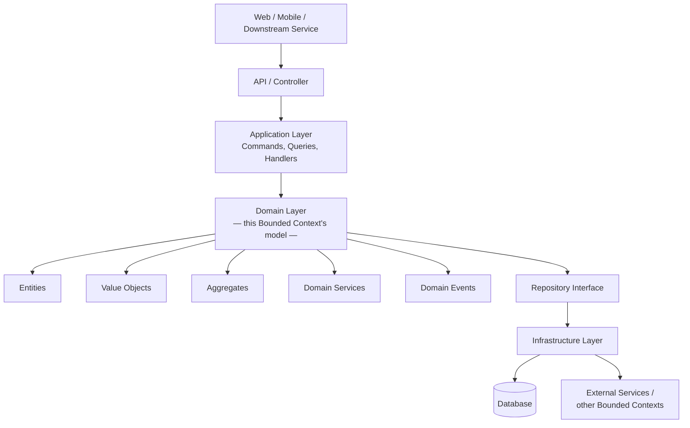
```mermaid
flowchart TB
 Client[Web / Mobile / Downstream Service] --> API[API / Controller]
 API --> Application[Application Layer<br/>Commands, Queries, Handlers]
 Application --> Domain[Domain Layer<br/>— this Bounded Context's model —]
 Domain --> Entity[Entities]
 Domain --> VO[Value Objects]
 Domain --> Aggregate[Aggregates]
 Domain --> DomainService[Domain Services]
 Domain --> Events[Domain Events]
 Domain --> Repository[Repository Interface]
 Repository --> Infrastructure[Infrastructure Layer]
 Infrastructure --> DB[(Database)]
 Infrastructure --> External[External Services /<br/>other Bounded Contexts]
```

**2.3 Typical solution layout, and where strategic-DDD artifacts live**

```text
Solution
│
├── API                        (one per Bounded Context, or per bounded-context-aligned module)
├── Application/                Commands, Queries, DTOs, Handlers
├── Domain/                     Aggregates, Entities, ValueObjects, DomainEvents,
│                                DomainServices, Repositories, Exceptions
├── Infrastructure/             Persistence (EF Core), Repository impls,
│                                Anti-Corruption Layer adapters, External Service clients
└── Tests
```

**3.1 Bounded context map — capital-markets front-to-back**

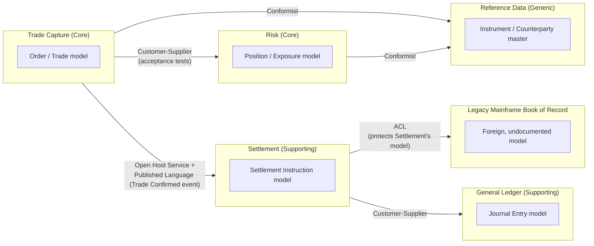
```mermaid
flowchart LR
 subgraph TC["Trade Capture (Core)"]
 TCM[Order / Trade model]
 end
 subgraph Risk["Risk (Core)"]
 RM[Position / Exposure model]
 end
 subgraph Settle["Settlement (Supporting)"]
 SM[Settlement Instruction model]
 end
 subgraph Ledger["General Ledger (Supporting)"]
 LM[Journal Entry model]
 end
 subgraph Ref["Reference Data (Generic)"]
 RD[Instrument / Counterparty master]
 end
 subgraph Legacy["Legacy Mainframe Book of Record"]
 LG[Foreign, undocumented model]
 end

 TC -- "Customer-Supplier<br/>(acceptance tests)" --> Risk
 TC -- "Open Host Service +<br/>Published Language (Trade Confirmed event)" --> Settle
 Settle -- "ACL<br/>(protects Settlement's model)" --> Legacy
 TC -- Conformist --> Ref
 Risk -- Conformist --> Ref
 Settle -- "Customer-Supplier" --> Ledger
```

**Step 2 — Propose High-Level Design and Get Buy-In**

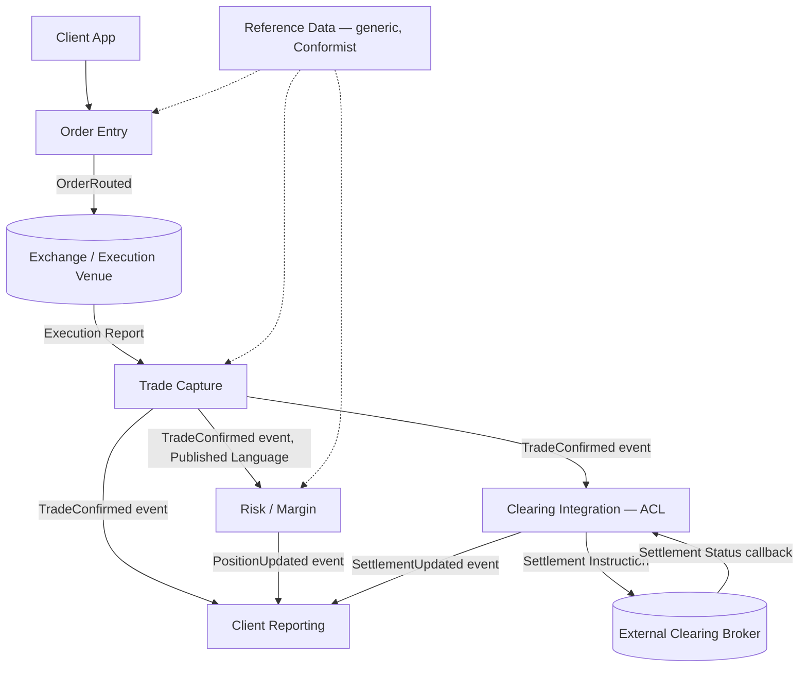
```mermaid
flowchart TB
 Client[Client App] --> OE[Order Entry]
 OE -->|OrderRouted| Exchange[(Exchange / Execution Venue)]
 Exchange -->|Execution Report| TC[Trade Capture]
 TC -->|TradeConfirmed event, Published Language| Risk[Risk / Margin]
 TC -->|TradeConfirmed event| CI[Clearing Integration — ACL]
 CI -->|Settlement Instruction| Broker[(External Clearing Broker)]
 Broker -->|Settlement Status callback| CI
 TC -->|TradeConfirmed event| CR[Client Reporting]
 Risk -->|PositionUpdated event| CR
 CI -->|SettlementUpdated event| CR
 RefData[Reference Data — generic, Conformist] -.-> OE
 RefData -.-> TC
 RefData -.-> Risk
```

**13.1 Class diagram — a concrete Anti-Corruption Layer at a bounded-context boundary**

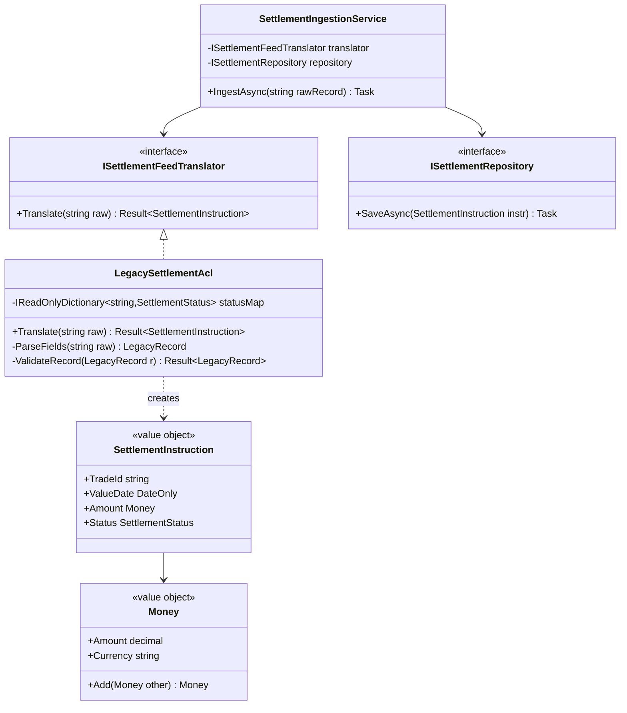
```mermaid
classDiagram
 class ISettlementFeedTranslator {
 <<interface>>
 +Translate(string raw) Result~SettlementInstruction~
 }
 class LegacySettlementAcl {
 -IReadOnlyDictionary~string,SettlementStatus~ statusMap
 +Translate(string raw) Result~SettlementInstruction~
 -ParseFields(string raw) LegacyRecord
 -ValidateRecord(LegacyRecord r) Result~LegacyRecord~
 }
 class SettlementInstruction {
 <<value object>>
 +TradeId string
 +ValueDate DateOnly
 +Amount Money
 +Status SettlementStatus
 }
 class Money {
 <<value object>>
 +Amount decimal
 +Currency string
 +Add(Money other) Money
 }
 class SettlementIngestionService {
 -ISettlementFeedTranslator translator
 -ISettlementRepository repository
 +IngestAsync(string rawRecord) Task
 }
 class ISettlementRepository {
 <<interface>>
 +SaveAsync(SettlementInstruction instr) Task
 }
 ISettlementFeedTranslator <|.. LegacySettlementAcl
 SettlementIngestionService --> ISettlementFeedTranslator
 SettlementIngestionService --> ISettlementRepository
 LegacySettlementAcl ..> SettlementInstruction : creates
 SettlementInstruction --> Money
```

**13.2 Sequence diagram — ingesting one legacy settlement record through the ACL**

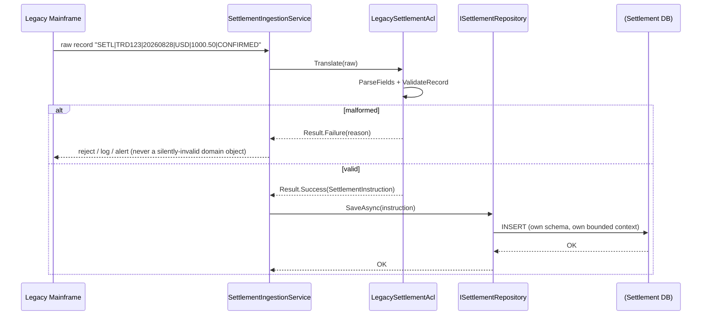
```mermaid
sequenceDiagram
 participant Legacy as Legacy Mainframe
 participant Svc as SettlementIngestionService
 participant ACL as LegacySettlementAcl
 participant Repo as ISettlementRepository
 participant DB as (Settlement DB)

 Legacy->>Svc: raw record "SETL|TRD123|20260828|USD|1000.50|CONFIRMED"
 Svc->>ACL: Translate(raw)
 ACL->>ACL: ParseFields + ValidateRecord
 alt malformed
 ACL-->>Svc: Result.Failure(reason)
 Svc-->>Legacy: reject / log / alert (never a silently-invalid domain object)
 else valid
 ACL-->>Svc: Result.Success(SettlementInstruction)
 Svc->>Repo: SaveAsync(instruction)
 Repo->>DB: INSERT (own schema, own bounded context)
 DB-->>Repo: OK
 Repo-->>Svc: OK
 end
```

### Module 110 — Domain-Driven Design: Tactical DDD — Entities, Value Objects & Aggregates
*Source: `02-TacticalDDD-Entities-ValueObjects-Aggregates.md`*

**3.1 Aggregate / entity relationship diagram — the `Order` Aggregate (Advanced Q1)**

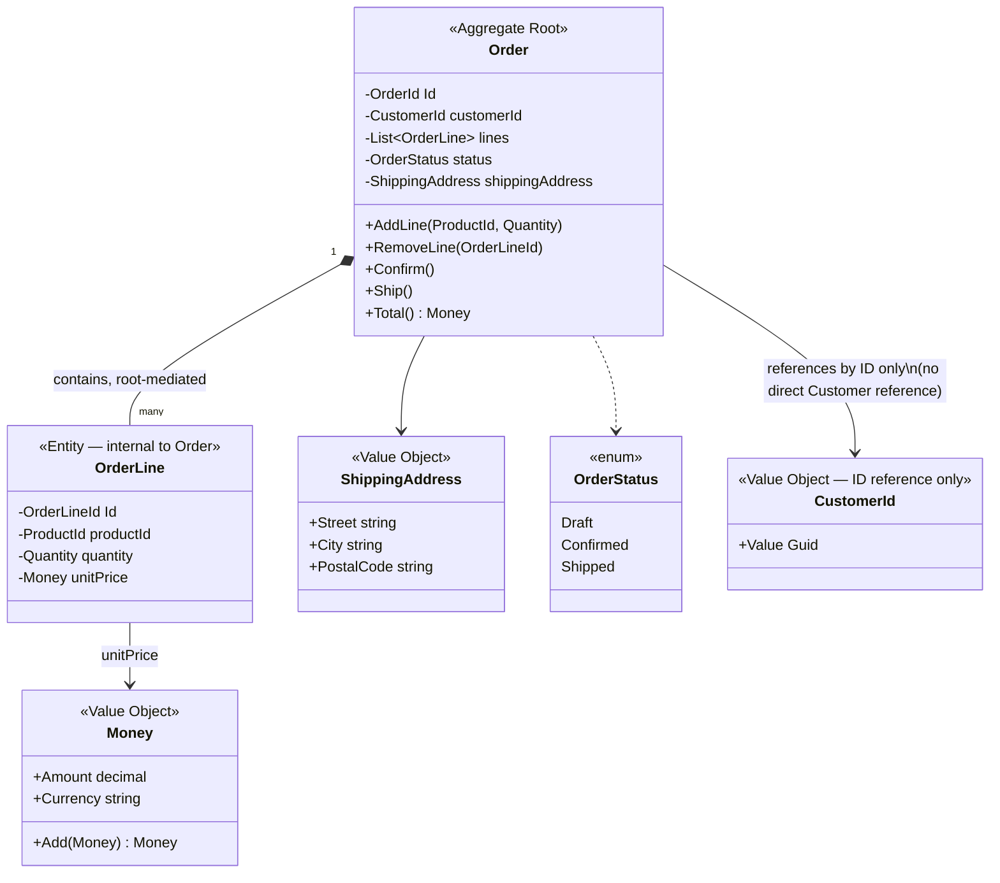
```mermaid
classDiagram
 class Order {
 <<Aggregate Root>>
 -OrderId Id
 -CustomerId customerId
 -List~OrderLine~ lines
 -OrderStatus status
 -ShippingAddress shippingAddress
 +AddLine(ProductId, Quantity)
 +RemoveLine(OrderLineId)
 +Confirm()
 +Ship()
 +Total() Money
 }
 class OrderLine {
 <<Entity — internal to Order>>
 -OrderLineId Id
 -ProductId productId
 -Quantity quantity
 -Money unitPrice
 }
 class Money {
 <<Value Object>>
 +Amount decimal
 +Currency string
 +Add(Money) Money
 }
 class ShippingAddress {
 <<Value Object>>
 +Street string
 +City string
 +PostalCode string
 }
 class OrderStatus {
 <<enum>>
 Draft
 Confirmed
 Shipped
 }
 class CustomerId {
 <<Value Object — ID reference only>>
 +Value Guid
 }

 Order "1" *-- "many" OrderLine : contains, root-mediated
 Order --> ShippingAddress
 Order --> CustomerId : references by ID only\n(no direct Customer reference)
 OrderLine --> Money : unitPrice
 Order ..> OrderStatus
```

**3.2 Invariant-enforcement flow through the Aggregate Root**

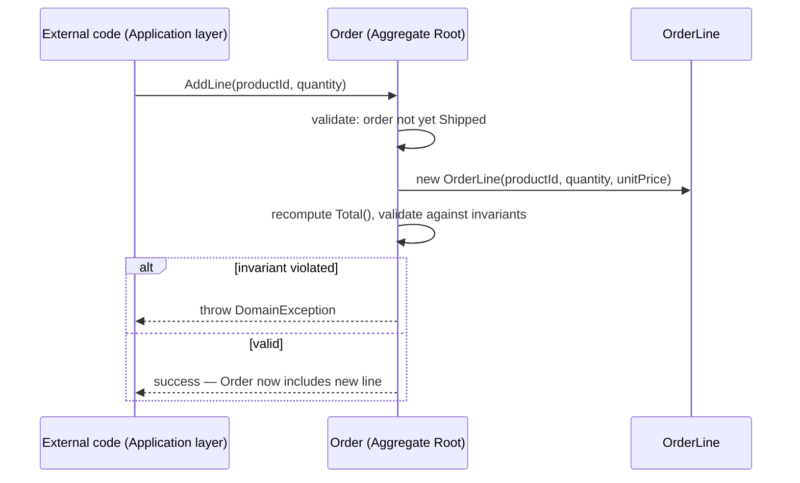
```mermaid
sequenceDiagram
 participant Ext as External code (Application layer)
 participant Root as Order (Aggregate Root)
 participant Line as OrderLine

 Ext->>Root: AddLine(productId, quantity)
 Root->>Root: validate: order not yet Shipped
 Root->>Line: new OrderLine(productId, quantity, unitPrice)
 Root->>Root: recompute Total(), validate against invariants
 alt invariant violated
 Root-->>Ext: throw DomainException
 else valid
 Root-->>Ext: success — Order now includes new line
 end
```

**Step 2 — Propose High-Level Design and Get Buy-In**

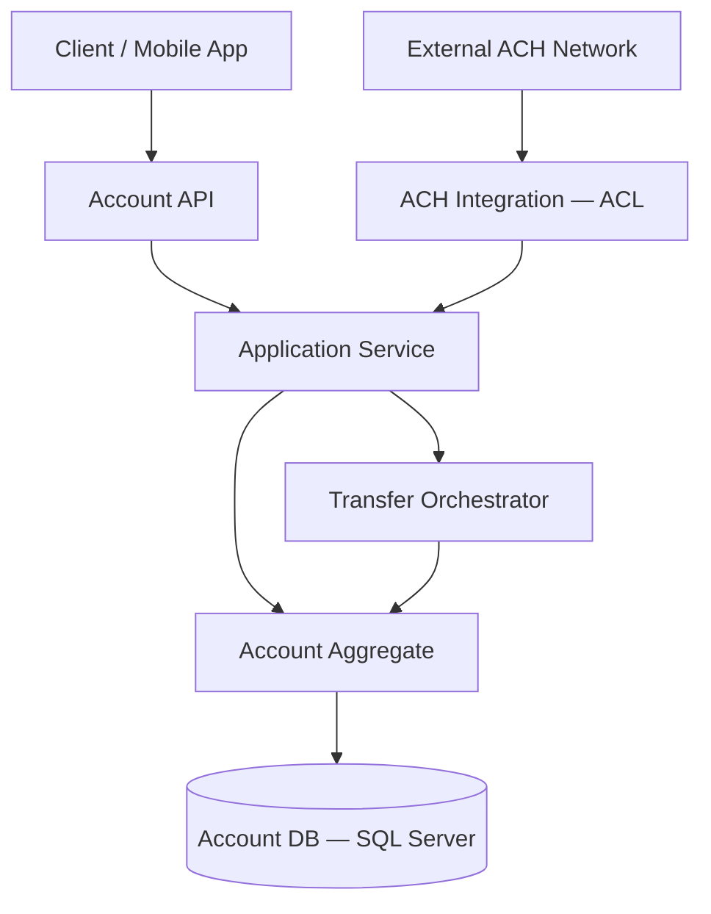
```mermaid
flowchart TB
 Client[Client / Mobile App] --> API[Account API]
 API --> App[Application Service]
 App --> Acct[Account Aggregate]
 Acct --> DB[(Account DB — SQL Server)]
 App --> Orch[Transfer Orchestrator]
 Orch --> Acct
 ACH[External ACH Network] --> ACL[ACH Integration — ACL]
 ACL --> App
```

**13.1 Class diagram — the `Account` Aggregate**

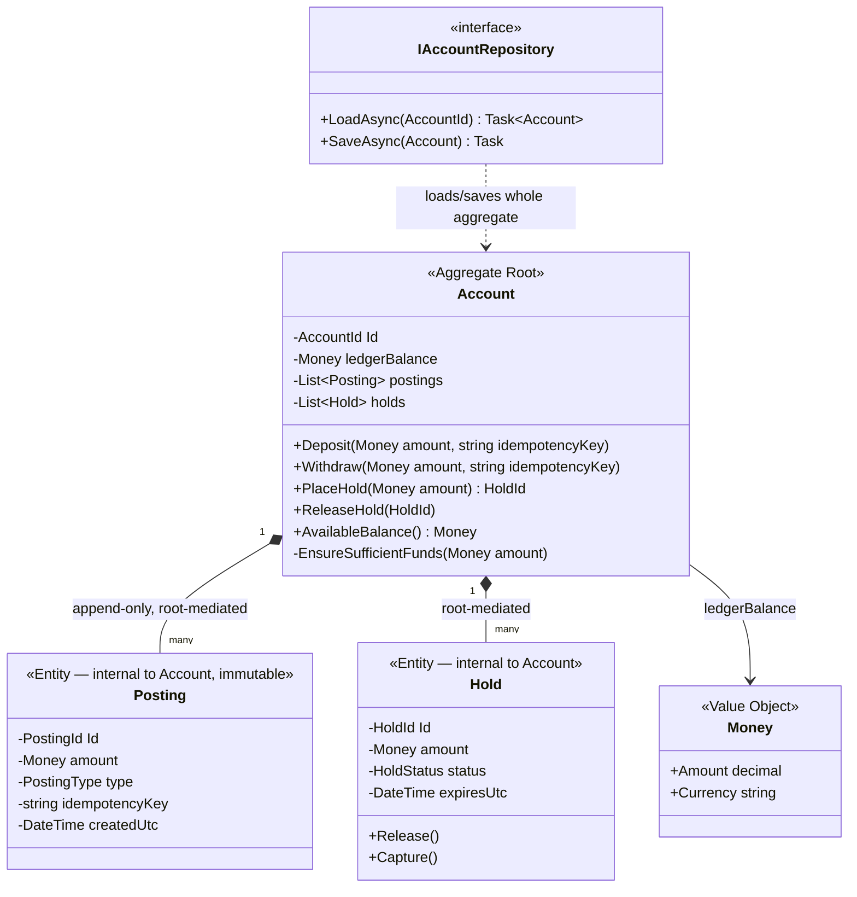
```mermaid
classDiagram
 class Account {
 <<Aggregate Root>>
 -AccountId Id
 -Money ledgerBalance
 -List~Posting~ postings
 -List~Hold~ holds
 +Deposit(Money amount, string idempotencyKey)
 +Withdraw(Money amount, string idempotencyKey)
 +PlaceHold(Money amount) HoldId
 +ReleaseHold(HoldId)
 +AvailableBalance() Money
 -EnsureSufficientFunds(Money amount)
 }
 class Posting {
 <<Entity — internal to Account, immutable>>
 -PostingId Id
 -Money amount
 -PostingType type
 -string idempotencyKey
 -DateTime createdUtc
 }
 class Hold {
 <<Entity — internal to Account>>
 -HoldId Id
 -Money amount
 -HoldStatus status
 -DateTime expiresUtc
 +Release()
 +Capture()
 }
 class Money {
 <<Value Object>>
 +Amount decimal
 +Currency string
 }
 class IAccountRepository {
 <<interface>>
 +LoadAsync(AccountId) Task~Account~
 +SaveAsync(Account) Task
 }
 Account "1" *-- "many" Posting : append-only, root-mediated
 Account "1" *-- "many" Hold : root-mediated
 Account --> Money : ledgerBalance
 IAccountRepository ..> Account : loads/saves whole aggregate
```

**13.2 Sequence diagram — placing a hold, then a concurrent withdrawal attempt**

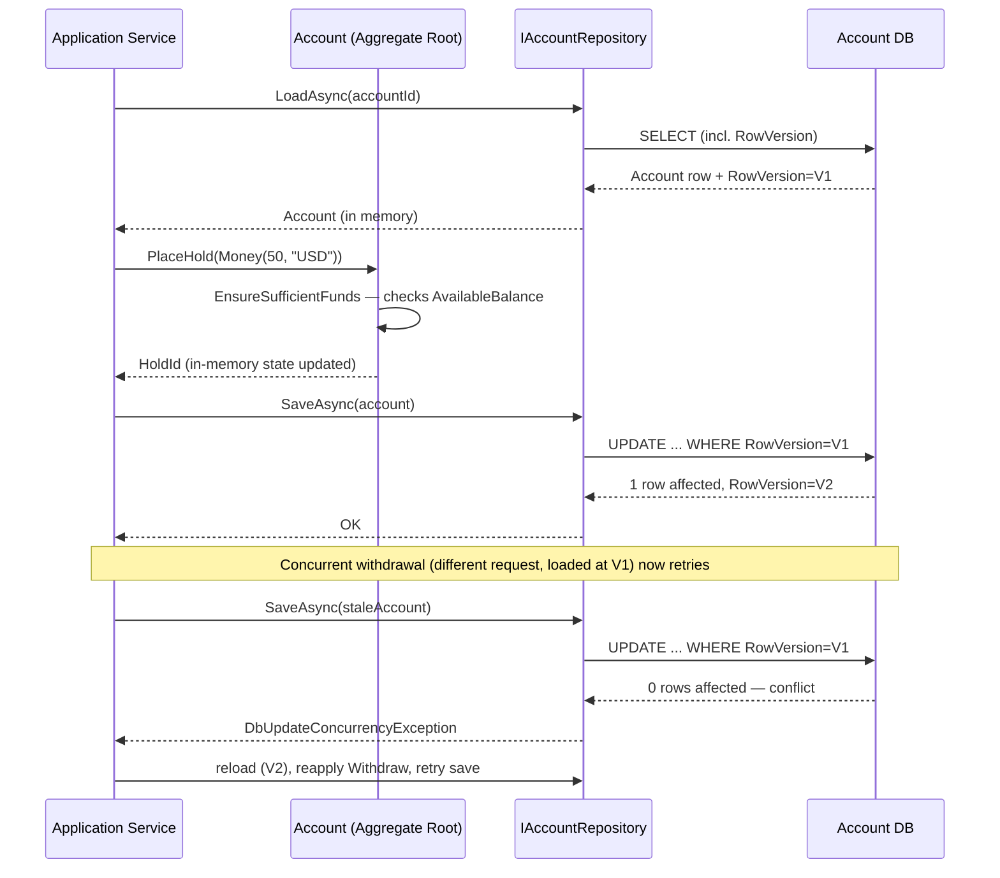
```mermaid
sequenceDiagram
 participant App as Application Service
 participant Acct as Account (Aggregate Root)
 participant Repo as IAccountRepository
 participant DB as Account DB

 App->>Repo: LoadAsync(accountId)
 Repo->>DB: SELECT (incl. RowVersion)
 DB-->>Repo: Account row + RowVersion=V1
 Repo-->>App: Account (in memory)
 App->>Acct: PlaceHold(Money(50, "USD"))
 Acct->>Acct: EnsureSufficientFunds — checks AvailableBalance
 Acct-->>App: HoldId (in-memory state updated)
 App->>Repo: SaveAsync(account)
 Repo->>DB: UPDATE ... WHERE RowVersion=V1
 DB-->>Repo: 1 row affected, RowVersion=V2
 Repo-->>App: OK

 Note over App,DB: Concurrent withdrawal (different request, loaded at V1) now retries
 App->>Repo: SaveAsync(staleAccount)
 Repo->>DB: UPDATE ... WHERE RowVersion=V1
 DB-->>Repo: 0 rows affected — conflict
 Repo-->>App: DbUpdateConcurrencyException
 App->>Repo: reload (V2), reapply Withdraw, retry save
```

### Module 111 — Domain-Driven Design: Domain Events, Domain Services & Repositories
*Source: `03-DomainEvents-DomainServices-Repositories.md`*

**1. Fundamentals**

```text
Application Service
   │
   ├─ loads Aggregate via IRepository<T>           (Repository)
   ├─ calls Aggregate.Method() → invariant enforced  (Aggregate)
   │      └─ Aggregate.Raise(new DomainEvent(...))   (Domain Event, queued not published)
   ├─ (optionally) calls a DomainService for cross-Aggregate logic
   ├─ commits via Unit of Work — Aggregate state + outbox row, ONE transaction
   └─ background dispatcher publishes the queued event AFTER commit succeeds
```

**3. Visual Architecture**

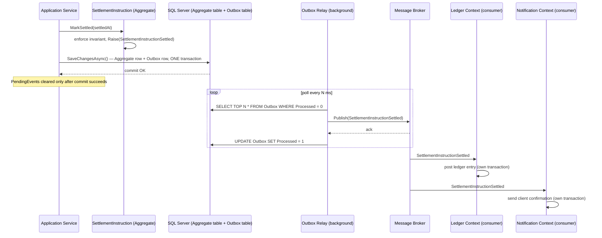
```mermaid
sequenceDiagram
    participant AppSvc as Application Service
    participant Agg as SettlementInstruction (Aggregate)
    participant DB as SQL Server (Aggregate table + Outbox table)
    participant Relay as Outbox Relay (background)
    participant Bus as Message Broker
    participant Ledger as Ledger Context (consumer)
    participant Notif as Notification Context (consumer)

    AppSvc->>Agg: MarkSettled(settledAt)
    Agg->>Agg: enforce invariant, Raise(SettlementInstructionSettled)
    AppSvc->>DB: SaveChangesAsync() — Aggregate row + Outbox row, ONE transaction
    DB-->>AppSvc: commit OK
    Note over AppSvc: PendingEvents cleared only after commit succeeds
    loop poll every N ms
        Relay->>DB: SELECT TOP N * FROM Outbox WHERE Processed = 0
        Relay->>Bus: Publish(SettlementInstructionSettled)
        Bus-->>Relay: ack
        Relay->>DB: UPDATE Outbox SET Processed = 1
    end
    Bus->>Ledger: SettlementInstructionSettled
    Ledger->>Ledger: post ledger entry (own transaction)
    Bus->>Notif: SettlementInstructionSettled
    Notif->>Notif: send client confirmation (own transaction)
```

**3. Visual Architecture**

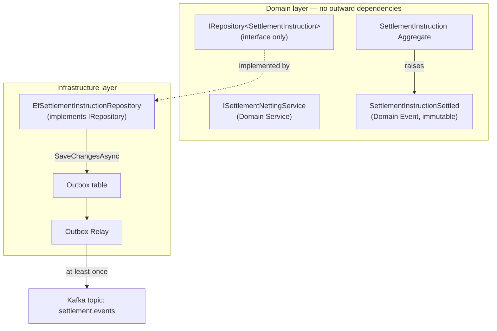
```mermaid
graph TB
    subgraph "Domain layer — no outward dependencies"
        IRepo["IRepository&lt;SettlementInstruction&gt;<br/>(interface only)"]
        Agg2["SettlementInstruction Aggregate"]
        DomSvc["ISettlementNettingService<br/>(Domain Service)"]
        Evt["SettlementInstructionSettled<br/>(Domain Event, immutable)"]
    end
    subgraph "Infrastructure layer"
        RepoImpl["EfSettlementInstructionRepository<br/>(implements IRepository)"]
        Outbox["Outbox table"]
        Relay2["Outbox Relay"]
    end
    IRepo -.implemented by.-> RepoImpl
    Agg2 -- raises --> Evt
    RepoImpl -- SaveChangesAsync --> Outbox
    Outbox --> Relay2
    Relay2 -- at-least-once --> Kafka["Kafka topic: settlement.events"]
```

**13. Low-Level Design**

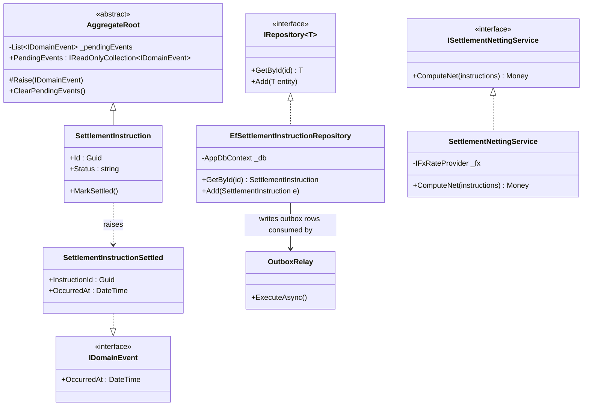
```mermaid
classDiagram
    class AggregateRoot {
        <<abstract>>
        -List~IDomainEvent~ _pendingEvents
        +PendingEvents : IReadOnlyCollection~IDomainEvent~
        #Raise(IDomainEvent)
        +ClearPendingEvents()
    }
    class SettlementInstruction {
        +Id : Guid
        +Status : string
        +MarkSettled()
    }
    class IDomainEvent {
        <<interface>>
        +OccurredAt : DateTime
    }
    class SettlementInstructionSettled {
        +InstructionId : Guid
        +OccurredAt : DateTime
    }
    class IRepository~T~ {
        <<interface>>
        +GetById(id) T
        +Add(T entity)
    }
    class EfSettlementInstructionRepository {
        -AppDbContext _db
        +GetById(id) SettlementInstruction
        +Add(SettlementInstruction e)
    }
    class ISettlementNettingService {
        <<interface>>
        +ComputeNet(instructions) Money
    }
    class SettlementNettingService {
        -IFxRateProvider _fx
        +ComputeNet(instructions) Money
    }
    class OutboxRelay {
        +ExecuteAsync()
    }

    AggregateRoot <|-- SettlementInstruction
    SettlementInstruction ..> SettlementInstructionSettled : raises
    SettlementInstructionSettled ..|> IDomainEvent
    IRepository~T~ <|.. EfSettlementInstructionRepository
    ISettlementNettingService <|.. SettlementNettingService
    EfSettlementInstructionRepository --> OutboxRelay : writes outbox rows consumed by
```

**13. Low-Level Design**

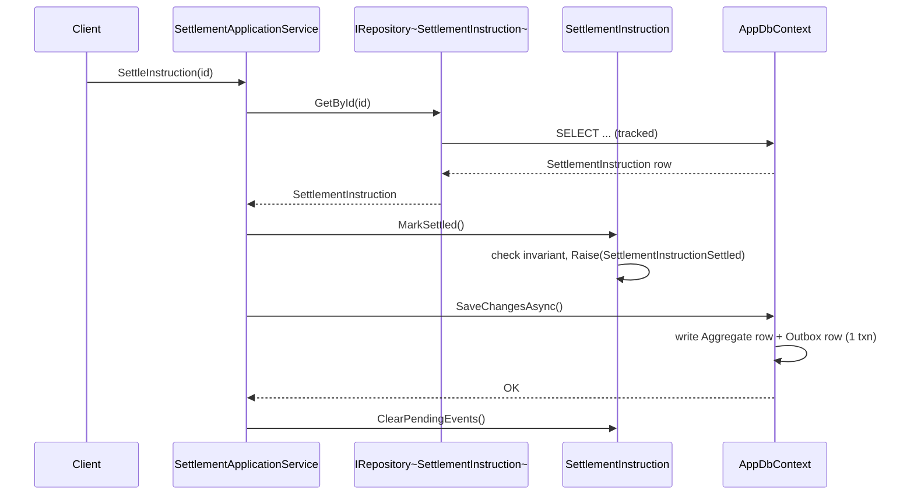
```mermaid
sequenceDiagram
    participant Client
    participant AppSvc as SettlementApplicationService
    participant Repo as IRepository~SettlementInstruction~
    participant Agg as SettlementInstruction
    participant DB as AppDbContext

    Client->>AppSvc: SettleInstruction(id)
    AppSvc->>Repo: GetById(id)
    Repo->>DB: SELECT ... (tracked)
    DB-->>Repo: SettlementInstruction row
    Repo-->>AppSvc: SettlementInstruction
    AppSvc->>Agg: MarkSettled()
    Agg->>Agg: check invariant, Raise(SettlementInstructionSettled)
    AppSvc->>DB: SaveChangesAsync()
    DB->>DB: write Aggregate row + Outbox row (1 txn)
    DB-->>AppSvc: OK
    AppSvc->>Agg: ClearPendingEvents()
```

### Module 112 — Domain-Driven Design: DDD in Practice — Bounded Context Decomposition Case Study (capstone)
*Source: `04-DDDInPractice-BoundedContextDecomposition-CapstoneCaseStudy.md`*

**3. Visual Architecture**

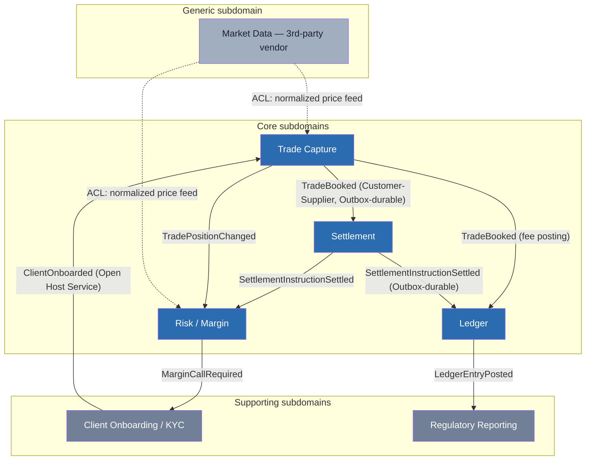
```mermaid
graph TB
    subgraph "Core subdomains"
        TC[Trade Capture]
        ST[Settlement]
        LG[Ledger]
        RK[Risk / Margin]
    end
    subgraph "Supporting subdomains"
        KYC[Client Onboarding / KYC]
        REG[Regulatory Reporting]
    end
    subgraph "Generic subdomain"
        MD[Market Data — 3rd-party vendor]
    end

    TC -- "TradeBooked (Customer-Supplier, Outbox-durable)" --> ST
    TC -- "TradeBooked (fee posting)" --> LG
    ST -- "SettlementInstructionSettled (Outbox-durable)" --> LG
    ST -- "SettlementInstructionSettled" --> RK
    RK -- "MarginCallRequired" --> KYC
    TC -- "TradePositionChanged" --> RK
    LG -- "LedgerEntryPosted" --> REG
    MD -. "ACL: normalized price feed" .-> TC
    MD -. "ACL: normalized price feed" .-> RK
    KYC -- "ClientOnboarded (Open Host Service)" --> TC

    classDef core fill:#2b6cb0,color:#fff;
    classDef supporting fill:#718096,color:#fff;
    classDef generic fill:#a0aec0,color:#1a202c;
    class TC,ST,LG,RK core;
    class KYC,REG supporting;
    class MD generic;
```

**3. Visual Architecture**

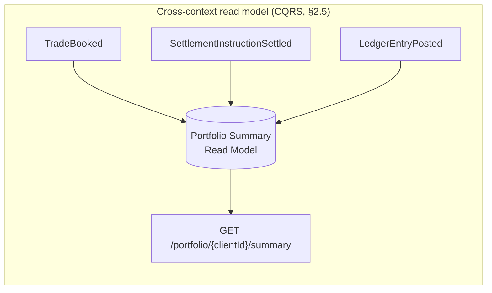
```mermaid
graph LR
    subgraph "Cross-context read model (CQRS, §2.5)"
        E1[TradeBooked] --> RM[(Portfolio Summary<br/>Read Model)]
        E2[SettlementInstructionSettled] --> RM
        E3[LedgerEntryPosted] --> RM
        RM --> API["GET /portfolio/{clientId}/summary"]
    end
```

**13. Low-Level Design**

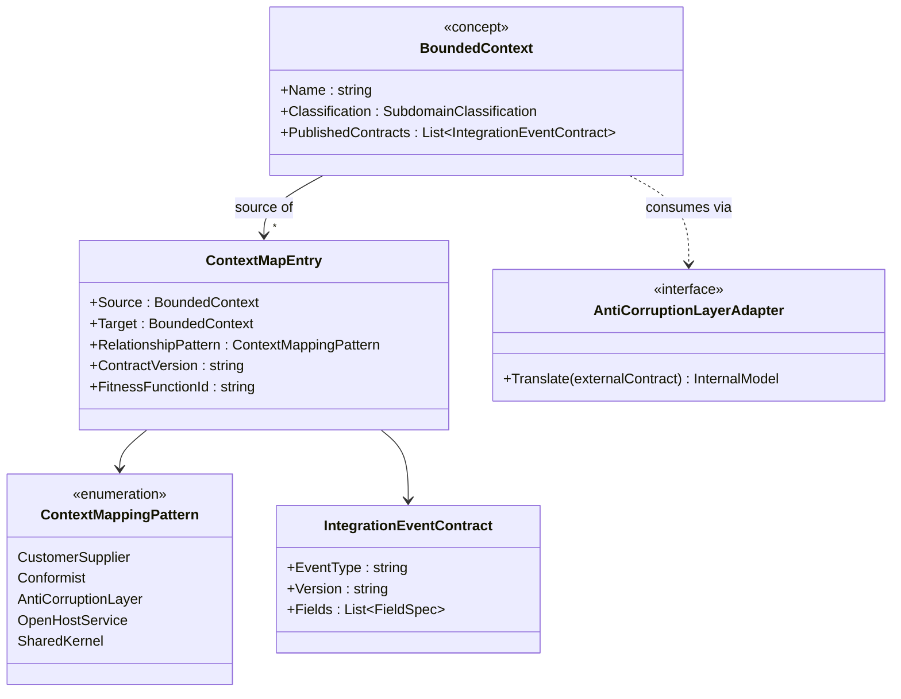
```mermaid
classDiagram
    class BoundedContext {
        <<concept>>
        +Name : string
        +Classification : SubdomainClassification
        +PublishedContracts : List~IntegrationEventContract~
    }
    class ContextMapEntry {
        +Source : BoundedContext
        +Target : BoundedContext
        +RelationshipPattern : ContextMappingPattern
        +ContractVersion : string
        +FitnessFunctionId : string
    }
    class ContextMappingPattern {
        <<enumeration>>
        CustomerSupplier
        Conformist
        AntiCorruptionLayer
        OpenHostService
        SharedKernel
    }
    class IntegrationEventContract {
        +EventType : string
        +Version : string
        +Fields : List~FieldSpec~
    }
    class AntiCorruptionLayerAdapter {
        <<interface>>
        +Translate(externalContract) InternalModel
    }

    BoundedContext "1" --> "*" ContextMapEntry : source of
    ContextMapEntry --> ContextMappingPattern
    ContextMapEntry --> IntegrationEventContract
    BoundedContext ..> AntiCorruptionLayerAdapter : consumes via
```

**13. Low-Level Design**

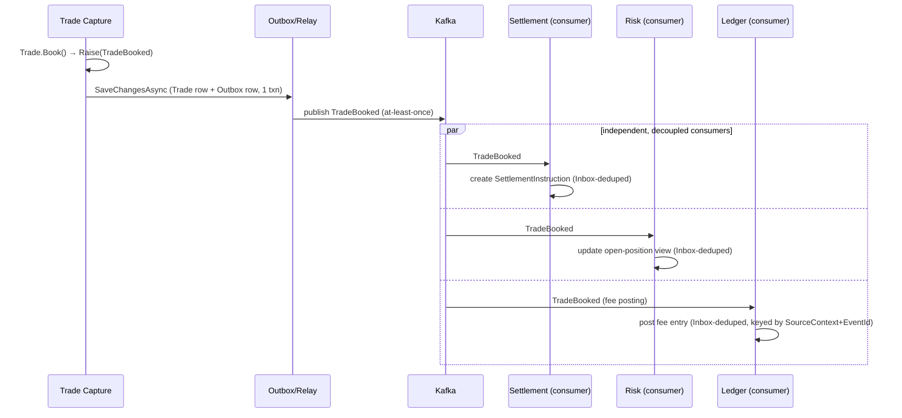
```mermaid
sequenceDiagram
    participant TC as Trade Capture
    participant OB as Outbox/Relay
    participant K as Kafka
    participant ST as Settlement (consumer)
    participant RK as Risk (consumer)
    participant LG as Ledger (consumer)

    TC->>TC: Trade.Book() → Raise(TradeBooked)
    TC->>OB: SaveChangesAsync (Trade row + Outbox row, 1 txn)
    OB->>K: publish TradeBooked (at-least-once)
    par independent, decoupled consumers
        K->>ST: TradeBooked
        ST->>ST: create SettlementInstruction (Inbox-deduped)
    and
        K->>RK: TradeBooked
        RK->>RK: update open-position view (Inbox-deduped)
    and
        K->>LG: TradeBooked (fee posting)
        LG->>LG: post fee entry (Inbox-deduped, keyed by SourceContext+EventId)
    end
```
