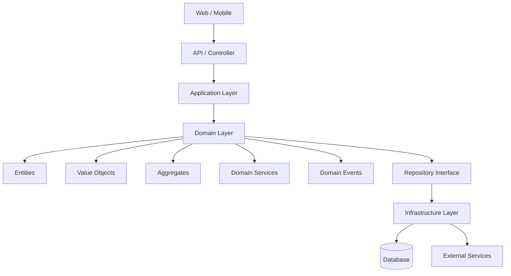

# Module 109 — Domain-Driven Design: Strategic DDD — Ubiquitous Language, Bounded Contexts & Context Mapping

> Domain: Domain-Driven Design | Level: Beginner → Expert | Prerequisite: [[../30-Architecture-Patterns/01-ArchitecturalStyles-Monolith-ModularMonolith-SOA-Microservices-Serverless]] (this module supplies the generative technique for *where* to draw the service/module boundaries that module's framework only diagnosed and decided whether to reconsider), [[../30-Architecture-Patterns/03-MigrationPatterns-BranchByAbstraction-ParallelRun-AntiCorruptionLayer-DataMigration]] §Basic Q4 (the Anti-Corruption Layer this module's context-mapping patterns reuse and formalize), [[../17-Microservices/01-Decomposition-Communication-Strangler-Fig]] (service decomposition this module gives a rigorous, domain-modeling-based foundation for)
>
> **Note on format:** Per the standing user preference (see `CLAUDE.md`), this module covers only the 40 most-frequently-asked interview questions (10 per level), without the full 15-section deep-dive template.
>
> **Domain scope note:** `31-Domain-Driven-Design` is scoped standard depth, 4 modules (109–112): Strategic DDD (this module), Tactical DDD (entities/value objects/aggregates), Domain Events/Services/Repositories, and a capstone applying DDD to real microservice decomposition — scope proposed and proceeded with autonomously per established preference. Deliberately defers full Event Sourcing (its own dedicated domain, 35) and Saga/Outbox (36/37) — Module 111 introduces domain events only at the modeling level, not the full event-sourced-persistence pattern.

---

# Domain-Driven Design (DDD)



---

# DDD Building Blocks

```text
                 Domain
                    │
    ┌───────────────┼────────────────┐
    │               │                │
 Entities      Value Objects    Aggregates
    │               │                │
    └───────────────┼────────────────┘
                    │
             Domain Services
                    │
             Domain Events
                    │
         Repository Interfaces
                    │
             Infrastructure
```

---

# Request Flow

```text
Client
   │
   ▼
Controller
   │
   ▼
Application Service
   │
   ▼
Aggregate Root
   │
   ▼
Entity + Value Objects
   │
   ▼
Repository
   │
   ▼
Database
```

---

# Typical DDD Project Structure

```
Solution
│
├── API
│
├── Application
│   ├── Commands
│   ├── Queries
│   ├── DTOs
│   ├── Interfaces
│   └── Handlers
│
├── Domain
│   ├── Aggregates
│   ├── Entities
│   ├── ValueObjects
│   ├── DomainEvents
│   ├── DomainServices
│   ├── Repositories
│   └── Exceptions
│
├── Infrastructure
│   ├── Persistence
│   ├── EF Core
│   ├── Repository Implementations
│   └── External Services
│
└── Tests
```

---

# DDD Concepts

| Concept | Purpose |
|---------|---------|
| Entity | Has identity (e.g., Customer, Order) |
| Value Object | Immutable object with no identity (e.g., Address, Money) |
| Aggregate | Consistency boundary that groups related entities |
| Aggregate Root | Entry point to an aggregate (e.g., Order) |
| Repository | Loads and saves aggregates |
| Domain Service | Business logic that doesn't belong to a single entity |
| Domain Event | Represents something important that happened in the domain |
| Application Service | Coordinates use cases and transactions |
| Infrastructure | Database, messaging, external APIs |

## Interview Questions

### Basic (10)

1. **Q: What is Domain-Driven Design, at a high level, and what problem does it primarily exist to solve?**
   **A:** DDD is an approach to building software that puts a deep, explicit, continuously-refined model of the business domain at the center of the design, developed collaboratively with actual domain experts — it exists primarily to solve the problem of software that technically works but doesn't actually reflect how the business genuinely thinks about and operates in its own domain, which causes a slow, compounding drift between what the code does and what the business actually needs, discovered only through repeated, costly miscommunication and rework.
   **Why correct:** States DDD's central mechanism (a collaboratively-built, explicit domain model at the design's center) and the specific problem (code/business-understanding drift) it targets.
   **Common mistakes:** Treating DDD as primarily a set of coding patterns (entities, aggregates, repositories) rather than recognizing those tactical patterns exist specifically in service of the deeper, strategic goal — an accurate, shared understanding of the domain itself.
   **Follow-ups:** "Why is DDD's value concentrated more in its strategic patterns (this module) than its tactical patterns (Module 110)?" (The tactical patterns are implementation techniques applicable once a domain is well-understood; the strategic patterns are what actually produce that understanding in the first place — getting the strategic layer wrong undermines any tactical pattern applied on top of it.)

2. **Q: What is Ubiquitous Language, and why must it be used consistently by both engineers and domain experts?**
   **A:** Ubiquitous Language is a shared, rigorously-defined vocabulary — built collaboratively with domain experts and used identically in conversation, documentation, and the code itself (class names, method names) — for concepts within a specific bounded context; it must be used consistently because any translation gap between how the business describes a concept and how the code names it introduces a silent, compounding source of miscommunication and defects, since every translation is an opportunity for meaning to drift or be lost.
   **Why correct:** States the definition (shared, rigorous vocabulary spanning conversation and code) and the specific risk (translation-gap-driven miscommunication) consistent usage prevents.
   **Common mistakes:** Treating Ubiquitous Language as merely "good naming conventions" — it specifically requires the *business* vocabulary to appear directly in code, not a separate, translated technical vocabulary that a domain expert wouldn't recognize.
   **Follow-ups:** "What's a concrete symptom that Ubiquitous Language has broken down on a project?" (Domain experts and engineers using genuinely different terms for the same concept in meetings, or the code's class/method names bearing no resemblance to how the business actually describes the concept — a class named `AccountRecord` when the business exclusively talks about "Policies," for instance.)

3. **Q: What is a Bounded Context?**
   **A:** An explicit boundary (organizational, linguistic, and typically also a deployment/code boundary) within which a specific domain model and its Ubiquitous Language apply consistently and unambiguously — outside that boundary, the same term can legitimately mean something different, because a different bounded context models that part of the domain from its own, distinct perspective.
   **Why correct:** States the Bounded Context's defining property (a boundary of linguistic/model consistency) and explicitly acknowledges the same term can validly differ across contexts.
   **Common mistakes:** Assuming a single, universal domain model should apply consistently across an entire organization — DDD's core strategic insight is the opposite: a single, unified model across a large, complex domain becomes unwieldy and internally inconsistent, and splitting it into multiple, context-specific models is the correct, deliberate response, not a failure to unify.
   **Follow-ups:** "Give a concrete example of a term meaning something legitimately different across two bounded contexts." (In an e-commerce system, "Product" in a Catalog context means a rich, browsable item with descriptions/images/categories; "Product" in a Shipping context means a physical item with weight/dimensions/fragility — both are valid, non-conflicting models of "Product," each correct within its own bounded context.)

4. **Q: What is a Context Map?**
   **A:** A diagram or explicit document showing all of an organization's (or system's) bounded contexts and the relationships between them — which contexts communicate with which, and via what specific pattern (Shared Kernel, Customer-Supplier, Conformist, Anti-Corruption Layer, Open Host Service, and others, developed fully in Intermediate Q1–Q5) — making an otherwise implicit, tribal-knowledge understanding of how the system's parts relate into an explicit, shared, durable artifact.
   **Why correct:** States the Context Map's purpose (explicit documentation of bounded-context relationships and their specific integration patterns) and its value (converting implicit knowledge into a shared artifact).
   **Common mistakes:** Treating a Context Map as merely a system architecture diagram — it specifically documents the *relationship pattern and power dynamic* between contexts (e.g., which context conforms to another's model), not just which systems technically call which.
   **Follow-ups:** "Why does a Context Map matter for onboarding a new engineer, beyond documenting the current architecture?" (It explains not just *what* connects to *what*, but *why* — the specific integration pattern reveals the actual organizational/team relationship and historical reasoning behind an integration, information a pure technical architecture diagram wouldn't convey.)

5. **Q: What is the difference between a core domain, a supporting subdomain, and a generic subdomain?**
   **A:** The core domain is the part of the business that provides its actual competitive differentiation and deserves the organization's best modeling effort and most talented engineers; a supporting subdomain is necessary for the business to function but isn't itself a competitive differentiator (custom-built, but with less modeling investment); a generic subdomain is a genuinely common problem shared across many businesses (authentication, payment processing) best solved by buying or adopting an existing solution rather than custom-building it at all.
   **Why correct:** States all three categories precisely, including the specific investment implication (best effort/core, moderate/supporting, buy-don't-build/generic) each one carries.
   **Common mistakes:** Investing equal engineering rigor and custom-build effort across every subdomain regardless of its actual business differentiation — over-investing in a generic subdomain (building custom authentication from scratch) wastes effort better spent on the core domain, which is where genuine competitive value actually comes from.
   **Follow-ups:** "How would you decide whether a given subdomain is core versus supporting, for an ambiguous case?" (Ask whether it's specifically what makes this business win against competitors, or something necessary but not differentiating — a delivery-logistics company's core domain is route optimization; its user-authentication subdomain, while necessary, is generic regardless of how central it feels operationally.)

6. **Q: What is the anemic domain model anti-pattern, and why does DDD specifically warn against it?**
   **A:** An anemic domain model is one where domain objects are pure data containers (getters/setters, no real behavior) while all actual business logic lives separately in "service" classes operating on that data — DDD specifically warns against it because it strips the domain model of the behavior and invariant-enforcement that should live with the data it concerns, producing an object-oriented-looking design that is, in practice, no more expressive or safe than a plain data-transfer structure, defeating DDD's entire purpose of encoding the domain's actual rules directly in the model.
   **Why correct:** States the anti-pattern's structure (data-only domain objects, logic externalized to services) and the specific reason (defeats DDD's core purpose of encoding domain rules in the model itself) it's discouraged.
   **Common mistakes:** Assuming any use of a "Service" class is automatically anemic-domain-model territory — Module 111 clarifies that legitimate domain services exist for operations that don't naturally belong to a single entity; the anti-pattern specifically concerns behavior and invariants that *do* belong to an entity being extracted from it anyway, not every service class without exception.
   **Follow-ups:** "What's a concrete symptom distinguishing an anemic domain model from a legitimate one with well-placed domain services?" (If an entity's own invariants can be violated by calling its setters directly from outside without going through domain logic that enforces them, the model is anemic — a well-designed rich model makes invalid states genuinely difficult or impossible to construct via its own public interface.)

7. **Q: What is the difference between a model-driven design approach and a purely data-driven (schema-first) design approach?**
   **A:** A data-driven approach starts from the database schema or data shape and derives application logic around it; a model-driven approach starts from an explicit conceptual model of the domain's behavior and rules (developed collaboratively with domain experts) and derives the persistence schema from that model afterward — the model-driven order matters because starting from data shape tends to produce an anemic model reflecting storage convenience rather than the domain's actual behavioral rules.
   **Why correct:** States both approaches' starting point and the resulting risk (anemic model) of starting from data shape rather than domain behavior.
   **Common mistakes:** Assuming the two approaches converge on the same result regardless of starting point — starting from schema tends to bias the resulting object model toward the schema's structure (foreign keys, normalized tables) rather than the domain's actual conceptual boundaries and invariants.
   **Follow-ups:** "Does this mean data modeling and persistence concerns are unimportant in DDD?" (No — Module 110's Aggregate and Module 111's Repository patterns specifically bridge a rich, model-driven domain model back to a practical, efficient persistence strategy; the point is sequencing, not that persistence doesn't matter.)

8. **Q: How does DDD's bounded-context concept relate to Module 105's modular-monolith and microservices discussion?**
   **A:** A bounded context is the domain-modeling-derived answer to the question Module 105's architectural styles leave open — *where, specifically*, should a module or service boundary actually be drawn — a well-identified bounded context is a strong candidate for either a module boundary within a modular monolith or an independent microservice, while Module 105's distributed-monolith diagnostic criteria (deployment-coordination frequency, cross-service database access) become the empirical check confirming a proposed bounded-context-derived boundary is genuinely, not just nominally, well-drawn.
   **Why correct:** Directly connects bounded contexts to Module 105's already-established boundary-quality diagnostic, explicitly stating bounded contexts as the generative source of candidate boundaries that diagnostic then verifies.
   **Common mistakes:** Assuming a bounded context and a microservice are simply synonyms — Advanced Q4 develops the important distinction that a single bounded context can, especially early on, be implemented as multiple physical services or a single microservice can span parts of two contexts temporarily, with the mapping evolving deliberately over time rather than being fixed 1:1 from the start.
   **Follow-ups:** "Why might a team choose to implement one bounded context as a module within a modular monolith rather than immediately as its own microservice?" (Directly Module 105's modular-monolith-first default — the bounded context provides a clean, well-modeled internal boundary immediately, while extraction to an independent, physically-deployed service can be deferred to the last responsible moment, per Module 106's timing principle, until genuine operational pain justifies the extraction cost.)

9. **Q: Why must domain experts be directly, continuously involved in DDD, rather than engineers gathering requirements from them once and then modeling independently?**
   **A:** A domain's real rules, edge cases, and terminology are rarely fully captured in a single upfront requirements-gathering session — they emerge gradually through repeated, concrete discussion of specific scenarios, and a domain expert's continuous involvement lets the model be corrected and refined as genuine misunderstandings surface, rather than the engineering team unknowingly building on an initially incomplete or subtly wrong understanding for months before anyone notices the gap.
   **Why correct:** States the specific reason (domain understanding emerges iteratively, not completely in one session) continuous, not one-time, domain-expert involvement is required.
   **Common mistakes:** Treating a single, thorough requirements-gathering phase as sufficient domain-expert engagement, then modeling in isolation afterward — directly recreating the big-design-up-front risk Module 106 Basic Q7 already established, now specifically applied to domain-understanding gathering rather than architectural design generally.
   **Follow-ups:** "What's a lightweight, practical mechanism for sustaining this ongoing collaboration, beyond ad hoc meetings?" (Event Storming — Intermediate Q7 — a structured, collaborative workshop technique specifically designed to surface and refine domain understanding together with domain experts, repeatable as the model evolves.)

10. **Q: What is the relationship between Ubiquitous Language and a Bounded Context — can a single Ubiquitous Language span multiple bounded contexts?**
    **A:** No — by definition, Ubiquitous Language is scoped *to* a specific bounded context; a term's precise meaning is only guaranteed consistent within one context's boundary, and the same term may legitimately carry a different, equally valid meaning in a different bounded context (Basic Q3's "Product" example) — attempting to force a single, universal Ubiquitous Language across an entire large, multi-context organization is precisely the "unified model across too large a domain becomes unwieldy" problem bounded contexts exist to solve.
    **Why correct:** States the precise scoping relationship (language is bounded-context-scoped, not organization-wide) and connects it back to the specific problem (unwieldy universal model) bounded contexts solve.
    **Common mistakes:** Attempting to standardize a single, company-wide glossary of terms intended to apply identically everywhere, missing that this specifically recreates the over-unification problem bounded contexts are designed to avoid — different contexts legitimately need different meanings for the same word.
    **Follow-ups:** "Doesn't having the same word mean different things across contexts create dangerous ambiguity?" (Only if the context boundary itself is unclear or undocumented — an explicit Context Map (Basic Q4) and clear ownership of each bounded context's own model prevents this ambiguity from being dangerous, converting "the same word means different things" from a source of confusion into an accepted, well-understood, and explicitly documented fact about the system.)

### Intermediate (10)

1. **Q: Explain the Shared Kernel context-mapping pattern, including its specific risk.**
   **A:** A Shared Kernel is a deliberately small, explicitly-agreed subset of the domain model (code, and often its underlying schema) that two bounded contexts' teams both depend on directly and must jointly own and evolve — its specific risk is that any change to the shared portion requires coordination between both teams, meaning an overly large or carelessly-scoped Shared Kernel recreates exactly the tight-coupling, deployment-coordination cost Module 105's distributed-monolith diagnostic warns against, now deliberately accepted rather than accidentally incurred.
   **Why correct:** States the pattern's mechanism (small, jointly-owned shared subset) and its specific, named risk (coordination cost scaling with the shared portion's size), tying the risk explicitly to an already-established course finding.
   **Common mistakes:** Treating a Shared Kernel as simply "some shared code," without recognizing its defining, deliberate feature is the *explicit, mutual agreement and joint ownership* — sharing code without that explicit agreement is closer to accidental, undocumented coupling than a genuine Shared Kernel pattern.
   **Follow-ups:** "When is a Shared Kernel the right choice versus an Anti-Corruption Layer (Intermediate Q4)?" (When two closely-collaborating teams genuinely benefit from directly sharing a small, stable, jointly-maintained model — an ACL is instead appropriate when one team needs to protect its own model from a context it doesn't want tight, joint-ownership coupling with at all.)

2. **Q: Explain the Customer-Supplier context-mapping pattern.**
   **A:** A Customer-Supplier relationship exists when one bounded context (the supplier) provides a service or data that another bounded context (the customer) depends on, with the customer's needs given genuine, negotiated priority in the supplier's planning — formalized, for instance, via the supplier team including the customer team's requirements in its own planning and testing (e.g., the customer providing acceptance tests the supplier's changes must continue to pass) — distinguishing it from a purely one-directional dependency where the supplier changes unilaterally with no consideration of downstream impact.
   **Why correct:** States the pattern's defining feature (customer's needs given genuine, negotiated priority in supplier planning, formalized via a concrete mechanism like shared acceptance tests) distinguishing it from an unmanaged, unilateral dependency.
   **Common mistakes:** Assuming any upstream/downstream dependency between two contexts is automatically a healthy Customer-Supplier relationship — without the negotiated priority and formal mechanism (acceptance tests, planning input), it's closer to Conformist (Intermediate Q3) territory, where the downstream team has no real influence and must simply adapt to whatever the upstream context does.
   **Follow-ups:** "What organizational structure tends to naturally produce a genuine Customer-Supplier relationship, versus one that tends to produce Conformist by default?" (Genuine Customer-Supplier tends to require the two teams having comparable organizational standing/influence and an established communication channel; Conformist tends to emerge when the upstream context is a much larger, less responsive team or an external vendor with no real incentive to prioritize a specific downstream customer's needs.)

3. **Q: Explain the Conformist context-mapping pattern, and when it's a reasonable (not merely resigned) choice.**
   **A:** Conformist means a downstream bounded context simply adopts the upstream context's model as-is, with no translation layer, because negotiating changes to the upstream model (Customer-Supplier) isn't feasible — reasonable specifically when the upstream model is already reasonably well-suited to the downstream context's needs and the cost of building/maintaining a translation layer (an ACL) genuinely exceeds the cost of directly adopting the upstream model, even with its minor misalignments.
   **Why correct:** States the pattern's mechanism (direct, untranslated adoption) and the specific condition (translation cost genuinely exceeds direct-adoption cost, with an already-reasonable upstream model) under which it's a legitimate, not merely resigned, choice.
   **Common mistakes:** Treating Conformist as always a sign of an unhealthy, powerless relationship — Module 107's "no silver bullet"-style reasoning applies here too: for a genuinely well-aligned upstream model, building an ACL purely on principle would be needless, premature-abstraction-style overhead (Module 106 Basic Q7's BDUF-adjacent risk, in a new guise) rather than a genuine improvement.
   **Follow-ups:** "What's the risk of remaining Conformist to an upstream model that's actually poorly aligned with the downstream context's own domain concepts?" (The downstream context's own model becomes distorted by the upstream context's foreign concepts over time — exactly the "corruption" an Anti-Corruption Layer (Intermediate Q4) exists specifically to prevent, making ACL the correct alternative once genuine misalignment, not just translation-effort avoidance, is the real situation.)

4. **Q: Recap the Anti-Corruption Layer pattern from Module 107, and explain specifically how it functions as a context-mapping pattern in strategic DDD terms.**
   **A:** An ACL (already established in Module 107 Basic Q4 as a migration-boundary translation layer) is, in strategic DDD terms, the context-mapping pattern used when a downstream bounded context needs to interact with an upstream context (often a legacy system or an externally-controlled one) whose model would otherwise distort the downstream context's own, deliberately-designed domain concepts — the ACL translates at the boundary specifically to preserve the downstream context's model integrity, making it the direct counterpart to Conformist for situations where direct adoption's misalignment cost is too high to accept.
   **Why correct:** Correctly reframes Module 107's already-established ACL definition specifically within strategic DDD's context-mapping vocabulary, without re-deriving it from scratch.
   **Common mistakes:** Re-explaining the ACL as though it were a new concept unrelated to Module 107's migration-pattern discussion, missing that this module simply names its role within the broader context-mapping pattern taxonomy the migration-pattern module already introduced it as an instance of.
   **Follow-ups:** "Why might an ACL specifically be a permanent, not merely transitional, fixture in a mature context map, unlike its typical role during a migration (Module 107)?" (When the upstream context is a genuinely permanent fixture — an external vendor's API, a legacy system with no planned retirement — the ACL protecting the downstream model from it has no natural end date the way a migration-specific ACL, expected to be removed once the legacy system is retired, does.)

5. **Q: Explain the Open Host Service and Published Language patterns, and how they typically work together.**
   **A:** An Open Host Service is a bounded context that exposes a well-defined, protocol-like integration interface (often a REST/gRPC API) designed for use by multiple downstream consumers, rather than negotiating a bespoke integration with each one individually; a Published Language is a well-documented, typically standardized data format (a shared schema, e.g., a versioned JSON schema or Protobuf definition) the Open Host Service's interface is expressed in — together, they let an upstream context serve many downstream consumers through one stable, well-documented contract instead of a Customer-Supplier-style bespoke negotiation with each one.
   **Why correct:** States both patterns' definitions and their complementary relationship (a stable interface expressed in a documented, shared format) precisely.
   **Common mistakes:** Confusing Open Host Service with a Customer-Supplier relationship — Open Host Service specifically scales to *many* downstream consumers via one shared, standardized contract, whereas Customer-Supplier describes a negotiated relationship between two specific, particular teams.
   **Follow-ups:** "Why is this pattern combination especially well-suited to a genuinely core, widely-depended-upon domain capability (e.g., an Identity context used by every other service)?" (A capability many other contexts need should expose one stable, well-governed, versioned public contract rather than requiring every consuming team to individually negotiate and understand that context's internal model — directly the same principle Module 38's future API Gateway domain will formalize at the infrastructure layer.)

6. **Q: What is the "Big Ball of Mud" anti-pattern in strategic DDD terms, and how does it relate to the anemic domain model anti-pattern (Basic Q6)?**
   **A:** A Big Ball of Mud is a system with no discernible bounded-context boundaries at all — models, terminology, and responsibilities bleed together without any clear separation, making the system progressively harder to reason about or safely change as it grows; it's related to, but distinct from, the anemic domain model — a system can have well-drawn bounded contexts with anemic models inside them (a modeling-quality problem within otherwise well-scoped boundaries), or conversely have rich, well-designed models that are nonetheless smeared across an undifferentiated Big Ball of Mud with no boundary discipline at all (a boundary problem independent of model richness).
   **Why correct:** States the Big Ball of Mud's defining absence (no bounded-context discipline) and correctly distinguishes it as an independent axis of failure from the anemic-domain-model problem, rather than treating them as the same issue.
   **Common mistakes:** Conflating "Big Ball of Mud" with "monolith" — Module 105 already established a well-modularized monolith (with clean internal boundaries, potentially even bounded-context-aligned ones) is a legitimate, often-preferred architecture; a Big Ball of Mud specifically lacks any such internal boundary discipline, monolith or not.
   **Follow-ups:** "Why might Event Storming (Intermediate Q7) be a particularly effective tool for pulling a Big Ball of Mud apart into genuine bounded contexts?" (It surfaces the domain's actual events and language groupings collaboratively and visually, often revealing natural seams and boundaries that were previously obscured by the system's tangled, undifferentiated implementation.)

7. **Q: What is Event Storming, and what specific role does it play in discovering bounded contexts?**
   **A:** Event Storming is a collaborative workshop technique where domain experts and engineers jointly map out a business process as a sequence of domain events (things that happened, stated in past tense — "Order Placed," "Payment Confirmed") on a shared surface, then progressively add the commands that trigger them, the entities involved, and points of ambiguity or disagreement — bounded contexts are discovered as clusters of tightly-related events and language that naturally group together, with visible seams (where terminology shifts or ownership becomes unclear) suggesting where a context boundary likely belongs.
   **Why correct:** States Event Storming's concrete mechanism (collaborative event-sequence mapping) and specifically how it surfaces bounded-context boundaries (natural event/language clustering and visible seams).
   **Common mistakes:** Treating Event Storming as merely a diagramming exercise engineers can run alone — its value specifically depends on the direct, real-time collaboration with domain experts (Basic Q9's continuous-involvement principle) surfacing genuine domain understanding, not an engineer's after-the-fact guess at what the events must be.
   **Follow-ups:** "Why are events specifically (versus, say, starting with entities or data) an effective starting point for this kind of workshop?" (Domain experts naturally think and communicate in terms of what happens/happened in the business process, making events an intuitive, jargon-free entry point non-technical participants can immediately engage with, compared to starting from a more technical, entity/schema-first framing.)

8. **Q: How would you decide the right level of engineering investment for a supporting subdomain (Basic Q5) — worth custom-building, but not to the same standard as the core domain?**
   **A:** Apply proportionate rigor — use straightforward, well-understood patterns and existing libraries wherever reasonable rather than the deep, custom, collaboratively-refined domain modeling reserved for the core domain, accept a "good enough," lower-ceremony implementation, and explicitly avoid over-investing senior engineering time or extensive DDD tactical-pattern application (Module 110) on a part of the system that, by definition, doesn't provide the business's actual competitive differentiation.
   **Why correct:** States a concrete calibration principle (proportionate, not maximal, rigor; reuse over custom deep modeling) matched to the supporting subdomain's specific, lower-differentiation status.
   **Common mistakes:** Applying the same DDD tactical rigor (rich aggregates, extensive domain events, deep collaborative modeling) uniformly across every subdomain regardless of its actual business importance, wasting scarce senior-engineering effort on a subdomain that doesn't need or benefit from that level of investment.
   **Follow-ups:** "What's the risk of investing too little in a supporting subdomain, given the guidance to invest less than in the core domain?" (A supporting subdomain that's genuinely broken or unreliable still undermines the core domain that depends on it — "invest less" means proportionate, not negligent; the subdomain must still function correctly, just without the deepest, most expensive modeling and design investment reserved for the core.)

9. **Q: How would you detect that a Ubiquitous Language has drifted or diverged across a bounded context's engineers and domain experts over time?**
   **A:** Watch for concrete, observable symptoms — code and documentation using a term the current domain experts no longer recognize or have started defining differently in conversation, domain experts and engineers needing extra clarifying exchanges during a discussion that should be unambiguous if the shared language were genuinely intact, or a new feature revealing that a core term's originally-agreed meaning silently no longer matches how the business actually uses it now — since Ubiquitous Language drift, like this course's other recurring "declared shared understanding ≠ actual, currently-verified shared understanding" gaps, produces no automatic alert and is only visible via active, deliberate checking against current domain-expert usage.
   **Why correct:** States concrete, observable drift symptoms and explicitly connects the underlying risk to this course's already-established "declared ≠ actual, requires active verification" theme.
   **Common mistakes:** Assuming a Ubiquitous Language, once established and documented at a project's outset, remains automatically valid indefinitely — a business domain's own concepts and terminology can genuinely evolve over time, and a glossary or model that isn't periodically re-validated against current domain-expert usage can silently go stale exactly like an undrilled runbook (Module 95) or a stale onboarding template (Module 96).
   **Follow-ups:** "What's a lightweight, periodic practice that would catch this drift before it causes a costly miscommunication?" (Periodically re-running a scoped Event Storming session or glossary review specifically with current domain experts for actively-evolving parts of the business, rather than assuming the original modeling session's language remains permanently, unquestionably valid.)

10. **Q: How does a Context Map (Basic Q4) relate to Module 106's Architecture Decision Records, and should it be captured as one, several, or neither?**
    **A:** A Context Map is a living, holistic view of the current relationships between bounded contexts, best maintained as its own durable, regularly-updated artifact (a diagram plus accompanying notes) rather than a single ADR — but the *specific, individual decisions* establishing or changing a particular context relationship (choosing Conformist over building an ACL for a specific integration, for instance) are exactly the kind of significant, cross-team-consequential decisions Module 106 established warrant their own ADR, with the overall Context Map serving as the current, synthesized summary the individual ADRs' reasoning feeds into.
    **Why correct:** Correctly distinguishes the Context Map's role (a living, holistic current-state view) from individual context-relationship decisions' role (each warranting its own ADR per Module 106's established criteria), rather than treating them as interchangeable or redundant.
    **Common mistakes:** Treating the Context Map as a one-time diagram drawn once and never revisited, rather than a living artifact that should be updated as the individual, ADR-documented decisions about specific context relationships evolve — recreating Module 96's stale-snapshot risk in strategic-DDD form if left unmaintained.
    **Follow-ups:** "Why might the Context Map specifically benefit from Module 106's fitness-function-style continuous verification, not just documentation?" (An automated check confirming the actual, current code-level dependencies between contexts match the Context Map's declared relationships — e.g., flagging an undocumented, ad hoc dependency that bypasses the documented pattern entirely — directly extends Module 106's coupling-fitness-function concept to context-relationship-specific drift detection.)

### Advanced (10)

1. **Q: Design the strategic DDD structure (bounded contexts and a context map) for a mid-sized e-commerce platform, identifying core, supporting, and generic subdomains.**
   **A:** Candidate bounded contexts: Catalog (browsable product information — likely core, since a compelling, well-curated catalog experience differentiates the business), Ordering (cart, checkout, order lifecycle — core, since order-flow quality directly drives conversion and is where the business's specific rules live), Inventory (stock levels, reservation — supporting, necessary but not itself differentiating), Shipping (carrier integration, label generation — supporting, likely integrating with external carrier APIs via an Open Host Service pattern on their side), Payments (transaction processing — generic, best integrated via a third-party payment processor rather than custom-built), and Identity/Authentication (generic, likely an off-the-shelf or platform identity provider). The Context Map would show Ordering as a Customer-Supplier consumer of Inventory (negotiated priority, since checkout availability directly depends on accurate stock data), Shipping and Payments each behind an Anti-Corruption Layer (protecting the core Ordering model from each external system's own, foreign concepts), and Catalog largely independent, feeding Ordering via a well-defined internal API.
   **Why correct:** Applies Basic Q5's core/supporting/generic classification concretely across a realistic system, and Intermediate Q1–Q4's context-mapping patterns to the specific relationships between the identified contexts, with reasoning for each classification and pattern choice.
   **Common mistakes:** Classifying every subdomain as "core" out of an instinct that everything in the system matters, rather than applying Basic Q5's genuine differentiation criterion — Payments and Identity being generic despite being critically important to the business functioning is precisely the point: important and differentiating are not the same thing.
   **Follow-ups:** "Why would Payments specifically warrant an ACL rather than simply Conformist, given it's a well-established, standardized external integration?" (Even a well-designed external payment processor's API models payment-specific concepts — authorization holds, chargebacks, processor-specific status codes — that would otherwise leak into and distort the Ordering context's own domain model if adopted directly; the ACL translates the payment processor's concepts into Ordering's own vocabulary, e.g., translating processor-specific states into the business's own "Payment Confirmed"/"Payment Failed" domain events.)

2. **Q: How would you handle a bounded context boundary that seemed correct at initial modeling but is now clearly misaligned with how the business has evolved — should bounded contexts be treated as permanent?**
   **A:** No — bounded contexts, like every other architectural decision this course has examined, are subject to Module 106's evolutionary-architecture principle: a boundary correct for the business's understanding and scale at one point can legitimately need to be reconsidered as genuine, material context changes occur (a supporting subdomain becoming core as the business pivots, two previously-distinct contexts' concepts converging); the correct response is treating this as a deliberate, analyzed re-modeling exercise — ideally re-running Event Storming with current domain experts (Intermediate Q7) — followed by a safe, incremental migration to the corrected boundary using Module 107's patterns (Branch by Abstraction, an ACL during the transition), not an assumption that the original boundary, once drawn, must remain fixed indefinitely.
   **Why correct:** Directly connects bounded-context evolution to Module 106's already-established evolutionary-architecture principle and Module 107's safe-migration patterns, rather than treating bounded contexts as a special, permanently-fixed exception to that general discipline.
   **Common mistakes:** Treating an initially-drawn bounded context boundary as a permanent, foundational decision immune to reconsideration, even once genuine evidence (Advanced Q9's diagnostic) shows it no longer matches the business's current, actual shape.
   **Follow-ups:** "What's a concrete signal a bounded context boundary needs re-examination, beyond a vague sense of 'this feels wrong now'?" (Recurring, awkward cross-context coordination for a specific class of change, terminology genuinely converging or diverging from what the original Ubiquitous Language assumed, or a new business capability that doesn't cleanly fit any existing context's model — concrete, observable friction rather than mere unease.)

3. **Q: How would you facilitate an Event Storming workshop for a genuinely complex, ambiguous domain where even the domain experts disagree about how a process actually works?**
   **A:** Explicitly surface and record the disagreement itself as a first-class workshop output — using a distinct visual marker (e.g., a designated "hot spot"/conflict marker) rather than forcing artificial, premature consensus during the session — then follow up with the specific domain experts involved (or their management) to resolve the disagreement through a dedicated, focused conversation afterward, since forcing a false, unexamined consensus in the room risks baking an incorrect, prematurely-resolved understanding directly into the resulting model, exactly the risk Module 108 Advanced Q6's decision-matrix-laundering critique warns against in a domain-modeling-specific form.
   **Why correct:** States a concrete facilitation technique (explicit conflict-marking, deferred resolution) preventing forced, false consensus from corrupting the resulting model, and connects the underlying risk to an already-established course principle.
   **Common mistakes:** Pressuring the room toward an artificial, premature agreement during the live workshop to "make progress," rather than explicitly capturing the genuine disagreement as valuable signal requiring its own, separate resolution before the model is finalized.
   **Follow-ups:** "Why is domain-expert disagreement itself often a valuable signal, rather than merely an obstacle to work around?" (It frequently reveals that what looked like one bounded context is actually two, each domain expert unconsciously describing a different context's perspective on the same superficially-shared term — directly Basic Q3's "same term, different valid meanings across contexts" finding, discovered live during the workshop itself.)

4. **Q: Critique the assumption that a bounded context must always map 1:1 to exactly one deployed microservice.**
   **A:** This assumption is false and a common source of premature, poorly-motivated service extraction — a single bounded context can legitimately be implemented as a single microservice, as multiple closely-related microservices (if genuinely independent scaling/deployment needs exist within it), or, especially early on, as a module within a modular monolith with no separate deployment at all (directly Module 105's modular-monolith-first default); conversely, a single microservice should never span *multiple* bounded contexts' distinct models, since doing so reintroduces the "unified model across too large a domain" problem bounded contexts exist to solve, now smuggled into a single deployable unit instead of a single codebase.
   **Why correct:** States the correct, asymmetric relationship precisely — a bounded context can flexibly map to zero, one, or multiple deployment units, but a single deployment unit should not span multiple bounded contexts' models — and connects the "why" to Basic Q10's over-unification risk.
   **Common mistakes:** Treating "identify bounded contexts" and "decide microservice boundaries" as the same exercise performed once, rather than recognizing bounded-context identification as the domain-modeling input that Module 105's separate, evolving-over-time deployment-boundary decision then draws on, potentially changing the deployment mapping while the underlying bounded context itself remains stable.
   **Follow-ups:** "Why is a microservice spanning multiple bounded contexts specifically worse than one bounded context spanning multiple microservices?" (The latter is merely a deployment-granularity choice within an already-coherent model; the former means the service's own internal code conflates two genuinely distinct domain models and vocabularies, recreating Basic Q3's context-boundary confusion directly inside a single unit of code and deployment.)

5. **Q: How does Conway's Law (Module 105) interact with bounded-context identification — should team structure follow bounded contexts, or should bounded contexts follow existing team structure?**
   **A:** Ideally, bounded contexts should be identified from genuine domain analysis first (Event Storming, collaborative modeling with domain experts) and team structure should then be deliberately organized to align with those contexts (the "Inverse Conway Maneuver") — but where team structure is already fixed and difficult to change in the short term, a pragmatic, temporary accommodation may draw context boundaries partly influenced by existing team lines, while explicitly flagging this as a compromise to revisit (Advanced Q2) once team structure can be realigned, rather than treating an accidental, historically-formed team boundary as if it were a genuine domain insight.
   **Why correct:** States the ideal ordering (domain analysis first, team structure follows) while acknowledging the pragmatic, explicitly-flagged compromise sometimes needed given real organizational constraints, without conflating the compromise with genuine domain-driven boundary discovery.
   **Common mistakes:** Assuming existing team boundaries are automatically the "correct" bounded-context boundaries simply because Conway's Law predicts architecture will mirror them regardless — Conway's Law describes what tends to happen, not what's normatively correct; a genuinely domain-driven boundary may require deliberately reorganizing teams to match it, not the reverse.
   **Follow-ups:** "What's the risk of never revisiting a team-structure-driven, rather than domain-driven, bounded-context boundary?" (It risks permanently encoding an accidental, historical organizational artifact as if it were a genuine, considered domain insight — exactly Module 105's "distributed monolith" risk in a new guise, where the boundary reflects org-chart history rather than actual domain cohesion.)

6. **Q: How would you use Module 106's fitness functions to keep a bounded context's model from silently eroding over time?**
   **A:** Implement automated checks specific to bounded-context integrity — a static-analysis fitness function flagging any direct, untranslated use of another bounded context's internal types/model within a supposedly-separate context's own code (catching accidental Conformist-style leakage where an ACL or explicit boundary was intended), and a Ubiquitous-Language-consistency check (even if only a curated glossary cross-referenced against actual code identifiers) flagging class/method names that no longer match the currently-documented domain vocabulary — directly reusing Module 106's fitness-function discipline, now applied specifically to strategic-DDD boundary and language integrity rather than only the coupling metrics Module 106 originally illustrated.
   **Why correct:** Concretely extends Module 106's fitness-function mechanism to two new, strategic-DDD-specific checks (context-boundary leakage, language-consistency drift) rather than only restating Module 106's original coupling-focused examples.
   **Common mistakes:** Assuming Module 106's fitness functions only apply to the generic architectural coupling concerns that module originally illustrated, missing that the identical mechanism generalizes naturally to bounded-context-specific integrity checks this module's concepts specifically call for.
   **Follow-ups:** "Why might the Ubiquitous-Language-consistency check specifically require periodic domain-expert review to stay accurate, unlike a purely structural coupling check?" (Language drift (Intermediate Q9) is a semantic, not purely structural, concern — an automated check can catch a class name diverging from a *documented* glossary, but confirming the documented glossary itself still reflects the domain experts' *current* actual usage requires human, not purely automated, verification.)

7. **Q: Design a migration approach for converting a legacy system's Big Ball of Mud (Intermediate Q6) into properly-bounded contexts, synthesizing this module with Module 107's migration patterns.**
   **A:** (1) Run Event Storming sessions with current domain experts across the legacy system's major business processes to surface natural event/language clusters and candidate context boundaries (Intermediate Q7); (2) introduce an Anti-Corruption Layer at the boundary between the still-undifferentiated legacy system and each newly-identified, to-be-built bounded context, protecting the new context's clean model from the legacy system's tangled concepts (Intermediate Q4); (3) apply Module 49's Strangler Fig routing and Module 107's Branch by Abstraction to incrementally extract each identified context's functionality behind its ACL, one context at a time rather than attempting a full, simultaneous re-modeling; (4) establish this module's fitness functions (Advanced Q6) for each newly-extracted context to prevent it from silently eroding back toward Big-Ball-of-Mud-style boundary leakage over time; (5) update the organization's Context Map (Intermediate Q10) as each context is successfully extracted and stabilized.
   **Why correct:** Synthesizes Event Storming-based discovery, ACL-based protection, Strangler-Fig/Branch-by-Abstraction incremental extraction, and fitness-function-based ongoing integrity verification into one coherent, correctly-sequenced migration plan.
   **Common mistakes:** Attempting to re-model the entire legacy system's bounded contexts all at once in a single, large, upfront design exercise before any extraction begins, recreating Module 106's BDUF risk at domain-modeling scale rather than proceeding context-by-context, incrementally, and empirically.
   **Follow-ups:** "Why should context extraction proceed one context at a time rather than identifying all boundaries first and then extracting all of them together?" (Directly Module 106's last-responsible-moment principle — later contexts' boundaries can be refined based on genuine lessons learned extracting the earlier ones, and each extraction's own migration risk (Module 107) is kept independently manageable rather than compounding several large, simultaneous extractions' risks together.)

8. **Q: How would you avoid over-modeling a generic subdomain (Basic Q5) while a team, excited about DDD, wants to apply full strategic and tactical rigor to it anyway?**
   **A:** Redirect the discussion to Basic Q5's explicit differentiation criterion — ask specifically whether this subdomain is what makes the business win against competitors, and if not, make the business case explicit that senior engineering time spent deeply modeling a generic subdomain (e.g., building a bespoke, richly-modeled authentication bounded context) is time *not* spent on the core domain, where DDD's investment genuinely pays off competitively — directly Module 108's opportunity-cost principle (Intermediate Q5), applied specifically to over-eager DDD tactical investment in the wrong subdomain.
   **Why correct:** Grounds the redirection in an already-established, concrete criterion (core/supporting/generic classification) and an already-established course principle (opportunity cost), rather than a vague, unsupported "don't over-engineer" admonition.
   **Common mistakes:** Allowing enthusiasm for DDD's tactical patterns to drive where they get applied, rather than deliberately, explicitly reserving that investment specifically for the core domain per Basic Q5's differentiation criterion.
   **Follow-ups:** "Is there ever a legitimate reason to apply rich tactical modeling to a generic subdomain despite this general guidance?" (If an off-the-shelf solution genuinely doesn't exist or doesn't fit a specific, unusual regulatory/business constraint, forcing a generic subdomain to be custom-built and richly modeled can become legitimate — but this should be an explicit, justified exception (documented, per Module 106's reviewed-exception pattern) rather than the default enthusiasm-driven behavior.)

9. **Q: How would you diagnose whether a supposedly shared Ubiquitous Language is genuinely shared, versus merely declared shared on paper, extending Intermediate Q9's drift-detection question to initial adoption specifically?**
   **A:** Directly test it rather than assume it from a glossary's mere existence — have domain experts and engineers independently describe a specific, concrete scenario in their own words and compare whether the same terms and boundaries naturally emerge, or run a live Event Storming session (Intermediate Q7) and observe whether genuine, unprompted agreement on terminology occurs in real time; a glossary document existing and having been circulated is not evidence the language is actually, currently shared — exactly this course's now-standard "declared ≠ actual, requires active verification" theme, applied to Ubiquitous Language specifically at the point of claimed initial adoption, not only as a later drift concern.
   **Why correct:** States a concrete verification technique (independent scenario description, live workshop observation) rather than accepting a glossary's mere existence as sufficient evidence of genuine shared understanding, and explicitly connects this to the course's central theme.
   **Common mistakes:** Treating a written, circulated glossary as sufficient proof the Ubiquitous Language is genuinely shared, without any active check confirming domain experts and engineers actually, currently use and understand the terms identically in practice.
   **Follow-ups:** "Why might a glossary exist and be technically accurate, yet the language still not be genuinely 'ubiquitous' in practice?" (If engineers only consult the glossary occasionally rather than the terms being naturally, unconsciously used in everyday conversation and code, the language is documented but not actually internalized/lived — the specific gap between a declared reference document and genuinely shared, actively-used vocabulary.)

10. **Q: Synthesize this module's place in the `31-Domain-Driven-Design` domain arc and its relationship to the prior `30-Architecture-Patterns` domain, closing Module 109.**
    **A:** Module 108 closed the Architecture Patterns domain by naming that its framework treats service/module boundary placement as an external input — diagnosing whether a boundary is well-drawn (Module 105) and deciding when to reconsider it (Module 108), without itself supplying a generative technique for *deriving* a good boundary from first principles. This module supplies exactly that missing technique: Ubiquitous Language and Bounded Contexts give a rigorous, domain-modeling-based method for discovering where a boundary genuinely belongs, and Context Mapping gives the vocabulary for the relationship pattern once contexts are identified — directly feeding Module 105's distributed-monolith diagnostic and Module 106's fitness-function verification as concrete inputs to check against, and Module 107's migration patterns as the safe path to actually reach a bounded-context-aligned architecture. Module 110 continues this arc into Tactical DDD — the entity/value-object/aggregate patterns that implement a well-identified bounded context's model concretely, once this module's strategic groundwork is in place.
    **Why correct:** Explicitly names the specific gap in the prior domain (Module 108's own admission) this module fills, and previews the forward connection to Module 110 — full multi-directional synthesis matching this course's established capstone/module-closing convention.
    **Common mistakes:** Describing this module's content in isolation without explicitly connecting it to Module 108's own stated limitation or Module 110's forward role, missing the cross-domain synthesis this course consistently requires.
    **Follow-ups:** "Why does Module 110's tactical DDD content specifically depend on this module's strategic groundwork being done first?" (Tactical patterns like Aggregates (Module 110) define invariant boundaries *within* a single bounded context's model — attempting to design an Aggregate before the surrounding bounded context is itself clearly identified risks encoding invariants that actually span two conflated, not-yet-separated contexts, recreating Basic Q3's boundary-confusion risk one layer deeper into the implementation.)
