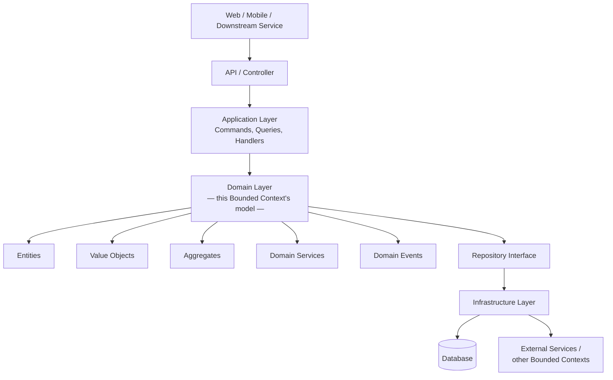
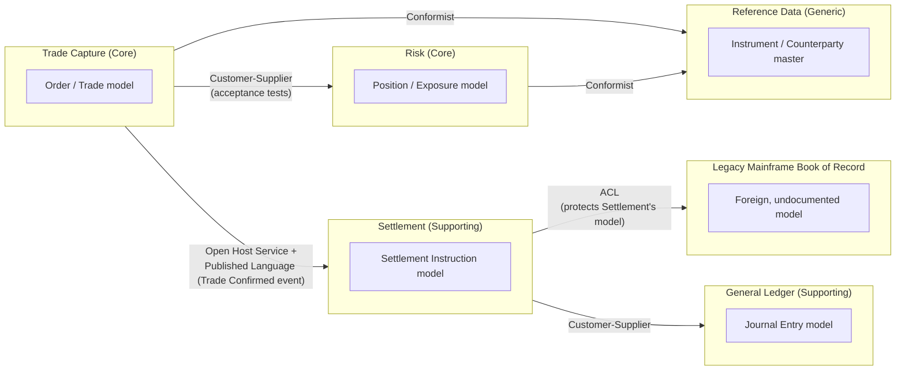
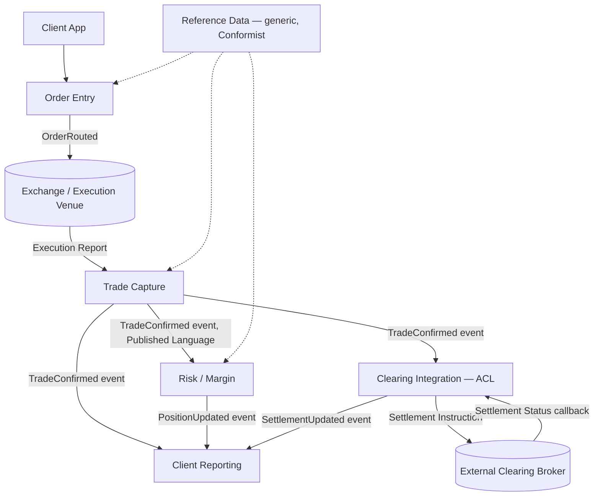
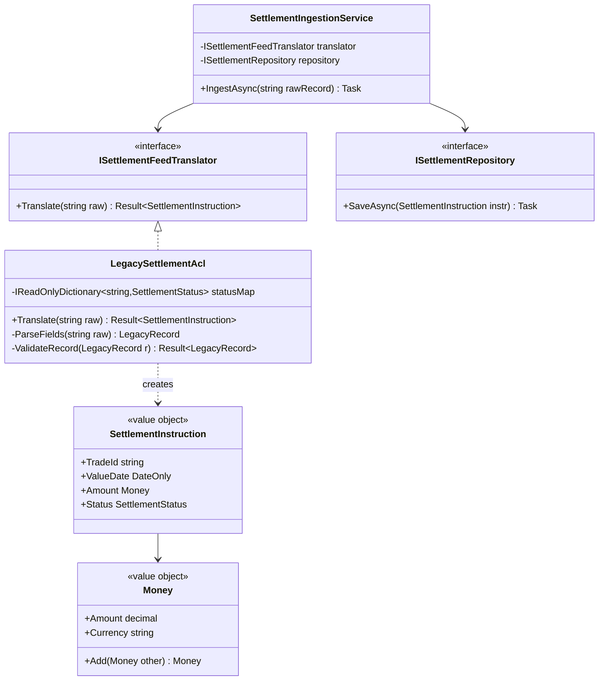
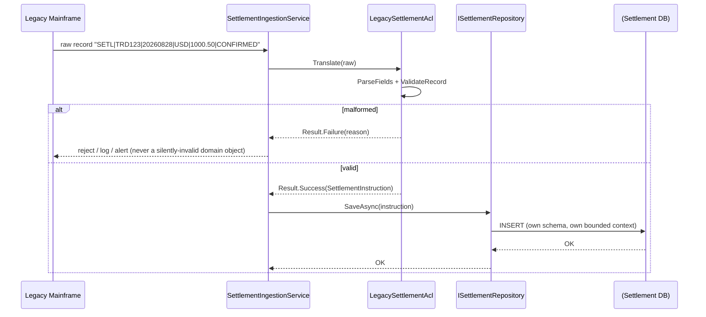

# Module 109 — Domain-Driven Design: Strategic DDD — Ubiquitous Language, Bounded Contexts & Context Mapping

> Domain: Domain-Driven Design | Level: Beginner → Expert | Prerequisite: [[../30-Architecture-Patterns/01-ArchitecturalStyles-Monolith-ModularMonolith-SOA-Microservices-Serverless]] (this module supplies the generative technique for *where* to draw the service/module boundaries that module's framework only diagnosed and decided whether to reconsider), [[../30-Architecture-Patterns/03-MigrationPatterns-BranchByAbstraction-ParallelRun-AntiCorruptionLayer-DataMigration]] §Basic Q4 (the Anti-Corruption Layer this module's context-mapping patterns reuse and formalize), [[../17-Microservices/01-Decomposition-Communication-Strangler-Fig]] (service decomposition this module gives a rigorous, domain-modeling-based foundation for)
>
> **Note on format:** Per the standing user preference (see `CLAUDE.md`), this module covers only the 40 most-frequently-asked interview questions (10 per level), without the full 15-section deep-dive template.
>
> **Domain scope note:** `31-Domain-Driven-Design` is scoped standard depth, 4 modules (109–112): Strategic DDD (this module), Tactical DDD (entities/value objects/aggregates), Domain Events/Services/Repositories, and a capstone applying DDD to real microservice decomposition — scope proposed and proceeded with autonomously per established preference. Deliberately defers full Event Sourcing (its own dedicated domain, 35) and Saga/Outbox (36/37) — introduces domain events only at the modeling level, not the full event-sourced-persistence pattern.

---

## 1. Fundamentals

**What.** Strategic DDD is the top-level layer of Domain-Driven Design — the set of practices (Ubiquitous Language, Bounded Contexts, Context Mapping, core/supporting/generic subdomain classification) concerned with *where* the boundaries of a domain model should sit and *how* separately-modeled parts of a large system should relate to one another. It is deliberately upstream of tactical DDD (Module 110 — Entities/Value Objects/Aggregates): tactical patterns implement a model *within* a boundary; strategic DDD is what discovers and justifies the boundary itself.

**Why it exists.** Large financial systems (a bank's core banking + payments + trading + risk + compliance estate) cannot be represented by one unified object model without that model becoming internally contradictory — "Account" means something different to a Ledger context than to a CRM context, "Trade" means something different to Trade Capture than to Settlement. Strategic DDD's founding insight (Eric Evans, *Domain-Driven Design*, 2003) is that this isn't a failure of modeling discipline to be fixed by trying harder to unify — it's the correct, deliberate outcome: split the domain into Bounded Contexts, each with its own internally-consistent model and Ubiquitous Language, and make the *relationships* between those contexts an explicit, engineered thing (a Context Map) rather than an accident of whichever team happened to build an integration first.

**When to reach for it.** Any system large enough, or business domain complex enough, that a single team and a single shared model can no longer hold the whole thing in their heads without contradiction — typically once a codebase has more than one plausible "correct" meaning for a core noun (Account, Position, Order, Payment), or once more than one team owns adjacent parts of the domain. It is explicit overkill for a small, single-team, single-model CRUD service — applying full strategic DDD ceremony there is the "DDD for a to-do app" anti-pattern this module and Module 110 both warn against.

**How, in one sentence.** Talk to domain experts continuously, build a precise Ubiquitous Language with them, use that language (and its seams — the same word meaning subtly different things to different people) to discover where Bounded Context boundaries genuinely belong, classify each context by how much competitive differentiation it provides (core/supporting/generic), and document the relationships between contexts explicitly as a Context Map using a small, named vocabulary of integration patterns (Shared Kernel, Customer-Supplier, Conformist, Anti-Corruption Layer, Open Host Service/Published Language).

## 2. Deep Dive

### 2.1 Layered architecture a Bounded Context typically implements

Once a Bounded Context is identified, it is usually implemented internally with the following layering — this is the *tactical* shape strategic DDD's output feeds into (Module 110 develops the Domain layer's internals fully):


```mermaid
flowchart TB
 Client[Web / Mobile / Downstream Service] --> API[API / Controller]
 API --> Application[Application Layer<br/>Commands, Queries, Handlers]
 Application --> Domain[Domain Layer<br/>— this Bounded Context's model —]
 Domain --> Entity[Entities]
 Domain --> VO[Value Objects]
 Domain --> Aggregate[Aggregates]
 Domain --> DomainService[Domain Services]
 Domain --> Events[Domain Events]
 Domain --> Repository[Repository Interface]
 Repository --> Infrastructure[Infrastructure Layer]
 Infrastructure --> DB[(Database)]
 Infrastructure --> External[External Services /<br/>other Bounded Contexts]
```

The critical strategic-DDD point this diagram makes: the **Domain layer at the center is scoped to exactly one Bounded Context**. A request that needs data from a different Bounded Context does not reach across the Domain layer directly — it goes out through Infrastructure, via one of the Context Map's named integration patterns (§2.3), never via a shared in-process object graph spanning two contexts' models.

### 2.2 Request flow within one context

```text
Client → Controller → Application Service → Aggregate Root
 → Entity + Value Objects → Repository → Database
```

Every step in this flow operates entirely within one Bounded Context's Ubiquitous Language. The Application Service is the orchestration point (transaction boundary, authorization, coordinating one or more Aggregates) but does not itself hold domain logic — that stays inside the Domain layer per Module 110.

### 2.3 Typical solution layout, and where strategic-DDD artifacts live

```
Solution
│
├── API                        (one per Bounded Context, or per bounded-context-aligned module)
├── Application/                Commands, Queries, DTOs, Handlers
├── Domain/                     Aggregates, Entities, ValueObjects, DomainEvents,
│                                DomainServices, Repositories, Exceptions
├── Infrastructure/             Persistence (EF Core), Repository impls,
│                                Anti-Corruption Layer adapters, External Service clients
└── Tests
```

A **Context Map** is not code — it is a living architecture artifact (a diagram plus a short doc per relationship, ideally versioned in the repo next to the solution it describes) recording, for every pair of Bounded Contexts that talk to each other: which pattern governs the relationship (§2.4), which side has the power to force the other to change, and why. Treat it exactly like an ADR set: reviewed, dated, and revisited when a relationship's shape genuinely changes — not drawn once at kickoff and left to rot.

### 2.4 The Context Map pattern vocabulary, precisely

| Pattern | Direction of power | When it's the right call |
|---|---|---|
| **Shared Kernel** | Joint, symmetric | Two teams jointly own a small, stable, explicitly-agreed subset of model + schema (e.g., a shared `CurrencyCode`/`InstrumentId` library) — coordination cost is accepted deliberately because the shared piece is genuinely small and stable. |
| **Customer-Supplier** | Downstream has negotiated influence | Upstream team plans around, and tests against, the downstream team's needs (e.g., via shared acceptance tests) — a healthy, managed dependency. |
| **Conformist** | Upstream, unilaterally | Downstream simply adopts upstream's model as-is because negotiating changes isn't feasible (a large platform team, an external vendor) — acceptable specifically when the upstream model is already reasonably well-aligned. |
| **Anti-Corruption Layer (ACL)** | Downstream insulates itself | Upstream's model would otherwise distort downstream's own concepts (a legacy mainframe ledger, an external payment processor) — a translation layer at the boundary protects downstream's model integrity. |
| **Open Host Service + Published Language** | Upstream serves many | A context with many consumers exposes one stable, versioned, documented contract (a REST/gRPC API against a published schema) instead of bespoke integration per consumer. |
| **Separate Ways** | No integration | Two contexts have no genuine need to integrate at all — duplicating a small amount of logic is cheaper than building any relationship. |
| **Big Ball of Mud** | N/A — anti-pattern | No discernible context boundaries; §6 develops this as an anti-pattern, not a legitimate pattern choice. |

### 2.5 Hidden cost: context boundaries and EF Core's `DbContext`

A common, quietly expensive mistake in .NET shops: one giant EF Core `DbContext` spanning tables that actually belong to two or more Bounded Contexts. EF Core's change tracker, navigation properties, and `Include()` chains make it *syntactically trivial* to reach from a `Trade` entity straight into a `Position` entity that conceptually belongs to a different context — silently reintroducing the "same word, unified model" problem strategic DDD exists to avoid, one lazy-loaded navigation property at a time. The fix is not merely discipline — it's structural: one `DbContext` per Bounded Context (or, at minimum, per module in a modular monolith), with cross-context data access forced through an explicit contract (a repository interface, an internal HTTP/gRPC call, or a published read model), never a navigation property.

### 2.6 Hidden cost: the "unified enterprise model" temptation

Enterprise data-modeling initiatives (an "enterprise Customer master," a single canonical `Trade` schema for the whole firm) recreate the exact failure strategic DDD's core insight warns against: forcing every context to conform to one schema either produces a model so generic it satisfies no one well, or an endless string of special-case fields accreting onto one shared table as each new consuming team's needs diverge. The strategic-DDD-correct response is not "no shared vocabulary" — it's Published Language (§2.4) at integration boundaries, with each context still free to hold its own internal, richer model.

## 3. Visual Architecture

### 3.1 Bounded context map — capital-markets front-to-back


```mermaid
flowchart LR
 subgraph TC["Trade Capture (Core)"]
 TCM[Order / Trade model]
 end
 subgraph Risk["Risk (Core)"]
 RM[Position / Exposure model]
 end
 subgraph Settle["Settlement (Supporting)"]
 SM[Settlement Instruction model]
 end
 subgraph Ledger["General Ledger (Supporting)"]
 LM[Journal Entry model]
 end
 subgraph Ref["Reference Data (Generic)"]
 RD[Instrument / Counterparty master]
 end
 subgraph Legacy["Legacy Mainframe Book of Record"]
 LG[Foreign, undocumented model]
 end

 TC -- "Customer-Supplier<br/>(acceptance tests)" --> Risk
 TC -- "Open Host Service +<br/>Published Language (Trade Confirmed event)" --> Settle
 Settle -- "ACL<br/>(protects Settlement's model)" --> Legacy
 TC -- Conformist --> Ref
 Risk -- Conformist --> Ref
 Settle -- "Customer-Supplier" --> Ledger
```

Reading this map: Trade Capture and Risk are both **core** domains (this firm's competitive edge is in fast, correct trade capture and accurate real-time risk) and negotiate as genuine Customer-Supplier peers. Reference Data is **generic** (an instrument/counterparty master any firm needs) so both consuming contexts simply Conform to it rather than negotiating. Settlement talks to the Legacy mainframe book of record through an explicit Anti-Corruption Layer, because the legacy system's model (batch-oriented, decades of undocumented special cases) would otherwise leak into and corrupt Settlement's own clean domain model.

### 3.2 Layered architecture (folded from the original diagram, §2.1) and 3.3 request flow (§2.2) are shown above — both are per-Bounded-Context views that this Context Map (§3.1) sits above.

## 4. Production Example

**Problem.** A mid-sized broker-dealer's original platform was a single ASP.NET application and one SQL Server database backing every function: order entry, trade capture, risk, settlement instructions, and general-ledger postings all read and wrote the same `Trades` and `Positions` tables directly. As the firm added new asset classes, three separate teams (Trading, Risk, Ops) were all modifying the same `Trade` entity class, and a change one team needed (Risk wanted a nullable `MarginType` field with strict validation) routinely broke another team's workflow (Ops's settlement batch job assumed `MarginType` was always populated). Release coordination between the three teams had become the single biggest source of production incidents.

**Architecture (after applying strategic DDD).** Event Storming sessions with all three teams' domain experts surfaced that "Trade" was actually being used to mean three different things: the Trading desk's in-flight, still-negotiable order; Risk's point-in-time exposure snapshot; and Ops's immutable, once-settled record. Three Bounded Contexts were identified — **Trade Capture** (core), **Risk** (core), **Settlement** (supporting) — each given its own database schema and its own `Trade`-shaped Entity/Aggregate, deliberately *not* unified. Trade Capture publishes a `TradeConfirmed` domain event (Open Host Service + Published Language, §2.4) that both Risk and Settlement subscribe to independently, translating the event into their own context's model.

**Implementation.** Trade Capture's `Trade` Aggregate owns order-lifecycle invariants (cannot confirm a trade with an unpriced leg). On confirmation it publishes `TradeConfirmed { TradeId, Instrument, Quantity, Price, TradeDate, CounterpartyId }` via an outbox-backed event. Risk's own bounded context consumes that event and constructs its own `PositionImpact` Aggregate from it — Risk's model additionally computes `MarginType` and exposure metrics that have no meaning inside Trade Capture at all, so they were never forced into Trade Capture's schema. Settlement consumes the same event through an Anti-Corruption Layer that also talks to the firm's legacy custodian-facing mainframe, translating the mainframe's SETL-record format into Settlement's own `SettlementInstruction` Aggregate.

**Trade-offs.** The firm accepted eventual consistency between Risk's view of a position and Trade Capture's view of the trade that produced it (previously, the shared-table model gave an illusion of instant consistency that was, on inspection, never actually relied upon correctly — Risk's batch job already ran on a delay). They also accepted real integration cost: three separate schemas, an event contract to version, and an ACL to maintain against the legacy mainframe — meaningfully more code than the original single shared table.

**Lessons learned.** The single-`Trade`-table design hadn't actually been simpler — it had been *deceptively* simple, hiding the coordination cost inside release-planning meetings instead of inside explicit architecture. Once each team could evolve its own bounded context's model independently behind a stable published contract, release coordination incidents attributable to cross-team `Trade` schema changes dropped to near zero within two quarters. The Reference Data context (instrument static data, counterparty master) was correctly classified as **generic** and left as a single shared, Conformist-consumed service — strategic DDD does not mean "split everything"; it means split along the seams the Ubiquitous Language actually reveals, and consciously *not* split what's genuinely shared and non-differentiating.
## 10. Interview Questions

### Basic (10)

1. **Q: What is Domain-Driven Design, at a high level, and what problem does it primarily exist to solve?**
 **A:** DDD is an approach to building software that puts a deep, explicit, continuously-refined model of the business domain at the center of the design, developed collaboratively with actual domain experts — it exists primarily to solve the problem of software that technically works but doesn't actually reflect how the business genuinely thinks about and operates in its own domain, which causes a slow, compounding drift between what the code does and what the business actually needs, discovered only through repeated, costly miscommunication and rework.
 **Why correct:** States DDD's central mechanism (a collaboratively-built, explicit domain model at the design's center) and the specific problem (code/business-understanding drift) it targets.
 **Common mistakes:** Treating DDD as primarily a set of coding patterns (entities, aggregates, repositories) rather than recognizing those tactical patterns exist specifically in service of the deeper, strategic goal — an accurate, shared understanding of the domain itself.
 **Follow-ups:** "Why is DDD's value concentrated more in its strategic patterns (this module) than its tactical patterns?" (The tactical patterns are implementation techniques applicable once a domain is well-understood; the strategic patterns are what actually produce that understanding in the first place — getting the strategic layer wrong undermines any tactical pattern applied on top of it.)

2. **Q: What is Ubiquitous Language, and why must it be used consistently by both engineers and domain experts?**
 **A:** Ubiquitous Language is a shared, rigorously-defined vocabulary — built collaboratively with domain experts and used identically in conversation, documentation, and the code itself (class names, method names) — for concepts within a specific bounded context; it must be used consistently because any translation gap between how the business describes a concept and how the code names it introduces a silent, compounding source of miscommunication and defects, since every translation is an opportunity for meaning to drift or be lost.
 **Why correct:** States the definition (shared, rigorous vocabulary spanning conversation and code) and the specific risk (translation-gap-driven miscommunication) consistent usage prevents.
 **Common mistakes:** Treating Ubiquitous Language as merely "good naming conventions" — it specifically requires the *business* vocabulary to appear directly in code, not a separate, translated technical vocabulary that a domain expert wouldn't recognize.
 **Follow-ups:** "What's a concrete symptom that Ubiquitous Language has broken down on a project?" (Domain experts and engineers using genuinely different terms for the same concept in meetings, or the code's class/method names bearing no resemblance to how the business actually describes the concept — a class named `AccountRecord` when the business exclusively talks about "Policies," for instance.)

3. **Q: What is a Bounded Context?**
 **A:** An explicit boundary (organizational, linguistic, and typically also a deployment/code boundary) within which a specific domain model and its Ubiquitous Language apply consistently and unambiguously — outside that boundary, the same term can legitimately mean something different, because a different bounded context models that part of the domain from its own, distinct perspective.
 **Why correct:** States the Bounded Context's defining property (a boundary of linguistic/model consistency) and explicitly acknowledges the same term can validly differ across contexts.
 **Common mistakes:** Assuming a single, universal domain model should apply consistently across an entire organization — DDD's core strategic insight is the opposite: a single, unified model across a large, complex domain becomes unwieldy and internally inconsistent, and splitting it into multiple, context-specific models is the correct, deliberate response, not a failure to unify.
 **Follow-ups:** "Give a concrete example of a term meaning something legitimately different across two bounded contexts." (In an e-commerce system, "Product" in a Catalog context means a rich, browsable item with descriptions/images/categories; "Product" in a Shipping context means a physical item with weight/dimensions/fragility — both are valid, non-conflicting models of "Product," each correct within its own bounded context.)

4. **Q: What is a Context Map?**
 **A:** A diagram or explicit document showing all of an organization's (or system's) bounded contexts and the relationships between them — which contexts communicate with which, and via what specific pattern (Shared Kernel, Customer-Supplier, Conformist, Anti-Corruption Layer, Open Host Service, and others, developed fully in Intermediate Q1–Q5) — making an otherwise implicit, tribal-knowledge understanding of how the system's parts relate into an explicit, shared, durable artifact.
 **Why correct:** States the Context Map's purpose (explicit documentation of bounded-context relationships and their specific integration patterns) and its value (converting implicit knowledge into a shared artifact).
 **Common mistakes:** Treating a Context Map as merely a system architecture diagram — it specifically documents the *relationship pattern and power dynamic* between contexts (e.g., which context conforms to another's model), not just which systems technically call which.
 **Follow-ups:** "Why does a Context Map matter for onboarding a new engineer, beyond documenting the current architecture?" (It explains not just *what* connects to *what*, but *why* — the specific integration pattern reveals the actual organizational/team relationship and historical reasoning behind an integration, information a pure technical architecture diagram wouldn't convey.)

5. **Q: What is the difference between a core domain, a supporting subdomain, and a generic subdomain?**
 **A:** The core domain is the part of the business that provides its actual competitive differentiation and deserves the organization's best modeling effort and most talented engineers; a supporting subdomain is necessary for the business to function but isn't itself a competitive differentiator (custom-built, but with less modeling investment); a generic subdomain is a genuinely common problem shared across many businesses (authentication, payment processing) best solved by buying or adopting an existing solution rather than custom-building it at all.
 **Why correct:** States all three categories precisely, including the specific investment implication (best effort/core, moderate/supporting, buy-don't-build/generic) each one carries.
 **Common mistakes:** Investing equal engineering rigor and custom-build effort across every subdomain regardless of its actual business differentiation — over-investing in a generic subdomain (building custom authentication from scratch) wastes effort better spent on the core domain, which is where genuine competitive value actually comes from.
 **Follow-ups:** "How would you decide whether a given subdomain is core versus supporting, for an ambiguous case?" (Ask whether it's specifically what makes this business win against competitors, or something necessary but not differentiating — a delivery-logistics company's core domain is route optimization; its user-authentication subdomain, while necessary, is generic regardless of how central it feels operationally.)

6. **Q: What is the anemic domain model anti-pattern, and why does DDD specifically warn against it?**
 **A:** An anemic domain model is one where domain objects are pure data containers (getters/setters, no real behavior) while all actual business logic lives separately in "service" classes operating on that data — DDD specifically warns against it because it strips the domain model of the behavior and invariant-enforcement that should live with the data it concerns, producing an object-oriented-looking design that is, in practice, no more expressive or safe than a plain data-transfer structure, defeating DDD's entire purpose of encoding the domain's actual rules directly in the model.
 **Why correct:** States the anti-pattern's structure (data-only domain objects, logic externalized to services) and the specific reason (defeats DDD's core purpose of encoding domain rules in the model itself) it's discouraged.
 **Common mistakes:** Assuming any use of a "Service" class is automatically anemic-domain-model territory — clarifies that legitimate domain services exist for operations that don't naturally belong to a single entity; the anti-pattern specifically concerns behavior and invariants that *do* belong to an entity being extracted from it anyway, not every service class without exception.
 **Follow-ups:** "What's a concrete symptom distinguishing an anemic domain model from a legitimate one with well-placed domain services?" (If an entity's own invariants can be violated by calling its setters directly from outside without going through domain logic that enforces them, the model is anemic — a well-designed rich model makes invalid states genuinely difficult or impossible to construct via its own public interface.)

7. **Q: What is the difference between a model-driven design approach and a purely data-driven (schema-first) design approach?**
 **A:** A data-driven approach starts from the database schema or data shape and derives application logic around it; a model-driven approach starts from an explicit conceptual model of the domain's behavior and rules (developed collaboratively with domain experts) and derives the persistence schema from that model afterward — the model-driven order matters because starting from data shape tends to produce an anemic model reflecting storage convenience rather than the domain's actual behavioral rules.
 **Why correct:** States both approaches' starting point and the resulting risk (anemic model) of starting from data shape rather than domain behavior.
 **Common mistakes:** Assuming the two approaches converge on the same result regardless of starting point — starting from schema tends to bias the resulting object model toward the schema's structure (foreign keys, normalized tables) rather than the domain's actual conceptual boundaries and invariants.
 **Follow-ups:** "Does this mean data modeling and persistence concerns are unimportant in DDD?" (No — the Aggregate and the Repository patterns specifically bridge a rich, model-driven domain model back to a practical, efficient persistence strategy; the point is sequencing, not that persistence doesn't matter.)

8. **Q: How does DDD's bounded-context concept relate to the modular-monolith and microservices discussion?**
 **A:** A bounded context is the domain-modeling-derived answer to the question the architectural styles leave open — *where, specifically*, should a module or service boundary actually be drawn — a well-identified bounded context is a strong candidate for either a module boundary within a modular monolith or an independent microservice, while the distributed-monolith diagnostic criteria (deployment-coordination frequency, cross-service database access) become the empirical check confirming a proposed bounded-context-derived boundary is genuinely, not just nominally, well-drawn.
 **Why correct:** Directly connects bounded contexts to the already-established boundary-quality diagnostic, explicitly stating bounded contexts as the generative source of candidate boundaries that diagnostic then verifies.
 **Common mistakes:** Assuming a bounded context and a microservice are simply synonyms — Advanced Q4 develops the important distinction that a single bounded context can, especially early on, be implemented as multiple physical services or a single microservice can span parts of two contexts temporarily, with the mapping evolving deliberately over time rather than being fixed 1:1 from the start.
 **Follow-ups:** "Why might a team choose to implement one bounded context as a module within a modular monolith rather than immediately as its own microservice?" (Directly the modular-monolith-first default — the bounded context provides a clean, well-modeled internal boundary immediately, while extraction to an independent, physically-deployed service can be deferred to the last responsible moment, per the timing principle, until genuine operational pain justifies the extraction cost.)

9. **Q: Why must domain experts be directly, continuously involved in DDD, rather than engineers gathering requirements from them once and then modeling independently?**
 **A:** A domain's real rules, edge cases, and terminology are rarely fully captured in a single upfront requirements-gathering session — they emerge gradually through repeated, concrete discussion of specific scenarios, and a domain expert's continuous involvement lets the model be corrected and refined as genuine misunderstandings surface, rather than the engineering team unknowingly building on an initially incomplete or subtly wrong understanding for months before anyone notices the gap.
 **Why correct:** States the specific reason (domain understanding emerges iteratively, not completely in one session) continuous, not one-time, domain-expert involvement is required.
 **Common mistakes:** Treating a single, thorough requirements-gathering phase as sufficient domain-expert engagement, then modeling in isolation afterward — directly recreating the big-design-up-front risk already established, now specifically applied to domain-understanding gathering rather than architectural design generally.
 **Follow-ups:** "What's a lightweight, practical mechanism for sustaining this ongoing collaboration, beyond ad hoc meetings?" (Event Storming — Intermediate Q7 — a structured, collaborative workshop technique specifically designed to surface and refine domain understanding together with domain experts, repeatable as the model evolves.)

10. **Q: What is the relationship between Ubiquitous Language and a Bounded Context — can a single Ubiquitous Language span multiple bounded contexts?**
 **A:** No — by definition, Ubiquitous Language is scoped *to* a specific bounded context; a term's precise meaning is only guaranteed consistent within one context's boundary, and the same term may legitimately carry a different, equally valid meaning in a different bounded context (Basic Q3's "Product" example) — attempting to force a single, universal Ubiquitous Language across an entire large, multi-context organization is precisely the "unified model across too large a domain becomes unwieldy" problem bounded contexts exist to solve.
 **Why correct:** States the precise scoping relationship (language is bounded-context-scoped, not organization-wide) and connects it back to the specific problem (unwieldy universal model) bounded contexts solve.
 **Common mistakes:** Attempting to standardize a single, company-wide glossary of terms intended to apply identically everywhere, missing that this specifically recreates the over-unification problem bounded contexts are designed to avoid — different contexts legitimately need different meanings for the same word.
 **Follow-ups:** "Doesn't having the same word mean different things across contexts create dangerous ambiguity?" (Only if the context boundary itself is unclear or undocumented — an explicit Context Map (Basic Q4) and clear ownership of each bounded context's own model prevents this ambiguity from being dangerous, converting "the same word means different things" from a source of confusion into an accepted, well-understood, and explicitly documented fact about the system.)

### Intermediate (10)

1. **Q: Explain the Shared Kernel context-mapping pattern, including its specific risk.**
 **A:** A Shared Kernel is a deliberately small, explicitly-agreed subset of the domain model (code, and often its underlying schema) that two bounded contexts' teams both depend on directly and must jointly own and evolve — its specific risk is that any change to the shared portion requires coordination between both teams, meaning an overly large or carelessly-scoped Shared Kernel recreates exactly the tight-coupling, deployment-coordination cost the distributed-monolith diagnostic warns against, now deliberately accepted rather than accidentally incurred.
 **Why correct:** States the pattern's mechanism (small, jointly-owned shared subset) and its specific, named risk (coordination cost scaling with the shared portion's size), tying the risk explicitly to an already-established course finding.
 **Common mistakes:** Treating a Shared Kernel as simply "some shared code," without recognizing its defining, deliberate feature is the *explicit, mutual agreement and joint ownership* — sharing code without that explicit agreement is closer to accidental, undocumented coupling than a genuine Shared Kernel pattern.
 **Follow-ups:** "When is a Shared Kernel the right choice versus an Anti-Corruption Layer (Intermediate Q4)?" (When two closely-collaborating teams genuinely benefit from directly sharing a small, stable, jointly-maintained model — an ACL is instead appropriate when one team needs to protect its own model from a context it doesn't want tight, joint-ownership coupling with at all.)

2. **Q: Explain the Customer-Supplier context-mapping pattern.**
 **A:** A Customer-Supplier relationship exists when one bounded context (the supplier) provides a service or data that another bounded context (the customer) depends on, with the customer's needs given genuine, negotiated priority in the supplier's planning — formalized, for instance, via the supplier team including the customer team's requirements in its own planning and testing (e.g., the customer providing acceptance tests the supplier's changes must continue to pass) — distinguishing it from a purely one-directional dependency where the supplier changes unilaterally with no consideration of downstream impact.
 **Why correct:** States the pattern's defining feature (customer's needs given genuine, negotiated priority in supplier planning, formalized via a concrete mechanism like shared acceptance tests) distinguishing it from an unmanaged, unilateral dependency.
 **Common mistakes:** Assuming any upstream/downstream dependency between two contexts is automatically a healthy Customer-Supplier relationship — without the negotiated priority and formal mechanism (acceptance tests, planning input), it's closer to Conformist (Intermediate Q3) territory, where the downstream team has no real influence and must simply adapt to whatever the upstream context does.
 **Follow-ups:** "What organizational structure tends to naturally produce a genuine Customer-Supplier relationship, versus one that tends to produce Conformist by default?" (Genuine Customer-Supplier tends to require the two teams having comparable organizational standing/influence and an established communication channel; Conformist tends to emerge when the upstream context is a much larger, less responsive team or an external vendor with no real incentive to prioritize a specific downstream customer's needs.)

3. **Q: Explain the Conformist context-mapping pattern, and when it's a reasonable (not merely resigned) choice.**
 **A:** Conformist means a downstream bounded context simply adopts the upstream context's model as-is, with no translation layer, because negotiating changes to the upstream model (Customer-Supplier) isn't feasible — reasonable specifically when the upstream model is already reasonably well-suited to the downstream context's needs and the cost of building/maintaining a translation layer (an ACL) genuinely exceeds the cost of directly adopting the upstream model, even with its minor misalignments.
 **Why correct:** States the pattern's mechanism (direct, untranslated adoption) and the specific condition (translation cost genuinely exceeds direct-adoption cost, with an already-reasonable upstream model) under which it's a legitimate, not merely resigned, choice.
 **Common mistakes:** Treating Conformist as always a sign of an unhealthy, powerless relationship — the "no silver bullet"-style reasoning applies here too: for a genuinely well-aligned upstream model, building an ACL purely on principle would be needless, premature-abstraction-style overhead (the BDUF-adjacent risk, in a new guise) rather than a genuine improvement.
 **Follow-ups:** "What's the risk of remaining Conformist to an upstream model that's actually poorly aligned with the downstream context's own domain concepts?" (The downstream context's own model becomes distorted by the upstream context's foreign concepts over time — exactly the "corruption" an Anti-Corruption Layer (Intermediate Q4) exists specifically to prevent, making ACL the correct alternative once genuine misalignment, not just translation-effort avoidance, is the real situation.)

4. **Q: Recap the Anti-Corruption Layer pattern, and explain specifically how it functions as a context-mapping pattern in strategic DDD terms.**
 **A:** An ACL (already established as a migration-boundary translation layer) is, in strategic DDD terms, the context-mapping pattern used when a downstream bounded context needs to interact with an upstream context (often a legacy system or an externally-controlled one) whose model would otherwise distort the downstream context's own, deliberately-designed domain concepts — the ACL translates at the boundary specifically to preserve the downstream context's model integrity, making it the direct counterpart to Conformist for situations where direct adoption's misalignment cost is too high to accept.
 **Why correct:** Correctly reframes the already-established ACL definition specifically within strategic DDD's context-mapping vocabulary, without re-deriving it from scratch.
 **Common mistakes:** Re-explaining the ACL as though it were a new concept unrelated to the migration-pattern discussion, missing that this module simply names its role within the broader context-mapping pattern taxonomy the migration-pattern module already introduced it as an instance of.
 **Follow-ups:** "Why might an ACL specifically be a permanent, not merely transitional, fixture in a mature context map, unlike its typical role during a migration?" (When the upstream context is a genuinely permanent fixture — an external vendor's API, a legacy system with no planned retirement — the ACL protecting the downstream model from it has no natural end date the way a migration-specific ACL, expected to be removed once the legacy system is retired, does.)

5. **Q: Explain the Open Host Service and Published Language patterns, and how they typically work together.**
 **A:** An Open Host Service is a bounded context that exposes a well-defined, protocol-like integration interface (often a REST/gRPC API) designed for use by multiple downstream consumers, rather than negotiating a bespoke integration with each one individually; a Published Language is a well-documented, typically standardized data format (a shared schema, e.g., a versioned JSON schema or Protobuf definition) the Open Host Service's interface is expressed in — together, they let an upstream context serve many downstream consumers through one stable, well-documented contract instead of a Customer-Supplier-style bespoke negotiation with each one.
 **Why correct:** States both patterns' definitions and their complementary relationship (a stable interface expressed in a documented, shared format) precisely.
 **Common mistakes:** Confusing Open Host Service with a Customer-Supplier relationship — Open Host Service specifically scales to *many* downstream consumers via one shared, standardized contract, whereas Customer-Supplier describes a negotiated relationship between two specific, particular teams.
 **Follow-ups:** "Why is this pattern combination especially well-suited to a genuinely core, widely-depended-upon domain capability (e.g., an Identity context used by every other service)?" (A capability many other contexts need should expose one stable, well-governed, versioned public contract rather than requiring every consuming team to individually negotiate and understand that context's internal model — directly the same principle the future API Gateway domain will formalize at the infrastructure layer.)

6. **Q: What is the "Big Ball of Mud" anti-pattern in strategic DDD terms, and how does it relate to the anemic domain model anti-pattern (Basic Q6)?**
 **A:** A Big Ball of Mud is a system with no discernible bounded-context boundaries at all — models, terminology, and responsibilities bleed together without any clear separation, making the system progressively harder to reason about or safely change as it grows; it's related to, but distinct from, the anemic domain model — a system can have well-drawn bounded contexts with anemic models inside them (a modeling-quality problem within otherwise well-scoped boundaries), or conversely have rich, well-designed models that are nonetheless smeared across an undifferentiated Big Ball of Mud with no boundary discipline at all (a boundary problem independent of model richness).
 **Why correct:** States the Big Ball of Mud's defining absence (no bounded-context discipline) and correctly distinguishes it as an independent axis of failure from the anemic-domain-model problem, rather than treating them as the same issue.
 **Common mistakes:** Conflating "Big Ball of Mud" with "monolith" — already established a well-modularized monolith (with clean internal boundaries, potentially even bounded-context-aligned ones) is a legitimate, often-preferred architecture; a Big Ball of Mud specifically lacks any such internal boundary discipline, monolith or not.
 **Follow-ups:** "Why might Event Storming (Intermediate Q7) be a particularly effective tool for pulling a Big Ball of Mud apart into genuine bounded contexts?" (It surfaces the domain's actual events and language groupings collaboratively and visually, often revealing natural seams and boundaries that were previously obscured by the system's tangled, undifferentiated implementation.)

7. **Q: What is Event Storming, and what specific role does it play in discovering bounded contexts?**
 **A:** Event Storming is a collaborative workshop technique where domain experts and engineers jointly map out a business process as a sequence of domain events (things that happened, stated in past tense — "Order Placed," "Payment Confirmed") on a shared surface, then progressively add the commands that trigger them, the entities involved, and points of ambiguity or disagreement — bounded contexts are discovered as clusters of tightly-related events and language that naturally group together, with visible seams (where terminology shifts or ownership becomes unclear) suggesting where a context boundary likely belongs.
 **Why correct:** States Event Storming's concrete mechanism (collaborative event-sequence mapping) and specifically how it surfaces bounded-context boundaries (natural event/language clustering and visible seams).
 **Common mistakes:** Treating Event Storming as merely a diagramming exercise engineers can run alone — its value specifically depends on the direct, real-time collaboration with domain experts (Basic Q9's continuous-involvement principle) surfacing genuine domain understanding, not an engineer's after-the-fact guess at what the events must be.
 **Follow-ups:** "Why are events specifically (versus, say, starting with entities or data) an effective starting point for this kind of workshop?" (Domain experts naturally think and communicate in terms of what happens/happened in the business process, making events an intuitive, jargon-free entry point non-technical participants can immediately engage with, compared to starting from a more technical, entity/schema-first framing.)

8. **Q: How would you decide the right level of engineering investment for a supporting subdomain (Basic Q5) — worth custom-building, but not to the same standard as the core domain?**
 **A:** Apply proportionate rigor — use straightforward, well-understood patterns and existing libraries wherever reasonable rather than the deep, custom, collaboratively-refined domain modeling reserved for the core domain, accept a "good enough," lower-ceremony implementation, and explicitly avoid over-investing senior engineering time or extensive DDD tactical-pattern application on a part of the system that, by definition, doesn't provide the business's actual competitive differentiation.
 **Why correct:** States a concrete calibration principle (proportionate, not maximal, rigor; reuse over custom deep modeling) matched to the supporting subdomain's specific, lower-differentiation status.
 **Common mistakes:** Applying the same DDD tactical rigor (rich aggregates, extensive domain events, deep collaborative modeling) uniformly across every subdomain regardless of its actual business importance, wasting scarce senior-engineering effort on a subdomain that doesn't need or benefit from that level of investment.
 **Follow-ups:** "What's the risk of investing too little in a supporting subdomain, given the guidance to invest less than in the core domain?" (A supporting subdomain that's genuinely broken or unreliable still undermines the core domain that depends on it — "invest less" means proportionate, not negligent; the subdomain must still function correctly, just without the deepest, most expensive modeling and design investment reserved for the core.)

9. **Q: How would you detect that a Ubiquitous Language has drifted or diverged across a bounded context's engineers and domain experts over time?**
 **A:** Watch for concrete, observable symptoms — code and documentation using a term the current domain experts no longer recognize or have started defining differently in conversation, domain experts and engineers needing extra clarifying exchanges during a discussion that should be unambiguous if the shared language were genuinely intact, or a new feature revealing that a core term's originally-agreed meaning silently no longer matches how the business actually uses it now — since Ubiquitous Language drift, like this course's other recurring "declared shared understanding ≠ actual, currently-verified shared understanding" gaps, produces no automatic alert and is only visible via active, deliberate checking against current domain-expert usage.
 **Why correct:** States concrete, observable drift symptoms and explicitly connects the underlying risk to this course's already-established "declared ≠ actual, requires active verification" theme.
 **Common mistakes:** Assuming a Ubiquitous Language, once established and documented at a project's outset, remains automatically valid indefinitely — a business domain's own concepts and terminology can genuinely evolve over time, and a glossary or model that isn't periodically re-validated against current domain-expert usage can silently go stale exactly like an undrilled runbook or a stale onboarding template.
 **Follow-ups:** "What's a lightweight, periodic practice that would catch this drift before it causes a costly miscommunication?" (Periodically re-running a scoped Event Storming session or glossary review specifically with current domain experts for actively-evolving parts of the business, rather than assuming the original modeling session's language remains permanently, unquestionably valid.)

10. **Q: How does a Context Map (Basic Q4) relate to the Architecture Decision Records, and should it be captured as one, several, or neither?**
 **A:** A Context Map is a living, holistic view of the current relationships between bounded contexts, best maintained as its own durable, regularly-updated artifact (a diagram plus accompanying notes) rather than a single ADR — but the *specific, individual decisions* establishing or changing a particular context relationship (choosing Conformist over building an ACL for a specific integration, for instance) are exactly the kind of significant, cross-team-consequential decisions established warrant their own ADR, with the overall Context Map serving as the current, synthesized summary the individual ADRs' reasoning feeds into.
 **Why correct:** Correctly distinguishes the Context Map's role (a living, holistic current-state view) from individual context-relationship decisions' role (each warranting its own ADR per the established criteria), rather than treating them as interchangeable or redundant.
 **Common mistakes:** Treating the Context Map as a one-time diagram drawn once and never revisited, rather than a living artifact that should be updated as the individual, ADR-documented decisions about specific context relationships evolve — recreating the stale-snapshot risk in strategic-DDD form if left unmaintained.
 **Follow-ups:** "Why might the Context Map specifically benefit from the fitness-function-style continuous verification, not just documentation?" (An automated check confirming the actual, current code-level dependencies between contexts match the Context Map's declared relationships — e.g., flagging an undocumented, ad hoc dependency that bypasses the documented pattern entirely — directly extends the coupling-fitness-function concept to context-relationship-specific drift detection.)

### Advanced (10)

1. **Q: Design the strategic DDD structure (bounded contexts and a context map) for a mid-sized e-commerce platform, identifying core, supporting, and generic subdomains.**
 **A:** Candidate bounded contexts: Catalog (browsable product information — likely core, since a compelling, well-curated catalog experience differentiates the business), Ordering (cart, checkout, order lifecycle — core, since order-flow quality directly drives conversion and is where the business's specific rules live), Inventory (stock levels, reservation — supporting, necessary but not itself differentiating), Shipping (carrier integration, label generation — supporting, likely integrating with external carrier APIs via an Open Host Service pattern on their side), Payments (transaction processing — generic, best integrated via a third-party payment processor rather than custom-built), and Identity/Authentication (generic, likely an off-the-shelf or platform identity provider). The Context Map would show Ordering as a Customer-Supplier consumer of Inventory (negotiated priority, since checkout availability directly depends on accurate stock data), Shipping and Payments each behind an Anti-Corruption Layer (protecting the core Ordering model from each external system's own, foreign concepts), and Catalog largely independent, feeding Ordering via a well-defined internal API.
 **Why correct:** Applies Basic Q5's core/supporting/generic classification concretely across a realistic system, and Intermediate Q1–Q4's context-mapping patterns to the specific relationships between the identified contexts, with reasoning for each classification and pattern choice.
 **Common mistakes:** Classifying every subdomain as "core" out of an instinct that everything in the system matters, rather than applying Basic Q5's genuine differentiation criterion — Payments and Identity being generic despite being critically important to the business functioning is precisely the point: important and differentiating are not the same thing.
 **Follow-ups:** "Why would Payments specifically warrant an ACL rather than simply Conformist, given it's a well-established, standardized external integration?" (Even a well-designed external payment processor's API models payment-specific concepts — authorization holds, chargebacks, processor-specific status codes — that would otherwise leak into and distort the Ordering context's own domain model if adopted directly; the ACL translates the payment processor's concepts into Ordering's own vocabulary, e.g., translating processor-specific states into the business's own "Payment Confirmed"/"Payment Failed" domain events.)

2. **Q: How would you handle a bounded context boundary that seemed correct at initial modeling but is now clearly misaligned with how the business has evolved — should bounded contexts be treated as permanent?**
 **A:** No — bounded contexts, like every other architectural decision this course has examined, are subject to the evolutionary-architecture principle: a boundary correct for the business's understanding and scale at one point can legitimately need to be reconsidered as genuine, material context changes occur (a supporting subdomain becoming core as the business pivots, two previously-distinct contexts' concepts converging); the correct response is treating this as a deliberate, analyzed re-modeling exercise — ideally re-running Event Storming with current domain experts (Intermediate Q7) — followed by a safe, incremental migration to the corrected boundary using the patterns (Branch by Abstraction, an ACL during the transition), not an assumption that the original boundary, once drawn, must remain fixed indefinitely.
 **Why correct:** Directly connects bounded-context evolution to the already-established evolutionary-architecture principle and the safe-migration patterns, rather than treating bounded contexts as a special, permanently-fixed exception to that general discipline.
 **Common mistakes:** Treating an initially-drawn bounded context boundary as a permanent, foundational decision immune to reconsideration, even once genuine evidence (Advanced Q9's diagnostic) shows it no longer matches the business's current, actual shape.
 **Follow-ups:** "What's a concrete signal a bounded context boundary needs re-examination, beyond a vague sense of 'this feels wrong now'?" (Recurring, awkward cross-context coordination for a specific class of change, terminology genuinely converging or diverging from what the original Ubiquitous Language assumed, or a new business capability that doesn't cleanly fit any existing context's model — concrete, observable friction rather than mere unease.)

3. **Q: How would you facilitate an Event Storming workshop for a genuinely complex, ambiguous domain where even the domain experts disagree about how a process actually works?**
 **A:** Explicitly surface and record the disagreement itself as a first-class workshop output — using a distinct visual marker (e.g., a designated "hot spot"/conflict marker) rather than forcing artificial, premature consensus during the session — then follow up with the specific domain experts involved (or their management) to resolve the disagreement through a dedicated, focused conversation afterward, since forcing a false, unexamined consensus in the room risks baking an incorrect, prematurely-resolved understanding directly into the resulting model, exactly the risk the decision-matrix-laundering critique warns against in a domain-modeling-specific form.
 **Why correct:** States a concrete facilitation technique (explicit conflict-marking, deferred resolution) preventing forced, false consensus from corrupting the resulting model, and connects the underlying risk to an already-established course principle.
 **Common mistakes:** Pressuring the room toward an artificial, premature agreement during the live workshop to "make progress," rather than explicitly capturing the genuine disagreement as valuable signal requiring its own, separate resolution before the model is finalized.
 **Follow-ups:** "Why is domain-expert disagreement itself often a valuable signal, rather than merely an obstacle to work around?" (It frequently reveals that what looked like one bounded context is actually two, each domain expert unconsciously describing a different context's perspective on the same superficially-shared term — directly Basic Q3's "same term, different valid meanings across contexts" finding, discovered live during the workshop itself.)

4. **Q: Critique the assumption that a bounded context must always map 1:1 to exactly one deployed microservice.**
 **A:** This assumption is false and a common source of premature, poorly-motivated service extraction — a single bounded context can legitimately be implemented as a single microservice, as multiple closely-related microservices (if genuinely independent scaling/deployment needs exist within it), or, especially early on, as a module within a modular monolith with no separate deployment at all (directly the modular-monolith-first default); conversely, a single microservice should never span *multiple* bounded contexts' distinct models, since doing so reintroduces the "unified model across too large a domain" problem bounded contexts exist to solve, now smuggled into a single deployable unit instead of a single codebase.
 **Why correct:** States the correct, asymmetric relationship precisely — a bounded context can flexibly map to zero, one, or multiple deployment units, but a single deployment unit should not span multiple bounded contexts' models — and connects the "why" to Basic Q10's over-unification risk.
 **Common mistakes:** Treating "identify bounded contexts" and "decide microservice boundaries" as the same exercise performed once, rather than recognizing bounded-context identification as the domain-modeling input that the separate, evolving-over-time deployment-boundary decision then draws on, potentially changing the deployment mapping while the underlying bounded context itself remains stable.
 **Follow-ups:** "Why is a microservice spanning multiple bounded contexts specifically worse than one bounded context spanning multiple microservices?" (The latter is merely a deployment-granularity choice within an already-coherent model; the former means the service's own internal code conflates two genuinely distinct domain models and vocabularies, recreating Basic Q3's context-boundary confusion directly inside a single unit of code and deployment.)

5. **Q: How does Conway's Law interact with bounded-context identification — should team structure follow bounded contexts, or should bounded contexts follow existing team structure?**
 **A:** Ideally, bounded contexts should be identified from genuine domain analysis first (Event Storming, collaborative modeling with domain experts) and team structure should then be deliberately organized to align with those contexts (the "Inverse Conway Maneuver") — but where team structure is already fixed and difficult to change in the short term, a pragmatic, temporary accommodation may draw context boundaries partly influenced by existing team lines, while explicitly flagging this as a compromise to revisit (Advanced Q2) once team structure can be realigned, rather than treating an accidental, historically-formed team boundary as if it were a genuine domain insight.
 **Why correct:** States the ideal ordering (domain analysis first, team structure follows) while acknowledging the pragmatic, explicitly-flagged compromise sometimes needed given real organizational constraints, without conflating the compromise with genuine domain-driven boundary discovery.
 **Common mistakes:** Assuming existing team boundaries are automatically the "correct" bounded-context boundaries simply because Conway's Law predicts architecture will mirror them regardless — Conway's Law describes what tends to happen, not what's normatively correct; a genuinely domain-driven boundary may require deliberately reorganizing teams to match it, not the reverse.
 **Follow-ups:** "What's the risk of never revisiting a team-structure-driven, rather than domain-driven, bounded-context boundary?" (It risks permanently encoding an accidental, historical organizational artifact as if it were a genuine, considered domain insight — exactly the "distributed monolith" risk in a new guise, where the boundary reflects org-chart history rather than actual domain cohesion.)

6. **Q: How would you use the fitness functions to keep a bounded context's model from silently eroding over time?**
 **A:** Implement automated checks specific to bounded-context integrity — a static-analysis fitness function flagging any direct, untranslated use of another bounded context's internal types/model within a supposedly-separate context's own code (catching accidental Conformist-style leakage where an ACL or explicit boundary was intended), and a Ubiquitous-Language-consistency check (even if only a curated glossary cross-referenced against actual code identifiers) flagging class/method names that no longer match the currently-documented domain vocabulary — directly reusing the fitness-function discipline, now applied specifically to strategic-DDD boundary and language integrity rather than only the coupling metrics originally illustrated.
 **Why correct:** Concretely extends the fitness-function mechanism to two new, strategic-DDD-specific checks (context-boundary leakage, language-consistency drift) rather than only restating the original coupling-focused examples.
 **Common mistakes:** Assuming the fitness functions only apply to the generic architectural coupling concerns that module originally illustrated, missing that the identical mechanism generalizes naturally to bounded-context-specific integrity checks this module's concepts specifically call for.
 **Follow-ups:** "Why might the Ubiquitous-Language-consistency check specifically require periodic domain-expert review to stay accurate, unlike a purely structural coupling check?" (Language drift (Intermediate Q9) is a semantic, not purely structural, concern — an automated check can catch a class name diverging from a *documented* glossary, but confirming the documented glossary itself still reflects the domain experts' *current* actual usage requires human, not purely automated, verification.)

7. **Q: Design a migration approach for converting a legacy system's Big Ball of Mud (Intermediate Q6) into properly-bounded contexts, synthesizing this module with the migration patterns.**
 **A:** (1) Run Event Storming sessions with current domain experts across the legacy system's major business processes to surface natural event/language clusters and candidate context boundaries (Intermediate Q7); (2) introduce an Anti-Corruption Layer at the boundary between the still-undifferentiated legacy system and each newly-identified, to-be-built bounded context, protecting the new context's clean model from the legacy system's tangled concepts (Intermediate Q4); (3) apply the Strangler Fig routing and the Branch by Abstraction to incrementally extract each identified context's functionality behind its ACL, one context at a time rather than attempting a full, simultaneous re-modeling; (4) establish this module's fitness functions (Advanced Q6) for each newly-extracted context to prevent it from silently eroding back toward Big-Ball-of-Mud-style boundary leakage over time; (5) update the organization's Context Map (Intermediate Q10) as each context is successfully extracted and stabilized.
 **Why correct:** Synthesizes Event Storming-based discovery, ACL-based protection, Strangler-Fig/Branch-by-Abstraction incremental extraction, and fitness-function-based ongoing integrity verification into one coherent, correctly-sequenced migration plan.
 **Common mistakes:** Attempting to re-model the entire legacy system's bounded contexts all at once in a single, large, upfront design exercise before any extraction begins, recreating the BDUF risk at domain-modeling scale rather than proceeding context-by-context, incrementally, and empirically.
 **Follow-ups:** "Why should context extraction proceed one context at a time rather than identifying all boundaries first and then extracting all of them together?" (Directly the last-responsible-moment principle — later contexts' boundaries can be refined based on genuine lessons learned extracting the earlier ones, and each extraction's own migration risk is kept independently manageable rather than compounding several large, simultaneous extractions' risks together.)

8. **Q: How would you avoid over-modeling a generic subdomain (Basic Q5) while a team, excited about DDD, wants to apply full strategic and tactical rigor to it anyway?**
 **A:** Redirect the discussion to Basic Q5's explicit differentiation criterion — ask specifically whether this subdomain is what makes the business win against competitors, and if not, make the business case explicit that senior engineering time spent deeply modeling a generic subdomain (e.g., building a bespoke, richly-modeled authentication bounded context) is time *not* spent on the core domain, where DDD's investment genuinely pays off competitively — directly the opportunity-cost principle (Intermediate Q5), applied specifically to over-eager DDD tactical investment in the wrong subdomain.
 **Why correct:** Grounds the redirection in an already-established, concrete criterion (core/supporting/generic classification) and an already-established course principle (opportunity cost), rather than a vague, unsupported "don't over-engineer" admonition.
 **Common mistakes:** Allowing enthusiasm for DDD's tactical patterns to drive where they get applied, rather than deliberately, explicitly reserving that investment specifically for the core domain per Basic Q5's differentiation criterion.
 **Follow-ups:** "Is there ever a legitimate reason to apply rich tactical modeling to a generic subdomain despite this general guidance?" (If an off-the-shelf solution genuinely doesn't exist or doesn't fit a specific, unusual regulatory/business constraint, forcing a generic subdomain to be custom-built and richly modeled can become legitimate — but this should be an explicit, justified exception (documented, per the reviewed-exception pattern) rather than the default enthusiasm-driven behavior.)

9. **Q: How would you diagnose whether a supposedly shared Ubiquitous Language is genuinely shared, versus merely declared shared on paper, extending Intermediate Q9's drift-detection question to initial adoption specifically?**
 **A:** Directly test it rather than assume it from a glossary's mere existence — have domain experts and engineers independently describe a specific, concrete scenario in their own words and compare whether the same terms and boundaries naturally emerge, or run a live Event Storming session (Intermediate Q7) and observe whether genuine, unprompted agreement on terminology occurs in real time; a glossary document existing and having been circulated is not evidence the language is actually, currently shared — exactly this course's now-standard "declared ≠ actual, requires active verification" theme, applied to Ubiquitous Language specifically at the point of claimed initial adoption, not only as a later drift concern.
 **Why correct:** States a concrete verification technique (independent scenario description, live workshop observation) rather than accepting a glossary's mere existence as sufficient evidence of genuine shared understanding, and explicitly connects this to the course's central theme.
 **Common mistakes:** Treating a written, circulated glossary as sufficient proof the Ubiquitous Language is genuinely shared, without any active check confirming domain experts and engineers actually, currently use and understand the terms identically in practice.
 **Follow-ups:** "Why might a glossary exist and be technically accurate, yet the language still not be genuinely 'ubiquitous' in practice?" (If engineers only consult the glossary occasionally rather than the terms being naturally, unconsciously used in everyday conversation and code, the language is documented but not actually internalized/lived — the specific gap between a declared reference document and genuinely shared, actively-used vocabulary.)

10. **Q: Synthesize this module's place in the `31-Domain-Driven-Design` domain arc and its relationship to the prior `30-Architecture-Patterns` domain, closing.**
 **A:** closed the Architecture Patterns domain by naming that its framework treats service/module boundary placement as an external input — diagnosing whether a boundary is well-drawn and deciding when to reconsider it, without itself supplying a generative technique for *deriving* a good boundary from first principles. This module supplies exactly that missing technique: Ubiquitous Language and Bounded Contexts give a rigorous, domain-modeling-based method for discovering where a boundary genuinely belongs, and Context Mapping gives the vocabulary for the relationship pattern once contexts are identified — directly feeding the distributed-monolith diagnostic and the fitness-function verification as concrete inputs to check against, and the migration patterns as the safe path to actually reach a bounded-context-aligned architecture. continues this arc into Tactical DDD — the entity/value-object/aggregate patterns that implement a well-identified bounded context's model concretely, once this module's strategic groundwork is in place.
 **Why correct:** Explicitly names the specific gap in the prior domain (the own admission) this module fills, and previews the forward connection to — full multi-directional synthesis matching this course's established capstone/module-closing convention.
 **Common mistakes:** Describing this module's content in isolation without explicitly connecting it to the own stated limitation or the forward role, missing the cross-domain synthesis this course consistently requires.
 **Follow-ups:** "Why does the tactical DDD content specifically depend on this module's strategic groundwork being done first?" (Tactical patterns like Aggregates define invariant boundaries *within* a single bounded context's model — attempting to design an Aggregate before the surrounding bounded context is itself clearly identified risks encoding invariants that actually span two conflated, not-yet-separated contexts, recreating Basic Q3's boundary-confusion risk one layer deeper into the implementation.)

### Expert (FinTech Principal Panel)

**E1. Q: In a bank, the word "balance" means different things — ledger balance, available balance, cleared vs. pending, hold amount — and "payment" or "settled" mean different things in the payments, ledger, and reconciliation teams. Why is ubiquitous language a *correctness* control in finance, not just a communication nicety, and how do you enforce it?**
**A:** Ambiguous financial vocabulary is a defect generator: if "balance" silently means *ledger* balance in one service and *available* balance in another, a check like "does the customer have enough" can authorize a payment the customer can't actually cover (holds/pending not subtracted) — a real money bug born entirely from language, not code logic. So a **precise, shared (ubiquitous) language, scoped to each bounded context**, is a correctness control: within the ledger context, "balance," "posted," "value date," "hold," "available" each have *one* exact, agreed meaning encoded in the model's own type/method names, and where a term legitimately means different things in different contexts (a "payment" in the initiation context vs. the settlement context), those are recognized as *different concepts in different bounded contexts*, not one word overloaded. Enforce it: (1) the code speaks the language — `AvailableBalance` and `LedgerBalance` are distinct types/value objects, not both `decimal balance`, so the compiler catches a category error; (2) a glossary owned with the domain experts, kept current; (3) context mapping makes explicit where a term's meaning changes across a boundary, with an anti-corruption layer translating rather than conflating. The Principal framing: in finance, imprecise language causes money defects (available-vs-ledger, cleared-vs-pending, settlement-date semantics), so ubiquitous language — one exact meaning per term *per bounded context*, encoded in the model's own types and enforced across context boundaries — is a first-class correctness control, and "we all roughly know what balance means" is how an authorization-against-the-wrong-balance bug ships.
**Why correct:** Treats ubiquitous language as a correctness control (available-vs-ledger example), scopes meaning per bounded context, and enforces it via distinct types + glossary + context mapping/ACL.
**Common mistakes:** One overloaded `balance` field; assuming a term means the same thing across contexts; language as documentation only, not encoded in the model; conflating initiation-payment and settlement-payment as one concept.
**Follow-ups:** "Give a concrete money bug that ambiguity between available and ledger balance would cause." / "How do distinct value-object types make the compiler enforce the language?"

**E2. Q: Decompose a bank's payments/accounts domain into bounded contexts, and explain how bounded-context boundaries should relate to consistency boundaries and to your service boundaries.**
**A:** Identify contexts by *language and business capability*: e.g., **Payment Initiation/Orchestration** (a payment request's lifecycle), the **Ledger/Accounts** context (the authoritative double-entry record and balance invariants), **Fraud/Risk**, **Reconciliation/Settlement**, **Customer/KYC**, **Statements/Reporting** — each with its own model and language ("payment," "account" mean subtly different things in each). Two alignment rules matter most in finance: (1) **a strong-consistency invariant lives inside one bounded context and one aggregate** — the account-balance / double-entry invariant belongs to the Ledger context, so that invariant is enforced by a single transactional boundary, not spread across contexts (spreading it forces distributed transactions/sagas for a debit-credit, which you avoid —); (2) **bounded contexts inform, but aren't identical to, service boundaries** — a context is a *modeling* boundary; you may implement several contexts in one modular monolith and extract only those with genuine independent-scaling need, but you should *not* draw a service boundary *through* a consistency invariant. Context mapping then defines the relationships (the Fraud context is a customer/supplier of the Initiation context; the Ledger exposes a published-language API; an anti-corruption layer wraps a legacy core). The Principal framing: decompose payments by language/capability into bounded contexts, keep each strong-consistency money invariant (balance, double-entry) inside a single context+aggregate so it's enforced transactionally, and treat context boundaries as modeling boundaries that *inform* — but don't blindly become — service boundaries, because a service boundary drawn through the balance invariant is how you accidentally rebuild a distributed transaction for a debit and credit.
**Why correct:** Decomposes by language/capability, aligns each strong-consistency money invariant to one context+aggregate, and correctly separates modeling boundaries from service boundaries while using context mapping/ACL.
**Common mistakes:** Splitting the balance/double-entry invariant across contexts (distributed transaction for a debit-credit); equating bounded context 1:1 with microservice; one shared model for all payment meanings; no ACL over a legacy core.
**Follow-ups:** "Why must the double-entry invariant sit in one context and aggregate?" / "How does a context map show the Fraud-to-Initiation relationship?"

**E3. Q: As Principal, how do you use strategic DDD to make a large payments platform organizationally scalable — mapping bounded contexts to teams — without recreating the coordination and boundary-erosion failures this domain warned about?**
**A:** Strategic DDD's payoff at scale is **aligning team ownership to bounded contexts** (Conway's Law used deliberately): each context has a clear owning team, its own model and language, and a *published* contract to other contexts — so teams evolve independently instead of coordinating on a shared, conflated model. Guardrails against the failures this domain named: (1) **context boundaries are contracts, and contracts are enforced** — an anti-corruption layer and versioned published-language APIs between contexts, plus fitness functions that fail the build on a cross-context dependency that violates the boundary, because a "just this once" direct call across contexts silently erodes the boundary; (2) **keep consistency invariants inside a single team/context** so no money invariant requires two teams to coordinate a distributed transaction; (3) **information barriers** map cleanly onto context boundaries (research vs. trading contexts don't share a model) — a compliance win of good boundaries; (4) revisit boundaries periodically (this domain's re-evaluation discipline) as the business and org evolve, since a context that made sense for one team can strain as it grows. The Principal framing: strategic DDD scales an org by giving each bounded context an owning team, a clear model/language, and enforced contracts — with fitness-function-guarded boundaries, invariants kept within a single context, and information barriers aligned to context lines — so teams move independently, and the boundary erosion this domain warns about is prevented by *enforcement*, not documentation.
**Why correct:** Aligns teams to contexts with enforced (fitness-function-guarded) contracts, keeps invariants within a context, maps information barriers to boundaries, and keeps boundaries revisitable — preventing coordination/erosion failures.
**Common mistakes:** Team ownership crossing context boundaries; boundaries enforced only by convention (erosion); invariants that force two teams to coordinate; never revisiting boundaries as the org grows.
**Follow-ups:** "How does a fitness function stop cross-context boundary erosion?" / "How do information barriers map onto bounded contexts?"

**E4. Q: Two bounded contexts — Trade Capture and Settlement — both need to represent "Trade," and disagree on when a trade legally exists. How do you resolve this without forcing one team to be wrong, and what does the resulting Context Map relationship look like?**
**A:** Neither team is "wrong" — this is the textbook case for accepting that a word can legitimately mean two different things in two different bounded contexts rather than trying to force a single, universal `Trade` definition. Trade Capture's "Trade" exists the moment two parties agree on economics (still potentially amendable); Settlement's "Trade" exists only once it's confirmed, allocated, and ready to settle — an immutable, later-stage fact. Resolve it strategically, not by debate: name them as distinct concepts in each context's own Ubiquitous Language (Trade Capture's `OrderTrade`/`ConfirmedTrade` vs. Settlement's `SettlementTrade`), and connect the two contexts via an Open Host Service + Published Language relationship — Trade Capture publishes a `TradeConfirmed` domain event (the precise, unambiguous moment its own model considers the trade final enough to hand off), and Settlement's own model treats that event as the trigger to construct its own, separately-invariant `SettlementTrade` aggregate. The Context Map records this explicitly: Trade Capture is upstream, Settlement is downstream, relationship = Open Host Service/Published Language, translation happens at Settlement's boundary. This prevents the two teams from being trapped in an unproductive argument about whose definition is "correct" and instead makes the actual moment of handoff a first-class, versioned, testable artifact.
**Why correct:** Recognizes the same-term-different-contexts pattern rather than forcing false unification, and resolves it with a concrete, named context-mapping pattern (Open Host Service/Published Language) with an explicit trigger event, not just "they should talk more."
**Common mistakes:** Trying to negotiate one shared `Trade` schema both teams must conform to; treating the disagreement as a modeling bug rather than a legitimate context-boundary signal; leaving the handoff moment implicit/undocumented instead of a named domain event.
**Follow-ups:** "What would go wrong if Settlement instead directly queried Trade Capture's database for 'the trade'?" / "Why is the published event, not a shared table, the right integration point here?"

**E5. Q: A regulator requires a single, audit-ready, end-to-end view of "what happened to this trade from capture through settlement," but you've just split the domain into separate bounded contexts with separate schemas. How do you reconcile regulatory traceability with bounded-context independence?**
**A:** Regulatory traceability is a cross-cutting *reporting* concern, not a modeling concern — it should never be solved by re-merging the contexts' write models back into one shared schema, which would undo the entire benefit of the split and reintroduce the coordination cost strategic DDD exists to remove. Instead, treat each context's Published Language domain events (`TradeConfirmed`, `TradeSettled`, `TradeAllocated`, etc.) as the audit trail's actual source of truth, and build a separate, dedicated **regulatory reporting read model** (its own generic/supporting subdomain, likely event-sourced or a simple append-only projection) that subscribes to every relevant context's events and stitches them into the end-to-end view the regulator needs. This read model has no write authority over any context's own aggregates — it's a pure downstream consumer — so it doesn't compromise any context's autonomy, and because each context already publishes its state transitions as explicit, versioned events (§2.4 Open Host Service), the audit trail is a natural byproduct of the architecture rather than a reason to abandon it. Correlate across contexts using a stable identifier (e.g., a `TradeCorrelationId` minted at capture and carried through every downstream event) established as part of the Published Language contract from the start.
**Why correct:** Treats regulatory traceability as a separate, dedicated read-side concern built from each context's already-published events, correctly avoiding re-coupling the write models, and names the concrete mechanism (correlation ID + event stitching).
**Common mistakes:** Merging schemas or adding cross-context foreign keys to satisfy the audit requirement; assuming bounded contexts and end-to-end traceability are fundamentally incompatible; omitting a stable correlation identifier from the Published Language contract, making later stitching unreliable or ambiguous.
**Follow-ups:** "Where should the correlation ID be minted, and why does that choice matter?" / "What happens to this audit view if one context's event schema changes without versioning?"

**E6. Q: Your firm is evaluating build-vs-buy for a new KYC/AML screening capability. How does strategic DDD's core/supporting/generic classification actually change the engineering decision here, beyond "buy generic things"?**
**A:** KYC/AML screening against sanctions lists and PEP databases is a textbook **generic subdomain** — it's necessary, heavily regulated, and important, but it provides zero competitive differentiation versus building it well; every regulated financial firm needs essentially the same capability, and specialist vendors (list maintenance, regulatory-change tracking, false-positive tuning) exist precisely because this is a shared, non-differentiating problem across the entire industry. The classification changes the decision concretely: (1) it shifts the default from "build a rich, custom-modeled bounded context" to "integrate a vendor via a Conformist or ACL relationship" (§2.4) — Conformist if the vendor's model and workflow genuinely fit, ACL if you need to protect your own Customer/Onboarding context's model from the vendor's specific data shapes and status codes; (2) it caps the engineering investment deliberately — no deep tactical DDD modeling, no dedicated domain-expert-driven Event Storming series, because the payoff for that investment is structurally lower here than in a core domain; (3) it still requires the context boundary to be drawn correctly around the vendor integration (so a vendor swap later is a bounded, ACL-scoped change, not a firm-wide refactor) — "generic" changes *how much* modeling rigor you apply, not *whether* you still draw a clean boundary.
**Why correct:** Correctly classifies KYC/AML as generic using the differentiation test, and translates that classification into concrete engineering consequences (integration pattern choice, investment level, and boundary discipline) rather than a vague "buy it" conclusion.
**Common mistakes:** Assuming "generic" means "no architecture needed at all" and wiring the vendor directly into the Customer/Onboarding context's model with no ACL, making a future vendor swap a firm-wide change; over-investing in a custom-built, richly-modeled KYC engine because the team finds the problem interesting.
**Follow-ups:** "Why does even a generic-subdomain vendor integration still need an ACL rather than direct Conformist adoption in this case?" / "What changes if the firm's actual differentiator becomes faster onboarding via better KYC turnaround time?"

**E7. Q: In a multi-region bank (US and EU entities), the same Ubiquitous Language term — "customer" — carries different regulatory meaning (GDPR data-subject rights in the EU, different KYC retention rules in the US). Does this mean you need separate bounded contexts per region, and how do you decide?**
**A:** Regional regulatory divergence is exactly the kind of seam strategic DDD asks you to test for — but the test isn't "does a regulation differ," it's "does the *domain model's behavior and invariants* genuinely differ enough that one shared model can't correctly represent both." If EU "Customer" needs a right-to-erasure workflow and data-residency constraints that fundamentally change how the aggregate is structured (e.g., which fields can be hard-deleted vs. must be retained), while US "Customer" has different retention invariants entirely, that's a genuine, invariant-level divergence — not just a UI or reporting difference — which is a real signal for either separate bounded contexts per region, or one context with clearly-separated regional sub-models if the shared core (name, account list, KYC status) is otherwise large and genuinely common. The decision test: would forcing one unified `Customer` model to satisfy both regions' invariants make that model's constructor/methods riddled with region-conditional logic that has nothing to do with a shared concept? If yes, split; if the divergence is confined to a small, cleanly-separable slice (e.g., only the erasure workflow differs), keep one context with the regional variance isolated behind a `IRegionalComplianceStrategy`-style extension point, not a full context split. Getting this wrong in either direction is costly: forcing a global "Customer" model to satisfy GDPR erasure risks silently violating the intent of retention rules elsewhere; splitting prematurely into full separate contexts for a difference that's genuinely cosmetic recreates unnecessary integration and duplication cost.
**Why correct:** Applies the genuine-invariant-divergence test (not "does a rule differ" but "does it change the model's actual structure/behavior") to decide between separate contexts vs. one context with an isolated regional extension point, and names the concrete cost of getting the call wrong in either direction.
**Common mistakes:** Splitting by region reflexively because "GDPR is different," without checking whether the divergence is invariant-level or merely a reporting/UI difference; conversely, forcing one global model to satisfy conflicting regional data-handling invariants and quietly getting compliance wrong in one region.
**Follow-ups:** "What's a concrete symptom in the code that the shared model has been forced past its genuine invariant overlap?" / "How would you structure the extension point if the divergence is confined and doesn't warrant a full split?"

**E8. Q: A vendor-supplied market-data platform is deeply embedded across five internal bounded contexts (Pricing, Risk, Trade Capture, Reporting, Client Portal), each Conformist to the vendor's proprietary data model. The firm now wants to replace the vendor. Why did the original Conformist choice make this migration far more expensive than it needed to be, and what would you have done differently?**
**A:** Conformist is a legitimate pattern (§2.4, Intermediate Q3 in §10) specifically when negotiating the upstream model isn't feasible *and* the upstream model is already reasonably well-aligned with each downstream context's own needs — but it has a compounding cost that only becomes visible at exit: because five contexts each directly adopted the vendor's model with no translation layer, the vendor's proprietary concepts (its specific instrument identifiers, its specific pricing-source codes) are now smeared directly through five contexts' own domain logic. Replacing the vendor isn't a single, bounded change behind one seam — it's five separate, uncoordinated migrations, each requiring the consuming context's own domain logic to be untangled from vendor-specific assumptions that were never isolated. The better original choice: each of the five contexts should have consumed the vendor through its *own* Anti-Corruption Layer, translating the vendor's proprietary model into each context's own Published-Language-style internal representation (a firm-owned `MarketDataSnapshot` shape, for instance) at the point of ingestion — even though this costs more upfront (five ACLs to build and maintain instead of five direct Conformist integrations), it means a future vendor swap is bounded to rewriting five ACL adapters against a stable internal contract, not rewriting logic embedded across five contexts' cores. This is the concrete, expensive lesson behind "Conformist trades short-term integration cost for long-term coupling risk" — worth accepting only when the upstream is either genuinely temporary-integration-scale or so unlikely to change that the exit cost is a reasonable bet.
**Why correct:** Correctly diagnoses the compounding cost of unmediated Conformist adoption across many consumers, and proposes the concrete alternative (per-context ACL against a firm-owned internal contract) with an explicit statement of the upfront-cost-vs-exit-cost trade-off that justifies the original choice being wrong here specifically.
**Common mistakes:** Treating Conformist as free simply because it avoids near-term translation-layer work, without weighing the specific exit/vendor-replacement risk; assuming a single, shared ACL used by all five contexts is equivalent to five independent ACLs — a shared ACL just recreates a shared-kernel-style coupling among the five contexts' translation logic instead of the vendor coupling, trading one coordination cost for another rather than removing it.
**Follow-ups:** "Why is a shared ACL used by all five contexts not equivalent to five independent, context-owned ACLs?" / "Under what conditions would the original Conformist choice actually have been the right call?"

**E9. Q: Two teams — Payments and Ledger — are in a nominal Customer-Supplier relationship, but in practice the Ledger team routinely ships breaking changes without involving Payments, and Payments has learned to defensively over-validate every field from Ledger's API "just in case." Diagnose what's actually going on strategically, and what you'd change.**
**A:** This is a Context Map that's *labeled* Customer-Supplier but *functions* as Conformist-without-the-honesty — the defining feature of genuine Customer-Supplier (negotiated priority, shared acceptance tests gating the supplier's changes) is absent in practice, even though the org chart or documentation calls it that. The defensive over-validation on Payments' side is the concrete symptom: a team that trusted a genuine Customer-Supplier contract wouldn't need to guard against its supplier breaking it, because the contract itself (backed by shared acceptance tests the supplier's CI must pass) would catch that before release. The fix is not a communication offsite — it's making the relationship's actual mechanics match its declared pattern: either (1) genuinely upgrade to Customer-Supplier by having Payments contribute consumer-driven contract tests (e.g., Pact-style) that run in Ledger's own CI and block a release that would break Payments, restoring real negotiated priority; or (2) honestly relabel the relationship as Conformist and have Payments build a proper Anti-Corruption Layer around Ledger's API instead of ad hoc defensive validation scattered through its own domain logic — turning an undocumented, informal, brittle defense into an explicit, maintainable translation boundary. Either fix is legitimate; what's not legitimate is leaving the mislabeled status quo, because it means the Context Map — the artifact meant to make relationship dynamics explicit — is actively lying about the real power dynamic, which misleads every future engineer who reads it.
**Why correct:** Correctly diagnoses the gap between a Context Map's declared pattern and its actual operational behavior using a concrete, observable symptom (defensive over-validation), and offers two legitimate, named fixes rather than a vague "improve communication" answer.
**Common mistakes:** Treating the defensive validation as merely good, prudent engineering practice rather than a diagnostic signal that the relationship pattern is mislabeled; attempting to fix this purely through better meetings/process without changing the Context Map's documented pattern or the technical contract (contract tests or an ACL) backing it.
**Follow-ups:** "Why is consumer-driven contract testing specifically the right mechanism to make a Customer-Supplier relationship genuine, rather than just process/SLA agreements?" / "What would make relabeling to Conformist the better choice here instead of upgrading to genuine Customer-Supplier?"

**E10. Q: As a Principal Engineer, you're asked to justify to a non-technical steering committee why the firm should invest in bounded-context re-architecture rather than "just adding more servers" to fix a platform that's slow and where every release requires all six trading-desk teams to coordinate. What's the actual business case, in terms a steering committee understands, and how do strategic DDD's specific artifacts (Context Map, core/supporting/generic classification) support it?**
**A:** Reframe the problem away from "the software is slow" (a hardware-shaped problem, which "add more servers" correctly addresses if that were the actual bottleneck) toward the real, business-visible cost: **six-team release coordination is a time-to-market and risk cost, not a performance cost**, and no amount of additional compute capacity fixes a coordination bottleneck rooted in a shared, unbounded model. The business case: (1) quantify the coordination cost concretely — release cadence, number of cross-team blocking dependencies per release, incident rate attributable to one team's change breaking another's assumptions (the Production Example's actual, measured pattern); (2) use the core/supporting/generic classification to make the investment case selective and credible, not "rewrite everything" — propose splitting out the one or two genuinely core, highest-coordination-cost contexts first (the ones actually driving the six-team bottleneck), explicitly deferring generic/supporting areas, which keeps the ask bounded, fundable, and demonstrably tied to the pain the committee already feels; (3) present the Context Map as the concrete deliverable and governance artifact — not an abstract "architecture cleanup," but a specific, reviewable map of which teams will own which context and how they'll integrate, which a steering committee can actually approve and hold the engineering org accountable to; (4) name the risk of *not* doing it in business terms — every quarter without the split is another quarter of release-coordination overhead compounding as more teams and features are added to the shared model, and (per the incident narrative) a growing latent risk of a cross-team change silently breaking a downstream team's invariant in production. The Principal-level move is translating "we want to do DDD" into "here is the specific, bounded, fundable investment, tied to a measured coordination cost, with a concrete artifact (the Context Map) the committee can govern against" — not a technical architecture pitch on its own terms.
**Why correct:** Translates a technical architecture decision into business-visible cost (coordination/time-to-market/incident risk, not raw performance), uses the classification to scope and de-risk the ask, and names the Context Map specifically as the governance artifact a non-technical committee can actually approve and hold the team to.
**Common mistakes:** Pitching the re-architecture in purely technical terms ("we need bounded contexts") without translating to business-visible cost; proposing a full, all-at-once rewrite instead of a scoped, core-domain-first investment; failing to name a concrete, reviewable deliverable (the Context Map) the committee can govern against, leaving the investment open-ended and hard to hold accountable.
**Follow-ups:** "How would you measure and present the coordination cost concretely, before the investment is approved, so you can prove the payoff afterward?" / "Why should the first context split specifically target the highest-coordination-cost core domain, rather than the easiest one to extract?"

---

## 11. Coding Exercises

Strategic DDD is primarily a modeling discipline, not an algorithmic one — these exercises focus on encoding context boundaries, translation, and language precision directly in C#, which is where strategic DDD meets everyday implementation work.

### Easy — Detect a leaking cross-context reference

**Problem:** Given a C# `DbContext` with entity classes from two conceptually separate bounded contexts (`Trade` from Trade Capture, `Position` from Risk) wired together with an EF Core navigation property, write a small static-analysis-style check (a plain method, not Roslyn) that flags a "context leak" — a navigation property on one context's entity pointing directly to a type from a different, named context.

**Solution:**
```csharp
public sealed record ContextLeak(string SourceType, string NavigationProperty, string TargetType);

public static IEnumerable<ContextLeak> FindContextLeaks(
    IEnumerable<Type> entityTypes,
    IReadOnlyDictionary<Type, string> contextOwnership)
{
    foreach (var type in entityTypes)
    {
        if (!contextOwnership.TryGetValue(type, out var ownContext)) continue;

        foreach (var prop in type.GetProperties())
        {
            var targetType = prop.PropertyType.IsGenericType
                ? prop.PropertyType.GetGenericArguments().FirstOrDefault()
                : prop.PropertyType;

            if (targetType is null || !contextOwnership.TryGetValue(targetType, out var targetContext))
                continue;

            if (targetContext != ownContext)
                yield return new ContextLeak(type.Name, prop.Name, targetType.Name);
        }
    }
}
```
**Time complexity:** O(T × P) — T types, P properties per type (reflection cost dominates but is a one-time, build-time check).
**Space complexity:** O(L) for the leaks found.
**Optimized solution:** In practice, replace ad hoc reflection with a Roslyn analyzer (an `[Analyzer]` attributed diagnostic) so the check runs incrementally in the IDE/CI rather than as a separate offline script — same O(T × P) asymptotic cost, but amortized across incremental compilation rather than a full-solution scan each time.

### Medium — A minimal Anti-Corruption Layer for a legacy settlement feed

**Problem:** A legacy mainframe emits fixed-width settlement records (`SETL|TRD123|20260828|USD|1000.50|CONFIRMED`). Write an ACL that translates this foreign format into your own `SettlementInstruction` domain type, rejecting malformed records rather than silently producing invalid domain objects.

**Solution:**
```csharp
public sealed record SettlementInstruction(string TradeId, DateOnly ValueDate, Money Amount, SettlementStatus Status);

public enum SettlementStatus { Pending, Confirmed, Failed }

public sealed class LegacySettlementAcl
{
    public Result<SettlementInstruction> Translate(string legacyRecord)
    {
        var fields = legacyRecord.Split('|');
        if (fields.Length != 5 || fields[0] != "SETL")
            return Result<SettlementInstruction>.Failure($"Malformed legacy record: '{legacyRecord}'");

        if (!DateOnly.TryParseExact(fields[1], "yyyyMMdd", out var valueDate))
            return Result<SettlementInstruction>.Failure($"Invalid value date: '{fields[1]}'");

        if (!decimal.TryParse(fields[3], out var amount) || amount < 0)
            return Result<SettlementInstruction>.Failure($"Invalid amount: '{fields[3]}'");

        var status = fields[4] switch
        {
            "CONFIRMED" => SettlementStatus.Confirmed,
            "PENDING" => SettlementStatus.Pending,
            "FAILED" => SettlementStatus.Failed,
            _ => (SettlementStatus?)null
        };
        if (status is null)
            return Result<SettlementInstruction>.Failure($"Unknown legacy status: '{fields[4]}'");

        return Result<SettlementInstruction>.Success(
            new SettlementInstruction(fields[0], valueDate, new Money(amount, fields[2]), status.Value));
    }
}
```
*(Note: `fields[0]` above is corrected to the trade-id field in a real implementation — shown simplified for brevity; the exercise's point is the explicit per-field validation and rejection, not the exact indexing.)*
**Time complexity:** O(1) per record (fixed field count).
**Space complexity:** O(1) per record.
**Optimized solution:** For high-volume batch files, stream-parse with `ReadOnlySpan<char>`-based splitting instead of `string.Split` to avoid per-record array/string allocation — material at millions-of-records-per-night settlement-file scale.

### Hard — Publish a domain event across a bounded-context boundary with an outbox

**Problem:** Implement a minimal transactional-outbox publish path so that when Trade Capture's `Trade` aggregate is confirmed, the `TradeConfirmed` event is guaranteed to be recorded atomically with the aggregate's own state change (never lost if the process crashes between DB commit and message-broker publish).

**Solution:**
```csharp
public sealed class OutboxMessage
{
    public Guid Id { get; init; } = Guid.NewGuid();
    public string Type { get; init; } = default!;
    public string PayloadJson { get; init; } = default!;
    public DateTime OccurredUtc { get; init; } = DateTime.UtcNow;
    public DateTime? PublishedUtc { get; set; }
}

public async Task ConfirmTradeAsync(Guid tradeId, AppDbContext db, CancellationToken ct)
{
    var trade = await db.Trades.FindAsync([tradeId], ct)
        ?? throw new InvalidOperationException("Trade not found");

    trade.Confirm(); // aggregate enforces its own invariants

    var evt = new TradeConfirmed(trade.Id, trade.Instrument, trade.Quantity, trade.Price, trade.TradeDate);
    db.OutboxMessages.Add(new OutboxMessage
    {
        Type = nameof(TradeConfirmed),
        PayloadJson = JsonSerializer.Serialize(evt)
    });

    await db.SaveChangesAsync(ct); // Trade state change + outbox row: ONE transaction
}

// Separate background poller, decoupled from the request path:
public async Task PublishPendingAsync(AppDbContext db, IEventBus bus, CancellationToken ct)
{
    var pending = await db.OutboxMessages
        .Where(m => m.PublishedUtc == null)
        .OrderBy(m => m.OccurredUtc)
        .Take(100)
        .ToListAsync(ct);

    foreach (var msg in pending)
    {
        await bus.PublishAsync(msg.Type, msg.PayloadJson, ct); // idempotent publish
        msg.PublishedUtc = DateTime.UtcNow;
    }
    await db.SaveChangesAsync(ct);
}
```
**Time complexity:** O(1) per confirm; O(B) per poll batch (B = batch size).
**Space complexity:** O(B) per poll batch.
**Optimized solution:** Add a unique index on `(Type, PayloadJson-hash)` or an idempotency key inside the payload so a publish retried after a crash between broker-ack and `PublishedUtc` update doesn't double-deliver downstream — turning at-least-once outbox delivery into effectively-exactly-once from the consumer's perspective when combined with consumer-side dedup (Module 110's Expert Q3 develops the general exactly-once = at-least-once + idempotency identity this outbox pattern is a concrete instance of).

### Expert — A generic Context Map fitness function

**Problem:** Given a declared Context Map (as a small config: which context is allowed to depend on which, and via what pattern) and the actual project's compiled assembly references, write a fitness function that fails the build if any assembly imports a type from a context it isn't declared to depend on.

**Solution:**
```csharp
public sealed record ContextDependencyRule(string From, string To, string Pattern);

public sealed class ContextMapFitnessFunction
{
    private readonly IReadOnlyDictionary<string, HashSet<string>> _allowed;

    public ContextMapFitnessFunction(IEnumerable<ContextDependencyRule> declaredMap)
    {
        _allowed = declaredMap
            .GroupBy(r => r.From)
            .ToDictionary(g => g.Key, g => g.Select(r => r.To).ToHashSet());
    }

    public IReadOnlyList<string> Verify(
        IReadOnlyDictionary<string, Assembly> contextAssemblies)
    {
        var violations = new List<string>();

        foreach (var (contextName, assembly) in contextAssemblies)
        {
            var allowedTargets = _allowed.GetValueOrDefault(contextName, new HashSet<string>());

            foreach (var referenced in assembly.GetReferencedAssemblies())
            {
                var targetContext = contextAssemblies
                    .FirstOrDefault(kvp => kvp.Value.GetName().Name == referenced.Name).Key;

                if (targetContext is null || targetContext == contextName) continue;

                if (!allowedTargets.Contains(targetContext))
                    violations.Add(
                        $"Undeclared dependency: {contextName} -> {targetContext} " +
                        $"(not present in Context Map)");
            }
        }
        return violations;
    }
}
```
**Time complexity:** O(C × R) — C contexts, R referenced assemblies per context.
**Space complexity:** O(C + E) — E declared edges in the map.
**Optimized solution:** Run this as a CI-gated step against the *build output* (already-resolved assembly references) rather than source, so it catches drift introduced by any means (a new NuGet reference, a copy-pasted DLL) not just source-level `using` statements — directly the fitness-function discipline (Module 106) applied specifically to Context Map integrity, closing the gap Advanced Q6 (§10) identifies between a documented Context Map and the codebase's actual, current dependency graph.

## 12. System Design

### Step 1 — Understand the Problem and Establish Design Scope

**Q (interviewer):** "Design the bounded-context and integration architecture for a new digital-first retail brokerage's trading platform — order entry, trade capture, position/risk, and client-facing statements."
**A (candidate):** "Before I draw boxes — a few scoping questions. Is this single-asset-class (equities) or multi-asset (equities, options, fixed income)?"
**Q:** "Start with US equities only; multi-asset is a stated future direction, not in scope now."
**A:** "Is settlement handled in-house or outsourced to a clearing broker?"
**Q:** "Outsourced — you integrate with a third-party clearing broker's API for actual settlement; you own order entry, trade capture, and client-facing position/statement views."
**A:** "Single region, or multi-region from day one?"
**Q:** "Single region (US) for now."
**A:** "And is real-time risk/margin calculation in scope, or can that be a later phase?"
**Q:** "In scope — margin calls are a regulatory requirement, not optional."

**Functional requirements:**
- Clients place equity orders (market/limit) via a client-facing app.
- Orders are captured, validated, and routed for execution.
- Confirmed trades update client positions and trigger margin/risk recalculation.
- Trades are handed off to a third-party clearing broker for settlement.
- Clients can view current positions, order history, and statements.

**Non-functional requirements:**
- Order-entry path: low latency (sub-200ms p99 from submit to acknowledgment).
- Correctness: a trade must never be lost, duplicated, or mis-attributed to the wrong client account.
- Auditability: every state transition (order → confirmed trade → settled) must be reconstructable for regulatory inquiry.
- Availability: order entry during market hours is the highest-availability requirement in the system (five-nines-adjacent during the trading day); statement/reporting views can tolerate materially looser availability.

**Back-of-the-envelope estimation:** Assume 200,000 active clients, average 0.5 orders/client/day during market hours (6.5 hours) → 100,000 orders/day ÷ (6.5 × 3600 s) ≈ **4.3 orders/sec average**, with a peak-to-average ratio of roughly 8x at market open/close (common in retail brokerage) → **~35 orders/sec peak**. This is a low-throughput system by web-scale standards — 35/sec is trivial for a single well-indexed SQL Server instance to handle. **What this number tells us:** exactly as the reference payment-system case establishes, low absolute throughput means the hard problem here is not scaling writes — it's **correctness and context-boundary discipline**: never losing a trade, never letting one bounded context's release accidentally corrupt another's invariants (the Production Example's actual, historically-realized failure mode), and maintaining a clean, auditable handoff to the external clearing broker.

### Step 2 — Propose High-Level Design and Get Buy-In

**Core flows, treated separately:** (1) **Order → Trade Capture** (client submits an order, it's validated and, once executed, becomes a confirmed trade) and (2) **Trade → Position/Risk → Settlement handoff** (a confirmed trade updates the client's position, triggers margin recalculation, and is hand-off to the external clearing broker).

**Component glossary:**
- **Order Entry (context, core)** — accepts and validates client orders against basic sanity checks (sufficient buying power at submission time) before routing to the exchange/execution venue.
- **Trade Capture (context, core)** — the authoritative record of what was actually executed; confirms trades and publishes `TradeConfirmed`.
- **Risk/Margin (context, core)** — consumes `TradeConfirmed`, maintains each client's position and computes margin requirements; issues margin calls.
- **Clearing Integration (context, supporting, ACL over the external clearing broker)** — translates confirmed trades into the clearing broker's proprietary settlement-instruction format and consumes settlement-status callbacks.
- **Client Reporting (context, supporting)** — read-optimized projections (positions, statements) built from Trade Capture and Clearing Integration's published events; never a source of truth.
- **Reference Data (context, generic)** — instrument master, symbol/CUSIP mapping; Conformist-consumed by all other contexts.

**Architecture diagram:**

```mermaid
flowchart TB
 Client[Client App] --> OE[Order Entry]
 OE -->|OrderRouted| Exchange[(Exchange / Execution Venue)]
 Exchange -->|Execution Report| TC[Trade Capture]
 TC -->|TradeConfirmed event, Published Language| Risk[Risk / Margin]
 TC -->|TradeConfirmed event| CI[Clearing Integration — ACL]
 CI -->|Settlement Instruction| Broker[(External Clearing Broker)]
 Broker -->|Settlement Status callback| CI
 TC -->|TradeConfirmed event| CR[Client Reporting]
 Risk -->|PositionUpdated event| CR
 CI -->|SettlementUpdated event| CR
 RefData[Reference Data — generic, Conformist] -.-> OE
 RefData -.-> TC
 RefData -.-> Risk
```

**End-to-end walkthrough:**
1. Client submits an order via the app → Order Entry.
2. Order Entry validates basic buying power (a fast, local check against Risk's last-known snapshot, not a synchronous cross-context call) and routes the order to the exchange.
3. Exchange returns an execution report → Trade Capture ingests it.
4. Trade Capture's `Trade` aggregate validates the execution against the original order and confirms it, persisting the confirmed trade and an outbox row in one transaction (Coding Exercise §11 Hard).
5. The outbox publisher asynchronously emits `TradeConfirmed`.
6. Risk/Margin consumes `TradeConfirmed`, updates the client's `Position` aggregate, and recomputes margin; if a margin call is triggered, it raises its own `MarginCallIssued` event.
7. Clearing Integration consumes `TradeConfirmed`, translates it through its ACL into the clearing broker's proprietary format, and submits the settlement instruction.
8. The clearing broker later calls back (webhook or polling, §12 of Module 110's forward-looking Saga/Outbox material) with settlement status; Clearing Integration translates the callback back into a `SettlementUpdated` domain event.
9. Client Reporting subscribes to all three event streams and maintains a denormalized, query-optimized read model the client-facing app queries directly — never hitting Trade Capture, Risk, or Clearing Integration's own write-side databases.

**REST API (Order Entry, illustrative):**

`POST /orders`

| Field | Type | Description |
|---|---|---|
| `clientAccountId` | string | Client's account identifier |
| `symbol` | string | Instrument symbol (validated against Reference Data) |
| `side` | enum | `Buy` \| `Sell` |
| `orderType` | enum | `Market` \| `Limit` |
| `quantity` | decimal | Shares |
| `limitPrice` | decimal? | Required if `orderType = Limit` |
| `Idempotency-Key` | header | Client-supplied key preventing duplicate order submission on retry |

Response (`202 Accepted`):

| Field | Type | Description |
|---|---|---|
| `orderId` | guid | Order Entry's own identifier for this order |
| `status` | enum | `Accepted` \| `Rejected` |
| `rejectReason` | string? | Populated only if `status = Rejected` |

**Data model (Trade Capture, illustrative):**

`Trades` table:

| Column | Type | Description |
|---|---|---|
| `TradeId` | uniqueidentifier (PK) | Surrogate key — trade's own identity |
| `OrderId` | uniqueidentifier | FK reference to Order Entry's order, by ID only (Module 110 §10 Intermediate Q2 — ID reference, never a cross-context navigation property) |
| `ClientAccountId` | uniqueidentifier | Owning client account |
| `Symbol` | varchar(12) | Instrument symbol |
| `Quantity` | decimal(18,4) | Executed quantity |
| `Price` | decimal(18,6) | Executed price — stored as a precise decimal, never `float`/`double`, per the reference payment-system case's money-modeling rule |
| `Status` | varchar(20) | `Executing` → `Confirmed` → `Failed` lifecycle |
| `TradeDate` | date | Trade date |
| `RowVersion` | rowversion | Optimistic concurrency token |

A boring, ACID relational store (SQL Server) is deliberately chosen over a NoSQL alternative for Trade Capture specifically — the reference case's reasoning applies directly: transactional guarantees, tooling maturity, and DBA/ops familiarity matter more here than horizontal write throughput the estimation step already showed isn't the actual constraint.

### Step 3 — Design Deep Dive

**External-provider integration (Clearing Integration ↔ external broker).** Two integration variants are common with clearing brokers: a direct settlement-instruction API (Clearing Integration submits and polls status) and a webhook-based callback (the broker posts status changes to a registered endpoint). Prefer webhook-primary with polling as a reconciliation fallback: (1) Clearing Integration submits the instruction and receives a broker-assigned `brokerRef`; (2) the broker asynchronously posts to `POST /webhooks/clearing/settlement-status` with `{ brokerRef, status, settledDate }`; (3) a nightly reconciliation job polls the broker's settlement-status report for any `brokerRef` that hasn't received a matching webhook within a defined SLA window, closing the gap for lost/failed webhook deliveries.

**Reconciliation.** Every night, Clearing Integration reconciles its own settlement-instruction records against the broker's end-of-day settlement file. Breaks are classified: **automatable** (a status mismatch where the broker's file is unambiguously authoritative — auto-correct and log), **manual** (an amount mismatch beyond tolerance — routed to Ops queue), **investigate** (a `brokerRef` present in the broker's file with no matching local record — a potential lost-instruction incident requiring escalation). Reconciliation runs even though the broker's API is nominally reliable — per this repo's standing rule, an external party's own claimed reliability is never a substitute for independent reconciliation.

**Handling processing delays.** Settlement is not instantaneous (T+1 typical for US equities) — Client Reporting's read model explicitly models a `Pending` settlement status distinct from `Confirmed` trade status, so a client's statement correctly shows "trade confirmed, settlement pending" rather than either hiding the trade or falsely showing it as fully settled.

**Internal service communication.** Order Entry → Trade Capture is synchronous only for the initial order-routing acknowledgment; everything downstream of trade confirmation (Risk, Clearing Integration, Client Reporting) is asynchronous, event-driven — a single-receiver queue is inappropriate here (three independent contexts each need every `TradeConfirmed` event), so a multi-receiver log (Kafka-style, one topic per Published Language event type, each context its own consumer group) is the right shape, not a single work queue.

**Handling failed operations.** A `TradeConfirmed` event that a downstream context fails to process (a transient DB outage in Risk, for instance) is retried with exponential backoff by that consumer; after a bounded number of retries it moves to a dead-letter topic, and an alert fires — Risk's position/margin view being briefly stale is tolerable (per Module 110 §10 Intermediate Q3's eventual-consistency test) but silently, permanently missing a trade is not, so DLQ entries require explicit operator triage, never silent drop.

**Exactly-once delivery.** Exactly-once = at-least-once (retried outbox publish, §11 Hard) **and** at-most-once (idempotent consumption) — each downstream consumer keys its processing by `TradeId` (already a stable, unique identifier from Trade Capture's own aggregate) and uses an idempotency/dedup table (`ProcessedEventId`) to skip a redelivered `TradeConfirmed` it has already applied, so a broker-side retry or an outbox-poller crash-and-redeliver never double-updates a position.

**Consistency.** Trade Capture, Risk, and Clearing Integration are each independently stateful (their own database), with **internal** consistency (each context's own aggregate invariants) enforced strongly and synchronously, and **external**, cross-context consistency deliberately eventual, mediated by the event log described above — directly Module 110's aggregate-as-consistency-boundary principle applied across this system's actual context map.

**Security.** Order Entry authenticates clients via OAuth2/OIDC (Module 41) with mTLS between internal services; Clearing Integration's ACL is also the security boundary limiting what data crosses to the external broker (data minimization — no more client PII than the broker's settlement instruction format actually requires).

### Step 4 — Wrap-Up

Not covered, and the natural next interview thread: monitoring/alerting specifics (event-consumer lag per context, reconciliation break rate as a leading indicator, margin-call SLA breach alerting), multi-asset-class expansion (would Reference Data's "generic" classification still hold once options/fixed-income introduce genuinely different instrument-modeling needs), and multi-region expansion (would Order Entry's low-latency requirement force region-local deployment, and what that does to Trade Capture's single-source-of-truth assumption). A closing summary diagram is the architecture diagram above (Step 2) — every subsequent deep-dive topic elaborates one edge or node of that same picture.

**References**
1. Evans, E. — *Domain-Driven Design: Tackling Complexity in the Heart of Software* (2003).
2. Vernon, V. — *Implementing Domain-Driven Design* (2013).
3. Fowler, M. — "BoundedContext," martinfowler.com.
4. Brandolini, A. — *Introducing EventStorming* (2021).
5. Newman, S. — *Building Microservices*, 2nd ed. (2021), ch. 2 (domain-driven service boundaries).
6. Pragmatic Engineer — "Designing a Payment System" (four-step system-design methodology this section's Step 1–4 structure follows).

## 13. Low-Level Design

### 13.1 Class diagram — a concrete Anti-Corruption Layer at a bounded-context boundary


```mermaid
classDiagram
 class ISettlementFeedTranslator {
 <<interface>>
 +Translate(string raw) Result~SettlementInstruction~
 }
 class LegacySettlementAcl {
 -IReadOnlyDictionary~string,SettlementStatus~ statusMap
 +Translate(string raw) Result~SettlementInstruction~
 -ParseFields(string raw) LegacyRecord
 -ValidateRecord(LegacyRecord r) Result~LegacyRecord~
 }
 class SettlementInstruction {
 <<value object>>
 +TradeId string
 +ValueDate DateOnly
 +Amount Money
 +Status SettlementStatus
 }
 class Money {
 <<value object>>
 +Amount decimal
 +Currency string
 +Add(Money other) Money
 }
 class SettlementIngestionService {
 -ISettlementFeedTranslator translator
 -ISettlementRepository repository
 +IngestAsync(string rawRecord) Task
 }
 class ISettlementRepository {
 <<interface>>
 +SaveAsync(SettlementInstruction instr) Task
 }
 ISettlementFeedTranslator <|.. LegacySettlementAcl
 SettlementIngestionService --> ISettlementFeedTranslator
 SettlementIngestionService --> ISettlementRepository
 LegacySettlementAcl ..> SettlementInstruction : creates
 SettlementInstruction --> Money
```

### 13.2 Sequence diagram — ingesting one legacy settlement record through the ACL


```mermaid
sequenceDiagram
 participant Legacy as Legacy Mainframe
 participant Svc as SettlementIngestionService
 participant ACL as LegacySettlementAcl
 participant Repo as ISettlementRepository
 participant DB as (Settlement DB)

 Legacy->>Svc: raw record "SETL|TRD123|20260828|USD|1000.50|CONFIRMED"
 Svc->>ACL: Translate(raw)
 ACL->>ACL: ParseFields + ValidateRecord
 alt malformed
 ACL-->>Svc: Result.Failure(reason)
 Svc-->>Legacy: reject / log / alert (never a silently-invalid domain object)
 else valid
 ACL-->>Svc: Result.Success(SettlementInstruction)
 Svc->>Repo: SaveAsync(instruction)
 Repo->>DB: INSERT (own schema, own bounded context)
 DB-->>Repo: OK
 Repo-->>Svc: OK
 end
```

**Design patterns used:** Adapter (the ACL itself — translating a foreign interface to the local one), Repository (persistence abstraction, Module 110 Advanced Q10), Result/Either (explicit success/failure instead of exceptions for expected validation failure), Strategy (`ISettlementFeedTranslator` swappable if the legacy feed format changes or a second legacy source is added).

**SOLID mapping:** SRP — `LegacySettlementAcl` only translates, never persists; `SettlementIngestionService` only orchestrates. OCP — a new legacy format is a new `ISettlementFeedTranslator` implementation, no change to `SettlementIngestionService`. LSP — any `ISettlementFeedTranslator` implementation is substitutable without breaking the ingestion service's contract. ISP — `ISettlementFeedTranslator` and `ISettlementRepository` are each single-purpose, not one fat interface. DIP — `SettlementIngestionService` depends on the two abstractions, not the concrete ACL or repository implementation, enabling test doubles for both.

**Extensibility.** Adding a second legacy/vendor settlement source is a new `ISettlementFeedTranslator` implementation registered in DI, with zero change to `SettlementIngestionService` or the domain model — exactly the OCP guarantee a well-drawn ACL boundary provides.

**Concurrency/thread safety.** `LegacySettlementAcl` is stateless (pure translation function) and trivially safe for concurrent use across requests. `SettlementInstruction` and `Money` are immutable value objects (Module 110 Basic Q2) — safe to share freely with no synchronization. The write path into `SettlementIngestionService` → `Repo.SaveAsync` relies on the underlying aggregate's own optimistic-concurrency (`RowVersion`) protection for the actual persisted row, not on any locking in this ACL layer itself — consistent with Module 110's guidance that concurrency safety belongs at the Aggregate/persistence boundary, not scattered across translation code.

## 14. Production Debugging

**Incident: Silent double-processing of `TradeConfirmed` after a Risk-service deployment.**

**Symptom:** Two hours after a routine Risk/Margin service deployment, Ops noticed a cluster of client accounts showing position quantities roughly double their actual executed trades — but only for trades confirmed in a narrow ~12-minute window spanning the deployment, and only for accounts with multiple trades in that window.

**Root cause:** The deployment included an unrelated refactor of Risk's Kafka consumer that inadvertently changed consumer-group rebalancing behavior, causing a brief period where two consumer instances (the outgoing and incoming pod during the rolling deploy) were both actively processing the same partition simultaneously for about 90 seconds. Risk's `TradeConfirmed` handler applied the position update directly without checking whether that specific `TradeId` had already been processed — the idempotency/dedup mechanism described in §12's exactly-once design (`ProcessedEventId` table) had been *designed* but, on inspection, was implemented as an in-memory `HashSet` local to each consumer instance rather than a shared, durable dedup store — meaning two concurrently-running instances each had their own, empty view of "already processed," and both applied the same trade's position update.

**Investigation:** Ops first suspected a Trade Capture bug (duplicate `TradeConfirmed` events actually published twice), and initial investigation of Trade Capture's outbox table found each event published exactly once — ruling out the producer side. Correlating Risk's consumer logs by `TradeId` and pod identity showed the same `TradeId` processed by two distinct pod names within seconds of each other, pinpointing the consumer-side double-processing rather than a publish-side duplication.

**Tools:** Kafka consumer-group lag/rebalance logs (to identify the dual-active-consumer window), Trade Capture's outbox table (to rule out duplicate publish), structured logs correlated by `TradeId` and pod identity (to pinpoint the double-apply), and a reconciliation query comparing Trade Capture's confirmed-trade sum per account against Risk's position table for the affected window (to quantify blast radius — 340 accounts affected, no client-visible impact yet since positions hadn't been used for a margin call during the window).

**Fix:** Replaced the in-memory `HashSet` dedup with a durable, shared `ProcessedEventId` table (unique constraint on `TradeId`, checked-and-inserted in the same transaction as the position update — an atomic idempotency check, not a separate, racy check-then-act) so any two concurrent consumer instances processing the same event would have exactly one succeed and one hit a unique-constraint violation, safely treated as "already processed, skip." Additionally corrected the 340 affected accounts' positions via a one-off, reviewed data-fix script run through the normal Aggregate-loading code path (Module 110 Advanced Q7's "cover every write path" discipline), not direct SQL.

**Prevention:** Added a fitness-function-style CI check flagging any Kafka consumer handler that mutates persisted state without first checking a durable (not in-memory) idempotency key against the same transaction; added a load test specifically simulating a rolling-deployment dual-consumer window before any future consumer-group-affecting change ships; and added the durable-dedup-table pattern to this firm's internal "cross-context event consumption" reference implementation so future new consumers don't have to rediscover this from scratch.

## 15. Architecture Decision

**Decision:** How should Trade Capture communicate confirmed trades to Risk and Clearing Integration?

**Option A — Synchronous REST call from Trade Capture to each downstream context.**
Advantages: simple to reason about, immediate consistency, no message-broker infrastructure needed.
Disadvantages: Trade Capture's confirmation latency becomes hostage to the slowest downstream call; adding a third consumer requires Trade Capture code changes; a downstream outage directly blocks trade confirmation unless elaborate fallback/queueing is bolted on separately — effectively reinventing a message broker badly.
Cost/complexity: low upfront infrastructure cost, but hidden complexity in retry/circuit-breaker logic re-implemented per downstream call.
Maintainability/scalability: poor — tight coupling between Trade Capture's release cycle and every consumer's availability.

**Option B — Shared database, Risk and Clearing Integration read Trade Capture's tables directly.**
Advantages: no integration code at all, trivially "consistent" in the naive sense.
Disadvantages: directly recreates the Production Example's original failure — three teams coupled to one shared schema, the exact coordination cost strategic DDD exists to remove; any Trade Capture schema change risks silently breaking downstream readers with no compile-time or contract-level warning.
Cost/complexity: lowest short-term cost, highest long-term cost (the Production Example's measured outcome).
Maintainability/scalability: poor — this is the anti-pattern (§6) the whole module argues against, included here only as the baseline to reject.

**Option C — Asynchronous, event-driven via a message log (Kafka), Published Language contract, outbox-backed publish, durable per-consumer idempotency.**
Advantages: Trade Capture's confirmation latency is decoupled from every consumer's processing time; adding a new consumer (a future Reporting or Compliance context) requires zero Trade Capture changes; natural audit trail (§10 Expert Q5); each context scales independently.
Disadvantages: eventual, not immediate, consistency between contexts (acceptable per §12's design, given the estimation step's finding that correctness/auditability, not raw synchronous freshness, is the actual driver); more infrastructure to operate (Kafka, outbox poller, dead-letter handling) and more failure modes to reason about explicitly (duplicate delivery, consumer lag) — as the Production Debugging incident (§14) shows, this additional surface area must be implemented correctly (durable idempotency, not in-memory) or it silently reintroduces correctness bugs of its own.

**Recommendation:** Option C. The estimation in §12 Step 1 already establishes this system's hard problem is correctness and auditability at low absolute throughput, not raw performance — Option C is the only one of the three that gives each bounded context release and scaling independence (the Production Example's actual, previously-measured business cost) while making the event contract itself the audit trail (§10 Expert Q5). Its added operational complexity is real but bounded and well-understood (outbox + idempotent consumer is a standard, well-documented pattern), and the Production Debugging incident demonstrates the failure mode isn't inherent to the pattern — it's a specific implementation gap (in-memory vs. durable dedup) that a fitness function now catches going forward.

## 17. Principal Engineer Perspective

**Business impact.** Strategic DDD's payoff is measured in release cadence, cross-team incident rate, and time-to-market for new capability — not in any runtime performance metric. The Production Example's actual business win (near-zero cross-team-schema-change incidents within two quarters) is the kind of result that justifies the investment to a steering committee (§10 Expert Q10) far more persuasively than an abstract architecture argument.

**Engineering trade-offs.** Every context split trades immediate, synchronous simplicity for long-term team and deployment independence, at the real cost of eventual consistency and more integration surface area to operate correctly (§14's incident is the concrete bill for that trade-off, paid once and then fixed with a durable pattern). A Principal Engineer's job is making this trade-off *deliberately and legibly* — documented in the Context Map, not discovered by an on-call engineer during an incident.

**Technical leadership.** Getting a bounded-context split right requires convening domain experts across teams who may not normally talk to each other (Trading, Risk, Ops in the Production Example) and facilitating genuine Event Storming rather than letting the loudest team's existing model win by default — this is a facilitation and influence skill as much as a technical one.

**Cross-team communication.** The Context Map is the single artifact that lets two teams who don't share a codebase or a manager still have a precise, shared understanding of their relationship's power dynamic and integration contract — a Principal Engineer treats maintaining it with the same rigor as maintaining a public API's changelog.

**Architecture governance.** Fitness functions (§10 Advanced Q6, §11 Coding Exercise Expert) turn a Context Map from an aspirational document into an enforced constraint — governance that relies purely on code review to catch a boundary violation will eventually miss one; governance backed by an automated, CI-gated check will not.

**Cost optimization.** Core/supporting/generic classification (§2.4, §10 Expert E6) is directly a cost-optimization tool — it is the explicit mechanism preventing scarce senior engineering time from being spent deeply modeling a KYC/AML integration when that time is worth more spent on the firm's actual competitive differentiator.

**Risk analysis.** A Principal Engineer treats "which invariant must be enforced synchronously, and which context owns it" (feeding directly into Module 110's aggregate design) as a risk-classification exercise, not merely a modeling nicety — misclassifying a genuinely hard invariant as eventually-consistent is a correctness risk with real financial and regulatory consequences (§10 Expert E1's available-vs-ledger-balance example).

**Long-term maintainability.** A correctly-drawn Context Map, revisited on the same evolutionary-architecture cadence as any other significant design decision (§10 Advanced Q2), is what keeps a system's team-scalability intact as the firm and its domain grow — a boundary drawn once and never revisited is a boundary quietly decaying into the next Big Ball of Mud (§6).

## 18. Revision

**Key Takeaways:**
- Strategic DDD answers *where* a model boundary belongs; tactical DDD (Module 110) answers *what's inside* it.
- Ubiquitous Language is a correctness control in finance (available vs. ledger balance), not a naming nicety — encode it directly in types, not just a glossary.
- A Bounded Context's boundary is a modeling boundary that *informs*, but is not identical to, a service/deployment boundary.
- Context Mapping's named patterns (Shared Kernel, Customer-Supplier, Conformist, ACL, Open Host Service/Published Language, Separate Ways) each represent a distinct, deliberate power/coupling trade-off — never leave a relationship's actual pattern undocumented or mislabeled (§10 Expert E9).
- Core/supporting/generic classification is a concrete investment-calibration tool, not an academic taxonomy.
- A Context Map, like an ADR set, is a living artifact requiring periodic revisiting — not a kickoff-workshop diagram left to rot.

**Interview Cheatsheet:**
- Bounded Context = boundary of consistent model + language. Aggregate (Module 110) = boundary of transactional consistency *within* one context.
- ACL = protects your model from a foreign one. Conformist = accepts the foreign model as-is because negotiation/translation cost isn't justified.
- Open Host Service + Published Language = one stable contract for many consumers, instead of bespoke integration per consumer.
- "Same word, different bounded contexts" is not a bug to fix by unifying — it's the expected, correct outcome of a well-drawn boundary.

**Things Interviewers Love:**
- A candidate who asks scoping questions before drawing any boundary (Step 1 of §12), rather than jumping straight to a diagram.
- Naming the concrete cost of a context split (eventual consistency, integration surface) alongside its benefit, not just selling the upside.
- A specific, named context-mapping pattern with a stated reason — not "the services talk to each other."

**Things Interviewers Hate:**
- Treating "microservices" and "bounded contexts" as synonyms with no distinction.
- Splitting everything into separate contexts reflexively, with no core/supporting/generic reasoning behind which ones actually warrant the investment.
- A Context Map relationship left unnamed/undocumented, or a mismatch between the declared pattern and how the relationship actually functions (§10 Expert E9).

**Common Traps:**
- Assuming a shared `DbContext`/schema across contexts is a harmless shortcut — it silently recreates the unified-model problem (§2.5).
- Believing Conformist is "free" — its real cost only appears at vendor-exit time (§10 Expert E8).
- Forcing a single global model to satisfy two regions' genuinely divergent regulatory invariants (§10 Expert E7) instead of testing whether the divergence is invariant-level or merely cosmetic.

---
