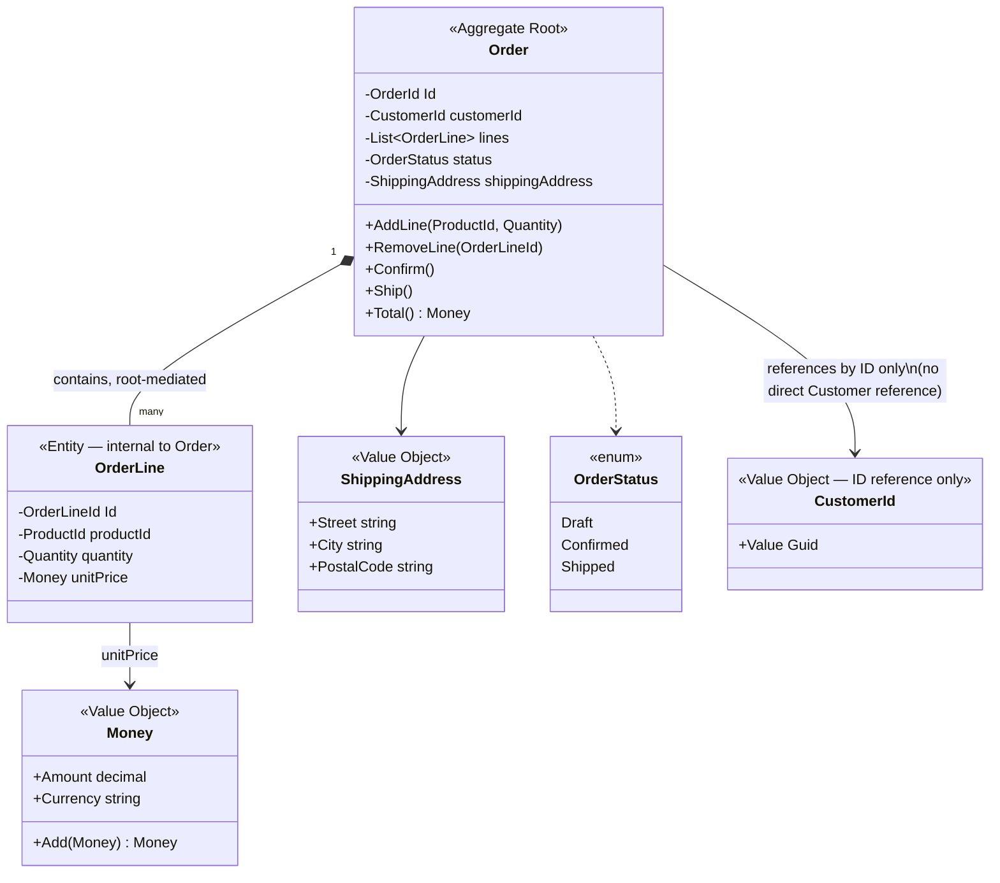
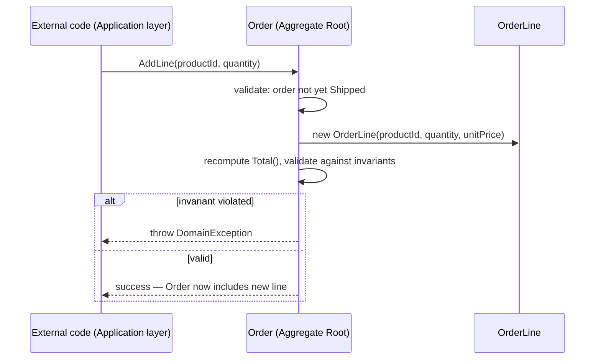
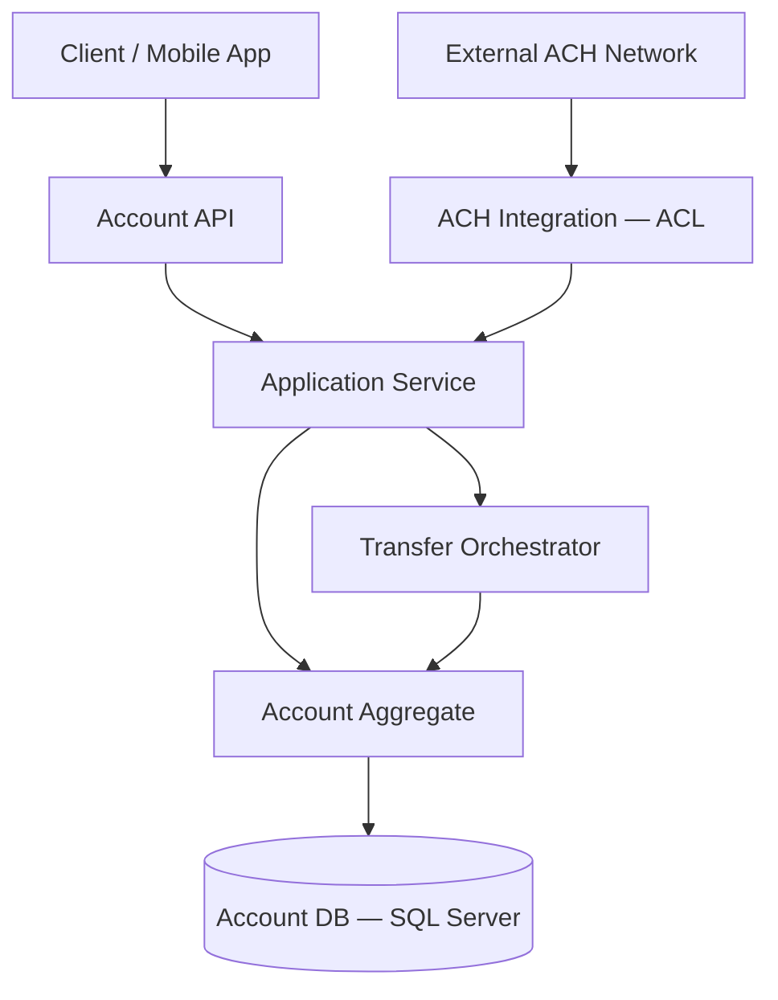
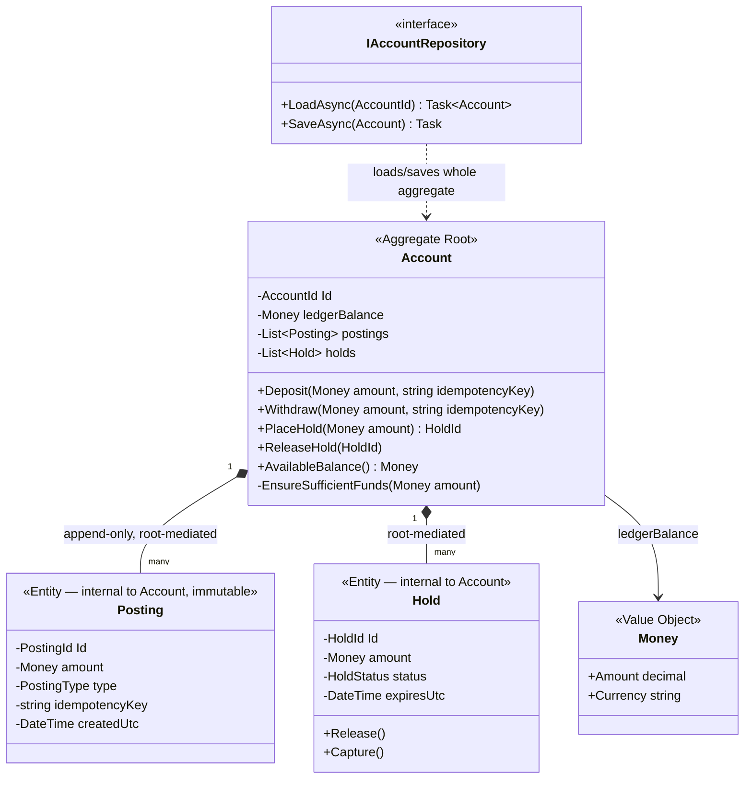
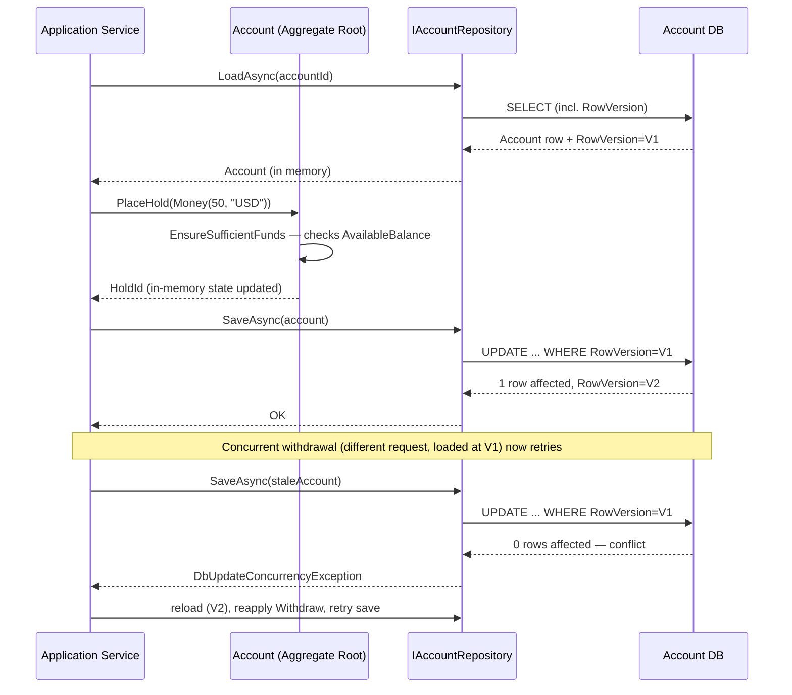

# Module 110 — Domain-Driven Design: Tactical DDD — Entities, Value Objects & Aggregates

> Domain: Domain-Driven Design | Level: Beginner → Expert | Prerequisite: [[01-StrategicDDD-UbiquitousLanguage-BoundedContexts-ContextMapping]] (this module implements, within a single already-identified bounded context, the model that module's strategic groundwork exists to identify), [[../30-Architecture-Patterns/02-EvolutionaryArchitecture-FitnessFunctions-ADRs-Governance]] (fitness functions this module's invariant-enforcement rules extend to the aggregate-boundary level specifically)
>
> **Note on format:** Per the standing user preference (see `CLAUDE.md`), this module covers only the 40 most-frequently-asked interview questions (10 per level), without the full 15-section deep-dive template.

---

## 1. Fundamentals

**What.** Tactical DDD is the implementation-level layer of Domain-Driven Design — the concrete building blocks (Entities, Value Objects, Aggregates, Aggregate Roots, Domain Services, Domain Events, Repositories, Factories) used to build a rich, invariant-enforcing model *within* a single, already-identified Bounded Context (Module 109). Where strategic DDD answers "where does this model boundary belong," tactical DDD answers "what, concretely, do I write inside that boundary so the model actually enforces the business's rules rather than merely storing its data."

**Why it exists.** The alternative to tactical DDD is the anemic domain model — plain data classes with public getters/setters, all real logic pushed into separate "service" classes operating on that data from outside. An anemic model can represent *any* state, including states the business considers invalid (a negative balance, a shipped-but-unpaid order), because nothing in the model itself refuses to hold them. Tactical DDD's central idea is that a well-designed object should make its own invalid states structurally difficult or impossible to construct — validation and business rules live *with* the data they govern, not scattered across a service layer that may or may not remember to check them on every call site.

**When to reach for it.** Wherever a domain concept has genuine invariants (rules that must always hold), meaningful identity that must be tracked over time, or is currently suffering from primitive obsession (a bare `decimal`/`string` standing in for something with real validation rules, like money or an email address). It is unnecessary ceremony for simple, low-risk data with no real invariants or identity concerns — Module 109's Advanced Q9 names this over-application risk explicitly, and it recurs here as a tactical-level anti-pattern (§6).

**How, in one sentence.** Classify each domain concept as an Entity (has identity, tracked over its lifecycle) or a Value Object (fully defined by its attributes, immutable, interchangeable); group tightly-invariant-bound Entities/Value Objects into an Aggregate with a single Aggregate Root as its only external entry point; enforce every invariant synchronously, inside the Aggregate, on every construction and every mutating method; and reference other Aggregates only by ID, never by direct object reference.

## 2. Deep Dive

### 2.1 Entity vs. Value Object — the classification test, precisely

The single most consequential classification decision in tactical DDD: does this concept need to be tracked, over time, as "this specific instance" distinct from another with identical current attributes (Entity — identity-based equality), or is it fully, completely characterized by its current attribute values with no meaningful distinction between two instances that happen to match (Value Object — value-based equality)? A `Trade` is an Entity (two trades with identical instrument/quantity/price executed at different times are still distinct trades, tracked separately). `Money` is a Value Object (two `Money(100, "USD")` instances are fully interchangeable).

### 2.2 The Aggregate as the enforced consistency boundary

An Aggregate is not merely "a group of related objects" — it is the unit within which every invariant is guaranteed to hold, atomically, after every single operation. The Aggregate Root is the sole object external code may reference; every mutation is expressed as a method call on the Root, which validates the resulting state before accepting the change. This single rule — no side-door mutation of an internal Entity or Value Object — is what makes the Aggregate's invariant guarantee mechanically enforceable rather than aspirational.

### 2.3 Aggregate boundary sizing — the recurring cost axis

A small Aggregate reduces optimistic-concurrency contention and transaction size but risks pushing a genuinely-required invariant outside the boundary into eventual consistency; a large Aggregate keeps more invariants synchronously guaranteed but multiplies contention risk under concurrent load (this module's Advanced Q4 develops a Black-Friday-scale production incident caused by exactly this). The default heuristic: include an object inside an Aggregate only if a genuine, must-be-synchronous invariant requires it — "these things feel related" is explicitly insufficient justification (Intermediate Q1).

### 2.4 EF Core modelling implications

Tactical DDD's patterns map onto EF Core with a few load-bearing, non-obvious choices:
- **Value Objects as owned types** (`OwnsOne`/`OwnsMany` in EF Core, or C# `record`/`readonly struct` types mapped via `ComplexProperty` in EF Core 8+) rather than as separate entities with their own identity/table — a `Money` value object should not accidentally acquire an EF-generated primary key, which would silently turn it into an Entity in the database even though the domain model correctly treats it as a Value Object.
- **Aggregate Root as the EF Core aggregate boundary** — configure navigation properties so only the Aggregate Root is directly queryable via `DbSet<T>`; internal Entities (e.g., `OrderLine`) should not have their own `DbSet<OrderLine>`, enforcing at the persistence layer the same root-only-access rule the domain model already enforces in memory.
- **Backing fields for encapsulated collections** — expose `IReadOnlyCollection<OrderLine>` publicly while EF Core maps to a private `List<OrderLine>` backing field (`Metadata.Collection.HasField` in `OnModelCreating`), so external code cannot call `.Add()` directly on a collection returned from a getter — closing the exact "leaked internal reference" anti-pattern (§6) at the ORM level, not just by convention.
- **`RowVersion`/`rowversion` column for optimistic concurrency** (Intermediate Q3's mechanism) mapped via `IsRowVersion()`, giving database-guaranteed, collision-free version tracking rather than an application-managed integer prone to double-increment bugs.
- **One `DbContext` per Bounded Context** (Module 109 §2.5) — an EF Core `DbContext` spanning two contexts' Aggregates makes it trivial to navigate directly from one context's Aggregate into another's, silently reintroducing the exact ID-only cross-Aggregate-reference violation Intermediate Q2 warns against.

### 2.5 Hidden cost: change-tracking overhead on oversized Aggregates

EF Core's change tracker snapshots every tracked entity's property values to detect changes on `SaveChanges()`. An oversized Aggregate (§2.3) loaded with many internal Entities means the change tracker does proportionally more comparison work on every save — a purely mechanical, measurable performance cost layered on top of the concurrency-contention cost, reinforcing that Aggregate sizing is simultaneously a modeling-cleanliness, a contention, and a change-tracking-performance concern (§7 develops this further).

### 2.6 Hidden cost: `AsNoTracking()` and Aggregate invariants

A read-only query using `AsNoTracking()` (a standard EF Core performance optimization for read paths, e.g., feeding Client Reporting's projections in Module 109 §12) returns detached entities with no change-tracking. This is correct and desirable for pure reads — but a mistake to watch for is accidentally reusing a `AsNoTracking()`-loaded entity graph as the starting point for a *write* operation: because it's detached, re-attaching and saving it can bypass the Aggregate Root's own in-memory invariant-checking methods entirely if the code path naively sets properties and calls `Update()` rather than loading a properly-tracked Aggregate and calling its domain methods — a concrete, EF-Core-specific instance of Advanced Q7's "write path bypassing the Aggregate" risk.

## 3. Visual Architecture

### 3.1 Aggregate / entity relationship diagram — the `Order` Aggregate (Advanced Q1)



The diagram's load-bearing detail is the two different relationship arrows: `Order *-- OrderLine` (composition, internal, mutated only through the root) versus `Order --> CustomerId` (a plain reference to an identifier, not to the `Customer` Aggregate itself) — visually encoding Intermediate Q1's sizing rule and Intermediate Q2's ID-only cross-Aggregate-reference rule in one picture.

### 3.2 Invariant-enforcement flow through the Aggregate Root



Every mutation funnels through the Root, which is the only object with the authority to accept or reject the change — external code, and even `OrderLine` itself, never independently decides whether a change is valid.

## 4. Production Example

**Problem.** A prime brokerage's internal `Position` model was, for years, an anemic C# class: a `PositionRecord` with public `decimal Quantity`, `decimal AverageCost`, `string Currency` properties, freely settable from six different service classes (a trade-booking service, a corporate-actions service, a manual-adjustment admin tool, and three separate batch jobs). Nothing in `PositionRecord` itself prevented any of these six call sites from setting `Quantity` to a value inconsistent with the sum of its own booked trades, or setting `Currency` to a value that didn't match the instrument's actual denomination.

**Architecture (after tactical DDD).** `Position` became a proper Aggregate Root: `PositionId` identity, an internal, root-mediated list of `PositionLot` Entities (each lot tracking its own booked quantity/cost for tax-lot-accounting purposes), and `Money`/`CurrencyCode` Value Objects replacing the bare `decimal`/`string` primitives. All six previous call sites were rewritten to go through explicit, named methods on `Position` — `Position.BookTrade(TradeId, Quantity, Money unitCost)`, `Position.ApplyCorporateAction(CorporateActionId, AdjustmentFactor)`, `Position.ApplyManualAdjustment(AdjustmentId, Quantity, string justification)` — with `Position` itself, not any calling service, responsible for validating each resulting state (e.g., `ApplyManualAdjustment` requires a non-empty `justification` and enforces a maximum single-adjustment size without a second approval, encoding a control that had previously existed only as an unenforced runbook instruction).

**Implementation.** `Position`'s constructor and every mutating method independently re-validate the resulting `Quantity`/`Money`/lot-consistency invariants (Module 110's Intermediate Q8 principle — validation is not front-loaded only into construction), and `PositionLot`'s own quantity is never directly settable from outside `Position` — the internal list is exposed only as `IReadOnlyCollection<PositionLot>`, backed by EF Core's private-field mapping (§2.4).

**Trade-offs.** The rewrite required touching all six previous call sites simultaneously (a genuinely large, coordinated change, executed via Branch by Abstraction and a Parallel Run per Module 109's migration-pattern precedent) rather than a purely additive change — and it deliberately made several previously-silent, technically-invalid operations (a manual adjustment with no justification string) now throw a `DomainException,` which required a short, planned period of triaging legitimate-but-now-rejected historical usage patterns before full cutover.

**Lessons learned.** The Parallel Run phase surfaced that the corporate-actions batch job had, for roughly eighteen months, been applying a stock-split adjustment factor to `Quantity` without correspondingly adjusting `AverageCost` for a specific class of instruments — a real, previously-undetected data-quality bug the anemic model's total absence of invariant checking had silently allowed to compound, discovered only because the new `Position.ApplyCorporateAction` method's invariant check rejected the old job's output during shadow comparison. This is the concrete, general lesson Module 110's Advanced Q10 describes in the abstract: a rich, invariant-enforcing model doesn't just prevent *future* invalid states — its rollout is often the first time an organization discovers how many *past* states were already silently invalid.

## 5. Best Practices

- Classify every domain concept explicitly as Entity or Value Object using the identity-vs-attributes test (§2.1) before writing any code for it — don't default to Entity out of ORM habit.
- Size Aggregates to the smallest boundary a genuine, must-be-synchronous invariant actually requires (§2.3); treat "these are related" as insufficient justification on its own.
- Reference other Aggregates only by ID, never by direct object/navigation reference, even when the ORM makes the shortcut syntactically easy.
- Validate invariants on every mutating method, not only at construction — most of an Aggregate's lifetime is spent being modified, not created.
- Make Value Objects immutable and self-validating by construction; prefer C# `record`/`readonly struct` types over bare primitives for anything with real domain meaning (money, email, date ranges).
- Use optimistic concurrency (a native `rowversion` column) as the default protection against concurrent Aggregate modification; reserve pessimistic locking for the rare, genuinely-high-contention exception.
- Write deliberately adversarial, invalid-state-inducing tests asserting an Aggregate correctly *rejects* disallowed operations — not just that valid operations succeed.

## 6. Anti-patterns

- **Anemic domain model** — public getters/setters with no enforced invariants, all logic externalized to service classes (the Production Example's starting state).
- **God Aggregate** — an oversized Aggregate spanning multiple, only-loosely-related concerns (e.g., `Order` including `Customer` profile data and `Inventory` stock counts), multiplying contention and change-tracking cost for invariants that don't actually require that scope (Advanced Q4's Black-Friday incident).
- **Leaked internal reference bypassing the Aggregate Root** — a getter returning a mutable `List<T>` or a direct reference to an internal Entity, letting external code mutate state without the Root ever validating the result (Advanced Q6).
- **Primitive obsession** — representing money, email, date ranges, or any concept with real validation rules as bare `decimal`/`string`/`DateTime` instead of a self-validating Value Object (Basic Q10).
- **Multi-Aggregate transactions as routine practice** — wrapping updates to several Aggregates in one database transaction as a default habit rather than a rare, explicitly-reviewed exception, usually signaling a mis-drawn boundary (Intermediate Q6).
- **Validation front-loaded only into the constructor**, leaving mutating methods unchecked and able to drive an already-valid Aggregate into an invalid state through ordinary later use (Intermediate Q8).
- **Bypassing the Aggregate on write** — a raw SQL data-fix script, an ORM re-attachment of a detached, unvalidated entity, or an `AsNoTracking()`-loaded graph naively saved back (§2.6) — each silently defeating a well-designed Aggregate's invariant guarantee via a write path that never runs its validation logic (Advanced Q7).

## 7. Performance Engineering

- **Aggregate size directly drives both transaction/lock cost and EF Core change-tracking cost** (§2.3, §2.5) — every additional internal Entity inside an Aggregate is both more optimistic-concurrency contention risk under concurrent load and more per-`SaveChanges()` snapshot-comparison work; sizing discipline is a performance decision, not only a modeling-cleanliness one.
- **Aggregate reconstitution cost** — every command against an Aggregate typically requires loading its complete current state first; for a large Aggregate or high command-throughput scenario, this becomes a genuine bottleneck (Module 110 Advanced Q5), mitigated primarily by keeping Aggregates small in the first place, and secondarily by snapshotting if the persistence mechanism is event-sourced.
- **`AsNoTracking()` for read paths** — any query that only reads an Aggregate's state (feeding a read model/projection, never followed by a save) should use `AsNoTracking()` to skip change-tracking overhead entirely; conflating a read-only query with the tracked, mutation-ready load path is a common, avoidable performance cost.
- **Value Object allocation cost** — C# `record` types allocate a new instance on every "modification" (by design, since they're immutable); for typical business-logic-rate Value Objects (an order's shipping `Money`) this is negligible, but a Value Object constructed at very high frequency in a genuine hot path (a pricing engine recomputing `Money` millions of times/sec) is a legitimate candidate for a `readonly struct` instead, avoiding heap allocation entirely (Module 110 Advanced Q5).
- **Batch/bulk operations and Aggregate-at-a-time loading** — a Repository's Aggregate-granularity contract (load/save one whole Aggregate at a time) is correct for enforcing invariants but a poor fit for genuine bulk operations (e.g., re-pricing 500,000 positions overnight); such batch jobs typically use a separate, explicitly-lower-rigor bulk-update path (raw `ExecuteUpdate`/bulk SQL) reserved specifically for cases where per-row Aggregate invariant re-validation is either unnecessary or independently re-verified by a downstream reconciliation job — not routed through the same Aggregate Root path used for individual transactional operations.

## 8. Security

- **Invariant enforcement is a fraud/correctness control, not merely a modeling nicety** — the Production Example's `ApplyManualAdjustment` requiring a non-empty justification and rejecting an over-large single adjustment without a second approval converts a previously-unenforced runbook policy into a structurally-enforced control; an anemic model relying on procedural discipline alone is a real control gap in a financial system, not just an engineering-quality gap.
- **The Aggregate Root as the sole write path is also the sole point authorization needs to be checked** — because every mutation is forced through a small, well-defined set of Root methods (§2.2), authorization logic (can this caller invoke `ApplyManualAdjustment`?) has one, complete, auditable enforcement point, rather than needing to be independently re-implemented at every one of several call sites an anemic model would otherwise allow to mutate state directly.
- **Value Objects prevent a class of injection/malformed-data bugs structurally** — a self-validating `Money`/`AccountNumber` Value Object rejects malformed input at construction, before it can propagate into downstream logic or storage, rather than relying on validation being remembered at every call site (Basic Q10).
- **Optimistic concurrency prevents a specific double-spend/race-condition class of fraud** — two concurrent attempts to withdraw from the same account, racing against a stale in-memory balance, are exactly what the `RowVersion`-guarded conditional update (Intermediate Q3, and Module 110 FT2) is designed to make impossible, not merely unlikely.
- **Every write path must be covered, or the invariant guarantee is only nominal** — a raw SQL data-fix script, a misconfigured ORM re-attachment, or a stale-cache write-back (Advanced Q7) that bypasses the Aggregate Root doesn't just risk a data-quality bug — in a financial-services model, it's a bypassed control, and should be treated with the same seriousness as an authorization bypass, including periodic reconciliation-style auditing of persisted state against the Aggregate's own invariants as an independent detection net.

## 9. Scalability

- **The Aggregate is the natural sharding/partitioning boundary.** Because an Aggregate is already the enforced transactional-consistency unit, it is also the natural unit to shard or partition by (e.g., partitioning an `Account`/`Position` table by `AccountId`) — no cross-partition transaction is ever needed for a single Aggregate's own invariant, since by definition nothing outside that Aggregate needs to be updated atomically with it.
- **Correctly-scoped Aggregates enable horizontal write scaling that an oversized Aggregate forecloses** — Advanced Q4's Black-Friday incident is precisely a scalability failure: an oversized `Order`-plus-`Customer`-plus-`Inventory` Aggregate created artificial contention on a single version counter that no amount of additional database capacity could relieve, because the bottleneck was a logical consistency boundary, not raw throughput.
- **Read scaling is decoupled from Aggregate write-side design** — a well-designed Aggregate (small, root-mediated) is naturally CQRS-compatible (Module 110 Advanced Q9): the write-side Aggregate stays unchanged while a denormalized read model/projection scales independently for query-heavy workloads, without requiring speculative CQRS infrastructure to be built before an actual, measured read-scaling need exists.
- **Context-per-service scaling (Module 109 §9) composes with Aggregate-per-shard scaling** — a Bounded Context's independent deployability (Module 109) combines with its Aggregates' independent shardability to give two, orthogonal scaling levers: scale the whole context's infrastructure independently of other contexts, and scale a given context's own Aggregate storage/throughput independently by Aggregate-ID-based partitioning within it.
- **Eventual consistency across Aggregates is what makes this scaling model viable at all** — insisting on synchronous, cross-Aggregate consistency (Intermediate Q3's test) would force artificially large, jointly-locked Aggregates that cap horizontal scalability at whatever the most conservative joint invariant requires; deliberately relaxing non-essential cross-Aggregate rules to eventual consistency, backed by domain events, is a scalability decision as much as a modeling one.

## 10. Interview Questions

### Basic (10)

1. **Q: What is an Entity in DDD, and what specifically defines its identity?**
 **A:** An Entity is a domain object defined by a continuous, unique identity that persists across its entire lifecycle even as its attributes change — two Entities are considered the same Entity if they share that identity, regardless of whether every attribute currently matches, and conversely two Entities with identical current attributes but different identities are genuinely different objects (e.g., two customers who happen to share the same name are still distinct Entities).
 **Why correct:** States identity, not attribute equality, as an Entity's defining property, with a concrete illustration distinguishing it from attribute-based equality.
 **Common mistakes:** Conflating "has an ID field in the database" with "is a genuine DDD Entity" — the identity must be domain-meaningful and stable across the entity's real lifecycle, not merely a technical primary key that happens to exist for persistence convenience.
 **Follow-ups:** "Can an Entity's identity ever legitimately change?" (Generally no — a changing identity would mean the object is no longer recognized as the same real-world thing across time, undermining the entire concept; if an apparent identity value does need to change (e.g., a reassigned account number), the underlying domain identity should be a stable, separate concept from that changeable, presentational value.)

2. **Q: What is a Value Object, and what are its two defining properties?**
 **A:** A Value Object is a domain object defined entirely by its attributes rather than a distinct identity, and it is immutable — its two defining properties are value-based equality (two Value Objects with identical attributes are considered fully interchangeable and equal) and immutability (once created, a Value Object's state never changes; a "modification" produces a new Value Object instance rather than mutating the existing one).
 **Why correct:** States both defining properties (value equality, immutability) precisely, distinguishing Value Objects from Entities' identity-based equality.
 **Common mistakes:** Creating a "Value Object" that's mutable (exposing setters) — this silently reintroduces identity-like semantics (two instances that look equal now might diverge later) and defeats the specific safety immutability provides.
 **Follow-ups:** "Give a concrete domain example of a Value Object." (A `Money` value object combining an amount and currency — two `Money(100, "USD")` instances are fully interchangeable and equal regardless of which specific instance is referenced, and "adding" money produces a new `Money` instance rather than mutating either operand.)

3. **Q: What is the core distinction between an Entity and a Value Object, and why does getting this classification right matter?**
 **A:** The core distinction is whether the domain concept fundamentally needs to be tracked and distinguished by identity over time (Entity) or is fully characterized by its current attributes with no need to distinguish "this specific instance" from another with identical attributes (Value Object); getting it right matters because misclassifying a Value Object as an Entity introduces unnecessary identity-tracking complexity and mutable-state bugs, while misclassifying an Entity as a Value Object can silently lose the ability to correctly track a real-world thing's identity across legitimate attribute changes.
 **Why correct:** States the classification criterion (need for identity-based tracking vs. full characterization by current attributes) and the concrete cost of misclassifying in either direction.
 **Common mistakes:** Defaulting every domain concept to an Entity out of habit (since ORMs and relational tables push naturally toward identity-based rows), missing that many domain concepts — an address, a date range, a monetary amount — are much better modeled as immutable Value Objects with no independent identity tracking needed at all.
 **Follow-ups:** "Is a `Customer`'s shipping address an Entity or a Value Object?" (Almost always a Value Object — a customer doesn't care about "this specific address instance's history," only its current value; if the address changes, the old one is simply replaced, not tracked as a still-existing, distinct, identity-bearing object.)

4. **Q: What is an Aggregate?**
 **A:** An Aggregate is a cluster of related Entities and Value Objects treated as a single, consistent unit for the purpose of data changes — one specific Entity within the cluster (the Aggregate Root, Basic Q5) is the only object external code may reference directly, and every invariant that must hold true within the cluster is enforced by the Aggregate as a whole, atomically, on every change.
 **Why correct:** States the Aggregate's structure (a cluster of Entities/Value Objects) and its two defining functions (a single consistency unit, accessed only through its root).
 **Common mistakes:** Treating "Aggregate" as simply a synonym for "a group of related objects" without the specific, load-bearing constraint that it is the true, enforced consistency and transactional boundary — a loose grouping with no enforced invariants or root-only access is not a genuine Aggregate in DDD's sense.
 **Follow-ups:** "Why must an Aggregate specifically be a consistency *boundary*, not merely an organizational grouping?" (Because its entire purpose is guaranteeing that any invariant spanning the objects inside it is never left in a violated, inconsistent state after any single operation — a purely organizational grouping with no enforcement responsibility wouldn't provide this guarantee.)

5. **Q: What is an Aggregate Root, and what specific rule governs how external code may interact with an Aggregate?**
 **A:** The Aggregate Root is the single, designated Entity within an Aggregate that serves as its sole external entry point — the governing rule is that external code may hold references only to the Aggregate Root, never directly to the Aggregate's internal Entities or Value Objects, and any change to anything inside the Aggregate must go through a method on the Root, which is responsible for enforcing the Aggregate's invariants before allowing that change to take effect.
 **Why correct:** States the Root's specific role (sole external reference point) and the governing access rule (all changes routed through the Root's own methods) precisely.
 **Common mistakes:** Exposing a getter that returns a direct, mutable reference to an internal Entity or collection, letting external code bypass the Root and mutate internal state directly — this silently defeats the entire Aggregate's invariant-enforcement purpose, since the Root never gets a chance to validate the resulting change (Advanced Q6 develops this specific anti-pattern fully).
 **Follow-ups:** "How would an `Order` Aggregate Root expose its `OrderLines` without violating this rule?" (Return a read-only, defensively-copied or immutable view/enumerable of the order lines for reading, while requiring any *modification* — adding, removing, changing quantity — to go through an explicit method on the `Order` root itself, such as `order.AddLine(...)`, which can then validate the resulting state before applying it.)

6. **Q: What is an invariant, in the specific context of Aggregate design, and why must it be enforced synchronously within the Aggregate boundary rather than checked afterward?**
 **A:** An invariant is a business rule that must always hold true for the Aggregate to be in a valid state (e.g., "an Order's total must equal the sum of its line items," "an Order cannot be shipped before payment is confirmed") — it must be enforced synchronously, within the same operation that changes the Aggregate's state, because allowing even a brief, observable window where the invariant is violated risks that invalid state being read, acted upon, or persisted before any later, asynchronous check could catch and correct it.
 **Why correct:** States what an invariant is with concrete examples and the specific reason (avoiding any observable invalid-state window) synchronous, in-boundary enforcement matters.
 **Common mistakes:** Assuming an invariant can be safely checked and corrected in a background job shortly after a change is applied — even a brief window of an actually-invalid, persisted state can be read by another part of the system or displayed to a user before the background correction runs, which the Aggregate boundary's synchronous enforcement is specifically designed to prevent entirely.
 **Follow-ups:** "What happens to a business rule that spans *multiple* Aggregates, given this synchronous-enforcement requirement?" (It cannot be a hard, synchronous invariant of any single Aggregate — Advanced Q2 and develop how such cross-Aggregate rules are instead handled via eventual consistency and domain events, since forcing them into a single Aggregate's synchronous boundary would make that Aggregate too large, per Intermediate Q1.)

7. **Q: What is a Factory, in DDD tactical-pattern terms, and when is one needed?**
 **A:** A Factory is a dedicated object or method responsible for constructing a complex Entity or Aggregate in a single, valid, invariant-satisfying step — needed specifically when an object's creation involves enough complexity (multiple related objects, non-trivial validation, choosing among several valid construction paths) that embedding it directly in a simple constructor would either violate invariants during intermediate construction steps or make the constructor itself unreasonably complex.
 **Why correct:** States the Factory's purpose (encapsulating complex, invariant-preserving construction) and the specific condition (genuine construction complexity) that warrants one.
 **Common mistakes:** Introducing a Factory for every Entity regardless of actual construction complexity — a simple Entity with a straightforward, already-invariant-safe constructor doesn't need a separate Factory; this recreates the premature-abstraction risk in tactical-DDD form.
 **Follow-ups:** "Give an example of a genuinely Factory-worthy construction scenario." (Reconstructing an `Order` Aggregate from a set of previously-placed line items and a stored discount code during an import/migration process, where the Factory must validate the resulting combination is actually internally consistent before the `Order` object is allowed to exist at all — a task too complex for a simple constructor alone.)

8. **Q: How does an Aggregate relate to, and differ in scale from, the Bounded Context established?**
 **A:** A Bounded Context is the larger, strategic-level boundary within which a specific model and Ubiquitous Language apply consistently (potentially containing many different domain concepts); an Aggregate is a much smaller, tactical-level consistency boundary *within* a single Bounded Context, typically covering just one specific business invariant's worth of closely-related objects — a single Bounded Context normally contains many distinct Aggregates, each with its own separate consistency boundary.
 **Why correct:** States the scale relationship precisely (Bounded Context is the larger strategic container; Aggregates are the smaller tactical consistency units within it), directly connecting back to the terminology.
 **Common mistakes:** Conflating a Bounded Context with a single Aggregate, or assuming a Bounded Context should be designed as one giant Aggregate — an Ordering bounded context, for instance, would typically contain an `Order` Aggregate, a `Cart` Aggregate, and others, each independently consistent, not one single mega-Aggregate spanning the entire context.
 **Follow-ups:** "Why would designing an entire Bounded Context as a single Aggregate be a serious mistake?" (It would force every change anywhere in the context through one synchronous consistency boundary, creating exactly the contention and scalability problems Advanced Q4 develops — the entire point of having multiple, appropriately-scoped Aggregates within a context is to keep each consistency boundary as small as the actual invariants genuinely require.)

9. **Q: What is optimistic concurrency control, and why is it the typical mechanism for protecting an Aggregate against concurrent modification conflicts?**
 **A:** Optimistic concurrency control detects (rather than prevents upfront via locking) a conflicting concurrent modification by attaching a version number (or timestamp) to the Aggregate, incrementing it on every successful save, and rejecting a save whose expected version doesn't match the currently-stored version — it's the typical mechanism for Aggregates specifically because genuine concurrent writes to the *same* Aggregate instance are usually rare enough that optimistic (detect-and-retry) is more efficient than pessimistic (lock-and-block) concurrency control, while still fully protecting the Aggregate's invariants from being silently corrupted by a lost, overwritten concurrent update.
 **Why correct:** States the mechanism (version-number-based conflict detection) and the specific reason (rare-enough genuine conflicts, so detect-and-retry beats lock-and-block) it's the typical default for Aggregates.
 **Common mistakes:** Assuming an Aggregate needs pessimistic, upfront locking by default — this is usually unnecessary overhead and reduced throughput for a data-consistency risk optimistic concurrency control already fully addresses for the common case of rare, genuine write conflicts.
 **Follow-ups:** "What should an application do when an optimistic concurrency conflict is detected?" (Reload the Aggregate's current, latest state, re-apply the intended business operation against that current state (re-validating invariants against it), and retry the save — rather than either silently overwriting the concurrent change or surfacing a raw, unhelpful version-conflict error directly to the end user.)

10. **Q: What is "primitive obsession," and why does DDD specifically discourage it in favor of Value Objects?**
 **A:** Primitive obsession is the anti-pattern of representing meaningful domain concepts (an email address, a monetary amount, a date range) as bare primitive types (a raw `string`, `decimal`, or pair of `DateTime`s) rather than as dedicated Value Objects — DDD discourages it because a bare primitive carries no enforced validation or behavior of its own, meaning the same validation logic (is this a well-formed email? is this amount non-negative?) must be re-implemented or, more commonly, forgotten at every single place the primitive is used, whereas a Value Object enforces its own validity once, at construction, everywhere it's used.
 **Why correct:** States the anti-pattern's definition and the specific mechanism (validation duplicated or forgotten at every use site vs. enforced once at construction) by which Value Objects concretely improve on primitives.
 **Common mistakes:** Treating Value Objects as unnecessary ceremony for "simple" values, missing that the entire value of a dedicated Value Object is exactly its enforced, always-valid construction, making an invalid domain value structurally difficult to represent at all, rather than merely discouraged by convention.
 **Follow-ups:** "How does a `Money` Value Object concretely prevent a class of bugs a raw `decimal` amount field could not?" (Its constructor can reject a negative amount or mismatched currency arithmetic outright, making `Money(-5, "USD")` or adding `Money` in two different currencies without an explicit conversion step impossible to construct — a raw `decimal` field provides no such structural guarantee and relies entirely on every call site remembering to validate it independently.)

### Intermediate (10)

1. **Q: What is the trade-off in Aggregate boundary sizing — when should an Aggregate be designed small versus large?**
 **A:** A small Aggregate (fewer objects, tighter invariant scope) reduces lock/version contention under concurrent load and keeps each transaction's blast radius small, but risks pushing genuinely-related invariants outside the boundary into harder-to-guarantee eventual consistency; a large Aggregate keeps more invariants synchronously guaranteed but increases contention risk and transaction size — the DDD-recommended default is to design Aggregates as small as the domain's actual, true invariants allow, only including an object within the boundary if a genuine, must-be-synchronous invariant requires it, and treating "these objects are related" alone as insufficient justification for including something inside the same Aggregate.
 **Why correct:** States both directions of the trade-off (contention risk vs. invariant-guarantee scope) and the specific sizing heuristic (include only what a genuine, must-be-synchronous invariant actually requires) DDD recommends by default.
 **Common mistakes:** Designing Aggregates to mirror an intuitive, informal sense of "these things belong together" rather than the specific, narrower test of "does a genuine invariant require these specific objects to be updated together, atomically, in the same transaction."
 **Follow-ups:** "Give a concrete example where 'related' objects should NOT share an Aggregate." (A `Customer` and their `Orders` are clearly related, but there's no invariant requiring a `Customer`'s attributes and their entire order history to be updated atomically together — they should be separate Aggregates, referencing each other by ID (Intermediate Q2), not one combined Aggregate.)

2. **Q: What is the rule that Aggregates should reference other Aggregates only by identity (ID), not by direct object reference — and why does it matter?**
 **A:** An Aggregate should hold only the identifier (e.g., a `CustomerId`) of a related Aggregate it needs to refer to, never a direct, in-memory or ORM-navigable reference to that other Aggregate's actual root object — this matters because a direct reference would blur the two Aggregates' separate consistency boundaries (Intermediate Q1), tempting code to reach across and modify the other Aggregate's internals directly, violating its own root-only access rule (Basic Q5), and would also complicate loading/persistence, since loading one Aggregate would risk implicitly, unintentionally cascading into loading an unrelated Aggregate's full object graph.
 **Why correct:** States the rule (ID-only cross-Aggregate references) and both concrete reasons it matters (preserving separate consistency boundaries, avoiding unintended cascading loads).
 **Common mistakes:** Using ORM navigation properties that let one Aggregate's code directly traverse into and modify another Aggregate's internal object graph, silently reintroducing the exact boundary-violation risk this rule exists to prevent, often invisibly, since the ORM makes it syntactically easy to do.
 **Follow-ups:** "How would an `Order` Aggregate reference the `Customer` who placed it, following this rule?" (Store a `CustomerId` value on the `Order`, and if the Customer's current name or address is genuinely needed for a specific operation, look it up explicitly and separately — via a repository or an already-fetched, read-only projection — rather than the `Order` object holding a live, navigable reference directly into the `Customer` Aggregate.)

3. **Q: How would you determine which invariants must be enforced synchronously within a single Aggregate versus which can be relaxed to eventual consistency across Aggregates?**
 **A:** Ask whether a temporary, brief violation of the rule — visible to other parts of the system for a short window before being corrected — would cause a genuinely unacceptable business outcome (e.g., a financial double-charge, a physically impossible negative inventory count actually being acted upon) or merely a minor, tolerable, quickly-self-correcting inconsistency (e.g., a customer's total lifetime order count being briefly one order behind after a new order is placed); the former genuinely requires synchronous, single-Aggregate enforcement, while the latter is a legitimate candidate for eventual consistency, handled via domain events rather than forcing an artificially large, single Aggregate.
 **Why correct:** States a concrete decision test (would a brief violation cause genuinely unacceptable harm, or merely a tolerable, self-correcting inconsistency) distinguishing hard synchronous invariants from eventual-consistency-appropriate ones.
 **Common mistakes:** Defaulting to synchronous enforcement for every conceivable business rule "just to be safe," inflating Aggregate boundaries far beyond what's genuinely required and needlessly recreating Intermediate Q1's contention-cost risk for rules that would actually tolerate brief, corrected inconsistency perfectly well.
 **Follow-ups:** "Why is 'a customer's lifetime order count' a good example of a tolerable eventual-consistency case?" (A brief delay in that count updating causes no genuine business harm — no financial loss, no invalid state anyone would act on incorrectly in that brief window — making it a clear candidate for an asynchronous update via a domain event rather than forcing `Order` and `Customer` into one artificially large, synchronously-consistent Aggregate.)

4. **Q: What does "self-validating" and "side-effect-free" mean for a well-designed Value Object, and why do both properties matter?**
 **A:** Self-validating means the Value Object's constructor itself rejects any attempt to create an invalid instance (Basic Q10), making an invalid value structurally impossible to hold, not merely discouraged; side-effect-free means the Value Object's own methods (e.g., an "add" operation on `Money`) never mutate the object itself or any external state, always returning a new, separate instance instead — both properties matter together because they let a Value Object be freely shared, passed around, and reasoned about without ever needing to check whether it might currently be in some invalid or unexpectedly-mutated state.
 **Why correct:** States both properties precisely and the combined reason (safe, freely-shareable reasoning with no defensive checking needed) they matter together.
 **Common mistakes:** Implementing a Value Object with in-place mutating methods (e.g., an `AddAmount` method that mutates the current `Money` instance rather than returning a new one) — this silently reintroduces identity-like, stateful semantics into what should be a pure, immutable value, undermining the safety immutability is meant to provide.
 **Follow-ups:** "Why does immutability make a Value Object naturally, trivially thread-safe, without any explicit synchronization?" (Since its state can never change after construction, there's no possible race condition on its internal state for concurrent readers to encounter — a property mutable objects can never have without explicit, additional synchronization logic.)

5. **Q: What are the trade-offs between using a natural key versus a surrogate key (e.g., a GUID) as an Entity's identity?**
 **A:** A natural key (an existing, business-meaningful attribute like a national ID number or email address) has the advantage of being immediately domain-meaningful, but risks the identity needing to change if the underlying business attribute itself ever legitimately changes (violating Basic Q1's identity-stability requirement) or turning out not to be as globally unique as initially assumed; a surrogate key (a system-generated GUID or sequential ID with no inherent business meaning) guarantees stability and uniqueness by construction, at the cost of not being independently meaningful without a corresponding lookup — DDD generally favors surrogate keys specifically to guarantee Basic Q1's identity-stability property, reserving natural-key-like attributes as ordinary (Value-Object-wrapped) data on the Entity rather than as its actual identity.
 **Why correct:** States both options' specific trade-offs (domain-meaningful but potentially unstable vs. guaranteed-stable but not independently meaningful) and DDD's typical, reasoned preference (surrogate keys, for identity-stability guarantees).
 **Common mistakes:** Using an email address directly as a `Customer`'s identity, only to discover later that the business needs to support a customer changing their email address — violating the identity-must-remain-stable requirement Basic Q1 established, since the "identity" attribute itself just changed.
 **Follow-ups:** "Does choosing a surrogate key mean the natural-key-like attribute (e.g., email) has no special significance at all?" (No — it can and often should still be enforced as a unique, validated attribute (e.g., via a database unique constraint and Value-Object-based validation) for business-rule purposes like preventing duplicate accounts; it's simply not used as the Entity's actual, permanent identity.)

6. **Q: What is the relationship between an Aggregate and a database transaction — should an Aggregate boundary and a transaction boundary always coincide?**
 **A:** Yes, as the strong, default DDD guideline — a single Aggregate should be saved within a single database transaction, and a single transaction should modify at most one Aggregate instance, since this is precisely what guarantees the Aggregate's invariants are enforced atomically; modifying multiple Aggregates within one transaction is usually a sign the Aggregate boundaries are drawn incorrectly (an invariant that's actually being treated as cross-Aggregate-synchronous should either be re-scoped into a single, correctly-bounded Aggregate, or genuinely relaxed to eventual consistency per Intermediate Q3, rather than papered over with a multi-Aggregate transaction).
 **Why correct:** States the default guideline (one Aggregate, one transaction) and the specific diagnostic value of a violation (a signal the boundaries are likely mis-drawn, not a routine, acceptable pattern).
 **Common mistakes:** Routinely wrapping updates to several different Aggregates in one large database transaction "to be safe," missing that this pattern specifically signals an Aggregate-boundary design problem rather than being a normal, healthy implementation choice — Advanced Q4 develops the concrete contention cost of this anti-pattern.
 **Follow-ups:** "Is a multi-Aggregate transaction ever legitimately acceptable, as a pragmatic exception?" (Occasionally, for a narrow, well-understood, genuinely rare case where re-architecting the boundary isn't worth the cost — but it should be treated as a deliberate, documented, reviewed exception (the expiring-exception pattern) rather than the default, unexamined way of handling any inconvenient cross-Aggregate consistency need.)

7. **Q: What is the correct response when an Aggregate, over time, grows to contain too many objects and invariants, becoming unwieldy and contention-prone?**
 **A:** Re-examine which invariants genuinely require synchronous enforcement (Intermediate Q3's test) versus which were included simply because they seemed related, and split the Aggregate along that line — extracting objects/invariants that don't actually need synchronous consistency into their own, separate Aggregate(s), connected back via ID references (Intermediate Q2) and, where a genuine cross-boundary business rule remains, domain events — treating aggregate-splitting as a normal, expected refactoring exercise as domain understanding deepens, rather than a sign the original design was simply wrong from the start.
 **Why correct:** States a concrete diagnostic (re-apply the synchronous-invariant test) and remedy (split along that line, reconnect via IDs/events), framing this as expected refactoring rather than an embarrassing original mistake.
 **Common mistakes:** Leaving an overgrown Aggregate intact indefinitely due to reluctance to refactor a "working" design, accepting ongoing contention and complexity costs rather than treating aggregate-boundary refinement as a normal, healthy part of a model's evolution — directly the evolutionary-architecture principle applied at the tactical-DDD level.
 **Follow-ups:** "Why is this specific refactoring often safest to perform using the migration patterns, rather than a single, large, all-at-once change?" (Splitting a live, production Aggregate's persisted data and behavior is itself a data-and-behavior migration — Branch by Abstraction and a Parallel Run can validate the new, split Aggregate design against real production behavior before fully cutting over, exactly the same discipline established for any other significant, in-place architectural change.)

8. **Q: How should invariant validation be structured within an Aggregate's constructor and methods — is it sufficient to validate only at construction time?**
 **A:** No — validation must occur both at construction (ensuring the Aggregate can never be created in an invalid state) and on every subsequent state-changing method (ensuring the Aggregate can never be *mutated* into an invalid state either), since an Aggregate spends the overwhelming majority of its lifecycle being loaded and modified, not merely constructed once; validating only at construction while leaving mutating methods unchecked would let external code drive the Aggregate into an invalid state through entirely ordinary, expected use after its initial, valid creation.
 **Why correct:** States that both construction-time and every-mutating-method validation are required, with the specific reason (most of an Aggregate's actual lifetime is spent being modified, not constructed) construction-only validation is insufficient.
 **Common mistakes:** Front-loading all validation logic into the constructor or a Factory (Basic Q7) and treating later mutating methods as implicitly safe, missing that each individual method modifying the Aggregate's state is an equally important enforcement point.
 **Follow-ups:** "Give a concrete example of a mutating method that needs its own invariant check independent of construction-time validation." (An `Order.AddLine(item, quantity)` method must itself re-validate that the resulting order total and line-item count still satisfy the Order's invariants after the addition — the original construction-time validation, checked only once when the empty order was first created, says nothing about whether this specific, later addition keeps the Aggregate valid.)

9. **Q: What is the rule that all modification must go through the Aggregate Root, and how does this specifically prevent an "invalid state constructed via a side door"?**
 **A:** By requiring every state change to be expressed as an explicit method call on the Aggregate Root (never direct field/property mutation on an internal Entity, and never a direct reference to an internal object at all, per Basic Q5), the Root is guaranteed to be the sole choke point through which the resulting state must pass its invariant checks before being accepted — if external code could instead reach past the Root and mutate an internal Entity or Value Object directly, that change would bypass the Root's validation entirely, constructing an invalid Aggregate state through a side door the Root's own interface was specifically designed to prevent.
 **Why correct:** States precisely how root-only access mechanically guarantees invariant enforcement, and names the specific failure mode (a side-door mutation bypassing the Root) the rule exists to prevent.
 **Common mistakes:** Believing that having *some* validation logic somewhere in the codebase is sufficient, regardless of whether every possible mutation path is actually forced through it — if even one code path can reach and mutate an internal object directly, the Aggregate's invariant guarantee is only as strong as its weakest, unenforced path.
 **Follow-ups:** "How would you use the fitness functions to catch a side-door mutation bypassing the Root, extending that module's coupling-detection technique?" (A static-analysis fitness function specifically flagging any external code accessing a public setter or mutable collection directly on an Aggregate's internal, non-root objects — directly Advanced Q7 develops this concrete check.)

10. **Q: How does an Aggregate's design specifically depend on the bounded-context boundary already being correctly identified?**
 **A:** An Aggregate's invariants are business rules specific to one bounded context's model — attempting to design an Aggregate before its surrounding bounded context is clearly identified risks encoding invariants that actually blend two conflated, not-yet-separated contexts' distinct rules into one incoherent Aggregate, or drawing an Aggregate boundary that inadvertently spans what should be two separate contexts entirely; the strategic groundwork (Ubiquitous Language, bounded context identification) must genuinely precede tactical Aggregate design for the resulting Aggregate boundaries to be meaningful and correctly scoped.
 **Why correct:** States the specific dependency (Aggregate invariants are context-specific business rules; conflated contexts produce conflated, incoherent Aggregates) directly connecting back to the already-established sequencing requirement.
 **Common mistakes:** Jumping directly into Aggregate design (entities, value objects, invariants) for a new feature without having first clearly identified which bounded context it belongs to and confirmed its Ubiquitous Language, risking an Aggregate design built on an unclear or incorrect strategic foundation.
 **Follow-ups:** "What's a concrete symptom that an Aggregate was designed without adequate strategic groundwork?" (An Aggregate whose invariants and terminology feel inconsistent or require awkward compromises — often because it's unknowingly trying to satisfy two different bounded contexts' distinct, even conflicting, notions of the same domain concept within one object, exactly the "same term, different valid meanings across contexts" problem, now manifesting as tactical-design confusion.)

### Advanced (10)

1. **Q: Design the `Order` Aggregate for an e-commerce Ordering bounded context, specifying its boundary, root, internal entities/value objects, and key invariants.**
 **A:** The `Order` Aggregate Root is the `Order` Entity itself (identity: `OrderId`, a surrogate key per Intermediate Q5); it contains a collection of `OrderLine` Entities (each needing its own identity to be individually referenced/modified within the order, e.g., for quantity changes) and Value Objects including `Money` (for line totals and the order total) and `ShippingAddress`. Key invariants enforced synchronously within this single Aggregate: the order total must always equal the sum of line totals; an order cannot transition to a "Shipped" status while any line item's payment hasn't been confirmed; an order cannot be modified (lines added/removed) once it has already shipped. Explicitly *excluded* from this Aggregate, per Intermediate Q1's sizing test: `Customer` (referenced only by `CustomerId`, per Intermediate Q2, since no invariant requires atomic consistency between a customer's profile and their order), and `Inventory` stock levels (a separate Aggregate/bounded context entirely, coordinated via eventual consistency and domain events,, rather than folded into `Order`).
 **Why correct:** Provides a concrete, correctly-scoped Aggregate design — naming the root, its internal Entities/Value Objects, its specific synchronous invariants, and explicitly justifying what's excluded and why, using this module's own sizing test.
 **Common mistakes:** Including `Customer` details or `Inventory` stock counts directly inside the `Order` Aggregate "for convenience," recreating Intermediate Q1's oversized-Aggregate contention risk for invariants that don't actually require that level of synchronous coupling.
 **Follow-ups:** "Why does `OrderLine` need its own Entity identity rather than being a plain Value Object within the `Order`?" (If the business needs to individually reference, modify the quantity of, or remove a *specific* line item distinctly from another line item with the same product and quantity — e.g., two separate lines for the same product added at different times with different applied discounts — `OrderLine` needs identity to distinguish "this specific line" from another with coincidentally identical current attributes, qualifying it as an Entity, not a Value Object, per Basic Q3's classification test.)

2. **Q: A business rule states "an Order's total quantity of a specific product across all of a Customer's orders this month must not exceed a fraded-purchase-prevention limit." How would you handle this rule, given it appears to require cross-Aggregate, even cross-time-period, consistency?**
 **A:** This is exactly Intermediate Q3's "does a brief violation cause genuinely unacceptable harm" test applied to a realistic, non-trivial case — a purchase exceeding the limit by a small amount for a brief window before an asynchronous check catches and flags it typically causes tolerable, correctable harm (the order can be flagged for review or the excess quantity refunded), not a catastrophic, unacceptable one, meaning this rule is a strong candidate for eventual-consistency enforcement: the `Order` Aggregate is saved without this specific check as a hard, synchronous invariant, and a separate process (subscribing to `OrderPlaced` domain events) tracks cross-order quantity totals and raises a flag/hold if the limit is breached — rather than forcing every `Order` Aggregate to somehow synchronously consult and lock against every other order the same customer has ever placed.
 **Why correct:** Correctly applies Intermediate Q3's decision test to a concrete, non-obvious cross-Aggregate scenario, and proposes a genuine eventual-consistency mechanism (event-driven post-hoc checking) rather than forcing an unworkable, artificially large synchronous Aggregate.
 **Common mistakes:** Assuming any rule mentioning "must not exceed a limit" automatically requires hard, synchronous, real-time enforcement, without first asking whether a brief, correctable violation window would actually cause unacceptable business harm — many limit-style rules tolerate eventual, not synchronous, enforcement perfectly well.
 **Follow-ups:** "Under what condition would this same kind of rule instead genuinely require synchronous, real-time enforcement?" (If exceeding the limit enabled an irreversible, immediately-consequential harm — e.g., an instantly-executed, non-reversible high-value wire transfer rather than a physical order that can still be flagged, held, or reversed after the fact — the tolerable-brief-violation assumption would no longer hold, and a different, more tightly-scoped synchronous check would genuinely be warranted.)

3. **Q: Design and justify a concrete optimistic concurrency control implementation for the `Order` Aggregate in a relational database (SQL Server), including what happens on a detected conflict.**
 **A:** Add a `RowVersion` (SQL Server's native `rowversion`/`timestamp` column type) column to the `Order` table, automatically incremented by the database on every update; the application loads an `Order` along with its current `RowVersion`, and the `UPDATE` statement includes a `WHERE RowVersion = @originalRowVersion` clause — if zero rows are affected by the update (because another transaction already changed the row and its `RowVersion` first), the application detects this as a concurrency conflict (Basic Q9) and, rather than silently failing or overwriting, reloads the current `Order` state, re-applies the originally-intended business operation against that current state (re-validating all invariants), and retries the save, surfacing a clear, specific error to the caller only if the conflict persists after a small number of retries.
 **Why correct:** Provides a concrete, SQL-Server-specific implementation (native `rowversion` column, conditional `UPDATE` clause, reload-reapply-retry conflict handling) rather than an abstract description of optimistic concurrency generally.
 **Common mistakes:** Detecting the concurrency conflict but then either silently overwriting the concurrent change anyway (defeating the entire purpose of the check) or immediately surfacing a raw, technical version-mismatch error to the end user instead of attempting an automatic, transparent retry first.
 **Follow-ups:** "Why is a native `rowversion` column generally preferable to an application-managed integer `Version` column incremented manually in code?" (The database guarantees the `rowversion` value is unique and automatically updated on every row change with no possibility of the application forgetting to increment it or two concurrent transactions computing the same "next" version number independently — a manually-managed integer version is vulnerable to exactly the kind of application-level oversight this mechanism exists to eliminate.)

4. **Q: Critique an overly large `Order` Aggregate that also directly includes `Customer` profile data and `Inventory` stock counts, in a high-concurrency production incident where checkout throughput collapsed under Black-Friday-level load.**
 **A:** Because every `Order`-related change (even ones only touching, say, `Inventory` stock decrementing) was forced through the same oversized Aggregate's single optimistic-concurrency version field, an extremely high volume of concurrent checkouts produced a correspondingly extreme rate of version-conflict retries — many customers' checkouts weren't failing due to genuine business-rule violations at all, but purely due to artificial contention on a shared version counter that had no real invariant reason to couple `Order`, `Customer`, and `Inventory` together in the first place; the fix, applying Advanced Q1's correctly-scoped boundary and Intermediate Q7's splitting guidance, is separating these into independent Aggregates connected by ID references and eventual-consistency domain events, so a purely `Inventory`-affecting change no longer contends against the same version counter as an unrelated `Order`-only change.
 **Why correct:** Diagnoses the concrete production failure mode (artificial version-conflict contention from an over-scoped Aggregate, not a genuine business-rule failure) and connects the fix directly to this module's already-established boundary-sizing and splitting guidance.
 **Common mistakes:** Attributing checkout failures under load purely to "the database being slow" or "needing more hardware," without recognizing the root cause as an architectural Aggregate-boundary mistake that no amount of additional infrastructure capacity would actually resolve, since the contention is on the Aggregate's logical consistency boundary, not raw computational throughput.
 **Follow-ups:** "Why might this specific failure mode be especially likely to go undetected until an actual peak-load event like Black Friday?" (Under ordinary, lower traffic, the probability of two concurrent operations genuinely touching the *same* oversized Aggregate instance simultaneously is low enough that version conflicts are rare and unnoticed — the contention cost scales specifically with concurrent load, meaning the design flaw is invisible under normal testing and only surfaces catastrophically under genuine peak-traffic conditions, precisely the kind of latent, load-dependent risk the capacity-planning discipline exists to surface before it does.)

5. **Q: How does C# record types specifically support implementing Value Objects idiomatically, and what performance/GC implications (/3) follow from their immutability?**
 **A:** C# `record` types provide value-based equality and `with`-expression-based non-destructive mutation (producing a new instance with specific properties changed) out of the box, directly matching Value Objects' two defining properties (Basic Q2) with minimal boilerplate compared to manually overriding `Equals`/`GetHashCode` on a class; the performance/GC implication is that every "modification" of an immutable Value Object allocates a new instance rather than mutating in place, which is generally an acceptable, small allocation cost for typical Value Objects (a `Money`, an `Address`) but should be considered — per the low-allocation-pattern discussion — for Value Objects created and discarded at very high frequency in a hot path, where a `readonly struct` (avoiding heap allocation entirely for small, appropriately-sized Value Objects) may be the more performance-conscious choice than a reference-type `record`.
 **Why correct:** Directly connects C# record types' language features to Value Objects' DDD-defined properties, and correctly identifies the specific performance trade-off (allocation-per-modification) with a concrete, appropriately-scoped mitigation (`readonly struct` for hot-path cases) rather than a blanket recommendation either way.
 **Common mistakes:** Assuming immutability's allocation cost is either always negligible (ignoring genuinely hot-path, high-frequency scenarios where it matters) or always prohibitive (defaulting to mutable Value Objects everywhere out of premature performance concern, sacrificing Basic Q4's safety guarantees for a cost that, in most ordinary business-logic code, is genuinely negligible).
 **Follow-ups:** "Why is a `readonly struct` specifically well-suited to a Value Object, beyond just avoiding heap allocation?" (A `readonly struct`'s compiler-enforced immutability (fields cannot be reassigned after construction) directly, structurally guarantees Value Objects' immutability property at the language level, rather than relying purely on programmer discipline to avoid adding a mutating method later.)

6. **Q: Design a fitness function specifically catching the "leaked internal reference bypassing the Aggregate Root" anti-pattern (Intermediate Q9) before it reaches production.**
 **A:** A static-analysis check scanning an Aggregate Root's public members for any method or property that returns a mutable reference to an internal Entity or a mutable collection (e.g., a `List<T>` property with a public setter, or a getter returning the live, mutable internal list directly rather than a read-only view) — flagging any such member as a violation requiring either converting the returned collection to an immutable/read-only view, or removing the direct exposure entirely in favor of explicit, root-mediated methods (`AddLine`, `RemoveLine`) as this module's Basic Q5 requires; run as a CI-gated check (the fail-fast pattern) specifically scoped to classes marked or identified as Aggregate Roots.
 **Why correct:** Provides a concrete, automatable fitness-function design (scanning for mutable-reference-returning members on Aggregate Roots specifically) rather than an abstract restatement of the anti-pattern alone.
 **Common mistakes:** Relying purely on code review to catch this anti-pattern, missing that it can be subtle and easy for even a careful reviewer to overlook (a seemingly innocuous getter returning a `List<T>` directly) — exactly the kind of rule identifies as a strong automation candidate, being both objectively checkable and easy for a human reviewer to miss.
 **Follow-ups:** "Why must this check specifically be scoped to Aggregate Roots rather than applied to every class in the codebase?" (Many ordinary, non-Aggregate classes legitimately expose mutable collections without any invariant-violation risk; the rule's specific justification is the Aggregate Root's unique responsibility for invariant enforcement, so over-applying it universally would produce excessive, unjustified false-positive friction on code with no genuine risk.)

7. **Q: Critique the assumption that, once an Aggregate's constructor and mutating methods are written with invariant checks, the invariant is now permanently, reliably guaranteed — extending this course's "verify the verifier" theme to tactical DDD specifically.**
 **A:** The invariant is only as reliable as *every* actual write path to the underlying persisted data — a raw, direct SQL `UPDATE` statement run outside the application's normal Aggregate-loading/saving code path (an ad hoc data-fix script, a BI tool with direct database write access, an ORM misconfiguration that allows lazy-loaded, detached-entity changes to be silently saved without re-validating) can modify the persisted state without ever passing through the Aggregate Root's invariant-enforcing methods at all, silently producing an actually-invalid database row that the application code's careful, well-designed Aggregate class never sees corrupted, since it always loads through the "correct," invariant-respecting path — this is precisely the "cover every write path" finding, recurring here at the tactical-DDD, single-Aggregate level.
 **Why correct:** Correctly identifies the specific mechanism (write paths bypassing the Aggregate entirely) by which even a well-designed Aggregate's invariant guarantee can be silently violated, and explicitly connects it to the already-established "every write path" principle.
 **Common mistakes:** Treating a well-designed Aggregate class with thorough constructor and method-level validation as sufficient assurance the underlying data can never become invalid, without considering that the application's Aggregate code is not necessarily the *only* path capable of writing to that data's underlying storage.
 **Follow-ups:** "What's a concrete mitigation for the 'ad hoc data-fix script bypassing the Aggregate' risk specifically?" (Requiring all production data fixes to go through the same application code path (loading and saving via the Aggregate Root, even for a one-off correction) rather than direct SQL, plus a periodic reconciliation-style check (the reconciliation discipline, applied here) scanning for persisted rows that violate the Aggregate's own invariants as an independent, after-the-fact detection net.)

8. **Q: How would you design tests specifically targeting an Aggregate's invariant enforcement, distinct from ordinary functional/happy-path tests?**
 **A:** Write explicit, deliberately-adversarial tests attempting to construct or drive the Aggregate into each specific invalid state its invariants are meant to prevent (e.g., attempting to construct an `Order` with a negative-quantity line, attempting to call `Ship` on an order with an unconfirmed payment) and asserting the Aggregate correctly rejects each attempt (typically via a thrown domain exception) rather than silently succeeding or producing a corrupted state — directly the negative-authorization-test-class principle (testing that disallowed operations are actually blocked, not merely that allowed ones work), applied specifically to domain-invariant enforcement rather than authorization.
 **Why correct:** States a concrete testing approach (deliberately adversarial, invalid-state-inducing test cases asserting rejection) and explicitly connects it to the already-established negative-testing principle, applied in a new context.
 **Common mistakes:** Testing an Aggregate only via happy-path scenarios (valid construction, valid state transitions), leaving every invariant-rejection code path entirely unverified — exactly the original finding that conventional testing verifies only that intended access/operations work, never that disallowed ones are actually, correctly blocked.
 **Follow-ups:** "Why is this negative-test coverage specifically valuable as a regression-prevention mechanism, beyond initial correctness verification?" (A future, well-intentioned refactor of the Aggregate's internal logic could accidentally weaken or remove an invariant check without the change looking obviously wrong — an explicit, adversarial test asserting rejection fails immediately and loudly if that invariant enforcement is ever accidentally broken, exactly the kind of regression a purely happy-path test suite would never catch.)

9. **Q: How does Aggregate design specifically need to anticipate a future CQRS-style read/write separation (previewing), without prematurely over-engineering for it now?**
 **A:** A well-designed Aggregate, focused purely on correctly enforcing write-side invariants (per this module's principles) and exposing read data only through clean, root-mediated accessors (Basic Q5), is already naturally compatible with a future CQRS split — the write model (the Aggregate itself) can remain unchanged while a separate, denormalized read model/projection is introduced later specifically for query needs — meaning the correct preparation is simply designing the Aggregate well by this module's own standards (small, correctly-scoped, root-mediated) rather than speculatively adding CQRS-specific infrastructure (separate read models, event-sourced projections) before an actual, demonstrated query-performance or read/write-scaling need exists, directly the premature-abstraction skepticism applied here.
 **Why correct:** Correctly identifies that sound, ordinary Aggregate design is already CQRS-compatible by default, and explicitly warns against speculative, premature CQRS infrastructure investment using an already-established course principle.
 **Common mistakes:** Building out full CQRS machinery (separate read/write models, event publishing infrastructure) for every Aggregate from day one "in case it's needed later," incurring real, ongoing complexity cost for a scaling/performance need that may never actually materialize for many Aggregates in the system.
 **Follow-ups:** "What's a concrete signal that a specific Aggregate's read needs have genuinely outgrown simple, direct queries against its own persisted state, warranting an actual CQRS split?" (A measured, specific query-performance problem or a demonstrated need for a substantially different read-side data shape than the write-side Aggregate naturally provides — concrete, current evidence, not speculative anticipation, exactly the same evidence-based standard established for any other architectural investment decision.)

10. **Q: Design a safe migration path for converting a legacy, anemic `Order` data class (Basic Q6) into a proper, invariant-enforcing Aggregate, using the migration patterns.**
 **A:** (1) Introduce the new, rich `Order` Aggregate class behind a Branch-by-Abstraction-style interface, initially unused; (2) build the new class's constructor and mutating methods with full invariant enforcement per this module's principles, informed by Event Storming/strategic groundwork already established; (3) run a Parallel Run — for a sample of live, real order operations, execute both the legacy anemic-class code path and the new Aggregate's equivalent operation in shadow, comparing results and specifically checking whether any currently-passing legacy operation would actually be *rejected* by the new Aggregate's invariants (revealing latent, previously-unenforced data-quality issues in the existing system); (4) investigate and resolve any such discrepancies — either correcting genuinely-invalid existing data or refining an overly-strict new invariant that doesn't actually match a genuine business rule; (5) gradually cut real traffic over to the new Aggregate class, monitoring for invariant-rejection errors as a signal (the business-metric-aware canary analysis, applied to invariant-rejection rate specifically) rather than proceeding on a fixed schedule regardless of what's observed.
 **Why correct:** Applies the full migration-pattern toolkit (Branch by Abstraction, Parallel Run, gradual cutover with business-metric-aware monitoring) specifically and concretely to the anemic-to-rich-domain-model migration scenario, including the specific, non-obvious risk (the new Aggregate correctly rejecting previously-unenforced, latent bad data) a naive cutover would surface disruptively rather than proactively.
 **Common mistakes:** Cutting over directly from the anemic model to the new, strict Aggregate without a Parallel Run first, only discovering in production that a meaningful fraction of existing orders actually violate the new Aggregate's invariants (because the old, anemic model never enforced them), causing a wave of unexpected, disruptive rejection errors precisely when the new code goes live.
 **Follow-ups:** "Why is discovering latent invariant violations during the Parallel Run phase specifically more valuable than discovering them after full cutover?" (During a Parallel Run, a discrepancy is observed in shadow with zero user-facing impact, giving the team time to investigate and decide the correct resolution calmly; after full cutover, the identical discrepancy would instead manifest as a real, user-facing production failure — the entire justification for using a Parallel Run before any real cutover begins.)

### Expert (10)

1. **Q: Design a complete Aggregate model for a ride-sharing marketplace's core Trip-matching and execution domain, synthesizing this module's principles end-to-end.**
 **A:** Identify at least three separate Aggregates, each independently, correctly scoped: a `Trip` Aggregate Root (identity: `TripId`; contains `PickupLocation`/`DropoffLocation` Value Objects, a `Fare` Value Object, and status transitions — Requested → Matched → InProgress → Completed — with invariants like "cannot transition to InProgress before a Driver is matched" and "cannot recompute Fare after Completed"); a `DriverAvailability` Aggregate Root (separate from `Trip`, since a driver's availability state has its own independent lifecycle and invariants — e.g., "cannot be marked Available while already assigned to an active Trip" — referencing the current `TripId` only by ID, per Intermediate Q2, not by direct reference into the `Trip` Aggregate); and a `Rider` Aggregate (profile/payment-method data, entirely separate, referenced by `RiderId`). The genuinely cross-cutting concern — matching a `Trip` to an available `Driver` — is deliberately *not* forced into a single synchronous Aggregate spanning both `Trip` and `DriverAvailability` (which would create exactly Advanced Q4's contention risk at extreme matching-request volume); instead, it's handled by a separate matching process/domain service that reads both Aggregates' current state, and applies its result by issuing a command against each Aggregate independently, with each Aggregate's own invariants providing the final, authoritative correctness guarantee against a lost race (e.g., the `DriverAvailability` Aggregate itself rejecting a match attempt against a driver already claimed by a faster, concurrent match).
 **Why correct:** Synthesizes correct, independently-scoped Aggregate boundaries (Intermediate Q1), ID-only cross-references (Intermediate Q2), the cross-Aggregate-invariant decision test (Intermediate Q3) applied to a genuinely complex, concurrency-sensitive real-world scenario, and a domain-service-mediated coordination approach previewing, rather than an oversimplified, single-Aggregate design.
 **Common mistakes:** Designing one large `Trip`-and-`Driver` combined Aggregate to make the matching operation feel "atomic and simple," recreating Advanced Q4's exact production contention risk at a scale (many simultaneous match requests across an entire city) where it would be immediately, severely consequential.
 **Follow-ups:** "Why does each Aggregate's own invariant enforcement, not the matching service's logic alone, need to be the final, authoritative safety net against a lost race between two concurrent match attempts for the same driver?" (The matching service reads state and issues commands, but between its read and its command, a concurrent match could have already claimed the same driver — only the `DriverAvailability` Aggregate's own optimistic-concurrency-protected invariant check at the moment of the actual write can authoritatively guarantee no double-booking occurs, exactly Basic Q9's concurrency-control mechanism providing the true, final guarantee.)

2. **Q: Critique treating an Aggregate's boundary as a permanent, fixed decision made once at initial design time, connecting this module's Intermediate Q7 to the evolutionary-architecture principle at the tactical-DDD level specifically.**
 **A:** An Aggregate boundary, like a bounded context or any other architectural decision this course has examined, is subject to the identical evolutionary principle — genuine, material changes in the domain's actual invariants (a new business rule that now genuinely requires cross-Aggregate synchronous consistency, or conversely a previously-hard invariant becoming legitimately relaxable) should trigger a deliberate reconsideration of the boundary, using Intermediate Q7's splitting/merging refactoring approach and the safe-migration patterns, rather than treating the original Aggregate design as an immutable, foundational commitment; the same reversibility-calibrated rigor established for any architectural decision applies here too — a genuinely deeply-embedded Aggregate boundary with substantial persisted data warrants more careful, incremental migration than one caught and corrected early.
 **Why correct:** Directly extends the already-established evolutionary-architecture and reversibility principles (Modules 106/108) specifically to the tactical-DDD Aggregate-boundary level, rather than treating tactical design decisions as somehow exempt from the same general discipline.
 **Common mistakes:** Treating an Aggregate's initial design — often set early in a project, before the domain is fully understood — as permanently correct and unchangeable, resisting a genuinely warranted later refactor purely out of reluctance to revisit "already decided" code.
 **Follow-ups:** "What's a concrete signal, specific to Aggregates, that a boundary decision needs re-examination, beyond Intermediate Q7's general 'too large and contentious' signal?" (A recurring need for multi-Aggregate transactions (Intermediate Q6's specific anti-pattern) to satisfy what turns out to be a genuinely emerging, real invariant — a concrete, observable symptom the original boundary no longer matches the domain's current, actual rules.)

3. **Q: How would you reconcile an Aggregate's strict, synchronous consistency boundary with a broader distributed system's need for eventual consistency across services, previewing this domain's future Saga (36) and Outbox (37) modules?**
 **A:** Keep each individual Aggregate's own internal invariants strictly, synchronously enforced (this module's core principle, unchanged) while treating any workflow or business process that spans *multiple* Aggregates — especially across separate services/bounded contexts — as an explicitly eventually-consistent process, coordinated via domain events published reliably (the Outbox pattern,, ensuring an event is never lost between an Aggregate's local transaction committing and the event actually being published) and orchestrated, where multiple steps and potential compensating actions are needed across several Aggregates/services, via a Saga — the Aggregate boundary itself never expands to cover the whole cross-service process; instead, the process is explicitly decomposed into a sequence of individually-Aggregate-consistent steps coordinated by a separate mechanism above the Aggregate level.
 **Why correct:** Correctly maintains the strict Aggregate-level consistency boundary as inviolate while explicitly previewing and correctly characterizing the higher-level mechanisms (Outbox for reliable event publishing, Saga for multi-step orchestration) this course's later, dedicated modules will develop fully, without conflating them with the Aggregate concept itself.
 **Common mistakes:** Assuming distributed, cross-service consistency requirements mean Aggregate boundaries themselves must somehow expand or weaken to "cover" the full distributed process — the correct resolution keeps Aggregates exactly as strictly-scoped as this module establishes, moving all cross-boundary coordination to a separate, explicitly eventually-consistent layer above them instead.
 **Follow-ups:** "Why must the domain event specifically be published reliably (the Outbox pattern) rather than simply raised in-memory immediately after the Aggregate's transaction commits?" (A naive in-memory event raised right after commit risks being lost entirely if the process crashes between the database commit and the event actually being sent to a message broker — the Outbox pattern, developed fully, closes exactly this narrow but critical reliability gap by writing the event to the same local transaction as the Aggregate's own change.)

4. **Q: How would you model a long-running business process spanning multiple state transitions (e.g., a multi-day loan-approval workflow) within a single Aggregate, and when would this genuinely still be a single Aggregate versus needing the stateful-migration-style, multi-Aggregate coordination?**
 **A:** If the workflow's state genuinely belongs to one continuous, identity-tracked business object (a `LoanApplication` Aggregate Root progressing through Submitted → UnderReview → Approved/Rejected → Funded states, with invariants like "cannot fund before approval") and no other, independent Aggregate's own invariants are involved in the transition logic itself, a single Aggregate correctly, adequately models the entire long-running process — its "long-running" nature doesn't itself require multiple Aggregates, only that each individual state transition (a single method call on the root) remains a small, fast, synchronous operation, even though the overall process spans days; multiple Aggregates and-style coordination become necessary specifically once the process genuinely needs to coordinate independent invariants belonging to *separate* Aggregates/services (e.g., simultaneously reserving funds in a separate `Treasury` Aggregate as part of the same approval process).
 **Why correct:** Correctly distinguishes "long-running in wall-clock time" (not itself a multi-Aggregate signal) from "genuinely spans multiple independent Aggregates' invariants" (the actual trigger for needing Saga-style coordination), preventing an unnecessary architectural complexity from being introduced purely because a process takes a long time to complete.
 **Common mistakes:** Assuming any workflow spanning a long wall-clock duration automatically requires Saga/multi-Aggregate orchestration, when in fact a single, well-designed Aggregate with clear state-transition methods handles a long-running-but-single-entity process perfectly well and far more simply.
 **Follow-ups:** "What's the risk of prematurely splitting a genuinely single-Aggregate long-running process into an unnecessary Saga-style multi-step orchestration?" (Directly the premature-abstraction risk — introducing Saga/eventual-consistency machinery and its associated compensating-action complexity for a process that a single Aggregate's straightforward state machine would have modeled more simply, safely, and with fewer moving parts to maintain.)

5. **Q: What are the performance implications of Aggregate reconstitution (loading a full Aggregate from storage before executing any command against it) for a very large Aggregate or high-throughput scenario, previewing the Repository pattern and the future Event Sourcing domain?**
 **A:** Every command against an Aggregate typically requires loading its complete current state from storage first (via a Repository) to correctly evaluate invariants against the true current state before applying the change — for a large Aggregate (many internal Entities) or a very high command-throughput scenario, this reconstitution cost can become a genuine performance bottleneck; standard mitigations include keeping Aggregates appropriately small in the first place (this module's core sizing principle, which directly reduces reconstitution cost as a side effect), snapshotting (periodically persisting a materialized current-state snapshot rather than always rebuilding from a full history, directly relevant once the Event Sourcing pattern is introduced as a persistence mechanism), and, if genuinely necessary, splitting a large Aggregate further per Intermediate Q7's guidance — reinforcing that correct Aggregate sizing is a performance concern, not merely a modeling-cleanliness one.
 **Why correct:** Correctly identifies reconstitution cost as a genuine, distinct performance concern tied directly to Aggregate size, and connects the standard mitigations (smaller Aggregates, snapshotting) to both this module's own sizing principle and the forward-looking Event Sourcing domain, without over-explaining event sourcing's full mechanics prematurely.
 **Common mistakes:** Treating Aggregate sizing purely as a modeling/invariant-scope concern (Intermediate Q1) without recognizing it also directly, mechanically determines reconstitution performance cost — an oversized Aggregate is simultaneously a contention risk (Advanced Q4) and a reconstitution-performance risk, reinforcing the same sizing discipline from two independent, compounding angles.
 **Follow-ups:** "Why does this reconstitution-cost concern become especially significant once an Aggregate's persistence mechanism specifically becomes event-sourced, rather than a simple current-state row?" (Rebuilding current state by replaying a full, ever-growing history of past events (rather than reading one already-current row) makes reconstitution cost grow with the Aggregate's entire event history over time unless snapshotting is used — a cost profile a simple current-state-row persistence approach doesn't share in the same way.)

6. **Q: How would you design an Aggregate Root's C# implementation to be genuinely thread-safe within a single process, beyond the database-level optimistic concurrency control already established (Basic Q9)?**
 **A:** Favor immutable Value Objects internally (Advanced Q5) wherever possible, since they require no synchronization by construction, and treat a loaded Aggregate instance as owned by a single logical operation's scope (loaded, modified, saved, then discarded) rather than a long-lived, shared, mutable object accessed concurrently by multiple threads within the same process — if genuine in-process concurrent access to the same loaded Aggregate instance is truly required (an unusual, typically avoidable scenario), explicit synchronization (a lock around the Aggregate's mutating methods) would be needed, but the strongly preferred default is architecting the application so each Aggregate instance's lifetime is scoped to one request/operation, making in-process thread-safety a non-issue by design rather than something requiring explicit locking to retrofit.
 **Why correct:** States the preferred, by-design mitigation (short-lived, single-operation-scoped Aggregate instances plus internally-immutable Value Objects) as the default, with explicit synchronization named specifically as a fallback for an unusual, generally-avoidable scenario rather than the expected norm.
 **Common mistakes:** Reaching immediately for explicit locking/synchronization primitives around a shared, long-lived Aggregate instance, rather than first questioning whether the application's architecture should instead avoid the shared, concurrently-accessed instance scenario entirely by scoping each Aggregate's lifetime to a single operation.
 **Follow-ups:** "Why does database-level optimistic concurrency control (Basic Q9) not, by itself, solve in-process thread-safety concerns?" (It protects against two separate *loaded instances* (potentially in two different processes, or two different in-process operations) racing to save conflicting changes to the same persisted row; it says nothing about two threads within the same process concurrently mutating the *same, single, in-memory* Aggregate instance, which is a distinct concern requiring its own, separate mitigation.)

7. **Q: How can an Aggregate's "declared, enforced invariant" claim be silently violated in practice despite a seemingly well-designed implementation, extending Intermediate Q9/Advanced Q7's write-path concern into a full, capstone-style critique for this module?**
 **A:** Beyond Advanced Q7's raw-SQL-bypass risk, several additional, subtler mechanisms can silently defeat a seemingly sound invariant: an ORM's change-tracking or lazy-loading behavior allowing a detached, previously-loaded entity to be re-attached and saved without re-running the Aggregate's own validation logic; a caching layer serving a stale, pre-invariant-fix version of the Aggregate's data after a business-rule change, silently reintroducing an already-fixed violation; or a well-intentioned refactor removing or weakening a validation check without any adversarial test (Advanced Q8) catching the regression — each mechanism independently recreates this course's central "declared ≠ actual, unless continuously, explicitly verified" theme, now enumerated specifically and comprehensively at the tactical-DDD Aggregate level.
 **Why correct:** Comprehensively enumerates multiple, distinct, concrete mechanisms (ORM re-attachment, stale caching, unguarded refactoring) by which even a well-designed Aggregate's invariant can be silently violated, going beyond the single raw-SQL-bypass example already established, and explicitly names the connection to this course's central recurring theme.
 **Common mistakes:** Assuming a single fix (e.g., "never allow raw SQL writes") fully closes this risk category, missing that several independent, structurally-different mechanisms can each separately produce the identical "declared invariant, actually violated" outcome, each requiring its own specific mitigation (write-path restriction, cache-invalidation discipline, and adversarial regression tests per Advanced Q8, respectively).
 **Follow-ups:** "Which of these three mechanisms would be hardest to detect via a periodic reconciliation-style audit (the technique, applied here)?" (The unguarded-refactor-removed-check scenario — a reconciliation audit comparing persisted data against invariants would actually catch this one just as reliably as the others, since it checks final, persisted state directly regardless of *how* an invalid state was produced; the harder-to-catch case is more subtle timing-window issues, like a brief, transient inconsistency during an in-flight, not-yet-committed operation, which a point-in-time reconciliation snapshot might miss entirely.)

8. **Q: Synthesize this module's tactical DDD content with the strategic DDD, delivering a domain-arc-in-progress synthesis for the midpoint of `31-Domain-Driven-Design`.**
 **A:** Earlier analysis established *where* a model boundary genuinely belongs (bounded contexts, discovered via Ubiquitous Language and Event Storming) and the vocabulary for how separate contexts relate (context mapping); this module takes a single, already-correctly-identified bounded context as its starting input and supplies the concrete, implementable structure *within* it — Entities and Value Objects as the basic building blocks, correctly-classified by identity-versus-attribute-equality (Basic Q1–Q3), and Aggregates as the enforced consistency boundary sized to genuine invariants rather than informal intuition (Intermediate Q1, Advanced Q1) — with every tactical decision this module makes (an Aggregate's scope, an invariant's synchronous-versus-eventual treatment) explicitly depending on the strategic groundwork already being correct, exactly as Intermediate Q10 established. Neither module is sufficient alone: strategic DDD without tactical discipline produces well-identified contexts implemented as anemic, unsafe models; tactical DDD applied without strategic groundwork produces well-engineered Aggregates enforcing the wrong, conflated, or incoherent set of invariants.
 **Why correct:** Explicitly states each module's distinct, necessary contribution and the specific dependency direction (tactical depends on strategic, not merely "both matter somewhat"), with concrete failure modes for either module being applied without the other.
 **Common mistakes:** Describing strategic and tactical DDD as two independent, equally-optional toolkits to pick and choose from, rather than recognizing tactical design's outcomes are only as sound as the strategic groundwork underneath them.
 **Follow-ups:** "Why does (Domain Events, Domain Services & Repositories) specifically need this module's Aggregate boundaries established first?" (Domain Events (Advanced Q2's eventual-consistency mechanism) exist specifically to communicate significant state changes *across* Aggregate boundaries once those boundaries are correctly, deliberately drawn; Domain Services (Basic Q7-adjacent) handle operations that don't belong to any single Aggregate; and Repositories (Advanced Q10's migration discussion previewed this) provide the loading/saving mechanism for Aggregates specifically — all three concepts are defined relative to, and require, this module's Aggregate concept already being in place.)

9. **Q: A team, energized after learning tactical DDD, begins aggressively converting every existing class in a legacy codebase into rich Entities/Value Objects/Aggregates, including simple, stable, rarely-changed data classes with no genuine invariants at all. Evaluate this.**
 **A:** This recreates the over-modeling critique (originally aimed at generic subdomains) now at the tactical level — applying full DDD tactical rigor indiscriminately, including to objects with no real invariants to enforce or meaningful identity/value distinction to make, adds unjustified complexity and ceremony with no corresponding safety or clarity benefit; the correct approach is applying this module's patterns specifically where a genuine invariant, identity concern, or primitive-obsession risk (Basic Q10) actually exists, while leaving genuinely simple, low-risk data structures as plain, straightforward types — directly the big-design-up-front-adjacent risk, now manifesting as tactical-DDD-pattern zealotry rather than architectural over-planning.
 **Why correct:** Directly connects this new scenario to an already-established, structurally-identical prior finding (the over-modeling critique) rather than treating it as an unrelated, new concern, and states the correct calibration (apply patterns where genuine invariant/identity/primitive-obsession risk exists, not universally).
 **Common mistakes:** Treating DDD tactical patterns as a uniformly "better" way to model every class regardless of whether the specific object actually has meaningful invariants or identity concerns to justify the added structure — enthusiasm for a genuinely valuable technique, misapplied without discrimination, becomes its own form of unnecessary complexity.
 **Follow-ups:** "What's a quick, practical test for whether a given class genuinely warrants Aggregate/Entity/Value-Object tactical treatment, versus remaining a simple data structure?" (Does it have a genuine business invariant that could be violated by careless external mutation, a meaningful identity-versus-value-equality distinction that actually matters for correctness, or a validation rule prone to Basic Q10's primitive-obsession risk if left unencapsulated? If none apply, the class likely doesn't need the added tactical-DDD structure.)

10. **Q: Deliver a closing synthesis for this module, previewing the specific role and this domain's continuing arc.**
 **A:** This module established the concrete building blocks (Entities, Value Objects) and the enforced consistency unit (the Aggregate) that gives a correctly-identified bounded context an actual, safe, invariant-preserving implementation — with sizing discipline (Intermediate Q1), ID-only cross-references (Intermediate Q2), and the synchronous-versus-eventual-consistency test (Intermediate Q3) as its central, recurring tools. What remains deliberately unaddressed so far: how an Aggregate is actually loaded from and saved to storage (the Repository pattern), how operations that don't naturally belong to any single Aggregate are modeled (Domain Services), and how significant state changes are communicated *across* Aggregate boundaries once eventual consistency is the correct choice (Domain Events) — precisely the three-part scope, each directly building on this module's Aggregate concept and each required to make a tactically-well-designed Aggregate actually usable within a complete, working application.
 **Why correct:** Summarizes this module's core contributions concisely and previews the specific, three-part scope with an explicit statement of why each piece directly depends on this module's Aggregate concept, matching this course's established module-closing convention.
 **Common mistakes:** Ending the module's synthesis without a concrete preview of the specific content and its dependency on this module, leaving the domain's continuing arc implicit rather than explicit.
 **Follow-ups:** "Why must Repositories specifically operate at Aggregate granularity — loading and saving a whole Aggregate at once — rather than allowing partial, piecemeal loading/saving of individual internal Entities?" (Partial loading/saving would let code read or write part of an Aggregate's state without its full, current context — reintroducing exactly the side-door, invariant-bypassing risk Basic Q5 and Intermediate Q9 established the Root-only-access rule to prevent; a Repository's Aggregate-at-a-time contract is the persistence-layer enforcement of that same, already-established rule.)

### FinTech Principal Panel — High-Frequency Questions

**FT1. Q: Is `Money` an Entity or a Value Object, and why? Design it, and explain what tactical-DDD properties make it the single most important value object in a financial domain.**
**A:** Money is a **Value Object** — it has no identity and no lifecycle; two `Money` of the same amount+currency are interchangeable (£5 is £5), which is the defining test (an Entity has identity and continuity; a Value Object is defined by its attributes). Designing it as a proper VO delivers exactly the tactical-DDD properties finance needs: (1) **immutable** — once constructed it never changes, so it's safe to share, can't be mutated under an alias, and models the fact that "adding money produces new money, it doesn't mutate old money"; (2) **value equality** — correct comparison and use as a key; (3) **self-validating / no invalid state** — the constructor enforces a valid `decimal` amount (never `double`) *and* a currency, so a currency-less or lossy amount is unrepresentable; (4) **currency-safe behavior** — arithmetic operators reject or won't compile across currencies, and it owns rounding/allocation (splitting £10 three ways with no lost penny) — behavior living *with* the data, the essence of a rich value object versus an anemic `decimal`. The Principal framing: money is a Value Object because it's defined by amount+currency with no identity, and modeling it as a proper VO (immutable, value-equal, invariant-enforcing, currency-safe, behavior-rich) moves an entire class of financial bugs — currency mixing, `double` error, lost pennies, mutation — from runtime incident to *unrepresentable*, which is why it's the load-bearing value object of any financial model and why passing raw `decimal` around is the tell of an anemic, bug-prone design.
**Why correct:** Correctly classifies money as a VO by the identity/interchangeability test and designs it with the tactical-DDD VO properties (immutable, value-equal, invariant-enforcing, currency-safe, behavior-rich).
**Common mistakes:** Modeling money as a raw `decimal` (anemic); `double` amount; currency-less amounts; a mutable money type; identity where none exists.
**Follow-ups:** "What's the identity test that makes money a VO, not an Entity?" / "Where does rounding/allocation behavior live, and why in the VO?"

**FT2. Q: Design the Aggregate for an account/ledger so the balance invariant is genuinely enforced, and explain how aggregate boundaries, the one-transaction-per-aggregate rule, and money's need for atomicity interact.**
**A:** The **Aggregate boundary is a consistency boundary** — everything that must be transactionally consistent to uphold an invariant goes inside one aggregate, changed only through its **root**. For an account, the invariant ("balance never negative," "every posting is balanced") means the balance and the postings that move it live in the **Account aggregate**, and the *only* way to change the balance is a guarded root method (`Post`, `Withdraw`) that checks the invariant before mutating — no code touches balance state outside the root (Basic Q5's rule), so the invariant can't be bypassed. The **one-transaction-per-aggregate** guideline (persist one aggregate atomically per transaction) is what keeps aggregates as clean consistency units and pushes cross-aggregate coordination to sagas/eventual consistency — and it *aligns* with money because a single account's debit/credit invariant is enforced atomically within its own aggregate transaction. Where it tensions: a *transfer* touches two account aggregates — resolved by keeping it a single transaction only when both live in the same ledger context/store (the guideline bends to the atomic-money invariant) or a saga across boundaries (/Saga). Concurrency: persist with an optimistic version check / guarded conditional update so two concurrent withdrawals can't both pass against a stale balance (double-spend). The Principal framing: draw the aggregate around the money invariant (balance + its postings in the Account aggregate, mutated only through the root), let one-transaction-per-aggregate keep it an atomic consistency unit, and enforce concurrency at persistence — so the balance invariant is *structurally* impossible to violate, and cross-aggregate operations like transfers are handled deliberately (same-store transaction or saga), never by leaking balance mutation outside the aggregate.
**Why correct:** Aligns aggregate boundary with the balance consistency boundary, enforces invariants only through the root, uses one-transaction-per-aggregate + optimistic concurrency, and handles cross-aggregate transfers deliberately.
**Common mistakes:** Balance mutable outside the root; an aggregate boundary that doesn't match the invariant; ignoring concurrency (double-spend); a distributed transaction across two account aggregates by default.
**Follow-ups:** "Why is the aggregate boundary the same as the consistency boundary here?" / "How do you prevent two concurrent withdrawals both succeeding?"

---

## 11. Coding Exercises

### Easy — A self-validating `Money` Value Object

**Problem:** Implement `Money` as an immutable, self-validating C# Value Object that rejects a negative amount, rejects arithmetic across mismatched currencies, and provides value-based equality.

**Solution:**
```csharp
public readonly record struct Money
{
    public decimal Amount { get; }
    public string Currency { get; }

    public Money(decimal amount, string currency)
    {
        if (amount < 0) throw new ArgumentException("Amount cannot be negative.", nameof(amount));
        if (string.IsNullOrWhiteSpace(currency) || currency.Length != 3)
            throw new ArgumentException("Currency must be a 3-letter ISO code.", nameof(currency));

        Amount = amount;
        Currency = currency.ToUpperInvariant();
    }

    public Money Add(Money other)
    {
        if (Currency != other.Currency)
            throw new InvalidOperationException($"Cannot add {other.Currency} to {Currency}.");
        return new Money(Amount + other.Amount, Currency);
    }

    public static Money Zero(string currency) => new(0, currency);
}
```
**Time complexity:** O(1) per operation.
**Space complexity:** O(1) — a `readonly struct` allocates on the stack, not the heap.
**Optimized solution:** Already optimal for the hot-path case (Module 110 Advanced Q5) — `readonly struct` avoids per-operation heap allocation a reference-type `record` would incur, while still providing value equality and immutability by construction.

### Medium — An `Order` Aggregate enforcing invariants on every mutation

**Problem:** Implement an `Order` Aggregate Root with an internal, root-mediated collection of `OrderLine`s, enforcing "cannot add a line once shipped" and "total must equal the sum of line totals" on every mutation, not only at construction.

**Solution:**
```csharp
public sealed class Order
{
    private readonly List<OrderLine> _lines = new();
    public Guid Id { get; }
    public OrderStatus Status { get; private set; } = OrderStatus.Draft;
    public IReadOnlyCollection<OrderLine> Lines => _lines.AsReadOnly();

    public Order(Guid id) => Id = id;

    public void AddLine(Guid productId, int quantity, Money unitPrice)
    {
        if (Status != OrderStatus.Draft)
            throw new DomainException("Cannot modify an order that has already shipped or been confirmed.");
        if (quantity <= 0)
            throw new DomainException("Quantity must be positive.");

        _lines.Add(new OrderLine(Guid.NewGuid(), productId, quantity, unitPrice));
    }

    public Money Total() =>
        _lines.Aggregate(Money.Zero("USD"), (sum, line) => sum.Add(line.LineTotal()));

    public void Confirm()
    {
        if (_lines.Count == 0) throw new DomainException("Cannot confirm an order with no lines.");
        Status = OrderStatus.Confirmed;
    }

    public void Ship()
    {
        if (Status != OrderStatus.Confirmed) throw new DomainException("Cannot ship an unconfirmed order.");
        Status = OrderStatus.Shipped;
    }
}

public sealed record OrderLine(Guid Id, Guid ProductId, int Quantity, Money UnitPrice)
{
    public Money LineTotal() => new(UnitPrice.Amount * Quantity, UnitPrice.Currency);
}

public enum OrderStatus { Draft, Confirmed, Shipped }
public sealed class DomainException(string message) : Exception(message);
```
**Time complexity:** O(1) amortized for `AddLine`; O(n) for `Total()` (n = line count).
**Space complexity:** O(n) for the internal line collection.
**Optimized solution:** Maintain a running `Money` total incrementally on `AddLine`/`RemoveLine` rather than recomputing via `Aggregate()` on every `Total()` call, turning a read-heavy workload's cost from O(n) per read to O(1) per read at the cost of O(1) extra bookkeeping per write — worthwhile once `Total()` is called far more often than lines are added, a realistic profile for an order-status page.

### Hard — Optimistic concurrency with reload-reapply-retry

**Problem:** Implement the save path for the `Order` Aggregate against SQL Server using a native `rowversion` column, with a reload-reapply-retry loop on a detected conflict (Module 110 Advanced Q3).

**Solution:**
```csharp
public async Task<Order> AddLineWithRetryAsync(
    Guid orderId, Guid productId, int quantity, Money unitPrice,
    IOrderRepository repo, int maxRetries = 3, CancellationToken ct = default)
{
    for (var attempt = 0; attempt <= maxRetries; attempt++)
    {
        var order = await repo.LoadAsync(orderId, ct);
        order.AddLine(productId, quantity, unitPrice);

        try
        {
            await repo.SaveAsync(order, ct); // throws DbUpdateConcurrencyException on RowVersion mismatch
            return order;
        }
        catch (DbUpdateConcurrencyException) when (attempt < maxRetries)
        {
            // another writer updated this Order first — reload current state and retry
        }
    }
    throw new DomainException($"Could not save Order {orderId} after {maxRetries} concurrency retries.");
}
```
**Time complexity:** O(1) per attempt; O(k) worst case across k retries.
**Space complexity:** O(1) beyond the loaded Aggregate itself.
**Optimized solution:** Add jittered exponential backoff between retries (`await Task.Delay(baseDelay * 2^attempt + jitter)`) to avoid a thundering-herd of immediate retries under genuine high contention (directly the same shape as the God-Aggregate incident in Advanced Q4) — turning a burst of simultaneous conflicts into a spread-out, successful retry pattern instead of a synchronized retry storm that just recreates the same contention.

### Expert — A generic invariant-adversarial test harness for any Aggregate

**Problem:** Write a reusable, generic C# test helper that, given an Aggregate factory and a list of named "invalid-state-inducing" actions, asserts every single one is rejected with a `DomainException` (Advanced Q8's negative-testing principle), rather than writing bespoke assertions per invariant by hand.

**Solution:**
```csharp
public sealed record InvariantCase<TAggregate>(string Name, Action<TAggregate> InvalidAction);

public static class AggregateInvariantTester
{
    public static void AssertAllRejected<TAggregate>(
        Func<TAggregate> createValidAggregate,
        IEnumerable<InvariantCase<TAggregate>> cases)
    {
        var failures = new List<string>();

        foreach (var testCase in cases)
        {
            var aggregate = createValidAggregate(); // fresh, valid instance per case
            try
            {
                testCase.InvalidAction(aggregate);
                failures.Add($"'{testCase.Name}' was NOT rejected — invariant silently allowed an invalid state.");
            }
            catch (DomainException)
            {
                // expected — invariant correctly enforced
            }
        }

        if (failures.Count > 0)
            throw new Exception(
                $"{failures.Count} invariant(s) failed to reject an invalid state:\n" +
                string.Join("\n", failures));
    }
}

// Usage:
AggregateInvariantTester.AssertAllRejected(
    createValidAggregate: () => new Order(Guid.NewGuid()),
    cases: new[]
    {
        new InvariantCase<Order>("AddLine with zero quantity",
            o => o.AddLine(Guid.NewGuid(), 0, new Money(10, "USD"))),
        new InvariantCase<Order>("Confirm an empty order",
            o => o.Confirm()),
        new InvariantCase<Order>("Ship an unconfirmed order",
            o => o.Ship()),
    });
```
**Time complexity:** O(C) — C invariant cases, each O(1)–O(n) depending on the aggregate operation exercised.
**Space complexity:** O(C) for the failure list.
**Optimized solution:** Parameterize this harness as an xUnit `[Theory]`/`[MemberData]` source so each case reports as an individually-named, individually-failing test in CI output (rather than one aggregate pass/fail), giving exactly the same regression-catching power (Advanced Q8) with much better failure diagnostics — a future refactor that accidentally weakens one specific invariant fails one specific, clearly-named test rather than a bundled assertion requiring the failure message to be parsed.

## 12. System Design

### Step 1 — Understand the Problem and Establish Design Scope

**Q (interviewer):** "Design the account/ledger core for a digital bank's deposit product — balances, deposits, withdrawals, and holds."
**A (candidate):** "A few scoping questions first. Single-currency accounts, or must one account hold balances in multiple currencies?"
**Q:** "Single-currency per account; a customer may have several accounts, one per currency."
**A:** "Are holds (e.g., a pending card authorization) in scope, or only settled deposits/withdrawals?"
**Q:** "Holds are in scope — this is a core requirement, not a later phase."
**A:** "Is this the system of record for the balance, or does an external core-banking platform own that and this is a read-through cache?"
**Q:** "This is the system of record."
**A:** "And is cross-account transfer (between two of the bank's own accounts) in scope, or only external ACH/wire in and out?"
**Q:** "Both — internal transfer and external ACH in/out."

**Functional requirements:**
- Open an account; deposit funds; withdraw funds; place and release a hold; transfer between two internal accounts; process an external ACH credit/debit.
- Query current balance (ledger balance and available balance, distinctly — Module 109 §10 Expert E1).
- Full, immutable transaction history per account.

**Non-functional requirements:**
- Correctness above all: a balance must never go negative in a way the product doesn't explicitly allow (e.g., no unauthorized overdraft), never be double-counted, never silently drift from the sum of its own postings.
- Every balance-affecting operation must be atomic and auditable.
- Availability: balance reads and holds must remain available even during a downstream ACH-processor outage (holds/deposits from card rails must not be blocked by an unrelated external dependency).

**Back-of-the-envelope estimation:** 2,000,000 accounts, average 3 balance-affecting operations/account/day → 6,000,000 ops/day ÷ 86,400 s ≈ **70 ops/sec average**, with intraday peak (evening bill-pay/payroll windows) at roughly 6x average → **~420 ops/sec peak**. This is, again, a low-to-moderate throughput number for a well-indexed relational store — **the numbers tell us correctness and invariant enforcement, not raw write throughput, is the design driver**, exactly Module 109 §12 Step 1's conclusion recurring here at the tactical-DDD, single-Aggregate level: the entire design challenge is making the balance invariant genuinely, structurally impossible to violate under concurrent access, not making 420 ops/sec fast (trivial for SQL Server on modern hardware).

### Step 2 — Propose High-Level Design and Get Buy-In

**Core flows, treated separately:** (1) **Balance-mutating operations on one account** (deposit, withdrawal, hold placement/release) and (2) **Cross-account operations** (internal transfer, external ACH) that touch more than one Aggregate or an external system.

**Component glossary:**
- **Account (Aggregate Root)** — owns `LedgerBalance`, `AvailableBalance` (computed as ledger minus active holds), and the append-only `Posting` history; the sole entry point for any balance change.
- **Hold (Entity, internal to Account)** — a pending authorization reducing `AvailableBalance` without yet affecting `LedgerBalance`.
- **Posting (Entity, internal to Account, immutable once created)** — one line of the account's permanent transaction history.
- **Transfer Orchestrator (Domain Service)** — coordinates a two-Account operation (internal transfer) that cannot live inside either Account's own Aggregate boundary alone (Module 110 Expert Q1's driver-matching analogy — mediates across Aggregates, doesn't itself own balance state).
- **ACH Integration (Anti-Corruption Layer)** — translates the external ACH network's file/status format into this system's own `Posting`/`Account` vocabulary.

**Architecture diagram:**


**End-to-end walkthrough — a withdrawal:**
1. Client requests a withdrawal via the API, with an `Idempotency-Key` header.
2. Application Service loads the `Account` Aggregate (by `AccountId`).
3. `Account.Withdraw(amount)` checks `AvailableBalance >= amount` (the core invariant — Module 110 FT2), and if satisfied, appends a new `Posting` and decrements `LedgerBalance`, all within the Aggregate's own in-memory state.
4. Application Service calls `SaveAsync`, which persists the Aggregate with an optimistic `RowVersion` check in one transaction (one Aggregate, one transaction — Module 110 Intermediate Q6).
5. On a `RowVersion` conflict (concurrent withdrawal), reload-reapply-retry (§11 Hard).
6. On success, return the new `AvailableBalance`.

**REST API (illustrative):**

`POST /accounts/{accountId}/withdrawals`

| Field | Type | Description |
|---|---|---|
| `amount` | decimal (as string) | Withdrawal amount — transmitted as a string, not a float/double, to avoid floating-point precision loss over the wire |
| `currency` | string | ISO currency code, must match the account's own currency |
| `Idempotency-Key` | header | Client-supplied key; a retried request with the same key returns the original result rather than double-withdrawing |

**Data model:**

`Accounts` table:

| Column | Type | Description |
|---|---|---|
| `AccountId` | uniqueidentifier (PK) | Surrogate key |
| `LedgerBalance` | decimal(18,4) | Authoritative posted balance |
| `Currency` | char(3) | ISO currency code |
| `RowVersion` | rowversion | Optimistic concurrency token |

`Postings` table (append-only, one row per balance-affecting event, never updated or deleted):

| Column | Type | Description |
|---|---|---|
| `PostingId` | uniqueidentifier (PK) | Surrogate key |
| `AccountId` | uniqueidentifier (FK) | Owning account — internal to the Aggregate, not a cross-Aggregate reference |
| `Amount` | decimal(18,4) | Signed amount (positive = credit, negative = debit) |
| `Type` | varchar(20) | `Deposit` \| `Withdrawal` \| `TransferIn` \| `TransferOut` \| `AchCredit` \| `AchDebit` |
| `IdempotencyKey` | varchar(100) | Unique index — the durable dedup mechanism preventing double-processing (Module 109 §14's incident, applied here) |
| `CreatedUtc` | datetime2 | Immutable creation timestamp |

`Holds` table:

| Column | Type | Description |
|---|---|---|
| `HoldId` | uniqueidentifier (PK) | Surrogate key |
| `AccountId` | uniqueidentifier (FK) | Owning account |
| `Amount` | decimal(18,4) | Held amount |
| `Status` | varchar(20) | `Active` → `Released` \| `Captured` lifecycle |
| `ExpiresUtc` | datetime2 | Auto-release deadline if never explicitly captured/released |

### Step 3 — Design Deep Dive

**Internal transfer across two Account Aggregates.** A transfer cannot be a single-Aggregate operation (it touches two `Account` instances) — the Transfer Orchestrator (a Domain Service) reads both accounts, and, because a single database transaction spanning two Aggregate saves is acceptable specifically when both live in the same database/store (Module 109's stated bend-the-guideline case), the orchestrator wraps both `Account.Withdraw`/`Account.Deposit` calls plus both saves in one SQL transaction — each `Account`'s own `RowVersion` check still independently guards against a concurrent, unrelated operation on either account during the transfer.

**Handling failed operations and exactly-once.** Every mutating request carries an `Idempotency-Key`; a `Posting` insert is guarded by a unique index on `IdempotencyKey`, so a client retry after a lost response (the response was lost, but the withdrawal actually succeeded server-side) inserts nothing new and simply returns the original, already-committed result — exactly-once = at-least-once (client retries) + at-most-once (unique-indexed idempotency key), Module 110's identity applied concretely.

**External ACH integration.** The ACH ACL ingests the network's batch file format, validates each record, and translates it into an `Account.ApplyAchCredit`/`ApplyAchDebit` call — ACH credits/debits are provisional for a regulatory return window, modeled as a `Posting` with a `Pending` sub-status the read model surfaces distinctly, converging to `Settled` once the return window passes without a reversal.

**Consistency.** `Account` is strongly, synchronously consistent for its own balance/hold invariants (internal consistency); consistency with the external ACH network is inherently eventual (external consistency) — the ACL's translation boundary is exactly where that shift from external eventual to internal synchronous consistency happens.

**Security.** Every balance-mutating Aggregate method call is authorized at the Application layer before reaching `Account` (Module 109 §8) — `Account` itself additionally re-validates its own invariants regardless of what the caller was authorized to attempt, so even a bug in the authorization layer cannot produce a structurally invalid balance, only an authorization gap for an otherwise-valid operation.

### Step 4 — Wrap-Up

Not covered here: multi-currency accounts (Step 1 deliberately scoped this out), interest accrual (a genuinely separate, time-driven domain service not modeled above), monitoring specifics (reconciliation-break rate, `RowVersion`-conflict rate as a leading indicator of a mis-sized Aggregate per Advanced Q4), and disaster-recovery specifics for the `Postings` append-only table (which, being append-only, is a strong candidate for straightforward log-shipping-style replication). The closing summary diagram is the architecture diagram in Step 2 — every subsequent deep-dive topic elaborates one edge of that same picture.

**References**
1. Evans, E. — *Domain-Driven Design* (2003), Part III (tactical patterns).
2. Vernon, V. — *Implementing Domain-Driven Design* (2013), ch. 5–10 (Entities, Value Objects, Aggregates).
3. Microsoft Learn — "Design a DDD-oriented microservice" (.NET microservices architecture guide).
4. Fowler, M. — "AggregateBoundaries" / "OptimisticOfflineLock," martinfowler.com.
5. Pragmatic Engineer — "Designing a Payment System" (four-step system-design methodology this section follows).

## 13. Low-Level Design

### 13.1 Class diagram — the `Account` Aggregate



### 13.2 Sequence diagram — placing a hold, then a concurrent withdrawal attempt



**Design patterns used:** Aggregate/Aggregate Root (the core pattern), Repository (Aggregate-granularity persistence), Domain Service (Transfer Orchestrator, §12), Value Object (`Money`), Factory (implicit — `Account`'s own constructor plus named methods act as the invariant-preserving construction/mutation surface).

**SOLID mapping:** SRP — `Account` owns balance/hold invariants only, not authorization or ACH translation. OCP — a new balance-affecting operation type is a new method on `Account` plus a new `PostingType` enum value, not a change to `Posting`'s own structure. LSP — any `IAccountRepository` implementation (SQL Server today, a future different store) is substitutable without changing calling code. ISP — `IAccountRepository`'s two methods are the minimum surface any consumer needs. DIP — `Account`'s domain logic has zero dependency on EF Core or SQL Server; only the `IAccountRepository` implementation does.

**Extensibility.** A new balance-affecting operation (e.g., `Account.ApplyFee`) is added as a new Root method following the same "validate, then mutate, then append an immutable `Posting`" shape every existing method already follows — no change required to `Posting`, `Hold`, or the Repository contract.

**Concurrency/thread safety.** `Money` and `Posting` are immutable — safe to share with no synchronization. `Account` itself is not designed for concurrent in-process mutation by multiple threads sharing one loaded instance (Module 110 Advanced Q6) — each request loads, mutates, and saves its own instance, with the database-level `RowVersion` optimistic check (§13.2) as the actual cross-process/cross-request concurrency guard, exactly the two-layer model Module 110 establishes: in-process safety by scoping instance lifetime to one operation, cross-process safety by optimistic concurrency at persistence.

## 14. Production Debugging

**Incident: Negative available balance under concurrent card-authorization holds.**

**Symptom:** A customer with a $500 available balance had three near-simultaneous $400 card authorizations (a common fraud-testing pattern, and also a legitimate scenario — three merchants authorizing in the same second) all *succeed*, producing an available balance of −$700 — a state the `Account.PlaceHold` invariant was specifically designed to make impossible.

**Root cause:** The three hold requests arrived on three different application-server instances within the same ~40ms window. Each instance's `Application Service` independently called `LoadAsync`, each receiving the *same* `RowVersion` (all three loads happened before any of the three saves committed). Each instance's in-memory `Account.PlaceHold` check correctly evaluated `AvailableBalance ($500) >= $400` against its own, independently-loaded, stale view — and, because `PlaceHold` was implemented to check the invariant *before* mutating in-memory state but the actual SQL Server `UPDATE` was, on inspection, missing the `WHERE RowVersion = @loaded` clause (a configuration regression from a recent EF Core migration that had inadvertently mapped the concurrency token as `ConcurrencyCheck` on the wrong property after a refactor), all three saves succeeded unconditionally rather than the expected two-of-three failing with a `DbUpdateConcurrencyException`.

**Investigation:** Ops initially suspected a business-logic bug in `PlaceHold`'s invariant check itself — but a focused unit test (using the adversarial-test harness from §11 Expert) confirmed `PlaceHold` correctly rejected an over-limit hold *in isolation*, ruling out the domain logic. Reviewing the generated SQL (via EF Core's logging) for the actual `UPDATE` statement issued in production revealed the missing `RowVersion` predicate — the optimistic-concurrency guarantee had silently degraded to "last write wins" at the database level despite the C# code and the entity configuration both still *declaring* `RowVersion` as a concurrency token.

**Tools:** EF Core SQL logging (`ILogger` category `Microsoft.EntityFrameworkCore.Database.Command`) to inspect the actual generated `UPDATE`, the adversarial invariant-test harness (§11 Expert) to rule out domain-logic-level bugs, and a targeted reconciliation query comparing each affected account's `LedgerBalance`/`AvailableBalance` against the sum of its own `Postings`/active `Holds` to quantify blast radius.

**Fix:** Corrected the EF Core model configuration (`modelBuilder.Entity<Account>().Property(a => a.RowVersion).IsRowVersion()` had been accidentally applied to a *different*, newly-added timestamp property during the earlier migration, leaving the real concurrency column unconfigured) and added an integration test specifically asserting the generated `UPDATE` statement's `WHERE` clause includes the `RowVersion` predicate — a regression class no unit test of `PlaceHold`'s pure domain logic could ever catch, since the domain logic itself was correct throughout; the bug was entirely in the persistence-mapping layer between the correct domain model and the database.

**Prevention:** Added this integration-level "concurrency token is actually enforced at the SQL level" check as a standing, CI-gated test for every Aggregate Root with a `RowVersion`, on the reasoning that Module 110 Advanced Q7's "verify the verifier" principle applies exactly as much to the persistence-mapping layer as to raw-SQL-bypass or ORM-reattachment risks — a correctly-written domain model's invariant guarantee is only as strong as its weakest actual, currently-configured infrastructure link, and that link must be independently, continuously verified rather than assumed correct because it was correct at last review.

## 15. Architecture Decision

**Decision:** How should concurrent modification of the same `Account` Aggregate be protected against?

**Option A — Pessimistic locking (`SELECT ... WITH (UPDLOCK, ROWLOCK)` or application-level distributed lock per `AccountId`).**
Advantages: simplest mental model — a lock holder is guaranteed no concurrent writer can interleave; no retry logic needed in application code.
Disadvantages: every hold/deposit/withdrawal on a popular account (a payroll-processing corporate account with thousands of near-simultaneous credits) serializes entirely, capping throughput at whatever one lock holder's transaction duration allows; a held lock across a slow downstream call (e.g., synchronously validating against a fraud service mid-transaction) risks lock-wait timeouts cascading into unrelated request failures.
Cost/complexity: low conceptual complexity, but real operational risk of lock contention and timeout tuning under real production load.
Maintainability/scalability: poor under high-contention accounts specifically — the exact accounts (corporate payroll, high-volume merchant) most likely to need good throughput are the ones this option penalizes most.

**Option B — Optimistic concurrency (native `rowversion`, reload-reapply-retry).**
Advantages: no lock held during a request's processing time — genuine concurrent reads and low-contention concurrent writes proceed freely; retry cost is paid only on genuine conflict, which for most accounts (low simultaneous-transaction rate) is rare.
Disadvantages: retry logic must be correctly implemented everywhere `Account` is mutated (a discipline requirement, and exactly the correctly-implemented-everywhere gap the Production Debugging incident's root cause actually was — not in the optimistic-concurrency *design* but in its persistence-layer *configuration*); a genuinely high-contention account (payroll) can still suffer retry storms without the jittered-backoff mitigation (§11 Hard).
Cost/complexity: low runtime cost, moderate discipline cost (every write path must correctly retry, and the concurrency token's actual enforcement must be independently, continuously verified per §14's incident).
Maintainability/scalability: good for the overwhelming majority of accounts; requires an explicit, documented exception path for the small minority of genuinely high-contention accounts.

**Option C — Event-sourced balance (append-only event log as the sole source of truth, balance derived by replay/snapshot).**
Advantages: the `Postings` table already being append-only (§12's data model) means this option is a smaller step than it first appears; provides a complete, natural audit trail and trivially supports point-in-time balance reconstruction for regulatory inquiry.
Disadvantages: full event sourcing (rather than the current-state-plus-append-only-history hybrid already in place) adds real complexity — snapshotting strategy, replay performance at scale (Module 110 Advanced Q5) — for a benefit (complete historical replay) the current design already substantially provides via its immutable `Postings` table without the added replay-performance engineering.
Cost/complexity: highest of the three, and a materially bigger lift given the existing design.
Maintainability/scalability: excellent audit properties, but the added operational complexity is not justified purely by the concurrency-protection question this decision is actually about — full event sourcing is a separate, larger architectural decision (this repo's dedicated Event Sourcing domain) better evaluated on its own merits, not smuggled in as a side effect of a concurrency-control choice.

**Recommendation:** Option B, with the mitigations §14's incident surfaced made a standing requirement: (1) a CI-gated integration test verifying the `RowVersion` predicate actually appears in the generated `UPDATE` for every Aggregate Root, and (2) jittered exponential backoff (§11 Hard) on retry to prevent a retry storm on the genuinely high-contention minority of accounts. Optimistic concurrency is the correct default because the estimation in §12 Step 1 already established this system's load profile is low-to-moderate throughput with rare genuine per-account contention — Option A's universal lock cost is unjustified overhead for that profile, and Option C's added complexity solves a problem (full historical replay) the existing append-only `Postings` design already substantially addresses.

## 17. Principal Engineer Perspective

**Business impact.** The Production Example's discovery of an 18-month-old, silently-compounding corporate-actions bug during migration is the concrete business case for tactical DDD investment — an anemic model doesn't merely risk future bugs, it actively hides present ones behind an absence of any check that would surface them; the migration's real payoff was retroactive correctness, not only prospective safety.

**Engineering trade-offs.** Every Aggregate-sizing decision (§2.3) trades synchronous-invariant scope against contention and reconstitution cost — a Principal Engineer's job is making this trade-off with actual, measured evidence (the Black-Friday-scale incident in Advanced Q4 is exactly the kind of evidence that should inform, not follow, a sizing decision) rather than intuition about what "feels related."

**Technical leadership.** Migrating an anemic model to a rich Aggregate (the Production Example) is organizationally disruptive — six call sites needed simultaneous rewriting, and some previously-silent operations became explicitly rejected. Leading this well means sequencing it via Branch by Abstraction and a Parallel Run (Module 109's migration-pattern precedent), not a big-bang cutover, and communicating clearly to stakeholders that discovering latent data-quality issues during the migration is an expected, valuable outcome, not a sign the migration went wrong.

**Cross-team communication.** An Aggregate's invariants encode business rules multiple teams (Trading, Ops, Compliance) may have independently, informally agreed to over time without ever writing them down in one place — implementing them as an enforced Aggregate is often the first time those rules are made explicit and visible to everyone who depends on them, which itself surfaces disagreement (Module 109's Event Storming "hot spot" technique) that's better resolved during design than discovered in production.

**Architecture governance.** The adversarial invariant-test harness (§11 Expert) and the RowVersion-enforcement integration test (§14's prevention) are both examples of converting a governance intention ("invariants must always be enforced," "concurrency protection must actually work") into an automated, CI-gated check — exactly the fitness-function discipline Module 109 establishes, applied here at the tactical, per-Aggregate level.

**Cost optimization.** Not every class needs full tactical-DDD rigor (Module 110 Advanced Q9) — a Principal Engineer actively pushes back on reflexive over-application, reserving the investment for concepts with genuine invariants, identity concerns, or primitive-obsession risk, and leaving simple, low-risk data structures simple.

**Risk analysis.** The §14 incident is a canonical example of risk hiding in the gap between a correct domain model and its actual, currently-configured persistence mapping — a Principal Engineer treats "is the invariant enforced in the code" and "is the invariant's enforcement actually configured correctly in the database" as two independent, both-required verification questions, never assuming the first implies the second.

**Long-term maintainability.** Aggregate boundaries, like bounded-context boundaries (Module 109 Advanced Q2), are subject to the same evolutionary-architecture principle — a boundary correct at initial design can legitimately need re-splitting as genuine new invariants emerge (Intermediate Q7) or re-examination as contention patterns change (Advanced Q4); treating an Aggregate's initial shape as permanent is the same mistake as treating any other architectural decision as permanent.

## 18. Revision

**Key Takeaways:**
- Entity = identity-based equality, tracked over its lifecycle. Value Object = value-based equality, immutable, interchangeable.
- The Aggregate is the enforced, synchronous consistency boundary; the Aggregate Root is its sole external entry point.
- Size an Aggregate to the smallest boundary a genuine, must-be-synchronous invariant actually requires — not to "feels related."
- Reference other Aggregates only by ID, never by direct object reference.
- Validate on every mutating method, not only at construction — most of an Aggregate's lifetime is spent being modified.
- Optimistic concurrency (native `rowversion`, reload-reapply-retry) is the default; pessimistic locking is the documented exception for genuinely high-contention cases.
- A correct domain model's invariant guarantee is only as strong as its weakest, currently-configured write path and persistence mapping (§14) — verify the verifier, continuously, not once.

**Interview Cheatsheet:**
- Money is the canonical Value Object: immutable, value-equal, self-validating, currency-safe.
- "One Aggregate, one transaction" is the default; a multi-Aggregate transaction is a signal to re-examine the boundary, with narrow, explicit exceptions (same-store transfers).
- Exactly-once = at-least-once (retry) + at-most-once (idempotency key / unique constraint) — Module 110's identity, applied concretely in §12's ACH/idempotency design.
- A God Aggregate's symptom in production is version-conflict-driven throughput collapse under peak load, not a correctness error.

**Things Interviewers Love:**
- A candidate distinguishing "the domain logic is correct" from "the persistence mapping actually enforces it" (§14) — two independently-necessary, independently-verifiable things.
- Concretely justifying an Aggregate's boundary by naming the specific invariant that requires it, not a vague "these belong together."
- Naming the reload-reapply-retry pattern by name, with backoff, rather than just "handle the conflict."

**Things Interviewers Hate:**
- A `Money`/similar Value Object with a public setter, or represented as a raw `decimal`.
- Assuming pessimistic locking is always safer than optimistic concurrency without discussing the throughput cost trade-off.
- Treating "we have an Aggregate class" as sufficient proof invariants are actually enforced, without considering every possible write path (raw SQL, ORM re-attachment, misconfigured concurrency token).

**Common Traps:**
- Forgetting that a detached, `AsNoTracking()`-loaded entity graph naively saved back bypasses the Aggregate's own in-memory validation (§2.6).
- Assuming an EF Core model correctly *declaring* a `RowVersion` concurrency token means it's correctly *enforced* at the SQL level — verify the generated `UPDATE`, don't assume it (§14).
- Conflating "long-running business process" with "needs multiple Aggregates" — a multi-day workflow can still be one Aggregate's state machine if no independent Aggregate's invariants are involved (Expert Q4 in §10).

---
