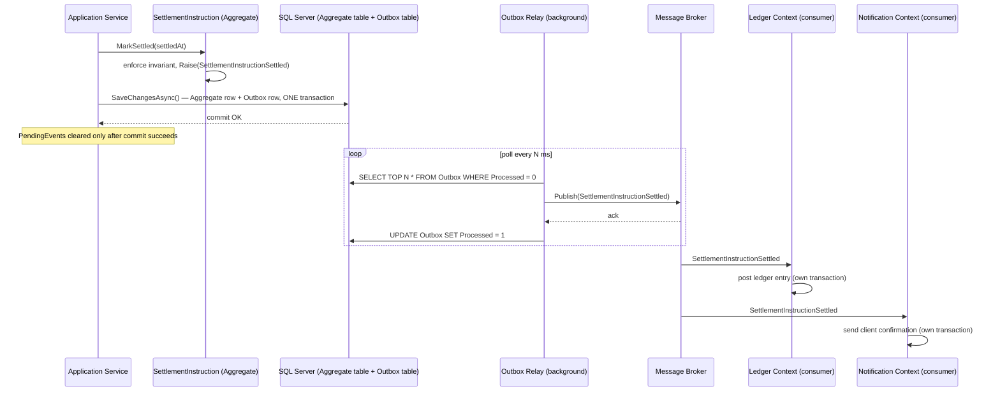
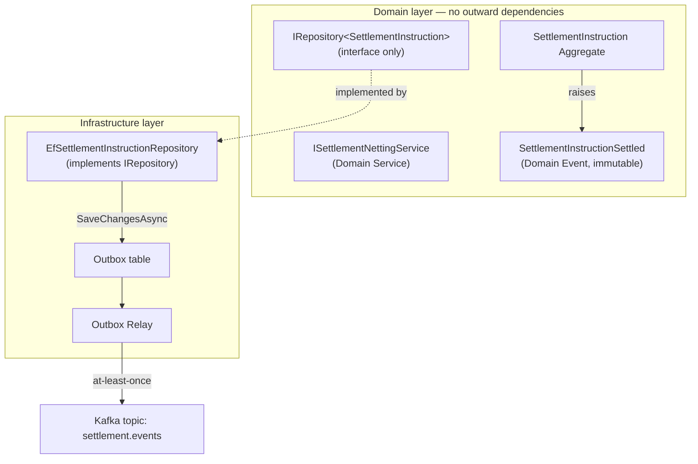
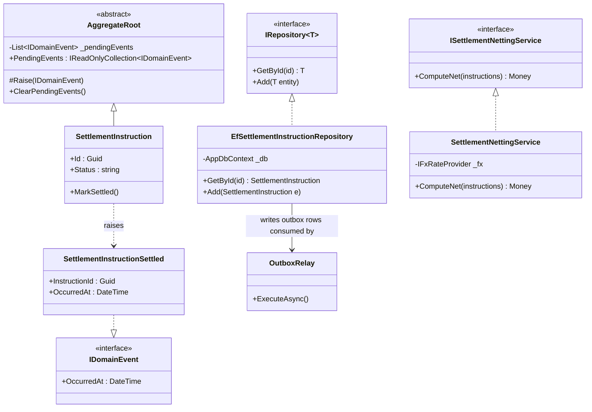
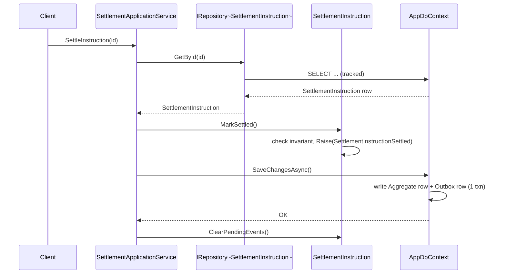

# Module 111 — Domain-Driven Design: Domain Events, Domain Services & Repositories

> Domain: Domain-Driven Design | Level: Beginner → Expert | Prerequisite: [[02-TacticalDDD-Entities-ValueObjects-Aggregates]] (this module's Domain Events, Domain Services, and Repositories are all defined relative to, and require, that module's Aggregate concept already being in place, per its own closing synthesis)
>
> **Note on format:** Upgraded to the repo's current full 16-section template (§1–§15, §17–§18; §16 Enterprise Case Study intentionally omitted per the repo's standing template) with 40 Interview Questions (10 Basic / 10 Intermediate / 10 Advanced / 10 Expert) — the original top-30-curated Q&A content is preserved verbatim within §10 and completed to 40.

---

## 1. Fundamentals

**What:** Domain Events, Domain Services, and Repositories are the three tactical DDD building blocks that sit *around* the Aggregate: a **Domain Event** is an immutable record that something significant already happened inside an Aggregate's transaction ("`TradeSettled`"); a **Domain Service** is a stateless operation that genuinely doesn't belong to any single Aggregate (computing a cross-currency settlement amount using a shared FX-rate concept); a **Repository** is the collection-like abstraction that lets domain and application code load and save whole Aggregates without knowing whether the backing store is SQL Server, Cosmos DB, or a flat file.

**Why:** Without these three, a codebase collapses back into two familiar failure modes: an **anemic domain model**, where Aggregates are bags of properties and all real logic lives in "manager" or "helper" classes with no Ubiquitous-Language home; and a **persistence-leaky domain**, where `DbContext`/`IQueryable` types show up inside business logic, coupling the domain model to a specific ORM and making it impossible to unit-test without a database. Domain Events solve the "how do other parts of the system react to what just happened, without this Aggregate knowing or caring who's listening" problem. Domain Services solve the "this logic is real business logic, but it doesn't belong to one specific Aggregate" problem. Repositories solve the "how do we persist an Aggregate without the domain model depending on infrastructure" problem.

**When:** Domain Events — any state transition another bounded context, another Aggregate, or an audit/notification/reporting concern needs to react to (`PaymentSettled`, `TradeBooked`, `MarginCallIssued`). Domain Services — genuinely cross-Aggregate logic (settlement netting across multiple trades) or logic requiring an external domain concept (an FX-rate provider) that no single Aggregate should own. Repositories — always, for any Aggregate that needs to be persisted and reloaded; never for pure read/reporting projections, which should bypass the Aggregate entirely.

**How (30,000-ft view):**
```
Application Service
   │
   ├─ loads Aggregate via IRepository<T>           (Repository)
   ├─ calls Aggregate.Method() → invariant enforced  (Aggregate)
   │      └─ Aggregate.Raise(new DomainEvent(...))   (Domain Event, queued not published)
   ├─ (optionally) calls a DomainService for cross-Aggregate logic
   ├─ commits via Unit of Work — Aggregate state + outbox row, ONE transaction
   └─ background dispatcher publishes the queued event AFTER commit succeeds
```

---

## 2. Deep Dive

### 2.1 Domain Events Are a Notification Mechanism, Not (by Default) a Storage Mechanism
A Domain Event, as covered here, is transient — raised, dispatched to in-process handlers or an outbox, then discarded. This is a deliberate scope boundary against Event Sourcing (Domain 35): in Event Sourcing, events *are* the system of record and the Aggregate's current state is a fold over its full event history; here, the Aggregate's current state is stored directly (a `Trades` table with current columns), and the Domain Event is a *side effect* of a state change already durably recorded another way. Conflating the two is a real, recurring design mistake — a team that starts raising Domain Events "just in case we want Event Sourcing later" without committing to event-sourced persistence ends up maintaining two divergent sources of truth (the current-state table and an ad hoc event log) with no reconciliation discipline.

### 2.2 The C# Mechanics of Raising and Collecting Events
```csharp
public abstract class AggregateRoot
{
    private readonly List<IDomainEvent> _pendingEvents = new();
    public IReadOnlyCollection<IDomainEvent> PendingEvents => _pendingEvents.AsReadOnly();
    protected void Raise(IDomainEvent domainEvent) => _pendingEvents.Add(domainEvent);
    public void ClearPendingEvents() => _pendingEvents.Clear();
}

public sealed class SettlementInstruction : AggregateRoot
{
    public SettlementInstructionId Id { get; }
    public SettlementStatus Status { get; private set; }

    public void MarkSettled(Instant settledAt)
    {
        if (Status != SettlementStatus.PendingSettlement)
            throw new DomainException($"Cannot settle instruction {Id} in status {Status}.");
        Status = SettlementStatus.Settled;
        Raise(new SettlementInstructionSettled(Id, settledAt));
    }
}
```
Two hidden costs engineers underestimate: (1) `PendingEvents` must be cleared *after* a successful commit, not before — clearing early and then having the commit fail silently discards a fact that should have been retried; (2) every mutating method that can raise more than one event (e.g., a batch `ApplyPartialFills` loop) must guarantee event order matches the order the invariants were actually enforced in, since a downstream consumer replaying `PartialFillApplied` events out of order can compute the wrong remaining quantity.

### 2.3 Why the Outbox Is Not Optional for Cross-Service Domain Events
Publishing directly from inside the Application Service, right after `SaveChanges()`, is the naive default:
```csharp
await _repository.SaveAsync(instruction);
await _bus.PublishAsync(instruction.PendingEvents); // dual-write hazard
```
If the process crashes between the two lines, or the bus publish throws after the DB commit already succeeded, the event is lost — silently, with the settlement instruction sitting `Settled` in the database forever with no downstream system ever told. The fix is the **transactional outbox**: write the Aggregate's row *and* one outbox row per pending event inside the same `DbContext.SaveChangesAsync()` call (same transaction, same atomicity), then a separate, independently-retrying background relay reads unpublished outbox rows and publishes them, marking each `Processed` only on confirmed delivery. This turns "the event was raised" from a hope into a durable, at-least-once guarantee — Domain 37 develops the pattern's full mechanics; this module needs only the guarantee it provides.

### 2.4 EF Core Modelling: Keeping Domain Events Out of the Persisted Shape
`PendingEvents` must never be mapped as a persisted column — it's transient, in-memory-only state, cleared after dispatch. In EF Core:
```csharp
modelBuilder.Entity<SettlementInstruction>()
    .Ignore(x => x.PendingEvents);
```
A `DbContext.SaveChangesAsync` override is the natural interception point for outbox-row generation, because it's the one place that already has access to every tracked Aggregate about to be committed:
```csharp
public override async Task<int> SaveChangesAsync(CancellationToken ct = default)
{
    var events = ChangeTracker.Entries<AggregateRoot>()
        .SelectMany(e => e.Entity.PendingEvents)
        .ToList();

    foreach (var evt in events)
        OutboxMessages.Add(OutboxMessage.From(evt));

    var result = await base.SaveChangesAsync(ct);

    foreach (var entry in ChangeTracker.Entries<AggregateRoot>())
        entry.Entity.ClearPendingEvents();

    return result;
}
```
This is the concrete, EF-Core-specific realization of Advanced Q2's outbox preview — the event insertion happens in the *same* `SaveChangesAsync` call as the Aggregate's own row update, so both commit or neither does.

### 2.5 Repository Query Cost and the N+1-Across-Aggregates Trap
A Repository loading a whole Aggregate graph (`SettlementInstruction` with its `Legs` collection) is correct for a single load-mutate-save cycle. It becomes a performance liability when application code loops over a collection of Aggregates and, for each one, triggers a separate lazy-loaded query for a related Aggregate referenced only by ID — e.g., iterating 500 pending settlement instructions and, for each, calling `_customerRepository.GetById(instruction.CustomerId)` inside the loop produces 501 round trips. The fix is not to widen the Aggregate boundary (that reintroduces the oversized-Aggregate contention risk); it's either a dedicated batched Repository method (`GetByIdsAsync(IEnumerable<CustomerId>)`) or, if this is a read-heavy reporting need rather than a load-mutate-save need, bypassing the Repository/Aggregate path entirely for a direct projection query (Intermediate Q4's CQRS preview).

### 2.6 Domain Service Statelessness and DI Lifetime
A Domain Service should be registered with a **transient or singleton** DI lifetime, never scoped-with-mutable-state — because a Domain Service holding no instance state is what keeps it safely reusable and testable without hidden cross-call contamination:
```csharp
services.AddScoped<ISettlementNettingService, SettlementNettingService>(); // fine — scoped for its DI-injected repository deps, but the type itself holds zero mutable fields
```
The subtle bug this section exists to name: a team adds a private field to a Domain Service to "cache" something computed on an earlier call within the same request, turning what looked stateless into a service whose correctness now depends on call order — the exact loss of the property that made it safe to share and reuse in the first place.

---

## 3. Visual Architecture





---

## 4. Production Example

**Problem:** A multi-asset trade-settlement platform's Settlement bounded context needed to notify two other contexts — Ledger (post the cash/securities entries) and Notification (send the client a confirmation) — the moment a `SettlementInstruction` moved to `Settled`, without Settlement's own transaction depending on either downstream context's availability or latency.

**Architecture:** `SettlementInstruction` is the Aggregate Root, owning its `Legs` (cash leg, securities leg) as internal parts because the invariant "both legs must transition to `Settled` atomically, or neither does" needs synchronous, same-transaction enforcement. `Customer` and `Instrument` are referenced by ID only. An `ISettlementNettingService` Domain Service computes net cash movement across multiple instructions sharing a common counterparty and settlement date — genuine cross-Aggregate logic that doesn't belong to any single `SettlementInstruction`. `IEfSettlementInstructionRepository` persists via EF Core; `SaveChangesAsync` is overridden per §2.4 to write outbox rows in the same transaction.

**Implementation:** `MarkSettled` raises `SettlementInstructionSettled { InstructionId, CustomerId, SettledAmount, Currency, SettledAt }`. The outbox relay (a `BackgroundService` polling every 500ms, batch size 200) publishes to a Kafka topic `settlement.events`. Ledger's consumer posts the entry inside its own transaction, keyed by an idempotency key derived from `InstructionId` (so replays from at-least-once delivery don't double-post). Notification's consumer is a simple, best-effort side effect with its own retry/DLQ.

**Trade-offs:** Choosing at-least-once delivery via the outbox meant every consumer had to be built idempotent from day one — real, non-optional engineering cost — in exchange for the guarantee that a `Settled` instruction's downstream effects are never silently lost even across a process crash. The team explicitly rejected synchronous, in-transaction calls to Ledger from within Settlement's own commit, because that would make Settlement's own commit success depend on Ledger's availability — a coupling the eventual-consistency test correctly rejected, since "the ledger entry posts within a few seconds of settlement" tolerates brief delay with no correctness violation, unlike the cash/securities leg invariant itself.

**Lessons learned:** Six weeks after launch, a production incident showed the outbox relay's poll query (`SELECT TOP 200 * FROM Outbox WHERE Processed = 0 ORDER BY CreatedAt`) had no index on `(Processed, CreatedAt)`, so as unprocessed-row volume grew during a Kafka broker maintenance window, the poll query degraded from 4ms to 1.2s, compounding the backlog it was trying to drain — the classic self-reinforcing-lag pattern. The fix added the missing filtered index (`WHERE Processed = 0`) and an alert on outbox-row age (Advanced Q4's exact monitoring gap named directly), catching the same class of failure before it becomes a client-facing settlement-confirmation delay next time.

---

## 5. Best Practices
- Raise Domain Events from inside the same mutating Aggregate method that enforces the invariant, never as a separate, easily-forgotten step in the Application Service.
- Clear `PendingEvents` only after a successful commit, never before — an early clear silently discards a fact that should be retried on save failure.
- Write outbox rows in the exact same transaction as the Aggregate's own state change (§2.3/§2.4) for any event a different service or bounded context needs to durably observe.
- Keep Repository interfaces in the domain layer, in domain vocabulary (`GetById`, `Add`) — never leak `IQueryable`, `DbSet`, or ORM-specific types into the interface signature.
- Scope Domain Services narrowly to genuine cross-Aggregate coordination; delegate the actual state mutation and invariant check back to each Aggregate's own methods.
- Index the outbox table's polling predicate (`Processed`, `CreatedAt`) before volume, not after an incident forces it.
- Make every Domain-Event consumer idempotent by design (dedupe on a stable business key) — at-least-once delivery is the default and non-idempotent handlers are a matter of when, not if, they double-process.

## 6. Anti-patterns
- **Dual-write publishing** — publishing to a broker directly after `SaveChanges()` without an outbox, silently losing events on a crash between the two calls (§2.3).
- **Leaked `IQueryable` Repository** — a Repository method returning `IQueryable<T>` for callers to filter arbitrarily, defeating the entire persistence-abstraction purpose and producing untraceable, unreviewed SQL.
- **Generic `IRepository<T>`** — a single repository interface for every Aggregate type, forcing Aggregate-specific query needs into awkward, leaky generic escape hatches.
- **Domain Service creeping into an anemic-model refuge** — logic that genuinely belongs on a specific Aggregate pushed into a Domain Service "for convenience," reintroducing the anemic-model failure one layer up.
- **Intra-Aggregate events** — raising a Domain Event for communication *within* a single Aggregate's own internals, where a direct method call would do, adding ceremony with none of the cross-boundary decoupling benefit.
- **Unmonitored outbox backlog** — no alert on oldest-unprocessed-row age, so a stalled relay (broker outage, poison message) silently accumulates a growing correctness gap with zero visibility until a downstream context notices missing data.
- **Fat event payloads that leak internal state** — a Domain Event carrying an entire internal Aggregate snapshot (including fields irrelevant, or worse sensitive, to any consumer) rather than the minimal, deliberately-designed set of facts a consumer actually needs (§8).

---

## 7. Performance Engineering

**CPU/Memory:** Per-event serialization cost (JSON/Avro) for outbox rows is typically negligible versus the DB round trip itself; batch-inserting outbox rows within the same `SaveChangesAsync` call avoids N separate round trips for N raised events.

**Latency:** The original request's latency is bounded by the Aggregate's own commit (including the outbox insert), not by downstream publish/consume latency — this is the entire point of deferring actual dispatch to an asynchronous relay; a request should never block on a broker round trip for a fire-and-react Domain Event.

**Throughput:** Outbox relay throughput is governed by poll interval × batch size; under-provisioning batch size relative to steady-state event volume produces a backlog that grows monotonically even with no incident, a common mis-sizing mistake distinct from the indexing incident in §4.

**Scalability:** Fan-out cost is proportional to the number of downstream consumers per event type, not to the number of raised events overall — a single `SettlementInstructionSettled` consumed by both Ledger and Notification costs two independent, parallel deliveries, not a synchronous chain.

**Benchmarking:** Load-test the outbox poll query specifically under realistic *unprocessed-row* volume (thousands of backlogged rows during a simulated consumer outage), not an empty table — the query plan that's fast against zero rows can degrade badly without the filtered index from §4's incident.

**Caching:** Not directly applicable to event dispatch; a Repository's `GetById` read path can benefit from a short-lived cache for hot Aggregates, provided cache invalidation is tied to the same commit that raises the corresponding Domain Event.

---

## 8. Security

**Threats:** A Domain Event payload crossing a bounded-context or tenant boundary can leak data the receiving context has no legitimate need for and no authorization to hold — e.g., a `SettlementInstructionSettled` event carrying full customer PII when Notification only needs a masked reference and a template key.

**Mitigations:** Design each Domain Event's payload as its own deliberately minimal, published contract — not a serialized dump of the Aggregate — reviewed the same way a public API contract is reviewed; apply field-level redaction/tokenization for any PII crossing into a context with a narrower data-access scope.

**OWASP mapping:** Broken access control if a Repository's query methods don't scope results to the caller's tenant/entitlement (a settlement-instruction Repository that doesn't filter by the caller's authorized customer set); sensitive data exposure if event payloads over-share.

**AuthN/AuthZ:** Repository-layer authorization should be explicit and testable — either the Repository itself accepts and enforces a tenant/entitlement context on every query, or the Application Service enforces it before calling the Repository; relying on "the caller will remember to filter" is the same class of side-door risk as bypassing the Aggregate Root.

**Secrets:** Outbox and broker infrastructure credentials follow standard secrets-management practice; a compromised outbox relay identity should have write access scoped to the outbox table only, not the full Aggregate schema.

**Encryption:** Event payloads containing financial or PII data require the same in-transit (TLS to the broker) and at-rest (encrypted outbox table, encrypted topic storage) posture as the Aggregate's own persisted data — an event is a copy of sensitive facts and inherits the same protection obligation as the source.

---

## 9. Scalability

**Horizontal scaling:** Domain-Event-driven decoupling is itself a scaling mechanism — Settlement's write throughput no longer depends on Ledger's or Notification's processing capacity, since each consumes asynchronously at its own pace; a slow or backed-up consumer never throttles the producing Aggregate's own commit rate.

**Vertical scaling:** Repository/read-model scaling: a Repository's write-optimized `GetById`+full-graph load pattern doesn't scale for read-heavy reporting; a separate, denormalized read model (populated by the same Domain Events) scales reads independently of the write-side Aggregate store (Intermediate Q4/Advanced Q5's CQRS preview).

**Replication/Partitioning:** Outbox tables can be partitioned by Aggregate type or by a hash of Aggregate ID to keep the polling query's working set bounded as volume grows; broker topics are typically partitioned by Aggregate ID to preserve per-Aggregate event ordering for consumers that need it.

**Load balancing:** Multiple outbox relay instances must coordinate (e.g., `SELECT ... FOR UPDATE SKIP LOCKED` or a partition-owner assignment) to avoid double-publishing the same row — a naive multi-instance relay with no coordination reintroduces a duplicate-delivery risk on top of the already-expected at-least-once semantics.

**High Availability:** A relay instance crashing mid-batch is safe by construction — unprocessed rows simply remain `Processed = 0` and are picked up by the next poll cycle or another instance; the durability guarantee lives in the outbox table, not in any single relay process's uptime.

---

## 10. Interview Questions

### Basic (8)

1. **Q: What is a Domain Event?**
 **A:** A Domain Event is an object representing something significant that has already happened within the domain, named in the past tense in the Ubiquitous Language (e.g., `OrderPlaced`, `PaymentConfirmed`) — it's raised by an Aggregate as a side effect of a state-changing operation, carrying the essential facts about what occurred so other parts of the system can react to it without the originating Aggregate needing to know who's listening or why.
 **Why correct:** States the Domain Event's defining properties (past-tense naming, raised by an Aggregate, decoupled from its consumers) precisely.
 **Common mistakes:** Confusing a Domain Event with a command — a command (`PlaceOrder`) expresses an intent that *may* be rejected; a Domain Event (`OrderPlaced`) states a fact that has *already, irreversibly* happened and cannot be un-happened, only reacted to.
 **Follow-ups:** "Why must a Domain Event be immutable, like a Value Object?" (It represents a historical fact — allowing it to be mutated after the fact would let something that "already happened" be silently rewritten, corrupting any code that already reacted to its original content.)

2. **Q: What is a Domain Service, and when is one needed instead of putting the logic on an Entity or Aggregate?**
 **A:** A Domain Service is a stateless object holding domain logic that doesn't naturally belong to any single Entity or Aggregate — needed specifically when an operation meaningfully involves multiple Aggregates or external domain concepts (e.g., converting a price between two currencies using a shared exchange-rate concept) such that forcing it onto one specific Aggregate would be awkward or would inappropriately couple that Aggregate to a concern outside its own boundary.
 **Why correct:** States the Domain Service's defining property (stateless, holds logic with no natural single-Aggregate home) and the specific condition (genuine multi-Aggregate or cross-concept involvement) that warrants one.
 **Common mistakes:** Reaching for a Domain Service by default for any logic that's merely inconvenient to place, rather than first checking whether the logic genuinely belongs on a specific Aggregate/Entity — over-using Domain Services is how an anemic domain model re-emerges in a new guise.
 **Follow-ups:** "Give an example of logic that should NOT be a Domain Service." (Validating that an `Order`'s total equals the sum of its line items — this is squarely the `Order` Aggregate's own invariant and belongs on the Aggregate itself, not extracted into a separate service.)

3. **Q: What is a Repository, and what problem does it solve?**
 **A:** A Repository is an abstraction that provides the illusion of an in-memory collection of Aggregates, hiding the actual persistence mechanism (a SQL database, a document store) behind a simple interface — it solves the problem of domain and application code needing to load and save Aggregates without being coupled to specific persistence technology details, keeping the domain model's design independent of infrastructure concerns.
 **Why correct:** States the Repository's abstraction (an in-memory-collection illusion) and the specific problem it solves (decoupling domain logic from persistence technology).
 **Common mistakes:** Treating a Repository as merely "a data access class" — its specific, defining purpose is presenting a collection-like interface (`Add`, `GetById`, `Remove`) that hides *all* persistence details, not simply wrapping SQL queries behind a differently-named method.
 **Follow-ups:** "Why does a Repository operate specifically at Aggregate granularity, never below it?" (Directly the closing synthesis — loading or saving anything less than a whole Aggregate would bypass the Aggregate Root's invariant enforcement, recreating the exact side-door risk/Intermediate Q9 established the Root-only-access rule to prevent.)

4. **Q: What is the difference between a Domain Service and an Application Service?**
 **A:** A Domain Service holds genuine business logic that's part of the domain model itself, expressed in the Ubiquitous Language; an Application Service sits above the domain model and orchestrates a use case — loading Aggregates via Repositories, calling domain logic (on Aggregates or Domain Services), and coordinating the transaction and any resulting event publishing — without itself containing business rules of its own.
 **Why correct:** States the precise layering distinction (domain logic vs. pure orchestration with no business rules of its own).
 **Common mistakes:** Letting business logic leak into an Application Service (e.g., checking an invariant directly in the orchestration layer rather than delegating to the Aggregate) — this is a subtler recurrence of the anemic domain model anti-pattern, since it moves logic that belongs in the domain model up into a layer meant only to coordinate.
 **Follow-ups:** "Which layer is responsible for starting and committing the database transaction?" (The Application Service — it's an orchestration concern, not something the domain model itself, which shouldn't know about transactions at all, should be responsible for.)

5. **Q: How is a Domain Event typically raised by an Aggregate, at the code level?**
 **A:** A mutating method on the Aggregate Root (e.g., `Order.ConfirmPayment`) both applies the state change and adds a corresponding Domain Event (e.g., `PaymentConfirmed`) to an internal, private list of "pending events" on the Aggregate — the event isn't published immediately from inside the method; it's collected and only actually published after the Aggregate's changes are successfully persisted, keeping event-raising as a natural, integral part of the same state-changing operation rather than a separate, easily-forgotten step.
 **Why correct:** States the concrete mechanism (a pending-events list populated inside the same mutating method) rather than an abstract description.
 **Common mistakes:** Publishing the event immediately and synchronously from inside the mutating method, before the Aggregate's change is actually, successfully saved — if the subsequent save then fails, listeners would have already reacted to something that, from the persisted data's perspective, never actually happened.
 **Follow-ups:** "Why does deferring actual publication until after a successful save matter so much?" (It guarantees listeners only ever react to changes that are genuinely, durably true — Intermediate Q2 and Advanced Q2 develop the specific reliability mechanics this requires.)

6. **Q: Why must a Repository's interface be defined in the domain layer, while its implementation lives in the infrastructure layer — connecting to the Dependency Inversion Principle?**
 **A:** This is a direct application of the Dependency Inversion Principle — the domain layer (which should depend on nothing but itself) defines the `IOrderRepository` interface in its own terms (`Add(Order)`, `GetById(OrderId)`), and the infrastructure layer (which knows about SQL Server, EF Core, or whatever specific technology is used) provides the concrete implementation, satisfying that interface — meaning the domain layer never depends on, or even knows about, the specific persistence technology, only the abstraction it itself defines.
 **Why correct:** Directly connects the Repository's interface/implementation split to the already-established Dependency Inversion Principle, stating the specific direction of dependency (infrastructure depends on the domain-defined interface, not the reverse).
 **Common mistakes:** Defining the Repository interface in the infrastructure layer (or letting it leak persistence-specific types like `IQueryable` or `DbSet` into its signature), which silently reverses the intended dependency direction and re-couples the domain layer to infrastructure details it was supposed to be shielded from.
 **Follow-ups:** "What's a concrete symptom that a Repository interface has leaked infrastructure concerns into the domain layer?" (Its method signatures reference an ORM-specific type like `IQueryable<Order>` rather than plain domain types — Advanced Q6 develops this specific anti-pattern fully.)

7. **Q: What triggers a Domain Event — is it every single change to an Aggregate, or something more specific?**
 **A:** A Domain Event is raised specifically for state changes that are *significant* to the business and that other parts of the system might legitimately need to react to (e.g., `OrderPlaced`, `OrderCancelled`) — not every trivial internal field update warrants its own event; the decision of what counts as "significant enough" is itself a domain-modeling judgment call, made collaboratively with domain experts (the Ubiquitous Language/Event Storming) rather than a mechanical rule applied to every setter.
 **Why correct:** States the specific triggering criterion (business-significant state changes worth reacting to) and connects the "which changes count" judgment back to the collaborative modeling discipline.
 **Common mistakes:** Raising a Domain Event for every single attribute change indiscriminately, producing excessive event noise that obscures the genuinely significant events other parts of the system actually care about.
 **Follow-ups:** "How would Event Storming help identify which state changes genuinely deserve a Domain Event?" (Event Storming's entire premise is domain experts naming the events that matter to the business in their own words — an event surfaced during that collaborative session is, by construction, one domain experts already consider significant.)

8. **Q: What is the difference between a Domain Event (as covered in this module) and an integration event published to a message broker for other services to consume?**
 **A:** A Domain Event is an internal concept, typically consumed by in-process handlers within the same bounded context/service, expressed purely in that context's own Ubiquitous Language; an integration event is a deliberately-designed, cross-service message (often a Published Language) meant for external consumers — a Domain Event is not automatically the same message format sent externally, and often a dedicated translation step converts an internal Domain Event into a deliberately-designed integration event before it crosses the bounded context's boundary.
 **Why correct:** States the scope distinction (internal, context-specific vs. deliberately-designed for external, cross-context consumption) and names the translation step between them.
 **Common mistakes:** Publishing a Domain Event's exact internal shape directly to external consumers without any translation, tightly coupling other services to this context's internal model and violating the Anti-Corruption Layer/Published-Language discipline in the reverse direction (this context "corrupting" its consumers instead of being corrupted by them).
 **Follow-ups:** "Why does this distinction matter for how freely an internal Domain Event's shape can be refactored?" (An internal Domain Event, since it's not itself the external contract, can be freely renamed/restructured as the internal model evolves; the external integration event, once published as a Published Language, requires the same careful, versioned-schema discipline any public contract does.)

9. **Q: What is the relationship between a Domain Event and a "Notification" or "Integration" event that gets serialized onto a message broker?**
 **A:** The Domain Event is the in-process object raised by the Aggregate; before it leaves the bounded context, it's typically mapped into a deliberately-designed integration-event contract (its own DTO shape, versioned independently) that gets serialized onto the outbox/broker — the internal Domain Event's C# type is never itself the wire format, so the internal type can be freely refactored without breaking external consumers who only ever see the translated contract.
 **Why correct:** States the translation boundary (internal type vs. deliberately-versioned wire contract) precisely, matching Basic Q8's translation-step point.
 **Common mistakes:** Serializing the internal Domain Event class directly (e.g., `JsonSerializer.Serialize(domainEvent)`) onto the broker, which silently couples every external consumer to the internal type's exact shape, breaking them the moment that internal type is refactored for an unrelated, purely internal reason.
 **Follow-ups:** "What's a concrete refactor that would break consumers under direct serialization but not under a translated contract?" (Renaming an internal field for internal clarity — under direct serialization this is a breaking wire-format change; under a translated contract, the mapping layer absorbs the rename and the wire contract stays stable.)

10. **Q: Why is a Repository's `Add`/`Save` method typically designed to accept and persist a whole Aggregate, rather than exposing separate methods to update individual fields?**
 **A:** Because the Aggregate Root is the sole authority over its own valid states — any operation that could update a single field independently of the Aggregate's own invariant-checking methods would let calling code bypass those invariants entirely (the exact Root-only-access violation); persisting only ever the Aggregate's *current, already-validated* full state, produced by calling its own methods first, is what keeps the Repository's role limited to storage, never business-rule enforcement.
 **Why correct:** Connects the Repository's whole-Aggregate persistence granularity back to the invariant-enforcement boundary rather than treating it as an arbitrary interface-design choice.
 **Common mistakes:** Adding convenience methods like `UpdateStatus(id, newStatus)` directly on a Repository "to avoid loading the whole Aggregate for a small change" — this is precisely the side-door invariant bypass the whole-Aggregate persistence discipline exists to prevent.
 **Follow-ups:** "Is there ever a legitimate exception to whole-Aggregate persistence?" (A narrowly-scoped, explicitly-reviewed bulk operation — e.g., a batch status flip driven by an external, already-validated settlement file — may use a direct, audited SQL update outside the Repository, but this is a deliberate, rare exception, not a general pattern.)

### Intermediate (8)

1. **Q: How does a Domain Service coordinate logic across multiple Aggregates without itself becoming a repository of business rules that should live elsewhere?**
 **A:** A well-designed Domain Service reads whatever Aggregates/data it needs (via Repositories), delegates the actual invariant-checking and state-changing logic back to each involved Aggregate's own methods, and limits its own responsibility to the specific *coordination* logic that genuinely doesn't belong to any single Aggregate (e.g., "compare Aggregate A's and Aggregate B's current state to decide whether a cross-cutting rule is satisfied") — if a Domain Service starts directly mutating an Aggregate's internal fields itself rather than calling the Aggregate's own methods, it has crossed from legitimate coordination into the same side-door invariant-bypass risk already established.
 **Why correct:** States the specific discipline (delegate mutation to the Aggregates' own methods; the service only coordinates) distinguishing a well-scoped Domain Service from one that's silently absorbed logic that belongs elsewhere.
 **Common mistakes:** Letting a Domain Service directly set an Aggregate's fields or bypass its public methods "for convenience," recreating the exact Root-only-access violation already established as a serious anti-pattern, now happening from within a Domain Service rather than external application code.
 **Follow-ups:** "What's a concrete test for whether a Domain Service is correctly scoped?" (Every state change it causes should be traceable to an explicit method call on the relevant Aggregate Root — if you can find a line of code where the service reaches past an Aggregate's public interface, the service is overstepping its intended role.)

2. **Q: What are the two common mechanisms for publishing Domain Events after an Aggregate's change is saved, and what does each trade off?**
 **A:** (1) In-process, synchronous dispatch immediately after the transaction commits, within the same request — simple and immediately consistent, but a handler's failure (or slowness) directly affects the original request's success/latency, and an event is lost entirely if the process crashes between commit and dispatch; (2) the Outbox pattern (previewed here, developed fully) — writing the event to a durable "outbox" table within the *same* transaction as the Aggregate's own change, then a separate, reliable background process publishes from that outbox — trading immediate in-process simplicity for durability, guaranteeing the event is never silently lost even across a crash.
 **Why correct:** States both mechanisms precisely and each one's specific trade-off (simplicity/immediacy vs. durability), correctly previewing the Outbox pattern without over-explaining a topic owns in full.
 **Common mistakes:** Assuming naive in-process dispatch immediately after commit is "good enough" by default, without recognizing the specific, narrow but real reliability gap (a crash between commit and dispatch silently losing the event) that only the Outbox pattern actually closes.
 **Follow-ups:** "Why can't the event simply be published *before* the transaction commits, avoiding this gap entirely?" (If the transaction then fails to commit for any reason, listeners would have already reacted to a change that, from the persisted data's perspective, never actually happened — exactly Basic Q5's ordering requirement.)

3. **Q: Critique the "generic repository" anti-pattern — a single `IRepository<T>` interface used for every Aggregate type in the system.**
 **A:** A generic `IRepository<T>` (with methods like `Add`, `GetById`, `Delete` applicable identically to any type `T`) looks appealingly reusable but typically forces every Aggregate's repository into an identical, lowest-common-denominator shape, obscuring Aggregate-specific query needs (e.g., `IOrderRepository.GetPendingOrdersForCustomer(CustomerId)`) that don't fit the generic interface — the fix is a dedicated, specifically-named repository interface per Aggregate type, expressing exactly the operations that Aggregate's actual use cases require, even if some structural boilerplate is shared behind the scenes.
 **Why correct:** States the specific problem (forces a lowest-common-denominator shape, obscuring genuine Aggregate-specific needs) and the concrete fix (a dedicated interface per Aggregate).
 **Common mistakes:** Adopting a generic repository purely to reduce initial boilerplate, then working around its limitations later by adding ad hoc, awkward generic methods (`GetByCustomIdAndFilterAsync(Func<T,bool> predicate)`) that end up leaking persistence-query concerns right back into the domain layer — the same anti-pattern Basic Q6 warns against, reintroduced through the generic interface's own escape hatches.
 **Follow-ups:** "Is any code sharing across repositories still acceptable?" (Yes — a shared base implementation class handling common infrastructure plumbing (e.g., `DbContext` access) is fine; what matters is that each Aggregate's *public interface* is specific and expressive, not that zero code is ever shared behind it.)

4. **Q: Should a Repository be used for read-only reporting/query needs, or is a separate mechanism more appropriate — previewing the CQRS?**
 **A:** A Repository is designed around loading a *whole, consistent Aggregate* for the purpose of applying a command/mutation to it — using it for read-only reporting (e.g., "list all orders over $500 in the last week, showing only three summary fields") forces loading full Aggregates just to extract a few fields, which is both wasteful and awkward; a separate, simpler read/query mechanism (a direct, denormalized query or projection, not going through the Aggregate/Repository at all) is generally more appropriate for pure reporting needs — the same underlying principle the CQRS pattern formalizes fully as an explicit read/write separation.
 **Why correct:** States the specific mismatch (Repository designed for whole-Aggregate command loading vs. reporting's partial-field, read-only needs) and correctly previews CQRS as the fuller formalization of this same principle.
 **Common mistakes:** Forcing every data-access need, including pure reporting, through the Aggregate/Repository pattern out of a sense of architectural consistency, incurring real performance and complexity cost for read-only queries that never actually need an Aggregate's invariant-enforcing behavior at all.
 **Follow-ups:** "Why is this NOT itself a premature CQRS adoption, given the premature-abstraction warning?" (Using a simple, direct query for reporting instead of forcing it through the Repository is the *simpler*, not more complex, choice here — full CQRS's additional infrastructure (separate read models, event-driven projections) is what should wait for actual, demonstrated need, per that same module's guidance.)

5. **Q: How should Repository implementations be tested, as distinct from testing an Aggregate's own domain logic?**
 **A:** An Aggregate's invariant logic should be tested with fast, isolated unit tests requiring no database at all (the adversarial invariant tests); a Repository implementation, by contrast, needs integration tests that actually exercise the real persistence technology (a real or test-container database) to verify the Repository correctly saves and reloads an Aggregate's full state, including any ORM-mapping subtleties — the two test types serve genuinely different purposes and shouldn't be conflated or substituted for each other.
 **Why correct:** States the distinct testing approach and purpose for each layer (fast, database-free unit tests for domain logic; real-persistence integration tests for Repository correctness), explaining why one can't substitute for the other.
 **Common mistakes:** Testing a Repository purely with mocked persistence, which can pass even if the real ORM mapping is subtly broken (e.g., a Value Object not round-tripping correctly through the database) — only a genuine integration test against real persistence infrastructure catches this class of bug.
 **Follow-ups:** "What's a concrete Repository-specific bug an integration test would catch that a mocked-persistence test would miss?" (A Value Object's equality/serialization not surviving a real database round-trip correctly — e.g., a `Money` object's currency being silently dropped by an incomplete ORM mapping — invisible to a test that never actually persists and reloads through the real database.)

6. **Q: What is the Unit of Work pattern, and how does it relate to the Repository and Aggregate-as-transaction-boundary principle?**
 **A:** A Unit of Work tracks all the changes made during a single business operation (potentially across multiple Repositories) and commits them as one atomic transaction — it's the concrete mechanism that enforces the "one Aggregate, one transaction" default in the common, correctly-scoped case, while also providing the specific, deliberate exception path (the rare, reviewed multi-Aggregate transaction) when genuinely needed, by coordinating the commit across more than one Repository's pending changes within that single Unit of Work.
 **Why correct:** States the Unit of Work's mechanism (tracking and atomically committing changes) and connects it directly to enforcing, and providing the deliberate exception to, the already-established transaction-boundary principle.
 **Common mistakes:** Treating the Unit of Work as an unrelated, purely technical implementation detail rather than recognizing it as the concrete mechanism actually enforcing (or, when deliberately used across Repositories, relaxing) the Aggregate-transaction-boundary discipline established.
 **Follow-ups:** "Why does an ORM's `DbContext` (in EF Core) already function as a natural Unit of Work?" (It tracks all pending changes across every entity loaded through it and commits them together via `SaveChanges` — the Unit of Work pattern is often not something to build separately in.NET, but a role the ORM's own context already fulfills.)

7. **Q: What is the Specification pattern (tying back to the Design Patterns), and how does it help keep query logic out of the domain layer while still expressing complex query criteria?**
 **A:** A Specification is an object encapsulating a specific, named, reusable business query criterion (e.g., `OverdueOrdersSpecification`) expressed in domain terms, which a Repository method can accept and translate into whatever underlying query technology is actually used — this lets complex, business-meaningful filtering criteria be expressed and reused in the domain's own vocabulary without leaking ORM-specific query syntax (like a raw `IQueryable` expression) directly into calling code, directly reusing the Specification pattern already introduced generally, now applied specifically to Repository query criteria.
 **Why correct:** States the Specification pattern's role (encapsulating a named, reusable, domain-expressed query criterion) and connects it explicitly to the general pattern, applied to this specific Repository-querying context.
 **Common mistakes:** Adding an ever-growing list of highly-specific query methods directly to a Repository interface (`GetOverdueOrders`, `GetOverdueOrdersForRegion`, `GetOverdueHighValueOrders`...) instead of a small number of methods accepting a composable Specification object, leading to interface bloat as query needs diversify.
 **Follow-ups:** "Why is a Specification preferable to simply exposing `IQueryable<Order>` directly from the Repository for callers to filter as they like?" (Directly Basic Q6's leaked-abstraction risk — exposing `IQueryable` lets ORM-specific query capabilities and quirks leak into calling code, coupling it to the specific persistence technology the Repository was supposed to hide entirely.)

8. **Q: How do Domain Events relate to the eventual-consistency-across-Aggregates decision/Advanced Q2 already established?**
 **A:** A Domain Event is the concrete mechanism that implements the eventual-consistency side of that decision — once the test determines a given cross-Aggregate business rule tolerates brief, corrected inconsistency rather than requiring hard, synchronous enforcement, a Domain Event raised by the "source" Aggregate (e.g., `OrderPlaced`) is what a separate handler subscribes to, reading and updating a *different* Aggregate (e.g., updating a `Customer`'s lifetime order count) in its own, separate transaction — keeping each Aggregate's own transaction small and correctly-scoped while still eventually satisfying the cross-cutting business rule.
 **Why correct:** Directly connects Domain Events to the already-established decision framework as its concrete implementation mechanism, rather than treating Domain Events as an unrelated, freestanding concept.
 **Common mistakes:** Introducing Domain Events generically without tracing back to which specific cross-Aggregate rule (identified via the synchronous-vs-eventual test) each event actually exists to satisfy, resulting in events raised without a clear, traceable business justification for their existence.
 **Follow-ups:** "What happens if the handler reacting to a Domain Event fails partway through updating the second Aggregate?" (This is exactly the reliability gap Intermediate Q2's Outbox-pattern preview and Advanced Q8's "verify the verifier" discussion address — a failed or silently-dropped handler execution needs its own detection and retry mechanism, not an assumption that "the event was raised" is equivalent to "the reaction definitely, successfully happened.")

9. **Q: What is the "Inbox" pattern, and why does a Domain-Event consumer often need one alongside the producer's Outbox?**
 **A:** The Inbox pattern is the consumer-side mirror of the Outbox: before processing an incoming event, the consumer checks (and records, within the same local transaction as processing the event's effect) a durable "already-processed" marker keyed by the event's unique ID — this is what actually makes an at-least-once-delivered event safe to process exactly once from the business-outcome's perspective, since the broker/outbox only guarantees the message arrives at least once, not that the consumer's side effect (e.g., posting a ledger entry) only happens once.
 **Why correct:** Names the specific consumer-side mechanism (a durable, transactionally-consistent dedup marker) that converts at-least-once delivery into effectively-once processing, distinct from and complementary to the producer's Outbox.
 **Common mistakes:** Assuming the Outbox alone guarantees "the event is only processed once" — the Outbox guarantees durable, at-least-once *delivery*; whether the consumer's *processing* is idempotent is an entirely separate, consumer-owned responsibility the Inbox pattern addresses.
 **Follow-ups:** "Where does the Inbox's dedup check need to live relative to the consumer's own business-effect transaction?" (In the same transaction as the business effect — e.g., inserting the processed-event-ID row and posting the ledger entry must commit or roll back together, otherwise a crash between the two reintroduces the exact gap the Inbox exists to close.)

10. **Q: Critique a Domain Service that internally calls a Repository to load an Aggregate, mutates its public properties directly via reflection or internal setters "to avoid needing a new method on the Aggregate," and then saves it.**
 **A:** This is a severe violation of the Root-only-access discipline, made worse by being deliberately engineered around the language's own protection (reflection, or an `internal` setter exposed to the Domain Service's assembly) — it produces state changes that never passed through any invariant-checking method at all, meaning the persisted Aggregate can end up in a state its own class was specifically designed to make unreachable; the correct fix is always adding (or reusing) a proper, invariant-enforcing method on the Aggregate itself, even if that requires a short, deliberate design conversation about what that method's contract should be.
 **Why correct:** Identifies the specific, deliberate-circumvention severity (bypassing language-level protection, not just an accidental oversight) and states the only correct fix (a proper Aggregate method), rather than treating it as a minor style issue.
 **Common mistakes:** Treating this as acceptable "pragmatism" under deadline pressure — every such shortcut is a specific, traceable instance of the anemic-model-recurrence failure this domain's entire capstone identifies as the single most persistent anti-pattern across all four modules.
 **Follow-ups:** "How would a code reviewer catch this pattern before it merges?" (A static-analysis/architecture-fitness-function rule flagging reflection-based field access or use of `internal` setters from outside the Aggregate's own assembly boundary — turning a manual review habit into an enforced, automated gate.)

### Advanced (7)

1. **Q: Design the concrete Domain Event, Domain Service, and Repository set for the `Order` Aggregate established, including a pricing calculation that genuinely needs a Domain Service.**
 **A:** Domain Events: `OrderPlaced` (raised when an order transitions from being built to submitted, carrying `OrderId`, `CustomerId`, and total `Money`) and `OrderShipped` (raised on the shipping-status transition). Repository: `IOrderRepository` with `GetById(OrderId)`, `Add(Order)` — defined in the domain layer per Basic Q6, implemented against SQL Server in infrastructure. Domain Service: a `DiscountPricingService` genuinely needed because computing a valid discount requires consulting both the `Order`'s current line items *and* a separate `PromotionRules` concept (potentially its own small Aggregate or a read-only reference set) — logic that doesn't naturally belong to the `Order` Aggregate alone, since `Order` shouldn't need to know the full space of promotion rules itself; the service reads what it needs and returns a computed discount `Money` value, which the `Order` Aggregate's own `ApplyDiscount(Money)` method then validates and applies, keeping the actual invariant enforcement (can this discount legally be applied to this order?) on the Aggregate itself, not the service.
 **Why correct:** Provides a concrete, correctly-scoped design distinguishing what belongs on the Aggregate (invariant enforcement via `ApplyDiscount`) from what genuinely belongs in a Domain Service (cross-concept discount computation), directly building on the Advanced Q1 example.
 **Common mistakes:** Putting the entire discount *computation* logic directly inside the `Order` Aggregate, forcing it to know about the full space of promotion rules — a cross-cutting concern that doesn't belong to a single order and would bloat the Aggregate exactly as warns against.
 **Follow-ups:** "Why does `DiscountPricingService` return a value for `Order.ApplyDiscount` to validate, rather than mutating the `Order` directly itself?" (Directly Intermediate Q1's discipline — the service computes and coordinates, but the actual state change and its invariant check must go through the Aggregate Root's own method, keeping `Order` as the sole authority over its own valid states.)

2. **Q: How would you design reliable Domain Event publishing that survives a process crash between the Aggregate's transaction committing and the event actually reaching its handlers, previewing the Outbox pattern?**
 **A:** Within the *same* database transaction that saves the Aggregate's own state change, also insert a row representing the pending event into a dedicated outbox table (this is the "write" half of the transactional-outbox guarantee) — since both writes are part of one atomic transaction, either both succeed together or neither does, eliminating the specific gap where the Aggregate's change is saved but the event is lost; a separate, independent background process then reads unprocessed rows from the outbox table and actually publishes them (to an in-process dispatcher or an external message broker), marking each as processed only after successful publication, with retry logic for any publication failure.
 **Why correct:** States the transactional-outbox mechanism precisely (event insertion in the same transaction as the Aggregate's own state change) and the separate, independently-retryable publication step, correctly previewing the fuller treatment without over-explaining it.
 **Common mistakes:** Believing that simply "trying to publish the event right after commit, with a try/catch around it" provides equivalent reliability — a process crash occurring in the narrow window after a successful commit but before that publish attempt even starts would still silently lose the event; only writing the event within the same atomic transaction as the state change closes this gap completely.
 **Follow-ups:** "Why is polling the outbox table (rather than triggering publication synchronously from within the same request) still consistent with the goal of not blocking the original request on a potentially slow message broker?" (The background publisher runs entirely independently of the original request's response — the request completes as soon as its own transaction (including the outbox row) commits, with actual event delivery happening asynchronously and reliably afterward, decoupling response latency from delivery latency entirely.)

3. **Q: Critique a Repository interface whose methods return `IQueryable<Order>` directly to calling application code, allowing arbitrary further LINQ filtering by the caller.**
 **A:** This is Basic Q6's leaked-abstraction anti-pattern in its most common, concrete.NET form — returning `IQueryable<Order>` exposes the underlying ORM's (EF Core's) query-translation capabilities and behavior directly to calling code, meaning application/domain code can now compose arbitrary, ORM-specific query expressions that the Repository interface was supposed to fully encapsulate and hide; it also silently defeats the entire purpose of the Specification pattern (Intermediate Q7), since callers can bypass any intended, curated query vocabulary and construct ad hoc queries the Repository's author never anticipated or reviewed, some of which may translate into surprisingly inefficient SQL with no application-layer visibility into why.
 **Why correct:** Identifies the specific mechanism (direct `IQueryable` exposure) by which this design concretely, not just theoretically, violates the Repository abstraction, and connects the consequence to both Basic Q6's general principle and Intermediate Q7's Specification-pattern alternative.
 **Common mistakes:** Justifying `IQueryable` exposure as "flexible" or "avoiding Repository-interface bloat," without recognizing that this flexibility comes specifically at the cost of the persistence-technology independence and reviewable query vocabulary the Repository pattern exists to provide in the first place.
 **Follow-ups:** "What's a concrete production symptom this anti-pattern tends to produce?" (An unexpectedly slow endpoint traced back to an ad hoc, caller-composed LINQ query that translates into an inefficient, unindexed SQL query — one that no Repository-interface reviewer ever saw coming, since the actual query was assembled entirely on the calling side rather than being one of the Repository's own, deliberately-designed methods.)

4. **Q: How does this course's "verify the verifier" theme apply to Domain Event handling specifically — can a Domain Event handler silently fail without anyone noticing?**
 **A:** Yes, in the same structural way this theme has recurred throughout the course — an in-process event handler can throw an exception that's silently caught and logged (but not surfaced or alerted on) somewhere in generic error-handling middleware, or an Outbox-based background publisher can encounter a persistent, systematic delivery failure (a message broker outage, a handler that always throws for a specific event shape) that produces a growing backlog of unprocessed outbox rows with no dashboard or alert surfacing it — in both cases, "the event was raised" (Basic Q5/Q7) is a declared fact that provides zero evidence the event's intended downstream effect (Intermediate Q8's cross-Aggregate eventual consistency) actually, successfully occurred, requiring the identical explicit monitoring/liveness-canary discipline this course has established for every other similar mechanism.
 **Why correct:** Correctly identifies two concrete, distinct failure modes (silently-swallowed in-process handler exceptions, a growing unmonitored outbox backlog) and explicitly connects the underlying risk to this course's already-established recurring theme and its established mitigation pattern (liveness monitoring).
 **Common mistakes:** Assuming that because the event-raising code executed without an exception, the intended downstream reaction (updating a related Aggregate, sending a notification) definitely, successfully happened — the raising and the actual, successful handling are two separate facts, and only the latter, not the former, is what genuinely matters for the business rule the event exists to satisfy.
 **Follow-ups:** "What's a concrete monitoring signal that would catch a growing, unnoticed outbox backlog before it causes real business impact?" (An alert on the outbox table's oldest-unprocessed-row age or total unprocessed-row count exceeding a threshold — directly analogous to the burn-rate alerting, now applied to event-publishing lag specifically.)

5. **Q: Critique using Domain Events for consistency needs entirely *within* a single Aggregate's own boundary, rather than only across Aggregates.**
 **A:** Within a single Aggregate, ordinary method calls already provide synchronous, immediately-consistent communication between the Aggregate's internal parts — introducing Domain Events for purely internal coordination (e.g., an `OrderLine` "publishing" an event that the `Order` root itself handles within the same operation) adds indirection and asynchronous-feeling ceremony to what should be a simple, direct, synchronous method call, without any of the genuine benefit (decoupling across a boundary that's actually being crossed) Domain Events exist to provide; Domain Events earn their complexity specifically at genuine Aggregate (or bounded-context) boundaries, per Intermediate Q8, not as a general-purpose internal-communication mechanism used out of habit or unexamined architectural fashion.
 **Why correct:** States precisely why Domain Events add unjustified complexity when used for purely intra-Aggregate coordination, and reaffirms that their genuine value is specifically at real consistency-boundary crossings.
 **Common mistakes:** Adopting an "everything communicates via events" style uniformly throughout the codebase, including within a single Aggregate's own internals, mistaking a valuable cross-boundary pattern for a universally superior communication style regardless of context — directly the "no silver bullet" principle recurring at the tactical-DDD level.
 **Follow-ups:** "What's the concrete cost of this internal-events-everywhere anti-pattern, beyond just 'unnecessary indirection'?" (It makes an Aggregate's actual internal invariant-enforcement flow substantially harder to trace and reason about — a reader must follow an event's publish-and-subscribe wiring instead of simply reading a direct method call's straightforward control flow, adding real debugging and comprehension cost for zero genuine decoupling benefit.)

6. **Q: Synthesize this module with, walking through the full, layered flow of placing an order from an incoming request to a downstream Aggregate's eventual update.**
 **A:** An Application Service receives the "place order" use case, loads the relevant `Order`-building context (the `Order` Aggregate, potentially freshly constructed via a Factory) via `IOrderRepository`; it calls the `Order` Aggregate's own methods (`AddLine`, `Submit`) which enforce all of the invariants and, on successful submission, add an `OrderPlaced` Domain Event (this module's Basic Q5) to the Aggregate's pending-events list; the Application Service then commits the transaction via a Unit of Work (Intermediate Q6), which — via the Outbox pattern (Advanced Q2) — durably records the event alongside the `Order`'s own persisted state in the same atomic transaction; a separate background publisher later reliably delivers `OrderPlaced` to a handler that updates the `Customer` Aggregate's lifetime order count in its own, independent transaction, satisfying the cross-Aggregate business rule via eventual consistency exactly as the decision test intended.
 **Why correct:** Traces one concrete, realistic request end-to-end through every concept both modules established (Application Service orchestration, Aggregate invariant enforcement, Domain Event raising, Unit-of-Work/Outbox-based reliable persistence and publishing, and the eventual-consistency handler), showing how they compose into a single, coherent, working flow rather than remaining separate, disconnected concepts.
 **Common mistakes:** Describing each pattern (Repository, Domain Service, Domain Event, Aggregate) in isolation without tracing a single, concrete request through all of them together, missing the concrete, load-bearing sequencing (invariant enforcement *then* event-raising *then* durable, transactional persistence *then* independent, asynchronous downstream handling) that makes the whole design actually correct and reliable.
 **Follow-ups:** "At which specific point in this flow would the optimistic concurrency control (Basic Q9) actually be checked?" (During the Unit of Work's commit — the `Order`'s save, guarded by its version/`RowVersion` check, either succeeds or fails atomically together with the outbox event's insertion, since both are part of the same transaction.)

7. **Q: Deliver a closing synthesis for this module, previewing the capstone and this domain's continuing forward connections to CQRS (34), Event Sourcing (35), Saga (36), and Outbox (37).**
 **A:** This module completed the tactical-DDD toolkit began — Domain Events for genuine cross-Aggregate/cross-boundary reactions (never intra-Aggregate, per Advanced Q5), Domain Services for logic that doesn't belong to any single Aggregate (kept narrowly scoped, per Intermediate Q1, to avoid recreating an anemic model one layer up), and Repositories for Aggregate-granularity persistence abstraction (kept free of leaked query/ORM concerns, per Advanced Q3) — with reliable event publishing (Advanced Q2's Outbox preview) as the connective tissue making eventually-consistent, cross-Aggregate business rules actually trustworthy rather than merely hopeful. will synthesize this domain's full arc (109's strategic groundwork, 110's Aggregates, this module's Events/Services/Repositories) into a real, worked microservice-decomposition case study. Looking further forward: the CQRS will formalize Intermediate Q4's read/write separation fully; the Event Sourcing will revisit this module's Domain Events as a persistence mechanism in its own right, not merely a notification; the Saga will formalize multi-step, multi-Aggregate orchestration beyond what a single Domain Service (Intermediate Q1) should attempt; and the Outbox will fully develop the reliable-publishing mechanism this module could only preview.
 **Why correct:** Concisely synthesizes this module's own three concepts and their interlocking discipline, then explicitly names the specific, forward connection each of four upcoming domains (34/35/36/37) will build from this module's necessarily-partial preview — full multi-directional synthesis matching this course's established convention.
 **Common mistakes:** Ending the module without explicitly naming which specific, forward domain each preview (CQRS, Event Sourcing, Saga, Outbox) connects to, leaving the reader to rediscover these connections independently rather than being given the explicit roadmap this course consistently provides.
 **Follow-ups:** "Why was it correct for this module to preview these four future domains only briefly, rather than developing any of them fully here?" (Each is substantial enough to warrant its own dedicated domain with its own full trade-off analysis — attempting to fully develop Outbox, CQRS, Event Sourcing, or Saga here would either duplicate those domains' eventual content or force a premature, under-justified depth this tactical-DDD module's own scope doesn't call for.)

8. **Q: A `SettlementInstructionSettled` event handler in the Ledger context throws a `DbUpdateException` (a transient deadlock) roughly 0.1% of the time. Design the retry/DLQ strategy, and explain why "just retry forever" is wrong.**
 **A:** The handler's exception must first be classified: a transient deadlock is retryable, so the consumer should retry with a bounded backoff (e.g., 3 attempts, exponential: 200ms/1s/5s) directly in the message-processing pipeline before giving up on that specific delivery attempt. If all bounded retries fail, the message moves to a **dead-letter queue (DLQ)** rather than being retried indefinitely — "retry forever" is wrong because a non-transient failure (e.g., a genuinely malformed payload, or a downstream schema mismatch) would otherwise block the consumer's entire partition/queue indefinitely, since most broker consumers process in order and a stuck message at the head of the queue prevents every message behind it from being processed at all (head-of-line blocking). The DLQ is then a monitored, explicitly reviewed queue — not a silent graveyard — with an alert on DLQ depth and a runbook for manual/automated replay once the root cause (a bad deploy, a downstream outage) is fixed.
 **Why correct:** Distinguishes retryable transient failures from non-retryable ones, names the specific mechanical reason unbounded retry is harmful (head-of-line blocking), and treats the DLQ as an actively monitored mechanism rather than a dumping ground.
 **Common mistakes:** Retrying every failure indefinitely regardless of classification, which for a genuinely non-transient failure (a poison message) blocks the entire partition's throughput; or routing to a DLQ with no monitoring, silently accumulating undelivered settlement facts with the exact same visibility gap Advanced Q4 already names for the outbox itself.
 **Follow-ups:** "Why must the DLQ alert be on *depth*, not just *existence of any message*?" (A single DLQ message may be an expected, rare edge case already being investigated; a growing depth signals a systemic, ongoing failure — depth trend is the actionable signal, not the binary presence of any message at all.)

9. **Q: A code reviewer flags that a new `IOrderRepository.GetTopSpendingCustomersLastQuarter()` method has been added directly to the Order Aggregate's Repository interface. Critique this, and connect it to this module's CQRS preview.**
 **A:** This method has nothing to do with loading a whole `Order` Aggregate for a load-mutate-save cycle — it's a multi-Order, aggregate-spanning analytical query that doesn't need Aggregate invariant enforcement at all, and adding it to `IOrderRepository` both bloats the write-side interface with a read-only reporting concern and, in a typical EF Core implementation, would materialize far more data (full `Order` graphs) than the report actually needs, for a query that will only ever read three or four summary fields per customer. The fix, again, is Intermediate Q4's principle: this belongs to a separate, direct read/query path — not necessarily full CQRS with dedicated infrastructure, but at minimum a distinct `IOrderReportingQueries` interface backed by a simple, denormalized query, decoupled from the Aggregate-oriented Repository entirely.
 **Why correct:** Identifies the specific mismatch (write-oriented Repository interface polluted with an unrelated, expensive analytical read) and applies the already-established read/write separation principle concretely rather than abstractly.
 **Common mistakes:** Accepting the addition "because it's convenient to have everything Order-related in one interface," which is exactly the interface-bloat and inefficient-materialization cost Intermediate Q4 warns against, now made concrete with a specific, realistic method signature.
 **Follow-ups:** "At what point would this reporting need justify actual CQRS infrastructure (a separate, event-projected read store) rather than just a direct query?" (Once the direct query's own performance or freshness requirements can no longer be met against the write-side schema — e.g., the report needs sub-second freshness across a sharded write store — the same complexity-justifying threshold this course applies everywhere before adopting additional architectural machinery.)

10. **Q: A settlement Domain Service needs the current FX rate to compute a cross-currency net amount. Should it call an external FX-rate API directly, or should this be modeled differently — and what does this imply for testability?**
 **A:** The Domain Service itself should depend on an abstraction — an `IFxRateProvider` interface defined in the domain layer, exactly mirroring the Repository's own dependency-inversion discipline (Basic Q6) — with the concrete implementation (an HTTP client calling a market-data vendor, cached with a short TTL) living in infrastructure. This keeps the Domain Service's actual business logic (how to compute a net amount given a rate) unit-testable in complete isolation, by supplying a fake `IFxRateProvider` returning a fixed rate, with zero network dependency or flakiness in the test — directly reusing Intermediate Q5's distinction between fast, database/network-free domain-logic tests and slower, real-infrastructure integration tests, now applied to an external market-data dependency rather than a database.
 **Why correct:** Applies the same dependency-inversion and test-layering discipline already established for Repositories to a different kind of external dependency (a market-data provider), showing the pattern generalizes rather than being Repository-specific.
 **Common mistakes:** Having the Domain Service instantiate and call an HTTP client directly, coupling core settlement-calculation logic to network availability and vendor-specific response shapes, and making the logic's own correctness untestable without mocking an entire HTTP pipeline.
 **Follow-ups:** "What happens to the Domain Service's correctness if the FX-rate provider is temporarily unavailable mid-settlement-run?" (This becomes an explicit failure-handling decision the Application Service must make — retry with backoff, fall back to a last-known-good cached rate within a defined staleness tolerance, or fail the specific instruction and flag it for manual review — never silently proceeding with an undefined or zero rate.)

### Expert (FinTech Principal Panel)

**E1. Q: A payment aggregate raises a `PaymentSettled` domain event. In a bank, what's the difference between an in-process domain event and a durable integration event, and why does treating "the event was raised" as "the fact is safely recorded and downstream will be told" cause real money incidents?**
**A:** A **domain event** is an in-process, in-memory notification that something happened *inside* the aggregate's transaction — it's at-most-once, non-durable, and lost if the process crashes. That's fine for coordinating handlers *within* the same transaction, but it is **not** a promise that downstream systems (ledger posting, notifications, reconciliation) will be told. Treating "`PaymentSettled` was raised" as "settlement is durably recorded and everyone downstream will hear it" causes incidents because: if the process crashes after the DB commit but before/while handlers run, the in-process event evaporates — the reconciliation feed never learns, and books diverge with no retry and no record it was owed; and publishing to a broker directly from a handler is the **dual-write problem** (DB commit and publish aren't atomic — one can succeed while the other fails). The correct pattern for a fact that must reach other systems: turn the durable, cross-boundary notification into an **integration event** persisted via the **Outbox** — write the aggregate change *and* an outbox row in the *same* transaction, and a relay publishes at-least-once to a broker, with **idempotent** consumers. The Principal framing: a domain event is an in-process coordination signal, not a durable, guaranteed-delivery fact — for money that must reach the ledger/reconciliation/downstream, raise the domain event *and* record a durable integration event via the transactional outbox, because "the event fired" is exactly the assumption behind a lost settlement notification and diverged books.
**Why correct:** Distinguishes in-process domain events (at-most-once, non-durable) from durable integration events, names the crash-loss and dual-write failures, and routes cross-boundary money facts through the transactional outbox + idempotent consumers.
**Common mistakes:** Treating a raised domain event as guaranteed delivery; publishing to a broker directly from a handler (dual-write); no outbox for cross-boundary money facts; non-idempotent consumers.
**Follow-ups:** "Why can't you just publish to Kafka inside the handler?" (dual-write) / "How does the outbox make the domain event's downstream effect durable?"

**E2. Q: How should a Repository for a money aggregate (an account, a ledger) be designed so it can't be used to *bypass* the aggregate's invariants, and what repository anti-patterns quietly corrupt money correctness?**
**A:** A repository exists to load and persist *whole aggregates* through their invariant-enforcing boundary — its job is to make the aggregate the *only* way money state changes. Design it so the invariant can't be bypassed: (1) the repository returns the **aggregate root** (e.g., `Account`) and callers change state only through the root's guarded methods (`Withdraw`, `Post`), never by mutating fields directly — the balance invariant ("never negative," debits==credits) lives in the aggregate, and there is no path that skips it; (2) **no leaking a raw queryable / `IQueryable` of the underlying rows** that lets a caller run ad-hoc updates or partial reads that sidestep the aggregate (the classic anti-pattern — a repository that exposes the ORM's query object turns every caller into a potential invariant-bypasser); (3) **enforce concurrency** — the repository persists with an optimistic version check (or the aggregate's own guarded conditional update) so two concurrent withdrawals can't both succeed against a stale balance (lost update / double-spend); (4) keep **command persistence** separate from **read/reporting queries** — reporting reads go through a separate read model/query, not the aggregate repository, so read convenience never tempts a write path that bypasses invariants (a CQRS seam). The Principal framing: a money repository must make the aggregate the *sole* gate for state change — return whole roots, never a raw query object that lets callers bypass invariants, enforce concurrency to prevent double-spend, and keep reporting reads on a separate path — because the moment a repository lets code touch balance rows outside the aggregate, the balance invariant is no longer enforced.
**Why correct:** Designs the repository around whole-aggregate load/persist through the invariant boundary, rejects raw-queryable leakage, enforces optimistic concurrency against double-spend, and separates reporting reads.
**Common mistakes:** Exposing `IQueryable`/raw rows so callers bypass the aggregate; mutating balance fields outside guarded methods; no concurrency check (double-spend); using the aggregate repository for heavy reporting reads.
**Follow-ups:** "Why is exposing the ORM's `IQueryable` from a money repository dangerous?" / "How does the repository prevent two concurrent withdrawals from both succeeding?"

**E3. Q: A funds transfer moves money between two accounts — it touches two aggregates. Why can't this live inside a single aggregate, how do you model it (domain service), and what does that imply for consistency?**
**A:** Two accounts are two separate **aggregates** (each its own consistency/invariant boundary), and a well-designed system doesn't wrap two aggregates in one transaction as a rule — so a transfer that must debit one and credit another is coordinated by a **domain service** (`TransferService`), not shoved inside either account aggregate. That immediately raises the consistency question: (1) **same context, same database** — you *can* debit and credit within one local ACID transaction if both accounts live in the same ledger context/store (the common, correct case for an internal ledger — one transaction, guarded conditional debit `WHERE balance >= amount`, atomic); the "one aggregate per transaction" guideline yields to the hard money invariant that a transfer must be atomic; (2) **across contexts/services** (accounts in different services, or an external leg) — you *can't* use one transaction, so the transfer becomes a **saga** with compensating actions (reverse the debit if the credit fails) and idempotency, accepting a bounded intermediate inconsistency (/Saga). Model the transfer itself as an explicit domain concept (a `Transfer`/`Posting` with its own identity and lifecycle) so it's auditable and idempotent, rather than an untracked pair of mutations. The Principal framing: a transfer spans two account aggregates, so it's a domain service, not aggregate-internal logic — keep it a single atomic transaction when both legs share a ledger context/store (the guideline bends to the atomic-money invariant), and use a saga with compensation + idempotency when the legs cross a service/context boundary, modeling the transfer as an explicit, auditable concept either way.
**Why correct:** Models the cross-aggregate transfer as a domain service, keeps it atomic within one ledger context/store, escalates to saga+compensation across boundaries, and makes the transfer an explicit auditable concept.
**Common mistakes:** Stuffing transfer logic inside one account aggregate; using a distributed transaction across services for a transfer; two untracked mutations instead of a modeled `Transfer`; no compensation/idempotency when legs cross a boundary.
**Follow-ups:** "When does the 'one aggregate per transaction' guideline correctly bend for money?" / "What changes when the two accounts live in different services?"

**E4. Q: A risk-management system needs to react to `PositionUpdated` events from three different trading contexts (Equities, FX, Fixed Income) to recompute portfolio-level VaR. Design the Domain Event contract so it doesn't tightly couple Risk to each trading context's internal model, and explain the consequence of getting this wrong.**
**A:** Each trading context should publish its own, deliberately-minimal integration event (an ACL-shaped contract, not its internal `Position` Aggregate's full shape) — e.g., `{ PositionId, InstrumentId, AssetClass, Quantity, MarketValue, AsOf }` — normalized to a shared, cross-context vocabulary for asset class and currency that Risk consumes uniformly regardless of which trading context produced it. If Risk instead subscribes to each context's internal domain-event shape directly, three things go wrong: (1) Risk's consumer code forks into three different parsing paths, one per trading context's internal model, directly coupling Risk's correctness to internal refactors none of the three trading teams have any reason to coordinate with Risk about; (2) a field rename inside, say, Equities' internal `Position` Aggregate silently breaks Risk's VaR computation with no compile-time or contract-test signal, since there was never a stable, versioned contract to test against; (3) VaR aggregation logic itself becomes asset-class-conditional spaghetti instead of operating over one normalized shape. The Principal framing: cross-context risk aggregation must consume a stable, ACL-normalized integration-event contract per producing context, not each context's raw internal event — because the moment Risk's correctness depends on three teams' internal refactor discipline instead of one owned, versioned contract, a single unannounced internal rename becomes a silent, undetected VaR-miscalculation incident.
**Why correct:** Designs a normalized, ACL-shaped integration event per producing context, names the specific coupling failure of consuming internal shapes directly, and ties it to a concrete, plausible incident (silent VaR miscalculation from an internal rename).
**Common mistakes:** Subscribing directly to each trading context's internal Domain Event type; no shared normalization for asset class/currency; treating a schema/contract test as optional since "we control both sides internally."
**Follow-ups:** "What contract-testing mechanism would catch the silent-rename failure before production?" / "Why is per-context normalization better than a single shared 'Position' type across all three trading contexts?"

**E5. Q: Your firm's Payments bounded context repository for `Transaction` exposes a method `GetByCustomerId(customerId)` used by both the payment-processing write path and an internal fraud-analytics dashboard's read path. A P1 incident traces slow payment processing to lock contention on the `Transactions` table caused by the dashboard's heavy analytical queries. Diagnose and fix.**
**A:** *Diagnosis:* The Repository is being used for two structurally different workloads through the same interface and, critically, against the same underlying table — the payment-processing write path needs fast, narrow, single-customer lookups as part of a load-mutate-save cycle under row-level locking; the fraud dashboard needs broad, scan-heavy analytical reads that, under SQL Server's default isolation, take shared locks that block the write path's row-level locks long enough to cause real payment-processing latency (a classic OLTP-vs-OLAP contention pattern, made worse by sharing one Repository abstraction that obscured the fact two very different workloads were colliding on one table). *Fix:* Split the read path off the Aggregate Repository entirely — introduce a dedicated, read-only `FraudAnalyticsQueries` component querying either a read replica or a denormalized reporting store populated asynchronously from `TransactionPosted` Domain Events (Intermediate Q4's CQRS preview turned into a real production fix, not a hypothetical); the payment-processing write path keeps its narrow, fast `IRepository<Transaction>.GetById` unchanged, now free of dashboard-induced contention. Additionally, set the dashboard's queries to `READ COMMITTED SNAPSHOT` (or query the replica) so even before the read-model migration ships, contention drops immediately. The Principal framing: sharing one Repository, and one underlying table, across a latency-critical write path and a scan-heavy analytical read path is a production availability risk hiding inside what looks like reasonable code reuse — split the read path onto its own store or replica the moment the two workloads' access patterns genuinely diverge, because the incident is what "no CQRS, ever" actually costs once real load arrives.
**Why correct:** Correctly diagnoses OLTP-vs-OLAP lock contention from workload sharing on one table/interface, and fixes it by separating the read path via replica/read-model rather than tuning the shared path indefinitely.
**Common mistakes:** Adding indexes or query hints to the shared method as a first response without recognizing the two workloads shouldn't share a data-access path at all; assuming `NOLOCK` is a safe general fix rather than a correctness trade-off requiring explicit sign-off (dirty reads) for a financial dashboard.
**Follow-ups:** "Why is `READ COMMITTED SNAPSHOT` a safer interim fix than `NOLOCK` for a fraud dashboard?" / "What Domain Event would drive the eventual denormalized read model?"

**E6. Q: Compliance requires every mutation to a `ClientMandate` Aggregate (an investment restriction, e.g. 'no tobacco holdings') to be reconstructable for audit — who changed it, when, and what the prior value was — for seven years. Does this require Event Sourcing, or can it be satisfied with the Domain-Event/Repository model already covered, and what's the trade-off?**
**A:** It does not strictly require Event Sourcing — the audit requirement can be satisfied by (a) the `ClientMandate` Aggregate raising a `MandateChanged { MandateId, ChangedBy, ChangedAt, PreviousValue, NewValue, Reason }` Domain Event on every mutating method, and (b) a durable, append-only audit-log table populated from that event (via the same outbox mechanism, or a dedicated audit-event handler), separate from the Aggregate's own current-state table. This gives full reconstructability of "who changed what, when" without making the *application's* runtime state model event-sourced — the Aggregate is still loaded from, and persisted to, its current-state table via the ordinary Repository; only the *audit trail* is event-derived. The trade-off against genuine Event Sourcing: this approach requires deliberately, manually ensuring every mutating method actually raises a sufficiently detailed audit event (a discipline gap Event Sourcing structurally can't have, since the event log *is* the only way state changes at all) — a missed or under-detailed audit event here is a real, silent compliance gap that a code-review checklist and a fitness-function test (asserting every public mutating method on an audited Aggregate raises at least one event) must actively guard against. The Principal framing: satisfy a seven-year audit requirement with a durable audit-event log fed by Domain Events raised alongside ordinary current-state persistence — full Event Sourcing is unnecessary machinery for an audit-trail requirement alone — but treat "every mutation raises a sufficiently detailed event" as a discipline that must be enforced by review/tooling, not assumed, since unlike genuine Event Sourcing this model has no structural guarantee that a developer didn't forget.
**Why correct:** Correctly distinguishes an audit-trail requirement (satisfiable via Domain Events + a separate audit log) from a full Event-Sourcing requirement, and names the specific discipline gap (a missed event) this lighter-weight approach must guard against that Event Sourcing structurally can't have.
**Common mistakes:** Reaching for full Event Sourcing purely because "we need an audit trail," paying its full operational cost (snapshotting, replay tooling, event-schema versioning across seven years) for a requirement a much simpler mechanism satisfies; or building the audit log without a fitness function guaranteeing coverage, leaving a silent compliance gap.
**Follow-ups:** "What specific test would catch a new mutating method on `ClientMandate` that forgot to raise an audit event?" / "Why would seven years of retained audit events eventually need their own retention/archival strategy regardless of which approach was chosen?"

**E7. Q: Two engineers disagree: one wants `SettlementInstructionSettled` to include the full settled `Money` amount as a `decimal`; the other insists on a `string`. Resolve this, tying it back to the CLAUDE.md reference standard's own guidance on modelling money.**
**A:** The `string` argument wins, and for the same reason the payment-system reference design insists on it: floating-point and even `decimal` arithmetic performed independently on both the producer and consumer sides of a serialized boundary (JSON) can silently diverge due to differing default rounding/culture-parsing behavior across languages, runtimes, or even different versions of the same JSON library — a `decimal` that round-trips correctly in a same-language, same-process context is not guaranteed to round-trip identically once it crosses a serialization boundary into a consumer written in a different stack, or even a different .NET serializer configuration. Representing the settled amount as a `string` (e.g., `"152340.50"`) paired with an explicit currency and scale field forces every consumer to parse deliberately, with an explicit, reviewed parsing/rounding strategy, rather than trusting an implicit numeric-type round-trip that can silently drift by fractions of a cent at real volume — and at settlement volume, "silently drifts by fractions of a cent" is exactly the kind of discrepancy that surfaces, expensively, at end-of-day reconciliation. The Principal framing: serialize money crossing a bounded-context or process boundary as a string with explicit currency/scale, never a raw numeric type, because a numeric type's round-trip fidelity across serialization boundaries is an implementation detail no team should have to trust blindly at settlement-critical precision.
**Why correct:** Applies the reference standard's specific money-modelling guidance (string, not decimal, across a serialization boundary) with the concrete underlying reason (cross-stack/cross-serializer round-trip risk), not just as a memorized rule.
**Common mistakes:** Treating `decimal` as inherently safe because "it's not floating point" — the risk isn't decimal's own precision (which is fine within one process); it's the lack of a guaranteed, universal round-trip contract once the value is serialized and deserialized by a different consumer's stack.
**Follow-ups:** "Does this same argument apply to the Aggregate's own internal, in-process representation of money?" (No — internally, within one process, a well-chosen numeric `Money` Value Object with explicit currency is fine and idiomatic; the string representation is specifically a wire-format/serialization-boundary decision, not an internal-modelling one.)

**E8. Q: A Domain Service `MarginCallEvaluator` reads a client's current positions (via Repository) and current market prices (via an external `IMarketDataProvider`) to decide whether to raise a `MarginCallRequired` Domain Event. During a fast market move, the evaluator runs against slightly stale cached prices and fails to raise a margin call that should have fired. What's the architectural lesson, beyond "the cache TTL was too long"?**
**A:** The deeper lesson is that a Domain Service making a risk-critical decision (does this warrant a margin call) was allowed to silently substitute a *staleness-unaware* dependency (a cache with no explicit staleness contract communicated to the calling logic) for a *staleness-aware* one, without the decision logic itself ever reasoning about how stale is too stale for this specific decision. The fix isn't merely shortening the TTL (a magnitude tweak that just moves the same risk to a smaller, still-nonzero window); it's making staleness an explicit, first-class input to the evaluation — `IMarketDataProvider` should expose price *and* its as-of timestamp, and `MarginCallEvaluator` should have an explicit policy ("refuse to evaluate, or escalate to a fresher fetch, if the price is older than N seconds during a volatility-flagged period") rather than silently trusting whatever the cache happens to currently hold. This generalizes: any Domain Service whose output is a risk-relevant judgment call, not just a convenience computation, must treat the *freshness* of every external input it depends on as part of its own contract, not an invisible property of its dependency's implementation. The Principal framing: a risk-critical Domain Service must make staleness of every external input an explicit, policy-governed part of its own decision logic — silently trusting a cached dependency's freshness is a hidden assumption that, on a fast market move, converts a caching-layer implementation detail into a missed margin call.
**Why correct:** Identifies the root cause as an implicit staleness assumption embedded in a risk-critical decision, not merely a mistunable cache parameter, and proposes making freshness an explicit, policy-governed input rather than a magnitude fix.
**Common mistakes:** Treating "reduce the cache TTL" as sufficient remediation without addressing that the decision logic itself has no explicit staleness awareness at all — the same failure mode recurs at a smaller scale the next time market volatility outpaces whatever TTL was chosen.
**Follow-ups:** "How would you test that the evaluator correctly refuses to act on stale data?" (A unit test supplying a fake `IMarketDataProvider` returning a price with an old `AsOf` timestamp during a simulated volatile period, asserting the evaluator escalates or refuses rather than silently proceeding — a deterministic, database/network-free test per Intermediate Q5's testing-layer discipline.)

**E9. Q: As a Principal Engineer reviewing a new bounded context's design doc, you see: "We'll use Domain Events for everything so the system stays loosely coupled." What's your specific pushback, and what governance mechanism would you put in place instead?**
**A:** The pushback is that "Domain Events for everything" is a slogan, not a design decision — it conflates genuine cross-boundary decoupling (where eventual consistency is an acceptable, deliberately-chosen trade-off, per the synchronous-vs-eventual invariant test) with intra-Aggregate or same-transaction communication where a direct method call is both simpler and strictly more correct (Advanced Q5's exact critique). Blanket adoption without per-relationship justification produces a system where every interaction — including ones that genuinely need synchronous, same-transaction correctness — is modeled as fire-and-forget, silently reintroducing correctness gaps the team won't discover until an audit or reconciliation catches a case where "eventually" wasn't actually good enough. The governance mechanism: require every proposed cross-Aggregate or cross-context Domain Event, at design-review time, to explicitly answer the synchronous-vs-eventual test in writing (an ADR-style entry: "why is eventual consistency acceptable here, and what's the maximum tolerable staleness window") — a proposal that can't answer this concretely is a signal the team reached for the pattern reflexively rather than deliberately. The Principal framing: "Domain Events for everything" is not an architecture, it's the absence of one — the correct governance posture is a per-relationship, written justification requiring the team to explicitly state why eventual consistency is acceptable and how stale is tolerable, catching reflexive pattern-adoption before it ships as an unreviewed, systemic correctness gap.
**Why correct:** Rejects the blanket policy specifically, not generically, by naming the concrete correctness risk (intra-boundary communication modeled as eventually-consistent when it needed synchronicity) and proposes a concrete, enforceable governance artifact rather than just "use better judgment."
**Common mistakes:** Accepting "loose coupling" as an unconditional good without asking what correctness property is being traded away for it in each specific relationship; giving only vague pushback ("that seems risky") without a concrete, actionable review mechanism the team can actually apply going forward.
**Follow-ups:** "What's a concrete example of a relationship this design doc's blanket policy would get wrong?" (Two internal parts of the same Aggregate, or a same-transaction invariant like the settlement instruction's cash/securities leg atomicity — either genuinely needs synchronous enforcement, and modeling it as a Domain Event would silently permit a transiently invalid intermediate state.)

**E10. Q: Six months post-launch, a Principal Engineer is asked to estimate the cost of migrating the Settlement context's Domain-Event-driven integration with Ledger from at-least-once-with-idempotent-consumer to full Event Sourcing for Settlement itself. What's the actual scope of that migration, and what would make you push back on it?**
**A:** The scope is much larger than "just replay events instead of reading current state" — it requires: (1) re-deriving every existing `SettlementInstruction`'s full historical event stream from whatever data currently exists (often impossible to do perfectly for historical records that predate event-raising discipline, since not every past mutation was necessarily captured as a well-formed event); (2) redesigning the Repository layer entirely, from a load-current-row model to an append-event/replay-to-current-state model, including snapshotting strategy for Aggregates with long histories; (3) versioning every event schema ever raised, indefinitely, since Event Sourcing makes the event log itself the permanent system of record rather than a transient side effect; (4) retraining the team on an entirely different debugging and querying mental model (no more `SELECT * FROM SettlementInstructions WHERE Status = 'Pending'` — that now requires either a maintained projection or replaying every stream). The pushback: this is justified only if the business need genuinely requires Event Sourcing's *specific* benefits — full historical replay for as-of-any-point-in-time state reconstruction, or genuine temporal audit/what-if analysis — not merely "it would be architecturally purer" or "we already raise Domain Events so we're halfway there" (a false halfway: raising notification events is a small fraction of the actual migration's scope). If the existing Domain-Event/Outbox/Repository model already satisfies the actual audit requirement (per E6's lighter-weight approach), a full Event Sourcing migration is a large, multi-quarter investment being proposed to solve a problem the current design doesn't actually have. The Principal framing: estimate Event Sourcing migration cost honestly as a full re-architecture of persistence, historical-data reconstruction, schema versioning, and team mental model — not an incremental step from "we already raise Domain Events" — and push back hard whenever the stated justification is architectural purity rather than a concrete, unmet business requirement only genuine event-sourced replay can satisfy.
**Why correct:** States the full, realistic scope of an Event-Sourcing migration (historical reconstruction, Repository redesign, permanent schema versioning, team retraining) rather than understating it as incremental, and gives the specific business-justification bar a Principal Engineer should hold the proposal to.
**Common mistakes:** Underestimating the migration as "we already have Domain Events, so we're most of the way there" — conflating a transient notification mechanism with the permanent, replayable system-of-record Event Sourcing actually requires; approving the migration on architectural-preference grounds without a concrete, unmet business requirement.
**Follow-ups:** "What's the single hardest part of this migration to get right?" (Reconstructing a faithful historical event stream for Aggregates that existed before event-raising discipline was in place — any gap or inference error there permanently corrupts the replayed history for that Aggregate going forward.)

---

## 11. Coding Exercises

### Easy: Raise and Collect a Domain Event
**Problem:** Implement `AggregateRoot` with a private pending-events list and a `SettlementInstruction` Aggregate whose `MarkSettled` method both enforces a status invariant and raises a `SettlementInstructionSettled` event.
**Solution:**
```csharp
public interface IDomainEvent { DateTime OccurredAt { get; } }

public abstract class AggregateRoot
{
    private readonly List<IDomainEvent> _events = new();
    public IReadOnlyCollection<IDomainEvent> PendingEvents => _events;
    protected void Raise(IDomainEvent e) => _events.Add(e);
    public void ClearPendingEvents() => _events.Clear();
}

public record SettlementInstructionSettled(Guid InstructionId, DateTime OccurredAt) : IDomainEvent;

public class SettlementInstruction : AggregateRoot
{
    public Guid Id { get; }
    public string Status { get; private set; } = "PendingSettlement";
    public SettlementInstruction(Guid id) => Id = id;

    public void MarkSettled()
    {
        if (Status != "PendingSettlement")
            throw new InvalidOperationException($"Cannot settle from status {Status}.");
        Status = "Settled";
        Raise(new SettlementInstructionSettled(Id, DateTime.UtcNow));
    }
}
```
**Time complexity:** O(1) per raise/mark. **Space complexity:** O(k) for k pending events per Aggregate instance.
**Optimized solution:** For high-fan-out Aggregates raising many events per operation, pre-size the internal list (`new List<IDomainEvent>(capacity: 4)`) to avoid repeated array growth; functionally identical otherwise since the operation is already O(1) amortized.

### Medium: Transactional Outbox Write in EF Core
**Problem:** Override `SaveChangesAsync` so every pending Domain Event on any tracked Aggregate is persisted as an `OutboxMessage` row in the same transaction as the Aggregate's own changes.
**Solution:**
```csharp
public class OutboxMessage
{
    public Guid Id { get; set; } = Guid.NewGuid();
    public string Type { get; set; } = default!;
    public string Payload { get; set; } = default!;
    public DateTime OccurredAt { get; set; }
    public bool Processed { get; set; }
}

public class AppDbContext : DbContext
{
    public DbSet<OutboxMessage> OutboxMessages => Set<OutboxMessage>();

    public override async Task<int> SaveChangesAsync(CancellationToken ct = default)
    {
        var aggregates = ChangeTracker.Entries<AggregateRoot>()
            .Select(e => e.Entity)
            .Where(a => a.PendingEvents.Count > 0)
            .ToList();

        foreach (var agg in aggregates)
            foreach (var evt in agg.PendingEvents)
                OutboxMessages.Add(new OutboxMessage
                {
                    Type = evt.GetType().Name,
                    Payload = JsonSerializer.Serialize(evt, evt.GetType()),
                    OccurredAt = evt.OccurredAt
                });

        var result = await base.SaveChangesAsync(ct); // ONE transaction: aggregate rows + outbox rows

        foreach (var agg in aggregates) agg.ClearPendingEvents();
        return result;
    }
}
```
**Time complexity:** O(n) in total pending events across tracked Aggregates. **Space complexity:** O(n) for the serialized payloads staged in the same `SaveChanges` call.
**Optimized solution:** Batch-serialize using `System.Text.Json`'s `Utf8JsonWriter` directly into a pooled buffer for high-throughput settlement runs (thousands of Aggregates per batch) to reduce allocation churn versus per-event `Serialize` string allocation.

### Hard: Idempotent Outbox Relay with At-Least-Once Delivery
**Problem:** Implement a background relay that polls unprocessed outbox rows, publishes them, and marks them processed — safe to run as multiple concurrent instances without double-publishing the same row.
**Solution:**
```csharp
public class OutboxRelay : BackgroundService
{
    private readonly IServiceScopeFactory _scopeFactory;
    private readonly IEventBus _bus;

    protected override async Task ExecuteAsync(CancellationToken stoppingToken)
    {
        while (!stoppingToken.IsCancellationRequested)
        {
            using var scope = _scopeFactory.CreateScope();
            var db = scope.ServiceProvider.GetRequiredService<AppDbContext>();

            // SKIP LOCKED avoids double-claiming a row across concurrent relay instances
            var batch = await db.OutboxMessages
                .FromSqlRaw(@"SELECT TOP 200 * FROM OutboxMessages WITH (READPAST, UPDLOCK)
                               WHERE Processed = 0 ORDER BY OccurredAt")
                .ToListAsync(stoppingToken);

            foreach (var msg in batch)
            {
                try
                {
                    await _bus.PublishAsync(msg.Type, msg.Payload, stoppingToken);
                    msg.Processed = true;
                }
                catch
                {
                    // leave Processed = false; next poll retries — publish must be idempotent downstream
                }
            }
            await db.SaveChangesAsync(stoppingToken);
            await Task.Delay(TimeSpan.FromMilliseconds(500), stoppingToken);
        }
    }
}
```
**Time complexity:** O(batch size) per poll cycle. **Space complexity:** O(batch size) materialized per cycle.
**Optimized solution:** Move claiming to a dedicated `ClaimedBy`/`ClaimedAt` column with a lease timeout instead of `READPAST`/`UPDLOCK`, so a crashed relay instance's claimed-but-unpublished rows are automatically reclaimed after the lease expires rather than requiring the row-lock to be held for the publish call's full duration (which ties DB lock lifetime to broker latency — a real production anti-pattern under broker slowness).

### Expert: Idempotent Consumer with an Inbox Table
**Problem:** Implement a Ledger-context consumer for `SettlementInstructionSettled` that posts a ledger entry exactly once even under at-least-once delivery, using an Inbox table.
**Solution:**
```csharp
public class SettlementSettledHandler
{
    private readonly LedgerDbContext _db;

    public async Task HandleAsync(SettlementInstructionSettledIntegrationEvent evt, CancellationToken ct)
    {
        await using var tx = await _db.Database.BeginTransactionAsync(ct);

        bool alreadyProcessed = await _db.InboxMessages
            .AnyAsync(m => m.EventId == evt.EventId, ct);
        if (alreadyProcessed) { await tx.CommitAsync(ct); return; } // safe no-op replay

        _db.LedgerEntries.Add(new LedgerEntry
        {
            InstructionId = evt.InstructionId,
            Amount = decimal.Parse(evt.SettledAmount, CultureInfo.InvariantCulture),
            Currency = evt.Currency,
            PostedAt = DateTime.UtcNow
        });
        _db.InboxMessages.Add(new InboxMessage { EventId = evt.EventId, ProcessedAt = DateTime.UtcNow });

        await _db.SaveChangesAsync(ct); // ledger entry + inbox marker, ONE transaction
        await tx.CommitAsync(ct);
    }
}
```
**Time complexity:** O(1) per event (one indexed existence check plus one insert pair). **Space complexity:** O(1) additional per processed event (one Inbox row).
**Optimized solution:** For very high-volume consumers, replace the `AnyAsync` existence check with a unique constraint on `InboxMessages.EventId` and catch the resulting `DbUpdateException` on duplicate insert — trading one round trip (check-then-insert) for a single insert-and-catch, at the cost of relying on the database's constraint-violation path for the (rare) duplicate case rather than an explicit branch.

---

## 12. System Design

**Scenario:** Design the event-driven integration layer connecting a Settlement bounded context to Ledger, Notification, and Regulatory-Reporting contexts in a multi-asset trade-settlement platform processing ~40,000 settlement instructions/day (peak ~8/sec at market close), where every settled instruction must reliably, durably reach all three downstream contexts, survive a Settlement-service crash or Kafka broker outage with zero silent data loss, and give operations a clear signal within 2 minutes if delivery falls behind.

**Requirements:**
- *Functional:* Settlement publishes one durable fact per completed instruction; Ledger, Notification, and Regulatory-Reporting each independently consume and react exactly-once-in-effect; a stuck or failing consumer must not block Settlement's own write throughput.
- *Non-functional:* At-least-once delivery with idempotent consumers; end-to-end delivery latency p95 < 5s under normal load; outbox backlog age alert within 2 minutes of falling behind; horizontal scalability to 10x peak volume without redesign; 7-year auditability of every published event.

**Architecture:** Settlement's `SettlementInstruction` Aggregate raises `SettlementInstructionSettled` on `MarkSettled`. The `SaveChangesAsync` override (§2.4) writes the Aggregate's row and one `OutboxMessages` row in one transaction. A pool of `OutboxRelay` instances (§11 Hard exercise) polls with `SKIP LOCKED`-style claiming and publishes to a Kafka topic `settlement.instruction.settled`, partitioned by `InstructionId` hash to preserve per-instruction ordering. Ledger, Notification, and Regulatory-Reporting each run their own consumer group, each with its own Inbox table (§11 Expert exercise) for idempotent processing, and each with its own DLQ for non-retryable failures.

**Components:** `SettlementInstruction` Aggregate + `IRepository<SettlementInstruction>`; `OutboxMessages` table (indexed on `(Processed, OccurredAt)`, per §4's incident); `OutboxRelay` background service (horizontally scaled, lease-based claiming); Kafka topic (partitioned, 7-day retention minimum for replay); three independent consumer groups each with an Inbox table and DLQ; a monitoring pipeline emitting `outbox_oldest_unprocessed_age_seconds` and per-consumer-group `consumer_lag`.

**Database selection:** SQL Server for the Aggregate + Outbox (already the system of record for Settlement, ACID guarantees needed for the atomic Aggregate+outbox write); Kafka for durable, replayable, ordered fan-out (chosen over a simple queue specifically because Regulatory-Reporting needs replay-from-offset for late-onboarding and audit reconstruction, which a queue that deletes on ack can't provide).

**Caching:** Not on the write/publish path (would violate the durability guarantee); a short-TTL read cache is acceptable only on Ledger's own read-side queries of already-posted entries, never on the pending-outbox path itself.

**Messaging:** Kafka, partitioned by `InstructionId`, at-least-once delivery, consumers required to be idempotent via the Inbox pattern; each consumer group scales independently by adding partitions/consumers without affecting Settlement's own write path at all.

**Scaling:** Outbox relay instances scale horizontally with lease-based row claiming (no double-publish); Kafka partition count scales consumer parallelism; Settlement's own write throughput is entirely decoupled from all three downstream consumers' processing speed, satisfying the non-functional requirement that a stuck consumer never throttles Settlement.

**Failure handling:** Relay crash mid-batch — unprocessed rows remain `Processed = 0`, picked up by another instance (§9 HA). Consumer crash after processing but before Inbox commit — the Inbox insert and the business effect (ledger post) are one transaction, so a crash before commit means neither happened, and redelivery correctly reprocesses from scratch; a crash after commit but before broker ack means Kafka redelivers, and the Inbox check makes the redelivery a safe no-op. Non-retryable consumer failures land in that consumer's own DLQ after bounded retries (§Advanced Q8), never blocking other consumer groups.

**Monitoring:** Outbox oldest-unprocessed-row age (alert > 2 min, per the non-functional requirement, directly closing the exact incident in §4); per-consumer-group lag; DLQ depth per consumer; end-to-end p95 latency (instruction-settled timestamp to each consumer's Inbox-commit timestamp).

**Trade-offs:** Kafka's operational complexity (partitioning, consumer-group management, broker capacity planning) versus a simpler queue is justified specifically by the audit-replay requirement; a simpler point-to-point queue would be sufficient and lower-complexity if Regulatory-Reporting's replay need didn't exist — this is a deliberate, requirement-driven choice, not a default "always use Kafka" reflex.

---

## 13. Low-Level Design





**Design patterns used:** Domain Event (notification, §2.1-2.2); Repository (persistence abstraction, Basic Q3/Q6); Domain Service (`SettlementNettingService`, cross-Aggregate coordination); Unit of Work (implicit in `DbContext`, Intermediate Q6); Specification (optional, for expressive Repository query criteria, Intermediate Q7).

**SOLID mapping:** SRP — `SettlementInstruction` owns invariant enforcement only, `EfSettlementInstructionRepository` owns persistence only, `OutboxRelay` owns delivery only. OCP — new event types extend `IDomainEvent` without modifying `AggregateRoot`. LSP — any `IRepository<T>` implementation is substitutable behind the domain-defined interface. ISP — `IRepository<SettlementInstruction>` exposes only the methods this Aggregate's use cases need, not a bloated generic surface. DIP — the domain layer depends on `IRepository`/`IFxRateProvider` abstractions it defines itself; infrastructure implements them (Basic Q6).

**Extensibility:** A new downstream consumer (e.g., a future Sanctions-Screening context) subscribes to the existing `settlement.instruction.settled` topic with zero changes to Settlement's own code — the Outbox/event-driven design is extension-open by construction (OCP applied architecturally, not just at the class level).

**Concurrency/thread safety:** `SettlementInstruction`'s optimistic concurrency (a `RowVersion` column) guards against two concurrent `MarkSettled` calls both succeeding against a stale read; the Unit of Work's commit either succeeds atomically (Aggregate row + outbox row) or fails and the caller retries — never a partial write. `OutboxRelay` instances use `SKIP LOCKED`/lease-based claiming specifically so concurrent relay instances never double-claim and double-publish the same row (§11 Hard exercise, §9 load balancing).

---

## 14. Production Debugging

**Incident:** Ledger's settlement-entry count silently drifted below Settlement's settled-instruction count by a growing margin over several days — end-of-day reconciliation flagged 340 missing ledger entries for otherwise-correctly-settled instructions, with no errors, no alerts, and no exceptions logged anywhere in Settlement.

**Root cause:** A prior, unrelated migration had added a new `SettlementInstructionAmended` event type (for a rare compliance-driven amendment flow) and, in doing so, a developer had refactored `SaveChangesAsync`'s outbox-writing loop to filter `ChangeTracker.Entries<AggregateRoot>()` by `e.State == EntityState.Modified` only — excluding newly-`Added` Aggregates, since the amendment flow only ever modified existing rows. This silently broke outbox-row generation for every *newly created* `SettlementInstruction` from that point forward: the Aggregate's own row still saved correctly (via ordinary `SaveChangesAsync` persistence, unaffected by the filter), but its `SettlementInstructionSettled` event, raised at creation-plus-immediate-settlement in a fast-settlement flow, was silently never written to the outbox at all.

**Investigation:** Confirmed via `git log` and code review that the `SaveChangesAsync` override's `ChangeTracker.Entries<AggregateRoot>()` filter had an `EntityState.Modified` condition added in a commit three weeks prior. Cross-referenced the 340 missing instructions against their creation timestamps — every one was created (not just amended) after that commit's deploy date, confirming the filter, not a broker or relay failure, was the root cause. The outbox table itself showed zero rows for these 340 instructions at all — not stuck-unprocessed rows, but genuinely never-written rows, ruling out a relay or Kafka delivery problem entirely and pointing squarely at the write-side filter.

**Tools:** SQL query comparing `SettlementInstructions` (Status = Settled) against `OutboxMessages` (by `InstructionId` embedded in payload) to find the exact gap set; `git blame` on `SaveChangesAsync` to trace the introducing commit; a temporary diagnostic log added to the override to confirm, in a staging repro, that `EntityState.Added` Aggregates were indeed being skipped by the existing filter.

**Fix:** Removed the `EntityState.Modified`-only filter; outbox-row generation now runs for every tracked `AggregateRoot` with pending events regardless of `EntityState` (`Added`, `Modified`, or even `Unchanged`-but-mutated-via-a-method-that-only-raised-an-event-without-a-persisted-field-change, an edge case the fix also had to account for). Backfilled the 340 missing ledger entries via a reviewed, one-off reconciliation script cross-referencing Settlement's own audit log for the true settled amounts.

**Prevention:** Added an integration test asserting that creating and immediately settling a new `SettlementInstruction` in one `SaveChangesAsync` call produces exactly one outbox row — a regression test directly targeting this specific `EntityState`-filter class of bug. Added a production reconciliation job (not just end-of-day, but hourly) comparing settled-instruction count against outbox-row count per hour, alerting on any nonzero gap within 60 minutes rather than waiting for the next full end-of-day reconciliation cycle — closing the multi-day silent-drift window this incident took to surface.

---

## 15. Architecture Decision

**Context:** How should Settlement reliably notify Ledger, Notification, and Regulatory-Reporting of a settled instruction?

**Option A — Direct synchronous call from Settlement to each downstream context's API, inside Settlement's own transaction (via a distributed transaction or a "call-then-hope" pattern).**
Advantages: simplest to reason about at small scale; immediate consistency. Disadvantages: couples Settlement's own commit success/latency to three downstream services' availability; no durability across a crash between commit and the calls; distributed transactions across services are themselves a well-known reliability and scalability liability. Cost: low initial build cost, high production-incident cost. Complexity: low to build, high to operate correctly. Maintainability: poor — any new consumer requires modifying Settlement's own code. Scalability: poor — Settlement's throughput is bounded by the slowest downstream call.

**Option B — In-process Domain Event dispatch immediately after commit, no Outbox.**
Advantages: simpler than a full outbox/broker pipeline; no additional infrastructure. Disadvantages: an event is silently lost if the process crashes between commit and dispatch (Advanced Q2's exact gap); handlers running in-process still couple Settlement's request latency to handler execution time unless explicitly backgrounded. Cost: low. Complexity: low. Maintainability: moderate. Scalability: moderate, but the durability gap is a real, unacceptable risk for money-movement facts.

**Option C — Transactional Outbox + Kafka, independent consumer groups with Inbox-pattern idempotency (the approach built out in this module).**
Advantages: durable, at-least-once delivery guaranteed even across a crash; Settlement's write throughput fully decoupled from every downstream consumer; new consumers subscribe with zero change to Settlement's code (OCP, §13); replay capability for audit/late-onboarding via Kafka retention. Disadvantages: real operational complexity (partition management, consumer-group monitoring, Inbox-table overhead per consumer, outbox-table growth requiring pruning); every consumer must be built idempotent, a non-optional engineering cost. Cost: higher upfront build and ongoing operational cost. Complexity: highest of the three. Maintainability: excellent once built — new consumers are additive, not invasive. Scalability: excellent — this is the design that scales to 10x volume without redesign.

**Recommendation:** Option C. For a money-movement fact (a settled instruction) that three independent, business-critical downstream contexts must durably observe, the durability and decoupling guarantees are not optional nice-to-haves — Option A's coupling risk and Option B's silent-loss gap are both unacceptable for financial correctness at this platform's scale and regulatory profile. The higher operational cost of Option C is the correct trade against the alternative: a P1 incident (§14, or the entitlement-flags-style silent gap) whose actual cost, once end-of-day reconciliation eventually surfaces it, dwarfs the ongoing cost of running and monitoring the outbox/Kafka pipeline properly from day one.

---

## 17. Principal Engineer Perspective

**Business impact:** A silently-dropped `SettlementInstructionSettled` event isn't an engineering abstraction failure — it's a missed ledger posting that surfaces, expensively, as a reconciliation break, a delayed or incorrect client confirmation, or worse, a regulatory-reporting gap discovered by an auditor rather than by the firm itself. A Principal Engineer evaluates every Domain-Event/Outbox design decision against "what does 'this fact was lost for N hours/days' actually cost the business," not merely "is the code clean."

**Engineering trade-offs:** Every reliability guarantee in this module (the Outbox, idempotent consumers, DLQ monitoring) has a real, ongoing operational cost — more infrastructure, more moving parts, more on-call surface area. The judgment call is calibrating that cost against the actual criticality of the fact being communicated: a `SettlementInstructionSettled` event driving a ledger post warrants the full Outbox/Inbox treatment; a low-stakes internal UI-refresh notification inside the same platform may not, and building the heavier pattern everywhere regardless of stakes is its own form of over-engineering.

**Technical leadership:** A Principal Engineer establishes the *review gate* — every new cross-context Domain Event proposal answers the synchronous-vs-eventual test and states its idempotency and staleness contract explicitly (Expert E9) — rather than personally reviewing every individual event definition; scaling correctness discipline across a growing org means encoding the discipline into a checklist and a fitness function, not into one person's memory.

**Cross-team communication:** The Repository interface and the Domain Event contract are the two artifacts most likely to be silently, unilaterally changed by a team unaware of who else depends on them (§14's incident is exactly this, internally, and Expert E4's cross-context version externally) — a Principal Engineer pushes for these to be genuinely reviewed, versioned contracts with contract tests, not informal conventions trusted to hold by memory across team boundaries.

**Architecture governance:** The recurring theme across this module's Expert tier — "the event was raised" is not the same claim as "the fact was durably recorded and every downstream system was told" — is exactly the kind of declared-vs-actual gap that requires an explicit, continuously-running verification mechanism (outbox-age alerts, DLQ-depth alerts, hourly reconciliation per §14's prevention) rather than a one-time design review's approval standing in as ongoing assurance.

**Cost optimization:** Outbox-table growth and Kafka retention both carry real, compounding storage cost at settlement volume; a Principal Engineer sets an explicit, reviewed retention/archival policy (e.g., prune processed outbox rows after 30 days once downstream replay windows have passed, archive Kafka topic data to cold storage beyond the operational retention window) rather than letting "just keep everything, storage is cheap" become an unbounded, unmonitored cost and eventual query-performance liability (§4's own indexing incident is a preview of what unmanaged growth costs operationally, not just financially).

**Risk analysis:** The single highest-risk failure mode this module's whole toolkit exists to prevent is a silent one — a lost event, a bypassed invariant, an unmonitored backlog — precisely because silent failures don't trigger an incident response until a downstream, often much more expensive, detection mechanism (reconciliation, an audit, a client complaint) eventually surfaces them; a Principal Engineer treats "how would we know if this silently broke" as a mandatory question for every new Domain-Event relationship, not an afterthought.

**Long-term maintainability:** A codebase where Repositories stay free of leaked ORM types, Domain Services stay narrowly scoped, and Domain Events carry deliberately minimal, versioned contracts is one where a new engineer six months from now can trust the domain layer's own code as the source of truth for business rules — the alternative (logic scattered across services, controllers, and ad hoc Repository methods) is a maintainability tax paid by every future change, compounding for as long as the anti-pattern goes uncorrected.

---

## 18. Revision

**Key Takeaways:**
- A Domain Event is an in-process, at-most-once, non-durable notification by default — durability across a service/process boundary requires the transactional Outbox, not an assumption.
- A Repository's whole job is presenting an in-memory-collection illusion over an Aggregate, hiding persistence tech entirely — never leak `IQueryable`, `DbSet`, or ORM types into its interface.
- A Domain Service earns its existence only for genuine cross-Aggregate coordination logic that doesn't belong to any single Aggregate — it delegates actual mutation back to the Aggregates' own methods, never bypassing them.
- "The event was raised" ≠ "the downstream effect definitely happened" — this gap is closed only by an explicit, monitored mechanism (Outbox age, DLQ depth, Inbox-based idempotent consumption), never by design-time trust alone.
- Money crossing a serialization boundary is a `string` with explicit currency/scale, never a raw numeric type — internal, in-process representation is a separate decision from the wire contract.

**Interview Cheatsheet:**
- Domain Event = past-tense fact, immutable, raised inside a mutating Aggregate method, dispatched after commit.
- Outbox = event row written in the *same transaction* as the Aggregate's own state change; a separate relay publishes at-least-once.
- Inbox = consumer-side dedup marker, written in the *same transaction* as the consumer's own business effect, converting at-least-once delivery into effectively-once processing.
- Repository = Aggregate-granularity persistence abstraction, interface in the domain layer (DIP), implementation in infrastructure.
- Domain Service = stateless, narrowly-scoped cross-Aggregate coordination; never mutates an Aggregate's fields directly.

**Things Interviewers Love:**
- Naming the dual-write problem by name and explaining exactly why the Outbox closes it.
- Distinguishing at-least-once delivery from exactly-once *processing*, and naming the Inbox pattern as the mechanism that bridges them.
- Concrete, numbered incident narratives (a missing index on an outbox poll query; a silent `EntityState` filter bug) rather than abstract pattern recitation.
- Explicitly stating the money-as-string rationale rather than treating it as a memorized rule.

**Things Interviewers Hate:**
- Claiming a system is "exactly-once" without qualifying at-least-once-delivery-plus-idempotent-consumer as the actual mechanism.
- A Repository interface leaking `IQueryable` "for flexibility" with no acknowledgment of the coupling cost.
- Treating Domain Events as a universal communication style rather than a deliberate, justified choice for genuine cross-boundary decoupling.
- No answer to "how would you know if this silently failed in production."

**Common Traps:**
- Assuming the Outbox alone guarantees exactly-once processing (it guarantees durable, at-least-once *delivery* — the Inbox/idempotency is a separate, consumer-owned responsibility).
- Reaching for full Event Sourcing to satisfy an audit requirement a simpler Domain-Event-plus-audit-log design already solves (E6).
- Widening an Aggregate boundary to avoid an N+1 query instead of fixing the actual query pattern (§2.5).
- Forgetting that a code change to a `SaveChangesAsync` override's filter logic can silently break outbox-row generation with zero exceptions thrown anywhere (§14).
