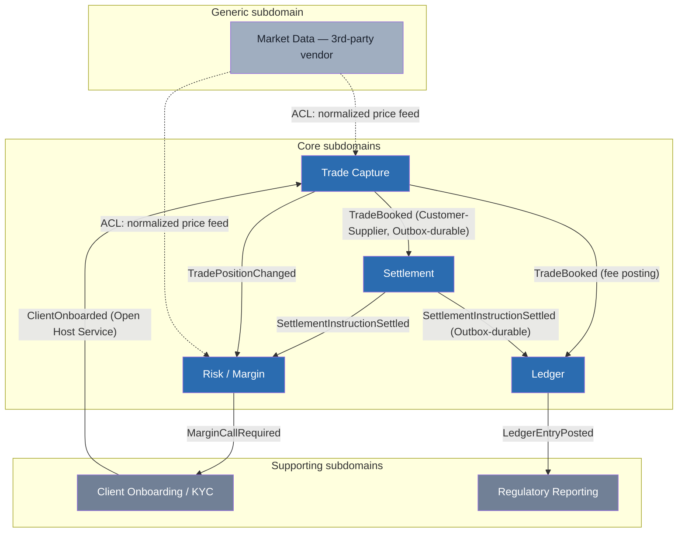
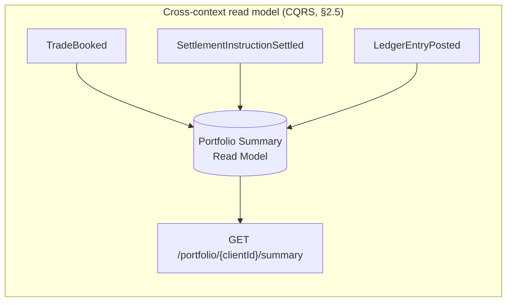
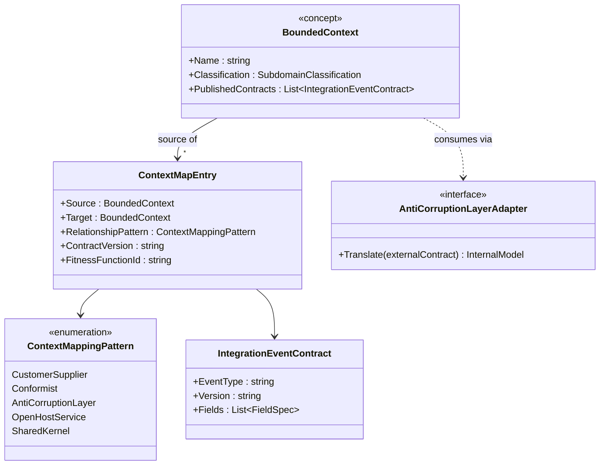
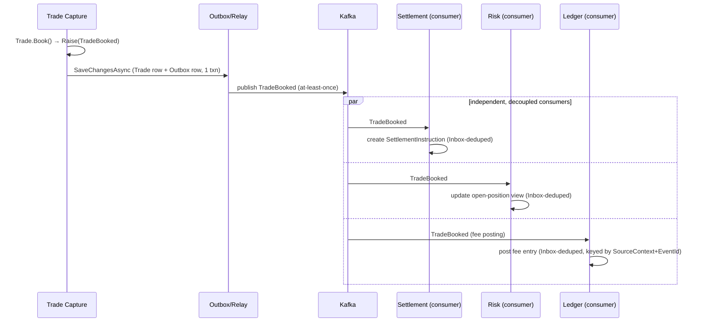

# Module 112 — Domain-Driven Design: DDD in Practice — Bounded Context Decomposition Case Study (capstone)

> Domain: Domain-Driven Design | Level: Beginner → Expert | Prerequisite: [[01-StrategicDDD-UbiquitousLanguage-BoundedContexts-ContextMapping]], [[02-TacticalDDD-Entities-ValueObjects-Aggregates]], [[03-DomainEvents-DomainServices-Repositories]] (this capstone synthesizes all three into one worked, end-to-end decomposition rather than introducing new standalone concepts)
>
> **Note on format:** Upgraded to the repo's current full 16-section template (§1–§15, §17–§18; §16 Enterprise Case Study intentionally omitted per the repo's standing template) with 40 Interview Questions (10 Basic / 10 Intermediate / 10 Advanced / 10 Expert) — the original top-30-curated Q&A content is preserved verbatim within §10 and completed to 40.

---

## 1. Fundamentals

**What:** "DDD in practice" is the discipline of sequencing strategic decisions (where do the boundaries go, and why) before tactical ones (how is the model implemented inside one already-identified boundary) — this capstone demonstrates that sequencing end-to-end on one running case study, moving from an e-commerce platform's context map through to a fuller, realistic FinTech platform decomposition.

**Why:** A team that jumps straight to Aggregates and Repositories without first validating bounded-context boundaries against the real business produces technically clean tactical code implementing the *wrong* model — a mistake that's expensive precisely because it's invisible until cross-team coordination or a reorg forces a painful, late correction. This capstone exists to show the full arc — strategic discovery, boundary validation, tactical implementation, ongoing verification — as one coherent, load-bearing sequence rather than a checklist of independently-applicable patterns.

**When:** Any greenfield platform decomposition, any legacy-system boundary re-evaluation (a merger, a new regulatory-driven capability, a scaling-driven service extraction), and any point where a team notices the Ubiquitous Language spoken by domain experts has drifted away from what the code's structure still assumes.

**How (30,000-ft view):**
```
1. Event Storming with domain experts → surface real business events & language
2. Classify subdomains (Core / Supporting / Generic) → calibrate investment
3. Draw bounded-context boundaries where language/ownership genuinely diverges
4. Assign a context-mapping pattern to every cross-context relationship
5. Implement tactical DDD (Aggregates, Domain Events, Repositories) INSIDE each context
6. Guard every boundary with a fitness function, re-verify continuously — never trust the diagram
```

---

## 2. Deep Dive

### 2.1 Why Sequencing, Not Pattern Selection, Is the Actual Skill
Every individual DDD pattern (Aggregate, Repository, Bounded Context) is independently well-documented; the actual, hard-to-teach skill this capstone targets is *sequencing* — recognizing that a tactical decision (should `Order` and `Payment` be one Aggregate?) is unanswerable until the strategic decision (are Ordering and Payment even the same bounded context?) is already settled, and that a strategic decision is unanswerable until real Event Storming with domain experts has actually happened, not merely inferred from an existing schema.

### 2.2 FinTech Platform Decomposition — Extending the Case Study
Where the original e-commerce case study decomposed into Catalog/Ordering/Customer/Payment/Shipping, this capstone extends the same discipline to a realistic multi-line FinTech platform (a firm running trade execution, settlement, ledger, risk, and client-reporting): **Trade Capture** (Core — the platform's differentiating logic), **Settlement** (Core — money/securities movement correctness), **Ledger** (Core — the system of record for every posted entry), **Risk/Margin** (Core — real-time exposure calculation), **Client Onboarding/KYC** (Supporting — necessary but not differentiating), **Market Data** (Generic — almost always bought, not built), **Regulatory Reporting** (Supporting, heavily compliance-constrained). Multiple Core contexts in one platform is itself a signal worth naming explicitly: FinTech platforms often have *several* genuinely core subdomains simultaneously (unlike a simpler e-commerce platform with one obvious Core), meaning investment calibration is per-context, not a single platform-wide "this is our one Core system" decision.

### 2.3 Trade Capture ↔ Settlement: A Customer-Supplier Relationship With a Hard Money Invariant Downstream
Trade Capture is upstream (a trade must exist before it can settle); Settlement is the customer. But unlike the Ordering↔Shipping relationship in the original case study, this relationship carries a hard financial correctness constraint: Settlement must never act on a trade Trade Capture hasn't durably, correctly recorded — meaning the integration event (`TradeBooked`) crossing this boundary must be delivered with the full Outbox/Inbox durability discipline covered, not a best-effort notification, because a lost `TradeBooked` event here isn't a UX inconvenience, it's a missed settlement obligation.

### 2.4 Ledger as a Shared Downstream Consumer Across Multiple Core Contexts
Both Settlement and Trade Capture (for fee postings) and Risk (for margin postings) publish events Ledger consumes to post entries. This is a **many-producers-one-consumer** topology, distinct from the original case study's simpler pairwise relationships — it means Ledger's Inbox-based idempotency (Module 03 §2.3/§11) must dedupe correctly *per producing context*, since two different contexts' events legitimately share no business key, and Ledger's own bounded-context boundary must stay strictly append-only/auditable regardless of which upstream context is currently posting to it.

### 2.5 Repository/Read-Model Scaling Across a Multi-Context Platform
A client-facing "portfolio summary" view spanning Trade Capture, Settlement status, and Ledger balances is the clearest instance of the CQRS preview (Module 03 Advanced Q5) at platform scale: no single context's Aggregate Repository can efficiently serve this cross-context read, and forcing it through three separate Aggregate-granularity Repository calls per request multiplies both latency and cross-context coupling. The correct answer is a dedicated, denormalized read model populated by subscribing to each context's already-published Domain Events — the same mechanism, now serving a genuinely cross-context reporting need rather than a single context's own reporting need.

### 2.6 Context-Map Governance at Platform Scale — Why One Fitness Function Isn't Enough
With five-plus Core/Supporting contexts, the number of pairwise relationships requiring an explicit context-mapping decision and a fitness function grows combinatorially, not linearly — a platform with 7 contexts has up to 21 potential pairwise relationships. A Principal Engineer's actual governance job at this scale is maintaining a living context map (an architecture decision record per relationship, each with its own fitness function) rather than trusting that "we did DDD" as a one-time exercise scales automatically to every new relationship added as the platform grows.

---

## 3. Visual Architecture





---

## 4. Production Example

**Problem:** A firm's trading platform launched Trade Capture, Settlement, and Ledger as three separate bounded contexts per this capstone's decomposition, but Risk/Margin was bolted on eighteen months later by a different team under deadline pressure, directly subscribing to Trade Capture's *internal* `Position` Aggregate's raw change-tracking events (not a deliberately-designed, ACL-shaped integration event) to compute real-time margin exposure — a shortcut that shipped a working margin calculation two weeks faster than designing a proper published contract would have.

**Architecture:** Risk's `MarginCallEvaluator` (Module 03 Expert E8) consumed Trade Capture's internal event shape directly, meaning every field Trade Capture's Aggregate happened to expose internally — including fields with no defined external contract or versioning discipline — was implicitly part of Risk's dependency surface, undocumented and untested against.

**Implementation:** This worked without incident for fourteen months, because Trade Capture's internal model happened not to change in any way that affected the specific fields Risk's evaluator read.

**Trade-offs:** The team explicitly weighed "ship margin calculation two weeks faster" against "build a proper ACL-shaped contract first" and chose speed — a defensible short-term trade-off that was never revisited once the feature shipped and the deadline pressure passed, becoming permanent by default rather than by decision.

**Lessons learned:** Trade Capture's team, unaware Risk depended on their internal event shape at all (there was no published contract, so no contract test, and no entry in the platform's context map documenting the relationship), refactored an internal field name during an unrelated cleanup. Risk's margin evaluator began silently reading a null value for that field, defaulting (via an unguarded null-coalescing fallback already in the code) to treating the affected positions as zero-exposure — suppressing real margin calls for those positions for eleven hours until a risk analyst's manual spot-check caught an implausibly low aggregate exposure figure. The root cause was strategic, not tactical: the relationship between Trade Capture and Risk had never been assigned a context-mapping pattern at all (Advanced Q6's exact diagnostic — this is the strategic Event-Storming gap, not a code defect), because the shortcut bypassed the discovery step this entire capstone's discipline exists to enforce. The fix retrofitted an ACL-shaped `PositionChanged` integration event with an explicit, versioned contract, a contract test in CI, and an entry in the platform's living context map (§2.6) — plus, critically, a platform-wide audit finding two other undocumented direct-internal-event subscriptions elsewhere, each retrofitted the same way before they produced their own incident.

---

## 5. Best Practices
- Run Event Storming before drawing any bounded-context boundary, including for a context being added to an already-decomposed platform — a boundary added under time pressure without discovery recreates schema-first/shortcut risk (§4's incident) regardless of how mature the rest of the platform's decomposition is.
- Assign an explicit context-mapping pattern (and a fitness function) to every cross-context relationship, with zero exceptions for "just this once, we're on a deadline."
- Calibrate tactical DDD investment per context against the core/supporting/generic classification — not uniformly across the whole platform.
- Keep a living, reviewed context map (an ADR per relationship) as the platform grows, rather than treating an initial decomposition diagram as permanently authoritative.
- Route cross-context reporting/read needs through a dedicated, event-populated read model rather than chaining multiple Aggregate Repository calls across contexts.
- Treat "we did DDD at launch" as a starting condition requiring ongoing verification, not a permanent, self-maintaining guarantee.

## 6. Anti-patterns
- Drawing bounded-context boundaries around existing database schemas or technical layers instead of genuine Ubiquitous-Language divergence.
- Subscribing directly to another context's internal event/Aggregate shape instead of a deliberately-designed, versioned integration-event contract (§4's incident).
- Over-splitting a single cohesive concept (e.g., "Checkout" vs. "Ordering") into two contexts that don't actually have distinct language.
- A "distributed monolith" — bounded contexts identified correctly on a diagram but never actually enforced in code, so cross-context coupling creeps back in after extraction.
- Applying full tactical DDD rigor uniformly to Generic/low-complexity contexts that don't warrant the investment.
- Letting a context's published contract silently drift with no contract test catching a breaking change before it reaches a dependent context.

---

## 7. Performance Engineering

**CPU/Memory:** Cross-context read models (§2.5) trade write-side ingestion cost (subscribing to and materializing events from several contexts) for read-side query simplicity — the right trade for a genuinely cross-context reporting need, wasteful if only one context's data is actually required.

**Latency:** A synchronous call chain spanning multiple bounded contexts (Client request → Trade Capture → Settlement → Ledger, each waiting on the next) accumulates latency linearly and couples availability multiplicatively; the Domain-Event/Outbox decoupling from Module 03 is what keeps each context's own request latency bounded by its own work only.

**Throughput:** Ledger's many-producers-one-consumer topology (§2.4) means its ingestion throughput must be provisioned against the *sum* of Trade Capture's, Settlement's, and Risk's combined publish rate, not any single producer's rate in isolation — a common under-provisioning mistake when a new producing context is added without revisiting Ledger's own consumer capacity.

**Scalability:** Each bounded context scales independently by design — Settlement's peak-volume scaling needs (market close) are decoupled from Client Onboarding's steady, much lower request volume, provided no synchronous cross-context call chain reintroduces coupling.

**Benchmarking:** Load-test Ledger's consumer specifically under the *combined* peak of all producing contexts simultaneously (a realistic market-close scenario), not each producer's peak tested in isolation, since isolated per-producer testing would miss the many-producers-one-consumer contention risk.

**Caching:** A cross-context read model is itself a form of materialized cache; its staleness bound (how far behind the source contexts' events it's allowed to lag) must be an explicit, monitored SLA, not an implicit assumption.

---

## 8. Security

**Threats:** A cross-context integration event carrying more data than the consuming context is entitled to (e.g., Ledger receiving full client PII in a `TradeBooked` event when it only needs an anonymized account reference) violates data-minimization and can turn a routine integration into a compliance-scope expansion for the receiving context.

**Mitigations:** Every published integration-event contract is reviewed for minimality exactly as an external API would be (§4's incident's fix included this review, retroactively); apply field-level tokenization/redaction for PII crossing into a context with a narrower regulatory scope (e.g., Market Data, a third-party-adjacent Generic context, should never receive client-identifying data at all).

**OWASP mapping:** Broken access control if a cross-context read model's API doesn't enforce the same entitlement checks the source contexts individually enforced; sensitive data exposure if an integration event over-shares (recurring from Module 03 §8, now at platform scale with more producer/consumer pairs to audit).

**AuthN/AuthZ:** A context-map entry should record not just the data contract but the entitlement boundary — which context is authorized to receive which fields — reviewed the same way a database access grant would be, since an undocumented direct-subscription (§4) is also, structurally, an unreviewed and unaudited data-access grant.

**Secrets:** Each context's own broker/consumer credentials should be scoped narrowly to the specific topics it's authorized to consume — a compromised Risk-context consumer identity should not be able to subscribe to Client Onboarding's KYC-document events.

**Encryption:** Regulatory Reporting's ingestion of `LedgerEntryPosted` events, given its compliance-sensitive downstream use, requires the same encrypted-in-transit/at-rest posture as Ledger's own source data — an integration event inherits its source's protection obligation, not a lesser one, when the consuming context is itself compliance-scoped.

---

## 9. Scalability

**Horizontal scaling:** Each bounded context's Domain-Event-driven decoupling (Module 03 §9) is the platform-level scaling mechanism — Trade Capture's market-open write surge doesn't throttle Client Onboarding's steady traffic, and vice versa, because no synchronous cross-context call chain ties their capacity together.

**Vertical scaling:** Ledger's many-producers-one-consumer topology (§2.4) is the platform's most likely single scaling bottleneck as more Core contexts are added — its consumer capacity must be explicitly re-evaluated (not silently assumed sufficient) every time a new context is onboarded as a producer.

**Replication/Partitioning:** Cross-context read models (§2.5) can be partitioned by client/account ID to scale query load horizontally, independent of how each source context partitions its own write-side data.

**Load balancing:** Each context's consumer group scales its own partition/consumer count independently, per Module 03 §9 — a platform-wide load-balancing decision is never a single, centralized concern once contexts are genuinely decoupled.

**High Availability:** A single context's outage (e.g., Market Data's third-party vendor going down) should degrade only the specific downstream capability that genuinely depends on live pricing, not cascade into unrelated contexts — verifying this requires explicitly testing each context's failure-isolation boundary, not assuming decomposition alone guarantees it.

---

## 10. Interview Questions

### Basic (8)

1. **Q: At a high level, what does "doing DDD in practice" actually involve, beyond knowing the individual patterns?**
 **A:** It means using the strategic tools (Ubiquitous Language, subdomain classification, bounded contexts, context mapping) to first decide *where the boundaries are and why*, then using/111's tactical tools (Aggregates, Value Objects, Domain Events, Domain Services, Repositories) to implement the model *within* one already-identified boundary — the practical skill isn't reciting either pattern set in isolation, but correctly sequencing strategic decisions before tactical ones, since tactical patterns applied inside the wrong boundary just implement the wrong model very cleanly.
 **Why correct:** States the defining practical skill (strategic-then-tactical sequencing) rather than restating either pattern set, and names the specific failure mode of getting the sequencing backward.
 **Common mistakes:** Jumping straight to Aggregate design and Repository interfaces for a new system before any strategic subdomain/bounded-context analysis has happened — this produces technically well-built tactical patterns wrapped around a domain model whose boundaries were never actually validated against the real business.
 **Follow-ups:** "Why is this sequencing mistake hard to notice early on?" (Tactically well-implemented code looks and feels like progress — tests pass, the code is clean — long before the strategic misalignment surfaces, typically only once cross-boundary coupling or a reorg forces a painful boundary correction.)

2. **Q: This module works a running case study — an e-commerce platform being decomposed into bounded contexts. What are the contexts, at a first pass?**
 **A:** **Catalog** (product information, pricing, categorization — a Supporting subdomain), **Ordering** (cart, checkout, order lifecycle — the platform's Core subdomain, per the core/supporting/generic classification), **Customer** (identity, profile, loyalty tier), **Payment** (a Generic subdomain, likely satisfied by a third-party processor rather than custom-built), and **Shipping/Fulfillment** (Supporting, coordinating with external carriers).
 **Why correct:** Applies the core/supporting/generic classification concretely to each context, justifying the boundary choices rather than listing them arbitrarily.
 **Common mistakes:** Drawing bounded-context boundaries around technical layers (e.g., a "Database Context" or "API Context") instead of around actual business capabilities — a bounded context is defined by a cohesive part of the domain model and its Ubiquitous Language, not a technical concern.
 **Follow-ups:** "Why does classifying Ordering as Core matter for investment decisions?" (Directly/Intermediate Q1 — Core subdomains justify the platform's best engineers and heaviest tactical-DDD investment; Payment, a Generic subdomain, should default to buying/integrating a processor rather than custom-building one.)

3. **Q: How does a bounded context differ from a microservice, using this case study's contexts as the example?**
 **A:** A bounded context is a *modeling* boundary — the region within which a specific Ubiquitous Language and domain model (e.g., what "Order" means and how it behaves) applies consistently; a microservice is a *deployment* boundary — an independently deployable unit. In this case study, Ordering is naturally one bounded context, but it might be implemented as a single microservice, or (if scale demands) split across several coordinating deployable units that all still share the same Ordering bounded context's model — the two boundaries often align but are not the same concept, and conflating them is a common source of confusion.
 **Why correct:** States the precise category distinction (modeling boundary vs. deployment boundary) and demonstrates with the case study rather than asserting it abstractly.
 **Common mistakes:** Assuming "one bounded context = exactly one microservice" as a hard rule — the modular-monolith-first framework explicitly allows multiple bounded contexts to coexist as modules within a single deployable unit early on, splitting into separate services only once genuine independent-scaling or independent-deployment needs materialize.
 **Follow-ups:** "Which of this case study's contexts would most obviously justify becoming its own microservice early, and why?" (Payment — a Generic subdomain integrating a third-party processor, with genuinely different security/compliance/scaling requirements (PCI scope) from the rest of the platform, is exactly the kind of context the isolation criteria would flag for earliest extraction.)

4. **Q: In this case study, how would you recognize an anemic domain model creeping back into the Ordering context, recapping?**
 **A:** If the `Order` class in code is just a bag of public getters/setters (`OrderId`, `Status`, `Lines`) with zero behavior, and all the actual logic — checking whether an order can be cancelled, computing whether free shipping applies, validating a discount — lives in a separate `OrderApplicationService` or, worse, directly in a controller, that's an anemic domain model: the "Order" in code no longer matches the Ubiquitous Language's "Order," which domain experts would describe as something that *can be placed, cancelled, or shipped*, not merely a data record.
 **Why correct:** Gives a concrete, code-level symptom (behavior-free class, logic pushed into a service/controller layer) tied back to the original definition, applied to this case study's specific Aggregate.
 **Common mistakes:** Believing an anemic model is only a risk in poorly-written legacy code — it recurs constantly in greenfield code too, especially when a team is more comfortable with a transaction-script or CRUD-first style and treats DDD tactical patterns as optional decoration rather than where the actual behavior should live.
 **Follow-ups:** "Where specifically should the 'can this order be cancelled' check live?" (On the `Order` Aggregate itself, as a method like `Order.Cancel` that both checks the invariant and performs the state transition atomically — the Root-only-access rule, not a separate service second-guessing the Aggregate's own state from outside.)

5. **Q: How do this domain's tactical patterns (Aggregates, Repositories) map onto a layered application structure — previewing the Clean Architecture?**
 **A:** Aggregates, Value Objects, and Domain Services live in an innermost **domain layer** with no outward dependencies; Repository *interfaces* also live in that domain layer, expressed in domain terms; Application Services sit in a layer just outside the domain, orchestrating use cases; and Repository *implementations*, ORM mappings, and web/API concerns live in an outermost infrastructure/presentation layer — this is precisely the dependency direction (outer layers depend inward, never the reverse) that the Clean Architecture (and the Hexagonal Architecture) will formalize as an explicit, named architectural style in its own right.
 **Why correct:** Correctly previews the specific, forward architectural pattern (dependency direction pointing inward toward the domain) without over-explaining a topic the next domain owns in full.
 **Common mistakes:** Assuming DDD *requires* Clean or Hexagonal Architecture, or vice versa — DDD is a modeling discipline about *what* the domain model contains; Clean/Hexagonal Architecture is a structural discipline about *how* code is layered and where dependencies point; they compose extremely well together but are independent decisions.
 **Follow-ups:** "Could you technically apply DDD's tactical patterns inside a different architectural style, like a traditional layered (N-tier) architecture?" (Yes — the Aggregate/Repository/Domain-Service patterns don't mandate Clean Architecture specifically, though a traditional layered architecture's typically looser dependency rules make it easier to accidentally leak infrastructure concerns into the domain layer, the exact anti-pattern/Advanced Q3 warn against.)

6. **Q: Is DDD's tactical toolkit worth applying to every context in this case study, including Payment and simple parts of Catalog?**
 **A:** No — this directly reapplies the core/supporting/generic investment framework: Ordering (Core) fully justifies rich Aggregates, Domain Events, and careful invariant modeling; Catalog, if it's genuinely just product data with simple CRUD-style rules, may only need a thin, mostly-anemic-by-design model (which is *not* an anti-pattern here, since there's little real behavior to encapsulate) or even a simple CRUD service with no DDD tactical patterns at all; Payment, a Generic subdomain, typically just needs a thin adapter around a third-party processor's SDK, with essentially no custom domain model of its own.
 **Why correct:** Directly applies the already-established investment-calibration principle to this case study's specific contexts, correctly identifying that "anemic" is only an anti-pattern when genuine behavior is being suppressed, not when a context genuinely has little behavior to begin with.
 **Common mistakes:** Applying full tactical DDD rigor (rich Aggregates, Domain Events for every state change, a dedicated Repository per Entity) uniformly across every context regardless of its actual complexity or business criticality — this is the "DDD as a cargo cult" anti-pattern, incurring real design and maintenance overhead in contexts where it returns little value.
 **Follow-ups:** "What's the risk of under-investing in Ordering specifically, given it's Core?" (The opposite failure — treating the platform's most business-critical, differentiating logic as simple CRUD invites exactly the invariant-violation and untraceable-business-rule bugs the entire tactical toolkit exists to prevent, in precisely the context where correctness matters most.)

7. **Q: What is the "Big Ball of Mud" anti-pattern, and how does this case study's bounded-context decomposition specifically prevent it?**
 **A:** A Big Ball of Mud is a system with no discernible internal boundaries at all — every part of the codebase can reach into every other part's internals, there's no consistent Ubiquitous Language (the same word means different things in different files), and changes anywhere risk breaking anything everywhere; this case study's explicit bounded contexts, each with its own model and language, plus deliberate context-mapping patterns (Q6) governing exactly how contexts may interact, is the direct structural antidote — every cross-context interaction is a deliberate, reviewed decision rather than an emergent, undocumented dependency.
 **Why correct:** Defines the anti-pattern precisely (no boundaries, inconsistent language, unconstrained coupling) and names the specific mechanism (explicit contexts plus governed context mapping) that prevents it.
 **Common mistakes:** Assuming simply splitting a codebase into separate folders or projects, without also establishing genuinely separate models and a governed context map, is sufficient — a "modular" codebase where every module still freely references every other module's internal types is still a Big Ball of Mud wearing a folder structure.
 **Follow-ups:** "How does this connect to the 'distributed monolith' anti-pattern?" (A distributed monolith is precisely a Big Ball of Mud that's been physically split into separate deployable services without ever actually establishing the bounded-context discipline this module covers — the coupling remains, just now with network calls instead of in-process ones, which is strictly worse.)

8. **Q: Why use a single running case study across this whole module rather than several small, disconnected examples?**
 **A:** A single, sufficiently realistic case study lets each pattern's decision be shown *in the context of the decisions around it* — the Ordering context's Aggregate boundary decision only makes sense in light of Ordering's classification as Core, and the Domain Events crossing into Customer and Shipping only make sense in light of the context map already established between them — this mirrors how DDD decisions actually get made in real projects, as a connected sequence of trade-offs, not as isolated pattern applications each solved in a vacuum.
 **Why correct:** States the specific pedagogical reason (showing decisions in their actual interdependent context, matching real practice) rather than an arbitrary stylistic preference.
 **Common mistakes:** Treating each DDD pattern as independently applicable without checking whether earlier decisions in the same system still make sense in light of it — e.g., choosing an Aggregate boundary in isolation without first confirming the subdomain classification that boundary's investment level should be based on.
 **Follow-ups:** "What's the single biggest connecting thread across this case study's decisions?" (Every tactical decision — the Order Aggregate's exact boundary, which events cross into which other contexts, which context-mapping pattern governs each relationship — ultimately traces back to Ordering's Core classification and the specific business behaviors domain experts described it needing, not to a technical preference chosen independently of that classification.)

9. **Q: In the extended FinTech decomposition (§2.2), why might a platform have several Core subdomains at once, unlike the original e-commerce case study's single obvious Core (Ordering)?**
 **A:** A trading/settlement platform's differentiating value doesn't live in one place — Trade Capture, Settlement, Ledger, and Risk each carry genuinely business-critical, correctness-sensitive logic that would be unacceptable to under-invest in, unlike a typical e-commerce platform where Ordering alone is usually the clear differentiator and everything else is more clearly Supporting or Generic; the core/supporting/generic classification is a per-context judgment, not a rule guaranteeing exactly one Core subdomain per platform.
 **Why correct:** Correctly identifies that the classification framework doesn't presuppose a single Core, and explains why a FinTech platform's specific characteristics (multiple money-correctness-critical concerns) make several simultaneous Core contexts realistic.
 **Common mistakes:** Assuming every platform has exactly one Core subdomain by definition, forcing an artificial ranking among genuinely-equally-critical contexts rather than recognizing multiple contexts can independently warrant full tactical DDD investment.
 **Follow-ups:** "Does having multiple Core contexts change how investment is calibrated within each one?" (No — each Core context still individually earns full tactical rigor on its own merits; having several doesn't dilute any single one's investment case, it just means the platform's engineering-leadership attention is spread across more high-stakes contexts simultaneously.)

10. **Q: Why does the Ledger context in §2.4 need its Inbox-based idempotency to dedupe "per producing context," rather than a single global dedup key?**
 **A:** Ledger receives events from multiple, independent upstream contexts (Trade Capture, Settlement, Risk) that share no common business-key namespace — a `TradeId` from Trade Capture and an `InstructionId` from Settlement are structurally unrelated identifiers, so a single global Inbox key scheme would either collide incorrectly across producers or fail to actually dedupe redelivered messages from either; the Inbox key must be scoped to (producing context, that context's own event ID) so redelivery detection stays correct independently per source.
 **Why correct:** Identifies the specific structural reason (no shared business-key namespace across independent producers) that a naive single-dedup-key design breaks in a many-producers-one-consumer topology.
 **Common mistakes:** Assuming one Inbox table with one dedup key column is sufficient regardless of how many distinct upstream contexts publish into it, risking either false-positive dedup (incorrectly treating two different producers' events as duplicates) or missed dedup (failing to catch a genuine redelivery) depending on how the flawed key was constructed.
 **Follow-ups:** "What's the concrete Inbox schema fix?" (A composite key — `(ProducingContext, EventId)` — or simply namespacing `EventId` itself to already be globally unique across producers, e.g., a GUID assigned at each event's point of origin rather than a producer-local sequence number.)

### Intermediate (8)

1. **Q: Walk through how Event Storming would surface this case study's Ordering ↔ Shipping relationship, and what context-mapping pattern would you assign it.**
 **A:** An Event Storming session with domain experts and engineers together would surface events like `OrderPlaced` → (Shipping reacts) → `ShipmentScheduled` → `ShipmentDelivered` → (Ordering reacts) → `OrderCompleted`, revealing that Ordering and Shipping are separate contexts with a genuine, two-way but asymmetric relationship: Ordering is the upstream initiator (Shipping can't schedule anything until an order exists), but each also reacts to the other's events. This is best modeled as a **Customer-Supplier** relationship with Ordering as the upstream "supplier" of order data that Shipping (the "customer") depends on, communicating via well-defined Domain Events translated into integration events at the boundary — not a Shared Kernel, since each context's internal model (an "Order" vs. a "Shipment") is genuinely different in shape and behavior.
 **Why correct:** Connects the collaborative discovery technique (Event Storming) to a concrete context-mapping decision, correctly reasoning about the specific pattern (Customer-Supplier, not Shared Kernel) from the actual dependency direction observed.
 **Common mistakes:** Defaulting to a Shared Kernel between two related but distinct contexts purely to "share code and avoid duplication" — already establishes Shared Kernel as the highest-coordination-cost pattern, appropriate only when both teams are willing to tightly co-evolve, which Ordering and Shipping (with genuinely different concerns and likely different owning teams) typically are not.
 **Follow-ups:** "What would signal that Shared Kernel actually *was* the right call here instead?" (If Ordering and Shipping were owned by the exact same small team and shared a large amount of genuinely identical logic — e.g., an identical `Address` Value Object used byte-for-byte the same way in both — the coordination cost of a Shared Kernel might be worth it; the moment the teams or the models diverge, this stops being true.)

2. **Q: This case study's Catalog context and Ordering context both need "Product" information, but for different purposes. How should this be modeled to avoid tight coupling?**
 **A:** Catalog owns the *authoritative* `Product` model — full description, images, category tree, SEO metadata. Ordering does not need any of that; it needs only enough Product information to price and validate a line item — a `ProductId`, current price, and availability. Rather than Ordering directly referencing Catalog's full `Product` Entity (which would tightly couple Ordering to Catalog's internal model and force Ordering to churn every time Catalog's unrelated concerns, like SEO fields, change), Ordering defines its *own*, narrow `OrderableProduct` concept — its own Value Object shaped exactly to what Ordering actually needs — populated via an Anti-Corruption Layer (recapped) translating from Catalog's published data.
 **Why correct:** Identifies the specific coupling risk (Ordering churning on unrelated Catalog changes) and the correct fix (Ordering's own narrowly-scoped concept via an ACL), rather than naively sharing one "Product" model across both contexts.
 **Common mistakes:** Building one shared `Product` class used identically by both contexts "to avoid duplication" — this is the same anti-pattern as Question 1's inappropriate Shared Kernel, now specifically for a data model rather than a relationship pattern, and it recreates exactly the cross-context coupling bounded contexts exist to prevent.
 **Follow-ups:** "Isn't `ProductId`/price/availability duplicated data now, technically?" (Yes, deliberately — the Anti-Corruption Layer principle explicitly accepts controlled, intentional duplication at context boundaries as the price of genuine decoupling; the alternative, a single shared model, trades that duplication for tight coupling that's almost always the worse trade at scale.)

3. **Q: This platform started as a monolith. How would the migration patterns apply specifically to extracting the Ordering bounded context into its own service?**
 **A:** Apply Branch by Abstraction *within* the monolith first: introduce the `IOrderRepository` interface and Application Service boundary as if Ordering were already a separate service, while it still runs in-process — this forces the Ordering bounded context's boundary to become explicit and enforced in code *before* any network boundary is introduced, surfacing any accidental cross-context coupling (e.g., Ordering code directly reaching into Catalog's database tables) while it's still cheap to fix. Only once that in-process boundary is clean does the team introduce Parallel Run (shadow-traffic comparison) against a newly-extracted Ordering service, before finally cutting traffic over — directly reapplying the full migration-pattern sequence, now anchored to a DDD-identified bounded context rather than an arbitrary code split.
 **Why correct:** Sequences the specific patterns (Branch by Abstraction, then Parallel Run, then cutover) correctly, and explains *why* the bounded-context boundary should be enforced in-process first (cheap fixes) before the expensive network split.
 **Common mistakes:** Extracting a service directly along a boundary that was never actually validated as clean in-process first — this is how a "distributed monolith" (/107) gets created even when the team explicitly set out to do a DDD-informed decomposition; drawing the box on an architecture diagram is not the same as the code inside it already being properly isolated.
 **Follow-ups:** "What specific artifact would you use to prevent this boundary from silently eroding again after extraction?" (A fitness function, — e.g., an architectural test asserting the Ordering service's code contains zero direct references to Catalog's database schema or internal types, run continuously in CI rather than checked once at extraction time.)

4. **Q: How should this case study's bounded contexts map onto team structure, connecting to the Conway's Law discussion?**
 **A:** Earlier analysis established that system structure tends to mirror communication structure (Conway's Law) whether or not that's deliberately planned — so this decomposition should deliberately assign one team per bounded context (a Catalog team, an Ordering team, a Payment-integration team, etc.), sized and skilled to match each context's actual investment level from the classification (the Core Ordering team should be the platform's strongest engineers; the Generic Payment integration might be a small team or even a shared platform team's side responsibility) — getting this alignment right *at design time*, using the Reverse Conway Maneuver, is far cheaper than discovering a team/context mismatch after the fact and reorganizing around it.
 **Why correct:** Directly connects bounded-context identification to the Conway's Law material and correctly ties team investment level back to the core/supporting/generic classification, rather than treating team design as an unrelated, separate concern.
 **Common mistakes:** Identifying bounded contexts correctly on paper but then organizing teams along a different axis entirely (e.g., a horizontal "frontend team" and "backend team" split cutting across every context) — Conway's Law will still apply regardless, meaning the *actual* system structure will end up mirroring that mismatched team structure, not the intended bounded-context decomposition.
 **Follow-ups:** "What's a concrete symptom that team structure and bounded-context structure have drifted apart?" (A single logical change to the Ordering context's business rule requires coordinated changes and sign-off across three different teams that don't share a communication channel — a direct instance of the distributed-monolith coordination-tax symptom, now diagnosed as a team-alignment failure specifically.)

5. **Q: Design the `Order` Aggregate's boundary for this case study, applying the synchronous-invariant test.**
 **A:** `Order` as the Aggregate Root contains its `OrderLines` (each a non-independently-addressable part of the Aggregate) because the invariant "order total must equal the sum of line totals, and line quantities must not exceed available stock at time of order" needs synchronous, immediate enforcement within one transaction. `Customer` and `Product` are referenced only by ID (`CustomerId`, `ProductId`) — not included inside the `Order` Aggregate — because "does this customer exist" and "is this product still available at the moment of browsing" are checked at the point of adding a line item but don't need to remain synchronously, continuously true for the entire life of the Order the way the line-total invariant does.
 **Why correct:** Applies the specific decision test (does this invariant need synchronous, same-transaction enforcement?) to concretely justify what's inside vs. outside the Aggregate boundary, rather than asserting the boundary without justification.
 **Common mistakes:** Including the full `Customer` or `Product` Entity inside the `Order` Aggregate "for convenience," recreating the own Black-Friday incident (§Production Example) — an oversized Aggregate spanning Order-Customer-Inventory causing artificial version-conflict contention under real concurrent load.
 **Follow-ups:** "What happens if a Product's price changes after it's already been added to an in-progress Order?" (The `Order` Aggregate should have already captured the price at the moment the line was added, as part of its own state — not a live reference to Catalog's current price — meaning a later Catalog price change correctly does *not* retroactively affect an already-in-progress Order, which is itself a business rule this design must make an explicit, deliberate choice about, not an accident of how references happen to work.)

6. **Q: Which Domain Events cross the Ordering ↔ Customer boundary in this case study, and how does the Domain-Event discipline keep this loosely coupled?**
 **A:** `OrderPlaced` and `OrderCompleted`, raised by the `Order` Aggregate, are subscribed to by a handler in (or adjacent to) the Customer context that updates the `Customer` Aggregate's lifetime-order count and loyalty-tier eligibility — Ordering's Aggregate has zero direct knowledge of Customer's internal model or even that a loyalty-tier system exists; it only knows it has raised a fact about itself. This is the eventual-consistency mechanism applied concretely: Ordering's own transaction stays small and correctly-scoped (the transaction-boundary principle), while the cross-context loyalty-tier update happens in its own, separate, eventually-consistent transaction.
 **Why correct:** Names the specific events and traces the exact decoupling mechanism (Ordering has zero awareness of Customer's internal logic) back to the established principle, applied to this case study's concrete cross-context relationship.
 **Common mistakes:** Having the `Order` Aggregate or its Application Service directly call into Customer's Repository or Aggregate synchronously to update the loyalty count within the same transaction — this couples Ordering's own transaction success to Customer's availability and correctness, violating both the single-Aggregate-transaction default and the entire point of using Domain Events for this relationship in the first place.
 **Follow-ups:** "Why is 'eventually' an acceptable consistency guarantee for loyalty-tier updates specifically, but not for the Order's own line-item totals?" (the synchronous-vs-eventual test again — a brief delay before a loyalty tier updates has no correctness-breaking business consequence, whereas an Order momentarily having an internally inconsistent total would be a genuine, unacceptable invariant violation.)

7. **Q: Critique a team that defines its bounded contexts purely by drawing boxes around existing database schemas.**
 **A:** This inverts DDD's actual discovery process — a bounded context should be identified from the Ubiquitous Language and the actual behavioral/consistency boundaries domain experts describe (the Event-Storming-driven discovery), with the database schema as a *downstream consequence* of that modeling decision, not the other way around; drawing context boundaries around whatever schemas already happen to exist just formalizes and preserves however the data was previously, possibly accidentally, organized — likely reproducing the exact coupling and Big Ball of Mud risk (Question 7, Basic) this entire discipline exists to prevent, now with official-looking "bounded context" labels on top of it.
 **Why correct:** Identifies the specific inversion (schema-first instead of language/behavior-first) and names the consequence (formalizing pre-existing accidental structure rather than genuinely re-examining it).
 **Common mistakes:** Assuming any partitioning of a system, as long as it's called "bounded contexts," automatically delivers DDD's benefits — the value comes specifically from the boundaries reflecting genuine, validated differences in language and model, not from the mere existence of named partitions.
 **Follow-ups:** "How would you detect this anti-pattern in an existing 'DDD' codebase during a review?" (Ask a domain expert to describe a business scenario spanning two supposedly-separate bounded contexts in their own words — if the same term, e.g. 'Order,' is used identically and interchangeably across both without any actual difference in meaning or behavior, the contexts were likely drawn from schemas, not from genuine language differences.)

8. **Q: How does this case study's bounded-context decomposition prevent the "distributed monolith" anti-pattern specifically, connecting the diagnostic criteria?**
 **A:** Earlier analysis identified "distributed monolith" via symptoms like coordinated multi-service deployments and synchronous call chains masquerading as independence; this case study's contexts avoid that specifically because each cross-context relationship was assigned a deliberate context-mapping pattern (Customer-Supplier for Ordering↔Shipping, ACL for Ordering↔Catalog) *before* any service extraction, meaning each context's team can evolve its own internal model independently as long as it honors its published contract (an Open Host Service/Published Language) — the explicit contract is what actually delivers independent deployability, not merely running in a separate process.
 **Why correct:** Connects DDD's context-mapping discipline directly to the specific distributed-monolith diagnostic criteria, explaining the causal mechanism (explicit, honored contracts) rather than just asserting the anti-pattern is avoided.
 **Common mistakes:** Believing bounded-context identification alone (without an actually-honored context map and published contract) is sufficient to prevent a distributed monolith — a beautifully identified bounded context whose team still allows silent, uncontracted synchronous coupling to creep in will still end up with the exact coordination-tax symptoms once extracted into separate services.
 **Follow-ups:** "What ongoing mechanism keeps a context's published contract from silently drifting after initial extraction?" (The same fitness-function discipline from Question 3/ — a contract test (e.g., Pact) run continuously in CI verifying the published contract's actual, current shape, not a one-time design document trusted indefinitely.)

9. **Q: The Client Onboarding/KYC context publishes `ClientOnboarded` as an Open Host Service, consumed by Trade Capture before it will accept trades for a new client. What happens, from a context-mapping perspective, if Risk also needs to know a client is onboarded, but with different fields than Trade Capture needs?**
 **A:** Both Trade Capture and Risk consume the *same* Open Host Service/Published Language contract from KYC (KYC doesn't build a bespoke contract per consumer — that would be the Customer-Supplier anti-pattern of one-off, unmanaged integrations), but each consumer applies its *own* Anti-Corruption Layer on the receiving side, extracting only the fields it actually needs into its own internal shape — Trade Capture might only need `ClientId` and `TradingPermissions`, while Risk needs `ClientId` and `RiskRating`; both map from the identical published contract, just into different internal models.
 **Why correct:** Correctly distinguishes the producer-side contract (one shared, stable Open Host Service) from each consumer's own, independent ACL-based extraction, showing multiple consumers don't require multiple bespoke producer contracts.
 **Common mistakes:** Assuming each consuming context needs its own custom-negotiated contract from KYC, which would multiply KYC's maintenance burden linearly with consumer count instead of publishing one well-designed, sufficiently general contract every consumer can extract from independently.
 **Follow-ups:** "What would signal that one shared Open Host Service contract is no longer sufficient?" (If Risk needed a field KYC's published contract doesn't carry and never will by design — e.g., raw underlying KYC-document content KYC deliberately excludes from its public contract for compliance-scope reasons — that's a signal for a separate, more tightly-scoped integration, not a reason to bloat the shared contract.)

10. **Q: How would a Principal Engineer explain, to a non-technical stakeholder, why the Risk context's incident (§4) was a process failure, not just a coding mistake?**
 **A:** The actual defect wasn't a bug in any specific line of code — every line worked exactly as written; the failure was that a cross-context dependency was created without ever going through the platform's own decision process (Event Storming, a context-mapping pattern assignment, a published contract, a contract test) that exists specifically to catch this class of risk before it ships — meaning the fix isn't "review this code more carefully," it's "make it structurally harder to add an undocumented cross-context dependency at all" (a governance and tooling fix, e.g., a fitness function scanning for cross-context internal-type references in CI), because the same time pressure that produced this shortcut once will produce it again unless the process itself, not just this instance, changes.
 **Why correct:** Correctly reframes the incident as a process/governance gap rather than an isolated code defect, and proposes a structural fix (automated detection) rather than a purely behavioral one ("be more careful next time"), which is the substantively stronger, more durable answer.
 **Common mistakes:** Explaining the incident purely in terms of the specific null-handling bug that caused the eleven-hour visible symptom, missing that the null-handling bug was a downstream consequence of the real, structural root cause — the absence of a governed contract in the first place.
 **Follow-ups:** "Why is 'be more careful next time' specifically insufficient as the primary fix here?" (Because the original shortcut was taken by a competent team under ordinary, recurring deadline pressure — the same pressure will recur on the next feature, so a fix that depends on individual discipline rather than an automated or process gate will very likely fail the same way again.)

### Advanced (7)

1. **Q: Trace this case study's full order-placement flow end-to-end across contexts, from an incoming HTTP request to the final cross-context consistency point — synthesizing Modules 109-111 into one worked example.**
 **A:** A `POST /orders` request reaches Ordering's Application Service, which loads or constructs the `Order` Aggregate, calling `Order.AddLine(productId, quantity)` for each item — internally, `AddLine` uses the ACL-translated `OrderableProduct` (Advanced-adjacent to Intermediate Q2) to validate price/availability, enforcing the line-total invariant synchronously (the test). On `Order.Submit`, the Aggregate enforces its full submission invariants and adds a pending `OrderPlaced` Domain Event. The Application Service commits via a Unit of Work, writing the `Order`'s new state and the `OrderPlaced` event to the outbox table in one atomic transaction (the Outbox preview). A background publisher then reliably delivers `OrderPlaced`: Shipping's handler (Customer-Supplier relationship, Intermediate Q1) schedules a shipment; Customer's handler (Intermediate Q6) updates the lifetime-order count and checks loyalty-tier eligibility — both independent, eventually-consistent reactions, none of them blocking the original request's response.
 **Why correct:** Traces one concrete request through every layer and pattern established across all three prior modules plus this capstone's context-mapping decisions, showing the full, coherent, working system rather than isolated patterns.
 **Common mistakes:** Describing the tactical mechanics (Aggregate, Outbox) correctly but forgetting to re-anchor which specific context-mapping pattern governs each downstream reaction — the *mechanism* (Domain Event → Outbox → handler) is identical regardless of relationship type, but *which* context is allowed to react, and how tightly coupled that reaction is to Ordering's internal model, is exactly what the context map (Customer-Supplier vs. ACL vs. OHS/PL) governs.
 **Follow-ups:** "Where exactly would the optimistic concurrency check fire in this flow?" (At the Unit of Work's commit, guarding against a lost update if two concurrent requests modified the same `Order` — the commit either succeeds atomically with the outbox write or fails and retries, never partially applying one without the other.)

2. **Q: The Catalog team wants to introduce a Shared Kernel with Ordering for the `Money` Value Object, to avoid reimplementing currency-handling logic twice. Evaluate this trade-off.**
 **A:** Unlike the earlier Product-model question (Intermediate Q2), `Money` is a strong Shared Kernel candidate: it's a small, genuinely stable Value Object with identical behavior and invariants (currency-aware arithmetic, no partial-currency mixing) needed identically by both contexts, unlikely to diverge as either context's *business* model evolves — the coordination cost of a Shared Kernel (both teams must agree before changing it) is low here specifically because `Money`'s behavior is essentially fixed, universal financial-arithmetic logic, not a business concept either team's domain expertise would want to evolve independently. This is the exception that proves Intermediate Q2's general rule: Shared Kernel is right precisely when the shared thing is stable, small, and not actually a point of meaningful business-model divergence between the two contexts.
 **Why correct:** Distinguishes this case from the earlier inappropriate Shared Kernel example by identifying the specific property (stable, universal, non-business-divergent) that makes Shared Kernel the right call here, rather than applying a blanket rule either way.
 **Common mistakes:** Either rejecting all Shared Kernels reflexively (having internalized "Shared Kernel is usually wrong" as an absolute rule rather than the general default it is) or accepting every proposed Shared Kernel uncritically — both skip the actual judgment call this question requires: is the shared thing genuinely stable and non-divergent, or does it just look small today?
 **Follow-ups:** "What would be a warning sign that this `Money` Shared Kernel was starting to go wrong?" (One context needing `Money` to support a business behavior the other doesn't — e.g., Ordering needing promotional multi-currency rounding rules Catalog has no reason to share — forcing either an awkward, shared-but-diverging type or a renegotiated split; that pressure signals the Shared Kernel's original 'stable and universal' assumption no longer holds.)

3. **Q: Critique a real decomposition where "Ordering" and "Checkout" were modeled as two separate bounded contexts with their own Aggregates and Repositories.**
 **A:** This likely over-splits a single genuine bounded context — "checkout" is typically not a separate part of the business's Ubiquitous Language with its own distinct model; it's a *phase* or *use case* within Ordering's own lifecycle (an Order transitions from Draft → Checkout in progress → Placed), and domain experts describing "checkout" and "an order being submitted" would very likely use overlapping, not distinct, language. Splitting it into a separate bounded context is likely the mirror-image mistake of the schema-first anti-pattern (Intermediate Q7) — drawing a boundary around a UI/workflow step rather than a genuine language/model discontinuity — creating unnecessary cross-context coordination for what should be one Aggregate's internal state machine.
 **Why correct:** Correctly diagnoses over-splitting as the specific failure mode (not every distinct step or UI flow is a separate bounded context) and connects it to the same underlying discipline (boundaries follow genuine language/model differences) as the schema-first anti-pattern, applied in the opposite direction.
 **Common mistakes:** Assuming more, smaller bounded contexts are always safer or more "properly DDD" — over-fragmentation carries its own real cost (unnecessary cross-context coordination, context mapping overhead, and eventual-consistency complexity for what was actually one cohesive concept) that's just as much a genuine design mistake as under-fragmentation into a Big Ball of Mud.
 **Follow-ups:** "What's the concrete test for whether 'Checkout' deserved its own bounded context?" (The same test used throughout this domain: do domain experts, in their own unprompted language, describe 'Checkout' as a fundamentally different *kind of thing* from an Order, with genuinely different rules and vocabulary — or do they naturally describe it as something an Order *does* or *goes through*? The latter answer, which is the realistic one here, means it belongs inside the Ordering Aggregate's own behavior.)

4. **Q: Six months after this case study's initial decomposition, the business adds a subscription/recurring-order feature. How should the bounded-context boundaries be re-evaluated, connecting the evolutionary-architecture governance?**
 **A:** Rather than assuming the existing boundaries still hold, re-run the same discovery discipline that established them originally (the Event Storming) specifically for this new capability — a recurring order likely introduces genuinely new language ("subscription," "billing cycle," "renewal") that may warrant its own new bounded context (a "Subscription" context, upstream of Ordering, generating new `Order`s on each cycle) rather than being bolted onto the existing `Order` Aggregate as extra optional fields, which would bloat that Aggregate's invariants (the oversized-Aggregate risk) with a fundamentally different lifecycle concern; this boundary re-evaluation itself should be recorded as a new ADR with its own fitness functions guarding the new context's isolation going forward, not just built ad hoc.
 **Why correct:** Applies the exact same discovery methodology used for the original decomposition to a *new* capability, correctly identifies the risk of bolting new, distinctly-languaged behavior onto an existing Aggregate, and connects the boundary decision to the governance mechanism rather than treating it as a one-time upfront decision.
 **Common mistakes:** Treating the original bounded-context map as fixed and permanent once drawn, adding new features by extending whichever existing context seems closest rather than asking whether the new feature genuinely introduces new language and a new context — bounded contexts, like any architectural decision in this course, require ongoing verification rather than a single upfront declaration trusted indefinitely.
 **Follow-ups:** "What fitness function would guard this new Subscription context's boundary going forward?" (An architectural test asserting the Subscription context generates new `Order`s only via Ordering's already-published, stable creation contract — never by directly manipulating Order's internal Aggregate state — mirroring the exact ACL/OHS discipline already governing Ordering's other relationships.)

5. **Q: How does this case study's Ordering context relate to the CQRS, previewing that domain concretely?**
 **A:** The `Order` Aggregate and its Repository, as designed in this case study, are optimized for the *write* side — loading a whole, consistent Aggregate to validate and apply a command like `AddLine` or `Submit`. But a "show me my order history" read has entirely different needs: a denormalized, multi-order, partial-field view is far more natural as a separate read model — potentially even backed by a different, read-optimized data store built by replaying `Order`-context Domain Events — than by repeatedly loading full `Order` Aggregates through the write-side Repository. will formalize this write/read split (Command Model vs. Query Model) as an explicit, named architectural pattern in its own right, with this case study's Ordering context as a natural, motivating candidate.
 **Why correct:** Concretely connects this case study's already-established write/read mismatch to CQRS's formal definition, correctly previewing rather than fully developing the own content.
 **Common mistakes:** Assuming CQRS requires two entirely separate databases and event-driven projection infrastructure from day one — already established that a much simpler split (a direct read-only query bypassing the Repository/Aggregate) satisfies most of this need long before full CQRS's additional infrastructure is actually justified.
 **Follow-ups:** "What would justify Ordering eventually adopting full, event-projected CQRS rather than staying with the simpler direct-query split?" (Genuinely demanding read-side requirements — e.g., an order-history view needing near-real-time updates aggregated across millions of orders with read-scaling needs the write-side database can't satisfy — the same complexity-justifying threshold and already established for introducing any additional architectural machinery.)

6. **Q: Debug a production incident: Shipping is scheduling shipments for orders that Ordering later cancels, because the cancellation never reaches Shipping. Walk through root cause, investigation, and fix.**
 **A:** *Investigation*: Confirm `OrderCancelled` is actually being raised by the `Order` Aggregate on cancellation (it is) and appears in the outbox table (it does) — so the event is being reliably produced and recorded. Checking Shipping's event-consumption logs reveals it has no handler at all subscribed to `OrderCancelled`, only to `OrderPlaced` — a genuine handler gap, not a delivery failure. *Root cause*: When the Ordering↔Shipping Customer-Supplier relationship (Intermediate Q1) was originally designed, only the "happy path" event (`OrderPlaced`) was identified during Event Storming; the cancellation reaction was never explicitly modeled or assigned, so no handler was ever built for it — a gap in the original context-mapping design, not a bug in any single piece of code. *Fix*: Add an explicit `OrderCancelled` handler in Shipping that cancels any in-progress shipment scheduling, and — critically — add a fitness function or contract test asserting every event a context publishes has at least one documented, intentional decision (subscribe or explicitly-not-subscribe) on the consuming side, so a future new event type doesn't silently repeat this exact gap.
 **Why correct:** Follows a genuine root-cause investigation distinguishing "event not delivered" from "event delivered but never handled," correctly locating the actual root cause in the original design's incomplete Event Storming coverage rather than a code defect, and proposes a fix that also prevents recurrence via governance, not just a one-off patch.
 **Common mistakes:** Assuming any missing cross-context reaction is automatically an Outbox/delivery reliability bug (/Advanced Q4) and focusing investigation entirely on infrastructure — this case is different and arguably more common in practice: the event was reliably delivered exactly as designed, but the design itself never accounted for this scenario during initial discovery.
 **Follow-ups:** "Why is this fundamentally a (strategic) gap rather than a (tactical) one?" (The tactical event-delivery mechanics all worked exactly as designed; what was missing was the *strategic* discovery step — Event Storming — never having surfaced 'what happens on cancellation' as a scenario domain experts and engineers walked through together in the first place.)

7. **Q: Apply this course's "verify the verifier" theme to the bounded-context map itself — how would you know whether this case study's declared context map still reflects reality six months later?**
 **A:** The same way every other declared-vs-actual gap in this course has been closed: don't trust the context-map diagram itself as evidence of anything current — verify it against the codebase's actual dependencies (a fitness function,, asserting no context's code directly references another context's internal types or database schema, only its published contract) and against actual team behavior (does a change to Ordering's internals still require zero sign-off from the Shipping team, as a genuine Customer-Supplier relationship implies, or has informal, undocumented coordination crept back in?) — a context map that was accurate at design time is, per this course's recurring theme, not automatically still accurate today, only continuously, actively re-verified.
 **Why correct:** Applies this course's specific recurring epistemics (a declared property requires ongoing, mechanical or behavioral verification, not one-time design-time trust) precisely to the bounded-context map, naming both a code-level check (fitness function) and an organizational check (actual cross-team coordination behavior).
 **Common mistakes:** Treating a context-mapping diagram, once drawn and agreed upon, as a permanent source of truth rather than a claim requiring the same ongoing verification this course has applied to every other architectural declaration (a security control, an alert, a fitness function, an ADR) — the diagram can silently diverge from the actual code and actual team coordination patterns without anyone deliberately deciding to violate it.
 **Follow-ups:** "Which specific prior module's mechanism is most directly reused here?" (the fitness functions, applied to bounded-context isolation specifically — the identical mechanism already used to verify the architectural-style coupling claims, now aimed at the context map's own boundaries.)

8. **Q: A new "Fee Calculation" capability is proposed. Trade Capture wants to own it (fees are computed at trade-booking time); Ledger wants to own it (fees are ultimately just another ledger posting). Resolve this using this module's discovery discipline.**
 **A:** Neither team's ownership preference should be decided by which context finds it more convenient to implement — run Event Storming specifically for the fee-calculation scenario and ask what domain experts actually call it and what rules govern it: if "calculating a fee" involves genuine, evolving business rules (fee schedules, client-tier discounts, promotional waivers) that domain experts describe as their own coherent concept with its own language, it's a candidate for its own small bounded context (or, if not complex enough to warrant a full context, a clearly-owned Domain Service living inside whichever context's team has the strongest domain expertise in fee-schedule rules) — the deciding factor is where the *rules* genuinely live in the business's own language, not which context's existing code happens to make implementation easier. Given fee rules are typically a distinct, evolving concern with their own stakeholders (pricing/commercial teams) rather than either trading mechanics or ledger-posting mechanics, a dedicated small context is the more likely correct answer, with Trade Capture *requesting* a computed fee (Customer-Supplier, Trade Capture as customer) and Ledger *posting* the result (another Customer-Supplier relationship, Ledger as customer) — neither absorbing the fee logic itself.
 **Why correct:** Resolves the ownership dispute using the discovery methodology (what do domain experts actually call it, where do the rules genuinely live) rather than an implementation-convenience argument from either side, and proposes a specific, justified structural answer.
 **Common mistakes:** Resolving this kind of dispute by seniority or team politics rather than by re-running the actual discovery discipline — a decision made this way is exactly as likely to draw the wrong boundary as the original schema-first anti-pattern, just with a different flawed justification.
 **Follow-ups:** "What would change the answer toward folding fee calculation into Trade Capture instead?" (If fee rules were simple, fixed, and rarely-changing — e.g., a single flat basis-point rate with no tiering or promotional logic at all — the complexity threshold for a dedicated context wouldn't be met, and a simple calculation method directly on the `Trade` Aggregate would be the right-sized answer instead.)

9. **Q: The platform's context map (§3's diagram) shows Market Data as a Generic subdomain feeding both Trade Capture and Risk via an ACL. A cost-cutting proposal suggests building an in-house pricing engine to replace the third-party vendor. Evaluate this from a subdomain-classification standpoint.**
 **A:** This proposal should be viewed with real skepticism specifically *because* Market Data is classified Generic — the classification framework's whole point is that Generic subdomains are, by definition, not where the business's competitive differentiation lives, so building custom in-house replaces a mature, commoditized, already-solved capability with a multi-year, ongoing engineering investment (accuracy, latency, corporate-actions handling, redundant data-center feeds, regulatory data-licensing) that must be maintained indefinitely, in exchange for cost savings that need to be weighed against that entire ongoing burden, not just the vendor's license fee; the classification doesn't make in-housing impossible, but it does mean the proposal needs to overcome a specifically high bar — a business case for why this Generic capability has actually become good enough, or unique enough, to reclassify.
 **Why correct:** Applies the classification framework's investment-calibration logic directly to a build-vs-buy decision at platform scale, correctly treating a Generic subdomain's default (buy/integrate) as a strong prior a proposal must specifically overcome, not an absolute rule.
 **Common mistakes:** Evaluating the proposal purely on projected license-fee savings without weighing the ongoing engineering cost of a capability that's Generic precisely because it's already efficiently solved by specialized vendors — a classic build-vs-buy miscalculation the subdomain classification exists to guard against.
 **Follow-ups:** "Under what condition would reclassifying Market Data from Generic to Supporting or Core actually be justified?" (If the firm's specific pricing/data needs became genuinely differentiating — e.g., a proprietary alternative-data pricing signal core to a trading strategy — that specific slice might warrant in-house investment even while routine reference pricing stays Generic and vendor-sourced; the classification can, and should, be re-evaluated per capability, not applied as a single platform-wide label.)

10. **Q: A junior engineer asks: "If bounded contexts are supposed to reduce coupling, why does this platform still have so many cross-context Domain Event dependencies — isn't that still coupling?"**
 **A:** Bounded contexts don't eliminate coupling; they change coupling from *implicit, unreviewed, and tightly synchronous* (the Big Ball of Mud/distributed-monolith failure modes) to *explicit, reviewed, and typically asynchronous* — every cross-context Domain Event relationship in the context map is a deliberate, named, contract-tested dependency (Advanced Q7's ongoing-verification discipline) rather than an accidental one; the goal was never zero coupling (a system with truly zero coupling between its parts couldn't accomplish anything coherent as a whole), it was making every remaining coupling a conscious, governed decision with a known blast radius, rather than an unconscious one discovered only when something breaks.
 **Why correct:** Corrects a common misconception (bounded contexts eliminate coupling) with the actually accurate framing (bounded contexts convert implicit coupling into explicit, governed coupling), directly useful for explaining the discipline's real value to someone new.
 **Common mistakes:** Answering as though "fewer dependencies is always better," missing that the real, measurable improvement bounded contexts provide is dependency *visibility and governance*, not dependency *elimination* — a platform doing real, coherent work will always have some genuine cross-context dependencies.
 **Follow-ups:** "How would you demonstrate, concretely, that this platform's coupling is 'governed' rather than 'accidental,' to a skeptical stakeholder?" (Point to the living context map with one ADR per relationship, each backed by a contract test in CI and a named context-mapping pattern — an auditable, reviewable artifact, versus a system where the only way to discover a dependency is to break something and trace the incident backward.)

### Expert (7)

1. **Q: From a Principal Engineer's perspective, what is the actual ROI calculus for investing in full tactical DDD (Aggregates, Domain Events, Repositories) versus a simpler CRUD-based design for a new bounded context?**
 **A:** The calculus weighs the core/supporting/generic classification against genuine domain complexity: full tactical DDD investment pays off when a context has both (a) enough business-critical, differentiating logic that getting invariants wrong has real cost (Core subdomains), and (b) genuine behavioral complexity — multiple invariants, meaningful state transitions, cross-boundary consistency needs — that a simple CRUD model would either fail to enforce correctly or would scatter across services in an untraceable way; a context lacking either property (a Generic subdomain, or a Core subdomain that happens to have simple, CRUD-shaped rules) should default to the simplest design that satisfies its actual needs, since DDD's tactical machinery has a real, non-trivial ongoing cost (more types, more indirection, steeper onboarding) that must be paid back by genuinely prevented defects and clarified business logic, not paid merely for its own sake or reputational value ("real engineers use DDD").
 **Why correct:** States the calculus in terms of two independently-necessary conditions (business criticality AND genuine behavioral complexity) rather than a single axis, and explicitly names the non-trivial ongoing cost side of the trade-off a Principal Engineer must weigh, not just the benefit side.
 **Common mistakes:** Treating "we used DDD" as an unconditional engineering-quality signal to apply everywhere regardless of actual fit — the over-application anti-pattern (Basic Q6) at organizational scale, imposed top-down as a mandate rather than calibrated per-context, which a Principal Engineer is specifically responsible for pushing back on.
 **Follow-ups:** "How would you communicate this calculus to a team pushing for DDD everywhere out of enthusiasm rather than fit?" (Frame it in terms of the specific cost being paid — engineer time, onboarding complexity, code volume — versus the specific defect classes actually being prevented in *this* context, and ask them to identify which genuine invariant or business rule the tactical machinery would protect that a simpler design wouldn't; if they can't name one, that's the signal.)

2. **Q: Describe a realistic Amazon/Netflix/Uber-style enterprise case study where DDD bounded-context boundaries directly shaped a major architectural outcome, and extract the transferable lesson.**
 **A:** A large e-commerce platform's Ordering and Fulfillment logic originally lived in one bounded context/service because they were built by one team early on; as the company scaled, Fulfillment's genuinely different concerns (warehouse routing, carrier selection, real-time inventory-location tracking) grew complex enough that domain experts began using clearly distinct language for "an order" versus "a fulfillment task," yet the code still modeled them as one tightly-coupled Aggregate — every warehouse-routing change required full regression testing of unrelated order-placement logic, and deploy velocity on both fronts degraded severely. The eventual fix was exactly this module's discipline applied retroactively: Event Storming re-surfaced the genuine language split, the team extracted Fulfillment into its own bounded context communicating via Domain Events (an `OrderPlaced` event triggering fulfillment, exactly this case study's pattern) rather than in-process Aggregate coupling, and deploy velocity on each side recovered independently. The transferable lesson: a bounded-context boundary that was correct at initial scale can become incorrect as a system grows, and the signal to re-evaluate it (Advanced Q4) is a growing mismatch between the Ubiquitous Language teams actually use and the code's still-unified model — not a fixed schedule or an arbitrary architectural preference.
 **Why correct:** Provides a realistic, named-industry-pattern scenario (large-scale order/fulfillment coupling) with a specific technical failure (coupled regression risk, degraded deploy velocity) and traces the fix through this module's own established discovery-and-extraction discipline, then extracts a genuinely transferable, non-obvious lesson (language/code divergence as the re-evaluation signal, not a calendar).
 **Common mistakes:** Retelling a generic "microservices at scale" success story without connecting it specifically to the bounded-context/Ubiquitous-Language discovery discipline this module and established — the value of this kind of case study is in showing DDD's specific diagnostic and generative mechanism at work, not just that "splitting services helped."
 **Follow-ups:** "Why might the original, unified Order/Fulfillment design have been the *correct* choice at the company's earlier, smaller scale?" (the modular-monolith-first principle — at low complexity and shared-team ownership, the coordination and infrastructure cost of a separate bounded context and cross-context event machinery would likely have exceeded its benefit; the boundary became correct only once genuine complexity and language divergence grew to justify it, not from day one.)

3. **Q: Deliver the full domain-completing synthesis: how do Modules 109, 110, 111, and this capstone form one coherent whole, and what is the single most important discipline a reader should carry forward?**
 **A:** supplied the strategic *where and why* — Ubiquitous Language as the shared vocabulary test, subdomain classification as the investment-calibration tool, bounded contexts as the boundary unit, and context mapping as the governed-relationship vocabulary between them. supplied the tactical *what*, inside one already-identified boundary — Entities and Value Objects as the correct identity/equality building blocks, and the Aggregate as the true consistency boundary sized to genuine synchronous invariants, never informal "relatedness." completed the tactical toolkit's remaining pieces — Domain Events for genuine cross-boundary reactions, narrowly-scoped Domain Services, and Repositories kept free of leaked infrastructure concerns. This capstone demonstrated all four working together on one realistic, evolving system, showing that boundaries drawn correctly at one point in time (/109) require the same ongoing, active re-verification this entire course has applied to every other architectural claim (Advanced Q7's fitness-function-guarded context map, Advanced Q4's re-evaluation trigger). The single most important carried-forward discipline: **a bounded-context boundary, an Aggregate boundary, and every declared context-mapping relationship between them are all claims, not facts — each requires an explicit, ongoing verification mechanism (Event Storming re-runs, fitness functions, contract tests), the same "declared ≠ actual" discipline this course has now applied, in a domain-specific form, to security controls, alerts, capacity claims, architectural styles, and now the domain model itself.**
 **Why correct:** Synthesizes each of the four modules' specific, distinct contribution accurately without conflating them, and correctly identifies the single, genuinely transferable discipline (ongoing verification of declared boundaries) as the domain's own instance of the course's central recurring theme, rather than merely restating "DDD is good."
 **Common mistakes:** Summarizing the domain as "a set of patterns to memorize" (Ubiquitous Language, Bounded Context, Aggregate, Repository,...) rather than as a coherent *discipline* whose parts only work correctly in the right sequence and under ongoing verification — a reader who can recite every pattern's definition but hasn't internalized the sequencing and verification discipline hasn't actually absorbed this domain's Principal-Engineer-level lesson.
 **Follow-ups:** "Why does this domain's version of the 'declared ≠ actual' theme specifically concern *boundaries*, more than other domains' versions concerned enforcement or delivery?" (Because DDD's central artifact is a boundary decision — where does one model end and another begin — and a boundary, unlike a control or an alert, has no natural "did it fire" signal at all; its correctness is only ever observable indirectly, through code coupling and team coordination symptoms, making active, deliberate verification even more essential than in domains with a more direct pass/fail check.)

4. **Q: This is the last DDD module; begins Clean Architecture. What specifically does need to take from this domain, and what should it explicitly avoid re-deriving?**
 **A:** should take as *given*, not re-derive: that a domain model belongs in an innermost, dependency-free layer (this module's Basic Q5 preview), that Repository interfaces belong in that same domain layer while implementations belong at the infrastructure edge, and that Application Services orchestrate without containing business rules of their own — Clean Architecture's specific, new contribution is formalizing the full ring structure (Entities/Use Cases/Interface Adapters/Frameworks & Drivers) as an explicit, named architectural style with its own dependency-rule discipline, testing implications, and framework-independence guarantees, applicable in principle even to systems that don't use DDD's tactical patterns at all. should explicitly avoid re-explaining what an Aggregate or Domain Event *is* from scratch, instead citing this domain's modules directly wherever Clean Architecture's "Entities" ring maps onto them.
 **Why correct:** Gives a precise, actionable boundary — which specific already-established facts to assume and cite rather than re-derive, and what Clean Architecture's own genuinely new contribution is — directly modeling the cross-module non-duplication discipline this course has followed throughout (e.g., correctly deferring to Modules 34-37 rather than re-explaining CQRS/Event Sourcing/Saga/Outbox).
 **Common mistakes:** Letting fully re-explain Entities, Value Objects, and Aggregates under Clean Architecture's own terminology as if starting fresh — this both wastes effort and, worse, risks subtly inconsistent or contradictory re-definitions of the same concepts across two different domains' modules.
 **Follow-ups:** "Is DDD a prerequisite for Clean Architecture, or could be read entirely independently?" (Independently, in principle — Clean Architecture's dependency-rule discipline applies even to systems with a much simpler, non-DDD domain layer; but per this module's Basic Q5, the two compose unusually well together, which is exactly why is positioned to build on, rather than ignore, this domain's specific vocabulary.)

5. **Q: Conduct a retrospective across all four DDD modules: what is the single anti-pattern that recurred in the most different disguises, and why?**
 **A:** The anemic domain model — first named directly /110 as behavior-free Entities with logic pushed into external services, then recurring -adjacent discussion as over-scoped Domain Services silently reabsorbing that same logic "one layer up," then again /Intermediate Q1 as the specific boundary test for when a Domain Service is legitimately needed versus merely convenient, and once more in this capstone's Basic Q4/Q6 applied concretely to the case study's Ordering context — in every disguise, the underlying failure is identical: business logic that domain experts would describe as belonging to a specific concept (an Order can be cancelled; a Customer earns loyalty points) migrating out of that concept's own code and into a generic orchestration or service layer, where it becomes untraceable to the Ubiquitous Language term it actually belongs to. It recurs so persistently because it's the path of least resistance for a team under time pressure — writing a quick procedural check in a service method is almost always locally faster than correctly modeling a new invariant on the right Aggregate — meaning it requires continuous, deliberate discipline to resist, not a single early design decision that then holds automatically.
 **Why correct:** Correctly identifies one specific anti-pattern (not several unrelated ones) and traces its precise recurrence across all four modules by name and location, then gives the actual structural reason for its persistence (local convenience under time pressure) rather than a vague "teams sometimes forget" explanation.
 **Common mistakes:** Naming a grab-bag of unrelated anti-patterns (Shared Kernel misuse, generic repositories, IQueryable leakage) as if they were equally central, rather than recognizing that most of this domain's other anti-patterns are either specific instances or close cousins of the anemic-model failure — logic escaping to the wrong place, in one form or another.
 **Follow-ups:** "What single practice would most reduce this anti-pattern's recurrence going forward?" (Making the "why isn't this logic on the Aggregate?" question an explicit, standing item in code review for any new business rule — converting resistance to the anemic pattern from an individual engineer's memorized discipline into an enforced team habit, the same shift from "declared" to "actively verified" this entire domain's synthesis has emphasized.)

6. **Q: How would you introduce this domain's discipline into an existing, DDD-naive legacy codebase incrementally, without a disruptive big-bang rewrite — synthesizing the governance with this domain's patterns?**
 **A:** Start with the cheapest, highest-leverage strategic step: run a single Event Storming session on the legacy system's most business-critical, most-changed area to surface its actual Ubiquitous Language and a first-pass bounded-context map — this alone, even with zero code changes yet, often reveals where the existing code's structure already diverges from the real business model. Record the resulting boundary decisions as ADRs and introduce a small number of fitness functions enforcing just the most valuable boundary (e.g., "the legacy Ordering module's code must not directly query the Payment module's tables") before touching any application logic. Only then, incrementally and only within the single highest-value context identified, introduce tactical patterns (an actual Aggregate Root replacing a previously anemic class, a Repository interface replacing direct ORM/DbSet usage) driven by the Branch-by-Abstraction technique, verified against the existing test suite at each step — deliberately resisting the temptation to tactically "DDD-ify" every part of the legacy system at once.
 **Why correct:** Sequences a concrete, low-risk, incremental introduction path (strategic discovery first, governance/fitness-functions next, tactical patterns last and only where justified) explicitly reusing the ADR/fitness-function mechanism and the migration techniques, rather than proposing an all-at-once rewrite.
 **Common mistakes:** Attempting to introduce full tactical DDD (Aggregates, Repositories, Domain Events) across the entire legacy codebase simultaneously as a dedicated "DDD migration" initiative — this is both far riskier (the entire migration-patterns module exists because big-bang rewrites of working systems routinely fail or stall) and skips the actually load-bearing strategic discovery step that should determine *where* such an investment is even worth making first.
 **Follow-ups:** "Why start with Event Storming rather than immediately identifying an anemic Aggregate to fix?" (Because without first establishing the genuine Ubiquitous Language and bounded-context boundaries, a team risks tactically refactoring an Aggregate whose boundary is itself wrong —/109's sequencing principle from Basic Q1 applies here just as much to a legacy retrofit as to a greenfield design.)

7. **Q: Deliver the closing, course-level synthesis: why has this course's "declared ≠ actual" theme now appeared, in some form, in every domain from Kubernetes through Domain-Driven Design — and what should a reader do with that pattern going forward, per the own handoff?**
 **A:** the own capstone (§Expert Q5) already named the root cause: state-space complexity in any sufficiently large system exceeds what any team can manually, continuously track, so every declared property — a Kubernetes object's presence, a security control's enforcement, an alert's liveness, an architectural style's actual coupling, a fitness function's continued execution, and now (this domain) a bounded-context boundary's real, current integrity — silently drifts from what's actually true unless someone builds an explicit, ongoing mechanism to check it. This domain's specific contribution to that transferable principle is showing it applies even to the *domain model itself*, the artifact usually treated as the most "designed and therefore trustworthy" part of a system — if even a carefully Event-Stormed, deliberately-drawn bounded context needs continuous fitness-function and language-consistency verification (Advanced Q7) to stay true, then the Principal-Engineer-level takeaway handed off is complete: **the default posture for any future, even entirely uncovered domain, should be to ask not just "what's the declared/intended state?" but "what specific, ongoing mechanism actually verifies that state remains true?" — and to treat the absence of an answer to that second question as the risk itself**, regardless of how well-designed the first answer looks.
 **Why correct:** Correctly attributes the causal explanation to the own prior synthesis rather than re-deriving it independently, names this domain's specific, non-redundant contribution (the theme applying even to the domain model, not just infrastructure/security/observability artifacts), and closes with the same explicitly actionable, transferable instruction handed off — applying it now to a domain (DDD) that might otherwise seem to sit outside the theme's apparent home territory of "ops and infra."
 **Common mistakes:** Treating this recurring theme as a coincidental stylistic habit of this particular course's authoring rather than as a genuine, load-bearing engineering principle worth actively carrying into completely new, uncovered domains — a reader who enjoyed noticing the pattern recur without adopting it as a standing personal practice has missed the actual point of naming it repeatedly.
 **Follow-ups:** "Name one domain later in this curriculum (not yet covered) where you would expect this exact theme to reappear, and in what form." (CQRS, — a "read model" is a declared claim about being eventually consistent with the write side within some bound; the same discipline this domain applied to bounded contexts will need to ask, concretely, what mechanism actually measures and alerts on real projection lag, rather than trusting the architecture diagram's implied guarantee.)

### FinTech Principal Panel — High-Frequency Questions

**FT1. Q: You're handed a legacy monolithic core banking system and asked where the bounded-context seams should be. How do you *discover* the boundaries (not just declare them), and what fintech-specific signals tell you a boundary is in the right place?**
**A:** Discover boundaries from the *business*, not the current code/schema: (1) **event storming / walking the money lifecycle with domain experts** — trace a payment/loan/trade end to end and watch where the *language changes* ("application" vs. "loan" vs. "account"; "payment" in initiation vs. settlement), where *ownership and rules* change, and where a term means something different — those linguistic and responsibility seams are candidate context boundaries (this domain's core technique); (2) **capability seams** — Payments, Ledger/Accounts, Fraud/Risk, Reconciliation/Settlement, KYC/Customer, Statements/Reporting each have distinct rules, lifecycles, and change cadence. Fintech-specific signals a boundary is *right*: (a) **a strong-consistency money invariant is wholly inside one context** (the double-entry/balance invariant sits in Ledger — a boundary that splits it is wrong); (b) **an information barrier falls cleanly on the boundary** (research vs. trading don't share a model — a compliance signal of a good seam); (c) **regulatory/ownership boundaries align** (a context maps to a team, a control owner, an audit scope); (d) the contexts can change independently without constant cross-coordination. Signals a boundary is *wrong*: it was drawn around **database tables or technical layers** rather than business capability; it forces two contexts to share and coordinate on one overloaded model; or it cuts through a money invariant. The Principal framing: discover seams by tracing the money lifecycle with experts and watching language/ownership/rule changes, then validate each candidate boundary against fintech invariants — one context per strong-consistency money invariant, clean information-barrier and audit-scope alignment, independent change — because a boundary derived from the business (not the legacy schema) is the one that stays true and keeps money correctness and compliance inside a single owner.
**Why correct:** Uses event storming/language/capability to discover (not declare) seams, and validates candidates against fintech signals — invariant-in-one-context, information-barrier/audit alignment, independent change — while rejecting schema/layer-derived boundaries.
**Common mistakes:** Drawing contexts around existing tables/layers; splitting a money invariant across contexts; one shared overloaded model; declaring boundaries from the diagram without tracing the business lifecycle.
**Follow-ups:** "What language change would flag a boundary between payment-initiation and settlement contexts?" / "Why is a boundary drawn around database tables usually wrong in a bank?"

**FT2. Q: After decomposition, two bounded contexts must integrate — say Payments needs account data from the Ledger context. Walk through the context-mapping relationship you'd choose and how you keep the integration from re-coupling the two models or breaking a money invariant.**
**A:** Choose the relationship by the *power and trust* between the contexts and protect the downstream model. Common fintech choice: the Ledger context exposes a **Published Language / Open-Host Service** (a stable, versioned, documented API in its own terms — "posted balance," "available balance," each precisely defined), and the Payments context consumes it behind an **Anti-Corruption Layer** that translates the Ledger's model into Payments' own model, so the Ledger's internals and any change don't leak into or contaminate Payments (Customer/Supplier or Conformist are the alternatives depending on who drives the contract). Keep money correctness intact across the seam: (1) **the invariant stays home** — Payments does *not* mutate balances; it *asks* the Ledger to post/authorize, so the balance invariant is enforced only inside the Ledger context (never re-implemented or bypassed across the boundary); (2) **integration is durable where it must be** — a cross-context money fact (a completed settlement) is delivered via integration events + outbox, not an in-process call assumed reliable; (3) **the ACL normalizes money semantics** (currency, scale, rounding, status codes) so a Ledger representation can't be misread by Payments; (4) **versioned contracts + contract tests** so a Ledger change can't silently break Payments. The Principal framing: integrate contexts through a published-language API consumed behind an anti-corruption layer, keep each money invariant enforced inside its owning context (Payments requests, Ledger enforces), deliver cross-context money facts durably, and version the contract — so integration doesn't re-couple the two models or let a money invariant leak, drift, or be bypassed across the seam.
**Why correct:** Chooses published-language + ACL context mapping, keeps invariants in the owning context (request-not-mutate), delivers cross-context facts durably, normalizes money semantics, and versions contracts.
**Common mistakes:** Sharing a model across contexts; Payments mutating Ledger balances directly (bypassing the invariant); no ACL (Ledger internals leak); unversioned contract that breaks the consumer; assuming an in-process call is durable delivery.
**Follow-ups:** "Why must Payments request a posting rather than update the balance itself?" / "What does the ACL normalize about money data crossing the boundary?"

**FT3. Q: A platform-wide incident review finds that three separate teams independently built direct, undocumented subscriptions to other contexts' internal event shapes over eighteen months (mirroring §4's Risk/Trade-Capture incident), each discovered only after causing its own production issue. As the Principal Engineer accountable for the platform's architecture, design the governance mechanism that prevents a *fourth* occurrence, not just remediates the three found.**
**A:** Point fixes for the three found instances (retrofitting ACL-shaped contracts, contract tests, context-map entries) address the symptom, not the recurrence pattern — the actual governance gap is that nothing in the platform's tooling or process made an undocumented cross-context dependency *visible* before it caused an incident; each was discovered reactively, once. The durable fix has three parts: (1) an automated, CI-enforced **architectural fitness function** that scans for any context's code referencing another context's internal namespace/assembly/type directly (not via a published contract package) and fails the build — converting a manual-review-dependent rule into a mechanical gate no team can accidentally skip under deadline pressure; (2) a **living context map as a reviewed artifact** (not a one-time diagram) — every new cross-context dependency requires a merged pull request adding an entry (relationship type, contract version, owning teams) before the dependency can exist in production, giving the platform a single, current source of truth auditable at any time, not reconstructed only after an incident; (3) a **quarterly architecture review** cross-checking the living context map against actual runtime telemetry (which contexts are actually calling/consuming which topics in production) specifically to catch any dependency that bypassed the fitness function via a path the automated check doesn't cover (e.g., a shared database table accessed directly rather than a code-level import) — since sufficiently determined time pressure will eventually find whatever gap the automated check doesn't close. The Principal framing: fix the three known instances, but treat their common root cause — undocumented cross-context coupling has no mechanical detection until it breaks something — as the actual incident, closing it with an enforced fitness function plus a living, PR-reviewed context map plus a periodic telemetry cross-check, because three independent teams making the same shortcut over eighteen months is evidence of a systemic gap in the platform's own guardrails, not three unrelated lapses in individual judgment.
**Why correct:** Treats the recurring pattern (not the three individual incidents) as the actual problem, proposes a three-layer defense (automated CI gate, reviewed living artifact, periodic telemetry audit) rather than a single point fix, and explicitly reasons about the automated check's own blind spots.
**Common mistakes:** Treating each of the three incidents as independently remediated and considering the review complete, without addressing why the platform's own tooling allowed all three to happen undetected in the first place; proposing only a documentation fix (an updated diagram) with no automated enforcement, which relies on the same discipline that already failed three times.
**Follow-ups:** "Why is the quarterly telemetry cross-check necessary even with the CI fitness function in place?" (The fitness function only catches code-level, direct-reference coupling; a shared database table, a shared cache, or an out-of-band file drop between contexts can bypass it entirely, so runtime telemetry is the check that catches dependency paths the static analysis structurally can't see.)

---

## 11. Coding Exercises

### Easy: Classify a Subdomain
**Problem:** Write a small C# rules-engine stub that, given a context's attributes (`IsDifferentiating`, `HasComplexEvolvingRules`, `IsCommodityCapability`), returns a `SubdomainClassification` enum value, and apply it to this capstone's seven contexts.
**Solution:**
```csharp
public enum SubdomainClassification { Core, Supporting, Generic }

public static class SubdomainClassifier
{
    public static SubdomainClassification Classify(bool isDifferentiating, bool isCommodity) =>
        isCommodity ? SubdomainClassification.Generic
        : isDifferentiating ? SubdomainClassification.Core
        : SubdomainClassification.Supporting;
}

// Trade Capture: differentiating=true, commodity=false → Core
// Market Data:   differentiating=false, commodity=true  → Generic
// KYC:           differentiating=false, commodity=false → Supporting
```
**Time complexity:** O(1) per classification. **Space complexity:** O(1).
**Optimized solution:** N/A — this is a judgment-encoding stub, not a performance-sensitive routine; the "optimization" that matters is making the classification criteria explicit and reviewable, not the code's runtime cost.

### Medium: Detect Undirected Context Dependencies (the §4 Incident, Automated)
**Problem:** Given a list of `(SourceContext, TargetContext, IsPublishedContract)` tuples representing every cross-context code reference found by a static scan, return every dependency that bypasses a published contract — the exact fitness function that would have caught §4's incident.
**Solution:**
```csharp
public record ContextDependency(string Source, string Target, bool IsPublishedContract);

public static IEnumerable<ContextDependency> FindUngovernedDependencies(
    IEnumerable<ContextDependency> scanned) =>
    scanned.Where(d => !d.IsPublishedContract && d.Source != d.Target);

// Usage in a CI fitness-function test:
var violations = FindUngovernedDependencies(scanResult).ToList();
Assert.Empty(violations); // fails the build if Risk directly references Trade Capture's internals
```
**Time complexity:** O(n) over scanned dependencies. **Space complexity:** O(v) for violations found.
**Optimized solution:** For a large monorepo, run the underlying static scan incrementally (only re-scanning changed assemblies/namespaces per commit) rather than a full-repo scan on every CI run, keeping the fitness function fast enough to run on every pull request rather than only nightly.

### Hard: Build a Cross-Context Read Model Projector
**Problem:** Implement a projector that consumes `TradeBooked`, `SettlementInstructionSettled`, and `LedgerEntryPosted` events and maintains a denormalized `PortfolioSummary` read row per client (§2.5), idempotently under at-least-once delivery.
**Solution:**
```csharp
public class PortfolioSummaryProjector
{
    private readonly ReadModelDbContext _db;

    public async Task OnTradeBooked(TradeBookedEvent e, CancellationToken ct)
    {
        if (await AlreadyProcessed(e.EventId, ct)) return;
        var summary = await _db.PortfolioSummaries.FindAsync(new object[] { e.ClientId }, ct)
                      ?? _db.PortfolioSummaries.Add(new PortfolioSummary { ClientId = e.ClientId }).Entity;
        summary.OpenTradeCount++;
        summary.LastTradeAt = e.OccurredAt;
        await MarkProcessed(e.EventId, ct);
        await _db.SaveChangesAsync(ct);
    }

    public async Task OnSettlementInstructionSettled(SettlementInstructionSettledEvent e, CancellationToken ct)
    {
        if (await AlreadyProcessed(e.EventId, ct)) return;
        var summary = await _db.PortfolioSummaries.FindAsync(new object[] { e.ClientId }, ct);
        if (summary is not null) summary.SettledValue += e.Amount;
        await MarkProcessed(e.EventId, ct);
        await _db.SaveChangesAsync(ct);
    }

    private Task<bool> AlreadyProcessed(Guid eventId, CancellationToken ct) =>
        _db.ProcessedEvents.AnyAsync(p => p.EventId == eventId, ct);

    private Task MarkProcessed(Guid eventId, CancellationToken ct)
    {
        _db.ProcessedEvents.Add(new ProcessedEvent { EventId = eventId, ProcessedAt = DateTime.UtcNow });
        return Task.CompletedTask;
    }
}
```
**Time complexity:** O(1) per event (indexed lookups). **Space complexity:** O(c) for c distinct clients tracked in the read model, plus O(e) for processed-event markers.
**Optimized solution:** Batch multiple events for the same `ClientId` arriving in one poll cycle into a single read-modify-write rather than one round trip per event, and prune `ProcessedEvents` rows older than the source topics' retention window (they can never be usefully redelivered past that point) to bound the dedup table's long-term growth.

### Expert: Combinatorial Context-Map Coverage Check
**Problem:** Given a platform's set of bounded contexts and its list of *declared* context-mapping relationships, compute which of the (up to) `n*(n-1)/2` unordered context pairs have no declared relationship *and* are shown to have an actual runtime dependency (from a telemetry feed) — surfacing exactly the class of gap FT3's governance design targets.
**Solution:**
```csharp
public record RuntimeCall(string From, string To);
public record DeclaredRelationship(string A, string B);

public static IEnumerable<(string, string)> UndeclaredButActive(
    IEnumerable<RuntimeCall> observedCalls,
    IEnumerable<DeclaredRelationship> declared)
{
    var declaredPairs = declared
        .Select(d => Normalize(d.A, d.B))
        .ToHashSet();

    return observedCalls
        .Select(c => Normalize(c.From, c.To))
        .Distinct()
        .Where(pair => !declaredPairs.Contains(pair));

    static (string, string) Normalize(string a, string b) =>
        string.CompareOrdinal(a, b) <= 0 ? (a, b) : (b, a);
}
```
**Time complexity:** O(d + r) where d = declared relationships, r = distinct observed runtime pairs. **Space complexity:** O(d) for the declared-pairs set.
**Optimized solution:** Run this as a continuous, scheduled job against a streaming telemetry source (not a batch snapshot) so an undeclared-but-active dependency is surfaced within hours of first occurring rather than only at the next quarterly review (FT3) — trading a small amount of ongoing compute for materially faster detection of exactly the failure class this exercise targets.

---

## 12. System Design

**Scenario:** Design the full bounded-context decomposition and integration architecture for a new multi-asset trading platform (equities, FX, fixed income) supporting ~5,000 institutional clients, ~200,000 trades/day, with hard regulatory requirements for trade reporting within 15 minutes of execution (e.g., MiFID II-style post-trade transparency) and a 7-year audit trail for every state transition.

**Requirements:**
- *Functional:* Capture trades across three asset classes with asset-class-specific validation; settle trades against custodian/CSD confirmations; post every settled movement to an immutable ledger; compute real-time margin/exposure per client; onboard and KYC-verify clients before their first trade; publish regulatory trade reports within the 15-minute SLA.
- *Non-functional:* Each context independently deployable and independently scalable; zero silent data loss for any money-movement event; 7-year auditability; contained blast radius (Market Data vendor outage must not take down Trade Capture's ability to accept trades using last-known prices within a defined staleness tolerance).

**Component-by-component glossary:** **Trade Capture** — validates and records a trade at execution, asset-class-aware, the platform's primary Core context. **Settlement** — tracks a trade's transition from booked to settled against external custodian confirmations. **Ledger** — the append-only system of record for every posted cash/securities movement, consumed by Risk and Regulatory Reporting. **Risk/Margin** — computes real-time exposure per client from open positions and current market data. **Client Onboarding/KYC** — verifies and authorizes a client before Trade Capture will accept trades for them. **Market Data** — third-party vendor-sourced pricing, consumed behind an ACL by Trade Capture and Risk. **Regulatory Reporting** — subscribes to Ledger and Trade Capture events to generate and submit required regulatory reports within SLA.

**Architecture:** See §3's diagram — Trade Capture and Settlement communicate via a Customer-Supplier relationship with Outbox-durable `TradeBooked`/`SettlementInstructionSettled` events; Ledger is a many-producers-one-consumer downstream of Trade Capture, Settlement, and Risk, each with its own Inbox-scoped dedup key; Market Data is consumed behind an ACL by both Trade Capture and Risk; KYC publishes `ClientOnboarded` as an Open Host Service consumed independently by Trade Capture and Risk, each with its own extraction (§Basic Q9).

**End-to-end operational walkthrough (a single trade, execution to regulatory report):**
1. Client submits a trade via `POST /trades`; Trade Capture validates against `ClientOnboarded` status (already locally cached from KYC's OHS) and current Market Data price.
2. Trade Capture's `Trade` Aggregate enforces its invariants, raises `TradeBooked`, commits Aggregate row + outbox row in one transaction.
3. Outbox relay publishes `TradeBooked` to Kafka, partitioned by `ClientId`.
4. Settlement's consumer creates a `SettlementInstruction` in `PendingSettlement`, awaiting custodian confirmation.
5. Risk's consumer updates the client's open-position view and recomputes exposure.
6. Regulatory Reporting's consumer generates the required post-trade report and submits it, tracked against the 15-minute SLA clock starting at step 2's `OccurredAt` timestamp, not step 6's processing time.
7. On custodian confirmation (external file/webhook), Settlement's `SettlementInstruction.MarkSettled()` raises `SettlementInstructionSettled`.
8. Ledger's consumer posts the cash/securities entry, keyed by an Inbox dedup scoped to (Settlement, `InstructionId`).
9. Regulatory Reporting's consumer, subscribed to Ledger as well, includes the settlement in end-of-day reporting.

**REST API design (Trade Capture, representative):**
`POST /trades` — request: `{ clientId (string), instrumentId (string), assetClass (enum), quantity (decimal-as-string), side (enum), priceType (enum) }`; response: `{ tradeId (string), status (enum), bookedAt (ISO-8601) }`. Header `Idempotency-Key` required — a resubmitted request with the same key returns the original result rather than double-booking.

**Data model (representative tables):** `Trades(TradeId PK, ClientId, InstrumentId, AssetClass, Quantity, Side, Status, BookedAt, RowVersion)`; `Outbox(Id PK, Type, Payload, OccurredAt, Processed)`; `SettlementInstructions(InstructionId PK, TradeId FK, Status, SettledAmount string, Currency, RowVersion)` — status lifecycle `PendingSettlement → Settled | Failed`; `LedgerEntries(EntryId PK, SourceContext, SourceEventId, Amount string, Currency, PostedAt)` with a unique constraint on `(SourceContext, SourceEventId)` serving as the Inbox dedup key directly at the schema level.

**Database selection:** SQL Server for Trade Capture, Settlement, and Ledger (ACID correctness for money-movement state, mature tooling, DBA availability — outweighing any NoSQL throughput benchmark for this correctness-critical a workload); Kafka for cross-context event distribution with 7-day+ retention supporting replay for Regulatory Reporting's audit needs.

**Scaling:** Trade Capture scales horizontally by `ClientId`-sharded partitions; Ledger's consumer capacity is explicitly provisioned against the *combined* peak of all three producing contexts (§7); Market Data's ACL includes a local, short-TTL cache so a vendor outage degrades to last-known-good pricing within an explicit staleness tolerance rather than blocking Trade Capture entirely.

**Failure handling:** A `TradeBooked` event lost between commit and dispatch is structurally impossible given the Outbox guarantee (Module 03 §2.3); a Regulatory Reporting SLA breach (report not submitted within 15 minutes) triggers its own dedicated alert distinct from general consumer-lag alerting, since a regulatory-SLA breach has compliance consequences a generic lag alert doesn't capture.

**Monitoring:** Per-context outbox age, per-consumer lag, Regulatory Reporting SLA-breach count, Market Data staleness (age of last successfully fetched price), context-map fitness-function pass/fail per CI run (§11 Medium exercise).

**Trade-offs:** A single shared Kafka cluster across all contexts (chosen here) versus per-context message infrastructure trades some blast-radius isolation (a cluster-wide Kafka incident affects every context simultaneously) for significantly lower operational overhead — acceptable given the cluster's own multi-broker HA design, but explicitly revisited if any single context's message volume or compliance profile later warrants its own isolated infrastructure.

---

## 13. Low-Level Design





**Design patterns used:** Anti-Corruption Layer (every ACL boundary in §3's diagram); Open Host Service/Published Language (KYC's `ClientOnboarded`); Customer-Supplier (Trade Capture↔Settlement, Settlement↔Ledger); Domain Event + Outbox + Inbox (every cross-context integration, per Module 03); Repository and Domain Service (within each individual context, per Module 03).

**SOLID mapping:** SRP — each bounded context owns exactly one cohesive business capability. OCP — a new consumer subscribes to an existing published topic without modifying the producing context (§13 sequence diagram's `par` block extends trivially). LSP — any ACL adapter implementing `AntiCorruptionLayerAdapter` is substitutable behind the consuming context's own internal model. ISP — each context's published contract exposes only the fields a genuine consumer need justifies, not a maximal shared model. DIP — every consuming context depends on its own domain-defined ACL abstraction, not directly on a producing context's internal types (the fitness function in §11 Medium enforces this mechanically).

**Extensibility:** A new bounded context (e.g., a future Collateral-Management context) integrates by subscribing to existing published topics and, if needed, publishing its own new contract — zero changes required to any existing context's code, directly realizing the platform-level OCP this decomposition is designed to provide.

**Concurrency/thread safety:** Each context's own Aggregate-level optimistic concurrency (`RowVersion`) governs within-context consistency; cross-context consistency is inherently eventual, governed by each relationship's explicitly-chosen context-mapping pattern rather than any shared lock or distributed transaction spanning contexts.

---

## 14. Production Debugging

**Incident:** Regulatory Reporting began missing its 15-minute post-trade SLA for roughly 8% of trades during the platform's month-end high-volume window, triggering a compliance-visible breach report.

**Root cause:** Regulatory Reporting's consumer computed SLA compliance from the *event's Kafka-consume timestamp*, not the *trade's original `BookedAt` timestamp* embedded in the `TradeBooked` payload — during the month-end volume spike, Trade Capture's outbox relay (provisioned for average, not peak, volume) fell behind, so events sat unprocessed in the outbox for up to 6 minutes before being published at all; by the time Regulatory Reporting consumed and processed them, the *true* elapsed time since booking already exceeded 15 minutes for a meaningful fraction of trades, even though Regulatory Reporting's own processing, measured from its own consume time, looked well within budget.

**Investigation:** Cross-referenced flagged-late reports against Trade Capture's outbox table's own `OccurredAt` vs. actual publish timestamp (recoverable from relay logs), confirming a growing outbox backlog specifically during the month-end window — the exact metric §4 of Module 03 already identifies as the critical signal, here caught only after the compliance-visible breach rather than proactively.

**Tools:** Outbox-age query (`SELECT MIN(OccurredAt) FROM Outbox WHERE Processed = 0`) run retroactively against relay logs for the incident window; Kafka consumer-lag dashboards for Trade Capture's own outbox-relay "consumer" of its polling loop; a reconciliation script comparing each flagged report's `BookedAt` against its actual submission timestamp to confirm the true elapsed time in every case.

**Fix:** (1) Scaled the outbox relay's batch size and instance count for Trade Capture ahead of known month-end volume patterns (a capacity-planning fix). (2) Added the exact outbox-age alert Module 03 §4 already names, now wired specifically as a leading indicator for Regulatory Reporting's SLA risk, not just a generic backlog signal. (3) Corrected Regulatory Reporting's SLA computation to use `BookedAt` (the true business-event time) as the SLA clock start, not its own consume timestamp — a measurement-correctness fix independent of the capacity fix, since even a well-provisioned relay under a future, larger volume spike would otherwise still under-report true SLA risk.

**Prevention:** A dedicated month-end capacity-planning review, informed by the prior month's actual outbox-relay throughput under peak load, feeding into pre-emptive scaling rather than reactive scaling after a breach; a synthetic canary trade injected every few minutes specifically measuring true `BookedAt`-to-regulatory-submission latency end-to-end, alerting well before the 15-minute SLA is actually breached rather than only after compliance flags it.

---

## 15. Architecture Decision

**Context:** How should the platform's context map itself be maintained and enforced as the number of bounded contexts grows past the original five?

**Option A — A design-time diagram, reviewed once at each major architecture review, with no automated enforcement.**
Advantages: minimal tooling investment; fast to produce. Disadvantages: the exact gap FT3's incident review found — three independently-built undocumented dependencies over eighteen months, each discovered only after causing a production issue; the diagram silently diverges from reality with no mechanical signal. Cost: low upfront, high hidden incident cost. Complexity: low. Maintainability: poor — the diagram is trusted well past the point it's actually accurate.

**Option B — A living context map as a reviewed, version-controlled artifact (one entry per relationship) plus a CI-enforced fitness function blocking undeclared direct cross-context references.**
Advantages: every new cross-context dependency requires an explicit, reviewed PR before it can exist in production; the fitness function catches the most common violation class (direct code-level coupling) mechanically, with no reliance on individual reviewer vigilance. Disadvantages: doesn't catch dependency paths outside code-level references (a shared database table, an out-of-band file drop) — the exact blind spot FT3 names. Cost: moderate — tooling investment plus ongoing PR review discipline. Complexity: moderate. Maintainability: strong for the coupling class it covers.

**Option C — Option B plus a periodic (quarterly) runtime-telemetry cross-check against the declared context map (§11 Expert exercise), surfacing any active dependency the static fitness function couldn't see.**
Advantages: closes Option B's specific blind spot by observing what's actually happening in production traffic, not just what the code's static structure shows; catches non-code-level coupling (shared tables, file-based integrations) that no static scan can. Disadvantages: highest ongoing process cost of the three; still only quarterly, so a gap can persist up to one quarter before detection (versus the CI gate's immediate, per-PR detection for the coupling class it does cover). Cost: highest, but concentrated in a periodic review rather than constant overhead. Complexity: highest. Maintainability: strongest — this is the option that actually would have caught all three of FT3's incidents, including any that bypassed code-level references.

**Recommendation:** Option C. Given this platform already has one confirmed, recurring incident pattern (three independent instances of the same undocumented-coupling failure), the marginal cost of the quarterly telemetry cross-check on top of an already-necessary CI fitness function (Option B) is justified specifically by the demonstrated, non-hypothetical recurrence risk — a platform with no incident history in this category might reasonably start with Option B alone and add Option C only if a future review finds it's needed, but this platform's own history already provides that justification.

---

## 17. Principal Engineer Perspective

**Business impact:** A bounded-context boundary that's wrong, or a governance gap that lets coupling silently creep back in, doesn't show up as a code-quality complaint — it shows up as a missed regulatory SLA (§14), a suppressed margin call (§4), or a reconciliation break discovered by an auditor rather than the firm. A Principal Engineer frames every context-mapping and governance decision in terms of which of these concrete business failures it prevents, not "cleaner architecture" as an end in itself.

**Engineering trade-offs:** Full context-map governance (a living artifact, a CI fitness function, periodic telemetry cross-checks) has real, ongoing process cost that competes directly with feature-delivery velocity — the judgment call, demonstrated in §15's recommendation, is calibrating that cost against the platform's actual, demonstrated risk profile rather than either under-investing (Option A, until an incident forces the issue) or over-investing uniformly regardless of a context's actual criticality.

**Technical leadership:** The single most leveraged intervention a Principal Engineer can make on a platform this size isn't reviewing every individual cross-context event definition personally — it's establishing the automated gate (the CI fitness function) that makes correct behavior the path of least resistance for every team, every time, regardless of who's under deadline pressure that particular sprint.

**Cross-team communication:** A living, PR-reviewed context map is as much a communication artifact as a technical one — it's the mechanism by which the Risk team, six months from now, discovers what Trade Capture actually publishes without needing an informal conversation or tribal knowledge that inevitably decays as team membership changes.

**Architecture governance:** This capstone's central, recurring finding — that a declared boundary or contract requires continuous, mechanical re-verification, not one-time design-time trust — is the single governance principle a Principal Engineer should carry into any future, even entirely new, platform: ask not just "what's the intended architecture" but "what specific, automated mechanism verifies the actual architecture still matches it."

**Cost optimization:** The build-vs-buy discipline applied to Market Data (§Advanced Q9) generalizes — a Principal Engineer's default posture toward any Generic-subdomain capability is skepticism toward in-housing, unless a specific, articulable business case overcomes the default; this discipline alone typically prevents far more wasted engineering investment than any single tactical code-review catch.

**Risk analysis:** The FT3 governance design's explicit acknowledgment that its own CI fitness function has a blind spot (non-code-level coupling) is itself the Principal-Engineer-level move — proposing a control while also naming what it doesn't cover is what distinguishes a genuinely risk-aware design from a checkbox-compliance one.

**Long-term maintainability:** A platform where every cross-context dependency is explicit, versioned, and mechanically enforced is one a new team can safely extend eighteen months from now without first needing to archaeology-dig through undocumented, incidentally-discovered couplings — the alternative (this capstone's own §4 incident, generalized) is a platform whose true dependency graph is only ever known in pieces, reconstructed reactively, one incident at a time.

---

## 18. Revision

**Key Takeaways:**
- Strategic decisions (where are the boundaries) must be settled, via real Event Storming with domain experts, before tactical decisions (how is the model implemented) — the reverse order produces clean code implementing the wrong model.
- A FinTech platform routinely has multiple simultaneous Core subdomains — investment calibration is per-context, not a single platform-wide label.
- Bounded contexts don't eliminate coupling; they convert implicit, unreviewed coupling into explicit, governed, typically-asynchronous coupling.
- An undocumented cross-context dependency is the single most recurring, most expensive failure mode at platform scale — it requires automated, mechanical detection (a CI fitness function plus periodic telemetry cross-checks), not review discipline alone.
- A context map, like any other architectural claim in this course, is a declaration requiring ongoing, active verification — never a one-time diagram trusted indefinitely.

**Interview Cheatsheet:**
- Sequencing: Event Storming → subdomain classification → bounded contexts → context mapping → tactical DDD inside each context → ongoing fitness-function verification.
- Many-producers-one-consumer topologies (e.g., Ledger) need per-producer-scoped Inbox dedup keys, not a single global key.
- Cross-context reporting reads go through a dedicated, event-populated read model, never chained Aggregate-Repository calls across contexts.
- Build-vs-buy: a Generic subdomain classification is a strong prior toward buying/integrating, not an absolute rule — a specific business case can overcome it.
- Governance: living context map (PR-reviewed) + CI fitness function (code-level coupling) + periodic telemetry cross-check (non-code-level coupling) is the three-layer defense against undocumented dependencies.

**Things Interviewers Love:**
- Correctly distinguishing "coupling eliminated" from "coupling made explicit and governed" when asked what bounded contexts actually buy you.
- A concrete, numbered incident (an undocumented internal-event subscription silently breaking on an unrelated rename) rather than an abstract description of the risk.
- Naming the specific blind spot of an automated control (the fitness function's inability to see non-code-level coupling) unprompted.
- Correctly applying the core/supporting/generic classification to a build-vs-buy decision, not just to Aggregate-investment calibration.

**Things Interviewers Hate:**
- Treating a context-mapping diagram as self-maintaining evidence of the platform's actual current state.
- Assuming more, smaller bounded contexts are unconditionally better (missing the over-splitting failure mode).
- No answer to "how would this platform know if an undocumented cross-context dependency existed right now."
- Proposing full Event Sourcing or full CQRS platform-wide as a default rather than a need-justified, per-context decision.

**Common Traps:**
- Confusing a bounded context (a modeling boundary) with a microservice (a deployment boundary) as though they're always the same thing.
- Resolving a cross-context ownership dispute by team seniority/politics rather than by re-running the actual discovery discipline against where the business's own language and rules genuinely live.
- Assuming a single global Inbox dedup key is sufficient in a many-producers-one-consumer topology.
- Measuring a regulatory SLA from a consumer's own processing timestamp rather than the true originating business-event timestamp (§14).

---

**Domain complete — `31-Domain-Driven-Design` (Modules 109–112):** Strategic DDD (Ubiquitous Language, subdomains, bounded contexts, context mapping) → Tactical DDD (Entities, Value Objects, Aggregates) → Domain Events, Domain Services & Repositories → this capstone's worked bounded-context decomposition case study, closing the domain's full arc and handing off to `32-Clean-Architecture` as the structural/layering discipline implementing this domain's Entities/Repository/Application-Service vocabulary.
