# Clean Architecture — Complete Interview Prep (All Topics, One File)

> Domain: Clean Architecture | Level: Beginner → Expert | Prerequisite: [[../10-SOLID/01-SOLID-Interview-Prep]] (DIP), [[../31-Domain-Driven-Design/01-DDD-Interview-Prep]] (domain model). Sibling: [[../33-Hexagonal-Architecture/01-Hexagonal-Architecture-Interview-Prep]]
> **Quick-prep edition** (consolidated 2026-10-03). This one file replaces Modules 113–116. Originals: `git show ebb2d5c:32-Clean-Architecture/<file>.md`
> Each topic has: **Key concepts → C#/.NET code → Most common interview questions with answers.**

| # | Topic | # | Topic |
|---|---|---|---|
| 1 | What Clean Architecture is; the rings | 6 | Enforcing boundaries: project references & architecture tests |
| 2 | The Dependency Rule & control flow vs dependency direction | 7 | Testing strategy per ring |
| 3 | What crosses ring boundaries (DTOs, ports, mapping) | 8 | Clean vs Hexagonal vs Onion vs Vertical Slice |
| 4 | ASP.NET Core implementation & solution layout | 9 | Costs: over- and under-prescribing |
| 5 | Use cases, MediatR/handlers, DI wiring & lifetimes | 10 | Capstone: refactoring a legacy payment-settlement engine |
| | | 11 | Top 25 rapid-fire + Principal · 12 Mistakes checklist |

---

## 1. What Clean Architecture Is; the Rings

**Key concepts**
- Robert C. Martin's synthesis of Hexagonal, Onion and similar ideas: **business rules at the centre, independent of frameworks, UI, databases and external agencies**.
- **Rings (inside → out):**
  1. **Entities** (enterprise business rules: domain model, value objects, invariants).
  2. **Use cases** (application business rules: orchestrate entities for a specific operation; define **ports** — input boundaries and output interfaces like `IPaymentRepository`, `IPaymentGateway`).
  3. **Interface adapters** (controllers/endpoints, presenters, gateways/repositories implementations, mappers).
  4. **Frameworks & drivers** (ASP.NET Core, EF Core, message brokers, external APIs, UI).
- Goals: **testability** (core tested without infrastructure), **replaceability** of details, **deferring** infrastructure decisions, clear separation of concerns.

```text
          ┌──────────────── Frameworks & Drivers (ASP.NET Core, EF Core, Kafka, HTTP clients) ───────────────┐
          │   ┌────────────── Interface Adapters (Controllers, Repositories impl, Gateways, Mappers) ─────┐   │
          │   │   ┌──────────── Use Cases / Application (Commands, Handlers, Ports) ─────────────┐       │   │
          │   │   │   ┌──────── Entities / Domain (Aggregates, Value Objects, Rules) ───┐         │       │   │
          │   │   │   └──────────────────────────────────────────────────────────────────┘         │       │   │
          dependencies point INWARD only ──────────────────────────────────────────────────────────────►
```

**Common interview questions**

**Q1. What problem does Clean Architecture solve?**
It keeps business rules independent of delivery mechanisms and infrastructure, so you can test them in isolation, change frameworks/databases with limited impact, and understand the system by its use cases rather than its technology.

**Q2. What's in each ring?**
Domain: entities, value objects, domain services and invariants. Application: use cases, commands/queries, ports (interfaces the use cases need). Adapters: controllers, persistence and gateway implementations, mapping. Frameworks: ASP.NET Core, EF Core, brokers — the outermost details.

---

## 2. The Dependency Rule & Control Flow vs Dependency Direction

**Key concepts**
- **The Dependency Rule:** source-code dependencies point **only inward**. Inner rings know nothing about outer rings (no `using Microsoft.EntityFrameworkCore` in Domain, no `HttpContext` in Application).
- **Control flow can go outward** (a use case calls a repository that talks to SQL), but the **source dependency is inverted** via an interface defined in the inner ring (the port) and implemented in the outer ring (the adapter) — **Dependency Inversion Principle**.
- It's a **compile-time fact** in .NET when enforced by project references: Domain references nothing; Application references Domain; Infrastructure references Application/Domain; API references everything (composition root).

```csharp
// Application ring defines the port it needs
namespace Settlement.Application.Ports;
public interface ISettlementRepository { Task<SettlementBatch?> GetAsync(BatchId id, CancellationToken ct); void Add(SettlementBatch b); }
public interface IBankGateway { Task<BankAck> SubmitAsync(SettlementFile file, CancellationToken ct); }

// Infrastructure ring implements it (depends inward)
namespace Settlement.Infrastructure.Bank;
internal sealed class SwiftBankGateway(HttpClient http) : Settlement.Application.Ports.IBankGateway
{
    public async Task<BankAck> SubmitAsync(SettlementFile file, CancellationToken ct) { /* call bank API */ return default!; }
}
```

**Common interview questions**

**Q1. If the use case calls the database, how can dependencies point inward?**
Through dependency inversion: the use case depends on an interface it owns (`ISettlementRepository`); infrastructure implements that interface and is wired at runtime by the DI container. Runtime control flows outward; source-code dependencies point inward.

**Q2. How do you enforce the Dependency Rule in .NET?**
Separate projects with one-way references (Domain ← Application ← Infrastructure/API), `internal` implementations, and architecture tests (NetArchTest/ArchUnitNET) in CI that fail on forbidden dependencies (e.g., Domain referencing EF Core or ASP.NET).

---

## 3. What Crosses Ring Boundaries

**Key concepts**
- Only **simple data structures** (DTOs, commands, results) and **interfaces owned by the inner ring** cross boundaries — never framework types (`HttpRequest`, `DbContext`, EF entities with navigation proxies) inward.
- **Request/response models** for use cases; **mapping** at the adapter (controller maps HTTP DTO → command; repository maps persistence model ↔ domain if they differ).
- Domain objects may be persisted directly with EF Core (configured from Infrastructure via fluent mapping) — pragmatic and common; a separate persistence model is justified when the persistence shape differs greatly or a legacy schema is imposed.
- Errors cross as domain/application results or exceptions mapped to HTTP by the adapter (ProblemDetails).
- **Memory/object graph:** mapping allocates; usually negligible versus I/O.

**Common interview question**

**Q. Should EF Core entities be your domain entities?**
Pragmatically yes in most .NET systems: keep EF Core out of the domain project (fluent configuration in Infrastructure, private setters, value objects via owned/complex types). Use a separate persistence model only when the database shape is legacy/imposed or diverges heavily, because dual models double mapping effort.

---

## 4. ASP.NET Core Implementation & Solution Layout

```text
src/
  Payments.Domain/            (no project references; no NuGet except maybe primitives)
  Payments.Application/       → Payments.Domain        (use cases, ports, validation, DTOs)
  Payments.Infrastructure/    → Payments.Application    (EF Core DbContext, repositories, PSP gateway, outbox)
  Payments.Api/               → Application + Infrastructure (endpoints, auth, composition root)
tests/
  Payments.Domain.Tests  Payments.Application.Tests  Payments.Api.IntegrationTests  Payments.ArchitectureTests
```

```csharp
// Payments.Api/Program.cs — composition root
builder.Services.AddApplication();       // extension in Application (handlers, validators)
builder.Services.AddInfrastructure(builder.Configuration);   // extension in Infrastructure (DbContext, adapters)

app.MapPost("/api/v1/payments", async (CreatePaymentRequest req, ISender sender, CancellationToken ct) =>
{
    var result = await sender.Send(new CreatePayment(req.CustomerId, req.Amount, req.Currency), ct);   // adapter → use case
    return result.IsSuccess ? Results.Created($"/api/v1/payments/{result.Value}", new { id = result.Value })
                            : Results.Problem(result.Error, statusCode: 422);
});

// Payments.Infrastructure/DependencyInjection.cs
public static IServiceCollection AddInfrastructure(this IServiceCollection s, IConfiguration cfg)
{
    s.AddDbContext<PaymentsDbContext>(o => o.UseSqlServer(cfg.GetConnectionString("Payments")));
    s.AddScoped<IPaymentRepository, PaymentRepository>();
    s.AddScoped<IUnitOfWork>(sp => sp.GetRequiredService<PaymentsDbContext>());
    s.AddHttpClient<IPaymentGateway, StripeGateway>().AddStandardResilienceHandler();
    return s;
}
```

**Common interview question**

**Q. Where does the composition root live and why?**
In the outermost project (API/host), the only place that knows all concrete implementations. It wires ports to adapters via DI, keeping inner rings free of infrastructure knowledge.

---

## 5. Use Cases, MediatR/Handlers, DI Wiring & Lifetimes

**Key concepts**
- A **use case** = one application operation (`CreatePayment`, `CapturePayment`): validate input, load aggregates via ports, call domain behaviour, persist via unit of work, publish events (outbox). Thin, readable, testable.
- Implementation options: plain handler classes/services, **MediatR** (in-process request dispatch + pipeline behaviours for validation, logging, transactions) — note MediatR became commercially licensed from v13 (2025); alternatives: Wolverine, Mediator (source-generated), or no mediator at all.
- **Pipeline behaviours** for cross-cutting concerns (validation with FluentValidation, logging, transactions, idempotency).
- **Lifetimes:** handlers scoped/transient; DbContext scoped; avoid captive dependencies (singleton holding scoped repository).

```csharp
public sealed record CreatePayment(string CustomerId, decimal Amount, string Currency) : IRequest<Result<Guid>>;

public sealed class CreatePaymentHandler(IPaymentRepository payments, IUnitOfWork uow, TimeProvider clock)
    : IRequestHandler<CreatePayment, Result<Guid>>
{
    public async Task<Result<Guid>> Handle(CreatePayment cmd, CancellationToken ct)
    {
        var payment = Payment.Create(new CustomerId(cmd.CustomerId), new Money(cmd.Amount, cmd.Currency), clock.GetUtcNow());
        payments.Add(payment);
        await uow.SaveChangesAsync(ct);                       // domain events → outbox in the same transaction
        return Result.Success(payment.Id.Value);
    }
}

// Validation pipeline behaviour
public sealed class ValidationBehavior<TReq, TRes>(IEnumerable<IValidator<TReq>> validators) : IPipelineBehavior<TReq, TRes> where TReq : notnull
{
    public async Task<TRes> Handle(TReq request, RequestHandlerDelegate<TRes> next, CancellationToken ct)
    {
        var failures = (await Task.WhenAll(validators.Select(v => v.ValidateAsync(request, ct))))
                       .SelectMany(r => r.Errors).ToList();
        if (failures.Count > 0) throw new ValidationException(failures);
        return await next();
    }
}
```

**Common interview questions**

**Q1. Do you need MediatR for Clean Architecture?**
No. It's one way to implement input boundaries and pipeline behaviours. Plain injected handler/service interfaces work fine and are more explicit (easier navigation). Use a mediator if pipeline behaviours across many use cases add real value; be aware of licensing and indirection costs.

**Q2. What belongs in a use case vs the domain?**
The domain holds business invariants and decisions (can this payment be captured?). The use case orchestrates: load, invoke domain behaviour, persist, publish, authorize, handle transactions — no business rules.

---

## 6. Enforcing Boundaries: Project References & Architecture Tests

```csharp
public class ArchitectureTests
{
    private static readonly Assembly Domain = typeof(Payments.Domain.Payment).Assembly;
    private static readonly Assembly Application = typeof(Payments.Application.CreatePayment).Assembly;

    [Fact] public void Domain_depends_on_nothing_outward() =>
        Assert.True(Types.InAssembly(Domain).ShouldNot()
            .HaveDependencyOnAny("Payments.Application", "Payments.Infrastructure", "Payments.Api",
                                 "Microsoft.EntityFrameworkCore", "Microsoft.AspNetCore").GetResult().IsSuccessful);

    [Fact] public void Application_does_not_depend_on_infrastructure() =>
        Assert.True(Types.InAssembly(Application).ShouldNot()
            .HaveDependencyOnAny("Payments.Infrastructure", "Microsoft.EntityFrameworkCore").GetResult().IsSuccessful);

    [Fact] public void Handlers_are_sealed_and_named_consistently() =>
        Assert.True(Types.InAssembly(Application).That().ImplementInterface(typeof(IRequestHandler<,>))
            .Should().BeSealed().And().HaveNameEndingWith("Handler").GetResult().IsSuccessful);
}
```

- Project references are the primary enforcement (the compiler rejects wrong-direction references); architecture tests catch package-level leaks (e.g., Application referencing EF Core directly).
- Hidden cost: more projects → longer restore/build times and navigation overhead; keep the project count proportionate.

**Common interview question**

**Q. Project references already enforce direction — why architecture tests too?**
References don't stop a project from adding a NuGet dependency (EF Core in Application) or from violating conventions (naming, sealing, no public setters on entities). Architecture tests make those rules executable and visible in CI.

---

## 7. Testing Strategy per Ring

| Ring | Test type | Dependencies |
|---|---|---|
| Domain | fast unit tests of invariants and behaviour | none |
| Application | use-case tests with in-memory fakes of ports (or mocks) | fakes |
| Infrastructure | integration tests of adapters against real DB/broker (Testcontainers), contract tests for external APIs | real/test doubles of third parties |
| API | end-to-end-ish tests with `WebApplicationFactory` | real app, containers |

- Ports enable **adapter substitution**: a fake `IPaymentGateway` in tests, a sandbox adapter in staging, the real one in prod.
- **Contract tests per port:** the same test suite runs against the fake and the real adapter to prove they behave alike.

```csharp
[Fact]
public async Task Capture_fails_when_payment_not_authorized()
{
    var repo = new InMemoryPaymentRepository();
    var payment = Payment.Create(new CustomerId("C1"), new Money(10, "EUR"), DateTimeOffset.UtcNow);
    repo.Add(payment);
    var handler = new CapturePaymentHandler(repo, new FakeUnitOfWork(), new FakeGateway());
    var result = await handler.Handle(new CapturePayment(payment.Id.Value), default);
    Assert.False(result.IsSuccess);
}
```

---

## 8. Clean vs Hexagonal vs Onion vs Vertical Slice

| | Hexagonal (Cockburn) | Onion (Palermo) | Clean (Martin) | Vertical Slice |
|---|---|---|---|---|
| Core idea | app core + **ports**; adapters on the outside (primary/driving, secondary/driven) | concentric layers around the domain model | concentric rings with use cases and the Dependency Rule | organize by **feature** (one slice per request) rather than by layer |
| Inner structure | unspecified | domain model → domain services → application services | entities → use cases | each slice owns its handler, validation, data access |
| Shared rule | dependencies point inward (DIP) | same | same | coupling within a slice; minimize across slices |

- They're **the same core idea** (dependency inversion, isolated core) with different vocabulary and granularity.
- **Vertical slice architecture** (Jimmy Bogard) complements them: group code by feature (`Features/Payments/Create/…`), keep slices independent, allow different implementation styles per slice — less ceremony for simple features.

**Common interview questions**

**Q1. Clean vs Hexagonal vs Onion?**
All isolate the domain and invert dependencies so infrastructure depends on the core. Hexagonal frames it as ports and adapters (driving vs driven); Onion prescribes layers around a domain model; Clean adds explicit use-case and entity rings and the Dependency Rule. Pick one vocabulary and apply the rule consistently.

**Q2. Layers or vertical slices?**
Layers (Clean) clarify dependency direction; slices reduce cross-layer ceremony and keep a feature's code together. Many teams combine them: Clean's projects for direction (Domain/Application/Infrastructure), vertical slices inside Application for features.

---

## 9. Costs: Over- and Under-Prescribing

**Key concepts**
- **Over-prescribing (small team/simple app):** many projects, interfaces for everything, mapping layers, mediators — ceremony slows delivery and confuses newcomers ("where does this request go?"). A minimal API + EF Core in one project may be right for CRUD.
- **Under-prescribing (large multi-team codebase):** without enforced boundaries, infrastructure leaks into business logic, testability collapses, and changes ripple.
- Calibrate to: domain complexity, team size, expected lifetime, regulatory needs, rate of change.
- Framework "gravity": EF Core attributes, `[JsonProperty]`, ASP.NET types drift inward unless guarded.

**Common interview questions**

**Q1. When is Clean Architecture overkill?**
Small CRUD services, prototypes, simple integrations, or short-lived tools — where there's little business logic to protect. Use a simple structure (feature folders, minimal APIs, EF Core directly) and introduce boundaries when complexity grows.

**Q2. A team has 12 projects and 4 mapping layers for a CRUD API. What do you advise?**
Collapse to what earns its keep: keep domain/application separation only if there are real rules; remove pass-through layers and duplicate DTOs; use vertical slices for simple features; keep architecture tests for the boundaries that remain. Measure lead time and onboarding feedback before and after.

---

## 10. Capstone: Refactoring a Legacy Payment-Settlement Engine

**Situation:** a 10-year-old settlement engine — stored procedures with business rules, WCF services calling SQL directly, untestable, every change risky; regulators require auditability.

**Approach (incremental, never big-bang):**
1. **Characterization tests** around current behaviour (golden files of settlement outputs for real historical inputs).
2. **Extract the domain:** identify settlement rules (netting, cut-off times, currency handling) and move them into a pure Domain project with value objects (`Money`, `ValueDate`, `Iban`).
3. **Define ports** in Application: `ISettlementRepository`, `IBankGateway`, `IFxRates`, `IClock`.
4. **Adapters** in Infrastructure wrap the legacy SQL/stored procedures first (anti-corruption), later replaced by EF Core/new storage.
5. **Strangle entry points:** route new API/CLI entry points to use cases; keep WCF as a thin primary adapter until clients migrate.
6. **Parallel run** new vs old settlement calculations with automated reconciliation before switching.
7. **Fitness functions** in CI (architecture tests) and audit logging in use cases.

**Common interview question**

**Q. How do you introduce Clean Architecture into a legacy system without a rewrite?**
Characterization tests first, then extract business rules into a domain core behind ports, wrap legacy infrastructure as adapters, move entry points to use cases one at a time, and validate with parallel runs — each step shippable and reversible.

---

## 11. Top 25 Rapid-Fire Questions + Principal Questions

1. **Dependency Rule?** Source dependencies point inward only.
2. **Rings?** Entities, use cases, interface adapters, frameworks.
3. **How can the core call the DB?** Ports + DIP.
4. **Port?** Interface owned by the inner ring.
5. **Adapter?** Outer-ring implementation of a port.
6. **Composition root?** Outermost project wiring DI.
7. **Domain project references?** Nothing.
8. **Application references?** Domain only.
9. **What crosses boundaries?** DTOs/commands/results, inner interfaces.
10. **EF Core in Domain?** No — fluent config in Infrastructure.
11. **Use case?** Orchestration of one operation, no business rules.
12. **MediatR required?** No.
13. **Pipeline behaviours?** Validation, logging, transactions.
14. **Enforcement?** Project references + architecture tests.
15. **NetArchTest?** Assembly dependency rules in tests.
16. **Testing domain?** Pure unit tests.
17. **Testing adapters?** Integration with Testcontainers.
18. **Contract tests per port?** Same suite for fake and real.
19. **Clean vs Hexagonal?** Same rule, different vocabulary.
20. **Onion?** Concentric layers around the domain model.
21. **Vertical slices?** Organize by feature.
22. **Overkill when?** CRUD, small/short-lived apps.
23. **Framework gravity?** Attributes/types leaking inward.
24. **Legacy refactor first step?** Characterization tests.
25. **Captive dependency risk?** Singleton handlers holding scoped repos.

**Principal-level questions**

**P1. Standardize architecture for 20 .NET services without forcing ceremony.**
Offer two templates: a "simple service" (feature folders, minimal APIs, EF Core) and a "rich domain service" (Clean projects + vertical slices + architecture tests); criteria for choosing; shared ServiceDefaults; architecture tests only for agreed boundaries; review the template choice in design reviews.

**P2. What does Clean Architecture cost the organisation?**
More projects and indirection, onboarding time, mapping code, longer builds — paid back only where business rules are complex and long-lived. The Principal's job is to apply it proportionally and remove layers that don't earn their keep.

---

## 12. Mistakes Checklist (say why each is wrong)
- [ ] EF Core/ASP.NET types inside Domain or Application · DbContext injected into domain objects
- [ ] Business rules in controllers or handlers instead of the domain
- [ ] Interfaces for everything (including pure domain classes) · pass-through layers
- [ ] Generic repositories leaking `IQueryable` across rings
- [ ] No architecture tests · relying on code review to catch boundary leaks
- [ ] Captive dependencies (singleton handlers with scoped repositories)
- [ ] Applying the full pattern to trivial CRUD services
- [ ] Big-bang rewrites to "make it clean"

---

## Architecture Diagrams (preserved from the original modules)

> All 15 Mermaid/ASCII diagrams from the original `32-Clean-Architecture/` files, kept verbatim and grouped by source module. Originals: `git show ebb2d5c:32-Clean-Architecture/<file>.md`.

### Module 113 — Clean Architecture: Fundamentals — The Dependency Rule & the Entities/Use-Cases/Interface-Adapters/Frameworks Rings
*Source: `01-CleanArchitectureFundamentals-DependencyRule-Rings.md`*

**3. Visual Architecture**

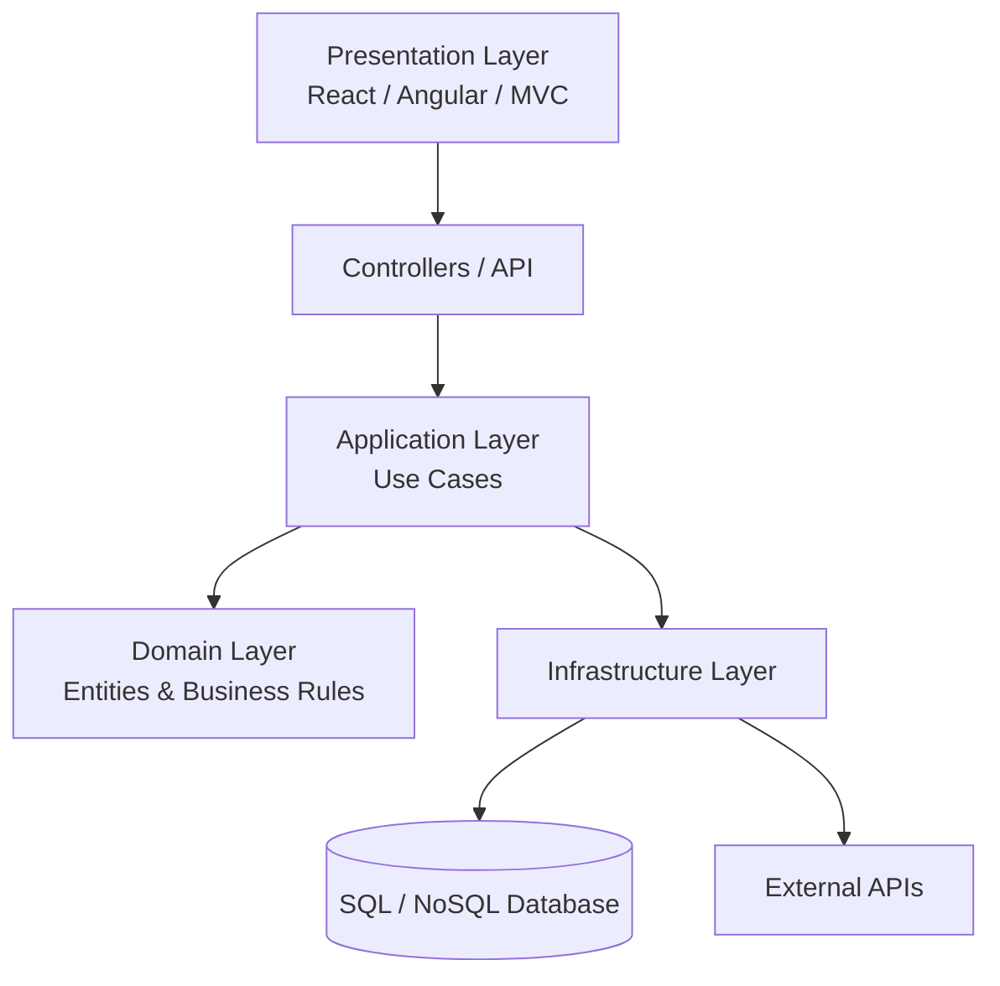

**3. Visual Architecture**

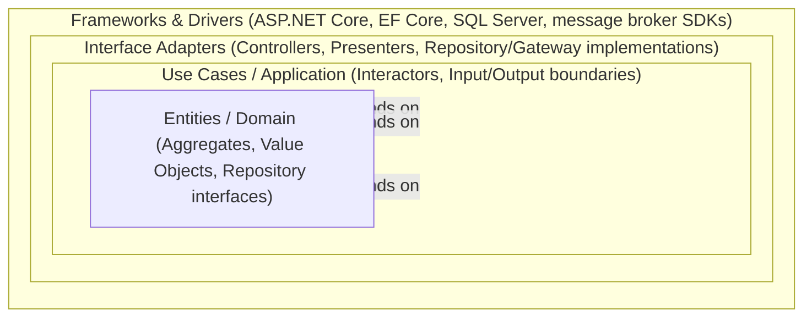

**Typical.NET Folder Structure**

```text
Solution
│
├── API
│ ├── Controllers
│ ├── Middleware
│ └── Program.cs
│
├── Application
│ ├── Commands
│ ├── Queries
│ ├── DTOs
│ ├── Interfaces
│ └── Validators
│
├── Domain
│ ├── Entities
│ ├── Enums
│ ├── ValueObjects
│ ├── Events
│ └── Exceptions
│
├── Infrastructure
│ ├── Persistence
│ ├── Repositories
│ ├── Services
│ ├── Identity
│ └── External APIs
│
└── Tests
```

**13. Low-Level Design**

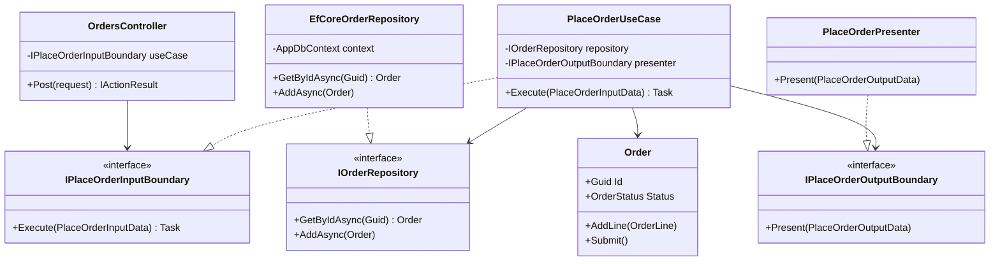

**13. Low-Level Design**

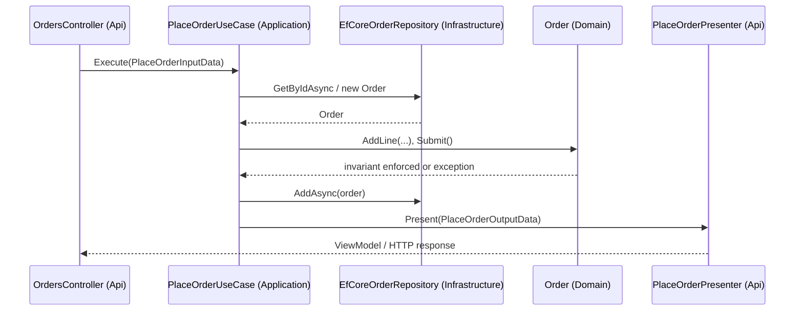

### Module 114 — Clean Architecture: Ports & Adapters — Concrete ASP.NET Core / C# Implementation
*Source: `02-PortsAndAdapters-ASPNETCoreImplementation.md`*

**3. Visual Architecture**

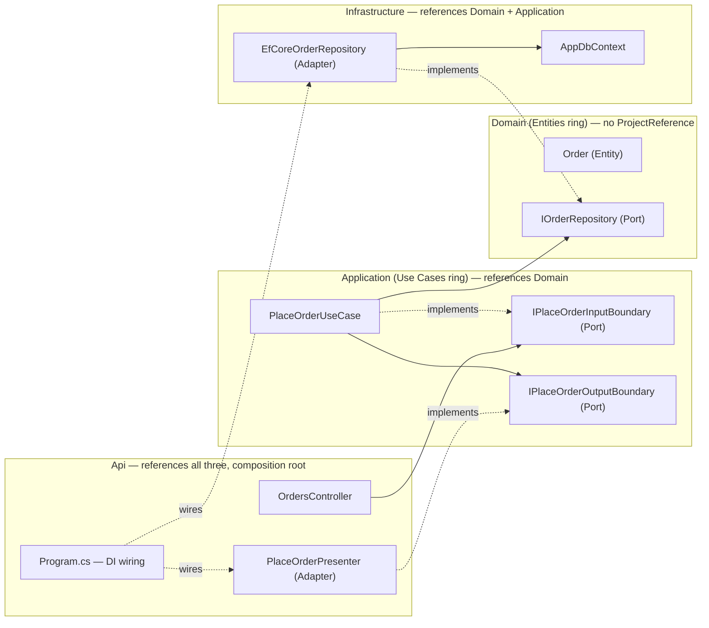

**3. Visual Architecture**

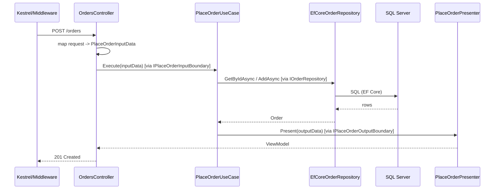

**13. Low-Level Design**

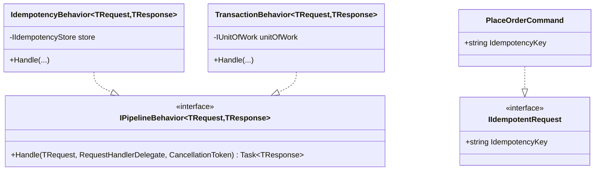

**13. Low-Level Design**

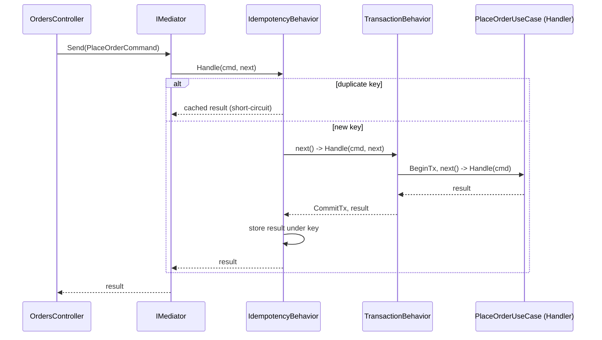

### Module 115 — Clean Architecture: Clean vs. Hexagonal vs. Onion — Comparative Synthesis
*Source: `03-CleanVsHexagonalVsOnion-ComparativeSynthesis.md`*

**3. Visual Architecture**

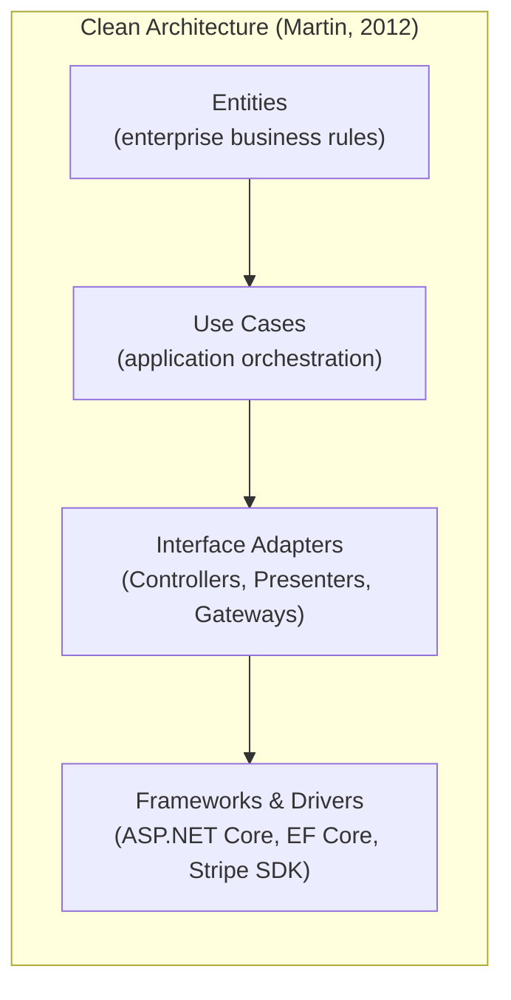

**3. Visual Architecture**

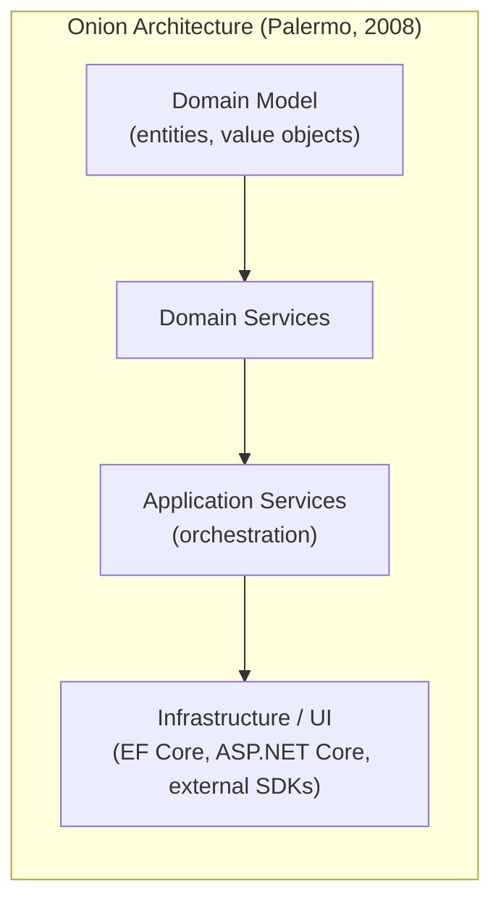

**3. Visual Architecture**

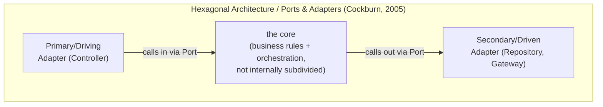

**3. Visual Architecture**

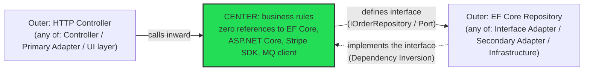

**13.1 Class Diagram — the Same Design, Three Labelings**

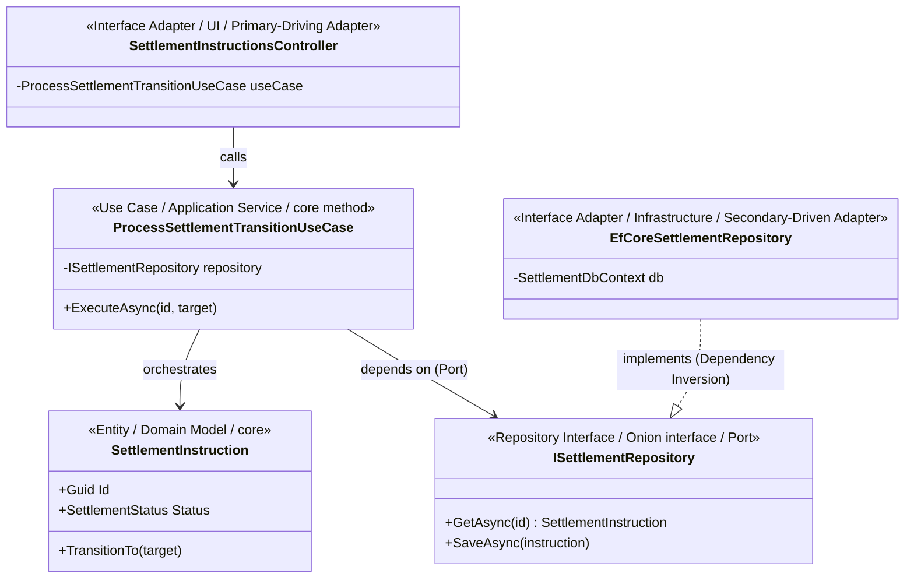

**13.2 Sequence Diagram — One Request, Traced Through Every Boundary**

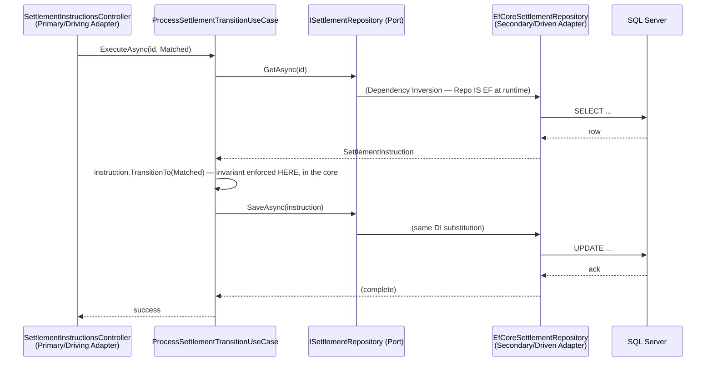
