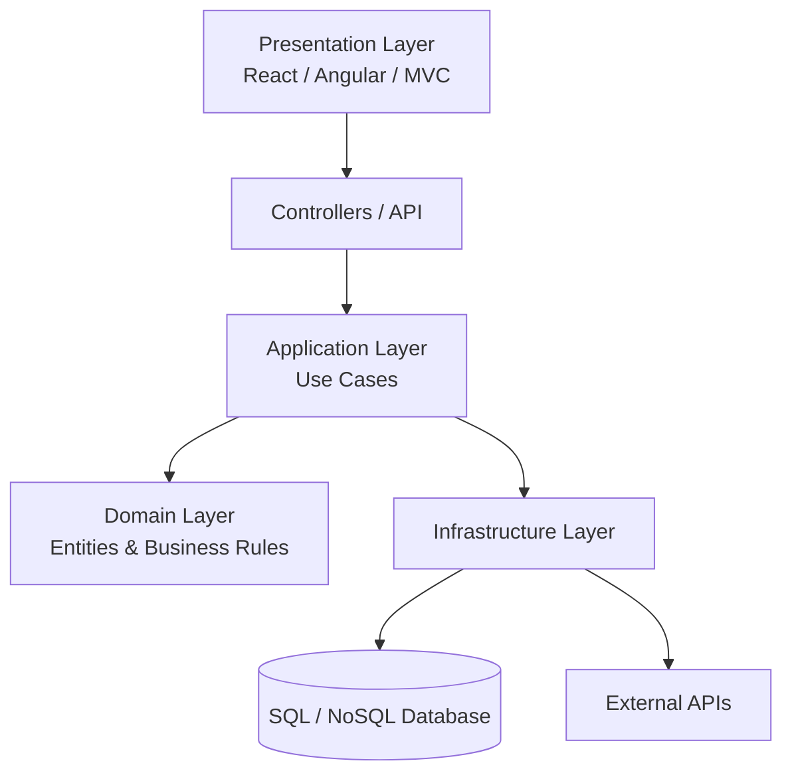
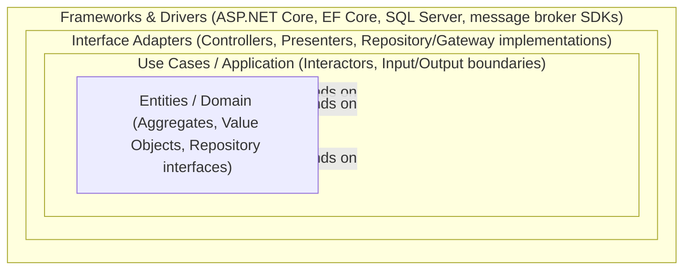
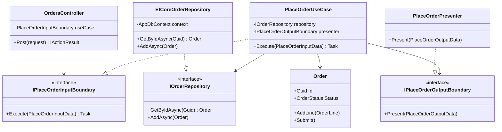
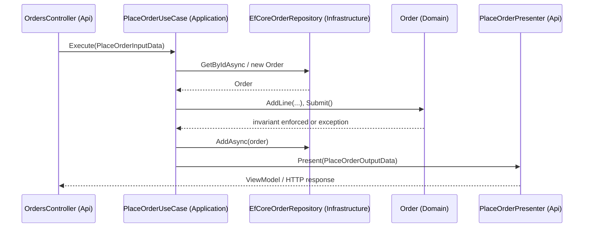

# Module 113 — Clean Architecture: Fundamentals — The Dependency Rule & the Entities/Use-Cases/Interface-Adapters/Frameworks Rings

> Domain: Clean Architecture | Level: Beginner → Expert | Prerequisite: [[31-Domain-Driven-Design/04-DDDInPractice-BoundedContextDecomposition-CapstoneCaseStudy]] (takes as given, not re-derived: a domain model belongs in an innermost, dependency-free layer; Repository interfaces live in that same layer while implementations sit at the infrastructure edge; Application Services orchestrate without containing business rules of their own — this module formalizes the general-purpose ring structure and dependency-rule discipline those facts are specific instances of), [[10-SOLID/*]] (the Dependency Inversion Principle)
>
> **Note on format:** Per the standing user preference (see `CLAUDE.md`), this module covers the **top 30 most frequently asked interview questions**, curated by real interview frequency across all four levels (8 Basic / 8 Intermediate / 7 Advanced / 7 Expert) rather than a fixed 10-per-level count, without the full 15-section deep-dive template.
>
> **Domain scope note:** `32-Clean-Architecture` is scoped to 4 modules (113–116, standard depth): this Fundamentals module, Ports & Adapters implementation in ASP.NET Core (114), a deliberately light-touch Clean vs. Hexagonal vs. Onion comparative synthesis (115 — owns Hexagonal Architecture in full, so this domain does not re-derive it), and a capstone refactor case study (116).

---

## 1. Fundamentals

### 1.1 What is Clean Architecture?

Clean Architecture is a way of organizing a codebase into **concentric rings**, where the innermost ring holds pure business logic and every ring further out holds a technical concern that is progressively more disposable — application orchestration, then adapters, then frameworks and drivers. The one rule that makes it a coherent architecture rather than just "layers with nicer names" is the **Dependency Rule**: source-code dependencies may only point inward. Nothing in an inner ring may know that a specific outer-ring technology — ASP.NET Core, EF Core, SQL Server, a message broker SDK — even exists.

### 1.2 What problem does it solve?

Left alone, a typical CRUD codebase accretes dependencies in the wrong direction: a `PlaceOrderService` calls `DbContext` directly, a domain class inherits from an EF Core base type, a controller contains the discount-eligibility rule because "it's just three lines." Every one of those decisions wires business logic to a specific piece of infrastructure. The symptoms show up months later: unit-testing a business rule requires spinning up a real database; a framework upgrade forces changes to code that has nothing to do with the framework; two entry points (an API and a nightly batch job) implement the same rule slightly differently because neither could safely reuse the other's infrastructure-entangled code. Clean Architecture solves this by making "does this class know about the framework?" a structural question with a mechanically checkable answer, not a matter of discipline alone.

### 1.3 Why does it exist / who is it associated with?

Robert C. Martin ("Uncle Bob") popularized Clean Architecture in 2012 as a synthesis of several architectures that had independently converged on the same idea: Alistair Cockburn's Hexagonal Architecture (Ports and Adapters), Jeffrey Palermo's Onion Architecture, and Data, Context, and Interaction (DCI). All of them share the same underlying insight — business rules should be the most stable, most protected part of a system, and everything else should be arranged as a replaceable shell around them.

### 1.4 When should you reach for it?

- The system has genuine, evolving business rules — not just data plumbing — that are expected to outlive at least one framework or database choice.
- Multiple entry points (a REST API, a background worker, a gRPC service, a CLI import tool) need to invoke identical business logic without duplicating it.
- The team is large enough, or has enough turnover, that "please don't put EF Core calls in the domain layer" needs to be an enforceable rule, not a tribal norm.
- Regulatory/audit requirements demand that the money or compliance logic be reviewable in isolation from infrastructure code (see the FinTech Principal Panel question in §10).

### 1.5 When NOT to reach for it

- A small, short-lived CRUD service with no meaningful business rules beyond validation and persistence — the ring ceremony (Input/Output boundaries, dedicated DTOs, Gateway interfaces) adds real, ongoing cost with little for it to protect.
- A single-owner internal tool where the "team" is one engineer who will also own it in two years — the coordination benefit of structural enforcement doesn't apply.
- A prototype or spike whose entire purpose is to be thrown away once the idea is validated.

### 1.6 How does it actually get built?

At the code level: (1) define the business rules as plain C# classes with zero framework references (the Entities ring); (2) define the orchestration of those rules as Use Case classes, again with zero framework references, depending only on interfaces it defines itself (the Use Cases ring); (3) implement those interfaces in classes that are free to reference EF Core, HTTP clients, message brokers (the Interface Adapters / Frameworks & Drivers rings); (4) wire interface-to-implementation at a single composition root using a DI container. Module 02 in this domain works through every one of these steps as literal, runnable ASP.NET Core/C# code.

---

## 2. Deep Dive

### 2.1 The Dependency Rule as a compile-time, not a documentation-time, fact

The Dependency Rule is often stated as a guideline ("dependencies should point inward"), but its real power is that it can be made a **compiler-enforced fact**. If the `Domain` and `Application` class libraries have no `ProjectReference` to `Infrastructure` or `Api`, then any attempt to use an EF Core type from a Use Case fails to compile — not "fails code review," fails to compile. This distinction — convention vs. compiler-enforced impossibility — is the single most important internal-mechanics fact in this domain, and Module 02 (Basic Q3, Intermediate Q1) builds the whole implementation chapter around it.

### 2.2 Runtime control flow vs. source-code dependency direction

A recurring confusion: control flow at runtime routinely goes outer → inner → outer (a controller calls a Use Case, which calls back out through a Repository interface to fetch data). The Dependency Rule does not forbid this — it constrains only the direction of *source-code references* (imports, using-directives, base types, parameter/return types). Dependency Inversion is the mechanism that reconciles the two: the inner ring defines the interface it needs (`IOrderRepository`), the outer ring implements it, and a DI container wires them together at startup. Control flow crosses the boundary at runtime through a reference the *outer* ring holds to the *inner* ring's interface — never the reverse.

### 2.3 What crosses a ring boundary, and what must never cross it

Only plain data structures cross ring boundaries — a Value Object, a `record`, a primitive. Never a live, stateful outer-ring object. This is why an `Order` Aggregate returned raw from a Use Case to a controller is a boundary violation even though "it compiles fine": if the `Order` is EF-Core-tracked, a controller inadvertently touching a lazily-loaded navigation property triggers a database query the controller has no visibility into — an accidental N+1 query born entirely from a boundary discipline lapse, not a data-access bug in the traditional sense.

### 2.4 Memory and object-graph implications

Strict ring separation means the same conceptual "order" typically exists as three or four distinct in-memory shapes as a request flows through the system: an inbound API request DTO, `PlaceOrderInputData`, the `Order` Aggregate itself, `PlaceOrderOutputData`, and an outbound API response DTO. Each mapping step allocates a new object graph. For a hot path processing thousands of requests per second, this is a measurable, non-zero allocation cost (quantified in §7) — the price paid for the boundary's decoupling and testability guarantees.

### 2.5 DI container resolution mechanics

Every Port-to-Adapter wiring (`services.AddScoped<IOrderRepository, EfCoreOrderRepository>()`) is resolved by the container via reflection-backed activation at the moment a Use Case's constructor is invoked. For `Scoped` registrations under ASP.NET Core's built-in container, this resolution happens once per HTTP request per service type, with the container walking the constructor-parameter graph recursively. A deep Use Case → Repository → UnitOfWork → DbContext chain is resolved in a handful of microseconds — cheap relative to the actual I/O that follows, but not literally free, and the wrong lifetime combination (Advanced Q6 in Module 02) causes silent, hard-to-diagnose bugs rather than a startup error in some hosting configurations.

### 2.6 The framework's own "gravity" toward the inner rings

Left unchecked, frameworks actively pull code toward violating the Dependency Rule because they make the wrong thing easy: EF Core's `[Key]`/`[Table]` attributes are one line away from an Entity class; ASP.NET Core model binding "just works" if you reuse the same DTO type all the way through; `IQueryable<T>` composes so naturally that returning it from a Repository interface feels like an optimization rather than a leak. Every anti-pattern in §6 is a specific instance of following a framework's path of least resistance instead of the ring boundary it was designed to preserve.

---

## 3. Visual Architecture

The following diagrams capture the ring structure introduced above.



The concentric-ring view, showing the Dependency Rule as arrows all pointing inward regardless of which ring initiates the call:



---

## Layer Responsibilities

| Layer | Responsibility |
|--------|----------------|
| Presentation | UI, Controllers, API Endpoints |
| Application | Business Use Cases, Commands, Queries |
| Domain | Entities, Value Objects, Domain Services, Business Rules |
| Infrastructure | Database, EF Core, External APIs, Email, File Storage |

---

## Dependency Rule

```
Presentation
 ↓
Application
 ↓
Domain

Infrastructure
 ↑
Application
```

- **Domain** has **no dependencies**.
- **Application** depends only on **Domain**.
- **Infrastructure** implements interfaces defined in **Application**.
- **Presentation** calls the **Application** layer.

---

## Typical.NET Folder Structure

```
Solution
│
├── API
│ ├── Controllers
│ ├── Middleware
│ └── Program.cs
│
├── Application
│ ├── Commands
│ ├── Queries
│ ├── DTOs
│ ├── Interfaces
│ └── Validators
│
├── Domain
│ ├── Entities
│ ├── Enums
│ ├── ValueObjects
│ ├── Events
│ └── Exceptions
│
├── Infrastructure
│ ├── Persistence
│ ├── Repositories
│ ├── Services
│ ├── Identity
│ └── External APIs
│
└── Tests
```

---

## 4. Production Example

**Problem.** A mid-sized payments platform's settlement service started as a single ASP.NET Core project: controllers called into "service" classes that directly used `DbContext` and directly called the acquiring bank's SDK. Eighteen months in, the team needed to (a) add a second acquiring bank as a failover path, and (b) unit-test the settlement-amount rounding logic, which had a live production bug (a one-cent rounding discrepancy on JPY transactions, which have no minor unit) that had gone undetected for three settlement cycles because the only way to exercise that code path was a full integration test against a sandbox bank environment.

**Architecture.** The team refactored around the four rings: `Domain` held a `SettlementBatch` Aggregate with the rounding/currency-minor-unit logic as invariant-enforcing methods; `Application` held a `SettleBatchUseCase` depending on an `IAcquirerGateway` port; `Infrastructure` held two adapters, `BankAAcquirerGateway` and `BankBAcquirerGateway`, both implementing `IAcquirerGateway`; `Api` held the composition root selecting which adapter (or a failover-wrapping decorator trying both) to register.

**Implementation.** The rounding bug was fixed and covered with a table-driven unit test enumerating every ISO 4217 minor-unit case (0 for JPY, 2 for USD/EUR, 3 for KWD) — a test that ran in under a millisecond and required no bank sandbox at all, because `SettlementBatch` had zero dependency on `IAcquirerGateway`'s concrete implementation. Adding the second bank required writing one new ~80-line adapter class; `SettleBatchUseCase` and every existing unit test were untouched.

**Trade-offs.** The refactor took roughly three sprints and temporarily slowed feature delivery — a cost the team weighed explicitly against the audit finding that had flagged the untestable rounding logic as a control gap. The DTO-mapping boilerplate at each boundary (Input/Output data classes, a Presenter) added real, ongoing per-feature cost the team accepted specifically because this service is a Core, regulator-scrutinized subdomain, not a supporting one.

**Lessons learned.** (1) The realized benefit was testability, not the theoretical bank-swap flexibility — the JPY bug would have been caught in code review or CI within minutes under the new structure, versus three live settlement cycles under the old one. (2) The second-bank integration, the benefit the team originally justified the refactor with, was genuinely cheap once the port existed — but it was the *secondary* payoff, not the primary one, which matches Module 01's Basic Q8/Q4 ordering exactly.
## 10. Interview Questions

### Basic (10)

1. **Q: What is Clean Architecture, in one sentence, and who is it associated with?**
 **A:** Clean Architecture, popularized by Robert C. Martin ("Uncle Bob"), is an architectural style organizing code into concentric rings — with business logic at the center and technical/framework concerns at the outer edge — governed by a single rule (the Dependency Rule) that all source-code dependencies must point inward, toward the business logic, never outward toward frameworks or infrastructure.
 **Why correct:** States the defining structure (concentric rings) and the one governing rule (inward-only dependencies) precisely, crediting its common attribution without treating that as the substance of the answer.
 **Common mistakes:** Describing Clean Architecture as "just another name for layered architecture" — the specific, load-bearing difference (Intermediate Q1's Dependency Inversion mechanism enforcing the inward-only rule) is what separates it from a traditional N-tier design, not merely having named layers.
 **Follow-ups:** "Is Clean Architecture a DDD-specific pattern?" (No — per this module's prerequisite note, it composes very well with DDD's tactical patterns, but it's a general-purpose structural discipline applicable even to a much simpler, non-DDD domain layer.)

2. **Q: What is the Dependency Rule, stated precisely?**
 **A:** Source-code dependencies can only point inward: an inner ring must never reference, import, or know about anything defined in an outer ring — an inner ring's code must be compilable and meaningful with zero knowledge that any specific outer-ring technology (a specific database, web framework, or UI) even exists; any information that needs to flow outward-to-inward (like data read from a database) crosses the boundary as a simple data structure, never as a reference to an outer-ring type.
 **Why correct:** States the rule at the correct level of precision (a source-code/reference-direction rule, not merely a "logical layering" guideline) and names the specific mechanism (plain data crossing boundaries, never outer-ring types) that makes it enforceable.
 **Common mistakes:** Confusing the Dependency Rule with the direction of *runtime control flow* — control flow frequently does go from outer to inner (a controller calls into a Use Case) and that's fine; what the rule actually constrains is the direction of *source-code dependency/references*, which is why Dependency Inversion (Intermediate Q1) is the specific mechanism that reconciles the two.
 **Follow-ups:** "Give a concrete example of the rule being violated." (A Use Case class in the inner ring directly importing and instantiating `Microsoft.EntityFrameworkCore.DbContext` — a specific, outer-ring, framework-provided type — inside its own logic.)

3. **Q: Name Clean Architecture's four classic rings, from innermost to outermost, and what each contains.**
 **A:** (1) **Entities** — enterprise-wide business rules and objects, the most stable, most reused-across-applications business concepts (this maps directly onto the Aggregates/Entities/Value Objects). (2) **Use Cases** (also called Interactors) — application-specific business rules, orchestrating Entities to accomplish one specific use case (this maps onto the Application Services). (3) **Interface Adapters** — converters translating data between the Use Cases/Entities' preferred format and the format convenient for an external agency (controllers, presenters, gateway/Repository implementations). (4) **Frameworks & Drivers** — the outermost ring: the actual web framework, database driver, UI framework, and other concrete tools and delivery mechanisms.
 **Why correct:** Names all four rings in the correct order with the correct, specific content of each, and explicitly maps two of them onto this domain's own already-established DDD vocabulary rather than treating them as unrelated new concepts.
 **Common mistakes:** Treating "Interface Adapters" as just "the API controllers" — it's a broader ring including *both* the inbound direction (controllers) and outbound direction (Repository/gateway implementations, presenters formatting output) — anything whose job is translating between the inner rings' preferred shape and an outer concern's actual shape.
 **Follow-ups:** "Which ring does a Repository interface belong to, and which ring does its implementation belong to?" (The interface belongs in Use Cases or Entities per the Dependency-Inversion discipline; the concrete implementation, using a specific ORM, belongs in Interface Adapters or Frameworks & Drivers — precisely the split already established for DDD's Repository pattern, now named as a general ring-boundary rule.)

4. **Q: Why is the actual web framework and database technology placed in the *outermost*, least-stable ring, rather than treated as a foundational starting point?**
 **A:** Because frameworks and databases are, from the business's perspective, *implementation details* and delivery mechanisms — swappable tools that change far more often, and matter far less to what the business actually does, than the business rules themselves; placing them outermost means a framework upgrade, a database migration, or even a full framework replacement should, in principle, require zero changes to the Entities or Use Cases rings, since those inner rings never depended on the specific outer-ring technology in the first place.
 **Why correct:** States the underlying rationale (frameworks are swappable implementation details, business logic is what's actually durable) rather than just restating the ring's position as a given fact.
 **Common mistakes:** Believing this means frameworks don't matter or should be chosen carelessly — the point isn't that framework choice is unimportant, only that the *business logic's correctness* shouldn't be coupled to that choice, so the choice can be revisited later without a business-logic rewrite.
 **Follow-ups:** "Has anyone actually swapped out a database or framework this cleanly in practice — is this benefit realistic or mostly theoretical?" (Advanced Q7 and Expert Q1 address the realistic ROI calculus directly — the benefit is real but the *actual, executed* full-swap scenario is rarer in practice than the *testability* benefit, Basic Q8, which is realized on nearly every project regardless of whether a swap ever happens.)

5. **Q: How does Clean Architecture differ from a traditional three-tier / N-tier layered architecture (Presentation → Business Logic → Data Access)?**
 **A:** A traditional N-tier design typically has the Business Logic layer directly depend on the Data Access layer (calling into it to fetch/save data), meaning the business logic's own compilability and testability is coupled to a specific data-access technology; Clean Architecture inverts this specific dependency via Dependency Inversion (Intermediate Q1) — the business-logic (Use Cases/Entities) layer defines an interface for what it needs from data access, and the Data Access layer implements that interface, meaning the *reference* points from Data Access toward Business Logic, not the reverse, even though the *runtime call* still effectively flows the same conceptual direction.
 **Why correct:** Pinpoints the exact, specific difference (which direction the *source-code dependency* points, not merely "having layers") between the two styles, since both styles can look superficially similar in a component diagram.
 **Common mistakes:** Assuming any codebase with a "BusinessLogic" folder and a "DataAccess" folder is automatically Clean Architecture — the folder names alone say nothing about which way the actual compile-time references point; a codebase can have Clean-Architecture-sounding folder names while its Business Logic classes still directly instantiate and depend on concrete Data Access classes, in which case it's a traditional N-tier design wearing Clean Architecture's naming convention.
 **Follow-ups:** "Would a traditional N-tier design necessarily fail this module's Dependency Rule?" (Yes, in the common case where Business Logic directly references concrete Data Access types — that's the specific violation the Dependency Rule exists to prevent, and it's also exactly why traditional N-tier business logic is typically much harder to unit-test without a real or heavily-mocked database.)

6. **Q: Why shouldn't an Entities-ring class be annotated with ORM-specific attributes, like EF Core's `[Key]` or `[Table("Orders")]`?**
 **A:** Those attributes are a direct, compile-time reference from the Entities ring to a specific outer-ring technology (EF Core) — exactly the Dependency Rule violation Basic Q2 defines; an `Order` Entity/Aggregate should be expressible, compiled, and fully unit-testable with zero knowledge that EF Core, or any specific ORM, is even in use — the actual EF Core mapping configuration (which table, which column, which key) belongs in the Interface Adapters/Frameworks ring, typically via Fluent API configuration classes kept entirely separate from the Entity's own class definition.
 **Why correct:** Names the specific mechanism of the violation (a compile-time attribute reference from inner to outer ring) and the correct alternative (separate, outer-ring mapping configuration), rather than only asserting "don't do this."
 **Common mistakes:** Believing ORM attributes are harmless "just metadata" with no real coupling cost — the attributes still create a hard compile-time dependency from the Entity class to the ORM's assembly, meaning the Entity literally cannot compile or be tested without that ORM package referenced, regardless of how the attributes are used at runtime.
 **Follow-ups:** "What's the concrete downside if a team ignores this and uses attributes anyway?" (Unit-testing the Entity's own invariant logic, per the adversarial invariant tests, now requires the EF Core package present even though the test never touches a database — a small but real coupling tax, and a canary for larger violations creeping in elsewhere.)

7. **Q: What is a "Use Case" (or Interactor) in Clean Architecture, and how does it relate to the Application Service?**
 **A:** A Use Case is a class representing one specific, application-level business operation (e.g., `PlaceOrderUseCase`) — it's effectively the same role already established for an Application Service: orchestrating Entities/Aggregates and Repositories to accomplish a use case, without itself containing the actual business-invariant logic (that stays on the Entities/Aggregates). Clean Architecture's specific contribution is naming this orchestration layer as its own explicit *ring*, with formal Input/Output boundary interfaces (Intermediate Q4) governing exactly what crosses into and out of it.
 **Why correct:** Correctly identifies the Use Case/Application Service equivalence rather than presenting it as an unrelated new concept, and states Clean Architecture's actual distinguishing contribution (a formal ring with explicit boundary interfaces) precisely.
 **Common mistakes:** Treating "Use Case" and "Application Service" as fundamentally different patterns requiring separate learning — they fill the identical architectural role; the vocabulary differs by which named style (Clean Architecture vs. plain DDD-layering) is being discussed.
 **Follow-ups:** "Does a Use Case call into Repositories directly, or through something else?" (Directly, but only through Repository *interfaces* defined in an inner ring, per Basic Q3/ — the Use Case never references a concrete Repository implementation.)

8. **Q: What is the single most immediately realized benefit of following the Dependency Rule, on nearly every project regardless of whether a framework is ever actually swapped?**
 **A:** Testability without infrastructure — because the Entities and Use Cases rings have zero compile-time dependency on any specific web framework, database, or external service, their business logic can be unit-tested by instantiating plain objects and calling methods directly, with no test web server, no real or in-memory database, and no network calls required; this typically means the bulk of a system's actual business-rule test suite runs in milliseconds rather than seconds, and doesn't require complex test-environment setup at all.
 **Why correct:** Names the benefit that's realized immediately and universally (fast, infrastructure-free business-logic testing) rather than the framework-swap benefit (Basic Q4), which is real but rarer in actual practice — correctly prioritizing the more commonly-cited interview answer.
 **Common mistakes:** Leading with "you can swap your database easily" as the primary benefit — while true in principle (Basic Q4), teams that adopt Clean Architecture primarily for that reason and never actually experience a full database swap can end up feeling the pattern's ceremony wasn't justified, when the actually-realized, everyday benefit (fast, dependency-free unit tests) was there the whole time and is usually the stronger justification.
 **Follow-ups:** "What kind of test would still require real infrastructure, even in a fully Clean-Architecture-compliant system?" (An integration test verifying a Repository implementation's actual behavior against a real database — the already-established distinction between fast domain-logic unit tests and infrastructure-dependent integration tests recurs identically here.)

9. **Q: What is a "Value Object," and why does Clean Architecture care about the distinction between an Entity and a Value Object at the ring level?**
 **A:** A Value Object (e.g., `Money`, `EmailAddress`) is defined entirely by its attribute values and has no persistent identity, while an Entity (`Order`) has an identity that persists across changes to its attributes. Both live in the same Entities ring — the distinction isn't about ring placement, it's about how strictly a class's equality and mutability should be enforced. Clean Architecture cares because Value Objects are the cheapest, safest place to enforce invariants (a `Money` type that can never represent a negative amount, or that always carries a currency) since they have no lifecycle to manage, only correctness to enforce at construction time.
 **Why correct:** Correctly separates "which ring" (Entities, for both) from "what discipline" (identity vs. pure-value equality), and gives the concrete reason Clean Architecture material emphasizes Value Objects specifically — invariant enforcement at the cheapest possible point.
 **Common mistakes:** Assuming Value Objects belong in a different ring than Entities, or that the distinction is a modeling nicety rather than a concrete correctness tool — a `decimal Amount` field scattered across a codebase instead of a single `Money` type is exactly how a currency-mismatch or negative-amount bug slips past code review.
 **Follow-ups:** "Give a concrete invariant a `Money` Value Object should enforce in a payments system." (That its amount and currency are never separately null/default, that arithmetic between two `Money` values of different currencies throws rather than silently producing a wrong number, and that construction rejects a negative amount where the domain concept — e.g., a settlement total — can never legitimately be negative.)

10. **Q: Is Clean Architecture only applicable to a monolithic application, or does it apply equally to a single microservice?**
 **A:** It applies equally, and arguably more cleanly, to a single microservice — each individually-deployed service gets its own four rings, its own Dependency Rule, its own composition root. What changes at microservice scale isn't the ring structure itself, it's that "Frameworks & Drivers" now also includes the service's own network boundary (its message broker client, its outbound HTTP clients to other services), and the Entities/Use Cases rings of one service are never shared directly with another service's rings — cross-service communication happens through the same Gateway/Adapter pattern used for any other external dependency.
 **Why correct:** Correctly identifies that ring structure is a per-deployable-unit concern, not a monolith-specific one, and names the one genuine addition at microservice scale (inter-service calls treated as just another outer-ring dependency).
 **Common mistakes:** Assuming a "microservices architecture" and "Clean Architecture" are alternative choices rather than orthogonal ones — a system can be microservices without any individual service following Clean Architecture internally, and a single monolith can rigorously follow the Dependency Rule; the two decisions (how many deployables, how each deployable is internally structured) are independent.
 **Follow-ups:** "Would two microservices ever share a `Domain` class library directly?" (Generally no, and doing so is a common anti-pattern — sharing a Domain library couples the two services' release cadence and risks smuggling one service's business rules into another's; a shared *kernel* of genuinely universal, stable concepts, per DDD's Shared Kernel pattern, is the narrow, deliberate exception, not a default.)

### Intermediate (10)

1. **Q: Explain precisely how the Dependency Inversion Principle (/10-SOLID) is the mechanism that makes the Dependency Rule achievable, reconciling "control flow goes outward-to-inward" with "source dependencies point inward-only."**
 **A:** An inner ring (Use Cases) defines an interface expressed entirely in its own terms (e.g., `IOrderRepository`, `IPaymentGateway`) for whatever it needs from an outer ring; an outer ring (Interface Adapters/Frameworks) provides a concrete implementation satisfying that interface. At runtime, a dependency-injection container wires the concrete outer-ring implementation into the inner-ring interface, so *control flow* does travel from an outer-ring caller down into the Use Case and back out to the outer-ring implementation via the interface call — but the *source-code reference* (the interface definition) belongs entirely to the inner ring, and the outer ring's implementing class is the one that references the inner ring's interface, not the reverse. This is exactly the same mechanism already established for Repository interfaces, now generalized as the load-bearing principle for every single ring boundary in the entire architecture.
 **Why correct:** Precisely resolves the apparent paradox (control flow one direction, source dependency the other) by naming the specific mechanism (interface defined inward, implemented outward, wired via DI at runtime) rather than treating it as an unexplained rule.
 **Common mistakes:** Believing the Dependency Rule somehow means control flow itself must go inward-only — this would make the architecture impossible to actually run, since something in an outer ring always has to initiate the call into a Use Case; the rule constrains reference direction, not call direction.
 **Follow-ups:** "What specific runtime component performs this wiring in a typical ASP.NET Core application?" (covers this in full — briefly, the built-in DI container's service registration at application startup, mapping each inner-ring interface to its concrete outer-ring implementation.)

2. **Q: What are Input and Output Boundary interfaces, and why does a Use Case communicate through them rather than returning its own Entities directly to a controller?**
 **A:** An Input Boundary is the interface a controller calls *into* a Use Case through (e.g., `IPlaceOrderUseCase.Execute(PlaceOrderInputData)`); an Output Boundary is an interface the Use Case calls *out through* to hand its result to a Presenter (e.g., `IPlaceOrderOutputBoundary.Present(PlaceOrderOutputData)`) — both boundaries use plain, ring-specific data-transfer objects (`InputData`/`OutputData`), never the raw Entities themselves, because returning an Entity/Aggregate directly to a controller would let the controller (an outer-ring concern) reach into and depend on the Entity's full internal shape, including behavior and invariants it has no business calling directly, and would make it far too easy for a later change to the Entity's internals to break the outer-ring presentation layer.
 **Why correct:** States both boundary interfaces precisely and gives the specific coupling risk (controller depending on and potentially reaching into an Entity's full internal shape) that using dedicated DTOs at the boundary avoids.
 **Common mistakes:** Returning an EF-Core-tracked `Order` Aggregate directly from a Use Case to a controller "to save a mapping step" — beyond the abstraction leak, this can leak live, lazily-loaded ORM proxies across the boundary, letting outer-ring code accidentally trigger additional database queries it has no visibility into (an N+1-query risk,, now surfacing specifically because of a boundary violation).
 **Follow-ups:** "Isn't mapping between Entities and Input/OutputData DTOs extra boilerplate?" (Yes, genuinely — Advanced Q7 and Intermediate Q8 address when this ceremony is and isn't worth its cost; for a Core, business-critical Use Case the mapping is cheap insurance against the coupling risk above, but it's real, non-zero cost that should be weighed honestly.)

3. **Q: Given this domain's DDD prerequisite, which specific ring does a Repository interface belong to, and which ring does its concrete EF Core implementation belong to?**
 **A:** The `IOrderRepository` interface belongs in the Entities or Use Cases ring (commonly placed alongside the Use Cases that need it) — this is not a new decision Clean Architecture introduces, it's the exact same placement already established via Dependency Inversion, now simply named using this domain's ring vocabulary. The concrete `EfCoreOrderRepository: IOrderRepository` class, referencing `DbContext` and EF Core's query APIs, belongs in the Interface Adapters ring (as a "Gateway," in Clean Architecture's own terminology) or, depending on how finely the outer rings are split, the Frameworks & Drivers ring.
 **Why correct:** Explicitly connects this ring-placement decision to the already-established DDD fact rather than presenting it as new, and correctly names Clean Architecture's own term ("Gateway") for this specific kind of Interface Adapter.
 **Common mistakes:** Assuming Clean Architecture requires re-learning where a Repository interface goes from scratch — the placement decision was already made; this module only supplies the formal ring name and the explicit rule (Dependency Rule) justifying why that placement was correct all along.
 **Follow-ups:** "Would the placement change if the Use Cases ring and Entities ring were split into two separate class libraries/projects, as will cover?" (No — the logical ring placement stays identical; only the physical project-boundary enforcement mechanism, which covers via project-reference rules, adds a compiler-enforced guarantee on top of the same logical rule.)

4. **Q: Where do Domain Events fit into Clean Architecture's ring structure, and does raising one violate the Dependency Rule?**
 **A:** The Domain Event type itself (e.g., `OrderPlaced`) is a plain data structure defined and raised from within the Entities ring (the `Order` Aggregate raises it) — this doesn't violate the Dependency Rule because the event is just data, with no reference to any outer-ring type. What *handles* the event — updating a different Aggregate, publishing an integration event, writing to an Outbox table — is orchestration logic that belongs in the Use Cases ring (or, for the actual publishing mechanism, further out in Interface Adapters/Frameworks), called via a domain-event-dispatching interface defined inward, exactly like a Repository.
 **Why correct:** Correctly separates the event *definition* (Entities ring, pure data, no violation) from the event *handling/dispatch mechanism* (Use Cases ring orchestration, calling outward via an inward-defined interface), rather than treating "Domain Events" as a single undifferentiated concern.
 **Common mistakes:** Having the `Order` Aggregate itself directly call out to a concrete message broker client or Outbox-table-writing class to publish its own event — this would be the Entities ring directly referencing a Frameworks & Drivers-ring technology, a clear Dependency Rule violation; the Aggregate should only ever add the event to its own internal pending-events list, leaving actual publication to outer-ring code that later inspects that list.
 **Follow-ups:** "At what point in the flow does the Outbox pattern actually get invoked?" (In the Use Case's orchestration, as part of committing the Unit of Work — the Use Case, not the Entity, is responsible for taking the Entity's raised events and ensuring they're durably recorded alongside its state change.)

5. **Q: Critique the following: "Since a Use Case orchestrates business logic, it's fine for it to directly instantiate and query a `DbContext` when it needs a quick read that doesn't fit neatly through a Repository."**
 **A:** This is a Dependency Rule violation regardless of how minor or "quick" the read seems — the Use Case ring would now have a compile-time reference to EF Core, an outer-ring, Frameworks & Drivers-level technology; the correct fix, even for an awkward or narrow read, is still an interface defined in an inner ring (perhaps a purpose-built, narrowly-scoped read interface rather than forcing it through the full `IOrderRepository`) with its implementation in an outer ring — this directly reapplies the read-model guidance (a simple, direct query is fine for reporting needs) while correctly keeping *where that query is defined* on the correct side of the ring boundary, which the discussion of read models didn't need to address explicitly but this domain's Dependency Rule makes non-negotiable.
 **Why correct:** Identifies that "convenience" or "it's just a quick read" is not an exception to the Dependency Rule, and supplies the correct fix (a narrowly-scoped interface, still inward-defined) rather than either forbidding the direct-query pattern entirely or allowing the violation.
 **Common mistakes:** Assuming Dependency Rule discipline only matters for "real" business logic and can be relaxed for supposedly trivial reads — every ring-boundary violation, however small, is exactly the kind of practice that a fitness function (Advanced Q5) needs to catch mechanically, precisely because "just this once, it's simple" is how boundary erosion always begins.
 **Follow-ups:** "Isn't this now indistinguishable from just using a full Repository for everything?" (Not necessarily — the interface can be much narrower and more specifically shaped than a general Repository, e.g., a single-method `IOrderSummaryReader` interface returning a lightweight DTO — the point is the *interface's existence and inward placement*, not that it must have the same shape as `IOrderRepository`.)

6. **Q: How does "Screaming Architecture" (a companion idea from the same source as Clean Architecture) relate to and complement the ring structure?**
 **A:** Screaming Architecture is the idea that a codebase's top-level folder/project structure should immediately communicate *what the system does* (its Use Cases — `PlaceOrder`, `ScheduleShipment`, `ApplyLoyaltyDiscount`) rather than *what framework it's built with* (folders named `Controllers`, `Repositories`, `Services` at the top level, with business intent buried inside them) — it complements Clean Architecture's ring structure by organizing *within* the Use Cases ring by business capability/feature rather than by technical layer, so opening the codebase's top-level structure "screams" the business domain (echoing this domain's own DDD prerequisite's Ubiquitous Language) rather than screaming "this is an ASP.NET Core MVC app."
 **Why correct:** Correctly distinguishes the two related-but-distinct ideas (ring structure governs dependency direction; Screaming Architecture governs folder organization/naming) and ties the folder-naming discipline back to this domain's own DDD-derived Ubiquitous Language emphasis.
 **Common mistakes:** Conflating "Screaming Architecture" with the ring structure itself, as if they were the same concept — a codebase can correctly follow the Dependency Rule while still being organized by technical layer at the folder level (a `Controllers/`, `UseCases/`, `Repositories/` top-level split), and can also organize folders by feature while accidentally violating the Dependency Rule internally; the two are genuinely independent axes.
 **Follow-ups:** "Give a concrete folder-naming example illustrating the difference." (A "screaming" structure has a top-level `Ordering/` folder containing that feature's Use Case, Entities, and Interface Adapters together; a non-screaming-but-still-Clean-Architecture-compliant structure instead has top-level `UseCases/`, `Entities/`, `Adapters/` folders each containing every feature's code mixed together inside them.)

7. **Q: When is adopting the full ring structure and its ceremony (Input/Output boundaries, dedicated DTOs at every boundary, Gateway interfaces for every external dependency) NOT worth it?**
 **A:** For a genuinely simple, low-complexity CRUD application — administrative tooling, an internal reporting dashboard, a small service with little real business logic beyond straightforward create/read/update/delete operations — the full boundary/DTO ceremony adds real, ongoing cost (more classes, more mapping code, steeper onboarding for a small team) without a correspondingly large payoff, since there's little genuine business-rule complexity for the architecture to protect or little realistic likelihood of ever needing to swap the underlying framework/database; this directly reapplies the core/supporting/generic investment-calibration principle and the ROI calculus (Expert Q1) to architectural-style investment specifically, not just to DDD tactical patterns.
 **Why correct:** Gives the concrete, calibrated condition (low genuine complexity, low swap likelihood) under which the investment doesn't pay off, and explicitly connects the reasoning to this domain's own established investment-calibration precedent rather than treating "sometimes it's not worth it" as an unexplained caveat.
 **Common mistakes:** Treating Clean Architecture as a universal best practice to apply unconditionally to every project regardless of its actual complexity or criticality — the same over-application anti-pattern this course has now named at the tactical-DDD level, the architectural-style level, and now this domain's own ring-and-boundary ceremony specifically.
 **Follow-ups:** "What's a middle-ground option for a project too complex for plain CRUD but not clearly justifying full ceremony?" (A simplified variant keeping the core Dependency Rule and Repository-interface discipline but skipping dedicated Input/Output boundary DTOs in favor of directly returning Entities from Use Cases within a single, small, trusted codebase — accepting a smaller, deliberate coupling in exchange for less mapping ceremony, revisited if the project's complexity later grows.)

8. **Q: A team new to Clean Architecture initially resists creating separate Input/Output DTOs for every Use Case, calling it "boilerplate for no reason." How would you address this, using a concrete example?**
 **A:** Show a concrete scenario where skipping the DTO boundary caused real damage: a Use Case returning the `Order` Aggregate directly to a controller worked fine until, months later, an internal refactor renamed an `Order` property and added a new required constructor parameter for an unrelated invariant-modeling reason (style tactical improvement) — this silently broke every controller and API contract still directly serializing the raw Entity, since the Entity's internal shape had never been intended as a stable, public contract in the first place; a dedicated `OrderOutputData` DTO, by contrast, would have absorbed that internal refactor with a single, localized mapping-code change, leaving every consuming controller and the public API contract completely unaffected.
 **Why correct:** Uses a concrete, realistic failure scenario (an internal refactor breaking external contracts) rather than an abstract appeal to "best practice," making the DTO boundary's value legible in terms the resistant team can directly weigh against the ceremony's cost.
 **Common mistakes:** Responding to boilerplate objections with an appeal to authority ("Uncle Bob says to do it this way") rather than a concrete cost/benefit demonstration — Intermediate Q7 already establishes that the ceremony is a genuine, non-zero cost that isn't automatically justified everywhere, so the actual persuasive case has to rest on a specific, demonstrated risk this project's own complexity level makes real.
 **Follow-ups:** "Is there a lighter-weight way to get most of this benefit without full manual DTO-mapping boilerplate?" (Object-mapping libraries, or C# `record` types with concise positional syntax, can reduce the boilerplate cost significantly while keeping the boundary's decoupling benefit — covers concrete ASP.NET Core implementation options.)

9. **Q: How does the Specification pattern relate to Clean Architecture's ring boundaries, particularly for encoding a business rule that also needs to become a database query?**
 **A:** A Specification (`ISpecification<T>` with an `IsSatisfiedBy(T)` predicate, and often an expression-tree form usable by a query provider) lets a single business rule — e.g., "an order is eligible for expedited shipping" — be expressed once, in the Entities/Use Cases ring, and be reused both for in-memory evaluation (unit-testable, no database) and, via its expression-tree form, translated by an Infrastructure-ring Repository into a `WHERE` clause. The Specification itself stays a plain, framework-free type; only the Infrastructure-ring code that consumes its expression tree needs to know about EF Core's `IQueryable` translation.
 **Why correct:** Correctly keeps the rule's *definition* inward while identifying the one place (Infrastructure-ring query translation) an outer-ring technology legitimately touches it, avoiding the common mistake of concluding a rule that "needs to become SQL" must therefore live in the Infrastructure ring itself.
 **Common mistakes:** Duplicating the same rule as both a C# predicate (for use-case-level checks) and a separate, hand-written LINQ query (for filtering a Repository call) — the two inevitably drift out of sync; the Specification pattern exists specifically to prevent this duplication by defining the rule exactly once.
 **Follow-ups:** "What's the risk if a Specification's expression tree uses a method EF Core's LINQ provider can't translate to SQL?" (A runtime `InvalidOperationException` or a silent client-side-evaluation fallback, depending on EF Core version and configuration — a good reason to unit-test Specifications intended for query translation against a real or in-memory-provider database, not just via plain in-memory `IsSatisfiedBy` calls.)

10. **Q: A code reviewer flags that a Use Case is directly calling `DateTime.Now` inside its logic. Is this a Dependency Rule violation, and why does it matter for testability regardless of the answer?**
 **A:** Strictly, `DateTime.Now` is a static call into the .NET Base Class Library, not a named outer-ring technology, so it's not a textbook Dependency Rule violation the way an EF Core call would be — but it's still a real problem: it makes the Use Case's behavior non-deterministic and untestable for time-dependent logic (e.g., "an order placed after 5pm ships next business day"), since a unit test can't control what `DateTime.Now` returns at the moment the test runs. The fix is the same Port/Adapter mechanism used for every other external dependency: define an `IClock` (or `TimeProvider` in modern .NET) port in the inner ring, inject it, and let tests supply a fixed, controllable time.
 **Why correct:** Correctly distinguishes "not a ring violation in the strict Dependency Rule sense" from "still a testability problem the same architectural mechanism solves," rather than treating the two questions as identical.
 **Common mistakes:** Treating `DateTime.Now`, `Guid.NewGuid`, or `Random` as harmless because they're BCL calls, not third-party SDK calls — the Dependency Rule's target is outer-ring *technology* references, but testability more broadly cares about any *non-deterministic* dependency, which is a related but distinct concern this question exists to separate cleanly.
 **Follow-ups:** "What's the modern .NET-idiomatic way to abstract time, as of .NET 8?" (`TimeProvider`, introduced in .NET 8, is the framework-provided abstraction for exactly this — injected as a port, with `FakeTimeProvider` from `Microsoft.Extensions.TimeProvider.Testing` used in unit tests, replacing hand-rolled `IClock` interfaces.)

### Advanced (10)

1. **Q: Design the concrete ring structure and Input/Output boundary classes for a `PlaceOrder` Use Case, reusing the `Order` Aggregate /112's case study.**
 **A:** **Entities ring:** the existing `Order` Aggregate, `Money`/`OrderLine` Value Objects, and the `IOrderRepository` interface. **Use Cases ring:** `PlaceOrderInputData` (a plain record: `CustomerId`, `List<(ProductId, Quantity)>`), `PlaceOrderOutputData` (a plain record: `OrderId`, `Total`, `Status`), an `IPlaceOrderOutputBoundary` interface with a `Present(PlaceOrderOutputData)` method, and the `PlaceOrderUseCase` class implementing `IPlaceOrderInputBoundary`, which loads/constructs the `Order` via `IOrderRepository`, calls `Order.AddLine(...)` and `Order.Submit` (enforcing the invariants), commits via a Unit of Work, maps the result to `PlaceOrderOutputData`, and calls the Output Boundary. **Interface Adapters ring:** an `OrdersController` implementing the calling side of `IPlaceOrderInputBoundary`'s invocation (translating an HTTP `POST` into `PlaceOrderInputData`), a `PlaceOrderPresenter` implementing `IPlaceOrderOutputBoundary` (translating `PlaceOrderOutputData` into an HTTP response/ViewModel), and `EfCoreOrderRepository`. **Frameworks & Drivers ring:** ASP.NET Core itself, EF Core's `DbContext`, SQL Server.
 **Why correct:** Provides a complete, concrete, correctly-layered design reusing this domain's own established case-study Aggregate rather than an unrelated toy example, correctly placing every class in its proper ring with the correct boundary-interface wiring.
 **Common mistakes:** Merging the Presenter and Controller into a single class "since they're closely related" — Clean Architecture deliberately separates them (the Controller's job is translating an inbound request into Input Boundary data; the Presenter's job is translating Use Case output into a display-ready format) so that, e.g., the same Use Case could be presented differently to a REST API versus a server-rendered HTML view without the Use Case itself changing at all.
 **Follow-ups:** "Where would the fitness function (Advanced Q5) actually assert this structure holds?" (A static-analysis check on the compiled assemblies or namespaces confirming the `Entities` and `UseCases` projects have zero reference to the `EfCoreOrderRepository`'s assembly or to `Microsoft.EntityFrameworkCore` at all — covers the concrete.NET project-reference mechanism enforcing this at compile time, not just via a runtime check.)

2. **Q: Critique a real violation found in code review: a Use Case class directly new-ing up a `System.Net.Http.HttpClient` to call a third-party shipping-rate API.**
 **A:** This is a Dependency Rule violation — `HttpClient` is a concrete, Frameworks & Drivers-ring, infrastructure-specific type, and the Use Case ring should instead depend on an inward-defined interface (e.g., `IShippingRateGateway`) implemented by an outer-ring `HttpShippingRateGateway` class that internally uses `HttpClient`; beyond the abstraction violation itself, this also makes the Use Case's own logic impossible to unit-test without either making a real network call or resorting to fragile `HttpClient`-mocking libraries, exactly reproducing Basic Q8's testability loss the Dependency Rule exists to prevent, now for a third-party integration rather than a database.
 **Why correct:** Identifies the violation precisely (a concrete infrastructure type referenced directly from the inner ring) and connects the concrete, negative consequence (loss of the fast/dependency-free-testing benefit) back to this module's own already-established headline benefit.
 **Common mistakes:** Treating third-party API integrations as somehow exempt from the Dependency Rule because "it's external, not really our infrastructure" — a third-party HTTP client is exactly as much a Frameworks & Drivers-ring concern as an ORM or a specific web framework, and deserves the identical Gateway-interface treatment.
 **Follow-ups:** "What's the concrete unit-testing benefit once `IShippingRateGateway` is introduced correctly?" (The `PlaceOrderUseCase`'s own orchestration logic can now be tested with a simple in-memory fake or mock implementing `IShippingRateGateway`, verifying the Use Case's own decision logic — e.g., what it does with a returned rate — without any real network call, exactly Basic Q8's benefit realized concretely.)

3. **Q: Distinguish a Presenter from a ViewModel/DTO more precisely — aren't they the same thing?**
 **A:** A ViewModel/DTO (like `PlaceOrderOutputData` or an API response model) is a *data structure* — inert, containing no logic, just fields shaped for a specific consumer; a Presenter is a *class with behavior* — it receives the Use Case's Output Boundary data and performs the actual formatting/transformation logic to produce that ViewModel (e.g., formatting a `Money` Value Object into a currency-symbol-prefixed display string, translating an internal enum status into a user-facing label) — the Presenter is the Interface-Adapters-ring code that *creates* a ViewModel; the ViewModel itself is the data it produces, which then flows further out to Frameworks & Drivers-ring code (an MVC view engine, a JSON serializer) for final rendering.
 **Why correct:** Draws the precise category distinction (behavior-bearing formatting class vs. inert resulting data structure) that "aren't they the same thing" conflates, using a concrete formatting example to make the distinction legible.
 **Common mistakes:** Skipping the Presenter entirely and having the Controller itself perform ad hoc formatting logic inline — this scatters presentation-formatting logic across every controller action rather than centralizing it in a dedicated, independently testable Presenter class, and can also tempt a controller into reaching past the Output Boundary's DTO back into the raw Entity for "just one more field," reintroducing Intermediate Q2's boundary-violation risk.
 **Follow-ups:** "Does every Use Case need a dedicated Presenter, even a trivial one?" (In simpler cases, a single generic JSON-serialization Presenter reused across many Use Cases' output DTOs is a reasonable, less ceremonial default — dedicated Presenters earn their keep specifically when a Use Case's output needs genuinely nontrivial, reusable formatting logic.)

4. **Q: What testing strategy applies to each ring, and why shouldn't every ring be tested the same way?**
 **A:** **Entities ring:** fast, dependency-free unit tests directly exercising Aggregate/Value-Object invariant logic (the adversarial invariant tests) — no mocks needed at all. **Use Cases ring:** unit tests instantiating the Use Case with fake/mock implementations of its Repository and Gateway interfaces (the distinction applied here), verifying orchestration logic and correct Input/Output Boundary translation without any real infrastructure. **Interface Adapters ring (Repository/Gateway implementations):** integration tests against real infrastructure (a real or test-container database, a sandboxed third-party API), verifying the adapter correctly implements its interface's contract against the genuine technology. **Frameworks & Drivers ring:** typically covered by end-to-end/API tests exercising the full, wired-together stack for a small number of critical golden-path and edge-case scenarios, not exhaustive business-rule coverage (that belongs to the Entities/Use Cases unit tests, which run far faster).
 **Why correct:** Assigns the correct, distinct testing approach to each of the four rings with a clear rationale for why each differs (speed/isolation needs differ fundamentally by what each ring actually depends on), rather than proposing one uniform testing strategy for the whole system.
 **Common mistakes:** Relying primarily on slow, full-stack end-to-end tests to verify business-rule correctness (an anti-pattern independently named by the test-pyramid material) — Clean Architecture's ring separation specifically exists to let the bulk of business-logic correctness be verified by the fast, infrastructure-free Entities/Use-Cases unit tests instead, with end-to-end tests reserved for confirming the rings are correctly wired together, not for re-verifying business rules the unit tests already cover.
 **Follow-ups:** "How does this connect to the test pyramid directly?" (This ring-based testing strategy is precisely how Clean Architecture *structurally enables* the test pyramid shape — many fast Entities/Use-Cases unit tests at the base, fewer Interface-Adapters integration tests in the middle, and few end-to-end tests at the top — rather than the pyramid being an independent aspiration unrelated to the codebase's actual architecture.)

5. **Q: Design a fitness function that mechanically enforces this module's Dependency Rule in CI, rather than relying on code review alone.**
 **A:** A static-architecture-analysis test (e.g., using a.NET tool like `NetArchTest` or ArchUnitNET) asserting: "no type in the `Entities` or `UseCases` assembly may depend on any type in the `Microsoft.EntityFrameworkCore`, `Microsoft.AspNetCore`, or any other named Frameworks-&-Drivers-ring assembly" — run automatically on every pull request, failing the build the moment any inner-ring class introduces a reference to a forbidden outer-ring namespace, regardless of whether the reviewer would have caught it manually; this directly reapplies the own fitness-function discipline, now aimed specifically at this domain's Dependency Rule rather than the general coupling claims.
 **Why correct:** Gives a concrete, runnable fitness-function design (naming a real.NET architecture-testing tool and the specific assertion it should make) rather than an abstract "add architecture tests" suggestion, and correctly attributes the underlying mechanism to the already-established pattern.
 **Common mistakes:** Relying solely on code review discipline or a written architecture guideline document to enforce the Dependency Rule — per this course's now-extensively-established "declared ≠ actual" theme (most recently, the context-map version), a rule that isn't mechanically, continuously verified in CI will erode over time as reviewer attention lapses or new team members are unaware of it, exactly the failure mode fitness functions specifically exist to prevent.
 **Follow-ups:** "What's the risk if this fitness function itself silently stops running?" (Exactly the own "verify the verifier" finding, recurring here — a fitness function that's been accidentally excluded from the CI pipeline, or whose tool version silently stopped detecting a newer namespace pattern, provides zero actual protection while still giving the team false confidence that the Dependency Rule is being enforced.)

6. **Q: Debug a production incident: after months of stable operation, a report surfaces that the `Order` Entity class has, without anyone deliberately deciding to violate the Dependency Rule, accumulated a reference to a specific Azure Blob Storage SDK type. Walk through root cause and fix.**
 **A:** *Investigation*: Git history shows the reference was introduced when a developer added an `Order.AttachInvoicePdf(BlobReference)` method, intending only to store a simple, plain reference string to where an invoice PDF lives — but for convenience, used the Azure SDK's own `BlobClient`-adjacent type directly as that reference's type, rather than a plain domain-defined `Uri` or custom `DocumentReference` Value Object. *Root cause*: no fitness function (Advanced Q5) was in place at the time, and code review didn't catch the specific type choice since the surrounding change otherwise looked correct and the tests all passed (the tests didn't specifically check the *type* of the reference, only that a reference was stored). *Fix*: introduce a plain `DocumentReference` Value Object (just a URI/identifier,-style) that the Entities ring uses instead, with the Interface-Adapters-ring Gateway responsible for translating to/from the actual Azure SDK type at the boundary; retroactively add the Advanced Q5 fitness function so this specific class of violation is caught automatically going forward, not just this one instance.
 **Why correct:** Follows a genuine, realistic incident narrative (a well-intentioned convenience choice, not a deliberate rule-breaking decision) to its actual root cause (missing mechanical enforcement, not malice or incompetence), and proposes both the immediate fix and the systemic prevention mechanism, matching this course's established Root-cause/Investigation/Fix/Prevention incident structure.
 **Common mistakes:** Treating this incident as a one-off mistake requiring only a targeted code fix, without addressing why it wasn't caught — the systemic fix (retroactively adding the fitness function) is the part that actually prevents the next, structurally identical violation from recurring with a different SDK type in a different Entity.
 **Follow-ups:** "Why didn't the existing test suite catch this?" (The tests verified *behavioral* correctness — that an invoice reference was stored and could be retrieved — which remained true regardless of the reference's specific type; only a dedicated architectural/dependency-direction check, not a behavioral test, can catch this class of violation, which is exactly why Advanced Q5's fitness function is a categorically different and necessary test type, not a redundant one.)

7. **Q: From a Principal Engineer's perspective, what is the honest cost side of Clean Architecture's ceremony that must be weighed against Basic Q8's testability benefit before recommending it for a given project?**
 **A:** The costs are real and non-trivial: more classes and files per feature (Entity, Use Case, Input/Output DTOs, Interface, implementation, Controller, Presenter can easily be seven-plus files for one operation), a steeper onboarding curve for engineers unfamiliar with the pattern who may initially find the indirection confusing rather than clarifying, genuine mapping-code overhead at every boundary crossing, and a real risk (Intermediate Q7-adjacent) of over-applying the full ceremony to parts of the system that don't have enough genuine business-rule complexity to justify it; a Principal Engineer's honest recommendation weighs these concretely against the project's actual expected lifespan, team size and turnover, and the genuine, current complexity of its business rules — not against an abstract, universally-applicable ideal of "good architecture."
 **Why correct:** Names specific, concrete costs (file/class count, onboarding curve, mapping overhead, over-application risk) rather than a vague "it has some overhead," and frames the actual decision as a calibrated, project-specific weighing exercise rather than a binary "Clean Architecture is good/bad" verdict.
 **Common mistakes:** Presenting Clean Architecture as a strictly superior choice with no real downside, which undermines credibility with an experienced engineering audience and skips the genuine judgment call (Intermediate Q7, Expert Q1) a Principal Engineer is specifically expected to make explicit and defend, not merely assert.
 **Follow-ups:** "How would you present this trade-off to a stakeholder unfamiliar with the technical details?" (In terms of change velocity and defect risk over the system's expected lifetime — more upfront structure trades slower initial feature velocity for slower defect-introduction rates and easier long-term modification, a trade-off that only pays off if the system is genuinely expected to live and evolve long enough for that investment to be recouped.)

8. **Q: A Use Case needs to call two other Use Cases as part of a larger workflow (e.g., `PlaceOrderUseCase` needs to also run `ReserveInventoryUseCase`). Should it call the other Use Case class directly, or should this composition happen elsewhere?**
 **A:** Calling `ReserveInventoryUseCase` directly (or, better, through its own Input Boundary interface) from within `PlaceOrderUseCase` is acceptable — both are peers in the same Use Cases ring, so this isn't a Dependency Rule violation. The more important design question is whether this composition should instead live one layer further out, as an orchestrating "workflow" or "saga" object in the Interface Adapters ring that calls both Use Cases in sequence, handling partial-failure compensation between them. The deciding factor: if the composition is a fixed, simple, always-together business operation, nesting the call inside `PlaceOrderUseCase` is fine; if the steps can fail independently and need distinct compensation/retry logic, that orchestration concern is closer to a Saga (covered in Module 36) and shouldn't be silently folded into one Use Case's implementation.
 **Why correct:** Correctly rules out a Dependency Rule concern (same-ring calls are fine) and instead surfaces the real design question (where should multi-step orchestration and compensation logic live), rather than treating "can Use Cases call each other" as binary right/wrong.
 **Common mistakes:** Assuming any inter-Use-Case call is automatically an anti-pattern requiring a mediator — same-ring calls are architecturally permitted; the real risk is a *deep, tangled* call graph between many Use Cases, which is a maintainability smell independent of the Dependency Rule.
 **Follow-ups:** "What's a concrete symptom this composition has gotten too tangled to leave inline?" (`PlaceOrderUseCase` needing to know and handle three different failure modes from `ReserveInventoryUseCase` internally, with compensating logic for each — a sign the workflow itself deserves to be modeled explicitly, e.g., as a Saga, rather than living as ad hoc nested try/catch inside one Use Case.)

9. **Q: Compare Clean Architecture's Presenter concept to the Mediator pattern's role in a MediatR-based pipeline — are they solving the same problem?**
 **A:** No — they solve different problems that are easy to conflate because both sit "near" the Use Case boundary. The Mediator (MediatR) solves *dispatch*: routing a Command/Query to the correct handler without the caller needing a direct reference to it. The Presenter solves *output formatting*: transforming a Use Case's Output Boundary data into a display-ready shape for a specific consumer (an HTTP response, an HTML view, a CLI printout). A system can use MediatR for dispatch and still have no Presenter at all (returning the Output DTO directly), or use Presenters without MediatR (a hand-rolled Input Boundary interface). They compose, but neither implies the other.
 **Why correct:** Precisely separates the two concerns (routing/dispatch vs. output transformation) that are structurally close in the code (both often sit right at the Use Case's edge) but conceptually independent, correctly rejecting the premise that they're solving the same problem.
 **Common mistakes:** Treating "we use MediatR" as equivalent to "we have a Presenter layer" — a MediatR handler returning its Output DTO straight to a controller, which then directly serializes it, has no Presenter at all; that's a legitimate, simpler choice for many systems, but shouldn't be described as having implemented the Presenter pattern.
 **Follow-ups:** "When would skipping the Presenter and returning the Output DTO directly from a MediatR handler be the right call?" (When the Output DTO's shape is already exactly what every consumer needs — common for a single, simple JSON API with no HTML view and no formatting logic beyond what serialization already provides — reapplying the ceremony-calibration principle to this specific boundary.)

10. **Q: How would you retrofit the Dependency Rule onto an existing, un-layered 200,000-line legacy ASP.NET MVC application without a rewrite — describe a concrete, incremental strategy.**
 **A:** Apply the Strangler Fig pattern at the architectural-layer level rather than the feature level: (1) introduce the four class libraries (`Domain`, `Application`, `Infrastructure`, kept alongside the existing `Api`/MVC project) without moving anything yet; (2) for every *new* feature going forward, build it correctly inside the new rings, with the legacy MVC controllers calling into new Use Cases exactly like any greenfield feature; (3) opportunistically migrate existing business logic into the new `Domain`/`Application` projects only when a bug fix or feature change already requires touching that code — never as a dedicated, big-bang "architecture migration" sprint that competes with feature delivery for backlog priority; (4) add the fitness function from day one, scoped initially to just the new `Domain`/`Application` projects (which starts empty of violations by construction, since they're new) so it never has a backlog of pre-existing violations to wade through; (5) track a simple metric — the ratio of business logic now inside `Domain`/`Application` versus still in MVC controllers — as a visible, incremental progress signal to stakeholders, rather than promising a fixed completion date.
 **Why correct:** Gives a concrete, incremental, risk-bounded migration strategy (new code correct by construction, legacy code migrated opportunistically, no big-bang rewrite) rather than either "just rewrite it" or an abstract "gradually refactor" hand-wave, and supplies a measurable progress signal a Principal Engineer could actually report to stakeholders.
 **Common mistakes:** Proposing a dedicated, multi-quarter "architecture migration" project competing directly against feature work — this is both a hard organizational sell and a high-risk, big-bang change; the opportunistic, touch-it-when-you're-already-there strategy spreads the cost across normal feature work and avoids a large, isolated-risk cutover.
 **Follow-ups:** "What's the risk of the opportunistic-migration strategy specifically?" (Some legacy code with low bug/feature-change frequency may never get migrated, leaving a permanent two-architecture codebase — an acceptable, deliberate outcome for genuinely low-churn legacy code, but one that should be an explicit decision, not an accidental one, revisited if that code's churn rate later increases.)

### Expert (10)

1. **Q: When, organizationally, should a team default to adopting Clean Architecture for a new service, versus a simpler design — synthesizing this module's own investment-calibration guidance into an actionable organizational default?**
 **A:** Default to the full ring structure specifically for services classified as Core subdomains with real, evolving business-rule complexity and an expected multi-year lifespan and multiple contributing engineers over that lifespan — the exact conditions under which Basic Q8's testability benefit and Advanced Q7's long-term change-velocity payoff are most likely realized; default to a simpler, lighter-weight design (a straightforward layered or even transaction-script style) for Generic/Supporting subdomains, short-lived services, single-owner tools, or genuinely simple CRUD needs — reapplying the core/supporting/generic classification as the organizational decision rule for *this* architectural-style choice specifically, rather than mandating one style uniformly across every service a company builds.
 **Why correct:** Gives a concrete, reusable organizational decision rule (subdomain classification plus lifespan/team-size factors) rather than a personal preference, directly reapplying this domain's own already-established investment-calibration framework as the actionable answer.
 **Common mistakes:** Mandating Clean Architecture as a blanket engineering standard applied to every new service regardless of its classification or expected lifespan — this is the organizational-scale version of Intermediate Q7's individual-project over-application anti-pattern, now imposed top-down rather than chosen bottom-up, and just as much a Principal Engineer's responsibility to push back on.
 **Follow-ups:** "What's a concrete signal a supposedly-Generic-subdomain service was mis-classified and should be retrofitted with Clean Architecture's discipline later?" (The same signal established for bounded-context re-evaluation — the service's actual business-rule complexity has grown well beyond its original simple-CRUD assumption, evidenced by domain experts now describing genuinely complex behaviors and invariants for it that weren't present at initial classification.)

2. **Q: Describe a realistic enterprise-scale scenario illustrating Clean Architecture's actual, executed framework-independence payoff (not merely testability), and extract the transferable lesson.**
 **A:** A mid-sized fintech platform's core ledger service was built following strict ring discipline from day one, including a full ACID-transactional SQL Server-backed Repository implementation; three years later, the platform needed to migrate to a distributed, eventually-consistent data store for genuine multi-region scaling reasons unrelated to the ledger's business logic itself — because the ledger's Use Cases and Entities had zero compile-time dependency on SQL Server or EF Core specifically, the migration required writing one new Repository implementation (satisfying the exact same, already-stable `ILedgerRepository` interface) and updating DI wiring, with the Entities and Use Cases rings' code, and their entire existing unit-test suite, completely unchanged and immediately re-validated as still correct; a sibling service on the same platform, built without this discipline, required a multi-quarter, high-risk rewrite of its intertwined business-and-data-access logic for the equivalent migration. The transferable lesson: the framework-independence payoff (Basic Q4) is genuinely realized, but specifically at the scale and time-horizon (multi-year, genuine infrastructure-migration need) where it was originally, honestly promised — not as a guarantee every project will need or see.
 **Why correct:** Provides a realistic, specific scenario (a genuine multi-region data-store migration, not a hypothetical) with a concrete before/after contrast against a sibling service lacking the discipline, and extracts a calibrated, honest lesson (the payoff is real but conditioned on genuinely needing exactly this kind of large migration) rather than an unconditional endorsement.
 **Common mistakes:** Presenting a framework-swap success story as proof Clean Architecture is unconditionally worth its cost for every system — the honest lesson is narrower and conditional: the payoff materializes specifically when the exact scenario (a genuine large infrastructure migration, at a system old and important enough to still be running when that need arises) actually occurs, which Advanced Q7 already establishes is not guaranteed for every project.
 **Follow-ups:** "Why didn't the sibling service's team adopt the same discipline originally?" (Likely an accurate assessment, at the time, that their service's expected complexity and lifespan didn't justify the investment — the lesson isn't that they made an obviously wrong call, but that the calibration (Expert Q1) needs to be revisited as a service's actual trajectory becomes clearer, exactly the boundary-re-evaluation principle applied to architectural-style choice instead of bounded-context choice.)

3. **Q: Deliver a synthesis connecting this module fully to Modules 109–112's DDD arc — what exactly does Clean Architecture add that DDD's own modules hadn't already covered?**
 **A:** DDD's modules (109–112) established *what* belongs in the domain model (Ubiquitous-Language-driven Entities/Aggregates/Value Objects), *how* cross-boundary reactions and persistence abstraction should work (Domain Events/Services/Repositories), and *where* bounded-context boundaries should be drawn (/112) — but those modules only previewed, rather than formalized, the general structural rule for *how code should be physically organized and which way dependencies should point* to keep that domain model genuinely independent of infrastructure (the Dependency-Inversion-based Repository placement was the one specific instance DDD's own modules worked out in detail). This module generalizes that single instance into Clean Architecture's full, named, four-ring structure and its one governing Dependency Rule, applicable to *every* inner-to-outer boundary in the system, not just the Repository boundary — DDD supplies the domain-modeling substance; Clean Architecture supplies the structural discipline keeping that substance correctly isolated as the system grows to include controllers, presenters, external gateways, and multiple delivery mechanisms.
 **Why correct:** Precisely distinguishes DDD's actual, specific contribution (domain-modeling substance, one worked-out Dependency-Inversion instance) from Clean Architecture's genuinely new, additive contribution (the general, named ring structure and rule applicable everywhere, not just at the Repository boundary), avoiding both "Clean Architecture is just DDD renamed" and "Clean Architecture and DDD are unrelated" errors.
 **Common mistakes:** Describing the two domains as either fully redundant (since both discuss Entities and Repositories) or fully independent (missing how directly already anticipated this module's central rule) — the accurate relationship is substance (DDD) versus structural discipline generalizing one already-established instance of that substance's own placement rule (Clean Architecture).
 **Follow-ups:** "Could a team apply Clean Architecture's ring structure to a domain model that wasn't built using DDD's tactical patterns at all?" (Yes, per Basic Q1's independence note — a simpler, non-Aggregate-based domain model can still occupy the Entities ring and benefit from the same Dependency Rule discipline; the two ideas compose well but neither strictly requires the other.)

4. **Q: Apply this course's "declared ≠ actual" theme to the Dependency Rule itself — in what specific way is "we follow Clean Architecture" a claim requiring the same ongoing verification this theme has demanded everywhere else?**
 **A:** A codebase can have textbook-correct-looking `Entities/`, `UseCases/`, `Adapters/` folders, a design document describing the ring structure, and a team that genuinely believes it follows Clean Architecture, while individual violations (Advanced Q6's incident is a realistic example) accumulate silently over months of well-intentioned, individually-small convenience decisions, each one passing code review because reviewers were focused on behavioral correctness rather than dependency direction; the *declared* architecture (the folder structure and team's stated intent) can diverge substantially from the *actual* architecture (what the compiled dependency graph really shows) with zero functional symptom until a genuine framework-swap or major refactor attempt is made and unexpectedly, expensively fails — precisely the same declared-vs-actual gap this course has now identified in security controls, alerts, capacity claims, fitness functions, and bounded-context boundaries, here taking the specific form of "does the compiled dependency graph actually match the ring diagram."
 **Why correct:** Names the specific, concrete mechanism (small, individually-plausible convenience violations accumulating silently, invisible to behavioral tests) by which this domain's own version of the theme manifests, and correctly identifies the same "no functional symptom until a specific, delayed trigger event" pattern this course has established repeatedly elsewhere.
 **Common mistakes:** Assuming a design document or an initially-correct project structure is durable evidence the Dependency Rule is still being followed today — per Advanced Q5/Q6, only a continuously-run, mechanical fitness function actually verifies this claim remains true, exactly as this course has insisted no other declared architectural property should be trusted without equivalent ongoing verification.
 **Follow-ups:** "Why is this domain's version of the theme comparatively easy to mechanically verify, compared to, say, the bounded-context version?" (A compiled dependency graph is a hard, unambiguous, statically-analyzable fact — unlike a bounded-context boundary's fuzzier, language/team-coordination-based signals, a Dependency Rule violation is a binary, tool-detectable condition, making this specific instance of the theme one of the most tractable to close completely via automation.)

5. **Q: How does this module's Use-Case/Repository read-side guidance relate to the CQRS, and what's the honest boundary between them?**
 **A:** Intermediate Q5's narrowly-scoped read-interface guidance (a purpose-built `IOrderSummaryReader` rather than forcing every read through the full write-side Repository) is a small-scale, single-Use-Case-level instance of the same read/write separation principle the CQRS formalizes at the whole-system-architecture level — but the honest boundary is real: what's shown in this module is still a *single, synchronous* interface, queried directly, with no separate data store, no eventual-consistency lag, and no event-driven projection machinery; full CQRS's additional complexity (a genuinely separate read model, potentially its own database, populated by replaying Domain Events /) is a substantially bigger architectural commitment that this module's simple narrow-interface pattern should not be mistaken for having already achieved.
 **Why correct:** Correctly identifies the genuine conceptual kinship (both are instances of read/write separation) while being explicit and honest about the scale difference, preventing the common interview mistake of conflating "I used a separate read interface" with "I've implemented CQRS."
 **Common mistakes:** Claiming a narrowly-scoped read interface, as shown in this module, "is CQRS" — this significantly overstates what's actually been built and would mislead an interviewer or teammate into expecting the additional infrastructure (separate data store, eventual consistency, projection pipeline) that full CQRS specifically implies and this simpler pattern does not provide.
 **Follow-ups:** "What's the concrete trigger that would justify upgrading from this module's simple read-interface pattern to full CQRS?" (Directly the own answer, recurring here — genuinely demanding read-side requirements the write-side database and a synchronous read interface can no longer satisfy, such as read-scaling needs or near-real-time cross-Aggregate aggregated views, not merely "CQRS sounds more sophisticated.")

6. **Q: This is the first module of a newly-started domain. What should (Ports & Adapters implementation in ASP.NET Core) take as given from this module, and what is its own, new contribution?**
 **A:** should take as given: the four rings and their content (Basic Q3), the Dependency Rule and its Dependency-Inversion mechanism (Basic Q2/Intermediate Q1), Input/Output Boundaries (Intermediate Q2), and the testing-strategy-per-ring framework (Advanced Q4) — none of this should be re-derived. the own, new contribution is the *concrete,.NET-specific mechanics* of actually implementing this structure: solution/project-reference layout enforcing ring boundaries at the compiler level (not just by convention), ASP.NET Core's built-in DI container's specific registration patterns for wiring interfaces to implementations, MediatR or a hand-rolled dispatcher as a common concrete Use-Case-invocation mechanism, and the concrete fitness-function tooling (`NetArchTest`/ArchUnitNET, previewed in this module's Advanced Q5) actually wired into a real CI pipeline.
 **Why correct:** Gives a precise, actionable scope boundary (what to assume vs. what's genuinely new), correctly identifying that this module supplied the conceptual/structural rules while the job is the concrete.NET implementation mechanics — matching this course's established cross-module non-duplication discipline (e.g., correctly deferring to later modules rather than re-explaining their content).
 **Common mistakes:** Having re-explain what the Dependency Rule is or why frameworks belong in the outer ring, wasting effort re-deriving concepts this module already fully established, rather than immediately proceeding to concrete implementation mechanics.
 **Follow-ups:** "Will need to introduce any genuinely new *conceptual* material, or is it purely implementation mechanics?" (Mostly implementation mechanics, though it will need to address a few concrete decisions this module deliberately left open — e.g., whether Use Cases and Entities should be separate physical class-library projects or merely separate namespaces within one project, and the specific trade-off between those two enforcement strengths.)

7. **Q: Deliver this module's closing synthesis — what is the single, most load-bearing idea a reader should carry forward into Modules 114-116?**
 **A:** Every other idea in this module — the four rings, Input/Output Boundaries, Gateways, Presenters — is in service of exactly one governing rule: **source-code dependencies point inward, and Dependency Inversion is the mechanism that makes this compatible with normal, outward-initiated control flow.** Everything this module examined — from why an ORM attribute shouldn't appear on an Entity (Basic Q6) to why a Use Case shouldn't directly instantiate an `HttpClient` (Advanced Q2) to the realistic, honest cost/benefit calculus for adopting the pattern at all (Advanced Q7/Expert Q1) — is a specific application or consequence of that one rule, not an independent fact to memorize separately. A reader who internalizes the single Dependency Rule and the Dependency-Inversion mechanism enabling it can correctly derive the right ring placement for almost any new class or decision the concrete implementation work will introduce, without needing to separately memorize an ever-growing list of specific dos and don'ts.
 **Why correct:** Correctly identifies the single, genuinely central, generative idea (the Dependency Rule plus its Dependency-Inversion mechanism) from which nearly every other specific guideline in this module can be re-derived, rather than treating the module as an unstructured checklist of unrelated tips.
 **Common mistakes:** Summarizing the module as a list of disconnected rules (don't put ORM attributes on Entities; use Input/Output DTOs; don't call `HttpClient` from a Use Case) without recognizing they're all the same underlying rule applied to different concrete situations — a reader who's memorized the list but not the generative principle will struggle with any new scenario or 116 presents that isn't already on that specific list.
 **Follow-ups:** "How does this generative-principle framing help evaluate a brand-new scenario not explicitly covered in this module — say, whether a background job scheduler's interface belongs in the Use Cases ring?" (Apply the rule directly: does the Use Case need to depend on a *specific* scheduling technology's concrete type, or can it depend on an interface it defines itself, implemented by whatever specific scheduler is chosen? The answer falls out of the single rule immediately, without needing a dedicated, memorized guideline for "background job schedulers" specifically.)

8. **Q: Argue both sides — is Clean Architecture's four-ring separation actually a form of premature abstraction, i.e., "designing for a change you're speculating might happen" (YAGNI)?**
 **A:** The steelman case *for* it being premature abstraction: introducing Ports for every dependency, DTO boundaries at every crossing, and a Presenter layer, all in anticipation of a framework swap or a testing need that may never materialize, is textbook speculative generality — exactly what YAGNI warns against — and Advanced Q7/Expert Q1 (Module 01) already concede the framework-swap benefit is realized far less often than assumed. The case *against* that framing: the primary, realized benefit isn't the speculative framework swap, it's the *immediately and universally* realized fast, infrastructure-free unit-testing capability (Basic Q8) — which isn't speculative at all, it's a property the very first Use Case written under this structure has on day one. The honest resolution: the framework-independence angle *is* somewhat speculative and shouldn't be the primary justification; the testability angle is not speculative and, for a system with genuine, evolving business rules, is worth the ceremony independent of whether any framework ever gets swapped. Where the YAGNI critique lands cleanly is on over-applying full ceremony to Generic/Supporting-subdomain code that has neither meaningful business rules to test nor any realistic multi-year lifespan — exactly the calibration Intermediate Q7 already prescribes.
 **Why correct:** Engages both sides honestly rather than defending Clean Architecture unconditionally, correctly separates the genuinely speculative justification (framework swap) from the non-speculative one (immediate testability), and lands on the same calibrated answer this domain has established throughout rather than a new, unrelated verdict.
 **Common mistakes:** Either dismissing the YAGNI critique entirely (defensiveness that damages credibility with a Principal-level interviewer who will press on it) or conceding the critique wholesale and abandoning the pattern's genuine, non-speculative testability benefit along with the speculative one — the correct answer separates the two justifications and evaluates each on its own merits.
 **Follow-ups:** "Which of this module's own established benefits would survive if you deleted the word 'testability' from the justification entirely?" (Very little that's compelling on its own — framework independence (Expert Q2) is real but conditional and rare; this is precisely why testability, not swappability, should anchor the pitch to a skeptical team or stakeholder.)

9. **Q: How would you explain, to a non-technical VP who is questioning the ceremony's cost, the difference between "this code is well-organized" and "this code follows the Dependency Rule" — why isn't the first a sufficient substitute for the second?**
 **A:** "Well-organized" usually means folders and naming conventions look sensible to a human skimming the repository — a `Services/`, `Repositories/`, `Controllers/` structure reads as organized. "Follows the Dependency Rule" is a specific, falsifiable, mechanically-checkable claim about which way compiled references actually point, independent of what anything is named. The gap between the two is exactly this module's "declared ≠ actual" theme: a codebase can look well-organized to a human reviewer while a `BusinessLogicService` class quietly holds a direct reference to `DbContext`, and no amount of tidy folder-naming would reveal that. The business argument for the VP: "well-organized" gives confidence to a human skimming the code; "Dependency Rule enforced" gives a guarantee that survives new hires, deadline pressure, and reviewer fatigue — which is the actual risk the ceremony's cost is insuring against, not aesthetics.
 **Why correct:** Gives a business-audience-appropriate framing (a falsifiable, machine-checkable guarantee vs. a human aesthetic impression) rather than a technical re-explanation of the Dependency Rule the VP wasn't asking for, and ties the cost directly to a named organizational risk (drift under deadline pressure and turnover) rather than an abstract "good practice" appeal.
 **Common mistakes:** Answering with more technical vocabulary (rings, Ports, Adapters) when the VP's actual question is a cost/risk one — the effective answer translates the technical guarantee into the organizational risk it mitigates, which is the Principal Engineer skill this question is actually testing.
 **Follow-ups:** "What's a concrete, VP-legible metric that demonstrates the guarantee is holding, rather than just being claimed?" (A CI dashboard showing the fitness-function suite's pass/fail history over time — zero violations caught in six months is a legible, if imperfect, signal; a violation caught and fixed is even better evidence the mechanism is actually live and doing its job, not just present and silent.)

10. **Q: Deliver this module's closing synthesis for a Principal Engineer audience — if you had thirty seconds to justify this entire domain's worth of ceremony to a skeptical engineering leadership team, what would you say?**
 **A:** "Every dollar of business logic in this system should be reviewable, testable, and changeable without dragging along the database, the framework, or a specific vendor's SDK — the Dependency Rule is the one, mechanically-checkable guarantee that makes that true, and it costs us more files and some mapping code per feature in exchange for fast tests, contained blast radius when infrastructure changes, and a codebase new engineers can safely modify without accidentally coupling business rules to plumbing. We apply it fully where the business logic is genuinely complex and long-lived, and we deliberately skip it where the code is simple enough that the guarantee has nothing worth protecting."
 **Why correct:** Compresses this module's entire arc — the rule, its mechanism, its cost, its calibrated scope of application — into a single, business-audience-legible statement, demonstrating exactly the kind of judgment-plus-communication synthesis a Principal Engineer interview is testing for, not just recall of the individual facts.
 **Common mistakes:** Reciting the four ring names and the Dependency Rule's definition as the "thirty-second pitch" — accurate but misses the actual ask, which is a business-risk/cost justification a non-implementer can act on, not a technical restatement of what was already covered in §1.
 **Follow-ups:** "What single piece of evidence would most quickly convince a skeptical team this is working, versus just being asserted?" (A real production incident, like Module 02's Advanced Q6 captive-dependency bug or this module's JPY rounding-bug production example in §4, where the ring structure either caught a bug fast via a unit test or contained the blast radius of a fix — a concrete, lived incident persuades far faster than the abstract argument alone.)

### FinTech Principal Panel — High-Frequency Question

**FT1. Q: For a regulated payments/settlement engine, why is the Dependency Rule not just "clean code" but a *testability, auditability, and vendor-independence* control — and what specifically must live in the inner rings versus the outer rings?**
**A:** The Dependency Rule (dependencies point inward; the domain depends on nothing external) is what lets the money-critical logic be exercised and reasoned about *in isolation* from infrastructure — which in finance directly buys three things a regulator and an incident review care about. (1) **Deterministic testability**: the settlement/posting **use cases and entities** (the money invariants — double-entry, balance-never-negative, rounding, currency) sit in the inner rings with **no dependency on the DB, the framework, or an external payment rail**, so you can unit-test every money rule and failure path with fakes, fast and deterministically — you don't need a real card network to prove the settlement logic is correct. (2) **Auditability**: the business rules are concentrated in a technology-free core you can read, review, and point an auditor at, rather than smeared through controllers, ORM entities, and SQL. (3) **Vendor/technology independence**: because the core depends on *ports it defines itself* (a `IPaymentRail`, `ILedgerStore` interface), the specific rail, database, or framework is an outer-ring **adapter** you can swap or fail over without touching the money logic — protecting you from processor lock-in and letting you replace infrastructure without re-certifying the domain. What must be inner: entities (money value objects, account/ledger with invariants) and use cases (settle, post, transfer), plus the *interfaces* to the outside. What must be outer: the ASP.NET Core framework, EF/SQL, the payment-rail SDK, message brokers — all adapters implementing inner-ring ports. The Principal framing: in a regulated money engine the Dependency Rule isolates the invariants into a framework-and-vendor-free core, which is precisely what makes the money logic deterministically testable, auditable, and independent of any specific rail or datastore — so "put the payment SDK call in the use case" isn't a style nit, it's a coupling that makes the core untestable, harder to audit, and welded to one vendor.
**Why correct:** Reframes the Dependency Rule as a money-domain testability/auditability/vendor-independence control, and correctly places invariants+use cases (with self-defined ports) inner and framework/DB/rail adapters outer.
**Common mistakes:** Calling a payment-rail SDK or `DbContext` from a use case/entity (couples the core to a vendor/DB, kills isolated testing); ORM/framework attributes on money entities; treating the rule as cosmetic rather than a control.
**Follow-ups:** "How does inner-ring isolation let you test the settlement rules without a real card network?" / "What lets you swap payment processors without re-certifying the money logic?"

---

**Next in this domain:** Module 114 will cover the concrete .NET/ASP.NET Core implementation mechanics of this ring structure — solution/project layout enforcing boundaries at compile time, DI wiring, and CI-integrated fitness-function tooling — taking this module's conceptual rules as given.

---

## 11. Coding Exercises

### Easy

**Problem.** Given an `Order` class with public settable properties and no validation, refactor it into an Entities-ring Aggregate that enforces the invariant "an order must contain at least one line item before it can be submitted," with zero framework dependencies.

**Solution.**
```csharp
public sealed class Order
{
    private readonly List<OrderLine> _lines = new();
    public Guid Id { get; }
    public OrderStatus Status { get; private set; } = OrderStatus.Draft;
    public IReadOnlyList<OrderLine> Lines => _lines.AsReadOnly();

    public Order(Guid id) => Id = id;

    public void AddLine(OrderLine line)
    {
        if (Status != OrderStatus.Draft)
            throw new InvalidOperationException("Cannot modify a submitted order.");
        _lines.Add(line);
    }

    public void Submit()
    {
        if (_lines.Count == 0)
            throw new InvalidOperationException("Cannot submit an order with no line items.");
        Status = OrderStatus.Submitted;
    }
}
```
**Time complexity:** O(1) for `AddLine` (amortized list append), O(1) for `Submit`. **Space complexity:** O(n) for n line items held in memory. **Optimized solution:** No further optimization needed at this scale — the exercise's point is invariant placement, not algorithmic efficiency; the "optimization" is architectural (the invariant lives once, on the Aggregate, rather than being re-checked ad hoc by every caller).

### Medium

**Problem.** Implement `IOrderRepository` as an in-memory fake usable in unit tests, plus a unit test proving `PlaceOrderUseCase` rejects an order with zero line items without touching a real database.

**Solution.**
```csharp
public sealed class InMemoryOrderRepository : IOrderRepository
{
    private readonly Dictionary<Guid, Order> _store = new();
    public Task<Order?> GetByIdAsync(Guid id) =>
        Task.FromResult(_store.TryGetValue(id, out var o) ? o : null);
    public Task AddAsync(Order order) { _store[order.Id] = order; return Task.CompletedTask; }
}

[Fact]
public async Task PlaceOrder_WithNoLines_ThrowsAndDoesNotPersist()
{
    var repo = new InMemoryOrderRepository();
    var useCase = new PlaceOrderUseCase(repo);
    var input = new PlaceOrderInputData(CustomerId: Guid.NewGuid(), Lines: new());

    await Assert.ThrowsAsync<InvalidOperationException>(() => useCase.Execute(input));
}
```
**Time complexity:** O(1) per repository operation (dictionary lookup/insert). **Space complexity:** O(n) for n stored orders. **Optimized solution:** For a larger test suite, a shared `InMemoryOrderRepository` fake (rather than a mocking-library-generated mock per test) reduces test-setup boilerplate while keeping the same zero-infrastructure-dependency property this exercise demonstrates.

### Hard

**Problem.** Implement a fitness function using `NetArchTest` that fails the build if any type in the `Domain` assembly depends on `Microsoft.EntityFrameworkCore`, `Microsoft.AspNetCore`, or `System.Net.Http`, and demonstrate it catching a deliberately introduced violation.

**Solution.**
```csharp
[Fact]
public void Domain_Should_Not_Depend_On_Outer_Ring_Technologies()
{
    var forbidden = new[]
    {
        "Microsoft.EntityFrameworkCore",
        "Microsoft.AspNetCore",
        "System.Net.Http"
    };

    var result = Types.InAssembly(typeof(Order).Assembly)
        .Should()
        .NotHaveDependencyOnAny(forbidden)
        .GetResult();

    Assert.True(result.IsSuccessful,
        $"Dependency Rule violated by: {string.Join(", ", result.FailingTypeNames ?? Array.Empty<string>())}");
}
```
Introducing `public HttpClient Client { get; set; }` on `Order` and re-running the test produces a failing assertion naming `Order` in `FailingTypeNames` — proving the check actually catches a violation rather than only asserting the happy path.

**Time complexity:** O(t·d) where t is the number of types in the assembly and d is average dependency-graph depth per type — negligible in practice (milliseconds) for a typical Domain assembly. **Space complexity:** O(t) for the reflected type metadata. **Optimized solution:** Running this as a single, assembly-scoped test (rather than one test per forbidden namespace) keeps CI feedback fast; splitting it per-namespace only helps if you need per-namespace failure isolation in the CI report.

### Expert

**Problem.** Design and implement a generic `IPipelineBehavior`-based decorator that wraps every Use Case's execution in a database transaction (commit on success, rollback on any exception), without any Use-Case-specific knowledge inside the decorator — demonstrating the correct, non-anti-pattern use of a cross-cutting pipeline behavior established in Module 02's Advanced Q3/Q4.

**Solution.**
```csharp
public sealed class TransactionBehavior<TRequest, TResponse>
    : IPipelineBehavior<TRequest, TResponse>
    where TRequest : IRequest<TResponse>
{
    private readonly IUnitOfWork _unitOfWork;
    public TransactionBehavior(IUnitOfWork unitOfWork) => _unitOfWork = unitOfWork;

    public async Task<TResponse> Handle(
        TRequest request, RequestHandlerDelegate<TResponse> next, CancellationToken ct)
    {
        await _unitOfWork.BeginAsync(ct);
        try
        {
            var response = await next();
            await _unitOfWork.CommitAsync(ct);
            return response;
        }
        catch
        {
            await _unitOfWork.RollbackAsync(ct);
            throw;
        }
    }
}
// Program.cs: builder.Services.AddTransient(typeof(IPipelineBehavior<,>), typeof(TransactionBehavior<,>));
```
**Time complexity:** O(1) overhead per request beyond the wrapped Use Case's own cost (begin/commit/rollback are each a single call into the Unit of Work). **Space complexity:** O(1) additional per-request state. **Optimized solution:** For Use Cases that are pure reads with no state mutation, wrapping them in a write transaction is wasted overhead — a refinement marks read-only requests with a marker interface (`IReadOnlyRequest`) and has the behavior skip transaction demarcation for those, avoiding an unnecessary transaction on every query.

---

## 12. System Design

**Scenario.** Design the module boundary and enforcement strategy for a new Core-subdomain **trade settlement engine** at a mid-sized broker-dealer, where a Principal Engineer has been asked to make "no settlement business rule may ever directly depend on a specific custodian's API" an enforced, not aspirational, property of the codebase.

**Requirements.**
- *Functional:* settle a trade against one of several custodian integrations (State Street, BNY Mellon, a third smaller custodian), enforce T+1 settlement-window business rules, support adding a new custodian without touching settlement logic.
- *Non-functional:* the settlement rule set must be unit-testable without any custodian sandbox available (custodian sandboxes are frequently down or rate-limited); a custodian outage must not require a code change to settlement logic to fail over; every settlement decision must be independently auditable by compliance without reading infrastructure code.

**Architecture.** Four rings, mapped directly: `Domain` — `Trade`, `SettlementInstruction` Aggregates enforcing T+1 and matching-tolerance invariants, `ICustodianGateway` port; `Application` — `SettleTradeUseCase`, Input/Output boundaries, an audit-event-raising concern triggered on every settlement decision; `Infrastructure` — `StateStreetCustodianAdapter`, `BnyMellonCustodianAdapter`, each normalizing that custodian's response codes into a shared `SettlementResult` domain type (anti-corruption at the Gateway, §8); `Api` — the composition root selecting the correct adapter per trade's custodian, plus a resilience-wrapping decorator (retry + circuit breaker) around each adapter.

**Components and scaling.** Settlement volume is bursty around market close and month-end — the `SettleTradeUseCase` layer is stateless and horizontally scaled behind a queue-based worker pool consuming a `TradeSettlementRequested` message per trade, rather than a synchronous HTTP call per trade, so a custodian slowdown backpressures the queue instead of exhausting HTTP worker threads.

**Failure handling.** A custodian adapter failure (timeout, 5xx, rate-limit) is caught at the Infrastructure-ring resilience decorator, not inside `SettleTradeUseCase` — the Use Case only ever sees either a `SettlementResult` or a typed `CustodianUnavailableException`, and reacts by moving the trade to a `PendingRetry` state, never by knowing which specific custodian failed or why.

**Monitoring.** A CI-enforced fitness function (§10/Module 02 Advanced Q2) blocks any PR introducing a `Domain`/`Application` reference to a custodian SDK; a runtime dashboard separately tracks settlement-decision latency per custodian adapter, letting the resilience layer's circuit-breaker state be correlated with actual settlement backlog — a purely operational concern, deliberately kept out of `Domain`/`Application`.

**Trade-offs.** The team accepted roughly 15% more code (ports, adapters, DTOs, fitness-function CI job) in exchange for: (1) the settlement rule set being demonstrably unit-tested without any custodian dependency — directly answerable to a compliance audit; (2) the third custodian's integration, added eight months after launch, requiring only one new ~150-line adapter class with zero changes to `SettleTradeUseCase` or its existing test suite.

---

## 13. Low-Level Design

**Class diagram** for the `PlaceOrder` flow, showing ring membership explicitly:



**Sequence diagram:**



**Design patterns used.** Dependency Inversion (every ring boundary), Repository (`IOrderRepository`), Gateway (`ICustodianGateway`-style external integrations), Presenter, Unit of Work (transaction commit boundary in `SettleTradeUseCase`/`PlaceOrderUseCase`), Specification (§10 Intermediate Q9, reusable business predicates), Decorator (transaction/resilience pipeline behaviors).

**SOLID mapping** — this topic *is* substantially an application of SOLID:
- **SRP:** each ring has exactly one reason to change — `Order` changes only for business-rule reasons, `EfCoreOrderRepository` only for data-access reasons.
- **OCP:** adding a new custodian/payment rail is a new Adapter class, with zero modification to `SettleTradeUseCase`/`PlaceOrderUseCase`.
- **LSP:** any `IOrderRepository` implementation (in-memory fake, EF Core, a future different ORM) must be substitutable without changing `PlaceOrderUseCase`'s behavior — a fake that silently allows duplicate IDs where the real implementation would throw is an LSP violation this pattern makes easy to spot in a unit test.
- **ISP:** narrow, purpose-built ports (`IOrderSummaryReader` vs. the full `IOrderRepository`, Module 02 Intermediate Q5) rather than one large, generic interface every consumer is forced to depend on in full.
- **DIP:** the entire Dependency Rule *is* DIP applied systematically at every ring boundary — the reason this domain exists as the natural sequel to Module 10 (SOLID).

**Extensibility.** New Use Cases are added without modifying existing ones (OCP); new Adapters are added by implementing an existing Port (also OCP); a new *kind* of cross-cutting concern (e.g., idempotency-key checking) is added as a new pipeline behavior without touching any individual Use Case.

**Concurrency/thread safety.** `Order` itself is not designed for concurrent mutation from multiple threads simultaneously — it's a per-request, `Scoped`-lifetime object graph loaded fresh (or optimistic-concurrency-checked via a `RowVersion`/`ETag`, Module 02 Advanced Q6's captive-dependency incident is the cautionary tale for getting this wrong) and persisted once per Use Case execution; the actual concurrency-safety boundary is the database transaction and optimistic-concurrency token, not in-memory locking inside the Aggregate.

---

## 14. Production Debugging

**Incident.** A settlement service (structured per §12) starts silently dropping approximately 2% of settlement-status updates during a high-volume month-end window; no exceptions appear in the logs, and the fitness-function CI suite is green.

**Root cause.** A recently-added caching decorator (`CachingCustodianGatewayDecorator`, wrapping `ICustodianGateway`) had been registered as `Singleton` "since it just holds an in-memory response cache," while the underlying real adapter it wraps internally resolved a `Scoped` `HttpClient` factory handle tied to the current request's cancellation token. Under sustained high concurrency, the `Singleton` decorator's captured, stale `HttpClient` handle occasionally reused a cancellation token from an already-completed earlier request, causing a small percentage of in-flight settlement-status calls to be silently cancelled — surfacing as a swallowed `TaskCanceledException` inside a `catch` block added months earlier for unrelated retry-suppression reasons.

**Investigation.** (1) Correlated the drop rate against request-concurrency graphs — confirmed the failure rate scaled with concurrent load, not absolute volume, pointing at a shared-state/threading issue rather than a genuine custodian outage. (2) Reviewed DI registrations end to end (Module 02 Advanced Q6 pattern) and found the `Singleton` decorator wrapping a component with `Scoped`-lifetime dependencies. (3) Enabled `ValidateScopes = true` / `ValidateOnBuild = true` in a staging environment — this immediately surfaced the captive-dependency condition as a startup exception, confirming the diagnosis outside of production.

**Tools.** Application Insights/OpenTelemetry distributed traces correlating cancelled calls to specific request IDs; `dotnet-counters` for live thread-pool and GC pressure sanity checks (ruled out as contributing factors); a targeted load test reproducing the concurrency pattern in a lower environment.

**Fix.** Re-registered the caching decorator as `Scoped`, accepting the loss of cross-request in-process caching, and replaced it with a proper distributed cache (Redis) keyed by custodian+trade-reference for cross-request reuse — deliberately not re-introducing a `Singleton` component anywhere near a `Scoped` dependency chain. Added `ValidateScopes`/`ValidateOnBuild` to every environment's host builder, not just Development, so this class of mismatch fails loudly at startup everywhere.

**Prevention.** Extended the fitness-function suite with a lightweight DI-registration-lifetime check (asserting no `Singleton` registration has a constructor parameter resolving to anything registered `Scoped`) run in CI — closing the exact gap that let this specific incident's root cause (a decorator's lifetime, not the originally-reviewed adapter's) slip past the existing architecture tests, which had never been designed to check lifetimes at all, only reference direction.

---

## 15. Architecture Decision

**Decision:** how strictly should a new Core-subdomain service enforce ring boundaries — full four-project physical separation with a compiler-enforced reference graph, a single-project/namespace-based layout with fitness-function-only enforcement, or no formal Clean Architecture structure at all (a conventional layered/N-tier design)?

| Option | Advantages | Disadvantages | Cost | Complexity | Maintainability | Scalability (team) |
|---|---|---|---|---|---|---|
| **Full four-project, compiler-enforced** | Violation is physically impossible to compile; strongest guarantee; survives reviewer fatigue and new-hire unfamiliarity | More `.csproj` files, longer solution build/restore times, steeper initial onboarding curve | Highest upfront | Highest | Highest at scale, over multi-year/multi-team horizon | Best — many engineers, high turnover |
| **Single project, fitness-function-enforced** | Same ring discipline and testing benefits; lower solution-management overhead; easy migration path to full separation later | Enforcement depends entirely on the fitness-function suite actually running (§9's "verify the verifier" risk); no compiler backstop | Moderate | Moderate | Good for small/stable teams | Adequate for small, low-turnover teams |
| **Conventional layered/N-tier, no formal enforcement** | Fastest to start; zero ceremony; familiar to any engineer | Business logic routinely ends up coupled to data access/framework within months; slow, infrastructure-dependent tests become the norm; audit/testability gaps recur (this module's JPY-rounding-bug production example) | Lowest upfront, highest long-run (rework, incident cost) | Lowest | Poor beyond a small, short-lived system | Degrades quickly with team size/turnover |

**Recommendation.** For a genuine Core subdomain — settlement, ledger, risk, payments — **default to full four-project physical separation**, specifically because these are exactly the systems where multi-year lifespan, multi-team ownership, regulatory audit exposure, and high cost-of-defect all coincide; the strongest, compiler-enforced guarantee is worth its higher upfront cost precisely where §12's requirements (deterministic testability, auditability, vendor independence) are non-negotiable, not aspirational. For a Supporting or Generic-subdomain service, or a small, stable-team internal tool, the single-project/fitness-function-only variant is a legitimate, deliberate choice, with the migration path to full separation (Module 02, Advanced Q5) available if the service's criticality or team size later grows. The conventional, unenforced layered option is justified only for genuinely short-lived, low-criticality code — never for a system this module's audience would actually be asked to design.

---

## 17. Principal Engineer Perspective

**Business impact.** The Dependency Rule's payoff is measured in defect-introduction rate and change lead time over a system's life, not in a demo. A Core-subdomain system with enforced ring boundaries lets a bug fix or a new integration ship with a fast, isolated unit test proving correctness, rather than a slow, infrastructure-dependent regression cycle — the JPY-rounding incident in §4 is the concrete, business-legible version of this: a defect that survived three live settlement cycles under the old structure would have been caught in CI within minutes under the new one.

**Engineering trade-offs.** Every ring-boundary crossing (an Input/Output DTO, a Presenter, a Gateway) is a small, permanent tax paid on every future change to that boundary, in exchange for a permanent decoupling guarantee. A Principal Engineer's job is not to declare this trade always worth making — it's to calibrate it per subdomain (§9, Module 02 Expert Q1) and be able to defend, in concrete terms, why a specific service got the full treatment and another didn't.

**Technical leadership.** Enforcing this pattern across a team is a socio-technical problem as much as a technical one — a fitness function only works if it's trusted, actually run, and not routinely overridden under deadline pressure; a Principal Engineer's leadership work includes making the *rule* visible and legible (a green/red CI check, a documented rationale) so it survives without their personal, ongoing intervention.

**Cross-team communication.** When a service's ring boundaries mean Team A can change the custodian adapter without coordinating with Team B who owns the settlement Use Case, that's an org-design outcome, not just a code-design one — deliberately exploited via Conway's-Law-aware team boundaries that mirror the ring/service boundaries, not fought against.

**Architecture governance.** The golden-path scaffolding template (Module 02, Expert Q5) — a versioned `dotnet new` template encoding the four-project layout, DI wiring, and fitness-function suite — is the concrete governance artifact that prevents Module 02's Expert Q2 incident (dozens of services independently, inconsistently interpreting "Clean Architecture") from recurring at organizational scale.

**Cost optimization.** The ceremony's cost is front-loaded (more files, more mapping code per feature); its savings are back-loaded (faster defect discovery, contained blast radius on infrastructure change, cheaper onboarding of new engineers who can trust the ring boundaries rather than needing tribal knowledge). A Principal Engineer explicitly models this as a multi-year NPV calculation when justifying the investment to finance/leadership, not as an unconditional best practice.

**Risk analysis.** The single biggest risk this pattern is bought to retire — an untestable, framework-entangled money-logic defect reaching production, as in §4 — is precisely the risk category regulators and internal audit weight most heavily in a FinTech context; the Dependency Rule is one of the few architectural decisions with a direct, defensible line to an audit finding.

**Long-term maintainability.** The pattern's real long-term test isn't day-one code quality, it's whether the *ring boundaries survive* three years, two reorgs, and half the original team's departure — which is exactly why §10's Expert-tier questions repeatedly return to mechanical, CI-enforced verification rather than trusting a design document or a well-intentioned team's discipline alone.

---

## 18. Revision

**Key Takeaways.**
- The Dependency Rule: source-code dependencies point inward, always; Dependency Inversion is the mechanism reconciling this with normal, outward-initiated control flow.
- Four rings: Entities → Use Cases → Interface Adapters → Frameworks & Drivers, each progressively less stable and more disposable.
- The realized, everyday benefit is fast, infrastructure-free unit testing — not the rarer, if real, framework/database-swap scenario.
- Enforcement matters more than intent: a fitness function or a compiler-enforced project-reference graph, not a design document or code-review discipline alone, is what makes "we follow Clean Architecture" durably true.
- Calibrate the ceremony to the subdomain: full rigor for Core, business-critical systems; a lighter touch for Supporting/Generic subdomains and short-lived tools.

**Interview Cheatsheet.**
- Dependency Rule = inward-only source dependencies, enabled by DIP.
- Ring order: Entities, Use Cases, Interface Adapters, Frameworks & Drivers.
- Port = interface defined inward; Adapter = implementation living outward.
- Primary benefit = testability; secondary benefit = swappability.
- Enforcement = compiler (project references) + fitness function (NetArchTest/ArchUnitNET) in CI, not documentation.

**Things Interviewers Love.**
- A concrete example of a Dependency Rule violation and its specific consequence (a swallowed lazily-loaded query, an untestable rounding bug).
- Correctly distinguishing control-flow direction from source-dependency direction.
- An honest cost/benefit calibration rather than an unconditional endorsement.
- Naming the specific .NET mechanism (project references, DI lifetimes, NetArchTest) rather than staying purely conceptual.

**Things Interviewers Hate.**
- Treating "we have Controllers/Services/Repositories folders" as proof the Dependency Rule is followed.
- Claiming a framework/database swap is trivial and painless without qualification.
- An inability to say when this pattern is *not* worth its cost.
- Confusing "well-organized" with "Dependency-Rule-enforced."

**Common Traps.**
- Assuming any interface is a "Port" — only ring-boundary-crossing interfaces qualify.
- Believing multi-project separation alone (without a fitness function) fully prevents drift once a reference is added.
- Conflating MediatR usage with having implemented the Presenter pattern.
- Over-applying full four-ring ceremony to a simple CRUD service with no genuine business-rule complexity.
