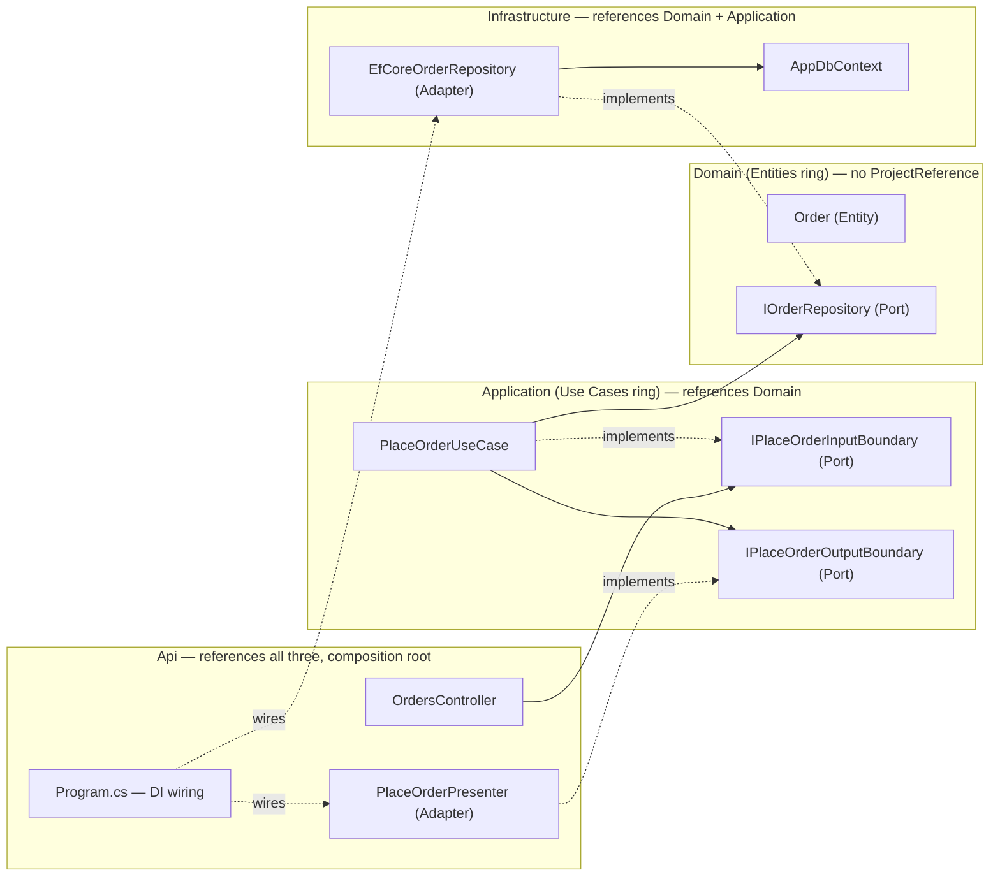
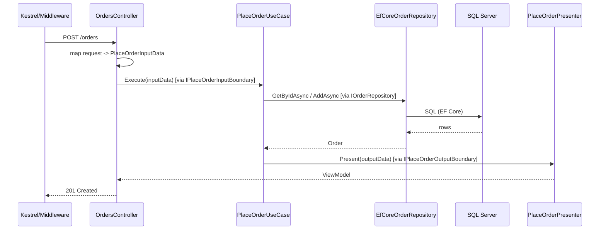
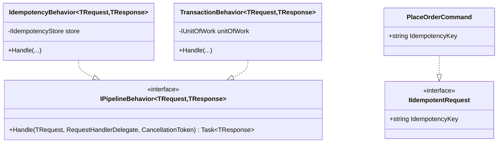
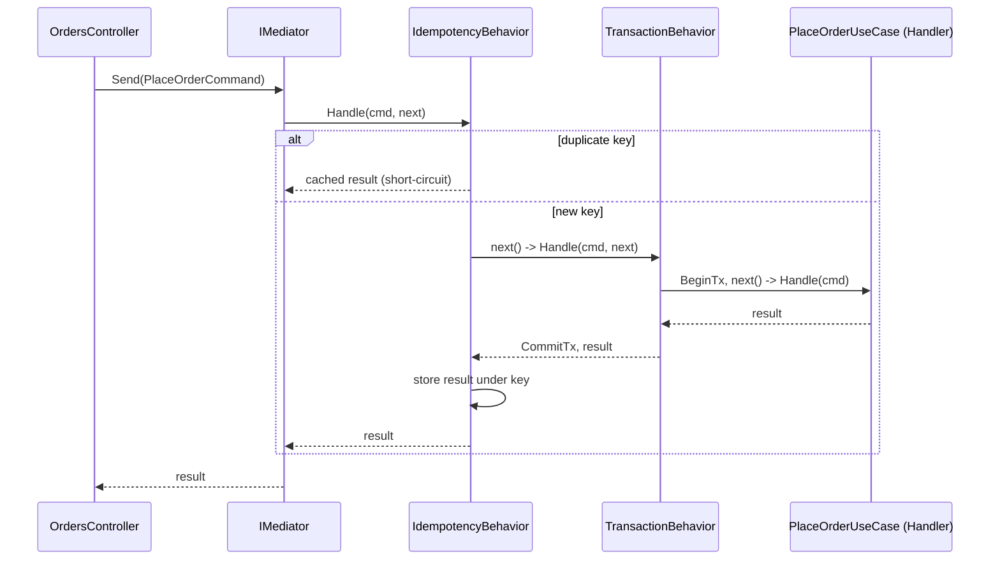

# Module 114 — Clean Architecture: Ports & Adapters — Concrete ASP.NET Core / C# Implementation

> Domain: Clean Architecture | Level: Beginner → Expert | Prerequisite: [[01-CleanArchitectureFundamentals-DependencyRule-Rings]] (takes as given: the four rings, the Dependency Rule, Dependency Inversion as its enabling mechanism, Input/Output Boundaries, Gateways/Presenters, and per-ring testing strategy — this module supplies the concrete.NET-specific mechanics implementing all of it, not new conceptual material)
>
> **Note on format:** Per the standing user preference (see `CLAUDE.md`), this module covers the **top 30 most frequently asked interview questions**, curated by real interview frequency across all four levels (8 Basic / 8 Intermediate / 7 Advanced / 7 Expert) rather than a fixed 10-per-level count, without the full 15-section deep-dive template.

---

## 1. Fundamentals

### 1.1 What is "Ports and Adapters" in the concrete .NET sense?

Module 01 established the ring structure and the Dependency Rule conceptually. This module answers a narrower, practical question: given a real ASP.NET Core / C# solution, what does a Port actually look like as code, what does an Adapter actually look like as code, and how does everything get wired together at application startup? "Port" = a plain C# interface defined in an inner-ring project. "Adapter" = a concrete class, defined in an outer-ring project, implementing that interface using a specific technology (EF Core, an HTTP client, a message broker SDK).

### 1.2 Why does the concrete implementation deserve its own module?

Because "keep dependencies pointing inward" is easy to agree with in the abstract and easy to violate by accident in real code — an ORM attribute added for convenience, a `DbContext` injected "just for this one quick read," a caching decorator registered with the wrong DI lifetime. This module exists to turn Module 01's rule into artifacts a team can actually build, review, and mechanically verify: a specific project-reference graph, specific DI registration code, and a specific, runnable fitness-function test.

### 1.3 When do you reach for the full four-project layout described here?

Per Module 01 §9's organizational-scaling framing: for Core-subdomain, multi-year, multi-team systems, where the compiler-enforced guarantee (not just a fitness function) is worth its extra solution-management overhead. For smaller, shorter-lived, single-team systems, the lighter single-project/folder-based variant (Advanced Q5) captures the same discipline with less ceremony.

### 1.4 How does the mechanics fit together, end to end?

A `Domain` class library holds Entities and Ports; an `Application` class library holds Use Cases and Input/Output boundary types, referencing only `Domain`; an `Infrastructure` class library holds Adapters, referencing `Domain` and `Application`; an `Api` project holds Controllers/Presenters and the DI composition root (`Program.cs`), referencing everything. The one file where every Port and every Adapter are simultaneously visible is `Program.cs` — by design, since that's the only place in the solution allowed to know about all four rings at once.

---

## 2. Deep Dive

### 2.1 The project-reference graph as the actual enforcement primitive

`Domain` has zero `ProjectReference` entries. `Application` references only `Domain`. `Infrastructure` references `Domain` and `Application`. `Api` references all three. This is the entire mechanism — not a linting rule, not a naming convention, a literal MSBuild `.csproj` `<ProjectReference>` graph that the C# compiler enforces on every build. Attempting `using Microsoft.EntityFrameworkCore;` inside a file in the `Domain` project produces `CS0246: The type or namespace name could not be found` — a compile error, not a code-review comment.

### 2.2 DI container internals: how a Port resolves to an Adapter at runtime

`builder.Services.AddScoped<IOrderRepository, EfCoreOrderRepository>()` registers a `ServiceDescriptor` mapping the interface type to the implementation type with a `Scoped` lifetime. When `PlaceOrderUseCase`'s constructor requests an `IOrderRepository`, the built-in `Microsoft.Extensions.DependencyInjection` container walks its internal `ServiceDescriptor` table, finds the match, and recursively resolves `EfCoreOrderRepository`'s own constructor parameters (typically `AppDbContext`) before activating it — all via cached, reflection-backed (or, since .NET 8, partially source-generated for AOT scenarios) activator delegates, not a fresh reflection scan per call.

### 2.3 Lifetime mismatches and captive dependencies

A `Scoped` service (like `AppDbContext`, tied to one HTTP request) captured by a `Singleton` service (constructed once, for the application's lifetime) is a **captive dependency** — the `Singleton` holds onto the *first* request's `Scoped` instance forever, sharing it across every subsequent, unrelated request. ASP.NET Core's `ValidateScopes`/`ValidateOnBuild` host options catch the simple case (a direct `Singleton → Scoped` constructor dependency) as a startup exception in Development by default; a `Singleton` *decorator* wrapping a `Scoped` service two or three layers deep, as in this module's Advanced Q6 incident, can still slip past that validation depending on exactly how the decorator is registered.

### 2.4 MediatR's dispatch mechanics as an Input Boundary implementation

`IMediator.Send<TResponse>(IRequest<TResponse> request)` uses the DI container to resolve `IRequestHandler<TRequest, TResponse>` for the request's runtime type via reflection over generic type arguments, then invokes `Handle`. This is a runtime, not compile-time, binding — a `Command` with no registered handler compiles fine and throws an `InvalidOperationException` only when `Send` is actually called, a real trade-off against a hand-rolled `IPlaceOrderInputBoundary` interface, which the compiler would refuse to build at all if unimplemented.

### 2.5 Fitness-function mechanics: how NetArchTest actually inspects an assembly

`Types.InAssembly(assembly)` uses `Mono.Cecil` (not runtime reflection) to statically parse the compiled assembly's metadata and IL, listing every type reference the assembly's types make — including references that exist in code but are never actually executed. This is why a fitness function catches a violation that a purely behavioral unit test never would: it inspects what the code *could* call, not just what a specific test happened to exercise.

### 2.6 Hidden cost: solution build-time and restore overhead of physical separation

Splitting a solution into four class libraries adds real, measurable build overhead — each project's own `obj`/`bin` output, its own NuGet restore step, and MSBuild's own per-project incremental-build bookkeeping. For a large solution with many such projects, `dotnet build` wall-clock time can meaningfully increase versus a single-project layout, which is one concrete, honest cost behind Advanced Q5's team-size/criticality calibration, not merely an abstract "more ceremony" complaint.

---

## 3. Visual Architecture



Sequence of a single request through every component (numbered, matching Expert Q3's synthesis trace):



---

## 4. Production Example

**Problem.** A card-issuing platform's authorization service needed to support both a synchronous REST API (issuer-side authorization decisions, sub-200ms SLA) and an asynchronous batch reconciliation job reading the same authorization rules from a nightly settlement file — two entirely different entry points that had, historically, each re-implemented the authorization-limit logic slightly differently, causing a real discrepancy where the batch job approved a transaction the real-time API would have declined.

**Architecture.** `Domain` held `Card`, `AuthorizationLimit` as Value-Object-enforced invariants; `Application` held a single `AuthorizeTransactionUseCase` behind `IAuthorizeTransactionInputBoundary`; `Infrastructure` held `EfCoreCardRepository` and a `FileBasedTransactionSource` adapter (for the batch path) both feeding the identical Use Case; `Api` held `AuthorizationsController` (the real-time entry point) and a separate `BatchReconciliationWorker` hosted service (the async entry point) — both calling the same `IAuthorizeTransactionInputBoundary`.

**Implementation.** `Program.cs` registered `IAuthorizeTransactionInputBoundary → AuthorizeTransactionUseCase` once; both `AuthorizationsController` and `BatchReconciliationWorker` resolved it identically, guaranteeing byte-for-byte identical authorization-limit logic regardless of entry point. `EfCoreCardRepository` was `Scoped` for the request-driven API path; the batch worker created its own DI scope per processed file via `IServiceScopeFactory` to get a correctly-lifetimed, request-independent `Scoped` graph inside a `BackgroundService`.

**Trade-offs.** The team paid for a second Adapter (`FileBasedTransactionSource`) and the DI-scope-per-batch-item ceremony inside the worker — a `BackgroundService` has no ambient HTTP request to hang a `Scoped` lifetime off, so `IServiceScopeFactory.CreateScope()` had to be called explicitly per unit of work, a detail easy to get wrong (Advanced Q6-style captive-dependency risk applies here too if a scope is created once for the whole batch run instead of per item).

**Lessons learned.** The single-Use-Case-multiple-entry-points structure was what actually fixed the discrepancy — not a code review reminding developers to "keep the logic in sync," a structural guarantee that there was only one place the logic could live at all.
## 10. Interview Questions

### Basic (10)

1. **Q: What does the term "Ports and Adapters" mean, and how does it map onto the ring vocabulary?**
 **A:** A "Port" is an interface defined by an inner ring expressing what it needs from, or offers to, the outside world (e.g., `IOrderRepository`, `IPlaceOrderInputBoundary`); an "Adapter" is a concrete class implementing a Port, translating between the inner ring's preferred shape and a specific outer-ring technology's actual shape (e.g., `EfCoreOrderRepository`, `OrdersController`) — this is the identical Dependency-Inversion mechanism already established as the Dependency Rule's enabling mechanism; "Ports and Adapters" is simply the name this specific mechanism goes by in Alistair Cockburn's original terminology (which will cover as Hexagonal Architecture in full), used here purely as the practical, implementation-focused vocabulary for the same rings and rule.
 **Why correct:** Correctly identifies "Ports and Adapters" as vocabulary for the same already-established mechanism rather than a new concept, while flagging its fuller, named treatment as the own upcoming territory rather than pre-empting it.
 **Common mistakes:** Treating this module's title as signaling a shift to a different architectural style than covered — the ring structure and Dependency Rule are unchanged; only the vocabulary and, in this module, the concrete.NET implementation mechanics are new.
 **Follow-ups:** "Is every interface in a Clean Architecture codebase a 'Port'?" (No — only interfaces that specifically cross a ring boundary, expressing a need the inner ring has from, or provides to, an outer ring; a purely internal interface used for polymorphism within a single ring isn't playing this specific boundary-crossing role.)

2. **Q: Describe a typical.NET solution's project (class library) layout implementing the four rings.**
 **A:** A common layout: **`Domain`** (or `Core`) — the Entities ring: Aggregates, Value Objects, domain events, Repository/Gateway *interfaces*; **`Application`** (or `UseCases`) — the Use Cases ring: Use Case/Interactor classes, Input/Output DTOs, Application Service orchestration; **`Infrastructure`** — the outer part of Interface Adapters plus Frameworks & Drivers: EF Core `DbContext` and Repository implementations, external API Gateway implementations; **`Api`** (or `Web`) — the inbound Interface Adapters (Controllers) plus the Frameworks & Drivers ring's actual ASP.NET Core hosting, and the application's DI composition root.
 **Why correct:** Gives a concrete, standard, widely-recognized four-project layout with each project's ring role stated precisely, matching how this pattern is actually implemented in real.NET codebases.
 **Common mistakes:** Naming the projects but not being able to say which ring each one implements — the project names themselves are a convention, not the substance; what matters is that each project's actual code respects the ring it's assigned to.
 **Follow-ups:** "Could `Domain` and `Application` be combined into a single project?" (Yes, and often are for smaller systems — Advanced Q5 covers this specific trade-off between physical, project-level enforcement granularity and reduced solution complexity.)

3. **Q: Which of these four projects can reference which others, and why does that reference direction matter more than it would in an arbitrary multi-project solution?**
 **A:** `Domain` references nothing else in the solution; `Application` references only `Domain`; `Infrastructure` references `Domain` and `Application` (to implement their interfaces); `Api` references `Application` and `Infrastructure` (to wire everything together) — critically, `Domain` and `Application` must never reference `Infrastructure` or `Api`. This matters more than in an arbitrary solution because these specific `ProjectReference` directions are what makes the Dependency Rule a *compiler-enforced* fact rather than a documented convention: if `Domain` tried to add a `ProjectReference` to `Infrastructure`, the build would still succeed (project references aren't inherently circular-reference-blocked in that direction) — but any actual attempt to *use* an `Infrastructure` type from `Domain` code would immediately fail to compile, since `Domain`'s own project has no reference giving it visibility into `Infrastructure`'s types at all.
 **Why correct:** States the precise reference graph and explains specifically *how* it converts the Dependency Rule from a convention into a hard compile error, not just asserting "keep dependencies pointing inward" abstractly.
 **Common mistakes:** Believing multi-project separation alone automatically prevents violations — the actual protection comes from *not adding* the `ProjectReference` from `Domain`/`Application` toward `Infrastructure`/`Api` in the first place; nothing stops a developer from adding that reference later unless a separate check (Advanced Q2's fitness function) also verifies the reference graph itself, not just individual type usage.
 **Follow-ups:** "What would happen if a developer accidentally added a `ProjectReference` from `Domain` to `Infrastructure`, even without using any of its types yet?" (The solution would still build — the mere reference addition isn't itself an error — but it silently opens the door for any future code change to introduce a violation with zero further friction, which is exactly why Advanced Q2's automated reference-graph check matters independently of individual type-usage checks.)

4. **Q: Concretely, what does a "Port" look like as actual C# code?**
 **A:** A plain C# interface, defined in the `Domain` or `Application` project, with no attributes or base types referencing any outer-ring technology — for example: `public interface IOrderRepository { Task<Order?> GetByIdAsync(OrderId id); Task AddAsync(Order order); }` — every parameter and return type (`Order`, `OrderId`) is itself a `Domain`-ring type, meaning the interface's entire signature is expressible with zero knowledge of EF Core, SQL Server, or any other outer-ring technology.
 **Why correct:** Gives an actual, concrete C# code example rather than an abstract description, and explicitly checks that every type appearing in the signature is itself ring-appropriate — a detail easy to overlook (e.g., accidentally returning an EF Core-specific collection type).
 **Common mistakes:** Defining the interface correctly but having one method accidentally return or accept an outer-ring type — e.g., `IQueryable<Order> GetAll` — reproducing the leaked-`IQueryable` anti-pattern at the Port-definition level itself, since `IQueryable`'s deferred-execution semantics are fundamentally an EF-Core/LINQ-provider-specific behavior leaking into what should be a plain domain-facing contract.
 **Follow-ups:** "Why is `Task<Order?>` an acceptable return type, given `Task` comes from the.NET base class library rather than the `Domain` project itself?" (Base Class Library types like `Task`, `string`, and `List<T>` are treated as part of the language/runtime itself, not as an outer "Frameworks & Drivers" dependency in the sense the Dependency Rule cares about — the rule targets application-specific infrastructure technologies, like a specific ORM or web framework, not the.NET runtime itself.)

5. **Q: Concretely, what does the "Adapter" implementing that `IOrderRepository` Port look like?**
 **A:** A class in the `Infrastructure` project: `public class EfCoreOrderRepository: IOrderRepository { private readonly AppDbContext _context; public EfCoreOrderRepository(AppDbContext context) => _context = context; public async Task<Order?> GetByIdAsync(OrderId id) => await _context.Orders.FindAsync(id.Value); public async Task AddAsync(Order order) => await _context.Orders.AddAsync(order); }` — this class freely references `AppDbContext` (an EF Core, Infrastructure-ring type) internally, which is fine, since `Infrastructure` is exactly the ring permitted to know about EF Core; it satisfies the `Domain`-defined `IOrderRepository` contract while doing so.
 **Why correct:** Gives the concrete implementing class showing precisely where the EF Core dependency is permitted to live (inside the Adapter's own implementation, in the correct project) versus where it must not appear (the Port's own interface signature, per Basic Q4).
 **Common mistakes:** Believing the Adapter class itself is somehow also constrained by the Dependency Rule not to reference `Infrastructure`-ring technology — the rule constrains *inner* rings from referencing outer ones; an outer-ring Adapter referencing its own ring's technology, or even referencing further-outer Frameworks & Drivers types, is exactly its intended, permitted role.
 **Follow-ups:** "Where would AppDbContext's own EF Core model/table configuration (the outer-ring equivalent of what said shouldn't be attributes on the Entity) actually live?" (In separate `IEntityTypeConfiguration<Order>` Fluent API configuration classes, also in the `Infrastructure` project, referenced by `AppDbContext.OnModelCreating` — keeping all EF-Core-specific mapping detail entirely out of the `Domain` project's `Order` class itself.)

6. **Q: Where does the actual Dependency Injection wiring — mapping `IOrderRepository` to `EfCoreOrderRepository` — happen in an ASP.NET Core application?**
 **A:** In the `Api` project's composition root — typically `Program.cs` (in modern.NET's minimal-hosting-model style) — via a call like `builder.Services.AddScoped<IOrderRepository, EfCoreOrderRepository>;`, registered alongside `AppDbContext` itself and every other Port-to-Adapter mapping the application needs; this is the one place in the entire solution where both the `Domain`/`Application` interfaces and the `Infrastructure` implementations are simultaneously visible and wired together, which is precisely why the `Api` project is the only one permitted to reference all the others.
 **Why correct:** Names the specific, concrete file/mechanism (`Program.cs`, `builder.Services.AddScoped`) and explains why this specific project is architecturally the correct place for this wiring to live (it's the only project with visibility into every other ring).
 **Common mistakes:** Scattering DI registrations across multiple projects or via reflection-based auto-registration libraries without a clear, single composition root — while such libraries can reduce registration boilerplate, losing a single, auditable place where every Port-to-Adapter mapping is visible makes it harder to verify, at a glance, that every Port actually has exactly one registered Adapter.
 **Follow-ups:** "What DI lifetime should `IOrderRepository`/`EfCoreOrderRepository` typically be registered with, and why?" (`Scoped` — one instance per HTTP request — matching `AppDbContext`'s own typical `Scoped` lifetime, since a Repository wrapping a `DbContext` must share that `DbContext`'s per-request lifetime to participate correctly in the same Unit of Work,.)

7. **Q: Why shouldn't the `Api` project's Controllers contain business logic themselves, even something that seems minor, like a simple discount-eligibility check?**
 **A:** A Controller belongs to the Interface Adapters ring — its job is translating an inbound HTTP request into Input Boundary data and invoking the appropriate Use Case, nothing more; any business rule placed directly in the Controller (even a "simple" one) is now living in the outermost, least-tested, framework-coupled ring instead of the Use Cases/Entities rings where the entire testing-strategy benefit (fast, infrastructure-free unit tests) applies — that logic would now only be reachable and verifiable via a full ASP.NET Core request pipeline test, exactly the slow, heavyweight testing Clean Architecture's ring separation exists to minimize.
 **Why correct:** Connects the "why" directly back to the own already-established testing-strategy rationale (Advanced Q4) rather than treating "keep Controllers thin" as an unexplained style preference.
 **Common mistakes:** Assuming this rule only applies to "complex" business logic and that small, one-line checks are a harmless exception — the risk isn't the check's current size, it's that logic placed in the Controller is invisible to and untested by the fast Use-Case-level unit test suite, and inconsistently duplicated if the same check is later needed from a second Controller or a non-HTTP entry point (a background job, a gRPC endpoint).
 **Follow-ups:** "What if two different Controllers (a REST API and an internal gRPC service) both need to call the exact same business operation?" (This is exactly why the operation belongs in a Use Case rather than either Controller — both Controllers become thin adapters each independently translating their own protocol's request shape into the same, shared `PlaceOrderInputData`, calling the identical Use Case.)

8. **Q: Sketch the concrete, minimal ASP.NET Core project layout for the `PlaceOrder` Use Case.**
 **A:** `Domain/Order.cs` (the Aggregate), `Domain/IOrderRepository.cs` (the Port); `Application/PlaceOrderUseCase.cs`, `Application/PlaceOrderInputData.cs`, `Application/PlaceOrderOutputData.cs`, `Application/IPlaceOrderInputBoundary.cs`, `Application/IPlaceOrderOutputBoundary.cs`; `Infrastructure/EfCoreOrderRepository.cs`, `Infrastructure/AppDbContext.cs`; `Api/Controllers/OrdersController.cs`, `Api/Presenters/PlaceOrderPresenter.cs`, `Api/Program.cs` (DI wiring for all of the above).
 **Why correct:** Maps the own already-designed example directly onto concrete file/project locations, demonstrating the layout with the specific case study already established rather than an unrelated new example.
 **Common mistakes:** Placing `PlaceOrderPresenter` in the `Application` project rather than `Api` — the Presenter is specifically the piece translating Use Case output into an HTTP-response-ready shape, which is an inbound-adapter concern belonging alongside the Controller in the `Api` project, not inside the technology-agnostic `Application` project.
 **Follow-ups:** "Would `OrdersController` reference `PlaceOrderUseCase` directly, or `IPlaceOrderInputBoundary`?" (`IPlaceOrderInputBoundary` — the Controller should depend on the Port/interface, not the concrete Use Case class, keeping the door open to swap or decorate the Use Case implementation, Advanced Q4, without changing the Controller.)

9. **Q: What's the concrete difference between `AddScoped`, `AddTransient`, and `AddSingleton`, and which should `PlaceOrderUseCase` itself use?**
 **A:** `AddSingleton` creates one instance for the application's entire lifetime, shared across every request; `AddScoped` creates one instance per DI scope (one per HTTP request, by default, in ASP.NET Core); `AddTransient` creates a new instance every time it's resolved, even multiple times within the same request. `PlaceOrderUseCase` itself typically holds no meaningful state of its own, so either `Scoped` or `Transient` work correctly for it — the lifetime that actually matters is its *dependencies'* (`IOrderRepository`, wrapping a `Scoped AppDbContext`), which must be at least as narrow as `Scoped` to avoid a captive-dependency bug.
 **Why correct:** States the three lifetimes precisely and correctly identifies that the Use Case's own lifetime is the less critical decision — its dependencies' lifetimes are where the real risk (Advanced Q6) lives.
 **Common mistakes:** Registering everything as `Singleton` "for performance," assuming fewer allocations always wins — this is exactly the setup for a captive-dependency bug the moment any dependency in the chain is `Scoped`, and the performance difference between `Scoped` and `Singleton` resolution is negligible (§7) next to the risk.
 **Follow-ups:** "Would `Transient` registration for `EfCoreOrderRepository` itself be safe?" (Yes, as long as its own `AppDbContext` dependency is `Scoped` — a `Transient` Repository would just mean multiple repository instances per request, each still sharing the same request-scoped `DbContext`, which is safe; the risk is specifically about lifetime *mismatches*, not about using a narrower lifetime than strictly necessary.)

10. **Q: How would you unit-test `Program.cs`'s DI registrations themselves — i.e., verify every registered Port actually has an Adapter and the container can build the full graph — without starting the full application?**
 **A:** `WebApplicationFactory<TEntryPoint>` (or, more narrowly, building the `IServiceCollection`/`IServiceProvider` directly from `Program.cs`'s composition logic if it's been extracted into a testable method) followed by `serviceProvider.CreateScope()` and resolving every registered interface at least once — this exercises the exact same `ValidateOnBuild`-style graph-construction path the real application startup uses, catching a missing registration or a lifetime mismatch as an immediate test failure rather than only being caught the first time that specific code path is hit at runtime in production.
 **Why correct:** Gives a concrete, runnable verification approach (resolve every registered service in a test) that specifically targets DI-graph-construction correctness, distinct from and complementary to both the fitness-function tests (checking reference direction) and the business-logic unit tests (checking behavior).
 **Common mistakes:** Assuming `ValidateOnBuild = true` alone is sufficient without an actual automated test exercising it — `ValidateOnBuild` only runs (and only fails loudly) when the application actually starts; a dedicated test that builds and validates the service provider runs on every CI build regardless of whether anyone remembers to also run the full application in that environment.
 **Follow-ups:** "What's the risk if a Port has two registered Adapters by mistake (e.g., a leftover registration from a refactor)?" (The container's `AddScoped<TInterface, TImplementation>` uses last-registration-wins semantics for a straightforward resolve — the earlier registration is silently shadowed, not an error, which is exactly why a DI-graph-verification test that also checks resolved-type identity, not just "did it resolve," has genuine additional value.)

### Intermediate (10)

1. **Q: Why is a compile-time `ProjectReference`-graph violation a stronger guarantee than a fitness function alone, and why might a team still want both?**
 **A:** A missing `ProjectReference` makes a Dependency Rule violation *physically impossible to compile* — a developer literally cannot write `Domain` code that references an `Infrastructure` type, since the compiler has no visibility into that assembly at all; a fitness function, by contrast, is a *test* that must actually be run and must actually pass to catch a violation, and (per the own "verify the verifier" point) can itself silently stop running. A team wants both because the compile-time guarantee only catches violations *between separate projects* — it says nothing about internal-namespace discipline within a single project (Basic Q2's single-project alternative) or about more nuanced rules a fitness function can express (e.g., "no `Application`-ring class name may end in `Controller`," a naming-convention check no `ProjectReference` graph could ever enforce).
 **Why correct:** States the specific mechanism difference (compile-time impossibility vs. a runnable-and-passable test) and gives a concrete example of something only a fitness function, not project references, can check — justifying why both layers of defense are genuinely complementary rather than redundant.
 **Common mistakes:** Treating multi-project physical separation as sufficient on its own and skipping fitness functions entirely — this misses that project references only prevent *cross-project* violations; a large `Infrastructure` project could still, internally, let a Repository implementation leak an `IQueryable` into a method signature technically satisfying its Port interface's looser contract, a violation only a more targeted fitness-function assertion, not the project-reference graph, would catch.
 **Follow-ups:** "Give an example of a fitness-function-only violation the project-reference graph would never catch." (An `Infrastructure`-ring Repository method whose return type is technically permitted by its Port interface's signature but internally still exposes a lazily-loaded EF Core navigation-property object to the caller — the project reference graph only checks *which assemblies* are referenced, not the deeper behavioral leak.)

2. **Q: How does MediatR, a common.NET library, map onto the Input Boundary concept?**
 **A:** MediatR's `IRequest<TResponse>` (a plain data class, e.g., `PlaceOrderCommand: IRequest<PlaceOrderResult>`) plays the role of the Use Case's Input Boundary data plus an implicit invocation contract, and `IRequestHandler<PlaceOrderCommand, PlaceOrderResult>` plays the role of the Use Case/Interactor itself — a Controller calls `mediator.Send(new PlaceOrderCommand(...))` instead of directly invoking an `IPlaceOrderInputBoundary` interface, and MediatR's internal dispatch mechanism locates and invokes the correct registered handler; this is a popular, off-the-shelf way to implement the Input-Boundary-invocation pattern without hand-rolling a separate named interface per Use Case.
 **Why correct:** Precisely maps MediatR's two core abstractions onto the two specific Clean Architecture concepts (Input Boundary data, Use Case invocation) they concretely implement, rather than presenting MediatR as an unrelated, separate pattern.
 **Common mistakes:** Believing MediatR is required for, or synonymous with, Clean Architecture — it's one convenient, widely-used implementation choice for the Input-Boundary-dispatch mechanism; a hand-rolled `IPlaceOrderInputBoundary` interface (the own original example) achieves the identical architectural role without the library.
 **Follow-ups:** "What's a genuine downside of using MediatR for this, compared to a hand-rolled interface per Use Case?" (MediatR's dispatch is a runtime, reflection/DI-based lookup rather than a direct, compiler-checked interface call — a typo or missing handler registration for a given Command is a runtime failure, not a compile error, trading a small amount of compile-time safety for the convenience of not hand-writing a dedicated interface per Use Case.)

3. **Q: Beyond `IOrderRepository`, what other DI service lifetime pitfalls specifically matter in a Clean-Architecture-structured ASP.NET Core app?**
 **A:** Any Adapter wrapping a per-request-scoped resource (most commonly `DbContext`) must itself be registered as `Scoped`, not `Singleton` or `Transient` carelessly mixed with a `Scoped` dependency — registering a Repository as `Singleton` while it depends on a `Scoped` `DbContext` causes the DI container to throw a "captive dependency" exception at startup (in.NET's built-in container, which validates scopes by default) or, in less strict configurations, silently causes the same `DbContext` instance to be shared and mutated across concurrent, unrelated requests — a serious, hard-to-diagnose data-corruption risk (further developed in Advanced Q6's incident).
 **Why correct:** Names the specific, common lifetime mismatch (Singleton service depending on a Scoped resource) and both possible consequences (a helpful startup-time exception in strict configurations, or silent corruption in looser ones), giving the reader the concrete mechanism to watch for.
 **Common mistakes:** Assuming ASP.NET Core's built-in DI container will always catch this mistake automatically at startup — scope validation is enabled by default in the Development environment/`CreateBuilder` defaults but can be disabled or behave differently depending on hosting configuration, meaning this class of bug can still slip into a specific production configuration undetected until it manifests as an actual concurrency bug.
 **Follow-ups:** "Why is `Scoped` the correct lifetime for a Use Case class itself, not just its Repository?" (A Use Case class typically holds no significant state of its own, so `Scoped` (or even `Transient`) both work correctly — the risk specifically concerns anything holding a reference to a `Scoped` resource like `DbContext`, which the Use Case does indirectly through its injected Repository.)

4. **Q: What's the trade-off between manual mapping code and a library like AutoMapper for translating between Entities and Input/Output DTOs at ring boundaries?**
 **A:** Manual mapping (writing an explicit `static PlaceOrderOutputData FromOrder(Order order) => new(...)` method) is more verbose but fully visible, debuggable, and refactor-safe — a compiler error immediately surfaces if an `Order` property is renamed and a manual mapping method still references the old name; a mapping library like AutoMapper reduces boilerplate significantly for large object graphs but relies on convention-based (often reflection-based) property matching that can silently produce an incorrectly-mapped or null field if a property is renamed without updating a corresponding mapping profile, a class of bug that often isn't caught until runtime (or not caught at all, if the affected field isn't covered by an automated test).
 **Why correct:** States both real advantages of each approach honestly (library reduces boilerplate vs. manual mapping's compile-time safety) rather than declaring one strictly superior, matching the own honest cost/benefit framing for boundary ceremony generally.
 **Common mistakes:** Adopting a mapping library uniformly across every DTO boundary in the system without considering that its silent-mismatch risk is precisely worst at the most business-critical (Core-subdomain) boundaries — where manual mapping's extra verbosity is most worth its cost — while being entirely reasonable for high-volume, low-criticality DTOs where the convenience savings matter more.
 **Follow-ups:** "How would a team catch a silent AutoMapper mismatch before it reaches production?" (A dedicated unit test explicitly asserting every expected field is correctly populated after mapping a known input — `AutoMapper`'s own `ConfigurationProvider.AssertConfigurationIsValid` API can also be run in a test to catch many, though not all, classes of mapping-configuration mistakes automatically.)

5. **Q: Where should input validation (e.g., "quantity must be positive") live — in the `Api` project via Data Annotations, or in the `Application`/`Domain` rings?**
 **A:** Split by validation *kind*: purely syntactic/format validation of the inbound request shape (is this field present, is it a well-formed number) is reasonable as `Api`-ring concern (via Data Annotations or a FluentValidation validator run in a pipeline before the Use Case is even invoked) — this is not business logic, just input well-formedness; genuine *business-rule* validation (does this quantity exceed available stock, is this order in a cancellable state) must live on the `Order` Aggregate itself or the Use Case, never merely as an `Api`-layer annotation, since that logic needs to be enforced identically regardless of which adapter (REST API, background job, gRPC) is invoking the Use Case.
 **Why correct:** Draws the precise distinction (syntactic/format validation vs. genuine business-rule validation) and assigns each to its correct ring, rather than treating "validation" as one undifferentiated concern belonging to a single layer.
 **Common mistakes:** Implementing a business rule (e.g., "quantity must not exceed 100 per line item, per company policy") purely as a Data Annotation or API-layer FluentValidation rule — this duplicates or entirely replaces logic that belongs in the `Order` Aggregate's own invariant enforcement, meaning a second, non-HTTP entry point invoking the same Use Case would silently bypass that business rule entirely.
 **Follow-ups:** "What's a concrete symptom this split has gone wrong?" (A batch-import background job that calls the same `PlaceOrderUseCase` directly, bypassing the API layer entirely, successfully creates an order violating a business rule that was only ever enforced as an API-layer validation attribute rather than on the Aggregate itself.)

6. **Q: Where does global exception-handling middleware belong, and does it violate the Dependency Rule for it to reference `Domain`-ring custom exception types?**
 **A:** Exception-handling middleware belongs in the `Api` project (Frameworks & Drivers/Interface Adapters territory — it's fundamentally an HTTP-response-formatting concern, translating an exception into a status code and error body); it does *not* violate the Dependency Rule for this `Api`-ring middleware to reference and pattern-match on `Domain`-ring custom exception types (e.g., a domain-specific `OrderNotCancellableException`), since the Dependency Rule only forbids *inner* rings referencing *outer* ones — an outer ring (here, `Api`) is always permitted to reference and depend on inner-ring types.
 **Why correct:** Correctly identifies both the middleware's proper ring placement and clarifies a commonly-confused point (referencing an inner-ring type from an outer ring is never itself a violation — only the reverse direction is restricted).
 **Common mistakes:** Assuming any cross-ring reference at all is suspect and needlessly avoiding referencing `Domain` exception types from `Api`-layer code (e.g., by re-catching and re-wrapping every exception in a generic `Exception` before it reaches the middleware) — this loses valuable, specific error information for no actual architectural benefit, since outward-to-inward references were never the problem the Dependency Rule addresses.
 **Follow-ups:** "Should `Domain`-ring code ever throw exceptions that reference an outer-ring type, like an ASP.NET Core `HttpResponseException`?" (No — this would be the actual violation: an inner-ring type (the exception) referencing an outer-ring technology; `Domain` exceptions should be plain, ring-appropriate types like `OrderNotCancellableException: Exception`, translated into an HTTP-specific response only by the outer-ring middleware.)

7. **Q: How should the test project structure mirror the ring structure, and what's WebApplicationFactory's specific role?**
 **A:** Mirror each ring with its own test project and testing approach: `Domain.Tests` — fast unit tests directly instantiating Aggregates, no mocks; `Application.Tests` — unit tests instantiating Use Cases with hand-written fakes or a mocking library (Moq/NSubstitute) standing in for `IOrderRepository` and other Ports; `Infrastructure.Tests` — integration tests against a real or test-container database verifying `EfCoreOrderRepository`'s actual behavior; `Api.Tests` — a smaller set of end-to-end tests using ASP.NET Core's `WebApplicationFactory<TEntryPoint>`, which spins up the entire application in-memory (with the real DI container and middleware pipeline, but often with `Infrastructure` swapped for a test double or a test-container database), specifically to verify the whole system is correctly wired together — not to re-verify business rules the faster `Domain.Tests`/`Application.Tests` already cover.
 **Why correct:** Maps each ring to a specific, correctly-scoped test project and testing technique, and precisely states `WebApplicationFactory`'s specific, narrower purpose (wiring verification, not business-rule re-verification) — directly reapplying the ring-based testing strategy concretely in.NET tooling terms.
 **Common mistakes:** Using `WebApplicationFactory`-based end-to-end tests as the primary means of testing business-rule correctness, duplicating dozens of `Domain.Tests`/`Application.Tests` scenarios at far higher cost and slower feedback — exactly the already-flagged anti-pattern, now named with the specific.NET tool commonly misused this way.
 **Follow-ups:** "What's a good use of `WebApplicationFactory` beyond basic wiring checks?" (Verifying HTTP-specific concerns — correct status codes, response shape/serialization, authentication/authorization middleware behavior — that are genuinely properties of the fully-wired `Api` ring and can't be verified by lower-ring unit tests at all.)

8. **Q: How does a connection string reach the `Infrastructure`-ring `AppDbContext` without the `Domain` or `Application` projects ever knowing configuration details exist?**
 **A:** ASP.NET Core's configuration system (`appsettings.json`, environment variables, or a secrets manager) is read entirely within the `Api` project's `Program.cs` composition root, which passes the resolved connection string into `AddDbContext<AppDbContext>(options => options.UseSqlServer(connectionString))` — `Domain` and `Application` never reference `IConfiguration` or any configuration-provider type at all; they don't need a connection string, or even to know one exists, since they never directly touch the database themselves, only through the `IOrderRepository` Port whose concrete implementation is wired together entirely within the `Api` project's composition root.
 **Why correct:** Names the specific configuration-reading location (the `Api` project's composition root) and explains *why* inner rings have no need for configuration awareness at all — a direct, natural consequence of the ring structure rather than a separately-imposed rule.
 **Common mistakes:** Passing raw configuration values or an `IConfiguration` reference down into `Application`-ring Use Case constructors "just in case a Use Case needs a setting" — even if a Use Case genuinely needs some runtime-configurable value, it should receive that value via a Port-defined interface (e.g., an `IFeatureFlagProvider` the Use Case depends on) rather than `IConfiguration` directly, keeping the concrete configuration-reading mechanism as an outer-ring concern.
 **Follow-ups:** "Why is directly injecting `IConfiguration` into a Use Case worse than injecting a purpose-built interface like `IFeatureFlagProvider`?" (`IConfiguration` exposes a generic string-keyed lookup with no compile-time contract at all — a typo'd configuration key silently returns null at runtime; a purpose-built interface gives the Use Case a strongly-typed, compiler-checked contract, and also keeps the Use Case decoupled from *how* that value is actually sourced, whether from `appsettings.json`, a database, or a remote feature-flag service.)

9. **Q: How would you implement idempotent request handling (Idempotency-Key header) at the correct ring, for `POST /orders`, without leaking HTTP-specific concepts into the Use Case?**
 **A:** The HTTP-specific mechanics — reading the `Idempotency-Key` header, the 24-hour storage-window policy, returning a cached response for a repeated key — are an `Api`/`Infrastructure`-ring concern: a `IIdempotencyStore` port (`Task<TResponse?> TryGetAsync(string key)`, `Task SaveAsync(string key, TResponse response)`) defined in `Application`, implemented by a Redis- or SQL-backed `Infrastructure` Adapter, invoked by an `Api`-ring middleware or a MediatR pipeline behavior wrapping `PlaceOrderUseCase`'s execution — the Use Case itself has no awareness that idempotency-key deduplication is even happening; it just executes once, as always, and the wrapping behavior decides whether to call it at all based on whether the key was already seen.
 **Why correct:** Keeps the *mechanism* (HTTP header, storage) at the correct outer-ring layer while correctly identifying the wrapping-behavior pattern (the same, already-established transaction-behavior mechanism from §6/Advanced Q4) as the right way to add this cross-cutting concern without touching the Use Case's own code.
 **Common mistakes:** Passing the raw `Idempotency-Key` string down into `PlaceOrderInputData` and having the Use Case itself check for duplicates against a repository — this smuggles an HTTP-transport-specific concept into the Use Case's own contract, coupling it to a header that a second, non-HTTP entry point (the batch worker in §4) would have no natural equivalent for.
 **Follow-ups:** "Where would you place the idempotency check relative to the transaction-wrapping behavior from Advanced Q4?" (Idempotency check first, transaction wrapping second — if a duplicate key is detected, the wrapped Use Case, and therefore the transaction, should never even begin executing.)

10. **Q: A team wants to add structured, correlation-ID-tagged logging around every Use Case execution. Where does this belong, and how does it interact with distributed tracing (OpenTelemetry)?**
 **A:** As a generic MediatR pipeline behavior or a Scrutor-based decorator wrapping every registered Use Case — genuinely cross-cutting and Use-Case-agnostic, exactly like the transaction-wrapping behavior (§6/Advanced Q4), logging the request type name, a correlation ID (propagated via `Activity.Current`/`ActivitySource` for OpenTelemetry-compatible distributed tracing), duration, and success/failure outcome uniformly. OpenTelemetry's `ActivitySource.StartActivity` can wrap the same `next()` call the transaction behavior wraps, meaning a single, ordered pipeline (logging → tracing span → transaction → idempotency-check, or whatever order the team settles on) composes multiple legitimate cross-cutting concerns around the identical Use Case with zero Use-Case-specific code.
 **Why correct:** Correctly places observability instrumentation at the same generic, cross-cutting layer already established for transactions, and connects it concretely to .NET's `System.Diagnostics.Activity`-based OpenTelemetry integration rather than a hand-rolled logging-only approach.
 **Common mistakes:** Adding `_logger.LogInformation` calls scattered inside individual Use Cases' own method bodies — this duplicates boilerplate across every Use Case and produces inconsistent log shape/fields, exactly the kind of scattered, non-uniform concern a pipeline behavior exists to centralize.
 **Follow-ups:** "How would you order multiple pipeline behaviors (logging, tracing, transaction, idempotency) correctly?" (Idempotency check outermost, so a duplicate never even starts a trace span or a transaction; tracing/logging next, so timing captures the full remaining pipeline including the transaction; transaction innermost, immediately wrapping the actual Use Case call.)

### Advanced (10)

1. **Q: Write out the concrete `Program.cs` DI-registration code wiring together the full `PlaceOrder` Use Case example.**
 **A:**
 ```csharp
var builder = WebApplication.CreateBuilder(args);
builder.Services.AddDbContext<AppDbContext>(options =>
    options.UseSqlServer(builder.Configuration.GetConnectionString("Default")));
builder.Services.AddScoped<IOrderRepository, EfCoreOrderRepository>;
builder.Services.AddScoped<IUnitOfWork, EfCoreUnitOfWork>;
builder.Services.AddScoped<IPlaceOrderInputBoundary, PlaceOrderUseCase>;
builder.Services.AddScoped<IPlaceOrderOutputBoundary, PlaceOrderPresenter>;
builder.Services.AddControllers;
var app = builder.Build;
app.MapControllers;
app.Run;
 ```
 Each line registers exactly one Port-to-Adapter mapping established across Modules 113–114's running example, all `Scoped` to correctly share `AppDbContext`'s lifetime (Intermediate Q3) within a single request.
 **Why correct:** Provides complete, runnable, concrete code implementing the exact example this domain has built up across two modules, with correct lifetimes for every registration, rather than a partial or hypothetical snippet.
 **Common mistakes:** Registering `PlaceOrderUseCase` and `PlaceOrderPresenter` as `Transient` or `Singleton` out of habit rather than deliberately matching `Scoped`, risking the exact captive-dependency issue Intermediate Q3 describes if either ever gains a dependency on a `Scoped` resource later without the registration being revisited.
 **Follow-ups:** "How would `OrdersController` actually invoke this Use Case, given this registration?" (Its constructor takes an `IPlaceOrderInputBoundary` parameter, resolved by the DI container at request time; the action method translates the incoming HTTP request into `PlaceOrderInputData` and calls `_useCase.Execute(inputData)`.)

2. **Q: Write a concrete `NetArchTest`-style fitness-function test enforcing the Dependency Rule assertion.**
 **A:**
 ```csharp
[Fact]
public void Domain_Should_Not_Reference_Infrastructure_Or_EFCore
{
    var result = Types.InAssembly(typeof(Order).Assembly)
    .Should
    .NotHaveDependencyOnAny("Infrastructure", "Microsoft.EntityFrameworkCore", "Microsoft.AspNetCore")
    .GetResult;
    Assert.True(result.IsSuccessful, string.Join(", ", result.FailingTypeNames?? Array.Empty<string>));
}
 ```
 Run as a normal xUnit test in CI on every pull request, this fails the build the instant any `Domain`-assembly type introduces a reference to a forbidden outer-ring namespace — exactly the mechanical, continuously-running enforcement called for, now as literal, runnable code rather than a described concept.
 **Why correct:** Supplies actual, syntactically plausible fitness-function code using a real, named.NET architecture-testing library, directly fulfilling the concrete implementation previewed but didn't provide code for.
 **Common mistakes:** Writing this test once and considering the Dependency Rule "solved" — per the own point, this test itself needs to remain part of the actively-run CI suite; a passing test that's been accidentally excluded from a CI pipeline stage (Expert Q4, this module) provides zero actual protection despite existing in the repository.
 **Follow-ups:** "What would you add to also catch `Application`-ring violations, not just `Domain`?" (An identical test targeting `typeof(PlaceOrderUseCase).Assembly` with the same forbidden-dependency list, since `Application` is equally subject to the Dependency Rule and needs its own, separately-asserted check.)

3. **Q: Critique a team that implemented a MediatR "pipeline behavior" containing the actual business rule "an order over $10,000 requires manager approval," rather than putting it in the `PlaceOrderUseCase` itself.**
 **A:** A MediatR pipeline behavior (`IPipelineBehavior<TRequest, TResponse>`) is designed for genuinely cross-cutting, Use-Case-agnostic concerns — logging, validation-triggering, transaction-wrapping — applied uniformly across many different Use Cases; placing a specific business rule (the $10,000 approval threshold) inside a pipeline behavior instead of the `Order` Aggregate or `PlaceOrderUseCase` scatters business logic into generic cross-cutting infrastructure that a developer reading `PlaceOrderUseCase`'s own code would have no way to discover — reproducing the anemic-domain-model risk in a new, MediatR-specific disguise: logic that belongs to a specific business concept has migrated into a place organized around a technical mechanism (the pipeline) rather than the business concept (an Order needing approval) it actually belongs to.
 **Why correct:** Correctly distinguishes what pipeline behaviors are legitimately for (uniform cross-cutting concerns) from this specific misuse (a Use-Case-specific business rule), and connects the consequence directly to this domain's own already-established anemic-model finding rather than treating it as an unrelated new problem.
 **Common mistakes:** Assuming any logic placed "in the pipeline" is automatically a legitimate cross-cutting concern simply because of where it's technically located — the test is whether the rule is genuinely Use-Case-agnostic (applies identically and meaningfully to every Use Case passing through the pipeline) or specific to one business concept, which the $10,000 threshold clearly is.
 **Follow-ups:** "Where specifically should the $10,000 approval rule actually live?" (On the `Order` Aggregate itself, as part of `Order.Submit`'s own invariant logic — e.g., transitioning to a `PendingApproval` status rather than `Placed` when the total exceeds the threshold — keeping the rule discoverable exactly where the tactical-DDD discipline says business rules belong.)

4. **Q: How would you implement a cross-cutting concern (e.g., wrapping every Use Case's execution in a database transaction) correctly, given Question 3's warning against misusing pipeline behaviors for business rules?**
 **A:** A generic, Use-Case-agnostic MediatR pipeline behavior (or a Scrutor-based decorator wrapping every registered Use Case) that begins a transaction, calls `next` to invoke the actual Use Case, and commits or rolls back based on the result — this is exactly the kind of genuinely cross-cutting, business-rule-free concern pipeline behaviors/decorators are correctly suited for, in direct contrast to Question 3's specific misuse; the distinguishing test (reapplying Question 3's own criterion) is that this behavior applies identically and correctly to literally every Use Case in the system with zero awareness of what any specific Use Case's business rules are.
 **Why correct:** Applies the exact distinguishing criterion established in Question 3 (genuinely business-rule-agnostic vs. business-rule-specific) to a case that correctly passes it, demonstrating the boundary concretely on both sides rather than only warning against misuse abstractly.
 **Common mistakes:** Implementing per-Use-Case-specific transaction-scoping logic (e.g., "only wrap `PlaceOrderUseCase` and `CancelOrderUseCase`, but not others, in a transaction, because someone decided the others don't need it") inside a supposedly generic pipeline behavior via conditional logic — this reintroduces Use-Case-specific awareness into what should be a uniform mechanism, and is a sign the transaction-scoping decision actually needs to be made explicit within each specific Use Case instead.
 **Follow-ups:** "Where does the Unit of Work fit relative to this transaction-wrapping pipeline behavior?" (The pipeline behavior is often *literally implemented* using the Unit of Work — beginning the Unit of Work's tracked change-set before calling the Use Case, and committing it afterward — meaning this pipeline behavior is one common, concrete way of triggering the Unit of Work's commit point already established, rather than a separate, competing mechanism.)

5. **Q: When is a single project with folder-based ring separation (rather than four separate class-library projects) the better choice, and what's genuinely given up?**
 **A:** For a smaller team, a smaller/newer system, or a prototype/MVP stage where the added CI/solution-management overhead of four separate projects (each needing its own `.csproj`, its own NuGet package management, more complex build times) isn't yet justified, a single project with `Domain/`, `Application/`, `Infrastructure/`, and `Api/` *folders* (rather than projects) can still follow every rule this module has established, with the same Dependency Rule enforced purely by fitness-function-based namespace checks (Advanced Q2's `NetArchTest` example works identically against namespaces instead of assemblies) rather than by the compiler's project-reference graph; what's genuinely given up is Intermediate Q1's compile-time-impossibility guarantee — a developer *can* write code that compiles despite violating the rule, relying entirely on the fitness function actually running and passing to catch it, with no physical, structural backstop if that test is ever skipped or disabled.
 **Why correct:** Gives the concrete condition favoring the lighter-weight option (team/system size, maturity stage) and precisely names what's lost (the compile-time-impossibility guarantee, not merely "less rigor" vaguely) — directly connecting back to Intermediate Q1's specific distinction.
 **Common mistakes:** Assuming a single-project, folder-based layout is a lesser or incomplete form of Clean Architecture — it fully implements the same rings and Dependency Rule; the difference is purely in enforcement *mechanism* strength (fitness-function-only vs. fitness-function-plus-compiler), not in whether the architecture itself is "real" Clean Architecture.
 **Follow-ups:** "What's a reasonable migration path if a single-project system's complexity later grows enough to justify full physical separation?" (Since the folder structure was already ring-aligned from the start, splitting each folder into its own class-library project later is a comparatively mechanical refactor — largely just moving files and adding `ProjectReference`s matching the boundaries that already existed logically, rather than a from-scratch architectural redesign.)

6. **Q: Debug a production incident: intermittent data corruption where one user's order occasionally shows another user's order data. Walk through investigation, root cause, and fix.**
 **A:** *Investigation*: Logs show the corruption correlates with periods of high concurrent request volume, and the corrupted data always involves two requests that happened to be processed by the same worker thread pool slot around the same time — pointing toward a shared-mutable-state concurrency bug rather than a database-level bug (the database itself shows correct, uncorrupted committed data). Reviewing the DI registrations reveals `AppDbContext` was correctly `Scoped`, but a recently-added caching decorator wrapping `IOrderRepository` had been registered as `Singleton` "since it just holds an in-memory cache dictionary" — that Singleton decorator held a captured reference to whichever `Scoped` `EfCoreOrderRepository`/`AppDbContext` instance existed at the moment of the *decorator's own* first construction, then continued reusing that same stale, single `DbContext` instance across every subsequent request for the lifetime of the application, since `AppDbContext` is explicitly not thread-safe for concurrent use. *Root cause*: A well-intentioned caching decorator's lifetime wasn't reconsidered relative to its captured dependency's lifetime, exactly the captive-dependency risk Intermediate Q3 named, but manifesting through this incident's specific mechanism of a decorator rather than the Repository itself being mis-registered. *Fix*: Register the caching decorator as `Scoped` as well (accepting a fresh instance, and losing cross-request cache reuse, which requires a separate, deliberately-designed distributed-cache solution,, instead of an in-process `Singleton` cache, if that reuse is actually needed) and add a startup-time DI scope-validation check (`ValidateScopes = true`, `ValidateOnBuild = true`) to the host builder so this specific class of lifetime mismatch fails loudly at application startup in every environment, not just by chance in Development.
 **Why correct:** Follows a realistic, concrete investigation trail (concurrency-load correlation, then DI registration review) to the actual root cause (a captive dependency introduced by a decorator, not the originally-registered Repository itself), and proposes both an immediate fix and a systemic prevention step (mandatory scope validation), matching this course's established incident-debugging structure.
 **Common mistakes:** Focusing the investigation entirely on `EfCoreOrderRepository`'s own registration (already correctly `Scoped`) and missing that a *later-added* decorator wrapping it silently reintroduced the exact same class of bug — a reminder that this class of risk isn't a one-time registration-review checklist item, but needs the systemic, ongoing check (mandatory scope validation) the fix specifically adds.
 **Follow-ups:** "Why didn't this show up immediately after the caching decorator was deployed, rather than being intermittent?" (Under low concurrent load, requests were naturally serialized enough in practice that the shared, non-thread-safe `DbContext` usage rarely overlapped destructively — the bug was latent from deployment but only manifested probabilistically once genuine concurrent load exposed the race condition, a common pattern for concurrency bugs generally.)

7. **Q: How should Input/Output Boundary contracts that are also exposed as a public REST API evolve over time without breaking existing API consumers — previewing the API Gateway domain?**
 **A:** The `Api` project's Controller-facing request/response models should be treated as their own, separately-versioned public contract, distinct from the `Application`-ring's `PlaceOrderInputData`/`OutputData` — even though they may look identical initially, keeping them as separate types (with the Controller performing an explicit, if simple, mapping between them) means an internal Use Case Input/Output shape change doesn't automatically become a breaking public API change, and a genuine public API evolution (adding an optional new field, or a versioned `v2` endpoint) doesn't require touching the Use Case's own internal contract at all; this mirrors the earlier concrete demonstration of exactly this risk, now specifically in the context of long-term public API versioning, which will develop in full as a dedicated API Gateway/versioning concern.
 **Why correct:** Correctly separates two distinct contracts that could easily be conflated (internal Use Case boundary vs. public API contract), reapplies the own concrete illustrative incident to this longer-term evolution concern, and appropriately previews rather than fully develops the dedicated territory.
 **Common mistakes:** Directly exposing `Application`-ring Input/Output DTOs as the literal public API request/response models to avoid "redundant" mapping code — this is the same Basic Q8 anti-pattern (skipping the boundary DTO distinction) now specifically causing public-API versioning pain, since any internal Use Case refactor risks becoming an accidental breaking change for external API consumers who were never supposed to be coupled to the Use Case's internal contract shape in the first place.
 **Follow-ups:** "Is this extra separate-contract-and-mapping layer worth it for an internal-only API with a single, tightly-coupled frontend team?" (Reapplying the calibration principle — for a genuinely internal, single-consumer API where both sides deploy together, the versioning-safety benefit is much less valuable, and a lighter-weight, more directly-coupled approach may be a reasonable, deliberate trade-off.)

8. **Q: Implement `BatchReconciliationWorker` (a `BackgroundService`) correctly invoking `PlaceOrderUseCase`-style Use Cases per file-record, with correct DI scoping — write the concrete code.**
 **A:**
 ```csharp
public sealed class BatchReconciliationWorker : BackgroundService
{
    private readonly IServiceScopeFactory _scopeFactory;
    public BatchReconciliationWorker(IServiceScopeFactory scopeFactory) => _scopeFactory = scopeFactory;

    protected override async Task ExecuteAsync(CancellationToken ct)
    {
        await foreach (var record in ReadSettlementFileAsync(ct))
        {
            using var scope = _scopeFactory.CreateScope();
            var useCase = scope.ServiceProvider.GetRequiredService<IAuthorizeTransactionInputBoundary>();
            await useCase.Execute(MapToInputData(record), ct);
        }
    }
}
 ```
 A fresh `IServiceScope` is created **per record**, not once for the whole worker or once per file — each scope gets its own `Scoped AppDbContext`/`IAuthorizeTransactionInputBoundary` instance, exactly matching the per-unit-of-work granularity a `Scoped` HTTP request would naturally get, and avoiding the accumulated-tracked-entity/captive-dependency risk of one long-lived scope processing thousands of records.
 **Why correct:** Shows the exact, correct `IServiceScopeFactory` pattern for a `BackgroundService`, with scope granularity matched to the actual unit of work, directly addressing the anti-pattern named in §6.
 **Common mistakes:** Injecting `IAuthorizeTransactionInputBoundary` directly into `BatchReconciliationWorker`'s constructor — `BackgroundService` is registered as `Singleton` by the hosting infrastructure, so any `Scoped` dependency injected directly into its constructor is an immediate captive-dependency bug, caught by `ValidateOnBuild` if enabled, or silently broken if not.
 **Follow-ups:** "What if processing 100,000 records per-record-scope is too slow?" (Batch the scope creation to a deliberately-chosen chunk size — e.g., one scope per 100 records — explicitly accepting that a `DbContext`'s change-tracker will hold onto 100 records' worth of tracked entities within a chunk, a conscious, documented performance/correctness trade-off, not an accident.)

9. **Q: Design a source-generated (compile-time) alternative to reflection-based DI resolution for a very hot path, and state precisely when this optimization is justified.**
 **A:** .NET's `[GeneratedServiceProviderFactory]`/AOT-friendly DI patterns, or a hand-written factory method (`static PlaceOrderUseCase CreateUseCase(IServiceProvider sp) => new(sp.GetRequiredService<IOrderRepository>(), ...)`) registered via `AddScoped<IPlaceOrderInputBoundary>(CreateUseCase)`, avoids the container's reflection-based constructor discovery at resolution time, trading a small amount of registration verbosity for slightly faster, allocation-lighter resolution. This is justified only when profiling (not assumption) shows DI resolution itself, not the I/O the Use Case performs, is a measurable percentage of a request's latency budget — realistically, only for an extremely tight, sub-millisecond internal RPC path processing very high request volume, not a typical HTTP API with database or network calls dominating latency (§7).
 **Why correct:** Gives a concrete implementation option and, more importantly, states precisely and honestly the narrow condition under which it's worth doing, directly reapplying §7's "profile first" principle rather than presenting this as a default optimization.
 **Common mistakes:** Applying manual factory registration or AOT-oriented DI patterns preemptively across an entire codebase "for performance" without ever having measured that DI resolution was a bottleneck — classic premature optimization, adding real registration-code verbosity for a benefit that, per §7's own numbers, is usually immaterial.
 **Follow-ups:** "Would Native AOT compilation change this calculus?" (Yes — Native AOT deployment specifically requires avoiding runtime-reflection-based DI patterns that can't be statically analyzed at publish time, making source-generated/factory-based registration a *correctness* requirement for that deployment target, not merely a performance optimization — a genuinely different, non-optional justification.)

10. **Q: Critique a real code-review finding: a `PlaceOrderUseCase` unit test uses Moq to mock `IOrderRepository`, but the mock's `GetByIdAsync` setup returns a different `Order` instance than the one later asserted against by `AddAsync.Verify` — the test passes despite this inconsistency. What's wrong, and how would you catch it systematically?**
 **A:** The test is a false positive — mocking each method call independently, with no shared, stateful backing store, means the mock never actually verifies the Use Case's real behavior of loading, mutating, and persisting *the same* `Order` instance; it only verifies that *some* call happened with *some* argument matching the loose matcher used. The systematic fix is exactly Module 02's own Intermediate Q-tier guidance generalized: prefer a stateful, hand-written `InMemoryOrderRepository` fake (Coding Exercises §11, Medium) over a per-call mock for any test where the Use Case's correctness depends on read-then-write consistency across multiple Repository calls within one execution — a fake's shared internal dictionary makes this class of bug structurally impossible to miss, where a loosely-configured mock can paper over it.
 **Why correct:** Identifies the specific, subtle testing anti-pattern (per-call mocking hiding a stateful-consistency bug) and gives the concrete, already-established alternative (a stateful fake) as the systematic fix, rather than a vague "write better test assertions" answer.
 **Common mistakes:** Fixing this one test's specific assertion without recognizing the pattern is likely repeated across every other mock-based Use Case test in the codebase — the systemic fix is a testing-convention change (prefer fakes for stateful, multi-call scenarios), not a one-off patch.
 **Follow-ups:** "Is a mocking library ever still the right choice over a fake?" (Yes — for a Port with a single, stateless call per test, or where you specifically need to verify call *arguments* or call *count* rather than end-to-end stateful behavior, a mock is simpler and equally safe; the risk is specific to multi-call, state-dependent scenarios.)

### Expert (10)

1. **Q: From a Principal Engineer's perspective, how would you decide, for a specific team, between full four-project physical enforcement versus the single-project/fitness-function-only approach (Advanced Q5)?**
 **A:** Weigh the team's CI/tooling maturity (is a fitness-function suite already reliably running and monitored, per the "verify the verifier" concern, or would it likely be neglected?), team size and turnover (a larger, higher-turnover team benefits more from the compiler's unconditional, review-independent enforcement, since new or less-experienced contributors won't reliably internalize an unenforced convention), and the system's expected criticality and lifespan (matching the own subdomain-classification-based calibration) — a Core-subdomain system with a large, evolving team should default to full physical separation for its stronger, structural guarantee; a small, stable-team, Supporting/Generic-subdomain system can reasonably rely on the lighter single-project/fitness-function approach, with Advanced Q5's noted migration path available if its criticality or team size later grows.
 **Why correct:** Names the specific, concrete factors (CI maturity, team size/turnover, criticality/lifespan) driving this real Principal Engineer decision, explicitly reapplying this domain's own already-established investment-calibration precedent rather than presenting the choice as a matter of personal taste.
 **Common mistakes:** Mandating full four-project physical separation universally as an unconditional "best practice," ignoring that its CI/tooling-maturity assumption (a reliably-running fitness-function suite, or simply more projects to manage) isn't free and isn't automatically the right trade-off for every team — the same over-application risk this domain has now named repeatedly recurring once more, now at the level of physical-enforcement-mechanism choice specifically.
 **Follow-ups:** "What's a concrete leading indicator that a single-project system should migrate to full physical separation sooner rather than later?" (A fitness-function violation actually being caught and fixed more than once in a short period — direct evidence that convention alone, even fitness-function-backed, isn't sufficiently self-enforcing for this specific team yet, and the stronger, compiler-level guarantee would pay for its extra overhead.)

2. **Q: Describe a realistic enterprise scenario where inconsistent Ports-and-Adapters implementation conventions across a large organization's many services caused a genuine, costly problem, and extract the transferable lesson.**
 **A:** A large enterprise with dozens of microservices, each independently adopting "Clean Architecture" without a shared, enforced project-template standard, ended up with wildly inconsistent concrete implementations — some services used MediatR, others hand-rolled Input Boundaries; some enforced the Dependency Rule via four physical projects, others via folders with no fitness function at all; some had DTO/Entity separation at API boundaries (Advanced Q7), others didn't. When the organization later needed to onboard every service onto a shared, automated architectural-compliance dashboard (directly recurring the golden-path-onboarding-drift finding, and the fitness-function-governance material, now specifically about *implementation-convention* consistency rather than business-logic consistency), the inconsistency meant no single, reusable fitness-function template could be applied across services — each service needed its own bespoke check, and several services that had silently drifted from even their own original conventions (the incident, recurring at organizational scale) were only discovered during this audit, months or years after the drift began. The transferable lesson: architectural *style* (Clean Architecture, decided once) and architectural *implementation convention* (which concrete.NET patterns realize that style, decided once per this module) both need the same golden-path-template-plus-audit discipline established for observability onboarding — a style decision without a standardized, centrally-maintained implementation template just relocates the "declared ≠ actual" gap from the individual-codebase level to the cross-organization level.
 **Why correct:** Describes a realistic, large-scale organizational failure mode distinct from (though related to) the single-codebase incidents already covered, correctly identifies the specific missing artifact (a shared, standardized implementation template, not just a shared stylistic mandate), and extracts a transferable lesson explicitly connecting to the already-established golden-path pattern rather than treating this as an unrelated new finding.
 **Common mistakes:** Concluding the fix is simply "mandate Clean Architecture everywhere" — the actual gap in this scenario was the *absence of a shared, concretely-templated implementation* (this module's specific territory) even where the *style* (the territory) was nominally agreed upon; conflating the two misses the real, actionable lesson.
 **Follow-ups:** "What would a concrete, reusable implementation template artifact look like, to prevent this?" (A shared `dotnet new` project template or scaffolding tool encoding this module's exact project layout, DI registration pattern, and fitness-function suite, versioned and centrally maintained — directly the "golden path" artifact already established as the necessary, ongoing-maintenance-requiring fix for this exact class of cross-service drift.)

3. **Q: Trace the full request lifecycle for `POST /orders` through the concrete.NET stack this module has built, synthesizing every piece from both this module and into one coherent flow.**
 **A:** ASP.NET Core's Kestrel/middleware pipeline (Frameworks & Drivers ring) receives the HTTP request and routes it to `OrdersController` (Interface Adapters ring), whose action method deserializes the request body into an `Api`-ring request model (Advanced Q7's separate public-contract type), maps it to `PlaceOrderInputData` (Application ring), and calls the DI-resolved `IPlaceOrderInputBoundary` (Basic Q6/Advanced Q1's registration) — resolving to `PlaceOrderUseCase`, which loads/constructs the `Order` Aggregate (Entities ring) via the DI-resolved `IOrderRepository` (resolving to `EfCoreOrderRepository`, Basic Q5, using the `Scoped AppDbContext`, Intermediate Q3), calls `Order.AddLine`/`Submit` (the invariant enforcement), commits via the Unit-of-Work-wrapping transaction behavior (Advanced Q4), which durably persists the `Order`'s new state and its `OrderPlaced` Domain Event to the outbox table in one atomic transaction — the Use Case then maps its result to `PlaceOrderOutputData` and calls the DI-resolved `IPlaceOrderOutputBoundary` (resolving to `PlaceOrderPresenter`), which formats an HTTP-response-ready shape that `OrdersController` returns, completing the request — with the actual, reliable delivery of `OrderPlaced` to Shipping/Customer handlers happening entirely asynchronously afterward, via a background outbox publisher, decoupled from this request's own response latency.
 **Why correct:** Traces one concrete, fully-synthesized request through literally every mechanism established across this module and (and, by direct extension, Modules 110–112's DDD prerequisites), in the correct sequence, demonstrating the whole system working together rather than describing each piece in isolation.
 **Common mistakes:** Describing the individual.NET mechanics (DI registration, Controller, Presenter) correctly but failing to also re-trace the underlying DDD/Domain-Event mechanics (Modules 110–112) this whole flow ultimately rests on — the value of this synthesis question specifically is showing that this module's concrete implementation work is a faithful, complete realization of every architectural decision made across the entire domain arc so far, not a separate, newly-introduced flow.
 **Follow-ups:** "At which exact point would Advanced Q6's captive-dependency bug have manifested in this trace, had the caching decorator been present and mis-registered?" (At the `IOrderRepository` resolution step — a `Singleton`-registered caching decorator would have returned a stale, previously-captured `AppDbContext` instance instead of the current request's freshly-`Scoped` one, corrupting this specific request's view of `Order` data with another request's in-flight state.)

4. **Q: Apply this course's "declared ≠ actual" theme to a subtle, easy-to-miss risk: a CI pipeline where Advanced Q2's fitness-function test exists and is committed to the repository, but a recent, unrelated build-tooling change caused it to silently stop actually executing.**
 **A:** This is a specific, concrete instance of the own already-predicted risk — a common, real mechanism is a test-discovery configuration change (e.g., a new test-filter expression in the CI YAML meant to exclude a different, slow test category, but written broadly enough to also accidentally exclude this fitness-function test by an unintended naming-pattern match) causing the CI job to report "success" because *zero* tests failed, when the actual, true state is that *zero relevant tests ran at all* — the exact "no data evaluated identically to healthy" failure mode already established for alerting, now recurring in this domain's own CI/fitness-function context specifically; the declared state ("our Dependency Rule is enforced in CI") silently diverges from the actual state ("nothing has checked the Dependency Rule in three months") with a clean, green build providing zero indication anything is wrong.
 **Why correct:** Identifies the specific, plausible concrete mechanism (an overly-broad test-filter change) by which this exact silent-failure mode occurs, and correctly names its precise structural kinship to the already-established "no data ≠ healthy" alerting failure pattern rather than treating it as an unrelated, novel risk.
 **Common mistakes:** Assuming a fitness-function test's mere presence in the repository and a consistently-green CI badge together constitute sufficient evidence the Dependency Rule is actually still being verified — per this course's now-extensively-repeated theme, only an explicit, separate check (e.g., a periodic audit deliberately introducing a known violation and confirming the pipeline actually fails, a literal continuous-canary technique) closes this specific gap completely.
 **Follow-ups:** "What's a concrete, low-effort way to periodically verify this fitness-function test is actually still running and would actually catch a real violation?" (A scheduled, deliberate "mutation" test — periodically and automatically introducing a synthetic, temporary Dependency Rule violation in a disposable branch and confirming the CI pipeline does in fact fail on it — directly the same canary-verification discipline established for security-scanner-credential liveness, applied here to fitness-function liveness specifically.)

5. **Q: How does this module's four-project template relate to the "golden path" service-scaffolding concept, and what would a concrete, maintained scaffolding artifact for this specific stack look like?**
 **A:** This module's project layout, DI-registration pattern, and fitness-function suite are exactly the kind of "golden path" content established should be delivered to every new service via a maintained, versioned, live-reference template — not a one-time onboarding document — rather than each team hand-rolling its own interpretation of Clean Architecture's rings independently, per Expert Q2's incident; concretely, this would be a `dotnet new clean-arch-service` custom template (or an internal Backstage/service-catalog scaffolding action) generating the four-project skeleton, a working `Program.cs` DI-registration example, a pre-wired `NetArchTest` fitness-function project, and a `WebApplicationFactory`-based smoke-test project already correctly configured — with the template itself centrally versioned and improved over time, and (per the own capstone finding) an explicit, standing audit process confirming already-onboarded services stay current with the template's later improvements rather than silently drifting.
 **Why correct:** Concretely translates the abstract golden-path concept into a specific, this-domain-appropriate artifact (a named scaffolding template with specific generated contents) and correctly reapplies the own capstone finding (live-reference onboarding plus ongoing audit, not a static one-time template) rather than only citing the concept generically.
 **Common mistakes:** Treating a one-time internal wiki page describing "how we do Clean Architecture here" as equivalent to a genuine golden-path scaffolding artifact — specifically distinguished a static document (which silently goes stale) from a live, versioned, actively-referenced template, and this module's concrete implementation content is exactly what such a template should encode, not merely document.
 **Follow-ups:** "Why is a live, generated template stronger than a well-written onboarding document here specifically?" (A generated template's fitness-function suite and DI registrations are immediately, mechanically correct and testable the moment a new service is scaffolded — a document can only describe the correct pattern, relying entirely on a human to transcribe it correctly, reintroducing exactly the "declared ≠ actual" onboarding gap the capstone already diagnosed.)

6. **Q: This is the second module of the domain; covers a light-touch Clean-vs-Hexagonal-vs-Onion comparison. What should take as given from this module, and what should it explicitly avoid re-deriving?**
 **A:** should take as given: the concrete.NET project layout and reference graph (Basic Q2/Q3), the Port/Adapter implementation pattern in actual C# code (Basic Q4/Q5), DI wiring mechanics (Basic Q6/Advanced Q1), and fitness-function enforcement in CI (Advanced Q2/Expert Q4) — none of this needs re-explaining. the own, new, and genuinely distinct contribution is a comparative one: showing that Hexagonal Architecture's "Ports and Adapters" terminology (which this module already borrowed loosely, per Basic Q1) and Onion Architecture's layer-naming are, in Alistair Cockburn's and Jeffrey Palermo's original, independently-developed formulations, extremely close cousins of Clean Architecture's ring structure — differing mainly in terminology and some structural emphasis (Hexagonal's symmetric "any number of Ports" framing vs. Clean Architecture's specific four named rings) — rather than being three genuinely different architectural choices a team must pick among.
 **Why correct:** Precisely scopes the job as terminology/emphasis comparison building on this module's already-established concrete implementation, rather than having it re-derive implementation mechanics a second time under different vocabulary.
 **Common mistakes:** Letting re-explain the Dependency Rule or re-demonstrate DI wiring under "Hexagonal Architecture's" own terminology as if starting fresh — since this module already showed the concrete mechanics (and explicitly borrowed the Ports/Adapters vocabulary while doing so), the distinct value is specifically in mapping vocabulary and noting genuine, if modest, structural differences, not repeating implementation content.
 **Follow-ups:** "Is there any genuine, non-vocabulary difference between Hexagonal and Clean Architecture worth covering in real depth?" (Yes — Hexagonal's original framing treats every Port symmetrically (no inherent "inbound" vs. "outbound" distinction, and no fixed ring count), while Clean Architecture's four specifically-named rings impose a bit more prescriptive structure; should cover this specific, genuine nuance rather than presenting the two as either identical or unrelated.)

7. **Q: Deliver this module's closing synthesis — what is the single most important practical takeaway a reader should carry from this module into real project work?**
 **A:** Every concrete mechanic this module covered — project references, Port/Adapter code, DI lifetimes, MediatR, fitness functions, test-project structure — exists to answer one practical question correctly and repeatably: **"for this specific piece of code, which ring does it belong to, and does its actual, compiled dependency direction match that ring's rule?"** A reader who can concretely answer that question for any new class — is this a Port (interface, inner ring, zero outer-ring references) or an Adapter (implementation, outer ring, free to reference its own ring's technology)? — can correctly place virtually any new code this module didn't explicitly cover, using the same generative reasoning already established at the conceptual level, now paired with this module's concrete.NET tooling (project references, DI registration, fitness functions) to make that placement decision *verifiable*, not just theoretically correct.
 **Why correct:** Identifies the single, concrete, repeatable practical skill (correctly classifying any given class as Port vs. Adapter and verifying its actual dependency direction) this module's many specific mechanics all serve, explicitly connecting back to the own generative-principle closing synthesis rather than presenting this module as an unrelated checklist of.NET tips.
 **Common mistakes:** Treating this module as a list of independent.NET-specific facts to memorize (how MediatR works, what `Scoped` means, how `NetArchTest` is used) without recognizing they're all in service of the identical underlying classification-and-verification skill — a reader who's memorized the individual facts but not the generative skill will struggle to correctly place a genuinely new kind of class this module never explicitly discussed.
 **Follow-ups:** "How would this generative skill help decide where a new background-job scheduler's interface belongs, using this module's own concrete tooling?" (Define `IOrderExpiryScheduler` as a Port in `Application`, implement `HangfireOrderExpiryScheduler` as an Adapter in `Infrastructure`, register it in `Program.cs` with an appropriate lifetime, and let the existing Advanced Q2 fitness-function test — unchanged — automatically verify the new Port's placement is correct, with zero additional architecture-specific reasoning required beyond the classification skill itself.)

8. **Q: A large financial-services engineering organization asks you to design the standard for how every new .NET microservice bootstraps its DI composition root, to prevent the Advanced Q6/§6 captive-dependency incident from recurring across dozens of independently-owned services. What would you mandate, and what would you deliberately leave to individual team discretion?**
 **A:** Mandate, as a non-negotiable, centrally-owned NuGet package or project template: (1) `ValidateScopes = true` and `ValidateOnBuild = true` enabled in every hosting environment, not just Development; (2) a shared, reusable DI-graph-verification test (Basic Q10's pattern) generated into every new service's test project by default; (3) a linting/analyzer rule (a Roslyn analyzer, if one exists or can be built in-house) flagging `Singleton`-lifetime registrations with constructor parameters resolved from `Scoped`-lifetime services, catching the specific Advanced Q6 bug pattern at build time rather than relying on `ValidateOnBuild`'s runtime check alone. Deliberately leave to team discretion: which specific concrete technology fills each Adapter role (which ORM, which HTTP client wrapper, which caching provider) and how finely the four rings are split into physical projects (Advanced Q5's calibration) — those are legitimate, context-dependent choices that a central mandate would over-constrain.
 **Why correct:** Draws a precise, defensible line between what should be centrally, mechanically enforced (the specific class of bug that already caused a real incident) and what should remain a team-level judgment call, rather than either over-mandating implementation details or under-mandating the actual, demonstrated risk.
 **Common mistakes:** Mandating a single, specific ORM or DI-registration style organization-wide "for consistency" — this conflates the genuinely risk-driven mandate (preventing a specific, demonstrated bug class) with an unrelated standardization preference that has real cost (removing legitimate team-level technology choice) without a correspondingly real, demonstrated risk to justify it.
 **Follow-ups:** "How would you roll this out to services that already exist and predate the standard?" (The same golden-path-plus-audit discipline Module 01 Expert Q5 already established — a scheduled, tracked migration wave adding the verification test and validation flags to existing services, prioritized by criticality, not a single, all-at-once mandatory cutover.)

9. **Q: Describe a realistic scenario where strict adherence to this module's ring-and-lifetime discipline itself became the source of an incident, and extract the honest lesson about over-rigidity.**
 **A:** A team, having internalized "never let `Domain`/`Application` reference `Infrastructure`," refused to let a genuinely time-critical hotfix touch the Repository interface's signature (adding an optional `CancellationToken` parameter needed to fix a real production timeout-cascade bug) because the change required simultaneously updating the interface (`Domain`), the Use Case call site (`Application`), and the implementation (`Infrastructure`) — three separate, sequentially-reviewed pull requests under the team's own overly rigid "one ring boundary per PR" process norm, adding hours of unnecessary review-sequencing delay to a fix that was, correctness-wise, entirely safe to ship as one coordinated change. The lesson: the *Dependency Rule* (reference direction) is non-negotiable and rightly enforced by the compiler/fitness function; a *process* norm layered on top of it, like "one ring per pull request," is a team-invented convention that should flex for genuine urgency — conflating the two, and treating the process norm with the same rigidity as the actual architectural rule, is itself an anti-pattern.
 **Why correct:** Distinguishes the genuinely non-negotiable architectural rule from a team-invented process convention that got treated with the same, misplaced rigidity, giving a concrete, realistic scenario rather than an abstract "don't be too rigid" platitude.
 **Common mistakes:** Concluding from this scenario that the Dependency Rule itself should be relaxed under time pressure — the actual lesson is narrower and more precise: the *rule* stayed correctly non-negotiable throughout (the fix was still implemented correctly, respecting ring boundaries); it was the *unrelated process ceremony* around how changes crossing multiple rings get reviewed that needed to flex.
 **Follow-ups:** "What's a better process norm for a change that legitimately needs to touch a Port's signature across all three rings simultaneously?** (A single, larger, clearly-labeled pull request explicitly touching all three affected projects together, reviewed as one coherent unit with the interface-and-implementation change kept visibly paired — rather than three artificially sequenced PRs that add coordination overhead without adding any actual safety.)

10. **Q: Deliver this module's closing synthesis for a Principal Engineer audience, tying Modules 01 and 02 together — what is the one thing a reader should be able to do after both modules that they couldn't do after Module 01 alone?**
 **A:** After Module 01 alone, a reader can correctly *reason* about where a new class belongs (which ring, Port or Adapter) and *why* the Dependency Rule matters. After this module, the same reader can *build and mechanically verify* that placement in a real ASP.NET Core solution: write the actual `.csproj` project-reference graph, write the actual interface and its implementing class, write the actual `Program.cs` registration with the correct DI lifetime, and write an actual, runnable NetArchTest assertion that fails the build if any of it drifts. The gap between the two modules is exactly the gap between architectural literacy and architectural *engineering* — and it's the second one, not the first, that a Principal Engineer is actually hired and evaluated to deliver: not "can you describe Clean Architecture," but "can you make Clean Architecture durably, verifiably true in a codebase other engineers will change after you've moved on."
 **Why correct:** Precisely names the literacy-vs-engineering gap the two modules jointly close, matching this domain's own established distinction between a stated architectural intention and a mechanically-verified one, and correctly frames it as the actual, evaluated Principal Engineer skill rather than restating either module's individual content.
 **Common mistakes:** Summarizing the two modules as "conceptual, then practical" without naming the specific, load-bearing consequence of that split — that only the second half produces something durable enough to survive team turnover and deadline pressure, which is the entire point of pairing them.
 **Follow-ups:** "If you could keep only one of the two modules' contributions in a codebase with no time to implement the other, which would you choose and why?" (The mechanical enforcement from this module, even without the full conceptual vocabulary from Module 01 — a compiler-enforced project-reference graph and a passing fitness function protect a codebase's actual dependency direction regardless of whether every engineer touching it can recite the four ring names; the reverse — perfect conceptual understanding with no enforcement — is exactly the "declared ≠ actual" gap this domain has repeatedly warned produces silent, undetected drift.)

### FinTech Principal Panel — High-Frequency Question

**FT1. Q: Concretely, in ASP.NET Core/C#, model an external card network / payment rail as a port-and-adapter, and show how that lets you test a "settle payment" use case — including its failure and timeout paths — without ever calling the real network. Why does this matter for a regulated engine?**
**A:** Define the **port in the Application ring** in the *domain's* terms — `IPaymentRail` with `Task<AuthorizationResult> AuthorizeAsync(PaymentIntent intent, CancellationToken ct)` — expressing what settlement needs, not the vendor's API shape. The **adapter lives in Infrastructure**: `AdyenPaymentRailAdapter: IPaymentRail` wraps the vendor SDK, translating the vendor's status codes/amount scale/errors into the domain's `AuthorizationResult` (an anti-corruption layer at the port). The **settle use case depends only on `IPaymentRail`** (constructor-injected), so in tests you substitute a **fake adapter** and drive every path deterministically: approval, decline (`insufficient_funds`, `do_not_honor`), a **timeout** (the fake throws/`TaskCanceled`), a network error, a duplicate/idempotent retry — and assert the use case does the right thing (ledger posting on success, no double-charge on timeout via idempotency key, compensation/retry classification) with **no real card network, no flakiness, and full speed**. In `Program.cs` you register the real adapter for production and the fake in tests. Why this matters for a regulated engine specifically: (1) you can *prove* the money logic handles declines/timeouts/double-charge correctly in unit tests, which is exactly what auditors and incident reviews want evidence of, and which you *cannot* reliably do against a live network; (2) the port is the seam to **swap or fail over processors** without touching the use case; (3) the adapter is the single place vendor quirks (scale, rounding, status) are normalized, so they can't corrupt the ledger. The Principal framing: a payment rail is a *secondary adapter behind a domain-defined port*, which makes the settle use case's success/decline/timeout/idempotency behavior deterministically unit-testable with a fake, provable for audit, vendor-swappable, and protected from vendor-quirk contamination — turning "can we prove settlement handles a timeout without double-charging?" from an integration-environment gamble into a fast, deterministic test.
**Why correct:** Places the port in Application/domain terms and the adapter (as ACL) in Infrastructure, injects the port into the use case, and drives success/decline/timeout/idempotency via a fake — delivering deterministic, auditable, vendor-swappable money-logic testing.
**Common mistakes:** Calling the vendor SDK directly from the use case (untestable, vendor-locked); a port shaped like the vendor's API (leaky); no fake for failure/timeout paths (so double-charge handling is never unit-proven); vendor quirks not normalized at the adapter.
**Follow-ups:** "How do you test that a timeout doesn't double-charge, using the fake adapter?" / "Why shape the port in the domain's terms rather than the vendor's?"

---

**Next in this domain:** Module 115 will deliver a deliberately light-touch comparative synthesis of Clean Architecture against Hexagonal Architecture (Ports and Adapters, in its original formulation) and Onion Architecture, building on this module's already-established concrete implementation and correctly scoping the comparison to genuine terminology/emphasis differences rather than re-deriving implementation mechanics — since Module 33 owns Hexagonal Architecture's own full, dedicated treatment.

---

## 11. Coding Exercises

### Easy

**Problem.** Write the `IOrderRepository` Port interface and a minimal `EfCoreOrderRepository` Adapter for `GetByIdAsync` and `AddAsync`, placed in the correct projects.

**Solution.**
```csharp
// Domain/IOrderRepository.cs
public interface IOrderRepository
{
    Task<Order?> GetByIdAsync(Guid id, CancellationToken ct = default);
    Task AddAsync(Order order, CancellationToken ct = default);
}

// Infrastructure/EfCoreOrderRepository.cs
public sealed class EfCoreOrderRepository : IOrderRepository
{
    private readonly AppDbContext _db;
    public EfCoreOrderRepository(AppDbContext db) => _db = db;
    public Task<Order?> GetByIdAsync(Guid id, CancellationToken ct = default) =>
        _db.Orders.FirstOrDefaultAsync(o => o.Id == id, ct);
    public Task AddAsync(Order order, CancellationToken ct = default) =>
        _db.Orders.AddAsync(order, ct).AsTask();
}
```
**Time complexity:** O(1) for `AddAsync` (tracked-entity insert); O(log n) or O(1) for `GetByIdAsync` depending on index (a primary-key lookup is effectively O(1) via a clustered index seek). **Space complexity:** O(1) additional beyond the returned `Order` graph. **Optimized solution:** Add `AsNoTracking()` for read-only query paths that never call `SaveChanges` on the result, avoiding unnecessary EF Core change-tracking overhead.

### Medium

**Problem.** Write a `NetArchTest` fitness-function test asserting `Application`-ring types must not depend on `Microsoft.AspNetCore` (i.e., Use Cases must not know about HTTP-specific types), and a second test asserting `Api`-ring Controllers must not directly reference `Infrastructure` (must go through `Application`'s Input Boundary interfaces only).

**Solution.**
```csharp
[Fact]
public void Application_Should_Not_Depend_On_AspNetCore()
{
    var result = Types.InAssembly(typeof(PlaceOrderUseCase).Assembly)
        .Should().NotHaveDependencyOn("Microsoft.AspNetCore").GetResult();
    Assert.True(result.IsSuccessful, string.Join(", ", result.FailingTypeNames ?? Array.Empty<string>()));
}

[Fact]
public void Controllers_Should_Not_Depend_On_Infrastructure_Directly()
{
    var result = Types.InAssembly(typeof(OrdersController).Assembly)
        .That().ResideInNamespace("Api.Controllers")
        .Should().NotHaveDependencyOn("Infrastructure").GetResult();
    Assert.True(result.IsSuccessful, string.Join(", ", result.FailingTypeNames ?? Array.Empty<string>()));
}
```
**Time complexity:** O(t) per assembly scanned via Mono.Cecil metadata inspection, t = number of types — low single-digit seconds even for large assemblies. **Space complexity:** O(t) for reflected type metadata held during the scan. **Optimized solution:** Combine both checks into a single parameterized `[Theory]` test iterating a table of `(assembly, forbiddenNamespace)` pairs, reducing duplication as more ring-boundary rules accumulate.

### Hard

**Problem.** Implement a `TransactionBehavior<TRequest,TResponse>` MediatR pipeline behavior (per §6/Advanced Q4) *and* an `IdempotencyBehavior` (per Intermediate Q9), correctly composed so idempotency short-circuits before the transaction begins, with a unit test proving a duplicate `Idempotency-Key` never invokes the wrapped Use Case a second time.

**Solution.**
```csharp
public sealed class IdempotencyBehavior<TRequest, TResponse> : IPipelineBehavior<TRequest, TResponse>
    where TRequest : IRequest<TResponse>, IIdempotentRequest
{
    private readonly IIdempotencyStore _store;
    public IdempotencyBehavior(IIdempotencyStore store) => _store = store;

    public async Task<TResponse> Handle(TRequest request, RequestHandlerDelegate<TResponse> next, CancellationToken ct)
    {
        var cached = await _store.TryGetAsync<TResponse>(request.IdempotencyKey, ct);
        if (cached is not null) return cached;
        var response = await next();
        await _store.SaveAsync(request.IdempotencyKey, response, ct);
        return response;
    }
}
// Program.cs, registered in order: Idempotency first (outermost), then Transaction.
builder.Services.AddScoped(typeof(IPipelineBehavior<,>), typeof(IdempotencyBehavior<,>));
builder.Services.AddScoped(typeof(IPipelineBehavior<,>), typeof(TransactionBehavior<,>));

[Fact]
public async Task DuplicateIdempotencyKey_DoesNotReExecuteUseCase()
{
    var store = new InMemoryIdempotencyStore();
    var executionCount = 0;
    var behavior = new IdempotencyBehavior<PlaceOrderCommand, PlaceOrderResult>(store);
    var command = new PlaceOrderCommand("key-123", /* ... */);
    Task<PlaceOrderResult> Next() { executionCount++; return Task.FromResult(new PlaceOrderResult(Guid.NewGuid())); }

    await behavior.Handle(command, Next, default);
    await behavior.Handle(command, Next, default);

    Assert.Equal(1, executionCount);
}
```
**Time complexity:** O(1) per pipeline stage beyond the wrapped call itself (a store lookup/save, each O(1) for a key-value backing store). **Space complexity:** O(k) for k stored idempotency keys within their retention window. **Optimized solution:** Back `IIdempotencyStore` with Redis with a TTL matching the business-defined retention window (e.g., 24 hours), rather than an unbounded in-memory/SQL table, to keep storage bounded automatically.

### Expert

**Problem.** Design and implement a DI-registration-lifetime fitness function (per Expert Q1) that fails the build if any `Singleton`-registered service has a constructor parameter whose registered lifetime is `Scoped` or `Transient`-wrapping-`Scoped`, using reflection over the built `IServiceCollection`.

**Solution.**
```csharp
[Fact]
public void No_Singleton_Should_Depend_On_A_Scoped_Service()
{
    var services = new ServiceCollection();
    Startup.ConfigureServices(services); // extracted, testable registration method

    var singletons = services.Where(d => d.Lifetime == ServiceLifetime.Singleton && d.ImplementationType is not null);
    var scopedTypes = services.Where(d => d.Lifetime == ServiceLifetime.Scoped)
        .Select(d => d.ServiceType).ToHashSet();

    var violations = new List<string>();
    foreach (var descriptor in singletons)
    {
        var ctor = descriptor.ImplementationType!.GetConstructors().First();
        foreach (var param in ctor.GetParameters())
        {
            if (scopedTypes.Contains(param.ParameterType))
                violations.Add($"{descriptor.ImplementationType.Name} (Singleton) depends on {param.ParameterType.Name} (Scoped)");
        }
    }
    Assert.True(violations.Count == 0, string.Join("; ", violations));
}
```
**Time complexity:** O(s·p) where s = number of Singleton registrations, p = average constructor parameter count — trivial for a typical service's registration count (tens to low hundreds). **Space complexity:** O(s) for the violation list. **Optimized solution:** Extend the check to walk transitively through a `Singleton` decorator's own dependency graph (not just its immediate constructor parameters) to also catch the two-or-three-layer-deep captive-dependency pattern from Advanced Q6/§14's incident, which a shallow, one-level check would miss.

---

## 12. System Design

**Scenario.** Design the concrete ASP.NET Core solution structure, DI wiring, and CI verification pipeline for a **real-time fraud-scoring service** sitting in the authorization path of a card-issuing platform (building directly on §4's Production Example), where the scoring rules must be swappable per-issuer-program without a redeploy, and every scoring decision must be reproducible for a later regulatory dispute.

**Requirements.** *Functional:* score a transaction against one of several rule sets (issuer-program-specific); persist every scoring decision with the exact rule-set version used. *Non-functional:* P99 scoring latency under 50ms (it sits in a synchronous authorization path); the rule-evaluation logic must be unit-testable without any live data feed; a disputed transaction must be reproducible months later using the exact rule-set version that scored it originally.

**Solution structure.** `Domain`: `FraudRuleSet` (a Value-Object-like, versioned, immutable rule collection), `TransactionRiskProfile`; `Application`: `ScoreTransactionUseCase` behind `IScoreTransactionInputBoundary`, depending on `IFraudRuleSetProvider` (a Port) and `IScoringDecisionStore` (a Port); `Infrastructure`: `CachedFraudRuleSetProvider` (Redis-backed, refreshed on a schedule, never mid-transaction), `EfCoreScoringDecisionStore` persisting the rule-set version alongside every decision; `Api`: `AuthorizationsController` calling the Use Case synchronously in the authorization path.

**Data model.** `ScoringDecisions` table: `TransactionId (PK)`, `RuleSetVersion (not null)`, `Score (decimal)`, `Outcome (enum: Approve/Decline/ReviewQueue)`, `ScoredAtUtc`, `RuleSetSnapshotJson (nvarchar(max), the exact rules evaluated, for dispute reproducibility)` — storing the snapshot, not just a version number, because rule sets may later be edited under the same version during development before being locked for production use.

**Scaling and failure handling.** `CachedFraudRuleSetProvider` is `Scoped`-wrapping-a-`Singleton`-cache (the cache itself is safely `Singleton` because rule sets are immutable once loaded — the *cache*, not a mutable resource, is what's shared, which is the one legitimate exception to the "avoid Singleton" instinct, since there's no captive-`Scoped`-dependency risk when the shared object is itself immutable); a rule-set refresh failure falls back to the last-known-good cached version rather than failing the authorization path open or closed by default, with the fallback event itself recorded as an audit entry.

**Monitoring.** A fitness function blocks any `Domain`/`Application` reference to the Redis client library directly; a scoring-decision-store not-writable alert pages on-call within seconds, since a transaction scored without a persisted, reproducible record is itself a compliance gap, treated with the same severity as a failed authorization.

**Trade-offs.** Storing a full rule-set JSON snapshot per decision (rather than just a version number) trades storage volume for guaranteed dispute-reproducibility — deliberately chosen because reconstructing "what were the rules on that exact version, as they existed at that exact moment" from a mutable, evolving rule-set history proved unreliable in a predecessor system's own incident review.

---

## 13. Low-Level Design

**Class diagram** for the pipeline-behavior composition (Coding Exercises §11, Hard):



**Sequence diagram** — the composed pipeline for one `PlaceOrderCommand`:



**Design patterns used.** Decorator/Chain of Responsibility (MediatR pipeline behaviors, composing idempotency + transaction + logging around a Use Case), Repository, Gateway, Unit of Work, Factory (`IServiceScopeFactory` for per-item batch scoping), Strategy (per-issuer-program `IFraudRuleSetProvider` implementations in §12).

**SOLID mapping.** SRP: `IdempotencyBehavior` knows nothing about transactions and vice versa — each behavior has exactly one reason to change. OCP: adding a new pipeline behavior (rate limiting, audit logging) requires zero changes to existing behaviors or to any Use Case. LSP: any `IIdempotencyStore` implementation (in-memory, Redis, SQL) must honor identical get/save semantics for the pipeline to behave predictably across environments. ISP: `IIdempotentRequest` is a narrow, single-property interface a Command opts into, rather than forcing every Command to carry idempotency-related fields it doesn't need. DIP: every behavior depends on a Port (`IIdempotencyStore`, `IUnitOfWork`), never a concrete Adapter directly.

**Extensibility.** A new cross-cutting concern is a new `IPipelineBehavior` registered in `Program.cs`, ordered relative to existing behaviors — no existing Use Case or behavior requires modification.

**Concurrency/thread safety.** `IdempotencyBehavior`'s store must itself provide atomic check-and-set semantics (a Redis `SETNX`-style operation, or a unique-constraint-backed SQL insert) to avoid a race where two concurrent requests with the same key both pass the `TryGetAsync` check before either has called `SaveAsync` — a plain "check then write" pattern without atomicity is a genuine, exploitable double-processing race under concurrent duplicate submissions, exactly the scenario an idempotency mechanism exists to prevent.

---

## 14. Production Debugging

**Incident.** Three weeks after §4's `BatchReconciliationWorker` went live, the batch job's memory usage climbs steadily through a multi-hour overnight run, eventually triggering an `OutOfMemoryException` and killing the container around record 400,000 of a 600,000-record settlement file.

**Investigation.** `dotnet-counters` attached to the running container shows Gen 2 heap size growing monotonically with record count, never returning to baseline between records — inconsistent with the per-record `IServiceScopeFactory.CreateScope()` pattern (Advanced Q8) actually disposing each scope's `AppDbContext` correctly. `dotnet-gcdump` taken mid-run and analyzed shows tens of thousands of live `Order` entity instances still rooted — not by the disposed `DbContext` instances themselves, but by a static, module-level `List<Order>` a developer had added for an unrelated, temporary debugging purpose ("log a sample of processed orders at the end of the run") and never removed before merging.

**Root cause.** A `static` collection at the `Infrastructure`/`Api` composition-root level, entirely outside the ring/DI-lifetime discipline this module otherwise enforces — no fitness function or DI-lifetime check catches this, because a `static` field isn't a DI registration at all; it's a plain language-level construct invisible to every mechanism this module has built so far.

**Tools.** `dotnet-counters` for the live GC/heap growth signal; `dotnet-gcdump` plus a heap-analysis tool (e.g., dotMemory or the `dotnet-gcdump report` GC-root chain) to trace exactly what was rooting the leaked `Order` instances back to the specific `static List<Order>` field.

**Fix.** Removed the debugging `static` collection entirely, replacing the "sample of processed orders" need with a proper, bounded logging statement (logging just the order ID and outcome, not the full entity graph) emitted per record instead of accumulated in memory across the whole run.

**Prevention.** Added a Roslyn analyzer rule (or, at minimum, a documented code-review checklist item) flagging any `static` mutable collection field anywhere in `Infrastructure`/`Api`, since this class of leak is structurally invisible to every DI-lifetime and ring-boundary check this module has built — a direct, honest acknowledgment that the fitness-function suite protects against *ring-boundary and DI-lifetime* violations specifically, not against every possible memory-management mistake, and a reminder that "the fitness function is green" (Module 01 Expert Q4) must never be read as "there are no bugs," only "this specific, named class of bug isn't present."

---

## 15. Architecture Decision

**Decision:** for cross-cutting concerns in this module's stack (transactions, idempotency, logging/tracing, retry), use MediatR pipeline behaviors, a hand-rolled Decorator chain via a DI-container extension (e.g., Scrutor), or inline code duplicated per Use Case?

| Option | Advantages | Disadvantages | Cost | Complexity | Maintainability |
|---|---|---|---|---|---|
| **MediatR pipeline behaviors** | Widely known convention; ordering is declarative via registration order; composes cleanly with many concerns | Runtime, reflection-based dispatch (Module 01 Deep Dive 2.4-equivalent); adds a library dependency; a missing/misregistered handler is a runtime, not compile-time, failure | Low-moderate (library learning curve) | Moderate | Good — centralizes concerns, well-understood pattern once adopted |
| **Hand-rolled Decorator chain (Scrutor or manual)** | No reflection-based dispatch beyond normal DI resolution; explicit, debuggable call chain; no external mediator library dependency | More boilerplate per new behavior; ordering is DI-registration-order-dependent and less discoverable without documentation | Moderate | Moderate-high | Good for teams wanting minimal magic, worse for onboarding speed |
| **Inline duplication per Use Case** | Zero new abstraction to learn; maximally explicit in each Use Case's own code | Every cross-cutting concern (transaction, idempotency, logging) is copy-pasted per Use Case, drifting out of sync over time — directly reproduces Module 01's original "logic duplicated across entry points" failure mode this whole domain exists to prevent | Lowest upfront, highest long-run (drift, inconsistency, missed updates) | Lowest per-feature, highest in aggregate | Poor — the exact anti-pattern this module's own Production Example (§4) was built to fix |

**Recommendation.** **MediatR pipeline behaviors** for teams already using MediatR for Input Boundary dispatch (the common case in this module's examples) — the marginal cost of adding pipeline behaviors on top of an already-adopted dispatch mechanism is low, and the ordering/composition model is a well-documented, widely-transferable skill new hires are likely to already know. For a team deliberately avoiding MediatR (per Module 01's Basic Q1 note that it's a convenience choice, not a requirement), a hand-rolled Decorator chain achieves the identical architectural outcome with more explicit, if more verbose, code — a legitimate, equally-correct alternative. Inline duplication is never the right long-term choice once more than one Use Case needs the same cross-cutting concern; it's acceptable only as a temporary state for a single Use Case with no near-term second consumer expected.

---

## 17. Principal Engineer Perspective

**Business impact.** This module's DI-lifetime and fitness-function discipline is what converts Module 01's architectural intention into something a compliance auditor, a new hire, or a 2am on-call engineer can actually trust without re-deriving it from first principles — the §14 memory-leak incident and the Advanced Q6 captive-dependency incident are both concrete illustrations that "architecturally sound in principle" and "operationally safe in production" are separate properties, each requiring its own, specific engineering attention.

**Engineering trade-offs.** Every pipeline behavior, every fitness-function assertion, every per-record DI scope in a batch worker is a small, deliberate tax paid for a specific, named guarantee — a Principal Engineer's job is ensuring each one is traceable to an actual risk (a real incident, a real audit requirement), not accumulated as generic "best practice" ceremony with no specific justification anyone can articulate under questioning.

**Technical leadership.** Rolling out DI-lifetime-validation and fitness-function tooling across a multi-team organization (Expert Q1/Q2) requires distinguishing what must be centrally mandated (the specific, demonstrated-risk checks) from what legitimately stays a team's own choice (which ORM, how many physical projects) — over-mandating breeds resentment and workarounds; under-mandating lets a known incident class recur elsewhere.

**Cross-team communication.** The composition root (`Program.cs`) being the one place every Port and Adapter are simultaneously visible makes it a natural, legible artifact to walk a cross-team architecture review through — "here is everything this service depends on and how it's wired" is answerable by reading one file, not by archaeology across a dozen classes.

**Architecture governance.** A DI-lifetime fitness function (Coding Exercises §11, Expert) and a reference-direction fitness function (Module 01, Advanced Q2) are two structurally different but equally necessary governance artifacts — one catches "wrong ring," the other catches "right ring, wrong lifetime" — a Principal Engineer maintaining an architecture-governance program should track both as separate, named checks, not conflate them into a single, vaguer "architecture tests" bucket.

**Cost optimization.** The four-project physical split and the fitness-function CI stage both cost real build-pipeline minutes at organizational scale (§7/§9) — worth periodically re-measuring against actual CI infrastructure spend, and worth deliberately trading off against a lighter, single-project variant for genuinely low-criticality services rather than applying the heaviest option uniformly.

**Risk analysis.** The two incidents this module walked through in detail (Advanced Q6's captive dependency, §14's static-collection memory leak) share a structural lesson worth surfacing explicitly to leadership: mechanical enforcement (fitness functions, DI-lifetime checks) closes specific, named risk classes completely, but never all risk — a Principal Engineer's honest risk report names precisely which classes of bug the current tooling does and does not protect against, rather than implying "we have architecture tests" means "we are safe."

**Long-term maintainability.** The golden-path scaffolding template (Module 01, Expert Q5) is the artifact that makes this module's specific implementation choices — not just Module 01's conceptual rules — durable across new services and new hires; a template that generates the DI-lifetime-validation test and the reference-direction fitness function by default is worth more, in practice, than a document describing both.

---

## 18. Revision

**Key Takeaways.**
- A Port is a plain interface in an inner-ring project; an Adapter is a concrete class in an outer-ring project — the project-reference graph is what makes this a compile-time guarantee, not a convention.
- `Scoped` is the default-correct DI lifetime for anything touching `DbContext`; a `Singleton` capturing a `Scoped` dependency, directly or via a decorator, is the single most common and most severe implementation bug in this stack.
- MediatR pipeline behaviors (or a hand-rolled Decorator chain) are the correct home for genuinely cross-cutting concerns (transactions, idempotency, logging) — never for a Use-Case-specific business rule.
- Fitness functions inspect compiled IL via static analysis (NetArchTest/Mono.Cecil), catching reference-direction violations a behavioral test never would — but they must actually keep running in CI to mean anything.
- `BackgroundService`/batch workers need explicit, per-unit-of-work `IServiceScopeFactory.CreateScope()` calls — there's no ambient request scope to rely on outside a controller.

**Interview Cheatsheet.**
- Port = interface, inner ring. Adapter = implementation, outer ring.
- `AddScoped` for anything wrapping `DbContext`; validate with `ValidateScopes`/`ValidateOnBuild` in every environment.
- MediatR `IRequest`/`IRequestHandler` = Input Boundary + Use Case, dispatched at runtime via reflection.
- Fitness function = `NetArchTest`/ArchUnitNET, static IL inspection, run in CI.
- Idempotency and transaction concerns belong in pipeline behaviors, ordered idempotency-outermost.

**Things Interviewers Love.**
- Concrete, runnable `Program.cs`/fitness-function code, not just descriptions.
- Correctly diagnosing a captive-dependency bug from symptoms (intermittent, load-correlated corruption).
- Distinguishing what a fitness function does and doesn't protect against (§14's static-collection leak).
- Knowing exactly where idempotency, transactions, and logging each belong, and in what order they compose.

**Things Interviewers Hate.**
- Registering everything `Singleton` "for performance" without acknowledging the captive-dependency risk.
- Treating MediatR as synonymous with Clean Architecture rather than one implementation choice for Input Boundary dispatch.
- Assuming a green fitness-function suite means "no bugs" rather than "this specific, named class of violation isn't present."
- Forgetting `BackgroundService` is `Singleton`-hosted and needs explicit per-item DI scoping.

**Common Traps.**
- Injecting a `Scoped` service directly into a `BackgroundService`'s constructor.
- Per-call mocking hiding a stateful read-then-write consistency bug a fake would have caught.
- A fitness-function test silently excluded from CI by an unrelated test-filter change.
- Conflating a team-invented process convention (e.g., "one ring per PR") with the actual, non-negotiable Dependency Rule.
