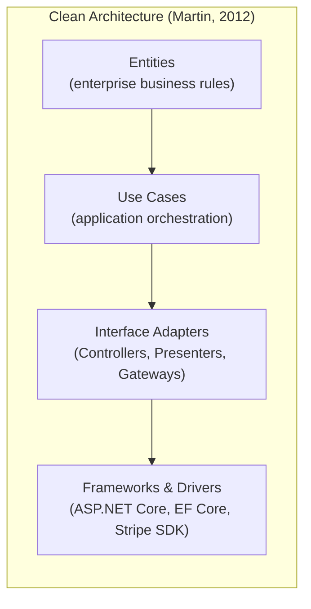
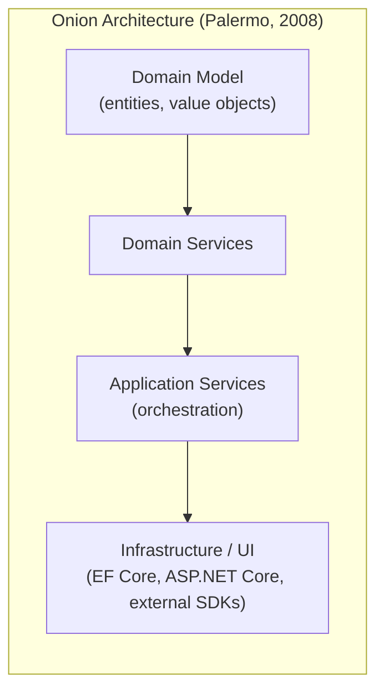
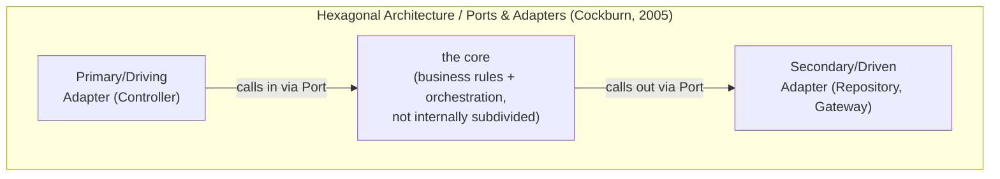
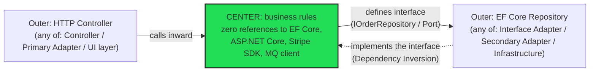
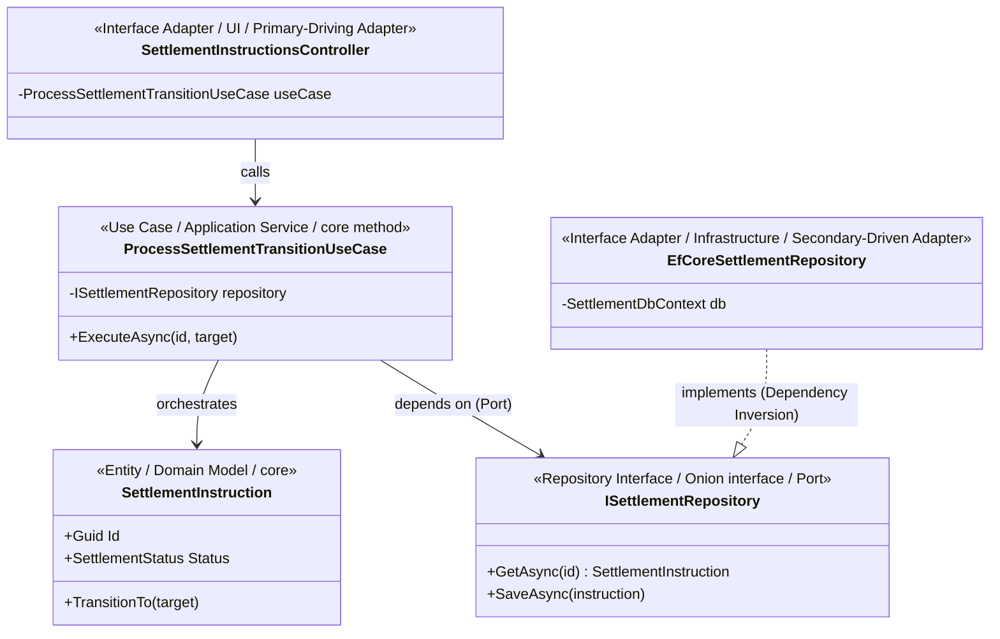
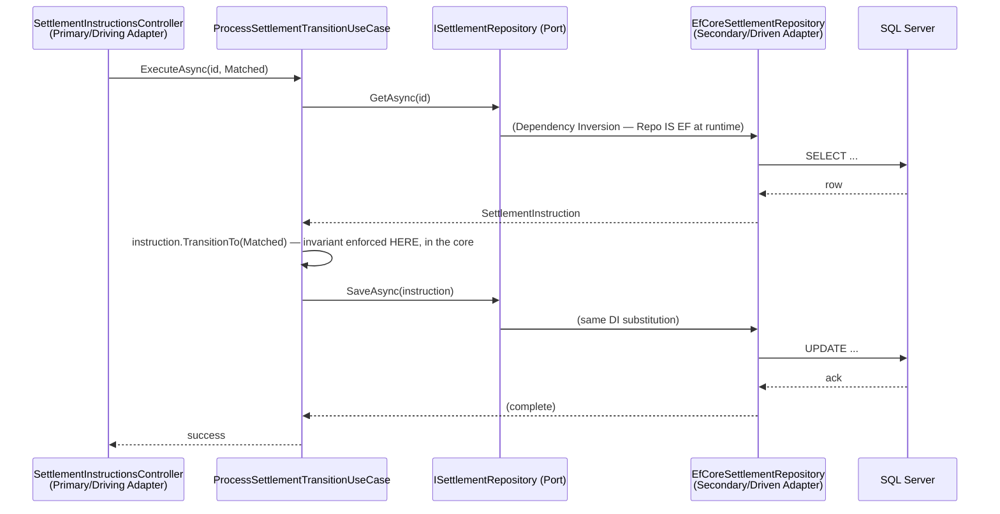

# Module 115 — Clean Architecture: Clean vs. Hexagonal vs. Onion — Comparative Synthesis

> Domain: Clean Architecture | Level: Beginner → Expert | Prerequisite: [[02-PortsAndAdapters-ASPNETCoreImplementation]] (this module compares vocabulary and emphasis across three closely-related architectural styles, taking/114's concrete rings, Dependency Rule, and implementation mechanics as the already-established substance being compared against)
>
> **Note on format:** Per the standing user preference (see `CLAUDE.md`), this module covers the **top 30 most frequently asked interview questions**, curated by real interview frequency across all four levels (8 Basic / 8 Intermediate / 7 Advanced / 7 Expert) rather than a fixed 10-per-level count, without the full 15-section deep-dive template.
>
> **Deliberately light-touch note:** Per this domain's scope (see `00-Roadmap/README.md`), `33-Hexagonal-Architecture` is a dedicated later domain that owns Hexagonal Architecture's own full treatment (its originator Alistair Cockburn's complete framing, adapter-testing strategies, and any nuance genuinely distinct from what this module covers). This module's job is narrower and comparative: show that Clean, Hexagonal, and Onion Architecture are close cousins solving the same problem with different vocabulary and modest structural emphasis, correcting the common interview misconception that they are three fundamentally different choices a team must pick among.

---

## 1. Fundamentals

**What:** Clean Architecture (Robert Martin, 2012), Hexagonal Architecture / Ports and Adapters (Alistair Cockburn, 2005), and Onion Architecture (Jeffrey Palermo, 2008) are three independently-authored, differently-named formulations of the identical underlying rule: business logic occupies a dependency-free center, and everything the center needs from the outside world — a database, a message broker, an HTTP framework, a payment rail's SDK — is expressed as an interface *the center defines*, with concrete implementations living in outer layers that depend inward, never the reverse. "Comparing" the three is not comparing three competing technical designs; it is confirming that one design has three vocabularies, and learning precisely where the vocabularies diverge (a little) and where the underlying rule is identical (almost everywhere).

**Why:** Three separate published names for the same underlying pattern create two real, recurring costs this module exists to eliminate. First, an **interview cost**: a candidate who has only ever studied "Clean Architecture" by name can be thrown by a Hexagonal-Architecture-framed interview question, answer as if it were a different, unfamiliar system, and read as less competent than they actually are. Second, a genuine **organizational cost**: teams, new hires, and (per §4 below) whole engineering organizations following an acquisition can burn real meeting time debating "which architecture is correct" when the honest answer is that the debate is about naming, not substance — a debate a Principal Engineer is expected to recognize and shut down quickly, not adjudicate as if it were a real trade-off.

**When:** This comparison matters at three concrete moments: (1) reading a job description, a legacy codebase's README, or an interviewer's question that uses a name different from the one a candidate is used to; (2) onboarding a new engineer whose prior team used a different vocabulary for the same pattern; (3) an architecture-review or ADR discussion where a team is genuinely deciding, for a *new* codebase, which name and folder convention to standardize on going forward (Best Practices, §5, and Architecture Decision, §15, cover this decision directly).

**How (30,000-ft view):**

```
Clean:      Entities → Use Cases → Interface Adapters → Frameworks & Drivers
Hexagonal:  [ the core (Ports) ]  ⇄  Adapters (Primary/Driving, Secondary/Driven)
Onion:      Domain Model → Domain Services → Application Services → Infrastructure/UI

All three, translated to one statement:
  domain code → defines interfaces → outer code implements them → dependencies point inward
```

The one property that must survive translation, regardless of which of the three names or diagrams a team uses, is the Dependency Rule itself: **source-code dependencies may only point inward.** Everything else — how many named rings exist, whether "Adapters" get split into Primary/Secondary, whether the middle layer is called "Use Cases" or "Application Services" — is presentation, not substance.

---

## 2. Deep Dive

### 2.1 Where They Genuinely Differ — Granularity of the Inner Structure
The one real, structural (not merely lexical) difference across the three is how prescriptively each subdivides the "center." Cockburn's original Hexagonal Architecture treats the core as a single, undifferentiated region — any number of Ports may surround it, with no mandated internal split between "pure business rules" and "orchestration logic." Palermo's Onion Architecture is slightly more prescriptive, explicitly naming a Domain Model layer separate from a Domain Services layer, which is in turn separate from Application Services. Martin's Clean Architecture is the most prescriptive of the three, explicitly naming and separating **Entities** (enterprise-wide business rules) from **Use Cases** (application-specific orchestration) as two distinct rings with their own inward-pointing relationship — Use Cases depend on Entities, never the reverse, even though both are "inside" the same conceptual core relative to Infrastructure. A team that needs to reason precisely about "should this validation rule live with the aggregate itself, or with the orchestrating use case" gets more explicit, named guidance from Clean Architecture's four rings than from Hexagonal's flatter core.

### 2.2 Where They're Identical — the Dependency Rule and Dependency Inversion
Every other property that actually matters day-to-day is identical: the direction dependencies must point; the mechanism (Dependency Inversion — the center defines the interface, the edge implements it) that makes this compatible with normal, outward-initiated runtime control flow; the resulting testability profile (the center is unit-testable with zero infrastructure, per §2.6 below); and the resulting technology-substitution property (swap a database, message broker, or payment provider without touching business logic). None of these three consequential, practically load-bearing properties differs across the three names. An interviewer probing "what's the real difference between Clean and Hexagonal" is very often testing whether a candidate collapses to this equivalence quickly, not expecting three memorized, independently-derived rule sets.

### 2.3 Terminology Mapping (Reference Table)

| Concept | Clean Architecture | Onion Architecture | Hexagonal Architecture |
|---|---|---|---|
| Innermost business rules | Entities | Domain Model | "the core" (undifferentiated) |
| Orchestration/use-case logic | Use Cases | Application Services / Domain Services | "the core" (undifferentiated) |
| Boundary contract the center defines | Repository / Gateway interface | Interface defined in Domain/Application layer | Port |
| Concrete implementation of that contract | Interface Adapter | Infrastructure implementation | Adapter |
| Adapter that calls *into* the core | Controller / Presenter | UI layer | Primary / Driving Adapter |
| Adapter the core calls *out to* | Repository implementation, Gateway | Infrastructure implementation | Secondary / Driven Adapter |
| Outermost technology-specific layer | Frameworks & Drivers | Infrastructure / UI | (not separately named) |

### 2.4 Hidden Cost #1 — Over-Prescribing for a Small Team
Adopting Clean Architecture's full four-ring, Entities/Use-Cases/Interface-Adapters/Frameworks-and-Drivers split, folder-by-folder, on a three-engineer greenfield service with a genuinely simple domain, produces real, measurable cost with no corresponding benefit: every trivial CRUD operation now requires an Entity, a Use Case class, an Interface Adapter, and DI registration wiring across four folders — for logic that would have been perfectly correct, testable, and maintainable as a two-layer split. Teams that cargo-cult the full ring structure onto a domain that doesn't need it report (consistently, across unrelated organizations) the same complaint: "everything takes four files and three interfaces to change one field." The fix is not abandoning the Dependency Rule — it's recognizing that Hexagonal Architecture's flatter, less-subdivided core is frequently the *better-calibrated* choice for a small team or a genuinely simple domain, precisely because it doesn't mandate ring-splitting a domain that doesn't warrant it.

### 2.5 Hidden Cost #2 — Under-Prescribing for a Large, Multi-Team Codebase
The inverse failure is equally real: a large, multi-team codebase (dozens of engineers, a genuinely complex domain with real business-rule/orchestration distinctions worth naming) adopting Hexagonal Architecture's looser, single-undifferentiated-core vocabulary without independently inventing an internal Entities/Use-Cases split ends up with an increasingly undifferentiated "core" folder where business invariants and orchestration logic are informally, inconsistently intermixed by different engineers over years, with no named convention forcing the separation Clean Architecture's four rings would have mandated from day one. This is the mirror image of §2.4: the *same* underlying flexibility (Hexagonal doesn't mandate ring-splitting) that's a genuine benefit for a small team becomes a genuine cost for a large one, because nothing forces consistency across dozens of contributors absent an explicit, named convention.

### 2.6 Testability — Identical Mechanically, Regardless of Vocabulary
The testing pyramid this pattern enables is a direct, mechanical consequence of the shared Dependency Rule, not of any style-specific vocabulary: the innermost layer (Entities/Domain Model/"the core") gets fast, dependency-free unit tests exercising business invariants directly; the orchestration layer (Use Cases/Application Services/"the core" again) gets tests substituting fakes or mocks for its Ports/interfaces; Adapter implementations (`EfCoreOrderRepository`, `StripePaymentGateway`) get integration tests against real infrastructure (or infrastructure-equivalent test doubles like Testcontainers); and a small number of end-to-end tests verify wiring, not business rules. Nothing about this pyramid's shape or cost distribution changes across Clean/Hexagonal/Onion — only the folder and namespace labels attached to each layer change.

---

## 3. Visual Architecture







**The single diagram that actually matters — all three, collapsed to their shared substance:**



The three ring/hexagon diagrams above differ in labels and count of named layers; the fourth diagram — one center, defined interfaces, inward-pointing dependencies — is what every one of the first three is actually a drawing of.

---

## 4. Production Example

**Problem:** A mid-sized FinTech firm stood up a new **trade-settlement instruction service** — the component responsible for translating an executed trade into a formal settlement instruction sent to a custodian, tracking its lifecycle (`PENDING → MATCHED → SETTLED | FAILED`), and reconciling custodian confirmations against internal records. Three senior engineers, hired from three different backgrounds, joined the initial design review: one from a Java/Spring shop where "Hexagonal Architecture" and "Ports and Adapters" were the standard vocabulary; one from a .NET shop that had used "Onion Architecture" by name for a decade; one who had read Robert Martin's *Clean Architecture* book and used that vocabulary exclusively. The first design-review meeting spent forty minutes on what participants initially experienced as a genuine architectural disagreement about "which pattern is correct for a regulated settlement system."

**Architecture:** The Principal Engineer running the review stopped the debate, put the terminology-mapping table (§2.3) on the whiteboard, and reframed the question: not "which of the three," but "does our design keep settlement-instruction business rules — the state machine, the matching logic, the reconciliation-break classification — provably independent of the custodian's specific SwiftNet/ISO 20022 message format, the specific message broker, and the specific ORM?" All three engineers agreed instantly once the question was reframed this way, because the answer ("yes, obviously — that's the whole point") didn't depend on which of the three names was used to describe it.

**Implementation:** The team settled on Clean Architecture's specific four-ring vocabulary — not because it was technically superior (per §2.2, it isn't), but for two concrete, non-technical reasons: it was the vocabulary already used by the firm's two other settlement-adjacent services (consistency with existing internal convention, per Best Practices §5), and its more prescriptive Entities/Use-Cases split gave the team explicit, named places to put the settlement state-machine's core invariants (`SettlementInstruction` as an Entity, enforcing "cannot transition to `SETTLED` except from `MATCHED`") separately from the orchestration that fetched a custodian confirmation and invoked that transition (`ProcessCustodianConfirmationUseCase`) — exactly the granularity benefit named in §2.1, which mattered here because the domain (multi-state settlement lifecycle, reconciliation-break classification) was genuinely complex enough to benefit from the more prescriptive split, unlike the small-team case in §2.4.

`ICustodianGateway` (a Port/interface the `SettlementInstruction` Use Cases layer defined) was implemented by `SwiftNetCustodianGateway` in the outermost ring — the only class in the entire service with any reference to SwiftNet/ISO 20022 message parsing. `ISettlementRepository` was implemented by `EfCoreSettlementRepository`, the only class referencing Entity Framework Core.

**Trade-offs:** Standardizing on one named vocabulary cost the team roughly a day of documentation work (an ADR — per Expert Q5 — recording the choice, plus the equivalence table so the Spring- and Onion-background engineers had a written reference) against the alternative of letting three engineers use three different names informally in code review and design docs indefinitely, which the Principal judged as guaranteed, low-grade, recurring friction versus a one-time, bounded documentation cost.

**Lessons learned:** The forty minutes initially spent on what felt like a genuine architectural disagreement was, in retrospect, entirely a vocabulary-recognition failure, not a substantive technical one — precisely the scenario Expert Q2's engineering-merger incident describes at larger scale. The concrete fix that prevented recurrence was not a design decision at all; it was a five-line glossary entry in the team's ADR stating explicitly that "Clean Architecture," "Hexagonal Architecture," and "Onion Architecture," as used anywhere in this codebase's documentation or by any new hire, refer to the same pattern and are not competing alternatives.
## 10. Interview Questions

### Basic (10)

1. **Q: What is Hexagonal Architecture, in one sentence, and how does its name relate to vocabulary this domain has already used?**
 **A:** Hexagonal Architecture, proposed by Alistair Cockburn in 2005, organizes an application around a core of business logic accessed only through "Ports" (interfaces) satisfied by "Adapters" (implementations) — the hexagon shape itself is not architecturally meaningful (it's just drawn with six sides so a diagram has room for several Ports around the edge); this is the exact same Port/Adapter vocabulary already borrowed to describe Clean Architecture's own Dependency-Inversion mechanism, because Cockburn's original pattern is, in substance, the same idea Clean Architecture later formalized with its own four named rings.
 **Why correct:** States Hexagonal Architecture's actual definition and origin precisely, and immediately clarifies the hexagon shape's non-significance (a common point of confusion), while correctly identifying that this module's vocabulary isn't new — it's the same terms already used.
 **Common mistakes:** Believing the hexagon's six sides represent exactly six Ports, or some other structurally meaningful count — the shape is arbitrary; a real system might have two Ports or a dozen, and the hexagon is simply a conventional, roomy way to draw the diagram.
 **Follow-ups:** "Which came first, Hexagonal Architecture or Clean Architecture?" (Hexagonal — Cockburn's original 2005 formulation predates Robert Martin's 2012 "Clean Architecture" blog post by about seven years; Clean Architecture can reasonably be read as a later, more prescriptively-structured formalization of the same underlying idea, addressed further in Basic Q5.)

2. **Q: What is Onion Architecture, in one sentence?**
 **A:** Onion Architecture, proposed by Jeffrey Palermo in 2008, organizes an application as concentric layers — a Domain Model at the center, surrounded by Domain Services, then Application Services, with Infrastructure and UI/Tests at the outermost layer — governed by the identical rule that all dependencies point inward toward the Domain Model, and that outer layers may only communicate with the center through interfaces the center itself defines.
 **Why correct:** States Onion Architecture's specific layer names and origin, and explicitly names its governing rule as identical in substance to what Modules 113/114 already established, rather than presenting it as an unrelated new mechanism.
 **Common mistakes:** Assuming Onion Architecture's specific layer names (Domain Services, Application Services) map one-to-one, in a different order, onto Clean Architecture's rings — the mapping is close but not perfectly identical in granularity (Intermediate Q1 covers the precise correspondence).
 **Follow-ups:** "Is Onion Architecture older or newer than Clean Architecture?" (Older — 2008, four years before Robert Martin's Clean Architecture post, and three years after Cockburn's Hexagonal Architecture — meaning Clean Architecture was arguably the last of these three major formulations to be published, not the first, despite frequently being the most commonly cited by name today.)

3. **Q: What is the one core idea all three styles share, underneath their different names?**
 **A:** All three are the identical Dependency Rule expressed with different vocabulary and drawn with different diagrams: business logic sits at a conceptual center with zero compile-time knowledge of any specific outer technology; anything the center needs from outside is expressed as an interface the center itself defines (a "Port" in Hexagonal, simply an "interface" in Onion, a Repository/Gateway interface in Clean); and Dependency Inversion is the shared mechanism making this compatible with normal, outward-initiated runtime control flow in every one of the three formulations.
 **Why correct:** Names the precise, singular shared substance (the Dependency Rule plus Dependency Inversion as its enabling mechanism) rather than a vague "they're all kind of similar," and ties it directly back to this domain's own already-established, most load-bearing concept.
 **Common mistakes:** Treating the three names as marking genuinely different architectural philosophies requiring separate learning — an interviewer asking "what's the difference between Clean and Hexagonal Architecture" is very often testing whether the candidate recognizes this underlying equivalence, not expecting three independently-memorized rule sets.
 **Follow-ups:** "If they're the same idea, why do three different names exist at all?" (Independent invention and naming by three different authors working in overlapping but not identical communities and eras — Basic Q5 covers the specific history — rather than one being a correction or rejection of another.)

4. **Q: Give a quick terminology-mapping table across the three styles' innermost-to-outermost structure.**
 **A:** Center: Clean's "Entities" ≈ Onion's "Domain Model" ≈ Hexagonal's "the core/business logic" (Hexagonal doesn't name a specific innermost sub-layer as granularly). Application orchestration: Clean's "Use Cases" ≈ Onion's "Application Services" ≈ Hexagonal's "the core" again (Hexagonal treats orchestration as part of the same central hexagon, without Clean's specific Use-Case/Entity sub-split). Boundary contracts: Clean's "Repository/Gateway interfaces" ≈ Onion's "interfaces defined in the Domain/Application layers" ≈ Hexagonal's "Ports," the term this domain has used throughout. Implementations: Clean's "Interface Adapters/Frameworks & Drivers" ≈ Onion's "Infrastructure/UI" ≈ Hexagonal's "Adapters," again the term already in use.
 **Why correct:** Gives a genuinely useful, concrete cross-reference table an interviewer could ask for directly, correctly noting where the mapping is looser (Hexagonal's less granular inner-ring subdivision) rather than forcing a false one-to-one correspondence everywhere.
 **Common mistakes:** Forcing an exact one-to-one mapping at every level of granularity — Hexagonal's original formulation genuinely doesn't subdivide its core as finely as Clean Architecture's four specifically-named rings do, which is a real, if modest, structural difference covered fully in Intermediate Q1.
 **Follow-ups:** "Which of the three names would a reader most likely encounter in a Java-heavy job posting versus a.NET-heavy one?" (Basic Q4-adjacent Advanced-level nuance — "Hexagonal" and "Ports and Adapters" see somewhat more use in the Java/Spring community's vocabulary, while "Clean Architecture" is more commonly cited by name in.NET job postings and blog content, though this is a loose cultural tendency, not a hard rule, per Intermediate Q7.)

5. **Q: What's the actual chronological history, and does a later formulation supersede or correct an earlier one?**
 **A:** Cockburn's Hexagonal Architecture (2005) came first, followed by Palermo's Onion Architecture (2008), followed by Martin's Clean Architecture (2012) — but none of the three is a correction or rejection of an earlier one; each author appears to have arrived at essentially the same Dependency Rule largely independently, framing and naming it according to their own teaching context and diagramming preference, rather than explicitly building on or superseding the prior formulation.
 **Why correct:** States the correct chronological order and explicitly addresses the natural follow-up question (does later = better/corrected) with the accurate answer (independent convergent invention, not a lineage of corrections).
 **Common mistakes:** Assuming Clean Architecture, being the most recently named and currently most commonly cited, is a "more advanced" or "improved" version superseding the other two — its main genuinely distinct contribution is more prescriptive structure (four specifically named rings, explicit Input/Output Boundaries) rather than a conceptual advance the other two lacked.
 **Follow-ups:** "Does this convergent-invention history matter for an actual project decision?" (Not really, practically — Advanced Q2 covers the real, practical decision a team actually faces, which is picking one vocabulary and using it consistently, not researching which author's formulation is historically "correct.")

6. **Q: Is one of the three styles objectively better than the others?**
 **A:** No — since all three express the identical underlying Dependency Rule (Basic Q3), none is technically superior; the real, practical differences are in how prescriptively each formulation subdivides the inner structure (Clean's four named rings are more specific than Hexagonal's more open-ended "the core") and in which vocabulary a given team, community, or codebase's existing conventions already use — the actual "better" choice for a specific team is almost always "whichever vocabulary this team/organization already uses consistently," not a technical merits comparison between the styles themselves.
 **Why correct:** Gives the honest, correct answer (no technical superiority, since they're the same underlying rule) and redirects to the actually load-bearing practical consideration (consistency with existing team/organizational vocabulary), matching this domain's established honest-calibration approach to trade-off questions.
 **Common mistakes:** Picking a "favorite" and defending it with a technical argument that, on close inspection, is really just a preference for one formulation's specific diagramming or naming choices — a red flag in an interview setting, since it suggests the candidate hasn't recognized the underlying equivalence Basic Q3 establishes.
 **Follow-ups:** "Would you ever recommend actively switching an existing codebase's vocabulary from one style's terms to another's?" (Almost never, absent a very strong specific reason — Advanced Q2 covers why consistency of whichever vocabulary is already in use matters far more than which specific vocabulary was originally chosen.)

7. **Q: Why does this course treat Hexagonal and Onion Architecture as one light-touch comparison module rather than as separate full domains of their own, given Hexagonal gets a dedicated later domain (33)?**
 **A:** Because their substance — the Dependency Rule and Dependency Inversion — was already fully covered in Modules 113–114 under Clean Architecture's own vocabulary; re-deriving that identical substance twice more, once under Hexagonal's naming and once under Onion's, would be pure repetition with no new technical content, which this course's cross-module non-duplication discipline (already applied consistently, e.g., correctly deferring to Modules 34–37) specifically avoids. exists as a dedicated domain later specifically because Hexagonal Architecture, as commonly taught and interviewed on, carries a few genuinely distinct emphases (most notably the Primary/Driving vs. Secondary/Driven Adapter distinction, Intermediate Q3) worth their own fuller treatment — but that fuller treatment doesn't require re-deriving the shared Dependency Rule substance a third time, only building on this module's comparison.
 **Why correct:** Explicitly justifies this course's own structural choice (why light-touch here, why a full domain later) by reapplying its established non-duplication principle, rather than leaving the scoping decision unexplained.
 **Common mistakes:** Assuming the existence means this module's comparison was somehow incomplete or wrong — the job is additive (Hexagonal-specific nuance not covered here), not corrective of anything stated in this module.
 **Follow-ups:** "What specifically will add that this module deliberately left out?" (Advanced Q7 previews this precisely — primarily the Primary/Driving vs. Secondary/Driven Adapter distinction and Hexagonal-specific testing-strategy framing Cockburn's own writing develops in more depth than this comparison module needed to.)

8. **Q: An interviewer asks "what's the real difference between Clean Architecture and Hexagonal Architecture?" expecting a substantive technical answer. What's the strongest possible response?**
 **A:** State the equivalence directly and confidently rather than inventing a false distinction to seem more knowledgeable: "They express the same underlying Dependency Rule and Dependency Inversion mechanism — Hexagonal Architecture, Cockburn's original 2005 formulation, uses Port/Adapter vocabulary without prescribing a fixed number of inner sub-layers; Clean Architecture, Martin's 2012 formulation, is a more prescriptively-structured version with four specifically named rings and explicit Input/Output Boundaries. In practice they're close enough that many teams use the terms interchangeably or blend them (Intermediate Q8), and the genuinely distinct nuance — Hexagonal's Primary/Driving vs. Secondary/Driven Adapter distinction — is a modest emphasis difference, not a competing philosophy."
 **Why correct:** Directly answers the question with the accurate, calibrated technical substance (genuine equivalence plus the one real, modest distinction) rather than either dodging the question or fabricating a larger difference than actually exists, demonstrating exactly the depth-with-honesty this course has modeled throughout.
 **Common mistakes:** Either claiming "there's no difference at all, they're identical" (slightly overstating the equivalence, missing the real Primary/Secondary Adapter nuance) or inventing an exaggerated technical distinction to sound more sophisticated than the honest answer actually is — both responses read, to an interviewer who knows the material, as less credible than the calibrated answer given here.
 **Follow-ups:** "How would you similarly summarize Onion Architecture's distinct emphasis in one added sentence?" (Onion's main distinct emphasis is its specific, named middle layers — Domain Services separated explicitly from Application Services — a slightly finer-grained subdivision of the "orchestration" concern than either Hexagonal or Clean's own framing typically calls out by name.)

9. **Q: Name one concrete .NET class from a payments/settlement codebase that would count as a "Primary/Driving Adapter" under Hexagonal vocabulary, and one that would count as a "Secondary/Driven Adapter" — and give their Clean Architecture equivalents.**
 **A:** `SettlementInstructionsController` (an ASP.NET Core controller receiving an inbound HTTP request and calling into a Use Case) is a Primary/Driving Adapter under Hexagonal vocabulary, and an Interface Adapter under Clean Architecture vocabulary — it initiates the call into the core. `SwiftNetCustodianGateway` (a class calling out to a custodian's SwiftNet endpoint on the core's behalf, implementing an `ICustodianGateway` Port/interface the core itself defined) is a Secondary/Driven Adapter under Hexagonal vocabulary, and also an Interface Adapter (specifically a Gateway) under Clean Architecture vocabulary — the core calls out to it, not the reverse.
 **Why correct:** Grounds the Primary/Secondary distinction in concrete, realistic FinTech class names rather than abstract description, and correctly cross-maps both examples to Clean Architecture's own (less directionally-specific) "Interface Adapter" vocabulary.
 **Common mistakes:** Reversing the two — assuming a Repository or Gateway "drives" the core because it does I/O, when the defining test is *who initiates the call*, not which side performs I/O; both classes may perform I/O, but only one is called *by* the outside world.
 **Follow-ups:** "Would a scheduled background job that polls for custodian confirmations be Primary or Secondary?" (Primary/Driving — the scheduler triggers a call *into* the core's Use Case layer, exactly like an HTTP request does, even though no human or external system directly "requested" it in the moment.)

10. **Q: A recruiter's job posting says the team uses "Ports and Adapters." A candidate has only studied "Clean Architecture" by name. Should they be concerned they lack the relevant experience?**
 **A:** No — "Ports and Adapters" is Cockburn's original name for Hexagonal Architecture, and per Basic Q3, it expresses the identical Dependency Rule and Dependency Inversion mechanism the candidate already knows under Clean Architecture's vocabulary; the candidate should confidently claim the relevant experience, translate the vocabulary mentally during the interview (Basic Q4's mapping table), and, if useful, mention the equivalence explicitly to demonstrate breadth rather than narrow, single-vocabulary knowledge.
 **Why correct:** Applies the established equivalence directly to a realistic job-search scenario, giving the practically useful answer (don't self-eliminate over a naming difference) rather than a purely abstract restatement of the equivalence.
 **Common mistakes:** Assuming a different name on a job posting signals a genuinely different, unfamiliar technology stack requiring separate preparation — the underlying skill (keeping business logic infrastructure-independent via Dependency Inversion) transfers completely.
 **Follow-ups:** "Should this equivalence be mentioned proactively in the interview, or only if asked?" (Proactively, briefly, is a positive signal — e.g., "I've worked primarily with Clean Architecture's vocabulary, which is the same underlying Ports-and-Adapters pattern under a different name" — since it demonstrates exactly the recognition-over-rote-memorization skill Basic Q8 models.)

### Intermediate (10)

1. **Q: What is the one genuine, non-vocabulary structural difference between Hexagonal Architecture and Clean Architecture's four rings?**
 **A:** Hexagonal Architecture's original formulation treats the application's core symmetrically — any number of Ports can surround it, with no inherent distinction between an "Entities" sub-layer and a "Use Cases" sub-layer inside that core; Clean Architecture is more prescriptive, explicitly naming and separating Entities (enterprise-wide business rules) from Use Cases (application-specific orchestration) as two distinct rings with their own Dependency Rule relationship to each other. In practice, most real Hexagonal-Architecture-labeled codebases still end up informally separating these two concerns internally — but Cockburn's original formulation doesn't mandate or name that separation the way Clean Architecture explicitly does.
 **Why correct:** Identifies the one genuine, specific structural difference (granularity of inner-core subdivision) precisely, while being honest that this difference is often erased in actual practice regardless of which label a team uses.
 **Common mistakes:** Overstating this difference as if it meant Hexagonal Architecture somehow doesn't support separating business rules from orchestration logic at all — it simply doesn't *name and mandate* that specific two-way split as explicitly as Clean Architecture does; a Hexagonal-labeled codebase is entirely free to make that same distinction informally.
 **Follow-ups:** "Does this granularity difference have any real practical consequence for a team choosing between the two labels?" (Very little in practice — Advanced Q2 covers why the practical decision that actually matters is vocabulary consistency, not this modest structural nuance.)

2. **Q: How precisely does Onion Architecture's own stated rule — "no direct infrastructure dependency; outer layers communicate with the center only through interfaces the center defines" — compare to the Dependency Rule?**
 **A:** It's the identical rule restated in Onion's own words — "the center defines the interface, an outer layer implements it" is exactly the Dependency-Inversion mechanism; Palermo's original writing even explicitly frames this as solving the same problem traditional layered architecture's business-logic-depends-on-data-access coupling creates, which is precisely the comparison already drew between Clean Architecture and traditional N-tier design.
 **Why correct:** Confirms the rule's precise identity across formulations by quoting Onion's own framing and directly cross-referencing the specific prior module sections making the equivalent point, rather than asserting similarity vaguely.
 **Common mistakes:** Assuming Onion Architecture's motivation (explicitly framed by Palermo against traditional layered architecture's coupling problem) was somehow a different concern than what motivated Clean Architecture — both authors were solving the identical business-logic/infrastructure-coupling problem, from slightly different starting points and communities.
 **Follow-ups:** "Given this identical rule, would/114's fitness-function approach (NetArchTest) work equally well to enforce an Onion-Architecture-labeled codebase's boundaries?" (Yes, unchanged — the exact same static-dependency-graph assertion applies regardless of which of the three vocabularies a specific codebase uses to describe its own layers, since the underlying rule being verified is identical.)

3. **Q: What is Hexagonal Architecture's Primary/Driving vs. Secondary/Driven Adapter distinction, and why doesn't Clean Architecture use this specific vocabulary?**
 **A:** A Primary (or Driving) Adapter *initiates* interaction with the application's core — a Controller receiving an HTTP request, a CLI command handler, a scheduled-job trigger; a Secondary (or Driven) Adapter is *initiated by* the core — a Repository implementation, an external API Gateway, a message-broker publisher. This inbound/outbound distinction is genuinely useful vocabulary (it's often easier to reason about a Port's purpose once you know which direction of interaction it serves) that Clean Architecture's own writing doesn't name as explicitly, though the underlying reality — some Adapters are called by the outside world into the core, others are called by the core out to the outside world — is identical and present in Clean-Architecture-labeled codebases too, simply without this specific pair of names attached.
 **Why correct:** Precisely defines both halves of the distinction with concrete examples of each, and correctly identifies that this is genuinely useful, distinct vocabulary Cockburn's formulation offers that Clean Architecture's own writing doesn't explicitly name — the one piece of real, additive terminology worth knowing from Hexagonal Architecture specifically.
 **Common mistakes:** Assuming Clean-Architecture-structured code lacks this inbound/outbound distinction in reality — it's present and just as real (a Controller vs. a Repository implementation are obviously different in this exact way) but Clean Architecture's own vocabulary doesn't give the distinction a specific name the way Hexagonal's Primary/Secondary terms do.
 **Follow-ups:** "Which of this domain's already-established examples is a Primary Adapter, and which is a Secondary Adapter?" (`OrdersController`,, is a Primary/Driving Adapter — it initiates the call into `PlaceOrderUseCase`; `EfCoreOrderRepository` is a Secondary/Driven Adapter — the Use Case calls out to it, not the reverse.)

4. **Q: Practically, does it matter which vocabulary (Clean, Hexagonal, Onion) a candidate uses on a resume or in an interview, given they describe the same underlying pattern?**
 **A:** Slightly, but mostly as a communication/audience-matching concern rather than a technical one: naming the vocabulary that matches the interviewing company's own stated tech stack, blog posts, or job description signals familiarity with how *that specific team* talks about the pattern, which can smooth communication — but a strong candidate should be able to recognize and translate fluently between all three vocabularies on the spot (as Basic Q8 demonstrates), since a genuinely knowledgeable interviewer is testing for that underlying recognition, not a preference for one specific term.
 **Why correct:** Gives the honest, calibrated answer (minor communication-matching value, not a technical difference) and reinforces that fluency across all three names is the actually valuable, demonstrable skill, rather than overstating the resume-wording decision's importance.
 **Common mistakes:** Treating vocabulary choice as a meaningful technical signal of skill level — using "Clean Architecture" versus "Hexagonal Architecture" on a resume says essentially nothing about a candidate's actual architectural competence, only about which specific author's writing or which community's blog posts they happen to have read first.
 **Follow-ups:** "Could using the 'wrong' vocabulary for a specific company actually hurt a candidate?" (Very unlikely, and if it did, that would itself be a signal about the interviewing team's own rigidity rather than the candidate's competence — a well-calibrated interviewer should recognize vocabulary fluency, per Basic Q8, as the actual signal worth testing for.)

5. **Q: Was Onion Architecture's original 2008 formulation ever superseded, deprecated, or shown to have a flaw the other two later corrected?**
 **A:** No — Palermo's original blog series remains a valid, complete description of the same Dependency Rule; it simply predates the "Clean Architecture" name by four years and hasn't achieved quite the same widespread current name-recognition Clean Architecture has in more recent (especially.NET-community) writing and job postings, likely due to Robert Martin's broader platform and more recent, heavily-referenced book/blog content rather than any technical shortcoming in Palermo's original formulation.
 **Why correct:** Directly answers the specific historical question (no deprecation or technical correction occurred) and gives the honest, non-technical explanation (differential platform reach/recency of citation) for why one name is more commonly encountered today, rather than implying a technical reason that doesn't exist.
 **Common mistakes:** Assuming lower current name-recognition implies the underlying formulation was somehow inferior or incomplete — popularity of a specific name in current industry discourse is not evidence of, and shouldn't be confused with, technical merit.
 **Follow-ups:** "Would you expect Onion Architecture's specific vocabulary to see a resurgence, or is Clean Architecture's naming now permanently dominant?" (Genuinely unpredictable and not a load-bearing question for engineering practice — Advanced Q2's actual practical guidance, pick and consistently use whichever vocabulary a given team/organization already has, holds regardless of which name is more fashionable at any given moment.)

6. **Q: Does the per-ring testing strategy/ established change at all under Hexagonal or Onion Architecture's vocabulary?**
 **A:** No — the testing strategy is a direct, mechanical consequence of the shared Dependency Rule (Basic Q3), not of any style-specific vocabulary: the innermost layer (whatever it's called — Entities, Domain Model, or simply "the core") still gets fast, dependency-free unit tests; the orchestration layer (Use Cases, Application Services, or again simply "the core") still gets tests using fakes/mocks for its Ports; Adapter implementations still need real-infrastructure integration tests; and end-to-end tests still verify wiring, not business rules, regardless of which of the three names labels each layer.
 **Why correct:** Confirms explicitly that a downstream, practically-important consequence (testing strategy) is identical across all three vocabularies, reinforcing Basic Q3's core equivalence claim with a concrete, previously-established example rather than asserting the equivalence abstractly.
 **Common mistakes:** Assuming a codebase's chosen vocabulary implies anything different about how it should actually be tested — the testing strategy follows from the Dependency Rule itself, which is identical across all three, not from which specific names happen to label each ring/layer/hexagon-segment.
 **Follow-ups:** "Would the concrete NetArchTest fitness-function code need to change at all for an Onion-Architecture-labeled codebase?" (Only the namespace/assembly names referenced in the assertion — the underlying check, "does this inner-layer assembly reference any forbidden outer-layer technology," is unchanged in substance.)

7. **Q: Is there a genuine, measurable industry tendency toward one of these three terms in different tech-stack communities, or is that purely folklore?**
 **A:** There's a real, if loose and non-universal, tendency: "Clean Architecture" is currently the most commonly cited name in.NET-community blog posts, conference talks, and job postings (likely reflecting Robert Martin's specific influence and recency in that community); "Hexagonal Architecture"/"Ports and Adapters" sees comparatively more use in Java/Spring and broader polyglot-backend contexts; "Onion Architecture" is less commonly cited by name currently in either community despite predating Clean Architecture, though it remains recognizable to experienced.NET engineers specifically, given Palermo's own.NET-focused origin. This is a real, observable tendency worth knowing for calibrating communication (Intermediate Q4), but it's a soft cultural pattern, not a hard technical rule with any exceptions.
 **Why correct:** Gives a genuinely useful, concrete observation about naming tendencies across communities while explicitly flagging it as a soft, non-universal pattern rather than a hard rule — avoiding both dismissing the observation as folklore and overstating it as a rigid convention.
 **Common mistakes:** Treating this tendency as a rule strong enough to assume a specific company or team definitely uses one particular vocabulary based purely on their tech stack — actual usage varies significantly team to team regardless of these loose community tendencies, which is exactly why Intermediate Q4's fluency-across-all-three-names skill matters more than guessing correctly in advance.
 **Follow-ups:** "Does this tendency have any bearing on which vocabulary/114 chose to build this domain's own concrete examples around?" (Yes, explicitly — this domain used "Clean Architecture" as its primary vocabulary specifically because it's the more commonly cited term in the.NET-focused context this entire course is built around, per the CLAUDE.md project scope, not because it's technically superior to the other two, per Basic Q6.)

8. **Q: Describe the common real-world pattern of a codebase that blends vocabulary — e.g., calling itself "Hexagonal" while its folder structure and class names use Clean Architecture's specific ring names.**
 **A:** This is extremely common in practice and is not itself a problem, provided the underlying Dependency Rule is actually, mechanically enforced (the fitness function) regardless of which words appear in folder names or team documentation — a team might call its architecture "Hexagonal" in conversation and documentation while having `Entities/`, `UseCases/`, `Infrastructure/` folders (Clean Architecture's specific ring names) because different team members learned the pattern from different sources at different times, and nobody found it worth the churn of renaming folders purely for terminological purity; what actually matters, per this entire domain's own consistent emphasis, is whether the compiled dependency graph respects the rule, not which of the three vocabularies labels it.
 **Why correct:** Normalizes a genuinely common real-world situation (blended vocabulary) as harmless specifically because the substance (Dependency Rule enforcement), not the labeling, is what carries real technical weight — directly reinforcing this module's central thesis with a realistic, relatable scenario.
 **Common mistakes:** Treating vocabulary-blending as a sign of an under-disciplined or confused team — the actual signal of a genuinely under-disciplined team is an *unenforced* Dependency Rule (the silently-broken fitness function), which can occur equally under any single, "pure" vocabulary choice or a blended one; the labeling itself is cosmetic.
 **Follow-ups:** "Would you recommend a team spend engineering time renaming folders purely to match one consistent vocabulary?" (Generally no — Advanced Q2 covers why this is very low-value churn compared to actually verifying the Dependency Rule is enforced, which delivers the real technical benefit regardless of naming consistency.)

9. **Q: Does choosing Onion Architecture's specific vocabulary make it any easier or harder to later extract a bounded context into an independent microservice, compared to Clean or Hexagonal vocabulary?**
 **A:** No — extraction difficulty is governed entirely by whether the Dependency Rule was actually, mechanically enforced (zero infrastructure references from the domain/core layer), which is identical in substance across all three vocabularies; a well-enforced Onion-labeled `DomainModel` assembly extracts exactly as cleanly as an equally well-enforced Clean-labeled `Entities` assembly, and a poorly-enforced example of either extracts equally poorly, since the extraction cost is a function of actual coupling, not of which folder-naming convention described the (non-)coupling.
 **Why correct:** Reapplies the established "naming is cosmetic, enforcement is substantive" finding to a concrete, practically important downstream consequence (microservice extraction), showing the equivalence holds for this specific, realistic scenario rather than asserting it only in the abstract.
 **Common mistakes:** Assuming Onion Architecture's more explicit Domain-Services/Application-Services naming inherently produces cleaner extraction boundaries — naming specificity is a documentation/communication aid, not itself a technical guarantee equivalent to a passing fitness function.
 **Follow-ups:** "What would you actually check before attempting the extraction, regardless of vocabulary?" (Run the same `NetArchTest`-style fitness-function assertion against the specific assembly slated for extraction, confirming zero outbound references to infrastructure-layer namespaces, before committing engineering time to the physical split.)

10. **Q: A junior engineer asks: "If they're really the same thing, why does the interview industry keep asking about the differences?" How do you answer, calibrated for someone new to the field?**
 **A:** Interviewers ask about the "differences" for two legitimate reasons that don't contradict the underlying equivalence: first, to test whether a candidate can *recognize* that equivalence rather than treating three names as three unrelated topics to memorize separately (Basic Q3) — a genuinely useful signal of conceptual, not rote, understanding; second, because a small number of real, if modest, distinctions do exist (Intermediate Q1's ring-granularity difference, Intermediate Q3's Primary/Secondary Adapter vocabulary) and a strong candidate should be able to name those specific, genuine nuances too, not just assert blanket sameness. The honest, complete answer to give in an interview blends both: "they express the same Dependency Rule; the real difference is how prescriptively each formulation subdivides the inner core," which demonstrates both the recognition skill and the precise, genuine technical nuance in one response.
 **Why correct:** Gives a genuinely useful, calibrated-for-a-junior-engineer explanation of *why* this interview question persists despite the underlying equivalence, rather than treating the question itself as a trick or a waste of the candidate's preparation time.
 **Common mistakes:** Telling a junior engineer the question is "meaningless" or "a trick" — this discourages the genuinely valuable preparation of learning to recognize equivalence and name the real, if modest, distinctions, both of which are legitimately testable, useful skills.
 **Follow-ups:** "What's the single best one-sentence answer a junior engineer should have ready for 'what's the difference between Clean and Hexagonal Architecture'?" (Basic Q8's model answer — state the equivalence directly and confidently, then name the one real granularity distinction, in a single breath.)

### Advanced (10)

1. **Q: Critique the claim: "Onion Architecture doesn't support CQRS as well as Hexagonal Architecture does."**
 **A:** This claim is false and conflates two independent concerns — CQRS (previewed /) is a read/write-model-separation decision orthogonal to which of the three Dependency-Rule vocabularies a codebase uses; nothing about Onion Architecture's specific layer names constrains or discourages splitting read and write models any differently than Hexagonal or Clean Architecture would, since all three only govern *dependency direction*, not *how many distinct models exist for reading versus writing data*. A claim like this in an interview or design-review setting should be recognized as a category error and corrected by naming the actual, independent axis (CQRS's read/write split) the claim has mistakenly conflated with architectural-style vocabulary.
 **Why correct:** Identifies the precise category error (conflating a dependency-direction rule with an independent read/write-modeling decision) and correctly reapplies this domain's own established distinction between Clean Architecture and CQRS (previewed) to show the claim doesn't hold for any of the three vocabularies, not just Onion specifically.
 **Common mistakes:** Attempting to refute the claim by arguing Onion Architecture specifically *does* support CQRS well, implicitly accepting the claim's flawed premise that this is a meaningful axis of comparison between the three styles at all, rather than naming the category error directly.
 **Follow-ups:** "Is there any genuine interaction at all between an architectural-style choice and a CQRS decision?" (A very modest one — Clean Architecture's more granular ring naming, Intermediate Q1, gives slightly more natural vocabulary for distinguishing a "Command Use Case" from a "Query Use Case" than Hexagonal's less-subdivided core does, but this is a minor naming-convenience difference, not a genuine support/non-support distinction.)

2. **Q: A team is debating whether to rename its "Onion Architecture"-labeled codebase to "Clean Architecture" terminology to match a newly-hired lead's prior experience. As a Principal Engineer, what's your recommendation?**
 **A:** Recommend against a pure renaming effort with no other functional change — per Basic Q6/Intermediate Q8, the vocabulary choice carries essentially zero technical weight, so a renaming-only project (touching folder names, class names, documentation, with no corresponding improvement to actual Dependency Rule enforcement) is low-value churn, real risk (merge conflicts, temporary confusion, wasted review cycles) for effectively zero durable engineering benefit; the actually valuable thing worth doing instead is verifying (the fitness function) that the *existing*, correctly-vocabularied Onion structure genuinely, currently enforces the Dependency Rule — and, separately, documenting the team's chosen vocabulary explicitly (Expert Q5's ADR-glossary practice) so the new lead and future hires have a clear, written reference regardless of which specific words are used.
 **Why correct:** Gives the calibrated Principal Engineer judgment (don't do the low-value rename, but do invest in the genuinely valuable verification-and-documentation alternative) rather than a simple yes/no, correctly weighing real cost (churn, risk) against essentially nonexistent technical benefit.
 **Common mistakes:** Approving the rename purely to make a new senior hire more comfortable, without weighing the real churn/risk cost against the acknowledged-zero technical benefit — accommodating a new team member's prior vocabulary familiarity is a legitimate minor consideration, but not one that should override a clear-eyed cost/benefit calculation on a purely cosmetic change.
 **Follow-ups:** "Under what circumstance would a full terminology migration actually be justified?" (If the *underlying rule itself* were also being changed or strengthened at the same time — e.g., migrating from a loose, fitness-function-only single project to full physical multi-project enforcement, — bundling a vocabulary update into a change that's already touching the same files for a genuine technical reason, rather than as a standalone renaming effort.)

3. **Q: Given a legacy codebase whose documentation claims it follows "Onion Architecture," how would you actually verify whether it currently, genuinely follows the Dependency Rule, reusing this domain's own established tooling?**
 **A:** Don't trust the documentation's label at all — apply the exact `NetArchTest`-style fitness-function technique directly against this codebase's actual assemblies/namespaces (adjusted only for its specific folder/project names, whatever Onion-specific terms it uses, e.g., `DomainModel`, `ApplicationServices`, `Infrastructure`), asserting the innermost layers have zero dependency on the outer ones; if this test fails on first run, that's concrete, mechanical evidence the documented label ("we follow Onion Architecture") has diverged from the actual, current codebase reality — precisely the "declared ≠ actual" instance, now demonstrated concretely against a legacy system whose only evidence of compliance was a written claim, not a running check.
 **Why correct:** Gives the concrete, actionable verification method (the exact same fitness-function technique already established, applied without modification to substance) and correctly frames a documentation label alone as zero evidence of current compliance, directly applying this course's central recurring theme to this specific, realistic scenario.
 **Common mistakes:** Accepting a codebase's architectural documentation or folder-naming convention as sufficient evidence of actual compliance without running any mechanical check — exactly the unverified-declaration risk this entire course has repeatedly warned against, here specifically in its architectural-labeling form.
 **Follow-ups:** "What's the most likely category of violation such a check would find in a typical, undisciplined legacy 'Onion Architecture' codebase?" (Most commonly, a Domain Model class with an ORM-specific attribute or reference — the identical class of violation/Advanced Q6 already established as the most common, easy-to-accidentally-introduce Dependency Rule breach, regardless of which of the three vocabularies labels the codebase.)

4. **Q: Are there any deeper, genuinely nuanced academic distinctions between these three formulations worth citing for a Staff/Principal-level interview, beyond what this module has already covered?**
 **A:** A small number, worth citing briefly but not over-weighting: Cockburn's original Hexagonal Architecture writing emphasizes *testability via Adapter substitution* as a primary motivating goal (swap a real Adapter for a test double) somewhat more explicitly than Palermo's or Martin's writing, which more heavily emphasize business-logic *purity and independence from technology choice* as the primary motivation — a difference in rhetorical emphasis and worked examples more than a structural difference in the resulting architecture; beyond this, the three formulations' substantive content, once the vocabulary is translated (Basic Q4's table), is close enough that citing further, more obscure distinctions in an interview risks sounding like trivia rather than substantive engineering judgment.
 **Why correct:** Offers one genuine, citable nuance (differing rhetorical/motivating emphasis across the original authors) while explicitly and honestly cautioning against over-mining this territory for further distinctions that don't meaningfully exist — modeling exactly the calibrated depth this course has aimed for throughout, rather than manufacturing false depth to seem more sophisticated.
 **Common mistakes:** Attempting to list many additional "distinctions" between the three formulations to appear more knowledgeable — most such lists, on close inspection, either restate Intermediate Q1/Q3's already-covered genuine differences in new words or invent distinctions the original source material doesn't actually support, which a well-read interviewer may recognize and discount.
 **Follow-ups:** "How would you handle an interviewer who insists on a longer list of distinctions than this module supports?" (Advanced Q5 covers exactly this diplomatic scenario.)

5. **Q: An interviewer insists "these are three totally different architectures, not the same thing" and seems to expect a longer list of distinctions than you believe genuinely exist. How do you respond without being dismissive of their view or abandoning your own accurate understanding?**
 **A:** Acknowledge the genuine, real differences that do exist (Intermediate Q1's inner-ring granularity, Intermediate Q3's Primary/Secondary Adapter vocabulary, Advanced Q4's differing rhetorical emphasis) concretely and specifically, demonstrating you're not simply asserting "they're identical" out of laziness — then clearly, respectfully state that the *shared* substance (the Dependency Rule and Dependency Inversion, Basic Q3) is, in your assessment, the larger and more practically important fact, and ask what specific distinction the interviewer has in mind, since that's often the fastest way to either learn something genuinely new or surface that the perceived difference is itself vocabulary-based rather than substantive.
 **Why correct:** Models the correct interview posture — neither capitulating to an inaccurate premise nor being dismissively certain — by leading with concrete acknowledgment of real nuance, stating your own calibrated view clearly, and inviting the interviewer to be specific, which is a diplomatically strong and technically honest way to handle a disagreement about a somewhat matter-of-perspective claim.
 **Common mistakes:** Either immediately backing down and agreeing "yes, they're totally different" purely to avoid friction (abandoning accurate understanding for social comfort) or bluntly insisting the interviewer is simply wrong with no acknowledgment of the real, if modest, distinctions that do exist (Advanced Q4) — both responses are weaker than the calibrated, specific, question-inviting response given here.
 **Follow-ups:** "What if the interviewer's underlying expectation turns out to be based on a genuine misunderstanding — say, they believe Onion Architecture doesn't support Repository interfaces at all?" (Correct the specific factual misunderstanding directly and matter-of-factly, citing Intermediate Q2's precise mapping, while maintaining the same respectful, non-dismissive tone — a factual correction is different in kind from a values-based disagreement about how much overlap "counts" as sameness.)

6. **Q: Describe a realistic, moderate-cost production/organizational incident caused purely by vocabulary fragmentation (not a technical Dependency Rule violation) across teams using different names for the same pattern.**
 **A:** A new engineer, hired from a Java/Spring background where "Hexagonal Architecture" and "Ports and Adapters" were the dominant vocabulary, joined a.NET team whose existing documentation and code review comments used "Clean Architecture" terminology exclusively; for several weeks, the new hire genuinely believed the team's actual architecture might be meaningfully different from what they were used to, spent time researching a perceived gap, asked several clarifying questions in code review that read (to the existing team) as more basic than they actually were, and slightly slowed their own onboarding ramp — not because of any actual technical misunderstanding once clarified, but purely from not immediately recognizing the underlying equivalence Basic Q3 establishes. The fix was not a code change at all, but a short addition to onboarding documentation explicitly stating the vocabulary-equivalence table (Basic Q4) as one of the first things a new engineer reads.
 **Why correct:** Describes a realistic, low-drama but genuinely real cost (onboarding friction, wasted clarification cycles) specifically attributable to vocabulary fragmentation alone, with no underlying technical Dependency Rule violation involved at all — correctly distinguishing this as a communication-cost incident, not a repeat of the technical-violation incidents, and proposing the correctly-scoped, low-cost fix (a documentation addition, not a code change).
 **Common mistakes:** Assuming vocabulary differences are purely academic with literally zero real-world cost — while the cost here is genuinely modest compared to this domain's technical incidents (/114's Aggregate-boundary and captive-dependency incidents), it's still a real, measurable onboarding-friction cost worth deliberately addressing with a small, cheap fix rather than dismissing entirely.
 **Follow-ups:** "Why is a documentation fix the right scope here, rather than something larger like a terminology-standardization initiative?" (Directly Advanced Q2's calibration — the actual cost here was small and specific (one new hire's onboarding friction), so the fix should be proportionately small (a documentation addition); a larger initiative would be over-engineering the response relative to the actual, modest scale of the problem.)

7. **Q: What specifically will the dedicated Hexagonal Architecture domain need to cover that this module deliberately left out, and why doesn't that content belong here instead?**
 **A:** should cover, in full depth: Cockburn's original formulation's own complete framing and worked examples (this module only summarized its core idea); the Primary/Driving vs. Secondary/Driven Adapter distinction in its full practical application (Intermediate Q3 only introduced the vocabulary); Hexagonal-Architecture-specific testing strategies emphasizing Adapter-substitution as Cockburn's own primary motivating framing (Advanced Q4 only noted this as a rhetorical-emphasis difference); and any Hexagonal-Architecture-specific tooling or community conventions distinct enough to warrant their own worked examples. This content doesn't belong in this module because this module's specific, scoped job (per this domain's scope note) is the comparative equivalence itself — establishing that a reader doesn't need three separate full treatments to understand the underlying idea — not a full, standalone treatment of any one of the three styles in its own right, which is exactly what a dedicated later domain is for.
 **Why correct:** Gives a precise, actionable scope (Cockburn's fuller original framing, the Adapter-direction distinction in depth, Hexagonal-specific testing emphasis) while correctly justifying why none of that belongs in this comparative module instead, reapplying this course's established cross-module scoping discipline explicitly.
 **Common mistakes:** Assuming this module's light-touch treatment means Hexagonal Architecture itself is a minor or lesser topic not worth the full dedicated treatment — the *comparison* was appropriately light-touch specifically because the shared substance was already fully covered (Modules 113–114); Hexagonal Architecture's own distinct nuances (Primary/Secondary Adapters, testability-first framing) are genuinely worth the fuller, dedicated attention on their own terms.
 **Follow-ups:** "Should re-explain the Dependency Rule itself when it opens?" (No — following this exact same non-duplication discipline, should cite this module's Basic Q3/Intermediate Q1 directly as already-established and proceed straight to its own distinct, additive content.)

8. **Q: A regulated-firm architecture-governance board requires every new service's design doc to state which of Clean/Hexagonal/Onion Architecture it follows, and rejects docs that don't pick one. Is this a reasonable governance control, and what would you improve about it?**
 **A:** Partially reasonable, but poorly targeted — the board's actual, legitimate goal (some verifiable statement about how the service keeps business logic independent of infrastructure, for auditability and vendor-substitution reasons, per the FinTech Principal Panel FT1 answer) is being enforced via a proxy (naming the style) that, per this entire module's finding, carries essentially zero technical signal on its own — a design doc can honestly state "Clean Architecture" while having a completely unenforced Dependency Rule underneath, satisfying the governance checkbox while providing none of the governance board's actual intended assurance. The improvement: replace (or supplement) the naming requirement with a requirement to demonstrate, or link to, a passing fitness-function CI check enforcing the Dependency Rule — a control that actually verifies the property the board cares about, regardless of which of the three names the team's documentation happens to use.
 **Why correct:** Distinguishes the governance board's legitimate underlying goal from its poorly-chosen proxy metric, and proposes a concrete, superior control (fitness-function verification) that directly measures the property that matters, reapplying this module's "label ≠ verified substance" finding to a governance-process critique.
 **Common mistakes:** Either fully endorsing the naming requirement as sufficient governance (missing that a label alone verifies nothing) or dismissing the board's underlying goal as illegitimate (the goal — verifiable domain/infrastructure independence — is entirely legitimate and important for a regulated firm; only the specific control chosen to enforce it is poorly targeted).
 **Follow-ups:** "Would you recommend removing the naming requirement entirely, or keeping it alongside the fitness-function requirement?" (Keep a lightweight version of it for communication/consistency purposes, per Best Practices §5, but make it explicitly non-load-bearing for the actual governance sign-off, which should depend only on the fitness-function evidence.)

9. **Q: Compare the cost of a genuine architectural-style migration (e.g., a codebase moving from an undisciplined, layer-violating "big ball of mud" to a properly enforced Clean/Hexagonal/Onion structure) against the cost of a purely nominal vocabulary rename (Advanced Q2) — why is conflating these two costs a common and consequential estimation mistake?**
 **A:** The two projects sound superficially similar (both touch "the architecture") but differ by roughly an order of magnitude in genuine engineering cost and risk: a real migration out of an undisciplined codebase requires identifying and severing genuine, entangled dependencies (business logic directly calling `DbContext`, a domain class carrying an ORM attribute, a Use Case referencing a payment SDK type directly) — real, behavior-preserving refactoring work carrying real regression risk, requiring careful test coverage and incremental rollout. A purely nominal rename (Advanced Q2) touches only labels — folder names, class name prefixes, documentation — with the underlying dependency graph already correctly enforced beforehand and unchanged afterward. Estimating a nominal rename using a real-migration's effort model (or vice versa) produces badly miscalibrated project plans; the fix is explicitly classifying which of the two a proposed piece of work actually is before estimating it, per Advanced Q3's fitness-function check ("is the Dependency Rule already actually enforced here, or not?") as the discriminating test.
 **Why correct:** Names the specific, consequential estimation failure mode (conflating two very differently-costed projects that both get casually described as "architecture work") and gives the concrete discriminating test (fitness-function status before the project starts) that correctly classifies which cost model applies.
 **Common mistakes:** Assuming any project touching architectural terminology is automatically either "trivial" (assuming it's always a nominal rename) or "high-risk" (assuming it's always a genuine migration) without first checking, via the fitness function, which situation actually obtains.
 **Follow-ups:** "How would you communicate this distinction to a non-technical stakeholder asking for a time estimate?" (Frame it concretely: "this is either a documentation-and-folder-rename project measured in days, or a behavior-preserving refactor project measured in weeks-to-months with regression risk — here's how we'll know which one it is before committing to a date," giving the stakeholder the actual decision-relevant uncertainty rather than a single falsely-precise number.)

10. **Q: In a Mock Interview setting, an interviewer draws Onion Architecture's rings on a whiteboard and asks you to identify where a new `FraudScoreCalculator` domain service belongs, without ever naming Clean or Hexagonal Architecture. How do you demonstrate cross-vocabulary fluency without derailing the actual question being asked?**
 **A:** Answer the question asked, in the vocabulary given — `FraudScoreCalculator`, if it encodes a pure business rule (a scoring algorithm with no I/O), belongs in Onion's Domain Model or Domain Services layer, depending on whether it needs to be an object with identity (Domain Model) or a stateless calculation service (Domain Services) — and only *afterward*, briefly and only if natural, note the cross-vocabulary equivalent ("this would be a Domain Service in Onion's vocabulary, or an Entity/domain-service method in Clean Architecture's — same placement rule either way: no infrastructure reference from this class"). Demonstrating fluency means answering fluently *in the vocabulary the interviewer chose*, not redirecting their question into a vocabulary-comparison discussion they didn't ask for.
 **Why correct:** Models the correct interview behavior — engage directly and competently with whichever vocabulary is presented, since fluency means comfortable engagement in any of the three, not a compulsion to always steer toward the comparison itself, which would be a mild version of the "over-mining trivia" mistake Advanced Q4 already warns against.
 **Common mistakes:** Interrupting or redirecting a concrete design question into an unprompted "well actually, these three are all the same" digression — technically true, but non-responsive to the specific question asked, and reads as evasive or as failing to engage with Onion's specific vocabulary on its own terms.
 **Follow-ups:** "What if the interviewer explicitly asks you to compare it to Clean Architecture's approach?" (Then the comparison is exactly the right response — Basic Q4's mapping table, applied concretely to this specific class, is the ideal answer at that point.)

### Expert (10)

1. **Q: From a Principal Engineer's perspective, how would you standardize architectural vocabulary across a multi-team organization to avoid Advanced Q6's onboarding-friction cost at scale?**
 **A:** Rather than mandating a single "correct" vocabulary top-down (which risks the same low-value churn Advanced Q2 already cautioned against for any team whose existing, working codebase uses a different but equally valid name), issue a lightweight Architecture Decision Record explicitly declaring the organization's canonical vocabulary for *new* work going forward, paired with a short, explicit equivalence glossary (Basic Q4's table) so that existing teams using a different but technically identical vocabulary aren't required to rename anything, but every engineer has a clear, written reference confirming the equivalence — directly reapplying the own ADR-governance discipline to a vocabulary-standardization decision specifically, rather than to a purely technical architectural claim as in the original examples.
 **Why correct:** Gives a concrete, actionable organizational mechanism (an ADR plus glossary, not a blanket rename mandate) correctly weighing the real value (a shared reference reducing Advanced Q6's friction) against the real cost (unnecessary renaming churn Advanced Q2 already flagged) — directly reapplying the established pattern to a new kind of decision.
 **Common mistakes:** Mandating an org-wide rename of every existing codebase to a single vocabulary "for consistency" — this is Advanced Q2's low-value churn risk multiplied across every team in the organization, for a benefit (reduced onboarding friction) that a much cheaper glossary-and-ADR approach already delivers without touching a single line of working code.
 **Follow-ups:** "Should this ADR be revisited periodically, or is it a one-time decision?" (Per the own established discipline, ADRs are living, supersedable documents — this one is genuinely low-risk to leave standing indefinitely once written, since the underlying technical equivalence it documents is a stable fact, not a decision likely to need reconsideration the way a genuine architectural trade-off,, might.)

2. **Q: Describe a realistic enterprise scenario — an engineering-organization merger or acquisition — where vocabulary fragmentation between the two combined organizations caused genuine friction, and extract the transferable lesson.**
 **A:** Two mid-sized engineering organizations merged following an acquisition; one had built its services following "Hexagonal Architecture" conventions (having grown out of a Java-heavy hiring pipeline), the other following "Clean Architecture" conventions (a.NET-heavy pipeline) — early joint architecture-review meetings repeatedly stalled on what participants initially perceived as a genuine, unresolved architectural disagreement about "which pattern is correct for the combined platform going forward," consuming several meetings' worth of senior engineering time, before a senior architect from a third team recognized and explicitly named the underlying equivalence (this module's entire thesis) partway through, at which point the "disagreement" dissolved immediately, revealing there had never been a genuine technical conflict — only an unrecognized vocabulary mismatch consuming real organizational time and goodwill during an already-stressful merger period. The transferable lesson: vocabulary-fragmentation friction (Advanced Q6's individual-onboarding-scale version, recurring here at organizational scale during a merger) can consume real, costly senior-engineering time specifically because it's *mistaken for* a genuine technical disagreement rather than recognized early as a naming issue — making Basic Q3's core equivalence recognition (and Expert Q1's proactive glossary/ADR mechanism) a genuinely valuable, not merely academic, skill to bring into exactly this kind of high-stakes organizational moment.
 **Why correct:** Describes a realistic, higher-stakes organizational scenario (a merger, not just one new hire) where this module's central thesis has genuine, costly practical consequences if not recognized promptly, and extracts a transferable lesson explicitly connecting the individual-scale Advanced Q6 incident to this larger-scale, higher-stakes version.
 **Common mistakes:** Treating this module's comparative-equivalence content as purely an interview-trivia concern with no genuine organizational stakes — this scenario demonstrates the recognition skill has real, costly practical value in exactly the kind of high-pressure, cross-organization setting where a Principal/Staff engineer's judgment is most needed and most visible.
 **Follow-ups:** "What could have prevented the stalled meetings from happening at all?" (Exactly Expert Q1's proactive mechanism — if either merging organization had already documented its own vocabulary via an ADR-and-glossary practice, a newly-formed joint team could have surfaced the equivalence in the first five minutes of the first meeting rather than several meetings in.)

3. **Q: Synthesize this module's place in the domain's full vocabulary journey — from the Ubiquitous Language through the rings, the implementation, to this module's cross-style equivalence.**
 **A:** Earlier analysis established that a *business* domain's own vocabulary (the Ubiquitous Language) must be genuinely, verifiably shared between domain experts and engineers, not merely declared via a circulated glossary — the first instance of this domain's recurring "shared vocabulary requires active verification, not passive declaration" thread. then introduced Clean Architecture's own specific *technical* vocabulary (rings, Dependency Rule) as the concrete structural discipline implementing that business vocabulary correctly in code. grounded that technical vocabulary in real, runnable.NET mechanics. This module closes the vocabulary thread from the opposite direction — showing that *engineering-community* vocabulary itself (Clean vs. Hexagonal vs. Onion) can just as easily fragment or be mistaken for genuine technical disagreement (Expert Q2's merger scenario) as business vocabulary can (the original concern), and that the same discipline — explicit, verified, written equivalence, not assumed shared understanding — resolves both. The full arc: language must be actively verified as genuinely shared at every layer this domain touches — between business and engineering, and equally, it turns out, between engineers who learned the identical technical pattern under different names (this module).
 **Why correct:** Traces one coherent, non-obvious thread (the recurring risk of vocabulary being assumed-shared rather than verified-shared) across the domain's full arc through this module, showing this module isn't a disconnected "trivia comparison" but the same underlying concern recurring in a new, engineering-community-specific form.
 **Common mistakes:** Treating this module as an unrelated, standalone comparison bolted onto the end of the domain's technical content, missing that it's actually a genuine, non-coincidental recurrence of the own opening concern (shared language requiring active verification) now applied to the engineering community's own naming conventions rather than business-to-engineer communication specifically.
 **Follow-ups:** "Is this recurrence coincidental, or does it reveal something more general about this entire course's 'declared ≠ actual' theme?" (Expert Q4 develops this connection fully — it's the same theme's language-specific instance, recurring here in a genuinely new, previously-uncovered form: not just whether a *technical property* is actually true, but whether two people using *different words* actually mean the identical thing, which requires its own kind of active verification, not passive assumption.)

4. **Q: Apply this course's "declared ≠ actual" theme specifically to architectural naming — in what precise sense is a team's claim "we use Hexagonal Architecture" itself a claim requiring verification, distinct from the Dependency-Rule-enforcement version of the same theme?**
 **A:** There are two, layered, independently-failing claims bundled into "we use Hexagonal Architecture": (1) the *substantive* claim that the Dependency Rule is actually, currently enforced in the code — the already-established version of this theme, verified via fitness functions; and (2) a *purely nominal* claim that the specific label "Hexagonal" accurately describes what's being verified, which this module has shown is nearly always true in substance regardless of label (Basic Q3) — meaning the far more consequential of the two claims to actually verify is always the first (does the code really enforce the rule?), and a team should never mistake confirming the *second*, nominal claim ("yes, we do call it Hexagonal, and our folders are even named that way") for having verified the first, substantive one at all — precisely the mistake Advanced Q3's legacy-codebase example demonstrates concretely, where a correct-sounding label provided zero actual evidence of compliance.
 **Why correct:** Cleanly separates two distinct claims that "we use Hexagonal Architecture" bundles together, correctly identifies which one is actually load-bearing (the Dependency-Rule-enforcement claim, not the naming claim), and explicitly distinguishes this module's specific contribution to the theme (don't mistake label-verification for substance-verification) from the already-established, different instance of the same broader theme.
 **Common mistakes:** Conflating this module's naming-equivalence point with the Dependency-Rule-enforcement point as if they were the same finding restated — they are related but genuinely distinct: warned that a fitness function itself might silently stop verifying the rule; this module warns that even a syntactically correct, consistently-applied *label* is separately and independently no evidence the rule is enforced at all, a distinct failure mode worth naming in its own right.
 **Follow-ups:** "Which failure mode is more dangerous in practice — a silently-broken fitness function, or a correct label with no verification at all?" (Arguably the latter is more dangerous specifically because it's more psychologically reassuring — a consistent, professional-sounding label creates a stronger false sense of security than a fitness function that at least exists and merely stopped running silently; the label alone never provided any verification signal to begin with.)

5. **Q: How would you write the glossary section of an ADR specifically to prevent Expert Q2's merger-style vocabulary-confusion incident from recurring?**
 **A:** A short, explicit equivalence table (essentially Basic Q4's mapping) stating plainly: "This organization uses 'Clean Architecture' as its canonical term; 'Hexagonal Architecture,' 'Ports and Adapters,' and 'Onion Architecture' refer, in this organization's practical usage, to the same underlying pattern and should be treated as synonyms in design discussions, not as competing alternatives requiring a decision between them" — placed prominently in the ADR's own glossary/definitions section (the own established ADR-structure convention) rather than buried in prose, specifically so that any future cross-team or cross-organization discussion (a merger, a new senior hire, a cross-team architecture review) has an immediate, citable, written resolution available rather than needing to rediscover the equivalence in real time under time pressure, as Expert Q2's scenario shows can otherwise cost real, senior-level meeting time.
 **Why correct:** Provides the specific, concrete content and placement (a glossary section, explicit synonym statement) this ADR should contain, directly designed to prevent the exact costly scenario Expert Q2 described, rather than a vague "write it down somewhere" recommendation.
 **Common mistakes:** Writing an ADR that picks and justifies one vocabulary as "technically correct" without explicitly naming the other two as synonyms — this half-measure leaves exactly the gap Expert Q2's incident exploited: a new team member or merging organization encountering a different vocabulary would still need to independently rediscover the equivalence, since the ADR never stated it existed.
 **Follow-ups:** "Should this glossary entry cite the specific origin (Cockburn/Palermo/Martin) of each term?" (A brief citation is good practice for credibility and for readers who want to look up the original source material themselves, but the load-bearing content is the explicit synonym declaration itself, not the historical attribution, which is helpful color rather than the actual risk-mitigating substance.)

6. **Q: This is the third of four modules in this domain; is the capstone refactor case study. What should take as given from this module, and what should it explicitly avoid re-deriving?**
 **A:** should take as given: the full vocabulary-equivalence understanding established here (so its worked refactor can freely use whichever of the three vocabularies best fits its own narrative without needing to re-justify that choice), and should explicitly avoid re-deriving or re-litigating the comparative content — no re-explanation of Hexagonal's Primary/Secondary Adapters or Onion's specific layer names is needed unless the capstone's own refactor scenario specifically benefits from one of those specific vocabularies' framing for a particular part of its narrative. the own, new contribution is a complete, worked, start-to-finish refactor of a legacy, layering-violation-riddled codebase into full Clean Architecture compliance, synthesizing Modules 113–115's entire toolkit (the Dependency Rule, concrete.NET implementation mechanics, fitness-function verification, and this module's vocabulary fluency) into one coherent, realistic case study — the domain's closing capstone.
 **Why correct:** Gives a precise scope boundary (assume vocabulary fluency, don't re-derive it, unless the specific capstone narrative benefits from citing a specific vocabulary's framing) and correctly identifies the own genuinely new contribution (a complete worked refactor synthesizing the whole domain) rather than more comparative content.
 **Common mistakes:** Having open with another round of "which architecture style is this" discussion — the domain's remaining, genuinely valuable work is a concrete, synthesized worked example, not further comparative or definitional content, which this module has now fully and sufficiently covered.
 **Follow-ups:** "Would it ever be appropriate for to reference Hexagonal's Primary/Secondary Adapter vocabulary specifically?" (Yes, if genuinely useful for narrating a specific part of the refactor's before/after Adapter classification — this module's point was never that the vocabulary is forbidden or irrelevant, only that it's fully equivalent and shouldn't be treated as requiring a fresh justification each time it's used.)

7. **Q: Deliver this module's closing synthesis — what is the single, most practically important takeaway a reader should carry forward?**
 **A:** When encountering "Hexagonal Architecture," "Onion Architecture," or "Clean Architecture" in a job posting, a legacy codebase's documentation, a new colleague's vocabulary, or an interviewer's question, **recognize the shared Dependency Rule substance immediately and by default, treating a difference in name as evidence of nothing technical until proven otherwise** — the practical skill this module has built is not memorizing three separate rule sets, but developing the instinct to translate fluently between them (Basic Q4's table) and to invest actual verification effort (Advanced Q3's fitness-function check) only in confirming the *substance* (is the Dependency Rule genuinely, currently enforced?) rather than in resolving surface-level naming questions that, per this module's central finding, were never a genuine technical question to begin with.
 **Why correct:** Names the single, actionable habit of mind (default-assume equivalence, verify substance not naming) this entire module has built toward, phrased as a concrete practical instinct rather than a restated definition — matching this domain's established pattern of closing each module with its one most load-bearing, carry-forward idea.
 **Common mistakes:** Summarizing this module as "there are three names for the same thing, memorize the differences" — the genuinely valuable, transferable skill is the instinct to *recognize equivalence by default and verify substance instead of debating labels*, which is a reusable professional habit applicable well beyond just these three specific architectural-style names.
 **Follow-ups:** "Does this same instinct — recognize likely-equivalent substance behind different names, verify the substance rather than debate the label — apply to any other pair of concepts this course has covered?" (Yes, arguably to the Domain-Event-vs-integration-event distinction, and to the bounded-context-vs-microservice distinction, Basic Q3 — in each case, the actually load-bearing question was never "what do we call this," but "what does the underlying mechanism or boundary actually, verifiably do.")

8. **Q: A regulator's technology audit asks the firm to demonstrate that its trade-settlement engine's business rules are "independently verifiable and technology-agnostic." The engine's documentation says "Hexagonal Architecture." What evidence would you actually present, and why is the documentation label itself worth zero points in that presentation?**
 **A:** Present three concrete artifacts, none of which is the documentation label: (1) the passing CI history of the fitness-function assertion enforcing zero outbound dependency from the core/domain assembly to any infrastructure namespace, ideally with a visible failure-then-fix history proving the check is live, not decorative (directly reusing Advanced Q3's/Expert Q4's verification discipline); (2) the unit-test suite for the core layer, demonstrating it runs and passes with zero live infrastructure (database, message broker, custodian connection) — concrete evidence of the technology-independence claim, not an assertion of it; (3) the specific, named list of Adapters (Secondary/Driven, in Hexagonal vocabulary) holding every external-system dependency, demonstrating the "technology-agnostic" claim is scoped precisely, not hand-waved. The documentation's "Hexagonal Architecture" label itself is worth zero points in this presentation because, per Expert Q4, a label is never evidence of the underlying substantive claim — only the fitness function, the test suite, and the concrete Adapter list are.
 **Why correct:** Translates the abstract "declared ≠ actual" theme into the single highest-stakes concrete scenario this domain touches — a regulatory audit — and gives a precise, presentable evidence list rather than a vague "show the architecture is good" answer, correctly zero-weighting the documentation label itself.
 **Common mistakes:** Leading the audit presentation with the architecture-style name and diagram, treating it as meaningful evidence — a well-prepared auditor (or a well-prepared internal reviewer simulating one) should press past the label immediately to the fitness-function and test-suite evidence, and a firm that leads with the label alone risks appearing to substitute documentation for actual verification.
 **Follow-ups:** "Would the specific choice of Hexagonal vs. Clean vs. Onion vocabulary matter at all to the regulator?" (No — per the FinTech Principal Panel FT1 answer, a regulator cares about the verified independence property, not which of the three names labels the diagram describing it.)

9. **Q: Two engineering teams at the same firm, one using Clean Architecture vocabulary and one using Onion Architecture vocabulary, are being merged into a single platform team following a reorg. Design the specific, concrete 30-day plan you'd run as the Principal Engineer to prevent Expert Q2's merger-friction incident from recurring here, at smaller scale.**
 **A:** Week 1: circulate the equivalence glossary (Basic Q4's table, formatted as a short internal doc or ADR per Expert Q5) to both teams *before* the first joint architecture-review meeting, explicitly and pre-emptively naming the vocabulary difference as cosmetic, so no meeting time is spent rediscovering it live. Week 1–2: run a joint fitness-function audit of both teams' existing services — not to compare naming, but to confirm both teams' *existing* Dependency Rule enforcement is actually live and passing, independently of vocabulary, surfacing any genuine (non-naming) technical debt honestly before it gets confused with a vocabulary disagreement. Week 3: agree, via a short ADR, on one canonical vocabulary for *new, joint* work going forward (per Expert Q1, not a mandate to rename either team's existing, working code) — the choice itself should follow Best Practices §5's calibration (domain complexity, existing majority convention within the merged team) rather than either team's prior habit winning by default. Week 4: a short joint session where each team walks the other through one of their own services using the *other* team's vocabulary, as a concrete fluency exercise — directly building the recognition skill Basic Q3/Q8 describe, rather than leaving it as an abstract expectation.
 **Why correct:** Gives a concrete, dated, actionable 30-day plan addressing both the immediate friction-prevention goal (pre-empt the vocabulary confusion before it costs meeting time) and the deeper skill-building goal (mutual fluency), explicitly distinguishing the vocabulary-standardization step from any renaming mandate per Advanced Q2's cost caution.
 **Common mistakes:** Jumping straight to "pick one vocabulary and mandate it everywhere" as the first step, skipping the pre-emptive-glossary step that would have prevented Expert Q2's costly meeting-time loss from happening at all — timing matters here, and the glossary needs to land *before* the first joint meeting, not as a retrospective fix after friction has already occurred.
 **Follow-ups:** "What's the single highest-leverage, lowest-cost step in this plan?" (Week 1's pre-emptive glossary circulation — it's nearly free (a short document, sent once) and directly prevents the single most expensive, most avoidable cost class this module documents: senior engineering time burned rediscovering a known equivalence in real time under meeting pressure.)

10. **Q: Defend or refute: "This entire module — the comparison itself — has no place in a Principal Engineer's actual day-to-day judgment; it's purely interview trivia." Give the strongest version of both sides, then state your own position.**
 **A:** Strongest case *for* "purely trivia": in a mature, single-team, single-codebase context, an engineer never needs to consciously invoke the comparison at all — they simply use whichever vocabulary their codebase already uses, correctly, without ever needing to translate. The comparison's value is entirely activated by external friction (a new hire, an interview, a merger) that a stable, single-team engineer may rarely or never encounter. Strongest case *against*: per Expert Q2's realistic merger scenario and §4's realistic three-background design-review scenario, this exact friction is a recurring, genuinely costly, senior-engineering-time-consuming event at any organization above a certain size or hiring-pipeline diversity — and a Principal Engineer's actual, differentiated value in exactly that moment is the fast, confident recognition this module builds, not a technical skill only relevant to interview prep. My position: the comparison is not "purely" trivia — it is genuinely low-frequency but genuinely high-leverage when it does apply, which is precisely the profile of many things a Principal Engineer is specifically paid to have ready (a rarely-needed but expensive-when-missing recognition skill), the same category as, e.g., an incident-commander's rehearsed runbook for a rare but costly failure mode.
 **Why correct:** Takes the strongest form of both sides seriously rather than a straw-manning either, and lands on a calibrated, defensible position (low-frequency, high-leverage, not "purely trivia") supported by this module's own concrete scenarios (§4, Expert Q2) rather than an unsupported assertion.
 **Common mistakes:** Either fully agreeing it's "just trivia" (undervaluing the real, if infrequent, organizational cost this module's own production scenarios document) or insisting it's a routine daily concern for every engineer (overstating the frequency — most single-team engineers genuinely don't need to consciously invoke this comparison most days, and claiming otherwise is itself a miscalibration this module's honest-calibration standard would flag).
 **Follow-ups:** "What's the closest analogy elsewhere in this course to this 'low-frequency, high-leverage' skill profile?" (A DR/failover runbook, or a rarely-invoked idempotency-key collision-handling path — each is exercised rarely in practice but is exactly the kind of preparedness a Principal/Staff engineer is specifically expected to have ready before, not during, the rare moment it's actually needed.)

### FinTech Principal Panel — High-Frequency Question

**FT1. Q: A team at a bank is spending review cycles debating Clean vs. Hexagonal vs. Onion for a new settlement service. As the Principal, how do you redirect the discussion, and what is the *one* property all three share that actually matters for a regulated money system?**
**A:** Redirect from the label to the substance: all three encode the *same* load-bearing idea — **the domain (money invariants + use cases) depends on nothing external; infrastructure depends inward via interfaces the domain defines** (dependency inversion at a boundary). The terminology differences (rings vs. hexagon vs. Clean's four rings; "primary/secondary adapters" vs. "ports and adapters") are emphasis, not substance. So the productive question for a settlement service isn't "which of the three," it's **"does our design actually keep the money logic independent of the framework, the database, and the payment rail — verifiably?"** — because *that* independence is what buys the regulated system its real properties: (1) **deterministic, auditable testing** of the money invariants without live infrastructure; (2) **vendor/technology substitution** (swap a rail or datastore without re-touching or re-certifying the domain); (3) a **framework-free core** an auditor can read. Then make it real, not aspirational: enforce the boundary with an automated **fitness function** (the "declared ≠ actual" discipline — a passing gate is evidence the dependency direction holds on every commit), regardless of which style's vocabulary the team prefers. The Principal framing: for a regulated money system the choice among Clean/Hexagonal/Onion is essentially cosmetic — all three deliver domain independence via dependency inversion — so I'd stop the label debate, agree on whichever vocabulary the team already knows, and spend the energy on *verifying* the money core is genuinely independent of infrastructure (fitness-function-enforced), because that verified independence, not the diagram's name, is what gives us testability, auditability, and vendor-swap.
**Why correct:** Collapses the three styles to their shared dependency-inversion essence, ties that independence to the regulated-system properties (testability/auditability/substitution), and redirects effort to fitness-function-verified boundaries over label debate.
**Common mistakes:** Treating the choice as consequential; debating vocabulary instead of verifying the actual dependency direction; adopting a style's diagram without enforcing the boundary; assuming the label alone guarantees the independence.
**Follow-ups:** "What single fitness function would prove the money core is actually independent of infrastructure?" / "What regulated-system property is lost if the domain quietly depends on the DB or a rail SDK?"

---

## 11. Coding Exercises

Each exercise implements the **same tiny feature — recording a settlement instruction's status transition and rejecting an invalid one** — three times, once under each vocabulary, so the reader feels directly (not just reads about) how little actually changes.

### Easy
**Problem:** Implement a `SettlementInstruction` domain object with a status field (`Pending`, `Matched`, `Settled`, `Failed`) and a method that throws if an invalid transition (e.g., `Pending → Settled` directly, skipping `Matched`) is attempted. Implement it three times: as a Clean Architecture **Entity**, an Onion Architecture **Domain Model** class, and a Hexagonal Architecture **core** class — note what changes between the three (answer: nothing but the class's XML-doc comment and which folder it lives in).

**Solution (shown once; identical for all three vocabularies):**
```csharp
public enum SettlementStatus { Pending, Matched, Settled, Failed }

public sealed class SettlementInstruction // "Entity" (Clean) / "Domain Model" (Onion) / "the core" (Hexagonal)
{
    public Guid Id { get; }
    public SettlementStatus Status { get; private set; }

    public SettlementInstruction(Guid id)
    {
        Id = id;
        Status = SettlementStatus.Pending;
    }

    public void TransitionTo(SettlementStatus target)
    {
        bool valid = (Status, target) switch
        {
            (SettlementStatus.Pending, SettlementStatus.Matched) => true,
            (SettlementStatus.Matched, SettlementStatus.Settled) => true,
            (SettlementStatus.Matched, SettlementStatus.Failed) => true,
            (SettlementStatus.Pending, SettlementStatus.Failed) => true,
            _ => false
        };
        if (!valid)
            throw new InvalidOperationException($"Cannot transition {Status} -> {target}.");
        Status = target;
    }
}
```
**Time complexity:** O(1) per transition check (a fixed-size switch). **Space complexity:** O(1) — no collection state. **Optimized solution:** N/A at this size; the exercise's point is that there is nothing to optimize differently across the three vocabularies — the code is byte-for-byte identical, only its containing folder/namespace name changes (`Entities/`, `Domain/Model/`, `Core/`).

### Medium
**Problem:** Add the orchestration layer that loads a `SettlementInstruction` by ID, applies a transition, and persists it — implemented three times as a Clean **Use Case**, an Onion **Application Service**, and a Hexagonal **core method calling a Port**. Show the interface each defines and confirm all three interfaces are structurally identical.

**Solution:**
```csharp
// Clean: "Use Case" / Onion: "Application Service" / Hexagonal: "the core, via a Port"
public interface ISettlementRepository // = "Repository interface" (Clean) = "interface defined in Domain/Application layer" (Onion) = "Port" (Hexagonal)
{
    Task<SettlementInstruction?> GetAsync(Guid id, CancellationToken ct);
    Task SaveAsync(SettlementInstruction instruction, CancellationToken ct);
}

public sealed class ProcessSettlementTransitionUseCase // rename to *ApplicationService or leave unnamed "core" method — no other change
{
    private readonly ISettlementRepository _repository;
    public ProcessSettlementTransitionUseCase(ISettlementRepository repository) => _repository = repository;

    public async Task ExecuteAsync(Guid instructionId, SettlementStatus target, CancellationToken ct)
    {
        var instruction = await _repository.GetAsync(instructionId, ct)
            ?? throw new KeyNotFoundException($"Settlement instruction {instructionId} not found.");
        instruction.TransitionTo(target);       // Easy exercise's invariant, enforced by the Entity/Domain Model itself
        await _repository.SaveAsync(instruction, ct);
    }
}
```
**Time complexity:** O(1) plus repository I/O cost (dominates in practice — single-digit ms for a keyed lookup). **Space complexity:** O(1) beyond the loaded aggregate. **Optimized solution:** No algorithmic optimization applies; the "optimization" this exercise is actually testing is architectural: confirm `ProcessSettlementTransitionUseCase` has zero `using` referencing `Microsoft.EntityFrameworkCore` or any other concrete infrastructure — that absence, not runtime performance, is the correctness criterion.

### Hard
**Problem:** Implement the Secondary/Driven Adapter (`EfCoreSettlementRepository`) satisfying `ISettlementRepository` from the Medium exercise, wire it via DI, and write a `NetArchTest`-style fitness-function unit test proving the core assembly has zero reference to `Microsoft.EntityFrameworkCore`. Then deliberately introduce a violation (add an `[Table]` EF Core attribute directly to `SettlementInstruction`) and confirm the fitness function fails.

**Solution:**
```csharp
public sealed class EfCoreSettlementRepository : ISettlementRepository
{
    private readonly SettlementDbContext _db;
    public EfCoreSettlementRepository(SettlementDbContext db) => _db = db;

    public async Task<SettlementInstruction?> GetAsync(Guid id, CancellationToken ct) =>
        await _db.SettlementInstructions.FirstOrDefaultAsync(s => s.Id == id, ct);

    public async Task SaveAsync(SettlementInstruction instruction, CancellationToken ct)
    {
        _db.Update(instruction);
        await _db.SaveChangesAsync(ct);
    }
}

// Fitness function (xUnit + NetArchTest.Rules)
[Fact]
public void Core_Should_Not_Reference_EfCore()
{
    var result = Types.InAssembly(typeof(SettlementInstruction).Assembly)
        .That().ResideInNamespace("Settlement.Core")
        .ShouldNot().HaveDependencyOn("Microsoft.EntityFrameworkCore")
        .GetResult();

    Assert.True(result.IsSuccessful, string.Join(", ", result.FailingTypeNames ?? Array.Empty<string>()));
}
```
Adding `[Table("settlement_instructions")]` directly to `SettlementInstruction` fails this test immediately, with `result.FailingTypeNames` naming the violating class — the concrete, mechanical demonstration Advanced Q3 describes.

**Time complexity:** The fitness function is O(n) in the number of types scanned in the assembly — negligible even for large codebases (milliseconds). **Space complexity:** O(n) for the reflected type list, garbage-collected after the test. **Optimized solution:** Run this test in CI on every pull request touching the core assembly, not just locally — the optimization that matters here is *frequency of execution*, not algorithmic improvement, since the test's value is catching drift the moment it's introduced.

### Expert
**Problem:** Extend the fitness-function suite to also verify the **cross-field invariant risk** named in this domain's CRDT-adjacent material would apply here too if the settlement engine were naively made multi-region active-active: write a test proving that `SettlementInstruction.TransitionTo` is the *only* code path capable of mutating `Status` (i.e., `Status`'s setter is `private`, and no reflection-based or EF Core shadow-property mutation path bypasses it), so that a future active-active replication design cannot silently reintroduce an invalid-transition bug by writing directly to the backing field.

**Solution:**
```csharp
[Fact]
public void SettlementStatus_Setter_Must_Be_Private()
{
    var property = typeof(SettlementInstruction).GetProperty(nameof(SettlementInstruction.Status))!;
    var setter = property.GetSetMethod(nonPublic: true)!;
    Assert.True(setter.IsPrivate, "Status setter must remain private — all mutation must flow through TransitionTo().");
}

[Fact]
public void EfCore_Mapping_Must_Not_Expose_Status_As_Settable_Shadow_Property()
{
    // Guards against a common EF Core footgun: a fluent mapping calling .Property(x => x.Status)
    // with a backing-field convention that bypasses TransitionTo()'s invariant check entirely.
    var model = new SettlementDbContext(new DbContextOptionsBuilder<SettlementDbContext>()
        .UseInMemoryDatabase("fitness-check").Options).Model;
    var entityType = model.FindEntityType(typeof(SettlementInstruction))!;
    var statusProperty = entityType.FindProperty(nameof(SettlementInstruction.Status))!;
    Assert.Equal(PropertyAccessMode.Property, statusProperty.GetPropertyAccessMode());
    // PropertyAccessMode.Property forces EF Core through the C# property (and thus the private setter's
    // access restriction at the compiler level) rather than a direct-field-write access mode.
}
```
**Time complexity:** O(1) reflection lookups per test, negligible. **Space complexity:** O(1). **Optimized solution:** This pair of tests is the concrete instantiation of "verify the invariant is unbypassable, not merely that it's usually respected" — the genuinely valuable "optimization" is conceptual: recognizing that a Dependency-Rule fitness function alone (Hard exercise) proves *layering* correctness but says nothing about *invariant-bypass* correctness, which requires this separate, additional class of test — directly foreshadowing why the CRDT-composition-risk lesson (per this module's own cross-references) generalizes beyond CRDTs specifically to any naive multi-writer extension of a single-writer-invariant-guarded aggregate like this one.

---

## 12. System Design

**Scenario:** Design the core service layer for a bank's **new trade-settlement-instruction platform** (the same domain as §4's Production Example), where the explicit design question the review board wants addressed is: *"which architectural style — and does the choice matter — for keeping settlement business rules provably independent of the custodian integration and the database?"*

**Requirements:**
- *Functional:* Accept an executed trade, generate a settlement instruction, transmit it to the custodian (SwiftNet/ISO 20022), track its lifecycle (`PENDING → MATCHED → SETTLED | FAILED`), ingest custodian confirmations, and reconcile confirmed settlements against internally recorded expectations.
- *Non-functional:* Every business-rule change (e.g., a new settlement-instruction validation rule mandated by a regulatory update) must be unit-testable without any live custodian connection or database; the custodian integration must be swappable (the firm is evaluating a second custodian) without touching settlement business logic; full audit trail of every state transition; five-nines-adjacent availability during market hours.

**Architecture and components:**
- **Core (Entities/Domain Model, whichever vocabulary):** `SettlementInstruction` (Easy exercise), `ReconciliationBreak`, and the transition-validation rules — zero references to EF Core, SwiftNet SDKs, or ASP.NET Core.
- **Orchestration (Use Cases/Application Services):** `CreateSettlementInstructionUseCase`, `ProcessCustodianConfirmationUseCase`, `ReconcileNightlySettlementsUseCase` — each depending only on Port interfaces (`ISettlementRepository`, `ICustodianGateway`, `IReconciliationBreakPublisher`).
- **Adapters (outer ring):** `EfCoreSettlementRepository` (SQL Server — chosen, per this course's stated database-selection default for financial ledger-adjacent state, for ACID guarantees, mature tooling, and DBA availability over a NoSQL alternative), `SwiftNetCustodianGateway` (Secondary/Driven Adapter — the only class referencing the custodian's message format), `SettlementInstructionsController` (Primary/Driving Adapter — ASP.NET Core).
- **Messaging:** Custodian confirmations arrive via an inbound queue (the firm's existing message broker) consumed by a background worker that calls `ProcessCustodianConfirmationUseCase` — itself just another Primary/Driving Adapter, structurally identical in role to the HTTP controller.
- **Caching:** Not applicable to the settlement-state core itself (correctness-critical, must always read current state); a read-only, short-TTL cache is acceptable only on the reporting/dashboard read path, kept entirely outside the core.
- **Scaling:** The core/orchestration layers are stateless and scale horizontally trivially; `EfCoreSettlementRepository`'s backing SQL Server database is the actual scaling constraint, addressed via standard read-replica and connection-pooling techniques orthogonal to the architectural-style choice.
- **Failure handling:** A failed custodian transmission retries per this course's established retry/idempotency-key discipline (an `Idempotency-Key` header on the outbound custodian call, since exactly-once submission of a settlement instruction is a correctness requirement, not a nice-to-have); a permanently-failed instruction moves to `FAILED` with a named `ReconciliationBreak` for manual investigation, never silently dropped.
- **Monitoring:** Fitness-function CI status (Hard exercise) surfaced as a build-health dashboard metric alongside conventional latency/error-rate metrics — an explicit acknowledgment that "is the Dependency Rule still enforced" is itself a monitored production-health signal for a regulated system, not a one-time design-review checkbox.

**Trade-offs and the explicit architectural-style decision:** Per §4's actual resolution, the team adopts **Clean Architecture's vocabulary and four-ring split** specifically because the domain's genuine complexity (multi-state lifecycle, reconciliation-break classification, an anticipated second-custodian integration) benefits from the more prescriptive Entities/Use-Cases separation (§2.1), and because it matches the firm's existing convention on two adjacent services (Best Practices §5's consistency argument) — not because it is technically superior to Hexagonal or Onion vocabulary, which, per this entire module, it is not. The single design-review takeaway the board explicitly signs off on: *"the architectural-style name is a documentation and consistency choice; the actual, auditable guarantee — settlement business rules have zero infrastructure dependency — is verified by the fitness function in §11's Hard exercise, and would be identical under any of the three names."*

---

## 13. Low-Level Design

### 13.1 Class Diagram — the Same Design, Three Labelings



Relabeling every `<<stereotype>>` above to Onion's or Hexagonal's vocabulary changes zero arrows and zero method signatures — the class diagram is, precisely, the artifact that makes §2.2's "identical substance" claim visually undeniable.

### 13.2 Sequence Diagram — One Request, Traced Through Every Boundary



### 13.3 Design Patterns Used
- **Dependency Inversion Principle / Inversion of Control** — the load-bearing pattern underlying all three styles; `ProcessSettlementTransitionUseCase` depends on `ISettlementRepository`, never on `EfCoreSettlementRepository`.
- **Repository pattern** — `ISettlementRepository` / `EfCoreSettlementRepository`.
- **Gateway pattern** — `ICustodianGateway` / `SwiftNetCustodianGateway`, isolating an external system's specific protocol.
- **Adapter pattern** (GoF, distinct from but related to the "Adapter" in Ports-and-Adapters vocabulary) — `EfCoreSettlementRepository` adapts EF Core's `DbContext` surface to the domain-defined `ISettlementRepository` contract.
- **State pattern (lightweight, via enum + switch)** — `SettlementStatus` transition validation in `TransitionTo`; a larger domain might promote this to a full State-pattern class hierarchy, but the enum-switch form is the correctly-calibrated choice at this scale (Best Practices §5's over-engineering caution applied at the pattern level, not just the architectural-style level).

### 13.4 SOLID Mapping
- **SRP:** `SettlementInstruction` owns only transition-validity rules; `ProcessSettlementTransitionUseCase` owns only orchestration; `EfCoreSettlementRepository` owns only persistence mechanics — each has exactly one reason to change.
- **OCP:** Adding a second custodian (`AdyenCustodianGateway` — illustrative) requires zero changes to `ProcessSettlementTransitionUseCase` or `SettlementInstruction`, only a new class implementing `ICustodianGateway`.
- **LSP:** Any `ISettlementRepository` implementation (EF Core, an in-memory test double, a future Dapper-based implementation) must be substitutable without `ProcessSettlementTransitionUseCase` behaving differently — the fitness function in §11's Hard exercise indirectly enforces this by guaranteeing no implementation-specific leakage is possible.
- **ISP:** `ISettlementRepository` exposes only `GetAsync`/`SaveAsync` — no unrelated custodian or reconciliation methods bolted on, which would force implementers to satisfy an interface wider than any single implementation naturally needs.
- **DIP:** The core mechanism of all three architectural styles, by definition — `ProcessSettlementTransitionUseCase` (a high-level policy) depends on `ISettlementRepository` (an abstraction it owns), and `EfCoreSettlementRepository` (a low-level detail) depends on that same abstraction, not the reverse.

### 13.5 Extensibility
Adding a second custodian, a new settlement-instruction validation rule, or a new reporting Adapter each touches exactly one outer-ring class plus, at most, one new Port interface — never `SettlementInstruction` or `ProcessSettlementTransitionUseCase`'s existing code, which is the concrete, demonstrable extensibility payoff of the pattern, identical regardless of which of the three names is attached to it.

### 13.6 Concurrency / Thread Safety
`SettlementInstruction.TransitionTo` is not thread-safe in-process by design — settlement instructions are per-aggregate, single-writer-at-a-time entities, and concurrent mutation of the *same instance* is prevented by the persistence layer's optimistic-concurrency token (an EF Core `[Timestamp]`/`RowVersion` column on `EfCoreSettlementRepository`'s mapping), not by in-memory locking — a `DbUpdateConcurrencyException` on a stale `SaveAsync` call is the correct, expected signal of a lost race, surfaced to `ProcessSettlementTransitionUseCase` as a retryable failure. This concurrency-control mechanism lives entirely in the outer Adapter ring and is, again, unaffected by which of the three architectural-style names the codebase uses.

---

## 14. Production Debugging

**Incident:** Three weeks after the settlement-instruction platform from §12 went live, the on-call engineer was paged for a spike in `InvalidOperationException: Cannot transition Pending -> Settled` errors — exceptions the `TransitionTo` invariant (Easy exercise) was specifically designed to throw, but that were now firing in production on instructions that support engineers confirmed *should* have been valid, matched-then-settled transitions.

**Root cause:** A new engineer, onboarding onto the team two weeks earlier (directly reprising Advanced Q6's onboarding-friction scenario, now manifesting as a real bug rather than only a communication cost), had come from a background using Onion Architecture's vocabulary and had been asked to add a fast-path "bulk re-settle" administrative endpoint for a specific operational cleanup task. Believing (per a documentation gap — the team's ADR/glossary from §4 existed but this engineer hadn't yet read it) that "Application Services" were a *different, parallel* orchestration mechanism from "Use Cases" rather than the identical concept under this codebase's Clean Architecture vocabulary, the engineer wrote a new `BulkResettleApplicationService` class that called `EfCoreSettlementRepository` **directly** — bypassing `ProcessSettlementTransitionUseCase` and, critically, bypassing the `SettlementInstruction.TransitionTo` invariant check entirely, instead setting `Status` via a reflection-based bulk-update helper the engineer wrote to avoid loading and re-saving each aggregate individually for performance reasons.

**Investigation:** The on-call engineer traced the exception's *symptom* (a downstream `TransitionTo` call now failing) to instructions whose `Status` had been set to `Settled` via a **different code path than the one enforcing valid predecessor states** — some had been bulk-set from `Pending` directly, skipping `Matched` entirely, which `TransitionTo`'s own invariant correctly rejected the moment any *subsequent*, correctly-routed transition attempt touched them. Grep for all direct writers to `.Status` outside `SettlementInstruction` itself (a check the team had not previously automated) surfaced `BulkResettleApplicationService`'s reflection-based mutation as the sole violation.

**Tools:** Structured logging correlation IDs traced the specific instructions' full mutation history; a targeted SQL query against the `SettlementInstructions` audit-trail table (recording every `Status` value change with a source-component tag) confirmed `BulkResettleApplicationService` as the only writer bypassing `TransitionTo`; a local repro reproduced the reflection-based bypass in a unit test within twenty minutes once the suspect class was identified.

**Fix:** `BulkResettleApplicationService` was rewritten to load each `SettlementInstruction` and call `TransitionTo` normally — the "bulk" performance requirement was met instead via EF Core's batched `SaveChangesAsync` across a change-tracked set of properly-mutated aggregates, not via a bypass of the invariant. The reflection-based bulk-update helper was deleted outright. §11's Expert exercise's two additional fitness-function tests (private-setter enforcement, EF Core property-access-mode enforcement) were added to CI specifically as a direct result of this incident, closing the exact gap this bug exploited.

**Prevention:** Two changes, one technical and one organizational. Technical: the Expert-exercise fitness functions now run in CI on every PR, making a repeat of this specific bypass mechanically impossible to merge, not merely discouraged by convention. Organizational: the team's onboarding checklist was updated to require reading the vocabulary-equivalence ADR (§4/Expert Q5) in the *first week*, not left to organic discovery — directly closing the documentation-timing gap that let a new engineer's genuine, good-faith vocabulary confusion ("Application Services must be a different mechanism") turn into a real production defect rather than only the milder onboarding-friction cost Advanced Q6 originally documented. The generalizable lesson: vocabulary confusion (this entire module's subject) is not always merely a communication-cost incident — under the wrong circumstances (a new pattern name genuinely misread as license to bypass an existing, working mechanism) it can become a real correctness bug, which is the strongest possible argument for treating the equivalence glossary as a first-week onboarding requirement, not optional reading.

---

## 15. Architecture Decision

**The decision being made:** which of Clean Architecture, Hexagonal Architecture, or Onion Architecture's specific vocabulary and folder/ring convention to standardize on for a new service or a new team — treated here explicitly as the three competing "options," per this module's own framing.

| Criterion | Clean Architecture | Hexagonal Architecture | Onion Architecture |
|---|---|---|---|
| **Prescriptiveness of inner structure** | Highest — four explicitly named rings (Entities/Use Cases/Interface Adapters/Frameworks) | Lowest — one undifferentiated core, any number of Ports | Medium — Domain Model/Domain Services/Application Services, three named inner layers |
| **Best fit — team size** | Larger, multi-team codebases benefiting from an explicit, enforced convention (§2.5) | Small teams, simple domains — least ceremony (§2.4) | Medium-sized teams wanting some named structure without Clean's full four-way split |
| **Best fit — domain complexity** | Complex, multi-state domains with genuine Entity/Use-Case distinctions worth naming (§4's settlement engine) | Simple, low-invariant domains | Domains with a clear Domain-Services-vs-Application-Services split worth naming explicitly |
| **Current industry name-recognition** | Highest in .NET-community job postings/blogs (Intermediate Q7) | Highest in Java/Spring and polyglot backend contexts | Lowest current name-recognition despite predating Clean Architecture (Intermediate Q5) |
| **Cost/complexity to adopt on a new service** | Moderate — four folders/namespaces to set up, one-time | Lowest — one core folder, Ports as needed | Moderate — three inner-layer folders |
| **Cost to migrate an existing, working codebase to this vocabulary** | High relative to benefit unless a genuine, bundled technical change is also occurring (Advanced Q2) — same for all three | Same caution applies | Same caution applies |
| **Maintainability at scale** | High, specifically because of the explicit inner-ring convention (§2.5) | Can drift without team discipline at large scale (§2.5's inverse-cost risk) | High, similar to Clean, slightly less prescriptive on the Entities/Use-Cases-equivalent split |
| **Operational overhead** | Identical across all three — none of the three vocabularies changes runtime behavior, deployment topology, or operational tooling |

**Recommendation:** For a **new, greenfield, moderately-to-highly complex FinTech domain service** (the settlement-instruction platform in §12 is the representative case) with an anticipated multi-engineer, multi-year lifespan, **Clean Architecture's four-ring vocabulary is recommended** — its explicit Entities/Use-Cases split earns its ceremony cost against a domain with real, worth-naming invariant/orchestration separation, and it matches this course's own established convention (Modules 113–114), minimizing new-hire onboarding friction against the firm's other Clean-Architecture-labeled services. For a **small team building a genuinely simple service** (a two-engineer team, a domain with few or no complex invariants), **Hexagonal Architecture's flatter core is recommended instead** — it avoids paying Clean Architecture's four-folder ceremony tax for logic that doesn't need the extra structure (§2.4). **Onion Architecture is recommended specifically when joining or extending an existing Onion-labeled codebase** (matching existing convention, per Best Practices §5) or when a team wants a modest, three-layer named structure without committing to Clean's full four-way split — it is never recommended as a *migration target* for an existing, working Clean- or Hexagonal-labeled codebase absent a genuine, independent technical reason to touch that code anyway (Advanced Q2). **In no case is the choice itself treated as a high-stakes decision** — per this entire module's central finding, the actual load-bearing decision is *whether the Dependency Rule is genuinely, mechanically enforced* (§11's fitness function), which is identical work regardless of which of the three names is chosen.

---

## 17. Principal Engineer Perspective

**Business impact:** The three-vocabulary equivalence directly informs two concrete business-facing conversations a Principal Engineer routinely has: justifying engineering time spent on architectural discipline to a non-technical stakeholder ("we keep settlement business rules independent of the database and custodian SDK so a regulatory change or a custodian migration doesn't require re-testing or re-certifying the entire system — that's the business value; the specific diagram name we use internally is not") and preventing genuinely costly organizational friction (§4's design-review stall, Expert Q2's merger-scale incident) from being mistaken for a real technical disagreement requiring executive escalation.

**Engineering trade-offs:** A Principal Engineer's actual judgment call here is never "which of the three names," but the calibration decisions this module has built throughout: how prescriptive a ring structure a given domain's actual complexity warrants (§2.1/§2.4/§2.5), and whether a proposed piece of "architecture work" is a genuine, risk-bearing migration or a low-risk nominal rename (Advanced Q9) — miscalibrating either costs real engineering time in one direction or real technical debt in the other.

**Technical leadership:** The single highest-leverage move demonstrated across this module (§4, Expert Q2, Expert Q9) is the Principal Engineer's ability to *recognize and name* a vocabulary-based non-disagreement quickly, in real time, in a room full of senior engineers who may not yet see it themselves — redirecting forty minutes of unproductive debate (§4) into five minutes of productive agreement is a small, concrete, and repeatable act of technical leadership, not a one-off insight.

**Cross-team communication:** The ADR-plus-glossary mechanism (Expert Q1/Q5) is the standing, reusable tool for this — cheap to produce, durable once written, and directly preventive of the exact friction class (new hire, merger, cross-team review) this module's production scenarios document repeatedly.

**Architecture governance:** A governance process that checks *for a named architectural style* without checking *for a passing fitness function verifying the Dependency Rule* is enforcing the wrong proxy (Advanced Q8) — a Principal Engineer sitting on or advising an architecture-review board should redirect governance controls toward the verifiable substance, not the label, exactly as with any other "declared ≠ actual" risk this course has repeatedly surfaced.

**Cost optimization:** The main cost-optimization lever specific to this module's subject is *avoidance* — avoiding unnecessary rename/migration projects (Advanced Q2/Q9) that superficially resemble valuable architecture work but deliver none of its benefit, freeing that engineering time for the genuinely valuable alternative (verification, documentation) that costs a fraction as much.

**Risk analysis:** The realistic risk profile here is asymmetric and worth stating plainly to a risk committee: the *organizational* risk (meeting-time cost, onboarding friction, merger-integration friction) is real but bounded and communication-fixable at near-zero cost (a glossary); the *technical* risk (a genuinely unenforced Dependency Rule, regardless of which of the three names labels the intended design) is the risk that actually threatens the regulatory-auditability and vendor-substitution properties a FinTech firm depends on, and is fixed only by a passing fitness function, never by picking a name more carefully.

**Long-term maintainability:** Whichever of the three vocabularies a codebase settles on, long-term maintainability tracks two things and two things only: whether the Dependency Rule remains mechanically enforced as the codebase grows (a CI gate, not a one-time review), and whether new engineers are given the equivalence context (the glossary) fast enough to prevent the kind of good-faith misunderstanding that became a real production bug in §14 — neither of which depends on which of the three names was chosen at the outset.

---

## 18. Revision

**Key Takeaways:**
- Clean, Hexagonal, and Onion Architecture are the identical Dependency Rule and Dependency-Inversion mechanism, expressed under three independently-invented vocabularies (Cockburn 2005, Palermo 2008, Martin 2012).
- The one genuine, non-cosmetic structural difference is inner-ring granularity: Clean's four explicitly named rings > Onion's three named inner layers > Hexagonal's single undifferentiated core.
- Hexagonal Architecture alone contributes one genuinely distinct, additive piece of vocabulary — the Primary/Driving vs. Secondary/Driven Adapter distinction.
- None of the three has a genuine performance or security difference from the other two (§7/§8) — any claimed difference here is fabricated depth, not real signal.
- The correct response to "which is better" is to redirect to the actual load-bearing question: is the Dependency Rule mechanically, verifiably enforced (a fitness function), regardless of which name is used.
- Vocabulary-fragmentation friction is a real, recurring, measurable organizational cost (onboarding, cross-team review, mergers) — cheaply and durably preventable with an ADR-and-glossary, never by mandating a codebase-wide rename.

**Interview Cheatsheet:**
- One-liner: "Same Dependency Rule, three names — Cockburn 2005, Palermo 2008, Martin 2012 — the only real difference is how prescriptively each subdivides the inner core."
- If asked "which do you use": name whichever your actual experience used, then immediately demonstrate fluency by translating it to the other two.
- If asked to defend a "difference" you don't believe is real: name it honestly as cosmetic, and pivot to the one genuine distinction (ring granularity, or Hexagonal's Primary/Secondary vocabulary) to show calibrated, not lazy, equivalence-claiming.

**Things Interviewers Love:**
- Immediate, confident recognition of the underlying equivalence, without being prompted.
- Naming the one real, modest structural distinction unprompted, showing the equivalence claim is informed, not glib.
- A concrete example (a specific class playing a specific role) rather than only abstract definitions.

**Things Interviewers Hate:**
- Treating the three as unrelated topics requiring three separately memorized rule sets.
- Inventing exaggerated technical differences to sound more knowledgeable than the honest, calibrated answer actually is.
- Answering "there's literally zero difference, full stop" — technically close but slightly overclaimed; the granularity and Primary/Secondary-Adapter nuances are real and worth naming.

**Common Traps:**
- Assuming a job posting's or legacy codebase's use of an unfamiliar one of the three names signals an unfamiliar technology stack rather than a vocabulary difference.
- Assuming a consistent, professional-sounding architectural-style label is itself evidence the Dependency Rule is actually enforced (Advanced Q3, Expert Q4, §14's incident) — it never is; only a fitness function is.
- Recommending or undertaking a pure vocabulary-rename project without weighing its real churn/risk cost against its near-zero technical benefit (Advanced Q2/Q9).

---

**Next in this domain:** Module 116, the capstone, will deliver a complete, worked refactor of a legacy, layering-violation-riddled application into full Clean Architecture compliance, synthesizing this entire domain's toolkit (Modules 113's rings and Dependency Rule, 114's concrete .NET implementation mechanics, and this module's cross-style vocabulary fluency) into one coherent case study, closing `32-Clean-Architecture`'s full arc.
