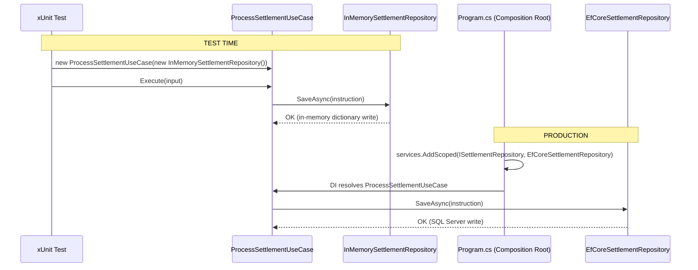
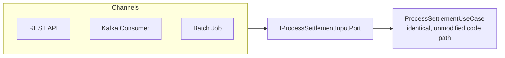
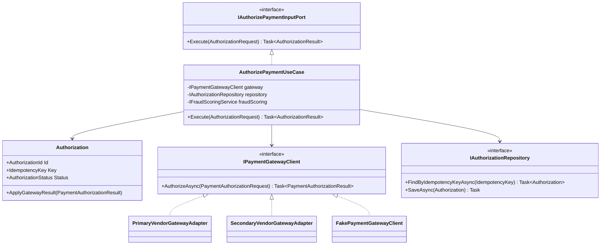
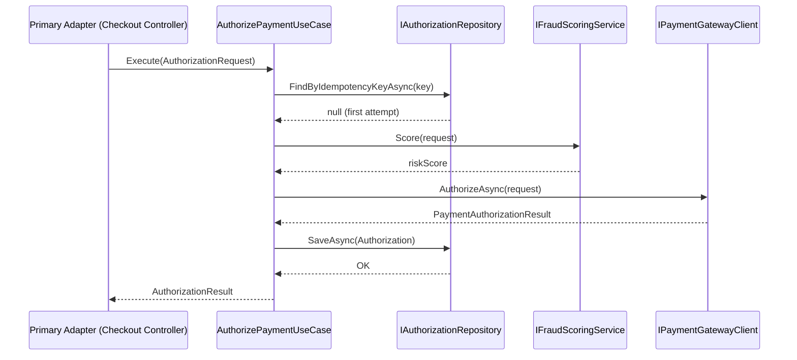
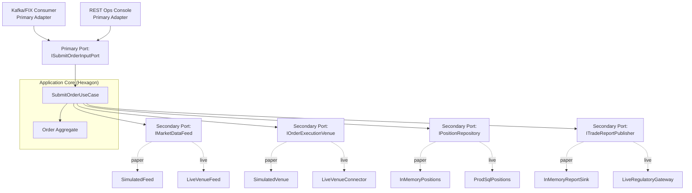
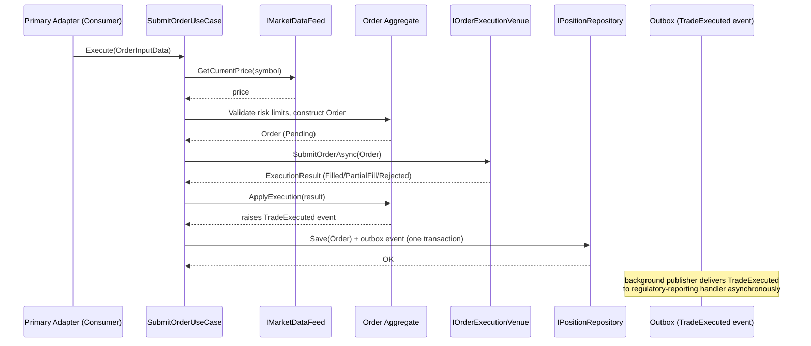
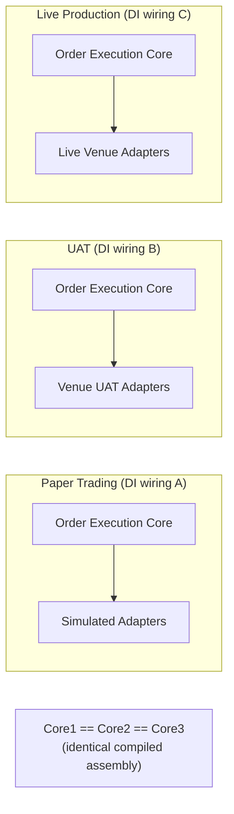
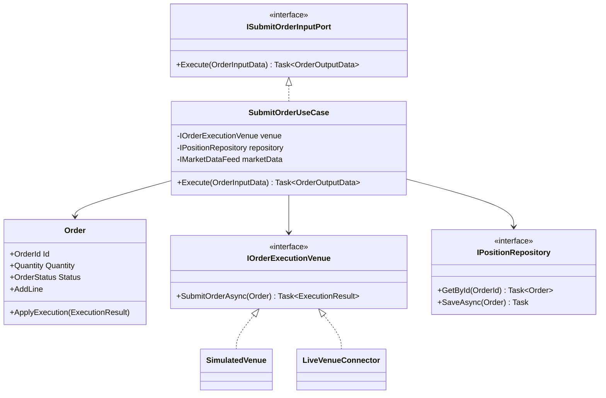

# Hexagonal Architecture (Ports & Adapters) — Complete Interview Prep (All Topics, One File)

> Domain: Hexagonal Architecture | Level: Beginner → Expert | Prerequisite: [[../32-Clean-Architecture/01-Clean-Architecture-Interview-Prep]] (Dependency Rule, rings, Clean vs Hexagonal vs Onion), [[../10-SOLID/01-SOLID-Interview-Prep]] (DIP)
> **Quick-prep edition** (consolidated 2026-10-03). This one file replaces Modules 117–118. Originals: `git show ebb2d5c:33-Hexagonal-Architecture/<file>.md`
> Each topic has: **Key concepts → C# code → Most common interview questions with answers.**

| # | Topic | # | Topic |
|---|---|---|---|
| 1 | Cockburn's original idea | 6 | Async, threading & background primary adapters |
| 2 | Primary (driving) vs secondary (driven) ports & adapters | 7 | Performance cost of the boundary |
| 3 | Implementing ports & adapters in C# | 8 | Capstone: regulated trading execution engine |
| 4 | Adapter substitution & environment-scoped composition roots | 9 | Hidden costs & when not to use it |
| 5 | Testing: fakes, contract tests, test harness adapters | 10 | Top 20 rapid-fire + Principal · 11 Mistakes checklist |

---

## 1. Cockburn's Original Idea

**Key concepts**
- Alistair Cockburn (2005): "Allow an application to equally be driven by users, programs, automated tests or batch scripts, and to be developed and tested in isolation from its eventual run-time devices and databases."
- The **application core** (business logic) sits inside a hexagon (the shape just means "many sides, no special top/bottom"); it talks to the outside world only through **ports** (technology-agnostic interfaces/protocols); **adapters** translate between ports and specific technologies.
- No "front/back" layering asymmetry: UI and database are both just *outside*.
- Core benefit: **swap adapters** — run the same core with a REST adapter, a CLI, a message consumer or a test harness; with a real DB, an in-memory store or a sandbox.

**Common interview question**

**Q. Explain hexagonal architecture in one minute.**
The business core exposes ports — interfaces describing what it offers (use cases) and what it needs (persistence, notifications, external services). Adapters connect those ports to technology: HTTP controllers and message consumers drive the core; database and API clients are driven by it. The core never depends on adapters, so you can test it in isolation and swap technologies by swapping adapters.

---

## 2. Primary (Driving) vs Secondary (Driven) Ports & Adapters

| | Primary / driving side | Secondary / driven side |
|---|---|---|
| Who initiates | the outside world calls the app | the app calls the outside world |
| Port | **inbound port** = use-case interface (`IPlaceOrder`) | **outbound port** = dependency interface (`IOrderRepository`, `IExchangeGateway`) |
| Adapter | REST controller, gRPC service, message consumer, CLI, scheduler, test | EF Core repository, HTTP client, Kafka producer, SMTP sender, fake |
| Dependency | adapter → port (calls it) | adapter → port (implements it) |

**Both kinds of adapters depend on the core** — that's the inversion.

---

## 3. Implementing Ports & Adapters in C#

```csharp
// ---- Core (no infrastructure references) ----
namespace Trading.Core.Ports.Inbound;
public interface IPlaceOrder { Task<PlaceOrderResult> ExecuteAsync(PlaceOrderCommand cmd, CancellationToken ct); }

namespace Trading.Core.Ports.Outbound;
public interface IOrderStore { Task SaveAsync(Order order, CancellationToken ct); }
public interface IExchangeGateway { Task<ExchangeAck> SendAsync(Order order, CancellationToken ct); }
public interface IRiskLimits { Task<bool> HasCapacityAsync(AccountId account, Money notional, CancellationToken ct); }

namespace Trading.Core;
internal sealed class PlaceOrderService(IOrderStore store, IExchangeGateway exchange, IRiskLimits risk, TimeProvider clock) : IPlaceOrder
{
    public async Task<PlaceOrderResult> ExecuteAsync(PlaceOrderCommand cmd, CancellationToken ct)
    {
        var order = Order.Create(cmd.Account, cmd.Instrument, cmd.Side, cmd.Quantity, cmd.LimitPrice, clock.GetUtcNow());
        if (!await risk.HasCapacityAsync(cmd.Account, order.Notional, ct)) return PlaceOrderResult.Rejected("Risk limit");
        await store.SaveAsync(order, ct);
        var ack = await exchange.SendAsync(order, ct);
        order.MarkSent(ack.ExchangeOrderId);
        await store.SaveAsync(order, ct);
        return PlaceOrderResult.Accepted(order.Id);
    }
}

// ---- Primary adapter: HTTP ----
app.MapPost("/orders", async (PlaceOrderRequest r, IPlaceOrder placeOrder, CancellationToken ct) =>
    (await placeOrder.ExecuteAsync(r.ToCommand(), ct)) switch
    {
        { Accepted: true } res => Results.Accepted($"/orders/{res.OrderId}"),
        var res => Results.UnprocessableEntity(new { res.Reason })
    });

// ---- Secondary adapter: FIX/HTTP exchange gateway ----
internal sealed class FixExchangeGateway(IFixSession session) : IExchangeGateway
{
    public Task<ExchangeAck> SendAsync(Order order, CancellationToken ct) => session.SendNewOrderSingleAsync(order.ToFix(), ct);
}
```

**Common interview questions**

**Q1. How is substitution achieved technically in .NET?**
Ports are interfaces in the core; adapters implement them in outer projects; the DI container binds port → adapter in the composition root. Swapping an adapter is a registration change, with no change to the core.

**Q2. Is a port always a C# interface?**
Conceptually a port is a protocol/contract; in C# it's usually an interface (or delegate/abstract class). Inbound ports can also be plain application service classes if you don't need multiple implementations — the essential part is that the core defines the contract.

---

## 4. Adapter Substitution & Environment-Scoped Composition Roots

**Key concepts**
- Different composition roots (or configuration) per environment: **real** adapters in production, **sandbox** adapters (exchange simulator, PSP test mode) in UAT, **in-memory/fake** adapters for tests and local development.
- **Guardrail:** make it impossible to start production with a fake adapter (startup checks, environment validation).
- Feature flags can switch adapters for migrations (old vs new gateway — branch by abstraction).
- Startup cost: adapters that open connections at construction slow startup → lazy initialization, health checks.

```csharp
// Environment-scoped wiring
if (builder.Environment.IsProduction())
    builder.Services.AddSingleton<IExchangeGateway, FixExchangeGateway>();
else if (builder.Environment.IsEnvironment("Uat"))
    builder.Services.AddSingleton<IExchangeGateway, ExchangeSimulatorGateway>();
else
    builder.Services.AddSingleton<IExchangeGateway, InMemoryExchangeGateway>();

// Guardrail: fail fast if a non-production adapter is resolved in production
var gw = app.Services.GetRequiredService<IExchangeGateway>();
if (app.Environment.IsProduction() && gw is not FixExchangeGateway)
    throw new InvalidOperationException("Non-production exchange adapter configured in production");
```

---

## 5. Testing: Fakes, Contract Tests, Test Harness Adapters

**Key concepts**
- **Core tests** use in-memory fakes for outbound ports → fast, deterministic tests of business behaviour (including failure paths like exchange rejects/timeouts).
- **Contract tests per port:** one abstract test suite run against **every** adapter (fake, sandbox, real) so the fake can't drift from reality — otherwise tests pass against a fake that behaves differently.
- **Primary adapter tests:** HTTP via `WebApplicationFactory`, consumers via test brokers (Testcontainers).
- **Test harness as a primary adapter:** acceptance tests drive the core through the inbound port directly (no UI) — Cockburn's original motivation.

```csharp
public abstract class ExchangeGatewayContract
{
    protected abstract IExchangeGateway CreateGateway();

    [Fact]
    public async Task Rejects_order_with_zero_quantity()
    {
        var gw = CreateGateway();
        await Assert.ThrowsAsync<ExchangeRejectException>(() => gw.SendAsync(TestOrders.WithQuantity(0), default));
    }

    [Fact]
    public async Task Returns_exchange_order_id_for_valid_order()
    {
        var ack = await CreateGateway().SendAsync(TestOrders.ValidLimitBuy(), default);
        Assert.False(string.IsNullOrEmpty(ack.ExchangeOrderId));
    }
}
public sealed class InMemoryGatewayTests : ExchangeGatewayContract { protected override IExchangeGateway CreateGateway() => new InMemoryExchangeGateway(); }
[Trait("Category", "Integration")]
public sealed class SimulatorGatewayTests : ExchangeGatewayContract { protected override IExchangeGateway CreateGateway() => new ExchangeSimulatorGateway(TestConfig.SimulatorUrl); }
```

**Common interview questions**

**Q1. How do you stop fakes from lying?**
Run the same contract test suite against the fake and the real/sandbox adapter; when the real system's behaviour changes, the contract tests fail and the fake is updated. Keep fakes simple and owned with the adapter.

**Q2. What does hexagonal architecture give testing that layered doesn't?**
The business core can be exercised entirely through its inbound ports with fake outbound adapters — no HTTP, database or network — so acceptance tests of business rules are fast and deterministic, while adapters are tested separately for integration correctness.

---

## 6. Async, Threading & Background Primary Adapters

**Key concepts**
- Ports should be **async** (`Task`-returning) when any realistic adapter does I/O — otherwise sync-over-async creeps in.
- Pass `CancellationToken` through ports.
- **Background primary adapters:** a message consumer or market-data feed handler (`BackgroundService`) drives the core; create a DI scope per message; bounded `Channel<T>` for backpressure; single-threaded processing per instrument/account when ordering matters.
- Don't leak threading concerns into the core (locks around adapter calls belong in adapters or the application layer).

```csharp
public sealed class OrderRequestConsumer(Channel<PlaceOrderCommand> inbox, IServiceScopeFactory scopes) : BackgroundService
{
    protected override async Task ExecuteAsync(CancellationToken ct)
    {
        await foreach (var cmd in inbox.Reader.ReadAllAsync(ct))
        {
            using var scope = scopes.CreateScope();
            await scope.ServiceProvider.GetRequiredService<IPlaceOrder>().ExecuteAsync(cmd, ct);
        }
    }
}
```

---

## 7. Performance Cost of the Boundary

- An interface call is a virtual dispatch (~ns); DI resolution and DTO mapping allocate a little — **negligible next to I/O** (ms) in almost all business systems.
- The one place it might matter: ultra-low-latency paths (market data at millions of messages/s) — there use sealed types, generics with struct adapters, pooled DTOs, or keep the hot path inside one adapter.
- Measure before optimizing (BenchmarkDotNet + allocation profiling).

**Common interview question**

**Q. Doesn't all this indirection hurt performance?**
Rarely measurably: nanoseconds of dispatch vs milliseconds of network and database. Optimize only proven hot paths (e.g., tick processing), and keep the architecture elsewhere.

---

## 8. Capstone: Regulated Trading Execution Engine

**Requirements:** orders from FIX clients and a web UI; risk checks; routing to exchanges; full audit; regulators require reproducible testing of order handling (e.g., MiFID II algo testing), and the exchange connection can't be used for tests.

**Design:**
- **Core:** order lifecycle state machine, risk rules, routing decisions — pure, deterministic, `TimeProvider` injected for reproducible time.
- **Inbound adapters:** FIX acceptor (QuickFIX/n), REST API, replay adapter (feeds recorded production order flow for regression and regulatory testing).
- **Outbound adapters:** exchange gateway (real FIX / certified simulator / in-memory), market data, risk limits store, audit log (append-only), order store.
- **Composition roots per environment** with guardrails; **contract tests** across all three exchange adapters.
- **Replay testing:** recorded inputs + fixed clock → deterministic outputs compared against golden results; evidence for regulators.

**Common interview question**

**Q. How does hexagonal architecture help with regulatory testing of a trading system?**
Because the core is isolated behind ports, you can drive it with recorded real order flow through a replay adapter, with a deterministic clock and a simulator or in-memory exchange adapter, and compare outputs to expected results — repeatable, auditable evidence without touching live markets.

---

## 9. Hidden Costs & When Not to Use It

- **Maintenance tax:** each port with several adapters + a contract test suite must be maintained forever; fakes drift without contract tests.
- **Interface explosion:** "just add an interface" for everything adds navigation overhead without benefit — create ports only at real technology boundaries and for genuinely swappable dependencies.
- **Leaky ports:** ports shaped like one technology (`IDbConnectionFactory`, `IHttpSender`) aren't real abstractions — shape ports in domain terms (`IOrderStore`, `IExchangeGateway`).
- **Overkill** for CRUD services and thin integrations.

**Common interview question**

**Q. When would you not use hexagonal architecture?**
For simple CRUD APIs, short-lived prototypes or thin proxies with little business logic — the indirection and test infrastructure cost more than they return. Use it where business logic is complex, long-lived, needs isolated testing, or must run against several technologies/environments.

---

## 10. Top 20 Rapid-Fire Questions + Principal Questions

1. **Who coined it?** Alistair Cockburn (2005).
2. **Core idea?** Isolate the app core behind ports; adapters connect technology.
3. **Primary/driving adapter?** Calls the app (HTTP, consumer, CLI, tests).
4. **Secondary/driven adapter?** Called by the app (DB, APIs, brokers).
5. **Inbound port?** Use-case interface.
6. **Outbound port?** Dependency interface the core needs.
7. **Dependency direction?** All adapters depend on the core.
8. **Substitution mechanism?** DI registration per environment.
9. **Prod guardrail?** Fail fast on non-prod adapters.
10. **Fake drift fix?** Contract tests across adapters.
11. **Port shape?** Domain terms, not technology terms.
12. **Async ports?** Yes when adapters do I/O; pass CancellationToken.
13. **Background driver?** BackgroundService + scope per message.
14. **Performance cost?** Negligible vs I/O.
15. **Hex vs Clean?** Same rule; Clean adds ring structure.
16. **Replay adapter?** Drives the core with recorded inputs.
17. **Deterministic time?** Inject `TimeProvider`.
18. **Hidden cost?** Adapters + contract suites forever.
19. **Interface explosion?** Ports only at real boundaries.
20. **Overkill when?** CRUD/thin services.

**Principal-level question**

**P. How do you decide which dependencies become ports?**
Anything that's infrastructure or external (persistence, messaging, third-party APIs, clock, randomness), anything you need to substitute for testing or environments, and anything likely to change technology. Pure in-process domain collaborators stay concrete. Each port is a long-term maintenance commitment — justify it.

---

## 11. Mistakes Checklist (say why each is wrong)
- [ ] Core referencing adapters or frameworks · ports defined in the infrastructure project
- [ ] Technology-shaped ports (`ISqlExecutor`) · interfaces for every class
- [ ] Fakes without contract tests · fakes accidentally configured in production
- [ ] Sync ports with async adapters (sync-over-async) · no cancellation
- [ ] Business logic inside controllers/consumers (primary adapters)
- [ ] Applying the pattern to trivial CRUD services

---

## Architecture Diagrams (preserved from the original modules)

> All 10 Mermaid/ASCII diagrams from the original `33-Hexagonal-Architecture/` files, kept verbatim and grouped by source module. Originals: `git show ebb2d5c:33-Hexagonal-Architecture/<file>.md`.

### Module 117 — Hexagonal Architecture: Cockburn's Original Formulation, Primary/Secondary Ports & Adapter-Substitution Testing
*Source: `01-HexagonalArchitectureFundamentals-PrimarySecondaryAdapters-AdapterSubstitutionTesting.md`*

**1. Fundamentals**

```text
                         ┌─────────────────────────┐
  Primary Adapters  ---> │   Primary Port(s)        │
  (drive the core)       │        ↓                  │
  e.g. REST Controller   │   Application Core        │
  Kafka consumer         │   (Use Cases + Entities)  │
  Batch job               │        ↓                  │
                         │   Secondary Port(s)       │  ---> Secondary Adapters
                         └─────────────────────────┘       (driven by the core)
                                                             e.g. EF Core Repository,
                                                             Payment Gateway client,
                                                             SWIFT message gateway
```

**The Hexagon Itself**

```mermaid
graph TB
    subgraph Core["Application Core (Hexagon)"]
        UC[ProcessSettlementUseCase]
        AGG[SettlementInstruction Aggregate]
        UC --> AGG
    end

    PP["Primary Port:<br/>IProcessSettlementInputPort"] --> UC
    PA1[SettlementsController<br/>REST] --> PP
    PA2[Kafka/SWIFT Consumer] --> PP
    PA3[Batch Replay Tool] --> PP

    UC --> SP1["Secondary Port:<br/>ISettlementRepository"]
    UC --> SP2["Secondary Port:<br/>ISwiftMessageGateway"]

    SP1 -.production.-> A1[EfCoreSettlementRepository]
    SP1 -.test.-> A2[InMemorySettlementRepository]
    SP2 -.production.-> A3[SwiftMessageGateway]
    SP2 -.test.-> A4[FakeSwiftMessageGateway]
```



**Sequence — Substitution at Test Time vs. Production**



**Component View — Multiple Primary Adapters, One Core**



**13. Low-Level Design**



**13. Low-Level Design**



### Module 118 — Hexagonal Architecture: Capstone — Adapter Substitution for Testability in a Regulated Trading Execution Engine
*Source: `02-Capstone-AdapterSubstitutionForTestability-RegulatedTradingExecutionEngine.md`*

**Hexagonal Component Structure**



**Order Submission Sequence**



**Deployment: Three Environments, One Core**



**13. Low-Level Design**


