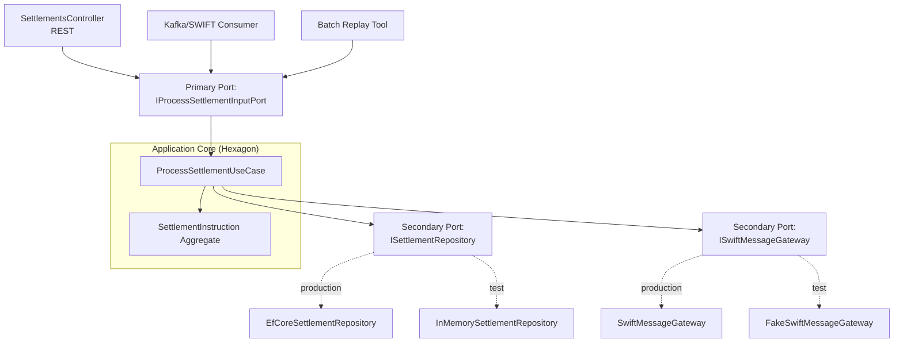
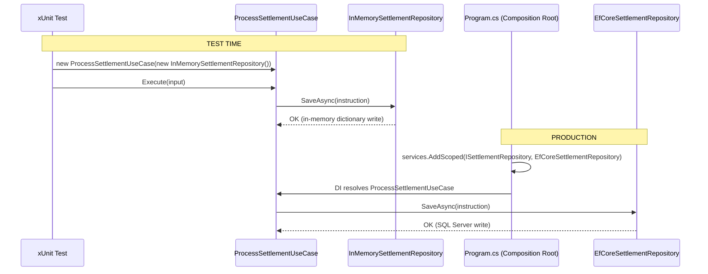
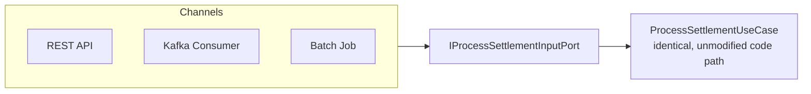
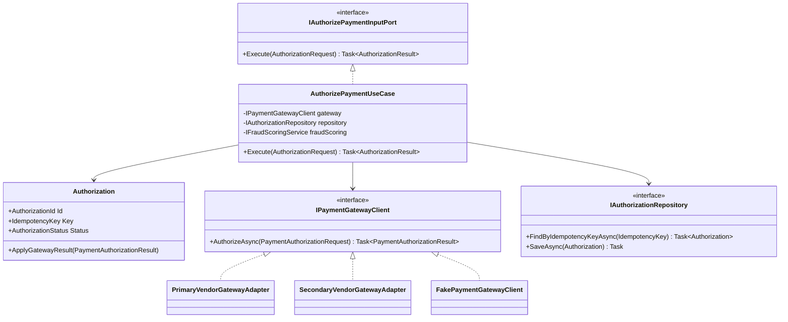
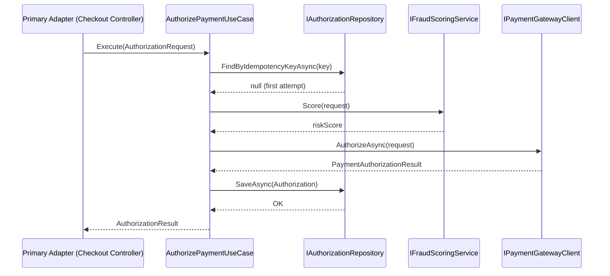

# Module 117 — Hexagonal Architecture: Cockburn's Original Formulation, Primary/Secondary Ports & Adapter-Substitution Testing

> Domain: Hexagonal Architecture | Level: Beginner → Expert | Prerequisite: [[32-Clean-Architecture/03-CleanVsHexagonalVsOnion-ComparativeSynthesis]], [[32-Clean-Architecture/04-Capstone-LegacyPaymentSettlementEngineRefactor]] (takes as given: the shared Dependency Rule/Dependency Inversion substance already established as identical across Clean, Hexagonal, and Onion Architecture, and the Primary/Driving-vs-Secondary/Driven-Adapter vocabulary already introduced — this module develops that vocabulary and Cockburn's original 2005 formulation in the full depth deliberately deferred, reusing the `SettlementInstruction` case study throughout)
>
> **Note on format (updated):** This module originally shipped under the leaner top-30-Q&A-only format. It has since been upgraded, per a targeted one-off request, to the repo's fuller deep-dive template — §7/§8/§9 Performance/Security/Scalability, §11–§15/§17 Coding Exercises through Principal Engineer Perspective, and a closing §18 Revision, all added; Interview Questions expanded to the full 40 (10 per level). The original 30-question Q&A set is preserved verbatim under §10, with 10 new questions added per tier to reach 40. §16 Enterprise Case Study is deliberately skipped (jumping §15 → §17) to stay complementary to sibling Module 118's own worked capstone rather than duplicating it.
>
> **Domain scope note:** `33-Hexagonal-Architecture` is scoped to 2 modules (117–118, standard depth): this Fundamentals module and a capstone (118) built around Hexagonal's specific testability-first framing in a regulated trading/payments context. Framed under the Elite FinTech Interview Panel lens (`CLAUDE.md`, established 2026-07-18).

---

## The Running Case Study

A bank's **Settlement Engine** processes `SettlementInstruction`s — netting balances, moving instructions through `NOT_STARTED → PENDING_APPROVAL → APPROVED → SETTLED` (or `REJECTED`) — reused throughout this module exactly as introduced in the existing Interview Questions below (see §10 Basic Q3–Q8). A second, complementary scenario — a **card-payment authorization service** wired to two different payment-gateway vendors — is introduced fresh in §4 Production Example, deliberately distinct from sibling Module 118's Order Execution Engine capstone so the two files illustrate Hexagonal's substitution principle against two different concrete problems rather than repeating one story.

---

## 1. Fundamentals

**What:** Hexagonal Architecture (Cockburn, 2005; "Ports and Adapters") places an application's business logic — the **core** — at the center, with no dependency on any specific delivery mechanism (HTTP, a message queue) or any specific infrastructure technology (a database, a payment gateway, a message broker). The core exposes and consumes **Ports** — interfaces expressed entirely in the core's own vocabulary. Every Port is satisfied by an **Adapter**: a **Primary (driving) Adapter** calls *into* the core through a Port the core implements; a **Secondary (driven) Adapter** is called *out to* by the core through a Port the core defines but does not implement.

**Why:** Left alone, business logic tends to accrete direct references to whatever framework or infrastructure happens to be nearest — an ASP.NET Core `HttpContext` reaching into a repository method, an Entity Framework `DbSet` referenced from inside a domain method. Every such reference is a small, compounding tax: the logic becomes harder to unit-test (it now needs a real HTTP pipeline or a real database to even construct), harder to reuse across a second delivery channel, and harder to reason about in isolation. Hexagonal Architecture's specific fix is architectural, not disciplinary — it makes the dependency direction structurally enforced (the core defines the Ports; outer code implements or calls them, never the reverse), so this decay is a compile-time-visible violation, not merely a code-review nit.

**When:** The pattern earns its ceremony when (a) the core's business logic is genuinely non-trivial — validation rules, state machines, invariants worth protecting from framework noise; (b) the system realistically needs more than one delivery mechanism or more than one infrastructure implementation over its lifetime (multiple channels, a vendor migration, a test-double substitution need); or (c) the cost of a logic bug is high enough that fast, infrastructure-free unit testing is worth investing in deliberately. A small CRUD-only script or a genuinely single-channel, single-vendor, low-stakes utility gets little from the ceremony and can reasonably skip it.

**How (at a glance):**
```text
                         ┌─────────────────────────┐
  Primary Adapters  ---> │   Primary Port(s)        │
  (drive the core)       │        ↓                  │
  e.g. REST Controller   │   Application Core        │
  Kafka consumer         │   (Use Cases + Entities)  │
  Batch job               │        ↓                  │
                         │   Secondary Port(s)       │  ---> Secondary Adapters
                         └─────────────────────────┘       (driven by the core)
                                                             e.g. EF Core Repository,
                                                             Payment Gateway client,
                                                             SWIFT message gateway
```
A Primary Port (e.g., `IProcessSettlementInputPort`) is *implemented by the core itself* (`ProcessSettlementUseCase`) — an external Primary Adapter (a Controller) merely calls into it. A Secondary Port (e.g., `ISettlementRepository`) is *defined by the core* but *implemented by an external Secondary Adapter* (`EfCoreSettlementRepository`) — the core calls out through it. This direction asymmetry, while both sides are equally "pluggable," is the single most commonly missed precision point in interviews (see §10 Basic Q4).

---

## 2. Deep Dive

### 2.1 How Substitution Actually Works in C# — Interfaces + DI Container Swapping
Nothing exotic is happening mechanically: a Port is a plain C# `interface` living in the `Domain`/`Application` assembly; a production Adapter and a test Adapter are both ordinary classes implementing that interface. Substitution is just **which concrete type gets registered against the interface** — at two different points in the object graph's construction:
- **In production**, `Program.cs`'s composition root calls `services.AddScoped<ISettlementRepository, EfCoreSettlementRepository>()`; the ASP.NET Core DI container resolves `ProcessSettlementUseCase`'s constructor dependency to that registration.
- **In a unit test**, no DI container is typically involved at all — the test simply calls `new ProcessSettlementUseCase(new InMemorySettlementRepository(), ...)` directly, or, for broader integration-style tests, a `WebApplicationFactory`-based test host re-registers the interface against a test double via `services.Replace(ServiceDescriptor.Scoped<ISettlementRepository, InMemorySettlementRepository>())` after the normal composition root has run.

`ProcessSettlementUseCase`'s own source code is byte-for-byte identical in both cases — it holds a field of type `ISettlementRepository`, never `EfCoreSettlementRepository` or `InMemorySettlementRepository` by name, so the compiler physically prevents it from depending on either concrete type.

### 2.2 Compile-Time vs. Runtime Enforcement
The Dependency Rule (core never references outer-ring types) is enforced at **compile time** by C#'s type system and project-reference graph — if `Domain.csproj` doesn't reference `Infrastructure.csproj`, `ProcessSettlementUseCase` *cannot* reference `EfCoreSettlementRepository` even by accident; the build fails. This is stronger than a code-review convention and is why Hexagonal/Clean/Onion's shared substance is genuinely load-bearing in C#, not merely aspirational. What compile-time enforcement does *not* give you: behavioral equivalence between two Adapters satisfying the same Port — that's a runtime, test-time concern (§10 Intermediate Q6's contract test), not something the compiler can check.

### 2.3 DI Container Resolution Internals
`Microsoft.Extensions.DependencyInjection`'s `ServiceCollection` builds a list of `ServiceDescriptor`s (interface type, implementation type, lifetime) at startup; `BuildServiceProvider()` compiles this into a resolvable graph once. Each `AddScoped<TPort, TAdapter>()` call is simply an entry in that list. Swapping an Adapter for a test never touches `ProcessSettlementUseCase`'s compiled IL at all — it only changes which `ServiceDescriptor` the container consults when asked to resolve `ISettlementRepository`. This is why substitution is "free" at the type-system level: the cost lives entirely in *maintaining two (or more) Adapters and keeping them behaviorally consistent*, never in the mechanics of swapping them.

### 2.4 Threading and Async Boundary Considerations
A Port's method signatures should be `async`/`Task`-returning whenever any real Adapter behind it is I/O-bound (a database call, an HTTP call to a payment gateway) — even if today's only implementation is a synchronous in-memory fake. Defining `Task<SettlementInstruction> GetById(SettlementId id)` up front, with the in-memory fake simply returning `Task.FromResult(...)`, avoids a breaking signature change later when a real, I/O-bound Adapter is introduced — a small but frequently-missed piece of "design the Port for its real Adapters, not just its current test double."

### 2.5 Memory/Allocation Cost of the Boundary
Each Port call typically allocates: an `async` state-machine object (per `await`), and any DTO/Value Object passed across the boundary. At ordinary application throughput this is unremarkable Gen 0 garbage; at genuinely high throughput it becomes worth measuring (see §7 Performance Engineering) rather than assumed to be a problem — the indirection itself (an interface/virtual dispatch call) costs nanoseconds, dwarfed by any real I/O the Adapter performs.

### 2.6 Hidden Costs — What "Just Add an Interface" Doesn't Tell You
The visible cost of Hexagonal Architecture is trivial: define an interface, implement it twice. The **hidden**, compounding costs are: (a) every Secondary Port now needs at least one production Adapter *and* one validated test-double Adapter to realize the testability benefit safely (§10 Intermediate Q8's "unvalidated fake" risk); (b) a **contract test** (§10 Intermediate Q6) — a shared test suite run against every Adapter satisfying a Port — is required to keep multiple Adapters behaviorally honest, and that suite itself needs maintaining as new scenarios are discovered; (c) DTO/boundary-mapping code at every Primary Port adds real, if modest, ongoing translation-layer maintenance. None of this is a reason to avoid the pattern for a genuinely complex, high-stakes core — but presenting Hexagonal Architecture as free ("just add an interface") consistently underweights this ongoing discipline cost, a point Module 118's Deep Dive §2.6 develops further at full production scale.

---

## 3. Visual Architecture

### The Hexagon Itself


### Sequence — Substitution at Test Time vs. Production


### Component View — Multiple Primary Adapters, One Core


---

## 4. Production Example — Payment-Gateway Adapter Substitution

**Problem:** A digital-payments company's checkout service authorizes card payments through a single hard-coded integration with its original payment-processor vendor. A cost/redundancy initiative requires adding a **second** vendor (for negotiated-rate competition and single-vendor-outage resilience) without duplicating the checkout service's own fraud-scoring, 3-D Secure step-up, and idempotent-retry logic — logic that had, over two years, accumulated substantial vendor-specific edge-case handling directly inside the checkout Controller.

**Architecture:** The team introduced a Secondary Port, `IPaymentGatewayClient`, defined entirely in the core's own vocabulary (`AuthorizeAsync(PaymentAuthorizationRequest) -> PaymentAuthorizationResult`, with a vendor-agnostic `PaymentAuthorizationResult` capturing `Approved`/`Declined`/`RequiresStepUp`/`GatewayUnavailable` — deliberately *not* the original vendor's own response shape). `AuthorizePaymentUseCase` (implementing the Primary Port `IAuthorizePaymentInputPort`) became the single, shared home for fraud-scoring and retry logic, calling out through `IPaymentGatewayClient` with zero awareness of which vendor answers.

**Implementation:** Two Secondary Adapters were built: `PrimaryVendorGatewayAdapter` (wrapping the original vendor's SDK) and `SecondaryVendorGatewayAdapter` (wrapping the new vendor's REST API) — each translating its own vendor-specific response codes into the shared `PaymentAuthorizationResult` shape. A **contract test** suite (`PaymentGatewayClientContractTests`, run against both Adapters plus a third, in-memory `FakePaymentGatewayClient` used in `Application.Tests`) asserted identical behavior for: a clean approval, a hard decline, a 3-D-Secure step-up requirement, and — critically — a **timeout with an ambiguous outcome** (the request may or may not have actually authorized funds on the vendor's side before the connection dropped).

**Trade-offs:** Building and maintaining two full production Adapters plus a three-way contract suite cost roughly six additional engineer-weeks beyond a "just add an if/else for the second vendor inside the Controller" shortcut — but the shortcut would have left fraud-scoring and idempotent-retry logic duplicated (and inevitably diverging) across two code paths, exactly the "logic leaks outward into an Adapter" anti-pattern already flagged for the settlement case study.

**Lessons learned:** The contract test's **ambiguous-timeout scenario** caught a real, pre-launch divergence: `PrimaryVendorGatewayAdapter` correctly mapped a timeout to a `GatewayUnavailable` result that triggered the Use Case's idempotency-key-based safe-retry path; `SecondaryVendorGatewayAdapter`'s first draft instead threw an unhandled `HttpRequestException` on timeout, which — had it shipped — would have bypassed the Use Case's retry-safety logic entirely and risked a **duplicate charge** on retry. The fix (mapping the new vendor's timeout to the identical `GatewayUnavailable` result) was made and verified by the shared contract test *before* the first production customer ever saw the second vendor — precisely the value Port/Adapter substitution and contract testing are designed to deliver: a class of integration bug caught in a fast, deterministic test run, not in a live customer's failed checkout.
## 10. Interview Questions

### Basic (10)

1. **Q: What specific problem was Alistair Cockburn originally solving when he proposed Hexagonal Architecture in 2005, in his own stated motivation?**
 **A:** Cockburn's own writing frames the core motivation as **enabling an application's logic to be developed and tested in isolation from its eventual runtime environment** — specifically, so that a UI, a database, and any other external mechanism could each be "plugged in" or "plugged out" of the application's core on an equal footing, including plugging in a *test harness* in place of any real external mechanism; the driving concern was symmetry and testability first, with the more commonly-cited "swap your database easily" benefit (the version of this same benefit) being a secondary, downstream consequence of that same symmetry rather than the primary motivation.
 **Why correct:** States Cockburn's own specific, primary framing (symmetry enabling isolated development and testing, especially via test-harness substitution) precisely, correctly identifying it as distinct from — and prior to — the database-swapping benefit more commonly associated with this pattern family today.
 **Common mistakes:** Assuming Hexagonal Architecture's primary motivation was database/framework independence, the same as Clean Architecture's most commonly cited benefit — this conflates the two formulations' differing rhetorical emphasis, a distinction already flagged as worth citing precisely rather than glossing over.
 **Follow-ups:** "Does this different emphasis change anything about the resulting code structure?" (Not fundamentally — already established the resulting ring/core structure is nearly identical; what differs is which benefit an engineer reasoning from Cockburn's original writing would reach for first when justifying a design decision.)

2. **Q: Why is a hexagon specifically used to diagram this pattern, and what does each side represent?**
 **A:** Recapping: the six-sided shape itself carries no architectural meaning — Cockburn chose it simply because a hexagon's multiple sides give a diagram enough visual room to show several Ports around the application core's edge without the drawing becoming cramped, the way a traditional four-sided box diagram often does; a real system might have two Ports or a dozen, with no requirement to match the hexagon's six sides.
 **Why correct:** Correctly recaps the already-established non-significance of the specific shape rather than re-treating it as a new or more meaningful fact in this fuller-depth module.
 **Common mistakes:** Inventing a meaning for the six sides (e.g., "six types of external system") not supported by Cockburn's own writing — a red flag suggesting unfamiliarity with the pattern's actual, well-documented origin.
 **Follow-ups:** "Given the shape means nothing, why has 'Hexagonal Architecture' remained the pattern's most common name rather than 'Ports and Adapters'?" (Simple naming-convention persistence — Cockburn himself uses both names interchangeably in his own writing, with "Ports and Adapters" arguably the more descriptively accurate of the two; "Hexagonal" simply stuck as the more memorable, visually-associated label.)

3. **Q: Define a "Port" precisely, in Cockburn's own terms, distinguishing it from how the term has been used loosely so far in this course.**
 **A:** Cockburn defines a Port as **an API that the application either offers to the outside world, or requires from the outside world** — a Port is not merely "an interface," but specifically an interface expressed entirely in the application core's own vocabulary, representing one complete, cohesive capability (e.g., "the capability to submit a trade for processing," or "the capability to look up current market prices") rather than an arbitrary, fine-grained method grouping; this is a slightly more precise framing than this course's looser prior usage (/114's `IOrderRepository`/`IPlaceOrderInputBoundary`), which are genuine Ports under this definition, but the term itself specifically emphasizes the *complete capability* a Port represents, not just "any inward-defined interface."
 **Why correct:** Gives Cockburn's own precise definition (a complete, offered-or-required capability, not merely any interface) and explicitly reconciles it with this course's already-used, slightly looser terminology rather than treating the two as unrelated.
 **Common mistakes:** Treating literally every interface anywhere in a Clean-Architecture-structured codebase as automatically "a Port" — Cockburn's framing specifically reserves the term for interfaces at genuine application-core boundaries representing a complete capability, echoing the own note that "not every interface is a Port."
 **Follow-ups:** "Is `ISettlementRepository` a Port under this precise definition?" (Yes — it represents the complete capability "load and persist `SettlementInstruction` Aggregates," a cohesive capability the application core requires from the outside world, exactly matching Cockburn's definition.)

4. **Q: What is the distinction between a Primary (Driving) Port and a Secondary (Driven) Port specifically — not just the Adapters, which already introduced?**
 **A:** A Primary Port is a capability the application **offers** to the outside world — something an external actor calls *into* the application to accomplish (e.g., "submit a settlement instruction for processing"); a Secondary Port is a capability the application **requires** *from* the outside world — something the application itself calls *out* to accomplish (e.g., "persist this settlement instruction," "look up this correspondent bank's current status"). The Port itself, not just its Adapter, carries this directional distinction — a Primary Port's interface is defined and then *implemented by the application core itself* (with an external Primary Adapter merely invoking it), whereas a Secondary Port's interface is defined by the application core but *implemented by an external Secondary Adapter*.
 **Why correct:** Extends the Adapter-level distinction one level deeper to the Port itself, correctly identifying the subtle but important difference in *who implements* a Primary Port (the application core) versus a Secondary Port (an external Adapter) — a detail often missed even by engineers familiar with the Adapter-level distinction alone.
 **Common mistakes:** Assuming both Primary and Secondary Ports are always "implemented by an Adapter" identically — a Primary Port is actually implemented by the application core's own Use Case class (e.g., `PlaceOrderUseCase: IPlaceOrderInputBoundary`), with the *Adapter* (a Controller) only calling into it, the reverse of how a Secondary Port/Adapter relationship works.
 **Follow-ups:** "Which of the own already-established interfaces is a Primary Port, and which is a Secondary Port?" (`IPlaceOrderInputBoundary` is a Primary Port — implemented by `PlaceOrderUseCase` itself, called into by the `OrdersController` Primary Adapter; `IOrderRepository` is a Secondary Port — implemented by `EfCoreOrderRepository`, called out to by the Use Case.)

5. **Q: Give a concrete Primary Port and Primary Adapter example from the `SettlementInstruction` case study.**
 **A:** The Primary Port is an interface like `IProcessSettlementInputPort` (implemented by `ProcessSettlementUseCase` itself, per Basic Q4), representing the complete capability "process an incoming settlement instruction"; a concrete Primary Adapter calling into that Port is `SettlementsController` (an inbound REST endpoint) — but, symmetrically, a second, entirely different Primary Adapter could just as easily be a Kafka consumer picking up settlement messages from a message queue, or a scheduled batch job replaying settlement instructions from a file drop, each calling into the *identical* `IProcessSettlementInputPort`/`ProcessSettlementUseCase` with no changes to the application core at all.
 **Why correct:** Gives a concrete example directly from this course's own already-established case study and explicitly demonstrates Cockburn's symmetry principle — multiple, structurally different Primary Adapters serving the identical Primary Port unchanged.
 **Common mistakes:** Assuming a Primary Port can only ever be served by an HTTP-based Adapter — Cockburn's original framing specifically emphasizes that a Primary Port's implementation (the Use Case) has no awareness of, or dependency on, any specific triggering mechanism, meaning an HTTP Controller, a message-queue consumer, and a batch job are all equally valid, interchangeable Primary Adapters for the same Port.
 **Follow-ups:** "In a real bank's settlement engine, why might multiple Primary Adapters for the same capability genuinely be needed simultaneously?" (A real settlement engine typically needs to accept instructions from several genuinely different channels at once — a real-time SWIFT/ISO 20022 message feed, an internal REST API for manual/exception-handling operator action, and a scheduled batch-reconciliation replay mechanism — all needing to enforce the identical business rules, which is exactly what a shared Primary Port guarantees.)

6. **Q: Give a concrete Secondary Port and Secondary Adapter example from the same case study.**
 **A:** The Secondary Port is `ISettlementRepository`, representing the complete capability "load and persist a `SettlementInstruction`"; the production Secondary Adapter is `EfCoreSettlementRepository` (or, a Dapper-based adapter over the legacy database) — the application core (`ProcessSettlementUseCase`) calls *out* through this Port with zero awareness of which specific database technology answers on the other side. A second example: `ISwiftMessageGateway` is a Secondary Port whose production Adapter is `SwiftMessageGateway`, translating to/from the actual SWIFT network format.
 **Why correct:** Gives two concrete Secondary Port/Adapter pairs directly from the established case study, correctly identifying both as "the core calls out through this, an external Adapter answers" — the defining Secondary-direction characteristic.
 **Common mistakes:** Confusing `ISwiftMessageGateway`'s direction — since SWIFT messages arrive "from outside," it might seem Primary — but the Port here represents the application core's own *requirement* ("give me a parsed settlement instruction from this raw message"), which the core calls out to satisfy, correctly making it Secondary; the *triggering* of processing (a message arriving) is a separate, Primary-Port-driven concern (Basic Q5's Kafka-consumer Primary Adapter), which happens to be closely related but is a genuinely distinct Port.
 **Follow-ups:** "Could `ISwiftMessageGateway` and the Kafka-consumer Primary Adapter from Basic Q5 be the same physical component?" (They're often physically adjacent in the same inbound message-handling code, but remain logically distinct Ports serving distinct roles — the Kafka consumer's job is triggering `ProcessSettlementUseCase` via the Primary Port; `ISwiftMessageGateway`'s job is a Secondary capability the Use Case itself calls out to for message-format translation, a subtle but real distinction worth keeping clear.)

7. **Q: Why does Cockburn's formulation insist the application core have zero knowledge of any specific Adapter, on either the Primary or Secondary side?**
 **A:** This symmetry is precisely what enables Basic Q1's central testability goal — if the application core (the Use Case and Entities) genuinely has no knowledge of which specific Adapter is plugged into any given Port, then a test can substitute an in-memory, fully-controlled test double for *any* Port — a fake `ISettlementRepository` holding data in a simple dictionary, or a test harness calling directly into `IProcessSettlementInputPort` instead of going through a real HTTP request — with the application core's own logic running identically, genuinely unaware it's being tested rather than used in production; if the core had any awareness of a specific Adapter's identity or behavior, this clean substitution would no longer be possible.
 **Why correct:** Directly connects this specific requirement (zero Adapter awareness on both sides) back to Basic Q1's stated primary motivation, explaining the causal mechanism (substitutability requires the core to be indifferent to which Adapter is present) rather than treating the rule as an arbitrary constraint.
 **Common mistakes:** Assuming this "zero knowledge" requirement only applies to Secondary Adapters (the ones more commonly discussed, e.g., swapping a database) — it applies equally and symmetrically to Primary Adapters, which is precisely why Basic Q5's multiple-Primary-Adapter example (REST, Kafka, batch job) works without any change to the application core at all.
 **Follow-ups:** "Is this symmetry principle genuinely different from anything/114 already established?" (Not in substance — the Dependency Rule already requires exactly this zero-knowledge property; Cockburn's specific contribution, per this module's framing, is stating the symmetry explicitly and treating test-double substitution as a first-class, deliberately-designed-for use case, rather than a secondary benefit.)

8. **Q: What does "Adapter substitution" concretely mean, using the `ISettlementRepository` Port as the example?**
 **A:** It means a test can construct `ProcessSettlementUseCase` with an `InMemorySettlementRepository: ISettlementRepository` — a simple, fully-controlled fake implementation backed by, say, a `Dictionary<SettlementId, SettlementInstruction>` rather than any real database — and every one of the Use Case's own business-logic behaviors (netting validation, state transitions, event-raising) can be exercised and verified exactly as if it were running against the real, production `EfCoreSettlementRepository`, since the Use Case only ever interacts with the Port's interface, never the concrete implementation; the "substitution" is simply swapping which concrete class satisfies the Port at construction/DI-registration time, with the application core's own code completely unchanged and unaware of the swap.
 **Why correct:** Gives a fully concrete, code-level description of what substitution actually means (swapping the DI-registered concrete class, application core unaware) directly reusing this course's already-established `ISettlementRepository` example rather than an abstract description.
 **Common mistakes:** Confusing this fast, in-process test-double substitution with the *integration test* (which deliberately uses the real database technology to verify the real Adapter's own correctness) — both are valid, necessary testing techniques, but they test different things: the test-double substitution verifies the *application core's* logic in isolation; the integration test verifies the *real Adapter's* own implementation correctness, a distinction Intermediate Q6 develops fully.
 **Follow-ups:** "Would a test using this in-memory substitution ever need a real database at all?" (No — that's precisely the benefit: this specific class of test runs with zero infrastructure, exactly the already-established headline benefit, now demonstrated with Cockburn's own specific substitution vocabulary and technique.)

9. **Q: State, in one sentence a newcomer could repeat back, the difference between a Port and an Adapter.**
 **A:** A Port is the *interface* — the capability the core offers or requires, expressed in the core's own vocabulary; an Adapter is the *concrete implementation* of that interface, translating between the core's vocabulary and one specific external mechanism (a specific database, a specific vendor's API, a specific transport).
 **Why correct:** Captures the interface-versus-implementation distinction precisely and simply, the correct newcomer-level mental model before Basic Q3–Q4's fuller precision is introduced.
 **Common mistakes:** Using "Port" and "Adapter" interchangeably, or calling any interface in the codebase a "Port" regardless of whether it represents a genuine application-core boundary capability.
 **Follow-ups:** "Is `ISettlementRepository` the Port or the Adapter?" (The Port — `EfCoreSettlementRepository` is the Adapter implementing it.)

10. **Q: Can a valid Hexagonal-Architecture system have zero Secondary Ports, or zero Primary Adapters beyond exactly one?**
 **A:** Yes to both, in principle — the *minimum* valid shape is a core with at least one Primary Port (something must trigger it) and however many Secondary Ports its actual business logic genuinely requires, which could be zero for a pure computation with no external dependency at all; having exactly one Primary Adapter is entirely normal and doesn't violate the pattern — the *symmetry principle* says multiple Adapters *can* plug into a Port unchanged, not that multiple Adapters *must* exist for the design to be valid.
 **Why correct:** Correctly distinguishes "the architecture supports N Adapters per Port" from "the architecture requires N > 1 Adapters per Port," a distinction easy to overstate when the symmetry principle is first introduced.
 **Common mistakes:** Assuming a system "isn't really Hexagonal" unless it currently has multiple Adapters wired in for demonstration purposes — the structural guarantee (the core *could* accept another Adapter with zero core changes) is what matters, not how many Adapters happen to exist today.
 **Follow-ups:** "If a Port has exactly one Adapter today, is defining the Port at all still worth the ceremony?" (Only if testability-via-substitution, or a realistically foreseeable second Adapter, genuinely justifies it — see Expert Q9's over-abstraction caution.)

### Intermediate (10)

1. **Q: Describe Cockburn's own substitution technique in more mechanical depth — how does "a test becomes just another Adapter" work in practice?**
 **A:** Cockburn's framing treats a test itself as structurally identical in kind to any other Adapter — just as `EfCoreSettlementRepository` is a Secondary Adapter satisfying `ISettlementRepository` for production use, a test class constructing an `InMemorySettlementRepository` and wiring it directly into `ProcessSettlementUseCase` (bypassing the DI container and ASP.NET Core entirely) is, in exactly the same structural sense, "plugging a test Adapter into a Secondary Port"; on the Primary side, a test can similarly act as its own Primary Adapter — directly instantiating `ProcessSettlementUseCase` and calling its `Execute` method the same way a real Controller would, without needing any actual HTTP infrastructure — meaning a single unit test can exercise the application core through the exact same Port interfaces production Adapters use, with the test itself occupying both the Primary-Adapter role (driving the interaction) and providing Secondary-Adapter test doubles (satisfying what the core requires).
 **Why correct:** Precisely describes the mechanical technique (a test occupies both the Primary-Adapter-equivalent role and supplies Secondary-Adapter test doubles) using Cockburn's own "test is just another Adapter" framing, applied concretely to this course's established example.
 **Common mistakes:** Assuming this technique requires special testing infrastructure or a dedicated testing framework beyond ordinary unit-testing tools — the entire point of Cockburn's framing is that *no* special infrastructure is needed; a plain unit test class, direct object construction, and a simple in-memory fake are sufficient, precisely because the Port/Adapter symmetry was designed to make this trivial.
 **Follow-ups:** "Does this differ at all from what already described as 'Application-ring unit tests using fakes for Repository interfaces'?" (Not in substance — already demonstrated exactly this technique; this module simply supplies Cockburn's own explicit "test as Adapter" conceptual framing for why that technique is architecturally sound and expected, not merely a pragmatic convenience.)

2. **Q: Does Hexagonal Architecture, in Cockburn's original formulation, mandate the same dedicated Input/Output Boundary DTOs that Clean Architecture prescribes at every Port?**
 **A:** No — Cockburn's original writing is comparatively more flexible on this point: a Port's method signature can, in principle, pass the application's own domain types directly (e.g., a Primary Port method accepting a `SettlementInstruction` Aggregate reference directly, rather than a dedicated `ProcessSettlementInputData` DTO), whereas Clean Architecture's specific formulation more prescriptively separates these concerns via named Input/Output Boundary data structures; in practice, most real Hexagonal-Architecture-labeled codebases still adopt dedicated DTOs at Primary Ports for the same reasons/Q8 already established (protecting external contracts from internal refactors), but Cockburn's own formulation treats this as a good practice layered on top of the core pattern, not a structurally mandated part of it the way Clean Architecture's naming makes more explicit.
 **Why correct:** Precisely identifies this as one of the few genuine, non-vocabulary structural differences (per the already-established "inner-ring granularity" nuance, now extended specifically to boundary-DTO prescriptiveness) rather than claiming the two formulations are identical on every specific mechanical detail.
 **Common mistakes:** Assuming Cockburn's more flexible framing means DTOs are actively discouraged or wrong under "true" Hexagonal Architecture — the flexibility means they're not *mandated* by the core pattern, not that using them is somehow non-compliant; the DTO-boundary reasoning remains just as valid and worth applying under Hexagonal vocabulary as under Clean Architecture's.
 **Follow-ups:** "Given this flexibility, would you recommend using dedicated DTOs at Ports in this case study regardless of which vocabulary is used?" (Yes — the concrete refactor-breakage scenario applies with undiminished force regardless of which of the three vocabularies a codebase uses; the specific pattern's naming flexibility here doesn't change the underlying, already-established engineering trade-off.)

3. **Q: Demonstrate the symmetric "multiple Adapters per Port" principle concretely with a second Secondary Port beyond Basic Q6's examples — say, a market-data lookup capability.**
 **A:** Define `IMarketPriceLookup` as a Secondary Port representing "get the current reference rate for a given currency pair" — in production, this is satisfied by a `BloombergMarketDataAdapter` calling out to a live Bloomberg terminal feed; in a lower, pre-production test environment, a `StaticTestMarketPriceLookup` Adapter returns fixed, known rates for deterministic test scenarios; and in a disaster-recovery/backup configuration, a `CachedMarketPriceLookup` Adapter might serve last-known-good rates from a local cache if the live feed is unavailable — all three are valid, interchangeable Secondary Adapters for the identical Port, with `ProcessSettlementUseCase` (or whichever Use Case needs current rates) entirely unaware of which one is currently plugged in.
 **Why correct:** Extends the symmetric multiple-Adapter principle to a new, realistic Secondary Port beyond what Basic Q5/Q6 already covered, with three genuinely distinct, realistic Adapters (production, test, disaster-recovery) demonstrating the pattern's practical range.
 **Common mistakes:** Assuming a Port can only ever have exactly two Adapters (one real, one test) — as this example shows, a Port can and often does have several distinct production-relevant Adapters (a disaster-recovery fallback being a genuinely common third category) beyond the simple real-versus-test-double dichotomy.
 **Follow-ups:** "How would the application core decide, at runtime, which of these three Adapters is actually wired in?" (Purely a DI-registration-time decision, — different environments (production, test, DR) simply register a different concrete class against the same `IMarketPriceLookup` interface at startup; the application core's own code never makes or is aware of this decision.)

4. **Q: Enumerate every Primary and Secondary Port/Adapter pair present in the full `SettlementInstruction` case study, using this module's more precise vocabulary.**
 **A:** **Primary:** `IProcessSettlementInputPort` (implemented by `ProcessSettlementUseCase`) — Adapters: `SettlementsController` (REST), a potential SWIFT-message-triggered consumer, a batch-replay tool (Basic Q5). `IApproveSettlementInputPort` (implemented by `ApproveSettlementUseCase`) — Adapter: an operator-facing approval-UI Controller. **Secondary:** `ISettlementRepository` — Adapter: `EfCoreSettlementRepository` (Basic Q6). `ISwiftMessageGateway` — Adapter: `SwiftMessageGateway` (Basic Q6). An implicit Secondary Port for the Outbox/event-publishing mechanism — Adapter: whatever concrete message-broker-publishing implementation the Outbox's background publisher uses.
 **Why correct:** Provides a complete, systematic inventory of every Port/Adapter pair across the entire established case study, correctly classifying each as Primary or Secondary using this module's precise definitions rather than a partial or approximate listing.
 **Common mistakes:** Forgetting the Outbox-publishing mechanism itself is a genuine Secondary Port — it's easy to think of the Outbox purely as an internal persistence detail, but the actual act of publishing an event to a message broker is itself a "capability the application requires from the outside world," making it a Secondary Port like any other, worth naming explicitly for completeness.
 **Follow-ups:** "Which of these Ports would most benefit from Intermediate Q3's multiple-Adapter pattern in a real production deployment, beyond what's already been discussed?" (The Outbox-publishing Secondary Port — a real deployment might swap between a Kafka-based publisher, an in-process synchronous dispatcher for a smaller deployment tier, or a test-double publisher recording events for test assertions, all satisfying the identical publishing capability.)

5. **Q: Cockburn's writing emphasizes protecting the application core from *both* directions — not just infrastructure leaking in, but also application logic leaking out into Adapters. Give a concrete example of each direction of leakage in this case study.**
 **A:** *Infrastructure leaking in* (the more commonly discussed direction): an EF-Core-specific attribute appearing on the `SettlementInstruction` Aggregate. *Application logic leaking out*: the netting-balance invariant check being duplicated or reimplemented inside `SettlementsController` "for a quick early rejection before even calling the Use Case" — this is the reverse leak, business logic escaping the core into a Primary Adapter, which is just as much a violation of the core's intended, single, authoritative home for business rules as the more commonly cited infrastructure-leaking-in direction, and creates the identical risk of duplicated, divergent logic already warned against for Controllers specifically.
 **Why correct:** Names both directions concretely with a specific example each, correctly identifying the less commonly discussed "logic leaking outward into an Adapter" direction as an equally real, symmetric risk Cockburn's original framing explicitly guards against, not merely restating the more familiar infrastructure-inward-leak direction.
 **Common mistakes:** Treating "keep the Dependency Rule" as solely about preventing infrastructure types from appearing in the core — Cockburn's symmetric framing, and this course's own already-established finding, both treat business logic escaping outward into any Adapter as an equally serious, equally real violation of the same underlying principle, not a separate or lesser concern.
 **Follow-ups:** "Why is the outward-leak direction sometimes harder for a team to notice than the inward-leak direction?" (An inward leak — an ORM attribute on an Entity — typically produces an obvious compile-time dependency a fitness function can mechanically catch; an outward leak — duplicated business logic in a Controller — is a *behavioral* duplication problem invisible to a dependency-graph check, requiring a different kind of vigilance, most practically caught in code review or by a specific, deliberate design discipline like keeping Controllers unit-tested for "does no business logic exist here" rather than purely for wiring correctness.)

6. **Q: What is a Port contract test, and how does it specifically address the risk that a test-double Secondary Adapter (like `InMemorySettlementRepository`) might not actually behave the same as the real production Adapter?**
 **A:** A Port contract test is a single, shared suite of behavioral assertions written once against the Port's *interface* (`ISettlementRepository`), then run against **every** concrete Adapter satisfying that interface — both `InMemorySettlementRepository` and `EfCoreSettlementRepository` — verifying both implementations produce identical, correct behavior for the same set of scenarios (e.g., "saving then retrieving an instruction returns an equal instruction," "attempting to save a stale, concurrently-modified instruction throws a concurrency exception," per the optimistic-concurrency behavior); this directly closes the exact risk already flagged (a mocked/fake-backed test passing while the real implementation has a subtly different, broken behavior) by mechanically forcing both implementations to satisfy the identical test suite, rather than relying on each Adapter's own separate, potentially-inconsistent test coverage.
 **Why correct:** Precisely defines the specific technique (one shared test suite, run against every Adapter satisfying a Port) and connects it directly to the already-established risk it exists to close, rather than presenting contract testing as an unrelated new concept.
 **Common mistakes:** Writing separate, independently-designed test suites for the in-memory test double and the real EF Core Adapter — even if each suite individually passes, two *different* test suites provide no guarantee the two implementations actually behave identically for the same scenarios, which is precisely the guarantee a single, shared contract-test suite run against both implementations provides that separate suites cannot.
 **Follow-ups:** "How would a contract test specifically be structured in C#/xUnit to run against multiple Adapter implementations?" (A parameterized/abstract base test class exposing an abstract factory method returning `ISettlementRepository`, with concrete `InMemorySettlementRepositoryTests` and `EfCoreSettlementRepositoryTests` subclasses each providing their own specific instance — the shared base class's test methods then run identically against whichever concrete instance each subclass supplies.)

7. **Q: Critique the common misconception "Hexagonal Architecture is really just about swapping your database easily" as a complete description of the pattern's value.**
 **A:** This significantly understates the pattern's actual, primary motivation per Basic Q1 — Cockburn's own writing treats *isolated, infrastructure-free testing via Adapter substitution* as the central goal, with database-swapping as a comparatively rare, secondary benefit realized far less often in practice (the own honest cost/benefit calculus already established that an actual, executed database swap is a relatively uncommon real-world event, whereas fast, isolated testing is realized on nearly every project); reducing the pattern to "database swapping" both misattributes its actual primary motivation and undersells its most commonly, practically realized benefit.
 **Why correct:** Directly corrects the specific misconception by naming what Cockburn's own writing actually emphasizes (testability via substitution) versus the commonly-assumed but secondary benefit (database swapping), reinforcing Basic Q1/the already-established prioritization with Cockburn's own specific historical framing.
 **Common mistakes:** Defending this misconception by pointing to real database migrations as evidence the pattern's value is primarily about infrastructure independence — the own enterprise case study already demonstrated this benefit is real but comparatively rarer than the everyday testability benefit, which is realized on essentially every project regardless of whether infrastructure ever changes.
 **Follow-ups:** "Why might this misconception persist so commonly in industry discussion despite not matching Cockburn's own stated intent?" (The database-swapping benefit is easier to explain vividly and memorably in a short conference-talk or blog-post format than the more abstract, harder-to-dramatize "your tests run faster and don't need infrastructure" benefit, even though the latter is both the historically primary motivation and the more commonly realized practical value.)

8. **Q: What is the danger of a "fake" test-double Secondary Adapter that doesn't fully implement its Port's real contract — for instance, an `InMemorySettlementRepository` that never actually enforces optimistic-concurrency conflict detection the way `EfCoreSettlementRepository` does?**
 **A:** Without Intermediate Q6's contract test, this specific fake Adapter would let every Use-Case-level unit test involving concurrent modification pass silently, since the fake never actually throws a concurrency exception the real database would — meaning the application core's own handling of a concurrency conflict (a retry loop, a specific error path) could be entirely untested and potentially broken, discovered only in production under genuine concurrent load, precisely the kind of gap originally warned about and Intermediate Q6's contract test specifically exists to close; the danger isn't that fakes are inherently unsafe, but that an *unvalidated* fake — one whose behavior has never been mechanically confirmed to match the real Adapter's contract — provides false confidence indistinguishable from genuine test coverage.
 **Why correct:** Names the specific, concrete failure mode (an untested concurrency-handling code path, discovered only in production) this exact gap produces, and correctly attributes the danger to the fake being *unvalidated* rather than to using fakes at all, which remains a legitimate and valuable technique when properly contract-tested.
 **Common mistakes:** Concluding that test doubles/fakes are inherently risky and should be avoided in favor of always testing against real infrastructure — this throws away Basic Q8's entire, genuine testability benefit; the correct fix is validating the fake via a contract test (Intermediate Q6), not abandoning fakes altogether.
 **Follow-ups:** "How would you specifically design the contract test to catch this exact gap?" (Include an explicit scenario in the shared contract-test suite — "given two concurrent loads of the same instruction, saving the second after the first has already saved must throw a concurrency exception" — run against both `InMemorySettlementRepository` and `EfCoreSettlementRepository`; if the in-memory fake doesn't throw, this specific contract test fails immediately, exposing the gap before it ever reaches a Use-Case-level test relying on that fake's now-known-incorrect behavior.)

9. **Q: Walk through, mechanically, how ASP.NET Core's test host (`WebApplicationFactory`) substitutes a test Adapter for an integration test, versus how a plain unit test does it.**
 **A:** A plain unit test bypasses DI entirely — `new ProcessSettlementUseCase(new InMemorySettlementRepository(), ...)` — with the test itself acting as the composition root. `WebApplicationFactory<TEntryPoint>` boots the *real* `Program.cs` composition root first (registering `EfCoreSettlementRepository` as normal), then the test overrides `ConfigureWebHost` to call `services.Replace(ServiceDescriptor.Scoped<ISettlementRepository, InMemorySettlementRepository>())` (or an equivalent `RemoveAll`+`AddScoped` pair) *after* the normal registrations run, swapping just that one Secondary Port's registration while leaving the rest of the real HTTP pipeline (routing, model binding, the real Primary Adapter) intact — useful specifically when the test wants to exercise the real Controller/Primary-Adapter code, not just the Use Case in isolation.
 **Why correct:** Distinguishes the two genuinely different substitution mechanics (bypass DI entirely vs. override one registration inside a real host) and correctly identifies when each is the right tool — unit-level core testing versus Primary-Adapter-inclusive integration testing.
 **Common mistakes:** Assuming both testing styles use the identical mechanism, or using `WebApplicationFactory`'s heavier host-boot machinery for tests that only need the Use Case in isolation, needlessly slowing the test suite.
 **Follow-ups:** "Why would a team deliberately want the real Controller included in a test, rather than testing the Use Case alone?" (To verify request/response DTO mapping, routing, and status-code translation — concerns that live in the Primary Adapter, not the core, and so aren't exercised by a Use-Case-only unit test.)

10. **Q: Distinguish "Adapter substitution for a fast unit test" from "Adapter substitution for swapping real production infrastructure" (e.g., replacing a legacy on-prem message queue with Kafka) — are they the same technique?**
 **A:** Mechanically, yes — both are "register a different concrete class against the same Port interface." The difference is entirely in what's being optimized for: a test-time substitution swaps in a deliberately *simplified*, fast, in-process fake purely to isolate the core's logic from real infrastructure latency and setup cost; a production infrastructure swap replaces one *fully-featured, real* Adapter with another equally real Adapter (both implementing the complete, real contract, verified by the identical contract test), motivated by cost, performance, or vendor-lock-in reasons rather than test speed.
 **Why correct:** Correctly identifies the shared mechanism while distinguishing the different motivating context and the different bar each substituted Adapter must clear (a test fake only needs to satisfy the contract test's scenarios; a production replacement Adapter needs to be a fully production-ready implementation).
 **Common mistakes:** Assuming a database swap is somehow architecturally different from a test-double swap — both are the identical Port/Adapter substitution mechanism; only the *purpose* and the *completeness bar* for the new Adapter differ.
 **Follow-ups:** "Which of the two is more commonly actually exercised in a typical project's lifetime?" (Test-time substitution, exercised on essentially every test run; a genuine production infrastructure swap is comparatively rare — directly the point already established distinguishing Cockburn's primary motivation (testability) from the secondary, less-frequently-realized database-swapping benefit.)

### Advanced (10)

1. **Q: Design the full, concrete Primary-Port symmetry example: `IProcessSettlementInputPort` served by three structurally different Primary Adapters (REST Controller, Kafka consumer, batch-replay tool), showing the actual C# shape of each.**
 **A:** Port: `public interface IProcessSettlementInputPort { Task<ProcessSettlementOutputData> Execute(ProcessSettlementInputData input); }`, implemented by `ProcessSettlementUseCase`. **REST Adapter:** `SettlementsController`'s action method deserializes the HTTP request body, maps to `ProcessSettlementInputData`, calls `_port.Execute(input)`, maps the result to an HTTP response. **Kafka consumer Adapter:** a hosted background service's message-handler callback receives a raw SWIFT/ISO 20022 Kafka message, calls `_swiftGateway.Parse(rawMessage)` (the Secondary Port from Basic Q6) to get `ProcessSettlementInputData`, then calls the identical `_port.Execute(input)`. **Batch-replay Adapter:** a scheduled job reading a file of previously-received-but-unprocessed instructions, deserializing each into `ProcessSettlementInputData`, and calling `_port.Execute(input)` in a loop — all three Adapters are structurally different (different triggering mechanisms, different input sources) but converge on the identical Port call, with `ProcessSettlementUseCase`'s own code shared, unchanged, and unaware of which Adapter invoked it.
 **Why correct:** Provides complete, concrete, plausible C#-level sketches of three genuinely different Primary Adapters converging on the identical Port, directly demonstrating Basic Q5/Q7's symmetry principle with real, specific implementation detail rather than an abstract restatement.
 **Common mistakes:** Having the Kafka consumer or batch-replay Adapter bypass `IProcessSettlementInputPort` and call some lower-level method directly "since it's not a real HTTP request" — this breaks the entire symmetry principle; every Primary Adapter, regardless of its own specific triggering mechanism, must converge on the identical Port to guarantee identical business-rule enforcement across every channel.
 **Follow-ups:** "What's the concrete risk if the batch-replay tool bypassed the Port and called Repository/Aggregate logic directly instead?" (Exactly the already-established risk, recurring here — a business rule enforced only at the Port/Use-Case level (or only via Api-layer validation) would be silently bypassed by this one non-conforming entry point, precisely the "a second, non-HTTP entry point silently violates a business rule" scenario that module already warned against.)

2. **Q: Critique a team whose CI pipeline runs `Application.Tests` exclusively against `InMemorySettlementRepository`, with the contract test (Intermediate Q6) written but never actually included in the CI run.**
 **A:** This reproduces the "declared ≠ actual" pattern in this specific, Adapter-substitution-testing context: the team has *designed* the correct safety mechanism (a contract test exists in the repository) but it provides zero actual protection if it's not part of the CI pipeline that actually runs on every change — `InMemorySettlementRepository` could silently drift from `EfCoreSettlementRepository`'s real behavior (Intermediate Q8's exact risk) for an extended period with the team's dashboard showing all-green, since the *design intent* (write a contract test) was fulfilled but the *operational reality* (that test running on every PR, catching every drift) was not; the fix is identical in kind to/Expert Q4 — ensure the contract test is an active, monitored, continuously-run CI gate, not merely a file present in the test project.
 **Why correct:** Correctly identifies this as a specific instance of an already-established course-wide pattern (a safety mechanism existing but not actually, continuously running) applied precisely to this module's own new concept (Port contract tests), rather than treating it as an unrelated new risk.
 **Common mistakes:** Assuming writing the contract test at all is the meaningful milestone, with its actual CI-integration status a secondary implementation detail — per this course's now-extensive precedent, the mechanical, continuous execution of a verification check is *always* the load-bearing fact, never its mere existence in source control.
 **Follow-ups:** "How would you specifically verify this contract test is genuinely, currently running in CI, rather than trusting its presence in the codebase?" (The same canary-verification technique established repeatedly by this point in the course — periodically, deliberately introduce a known-broken fake Adapter in a disposable branch and confirm the CI pipeline actually fails on it, rather than assuming a green build reflects genuine, current contract-test execution.)

3. **Q: Design a specific contract-test scenario verifying `InMemorySettlementRepository` and `EfCoreSettlementRepository` handle a concurrency conflict identically, per Intermediate Q6/Q8's concern.**
 **A:** A shared, base-class test method: (1) save a new `SettlementInstruction` via the Adapter under test; (2) load it into two separate in-memory variables, `instructionA` and `instructionB`, simulating two concurrent processes each unaware of the other; (3) call `Release` on `instructionA` and save it — this should succeed; (4) call `Release` on `instructionB` (now stale relative to the just-saved change) and attempt to save it — this save call must throw a concurrency-conflict exception (a specific, shared exception type both Adapters are required to throw, per their common Port contract) rather than silently succeeding and overwriting `instructionA`'s already-persisted change. Both `InMemorySettlementRepositoryTests` and `EfCoreSettlementRepositoryTests` inherit this identical test method from a shared base class (Intermediate Q6's structure), and both must pass it for the contract to be considered verified.
 **Why correct:** Gives a complete, concrete, realistic contract-test scenario specifically targeting the exact concurrency-conflict-detection behavior Intermediate Q8 flagged as a common, dangerous gap in an unvalidated fake, with a precise pass/fail criterion (a specific exception type on the second save).
 **Common mistakes:** Writing the test to only check that *some* exception is thrown, without pinning down that both Adapters throw the *same, specific* exception type — if `InMemorySettlementRepository` threw a generic `InvalidOperationException` while `EfCoreSettlementRepository` threw a specific `ConcurrencyConflictException`, the application core's own conflict-handling code (which needs to catch a specific exception type to correctly trigger a retry) would behave correctly against one Adapter and incorrectly against the other — a subtler version of exactly the divergence risk this whole exercise exists to catch.
 **Follow-ups:** "Why does the shared exception type itself need to be defined in the `Domain` or `Application` ring, not in `Infrastructure`?" (Directly the Dependency Rule — if the exception type were defined in `Infrastructure` (e.g., an EF-Core-specific `DbUpdateConcurrencyException` used directly), the application core's own conflict-handling logic would need to reference that outer-ring type, an immediate Dependency Rule violation; a `Domain`-ring `ConcurrencyConflictException` that both Adapters translate their own technology-specific exception into is the correct design.)

4. **Q: When does Hexagonal's more symmetric, less DTO-prescriptive Port design (Intermediate Q2) genuinely help compared to Clean Architecture's more structured Input/Output Boundary approach, and when does it risk causing real problems?**
 **A:** The symmetric, lighter-weight approach helps most for **Secondary Ports with a small number of stable, well-understood Adapters and low external-contract risk** — e.g., `IMarketPriceLookup` (Intermediate Q3), where passing a plain `CurrencyPair` domain type directly, without a dedicated DTO layer, adds little genuine risk since no external, independently-versioned consumer depends on that specific signature; it risks real problems for **Primary Ports directly exposed to external, independently-evolving consumers** — exactly/Intermediate Q8's already-established scenario, where skipping a dedicated Input/Output DTO risks an internal domain-model refactor becoming an accidental breaking change for an external API consumer, a risk that doesn't diminish just because the codebase uses Hexagonal rather than Clean Architecture's specific vocabulary.
 **Why correct:** Gives the precise, calibrated condition under which the lighter-weight approach is genuinely fine (low-risk, stable, non-externally-versioned Secondary Ports) versus genuinely risky (externally-consumed Primary Ports), directly reapplying the own already-established DTO-boundary risk analysis rather than treating "Hexagonal's flexibility" as unconditionally safe.
 **Common mistakes:** Assuming Cockburn's more flexible original framing means DTOs can be safely skipped everywhere under "Hexagonal Architecture" specifically — the underlying risk established is a property of *external contract stability*, not of which architectural-style vocabulary a codebase uses; the flexibility genuinely exists in Cockburn's writing, but applying it carelessly to a high-external-risk Port carries the identical real cost regardless of naming.
 **Follow-ups:** "Would you recommend a blanket rule (always use DTOs, or never bother) for a given codebase, or a per-Port decision?" (A per-Port decision, explicitly — exactly the calibration this answer demonstrates; a blanket rule in either direction would either impose unnecessary ceremony on genuinely low-risk Ports or expose genuinely high-risk Ports to unnecessary breakage risk.)

5. **Q: Debug a production incident: `InMemorySettlementRepository`'s handling of a `null` `SettlementInstruction.ApprovedBy` field silently diverged from `EfCoreSettlementRepository`'s real null-handling behavior, and a bug shipped to production undetected for weeks. Walk through root cause and fix.**
 **A:** *Investigation*: A recently-added feature allowing a settlement to be auto-approved under a specific low-value threshold left `ApprovedBy` legitimately `null` in that one scenario; `Application.Tests`, running exclusively against `InMemorySettlementRepository` (a simple in-memory dictionary with no schema constraints), silently accepted and correctly round-tripped a `null` `ApprovedBy` value with no issue — but `EfCoreSettlementRepository`'s underlying database column had a legacy `NOT NULL` constraint nobody had remembered to update for this new scenario, meaning every real, production attempt to save an auto-approved settlement instruction actually failed with a database constraint violation, silently caught and logged (but not alerted on) by a generic error-handling middleware layer, for several weeks before a manual reconciliation review noticed a growing backlog of "stuck" auto-approval settlements. *Root cause*: no contract test (Advanced Q3's technique) existed covering this specific new `null`-`ApprovedBy` scenario across both Adapters — the in-memory fake and the real database Adapter were never verified to handle this specific new business scenario identically, so the fake's more permissive behavior masked a real, production-breaking constraint violation the actual database Adapter would hit on every single occurrence. *Fix*: add the missing database migration removing/adjusting the `NOT NULL` constraint, and — critically — add this exact scenario as a new contract-test case run against both Adapters, plus tighten the error-handling middleware to alert (not merely log) on this class of persistence failure going forward.
 **Why correct:** Follows a realistic, plausible investigation trail to a specific, concrete root cause (an untested new business scenario exposing a genuine, pre-existing schema/fake divergence), and proposes both the immediate database fix and the systemic contract-test-coverage fix, matching this course's established incident-debugging structure while demonstrating this module's own central concept (unvalidated fakes create exactly this risk) concretely.
 **Common mistakes:** Treating this purely as a database-schema oversight requiring only a migration fix, without addressing why the discrepancy between the fake and real Adapter went undetected for weeks — the systemic fix (expanding contract-test coverage to this new scenario) is what actually prevents the next new business scenario from reproducing the identical class of gap with a different field or constraint.
 **Follow-ups:** "Why didn't `Application.Tests` catch this before the feature even shipped?" (Because `Application.Tests`, by design, verifies the Use Case's own orchestration logic against the in-memory fake — it was never designed to catch a real database schema mismatch; only a contract test explicitly run against the real `EfCoreSettlementRepository` Adapter, or a proper integration test, could have caught this specific class of gap before production.)

6. **Q: How does Basic Q5's multiple-Primary-Adapter pattern for `IProcessSettlementInputPort` relate to the upcoming API Gateway domain?**
 **A:** Each of Basic Q5's three Primary Adapters (REST, Kafka consumer, batch replay) represents a genuinely distinct **channel** through which the identical business capability is exposed — exactly the kind of multi-channel-consistency problem an API Gateway exists to help manage at a larger, cross-service scale: rate limiting, authentication, and request/response transformation applied consistently across every channel exposing a given capability, rather than duplicated or inconsistently implemented per-channel; this module's Primary-Port symmetry establishes the underlying *architectural* guarantee (every channel converges on identical business-rule enforcement), while will address the *operational/gateway-layer* concerns (consistent cross-cutting policy enforcement) sitting in front of, and complementary to, this same multi-Adapter structure.
 **Why correct:** Correctly previews the specific, distinct contribution (operational cross-cutting-policy consistency across channels) as complementary to, not redundant with, this module's own architectural guarantee (business-logic consistency across channels), rather than conflating the two concerns.
 **Common mistakes:** Assuming Primary-Port symmetry alone already solves everything an API Gateway would address — this module's guarantee is specifically about *business-rule* consistency across channels; it says nothing about consistent rate-limiting, authentication, or observability policy across those same channels, which is the genuinely separate, additional concern.
 **Follow-ups:** "Would an API Gateway sit in front of all three Primary Adapters equally, or just the REST one?" (Conceptually, a full-featured gateway layer's cross-cutting concerns — auth, rate limiting, observability — are relevant to all three channels in principle, though the concrete tooling implementing a "gateway" for an HTTP REST endpoint versus a Kafka consumer versus a batch job differs significantly; will develop this concretely.)

7. **Q: Design a Hexagonal-specific fitness function verifying every Secondary Port in the system has both a production Adapter and a contract-tested fake Adapter passing the identical contract-test suite.**
 **A:** A static-analysis/reflection-based test that (1) enumerates every interface in the `Domain`/`Application` assemblies whose name matches a Port-naming convention (e.g., ending in `Repository`, `Gateway`, or `Port`); (2) for each, uses reflection to find all concrete classes implementing it across the solution; (3) asserts at least two implementations exist (one production-tagged, one test-tagged, by a naming or attribute convention); and (4) asserts a corresponding contract-test base class exists (by a naming convention, e.g., `{PortName}ContractTests`) with at least one concrete subclass per implementation — failing the build if any Port has only one implementation (missing a test double) or if a contract-test base class is missing entirely, directly extending the `NetArchTest`-based Dependency Rule fitness function into this module's own new, Hexagonal-specific concern: not just "is the dependency direction correct," but "is every Port's substitutability actually, mechanically guaranteed to be verified, not merely assumed."
 **Why correct:** Extends the already-established fitness-function technique with a concrete, genuinely new assertion specific to this module's own central concept (Port substitutability and contract-test coverage), rather than simply repeating the Dependency Rule check under new branding.
 **Common mistakes:** Building a fitness function that only checks the Dependency Rule (inner rings don't reference outer ones) and assuming that's sufficient coverage for "Hexagonal Architecture compliance" — the Dependency Rule check, while necessary, says nothing about whether Port substitutability is genuinely, currently verified via contract tests, which is this module's own distinct, additional concern this fitness function specifically needs to also assert.
 **Follow-ups:** "What would this fitness function have caught in Advanced Q5's incident, had it existed at the time?" (Nothing directly — the incident's actual gap was a missing *specific test scenario* within an existing contract-test suite, not a missing contract test entirely; this fitness function catches the coarser-grained "no contract test exists at all" gap, while Advanced Q5's fix (adding the specific scenario) addresses a finer-grained gap this particular fitness function's assertion granularity doesn't reach — a useful, honest limitation to name rather than overclaim this fitness function's coverage.)

8. **Q: Design the side-by-side composition-root code for `ISettlementRepository`'s test vs. production DI registration, and explain why the test registration should not live in `Program.cs` itself.**
 **A:** Production, in `Program.cs`: `services.AddScoped<ISettlementRepository, EfCoreSettlementRepository>();`. Test, in the test project's `WebApplicationFactory`-derived fixture: `builder.ConfigureServices(services => { services.RemoveAll<ISettlementRepository>(); services.AddScoped<ISettlementRepository, InMemorySettlementRepository>(); });` — kept entirely in the *test project*, never in `Program.cs`, because `Program.cs` should describe exactly one thing: how the application is *actually, really* wired for production; branching it based on "are we currently under test" reintroduces an environment-awareness concern into the composition root that the test host's own override mechanism already handles cleanly, without polluting production startup code with test-only paths.
 **Why correct:** Gives the concrete, correct code for both sides and explains specifically why the override belongs in the test project, not as conditional logic inside the real composition root.
 **Common mistakes:** Adding an `if (isTestEnvironment)` branch directly inside `Program.cs` — this is a milder but real version of the same "environment branching where it doesn't belong" anti-pattern, now at the composition-root level rather than inside the core.
 **Follow-ups:** "Would this same reasoning apply to the paper/UAT/live environment branching in the trading-engine capstone?" (No — that's a *legitimate*, deliberate multi-environment production concern properly handled via separate `AddPaperTradingAdapters`/`AddLiveAdapters` extension methods called from `Program.cs` based on real configuration, not a test-only override; the distinction is whether the branching represents a genuine, deployed environment tier versus a test-only substitution.)

9. **Q: What specific problem arises when a Primary Adapter (e.g., a Controller) contains business validation logic instead of the core, beyond "it's poor separation of concerns" — trace the concrete failure.**
 **A:** Concretely: a second Primary Adapter added later (a Kafka consumer, a batch-replay tool, per Basic Q5) will not automatically inherit validation logic that lives inside the first Adapter's Controller class — each new entry point must remember to reimplement it, and in practice at least one eventually won't, silently admitting invalid state through that specific channel while every other channel correctly rejects it; this is the exact multiple-Primary-Adapter symmetry principle's failure mode when logic placement violates it.
 **Why correct:** Traces the abstract "poor separation of concerns" complaint to its concrete, observable failure — a silently inconsistent validation gap across channels, discovered only when the non-conforming channel is actually exercised.
 **Common mistakes:** Treating this purely as a style/maintainability complaint rather than identifying the specific, concrete correctness gap (inconsistent enforcement across channels) it produces once a second Primary Adapter exists.
 **Follow-ups:** "How would a Port contract test catch this, if at all?" (It wouldn't directly — a Port contract test verifies Secondary Adapter behavioral consistency; this specific gap is a Primary-Adapter-side issue better caught by a fitness function asserting no business-rule-shaped logic exists in the `Infrastructure`/Adapter-hosting assembly, or by disciplined code review.)

10. **Q: Design a compile-time or CI-time check enforcing "no Port interface may reference any Adapter type," beyond the basic Dependency Rule fitness function already established for rings.**
 **A:** A `NetArchTest`-based (or equivalent) assertion scoped specifically to the `Domain`/`Application` assembly's Port interfaces: `Types.InAssembly(assembly).That().AreInterfaces().And().ResideInNamespace("...Ports").Should().NotHaveDependencyOn("...Infrastructure").GetResult().IsSuccessful` — run as a mandatory CI gate on every pull request, failing the build the moment any Port's method signature or XML-doc-referenced type would require an `Infrastructure`-assembly reference to compile; this is a narrower, Port-specific instance of the general Dependency Rule fitness function, worth calling out explicitly because a Port signature leaking an Adapter-specific type (e.g., a Secondary Port method accidentally typed to accept an `SqlConnection` parameter) is a particularly damaging violation, since every Adapter — not just one class — is then forced to depend on that leaked type.
 **Why correct:** Gives a concrete, runnable fitness-function design specifically targeting Port-signature purity, correctly framing it as a specific, high-value instance of the already-established general Dependency Rule check rather than an unrelated new technique.
 **Common mistakes:** Assuming the general Dependency Rule fitness function (core doesn't reference Infrastructure) automatically also catches this — it does, in substance, but calling it out specifically for Port signatures is worth doing because a violation here has an outsized blast radius (every Adapter, not just one internal class, inherits the leaked dependency).
 **Follow-ups:** "What's a realistic, subtle way a Port signature could leak an Adapter-specific type without an obviously named parameter like `SqlConnection`?" (A Port method returning a type that itself, transitively, references an Infrastructure-assembly type in one of its own properties — e.g., a "generic" `Result<T>` wrapper type that was accidentally defined in `Infrastructure` rather than `Domain`, silently pulling every Port using it into a dependency-rule violation.)

### Expert (10)

1. **Q: From a Principal Engineer's perspective, when should a team deliberately favor Cockburn's more symmetric, testability-first framing over Clean Architecture's more DTO-prescriptive framing for a specific component, and vice versa?**
 **A:** Favor the symmetric, testability-first framing specifically for components whose primary engineering risk is **business-logic correctness under complex, hard-to-manually-reproduce scenarios** — exactly this case study's netting/concurrency logic, — where the ability to rapidly construct many precise, adversarial Adapter-substituted test scenarios (the adversarial invariant tests, now via easy Port substitution) delivers outsized value; favor Clean Architecture's more prescriptive DTO-boundary framing for components whose primary engineering risk is **external-contract stability under independent evolution** — a Primary Port exposed to multiple external teams or systems that deploy independently and can't tolerate an accidental breaking change (the risk). In practice, most Core-subdomain financial components, including this case study's `SettlementInstruction` processing, genuinely need *both* — this isn't a binary choice between the two framings but a recognition that different components, or even different Ports on the same component, may call for leaning on one framing's emphasis more heavily than the other's.
 **Why correct:** Gives the specific, concrete condition distinguishing when each framing's particular emphasis (testability-first symmetry vs. contract-stability-first prescription) delivers more value, correctly concluding that a genuinely critical component typically needs both rather than forcing an either/or choice, matching this domain's own already-established calibration discipline (/Expert Q1).
 **Common mistakes:** Presenting this as a genuine either/or architectural decision a team must commit to exclusively — per the central thesis, the underlying substance is identical; what's actually being decided is which *specific engineering practice* (heavy contract testing vs. heavy DTO-boundary discipline) to invest relatively more effort in for a given component, not which named architectural style to "use."
 **Follow-ups:** "How would you communicate this nuanced, per-component calibration to a team that wants a single, simple 'we do Hexagonal Architecture, period' standard?" (Reapply the ADR-plus-glossary mechanism — document the standard vocabulary and dependency-rule requirement as a firm, universal baseline, while explicitly calling out, per-component, which specific additional practice — contract testing, DTO-boundary rigor, or both — that component's own risk profile calls for, avoiding a false sense that "using Hexagonal Architecture" alone is a complete engineering-practice specification.)

2. **Q: Describe a realistic enterprise scenario — a trading firm using symmetric Hexagonal Ports to run identical business logic against both paper-trading (simulated) and live-trading environments — and extract the transferable lesson.**
 **A:** A trading firm's order-execution engine defines a Primary Port (`ISubmitOrderInputPort`) and several Secondary Ports (`IMarketDataFeed`, `IOrderExecutionVenue`, `IPositionRepository`) — in a paper-trading/simulation environment, every Secondary Port is satisfied by simulated Adapters (a `SimulatedExecutionVenueAdapter` that fills orders against historical or synthetic market data with no real money at risk), while in live production, the identical Ports are satisfied by real venue-connectivity Adapters — the *same* order-execution business logic (risk checks, position-limit enforcement, order-routing rules) runs, completely unchanged, in both environments, giving the firm extremely high confidence that logic validated extensively in simulation will behave identically in live trading, since the application core genuinely cannot distinguish between the two environments at all. This is Basic Q1's original testability-via-substitution motivation realized at its most literal and highest-stakes: not just a unit test double, but an entire, extensively-used *parallel production-adjacent environment* built from the identical substitution mechanism. The transferable lesson: Cockburn's substitution principle scales from a single unit test's fake all the way up to a full, independently valuable simulation environment, when the Ports are genuinely, discipledly kept symmetric and Adapter-agnostic.
 **Why correct:** Describes a realistic, industry-plausible, high-stakes scenario (paper trading vs. live trading) that concretely demonstrates Basic Q1's foundational motivation at a genuinely larger and more consequential scale than a simple unit test, and extracts a specific, transferable lesson (the substitution principle scales continuously from unit tests to full environments) rather than a generic "testing is good" observation.
 **Common mistakes:** Treating paper trading and live trading as two entirely separate, independently-built systems that happen to share similar business logic — the actual, more powerful and more transferable lesson is that they can be, and in well-architected systems specifically are, the *identical* business-logic code, differentiated purely by which concrete Adapters are wired in, exactly Basic Q1/Q7's zero-Adapter-awareness principle taken to its fullest practical realization.
 **Follow-ups:** "What would be the single most dangerous failure mode in this design, given how much weight rides on the two environments' Ports being genuinely, disciplined-ly symmetric?" (Any hidden, undisciplined divergence — e.g., a risk-check bypass accidentally left active only in the simulated `IOrderExecutionVenue` Adapter for testing convenience, never removed, meaning simulation results no longer actually predict live-trading behavior — precisely the unvalidated-fake risk Advanced Q3/Q5 already established, now at maximum possible real-world stakes.)

3. **Q: Deliver a synthesis connecting Cockburn's original vision, as developed in this module, back to everything built across Modules 113–116.**
 **A:** Earlier analysis established the ring structure and Dependency Rule as the *what*; grounded it in concrete.NET mechanics as the *how*; earlier analysis established that this substance is vocabulary-independent; earlier analysis demonstrated the entire toolkit's genuine, high-stakes value in a realistic, regulated legacy-refactor scenario. This module returns to Cockburn's own original 2005 framing specifically to recover a nuance the intervening modules' Clean-Architecture-vocabulary-first approach naturally, if unintentionally, under-emphasized: that *testability via deliberate, symmetric Adapter substitution* was the pattern family's original, primary motivation, not merely a downstream consequence of following the Dependency Rule for its own sake — and that this specific framing yields genuinely useful, additional engineering discipline (Port contract testing, Primary/Secondary directional precision, the symmetric multiple-Adapter principle) that a purely ring-and-DTO-focused reading of Clean Architecture doesn't as naturally surface on its own.
 **Why correct:** Precisely names what this module adds beyond simply restating Modules 113–116's already-established substance under different vocabulary — a genuine, additional set of practices (contract testing, Primary/Secondary precision) this course's Clean-Architecture-first sequencing hadn't yet fully surfaced, correctly crediting Cockburn's specific historical framing as the source of that additional value.
 **Common mistakes:** Treating this module as pure repetition of Modules 113–115's vocabulary-equivalence point — while that equivalence is real and remains true, this module's genuinely new, additive content (contract testing discipline, Primary/Secondary Port precision, the symmetric substitution technique in full depth) is real, substantive engineering practice this course hadn't yet developed, not merely a restatement under Hexagonal's specific naming.
 **Follow-ups:** "Which specific practice from this module would you recommend a team adopt even if they continue using Clean-Architecture-style vocabulary and file naming throughout their codebase?" (Port contract testing, Advanced Q3 — this is a genuinely valuable, vocabulary-independent practice that closes a real gap (the original concern) regardless of which of the three architectural-style names a given team prefers to use.)

4. **Q: Apply this course's "declared ≠ actual" theme to a Port's contract specifically — in what precise sense is an interface signature like `ISettlementRepository`'s an insufficient, "declared-only" claim about Adapter behavior?**
 **A:** A C# interface signature declares *what methods exist and what types they accept/return* — it says nothing whatsoever about *behavioral* guarantees like "throws a specific exception on a concurrency conflict" or "correctly round-trips a `null` `ApprovedBy` value" (Advanced Q5's exact incident); two classes can both compile-time-satisfy `ISettlementRepository` while behaving completely differently for edge cases the interface's type signature simply cannot express or enforce — meaning "this class implements `ISettlementRepository`" is a *declared*, compiler-verified claim about *structural* conformance, while "this class behaves identically to every other implementation for every scenario that matters" is a separate, *actual* claim that only a contract test (Advanced Q3), continuously and currently run (Advanced Q2's caveat), can verify — the C# type system alone, however strict, is fundamentally incapable of closing this specific gap on its own.
 **Why correct:** Precisely identifies the specific limitation (interface signatures express structural, not behavioral, conformance) that makes "implements the interface" an insufficient, declared-only claim, and correctly names the specific verification mechanism (a continuously-run contract test) that closes the gap, consistent with this course's now fully-developed theme.
 **Common mistakes:** Assuming a strongly-typed language's compiler-enforced interface conformance is itself sufficient evidence of correct, consistent Adapter behavior — this conflates *structural* type-safety (which C#'s compiler genuinely, fully guarantees) with *behavioral* correctness across implementations (which it cannot express or check at all), the exact distinction Advanced Q5's incident demonstrated concretely and expensively.
 **Follow-ups:** "Is there any language feature or tooling that could close more of this gap at compile time, beyond what a contract test provides at test time?" (Design-by-contract-style tooling or formal specification languages can express and, to varying degrees, statically or dynamically verify richer behavioral contracts than a plain interface signature — but these remain far less common in mainstream.NET practice than contract tests, which are a comparatively lightweight, widely-adopted, and sufficient practical solution for the vast majority of real-world Port-behavioral-consistency needs.)

5. **Q: How do this module's symmetric Primary/Secondary Ports naturally support the upcoming CQRS preview, beyond what/ already established?**
 **A:** A Primary Port's symmetric, capability-based framing (Basic Q3's "complete capability offered or required") naturally accommodates splitting what might otherwise be treated as a single, generic "SettlementService" into genuinely distinct **Command Ports** (`IProcessSettlementInputPort`, changing state) and **Query Ports** (`IGetSettlementStatusQueryPort`, read-only), each independently satisfied by its own Adapters, with the Command side potentially backed by the full `SettlementInstruction` Aggregate/Repository machinery while the Query side is satisfied by a much simpler, denormalized read-model Adapter — this is a natural, low-friction extension of Cockburn's own Port vocabulary (a Port is any complete capability, with no requirement that read and write capabilities share the same Port or even the same underlying Secondary Adapter), providing slightly more natural vocabulary for this split than either the or the prior, narrower framing needed to explicitly justify.
 **Why correct:** Identifies a genuine, if modest, additional benefit Cockburn's specific Port vocabulary provides for a CQRS-style split — natural accommodation of Command/Query Ports as simply two different capability types — without overclaiming this module invented CQRS's own substance, which remains the dedicated territory.
 **Common mistakes:** Claiming this module's Port vocabulary makes CQRS itself unnecessary or already fully implemented — as already carefully established, a full CQRS implementation involves considerably more (separate read-model data stores, event-driven projection) than simply having separately-named Command and Query Ports, which is a modest, real vocabulary convenience, not the substance of the pattern itself.
 **Follow-ups:** "Would you recommend introducing this Command/Query Port naming split before a genuine CQRS need materializes, purely for the vocabulary clarity?" (Reapplying the own calibration — yes, this specific naming split is nearly free and adds clarity regardless of whether full CQRS infrastructure is ever adopted, unlike the heavier CQRS infrastructure itself, which should wait for genuine, demonstrated need per that module's established principle.)

6. **Q: This is the first of two modules in this domain; is the capstone. What should take as given from this module, and what remains for it to cover?**
 **A:** should take as given: Cockburn's original motivation and formulation (Basic Q1–Q3), the Primary/Secondary Port distinction in full precision (Basic Q4–Q6), the symmetric multiple-Adapter principle (Intermediate Q3, Advanced Q1), and Port contract testing as this module's own genuinely additive practice (Intermediate Q6, Advanced Q3/Q5/Q7) — none of this needs re-deriving. the own job, per this domain's scope note, is a complete, worked *production scenario* built specifically around Hexagonal's testability-first framing in a regulated trading/payments context — likely extending or paralleling Expert Q2's paper-trading/live-trading scenario into a fully worked case study — synthesizing this module's entire toolkit into one coherent capstone the way did for Clean Architecture, while also explicitly connecting forward into the CQRS preview (Expert Q5) as this domain's own closing handoff.
 **Why correct:** Gives a precise scope boundary (assume this module's full conceptual and testing-discipline content, don't re-derive it) and correctly identifies its distinct, additive job (one complete, worked, testability-focused production scenario, not more conceptual content), directly continuing this domain's own scope note.
 **Common mistakes:** Having open with another round of Primary/Secondary Port definitions or another basic explanation of Adapter substitution — this module has now fully, thoroughly covered that conceptual ground; the value is a complete, synthesized, worked example demonstrating it in high-stakes practice, mirroring exactly what did for the Clean-Architecture-vocabulary side of this pattern family.
 **Follow-ups:** "Should reuse the `SettlementInstruction` case study again, or introduce a new one?" (A new, closely-related scenario — likely a trading-execution context building on Expert Q2's preview — gives room to demonstrate genuinely new content (the paper/live-trading substitution pattern at full depth) rather than simply re-narrating the same settlement example a third time across this domain's two modules.)

7. **Q: Deliver this module's closing synthesis — what is the single most important idea a reader should carry forward?**
 **A:** Cockburn's specific, historically-original contribution — worth remembering distinctly from Clean Architecture's own more commonly-cited framing — is that **the Dependency Rule's deepest, most reliably-realized practical value is making an application's business logic trivially substitutable at every Port, in both directions, so that testing it in complete isolation from any real infrastructure becomes the default, natural way to verify it — and that substitutability itself needs its own explicit verification (a contract test), because a Port's interface signature alone can never guarantee that every Adapter satisfying it actually behaves the same way for every scenario that matters.** A reader who internalizes this — treating "can I trivially and safely substitute a test double here, and do I have a contract test proving that substitution is behaviorally safe" as a standing, default question for every Port in any system — carries forward Cockburn's own most durable, practically load-bearing insight, independent of which of the three architectural-style names ultimately labels the resulting codebase.
 **Why correct:** Names the single, most load-bearing, genuinely additive idea this module contributes (substitutability as the central goal, requiring its own explicit contract-test verification) as a standing practical habit rather than a restated definition, correctly framing it as vocabulary-independent per this domain's own established equivalence principle.
 **Common mistakes:** Summarizing this module as "Hexagonal Architecture has Primary and Secondary Ports, that's the main difference from Clean Architecture" — this restates the already-covered vocabulary distinction without capturing this module's own genuinely new, additive contribution: the contract-testing discipline and the elevated, explicit emphasis on substitutability as the pattern family's original and most practically valuable goal.
 **Follow-ups:** "How would you demonstrate this habit concretely to a new team member joining a project using this pattern?" (Show them a Port interface, ask them to identify or write its contract test, and have them add a new, deliberately-behaviorally-divergent test double to see the contract test correctly fail — a hands-on demonstration that directly, concretely internalizes the "substitutability requires explicit verification, not assumption" principle this module has established as its central, lasting lesson.)

8. **Q: Where does a Cockburn-style test Adapter fall in the classic test-double taxonomy (dummy/stub/fake/mock/spy), and why does the specific category matter?**
 **A:** An `InMemorySettlementRepository` is specifically a **fake** — a real, working (if simplified) implementation of the Port's full contract, backed by an in-memory data structure rather than a real database — distinct from a **stub** (returns canned responses to specific calls, with no real internal behavior) or a **mock** (additionally asserts *how* it was called — verifying specific method invocations occurred). The category matters because a fake, unlike a stub or mock, is expected to genuinely *behave* correctly across a range of inputs (which is exactly why it's contract-testable against the real Adapter in the first place) — a stub or mock is typically used for narrower, single-scenario unit tests of the Use Case's own orchestration logic and isn't a meaningful contract-test subject in the same sense, since it was never designed to behave like a complete, working implementation.
 **Why correct:** Precisely places Cockburn-style substitution Adapters within the standard test-double taxonomy and explains why that specific classification (fake, not stub/mock) is what makes contract testing (Intermediate Q6) a meaningful, apt technique for it.
 **Common mistakes:** Using "mock" as a generic catch-all term for any test double, obscuring the specific reason a fake — and not a mock or stub — is the right tool for Adapter substitution testing at the Port boundary.
 **Follow-ups:** "When would a stub or mock be the more appropriate choice over a fake, in this same case study?" (A narrow Use-Case-orchestration unit test verifying "was `ISwiftMessageGateway.Publish` called exactly once with the correct instruction ID" is a legitimate mock-verification use case — distinct from, and complementary to, the broader fake-based, contract-tested substitution used for full behavioral testing.)

9. **Q: Critique a team that defines a dedicated Port and dual Adapters (production + fake) for every single method that happens to call an external system, even ones with no realistic second implementation or independent testing need — e.g., a one-off, rarely-called "notify compliance officer via internal Slack webhook" call.**
 **A:** This is a genuine over-abstraction risk — Basic Q10 already established that a Port's value comes from either enabling meaningful testability or supporting a realistically foreseeable second Adapter, neither of which clearly applies to a rarely-called, single-purpose notification with no correctness-critical behavior worth contract-testing and no plausible vendor swap on the horizon; the ongoing cost (an interface, at least one Adapter, DI registration, and the cognitive overhead of "is this a Port I need to worry about substituting") is real and compounds across a codebase, while the benefit here is marginal. A pragmatic middle ground: a thin, directly-injected wrapper class (still testable via a simple mock, without the full Port/contract-test ceremony) may be entirely sufficient for genuinely low-stakes, unlikely-to-change integrations.
 **Why correct:** Correctly identifies this as a case where the pattern's ceremony cost isn't justified by either of its two genuine benefits (testability of complex logic, realistic multi-Adapter need), applying the same calibration discipline used throughout this course rather than treating "always use a Port" as a blanket rule.
 **Common mistakes:** Applying Hexagonal Architecture's full Port/Adapter/contract-test ceremony uniformly to every single external call in a codebase regardless of its actual complexity or stakes, producing needless abstraction overhead without a commensurate benefit.
 **Follow-ups:** "What would change your answer if this notification call actually needed a fallback SMS Adapter for on-call escalation?" (That's exactly the "realistically foreseeable second Adapter" condition — at that point, a proper Port with both Adapters becomes genuinely justified.)

10. **Q: As a Principal Engineer, how do you decide Port granularity — one large Port per subsystem (e.g., a single `ISettlementService` covering persistence, notification, and reporting) versus many small, single-capability Ports?**
 **A:** Favor many small, single-capability Ports (`ISettlementRepository`, `ISwiftMessageGateway`, a separate reporting Port) over one large, bundled interface — per the Interface Segregation Principle already established as one of this pattern's SOLID pillars, a bundled Port forces every Adapter (including every test fake) to implement methods it may not need for its specific use, and forces every consumer of the Port to depend on the full bundle even if it only needs one capability; the concrete, decisive test is: "if I add a new capability to this bundled interface, does every existing Adapter now need a code change (even a trivial `NotImplementedException` stub) just to keep compiling?" — if yes, the Port is too coarse. The counter-consideration: excessive fragmentation (a separate Port for every single method) adds real registration and cognitive overhead without a corresponding benefit when the methods are always used together by the same callers and always change together — the right granularity groups methods that share a genuine, cohesive capability and a genuine, shared reason to change, not smaller or larger for its own sake.
 **Why correct:** Gives a concrete, decisive test (does adding a capability force unrelated Adapters to change) for detecting an overly coarse Port, while honestly naming the opposite failure mode (excessive fragmentation) rather than presenting "smaller is always better" as an unconditional rule.
 **Common mistakes:** Treating Interface Segregation as a mandate for maximally fine-grained, single-method interfaces everywhere, without weighing the real cognitive and registration overhead that excessive fragmentation adds when methods genuinely belong together.
 **Follow-ups:** "Does this same granularity calibration apply identically to Primary Ports as to Secondary Ports?" (The same underlying principle applies, though Primary Ports are more often naturally singular per genuine use case — Basic Q3's "complete, cohesive capability" framing — since a Primary Port typically represents one specific business operation an external actor triggers, making excessive bundling less common on the Primary side in practice than on the Secondary side, where "just add one more repository method" temptation is more frequent.)

### FinTech Principal Panel — High-Frequency Question

**FT1. Q: For a trading/order-execution engine, classify the primary vs. secondary adapters, and show how adapter substitution lets you test the engine's behavior against *market-venue and payment-rail failure modes* — partial fills, rejects, timeouts — that you can't reliably trigger against a live venue. Why is this the decisive advantage of hexagonal for a regulated engine?**
**A:** **Primary (driving) adapters** sit on the left and *drive* the engine — the REST/FIX order-entry API, a message consumer, a scheduler; they call inbound ports (`ISubmitOrder`). **Secondary (driven) adapters** sit on the right and are *driven by* the engine through outbound ports it defines — the venue/exchange gateway (`IExecutionVenue`), the market-data feed, the ledger/position store, the risk-check service. The core execution logic depends only on those ports. The decisive advantage: substitute the **secondary adapters with fakes** to drive every failure mode deterministically — a **partial fill** then a correction, an **order reject** (risk/limit/venue), a **timeout with ambiguous outcome** (did the order rest on the book or not?), a **venue disconnect mid-order**, a duplicate/idempotent resubmit, out-of-order fills — and assert the engine responds correctly (position/ledger stays consistent, no double-execution, correct compensation/cancel, correct client status). These are exactly the scenarios a **live venue won't reliably produce on demand**, yet they're the ones that cause real trading incidents and regulatory findings. Pair each port with a **contract test** so the fake and the real venue adapter are provably behaviorally equivalent (the "substitutability requires verification" rule — a fake that's *nicer* than the real venue gives false confidence). Why it's decisive for a *regulated* engine: you can *prove*, in fast deterministic tests, that the engine handles the adverse and ambiguous execution paths correctly — the evidence auditors and risk want and that integration-against-live-venues can't dependably provide. The Principal framing: order-entry is a primary adapter, venues/rails/stores are secondary adapters behind engine-defined ports, and substituting fakes for those secondary adapters is what makes the engine's partial-fill/reject/timeout/disconnect behavior deterministically testable and auditable — the single biggest reason hexagonal fits a regulated execution engine, provided contract tests keep the fakes honest.
**Why correct:** Correctly classifies primary vs. secondary adapters for an execution engine and shows secondary-adapter substitution + contract tests as the mechanism to deterministically test venue/rail failure modes that a live venue can't reliably produce — the auditable advantage for a regulated engine.
**Common mistakes:** Confusing driving vs. driven adapters; testing only the happy path (no partial-fill/reject/timeout/disconnect simulation); fakes that don't match real venue behavior (no contract test); depending the core on a concrete venue SDK.
**Follow-ups:** "Which adverse execution scenarios can't you reliably trigger against a live venue, and how does a fake secondary adapter give you them?" / "How does a contract test stop a too-forgiving fake from giving false confidence?"

---

## 11. Coding Exercises

### Easy — Define `ISettlementRepository` and Substitute an In-Memory Fake
**Problem:** Define the Secondary Port and a minimal in-memory Adapter, then show a unit test using it directly (no DI container).
**Solution:**
```csharp
public interface ISettlementRepository
{
    Task<SettlementInstruction?> GetByIdAsync(SettlementId id);
    Task SaveAsync(SettlementInstruction instruction);
}

public class InMemorySettlementRepository : ISettlementRepository
{
    private readonly Dictionary<SettlementId, SettlementInstruction> _store = new();

    public Task<SettlementInstruction?> GetByIdAsync(SettlementId id) =>
        Task.FromResult(_store.TryGetValue(id, out var i) ? i : null);

    public Task SaveAsync(SettlementInstruction instruction)
    {
        _store[instruction.Id] = instruction;
        return Task.CompletedTask;
    }
}

// Unit test — no DI container, no ASP.NET Core, no real database.
[Fact]
public async Task ProcessSettlement_PersistsInstructionViaPort()
{
    var repo = new InMemorySettlementRepository();
    var useCase = new ProcessSettlementUseCase(repo);

    await useCase.Execute(new ProcessSettlementInputData(/* ... */));

    var saved = await repo.GetByIdAsync(/* id */);
    Assert.NotNull(saved);
}
```
**Time complexity:** O(1) per repository operation (dictionary lookup/insert).
**Space complexity:** O(n) for n stored instructions across the test's lifetime.
**Optimized solution:** No optimization needed at this scale — the point of the fake is simplicity, not performance; if a test suite's in-memory store genuinely grows large enough to matter, that's itself a signal the test is doing too much and should be split.

### Medium — Port Contract Test Base Class for `ISettlementRepository`
**Problem:** Write one shared contract-test suite that runs identically against `InMemorySettlementRepository` and (conceptually) `EfCoreSettlementRepository`, covering the optimistic-concurrency-conflict scenario.
**Solution:**
```csharp
public abstract class SettlementRepositoryContractTests
{
    protected abstract ISettlementRepository CreateRepository();

    [Fact]
    public async Task ConcurrentSave_OfStaleInstruction_ThrowsConcurrencyConflict()
    {
        var repo = CreateRepository();
        var instruction = SettlementInstructionTestBuilder.Default().Build();
        await repo.SaveAsync(instruction);

        var copyA = await repo.GetByIdAsync(instruction.Id);
        var copyB = await repo.GetByIdAsync(instruction.Id);

        copyA!.Release();
        await repo.SaveAsync(copyA); // succeeds

        copyB!.Release();
        await Assert.ThrowsAsync<ConcurrencyConflictException>(
            () => repo.SaveAsync(copyB));
    }
}

public class InMemorySettlementRepositoryTests : SettlementRepositoryContractTests
{
    protected override ISettlementRepository CreateRepository() =>
        new InMemorySettlementRepository(); // must be extended to detect stale writes, not just overwrite silently
}
```
**Time complexity:** O(1) per test scenario.
**Space complexity:** O(1) — a handful of instruction instances per test.
**Optimized solution:** Parameterize with `[Theory]` across several concurrency scenarios (stale write, concurrent create, concurrent delete) rather than one hardcoded case, widening coverage without duplicating test structure.

### Hard — Enforce the Dependency Rule for Ports via a Fitness Function
**Problem:** Write an automated test asserting no interface in the `Domain`/`Application` assembly's `Ports` namespace references any type from the `Infrastructure` assembly.
**Solution:**
```csharp
[Fact]
public void Ports_Should_Not_Depend_On_Infrastructure()
{
    var result = Types.InAssembly(typeof(ISettlementRepository).Assembly)
        .That().AreInterfaces()
        .And().ResideInNamespace("SettlementEngine.Application.Ports")
        .Should().NotHaveDependencyOn("SettlementEngine.Infrastructure")
        .GetResult();

    Assert.True(result.IsSuccessful,
        string.Join(", ", result.FailingTypeNames ?? Array.Empty<string>()));
}
```
**Time complexity:** O(t) where t is the number of types scanned in the assembly — a one-time, build-time cost.
**Space complexity:** O(t) for the reflection-based type graph built during the scan.
**Optimized solution:** Run this fitness function as a mandatory CI gate on every pull request (not merely available locally), and extend it to also assert every Port has at least one non-production (fake/test) Adapter registered somewhere in the test assembly, closing the gap Advanced Q7 (Module 117) identifies.

### Expert — Generic Contract-Test Harness Reusable Across Multiple Ports
**Problem:** Avoid writing a bespoke contract-test base class per Port by designing one generic, reusable harness.
**Solution:**
```csharp
public abstract class PortContractTests<TPort, TScenario>
{
    protected abstract TPort CreateAdapter();
    protected abstract IEnumerable<TScenario> Scenarios();
    protected abstract Task RunScenario(TPort adapter, TScenario scenario);

    public static IEnumerable<object[]> ScenarioData(IEnumerable<TScenario> scenarios) =>
        scenarios.Select(s => new object[] { s });

    [Theory]
    [MemberData(nameof(ScenarioData), typeof(SettlementRepositoryContractTests))]
    public async Task Adapter_Satisfies_Every_Scenario(TScenario scenario)
    {
        var adapter = CreateAdapter();
        await RunScenario(adapter, scenario);
    }
}
```
**Time complexity:** O(s) where s is the number of scenarios registered, each running in O(1)–O(k) depending on the scenario's own work.
**Space complexity:** O(s) for the scenario list held per test run.
**Optimized solution:** In practice, a fully generic harness across structurally different Ports (a repository vs. a gateway vs. a publisher) often adds more indirection than it saves — the honest trade-off (flagged in Module 118's own Architecture Decision) is that a handful of purpose-built, per-Port contract-test base classes (Medium exercise's pattern) are usually more readable and maintainable than one maximally generic harness; reserve genericization for genuinely repeated, structurally identical Port shapes.

---

## 12. System Design — A Multi-Channel Payment-Authorization Gateway

**Functional requirements:** Accept payment-authorization requests from multiple channels (web checkout, mobile SDK, a merchant-facing batch settlement file); enforce fraud-scoring and step-up (3-D Secure) rules identically regardless of channel; route each authorization to the correct vendor gateway; persist authorization state and support idempotent retries; publish authorization-outcome events for downstream billing/reconciliation.

**Non-functional requirements:** Sub-second P99 authorization latency for the interactive checkout path; zero duplicate charges under retry; ability to add or swap a payment-gateway vendor without touching authorization business logic; horizontal scalability for peak shopping-event traffic; auditable evidence that every vendor Adapter is contract-tested against the identical behavioral suite.

**Architecture:** `IAuthorizePaymentInputPort` (Primary Port) implemented by `AuthorizePaymentUseCase`; Secondary Ports `IPaymentGatewayClient` (with `PrimaryVendorGatewayAdapter`/`SecondaryVendorGatewayAdapter`/`FakePaymentGatewayClient`, per §4), `IFraudScoringService`, `IAuthorizationRepository`, `IAuthorizationEventPublisher`.

**Components:** Web/mobile REST Controllers and a merchant batch-file processor as Primary Adapters, all converging on `IAuthorizePaymentInputPort`; `AuthorizePaymentUseCase` as the orchestration core; an `Authorization` Aggregate enforcing the idempotency-key and state-transition invariants; an Outbox-backed publisher delivering authorization-outcome events.

**Database selection:** `IAuthorizationRepository`'s production Adapter uses a relational store (SQL Server) for strong transactional consistency on the idempotency-key uniqueness constraint — a duplicate-charge risk under a weaker consistency model is not an acceptable trade for this Port specifically.

**Caching:** None on the authorization decision path itself (correctness-critical); a short-TTL cache is reasonable for read-only, non-critical-path merchant-configuration lookups (e.g., which vendor a given merchant prefers).

**Messaging:** An Outbox-pattern background publisher delivers `PaymentAuthorized`/`PaymentDeclined` events to downstream billing/reconciliation consumers, decoupled from the synchronous authorization request path's own latency budget.

**Scaling:** Horizontal scaling of the web/mobile Primary Adapters behind a standard load balancer (no ordering constraint across independent checkout requests); the merchant batch-file Primary Adapter partitioned by merchant ID to preserve per-merchant processing order where a merchant's own reconciliation logic depends on it.

**Failure handling:** Idempotency-key-based duplicate-authorization prevention (checked before any vendor call, per Coding Exercises' Medium example's pattern); a vendor timeout mapped to a uniform `GatewayUnavailable` result (§4's key lesson) triggering a safe, idempotent retry rather than an unhandled exception; automatic failover to a secondary vendor Adapter if the primary vendor is unavailable, subject to the same contract test.

**Monitoring:** Per-vendor authorization success/decline/timeout rate (a sudden shift signals either fraud-pattern change or vendor-side degradation); Outbox-backlog age for event-publishing health; contract-test CI pass history as continuously-verified evidence every vendor Adapter still satisfies the shared behavioral contract.

**Trade-offs:** Maintaining two full vendor Adapters plus a shared contract suite (§4) costs real, ongoing engineering time against a simpler single-vendor design — justified here by the negotiated-rate and single-vendor-outage-resilience business drivers; a CP-consistent `IAuthorizationRepository` trades some availability for the zero-duplicate-charge guarantee the business considers non-negotiable.

---

## 13. Low-Level Design

**Requirements:** Model an `Authorization` Aggregate enforcing idempotency-key uniqueness and state-transition rules (`Pending → Approved | Declined | RequiresStepUp`); support adding a new vendor Adapter with zero changes to `AuthorizePaymentUseCase`; ensure thread-safe handling of concurrent authorization attempts sharing the same idempotency key.

**Class diagram:**


**Sequence diagram:**


**Design patterns used:** Adapter (every `IPaymentGatewayClient` implementation); Strategy (interchangeable vendor Adapters selected at composition-root time); Repository (`IAuthorizationRepository`); Factory (composition-root DI-registration extension methods per environment).

**SOLID mapping:** Single Responsibility (`AuthorizePaymentUseCase` orchestrates only; `Authorization` enforces only its own invariants); Open/Closed (a new vendor Adapter requires no `AuthorizePaymentUseCase` change); Liskov Substitution (every `IPaymentGatewayClient` Adapter must be behaviorally interchangeable, enforced by the contract test — the load-bearing LSP check for this whole pattern); Interface Segregation (`IPaymentGatewayClient`, `IFraudScoringService`, `IAuthorizationRepository` are each narrow, single-capability Ports, not one bundled "payments service" interface, per Expert Q10); Dependency Inversion (the entire Port/Adapter structure).

**Extensibility:** Adding a third vendor, or a shadow/simulation Adapter for load testing, requires only a new class plus one DI registration line — zero changes to `AuthorizePaymentUseCase` or `Authorization`.

**Concurrency/thread safety:** The idempotency-key lookup-then-save sequence in `AuthorizePaymentUseCase.Execute` must be protected against a race between two concurrent calls sharing the same key (e.g., a client's double-click retry) — enforced via a unique database constraint on the idempotency key column at the `IAuthorizationRepository`'s Adapter level (the authoritative guard), with the in-application lookup serving as a fast-path optimization, not the sole safety mechanism.

---

## 14. Production Debugging

**Incident:** Following the second-vendor rollout described in §4, the checkout service began intermittently returning HTTP 500 errors to a small percentage of customers during a promotional traffic spike, with no corresponding increase in vendor-reported decline rates.

**Root cause:** `SecondaryVendorGatewayAdapter`'s HTTP client was registered with the default `HttpClient` lifetime handling via `new HttpClient()` per request (rather than via `IHttpClientFactory`), a known .NET socket-exhaustion anti-pattern — under the traffic spike, the service exhausted available ephemeral ports faster than the OS could recycle them (each `HttpClient` instance holding its own connection pool that was never reused or properly disposed at scale), causing new outbound connections to the vendor to fail with a `SocketException` that propagated up as an unhandled exception rather than the expected, contract-tested `GatewayUnavailable` result.

**Investigation:** On-call engineers initially suspected the vendor's own infrastructure (since the failures were intermittent and traffic-correlated) and spent the first 15 minutes checking the vendor's public status page, which showed no incident. Reviewing application logs revealed the actual exception type (`SocketException: Address already in use` / connection-pool exhaustion signatures), and `netstat`-style port-usage inspection on the affected instances confirmed a large number of connections stuck in `TIME_WAIT`, consistent with the per-request `HttpClient` instantiation anti-pattern.

**Tools:** Application Insights/structured-log exception-type breakdown (surfacing `SocketException` as the actual root exception, not merely a generic 500); `netstat`/OS-level ephemeral-port and `TIME_WAIT` connection inspection; a code review of `SecondaryVendorGatewayAdapter`'s constructor, which was the fastest way to actually locate the specific `new HttpClient()` call once socket exhaustion was suspected.

**Fix:** Replaced the per-request `new HttpClient()` construction with `IHttpClientFactory`-managed, named/typed client registration (`services.AddHttpClient<SecondaryVendorGatewayAdapter>(...)`), which pools and reuses underlying `HttpMessageHandler` connections correctly across requests; also added explicit exception handling inside `SecondaryVendorGatewayAdapter.AuthorizeAsync` to map any transport-level exception (not just an explicit vendor timeout response) into the Port's own `GatewayUnavailable` result, ensuring the Use Case's retry-safety logic engages for *every* class of connectivity failure, not only the ones the vendor's own SDK explicitly signaled.

**Prevention:** Added a static-analysis rule flagging direct `new HttpClient()` instantiation anywhere in the `Infrastructure` assembly outside `IHttpClientFactory` registration; extended the `IPaymentGatewayClient` contract test suite (§4) with a new scenario simulating a raw transport-level exception (not just a vendor-reported timeout), closing the exact gap this incident exposed — a fresh instance of the "unmodeled scenario" risk already established for the trading-engine capstone's fill-correction incident, now surfacing at the transport-exception-handling layer instead.

---

## 15. Architecture Decision

**Context:** Choosing how many payment-gateway vendor Adapters to build and maintain, and how rigorously to contract-test them, given real, ongoing engineering cost.

**Option A — Single vendor, no Port abstraction (a direct SDK reference inside the checkout Controller):**
*Advantages:* Fastest to build initially; no interface/DI ceremony.
*Disadvantages:* Vendor lock-in; no testability without hitting the real vendor's sandbox environment or hand-rolling ad hoc mocks per test; any future second vendor requires a disruptive refactor under time pressure rather than a planned extension.
*Cost:* Lowest initial cost; high, back-loaded cost if a second vendor or better testability is ever needed.
*Complexity:* Lowest.
*Maintainability:* Degrades as business logic and vendor-specific handling intermix inside the Controller.
*Performance/Scalability:* No inherent difference; risk is organizational/testability, not runtime.

**Option B — Port/Adapter with a single production vendor Adapter, no dedicated fake, tests hit a vendor sandbox:**
*Advantages:* Decouples business logic from the vendor SDK; some testability improvement over Option A.
*Disadvantages:* Tests remain slow and flaky (network-dependent, subject to the vendor's own sandbox rate limits and occasional unavailability); still no second vendor.
*Cost:* Moderate initial cost; ongoing cost from flaky, network-dependent test runs.
*Complexity:* Moderate.
*Maintainability:* Better than Option A but still lacks the deterministic fast-fake benefit.
*Performance/Scalability:* Test-suite runtime and reliability suffer under CI load if many tests hit the sandbox concurrently.

**Option C — Full Port/Adapter with production Adapter(s), a fake, and a shared contract test suite (this module's recommended approach, as built in §4):**
*Advantages:* Fast, deterministic unit tests via the fake; genuine multi-vendor support with each Adapter provably behaviorally consistent; new vendors added without touching business logic.
*Disadvantages:* Highest upfront ceremony; ongoing contract-test-suite maintenance cost as new vendor behaviors (timeouts, step-up flows) are discovered.
*Cost:* Highest initial engineering investment; lowest long-run cost per additional vendor or new business requirement.
*Complexity:* Highest initially, but the complexity is concentrated and well-contained (in the Ports and contract tests), not scattered through business logic.
*Maintainability:* Best, long-run — proportional to how disciplined the contract-test-suite-maintenance process (mirroring Module 118's mandatory-update process) actually is.

**Recommendation:** **Option C**, exactly as built in §4 — justified here because the business already had a concrete, near-term second-vendor requirement (not a speculative one, avoiding Expert Q9's over-abstraction trap) and correctness-critical stakes (duplicate-charge risk) that make fast, deterministic, fake-based testing worth its ongoing cost. Option A remains defensible only for a genuinely single-vendor, low-stakes, unlikely-to-change integration (Expert Q9's counter-example); Option B is rarely the right long-term resting point — it pays much of Option C's ceremony cost without capturing its most valuable benefit (fast, deterministic tests).

---

## 17. Principal Engineer Perspective

**Business impact:** The ability to add or swap a payment-gateway vendor without touching authorization business logic is a direct, measurable lever on negotiated processing rates and vendor-outage resilience — the §4 story's six-engineer-week investment paid for itself the first time it caught a duplicate-charge-risk bug before launch, a class of incident whose real-world cost (customer trust, chargeback/dispute handling, potential regulatory scrutiny) dwarfs the up-front engineering cost many times over.

**Engineering trade-offs:** The central, recurring trade-off across this module is ceremony cost (Ports, Adapters, contract tests) versus the two benefits that justify it (testability, genuine multi-Adapter need) — a Principal Engineer's job is keeping that trade-off an explicit, case-by-case decision (Expert Q9's calibration) rather than either a blanket "always abstract" or a blanket "never abstract" default.

**Technical leadership:** Establishing contract testing as a genuinely enforced practice — not merely a nice-to-have some Adapters happen to have — requires the same kind of standing, CI-gated discipline this course has established repeatedly; a Principal Engineer champions this as a mandatory review-checklist item for any new Secondary Port, not an optional afterthought.

**Cross-team communication:** Port interfaces are a genuine, durable communication artifact between teams — a team building a new Primary Adapter (a mobile SDK integration) needs only the Port's contract, not knowledge of any Secondary Adapter's internals; a Principal Engineer treats a stable, well-documented Port signature as the actual API contract between teams, worth the same versioning discipline as an external API.

**Architecture governance:** The decision to build dual vendor Adapters (§4/§15) should be recorded as an explicit ADR with its stated business justification (negotiated rate, outage resilience) — so a future engineer questioning "why do we maintain two full payment-gateway integrations" finds a documented rationale, not an archaeology exercise through git blame.

**Cost optimization:** Weigh contract-test-suite maintenance cost against its demonstrated value using concrete incidents it has caught (the ambiguous-timeout bug in §4, the transport-exception gap in §14) as the evidence base for continued investment, rather than either an unexamined assumption the practice is "obviously worth it" or a premature decision to cut it as pure overhead.

**Risk analysis:** The single highest-value risk-management artifact this module establishes is the contract test's coverage of *ambiguous failure modes* (timeouts, partial responses) specifically — these are exactly the scenarios most likely to cause silent, hard-to-detect correctness bugs (duplicate charges, lost state) rather than loud, immediately-visible failures, making them the highest-priority scenarios to deliberately test for.

**Long-term maintainability:** The concrete, trackable payoff of this architecture is how many new vendor integrations, new channels, or new regulatory-reporting requirements have been added with zero changes to `AuthorizePaymentUseCase` itself — a Principal Engineer should track this number explicitly as ongoing evidence the architectural investment continues earning its keep, rather than assuming its value indefinitely.

---

## 18. Revision

**Key Takeaways:**
- A Port is an interface expressed in the core's own vocabulary; an Adapter implements it. A Primary Port is implemented by the core and called into; a Secondary Port is defined by the core and called out through.
- Substitution in C# is nothing more than swapping which concrete type is registered against an interface — at the DI-container level in production, or via direct construction in a unit test.
- The Dependency Rule (core never references outer-ring/Adapter types) is compile-time enforced via the project-reference graph; behavioral consistency between multiple Adapters satisfying the same Port is not — that requires a contract test.
- An unvalidated fake is a false-confidence risk, not an argument against fakes; the fix is a shared contract test run against every Adapter, not abandoning test doubles.
- Authentication/authorization at the transport level belongs at Primary Adapters; object-level, business-rule authorization belongs in the core.
- Port granularity should track genuine, cohesive capability boundaries — neither one bundled "service" interface nor maximal, needless fragmentation.

**Interview Cheatsheet:**
- Primary = driving = calls in = implemented by the core. Secondary = driven = called out to = implemented by an external Adapter.
- "Hexagon" has no architectural meaning — it's just a shape with enough sides to draw several Ports without crowding.
- Cockburn's own primary motivation: testability via substitution, not database-swapping (a secondary, less-frequently-realized benefit).
- Fake ≠ stub ≠ mock — a Cockburn-style test Adapter is specifically a fake (a real, working, simplified implementation).
- "Declared ≠ actual": an interface signature guarantees structural conformance only; a contract test is what verifies behavioral conformance.

**Things Interviewers Love:**
- Precisely distinguishing Primary vs. Secondary at the *Port* level (who implements it), not just the Adapter level.
- Naming the contract-test technique unprompted when discussing multiple Adapters for one Port.
- Concrete C# code (interface, two Adapters, DI registration difference) rather than abstract description.
- Honestly naming the ceremony's real cost (contract-test maintenance) rather than presenting the pattern as free.

**Things Interviewers Hate:**
- "Hexagonal Architecture is just about swapping your database" as a complete description of the pattern's value.
- Treating every interface in a codebase as automatically "a Port."
- Claiming a passing test suite using a fake proves the real Adapter behaves identically, with no contract test to back that claim.
- Environment-branching logic (`if (isTest)`) inside the application core instead of at the composition root.

**Common Traps:**
- Confusing "the core is unaware which Adapter is plugged in" with "any Port can have only one Adapter" — the symmetry principle enables multiplicity, it doesn't require it (Basic Q10).
- Assuming C#'s compiler-enforced interface conformance is itself proof of correct, consistent Adapter behavior across implementations (Expert Q4, Module 117).
- Over-abstracting a Port for a single, low-stakes, unlikely-to-change integration where the ceremony cost exceeds any realistic benefit (Expert Q9).
- Forgetting that a Port contract test must be an active, CI-gated, continuously-run check — not merely a file that exists in the repository (Advanced Q2, Module 117).

---

**Next in this domain:** Module 118, the capstone, will deliver a complete, worked production scenario in a regulated trading/payments context, built specifically around Hexagonal Architecture's testability-first framing and this module's Port-contract-testing discipline, synthesizing this domain's full toolkit and closing `33-Hexagonal-Architecture`'s arc ahead of Module 34's CQRS.
