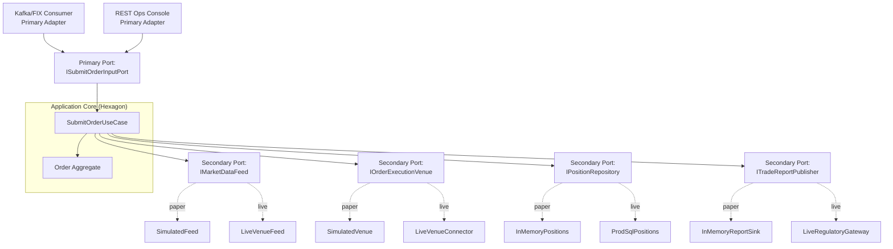
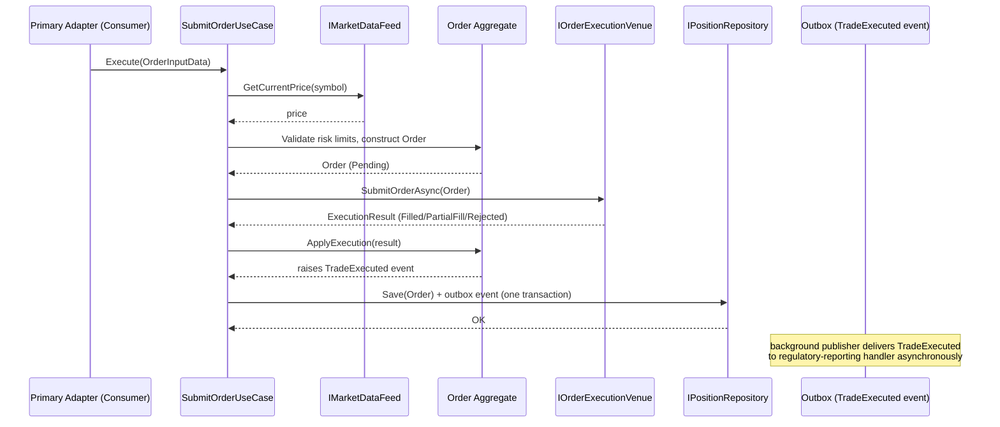
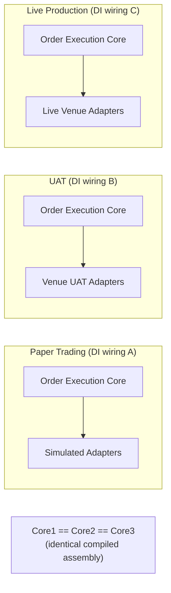
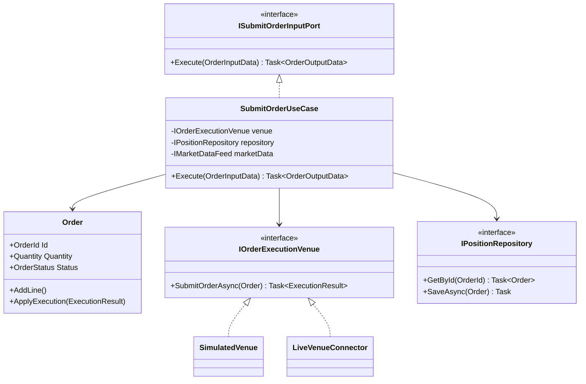

# Module 118 — Hexagonal Architecture: Capstone — Adapter Substitution for Testability in a Regulated Trading Execution Engine

> Domain: Hexagonal Architecture | Level: Beginner → Expert | Prerequisite: [[01-HexagonalArchitectureFundamentals-PrimarySecondaryAdapters-AdapterSubstitutionTesting]] (takes as given: Cockburn's original formulation, the Primary/Secondary Port distinction, the symmetric multiple-Adapter principle, and Port contract testing — this capstone builds one complete, worked system on top of that toolkit), [[32-Clean-Architecture/04-Capstone-LegacyPaymentSettlementEngineRefactor]] (the sibling capstone for the Clean-Architecture-vocabulary side of this pattern family; this module deliberately uses a different concrete system — an Order Execution Engine rather than a Settlement Engine — to avoid re-narrating the same example a third time)
>
> **Note on this module's template:** starting with this module, the course reverts to the fuller, 16-section template (§7 Performance Engineering, §8 Security, §9 Scalability restored; §10 Interview Questions back to 40 total, 10 per level; §16 Enterprise Case Study and §18 Revision deliberately omitted) — see `CLAUDE.md`'s 2026-07-18 template-reversion decision. Framed under the Elite FinTech Interview Panel lens (`CLAUDE.md`, established 2026-07-18).
>
> **Domain-complete note:** this is the second and final module of `33-Hexagonal-Architecture` (Modules 117–118).

---

## The Running Case Study

A registered broker-dealer's **Algorithmic Order Execution Engine** submits equity orders to trading venues on behalf of institutional clients, enforcing pre-trade risk checks (position limits, notional-value caps) and generating regulatory trade reports (Reg NMS/MiFID II-style best-execution and transaction reporting). The engineering organization needs the *exact same* order-execution business logic to run identically in three environments: **paper trading** (new algo strategies validated against simulated venues with zero financial risk before certification), **UAT/pre-production** (validated against a venue's official test/certification environment), and **live production** (real venues, real capital, real regulatory exposure) — with absolute confidence that logic validated in paper trading behaves identically in live trading. This module builds this system using Hexagonal Architecture's Primary/Secondary Ports and Module 117's Port-contract-testing discipline.

---

## 1. Fundamentals

**What:** Applying Hexagonal Architecture's symmetric Port/Adapter substitution (Module 117) to build one application core — the order-execution business logic — that runs unmodified across paper-trading, UAT, and live-production environments, differentiated purely by which concrete Secondary Adapters (venue connectivity, market data, position storage) are wired in at each tier.

**Why:** A trading firm's single greatest correctness risk is divergence between what was *validated* (in paper trading) and what actually *runs* (in live trading) — if the two environments are built from separately-maintained codebases, or even a shared codebase with environment-specific branches, validated behavior offers no genuine guarantee about live behavior. Module 117 Basic Q1's original Cockburn motivation — testability via Adapter substitution, with the application core unaware which Adapter is plugged in — is this problem's exact, structural solution.

**When:** This pattern is worth its ceremony specifically when (a) the business logic is genuinely complex and high-stakes enough that manual paper-trading review alone is insufficient assurance, (b) multiple environments genuinely need to run the identical logic (not just "we have a staging environment," but a *deliberate*, regulator-relevant simulation tier), and (c) the cost of a live-production logic bug is severe enough (real capital, regulatory reportable incidents) to justify the Port-contract-testing discipline's ongoing maintenance cost (Module 117 Intermediate Q6).

**How (30,000-ft view):**
```
Primary Port:  ISubmitOrderInputPort   → implemented by SubmitOrderUseCase (the core)
Secondary Ports (each with 3 concrete Adapters — paper / UAT / live):
  IMarketDataFeed        → SimulatedFeed        | VenueUATFeed        | LiveVenueFeed
  IOrderExecutionVenue   → SimulatedVenue        | VenueUATConnector   | LiveVenueConnector
  IPositionRepository    → InMemoryPositions     | UATSqlPositions     | ProdSqlPositions
  ITradeReportPublisher  → InMemoryReportSink    | UATRegulatoryGateway| LiveRegulatoryGateway
The Use Case's own code never changes across tiers — only DI registration (Module 114 Basic Q6) differs.
```

---

## 2. Deep Dive

### 2.1 DI Container Resolution Internals — Environment-Scoped Composition Roots
Each environment (paper/UAT/live) has its own `Program.cs`-equivalent composition root (or, more realistically, one shared `Program.cs` reading an `ExecutionEnvironment` configuration value and conditionally calling `AddPaperTradingAdapters()`, `AddUatAdapters()`, or `AddLiveAdapters()` extension methods) — `Microsoft.Extensions.DependencyInjection`'s `ServiceCollection` builds a `ServiceDescriptor` list at startup, and `BuildServiceProvider()` compiles this into a resolvable graph once; because `SubmitOrderUseCase` depends only on the Port interfaces, the *same compiled Use Case type* resolves against entirely different concrete graphs per environment with zero code branching inside the Use Case itself — the environment-conditional logic lives entirely in the composition root, never inside business logic, which is the concrete, DI-container-level realization of Module 117 Basic Q7's "zero Adapter awareness" principle.

### 2.2 Interface Dispatch Cost — Why It Essentially Never Matters Here, and the One Place It Might
A call through `IOrderExecutionVenue.SubmitOrderAsync(...)` is an interface-dispatch call (a virtual-method-table lookup, not a direct call) — in .NET, this costs a small, roughly constant number of nanoseconds versus a direct/devirtualized call, and is utterly dwarfed by the actual I/O latency of any real venue connection (single-digit to double-digit milliseconds over a network) or even the simulated `SimulatedVenue`'s own in-memory order-matching computation. The one place this genuinely matters: an extremely latency-sensitive strategy (sub-microsecond scalping-style execution logic, not this case study's more moderate-frequency algo trading) where every nanosecond of Port-indirection overhead is scrutinized — even there, the JIT can often devirtualize a call to a `sealed` Adapter class resolved through a generic method, though this is a genuinely advanced, rarely-load-bearing optimization for anything short of true high-frequency trading.

### 2.3 Threading Model — the Primary Adapter as a Long-Running Background Service
Unlike Module 116's HTTP-request-triggered Primary Adapters, this system's dominant Primary Adapter is a long-running `BackgroundService`/`IHostedService` consuming order requests from an internal message queue (or a FIX-protocol drop-copy session) — each incoming order triggers an `async Task` continuation calling `ISubmitOrderInputPort.Execute(...)`; correctly `await`-ing every I/O-bound Secondary Adapter call (market-data lookup, venue submission, repository save) is essential to avoid blocking a thread-pool thread for the call's I/O duration — Production Debugging (§14) walks through exactly the incident that results when this discipline lapses.

### 2.4 Memory and GC — Allocation Cost of Port/DTO Indirection at Order-Submission Throughput
Each order submission allocates: an `OrderInputData` DTO (Module 113 Intermediate Q2), a `Money`/`Quantity` Value Object or two (Module 110), and an `async` state machine object per `await`ed call across the Port boundary — at a moderate algo-trading throughput (hundreds to low thousands of orders/second, not HFT's millions), these are Gen 0 allocations the .NET GC handles cheaply and shouldn't be a genuine bottleneck; at meaningfully higher throughput, `readonly struct` Value Objects (Module 110 Basic Q8) and pooling `OrderInputData` instances (via `ObjectPool<T>`) become worth measuring, per §7's benchmarking discipline, rather than assumed necessary by default.

### 2.5 Framework Internals — Service Descriptor Resolution and Startup-Time Adapter Construction Cost
`AddScoped`/`AddSingleton` registrations for Secondary Adapters (Module 114 Basic Q6) determine whether an Adapter (e.g., `LiveVenueConnector`, which opens a persistent FIX-protocol session) is constructed once at startup (`Singleton`, appropriate here, since venue connectivity is a long-lived, expensive-to-establish resource, not a per-request concern the way `DbContext` was in Module 114's web-request context) or per logical unit of work — this system's Secondary Adapters are predominantly `Singleton`-lifetime, a genuine and correct divergence from Module 114's web-application-centric `Scoped` defaults, since there is no HTTP request boundary here to scope against.

### 2.6 Hidden Costs — the Compounding Maintenance Tax of "Three Adapters, One Contract Test Suite, Forever"
Module 117 Intermediate Q6's contract-test discipline requires every Secondary Port to maintain (at minimum) its production Adapter, a test-double Adapter, and a shared contract-test suite run against both — this case study's three-tier structure (paper/UAT/live) means, in the strictest reading, up to three real Adapters per Port plus the contract suite; the hidden, easy-to-underestimate cost is that every new business-rule-relevant behavior (a new order-rejection reason, a new partial-fill scenario) requires updating the contract-test suite *and* confirming every tier's Adapter still satisfies it — a genuine, compounding tax this module's Architecture Decision (§15) and Principal Engineer Perspective (§17) explicitly weigh against the alternative of fewer, more approximate test doubles.

---

## 3. Visual Architecture

### Hexagonal Component Structure


### Order Submission Sequence


### Deployment: Three Environments, One Core


---

## 4. Production Example

**Problem:** The firm needed to certify a new algo strategy in paper trading before allowing it to trade live, with regulators requiring evidence that paper-trading validation genuinely predicts live behavior — not merely that the two environments "seemed similar."

**Architecture:** Hexagonal Ports as described above, with `SimulatedVenue` (paper) designed to model realistic partial-fill behavior — an order for 10,000 shares against a simulated order book might fill in three separate partial executions of 4,000/3,500/2,500 shares, mimicking real market microstructure, per Module 117's contract-test discipline requiring `SimulatedVenue` and `LiveVenueConnector` to satisfy the identical `IOrderExecutionVenue` contract test suite.

**Implementation:** The contract-test suite covered full fills, rejections, and simple partial fills — but did not initially cover a specific scenario: an order that partially fills, then receives a *late correction* message reducing an already-reported fill quantity (a genuine, if infrequent, real-venue behavior when a trade is broken/corrected post-execution for a data error on the venue's side). `SimulatedVenue` had no concept of a post-fill correction message at all — an entire class of venue behavior the simulation simply didn't model.

**Trade-offs:** Modeling every real venue behavior in `SimulatedVenue` (including rare correction messages) is expensive to build and maintain, but *not* modeling it means paper-trading certification provides no genuine assurance about the strategy's behavior when a correction actually occurs live — a direct trade-off between simulation fidelity cost and certification-evidence strength.

**Lessons learned:** During live trading, a new algo strategy received its first-ever fill-correction message and mishandled it — recomputing its position based on the *original*, now-incorrect fill quantity because the strategy's correction-handling code path had literally never been exercised, in paper trading or otherwise, since `SimulatedVenue` never generated this message type. This is a new, distinct instance of Module 117 Advanced Q5's "unvalidated fake" risk — not a *behavioral divergence* on a scenario both Adapters modeled, but a **scenario neither the contract test nor the simulated Adapter modeled at all**. The fix: extend `SimulatedVenue` and the contract-test suite to include fill-correction scenarios, and — critically — add a standing process requiring any newly-observed live-venue behavior (discovered via the venue's own published protocol updates or an actual live incident) to be added to the contract-test suite as a permanent, tracked backlog item, treating "does our simulation model this real behavior" as a continuously-expanding, never-finished checklist rather than a one-time build task.

---

## 5. Best Practices
- Treat the contract-test suite as a living document expanded every time a new real-venue behavior is discovered — never a fixed, "done once" artifact (§4).
- Register long-lived Secondary Adapters (persistent venue connections) as `Singleton`, not `Scoped`/`Transient`, and construct them eagerly at startup so connectivity failures surface immediately, not on first use (§2.5).
- Keep environment-conditional wiring entirely in the composition root; never let `SubmitOrderUseCase` branch on "which environment am I in" (§2.1).
- Model realistic partial-fill and correction behavior in simulated Adapters proportional to the certification evidence regulators or internal risk committees actually require (§4).
- Prefer `readonly struct` Value Objects for high-frequency, allocation-sensitive Port DTOs only once benchmarking (§7) shows genuine need, not preemptively (§2.4).

## 6. Anti-patterns
- A `SimulatedVenue` that only covers happy-path fills, with no partial-fill or correction-message modeling, presented as sufficient paper-trading certification evidence (§4).
- Branching on `if (environment == "Paper")` inside `SubmitOrderUseCase` itself instead of swapping Adapters at the composition root — reintroduces Module 113 Basic Q6/Module 114 Advanced Q2's Dependency Rule violation in a new guise.
- Registering a persistent venue-connectivity Adapter as `Transient`, silently reopening an expensive connection on every resolution.
- Treating "the contract test suite passed" as permanent, complete evidence rather than a snapshot bounded by whatever scenarios were known and modeled at the time it was last updated (§4).
- Skipping `await` on a Secondary Adapter call "since it looked synchronous enough," blocking a thread-pool thread under load (§14).

---

## 7. Performance Engineering

**CPU:** Interface dispatch overhead (§2.2) is negligible at this system's realistic throughput; the actual CPU cost concentrates in JSON/FIX-message (de)serialization at Port boundaries and any Value-Object validation logic on the `Order` Aggregate — profile (Module 101) before assuming Port indirection itself is a bottleneck.

**Memory/Allocations/GC:** Per-order allocations (§2.4) — `OrderInputData`, Value Objects, `async` state machines — are Gen 0 garbage at moderate throughput; benchmark with BenchmarkDotNet under realistic sustained order-submission rates before introducing `ObjectPool<T>` or `readonly struct` optimizations, which add real code complexity that should be justified by measured allocation pressure, not assumed.

**Latency:** End-to-end order-submission latency (Primary Adapter receipt → venue acknowledgment) should be budgeted per hop (Module 113's Dependency-Rule-driven layering doesn't itself add meaningful latency; real latency lives in the actual venue network round-trip and any synchronous risk-check computation) — track P50/P99/P99.9 separately, since Port-indirection overhead, if it matters at all, shows up as a small, consistent tax across the whole distribution, while venue network variability drives tail latency.

**Throughput:** Benchmark the full pipeline (Primary Adapter → Use Case → Secondary Adapters) under sustained load matching realistic peak order-submission rates (e.g., market-open bursts), not steady-state average load — directly reapplying Module 77's "test the actual constrained condition" discipline to this system's own peak-load profile.

**Benchmarking:** Use the paper-trading environment's `SimulatedVenue` (with realistic, tunable simulated latency, not zero-latency instant fills) as the load-testing harness itself — Port substitution (Module 117 Basic Q8) means the identical business logic under test can be benchmarked against a fully-controlled, deterministic simulated venue before ever touching a real UAT/live venue's rate limits.

**Caching:** `IMarketDataFeed` price lookups are a natural caching candidate (Module 103) with a short TTL appropriate to the strategy's own price-staleness tolerance — cache invalidation must be tied to the feed's own update cadence, not an arbitrary fixed interval, to avoid trading on stale prices.

---

## 8. Security

**Threats:** Unauthorized order submission (a compromised internal system submitting fraudulent orders), venue-credential theft (API keys/certificates enabling impersonation to a real venue), man-in-the-middle tampering with order or market-data messages, and replay attacks (a captured, legitimate order message resubmitted to duplicate a trade).

**Mitigations:** Mutual TLS between the Order Execution Engine and every real venue Adapter (`LiveVenueConnector`), with venue-specific client certificates rotated on a defined schedule; every Primary Port invocation authenticated and authorized (only specific internal systems/service identities may call `ISubmitOrderInputPort`, directly Module 40/41's IAM/OAuth2 territory previewed here); idempotency keys (Module 116 Advanced Q6) on every order-submission message to prevent replay-driven duplicate execution; message-level signing (not just transport TLS) for venues requiring it, per that venue's own protocol.

**OWASP mapping:** This system's highest-relevance OWASP API Security Top 10 risks are Broken Object-Level Authorization (BOLA — could one client's order-submission request affect another client's positions? — directly Module 97's IDOR finding applied here), Broken Authentication (venue-credential and internal-service-identity compromise), and Excessive Data Exposure (a `TradeReportPublisher` implementation accidentally including more client PII than the specific regulatory report requires).

**AuthN/AuthZ:** Internal service-to-service calls into the Primary Port use service-identity-based mTLS or signed service tokens, not shared API keys; per-client order-submission authorization must verify the requesting identity actually owns the account/position being traded (a direct BOLA check, Module 97).

**Secrets:** Venue API credentials and client certificates belong in a managed secrets store (Module 86's reference-not-value discipline) — never embedded in `LiveVenueConnector`'s own configuration file — with rotation automated and monitored, not a manual, easily-forgotten process (directly recurring Module 86's established pattern).

**Encryption:** TLS in transit for every external venue connection (mandatory, non-negotiable for a regulated venue integration); encryption at rest for the `IPositionRepository`'s underlying database, given the sensitivity of client position/order data.

---

## 9. Scalability

**Horizontal scaling:** The Primary Adapter (order-consuming background service) can scale horizontally by partitioning order flow by instrument or client, with each partition's messages routed to a specific consumer instance — avoiding the need for global ordering across all orders while preserving per-instrument/per-client ordering where genuinely required (e.g., FIFO order-sequencing rules for a given account).

**Vertical scaling:** Less relevant for this system's throughput profile than horizontal partitioning, though `LiveVenueConnector`'s persistent connection handling benefits from adequate single-instance thread-pool/network-I/O capacity (§14's incident is exactly what happens when this isn't respected).

**Caching:** Market-data price caching (§7) reduces `IMarketDataFeed` load; position-lookup caching for read-heavy operational dashboards (kept clearly separate from the authoritative, write-path `IPositionRepository` used by the Use Case itself, per Module 112 Advanced Q5/Module 117 Expert Q5's Command/Query Port distinction).

**Replication/Partitioning:** `IPositionRepository`'s underlying database should be partitioned by client/account for horizontal write scaling, with read replicas (Module 60) serving operational reporting queries without contending with the hot order-submission write path.

**Load balancing:** Order-submission Primary Adapters behind a partition-aware routing layer (not a naive round-robin load balancer, which would violate per-instrument/per-client ordering guarantees).

**High Availability:** `LiveVenueConnector` must support automatic failover to a venue's backup connectivity endpoint (most real venues provide redundant connection points); the Order Execution Engine itself should run multiple instances with leader-election or partition-ownership (avoiding double-submission of the same order from two simultaneously-active instances).

**Disaster Recovery:** A documented, tested failover plan for a full primary-region outage — including how in-flight orders are reconciled against the venue's own execution reports after failover, directly reapplying Module 107's reconciliation discipline to a DR scenario specifically.

**CAP theorem:** `IPositionRepository` favors consistency over availability for position-limit risk checks (a stale, unavailable position read must never allow a risk-limit-violating order through) — an explicit, deliberate CP choice, accepting reduced availability (reject/hold new orders) rather than risk-check correctness during a partition, directly the opposite default choice a read-heavy, eventually-consistent system (like the market-data cache) would make.

---

## 10. Interview Questions

### Basic (10)

1. **Q: Why does this system need the *identical* business logic to run in paper trading and live trading, not just similar logic?**
   **A:** Paper-trading certification is only meaningful evidence about live behavior if the validated code path and the live code path are provably the same, per Module 117 Basic Q1's substitution principle.
   **Why correct:** States the specific evidentiary requirement driving the architecture choice.
   **Common mistakes:** Assuming "similar" logic in two separately-maintained codebases provides equivalent assurance.
   **Follow-ups:** "What mechanism guarantees they're the same?" (Identical compiled Use Case class, differing only in DI-wired Adapters, §2.1.)

2. **Q: What is `SimulatedVenue` an example of, in this module's terminology?**
   **A:** A Secondary Adapter satisfying the `IOrderExecutionVenue` Secondary Port, used for the paper-trading environment.
   **Why correct:** Correctly classifies both the Port direction and Adapter role.
   **Common mistakes:** Calling it a "mock" in the unit-testing sense rather than recognizing it as a full, environment-tier production Adapter in its own right.
   **Follow-ups:** "Is `SimulatedVenue` also used in unit tests, or only for the paper-trading environment?" (Both — the same Adapter class can serve as a fast, in-process test double in `Application.Tests` and as the actual paper-trading-environment Adapter.)

3. **Q: Where does the environment-selection logic (paper vs. UAT vs. live) live?**
   **A:** Entirely in the composition root (`Program.cs`), never inside `SubmitOrderUseCase` itself.
   **Why correct:** Directly Module 117 Basic Q7's zero-Adapter-awareness principle.
   **Common mistakes:** Branching on an environment flag inside the Use Case.
   **Follow-ups:** "What Dependency Rule violation would environment-branching inside the Use Case represent?" (The Use Case would need to know about environment-specific concerns, an inner-ring concept leaking outward-relevant awareness inward.)

4. **Q: Why is `IOrderExecutionVenue`'s production Adapter registered as `Singleton` rather than `Scoped`?**
   **A:** It manages a long-lived, expensive-to-establish persistent connection (a FIX session), not a per-HTTP-request resource.
   **Why correct:** Correctly identifies the lifetime-appropriate registration for this specific kind of resource.
   **Common mistakes:** Defaulting to `Scoped` out of habit from a web-application context where that lifetime is more common.
   **Follow-ups:** "What risk would `Transient` registration introduce here?" (Reopening an expensive venue connection on every resolution.)

5. **Q: What does a Port contract test verify for `IOrderExecutionVenue`, concretely?**
   **A:** That both `SimulatedVenue` and `LiveVenueConnector` handle the same set of scenarios (full fill, partial fill, rejection) identically, per Module 117 Intermediate Q6.
   **Why correct:** States the specific, shared-test-suite mechanism.
   **Common mistakes:** Assuming each Adapter's own separate tests are sufficient without a shared contract suite.
   **Follow-ups:** "What did the contract test suite in §4's incident fail to cover?" (Fill-correction messages — a scenario neither Adapter nor the test suite modeled at all.)

6. **Q: Why is `IMarketDataFeed` price data a reasonable caching candidate but `IPositionRepository` data is not, for the risk-check path specifically?**
   **A:** Price staleness within a short, tolerance-appropriate TTL is an acceptable trade-off; a stale position read risking an incorrect risk-limit decision is not.
   **Why correct:** Correctly distinguishes tolerable staleness from correctness-critical freshness.
   **Common mistakes:** Applying a uniform caching policy to every Secondary Port regardless of its specific consistency requirement.
   **Follow-ups:** "Which CAP-theorem side does the position-repository risk-check path favor?" (Consistency over availability, §9.)

7. **Q: What class of production incident does §14 walk through?**
   **A:** Thread-pool starvation from a blocking (non-`await`ed) call inside an async Secondary Adapter method in the order-submission hot path.
   **Why correct:** Names the specific, common .NET failure mode.
   **Common mistakes:** Assuming this is a rare, exotic bug rather than one of the most common async/await mistakes in production .NET systems.
   **Follow-ups:** "What tool would first reveal this?" (Thread-pool queue-length/starvation metrics, or a memory/thread dump showing many blocked threads, §14.)

8. **Q: Why is a mutual-TLS requirement for `LiveVenueConnector` non-negotiable in this domain, more than in a typical internal microservice?**
   **A:** A compromised or impersonated venue connection could enable fraudulent order submission or interception of trade data, with direct financial and regulatory consequences.
   **Why correct:** Names the specific, elevated stakes justifying the stricter requirement.
   **Common mistakes:** Treating mTLS as an optional hardening step rather than a baseline requirement for regulated venue connectivity.
   **Follow-ups:** "What OWASP API Security risk category does venue-credential compromise map to?" (Broken Authentication, §8.)

9. **Q: What's the difference between this module's `ITradeReportPublisher` and Module 116's `SettlementCompleted` regulatory-reporting Domain Event mechanism?**
   **A:** They're the same underlying pattern — a Domain Event triggering an Outbox-delivered downstream regulatory action — applied to a different concrete business event (`TradeExecuted` vs. `SettlementCompleted`).
   **Why correct:** Correctly recognizes the reused, not novel, mechanism.
   **Common mistakes:** Treating trade reporting as requiring an entirely new architectural mechanism rather than reapplying Module 111's already-established Domain Event/Outbox pattern.
   **Follow-ups:** "Why does this event need Outbox reliability specifically?" (A regulatory report silently lost due to a crash between commit and publish is a compliance violation, directly Module 116 Intermediate Q4's reasoning.)

10. **Q: Why does this system use multiple Primary Adapters (a Kafka/FIX consumer and a REST ops console) for the same `ISubmitOrderInputPort`?**
    **A:** Different legitimate entry points — algorithmic strategy-driven order flow versus manual operator intervention — both need to submit orders through identical business-rule enforcement, per Module 117 Basic Q5's symmetric multiple-Adapter principle.
    **Why correct:** Correctly applies the already-established symmetry principle to this system's specific channels.
    **Common mistakes:** Assuming only one Primary Adapter is "the real" entry point and others are secondary/less rigorous.
    **Follow-ups:** "What risk would bypassing the shared Port for the ops console specifically introduce?" (A manually-submitted order silently skipping risk-limit enforcement, Module 114 Intermediate Q5's exact risk.)

### Intermediate (10)

1. **Q: Design the DI registration difference between the paper-trading and live composition roots for `IOrderExecutionVenue`.**
   **A:** `services.AddSingleton<IOrderExecutionVenue, SimulatedVenue>()` in the paper-trading `AddPaperTradingAdapters()` extension method; `services.AddSingleton<IOrderExecutionVenue, LiveVenueConnector>(sp => new LiveVenueConnector(config.VenueEndpoint, secrets.ClientCert))` in `AddLiveAdapters()` — both resolve the identical `IOrderExecutionVenue` interface consumed by `SubmitOrderUseCase`.
   **Why correct:** Gives the concrete registration difference, correctly isolated to the composition root.
   **Common mistakes:** Registering both in the same method with a runtime `if` check rather than separate, environment-specific extension methods.
   **Follow-ups:** "Why prefer separate extension methods over a single method with conditional logic?" (Keeps each environment's wiring independently readable and testable, and makes an accidental cross-environment registration mistake more visible in code review.)

2. **Q: Why must `SimulatedVenue`'s partial-fill modeling be *realistic* (multiple partial executions, not always instant full fills) rather than simplified?**
   **A:** A strategy's own partial-fill-handling logic is genuine business logic that needs validation; an oversimplified simulation that always fully fills would leave that code path entirely unvalidated in paper trading, per §4's incident pattern.
   **Why correct:** Connects simulation fidelity directly to what paper-trading certification is actually supposed to prove.
   **Common mistakes:** Treating simulation realism as a nice-to-have rather than a direct determinant of certification evidence quality.
   **Follow-ups:** "What's the cost side of this realism requirement?" (§2.6's compounding maintenance tax — every additional realistic behavior modeled is more simulation code and more contract-test scenarios to maintain.)

3. **Q: How does the Outbox pattern (Module 111 Advanced Q2) apply specifically to `TradeExecuted` event publication in this system?**
   **A:** The `Order`'s new state and the `TradeExecuted` event are written in the same transaction as the position-repository save, with a separate background publisher reliably delivering the event to `ITradeReportPublisher`'s handler — guaranteeing a regulatory report is never silently lost even if the process crashes between commit and publish.
   **Why correct:** Correctly reapplies the established Outbox mechanism to this system's own regulatory-reporting need.
   **Common mistakes:** Publishing the report synchronously inline within the order-submission request path, risking either lost reports on crash or added latency on the critical order-submission path.
   **Follow-ups:** "Why is added latency on the order-submission path itself a genuine concern here?" (§7's latency budgeting — regulatory reporting isn't time-critical to the order's own execution and shouldn't block or slow it.)

4. **Q: What's the specific risk of using `Transient` lifetime for `LiveVenueConnector`, beyond "it's slower"?**
   **A:** Each resolution would attempt to establish a brand-new persistent connection/FIX session, likely exceeding the venue's own connection-rate limits or authentication-attempt thresholds, potentially triggering a venue-side lockout.
   **Why correct:** Names a concrete, venue-side consequence beyond generic performance concerns.
   **Common mistakes:** Treating this purely as a local performance issue rather than a risk of external-system-triggered lockout.
   **Follow-ups:** "How would you detect this misconfiguration before it caused a venue lockout in production?" (A startup-time or fitness-function check confirming exactly one `LiveVenueConnector` instance exists per process, or connection-count monitoring alerting on unexpectedly high connection churn.)

5. **Q: Why is `IPositionRepository` explicitly designed as a CP (consistent, less available) system for the risk-check path, per §9?**
   **A:** Allowing a risk-limit check to proceed against a stale or unavailable position read could let a limit-violating order through — an unacceptable correctness risk far outweighing the cost of rejecting/holding an order during a partition.
   **Why correct:** States the specific correctness consequence justifying the CAP-theorem trade-off explicitly, not just citing CAP theorem abstractly.
   **Common mistakes:** Assuming higher availability is unconditionally preferable without weighing the specific correctness cost in this specific, risk-sensitive path.
   **Follow-ups:** "Would this same CP choice apply to the read-only position dashboard mentioned in §9?" (No — that path can tolerate eventual consistency/reduced availability trade-offs differently, since it's not gating a risk-limit decision.)

6. **Q: Design the contract-test scenario that would have caught §4's incident, had it existed beforehand.**
   **A:** A shared test asserting both `SimulatedVenue` and `LiveVenueConnector` correctly process a fill-correction message (reducing a previously-reported fill quantity) and that the Use Case's position-update logic correctly reconciles the correction — run against both Adapters, requiring `SimulatedVenue` to actually generate this message type as part of its simulation.
   **Why correct:** Gives the specific, concrete scenario and correctly requires the simulation itself to model the behavior, not just the contract test to assert it abstractly.
   **Common mistakes:** Proposing only a test against `LiveVenueConnector`/UAT, missing that `SimulatedVenue` must also be extended to generate this scenario for paper-trading certification to remain meaningful.
   **Follow-ups:** "How would you discover which other real-venue behaviors are still unmodeled, proactively rather than reactively?" (Review the venue's own published FIX/protocol specification systematically against the simulation's current coverage, rather than waiting for each gap to surface as a live incident.)

7. **Q: Critique registering `IMarketDataFeed`'s cache (§7) with a single, fixed TTL applied uniformly across every instrument.**
   **A:** Different instruments have genuinely different price-volatility and staleness tolerance — a fixed, one-size-fits-all TTL either over-caches volatile instruments (risking trading on meaningfully stale prices) or under-caches stable ones (unnecessary feed load) — TTL should be calibrated per instrument class or dynamically informed by recent observed volatility.
   **Why correct:** Identifies the specific mismatch a uniform TTL creates across genuinely different instrument risk profiles.
   **Common mistakes:** Assuming a single, conservative TTL is a safe universal default without considering the load-cost trade-off for low-volatility instruments.
   **Follow-ups:** "How would you detect a cache TTL that's become inappropriately stale for a specific instrument's current volatility regime?" (Monitor realized price deviation between cached and live-fetched prices, alerting when deviation exceeds the strategy's own tolerance.)

8. **Q: Why does `ISubmitOrderInputPort`'s authorization check need to verify account ownership specifically, not just that the caller is "an authenticated internal service"?**
   **A:** Authentication alone (verifying *which* service is calling) says nothing about whether that specific call is authorized to act on the *specific account/position* named in the request — exactly Module 97's IDOR/BOLA distinction between authentication and object-level authorization.
   **Why correct:** Correctly distinguishes the two checks and reapplies Module 97's already-established finding to this system's specific Primary Port.
   **Common mistakes:** Assuming service-level authentication is sufficient without an additional, explicit object-level (account-ownership) authorization check.
   **Follow-ups:** "Give a concrete exploit this gap would enable." (An authenticated internal service submitting an order against a different client's account than the one it's actually authorized to trade for.)

9. **Q: Why is horizontal scaling by instrument/client partition preferred over a naive round-robin load balancer for the order-consuming Primary Adapter?**
   **A:** Round-robin routing would break per-account/per-instrument order-sequencing guarantees (e.g., FIFO ordering rules), since sequential orders for the same account could land on different, independently-processing instances with no shared ordering guarantee.
   **Why correct:** Names the specific correctness property (per-partition ordering) a naive load-balancing strategy would violate.
   **Common mistakes:** Treating load balancing as a purely throughput/availability concern without considering ordering-guarantee implications specific to this domain.
   **Follow-ups:** "What infrastructure pattern typically provides this partition-aware routing?" (Kafka's own partition-key-based routing, if the Primary Adapter consumes from Kafka, keying by account or instrument.)

10. **Q: How does this module's three-tier Adapter structure (paper/UAT/live) relate to Module 117's simpler two-Adapter (real/fake) framing?**
    **A:** It's a direct extension — UAT is itself another concrete Secondary Adapter satisfying the identical Port contract, subject to the identical contract-test suite, not a fundamentally different mechanism; Module 117's framing scales naturally to any number of environment-specific Adapters per Port, not just exactly two.
    **Why correct:** Correctly identifies this as a scaling of the same mechanism, not a new pattern.
    **Common mistakes:** Assuming Module 117's Port/Adapter substitution concept only supports a binary real-vs-fake choice.
    **Follow-ups:** "Would a fourth tier (e.g., a disaster-recovery failover venue) fit this same pattern?" (Yes — another Secondary Adapter satisfying the same Port and contract-test suite, per §9's HA/DR discussion.)

### Advanced (10)

1. **Q: Diagnose §4's incident from first principles and design the specific process fix preventing a future, similarly-uncovered real-venue behavior from going unmodeled indefinitely.**
   **A:** Root cause: simulation fidelity and contract-test coverage were built once against a fixed understanding of venue behavior, with no standing process to expand coverage as new real-venue behaviors were discovered. Fix: a tracked, mandatory backlog item triggered by any newly-observed live-venue protocol behavior (from a real incident, a venue protocol-spec update, or a UAT finding), requiring `SimulatedVenue` and the contract-test suite to be updated *before* the next paper-trading certification cycle treats coverage as complete — converting "our simulation is realistic" from a one-time build claim into a continuously-expanding, tracked commitment.
   **Why correct:** Identifies the actual root cause (a static, one-time-built coverage assumption) and a systemic, tracked-process fix rather than merely patching this one scenario.
   **Common mistakes:** Fixing only the specific fill-correction gap without addressing the process gap that allowed it (and will allow the next one) to go unnoticed.
   **Follow-ups:** "How would you make this backlog item genuinely mandatory rather than an easily-deprioritized nice-to-have?" (Gate the next paper-trading certification sign-off on it explicitly, the same forcing-function discipline Module 106 established for fitness-function rollout.)

2. **Q: A team proposes eliminating `SimulatedVenue` entirely and running all paper-trading certification directly against the venue's UAT environment, arguing this removes the "is the simulation realistic enough" risk entirely. Evaluate this proposal.**
   **A:** This removes simulation-fidelity risk but introduces new costs: UAT environments are typically rate-limited and shared across many firms/teams, making them unsuitable for the high-volume, repeatable, deterministic testing (§7's benchmarking use case) a controlled simulation provides; the correct answer is layering both — `SimulatedVenue` for fast, deterministic, high-volume development-time and load-testing use, UAT for final, pre-live-cutover certification against the venue's actual (if rate-limited) infrastructure — not replacing one with the other.
   **Why correct:** Correctly identifies the trade-off UAT-only testing introduces (rate limits, non-determinism, shared-environment contention) rather than treating UAT as a strictly superior replacement.
   **Common mistakes:** Assuming "test against the real thing" is always strictly better than a well-maintained simulation, without weighing UAT's own practical limitations for high-volume, deterministic testing.
   **Follow-ups:** "What specific test type is UAT better suited for than `SimulatedVenue`?" (Final protocol-compliance/certification testing against the venue's actual, authoritative implementation — the last-mile check simulation can't fully replace.)

3. **Q: Critique a proposed shortcut: since `SimulatedVenue` and `LiveVenueConnector` are both `IOrderExecutionVenue` implementations, use a single shared integration-test suite run only against `LiveVenueConnector`'s UAT counterpart, skipping a separate `SimulatedVenue`-specific test run.**
   **A:** This misses the entire point of Module 117's contract-testing discipline — the suite must run against *both* implementations to catch divergence between them (§4's exact incident type); running it only against one Adapter provides zero evidence the other Adapter (the one actually used for day-to-day paper-trading certification) behaves consistently with it.
   **Why correct:** Directly reapplies Module 117 Intermediate Q6/Advanced Q3's already-established contract-testing requirement (run against every implementation, not just one) to this specific proposed shortcut.
   **Common mistakes:** Assuming testing "the more real" Adapter alone is sufficient, missing that the entire value of paper trading depends on `SimulatedVenue`'s own verified consistency with it.
   **Follow-ups:** "What's the minimum viable version of this suite if maintaining a full three-way contract test (paper/UAT/live) is judged too costly?" (§15's Architecture Decision addresses this trade-off directly — at minimum, run against `SimulatedVenue` and one real-environment tier, treating the omitted tier's coverage gap as an explicit, documented, accepted risk rather than an unexamined one.)

4. **Q: Design a load-testing methodology for this system's peak market-open order-submission burst, extending Module 77's full-chain-latency lesson to this Primary-Adapter architecture.**
   **A:** Load-test using `SimulatedVenue` configured with realistic simulated network latency (not zero-latency instant responses) and at genuinely burst-representative order rates (market-open volume, not steady-state average), measuring the full chain from Primary Adapter receipt through venue-Adapter response and Outbox-event durability — directly Module 77 §4's "test the actual constrained condition, not an idealized one" pattern, now applied via Port substitution's own benchmarking capability (§7) rather than requiring a real venue's own rate-limited UAT environment for load testing.
   **Why correct:** Correctly reapplies Module 77's established load-testing discipline and identifies Port substitution's own load-testing benefit (§7) as the specific mechanism enabling realistic burst testing without depending on external, rate-limited infrastructure.
   **Common mistakes:** Load-testing against a zero-latency `SimulatedVenue` configuration, producing unrealistically optimistic throughput numbers that don't reflect real venue response-time variability.
   **Follow-ups:** "What metric would most directly reveal thread-pool starvation under this load test?" (Thread-pool queue length and request-completion-time percentiles — directly the diagnostic §14's incident relies on.)

5. **Q: A compliance officer asks for evidence that `ITradeReportPublisher`'s regulatory reports are never silently lost. What specific, mechanical evidence would you provide, reapplying Module 116 Advanced Q5's audit-evidence discipline?**
   **A:** The Outbox table's continuously-monitored unprocessed-row age/count metrics (proving the publishing pipeline is live, not merely present), the compliance-specific fitness function (Module 116 Intermediate Q6, adapted here) asserting every state transition raising a reportable event has corresponding contract-test coverage across all three Adapters, and the CI pipeline's own passing build history for that fitness function — concrete, continuously-verified evidence, not a design document's declared intent.
   **Why correct:** Directly reapplies Module 116's already-established audit-evidence framework (mechanical, continuous verification over declared documentation) to this system's own regulatory-reporting claim.
   **Common mistakes:** Presenting only the Outbox pattern's *design* as evidence, without the specific, continuously-monitored metrics and fitness-function pass history that make the claim currently, verifiably true rather than merely architecturally plausible.
   **Follow-ups:** "Why is Outbox-backlog-age monitoring specifically more compelling evidence than 'we use the Outbox pattern'?" (It's evidence of *current, live* delivery health, not merely a one-time architectural decision — directly Module 116 Expert Q4's "declared ≠ actual" distinction.)

6. **Q: Design the specific concurrency-safety mechanism preventing two simultaneously-active Order Execution Engine instances from double-submitting the same order during a leader-election transition (§9's HA concern).**
   **A:** Combine an idempotency key (Module 116 Advanced Q6) on every order — checked against `IPositionRepository` (or a dedicated idempotency store) before submission — with a leader-election/partition-ownership mechanism ensuring only one instance actively consumes a given partition at a time; the idempotency check is the defense-in-depth backstop specifically for the brief window during a leadership transition where both the outgoing and incoming leader might briefly, overlappingly process the same message.
   **Why correct:** Correctly layers two complementary mechanisms (partition-ownership as the primary control, idempotency as the backstop for the transition window) rather than relying on either alone.
   **Common mistakes:** Relying solely on leader-election/partition-ownership without an idempotency backstop, missing that leadership transitions have an inherent, brief overlap-risk window no coordination mechanism eliminates perfectly.
   **Follow-ups:** "Where does the idempotency check need to live — the Use Case, the Aggregate, or the Repository?" (The Use Case, per Module 116 Advanced Q6's established placement — an orchestration-level "have we already handled this" concern checked before Aggregate construction.)

7. **Q: Explain why §2.2's interface-dispatch-cost analysis correctly concludes it "essentially never matters here," and identify the specific condition under which that conclusion would flip.**
   **A:** At this system's realistic, moderate algo-trading throughput, interface-dispatch overhead (nanoseconds) is utterly dominated by real I/O latency (milliseconds); the conclusion would flip specifically for a true high-frequency-trading strategy operating at sub-microsecond decision latencies, where every nanosecond of indirection is scrutinized against a fundamentally different, much tighter latency budget — a workload category this case study's "moderate-frequency algo trading" framing explicitly distinguishes itself from.
   **Why correct:** Correctly identifies the specific condition (workload's own latency budget) determining whether this micro-optimization concern is relevant, rather than treating the conclusion as universal.
   **Common mistakes:** Generalizing "interface dispatch overhead never matters" as an absolute rule rather than a workload-profile-dependent conclusion.
   **Follow-ups:** "What broader principle does this illustrate about performance-engineering claims generally?" (Module 101's own established discipline — performance conclusions are only valid relative to a specific, measured workload profile and latency budget, never as universal, profile-independent claims.)

8. **Q: Critique a design where `ISubmitOrderInputPort`'s implementation directly calls `IPositionRepository.Save()` synchronously from within the same method that also synchronously calls `IOrderExecutionVenue.SubmitOrderAsync()`, with no `await` on the venue call "since the venue library exposes a synchronous API."**
   **A:** This is precisely §14's root-cause pattern — synchronously blocking on an I/O-bound call inside what should be an async pipeline holds a thread-pool thread for the full duration of the venue round-trip, and under the burst load described in §7/Advanced Q4, this exhausts the thread pool, causing cascading request queuing/timeouts across the entire service, not just the specific order being processed.
   **Why correct:** Correctly identifies the exact mechanism (thread-pool-thread blocking under load) and its cascading, service-wide consequence, not merely a "this one call is slow" framing.
   **Common mistakes:** Treating a synchronous-looking third-party venue library as an acceptable exception to async discipline, rather than wrapping it (via `Task.Run` for genuinely CPU-bound work, or finding/demanding an async-native venue API) to avoid blocking a thread-pool thread on I/O.
   **Follow-ups:** "What's the correct fix if the venue library genuinely has no async API at all?" (Directly §14's fix — run the blocking call on a dedicated, bounded thread pool or `Task.Run` with careful capacity planning, never on the shared ASP.NET Core/general thread pool serving the rest of the application's concurrent work.)

9. **Q: Design the specific monitoring that would have caught §14's thread-pool starvation incident before it caused a customer-facing outage.**
   **A:** Thread-pool queue-length and available-worker-thread-count metrics (via `ThreadPool.GetAvailableThreads`/`.NET`'s built-in event counters), alerting on sustained queue growth or available-thread depletion — a leading indicator visible well before request latency/timeouts become customer-facing, directly analogous to Module 94's burn-rate alerting philosophy (catch the leading trend, not only the trailing symptom).
   **Why correct:** Names the specific, concrete .NET-level metric and correctly frames it as a leading indicator, reapplying Module 94's established alerting philosophy to this specific failure mode.
   **Common mistakes:** Relying only on end-to-end request-latency alerting, which would fire later (only once queuing has already caused customer-visible delay) than a direct thread-pool-health metric would.
   **Follow-ups:** "Why is `ThreadPool.GetAvailableThreads` alone insufficient without also tracking queue length?" (A momentarily low available-thread count under brief, healthy burst load is normal; sustained queue growth alongside thread depletion is the specific combined signal indicating genuine starvation, not just transient, healthy contention.)

10. **Q: As a Principal Engineer, synthesize this entire module into the specific governance program required before this system's paper-to-live certification process can be considered genuinely audit-ready for a regulator.**
    **A:** (1) A continuously-expanding, mandatorily-gated contract-test suite (Advanced Q1) covering every known real-venue behavior, run against every Adapter tier. (2) Documented, explicit evidence of what's *not* yet covered (Advanced Q3's minimum-viable-coverage trade-off) as a tracked, accepted-risk register, not a silent gap. (3) Continuously-monitored Outbox-delivery-health metrics as live evidence regulatory reports aren't silently lost (Advanced Q5). (4) A tested idempotency-plus-partition-ownership mechanism preventing double-submission during HA failover (Advanced Q6). (5) Leading-indicator thread-pool-health monitoring (Advanced Q9) preventing the specific class of outage §14 describes. (6) A CP-favoring, explicitly-justified position-repository consistency model for risk-limit checks (§9), documented as a deliberate trade-off, not an accidental default. This mirrors the audit-ready governance-program pattern this course established for Module 116's compliance fitness function, now assembled as a complete, multi-part program specific to this system's own regulatory and operational-risk surface.
    **Why correct:** Synthesizes every module finding into one coherent, audit-ready governance program, correctly reapplying this course's established capstone-synthesis pattern.
    **Common mistakes:** Presenting only the technical architecture without the tracked-risk-register and continuous-monitoring elements that make it genuinely audit-ready rather than merely technically sound.
    **Follow-ups:** "Which single element would a regulator most likely scrutinize first?" (The documented, accepted-risk register of known simulation-coverage gaps (Advanced Q3) — regulators are specifically interested in what a firm knows it hasn't yet validated, not just what it has.)

### Expert (10)

1. **Q: From a Principal Engineer's perspective, how would you decide the specific scope of simulation fidelity to invest in for `SimulatedVenue`, given that perfect fidelity is unachievable and each additional modeled behavior has real, ongoing maintenance cost (§2.6)?**
   **A:** Prioritize by the product of (a) the real-world frequency of the behavior actually occurring at this venue and (b) the severity of a strategy mishandling it if unvalidated — a rare-but-catastrophic behavior (like §4's fill-correction) still deserves priority over a common-but-low-consequence one; maintain the explicit, tracked risk register (Advanced Q3/Q10) of what remains unmodeled so this prioritization is a documented, revisited decision, not an implicit, forgotten gap — directly reapplying Module 112 Expert Q1's ROI-calculus framework (investment justified by genuine stakes and complexity) to simulation-fidelity investment specifically.
   **Why correct:** Gives a concrete prioritization formula (frequency × severity) and insists on the explicit, tracked-register discipline rather than an ad hoc, best-effort simulation-completeness aspiration.
   **Common mistakes:** Treating "more realistic simulation is always better" as a sufficient guiding principle without a concrete prioritization method for the genuinely unlimited space of possible venue behaviors.
   **Follow-ups:** "How would you communicate this prioritization to a risk committee skeptical of any unmodeled behavior at all?" (Present the tracked risk register directly, framed in terms of frequency/severity, showing prioritization is deliberate and risk-informed rather than an oversight.)

2. **Q: Describe a realistic enterprise scenario — a proprietary trading firm building exactly this paper/live substitution capability at genuine scale — and extract the transferable lesson.**
   **A:** A quantitative trading firm running dozens of concurrently-certified algo strategies built a shared `SimulatedVenue`/contract-test infrastructure exactly as this module describes, initially maintained by whichever strategy team happened to need a new simulated behavior first — this produced inconsistent coverage depth across different venue behaviors and duplicated effort when multiple teams independently needed similar new scenarios modeled; the firm's eventual fix was centralizing `SimulatedVenue`/contract-test maintenance under a dedicated platform team (directly Module 96's golden-path-ownership pattern), with individual strategy teams contributing newly-discovered scenarios into a shared, centrally-reviewed backlog rather than each maintaining their own divergent simulation forks. The transferable lesson: shared testing infrastructure this valuable (and this expensive to build well) benefits from centralized platform ownership with a clear contribution path, exactly the golden-path-plus-audit discipline Module 96 established for observability onboarding, now applied to simulation/contract-test infrastructure specifically.
   **Why correct:** Describes a realistic, scale-appropriate scenario with a specific, plausible failure mode (fragmented, team-owned simulation maintenance) and extracts a transferable lesson explicitly connecting to Module 96's already-established golden-path ownership pattern.
   **Common mistakes:** Describing a generic "testing at scale is hard" observation without the specific, recognizable failure mode (fragmented ownership, duplicated effort) and the specific, transferable fix (centralized platform ownership) this scenario actually demonstrates.
   **Follow-ups:** "Why might a strategy team resist centralizing this infrastructure initially?" (Perceived loss of control/velocity — needing to go through a shared team's backlog rather than modifying their own simulation directly — a real, legitimate friction cost that centralization must weigh against the consistency benefit, not dismiss.)

3. **Q: Deliver a synthesis connecting this capstone back to Module 117's full toolkit, and to the broader Clean/Hexagonal/Onion equivalence established in Modules 113–115.**
   **A:** This module demonstrated Module 117's entire toolkit — Cockburn's substitution-first motivation, precise Primary/Secondary Port classification, the symmetric multiple-Adapter principle (now at three tiers, not just two), and Port contract testing — solving a genuine, high-stakes, regulator-relevant problem, exactly mirroring how Module 116 demonstrated Clean Architecture's own toolkit against the Settlement Engine. Per Module 115's established equivalence, this system could equally be described in Clean Architecture's ring vocabulary (Entities/Use Cases/Interface Adapters/Frameworks) with no change to its actual structure — the choice to use Hexagonal's specific Primary/Secondary Port vocabulary here was made because it most naturally foregrounds this system's own central concern (environment substitutability), not because the underlying substance differs from what Clean Architecture's vocabulary would describe identically.
   **Why correct:** Explicitly ties this capstone back to both Module 117's specific toolkit and the wider vocabulary-equivalence principle established across Modules 113–115, correctly framing the vocabulary choice as a narrative/emphasis decision, not a substantive one.
   **Common mistakes:** Treating this module as demonstrating a fundamentally different architecture than Module 116's capstone, rather than the identical underlying substance narrated through the vocabulary that best foregrounds this system's specific concern.
   **Follow-ups:** "Would this system's design change at all if built and described using Clean Architecture's vocabulary instead?" (No — per Module 115's central thesis, only the naming of concepts (Entities vs. Ports, Interface Adapters vs. Secondary Adapters) would change; the ring structure, Dependency Rule, and every design decision made in this module would be identical.)

4. **Q: Apply this course's "declared ≠ actual" theme to this system's own highest-stakes claim: "paper-trading certification proves this strategy is safe to trade live."**
   **A:** This claim is only as true as the currently-modeled scope of `SimulatedVenue`'s behavior and the contract-test suite's current coverage — §4's incident demonstrates a certification can be genuinely, honestly passed while a real, consequential scenario remains entirely unmodeled and therefore entirely unvalidated; the claim becomes actually, continuously true only when paired with the tracked risk register (Advanced Q3/Expert Q1) making unmodeled gaps explicit, and the mandatory-update-before-next-certification process (Advanced Q1) ensuring newly-discovered real-venue behaviors don't silently sit outside the simulation's scope indefinitely — the single highest-stakes instance in this entire course of "a passing test suite is not the same as a complete one."
   **Why correct:** Applies this course's central recurring theme precisely to this module's own most consequential claim, correctly identifying the specific mechanisms (tracked risk register, mandatory-update process) that convert an honestly-limited-but-passing test suite into a claim that's actually, continuously as strong as it's represented to be.
   **Common mistakes:** Treating a passing contract-test suite as unconditional proof of safety, missing that "passing" is only ever relative to the scenarios the suite happens to currently cover — exactly §4's incident's own lesson, restated at this module's highest level of stakes.
   **Follow-ups:** "How does this differ from Module 116 Expert Q4's compliance-document version of this same theme?" (Module 116's version concerned whether a fitness function *continues running*; this module's version concerns whether the *scope of what's tested* is itself complete — two independently necessary, but distinct, verification failure modes.)

5. **Q: How does this system's Command/Query Port distinction (Module 117 Expert Q5) apply concretely to separating the order-submission write path from an operational position-monitoring dashboard?**
   **A:** `ISubmitOrderInputPort` (a Command Port) drives the full risk-checked, Aggregate-enforced write path through `IPositionRepository`'s authoritative, CP-consistent store; a separate `IPositionDashboardQueryPort` (a Query Port) serves the read-only monitoring dashboard from a denormalized, potentially eventually-consistent read replica or projection — entirely bypassing the Command path's Aggregate/invariant machinery, since the dashboard has no need for it, directly reapplying Module 112 Advanced Q5's read/write-mismatch reasoning to this system's own operational-monitoring need.
   **Why correct:** Concretely applies the previously-established Command/Query Port naming convenience to a genuine, realistic need in this system, correctly distinguishing the CP write path from an appropriately-eventually-consistent read path.
   **Common mistakes:** Routing the operational dashboard through the same `IPositionRepository` used by the write path, unnecessarily coupling a low-stakes monitoring need to the high-stakes, CP-consistent write path's own performance and consistency constraints.
   **Follow-ups:** "Would this dashboard read path need its own contract test suite, per Module 117's discipline?" (Yes, in principle — though typically a much lighter one, since the correctness stakes of a monitoring dashboard displaying slightly stale data are far lower than the write path's own risk-check correctness.)

6. **Q: Design an incident-response runbook entry for "elevated order-rejection rate immediately following a venue protocol version upgrade," synthesizing this module's contract-testing and version-coupling concerns.**
   **A:** (1) Immediately check whether the venue's protocol upgrade introduced any new message field or behavior not covered by the current contract-test suite (directly §4's exact incident category, now at protocol-version-upgrade granularity). (2) Confirm `LiveVenueConnector`'s own version compatibility with the upgraded protocol, checking for a mismatch between the deployed Adapter version and the venue's now-current protocol version. (3) If root cause isn't immediately clear, fail over to the venue's backup connectivity endpoint (§9) while investigating, treating this as a genuine trading-halting-risk incident given the financial stakes of continued, potentially-miscommunicating order flow. (4) Post-incident, add the newly-discovered protocol behavior to `SimulatedVenue` and the contract-test suite (Advanced Q1's mandatory-update process), closing this specific gap permanently.
   **Why correct:** Synthesizes this module's specific concerns (contract-test coverage gaps, Adapter version compatibility, HA failover) into a concrete, ordered diagnostic sequence appropriate to this system's elevated, financial-stakes context.
   **Common mistakes:** Treating a post-upgrade rejection-rate spike as a generic "something broke" investigation without prioritizing the specific, already-established risk categories (protocol coverage gap, Adapter version mismatch) this module's own findings predict as the most likely causes.
   **Follow-ups:** "What pre-upgrade step would most reduce the likelihood of needing this runbook?" (Testing the new protocol version against the contract-test suite in UAT before the venue's live cutover, treating a venue protocol upgrade with the same pre-deployment rigor as this system's own internal deployments.)

7. **Q: A regulator asks specifically why paper-trading certification is considered adequate evidence at all, given §4's demonstrated gap. How would you defend the practice's continued validity while being fully honest about its limitations?**
   **A:** Paper-trading certification via genuine Port/Adapter substitution (not a separately-maintained, divergent test environment) remains meaningfully stronger evidence than no systematic pre-live validation at all, or validation against a codebase that isn't provably identical to the live one — but its evidentiary strength is *bounded by, and only as strong as*, the currently-modeled simulation scope, which is why the tracked risk register (Advanced Q3/Expert Q1) and mandatory-update process (Advanced Q1) are presented to the regulator as integral, non-optional parts of the certification claim itself, not supplementary detail — an honest characterization is "certification proves the strategy behaves correctly for every scenario we've identified and modeled, with an explicit, maintained record of what remains unmodeled," not an unqualified "certification proves the strategy is safe."
   **Why correct:** Gives an honest, precisely-bounded defense of the practice's real value while explicitly acknowledging and structurally addressing its limitation, rather than either overclaiming certainty or abandoning the practice as insufficiently rigorous.
   **Common mistakes:** Either defensively overstating certification's completeness to the regulator (risking a credibility-damaging future discovery of another gap) or conceding the practice provides no real assurance at all, missing its genuine, bounded, and honestly-characterizable value.
   **Follow-ups:** "Would a regulator likely find the tracked risk register itself reassuring or concerning?" (Generally reassuring, when presented well — it demonstrates the firm actively knows and manages its own validation boundary, which most sophisticated regulators consider stronger governance than an unexamined, silently-assumed completeness claim.)

8. **Q: How would you extend this system's Hexagonal Port structure to support a genuinely new fourth environment tier — a "shadow production" mode running the identical live logic against real live market data and real venue connectivity, but suppressing actual order submission, for validating a new strategy's live-data behavior before its first real capital allocation?**
   **A:** Introduce a `ShadowOrderExecutionVenue : IOrderExecutionVenue` Adapter — using the *real* `LiveVenueFeed` for `IMarketDataFeed` (genuine live market conditions) but internally logging/simulating the venue-submission result rather than actually calling the real venue, satisfying the identical `IOrderExecutionVenue` contract test suite (Module 117 Intermediate Q6) like every other tier; this is a natural, low-friction extension of the exact same Port/Adapter substitution principle, requiring no change to `SubmitOrderUseCase` at all — only a new DI-registration combination (real `IMarketDataFeed`, shadow `IOrderExecutionVenue`) and, per §2.6's honest cost accounting, one more Adapter and contract-test-suite run to maintain going forward.
   **Why correct:** Correctly designs a genuinely new, realistic environment tier using the exact same established mechanism, demonstrating the pattern's extensibility while honestly naming the additional, non-trivial maintenance cost this extension adds (§2.6), rather than presenting it as free.
   **Common mistakes:** Assuming a new environment tier like this would require new architectural mechanisms beyond what's already established, rather than recognizing it as a straightforward application of the identical Port/Adapter substitution and contract-testing discipline.
   **Follow-ups:** "Why might mixing a real Secondary Adapter (live market data) with a shadow Secondary Adapter (simulated venue) for the same environment tier be architecturally significant?" (It demonstrates Port independence concretely — each Secondary Port's Adapter choice is genuinely orthogonal to every other Port's choice, exactly Cockburn's original symmetric framing, Module 117 Basic Q7, taken to its logical, mixed-and-matched conclusion.)

9. **Q: Design a cost-attribution model for a shared trading-technology platform team maintaining the `SimulatedVenue`/contract-test infrastructure across many independently-owned strategy teams, extending Expert Q2's centralization lesson into a concrete governance mechanism.**
   **A:** Attribute the platform team's ongoing simulation/contract-test maintenance cost proportionally to each strategy team's actual number of Port-relevant behaviors requested/contributed over a period (a genuine usage-based allocation, avoiding a flat fee that would under-charge heavy contributors and over-charge light ones), while treating the *initial, foundational* simulation infrastructure (the base Port/Adapter/contract-test framework itself) as a shared, platform-wide cost not attributable to any single team — directly extending Module 79 Expert Q9's shared-versus-per-team cost-attribution distinction (control-plane cost vs. per-team sidecar cost) to this system's own shared-infrastructure-versus-team-specific-extension split.
   **Why correct:** Correctly distinguishes genuinely shared foundational cost from team-attributable incremental cost, reapplying an already-established cost-attribution pattern from a different domain to this system's own specific cost structure.
   **Common mistakes:** Applying a single, uniform cost-allocation model to both the shared foundational infrastructure and the team-specific incremental behavior-modeling requests, either over- or under-charging teams relative to their actual usage.
   **Follow-ups:** "What would be a leading indicator this cost-attribution model itself needs revisiting?" (A specific team's contribution volume growing disproportionately relative to others without a corresponding cost-attribution adjustment — signaling the allocation model has drifted from actual usage patterns.)

10. **Q: As a Principal Engineer responsible for this entire trading-technology platform's architecture, deliver the complete, synthesized governance and technical program (drawing on this entire module and its connections to Modules 113–117) required for the paper/live substitution capability to be considered mature, trustworthy, and organizationally sustainable.**
    **A:** (1) A centrally-owned, platform-team-maintained `SimulatedVenue`/contract-test infrastructure (Expert Q2) with a fair, usage-proportional cost-attribution model (Expert Q9) for team-specific extensions. (2) A mandatory, tracked risk register of unmodeled real-venue behaviors (Advanced Q3/Expert Q1), gating certification sign-off and presented transparently to regulators as an integral part of the certification claim (Expert Q7), not a hidden limitation. (3) Continuously-monitored Outbox-delivery health and thread-pool-health leading indicators (Advanced Q5/Q9) as live evidence — not merely architectural intent — that reporting and order-submission reliability hold in practice. (4) A tested idempotency-plus-partition-ownership HA mechanism (Advanced Q6) and a documented, explicitly-justified CP consistency model for risk-limit checks (§9). (5) An extensible environment-tier pattern (Expert Q8) proven capable of adding new tiers (shadow production) without touching the application core, demonstrating the Dependency Rule's genuine, load-bearing value at this system's full organizational scale. This mirrors the audit-ready, capstone-synthesis governance pattern this course established for Module 116's Clean-Architecture capstone, confirming — as Module 117 Expert Q3 already anticipated — that the underlying discipline required for genuine trustworthiness is identical regardless of which of the three architectural-style vocabularies names the system.
    **Why correct:** Synthesizes every specific mechanism established across this module and its connections back to Modules 113–117 into one coherent, audit-ready, organizationally-sustainable program, explicitly confirming this domain's own closing equivalence claim at the fullest, most consequential scale this course has presented.
    **Common mistakes:** Presenting a purely technical program without the cost-attribution, risk-register, and regulator-communication dimensions that make it genuinely sustainable and trustworthy at real organizational scale, not merely technically correct in isolation.
    **Follow-ups:** "Which single element of this program would you prioritize implementing first, and why?" (The tracked risk register and its mandatory-gating process, Advanced Q1/Expert Q1 — it's both the cheapest to establish and the one most directly addressing this module's own headline finding, the exact gap §4's incident demonstrated as this system's single most consequential, silent risk.)

---

## 11. Coding Exercises

### Easy — Define the `IOrderExecutionVenue` Port and a Contract-Test Base Class (§2, Module 117 Intermediate Q6)
**Problem:** Define the Secondary Port and a shared, abstract contract-test base class any concrete Adapter must satisfy for a basic full-fill scenario.
**Solution:**
```csharp
public interface IOrderExecutionVenue
{
    Task<ExecutionResult> SubmitOrderAsync(Order order, CancellationToken ct);
}

public abstract class OrderExecutionVenueContractTests
{
    protected abstract IOrderExecutionVenue CreateVenue();

    [Fact]
    public async Task FullFill_ReturnsFilledResultWithMatchingQuantity()
    {
        var venue = CreateVenue();
        var order = OrderTestBuilder.ForQuantity(1000).Build();

        var result = await venue.SubmitOrderAsync(order, CancellationToken.None);

        Assert.Equal(ExecutionStatus.Filled, result.Status);
        Assert.Equal(1000, result.FilledQuantity);
    }
}

public class SimulatedVenueContractTests : OrderExecutionVenueContractTests
{
    protected override IOrderExecutionVenue CreateVenue() => new SimulatedVenue();
}
```
**Time complexity:** O(1) per test scenario — a single order submission and assertion.
**Space complexity:** O(1) — one `Order` and one `ExecutionResult` instance per test.
**Optimized solution:** Parameterize the base class with `[Theory]`/`[InlineData]` across multiple quantity/price scenarios rather than one hardcoded `[Fact]`, increasing scenario coverage without duplicating test method structure.

### Medium — Idempotency Check Before Order Submission (§9, Advanced Q6)
**Problem:** Prevent double-submission of the same order if `Execute()` is called twice with the same idempotency key (e.g., during an HA failover overlap window).
**Solution:**
```csharp
public class SubmitOrderUseCase : ISubmitOrderInputPort
{
    private readonly IPositionRepository _repository;
    private readonly IOrderExecutionVenue _venue;

    public async Task<OrderOutputData> Execute(OrderInputData input)
    {
        var existing = await _repository.FindByIdempotencyKeyAsync(input.IdempotencyKey);
        if (existing is not null)
            return OrderOutputData.FromExisting(existing);

        var order = Order.Create(input.IdempotencyKey, input.Symbol, input.Quantity);
        var result = await _venue.SubmitOrderAsync(order, CancellationToken.None);
        order.ApplyExecution(result);

        await _repository.SaveAsync(order); // idempotency key persisted as part of Order
        return OrderOutputData.FromOrder(order);
    }
}
```
**Time complexity:** O(1) amortized for the idempotency lookup, assuming an indexed key column/index in `IPositionRepository`'s backing store.
**Space complexity:** O(1) additional per order — one persisted idempotency key alongside the order's own state.
**Optimized solution:** For very high-throughput scenarios, back the idempotency check with a dedicated, low-latency cache (Module 103) in front of the durable store, falling back to the durable store only on a cache miss, reducing the hot-path lookup cost.

### Hard — Partition-Aware Consumer Registration for Horizontal Scaling (§9, Intermediate Q9)
**Problem:** Ensure orders for the same account are always processed by the same consumer instance, preserving per-account ordering while scaling horizontally.
**Solution:**
```csharp
public class PartitionedOrderConsumer : BackgroundService
{
    private readonly IConsumer<string, byte[]> _kafkaConsumer; // keyed by AccountId
    private readonly ISubmitOrderInputPort _inputPort;

    protected override async Task ExecuteAsync(CancellationToken stoppingToken)
    {
        _kafkaConsumer.Subscribe("orders");
        while (!stoppingToken.IsCancellationRequested)
        {
            var result = _kafkaConsumer.Consume(stoppingToken);
            var input = OrderInputData.Deserialize(result.Message.Value);
            await _inputPort.Execute(input); // await — never block, per §14
            _kafkaConsumer.Commit(result);
        }
    }
}
```
Kafka's own partition-key-based routing (keying messages by `AccountId`) guarantees all messages for one account land on the same partition, consumed sequentially by exactly one consumer instance at a time.
**Time complexity:** O(1) per message for routing (Kafka's own partitioner); O(n) for full-partition replay during a rebalance, where n is unprocessed messages in that partition.
**Space complexity:** O(p) where p is the number of partitions actively assigned to this consumer instance.
**Optimized solution:** For accounts with disproportionately high order volume ("hot partitions"), consider a composite partition key (AccountId + a bounded sub-shard) with application-level re-aggregation of per-account ordering guarantees, trading pure simplicity for better load distribution across hot accounts.

### Expert — Contract Test Detecting §4's Exact Fill-Correction Gap
**Problem:** Extend the contract-test suite to catch a fill-correction message neither `SimulatedVenue` nor the original suite modeled.
**Solution:**
```csharp
public abstract class OrderExecutionVenueContractTests
{
    protected abstract IOrderExecutionVenue CreateVenue();
    protected abstract Task SimulateLateCorrectionAsync(IOrderExecutionVenue venue, Order order, int correctedQuantity);

    [Fact]
    public async Task LateCorrection_ReducesReportedFillQuantity_AndOrderReflectsCorrection()
    {
        var venue = CreateVenue();
        var order = OrderTestBuilder.ForQuantity(10_000).Build();

        var initial = await venue.SubmitOrderAsync(order, CancellationToken.None);
        Assert.Equal(10_000, initial.FilledQuantity); // initial fill reported correctly

        await SimulateLateCorrectionAsync(venue, order, correctedQuantity: 9_500);

        var corrected = await venue.GetLatestExecutionStateAsync(order.Id);
        Assert.Equal(9_500, corrected.FilledQuantity); // correction must be reflected
        Assert.True(corrected.WasCorrected);
    }
}
```
`SimulatedVenue` must implement `SimulateLateCorrectionAsync` by actually injecting a correction message into its own simulated order-matching state, not merely returning a hardcoded corrected value — otherwise the test would pass without genuinely validating the Adapter's real correction-handling logic.
**Time complexity:** O(1) per scenario, plus whatever internal state-lookup cost `SimulatedVenue`'s own order-matching engine incurs (typically O(1) for a dictionary-backed simulation).
**Space complexity:** O(1) additional state per order to track correction history.
**Optimized solution:** Generalize this pattern into a property-based test generating randomized sequences of fills/corrections/rejections across both `SimulatedVenue` and `LiveVenueConnector` (against UAT), surfacing divergences a fixed, hand-written scenario list might still miss — a genuinely stronger, if more expensive, verification technique appropriate given this scenario's demonstrated real-world stakes.

---

## 12. System Design

**Functional requirements:** Accept order-submission requests from multiple channels (algo strategy engines, manual ops console); enforce pre-trade risk checks (position limits, notional caps); submit validated orders to the correct venue; process fills/partial-fills/rejections/corrections; update position state; generate regulatory trade reports; support paper/UAT/live environment tiers running identical business logic.

**Non-functional requirements:** Sub-second order-submission latency (P99) for the algo-trading path; zero silent loss of regulatory reports; strict per-account order-sequencing; horizontal scalability to handle market-open order bursts; strong (CP) consistency for risk-limit checks; auditable, continuously-verifiable evidence of contract-test coverage for compliance.

**Architecture:** Hexagonal Ports as described throughout this module — `ISubmitOrderInputPort` (Primary) implemented by `SubmitOrderUseCase`; `IMarketDataFeed`, `IOrderExecutionVenue`, `IPositionRepository`, `ITradeReportPublisher` (Secondary Ports), each with tier-specific Adapters (paper/UAT/live).

**Components:** Partition-keyed message-queue consumer(s) as Primary Adapters; `SubmitOrderUseCase` as the orchestration core; `Order` Aggregate enforcing invariants; Outbox-backed event publishing for `TradeExecuted`; a background Outbox publisher delivering to `ITradeReportPublisher`.

**Database selection:** `IPositionRepository`'s production Adapter uses a relational database (SQL Server, per this course's established C#/.NET context) for strong transactional consistency and optimistic-concurrency support (Module 110) — not a document/eventually-consistent store, given the CP requirement (§9); a separate, denormalized read store (or read replica) serves the operational dashboard's Query Port (Expert Q5).

**Caching:** `IMarketDataFeed` price caching with instrument-class-calibrated TTLs (§7, Intermediate Q7); explicitly not caching anything on the risk-check/position-read path.

**Messaging:** Partition-keyed message queue (Kafka or equivalent) for order ingestion, preserving per-account ordering (§9, Intermediate Q9); Outbox-pattern background publisher for regulatory-report delivery, decoupled from the order-submission request path's own latency.

**Scaling:** Horizontal partitioning by account/instrument for the order-consuming Primary Adapter; read replicas for reporting/dashboard queries; `LiveVenueConnector` Singleton-per-instance with HA failover to a backup venue endpoint.

**Failure handling:** Idempotency-key-based duplicate-submission prevention (Advanced Q6); Outbox-guaranteed regulatory-report delivery surviving process crashes; explicit, tested venue-connectivity failover; CP-favoring risk-check behavior under position-store partition (reject/hold rather than risk an incorrect approval).

**Monitoring:** Outbox-backlog age/count (Advanced Q5); thread-pool health leading indicators (Advanced Q9); contract-test CI pass-history as a continuously-verified compliance artifact (Module 116-style); per-venue connectivity health and failover-readiness checks.

**Trade-offs:** Strict CP consistency for risk checks trades availability for correctness under partition — a deliberate, justified choice (§9) given this system's stakes; three-tier Adapter maintenance (§2.6) trades ongoing engineering cost for genuine cross-environment behavioral assurance — the central trade-off this entire module has examined from multiple angles.

---

## 13. Low-Level Design

**Requirements:** Model `Order` as an Aggregate enforcing risk-limit and state-transition invariants; support extensibility for new venue Adapters without modifying the Use Case; ensure thread-safe, correctly-async handling of concurrent order submissions.

**Class diagram:**


**Sequence diagram:** See §3's order-submission sequence diagram — reused here as this design's own concurrency-relevant sequence, with the idempotency check (§11 Medium exercise) inserted as the first step inside `Execute()`.

**Design patterns used:** Adapter (every Secondary Adapter satisfying its Port); Strategy (interchangeable `IOrderExecutionVenue` implementations selected at composition-root time — structurally a Strategy pattern applied at the architectural-Port level, Module 11); Factory (composition-root `AddPaperTradingAdapters()`/`AddLiveAdapters()` extension methods as environment-specific factories); Repository (`IPositionRepository`).

**SOLID mapping:** Single Responsibility (`SubmitOrderUseCase` orchestrates only; `Order` enforces only its own invariants); Open/Closed (new venue Adapters can be added without modifying `SubmitOrderUseCase`); Liskov Substitution (every `IOrderExecutionVenue` Adapter must be behaviorally substitutable, enforced by the contract-test suite — Module 117's central discipline is, at its core, an LSP-verification mechanism); Interface Segregation (`IOrderExecutionVenue`, `IMarketDataFeed`, `IPositionRepository` are each narrowly-scoped, single-capability Ports, not one large "trading service" interface); Dependency Inversion (the entire Port/Adapter structure, Module 113 Basic Q2).

**Extensibility:** A new environment tier (Expert Q8's shadow-production mode) or a new venue integration requires only a new Adapter class and DI registration — zero changes to `SubmitOrderUseCase` or `Order`.

**Concurrency/thread safety:** `Order` Aggregate mutations must be guarded by optimistic concurrency (Module 110) at the Repository save; `SubmitOrderUseCase.Execute()` must be safely re-entrant for concurrent calls with different `OrderId`s (no shared mutable state across calls); `LiveVenueConnector`'s persistent connection must itself be thread-safe for concurrent `SubmitOrderAsync` calls from multiple concurrently-executing `Execute()` invocations, a property that must be explicitly verified (via the venue SDK's own documented thread-safety guarantees or an internal connection pool) rather than assumed.

---

## 14. Production Debugging

**Incident:** Following a routine deployment, the Order Execution Engine experienced a severe, cascading slowdown during a market-open volume burst — order-submission latency climbed from a normal P99 of ~200ms to over 30 seconds, with a growing backlog of unprocessed orders in the consumer queue, eventually triggering a full trading halt for the affected strategies.

**Root cause:** The recently-deployed change added a new pre-trade compliance check calling a third-party sanctions-screening API via a venue-adjacent vendor SDK. The SDK exposed only a synchronous `Check(order)` method — the developer, under deadline pressure, wrapped it as `await Task.Run(() => sdk.Check(order))` inconsistently in some call sites, but in one code path (the ops-console Primary Adapter's direct invocation) called `sdk.Check(order)` directly, synchronously, from within an `async` method with no `Task.Run` wrapper at all — blocking the calling thread-pool thread for the full duration of the sanctions-check API's own network round-trip (100–500ms normally, but degrading further under the sanctions vendor's own load during the market-open burst).

**Investigation:** On-call engineers initially suspected the venue connection itself (the most recently-scrutinized external dependency, per prior incidents) and spent the first 20 minutes checking `LiveVenueConnector`'s own health and connection-pool metrics, which were entirely normal. A subsequent review of .NET thread-pool event counters (`ThreadPool.PendingWorkItemCount`, available-worker-thread count) revealed the actual signal: available worker threads had dropped to near zero and pending work items were climbing linearly — the classic thread-pool-starvation signature. Correlating the timing precisely against the recent deployment, and reviewing that specific deployment's diff, revealed the unwrapped synchronous SDK call in the ops-console code path.

**Tools:** `dotnet-counters` (real-time thread-pool event counters), a memory/thread dump (`dotnet-dump`) taken during the incident showing dozens of threads blocked inside the sanctions-check SDK's synchronous call stack, and deployment-timeline correlation against the incident's own onset time.

**Fix:** Wrapped the offending call consistently as `await Task.Run(() => sdk.Check(order))` (an immediate, safe mitigation, given the vendor SDK genuinely offered no async API), and — more durably — replaced the vendor's synchronous SDK entirely with a direct, async-native HTTP client call to the same sanctions-screening API, removing the `Task.Run` indirection (and its own, smaller thread-pool-utilization cost) altogether.

**Prevention:** Added a code-review checklist item and a static-analysis rule (an async-analyzer, e.g., a Roslyn analyzer flagging synchronous-looking calls to known-blocking APIs within `async` methods) specifically scanning for unwrapped synchronous calls inside any Primary/Secondary Adapter or Use Case method; added the thread-pool-health leading-indicator monitoring (§10 Advanced Q9) that would have surfaced this specific degradation pattern well before it caused a full trading halt, as a standing, permanent dashboard rather than a reactive, incident-triggered investigation tool.

---

## 15. Architecture Decision

**Context:** Choosing the specific testing strategy for validating that Secondary Adapters (particularly `IOrderExecutionVenue`'s three tiers) behave consistently, given the real cost of maintaining a full three-way contract-test suite (§2.6).

**Option A — Hand-written in-memory fakes plus a shared contract-test suite (this module's primary approach):**
*Advantages:* Fast, deterministic, no external dependencies; full control over simulated scenario realism (§4); reusable both for unit tests and as the actual paper-trading-environment Adapter.
*Disadvantages:* Simulation fidelity is only as good as what's been explicitly modeled (§4's exact risk); ongoing maintenance cost scales with every new real-venue behavior discovered (§2.6).
*Cost:* Moderate, ongoing engineering time; low infrastructure cost (no external test environment needed).
*Complexity:* Moderate — requires disciplined contract-test-suite maintenance.
*Maintainability:* Good, if the mandatory-update process (Advanced Q1) is genuinely followed; poor if simulation coverage silently stagnates.
*Performance/Scalability:* Excellent for load-testing (§7) — fully controllable, zero external rate limits.
*Operational overhead:* Low at runtime; moderate ongoing development overhead.

**Option B — Testcontainers-style real-infrastructure integration tests (spin up a real or close-to-real venue simulator container for every test run):**
*Advantages:* Higher fidelity to real infrastructure behavior for anything the containerized simulator itself models well; less hand-written simulation-maintenance burden if a high-quality, vendor-provided test container exists.
*Disadvantages:* Slower test execution (container startup cost); still bounded by whatever fidelity the *container's own* simulator provides — doesn't eliminate §4's fundamental "unmodeled behavior" risk, just relocates whose responsibility that fidelity is.
*Cost:* Lower ongoing engineering-maintenance cost if a good vendor container exists; higher CI infrastructure cost (container orchestration).
*Complexity:* Lower for the team (less to build), higher operationally (container lifecycle management in CI).
*Maintainability:* Depends entirely on the external container's own maintenance quality and update cadence — a real, external dependency risk.
*Performance/Scalability:* Slower per-test-run than pure in-memory fakes; less suitable for §7's high-volume load-testing use case.
*Operational overhead:* Higher (container infrastructure in CI/CD).

**Option C — Service-virtualization/stub servers (e.g., WireMock-style HTTP stubbing) recording real venue UAT responses and replaying them:**
*Advantages:* Captures genuine, observed real-venue response shapes without hand-modeling behavior from scratch; useful as a middle ground between full simulation and full integration testing.
*Disadvantages:* Recorded responses are a snapshot, not a genuinely dynamic simulation — new scenarios (like a not-yet-observed fill-correction) still require deliberately recording a new interaction, not automatically generated; doesn't easily support the load-testing throughput/latency-tuning use case (§7) a controllable in-memory fake does.
*Cost:* Low initial cost (record-and-replay is mechanically simple); moderate ongoing cost to keep recordings current as the venue's real behavior evolves.
*Complexity:* Low to moderate.
*Maintainability:* Requires a disciplined re-recording process against UAT whenever venue behavior changes — a different, but structurally similar, version of Option A's mandatory-update-process requirement.
*Performance/Scalability:* Moderate — faster than Option B, slower and less tunable than Option A for pure load-testing.
*Operational overhead:* Low to moderate.

**Recommendation:** **Option A (hand-written fakes plus shared contract tests), layered with Option B (Testcontainers-based integration tests against the venue's UAT environment specifically for final pre-live certification, not routine development-time testing)** — Option A provides the fast, controllable, load-testing-capable foundation this system's day-to-day development and paper-trading-environment needs require; Option B's slower, higher-fidelity integration testing is reserved for the final, lower-frequency certification gate before a strategy goes live, where its higher per-run cost is acceptable given the infrequency of full certification runs. Option C is not recommended as a *primary* strategy here specifically because §7's load-testing use case and Advanced Q1's mandatory, deliberately-modeled-scenario-expansion process are both better served by Option A's fully-controllable simulation than by a recording-based approach's inherently reactive, snapshot-based update model — though Option C remains a reasonable *supplementary* technique for quickly bootstrapping new `SimulatedVenue` scenarios from genuinely observed UAT interactions.

---

## 17. Principal Engineer Perspective

**Business impact:** This capability directly determines how quickly and safely the firm can bring new algo strategies to live trading — faster, more trustworthy paper-to-live certification is a genuine competitive advantage in a business where strategy development velocity matters, while a certification gap (§4) that reaches live trading undetected carries direct financial-loss and regulatory-reportable-incident risk.

**Engineering trade-offs:** The central, recurring trade-off across this entire module is simulation-fidelity investment (§2.6, Expert Q1) versus engineering cost — a Principal Engineer's job is making this trade-off an explicit, prioritized, tracked decision (frequency × severity, Expert Q1) rather than an implicit, unexamined one that only surfaces its true cost during an incident like §4's.

**Technical leadership:** Establishing the mandatory-update process (Advanced Q1) and the tracked risk register (Advanced Q3) as genuinely enforced organizational practices — not merely documented aspirations — requires the same governance-gate discipline this course has established repeatedly (Module 106's ADR/fitness-function process, Module 116's compliance gate) applied here to simulation-coverage completeness specifically.

**Cross-team communication:** The centralization lesson (Expert Q2) — moving from fragmented, team-owned simulation maintenance to a shared platform-team-owned capability with a clear contribution path — is fundamentally an organizational-design decision requiring buy-in from strategy teams who may perceive reduced autonomy; a Principal Engineer must make the consistency benefit (avoiding duplicated, divergent simulation forks) concrete and legible to those teams, not merely mandate centralization top-down.

**Architecture governance:** The three-tier Adapter structure, contract-test discipline, and CP-consistency choice for risk checks (§9) should each be documented as explicit architecture decisions (Module 106's ADR discipline) with their own recorded rationale, not left as implicit, historically-accreted conventions a new engineer must reverse-engineer from the codebase.

**Cost optimization:** The Expert Q9 cost-attribution model (shared foundational infrastructure vs. team-attributable extensions) is itself a governance artifact worth periodically revisiting as usage patterns shift, avoiding both under-investment in shared infrastructure (starving the platform team of resources) and unfair cost allocation across strategy teams.

**Risk analysis:** The tracked risk register of unmodeled real-venue behaviors (Advanced Q3) is this system's single most important risk-management artifact — a Principal Engineer's responsibility is ensuring it remains a living, actively-reviewed document driving prioritized engineering investment (Expert Q1), not a one-time checklist quietly abandoned after initial certification.

**Long-term maintainability:** The Dependency Rule's core promise — that `SubmitOrderUseCase` remains unchanged as new environment tiers (Expert Q8), new venues, or new regulatory-reporting requirements are added — is this system's actual, measurable long-term payoff; a Principal Engineer should track this concretely (how many new venue integrations required zero Use Case changes) as ongoing evidence the architectural investment continues paying for itself, rather than assuming its value indefinitely without periodic re-confirmation.

---

**Domain complete — `33-Hexagonal-Architecture` (Modules 117–118):** Cockburn's original formulation, Primary/Secondary Ports & Adapter-substitution testing → this capstone's worked Order Execution Engine, demonstrating the full toolkit against a genuinely high-stakes, regulator-relevant system and confirming, at this course's highest level of stakes yet, the vocabulary-equivalence principle established across Modules 113–115. Hands off to `34-CQRS`.
