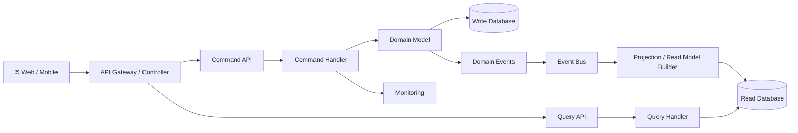
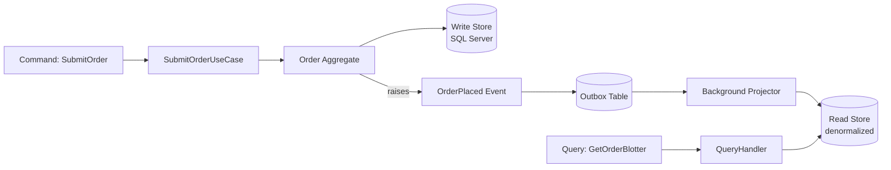
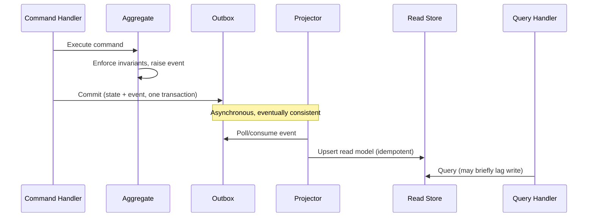
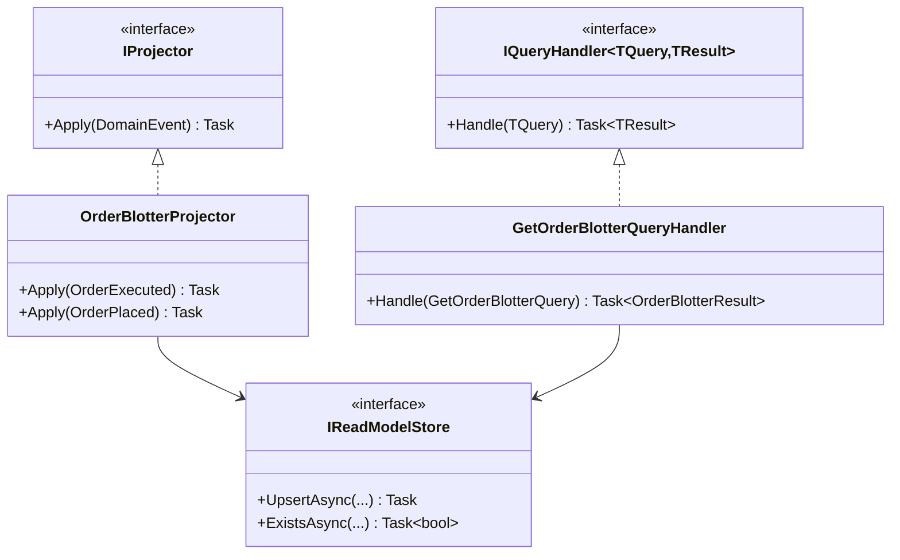
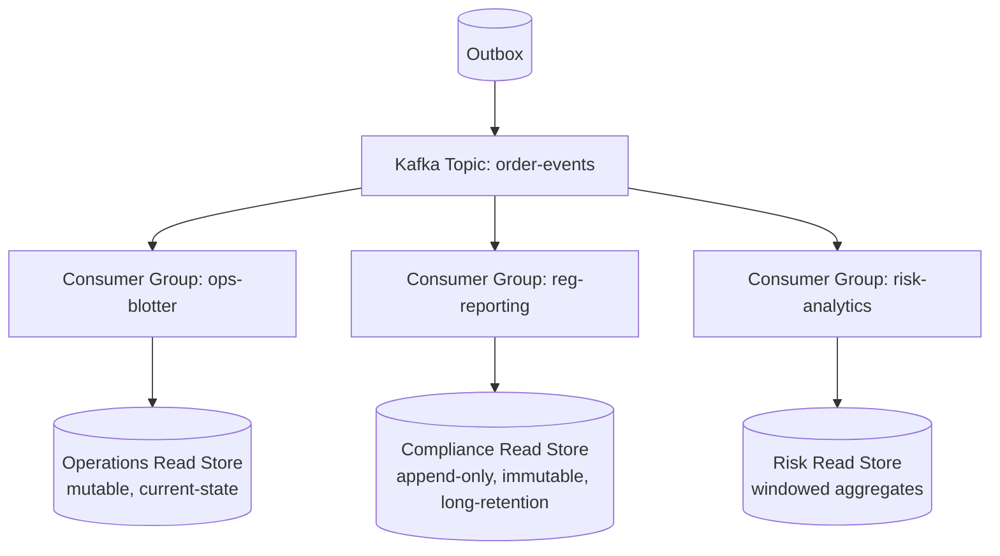
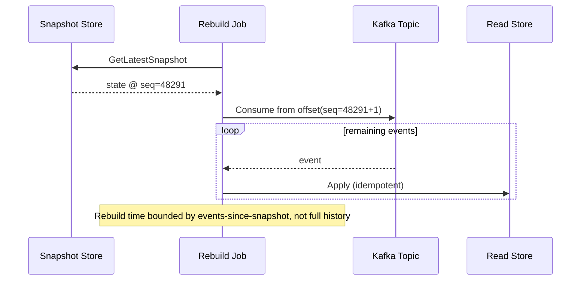
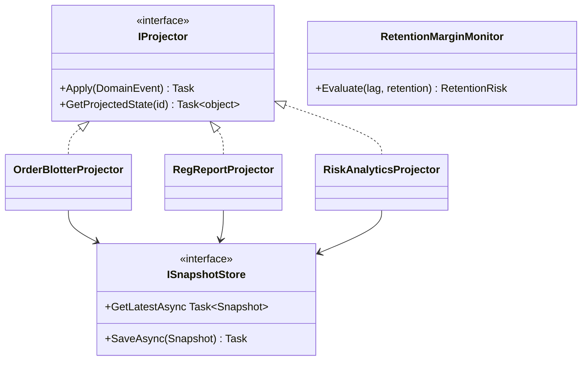

# CQRS — Complete Interview Prep (All Topics, One File)

> Domain: CQRS | Level: Beginner → Expert | Prerequisite: [[../31-Domain-Driven-Design/01-DDD-Interview-Prep]] (aggregates, domain events), [[../18-Event-Driven-Architecture/01-EDA-Interview-Prep]] (events, ordering, idempotency). Related: [[../35-Event-Sourcing/01-Event-Sourcing-Interview-Prep]], [[../37-Outbox/01-Outbox-Interview-Prep]]
> **Quick-prep edition** (consolidated 2026-10-03). This one file replaces Modules 119–120. Originals: `git show ebb2d5c:34-CQRS/<file>.md`
> Each topic has: **Key concepts → C# code → Most common interview questions with answers.**

| # | Topic | # | Topic |
|---|---|---|---|
| 1 | CQS vs CQRS; the read/write mismatch | 6 | Read-model technology selection |
| 2 | Three levels of CQRS | 7 | Rebuilding projections & snapshots at scale |
| 3 | Commands, queries & handlers in .NET | 8 | Schema evolution across many consumers |
| 4 | Projections: eventual consistency in practice | 9 | When CQRS is (not) worth it |
| 5 | Idempotent, ordered projectors | 10 | Top 20 rapid-fire + Principal · 11 Mistakes checklist |

---

## 1. CQS vs CQRS; the Read/Write Mismatch

**Key concepts**
- **CQS** (Bertrand Meyer): a method either changes state (command) or returns data (query), not both.
- **CQRS** (Greg Young): apply that at the architectural level — **separate models** (and possibly stores) for **writes** (commands → aggregates enforcing invariants) and **reads** (queries → read models shaped for screens/APIs).
- **Why:** one model can't serve both well — writes need normalized, invariant-protecting aggregates; reads need denormalized, joined, filtered, paginated views; read/write loads scale differently (often 100:1 reads); different security and consistency needs.
- Not the same as event sourcing (often combined, independent).

**Common interview question**

**Q. What problem does CQRS solve?**
The impedance mismatch between a write model designed to protect invariants and the many query shapes the UI and reports need. Separating them lets each be optimized and scaled independently — at the cost of synchronizing the read side (often eventually consistent).

---

## 2. Three Levels of CQRS

| Level | Write side | Read side | Consistency | Complexity |
|---|---|---|---|---|
| **1. Separate code paths** | aggregates via EF Core | query handlers with projections (`Select`, Dapper, views) on the **same DB** | immediate | low — use widely |
| **2. Separate read store, same DB tech** | aggregates | denormalized tables/materialized views updated in the same transaction or by events | immediate or near-real-time | medium |
| **3. Separate stores, event-driven projections** | aggregates (± event sourcing) | Elasticsearch/Cosmos/Redis/SQL read DBs updated by consumers of events | eventual | high |

- Start at level 1; escalate only when queries become too complex/slow or read scale demands it.

---

## 3. Commands, Queries & Handlers in .NET

```csharp
// Command side: aggregate + repository + unit of work
public sealed record ApproveLoan(Guid LoanId, string ApprovedBy) : IRequest<Result>;
public sealed class ApproveLoanHandler(ILoanRepository loans, IUnitOfWork uow) : IRequestHandler<ApproveLoan, Result>
{
    public async Task<Result> Handle(ApproveLoan cmd, CancellationToken ct)
    {
        var loan = await loans.GetAsync(new LoanId(cmd.LoanId), ct);
        if (loan is null) return Result.NotFound();
        loan.Approve(cmd.ApprovedBy);                         // invariants enforced here; raises LoanApproved
        await uow.SaveChangesAsync(ct);                        // + outbox row
        return Result.Success();
    }
}

// Query side (level 1): no aggregates, no tracking, shaped DTO
public sealed record GetLoanSummaries(string BranchId, int Page) : IRequest<IReadOnlyList<LoanSummaryDto>>;
public sealed class GetLoanSummariesHandler(IDbConnectionFactory db) : IRequestHandler<GetLoanSummaries, IReadOnlyList<LoanSummaryDto>>
{
    public async Task<IReadOnlyList<LoanSummaryDto>> Handle(GetLoanSummaries q, CancellationToken ct)
    {
        using var conn = db.Create();
        return (await conn.QueryAsync<LoanSummaryDto>(new CommandDefinition("""
            SELECT l.Id, l.Amount, l.Status, c.Name AS CustomerName, l.UpdatedAt
            FROM Loans l JOIN Customers c ON c.Id = l.CustomerId
            WHERE l.BranchId = @BranchId
            ORDER BY l.UpdatedAt DESC OFFSET @Skip ROWS FETCH NEXT 50 ROWS ONLY
            """, new { q.BranchId, Skip = q.Page * 50 }, cancellationToken: ct))).AsList();
    }
}
```

**Common interview questions**

**Q1. Should queries go through repositories and aggregates?**
No: aggregates exist to enforce invariants on writes. Queries should read directly with projections (EF Core `Select` + `AsNoTracking`, Dapper, views, read stores) shaped for the consumer — faster and simpler.

**Q2. Can a command return data?**
Pragmatically yes — an ID, a version, or a result status — but not query data for screens. Strict CQS says no; most systems return the created ID.

---

## 4. Projections: Eventual Consistency in Practice

**Key concepts**
- A **projector** consumes domain/integration events (from an outbox → broker, CDC, or an event store) and updates read models.
- **Eventual consistency:** after a command commits, the read model updates milliseconds to seconds later. The **lag** is a property to measure (time lag metric) and design for.
- **UI patterns:** return the command result and update the UI optimistically; "processing" states; read-your-own-writes by reading the write side for the user's own just-changed item; poll/wait for a version (`ETag`/version ≥ N); push notifications (SignalR) when projections update.
- Cross-read-model consistency is **not guaranteed** (two projections can be at different positions).

```csharp
// Read-your-own-writes: wait (bounded) until the read model reaches the command's version
public async Task<LoanView?> GetAfterWriteAsync(Guid loanId, long minVersion, CancellationToken ct)
{
    for (var i = 0; i < 10; i++)
    {
        var view = await _readDb.Loans.AsNoTracking().SingleOrDefaultAsync(l => l.Id == loanId, ct);
        if (view is not null && view.Version >= minVersion) return view;
        await Task.Delay(100, ct);
    }
    return await _writeSideFallback.GetAsync(loanId, ct);    // degrade to the write model if lagging
}
```

**Common interview question**

**Q. A user saves and the list still shows old data. How do you handle eventual consistency in the UI?**
Optimistically update the UI from the command response, show pending states, read the user's own item from the write side or wait for the projected version, and push updates when the projection catches up. Measure projection lag and alert if it exceeds the agreed window.

---

## 5. Idempotent, Ordered Projectors

**Key concepts**
- Delivery is **at-least-once** → projections must be **idempotent**: track the last processed event position/version per projection (or per entity) and skip duplicates; use upserts keyed by entity ID.
- **Ordering:** per-entity ordering via partition keys (entity ID); apply events only if `event.Version == view.Version + 1` (or `>`), park/out-of-order handling.
- **Checkpointing:** store the projector's position in the **same transaction** as the read-model update (exactly-once effect within the read store).
- **Poison events:** DLQ, alert, and don't block other entities' updates.
- Projectors are **independent consumer groups** — never chain projectors on each other's read models.

```csharp
public sealed class LoanSummaryProjector(ReadDbContext db) : IConsumer<LoanApproved>
{
    public async Task Consume(ConsumeContext<LoanApproved> ctx)
    {
        var e = ctx.Message;
        var view = await db.LoanSummaries.FindAsync(e.LoanId);
        if (view is null || e.Version <= view.Version) return;          // duplicate or stale → idempotent skip
        if (e.Version != view.Version + 1) throw new OutOfOrderException(); // retry later / park
        view.Status = "Approved"; view.ApprovedBy = e.ApprovedBy; view.Version = e.Version; view.UpdatedAt = e.OccurredAt;
        await db.SaveChangesAsync();                                      // view + version updated atomically
    }
}
```

**Common interview questions**

**Q1. Why must projections be idempotent?**
Because brokers and outbox relays deliver at least once, and rebuilds replay events; without idempotency, duplicates double-count (balances, counters) or overwrite newer state with older.

**Q2. How do you guarantee projection order?**
Partition events by entity ID so one consumer processes an entity's events in order, store a version per view and apply only the next version, and handle gaps by retrying/parking rather than skipping.

---

## 6. Read-Model Technology Selection

| Need | Read store |
|---|---|
| relational queries, reporting, joins | SQL (denormalized tables, indexed views) |
| full-text search, faceting | Elasticsearch/OpenSearch, Azure AI Search |
| key-value lookups at scale | Redis, DynamoDB, Cosmos DB |
| document views per screen | MongoDB/Cosmos DB |
| graph traversals | Neo4j/Gremlin |
| analytics | warehouse/lakehouse (Snowflake, Databricks, Synapse) |

- Choose per read model — CQRS allows polyglot read stores; each adds operational cost. Retention and immutability can differ per read model (e.g., audit views kept 7 years, dashboards 30 days).

---

## 7. Rebuilding Projections & Snapshots at Scale

**Key concepts**
- Read models are **disposable**: rebuild from the event log/history when schemas change or bugs corrupt them.
- **Blue-green rebuild:** build a new version of the read model in parallel (new table/index), catch up to the live position, then switch reads atomically; keep the old one for rollback.
- **Scale:** replaying billions of events takes hours → parallelize by partition, snapshot projections periodically (or start from a compacted snapshot), throttle to protect sources, monitor catch-up rate.
- **Backpressure:** a slow projector grows lag; scale consumers per partition, batch writes, and alert before retention limits.

**Common interview question**

**Q. How do you rebuild a large projection without downtime?**
Deploy a new projector writing to a new read store/table from the start of the log (or a snapshot), let it catch up while the old one serves reads, verify (counts, checksums, sampled comparisons), switch reads via configuration/alias, then retire the old version.

---

## 8. Schema Evolution Across Many Consumers

- Events are contracts for every projector; evolve additively (new optional fields), version event types for breaking changes, use a schema registry with compatibility checks, and **upcast** old events when rebuilding.
- Each projector team owns its read model's schema; changes to read-model schemas are migrations handled by rebuilds.

---

## 9. When CQRS Is (Not) Worth It

**Worth it:** complex domains with rich invariants plus many diverse query needs; high read/write asymmetry; different scaling/latency/security requirements for reads; collaborative domains; event-driven systems already publishing events.

**Not worth it:** simple CRUD, small apps, teams new to eventual consistency, when the UI needs strict read-after-write everywhere and the cost of handling lag is high.

**Common interview questions**

**Q1. When would you recommend full CQRS with separate stores?**
When queries are slow/complex against the write model and can't be fixed with indexes/views, read load dwarfs writes, or reads need a different technology (search, analytics) — and the business accepts a measured eventual-consistency window. Otherwise stay at level 1 (separate query handlers on the same DB).

**Q2. What are the costs of CQRS?**
More moving parts (projectors, brokers, read stores), eventual consistency handling in UI and APIs, duplicated data, rebuild tooling, schema evolution across consumers, and operational monitoring of lag.

---

## 10. Top 20 Rapid-Fire Questions + Principal Questions

1. **CQS?** Method commands or queries, not both.
2. **CQRS?** Separate write and read models.
3. **CQRS = event sourcing?** No; often combined.
4. **Level 1?** Separate query code, same DB.
5. **Write side?** Aggregates enforcing invariants.
6. **Read side?** Denormalized views per use.
7. **Projection?** Event consumer updating a read model.
8. **Consistency?** Eventual (lag measured).
9. **Read-your-own-writes?** Optimistic UI / write-side read / wait for version.
10. **Idempotent projector?** Version check + upsert.
11. **Ordering?** Partition by entity ID.
12. **Checkpoint location?** Same transaction as the view update.
13. **Chained projectors?** Avoid — independent consumers.
14. **Read store choice?** Per query need (SQL, search, KV).
15. **Rebuild?** Blue-green from the log.
16. **Command returns?** ID/status, not views.
17. **Queries via repositories?** No.
18. **Lag alert?** Time lag vs agreed window.
19. **Overkill?** CRUD apps.
20. **Biggest cost?** Eventual consistency + operations.

**Principal-level question**

**P. Explain eventual consistency of a CQRS read side to the business.**
"Your change is saved immediately; screens that summarize it update within N seconds. During that window, you'll see a 'processing' marker on your own changes. Money movements and approvals are always checked against the authoritative records." Back it with a lag SLO and alerting.

---

## 11. Mistakes Checklist (say why each is wrong)
- [ ] Full CQRS with separate stores for simple CRUD
- [ ] Querying through aggregates/repositories · bending aggregates for screens
- [ ] Non-idempotent projectors · ignoring ordering · checkpoints outside the view transaction
- [ ] Projectors depending on other read models · no lag monitoring
- [ ] UI that assumes immediate read-after-write · no rebuild strategy
- [ ] Publishing events without an outbox (dual write)

---

## Architecture Diagrams (preserved from the original modules)

> All 12 Mermaid/ASCII diagrams from the original `34-CQRS/` files, kept verbatim and grouped by source module. Originals: `git show ebb2d5c:34-CQRS/<file>.md`.

### Module 119 — CQRS: Command/Query Responsibility Segregation, Read Models & the Complexity Threshold for Full Adoption
*Source: `01-CQRSFundamentals-CommandQuerySeparation-ReadModels-ComplexityThreshold.md`*

**CQRS (Command Query Responsibility Segregation)**



**Write Flow (Commands)**

```text
Client
 │
CreateOrder Command
 │
API Controller
 │
Command Handler
 │
Aggregate Root
 │
Validate Business Rules
 │
Save to Write Database
 │
Publish Domain Event
 │
Event Bus
```

**Read Flow (Queries)**

```text
Client
 │
GetOrder Query
 │
Query Handler
 │
Read Database
 │
Return DTO
```

**Read Model Synchronization**

```text
Order Created
 │
 ▼
Domain Event
 │
 ▼
Event Bus
 │
 ▼
Projection Service
 │
 ▼
Read Database
 │
Optimized View
```

**Typical Folder Structure**

```text
Application
│
├── Commands
│ ├── CreateOrderCommand
│ ├── CancelOrderCommand
│ └── Handlers
│
├── Queries
│ ├── GetOrderQuery
│ ├── SearchProductsQuery
│ └── Handlers
│
├── DTOs
└── Interfaces

Domain
Infrastructure
API
```

**3. Visual Architecture**



**3. Visual Architecture**



**13. Low-Level Design**



### Module 120 — CQRS: Capstone — Event-Driven Read-Model Projections at Scale
*Source: `02-Capstone-EventDrivenReadModelProjectionsAtScale.md`*

**1. Fundamentals**

```text
Event Stream (Outbox → Kafka topic, partitioned by OrderId)
 ├── OrderBlotterProjector → Operations read store (fast, current-state view)
 ├── RegReportProjector → Compliance read store (append-only, immutable, long-retention)
 └── RiskAnalyticsProjector → Risk read store (aggregated, near-real-time, windowed)
Each projector is an independent consumer of the SAME topic — no projector depends on another.
```

**3. Visual Architecture**



**3. Visual Architecture**



**13. Low-Level Design**


