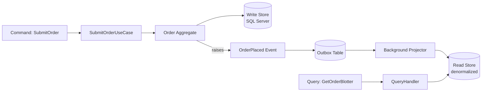
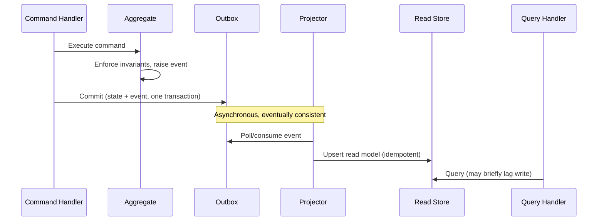
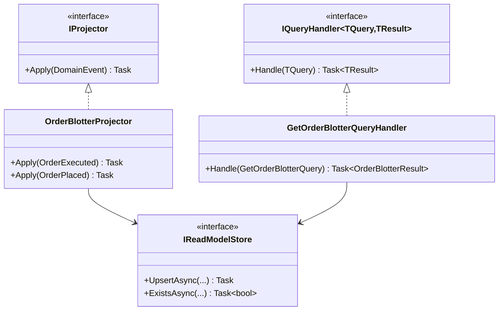

# Module 119 — CQRS: Command/Query Responsibility Segregation, Read Models & the Complexity Threshold for Full Adoption

> Domain: CQRS | Level: Beginner → Expert | Prerequisite: [[../33-Hexagonal-Architecture/02-Capstone-AdapterSubstitutionForTestability-RegulatedTradingExecutionEngine]] (§Expert Q5 previewed a Command/Query Port split for the Order Execution Engine's position dashboard — this module formalizes that preview into full CQRS), [[../31-Domain-Driven-Design/03-DomainEvents-DomainServices-Repositories]] (Intermediate Q4's original read/write Repository mismatch), [[../30-Architecture-Patterns/*]] (Module 112 Advanced Q5's bounded-context-level CQRS preview)
>
> **Domain scope note:** `34-CQRS` is scoped to 2 modules (119–120, standard depth, autonomously scoped given the substantial groundwork already laid by prior previews): this Fundamentals module and a capstone on event-driven read-model projection at scale. Full 16-section template (per the 2026-07-18 reversion in `CLAUDE.md`); Elite FinTech Interview Panel lens.

---

## 1. Fundamentals

**What:** CQRS (Command Query Responsibility Segregation) is the architectural pattern of using **separate models** for writing data (Commands — state-changing operations enforcing business invariants) and reading data (Queries — read-only operations optimized for the consumer's display/reporting needs), rather than one unified model serving both.

**Why:** A write model (an Aggregate, Module 110) is shaped around enforcing invariants correctly, one Aggregate at a time; a read model is shaped around efficient, often denormalized, multi-record, cross-Aggregate display needs — forcing one model to serve both purposes (Module 111 Intermediate Q4's original finding) creates genuine friction: either the write model is polluted with read-optimization concerns, or the read path pays the cost of loading full Aggregates for a handful of display fields.

**When:** A simple, direct read-only query bypassing the Repository (Module 111 Intermediate Q4) suffices for most systems; **full CQRS** (a genuinely separate read-model data store, populated via event-driven projection) is justified specifically when read-side scaling, latency, or query-shape requirements diverge significantly enough from the write model that a shared or lightly-adapted database can no longer serve both well — a threshold this module treats as the central decision this domain exists to teach.

**How (30,000-ft view):**
```
Command side:                          Query side:
  Command → Use Case → Aggregate         Query → Read Model (denormalized)
  → Repository (write-optimized store)   ← populated by Domain Events
  → raises Domain Event ------------------→ (via Outbox + projector)
```

---

## 2. Deep Dive

### 2.1 The Read/Write Model Mismatch, Formalized
Module 111 Intermediate Q4 established that a Repository loading whole Aggregates is the wrong tool for a "list orders over $500 this week, three summary fields" query. CQRS formalizes this observation into an explicit architectural split: a **Command Model** (Aggregates, invariants, Module 110) and a **Query Model** (denormalized read structures, no invariants, no behavior) as two genuinely separate concerns, each independently optimized.

### 2.2 Three Levels of CQRS, From Lightest to Heaviest
**Level 1 — Separate methods, same database:** A `CommandRepository` and a `QueryRepository`/read-only query class hitting the same underlying tables, the lightest form (already demonstrated in Module 118 Expert Q5's dashboard example). **Level 2 — Separate read-optimized tables/views in the same database:** materialized views or denormalized tables updated synchronously or via a database trigger, still one database. **Level 3 — Full CQRS with event-driven projection:** a genuinely separate read-store (a different database technology entirely, e.g., a document store or search index) populated asynchronously by consuming Domain Events (Module 111) via the Outbox pattern (Module 111 Advanced Q2), with eventual consistency between write and read sides as an explicit, accepted trade-off.

### 2.3 Eventual Consistency's Concrete Meaning at the Projection Layer
In Level 3, a Command's success (the write transaction committing) and the read model reflecting that change are two separate events in time — a projector consumes the Outbox-published event and updates the read store asynchronously, meaning a query issued microseconds after a successful command may not yet reflect it. This "replication lag," concretely, is projection lag — the same metric Module 103's cache-invalidation-pipeline-liveness concern (§Advanced Q5 there) already established as needing continuous, not point-in-time, verification.

### 2.4 Runtime/Memory Behavior of a Projector
A projector is typically a long-running consumer (structurally identical to Module 118's Primary Adapter background service) reading from the Outbox/message broker, transforming each event into a read-model update (an upsert against the read store) — its memory footprint is dominated by however much event-batch buffering it does before flushing to the read store, and its failure mode (a crashed projector) must be recoverable via consumer-offset replay, not a silent, permanent gap.

### 2.5 Idempotent Projection — a Non-Negotiable Property
Because message delivery is generally at-least-once (Module 111 Advanced Q2's Outbox reliability model), a projector must apply each event idempotently (an upsert keyed by the event's own entity ID and a monotonic version/sequence number, rejecting or no-oping a re-delivered, already-applied event) — without this, a redelivered event could double-count a value in the read model (e.g., incrementing a running total twice for one logical event).

### 2.6 Read-Model Technology Selection
The read store's technology is chosen purely for query-shape fit, entirely independent of the write side's technology (Module 113's Dependency Rule ensures this independence architecturally) — a relational read-optimized schema, a document store for flexible, nested display shapes, or a search index (Elasticsearch-style) for full-text/faceted queries are all valid choices, selected per Module 6/7/8's own already-established data-store trade-off criteria, not a CQRS-specific new criterion.

---

## 3. Visual Architecture





---

## 4. Production Example

**Problem:** The Order Execution Engine's (Module 118) operational trade blotter — showing all of a client's orders across the day with real-time status — became slow and expensive to query once the client base grew, since every blotter refresh loaded full `Order` Aggregates through `IPositionRepository`, including invariant-supporting fields the dashboard never displayed.

**Architecture:** Introduced a genuinely separate, denormalized `OrderBlotterReadModel` in a document store, populated by a projector consuming `OrderPlaced`/`OrderExecuted`/`OrderCancelled` events via the existing Outbox (Module 118's own `TradeExecuted` publishing mechanism, extended to include blotter-relevant events).

**Implementation:** The projector's initial version updated the read model per-event without an idempotency check, reasoning "the Outbox only delivers once in practice."

**Trade-offs:** Full CQRS added a new data store, a new background service (the projector), and eventual-consistency UX considerations (a freshly-submitted order might not appear in the blotter for a second or two) — a real cost, weighed against the read-side performance and independent-scaling benefit gained.

**Lessons learned:** During a projector redeployment, a consumer-group rebalance caused a batch of already-processed events to be redelivered (a normal, expected at-least-once-delivery behavior, Module 111 Advanced Q2) — the non-idempotent projector double-applied several `OrderExecuted` events, briefly showing duplicate fill quantities on the blotter for a handful of orders until manually corrected. This is §2.5's exact, predicted risk, materializing precisely because idempotent projection was treated as an edge case rather than a foundational requirement; the fix added an idempotency check (an `(EventId)` uniqueness constraint on a processed-events tracking table, checked before applying each projection) as a mandatory, non-optional part of every projector, not a per-projector judgment call.

---

## 5. Best Practices
- Start at CQRS Level 1 (Module 111 Intermediate Q4's simple direct query) by default; escalate to Level 3 only when a specific, measured need justifies it (§2.2).
- Make every projector idempotent from day one — never treat at-least-once redelivery as a rare edge case (§2.5, §4).
- Monitor projection lag continuously as a first-class operational metric, not merely at build time (§2.3).
- Choose read-store technology purely on query-shape fit, independent of the write side's technology (§2.6).
- Keep the read model free of business logic and invariants entirely — it is a projection, not a second source of truth.

## 6. Anti-patterns
- Jumping straight to full event-driven CQRS for a low-traffic, simple-query system, incurring real operational cost for no measured benefit (§2.2, Module 112 Advanced Q5's calibration).
- A non-idempotent projector, one redelivery away from silently corrupting the read model (§4).
- Allowing the read model to become writable or authoritative for any business decision — this collapses the entire separation CQRS exists to provide.
- Treating "eventual consistency" as a vague hand-wave rather than a concretely monitored, bounded lag with an explicit SLA (§2.3).
- Coupling the read-model schema to the write-side Aggregate's internal structure, reintroducing the exact mismatch (§2.1) CQRS exists to remove.

---

## 7. Performance Engineering

**CPU:** Projector transformation logic (event → read-model shape) is typically lightweight; the dominant cost is I/O — reading from the event source and writing to the read store — not CPU-bound computation.

**Memory:** Batch-size tuning for the projector's consume-transform-write loop trades memory (larger batches buffered in memory) for write-store efficiency (fewer, larger upserts) — benchmark (Module 101) rather than assume a default batch size is correct for this system's specific event volume.

**Latency:** Projection lag (§2.3) is the key latency metric on the read side — track P50/P99 time-from-commit-to-queryable, not just projector throughput.

**Throughput:** A projector's throughput must exceed the write side's peak event-generation rate with margin, or lag grows unboundedly during bursts (directly Module 102's queueing-theory capacity-planning discipline, applied to projection specifically).

**Scalability:** Multiple projector instances can process different event partitions in parallel (Module 118 §9's partition-keyed consumption pattern, reapplied here) provided read-model upserts remain correctly ordered per entity.

**Benchmarking:** Load-test the projector under realistic peak write-side burst rates (Module 118 §7's market-open-burst methodology, generalized), not steady-state averages.

**Caching:** The read model itself often functions as a cache in spirit; an additional cache layer in front of it (Module 103) is reasonable for extremely hot, repeatedly-queried read-model records.

---

## 8. Security

**Threats:** A read model inadvertently exposing more data than the write side's own authorization model would permit (an aggregation/join in the projector accidentally surfacing another client's data); stale read-model data being relied upon for a security-relevant decision it shouldn't be (e.g., an authorization check reading a stale, since-revoked permission from the read model instead of the authoritative write side).

**Mitigations:** Enforce the identical authorization checks on Query handlers as on Command handlers — CQRS separates *models*, not *security boundaries*; never authorize based on read-model data for anything requiring current, authoritative state (directly reapplying Module 118 §9's CP-consistency principle: any decision requiring correctness must read the authoritative write side, never the eventually-consistent read side).

**OWASP mapping:** Broken Object-Level Authorization risk (Module 97) recurs at the Query-handler level specifically — a query returning "my orders" must filter by the requesting identity's actual ownership, not merely trust a client-supplied filter parameter.

**AuthN/AuthZ:** Query handlers require their own explicit authorization checks, not an assumption that "it's just a read" makes them lower-risk.

**Secrets:** Read-store credentials are a separate secret from the write-store's, with their own rotation policy (Module 86).

**Encryption:** Read-model data at rest requires the identical encryption standard as the write side, especially for regulated/PII-containing projections (Module 118's blotter contains client trading data).

---

## 9. Scalability

**Horizontal scaling:** Read replicas of the read store scale query throughput independently of write-side capacity — the entire point of CQRS's decoupling.

**Vertical scaling:** Less relevant for the read store than horizontal read-replica scaling, given read-heavy, largely-idempotent query workloads.

**Caching:** A CDN or in-memory cache layer in front of the read model for extremely hot queries (Module 103), safe specifically because the read model is already a derived, disposable artifact.

**Replication/Partitioning:** The read store can be partitioned by a dimension optimal for queries (e.g., by client ID for a per-client blotter), independent of how the write side's Aggregates are partitioned.

**Load balancing:** Query traffic load-balances trivially across read replicas, unconstrained by any write-side ordering requirement.

**High Availability:** The read store's availability is decoupled from the write side's — a read-store outage doesn't block Command processing, and vice versa, a genuine resilience benefit of the separation.

**Disaster Recovery:** A read model is, by design, fully rebuildable from the event history (replaying every event from the beginning) — the read store itself typically doesn't need the same backup rigor as the write side, provided event history retention is sufficient to replay from.

**CAP theorem:** The read side deliberately favors availability and partition tolerance over strict consistency (AP), the mirror image of Module 118 §9's CP-favoring write-side risk-check path — CQRS is, at its core, an architectural pattern for applying *different* CAP trade-offs to *different* parts of one logical system rather than forcing one uniform choice.

---

## 10. Interview Questions

### Basic (10)

1. **Q: What does CQRS stand for and what does it separate?**
   **A:** Command Query Responsibility Segregation — separates the model used for writes (Commands) from the model used for reads (Queries).
   **Why correct:** States the full name and its precise scope.
   **Common mistakes:** Assuming CQRS mandates two separate databases by definition (§2.2's Level 1/2 don't require this).
   **Follow-ups:** "What's the lightest possible form of CQRS?" (Separate command/query methods against the same database, §2.2 Level 1.)

2. **Q: Why is loading a full Aggregate through a Repository a poor fit for a reporting query?**
   **A:** The Aggregate is shaped for invariant enforcement, not display efficiency — loading it just to extract a few summary fields wastes effort and couples the read need to the write model's shape (Module 111 Intermediate Q4).
   **Why correct:** Directly cites the original, already-established finding this pattern formalizes.
   **Common mistakes:** Assuming this means Repositories are bad in general, rather than mismatched to this specific use case.
   **Follow-ups:** "What's the simplest fix short of full CQRS?" (A direct, simple query bypassing the Repository, §2.2 Level 1.)

3. **Q: What is a "read model" in CQRS?**
   **A:** A denormalized, query-optimized data structure containing no business invariants or behavior, populated to serve read needs efficiently.
   **Why correct:** Correctly distinguishes it from the write-side Aggregate.
   **Common mistakes:** Giving the read model any write capability or treating it as authoritative.
   **Follow-ups:** "Should a read model ever be directly mutated?" (No — it's derived, disposable, and rebuildable from events, §9's DR point.)

4. **Q: What mechanism typically populates a Level 3 CQRS read model?**
   **A:** A projector consuming Domain Events (via the Outbox pattern) and updating the read store asynchronously.
   **Why correct:** Names the specific, standard mechanism.
   **Common mistakes:** Assuming the read model is updated synchronously within the same transaction as the write.
   **Follow-ups:** "Why not update it synchronously?" (Would couple write-path latency/availability to the read store, losing the decoupling benefit, §9.)

5. **Q: What does "eventual consistency" mean concretely for a CQRS read model?**
   **A:** A brief, bounded delay (projection lag) between a Command committing and the read model reflecting that change.
   **Why correct:** Gives the concrete, measurable meaning rather than an abstract definition.
   **Common mistakes:** Assuming eventual consistency means unbounded or unmonitored delay.
   **Follow-ups:** "How would you measure this lag?" (Time from event commit to read-model queryability, tracked as a monitored metric, §2.3.)

6. **Q: Why must a projector be idempotent?**
   **A:** Event delivery is generally at-least-once; a redelivered event applied twice without an idempotency check can corrupt the read model (e.g., double-counting).
   **Why correct:** States the specific mechanism and consequence.
   **Common mistakes:** Assuming redelivery is rare enough to ignore (§4's incident demonstrates otherwise).
   **Follow-ups:** "How is idempotency typically implemented?" (A processed-event-ID uniqueness check before applying an update, §2.5.)

7. **Q: Can the read-store technology differ entirely from the write-store technology?**
   **A:** Yes — they're architecturally independent, chosen purely on their own respective fit for writes versus queries.
   **Why correct:** Correctly states the independence CQRS's separation provides.
   **Common mistakes:** Assuming CQRS requires using the same database technology for both sides.
   **Follow-ups:** "What would drive choosing a document store or search index specifically for the read side?" (Flexible nested display shapes, or full-text/faceted query needs, §2.6.)

8. **Q: Is full CQRS (Level 3) the default recommended starting point for a new system?**
   **A:** No — start with the simplest form (a direct query, Level 1) and escalate only when a measured need justifies it.
   **Why correct:** States the calibrated default this domain's whole framing insists on.
   **Common mistakes:** Adopting full event-driven CQRS reflexively as a "best practice" regardless of actual need.
   **Follow-ups:** "What's a concrete signal that escalation is justified?" (Read-side scaling/latency/query-shape needs measurably diverging from the write side, §2.2.)

9. **Q: What happens to query correctness if the read model briefly lags behind a just-committed write?**
   **A:** A query issued immediately after the write may not yet reflect it — an accepted trade-off for most use cases, but unacceptable for decisions requiring current, authoritative state.
   **Why correct:** States both the general behavior and the specific exception.
   **Common mistakes:** Assuming this lag is always acceptable regardless of what the query is used for.
   **Follow-ups:** "Give an example where this lag would be unacceptable." (An authorization check needing current permission state, §8.)

10. **Q: Does CQRS change where security/authorization checks are enforced?**
    **A:** No — Command and Query handlers each need their own, equally rigorous authorization checks; CQRS separates models, not security boundaries.
    **Why correct:** Corrects a common misconception that reads are inherently lower-risk.
    **Common mistakes:** Assuming a "read-only" query needs less authorization scrutiny than a write.
    **Follow-ups:** "What OWASP risk category applies to an under-authorized query handler?" (Broken Object-Level Authorization, §8.)

### Intermediate (10)

1. **Q: Walk through the three levels of CQRS adoption and what specifically changes at each escalation.**
   **A:** Level 1: separate command/query code paths, same database. Level 2: separate read-optimized tables/views, same database, synchronously or trigger-updated. Level 3: a genuinely separate read-store technology, populated asynchronously via event-driven projection, with explicit eventual consistency.
   **Why correct:** Precisely distinguishes the escalation dimensions (data-store separation, synchronicity) rather than treating CQRS as binary.
   **Common mistakes:** Treating "CQRS" as synonymous only with the heaviest (Level 3) form.
   **Follow-ups:** "What's the concrete trigger for escalating from Level 2 to Level 3?" (The single database can no longer serve both write and read scaling/latency needs adequately.)

2. **Q: Why is a projector's memory footprint dominated by batching strategy rather than transformation logic?**
   **A:** The transformation (event → read-model upsert) is typically lightweight; the memory cost is proportional to how many events are buffered before a batch flush to the read store.
   **Why correct:** Correctly identifies the actual cost driver.
   **Common mistakes:** Assuming projection logic itself, rather than I/O batching, is the primary resource concern.
   **Follow-ups:** "How would you tune batch size?" (Benchmark under realistic event volume, trading memory for write-store efficiency, §7.)

3. **Q: How does §4's incident concretely demonstrate the idempotency requirement, and what specifically failed?**
   **A:** A consumer-group rebalance caused already-processed events to be redelivered; the projector, lacking an idempotency check, reapplied them, double-counting fill quantities on the blotter.
   **Why correct:** Names the specific trigger (rebalance-driven redelivery) and consequence (double-counted values).
   **Common mistakes:** Assuming this required an unusual, rare failure rather than normal, expected at-least-once delivery behavior.
   **Follow-ups:** "What specific mechanism fixed it?" (An `(EventId)` uniqueness/processed-tracking check before applying each update, §4.)

4. **Q: Why does the read side favor AP (availability/partition tolerance) while the write side (Module 118 §9) favored CP for risk checks?**
   **A:** The read side's consequences of serving slightly stale data are generally low (a dashboard showing a few-second-old value); the write side's risk-check path has zero tolerance for an incorrect approval based on stale data — CQRS lets each side make its own, independently appropriate CAP trade-off.
   **Why correct:** Correctly connects the CAP choice to each side's specific correctness stakes, not an arbitrary preference.
   **Common mistakes:** Assuming a system must make one uniform CAP choice throughout.
   **Follow-ups:** "Is there a query that would need the write side's CP guarantee instead of the read model?" (Yes — any read feeding directly into a real-time risk/authorization decision, §8's exception.)

5. **Q: Why is the read model described as "fully rebuildable from event history," and why does this reduce its backup/DR requirements?**
   **A:** Since the read model is purely derived from the event stream (never itself a source of truth), it can be regenerated from scratch by replaying every historical event through the projector — meaning its own backup rigor can be lighter than the authoritative write side's, provided event retention is sufficient.
   **Why correct:** States the specific mechanism (replay) and its DR-cost implication precisely.
   **Common mistakes:** Applying the same backup/retention discipline to the read store as to the write store, missing this genuine, derived-artifact-specific cost saving.
   **Follow-ups:** "What retention requirement does this replay capability actually depend on?" (Event history/Outbox retention long enough to rebuild the read model from the earliest still-relevant state.)

6. **Q: Critique coupling the read-model schema directly to the write-side Aggregate's internal class structure (e.g., auto-mapping every Aggregate field 1:1 into the read model).**
   **A:** This reintroduces §2.1's exact mismatch CQRS exists to remove — a read model shaped like the write side isn't genuinely optimized for read/display needs, and any future Aggregate refactor now risks breaking the read model too, defeating the decoupling benefit entirely.
   **Why correct:** Identifies the specific way this defeats CQRS's central purpose.
   **Common mistakes:** Treating a 1:1 field mapping as a reasonable, low-effort starting point without recognizing the coupling risk it reintroduces.
   **Follow-ups:** "What should the read model be shaped around instead?" (The actual query/display needs of its consumers, independent of the Aggregate's own internal structure.)

7. **Q: How would you detect projection lag growing unboundedly before it becomes a customer-facing problem?**
   **A:** Continuously monitor time-from-commit-to-queryable (P50/P99) as a first-class metric, alerting on sustained growth — directly Module 94's burn-rate-alerting philosophy applied to projection lag specifically.
   **Why correct:** Names the specific metric and reapplies an already-established alerting discipline.
   **Common mistakes:** Monitoring only projector uptime/liveness without tracking the actually load-bearing lag metric itself.
   **Follow-ups:** "What would cause lag to grow unboundedly?" (Projector throughput falling below sustained write-side event-generation rate, §7/Module 102's capacity-planning concern.)

8. **Q: Why should query-handler authorization never trust a client-supplied filter parameter (e.g., `?clientId=123`) without independent verification?**
   **A:** This is a direct Broken Object-Level Authorization risk (Module 97) — the query must verify the requesting identity actually owns/is authorized to see the requested client's data, not merely apply whatever filter the client happened to supply.
   **Why correct:** Correctly reapplies Module 97's IDOR/BOLA finding to the Query side specifically.
   **Common mistakes:** Assuming a read-only query is inherently lower-risk than a write, missing that data exposure is its own serious security consequence.
   **Follow-ups:** "How would you fix a query handler trusting client-supplied filters?" (Derive the authorized scope from the verified caller identity server-side, using the client-supplied parameter only as an additional filter within that already-authorized scope, never as the sole authorization source.)

9. **Q: When would a partitioned, multi-instance projector setup introduce an ordering-correctness risk, and how is it avoided?**
   **A:** If events for the same entity are processed out of order across different projector instances/partitions, the read model could apply an older event after a newer one, producing an incorrect final state — avoided by partitioning events by entity ID (directly Module 118 §9's partition-keyed pattern), guaranteeing all of one entity's events are processed sequentially by one instance.
   **Why correct:** Identifies the specific risk (out-of-order application) and the specific fix (entity-keyed partitioning), reusing an already-established pattern.
   **Common mistakes:** Partitioning purely for throughput without considering per-entity ordering guarantees.
   **Follow-ups:** "What symptom would out-of-order projection produce?" (A read model showing a stale status that a more recent event should have overwritten.)

10. **Q: Why is "the read model is a cache in spirit" a useful but imperfect analogy?**
    **A:** Useful because it's derived, disposable, and rebuildable like a cache; imperfect because a cache typically has a simple invalidation/TTL model, while a CQRS read model is continuously, incrementally updated via ongoing event projection rather than periodically invalidated and refetched from a single source.
    **Why correct:** Correctly identifies both the genuine similarity and the specific point where the analogy breaks down.
    **Common mistakes:** Treating a read model and a cache as fully interchangeable concepts requiring identical operational treatment.
    **Follow-ups:** "Would Module 103's cache-invalidation techniques apply directly to a read model?" (Partially — the "verify actual hit-rate/invalidation-liveness" discipline (Module 103 Advanced Q5) applies well; TTL-based invalidation specifically doesn't, since the read model isn't invalidated on a timer but continuously updated by events.)

### Advanced (10)

1. **Q: Diagnose §4's incident from first principles and design the specific fix preventing a similar idempotency gap in any future projector added to this system.**
   **A:** Root cause: idempotent projection was treated as a per-projector implementation detail rather than a mandatory, architecturally-enforced requirement. Fix: a shared base `Projector` class or framework requiring every concrete projector to implement an idempotency check via a common, tested mechanism (a processed-event-tracking table checked before every apply), plus a fitness function (Module 106) asserting every new projector class actually uses this shared mechanism rather than reimplementing (or omitting) idempotency ad hoc.
   **Why correct:** Identifies the systemic root cause (idempotency treated as optional) and a structural, mechanically-enforced fix rather than a one-off patch.
   **Common mistakes:** Fixing only this specific projector's idempotency gap without addressing why the next new projector could introduce the identical gap.
   **Follow-ups:** "Why is a fitness function more durable protection here than a code-review checklist item?" (Directly this course's recurring theme — a checklist item requires a reviewer to remember it every time; a fitness function mechanically, continuously verifies it.)

2. **Q: A team proposes skipping the Outbox pattern for projection, arguing "we'll just query the write database directly from the projector instead of consuming events." Evaluate this proposal.**
   **A:** This collapses CQRS's own decoupling benefit — the projector now depends directly on the write database's schema and availability, recoupling the read side's scaling/availability to the write side's, exactly what the Outbox-based event-driven approach exists to avoid; it also loses the natural "replay from event history" DR property (§9) since there's no durable event log to replay from, only the write database's current state.
   **Why correct:** Identifies both lost benefits (decoupling, replayability) precisely rather than a vague "that's not how CQRS works."
   **Common mistakes:** Treating this as a minor implementation shortcut rather than one that undermines CQRS's core value proposition.
   **Follow-ups:** "Is there any legitimate use for a projector directly querying the write database?" (A one-time backfill/rebuild of a new read model from current state, distinct from ongoing, event-driven incremental updates.)

3. **Q: Critique a design where Query handlers and Command handlers share the exact same DTOs for input/output, to "reduce duplication."**
   **A:** This directly reproduces Module 113 Intermediate Q8's boundary-DTO-sharing risk in CQRS's specific context — a Command's input shape (what's needed to enact a change) and a Query's output shape (what's needed for display) are genuinely different concerns that will diverge as each evolves independently; sharing DTOs couples them unnecessarily, risking an internal Command-side refactor breaking Query-side consumers or vice versa.
   **Why correct:** Directly reapplies an already-established DTO-boundary-sharing risk to this specific CQRS scenario.
   **Common mistakes:** Treating DTO sharing as a reasonable DRY (don't-repeat-yourself) optimization without weighing the coupling risk it introduces between two deliberately-separated concerns.
   **Follow-ups:** "Is any sharing between Command and Query DTOs ever appropriate?" (Shared, stable, low-level Value Objects like `Money` — Module 113 Advanced Q2's Shared-Kernel-appropriate case — but not the Command/Query DTOs themselves.)

4. **Q: Design a load-testing methodology confirming a projector's throughput exceeds peak write-side event generation with adequate margin, extending Module 102's capacity-planning discipline.**
   **A:** Generate synthetic event bursts at the write side's known peak rate (e.g., market-open-equivalent volume for this domain) sustained for a realistic burst duration, measuring the projector's actual processing rate and confirming projection lag (§2.3) stays bounded and recovers to baseline after the burst ends, rather than growing unboundedly — directly Module 102's Little's-Law-informed capacity-planning approach, applied to projection throughput specifically rather than request-handling throughput.
   **Why correct:** Correctly reapplies an established capacity-planning methodology to this module's own specific bottleneck (projector throughput vs. write-side event rate).
   **Common mistakes:** Load-testing the projector at steady-state average rates only, missing whether it can actually absorb and recover from realistic bursts.
   **Follow-ups:** "What would sustained, non-recovering lag growth indicate?" (The projector's steady-state throughput is genuinely below the sustained event-generation rate — a capacity problem, not merely a burst-absorption problem.)

5. **Q: How would you decide whether an authorization check for a specific query should read from the authoritative write side instead of the (faster, but eventually-consistent) read model?**
   **A:** Apply Module 110's synchronous-invariant-style test, adapted: does this specific authorization decision have zero tolerance for acting on stale data (a security or financial-correctness consequence if wrong), or is brief staleness an acceptable trade-off (a low-stakes display concern)? The former reads from the write side directly (accepting its latency/availability cost); the latter reads from the read model.
   **Why correct:** Gives a concrete, reusable decision test rather than a blanket rule for or against reading from the read model for authorization.
   **Common mistakes:** Applying a uniform rule ("always" or "never" read from the read model for authorization) without this per-decision calibration.
   **Follow-ups:** "Give a concrete example of each case in the Order Execution Engine." (Zero-tolerance: verifying current position/risk-limit state before allowing a new order, §8/Module 118 §9; acceptable-staleness: displaying "last known" order status on an operational dashboard.)

6. **Q: A projector's read-model upsert and its own "last processed event ID" tracking update are performed as two separate, non-atomic writes to the read store. What risk does this introduce, and how would you fix it?**
   **A:** If the process crashes between the read-model upsert and the tracking-update write, the event could be reprocessed on restart (since the tracking record wasn't updated) — this specific risk requires the idempotent-upsert design (§2.5) to be robust to this exact reprocessing regardless, or the two writes should be combined into a single atomic transaction/write against the read store if the technology supports it, removing the gap entirely rather than relying solely on downstream idempotency to absorb it.
   **Why correct:** Identifies the specific non-atomicity gap and gives both a defense-in-depth answer (idempotency absorbs it) and a stronger fix (atomic combined write) where feasible.
   **Common mistakes:** Assuming idempotent upserts alone fully close this gap without recognizing that combining the writes atomically, where possible, is a stronger, preferable guarantee.
   **Follow-ups:** "Does every read-store technology support this atomic combination?" (No — some (a single relational transaction) support it trivially; others (an external search index) may not, making idempotency the primary, non-optional defense in those cases.)

7. **Q: Explain why "CQRS separates models, not security boundaries" (§10 Basic Q10) is a subtle but consequential distinction for a security review.**
   **A:** A security reviewer auditing only Command-side authorization and assuming Query handlers are "just reads, lower risk" would miss exactly the BOLA-class vulnerability (§8, Intermediate Q8) a Query handler can independently introduce — the review must explicitly, separately cover both sides' authorization logic, since CQRS's architectural separation creates two genuinely independent places a security control could be missing, not one place with two access modes.
   **Why correct:** Explains the concrete security-review consequence of the distinction, not just restating the distinction itself.
   **Common mistakes:** Assuming a single, unified security review covering "the API" implicitly covers both Command and Query handlers equally rigorously.
   **Follow-ups:** "How would you structure a security review checklist to avoid this gap?" (Explicitly enumerate Command and Query handlers as separate review line items, each requiring its own authorization-logic sign-off.)

8. **Q: Critique using full, event-driven CQRS (Level 3) for every single Aggregate in a system, as a blanket architectural standard.**
   **A:** This is the CQRS-specific instance of this course's now-repeated over-application anti-pattern (Module 113 Intermediate Q7, Module 112 Expert Q1) — most Aggregates' read needs are perfectly well served by a simple, direct query (Level 1), and mandating full projection infrastructure for every one of them incurs real, unjustified operational cost (a projector, a separate read store, ongoing idempotency/lag-monitoring discipline) for read-scaling/query-shape needs that were never actually demonstrated.
   **Why correct:** Correctly identifies this as a specific instance of an already-established, recurring calibration principle rather than a novel finding.
   **Common mistakes:** Treating "we use CQRS" as an organization-wide architectural mandate applied uniformly, rather than a per-Aggregate, evidence-based decision.
   **Follow-ups:** "What evidence would justify escalating one specific Aggregate to full CQRS while leaving others at Level 1?" (Measured read-side latency/scaling problems or genuinely divergent query-shape needs specifically for that Aggregate, per §2.2's escalation criteria.)

9. **Q: Design the specific reconciliation process for detecting and correcting read-model drift (a read model that has silently diverged from what replaying events would produce), extending Module 107's reconciliation discipline.**
   **A:** A periodic, scheduled job that fully rebuilds a read model from event history into a separate, temporary store and diffs it against the live, currently-served read model, flagging any discrepancy for investigation — directly reapplying Module 107's dual-write/CDC reconciliation technique to CQRS's own read-model-versus-source-of-truth relationship, treating "the read model is correct" as a continuously-verified claim (this course's central theme) rather than an assumed, permanent fact once the projector was originally built correctly.
   **Why correct:** Correctly reapplies an already-established reconciliation technique to this module's own specific verification need.
   **Common mistakes:** Assuming a projector that was correctly built and tested once will remain correct indefinitely without ongoing, periodic verification.
   **Follow-ups:** "What would cause read-model drift even with a correctly-implemented, idempotent projector?" (A bug introduced in a later projector code change, or an event schema change not correctly handled by older, already-processed events' original shape.)

10. **Q: As a Principal Engineer, synthesize this module's findings into the specific governance checklist required before a new CQRS-based read model is considered production-ready.**
    **A:** (1) Idempotent projection verified via explicit test, not assumed (Advanced Q1). (2) Projection-lag monitoring in place as a continuously-tracked metric with an alerting threshold (§7, Intermediate Q7). (3) Query-handler authorization independently reviewed, not assumed covered by Command-side review (Advanced Q7). (4) A documented decision for which specific queries must read from the authoritative write side instead of the read model, per the zero-tolerance-for-staleness test (Advanced Q5). (5) A periodic reconciliation/drift-detection job (Advanced Q9) confirming the read model continues matching what event replay would produce. (6) Explicit evidence this Aggregate's read needs actually justify Level 3 CQRS rather than a simpler Level 1/2 approach (Advanced Q8's calibration).
    **Why correct:** Synthesizes every specific finding into a coherent, actionable governance checklist, matching this course's established capstone-synthesis pattern.
    **Common mistakes:** Presenting only the technical projection mechanism without the monitoring, authorization-review, and calibration-justification elements that make it genuinely production-ready.
    **Follow-ups:** "Which item would you prioritize first for an already-live read model missing several of these?" (Idempotency verification — it's the item most likely to cause a silent, hard-to-detect data-correctness incident if missing, per §4's own incident.)

---

## 11. Coding Exercises

### Easy — Simple Direct Query Bypassing the Repository (§2.2 Level 1)
**Problem:** List order summaries for a client without loading full Aggregates.
**Solution:**
```csharp
public class OrderSummaryQueryHandler
{
    private readonly IDbConnection _connection;
    public async Task<IReadOnlyList<OrderSummary>> Handle(GetOrderSummariesQuery query) =>
        (await _connection.QueryAsync<OrderSummary>(
            "SELECT Id, Symbol, Quantity, Status FROM Orders WHERE ClientId = @ClientId",
            new { query.ClientId })).ToList();
}
```
**Time complexity:** O(n) in rows returned, driven by the underlying query's own index usage.
**Space complexity:** O(n) for the returned result set.
**Optimized solution:** Add a covering index on `(ClientId, Status)` if this becomes a hot query path, avoiding a full table/heap lookup per row.

### Medium — Idempotent Projector Upsert (§2.5, §4)
**Problem:** Apply an `OrderExecuted` event to the read model without double-counting on redelivery.
**Solution:**
```csharp
public class OrderBlotterProjector
{
    public async Task Apply(OrderExecuted evt)
    {
        using var tx = await _readStore.BeginTransactionAsync();
        var alreadyProcessed = await _readStore.ExistsAsync("ProcessedEvents", evt.EventId, tx);
        if (alreadyProcessed) { await tx.CommitAsync(); return; } // idempotent no-op

        await _readStore.UpsertAsync("OrderBlotter", evt.OrderId, new {
            evt.OrderId, evt.Symbol, evt.FilledQuantity, evt.Status
        }, tx);
        await _readStore.InsertAsync("ProcessedEvents", new { evt.EventId }, tx);
        await tx.CommitAsync(); // atomic: both writes succeed or neither does
    }
}
```
**Time complexity:** O(1) per event, assuming indexed lookups on `EventId` and `OrderId`.
**Space complexity:** O(1) additional per event (one processed-event tracking row).
**Optimized solution:** Batch multiple events' upserts into a single transaction where the read store supports it, reducing per-event transaction overhead at realistic throughput.

### Hard — Partitioned, Ordered Projection (§10 Intermediate Q9)
**Problem:** Ensure events for the same order are always projected in the order they occurred, even with multiple projector instances.
**Solution:**
```csharp
public class PartitionedProjectorHost : BackgroundService
{
    // Kafka partition key = OrderId, guaranteeing per-order ordering within a partition
    protected override async Task ExecuteAsync(CancellationToken ct)
    {
        await foreach (var evt in _consumer.ConsumeAsync(ct))
        {
            await _projector.Apply(evt); // sequential within this partition
            await _consumer.CommitAsync(evt);
        }
    }
}
```
**Time complexity:** O(1) per event for routing (Kafka's own partitioner, keyed by `OrderId`).
**Space complexity:** O(p) for p actively-assigned partitions per instance.
**Optimized solution:** For very hot individual orders (many rapid partial fills), consider an in-memory per-partition sequence buffer applying a brief reordering window before commit, guarding against rare out-of-order delivery within a single partition (an edge case most message brokers already guarantee against, but worth explicitly testing rather than assuming).

### Expert — Read-Model Drift Reconciliation Job (§10 Advanced Q9)
**Problem:** Detect if the live read model has silently diverged from what full event replay would produce.
**Solution:**
```csharp
public class ReadModelReconciliationJob
{
    public async Task<ReconciliationReport> RunAsync(DateOnly asOf)
    {
        var events = await _eventStore.GetAllEventsUpTo(asOf);
        var rebuiltModel = new InMemoryReadModelBuilder();
        foreach (var evt in events) rebuiltModel.Apply(evt); // full, deterministic replay

        var liveSnapshot = await _readStore.SnapshotAsOf(asOf);
        var diffs = rebuiltModel.DiffAgainst(liveSnapshot);

        if (diffs.Any())
            _alerts.RaiseDriftDetected(diffs); // never silently ignore a detected divergence

        return new ReconciliationReport(diffs);
    }
}
```
**Time complexity:** O(e) where e is the number of events replayed — genuinely expensive for a long-lived system, motivating periodic snapshotting rather than full-history replay every run.
**Space complexity:** O(m) where m is the size of the fully-rebuilt read model held in memory during comparison.
**Optimized solution:** Replay from the last verified reconciliation snapshot forward, rather than from the beginning of history every run, trading a small amount of "since-last-verified" blind spot for dramatically reduced reconciliation-job cost.

---

## 12. System Design

**Functional requirements:** Serve operational blotter/dashboard queries with acceptable (seconds-scale) staleness; keep the write side's Aggregate/invariant logic entirely unaffected by read-side query-shape needs; support independent scaling of read query load.

**Non-functional requirements:** Bounded, monitored projection lag; idempotent, replay-safe projection; read-store availability decoupled from write-store availability; read model fully rebuildable from event history.

**Architecture:** Command side (Module 118's existing Order Execution Engine, unchanged) publishing Domain Events via Outbox; a projector service consuming those events; a denormalized read store serving Query handlers.

**Components:** Outbox table (existing); Kafka (or equivalent) as the event-transport layer between Outbox and projector; `OrderBlotterProjector`; a document-store or relational read-optimized schema; `OrderSummaryQueryHandler`/`GetOrderBlotterQueryHandler`.

**Database selection:** Read store selected for query-shape fit — a document store if the blotter's display needs nested, flexible per-order detail; a relational read-optimized schema if primarily tabular/filterable, per Module 6/4's own already-established selection criteria.

**Caching:** An additional cache layer in front of the most frequently re-queried blotter views (Module 103), safe given the read model's own already-derived, disposable nature.

**Messaging:** Outbox → Kafka (partitioned by OrderId) → projector, exactly Module 118's own event-delivery pattern reused.

**Scaling:** Multiple projector instances, one per Kafka partition; multiple read-store replicas for query load.

**Failure handling:** Idempotent projection (§2.5) as the primary defense against redelivery; periodic drift reconciliation (§11 Expert exercise) as an ongoing correctness backstop.

**Monitoring:** Projection lag (P50/P99); projector consumer-lag/throughput; reconciliation-job diff counts as a leading indicator of any silent projector bug.

**Trade-offs:** Eventual consistency and added operational complexity (a new service, a new data store) traded for read-side scaling independence and query-shape flexibility — justified here specifically because the blotter's read load had measurably outgrown what the write-optimized store could serve efficiently (§4), not adopted preemptively.

---

## 13. Low-Level Design

**Requirements:** A projector correctly, idempotently, and in-order applies Domain Events to a read model; Query handlers serve read requests with independent authorization; the design must be extensible to new read models without touching Command-side code.

**Class diagram:**


**Sequence diagram:** See §3's projection sequence diagram, extended with the idempotency check (§11 Medium exercise) as the projector's first internal step.

**Design patterns used:** Command pattern (each Command as an explicit, named message); Observer/Publish-Subscribe (event-driven projection); Repository (both `IReadModelStore` and the write-side Repository, kept genuinely separate); Adapter (Hexagonal-style, Module 117, for the projector's own message-consumption Port).

**SOLID mapping:** Single Responsibility (a projector's only job is event-to-read-model transformation; a Query handler's only job is serving one specific query shape); Interface Segregation (`IProjector`/`IQueryHandler` are narrow, single-purpose interfaces, not one large "read/write service"); Dependency Inversion (both sides depend on Port interfaces, per Module 113/117's established discipline).

**Extensibility:** A new read model (e.g., a regulatory-reporting-focused projection distinct from the operational blotter) requires only a new `IProjector` implementation subscribing to the same event stream — zero changes to Command-side code or existing projectors.

**Concurrency/thread safety:** Each projector instance processes its assigned partition(s) sequentially (§2.9/Intermediate Q9); the read store's upsert operations must themselves be safe under concurrent writes from multiple partitions targeting different entities simultaneously (standard database-level concurrency, not requiring application-level locking given per-entity partition-key routing).

---

## 14. Production Debugging

**Incident:** Several hours after a routine schema migration adding a new `SettlementStatus` field to the `OrderExecuted` event's payload, the operational blotter began silently omitting a growing number of recently-executed orders entirely — not showing stale data, but showing *no data at all* for those specific orders.

**Root cause:** The projector's event deserialization logic used strict schema validation that rejected any event payload containing an *unrecognized* field it didn't expect — the newly-added `SettlementStatus` field, present in every new `OrderExecuted` event post-migration, caused deserialization to throw for every subsequent event, which the projector's error handling silently caught and logged (but didn't alert on) as a "skipped" event, continuing to the next message rather than crashing loudly.

**Investigation:** The projector's own health checks and consumer-lag metrics showed everything "green" — messages were being consumed and acknowledged (committed) at a normal rate, since the exception was caught *after* the message was read but *before* commit failure would have been visible as consumer lag; only a manual comparison between the write-side order count and the read-model's order count for the affected time window revealed the growing gap.

**Tools:** Application logs (once actually reviewed, revealing a high volume of previously-unnoticed deserialization-exception log entries); a manual write-vs-read-model count comparison; the reconciliation job (§11 Expert exercise) — which, notably, had not yet been implemented at the time of this incident, a direct motivating case for adding it afterward.

**Fix:** Changed event deserialization to ignore unrecognized fields by default (forward-compatible deserialization, a standard schema-evolution practice) rather than strict validation, and reprocessed the affected time window's events from the Outbox/event history to backfill the missing blotter entries.

**Prevention:** Adopted forward-compatible deserialization as a standing default for every projector; added the reconciliation job (§11 Expert exercise, §10 Advanced Q9) as a permanent, scheduled safety net specifically because this incident demonstrated that consumer-lag/health metrics alone gave zero indication anything was wrong; escalated silently-caught deserialization exceptions from "logged" to "alerted," treating any skipped event as a data-correctness emergency, not a benign, ignorable log line.

---

## 15. Architecture Decision

**Context:** Choosing how strictly a projector's event-deserialization logic should validate incoming event schemas, given §14's incident.

**Option A — Strict schema validation (reject unrecognized fields):**
*Advantages:* Catches genuinely malformed or unexpected events early, loudly.
*Disadvantages:* Breaks on any forward-compatible schema addition (§14's exact incident) — any new field added to an event, even one the projector doesn't need, causes silent or noisy failure.
*Cost:* Low initial cost; high incident-response cost when it breaks unexpectedly.
*Complexity:* Low.
*Maintainability:* Poor — requires the projector to be updated in lockstep with every event-schema change, even additive ones it doesn't care about.

**Option B — Forward-compatible deserialization (ignore unrecognized fields), with explicit versioning for breaking changes:**
*Advantages:* Additive schema changes (new fields) never break existing projectors; only genuinely breaking changes (field removal/type change) require explicit handling, via an event-schema version number.
*Disadvantages:* A silently-ignored field could, in principle, be one the projector actually should have started using — requiring separate discipline (code review, changelog awareness) to catch that case, distinct from deserialization-level protection.
*Cost:* Slightly higher upfront design cost (explicit event versioning strategy); much lower ongoing incident-response cost.
*Complexity:* Moderate — requires a deliberate event-schema-evolution policy.
*Maintainability:* Good — the standard, industry-common approach for event-driven systems specifically because event schemas evolve continuously over a system's life.

**Recommendation:** **Option B**, paired with the reconciliation job (§11 Expert exercise) as an independent, ongoing correctness backstop regardless of which deserialization strategy is used — Option B directly prevents §14's specific incident category, and the reconciliation job catches any other class of silent projection failure Option B's deserialization choice alone wouldn't. Option A is recommended only for events where any unrecognized field genuinely, deliberately warrants investigation (a rare, tightly-controlled internal event contract with no expectation of independent evolution) — not as this system's general-purpose default.

---

## 17. Principal Engineer Perspective

**Business impact:** CQRS's read/write decoupling directly enables independent scaling of read-heavy operational tooling (blotters, dashboards) without over-provisioning the transactional write path purely to serve reporting load — a genuine cost and performance benefit, but one that must be weighed against the real operational complexity (§2.2's escalation calculus) it introduces.

**Engineering trade-offs:** The central trade-off — eventual consistency and added infrastructure (a projector, a separate store) versus read-side performance/scaling independence — should be an explicit, evidence-based decision per read model, never a blanket architectural mandate (Advanced Q8).

**Technical leadership:** Establishing idempotent projection and reconciliation (§14/§11) as mandatory, shared-framework requirements — not per-team, per-projector judgment calls — is the specific governance intervention that prevents §4 and §14's incidents from recurring with each new read model a team independently builds.

**Cross-team communication:** Event-schema evolution (§15) genuinely affects every downstream projector consuming that event — a Principal Engineer should establish and communicate a clear, versioned event-contract policy so producing teams understand their changes' blast radius across every consuming projector, not just their own service.

**Architecture governance:** Each new read model's Level 1/2/3 classification and its specific justification (Advanced Q8) should be a recorded architecture decision (Module 106's ADR discipline), not an implicit, unreviewed choice.

**Cost optimization:** Read-store infrastructure cost should be attributed and justified per read model against its actual, measured query load — avoiding both under-investment (a struggling Level 1 query that should have escalated) and over-investment (unused Level 3 infrastructure for a query that never needed it).

**Risk analysis:** §14's incident is this module's clearest illustration that "the system looks healthy" (green consumer-lag metrics) is not the same as "the system is correct" — a Principal Engineer's risk analysis for any event-driven read model must explicitly account for silent-failure modes invisible to standard liveness/throughput monitoring, requiring the independent reconciliation mechanism this module has established as non-optional.

**Long-term maintainability:** A read model's full rebuildability from event history (§9) is this pattern's most durable long-term asset — provided event retention and reconciliation tooling are maintained as first-class, ongoing responsibilities, not one-time build artifacts assumed to remain correct indefinitely.

---

**Next in this domain:** Module 120, the capstone, will build a complete, event-driven read-model projection system at scale — extending this module's Order Blotter example into a full regulatory-reporting and multi-read-model architecture — closing `34-CQRS`'s arc ahead of `35-Event-Sourcing`.
