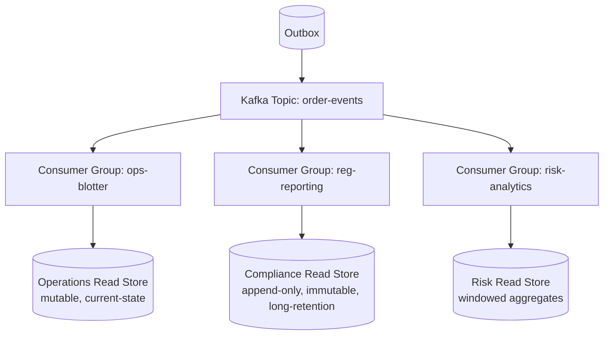
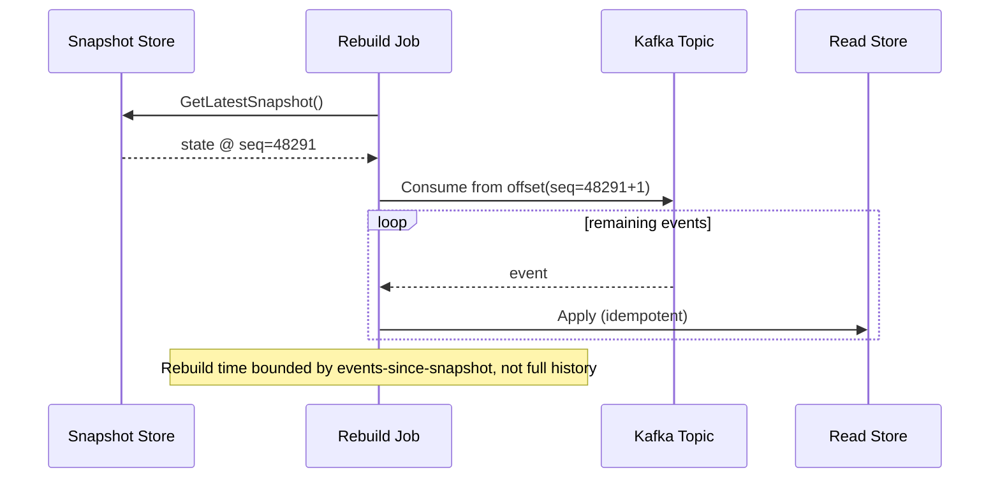
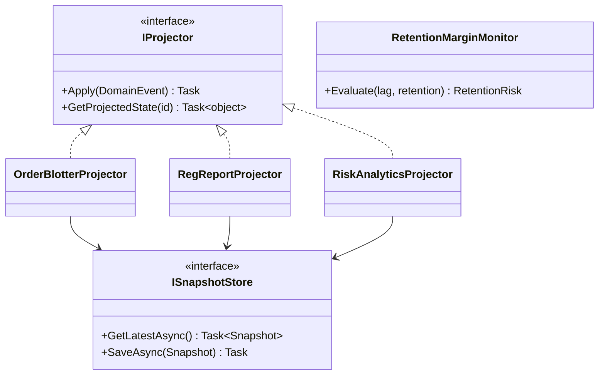

# Module 120 — CQRS: Capstone — Event-Driven Read-Model Projections at Scale

> Domain: CQRS | Level: Beginner → Expert | Prerequisite: [[01-CQRSFundamentals-CommandQuerySeparation-ReadModels-ComplexityThreshold]] (takes as given: the three-level escalation framework, idempotent projection, projection-lag monitoring, and reconciliation — this capstone extends one event stream into multiple, independently-scaled read models and addresses schema evolution/rebuild at genuine scale)
>
> **Domain-complete note:** second and final module of `34-CQRS` (Modules 119–120). Full 16-section template; Elite FinTech Interview Panel lens.

---

## The Running Case Study

The Order Execution Engine's (Module 118) single `OrderBlotter` read model (Module 119) has grown into a genuine platform need: **three independently-owned consumers** now need their own read models from the *same* underlying event stream — Operations (the trade blotter), Compliance (a MiFID II/Reg NMS-style regulatory transaction-reporting projection with its own retention and immutability requirements), and Risk (a near-real-time position/exposure analytics projection feeding automated intraday risk dashboards). This module builds the multi-read-model architecture serving all three from one event source, at the scale where naive, ungoverned proliferation becomes its own operational risk.

---

## 1. Fundamentals

**What:** Extending single-read-model CQRS (Module 119) to **multiple, independently-owned, independently-scaled read models projected from the same underlying event stream** — each consumer's projection is a separate, purpose-built artifact, not a shared, lowest-common-denominator view.

**Why:** Forcing Operations, Compliance, and Risk to share one read model reproduces exactly the mismatch CQRS itself was invented to solve (Module 119 §2.1) — three genuinely different query shapes, retention requirements, and consistency needs, one level higher.

**When:** Once a second, genuinely distinct consumer needs its own read shape from the same event source — not merely "we might need this later," per Module 119 Advanced Q8's calibration discipline, now applied to *how many* read models to build, not just whether to build one.

**How (30,000-ft view):**
```
Event Stream (Outbox → Kafka topic, partitioned by OrderId)
     ├── OrderBlotterProjector      → Operations read store (fast, current-state view)
     ├── RegReportProjector         → Compliance read store (append-only, immutable, long-retention)
     └── RiskAnalyticsProjector     → Risk read store (aggregated, near-real-time, windowed)
Each projector is an independent consumer of the SAME topic — no projector depends on another.
```

---

## 2. Deep Dive

### 2.1 Independent Consumer Groups — Why Projectors Never Depend on Each Other
Each projector is its own Kafka consumer group, reading the same topic independently at its own pace — `RegReportProjector` running slowly (due to a downstream regulatory-gateway rate limit) never blocks or slows `OrderBlotterProjector`'s own progress, since consumer-group offsets are tracked independently per group; this is the concrete mechanism making "independently scaled" true, not merely aspirational.

### 2.2 Divergent Retention and Immutability Requirements
Compliance's regulatory-reporting projection typically requires **append-only, immutable** records (a corrected trade produces a new, linked correction record, never an in-place update — directly Module 116/118's regulatory-correction handling, now at the read-model layer) and multi-year retention; Operations' blotter is mutable, current-state-only, and needs only a rolling, shorter retention window — the same event stream, projected into structurally different storage models entirely.

### 2.3 Cross-Read-Model Consistency — an Explicitly Non-Guaranteed Property
Because each projector consumes and lags independently, Operations' blotter and Risk's exposure dashboard may reflect *different* points in the same event stream at any given instant — a genuinely important property to make explicit to consumers (a Risk dashboard showing an order as "pending" while the Blotter already shows it "filled" is expected, bounded skew, not a bug), requiring each consumer-facing surface to communicate its own data's as-of timestamp.

### 2.4 Snapshotting for Fast Rebuild at Scale
Module 119's full-history replay (Advanced Q9's reconciliation job) becomes prohibitively slow once event history spans years — periodic **snapshots** (a full read-model state captured at a point in time, tagged with the last-processed event's sequence number) let a rebuild resume from the nearest snapshot forward, rather than from the beginning of all history, directly the same technique Module 35 (Event Sourcing) will develop in full as a first-class architectural concern.

### 2.5 Schema Evolution Across Many Independent Consumers
An event-schema change (adding a field) is safe for any consumer using forward-compatible deserialization (Module 119 §15); a genuinely *breaking* change (removing/renaming a field) requires an explicit versioning strategy — publishing a new event version alongside the old during a migration window, with each projector migrating independently at its own pace, since (per §2.1) no projector can be assumed to migrate in lockstep with any other.

### 2.6 Backpressure and the Risk of One Slow Consumer Growing Unboundedly
A single struggling projector (e.g., `RegReportProjector` blocked on a slow downstream regulatory gateway) accumulates consumer lag unboundedly if unaddressed — since Kafka retains events for a configured retention period regardless of consumer progress, a sufficiently-lagging consumer risks falling behind its own topic's retention window entirely, permanently losing unprocessed events — a genuinely severe failure mode requiring its own dedicated alerting threshold, distinct from and more urgent than ordinary projection-lag monitoring (Module 119 §7).

---

## 3. Visual Architecture





---

## 4. Production Example

**Problem:** As the Risk team's real-time exposure dashboard grew more popular internally, its `RiskAnalyticsProjector` began falling behind during high-volume trading days, and — since it shared the same underlying Kafka topic retention as Operations' blotter (30 days) — nobody had separately verified whether Risk's consumer could actually recover from a multi-day lag before hitting that retention boundary.

**Architecture:** Independent consumer groups per §2.1, but a shared, single topic-retention configuration applied uniformly across all three consumers.

**Implementation:** During an unusually high-volume week, `RiskAnalyticsProjector`'s lag grew to 22 days — uncomfortably close to the 30-day retention boundary — discovered only when an engineer happened to check consumer-lag dashboards for an unrelated reason.

**Trade-offs:** A longer retention window costs more storage on the message-broker side but provides a larger safety margin for any consumer's recovery time; the team had implicitly assumed "30 days is plenty" without calculating it against Risk's specific, measured worst-case recovery rate.

**Lessons learned:** This is §2.6's exact predicted risk, materializing from a genuinely uneven load pattern nobody had explicitly modeled per-consumer. The fix: calculate each consumer's own required retention margin based on its measured worst-case lag-recovery rate (not a single, shared, guessed retention value for every consumer), and add a dedicated, urgent alert specifically for "consumer lag approaching X% of topic retention" — distinct from and firing earlier than ordinary projection-lag alerting (Module 119 §7), since this specific failure mode (permanent, unrecoverable event loss) is categorically worse than ordinary bounded staleness.

---

## 5. Best Practices
- Give every consumer its own independent consumer group — never let one projector's pace gate another's (§2.1).
- Model retention margin per-consumer, based on that consumer's own measured worst-case recovery rate, not a single shared guess (§4).
- Communicate each read model's own as-of timestamp explicitly to its consumers — cross-model skew is expected, not a bug, but only if consumers know to expect it (§2.3).
- Use snapshotting once full-history replay time becomes operationally significant — don't wait until a rebuild actually takes unacceptably long to discover this (§2.4).
- Version event schemas explicitly for any breaking change, publishing old and new versions in parallel during a migration window (§2.5).

## 6. Anti-patterns
- Sharing one consumer group across genuinely independent read-model projections, coupling their pace to each other.
- A single, shared, unexamined topic-retention value assumed adequate for every consumer regardless of their individual lag-recovery characteristics (§4).
- Treating cross-read-model skew as a bug to "fix" by artificially coupling projector paces together, rather than a property to communicate and design around (§2.3).
- Deferring snapshotting until a rebuild has already become a multi-hour, production-impacting operation.
- Making a breaking event-schema change without a parallel-version migration window, assuming every consumer will update in lockstep.

---

## 7. Performance Engineering

**CPU/Memory/GC:** Multiple independent projectors multiply the aggregate resource footprint proportionally — capacity-plan each projector independently rather than assuming shared infrastructure absorbs arbitrary additional consumers for free.

**Latency:** Track projection lag per consumer group separately (§2.1) — a shared, averaged lag metric across all projectors would hide exactly the kind of single-consumer degradation §4's incident describes.

**Throughput:** Each projector's throughput must independently exceed its own share of the event-generation rate; a slower downstream dependency (Compliance's regulatory gateway) constrains only that specific projector's throughput ceiling, not others'.

**Scalability:** Horizontal partitioning (Module 119 §9) applies independently per consumer group — Risk's analytics projector might need more partition parallelism than Compliance's, based on each one's own processing cost per event.

**Benchmarking:** Load-test each projector under its own realistic peak load independently, not only the aggregate system — a projector that performs adequately at moderate load may reveal a materially different bottleneck at its own specific peak.

**Caching:** Risk's near-real-time analytics read store is itself a natural caching layer in front of any downstream risk-limit dashboard consuming it — a cache-of-a-projection, a legitimate, if slightly unusual, layering.

---

## 8. Security

**Threats:** Compliance's read model, being immutable and long-retained, becomes a particularly attractive target for unauthorized bulk data exfiltration (a large, historically-complete dataset in one place); cross-read-model data leakage if one projector's Adapter accidentally has broader read-store access than its own specific projection needs.

**Mitigations:** Per-read-model, least-privilege data-store credentials (a `RiskAnalyticsProjector` should have write access only to its own risk read store, not Compliance's); field-level access controls on Compliance's regulatory data commensurate with its sensitivity and retention duration.

**OWASP mapping:** Excessive Data Exposure risk is elevated specifically for the Compliance read model given its long retention and completeness — apply the principle of least privilege rigorously to any query surface built on top of it.

**AuthN/AuthZ:** Each consumer team's own query handlers retain their own, independent authorization logic (Module 119 §8) — Risk's dashboard queries and Compliance's regulatory-report queries are authorized entirely separately, per their own respective user populations.

**Secrets:** Each projector's downstream connections (Compliance's regulatory gateway credentials, Risk's dashboard-serving API credentials) are independently managed secrets (Module 86), never shared across projectors.

**Encryption:** Compliance's long-retained regulatory data requires encryption at rest with a retention-appropriate key-rotation policy (Module 98) accounting for its multi-year lifespan.

---

## 9. Scalability

**Horizontal scaling:** Each read model scales independently per its own consumer's actual load profile — Risk's real-time dashboard may need aggressive horizontal read-replica scaling; Compliance's less frequently but more heavily queried regulatory archive may not.

**Partitioning:** Each projector partitions the shared topic independently (§2.1) — partition count and keying strategy can differ per consumer group based on that consumer's own parallelism needs.

**Replication:** Compliance's long-retention data particularly benefits from geographically-replicated, durable storage given multi-year regulatory retention requirements.

**Load balancing:** Each read model's own query traffic load-balances independently across its own replicas, unconstrained by any other read model's traffic pattern.

**High Availability:** A single projector's outage affects only its own read model's freshness — Operations' blotter continuing to update correctly even if Compliance's regulatory projector is temporarily down (and later catches up from its last committed offset) is the direct benefit of §2.1's independence.

**Disaster Recovery:** Each read model is independently, fully rebuildable from the shared event source (Module 119 §9), with snapshot-accelerated rebuild (§2.4) bounding recovery time even for the largest, longest-retained projection.

**CAP theorem:** Each read model can independently choose its own CAP posture appropriate to its own consumer's needs — Risk's dashboard may tolerate more staleness for higher availability during a partition; Compliance's regulatory-reporting projection may prioritize completeness/consistency (never silently missing a reportable event) over availability during a genuine failure.

---

## 10. Interview Questions

### Basic (10)

1. **Q: Why do Operations, Compliance, and Risk each get their own read model rather than sharing one?**
   **A:** Each has genuinely different query shape, retention, and consistency needs — sharing one model would reproduce the exact mismatch CQRS exists to solve, one level higher (§1, §2.2).
   **Why correct:** States the precise, generalized reason rather than an arbitrary team-boundary justification.
   **Common mistakes:** Assuming separate read models are only about team ownership, missing the genuine technical-requirement divergence.
   **Follow-ups:** "What's the risk of merging them into one shared model to reduce infrastructure?" (Reproduces Module 119 §2.1's original read/write mismatch at the read-model level.)

2. **Q: Why does each projector use its own independent Kafka consumer group?**
   **A:** So one projector's pace (e.g., a slow downstream dependency) never blocks or throttles another's independent progress (§2.1).
   **Why correct:** States the specific mechanism (independent offset tracking per consumer group) enabling this.
   **Common mistakes:** Sharing one consumer group across multiple logically-independent projectors.
   **Follow-ups:** "What would happen if two projectors shared one consumer group?" (They'd compete for the same partitions/offsets, coupling their processing in an unintended way.)

3. **Q: Why does Compliance's read model need to be append-only/immutable while Operations' blotter is mutable?**
   **A:** Regulatory reporting requires a complete, unaltered historical record (a correction produces a new, linked record, never an in-place edit); Operations only needs current state (§2.2).
   **Why correct:** Names the specific regulatory requirement driving the structural difference.
   **Common mistakes:** Applying the same mutable, current-state-only design to the compliance projection.
   **Follow-ups:** "How does a trade correction get represented in an append-only model?" (A new record linked to the original, both retained, rather than overwriting.)

4. **Q: Is it a bug if the Risk dashboard and the Operations blotter briefly show different states for the same order?**
   **A:** No — expected, bounded skew from independent projector lag (§2.3), provided each surface communicates its own as-of freshness to users.
   **Why correct:** Correctly frames this as an accepted, communicated property rather than a defect.
   **Common mistakes:** Attempting to artificially couple projector paces to eliminate this skew, adding unnecessary complexity/coupling.
   **Follow-ups:** "How would you communicate this to end users?" (An explicit "as of [timestamp]" indicator on each read surface.)

5. **Q: What is a snapshot, in the context of read-model rebuilding?**
   **A:** A captured, point-in-time full state of a read model, tagged with the last event sequence number processed, allowing rebuild to resume from that point rather than full history (§2.4).
   **Why correct:** States the specific mechanism and its purpose (bounding rebuild time).
   **Common mistakes:** Assuming rebuilds must always replay from the very beginning of event history.
   **Follow-ups:** "When does snapshotting become necessary rather than optional?" (Once full-history replay time becomes operationally significant, e.g., years of retained events, §2.4.)

6. **Q: What's the difference between a forward-compatible (additive) event-schema change and a breaking one?**
   **A:** Additive (new field) changes are safe for forward-compatible deserializers; breaking changes (field removal/rename) require an explicit versioning/migration strategy (§2.5).
   **Why correct:** Correctly distinguishes the two categories and their differing handling requirements.
   **Common mistakes:** Treating every schema change as equally risky, or conversely assuming no schema change ever needs special handling.
   **Follow-ups:** "How would you migrate a breaking change safely?" (Publish both old and new event versions in parallel during a migration window, §2.5.)

7. **Q: Why is a single, shared topic-retention value potentially risky across multiple independent consumers?**
   **A:** A slower consumer might need a longer recovery window than the shared retention value provides, risking permanent, unrecoverable event loss if it falls too far behind (§2.6, §4).
   **Why correct:** States the specific failure mode (permanent event loss past retention) this risk produces.
   **Common mistakes:** Assuming a single retention value "should be enough" without calculating each consumer's own worst-case recovery rate against it.
   **Follow-ups:** "What's a concrete leading-indicator alert for this risk?" (Consumer lag approaching a percentage of topic retention, distinct from ordinary projection-lag alerting, §4.)

8. **Q: Should Risk's and Compliance's query handlers share the same authorization logic?**
   **A:** No — each read model's queries are authorized independently, per their own respective user populations and data sensitivity (§8).
   **Why correct:** Correctly reapplies Module 119 §8's "CQRS separates models, not security boundaries" finding to a multi-read-model context.
   **Common mistakes:** Assuming a single, shared authorization layer suffices across genuinely different consumer populations and sensitivity levels.
   **Follow-ups:** "Why does Compliance's read model warrant particularly strict access controls?" (Its long retention and completeness make it an especially attractive exfiltration target, §8.)

9. **Q: Can one projector's outage affect another projector's read model freshness?**
   **A:** No — per §2.1's independence, each projector's own progress (and any outage) is isolated from the others.
   **Why correct:** States the specific HA benefit this architecture's independence provides.
   **Common mistakes:** Assuming a shared event-processing pipeline component failing would necessarily affect every read model equally.
   **Follow-ups:** "What does happen to Compliance's projection during its own projector's outage?" (It simply falls behind, resuming from its last committed offset once restored — its own consumer group's state is unaffected by any other consumer group.)

10. **Q: Can different read models make different CAP trade-offs from each other?**
    **A:** Yes — each read model independently chooses its own appropriate CAP posture based on its own consumer's specific needs (§9).
    **Why correct:** Correctly generalizes Module 118/119's per-component CAP-calibration principle to a multi-read-model system.
    **Common mistakes:** Assuming a system must make one uniform CAP choice applied identically across every read model.
    **Follow-ups:** "Which of the three read models here would most likely favor consistency over availability, and why?" (Compliance — regulatory completeness likely matters more than availability during a genuine failure, §9.)

### Intermediate (10)

1. **Q: Why must snapshot tagging include the last-processed event sequence number, not just a timestamp?**
   **A:** A sequence number gives an exact, unambiguous resume point in the event stream; a timestamp alone risks ambiguity (multiple events near the same timestamp, clock-skew issues) about exactly which events still need replaying (§2.4).
   **Why correct:** Identifies the specific ambiguity a timestamp-only approach would introduce.
   **Common mistakes:** Using wall-clock time as the sole resume marker, risking either reprocessing already-applied events or skipping unprocessed ones.
   **Follow-ups:** "What would happen if the snapshot's sequence number were off by one?" (Either a duplicate reprocess, requiring idempotency, Module 119 §2.5, to absorb it safely, or a missed event, requiring the reconciliation job to catch it.)

2. **Q: Design the specific alerting threshold distinguishing "ordinary projection lag" (Module 119 §7) from "approaching retention loss" (§2.6, §4) for a given consumer.**
   **A:** Ordinary lag alerting fires on absolute or relative lag growth trending upward; the retention-approaching alert fires specifically when a consumer's current lag, divided by the topic's configured retention window, crosses a much more urgent threshold (e.g., 50-70% of retention consumed) — a categorically more severe, faster-escalating alert given the consequence (permanent data loss) is irreversible, unlike ordinary lag which merely delays freshness.
   **Why correct:** Distinguishes the two alert types by both their trigger condition and their differing urgency/consequence.
   **Common mistakes:** Treating retention-approaching risk as just a more severe version of the same lag alert, rather than a distinct alert with its own, more urgent escalation path.
   **Follow-ups:** "What immediate mitigation would this alert trigger, beyond investigation?" (Temporarily scaling up the struggling projector's parallelism/resources, or extending topic retention as an emergency buffer while the root cause is fixed.)

3. **Q: How would you migrate a breaking event-schema change (e.g., renaming `FilledQuantity` to `ExecutedQuantity`) across three independently-paced consumers?**
   **A:** Publish both the old-shaped and new-shaped event versions in parallel (e.g., a version-tagged event envelope) for a defined migration window; each of the three projectors independently migrates to consuming the new version at its own pace within that window; only once all three have confirmed migration does the old version stop being published — never assuming synchronized, lockstep migration across independently-owned consumers (§2.5).
   **Why correct:** Gives the concrete, safe migration mechanism (parallel versions, independent migration pace, confirmed-before-cutover) rather than assuming a single, coordinated cutover is safe.
   **Common mistakes:** Cutting over to the new event shape for all consumers simultaneously, risking breaking whichever consumer hasn't yet updated its own deserialization logic.
   **Follow-ups:** "Who decides when the old version can stop being published?" (An explicit confirmation process — each consuming team affirmatively signals migration completion, not an assumed deadline.)

4. **Q: Why does Risk's near-real-time analytics projection potentially warrant a different partition-parallelism configuration than Compliance's regulatory projection?**
   **A:** Each consumer group partitions and scales independently (§2.1, §9) based on its own specific latency/throughput requirements — Risk's tighter near-real-time latency needs likely justify more partition parallelism than Compliance's less time-sensitive (if more heavily-audited) regulatory reporting.
   **Why correct:** Correctly connects the differing configuration to each consumer's own distinct requirement, not an arbitrary choice.
   **Common mistakes:** Assuming all three projectors should use identical partition/parallelism configuration for consistency's sake, missing that their actual requirements genuinely differ.
   **Follow-ups:** "Would over-provisioning Compliance's parallelism to match Risk's cause any harm?" (Not correctness harm, but unnecessary infrastructure cost with no corresponding latency benefit Compliance actually needs.)

5. **Q: Critique a design where the Risk dashboard directly queries Compliance's read store for supplementary regulatory-status data, rather than maintaining its own copy of that data in its own projection.**
   **A:** This reintroduces §2.1's independence violation — Risk's dashboard now depends on Compliance's read store's own availability, schema, and access-control model, exactly the cross-read-model coupling this architecture's per-consumer independence exists to avoid; the correct approach is Risk's own projector consuming the relevant events directly and maintaining its own, independently-owned copy of whatever regulatory-status data it needs.
   **Why correct:** Identifies the specific coupling this cross-read-model query introduces and the correct, decoupled alternative.
   **Common mistakes:** Treating direct cross-read-model querying as a reasonable way to "avoid duplicating data," missing the availability/coupling cost it reintroduces.
   **Follow-ups:** "Isn't maintaining duplicate data across read models wasteful?" (A deliberate, accepted trade-off — Module 109's Anti-Corruption-Layer-style controlled duplication at boundaries, now applied between independently-owned read models rather than bounded contexts.)

6. **Q: How would you detect that a projector is approaching its topic's retention boundary before §4's incident's near-miss recurs?**
   **A:** A continuously-computed metric — (current consumer lag in event count or time) ÷ (topic retention window) — alerting at a defined, urgent threshold well before actual data loss, checked per consumer group independently (§2.1, Intermediate Q2), not as a single, aggregate, cross-consumer metric that could mask one struggling consumer's specific risk.
   **Why correct:** Gives the precise, per-consumer metric formula and reapplies the independence principle to monitoring design itself.
   **Common mistakes:** Monitoring only aggregate or average lag across all consumers, which could hide one specific consumer's dangerously high individual lag.
   **Follow-ups:** "What's a reasonable urgent-alert threshold, and why not wait until 95%+ of retention is consumed?" (An earlier threshold, e.g., 50-70%, per Intermediate Q2, gives enough lead time to actually investigate and remediate before the consequence becomes irreversible.)

7. **Q: Why is Compliance's read model described as needing encryption-at-rest with a "retention-appropriate key-rotation policy," rather than the same rotation cadence as a shorter-lived operational store?**
   **A:** Key rotation for a multi-year-retained dataset must account for old data encrypted under earlier key versions remaining decryptable/re-encryptable over that much longer lifespan — a rotation policy designed only for short-lived operational data might not account for this extended retention requirement (Module 98's key-management discipline, applied here at genuinely multi-year scale).
   **Why correct:** Identifies the specific way retention duration changes the key-management requirement, not just restating "encrypt sensitive data" generically.
   **Common mistakes:** Applying an operational-store's typical key-rotation cadence unchanged to a dataset with a fundamentally different, much longer retention lifespan.
   **Follow-ups:** "What's a concrete risk of inadequate key-rotation planning for this specific dataset?" (Data encrypted under a very old key becoming un-decryptable if that key's own material is lost or its algorithm deprecated well before the data's own multi-year retention period ends.)

8. **Q: Design the specific test verifying that a breaking event-schema migration (Intermediate Q3) doesn't silently break any of the three projectors during the parallel-version migration window.**
   **A:** A contract test (Module 117's discipline, reapplied here) asserting each projector correctly processes *both* the old-version and new-version event shapes during the migration window, run against all three projector implementations — directly extending Module 117's Port-contract-testing principle from "multiple Adapters satisfying one Port" to "multiple event-schema versions satisfying one projector's expected input contract."
   **Why correct:** Correctly reapplies an already-established contract-testing discipline to this module's own new concern (schema-version compatibility) rather than inventing an unrelated new testing technique.
   **Common mistakes:** Testing only the new event version against each projector, missing that the old version must also continue being correctly processed throughout the migration window.
   **Follow-ups:** "When can this dual-version contract test finally be retired?" (Only after every consuming projector has confirmed migration and the old event version has actually stopped being published — not merely once the new version is available.)

9. **Q: How would you decide whether Risk's analytics read store should favor availability or consistency during a network partition, applying Module 118 §9's CAP-decision test?**
   **A:** Ask whether an intraday risk decision genuinely, unacceptably risky if made on briefly-stale exposure data (favoring consistency/lower availability) or whether brief staleness during a rare partition is an acceptable trade-off for keeping the dashboard available (favoring availability) — likely the latter for most operational risk-monitoring use cases, since Risk's actual limit-enforcement decisions (Module 118 §9) already happen on the authoritative write side, with this dashboard serving a monitoring, not enforcement, role.
   **Why correct:** Correctly applies the already-established CAP-decision test to this specific read model, and correctly distinguishes its monitoring role from the write-side's actual risk-limit enforcement role.
   **Common mistakes:** Assuming "risk" in the name implies this read model must be as strictly consistent as the write-side risk-check path, missing that its actual role here is monitoring/dashboard display, not enforcement.
   **Follow-ups:** "Would this answer change if Risk's dashboard were ever used to directly gate a real-time trading-halt decision rather than just monitor?" (Yes — if it became a genuine enforcement mechanism, it would need the write side's own CP guarantee, directly Advanced Q5's zero-tolerance-for-staleness test from Module 119.)

10. **Q: Synthesize how this module's multi-read-model architecture relates to Module 35's upcoming Event Sourcing domain.**
    **A:** This module's snapshotting technique (§2.4) and event-stream-as-source-of-truth framing are a direct, if partial, preview of Event Sourcing's own central idea — treating the event log itself as the authoritative record, with every read model (including, in a fully event-sourced system, the write-side Aggregate's own current state) derivable by replaying it; Module 35 will develop this idea in full, including how the write side itself (not just read projections) can be built directly atop event-sourced state reconstruction, a step beyond this module's scope, which kept the write side's own Aggregate/state-store design (Module 110/118) unchanged and added event-driven projection only on the read side.
    **Why correct:** Correctly identifies the specific concept (event log as replayable source of truth) this module previewed and precisely scopes what remains genuinely new for Module 35 (applying it to the write side too), rather than conflating the two domains.
    **Common mistakes:** Assuming this module's event-driven read-model projection already constitutes "Event Sourcing" — it's a necessary but not sufficient precondition; true Event Sourcing additionally requires the write-side Aggregate itself to be reconstructed from events, which this module's design deliberately didn't require.
    **Follow-ups:** "What would need to change in this system's write side for it to become genuinely event-sourced?" (`Order`'s current state, currently persisted directly via `IPositionRepository`, would instead be reconstructed by replaying its own historical events on load — Module 35's own central mechanism.)

### Advanced (10)

1. **Q: Diagnose §4's near-miss from first principles and design the complete, structural fix preventing any future consumer from silently approaching retention loss undetected.**
   **A:** Root cause: a single, shared topic-retention assumption was applied without per-consumer validation against each consumer's own measured worst-case recovery characteristics. Fix: (1) per-consumer retention-margin calculation based on measured worst-case lag-recovery rate, documented and revisited periodically as load patterns evolve; (2) a dedicated, urgent, per-consumer-group alert on lag-to-retention ratio (Intermediate Q2/Q6), distinct from ordinary lag alerting; (3) a standing runbook entry for this specific alert category, given its irreversible-data-loss consequence if not addressed in time.
   **Why correct:** Identifies the actual root cause (unvalidated shared assumption) and a complete, three-part structural fix (measurement, dedicated alerting, runbook) rather than merely extending retention as a one-off patch.
   **Common mistakes:** Fixing only this specific incident by extending topic retention globally, without addressing the underlying process gap (no per-consumer retention-margin validation) that allowed this risk to go undetected in the first place.
   **Follow-ups:** "Why is simply extending retention for everyone not a sufficient fix on its own?" (It reduces but doesn't eliminate the risk, and does nothing to detect the next consumer's own future retention-approach risk without the dedicated monitoring this fix specifically adds.)

2. **Q: A team proposes eliminating independent consumer groups (§2.1) in favor of a single, shared projector process internally dispatching to all three read-model update logics, arguing this reduces infrastructure (one process instead of three).**
   **A:** This directly reintroduces the coupling §2.1 exists to prevent — a slow downstream dependency in any one dispatch path (e.g., Compliance's regulatory gateway) now blocks the shared process's single consumption loop, delaying Operations' and Risk's updates too, exactly the failure mode independent consumer groups avoid; the infrastructure savings (one process versus three) come at the direct cost of the independence property this entire architecture is built around.
   **Why correct:** Correctly identifies the specific coupling this consolidation reintroduces and connects it back to §2.1's foundational rationale.
   **Common mistakes:** Treating this as a pure infrastructure-cost optimization without recognizing it reverses this module's central architectural property.
   **Follow-ups:** "Is there a legitimate middle ground reducing infrastructure without full consolidation?" (Running all three projector *logics* within one shared runtime/process but still as genuinely independent, separately-scheduled async tasks each with its own consumer group and independent failure isolation — reducing deployment/infrastructure overhead while preserving logical independence.)

3. **Q: Critique using a single, shared snapshot store and snapshot cadence across all three read models.**
   **A:** Each read model's own state size, rebuild-time sensitivity, and event-volume characteristics likely differ significantly (Compliance's append-only, ever-growing archive versus Operations' bounded, current-state-only blotter) — a single, shared snapshot cadence optimized for one consumer's characteristics may be poorly calibrated for another's, either snapshotting too infrequently (long rebuild times) or too frequently (unnecessary snapshot-storage/compute cost) for the mismatched consumer.
   **Why correct:** Correctly identifies the specific mismatch a shared cadence creates, given each read model's genuinely different state-growth characteristics.
   **Common mistakes:** Assuming operational simplicity (one shared snapshot policy) is worth more than the calibration accuracy per-consumer snapshotting provides, without weighing the actual, measured difference in each consumer's rebuild-time sensitivity.
   **Follow-ups:** "How would you determine the right snapshot cadence for a specific read model?" (Based on the maximum acceptable rebuild time for that specific consumer and the measured rate of state growth/event volume since the last snapshot.)

4. **Q: Design a load-testing methodology validating that all three projectors can simultaneously sustain peak load without any one degrading the others, extending §2.1's independence claim into a testable, verified property.**
   **A:** Generate synthetic peak-volume event bursts against the shared topic and measure each of the three consumer groups' lag/throughput independently and concurrently — specifically verifying that artificially degrading one projector (e.g., injecting latency into Compliance's downstream regulatory-gateway call) does *not* measurably affect Operations' or Risk's own lag/throughput during the same test window, directly turning §2.1's architectural claim into an empirically-verified, not merely assumed, property.
   **Why correct:** Correctly designs a test specifically targeting the independence claim itself (not just aggregate throughput), including a deliberate fault-injection step proving isolation under realistic degraded conditions.
   **Common mistakes:** Load-testing only aggregate, combined throughput without specifically verifying the cross-consumer isolation property this architecture's entire value proposition depends on.
   **Follow-ups:** "What would a failure of this specific test reveal?" (A hidden, unintended coupling between consumer groups — e.g., shared connection-pool exhaustion at the message-broker client level — that the architecture's logical design assumed didn't exist but the infrastructure implementation accidentally introduced.)

5. **Q: How would you handle a scenario where Risk's analytics projection needs data that only exists in Compliance's regulatory-correction events, without violating §2.1's independence or Advanced Q5's cross-read-model-query anti-pattern?**
   **A:** `RiskAnalyticsProjector` subscribes directly to the same underlying correction events from the shared Kafka topic (the actual source of truth) and maintains its own, independently-projected copy of whatever correction-derived data it needs — never querying Compliance's read store directly; this is the correct application of §2.1's independence combined with Advanced Q5's anti-pattern-avoidance, at the cost of some deliberate, accepted data duplication across read models (directly Intermediate Q5's own justified trade-off).
   **Why correct:** Correctly applies the established pattern (each projector consumes from the shared event source directly, never from another read model) to a genuinely new, specific scenario.
   **Common mistakes:** Assuming the only way to get Compliance-specific data into Risk's projection is by querying Compliance's read store, missing that both can independently subscribe to the same underlying event source.
   **Follow-ups:** "What if the correction events themselves aren't published to the shared topic, only derived within Compliance's own projector logic?" (This would require exposing the correction *event* itself at the shared source, not just Compliance's derived read-model state — a design gap worth fixing at the event-publishing layer, not worked around via cross-read-model querying.)

6. **Q: A regulator asks whether Compliance's regulatory-reporting projection could ever silently miss a reportable event due to this architecture's own multi-consumer design. How would you answer, honestly?**
   **A:** The architectural risk is structurally identical to any single-consumer projection's risk (Module 119's idempotency/reconciliation discipline) — Compliance's projector, being just one more independent consumer group (§2.1), is neither more nor less exposed to silent event loss than it would be as a standalone system; the honest answer names the specific, concrete mitigations in place (idempotent projection, Module 119 §2.5; periodic reconciliation against event history, Module 119 Advanced Q9; retention-margin monitoring specific to this consumer, §4/Advanced Q1) as the actual, mechanical evidence closing this risk, rather than asserting the multi-consumer architecture itself provides some inherent additional protection or introduces some inherent additional risk beyond what any single projector already carries.
   **Why correct:** Gives an honest, precisely-scoped answer distinguishing "this architecture's multi-consumer nature" from "the underlying, already-addressed single-projector risks," rather than either overclaiming safety or unnecessarily alarming the regulator about a risk that isn't actually elevated by this specific design choice.
   **Common mistakes:** Either claiming the multi-read-model architecture is inherently safer (with no specific mechanism cited) or conceding it's inherently riskier (missing that each projector's own, already-established mitigations apply identically regardless of how many sibling consumer groups exist).
   **Follow-ups:** "Does this consumer independence itself provide any genuine additional safety benefit relevant to the regulator's concern?" (Yes, indirectly — an outage or bug in Operations' or Risk's projector cannot itself cause Compliance's projector to also fail or fall behind, per §2.1, meaning Compliance's regulatory-reporting reliability is not put at additional risk by co-existing with the other two consumers.)

7. **Q: Design the specific decision framework for whether a new, fourth read-model consumer (e.g., a future Client-Facing Order-Status API) should join this shared event-topic architecture or use a different mechanism entirely.**
   **A:** Apply the same criteria established for the original three: does this consumer need a genuinely distinct query shape/retention/consistency profile from the existing three, and is the underlying event stream actually the right source of truth for its needs? If yes to both, it joins as a fourth independent consumer group (§2.1), reusing the established idempotency/reconciliation/retention-monitoring discipline (Module 119, Advanced Q1) rather than reinventing it; if the new consumer's needs are better served by directly querying an existing read model (e.g., client-facing status is just a filtered, access-controlled view of the existing Operations blotter, not a genuinely distinct projection), a new independent projector may be unnecessary overhead, and exposing a scoped, authorized view of an existing read model may be the simpler, correct choice instead.
   **Why correct:** Gives a genuine decision framework (does the new need warrant its own projection versus reuse an existing one) rather than defaulting either to "always add a new projector" or "never add one."
   **Common mistakes:** Automatically spinning up a new, independent projector for every new consumer need without first checking whether an existing read model, appropriately access-scoped, already serves it — an instance of this course's now-repeated over-application/under-calibration caution (Module 113 Intermediate Q7, Module 112 Expert Q1), applied here to read-model proliferation specifically.
   **Follow-ups:** "What's the risk of read-model proliferation if this discipline isn't applied?" (An ever-growing number of independently-maintained projectors, each with its own idempotency/monitoring/retention overhead, for consumer needs that could have been served more simply by an authorized view over an existing projection.)

8. **Q: Critique a monitoring dashboard that shows only a single, combined "overall projection health" score averaged across all three consumer groups.**
   **A:** An averaged score can mask one severely-degraded consumer (e.g., Compliance nearing its retention boundary, §4) behind two healthy ones, producing a misleadingly reassuring aggregate — directly reproducing this course's now-repeated "aggregate/averaged metrics hide localized failure" pattern (seen previously in cost-attribution and cross-team monitoring contexts across earlier modules), now specifically in multi-consumer projection health.
   **Why correct:** Identifies the specific way averaging conceals a genuinely severe, localized problem, connecting to this course's broader recurring caution against aggregate metrics for exactly this reason.
   **Common mistakes:** Assuming a single, simplified health score is sufficient for operational awareness, without considering how averaging across independent, differently-behaving consumers can hide a critical outlier.
   **Follow-ups:** "What's the correct monitoring design instead?" (Per-consumer-group dashboards and alerts (§2.1/Intermediate Q2/Q6), never collapsed into one blended score for operational decision-making — an aggregate view can still exist for high-level reporting, but must never replace per-consumer visibility.)

9. **Q: How would this architecture need to change to support genuinely exactly-once (not merely idempotent, at-least-once) semantics for Compliance's regulatory reporting, if a regulator specifically demanded it?**
   **A:** True exactly-once delivery is rarely achievable end-to-end across independent systems without significant complexity (transactional outbox plus transactional consumer offset commits, e.g., Kafka's transactional/exactly-once-semantics APIs tightly coordinating the read-model write and offset commit atomically) — in practice, idempotent at-least-once processing (Module 119 §2.5) achieves the *equivalent observable outcome* (no double-counted regulatory report) at meaningfully lower complexity, and should be the default answer to a regulator's concern unless the specific regulatory requirement genuinely cannot be satisfied by "delivered at least once, applied effectively-once via idempotency" — a distinction worth explaining clearly rather than immediately over-engineering toward true exactly-once semantics.
   **Why correct:** Correctly distinguishes true exactly-once delivery (rarely necessary or achievable cheaply) from idempotent at-least-once processing's equivalent practical outcome, and gives calibrated guidance on when the added complexity is actually justified.
   **Common mistakes:** Assuming a regulator's "no double-reporting" requirement necessarily demands true exactly-once delivery infrastructure, rather than recognizing idempotent processing already satisfies the actual, observable requirement at lower cost.
   **Follow-ups:** "How would you explain the idempotent-at-least-once approach's sufficiency to a skeptical regulator?" (Demonstrate the idempotency mechanism concretely — the processed-event-tracking check, Module 119 §2.5 — as the specific, verifiable evidence no report is ever actually double-counted, regardless of how many times the underlying message might be redelivered.)

10. **Q: As a Principal Engineer, synthesize this module's findings into the complete governance program required before this multi-read-model architecture is considered mature and organizationally sustainable at genuine scale.**
    **A:** (1) Per-consumer independent consumer groups as a non-negotiable architectural rule (§2.1, Advanced Q2). (2) Per-consumer retention-margin monitoring and dedicated, urgent alerting (§4, Advanced Q1) — never a single shared retention assumption. (3) Per-consumer snapshot cadence calibrated to each read model's own state-growth and rebuild-sensitivity characteristics (Advanced Q3). (4) A formal decision framework (Advanced Q7) for whether a new consumer need warrants a new projector or reuse of an existing read model, preventing unchecked proliferation. (5) Per-consumer-group, never averaged, monitoring dashboards (Advanced Q8). (6) A clear, calibrated policy distinguishing when idempotent at-least-once processing suffices versus when true exactly-once semantics are genuinely required (Advanced Q9). (7) An explicit, tested schema-versioning/migration process (Intermediate Q3/Q8) for any breaking event-schema change across independently-paced consumers.
    **Why correct:** Synthesizes every specific finding into a coherent, actionable governance program, matching this course's established capstone-synthesis pattern.
    **Common mistakes:** Presenting only the technical multi-consumer architecture without the monitoring, proliferation-control, and migration-governance elements that make it genuinely sustainable as the number of consumers grows over time.
    **Follow-ups:** "Which element would you prioritize first for a system that already has three ungoverned, ad hoc projectors in production?" (Per-consumer retention-margin monitoring — it's the element most directly preventing an irreversible, severe failure (permanent event loss), per §4's own near-miss.)

---

## 11. Coding Exercises

### Easy — Independent Consumer Group Registration (§2.1)
**Problem:** Register three independent consumer groups against the same Kafka topic.
**Solution:**
```csharp
var opsConsumer = new ConsumerConfig { GroupId = "ops-blotter", BootstrapServers = brokers };
var complianceConsumer = new ConsumerConfig { GroupId = "reg-reporting", BootstrapServers = brokers };
var riskConsumer = new ConsumerConfig { GroupId = "risk-analytics", BootstrapServers = brokers };
// Each subscribes independently to "order-events" — separate offset tracking per GroupId
```
**Time complexity:** O(1) registration cost, independent of event volume.
**Space complexity:** O(1) per consumer group's own offset-tracking metadata.
**Optimized solution:** N/A — this is inherently a configuration-level concern, not a performance-optimizable algorithm.

### Medium — Retention-Margin Alert Calculation (§2.6, Advanced Q1)
**Problem:** Compute a per-consumer alert signal for lag approaching retention loss.
**Solution:**
```csharp
public class RetentionMarginMonitor
{
    public RetentionRisk Evaluate(TimeSpan consumerLag, TimeSpan topicRetention)
    {
        var ratio = consumerLag.TotalSeconds / topicRetention.TotalSeconds;
        return ratio switch
        {
            >= 0.7 => RetentionRisk.Critical,
            >= 0.5 => RetentionRisk.Warning,
            _ => RetentionRisk.Healthy
        };
    }
}
```
**Time complexity:** O(1) per evaluation.
**Space complexity:** O(1).
**Optimized solution:** Track this ratio as a continuous time-series metric (not just a point-in-time check) to alert on trend/velocity (rapidly worsening ratio) even before crossing the absolute threshold, giving earlier warning for a fast-accelerating lag.

### Hard — Snapshot-Accelerated Rebuild (§2.4)
**Problem:** Rebuild a read model resuming from the latest snapshot rather than full history.
**Solution:**
```csharp
public class SnapshotAcceleratedRebuilder
{
    public async Task RebuildAsync(IReadModelStore store, ISnapshotStore snapshots, IEventStore events)
    {
        var snapshot = await snapshots.GetLatestAsync();
        if (snapshot is not null)
            await store.RestoreFromSnapshotAsync(snapshot.State);

        var fromSeq = snapshot?.LastProcessedSequence ?? 0;
        await foreach (var evt in events.StreamFrom(fromSeq))
        {
            await store.Apply(evt); // idempotent, per Module 119 §2.5
        }
    }
}
```
**Time complexity:** O(k) where k is events since the last snapshot, not O(n) for full history — the entire point of snapshotting.
**Space complexity:** O(m) for the restored read-model state size.
**Optimized solution:** Take a fresh snapshot immediately after a successful rebuild completes, ensuring the *next* rebuild's k (events-since-snapshot) stays bounded rather than growing indefinitely between snapshot cycles.

### Expert — Dual-Version Contract Test During Schema Migration (§10 Advanced Q4)
**Problem:** Verify a projector correctly handles both old and new event-schema versions during a migration window.
**Solution:**
```csharp
public abstract class ProjectorSchemaMigrationContractTests
{
    protected abstract IProjector CreateProjector();

    [Theory]
    [InlineData("v1")] [InlineData("v2")]
    public async Task Projector_HandlesBothSchemaVersions_DuringMigrationWindow(string schemaVersion)
    {
        var projector = CreateProjector();
        var evt = OrderExecutedEventBuilder.ForSchemaVersion(schemaVersion).Build();

        await projector.Apply(evt);

        var result = await projector.GetProjectedState(evt.OrderId);
        Assert.Equal(evt.ExpectedFilledQuantity, result.FilledQuantity); // correct regardless of version
    }
}
```
**Time complexity:** O(1) per schema-version scenario.
**Space complexity:** O(1) additional per test scenario.
**Optimized solution:** Parameterize further across every projector (Ops/Compliance/Risk) via a shared base class, ensuring the dual-version guarantee is verified identically across all three independently-owned consumers before the old schema version is ever retired.

---

## 12. System Design

**Functional requirements:** Serve three independently-owned read consumers (Operations, Compliance, Risk) from one shared event source; support safe, non-breaking and breaking event-schema evolution; support fast rebuild via snapshotting.

**Non-functional requirements:** No consumer's degradation affects another's; no consumer ever silently loses events past topic retention; each consumer's own appropriate CAP posture independently honored; regulatory-grade immutability and retention for Compliance specifically.

**Architecture:** One shared, partitioned Kafka topic (`order-events`) sourced from the Outbox; three independent consumer groups, each with its own projector, read store, snapshot cadence, and monitoring.

**Components:** `OrderBlotterProjector`, `RegReportProjector`, `RiskAnalyticsProjector`; per-consumer snapshot stores; per-consumer retention-margin monitors; a shared event-schema versioning registry.

**Database selection:** Operations — a fast, mutable relational or document store for current-state queries; Compliance — an append-only, long-retention, encrypted store (potentially a dedicated compliance-archival technology); Risk — a windowed, aggregation-friendly store (potentially a time-series or in-memory analytics store).

**Caching:** Per-consumer caching layered independently atop each read model per its own hot-query patterns (§7).

**Messaging:** Kafka topic partitioned by `OrderId`, independent consumer groups per §2.1.

**Scaling:** Independent horizontal partition-parallelism per consumer, per each one's own measured load profile.

**Failure handling:** Idempotent projection (Module 119) plus per-consumer reconciliation (Module 119 Advanced Q9) plus retention-margin monitoring (§2.6) as three independent, complementary safety layers.

**Monitoring:** Per-consumer-group dashboards (never a single averaged score, Advanced Q8); dedicated retention-approach alerting distinct from ordinary lag alerting (Intermediate Q2).

**Trade-offs:** Deliberate, accepted data duplication across read models (Intermediate Q5) in exchange for genuine consumer independence; a formal new-consumer decision framework (Advanced Q7) trading some upfront rigor for preventing unchecked long-term proliferation cost.

---

## 13. Low-Level Design

**Requirements:** Each projector independently, idempotently, and correctly applies events to its own read model; schema evolution is safely handled per-consumer; rebuild time is bounded via snapshotting.

**Class diagram:**


**Sequence diagram:** See §3's snapshot-accelerated rebuild sequence.

**Design patterns used:** Observer/Publish-Subscribe (each projector independently subscribing to the shared event source); Strategy (per-consumer snapshot cadence/retention-margin policy as independently-configurable strategies); Memento (a snapshot is structurally a Memento of read-model state).

**SOLID mapping:** Single Responsibility (each projector owns exactly one read model); Open/Closed (a new, fourth consumer adds a new `IProjector` implementation without modifying existing ones); Interface Segregation (`IProjector`, `ISnapshotStore` are narrow, focused interfaces).

**Extensibility:** A fourth consumer (Advanced Q7) requires only a new `IProjector` implementation and its own consumer-group registration — zero changes to the other three.

**Concurrency/thread safety:** Each consumer group's own partition-assignment guarantees sequential, ordered processing per partition (Module 119 §10 Intermediate Q9); snapshot writes must not race with in-progress event application for the same read model — typically resolved by taking snapshots between processed batches, not mid-batch.

---

## 14. Production Debugging

**Incident:** Following a schema-migration cutover (Intermediate Q3's dual-version process), `RiskAnalyticsProjector`'s aggregated exposure figures began silently diverging from the actual, correct totals — under-reporting exposure by a small but growing margin each day.

**Root cause:** During the migration window, `RiskAnalyticsProjector` had correctly been updated to handle the new event-schema version, but its dual-version contract test (§11 Expert exercise) had only been run against the *other two* projectors before the cutover deadline, due to a tracking oversight — `RiskAnalyticsProjector`'s own new-version handling had a subtle bug (a field mapped from the wrong new-schema property name) that its untested code path silently mishandled, applying a zero value instead of the actual executed quantity for every new-schema-version event.

**Investigation:** The reconciliation job (Module 119 Advanced Q9) — run only weekly for Risk's projection, given its comparatively lower perceived criticality at the time — eventually flagged a growing discrepancy between replayed and live state, several days after the migration cutover, by which point the exposure dashboard had been silently wrong for that entire period.

**Tools:** The reconciliation job's own diff report; git history correlating the discrepancy's onset precisely with the schema-migration deployment; a targeted comparison of `RiskAnalyticsProjector`'s new-version field-mapping code against the new event schema's actual field names.

**Fix:** Corrected the field-mapping bug, and manually reprocessed the affected date range's events to correct the accumulated exposure figures.

**Prevention:** Made the dual-version contract test (§11 Expert exercise) a mandatory, tracked gate applied identically and without exception to *every* consuming projector before any schema-migration cutover proceeds — closing the specific tracking gap that let `RiskAnalyticsProjector` slip through untested; also increased Risk's reconciliation-job frequency from weekly to daily, given this incident's demonstration that its criticality had been under-estimated relative to how quickly an undetected discrepancy could compound.

---

## 15. Architecture Decision

**Context:** Choosing how frequently to run the reconciliation job (Module 119 Advanced Q9) independently per read model, given §14's incident showed a weekly cadence for Risk was too infrequent.

**Option A — Uniform, shared reconciliation cadence across all read models (e.g., weekly for all):**
*Advantages:* Simple to operate and reason about; one shared schedule.
*Disadvantages:* Ignores each read model's own differing criticality and discrepancy-compounding rate — exactly §14's incident, where a shared/insufficiently-frequent cadence let a Risk-specific bug compound for days before detection.
*Cost:* Low operational overhead; potentially high, undetected correctness-drift cost for the most critical/fastest-compounding read model.

**Option B — Per-read-model reconciliation cadence, calibrated to each one's own criticality and discrepancy-compounding characteristics:**
*Advantages:* Directly addresses §14's specific gap — Risk's reconciliation can run daily (or more frequently) given its faster-compounding, higher-stakes nature, while Compliance's slower-changing, already-immutable archive may reasonably tolerate a less frequent cadence.
*Disadvantages:* More operational complexity (multiple schedules to maintain and justify); requires an explicit, periodically-revisited calibration decision per read model rather than one simple, shared default.
*Cost:* Higher operational/scheduling complexity; substantially lower risk of a prolonged, undetected discrepancy for the most critical consumers.

**Recommendation:** **Option B**, with each read model's specific cadence explicitly justified and documented (an ADR, Module 106) based on its measured criticality and discrepancy-compounding rate — directly addressing §14's root cause, and consistent with this entire capstone's central theme: uniform, shared defaults across genuinely different, independently-owned consumers repeatedly prove to be this architecture's most common source of incidents (§4's retention near-miss, §14's reconciliation-cadence gap), while per-consumer calibration, though more operationally complex, is what this system's independence property was designed to enable in the first place.

---

## 17. Principal Engineer Perspective

**Business impact:** This multi-read-model architecture directly enables Operations, Compliance, and Risk to each move at their own pace, with their own appropriate infrastructure, without waiting on or being coupled to each other's requirements — a genuine organizational-velocity benefit, provided the independence property is actually, mechanically enforced (§2.1) rather than merely architecturally intended.

**Engineering trade-offs:** Every incident in this capstone (§4, §14) traces back to the same root pattern: a shared, unexamined default (retention, reconciliation cadence) applied uniformly across genuinely different consumers, undermining the very independence the architecture was built to provide — a Principal Engineer's specific, recurring responsibility here is insisting on per-consumer calibration wherever a shared default is proposed, and requiring an explicit justification for it.

**Technical leadership:** The dual-version contract-testing gate (§14's fix) must be established as a mandatory, universally-applied process for every consuming projector before any schema migration proceeds — not a best-effort convention any individual team might skip under deadline pressure, exactly the systemic-versus-one-off distinction this course has emphasized throughout.

**Cross-team communication:** Operations, Compliance, and Risk, while architecturally independent, still share one underlying event contract — a Principal Engineer must establish and communicate a clear event-schema-ownership and versioning-change process (Intermediate Q3) so that whichever team owns the event-producing side understands its changes' blast radius across every independent consumer.

**Architecture governance:** Each read model's specific retention margin, snapshot cadence, and reconciliation frequency should be individually documented, justified architecture decisions (Module 106's ADR discipline) — not implicit, historically-accreted defaults nobody can explain when a new engineer or auditor asks why a specific number was chosen.

**Cost optimization:** Per-consumer infrastructure scaling (§9) avoids both over-provisioning low-criticality consumers and under-provisioning high-criticality ones — a Principal Engineer should periodically re-validate that each consumer's actual infrastructure spend still matches its actual, current criticality and load profile, not a snapshot of assumptions made when the consumer was first built.

**Risk analysis:** Both incidents in this capstone (§4, §14) were detected only because a monitoring/reconciliation mechanism happened to exist, if imperfectly calibrated — the actual, generalizable risk-management lesson is that any new consumer added to this architecture must, from day one, have its own calibrated retention-margin and reconciliation-cadence monitoring, not an assumption that "the existing mechanisms probably cover it adequately."

**Long-term maintainability:** This architecture's independence property (§2.1) is what keeps it maintainable as consumer count grows — a Principal Engineer should track, as an explicit organizational metric, how cleanly each new consumer can be added (Advanced Q7's decision framework) without touching existing projectors' code, as ongoing evidence the architecture's central promise continues to hold as the system scales well beyond its original three consumers.

---

**Domain complete — `34-CQRS` (Modules 119–120):** Command/Query separation, read models, the complexity-escalation threshold → this capstone's multi-read-model, event-driven projection architecture at scale, closing the domain's full arc and previewing Event Sourcing's own central idea (the event log as the fully authoritative, replayable source of truth) ahead of `35-Event-Sourcing`.
